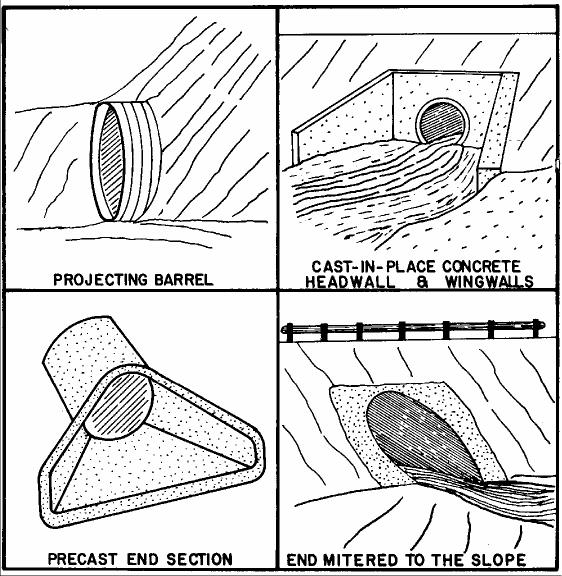
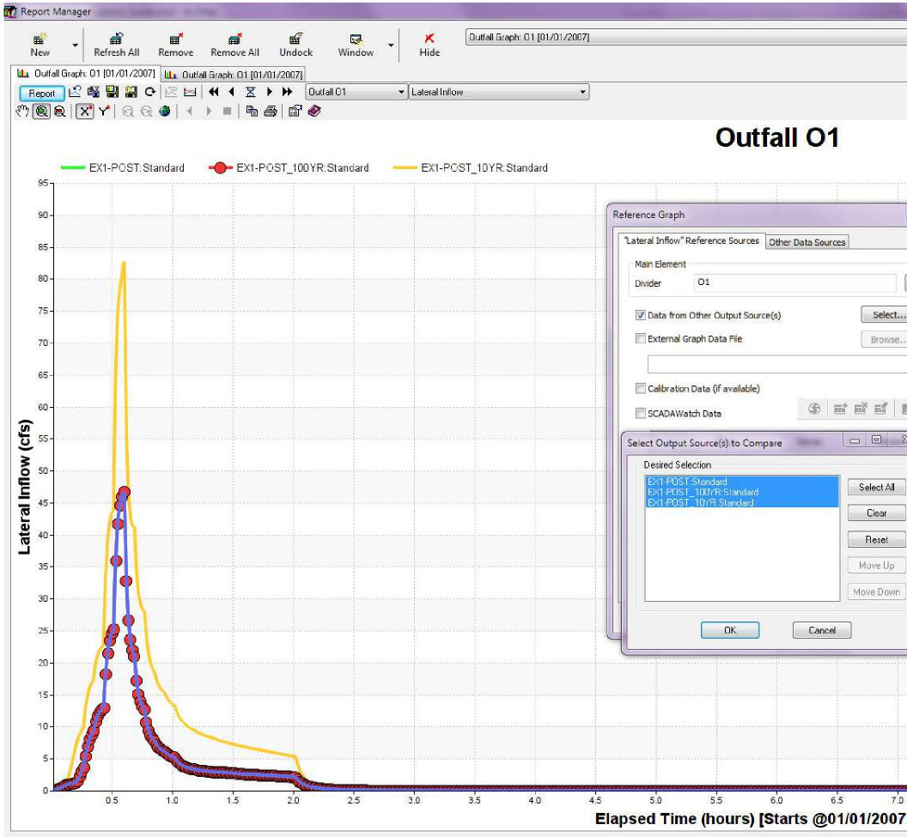
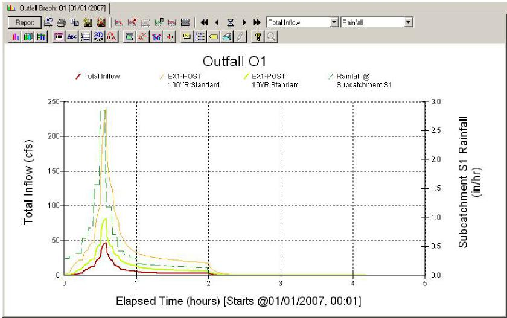
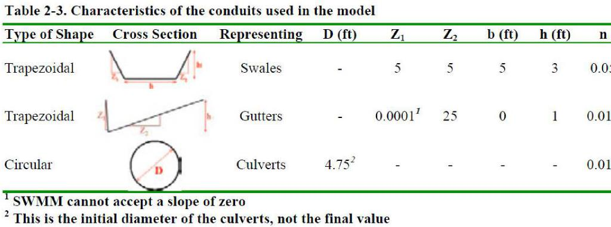
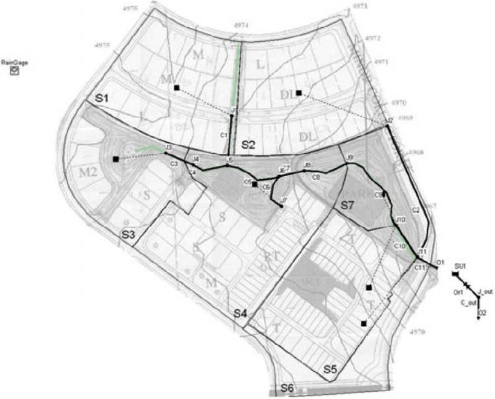
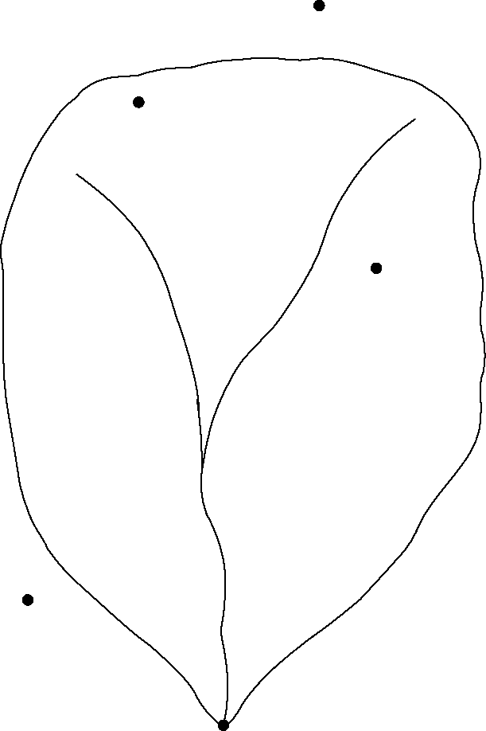
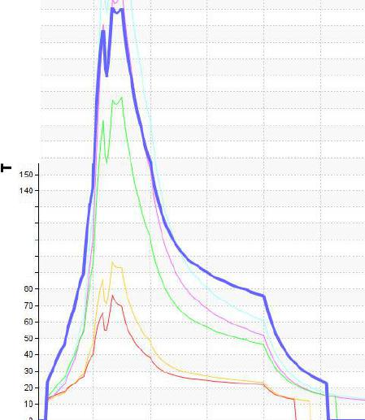
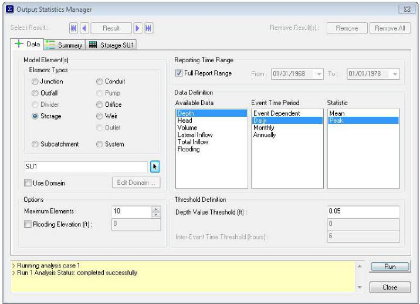
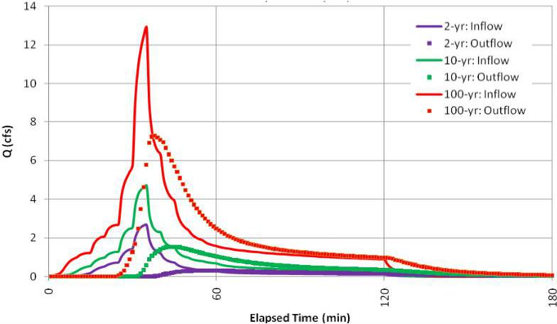

Acknowledgements Page 1 of 129

**Home \> Innovyze SWMM Help File and User Guide \> Innovyze SWMM Application Guide \> Acknowledgements**

**<u>Acknowledgements</u>**

The InfoSWMM . Applications Guide is partially based on the <u>Storm Water Management Model Applications Manua</u>l produced (2009) by the United States Environmental Protection Agency. The original content has been adapted to work within the InfoSWMM software

package and has been expanded to showcase the extended capabilities provided in InfoSWMM .

**APPLICATIONS MANUAL**

By

Jorge Gironás

Larry A. Roesner

Jennifer Davis

Department of Civil and Environmental Engineering

Colorado State University

Fort Collins, CO 80523-1372

Project Officer

Lewis A. Rossman

Water Supply and Water Resources Division

National Risk Management Research Laboratory

Cincinnati, OH 45268

NATIONAL RISK MANAGEMENT RESEARCH LABORATORY

OFFICE OF RESEARCH AND DEVELOPMENT

U.S. ENVIRONMENTAL PROTECTION AGENCY

CINCINNATI, OH 45268

**Home \> Innovyze SWMM Help File and User Guide \> Innovyze SWMM Application Guide \> Introduction and Preface**

**Introduction and Preface to the InfoSWMM Application Guide**

InfoSWMM is a dynamic rainfall-runoff simulation model that computes runoff quantity and quality from primarily urban areas. The runoff component of InfoSWMM operates on a collection of Subcatchment areas that receive precipitation and generate runoff and pollutant loads. The routing portion of InfoSWMM transports this runoff through a system of pipes, channels, storage/treatment devices, pumps and regulators. InfoSWMM tracks the quantity and quality of runoff generated within each Subcatchment and the flow rate, flow depth, and quality of water in each pipe and channel during a simulation period comprised of multiple time steps

The objective of this guide is to serve as a practical application guide for newInfoSWMM users who have already had some previous training in hydrology and hydraulics. It contains nine worked-out examples that illustrate how InfoSWMM can be used to model some of the most common types of stormwater management and design problems encountered in practice. The following applications are discussed in the manual:

1.  Post-Development Runoff. Surface runoff from a 29 acre residential site is computed for several design-storm events under both pre- and post-development conditions.

2.  Surface Drainage Hydraulics. A surface runoff conveyance network is added to the post-development catchment area of Example 1 and is analyzed with InfoSWMM ’s various hydraulic routing options.

3.  Detention Pond Design. A detention pond and outlet structure are designed for the post-development condition of Example 2 that meets both water quality control and peak flow reduction criteria.

4.  Low Impact Development. Two typical Low Impact Development (LID) controls, filter strips and infiltration trenches, are placed within the post-development catchment modeled in Example 2.

5.  Runoff Water Quality. The buildup, washoff and routing of total suspended solids (TSS) is simulated within the post-development catchment modeled in Example 2.

6.  Runoff Treatment. The removal of TSS in the LID controls and detention pond of Examples 3 and 4 is modeled.

7.  Dual Drainage Systems. The surface drainage system of Example 2 is converted into a parallel system of below ground storm sewers and above ground streets and gutters that is subjected to both surcharged flow and street flooding.

8.  Combined Sewer Systems. The sewer system of Example 7 is converted into a combined system that carries both dry weather

10/10/2017

Acknowledgements Page 2 of 129

sanitary flow and wet weather runoff and includes various flow diversion structures and a pumped force main.

9\. Continuous Simulation. InfoSWMM ’s statistical tools are used to analyze the performance of the detention pond designed in

Example 3 over a continuous ten year period of historical rainfall.

> 

All the examples are developed for the same catchment area and each one builds in some degree on the results of a previous example. Therefore, it is recommended that you begin with Example 1 and work sequentially through Example 9, while hopefully building the required input data files and running them with InfoSWMM for each example. You can then compare the model files you build with the worked out example supplied with the guide (*InfoSWMM Applications.mxd*). There are three background images provided that allow you to build the model examples from scratch.

This manual assumes that you have a basic knowledge of how to run InfoSWMM and perform such functions as opening a new project, setting project defaults, adding drainage system objects to a project, editing the properties of these objects, and viewing simulation results. These topics and more are covered in the InfoSWMM MUsers which includes a tutorial example that leads new users through each of these steps.

InfoSWMM is a trademark of Innovyze. ESRI, ArcView, ArcInfo, ArcCatalog, ArcMap, ArcToolbox, ArcGIS, ArcIMS, ArcSDE, ArcObjects, and the ESRI globe logo are trademarks of Environmental Systems Research Institute, Inc. Windows is a registered trademark of Microsoft Corporation. All other names and identified products are trademarks or registered trademarks of their respective holders.

**Home \> Innovyze SWMM Help File and User Guide \> Innovyze SWMM Application Guide \> Example 1. Post-Development Runoff**

**<u>Example 1. Post-Development Runoff</u>**

This first example demonstrates how to construct a hydrologic model of an urban catchment and use it to compare stormwater runoff under both pre- and post-development conditions. It illustrates the process of spatially dividing a catchment into smaller computational units, called Subcatchments, and discusses the characteristics of these Subcatchments that InfoSWMM uses to transform rainfall into runoff. This example considers runoff only. Flow routing of runoff through the drainage pipes and channels contained within the catchment is addressed in Example 2.

Models of this type are very common in practice. Many local stormwater ordinances and agencies require that new developments limit peak runoff flows relative to those under pre-development conditions. To meet environmental sustainability objectives, similar criteria

10/10/2017

Acknowledgements Page 3 of 129

are being applied to total runoff volume as well.

**<u>1.1 Problem Statement</u>**

Figure 1-1 is a contour map of a 29 acre natural catchment area where a new residential development is planned. This undeveloped area is primarily pasture land that has a silt loam soil type. Figure 1-2 shows the proposed development for this site. With the exception of the depressions located in the parkland area, no major changes in topography are expected. This implies that future streets will, in general, follow the natural slope. However, the residential lots will be graded toward the street at a slope of 2% so they can drain easily. The developed site will drain to a stream through a culvert under the street located on the southeast side of the site, which is considered to be the outlet point of the catchment.

The objective is to estimate the stormwater discharges at the catchment’s outlet and compare them to the ones generated prior to urbanization. The approach typically employed in stormwater drainage manuals will be used, which is to compute the hydrologic response of the catchment to a series of synthetic design storms associated with different return periods. The design storms used here will be for a 2-hour event with return periods of 2, 10, and 100 years. Most of the parameter values used in this example were taken from tables published in the InfoSWMM *Users Guide*. These were supplemented with design guidelines published by the Denver Urban Drainage and Flood Control District (UDFCD) (UDFCD, 2001).

Two models will be built: one that represents the catchment in its current undeveloped condition and one that represents the catchment after it is fully developed. Because this is an initial estimation of the discharges at the outlet of the catchment under its current and future conditions, no channelized flows will be defined and only runoff as overland flow will be simulated. Example 2 in this manual will add a conveyance system of swales, channels, and culverts to this model.

**<u>Figure 1-1. Undeveloped site</u>**

10/10/2017

Acknowledgements Page 4 of 129

> 

Figure 1-2. Developed site

**<u>1.2 System Representation</u>**

SWMM is a distributed model, which means that a study area can be subdivided into any number of irregular Subcatchments to best capture the effect that spatial variability in topography, drainage pathways, land cover, and soil characteristics have on runoff generation. An idealized Subcatchment is conceptualized as a rectangular surface that has a uniform slope and a width W that drains to a single outlet channel as shown in Figure 1-3. Each Subcatchment can be further divided into three subareas: an impervious area with depression (detention) storage, an impervious area without depression storage and a pervious area with depression storage. Only the latter area allows for rainfall losses due to infiltration into the soil.

> 

10/10/2017

Acknowledgements Page 5 of 129

> 

Figure 1-3. Idealized representation of a Subcatchment

> 

The hydrologic characteristics of a study area’s Subcatchments are defined by the following set of input parameters in InfoSWMM :

**Area**

This is the area bounded by the Subcatchment boundary. Its value is determined directly from maps or field surveys of the site or by using InfoSWMM Auto-Length tool when the Subcatchment is drawn to scale on InfoSWMM study area map.

**Width**

The width can be defined as the Subcatchment’s area divided by the length of the longest overland flow path that water can travel. If there are several such paths then one would use an average of their lengths to compute a width.

In applying this approach you must be careful not to include channelized flow as part of the flow path. In natural areas, true overland flow can only occur for distances of about 500 feet before it begins to consolidate into rivulet flow. In urbanized catchments, true overland flow can be very short before it is collected into open channels or pipes. A maximum overland flow length of 500 feet is appropriate for non-urban catchments while the typical overland flow length is the length from the back of a representative lot to the center of the street for urban catchments. If the overland flow length varies greatly within the Subcatchment, then an area-weighted average should be used.

Because it is not always easy to accurately identify all of the overland flow paths within a Subcatchment, the width parameter is often regarded as a calibration parameter whose value can be adjusted to produce a good match between observed and computed runoff hydrographs.

**<u>Slope</u>**

This is the slope of the land surface over which runoff flows and is the same for both the pervious and impervious surfaces. It is the slope of what you consider to be the overland flow path or its area-weighted average if there are several such paths in the Subcatchment.

**<u>Imperviousness</u>**

This is the percentage of the Subcatchment area that is covered by impervious surfaces, such as roofs and roadways, through which

10/10/2017

Acknowledgements Page 6 of 129

rainfall cannot infiltrate. Imperviousness tends to be the most sensitive parameter in the hydrologic characterization of a catchment and can range anywhere from 5% for undeveloped areas up to 95% for high-density commercial areas.

**<u>Roughness Coefficient</u>**

The roughness coefficient reflects the amount of resistance that overland flow encounters as it runs off of the Subcatchment surface. Since InfoSWMM uses the Manning equation to compute the overland flow rate, this coefficient is the same as Manning’s roughness coefficient *n*. Separate values are required for the impervious and pervious fractions of a Subcatchment since the pervious *n* is generally an order of magnitude higher than the impervious *n* (e.g., 0.8 for dense wooded areas versus 0.012 for smooth asphalt).

**Depression Storage**

Depression storage corresponds to a volume that must be filled prior to the occurrence of any runoff. Different values can be used for the pervious and impervious areas of a Subcatchment. It represents initial abstractions such as surface ponding, interception by flat roofs and vegetation, and surface wetting. Typical values range between 0.05 inches for impervious surfaces to 0.3 inches for forested areas.

**<u>Percent of Impervious Area Without Depression Storage</u>**

This parameter accounts for immediate runoff that occurs at the beginning of rainfall before depression storage is satisfied. It represents pavement close to the gutters that has no surface storage, pitched rooftops that drain directly to street gutters, new pavement that may not have surface ponding, etc. By default the value of this variable is 25%, but it can be changed in each Subcatchment. Unless special circumstances are known to exist, a percent imperviousness area without depression storage of 25% is recommended.

**Infiltration Model**

Three different methods for computing infiltration loss on the pervious areas of a Subcatchment are available in InfoSWMM. They are the Horton, Green-Ampt and Curve Number models. There is no general agreement on which model is best. The Horton model has a long history of use in dynamic simulations, the Green-Ampt model is more physically-based, and the Curve Number model is derived from (but not the same as) the well-known SCS Curve Number method used in simplified runoff models.

The Horton model will be used in the current example. The parameters for this model include (more information on the Horton method can be found in the InfoSWMM Users Guide and on-line help as well as in the literature):

- Maximum infiltration rate: This is the initial infiltration rate at the start of a storm. It is difficult to estimate since it depends on the antecedent soil moisture conditions. Typical values for dry soils range from 1 in/h for clays to 5 in/h for sands.

- Minimum infiltration rate: This is the limiting infiltration rate that the soil attains when fully saturated. It is usually set equal to the soil’s saturated hydraulic conductivity. The latter has a wide range of values depending on soil type (e.g., from 0.01 in/hr for clays up to 4.7 in/hr for sand).

- Decay coefficient: This parameter determines how quickly the infiltration rate “decays” from the initial maximum value down to

> -1
>
> the minimum value. Typical values range between 2 to 7 hr .

**Precipitation Input**

Precipitation is the principal driving variable in a rainfall-runoff-quantity simulation. The volume and rate of stormwater runoff depends directly on the precipitation magnitude and its spatial and temporal distribution over the catchment. Each Subcatchment in InfoSWMM is linked to a Rain Gage object that describes the format and source of the rainfall input for the Subcatchment.

**<u>1.3 Model Setup – Undeveloped Site</u>**

The InfoSWMM model for the undeveloped site is depicted in Figure 1-4. It consists of a rain gage ‘RAINGAGE’ that provides

precipitation input to a single Subcatchment ‘S0’ whose runoff drains to outfall node ‘O1’. Note that the undeveloped site contour map has been used as a backdrop image on which the Subcatchment outline has been drawn. The corresponding scenario in ‘*InfoSWMM Applications.mxd*’ is **EX1-PRE**.

10/10/2017

Acknowledgements Page 7 of 129

Figure 1-4. InfoSWMM representation of the undeveloped study area  
**<u>Subcatchment Properties</u>**

According to the site’s contour map, its topography is fairly homogenous and no well-defined channels exist within the basin which means that mainly overland flow takes place. There are no roads or other local impervious areas and the type of soil is similar throughout the watershed (Sharpsburg silt loam). Therefore, no disaggregation is required based on the spatial distribution of catchment properties. The single Subcatchment *S0* drains to the free outfall node *O1* whose elevation is 4967 ft.

The area shown in Figure 1-4 is not the entire pre-development natural catchment. It has been bounded by the post-development roadways to come so that comparisons between the two conditions (developed and undeveloped) can be made.

The properties assigned to the single Subcatchment *S0* are summarized in Table 1-1. Their values were developed on the basis of the undeveloped site being primarily pasture land containing a silt loam soil. Parameter values for this soil type can be found in the Info*SWMM Users Guide* and the *UDFCD Guidance Manual*.

The Subcatchment’s area was determined using InfoSWMM’s Auto Area Calculation feature. The Subcatchment width was arrived at by first assuming a maximum overland-flow length of 500 ft, as recommended for undeveloped areas. By the time runoff has travelled this distance it has consolidated into rivulets and therefore no longer behaves as overland flow over a uniform plane. Based on this assumption, the Subcatchment was divided into subareas with flow-path lengths of 500 feet or less. Figure 1-5 shows that there were three such areas whose flow-path lengths are each 500 ft. Thus, the average flow length is also 500 ft. When the total Subcatchment area of 28.94 acres (1,260,626 ft2) is divided by the average flow length the resulting Subcatchment width is 2,521 ft. The average slope of the Subcatchment was derived from the area-weighted average of the slopes of the three sub-areas that comprise the overland flow paths as shown in Figure 1-5 and Table 1-2. Its value is 0.5.

Table 1-1. Properties of the undeveloped Subcatchment

<table>
<colgroup>
<col style="width: 28%" />
<col style="width: 18%" />
<col style="width: 33%" />
<col style="width: 20%" />
</colgroup>
<tbody>
<tr class="odd">
<td><blockquote>

<strong>Property</strong>

</blockquote></td>
<td><blockquote>

<strong>Value</strong>

</blockquote></td>
<td><blockquote>

<strong>Property</strong>

</blockquote></td>
<td><blockquote>

<strong>Value</strong>

</blockquote></td>
</tr>
<tr class="even">
<td><blockquote>

<strong>Area</strong>

</blockquote></td>
<td><blockquote>

<strong>28.94 ac</strong>

</blockquote></td>
<td><blockquote>

<strong>Depression storage, pervious areas</strong>

</blockquote></td>
<td><blockquote>

<strong>0.3 in.</strong>

</blockquote></td>
</tr>
<tr class="odd">
<td><blockquote>

<strong>Width</strong>

</blockquote></td>
<td><blockquote>

<strong>2521 ft</strong>

</blockquote></td>
<td><blockquote>

<strong>Depression storage, impervious area</strong>

</blockquote></td>
<td><blockquote>

<strong>0.06 in.</strong>

</blockquote></td>
</tr>
<tr class="even">
<td><blockquote>

<strong>Slope</strong>

</blockquote></td>
<td><blockquote>

<strong>0.5 %</strong>

</blockquote></td>
<td><blockquote>

<strong>% of impervious area without depression storage</strong>

</blockquote></td>
<td><blockquote>

<strong>25%</strong>

</blockquote></td>
</tr>
<tr class="odd">
<td><blockquote>

<strong>Imperviousness</strong>

</blockquote></td>
<td><blockquote>

<strong>5 %</strong>

</blockquote></td>
<td><blockquote>

<strong>Maximum</strong>

<strong>infiltration rate</strong>

</blockquote></td>
<td><blockquote>

<strong>4.5 in./hr</strong>

</blockquote></td>
</tr>
<tr class="even">
<td><blockquote>

<strong>Roughness</strong>

</blockquote></td>
<td></td>
<td></td>
<td></td>
</tr>
</tbody>
</table>

10/10/2017

Acknowledgements Page 8 of 129

<table>
<colgroup>
<col style="width: 14%" />
<col style="width: 10%" />
<col style="width: 19%" />
<col style="width: 56%" />
</colgroup>
<tbody>
<tr class="odd">
<td><blockquote>

<strong>coefficient, impervious areas</strong>

</blockquote></td>
<td><strong>0.015</strong></td>
<td><blockquote>

<strong>Minimum infiltration rate</strong>

</blockquote></td>
<td><strong>0.2 in./hr</strong></td>
</tr>
</tbody>
</table>

<table>
<colgroup>
<col style="width: 28%" />
<col style="width: 18%" />
<col style="width: 33%" />
<col style="width: 20%" />
</colgroup>
<tbody>
<tr class="odd">
<td><blockquote>

<strong>Roughness coefficient, pervious areas</strong>

</blockquote></td>
<td><strong>0.24</strong></td>
<td><blockquote>

<strong>Infiltration decay coefficient</strong>

</blockquote></td>
<td><strong>6.5 hr-1</strong></td>
</tr>
</tbody>
</table>

> 

Figure 1-5. Computation of width of the undeveloped Subcatchment

The Horton method was selected as the infiltration model for this analysis. The values assigned to its parameters are typical of those for a silt loam soil as found in this watershed and are listed in Table 1-1. It is strongly recommended to use any available site-specific data from the study area BEFORE relying on values from the literature.

Table 1-2. Flow lengths and slopes of the undeveloped Subcatchment

<table>
<colgroup>
<col style="width: 8%" />
<col style="width: 14%" />
<col style="width: 16%" />
<col style="width: 15%" />
<col style="width: 17%" />
<col style="width: 16%" />
<col style="width: 10%" />
</colgroup>
<tbody>
<tr class="odd">
<td><blockquote>

<strong>Sub-Area</strong>

</blockquote></td>
<td>
<strong>Flow Path Length</strong>

<strong>(ft)</strong>
</td>
<td>
<strong>Associated Area (Ai)</strong>

<strong>(ac)</strong>
</td>
<td>
<strong>Upstream Elevation</strong>

<strong>(ft)</strong>
</td>
<td>
<strong>Downstream Elevation</strong>

<strong>(ft)</strong>
</td>
<td>
<strong>Elevation Difference</strong>

<strong>(ft)</strong>
</td>
<td>
<strong>Slope (Si)</strong>

<strong>(%)</strong>
</td>
</tr>
<tr class="even">
<td><blockquote>

<strong>1</strong>

</blockquote></td>
<td><strong>500</strong></td>
<td><strong>11.13</strong></td>
<td><strong>4974.8</strong></td>
<td><strong>4973.0</strong></td>
<td><strong>1.8</strong></td>
<td><strong>0.4%</strong></td>
</tr>
<tr class="odd">
<td><blockquote>

<strong>2</strong>

</blockquote></td>
<td><strong>500</strong></td>
<td><strong>14.41</strong></td>
<td><strong>4973.0</strong></td>
<td><strong>4970.0</strong></td>
<td><strong>3.0</strong></td>
<td><strong>0.6%</strong></td>
</tr>
<tr class="even">
<td><blockquote>

<strong>3</strong>

</blockquote></td>
<td><strong>500</strong></td>
<td><strong>3.40</strong></td>
<td><strong>4970.0</strong></td>
<td><strong>4967.0</strong></td>
<td><strong>3.0</strong></td>
<td><strong>0.6%</strong></td>
</tr>
<tr class="odd">
<td><blockquote>

<strong>Average</strong>

</blockquote></td>
<td><strong>500</strong></td>
<td></td>
<td></td>
<td></td>
<td></td>
<td><strong>0.5%1</strong></td>
</tr>
</tbody>
</table>

> 

**<u>Rain Gage Properties</u>**

The properties of RAINGAGE describe the source and format of the precipitation data that are applied to the study area. In this example, the rainfall data consist of three synthetic design events that represent the 2-, 10- and 100-year storms of 2-hour duration. Each storm is represented by a separate time series object in the InfoSWMM model that consists of rainfall intensities recorded at a 5 minute time-interval. The time series are named 2-yr, 10-yr and 100-yr, respectively and are plotted in Figure 1-6. The total depth of each storm is 1.0, 1.7, and 3.7 inches, respectively. These design storms were selected by the City of Fort Collins, CO to be used with InfoSWMM (City of Fort Collins, 1999).

10/10/2017

Acknowledgements Page 9 of 129

> 

Figure 1-6. Design storm hyetographs

**<u>1.4 Model Results – Undeveloped Site  
Analysis Options</u>**

Table 1-3 shows the analysis options used to run the model. Three runs of the model were made, one for each design storm event. To analyze a particular storm event one only has to change the Series Name property of the rain gage to the rainfall time series of interest. Alternatively, Figure 1-7 shows a separate scenario can be established for running each rainfall event for the undeveloped case for this example.

Each scenario has its own Raingage Set so that RAINGAGE can point to a different rainfall time series for each scenario. Each scenario also uses custom field created in the information tables with a Query Set to ensure that the proper facilities are selected for each scenario.

Table 1-3. Analysis options

<table>
<colgroup>
<col style="width: 30%" />
<col style="width: 20%" />
<col style="width: 48%" />
</colgroup>
<tbody>
<tr class="odd">
<td rowspan="2"><blockquote>

<strong>Option 
Flow units</strong>

</blockquote></td>
<td><blockquote>

<strong>Value</strong>

</blockquote></td>
<td><blockquote>

<strong>Explanation</strong>

</blockquote></td>
</tr>
<tr class="even">
<td><blockquote>

<strong>CFS</strong>

</blockquote></td>
<td><blockquote>

<strong>U.S. customary units used throughout</strong>

</blockquote></td>
</tr>
<tr class="odd">
<td><blockquote>

<strong>Routing Method</strong>

</blockquote></td>
<td><blockquote>

<strong>Kinematic wave</strong>

</blockquote></td>
<td><blockquote>

<strong>Must specify a routing method, but it is not used in the overland flow computations in this example</strong>

</blockquote></td>
</tr>
<tr class="even">
<td><blockquote>

<strong>Start analysis time and date</strong>

</blockquote></td>
<td><blockquote>

<strong>01/01/07 –</strong>

<strong>00:00</strong>

</blockquote></td>
<td><blockquote>

<strong>Not important for single event simulation</strong>

</blockquote></td>
</tr>
<tr class="odd">
<td><blockquote>

<strong>Start reporting time and date</strong>

</blockquote></td>
<td><blockquote>

<strong>01/01/07 –</strong>

<strong>00:00</strong>

</blockquote></td>
<td><blockquote>

<strong>Start reporting results immediately</strong>

</blockquote></td>
</tr>
<tr class="even">
<td><blockquote>

<strong>End analysis time and date</strong>

</blockquote></td>
<td><blockquote>

<strong>01/01/07 –</strong>

<strong>12:00</strong>

</blockquote></td>
<td><blockquote>

<strong>12 hrs. of simulation (storm duration is 2 hrs.)</strong>

</blockquote></td>
</tr>
<tr class="odd">
<td><blockquote>

<strong>Reporting time step</strong>

</blockquote></td>
<td><blockquote>

<strong>1 minute</strong>

</blockquote></td>
<td><blockquote>

<strong>Good level of detail in results for a short simulation</strong>

</blockquote></td>
</tr>
<tr class="even">
<td><blockquote>

<strong>Runoff dry-weather time step</strong>

</blockquote></td>
<td><blockquote>

<strong>1 hour</strong>

</blockquote></td>
<td><blockquote>

<strong>Not important for single event simulation</strong>

</blockquote></td>
</tr>
<tr class="odd">
<td><blockquote>

<strong>Runoff wet-weather time step</strong>

</blockquote></td>
<td><blockquote>

<strong>1 minute</strong>

</blockquote></td>
<td><blockquote>

<strong>Should be less than the rainfall interval</strong>

</blockquote></td>
</tr>
<tr class="even">
<td><blockquote>

<strong>Routing time step</strong>

</blockquote></td>
<td><blockquote>

<strong>1 minute</strong>

</blockquote></td>
<td><blockquote>

<strong>Should not exceed the reporting time step</strong>

</blockquote></td>
</tr>
</tbody>
</table>

10/10/2017

Acknowledgements Page 10 of 129

> 

Figure 1-7. Scenario setup for Example 1 pre-development condition  
**<u>Batch Run</u>**

Instead of simulating the three scenarios separately, the Batch Simulation Manager was used to simulate all three scenarios at the same time. Figure 1-8 shows the setup of the tool to run the appropriate scenarios together.

> 

Figure 1-8. Setup of Batch Simulation Manager to run all three scenarios  
**<u>Simulation Results</u>**

Since all three scenarios have been simulated, there are output results available for all three. Figure 1-9 shows outfall hydrographs for all three scenarios plotted on the same graph. This can be done by opening the outfall hydrograph for the current scenario and then

click the Compare Graph button ( ) and selecting output from the other two simulated scenarios. Rainfall can be plotted on the same graph by clicking the Mix Graph button ( ) and selecting the Graph Data of Another Element option and selecting Subcatchment S0.

Note the significant increase in the peak discharge as the return period increases and how sensitive it is to the rainfall intensity. The rate at which the discharge volume increases is much greater than the rate at which the rainfall volume changes for different return periods. This is because the soil becomes more saturated during larger storms resulting in more of the rainfall becoming runoff.

Table 1-4 compares the peak rainfall intensity, total rainfall, total runoff volume, runoff coefficient, peak runoff discharge and total infiltrated volume for each design storm. Additionally, the last column report Manager.

10/10/2017

Acknowledgements Page 11 of 129

> 

Figure 1-9. Rainfall and outfall hydrograph for three scenarios

Table 1-4. Summary of results for the undeveloped site

<table>
<colgroup>
<col style="width: 10%" />
<col style="width: 12%" />
<col style="width: 12%" />
<col style="width: 12%" />
<col style="width: 11%" />
<col style="width: 11%" />
<col style="width: 14%" />
<col style="width: 15%" />
</colgroup>
<tbody>
<tr class="odd">
<td><blockquote>

<strong>Design Storm</strong>

</blockquote></td>
<td><strong>Peak 
Rainfall 
(in./hr)</strong></td>
<td>
<strong>Total 
Rainfall</strong>

<strong>(in.)</strong>
</td>
<td>
<strong>Runoff 
Volume</strong>

<strong>(in.)</strong>
</td>
<td><strong>Runoff 
Coeff. (%)</strong></td>
<td>
<strong>Peak 
Runoff</strong>

<strong>(cfs)</strong>
</td>
<td>
<strong>Total</strong>

<strong>Infiltration</strong>

<strong>(in.)</strong>
</td>
<td><strong>% of Rainfall 
Infiltrated</strong></td>
</tr>
<tr class="even">
<td><blockquote>

<strong>2-yr</strong>

</blockquote></td>
<td><strong>2.85</strong></td>
<td><strong>0.978</strong></td>
<td><strong>0.047</strong></td>
<td><strong>4.8</strong></td>
<td><strong>4.14</strong></td>
<td><strong>0.93</strong></td>
<td><strong>95.1</strong></td>
</tr>
<tr class="odd">
<td><blockquote>

<strong>10-yr</strong>

</blockquote></td>
<td><strong>4.87</strong></td>
<td><strong>1.711</strong></td>
<td><strong>0.22</strong></td>
<td><strong>13.1</strong></td>
<td><strong>7.34</strong></td>
<td><strong>1.48</strong></td>
<td><strong>86.5</strong></td>
</tr>
<tr class="even">
<td><blockquote>

<strong>100-yr</strong>

</blockquote></td>
<td><strong>9.95</strong></td>
<td><strong>3.669</strong></td>
<td><strong>1.87</strong></td>
<td><strong>50.8</strong></td>
<td><strong>31.6</strong></td>
<td><strong>1.80</strong></td>
<td><strong>49.1</strong></td>
</tr>
</tbody>
</table>

**<u>1.5 Model Setup – Developed Site</u>**

The increase in impervious surface and reduction of overland flow length are the main factors affecting the hydrologic response of a catchment when it becomes urbanized. The reduction in infiltrative surface creates additional surface runoff as well as higher and faster peak discharges. In this section, the runoff hydrology of our example site will be modeled in its post-development condition. The corresponding scenario in ‘*InfoSWMM Applications.mxd*’ is **EX1-POST** with three ‘child’ scenarios, one for each design storm. Again, the focus will be on just the rainfall-runoff transformation and overland flow processes. Routing through channelized elements will be covered in Example 2.

**<u>Catchment Discretization</u>**

In the urbanized catchment there are channelized elements (gutters and swales) that conduct runoff to the site’s outlet. The partitioning

10/10/2017

Acknowledgements Page 12 of 129

of the study area into individual Subcatchments depends not only on the spatial variability in land features but also on the location of the channelized elements. Inspection of the developed site plan for the example study area (see Figure 1-2) suggests that a total of seven Subcatchments would be sufficient to represent both the spatial differences in planned land uses and the location of channelized elements within the site. The Subcatchment boundaries were determined by aggregating together sub-areas whose potential overland flow paths share a common direction and drain to the same collection channel. The resulting discretization is shown in Figure 1-10.

> 

Figure 1-10. Discretization of the developed site into Subcatchments

Figure 1-10 shows all of the Subcatchments discharging their overland flow directly into the watershed’s outlet node, *O1*. In reality, the

discharge outlet of each Subcatchment should be the point where its runoff enters the channelized drainage system. However, since this example ***does not*** consider routing through any channelized elements in the watershed (Example 2 covers this issue) it is acceptable to use the study area’s outlet node (*O1*) as a common outlet for all of the Subcatchments. The elevation of this point is **4962** ft**,** which corresponds to the bottom elevation of a planned culvert under the street.

***<u>Geometric Parameters</u>***

Table 1-5 lists the area, flow path length, width, slope and imperviousness of each Subcatchment. The areas were computed using InfoSWMM’s Auto-Area tool as the outline of each Subcatchment was traced on the scaled backdrop image.

Table 1-5. Geometric properties of the Subcatchments in the developed site

<table>
<colgroup>
<col style="width: 24%" />
<col style="width: 11%" />
<col style="width: 17%" />
<col style="width: 12%" />
<col style="width: 12%" />
<col style="width: 20%" />
</colgroup>
<tbody>
<tr class="odd">
<td><blockquote>

<strong>Subcatchment</strong>

</blockquote></td>
<td><blockquote>

<strong>Area (ac)</strong>

</blockquote></td>
<td>
<strong>Flow 
Length</strong>

<strong>(ft)</strong>
</td>
<td><blockquote>

<strong>Width (ft)</strong>

</blockquote></td>
<td>
<strong>Slope</strong>

<strong>(%)</strong>
</td>
<td><blockquote>

<strong>Percent Impervious</strong>

</blockquote></td>
</tr>
<tr class="even">
<td><blockquote>

<strong>S1</strong>

</blockquote></td>
<td><strong>4.55</strong></td>
<td><strong>125</strong></td>
<td><strong>1587</strong></td>
<td><strong>2.0</strong></td>
<td><strong>56.8</strong></td>
</tr>
<tr class="odd">
<td><blockquote>

<strong>S2</strong>

</blockquote></td>
<td><strong>4.74</strong></td>
<td><strong>125</strong></td>
<td><strong>1653</strong></td>
<td><strong>2.0</strong></td>
<td><strong>63.0</strong></td>
</tr>
<tr class="even">
<td><blockquote>

<strong>S3</strong>

</blockquote></td>
<td><strong>3.74</strong></td>
<td><strong>112</strong></td>
<td><strong>1456</strong></td>
<td><strong>3.1</strong></td>
<td><strong>39.5</strong></td>
</tr>
<tr class="odd">
<td><blockquote>

<strong>S4</strong>

</blockquote></td>
<td><strong>6.79</strong></td>
<td><strong>127</strong></td>
<td><strong>2331</strong></td>
<td><strong>3.1</strong></td>
<td><strong>49.9</strong></td>
</tr>
<tr class="even">
<td><blockquote>

<strong>S5</strong>

</blockquote></td>
<td><strong>4.79</strong></td>
<td><strong>125</strong></td>
<td><strong>1670</strong></td>
<td><strong>2.0</strong></td>
<td><strong>87.7</strong></td>
</tr>
<tr class="odd">
<td><blockquote>

<strong>S6</strong>

</blockquote></td>
<td><strong>1.98</strong></td>
<td><strong>125</strong></td>
<td><strong>690</strong></td>
<td><strong>2.0</strong></td>
<td><strong>95.0</strong></td>
</tr>
<tr class="even">
<td><blockquote>

<strong>S7</strong>

</blockquote></td>
<td><strong>2.33</strong></td>
<td><strong>112</strong></td>
<td><strong>907</strong></td>
<td><strong>3.1</strong></td>
<td><strong>0.0</strong></td>
</tr>
</tbody>
</table>

Figure 1-11 illustrates how the overland flow path length was estimated for Subcatchment S2 which consists entirely of residential lots. This Subcatchment can be represented as a rectangular area with an overland flow length equal to the distance from the back of a typical lot to the middle of the street (125 ft in this case). InfoSWMM’s width parameter can then be computed as the area (4.74 ac = 206,474.4 ft2) divided by the overland flow length, which results in a value of **1650** ft.

In contrast to S2, Subcatchments S3 and S4 contain both residential lots and grass-covered areas. Their overland flow lengths are computed as an area-weighted average of the flow lengths across each type of area as shown in Figure 1-12. Their widths are then found by dividing their areas by their overland flow lengths.

Slopes characterizing overland flow in mostly urbanized Subcatchments will be the lot slope, which is usually about 2%. By way of illustration, Figure 1-12 shows how the slopes of Subcatchments S3 and S4 correspond to the area-weighted average of the slope of the overland flow paths over both the residential lots and the grass-covered areas.

10/10/2017

> Acknowledgements Page 13 of 129
>
> 
>
> Figure 1-11. Definition of overland flow length and slope for Subcatchment *S2*
>
> 
>
> Figure 1-12. Width and slope computation for Subcatchments *S3* (a) and *S4* (b)  
> **<u>Imperviousness</u>**
>
> The imperviousness parameter in InfoSWMM is the *effective* or *directly connected* impervious area, which is typically less than the total imperviousness. The effective impervious area is the impervious area that drains directly to the stormwater conveyance system, e.g. a gutter, pipe or swale. Ideally, the imperviousness should be measured directly in the field or from orthophotographs by determining the percent of land area devoted to roofs, streets, parking lots, driveways, etc. When these observations are not available, it is necessary to use other methods. A conservative approximation that tends to overestimate runoff discharges is to use runoff coefficients as the imperviousness value. A runoff coefficient is an empirical-constant value that represents the percentage of rainfall that becomes runoff. Using the runoff coefficient to represent the percent imperviousness of a Subcatchment results in a higher estimate of impervious area because the value is calculated from the runoff of both the impervious and pervious areas of the Subcatchment. For purely illustrative purposes, runoff coefficients will be used in this example to estimate the imperviousness for each Subcatchment within the developed watershed. The steps involved are as follows:

1.  Identify all of the major land uses that exist within the Subcatchment.

2.  Compute the area *Aj* devoted to each land use *j* in the Subcatchment.

3.  Assign a runoff coefficient *Cj* to each land use category *j*. Typical values are available in drainage criteria and basic literature (see for example UDFCD, 2001; Akan, 2003). Pervious areas are assumed to have a runoff coefficient of 0.

4.  Compute the imperviousness *I* as the area weighted average of the runoff coefficients for all of the land uses in the Subcatchment, *I*

10/10/2017

Acknowledgements Page 14 of 129

*= (*Σ*CjAj)/A*, where *A* is the total area of the Subcatchment.

When this approach is applied to the current example the results listed in Table 1-6 and Table 1-7 are obtained. Table 1-6 displays the various land-use categories that appear in the developed site along with their runoff coefficients. The latter were obtained from the City of Fort Collins Storm Drainage Design Criteria and Construction Standards (City of Fort Collins, (city of Fort Collins, 1984 and 1997). Table 1-7 lists the amount of area devoted to each land use within the site’s Subcatchments. These areas were used to compute a weighted-average runoff coefficient that is used as a surrogate for the imperviousness of the given Subcatchment.

Table 1-6. Land use categories in the developed site

<table>
<colgroup>
<col style="width: 16%" />
<col style="width: 44%" />
<col style="width: 38%" />
</colgroup>
<tbody>
<tr class="odd">
<td><strong>Id</strong></td>
<td><strong>Land Use</strong></td>
<td><strong>Runoff 
coefficient (C)</strong></td>
</tr>
<tr class="even">
<td><strong>M</strong></td>
<td><strong>Medium density</strong></td>
<td><strong>0.65</strong></td>
</tr>
<tr class="odd">
<td><strong>L</strong></td>
<td><strong>Low density</strong></td>
<td><strong>0.45</strong></td>
</tr>
<tr class="even">
<td><strong>DL</strong></td>
<td><strong>Duplex</strong></td>
<td><strong>0.70</strong></td>
</tr>
<tr class="odd">
<td><strong>M2</strong></td>
<td><strong>Medium density</strong></td>
<td><strong>0.65</strong></td>
</tr>
<tr class="even">
<td><strong>S</strong></td>
<td><strong>Apartment, high 
density</strong></td>
<td><strong>0.70</strong></td>
</tr>
<tr class="odd">
<td><strong>RT</strong></td>
<td><strong>Commercial</strong></td>
<td><strong>0.95</strong></td>
</tr>
<tr class="even">
<td><strong>T</strong></td>
<td><strong>Commercial</strong></td>
<td><strong>0.95</strong></td>
</tr>
<tr class="odd">
<td><strong>P</strong></td>
<td><strong>Natural (park)</strong></td>
<td><strong>0</strong></td>
</tr>
</tbody>
</table>

**<u>Remaining Parameters</u>**

The remaining Subcatchment properties for the developed site (roughness coefficients, depression storages, and infiltration parameters) are kept the same as they were for the undeveloped condition. Likewise, the same analysis options were used to run the simulations. Refer to Table 1-1 and Table 1-3 for a listing of the parameter values used in the undeveloped condition.

Table 1-7. Land use coverage (ac) and imperviousness for Subcatchments in the developed site

<table>
<colgroup>
<col style="width: 13%" />
<col style="width: 11%" />
<col style="width: 7%" />
<col style="width: 6%" />
<col style="width: 7%" />
<col style="width: 7%" />
<col style="width: 6%" />
<col style="width: 7%" />
<col style="width: 6%" />
<col style="width: 6%" />
<col style="width: 17%" />
</colgroup>
<tbody>
<tr class="odd">
<td><blockquote>

<strong>Sub-</strong>

<strong>catchment</strong>

</blockquote></td>
<td><blockquote>

<strong>Total Area (ac)</strong>

</blockquote></td>
<td><strong>Area 
M</strong></td>
<td><strong>Area 
L</strong></td>
<td><strong>Area 
DL</strong></td>
<td><strong>Area 
M2</strong></td>
<td><strong>Area 
S</strong></td>
<td><strong>Area 
RT</strong></td>
<td><strong>Area 
T</strong></td>
<td><strong>Area 
P</strong></td>
<td>
<strong>Imperviousness</strong>

<strong>(%)</strong>
</td>
</tr>
<tr class="even">
<td><blockquote>

<strong>S1</strong>

</blockquote></td>
<td><strong>4.55</strong></td>
<td><strong>2.68</strong></td>
<td><strong>1.87</strong></td>
<td><strong>0</strong></td>
<td><strong>0</strong></td>
<td><strong>0</strong></td>
<td><strong>0</strong></td>
<td><strong>0</strong></td>
<td><strong>0</strong></td>
<td><strong>56.8</strong></td>
</tr>
<tr class="odd">
<td><blockquote>

<strong>S2</strong>

</blockquote></td>
<td><strong>4.74</strong></td>
<td><strong>0</strong></td>
<td><strong>1.32</strong></td>
<td><strong>3.42</strong></td>
<td><strong>0</strong></td>
<td><strong>0</strong></td>
<td><strong>0</strong></td>
<td><strong>0</strong></td>
<td><strong>0</strong></td>
<td><strong>63.0</strong></td>
</tr>
<tr class="even">
<td><blockquote>

<strong>S3</strong>

</blockquote></td>
<td><strong>3.74</strong></td>
<td><strong>0</strong></td>
<td><strong>0</strong></td>
<td><strong>0</strong></td>
<td><strong>1.00</strong></td>
<td><strong>1.18</strong></td>
<td><strong>0</strong></td>
<td><strong>0</strong></td>
<td><strong>1.56</strong></td>
<td><strong>39.5</strong></td>
</tr>
<tr class="odd">
<td><blockquote>

<strong>S4</strong>

</blockquote></td>
<td><strong>6.79</strong></td>
<td><strong>0.61</strong></td>
<td><strong>0</strong></td>
<td><strong>0</strong></td>
<td><strong>0</strong></td>
<td><strong>2.05</strong></td>
<td><strong>1.64</strong></td>
<td><strong>0</strong></td>
<td><strong>2.49</strong></td>
<td><strong>49.9</strong></td>
</tr>
<tr class="even">
<td><blockquote>

<strong>S5</strong>

</blockquote></td>
<td><strong>4.79</strong></td>
<td><strong>0</strong></td>
<td><strong>0</strong></td>
<td><strong>0</strong></td>
<td><strong>0</strong></td>
<td><strong>0</strong></td>
<td><strong>0.70</strong></td>
<td><strong>3.72</strong></td>
<td><strong>0.37</strong></td>
<td><strong>87.7</strong></td>
</tr>
<tr class="odd">
<td><blockquote>

<strong>S6</strong>

</blockquote></td>
<td><strong>1.98</strong></td>
<td><strong>0</strong></td>
<td><strong>0</strong></td>
<td><strong>0</strong></td>
<td><strong>0</strong></td>
<td><strong>0</strong></td>
<td><strong>0</strong></td>
<td><strong>1.98</strong></td>
<td><strong>0</strong></td>
<td><strong>95</strong></td>
</tr>
<tr class="even">
<td><blockquote>

<strong>S7</strong>

</blockquote></td>
<td><strong>2.33</strong></td>
<td><strong>0</strong></td>
<td><strong>0</strong></td>
<td><strong>0</strong></td>
<td><strong>0</strong></td>
<td><strong>0</strong></td>
<td><strong>0</strong></td>
<td><strong>0</strong></td>
<td><strong>2.33</strong></td>
<td><strong>0</strong></td>
</tr>
</tbody>
</table>

**<u>1.6 Model Results – Developed Site</u>**

Figure 1-13 shows the outlet hydrographs (the Total Inflow to node *O1*) obtained for each of the design storms under post-development conditions in the study site. As with the pre-development hydrographs, the peak runoff flow occurs close to when the peak rainfall does and there is a significant increase in peak discharge as the return period increases. Unlike the pre-development case, the post-development’s hydrographs show a more rapid decline once the rainfall ceases. This behavior can be attributed to the much larger amount of imperviousness under the post-development condition (57%) as compared to pre-development (5%). Table 1-8 summarizes the results obtained for each design storm in the same fashion that Table 1-4 did for the pre-development condition.

10/10/2017

> Acknowledgements Page 15 of 129
>
> 
>
> Figure 1-13. Rainfall and outfall hydrograph for three scenarios (post-development)  
> Table 1-8. Summary of results for post-development conditions

<table>
<colgroup>
<col style="width: 10%" />
<col style="width: 12%" />
<col style="width: 12%" />
<col style="width: 11%" />
<col style="width: 10%" />
<col style="width: 10%" />
<col style="width: 16%" />
<col style="width: 15%" />
</colgroup>
<tbody>
<tr class="odd">
<td><blockquote>

<strong>Design Storm</strong>

</blockquote></td>
<td><strong>Peak 
Rainfall 
(in./hr)</strong></td>
<td><blockquote>

<strong>Total Rainfall</strong>

</blockquote>

<strong>(in.)</strong>
</td>
<td><blockquote>

<strong>Runoff Volume</strong>

</blockquote>

<strong>(in.)</strong>
</td>
<td><blockquote>

<strong>Runoff Coeff.</strong>

<strong>(%)</strong>

</blockquote></td>
<td><blockquote>

<strong>Peak Runoff</strong>

</blockquote>

<strong>(cfs)</strong>
</td>
<td>
<strong>Total</strong>

<strong>Infiltration</strong>

<strong>(in.)</strong>
</td>
<td><blockquote>

<strong>% of Rainfall Infiltrated</strong>

</blockquote></td>
</tr>
<tr class="even">
<td><blockquote>

<strong>2-yr</strong>

</blockquote></td>
<td><strong>2.85</strong></td>
<td><strong>0.978</strong></td>
<td><strong>0.53</strong></td>
<td><strong>54.5</strong></td>
<td><strong>46.7</strong></td>
<td><strong>0.42</strong></td>
<td><strong>42.9</strong></td>
</tr>
<tr class="odd">
<td><blockquote>

<strong>10-yr</strong>

</blockquote></td>
<td><strong>4.87</strong></td>
<td><strong>1.711</strong></td>
<td><strong>1.11</strong></td>
<td><strong>64.7</strong></td>
<td><strong>82.6</strong></td>
<td><strong>0.58</strong></td>
<td><strong>33.8</strong></td>
</tr>
<tr class="even">
<td><blockquote>

<strong>100- yr</strong>

</blockquote></td>
<td><strong>9.95</strong></td>
<td><strong>3.669</strong></td>
<td><strong>3.04</strong></td>
<td><strong>82.7</strong></td>
<td><strong>241</strong></td>
<td><strong>0.61</strong></td>
<td><strong>16.6</strong></td>
</tr>
</tbody>
</table>

> **<u>Pre- and Post-Development Comparison</u>**
>
> Table 1-9 compares total runoff volumes, runoff coefficients, and peak discharges computed for both the pre- and post-development conditions. For larger storm events, where infiltration plays a minor role in the runoff generation, the responses become more similar between the two cases. Total runoff volume under post-development conditions is approximately 10, 5, and 2 times greater than under pre-development conditions for the 2-yr, 10-yr, and 100-yr storms, respectively. Peak flows are about 10 times greater for both the 2-yr and 10- yr storms but only 7 times greater for the 100-yr event.
>
> Table 1-9. Comparison of runoff for pre- and post-development conditions

<table>
<colgroup>
<col style="width: 16%" />
<col style="width: 21%" />
<col style="width: 9%" />
<col style="width: 12%" />
<col style="width: 7%" />
<col style="width: 11%" />
<col style="width: 7%" />
<col style="width: 12%" />
</colgroup>
<tbody>
<tr class="odd">
<td rowspan="2"><blockquote>

<strong>Design Storm</strong>

</blockquote></td>
<td rowspan="2"><strong>Total Rainfall (in.)</strong></td>
<td colspan="2"><strong>Runoff Volume (in.)</strong></td>
<td colspan="2"><strong>Runoff Coeff. (%)</strong></td>
<td colspan="2"><strong>Peak Runoff (cfs)</strong></td>
</tr>
<tr class="even">
<td colspan="2"><strong>Pre Post</strong></td>
<td colspan="2"><strong>Pre Post</strong></td>
<td colspan="2"><strong>Pre Post</strong></td>
</tr>
<tr class="odd">
<td><blockquote>

2-yr

</blockquote></td>
<td>0.978</td>
<td>0.047</td>
<td>0.53</td>
<td>4.8</td>
<td>54.50</td>
<td>4.14</td>
<td>46.74</td>
</tr>
<tr class="even">
<td><blockquote>

10-yr

</blockquote></td>
<td>1.711</td>
<td>0.22</td>
<td>1.11</td>
<td>13.1</td>
<td>64.70</td>
<td>7.34</td>
<td>82.64</td>
</tr>
<tr class="odd">
<td><blockquote>

100-yr

</blockquote></td>
<td>3.669</td>
<td>1.87</td>
<td>3.04</td>
<td>50.8</td>
<td>82.70</td>
<td>31.6</td>
<td>240.95</td>
</tr>
<tr class="even">
<td></td>
<td></td>
<td></td>
<td></td>
<td></td>
<td></td>
<td></td>
<td></td>
</tr>
</tbody>
</table>

> **<u>1.7 Summary</u>**
>
> This example used InfoSWMM to estimate the runoff response to different rain events for a 29 ac development that will be built in a natural area. Comparisons were made between the runoff peaks and total volume for each event for both pre- and post-developed conditions. The key points illustrated in this example were:

1.  Building an InfoSWMM model for computing runoff requires that a study area be properly partitioned into a collection of smaller Subcatchment areas. These can be determined by examining the potential pathways that runoff can travel as overland flow and the location of the collection channels, both natural and constructed, that serve to intercept this runoff.

2.  Initial estimates of most Subcatchment parameters can be based on published values that are tabulated for various soil types and land uses. The primary exception to this is the width parameter which should be based on the length of the overland-flow path that the runoff travels.

3.  Path lengths for true overland flow should be limited to about 500 ft or to the distance at which a collection channel/pipe is reached if it is less than 500 ft.

4.  Urban development can create large increases in the imperviousness, peak-runoff flow rate, and total-runoff volume. The next case study, Example 2, will further refine the model built in this example by adding a stormwater collection system to it and

10/10/2017

Acknowledgements Page 16 of 129

routing the runoff flows through this system.

**Home \> Innovyze SWMM Help File and User Guide \> Innovyze SWMM Application Guide \> Example 2. Surface Drainage Hydraulics**

**<u>Example 2. Surface Drainage Hydraulics</u>**

Example 1 showed how to construct a hydrologic model of an urban catchment that compared stormwater runoff under both pre- and post-development conditions. Hydraulic routing was not considered. This example will demonstrate how InfoSWMM’s hydraulic elements and flow routing methods are used to model a surface drainage system. A conveyance network will be added to the post-development model built in Example 1 and be sized to pass the 2 hour synthetic storm events with return periods of 2-, 10-, and 100-years. For simplicity, open channels (e.g. swales or gutters) will be used to convey flow. The simple routing network developed in this example will be built upon further in Example 7 where additional open channels and below-ground pipes will be added that are designed according to typical drainage design criteria.

**<u>2.1 Problem Statement</u>**

Figure 2-1 and Figure 2-2 show the InfoSWMM model layouts of the pre- and post-development study area developed in Example 1. In Figure 2-1 the pre-development site was represented by a single Subcatchment whose width parameter was determined by assuming a

maximum overland flow length of 500 ft, as recommended for undeveloped areas. For the developed case (Figure 2-2), the post-development site was discretized into seven Subcatchments, the Subcatchment widths were computed using an area-weighted average of the flow lengths across each type of area, and all Subcatchments discharged their overland flow directly to the site’s outlet, node *O1* (see Section 1.5 of Example 1).

The objective of this example is to add a simple surface drainage system to the post-development site. A system of gutters, grass swales, and culverts will be designed and sized to convey the 100-yr storm. Runoff from three design storms (the 2-, 10- and 100-yr storms) will be routed through this system using the three alternative hydraulic routing methods available in InfoSWMM. The resulting outflow hydrographs at the site’s outlet will be compared to those generated in Example 1 where no hydraulic routing was used.

**<u>2.2 System Representation</u>**

InfoSWMM models a conveyance network as a series of nodes connected by links (Figure 2-3). Links control the rate of flow from one node to the next and are typically conduits (e.g. open channels or pipes) but can also be orifices, weirs or pumps. Nodes define the elevation of the drainage system and the time-varying hydraulic head applied at the end of each link it connects. The flow conveyed through the links and nodes of the model is ultimately discharged to a final node called the outfall. Outfalls can be subjected to alternative hydraulic boundary conditions (e.g. free discharge, fixed water surface, time varying water surface, etc.) when modeled with Dynamic Wave. The properties of these drainage system elements are explained in more detail in the Section 2.3.

10/10/2017

Acknowledgements Page 17 of 129

> 

Figure 2-1. Pre-development site

10/10/2017

> Acknowledgements Page 18 of 129
>
> 
>
> Figure 2-2. Post-development site without conveyance system

10/10/2017

Acknowledgements Page 19 of 129

> 

Figure 2-3. Links and Nodes

Hydraulic routing is the process of combining all inflows that enter the upstream end of each conduit in a conveyance network and transporting these flows to the downstream end over each instance of time. The resulting flows are affected by such factors as conduit storage, backwater, and pipe surcharging. InfoSWMM can perform hydraulic routing by three different methods: *Steady Flow*, *Kinematic Wave* and *Dynamic Wave*. These three methods are summarized below.

- Steady Flow

*Steady Flow* routing is an instantaneous translation of a hydrograph from the upstream end of a conduit to the downstream end with no time delay or change in shape due to conduit storage. *Steady Flow* routing will simply sum the surface runoff from all Subcatchments upstream of the selected node through time.

- Kinematic Wave

Kinematic *Wave* uses the normal flow assumption for routing flows through the conveyance system. In *Kinematic Wave* routing, the slope of the hydraulic grade line is the same as the channel slope. *Kinematic Wave* routing is most applicable to the upstream, dendritic portions of drainage systems where there are no flow restrictions that might cause significant backwater or surcharging. It can be used to approximate flows in non-dendritic systems (i.e., those that have more than one outflow conduit connected to a node) only if “flow divider” nodes are used.

- Dynamic Wave

*Dynamic Wave* routing is the most powerful of the flow routing methods because it solves the complete one-dimensional Saint Venant equations of flow for the entire conveyance network. This method can simulate all gradually-varied flow conditions observed in urban drainage systems such as backwater, surcharged flow and flooding. *Dynamic Wave* can simulate looped conduit systems and junctions with more than one link connected downstream (bifurcated systems). The ability to simulate bifurcated systems allows one to model pipes and gutters in parallel; this more advanced level of modeling will be described in Example 7.

**<u>2.3 Hydraulic Elements in InfoSWMM</u>**

All hydraulic elements modeled in InfoSWMM are classified as either nodes or links. The hierarchy of these elements is shown in Figure 2-4 along with both the required and optional properties that characterize each element’s hydraulic behavior.

**<u>2.4 Model Setup  
System Layout</u>**

Figure 2-5 shows the layout of the runoff conveyance system that will be added to the developed site. It consists of 7 grass swales, 3 culverts, and one street gutter. The objective in this example is to estimate the discharges at the outlet of the site and not design all of the elements within the entire drainage system. For this reason, only the main surface conduits that route runoff to the outlet in the aggregated model will be considered. These will purposely be oversized to ensure that all the generated runoff is conveyed to the outlet and that no flooding occurs within the site (see Example 7 for an analysis of surcharged pipes and flooded junctions). The starting point for building this model is the scenario ‘**EX1-POST**’ that was created in Example 1.

10/10/2017

Acknowledgements Page 20 of 129

In Example 1, the Subcatchment widths were set to properly represent the overland flow process. All the Subcatchments were directly connected to the outlet of the study area; flows through channels were not modeled. In this example, the Subcatchment properties will remain the same as defined previously, but conduits representing the channelized flow throughout the site will be added into the model.

The definition of the conveyance system begins by specifying the location of its nodes (or junctions). A node is required wherever runoff enters the conveyance system, whenever two or more channels connect and where the channel slope or cross section changes significantly. They are also required at locations with weirs, orifices, pumps, storage, etc. (see Example 3 where orifices and weirs are used as outlets to a storage unit). The locations of the nodes for this example are shown in Figure 2-6. They are labeled J1 through J11.

The invert elevation of each node (i.e., the elevation at the bottom of the lowest connecting channel) is shown in Table 2-1.

> 

Figure 2-4. Characteristics of hydraulic elements in InfoSWMM

10/10/2017

Acknowledgements Page 21 of 129

> 

Figure 2-5. Post-development site with runoff conveyance added

The definition of the conveyance system continues by adding the feeder channels *C1, C2* and *C6* that convey runoff into the main drainage way that runs through the undeveloped park area of the site. Conduit *C1* is a grass swale that drains Subcatchment *S1*’s runoff to the watershed’s main drainage way; Conduit *C2* is a gutter that carries Subcatchment *S2*’s runoff to the upstream end of the culvert (*C11*) that discharges to the site’s outlet (*O1*); conduit *C6* carries runoff from Subcatchment *S4* into culvert *C7*. At this point, the elevations of the bottom bed of these channels correspond to the invert elevations of their respective upstream and downstream junctions. Their lengths are automatically determined by drawing them with Auto-Length turned on. InfoSWMM uses this information to compute the slope of each channel.

10/10/2017

> Acknowledgements Page 22 of 129

Figure 2-6. InfoSWMM representation of the post-development conveyance system  
Table 2-1. Invert elevations of junctions

<table>
<colgroup>
<col style="width: 38%" />
<col style="width: 61%" />
</colgroup>
<tbody>
<tr class="odd">
<td colspan="2">
<strong>Junction Invert Elevation</strong>

<strong>ID (ft)</strong>
</td>
</tr>
<tr class="even">
<td><strong>J1</strong></td>
<td><strong>4973.0</strong></td>
</tr>
<tr class="odd">
<td><strong>J2</strong></td>
<td><strong>4969.0</strong></td>
</tr>
<tr class="even">
<td><strong>J3</strong></td>
<td><strong>4973.0</strong></td>
</tr>
<tr class="odd">
<td><strong>J4</strong></td>
<td><strong>4971.0</strong></td>
</tr>
<tr class="even">
<td><strong>J5</strong></td>
<td><strong>4969.8</strong></td>
</tr>
<tr class="odd">
<td><strong>J6</strong></td>
<td><strong>4969.0</strong></td>
</tr>
<tr class="even">
<td><strong>J7</strong></td>
<td><strong>4971.5</strong></td>
</tr>
<tr class="odd">
<td><strong>J8</strong></td>
<td><strong>4966.5</strong></td>
</tr>
<tr class="even">
<td><strong>J9</strong></td>
<td><strong>4964.8</strong></td>
</tr>
<tr class="odd">
<td><strong>J10</strong></td>
<td><strong>4963.8</strong></td>
</tr>
<tr class="even">
<td><strong>J11</strong></td>
<td><strong>4963.0</strong></td>
</tr>
</tbody>
</table>

Finally, the remaining conduits *C3* through *C11* that comprise the main drainage way through the park to the outlet need to be defined. As before, they connect to their end nodes with no vertical offset and the Auto-Length tool is used to compute their lengths. Subcatchments *S3* through *S7* drain to different locations of the main drainage channel. *S3* drains to the culvert (*C3*) at the beginning of the main drainage channel, *S4* drains to the swale *C6* that connects to the second culvert (*C7*) on the main drainage channel, *S7* and *S5* drain to the main drainage channel at *J10*, and *S6* drains directly to the last culvert (*C11*) on the main drainage channel. Table 2-2 summarizes the outlet junction and conduit associated with each Subcatchment.

Table 2-2. Subcatchment outlets

<table>
<colgroup>
<col style="width: 12%" />
<col style="width: 13%" />
<col style="width: 73%" />
</colgroup>
<tbody>
<tr class="odd">
<td><strong>Subcatchment</strong></td>
<td><strong>Outlet 
Junction</strong></td>
<td><blockquote>

<strong>Outlet Conduit</strong>

</blockquote></td>
</tr>
</tbody>
</table>

> **S1 J1 C1 (Swale)**
>
> **S2 J2 C2 (Gutter)**

10/10/2017

Acknowledgements Page 23 of 129

<table>
<colgroup>
<col style="width: 34%" />
<col style="width: 32%" />
<col style="width: 32%" />
</colgroup>
<tbody>
<tr class="odd">
<td><strong>S3</strong></td>
<td><strong>J3</strong></td>
<td><strong>C3 (Culvert)</strong></td>
</tr>
<tr class="even">
<td><strong>S4</strong></td>
<td><strong>J7</strong></td>
<td><strong>C6 (Swale)</strong></td>
</tr>
<tr class="odd">
<td><strong>S5</strong></td>
<td><strong>J10</strong></td>
<td><strong>C10 (Swale)</strong></td>
</tr>
<tr class="even">
<td><strong>S6</strong></td>
<td><strong>J11</strong></td>
<td>
<strong>C11</strong>

<strong>(Culvert)</strong>
</td>
</tr>
<tr class="odd">
<td><strong>S7</strong></td>
<td><strong>J10</strong></td>
<td><strong>C10 (Swale)</strong></td>
</tr>
</tbody>
</table>

Note that the conveyance system modeled in this example (Figure 2-6) ignores the storage and transport provided by the street gutters within each Subcatchment. In some applications, however, these conveyance elements can play a significant role and should be represented, perhaps by adding a channel within each Subcatchment that represents the aggregated effects of routing through all of its street segments. To keep the example simple, this level of detail is not included and only the major drainage channels within the site are considered.

**<u>System Properties</u>**

Properties can now be assigned to the conduits and junctions that have been defined. Table 2-3 shows the cross-sectional shapes of the three conduit types used in this example. The swale side slopes (Z1 and Z2 (horizontal:vertical)), roughness coefficient (n), bottom width (b) and height (h) of the swale section are as recommended by the UDFCD Manual (2001). The gutter cross-slopes (Z1 and Z2), roughness coefficient (n), bottom width (b) and height (h) are based on typical design practice. The culvert diameters will be sized as described in the next section to convey runoff from the 100year storm.

Table 2-4 shows the InfoSWMM properties assigned to each conduit. Conduit lengths were computed using the Auto-Length option. The inlet and outlet offset of all the conduits, with one exception, were set to zero which means that the bottom elevation of each conduit coincides with the elevation of its inlet and outlet junctions. The exception is conduit C2 (the gutter), whose outlet offset of 4 ft represents the difference in elevation between the bottom of the gutter and the channel bed in the park. The diameters of the three circular culverts will be determined in the next section.

> 

Table 2-4. Conduit properties

<table>
<colgroup>
<col style="width: 11%" />
<col style="width: 11%" />
<col style="width: 10%" />
<col style="width: 10%" />
<col style="width: 10%" />
<col style="width: 9%" />
<col style="width: 12%" />
<col style="width: 11%" />
<col style="width: 12%" />
</colgroup>
<tbody>
<tr class="odd">
<td><blockquote>

<strong>Conduit ID</strong>

</blockquote></td>
<td>
<strong>Type 
of</strong>

<blockquote>

<strong>Conduit</strong>

</blockquote></td>
<td><strong>Inlet 
Node</strong></td>
<td><blockquote>

<strong>Outlet Node</strong>

</blockquote></td>
<td><blockquote>

<strong>Length (ft)</strong>

</blockquote></td>
<td>
<strong>h (ft) 
or D</strong>

<strong>(ft)</strong>
</td>
<td><strong>b (ft)</strong></td>
<td><strong>Z1</strong></td>
<td><strong>Z2</strong></td>
</tr>
<tr class="even">
<td><blockquote>

<strong>C1</strong>

</blockquote></td>
<td><blockquote>

<strong>Swale</strong>

</blockquote></td>
<td><strong>J1</strong></td>
<td><strong>J5</strong></td>
<td><strong>185</strong></td>
<td><strong>3</strong></td>
<td><strong>5</strong></td>
<td><strong>5</strong></td>
<td><strong>5</strong></td>
</tr>
<tr class="odd">
<td><blockquote>

<strong>C2</strong>

</blockquote></td>
<td><blockquote>

<strong>Gutter</strong>

</blockquote></td>
<td><strong>J2</strong></td>
<td><strong>J11</strong></td>
<td><strong>526</strong></td>
<td><strong>1</strong></td>
<td><strong>0</strong></td>
<td><strong>.0001</strong></td>
<td><strong>25</strong></td>
</tr>
<tr class="even">
<td><blockquote>

<strong>C3</strong>

</blockquote></td>
<td><blockquote>

<strong>Culvert</strong>

</blockquote></td>
<td><strong>J3</strong></td>
<td><strong>J4</strong></td>
<td><strong>109</strong></td>
<td><strong>TBD</strong></td>
<td><strong>-</strong></td>
<td><strong>-</strong></td>
<td><strong>-</strong></td>
</tr>
<tr class="odd">
<td><blockquote>

<strong>C4</strong>

</blockquote></td>
<td><blockquote>

<strong>Swale</strong>

</blockquote></td>
<td><strong>J4</strong></td>
<td><strong>J5</strong></td>
<td><strong>133</strong></td>
<td><strong>3</strong></td>
<td><strong>5</strong></td>
<td><strong>5</strong></td>
<td><strong>5</strong></td>
</tr>
<tr class="even">
<td><blockquote>

<strong>C5</strong>

</blockquote></td>
<td><blockquote>

<strong>Swale</strong>

</blockquote></td>
<td><strong>J5</strong></td>
<td><strong>J6</strong></td>
<td><strong>207</strong></td>
<td><strong>3</strong></td>
<td><strong>5</strong></td>
<td><strong>5</strong></td>
<td><strong>5</strong></td>
</tr>
<tr class="odd">
<td><blockquote>

<strong>C6</strong>

</blockquote></td>
<td><blockquote>

<strong>Swale</strong>

</blockquote></td>
<td><strong>J7</strong></td>
<td><strong>J6</strong></td>
<td><strong>140</strong></td>
<td><strong>3</strong></td>
<td><strong>5</strong></td>
<td><strong>5</strong></td>
<td><strong>5</strong></td>
</tr>
<tr class="even">
<td><blockquote>

<strong>C7</strong>

</blockquote></td>
<td><blockquote>

<strong>Culvert</strong>

</blockquote></td>
<td><strong>J6</strong></td>
<td><strong>J8</strong></td>
<td><strong>95</strong></td>
<td><strong>TBD</strong></td>
<td><strong>-</strong></td>
<td><strong>-</strong></td>
<td><strong>-</strong></td>
</tr>
<tr class="odd">
<td><blockquote>

<strong>C8</strong>

</blockquote></td>
<td><blockquote>

<strong>Swale</strong>

</blockquote></td>
<td><strong>J8</strong></td>
<td><strong>J9</strong></td>
<td><strong>166</strong></td>
<td><strong>3</strong></td>
<td><strong>5</strong></td>
<td><strong>5</strong></td>
<td><strong>5</strong></td>
</tr>
<tr class="even">
<td><blockquote>

<strong>C9</strong>

</blockquote></td>
<td><blockquote>

<strong>Swale</strong>

</blockquote></td>
<td><strong>J9</strong></td>
<td><strong>J10</strong></td>
<td><strong>320</strong></td>
<td><strong>3</strong></td>
<td><strong>5</strong></td>
<td><strong>5</strong></td>
<td><strong>5</strong></td>
</tr>
<tr class="odd">
<td><blockquote>

<strong>C10</strong>

</blockquote></td>
<td><blockquote>

<strong>Swale</strong>

</blockquote></td>
<td><strong>J10</strong></td>
<td><strong>J11</strong></td>
<td><strong>145</strong></td>
<td><strong>3</strong></td>
<td><strong>5</strong></td>
<td><strong>5</strong></td>
<td><strong>5</strong></td>
</tr>
<tr class="even">
<td><blockquote>

C11

</blockquote></td>
<td><blockquote>

Culvert

</blockquote></td>
<td>J11</td>
<td>O1</td>
<td>89</td>
<td>TBD</td>
<td>-</td>
<td>-</td>
<td>-</td>
</tr>
</tbody>
</table>

**TBD = To Be Determined**

Because the conduits are all surface channels and not buried pipes, it is sufficient to set the maximum depth of all the junctions as zero. This will cause InfoSWMM to automatically set the depth of each junction as the distance from the junction’s invert to the top of the highest conduit connected to it. Thus, junction flooding (the only flooding allowed by InfoSWMM) will occur when the channel capacity is exceeded. Finally, the outfall node *O1* is defined as a **free outfall** with an elevation of **4962** ft. The resulting scenario in ‘*InfoSWMM*

10/10/2017

Acknowledgements Page 24 of 129

*Applications.mxd*’ is **EX2-POST**.

**2.5 Model Results  
<u>Culvert Sizing </u>**

Before InfoSWMM’s alternative routing methods are compared, the diameters of the three culverts in the conveyance system must be determined. This is done by finding the smallest available size for each culvert from those listed in Table 2-5 that will convey the runoff from the 100-year, 2-hr design storm without any flooding. This process involves the following steps:

1.  Start with each culvert at the largest available diameter.

2.  Make a series of InfoSWMM runs, reducing the size of conduit *C3* until flooding occurs. Set the size of *C3* to the next larger diameter.

3.  Repeat this process for conduit *C7* and then for *C11*.

Note that one proceeds systematically from upstream to downstream, making sure that each culvert in turn is just big enough to handle the flow generated upstream of it. This procedure is appropriate because there is no flooding under the baseline condition (with the culverts at their maximum possible size). The approach should not necessarily be applied when pipe diameters have to be enlarged (or when there is flooding under the baseline condition). It is very common to find design situations in which changes downstream have significant effects upstream, so that a minor change in the diameter of a pipe located downstream may solve flooding problems upstream.

Table 2-5. Available culvert sizes

<table style="width:100%;">
<colgroup>
<col style="width: 12%" />
<col style="width: 12%" />
<col style="width: 12%" />
<col style="width: 12%" />
<col style="width: 12%" />
<col style="width: 12%" />
<col style="width: 12%" />
<col style="width: 12%" />
</colgroup>
<tbody>
<tr class="odd">
<td><blockquote>

<strong>Diameter (ft)</strong>

</blockquote></td>
<td><blockquote>

<strong>Diameter (in)</strong>

</blockquote></td>
<td><blockquote>

<strong>Diameter (ft)</strong>

</blockquote></td>
<td><blockquote>

<strong>Diameter (in)</strong>

</blockquote></td>
<td><blockquote>

<strong>Diameter (ft)</strong>

</blockquote></td>
<td><blockquote>

<strong>Diameter (in)</strong>

</blockquote></td>
<td><blockquote>

<strong>Diameter (ft)</strong>

</blockquote></td>
<td><blockquote>

<strong>Diameter (in)</strong>

</blockquote></td>
</tr>
<tr class="even">
<td><strong>1.00</strong></td>
<td><strong>12</strong></td>
<td><strong>2.00</strong></td>
<td><strong>24</strong></td>
<td><strong>3.00</strong></td>
<td><strong>36</strong></td>
<td><strong>4.00</strong></td>
<td><strong>48</strong></td>
</tr>
<tr class="odd">
<td><strong>1.25</strong></td>
<td><strong>15</strong></td>
<td><strong>2.25</strong></td>
<td><strong>27</strong></td>
<td><strong>3.25</strong></td>
<td><strong>39</strong></td>
<td><strong>4.25</strong></td>
<td><strong>51</strong></td>
</tr>
<tr class="even">
<td><strong>1.50</strong></td>
<td><strong>18</strong></td>
<td><strong>2.50</strong></td>
<td><strong>30</strong></td>
<td><strong>3.50</strong></td>
<td><strong>42</strong></td>
<td><strong>4.50</strong></td>
<td><strong>54</strong></td>
</tr>
<tr class="odd">
<td><strong>1.75</strong></td>
<td><strong>21</strong></td>
<td><strong>2.75</strong></td>
<td><strong>33</strong></td>
<td><strong>3.75</strong></td>
<td><strong>45</strong></td>
<td><strong>4.75</strong></td>
<td><strong>57</strong></td>
</tr>
</tbody>
</table>

These culvert-sizing runs are made using the **EX2-POST_100YR** scenario with the routing method set to **KW** (*Kinematic Wave*), the Rain Gage’s time series set to **100-yr**, and the following set of time steps: **1** minute for reporting, **1** h for dry weather, **1** minute for wet weather and **15** s for routing. Note that the routing time step is somewhat stringent for the drainage system being modeled and the routing method used (*KW*). It is used here, however, because *Dynamic Wave* routing will be used later in this example and it typically requires smaller time steps than *Kinematic Wave* to produce stable results. If just *KW* routing were used for this model, the routing time step could probably be safely set to 1 minute (see sidebar “*<u>A Note About Time Steps</u>*”). The presence or absence of flooding is

determined by examining the *Node Flooding Summary* section of a run’s *Status Report*. Open the Status Report by clicking the ( ) button from the Run Manager. Information on flooding can also be obtained from any of the node summary reports available within Report Manager.

After making these sizing runs with **EX2-POST_100YR**, the final diameters selected for the culverts are **2.25** ft for C3, **3.5** ft for C7, and **4.75** ft for C11. Table 2-6 lists the fraction that each conduit is full and the fraction of its full Manning flow that is reached under peak flow conditions for the 100-year event. These values are available from the Link Flow Summary table of InfoSWMM’s *Status Report* (or the *Conduit Summary* report in Report Manager)

**<u>A Note About Time Steps</u>**

InfoSWMM, H2OMap SWMM and SWMM5 requires that four time steps be specified: runoff time steps for both wet weather and dry weather, a flow routing time step, and a reporting time step. The most common error new users make is to use time steps that are too long. The runoff wet weather time step should not exceed the precipitation recording interval. The flow routing time step should never be larger than the wet weather time step, and in most cases should be 1 to 5 minutes (or less) for *Kinematic Wave* routing and 30 s (or less) for *Dynamic Wave* routing. *Dynamic Wave* routing can also employ a *Variable Time Step* option that automatically lowers the time step during periods when flows change rapidly. High continuity errors typically result when runoff or routing time steps are too large. If the reporting time step is set too high important details in the output results might be missed. Setting the reporting time step equal to the routing time step helps prevent this, but can generate very large output files. Starting with smaller time steps, users can experiment with larger time steps to find one that produces acceptably accurate results most efficiently.

**<u>Comparison of Routing Methods</u>**

Having adequately sized the culverts, the model is next run using all three routing methods (*Steady Flow, Kinematic Wave*, and *Dynamic Wave*) to obtain the outlet discharges which are then graphed by design storm along with the discharges found from Example 1. Figures 2-6, 2-7 and 2-8 show the outflow hydrographs (Total Inflow to node *O1*) generated for each design storm using all three hydraulic routing methods (values from Example 1 show up as ‘Total Inflow’ in the legend). As in Example 1, these graphs were created by first exporting the pertinent InfoSWMM results for each run to a spreadsheet and then using the spreadsheet’s graphing tools. For *Steady Flow* routing the outlet flows are identical to the flows generated in Example 1 (shown as a dotted line) except for the case of the 100-yr design storm which produced flooding within the system, This is because the discharge that appears at the outlet of each Subcatchment in *Steady Flow* routing instantaneously appears at the site outlet where it is added to the discharges of the other Subcatchments of the watershed. Thus, *Steady Flow* routing produces results at the site outlet that would have been generated had no channels been simulated in the model.

Table 2-6. Max. depths and flows for conduits during the 100-yr event

|     |             |             |
|-----|-------------|-------------|
|     | **Maximum** | **Maximum** |
|     |             |             |
|     |             |             |

10/10/2017

Acknowledgements Page 25 of 129

<table>
<colgroup>
<col style="width: 31%" />
<col style="width: 36%" />
<col style="width: 32%" />
</colgroup>
<tbody>
<tr class="odd">
<td><blockquote>

<strong>Conduit ID</strong>

</blockquote></td>
<td><strong>Depth Full 
Depth</strong></td>
<td><strong>Flow Full 
Flow</strong></td>
</tr>
<tr class="even">
<td><blockquote>

<strong>C1</strong>

</blockquote></td>
<td><strong>0.37</strong></td>
<td><strong>0.11</strong></td>
</tr>
<tr class="odd">
<td><blockquote>

<strong>C2</strong>

</blockquote></td>
<td><strong>0.96</strong></td>
<td><strong>0.94</strong></td>
</tr>
<tr class="even">
<td><blockquote>

<strong>C3</strong>

</blockquote></td>
<td><strong>0.70</strong></td>
<td><strong>0.83</strong></td>
</tr>
<tr class="odd">
<td><blockquote>

<strong>C4</strong>

</blockquote></td>
<td><strong>0.38</strong></td>
<td><strong>0.12</strong></td>
</tr>
<tr class="even">
<td><blockquote>

<strong>C5</strong>

</blockquote></td>
<td><strong>0.67</strong></td>
<td><strong>0.41</strong></td>
</tr>
<tr class="odd">
<td><blockquote>

<strong>C6</strong>

</blockquote></td>
<td><strong>0.44</strong></td>
<td><strong>0.16</strong></td>
</tr>
<tr class="even">
<td><blockquote>

<strong>C7</strong>

</blockquote></td>
<td><strong>0.71</strong></td>
<td><strong>0.85</strong></td>
</tr>
<tr class="odd">
<td><blockquote>

<strong>C8</strong>

</blockquote></td>
<td><strong>0.70</strong></td>
<td><strong>0.44</strong></td>
</tr>
<tr class="even">
<td><blockquote>

<strong>C9</strong>

</blockquote></td>
<td><strong>0.88</strong></td>
<td><strong>0.76</strong></td>
</tr>
<tr class="odd">
<td><blockquote>

<strong>C10</strong>

</blockquote></td>
<td><strong>0.88</strong></td>
<td><strong>0.75</strong></td>
</tr>
<tr class="even">
<td><blockquote>

<strong>C11</strong>

</blockquote></td>
<td><strong>0.78</strong></td>
<td><strong>0.95</strong></td>
</tr>
</tbody>
</table>

Regarding flooding, the *Steady Flow* method indicates potential for flooding in the system by computing the flow depth in the conduits using Mannings equation; if this depth exceeds the channel capacity, the flow is truncated to the full-flow capacity of the conduit and flooding is reported. Figure 2-9 shows this difference between the outlet discharges generated by the *Steady Flow* routing method and the simulation without routing when flooding does occur.

The other two routing methods, *Kinematic* and *Dynamic Wave*, both produce a time-lag and area reduction in the peak flow, spreading the volume of the outlet hydrograph out over time. These effects are more pronounced under *Dynamic Wave* routing because it accounts for backwater that can increase even further the storage utilized within the conveyance system.

> 

10/10/2017

Acknowledgements Page 28 of 129

Figure 2-9. Post-development outflow hydrographs for 100-yr storm

Table 2-7compares total runoff volumes, runoff coefficients, and peak discharges at the outlet computed for the post-development model without routing (from Example 1) and with *Dynamic Wave* (*DW*) routing from this example. These values come directly from InfoSWMM ’s *Status Report*. In terms of runoff volumes and coefficients, the results obtained with routing are identical to those found in Example 1 where no hydraulic routing was considered. The effects of routing are observed in the comparison of peak flows, which decrease when routing is considered. In the case of this example, peaks produced with *Dynamic Wave* routing are 28.7% smaller for the 2-yr storm, 24.8% smaller for the 10-yr storm and 32.4% smaller for the 100-yr storm in comparison to the peaks produced when no routing was considered.

Table 2-7. Comparison of runoff for post-development conditions with and without routing

<table>
<colgroup>
<col style="width: 16%" />
<col style="width: 17%" />
<col style="width: 11%" />
<col style="width: 7%" />
<col style="width: 15%" />
<col style="width: 8%" />
<col style="width: 15%" />
<col style="width: 9%" />
</colgroup>
<tbody>
<tr class="odd">
<td rowspan="2"><blockquote>

<strong>Design Storm</strong>

</blockquote></td>
<td rowspan="2"><blockquote>

<strong>Total Rainfall (in.)</strong>

</blockquote></td>
<td colspan="2"><blockquote>

<strong>Runoff Volume (in.)</strong>

</blockquote></td>
<td colspan="2"><strong>Runoff Coeff. (%)</strong></td>
<td colspan="2"><strong>Peak Runoff (cfs)</strong></td>
</tr>
<tr class="even">
<td>
<strong>No</strong>

<strong>Routing1</strong>
</td>
<td><strong>DW</strong></td>
<td><strong>No Routing1</strong></td>
<td><strong>DW</strong></td>
<td><strong>No Routing1</strong></td>
<td><strong>DW</strong></td>
</tr>
<tr class="odd">
<td><blockquote>

<strong>2-yr</strong>

</blockquote></td>
<td><strong>0.978</strong></td>
<td><strong>0.53</strong></td>
<td><strong>0.53</strong></td>
<td><strong>54.50</strong></td>
<td><strong>54.50</strong></td>
<td><strong>46.74</strong></td>
<td><strong>33.42</strong></td>
</tr>
<tr class="even">
<td rowspan="2"><blockquote>

<strong>10-yr 
100-yr</strong>

</blockquote></td>
<td><strong>1.711</strong></td>
<td><strong>1.11</strong></td>
<td><strong>1.11</strong></td>
<td><strong>64.70</strong></td>
<td><strong>64.70</strong></td>
<td><strong>82.64</strong></td>
<td><strong>62.22</strong></td>
</tr>
<tr class="odd">
<td><strong>3.669</strong></td>
<td><strong>3.04</strong></td>
<td><strong>3.04</strong></td>
<td><strong>82.70</strong></td>
<td><strong>82.70</strong></td>
<td><strong>240.95</strong></td>
<td><strong>164.07</strong></td>
</tr>
</tbody>
</table>

1Results from EX1-POST scenario group  
**<u>2.6 Summary</u>**

10/10/2017

Acknowledgements Page 29 of 129

This example introduced the use of hydraulic routing in InfoSWMM . It demonstrated how a surface runoff collection system is laid out, how to size the elements of this system, and the effect that routing of runoff flows through this system has on the catchment’s outlet hydrograph. Comparisons were made between the runoff peaks and total volume for different design storm events using each of InfoSWMM ’s three routing options as well as with no routing. The key points illustrated in this example are:

1.  A runoff collection system can be represented as a network of links and nodes, where the links are conduits (such as grass swales, street gutters, and circular culverts) and the nodes are the points where the conduits join to one another.

2.  An iterative process that proceeds from upstream to downstream can be used to determine the minimum conduit size needed to prevent flooding under a particular extreme design event.

3.  *Steady Flow* hydraulic routing produces outlet discharges identical to those produced without routing unless there is flooding in the drainage system. The method instantaneously translates hydrographs from the upstream end of a conduit to the downstream end, with no delay or change in shape.

4.  *Dynamic Wave* and *Kinematic Wave* routing produce smaller peak runoff discharges than models without routing (Example 1) due to storage and possible backwater effects within the channels. Routing with *Dynamic Wave* resulted in a decrease of 32.4% for the 100-yr peak outlet flow.

5.  Except for flooding, the choice of routing method (*Steady Flow, Kinematic Wave* or *Dynamic Wave*) does not affect the total volume of runoff that leaves the study area through the outlet.

In the next case study, Example 3, a storage unit will be added to the post-development drainage system developed in this example to mitigate the effects that urbanization has on receiving streams.

**Home \> Innovyze SWMM Help File and User Guide \> Innovyze SWMM Application Guide \> Example 3. Detention Pond Design**

**Example 3. Detention Pond Design**

This example illustrates how to define, design, and evaluate a detention pond using InfoSWMM . Storage units, orifices and weirs will be used to model a multi-purpose detention pond built to detain a water quality capture volume (WQCV) and control peak post-development release rates to their pre-development levels. The urban catchment studied in Examples 1 and 2 will also be used in this example.

Storage is widely used in urban runoff quantity and quality control, providing both peak flow reduction and suspended solids removal. The design criteria for storage structures have changed over time due to an improved understanding of the effects that urban runoff has on the environment. Facilities must control not only the extreme runoff events to prevent flooding, but also the more common smaller events that produce a “first flush” pollution phenomenon and thereby impact the quality of receiving water bodies.

**<u>3.1 Problem Statement</u>**

In Example 1 a model was built to estimate the pre-development runoff from a 29 acre site. Additional scenarios were constructed to estimate the site’s post-development runoff both without flow routing (Example 1) and with routing through a surface collection system (Example 2). Total site runoff for the 2-, 10- and 100-yr design storms was computed for both the pre- and post-development conditions. Based on the results of these scenarios, it is now required to design a detention pond immediately downstream of the planned urban development to both prevent flooding and protect water quality in a receiving stream. It is required that the pond reduce the peak discharges of the 2-, 10- and 100-yr storms to those of the undeveloped site, and that extended detention be provided for a specific water quality capture volume.

Table 3-1 shows the discharges to be controlled by the pond. The pre-development peaks were determined in Example 1 (Table 1-9 in Section 1.5) and post-development peaks were determined in Example 2 (Table 2-7 in Section 2.5). The InfoSWMM scenarios that

produced these results are **EX1-PRE** and **EX2-POST**, respectively.  
Table 3-1. Pre- and post-development peak discharges

<table>
<colgroup>
<col style="width: 20%" />
<col style="width: 23%" />
<col style="width: 27%" />
<col style="width: 28%" />
</colgroup>
<tbody>
<tr class="odd">
<td><blockquote>

<strong>Return Period (yr)</strong>

</blockquote></td>
<td><strong>Rainfall 
Depth (in)</strong></td>
<td><strong>Pre- 
development 
Peak Discharge 
(cfs)1</strong></td>
<td><strong>Post-</strong> 
<strong>development 
Peak Discharge 
(cfs)2</strong></td>
</tr>
<tr class="even">
<td><blockquote>

2

</blockquote></td>
<td>0.98</td>
<td>4.14</td>
<td>33.5</td>
</tr>
<tr class="odd">
<td><blockquote>

10

</blockquote></td>
<td>1.71</td>
<td>7.34</td>
<td>62.3</td>
</tr>
<tr class="even">
<td><blockquote>

100

</blockquote></td>
<td>3.67</td>
<td>31.6</td>
<td>163.8</td>
</tr>
</tbody>
</table>

1From EX1-PRE scenario  
2From EX2-POST scenario

In addition to controlling the discharges listed, it is required that a Water Quality Capture Volume (WQCV) be controlled. The WQCV is defined as a suitable volume expressed in units of watershed depth that is detained for a long enough period of time to achieve a targeted level of pollutant removal. The required volume and drawdown time vary under different stormwater control policies (Akan and Houghtalen, 2003). In this example, the WQCV must be Release over 40 hours, during which a significant portion of particulate pollutants found in urban stormwater are removed. Finally, for safety reasons, a maximum storage depth of 6 ft is considered for the

10/10/2017

Acknowledgements Page 30 of 129

final design. In this example the minor storms ( the WQCV and 2-yr storm) and the major storms (the 10- and 100-yr storms) runoff will be detained in separate sections of the detention pond. Both sections will have the shape of a trapezoidal prism. The location of the pond within the developed study area is shown in Figure 3-1.

> 

Figure 3-1. Detention pond location for the post-development site

**<u>3.2 System Representation</u>**

The main elements used to design detention ponds in InfoSWMM are storage units with orifice and weir outlets. These three elements are described below:

- Storage units

Storage units in InfoSWMM are modeled as nodes. They are similar to the conveyance-system junction nodes introduced in Example 2 but have some fundamental differences: storage volume is described by a *Storage Curve*, an *Evaporation Factor* can be specified, and a *Maximum Depth* of storage must be defined. *Infiltration* loss into the surrounding soil can also be modeled if desired

- *Storage Curve*: This curve defines the shape of a storage unit by describing how the surface area within the unit varies with water depth. This curve is integrated by InfoSWMM to compute stored volume as a function of depth. It can be specified to the model as either a functional equation or as a tabular curve (area-depth pair data).

- *Evaporation Factor*: To allow evaporation from the surface of a storage unit one sets its Evaporation Factor to 1 and provides evaporation data to the model using InfoSWMM ’s Climatology Editor. The default value for this parameter is 0, implying that evaporation is ignored.

- *Maximum Depth*: The maximum depth of a storage unit must be defined and should not be left at the default zero value. If the storage unit’s depth is not defined, the model will assume the storage unit has a zero depth even if a storage curve has been assigned or a conduit is connected to the storage unit. If the largest depth on the storage curve is below the maximum depth, the last area value on the curve will be extended outward (i.e. extrapolated).

- *Infiltration*: If loss of volume to the soils surrounding the pond is of interest, infiltration parameters can be specified. The Green-Ampt infiltration equation is used and fields are available to specify capillary suction, hydraulic conductivity and initial moisture deficit for each pond.

<!-- -->

- Orifices

InfoSWMM ’s orifice-type link can be used to represent the opening along the side or bottom of the storage unit that serves as an outlet.

10/10/2017

Acknowledgements Page 31 of 129

The upstream node of the orifice is the storage unit while its downstream node would be a junction that connects it to a downstream conduit. Orifice properties that need to be defined include its height above the bottom of the storage unit (invert offset), its type (side or bottom orifice), its geometry (rectangular or circular shape and the respective dimensions) and its hydraulic properties (discharge coefficient and the presence/absence of a flap gate to prevent backflows).

- Weirs

InfoSWMM ’s weir-type link can be used to represent the opening at the top of the storage unit that serves as an overflow structure. As with the orifice, the upstream node of the weir is the storage unit while its downstream node connects it to a downstream conduit. Weir properties that need to be defined include the weir’s height above the bottom of the storage unit, its type (transverse, V-notch or trapezoidal), its geometry and its hydraulic properties (discharge coefficients, end contractions and the presence/absence of a flap gate to prevent backflows).

**<u>3.3 Model Setup</u>**

InfoSWMM can be used to model storage facilities that capture runoff from different design storms and release it to a receiving channel at a controlled rate. This example demonstrates how the design of a storage pond is an iterative process in which the dimensions of the pond and its outlets are changed to satisfy the design criteria and constraints for the design storms considered. The three main steps used to design the storage pond are:

1.  Estimate the water quality capture volume (WQCV).

2.  Size the storage volume and the outlet to control the release rate of the WQCV.

3.  Size the storage volume and the outlet to control the peak runoff rates from the 2-, 10- and 100-yr design storms.

The final design will be a storage unit with a shape specific to its location, rainfall and climate conditions; a defined relationship between its surface area and storage depth; and a multi-outlet structure designed to control different runoff events. Figure 3-2 shows the schematic of a detention pond and its outlets designed to control a WQCV and the peak discharges for three design storms. The stacked trapezoidal prism shape shown in this figure will be used in this example; the upper prism will control the major storms (10-and 100-yr) while the lower prism will control the minor storms (WQCV and 2-yr).

Note that the discharge for different storms is controlled by a combination of orifices and weirs rather than a single unique outlet. Orifice 1 in Figure 3-2 controls the release of the WQCV; orifices 1 and 2 control the release of the 2-yr storm; orifices 1, 2 and 3 control the release of the 10-yr storm and all the orifices combined together with the weir (4) control the release of the 100-yr storm.

> 

Figure 3-2. Schematic representation of a detention pond

**<u>Estimation of the Water Quality Capture Volume</u>**

10/10/2017

Acknowledgements Page 32 of 129

The WQCV is the critical runoff volume to be used in the design of stormwater quality enhancement facilities. Detailed investigation based on calibrated long-term runoff simulations is the preferred method to determine this volume for a given site (Guo and Urbonas, 1996). However, several methodologies or “rules of thumb” have been proposed to estimate the WQCV that are simpler to use but still reliable when long-term records are not available (see for instance Guo and Urbonas, 1995, 1996 and 2002; Water Environment Federation, 1998). This example will use the methodology proposed by the UDFCD (2001). Figure 3-3 shows the curves defined in this methodology to estimate the WQCV as a function of the tributary catchment’s total imperviousness and the drain time of the capture volume. The following steps are used to estimate the WQCV for the detention basin being designed in this example:

1\. First, determine the developed site’s average Directly Connected Impervious Area (DCIA). DCIA is the impervious area that is

directly connected to the stormwater drainage system; it does not include rooftops, patios, etc. that drain to lawns or other pervious areas, and is smaller than the gross or total impervious area that is typically estimated through aerial photography. These areas were previously estimated for each of the seven Subcatchments defined for the post-development site condition in Example 1 and are presented in Table 3-2.

> 

Figure 3-3. Water quality capture volume (UDFCD, 2001)  
Table 3-2. Post-development Subcatchment data

<table style="width:100%;">
<colgroup>
<col style="width: 31%" />
<col style="width: 9%" />
<col style="width: 9%" />
<col style="width: 9%" />
<col style="width: 9%" />
<col style="width: 9%" />
<col style="width: 9%" />
<col style="width: 9%" />
</colgroup>
<tbody>
<tr class="odd">
<td><blockquote>

<strong>Subcatchment</strong>

</blockquote></td>
<td><strong>S1</strong></td>
<td><strong>S2</strong></td>
<td><strong>S3</strong></td>
<td><strong>S4</strong></td>
<td><strong>S5</strong></td>
<td><strong>S6</strong></td>
<td><strong>S7</strong></td>
</tr>
<tr class="even">
<td><blockquote>

Area (ac)

</blockquote></td>
<td>4.55</td>
<td>4.74</td>
<td>3.74</td>
<td>6.79</td>
<td>4.79</td>
<td>1.98</td>
<td>2.33</td>
</tr>
<tr class="odd">
<td><blockquote>

Imperviousness (%)

</blockquote></td>
<td>56.8</td>
<td>63.0</td>
<td>39.5</td>
<td>49.9</td>
<td>87.7</td>
<td>95.0</td>
<td>0</td>
</tr>
</tbody>
</table>

2.  Next calculate the site’s average percent imperviousness by weighting the imperviousness of each Subcatchment by its area and dividing by the total area (28.94-ac) of the study area. The average percent imperviousness of the site determined by this method is 57.1% ≈ 57%.

3.  The next step is to determine the WQCV in watershed inches. Assume that the example site is located in Colorado’s high plains near the foothills and that the storage unit is to have a 40 hr drain time. From Figure 3-3 the corresponding WQCV in watershed inches

is 0.23 in. Thus the total water quality control volume is 28.94ac·0.23 in/12 = 0.555 acre-ft or 24,162 ft3.

4.  If the design location were not in Colorado’s high plains near the foothills, one would need to adjust the WQCV determined from Figure 3-3. The curves shown in Figure 3-3are defined to control the 80th percentile runoff event and are appropriate for use in Colorado’s high plains near the foothills. For other locations, the WQCV from Figure 3-3 can be adjusted to obtain an appropriate volume, WQCVo, using Equation 3-1. In this equation, d6 is the average precipitation depth of the runoff-producing storms. Storm

events for Equation 3-1 were defined for a 6-hour inter-event period and have a minimum depth of 0.1 in. Figure 3-4 shows estimates of d6 for the contiguous United States (UDFCD, 2001).

<table>
<colgroup>
<col style="width: 22%" />
<col style="width: 77%" />
</colgroup>
<tbody>
<tr class="odd">
<td><blockquote>

</blockquote></td>
<td><strong>(3-1)</strong></td>
</tr>
</tbody>
</table>

10/10/2017

Acknowledgements Page 33 of 129

> 

Figure 3-4. Average depth (inches) of runoff producing storms in the US (Driscoll, et al., 1989)

**<u>Pond Geometry and Dimensions</u>**

The shape of the storage unit will depend on the regulations in the location where the structure will be constructed. Generally, it is recommended that the distance between the inlet and outlet of the facility be maximized; a length to width ratio of 2:1 to 3:1 is adequate. This example will use a length to width ratio of 2:1, a WQCV depth (h1) of 1.5 ft, and a side slope of 4:1 (H:V). Figure 3-5 shows the

geometry of the WQCV and equations developed based on the length to width ratio (2:1) and the storage unit side slope (4:1) that describe the unit’s geometry. The steps used to determine the dimensions of the WQCV are:

> 

10/10/2017

Acknowledgements Page 34 of 129

Figure 3-5. Geometry of the pond's WQCV

1\. Solve for *L3* using the WQCV found in the previous section (24,162 ft3) and *h1* equal to the WQCV depth (1.5 ft). Rearranging the

fifth equation listed in Figure 3-5 yields the following quadratic equation for *L3*:

> 

Solving for *L3* gives *L3* = 85.15 ft ≈ 86 ft.

2.  Next solve for the other dimensions of the WQCV using *L3* and *h1*. From the first equation from the top in Figure 3-5, *L1* = 170.3 ft ≈ 171 ft, from the second equation *L2* = 184 ft, and from the third equation *L4* = 98 ft.

3\. Then define the storage curve for the WQCV portion of the storage unit. At 0 depth the area is *L1·L3* = 14,706 ft2 while at the full

depth of 1.5 ft the area is L2·L4 = 18,032 ft2. These pairs will be entered into the model in the following section together with new points in the surface area-depth curve representing the shape shown in Figure 3-2 to control larger volumes.

**<u>Adding a Storage Unit to the Model</u>**

The **EX2-POST** scenario will be used as a starting point to add a storage unit into the model that represents the detention pond (the end result will be scenario **EX3**). The following steps are taken to define the storage unit.

1.  A new *Storage Curve* object named *SU1* is created to represent the shape of the storage unit.

2.  The two previously determined depth-area points are entered into the *Curve Editor* dialog for curve *SU1*. These two points are d1 = **0**, A1 = **14706** ft2 and d2 = **1.5** ft, A2 = **18032** ft2.

3\. A new storage unit node, also named *SU1*, is placed onto the study area map as shown in Figure 3-6, and is left disconnected from

the drainage system. The following properties are assigned to *SU1*; *Storage Curve* = **Tabular**; *Curve Name* = **SU1**; *Invert Elevation* = **4956** ft (six feet lower than the outfall node elevation defined in the previous examples); *Maximum Depth* and *Initial Depth* = **1.5** ft (the maximum allowable depth defined to control the WQCV).

4.  An additional node (*J_out*), conduit (*C_out*) and outfall node (*O2*) are added that will connect the orifices and weirs draining the storage unit (*SU1*) to the outfall node (*O2*). This must be done because it is not possible to connect more than one hydraulic link to an outfall node in InfoSWMM. The invert elevations of *J_out* and *O2* are set to **4954** ft to avoid backwater effects (again, details in the geometric definition of the storage unit will depend on the local conditions and it is not the intention of this example to cover these details) and *C_out* is given a length of **100** ft and a roughness of **0.01**. Figure 3-7 shows the storage unit’s Properties table.

Initially, the storage unit and its WQCV orifice are modeled independent of the watershed to size the WQCV orifice to drain in 40 hours. Although the storage unit and the watershed are shown in the same model in Figure 3-6, they will run as independent systems in the model because they are not hydraulically connected. The location of the pond in Figure 3-6 will be its final location in the model. The pond could have been placed in the park area since there is significant open space for it, but for clarity it was placed at the downstream end of the park.

10/10/2017

Acknowledgements Page 35 of 129

> 

Figure 3-6. Southeast portion of study area with storage unit SU1 and outlet structures

> 

10/10/2017

Acknowledgements Page 36 of 129

Figure 3-7. Properties of storage unit SU1 **<u>Sizing the WQCV Orifice</u>**

The next step is to design the pond outlet so that the entire WQCV is Release within 40 hours. The outlet will be an orifice connecting the storage unit to the downstream outfall *O2*. This orifice could be located at the bottom or side of the storage unit and be either circular or rectangular in shape. The following steps are used to size the orifice so the WQCV drains in 40 hours.

1.  A side orifice (*Or1*) is added between the storage unit (*SU1*) and the node (*J_out*) leading to the outfall node. It is given a rectangular shape and assigned an *inlet offset* of **zero** so that its invert is the same as the storage unit. Its *discharge coefficient* is assumed to be the default value of **0.65**.

2.  The simulation time step options are set as follows: *reporting, wet-weather* and *routing* time steps to **15** seconds and the *dry-weather* time steps to **1** hr. The *simulation duration* must be longer than 40 hours so that the performance of the orifice can be properly evaluated; this example uses **72** hours.

3.  The final dimensions of orifice *Or1* are determined by running InfoSWMM several times using *Dynamic Wave* flow routing while iteratively changing the orifice dimensions until a size is found that drains the WQCV in approximately 40 hours. For each run, the dimensions of the orifice are varied while keeping the initial water depth in the storage unit at the depth of the WQCV, 1.5 ft. One can assume that the basin is essentially empty once the water depth is 0.05 ft. Note that the runoff discharge generated by the rainfall falling on the Subcatchments does not affect the storage unit during this part of the example because it is not connected to the drainage system.

Figure 3-8 shows the drainage time for three iterations as well as that for the final design. Table 3-3 shows the dimensions assigned to

the orifice by iteration. The final orifice design has a height of 0.3 ft and a width of 0.25 ft. This small size is typical of a WQCV orifice. That is why the orifice must be protected by a screen to prevent plugging during the storm and maintenance must be done regularly to ensure the screen remains free of debris.

Table 3-3. Design of the WQCV outlet (*Or1*)

<table>
<colgroup>
<col style="width: 45%" />
<col style="width: 14%" />
<col style="width: 13%" />
<col style="width: 13%" />
<col style="width: 13%" />
</colgroup>
<tbody>
<tr class="odd">
<td><blockquote>

<strong>Iteration</strong>

</blockquote></td>
<td><strong>1</strong></td>
<td><strong>2</strong></td>
<td><strong>3</strong></td>
<td><strong>Final</strong></td>
</tr>
<tr class="even">
<td><blockquote>

<strong>Height (ft)</strong>

</blockquote></td>
<td><strong>0.166</strong></td>
<td><strong>0.25</strong></td>
<td><strong>0.25</strong></td>
<td><strong>0.3</strong></td>
</tr>
<tr class="odd">
<td><blockquote>

<strong>Width (ft)</strong>

</blockquote></td>
<td><strong>0.25</strong></td>
<td><strong>0.25</strong></td>
<td><strong>0.40</strong></td>
<td><strong>0.25</strong></td>
</tr>
<tr class="even">
<td><blockquote>

<strong>Inlet Offset (ft)</strong>

</blockquote></td>
<td><strong>0</strong></td>
<td><strong>0</strong></td>
<td><strong>0</strong></td>
<td><strong>0</strong></td>
</tr>
<tr class="odd">
<td><blockquote>

<strong>Discharge Coefficient</strong>

</blockquote></td>
<td><strong>0.65</strong></td>
<td><strong>0.65</strong></td>
<td><strong>0.65</strong></td>
<td><strong>0.65</strong></td>
</tr>
<tr class="even">
<td><blockquote>

<strong>Drainage time (hr:min)</strong>

</blockquote></td>
<td><strong>53:58</strong></td>
<td><strong>43:21</strong></td>
<td><strong>27:07</strong></td>
<td><strong>40:12</strong></td>
</tr>
</tbody>
</table>

> 

Figure 3-8. WQCV drainage times for the iterations shown in Table 3-3  
**<u>Sizing the 2-yr Design Storm Orifice</u>**

The runoff volume generated by the 2-yr storm will be larger than the WQCV volume designed for in the previous section. The volume of the storage unit must now be enlarged and a new outlet must be defined. This new outlet, which will be placed at a height of 1.5 ft above the basin floor, will begin to discharge when the runoff volume from any storm just exceeds the WQCV. This outlet will control not only the peak runoff rate of the 2-yr storm but also partially control the runoff rate from storms greater than the 2-yr storm. The required increase in storage volume will be achieved by extending the sides of the storage unit above the WQCV depth while keeping a

10/10/2017

Acknowledgements Page 37 of 129

lateral slope of 4:1 (H:V) as shown in the basin schematic, Figure 3-2. The following steps outline how the storage unit is sized for the 2-yr design storm orifice.

1.  The storage unit is first connected to the rest of the drainage system. This can be done by changing culvert *G11*’s outlet to *SU1* and deleting the original outfall node *O1* (or by creating a new conduit *G12* with the same properties as *G11* as implemented in *InfoSWMM Applications.mxd*). Culvert *G11* is given a downstream offset of **1**ft so that for minor storms it has no backwater but still has its crown below the top of the storage pond.

2.  Next the size of the pond is enlarged for flood control by expanding its height while keeping a constant slope (refer to Figure 3-2 for an illustration). This is done by entering a new pair of surface area-depth pairs to the storage curve SU1. The values for this new pair are: d3 = 6 ft, A3 = **29583** ft2. The initial depth of the storage unit is set to **zero** and its maximum depth to **6** ft to account for the new volume.

3.  The model is then run for the 2-yr storm using only the WQCV orifice to determine the maximum depth in the storage unit, the peak discharge of the WQCV orifice (*Or1*), and the time it takes the storage unit to empty. The results show a maximum storage unit depth of 2.82 ft, a maximum orifice discharge of 0.64 cfs and an emptying time of 56:23 (hr:min).

4.  Based on the results in step 3, the peak outflow for the 2-yr storm can be increased because the pre-development 2-yr peak runoff (4.14 cfs from Table 3-1) is larger than the discharge through the WQCV orifice (0.64 cfs). Increasing this discharge is advantageous because it will reduce the final volume of the storage required and save in costs. To increase the 2-yr storm pond outflow, a second orifice (*Or2*) is added directly above the WQCV depth (inlet offset = 1.5 ft) as illustrated in Figure 3-2. This orifice is assigned a

rectangular shape with an inlet offset of **1.5** ft and a discharge coefficient of **0.65**. It should be drawn on the map with at least one intermediate vertex so that it can be distinguished from the existing orifice *Or1*.

> 

6.  Running the model with these dimensions for *Or2* produces a discharge of 2.84 cfs. This value is less than the target discharge (4.14 cfs). Therefore, iterations must again be used to size orifice *Or2* as was done for *Or1* until the combined peak discharge of the two orifices is equal to or a little less than the 2-yr pre-development peak discharge (4.14 cfs).

7.  To simplify the iterations for sizing *Or2* its height is fixed at **0.5** ft and its width is varied in 0.05 ft increments until the combined discharge of both orifices is close to 4.14 cfs. A size of **0.5** by **2** ft produces a peak discharge of 4.11 cfs and a maximum storage unit depth of 2.21 ft. These dimensions will thus be used for the 2-yr orifice.

**<u>Sizing the 10-yr Design Storm Orifice</u>**

Up to this point the storage unit has been represented as a single trapezoidal prism. This shape was determined for the WQCV back in the “Pond Geometry and Dimensions” section and increased in size (keeping the 4:1 side slope) to contain the 2-yr storm runoff. In this section the storage unit shape is redefined by adding an additional trapezoidal prism over the minor storm prism to contain the 10- and 100-yr storm volumes (See Figure 3-2). The steps below show how this is done to size the 10-yr storm orifice:

1.  The storage curve *SU1* is modified by replacing the surface area-depth pairs d2,A2 and d3, A3 with the following three surface area-depth pairs: d2 = **2.22** ft, A2 = **19659** ft2; d3 = **2.3** ft, A3 = **39317** ft2 and d4 = **6** ft, A4 = **52644** ft2. Note that the new d2, A2 point is the highest point of the original shape (the maximum height of the 2-yr storm) . The area of point 3 (A3 = 39317 ft2) doubles the area of point 2 (A2 = 19659 ft2). The depth, d3 is set 0.1 feet above d2 so that the change in cross sectional area is not too abrupt. In practice this

transitional area would have a slope of 2% so that water in storage will drain into the smaller basin after the storm. The area of point 4 is computed by extending the sides of the storage unit above the point 3 while keeping a lateral slope of 4:1 (H:V).

2.  The model is run with the 10-yr storm and the existing orifices to determine if a 10-yr storm orifice is needed. The resulting maximum water depth is 3.20 ft and the combined peak discharge from both existing outlets is 6.96 cfs. The pre-development peak discharge for the 10-yr storm is 7.34 cfs which means that the storage unit volume can again be decreased by adding another orifice.

3.  A new 10-yr storm orifice (*Or3*) is added directly above the depth of the volume designed to control the 2-yr storm runoff (inlet offset = **2.22** ft). As with *Or2*, *Or3* is drawn with intermediate vertices so that it can be seen easily on the system map. The orifice equation (Equation 3-2) is used to estimate its required area. For *G* = 0.65, *Q* = (7.34 – 6.96) cfs = 0.38 cfs and *h* = (3.20 – 2.22) ft =

0.98 ft the resulting orifice area is 0.073 ft2. A height of 0.25 ft and a width of 0.25 ft are used as an initial estimate of the orifice’s size.

5.  When the model is run with the 10-yr storm for this size of *Or3*, the combined discharge is 7.22 cfs. Because this discharge is less than the pre-development discharge (7.34 cfs), the orifice’s width is increased to 0.35 ft and the model is re-run. The new combined discharge is 7.32 cfs and the maximum depth in the storage unit is 3.17 ft. This is sufficiently close to the target discharge to accept this orifice size (height = **0.25** ft, width = **0.35** ft)

**<u>Designing the 100-yr Weir</u>**

10/10/2017

Acknowledgements Page 38 of 129

The model can now be run with the 100-yr storm using the combined WQCV, 2yr and 10-yr orifices to determine if the 100-yr weir is needed. The peak discharge of these combined orifices for the 100-yr storm is 12.57 cfs, which is not enough to pass the 100-yr storm’s runoff (31.6 cfs), and the storage unit floods. A weir will be designed to control this extreme event so that the pre-development discharge is matched and the total water depth in the pond does not exceed the 6 ft depth that was given as the maximum depth for safety reasons. This is accomplished as follows:

1\. A new weir link *W1*, drawn with intermediate vertices, is added between the storage unit and the node (*J_out*) leading to the final

outfall. It is specified as a transverse weir whose inlet offset is **3.17** ft above the storage unit bottom (the maximum depth reached by the volume controlling the 10-yr storm runoff), and whose discharge coefficient is **3.3**. The height of the weir opening is set at **2.83** ft which is the distance between the volume controlling the 10-yr storm runoff and the maximum depth of the storage unit.

> 

3.  With weir dimensions of height = 2.83 ft, width = 3.45 ft and invert offset = 3.17 ft the model is run for the 100-yr storm. The resulting peak total discharge from the storage unit is 42.4 cfs which exceeds the target flow of 31.6 cfs.

4.  Step 3 is repeated with successively smaller weir widths until a combined discharge close to 31.6 cfs is obtained. A width of **1.75** ft produces a combined 100-yr discharge of 31.2 cfs and a maximum depth of 5.42 ft in the storage unit.

5.  The final step is to insure that adequate freeboard is maintained in the storage unit. The current design provides 6.0 – 5.43 = 0.53 ft. The required amount will depend on local design guidelines. For example, the UDFCD (2001) requires a freeboard of 1 foot above the maximum water surface elevation when the weir is conveying the maximum discharge.

**<u>3.4 Model Results</u>**

> 

The final InfoSWMM model for the post-development site with the detention pond is shown in Figure 3-9 and its input file is named

Example3.inp. Table 3-4 summarizes the characteristics of the different discharge elements included in the pond’s outlet, which are illustrated in Figure 3-10.

The outflow hydrographs produced by this final design for the detention pond were compared against those resulting with no control as well as against the pre-development discharge targets. Those target discharges were 4.14, 7.34 and 31.6 cfs for the 2-, 10- and 100-yr storms, respectively. The post-development controlled hydrographs were generated using the scenario for the final design of this example (**EX3**), while the post-development uncontrolled discharges were generated using the final design scenario developed in Example 2 (**EX2-POST**). The pre-development hydrographs were generated using the final design scenario developed in Example 1 for the pre-development watershed (**EX1-PRE**). The models were run using a 15 second time step for reporting, wet-weather runoff and flow routing and a 1 hr dry weather runoff time step.

10/10/2017

Acknowledgements Page 39 of 129

Figure 3-9. Final design of the detention pond and outlet structure

> 

Figure 3-10. Detail of the pond outlet structure

Table 3-4. Characteristics of the pond's outlet structure

<table>
<colgroup>
<col style="width: 5%" />
<col style="width: 16%" />
<col style="width: 17%" />
<col style="width: 17%" />
<col style="width: 12%" />
<col style="width: 8%" />
<col style="width: 11%" />
<col style="width: 11%" />
</colgroup>
<tbody>
<tr class="odd">
<td><strong>ID</strong></td>
<td><strong>Type of Element</strong></td>
<td><strong>Event Controlled</strong></td>
<td><strong>Shape</strong></td>
<td><strong>Height h (ft)</strong></td>
<td><blockquote>

<strong>Width b (ft)</strong>

</blockquote></td>
<td>
<strong>Invert 
Offset Z</strong>

<strong>(ft)</strong>
</td>
<td><blockquote>

<strong>Discharge Coefficient</strong>

</blockquote></td>
</tr>
<tr class="even">
<td><strong>Or1</strong></td>
<td><strong>Orifice</strong></td>
<td><strong>WQCV</strong></td>
<td><strong>Side Rectangular</strong></td>
<td><strong>0.3</strong></td>
<td><strong>0.25</strong></td>
<td><strong>0</strong></td>
<td><strong>0.65</strong></td>
</tr>
<tr class="odd">
<td><strong>Or2</strong></td>
<td><strong>Orifice</strong></td>
<td><strong>2-yr</strong></td>
<td><strong>Side Rectangular</strong></td>
<td><strong>0.5</strong></td>
<td><strong>2.00</strong></td>
<td><strong>1.5</strong></td>
<td><strong>0.65</strong></td>
</tr>
<tr class="even">
<td></td>
<td></td>
<td></td>
<td></td>
<td></td>
<td></td>
<td></td>
<td></td>
</tr>
</tbody>
</table>

10/10/2017

Acknowledgements Page 40 of 129

The resulting sets of hydrographs are shown in Figures 3-11 through 3-13. Output data was copied from the *Outfall Graph* in Report Manager for *O1* and *O2* from the appropriate scenario output data and pasted into a spreadsheet application for graphing purposes. They verify that the detention pond was able to control post-development peak discharges from the site to their pre-development levels. Note, however, that the storage unit had no effect on reducing the total volume of post-development runoff that resulted from the large increase in impervious area.

> 

Figure 3-11. Outlet hydrographs for the 2-yr storm

> 

Figure 3-12. Outlet hydrographs for the 10-yr storm

10/10/2017

Acknowledgements Page 41 of 129

> 

Figure 3-13. Outlet hydrographs for the 100-yr storm

**<u>3.5 Summary</u>**

This example showed how InfoSWMM could be used to design a detention pond and its outlet structure to provide both a water quality capture volume (WQCV) and peak runoff control. The WQCV was designed to provide a 40 hour drawdown time to satisfy water quality treatment requirements while the peak runoff goal was to limit the maximum post-development discharges for the 2-, 10- and 100-yr storms to their pre-development values. The key points illustrated in this example were:

1.  The WQCV’s outlet structure can be designed by using a full storage unit (volume = WQCV) disconnected from the drainage system and an orifice whose dimensions are varied until the storage is drained in a time equal to that defined by local regulation (40 hr in this example).

2.  The dimensions of the other component of the outlet structures (e.g. orifices and weirs) used to control peak flows can be designed sequentially. The maximum water depth reached using one design storm is the location of the invert offset of the orifice or weir used to control the next larger design storm.

3.  The orifice and weir equations are useful for making initial estimates of an outlet’s dimensions.

4.  Although detention storage is effective in controlling peak runoff rates it has no effect on reducing runoff volume.

This example will be extended to include water quality treatment associated with the storage pond in Example 6 and continuous simulation in Example 9.

**Home \> Innovyze SWMM Help File and User Guide \> Innovyze SWMM Application Guide \> Example 4. Low Impact Development**

**<u>Example 4. Low Impact Development</u>**

This example demonstrates how to model two Low Impact Development (LID) control alternatives, filter strips and infiltration trenches. The detention pond modeled in Example 3 is an example of a subdivision-scale drainage control structure. The LIDs in this example are hydrologic source controls that operate on a smaller scale and rely heavily on infiltration and distributed small-scale storage to reduce the overall runoff volume from a watershed and control water quality.

InfoSWMM is better suited to simulating some types of hydrologic source control techniques than others. Filter strips and infiltration trenches are two such source controls. This example will illustrate how they can be represented in InfoSWMM by applying them to the same catchment area studied in the previous Examples 1, 2 and 3.

**<u>4.1 Problem Statement</u>**

In Examples 1 and 2, runoff estimates for the 29 acre residential development shown in Figure 4-1 were made without any source controls in place. In this example, the effects that infiltration trenches (*IT*) and filter strips (*FS*), two commonly used LIDs, have on the site’s runoff will be examined. As illustrated in Figure 4-1, four infiltration trenches will be placed at each side of the east-west street in the upper part of the study area. Additionally, filter strips will be used to control the runoff from lots *S*, *M* and *M2*, located in the southwest section of the site. These strips will be built along the sidewalks so they control runoff from the lots before it reaches the gutters.

In Example 3 the quantitative objective for the design of a detention pond was to reduce the post-development watershed discharge to pre-development levels. The LIDs modeled here will not be designed to accomplish a specific quantitative objective but rather to achieve a general reduction in runoff volume to help meet sustainability goals and place a lower burden on stormwater controls further downstream in the basin. The performance of the LIDs for the 2-, 10- and 100-yr storms will be analyzed.

10/10/2017

Acknowledgements Page 42 of 129

**<u>4.2 System Representation</u>**

The two LIDs modeled here are filter strips and infiltration trenches. Guidance in the representation of these and other LIDs can be found in Huber at al. (2006).

> 

Figure 4-1. Post-development site with LIDs in place

**<u>Filter Strips</u>**

Filter strips are grassed or vegetative areas through which runoff passes as sheet flow. They do not effectively reduce peak discharges but are effective in removing particulate pollutants for small storms (\< 1 year storm) (Akan and Houghtalen, 2003). Flat slopes (\<5%) and low to fair permeability (0.15 to 4.3 mm/h or 0.006 to 0.17 in/h) of natural subsoil are required for their effective operation (Sansalone and Hird, 2003). InfoSWMM does not have a unique visual object to represent filter strips but they can be represented as a pervious Subcatchment that receives runoff from an upstream Subcatchment as illustrated in Figure 4-2. The two most important processes that must be simulated with filter strips are infiltration and storage. A filter strip can be simulated as a 100% pervious Subcatchment whose geometry (area, width and slope) is obtained directly from the field. This Subcatchment receives water from an upstream contributing area (impervious or semi-impervious) and drains to a conduit representing the gutter or street. The infiltration for a filter strip can be simulated using any of InfoSWMM infiltration options.

10/10/2017

Acknowledgements Page 43 of 129

> 

Figure 4-2. Schematic representation of a filter strip

**<u>Infiltration Trenches</u>**

Infiltration trenches are excavations backfilled with stone aggregate used to capture runoff and infiltrate it to the ground (Guo, 2001). Subsoil with a minimum permeability of 13 mm/h (0.5 in/h) is required for a good performance (U.S. EPA, 1999). The most important processes that must be simulated for an infiltration trench are infiltration, storage and the water flow along the trench. Figure 4-3 shows a workable InfoSWMM representation of an infiltration trench. It consists of a rectangular, fully pervious Subcatchment whose depression storage depth equals the equivalent depth of the pore space available within the trench.

10/10/2017

Acknowledgements Page 44 of 129

> 

Figure 4-3. Schematic representation of an infiltration trench

**<u>4.3 Model Setup – Filter Strips</u>**

Figure 4-1 shows the locations of the filter strips (FS) to be modeled in this example. The initial InfoSWMM scenario to which the LIDs will be added is **EX2-POST**, which includes both Subcatchments and a runoff conveyance system in it. Figure 4-1 will be used as the backdrop of the new model to help facilitate the placement of the filter strips. The image file for this backdrop is named **Site-Post-LID.jpg**. Table 4-1 lists the Subcatchment to which each filter strip belongs and the length of each strip.

Table 4-1. Subcatchments containing filter strips

<table>
<colgroup>
<col style="width: 42%" />
<col style="width: 20%" />
<col style="width: 37%" />
</colgroup>
<tbody>
<tr class="odd">
<td rowspan="3"><blockquote>

<strong>Subcatchment Controlled</strong>

S3

S3

</blockquote></td>
<td><strong>Filter Strip</strong></td>
<td><strong>Filter Strip Length (ft)</strong></td>
</tr>
<tr class="even">
<td>FS 1</td>
<td>410</td>
</tr>
<tr class="odd">
<td>FS 2</td>
<td>105</td>
</tr>
<tr class="even">
<td><blockquote>

S3

</blockquote></td>
<td>FS 3</td>
<td>250</td>
</tr>
<tr class="odd">
<td><blockquote>

S4

</blockquote></td>
<td>FS 4</td>
<td>359</td>
</tr>
<tr class="even">
<td><blockquote>

S4

</blockquote></td>
<td>FS 5</td>
<td>190</td>
</tr>
<tr class="odd">
<td><blockquote>

S4

</blockquote></td>
<td>FS 6</td>
<td>345</td>
</tr>
<tr class="even">
<td><blockquote>

S3 and S4

</blockquote></td>
<td>FS 7</td>
<td>375</td>
</tr>
</tbody>
</table>

The filter strips to be constructed are identified in Table 4-1 with letters **FS** and a number. In the model being built some of the strips

will be aggregated together as they are represented as new Subcatchments. These filter-strip Subcatchments will be identified as “*S_FS_number*”.

To better estimate the runoff treated by the filter strips, Subcatchments *S3* and *S4* will be discretized further. *S3* will be divided into three Subcatchments *S3.1, S3.2* and *S3.3* and *S4* into four Subcatchments *S4.1, S4.2, S4.3* and *S4.4* as shown in Figure 4-4. It will be

necessary to re-estimate the average overland runoff length and new Subcatchment widths, slopes and percents imperviousness to place in the model. Refer to Example 1 for help in determining the new Subcatchments’ hydrologic properties. The slopes of the new Subcatchments representing lots will be **2**%. The same Horton infiltration rates already defined in the previous examples will be used

> -1

here: **4.5** in/hr for the maximum, **0.2** in/hr for the minimum and **6.5** hr for the decay constant. With the addition of these new Subcatchments and the re-discretization of some of the original ones, it is necessary to define new channels and junctions to connect them to the drainage system. These new elements are illustrated in Figure 4-4 (pipes in red and junctions in blue). Table 4-2 lists the

properties of the new junctions and Table 4-3 does the same for the new conduits.

Table 4-4 summarizes the properties of the new Subcatchments. The outlets of the new Subcatchments (*S3.2, S3.3, S4.2*, and *S4.3*) are not junctions but filter strips represented as Subcatchments. This cascade layout used in the InfoSWMM model is shown in Figure 4-5 for Subcatchments *S3.1, S3.2* and Figure 4-6 for Subcatchments *S4.1, S4.2*, *S4.3* and *S4.4*.

The length of the filter strips (i.e., the overland flow length existing between lots and streets) will be **4** feet and the slope of each strip

10/10/2017

Acknowledgements Page 45 of 129

along this length is the same as the typical lot slope of **2**%. The widths of the strips (perpendicular to the overland flow direction) is computed directly from the map with the *Measure* tool as explained in Example 1 and are given in the last column of Table 4-5.

Table 4-2. Properties of the new junctions

<table>
<colgroup>
<col style="width: 41%" />
<col style="width: 58%" />
</colgroup>
<tbody>
<tr class="odd">
<td><blockquote>

<strong>New Junction</strong>

</blockquote></td>
<td><strong>Invert Elevation (ft)</strong></td>
</tr>
<tr class="even">
<td><blockquote>

<strong>J15</strong>

</blockquote></td>
<td><strong>4974.5</strong></td>
</tr>
<tr class="odd">
<td><blockquote>

<strong>J16</strong>

</blockquote></td>
<td><strong>4973.5</strong></td>
</tr>
<tr class="even">
<td><blockquote>

<strong>J17</strong>

</blockquote></td>
<td><strong>4973.5</strong></td>
</tr>
</tbody>
</table>

Table 4-3. Properties of the new conduits

<table>
<colgroup>
<col style="width: 10%" />
<col style="width: 8%" />
<col style="width: 8%" />
<col style="width: 9%" />
<col style="width: 10%" />
<col style="width: 13%" />
<col style="width: 12%" />
<col style="width: 9%" />
<col style="width: 9%" />
<col style="width: 8%" />
</colgroup>
<tbody>
<tr class="odd">
<td><blockquote>

<strong>New Conduit</strong>

</blockquote></td>
<td><strong>Inlet 
Node</strong></td>
<td><blockquote>

<strong>Outlet Node</strong>

</blockquote></td>
<td><blockquote>

<strong>Length (ft)</strong>

</blockquote></td>
<td>
<strong>Type 
of</strong>

<blockquote>

<strong>Section1</strong>

</blockquote></td>
<td><blockquote>

<strong>Manning Coefficient</strong>

</blockquote></td>
<td><blockquote>

<strong>Maximum Depth</strong>

</blockquote>

<strong>(ft)</strong>
</td>
<td><blockquote>

<strong>Bottom Width</strong>

</blockquote>

<strong>(ft)</strong>
</td>
<td><blockquote>

<strong>Left Slope</strong>

</blockquote></td>
<td><blockquote>

<strong>Right Slope</strong>

</blockquote></td>
</tr>
<tr class="even">
<td><blockquote>

<strong>C15</strong>

</blockquote></td>
<td><blockquote>

<strong>J15</strong>

</blockquote></td>
<td><strong>J3</strong></td>
<td><strong>444.75</strong></td>
<td><blockquote>

<strong>Swale</strong>

</blockquote></td>
<td><strong>0.05</strong></td>
<td><strong>3.0</strong></td>
<td><strong>5</strong></td>
<td><strong>5</strong></td>
<td><strong>5</strong></td>
</tr>
<tr class="odd">
<td><blockquote>

<strong>C16</strong>

</blockquote></td>
<td><blockquote>

<strong>J17</strong>

</blockquote></td>
<td><strong>J5</strong></td>
<td><strong>200.16</strong></td>
<td><blockquote>

<strong>Swale</strong>

</blockquote></td>
<td><strong>0.05</strong></td>
<td><strong>3.0</strong></td>
<td><strong>5</strong></td>
<td><strong>5</strong></td>
<td><strong>5</strong></td>
</tr>
<tr class="even">
<td><blockquote>

<strong>C17</strong>

</blockquote></td>
<td><blockquote>

<strong>J16</strong>

</blockquote></td>
<td><strong>J7</strong></td>
<td><strong>300.42</strong></td>
<td><blockquote>

<strong>Gutter</strong>

</blockquote></td>
<td><strong>0.016</strong></td>
<td><strong>1.5</strong></td>
<td><strong>0</strong></td>
<td><strong>0.0001</strong></td>
<td><strong>25</strong></td>
</tr>
<tr class="odd">
<td colspan="10"><blockquote>

1Type of section based on sections defined in Example 2

</blockquote></td>
</tr>
</tbody>
</table>

> 

Figure 4-4. Re-dicretization of Subcatchments S3 and S4

Table 4-4. Properties of the Subcatchments derived from S3 and S4

<table>
<colgroup>
<col style="width: 25%" />
<col style="width: 11%" />
<col style="width: 13%" />
<col style="width: 14%" />
<col style="width: 13%" />
<col style="width: 21%" />
</colgroup>
<tbody>
<tr class="odd">
<td><blockquote>

<strong>New Subcatchment</strong>

</blockquote></td>
<td><strong>Outlet</strong></td>
<td><strong>Area (ac)</strong></td>
<td><strong>Width (ft)</strong></td>
<td><strong>Slope (%)</strong></td>
<td><strong>Imperviousness</strong></td>
</tr>
<tr class="even">
<td><blockquote>

<strong>S3.1</strong>

</blockquote></td>
<td><strong>J3</strong></td>
<td><strong>1.29</strong></td>
<td><strong>614</strong></td>
<td><strong>4.7</strong></td>
<td><strong>0</strong></td>
</tr>
<tr class="odd">
<td><blockquote>

<strong>S3.2</strong>

</blockquote></td>
<td><strong>S_FS_1</strong></td>
<td><strong>1.02</strong></td>
<td><strong>349</strong></td>
<td><strong>2.0</strong></td>
<td><strong>65</strong></td>
</tr>
</tbody>
</table>

10/10/2017

Acknowledgements Page 46 of 129

|          |            |          |         |         |        |
|----------|------------|----------|---------|---------|--------|
| **S3.3** | **S_FS_2** | **1.38** | **489** | **2.0** | **58** |
| **S4.1** | **J6**     | **1.65** | **580** | **5.0** | **0**  |
| **S4.2** | **S_FS_3** | **0.79** | **268** | **2.0** | **70** |
| **S4.3** | **S_FS_4** | **1.91** | **657** | **2.0** | **65** |
| **S4.4** | **J9**     | **2.40** | **839** | **2.0** | **69** |

Table 4-5. Widths of the filter strip Subcatchments

<table>
<colgroup>
<col style="width: 11%" />
<col style="width: 19%" />
<col style="width: 24%" />
<col style="width: 23%" />
<col style="width: 21%" />
</colgroup>
<tbody>
<tr class="odd">
<td><blockquote>

<strong>Filter Strip</strong>

</blockquote></td>
<td><blockquote>

<strong>Subcatchment Controlled</strong>

</blockquote></td>
<td><strong>Composition</strong></td>
<td><strong>Partial Widths (ft)</strong></td>
<td><strong>Total Widths (ft)</strong></td>
</tr>
<tr class="even">
<td><blockquote>

<strong>S_FS_1</strong>

</blockquote></td>
<td><strong>S3.2</strong></td>
<td><strong>FS 1</strong></td>
<td><strong>410</strong></td>
<td><strong>410</strong></td>
</tr>
<tr class="odd">
<td><blockquote>

<strong>S_FS_2</strong>

</blockquote></td>
<td><strong>S3.3</strong></td>
<td><strong>FS 2 + FS 3 + part 
FS 7</strong></td>
<td><strong>105 + 250 + 108</strong></td>
<td><strong>463</strong></td>
</tr>
<tr class="even">
<td><blockquote>

<strong>S_FS_3</strong>

</blockquote></td>
<td><strong>S4.2</strong></td>
<td><strong>Part FS 7</strong></td>
<td><strong>267</strong></td>
<td><strong>267</strong></td>
</tr>
<tr class="odd">
<td><blockquote>

<strong>S_FS_4</strong>

</blockquote></td>
<td><strong>S4.3</strong></td>
<td><strong>FS 4 + FS 5 + FS 6</strong></td>
<td><strong>359 + 190 + 345</strong></td>
<td><strong>894</strong></td>
</tr>
</tbody>
</table>

> 

Figure 4-5. Representation of Subcatchments S_FS_1, S3.1, and S3.2

> 

Figure 4-6. Representation of Subcatchments S_FS_3, S_FS_4, S4.1, S4.2, and S4.3

Table 4-6 summarizes the characteristics of the Subcatchments used to model the filter strips in this example. The areas of the filter strips are calculated from the lengths of the strips measured in the model and the flow path length (4 ft) used in this example. This means the areas calculated by *Auto-Length* for these Subcatchments need to be replaced with those calculated in Table 4-6.

Table 4-6. Properties of the filter strip Subcatchments

<table>
<colgroup>
<col style="width: 14%" />
<col style="width: 20%" />
<col style="width: 7%" />
<col style="width: 9%" />
<col style="width: 8%" />
<col style="width: 10%" />
<col style="width: 8%" />
<col style="width: 20%" />
</colgroup>
<tbody>
<tr class="odd">
<td><blockquote>

<strong>Subcatchment</strong>

</blockquote></td>
<td><strong>Upstream 
Subcatchment</strong></td>
<td><strong>Outlet</strong></td>
<td><strong>Area1 
(ft2)</strong></td>
<td><strong>Area 
(ac)</strong></td>
<td><strong>Width2 
(ft)</strong></td>
<td>
<strong>Slope</strong>

<strong>(%)</strong>
</td>
<td>
<strong>Depression3 Storage</strong>

<strong>(in)</strong>
</td>
</tr>
</tbody>
</table>

10/10/2017

Acknowledgements Page 47 of 129

<table>
<colgroup>
<col style="width: 14%" />
<col style="width: 20%" />
<col style="width: 7%" />
<col style="width: 9%" />
<col style="width: 8%" />
<col style="width: 10%" />
<col style="width: 8%" />
<col style="width: 19%" />
</colgroup>
<tbody>
<tr class="odd">
<td><blockquote>

<strong>S_FS_1</strong>

</blockquote></td>
<td><strong>S3.2</strong></td>
<td><strong>J15</strong></td>
<td><strong>1640</strong></td>
<td><strong>0.038</strong></td>
<td><strong>410</strong></td>
<td><strong>2.0</strong></td>
<td><strong>0.3</strong></td>
</tr>
<tr class="even">
<td><blockquote>

<strong>S_FS_2</strong>

</blockquote></td>
<td><strong>S3.3</strong></td>
<td><strong>J17</strong></td>
<td><strong>1852</strong></td>
<td><strong>0.043</strong></td>
<td><strong>463</strong></td>
<td><strong>2.0</strong></td>
<td><strong>0.3</strong></td>
</tr>
<tr class="odd">
<td><blockquote>

<strong>S_FS_3</strong>

</blockquote></td>
<td><strong>S4.2</strong></td>
<td><strong>J16</strong></td>
<td><strong>1068</strong></td>
<td><strong>0.025</strong></td>
<td><strong>267</strong></td>
<td><strong>2.0</strong></td>
<td><strong>0.3</strong></td>
</tr>
<tr class="even">
<td><blockquote>

<strong>S_FS_4</strong>

</blockquote></td>
<td><strong>S4.3</strong></td>
<td><strong>J16</strong></td>
<td><strong>3576</strong></td>
<td><strong>0.082</strong></td>
<td><strong>894</strong></td>
<td><strong>2.0</strong></td>
<td><strong>0.3</strong></td>
</tr>
<tr class="odd">
<td colspan="8"><blockquote>

1Area = length of the trench x 4 ft width perpendicular to the flow direction.

</blockquote></td>
</tr>
<tr class="even">
<td colspan="8"><blockquote>

2Same width as adjacent Subcatchment.

</blockquote></td>
</tr>
<tr class="odd">
<td colspan="8"><blockquote>

3Same as pervious area depression storage of surrounding area.

</blockquote></td>
</tr>
</tbody>
</table>

Once the filter strip properties shown in Table 4-5 and Table 4-6 are added to the model, all filter strips are assigned a **zero** percent imperviousness, an impervious roughness of **0.015** and an impervious depression storage of **0.06** in (although neither of the latter properties are used due to 0% imperviousness); a pervious roughness of **0.24**, and a pervious depression storage of **0.3** in. These last two values are the same as those for the rest of the pervious areas within the watershed. Finally, both the maximum and minimum infiltration rates for Horton infiltration are set to the same value, **0.2** in/hr, which is the minimum infiltration rate of the soil in the study area. This is a conservative approach that takes into account possible losses to infiltration capacity as well as the fact that soil may be saturated at the beginning of a new storm.

All Subcatchments must have a rain gage assigned to them in order for the InfoSWMM model to run. However, no rain should fall on the Subcatchments representing the filter strips because their areas are considered part of the Subcatchments within which they were placed. Thus, a new Time Series called “*Null*” is defined with a single time and rain value equal to zero. A new rain gage also called “*Null*” is created and linked to the time series “*Null*”. This gage is defined to be the rain gage of all the filter strip Subcatchments, while the Subcatchments that generate runoff are connected to the original rain gage “*RainGage*”, as in the previous examples.

**<u>4.4 Model Setup – Infiltration Trenches</u>**

The infiltration trenches (IT) included in this example are located in the north part of the study area (see Figure 4-1). To model these devices Subcatchments S1 and S2 are first divided into six smaller Subcatchments as shown in Figure 4-7. Their areas are determined automatically by using the InfoSWMM Auto-Area tool. Their widths are based on an assumed urban runoff length of 125 ft (measured from the back of the lot to the street), as discussed in Example 1. The imperviousness of each newly sub-divided Subcatchment is based on the type of land use (M, L or DL) as listed in Table 1-6 of Example 1. Table 4-7 summarizes the properties of the newly sub-divided Subcatchments. The remaining properties not shown in the table (Horton infiltration, pervious depression storage, etc.) are the same as those given to the original Subcatchments.

10/10/2017

Acknowledgements Page 48 of 129

> 

Figure 4-7. Re-discretization of Subcatchments S1 and S2 for infiltration trenches

Table 4-7. Properties of the Subcatchments derived from S1 and S2

|                      |            |               |                |               |                    |
|----------------------|------------|---------------|----------------|---------------|--------------------|
| **New Subcatchment** | **Outlet** | **Area (ac)** | **Width (ft)** | **Slope (%)** | **Imperviousness** |
| **S1.1**             | **J12**    | **1.21**      | **422**        | **2.0**       | **65**             |
| **S1.2**             | **S_IT_1** | **1.46**      | **509**        | **2.0**       | **65**             |
| **S1.3**             | **S_IT_2** | **1.88**      | **655**        | **2.0**       | **45**             |
| **S2.1**             | **J14**    | **1.30**      | **453**        | **2.0**       | **45**             |
| **S2.2**             | **S_IT_3** | **1.50**      | **523**        | **2.0**       | **70**             |
| **S2.3**             | **S_IT_4** | **1.88**      | **655**        | **2.0**       | **70**             |

The infiltration trenches added to the model are identified in Table 4-8. Their names begin with the letters **IT** followed by a number.

The location of these infiltration trenches is shown in Figure 4-7. The four infiltration trenches are added into the model as Subcatchments and have an **S\_** prefix added to their name. They serve as the outlets of Subcatchments *S1.2, S1.3, S2.2* and *S2.3* as shown in Table 4-9. The outlets of the other new Subcatchments, *S1.1* and *S2.1*, are junctions *J12* and *J14*, respectively.

When sizing the infiltration trenches, note that the definition of length and width is opposite of the manner in which length and width were defined for filter strips. The length of each infiltration trench is listed in Table 4-8. The trench area can be computed using this length and assuming a width of 3 ft. The widths and areas of each infiltration trench are listed in Table 4-9. Each trench is modeled as having a depression storage depth of 1.2 ft (below this depth water is infiltrated, while above this depth there is flow along the trench). The actual storage depth of the infiltration trenches is 3 ft, but when the 40% porosity of the 1-1/2 in. diameter gravel filling the trenches is considered, the depth of the trenches available to store the water to be infiltrated is reduced to 40% of the actual trench depth. Table 4-9 summarizes the properties assigned to the infiltration trench Subcatchments.

10/10/2017

Acknowledgements Page 49 of 129

Table 4-8. Subcatchments containing infiltration trenches

<table>
<colgroup>
<col style="width: 39%" />
<col style="width: 30%" />
<col style="width: 29%" />
</colgroup>
<tbody>
<tr class="odd">
<td><blockquote>

<strong>Subcatchment Controlled</strong>

</blockquote></td>
<td><strong>Infiltration Trench</strong></td>
<td><strong>Trench Length (ft)</strong></td>
</tr>
<tr class="even">
<td><blockquote>

<strong>S1</strong>

</blockquote></td>
<td><strong>IT 1</strong></td>
<td><strong>450</strong></td>
</tr>
<tr class="odd">
<td><blockquote>

<strong>S1</strong>

</blockquote></td>
<td><strong>IT 2</strong></td>
<td><strong>474</strong></td>
</tr>
<tr class="even">
<td><blockquote>

<strong>S2</strong>

</blockquote></td>
<td><strong>IT 3</strong></td>
<td><strong>450</strong></td>
</tr>
<tr class="odd">
<td><blockquote>

<strong>S2</strong>

</blockquote></td>
<td><strong>IT 4</strong></td>
<td><strong>470</strong></td>
</tr>
</tbody>
</table>

Table 4-9. Properties of the infiltration trench Subcatchments

The slopes of the infiltration trenches are calculated directly from the site map, their imperviousness is **0**%, their Manning’s roughness coefficient is **0.24**, and their storage depths are accounted for by setting their depression storage to the effective storage depth of **14.4** in (1.2 ft). As was done for the filter strips, a constant (minimum) soil infiltration capacity of **0.2** in/hr will be used for the infiltration trenches. This ignores any horizontal infiltration that might occur through the sides of the trench. Also the rain gage assigned to each trench Subcatchment is the newly created “*Null*” rain gage so that no rainfall occurs directly over the trench’s area.

This trench design assumes there is no barrier affecting the flow of water into the trench. A layer of grass and soil above the 1-1/2 in. diameter gravel, for example, might slow the rate of flow into the trench; causing a smaller quantity of flow to be treated by the trench. This will be touched on again in the results section of this example.

To complete the model it is necessary to define the additional channels and junctions that connect the newly added Subcatchments to the drainage system. These new elements are illustrated in Figure 4-7 (conduits in red and junctions in blue). Table 4-10 lists the properties of the new junctions and Table 4-11 does the same for the new conduits.

Table 4-10. Properties of the new junctions

<table>
<colgroup>
<col style="width: 41%" />
<col style="width: 58%" />
</colgroup>
<tbody>
<tr class="odd">
<td><blockquote>

<strong>New Junction</strong>

</blockquote></td>
<td><strong>Invert Elevation (ft)</strong></td>
</tr>
<tr class="even">
<td><blockquote>

<strong>J12</strong>

</blockquote></td>
<td><strong>4973.8</strong></td>
</tr>
<tr class="odd">
<td><blockquote>

<strong>J13</strong>

</blockquote></td>
<td><strong>4970.7</strong></td>
</tr>
<tr class="even">
<td><blockquote>

<strong>J14</strong>

</blockquote></td>
<td><strong>4972.9</strong></td>
</tr>
</tbody>
</table>

Table 4-11. Properties of the new conduits

<table>
<colgroup>
<col style="width: 10%" />
<col style="width: 8%" />
<col style="width: 8%" />
<col style="width: 9%" />
<col style="width: 10%" />
<col style="width: 13%" />
<col style="width: 12%" />
<col style="width: 9%" />
<col style="width: 9%" />
<col style="width: 8%" />
</colgroup>
<tbody>
<tr class="odd">
<td><blockquote>

<strong>New Conduit</strong>

</blockquote></td>
<td><strong>Inlet 
Node</strong></td>
<td><blockquote>

<strong>Outlet Node</strong>

</blockquote></td>
<td><blockquote>

<strong>Length (ft)</strong>

</blockquote></td>
<td>
<strong>Type 
of</strong>

<blockquote>

<strong>Section1</strong>

</blockquote></td>
<td><blockquote>

<strong>Manning Coefficient</strong>

</blockquote></td>
<td><blockquote>

<strong>Maximum Depth</strong>

</blockquote>

<strong>(ft)</strong>
</td>
<td><blockquote>

<strong>Bottom Width</strong>

</blockquote>

<strong>(ft)</strong>
</td>
<td><blockquote>

<strong>Left Slope</strong>

</blockquote></td>
<td><blockquote>

<strong>Right Slope</strong>

</blockquote></td>
</tr>
<tr class="even">
<td><blockquote>

<strong>C18</strong>

</blockquote></td>
<td><strong>J12</strong></td>
<td><strong>J1</strong></td>
<td><strong>281.7</strong></td>
<td><blockquote>

<strong>Swale</strong>

</blockquote></td>
<td><strong>0.050</strong></td>
<td><strong>3.0</strong></td>
<td><strong>5</strong></td>
<td><strong>5</strong></td>
<td><strong>5</strong></td>
</tr>
<tr class="odd">
<td><blockquote>

<strong>C13</strong>

</blockquote></td>
<td><strong>J14</strong></td>
<td><strong>J13</strong></td>
<td><strong>275.5</strong></td>
<td><blockquote>

<strong>Gutter</strong>

</blockquote></td>
<td><strong>0.016</strong></td>
<td><strong>1.5</strong></td>
<td><strong>0</strong></td>
<td><blockquote>

<strong>0.0001</strong>

</blockquote></td>
<td><strong>25</strong></td>
</tr>
<tr class="even">
<td><blockquote>

<strong>C14</strong>

</blockquote></td>
<td><strong>J13</strong></td>
<td><strong>J2</strong></td>
<td><strong>157.5</strong></td>
<td><blockquote>

<strong>Gutter</strong>

</blockquote></td>
<td><strong>0.016</strong></td>
<td><strong>1.5</strong></td>
<td><strong>0</strong></td>
<td><blockquote>

<strong>0.0001</strong>

</blockquote></td>
<td><strong>25</strong></td>
</tr>
<tr class="odd">
<td colspan="10"><blockquote>

<strong>1Type of section based on sections defined in Example 2</strong>

</blockquote></td>
</tr>
</tbody>
</table>

**<u>4.5 Model Results</u>**

The final model with all LIDs included can be found in the EX4 scenario. It was run under Dynamic Wave flow routing using a wet runoff time step of 1 minute, a reporting time step of 1 minute, and a routing time step of 15 s for each of the three design storms. Figure 4-8 compares the resulting influent and effluent runoff hydrographs for filter strip S_FS_1 for each of the design storms. Figure 4-9 does the same for infiltration trench S_IT_1. Results for the other LIDs look similar to these. Table 4-12 and Table 4-13 list runoff

coefficients for each filter strip and infiltration trench, respectively. As used here, the runoff coefficient is the ratio of the effluent-runoff volume flowing out of the LID to the influent-runoff volume flowing into the LID. The fractional reduction in runoff volume provided by the LID is simply 1 minus the runoff coefficient.

10/10/2017

Acknowledgements Page 50 of 129

> 

Figure 4-8. Influent and effluent hydrographs for filter strip *S_FS_1*

> 

Figure 4-9. Influent and effluent hydrographs for infiltration trench *S_IT_1  
*Table 4-12. Runoff coefficients for filter strips

Table 4-13. Runoff coefficients for infiltration trenches

<table>
<colgroup>
<col style="width: 33%" />
<col style="width: 24%" />
<col style="width: 20%" />
<col style="width: 21%" />
</colgroup>
<tbody>
<tr class="odd">
<td></td>
<td colspan="3"><blockquote>

<strong>Runoff Coefficient</strong>

</blockquote></td>
</tr>
<tr class="even">
<td><blockquote>

<strong>Infiltration</strong>

</blockquote></td>
<td></td>
<td><strong>10-</strong></td>
<td><strong>100-</strong></td>
</tr>
<tr class="odd">
<td><blockquote>

<strong>Trench</strong>

</blockquote></td>
<td><strong>2-year</strong></td>
<td><strong>year</strong></td>
<td><strong>year</strong></td>
</tr>
<tr class="even">
<td></td>
<td><strong>Storm</strong></td>
<td><strong>Storm</strong></td>
<td><strong>Storm</strong></td>
</tr>
</tbody>
</table>

10/10/2017

Acknowledgements Page 51 of 129

|            |          |          |          |
|------------|----------|----------|----------|
| **S_IT_1** | **0.45** | **0.73** | **0.89** |
| **S_IT_2** | **0.35** | **0.71** | **0.90** |
| **S_IT_3** | **0.51** | **0.75** | **0.90** |
| **S_IT_4** | **0.59** | **0.79** | **0.92** |

It is apparent that filter strips provide negligible runoff control, with the outflow rate very nearly equaling the inflow rate for all storm magnitudes. This confirms what was mentioned in section 4.2 regarding the utility of filter strips, i.e. they are primarily pollutant removal devices and provide no benefit in controlling runoff flow rates or volumes. In contrast, all of the infiltration trenches provide significant reductions in runoff volume, particularly for the smaller rainfall events. It should be remembered, however, that the trenches in this example do not have grasses planted above the gravel backfill. Adding such a vegetative layer to the trench may reduce its effectiveness, depending on how it is designed.

Figure 4-10 compares the discharges simulated at the outlet of the study area for each design storm (2-, 10- and 100-yr return period) both with and without LIDs. For each design storm LIDs reduce both runoff volumes and peak discharges. As the storm event becomes larger, LIDs become less effective and the attenuation of their volumes and peak-discharges is reduced. These percent reductions in outlet volumes and peaks are compared in Figure 4-11. It shows how the benefit of LID controls decrease with increasing size of storm.

> 

Figure 4-10. Comparison of outlet discharges with and without LID controls

10/10/2017

Acknowledgements Page 52 of 129

> 

Figure 4-11. Percent reduction in outlet peak flows and runoff volumes with LIDs

**<u>4.6 Alternative Routing Method (Sub-Area Routing)</u>**

An alternative method to modeling LIDs, other than creating additional Subcatchments as used in this example, is to use *Sub-Area Routing*. Each Subcatchment modeled in InfoSWMM is composed of two sub-areas, an impervious sub-area and a pervious sub-area, and optional parameters called *Runoff Routing Destination* and *% of Runoff Routed to Destination* which appear in the Attribute Browser.

*Runoff Routing Destination* has three options: **Outlet**, **Impervious** and **Pervious**. The Outlet option ((a) in Figure 4-12) routes the runoff from both sub-areas directly to the Subcatchment’s outlet. The Pervious option ((b) in Figure 4-12) routes the runoff from the impervious sub-area across the pervious sub-area and then to the outlet, and the Impervious option ((c) in Figure 4-12) routes the runoff from the pervious sub-area across the impervious sub-area and then to the outlet.

When the runoff from the impervious surface is routed across the pervious surface ((b) in Figure 4-12), some of the runoff is lost to infiltration and depression storage in the pervious sub-area. The graph below shows the typical effect on runoff these three sub-area routing methods have when applied to a single Subcatchment. Note that because the runoff produced by the pervious area in this case is negligible, the “100% routed to Outlet” and the “100% routed to Impervious” cases are practically the same.

10/10/2017

Acknowledgements Page 53 of 129

> 

Figure 4-12. Comparison of sub-area routing methods

The *Sub-Area Routing - Pervious* option can be used to model LIDs. This is done by representing the LID as the pervious sub-area, setting the Subcatchment’s pervious values to those of the LID, routing the runoff from the impervious subarea of the Subcatchment to the pervious subarea, and defining the *Percent Routed* to represent the percentage of impervious surface connected to the LID.

Modeling LIDs with this method implies that the entire Subcatchment’s pervious surface represents the LID. This approach is not as flexible as the one presented in this example because the slope and width of the LID must be those of the Subcatchment, which is not always the case.

**<u>4.7 Summary</u>**

This example illustrated how InfoSWMM can be used to evaluate two types of Low Impact Development (LID) alternatives, filter strips and infiltration trenches. The key points illustrated in this example were:

1.  A filter strip can be modeled as a rectangular, 100% pervious Subcatchment with a constant infiltration rate.

2.  An infiltration trench can be modeled as a rectangular, 100% pervious Subcatchment with a constant infiltration rate whose depression storage is the effective pore volume depth of the trench.

3.  Modeling these types of LIDs can require a finer level of Subcatchment discretization to properly account for their localized placement.

4.  Infiltration trenches (without a top soil layer) are more effective than filter strips in reducing runoff volumes and peaks.

5.  The effectiveness of LIDs at reducing runoff volumes and peaks decreases with increasing size of storm event.

Although this example used a series of design storms to evaluate LID performance, a more accurate estimate of their stormwater control capabilities would require that a continuous long-term simulation be run for the site. Using several years’ worth of actual rainfall inputs would allow the model to properly account for the variation in antecedent soil conditions between storm events. This factor becomes a critical concern when infiltration-based controls are being considered. Example 9 in this manual illustrates how to perform such a continuous simulation.

**Home \> Innovyze SWMM Help File and User Guide \> Innovyze SWMM Application Guide \> Example 5. Runoff Water Quality**

**<u>Example 5. Runoff Water Quality</u>**

This example demonstrates how to simulate pollutant buildup and washoff in an urban catchment. The influence of different land uses on pollutant buildup is considered and both Event Mean Concentrations (EMCs) and exponential functions are used to represent the washoff process.

Surface runoff quality is an extremely important, but very complex, issue in the study of wet-weather flows and their environmental impacts. It is difficult to accurately represent water quality within watershed simulation models because of a lack of understanding of the fundamental processes involved as well as a lack of sufficient data needed for model calibration and validation. InfoSWMM has the ability to empirically simulate nonpoint source runoff quality as well as water quality treatment (an example of which will be shown in Example 6). It provides a flexible set of mathematical functions that can be calibrated to estimate both the accumulation of pollutants on the land surface during dry weather periods and their release into runoff during storm events. The same study area used in Examples 1 through 4 will be used to illustrate how these functions can be applied to a typical urban catchment.

**5.1 Problem Statement**

10/10/2017

Acknowledgements Page 54 of 129

The 29 acre urban catchment and drainage system presented in Example 2 will be extended to include water quality modeling. Pollutant buildup, washoff and routing will be simulated in order to estimate the quality of the water Release at the catchment outlet under post-development conditions with no runoff controls applied (meaning no BMPs or flow detention in the system). The study area site is shown in Figure 5-1 and the scenario that will be modified to include water quality is named **EX2-POST**.

Examination of long precipitation records reveals that most storms are quite small. For instance, in Example 3 the water quality capture volume (WQCV) of a detention pond located in the Colorado high-plains near the foothills was estimated to be only 0.23 inches. (See Example 3 for a methodology to calculate the WQCV in other areas in the country.) This volume corresponds to a depth that is exceeded by only 1 in 4 storms and is only 25% of the 2-yr design storm that was used in the previous examples (1.0 in). Therefore, small-sized, frequently occurring storms account for the predominant number of recorded events. It is these storms that result in significant portions of stormwater runoff and pollutant loads from urban catchments (UDFCD, 2001).

To explore the effect of storm volume on pollutant loading, this example will compute runoff loads produced by two smaller-sized 2-hour storms with volumes of 0.1 in. and 0.23 in. respectively. These loadings will be compared against those generated from the 2-year design event storm used in the previous examples whose volume is 1.0 in. The time series of intensities at five minute intervals for each of the two smaller storms are shown in Table 5-1.

Figure 5-1. Post-development site with no runoff controls

Table 5-1. Rainfall time series for the 0.1 and 0.23 inch events

<table>
<colgroup>
<col style="width: 12%" />
<col style="width: 18%" />
<col style="width: 17%" />
<col style="width: 11%" />
<col style="width: 20%" />
<col style="width: 19%" />
</colgroup>
<tbody>
<tr class="odd">
<td><blockquote>

<strong>Time (min)</strong>

</blockquote></td>
<td><strong>0.1 in 
Storm 
(in./h)</strong></td>
<td><strong>0.23 in 
Storm1 
(in./h)</strong></td>
<td><blockquote>

<strong>Time (min)</strong>

</blockquote></td>
<td><strong>0.1 in 
Storm 
(in./h)</strong></td>
<td><strong>0.23 in 
Storm1 
(in./h)</strong></td>
</tr>
<tr class="even">
<td><strong>0:00</strong></td>
<td><strong>0.030</strong></td>
<td><strong>0.068</strong></td>
<td><strong>1:00</strong></td>
<td><strong>0.020</strong></td>
<td><strong>0.047</strong></td>
</tr>
<tr class="odd">
<td rowspan="2">
<strong>0:05</strong>

<strong>0:10</strong>
</td>
<td><strong>0.034</strong></td>
<td><strong>0.078</strong></td>
<td><strong>1:05</strong></td>
<td><strong>0.019</strong></td>
<td><strong>0.045</strong></td>
</tr>
<tr class="even">
<td><strong>0.039</strong></td>
<td><strong>0.089</strong></td>
<td><strong>1:10</strong></td>
<td><strong>0.018</strong></td>
<td><strong>0.042</strong></td>
</tr>
<tr class="odd">
<td><strong>0:15</strong></td>
<td><strong>0.065</strong></td>
<td><strong>0.150</strong></td>
<td><strong>1:15</strong></td>
<td><strong>0.017</strong></td>
<td><strong>0.040</strong></td>
</tr>
<tr class="even">
<td><strong>0:20</strong></td>
<td><strong>0.083</strong></td>
<td><strong>0.190</strong></td>
<td><strong>1:20</strong></td>
<td><strong>0.017</strong></td>
<td><strong>0.040</strong></td>
</tr>
</tbody>
</table>

10/10/2017

Acknowledgements Page 55 of 129

<table>
<colgroup>
<col style="width: 12%" />
<col style="width: 18%" />
<col style="width: 18%" />
<col style="width: 11%" />
<col style="width: 12%" />
<col style="width: 8%" />
<col style="width: 19%" />
</colgroup>
<tbody>
<tr class="odd">
<td><strong>0:25</strong></td>
<td><strong>0.160</strong></td>
<td><strong>0.369</strong></td>
<td><strong>1:25</strong></td>
<td colspan="2"><strong>0.016</strong></td>
<td><strong>0.038</strong></td>
</tr>
<tr class="even">
<td><strong>0:30</strong></td>
<td><strong>0.291</strong></td>
<td><strong>0.670</strong></td>
<td><strong>1:30</strong></td>
<td colspan="2"><strong>0.015</strong></td>
<td><strong>0.035</strong></td>
</tr>
<tr class="odd">
<td><strong>0:35</strong></td>
<td><strong>0.121</strong></td>
<td><strong>0.277</strong></td>
<td><strong>1:35</strong></td>
<td colspan="2"><strong>0.015</strong></td>
<td><strong>0.035</strong></td>
</tr>
<tr class="even">
<td><strong>0:40</strong></td>
<td><strong>0.073</strong></td>
<td><strong>0.167</strong></td>
<td><strong>1:40</strong></td>
<td colspan="2"><strong>0.014</strong></td>
<td><strong>0.033</strong></td>
</tr>
<tr class="odd">
<td><strong>0:45</strong></td>
<td><strong>0.043</strong></td>
<td><strong>0.099</strong></td>
<td><strong>1:45</strong></td>
<td colspan="2"><strong>0.014</strong></td>
<td><strong>0.033</strong></td>
</tr>
<tr class="even">
<td><strong>0:50</strong></td>
<td><strong>0.036</strong></td>
<td><strong>0.082</strong></td>
<td><strong>1:50</strong></td>
<td colspan="2"><strong>0.013</strong></td>
<td><strong>0.031</strong></td>
</tr>
<tr class="odd">
<td><blockquote>

<strong>0:55</strong>

</blockquote></td>
<td><strong>0.031</strong></td>
<td><strong>0.071</strong></td>
<td><strong>1:55</strong></td>
<td colspan="2"><strong>0.013</strong></td>
<td><strong>0.031</strong></td>
</tr>
<tr class="even">
<td><blockquote>

1 0.23 in.

</blockquote></td>
<td>corresponds to</td>
<td>the WQCV</td>
<td colspan="2"></td>
<td colspan="2"><blockquote>

</blockquote></td>
</tr>
<tr class="odd">
<td></td>
<td></td>
<td></td>
<td></td>
<td></td>
<td></td>
<td></td>
</tr>
</tbody>
</table>

These new hyetographs are defined in InfoSWMM using its *Time Series Editor*. The names of the new rainfall series will be *0.1-in* and *0.23-in*, respectively. They will be used by the model’s single rain gage in addition to the 2-yr, 10-yr and 100-yr storms used in previous examples. This example will only employ the 2-yr storm along with the 0.1 in. and 0.23 in. events.

**<u>5.2 System Representation</u>**

InfoSWMM employs several specialized objects and methods to represent water quality in urban runoff. These tools are very flexible and can model a variety of buildup and washoff processes, but they must be supported by calibration data to generate realistic results. The following is a brief description of the objects and methods used by InfoSWMM to model water quality.

- Pollutants

Pollutants are user-defined contaminants that build up on the catchment surface and are washed off and transported downstream during runoff events. InfoSWMM can simulate the generation, washoff and transport of any number of user-defined pollutants. Each defined pollutant is identified by its name and concentration units. Pollutant concentrations in externally applied water sources can be added directly to the model (e.g. concentrations in rain, groundwater and inflow/infiltration sources). Concentrations generated by runoff are computed internally by InfoSWMM It is also possible to define a dependency between concentrations of two pollutants using the co-pollutant and co-fraction options (e.g., lead can be a constant fraction of the suspended solids concentration).

- Land Uses

Land uses characterize the activities (e.g. residential, commercial, industrial, etc.) within a Subcatchment that affect pollutant generation differently. They are used to represent the spatial variation in pollutant buildup/washoff rates as well as the effect of street cleaning (if used) within a Subcatchment. A Subcatchment can be divided into one or more land uses. This division is done independently of that used for pervious and impervious sub-areas, and all land uses in the Subcatchment are assumed to contain the same split of pervious and impervious area. The percentages of named land uses assigned to a Subcatchment do not necessarily have to add up to 100. Any remaining area not assigned a land use is assumed to not contribute to the pollutant load.

- Buildup

The buildup function for a given land use specifies the rate at which a pollutant is added onto the land surface during dry weather periods which will become available for washoff during a runoff event. Total buildup within a Subcatchment is expressed as either mass per unit of area (e.g., lb/acre) or as mass per unit of curb length (e.g., lb/mile). Separate buildup rates can be defined for each pollutant and land use. Three options are provided in InfoSWMM to simulate buildup: the power function, the exponential function and the saturation function. The mathematical representation of each function is described in the Methodology section of the *InfoSWMM Users Guide* or in the Pollutant Buildup topic in the *InfoSWMM On-line help*. These formulations can be adapted, by using the proper parameters, to achieve various kinds of buildup behavior, such as a linear rate buildup or a declining rate buildup.

Defining an initial pollutant loading over the Subcatchment is an alternative to using a buildup function for single event simulations. Initial loading is the amount of a pollutant over the Subcatchment, in units of mass per unit area, at the beginning of a simulation. This alternative is more easily adapted to single-event simulations and overrides any initial buildup computed during the antecedent dry days.

- Washoff

Washoff is the process of erosion, mobilization, and/or dissolution of pollutants from a Subcatchment surface during wet-weather events. Three choices are available in InfoSWMM to represent the washoff process for each pollutant and land use: event mean concentrations (EMCs), rating curves and exponential functions (see theInfoSWMM *Users Guide or* the Pollutant Washoff topic in the*InfoSWMM On-line help* for mathematical representations). The main differences between these three functions are summarized below.

- EMC assumes each pollutant has a constant runoff concentration throughout the simulation.

- Rating curves produce washoff loads that are functions of the runoff rate only, which means that they simulate the same washoff under the same discharge, regardless of the time in the storm that the discharge occurs.

- Exponential curves differ from rating curves in that the washoff load is a function not only of the runoff rate but also the amount of pollutant remaining on the watershed.

- Buildup functions are not required when EMCs or rating curves are used to represent the pollutant concentrations. If buildup functions are used, regardless of washoff function, buildup is continuously depleted as washoff proceeds, and washoff ceases when there is no more buildup remaining.

- Because rating curves do not use the amount of buildup remaining as a limiting factor, they tend to produce higher pollutant loads at the end of a storm event than do exponential curves which do take into account the amount of buildup remaining on the surface. This difference can be particularly important for large storm events where much of the buildup may be washed off in early stages.

10/10/2017

Acknowledgements Page 56 of 129

After pollutants are washed off the Subcatchment surface, they enter the conveyance system and are transported through the conduits as determined by the flow routing results. Here they may experience first-order decay or be subjected to reduction at specific nodes where treatment functions have been defined.

- Pollutant Reduction from Land Surfaces

Two procedures for reducing surface pollutant loads within Subcatchments are available in InfoSWMM . They are:

- BMP Treatment: This mechanism assumes that some type of BMP has been utilized in the Subcatchment that reduces its normal washoff load by a constant removal fraction. BMP treatment will not be used in this example but will instead be illustrated in Example 6.

- Street sweeping: Street sweeping can be defined for each land use and is simulated in parallel with buildup prior to the beginning of the first storm event and in-between the next events. Street sweeping is defined by four parameters used to compute the pollutant load remaining on the surface at the start of a storm: (1) days between street sweeping, (2) fraction of the buildup that is available for removal by sweeping, (3) number of days since last sweeping at the start of the simulation and (4) street sweeping removal efficiency (in percent). These parameters are defined for each land use while the fourth one is defined for each pollutant as well.

*<u>5.3 Model Setup</u>*

Total Suspended Solids (TSS) will be the lone water quality constituent considered in this example. TSS is one of the most common pollutants in urban stormwater and its concentration is typically high. The U.S. EPA (1983) reported TSS EMCs in the range of 180 - 548 mg/L while the UDFCD (2001) reports values between 225 mg/L and 400 mg/L depending on the land use. Some of the receiving water impacts associated with this pollutant are habitat change, stream turbidity, and loss of recreation and aesthetics. The solids associated with TSS can also contain toxic compounds, such as heavy metals and adsorbed organics. The following paragraphs discuss how to modify the model built in Example 2 (scenario **EX2-POST**) to consider the buildup, washoff, and transport of TSS within the post-development site.

**<u>Define the Pollutant</u>**

The first step is to define *TSS* as a new pollutant under the *Quality* category in InfoSWMM ’s *Operation* tab of the *Attribute Browser*. Its concentration units will be **mg/L**, and a small amount (**10** mg/L) is assumed to be present in rainwater. Concentrations in groundwater as well as a first order decay are not considered in this example, nor will any co-pollutant be defined for TSS. Your pollutant definition should look like:

> 

**Note:** The minimum amount of data needed to define a new pollutant is a name and concentration units. Other characteristics include the pollutant’s concentration in various external (non-buildup) sources (rainwater, groundwater, and RDII), its first-order decay coefficient (day-1) and name of a co-pollutant that its buildup is dependent upon.

**<u>Define Land Uses</u>**

Three different land uses will be considered in this example: *Residential_1*, *Residential_2* and *Commercial*. The *Residential_1* land use will be used in residential areas with low and medium densities (lot types “L”, “M” and “M2”) while the *Residential_2* land use will be used with high density apartments and duplexes (lot types “DL” and “S”). The *Commercial* land use will be used with lot types “T” and “RT”.

Land uses are defined under the *Quality* category in InfoSWMM ’s *Operation* tab of the *Attribute Browser*. Street sweeping is not considered in this example so sweeping parameters are not defined. A mixture of land uses will be assigned to each Subcatchment area. This is done by selecting a Subcatchment so that its properties appear in the Attribute Browser and then clicking the *Land Use* button

. A *Land Use Assignment* dialog will appear where one enters the percentage of surface area that is assigned to each land use. Percentages are estimated visually from the study area map. Table 5-4, shown later in this example, summarizes the assignment of land

uses in each of the Subcatchments.

Note: When defining a Land Use in InfoSWMM using the Land Use Editor, the properties are divided into three categories: General, Buildup and Washoff. The General tab contains the land use name and details on street sweeping for that particular land use. The

10/10/2017

Acknowledgements Page 57 of 129

Buildup tab is used to select a buildup function, and its parameters, for each pollutant generated by the land use. The choice of normalizer variable (total curb length or area) is also defined here. Finally, the Washoff tab is used to define the washoff function and its parameters, for each pollutant generated by the land use, as well as removal efficiencies for street cleaning and BMPs.

**<u>Specify a Buildup Function</u>**

One of InfoSWMM’s buildup equations will be selected to characterize the accumulation of TSS during dry weather periods. Unfortunately, the choice of the best functional form is never obvious, even if data are available. Even though most buildup data in the literature imply a linear buildup with time, it has been observed that this linear assumption is not always true (Sartor and Boyd, 1972), and that the buildup rate tends to decrease with time. Thus, this example will use an exponential curve with parameters *C1* (maximum buildup possible) and *C2* (buildup rate constant) to represent the buildup rate *B* as a function of time t:

**(5-1)**

Buildup data for TSS reveal that commercial and residential areas tend to generate similar amounts of the dust and dirt that comprise the TSS (again, there is a large variation for different cases). Similarly, high-density residential areas tend to produce more of this pollutant than low-density residential areas. Typical values of dust-and-dirt buildup rates based on a nationwide study by Manning et al. (1977) are shown in Table 5-2.

Table 5-2. Typical dust and dirt buildup rates after Manning et al. (1977)

<table>
<colgroup>
<col style="width: 36%" />
<col style="width: 31%" />
<col style="width: 32%" />
</colgroup>
<tbody>
<tr class="odd">
<td rowspan="2"><blockquote>

<strong>Land Use 
Commercial</strong>

</blockquote></td>
<td><strong>Mean (lb.curb-mi/day)</strong></td>
<td><strong>Range (lb/curb-mi/day)</strong></td>
</tr>
<tr class="even">
<td><strong>116</strong></td>
<td><strong>3 – 365</strong></td>
</tr>
<tr class="odd">
<td><blockquote>

<strong>Multiple family residential</strong>

</blockquote></td>
<td><strong>113</strong></td>
<td><strong>8– 770</strong></td>
</tr>
<tr class="even">
<td><blockquote>

<strong>Single family residential</strong>

</blockquote></td>
<td><strong>62</strong></td>
<td><strong>3 – 950</strong></td>
</tr>
</tbody>
</table>

Table 5-3 shows the parameters *C1* and *C2* used in Equation 5-1 for each land use defined earlier. A graphical representation of the exponential buildup model with these parameters is shown in Figure 5-2. In InfoSWMM the buildup function and its parameters are

defined for each land use on the “*Buildup*” tab of the *Land Use Editor*. The *Buildup Function* used here is **Exp**, the constant *C1* is entered in the field *Max. Buildup* and constant *C2* is entered in the field *Rate Constant*. The field *Power/Sat. Constant* is not defined when the Exponential model is used.

The values of the parameters used in this TSS buildup function were obtained from the literature. No other justification supports their use and it is strongly recommended that modelers define them based on site data specific to their project.

Buildup in all the Subcatchments will be normalized in this example by the curb length (typically there is more literature data per unit length of street/gutter than per unit area). This choice is specified for each land use in the *Land Use Editor*. Curb lengths can be

estimated by using ArcGIS’s *Measure* tool ( ) to trace over the streets within the study area. They should be similar to those listed

in

Table 5-4. These values are assigned to each Subcatchment by using the *Property Editor*. The curb length units (e.g. feet or meters) must be consistent with those used for the buildup rate (e.g. lbs/curb-ft or kg/curb-m) in the *Land Use Editor;* do not mix units between the two systems.

Table 5-3. Parameters for TSS buildup

<table>
<colgroup>
<col style="width: 36%" />
<col style="width: 36%" />
<col style="width: 27%" />
</colgroup>
<tbody>
<tr class="odd">
<td><blockquote>

<strong>Land Use</strong>

</blockquote></td>
<td><strong>C1 (lb/curb-ft)</strong></td>
<td><strong>C2 (1/day)</strong></td>
</tr>
<tr class="even">
<td><blockquote>

<strong>Commercial</strong>

</blockquote></td>
<td><strong>0.15</strong></td>
<td><strong>0.2</strong></td>
</tr>
<tr class="odd">
<td><blockquote>

<strong>Residential_1</strong>

</blockquote></td>
<td><strong>0.11</strong></td>
<td><strong>0.5</strong></td>
</tr>
<tr class="even">
<td><blockquote>

<strong>Residential_2</strong>

</blockquote></td>
<td><strong>0.13</strong></td>
<td><strong>0.5</strong></td>
</tr>
</tbody>
</table>

An example of what the Buildup tab should look like for the Commercial land use is shown below:

10/10/2017

Acknowledgements Page 58 of 129

> 

Figure 5-2. TSS buildup curve

Table 5-4. Curb length and land uses for each Subcatchment

<table>
<colgroup>
<col style="width: 18%" />
<col style="width: 17%" />
<col style="width: 21%" />
<col style="width: 22%" />
<col style="width: 20%" />
</colgroup>
<tbody>
<tr class="odd">
<td><blockquote>

<strong>Subcatchment</strong>

</blockquote></td>
<td><strong>Curb Length 
(ft)</strong></td>
<td><strong>Residential_1 (%)</strong></td>
<td><strong>Residential_2 (%)</strong></td>
<td><strong>Commercial (%)</strong></td>
</tr>
<tr class="even">
<td><blockquote>

<strong>S1</strong>

</blockquote></td>
<td><strong>1680</strong></td>
<td><strong>100</strong></td>
<td><strong>0</strong></td>
<td><strong>0</strong></td>
</tr>
<tr class="odd">
<td><blockquote>

<strong>S2</strong>

</blockquote></td>
<td><strong>1680</strong></td>
<td><strong>27</strong></td>
<td><strong>73</strong></td>
<td><strong>0</strong></td>
</tr>
<tr class="even">
<td><blockquote>

<strong>S3</strong>

</blockquote></td>
<td><strong>930</strong></td>
<td><strong>27</strong></td>
<td><strong>32</strong></td>
<td><strong>0</strong></td>
</tr>
<tr class="odd">
<td><blockquote>

<strong>S4</strong>

</blockquote></td>
<td><strong>2250</strong></td>
<td><strong>9</strong></td>
<td><strong>30</strong></td>
<td><strong>26</strong></td>
</tr>
<tr class="even">
<td><blockquote>

<strong>S5</strong>

</blockquote></td>
<td><strong>2480</strong></td>
<td><strong>0</strong></td>
<td><strong>0</strong></td>
<td><strong>98</strong></td>
</tr>
<tr class="odd">
<td><blockquote>

<strong>S6</strong>

</blockquote></td>
<td><strong>1100</strong></td>
<td><strong>0</strong></td>
<td><strong>0</strong></td>
<td><strong>100</strong></td>
</tr>
<tr class="even">
<td><blockquote>

<strong>S7</strong>

</blockquote></td>
<td><strong>565</strong></td>
<td><strong>0</strong></td>
<td><strong>0</strong></td>
<td><strong>0</strong></td>
</tr>
</tbody>
</table>

Finally, in order to start the simulation with some initial buildup already present, it is assumed that there were **5** days of dry antecedent conditions before the start of the simulation. The program will apply this time interval to the TSS buildup functions to compute an initial loading of TSS over each Subcatchment. The *Antecedent Dry Days* parameter is specified on the *Dates* tab of the *Simulation Options* dialog in InfoSWMM .

**<u>Specify a Washoff Function</u>**

Two methods are used in this example to simulate washoff: EMCs and an exponential washoff equation. The following sections explain

10/10/2017

Acknowledgements Page 59 of 129

how these are added to the model. EMCs

An estimation of the EMCs can be obtained from the Nationwide Urban Runoff Program (NURP) conducted by EPA (U.S. EPA, 1983). According to this study, the median TSS EMC observed in urban sites is 100 mg/L. Based on the general observation that residential and commercial areas produce similar pollutant loads, and taking into account the differences among land uses, this example uses the EMCs shown in Table 5-5 at the end of this section. These EMCs are entered into the model using the Land Use Editor’s Washoff tab for

each defined land use. The entry for the Function field is **EMC**, the concentration from Table 5-5 is entered in the Coefficient field and the remaining fields can be set to **0**. The resulting InfoSWMM scenario is **EX5-EMC.**

> 

According to sediment transport theory, values of the exponent *C2*should range between 1.1 and 2.6, with most values near 2 (Vanoni, 1975). One can assume that commercial and high-density residential areas (land uses Commercial and Residential_2), because of their higher imperviousness, tend to release pollutants faster than areas with individual lots (Residential_1). Thus a value of **2.2** is used for *C2* in the Residential_2 and Commercial land uses and **1.8** is used for the Residential_1 land use.

Values of the washoff coefficient (*C1*) are much more difficult to infer because they can vary in nature by 3 or 4 orders of magnitude. This variation may be less extreme in urban areas, but is still significant. Monitoring data should be used to help estimate a value for this constant. The current example assumes a *C1* equal to **40** for Residential_2 and Commercial and a *C1*equal to **20** for the land use Residential_1.

Table 5-5 summarizes the *C1*and *C2*coefficients used for each land use under exponential washoff. These are entered into the model using the Land Use Editor Washoff page for each defined land use. The entry for the Function field is **EXP**, the *C1* value from Table 5-5 is entered in the Coefficient field, and the *C2* value from the table is entered into the Exponent field. The remaining fields can be set to **0**. The resulting InfoSWMM scenario is **EX5-EXP**.

Table 5-5. Washoff characteristics for each land use

<table>
<colgroup>
<col style="width: 28%" />
<col style="width: 25%" />
<col style="width: 36%" />
<col style="width: 9%" />
</colgroup>
<tbody>
<tr class="odd">
<td><blockquote>

<strong>Land Use</strong>

</blockquote></td>
<td><strong>EMC (mg/L)</strong></td>
<td><strong>C1[(in/hr)-C2sec-1]</strong></td>
<td><strong>C2</strong></td>
</tr>
<tr class="even">
<td><blockquote>

<strong>Commercial</strong>

</blockquote></td>
<td><strong>180</strong></td>
<td><strong>40</strong></td>
<td><strong>2.2</strong></td>
</tr>
<tr class="odd">
<td><blockquote>

<strong>Residential_1</strong>

</blockquote></td>
<td><strong>160</strong></td>
<td><strong>20</strong></td>
<td><strong>1.8</strong></td>
</tr>
<tr class="even">
<td><blockquote>

<strong>Residential_2</strong>

</blockquote></td>
<td><strong>200</strong></td>
<td><strong>40</strong></td>
<td><strong>2.2</strong></td>
</tr>
</tbody>
</table>

**<u>5.4 Model Results</u>**

Both the EMC washoff scenario **(EX5-EMC)** and the exponential washoff scenario (**EX5-EXP**) were run for the 0.1 in., 0.23 in. and 2-yr rainfall events under the following set of analysis options:

Simulation Period: 12 hours  
Antecedent Dry Days: 5

*Routing Method:* Dynamic Wave

Routing Time Step: 15 seconds  
Wet-weather Time Step: 1 minute  
Dry-weather Time Step: 1 hour

Reporting Time Step: 1 minute

A discussion of the results obtained from each model is next presented.

**<u>EMC Washoff Results</u>**

10/10/2017

Acknowledgements Page 60 of 129

Figure 5-3 and Figure 5-4 show the runoff concentrations simulated at different Subcatchments both for the 0.1 in. (Figure 5-3) and the 0.23 in. (Figure 5-4) storms. The graph is created by opening the Subcatchment Group Graph from *Report Manager* and then selecting all of the subcatchmnets in the scenario. The concentrations are constant and correspond to the summation of the constant concentration in the rain (10 mg/L) and the EMCs assigned to the land uses within each Subcatchment. Once the surface runoff ceases, the TSS concentration goes to zero. That is why no concentration is displayed for Subcatchment *S7*, since it generates no runoff (all rainfall is infiltrated). Note that with EMC washoff, the size of the storm has no effect on a Subcatchment’s runoff concentration.

Figure 5-5 shows the TSS concentration over time (pollutograph) simulated at the study area outlet for each of the three storm events (0.1, 0.23, and 1.0 in.). The outlet concentration reflects the combined effect of the TSS washoff produced from each Subcatchment and routing through the conveyance network. The peak-concentrations and shapes for the pollutographs are very similar. Compared with the washoff concentrations generated by the individual Subcatchments (Figure 5-3 and Figure 5-4), the outlet concentrations are not constant but attenuate over time. This attenuation is caused primarily by the longer time it takes runoff from the lower EMC Subcatchments (such as *S3* and *S4*) to reach the outlet. Some of it is also a result of the numerical dispersion in the model resulting from the assumption of complete mixing within each conveyance conduit during the pollutant routing process.

> 

Figure 5-3. TSS concentrations for the 0.1 in. storm with EMC washoff

10/10/2017

**Acknowledgements Page 61 of 129**

ft Report Manager

<table>
<colgroup>
<col style="width: 4%" />
<col style="width: 4%" />
<col style="width: 27%" />
<col style="width: 4%" />
<col style="width: 1%" />
<col style="width: 2%" />
<col style="width: 54%" />
</colgroup>
<tbody>
<tr class="odd">
<td></td>
<td></td>
<td rowspan="3">
ar

Refresh All Remove Remove All Undock Window
</td>
<td></td>
<td></td>
<td></td>
<td>Subcatchment Group Graph: SO.31 ,.....S_IT_4 [01/01/2007J</td>
</tr>
<tr class="even">
<td></td>
<td></td>
<td></td>
<td></td>
<td></td>
<td></td>
</tr>
<tr class="odd">
<td>New</td>
<td></td>
<td></td>
<td>Hide</td>
<td></td>
<td></td>
</tr>
</tbody>
</table>

> **Subcatchment Group Graphs**
>
> 0.5 1.0 1.5 2.0 2.5 3.0 3.5 4.0 4.5 5.0 5.5 6.0 6.5 7.0 7.5 8.0
>
> **Elapsed Time (hours) \[Starts 001/01/2007, 00:01\]**

**Figure 5-4. TSS concentrations for the 0.23 in. storm with EMC washoff**

**10/10/2017**

Acknowledgements Page 62 of 129

> 

Figure 5-5. TSS concentration at site outlet with EMC washoff

Figure 5-5 also shows that TSS concentrations continue to appear at the outlet for an extended period of time after the end of the storm event. This is an artifact of the flow routing procedure wherein the conduits continue carry a very small volume of water whose concentration still reflects the high EMC levels. Thus although the concentrations appear high, the mass loads carried by these small discharges are negligible. This is evident when the outlet hydrograph is plotted alongside the outlet loadograph for a given storm. A loadograph is a plot of concentration times flow rate versus time. An example for the 0.1 in. event is shown in Figure 5-6. This plot was

generated by exporting the time series table for Total Inflow and TSS concentration at the outfall node *O1* into a spreadsheet, using the spreadsheet to multiply flow and concentration together (and converting the result to lbs/hr), and then plotting both flow and load versus time. Note how the TSS load discharged from the catchment declines in the same manner as does the total runoff discharge.

10/10/2017

Acknowledgements Page 63 of 129

> 

Figure 5-6. Runoff flow and TSS load at site outlet for the 0.1 in. storm with EMC washoff

**<u>Exponential Washoff Results</u>**

Figure 5-7 shows the simulated TSS concentration in the runoff from different Subcatchments using the 0.1 in. storm and the Exponential washoff equation. Unlike the EMC results, these concentrations vary throughout the runoff event and depend on both the runoff rate and the pollutant mass remaining on the Subcatchment surface. Figure 5-8 shows the same plots but for the 0.23 in storm. Note two significant differences with respect to the results obtained for the 0.1 in storm. The maximum TSS concentrations are much larger (around 10 times) and the generation of TSS is much faster, as seen by the sharper-peaked pollutographs in Figure 5-8. Finally, Figure 5-9 shows the same graphs for the larger 1-in., 2-yr storm. The TSS concentrations are slightly larger than those for the 0.23 in. storm but the difference is much smaller than the difference between the 0.1 in and 0.23 in storms. Similar results hold for the pollutographs generated for the watershed’s outlet as seen in Figure 5-10.

10/10/2017

|                      |                    |
|----------------------|--------------------|
| **Acknowledgements** | **Page 64 of 129** |

R2 Report Manager

Subcatchment Group Graph: SO,S1,.....S_IT_4 \[01/01/2007J

Refresh All Remove Remove All Undock Window

> <u>**FILLL** Outfall Graph: 01 \[01/01/2007d</u> Subcatchment Group Graph: SO,S1,...,S_IT_4 \[01/01/2007J

<table>
<colgroup>
<col style="width: 42%" />
<col style="width: 57%" />
</colgroup>
<tbody>
<tr class="odd">
<td>0.5 1.0 1.5 2.0 2.5</td>
<td>
3.0 3.5 4.0 4.5 5.0 5.5 6.0 6.5 7.0

<strong>Elapsed Time (hours) [Starts @01/01/2007</strong>
</td>
</tr>
</tbody>
</table>

**Figure 5-7. TSS concentrations for the 0.1 in. storm with Exponential washoff**

**10/10/2017**

|                      |                    |
|----------------------|--------------------|
| **Acknowledgements** | **Page 65 of 129** |

R2 Report Manager

Subcatchment Group Graph: SO,S1,.....S_IT_4 \[01/01/2007J

Refresh All Remove Remove All Undock Window

> <u>**FILLL** Outfall Graph: 01 \[01/01/2007d</u> Subcatchment Group Graph: SO,S1,...,S_IT_4 \[01/01/2007J

<table>
<colgroup>
<col style="width: 42%" />
<col style="width: 57%" />
</colgroup>
<tbody>
<tr class="odd">
<td>0.5 1.0 1.5 2.0 2.5</td>
<td>
3.0 3.5 4.0 4.5 5.0 5.5 6.0 6.5 7.0

<strong>Elapsed Time (hours) [Starts @01/01/2007</strong>
</td>
</tr>
</tbody>
</table>

**Figure 5-8. TSS concentrations for the 0.23 storm with Exponential washoff**

**10/10/2017**

|                      |                    |
|----------------------|--------------------|
| **Acknowledgements** | **Page 66 of 129** |

R2 Report Manager

Subcatchment Group Graph: SO,S1,.....S_IT_4 \[01/01/2007J

Refresh All Remove Remove All Undock Window

> <u>**FILLL** Outfall Graph: 01 \[01/01/2007d</u> Subcatchment Group Graph: SO,S1,...,S_IT_4 \[01/01/2007J

<table>
<colgroup>
<col style="width: 42%" />
<col style="width: 57%" />
</colgroup>
<tbody>
<tr class="odd">
<td>0.5 1.0 1.5 2.0 2.5</td>
<td>
3.0 3.5 4.0 4.5 5.0 5.5 6.0 6.5 7.0

<strong>Elapsed Time (hours) [Starts @01/01/2007</strong>
</td>
</tr>
</tbody>
</table>

**Figure 5-9. TSS concentrations for the 2-yr (1 in.) storm with Exponential washoff**

**10/10/2017**

Acknowledgements Page 67 of 129

> 

Figure 5-10. TSS concentration at the site outlet for Exponential washoff

Even though the EMC and Exponential washoff models utilize different coefficients that are not directly comparable, it is interesting to compute what the average event concentration in the runoff from each Subcatchment was under the two models. The resulting averages are shown in Table 5-6 for the case of the 0.23 in. storm. The point being made here is that even though the pollutographs produced by the two models can look very different, with the proper choice of coefficients it is possible to get event average concentrations that look similar. Although the results of the Exponential model are more pleasing to one’s sense of how pollutants are washed off the watershed, in the absence of field measurements one cannot claim that they are necessarily more accurate. Most InfoSWMM modelers tend to use the EMC method unless data are available to estimate and calibrate the coefficients required of a more sophisticated buildup and washoff model.

Table 5-6. Average TSS concentration for the 0.23 in. event

<table>
<colgroup>
<col style="width: 24%" />
<col style="width: 32%" />
<col style="width: 42%" />
</colgroup>
<tbody>
<tr class="odd">
<td><blockquote>

<strong>Subcatchment</strong>

</blockquote></td>
<td><strong>EMC Model (mg/L)</strong></td>
<td><strong>Exponential Model (mg/L)</strong></td>
</tr>
<tr class="even">
<td><blockquote>

<strong>S1</strong>

</blockquote></td>
<td><strong>170</strong></td>
<td><strong>180.4</strong></td>
</tr>
<tr class="odd">
<td><blockquote>

<strong>S2</strong>

</blockquote></td>
<td><strong>199.2</strong></td>
<td><strong>163.6</strong></td>
</tr>
<tr class="even">
<td><blockquote>

<strong>S3</strong>

</blockquote></td>
<td><strong>117.2</strong></td>
<td><strong>67.7</strong></td>
</tr>
<tr class="odd">
<td><blockquote>

<strong>S4</strong>

</blockquote></td>
<td><strong>131.2</strong></td>
<td><strong>91.4</strong></td>
</tr>
<tr class="even">
<td><blockquote>

<strong>S7</strong>

</blockquote></td>
<td><strong>0</strong></td>
<td><strong>0</strong></td>
</tr>
</tbody>
</table>

**<u>5.5 Summary</u>**

This example illustrated how InfoSWMM is used to model the quality of stormwater runoff within an urban catchment without any source or regional BMP controls. One pollutant, TSS, was simulated with one buildup method (exponential) and two different washoff methods (EMC and exponential). The key points illustrated in this example were:

1.  InfoSWMM models runoff water quality through the definition of pollutants, land uses, pollutant buildup, and pollutant washoff. Any number of user-defined pollutants and land uses can be modeled. Pollutant buildup and washoff parameters are defined for each land use and more than one land use can be assigned to each Subcatchment.

<!-- -->

0.  2\. There are several options available to simulate both pollutant buildup and washoff. Buildup expressions are defined by a buildup

10/10/2017

Acknowledgements Page 68 of 129

rate and a maximum buildup possible per unit of area or curb length. Pollutant washoff can be defined through an event mean concentration (EMC), a rating curve, or an exponential function. The exponential method is the only one that directly depends on the amount of buildup remaining on the surface. Rating-curve calculations are dependant only on the runoff across the Subcatchment, while EMCs have constant concentrations throughout the simulation.

4.  3\. Exponential washoff produces a runoff pollutograph with rising and falling limbs, similar to that of a runoff hydrograph. The EMC pollutograph is flat throughout the duration of the event.

5.  4\. Small storms can have a high impact on receiving waters because they are more frequent and can still generate significant washoff concentrations.

There are many uncertainties associated with both the process representation and the data required to properly estimate, calibrate and validate a runoff water quality model. It is strongly recommended that modelers use site specific data whenever possible when building a runoff water quality model with InfoSWMM .

**Home \> Innovyze SWMM Help File and User Guide \> Innovyze SWMM Application Guide \> Example 6. Runoff Treatment**

**<u>Example 6. Runoff Treatment</u>**

This example illustrates how to model water quality treatment in the BMPs that were used in two earlier examples to control runoff from a new residential development on a 29 acre site. Treatment of total suspended solids (TSS) is applied at both the detention pond introduced in Example 3 and the filter strips and infiltration trenches added in Example 4. The pond from Example 3 is re-designed to a smaller volume for this example to account for the runoff reduction associated with the upstream infiltration trenches. TSS removal in the detention pond is modeled as an exponential function of time and water depth. TSS removal in the filter strips and infiltration trenches is a fixed percent reduction in loading.

**<u>6.1 Problem Statement</u>**

In Example 3 a regional detention pond was designed for a 29 acre residential site to detain a water quality capture volume (WQCV) for a specific period of time and to reduce peak runoff flows to their pre-development levels. Example 4 added two different types of distributed Low Impact Development (LID) source controls throughout the site to help reduce the volume of runoff generated. Example 5 illustrated how to model total suspended solids buildup and washoff within the site without considering any TSS removal that might occur within the LIDs or the pond. These previous models will be extended to explicitly account for the removal of TSS that occurs in both the LIDs and the pond. A comparison will be made of the TSS concentrations and loads in the runoff produced by the site both with and without considering treatment.

Figure 6-1 shows the example study area with the LIDs and detention pond included. The InfoSWMM storage unit (*SU1*) that represents the detention pond as designed in Example 3 was resized (i.e. a different Storage Shape Curve is applied) for this example to incorporate a smaller Water Quality Capture Volume (WQCV) due to the runoff reduction produced by the LIDs. It was concluded from Example 4 that of the two types of LIDs modeled, infiltration trenches have the greatest impact on reducing the volume of water that needs to be treated in the pond’s WQCV. The total volume of water that can be captured by the infiltration trenches was determined to be 6,638 ft3. Because the WQCV is a requirement for the watershed as a whole, the volume captured in the infiltration trenches can be subtracted

from the volume required in the regional pond, reducing it from the 24,162 ft3 required in Example 3 to **17,524** ft3 (24,162 - 6,638).

10/10/2017

Acknowledgements Page 69 of 129

Figure 6-1. Developed site with LIDs and detention pond

The storage unit’s shape and outlet structures were redesigned to control this new WQCV and meet the general design criteria introduced in Example 3 (e.g. 40 hr drawdown time for the WQCV and peak shaving of the 2-, 10- and 100-yr storms). Table 6-1 compares the storage curve of the pond designed in Example 3 without LIDs and the pond designed for this example with LIDs. Table 6­2 does the same for the dimensions and inverts of the orifices and weirs that comprise the pond’s outlet structure. Figure 6-2 shows the general placement of the various outlets.

Table 6-1. Storage curve for the re-designed pond

|                           |           |           |           |           |
|---------------------------|-----------|-----------|-----------|-----------|
| **This Example**          |           |           |           |           |
| **Depth (ft)**            | **0**     | **2.2**   | **2.3**   | **6**     |
| **Area (ft2)** | **10368** | **14512** | **32000** | **50000** |
| **Example 3**             |           |           |           |           |
| **Depth (ft)**            | **0**     | **2.22**  | **2.3**   | **6**     |
| **Area (ft2)** | **14706** | **19659** | **39317** | **52644** |

Table 6-2. Properties of the pond's re-designed outlet structure

<table>
<colgroup>
<col style="width: 6%" />
<col style="width: 11%" />
<col style="width: 13%" />
<col style="width: 14%" />
<col style="width: 9%" />
<col style="width: 9%" />
<col style="width: 9%" />
<col style="width: 13%" />
<col style="width: 13%" />
</colgroup>
<tbody>
<tr class="odd">
<td><strong>ID</strong></td>
<td><strong>Type of 
Element</strong></td>
<td><strong>Event Controlled</strong></td>
<td><strong>Shape</strong></td>
<td><strong>Height h 
(ft)</strong></td>
<td><strong>Width b 
(ft)</strong></td>
<td><blockquote>

<strong>Invert Offset z (ft)</strong>

</blockquote></td>
<td><strong>Discharge 
Coefficient</strong></td>
<td><strong>Orifice or Weir 
Area (ft2)</strong></td>
</tr>
<tr class="even">
<td rowspan="2"><blockquote>

<strong>Example</strong>

<strong>Or1</strong>

</blockquote></td>
<td><strong>3</strong></td>
<td></td>
<td></td>
<td></td>
<td colspan="2"></td>
<td></td>
<td rowspan="6">
<strong>0.08</strong>

<strong>1.00</strong>

<strong>0.09</strong>

<strong>4.95</strong>
</td>
</tr>
<tr class="odd">
<td><strong>Orifice</strong></td>
<td><strong>WQCV</strong></td>
<td><strong>Side Rectangular</strong></td>
<td><strong>0.3</strong></td>
<td colspan="2"><blockquote>

<strong>0.25 0</strong>

</blockquote></td>
<td><strong>0.65</strong></td>
</tr>
<tr class="even">
<td colspan="2"><blockquote>

<strong>Or2 Orifice</strong>

</blockquote></td>
<td><strong>2-yr</strong></td>
<td><strong>Side Rectangular</strong></td>
<td><strong>0.5</strong></td>
<td colspan="2"><blockquote>

<strong>2.00 1.50</strong>

</blockquote></td>
<td><strong>0.65</strong></td>
</tr>
<tr class="odd">
<td colspan="2"><blockquote>

<strong>Or3 Orifice</strong>

</blockquote></td>
<td><strong>10-yr</strong></td>
<td><strong>Side Rectangular</strong></td>
<td><strong>0.25</strong></td>
<td colspan="2"><blockquote>

<strong>0.35 2.22</strong>

</blockquote></td>
<td><strong>0.65</strong></td>
</tr>
<tr class="even">
<td colspan="2"><blockquote>

<strong>W1 Weir</strong>

</blockquote></td>
<td><strong>100-yr</strong></td>
<td><strong>Rectangular</strong></td>
<td><strong>2.83</strong></td>
<td colspan="2"><blockquote>

<strong>1.75 3.17</strong>

</blockquote></td>
<td><strong>3.30</strong></td>
</tr>
<tr class="odd">
<td colspan="2"><blockquote>

<strong>This Example</strong>

</blockquote></td>
<td></td>
<td></td>
<td></td>
<td colspan="2"></td>
<td></td>
</tr>
<tr class="even">
<td><blockquote>

<strong>Or1</strong>

</blockquote></td>
<td><strong>Orifice</strong></td>
<td><strong>WQCV</strong></td>
<td><strong>Side Rectangular</strong></td>
<td><strong>0.16</strong></td>
<td><strong>0.25</strong></td>
<td><strong>0</strong></td>
<td><strong>0.65</strong></td>
<td><strong>0.04</strong></td>
</tr>
<tr class="odd">
<td><blockquote>

<strong>Or2</strong>

</blockquote></td>
<td><strong>Orifice</strong></td>
<td><strong>2- and 10- yr</strong></td>
<td><strong>Side Rectangular</strong></td>
<td><strong>0.50</strong></td>
<td><strong>2.25</strong></td>
<td><strong>1.50</strong></td>
<td><strong>0.65</strong></td>
<td><strong>1.13</strong></td>
</tr>
<tr class="even">
<td><blockquote>

<strong>W1</strong>

</blockquote></td>
<td><strong>Weir</strong></td>
<td><strong>100-yr</strong></td>
<td><strong>Rectangular</strong></td>
<td><strong>2.72</strong></td>
<td><strong>1.60</strong></td>
<td><strong>3.28</strong></td>
<td><strong>3.30</strong></td>
<td><strong>4.35</strong></td>
</tr>
</tbody>
</table>

10/10/2017

Acknowledgements Page 70 of 129

> 

Figure 6-2. Schematic of the re-designed pond outlet structure

**<u>6.2 System Representation  
Water Quality Treatment in LIDs</u>**

As defined in Example 4, the filter strip and infiltration trench LIDs are modeled as Subcatchments in order to represent the combined effects of infiltration and storage on storm runoff. This example will also consider their ability to reduce pollutant loads in the surface runoff they handle. There are no widely accepted mechanistic models of pollutant removal through these types of LIDs. The best one can do is to apply average removal efficiencies for specific contaminants based on field observations reported in the literature.

InfoSWMM can apply a constant *BMP Removal Efficiency* for any pollutant in the washoff generated from a particular land use. At each time step the pollutant load generated by a given land use is reduced by this user-supplied value. This reduction also applies to any upstream runoff that runs onto the Subcatchment. The LIDs added in Example 4 receive runoff from upstream Subcatchments and do not generate any pollutant load themselves. Thus it will be convenient to define a new land use, named “*LID*”, that is used exclusively for the LID Subcatchments and has a specific *BMP Removal Efficiency* for TSS associated with it.

**<u>Water Quality Treatment in Detention Ponds</u>**

Detention ponds are modeled as storage unit nodes within InfoSWMM . By adding Treatment Functions to the storage node’s properties, InfoSWMM can reduce the pollutant concentrations in the pond’s outflow. This example uses an empirical exponential decay function to model solids removal through gravity settling within a pond. For controlling the WQCV event, the pond fills relatively quickly over a period of 2 hours and then drains slowly over an extended period of 40 hours during which solids removal occurs. At some interval Δ*t* during this drain time, and assuming homogenous concentration, the fraction of particles with a settling velocity *ui*

that are removed would be *ui*Δ*t/d* where *d* is the water depth. Summing over all particle settling velocities leads to the following expression for the change in TSS concentration Δ*C* during a time step Δ*t*:

> 
>
> **(6-1)**
>
> 

where is the total concentration of TSS particles at time *t* and *fi* is the fraction of particles with settling velocity *ui*. Because Σ *fiui* is generally not known, it can be replaced with a fitting parameter *k* and in the limit Equation (6-1) becomes:

**(6-2)**

Note that *k* has units of velocity (length/time) and can be thought of as a representative settling velocity for the particles that make up the total suspended solids in solution.

Integrating Equation (6-2) between times *t* and *t+*Δ*t*, and assuming there is some residual amount of suspended solids *C\** that is non-settleable leads to the following treatment function for TSS in the pond:

> 
>
> **(6-3)**

Equation (6-3) is applied at each time step of the simulation to update the pond’s TSS concentration based on the current concentration and water depth.

**<u>6.3 Model Setup</u>**

The starting point for adding treatment to the runoff controls placed on the study site is the **EX6-NO_TREATMENT** scenario. This scenario contains the local LIDs defined in Example 4 and the redesigned storage unit and outlet structures described in section 6.1. The land uses in this file were re-calculated and re-assigned to each Subcatchment based on the discretization employed in Example 4. The washoff function for TSS is the EMC washoff function used in Example 5. The curb lengths and land uses assigned to each Subcatchment are listed in Table 6-3. The Subcatchments treated by infiltration trenches or filter strips are marked in grey in this table.

10/10/2017

Acknowledgements Page 71 of 129

Table 6-3. Curb lengths and land uses for LID Subcatchments

|                  |               |                      |                       |                       |                    |
|------------------|---------------|----------------------|-----------------------|-----------------------|--------------------|
| **Subcatchment** | **Area (ac)** | **Curb Length (ft)** | **Residential_1 (%)** | **Residential_2 (%)** | **Commercial (%)** |
| S1.1             | 1.21          | 450                  | 100                   | 0                     | 0                  |
| S1.2             | 1.46          | 600                  | 100                   | 0                     | 0                  |
| S1.3             | 1.88          | 630                  | 100                   | 0                     | 0                  |
| S2.1             | 1.30          | 450                  | 100                   | 0                     | 0                  |
| S2.2             | 1.50          | 600                  | 0                     | 100                   | 0                  |
| S2.3             | 1.88          | 630                  | 0                     | 100                   | 0                  |
| S3.1             | 1.29          | 0                    | 0                     | 0                     | 0                  |
| S3.2             | 1.02          | 430                  | 100                   | 0                     | 0                  |
| S3.3             | 1.38          | 500                  | 0                     | 85                    | 0                  |
| S4.1             | 1.65          | 0                    | 0                     | 0                     | 0                  |
| S4.2             | 0.79          | 400                  | 0                     | 100                   | 0                  |
| S4.3             | 1.91          | 1150                 | 36                    | 64                    | 0                  |
| S4.4             | 2.40          | 700                  | 0                     | 0                     | 71                 |
| S5               | 4.79          | 2480                 | 0                     | 0                     | 98                 |
| S6               | 1.98          | 1100                 | 0                     | 0                     | 100                |
| S7               | 2.33          | 565                  | 0                     | 0                     | 0                  |

**<u>LID Treatment</u>**

It is assumed that each filter strip and infiltration trench can provide 70% TSS removal for the runoff that passes over it. This is a typical removal observed for infiltration-based LIDs (Sansalone and Hird, 2003). A new land use, named “*LID*” is created with no TSS buildup function, an EMC TSS washoff function with **0** mg/L of TSS, and a TSS “BMP efficiency” of **70**%. The land use assignment for each of the LID Subcatchments (*S_FS_1* through *S_FS_4* and *S_IT_1* through *S_IT_4*) is set to 100% *LID*. As a result, all of the runoff generated from upstream Subcatchments that flow over these LID Subcatchments will receive 70% TSS removal.

**<u>Detention Pond Treatment</u>**

The removal of TSS in the detention pond is simulated using the exponential model given by Equation 6-3. One can roughly estimate what the removal constant *k* in this expression must be so that a targeted level of pollutant removal is achieved within a 40 hour detention time for the 0.23 in. WQCV design storm. If Equation 6-3 were applied over a 40 hour period to achieve a target TSS reduction of 95%, then an estimate of *k* would be:

where is some representative value of the pond depth during the 40 hour release period. As can be verified later on, the average depth in the pond for the 0.23 in design storm over a 40 hour duration is 0.15 ft. Using this value in the expression for *k* yields an estimate of **0.01** ft/hr. This value is of the same order as the 0.03 ft/hr figure quoted in US EPA (1986) that represents the 20-th percentile of settling velocity distributions measured from 50 different runoff samples from seven urban sites in EPA’s Nationwide Urban Runoff Program (NURP).

With this value of *k* and assuming a minimum residual TSS concentration *C\** of **20** mg/L, the following expression is entered into InfoSWMM’s Treatment Editor for the storage unit *SU1*: ***C = 20 + (TSS – 20) \* EXP(-0.01 / 3600 / DEPTH \* DT)***

Note the meaning of the individual terms in this expression with respect to those in Equation (6-3): **20** is the value assumed for *C\**, ***TSS*** is the identifier given to the TSS concentration *C* for this model, **0.01/3600** is the value of *k* expressed in units of ft/s, **DEPTH** is the reserved word that InfoSWMM uses for the water depth *d* in feet, and **DT** is the reserved word that InfoSWMM uses for the routing time step Δ*t* in seconds. When InfoSWMM sees reserved words like *DEPTH* and *DT* within a treatment expression it knows to automatically insert their current values into the expression at each time step.

The following analysis options should be used for all of the simulations made with this treatment-augmented input file:

> *Flow Routing Method*: Dynamic Wave  
> *Wet Weather Time Step*: 1 minute  
> *Flow Routing Time Step*: 15 sec
>
> *Reporting Time Step*: 1 minute
>
> *Total Duration*: 2 days (48 hr)

The 48 hour duration was chosen so that the full effect of the drawdown of the WQCV in the detention pond could be observed. The resulting scenario is named **EX6-TREATMENT**.

*<u>6.4 Model Results</u>*

Results for several sets of comparison runs will be discussed. First, the effect of TSS treatment at the LIDs is considered. Figure 6-3 compares the TSS concentration in the treated runoff from filter strip *S_FS_1* to that of the upstream runoff from Subcatchment *S3.2* for the 0.1 in. storm. Also shown for reference are the runoff flows from each area. The reduction from 170 mg/L to 51 mg/L through the filter strip matches the 70 % TSS removal efficiency specified for the LID. Similar results are obtained for the remaining filter strips under all design storms.

10/10/2017

Acknowledgements Page 72 of 129

> 

Figure 6-3. TSS and runoff reduction through filter strip *S_FS_1* for the 0.1 in. storm

Figure 6-4 presents a similar comparison for the infiltration trench *S_IT_4* that treats runoff from Subcatchment *S2.3*. These results are for the 2-yr (1 in.) event since for the smaller storms all rainfall infiltrates through the trenches. Once again note how the 70% removal causes a drop in TSS concentration from 210 mg/L down to 63 mg/L. As was the case with the filter strips, the remaining infiltration trenches show a similar behavior to that of *S_IT_4*.

> 

Figure 6-4. TSS and runoff reduction through infiltration trench *S_IT_4* for the 2-yr storm

The next comparison is between the levels of treatment provided by the detention pond for the various design storms. Comparing the time series of pond influent TSS concentrations with the treated effluent concentrations is not particularly useful since the flow rates of these two streams are so different. Instead the pond effluent concentration, both with and without treatment will be compared for each design storm. The result is shown in Figure 6-5. These plots were made by executing a batch simulation of the model for each design storm (0.1 in., 0.23 in., and 2-year) both with the treatment function for the storage unit node *SU1* and without it (i.e. all six child scenarios for Example 6). After each run a time series table of the TSS concentration at node *SU1* was generated and exported to a spreadsheet program from which Figure 6-5 was generated.

> The following observations can be drawn from Figure 6-5:

- With the k-value of 0.01 ft/hr, the pond behaves as designed for the WQCV storm

- (0.23 in) by removing essentially all of the settleable solids over a period of 40 hours.

- The larger the 2-hour design storm, the less effective is treatment in reducing TSS levels over time because of the deeper water depths experienced in the pond.

- For all size storms, it takes a considerable amount of time for any significant removal of TSS to occur; a 50% reduction in settleable TSS requires 10, 19, and 35 hours for the 0.1 in, 0.23 in, and 2-year storms, respectively.

10/10/2017

Acknowledgements Page 73 of 129

> 

Figure 6-5. TSS concentrations in pond *SU2* with and without treatment (*k* = 0.01 ft/hr)

Another way to evaluate treatment in the pond is to compare the TSS mass loading that it releases both with and without treatment. This is done in Figure 6-6 for the 0.23 WQCV storm. Plots for the other design storms look similar to this one. The effect of treatment on reducing the mass of TSS Release is not as significant as it was for concentration. In fact, the Continuity Quality Routing report for the run with treatment shows that of 72.6 lbs of TSS washed off for this storm event, only 15.8 lbs were removed in the pond. This yields an overall mass removal of only 21.7 %. The percent mass removals for the other design storms were 44.4 % for the 0.1 in. storm and 6 % for the 2-year (1 in.) storm. These low to moderate mass removals are a consequence of the extended time required for solids to settle in the pond during which it still is releasing an outflow.

> 

Figure 6-6. TSS mass load Release by pond *SU1* for the 0.23 in storm (*k* = 0.01 ft/hr)

These rather modest levels of detention pond performance were computed using a removal constant *k* that represents particles with a very low settling velocity, below that of the lowest 20% determined from a nationwide survey. Suppose the size distribution of particles comprising the TSS washoff were larger, as reflected in a *k*-value of **0.3** ft/hr. This represents the 40-th percentile of the settling velocities found from the NURP study (US EPA, 1986). Figure 6-7 shows the resulting TSS concentrations in the pond discharge with

10/10/2017

Acknowledgements Page 74 of 129

this higher *k*-value. Figure 6-8 does the same for the TSS discharge loading for the 0.23 in. event. Table 6-4 summarizes the pond’s treatment performance for the two different *k*-values. These results show that uncertainty in the removal constant will significantly impact predictions of TSS removal within the detention pond. Unfortunately, as noted in US EPA (1986), there can be high variability in solids settling velocity distributions from site to site and from storm to storm within a given site. This variability makes it very difficult to make reliable estimates of detention pond treatment effectiveness.

> 

Figure 6-7. TSS concentrations in pond *SU1* with and without treatment (*k* = 0.3 ft/hr)

> 

Figure 6-8. TSS mass load Release by pond *SU1* for the 0.23 in. storm (*k* = 0.3 ft/hr)  
Table 6-4. Detention pond TSS treatment performance summary

<table>
<colgroup>
<col style="width: 40%" />
<col style="width: 9%" />
<col style="width: 9%" />
<col style="width: 9%" />
<col style="width: 9%" />
<col style="width: 9%" />
<col style="width: 9%" />
</colgroup>
<tbody>
<tr class="odd">
<td></td>
<td colspan="2"><strong>0.1 in. Storm</strong></td>
<td colspan="2"><strong>0.23 in. 
Storm</strong></td>
<td colspan="2"><strong>1.0 in. Storm</strong></td>
</tr>
<tr class="even">
<td></td>
<td>
<strong><em>k</em>=</strong>

<strong>0.01</strong>
</td>
<td>
<strong><em>k</em> =</strong>

<strong>0.3</strong>
</td>
<td>
<strong><em>k</em> =</strong>

<strong>0.01</strong>
</td>
<td>
<strong><em>k</em> =</strong>

<strong>0.3</strong>
</td>
<td>
<strong><em>k</em>=</strong>

<strong>0.01</strong>
</td>
<td>
<strong><em>k</em> =</strong>

<strong>0.3</strong>
</td>
</tr>
<tr class="odd">
<td><blockquote>

<strong>Time to achieve 50% reduction, hr</strong>

</blockquote></td>
<td><strong>10.0</strong></td>
<td><strong>1.0</strong></td>
<td><strong>19.0</strong></td>
<td><strong>3.0</strong></td>
<td><strong>35.0</strong></td>
<td><strong>6.0</strong></td>
</tr>
<tr class="even">
<td><blockquote>

<strong>Time to achieve full reduction, hr</strong>

</blockquote></td>
<td><strong>30.0</strong></td>
<td><strong>7.0</strong></td>
<td><strong>40.0</strong></td>
<td><strong>10.0</strong></td>
<td><strong>&gt;48</strong></td>
<td><strong>20.0</strong></td>
</tr>
<tr class="odd">
<td><blockquote>

<strong>Overall mass removal, %</strong>

</blockquote></td>
<td><strong>4.4</strong></td>
<td><strong>81.8</strong></td>
<td><strong>21.7</strong></td>
<td><strong>75.0</strong></td>
<td><strong>6.0</strong></td>
<td><strong>35.7</strong></td>
</tr>
</tbody>
</table>

Finally, Figure 6-9 compares the total pounds of TSS discharged from the study area site for each design storm with no treatment, with just LIDs, and with both LIDs and the detention pond. These loadings can be read from the text report or from the Continuity Quality Routing report generated by running an analysis of each storm with (a) both types of treatment, (b) with the treatment function for the pond removed (LID treatment only), and (c) with the input file developed for EMC washoff in Example 5 (no treatment). The *k* value

10/10/2017

Acknowledgements Page 75 of 129

used in this comparison is the 0.01 ft/hr value. Note the consistent pattern of load reduction as more treatment is applied. Also note that the pond provides a lower increment of overall load reduction than do the LIDs even though the pond is a regional BMP that treats all of the catchment’s runoff while the LIDs are local BMPs that receive runoff from only 41 % of the catchment’s area. This is a result of the conservative *k* value used in the pond’s treatment expression. Using a higher value, which would reflect a larger particle size distribution in the runoff, would result in lower loadings from the pond.

> 

Figure 6-9. Total TSS load discharged at site outlet under different treatment scenarios  
**<u>6.5 Summary</u>**

This example showed how water quality treatment could be modeled within InfoSWMM . Total Suspended Solids (TSS) removal was considered in both local LID source controls as well as in a regional detention basin. The key points illustrated in this example were:

1.  LID controls can be modeled as distinct Subcatchments with a single landuse that has a constant removal efficiency assigned to it. InfoSWMM applies this removal efficiency to the runoff that the control receives from upstream Subcatchments.

2.  Treatment within a detention pond is modeled with a user-supplied *Treatment Function* that expresses either the fractional removal or outlet concentration of a pollutant as a function of inlet concentration and such operational variables as flow rate, depth, and surface area.

3.  An exponential treatment function was used to predict TSS removal within this example’s detention pond as a function of a removal constant and the pond’s water depth, where the removal constant reflects the settling velocity of the particles to be removed.

4.  InfoSWMM ’s use of constant removal efficiencies for LID controls makes its LID treatment performance insensitive to size of storm.

5.  Treatment performance for detention ponds decreases with increasing size of storm due to an increase in pond depth. It also decreases with decreasing size distribution of the sediments that constitute the TSS in the runoff.

6.  For the treatment function used in this example, the pond provided less incremental TSS load reduction than did the LIDs. This result, however, is completely dependent on the value of the removal constant used within the pond’s treatment function.

7.  The large variability reported for particle settling velocities in urban runoff makes it extremely difficult to estimate a removal constant for a detention pond’s treatment function that can consistently provide reliable estimates of the pond’s treatment performance.

**Home \> Innovyze SWMM Help File and User Guide \> Innovyze SWMM Application Guide \> Example 7. Dual Drainage Systems**

10/10/2017

Acknowledgements Page 76 of 129

**<u>Example 7. Dual Drainage Systems</u>**

The post-development model in Example 2 simulated simple hydraulic routing within a surface drainage system that employed open channels in the form of gutters and swales. The three hydraulic routing methods (Steady Flow, Kinematic Wave and Dynamic Wave) were introduced and their effects on the drainage system behavior shown. Example 7 will convert some of the open channels in Example 2 to parallel pipe and gutter systems. A series of storm sewer pipes placed below the existing swales will also be added to help drain the downstream section of the site’s park area. Both the 2-yr and 100-yr design storms will be used to size and analyze the performance of this expanded dual drainage system. Particular attention will be paid to the interaction between the below-ground storm sewer flows and the above-ground street flows that occurs during high rainfall events.

**<u>7.1 Problem Statement</u>**

The objective of this example is to simulate the interaction between the minor and major drainage systems through the interconnection of part of their underground and surface sections. For frequent events the minor or “initial” system operates (Grigg, 1996); overland flows are conveyed by gutters and enter into the pipe system. For large events these pipes surcharge and flood, and the major system handles the flows (Grigg, 1996). In particular, the entire street (not only the gutters) becomes a conveyance element.

Figure 7-1 shows the post-development layout of the site analyzed in Example 2. Example 2 modeled the drainage system with open channels and culverts whose invert elevations were the same as the ground surface elevations found on the site contour map. A series of below ground pipes will be added to the site that share inlets with the open (surface) channel running through the park. Gutters will also be added to the upstream section of the study area. The cross sections of these gutters will be that of a typical street, representing the surface “channel” through which water would flow if the pipe system surcharged and flooded the street. Thus, in this example the pipes and flow in gutters represent the minor system, and the channel in the park and the flow in streets represent the major system. The pipe system will be sized for the 2-yr event and its behavior observed during the major storm (100-yr event).

**<u>7.2 System Representation</u>**

Example 2 introduced junction nodes and conduit links as the basic elements of a drainage network. An example of the parallel pipe and gutter conveyance arrangement that will be used in this example is shown in Figure 7-2. It consists of a below-grade circular pipe connected to manhole junctions on either end, plus an above grade street and gutter channel also connected to the same two manhole junctions. The details of the gutter inlet and drop structures that make the actual connection with the manholes are not important for our purpose. The parameters needed to characterize this type of node-link arrangement are as follows:

Figure 7-1. Post-development site with simple drainage system

10/10/2017

Acknowledgements Page 77 of 129

> 

Figure 7-2. Parallel pipe and gutter conveyance

- Manhole Invert Elevation

The invert elevation of the manhole junction is the elevation of the bottom of the manhole relative to the model’s datum (such as mean sea level). The invert elevation establishes the junction’s vertical placement in the InfoSWMM model.

- Manhole Maximum Depth

The maximum depth of the manhole junction is the distance from its invert to the ground surface elevation where street flooding would begin to occur. If this maximum depth is left set at zero, InfoSWMM automatically uses the distance from the junction’s invert to the top of the highest connecting link, which would be the top of the gutter/street channel in this particular example.

- Surcharge Depth

The surcharge depth of a junction is the additional depth of water beyond the maximum depth that is allowed before the junction floods. InfoSWMM uses this depth to simulate pressurized conditions at bolted manhole covers or force main connections but it will not be used in this example. Different types of surcharge will be discussed later in this example.

- Conduit Offsets

The inlet offset for a conduit is the distance that its inlet end lies above the invert of the junction that it connects to. A similar definition applies to the offset for the outlet end of a conduit. In the parallel pipe and gutter system, the elevations of the gutters are set above the pipes using their inlet and outlet offsets (Figure 7-2).

Note that because this representation of a dual drainage system has more than one conduit exiting a junction node, *Dynamic Wave* flow routing must be used to analyze it hydraulic behavior. An alternative way to represent these systems is to use the *Overflow* variety of Flow Divider nodes to connect pairs of pipes and gutter channels together. This scheme can be analyzed using the simpler *Kinematic Wave* method, where any flow in excess of the sewer pipe capacity would be automatically diverted to the gutter channel. The disadvantage of this approach is that cannot model a two-way connection between the pipes and gutters/streets, nor can it represent the pressurized flow, reverse flow and backwater conditions that can exist in these systems during major storm events.

**<u>Drainage System Criteria</u>**

The general drainage system criteria that will be used in this example are listed below. These criteria are based on those defined for the city of Fort Collins (City of Fort Collins, 1984 and 1997). Figure 7-3 shows the different elements of the street considered in these criteria. Two storms will be used to design the drainage system: a minor or initial storm (2-yr) and a major storm (100-yr). The initial storm is one that occurs at fairly regular intervals while the major storm is an infrequent event. In this example, the streets are classified as “collectors”. Note that the general drainage criteria presented here apply only to this example and will change depending on the location of the system being designed. The criteria are:

- The minimum gutter grade (*SL* in Figure 7-3) shall be 0.4%, and the maximum shall be such that the average flow velocity does not exceed 10 ft/sec.

- The cross-slope (*Sx* in Figure 7-3) of all streets will be between 2% and 4%.

- The encroachment of gutter flows onto the streets for the initial storm runoff will not exceed the specification presented in the second column from the left in Table 7-1. The encroachment of gutter flows on the streets for the major storm runoff will not exceed the specification presented in the third column from the left in Table 7-1.

- The pipe system should carry the 2-yr storm and work as an open channel system.

10/10/2017

Acknowledgements Page 78 of 129

> 

Figure 7-3. Elements of streets defined in the drainage criteria

Table 7-1. General drainage system criteria for Fort Collins (City of Fort Collins, 1984 and 1997)

<table>
<colgroup>
<col style="width: 19%" />
<col style="width: 28%" />
<col style="width: 51%" />
</colgroup>
<tbody>
<tr class="odd">
<td><blockquote>

<strong>Street Classification</strong>

</blockquote></td>
<td><blockquote>

<strong>Initial Storm</strong>

</blockquote></td>
<td><strong>Major Storm</strong></td>
</tr>
<tr class="even">
<td><blockquote>

<strong>Local (includes places, alleys and marginal access)</strong>

</blockquote></td>
<td><blockquote>

<strong>No curb-topping. Flow may spread to crown of street</strong>

</blockquote></td>
<td><blockquote>

<strong>Residential dwelling and other dwelling cannot be inundated at the ground line. The depth of water over the crown cannot exceed 6 inches.</strong>

</blockquote></td>
</tr>
<tr class="odd">
<td><blockquote>

<strong>Collector</strong>

</blockquote></td>
<td><blockquote>

<strong>No curb-topping. Flow spread must leave at least one lane width free of water</strong>

</blockquote></td>
<td><blockquote>

<strong>Residential dwelling and other dwelling cannot be inundated at the ground line. The depth of water over the crown cannot exceed 6 inches. The depth of water over the gutter flowline cannot exceed 18 inches. (The most restrictive of the last two conditions governs)</strong>

</blockquote></td>
</tr>
<tr class="even">
<td><blockquote>

<strong>Major Arterial</strong>

</blockquote></td>
<td><blockquote>

<strong>No curb-topping. Flow spread must leave at least one-half of the roadway width free of water in each direction</strong>

</blockquote></td>
<td><blockquote>

<strong>Residential dwelling and other dwelling cannot be inundated at the ground line. The street flow cannot overtop the crown. The depth of water over the gutter flowline cannot exceed 18 inches (The most restrictive of the last two conditions governs)</strong>

</blockquote></td>
</tr>
</tbody>
</table>

**<u>7.3 Model Setup</u>**

Figure 7-4 shows the layout of the dual drainage system with the pipes, streets and swales that will be included in the model. Note that runoff from Subcatchments *S1* and *S2* is introduced first to the street system (gutters) through nodes *Aux1* and *Aux2*, and then enters the storm sewers through inlet grates represented by nodes *J1* and *J2a*. For the rest of the system the runoff is assumed to enter directly into the pipe system. The following steps are used to build the complete dual drainage model starting from the layout defined in the scenario **EX2-POST**. The resulting scenario is **EX7-DUAL_DRAINAGE_INITIAL**.

**<u>Surface Elements</u>**

1.  The first step is to add the additional junction nodes ***Aux1, Aux2*** and ***J2a***, shown in Figure 7-4. The invert elevations of these nodes for now are simply their surface elevations (*Aux1* = **4975** ft, *Aux2* = **4971.8** ft, and *J2a* = **4970.7** ft).

2.  Next the additional gutters ***C_Aux1, C_Aux1to2, C_Aux2***, and ***C2a*** are added into the model and their lengths are determined using the Auto-Length option. These gutters have a roughness coefficient of **0.016**.

3.  Instead of the trapezoidal cross section used in Example 2, irregular shapes will be used to represent the cross sections of the gutter conduits. The transects that define these shapes are created using InfoSWMM’s *Transect Editor* (see “Transects” in the Methodology section of the InfoSWMM Users Guide). The transect *Full_Street* shown in Figure 7-5 is used to represent the entire section of all streets within the study area. A cross-slope *Sx* = 4% is used to define this section. The transect *Half_Street* depicts only half of the *Full_Street* section, from the sidewalk to the crown of the street. It is used to represent the north-south street that runs down the east side of the development because its crown is considered to be the boundary of the catchment. The station and elevation data for both cross sections are listed in Table 7-2.

10/10/2017

Acknowledgements Page 79 of 129

4\. The two types of transect cross-sections just created are then assigned to the corresponding street conduits shown in Figure 7-4.

Conduits *C_Aux1, C_Aux1to2*, and *C_Aux2* represent streets that have the *Full_Street* section. *C2a* and *C2* represent streets that have the *Half_Street* section.

Table 7-2. Cross-section data for street transects

Figure 7-4. Three-dimensional layout of the site's dual-drainage system

> 

Figure 7-5. *FULL_STREET* cross-section. The *HALF_STREET* section is half of this section.  
**<u>Below-Ground Elements</u>**

The changes made so far have been to surface elements of the watershed. Now the pipes below the streets will be added to the drainage system and the invert elevations of the surface conduits will be re-defined.

10/10/2017

> Acknowledgements Page 80 of 129

1.  Conduit *C1* is replaced with a pipe (***P1***) and two pipes are added between nodes *J2a* and *J2* (pipe ***P2***) and *J2* and *J11* (pipe ***P3***). The roughness of these three pipes is **0.016** and their diameter is **1** ft. As usual, the lengths of the pipes are calculated automatically with the *Auto-Length* tool.

2.  At this point there are pairs of parallel links connected to the same input and output nodes (for example *C2a* and *P2*; *C2* and *P3*). Right now, they are located at the same elevation (the surface elevation). These elevations must be adjusted so that the subsurface pipes lie below the surface gutters. This is done by decreasing the invert elevation of *J1* and *J5* by 4 ft (*J1* = **4969** ft and *J5* = **4965.8** ft), and raising the outlet offset of *C_Aux1* to **4** ft and the inlet offset of *C_Aux1to2* to **4** ft. Then, the invert elevations of *J2a* and *J2* are decreased by 4 ft (*J2a* = **4966.7** ft and *J2* = **4965** ft), an outlet offset of **4** ft is given to *C_Aux2*, an inlet and outlet offset of **4** ft is given to *C2a*, and an inlet offset of **4** ft and outlet offset of **6** ft to *C2*.

3.  The properties of the different elements of the model should be those listed in Table 7-3 and Table 7-4. Table 7-3 summarizes the junction inverts; Table 7-4 shows the conduit shapes and their inlet and outlet offsets.

> **<u>Park Area Elements</u>**
>
> The next phase is to add the series of pipes that drain the park area containing the natural channel swales, shown in Figure 7-4. This process consists of the following steps.

1.  A new node, ***AUX3***, is added to the model with an invert elevation of **4974.5** ft. A new swale, ***C_AUX3***, is defined connecting nodes *Aux3* and *J3*. Its roughness is **0.05** and its cross section is the same as the cross section used in Example 2 for swales (for instance, the cross section of conduit *C4*).

2.  Next the series of pipes that drain the park area is created as shown in Figure 7-4. These pipes (***P4, P5, P6, P7*** and ***P8***) connect

> with the surface system at junctions *Aux3, J4, J5, J7, J10*, and *J11*. The latter represent inlet grate structures in the surface swales. The roughness coefficient of these pipes is **0.016**.

3.  The pipes underneath the park have an initial diameter of **3** ft and lie **6** ft below the invert elevation of the natural channel through the park. These pipes are 2 ft deeper than the pipes buried below the streets to avoid giving *P5* an adverse slope. The junctions where the swales and the pipe system connect together are assigned invert elevations that are 6 ft below the ground surface. The invert elevations of these junctions (in feet) become: *Aux3* = **4968.5**, *J4* = **4965**, *J7* = **4963.5**, *J10* = **4957.8**, *J11* = **4957** and *O1* = **4956**.

4.  As currently defined, one pipe in the model, *P6*, has an adverse slope. This negative slope is corrected by lowering the invert elevation of *J7* from 6 ft below the surface to 8 ft (elevation *J7*= **4963.5** ft).

5.  The next step is to set the inlet and outlet offsets of the surface conduits where they share nodes with the series of pipes to maintain their surface elevations. The inlet and outlet offset elevations of *C_Aux3, C4* and *C10* are **6** ft and **0** ft, **6** ft and **4** ft, and **6** ft and **6** ft, respectively. Additionally, the inlet offset of *C5* and *C6* are increased to **4** ft and **8** ft respectively, and the outlet offset of *C3* and *C9* are increased both to **6** ft. These new offsets are defined to keep the swale at the surface. Note that the depths of the gutters are assumed negligible in this example. The depths of the swales (3 ft) are not considered negligible but were accounted for in Example 2 when their invert elevations were modeled.

6.  The invert elevation of junctions *J3, J6, J8* and *J9* defined in Example 2 remain the same for this example. The final layout should look like the one shown in Figure 7-6. The final invert elevations of the junctions as well as the size, inlet and outlet offsets of the conduits are summarized in Table 7-3 and Table 7-4.

10/10/2017

**Acknowledgements Page 81 of 129**

**Figure 7-6. Post-development site with dual drainage system  
Table 7-3. Junction invert elevations for dual-drainage system**

<table>
<colgroup>
<col style="width: 19%" />
<col style="width: 25%" />
<col style="width: 28%" />
<col style="width: 25%" />
</colgroup>
<tbody>
<tr class="odd">
<td><blockquote>

<strong>Junction ID</strong>

</blockquote></td>
<td>
<strong>Surface 
Elevation</strong>

<strong>(ft)</strong>
</td>
<td><strong>Elev. Change 
for Parallel 
Pipe (ft)</strong></td>
<td><blockquote>

<strong>Final Invert Elevation</strong>

</blockquote>

<strong>(ft)</strong>
</td>
</tr>
<tr class="even">
<td rowspan="3"><blockquote>

<strong>J1 
J2A</strong>

<strong>J2</strong>

</blockquote></td>
<td><strong>4973.0</strong></td>
<td><strong>4</strong></td>
<td><strong>4969.0</strong></td>
</tr>
<tr class="odd">
<td><strong>4970.7</strong></td>
<td><strong>4</strong></td>
<td><strong>4966.7</strong></td>
</tr>
<tr class="even">
<td><strong>4969.0</strong></td>
<td><strong>4</strong></td>
<td><strong>4965.0</strong></td>
</tr>
<tr class="odd">
<td><blockquote>

<strong>J3</strong>

</blockquote></td>
<td><strong>4973.0</strong></td>
<td><strong>0</strong></td>
<td><strong>4973.0</strong></td>
</tr>
<tr class="even">
<td><blockquote>

<strong>J4</strong>

</blockquote></td>
<td><strong>4971.0</strong></td>
<td><strong>6</strong></td>
<td><strong>4965.0</strong></td>
</tr>
<tr class="odd">
<td><blockquote>

<strong>J5</strong>

</blockquote></td>
<td><strong>4969.8</strong></td>
<td><strong>4</strong></td>
<td><strong>4965.8</strong></td>
</tr>
<tr class="even">
<td><blockquote>

<strong>J6</strong>

</blockquote></td>
<td><strong>4969.0</strong></td>
<td><strong>0</strong></td>
<td><strong>4969.0</strong></td>
</tr>
<tr class="odd">
<td><blockquote>

<strong>J7</strong>

</blockquote></td>
<td><strong>4971.5</strong></td>
<td><strong>8</strong></td>
<td><strong>4963.5</strong></td>
</tr>
<tr class="even">
<td><blockquote>

<strong>J8</strong>

</blockquote></td>
<td><strong>4966.5</strong></td>
<td><strong>0</strong></td>
<td><strong>4966.5</strong></td>
</tr>
<tr class="odd">
<td><blockquote>

<strong>J9</strong>

</blockquote></td>
<td><strong>4964.8</strong></td>
<td><strong>0</strong></td>
<td><strong>4964.8</strong></td>
</tr>
<tr class="even">
<td><blockquote>

<strong>J10</strong>

</blockquote></td>
<td><strong>4963.8</strong></td>
<td><strong>6</strong></td>
<td><strong>4957.8</strong></td>
</tr>
<tr class="odd">
<td><blockquote>

<strong>J11</strong>

</blockquote></td>
<td><strong>4963.0</strong></td>
<td><strong>6</strong></td>
<td><strong>4957.0</strong></td>
</tr>
<tr class="even">
<td><blockquote>

<strong>AUX1</strong>

</blockquote></td>
<td><strong>4975.0</strong></td>
<td><strong>0</strong></td>
<td><strong>4975.0</strong></td>
</tr>
<tr class="odd">
<td><blockquote>

<strong>AUX2</strong>

</blockquote></td>
<td><strong>4971.8</strong></td>
<td><strong>0</strong></td>
<td><strong>4971.8</strong></td>
</tr>
<tr class="even">
<td><blockquote>

<strong>AUX3</strong>

</blockquote></td>
<td><strong>4974.5</strong></td>
<td><strong>6</strong></td>
<td><strong>4968.5</strong></td>
</tr>
<tr class="odd">
<td><blockquote>

<strong>O1</strong>

</blockquote></td>
<td><strong>4962.0</strong></td>
<td><strong>6</strong></td>
<td><strong>4956.0</strong></td>
</tr>
</tbody>
</table>

**Table 7-4. Conduit shapes and offsets for dual-drainage**

<table>
<colgroup>
<col style="width: 17%" />
<col style="width: 16%" />
<col style="width: 18%" />
<col style="width: 16%" />
<col style="width: 15%" />
<col style="width: 15%" />
</colgroup>
<tbody>
<tr class="odd">
<td rowspan="2"><blockquote>

<strong>Conduit 
ID</strong>

<strong>C2A</strong>

</blockquote></td>
<td><strong>Type</strong></td>
<td><blockquote>

<strong>Initial Depth or Diameter</strong>

</blockquote>

<strong>(ft)</strong>
</td>
<td><strong>Length (ft)</strong></td>
<td><strong>Inlet 
Offset (ft)</strong></td>
<td><strong>Outlet 
Offset (ft)</strong></td>
</tr>
<tr class="even">
<td><strong>Half_Street</strong></td>
<td><strong>1.3</strong></td>
<td><strong>157.48</strong></td>
<td><strong>4</strong></td>
<td><strong>4</strong></td>
</tr>
<tr class="odd">
<td><blockquote>

<strong>C2</strong>

</blockquote></td>
<td><strong>Half_Street</strong></td>
<td><strong>1.3</strong></td>
<td><strong>526.00</strong></td>
<td><strong>4</strong></td>
<td><strong>6</strong></td>
</tr>
<tr class="even">
<td><blockquote>

<strong>C3</strong>

</blockquote></td>
<td><strong>Culvert</strong></td>
<td><strong>2.25</strong></td>
<td><strong>109.00</strong></td>
<td><strong>0</strong></td>
<td><strong>6</strong></td>
</tr>
<tr class="odd">
<td><blockquote>

<strong>C4</strong>

</blockquote></td>
<td><strong>Swale</strong></td>
<td><strong>3.0</strong></td>
<td><strong>133.00</strong></td>
<td><strong>6</strong></td>
<td><strong>4</strong></td>
</tr>
<tr class="even">
<td><blockquote>

<strong>C5</strong>

</blockquote></td>
<td><strong>Swale</strong></td>
<td><strong>3.0</strong></td>
<td><strong>207.00</strong></td>
<td><strong>4</strong></td>
<td><strong>0</strong></td>
</tr>
</tbody>
</table>

**10/10/2017**

Acknowledgements Page 82 of 129

<table style="width:100%;">
<colgroup>
<col style="width: 17%" />
<col style="width: 16%" />
<col style="width: 18%" />
<col style="width: 16%" />
<col style="width: 15%" />
<col style="width: 15%" />
</colgroup>
<tbody>
<tr class="odd">
<td><blockquote>

<strong>C6</strong>

</blockquote></td>
<td><strong>Swale</strong></td>
<td><strong>3.0</strong></td>
<td><strong>140.00</strong></td>
<td><strong>8</strong></td>
<td><strong>0</strong></td>
</tr>
<tr class="even">
<td><blockquote>

<strong>C7</strong>

</blockquote></td>
<td><strong>Culvert</strong></td>
<td><strong>3.5</strong></td>
<td><strong>95.00</strong></td>
<td><strong>0</strong></td>
<td><strong>0</strong></td>
</tr>
<tr class="odd">
<td><blockquote>

<strong>C8</strong>

</blockquote></td>
<td><strong>Swale</strong></td>
<td><strong>3.0</strong></td>
<td><strong>166.00</strong></td>
<td><strong>0</strong></td>
<td><strong>0</strong></td>
</tr>
<tr class="even">
<td><blockquote>

<strong>C9</strong>

</blockquote></td>
<td><strong>Swale</strong></td>
<td><strong>3.0</strong></td>
<td><strong>320.00</strong></td>
<td><strong>0</strong></td>
<td><strong>6</strong></td>
</tr>
<tr class="odd">
<td><blockquote>

<strong>C10</strong>

</blockquote></td>
<td><strong>Swale</strong></td>
<td><strong>3.0</strong></td>
<td><strong>145.00</strong></td>
<td><strong>6</strong></td>
<td><strong>6</strong></td>
</tr>
<tr class="even">
<td><blockquote>

<strong>C11</strong>

</blockquote></td>
<td><strong>Culvert</strong></td>
<td><strong>4.75</strong></td>
<td><strong>89.00</strong></td>
<td><strong>0</strong></td>
<td><strong>0</strong></td>
</tr>
<tr class="odd">
<td><blockquote>

<strong>C_AUX1</strong>

</blockquote></td>
<td><strong>Full_Street</strong></td>
<td><strong>1.3</strong></td>
<td><strong>377.31</strong></td>
<td><strong>0</strong></td>
<td><strong>4</strong></td>
</tr>
<tr class="even">
<td><blockquote>

<strong>C_AUX2</strong>

</blockquote></td>
<td><strong>Full_Street</strong></td>
<td><strong>1.3</strong></td>
<td><strong>239.41</strong></td>
<td><strong>0</strong></td>
<td><strong>4</strong></td>
</tr>
<tr class="odd">
<td><blockquote>

<strong>C_AUX1TO2</strong>

</blockquote></td>
<td><strong>Full_Street</strong></td>
<td><strong>1.3</strong></td>
<td><strong>286.06</strong></td>
<td><strong>4</strong></td>
<td><strong>0</strong></td>
</tr>
<tr class="even">
<td><blockquote>

<strong>C_AUX3</strong>

</blockquote></td>
<td><strong>Swale</strong></td>
<td><strong>3.0</strong></td>
<td><strong>444.75</strong></td>
<td><strong>6</strong></td>
<td><strong>0</strong></td>
</tr>
<tr class="odd">
<td><blockquote>

<strong>P1</strong>

</blockquote></td>
<td><strong>Pipe</strong></td>
<td><strong>1.0</strong></td>
<td><strong>185.39</strong></td>
<td><strong>0</strong></td>
<td><strong>0</strong></td>
</tr>
<tr class="even">
<td><blockquote>

<strong>P2</strong>

</blockquote></td>
<td><strong>Parallel 
Pipe</strong></td>
<td><strong>1.0</strong></td>
<td><strong>157.48</strong></td>
<td><strong>0</strong></td>
<td><strong>0</strong></td>
</tr>
<tr class="odd">
<td><blockquote>

<strong>P3</strong>

</blockquote></td>
<td><strong>Parallel 
Pipe</strong></td>
<td><strong>1.0</strong></td>
<td><strong>529.22</strong></td>
<td><strong>0</strong></td>
<td><strong>0</strong></td>
</tr>
<tr class="even">
<td><blockquote>

<strong>P4</strong>

</blockquote></td>
<td><strong>Pipe</strong></td>
<td><strong>3.0</strong></td>
<td><strong>567.19</strong></td>
<td><strong>0</strong></td>
<td><strong>0</strong></td>
</tr>
<tr class="odd">
<td><blockquote>

<strong>P5</strong>

</blockquote></td>
<td><strong>Pipe</strong></td>
<td><strong>3.0</strong></td>
<td><strong>125.98</strong></td>
<td><strong>0</strong></td>
<td><strong>0</strong></td>
</tr>
<tr class="even">
<td><blockquote>

<strong>P6</strong>

</blockquote></td>
<td><strong>Pipe</strong></td>
<td><strong>3.0</strong></td>
<td><strong>360.39</strong></td>
<td><strong>0</strong></td>
<td><strong>0</strong></td>
</tr>
<tr class="odd">
<td><blockquote>

<strong>P7</strong>

</blockquote></td>
<td><strong>Pipe</strong></td>
<td><strong>3.0</strong></td>
<td><strong>507.76</strong></td>
<td><strong>0</strong></td>
<td><strong>0</strong></td>
</tr>
<tr class="even">
<td><blockquote>

<strong>P8</strong>

</blockquote></td>
<td><strong>Parallel 
Pipe</strong></td>
<td><strong>3.0</strong></td>
<td><strong>144.50</strong></td>
<td><strong>0</strong></td>
<td><strong>0</strong></td>
</tr>
</tbody>
</table>

**<u>7.4 Model Results  
General System Behavior</u>**

The first step in analyzing this dual drainage system is to run the model in its preliminary sized state for the 2-yr storm with *Dynamic Wave* routing to check its general performance. The hyetographs for both the 2-yr and 100-yr storms are the same as those used in Example 1. For this run the reporting and wet-weather time steps were set to **1** minute, the routing time step to **15** seconds and the dry-weather runoff time step to **1** hour. The scenario for this initial system design is **EX7-DUAL_DRAINAGE_INITIAL**.

After running this scenario, the resulting *Junction Summary* report shows that no nodes are either surcharged or flooded. However, conduits *P1, P2*, and *P3* were all surcharged (see the *Max. Flow/Full Flow* field in the *Conduit Summary* report) indicating that the system was undersized.

The differences in these reports illustrate that node surcharge and conduit surcharge are two different behaviors. Figure 7-7 shows several examples of surcharge and flooding. Figure 7-7a shows conduit surcharge; Figure 7-7b shows conduit surcharge, node surcharge and node flooding; Figure 7-7c shows conduit surcharge and node surcharge; and Figure 7-7d shows conduit surcharge, node surcharge and node flooding. Note that in the case of the open channel (Figure 7-7a and Figure 7-7b) node surcharge occurs simultaneously with node flooding.

> 

Figure 7-7. Examples of surcharge and flooding

10/10/2017

Acknowledgements Page 83 of 129

The drainage criteria in Section 7.3 also require a minimum gutter grade of 0.4% and maximum average flow velocity of 10 ft/sec. Therefore, it is required to check that the minimum slope of the conduits representing gutters is larger than 0.4%. Table 7-5, taken from the *Conduit Report*, shows the slopes of the conduits representing the gutters. All the gutters have a longitudinal grade of 0.4% or greater and thus meet the design standards considered for this example. The velocities in the gutters and all the conduits will be checked once the pipes of the system are properly sized.

Table 7-5. Calculated gutter grades

<table style="width:100%;">
<colgroup>
<col style="width: 37%" />
<col style="width: 32%" />
<col style="width: 30%" />
</colgroup>
<tbody>
<tr class="odd">
<td rowspan="6"><strong>Conduit ID 
C2A 
C2 
C_AUX1 
C_AUX2 
C_AUX1TO2</strong></td>
<td><strong>Length (ft)</strong></td>
<td><strong>Slope (%)</strong></td>
</tr>
<tr class="even">
<td><strong>160</strong></td>
<td><strong>1.1</strong></td>
</tr>
<tr class="odd">
<td><strong>526</strong></td>
<td><strong>1.1</strong></td>
</tr>
<tr class="even">
<td><strong>389</strong></td>
<td><strong>0.5</strong></td>
</tr>
<tr class="odd">
<td><strong>240</strong></td>
<td><strong>0.5</strong></td>
</tr>
<tr class="even">
<td><strong>276</strong></td>
<td><strong>0.4</strong></td>
</tr>
</tbody>
</table>

**<u>Design for the 2-yr Storm</u>**

The next step of the analysis is to size the pipes so that they can carry the 2-yr storm without surcharging. In addition, the design criteria listed in Section 7.3 require the collector streets to be sized so there is no curb topping and at least one lane remains free of water. This phase of the analysis is carried out as follows:

1.  The sizes of the pipes are iteratively modified, and the model run, until the *Conduit Summary* shows that no conduits are surcharged and that the values of the *Max/Full Depth* ratio are close to 0.85 for all the pipes (a safety factor of 15% is considered to reduce the risk of surcharging). Table 7-6 lists the standard pipe sizes that were used in this process. Table 7-7 shows the results from

three iterations, including the final one. Note how increasing the size of the upstream pipes allows some of the downstream pipes to be reduced in size (but made no smaller than the upstream ones).

2.  Using the final pipe sizing from the previous step (Trial 3 in Table 7-6), the peak velocities in the conduits representing the streets are checked in the *Conduit Summary*. The peak velocity for all these conduits is less than 10 ft/sec, the maximum allowed by the drainage criteria.

3.  According to the drainage criteria, no curb-topping should occur for the minor storm in any street. Figure 7-5 shows that curb-topping implies a *Max/Full Depth* ratio of 0.5/1.3 = 0.38. The *Conduit Summary* for the final pipe sizing shows that the highest value of the *Max/Full Depth* ratio for the street conduits is 0.29 for conduit *C_Aux2*. Thus, the final design of the system is appropriate in terms of the flows in the streets.

The scenario with the final pipe sizes for this example is **EX7-DUAL_DRAINAGE_FINAL**.  
Table 7-6. Available drainage pipe sizes

|         |         |         |         |         |         |         |         |
|---------|---------|---------|---------|---------|---------|---------|---------|
| **in.** | **ft**  | **in.** | **ft**  | **in.** | **ft**  | **in.** | **ft**  |
| **6**   | **0.5** | **18**  | **1.5** | **24**  | **2.0** | **38**  | **3.2** |
| **12**  | **1.0** | **20**  | **1.7** | **28**  | **2.3** | **42**  | **3.5** |
| **16**  | **1.3** | **22**  | **1.8** | **36**  | **3.0** | **48**  | **4.0** |

Table 7-7. Iterations for 2-yr storm pipe sizing

<table>
<colgroup>
<col style="width: 7%" />
<col style="width: 6%" />
<col style="width: 13%" />
<col style="width: 10%" />
<col style="width: 6%" />
<col style="width: 13%" />
<col style="width: 10%" />
<col style="width: 7%" />
<col style="width: 13%" />
<col style="width: 10%" />
</colgroup>
<tbody>
<tr class="odd">
<td><strong>Pipe</strong></td>
<td colspan="3"><strong>Trial 1</strong></td>
<td colspan="3"><strong>Trial 2</strong></td>
<td colspan="3"><blockquote>

<strong>Trial 3</strong>

</blockquote></td>
</tr>
<tr class="even">
<td></td>
<td><strong>Size 
(ft)</strong></td>
<td><strong>Surcharged</strong></td>
<td><blockquote>

<strong>Max/Full Depth</strong>

</blockquote></td>
<td><strong>Size 
(ft)</strong></td>
<td><strong>Surcharged</strong></td>
<td><blockquote>

<strong>Max/Full depth</strong>

</blockquote></td>
<td><strong>Size 
(ft)</strong></td>
<td><strong>Surcharged</strong></td>
<td><blockquote>

<strong>Max/Full Depth</strong>

</blockquote></td>
</tr>
<tr class="odd">
<td><strong>P1</strong></td>
<td><strong>1</strong></td>
<td><strong>yes</strong></td>
<td><strong>0.85</strong></td>
<td><strong>1.3</strong></td>
<td><strong>no</strong></td>
<td><strong>0.69</strong></td>
<td><strong>1.3</strong></td>
<td><strong>no</strong></td>
<td><strong>0.71</strong></td>
</tr>
<tr class="even">
<td><strong>P2</strong></td>
<td><strong>1</strong></td>
<td><strong>yes</strong></td>
<td><strong>1.00</strong></td>
<td><strong>1.3</strong></td>
<td><strong>yes</strong></td>
<td><strong>0.90</strong></td>
<td><strong>1.5</strong></td>
<td><strong>no</strong></td>
<td><strong>0.67</strong></td>
</tr>
<tr class="odd">
<td><strong>P3</strong></td>
<td><strong>1</strong></td>
<td><strong>yes</strong></td>
<td><strong>1.00</strong></td>
<td><strong>1.3</strong></td>
<td><strong>no</strong></td>
<td><strong>0.90</strong></td>
<td><strong>1.5</strong></td>
<td><strong>no</strong></td>
<td><strong>0.80</strong></td>
</tr>
<tr class="even">
<td><strong>P4</strong></td>
<td><strong>3</strong></td>
<td><strong>yes</strong></td>
<td><strong>0.27</strong></td>
<td><strong>2.0</strong></td>
<td><strong>no</strong></td>
<td><strong>0.52</strong></td>
<td><strong>1.7</strong></td>
<td><strong>no</strong></td>
<td><strong>0.64</strong></td>
</tr>
<tr class="odd">
<td><strong>P5</strong></td>
<td><strong>3</strong></td>
<td><strong>no</strong></td>
<td><strong>0.29</strong></td>
<td><strong>2.0</strong></td>
<td><strong>no</strong></td>
<td><strong>0.58</strong></td>
<td><strong>1.8</strong></td>
<td><strong>no</strong></td>
<td><strong>0.65</strong></td>
</tr>
<tr class="even">
<td><strong>P6</strong></td>
<td><strong>3</strong></td>
<td><strong>no</strong></td>
<td><strong>0.36</strong></td>
<td><strong>2.0</strong></td>
<td><strong>no</strong></td>
<td><strong>0.71</strong></td>
<td><strong>2.0</strong></td>
<td><strong>no</strong></td>
<td><strong>0.72</strong></td>
</tr>
<tr class="odd">
<td><strong>P7</strong></td>
<td><strong>3</strong></td>
<td><strong>no</strong></td>
<td><strong>0.48</strong></td>
<td><strong>2.0</strong></td>
<td><strong>no</strong></td>
<td><strong>0.81</strong></td>
<td><strong>2.0</strong></td>
<td><strong>no</strong></td>
<td><strong>0.81</strong></td>
</tr>
<tr class="even">
<td><strong>P8</strong></td>
<td><strong>3</strong></td>
<td><strong>no</strong></td>
<td><strong>0.53</strong></td>
<td><strong>3.2</strong></td>
<td><strong>no</strong></td>
<td><strong>0.51</strong></td>
<td><strong>3.2</strong></td>
<td><strong>no</strong></td>
<td><strong>0.51</strong></td>
</tr>
</tbody>
</table>

**<u>Major Storm Performance</u>**

Finally, the model is run for the 100-yr storm by changing to the **EX7-DUAL_DRAINAGE_FINAL_100YR** scenario. The *Junction Summary* report shows that no nodes are surcharged or flooded during the 100-yr storm. Additionally, the *Conduit Summary* shows that, as expected, all of the pipes are surcharged. According to the *Conduit Summary* table, the highest velocities occur in conduits *C7, C11* and *P8* (11.29, 11.90 and 10.70 ft/sec respectively), all of them over 10 ft/sec. Standard drainage criteria define a maximum allowable velocity in pipes and culverts of 15 to 18 ft/sec (CCRFCD, 1999; Douglas County, 2008). Thus, the maximum velocities predicted for pipe *P8* and culverts *C7* and *C11* are acceptable, and no re-sizing of the conveyance system is required. Finally, the *Conduit Summary* table shows that the *Max/Full Depth* value of all street conduits is less than one. Therefore the water depth in the streets never reaches the crown or the highest point of the sidewalks, and the requirements for the 100-yr storm are successfully satisfied.

To illustrate the complex flow conditions that can occur in these systems, Figure 7-8 shows the hydrographs in pipes *P5* and *P6* under the 100-yr storm. Negative flows caused by backwater effects occur in both pipes after 30 minutes of simulation. These special flow conditions can be only simulated when *Dynamic Wave* routing is used, which demonstrates the capabilities of this method. These

10/10/2017

Acknowledgements Page 84 of 129

negative discharges do not occur for the 2-yr storm. This shows that the behavior of a system under a minor and a major event can be quite different. In this case, the runoff generated by Subcatchment *S4* into junction *J7* for the 100-yr storm is large enough to cause a backwater effect that generates these negative flows.

> 

Figure 7-8. Flows in pipes P5 and P6 during the 100-yr storm

Another way to visualize the behavior of the dual drainage system is with *Profile Plots*. Figure 7-9 contains two such plots stacked on top of one another. They depict the surcharge condition that occurs between nodes *J2a, J2*, and *J11* at 34 minutes into the 100-yr storm. The lower plot applies to the below-ground sewer pipes *P2* and *P3* and shows that both pipes are surcharged. The upper plot is for the streets *C2a* and *C2* that lie above *P2* and *P3*. The water levels at junctions *J2a* and *J2* are high enough to cause water to flow out of the sewer pipe *P2* and onto the street, but not high enough to flood the street. On the other hand, the invert elevation of junction *J11* is low enough so that the surcharged pipe *P3* does not create street flooding and instead, street flow re-enters the sewer system there. (The plot makes it appear that the flow at the downstream end of street *C2* is zero, but this is just an artifact of the way that InfoSWMM draws the water surface profile within a conduit (by connecting the water elevations between its end nodes without allowing the profile to cross either its bottom or top surface)).

**<u>7.5 Summary</u>**

This example built on the simple drainage system modeled in Example 2. It converted some of the open surface channels used in that example to parallel pipe and gutter systems and added a new series of pipes to drain the downstream section of the park. The system was sized for a minor (2-yr) storm event and its behavior was also analyzed under a major (100-yr) storm event. The key points illustrated in this example were:

> 

10/10/2017

Acknowledgements Page 85 of 129

> 

Figure 7-9. Surcharge behavior along the eastern boundary of the site

1.  The three-dimensional structure of dual drainage systems can be modeled by using manhole junctions set below ground that connect parallel pairs of sewer pipes and gutter/street channels, where the latter are offset to ground elevation.

2.  These systems are designed so that the below-ground sewer system will flow only partly full during the more frequent minor storm events and will surcharge into the street channels during the larger, less frequent major events without causing any overtopping of the street.

3.  An iterative process can be used to properly size the sewer pipe elements to meet both the small storm and large storm design criteria.

4.  Most of the results needed to evaluate the performance of a dual drainage system can be found in InfoSWMM ’s *Junction Summary and Conduit Summary* tables.

As this example shows, dual drainage system models require a significant amount of additional effort to set up. The need to represent both the minor and major portions of a drainage system will depend on the objectives set forth for the analysis and on the level of detail required from the model.

**Home \> Innovyze SWMM Help File and User Guide \> Innovyze SWMM Application Guide \> Example 8. Combined Sewer Systems**

**<u>Example 8. Combined Sewer Systems</u>**

This example demonstrates how to model systems that convey both sanitary wastewater and stormwater through the same pipes. Systems like these are known as combined sewer systems and are still quite common in older communities and cities. During periods of moderate to heavy rainfall the capacity of these systems to convey and properly treat the combined flow can be exceeded, resulting in what are known as Combined Sewer Overflows (CSOs). CSO discharges can cause serious pollution problems in receiving waters. Contaminants from these discharges can include conventional pollutants, pathogens, toxic chemicals and debris.

This example will use InfoSWMM to analyze the occurrence of overflows in a combined sewer system. Particular attention is paid to properly representing the flow regulators that divert flow between collection sewers, treatment plant interceptors and CSO outfalls. In addition, the example shows how to model a pump station that conveys the intercepted flow through a force main pipeline to the headworks of a treatment facility. Although the focus of this example is on combined systems, many of the same modeling elements it employs (wastewater inflows, pump stations, and force mains) can also be used to model separate sanitary sewer systems.

**<u>8.1 Problem Statement</u>**

Rather than being a new development, the 29 acre urban catchment studied in Example 2 is now assumed to be an older area that is served by an existing combined sewer system. The hydraulic behavior of this combined system, including the magnitude of any overflows, will be analyzed for several different size storms. These include the 0.23 in. water quality storm defined in Example 3 as well as the 1.0 in., 2-yr and 1.7 in., 10-yr storms used throughout the previous examples.

Combined sewer pipes conveying both wastewater and stormwater flows generated within different sewersheds (i.e., areas that contribute wastewater flows to a single point) will be added to the model. Constant wastewater flows (also known as dry-weather flows) will be based on average generation rates per capita. An interceptor pipe will be sized to convey both the base dry weather flow and a portion of the combined stormwater flow to a pump station that pumps to the headworks of a wastewater treatment plant (WWTP) through a force main. Various combinations of orifices, weirs and pipes will be used to represent different types of flow diversion

10/10/2017

Acknowledgements Page 86 of 129

structures located within the interceptor. The CSOs that cannot be diverted by these devices will discharge directly into the stream running through the site’s park area.

The schematic representation of the combined sewer system modeled in this example is shown in Figure 8-1. It includes the combined sewer pipes (in green) that drain the Subcatchments (or sewersheds) *S1, S2, S3, S4* and *S5*, the stream (in blue), the interceptor (in brown), the flow regulators (red boxes), and the pump station.

> 

Figure 8-1. Combined sewer system study area

**<u>8.2 System Representation</u>**

Combined sewer systems are systems that convey both sanitary sewerage and stormwater through the same pipes. Interceptors are pipes designed to capture 100% of the sanitary flows during dry weather periods and convey them to a WWTP. During periods of moderate or heavy rainfall, however, the wastewater volume in the combined sewer system can exceed the capacity of the interceptor or the WWTP. For this reason, combined sewer systems are designed to discharge the excess wastewater directly to a nearby stream or water body through diversion regulators. Figure 8-2 shows a schematic representation of a combined sewer system and CSO occurring in the system. The figure shows how for wet-weather flows the interceptor at the bottom is able to convey only part of the flow into the WWTP and CSOs occur.

10/10/2017

Acknowledgements Page 87 of 129

> 

10/10/2017

Acknowledgements Page 88 of 129

> 

Figure 8-2. Conceptual representation of overflows in a combined system (after Fielld and Tafuri, 1973). Additional Source: <u><http://hydro-logic.blogspot.com/2012/07/urban-stormwater-and-us-epa.html></u>

**<u>Dry Weather Flows</u>**

To create a combined sewer system in InfoSWMM one adds dry weather wastewater flows into the appropriate nodes of a previously created stormwater conveyance system. These nodes typically represent locations where collector sewers discharge into trunk sewers. Their number and location will depend on the level of aggregation used to combine individual wastewater sources (homes, businesses, etc.) together. The sidebar below explains how to use a node’s *Node Inflow Editor* to specify the time series of dry weather flow entering the node.

**<u>Flow Regulator Structures</u>**

*Flow regulators* (or *diversion structures*) are used to control the flow between collection sewers and the interceptor. These regulators allow the conveyance of wastewater to treatment facilities during dry weather conditions. During wet weather conditions the regulators divert flows away from the interceptor and discharge directly into a water course to avoid surcharge and flooding of the combined sewer system. Flow regulator devices include side weirs, leaping weirs, transverse weirs, orifices and relief siphons. Metcalf & Eddy, Inc. (1991) presents a detailed description of these different devices. This particular example will use the *transverse weir with orifice* type of regulator illustrated in Figure 8-3. In this regulator there is a weir or a small plate placed directly across the sewer perpendicular to the line of flow. Low flows are diverted to the interceptor through an orifice located upstream of the weir. During periods of high flow, the w<u>eir is overtopped and some flow is dischar</u>ged through the overflow outlet, eventually reaching a CSO outfall.

A transverse flow regulator can be represented in InfoSWMM by using weir and orifice elements. Because these elements correspond to hydraulic links, additional junction nodes must be added into the model. A schematic representation of three possible definitions of a transverse flow regulator in InfoSWMM is shown in Figure 8-4. Each of these three configurations will be used in this example. Configurations (a) and (b) both contain the weir shown in Figure 8-3, but use different elements to divert to the interceptor: (a) uses a bottom orifice while (b) uses a pipe. Finally, the third configuration (Figure 8-4c) uses neither a weir nor an orifice. Instead, it simply

10/10/2017

Acknowledgements Page 89 of 129

diverts flow by using different inlet offsets for the pipes that convey flows to the interceptor and to the stream. The first pipe has an inlet offset of zero while the pipe linked to the stream has a larger invert elevation.

Figure 8-3. Transverse weir flow regulator

Figure 8-4. Alternative ways to represent transverse weir flow regulators in InfoSWMM

Note: This example uses each of these regulator configurations for purely illustrative purposes. The choice of a particular configuration to use in a real application will depend on the specific conditions encountered in the field and on how numerically stable the resulting model will be. Some unwanted hydraulic phenomena that can be artificially introduced into the model by these different representations include surcharged weirs, instabilities caused by short pipes and excessive storage associated with large pipes.

**<u>Pump Stations</u>**

Pumps are devices used to lift water to higher elevations. They are defined in the model as a link between two nodes and can be in-line or off-line. The principal input parameters for a pump include the identification of the inlet and outlet nodes, its pump curve, initial on/off status and startup and shutoff depths. A pump’s operation is defined through its characteristic curve that relates the flow rate pumped to either the water depth or volume at its inlet node or to the lift (i.e., hydraulic head) provided. It’s on/off status can be controlled dynamically by defining startup and shutoff water depths at the inlet node or through user-defined control rules. A pump is defined in the model in the same fashion as any other link, while the pump curve is created using the *Curve Editor* and is linked to the pump by the latter’s *Pump Curve* property.

**<u>8.3 Model Setup  
Preliminaries</u>**

10/10/2017

Acknowledgements Page 90 of 129

Figure 8-5 shows the system to be modeled in this example. Example 7 (EX7-DUAL_DRAINAGE_FINAL) is the starting point for the model setup, although major changes are required. Because combined sewer systems are no longer used for new developments, this example assumes that the combined sewer system being modeled has been in place for many years.

> 

Figure 8-5. Schematic representation of the combined sewer system

In modifying the model of Example 7, the gutter elements will be removed as will the pipes along the stream running through the park. A new interceptor sewer will be placed along the north side of the stream, as illustrated in Figure 8-1. This interceptor will convey wastewater flows to a pump station comprising a storage unit, which represents a wet well, and a pump. The pump discharges through a force main line to a constant head outfall (*O2*) representing the inlet to a hypothetical WWTP. New pipes representing the combined sewer system need to be added as well as several weirs and orifices that define the flow regulators. The streambed for this example is lowered by 5 ft compared to the original stream bottom elevations used in Example 2 so that backwater from the stream will not flood the regulators in the combined sewer system.

These modifications are made by deactivating junctions *Aux1* and *Aux2* as well as conduits *C2a, C2, C_Aux1, C_Aux2, C_Aux1to2, P5, P6, P7* and *P8*. Then, the elevations of the nodes and the inlet/outlet offsets of the links that comprise the stream in the park must be changed as well. The new invert elevations of the nodes in the stream (*Aux3, J3, J4, J5, J6, J8, J9, J10, J11* and outlet *O1* which are colored blue in Figure 8-1 and Figure 8-5) are listed in Table 8-1. Their maximum depths are set to zero so that the program will automatically adjust their depths to match the top of the highest connecting stream conduit. The remaining junctions (*J1, J2, J2a*, and *J7*) have their depths set equal to the ground elevation minus their invert elevation. The offsets of the swales and culverts that run through the park (links *C3* through *C11*) are set back to their original values of zero.

**<u>Combined Sewer Pipes</u>**

The next step is to create the combined sewer pipes, shown in green on Figure 8-5 and identified with the letter **P**. All of them have a roughness coefficient of 0.016. Pipes *P1, P2, P3* and *P4* were defined already in Example 7 and two more combined sewer pipes are added; ***P5*** will convey flows from Subcatchment *S4* and ***P6*** from Subcatchment *S5*. The upstream nodes (or inlet nodes) for these pipes, ***J13*** and ***J12***, are added to the model as well. The properties of these junctions are shown in Table 8-1. The properties of the combined sewer pipes are shown in Table 8-2.

Table 8-1. Properties of the combined sewer system nodes1

10/10/2017

Acknowledgements Page 91 of 129

**1 Colors indicate whether the nodes belong to the stream (blue), the sewer pipes (green), the interceptor (brown) or they are the diversion junction (grey)**

**<u>Subcatchment Outlets</u>**

With the sewer pipes entered in the model, it is necessary now to redefine the outlet nodes of the different Subcatchment. These nodes will receive the stormwater runoff generated by the Subcatchments as well as the flows corresponding to the wastewater flows, defined later in this section. In other words, the Subcatchments used for drainage are also defined as sewersheds in this example. No other changes to the properties of the Subcatchments are required. Table 8-3 shows the new outlets for the Subcatchments.

**<u>Interceptor Pipe</u>**

An interceptor line is now added to the model that runs along the north side of the stream and conveys all wastewater flows to the pump station located on the east side of the study area. Its pipes are identified with the letter **I** and brown color, as shown in Figure 8-5. Conduits ***I1, I2, I3, I4*** and ***I9*** are the main pipes of the interceptor. The new nodes belonging to the interceptor are identified with the letters **JI** with the last node being the pump’s wet well which is a storage unit named ***WELL***. Properties of the nodes and pipes of the interceptor are summarized in Table 8-1 and Table 8-2.

Table 8-2. Properties of the combined sewer system conduits1

<table style="width:100%;">
<colgroup>
<col style="width: 7%" />
<col style="width: 11%" />
<col style="width: 20%" />
<col style="width: 14%" />
<col style="width: 4%" />
<col style="width: 4%" />
<col style="width: 6%" />
<col style="width: 11%" />
<col style="width: 18%" />
</colgroup>
<tbody>
<tr class="odd">
<td></td>
<td></td>
<td colspan="6"><strong>h or</strong></td>
<td></td>
</tr>
<tr class="even">
<td><strong>Pipe ID</strong></td>
<td><strong>Shape</strong></td>
<td colspan="6">
<strong>Inlet Node Outlet Node d (ft) Rough.</strong>

<strong>2 Coeff. b (ft)3 Z14 Z25 Inlet Offset (ft)</strong>
</td>
<td><strong>Outlet Offset (ft)</strong></td>
</tr>
<tr class="odd">
<td><strong>C3</strong></td>
<td><strong>Circular</strong></td>
<td><strong>J3 J4</strong></td>
<td><strong>2.25 0.016</strong></td>
<td><strong>0</strong></td>
<td><strong>0</strong></td>
<td><strong>0</strong></td>
<td><strong>0</strong></td>
<td><strong>0</strong></td>
</tr>
<tr class="even">
<td><strong>C4</strong></td>
<td><strong>Trapezoidal</strong></td>
<td><strong>J4 J5</strong></td>
<td><strong>3.00 0.050</strong></td>
<td><strong>5</strong></td>
<td><strong>5</strong></td>
<td><strong>5</strong></td>
<td><strong>0</strong></td>
<td><strong>0</strong></td>
</tr>
<tr class="odd">
<td><strong>C5</strong></td>
<td><strong>Trapezoidal</strong></td>
<td><strong>J5 J6</strong></td>
<td><strong>3.00 0.050</strong></td>
<td><strong>5</strong></td>
<td><strong>5</strong></td>
<td><strong>5</strong></td>
<td><strong>0</strong></td>
<td><strong>0</strong></td>
</tr>
<tr class="even">
<td><strong>C6</strong></td>
<td><strong>Trapezoidal</strong></td>
<td><strong>J7 J6</strong></td>
<td><strong>3.00 0.050</strong></td>
<td><strong>5</strong></td>
<td><strong>5</strong></td>
<td><strong>5</strong></td>
<td><strong>5</strong></td>
<td><strong>0</strong></td>
</tr>
<tr class="odd">
<td><strong>C7</strong></td>
<td><strong>Circular</strong></td>
<td><strong>J6 J8</strong></td>
<td><strong>3.50 0.016</strong></td>
<td><strong>0</strong></td>
<td><strong>0</strong></td>
<td><strong>0</strong></td>
<td><strong>0</strong></td>
<td><strong>0</strong></td>
</tr>
<tr class="even">
<td><strong>C8</strong></td>
<td><strong>Trapezoidal</strong></td>
<td><strong>J8 J9</strong></td>
<td><strong>3.00 0.050</strong></td>
<td><strong>5</strong></td>
<td><strong>5</strong></td>
<td><strong>5</strong></td>
<td><strong>0</strong></td>
<td><strong>0</strong></td>
</tr>
<tr class="odd">
<td><strong>C9</strong></td>
<td><strong>Trapezoidal</strong></td>
<td><strong>J9 J10</strong></td>
<td><strong>3.00 0.050</strong></td>
<td><strong>5</strong></td>
<td><strong>5</strong></td>
<td><strong>5</strong></td>
<td><strong>0</strong></td>
<td><strong>0</strong></td>
</tr>
<tr class="even">
<td><strong>C10</strong></td>
<td><strong>Trapezoidal</strong></td>
<td><strong>J10 J11</strong></td>
<td><strong>3.00 0.050</strong></td>
<td><strong>5</strong></td>
<td><strong>5</strong></td>
<td><strong>5</strong></td>
<td><strong>0</strong></td>
<td><strong>0</strong></td>
</tr>
<tr class="odd">
<td><strong>C11</strong></td>
<td><strong>Circular</strong></td>
<td><strong>J11 O1</strong></td>
<td><strong>4.75 0.016</strong></td>
<td><strong>0</strong></td>
<td><strong>0</strong></td>
<td><strong>0</strong></td>
<td><strong>0</strong></td>
<td><strong>0</strong></td>
</tr>
<tr class="even">
<td><strong>C_AUX3</strong></td>
<td><strong>Trapezoidal</strong></td>
<td><strong>AUX3 J3</strong></td>
<td><strong>3.00 0.050</strong></td>
<td><strong>5</strong></td>
<td><strong>5</strong></td>
<td><strong>5</strong></td>
<td><strong>6</strong></td>
<td><strong>0</strong></td>
</tr>
<tr class="odd">
<td><strong>P1_2</strong></td>
<td><strong>Circular</strong></td>
<td><strong>J1 JI7</strong></td>
<td><strong>1.33 0.016</strong></td>
<td><strong>0</strong></td>
<td><strong>0</strong></td>
<td><strong>0</strong></td>
<td><strong>0</strong></td>
<td><strong>0</strong></td>
</tr>
<tr class="even">
<td><strong>P2</strong></td>
<td><strong>Circular</strong></td>
<td><strong>J2A J2</strong></td>
<td><strong>1.50 0.016</strong></td>
<td><strong>0</strong></td>
<td><strong>0</strong></td>
<td><strong>0</strong></td>
<td><strong>0</strong></td>
<td><strong>0</strong></td>
</tr>
<tr class="odd">
<td><strong>P3_2</strong></td>
<td><strong>Circular</strong></td>
<td><strong>J2 JI9</strong></td>
<td><strong>1.50 0.016</strong></td>
<td><strong>0</strong></td>
<td><strong>0</strong></td>
<td><strong>0</strong></td>
<td><strong>0</strong></td>
<td><strong>0</strong></td>
</tr>
<tr class="even">
<td><strong>P4_2</strong></td>
<td><strong>Circular</strong></td>
<td><strong>AUX3 JI6</strong></td>
<td><strong>1.67 0.016</strong></td>
<td><strong>0</strong></td>
<td><strong>0</strong></td>
<td><strong>0</strong></td>
<td><strong>0</strong></td>
<td><strong>0</strong></td>
</tr>
<tr class="odd">
<td><strong>P5_2</strong></td>
<td><strong>Circular</strong></td>
<td><strong>J13_2 J7</strong></td>
<td><strong>1.67 0.016</strong></td>
<td><strong>0</strong></td>
<td><strong>0</strong></td>
<td><strong>0</strong></td>
<td><strong>0</strong></td>
<td><strong>0</strong></td>
</tr>
<tr class="even">
<td><strong>P6_2</strong></td>
<td><strong>Circular</strong></td>
<td><strong>J12_2 JI8</strong></td>
<td><strong>1.67 0.016</strong></td>
<td><strong>0</strong></td>
<td><strong>0</strong></td>
<td><strong>0</strong></td>
<td><strong>0</strong></td>
<td><strong>0</strong></td>
</tr>
<tr class="odd">
<td><strong>I1</strong></td>
<td><strong>Circular</strong></td>
<td><strong>JI1 JI2</strong></td>
<td><strong>1.00 0.016</strong></td>
<td><strong>0</strong></td>
<td><strong>0</strong></td>
<td><strong>0</strong></td>
<td><strong>0</strong></td>
<td><strong>0</strong></td>
</tr>
<tr class="even">
<td><strong>I2</strong></td>
<td><strong>Circular</strong></td>
<td><strong>JI2 JI3</strong></td>
<td><strong>1.00 0.016</strong></td>
<td><strong>0</strong></td>
<td><strong>0</strong></td>
<td><strong>0</strong></td>
<td><strong>0</strong></td>
<td><strong>0</strong></td>
</tr>
<tr class="odd">
<td><strong>I3</strong></td>
<td><strong>Circular</strong></td>
<td><strong>JI3 JI4</strong></td>
<td><strong>1.50 0.016</strong></td>
<td><strong>0</strong></td>
<td><strong>0</strong></td>
<td><strong>0</strong></td>
<td><strong>0</strong></td>
<td><strong>0</strong></td>
</tr>
<tr class="even">
<td><strong>I4</strong></td>
<td><strong>Circular</strong></td>
<td><strong>JI4 JI5</strong></td>
<td><strong>1.50 0.016</strong></td>
<td><strong>0</strong></td>
<td><strong>0</strong></td>
<td><strong>0</strong></td>
<td><strong>0</strong></td>
<td><strong>0</strong></td>
</tr>
<tr class="odd">
<td><strong>I5</strong></td>
<td><strong>Circular</strong></td>
<td><strong>JI7 JI2</strong></td>
<td><strong>0.33 0.016</strong></td>
<td><strong>0</strong></td>
<td><strong>0</strong></td>
<td><strong>0</strong></td>
<td><strong>0</strong></td>
<td><strong>0</strong></td>
</tr>
<tr class="even">
<td><strong>I6</strong></td>
<td><strong>Circular</strong></td>
<td><strong>J7 JI3</strong></td>
<td><strong>0.66 0.016</strong></td>
<td><strong>0</strong></td>
<td><strong>0</strong></td>
<td><strong>0</strong></td>
<td><strong>0</strong></td>
<td><strong>0</strong></td>
</tr>
<tr class="odd">
<td><strong>I7</strong></td>
<td><strong>Circular</strong></td>
<td><strong>JI8 JI4</strong></td>
<td><strong>0.50 0.016</strong></td>
<td><strong>0</strong></td>
<td><strong>0</strong></td>
<td><strong>0</strong></td>
<td><strong>0</strong></td>
<td><strong>0</strong></td>
</tr>
<tr class="even">
<td><strong>I8</strong></td>
<td><strong>Circular</strong></td>
<td><strong>JI9 JI5</strong></td>
<td><strong>0.50 0.016</strong></td>
<td><strong>0</strong></td>
<td><strong>0</strong></td>
<td><strong>0</strong></td>
<td><strong>0</strong></td>
<td><strong>0</strong></td>
</tr>
<tr class="odd">
<td><strong>I9</strong></td>
<td><strong>Circular</strong></td>
<td><strong>JI5 WELL</strong></td>
<td><strong>2.00 0.016</strong></td>
<td><strong>0</strong></td>
<td><strong>0</strong></td>
<td><strong>0</strong></td>
<td><strong>0</strong></td>
<td><strong>4</strong></td>
</tr>
</tbody>
</table>

**1 Colors indicate whether the pipes belong to the stream (blue), the sewer pipes (green) or the interceptor (brown)**

**2 h or d corresponds to the depth (Trapezoidal shape) or diameter (Circular shape)**

**3 b corresponds to the bottom width (Trapezoidal shape)**

**4, 5 Z1 and Z2 correspond to the left and right slope (Trapezoidal shape)  
**Table 8-3. Subcatchment outlets

**SubcatchmentOutlet Node**

> **S1 J1**
>
> **S2 J2A**
>
> **S3 AUX3**
>
> **S4 J13**
>
> **S5 J12**
>
> **S6 J11**

**S7 J10  
<u>Flow Regulators </u>**

The flow regulator structures are the next elements to be represented in the model. Five regulators identified with the letter **R** will be used to control the flows from the five combined sewers (*P1, P3, P4, P5* and *P6. Instead of redrawing these pipes, a new pipe will be created with the same ID and a “\_2” added to the end of the ID*) into the interceptor. These identifiers (*R1,...,R5*) are given only for reference purposes in the text; in the actual model regulators are not defined as elements directly, but rather through a combination of

10/10/2017

Acknowledgements Page 94 of 129

**Discharge (cfs) 7.26.96.56.15.75.24.74.13.62.92.31.50.8 0 <u>Dry Weather Flows </u>**

Wastewater flow from the sewersheds is added into the model using InfoSWMM ’s *Node Inflow Editor* tool (see the sidebar “*<u>Adding</u> <u>Dry Weather Flows into </u>* InfoSWMM ”). This example assumes that the individual Subcatchments in the model also represent the individual sewersheds. Only average daily dry weather inflows will be used to keep things simple.

Note: In reality, peak daily flows can be two to four times greater than the average. Therefore, if a more accurate analysis is required, a diurnal time pattern should be used to capture the full range of dry weather inflows. This, together with a continuous rainfall record, would allow one to simulate the dynamic performance of the system under all types of events.

Typical per capita domestic wastewater generation rates vary between 40 gpd (gallons per day) for apartments and 150 gpd for luxury residences and estates (Nicklow et al., 2004). ASCE (1992) defines a range of average per capita domestic loading rates between 50 gpd and 265 gpd. Based on these ranges and an estimate of 3 to 5 inhabitants per lot, an average domestic loading rate per lot of 300 gpd is assumed. In addition to the domestic rates, the discharge rates from the commercial areas in Subcatchments *S5* and *S6* also need to be included. These are estimated to be 2850 gpd in Subcatchment *S5* and 8100 gpd in Subcatchment *S5*. The dry-weather flows for the Subcatchments are then computed as the sum of the domestic loading rate and the commercial rate. Table 8-7 summarizes this computation, showing the number of residential lots in each Subcatchment (sewershed), the corresponding dry weather flows (in gpd and cfs) and the nodes that receive these inflows. Note that no dry weather flows are used in Subcatchments *S6* and *S7* because they contain no residential or commercial lots.

Table 8-7. Summary of dry weather flows

<table>
<colgroup>
<col style="width: 9%" />
<col style="width: 10%" />
<col style="width: 8%" />
<col style="width: 12%" />
<col style="width: 10%" />
<col style="width: 48%" />
</colgroup>
<tbody>
<tr class="odd">
<td colspan="3">
<strong>Number of</strong>

<strong>Subcatchment Node Residential</strong>

<strong>Lots</strong>

<strong>S1 J1 17</strong>

<blockquote>

<strong>S2 J2A 22</strong>

<strong>S3 AUX3 10</strong>

</blockquote></td>
<td>
<strong>Commercial</strong>

<strong>Dry Weather</strong>

<strong>Inflow</strong>

<strong>-</strong>

<strong>-</strong>

<strong>-</strong>
</td>
<td colspan="2"><blockquote>

<strong>Dry Weather 
Inflow</strong>

<strong>gpd cfs</strong>

<strong>5100 0.008</strong>

<strong>6600 0.010</strong>

<strong>3000 0.004</strong>

</blockquote></td>
</tr>
<tr class="even">
<td><blockquote>

<strong>S4</strong>

</blockquote></td>
<td><strong>J13_2</strong></td>
<td><strong>17</strong></td>
<td><strong>2850</strong></td>
<td><strong>5100+2850</strong></td>
<td><strong>0.0123</strong></td>
</tr>
<tr class="odd">
<td><blockquote>

<strong>S5</strong>

</blockquote></td>
<td><strong>J12_2</strong></td>
<td><strong>-</strong></td>
<td><strong>8100</strong></td>
<td><blockquote>

<strong>8100</strong>

</blockquote></td>
<td><strong>0.0125</strong></td>
</tr>
<tr class="even">
<td><blockquote>

<strong>S6</strong>

</blockquote></td>
<td><strong>J11</strong></td>
<td><strong>-</strong></td>
<td><strong>-</strong></td>
<td><strong>0</strong></td>
<td><strong>0</strong></td>
</tr>
<tr class="odd">
<td><blockquote>

<strong>S7</strong>

</blockquote></td>
<td><strong>J10</strong></td>
<td><strong>-</strong></td>
<td><strong>-</strong></td>
<td><strong>0</strong></td>
<td><strong>0</strong></td>
</tr>
</tbody>
</table>

**<u>Precipitation Data and Simulation Options</u>**

The 0.23 inches storm defined previously and both the 2-year and 10-year storms will be used to evaluate the performance of the combined sewer system. *Dynamic Wave* flow routing with a time step of **15** s, a **1** minute wet weather runoff time step, a **1** hr dry weather runoff time step, a **1** minute reporting time step and a total duration of **12** hours will be used in all the simulations. All the information for the model has been summarized in Table 8-1 to Table 8-7. The completed scenario is named **EX8-COMBINED_SEWERS**.

**8.4 Model Results**

**<u>0.23 in. Storm</u>**

The model is first run for the 0.23 in. storm event. Viewing the *Link Flow Summary* of the resulting *Status Report* shows that there is no flow in any of the links that divert water from the combined sewers into the stream (*W1_2, W2, W3, W4* and *C6*). Thus no CSOs occur for this size storm. Figure 8-7 shows the flow through each channel of the stream. The only channel with any flow is *C11* which receives only stormwater runoff (and no wastewater flow) from Subcatchment *S7*. Flows in any other of the stream’s conduits would imply that CSOs are occurring somewhere in the system.

Figure 8-8 shows the flows through each section of the interceptor for the 0.23 in. storm. Note how the peak discharges and volumes increase in the downstream direction (from *I1* to *I9*) as the different combined sewer pipes discharge into the interceptor through the flow regulators, as illustrated in Figure 8-9. The latter figure shows that all the orifices and pipes that connect the combined sewers to the interceptor are contributing flows to the interceptor.

**<u>2-yr Storm</u>**

Results obtained for the 2-yr storm (with a volume of 1.0 in.) are now presented. Figure 8-10 and Figure 8-11 show the flows through the various stream and interceptor sections, respectively. Note that for this larger storm, flow occurs in all sections of the stream. The *Link Flow Summary* of the *Status Report* shows that CSOs occur and all the flow regulators start discharging flow into the stream once the capacity of diversion into the interceptor has been reached. The irregular fluctuations in flow through the interceptor seen in Figure 8-11 are caused by fluctuations in the flow pumped into the force main at the pump station.

10/10/2017

Acknowledgements Page 95 of 129

> 

Figure 8-7. Flow (Q) along sections of the stream for the 0.23 in. storm

> 

Figure 8-8. Flow (Q) along sections of the interceptor for the 0.23 in. storm

> 

Figure 8-9. Flow (Q) diverted from each regulator to the interceptor for the 0.23 in. storm

> 

Figure 8-10. Flow (Q) along sections of the stream for the 2-yr storm

10/10/2017

> Acknowledgements Page 96 of 129
>
> 
>
> Figure 8-11. Flow (Q) along the sections of the interceptor for the 2-yr storm
>
> Figure 8-12 and Figure 8-13 compares the flows that are diverted into the interceptor and to the stream CSO for flow regulators *R1* and *R4*. The interceptor diversions are from orifice *Or1* and conduit *I7*, while the CSO discharges are from weirs *W1* and *W3*. The regulators are able to convey the discharges into the interceptor for a while, but at a certain point the maximum capacity
>
> is reached and a CSO occurs. Note that the durations of CSOs are smaller than those of the discharges into the interceptor; however, the peak discharge is larger.
>
> 

10/10/2017

Acknowledgements Page 97 of 129

Figure 8-12. Flows (Q) in regulator R1 for the 2-yr storm

> 

Figure 8-13. Flows (Q) in regulator R4 for the 2-yr storm

**<u>Pump Station Behavior</u>**

Figure 8-14 shows how the pump in this combined system behaves under the 0.23 in. event. Part (a) of the figure plots the water depth in the pump’s wet well and part (b) shows the pump’s discharge flow rate. The startup and shutoff depths are shown with dashed lines. At the start of the simulation the water depth is 3 ft and the pump is initially off (Point 1). The pump turns on once the startup depth of 5 ft is reached (Point 2). Inflow to the pump station is large enough so that the pump continues working and the wet well water depth stays above the shutoff level. The water depth eventually reaches a maximum (Point 3) and then starts decreasing until reaching the 2 ft shutoff depth at which time the pump stops operating (Point 4). After the runoff flow ceases some 2+ hours into the simulation, only wastewater flows are received at the wet well, and the water depth increases slowly again until reaching the startup depth (Point 5); the pump turns on but rapidly stops when the shutoff depth is reached (Point 6). From hereafter pumped discharges fluctuate between the startup and shutoff limits.

Figure 8-14. Pump behavior for the 0.23 in. storm: (a) wet well water depth, (b) pump flow

**<u>Overall Performance</u>**

Table 8-8 compares the main results for the 0.23 in., 2-yr, and 10-yr storms. No CSOs occur for the 0.23 in. storm and all the wastewater flow is diverted into the interceptor. For the 2- and 10-yr storms, all the regulators are releasing discharges into the stream. Note how the occurrence of CSOs is reflected in the large increase in peak discharge at the receiving stream outfall *O1*. The peak discharge changes from 0.89 cfs for the 0.23 in. storm to 19.62 cfs for the 2-yr storm and 42.95 cfs for the 10-yr storm. Table 8-8 also shows that the maximum discharge conveyed by the interceptor barely changes with the magnitude of the storm once all the regulators are discharging CSOs to the stream. The maximum water depth in the wet well is practically the same for the 2- and 10- year storm. This

10/10/2017

Acknowledgements Page 98 of 129

result clearly shows that flow regulators work in a way such that all the flows above the diversion capacity are directly discharged into the water body.

Table 8-8. Summary of system performance for different storm events

<table>
<colgroup>
<col style="width: 30%" />
<col style="width: 7%" />
<col style="width: 9%" />
<col style="width: 52%" />
</colgroup>
<tbody>
<tr class="odd">
<td><blockquote>

<strong>System Performance Measure</strong>

</blockquote></td>
<td colspan="3"><strong>0.23 in. 2-yr (1.0 in.) 10-yr (1.7 in.)</strong></td>
</tr>
<tr class="even">
<td><blockquote>

<strong>Max. wet well water depth (ft)</strong>

</blockquote></td>
<td><strong>5.35</strong></td>
<td><strong>13.58</strong></td>
<td><strong>13.93</strong></td>
</tr>
<tr class="odd">
<td><blockquote>

<strong>Max. interceptor pump flow (cfs)</strong>

</blockquote></td>
<td><strong>7.2</strong></td>
<td><strong>7.2</strong></td>
<td><strong>7.2</strong></td>
</tr>
<tr class="even">
<td><blockquote>

<strong>Max. flow at stream outfall <em>O1_2</em></strong>

</blockquote></td>
<td><strong>0.89</strong></td>
<td><strong>19.62</strong></td>
<td><strong>42.95</strong></td>
</tr>
<tr class="odd">
<td><blockquote>

<strong>Max. overflow at regulator R1 (cfs)</strong>

</blockquote></td>
<td><blockquote>

<strong>0</strong>

</blockquote></td>
<td><strong>3.08</strong></td>
<td><strong>5.84</strong></td>
</tr>
<tr class="even">
<td><blockquote>

<strong>Max. overflow at regulator R2 (cfs)</strong>

</blockquote></td>
<td><blockquote>

<strong>0</strong>

</blockquote></td>
<td><strong>5.06</strong></td>
<td><strong>5.30</strong></td>
</tr>
<tr class="odd">
<td><blockquote>

<strong>Max. overflow at regulator R3 (cfs)</strong>

</blockquote></td>
<td><blockquote>

<strong>0</strong>

</blockquote></td>
<td><strong>7.15</strong></td>
<td><strong>13.46</strong></td>
</tr>
<tr class="even">
<td><blockquote>

<strong>Max. overflow at regulator R4 (cfs)</strong>

</blockquote></td>
<td><blockquote>

<strong>0</strong>

</blockquote></td>
<td><strong>9.22</strong></td>
<td><strong>13.08</strong></td>
</tr>
<tr class="odd">
<td><blockquote>

<strong>Max. overflow at regulator R5 (cfs)</strong>

</blockquote></td>
<td><blockquote>

<strong>0</strong>

</blockquote></td>
<td><strong>6.67</strong></td>
<td><strong>7.79</strong></td>
</tr>
<tr class="even">
<td><blockquote>

<strong><u>8.5 Summary</u></strong>

</blockquote></td>
<td></td>
<td></td>
<td></td>
</tr>
</tbody>
</table>

This example showed how to model a combined sewer system, composed of combined sewer pipes, flow regulators, a pump station and a force main line, within InfoSWMM . The resulting model was used to determine the occurrence of Combined Sewer Overflows (CSOs) under different size storm events. The key points illustrated in this example were:

1.  The main components of a combined sewer system model are pipes that carry both dry weather sanitary and wet weather runoff flows, flow regulators that divide flow between an interceptor pipe and a CSO outfall, and, if required, pump stations that carry interceptor flows to a treatment facility through a force main.

2.  Continuous wastewater flows, which can vary periodically by time of day, day of week, and month of the year, are directly added into nodes associated with collector sewers that service individual sewersheds.

3.  Flow regulators can be represented using a combination of pipes, orifices and weirs. The best way to model these regulators will depend on local conditions in the combined sewer system under analysis.

4.  A pump station can be modeled using a storage unit node to represent the wet well that connects a pump link to the inlet node of a force main. The operation of the pump is defined through a pump curve and a set of wet well water levels that determine when the pump starts up and shuts down.

5.  A force main line can be defined by using a set of pipes between junction nodes that are assigned a high surcharge depth so that flooding does not occur when the main pressurizes.

6.  By examining a number of design storms (or by running a continuous simulation as described in the next example) one can determine the frequency at which combined sewer overflows will occur. In this particular example, the 0.23 in. storm produced no overflows while the 2-yr and 10-yr storms did. As shown from an analysis of the rainfall record for this site made in Example 9, roughly 1 in 4 storms is larger than 0.23 in. and would thus have the capability to result in a CSO.

**Home \> Innovyze SWMM Help File and User Guide \> Innovyze SWMM Application Guide \> Example 9. Continuous Simulation**

**Example 9. Continuous Simulation**

This example shows how to run a continuous simulation with InfoSWMM using a long-term rainfall record. It will analyze the performance of the drainage system and BMP detention pond for the 29 acre residential site designed in Example 3. The multipurpose pond was designed to detain a water quality capture volume (WQCV) and control peak post-development release rates to their pre-development levels for the 2-yr, 10-yr and 100-yr design storms. This model will be re-run using a set of monthly average evaporation rates and a continuous precipitation record, so that its behavior over a 10year period can be studied. The use of InfoSWMM 's Output Statistics Manager tool for analyzing the results of a continuous simulation will also be demonstrated. Because it only takes a few steps to set up Example 3 for a continuous simulation, the bulk of this chapter will focus on analyzing the results produced by the simulation.

Continuous simulation is important because it allows actual historic data to be used to analyze the performance of drainage systems and their components. Drainage systems are typically designed using synthetic design storms. These single event design storms do not take into account varying patterns of rainfall duration and intensity, variation of time between storms, changing antecedent soil and storage conditions within the watershed, and the effect of evaporation. Continuous simulation considers all of these factors and allows for a more accurate and robust comparison of the long-term water balance and hydrologic performance of alternative stormwater management scenarios.

10/10/2017

Acknowledgements Page 99 of 129

> 

**<u>9.1 Problem Statement</u>**

Figure 9-1 shows the drainage system model developed in Example 3 for a new residential development on a 29 acre site. The system includes a BMP detention pond (*SU1*) that was designed to provide a water quality capture volume for the more frequently occurring small storms and also provide peak runoff control for the 2-, 10- and 100-yr design storms of 2-hr duration. In this example the site will be analyzed using continuous rainfall records from the city of Fort Collins, CO that were downloaded from the **National Climatic Data Center** (NCDC) along with a set of monthly average evaporation rates (in/day). The performance of the conveyance system and the detention pond will be studied over the ten year period of 1968 to 1978. The results of the simulation will be analyzed with regard to the following questions:

- Was the flow target used to design the detention pond adequate?

- How significant is evaporation within the overall system water balance?

- How significant are antecedent conditions in affecting system behavior?

- How effective is the detention pond in reducing peak discharges?

- How effective is the pond in capturing the majority of runoff events within its water quality control volume?

- What statistical properties of the rainfall record set it apart from the design storms used previously?

10/10/2017

Acknowledgements Page 100 of 129

Figure 9-1. Drainage system and detention pond (*SU1*) designed in Example 3

**<u>9.2 System Representation</u>**

Continuous or long term simulation involves the simulation of multiple events over a continuous period of months to years. In single-event simulation the rainfall record is first analyzed separately to create an Intensity-Duration-Frequency (IDF) curve from which design storms can be chosen; these design storms have a specific duration and return period (e.g. the 2-hr 10-yr design storm) and are used within InfoSWMM to generate a single runoff hydrograph for design. In comparison, continuous simulation applies a long term record of rainfall directly within InfoSWMM to generate a long-term record of simulated runoff; statistical analysis is then run on this generated record to characterize the long-term performance and achieve a final design. It is advantageous to use continuous simulation because it accounts for antecedent soil conditions and other initial values of variables, such as the initial water level in storage units, which affect the response of the drainage system to individual storm events. It also allows the representation of actual storm events of varying magnitudes, durations, and occurrence intervals. The main disadvantages of continuous simulation are the additional computation time required and the lack of high quality, long-term rainfall records for many locations.

**<u>Rainfall</u>**

InfoSWMM can utilize long-term rainfall data stored in external files. The program recognizes several different file formats for these data: (1) the National Climatic Data Center (NCDC) DSI-3240 format for hourly rainfall and the DSI-3260 format for 15 min rainfall (both available from [<u>www.ncdc.noaa.gov/oa/ncdc.html),</u>](http://www.ncdc.noaa.gov/oa/ncdc.html),) (2) HLY03 and HLY21 formats for hourly rainfall and the FIF21 format for 15 min rainfall at Canadian stations, available from Environment Canada (EC) at [<u>www.climate.weatheroffice.ec.gc.ca</u>](http://www.climate.weatheroffice.ec.gc.ca), and (3) a standard user-prepared format as described in the “Rain Gages” topic in the InfoSWMM *on-line help*. The quality and quantity of the record will vary from station to station, but it is unusual to find long precipitation records with no missing or incorrect data. It is very important to check the quality of records before using them.

**<u>Evaporation</u>**

Single event simulations are usually insensitive to the evaporation rate. Thus, evaporation is typically neglected when a single rainfall event or a synthetic storm is simulated. However, this process is more significant when a continuous simulation is performed because it is through evaporation that depression storage is recovered and water levels in extended detention and wet ponds are reduced; thus it becomes an important component of the overall water budget. Several options are available for representing evaporation data in InfoSWMM, including: (1) a single constant value, (2) historical daily average values stored in an external file, (3) a time series when high temporal resolution is available, and (4) monthly averages. Evaporation data are supplied on the *Evaporation* tab of InfoSWMM ’s *Climatology Data Editor*.

10/10/2017

Acknowledgements Page 101 of 129

Although conceptually evaporation should also affect the recovery of infiltration capacity within the pervious areas of the watershed, InfoSWMM ’s infiltration models do not explicitly take it into account. Instead, they employ simple empirical functions for this purpose. The Horton infiltration model, used in the examples throughout this manual, employs an exponential function to restore infiltration capacity during dry periods. The rate coefficient in this function is inversely proportional to the soil’s drying time, i.e., the number of days it takes a saturated soil to drain completely. A drying time of **7** days is used for the site being analyzed, which is a typical value for the silt loam soil that is assumed to cover the site (see Example 1).

**<u>Statistical Tools</u>**

The large amount of output produced by a continuous simulation requires statistical tools to analyze it in a concise and meaningful manner. InfoSWMM provides an interactive statistical query tool that can be applied to any output variable associated with any specific object (Subcatchment, node, or link) or the system as a whole. The tool performs the following steps when analyzing the statistics for a specific output variable:

- It first segregates the simulation period into a sequence of non-overlapping events either by day, month, year or cluster of consecutive reporting periods. The occurrence of these events is defined by the following minimum threshold values:

- *Analysis Variable Threshold* - the minimum value of the variable under analysis that must be exceeded for a time period to be included in an event.

- *Event Volume Threshold* - the minimum flow volume (or rainfall volume) that must be exceeded for a result to be counted as part of an event.

- *Separation Time* - the minimum amount of time that must occur between the end of one event and the start of the next event. Events with fewer hours are combined together. This value applies only to events formed from consecutive reporting periods, not to daily, monthly or annual event periods.

- It then computes a user-specified event statistic for the analysis variable over all reporting time periods that fall within each event period. This could be the event mean value, the peak value, the total volume, etc. Thus each event is characterized by a single value for whatever variable is being analyzed.

- Summary statistics for the event values over the entire set of events are then computed. These statistics include the maximum, minimum, mean, standard deviation and skewness.

- Finally a frequency analysis for the collection of event values is performed. The events are rank ordered by value in a table that lists the event’s date, its duration, its event value, its cumulative exceedance frequency, and estimated return period. A histogram of event values and a cumulative frequency plot of these values are also produced.

As an example, a typical query might ask InfoSWMM to segregate the output record of flows discharged from a particular outfall into periods where the flow is above 0.05 cfs and there are at least 6 hours between events, and compute the summary statistics and frequency distribution of the peak flows within these events.

**<u>9.3 Model Setup</u>**

Only three steps are required to alter the scenario from Example 3 (**EX3**) into one that can be used for continuous simulation. These are:

1.  **<u>Add evaporation data:</u>**

In this example evaporation is supplied as monthly averages in units of in/day. Table 9-1 shows the monthly averages for the city of Fort Collins that are used in this example; the values were obtained from the **Western Regional Climate Center** (<u>[www.wrcc.dri.edu/htmlfiles/westevap.final.html](http://www.wrcc.dri.edu/htmlfiles/westevap.final.html) \#colorado</u>). The first row shows the total monthly pan evaporation in inches. These amounts are adjusted in the second row by multiplying them by 0.70 to more closely estimate the evaporation from naturally existing surfaces, as proposed by Bedient and Huber (2002). Finally, the third row shows the daily rates obtained by dividing the monthly totals by the number of days in each month. Note that total values from December to February are 0.00. Typically this means that the station does not measure pan evaporation during these months. The values in the last row are entered on the *Evaporation* tab of InfoSWMM’s *Climatology Data Editor*.

Evaporation from the surface of the site’s detention pond should also be accounted for. To do this, open up the *Property Editor* for the storage unit node *SU1* and enter a value of **1.0** for the *Evaporation Factor* property.

Table 9-1. Monthly evaporation for Fort Collins, CO (Source: Western Regional Climate Center)

<table>
<colgroup>
<col style="width: 30%" />
<col style="width: 6%" />
<col style="width: 6%" />
<col style="width: 5%" />
<col style="width: 5%" />
<col style="width: 5%" />
<col style="width: 5%" />
<col style="width: 5%" />
<col style="width: 5%" />
<col style="width: 5%" />
<col style="width: 5%" />
<col style="width: 5%" />
<col style="width: 6%" />
</colgroup>
<tbody>
<tr class="odd">
<td></td>
<td><strong>J</strong></td>
<td><strong>F</strong></td>
<td><strong>M</strong></td>
<td><strong>A</strong></td>
<td><strong>M</strong></td>
<td><strong>J</strong></td>
<td><strong>J</strong></td>
<td><strong>A</strong></td>
<td><strong>S</strong></td>
<td><strong>O</strong></td>
<td><strong>N</strong></td>
<td><strong>D</strong></td>
</tr>
<tr class="even">
<td><blockquote>

<strong>Monthly average pan 
evaporation (in)</strong>

</blockquote></td>
<td><strong>0.00</strong></td>
<td><strong>0.00</strong></td>
<td><strong>2.5</strong></td>
<td><strong>4.52</strong></td>
<td><strong>5.42</strong></td>
<td><strong>6.32</strong></td>
<td><strong>6.92</strong></td>
<td><strong>6.07</strong></td>
<td><strong>4.74</strong></td>
<td><strong>3.07</strong></td>
<td><strong>1.48</strong></td>
<td><strong>0.00</strong></td>
</tr>
<tr class="odd">
<td><blockquote>

<strong>Monthly average corrected (in)</strong>

</blockquote></td>
<td><strong>0.00</strong></td>
<td><strong>0.00</strong></td>
<td><strong>1.75</strong></td>
<td><strong>3.16</strong></td>
<td><strong>3.79</strong></td>
<td><strong>4.42</strong></td>
<td><strong>4.84</strong></td>
<td><strong>4.25</strong></td>
<td><strong>3.32</strong></td>
<td><strong>2.15</strong></td>
<td><strong>1.04</strong></td>
<td><strong>0.00</strong></td>
</tr>
<tr class="even">
<td><blockquote>

<strong><u>Monthly average rate (in/day)</u></strong>

</blockquote></td>
<td><strong>0.00</strong></td>
<td><strong>0.00</strong></td>
<td><strong>0.06</strong></td>
<td><strong>0.11</strong></td>
<td><strong>0.12</strong></td>
<td><strong>0.15</strong></td>
<td><strong>0.16</strong></td>
<td><strong>0.14</strong></td>
<td><strong>0.11</strong></td>
<td><strong>0.07</strong></td>
<td><strong>0.03</strong></td>
<td><strong>0.00</strong></td>
</tr>
</tbody>
</table>

2.  **<u>Specify a rainfall file:</u>**

The 30-year hourly rainfall record provided for Fort Collins is linked into the model as explained in the sidebar “*<u>How to Load a Continuous Rainfall File into</u>* InfoSWMM . The name of this file is **Record.dat**. Because this file is from the NCDC and adheres to the DSI-3240 format there is no need to alter the *Rain Format, Rain Interval*, or *Rain Units* properties of the model’s single rain gage. The *Station ID* property can be set to the ID associated with the data’s recording station which is **053005**. The period of record for these rain data extends from 1949 to 1979, but only the 10 year period from 1968 to 1978 will be simulated. Figure 9-2 shows the precipitation record for this period of time. There are many factors to consider when selecting a sub-period of a long-term record, such as the quality of the data it contains and how representative it is of both the overall record and of current rainfall patterns.

10/10/2017

Acknowledgements Page 102 of 129

> 

Figure 9-2. Ten year rainfall record for Fort Collins, CO (Source: National Climatic Data Center)

> **<u>Note: How to Load a Continuous Rainfall File into SWMM</u>**
>
> A continuous precipitation record can be supplied to InfoSWMM by using an external file as the data source. What follows are the steps used to identify such a file to InfoSWMM .

1.  Open the Property Editor of the Rain Gage that will use the rainfall data and select FILE as the Data Source.

2.  Click the ellipsis button in the File Name field. Navigate through your files and select the file containing the continuous rainfall data.

3.  If the file is in the User-Prepared format then the Rain Format and the Rain Interval of the data in the file must be specified in the Property Editor. For data from NCDC or EC files, SWMM automatically determines the appropriate rain format and rain interval to use, and will override any values specified for these properties in the editor.

4.  Provide an entry for the Station ID field in the Property Editor. For NCDC and EC files any identifier can be used – it need not be the station ID used in the file. However for User-Prepared files it must correspond to an ID that appears in the file since these files can contain data for more than one station.

5.  If a User-Prepared rainfall file is being used then the correct Rain Units for the rain depths in the file (inches or millimeters) must be specified. For NCDC and EC data files this property is determined automatically.

6.  Finally, specify the desired start and end analysis dates in the Simulation Options Editor based on the rainfall record. These dates must fall within the period of record. Time periods that fall outside those contained in the rainfall file will have no rainfall associated with them.

> The Rain Gage Property Editor for Example 9 is shown in the figure below. Note that the entry in the File Name property will be different depending on where you installed the rainfall file for this example on your computer’s file system.

10/10/2017

Acknowledgements Page 103 of 129

> 

**<u>3. Revise the simulation options:</u>**

Finally it is necessary to change some of the original simulation options so that the correct period of rainfall record is simulated and a manageable amount of output is generated. Using the *Dates* tab of the *Simulation Options* dialog, both the simulation start date and reporting start date are set to **01/01/1968**. The simulation ending date is set to **01/01/1978**. Next the following changes are made on the *Time Steps* tab of the dialog: reporting step = **15** minutes, wet weather runoff step = **15** minutes, dry weather runoff step = **6** hours, and routing step = **60** sec. Note that these time steps are longer than those used in most of the previous examples. This is done to cut down on the amount of time needed to run the simulation and on the amount of output results that are produced.

The resulting scenario is named **EX9-CONTINUOUS_SIMULATION**. Running this model will take about three to five minutes on a 2.41 GHz computer. Most of this time is consumed by the flow routing computations. In general, the run time will depend on the complexity of the watershed being modeled, the routing method employed and the size of the routing time step used. The larger the time steps, the faster the simulation but the less detailed the results. If accurate simulation of peak flows on small watersheds is desired, then smaller time steps must be used. One way to determine the proper time step is to simulate a single event at different time steps, then choose the longest time step that produces the desired resolution in the hydrograph but still produces a stable solution with acceptable continuity error.

The run time for this example could be cut in half if *Kinematic Wave* routing were used instead of *Dynamic Wave* routing. This is a viable alternative for long-term simulations if one is willing to ignore possible backwater effects and pressurized flows, and if the drainage network is not bifurcated. InfoSWMM also has another feature that can possibly reduce run times. This is the *Skip Steady State Period* option that appears on the *Advanced* tab of the *Simulation Options* dialog. When this option is used the simulation skips over periods of time when there is no runoff and no changes in flow. The criteria used to determine when such periods exist are quite stringent, and for this example it resulted in a negligible savings in run time.

**9.4 Model Results**

**<u>General Results</u>**

InfoSWMM ’s four summary reports (Highest Continuity and Time Step Critical Element, Routing Time Step Summary, Continuity Runoff Quantity and Continuity Flow Routing) summarize overall results for the 10-yr simulation. The runoff continuity error is -0.512 %, the flow routing continuity error is –1.216 %, and no flooding occurred within the conveyance network (listed as *Internal Outflow* in the *Continuity Flow Routing* report). This is expected because the conveyance system in Example 3 was designed for the 100-yr storm. The *Continuity Runoff Quantity* report shows the significance of evaporation in the total water budget. Almost 20 inches of water were evaporated from the depression storage surfaces of the catchment with another 1.3 inches evaporated from the pond (*Flow Volume Difference* from *Storage Summary* report divided by total area of Subcatchments); this corresponds to 18 % of the total rain over the 10 years (110.35 inches).

**<u>Detention Pond</u>**

Running the *Field Statistics* tool on the *Total Inflow* column of the *Storage Graph* report for *SU1* shows that the maximum flow rate into the detention pond was 31.1 cfs. The outflow from the pond never exceeded 8.3 cfs (determined by using the *Field Statistics* tool on the *Total Inflow* column of the *Junction Graph* for junction *J_OUT*). This control occurs over a period of 37 minutes, given that the maximum inflow to the pond was at 12:00 AM of day 2781, while the maximum discharge was at 12:45 AM of the same day. Note that the maximum flow entering the pond is much lower than the initial estimate for the 10-yr storm computed in Example 3, 62.1 cfs. Interestingly, however, the maximum discharge Release by the pond in the continuous simulation (8.3 cfs) is somewhat larger than 7.34 cfs, the 10-yr peak discharge target used in Example 3. In other words, even though the peak flow entering the pond during the 10 year record is lower than the design value, the peak outflow is actually larger than its original design value.

To explain this result, consider Figure 9-3 which shows the rainfall hyetograph for the storm event that produced the maximum inflow and outflow from the pond. The volume of rain that falls in the first two hours is 1.83 in. This is larger than the 1.71 in associated with the 10-yr 2-hr design storm used in Example 1, yet the inflow rate into the pond is smaller (31.1 cfs versus 62.1 cfs). The main reason for this discrepancy is the different rainfall interval used for the two storm events. The 10-yr design storm used a 5 minute interval and its maximum intensity was 4.87 in/hr (see Figure 1-6 in Example 1); in contrast, the rain interval for the storm from the continuous record

is only 1 hr and its maximum intensity was 1.47 in, 30 % of the maximum intensity of the design storm.

10/10/2017

Acknowledgements Page 104 of 129

> 

Figure 9-3. Rainfall event producing the largest flow rates to the detention pond

This difference explains the considerably smaller peak runoff discharged into the pond for the continuous simulation. The aggregation associated with larger rainfall intervals is a critical issue in continuous simulation that affects the performance of the model significantly. Peak discharges are very sensitive to high rainfall intensities, which typically occur in short periods of time. These high intensities are lost when data are aggregated in larger time steps, and the peak discharges are not well simulated. It is strongly recommended to use rainfall records with fifteen-minute or less time resolution, if available.

The difference in maximum intensities does not impact the peak discharges Release by the detention pond. As previously mentioned, the highest peak flow discharged by the pond in the continuous simulation was 8.3 cfs, slightly higher than the 7.34 cfs peak produced from the 10-yr design storm. This is consistent with the fact that the storm associated with the continuous simulation peak is larger than the 10-yr design storm. The attenuation effect of the pond through time is such that the rainfall intensity is not as significant as the volume.

**<u>Antecedent Conditions</u>**

One of the benefits of continuous simulation is that the model accounts for the initial state of the catchment and its conveyance network at the beginning of each new storm event. For instance, with continuous simulation the model simulates the initial water depth in the detention pond at the beginning of a new rainfall event. A high water depth will reduce the volume available for controlling the next storm, so that the discharges Release will be larger than for the case where the pond is empty at the start of the storm.

Figure 9-4 shows the water depth in the pond over a period of 8 days, from day 3061 to day 3069 (from 5/19/1976 to 5/26/1976). Figure 9-5 shows the inflow and outflow rates for the pond over the same period of time. Rainfall is also included in both plots. Two storm

events separated by 4 dry hours are shown: Event 1 has a maximum intensity of 0.24 in/h and a total volume of 0.41 in.; Event 2 has a maximum intensity of 0.08 in/h and a total volume of 0.33 in. Despite the smaller volume and intensity of the second storm, the water depth in the pond reaches 1.33 ft, which is larger than the water depth reached with the first event, 1.17 ft. Because of the short dry time in between the two events, the water level in the storage unit has only descended to a depth of 0.80 ft when the next event stars. The storage available to control the second event is such that the smaller peak inflow produced by the second event, 1.25 cfs is controlled to a peak outflow of 0.43 cfs, while the larger peak inflow produced by the first event, 3.91 cfs, is controlled to an outflow of only 0.39 cfs.

10/10/2017

Acknowledgements Page 106 of 129

> 

Figure 9-5. Inflow and outflow (Q) for the detention pond between days 3060 and 3070.

**<u>Evaporation</u>**

Finally, another advantage of continuous simulation is the inclusion of evaporation in the overall system water balance. Evaporation from both the pervious and impervious depression storage areas takes place between rain events. Thus, the amount of depression storage available to capture the initial portion of the next storm depends on the interval between storms. As an example, Figure 9-6 shows the rainfall and losses (infiltration plus evaporation) simulated in Subcatchment *S1* over the period of time from 5/19/1976 to 5/26/1976. It is seen that after large events, and once infiltration has stopped, the losses stabilize at 0.0021 in/h. These losses are caused by evaporation acting over the water stored on the impervious area. To confirm this, consider that the average evaporation rate in May is 0.12 in/day or 0.005 in/h; the percent imperviousness of Subcatchment *S1* is 56.8%, and 25% of that area does not have depression storage. Therefore, evaporation acts over 0.568 • (1-0.25) = 42.6% of the total area, and so the loss rate over the entire Subcatchment S1 equals 42.6% • 0.12 in/day = 0.0021 in/hr, the same as the loss rate shown in Figure 9-6.

10/10/2017

Acknowledgements Page 107 of 129

> 

Figure 9-6. Losses for Subcatchment *S1* between days 3060 and 3070.  
**<u>Detention Pond Outflows</u>**

To illustrate the use of InfoSWMM ’s *Output Statistics Manager* tool, a frequency analysis of the peak outflows from the site’s detention pond will be made. The analysis will show how often and for what periods of time the pond has a certain discharge and how the magnitudes of the peak discharges during these periods are distributed. To begin, open the *Output Statistics Manager* from the InfoSWMM *Tools* menu.

Figure 9-7 shows how the dialog should be filled in for this particular query. The object to be analyzed is node **J_OUT** since it directly receives the outflow that exits the pond from each of its outlet devices. The variable to be analyzed for this node is **Total Inflow**. The time period used to define events is **Event-Dependent**, meaning that separate events will be defined by consecutive reporting periods where certain event threshold conditions are met. Within each such event period, the statistic to be analyzed is the **Peak** value of total inflow to the node (which is equivalent to the peak pond discharge through all of its outlet structures). And finally, the threshold criteria state that a new event begins whenever an inflow of at least **0.005** cfs occurs at least **6** hours after the last inflow of at least this amount was recorded. The selection of these values will affect how many events are counted. In general, larger values of the minimum flow or larger values of the time of separation will produce a fewer number of events.

10/10/2017

Acknowledgements Page 108 of 129

> 

Figure 9-7. Output Statistics Manager setup for analyzing peak pond outflows

The report generated by running this statistical query contains four sections as shown in Figure 9-8 through Figure 9-11. The first section is the *Summary Statistics*, shown in Figure 9-8. According to this summary, 295 events were identified in the record based on

the thresholds values for flow and inter-event time defined for the frequency analysis; these events comprise 13.7 % of the total simulation time. Note the high positive skewness coefficient (4.93) which implies a large number of low discharges and few large ones. This is confirmed by the small value of the mean peak flow, 0.4 cfs.

Figure 9-9 shows a portion of the second section of the report, the *Event Listing* for the variable under study. The events are listed in order of decreasing value of the event statistic (the peak value) for the variable being analyzed (total inflow rate at node *J_OUT*). Five fields are included: Start date of the event, duration, value of the variable under study (in this case peak flow), the exceedance frequency and an estimation of the corresponding return period. Note the length of the events listed in this table; the majority of them last longer than 24 hours. This shows that discharges are Release quite slowly from the pond, as expected based on its design criteria. Moreover, a similar frequency analysis for duration instead of the peak discharge would show that the mean event duration is 40.7 hours.

> 

Figure 9-8. Summary statistics for peak inflow to node *J_OUT* (same as peak pond outflow)

10/10/2017

Acknowledgements Page 110 of 129

> 

Figure 9-11. Cumulative frequency of peak inflow to node *J_OUT* (same as peak pond outflow)

The exceedance frequency and return period displayed in the Event Listing are both computed using the Weibull formula for plotting position. Therefore, for a specific event the exceedance frequency *F* and the return period in years *T* are calculated using the following equations:

**(9-1)**

**(9-2)**

where *m* is the event’s rank, *nR* is the total number of events and *n* is the number of years under analysis. For example, for the 4th event

occurring on 05/23/1971, the exceedance frequency is equal to *F4* = 4 / (295 + 1) = 0.0135= 1.35 %, and the return period is equal to *T4* = (10 + 1)/4 = 2.75 years.

The event listing also shows that during the 10 years of simulation there were 2 events where the peak discharge was greater than the 7.34 cfs value that was computed in Example 3 when the model was run with the 10-yr design storm. This small discrepancy likely reflects the fact that the 10 years of record used here is only one of 29 different consecutive 10-year sequences that could have been selected from the 30 years worth of rainfall data available.

The third section of the Statistics report contains a histogram of the event statistic being analyzed, as shown in Figure 9-10. For this particular example it shows what fraction of all the events had a peak flow of a given size. Note how the figure confirms what was said earlier, that the distribution of peak inflows is highly skewed towards the low end of the flow scale. Finally, the fourth section of the report, as shown in Figure 9-11, presents a cumulative frequency plot of the event statistic under study. In this particular example, only 10 % of the peak discharges over the 10-yr period exceed 0.5 cfs, and only 6 % exceed 2 cfs. Note that both the histogram and cumulative frequency plots are just graphical representations of the same information as provided in the event listing.

**Detention Pond Water Depth**

A second application of the InfoSWMM *Output Statistics Manager* tool to this example will analyze the maximum depth in the detention pond. This will help verify if the Water Quality Capture Volume (WQCV) of the pond was effective in capturing the more frequently occurring storms. Recall from Example 3 that the first 1.5 feet of storage volume was designated for this purpose. The statistical query used to answer this question is shown in Figure 9-12. Note that this time events are defined to consist of all days where the water depth in the pond was at least 0.05 ft deep. The “*Daily*” option is chosen for the *Event Period* because the drawdown time for the WQCV is 40 hours; thus a daily analysis of the depth in this portion of the pond is sufficient. Figure 9-13 shows the frequency plot that results from this query. On only 7 % of the days when the pond is wet does its depth exceed the WQCV. Thus, one can conclude that the large majority of all storms are captured within the WQCV and the pond will function as an effective BMP control.

10/10/2017

Acknowledgements Page 111 of 129

> 

Figure 9-12. Statistical query for daily peak water depth in the detention pond

> 

Figure 9-13. Frequency plot of daily peak water depth in the detention pond

**<u>Rainfall Statistics</u>**

Another variable typically analyzed using statistics is rainfall. Several quantities that characterize storm events for the rainfall record used in this example will be examined and compared. These are the event duration, mean intensity, total volume, and peak intensity. As before, the record will be separated into a sequence of independent storm events of varying magnitude and duration using InfoSWMM ’s *Output Statistics Manager* tool. Note that a rainfall analysis can be made without having to run a complete runoff/routing simulation for the entire InfoSWMM model. See the sidebar “*<u>Analyzing Stand-Alone Rainfall</u> Files with* InfoSWMM ” for details on how to do this.

In rainfall analysis, the separation time used to decide when one event ends and another begins is referred to as the *Minimum Inter-Event Time* (*MIT*). This is the smallest number of consecutive dry periods that must occur before the next wet period is considered as a separate event. There is no established “correct” value for the *MIT*, although 3 to 30 hours are often used for rainfall data (Hydroscience, 1979). See Adams and Papa (2000) for a detailed discussion on this subject. When storm events are characterized as a Poisson process, the time between events follows an exponential distribution for which the mean equals the standard deviation (i.e., the coefficient of variation (*CV*) is 1). Thus one suggested approach to choosing a *MIT* is to find a value that produces a *CV* of 1 for the resulting collection of inter-event times.

10/10/2017

Acknowledgements Page 113 of 129

<table>
<colgroup>
<col style="width: 16%" />
<col style="width: 10%" />
<col style="width: 11%" />
<col style="width: 10%" />
<col style="width: 51%" />
</colgroup>
<tbody>
<tr class="odd">
<td><blockquote>

<strong>Event Frequency</strong>

</blockquote></td>
<td><strong>0.043</strong></td>
<td><strong>0.043</strong></td>
<td><strong>0.043</strong></td>
<td><strong>0.043</strong></td>
</tr>
<tr class="even">
<td><blockquote>

<strong>Minimum Value</strong>

</blockquote></td>
<td><strong>1.000</strong></td>
<td><strong>0.006</strong></td>
<td><strong>0.01</strong></td>
<td><strong>0.006</strong></td>
</tr>
<tr class="odd">
<td><blockquote>

<strong>Maximum Value</strong>

</blockquote></td>
<td><strong>61.000</strong></td>
<td><strong>0.6900</strong></td>
<td><strong>4.44</strong></td>
<td><strong>1.470</strong></td>
</tr>
<tr class="even">
<td><blockquote>

<strong>Mean Value</strong>

</blockquote></td>
<td><strong>8.466</strong></td>
<td><strong>0.042</strong></td>
<td><strong>0.247</strong></td>
<td><strong>0.078</strong></td>
</tr>
<tr class="odd">
<td><blockquote>

<strong>Std. Deviation</strong>

</blockquote></td>
<td><strong>10.557</strong></td>
<td><strong>0.058</strong></td>
<td><strong>0.445</strong></td>
<td><strong>0.125</strong></td>
</tr>
<tr class="even">
<td><blockquote>

<strong>Skewness Coeff.</strong>

</blockquote></td>
<td><strong>2.278</strong></td>
<td><strong>5.642</strong></td>
<td><strong>4.733</strong></td>
<td><strong>5.550</strong></td>
</tr>
</tbody>
</table>

Figure 9-15 shows the frequency plot produced by this analysis for event duration and total rainfall. This plot can also be used as a less direct indicator than the pond depth frequency analysis performed earlier to see if the Water Quality Capture Volume (WQCV) of 0.23 inches is sufficient to capture the majority of runoff events.

> 

Figure 9-15. Frequency plots for event duration and depth

It is seen (blue line) that about 70% of the rainfall events have a total volume smaller than 0.23 inches. Even if the watershed were totally impervious with no surface retention capacity, the pond would control around 70% of the events according to the model. In reality there are infiltration and storage losses so that a larger percentage of the rainfall events are controlled by the pond’s volume. Finally, note also that long storms are not very frequent, with 50% of them being shorter than 5 hours, and 80% shorter than 14 hours. Storms longer than one day are very uncommon at this recording station located in the Colorado foothills.

Another use of this type of multi-variate statistical analysis is to study in more detail the correspondence between the frequencies of the events based on different rainfall characteristics. The largest event is not necessarily the longest one or the most intense. It is useful to determine the degree of dependence among storm event characteristics in order to see if these characteristics are correlated or not, and to identify a subset of the most critical events that could be used for design purposes, depending on the objective of the analysis. The intensity of the events is significant in determining peak discharge, but the magnitude may be more important when storage control structures are designed or evaluated.

Table 9-3 shows the ten most extreme events according to the four characteristics under analysis: duration, mean intensity, volume and peak intensity. The table reveals that the peak and mean intensities are closely correlated; seven of the ten events with the largest peak intensity are also in the groups of events with a large mean intensity (dates of these common events are underlined). There is also a correspondence between duration and total volume; four of the longest events are also in the group that contains the largest ones (the dates of these common events are in blue). A weaker correlation is observed between the mean intensity and volume (one common event in a red box), and between volume and peak intensity (two common events in green).

Table 9-3. Ten most severe events based on duration, depth and intensity

**Duration Mean Volume Peak**

> **(hr) (in/hr) (in) (in/hr)**

**Start Value Start Value Start Value Start Value**

**Date Date Date Date**

**1 11.0 5/5/1969 61 <u>7/27/1970</u> 0.69 7/24/1977 4.44 8/12/1975 1.47**

10/10/2017

<table style="width:100%;">
<colgroup>
<col style="width: 6%" />
<col style="width: 5%" />
<col style="width: 10%" />
<col style="width: 4%" />
<col style="width: 8%" />
<col style="width: 5%" />
<col style="width: 9%" />
<col style="width: 4%" />
<col style="width: 8%" />
<col style="width: 35%" />
</colgroup>
<tbody>
<tr class="odd">
<td colspan="3"><blockquote>

Acknowledgements

</blockquote></td>
<td></td>
<td></td>
<td></td>
<td></td>
<td></td>
<td></td>
<td>Page 114 of 129</td>
</tr>
<tr class="even">
<td><blockquote>

<strong>2</strong>

</blockquote></td>
<td><strong>5.50</strong></td>
<td><blockquote>

<strong>10/23/1975</strong>

</blockquote></td>
<td><strong>56</strong></td>
<td><blockquote>

<strong>7/20/1973</strong>

</blockquote></td>
<td><strong>0.39</strong></td>
<td><blockquote>

<strong>5/27/1975</strong>

</blockquote></td>
<td><strong>3.29</strong></td>
<td><strong>7/19/1970</strong></td>
<td><strong>0.97</strong></td>
</tr>
<tr class="odd">
<td><blockquote>

<strong>3</strong>

</blockquote></td>
<td><strong>3.67</strong></td>
<td><blockquote>

<strong>10/10/1969</strong>

</blockquote></td>
<td><strong>51</strong></td>
<td><blockquote>

<strong>7/16/1969</strong>

</blockquote></td>
<td><strong>0.38</strong></td>
<td><blockquote>

<strong>5/5/1969</strong>

</blockquote></td>
<td><strong>2.98</strong></td>
<td><strong>5/23/1971</strong></td>
<td><strong>0.85</strong></td>
</tr>
<tr class="even">
<td><blockquote>

<strong>4</strong>

</blockquote></td>
<td><strong>2.75</strong></td>
<td><blockquote>

<strong>10/301969</strong>

</blockquote></td>
<td><strong>51</strong></td>
<td><blockquote>

<strong>7/19/1970</strong>

</blockquote></td>
<td><strong>0.36</strong></td>
<td><blockquote>

<strong>6/10/1970</strong>

</blockquote></td>
<td><strong>2.78</strong></td>
<td><strong>7/27/1970</strong></td>
<td><strong>0.69</strong></td>
</tr>
<tr class="odd">
<td><blockquote>

<strong>5</strong>

</blockquote></td>
<td><strong>2.20</strong></td>
<td><blockquote>

<strong>3/29/1970</strong>

</blockquote></td>
<td><strong>50</strong></td>
<td><blockquote>

<strong>5/23/1971</strong>

</blockquote></td>
<td><strong>0.36</strong></td>
<td><blockquote>

<strong>6/7/1974</strong>

</blockquote></td>
<td><strong>2.78</strong></td>
<td><strong>7/24/1977</strong></td>
<td><strong>0.65</strong></td>
</tr>
<tr class="even">
<td><blockquote>

<strong>6</strong>

</blockquote></td>
<td><strong>1.83</strong></td>
<td><blockquote>

<strong>8/2/1976</strong>

</blockquote></td>
<td><strong>49</strong></td>
<td><blockquote>

<strong>7/28/1974</strong>

</blockquote></td>
<td><strong>0.33</strong></td>
<td><blockquote>

<strong>8/12/1975</strong>

</blockquote></td>
<td><strong>2.25</strong></td>
<td><strong>8/14/1975</strong></td>
<td><strong>0.55</strong></td>
</tr>
<tr class="odd">
<td><blockquote>

<strong>7</strong>

</blockquote></td>
<td><strong>1.57</strong></td>
<td><blockquote>

<strong>5/27/1975</strong>

</blockquote></td>
<td><strong>49</strong></td>
<td><blockquote>

<strong>8/8/1970</strong>

</blockquote></td>
<td><strong>0.27</strong></td>
<td><blockquote>

<strong>10/3/1969</strong>

</blockquote></td>
<td><strong>1.97</strong></td>
<td><strong>6/17/1975</strong></td>
<td><strong>0.52</strong></td>
</tr>
<tr class="even">
<td><blockquote>

<strong>8</strong>

</blockquote></td>
<td><strong>1.38</strong></td>
<td><blockquote>

<strong>5/20/1975</strong>

</blockquote></td>
<td><strong>48</strong></td>
<td><blockquote>

<strong>5/8/1971</strong>

</blockquote></td>
<td><strong>0.22</strong></td>
<td><blockquote>

<strong>10/10/1969</strong>

</blockquote></td>
<td><strong>1.66</strong></td>
<td><strong>7/28/1974</strong></td>
<td><strong>0.44</strong></td>
</tr>
<tr class="odd">
<td><blockquote>

<strong>9</strong>

</blockquote></td>
<td><strong>1.22</strong></td>
<td><blockquote>

<strong>3/9/1968</strong>

</blockquote></td>
<td><strong>46</strong></td>
<td><blockquote>

<strong>7/24/1977</strong>

</blockquote></td>
<td><strong>0.20</strong></td>
<td><blockquote>

<strong>4/24/1971</strong>

</blockquote></td>
<td><strong>1.62</strong></td>
<td><strong>9/11/1973</strong></td>
<td><strong>0.40</strong></td>
</tr>
<tr class="even">
<td><blockquote>

<strong>10</strong>

</blockquote></td>
<td><strong>1.00</strong></td>
<td><blockquote>

<strong>6/7/1968</strong>

</blockquote></td>
<td><strong>46</strong></td>
<td><blockquote>

<strong><u>8/14/1975</u></strong>

</blockquote></td>
<td><strong>0.19</strong></td>
<td><blockquote>

<strong>4/24/1973</strong>

</blockquote></td>
<td><strong>1.57</strong></td>
<td><strong>7/20/1973</strong></td>
<td><strong>0.39</strong></td>
</tr>
</tbody>
</table>

> Table 9-4 shows the ranks of the common events identified in Table 9-3. Numbers before and after the “&” symbol indicate the rank according to the variables defined in the first row of the table. For example, from the second column, the longest event (61 hrs) is also the third largest event (2.98 inches), the third longest event (51 hrs) is the eighth largest event (1.66 inches), and so on. Note that the two common events identified among the most severe in terms of the volume and peak intensity are the same two events associated with the largest peak discharges Release by the storage unit discussed earlier; these are the events of 07/47/1977 and 8/12/1975. Finally, there are no common events among the ten most severe in terms of both duration and intensities (both mean and peak). This analysis corresponds to a preliminary step in evaluating the correlation between storm event characteristics. Other methodologies including the use of scatter plots between variables and correlation coefficients can be used. These methods are applied to all the events and not only the most severe ones.
>
> 
>
> Figure 9-16. Runoff and Rainfall for the Simulation Period in InfoSWMM

10/10/2017

> Acknowledgements Page 115 of 129
>
> Table 9-4. Correspondence among the most severe events
>
> **Duration & Mean Duration & Volume Duration & PeakMean & VolumeMean & PeakVolume & Peak**

<table style="width:100%;">
<colgroup>
<col style="width: 25%" />
<col style="width: 13%" />
<col style="width: 20%" />
<col style="width: 12%" />
<col style="width: 4%" />
<col style="width: 23%" />
</colgroup>
<tbody>
<tr class="odd">
<td><strong>- 1 &amp;</strong></td>
<td><strong>3</strong></td>
<td><blockquote>

<strong>- 9 &amp; 1</strong>

</blockquote></td>
<td><strong>1 &amp; 4</strong></td>
<td><strong>1</strong></td>
<td><strong>&amp; 5</strong></td>
</tr>
<tr class="even">
<td><strong>- 3 &amp;</strong></td>
<td><strong>8</strong></td>
<td><blockquote>

<strong>- -</strong>

</blockquote></td>
<td><strong>2 &amp; 10</strong></td>
<td><strong>6</strong></td>
<td><strong>&amp; 1</strong></td>
</tr>
<tr class="odd">
<td><strong>- 4 &amp;</strong></td>
<td><strong>7</strong></td>
<td><blockquote>

<strong>- -</strong>

</blockquote></td>
<td><strong>4 &amp; 2</strong></td>
<td></td>
<td><strong>-</strong></td>
</tr>
<tr class="even">
<td><strong>- 7 &amp;</strong></td>
<td><strong>2</strong></td>
<td><blockquote>

<strong>- -</strong>

</blockquote></td>
<td><strong>5 &amp; 3</strong></td>
<td></td>
<td><strong>-</strong></td>
</tr>
<tr class="odd">
<td><strong>- -</strong></td>
<td></td>
<td><blockquote>

<strong>- -</strong>

</blockquote></td>
<td><strong>6 &amp; 8</strong></td>
<td></td>
<td><strong>-</strong></td>
</tr>
<tr class="even">
<td><strong>- -</strong></td>
<td></td>
<td><blockquote>

<strong>- -</strong>

</blockquote></td>
<td><strong>9 &amp; 5</strong></td>
<td></td>
<td><strong>-</strong></td>
</tr>
<tr class="odd">
<td><strong>- -</strong></td>
<td></td>
<td><blockquote>

<strong>- -</strong>

</blockquote></td>
<td><strong>10 &amp; 6</strong></td>
<td></td>
<td><strong>-</strong></td>
</tr>
</tbody>
</table>

> **<u>9.5 Summary</u>**
>
> **Home \> Innovyze SWMM Help File and User Guide \> Innovyze SWMM Application Guide \> Example 10. LID Controls**
>
> **<u>Example 10. LID Controls</u>**
>
> This example demonstrates how to model two Low Impact Development (LID) control alternatives, filter strips and infiltration trenches. The detention pond modeled in Example 3 is an example of a subdivision-scale drainage control structure. The LIDs in this example are hydrologic source controls that operate on a smaller scale and rely heavily on infiltration and distributed small-scale storage to reduce the overall runoff volume from a watershed and control water quality. This section uses the newer SWMM 5 LID Controls.
>
> 
>
> InfoSWMM is better suited to simulating some types of hydrologic source control techniques than others. Filter strips and infiltration trenches are two such source controls. This example will illustrate how they can be represented in InfoSWMM by applying them to the same catchment area studied in the previous Examples 1, 2 and 3.
>
> **<u>4.1 Problem Statement</u>**
>
> In Examples 1 and 2, runoff estimates for the 29 acre residential development shown in Figure 4-1 were made without any source controls in place. In this example, the effects that infiltration trenches (*IT*) and filter strips (*FS*), two commonly used LIDs, have on the site’s runoff will be examined. As illustrated in Figure 4-1, four infiltration trenches will be placed at each side of the east-west street in the upper part of the study area. Additionally, filter strips will be used to control the runoff from lots *S*, *M* and *M2*, located in the southwest section of the site. These strips will be built along the sidewalks so they control runoff from the lots before it reaches the gutters.
>
> In Example 3 the quantitative objective for the design of a detention pond was to reduce the post-development watershed discharge to

10/10/2017

> Acknowledgements Page 116 of 129
>
> pre-development levels. The LIDs modeled here will not be designed to accomplish a specific quantitative objective but rather to achieve a general reduction in runoff volume to help meet sustainability goals and place a lower burden on stormwater controls further downstream in the basin. The performance of the LIDs for the 2-, 10- and 100-yr storms will be analyzed.
>
> **<u>4.2 System Representation</u>**
>
> The two LIDs modeled here are filter strips and infiltration trenches. Guidance in the representation of these and other LIDs can be found in Huber at al. (2006).
>
> 
>
> Figure 4-1. Post-development site with LIDs in place
>
> **<u>Filter Strips</u>**
>
> Filter strips are grassed or vegetative areas through which runoff passes as sheet flow. They do not effectively reduce peak discharges but are effective in removing particulate pollutants for small storms (\< 1 year storm) (Akan and Houghtalen, 2003). Flat slopes (\<5%) and low to fair permeability (0.15 to 4.3 mm/h or 0.006 to 0.17 in/h) of natural subsoil are required for their effective operation (Sansalone and Hird, 2003). InfoSWMM does not have a unique visual object to represent filter strips but they can be represented as a pervious Subcatchment that receives runoff from an upstream Subcatchment as illustrated in Figure 4-2. The two most important processes that must be simulated with filter strips are infiltration and storage. A filter strip can be simulated as a 100% pervious Subcatchment whose geometry (area, width and slope) is obtained directly from the field. This Subcatchment receives water from an upstream contributing area (impervious or semi-impervious) and drains to a conduit representing the gutter or street. The infiltration for a filter strip can be simulated using any of InfoSWMM infiltration options.

10/10/2017

> Acknowledgements Page 117 of 129
>
> 
>
> Figure 4-2. Schematic representation of a filter strip
>
> **<u>Infiltration Trenches</u>**
>
> Infiltration trenches are excavations backfilled with stone aggregate used to capture runoff and infiltrate it to the ground (Guo, 2001). Subsoil with a minimum permeability of 13 mm/h (0.5 in/h) is required for a good performance (U.S. EPA, 1999). The most important processes that must be simulated for an infiltration trench are infiltration, storage and the water flow along the trench. Figure 4-3 shows a workable InfoSWMM representation of an infiltration trench. It consists of a rectangular, fully pervious Subcatchment whose depression storage depth equals the equivalent depth of the pore space available within the trench.

10/10/2017

> Acknowledgements Page 118 of 129
>
> 
>
> Figure 4-3. Schematic representation of an infiltration trench
>
> **<u>4.3 Model Setup – Filter Strips</u>**
>
> Figure 4-1 shows the locations of the filter strips (FS) to be modeled in this example. The initial InfoSWMM scenario to which the LIDs will be added is **EX2-POST**, which includes both Subcatchments and a runoff conveyance system in it. Figure 4-1 will be used as the backdrop of the new model to help facilitate the placement of the filter strips. The image file for this backdrop is named **Site-Post-LID.jpg**. Table 4-1 lists the Subcatchment to which each filter strip belongs and the length of each strip.
>
> Table 4-1. Subcatchments containing filter strips

<table>
<colgroup>
<col style="width: 42%" />
<col style="width: 20%" />
<col style="width: 37%" />
</colgroup>
<tbody>
<tr class="odd">
<td rowspan="3"><blockquote>

<strong>Subcatchment Controlled</strong>

S3

S3

</blockquote></td>
<td><strong>Filter Strip</strong></td>
<td><strong>Filter Strip Length (ft)</strong></td>
</tr>
<tr class="even">
<td>FS 1</td>
<td>410</td>
</tr>
<tr class="odd">
<td>FS 2</td>
<td>105</td>
</tr>
<tr class="even">
<td><blockquote>

S3

</blockquote></td>
<td>FS 3</td>
<td>250</td>
</tr>
<tr class="odd">
<td><blockquote>

S4

</blockquote></td>
<td>FS 4</td>
<td>359</td>
</tr>
<tr class="even">
<td><blockquote>

S4

</blockquote></td>
<td>FS 5</td>
<td>190</td>
</tr>
<tr class="odd">
<td><blockquote>

S4

</blockquote></td>
<td>FS 6</td>
<td>345</td>
</tr>
<tr class="even">
<td><blockquote>

S3 and S4

</blockquote></td>
<td>FS 7</td>
<td>375</td>
</tr>
</tbody>
</table>

> The filter strips to be constructed are identified in Table 4-1 with letters **FS** and a number. In the model being built some of the strips
>
> will be aggregated together as they are represented as new Subcatchments. These filter-strip Subcatchments will be identified as “*S_FS_number*”.
>
> To better estimate the runoff treated by the filter strips, Subcatchments *S3* and *S4* will be discretized further. *S3* will be divided into three Subcatchments *S3.1, S3.2* and *S3.3* and *S4* into four Subcatchments *S4.1, S4.2, S4.3* and *S4.4* as shown in Figure 4-4. It will be
>
> necessary to re-estimate the average overland runoff length and new Subcatchment widths, slopes and percents imperviousness to place in the model. Refer to Example 1 for help in determining the new Subcatchments’ hydrologic properties. The slopes of the new Subcatchments representing lots will be **2**%. The same Horton infiltration rates already defined in the previous examples will be used
>
> -1
>
> here: **4.5** in/hr for the maximum, **0.2** in/hr for the minimum and **6.5** hr for the decay constant. With the addition of these new Subcatchments and the re-discretization of some of the original ones, it is necessary to define new channels and junctions to connect them to the drainage system. These new elements are illustrated in Figure 4-4 (pipes in red and junctions in blue). Table 4-2 lists the
>
> properties of the new junctions and Table 4-3 does the same for the new conduits.
>
> Table 4-4 summarizes the properties of the new Subcatchments. The outlets of the new Subcatchments (*S3.2, S3.3, S4.2*, and *S4.3*) are not junctions but filter strips represented as Subcatchments. This cascade layout used in the InfoSWMM model is shown in Figure 4-5 for Subcatchments *S3.1, S3.2* and Figure 4-6 for Subcatchments *S4.1, S4.2*, *S4.3* and *S4.4*.
>
> The length of the filter strips (i.e., the overland flow length existing between lots and streets) will be **4** feet and the slope of each strip

10/10/2017

> Acknowledgements Page 119 of 129
>
> along this length is the same as the typical lot slope of **2**%. The widths of the strips (perpendicular to the overland flow direction) is computed directly from the map with the *Measure* tool as explained in Example 1 and are given in the last column of Table 4-5.
>
> Table 4-2. Properties of the new junctions

<table>
<colgroup>
<col style="width: 41%" />
<col style="width: 58%" />
</colgroup>
<tbody>
<tr class="odd">
<td><blockquote>

<strong>New Junction</strong>

</blockquote></td>
<td><strong>Invert Elevation (ft)</strong></td>
</tr>
<tr class="even">
<td><blockquote>

<strong>J15</strong>

</blockquote></td>
<td><strong>4974.5</strong></td>
</tr>
<tr class="odd">
<td><blockquote>

<strong>J16</strong>

</blockquote></td>
<td><strong>4973.5</strong></td>
</tr>
<tr class="even">
<td><blockquote>

<strong>J17</strong>

</blockquote></td>
<td><strong>4973.5</strong></td>
</tr>
</tbody>
</table>

> Table 4-3. Properties of the new conduits

<table>
<colgroup>
<col style="width: 10%" />
<col style="width: 8%" />
<col style="width: 8%" />
<col style="width: 9%" />
<col style="width: 10%" />
<col style="width: 13%" />
<col style="width: 12%" />
<col style="width: 9%" />
<col style="width: 9%" />
<col style="width: 8%" />
</colgroup>
<tbody>
<tr class="odd">
<td><blockquote>

<strong>New Conduit</strong>

</blockquote></td>
<td><strong>Inlet 
Node</strong></td>
<td><blockquote>

<strong>Outlet Node</strong>

</blockquote></td>
<td><blockquote>

<strong>Length (ft)</strong>

</blockquote></td>
<td>
<strong>Type 
of</strong>

<blockquote>

<strong>Section1</strong>

</blockquote></td>
<td><blockquote>

<strong>Manning Coefficient</strong>

</blockquote></td>
<td><blockquote>

<strong>Maximum Depth</strong>

</blockquote>

<strong>(ft)</strong>
</td>
<td><blockquote>

<strong>Bottom Width</strong>

</blockquote>

<strong>(ft)</strong>
</td>
<td><blockquote>

<strong>Left Slope</strong>

</blockquote></td>
<td><blockquote>

<strong>Right Slope</strong>

</blockquote></td>
</tr>
<tr class="even">
<td><blockquote>

<strong>C15</strong>

</blockquote></td>
<td><blockquote>

<strong>J15</strong>

</blockquote></td>
<td><strong>J3</strong></td>
<td><strong>444.75</strong></td>
<td><blockquote>

<strong>Swale</strong>

</blockquote></td>
<td><strong>0.05</strong></td>
<td><strong>3.0</strong></td>
<td><strong>5</strong></td>
<td><strong>5</strong></td>
<td><strong>5</strong></td>
</tr>
<tr class="odd">
<td><blockquote>

<strong>C16</strong>

</blockquote></td>
<td><blockquote>

<strong>J17</strong>

</blockquote></td>
<td><strong>J5</strong></td>
<td><strong>200.16</strong></td>
<td><blockquote>

<strong>Swale</strong>

</blockquote></td>
<td><strong>0.05</strong></td>
<td><strong>3.0</strong></td>
<td><strong>5</strong></td>
<td><strong>5</strong></td>
<td><strong>5</strong></td>
</tr>
<tr class="even">
<td><blockquote>

<strong>C17</strong>

</blockquote></td>
<td><blockquote>

<strong>J16</strong>

</blockquote></td>
<td><strong>J7</strong></td>
<td><strong>300.42</strong></td>
<td><blockquote>

<strong>Gutter</strong>

</blockquote></td>
<td><strong>0.016</strong></td>
<td><strong>1.5</strong></td>
<td><strong>0</strong></td>
<td><strong>0.0001</strong></td>
<td><strong>25</strong></td>
</tr>
<tr class="odd">
<td colspan="10"><blockquote>

1Type of section based on sections defined in Example 2

</blockquote></td>
</tr>
</tbody>
</table>

> 
>
> Figure 4-4. Re-dicretization of Subcatchments S3 and S4
>
> Table 4-4. Properties of the Subcatchments derived from S3 and S4

<table>
<colgroup>
<col style="width: 25%" />
<col style="width: 11%" />
<col style="width: 13%" />
<col style="width: 14%" />
<col style="width: 13%" />
<col style="width: 21%" />
</colgroup>
<tbody>
<tr class="odd">
<td><blockquote>

<strong>New Subcatchment</strong>

</blockquote></td>
<td><strong>Outlet</strong></td>
<td><strong>Area (ac)</strong></td>
<td><strong>Width (ft)</strong></td>
<td><strong>Slope (%)</strong></td>
<td><strong>Imperviousness</strong></td>
</tr>
<tr class="even">
<td><blockquote>

<strong>S3.1</strong>

</blockquote></td>
<td><strong>J3</strong></td>
<td><strong>1.29</strong></td>
<td><strong>614</strong></td>
<td><strong>4.7</strong></td>
<td><strong>0</strong></td>
</tr>
<tr class="odd">
<td><blockquote>

<strong>S3.2</strong>

</blockquote></td>
<td><strong>S_FS_1</strong></td>
<td><strong>1.02</strong></td>
<td><strong>349</strong></td>
<td><strong>2.0</strong></td>
<td><strong>65</strong></td>
</tr>
</tbody>
</table>

10/10/2017

> Acknowledgements Page 120 of 129

|          |            |          |         |         |        |
|----------|------------|----------|---------|---------|--------|
| **S3.3** | **S_FS_2** | **1.38** | **489** | **2.0** | **58** |
| **S4.1** | **J6**     | **1.65** | **580** | **5.0** | **0**  |
| **S4.2** | **S_FS_3** | **0.79** | **268** | **2.0** | **70** |
| **S4.3** | **S_FS_4** | **1.91** | **657** | **2.0** | **65** |
| **S4.4** | **J9**     | **2.40** | **839** | **2.0** | **69** |

> Table 4-5. Widths of the filter strip Subcatchments

<table>
<colgroup>
<col style="width: 11%" />
<col style="width: 19%" />
<col style="width: 24%" />
<col style="width: 23%" />
<col style="width: 21%" />
</colgroup>
<tbody>
<tr class="odd">
<td><blockquote>

<strong>Filter Strip</strong>

</blockquote></td>
<td><blockquote>

<strong>Subcatchment Controlled</strong>

</blockquote></td>
<td><strong>Composition</strong></td>
<td><strong>Partial Widths (ft)</strong></td>
<td><strong>Total Widths (ft)</strong></td>
</tr>
<tr class="even">
<td><blockquote>

<strong>S_FS_1</strong>

</blockquote></td>
<td><strong>S3.2</strong></td>
<td><strong>FS 1</strong></td>
<td><strong>410</strong></td>
<td><strong>410</strong></td>
</tr>
<tr class="odd">
<td><blockquote>

<strong>S_FS_2</strong>

</blockquote></td>
<td><strong>S3.3</strong></td>
<td><strong>FS 2 + FS 3 + part 
FS 7</strong></td>
<td><strong>105 + 250 + 108</strong></td>
<td><strong>463</strong></td>
</tr>
<tr class="even">
<td><blockquote>

<strong>S_FS_3</strong>

</blockquote></td>
<td><strong>S4.2</strong></td>
<td><strong>Part FS 7</strong></td>
<td><strong>267</strong></td>
<td><strong>267</strong></td>
</tr>
<tr class="odd">
<td><blockquote>

<strong>S_FS_4</strong>

</blockquote></td>
<td><strong>S4.3</strong></td>
<td><strong>FS 4 + FS 5 + FS 6</strong></td>
<td><strong>359 + 190 + 345</strong></td>
<td><strong>894</strong></td>
</tr>
</tbody>
</table>

> 
>
> Figure 4-5. Representation of Subcatchments S_FS_1, S3.1, and S3.2
>
> 
>
> Figure 4-6. Representation of Subcatchments S_FS_3, S_FS_4, S4.1, S4.2, and S4.3
>
> Table 4-6 summarizes the characteristics of the Subcatchments used to model the filter strips in this example. The areas of the filter strips are calculated from the lengths of the strips measured in the model and the flow path length (4 ft) used in this example. This means the areas calculated by *Auto-Length* for these Subcatchments need to be replaced with those calculated in Table 4-6.
>
> Table 4-6. Properties of the filter strip Subcatchments

<table>
<colgroup>
<col style="width: 15%" />
<col style="width: 19%" />
<col style="width: 7%" />
<col style="width: 9%" />
<col style="width: 8%" />
<col style="width: 10%" />
<col style="width: 8%" />
<col style="width: 21%" />
</colgroup>
<tbody>
<tr class="odd">
<td><blockquote>

<strong>Subcatchment</strong>

</blockquote></td>
<td><strong>Upstream 
Subcatchment</strong></td>
<td><strong>Outlet</strong></td>
<td><strong>Area1 
(ft2)</strong></td>
<td><strong>Area 
(ac)</strong></td>
<td><strong>Width2 
(ft)</strong></td>
<td>
<strong>Slope</strong>

<strong>(%)</strong>
</td>
<td>
<strong>Depression3 Storage</strong>

<strong>(in)</strong>
</td>
</tr>
</tbody>
</table>

10/10/2017

> Acknowledgements Page 121 of 129

<table>
<colgroup>
<col style="width: 14%" />
<col style="width: 20%" />
<col style="width: 7%" />
<col style="width: 9%" />
<col style="width: 8%" />
<col style="width: 10%" />
<col style="width: 8%" />
<col style="width: 20%" />
</colgroup>
<tbody>
<tr class="odd">
<td><blockquote>

<strong>S_FS_1</strong>

</blockquote></td>
<td><strong>S3.2</strong></td>
<td><strong>J15</strong></td>
<td><strong>1640</strong></td>
<td><strong>0.038</strong></td>
<td><strong>410</strong></td>
<td><strong>2.0</strong></td>
<td><strong>0.3</strong></td>
</tr>
<tr class="even">
<td><blockquote>

<strong>S_FS_2</strong>

</blockquote></td>
<td><strong>S3.3</strong></td>
<td><strong>J17</strong></td>
<td><strong>1852</strong></td>
<td><strong>0.043</strong></td>
<td><strong>463</strong></td>
<td><strong>2.0</strong></td>
<td><strong>0.3</strong></td>
</tr>
<tr class="odd">
<td><blockquote>

<strong>S_FS_3</strong>

</blockquote></td>
<td><strong>S4.2</strong></td>
<td><strong>J16</strong></td>
<td><strong>1068</strong></td>
<td><strong>0.025</strong></td>
<td><strong>267</strong></td>
<td><strong>2.0</strong></td>
<td><strong>0.3</strong></td>
</tr>
<tr class="even">
<td><blockquote>

<strong>S_FS_4</strong>

</blockquote></td>
<td><strong>S4.3</strong></td>
<td><strong>J16</strong></td>
<td><strong>3576</strong></td>
<td><strong>0.082</strong></td>
<td><strong>894</strong></td>
<td><strong>2.0</strong></td>
<td><strong>0.3</strong></td>
</tr>
<tr class="odd">
<td colspan="8"><blockquote>

1Area = length of the trench x 4 ft width perpendicular to the flow direction.

</blockquote></td>
</tr>
<tr class="even">
<td colspan="8"><blockquote>

2Same width as adjacent Subcatchment.

</blockquote></td>
</tr>
<tr class="odd">
<td colspan="8"><blockquote>

3Same as pervious area depression storage of surrounding area.

</blockquote></td>
</tr>
</tbody>
</table>

> Once the filter strip properties shown in Table 4-5 and Table 4-6 are added to the model, all filter strips are assigned a **zero** percent imperviousness, an impervious roughness of **0.015** and an impervious depression storage of **0.06** in (although neither of the latter properties are used due to 0% imperviousness); a pervious roughness of **0.24**, and a pervious depression storage of **0.3** in. These last two values are the same as those for the rest of the pervious areas within the watershed. Finally, both the maximum and minimum infiltration rates for Horton infiltration are set to the same value, **0.2** in/hr, which is the minimum infiltration rate of the soil in the study area. This is a conservative approach that takes into account possible losses to infiltration capacity as well as the fact that soil may be saturated at the beginning of a new storm.
>
> All Subcatchments must have a rain gage assigned to them in order for the InfoSWMM model to run. However, no rain should fall on the Subcatchments representing the filter strips because their areas are considered part of the Subcatchments within which they were placed. Thus, a new Time Series called “*Null*” is defined with a single time and rain value equal to zero. A new rain gage also called “*Null*” is created and linked to the time series “*Null*”. This gage is defined to be the rain gage of all the filter strip Subcatchments, while the Subcatchments that generate runoff are connected to the original rain gage “*RainGage*”, as in the previous examples.
>
> **<u>4.4 Model Setup – Infiltration Trenches</u>**
>
> The infiltration trenches (IT) included in this example are located in the north part of the study area (see Figure 4-1). To model these devices Subcatchments S1 and S2 are first divided into six smaller Subcatchments as shown in Figure 4-7. Their areas are determined automatically by using the InfoSWMM Auto-Area tool. Their widths are based on an assumed urban runoff length of 125 ft (measured from the back of the lot to the street), as discussed in Example 1. The imperviousness of each newly sub-divided Subcatchment is based on the type of land use (M, L or DL) as listed in Table 1-6 of Example 1. Table 4-7 summarizes the properties of the newly sub-divided Subcatchments. The remaining properties not shown in the table (Horton infiltration, pervious depression storage, etc.) are the same as those given to the original Subcatchments.

10/10/2017

> Acknowledgements Page 122 of 129
>
> 
>
> Figure 4-7. Re-discretization of Subcatchments S1 and S2 for infiltration trenches
>
> Table 4-7. Properties of the Subcatchments derived from S1 and S2

|                      |            |               |                |               |                    |
|----------------------|------------|---------------|----------------|---------------|--------------------|
| **New Subcatchment** | **Outlet** | **Area (ac)** | **Width (ft)** | **Slope (%)** | **Imperviousness** |
| **S1.1**             | **J12**    | **1.21**      | **422**        | **2.0**       | **65**             |
| **S1.2**             | **S_IT_1** | **1.46**      | **509**        | **2.0**       | **65**             |
| **S1.3**             | **S_IT_2** | **1.88**      | **655**        | **2.0**       | **45**             |
| **S2.1**             | **J14**    | **1.30**      | **453**        | **2.0**       | **45**             |
| **S2.2**             | **S_IT_3** | **1.50**      | **523**        | **2.0**       | **70**             |
| **S2.3**             | **S_IT_4** | **1.88**      | **655**        | **2.0**       | **70**             |

> The infiltration trenches added to the model are identified in Table 4-8. Their names begin with the letters **IT** followed by a number.
>
> The location of these infiltration trenches is shown in Figure 4-7. The four infiltration trenches are added into the model as Subcatchments and have an **S\_** prefix added to their name. They serve as the outlets of Subcatchments *S1.2, S1.3, S2.2* and *S2.3* as shown in Table 4-9. The outlets of the other new Subcatchments, *S1.1* and *S2.1*, are junctions *J12* and *J14*, respectively.
>
> When sizing the infiltration trenches, note that the definition of length and width is opposite of the manner in which length and width were defined for filter strips. The length of each infiltration trench is listed in Table 4-8. The trench area can be computed using this length and assuming a width of 3 ft. The widths and areas of each infiltration trench are listed in Table 4-9. Each trench is modeled as having a depression storage depth of 1.2 ft (below this depth water is infiltrated, while above this depth there is flow along the trench). The actual storage depth of the infiltration trenches is 3 ft, but when the 40% porosity of the 1-1/2 in. diameter gravel filling the trenches is considered, the depth of the trenches available to store the water to be infiltrated is reduced to 40% of the actual trench depth. Table 4-9 summarizes the properties assigned to the infiltration trench Subcatchments.

10/10/2017

> Acknowledgements Page 123 of 129
>
> Table 4-8. Subcatchments containing infiltration trenches

<table>
<colgroup>
<col style="width: 39%" />
<col style="width: 30%" />
<col style="width: 29%" />
</colgroup>
<tbody>
<tr class="odd">
<td><blockquote>

<strong>Subcatchment Controlled</strong>

</blockquote></td>
<td><strong>Infiltration Trench</strong></td>
<td><strong>Trench Length (ft)</strong></td>
</tr>
<tr class="even">
<td><blockquote>

<strong>S1</strong>

</blockquote></td>
<td><strong>IT 1</strong></td>
<td><strong>450</strong></td>
</tr>
<tr class="odd">
<td><blockquote>

<strong>S1</strong>

</blockquote></td>
<td><strong>IT 2</strong></td>
<td><strong>474</strong></td>
</tr>
<tr class="even">
<td><blockquote>

<strong>S2</strong>

</blockquote></td>
<td><strong>IT 3</strong></td>
<td><strong>450</strong></td>
</tr>
<tr class="odd">
<td><blockquote>

<strong>S2</strong>

</blockquote></td>
<td><strong>IT 4</strong></td>
<td><strong>470</strong></td>
</tr>
</tbody>
</table>

> Table 4-9. Properties of the infiltration trench Subcatchments
>
> The slopes of the infiltration trenches are calculated directly from the site map, their imperviousness is **0**%, their Manning’s roughness coefficient is **0.24**, and their storage depths are accounted for by setting their depression storage to the effective storage depth of **14.4** in (1.2 ft). As was done for the filter strips, a constant (minimum) soil infiltration capacity of **0.2** in/hr will be used for the infiltration trenches. This ignores any horizontal infiltration that might occur through the sides of the trench. Also the rain gage assigned to each trench Subcatchment is the newly created “*Null*” rain gage so that no rainfall occurs directly over the trench’s area.
>
> This trench design assumes there is no barrier affecting the flow of water into the trench. A layer of grass and soil above the 1-1/2 in. diameter gravel, for example, might slow the rate of flow into the trench; causing a smaller quantity of flow to be treated by the trench. This will be touched on again in the results section of this example.
>
> To complete the model it is necessary to define the additional channels and junctions that connect the newly added Subcatchments to the drainage system. These new elements are illustrated in Figure 4-7 (conduits in red and junctions in blue). Table 4-10 lists the properties of the new junctions and Table 4-11 does the same for the new conduits.
>
> Table 4-10. Properties of the new junctions

<table>
<colgroup>
<col style="width: 41%" />
<col style="width: 58%" />
</colgroup>
<tbody>
<tr class="odd">
<td><blockquote>

<strong>New Junction</strong>

</blockquote></td>
<td><strong>Invert Elevation (ft)</strong></td>
</tr>
<tr class="even">
<td><blockquote>

<strong>J12</strong>

</blockquote></td>
<td><strong>4973.8</strong></td>
</tr>
<tr class="odd">
<td><blockquote>

<strong>J13</strong>

</blockquote></td>
<td><strong>4970.7</strong></td>
</tr>
<tr class="even">
<td><blockquote>

<strong>J14</strong>

</blockquote></td>
<td><strong>4972.9</strong></td>
</tr>
</tbody>
</table>

> Table 4-11. Properties of the new conduits

<table>
<colgroup>
<col style="width: 10%" />
<col style="width: 8%" />
<col style="width: 8%" />
<col style="width: 9%" />
<col style="width: 10%" />
<col style="width: 13%" />
<col style="width: 12%" />
<col style="width: 9%" />
<col style="width: 9%" />
<col style="width: 8%" />
</colgroup>
<tbody>
<tr class="odd">
<td><blockquote>

<strong>New Conduit</strong>

</blockquote></td>
<td><strong>Inlet 
Node</strong></td>
<td><blockquote>

<strong>Outlet Node</strong>

</blockquote></td>
<td><blockquote>

<strong>Length (ft)</strong>

</blockquote></td>
<td>
<strong>Type 
of</strong>

<blockquote>

<strong>Section1</strong>

</blockquote></td>
<td><blockquote>

<strong>Manning Coefficient</strong>

</blockquote></td>
<td><blockquote>

<strong>Maximum Depth</strong>

</blockquote>

<strong>(ft)</strong>
</td>
<td><blockquote>

<strong>Bottom Width</strong>

</blockquote>

<strong>(ft)</strong>
</td>
<td><blockquote>

<strong>Left Slope</strong>

</blockquote></td>
<td><blockquote>

<strong>Right Slope</strong>

</blockquote></td>
</tr>
<tr class="even">
<td><blockquote>

<strong>C18</strong>

</blockquote></td>
<td><strong>J12</strong></td>
<td><strong>J1</strong></td>
<td><strong>281.7</strong></td>
<td><blockquote>

<strong>Swale</strong>

</blockquote></td>
<td><strong>0.050</strong></td>
<td><strong>3.0</strong></td>
<td><strong>5</strong></td>
<td><strong>5</strong></td>
<td><strong>5</strong></td>
</tr>
<tr class="odd">
<td><blockquote>

<strong>C13</strong>

</blockquote></td>
<td><strong>J14</strong></td>
<td><strong>J13</strong></td>
<td><strong>275.5</strong></td>
<td><blockquote>

<strong>Gutter</strong>

</blockquote></td>
<td><strong>0.016</strong></td>
<td><strong>1.5</strong></td>
<td><strong>0</strong></td>
<td><blockquote>

<strong>0.0001</strong>

</blockquote></td>
<td><strong>25</strong></td>
</tr>
<tr class="even">
<td><blockquote>

<strong>C14</strong>

</blockquote></td>
<td><strong>J13</strong></td>
<td><strong>J2</strong></td>
<td><strong>157.5</strong></td>
<td><blockquote>

<strong>Gutter</strong>

</blockquote></td>
<td><strong>0.016</strong></td>
<td><strong>1.5</strong></td>
<td><strong>0</strong></td>
<td><blockquote>

<strong>0.0001</strong>

</blockquote></td>
<td><strong>25</strong></td>
</tr>
<tr class="odd">
<td colspan="10"><blockquote>

<strong>1Type of section based on sections defined in Example 2</strong>

</blockquote></td>
</tr>
</tbody>
</table>

> **<u>4.5 Model Results</u>**
>
> The final model with all LIDs included can be found in the EX4 scenario. It was run under Dynamic Wave flow routing using a wet runoff time step of 1 minute, a reporting time step of 1 minute, and a routing time step of 15 s for each of the three design storms. Figure 4-8 compares the resulting influent and effluent runoff hydrographs for filter strip S_FS_1 for each of the design storms. Figure 4-9 does the same for infiltration trench S_IT_1. Results for the other LIDs look similar to these. Table 4-12 and Table 4-13 list runoff
>
> coefficients for each filter strip and infiltration trench, respectively. As used here, the runoff coefficient is the ratio of the effluent-runoff volume flowing out of the LID to the influent-runoff volume flowing into the LID. The fractional reduction in runoff volume provided by the LID is simply 1 minus the runoff coefficient.

10/10/2017

> Acknowledgements Page 124 of 129
>
> 
>
> Figure 4-8. Influent and effluent hydrographs for filter strip *S_FS_1*
>
> 
>
> Figure 4-9. Influent and effluent hydrographs for infiltration trench *S_IT_1  
> *Table 4-12. Runoff coefficients for filter strips
>
> Table 4-13. Runoff coefficients for infiltration trenches

<table>
<colgroup>
<col style="width: 33%" />
<col style="width: 24%" />
<col style="width: 20%" />
<col style="width: 21%" />
</colgroup>
<tbody>
<tr class="odd">
<td></td>
<td colspan="3"><blockquote>

<strong>Runoff Coefficient</strong>

</blockquote></td>
</tr>
<tr class="even">
<td><blockquote>

<strong>Infiltration</strong>

</blockquote></td>
<td></td>
<td><strong>10-</strong></td>
<td><strong>100-</strong></td>
</tr>
<tr class="odd">
<td><blockquote>

<strong>Trench</strong>

</blockquote></td>
<td><strong>2-year</strong></td>
<td><strong>year</strong></td>
<td><strong>year</strong></td>
</tr>
<tr class="even">
<td></td>
<td><strong>Storm</strong></td>
<td><strong>Storm</strong></td>
<td><strong>Storm</strong></td>
</tr>
</tbody>
</table>

10/10/2017

> Acknowledgements Page 125 of 129

|            |          |          |          |
|------------|----------|----------|----------|
| **S_IT_1** | **0.45** | **0.73** | **0.89** |
| **S_IT_2** | **0.35** | **0.71** | **0.90** |
| **S_IT_3** | **0.51** | **0.75** | **0.90** |
| **S_IT_4** | **0.59** | **0.79** | **0.92** |

> It is apparent that filter strips provide negligible runoff control, with the outflow rate very nearly equaling the inflow rate for all storm magnitudes. This confirms what was mentioned in section 4.2 regarding the utility of filter strips, i.e. they are primarily pollutant removal devices and provide no benefit in controlling runoff flow rates or volumes. In contrast, all of the infiltration trenches provide significant reductions in runoff volume, particularly for the smaller rainfall events. It should be remembered, however, that the trenches in this example do not have grasses planted above the gravel backfill. Adding such a vegetative layer to the trench may reduce its effectiveness, depending on how it is designed.
>
> Figure 4-10 compares the discharges simulated at the outlet of the study area for each design storm (2-, 10- and 100-yr return period) both with and without LIDs. For each design storm LIDs reduce both runoff volumes and peak discharges. As the storm event becomes larger, LIDs become less effective and the attenuation of their volumes and peak-discharges is reduced. These percent reductions in outlet volumes and peaks are compared in Figure 4-11. It shows how the benefit of LID controls decrease with increasing size of storm.
>
> 
>
> Figure 4-10. Comparison of outlet discharges with and without LID controls

10/10/2017

> Acknowledgements Page 126 of 129
>
> 
>
> Figure 4-11. Percent reduction in outlet peak flows and runoff volumes with LIDs
>
> **<u>4.6 Alternative Routing Method (Sub-Area Routing)</u>**
>
> An alternative method to modeling LIDs, other than creating additional Subcatchments as used in this example, is to use *Sub-Area Routing*. Each Subcatchment modeled in InfoSWMM is composed of two sub-areas, an impervious sub-area and a pervious sub-area, and optional parameters called *Runoff Routing Destination* and *% of Runoff Routed to Destination* which appear in the Attribute Browser.
>
> *Runoff Routing Destination* has three options: **Outlet**, **Impervious** and **Pervious**. The Outlet option ((a) in Figure 4-12) routes the runoff from both sub-areas directly to the Subcatchment’s outlet. The Pervious option ((b) in Figure 4-12) routes the runoff from the impervious sub-area across the pervious sub-area and then to the outlet, and the Impervious option ((c) in Figure 4-12) routes the runoff from the pervious sub-area across the impervious sub-area and then to the outlet.
>
> When the runoff from the impervious surface is routed across the pervious surface ((b) in Figure 4-12), some of the runoff is lost to infiltration and depression storage in the pervious sub-area. The graph below shows the typical effect on runoff these three sub-area routing methods have when applied to a single Subcatchment. Note that because the runoff produced by the pervious area in this case is negligible, the “100% routed to Outlet” and the “100% routed to Impervious” cases are practically the same.

10/10/2017

> Acknowledgements Page 127 of 129
>
> 
>
> Figure 4-12. Comparison of sub-area routing methods
>
> The *Sub-Area Routing - Pervious* option can be used to model LIDs. This is done by representing the LID as the pervious sub-area, setting the Subcatchment’s pervious values to those of the LID, routing the runoff from the impervious subarea of the Subcatchment to the pervious subarea, and defining the *Percent Routed* to represent the percentage of impervious surface connected to the LID.
>
> Modeling LIDs with this method implies that the entire Subcatchment’s pervious surface represents the LID. This approach is not as flexible as the one presented in this example because the slope and width of the LID must be those of the Subcatchment, which is not always the case.
>
> **<u>4.7 Summary</u>**
>
> This example illustrated how InfoSWMM can be used to evaluate two types of Low Impact Development (LID) alternatives, filter strips and infiltration trenches. The key points illustrated in this example were:

1.  A filter strip can be modeled as a rectangular, 100% pervious Subcatchment with a constant infiltration rate.

2.  An infiltration trench can be modeled as a rectangular, 100% pervious Subcatchment with a constant infiltration rate whose depression storage is the effective pore volume depth of the trench.

3.  Modeling these types of LIDs can require a finer level of Subcatchment discretization to properly account for their localized placement.

4.  Infiltration trenches (without a top soil layer) are more effective than filter strips in reducing runoff volumes and peaks.

5.  The effectiveness of LIDs at reducing runoff volumes and peaks decreases with increasing size of storm event.

> Although this example used a series of design storms to evaluate LID performance, a more accurate estimate of their stormwater control capabilities would require that a continuous long-term simulation be run for the site. Using several years’ worth of actual rainfall inputs would allow the model to properly account for the variation in antecedent soil conditions between storm events. This factor becomes a critical concern when infiltration-based controls are being considered. Example 9 in this manual illustrates how to perform such a continuous simulation.
>
> **Home \> Innovyze SWMM Help File and User Guide \> Innovyze SWMM Application Guide \> References**
>
> **References**
>
> Adams, B.J. and Papa, F. (2000). Urban Stormwater Management Planning with Analytical Probabilistic Models, John Wiley & Sons, Inc, New York, NY.
>
> Akan, A.O. and Houghtalen, R.J. (2003). Urban Hydrology, Hydraulics, and Stormwater Quality, John Wiley & Sons, Inc, Hoboken, NJ.
>
> American Society of Civil Engineering (ASCE) (1992). Design and Construction of Urban Stormwater Management Systems, ASCE Manuals and Reports on Engineering Practice No. 77 and Water Pollut. Control Fed. Manual of Practice RD-20, New York, NY.
>
> Bedient, P.B. and Huber, W.C. (2002). Hydrology and Floodplain Analysis, 3rd Ed., Prentice-Hall, Upper Saddle River, NJ.
>
> City of Fort Collins (1984). Storm Drainage Design Criteria and Construction Standards, Utilities Department, Stormwater Division, Fort Collins, CO. ([<u>http://www.fcgov.com/stormwater/pdf/sw-manual07.pdf)</u>](http://www.fcgov.com/stormwater/pdf/sw-manual07.pdf))
>
> City of Fort Collins (1997). Memorandum: Update to the Stormwater Drainage Design Criteria. Memorandum to Storm Drainage

10/10/2017

> Acknowledgements Page 128 of 129
>
> Design Criteria Users. April 29, 1997, Utilities Department, Stormwater Division, Fort Collins, CO.
>
> City of Fort Collins (1999). Memorandum: New Rainfall Criteria. Memorandum to Storm Drainage Design Criteria Users. April 12, 1999, Utilities Department, Stormwater Division, Fort Collins, CO.
>
> Clark County Regional Flood Control District (CCRFCD) (1999). Hydrological Criteria and Drainage Design Manual, Las Vegas, NA. ([<u>http://acequia.ccrfcd.org/pdf_arch1/hcddm/hcddm.pdf)</u>](http://acequia.ccrfcd.org/pdf_arch1/hcddm/hcddm.pdf))
>
> Douglas County (2008). Storm Drainage Design and Technical Criteria Manual, Douglas County, Department of Public Works-Engineering Division, Castle Rock, CO. (<u><http://www.douglas.co.us/publicworks/engineering/Storm_Drainage_Design_and></u> <u>\_Technical_Criteria_Manual.html</u>)
>
> Driscoll, E.D., Palhegyi, G.E., Strecker, E.W. and Shelly, P.E. (1989). Analysis of Storm Events Characteristics for Selected Rainfall Gauges throughout the United States, U.S. Environmental Protection Agency. Washington, DC.
>
> Field, R. and Tafuri, A.N. (1973). “Storm Pollution Control in U.S”. Combined Sewer Overflow Seminar Papers. EPA 670/2-73-077, U. S. Environmental Protection Agency, Edison, NJ. ([<u>http://www.epa.gov/ednnrmrl/publications/conferencepapers/epa670273077)</u>](http://www.epa.gov/ednnrmrl/publications/conferencepapers/epa670273077))
>
> Grigg, N.S. (1996). Water Resources Management: Principles, Regulations, and Cases, McGraw-Hill, New York, NY.
>
> Guo, J.C.Y. (2001). “Design of Infiltration Basins for Stormwater.” Stormwater Collection Systems Design Handbook. Edited by L. Mays, McGraw-Hill, New York, NY.
>
> Guo, J.C.Y. and Urbonas, B. (1995). Special Report to the Urban Drainage and Flood Control District on Stormwater BMP Capture Volume Probabilities in United States. Denver, CO.
>
> Guo, J.C.Y. and Urbonas, B. (1996). “Maximized Detention Volume Determined by Runoff Capture Ratio.” Journal of Water Resources Planning and Management, 122(1):33-39.
>
> Guo, J.C.Y. and Urbonas, B. (2002). “Runoff Capture and Delivery Curves for Storm-water Quality Control Design.” Journal of Water Resources Planning and Management, 128(3):208-215.
>
> Hydroscience, Inc. (1979). A Statistical Method for the Assessment of Urban Stormwater. EPA-440/3-79-023, U.S. Environmental Protection Agency, Cincinnati, OH.
>
> Huber, W., Clannon, L. and Stouder, M. (2006). BMP Modeling Concepts and Simulation. EPA/600/R-06/033, U.S. Environmental Protection Agency (EPA). Cincinnati, OH.
>
> Manning, M.J., Sullivan, R.H. and Kipp T.M. (1977). Nationwide Evaluation of Combined Sewer Overflows and Urban Stormwater Discharges – Vol. III: Characterization of Discharges. EPA-600/2-77-064c (NTIS PB-272107), U.S. Environmental Protection Agency, Cincinnati, OH.
>
> Metcalf and Eddy, Inc. (1991). Wastewater Engineering: Treatment, Disposal, Reuse, McGraw-Hill, Inc., New York, NY.
>
> Nicklow, J.W., Boulos, P.F. and Muleta, M.K. (2004). Comprehensive Sewer Collection System Analysis Handbook for Engineers and Planners, MWH Soft, Inc. Pasadena, CA.
>
> Rossman, L. (2008). Storm Water Management Model User’s Manual Version 5.0. EPA/600/R-05/040, U.S. Environmental Protection Agency, National Risk Management Research Laboratory, Cincinnati, OH.
>
> Sansalone, J.J. and Hird, J. (2003). “Treatment of Stormwater Runoff from Urban Pavement and Roadways.” Wet-Weather Flow in the Urban Watershed, Technology and Management. Edited by R. Field and D. Sullivan. CRC Press LLC, Boca Raton, FL.
>
> Sartor, J.D. and Boyd, G.B. (1972). Water Pollution Aspects of Street Surface Contaminants. EPA-R2-72-081 (NTIS PB-214408), U.S. Environmental Protection Agency, Washington, DC.
>
> Urban Drainage and Flood Control District (UDFCD) (2001). Urban Storm Drainage Criteria Manual, 2007 revision. Denver, CO. ([<u>http://www.udfcd.org/downloads/down_critmanual.htm).</u>](http://www.udfcd.org/downloads/down_critmanual.htm).)
>
> Environmental Protection Agency (1983). Results of the Nationwide Urban Runoff Program, Volume I Final Report. NTIS PB84-185552, U.S. Environmental Protection Agency, Washington, DC.
>
> Environmental Protection Agency (1986). Methodology for Analysis of Detention Basins for Control of Urban Runoff Quality. EPA 440/5-87-001, Office of Water, Washington, DC.
>
> Environmental Protection Agency (1999). Storm Water Technology Fact Sheet Infiltration Trench. EPA 832-F-99-019, U.S. Environmental Protection Agency. Washington, DC. ([<u>http://www.epa.gov/owm/mtb/infltrenc.pdf).</u>](http://www.epa.gov/owm/mtb/infltrenc.pdf).)
>
> Vanoni, V.A. (1975). Sedimentation Engineering, ASCE Manual and Report on Engineering Practice No. 54, New York, NY.
>
> Water Environment Federation (1998). Urban Runoff Quality Management, WEF Manual of Practice No. 23., ASCE Manual and Reports on Engineering Practice No. 87, Water Environmental Federation, Alexandria, VA.
>
> **SWMM CAT References**
>
> Aqua Terra Consultants (2011). “Quality Assurance Project Plan – Stormwater Calculator Technical Support.”EPA Contract \#EP-C-06­029, Work Assignments \#4-38 and 5-38.
>
> Daly, C., Halbleib, M., Smith, J.I., Gibson, W.P., Doggett, M.K., Taylor, G.H., Curtis, J., and Pasteris, P.P. (2008). “Physiographically sensitive mapping of climatological temperature and precipitation across the conterminous United States”, *Int. J. Climatol*., Published online in Wiley InterScience ([<u>www.interscience.wiley.com</u>](http://www.interscience.wiley.com)) DOI: 10.1002/joc.1688.

10/10/2017

> Acknowledgements Page 129 of 129
>
> IPCC (Intergovernmental Panel on Climate Change) (2007). Climate Change 2007: Synthesis Report - Summary for Policymakers. Available online at:
>
> [<u>http://www.ipcc.ch/pdf/assessment-report/ar4/syr/ar4_syr.pdf</u>](http://www.ipcc.ch/pdf/assessment-report/ar4/syr/ar4_syr.pdf)
>
> Meehl, G. A., C. Covey,T. Delworth, M. Latif, B. McAvaney, J. F. B. Mitchell, R. J. Stouffer,and K. E. Taylor. (2007). “The WCRP CMIP3 multi-model dataset: A new era in climate change research”, *Bulletin of the American Meteorological Society*, 88, 1383-1394.
>
> Neitsch S.L., J.G. Arnold,J.R. Kiniry, and J.R. Williams(2005). “Soil and Water Assessment Tool Theoretical Documentation.” Version 2005, *Agricultural Research Service and Texas Agricultural Experiment Station*, January 2005.
>
> U.S. Environmental Protection Agency (EPA) (2012). *Climate Resilience Evaluation and Awareness Tool Version 2 Methodology Guide*, part of the CREAT Version 2.0 software available at: [<u>http://water.epa.gov/infrastructure/watersecurity/climate/creat.cfm</u>](http://water.epa.gov/infrastructure/watersecurity/climate/creat.cfm)

10/10/2017
