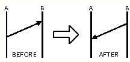
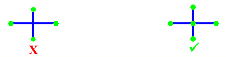

## List of Physical Components

InfoSewer conceptualizes a sewer collection network as a collection of links connected at their endpoints, called nodes. The nodes represent manholes, wet-wells, and outlets while the links represent pipes and pumps. The sewer system can be of any topological configuration and can contain multiple loops and outlets.

  

The following sewer network components are modeled in InfoSewer :

- **Manholes** represent points in the sanitary sewer system where loads enter into the system. Manholes are normally located at places where pipes connect and where pipe characteristics such as diameter and slope change.

- **Outlets** designate discharge points (e.g., treatment plant, ocean outfall) where flows exit the system and are the most downstream points of the collection system.

- **Wet wells** are structures in the collection system that collect wastewater flows before they are pumped into force mains for transport to another gravity system.

- **Pipes/Channels** are circular/non-circular conduits through which flow is transported either by gravity (i.e., gravity mains) or by the energy supplied from pumps (i.e., force mains).

- **Pumps** are devices that raise the hydraulic head of water through the sanitary sewer system.

How InfoSewer models the hydraulic behavior of each of these physical components is reviewed in the following sections. For the sake of discussion, all wastewater flows are expressed in cubic feet per second (cfs), although the program can also accept flow units in gallons per minute (gpm), million gallons per day (mgd), imperial million gallons per day (imgd), acre-feet per day (afd), cubic meters per hour (cmh), cubic meters per day (cmd), million liters per day (mld), liters per second (lps), or liters per minute (lpm). Wastewater represents the spent or used water from residences, commercial buildings, industrial plants, and institutions, together with minor quantities of ground, storm and surface waters that are not admitted intentionally.

## Manholes in InfoSewer

Manholes are points in the network where links join and where loads enter the network. They are also placed at locations where pipe characteristics change (e.g., diameter and slope). The basic input data required for manholes is:

-  The rim elevation, i.e. the top elevation of the manhole structure

-  The diameter of the manhole structure

-  The baseline load at the manhole

The manhole diameter and rim elevation parameters are used in the determination of manhole surcharge and flooding. The loads on the system, i.e., wastewater flows collected, accumulated, and conveyed by the collection system are assumed to be positive. Manholes can have their load vary with time and different types of loading (e.g., low density residential, medium density residential, high density residential, industrial, commercial, etc.) can be assigned to them. A manhole can also have no loading defined.

The results computed for manholes for a simulation are:

-  The base load

-  The total load

-  The overload storage  

-  The hydraulic grade

Two other types of manhole can also be modeled:

- ** Junction chambers** represent nodes in a pressurized sewer collection system connecting pumps to force mains. No loads can be defined for a junction chamber .

- **Outlets** designated Facilities where flows exit the collection system. These nodes define the discharge end or the most downstream element of a sewer network. The exit condition can be grouped into four cases as shown below: 

  - Nonsubmerged, free fall

  - Nonsubmerged, continuous

  - Nonsubmerged, hydraulic jump, Submerged

 

 

Flow splits (bifurcations) can also be modeled and represent points in the conveyance system where multiple pipes separate flows to different parts of the system. A flow split occurs whenever two or more pipes exit the same manhole. InfoSewer  Pro provides four practical methods of allocating flows to the downstream (outgoing) pipes :

- ** Fixed flow split percentage method** - The user specifies the percentage of the total flow in the manhole which is assigned to each of the downstream pipes.

- ** Variable flow split percentage method** - The user defines a curve representing the percentage of the total flow in the manhole which is assigned to a downstream pipe as a function of the total incoming flow (See CURVE section).

-   **Inflow-outflow flow split method -** The user supplies an inflow-outflow curve for each of the downstream pipes splitting from a manhole. The curve defines the amount of the incoming flow to be diverted to a downstream pipe. This flow split method is designed to accommodate flow conditions where hydraulic structures such as weirs and dams are used to regulate downstream flows.

- ** Automatic flow split method** -InfoSewer automatically computes the fraction of the total flow in the manhole assigned to each of the downstream (outgoing) pipes based on their invert levels and diameters.

Note that InfoSewer  checks that the sum of the fractions leaving a manhole equals 100 percent. In case, the sum is less or greater than 100%, InfoSewer  will automatically adjust the flow allocations for the outgoing pipes proportionally to satisfy flow balance. Finally, note that InfoSewer  assumes that a pipe is closed if its flow split percentage is zero.

## HEADLOSS AT MANHOLES

Manhole structures can induce backwater effects to their connecting sewer pipes. However, the precise hydraulic description of the flow in manhole structures is complicated because of the complex degree of mixing, separation, turbulence, and energy losses. These losses are commonly estimated as a function of headloss coefficients and are used to calculate hydraulic grade lines for upstream pipes during backwater analysis.

The headloss at a sewer manhole is determined based on the exit pipe’s velocity from the following equation:

 

The headloss coefficient, used for estimating headloss through a manhole, depends on the type of manhole and typically ranges from 0.5 to 1.0.

*** ***

## Wet Wells in InfoSewer

Wet-wells are nodes with storage capacity that can vary with time during an extended period simulation. The primary input properties for wet wells are:

- The bottom elevation where the wastewater level is assumed to be zero.

- The minimum level, i.e., the lowest allowable wastewater level above the bottom elevation

- The maximum level, i.e., the highest allowable wastewater level above the bottom elevation

- The initial level above the bottom elevation

- The wet-well diameter

Wet-wells are required to operate within their minimum and maximum levels. A wet-well can be modeled as a constant diameter (cylindrical) where a representative diameter is specified as the diameter corresponding to the average wet-well area. In case a wet-well cannot be adequately described by a representative diameter, InfoSewer allows you to define data for the stored volume as a function of depth of wastewater using a curve (see CURVE section). This allows wet-wells of any shape (variable cross-sectional area) to be accurately modeled.

 

For an extended period simulation, InfoSewer accurately calculates the change in levels of a wet-well. The wastewater level is allowed to vary between the user-specified range of minimum and maximum permissible levels. If the wastewater level in the wet-well drops below the minimum level specified, the program automatically closes the pumps and no additional flow can exit the wet-well. InfoSewer models the change in wastewater level of a wet-well using the following equation:

 

The results computed for wet-wells for each time period of a simulation are:

- The wastewater level

- Grade

-  Volume

-  The volume percentage

- The overflow rate

 

 

## Pipes in InfoSewer

Pipes/open channels are links that convey wastewater from one point in the network to another.  Pipes are closed conduits and are commonly used in sanitary sewer systems and combined sewer systems, whereas open channels are open to the atmosphere and their application is limited to storm sewer systems. InfoSewer  can model a number of pipe/open channel shapes including circular, rectangular, trapezoidal, triangular, and parabolic. The model assumes that flow in the conduit can only be unidirectional. The principal hydraulic input parameters for conduits are:

- The  conduit connectivity, i.e. from and to node IDs

- ..The upstream and downstream invert elevations

- The conduit length representing the distance between nodes

- The conduit diameter or depth, top or bottom width, left side slope, and right side slope

- The Manning roughness coefficient for gravity (open-channel) mains or the Hazen-Williams coefficient for force (pressurized) mains

- The number of (identical) parallel pipes of the same characteristics

Pipes can either be gravity mains or force mains. The main difference between the two is the hydraulic equation utilized for flow computation. The Manning equation is employed for gravity mains while the Hazen-Williams equation is used for force mains.InfoSewer   assumes that a force main is always connected directly downstream of a pump, and its shape is considered as circular.

 

InfoSewer  offers a number of useful methods to model infiltration including: count-based (e.g., defect-based), pattern-based, pipe surface area-based, pipe length-based, and pipe diameter length-based.

 

InfoSewer  also models parallel pipes with the assumption that all parallel pipes are identical with the same characteristics (i.e. diameter, slope, length and coefficient).

## MANNING AND HAZEN-WILLIAMS EQUATIONS

The Manning equation is used to determine the pipe flow in a gravity main and is given below in US Customary units:

where

*Q*         =          pipe flow (in flow units)

*n*          =          Manning roughness coefficient

*R*          =          hydraulic radius, i.e., the flow area divided by the wetted perimeter ft (m)

*S*          =          pipe slope

*A*          =          flow area, ft2 (m2)

*k*          =          constant (1.00 for SI units, 1.49 for US units)

 

The value of the Manning coefficient depends on the condition of the pipe and is therefore somewhat analogous to the pipe roughness used in pressured pipe networks.

 

The Hazen-Williams equation is used to determine the head loss across force mains and is given below in US Customary units:

                                      

where

*L*          =          pipe length, ft (m)

*Q*         =          pipe flow (in flow units)

*C*         =          Hazen-Williams roughness coefficient

*D*         =          pipe diameter or conduit depth for circular and non-circular shape types,

                        respectively. The unit is in ft (m).

*k*          =          constant (10.7 for SI units, 4.727 for US units).

 

Typical average design values of Manning and Hazen-Williams coefficients for commonly used sewer pipes (newly installed) are listed in the table below.

 

| **Material**        | **Hazen-Williams C** | **Manning n** |
|---------------------|----------------------|---------------|
| Asbestos Cement     | 140                  | 0.011-0.015   |
| Brass               | 130-140              | 0.009-0.013   |
| Ductile Iron        | 130-140              | 0.012-0.015   |
| Concrete            | 120-140              | 0.012-0.017   |
| Copper              | 130-140              | 0.011-0.015   |
| Steel               | 110-150              | 0.010-0.019   |
| Plastic             | 140-150              | 0.009-0.015   |
| Vitrified Clay Pipe | 110-140              | 0.011-0.017   |
| Wood Stave          | 115-125              | 0.010-0.014   |

>  
>
> Be aware that the roughness coefficient depends on type and condition of the pipe and can change considerably with age, diameter, material, soil type, and water quality characteristics. Typical water system C-factor curves are shown below (Innovyze InfoWater help   file, 2016).
>
> 

## HYDRAULIC RADIUS

The hydraulic radius is defined as the ratio of the net cross-sectional area of a flow stream to the wetted perimeter of the section. That is:

                                                      

where *P* represents the wetted perimeter, ft (m).

 

In the calculation of the hydraulic radius, the net cross-sectional area should be evident from the geometry of the section. The wetted perimeter is defined as the sum of the length of the boundaries of the section actually in contact with the water.

## NORMAL DEPTH

Another useful form of the Manning equation is (in US Customary units):

where,

A   = cross sectional area,

R   = hydraulic radius,

S   = Slope

n   = manning’s roughness

Q   = flow     

The term on the left side of the above equation is solely dependent on the geometry of the section. Therefore, for a given discharge (*Q*), slope (*S*), and surface type (*n*), the flow depth in the gravity main can be determined. This depth is called the normal depth. The normal depth of a force main is equal to its diameter.

## CRITICAL DEPTH

The Froude number, *NF*, is defined as the ratio of inertial forces to gravity forces:

When the Froude number is equal to 1.0, the flow is called critical flow. When NF \< 1.0, the flow is subcritical and when NF\> 1.0, the flow is supercritical. The depth corresponding to the minimum specific energy is therefore called the critical depth dc. The resulting criterion for determining the critical depth using Equations (6) and (7) is:

                                                      

It is also important to distinguish between the following types of flows:

- Full Flow: represents the flow when the pipe is full, i.e. where the wetted perimeter is equal to the entire pipe perimeter.

- Maximum Flow: represents the maximum theoretical flow occurring in a circular pipe when the normal depth is equal to 0.938 x Diameter. Any increase in depth will decrease the flow, which is why the full flow is less than the maximum discharge for a circular pipe.

- Analysis Flow: represents the flow occurring in a pipe as derived from the analysis criteria curve (See CRITERIA CURVES section).

- Design Flow: represents the flow occurring in a pipe as derived from the design criteria curve.

The computed results for pipes include:

- The total flow and velocity

- The full, maximum, design and analysis flows

- The excess full, design and analysis capacities

- The normal and critical depths

- The actual, design, and analysis d/D ratios

## Force Main Network Solution

The Force Main Network Solution allows the simulation of multiple upstream and downstream force mains entering and leaving one chamber junction during an Extended Period Dynamic Simulation or EPS solution in Sewer.  All of the force mains, pumps, wet wells and force main chamber junctions that are connected are considered as one force main network in the EPS solution. You can have more than one force main network in a large Sewer model separated by gravity pipes and loading manholes.   The individual force main networks are solved iteratively with different upstream head and downstream tail manholes which connect the force main network(s) to the rest of the network.

A force main network consists of the following elements:

- Wet well

- Pump

- Junction Chamber

- Head Manhole where flow from other parts of the sewer system enters the force main network

- Tail manhole where the flow leaves the force main network.

The head and tail manhole for one force main network is determined by the program based on the geometry of the network. The force main network starts at a wet well, includes the pumps connecting the wet well to the force main links and includes the actual force main links and force main connecting junction chambers.  You can also connect a force main to the gravity mains without an intermediate wet well and pump(s).

The boundary conditions of the force main network are:

- Water heads at the wet wells which vary according to the inflow from the upstream sections of the sewer network and outflow to the force main network

- Water head at the tail manholes which are calculated as the maximum discharge head (invert + diameter) of all the force mains that end at that manhole. Water entering the tail manholes will be routed downstream after the force main network flows are calculated.

For example, assuming there are n1 wet wells, n2 head manholes, n3 tail manholes, n4 junction chambers and p1 pumps and p2 force mains, the program must solve the network hydraulics to get n2+n4 water head values and p1+p2 flow values iteratively using the Newton-Raphson method.  The solution iterates until the mass and energy of the force main network is in balance.

The hydraulic equations used in the solution are:

- Head/Flow relationship of the force mains and pumps (p1+p2 equations)

- Mass balance at head nodes and junction chambers (n2+n4 equations)

For head nodes, water entering the network from other sections of the sewer system must equal the flow sum of force mains that connect to it:

Where Q = Flow; Gv = group of gravity pipes connecting to the head manhole; and Gf = group of force mains connecting to the head manhole.   The sum of the gravity flow into the wet well or head manholes is balanced by the sum or flow out of the force main network in the force main pipes.

For junction chambers, which are connected to only force main pipes:

For force mains, Hazen-Williams equation describes the flow/head loss relationship within a force main.  The flow out of and the flow into the junction chamber is in balance.  The head at the junction manhole is iterated until the flows are in balance.

For pumps that are neither Inflow Control nor Discharge Control, the pump curve is used to estimate the flow and head gain relationship within a pump. For Inflow Control and Discharge Control pump, pump flow as control values are fixed and the equation Q = Qcontrol, where Qcontrol is the controlling pump value.  For such situations, the pump is actually modeled as variable speed pump and pump speed will be calculated with Newton-Raphson method to achieve the flow control objective.

 

           

Be aware that the roughness coefficient depends on type and condition of the pipe and can change considerably with age, diameter, material, soil type, and water quality characteristics. Typical water system C-factor curves are shown below (Innovyze InfoWater help   file, 2016).

 

**Roughness Coefficients for New Pipe**

| **Material**               | **Hazen-Williams ***C* | **Darcy-Weisbach **ε** , millifeet** | **Manning ***n* |
|----------------------------|------------------------|--------------------------------------|-----------------|
| Asbestos Cement            | 140                    | 0.005                                | 0.011           |
| Cast Iron                  | 130-140                | 0.85                                 | 0.012-0.015     |
| Concrete or Concrete Lined | 120-140                | 1.0-10                               | 0.012-0.017     |
| Copper                     | 135                    | 0.005                                | 0.011           |
| Galvanized Iron            | 120                    | 0.5                                  | 0.015-0.017     |
| Lead                       | 135                    | 0.005                                | 0.011           |
| Plastic                    | 140-150                | 0.005                                | 0.011-0.015     |
| Steel                      | 140-150                | 0.15                                 | 0.015-0.017     |
| Wood Stave                 | 120                    | 0.6                                  | 0.011-0.013     |

 

## Pumps in InfoSewer

A pump is a link that imparts energy to a fluid thereby raising its hydraulic head. Pumps are needed in a gravity sewer system to prevent deep excavations and are designed to lift the fluid to a desired level that produces gravity flow condition further downstream.

The relationship describing the head gained to a fluid as a function of its flow rate through the pump is defined as the pump characteristic curve. InfoSewer represents pumps as links of negligible length which are directly connected to wet-wells. The principal input parameters for a pump are:

- The wet-well ID representing the inlet side of the pump

- The manhole junction chamber ID representing the discharge side of the pump

- The additional number of parallel (identical) pumps with the same characteristics (optional)

InfoSewer uses different types of pump curves depending on the number of head-flow data points supplied. Three different types of pumps can be modeled as follows:

- **Fixed Capacity **representing a fixed pump flow.  The pump flow is set to the fixed capacity and is independent of the flow entering the wet-well. It is assumed that the flow will transfer at the fixed rate, independent of the head requirements.

- **Single-Point Curve** - A single-point pump curve is defined by a single head-flow data point describing the desired pump operating point (design point). InfoSewer  assumes that the cutoff head (at zero flow) is 133% of the design head and the maximum flow (at zero head) is twice the design flow. It then treats the curve as a three-point curve.

-  **Three-Point Curve** - A three-point pump curve is defined by three points of operating data. InfoSewer will fit a continuous function of the form:

 

By supplying InfoSewer with the cutoff head *Ho* and two other points \[(H1, Q1), (H2, Q2)\], the program is able to estimate values for α and β from:

                                               

                                     

The computed results for pumps are the flow pumped and the head gained.

For variable speed pumps, the pump curve shifts as the speed changes. The relationships between flow (*Q*) and head (*H*) at speeds n1 and n*2* are

                                                      

                                               .

 

The original pump curve supplied to the program has a relative speed setting of 1. If the pump speed doubles, then the relative setting would be 2; if run at half speed, the relative setting is 0.5 and so on. The figure below illustrates how changing a pump's speed setting affects its characteristic curve.

If *n* denotes the pump speed ratio (*n*1/*n*2), then the pump characteristic curve becomes:

>                            

 

**<u> </u>**
