**5.2 NON-PHYSICAL COMPONENTS**

In addition to physical components, InfoSewer employs four types of informational objects to describe the behavior and operational aspects of a sewer collection system. The informational objects are loads, curves, patterns, and controls.

**Loads**

  

Sanitary sewer system flow has two main components: sanitary or dry-weather loads and wet-weather loads. These loads are based on knowledge of the area land use patterns, wastewater generation characteristics, industries, inflow and infiltration characteristics, external flows, etc.

 

Sanitary or dry-weather flow results from human activity and is defined as the flow that exists in the sewer collection system during rainless periods. This flow is composed of domestic, commercial, industrial, and institutional waste. The sanitary loads are the basic data required for any hydraulic computation.

 

Wet-weather flow is related to rainfall activity and consists of groundwater infiltration (extraneous flow entering the sewer system because of poor construction, corrosion of the pipe, ground movement or structural failure through joints, porous walls or breaks) and structure inflow (extraneous flow entering the sewer system through manhole covers, basement drains and other sources).

 

For steady-state modeling, manhole loads can be either unpeaked or peaked as follows:

 

- **Unpeakable Flow type** - The corresponding load for each manhole is modeled as a direct flow into the sewer system.

 

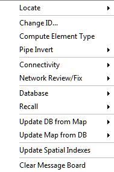

>  
>
> where *Qbase* represents the average base flow (in flow units).
>
>  

- **Peakable Base Flow**  - InfoSewer uses a general form of the Federov’s formula as follows:

  

> where *K* and *ρ* are peaking factor parameters.
>
>  
>
> Default values are *K* = 2.4 and *ρ* = 0.89.  Values of *K* and *ρ* can be modified.

- **Peakable Coverage Flow** - InfoSewer uses the following formula which can describe both the Harman and Babbitt equations:

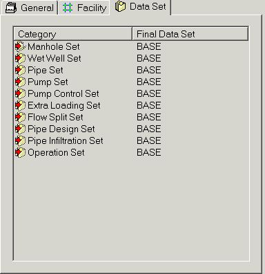

>              
>
> where *P* represents the population and *a*, *b*, *c*, *d* and *e* are peaking parameters. The default values for these parameters are: *a* = 5; *b* = 0; *c* = 0.2 , *d* = 0, and *e* = 1 which represents Babbitt equation (Babbitt and Baumann 1958). For the Harman equation (Babbitt and Baumann 1958): *a* = 14; *b* = 4; *c* = 0.5, *d* = 1 and *e* = 1.

 

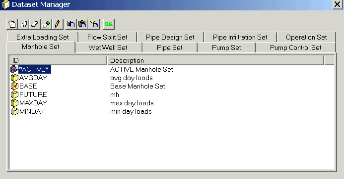

 

For an extended period simulation, no peaking formula is used, instead, the multiplication factors from the diurnal pattern are used to adjust (multiply) all types of loads before they are aggregated. An example peaking-factor pattern is shown below.

 

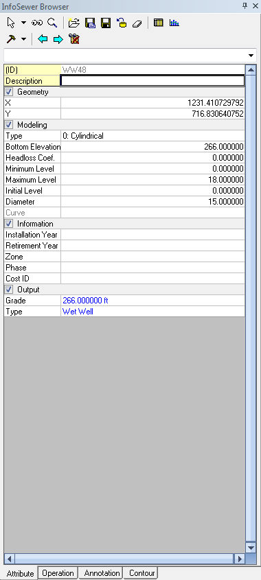

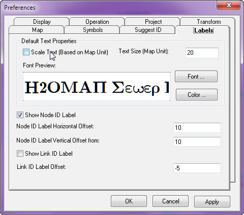

Infiltration and inflow  affect the operation of a sanitary sewer system and pumping, treatment, and overflow regulators facilities.

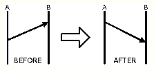

Infiltration occurs in gravity pipes while inflow occurs at manholes and wet wells. Infiltration loads refer to the volume of groundwater entering the sewer system from the soil through defective joints, broken or cracked pipes, improper connections, or manhole walls. Accurately determining infiltration is generally difficult as these loads depend on soil type, soil moisture conditions, system size and integrity, water table level, and the number of illegal connections. They are normally computed by subtracting base flow from total metered flow during dry weather or by compiling flow isolation measurements. Infiltration can be defined as proportional to the pipe length; proportional to the pipe length and to the pipe diameter; proportional to the pipe surface area (pipe length multiplied by its perimeter); proportional to the number of defects in the pipe (count-based); or as a pattern load/hydrograph (flow vs. time).

Inflow loads refer to stormwater or other drainage water and wastes (extraneous water) entering the sewer system through manhole covers. Inflow is measured during wet weather conditions and is determined by subtracting base flow and infiltration from data recorded during wet weather conditions. Inflows can be specified as pattern loads/hydrographs (flow vs time) for any manhole.

  

## Patterns

Patterns are used to represent temporal variations within the system. They consist of a collection of multipliers (multiplication factors) that are applied to a base load to allow it to vary over time during an extended period simulation. The time interval used in all patterns is a fixed value set by the user. Although all patterns must utilize the same time interval, each can have a different number of periods. If the duration of a pattern is less than the total duration of the simulation, then the pattern will repeat itself and will wrap around to its first period again.

Two options are available for representing a pattern: stepwise or continuous (linear). A stepwise pattern is one that assumes a constant multiplication factor for each pattern time period. Within each time period a quantity remains at a constant level equal to the product of its nominal value and the pattern's multiplier for that time period. A continuous (linear) pattern is one that linearly interpolates for the multiplication factors between two adjacent time periods.

Different patterns can be applied to individual manholes or groups of manholes to accurately represent actual loading categories (e.g., low density residential, commercial, and industrial).

 

As an example of how patterns work consider a manhole with an average load of 2.0 CFS. Assume that the pattern time interval has been set to 4 hours and with the following multipliers:

 

| **Period**     | 1   | 2   | 3   | 4   | 5   | 6   |
|----------------|-----|-----|-----|-----|-----|-----|
| **Multiplier** | 0.5 | 0.8 | 1.0 | 1.2 | 0.9 | 0.7 |

 

Then during the simulation, the actual load collected for this manhole will be as follows:

 

| **Hours** | **0-4** | **4-8** | **8-12** | **12-16** | **16-20** | **20-24** |
|-----------|---------|---------|----------|-----------|-----------|-----------|
| **Load**  | 1.0     | 1.6     | 2.0      | 2.4       | 1.8       | 1.4       |

## Curves

Curves are objects that contain data pairs representing a relationship between two quantities. Two or more objects can share the same curve. An InfoSewer  Pro model can utilize the following types of curves:

- Volume curve

- Peaking curve

- Flow split curve

- Design and analysis criteria curves

- Replacement and duplication design cost curves

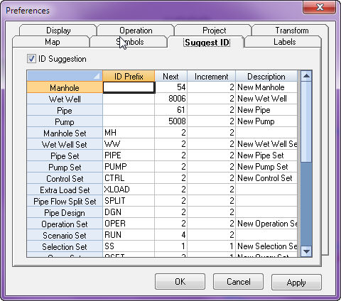

## VOLUME CURVE

A volume curve determines how the wet-well volume (Y in cubic feet or cubic meters) varies as a function of the wastewater level (X in feet or meters). It is used when it is necessary to accurately represent a wet-well whose cross-sectional area varies with height (e.g., non-circular wet-wells). The lower and upper wastewater levels supplied for the curve must contain the lower and upper levels between which the wet-well operates. A valid volume curve must have increasing volume with increasing water height.

 

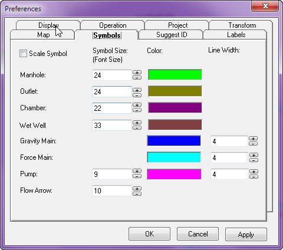

**<u> </u>**

## PEAKING CURVE

The peaking curve represents the variation of peak flows (Y-axis) as a function of base flows (X-axis) and is an alternative approach to compute flow data (loads) for peak conditions. Any peaking curve can be specified to estimate base flow peaks and model peak flow - base flow relationships.

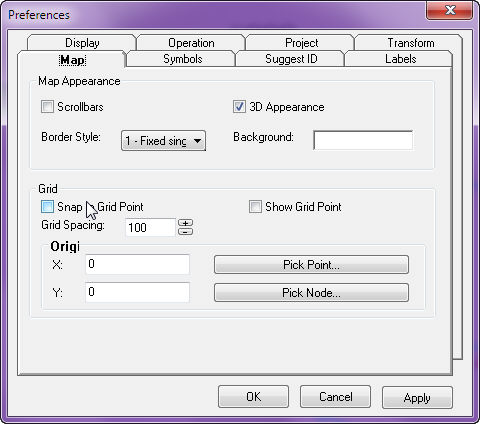

 

## FLOW SPLIT CURVE

A flow split curve determines how the flow split (Y in percentage or flow units depending on the desired split method) varies as a function of the total flow in the manhole (X in flow units). If the splitting method is the Variable Flow Split Percentage method then the Y data are specified in percentage. If the Inflow-Outflow Flow Split method is used then the Y data are specified in flow units. The data points must be defined in an increasing order of flow.

 

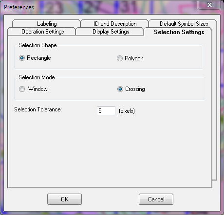

## CRITERIA CURVES

Criteria curves are entered as a series of pipe diameters (X in inches or millimeters) along with their acceptable depth-to-diameter (d/D) ratios (Y unitless). The analysis criteria curve is used for determining the d/D ratios of existing pipe capacities while the design criteria curve is used for designing relief or replacement pipes when their capacity as determined by the analysis criteria has been exceeded. The data points specified for the above curves must be defined in an increasing order. For example, existing pipes up to 15 inch in diameter are allowed to flow only half full, up to 21 inch pipe can flow three-quarters full, and all other pipes are allowed to flow at full capacity.

## DESIGN COST CURVES

A design cost curve determines how the design unit costs (Y in cost currency per unit of length) varies as a function of the diameter of the pipe to be designed (X in inches or millimeters). The user specifies one curve for each type of improvements, i.e., the construction of a new pipe (replacement method) and the placement of a parallel/relief pipe (duplication method). The data points for the above curves must be defined in an increasing order. Only those pipe diameters defined will be considered as candidate design sizes. Each pipe can also have specific design cost tables for replacement or duplication. The cost currency is user-specified.

**<u> </u>**

## DESIGN TABLE

InfoSewer  supports modeling of circular and non-circular conduits for all the hydraulic simulations performed by the model (i.e., steady state analysis, design, and dynamic simulations). Unlike circular pipes that can be fully described in terms of a single input parameter (i.e., diameter), geometry of non-circular conduits is a function of multiple variables such as channel depth, channel width, and side slopes. As a result, the carrying capacity and the costs associated with replacing and duplicating non-circular pipes cannot be defined in terms of a single input parameter, thus limiting application of criteria curves and cost curves to circular pipes only.

For non-circular channels, the model provides a design table through which the user may supply inputs related to conduit sizes, flow depth to channel depth ratio for analysis as well as design criteria, replacement cost, and duplication costs for non-circular channels. The model calculates conveyance factor of the channel (a measure of channel’s carrying capacity) and associates this factor with their respective criteria and cost values. As described earlier, InfoSewer  uses Manning equation to determine pipe flow in gravity mains. For Manning’s equation, the conveyance factor is given as:

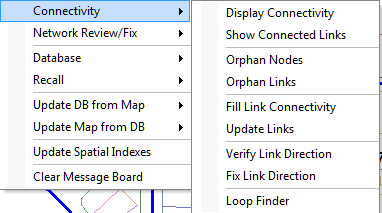

where

Kf = conveyance factor, ft8/3 (m8/3)

R = hydraulic radius, i.e., the flow area divided by the wetted perimeter, ft (m)

A = flow area, ft2 (m2)

 

## Controls

InfoSewer  provides comprehensive operational control schemes to accurately simulate the dynamic hydraulic behavior of a sanitary sewer collection system. During an EPS, controls describe the on-off status and relative speed setting of selected pumps as a function of the flow levels or volumes of wet-wells, or to match a targeted pump discharge flow.

Level controls are stated in terms of the height of wastewater above the wet-well bottom elevation. The default “ON Setting” value is the top wastewater level/volume of the wet-well while the default “OFF Setting” is the bottom wastewater level/volume of the wet-well.

An example of level control is given below:

IF (level in wet-well WW1 drops below 2 feet) THEN (turn OFF pump P1)

The default pump speed setting is one (pump speed ratio of 1). The initial pump status is overwritten by the operational controls during an extended period simulation.

 

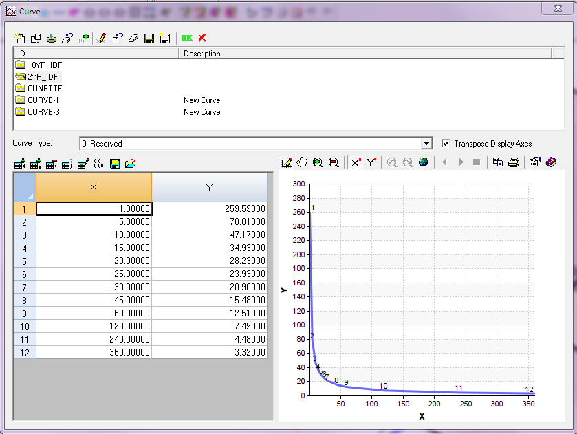

 

 

**<u> </u>**
