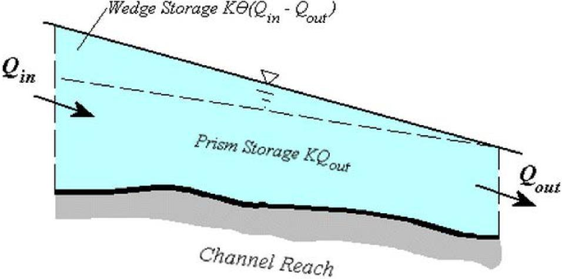
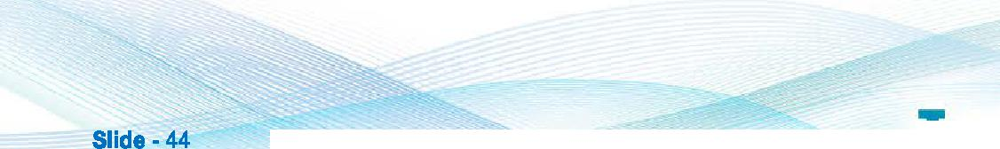
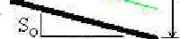
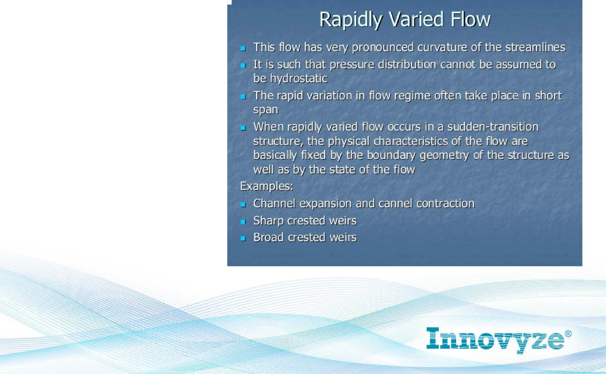
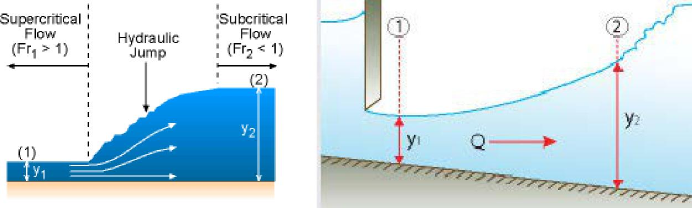
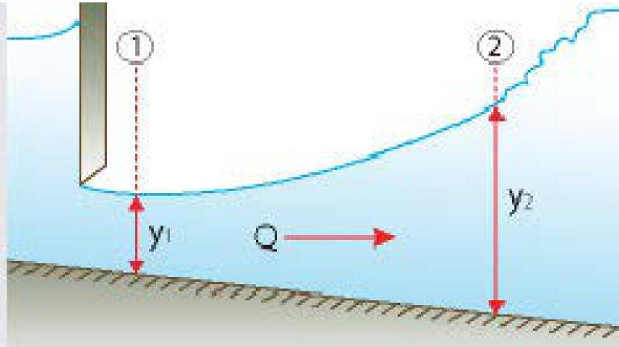
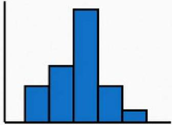
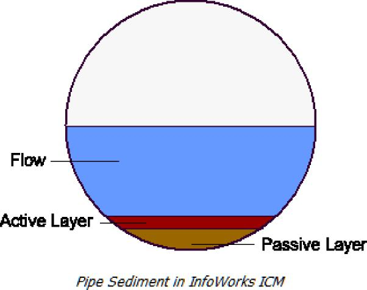

**Chapter 1 Types of Sewer Systems,  
Combined Stormwater and Sanitary**

<table style="width:100%;">
<colgroup>
<col style="width: 48%" />
<col style="width: 8%" />
<col style="width: 8%" />
<col style="width: 13%" />
<col style="width: 2%" />
<col style="width: 8%" />
<col style="width: 7%" />
<col style="width: 3%" />
</colgroup>
<tbody>
<tr class="odd">
<td rowspan="3"></td>
<td rowspan="3"></td>
<td></td>
<td rowspan="2"><em>Sanitary 
</em>Sewers</td>
<td rowspan="2"></td>
<td rowspan="2"><em>it=</em></td>
<td rowspan="3"><strong>I 4—</strong></td>
<td rowspan="3"></td>
</tr>
<tr class="even">
<td rowspan="2"></td>
</tr>
<tr class="odd">
<td>—</td>
<td colspan="2"></td>
</tr>
</tbody>
</table>

<table>
<colgroup>
<col style="width: 65%" />
<col style="width: 20%" />
<col style="width: 3%" />
<col style="width: 7%" />
<col style="width: 3%" />
</colgroup>
<tbody>
<tr class="odd">
<td></td>
<td colspan="3" rowspan="4">
raanrrr-z--

.LLi4LroP'tsTyoz_--
</td>
<td></td>
</tr>
<tr class="even">
<td rowspan="2"><strong>Slide -</strong> 3 <strong>Comprehensive Sewer Collection System Analysis</strong></td>
<td></td>
</tr>
<tr class="odd">
<td></td>
</tr>
<tr class="even">
<td></td>
<td></td>
</tr>
<tr class="odd">
<td></td>
<td></td>
<td></td>
<td></td>
<td></td>
</tr>
</tbody>
</table>

**Chapter 1 Components of Sewer Systems**

Manhole antenna

> 

> **Slide -** 5 **Comprehensive Sewer Collection System Analysis**

**II ILL AL V**

**Chapter 1 Laws of Conservation**

**Chapter 1 Hydrologic Processes**

<table>
<colgroup>
<col style="width: 20%" />
<col style="width: 51%" />
<col style="width: 25%" />
<col style="width: 3%" />
</colgroup>
<tbody>
<tr class="odd">
<td rowspan="2"><strong>Slide -</strong> 7</td>
<td rowspan="2"><strong>Comprehensive Sewer Collection System Analysis</strong></td>
<td rowspan="2">
<strong>lol4 Mg;</strong>

<ul>
<li>
<strong>• MIMI No</strong>
</li>
</ul></td>
<td></td>
</tr>
<tr class="even">
<td></td>
</tr>
</tbody>
</table>

**Chapter 1 Hydrologic Processes**

**Chapter 1 Modeling of Sewer Systems**

> \+ =

<table>
<colgroup>
<col style="width: 28%" />
<col style="width: 71%" />
</colgroup>
<tbody>
<tr class="odd">
<td>+</td>
<td>
( )+ (∅ − +

<blockquote>

)=

</blockquote></td>
</tr>
</tbody>
</table>

> where
>
> Q – discharge (3/)
>
> A – cross sectional area (2)
>
> g – acceleration due to gravity (/2)
>
> – angle of bed to horizontal (degrees)
>
> – bed slope

K – conveyance

Kinematic wave

For the kinematic wave it is assumed that the flow is uniform, and that the friction slope is approximately equal slope of the channel, This simplifies the full Saint Venant equation to the kinematic wave:

<table>
<colgroup>
<col style="width: 24%" />
<col style="width: 75%" />
</colgroup>
<tbody>
<tr class="odd">
<td>
au au

(Tt cox 
+u =0
</td>
<td><em>or Sf</em> = <em>So</em></td>
</tr>
</tbody>
</table>

The kinematic wave is valid when the inertial acceleration is much larger than the other forms of acceleration, or in other words when there is a large steady flood. The kinematic wave is used in HEC-HMS.P\]

<table>
<colgroup>
<col style="width: 58%" />
<col style="width: 41%" />
</colgroup>
<tbody>
<tr class="odd">
<td><blockquote>

</blockquote></td>
<td><strong>ogic Cycle</strong></td>
</tr>
</tbody>
</table>

**The Urban Water Cycle**

> **Chapter 2 Dry Weather Flow  
> Estimation**

Common drainage study objectives

- Develop my property without causing flooding (and lawsuits) downstream

- Size my new culvert to ensure that it doesn't overtop

- Guide my city's development to ensure that our streams are not impaired

- Set our new water intake to ensure that it doesn't go dry

- Restore my city's stream to provide good fishing habitat

- Do the bare minimum to meet those @#s!@# regulations

<table>
<colgroup>
<col style="width: 66%" />
<col style="width: 33%" />
</colgroup>
<tbody>
<tr class="odd">
<td><blockquote>

</blockquote></td>
<td rowspan="3"><blockquote>

<strong>a cm, aniLLILW</strong>

</blockquote>

<strong>-7</strong>
</td>
</tr>
<tr class="even">
<td><strong>Slide -</strong> 22 <strong>Comprehensive Sewer Collection System Analysis</strong></td>
</tr>
<tr class="odd">
<td></td>
</tr>
</tbody>
</table>

> **Chapter 2 Load Estimation** Responses

- Infiltration over time

- Groundwater recharge

- Runoff over time

- Flowrate

- Flow depth

- Flow velocity

> NUN

<table>
<colgroup>
<col style="width: 65%" />
<col style="width: 30%" />
<col style="width: 3%" />
</colgroup>
<tbody>
<tr class="odd">
<td rowspan="2"><strong>Slide -</strong> 24 <strong>Comprehensive Sewer Collection System Analysis</strong></td>
<td rowspan="3"><ul>
<li><blockquote>

<strong>IN • • - 
•••••••!±,.....7 r.</strong>

</blockquote></li>
</ul></td>
<td></td>
</tr>
<tr class="even">
<td></td>
</tr>
<tr class="odd">
<td></td>
<td></td>
</tr>
</tbody>
</table>

**Chapter 2 Peak Flow Estimation**

> Inputs

- Most typical is rainfall

- Baseflow/dry weather flow

- Snowmelt

- Existing watershed condition

- Temperature

- Humidity

- Wind

- Sun

> **Runoff C0affidiatirtS for\` Lad TypOs**

<table>
<colgroup>
<col style="width: 57%" />
<col style="width: 42%" />
</colgroup>
<tbody>
<tr class="odd">
<td><blockquote>

Li Illi <strong>LE.,=2,Typie of Surface.</strong>

</blockquote></td>
<td><strong>Range <em>of</em> "C"' Vallee '</strong></td>
</tr>
<tr class="even">
<td><blockquote>

<strong>Dtratilown &amp;ear-teas</strong>

</blockquote></td>
<td><strong>O.7O lc 0.06</strong></td>
</tr>
<tr class="odd">
<td><blockquote>

<strong>Heavy kidcatirra</strong>

</blockquote></td>
<td><strong>0.50 ic 0.-9O</strong></td>
</tr>
<tr class="even">
<td><blockquote>

<strong>Mut- rasxklr tra isqls. atiocnad</strong>

</blockquote></td>
<td><strong>O.60 ID (175</strong></td>
</tr>
<tr class="odd">
<td><blockquote>

<strong>I ight rnakistrial</strong>

</blockquote></td>
<td><strong>OW in 0 10</strong></td>
</tr>
<tr class="even">
<td><blockquote>

<strong>Neighborhood husinassas</strong>

</blockquote></td>
<td><strong>050 lo0 70</strong></td>
</tr>
<tr class="odd">
<td colspan="2"><blockquote>

<strong>Coltmalaal lanet•Avan leanly sots I O.4O lo 0.45</strong>

</blockquote></td>
</tr>
<tr class="even">
<td><blockquote>

<strong>Suburban residential</strong>

</blockquote></td>
<td><strong>O.25 lc 0 40</strong></td>
</tr>
<tr class="odd">
<td><blockquote>

<strong>Pitql-raurrim</strong>

</blockquote></td>
<td><strong>0.20 la 0.36</strong></td>
</tr>
<tr class="even">
<td><blockquote>

<strong>tim General leiative:1 iur,i</strong>

</blockquote></td>
<td><strong>0 10 la 0 4c'</strong></td>
</tr>
<tr class="odd">
<td><blockquote>

<strong>Parks and aninalannr,</strong>

</blockquote></td>
<td><strong>#0.10 la a 25</strong></td>
</tr>
<tr class="even">
<td colspan="2"><blockquote>

<strong>%Aldo:Herds with $iartay sods 0,101</strong>.<strong>1 0 I r)</strong>

</blockquote></td>
</tr>
</tbody>
</table>

<table>
<colgroup>
<col style="width: 64%" />
<col style="width: 35%" />
</colgroup>
<tbody>
<tr class="odd">
<td></td>
<td rowspan="3"><ul>
<li><blockquote>

<strong>Wit "44</strong> ®

</blockquote></li>
</ul>
<blockquote>

<strong>ailiaLSAU</strong>

</blockquote></td>
</tr>
<tr class="even">
<td><strong>Slide -</strong> 28 <strong>Comprehensive Sewer Collection System Analysis</strong></td>
</tr>
<tr class="odd">
<td></td>
</tr>
</tbody>
</table>

**C in the Rational Method**

<table>
<colgroup>
<col style="width: 64%" />
<col style="width: 12%" />
<col style="width: 23%" />
</colgroup>
<tbody>
<tr class="odd">
<td colspan="2"><strong>Slide -</strong> 30 <strong>Comprehensive Sewer Collection System Analysis</strong></td>
<td>
<strong>ow•</strong>

<strong>leak re4.1</strong>

<ul>
<li>
<strong>• rAz,</strong>
</li>
</ul>

i.i<strong>F_</strong>~<strong>tiz</strong>
</td>
</tr>
</tbody>
</table>

**Chapter 3 Typical Values of  
Resistance Coefficients**

> Table 3-1: Typical Values of Resistance Coefficients

<table>
<colgroup>
<col style="width: 19%" />
<col style="width: 21%" />
<col style="width: 10%" />
<col style="width: 49%" />
</colgroup>
<tbody>
<tr class="odd">
<td>Conduit material</td>
<td><blockquote>

e

(Darcy-Weisbach)

</blockquote></td>
<td rowspan="2">
Ch

<blockquote>

(Hazen-Williams)

</blockquote></td>
<td rowspan="2"><blockquote>

n

(Manning)

</blockquote></td>
</tr>
<tr class="even">
<td></td>
<td><blockquote>

(ft) (m)

</blockquote></td>
</tr>
</tbody>
</table>

**Chapter 3 Chezy (Kutter) Equation**

In fluid dynamics, the Chezy formula describes the mean flow velocity of steady, turbulent open channel flow:

where

- v is the mean velocity \[m/s\],

- *C* is the Chezy coefficient \[m1/2/s\],

- *R* is the hydraulic radius (- water depth) \[in\], and

- i is the bottom slope \[m/m\].

The formula is named after Antoine de Chezy, the French hydraulics engineer who devised it in 1775.

<table>
<colgroup>
<col style="width: 4%" />
<col style="width: 55%" />
<col style="width: 39%" />
</colgroup>
<tbody>
<tr class="odd">
<td colspan="2"></td>
<td rowspan="3"><blockquote>

</blockquote></td>
</tr>
<tr class="even">
<td></td>
<td><strong>Slide -</strong> 42 <strong>Comprehensive Sewer Collection System Analysis</strong></td>
</tr>
<tr class="odd">
<td></td>
<td></td>
</tr>
</tbody>
</table>

**Chapter 3 Manning’s Equation**

> The **Manning formula** is also known as the **Gauckler-Manning formula,** or **Gauckler-Manning-Strickler formula** in Europe. In the United States, in practice, it is very frequently called simply **Manning's Equation.** The **Manning formula** is an empirical formula estimating the average velocity of a liquid flowing in a conduit that does not completely enclose the liquid, i.e., open channel flow. All flow in so-called open channels is driven by gravity. It was first presented by the French engineer Philippe Gauckler in 1867,:i: and later re-developed by the Irish engineer Robert Manning in 1890.\[2\]
>
> The Gauckler-Manning formula states:
>
> *V = —1?12'3* sli 2  
> where:

- V is the cross-sectional average velocity (L/T; ft/s, m/s);

- n is the **Gauckler-Manning coefficient.** Units for values of n are often left off, however it is not dimensionless, having units of: (T/\[Lo\]; sfift1/3\]; s/\[mo\]).

<!-- -->

- Rh is the hydraulic radius (L; ft, m);

<!-- -->

- S is the slope of the hydraulic grade line or the linear hydraulic head loss (L/L), which is the same as the channel bed slope when the water depth is constant. (S = hf/L).

- k is a conversion factor between SI and English units. It can be left out if consistent units are used throughout. However it is standard practice to use k=1 for SI units, and k=1.49 for English units. (Note: (1 m)1/3/s = (3.2808399 ft)1/3/s = 1.4859 ft1/3/s)

> 
>
> **Slide -** 43 **Comprehensive Sewer Collection System Analysis**

**Chapter 3 Darcy-Weisbach Formula**

> In fluid dynamics, the **Darcy-Weisbach equation** is a phenomenological equation, which relates the head loss — or pressure loss — due to friction along a given length of pipe to the average velocity of the fluid flow. The equation is named after Henry Darcy and Julius Weisbach.
>
> The Darcy-Weisbach equation contains a dimensionless friction factor, known as the **Darcy friction factor.** This is also called the **Darcy-Weisbach friction factor** or **Moody friction factor.** The Darcy friction factor is four times the Fanning friction factor, with which it should not be confused.:-:
>
> Head loss form
>
> Head loss can be calculated with
>
> *L* u2
>
> *hf* = */13* • •
>
> where

- hf is the head loss due to friction (SI units: m);

- L is the length of the pipe (m);

- D is the hydraulic diameter of the pipe (for a pipe of circular section, this equals the internal diameter of the pipe) (m);

- u is the average flow velocity, experimentally measured as the volumetric flow rate per unit cross-sectional wetted area (m/s);

- g is the local acceleration due to gravity (m/s2);

- fD is a dimensionless coefficient called the Darcy **friction** factorki"th'n"eded\] It can be found from a Moody diagram or more precisely by solving the Colebrook equation. Do not confuse this with the Fanning Friction factor, f.

<table>
<colgroup>
<col style="width: 58%" />
<col style="width: 41%" />
</colgroup>
<tbody>
<tr class="odd">
<td></td>
<td rowspan="3"><blockquote>

</blockquote></td>
</tr>
<tr class="even">
<td>ti</td>
</tr>
<tr class="odd">
<td></td>
</tr>
</tbody>
</table>

|                                                                   |                               |     |
|-------------------------------------------------------------------|-------------------------------|-----|
| **Slide -** 45 **Comprehensive Sewer Collection System Analysis** |                               |     |
|                                                                   | **Mil •-aer. Trz** |     |

**Chapter 3 Summary of the classification of open-**  
**channel flow**

> Summary of the classification of open-channel flow
>
> **Steady flow**
>
> **Uniform flow**
>
> **Varied flow**
>
> **Gradually varied flow**
>
> **Rapidly varied flow**
>
> **tio n**
>
> The above surface water profiles are based on the governing equation for gradually varied flow
>
> dy <u>So — *Sf *</u>*dx 1—*
>
> (1) (2) (3)

This equation (and associated surface water profiles) is based on the following assumptions:

- The slope is relatively small

- Channel cross-section is known at stations of interest

- There is a hydrostatic pressure distribution

> **Slide -** 49 **Comprehensive Sewer Collection System Analysis** 74:

**Chapter 3 Direct Step Method**

> The direct step method uses either the direct step method to determine distance given water depth (direct step) at the end of the reach. Both rectangular channels and trapezoidal channels are supported.

**Chapter 3 Hydraulic Jumps**

**Chapter 3 Hydraulic Jumps**

> 

**Conservation of Energy**

> Conservation of energy involves a balance in total energy, expressed as head, between any upstream point of flow and a corresponding downstream point, including head losses caused by friction and the viscous dissipation of turbulence at bends and other appurtenances (i.e., form losses or minor losses). The energy equation states that the incoming energy plus the energy gain (addition) equals the outgoing energy plus the energy loss.

**Conservation of Energy (2)**

<table>
<colgroup>
<col style="width: 39%" />
<col style="width: 27%" />
<col style="width: 32%" />
</colgroup>
<tbody>
<tr class="odd">
<td>
Energy Relation for

Closed Conduit Flow
</td>
<td><blockquote>

<em>+— Vi2 +zi-Fhy</em> Y 2g

</blockquote></td>
<td>
<em>=-Fz2-Fh +h</em>

£<em>z</em>

y 2g
</td>
</tr>
</tbody>
</table>

= pressure head (m, ft)

- velocity head (m, ft)

- elevation (m, ft)

> head supplied by a pump (m, ft)

- head supplied to a turbine (n, ft)

- head loss between section 1 and 2 (m, ft)

**Chapter 4 Governing Equations in ICM SE**

> \+ =

<table>
<colgroup>
<col style="width: 28%" />
<col style="width: 71%" />
</colgroup>
<tbody>
<tr class="odd">
<td>+</td>
<td>
()+ (∅ − +

<blockquote>

)=

</blockquote></td>
</tr>
</tbody>
</table>

> where
>
> Q – discharge (3/)
>
> A – cross sectional area (2)
>
> g – acceleration due to gravity (/2)
>
> – angle of bed to horizontal (degrees)
>
> – bed slope

K – conveyance

> 
>
> Kinematic wave
>
> For the kinematic wave it is assumed that the flow is uniform, and that the friction slope is approximately equal slope of the channel, This simplifies the full Saint Venant equation to the kinematic wave:

<table>
<colgroup>
<col style="width: 24%" />
<col style="width: 75%" />
</colgroup>
<tbody>
<tr class="odd">
<td><blockquote>

au au

(Tt cox 
+u =0

</blockquote></td>
<td><em>or Sf</em> = <em>So</em></td>
</tr>
</tbody>
</table>

> The kinematic wave is valid when the inertial acceleration is much larger than the other forms of acceleration, or in other words when there is a large steady flood. The kinematic wave is used in HEC-HMS.P\]

**Chapter 4 Unsteady Flow Hydraulics**

<table>
<colgroup>
<col style="width: 25%" />
<col style="width: 3%" />
<col style="width: 28%" />
<col style="width: 42%" />
</colgroup>
<tbody>
<tr class="odd">
<td colspan="2"><blockquote>

<strong>Inputs</strong>

</blockquote></td>
<td></td>
<td rowspan="2"></td>
</tr>
<tr class="even">
<td colspan="3"><ul>
<li><blockquote>

Most typical is rainfall

</blockquote></li>
<li><blockquote>

Baseflow/dry weather flow

</blockquote></li>
<li><blockquote>

Snowmelt

</blockquote></li>
<li><blockquote>

Existing watershed condition

</blockquote></li>
<li><blockquote>

Temperature

</blockquote></li>
<li><blockquote>

Humidity

</blockquote></li>
<li><blockquote>

Wind

</blockquote></li>
<li><blockquote>

Sun

</blockquote></li>
</ul></td>
</tr>
</tbody>
</table>

<table>
<colgroup>
<col style="width: 61%" />
<col style="width: 38%" />
</colgroup>
<tbody>
<tr class="odd">
<td></td>
<td rowspan="3">
r £inor V"--s-a®

-
</td>
</tr>
<tr class="even">
<td><strong>Slide -</strong> 70 <strong>Comprehensive Sewer Collection System Analysis</strong></td>
</tr>
<tr class="odd">
<td></td>
</tr>
</tbody>
</table>

**Chapter 5 Flow Age**

> *L*
>
> *Ti*= *Ti_1 v*
>
> L = length
>
> V = velocity
>
> T = age of water at a section
>
> **Chapter 5 Transport of Conservative Constituents**

**in ICM SE**

Transport

The equation describing the transport of the suspended sediment and the dissolved pollutant is based on conservation of mass, With the assumptions listed above, this leads to the *one-dimensional advection equation* as described in, for example, Cunge 3 A et al (1980).

> *dc dc*
>
> *— +u — =0  
> dt dx*

where

*c*is the concentration (kg/m3)

*u* is the flow velocity (m/s) - obtained from the hydraulic simulation

*t* is time (s)

xis the spatial co-ordinate (m).

The boundary condition at the upstream end required for this equation is generated by the Network Model.

The carrying capacity of the flow is calculated using one of the three erosion/deposition models available in InfoWorks ICM . See Sediment Erosion and Deposition for more details,

Numerical Techniques

The advection equation is solved in each conduit by the *Holly-Preissmann scheme* (Holly F.M. & Preissmann A. (1977)). This is a semi-Lagrangian method. It tracks conceptual parcels of pollutant in the flow.  
The solution of the advection equation is known to be constant:

*-=0*

along trajectories, X given by:

> *dX  
> dt u*

This differential equation is solved for the trajectories by the *mid-point rule:*

*=z"+'-et.u"+"2(x(t"+"2))*

with the velocities at the half time level generated by averaging the velocities at the tv.ho most recent time levels, and the position of the trajectory at the half time level generated by iteration. This gives a method which is second order in time.

Since the position of the foot of a trajectory at the previous known time level, X*,* does not generally coincide with a computational point, the value at the foot is generated by interpolation. The solution generated by this scheme is unconditionally stable - there is no restriction on the allowable size of the time step.

Cubic interpolation at the foot of a trajectory gives a solution which is third order in space but it can introduce un-physical oscillations to the numerical solution. This is avoided by the use of flux-corrected transport (FCT) (Boris 1P. and Book D.L. (1973)) - the local weighted averaging of two different numerical solutions to impose monotonicity.

The flux-corrected transport solution is not conservative. In the InfoWorks ICMwater quality model, conservation is recovered by the use of sub-optimal weights in the FCT local averaging. See Priestley A. (1993).

**Slide -** 74 **Comprehensive Sewer Collection System Analysis**

<u>,</u>

mi. **LI**S <u>"sue</u>

> **LL oNEW .nr**ir,**".** **•**

**Chapter 5 Sediment Movement**

<table>
<colgroup>
<col style="width: 55%" />
<col style="width: 44%" />
</colgroup>
<tbody>
<tr class="odd">
<td><blockquote>

<strong>Passive Layer</strong>

The passive layer of sediment is considered to be fixed and remains unchanged during any simulation. It effectively just acts as a constriction on the pipe.

<strong>Active Layer</strong>

The active layer is made up of mobile sediment that can be eroded, transported, and deposited during a simulation.

</blockquote></td>
<td></td>
</tr>
</tbody>
</table>

**Chapter 5 Hydrogen Sulphide**

> **Odor & Corrosion Control: Market Challenge**
>
> Current world market: 100M€
>
> Toxic Hydrogen Sulfide (H2S) is formed in sewers
>
> H2S is causing Odors and Corrosion in concrete sewers

**Chapter 5 Hydrogen Sulphide**

**Chapter 5 Corrosion**

> **Chapter 6 Detention and Retention Systems**
>
> [<u>Wet Ponds</u>](http://www.wikiwand.com/en/Retention_basin) or Retention Systems are frequently used for water quality improvement, groundwater recharge, flood protection, aesthetic improvement or any combination of these. Sometimes they act as a replacement for the natural absorption of a forest or other natural process that was lost when an area is developed. As such, these structures are designed to blend into neighborhoods and viewed as an amenity.
>
> [<u>Dry Ponds</u>](http://www.wikiwand.com/en/Detention_basin) or Detention Systems temporarily stores water after a storm, but eventually empties out at a controlled rate to a downstream water body.
