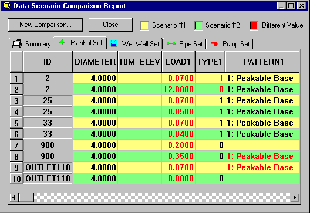

**Converting the InfoSewer SMP_basin_121_MODEL to an ICM InfoWorks Network for ICM 2030.0**

# The goal of this document is to walk you through the process of importing an InfoSewer model into an ICM InfoWorks Network (Figure 1). We will concentrate on the 2016 scenarios for dry/wet and then average/peak from a wide range of InfoSewer Scenarios (Figure 2). In the IEDB folder, the InfoSewer data is stored in DBF files. We will import the DBF files either by copying and pasting them from Excel or by converting the DBF files to CSV files and then importing them into an ICM InfoWorks Network via ICM's Open Data Import Centre (ODIC).

# Table of Contents

[**Converting the InfoSewer SMP_basin_121_MODEL to an ICM InfoWorks Network for ICM 2030.0** [1](#_Toc101090725)](#_Toc101090725)

[1. What is the Size (Elements and Scenarios) of the InfoSewer Model? [3](#what-is-the-size-elements-and-scenarios-of-the-infosewer-model)](#what-is-the-size-elements-and-scenarios-of-the-infosewer-model)

[2. Create an ICM InfoWorks Network for the import from InfoSewer [6](#create-an-icm-infoworks-network-for-the-import-from-infosewer)](#create-an-icm-infoworks-network-for-the-import-from-infosewer)

[3. What Are the Units of the InfoSewer Model? [8](#what-are-the-units-of-the-infosewer-model)](#what-are-the-units-of-the-infosewer-model)

[4. What Are the Peaking Factor Equations in the InfoSewer Model? [10](#what-are-the-peaking-factor-equations-in-the-infosewer-model)](#what-are-the-peaking-factor-equations-in-the-infosewer-model)

[5. Where are the Scenario Datasets in the IEDB folder of the InfoSewer Model? [11](#where-are-the-scenario-datasets-in-the-iedb-folder-of-the-infosewer-model)](#where-are-the-scenario-datasets-in-the-iedb-folder-of-the-infosewer-model)

[6. How to use the ICM ODIC to import the InfoSewer Model? [11](#how-to-use-the-icm-odic-to-import-the-infosewer-model)](#how-to-use-the-icm-odic-to-import-the-infosewer-model)

[7. What are the Imported Scenario/Datasets for the InfoSewer Model? [12](#what-are-the-imported-scenariodatasets-for-the-infosewer-model)](#what-are-the-imported-scenariodatasets-for-the-infosewer-model)

[8. What DBF Files must be converted to CSV Format? [14](#what-dbf-files-must-be-converted-to-csv-format)](#what-dbf-files-must-be-converted-to-csv-format)

[9. How to Copy the Curve Patterns from InfoSewer. [15](#how-to-copy-the-curve-patterns-from-infosewer.)](#how-to-copy-the-curve-patterns-from-infosewer.)

[10. Import the Node.CSV and Link.CSV files using the ICM ODIC. [15](#import-the-node.csv-and-link.csv-files-using-the-icm-odic.)](#import-the-node.csv-and-link.csv-files-using-the-icm-odic.)

[11. How to import the Node Hydraulic Information from InfoSewer [15](#how-to-import-the-node-hydraulic-information-from-infosewer)](#how-to-import-the-node-hydraulic-information-from-infosewer)

[12. How to import the Link Hydraulic Information from InfoSewer [15](#how-to-import-the-link-hydraulic-information-from-infosewer)](#how-to-import-the-link-hydraulic-information-from-infosewer)

[13. How to Create Subcatchments in an ICM InfoWorks Network [16](#how-to-create-subcatchments-in-an-icm-infoworks-network)](#how-to-create-subcatchments-in-an-icm-infoworks-network)

[14. How to Import the Dry Weather Flow (DWF) from InfoSewer [16](#how-to-import-the-dry-weather-flow-dwf-from-infosewer)](#how-to-import-the-dry-weather-flow-dwf-from-infosewer)

[15. How to Use SQL to Update the Dry Weather Flow (DWF) [16](#how-to-use-sql-to-update-the-dry-weather-flow-dwf)](#how-to-use-sql-to-update-the-dry-weather-flow-dwf)

[16. How to validate the ICM InfoWorks Network [16](#how-to-validate-the-icm-infoworks-network)](#how-to-validate-the-icm-infoworks-network)

Table of Figures

[Figure 1 The InfoSewer Model is small (24 nodes) and seems to be a Force Main Model. [3](#_Toc101090742)](#_Toc101090742)

[Figure 2 Scenarios in the InfoSewer Model: SMP_basin_121_MODEL. It also lists the Scenario datasets used by Scenario. If the data is different than the base of parent scenario then a new Dataset is used by InfoSewer. [4](#_Toc101090743)](#_Toc101090743)

[Figure 3 Create a model group and model network (InfoWorks Network). [6](#_Toc101090744)](#_Toc101090744)

[Figure 4 The InfoWorks Network has the same name as the InfoSewer MXD file. [7](#_Toc101090745)](#_Toc101090745)

[Figure 5 How to find the InfoSewer Flow Units. [8](#_Toc101090746)](#_Toc101090746)

[Figure 6 Set the Units of the ICM InfoWorks Network to MGD. [9](#_Toc101090747)](#_Toc101090747)

[Figure 7 The peaking factors used are found in the RUNOPT.DBF file in the column PF_K and PF_P. [10](#_Toc101090748)](#_Toc101090748)

[Figure 8 Subfolders of Interest in the IEDB Folder of InfoSewer. [11](#_Toc101090749)](#_Toc101090749)

[Figure 9 Use the Network/Import/ODIC Tool Manu to import CSV files from InfoSewer. [12](#_Toc101090750)](#_Toc101090750)

[Figure 10 2016-C-SS-ADWF-FEB Scenario InfoSewer Data Sets. This Scenario shares the parent Scenario datasets except for manhole DWF loadings. [13](#_Toc101090751)](#_Toc101090751)

[Figure 11 InfoSewer Model DWF Patterns - Three will be used in ICM. [13](#_Toc101090752)](#_Toc101090752)

[Figure 12 DWF is an InfoSewer Peakable with One Weekend Pattern [14](#_Toc101090753)](#_Toc101090753)

# What is the Size (Elements and Scenarios) of the InfoSewer Model?

The InfoSewer model consists of 36 distinct scenarios (Figure 2 and Table 1). There is only one wet well and one pump in the small model, as shown in Figure 1.

Figure The InfoSewer Model is small (24 nodes) and seems to be a Force Main Model.

Figure Scenarios in the InfoSewer Model: SMP_basin_121_MODEL. It also lists the Scenario datasets used by Scenario. If the data is different than the base of parent scenario then a new Dataset is used by InfoSewer.

Table 1: Description in Text of the InfoSewer Scenarios

<table>
<colgroup>
<col style="width: 45%" />
<col style="width: 26%" />
<col style="width: 16%" />
<col style="width: 10%" />
</colgroup>
<thead>
<tr class="header">
<th><table>
<colgroup>
<col style="width: 35%" />
<col style="width: 64%" />
</colgroup>
<thead>
<tr class="header">
<th>ID</th>
<th>DESCRIPT</th>
</tr>
</thead>
<tbody>
<tr class="odd">
<td>BASE</td>
<td>Base Data Scenario</td>
</tr>
<tr class="even">
<td>2016-SS-DO-NOT-RUN</td>
<td>2016 Steady State Simulation DO NOT RUN</td>
</tr>
<tr class="odd">
<td>2016-C-SS-ADWF-FEB</td>
<td>2016 Calibrated Average Dry Weather Flow - Weekend</td>
</tr>
<tr class="even">
<td>2016-C-SS-ADWF-MARCH</td>
<td>2016 Calibrated Average Dry Weather Flow - Weekend</td>
</tr>
<tr class="odd">
<td>2016-EPS-DO-NOT-RUN</td>
<td>2016 Extended Period Simulation DO NOT RUN</td>
</tr>
<tr class="even">
<td>2016-C-EP-ADWF-FEB</td>
<td>2016 Calibrated Average Dry Weather Flow_Weekend-February</td>
</tr>
<tr class="odd">
<td>2016-C-EP-ADWF-MARCH</td>
<td>2016 Calibrated Average Dry Weather Flow_Weekend-March</td>
</tr>
<tr class="even">
<td>2016-C-EP-ADWF-FEB-WKDAY</td>
<td>2016 Calibrated Average Dry Weather Flow_Weekday-February</td>
</tr>
<tr class="odd">
<td>2016-C-EP-ADWF-MARCH-WKDAY</td>
<td>2016 Calibrated Avg Dry Weather Flow_Weekday-March</td>
</tr>
<tr class="even">
<td>2016-C-SS-ADWF-FEB-WKDAY</td>
<td>2016 Calibrated Avg Dry Weather Flow_Weekday February</td>
</tr>
<tr class="odd">
<td>2016-C-SS-ADWF-MARCH-WKDAY</td>
<td>2016 Calibrated Avg Dry Weather Flow_Weekday-March</td>
</tr>
<tr class="even">
<td>2016-C-EP-PDWF-FEB-WKDAY</td>
<td>2016 Calibrated Peak Dry Weather Flow Weekday, February</td>
</tr>
<tr class="odd">
<td>2016-C-EP-PDWF-FEB-WKEND</td>
<td>2016 Calibrated Peak Dry Weather Flow Weekend, February</td>
</tr>
<tr class="even">
<td>2016-C-EP-PDWF-MAR-WKDAY</td>
<td>2016 Calibrated Peak Dry Weather Flow Weekday, March</td>
</tr>
<tr class="odd">
<td>2016-C-EP-PDWF-MAR-WKEND</td>
<td>2016 Calibrated Peak Dry Weather Flow Weekend, March</td>
</tr>
<tr class="even">
<td>2016-C-SS-PDWF-MAR-WKDAY</td>
<td>2016 Calibrated Peak Dry Weather Flow Weekday-March</td>
</tr>
<tr class="odd">
<td>2016-C-SS-PDWF-MAR-WKEND</td>
<td>2016 Calibrated Peak Dry Weather Flow Weekend-March</td>
</tr>
<tr class="even">
<td>2016-C-SS-PDWF-FEB-WKDAY</td>
<td>2016 Calibrated Peak Dry Weather Flow Weekday-February</td>
</tr>
<tr class="odd">
<td>2016-C-SS-PDWF-FEB-WKEND</td>
<td>2016 Calibrated Peak Dry Weather Flow Weekend-February</td>
</tr>
<tr class="even">
<td>2016-C-SS-PWWF-FEB-WKEND</td>
<td>2016 Calibrated Peak Wet Weather Flow_Weekend-February</td>
</tr>
<tr class="odd">
<td>2016-C-SS-PWWF-FEB-WKDAY</td>
<td>2016 Calibrated Peak Wet Weather Flow_Weekday-February</td>
</tr>
<tr class="even">
<td>2016-C-SS-PWWF-MARCH-WKEND</td>
<td>2016 Calibrated Peak Wet Weather Flow_Weekend-March</td>
</tr>
<tr class="odd">
<td>2016-C-SS-PWWF-MARCH-WKDAY</td>
<td>2016 Calibrated Peak Wet Weather Flow_Weekday-March</td>
</tr>
<tr class="even">
<td>BO-SS-DO-NOT-RUN</td>
<td>Buildout Steady State Simulation</td>
</tr>
<tr class="odd">
<td>BO-D-SS-PWWF-DAY6-MARCH</td>
<td></td>
</tr>
<tr class="even">
<td>BO-SS-ADWF-MARCH</td>
<td></td>
</tr>
<tr class="odd">
<td>BO-D-SS-PDWF-MARCH</td>
<td></td>
</tr>
<tr class="even">
<td>BO-D-SS-PWWF-DAY2-MARCH</td>
<td></td>
</tr>
<tr class="odd">
<td>2017-D-SS-PWWF-DAY6-MARCH</td>
<td>10 Year 6 Hour Storm, March-Weekday</td>
</tr>
<tr class="even">
<td>2017-D-SS-PWWF-DAY6-FEB</td>
<td></td>
</tr>
<tr class="odd">
<td>2017-D-SS-PWWF-END6-FEB</td>
<td></td>
</tr>
<tr class="even">
<td>2017-D-SS-PWWF-END6-MARCH</td>
<td>10 Year 6 Hour storm_March-Weekend</td>
</tr>
<tr class="odd">
<td>2017-D-SS-PWWF-DAY2-MARCH</td>
<td>10 Year 2 Hour Storm, March-Weekday</td>
</tr>
<tr class="even">
<td>2017-D-SS-PWWF-END2-MARCH</td>
<td>10 Year 2 Hour Storm_March-Weekend</td>
</tr>
<tr class="odd">
<td>2017-SS-ADWF-MARCH-WKEND</td>
<td>Velocity evaluation of ADWF conditions in upsized pipe</td>
</tr>
<tr class="even">
<td>2017-SS-PDWF-MARCH-WEEKEND</td>
<td>for results table in hydraulic TM</td>
</tr>
</tbody>
</table></th>
<th></th>
<th></th>
<th></th>
</tr>
</thead>
<tbody>
<tr class="odd">
<td></td>
<td></td>
<td></td>
<td></td>
</tr>
<tr class="even">
<td></td>
<td></td>
<td></td>
<td></td>
</tr>
<tr class="odd">
<td></td>
<td></td>
<td></td>
<td></td>
</tr>
<tr class="even">
<td><h1 id="create-an-icm-infoworks-network-for-the-import-from-infosewer">Create an ICM InfoWorks Network for the import from InfoSewer</h1>

Create a model group and model network (InfoWorks Network) with the same name as the InfoSewer MXD file (not necessary but done for consistency).

Figure Create a model group and model network (InfoWorks Network).

Figure The InfoWorks Network has the same name as the InfoSewer MXD file.
</td>
<td></td>
<td></td>
<td></td>
</tr>
<tr class="odd">
<td></td>
<td></td>
<td></td>
<td></td>
</tr>
<tr class="even">
<td></td>
<td></td>
<td></td>
<td></td>
</tr>
<tr class="odd">
<td></td>
<td></td>
<td></td>
<td></td>
</tr>
<tr class="even">
<td></td>
<td></td>
<td></td>
<td></td>
</tr>
<tr class="odd">
<td></td>
<td></td>
<td></td>
<td></td>
</tr>
<tr class="even">
<td></td>
<td></td>
<td></td>
<td></td>
</tr>
<tr class="odd">
<td></td>
<td></td>
<td></td>
<td></td>
</tr>
<tr class="even">
<td></td>
<td></td>
<td></td>
<td></td>
</tr>
<tr class="odd">
<td></td>
<td></td>
<td></td>
<td></td>
</tr>
<tr class="even">
<td><h1 id="what-are-the-units-of-the-infosewer-model">What Are the Units of the InfoSewer Model?</h1>

The units are found in the RUNOPT.DBF file. In this InfoSewer model the units are type 2 or MGD (Figure 5). We will set the units of the InfoWorks Network as well to MGD (Figure 6).

Figure How to find the InfoSewer Flow Units.
</td>
<td></td>
<td></td>
<td></td>
</tr>
<tr class="odd">
<td>

Figure Set the Units of the ICM InfoWorks Network to MGD.
</td>
<td></td>
<td></td>
<td></td>
</tr>
<tr class="even">
<td></td>
<td></td>
<td></td>
<td></td>
</tr>
<tr class="odd">
<td></td>
<td></td>
<td></td>
<td></td>
</tr>
<tr class="even">
<td></td>
<td></td>
<td></td>
<td></td>
</tr>
<tr class="odd">
<td><h1 id="what-are-the-peaking-factor-equations-in-the-infosewer-model">What Are the Peaking Factor Equations in the InfoSewer Model?</h1>

The peaking factors used are found in the RUNOPT.DBF file in the column PF_K (coefficient) and PF_P (exponent)

. In this model of InfoSewer the peaking flows are Qpeaked = 1.70 * Qbase ^ 0.947. Peakable point load is only one of three InfoSewer loads; the other two are unpeakable and peakable coverage.

Figure The peaking factors used are found in the RUNOPT.DBF file in the column PF_K and PF_P.
</td>
<td></td>
<td></td>
<td></td>
</tr>
<tr class="even">
<td><h1 id="where-are-the-scenario-datasets-in-the-iedb-folder-of-the-infosewer-model">Where are the Scenario Datasets in the IEDB folder of the InfoSewer Model?</h1>

The Scenarios are found in the IEDB folder under that name of the possible DataSets. We will be interested in the Control, DWF, Manhole, I&amp;I, Operate, Pipe, Pump and Scenario Subfolders.

Figure Subfolders of Interest in the IEDB Folder of InfoSewer.
</td>
<td></td>
<td></td>
<td></td>
</tr>
<tr class="odd">
<td></td>
<td></td>
<td></td>
<td></td>
</tr>
<tr class="even">
<td></td>
<td></td>
<td></td>
<td></td>
</tr>
<tr class="odd">
<td></td>
<td></td>
<td></td>
<td></td>
</tr>
<tr class="even">
<td></td>
<td></td>
<td></td>
<td></td>
</tr>
<tr class="odd">
<td></td>
<td></td>
<td></td>
<td></td>
</tr>
<tr class="even">
<td></td>
<td></td>
<td></td>
<td></td>
</tr>
<tr class="odd">
<td></td>
<td></td>
<td></td>
<td></td>
</tr>
<tr class="even">
<td></td>
<td></td>
<td></td>
<td></td>
</tr>
<tr class="odd">
<td></td>
<td></td>
<td></td>
<td></td>
</tr>
<tr class="even">
<td></td>
<td></td>
<td></td>
<td></td>
</tr>
<tr class="odd">
<td></td>
<td></td>
<td></td>
<td></td>
</tr>
<tr class="even">
<td></td>
<td></td>
<td></td>
<td></td>
</tr>
<tr class="odd">
<td></td>
<td></td>
<td></td>
<td></td>
</tr>
<tr class="even">
<td></td>
<td></td>
<td></td>
<td></td>
</tr>
<tr class="odd">
<td></td>
<td></td>
<td></td>
<td></td>
</tr>
<tr class="even">
<td></td>
<td></td>
<td></td>
<td></td>
</tr>
</tbody>
</table>

# How to use the ICM ODIC to import the InfoSewer Model?

The ODIC or Open Data Import Centre will be used to import the CSV files converted from the needed DBF files from InfoSewer. We do not have to convert all DBF files. We will first drag the blank InfoWorks Network to the Geoplan of ICM.

Figure Use the Network/Import/ODIC Tool Manu to import CSV files from InfoSewer.

# What are the Imported Scenario/Datasets for the InfoSewer Model?

We will convert the scenario 2016-C-SS-ADWF-FEB (Figure 9). It has three weekday and weekend patterns but no storm event data (Figure 10). We will import Datasets 2016-EXSYS and Manhole Dataset 2016-C-EP-ADWF-FEB

Figure 2016-C-SS-ADWF-FEB Scenario InfoSewer Data Sets. This Scenario shares the parent Scenario datasets except for manhole DWF loadings.

Figure InfoSewer Model DWF Patterns - Three will be used in ICM.

Figure DWF is an InfoSewer Peakable with One Weekend Pattern

# What DBF Files must be converted to CSV Format?

Since the ICM ODIC Import tool only imports CSV files we need to use MS Excel to save the following files in the Base Scenario of the IEDB folder to CSV format.

# How to Copy the Curve Patterns from InfoSewer.

Since the ICM ODIC Import tool only imports CSV files we need to use MS Excel to save the following files in the Base Scenario of the IEDB folder to CSV format.

# Import the Node.CSV and Link.CSV files using the ICM ODIC.

Since the ICM ODIC Import tool only imports CSV files we need to use MS Excel to save the following files in the Base Scenario of the IEDB folder to CSV format.

# How to import the Node Hydraulic Information from InfoSewer

Since the ICM ODIC Import tool only imports CSV files we need to use MS Excel to save the following files in the Base Scenario of the IEDB folder to CSV format.

# How to import the Link Hydraulic Information from InfoSewer

Since the ICM ODIC Import tool only imports CSV files we need to use MS Excel to save the following files in the Base Scenario of the IEDB folder to CSV format.

# How to Create Subcatchments in an ICM InfoWorks Network

Since the ICM ODIC Import tool only imports CSV files we need to use MS Excel to save the following files in the Base Scenario of the IEDB folder to CSV format.

# How to Import the Dry Weather Flow (DWF) from InfoSewer

Since the ICM ODIC Import tool only imports CSV files we need to use MS Excel to save the following files in the Base Scenario of the IEDB folder to CSV format.

# How to Use SQL to Update the Dry Weather Flow (DWF)

Since the ICM ODIC Import tool only imports CSV files we need to use MS Excel to save the following files in the Base Scenario of the IEDB folder to CSV format.

# How to validate the ICM InfoWorks Network

Since the ICM ODIC Import tool only imports CSV files we need to use MS Excel to save the following files in the Base Scenario of the IEDB folder to CSV format.
