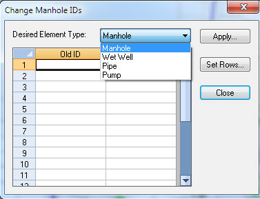
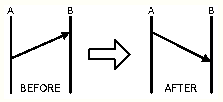

# Element Attribute Browser in InfoSewer

The Attribute Browser dialog box allows the user to view and edit the database information related to a selected link or node facility.  Shown below, the dialog box contains all information related to links and nodes when selected by the user.  

Unless "grayed" out, any of the records under the section headers (Geometry, Modeling, Information) are editable at any time.  While using the Attribute Browser, click the red check box next to the title to expand and contract the section headers.   The Output data section is available only after a successful model run. Additionally other features allow you to locate (search) elements, create default values and assign specific values through the [<u>Tools</u>](javascript:BSSCPopup('../Tools_Icon.htm');) menu.

To learn more about the multitude of icons related to the Attribute Browser, [<u>click here</u>](javascript:BSSCPopup('../User_Interface/Dialog_Boxes/Attribute_Browser_Icons.htm');) or select any of the icons below.

**<u>The Link Element</u>**

The link tab allows the user to see the database information related to a graphically selected link.                        

Click on any of the drop down links below to learn more about the database information contained in the Attribute Browser.                                                                                                                  

<table>
<colgroup>
<col style="width: 32%" />
<col style="width: 67%" />
</colgroup>
<thead>
<tr class="header">
<th>
<strong><u>Pipe Data</u></strong>

Pipe ID

<strong>ID</strong> - The unique H2OMAP Sewer identification of the pipe.

<strong>Description</strong> - A user defined description of the pipe.

<strong> ID</strong> - The unique InfoSewer identification of the pipe.

<strong> Description</strong> - A user defined description of the pipe.

Geometry

<strong>Start Node</strong> - The upstream node for the pipe.

<strong>End Node</strong> - The downstream node for the pipe.

<strong> Start Node</strong> - The upstream node for the pipe.

<strong>End Node</strong> - The downstream node for the pipe.

Modeling

<strong>From Invert</strong> - The upstream invert elevation of the pipe

<strong>To Invert</strong> - The downstream invert elevation of the pipe.

<strong>Length</strong> - The length of the pipe.  Created automatically if Tools -&gt; Preferences -&gt; Operation -&gt; Auto Length Calculation is checked on.

<strong>Diameter</strong> - The diameter of the channel (for circular pipes) as specified by the user. For non-circular conduits, required input parameters may be one or more of channel depth, channel width, and side slopes.

<strong>Coefficient</strong> - The Manning (gravity flow) or Hazen-Williams (force main) roughness coefficient as assigned by the user.

<strong>Parallel</strong> - The number of pipes in parallel with the existing pipe.  Each parallel pipe is given the exact same parameters as the existing pipe.

<strong> From Invert</strong> - The upstream invert elevation of the pipe. Units are feet or meters.

<strong> To Invert</strong> - The downstream invert elevation of the pipe.  Units are feet or meters.

<strong> Length</strong> - The length of the pipe.  Created automatically if Tools -&gt; Preferences -&gt; Operation -&gt; Auto Length Calculation is checked on.  Units are feet or meters.

<strong> Diameter</strong> - The diameter of the channel (for circular pipes) as specified by the user. For non-circular conduits, required input parameters may be one or more of channel depth, channel width, and side slopes. Units are inches or millimeters.

<strong> Coefficient</strong> - The Manning (gravity flow) or Hazen-Williams (force main) roughness coefficient as assigned by the user.

<strong> Parallel</strong> - The number of pipes in parallel with the existing pipe.  Each parallel pipe is given the exact same parameters as the existing pipe.  Unitless.

Output

<strong>Output</strong> - The output fields will display the output results for the latest model run (*active* output source).  <a href="file:///C:\SWMM-SEWER%20Robohelp\SewerCombined%20-%20InfoSewer\Reports_Graphing_and_Output\Available_Report_Types.htm#StaticGravity"><u>Click here</u></a> to learn more about the fields provided in a pipe output report.

<strong> Output</strong> - The output fields will display the output results for the latest model run (*active* output source).  <a href="javascript:BSSCPopup(&#39;../Reports_Graphing_and_Output/Available_Report_Types.htm&#39;);"><u>Click here</u></a> to learn more about the fields provided in a pipe output report.

<strong><u>Pump Data</u></strong>

Pump ID

<strong>ID</strong> - The unique H2OMAP Sewer identification of the pump.

<strong>Description</strong> - A user defined description of the pump.

<strong> ID</strong> - The unique InfoSewer identification of the pump.

<strong>Description</strong> - A user defined description of the pump.

Geometry

<strong>Start Node</strong> - The upstream node for the pump.

<strong>End Node</strong> - The downstream node for the pump.

<strong> Start Node</strong> - The upstream node for the pump.

<strong> End Node</strong> - The downstream node for the pump.

Modeling

<strong>Type</strong> - The type of pump to be used by H2OMAP Sewer.  To change the type, merely click in the drop down box and select from the list.  <a href="file:///C:\SWMM-SEWER%20Robohelp\SewerCombined%20-%20InfoSewer\Data_Elements\Pumps.htm#TypesPump"><u>Click here</u></a> to learn more about each type and the fields required.

<strong>Parallel</strong> - The number of pumps in parallel to the existing pump.  Parallel pumps are given the exact specifications of the existing pump.

<a href="file:///C:\SWMM-SEWER%20Robohelp\SewerCombined%20-%20InfoSewer\Data_Elements\Pumps.htm#TypesPump"><u>Click here</u></a> to learn more about the types of pumps available in H2OMAP Sewer.

<strong> Type</strong> - The type of pump to be used by InfoSewer..  To change the type, merely click in the drop down box and select from the list.  <a href="javascript:BSSCPopup(&#39;Pumps.htm&#39;);"><u>Click here</u></a> to learn more about each type and the fields required.

<strong> Parallel</strong> - The number of pumps in parallel to the existing pump.  Parallel pumps are given the exact specifications of the existing pump.   Unitless.

<a href="javascript:BSSCPopup(&#39;Pumps.htm&#39;);"><u>Click here</u></a> to learn more about the types of pumps available

Information

<strong>Installation Year</strong> - The year the pump was installed.

<strong>Retirement Year</strong> - The year the pump is expected to be retired from service.

<strong>Zone</strong> - The service area of the selected pump.

<strong>Phase</strong> - Assigning a phase enables the user to activate and deactivate facilities through the facility manager prior to modeling a simulation.

<strong>Rated Power</strong> - The rated horsepower of the pump in the field.

<strong>Cost ID</strong> - A database field used to assign differing cost identifiers to differing facilities.

<strong>(Other User Created Fields)</strong> - Any fields added by the user will appear at the end of the Information tab.  <a href="file:///C:\SWMM-SEWER%20Robohelp\SewerCombined%20-%20InfoSewer\Database_Management\DBEditor.htm#AddingFields"><u>Click here</u></a> to learn how to add a field.

<strong> Installation Year</strong> - The year the pump was installed.

<strong> Retirement Year</strong> - The year the pump is expected to be retired from service.

<strong> Zone</strong> - The service area of the selected pump.

<strong> Phase</strong> - Assigning a phase enables the user to activate and deactivate facilities through the facility manager prior to modeling a simulation.

<strong> Rated Power</strong> - The rated horsepower of the pump in the field.

<strong> Cost ID</strong> - A database field used to assign differing cost identifiers to differing facilities.

<strong> (Other User Created Fields)</strong> - Any fields added by the user will appear at the end of the Information tab.  <a href="javascript:BSSCPopup(&#39;../Database_Management/DBEditor.htm#AddingFields&#39;);"><u>Click here</u></a> to learn how to add a field.

Output

<strong>Output</strong> - The output fields will display the output results for the latest model run (*active* output source).  <a href="file:///C:\SWMM-SEWER%20Robohelp\SewerCombined%20-%20InfoSewer\Reports_Graphing_and_Output\Available_Report_Types.htm#EPSPump"><u>Click here</u></a> to learn more about the fields provided in a pump output report.

<strong> Output</strong> - The output fields will display the output results for the latest model run (*active* output source).  <a href="javascript:BSSCPopup(&#39;../Reports_Graphing_and_Output/Available_Report_Types.htm#EPSPump&#39;);"><u>Click here</u></a> to learn more about the fields provided in a pump output report.
</th>
<th>

 

</th>
</tr>
</thead>
<tbody>
</tbody>
</table>

 

**<u>The Node Element</u>**

The node tab allows the user to see the database information related to a graphically selected node.

 

<table>
<colgroup>
<col style="width: 36%" />
<col style="width: 63%" />
</colgroup>
<thead>
<tr class="header">
<th>
<strong><u>Manhole Data (Normal, Chamber, Outlet)</u></strong>

Node ID

<strong>ID</strong> - The unique H2OMAP Sewer identification of the manhole.

<strong>Description</strong> - A user defined description of the node.

<strong> ID</strong> - The unique H2OMAP Sewer identification of the manhole.

<strong>Description</strong> - A user defined description of the node.

Geometry

<strong>X</strong> - The x-coordinate of the node.

<strong>Y</strong> - The y-coordinate of the node.

<strong> X</strong> - The x-coordinate of the node.

<strong> Y</strong> - The y-coordinate of the node.

Modeling

<strong>Diameter</strong> - The internal diameter of the manhole.

<strong>Rim Elevation</strong> - The elevation of the rim of the manhole as specified by the user (usually a value denoted above sea level).

<strong>Load1</strong> - The base sewage loading demand at the manhole.  Up to ten base loadings can be entered for a single manhole.  The <a href="file:///C:\SWMM-SEWER%20Robohelp\SewerCombined%20-%20InfoSewer\Sewer_Design\Extra_Load.htm"><u>extra load</u></a> option allows additional loadings to be added as needed.

<strong>Type1</strong> - Specify whether the load is an unpeakable flow, an peakable base flow or a peakable coverage flow.  <a href="file:///C:\SWMM-SEWER%20Robohelp\SewerCombined%20-%20InfoSewer\Sewer_Design\Simulation_Options.htm#Peaking"><u>Click here</u></a> to learn more about each type.

<strong>Pattern1</strong> - The user defined diurnal pattern for the manhole loading.  Required for an EPS analysis.

<strong>Coverage1</strong> - The base population to be used during a peakable coverage flow determination.

<strong>Subbasin Area</strong> - Area of the subwatershed that drains to the loading manhole. This variable is required for stormwater modeling.

<strong>Runoff Coefficient </strong>-<strong> </strong>Ratio of storm runoff to rainfall volume. This variable is required during steady state simulation of stormwater.

<strong>Channel Slope</strong> - Average slope of the longest flow channel for the subwatershed that drains to the loading manhole. This variable is required during steady state simulation of stormwater.

<strong>Channel Length </strong>-<strong> </strong>Length of the longest flow path for the subbasin that drains to the manhole. This variable is required during steady state simulation of stormwater.

<strong>Hyetograph </strong>- A plot of rainfall intensity versus time. This variable is required during dynamic simulation of stormwater.

<strong>Hydrograph </strong>-  Refers to a unit hydrograph pattern, and is required  is required during dynamic simulation of stormwater.

<strong>% Impervious</strong> : Percentage of the subwatershed that is covered with impervious       land uses. This parameter is used to estimate depression storage losses.

<strong>Pervious Retention </strong>: Refers to depression storage of the pervious portion of the subwatershed. The value should be given in feet for US Customary units, and in mm for SI units.

<strong>Impervious Retention </strong>: Refers to depression storage of the impervious portion of the subwatershed. The value should be given in feet for US Customary units, and in mm for SI units.

<strong>Initial Infiltration </strong>: maximum or initial infiltration rate (at t = 0). The parameter is accepted in inches/hour for US Customary, and in mm/hour for SI units. The default value is value is 3<strong> </strong>inches/hour (76.2 mm/hour).

<strong>Final Infiltration </strong>:<strong> </strong>final infiltration rate. The value should be provided in inches/hour for US Customary, and in mm/hour for SI units. The default value is 0.5 inches/hour.

<strong>Decay Constant </strong>: decay coefficient for Horton's infiltration equation, in per second. The default value is 0.001/second.

<strong>Regeneration Constant</strong> : Decay coefficient for the exponential recovery curve, in per second. It is generally considered to be less than decay constant, implying a longer drying curve than wetting curve.

 

<strong>Time of Concentration:</strong> Time of concentration for the subcatchment that is just starting to contribute to the node.

<strong> </strong>

<strong> Diameter</strong> - The internal diameter of the manhole.  Feet or Meters.

<strong> Rim Elevation</strong> - The elevation of the rim of the manhole as specified by the user (usually a value denoted above sea level).  Units are feet or meters.

<strong>  Headloss Coef</strong> – Used to calculate headloss in the manhole itself using the exit pipe velocity ( see <a href="javascript:BSSCPopup(&#39;../HEADLOSS_AT_MANHOLES.htm&#39;);"><u>link</u></a> for more details on Headloss Coefficients and manhole headloss)

<strong> Load1</strong> - The base sewage loading demand at the manhole.  Up to ten base loadings can be entered for a single manhole.  The <a href="javascript:BSSCPopup(&#39;../Sewer_Design/Extra_Load.htm&#39;);"><u>extra load</u></a> option allows additional loadings to be added as needed.  Units from the Run Manager.

<strong> Type1</strong> - Specify whether the load is an unpeakable flow, an peakable base flow or a peakable coverage flow.  <a href="file:///C:\SWMM-SEWER%20Robohelp\SewerCombined%20-%20InfoSewer\Sewer_Design\Simulation_Options.htm#Peaking"><u>Click here</u></a> to learn more about each type.

<strong> Pattern1</strong> - The user defined diurnal pattern for the manhole loading.  Required for an EPS analysis.

<strong> Coverage1</strong> - The base population to be used during a peakable coverage flow determination.

<strong> Subbasin Area</strong> - Area of the subwatershed that drains to the loading manhole. This variable is required for stormwater modeling.

<strong> Runoff Coefficient </strong>-<strong> </strong>Ratio of storm runoff to rainfall volume. This variable is required during steady state simulation of stormwater.

<strong> Channel Slope</strong> - Average slope of the longest flow channel for the subwatershed that drains to the loading manhole. This variable is required during steady state simulation of stormwater.

<strong> Channel Length </strong>-<strong> </strong>Length of the longest flow path for the subbasin that drains to the manhole. This variable is required during steady state simulation of stormwater. Units are feet or meters.

<strong> Hyetograph </strong>- A plot of rainfall intensity versus time. This variable is required during dynamic simulation of stormwater.

<strong> Hydrograph </strong>-  Refers to a unit hydrograph pattern, and is required  is required during dynamic simulation of stormwater.

<strong> % Impervious</strong> : Percentage of the subwatershed that is covered with impervious       land uses. This parameter is used to estimate depression storage losses.

<strong> Pervious Retention </strong>: Refers to depression storage of the pervious portion of the subwatershed. The value should be given in feet for US Customary units, and in mm for SI units.

<strong> Impervious Retention </strong>: Refers to depression storage of the impervious portion of the subwatershed. The value should be given in feet for US Customary units, and in mm for SI units.

<strong> Initial Infiltration </strong>: maximum or initial infiltration rate (at t = 0). The parameter is accepted in inches/hour for US Customary, and in mm/hour for SI units. The default value is value is 3<strong> </strong>inches/hour (76.2 mm/hour).

<strong> Final Infiltration </strong>:<strong> </strong>final infiltration rate. The value should be provided in inches/hour for US Customary, and in mm/hour for SI units. The default value is 0.5 inches/hour.

<strong> Decay Constant </strong>: decay coefficient for Horton's infiltration equation, in per second. The default value is 0.001/second.

<strong> Regeneration Constant</strong> : Decay coefficient for the exponential recovery curve, in per second. It is generally considered to be less than decay constant, implying a longer drying curve than wetting curve.

 

<strong> Time of Concentration:</strong> Time of concentration for the subcatchment that is just starting to contribute to the node.  Minutes.

 

Information

<strong>Type </strong>- The type of manhole.  Type 0 is a normal manhole, type 1 is a chamber manhole while type 2 is an outlet.  <a href="file:///C:\SWMM-SEWER%20Robohelp\SewerCombined%20-%20InfoSewer\Data_Elements\Manholes.htm"><u>Click here</u></a> to learn more.

<strong>Elevation</strong> - The ground elevation of the manhole.  This value may differ than the rim elevation.

<strong>Installation Year</strong> - The year the manhole was installed.

<strong>Retirement Year</strong> - The year the manhole is expected to be retired from service.

<strong>Zone</strong> - The service are of the selected manhole.

<strong>Phase</strong> - Assigning a phase enables the user to activate and deactivate facilities through the facility manager prior to modeling a simulation.

<strong>(Other User Created Fields)</strong> - Any fields added by the user will appear at the end of the Information tab.  <a href="file:///C:\SWMM-SEWER%20Robohelp\SewerCombined%20-%20InfoSewer\Database_Management\DBEditor.htm#AddingFields"><u>Click here</u></a> to learn how to add a field.

 

<strong> Type </strong>- The type of manhole.  Type 0 is a normal manhole, type 1 is a chamber manhole while type 2 is an outlet.  <a href="file:///C:\SWMM-SEWER%20Robohelp\SewerCombined%20-%20InfoSewer\Data_Elements\Manholes.htm"><u>Click here</u></a> to learn more.

<strong> Elevation</strong> - The ground elevation of the manhole.  This value may differ than the rim elevation.  Units are feet or meters.

<strong> Installation Year</strong> - The year the manhole was installed.

<strong> Retirement Year</strong> - The year the manhole is expected to be retired from service.

<strong> Zone</strong> - The service are of the selected manhole.

<strong> Phase</strong> - Assigning a phase enables the user to activate and deactivate facilities through the facility manager prior to modeling a simulation.

<strong> (Other User Created Fields)</strong> - Any fields added by the user will appear at the end of the Information tab.  <a href="javascript:BSSCPopup(&#39;../Database_Management/DBEditor.htm#AddingFields&#39;);"><u>Click here</u></a> to learn how to add a field.

Output

<strong>Output</strong> - The output fields will display the output results for the latest model run (*active* output source).  <a href="file:///C:\SWMM-SEWER%20Robohelp\SewerCombined%20-%20InfoSewer\Reports_Graphing_and_Output\Available_Report_Types.htm#EPSLoadingMH"><u>Click here</u></a> to learn more about the fields provided in a manhole node output report.

Output - The output fields will display the output results for the latest model run (*active* output source).  <a href="javascript:BSSCPopup(&#39;../Reports_Graphing_and_Output/Available_Report_Types.htm#EPSLoadingMH&#39;);"><u>Click here</u></a> to learn more about the fields provided in a manhole node output report.

<strong><u>Wet Well Data</u></strong>

Wet Well ID

<strong>ID</strong> - The unique H2OMAP Sewer identification of the wet well.

<strong>Description</strong> - A user defined description of the wet well.

<strong> ID</strong> - The unique  InfoSewer identification of the wet well.

<strong> Description</strong> - A user defined description of the wet well.

Geometry

<strong>X</strong> - The x-coordinate of the wet well.

<strong>Y</strong> - The y-coordinate of the wet well.

<strong> X</strong> - The x-coordinate of the wet well.

<strong> Y</strong> - The y-coordinate of the wet well.

Modeling

<strong>Type</strong> - The type of wet well to be used by H2OMAP Sewer.  To change the type, merely click in the drop down box and select from the list.  <a href="file:///C:\SWMM-SEWER%20Robohelp\SewerCombined%20-%20InfoSewer\Data_Elements\Wet_Wells.htm#TypeWetWells"><u>Click here</u></a> to learn more about each type and the fields required.

Type - The type of wet well to be used by InfoSewer.  To change the type, merely click in the drop down box and select from the list.  <a href="javascript:BSSCPopup(&#39;Wet_Wells.htm#TypeWetWells&#39;);"><u>Click here</u></a> to learn more about each type and the fields required.

Information

<strong>Installation Year</strong> - The year the wet well was installed.

<strong>Retirement Year</strong> - The year the wet well is expected to be retired from service.

<strong>Zone</strong> - The service area zone of the selected wet well.

<strong>Phase</strong> - Assigning a phase enables the user to activate and deactivate facilities through the facility manager prior to modeling a simulation.

<strong>Cost ID</strong> - A database field used to assign differing cost identifiers to differing facilities.

<strong>(Other User Created Fields)</strong> - Any fields added by the user will appear at the end of the Information tab.  <a href="file:///C:\SWMM-SEWER%20Robohelp\SewerCombined%20-%20InfoSewer\Database_Management\DBEditor.htm#AddingFields"><u>Click here</u></a> to learn how to add a field.

<strong> Installation Year</strong> - The year the wet well was installed.

<strong> Retirement Year</strong> - The year the wet well is expected to be retired from service.

<strong> Zone</strong> - The service area zone of the selected wet well.

<strong> Phase</strong> - Assigning a phase enables the user to activate and deactivate facilities through the facility manager prior to modeling a simulation.

<strong> Cost ID</strong> - A database field used to assign differing cost identifiers to differing facilities.

<strong> (Other User Created Fields)</strong> - Any fields added by the user will appear at the end of the Information tab.  <a href="javascript:BSSCPopup(&#39;../Database_Management/DBEditor.htm#AddingFields&#39;);"><u>Click here</u></a> to learn how to add a field.

Output

<strong>Output</strong> - The output fields will display the output results for the latest model run (*active* output source).  <a href="file:///C:\SWMM-SEWER%20Robohelp\SewerCombined%20-%20InfoSewer\Reports_Graphing_and_Output\Available_Report_Types.htm#EPSWetWell"><u>Click here</u></a> to learn more about the fields provided in a wet well output report.

Output - The output fields will display the output results for the latest model run (*active* output source).  <a href="javascript:BSSCPopup(&#39;../Reports_Graphing_and_Output/Available_Report_Types.htm#EPSWetWell&#39;);"><u>Click here</u></a> to learn more about the fields provided in a wet well output report.

 
</th>
<th>

 

</th>
</tr>
</thead>
<tbody>
</tbody>
</table>

**Other Related Topics - **[<u>Tools menu</u>](javascript:BSSCPopup('../Tools_Icon.htm');)

** **

**Tools Icon**

Use this command to access certain advanced tools provided by InfoSewer to manipulate data related to the currently active element. Click on the Down Arrow icon  to launch the **Tools** menu. The tools menu changes depending on the type of element presently selected as shown below.

Click on any portion below to learn more:

**<u>Manhole</u>**

**<u>Wetwell</u>**

   

**<u>Pipe</u>**

 

**<u>Pump</u>**

 

**Other Related Topics - **[<u>Attribute Browser</u>](javascript:BSSCPopup('../User_Interface/Attribute_Browser.htm');)

** **

**Operation Data**

The Operation Tab section of the InfoSewer **Browser** provides you with tools to create, edit and operate on the different operational features of InfoSewer.

Click on any section below to learn more

:

 

**Other Related Topics - ** [<u>Annotation Dialog Box</u>](javascript:BSSCPopup('../../InfoSewer/User_Interface/InfoSewer_Browser/Annotation/Annotation_Dialog_Box.htm');), [<u>Annotation Methodology</u>](javascript:BSSCPopup('../../InfoSewer/User_Interface/InfoSewer_Browser/Annotation/Annotation_Methodology.htm');), [<u>Contour-Labelling</u>](javascript:BSSCPopup('../../InfoSewer/User_Interface/InfoSewer_Browser/Contour/Contour-Labelling.htm');), [<u>Contour-Level</u>](javascript:BSSCPopup('../../InfoSewer/User_Interface/InfoSewer_Browser/Contour/Contour_-Level.htm');), [<u>Contour Dialog Box</u>](javascript:BSSCPopup('../../InfoSewer/User_Interface/InfoSewer_Browser/Contour/Contour_Dialog_Box.htm');), [<u>Contour Methodology</u>](javascript:BSSCPopup('../../InfoSewer/User_Interface/InfoSewer_Browser/Contour/Contour_Methodology.htm');), [<u>Contour Options</u>](javascript:BSSCPopup('../../InfoSewer/User_Interface/InfoSewer_Browser/Contour/Contour_Options.htm');),** **[<u>InfoSewer Browser</u>](javascript:BSSCPopup('../../InfoSewer/User_Interface/InfoSewer_Browser/Browser_Overview.htm');)

**Browser Overview**

The InfoSewer Browser provides a centralized location to access the various tools to create, edit, operate and analyze InfoSewer models. The Browser dialog box can be invoked by using the **Attribute Browser** command from the **InfoSewer\>** **View** menu.

The InfoSewer Browser provides four major capabilities for the modeling and analysis of water distribution systems:

- **Attribute Browser:** The Attribute tab displays all of the element attribute tables for the selected data element. See [<u>Attribute Browser</u>](javascript:BSSCPopup('../../InfoSewer/User_Interface/InfoSewer_Browser/Attribute_Browser/Element_Attribute_Browser.htm');)

- **Contour:** Use the contour tab to plot nodal input and output contours. To learn more about the different contouring options provided by InfoSewer [<u>click here</u>](javascript:BSSCPopup('../../InfoSewer/User_Interface/InfoSewer_Browser/Contour/Contour_Dialog_Box.htm');).

- **Operation Data:** The Operation Data tab contains all of the operational features of InfoSewer. Click here to learn more about the [<u>Operation Data</u>](javascript:BSSCPopup('../../InfoSewer/User_Interface/InfoSewer_Browser/Operation_Tab/Operating_Data.htm');) feature of InfoSewer.

- **Annotation:** The Annotation tab is used to color code pipes or nodes based on input and/or output results. Click here to learn more about the InfoSewer [<u>Annotation Manager</u>](javascript:BSSCPopup('../../InfoSewer/User_Interface/InfoSewer_Browser/Annotation/Annotation_Dialog_Box.htm');).

Click on any section below to learn more:

 
