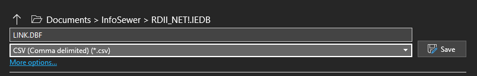

# Export from InfoSewer

InfoSewer  is able to export any data element or model result at any time.

Click on any hyperlink below to learn more.

- [**<u>Export Data Elements (Pipes, Manholes, etc.)</u>**](javascript:BSSCPopup('#ExportElements');)

- [**<u>Export Manager</u>**](javascript:BSSCPopup('#ExportManager');)

- [**<u>Export Model Results</u>**](javascript:BSSCPopup('#ExportResults');)

**<u>Export Data Elements</u>**

There are several ways to export data elements, depending on the type of file that is to be exported.

**<u>ArcInfo Generate File</u>**

If the export file is an ArcInfo Generate file, then from the **Exchange** menu, point to **Generate** then select **Export**.  At this point the user will be prompted to select the elements to be mapped (links and/or nodes) and the location to write the export files.  It is important to note that when generate files are created, they do not contain the database information from H2OMAP Sewer.  To generate database information, the user must also export a delimited text file (CSV) for import into ArcInfo.

**<u>Export Manager</u>**

All other data elements are exported through the Export Manager.  Here the user can export to either an ESRI Shapefile, MapInfo MIF/MID or an ASCII delimited text file.

To run the Export Manager, from the **Exchange** menu, select **Export Manager**.

The Export Manager itself is a three-step wizard that guides the user through the export process.

**<u>Step 1 – General Information</u>**

The first step of an export is to identify whichIn InfoSewer element, scope, output format and destination file are desired.

Click on any portion of the dialog box below to learn more.

Choose the desired options and then choose the Next button to continue to step 2.

**<u>Step 2 – Define Display Fields</u>**

The second step is to define which fields will be included in the export file and the order in which they will be created.  Field prefixes (ex. MANHOLE: ) reflect the component types.  The user also has the option of saving a custom configuration for later use.

Click on any portion of the dialog box below to learn more.

Choose the desired fields and then choose the Next button to continue to step 3.

**<u>Step 3 – Define Display Scope (ESRI and MapInfo Only)</u>**

The third step is only applicable to ESRI Shapefile and MapInfo MIF/MID export files.  Here the user is able to customize the database field names created in the export file by edit their names.

The Export Fields shows the user which database fields were chosen to be exported while the Field Names represents the database field header assigned to the new export file.  The user is able to click on any field name and change the name prior to the export file being created.

Once the finish button is clicked, an export file is created.  The export file can now be edited by third party software programs.

**<u>Exporting Model Results</u>**

Because InfoSewer is Windows based, any simulation report or database table that resides in a project is capable of being copied at any time.  Just open the desired output report or database table and highlight the data you wish to export.  Then, right-mouse click over the highlighted area and select Copy.  Open any third party package like Microsoft Excel and select Paste from the Edit menu.

This will prove useful for sharing your modeling efforts with your organization via enterprise or web (Intranet or Internet) applications.

Export Options are:

- CSV Files

- Shapefiles

- MIIF/MID

- for Pumps,  PIpes, Wet  Wells   and Manholes

**<u> </u>**

**<u>Manhole Export and Import</u>**

**<u>Pipe Export and Import</u>**

**<u>Wet Well  Export and Import</u>**

**<u>Pump Export and Import</u>**

 
