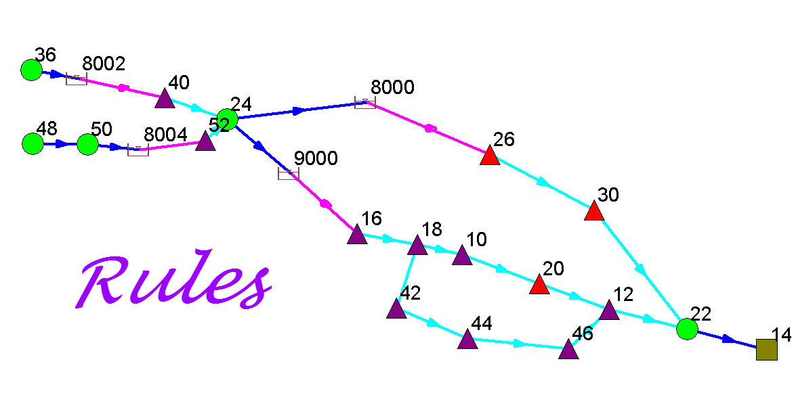
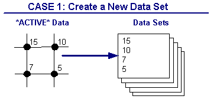
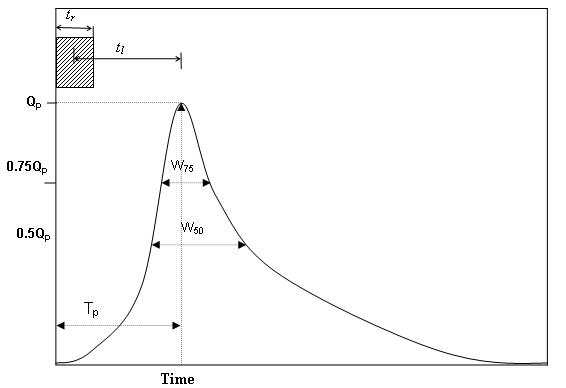

 

# Generation of the Unit Hydrograph

InfoSewer Pro generates a direct runoff hydrograph resulting from single or multiple storm events using a unit hydrograph synthesized according to any of the three techniques described above, or from a user-specified natural unit hydrograph. The model relies on a user input hyetograph (i.e., rainfall intensity versus time graph). The model; can derive effective rainfall from user supplied total rainfall hyetographs.

Unit hydrographs could be natural or synthetic. Natural unit hydrographs are derived from observed data, whereas synthetic hydrographs are generated following empirical techniques based on watershed parameters and storm characteristics to simulate the natural unit hydrograph.

If a natural hydrograph is available for a watershed, InfoSewer/Pro can utilize it to generate storm runoff at different locations in the collection system. In the absence of a natural unit hydrograph, the model can derive a synthetic unit hydrograph using four different techniques. Each of the unit hydrograph synthesizing approaches is described below.

An entire watershed of a collection system may not be well represented by a single unit hydrograph owing to variability in topography, land use, and soil characteristics of the subwatersheds. In the case of separate sewer systems, the magnitude and type of sources of infiltration/inflow will vary by subbasin. Accordingly, InfoSewer  Pro allows usage of multiple unit hydrographs, each representing part of the watershed being modeled. The unit hydrographs could be of any duration (e.g., 15-minute, 1-hr), but the duration must be the same for the entire unit hydrographs involved in modeling of the watershed.

To derive the storm hydrographs, InfoSewer Pro applies the basic assumptions of unit hydrograph theory described above (i.e., linearity, time invariance, and the principle of superposition). Storm events are assumed to have constant intensity over the duration of the unit hydrograph. Excess rainfall resulting from single or multiple storm events is discretized at intervals of unit hydrograph duration. For example, if a sewer collection system is being modeled using a 15-minute unit hydrograph, and if duration of the excess rainfall under investigation is 1-hour, the rainfall duration will be divided into four 15-minute rainfall events of constant intensity. This discretization approach, along with the unit hydrograph assumptions of linearity, time invariance, and superposition, enables InfoSewer  Pro to simulate storm runoff hydrograph at any location (e.g., loading manhole) throughout the collection system for any number of storm events. During generation of runoff hydrographs for locations other than the site where the unit hydrograph is originally derived, ordinates of the unit hydrographs are adjusted according to the ratio of drainage area of the two locations. Once the storm hydrographs for every loading manhole in the collection system are known, the storm load will be added to other loading types such as sanitary loads, if any, and will be routed through the collection system using the powerful Muskingum-Cunge’s dynamic flow routing algorithm.

**<u>NRCS (SCS) DIMENSIONLESS UNIT HYDROGRAPH METHOD</u>**

The SCS dimensionless unit hydrograph, graphically descried below, is widely used in practice. To generate a tr-hour unit hydrograph for a watershed, time to peak (Tp) and the peak flow rate (Qp) are determined using watershed characteristics.

                                                         

where tr is duration of effective rainfall, and tl  is lag time of the watershed. Lag time represents the time from the center of mass of effective rainfall to the time to peak of a unit hydrograph. In other words, lag time is a delay in time, after a brief rain over a watershed, before the runoff reaches its peak. The lag time can either be specified by the user, or can be calculated by the model using the following SCS equation (USDA 1986).

                    

where   

            tl    =   lag time of the watershed in hours.

            L  =    hydraulic length of the watershed in ft. This refers to travel distance of water from the most upstream location of the watershed to the point where the unit hydrograph is derived.

           CN =  the SCS curve number. This is a measure of runoff generating capacity of a watershed, and it depends on the soil, the antecedent moisture condition, the cover, and the hydrologic conditions of the watershed. Recommended CN values are given in the following table for urban areas (USDA 1986). The SCS suggests the CN values for the above equation to be within 50 and 95.

            S   =   average slope of the watershed.

The peak flow rate is calculated as:

                                                    

where

      Qp   =  peak flow rate in cfs.

       A   =  area of the watershed, in square miles, draining to the location of the unit hydrograph.

       Tp  =  time to peak of the unit hydrograph in hours.

Once Tp and Qp are known, actual time and flow rate ordinates of the tr-hour unit hydrograph are determined by multiplying the dimensionless time (T/Tp) and the dimensionless flow rate ordinates (Q/Qp) by Tp and Qp, respectively.

**<u>NRCS (SCS) TRIANGULAR UNIT HYDROGRAPH METHOD</u>**

The SCS has also developed a triangular unit hydrograph (USDA 1986) (see figure below) that is an approximation to the dimensionless unit hydrograph described above. The triangular unit hydrograph is entirely defined in terms of three points, Qp, Tp, and Tb. The lag time, time to peak, and peak flow rate are calculated using the same equations as for the dimensionless unit hydrograph.

**<u>[NRCS Dimensionless UH, NRCS Triangular UH](javascript:BSSCPopup('../H2OCalcNew/H2OCalc_Methodology/15_Stormwater_Runoff/NRCS_(SCS)_Dimensionless_Unit_Hydrograph_Method.htm');)  from Innovyze H2OCalc for Reference</u>**

- **Subcatchment Area** – Drainage area of the watershed.

- **Subcatchment Slope**– Average slope of the watershed.

-  **Flow Length** – Length of the longest overland flow path for the watershed.

-  **NRCS Curve Number** – Value of CN for the watershed. See Table 3.11. It is a function of soil type, land use type and quality, and antecedent moisture condition.

-  **Time of Concentration** – The time it takes for flow to travel from the hydraulically remotest point in the watershed to get to outlet of the watershed. If time of concentration is defined, slope, length, and CN values will not be required.

- **Rainfall Depth** – Depth of the design rainfall.

**<u>Peak Discharge: SCS Peak Discharge Method  from Innovyze H2OCalc for Reference</u>**

The dialog box for the SCS peak discharge method is shown below. Click [<u>here</u>](javascript:BSSCPopup('../H2OCalcNew/H2OCalc_Methodology/15_Stormwater_Runoff/NRCS_(SCS)_Dimensionless_Unit_Hydrograph_Method.htm');) for the methodology.

 

**<u>Input for the SCS peak discharge method:</u>**

- **Unit System** – English or SI unit.

- **Solving Target** – Peak discharge or time of concentration.

- **Equations** – Rational method or the SCS peak discharge method.

- **SCS Rainfall Type** – Select one of the SCS rainfall types (i.e., Types I, IA, II, or III)  

- **Curve Number** – SCS’s dimensionless number that is used as a measure of runoff generation capability of a watershed (see Table 3.12). It is a function of soil, land cover and treatment.

- **Rainfall Depth** – 24-hr cumulative design rainfall depth. This rainfall depth will be distributed across the 24-hr duration according to the SCS rainfall type selected.

- **Drainage Area** – Area of the total watershed that drains to the location where the peaks flow is determined.

**<u>Output for the SCS peak discharge method:</u>**

- **Peak Discharge** – Peak flow generated from the watershed.

Source: [<u>http://www.slideshare.net/damonweiss/workshop-on-storm-water-modeling-approaches</u>](http://www.slideshare.net/damonweiss/workshop-on-storm-water-modeling-approaches)

**The Tri-Triangle or RTK Method**

Tri-triangle is one of the techniques used by InfoSewer/Pro for synthesizing a hydrograph. The triangular unit hydrograph technique developed by the U.S. Soil Conservation Service (now known as Natural Resources Conservation Service NRCS) is one of the commonly used methods. As described above NRCS’s triangular synthetic unit method uses a single triangle to represent a unit hydrograph. However, shape of unit hydrograph is too complex to be well captured by a single triangle. InfoSewer/Pro applies up to three triangular synthetic hydrographs, as the name implies, to simulate a hydrograph. The total synthetic hydrograph is the result of aggregating corresponding ordinates of the three triangular hydrographs. Each of these three triangular hydrographs has its own characteristic parameters, namely time to peak, recession constant, and fraction of an effective rainfall volume allocated to the triangle. The technique is graphically illustrated below.

R1, R2, and R3 are fractions of excess rainfall volume, R, allocated to triangular synthetic hydrographs 1, 2, and 3 respectively.  Ti and Ki are time to peak and recession constants of the triangles, respectively. The three triangular synthetic hydrographs are conceptual representations of different components of direct runoff or rainfall-dependent infiltration/inflow. The first triangle represents rapidly responding (fast) components, such as contributions from pavements and rooftops, or direct inflow or rapid infiltration into separate sewer systems. The third triangle represents slow runoff components such as ground water contributions or slow infiltration into separate sewers. The second triangle represents runoff or infiltration with a medium time response.

Time to peak value of the first triangle typically varies between 1 and 2 hours, depending on the size of the tributary area in question. The second triangle takes T values ranging from 4 to 8 hours. The third triangle parameter varies greatly depending on the infiltration characteristics of the system being modeled, and has a T value generally between 10 and 24 hours. The default values used for T1,  T2, and T3 are 1, 4, and 12 hours respectively. Value of K for the first triangle typically ranges between 2 and 3. The second and the third triangles take K values from 2 to 4. The default values of K are 2, 3, and 3 for the first, the second, and the third triangles, respectively.

**<u>RDII or Tri-Triangular Example</u>**

The RDII or Rainfall Dependent Infiltration Inflow method in InfoSewer is similar to the RDII or RTK  method in  InfoSWMM and InfoWorks ICM but with some differences. The RTK data for triangles 1, 2 and 3 are defined in the Unit Hydrograph but instead of individual R values, the overall R is set and the Percent R1,  R2 and R3 are defined based on the total  R.  R3 is calculated internally as 100 – R1 – R2.   Each loading manhole with RDII flow has a total  area, a hyetograph and a Unit Hydrograph.  The hyetograph has to be set at multiples of the unit hydrograph, so you can define the time or X columns with integers and then use the Block Edit command to change X to minutes by multiplying  by the Unit Hydrograph time (Figure 1).   You can use only one component if you set R1 or R2 to 100 percent or R3 to 100 percent by setting R1 and R2 to 0 percent (Figure 2).  The overall area of the Unit Hydrograph is divided amongst the loading manhole using the Subbasin Area (Figure 3).   The storm flows generated can be viewed using a Group Graph (Figure 4) and the area of the loading manholes has a relationship to to the total area of the defined unit hydrograph (Figure 5).

> Figure 1. Hyetograph Curve for the RDII Unit Hydrograph

> Figure 2. The Unit Hydrograph is defined for various values of R, R1, R2, T1, T2, T3, K1, K2 and K3

> Figfure 3. The-Unit-Hydrograph-and-Hyetograph-are-tied-to-a-particular-loading-manhole-using-a-Subbasin-Area

> Figure 4. The Unit Hydrographs that are generated can be viewed using a Group loading Manhole Graph. The R1, R2 and R3 have only one triangle

 

 

 

 

**The Colorado Urban Hydrograph Procedure**

The Colorado Urban Hydrograph Procedure (CUHP) uses the equations and procedures presented in the Urban Drainage Criteria Manual (USDCM) of the Urban Drainage and Flood Control District (UDFCD). Shape of the CUHP synthetic unit hydrograph is determined using the following equations that relate unit hydrograph parameters to catchment properties.

 

Lag time (tl) of the watershed (catchment), defined as the time from the center of unit storm duration to the peak of the unit hydrograph, is determined as:

                                        

where tl  =    lag time in hours.

          L  =    length along the drainageway path from study point to the most upstream limits of the catchment in miles.

          Lca =  length along stream from study point to apoint along stream adjacent to the centroid of  the catchment in miles.

          S   =   length weighted average slope of catchment along draiangeway path to upstream limits of the catchment.

         Ct  =   time to peak coeficient.

Once  the lag time is known, time to peak (Tp) of the unit hydrograph could be determined by adding 0.5tr to the lag time in consistent units.

Peak flow rate, Qp, of the unit hydrograph is calculated as:

                                                     

where Qp = peak flow rate of the unit hydrograph, in cfs.

               A  = area of the catchment, in square miles.

              Cp = unit hydrograph peaking coefficient, and is determined as:

                                   

where P = peaking parameter.

Ct and P are defined in terms of percent impervious (Ia) of the catchment as:                                               

                                                

The coefficients a, b, c, d, e, and f are defined in terms of Ia in the following table.

The widths of the unit hydrograph at 50% and 75% of the peak are estimated as:

                                     

                                               

where W50  =  width of the unit hydrograph at 50% of the peak, in hours.

           W75 =   width of the unit hydrograph at 75% of the peak, in hours.

            Qp  =   peak flow rate, in cfs.

            A    =   catchment area, in square miles.

It is recommended that a unit hydrograph duration of 5-minute be used for studies that apply the CUHP. The maximum recommended drainage area (catchment size) for any single CUHP unit hydrograph is 5 square miles. Whenever a larger watershed is studied, it needs to be subdivided into subcatchments of 5-square miles or less. For this synthetic unit hydrograph method, the minimum drainage area should be 90 acres. For catchments smaller than 90 acres, other unit hydrograph generation mechanisms should be used.

**<u>The Colorado Urban Hydrograph Procedure from Innovyze H2OCalc for Reference</u>**

The Colorado Urban Hydrograph Procedure (CUHP) uses the equations and procedures presented in the Urban Drainage Criteria Manual (USDCM) of the Urban Drainage and Flood Control District (UDFCD 2001). Shape of the CUHP synthetic unit hydrograph is determined using the following equations that relate unit hydrograph parameters to catchment properties.

 

Lag time (*tl*) of the watershed (catchment), defined as the time from the center of unit storm duration to the peak of the unit hydrograph, is determined as:

                                                                                                                     

where *tl*  =    lag time in hours.

> *L*  =    length along the drainageway path from study point to the most upstream limits of    
>
>         the catchment in miles.

          *Lca* =  length along stream from study point to a point along stream adjacent to the centroid

                    of the catchment in miles.

          *S*   =   length weighted average slope of catchment along drainageway path to upstream

>         limits of the catchment.

         *Ct*  =   time to peak coefficient.

 

 

 

Once  the lag time is known, time to peak (*Tp*) of the unit hydrograph could be determined by adding 0.5*tr* to the lag time in consistent units.

Peak flow rate, *Qp*, of the unit hydrograph is calculated as:

                                                                                                              

where *Qp* = peak flow rate of the unit hydrograph, in cfs.

           *A*  = area of the catchment, in square miles.

          *Cp * = unit hydrograph peaking coefficient, and is determined as:

 

                                                                                                        

where *P* = peaking parameter.

         

*Ct* and *P* are defined in terms of percent impervious (*Ia*) of the catchment as:

                                                                                                       

The coefficients *a*, *b*, *c,* *d*, *e*, and *f* are defined in terms of *Ia* in the following table.

| ***IA***              | ***A***   | ***B***   | ***C*** | ***D***  | ***E*** | ***F*** |
|-----------------------|-----------|-----------|---------|----------|---------|---------|
| ***Ia* ≤ 10**         | 0.0       | -0.00371  | 0.163   |  0.00245 | -0.012  |  2.16   |
| ***10* \< *Ia* ≤ 40** | 0.000023  | -0.00224  | 0.146   |  0.00245 | -0.012  |  2.16   |
| ***Ia*  \> 40**       | 0.0000033 | -0.000801 | 0.120   | -0.00091 |  0.228  | -2.06   |

 

The widths of the unit hydrograph at 50% and 75% of the peak are estimated as:                                                                                                                          

                                                                                                                           

where *W50 * =  width of the unit hydrograph at 50% of the peak, in hours.

              *W75* =   width of the unit hydrograph at 75% of the peak, in hours.

              *Qp*  =   peak flow rate, in cfs.

              *A*    =   catchment area, in square miles.

It is recommended that a unit hydrograph duration of 5-minute be used for studies that apply the CUHP. The maximum recommended drainage area (catchment size) for any single CUHP unit hydrograph is 5 square miles. Whenever a larger watershed is studied, it needs to be subdivided into Subcatchments of 5-square miles or less. For this synthetic unit hydrograph method, the minimum drainage area should be 90 acres. For catchments smaller than 90 acres, other unit hydrograph generation mechanisms should be used.

 

**The San Diego Modifed Rational Method (SDMRH)**

The San Diego County hydrology manual (San Diego County, 2003) recommends rational method to compute peak storm flow for drainage areas less than 1 square mile. If more than one drainage path is flowing to a junction, the County recommends the modified rational method described below.

The county uses the following relationship to estimate design rainfall intensity (in/hr).

Where: P6 = 6-hour storm rainfall amount (in).

            D = duration (time of concentration) in minutes.

The time of concentration is composed of the initial time of concentration and the travel time.

InfoSewer  Pro requires the user to provide initial time of concentration for each subwatershed.

The travel time is computed based on flow velocity and pipe length

 

The modified rational method differs from the rational method only when a junction receives flow from two or more tributaries. The peak flow (Q), the time of concentration (Tc) and the rainfall intensity (I) for each of the independent tributaries is calculated according to rational method. The modified rational method is then used to determine Q, Tc and I for the confluence.

The rational method is used for the next point of interest along the flow direction.

Q and Tc, for each independent tributaries are ranked in order of increasing Tc. Let Q1, T1, and I1 correspond to the tributary area with the shortest Tc. Likewise, Q2, T2, and I2 correspond to the tributary area with the next longer Tc; and so on. The tributaries are combined as follows.

The largest of QT1, QT2 and so on and the associated Tc should be used for the junction. The equation can be expanded for more than three tributaries. InfoSewer   Pror can handle unlimited number of tributaries.

**<u>[San Diego Modified Rational Hydrograph](file:///C:\SWMM-SEWER%20Robohelp\H2OCalcNew\H2OCalc_Methodology\15_Stormwater_Runoff\San_Diego_Modified_Rational_Formula.htm)  from Innovyze H2OCalc for Reference</u>**

- **Subcatchment Area** – Drainage area of the watershed.

- **Runoff Coefficient** – Rational formula runoff coefficient (see Table 3.9)

- **6-hr Precipitation** – Six-hour design rainfall depth.

- **Time of Concentration** – The time it takes for flow to travel from the hydraulically remotest point in the watershed to get to outlet of the watershed

 

 
