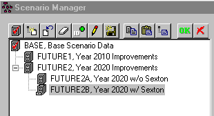
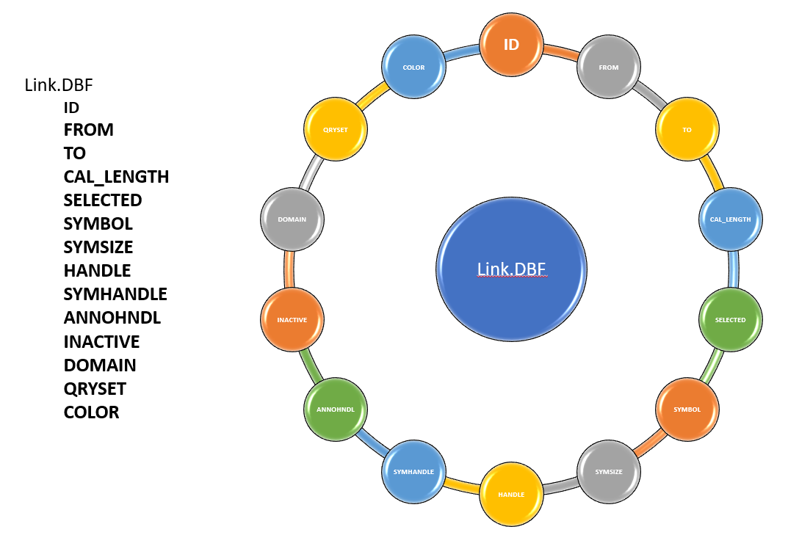

# How to Fix Missing Default Constant Pattern Error in InfoSewer

How do you fix the InfoSewer error 1081?

1081 : missing default constant pattern

This means that in the General Tab of the Run Manager that the Default Diurnal Pattern is blank. To fix this error you need to add a new pattern and then select the pattern as the new Default Diurnal Pattern. You can also choose an existing pattern as the Default Pattern.

Figure 1 – is the Default Pattern Blank?

Figure 2 – Make a new Pattern in the InfoSewer Attribute Browser

Figure 3 – Use the newly created Pattern in the Run Manager.

