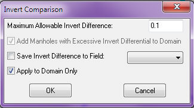
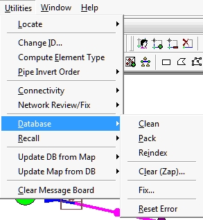

# Three Types of Simulation Runs in InfoSewer

# Table of Contents

[Three Types of Simulation Runs in InfoSewer [1](#three-types-of-simulation-runs-in-infosewer)](#three-types-of-simulation-runs-in-infosewer)

[Steady State InfoSewer [4](#steady-state-infosewer)](#steady-state-infosewer)

[Design in InfoSewer [10](#design-in-infosewer)](#design-in-infosewer)

[STEADY STATE DESIGN [10](#steady-state-design)](#steady-state-design)

[EXISTING SYSTEM DESIGN [11](#existing-system-design)](#existing-system-design)

[NEW SYSTEM DESIGN [11](#new-system-design)](#new-system-design)

[EXISTING SYSTEM DESIGN [14](#existing-system-design-1)](#existing-system-design-1)

[A more Step by Step Approach: [15](#a-more-step-by-step-approach)](#a-more-step-by-step-approach)

[EPS DYNAMIC Simulation (UNSTEADY FLOW) [16](#eps-dynamic-simulation-unsteady-flow)](#eps-dynamic-simulation-unsteady-flow)

[Muskingum-Cunge [19](#muskingum-cunge)](#muskingum-cunge)

[SURCHARGE [25](#surcharge)](#surcharge)

[FLOW ATTENUATION [26](#flow-attenuation)](#flow-attenuation)

[HYDROGRAPH AGGREGATION/FLOW ACCUMULATION [27](#hydrograph-aggregationflow-accumulation)](#hydrograph-aggregationflow-accumulation)

Three different types of hydraulic analyses can be carried out by InfoSewer and are explained below in the following sections.  Here are the three **Run Manage**r Tabs

 

  

InfoSewer Pro Only has the Storm Tab, if you do not have the Pro version you will not be able to simulate RDII or Stormwater Runoff

InfoSewer and InfoSewer Pro allow you to use the General, Peaking, Quality and Design Tabs

 

## Steady State InfoSewer

The purpose of a sanitary sewer system is to convey wastewater from various origins at various rates of flow. The maximum and minimum flow rates in a single day can vary greatly. The system should be able to carry the maximum rate of flow without backing up to any significant degree and within the acceptable velocity limit. The system should also be able to convey the minimum flow without deposition of suspended solids. InfoSewer  allows you to effectively simulate the system’s hydraulic behavior at any specific time period and analyze it under various conditions. Hydraulic calculations are based on the assumptions of one-dimensional, incompressible, steady flow with constant rate of flow between concentrated inflows or outflows. The calculations deal primarily with change in depth and velocity of flow along the sewer (ASCE 1982).

For steady-state analysis, all flows are assumed to accumulate in the system and discharge only at the outlets. This means that even if a pipe has a flow beyond its maximum capacity, the flow is still carried downstream including through pumps and force mains. The transition between gravity flow and pressurized flow is also ensured by assuming that all flows are transported through each force main, subject to the upstream hydraulic control.

Peaking factors and the peaking Tab are a key difference between Steady State and EPS simulations.

 

Another key difference is that complicated upstream and downstream Force Mains are not allowed in the Steady States solution.  Error 1352 is a typical error message

**Error 1352:** invalid split-flow configuration for given force-main without advanced forcemain network support

65 10 30 0.000000 0.000000 182.051359 6.000000 111.000000 0

 

Flooding at manholes and wet-wells in InfoSewer  is not modeled during an extended period dynamic simulation. Instead, the

 

## Design in InfoSewer

## STEADY STATE DESIGN

A sanitary sewer collection system has basically two main functions: to convey the designed peak discharge and to transport solids so that deposits are kept to a minimum. It is imperative, therefore, that the sanitary sewer has adequate capacity for the peak flow and that it functions at minimum flows without excessive maintenance and generation of odors. InfoSewer uses an efficient methodology that allows you to accurately design portions of the sewer network, from a single pipe to the entire system. In this explicit design method each sewer pipe is designed independently without consideration of the flows in other pipes. This can be done because to design a sewer, only the peak discharge is required. The method is attractive because it does not require re-computation of the flow in upstream pipes.

 

InfoSewer  gives you considerable flexibility to design a new sewer collection system or an existing sewer system.

## EXISTING SYSTEM DESIGN

Increased sewer flows and/or aging of sewer pipes may call for the design existing sewer systems. InfoSewer designs existing pipes considering flow capacity constraints while minimizing cost. The model analyzes capacity of existing sewer systems and designs pipes that are transporting flow in excess of the desired capacity.

 

There are two criteria available for the design capacity calculations:

- Analysis criteria which are used to determine the capacity of existing pipes.

- Design criteria which are used to determine the size of new replacement pipes and new parallel pipes for those pipes observed to have flow depths above their analysis criteria.

InfoSewer /Pro will determine the optimal replacement and parallel (relief) pipe sizes where pipe capacity is exceeded (i.e., when existing pipes have depth-to-diameter ratios or  flow depth-to-channel depth ratios exceeding user specified limits derived from the analysis criteria curve). The design cost for replacing and duplicating (paralleling) a pipe will also be calculated. A different Manning coefficient is then used when designing those pipes exceeding their analysis capacity. The replacement and the duplication channels will have the same shape as the existing channel (i.e., if an existing closed rectangular channel is found to be deficient, the replacement and/or the relief channel will also be a closed rectangular channel).

 

In addition, InfoSewer  makes sure that flow velocity in the designed pipes meet a user-specified minimum (e.g., not to be less than 2 ft/s to prevent or minimize permanent deposition in the pipes) and maximum (e.g., not to exceed 10 ft/s to prevent the occurrence of scour or other undesirable effects of high velocity flow) design velocities.

## NEW SYSTEM DESIGN

 

InfoSewer  can design a new sewer collection system given manhole locations, pipe lengths, sewer loads, topographic data of the sewershed, and design criteria. For new sewer design, the objective is to determine size and slope of a conduit that carries a given flow while maintaining velocity and cover depth within a desired range. The model calculates design flows, which may include both dry weather flows and wet weather flows, and determines pipe size and slope at minimum cost considering various design criteria including depth to diameter ratio, velocity, and cover depth.

 

The design is carried out for one pipe at a time and it progresses downwards along the flow direction. Trial pipe diameter is assigned to the pipe considering diameter of upstream pipes and a minimum diameter the pipe is allowed to take, and slope is selected considering ground slope, minimum cover required for the location, and a minimum slope allowed for the pipe size. Then flow velocity and flow depth are calculated for the pipe and are compared with the design criteria. If the pipe fails to meet one or more design criteria, pipe slope that satisfies all design criteria for the same pipe size would be searched for. If the pipe fails to meet all design criteria by changing slope alone, the model offers the option to change pipe size to the next large size defined.  Drop manhole is used if pipe velocity exceeds the maximum allowed velocity.

 

A pipe is not allowed to take a diameter less than size of pipes on its upstream end. Crown elevation of a downstream pipe is set to crown elevation of upstream pipe unless the manhole is drop manhole. If more than one pipe is entering a manhole, the downstream pipe takes the lowest of the upstream crown elevations. Drop manholes are used if velocity exceeds the maximum allowed velocity, for example, due to steep terrains. An attempt is made to set cover depths to the minimum to reduce cost of excavation and reinstatement. The following flow chart briefly describes the design procedure.

 

Design results include pipe diameter, pipe slope, to invert elevation and from invert elevation of pipes, invert elevation of manholes, cover depth at upstream end and downstream ends of a pipe, and cost estimates. Design results could be directly applied to the model database. In addition, the model issues design status information for every pipe indicating whether the pipe is successfully designed or failed. Pipes located to the downstream of a failed pipe will not be designed. Design results could be easily reviewed using pipe profile plot, report, or color coding, for example based on, design status.

 

A more Step by Step Approach:

- 1.       You can use EPS as the basis of your design **Step 1**

- 2.      In the Design Tab for your existing System pick the Existing System Option **Step 2**

- 3.      You use the existing inverts in your model but you decide on the min and max velocity constraints – the program will only this range of value or Step 3

- 4.      You need a series of d/D tables for your analysis and design or **Step 4** and an example table is shown in Step 5

- 5.      The model run results for the EPS simulation are shown in the Design Output Table, this will tell you the analysis d/D, the design d/D and the new pipe diameters Step 6

- **6.    ** You can also design to parallel pipes or **Step 7**

- 7.      The program also provides costing estimates for the new pipes or parallel pipes **Step 8** but you have to provide another set of d/D tables for the cost

     

 

## EXISTING SYSTEM DESIGN

Increased sewer flows and/or aging of sewer pipes may call for the design existing sewer systems. InfoSewer  designs existing pipes considering flow capacity constraints while minimizing cost. The model analyzes capacity of existing sewer systems and designs pipes that are transporting flow in excess of the desired capacity.

There are two criteria available for the design capacity calculations:

• Analysis criteria which are used to determine the capacity of existing pipes.

• Design criteria which are used to determine the size of new replacement pipes and new parallel pipes for those pipes observed to have flow depths above their analysis criteria.

InfoSewer  will determine the optimal replacement and parallel (relief) pipe sizes where pipe capacity is exceeded (i.e., when existing pipes have depth-to-diameter ratios or flow depth-to-channel depth ratios exceeding user specified limits derived from the analysis criteria curve). The design cost for replacing and duplicating (paralleling) a pipe will also be calculated. A different Manning coefficient is then used when designing those pipes exceeding their analysis capacity. The replacement and the duplication channels will have the same shape as the existing channel (i.e., if an existing closed rectangular channel is found to be deficient, the replacement and/or the relief channel will also be a closed rectangular channel).

In addition, InfoSewer  makes sure that flow velocity in the designed pipes meet a user-specified minimum (e.g., not to be less than 2 ft/s to prevent or minimize permanent deposition in the pipes) and maximum (e.g., not to exceed 10 ft/s to prevent the occurrence of scour or other undesirable effects of high velocity flow) design velocities.

## A more Step by Step Approach:

 

1.       You can use EPS as the basis of your design Step 1

2.      In the Design Tab for your existing System pick the Existing System Option Step 2

3.      You use the existing inverts in your model but you decide on the min and max velocity constraints – the program will only this range of value or Step 3

4.      You need a series of d/D tables for your analysis and design or Step 4 and an example table is shown in Step 5

5.      The model run results for the EPS simulation are shown in the Design Output Table, this will tell you the analysis d/D, the design d/D and the new pipe diameters Step 6

6.     You can also design to parallel pipes or Step 7

7.      The program also provides costing estimates for the new pipes or parallel pipes Step 8 but you have to provide another set of d/D tables for the cost

8.     Would it help if I sent you a small example model?

 

 

## EPS DYNAMIC Simulation (UNSTEADY FLOW)

InfoSewer tracks the movement of wastewater flowing through the network over an extended period of time under varying wastewater loading and operating conditions. The extended period simulation (EPS) model implemented in InfoSewer is unsteady model and is predicated on solving a simplified form of the 1D Saint-Venant equations neglecting local acceleration.

The Saint-Venant equations or full dynamic wave equations for open channel flow routing consist of the conservation of momentum equation and the equation of continuity. The momentum equation is:

     

The continuity (mass conservation) equation is:

Where,

 

x          =          distance along the pipe (longitudinal direction of sewer)

 

A         =          flow cross sectional area normal to x

 

y          =          coordinate direction normal to x on a vertical plane

 

d         =          depth of flow of the cross section, measured along y direction

 

Q        =          discharge through A

 

V         =          cross sectional average velocity along x direction

 

S0       =          pipe slope, equal to sin θ

 

θ         =          angle between sewer bottom and horizontal plane

 

Sf        =          friction slope

 

g        =          gravitational acceleration

 

t         =          time

 

β        =          Boussinesq momentum flux correction coefficient for velocity distribution

 

These complete unsteady flow equations (momentum together with continuity) along with appropriate initial and boundary conditions are rather tedious and computationally expensive to solve, especially for large sewer collections systems. As a result, acceptable simplifications and improved solution methods have been proposed including *non-inertial*, *kinematic wave* and *dynamic wave* simplifications. Hydraulically, the dynamic wave approach is the most accurate model among the approximations. The Muskingum-Cunge explicit diffusion wave dynamic flow routing model, obtained by neglecting local acceleration term in the momentum equation, is the most commonly used dynamic wave model.

 

In InfoSewer, unsteady open channel (free surface) flow is simulated using Muskingum-Cunge technique whereas pressurized flow in any pipe is modeled assuming the pipe is flowing full and the energy equation is applied to the entire pipe section.

##  <u>Muskingum-Cunge</u>

 

 

  

Here *c* is the dynamic wave celerity and *B* is the top width at normal depth for discharge *Q*. This highly efficient and accurate flow routing algorithm is used by InfoSewer  to track the spatial and temporal variation of flows throughout the collection system.

 

In this method (a.k.a., one sweep explicit solution method), the network flow dynamic equations are formulated by using an explicit finite difference scheme such that the flow depth, discharge, or velocity at a given location and the current time can be solved explicitly from the known information at the previous locations at the same time level, as well as known information at the previous time level. Thus, the solution is obtained segment by segment, pipe by pipe, over a given time interval for the entire sewer network before progressing to the next interval for another sweep of individual solutions of the network flow equations for the entire network. A variable time step approach (based on the Courant number *c*(*∆t*/*∆x*)) is used to minimize numerical dispersion and ensure robustness and stability of the numerical scheme. Complex flow attenuation calculations can be explicitly carried out to more accurately simulate the movement and transformation of sanitary sewer flows in the collection system.

An excellent review and comparison between simulated and observed hydrographs of the various numerical methods for solving unsteady flow in simple and compound channels was presented by Chatila (Chatila 2003). In terms of overall performance, the Muskingum unsteady solution scheme compared favorably and proved to be a simple and reliable method avoiding complicated mathematical and numerical computations for the cases considered.

Flooding at manholes and wet-wells in InfoSewer is not modeled during an extended period dynamic simulation. Instead, the flows at the flooded structures are conserved and are not lost by the occurrence of flooding at the manholes. In actual flooding situations, flows may be diverted away from the flooded structures and out of the sewer collection system. However, a surcharged pipe or manhole is generally an indication of poor hydraulic performance of the sewer system. InfoSewer  i assumes that the downstream pipes of flooded manholes are flowing full.

 

Sanitary sewer systems are typically designed to flow less than full and have an upper pressure limit of 4 to 6 psi. Sewer systems operating under pressurized flow condition may run the risk of violating local, state, and federal health codes. The USEPA regulations would also be in violation if raw sewage were discharged into the ground, potentially affecting groundwater. For these reasons, pressurized flows in sanitary sewers not designed to sustain pressures can be dangerous and in some cases can present an unlawful activity.

## SURCHARGE

Sewer pipes can flow full with water under pressure, which is often known as surcharge flow. Surcharge flow occurs in under-designed pipes (or under extreme flows) when the flow rate *Q* exceeds the full pipe capacity *Qf* .

 

Flow conditions are unstable at the transition between open-channel (free surface) flow and full pipe flow. A wave or surge can induce full flow in the pipe in the unstable range. Surcharge in sewer pipes is modeled in InfoSewer  using energy and continuity principles. The energy equation between sections 1 and 2 in a pipe can be written as:

                     

 

Here z denotes the invert elevation; d represents the water depth; and HL designates the head loss between sections 1 and 2. The energy equation is used to determine the difference in hydraulic grade line elevation (which is added at the upstream manholes) needed to pass downstream flows under the surcharge condition.

 

The procedure for analyzing surcharge in sewer pipes is illustrated using the figure below as a reference.

If pipe 4 (between manholes 4 and 5) is under-designed, Q4 will exceed its full flow capacity and the hydraulic grade line at manhole 4 will increase based on energy consideration to allow Q4to pass through pipe 4 (note that water always flows from higher to lower energy) as continuity must be satisfied. This forces the hydraulic grade line at manhole 3 to increase in order for Q3to pass through pipe 3. The procedure continues upstream until the slope of the energy grade line needed to transport the flow allows open-channel flow condition to occur in the pipe. The projected hydraulic grade line will then intersect the uniform water surface flow to complete the backwater curve.

 

The energy equation is also used to model the flow in siphons, which can occur in adverse pipes. InfoSewer  assumes that the siphon flows full, with a continuous liquid column throughout it.

 

## FLOW ATTENUATION

When a flow hydrograph is injected and propagates downstream in sewer pipes the bulk of the water will normally travel slower than its induced disturbance or wave. That is, if the water is injected with a tracer, then the tracer lags the disturbance. The speed of the disturbance depends on parameters such as depth, width and flow velocity. This disturbance will tend to flatten, or spread out, the peak flow in the downstream direction along the sewer pipes.

 

Flow attenuation in a sewer system is defined as the process of reducing the peak flow rate by redistributing the same volume of flow over a longer period because of friction (resistance), internal storage and diffusion along the sewer pipes. InfoSewer  uses the distributed Muskingum-Cunge flow routing method based on diffusion analogy, which is capable of accurately predicting hydrograph attenuation or peak flow damping effects (peak subsidence). The method is attractive since the routing parameters can be directly calculated as a function of pipe and flow properties, is applicable for a wide range of flow conditions, and does not require calibration or any iterative scheme. The Muskingum coefficients are derived from the pipe diameter, length, discharge, dynamic wave celerity, and slope of the flow. The magnitude of attenuation depends on parameters such as the peak discharge, the curvature of the hydrograph, and the width of flow. An example of flow attenuation process as a hydrograph is routed through a sewer system is illustrated in the figure below.

## HYDROGRAPH AGGREGATION/FLOW ACCUMULATION

Proper aggregation of multiple hydrographs with distinct time steps is essential in a sewer collection system as the flows are routed in both time and space. Aggregation normally occurs when laterals are merging around manholes and wet-wells. This can create offset of time-steps, which can affect accurate determination of flow peaks and volumes. InfoSewer  utilizes a highly accurate dynamic hydrograph aggregation method that allows preservation of both flow peaks and flow volumes when multiple hydrographs with different time steps are added. The method is Lagrangian in nature and tracks the hydrograph ordinates as they are transported along the sewer pipes and mix together at manholes and wet-wells. A variable time step is used to minimize numerical dispersion, enhance stability, and maximize computational efficiency.  See [<u>InfoSewer EPS Mass Balance</u>](javascript:BSSCPopup('FAQa/InfoSewer%2c_H20Map_Sewer_EPS_Mass_Balance.htm');) for how to interpret the Mass Balance Check and the options to lower the overall continuity error.

 

 

 

**<u> </u>**
