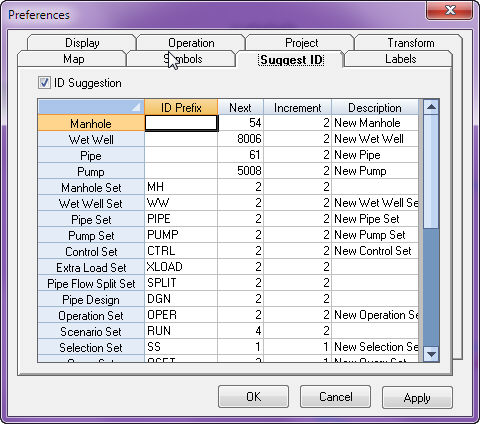
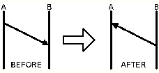
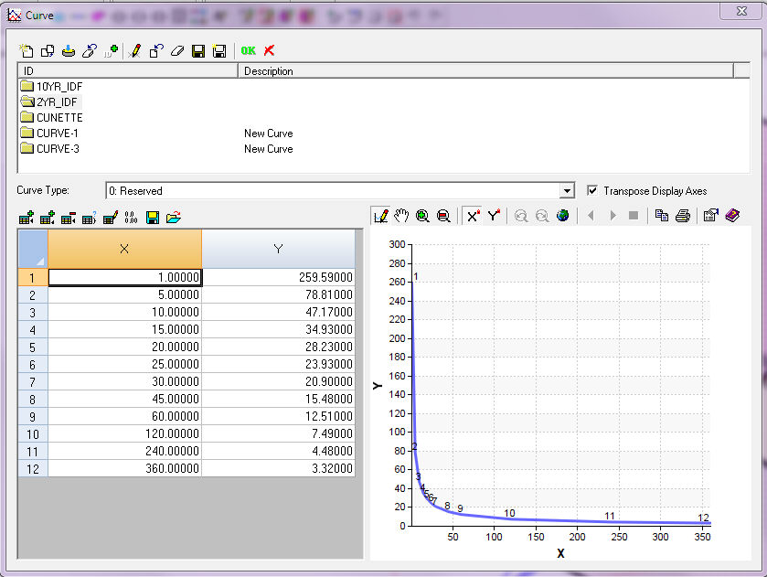
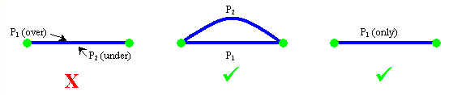
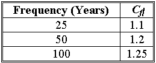
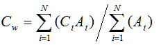
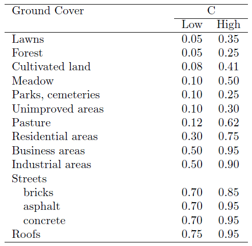
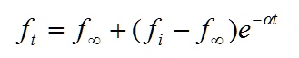

# Stormwater General Data

# Table of Contents

[Stormwater General Data [1](#stormwater-general-data)](#stormwater-general-data)

[Generation of the Unit Hydrograph [4](#generation-of-the-unit-hydrograph)](#generation-of-the-unit-hydrograph)

[Unit Hydrograph Data [5](#unit-hydrograph-data)](#unit-hydrograph-data)

[Unit Hydrograph [12](#unit-hydrograph)](#unit-hydrograph)

[Excess Rainfall [13](#excess-rainfall)](#excess-rainfall)

[Direct Runoff [13](#direct-runoff)](#direct-runoff)

[Duration of Unit Hydrograph [14](#duration-of-unit-hydrograph)](#duration-of-unit-hydrograph)

[Basic assumptions in Unit Hydrograph [14](#basic-assumptions-in-unit-hydrograph)](#basic-assumptions-in-unit-hydrograph)

[Rainfall Intensity [14](#rainfall-intensity)](#rainfall-intensity)

[Intensity-Duration-Frequency Curve [15](#intensity-duration-frequency-curve)](#intensity-duration-frequency-curve)

[Time of Concentration in Hydrology [18](#time-of-concentration-in-hydrology)](#time-of-concentration-in-hydrology)

[Time of Concentration  from Innovyze H2OCalc for Reference [19](#time-of-concentration-from-innovyze-h2ocalc-for-reference)](#time-of-concentration-from-innovyze-h2ocalc-for-reference)

[• **General Input for the time of concentration methods:** [20](#_Toc68295520)](#_Toc68295520)

[• For Kirpich (1940) Equation [21](#_Toc68295521)](#_Toc68295521)

[• For California Culverts Practice (1942) Equation [21](#_Toc68295522)](#_Toc68295522)

[• For Izzard (1946) Method [21](#_Toc68295523)](#_Toc68295523)

[• Federal Aviation Administration (1970) Method [21](#_Toc68295524)](#_Toc68295524)

[• Kinematic Wave Formula [21](#_Toc68295525)](#_Toc68295525)

[• **SCS Lag Equation (1975)** [22](#_Toc68295526)](#_Toc68295526)

[• **SCS Average Velocity Charts (1975, 1986)** [22](#_Toc68295527)](#_Toc68295527)

[• **Yen and Chow (1983) Method** [22](#_Toc68295528)](#_Toc68295528)

[• **Output for the SCS peak discharge method** [22](#_Toc68295529)](#_Toc68295529)

[Rational Method [23](#rational-method)](#rational-method)

[Rational Method [24](#_Toc68295531)](#_Toc68295531)

[TIME OF CONCENTRATION [25](#time-of-concentration)](#time-of-concentration)

[RAINFALL INTENSITY [27](#rainfall-intensity-1)](#rainfall-intensity-1)

[INTENSITY-DURATION-FREQUENCY CURVE [27](#intensity-duration-frequency-curve-1)](#intensity-duration-frequency-curve-1)

[ASSUMPTIONS OF THE RATIONAL METHOD [30](#assumptions-of-the-rational-method)](#assumptions-of-the-rational-method)

[THE SAN Diego Rational/Modifed Rational Method  from Innovyze H2OCalc for Reference [31](#the-san-diego-rationalmodifed-rational-method-from-innovyze-h2ocalc-for-reference)](#the-san-diego-rationalmodifed-rational-method-from-innovyze-h2ocalc-for-reference)

[Runoff Coefficient [32](#runoff-coefficient)](#runoff-coefficient)

[Assumptions of the Rational Method [34](#assumptions-of-the-rational-method-1)](#assumptions-of-the-rational-method-1)

[Infiltration Losses [36](#infiltration-losses)](#infiltration-losses)

[Infiltration Regeneration [38](#infiltration-regeneration)](#infiltration-regeneration)

[Depression/Retention Loss [39](#depressionretention-loss)](#depressionretention-loss)

In addition to unit hydrograph data and rainfall data, dynamic simulation of storm runoff requires information on area of the subbasin draining to a manhole, default hyetograph and default unit hydrograph pattern, and [<u>duration of Unit hydrograph</u>](javascript:BSSCPopup('Users_Guide/Chapter_4_Methodology/Unit_Hydrograph.htm');).

Data  for area of the subbasins (subwatersheds) could be provided using the [<u>attribute browser</u>](file:///C:\SWMM-SEWER%20Robohelp\SewerCombined%20-%20InfoSewer\User_Interface\Attribute_Browser.htm) or using the [<u>manhole hydraulic/hydrologic data base table</u>](file:///C:\SWMM-SEWER%20Robohelp\SewerCombined%20-%20InfoSewer\Database_Management\DBEditor.htm). The remaining three information needs to be supplied using the storm dialog box which is accessible from the [<u>simulation options</u>](javascript:BSSCPopup('Sewer_Design/Simulation_Options.htm');) dialog box. From the simulation options dialog box, click on the stormwater simulation icon (). This will active the storm simulation dialog box shown below.

 

> 

On this dialog box, check on the storm runoff computation option () to activate stormwater modeling. Then provide the data required for dynamic (EPS) simulation (i.e., Default Hyetograph, Default Unit Hydrograph, and Duration of Unit Hydrograph). The model utilizes the default data for loading manholes that lack hyetograph and/or unit hydrograph.

As described in the [<u>unit hydrograph data</u>](javascript:BSSCPopup('Storm_Water_Modeling/Unit_Hydrograph_Data.htm');) section, the model allows usage of multiple unit hydrographs for modeling of a sewer collection system. Please note that duration of the unit hydrograph must be the same for all unit hydrographs.

## Generation of the Unit Hydrograph

InfoSewer Pro generates a direct runoff hydrograph resulting from single or multiple storm events using a unit hydrograph synthesized according to any of the three techniques described above, or from a user-specified natural unit hydrograph. The model relies on a user input hyetograph (i.e., rainfall intensity versus time graph). The model; can derive effective rainfall from user supplied total rainfall hyetographs.

An entire watershed of a collection system may not be well represented by a single unit hydrograph owing to variability in topography, land use, and soil characteristics of the subwatersheds. In the case of separate sewer systems, the magnitude and type of sources of infiltration/inflow will vary by subbasin. Accordingly, InfoSewer  Pro allows usage of multiple unit hydrographs, each representing part of the watershed being modeled. The unit hydrographs could be of any duration (e.g., 15-minute, 1-hr), but the duration must be the same for the entire unit hydrographs involved in modeling of the watershed.

To derive the storm hydrographs, InfoSewer Pro applies the basic assumptions of unit hydrograph theory described above (i.e., linearity, time invariance, and the principle of superposition). Storm events are assumed to have constant intensity over the duration of the unit hydrograph. Excess rainfall resulting from single or multiple storm events is discretized at intervals of unit hydrograph duration. For example, if a sewer collection system is being modeled using a 15-minute unit hydrograph, and if duration of the excess rainfall under investigation is 1-hour, the rainfall duration will be divided into four 15-minute rainfall events of constant intensity. This discretization approach, along with the unit hydrograph assumptions of linearity, time invariance, and superposition, enables InfoSewer  Pro to simulate storm runoff hydrograph at any location (e.g., loading manhole) throughout the collection system for any number of storm events. During generation of runoff hydrographs for locations other than the site where the unit hydrograph is originally derived, ordinates of the unit hydrographs are adjusted according to the ratio of drainage area of the two locations. Once the storm hydrographs for every loading manhole in the collection system are known, the storm load will be added to other loading types such as sanitary loads, if any, and will be routed through the collection system using the powerful Muskingum-Cunge’s dynamic flow routing algorithm.

## Unit Hydrograph Data

Unit hydrograph information could be supplied to InfoSewer Pro using the icon located at the operation data tab of the [<u>control center</u>](javascript:BSSCPopup('Control_Center/Control_Center.htm');).  Using this icon, the user may create a new unit hydrograph from scratch or by cloning an existing one, and may edit or delete an already developed unit hydrograph.

The procedure for creating a new unit hydrograph is described below.

- Right click on the unit hydrograph icon ().

- Select new, provide unit hydrograph ID and description on the initiated dialog box, and then click Ok. At this stage, a Unit Hydrograph dialog box shown below would appear.

- Depending on the type of unit hydrograph (i.e., natural or synthetic) to be created, one needs to provide all the necessary information. Each of these data is described below.

**Drainage Area:   **This refers to total area of the subwatersheds draining up to the location where the unit hydrograph is  being derived. If the unit hydrograph is being developed at the outlet of the watershed, the area should be that of the entire watershed. This figure is mandatory, and must be provided whether natural unit hydrograph or synthetic unit hydrograph is used. The model utilizes this area to generate unit hydrographs at other locations in the watershed.

**Unit Hydrograph Method: **This refers to the type (i.e., natural or synthetic) of unit hydrograph, and the method used to generate synthetic unit hydrographs.

- If the unit hydrograph is provided by the user (i.e., an existing unit hydrograph is used), an explicit option** **has to be chosen.  The model accepts existing unit hydrographs in the form of [<u>pattern</u>](javascript:BSSCPopup('Curves_and_Patterns/Patterns.htm');).  Assign the unit hydrograph pattern using the "**Explicit Pattern**" dialog box.

- If a synthetic unit hydrograph generated by InfoSewer  Pro is to be used, the modeler may choose one of the four implicit unit hydrograph (i.e., the tri-triangle method, the SCS dimensionless unit hydrograph, the SCS triangular unit hydrograph, or the Colorado Urban Hydrograph Procedure) options. Inputs for each of these four synthetic unit hydrographs are described below.

- **Tri-triangle method: ** Once this option is selected, the following dialog box would appear enabling the user to specify parameters of the tri-triangle.

> 
>
> These parameters are described using the following figure.
>
> 
>
> **R** is the percentage of the total rainfall volume that becomes runoff. Please, note that InfoSewer  Pro has advanced rainfall loss modeling capability and can estimate effective rainfall (, i.e., part of rainfall that becomes runoff). **If this loss modeling feature is used, R should be set to 100%.**
>
> **R1** , **R2** , and **R3** are percentages of **R** that are allocated to triangle 1, triangle 2, and triangle 3, respectively. For example, assume that ***R*** equals 40 % of  the total rainfall volume and  **R1**and **R2** are 30% and 40%, respectively. The actual volume of runoff allocated to triangle 1 and triangle 2 would be 0.4\*0.3\* total rainfall volume and 0.4 \*0.4\* total rainfall volume, respectively.  R in InfoSewer  Pro is the same as R1 in SWMM 5 and InfoSWMM,  R1 is the same as R2 in SWMM5 and InfoSWMM and R2 is the same as R3 in SWMM5 and InfoSWMM.
>
> **T1**, **T2**, and **T3** are time to peaks of triangle 1, triangle 2, and triangle 3, respectively. **K1**, **K2**, and **K3** refers to recession constants of triangle 1, triangle 2 and triangle 3, respectively. The default values used by InfoSewer  Pro for **T1**, **T2**,  **T3** , **K1**, **K2**, and **K3** are 1 hour, 4 hour, 12 hour, 2, 3, and 3, respectively.

- **NRCS (SCS) Triangular Unit Hydrograph: **Generation of unit hydrograph using this method requires specification of the inputs displayed in the following dialog box.

> 

- **Watershed Lag Time** - this represents the time from the center of mass of effective rainfall to the time to peak of a unit hydrograph. In other words, lag time is a delay in time, after a brief rain over a watershed, before the runoff reaches its peak. This parameter can either be specified by the user, or can be calculated by the model based on watershed characteristics. If lag time of the watershed is directly specified by the user, the modeler does not need to provide the remaining inputs (i.e., hydraulic length, the curve number, and the slope).

- **Watershed Hydraulic Length** - This refers to travel distance of water from  the most upstream location of the watershed to the point where the unit hydrograph is being derived. This input is required if watershed lag time is not specified. The value should be given in feet for US Customary system, and in meters for SI units.

- **Watershed NRCS (SCS) Curve Number - **This parameter refers to runoff generating capacity of a watershed, and its value depends on the soil, antecedent moisture condition, cover and the hydrologic conditions of the watershed. Recommended values of curve number are available from standard hydrology books. The SCS suggests the curve number values to be within 50 and 95. This input is required only if watershed lag time is not specified.

<!-- -->

- **Watershed Slope **- Refers to average slope of the watershed. This input is required if watershed lag time is not specified.

- **NRCS Dimensionless Unit Hydrograph: **The inputs required for this method are the same as those described with regard to the NRCS (SCS) triangular unit hydrograph.

- **Colorado Urban Hydrograph Procedure: **This technique requires provision of the following subwatershed information.

> 

- - **Watershed Hydraulic Length **- This refers to travel distance of water from  the most upstream location of the watershed to the point where the unit hydrograph is being derived. The value should be given in feet for US Customary system, and in meters for SI units.

  - **Watershed Centroid Distance **-  Travel distance of water from  the most upstream location of the watershed to the centroid of the catchment. The value should be given in feet for US Customary system, and in meters for SI units.

  - **Watershed Slope **-** **Refers to average slope of the watershed. This input is required if watershed lag time is not specified.

  - **Watershed Percent Impervious **-**  **Portion of the watershed area that is impervious in nature (e.g., pavement, roof top, etc.)

An entire watershed of a collection system may not be well represented by a single unit hydrograph due to variability in topography, land use, and soil characteristics of the subwatersheds. InfoSewer  Pro allows usage of multiple unit hydrographs, each representing part of the watershed being modeled. This is an advanced functionality usually referred to as **spatially distributed modeling**. This implies that, if interested, the user may use unique unit hydrograph for every loading manhole in the collection system. All the unit hydrographs utilized for modeling of the watershed should be created following the procedure described above. The created unit hydrographs may be assigned to loading manholes in the collection system through the [<u>Attribute Browser</u>](javascript:BSSCPopup('User_Interface/Attribute_Browser.htm');) or by using the [<u>hydraulic/hydrologic manhole data base table</u>](javascript:BSSCPopup('Database_Management/DBEditor.htm');).

It should be noted that, if multiple unit hydrographs are used for modeling of a collection system, the type of all the unit hydrographs need not be the same. Some of the unit hydrographs could be NRCS (SCS) triangular, some others could be NRCS (SCS) dimensionless, and the remaining could be explicit or could be derived using the tri-triangle method.

## Unit Hydrograph

The unit hydrograph method is the most commonly used method of stormwater modeling for applications that require generation of a complete hydrograph with reasonable accuracy. A unit hydrograph is defined as the direct runoff hydrograph resulting from a unit depth of excess (effective) rainfall produced by a storm of uniform intensity and specified duration. Unit hydrograph is a specific type of hydrograph that represents the effects of the physical characteristics of the watershed on the input rainfall excess. A typical unit hydrograph is shown below.

Basic terminology and assumptions of the unit hydrograph method are presented below, followed by a description of the technique used by InfoSewer  Pro for regeneration of unit hydrographs and runoff hydrographs.

## Excess Rainfall

During a storm event, not all of the rainfall is converted to runoff. Part of the rainfall is “lost” in the form of deep infiltration (percolation), evaporation, interception, and depression storage. The amount of the precipitation (rainfall) actually reaching the outlet of the watershed or the subwatershed in the form of runoff is known as excess rainfall. Excess rainfall is sometimes called effective rainfall.

## Direct Runoff

Direct runoff is a storm flow resulting from excess rainfall. It is an aggregate of surface runoff and quick subsurface runoff. Surface runoff is an overland flow that occurs when rainfall intensity exceeds infiltration capacity of the soil. Surface runoff flows on the surface of the watershed and through tributary channels to the outlet or to the point of reference such as loading manhole. Quick subsurface runoff is part of an infiltrated rainfall that travels underground and contributes runoff to the location of interest during or soon after the storm event. Unit hydrographs and subsequent runoff hydrographs derived based on unit hydrographs represent direct runoff.

## Duration of Unit Hydrograph

This is an important feature of a unit hydrograph, and represents duration of the rainfall excess (represented as tr in the above figure) that produced the unit hydrograph. For a given watershed or subwatershed, all storm events with a given duration of excess rainfall produce direct runoff hydrographs that have the same time to peak and same time base. If the effective duration of a storm differs from that of another on the same basin, the resulting direct runoff hydrograph will have different times to peak and different time bases. Unit hydrograph is named in terms of its duration (i.e., 15-minute unit hydrograph, 1-hour unit hydrograph). As an example, a unit hydrograph derived for a watershed from excess rainfall of a unit depth collected over 15-minute duration is known as a 15-minute unit hydrograph.

## Basic assumptions in Unit Hydrograph

- Intensity of excess rainfall is constant within the duration of the excess rainfall for the entire watershed represented by the unit hydrograph.

- One of the fundamental assumptions of the unit hydrograph theory is linearity. It is assumed that an increase in depth of excess rainfall increases ordinates of the direct runoff hydrograph proportionally.

- The unit hydrograph method also assumes that for a given pattern (temporal distribution) of rainfall, the ratio of ordinates of direct runoff hydrograph to depth of effective rainfall is time invariant (e.g., seasonally and within rainfall event(s)).

- Direct runoff hydrograph resulting from a given pattern of rainfall excess can be built by superimposing the unit hydrographs resulting from the separate amounts of rainfall excess occurring in each unit period. This is known as the principle of superposition. Application of these basic assumptions is illustrated in the figure below.

## Rainfall Intensity

Rainfall intensity is defined as the depth of rain that falls in a given duration of time divided by that duration. It may rain harder (high rainfall intensity) for a short period of time, but the longer a rainfall event lasts, the lower its average rainfall intensity, implying that rainfall intensity is inversely proportional to the duration of a rainfall event.  

Intensity of a storm is also a function of return period or frequency of the rainfall occurrence. Intense rainfall events occur less frequently than less intense storms. Return period, also known as recurrence interval, is defined as the expected length of time (e.g., T years) between occurrences of two storm events that exceed a given intensity. Return period does not imply that multiple rainfall events exceeding a given intensity will not occur within T years, nor does it assure occurrence of a storm event exceeding the intensity within T years. All it means is that the rainfall event will occur at an average rate of once in T years.

The higher the return period (i.e., the less frequent the storm event), the higher the intensity of the rainfall event would be. As an example, a storm with 10-year return period represents a rainfall event whose magnitude is expected to be exceeded once in ten years. This implies that the frequency of the storm event is 1/10, or that there is a 10% probability for the intensity of the storm event to be exceeded in any given year.

 

## Intensity-Duration-Frequency Curve

The relationship between rainfall intensity, rainfall duration, and frequency of occurrence of storm events is often presented for a certain region in the form of an Intensity-Duration-Frequency Curve, commonly referred to as an IDF curve. A sample IDF curve is given below for return periods of 5, 10, and 50 years. InfoSewer Pro  calculates the rainfall intensity used by the Rational method based on a user-specified IDF curve. The user should provide an IDF curve for a desired return period. The model derives rainfall intensity from the IDF curve corresponding to the duration equal to the time of concentration calculated for the manhole following the techniques described above.

Sewer IDF Curver Table in the Atrribute Browser in USA Units

 

An Example IDF Curve from InfoSWMM in SI Units

## Time of Concentration in Hydrology

The Rational method is based on the premise that peak runoff occurs at a given design point when the rainfall duration is sufficiently long so that all locations in the watershed draining to the point contribute flow, and that intensity of the rainfall is constant for that duration. Some locations of the contributing subbasins are hydraulically closer to the design point and may yield runoff to the point sooner than other locations. The Rational method uses the concept of time of concentration to ensure contribution of all locations in the upstream subwatersheds to the design point. Time of concentration, from the perspective of the Rational method and storm runoff (not to be confused with the water quality definition given in preceding sections), is defined as the time it takes for a drop of water falling on the most remote point of upstream subwatersheds to reach the design point. Remoteness refers to hydraulic travel time rather than distance.

There are a number of empirical methods for estimation of time of concentration. The techniques are formulated as a function of subwatershed characteristics such as travel distance and subwatershed slope.  InfoSewer  Pro calculates time of concentration as the sum of overland flow travel time and channel (pipe) flow travel time.

where Tc    =  time of concentration for the manhole (in minutes)

to     =  overland flow travel time (in minutes)

tc     =  channel flow travel time (in minutes)

Pipe flow travel time is calculated using the flow velocity of the pipe and the pipe length. Overland flow travel time is calculated using the method derived by Kirpich, a technique commonly used in the US. Kirpich’s formula (Mays 2001) is given as:

where to   =  overland flow travel time for a subwatershed (in minutes)

L   =  length of  flow path from the remotest spot in the subwatershed (in feet)

S   =  average slope of the subwatershed (unitless)

There could be multiple flow paths from upstream subwatershed to a given manhole leading to different flow times. The time of concentration used by  InfoSewerH20Map Sewer Pro is the longest flow time among different possible flow paths to the manhole. In order to avoid unreasonably low storm duration and unreasonably high rainfall intensities, InfoSewerH20Map Sewer Pro allows the user to specify a minimum time of concentration, and uses the maximum of the user-specified minimum time of concentration and an internally calculated time of concentration. The default minimum time of concentration used by  InfoSewer is 10 minutes.

## Time of Concentration  from Innovyze H2OCalc for Reference

The dialog box for estimating time of concentration using the Kirpich method is shown below.

- **<u>General Input for the time of concentration methods:</u>**

- **Unit System** – English or SI unit.

- **Solving Target** – Choose time of concentration.

- **Equations** – Select one of the eight empirical equations listed in the dialog box shown above.• Unit System – English or SI unit.

- **Solving Target** –  Choose time of concentration.

- **Equations** – Select the desired time of concentration estimation equation among the available eight methods. The table given below described these equations in further detail.

The inputs required for specific the time of concentration estimation methods (see the following table below for the specific formula)

 

- <u>For Kirpich (1940) Equation</u>

- **Length of Channel** – Length of the longest overland flow path for the watershed in feet.

- **Average Watershed Slope** – Average slope for the longest flow channel.

- <u>For California Culverts Practice (1942) Equation</u>

- **Length of Longest Channel** – Length of the longest overland flow path for the  watershed in miles.

- **Elevation Difference Between Divide and Outlet** – The difference in elevation ( in feet) between the upstream end of the flow path and the outlet of the watershed.

- <u>For Izzard (1946) Method</u>

- **Rainfall Intensity** – Intensity of the design rainfall  ( in/hr)

- **Length of Flow Path** – Length of the longest overland flow path for the watershed in feet. The product rainfall intensity and the length of flow path should be \< 500.

- **Slope of Flow Path** –Average slope for the longest flow channel.

- **Retardance Coefficient** – Coefficient that accounts for friction effect of the channel material. Retardance factor ranges from 0.007 for smooth pavement to 0.012 for concrete and to 0.06 for dense turf. The product rainfall intensity and the length of flow path should be \< 500.

- <u>Federal Aviation Administration (1970) Method</u>

- **Runoff Coefficient** – Refers to the runoff coefficient used in rational formula.

- **Length of Overland Flow**– Length of the longest overland flow path for the watershed.

- **Surface Slope** – Average slope of the watershed.

- <u>Kinematic Wave Formula</u>

- **Rainfall Intensity** – Intensity of the design rainfall (in/hr).

- **Length of Overland Flow** – Length of the longest overland flow path for the watershed.

- **Average Overland Slope** - Average slope for the longest flow channel.

- **Manning’s Roughness Coefficient** – Resistance coefficient used in Manning equation.

- **<u>SCS Lag Equation (1975)</u>**

- **Length of Flow Path** – Intensity of the design rainfall (in/hr).

- **Average Watershed Slope** - Average slope for the watershed.

- **Curve Number (CN)** – NRCS curve number used as an index of the watershed’s runoff  generation potential.

- **<u>SCS Average Velocity Charts (1975, 1986)</u>**

- **Length vs Velocity Chart** – Specify average flow velocity for various channel lengths.

- **<u>Yen and Chow (1983) Method</u>**

- **Length of Flow** – Length of the longest overland flow path for the watershed in feet.

- **Average Watershed Slope** – Average slope for the watershed..

- **Coefficient Ky** – Coefficient. KY ranges from 1.5 for light rain (intensity \<0.8) to 1.1 for moderate rain (0.8 \< intensity \< 1.2), and to 0.7 for heavy rain (intensity \>1.2)

- **Overland Texture Factor** – Overland texture factor. See Table 3.13.

- **<u>Output for the SCS peak discharge method</u>**

- **Time of Concentration** – The time it takes for flow to travel from the hydraulically remotest point in the watershed to reach outlet of the watershed.

 

## Rational Method

InfoSewer   adds comprehensive rainfall-runoff and infiltration/inflow modeling capability on top of the sanitary sewer simulation features provided by InfoSewer, equipping the industry with a single powerful tool that can be used for planning, design, and operational management of sanitary sewer, storm sewer, and combined sewer systems. InfoSewer shares all the features described above in relation to InfoSewer including the methodologies used to model the physical and the non-physical components of a collection system, steady state and dynamic analysis of sanitary loads, steady state design, dynamic routing of flows through the collection system, calculation of HGLs, and water quality modeling. This section presents the theory pertinent to InfoSewer, which is stormwater modeling.

Determination of stormwater runoff resulting from rainfall event(s) is the most important component of stormwater management, and is commonly known as rainfall-runoff modeling. Similar modeling techniques are applicable to the determination of rainfall-dependent infiltration/inflow in separate sanitary sewer systems. There are various rainfall-runoff modeling techniques. The choice of the method to use depends, among other considerations, on the type of analysis (e.g., steady state or dynamic simulation) and the information required (e.g., peak flow or complete hydrograph). Peak flow information is appropriate for steady state simulation of sewer systems whereas knowledge of the complete hydrograph is essential for dynamic simulations.

For estimation of peak flow during steady state simulations, InfoSewer   applies the Rational method, which is a very popular tool of choice used by many practicing engineers across the globe. For dynamic simulation, complete hydrographs are derived based on the practical and highly effective unit hydrograph theory. The unit hydrograph can be observed or synthetic. This method allows the entire hydrograph (including peak and volume) resulting from an actual or design storm event to be adequately simulated. The following sections describe the Rational method and the unit hydrograph techniques incorporated into InfoSewer.

The Rational method is the most widely used technique for estimation of peak flows from urban and rural drainage basins (Maidment 1993; Mays 2001). The concept of the Rational method is attractive and easy to understand. If rainfall occurs over a watershed at a constant intensity for a period of time that is sufficiently long to produce steady state runoff at a desired design point, then the peak flow rate will be proportional to the product of rainfall intensity and watershed area. 

 

Mathematically, the Rational formula is expressed as:

 

The units need to be consistent. For example, if intensity is in ft/s and area is in ft2, then the resulting peak flow rate would be in cfs. InfoSewer   allows several intensity unit alternatives (in/hr, mm/hr, in/min, mm/min). The area should be in acres if US Customary units are used, and in square meters for SI units.  InfoSewer  converts the units internally to preserve consistency.

## TIME OF CONCENTRATION

 

The Rational method is based on the premise that peak runoff occurs at a given design point when the rainfall duration is sufficiently long so that all locations in the watershed draining to the point contribute flow, and that intensity of the rainfall is constant for that duration. Some locations of the contributing subbasins are hydraulically closer to the design point and may yield runoff to the point sooner than other locations. The Rational method uses the concept of time of concentration to ensure contribution of all locations in the upstream subwatersheds to the design point. Time of concentration, from the perspective of the Rational method and storm runoff (not to be confused with the water quality definition given in preceding sections), is defined as the time it takes for a drop of water falling on the most remote point of upstream subwatersheds to reach the design point. Remoteness refers to hydraulic travel time rather than distance.

There are a number of empirical methods for estimation of time of concentration. The techniques are formulated as a function of subwatershed characteristics such as travel distance and subwatershed slope. InfoSewerH20Map Sewer  calculates time of concentration as the sum of overland flow travel time and channel (pipe) flow travel time.

Pipe flow travel time is calculated using the flow velocity of the pipe and the pipe length. Overland flow travel time is calculated using the method derived by Kirpich, a technique commonly used in the US. Kirpich’s formula (Mays 2001) is given as:

 

 

There could be multiple flow paths from upstream subwatershed to a given manhole leading to different flow times. The time of concentration used by InfoSewer  is the longest flow time among different possible flow paths to the manhole. In order to avoid unreasonably low storm duration and unreasonably high rainfall intensities, InfoSewer  allows the user to specify a minimum time of concentration, and uses the maximum of the user-specified minimum time of concentration and an internally calculated time of concentration. The default minimum time of concentration used by InfoSewer  10 minutes.

## RAINFALL INTENSITY

 

Rainfall intensity is defined as the depth of rain that falls in a given duration of time divided by that duration. It may rain harder (high rainfall intensity) for a short period of time, but the longer a rainfall event lasts, the lower its average rainfall intensity, implying that rainfall intensity is inversely proportional to the duration of a rainfall event. 

 

Intensity of a storm is also a function of return period or frequency of the rainfall occurrence. Intense rainfall events occur less frequently than less intense storms. Return period, also known as recurrence interval, is defined as the expected length of time (e.g., T years) between occurrences of two storm events that exceed a given intensity. Return period does not imply that multiple rainfall events exceeding a given intensity will not occur within T years, nor does it assure occurrence of a storm event exceeding the intensity within T years. All it means is that the rainfall event will occur at an average rate of once in T years.

 

The higher the return period (i.e., the less frequent the storm event), the higher the intensity of the rainfall event would be. As an example, a storm with 10-year return period represents a rainfall event whose magnitude is expected to be exceeded once in ten years. This implies that the frequency of the storm event is 1/10, or that there is a 10% probability for the intensity of the storm event to be exceeded in any given year.

## INTENSITY-DURATION-FREQUENCY CURVE

 

The relationship between rainfall intensity, rainfall duration, and frequency of occurrence of storm events is often presented for a certain region in the form of an Intensity-Duration-Frequency Curve, commonly referred to as an IDF curve. A sample IDF curve is given below for return periods of 5, 10, and 50 years.  InfoSewer  calculates the rainfall intensity used by the Rational method based on a user-specified IDF curve. The user should provide an IDF curve for a desired return period. The model derives rainfall intensity from the IDF curve corresponding to the duration equal to the time of concentration calculated for the manhole following the techniques described above.

**<u>RUNOFF COEFFICIENT</u>**

 

Runoff coefficient is loosely defined as the ratio of runoff to rainfall, and is a function of watershed characteristics including land use, soil type, and slope of the watershed. The value of runoff coefficient ranges between 0.0 and 1.0. A value of 0.0 means that all of the rainfall is lost in the form of abstractions such as infiltration, interception, and evaporation and none of the rainfall is converted to runoff. The value of 1.0 implies that all the rainfall is converted to runoff and is discharged from the watershed. As an example, most of the rain that falls on impervious areas such as pavement and roof would be immediately converted to runoff. A value of C for such land uses is close to 1.0. Runoff coefficient values recommended by the American Society of Civil Engineers and Water Environment Federation for return periods not exceeding 10 years are given below for various land uses, soil types, and slope conditions.

 

| Description Of Area             | Runoff Coefficient |
|---------------------------------|--------------------|
|     Business                    |                    |
|           Downtown              | 0.70 - 0.95        |
|           Neighborhood          | 0.50 - 0.70        |
|     Residential                 |                    |
|           Single-family         | 0.30 - 0.50        |
|           Multiunits, detached  | 0.40 - 0.60        |
|           Multiunits, attached  | 0.60 - 0.75        |
|     Residential (suburban)      | 0.25 - 0.40        |
|     Apartment                   | 0.50 - 0.70        |
|     Industrial                  |                    |
|           Light                 | 0.50 - 0.80        |
|           Heavy                 | 0.60 - 0.90        |
|     Parks, Cemeteries           | 0.10 - 0.25        |
|     Playgrounds                 | 0.20 - 0.35        |
|     Railroad yard               | 0.20 - 0.35        |
|     Unimproved                  | 0.10 - 0.30        |
| Character Of Surface            | Runoff Coefficient |
|     Pavement                    |                    |
|          Asphaltic and concrete | 0.70 - 0.95        |
|          Brick                  | 0.70 - 0.85        |
|     Roofs                       | 0.75 - 0.95        |
|     Lawns, sandy soil           |                    |
|          Flat, 2%               | 0.05 - 0.10        |
|          Average, 2-7 %         | 0.10 - 0.15        |
|          Steep, 7%              | 0.15 - 0.20        |
|    Lawns, heavy soil            |                    |
|          Flat, 2%               | 0.13 - 0.17        |
|          Average, 2-7 %         | 0.18 - 0.22        |
|          Steep, 7%              | 0.25 - 0.35        |

 

For return periods that exceed 10 years, the runoff coefficient from the table should be multiplied by a frequency adjustment factor, Cf , given below.

 

| Frequency (Years) | Cf |
|-------------------|---------------|
| 25                | 1.1           |
| 50                | 1.2           |
| 100               | 1.25          |

 

For a subwatershed composed of multiple land uses, a composite runoff coefficient Cw should be determined by weighting C values of each of the land uses by their corresponding area according to the equation:.

 

                                                

 

where Ci   =  runoff coefficient for individual land use in the subwatershed.

            Ai   =  area of the individual land use in the subwatershed.

            N   =   total number of land uses in the subwatershed.

 

## ASSUMPTIONS OF THE RATIONAL METHOD

 

For credible engineering application, the modeler needs to understand the following basic assumptions of the rational method. Firstly, the rainfall intensity is constant throughout the watershed over a period of time that equals the time of concentration of the analysis site. Secondly, the runoff coefficient is invariant, regardless of season of the year or intensity of rainfall. Finally, the area of the contributing watershed is small (not more than 300 acres).

 

## THE SAN Diego Rational/Modifed Rational Method  from Innovyze H2OCalc for Reference

 

The San Diego County hydrology manual (San Diego County, 2003) recommends rational method to compute peak storm flow for drainage areas less than 1 square mile. If more than one drainage path is flowing to a junction, the County recommends the modified rational method described below.

 

The county uses the following relationship to estimate design rainfall intensity (in/hr).

 

I = 7.44P6D-0.645                                

 

Where: P6 = 6-hour storm rainfall amount (in).

            D = duration (time of concentration) in minutes.

 

The time of concentration is composed of the initial time of concentration and the travel time.

 InfoSewer   requires the user to provide initial time of concentration for each subwatershed.

The travel time is computed based on flow velocity and pipe length.

 

The modified rational method differs from the rational method only when a junction receives flow from two or more tributaries. The peak flow (Q), the time of concentration (Tc) and the rainfall intensity (I) for each of the independent tributaries is calculated according to rational method. The modified rational method is then used to determine Q, Tc and I for the confluence.

The rational method is used for the next point of interest along the flow direction.

 

Q and Tc, for each independent tributaries are ranked in order of increasing Tc. Let Q1, T1, and I1 correspond to the tributary area with the shortest Tc. Likewise, Q2, T2, and I2 correspond to the tributary area with the next longer Tc; and so on. The tributaries are combined as follows.

 

For T1 \< T2 \< T3,

 

QT1 = Q1 +

                               ………………………….. (38)

 

The largest of QT1, QT2 and so on and the associated Tc should be used for the junction. The equation can be expanded for more than three tributaries.  InfoSewer  can handle unlimited number of tributaries.

 

## Runoff Coefficient

Runoff coefficient is loosely defined as the ratio of runoff to rainfall, and is a function of watershed characteristics including land use, soil type, and slope of the watershed. The value of runoff coefficient ranges between 0.0 and 1.0. A value of 0.0 means that all of the rainfall is lost in the form of abstractions such as infiltration, interception, and evaporation and none of the rainfall is converted to runoff. The value of 1.0 implies that all the rainfall is converted to runoff and is discharged from the watershed. As an example, most of the rain that falls on impervious areas such as pavement and roof would be immediately converted to runoff. A value of C for such land uses is close to 1.0. Runoff coefficient values recommended by the American Society of Civil Engineers and Water Environment Federation for return periods not exceeding 10 years are given below for various land uses, soil types, and slope conditions.

For return periods that exceed 10 years, the runoff coefficient from the table should be multiplied by a frequency adjustment factor, Cf , given below.

For a subwatershed composed of multiple land uses, a composite runoff coefficient Cw should be determined by weighting C values of each of the land uses by their corresponding area according to Equation 35.

                

where Ci   =  runoff coefficient for individual land use in the subwatershed.

Ai   =  area of the individual land use in the subwatershed.

N   =   total number of land uses in the subwatershed.

 

## Assumptions of the Rational Method

For credible engineering application, the modeler needs to understand the following basic assumptions of the rational method. Firstly, the rainfall intensity is constant throughout the watershed over a period of time that equals the time of concentration of the analysis site. Secondly, the runoff coefficient is invariant, regardless of season of the year or intensity of rainfall. Finally, the Area of the contributing watershed is small (not more than 300 acres).

 

 

 

## Infiltration Losses

During storm events, some of the rainfall is lost in the form of infiltration and depression/retention storage depending on soil type, land use, and topographic conditions of the modeled catchment. InfoSewer Pro estimates part of rainfall that is lost in the form of infiltration and depression/retention storage, and uses the resulting effective (excess) rainfall to determine runoff hydrograph.

The model applies the well known and the widely used Horton’s method to determine infiltration loss through pervious portions of the subwatersheds. Horton’s infiltration equation is given as:

where,  ft  =  infiltration rate at time t, in inches/hour.

            fi=   maximum or initial infiltration rate (at t = 0), in inches/hour. The default value is 3

                     inches/hour.

           f∞ =   final infiltration rate (at t = ∞), in inches/hour. The default value is 0.5 inches/hour.

           α   =   decay coefficient, in per second. The default value is 0.001/second.

            t   =   time from beginning of storm, in seconds.

The actual infiltration at time t during the rainfall event(s) is the lesser of rainfall intensity and rate of infiltration, ft. The following figure describes Horton’s infiltration model graphically. Only the shaded portion of the rainfall intensities, the region above the infiltration curve, becomes runoff. The remaining rainfall is lost in the form of infiltration.      

 

## Infiltration Regeneration

Infiltration capacity can recover (regenerate) during dry periods. InfoSewer/Pro models infiltration regeneration whenever there is dry time steps (when there is no precipitation for the catchment) using the following drying curve. Modeling of infiltration regeneration enables the user to account for the effects of antecedent precipitation on rainfall abstractions, thus enhancing simulation accuracy.

$f_{t} = f_{i} - (f_{i} - f_{\infty})e^{- \alpha_{d(t - t_{w})}}$        

where, ft  =  infiltration rate at time t, in inches/hour.

            fi   =  maximum or initial infiltration rate (at t = 0), in inches/hour. The default value is 3 inches/hour.

           f∞  =  final infiltration rate (at t = ∞), in inches/hour. The default value is 0.5 inches/hour.

           αd  =  decay coefficient for the recovery curve, in per second. It is generally considered to  be less than α, implying a longer drying curve than wetting curve.

            t   =  time from beginning of storm, in seconds.

           tw   =  hypothetical projected time, internally computed by the model.

## Depression/Retention Loss

In addition to infiltration losses, InfoSewer Pro can also model losses due to depression/retention storage. The model allows the user to input separate depression storage loss values for the pervious and for the impervious areas of the catchment. The model internally derives representative depression storage loss value for the catchment by weighting the user input depression storage loss values by respective areas of the pervious and the impervious lands in the catchment.

 

** **
