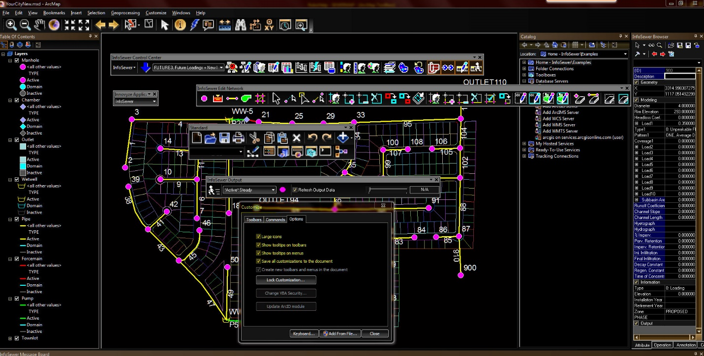

# InfoSewer ArcMap Pull-Down Menu

Some of the various ArcMap Project tools can be found in the ArcMap's pull-down menu, and others are accessed via the "Maintenance Tools" (i.e. topics, layouts, analysis tools, and layer and feature editing). With ArcMap running inside of InfoSewer, you can use any of the ArcMap commands available.

You can open an existing InfoSewer project using the Open and New commands in the File pull-down menus. It is necessary to set up the InfoSewer library in both cases because the InfoSewer commands may be accessed through different InfoSewer tools.

For more information on the ArcMap pull down menus refer to the [<u>ArcMap help file.</u>](http://desktop.arcgis.com/en/desktop/)

 

# ArcMap Toolbars

This new interface was developed as a subset of the ArcMap interface, which was based on the unique features found only available in InfoSewer. If you want to use a model by itself or if or if you want to manage model specific data functions using ArcMap, you can choose one of these options: Both the InfoSewer and ArcMap toolbars are available as a separate tool and they may be accessed via the View toolbar menu command.

As well, any ArcMap/Info Region tool, command, menu, or dock that you have already invoked may be brought to the foreground using a right-click by clicking on anything other than the Drawing Area. The "Customize" button on the toolbar menu will let you control the toolbars you want to use, selecting different ones will not be any different. Any part of your user interface may have an expanded toolbar, whether it be the location where you place them manually or via a drag-and-and-drop mechanism.

An easy way to find more information about the ArcMap toolbars is to visit the ArcMap help file. If you open the InfoSewer Toolbox, you'll find out all the available features and capabilities of the tool, listed in Toolbox or expanded in Toolbox.

In addition to the various toolbars, you will also have these additional tools in ArcMap:**<u>Standard</u>**

**<u>Tools</u>**

**<u>Draw</u>**

**<u>Layout</u>**

**<u>Effects</u>**

**<u>Georeferencing</u>**

**<u>Data Frame Tools</u>**

**<u>Utility Network Analyst</u>**

**<u>Spatial Adjustment</u>**

**<u>Graphics</u>**

**<u>Edit Cache</u>**

**<u>Advanced Editor</u>**

**<u>Editor</u>**

**<u>Customize</u>**

**<u>Large Icon Options</u>**

The large icons apply to the Arc Map and InfoSewer Icons, and they can be saved permanently to the current MXD file.

# Drawing Area

The actual network schematic is displayed in the InfoSewer drawing area. To create, modify, edit, and maintain your InfoSewer projects, you can use a combination of InfoSewer and ArcMap commands. You can use ArcMap to create your collection system by importing Base maps and/or other external drawings.

Using the InfoSewer Create menu commands, any of the InfoSewer elements, such as pipes, pumps, wetwells, and manholes, can be created in the drawing area. Each element in this drawing may be associated with data. These settings will be saved in the InfoSewer database and can be changed at any time. Each element is represented by a different symbol. Refer to the InfoSewer help file for more information on any of the available InfoSewer commands.

