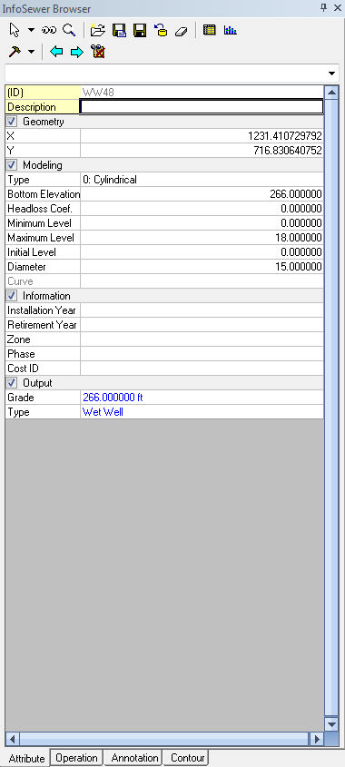
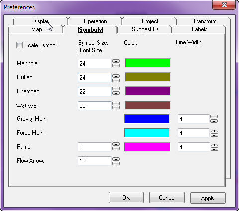
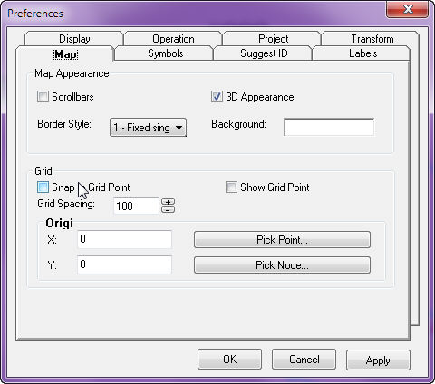
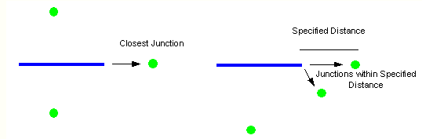

# InfoSewer Exchange Menu

**Descriptions of All** ***Exchange Menu commands in InfoSewer.***

InfoSewer supports the following data exchange functionality.

- [<u>Import/Export Managers</u>](javascript:BSSCPopup('Import_Export/Import_and_Export.htm');) - Background mapping, external models or InfoSewer data elements.

- [<u>Import/Export Generate Files</u>](javascript:BSSCPopup('Import_Export/Generate_File_Methodology.htm');) - Import generate files in to InfoSewer or export InfoSewer in to generate file.

- [<u>Append Nodes</u>](javascript:BSSCPopup('Import_Export/Append_Nodes_Methodology1.htm');) - Allows the user to create a conduit and node network from third party software application like AutoCAD, Microstation, or ESRI shapefiles.

- [<u>ODBC Exchange</u>](javascript:BSSCPopup('Import_Export/ODBC.htm');) - Download and upload data to and from InfoSewer by creating data links.

- [<u>GIS Gateway</u>](javascript:BSSCPopup('GIS_Mapping/GIS_Gateway_Page.htm');) - Allows exchange of Geodatabase information to and from the model.

- [<u>Windows Clipboards</u>](javascript:BSSCPopup('Windows_Clipboard.htm');) -  Export and view model results outside of InfoSewer .

 

 

**Data Exchange**

InfoSewer has an extensive data exchange functionality. Using InfoSewer data exchange features one can import collection system maps and the associated data created by H2OMap Sewer; export collection system maps and the associated data created by InfoSewer into H2OMAP Sewer; import/export input data and simulation outputs from/to data formats that are compatible with GIS, CAD, CSV; export/import collection system geometry to/from ArcInfo generate files, and exchange model outputs with other applications including presentation applications, spreadsheets, and word processors.

Built with ESRI MapObjects and supporting numerous database, CADD, GIS, and data formats,  supports many powerful GIS and mapping functions. Its unique open-architecture framework allows information to be easily exchanged with other applications including CAD and presentation applications, spreadsheets, and relational databases.

 

Although transparent to the user,  is developed to run entirely within a standalone (i.e., no additional CADD or GIS software required) environment.  tools are accessed using customized MapObjects commands, menus, and toolboxes, and the graphical user interfaces for these tools are based exclusively on Windows interface standards.

 

InfoSewer supports the following data exchange functionality.

- [<u>Import/Export Managers</u>](javascript:BSSCPopup('Import_Export/Import_and_Export.htm');) - Background mapping, external models or InfoSewer data elements.

- [<u>Import/Export Generate Files</u>](javascript:BSSCPopup('Import_Export/Generate_File_Methodology.htm');) - Import generate files in to InfoSewer  or export InfoSewer in to generate file.

- [<u>Append Nodes</u>](javascript:BSSCPopup('Import_Export/Append_Nodes_Methodology1.htm');) - Allows the user to create a conduit and node network from third party software application like AutoCAD, Microstation, or ESRI shapefiles.

- [<u>ODBC Exchange</u>](javascript:BSSCPopup('Import_Export/ODBC.htm');) - Download and upload data to and from InfoSewerby creating data links.

- [<u>GIS Gateway</u>](javascript:BSSCPopup('GIS_Mapping/GIS_Gateway_Page.htm');) - Allows exchange of Geodatabase information to and from the model.

- [<u>Windows Clipboards</u>](javascript:BSSCPopup('Windows_Clipboard.htm');) -  Export and view model results outside of InfoSewer .

- [<u>Import H2OMap Sewer</u>](javascript:BSSCPopup('Import_H20Map.htm');) - Import H2OMap Sewer Model into InfoSewer .

- [<u>Export to H2OMAP Sewer</u>](javascript:BSSCPopup('Export_to_H20Map.htm');) - Export to H2OMAP Sewer

In addition to the data exchange features supported by InfoSewer, the following database connection and exchange features are available from ArcGIS.

- [**<u>Spatial Database Connection</u>**](javascript:BSSCPopup('Spatial_Database.htm');)

- [**<u>OLE Database Connection</u>**](javascript:BSSCPopup('Import_Export/OLE_DB_Connection.htm');)

**Issues to Consider When Importing GIS data into InfoSewer**

If you import data from a GIS you should ensure the following before importing into InfoSewer:

- All conduits (arcs, lines) in the GIS are connected to two unique nodes.

- All conduits in the GIS are snapped together where those conduits represent connected conduits in your sewer collection system.  In other words, be sure that where two or more conduits should be connected, those conduits should share the same node in the GIS or other external database.  

- There are no disconnected nodes in the GIS database.  Each node should be connected to at least one conduit in the GIS.

- The graphical representation of the conduits in the GIS corresponds to the values in your database that represent the from- and to-node identifiers. In other words, if a conduit in your GIS database has a from-node value of “1” and a to-node value of “2”, then the graphical representation of that conduit on the map display shows that conduit starting at node “1” and ending at node “2”.

**Note:**

-  If you do not meet the above-listed criteria, you may experience one or more errors when running a simulation in InfoSewer. The two most common situations that may occur if you do not meet the above-listed criteria before importing are the following:

  - Isolated Node – One or more nodes are disconnected from the network.

  - Coincident Nodes – Two or more nodes share the same location, appearing to a viewer as a single node.

- InfoSewer has tools that will help you correct these problems in the event that your GIS is too burdensome.  From the **InfoSewer Control Center -\> InfoSewer** button **-\>** **Utilities** menu, point to **Connectivity** and select **Orphan Nodes** or **Orphan conduits**.  By doing this, InfoSewer will identify which nodes are not connected to conduits and which conduits do not have both an upstream and downstream node.

The GIS Gateway is an integral part of InfoSewer

**Import Manager**

All other data elements are imported with the Import Manager.  Here the user can import from either an ESRI Shapefile, MapInfo MIF/MID or an ASCII delimited text file.

To run the Import Manager, from the **Exchange** menu, select **Import Manager**.

The Import Manager itself is a two-step wizard that guides the user through the import process.

**<u>Step 1 – General Information</u>**

The first step of an import is to identify which InfoSewerH20Map Sewer element and import options are desired.

Click on any portion of the dialog box below to learn more.

Choose the desired options and then choose the Next button to continue to step 2.

Note:  The checkbox for “No Geometry Update” is enabled when you select “Shapefile” or “MIF/MID” format because these two formats have geometry information, but “Delimited Text” does not.

**<u>Step 2 – Define Data Field Mapping</u>**

The second step is to define which fields will be mapped to their respective InfoSewerH20Map Sewer database fields.

Click on any portion of the dialog box below to learn more.

Once all of the database fields have been mapped, select the Finish button to complete the import process.

*(Note: Be sure to correctly map the ID field, which contains the unique identifier for each H2OMAP Sewer component.  This ID field must also be present in the file being imported, since it is the only unique identifier in the database.)*

**<u>Issues to Consider When Importing GIS data into H2OMAP Sewer</u>**

If you import data from a GIS you should ensure the following before importing into H2OMAP Sewer:

1.  All links (arcs, lines) in the GIS are connected to two unique nodes.

2.  All links in the GIS are snapped together where those links represent connected pipes in your sewer collection system.  In other words, be sure that where two or more pipes should be connected, those pipes should share the same node in the GIS or other external database.  It is common to find that in the GIS those two or more pipes are actually dead-end pipes, each pipe with a unique, different node, and those nodes simply share the same location, appearing to a map viewer as being the same node.

3.  There are no disconnected nodes in the GIS database.  Each node should be connected to at least one link in the GIS.

4.  The graphical representation of the pipes in the GIS corresponds to the values in your database that represent the from- and to-node identifiers.  In other words, if a pipe in your GIS database has a from-node value of “1” and a to-node value of “2”, then the graphical representation of that pipe on the map display shows that pipe starting at node “1” and ending at node “2”.

*(Note: If you do not meet the above-listed criteria, you may experience one or more errors when running a simulation in H2OMAP Sewer.)*

The two most common situations that may occur if you do not meet the above-listed criteria before importing are the following:

1.  Isolated Node – One or more nodes are disconnected from the network.

2.  Coincident Nodes – Two or more nodes share the same location, appearing to a viewer as a single node.

InfoSewer  has tools that will help you correct these problems in the event that your GIS is too burdensome.  From the **Utilities** menu, point to **Connectivity** and select **Orphan Nodes** or **Orphan Links**.  By doing this, the program will identify which nodes are not connected to links and which links do not have both an upstream and downstream node.  Once these facilities are identified, you can then correct the errors by [<u>moving nodes</u>](javascript:BSSCPopup('User_Interface/Toolbars_and_Icons.htm#MoveNode');) or [<u>redrawing the pipes</u>](javascript:BSSCPopup('Data_Elements/Pipes.htm#RedrawPipe');).

At any point, the user can also update the graphics from the database data and vice versa.  [<u>Click here</u>](javascript:BSSCPopup('Preferences_and_Utilities/Preferences_and_Utilities.htm');) to learn more about the utilities within InfoSewer .

This will prove useful for sharing your modeling efforts with your organization via enterprise or web (Intranet or Internet) applications.

Export Options are:

- CSV Files The checkbox for “No Geometry Update” is enabled when you select “Shapefile” or “MIF/MID” format because these two formats have geometry information, but “Delimited Text” does not.

- Shapefiles  The checkbox for “No Geometry Update” is enabled when you select “Shapefile” or “MIF/MID” format because these two formats have geometry information, but “Delimited Text” does not.

- MIIF/MID The checkbox for “No Geometry Update” is enabled when you select “Shapefile” or “MIF/MID” format because these two formats have geometry information, but “Delimited Text” does not.

- for Pumps,  PIpes, Wet  Wells   and Manholes

**<u> </u>**

**<u>Manhole Export and Import</u>**

**<u>Pipe Export and Import</u>**

**<u>Wet Well  Export and Import</u>**

**<u>Pump Export and Import</u>**

 

 

** **

**Export Manager**

InfoSewer  is able to export any data element or model result at any time.

Click on any hyperlink below to learn more.

- [**<u>Export Data Elements (Pipes, Manholes, etc.)</u>**](javascript:BSSCPopup('#ExportElements');)

- [**<u>Export Manager</u>**](javascript:BSSCPopup('#ExportManager');)

- [**<u>Export Model Results</u>**](javascript:BSSCPopup('#ExportResults');)

**<u>Export Data Elements</u>**

There are several ways to export data elements, depending on the type of file that is to be exported.

**<u>ArcInfo Generate File</u>**

If the export file is an ArcInfo Generate file, then from the **Exchange** menu, point to **Generate** then select **Export**.  At this point the user will be prompted to select the elements to be mapped (links and/or nodes) and the location to write the export files.  It is important to note that when generate files are created, they do not contain the database information from H2OMAP Sewer.  To generate database information, the user must also export a delimited text file (CSV) for import into ArcInfo.

**<u>Export Manager</u>**

All other data elements are exported through the Export Manager.  Here the user can export to either an ESRI Shapefile, MapInfo MIF/MID or an ASCII delimited text file.

To run the Export Manager, from the **Exchange** menu, select **Export Manager**.

The Export Manager itself is a three-step wizard that guides the user through the export process.

**<u>Step 1 – General Information</u>**

The first step of an export is to identify whichIn InfoSewer element, scope, output format and destination file are desired.

Click on any portion of the dialog box below to learn more.

Choose the desired options and then choose the Next button to continue to step 2.

**<u>Step 2 – Define Display Fields</u>**

The second step is to define which fields will be included in the export file and the order in which they will be created.  Field prefixes (ex. MANHOLE: ) reflect the component types.  The user also has the option of saving a custom configuration for later use.

Click on any portion of the dialog box below to learn more.

Choose the desired fields and then choose the Next button to continue to step 3.

**<u>Step 3 – Define Display Scope (ESRI and MapInfo Only)</u>**

The third step is only applicable to ESRI Shapefile and MapInfo MIF/MID export files.  Here the user is able to customize the database field names created in the export file by edit their names.

The Export Fields shows the user which database fields were chosen to be exported while the Field Names represents the database field header assigned to the new export file.  The user is able to click on any field name and change the name prior to the export file being created.

Once the finish button is clicked, an export file is created.  The export file can now be edited by third party software programs.

**<u>Exporting Model Results</u>**

Because InfoSewer is Windows based, any simulation report or database table that resides in a project is capable of being copied at any time.  Just open the desired output report or database table and highlight the data you wish to export.  Then, right-mouse click over the highlighted area and select Copy.  Open any third party package like Microsoft Excel and select Paste from the Edit menu.

This will prove useful for sharing your modeling efforts with your organization via enterprise or web (Intranet or Internet) applications.

Export Options are:

- CSV Files

- Shapefiles

- MIIF/MID

- for Pumps,  PIpes, Wet  Wells   and Manholes

**<u> </u>**

**<u>Manhole Export and Import</u>**

**<u>Pipe Export and Import</u>**

**<u>Wet Well  Export and Import</u>**

**<u>Pump Export and Import</u>**

 

**Generate File Export**

Use this to Export to Generate file. [<u>Click here</u>](javascript:BSSCPopup('Import_Export/Generate_File_Methodology.htm');) to learn more about the Export methodology.

Click on any portion for more details.

**<u>Apply</u>**

Click on Apply to accept the various changes and selections made in this dialog box.

**<u>Cancel</u>**

Use this to cancel the selection and close out of the dialog box. Any changes and/or selections made will not be reflected in the project.

**<u>Graphics Options</u>**

Disable Auto Length Calculation **(not  USED)**

- Yes (Checked) - InfoSewer will recalculate the lengths of pipe segments based on junction node and pipe vertices geometry.

- No (Unchecked) - Ensures that the Auto Pipe Calculation will not be used and that pipe lengths, when imported, will be populated as they are in the import file.

**<u>Nodes</u>**

Check this box if you want to import/export Nodes into/from your project. Specify the location of this file by clicking on the **Browse** button 

**<u>Links</u>**

Check this box if you want to import/export Links into/from your project. Specify the location of this file by clicking on the **Browse** button 

**Generate File Import**

Use this to Import into InfoSewer from Generate files. [<u>Click here</u>](javascript:BSSCPopup('Import_Export/Generate_File_Methodology.htm');) to learn more about the Import methodology.

Click on any portion for more details.

**<u>Apply</u>**

Click on Apply to accept the various changes and selections made in this dialog box.

**<u>Cancel</u>**

Use this to cancel the selection and close out of the dialog box. Any changes and/or selections made will not be reflected in the project.

**<u>Graphics Options</u>**

Disable Auto Length Calculation

- Yes (Checked) - InfoSewerH20Map Sewer will recalculate the lengths of pipe segments based on junction node and pipe vertices geometry.

- No (Unchecked) - Ensures that the Auto Pipe Calculation will not be used and that pipe lengths, when imported, will be populated as they are in the import file.

**<u>Nodes</u>**

Check this box if you want to import/export Nodes into/from your project. Specify the location of this file by clicking on the **Browse** button .

**<u>Links</u>**

Check this box if you want to import/export Links into/from your project. Specify the location of this file by clicking on the **Browse** button .

**Generate File Methodology**

Use this to Export to Generate file or import from Generate file into InfoSewerH20Map Sewer. Choose the appropriate direction from below:

**<u>Export Methodology</u>**

For Exporting to Generate File do the following:

- From the **InfoSewer Control Center -\> InfoSewer** button **-\>** **Exchange** pull down menu choose **Generate File -\> Export** option. This launches the [<u>Export dialog</u>](javascript:BSSCPopup('../InfoSewer/Data_Exchange/Generate_File/Generate_File_Export.htm');) box as shown below :

<!-- -->

- Choose the appropriate generate files you want to create and specify the location on your network or your hard drive you want to save your generate files by clicking on the **Browse** button 

- Click on Apply to create the generate files

**<u>Import Methodology</u>**

For Importing Generate Files do the following:

- From the **InfoSewer Control Center -\> InfoSewer** button **-\>** **Exchange** pull down menu choose **Generate File -\> Import** option. This launches the [<u>Import dialog</u>](javascript:BSSCPopup('../InfoSewer/Data_Exchange/Generate_File/Generate_File_Import.htm');) box as shown below :

<!-- -->

- Choose the appropriate generate files you want to import and specify the location on your network or your hard drive you want to import your generate files from by clicking on the **Browse** button 

- Choose to Enable or Disable the InfoSewer Auto-length calculation. Enabling the InfoSewer auto length calculation will over write the lengths with InfoSewerH20Map Sewercalculated pipe lengths based on the AutoCAD coordinates.

- Click on Apply to create the generate files.

**Note**: An ArcInfo Generate file typically contains only element coordinates. It is essential to also import a CSV file that contains all the database information.

The following illustrates a sample node and link ESRI generate file. Refer to the ESRI Arc/Info documentation for more information on the Generate file format:

**Node Generate File**

In the following illustration, several nodes are written to the Generate file.  For each node, the **ID**, **X-coordinate**, **Y-coordinate**, and a placeholder for a **Z** value are provided:

1 1678.750000 1703.500000 0.000000

3 1993.750000 1703.500000 0.000000

5 2193.250000 1703.500000 0.000000

7 3030.000000 1715.000000 0.000000

END

 

 

**ODBC**

The Open Database Connectivity (ODBC) module of** InfoSewer** allows the user to actively link to any external database and import that data into the current project session.  Likewise, the user can also update an external database with InfoSewer  data.

To initiate the ODBC Exchange, from the **Exchange** menu, select **ODBC** and the following dialog box will appear.  Click on any portion to learn more.

** Append Nodes**

The Append Nodes command is used to automate the InfoSewer pipe and node network creation.  If the user has a pipe network in another third party application like AutoCAD or Microstation, the network can be bought into InfoSewer as a background layer (.dxf or .dwg) and then converted to an InfoSewer pipe and node network. To learn more about the Append Node Methodology [<u>click here</u>](javascript:BSSCPopup('Import_Export/Append_Nodes_Methodology1.htm');).

**Append Nodes Methodology**

The Append Nodes command is used to automate the InfoSewer pipe and node network creation.  If the user has a pipe network in another third party application like AutoCAD or Microstation, the network can be bought into InfoSewer as a background layer (.dxf or .dwg) and then converted to an InfoSewer pipe and node network.

**<u>Methodology</u>**

To Convert a Polyline drawing into an InfoSewer project use the following procedure:

- Import the external CAD drawing or shapefile into InfoSewer. Use the GIS Gateway command under the **InfoSewer** **Control Center -\> InfoSewer** button **-\>** **Exchange** pull down menu to launch the **GIS Gateway** dialog box.

- Create a new GIS Exchange Cluster by clicking on the **Add** button. Click on the Browse button  next to the **GIS Data Source** command and select the AutoCAD drawing that you want to import. For most AutoCAD drawings the **Polyline** choice is the best choice. Select **Pipe Tables** as the **InfoSewer Data Type**. Specify **Tabular Join** as your **Relate Type** and  **0: Bi-Direction** as your **Update Direction**.

- Under the **Tabular Join** tab of the **GIS Exchange Cluster** choose to **Create New Records**, **Create Unique IDs** and to **Update Geometry Data** and click on the **OK** button at the bottom of the dialog box. [<u>Click here</u>](javascript:BSSCPopup('GIS_Mapping/GIS_Exchange_Cluster.htm');) to learn more about GIS Exchange Clusters.

- Now click on the **Load** button on your **GIS Gateway** dialog box to launch the **Load Data from GIS Layer or Table** dialog box. Select the Exchange cluster that you want to load and click on the **Load** button.

- Once the drawing has been inserted into your InfoSewer project choose the **Append Nodes** command from your **InfoSewer** **Control Center -\> InfoSewer** button **-\>** **Exchange** pull down menu to launch the [<u>Append Nodes</u>](javascript:BSSCPopup('Introduction/ArcMap_Pull-Down_Menus.htm');) dialog box.

- Specify the Node Searching radius. It is recommended that half the size of the node symbol size would be a good beginning point. You may find out the size of the node symbol from your **InfoSewer** **Control Center -\> InfoSewer** button **-\> Project Preferences -\> Default Symbol Sizes** tab. Also specify your default **Node Type** here. Normally it is good practice to select **Junction** as the default node type.

- Choose the **Automatic Mode** option if you want InfoSewer to automatically convert your polylines for you.

- Once you have entered and selected all your preference choices, click on **Convert** to launch the conversion process.

**Windows Clipboard**

Because InfoSewer is Windows based, any simulation report, graph, or database table that resides in an InfoSewerH20Map Sewer project is capable of being copied at any time. Just open the desired output report or database table and highlight the data you wish to export. Then, right-mouse click over the highlighted area and select Copy.  Open any third party package like Microsoft Excel and select Paste from the Edit menu.

 
