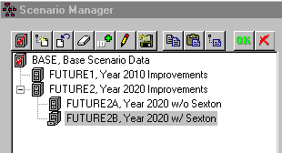

[<u>InfoSewer Maximum Number of Segments Sensitivity</u>](https://help.innovyze.com/display/infosewer/InfoSewer+Maximum+Number+of+Segments+Sensitivity)

A link's flow shape and flow attenuation are affected by the three Run management settings in InfoSewer: Maximum Number of Segments, Minimum Travel Distance, and the Minimum Travel Distance in a link. The impact of reducing the Minimum Travel Distance is to minimize peak flow and spread out the flow as the number of segments in the network grows **(Figure 1).  ** The smaller the minimum travel distance, which has the effect of increasing the number of segments in a link up to the maximum number of segments specified by the parameter Maximum Number of segments, the smaller the peak and the greater the attenuation of the flow in the InfoSewer system.

It is possible to regulate attenuation in InfoSewer in three ways: (1) by utilizing the flow attenuation option; (2) by increasing the Maximum Number of Segments per connection; and (3) by decreasing the Minimum travel distance. You may also use all three options to create more segments per link for long links, and only a few segments for short ones, depending on the length of the links.

**Figure 1**.  Effect of the Minimum Travel Distance in InfoSewer

The three Run manager parameters, Maximum Number of Segments, Minimum Travel Distance and the Minimum Travel Distance in InfoSewer affect the shape and flow attenuation of the flow in a link.  The effect of decreasing the Minimum Travel Distance is to reduce the peak flow and spread out the flow as the number of segments increases **(Figure 2).  **The smaller the minimum travel distance, which has the effect of increasing the number of segments in a link up the limit of the parameter Maximum Number of segments, the smaller the peak and the more attenuation of the flow in InfoSewer. 

There is three ways to control attenuation in InfoSewer: (1) use the flow attenuation option, (2) increase the Maximum Number of Segments per link and (3) decrease the Minimum travel distance.    You can also use all three parameters to make more segments per link for long links and only a few segments for short links.

 

**Figure 2.** Effect of the Minimum Travel Distance in InfoSewer

The three Run manager parameters, Maximum Number of Segments, Minimum Travel Distance and the Minimum Travel Time in InfoSewer affect the shape and flow attenuation of the flow in a link.  The effect of decreasing the Minimum Travel Time is to reduce the peak flow and spread out the flow as the number of segments increases **(Figure 3).  **The larger the Minimum Travel Time, which has the effect of decreasing the number of segments in a link up the limit of the parameter Maximum Number of segments, the smaller the peak and the more attenuation of the flow in InfoSewer.

There is three ways to control attenuation in InfoSewer: (1) use the flow attenuation option, (2) increase the Maximum Number of Segments per link and (3) decrease the Minimum travel distance.    You can also use all three parameters to make more segments per link for long links and only a few segments for short links.

**Figure 3**.  Effect of the Minimum Travel Time in InfoSewer
