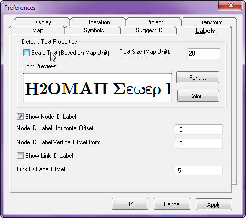

# InfoSewer Preferences

The Preferences command is used to control the InfoSewer  system settings.  All changes made on the Preferences dialog box must be applied prior to closing the dialog box.  Many preferences set with this command will be reflected as the default choices on other dialog boxes.  You may change those settings as desired on those dialog boxes.

- [<u>Operation Settings</u>](javascript:BSSCPopup('Copy%20of%20Preferences-Labelling.htm');) - Specify the different operation settings here.

- [<u>Display Settings</u>](javascript:BSSCPopup('Copy%20of%20Preferences-Default%20Symbol.htm');) - Use this to specify the display properties.

- [<u>ID and Description</u>](javascript:BSSCPopup('Copy%20of%20Preferences-Display%20Settings.htm');) - ID and Descriptions may be set here.

- [<u>Labeling</u>](javascript:BSSCPopup('Copy%20of%20Preferences-%20Labeling.htm');) - Specify your Map label preferences here.

- [<u>Selection Settings</u>](javascript:BSSCPopup('Copy%20of%20Preferences-Operation%20Settings.htm');) - Specify the project selection settings.

- [<u>Default Symbol</u>](javascript:BSSCPopup('Copy%20of%20Preferences-Default.htm');)- Specify the default symbol sizes for all the  InfoSewer  data elements here.

To display project preferences, from the **Tools** menu, select **Preferences**.  Click on any tab to learn more about the user options related to the subject.  A description of all options is shown below each dialog box.

# Display

The Display tab controls visual effects and features within InfoSewer.

- **Show Flow Direction** - Enables whether or not flow arrows will be shown in the InfoSewer project.  When OFF, the user will not be able to place flow arrows in the project, regardless if the "Show Flow Direction" check box under the Control Center -\> Map Display -\> Display Settings box is checked.

- **Show Inactive Elements** - Controls whether or not inactive elements in the project will be displayed or not.  When ON (checked), elements not in the current \*active\* [<u>facility set</u>](javascript:BSSCPopup('../Scenario_Creation/Facility_Sets.htm');) will be displayed with the color as shown in the Inactive Element Color box.

- **Highlight Active Element** - When ON (checked), any element selected in InfoSewer with the Select icon will be highlighted with a selection box.  When OFF, data elements that are selected in InfoSewer  will not be highlighted.

- **Show Nodes in Overview Map** - When ON (checked), all nodes will be displayed in the Map Overview box.

- **Locate Node Map Extent %** - The value must be greater than zero and is used with the current map (full) extent to calculate the size of the graphical extents of a zoom.  For example, the current map full extent: 10.0 X 16.0; node locate map extent %: 50.0  -\>  zoom in box size: 5.0 X 8.0.

- **Link Locate Zoom Factor** - The value must be greater than zero and is used with the extent box of the link to be located to calculate the size of the zoom in box.  For example, link locate zoom factor: 2.0; extent size of the link to be located: 4.0 X 2.0  -\>  zoom in box size: 8.0 X 4.0.

- **Decimal Placement** - Controls the level of decimal accuracy when model results are placed as annotation (text) in the project.

- **Domain Highlighting Color** - Sets the color for elements as they are added to a [<u>domain</u>](javascript:BSSCPopup('../Domains_and_Facilities/Domain_Manager.htm');).  Red is the default.

- **Selection Highlighting Color** - Sets the color for elements as they are added to a selection set.  Yellow is the default.

- **Inactive Element Color** - Sets the color for elements when they are not part of the \*active\* facility set.  When the Show Inactive Elements box is checked, inactive elements are shown in the InfoSewer  display as this color.  Grey is the default.

**<u>Operation</u>**

The Operation tab allows the user to control project settings options relating to the way data is controlled in InfoSewer .

- **Auto Length Calculation **- When ON (checked), the length of digitized pipe segments will be automatically calculated and input into the InfoSewer  database.  When (OFF) unchecked, pipe lengths will not be automatically created from the graphical distances.

- **Auto Record Saving **- Controls if modifications to records on various dialog boxes (such as the Edit Patterns, Edit Curves, Edit Data Set, etc.) are immediately saved when you pick another record for editing on the same dialog box.  When ON (checked), InfoSewerH20Map Sewer automatically saves edits to one database record when you change to another record on the same dialog box.  When OFF, you must choose the Save button <u>before</u> moving to another record.

- **Auto Database Packing **- When ON (checked), the Auto Database Packing preference automatically deletes database records related to a deleted element.  When OFF (unchecked), records are only marked for deletion, allowing records to be recalled.  Use the [<u>Recall</u>](file:///C:\SWMM-SEWER%20Robohelp\SewerCombined%20-%20InfoSewer\Preferences_and_Utilities\Recall.htm) command to restore data elements deleted from the InfoSewer  project.  When a database is "packed", this means that all records marked for deletion are permanently deleted from the database.  Do not pack a database if you plan to recall data elements.

- **Delete Confirmation **- Controls whether or not you are prompted to verify delete operations.  When this option is not checked, components will be immediately deleted without user verification.

- **Auto Manhole Set **- Controls how [<u>manhole sets</u>](javascript:BSSCPopup('../Scenario_Creation/Data_Sets.htm');) will be loaded (activated) in the current project.  When ON (checked), sewer loadings for all active manholes are set to null (zero) and then, for those manholes with a matching record in the current loading set, loads will over-write the current loading set.  When OFF, loadings will be re-loaded from the loading set for those manholes with matching records in the loading set.  For those manholes with no matching records in the newly loaded set, the value of the current loadings are preserved.

- **Auto Link Node Inclusion **- Controls whether or not nodes directly connected to activated links will also be activated for a hydraulic simulation.  When ON (checked), all nodes directly connected to activated links will also be activated.  When OFF, nodes directly connected to activated links are not automatically activated.  Using the "Add Link Nodes" button from the Facility Manager will ensure that end nodes will be included in the activated set.  A hydraulic simulation will fail if end nodes are not activated.

- **Length Scaling Factor **- Applies a global scaling factor to be applied to all pipes added after setting this preference. The pipe length (imported or calculated) is multiplied by the entered scaling factor.  Do not use if your GIS base map is to actual scale units.

- **Auto Output Relate Update **- Controls whether or not [<u>output relates</u>](javascript:BSSCPopup('../Reports_Graphing_and_Output/Output_Relate.htm');) are automatically updated each time you run a simulation.  When OFF (unchecked), results from the most recent simulation run are *not* written to the relate table.

- **Auto Output Retrieval **- Controls whether or notInfoSewer  makes simulation results from a custom scenario available when activating that scenario.  When ON (checked), InfoSewer  determines if the scenario being loaded has a valid [<u>output source</u>](file:///C:\SWMM-SEWER%20Robohelp\SewerCombined%20-%20InfoSewer\Reports_Graphing_and_Output\Output_Source.htm) containing results from a previous simulation run and then loads that output source into InfoSewer  as the \*active\* output.  When OFF, InfoSewer  disregards any previously generated simulation results when activating a custom scenario.  If OFF, the user must re-run the desired scenario before reviewing simulation results for the loaded scenario.

- **Auto Output Remembering **- Controls whether or not H2OMAP Sewer preserves simulation results for the current scenario when de-activating that scenario and switching to another custom scenario.  When ON (checked), simulation results associated with the scenario being de-activated remain available in the current project as an [<u>output source</u>](file:///C:\SWMM-SEWER%20Robohelp\SewerCombined%20-%20InfoSewer\Reports_Graphing_and_Output\Output_Source.htm).  When OFF, only the \*active\* output source is available for reports, graphing, etc.

- **Enable Output Save As **- Controls whether or not simulation results are saved with an InfoSewer  project when that project is saved as a new file name.  When ON (checked), H2OMAP Sewer copies simulation results for the current project to the new project.  When OFF (unchecked), only model inputs are saved to the new project.  If you choose to save simulation results to the new project, the \[project_name\].OUT directory will be copied in addition to the \[project_name\].DB folder containing model input data.

- **Export Simulation Result for External Application** - If turned on this feature generates modal outputs in dbf format, which could be opened from spreadsheets and flexibly manipulated by the users. The dbf files containing model results will be saved to the “\*.OUT” folder of the InfoSewer  Project, where \* is the file name of the project. The exact location of the dbf file will be …\*.OUT/Scenario/scenario name/RunType/. Where scenario name indicates name of the modeling scenario you might have defined and run. If no custom scenario is created and/or if you are interested in the base scenario results, the name will be "Base". Run Type could be "Dynamic", "Static", or "Design" depending on the type of simulation you executed (i.e., dynamic simulation, steady state analysis, or design simulation), respectively.

- **Auto Link Delete** - Controls whether or not the link(s) connected to a node selected for deletion will remain or be deleted.  When ON, the link connected to a node selected for deletion will be deleted as well.  Use the [<u>Recall</u>](javascript:BSSCPopup('Recall.htm');) command to recall a deleted node or link.

- **Current Selection Shapes** - Controls whether a graphical selection in the InfoSewer  project is either by a window (rectangle) or a polygon selection.  Choose the option that works best for you.

- **Current Selection Mode** - Controls whether a graphical selection in the InfoSewer  project selects objects contained only within a "window" selection or to select those that "cross" the selection box or polygon.

- **Digitize (Next Node/Next Link)** - Select a different data element from the dropdown box to have InfoSewer  create a different element type when the digitize network icon is initialized.  For example, if the user is digitizing a pipe network, use "pipe" as the next link option.  When the digitize network command is initialized, the network will create pipes as the link entities.

- **Text Editor** - Allows the user to specify an ASCII text editor for editing output reports generated via the Run Manager.

**<u>Project</u>**

The Project tab allows the user to place information in InfoSewer  that is project specific.

- **Title** - The file name of the InfoSewer  project.

- **Description** - A description for the InfoSewer  project.

- **Engineer** - The engineer responsible for the hydraulic model.

- **Notes** - Notes as desired.

**<u>Transform</u>**

The Transform tab allows the user to move, scale or rotate the InfoSewer  project from one coordinate to another.

- **Option** - Select the radial button for the type of translation to be performed.  Move the InfoSewer  project from one coordinate to another.  Scale the project according to an X and Y scaling factor.  Rotate the project around an origin point according to a decimal degree angle.

- **Origin** - The origin point for which the move, scale or rotate option is to occur.

- **Move** - Specify the To X,Y coordinate to move the InfoSewer  project.

- **Scale** - Specify an X and/or Y scaling factor to scale the InfoSewer  project.  Specify the same scale factor in the X and Y box to ensure a uniform scale.  If you wish to distort the scaling procedure (where one direction is larger than the other), specify differing scale factors for X and Y scales.

- **Rotate** - Specify an decimal degree angle (0-360) to rotate the InfoSewer  project around the origin point.

**<u>Labels</u>**

The Labels tab allows the user to control the appearance of ID labels during an InfoSewer  project.

 

- **Scale Text** - When ON (checked), InfoSewer  will keep node and pipe labels at a constant map scale as specified with the text size box.  When OFF (unchecked), the size of the text font will maintain a size in relative proportion to the zoom scale.

- **Text Size** - The size of label text in map units.  For example, for a 100 scale plot with a 1/8 inch text height for labels, set the text size to 12.5 (0.125 x 100).

- **Font & Color** - Click on the Font and Color buttons to change the appearance of the ID labels.

- **Show Node ID Label** - When ON (checked), all nodes in the InfoSewer  project will be labeled with the ID field.

- **Node ID Label Horizontal Offset** - Number of X units away from the center of the node the insertion point of the ID label will be placed.

- **Node ID Label Vertical Offset** - Number of Y units away from the center of the node the insertion point of the ID label will be placed.

- **Show Link ID Label** - When this box is checked, all links in the InfoSewer  project will be labeled with the ID field text.

- **Link ID Label Offset** - Distance in map units from which to place ID label text for links.  A positive value equates to placing the text above the line, a negative value below the line.

**<u>Suggest ID</u>**

The Suggest ID tab allows the user to change InfoSewer defaults for data element labeling, data sets, curves, patterns, etc.

- **ID Suggestion** - When checked on, InfoSewer  uses the information as shown in this dialog box when creating new data elements, data sets, etc.  When OFF (unchecked), the user will have to supply the ID and description for each new element or set, etc.

- **ID Prefix** - For data elements, the prefix represents the alpha-numeric value (input by the user) that will be inserted ahead of the unique ID in the InfoSewer  element database.  For example, if the ID prefix for a Wet Well is changed to "SA12-" then the ID in the database for the next tank created in InfoSewer  will be "SA12-\[ID value\]".  The ID prefix tab also allows how the next data set, curve, pattern, etc. will be named.

- **Next** - The Next column represents what the "Next" data element, curve, pattern, etc. created will be labeled.  Of course, the prefix comes first, then this next alpha-numeric value comes behind the prefix as a unique ID in the InfoSewer database.

- **Increment** - The labeling interval to be used in the InfoSewer  project.

- **Description** - The default description that will be applied when an element or set is created.  For example, if the user is digitizing a series of nodes that are to be placed on Elm Street, then changing the description to Elm Street will ensure that every node digitized will have that as its description.

**<u>Symbols</u>**

The Symbols tab is used to adjust the size (graphical appearance) of the InfoSewer  data elements.

- **Scale Symbol** - When this box is checked, InfoSewer  will fix the size of the data elements as described in the symbol size box.  This means that when the user zooms in and out of the InfoSewer  project, the size of the data elements will remain constant.

- **Symbol Size** - Used to adjust the size of the date element in the InfoSewer  display.  The numbers represent scale ratios in relation to the extents of the InfoSewer  display.

- **Color** - Click on the color box to change the default colors for the InfoSewer  data elements.

- **Line Width** - In map units, specify the width of the line to be used for InfoSewer  data elements.

**<u>Map for InfoSewer</u>**

The Map Properties tab is used to control the appearance of the  project.

- **Scrollbars** - When OFF (unchecked), the horizontal and vertical scrollbars along the map display will be disabled.

- **3D Appearance** - When ON (checked), the border for the  display will become beveled, giving the border a 3D appearance.

- **Border Style** - Select from having the border for the  display shown or not shown.

- **Background** - Clicking in the color box allows the user to change the color of the background in the  display.  When a color is selected, click OK and then Apply.

- **Snap to Grid Point** - When checked, entities created or moved in  will be snapped to the nearest grid point.

- **Show Grid Point** - When ON (checked),  will display a grid at a spacing as provided in the Grid Spacing box.  If the grid spacing is too small,  will not display the grid, but the grid will still be present.

- **Grid Spacing** - The mapping units of space between each portion of the grid.

- **Origin** - The point at which the grid begins.  For example, if an origin of 1.8,1.8 is specified with a grid spacing of 0.5, then the grid ticks will fall on every .8 and .3 map units.

- **Pick Point (Pick Node)** -To specify a node (or a point in space) as an origin instead of entering a coordinate.

**Preferences - Selection Settings for InfoSewer**

The Preferences - Selection Settings command is used to control the InfoSewer selection settings. All changes made on the Preferences dialog box must be saved (by clicking the OK button) prior to closing the dialog box. Many preferences set with this command will be reflected as the default choices on other dialog boxes. You may change those settings as desired on those dialog boxes.

To display Selection Settings, from the InfoSewer Control Center -\> InfoSewer button -\> Tools sub-menu, select Project Preferences -\> Selection Settings.

- Selection Shape - This option specifies the default selection type as rectangle or a polygon.

- Selection Mode - This option specifies the default selection type as a window selection (completely surround the elements) or a crossing (merely touching the desired elements).

- Selection Tolerance - In this box specify the range of tolerance for selection settings.

- OK - Click on OK to save and exit from your InfoSewer Preferences dialog box.

- Cancel - Use this to exit without saving from your InfoSewer Preferences dialog box.

