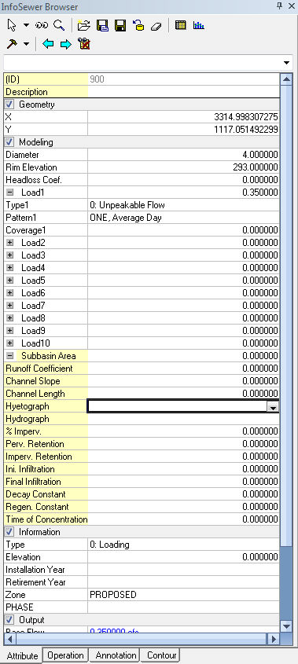

# InfoSewer Project Menu

***Descriptions of All Project Menu commands in InfoSewer.***

**Import H2OMap Sewer - H2OMap Sewer has been deprecated by Innovyze as of 2018.**

**Publish to InfoView** - This command helps you to publish an InfoSewer Project to InfoView.

**Export to H2OMap**  - Save to H2OMap Sewer (deprecated)

**Change Project Spatial Reference**  - Change the Spatial Reference of the InfoSewer Map

**Create New InfoSewer Project**

When creating a new InfoSewer project you can define the project's coordinate system here. InfoSewer provides the following tools to specify a project's coordinate system:

**ArcGIS Default** - Use the InfoSewer default coordinate system. This default spatial reference system follows ArcGIS's default settings.  It's extent (or XY domain) is:

> **Minimum X**: -10000
>
> **Maximum X**:  11474.83645
>
> **Minimum Y**: -10000
>
> **Maximum Y:**  11474.83645

**The Same as the Active Map** - Use this to assign the presently active map's background layer's coordinate system. This option is enabled only if you have a background layer associated with your project.

**Create New** - Use this to either define a new custom coordinate system or use an existing available coordinate system from the ArcGIS library. [<u>Click here</u>](javascript:BSSCPopup('Introduction/New_Spatial_Reference_Dialog_box.htm');) to learn more.

 

**Other Related Topics - **[<u>Change Project Spatial Reference</u>](javascript:BSSCPopup('../InfoSewer/User_Interface/Create_New_InfoSewer_Project/Change_Project_Spatial_Reference.htm');),** **[<u>Degree of Resolution</u>](javascript:BSSCPopup('../InfoSewer/User_Interface/Create_New_InfoSewer_Project/New_Topic4.htm');), [<u>New Spatial Reference Dialog box</u>](javascript:BSSCPopup('../InfoSewer/User_Interface/Create_New_InfoSewer_Project/New_Spatial_Reference_Dialog_box.htm');), [<u>Spatial System Coordinate Range</u>](javascript:BSSCPopup('../InfoSewer/User_Interface/Create_New_InfoSewer_Project/New_Topic3.htm');)

**Change Project Spatial Reference**

The spatial reference of a dataset in geodatabase can not be further modified once created in ArcGIS and new features can not be inserted if it's coordinates are beyond X, Y domain of the spatial reference. InfoSewer provides a very powerful tool to overcome this limitation of ArcGIS.

In InfoSewer the spatial reference of a project can be modified by either editing current project's spatial reference, extending the X, Y domain with buffering percentage, or merging with the X, Y extent of a dataset.

To launch the Change Project Spatial Reference dialog box, click on the InfoSewer Button , browse to the Project menu and select the Change Project Spatial Reference option.

 

<u> </u>

- Edit Current Project Spatial Reference: Use this to modify/edit the spatial reference of a current project.

- Extend X,Y Domain with Buffering Percentage: Use this to modify the spatial reference of a project by extending the X,Y domain with buffering percentage.

- Merge with the X,Y Extent of a Dataset: Use this to modify the spatial reference of a project by merging with the X,Y extent of a dataset.

- OK: Click on OK to accept changes to the spatial reference coordinates and close out of the dialog box.

- Cancel: Use this to cancel the selection and close out of the dialog box. Any changes and/or selections made will not be reflected in the project.

**New Spatial Reference Dialog box**

Use this to either define a new custom coordinate system or use an existing available coordinate system from the ArcGIS library.

Click on any section below to learn more. Click on Next to launch the [<u>Spatial System Coordinate Range</u>](file:///C:\SWMM-SEWER%20Robohelp\InfoSewer\User_Interface\Create_New_InfoSewer_Project\New_Topic3.htm) dialog box.

**Other Related Topics - **[<u>Change Project Spatial Reference</u>](javascript:BSSCPopup('../InfoSewer/User_Interface/Create_New_InfoSewer_Project/Change_Project_Spatial_Reference.htm');)**, **[<u>Create New InfoSewer Project</u>](javascript:BSSCPopup('../InfoSewer/User_Interface/Create_New_InfoSewer_Project/Create_New_InfoWater_Project.htm');), [<u>Degree of Resolution</u>](javascript:BSSCPopup('../InfoSewer/User_Interface/Create_New_InfoSewer_Project/New_Topic4.htm');),  [<u>Spatial System Coordinate Range</u>](javascript:BSSCPopup('../InfoSewer/User_Interface/Create_New_InfoSewer_Project/New_Topic3.htm');)

**Spatial Coordinate Range**

Click on **Next** on the [<u>New Spatial Reference Dialog box</u>](javascript:BSSCPopup('../InfoSewer/User_Interface/Create_New_InfoSewer_Project/New_Spatial_Reference_Dialog_box.htm');) to launch this dialog box. Specify your coordinate range here. Click on Next to launch the [<u>Degree of Resolution</u>](javascript:BSSCPopup('../InfoSewer/User_Interface/Create_New_InfoSewer_Project/New_Topic4.htm');) dialog box.

**Other Related Topics - **[<u>Change Project Spatial Reference</u>](javascript:BSSCPopup('../InfoSewer/User_Interface/Create_New_InfoSewer_Project/Change_Project_Spatial_Reference.htm');),** **[<u>Create New InfoSewer Project</u>](javascript:BSSCPopup('../InfoSewer/User_Interface/Create_New_InfoSewer_Project/Create_New_InfoWater_Project.htm');), [<u>Degree of Resolution</u>](javascript:BSSCPopup('../InfoSewer/User_Interface/Create_New_InfoSewer_Project/New_Topic4.htm');), [<u>New Spatial Reference Dialog box</u>](javascript:BSSCPopup('../InfoSewer/User_Interface/Create_New_InfoSewer_Project/New_Spatial_Reference_Dialog_box.htm');)

**Publish to InfoView**

This command helps you to publish an InfoSewer Project to InfoView.

