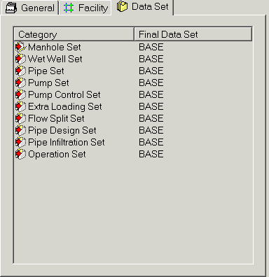

**InfoSewer Scenario Menu**

***Descriptions of All Scenario Menu commands in InfoSewer.***

The **Scenario Manger** is where InfoSewer allows the user to create, delete and modify scenarios.  The Scenario Manager is what allows the user to create "what if" situations throughout a sewage collection system.

The **Dataset Manager** is a "quick view" dialog box that allows the user to create, view and edit data sets in one easy to use location.  As shown below, the Dataset Manager is used by clicking on any of the tabs to view and edit the listed data set.  Use any of the icons at the top of the dialog box to create, edit, clone, copy or delete data sets

A **Data Set** is one of three components that comprise a scenario.  Data sets provide the capability to take a one-time “snapshot” of data (database information) in the <u>active</u> model and store that information separate from the network itself.

InfoSewer's **Compare Scenario** command allows the user to monitor the differences between any two scenarios in a model.

 

**Scenario Manager**

The Scenario Manger is where  InfoSewer allows the user to create, delete and modify scenarios.  The Scenario Manager is what allows the user to create "what if" situations throughout a sewage collection system.

**<u>What is a Scenario?</u>**

A scenario is a group of  InfoSewer facilities, data sets and conditions that are created to reflect a specific modeling situation.  With a scenario, you can develop multiple models that are specific to your sewage collection system (ex. Average day loading for a specific service area with unique reporting options).

A scenario is comprised of the following three items:

- ** Simulation sets**  - [<u>General</u>](javascript:BSSCPopup('Scenario_Creation/Simulation_Set.htm');) tab

- ** Facility set** - [<u>Facility</u>](javascript:BSSCPopup('Scenario_Creation/Facility_Sets.htm');) tab

- ** Data sets** - [<u>Data Set</u>](javascript:BSSCPopup('Scenario_Creation/Data_Sets.htm');) tab

 

**<u>Components of an  InfoSewer scenario</u>**

Each of the three components of a scenario can be further defined as follows:

- ** Simulation set** – Created through the General tab, they define the simulation options (durations, timesteps, analysis parameters, etc.) associated with the scenario.  There are three different option set types, each storing a logical grouping of simulation options.  [<u>Click here</u>](javascript:BSSCPopup('Scenario_Creation/Simulation_Set.htm');) for more information on simulation sets.

- ** Facility set** – Defines the network facilities (components such as pipes, pumps, wet wells and manholes) to be used in a simulation.  Only one facility set can be active at a time (facility sets are created through the Facility tab).  [<u>Click here</u>](javascript:BSSCPopup('Scenario_Creation/Facility_Sets.htm');) for more information on facility sets.

- ** Data set** – Stores modeling data (pipe diameter, invert elevations, manhole loadings, etc.) associated with each facility in a separate external database.  There are nine different data set types (as seen above), each storing its own unique logical grouping of modeling data.  [<u>Click here</u>](file:///C:\SWMM-SEWER%20Robohelp\SewerCombined%20-%20InfoSewer\Scenario_Creation\Data_Sets.htm) for more information on data sets.

When you define a scenario, you pick the facility, data, and option sets that comprise that scenario.  When picking data sets for inclusion in a scenario, you may either specify that a data set associated with a given scenario is included in that scenario independent from other scenarios or alternately may specify that the given data set inherits its contents – properties – from a “parent” scenario.  [<u>Click here</u>](file:///C:\SWMM-SEWER%20Robohelp\SewerCombined%20-%20InfoSewer\Scenario_Creation\Parent_Child_Relationships.htm) to learn more about Parent-Child relationships and how they are built.

Once you have configured and created a scenario, you can activate that scenario at any time.  Once a scenario is activated, any modifications made to any of the databases related to InfoSewer facilities will be changed, but only for the data sets that are related to, and dependent upon, the active scenario.  [<u>Click here</u>](javascript:BSSCPopup('Scenario_Creation/Active_Scenario.htm');) to learn how to activate a scenario.

Dataset Manager

The Dataset Manager is a "quick view" dialog box that allows the user to create, view and edit data sets in one easy to use location.  As shown below, the Dataset Manager is used by clicking on any of the tabs to view and edit the listed data set.  Use any of the icons at the top of the dialog box to create, edit, clone, copy or delete data sets.  [<u>Click here</u>](file:///C:\SWMM-SEWER%20Robohelp\SewerCombined%20-%20InfoSewer\Scenario_Creation\Data_Sets.htm) to learn more about data sets.

<u>Dataset Paste Options</u>

Right clicking on any existing data set brings up a menu with [<u>toolbar options</u>](javascript:BSSCPopup('Scenario_Creation/Data_Set_Icons.htm');). However, the **Paste** function has some options that are unique to this menu. Please see below.

 

Saved Data Sets may contain different objects.  These “paste” options are used to reconcile the difference.  A saved conduit set may contain a conduit which does not exist on anther set, since “New” operation works only with the “ACTIVE” conduit set.  It becomes even more obvious for data set with multiple detail records (pattern, curve, control, …).  By default, if a data set does not contain a particular object (ID), the “active” one will be assumed for network type object or the buffer will be cleared for data type object when the data set gets activated.  Now here are what various “paste” operations do:

<u>For Target Data Set:</u>

- **Append New**:  added only new objects from the source

- **Update Existing**: update objects which can also be found in source

- **Merge**: Append New + Update Existing

- **Replace All**: replace target entirely with source

- **Append All**: blindly append all records from source (i.e. control set aggregation)

**Active Scenario**

The Active Scenario dialog box allows the user to select any of the scenarios created in an  InfoSewer project and make it active.  Once a scenario is made active, each of the three facets that comprise a scenario ([<u>facility sets</u>](javascript:BSSCPopup('Scenario_Creation/Facility_Sets.htm');), [<u>data sets</u>](javascript:BSSCPopup('Scenario_Creation/Data_Sets.htm');), [<u>simulation sets</u>](javascript:BSSCPopup('Scenario_Creation/Simulation_Set.htm');)) also become active.

The Active Scenario shows you which scenario is currently active while the [<u>Inheritance</u>](javascript:BSSCPopup('Scenario_Creation/Parent_Child_Relationships.htm');) Path shows the user which parent this scenario is dependent upon.  The Data Sets also show which data sets are currently being assigned to this particular scenario.  Here, the user can change the Data Sets of the active scenario by doubling-clicking on the desired data set.  A dialog box will appear showing all of the data sets available to the user.

 

**Parent - Child Relationships**

The relationship between a parent scenario and its child is defined as inheritance.   InfoSewer  shows this relationship in the form of a directory tree.  All scenarios are children of the \*BASE\* scenario until some element of the child is made unique from the parent (such uniqueness comes in the form of data sets, facility sets, or option sets).  In the example below, FUTURE2 is a child of BASE and FUTURE2B is a child of FUTURE2.  When a change is made to a parent, unless some facet of a child is unique, it will inherit the change through inheritance.

**<u>What is Inheritance?</u>**

Inheritance refers to the relationship between a parent scenario and one or more of its children.  Rather than each scenario existing independently of other scenarios, a scenario may inherit one or more of its properties from a parent scenario.  With this capability, there is no need to enter redundant information to numerous scenarios that share the same data.  Instead, you simply develop a master scenario (referred to as the parent) and develop one or more scenarios whose properties are dependent on the parent scenario.

For example, supposing that a child has a manhole set that is exactly the same as the parent.  When a change is made to the parent manhole set, the change will also be reflected in the child.  To make the child independent with respect to system loadings, create a new manhole set specifically for the child and assign the new manhole set to the child scenario.  In this case, it will ensure that the child is independent of the parent with respect to its manhole set.

Explained further, once a child is created from a parent, the relationship is dynamic, meaning that when some piece of data is changed in the parent (like a pipe set), the child reflects that change as well.  However, where a property is explicitly changed in a child scenario, the inheritance relationship for that property is broken and the change is reflected only in the child.

 

**Compare Data Scenarios**

 InfoSewer's Compare Scenario command allows the user to monitor the differences between any two scenarios in a model.

To compare two scenarios, from the **Scenario** menu, select **Compare Scenarios**.  The following dialog box will be displayed:

 

- **Scenario \#1** - The first scenario to be compared.

- **Scenario \#2** - The scenario to compare against Scenario \#1.

- **Save As Selection Sets:** You can save selection sets based on the three analysis results.  These can be used for later reference if you wish to make amendments based on these results.

  - Elements only in Scenario \#1:  For any elements that exist in the first scenario, but do not have a matching element in Scenario \#2

  - Elements only in Scenario \#2:  For any elements that exist in the second scenario, but do not have a matching element in Scenario \#1

  - Elements with different values: When comparing elements in either scenario, a value is found to differ.  This may not be undesirable, but will serve to highlight specific data items, such as different pipe diameters or manhole loadings between the two scenarios, for checking purposes.

- **Reset SS:** Stands for Reset Selection Set.  You may want to use a regular set of selection sets for Compare Data Scenarios.  If this is the case, each time the Compare Scenario command is carried out, the existing selection set is cleared.

- **Report Color:** You can select how the elements will be displayed in Compare Scenario’s output report.  This provides a quick way of comparing data between scenarios.

- **Compare: **When two scenarios have been specified, click the compare button to perform the comparison.

- **Cancel:** Cancel the compare operation.

**<u>Comparing Scenarios:</u>**

Once the Compare Data Scenarios dialog box appears, the user will see that the Active scenario (in this case, BASE) is selected.  You can compare the Active scenario and another scenario in a model.  Alternatively, you can select another scenarios other than the Active scenarios to compare to another scenario.

To compare two scenarios, perform the following:

- Select the first scenario you wish to compare from the Scenario \#1 drop down list.

- From the Scenario \#2 drop down list, select the scenario you wish to compare to the first scenario.

If you wish to save the location of any elements that have data flagged by the Compare Scenario feature, you can save selection sets to refer to at a later time (i.e. from the Domain Manager). For information on creating a selection set, refer to [<u>selection sets</u>](file:///C:\SWMM-SEWER%20Robohelp\SewerCombined%20-%20InfoSewer\Scenario_Creation\Data_Sets.htm).

**<u>Save As Selection Sets:</u>**

You can select an existing Selection Set to use, or you can create a new selection set.  To save the Selection Sets, perform the following:

- If you wish to save a Selection Set based on the elements that are in Scenario \#1, but not in Scenario \#2, check the Save elements that exist in Scenario \#1 only option.

- If you wish to save a Selection Set based on the elements that are in Scenario \#1, but not in Scenario \#2, check the Save elements that exist in Scenario \#2 only option.

- If you wish to save a Selection Set based on elements that differ between the two scenarios, check the Save elements that have different values option.

Please note, you must have different selection sets selected for each comparison result that is to be reported.  If you wish to reset an existing Selection Set, ensure that the Reset SS option is checked.

**<u>Changing Report Colors</u>**

To alter the colors selected for each of the Compare Scenario outputs, click on the color swatch you wish to change, and a color pick dialog will appear for you to select a new color.  Each color that is selected in this dialog will be reflected in the Data Scenario Comparison Report legend.

Once you have completed the configuration of the Compare Scenario dialog, you will see something like this:

To conduct a comparison of scenarios, press the  button.

**<u>Viewing results</u>**

Compare Scenarios presents the results in a format that allows to readily compare each scenario’s data.  When the comparison analysis is completed, you will be presented with a display similar to the Graph Reports.

**<u>Features of the Data Scenarios Comparison Report:</u>**

- **New Comparison:** This button will re-open the Compare Scenarios dialog to enable the user to conduct another comparison of scenarios.

- **Close:** Closes the report window

- **Report Color Legend:** Each of the colors selected in the Compare Scenarios dialog are featured for easy reference

- **Summary Tab:** This provides users with a summary of all the data associated with the scenarios.  The following is what each of the summaries describe:

  - ID – Each scenario’s ID

  - Description – Each scenario’s description

  - Inheritance Path – Shows each scenario’s inheritance (from each of it’s parent scenarios, and their respective parent scenario).  For further explanation of inheritance, refer to Scenarios.

  - Facility – Describes how the scenario has been created, ie. With a query set, existing network, or Intelliselect.  Refer to Facility Sets for further information.

  - Simulation Time, Simulation Options, Report Options – Settings made under the Run Manager.

  - Data Sets – Each data set that is found within a scenario, configuring what data appears within the scenario.

**Data Set Tabs:** For each data set tab, data that is considered different between scenarios will be presented.  To view the comparison results of the scenarios for each facility data set, click on a tab.

**<u>Interpreting Data Set Comparison Results:</u>**

When viewing data in the data set tabs, you will be presented with three possible results.  For this example, we will refer to the following figures:

In this first example, you can see that Scenario \#2 has a manhole with ID 900 and a loading of 0.2 cfs (note the coloring of the row).

In this next example, between scenario \#2 and \#3, the manhole with ID 900 has a loading in the first scenario of 0.2 cfs, but in the second scenario, it has a loading of 0.35 cfs.

The process of comparing scenarios can be applied to any number of facility attributes, including:

- Manhole Data

- Pipe Data

- Wet Well Data

- Pump Data

**Facility Sets**

The facility set defines those network components (pipes, pumps, manholes, wet wells) that will be considered during the next simulation.  To model a subset of components, the user has many options to choose from.

*(Note:  It is very important to understand the relationship between the Facility Manager, the \*active\* facility set and the facility set utilized by the Scenario Manager.  [<u>Click here</u>](javascript:BSSCPopup('Scenario_Creation/Associating_a_Facility_Set_with_a_Scenario.htm');) to read a detailed, step-by-step process for associating facility sets with scenarios.)*

*(Note: The default facility set is the entire network.)*

The facility set may include the entire network model or a subset of network components.  Only facilities in the active facility set are displayed in H2OMAP Sewer.  Facilities that are not active (i.e., those not in the current facility set) are removed from the map display.

**<u>Activating Facility Sets</u>**

Facility sets are activated immediately as you choose the Add or Activate All buttons on the [<u>Facility Manager</u>](javascript:BSSCPopup('Domains_and_Facilities/Facility_Manager.htm');) dialog box.  All network components that meet the criteria of your selection method (see [<u>Create an Active Facility Set</u>](javascript:BSSCPopup('Domains_and_Facilities/Facility_Manager.htm');)) will remain displayed.  Those components not included in your facility set become inactive and are removed from the map display.

Inactive components remain in the  InfoSewerH20Map Sewer project, however their associated graphics are either hidden or displayed depending if the user has the "View Inactive Facility" option checked.

To activate the entire network (i.e., restore all network components in your project for displaying, editing, and inclusion in a simulation), open the [<u>Facility Manager</u>](javascript:BSSCPopup('Domains_and_Facilities/Facility_Manager.htm');) dialog box and choose the "Activate All" button.

**<u>Associating a Facility Set with a Scenario</u>**

When you create a new scenario, one of the options that must be chosen is how you define the network components to be included in the scenario.  There are four separate and unique options available for associating a facility set with a scenario.  They are as follows:

- **Active Network** – When this option is chosen, InfoSewerH20Map Sewer will include the current facility set (what the user has currently created and activated via the Facility Manager) in a scenario.  Again, all currently activated components (i.e., those in the active facility set - and visible on the map display) at the time the scenario is activated will be included in the scenario.

*(Note: With this option, loading a scenario that has the "Active Network" option will not change the current active facility set.  In other words, the facility set included with an "Active Network" will vary every time according to the \*active\* facility set created from the Facility Manager.)*

- **Entire Network** – When this option is chosen InfoSewerH20Map Sewer will always include the entire network in a given scenario.  Therefore, no matter what facilities are active (in the current facility set from the Facility Manager) at the time you load the scenario, that facility set will be replaced with a new facility set representing the entire suite of network components in the open InfoSewerH20Map Sewer project.

- **Query Set** – When this option is chosen InfoSewerH20Map Sewer will evaluate one or more database statements you specify and all network components meeting those criteria at the time the scenario is activated will be included in the scenario’s facility set.  Those facilities will be displayed and all facilities not meeting the entered criteria will be disregarded from the simulation and will be removed from the map display.  With this option, the user can either select a query set or assign a previously created query set.  [<u>Click here</u>](javascript:BSSCPopup('Database_Management/Query_Sets.htm');) to learn more about query sets.

*(Note: This option is useful for creating facility sets based on database attributes.  For instance, you could assign service area designations to all components in the current InfoSewerH20Map Sewer project and then specify database query statements to select and include components in each service area in different modeling scenarios.)*

- **Intelli-Selection** – This option is like the "Active Network" option, but differs in that the Intelli-Selection remembers the \*active\* facility set from the Facility Manager and will reinstate that facility set every time the scenario is activated.

**Simulation Set**

The Simulation Set is defined by the following:

- **Report Option Set** – Standard reporting options associated with a scenario.

- **Simulation Option Set** – Simulation options associated with a scenario, including hydraulic analysis criteria, peaking equations, design constraints, etc.

- **Time Option Set** – Simulation duration and timesteps associated with a scenario (EPS simulations only).

Click on any of the three option sets below to learn more...

 

**Data Sets**

A data set is one of three components that comprise a scenario.  Data sets provide the capability to take a one-time “snapshot” of data (database information) in the <u>active</u> model and store that information separate from the network itself.

In essence,  InfoSewer  creates separate database tables for each data set created, allowing the user to manipulate the database characteristics of the data set, separate from the "Base" data set.  Once new data is stored in a data set, it may be reloaded back into the active model (via a scenario) at any time.

To learn more about data sets, click on the following subjects.

- [**<u>Data Sets Defined</u>**](javascript:BSSCPopup('#Data_Sets_Defined');)

- [**<u>Step to Create a Data Set (Tutorial)</u>**](javascript:BSSCPopup('#Data_Sets_Defined');)

- [**<u>How do I Activate a Data Set?</u>**](javascript:BSSCPopup('#Data_Sets_Defined');)

- [**<u>What Happens During a Data Set Activation?</u>**](javascript:BSSCPopup('#What_Happens_During_a_Data_Set_Activation');)

**<u>Data Sets Defined</u>**

**Category** - Represents the specific subset of a data set.

**Final Data Set** - Represents the data set created and selected by the user or inherited from the parent scenario.  [<u>Click here</u>](javascript:BSSCPopup('Scenario_Creation/Parent_Child_Relationships.htm');) to learn more about inheritance.

- **Manhole Set** – Modeling data associated with manholes.  Manhole sets are used to save modeling data on manhole loadings and pattern identifiers and retrieve those data as part of a scenario.  The attributes stored in a manhole set are the baseline loads, the type of load, associative patterns, and the coverage.  The Auto-Manhole Reset preference governs how loadings are assigned when activating manhole sets.

- **Wet Well Set** – Modeling data associated with wet wells.  Wet wells are used to save modeling data on wet wells and retrieve those data as part of a scenario.  Wet well sets contain modeling information including type of wet well (constant or variable-area) and related wet well node characteristic data such as bottom elevation, initial water level, diameter, minimum and maximum levels, and any curve defining a variable area wet well.

- **Pipe Set** – Modeling data associated with pipes.  Pipe sets are used to save modeling data on pipes and retrieve those data as part of a scenario.  Pipe sets contain modeling information including pipe diameters, lengths, Manning's roughness coefficients, upstream and downstream inverts and presence or absence of parallel pipes.

- **Pump Set** – Modeling data associated with pumps.  Pump sets are used to save modeling data on pumps and retrieve those data as part of a scenario.  Pump sets contain modeling information including curve type and associative parameters.

- **Control Set** – Simple controls used for pumps located at wet wells.  Control sets contain logical controls for pumps (on/off settings) as part of a logic set that are stored and recalled as part of a scenario.

- **Extra Loading Set** – An extension of a manhole set, the XLoad set is used to assign additional loadings to a manhole node and include the same data parameters as a manhole set.

- **Flow Split Set** – Flow split percentages or patterns assigned by the user.  Flow split sets are only assigned if the automatic calculation is overridden by the user.

- **Pipe Design Set** – Design and analysis criteria curves as well as replacement and duplicate curves assigned by the user to various facilities.

- **Pipe Infiltration set** – Depending on the infiltration modeling option selected, infiltration rate and pattern needs to be created.

- **Operation Set** – All patterns and curves in the H2OMAP Sewer project at the time the operation set is created.

**<u>Steps to Create a Data Set</u>**

Data sets can be created in one of two fashions:

- Create a new data set from the current  \*ACTIVE\* or currently loaded data set into a new data set.

> *(Note:  For all new data sets (with the exception of manholes sets), creating a new set will copy the original database table of the \*ACTIVE\* set to the new data set database table.  When a new Manhole Set is created (not cloned), the database field for system loadings will be empty.)*

- Clone data from a previously-defined data set into a new data set.

**<u>Example Data Set Creation (Tutorial)</u>**

In this example, steps for the creation of a cloned manhole set are provided.  For a more detailed tutorial, please see Chapter 3 of the hard-bound User's Guide.

- From the **Scenario** menu, select **Manhole Set**.  Once selected, the following dialog box will appear:

- The \*ACTIVE\* manhole set represents the Base loading set.  Select the Clone icon to replicate the existing \*ACTIVE\* manhole set.  (By selecting clone, the user is requesting that all information in the \*Active\* database be copied to the new manhole set database - including system loadings.)  Once selected, the following dialog box will appear:

- Enter in the unique ID for the manhole set (in this case, MAXDAY) and then provide a description for future reference.  Once entered, select OK and the following dialog box will appear:

- Notice that there is no red check mark next to the new MAXDAY manhole set.  The reason is because the red check mark indicates whether a data set is currently active or not.  To edit the data related to the MAXDAY manhole set it must first become associated with a scenario and made \*active\*.  (Once a data set becomes active, any edits made to a data set will be saved and stored ONLY in the \*active\* data set.)  The next step is to click OK to exit the manhole set dialog box and associate your new data set with a new (or existing) scenario.  Go to the **Scenario** menu and select **Active Scenario**.  Once selected, the following dialog box will appear:

> 

- The currently \*active\* scenario will appear in the Active Scenario drop down box (in the example above, FUTURE1).  To create a new scenario, select the \[...\] icon next to the Active Scenario drop down box to see the Scenario Manager dialog box.  Highlight the BASE scenario and click on the "New Child" icon.  Specify an ID and description for the new scenario and click the OK button.  The user is now able to edit any data set for the new scenario by double-clicking on the Category Name (in our case, the Manhole Set) and selecting the MAXDAY manhole set.  Once the MAXDAY manhole set is associated with your new scenario, select the Activate icon to activate this scenario.

- At this point, any modifications made to the manhole loadings will be saved to the MAXDAY manhole set (not the original BASE set).  So, in essence, by creating this new scenario that now contains the new MAXDAY manhole set, we have created a new manhole database table that is only related to this manhole set (and to the new scenario).  At any time the user can go back to the Scenario Manager and specify a different manhole set (or any other data set).  To make it active and edit the database related to the active data set, use the Active Scenario command.  Any changes made will be saved and are ready to be "recalled" by the user once any specific scenario is made active.

**<u>Activating Another Data Set</u>**

There are two methods for loading new data or option sets into the current  InfoSewerH20Map Sewer project:

- Associate a data set with a custom scenario and then activate that scenario – The primary method for activating data sets is by associating them with one or more custom scenarios and then activating one of your scenarios.  Definition of custom scenarios and related data sets is accomplished using the [<u>Scenario Manager</u>](javascript:BSSCPopup('Scenario_Creation/Scenario_Manager.htm');) command.

- Load a data set at any time – To change a data set for the currently active scenario, from the **Scenario** menu, choose the **Active Scenario** command.  You may load one or more data sets into the active scenario.  By doing so, the current modeling information in the open H2OMAP Sewer project will be copied to the active data sets before switching to the new data sets you selected.  The contents of the newly-selected data sets are then copied into the open H2OMAP Sewer project and are immediately available.

*(Note:  The user cannot switch data sets for the BASE (default) scenario.  The user may only switch data sets for custom-developed scenarios.)*

The second option is most commonly used when the user has not developed multiple scenarios - yet still wishes to interchange data sets for modeling purposes (trial and error before scenarios are created).

**<u>What Happens During a Data Set Activation</u>**

 InfoSewer  activates different data sets in different fashions.  The following describes how each data set type is activated and data from those data sets loaded into the \*ACTIVE\* scenario:

<u>Pipe, Pump, and Wet Well Sets</u>

When these data sets are activated and where a match exists between a record in the data set and a network component in the activated facility set (the network you see on the map display), the data from the data set overwrite any data currently loaded for those network components.  Where there is no match between records in the data set and activated network components, those components retain their current data values.

<u>Control, XLoad, Split, Design and Operation Sets</u>

When these data sets are activated, H2OMAP Sewer first clears all data (related to these data sets) from network components in the activated facility set (the network you see on the map display).  Then, where a match exists between a record in the data set and a network component in the activated facility set, the data from the data set are assigned to those network components.  Where there is no match between records in the data set and activated network components, those components remain with zero or null data values.

<u>Manhole Sets</u>

By default, manhole set activation follows the same rules as Pipe, Pump, and Wet Well Sets above, where data in the \*ACTIVE\* data sets are retained and only overwritten if there is a match between records in the data set and activate network component facility set.  However, you may specify that manhole set activation follow a similar procedure as Control, XLoad, Split, Design and Operation Sets, where data in the \*ACTIVE\* data sets are first cleared before loading data in the data sets.

The setting of the Auto-Loading Set preference controls the loading of the manhole set procedure.  When ON (checked), loading sets are loaded similar to Pipe, Pump, and Wet Well Sets.  When OFF, manhole sets are loaded in a fashion similar to all other data sets.  To use this function - from the **Tools** menu, select **Preferences**.  Under the Map Operations tab, select Auto Manhole Set to control manhole set activation.

 
