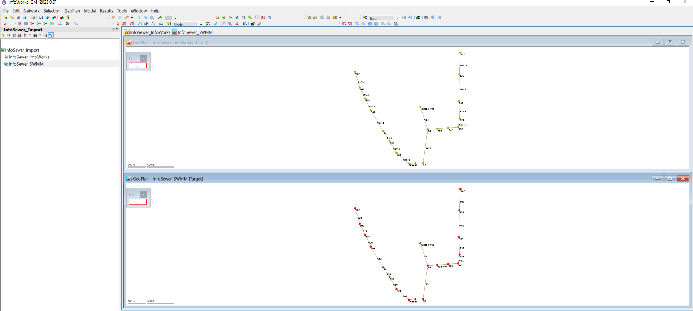
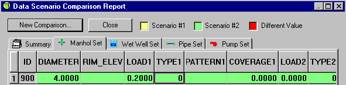

InfoSewer – Esri Extension in Arc Map. ICM – Standalone Wallingford/Innovyze/Autodesk Platform

<table>
<caption>Presentation notes table</caption>
<colgroup>
<col style="width: 17%" />
<col style="width: 82%" />
</colgroup>
<thead>
<tr class="header">
<th><h1 id="autodesk-wws">Autodesk WWS</h1></th>
<th>How do you use ICM InfoWorks Open Data Centre to import the DBF Data from the IEDB folder of InfoSewer?</th>
</tr>
</thead>
<tbody>
<tr class="odd">
<td><h1 id="what-are-the-dbf-files-in-the-iedb-folder-or-h2omap-sewer-or-infosewer">What are the DBF files in the IEDB folder or H2OMap Sewer or InfoSewer?</h1></td>
<td></td>
</tr>
<tr class="even">
<td><h2 id="parameters-in-the-node-dbf-file"><strong>Parameters in the Node DBF file</strong> </h2></td>
<td></td>
</tr>
<tr class="odd">
<td><h1 id="links-or-conduits">Links or Conduits</h1>
<h2 id="parameters-in-the-link-dbf-file"><strong>Parameters in the Link DBF file</strong></h2></td>
<td></td>
</tr>
<tr class="even">
<td><h1 id="icm-networks">ICM Networks</h1>
<h2 id="create-a-new-infoworks-network">Create a new InfoWorks Network</h2></td>
<td></td>
</tr>
<tr class="odd">
<td><h1 id="icm-networks-1">ICM Networks</h1>
<h2 id="create-a-new-swmm-network">Create a New SWmm network</h2></td>
<td></td>
</tr>
<tr class="even">
<td><h1 id="questions">Questions</h1>
<h2 id="the-odic-only-imports-csv-files-so-the-dbf-files-have-to-be-saved-to-a-csv-format">THe ODIC only imports CSV files so the DBF Files have to be saved to a CSV Format</h2></td>
<td>

</td>
</tr>
<tr class="odd">
<td><h1 id="odic-for-nodes-into-an-infoworks-network">ODIC for Nodes into an InfoWorks Network:</h1>
<h2 id="use-default-values-and-import-the-id-and-x-y-coordinates.">Use default values and import the ID and x, Y coordinates.</h2></td>
<td></td>
</tr>
<tr class="even">
<td><h1 id="import-the-node-csv-to-a-swmm-network">Import the Node cSV to a SWMM Network:</h1>
<h1 id="import-the-id-and-x-y-coordinates.">import the ID and x, Y coordinates.</h1></td>
<td></td>
</tr>
<tr class="odd">
<td><h1 id="imported-node-and-link-csv-files-from-the-dbf-files">Imported Node and Link CSV Files from the dbF files:</h1>

Two Imported Networks: <strong>InfoWorks and SWMM</strong>
</td>
<td></td>
</tr>
<tr class="even">
<td><h1 id="links-into-an-infoworks-network">Links into an InfoWorks Network</h1></td>
<td></td>
</tr>
<tr class="odd">
<td><h1 id="links-into-swmm-network">Links into SWMM Network:</h1>
<h1 id="summarize-the-2nd-point">(summarize the 2nd point)</h1></td>
<td></td>
</tr>
<tr class="even">
<td><h1 id="links-into-swmm-network-1">Links into SWMM Network:</h1>
<h1 id="summarize-the-2nd-point-1">(summarize the 2nd point)</h1></td>
<td></td>
</tr>
<tr class="odd">
<td><h1 id="rd-point">3rd point:</h1>
<h1 id="summarize-the-3rd-point">(summarize the 3rd point)</h1></td>
<td></td>
</tr>
<tr class="even">
<td><h1 id="important-vocabulary">Important vocabulary:</h1>
<h1 id="include-list-of-key-vocabulary-referenced-if-you-do-not-know-the-terms-look-up-and-add-a-definition-for-the-words">(include list of key vocabulary referenced; if you do not know the term(s), look up and add a definition for the word(s))</h1></td>
<td></td>
</tr>
<tr class="odd">
<td><h1 id="questions-1">Questions</h1>
<h1 id="include-any-questions-you-have-remaining-after-the-presentation">(include any questions you have remaining after the presentation)</h1></td>
<td></td>
</tr>
<tr class="even">
<td><h1 id="nd-point">2nd point:</h1>
<h1 id="summarize-the-2nd-point-2">(summarize the 2nd point)</h1></td>
<td></td>
</tr>
<tr class="odd">
<td><h1 id="rd-point-1">3rd point:</h1>
<h1 id="summarize-the-3rd-point-1">(summarize the 3rd point)</h1></td>
<td></td>
</tr>
<tr class="even">
<td><h1 id="important-vocabulary-1">Important vocabulary:</h1>
<h1 id="include-list-of-key-vocabulary-referenced-if-you-do-not-know-the-terms-look-up-and-add-a-definition-for-the-words-1">(include list of key vocabulary referenced; if you do not know the term(s), look up and add a definition for the word(s))</h1></td>
<td></td>
</tr>
<tr class="odd">
<td><h1 id="questions-2">Questions</h1>
<h1 id="include-any-questions-you-have-remaining-after-the-presentation-1">(include any questions you have remaining after the presentation)</h1></td>
<td></td>
</tr>
<tr class="even">
<td><h1 id="nd-point-1">2nd point:</h1>
<h1 id="summarize-the-2nd-point-3">(summarize the 2nd point)</h1></td>
<td></td>
</tr>
<tr class="odd">
<td><h1 id="rd-point-2">3rd point:</h1>
<h1 id="summarize-the-3rd-point-2">(summarize the 3rd point)</h1></td>
<td></td>
</tr>
<tr class="even">
<td><h1 id="important-vocabulary-2">Important vocabulary:</h1>
<h1 id="include-list-of-key-vocabulary-referenced-if-you-do-not-know-the-terms-look-up-and-add-a-definition-for-the-words-2">(include list of key vocabulary referenced; if you do not know the term(s), look up and add a definition for the word(s))</h1></td>
<td></td>
</tr>
<tr class="odd">
<td><h1 id="questions-3">Questions</h1>
<h1 id="include-any-questions-you-have-remaining-after-the-presentation-2">(include any questions you have remaining after the presentation)</h1></td>
<td></td>
</tr>
<tr class="even">
<td><h1 id="nd-point-2">2nd point:</h1>
<h1 id="summarize-the-2nd-point-4">(summarize the 2nd point)</h1></td>
<td></td>
</tr>
<tr class="odd">
<td><h1 id="rd-point-3">3rd point:</h1>
<h1 id="summarize-the-3rd-point-3">(summarize the 3rd point)</h1></td>
<td></td>
</tr>
<tr class="even">
<td><h1 id="important-vocabulary-3">Important vocabulary:</h1>
<h1 id="include-list-of-key-vocabulary-referenced-if-you-do-not-know-the-terms-look-up-and-add-a-definition-for-the-words-3">(include list of key vocabulary referenced; if you do not know the term(s), look up and add a definition for the word(s))</h1></td>
<td></td>
</tr>
<tr class="odd">
<td><h1 id="questions-4">Questions</h1>
<h1 id="include-any-questions-you-have-remaining-after-the-presentation-3">(include any questions you have remaining after the presentation)</h1></td>
<td></td>
</tr>
<tr class="even">
<td><h1 id="nd-point-3">2nd point:</h1>
<h1 id="summarize-the-2nd-point-5">(summarize the 2nd point)</h1></td>
<td></td>
</tr>
<tr class="odd">
<td><h1 id="rd-point-4">3rd point:</h1>
<h1 id="summarize-the-3rd-point-4">(summarize the 3rd point)</h1></td>
<td></td>
</tr>
<tr class="even">
<td><h1 id="important-vocabulary-4">Important vocabulary:</h1>
<h1 id="include-list-of-key-vocabulary-referenced-if-you-do-not-know-the-terms-look-up-and-add-a-definition-for-the-words-4">(include list of key vocabulary referenced; if you do not know the term(s), look up and add a definition for the word(s))</h1></td>
<td></td>
</tr>
<tr class="odd">
<td><h1 id="questions-5">Questions</h1>
<h1 id="include-any-questions-you-have-remaining-after-the-presentation-4">(include any questions you have remaining after the presentation)</h1></td>
<td></td>
</tr>
<tr class="even">
<td><h1 id="nd-point-4">2nd point:</h1>
<h1 id="summarize-the-2nd-point-6">(summarize the 2nd point)</h1></td>
<td></td>
</tr>
<tr class="odd">
<td><h1 id="rd-point-5">3rd point:</h1>
<h1 id="summarize-the-3rd-point-5">(summarize the 3rd point)</h1></td>
<td></td>
</tr>
<tr class="even">
<td><h1 id="important-vocabulary-5">Important vocabulary:</h1>
<h1 id="include-list-of-key-vocabulary-referenced-if-you-do-not-know-the-terms-look-up-and-add-a-definition-for-the-words-5">(include list of key vocabulary referenced; if you do not know the term(s), look up and add a definition for the word(s))</h1></td>
<td></td>
</tr>
<tr class="odd">
<td><h1 id="questions-6">Questions</h1>
<h1 id="include-any-questions-you-have-remaining-after-the-presentation-5">(include any questions you have remaining after the presentation)</h1></td>
<td></td>
</tr>
<tr class="even">
<td><h1 id="nd-point-5">2nd point:</h1>
<h1 id="summarize-the-2nd-point-7">(summarize the 2nd point)</h1></td>
<td></td>
</tr>
<tr class="odd">
<td><h1 id="rd-point-6">3rd point:</h1>
<h1 id="summarize-the-3rd-point-6">(summarize the 3rd point)</h1></td>
<td></td>
</tr>
<tr class="even">
<td><h1 id="important-vocabulary-6">Important vocabulary:</h1>
<h1 id="include-list-of-key-vocabulary-referenced-if-you-do-not-know-the-terms-look-up-and-add-a-definition-for-the-words-6">(include list of key vocabulary referenced; if you do not know the term(s), look up and add a definition for the word(s))</h1></td>
<td></td>
</tr>
<tr class="odd">
<td><h1 id="questions-7">Questions</h1>
<h1 id="include-any-questions-you-have-remaining-after-the-presentation-6">(include any questions you have remaining after the presentation)</h1></td>
<td></td>
</tr>
<tr class="even">
<td><h1 id="nd-point-6">2nd point:</h1>
<h1 id="summarize-the-2nd-point-8">(summarize the 2nd point)</h1></td>
<td></td>
</tr>
<tr class="odd">
<td><h1 id="rd-point-7">3rd point:</h1>
<h1 id="summarize-the-3rd-point-7">(summarize the 3rd point)</h1></td>
<td></td>
</tr>
<tr class="even">
<td><h1 id="important-vocabulary-7">Important vocabulary:</h1>
<h1 id="include-list-of-key-vocabulary-referenced-if-you-do-not-know-the-terms-look-up-and-add-a-definition-for-the-words-7">(include list of key vocabulary referenced; if you do not know the term(s), look up and add a definition for the word(s))</h1></td>
<td></td>
</tr>
<tr class="odd">
<td><h1 id="questions-8">Questions</h1>
<h1 id="include-any-questions-you-have-remaining-after-the-presentation-7">(include any questions you have remaining after the presentation)</h1></td>
<td></td>
</tr>
<tr class="even">
<td><h1 id="nd-point-7">2nd point:</h1>
<h1 id="summarize-the-2nd-point-9">(summarize the 2nd point)</h1></td>
<td></td>
</tr>
<tr class="odd">
<td><h1 id="rd-point-8">3rd point:</h1>
<h1 id="summarize-the-3rd-point-8">(summarize the 3rd point)</h1></td>
<td></td>
</tr>
<tr class="even">
<td><h1 id="important-vocabulary-8">Important vocabulary:</h1>
<h1 id="include-list-of-key-vocabulary-referenced-if-you-do-not-know-the-terms-look-up-and-add-a-definition-for-the-words-8">(include list of key vocabulary referenced; if you do not know the term(s), look up and add a definition for the word(s))</h1></td>
<td></td>
</tr>
<tr class="odd">
<td><h1 id="questions-9">Questions</h1>
<h1 id="include-any-questions-you-have-remaining-after-the-presentation-8">(include any questions you have remaining after the presentation)</h1></td>
<td></td>
</tr>
<tr class="even">
<td><h1 id="nd-point-8">2nd point:</h1>
<h1 id="summarize-the-2nd-point-10">(summarize the 2nd point)</h1></td>
<td></td>
</tr>
<tr class="odd">
<td><h1 id="rd-point-9">3rd point:</h1>
<h1 id="summarize-the-3rd-point-9">(summarize the 3rd point)</h1></td>
<td></td>
</tr>
<tr class="even">
<td><h1 id="important-vocabulary-9">Important vocabulary:</h1>
<h1 id="include-list-of-key-vocabulary-referenced-if-you-do-not-know-the-terms-look-up-and-add-a-definition-for-the-words-9">(include list of key vocabulary referenced; if you do not know the term(s), look up and add a definition for the word(s))</h1></td>
<td></td>
</tr>
<tr class="odd">
<td><h1 id="questions-10">Questions</h1>
<h1 id="include-any-questions-you-have-remaining-after-the-presentation-9">(include any questions you have remaining after the presentation)</h1></td>
<td></td>
</tr>
</tbody>
</table>

Presentation notes table
