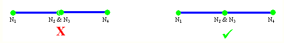
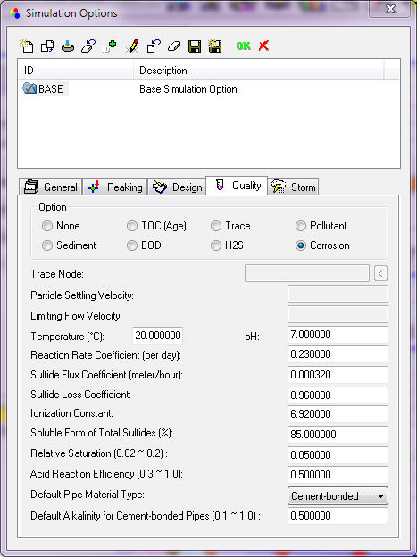

# InfoSewer [Water Quality Options](http://swmm5.posthaven.com/h2omap-sewer-and-infosewer-water-quality-opti)

# Table of Contents

[InfoSewer  Water Quality Options [1](#infosewer-water-quality-options)](#infosewer-water-quality-options)

[Biochemical Oxygen Demand [3](#biochemical-oxygen-demand)](#biochemical-oxygen-demand)

[Pollutant Transport [5](#pollutant-transport)](#pollutant-transport)

[Time of Concentration or Water Age [8](#time-of-concentration-or-water-age)](#time-of-concentration-or-water-age)

[Source Tracing [10](#source-tracing)](#source-tracing)

[H2S Modeling [11](#h2s-modeling)](#h2s-modeling)

[Corrosion Prediction [12](#corrosion-prediction)](#corrosion-prediction)

[Corrosion Parameters [15](#corrosion-parameters)](#corrosion-parameters)

[Sediment Transport [17](#sediment-transport)](#sediment-transport)

**Introduction:** InfoSewer is used worldwide by municipal engineers and planners to create detailed, accurate models of their sewer infrastructure systems. These models enable users to evaluate the effect of new developments, zoning changes, and other additional loads on system flows; pinpoint current and future problem areas; predict overflows and backups; and determine how to best restore needed capacity lost to infiltration and inflow with the least rehabilitation. In addition, users rely on these models to compute hydrogen sulfide generation and corrosion potential; analyze the rate of Biochemical Oxygen Demand (BOD) exertion; track sediment movement and deposition; calculate the amount of pollutant transported to the wastewater treatment plant; and assess pollutants’ impacts on receiving waters. Extensive scenario management along with domain and facility management functionality makes the program capable of analyzing existing or proposed sewage collection systems.  It has a Steady State, Design and EPS run modes and includes many of the same Arc Map tools that exist in InfoWater and InfoSWMM.

You can model 8 options in InfoSewer to simulate various aspects of Water Quality (Figure 1). If you make the base scenario no water quality you can have the same network, same loading but different aspects of water quality in seven child scenarios’ (Figure 2). The parameters for each water quality option are shown in the Quality Tab of the Simulation Options Dialog.

**Figure 1.**  Water Quality Simulation Choices in InfoSewer Pro.

 

Figure 2. Water Quality Simulation Choices in the Scenario Explorer of InfoSewer

## Biochemical Oxygen Demand 

Biochemical Oxygen Demand (BOD) is the most widely used parameter of organic pollution in sanitary sewer systems. The ability to model BOD is of great importance in wastewater engineering to assist wastewater utilities in (1) estimating the quantity of oxygen required to biologically stabilize the organic matter present; (2) determining the size of wastewater treatment facilities; (3) evaluating the efficiency of the treatment process; and (4) ensuring compliance with wastewater discharge permits (Tchobanoglous 2003).

InfoSewer models the rate of BOD oxidation (exertion) throughout the collection system using first-order kinetics with the rate of oxygen utilization being proportional to the difference between the amount of oxygen used and the ultimate BOD as:

or

 

where

BOD = BOD exerted at time t, mg/L

UBOD = total or ultimate carbonaceous BOD, mg/L

k = first-order reaction rate constant, 1/day

t = time, day

The value of the first-order reaction rate constant k varies with the type of waste and normally ranges from 0.05/day to 0.46/day or more, with a typical value of 0.23/day. This constant can also be expressed as a function of temperature as:

where k20 is the first-order reaction rate constant at 20oC (1/day) and T is the temperature (degree Celsius). The value of θ is 1.056 in the temperature range between 20oC and 30oC and 1.135 in the temperature range between 4oC and 20oC, with a typical value of 1.047.InfoSewer determines and uses appropriate values of k and θ based on the user-specified temperature. The default values used by InfoSewer for k, θ, and T are 0.23/day, 1.047, and 20oC, respectively.

 

## 

## 

## Pollutant Transport

InfoSewer can effectively simulate the transport of dissolved pollutants throughout the sewer collection system. It tracks the movement of conservative constituents (e.g., chloride, bromide, sulfate, boron, sorbed trace metals) flowing through the network over time. The dynamic quality simulation model is predicated on conservation of mass coupled with reaction kinetics and consists essentially of three processes: advection in pipes, mixing at sewer manholes and wet-wells, and kinetic reaction mechanism. Longitudinal dispersion due to concentration gradient is neglected which means that there is no intermixing of mass between adjacent sewage parcels traveling down a pipe. Advective transport within a sewer pipe is represented with the following equation:

where Ci is the concentration (mass/volume) in pipe i as a function of distance x and time t; ui is the flow velocity (length/time) in pipe I; and r is the rate of reaction (mass/volume/time) as a function of concentration.

For conservative (inert) pollutants the rate of reaction (r) is set to zero. For pumps, instantaneous substance advection is assumed.

At sewer manholes and wet-wells, the mixing of fluid is taken to be complete and instantaneous. Thus the concentration of a substance in sewage leaving the manhole or wet-well is simply the flow-weighted sum of the concentrations from the incoming pipe(s) and is described by the following equation:

where Qin is the incoming flow (volume/time); Cin is the pollutant concentration of the incoming flow; and Cout  is the concentration of the pollutant leaving the manhole.

Under completely mixed conditions, the concentration throughout the wet-well is a blend of the current contents and that of any entering sewage and is represented by the following equation:

where Vww is the wet-well volume at time t, Cww is the wet-well concentration; and the remaining terms are as defined above.

The ability to model pollutant transport in sewer collection systems is useful in determining the load of pollutants that is transported to the wastewater treatment plant and assessing impact on the receiving waters.

 

##  Time of Concentration or Water Age

InfoSewer can model the changes in the age of sewage flow (time of concentration) throughout a collection system. Time of concentration is the time spent by a sewage flow parcel in the network (i.e., the time of flow in the sewerage system). This parameter is useful to address important water quality and safety issues such as generation of sulfide that may occur in a sanitary sewer system (which manifest itself in corrosion and odor issues).

In InfoSewer Pro, new sewage entering the network from loading manholes enters with age of zero. As this sewage moves through the collection system it splits apart and blends together with sewage flow parcels of varying age at manholes and wet-wells. InfoSewer provides automatic modeling of sewage age. Internally, it treats age as a reactive constituent whose growth follows zero-order kinetics with a rate constant (r =1.0) equal to 1 (i.e., each second the sewage becomes a second older). Time of concentration for a manhole is thus calculated as a flow-weighted average sewage age value of flows entering the manhole. Travel time of a sewage flow parcel through a sewer pipe is computed based on flow velocity and pipe length. For the pipes leaving a manhole, the average sewage age is increased by the travel time to the next downstream manhole.

 

 

 

## Source Tracing

InfoSewer can also perform sophisticated source tracing calculations. Source tracing tracks over time what percent of sewage reaching any pipe or manhole in the network had its origin at a particular source node. The source node can be any manhole in the network, including wet-wells. Source tracing is very useful in sewer collection systems, and could be used for (1) tracking changes in sewage flow contribution (and associated constituents) over space and time; (2) predicting impact of industrial and commercial waste discharges on performance of wastewater treatment plants; (3) determining contaminant level that causes a wastewater treatment plant to be in violation of its discharge permits; (4) and developing appropriate user charges based on wasteloads and level of contaminant. Internally, InfoSewer treats the source node as a constant source of a non-reacting constituent that enters the network with a concentration of 100.

 

## 

## H2S Modeling

Hydrogen sulfide is the most common odorous gas found in municipal wastewater collection and treatment systems. Colorless, emitting a characteristic odor of rotten eggs, the gas is extremely toxic and can lead to significant corrosion problems, pipeline collapses, and even loss of human life. InfoSewer allows users to readily model and analyze entire sewer collection systems for sulfide generation and corrosion potential under varying conditions anticipated throughout the life of their systems. It enables them to pinpoint odor and corrosion problems, develop effective monitoring programs, alert plant operators and sewer maintenance workers to potential danger and the need to observe safety practices, and implement the most effective control system. (The most common methods for control of hydrogen sulfide are ventilation and scrubbing, and chemical injection.) Users can evaluate alternative pipeline profiles to minimize turbulence, low velocities, long retention times and other hydraulic conditions that promote sulfide buildup. They can also analyze the impact of diversions, future flows, and changes in wastewater characteristics before potentially costly decisions are made. 

**Application Dependent** - InfoSewer Suite.

## Corrosion Prediction

Corrosion is one of the primary reasons that sewer systems lose their structural integrity. Corroded sewer pipes may allow greater inflow and infiltration into the collection system, further deteriorating reliability of the network by causing undesirable conditions such as surcharges and overflows, ultimately requiring premature replacement of the pipes. Corrosion of unprotected concrete or metal surfaces is primarily due to the production of sulfuric acid in sewer systems through oxidation of hydrogen sulfide gas by bacterial action on the exposed surfaces under aerobic conditions. This type of corrosion is commonly referred to as microbially induced corrosion. Corrosion in InfoSewer suite helps wastewater engineers to predict the rates of corrosion of the sewer pipes in their collection systems under varying environmental and hydraulic conditions. It enables them to pinpoint corrosion problems, prioritize repairs, specify corrosion resistant materials or select other forms of corrosion protection (e.g., protective linings).

As previously described in the hydrogen sulfide section, some of the soluble H2S available in pipes may escape into the sewer atmosphere and transferred to the pipe walls above the wastewater surface. It will then be taken up as it comes in contact with the damp surfaces of pipes. The H2S retained in this dampness is then converted to sulfuric acid by aerobic bacteria, as described in the following reaction:

Next, some or all of the produced sulfuric acid reacts with the pipe material causing corrosion, mainly at the inside pipe wall above the wastewater flow line. The amount of sulfuric acid that reacts with the pipe material depends on the rate of production of the acid, which in turn depends on moisture, the presence of oxygen, and the mass emission of sulfide gas. If the rate of acid production is slow, almost all of the acid will react with the pipe material. If the rate of production is rapid, much of the acid will not be able to diffuse through the material. Consequently, it will be carried down the walls of the pipe and into the flowing wastewater stream where the sulfuric acid reacts with alkalinity producing sulfate ion.

In addition to the concentration of acid present, the corrosive effect of sulfuric acid varies according to the type of pipe material used and the ambient temperature. Cementitious pipes, including ferrous pipes with mortar lining, experience a reaction that converts the surface material into a pasty mass, which is primarily a calcium sulfate (CaSO4), commonly referred to as gypsum. This pasty mass may fall away and expose new surfaces to corrosive attack. Ferrous pipe materials may experience surface reaction in which a portion of the material is dissolved and a portion is converted to iron sulfide, yielding a hard bulky mass that forms on the exposed surface. A warm and humid environment creates good condition for microbial induced corrosion.

The rate of pipe corrosion depends upon the rate of sulfuric acid production, the amount of the produced sulfuric acid that reacts with the pipe material, and the alkalinity of the pipe material. Sulfuric acid production is related to the amount of hydrogen sulfide gas that escapes to the sewer atmosphere, which in turn depends on a number of environmental and hydraulic conditions previously described in relation to hydrogen sulfide buildup, partitioning, and release. Corrosion PredictorTM uses the following equations to estimate rate of corrosion for cementitious (cement-bonded) materials and ferrous materials in gravity sewers. In force mains, where the lines flow full, there is generally no internal corrosion since generation of sulfuric acid is prevented.

For cement-bonded materials (Metcalf & Eddy 1981),

where

C     = average rate of penetration, mm/yr

k    = coefficient of efficiency for acid reaction considering the estimated fraction of acid remaining on the wall May be as low as 0.3 and approaches 1.0 for complete acid reaction

= flux of H2S to the pipe wall, g/m2.hr.

A   = alkalinity of the cement-bonded material, expressed as CaCO3 equivalents. Approximately 0.18 to 0.23 for granitic aggregate concrete, 0.9 for calcareous aggregate, 0.4 for mortar linings, and 0.5 for asbestos cement.

For ferrous materials (Metcalf & Eddy 1981),

where C, k, and   are consistent with the definitions given above. The default values used for k and A are 0.5 and 0.5, respectively.

** **

## Corrosion Parameters

These parameters are available when the Corrosion option is selected.  Corrosion results are generated in addition to Hydrogen Sulfide and any other pollutants entering the system.

**Material-Type** - The conduit material ( i.e., cement-bonded or ferrous) for gravity pipes.

**Cement-bonded Alkalinity** - The alkalinity of the conduit material expressed as CaCO3 equivalents (for cement-bonded materials only). This value approximately ranges from 0.18 to 0.23 for granitic aggregate concrete, 0.9 for calcareous aggregate, 0.4 for mortar linings, and 0.5 for asbestos cement.

**Acid Reaction Coefficient** - The coefficient of efficiency for acid reaction considering the estimated fraction of acid remaining on the wall. This value could be as low as 0.3 and will approach 1.0 for a complete acid reaction.

**Relative Saturation** - The relative saturation of Hydrogen Sulfide in the air compared to equilibrium concentration (typically 2 to 20 percent), expressed as decimal fraction.

## Sediment Transport

Sanitary sewer systems can carry substantial loads of suspended solids (waste solids). These sediments are complex mixtures of cohesive (organic) and non-cohesive (minerals) materials and exhibit a wide range of particle sizes and densities. They can collect causing blockages (shock loading under periods of low flow) and overflow events, as well as impairing the hydraulic capacity of the sewer pipes (by restricting their flow area and increasing the bed friction resistance). In addition, when waste solids are intermittently agitated and moved along the pipes, sulfide generation is increased which may cause various problems including odor, hazard to maintenance crews, and corrosion of unprotected sewer pipes produced from cementitious materials and metals. Limiting velocity criteria are generally adopted when designing sanitary sewer systems to control sediment deposition in the pipes.

Wastewater flow velocity and sediment transport in sewer systems are interdependent. As the flow increases from zero, flow-induced forces (lift and drag) acting on the sediment particle increase. When these forces exceed the submerged weight of the particle, the sediments start to move. With a further increase in velocity, the particles will be suspended by eddies of fluid turbulence and move downstream with the wastewater. With a subsequent decrease in flow velocity (beyond the limiting or terminal velocity), sediment particles will start to settle by gravity at a rate proportional to their settling velocity. A further increase in flow velocity provides the energy to scour and transport the deposited material along the sewer pipes. This dynamic process continues based on the flow conditions inherent in the sewer system.

 

InfoSewer can simulate the transport and gravitational settling of sediments (total suspended solids including grit) over time throughout the sewer collection system under varying hydraulic conditions. As long as flow velocity exceeds the critical/terminal velocity, InfoSewer assumes that the sewage flow has the capacity to transport all incoming sediments. Deposited sediment particles are also assumed to be scoured and transported downstream when velocity of the sewage flow exceeds the terminal velocity. Settling starts when flow velocity falls below the critical velocity. In the model, transport of the sediment particles is governed by advection (Eq. 24) implying that the particles are transported at local flow velocity. The model assumes that the sewer pipe diameter and roughness coefficient remain constant and are unaffected by sediment deposition.

 

 
