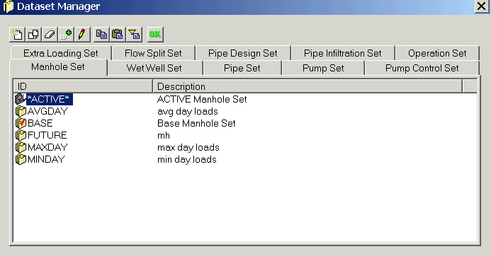

# Open the Sample Project for InfoSewer

The first step is to open the InfoSewer project.

 

> **1.   ** Choose the “Start” menu, select *PROGRAMS*, choose the InfoSewer *version X* program group, and then choose InfoSewer*.*
>
>  
>
> **2.   ** Choose *OPEN* from the *FILE* menu. On the *OPEN* dialog box, navigate to the directory containing the “YourTown” project and choose that file.
>
>  
>
> C:\Users\Public\Documents\InfoSewer\Examples\YourTown.mxd
>
> (the path may be different for custom installations)
>
>  
>
> **3.   ** At this point the network map will be drawn on the screen. You will note that the drawing is missing several elements when compared to the illustration on the previous page. You will be adding those components during this tutorial.

 

 

> **4.   Add ** “Townlot.shp” (Files of type: ESRI shapefiles \*.shp) and select that file.
>
> C:\Users\Public\Documents\InfoSewer\Examples\Townlot.shp

(the path may be different for custom installations)

The parcel and the street layout will be added to the map as shown below.

 

> **5.   ** Before continuing, save the “YourTown” project to a new project. If you wish to restart the tutorial, the original project will be available. Choose the *SAVE AS* command from the *FILE* menu. On the dialog box enter the new project name “Tutorial”. This becomes the active project.
>
>  
>
> 

 
