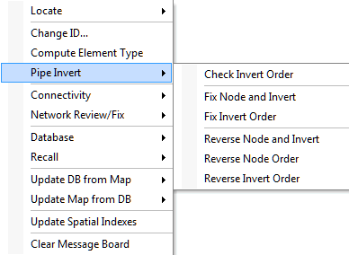

# Pipes in InfoSewer

Pipes/open channels are links that convey wastewater from one point in the network to another.  Pipes are closed conduits and are commonly used in sanitary sewer systems and combined sewer systems, whereas open channels are open to the atmosphere and their application is limited to storm sewer systems. InfoSewer can model a number of pipe/open channel shapes including circular, rectangular, trapezoidal, triangular, and parabolic. The model assumes that flow in the conduit can only be unidirectional. The principal hydraulic input parameters for conduits are:

- The  conduit connectivity, i.e. from and to node IDs

- ..The upstream and downstream invert elevations

- The conduit length representing the distance between nodes

- The conduit diameter or depth, top or bottom width, left side slope, and right side slope

- The Manning roughness coefficient for gravity (open-channel) mains or the Hazen-Williams coefficient for force (pressurized) mains

- The number of (identical) parallel pipes of the same characteristics

Pipes can either be gravity mains or force mains. The main difference between the two is the hydraulic equation utilized for flow computation. The Manning equation is employed for gravity mains while the Hazen-Williams equation is used for force mains. InfoSewer   assumes that a force main is always connected directly downstream of a pump, and its shape is considered as circular.

 

InfoSewer  offers a number of useful methods to model infiltration including: count-based (e.g., defect-based), pattern-based, pipe surface area-based, pipe length-based, and pipe diameter length-based.

 

InfoSewer  also models parallel pipes with the assumption that all parallel pipes are identical with the same characteristics (i.e. diameter, slope, length and coefficient).

**<u>MANNING AND HAZEN-WILLIAMS EQUATIONS</u>**

The Manning equation is used to determine the pipe flow in a gravity main and is given below in US Customary units:

where

*Q*         =          pipe flow (in flow units)

*n*          =          Manning roughness coefficient

*R*          =          hydraulic radius, i.e., the flow area divided by the wetted perimeter ft (m)

*S*          =          pipe slope

*A*          =          flow area, ft2 (m2)

*k*          =          constant (1.00 for SI units, 1.49 for US units)

 

The value of the Manning coefficient depends on the condition of the pipe and is therefore somewhat analogous to the pipe roughness used in pressured pipe networks.

 

The Hazen-Williams equation is used to determine the head loss across force mains and is given below in US Customary units:

                                      

where

*L*          =          pipe length, ft (m)

*Q*         =          pipe flow (in flow units)

*C*         =          Hazen-Williams roughness coefficient

*D*         =          pipe diameter or conduit depth for circular and non-circular shape types,

                        respectively. The unit is in ft (m).

*k*          =          constant (10.7 for SI units, 4.727 for US units).

 

Typical average design values of Manning and Hazen-Williams coefficients for commonly used sewer pipes (newly installed) are listed in the table below.

 

| **Material**        | **Hazen-Williams C** | **Manning n** |
|---------------------|----------------------|---------------|
| Asbestos Cement     | 140                  | 0.011-0.015   |
| Brass               | 130-140              | 0.009-0.013   |
| Ductile Iron        | 130-140              | 0.012-0.015   |
| Concrete            | 120-140              | 0.012-0.017   |
| Copper              | 130-140              | 0.011-0.015   |
| Steel               | 110-150              | 0.010-0.019   |
| Plastic             | 140-150              | 0.009-0.015   |
| Vitrified Clay Pipe | 110-140              | 0.011-0.017   |
| Wood Stave          | 115-125              | 0.010-0.014   |

>  
>
> Be aware that the roughness coefficient depends on type and condition of the pipe and can change considerably with age, diameter, material, soil type, and water quality characteristics. Typical water system C-factor curves are shown below (Innovyze InfoWater help   file, 2016).
>
> 

**<u>  
HYDRAULIC RADIUS</u>**

The hydraulic radius is defined as the ratio of the net cross-sectional area of a flow stream to the wetted perimeter of the section. That is:

                                                      

where *P* represents the wetted perimeter, ft (m).

 

In the calculation of the hydraulic radius, the net cross-sectional area should be evident from the geometry of the section. The wetted perimeter is defined as the sum of the length of the boundaries of the section actually in contact with the water.

**<u>NORMAL DEPTH</u>**

Another useful form of the Manning equation is (in US Customary units):

where,

A   = cross sectional area,

R   = hydraulic radius,

S   = Slope

n   = manning’s roughness

Q   = flow     

The term on the left side of the above equation is solely dependent on the geometry of the section. Therefore, for a given discharge (*Q*), slope (*S*), and surface type (*n*), the flow depth in the gravity main can be determined. This depth is called the normal depth. The normal depth of a force main is equal to its diameter.

**<u>CRITICAL DEPTH</u>**

The Froude number, *NF*, is defined as the ratio of inertial forces to gravity forces:

When the Froude number is equal to 1.0, the flow is called critical flow. When NF \< 1.0, the flow is subcritical and when NF\> 1.0, the flow is supercritical. The depth corresponding to the minimum specific energy is therefore called the critical depth dc. The resulting criterion for determining the critical depth using Equations (6) and (7) is:

                                                      

It is also important to distinguish between the following types of flows:

- Full Flow: represents the flow when the pipe is full, i.e. where the wetted perimeter is equal to the entire pipe perimeter.

- Maximum Flow: represents the maximum theoretical flow occurring in a circular pipe when the normal depth is equal to 0.938 x Diameter. Any increase in depth will decrease the flow, which is why the full flow is less than the maximum discharge for a circular pipe.

- Analysis Flow: represents the flow occurring in a pipe as derived from the analysis criteria curve (See CRITERIA CURVES section).

- Design Flow: represents the flow occurring in a pipe as derived from the design criteria curve

The computed results for pipes include:

- The total flow and velocity

- The full, maximum, design and analysis flows

- The excess full, design and analysis capacities

- The normal and critical depths

- The actual, design, and analysis d/D ratios

**<u>Force Main Network Solution</u>**

The Force Main Network Solution allows the simulation of multiple upstream and downstream force mains entering and leaving one chamber junction during an Extended Period Dynamic Simulation or EPS solution in Sewer.  All of the force mains, pumps, wet wells and force main chamber junctions that are connected are considered as one force main network in the EPS solution. You can have more than one force main network in a large Sewer model separated by gravity pipes and loading manholes.   The individual force main networks are solved iteratively with different upstream head and downstream tail manholes which connect the force main network(s) to the rest of the network.

A force main network consists of the following elements:

- Wet well

- Pump

- Junction Chamber

- Head Manhole where flow from other parts of the sewer system enters the force main network

- Tail manhole where the flow leaves the force main network.

The head and tail manhole for one force main network is determined by the program based on the geometry of the network. The force main network starts at a wet well, includes the pumps connecting the wet well to the force main links and also includes the actual force main links and force main connecting junction chambers.  You can also connect a force main to the gravity mains without an intermediate wet well and pump(s).

The boundary conditions of the force main network are:

- Water heads at the wet wells which vary according to the inflow from the upstream sections of the sewer network and outflow to the force main network

- Water head at the tail manholes which are calculated as the maximum discharge head (invert + diameter) of all the force mains that end at that manhole. Water entering the tail manholes will be routed downstream after the force main network flows are calculated.

For example, assuming there are n1 wet wells, n2 head manholes, n3 tail manholes, n4 junction chambers and p1 pumps and p2 force mains, the program must solve the network hydraulics to get n2+n4 water head values and p1+p2 flow values iteratively using the Newton-Raphson method.  The solution iterates until the mass and energy of the force main network is in balance.

The hydraulic equations used in the solution are:

- Head/Flow relationship of the force mains and pumps (p1+p2 equations)

- Mass balance at head nodes and junction chambers (n2+n4 equations)

For head nodes, water entering the network from other sections of the sewer system must equal the flow sum of force mains that connect to it:

Where Q = Flow; Gv = group of gravity pipes connecting to the head manhole; and Gf = group of force mains connecting to the head manhole.   The sum of the gravity flow into the wet well or head manholes is balanced by the sum or flow out of the force main network in the force main pipes.

For junction chambers, which are connected to only force main pipes:

For force mains, Hazen-Williams equation describes the flow/head loss relationship within a force main.  The flow out of and the flow into the junction chamber is in balance.  The head at the junction manhole is iterated until the flows are in balance.

For pumps that are neither Inflow Control nor Discharge Control, the pump curve is used to estimate the flow and head gain relationship within a pump. For Inflow Control and Discharge Control pump, pump flow as control values are fixed and the equation Q = Qcontrol, where Qcontrol is the controlling pump value.  For such situations, the pump is actually modeled as variable speed pump and pump speed will be calculated with Newton-Raphson method to achieve the flow control objective.

 

           

Be aware that the roughness coefficient depends on type and condition of the pipe and can change considerably with age, diameter, material, soil type, and water quality characteristics. Typical water system C-factor curves are shown below (Innovyze InfoWater help   file, 2016).

 

**Roughness Coefficients for New Pipe**

| **Material**               | **Hazen-Williams ***C* | **Darcy-Weisbach **ε** , millifeet** | **Manning ***n* |
|----------------------------|------------------------|--------------------------------------|-----------------|
| Asbestos Cement            | 140                    | 0.005                                | 0.011           |
| Cast Iron                  | 130-140                | 0.85                                 | 0.012-0.015     |
| Concrete or Concrete Lined | 120-140                | 1.0-10                               | 0.012-0.017     |
| Copper                     | 135                    | 0.005                                | 0.011           |
| Galvanized Iron            | 120                    | 0.5                                  | 0.015-0.017     |
| Lead                       | 135                    | 0.005                                | 0.011           |
| Plastic                    | 140-150                | 0.005                                | 0.011-0.015     |
| Steel                      | 140-150                | 0.15                                 | 0.015-0.017     |
| Wood Stave                 | 120                    | 0.6                                  | 0.011-0.013     |
