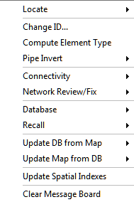
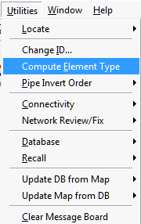
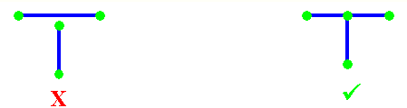

# Utilities Menu InfoSewer

The Utilities menu provides various advanced editing tools and operating tools such as the **Locate** command to locate your elements graphically on your Map. Use the **Insert Node, Move Node, Merge Node and Switch Node** commands to move and modify your data elements graphically. Create **Pipe Jumps**, manage the InfoSewer  **Database**. Additionally verify **Connectivity** issues and **Recall** deleted elements. Another very useful command available from the Utilities menu is the **Change ID** command that allows you to change InfoSewer  element IDs.

- **Locate** - The Locate command is used to find a node/pipe/element by ID within an InfoSewer project. This function is also available from the Model Explorer - Attribute Tab toolbar . See: [<u>Locate</u>](javascript:BSSCPopup('Locate.htm');)

- **Change ID** - The Change ID command allows the user to change theInfoSewer  database identification for any element from one value to another (as long as the new value for that element is unique).  Merely select the Desired Element Type to change, type in the Old ID then the New ID.  Clicking Apply will change the ID for that element.  [<u>Click here</u>](file:///C:\SWMM-SEWER%20Robohelp\SewerCombined%20-%20InfoSewer\Preferences_and_Utilities\Change_ID.htm) to learn more.

- **Pipe  Invert** - To verify the invert order of gravity mains, go to the **InfoSewer** button, **Utilities** menu and select **Pipe Invert Order**. Select any of the commands, and then the user can either select pipes individually or drag a window across all desired elements. Once the pipes have been selected, right mouse click and choose the Enter option or hit the Enter key on your keyboard.

- **Connectivity** - The connectivity feature has many elements that assist the user in ensuring that connectivity is established prior to a model being run.  It is important to note that connectivity is required for InfoSewer  to run a hydraulic simulation.  [<u>Click here</u>](file:///C:\Preferences_and_Utilities\Connectivity_Menu.htm) to learn more.

- **Network Review/Fix** - The Network Review/Fix Tool is a comprehensive network drawing examination and correction application for use in constructing reliable, credible working models ready for analysis. It offers users functionality to quickly identify and correct network topology problems and data flaws that may arise from digitizing a model or building it using pre-existing GIS and CAD datasets. See: [<u>Network Review/Fix Tool</u>](file:///C:\Preferences_and_Utilities\Network_Review-Fix_Tool.htm)

- **Database** - The database feature allows the user to utilize database management from within InfoSewer  to find and correct database flaws or problems.  [<u>Click here</u>](javascript:BSSCPopup('../../Preferences_and_Utilities/Database_Tools_Menu.htm');) to learn more.

- **Recall** - The recall command (or Undelete) allows the user to recall a deleted pipe or node from the project database.  It is important to note that when a record is deleted from a database, it is only "marked" for deletion (unless the user has turned on the **Auto Database Packing** feature in the **Project Preferences)**.  [<u>Click here</u>](javascript:BSSCPopup('../../Preferences_and_Utilities/Recall.htm');) to learn more.

- **Update DB from Map** - This feature allows the user to recreate some or all of the project databases from the graphics in the InfoSewer  project from the project databases.  [<u>Click here</u>](file:///C:\Preferences_and_Utilities\Update_DB_from_Map_Menu.htm) to learn more.

- **Update Map from DB** - This feature allows the user to regenerate the map graphics from the project database to ensure that the map view and the database contain the same data.  [<u>Click here</u>](file:///C:\Preferences_and_Utilities\Update_MAP_from_DB_Menu.htm) to learn more.

- **Update Spatial Indexes** - The Update Spatial Index command will help to speed up the map refresh in ArcMap. When there are tables joined to an InfoSewer  layer, ArcMap will not update the spatial indexes when those tables have been modified. The Update Spatial Indexes command will update the joined tables for an improved map refresh rate.

- **Clear Message Board** - Use this command to clear the InfoSewer  Message Board. The InfoSewer  message board displays messages, warnings and/or errors during, before and after an InfoSewer  simulation.

**Other Related Topics - **[<u>Edit</u>](javascript:BSSCPopup('Data_Elements/Edit.htm');), [<u>Exchange</u>](javascript:BSSCPopup('Exchange.htm');), [<u>Help</u>](javascript:BSSCPopup('Help_for_InfoSewer.htm');), [<u>Project</u>](javascript:BSSCPopup('Running_a_Model/Open_the_Project.htm');), [<u>Scenario</u>](javascript:BSSCPopup('Scenario_Creation/Scenario_Manager.htm');), [<u>Tools</u>](javascript:BSSCPopup('Tools_Icon.htm');), [<u>Utilities</u>](javascript:BSSCPopup('Utilities.htm');)

** **

## Change ID

The Change ID dialog box allows the user to change the ID for any selected data element. Click on any portion to learn more.

Desired Element Type - From the drop down box, select the InfoSewer  data element for which an ID change is to occur.

- **Old ID** - Enter the current ID.

- **New ID** - Enter the new ID.

- **Apply** - Click apply to make the ID change.

- **Set Rows** - Specify the number of rows for mass editing (twenty is the default).

- **Close** - Close the current dialog box.

**Note -** To perform a mass edit, use the DB Editor and open the database where the subject ID's are stored.  Highlight and copy the ID's into the Windows clipboard and paste the values into a third-party software like Microsoft Excel.  Next to each ID, enter the new value for the ID - Using Excel functions like "mid" and "concatenate" to help you in the mass edit.  Once you have the old and new ID's, determine how many rows are being used in Excel.  Highlight all old and new ID's in Excel and use Ctrl+C to copy the highlighted area.  Go back to InfoSewer, use the Set Rows command to make the rows the same as those in the Windows clipboard.  Once this is done, highlight the first cell in the Change ID dialog box and use the Ctrl+V function to paste the values from the clipboard.  You have now greatly reduced your time from having to edit each ID individually.  Click Apply to change the ID's and then Close to close the dialog box.

 

## Compute Element Type

>   If the user should incorrectly create an element or import a set of elements that do not adhere to sewer collection system requirements, this command will allow the program to automatically determine which element should be inserted in lieu of the existing element.
>
> For example:

- If the most downstream node is digitized as a manhole, this command will convert that element to an outlet.

- If a pipe is imported as the downstream element from a wet well, this command will convert that pipe to a pump. Likewise, it will change the next node to a chamber node and the next link to a force main.

**Pipe Invert Order**

To verify the invert order of gravity mains, go to the **InfoSewer** button, **Utilities** menu and select **Pipe Invert Order**. Select any of the commands, and then the user can either select pipes individually or drag a window across all desired elements. Once the pipes have been selected, right mouse click and choose the Enter option or hit the Enter key on your keyboard.

Click anywhere on the dialog box to view more information.

**<u>Pipe Invert Order Options</u>**

- **Check Invert Order **- For every pipe that has been found to have invert elevations in the opposite direction of flow (adverse slopes - upstream elevation lower than the downstream), a statement will appear in the Message Window located at the bottom of the display.  The user can either locate and edit the slopes for each of these pipes or use either of the following two commands:

- **Fix Node and Invert** - This command will reverse the direction of the pipe to correlate with the upstream and downstream invert elevations.  If a pipe has been found to be adverse, this command will reverse the direction of pipe to match the FROM INVERT and TO INVERT fields.

> 

- **Fix Invert Order **- This command is used to have the upstream and downstream fields switched for all pipes that have been found to have adverse slopes.  The message box will also inform the user which pipes the inverts were switched.  This command will only work on adverse slope pipes.

> 

- **Reverse Node and Invert** - This command will reverse both the direction of the pipe and the invert elevations between the two nodes.  Once the command is completed, the link will be graphically reversed and the upstream and downstream invert elevations will also be switched.  This command will only work on adverse slope pipes.

>  

- **Reverse Node Order** - This command will reverse the direction of the pipe between the two nodes.  The link will be graphically reversed, but the upstream and downstream inverts will remain the same.  This command will work on any pipe.

> 

- **Reverse Invert Order **- This command will reverse the inverts between two nodes.  The graphic for the link will remain the same, only the FROM INVERT and the TO INVERT elevations will be switched.  This command will work on any pipe.

> 2

**Connectivity Menu**

The Connectivity sub-menu is used to verify network connectivity before running a simulation.  When importing a model network from an external data source (GIS, infrastructure inventory, other hydraulic model, etc.), it is critical that the network representation be properly formed (each pipe is connected to exactly two nodes, each node is connected to at least one pipe). Otherwise, errors will be reported when attempting to run a simulation.

To verify network connectivity, go to the **InfoSewer Control Center -\> InfoSewer** button **-\>** **Utilities** menu and select **Connectivity**.  There the user will see the following options:

- **Display Connectivity** - Draws a simple straight-line to graphically represent the connectivity for the selected pipe(s).  The connectivity line drawn represents to FROM and TO nodes in the database.  This allows the user to graphically confirm that the database matches the graphics.  If it appears that a match does not exist, use either the DB from Map or the Map from DB commands to rectify the discrepancy.

- **Show Connected Pipes** - Highlights pipes connected to the selected node.

- **Orphan Nodes** - Lists the ID for any orphan nodes.  An orphan node is defined as a node not connected to any links in the current  InfoSewerH20Map Sewer model.

- **Orphan Pipes** - Lists the ID for any orphan pipes.  An orphan pipe is defined as a pipe without either a FROM or TO node, or more specifically, a pipe whose from and to-node ID's do not reference existing nodes in the current  InfoSewerH20Map Sewer model.

- **Fill Link Connectivity** - Based on a user defined tolerance and subsequent parameters, fills the connectivity information for all  InfoSewerH20Map Sewer pipes based on the graphic overlap of the selected pipes.  This tool is used to "weed out" very small pipes that connect two nodes that are very close together.  After running this command, use the Orphan Nodes and Orphan Pipes commands.

- **Update Links** - Updates the connectivity for the selected pipe(s) by connecting that pipe to the correct nodes as indicated by the FROM and TO node IDs assigned to that pipe.

- **Verify/Fix Link Direction** - Checks/fixes the graphic direction of the selected pipes.  Any differences will result in having the graphic direction automatically reversed to match the connectivity as listed in the  InfoSewerH20Map Sewer databases.  

- **Loop Finder** - This command will search the entire network and locate potential cyclic loops (clockwise or counter-clockwise flow circulation).  These are areas in the system where flow is being routed back to a manhole of original.  Since circular flow is not permissible in a sewer system, a hydraulic model with such an occurrence will not converge.

**Note -** If pipe-node connectivity is determined to be incorrect using one of the Connectivity command options, it is the responsibility of the user to determine which representation is correct - the graphic representation appearing on the map display or the FROM and TO node ID designations as stored in the database. You may use any InfoSewer [<u>data modification</u>](javascript:BSSCPopup('../InfoSewer/InfoSewer_Utilities/Utilities_Tools/Database_Tools_Menu.htm');) command to correct pipe-node connectivity.

If the database representation is correct (i.e., the from- and to-node IDs are correct, but the graphic is drawn incorrectly on the network map display), use the DB to Map command.  Likewise, if the graphic is correct and the database is not, use the Map to DB command.

**Network Review/Fix Tool**

The Network Review/Fix Tool is a comprehensive network drawing examination and correction application for use in constructing reliable, credible working models ready for analysis. It offers users complete functionality to quickly identify and automatically correct any network topology problems (e.g., disconnected nodes) and data flaws (e.g., duplicated pipes or nodes) that may arise from digitizing a model or building it using pre-existing GIS and CAD datasets.

**<u>Locate/Fix Nodes in Close Proximity (Overlapping/Duplicate Nodes)</u>**

Nodes in close proximity designate nodes that overlap (accidentally duplicated) as shown in the figure below. The Network Review/Fix Tool allows the user to instantly view every node in close vicinity of another node (based on any specified distance) and automatically merge the identified nodes into one where necessary.

 

**<u>Locate/Fix Pipe-Split Candidates</u>**

Pipe-split candidates represent separate pipe sections that should be connected by a common node as depicted in the figure below. The Network Review/Fix Tool allows the user to rapidly locate all pipe-split candidates in the network that are within a specified distance of their end nodes and automatically make the connection where appropriate.

**<u>Locate/Fix Crossing/Intersecting Pipes</u>**

Crossing pipes refer to those pipes that cross but do not intersect at a common node as shown in the figure below.

 

 

The Network Review/Fix Tool allows the user to rapidly view all crossing pipe candidates in the network and automatically create the intersection where necessary.

**<u>Trace Connected Nodes</u>**

This command allows the users to trace all connected nodes.

 

**<u>Trace Network</u>**

The Network Trace function launches a spanning tree to identify all pipes and nodes in the network that can be reached from any specified location (source node) via a connected path. This function allows the user to instantly view all portions of the network model that are disconnected from any node as shown in the figure below. The user can then easily determine if a hydraulic connection actually exists and, if so, make the connection in the model.

 

 

**<u>Trace Upstream Network</u>**

This command allows the user to trace all connected  networks upstream of a selected node.

 

**<u>Trace Downstream Network</u>**

This command allows the user to trace all connected  networks downstream of a selected node.

**<u>Locate Manhole Closest to Pipe</u>**

Manhole(s) closest to a pipe may be located using this feature. This is especially useful when data is imported from a GIS into InfoSewer/Pro and may be used to identify the closest manhole(s) to the pipe. Additionally you may also use this functionality to specify a distance from the pipe in map units and locate all the junctions within this specified distance.

 

 

**<u>Locate Parallel Pipes</u>**

Duplicate pipes are superimposed/parallel pipes that share the same curvilinear shape. The Network Review/Fix Tool is able to rapidly identify all duplicate pipe candidates in the network model. The user can then determine if a parallel pipe actually exists and, if so, re-route (redraw) the pipe in a noticeable manner or remove/delete it from the model if such a duplicate pipe does not actually exist as shown in the figure below.

 

 

**<u>Join Disconnected Nodes</u>**

Disconnected nodes are stray nodes (i.e., are not connected to any pipe) that are separated from the rest of the network as shown in the figure below.

  

The Network Review/Fix Tool allows the user to quickly locate and highlight all junction nodes in the network that are not connected to any pipe. The user can then choose to connect those junctions to the system or remove them.

**<u>Invert Comparison</u>**

Flat slope and adverse/negative slope pipes could be quickly identified using this feature. Starting and destination invert elevations of a pipe are compared, and the routine locates elements whose differences in these elevations are less than the allowable tolerance. The comparison could be performed for all pipes in the network, or could be limited to pipes in a [<u>domain</u>](file:///C:\SWMM-SEWER%20Robohelp\InfoSewer\Working_with_Projects\Domains_and_Facilities\Domain_Manager.htm).

**Database Tools Menu**

The database tools submenu is provided to assist the user in database management.  Remembering the InfoSewer  is based on having graphical links to external databases, the data contained in those databases may, at times, require maintenance due to forces beyond the control of the user.

To run database management, from the **InfoSewer  -\>** **Utilities** menu, select **Database**.  There you may select from the following options.  

.

- **Clean** - The Clean Database command removes database records without a matching network component in the network map display.  While it is unlikely this may occur, there are instances where a corrupt condition may occur do to inadvertent computer reboot or power outage.  

- **Pack** - When data elements are graphically deleted, the database records associated with each component are marked for deletion and must be packed for those records to be permanently removed.  When Pack is chosen, select the table or tables to pack, then select OK.

- **Clear (Zap)** - The Clear (ZAP) command reinitializes InfoSewer  non-component database tables (demands, patterns, initial status, operational controls, water quality sources and parameters, and simulation options).  The user picks the database table to clear from an on-screen pop-up window of tables.  All records are removed from the selected tables.

- **Reindex** -The Reindex Database command reconstructs internal database table indexes.  This command is recommended when you use applications external to InfoSewer  (such as custom GIS or relational database programs) to populate and/or maintain InfoSewer  database tables.

- **Fix DB** - The Fix DB function allows the user to select and repair a corrupted database table.

- **Reset Error** - The Reset Database command resets the internal InfoSewer  error flag.  If an unexpected error occurs during an InfoSewer  database operation, an error flag will be set preventing the user to further modify, and potentially corrupt, the project database.  The Reset Database command clears the flag and allows the user to continue modifying the InfoSewer  project.

- **Join All Layer Tables** - Joins all database tables to their respective feature classes.  This function enables the InfoSewer  database tables to be accessed with ArcGIS tools.  For more information on Joins, please refer to the ArcGIS help file.

- **Remove All Layer Joins** - Removes all database tables to their respective feature classes.  For more information on Joins, please refer to the ArcGIS helpfile.

**Recall**

The Recall command is used to restore – or undelete – network components that have been deleted.  This command will not work if the user has enabled Auto Database Packing from **InfoSewer** **Tools -\> Project Preferences -\> Operation Settings** tab or has recently packed the database.  Recalled components will be redrawn with their graphical properties (node size, pipe connectivity and shape) at the time of deletion.  All database values assigned to those components will be restored.

To run a Recall, from the **InfoSewer**  **-\>** **Utilities** menu, select **Recall.** Click on any portion to learn more.

<u>Recall Options</u>

- **Node** - Recalls one or more previously deleted nodes.  If the user does not know the ID of the deleted node, use the Show Deleted Nodes command to display a listing of deleted nodes.

- **Link** - Recalls one or more previously deleted links.  If the user does not know the ID of the deleted link, use the Show Deleted Links command to display a listing of deleted links.

- **Show Deleted Nodes** - Used to get a listing of all nodes marked for deleting in the nodes database.

- **Show Deleted Links** - Used to get a listing of all links marked for deleting in the links database.

**Update DB to MAP**

The DB to MAP command is used to redraw the current **Sewer** project’s network map based on the following values in the **Sewer** project database:

- X,Y Coordinates stored with manholes and wet wells.

- Connectivity (from and to node designations) and shape (intermediate X,Y shape-defining vertices) for pipes, pumps, and valves.  The length value in the model input database is not used to update the network map.

The Update MAP from Database command should be used to update the  **Sewer** project map in the following situations:

- When records from a non- **Sewer** database (GIS, facility inventory databases, etc.) are imported into  **Sewer** using the delimited text (CSV) option.  Importing comma-delimited text files updates existing records and/or adds new records to the database for the current  **Sewer** project but does not update the corresponding elements on the map display.

To run an update, from the **Utilities** menu, select **Update DB to MAP**.  There the user will see the following options:

**<u>DB to MAP Options</u>**

> **Single Node** - Updates a single manhole or wet well based on a record in the associated database table.
>
> **Single Link** - Updates a single link (gravity, force or pump) based on a record in the associated database table.
>
> **All Manholes** - Updates all manholes based on records in the manholes database table.
>
> **All Wet Wells** - Updates all wet well nodes based on records in the wet well database table.
>
> **All Pipes** - Updates all pipes based on records in the pipes database table.
>
> **All Pumps** - Updates all pumps based on records in the pumps database table.
>
> **All Network** - Updates the entire network map based on records in the database tables.
>
> **Force All Network** - Same as the All Network option, but with this option, all drawing elements are removed from display and redrawn.

**<u>If You Have Developed Custom Scenarios</u>**

If you have developed custom scenarios in the current  **Sewer** project or alternately, are taking advantage of  **Sewer**’s facility set activation feature, you should be aware of the following:

- The Update MAP from Database command updates all network components, not just those activated as part of the current scenario.  Changes to inactive components will be shown when those components are activated as part of another custom scenario.

- The information required by the Update MAP from Database command are stored in geometry tables stored external to scenario data sets.  Therefore the command disregards custom scenario definitions and related data.

**Update Map to DB**

The MAP to DB command is used to update the current project’s database tables based on the current state of the **Sewer** network drawing.  This command should be used in the following situations:

- If an ESRI generate file containing a different configuration than the original network is imported into the active **Sewer** project, replacing existing components in the network drawing.

- If a database record appears to be corrupted or has erroneous data that differs from the H2OMAP Sewer project.

Upon terminating the selection process, **Sewer** updates the database records corresponding to the selected components.  The Update Database from MAP command updates the following in the **Sewer** project database:

- Nodes X,Y coordinate location.

- Links Connectivity (from and to node designation), shape (intermediate X,Y shape-defining vertices), and length for pipes.  To have **Sewer** recalculate link lengths, be sure that the Auto-Length Calculation preference is set to ON prior to running the Update Database from ACAD command.

To run an update, from the **Utilities** menu, select **Update MAP to DB**.  There the user will see the following options:

**<u>MAP to DB Options</u>**

> **All Nodes** - Updates the **Sewer** database records for all manholes and wet wells.
>
> **Nodes in Selection** - Updates the **Sewer**database records for selected manholes and/or wet wells.
>
> **Nodes in Domain** - Updates the **Sewer** database records for selected manholes and/or wet wells that are in the current [<u>domain</u>](file:///C:\SWMM-SEWER%20Robohelp\SewerCombined%20-%20InfoSewer\Domains_and_Facilities\Domain_Manager.htm).
>
> **All Links** - Updates the **Sewer** database records for all pipes and pumps.
>
> **Links in Selection** - Updates the **Sewer** database records for selected links (pipes or pumps).
>
> **Links in Domain** - Updates the **Sewer** database records for selected links (pipes or pumps) that are in the current [<u>domain</u>](file:///C:\SWMM-SEWER%20Robohelp\SewerCombined%20-%20InfoSewer\Domains_and_Facilities\Domain_Manager.htm).

**<u>If You Have Developed Custom Scenarios</u>**

If you have developed custom scenarios in the current **Sewer** project or alternately, are taking advantage of **Sewer**’s facility set activation feature, you should be aware of the following:

- You can only select network components from the active facility set when updating the **Sewer** database tables from the network drawing.

- **Sewer** considers pipe length a modeling attribute and therefore stores pipe length in scenario pipe sets.  The Update Database from MAP command updates the records in the active pipe set only.  Records corresponding to the selected pipes in other (inactive) user-defined pipe sets will not be updated with this command.

 

**Update Map to DB (Database)**

The update Map to Database command is used to update the current project’s database tables based on the current state of the InfoSewer  network drawing.  This command should be used in the following situations:

- If an ESRI generate file containing a different configuration than the original network is imported into the active InfoSewer  project, replacing existing components in the network drawing.

- If a database record appears to be corrupted or has erroneous data that differs from the InfoSewer  project.

Upon terminating the selection process, InfoSewer updates the database records corresponding to the selected components.  The Update MAP to Database command updates the following in the InfoSewer project database:

- Nodes X,Y coordinate location.

- Pipes Connectivity (from and to node designation), shape (intermediate X,Y shape-defining vertices), and length for pipes.  To have InfoSewer recalculate pipe lengths, be sure that the Auto-Length Calculation preference is set to ON prior to running the Update Database from ACAD command.

To run an update, from theInfoSewer  **-\>** **Utilities** menu, select **Update Map to DB**.  

Click on any section below to learn more:

- **Note -** If you have developed custom scenarios in the current InfoSewerH20Map Sewer project or alternately, are taking advantage of InfoSewer ’s facility set activation feature, you should be aware of the following:

  - You can only select network components from the active facility set when updating the InfoSewerH20Map Sewer database tables from the network drawing.

InfoSewer  considers pipe length a modeling attribute and therefore stores pipe length in scenario pipe sets.  The update DB from Map command updates the records in the active pipe set only.  Records corresponding to the selected pipes in other (inactive) user-defined pipe sets will not be updated with this command.

- **All Nodes** - Updates theInfoSewer  database records for all nodes including junctions, tanks, reservoirs, pumps and valves.

- **Nodes in Selection** - Updates the InfoSewer  database records for selected nodes such as junctions, tanks, reservoirs, pumps and valves.

- **Nodes in Domain** - Updates the InfoSewer  database records for selected nodes such as junctions, tanks, reservoirs, pumps and valves that are included in the currently active domain.

- **All Pipes** - Updates the InfoSewer  database records for all pipes.

- **Pipes in Selection** - Updates the InfoSewer  database records for selected pipes.

- **Pipes in Domain** - Updates theInfoSewer  database records for selected pipes that are included in the currently active domain.

**Note -** If you have developed custom scenarios in the current InfoSewer  project or alternately, are taking advantage of InfoSewer ’s facility set activation feature, you should be aware of the following:

- You can only select network components from the active facility set when updating theInfoSewer  database tables from the network drawing.

- InfoSewer  considers pipe length a modeling attribute and therefore stores pipe length in scenario pipe sets.  The update Map to DB command updates the records in the active pipe set only.  Records corresponding to the selected pipes in other (inactive) user-defined pipe sets will not be updated with this command.

 

 
