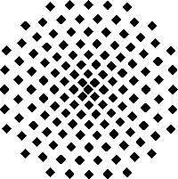
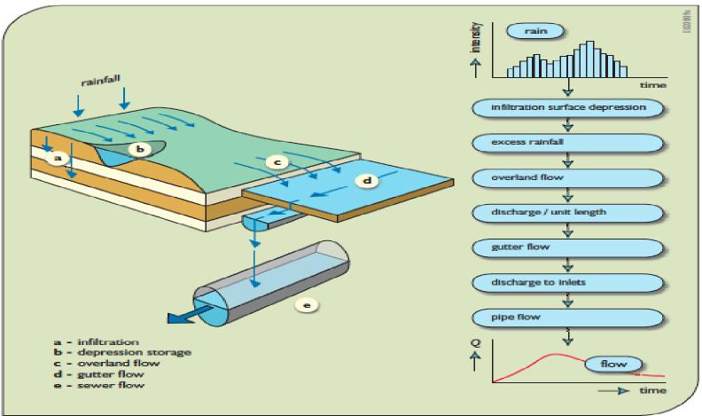
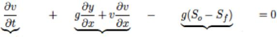
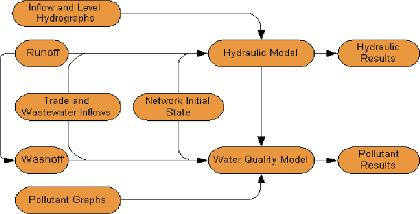
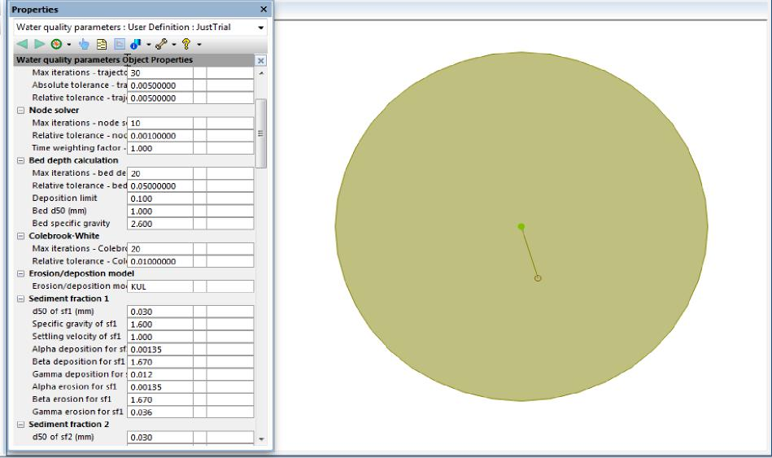
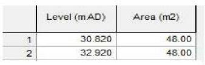
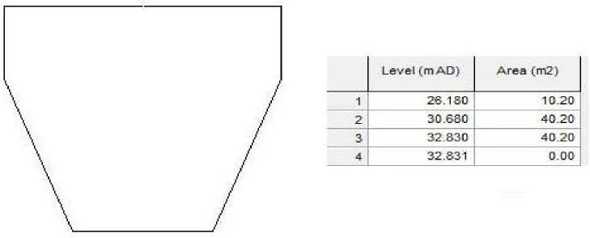

<table>
<colgroup>
<col style="width: 21%" />
<col style="width: 78%" />
</colgroup>
<tbody>
<tr class="odd">
<td><blockquote>

</blockquote></td>
<td><blockquote>

<strong>Universität Stuttgart</strong>

<strong>Institute for Sanitary Engineering, 
Water Quality and Solid Waste 
Management - ISWA</strong>

<strong>Auslandsorientierter 
Studiengang Wasserwirtschaft 
Master of Science Program 
Water Resources Engineering 
and Management - WAREM</strong>

</blockquote></td>
</tr>
</tbody>
</table>

**Master's Thesis: Demonstration of Sensitivity Analysis, Uncertainty Analysis, and Calibration in Modelling of a Combined Sewer System**

**Nimmer Zaman**

**Master’s Thesis  
January 2014**

Supervisors:

**Mr. Mehari Haile**

**Dr. –Ing. Ulrich Dittmer**

**Prof. Dr. –Ing. Heidrun Steinmetz**

**Acknowledgements**

I would like to express my deep gratitude to my supervisor, Mr. Mehari Haile for the unwavering support and guidance throughout the entire thesis process. I am indebted to him for the time spent together completing the thesis, and the patience he showed in helping me complete the final polished product embodied in this paper. This work would not be what it is without his insights and valuable contributions. I would also like to thank Dr. Ulrich Dittmer for agreeing to supervise this thesis, and his positive and valuable support towards its completion.

I am also grateful to Mr. Robert Dickinson of Innovyze Inc. for all the support and encouragement he provided. I thank him for giving me his precious time, and for giving momentum to the thesis at the beginning.

Finally, I would like to thank my family and friends for all their encouragement and continued support

**Abstract**

In recent years increased storm water runoff as a result of urbanization has become a major concern in the field of urban drainage and modeling. The increased loads on the sewer networks and receiving water bodies can have significant impacts on the municipal waste water treatment systems, infrastructure, quality of water discharged, costs and general health of the population. To mitigate these issues, measures have to be adopted to both accurately predict occurrences of storm water runoff and develop the capability to deal with them in a sustainable manner. Computer models are an effective way of understand and dealing with this phenomena and provide useful information in planning successful urban drainage systems.

The aim of the thesis is to present two modeling software for simulating urban water quantity and quality processes, along with sensitivity and uncertainty analysis of some of the main parameters and characteristics associated with the models. This can lead to a reduction in the uncertainty of modeling predictions and an increase in the confidence level of the results. Another objective is to show that lumped computer models can be successfully used to replace more detailed distributed models for calibration and validation of urban drainage models, and that they can successfully represent a natural system.

SWMM 5.0 and Infoworks ICM have been used to perform the modeling simulations, while various methods of sensitivity and uncertainty analysis have been carried out on input parameters such as width, slope and imperviousness of a catchment area, along with other parameters such as particle diameter size *d50* and density *s*, initial losses, fixed runoff coefficient, and runoff routing value. Sensitivity analysis has also been carried on the buildup and wash-off parameters, as well as the three transport models of Infoworks ICM. Finally, an uncertainty and calibration of the main lumped model subcatchment of the network area has also been conducted.

The results and analysis have been focused on the interaction of the model parameters with the model outputs, and to provide relevant information for easier calibration of the models. All three catchment characteristics are sensitive parameters, with width of the catchment showing the largest sensitivity. The sensitivity analyses also showed that wash-off coefficient and exponent, the decay factor all have an influence on the model, and play an important part in the model calibration. The Ackers-White transport model showed that best results among the three in-built transport processes of Infoworks, and was used for the rest of the simulations as well. Finally, results show that lumped models can accurately represent distributed ones, and in fact behaves better in terms of calibrating the peaks of runoff, and thus can be used to calibrate natural processes of flow and pollutant transport in a easier and less time consuming manner.

Table of contents

**Table of contents**

Table of contents i

List of figures iii

List of tables vi

1.  Introduction 1

2.  Urban drainage 4

> 2.1 Urban drainage and storm water runoff 4
>
> 2.2 Urban drainage water cycle 5
>
> 2.3 Storm water quality 6
>
> 2.4 Urban drainage modeling 8
>
> 2.4.1 Introduction to hydrological and hydraulic modeling 8
>
> 2.4.2 Hydrological surface sub-model 10
>
> 2.4.2.1 Saint-Venant equations 12

3.  Water Quality software used 14

> 3.1 Storm Water Management Model (SWMM) 14
>
> 3.2 Infoworks ICM 16
>
> 3.2.1 Runoff models 17
>
> 3.2.2 Surface pollutant accumulation modeling 20
>
> 3.2.3 Sediment transport in sewers 22

4.  Sensitivity and uncertainty analysis 29

> 4.1 Model input uncertainties 30
>
> 4.2 Model calibration uncertainties 30
>
> 4.3 Sensitivity analysis and uncertainty methods 31
>
> 4.3.1 Standardized Regression Coefficients (SRCs) 32
>
> 4.3.2 Generalized Likelihood Uncertainty Estimation (GLUE) 32
>
> 4.3.3 eFAST 35
>
> 4.3.4 Latin Hypercube 37
>
> 4.3.5 Hornberger-Spear-Young method 37
>
> 4.4 Software Tools for Sensitivity and Uncertainty Analysis 38
>
> 4.4.1 GLUEWIN 38

i

Table of contents

> 4.4.2 Simlab 40

5.  Model and study area description 42

6.  Results and discussion 45

> 6.1 SWMM local and global sensitivity analysis 45
>
> 6.2 INFOWORKS Results 51
>
> 6.2.1 Time dependent sensitivity analysis of three Desbordes model factors 51
>
> 6.2.2 Sensitivity analysis of buildup and wash-off parameters 54
>
> 6.2.3 Sensitivity analysis of transport modules of a lumped model of the single
>
> biggest catchment 68
>
> 6.2.4 Calibration of lumped and distributed networks 74

7.  Summary and Conclusions 84

8.  Bibliography 89

ii

List of tables

**List of figures**

Figure 2.1:Effects of urbanization on volume and rates of surface water runoff (Drainage

> Manual, Canada, 1982) 4

Figure 2.2: Transformation of rainfall into runoff, pre and post urbanization 5

Figure 2.3: Effects of urbanization on runoff peaks (Butler and Davies, 2004) 6

Figure 2.4: Impacts of storm water pollution (EPA, Australia 2003) 7

Figure 2.5: Storm water runoff generation (Butler, 2004) 9

Figure 2.6 : Steps in runoff generation from rainfall (Daniel et al., 2005) 10

Figure 3.1: Simple SWMM model outline 15

Figure 3.2: Structure of the water quality model 17

Figure 3.3: Overview of surface hydrology model (Innovyze, 2013) 18

Figure 3. 4: Pipe sediment in Infoworks ICM 23

Figure 3.5: Shields diagram for sediment deposition-erosion (ASCE 1975) 28

Figure 4.1: Sources of uncertainties in urban drainage models and links between them.

> (Deletic et al., 2012) 29

Figure 4.2: Uncertainty model output for a time series (Ratto & Saltelli, 2001) 40

Figure 4.3: SimLab main panel 41

Figure 5.1: Map of study area adapted from ([<u>http://www.neukoelln-online.de</u>](http://www.neukoelln-online.de)) 42

Figure 5.2: Distributed network of study area 43

Figure 6. 1: Network with catchment property editor for changes to parameters 45

Figure 6.2: Spider graph showing local sensitivity analysis of the 3 parameters 47

Figure 6.3: Max. Buildup scatter plot 49

Figure 6.4: Buildup rate constant scatter plot 49

Figure 6.5: Wash-off coefficient scatter plot 50

Figure 6.6: Wash-off exponent scatter plot 50

Figure 6.7: Euler II Rain events used for sensitivity analysis of the three parameters 52

Figure 6.8: Time dependent Sensitivity Analysis in Simlab of IL, FRC, and RRV 52

Figure 6.9: Pie chart of sensitivity analysis after 10 minutes of rain event 53

Figure 6.10: Pie chart of sensitivity analysis after 100 minutes of rain event 53

Figure 6.11: Pie chart of sensitivity analysis after 180 minutes rain of event 53

iii

List of tables

Figure 6.12: Inforworks Water Quality Model (Innovyze, 2013) 54

Figure 6.13: Euler II 5year 60minute rain event (Standard DWA-A118, March 2006) 56

Figure 6.14: Buildup factor NJ 14 days 57

Figure 6.15: Decay factor NJ 14 days 57

Figure 6.16: Wash-off coefficient C1 NJ 14 days 58

Figure 6.17: Wash-off exponent C2 NJ 14 days 58

Figure 6.18: Wash-off coefficient NJ 14 days 59

Figure 6.19: Euler II 2 year 60 minute rain event (Standard DWA-A118, March 2006) 59

Figure 6.20: Buildup factor NJ 14 days 60

Figure 6.21: Decay factor NJ 14 days 60

Figure 6.22: Wash-off coefficient C1 NJ 14 days 61

Figure 6.23: Wash-off exponent C2 NJ 14 days 61

Figure 6.24: Wash-off coefficient C3 NJ 14 days 62

Figure 6.25: Buildup factor NJ 5 days 62

Figure 6.26: Decay factor NJ 5 days 63

Figure 6.27: Wash-off coefficient C1 NJ 5 days 63

Figure 6.28: Wash-off exponent C2 NJ 5 days 64

Figure 6.29: Wash-off coefficient C3 NJ 5 days 64

Figure 6.30: Buildup factor NJ 5 days 65

Figure 6.31: Decay factor NJ 5 days 65

Figure 6.32: Wash-off Coefficient C1 NJ 5 days 66

Figure 6.33: Wash-off exponent C2 NJ 5 days 66

Figure 6.34: Wash-off coefficient C3 NJ 5 days 67

Figure 6.35: Lumped model of single biggest catchment 69

Figure 6.36: Rainfall Intensity for a 2 year 60minute event(Standard DWA-A118, Mar 2006) 70

Figure 6.37: Sensitivity of Ackers-White to specific density changes 70

Figure 6.38: Sensitivity of Ackers-White to particle diameter changes 71

Figure 6.39: Sensitivity of Velikanov to specific density changes 71

Figure 6.40: Sensitivity of Velikanov to particle diameter changes 72

Figure 6.41: Sensitivity of KUL to specific density changes 72

iv

List of tables

Figure 6.42: Sensitivity of KUL to particle diameter changes 73

Figure 6.43: Lumped model of Neukölln 75

Figure 6.44: Lumped models of Britz and Rudow 75

Figure 6. 45 Shape and water levels of Saugram tanks in Neukölln 77

Figure 6.46: Neukölln lumped and distributed model flow comparison 78

Figure 6.47:Rudow lumped and distributed model flow comparison 79

Figure 6.48: Comparison of simulated and measured flows for Neukölln with default values 80

Figure 6.49: Comparison of flows for Neukölln with best set of manually calibrated parmeters

80

Figure 6.50: Results of SA performed by GLUEWIN on 5 parameters using HSY method 81

Figure 6.51: Cumulative distribution of parameters before performing posterior analysis 82

Figure 6.52: Simulations performed with mean values from UA in GLUEWIN of 17 sets 83

> v

List of tables

**List of tables**

Table 2.1: Urban runoff quality (Daniel et al., 2005) 8

Table 2.2: Typical values of *k* coefficient (Daniel et al., 2005) 11

Table 3.1:Some typical characteristics of sewer sediment classes (Stovin and Saul, 2005) 24

Table 5.1: Characteristics of the three subcatchments 44

Table 6.1: Parameter changes with steps of 20% 46

Table 6.2: Water quality parameters (Gamerith, 2011) 48

Table 6.3: Results of SRCs analysis 50

Table 6.4: Ranges of input factors for IL, FRC, and RRV 51

Table 6.5: Buildup and Wash-off parameters from Infoworks and Mannina et al., 2012 55

Table 6.6: Range of Values for simulations with the Ackers-White and Velikanov models 69

Table 6.7: Range of values used for KUL simulations, adapted from (Ota, 2003) 69

Table 6.8: Default and normalized values used for constructing the lumped models 76

vi

Introduction

**1. Introduction**

Urban population is expected to increase dramatically over the next few decades, increasing from around 3.3 billion in 2007 to over 6.4 billion in 2050 according to the United Nations, with virtually all the worlds’ population to be absorbed by the urban areas of the less developed regions around the world. Accordingly this will have a huge impact on urban water management, which will further be exasperated by the variability of precipitation and flood events due to climate change. This influx of population into the urban areas of the world will greatly affect the natural waterways and lead to an increase of the impervious areas, thus significantly increasing runoff and increasing peak flows into sewer systems.

This increased concentration of human population and traffic in the urban areas also generates a high degree of pollutants with the runoff, including dust, sediments, organic and toxic compounds and other pathogenic substances that severely degrade the quality of the receiving waters. The increased loads can have significant impacts on the municipal waste water treatment systems in terms of infrastructure, costs and quality of water discharged. For these reasons greater attention must be paid to dealing with the increased urban runoff volumes and pollutants, and measures have to be adopted to both accurately predict such occurrences and the capability to deal with them in a sustainable way. This planning should include dealing with some of the most important aspects of urban drainage water management, such as: flood protection, environmental protection of the receiving water bodies and sanitary protection of the population.

Computer models are an effective way of understanding these phenomena and developing processes that can simulate the behavior of urban flows, in particular sediments and pollutant transport processes. Modeling of urban drainage systems can provide useful information in the planning of such systems and help reduce uncertainties associated with understanding hydraulic and hydrological systems. There are three main processes or steps associated with storm water quality modeling: the surface buildup process, the wash-off process and the transport of sediments within the sewers. All three processes include high level of uncertainties, making their predictions and behavior difficult, as such good methods of sensitivity and uncertainty analysis are required along with modeling the systems to more accurately portray their behavior and provide planners with models based on a high level of confidence in their modeling predictions.

Uncertainty associated with modeling is the main reason why model outputs or results do not match perfectly with measured ones. Hence, there is a need to calculate the uncertainties and control their impacts on the results, and even better to reduce the overall uncertainty. As such, it is advantageous in modeling to include confidence levels about the model’s predictions with the results (Deletic et al., 2012).

1

Introduction

In the current work, Infoworks ICM (Innovyze, 2013) and to a certain extent SWMM (Rossman, 2004) has been used to model the three quality and quantity processes by looking at a network provided by the Berliner Wasserbetriebe (BWB) located at the southeastern part of Berlin. A lumped and distributed model have been used to analyze the results and have a comparison with the measured field data. One of the main objectives of this study was to check if a lumped model can accurately represent the distributed network and real system, to enable easier calibration of models in the future, which are also less time consuming and have a reduced number of parameters involved.

Another objective of this study is to carry out a sensitivity and uncertainty analyses of some of the main parameters associated with urban drainage modeling, and to discover the behavior of these parameters in order to reduce the uncertainty of model outputs. Local and global sensitivity analyses have been carried out, including using software such as SIMLAB and GLUEWIN (Joint Research Center-European Commission, 2012). By meeting the stated objectives, it is hoped, that an initial simple calibration of the main catchment area of the network could be achieved, and that sufficient information is provided for users of urban drainage modeling to utilize the results and analysis to increase the confidence levels associated with uncertainty of urban drainage modeling and calibrate models more easily.

The first part of the thesis (chapter 2) starts with general descriptions of urban drainage and the concepts involved with storm water runoff (including the urban drainage water cycle and quality of the storm water). Chapter 2 then introduces urban drainage modeling, and provides an overview of the main concepts and requirements of urban drainage models, and in particular those that have been used in the current study (types of hydrological and hydraulic modeling, main equations used and the underlying principles of converting precipitation into storm water runoff).

In chapter 3 a description of the software used for urban drainage modeling in the thesis is given, along with the main aspects of the modeling process which have been focused on, such as buildup and wash-off modeling, runoff generation and flow routing, and finally transport of the pollutants and sediments in the sewers.

Chapter 4 describes the sensitivity analysis and uncertainties associated with urban drainage rainfall/runoff modeling. The chapter begins with introducing the main types of uncertainties, followed by the methods adopted for carrying out sensitivity and uncertainty analyses in the current work. Finally, a description is also given of the software tools used for performing the analysis and calibration.

In chapter 5 a brief description of the study area and model network is given, along with maps, figures and the characteristics of the distributed and lumped models used in the study.

2

Introduction

Chapter 6 gives a detailed account of the analysis and results of the simulations and work carried out in the thesis. Descriptions of the results provided by the two main software used for urban drainage modeling are given, as well as sensitivity and uncertainty analyses results of input parameters, runoff volume model, and transport models. Compatibility of the lumped and distributed models are also given, along with initial calibration results for the main subcatchment of the study area.

The thesis ends with a detailed summary and conclusions (chapter 7), along with recommendations for future work. A thorough review of the whole work is presented, with main findings and results highlighted to describe the entire process of urban drainage modeling, the results of the sensitivity analysis, and finally the uncertainty analysis done to produce a set of parameters and model description that can closely reproduce the process in nature and reduce the uncertainties associated with the modeling process.

3

Urban drainage

**2. Urban drainage**

**2.1 Urban drainage and storm water runoff**

Urban drainage and its planning is a consequence that has arisen due to the interaction between human activity and the natural water cycle (Butler and Davies, 2004).These activities can modify the land uses associated with urban drainage including natural vegetation, replacement of pervious areas with impervious ones, and increasing storm water runoff volumes and peak flows as shown in figure 2.1 (Goonetilleke et al., 2005). Human activity also generates substantial amounts of waste (both domestic and industrial) and pollutants that are then washed off from the catchment surfaces to the sewers and other water bodies during storms. Thus the need for building an efficient drainage system is necessary to ensure both the functionality of the site and to guarantee public health and safety.

As such urban drainage system presents classic modern environmental challenges: for the system to have a low social impact, for it to be sustainable, for the technical improvements to be environmentally acceptable, and to be cost effective at the same time. For this to happen, policy and legislation developers, engineers, environmental experts, local citizens and all stake holders to work together to overcome all of these issues (Marsalek J et al., 2007).

> 

Figure 2.1: Effects of urbanization on volume and rates of surface water runoff (Drainage Manual, Canada, 1982)

4

Urban drainage

> 

Figure 2.3: Effects of urbanization on runoff peaks (Butler and Davies, 2004)

**2.3 Storm water quality**

It is now generally accepted that pollutants, which have originated from urban surfaces greatly alter the overall water quality of the receiving water bodies (House et al., 1993).To reduce these impacts it is necessary to install measures and management techniques to have an efficient treatment and drainage system. The effectiveness of any such measures would of course rely on the accuracy of the storm water quality and quantity estimation techniques (Akan et al., 2003) (Zoppou, 2001).When the polluting load starts to increase and accumulate in the receiving water body, a point is reached when the natural assimilation capacity of the water body is exceeded, this leads to the occurrence of environmental and health problems. Impacts on water bodies are mainly caused by combinations of physical, chemical and microbiological factors (Chambers et al., 1997). Some of the main ones are explained below:

**Physical** factors may include increase in flow velocities and peaks, sediment erosion and deposition, which can cause habitat destruction, interference with water quality processes,

6

Urban drainage

impacts on aquatic life, transport of contaminants. Also, changing the temperature of the receiving water bodies (a problem for fish) and producing stratification which can impair mixing ability of the water.

> 

Figure 2.4: Impacts of storm water pollution (EPA, Australia 2003)

7

Urban drainage

**Chemical** factors include an increase in biodegradable organics, thus leading to depletion of dissolved oxygen, eutrophication by an increase of nutrients, an increase in the amounts of trace metals, chloride, Persistent Organic Pollutants (POPs), pesticides and hydrocarbons etc

**Microbiological** factors can include an increase in a variety of harmful bacteria and viruses leading to contamination of the water bodies and health risks.

The factors listed above and those given in figures 2.4 and table 2.1 can severely affect not only the quality of the water bodies, but also have detrimental effects on human health. It is therefore of utmost importance to monitor the quality of storm water runoff and implement methods to protect not only the water bodies but also human health and well being.

Table 2.1: Urban runoff quality (Daniel et al., 2005)

<table>
<colgroup>
<col style="width: 35%" />
<col style="width: 14%" />
<col style="width: 16%" />
<col style="width: 18%" />
<col style="width: 15%" />
</colgroup>
<tbody>
<tr class="odd">
<td>constituent</td>
<td><blockquote>

highway runoff

</blockquote></td>
<td><blockquote>

residential area

</blockquote></td>
<td><blockquote>

commercial area

</blockquote></td>
<td><blockquote>

industrial area

</blockquote></td>
</tr>
<tr class="even">
<td>suspended solids mg/l</td>
<td>28-1178</td>
<td>112-1104</td>
<td>230-1894</td>
<td>34-374</td>
</tr>
<tr class="odd">
<td>BOD mg/l</td>
<td>12-32</td>
<td>7-56</td>
<td>5-17</td>
<td>8-12</td>
</tr>
<tr class="even">
<td>COD mg/l</td>
<td>128-171</td>
<td>37-120</td>
<td>74-160</td>
<td>40-70</td>
</tr>
<tr class="odd">
<td>ammonia mg/l</td>
<td>0.02-2.1</td>
<td>0.3-3.3</td>
<td>0.03-5.1</td>
<td>0.2-1.2</td>
</tr>
<tr class="even">
<td>lead mg/l</td>
<td>0.15-2.9</td>
<td>0.09-0.44</td>
<td>0.1-0.4</td>
<td>0.6-1.2</td>
</tr>
</tbody>
</table>

**2.4 Urban drainage modeling**

**2.4.1 Introduction to hydrological and hydraulic modeling**

Rainfall is the main source of input in an urban drainage model. Various parts of the model then take this rainfall, transform it into runoff, which then enters the sewer system (figure 2.5). Runoff is produced by first converting measured rainfall into effective rainfall, and as such is determined by taking into account different sources of initial (interception, depression storage) and continuing losses (infiltration, evaporation). After calculation of the effective rainfall, the next step is to calculate the surface runoff, with the aim being to determine the time for the rainwater to reach the manholes or gully pots (nodes) of the catchment or sewer pipes (figure 2.6).

8

Urban drainage

> 

Figure 2.5: Storm water runoff generation (Butler, 2004)

Urban drainage modeling comprises basically of two main modeling approaches, the unit hydrograph method or the kinematic wave method. Models based on the unit hydrograph method are the time-area method, linear and non-linear reservoir models, and the Muskingum method (Beven, 2001) (Butler and Davies, 2004). The kinematic wave model is a simplification of the Saint-Venant equations which are discussed further in sections below. For the simulations and model runs in the present study, the dynamic wave flow routing method (full Saint-Venant equation) and Horton Infiltration method has been used for the SWMM model, while a linear reservoir method commonly referred to as the Desbordes model was chosen for the Infowork ICM modeling along with the Fixed Runoff method.

9

Urban drainage

> 

Figure 2.6 : Steps in runoff generation from rainfall (Daniel et al., 2005) **2.4.2 Hydrological surface sub-model**

There are two main models for determining the runoff volume from a catchment (Butler and Davies, 2004), they are hydrological surface model which determines the runoff by calculating a hydrological reduction of precipitation, and a time dependent rainfall reduction model (such as Horton infiltration) which subtracts the hydrological losses (infiltration, depression storage, interception etc) from the rainfall input and the remaining amount contributing as runoff to the sewers.

The hydrological reduction model is associated with more uncertainty as it is difficult to determine which sub-surfaces contribute to runoff or how precipitation is reduced on these surfaces due to wetting, soil infiltration and evaporation (Thorndahl, 2008).

On the other hand, the hydrological reduction factor, the depression storage and wetting losses are considered constant at the beginning of a rain event, and the infiltration capacity of a soil decreases as a function of soil saturation over time. Runoff occurs, when the rainfall intensity exceeds the infiltration limit of the soil (Horton, 1940). The Horton method is comprised of a three parameter model: the minimum/maximum infiltration capacity, time, and a decay coefficient which are specific to each watershed (Butler and Davies, 2004).

The Horton model as explained by Horton in 1940, describes the increasing runoff from permeable surfaces as a function of decreasing infiltration as soil moisture content increases with rainfall duration. Runoff from paved or impermeable surfaces is assumed as constant while the runoff from pervious surfaces is described as the wetting and infiltration processes.

10

> Urban drainage
>
> Horton defined the infiltration rate from pervious and semi-pervious surfaces with the following formula:
>
> Eq. 2.1: *=* ! *+ (! −! )!!"*
>
> where
>
> *f* is the infiltration rate
>
> *!* is the initial infiltration rate (mm/hr)
>
> ! is the limiting or critical infiltration rate (mm/hr)
>
> *t* is the time in hours, and
>
> *k* is the infiltration rate constant (1/hr)
>
> Table 2.2: Typical values of *k* coefficient (Daniel et al., 2005)

|              |                                                   |                 |
|--------------|---------------------------------------------------|-----------------|
| Surface type | Description                                       | Coefficient *K* |
| paved        | High quality paved roads with gullies\<100m apart | 1.00            |
| paved        | High quality paved roads with gullies\>100m apart | 0.90            |
| paved        | Medium quality paved roads                        | 0.85            |
| paved        | Poor quality paved roads                          | 0.80            |
| permeable    | High to medium density housing                    | 0.55-0.45       |
| permeable    | Low density housing or industrial areas           | 0.35            |
| permeable    | Open areas                                        | 0.00-0.25       |

> Runoff enters at model nodes in the sewer system, these are used to represent manholes and gully pots as a means of input into the pipes. The transport of flow into the nodes, and its subsequent routing through the sewer pipes is handled by the runoff and transport models built into the software. The most common method of runoff routing is based on the Saint-Venant equations, where as for calculating the flow in conduits Manning’s equation (Manning, 1891) is used (equation 2.2)

Urban drainage

> where,
>
> *Q* is the flow rate
>
> *n* is the Manning roughness coefficient
>
> *A* is the cross-sectional area
>
> *R* is the hydraulic radius, and
>
> *S* is the slope
>
> **2.4.2.1 Saint-Venant equations**
>
> The main equations used in both the SWMM and Infoworks ICM models are the Saint Venant equations for unsteady flow, which are a simplification of the Navier-Stokes equation for one dimensional flow. The equation consists of two parts, the continuity equation 2.3 and the conservation of momentum (the dynamic equations given as eq. 2.4 and 2.5):
>
> *<u>!"</u>*
>
> Eq. 2.3: *+ <u>!"</u> + <u>!"</u>=0*
>
> *!" !" !"*
>
> where
>
> *A* is the cross-sectional area
>
> *b* is the cross-sectional width
>
> *y* is the flow depth
>
> *v* is the velocity of flow
>
> *x* is the position of the section
>
> *t* is the time
>
> The dynamic equation can be given in terms of either velocity (eq. 2.4) and flow (eq.2.5) as shown in the two equations below:

|          |                                                                           |
|----------|---------------------------------------------------------------------------|
| Eq. 2.4: |  |

> Variation Variation with Uniform
>
> with time distance steady conditions

<table>
<colgroup>
<col style="width: 17%" />
<col style="width: 43%" />
<col style="width: 31%" />
<col style="width: 7%" />
</colgroup>
<tbody>
<tr class="odd">
<td>Eq. 2.5:</td>
<td>
<u>∂Q ∂</u> 2

( )

<u><em>Q</em> ∂ <em>y</em></u>

<em>± ± gA</em>

∂ t ∂ <em>x A</em> ∂ <em>x</em>
</td>
<td>
− <em>gA So Sf</em>

<blockquote>

(−)<em>=</em> 0

</blockquote></td>
<td>12</td>
</tr>
</tbody>
</table>

Urban drainage

> where,
>
> y is the flow depth
>
> u is the flow velocity
>
> Q is the flow rate
>
> x is the distance
>
> t is the time
>
> So is the bed slope
>
> Sf is the friction slope
>
> g is the acceleration of gravity
>
> It has to be kept in mind, that the Saint-Venant equations are valid only when certain conditions and assumptions are met (Butler and Davies, 2004):

- Distribution of pressure is hydrostatic

- Bed slope is small

- Prismatic channel

- The velocity is uniformly distributed across the section

- Lateral flow is negligible, and

- Steady flow friction losses are also valid for unsteady flow conditions

> The full Saint-Venant dynamic equation can be further simplified into two approximations, the diffusion and kinematic wave equations. In the diffusion wave equation, variation with time is neglected and is given as,
>
> <u>!" !"</u>
>
> Eq. 2.6: *+* =<u>!</u>!<u>!</u>
>
> !" !" !!!
>
> In which the wave speed *c* and diffusion coefficient *D* are regarded as constants.
>
> A further simplification by neglecting the variation of flow with distance leads to the kinematic wave equation, which is given as,
>
> <u>!" !"</u>
>
> Eq. 2.7: + = 0
>
> !" !"
>
> Urban drainage models and concepts
>
> **3. Water Quality software used**
>
> **3.1 Storm Water Management Model (SWMM)**
>
> The Storm Water Management Model is a dynamic rainfall-runoff model developed by the United States Environmental Protection Agency (US-EPA) in 1969-1971. It deals primarily with urban drainage systems analysis, and can simulate both single event or long term continuous rainfall events. Although SWMM can be considered as a very good tool for covering most aspects of urban drainage modeling including runoff generation, water quality analysis on the catchment or at the outlet of a system and in receiving water bodies, but one short coming is its inability to model the processes within a sewer or pipe network like the transportation or erosion and deposition processes of sediments. For this reason, Infoworks ICM has been used to model these processes in the present study.
>
> SWMM continues to be widely adapted and used for the analysis of water quality and quantity related to storm water runoff, sewers, and other drainage systems, mostly in urban cities but also with applications in non-urban areas. Its approach allows for simple calibration, and results which are generally reliable. SWMM models an urban drainage system as series of water and material flows (figure 3.1) between several environmental compartments, including the Atmosphere compartment, the Land Surface compartment, the Groundwater compartment and finally the Transport compartment. All of these are connected through a system of nodes, pipes, rain gages, pumps, storage devices etc. These compartments can be modeled in order from receiving of precipitation to the final outflow at the system, but need not be, as for example the transport compartment could just be modeled on its own using hydrographs as inputs (Rossman, 2004).
>
> In the present study, SWMM was used as a knowledge building exercise to understand urban drainage modeling, pollutant buildup and wash-off, and to carry out a simple local and global sensitivity analysis. The work provided a very good stepping stone for the rest of the study and especially in carrying out simulations with Infoworks ICM. As such, the present study will only present the information and procedures touched upon in the SWMM model and not a detailed explanation of the model and its working mechanisms. For a better understanding of SWMM and its entire range of applications, the EPA SWMM 5 manual developed by the United States Environmental Protection Agency is a very good and complete source to start with.

14

Urban drainage models and concepts

> 

Figure 3.1: Simple SWMM model outline

*Hydrological Processes* taking place within the subcatchments can be classified into impervious and pervious areas. In SWMM a partial drainage basin is represented as a rectangle of a set area and width, the basin is divided into the two impervious and pervious areas to calculate the runoff. Initial losses in impervious areas are accounted for only by depression storage where as in pervious areas different methods of infiltration are available such as Horton, Green-Ampt or SCS Curve Number method. The Horton method (chosen as default by the BWB) for infiltration is a three parameter model and incorporates the minimum/maximum infiltration capacity, time, and a decay coefficient which are watershed specific (Huber and Dickinson, 1988). Manning’s equation is used to describe the runoff from both surfaces, and there are additional tools available within SWMM to describe processes such as groundwater in aquifers or the effects of snowmelt.

In SWMM 5.0 runoff is calculated by dividing the basin into two types of surfaces: impermeable, and permeable (where infiltration can occur). Runoff is calculated separately for each surface, and then summed up later on. The runoff flowing into a network node is then calculated by using the model of a non-linear reservoir with the equation 3.1:

<u>!*(!!*</u>*!"<u>)</u>!/!*

Eq. 3.1: *=*

> where,
>
> *Qm* is the model run-off from a drainage basin \[m3/s\] *W* is the hydrological width of a drainage basin \[m\] *d* is precipitation amount \[m\]
>
> Urban drainage models and concepts
>
> *dp* is the surface retention height \[m\]
>
> *n* is the Manning’s surface roughness coefficient \[s/m1/3\]
>
> *i* is the mean drainage basin area slope \[-\].
>
> *Flow Routing* in SWMM channels and pipes is governed by the equations of conservation of mass and momentum for gradually varied and unsteady flow, the Saint-Venant Equations. The level of detail or simplification for the simulation runs depends on the user, and one can choose between steady flow, kinematic wave, and the full dynamic wave routing methods.
>
> Finally, for the *Water Quality process*, pollutant loads may be modeled either from event mean concentrations or with the buildup and wash-off equations, as was the case in this study. There are different functions available to model buildup and wash-off, such as the exponential function, power function, and the rating curve method. Also certain measures such as street sweeping, assigning land uses, input of external and dry weather inflows can also be used to model the Water Quality process.
>
> **3.2 Infoworks ICM**
>
> InfoWorks ICM (Integrated Catchment Modeling) is an integrated modeling platform which incorporates both 1D and 2D hydrodynamic simulation techniques for both urban and river catchments. It can accurately represent the flow paths for both above and below ground catchment elements, so that hydraulic and hydrological aspects of man made environments can be represented within a single model (Innovyze, 2013).
>
> In the present work, the modeling of the network and catchments was carried out with Infoworks ICM version 4 to simulate the water quality and water quantity processes required for the study. The two main parts of the model, hydraulic and hydrologic, are interconnected, with the hydraulic model as the main source of information for the model (see figure 3.2). The two models can also work separately, with some input from the hydraulic model feeding into the water quality model. The diagram below shows the interaction of the different parts of the software engine, with the hydraulic aspects at the top, water quality at the bottom and some shared aspects between the two in the middle.

16

> Urban drainage models and concepts
>
> 
>
> Figure 3.2: Structure of the water quality model (Innovyze, 2013) **3.2.1 Runoff models**
>
> This part of the model is used to describe the features of the ground surfaces in the system, and which rainfall-runoff model to be used for each of the surfaces. It describes the effective rainfall that can be captured from the precipitation falling on the catchment surface, the losses, the runoff generated, and the time for the runoff to reach the sewer or drainage system (Figure 3.3).
>
> There is a basic concept underlying the choice of the models, which remains the same irrespective of the option chosen. The overall catchment model is divided into a series of subcatchments. Then each of these subcatchments is further subdivided into surface types. A surface type is defined for each distinct category of surface. Normally two to five surface types are sufficient to describe the different areas of a model, but each subcatchment can use up to 12 of the defined surface types. Some examples of surface types are:

- Pervious areas with dense vegetation

- Typical residential areas

- Road drainage

- Industrial areas

17

Urban drainage models and concepts

> 

Figure 3.3: Overview of surface hydrology model (Innovyze, 2013)

> During the rainfall-runoff modeling process, three processes take place at the same time, these are:

- Initial losses (depression storage)

- Continuing losses (infiltration)

- Overland flow routing

> By default, the first two types represent an impervious surface (roads, and roofs), whereas the remaining one represents the pervious surface. For modeling, the surface runoff model is divided into two parts, one representing rainfall losses and the other the routing process, but each of these can act independently of each other on the surface of each catchment. The main available ones for each process in Inforworks ICM are given below followed by a description of the selected models for the study (Innovyze, 2013).

18

> Urban drainage models and concepts
>
> To calculate how much of the rainfall runs off the catchment and into the drainage system after accounting for any initial losses, Infoworks comprises of the following runoff volume models:

- Fixed percentage runoff model

- Horton infiltration model

- Wallingford runoff (fixed PR) model

- U.S. Soil Conservation Service Method

- New UK percentage runoff (variable PR) model

> The overland flow of the runoff into the drainage system can be modeled separately for each type of surface by the following routing models:

- Wallingford model

- Large Catchment model

- Sprint model

- Desbordes model

- SWMM model

> The Fixed Percentage Runoff model is used for catchments where one can make good estimates of the runoff percentage. Runoff losses are taken into account after deducting initial losses (which are fixed and not dependent on antecedent conditions). This model is used only where the majority of the catchment is impervious, as otherwise in pervious areas the runoff coefficient can vary significantly with antecedent conditions. The advantage of this model is that it can be used when there is very little data or information present about the catchment and its response to antecedent conditions, and any such variation is not significant. As the name suggests, the model uses a fixed percentage of the net rainfall to convert it to runoff, thus good data is required about the rainfall. Availability of rainfall data provided by the BWB, the impermeable nature of the main subcatchment area providing runoff, along with its ease of use while applying to such large catchments was the reason this runoff model was chosen.
>
> In the present work, the Desbordes runoff routing model has been chosen. The flow is routed using a single linear reservoir, whose routing coefficient depends on subcatchment area, ground slope, percentage impermeable, catchment length, storm duration and depth. An assumption of the model is that the flow at the outlet of the catchment is proportional to the volume of storm water present on the catchment. The basic equation is,
>
> Eq. 3.2: *S(t) = K Q(t)*
>
> where
>
> *S(t)* is the volume of storm-water stored on the catchment (m3) at a point in time
>
> *Q(t)* is the discharge at the catchment outlet (m3/s) at a point in time
>
> 19

Urban drainage models and concepts

> *K* is the linear reservoir coefficient (s).
>
> The software calculates this from the catchment and the rainfall data. The equations (3.3 and 3.4) used for calculating K and Q(t) are given below:
>
> Eq. 3.3: *= Kdesb.!*.*!**".*!*!*.*!**".(1+ )*!*!*.*!**.3!*.*!**".!*.*!**".*!*!*.*!**"*
>
> where
>
> *K* is the linear reservoir coefficient
>
> *Kdesb* is determined from calibration and equal to 50 (default value in Infoworks)
>
> *Ar* is the subcatchment area (ha)
>
> *Pnt* is the subcatchment slope (%)
>
> *C* is the proportion of subcatchment area that is impermeable (between 0 and 1)
>
> *T3* is the duration of the rainfall sub-event (s)
>
> *L* is the subcatchment length (m)
>
> *Hpe* is the total accumulated effective rainfall (m)
>
> And,
>
> Eq. 3.4: Q (t+dt) = C . Ar . q(t+dt) . 1000  
> where
>
> Q - total discharge (m3/s)
>
> q(t) - discharge per unit of active surface (m/s)
>
> C - proportion impermeable catchment area (0...1)
>
> Ar - catchment area (ha)
>
> **3.2.2 Surface pollutant accumulation modeling**
>
> Pollution generation during runoff from impervious surface is a very important concept in urban drainage modeling, and is described by the buildup and wash-off concepts. The Buildup model estimates the amount of pollutants accumulated on a catchment surface as a function of time elapsed between two rainfall events (Antecedent Dry Weather Period ADWP), whereas wash-off is the process of removing the accumulated pollutants during the ADWP by rainfall and transporting it with the runoff to the sewer or pipe systems.

20

Urban drainage models and concepts

> Although different models and procedures have been presented over time for the buildup process, the most important one, and on which the work in this thesis is based also, is the exponential model suggested by Sartor and Boyd in 1972 (Sartor and Boyd, 1972).The main difference between this and other models was that buildup is no longer considered as increasing indefinitely between events, and instead is given a maximum or equilibrium reaching point (dependent on the land use of the catchment, population, traffic, street cleaning efficiency and presence of parking lots in the area). The exponential buildup model is the one that was used in both SWMM (Rossman, 2004) and Infoworks ICM for the simulations carried out in this work. SWMM has other built in processes also to calculate the buildup (saturation and power functions), but Infoworks has only one, the exponential model which was proposed by Novotny and Ollen in 1994:
>
> Eq. 3.5: *=!*!*! !"+* !! *1* − !*!!*!"
>
> <u>!"</u>
>
> where
>
> *M0* is the mass of the sediment at the end of the buildup period (kg/ha)
>
> *Md* is the initial mass of sediment deposit (kg/ha)
>
> *K1* is the decay factor (1/day)
>
> *NJ* is the duration of the dry weather period (days)
>
> *PS* is the buildup factor (kg/ha.day)
>
> Wash-off is more complicated to model compared to the buildup equation because of the complex processes involved and the many uncertainties associated with it. Since a complete physical description would require many input parameters and data, the process is simplified in Infoworks by limiting the actual parameters involved in calibrating the erosion and dissolution factor *Ka* to the coefficients *C1, C2, C3,* (Kleidorfer, 2009). Also wash-off during wet weather is calculated as a function of rainfall intensity in Infoworks (equations 3.6 and 3.7) and not runoff as in SWMM (Innovyze, 2013).
>
> *<u>!"#</u>*
>
> Eq. 3.6: *!" = . − ()*
>
> Eq.3.7: *= 1. ()!! − 3. ()*
>
> where
>
> *C1, C2 and C3*are coefficients
>
> *f(t)* is the Total Suspended Solids (TSS) flow per unit of active surface (kg/(ha·s))

21

> Urban drainage models and concepts
>
> *i(t)* is the effective rainfall (m/s)
>
> *Ka* is the erosion/dissolution factor
>
> *Me* is the mass of surface-deposit pollution (kg/ha)  
> **3.2.3 Sediment transport in sewers**
>
> The field of urban drainage modeling in recent years has gained a lot from the development of more advanced sewer flow quality models built in to hydrodynamic simulation packages. Now modeling software such as Infoworks ICM can provide results of hydrodynamic modeling, along with the ability to model the impacts of sediment flows and accumulation within the sewer system. This has helped in better understanding the design and management of urban drainage systems as a whole (Hermida, 2012). It can carry out the sediment or water quality modeling in three parts

- The Network Model which can calculate the concentration of dissolved pollutants and suspended sediment at all nodes using the equation for conservation of mass

- The Conduit Model calculates the concentration of dissolved pollutants and suspended sediment along each conduit, and then

- The Conduit Model calculates the erosion and deposition of sediment in each conduit

> Good and reliable modeling of sediment transportation and behavior is an important requirement in order to better understand the hydraulic features of flow and design of systems. Sediment deposits greatly influence hydrodynamic behavior of a network, and can lead to surcharging and flooding, as well as the overall quality of the receiving water bodies. As such proper understanding is required of the behavior of sediments and their transport. Sediment characteristics, such as size, density, concentration etc are important parameters in the design of sewer networks.
>
> According to Boutelegier et al. in 2002 with high shear stresses, the erosion of sediment particles starts, with fine silt particles and low density organic ones relatively easier to transport than medium/coarse sand and heavier inorganic particles, however they would need very high shear stresses and uneconomical steep slopes for the re-entrainment of such particles.
>
> Sediments in pipes are treated in a different way in the Infoworks hydraulic and water quality models, with two different layers of sediments present in the system (figure 3.4).

- Passive Layer, which is fixed throughout the simulation, and the

- Active Layer, from which erosion, transportation and deposition can occur during the water quality simulations.

22

Urban drainage models and concepts

Deposition stops automatically if the sum of the two layers exceeds 80% of the total conduit height. Also, there is an option of feeding back changes in the active layer during water quality simulations to the hydraulic simulations engine so that the depth affects the hydraulic calculations. These changes can also be ignored if so desired (Innovyze, Infoworks ICM, Online Help, 2013). The depth of the Active Layer is given as:

Depth of Active Layer= Maximum sediment depth - depth of Passive Layer

> 

Figure 3. 4: Pipe sediment in Infoworks ICM

> In the Active Layer, two important parameters take part in the simulations which affect the erosion and deposition processes and were part of the sensitivity analysis in this study. These are the average particle diameter size *d50* (taken as default value of 0.04mm) and the specific gravity *s* or density of the sediment fraction (default value 1.7). The active layer is composed of two sediment fractions, SF1 and SF2 with their respective characteristics and properties which can be defined by the user or taken as default values in the software.
>
> It has to be remembered, that sewer sediments are very heterogeneous (table 3.1), even within the same location in a network, different characteristics can develop (Skipworth, 1996). As such, they are one of the main sources of uncertainty in modeling, and values for them should be chosen carefully.
>
> Sediment transport is usually defined by different modes and origins. Two main types are the bed load and suspended load. Bed load consists of the coarse particles that are transported close to the bed, while suspended load consists of finer particles and are transported in suspension (Hermida, 2012)

23

> Urban drainage models and concepts
>
> Table 3.1:Some typical characteristics of sewer sediment classes (Stovin and Saul, 2005)

<table>
<colgroup>
<col style="width: 25%" />
<col style="width: 24%" />
<col style="width: 24%" />
<col style="width: 25%" />
</colgroup>
<tbody>
<tr class="odd">
<td>In-Sewer Sediment 
Type</td>
<td>d50 (mm)</td>
<td>Density (kg/m3)</td>
<td>Estimated Fall 
Velocity (mm/s)</td>
</tr>
<tr class="even">
<td>Gravel</td>
<td>10</td>
<td>2650</td>
<td>756</td>
</tr>
<tr class="odd">
<td>Sand</td>
<td>3</td>
<td>2650</td>
<td>380</td>
</tr>
<tr class="even">
<td>Grit</td>
<td>0.75</td>
<td>2650</td>
<td>136</td>
</tr>
<tr class="odd">
<td>Gross Solids</td>
<td>2</td>
<td>1030</td>
<td>25</td>
</tr>
<tr class="even">
<td>Sanitary-Stormwater</td>
<td>0.006</td>
<td>2500</td>
<td>3</td>
</tr>
<tr class="odd">
<td>Sanitary-DWF</td>
<td>0.04</td>
<td>1400</td>
<td>0.3</td>
</tr>
</tbody>
</table>

> During storm events or wet weather flow, sediments are mobilized and transported, and depositions usually occur during dry weather periods. Thus, sediments occurring in the network can be both from catchment surfaces and from the bed of sewers when appropriate flow and shear stress conditions are present. Sometimes, deposited sediments can form an organic layer near the bed and form a cohesive bond with other granular materials, thereby increasing the resistance to erosion (Banasiak et al., 2008).
>
> In sediment transport modeling, the main aim is to accurately portray the accumulation of sediments in the pipe or sewer system. In Infoworks ICM, this is carried out through either of three built in models, namely: Ackers-White (based on a comparison of sediment concentrations), Velikanov (energy dissipation), and the KUL model (based on shear stress comparison) (Boutelegier and Belamont, 2002) and (Hermida, 2012).
>
> The transport models are used to calculate two main processes, the transport of sediments and other dissolved pollutants in the conduits, and the erosion or deposition taking place. These two processes are solved independently of each other at each required time step. Infoworks ICM takes certain assumptions with all three transport models, which are (Innovyze, Infoworks ICM, Online Help, 2013):

- The flow is one-dimensional

- The concentration across the conduit is fully mixed for any sediment or dissolved pollutants.

- The suspended sediment and dissolved pollutants are transported along the conduit with the local mean velocity of the flow

- Dispersion of the suspended sediment and dissolved pollutant along the conduit is negligible

- Erosion of sediment from the bed is instantaneous

- Deposition of suspended sediment depends on a settling velocity calculation

- Deposition of suspended sediment does not affect the hydraulic calculations

24

Urban drainage models and concepts

> Infoworks ICM generates the boundary conditions at the upstream ends for this equation with its built in Network Model, and the carrying capacity of the flow is calculated by one of the three transport models.
>
> The *Ackers-White theory* (Ackers et al., 1994) is based on equation 3.8 and the assumption, that at each computational point, a non-dimensional carrying capacity C*v* is calculated to represent the maximum concentration of the sediment fraction that can be carried by the flow.

|          |                                                                            |
|----------|----------------------------------------------------------------------------|
| Eq. 3.8: |  |

> *R* is the hydraulic radius (=A/Po) (m)
>
> *Po* is the wetted perimeter (m)
>
> *We* is the effective bed width (m)
>
> *A* is the cross sectional area of the flow (m2)
>
> *u* is the local flow velocity (m/s)
>
> *λc* is the composite friction factor given by
>
> with,
>
> *Wb* is the width of the deposited bed.
>
> *λo* and *λb* are the composite friction factors of the pipe wall and the deposited bed.
>
> *ko* and *kb* are the wall and deposited bed roughness.
>
> *D* is the diameter of the pipe.
>
> Urban drainage models and concepts
>
> The remaining parameters of mean sediment diameter and specific density are all functions of the dimensionless grain size, and the focus of our sensitivity analsyis:
>
> Eq. 3.12: *!"* = *!". (<u>! !!!</u>*
>
> *!!* )*!* !
>
> where
>
> *v* is the kinematic viscosity of water (m2/s)
>
> *g* is the acceleration due to gravity (m/s2)
>
> *s* is the specific density of the sediment fraction
>
> *d50* is the average sediment particle size (m)
>
> Finally the non-dimensional carrying capacity number is converted to a maximum
>
> concentration by: =
>
> Sediment deposition takes place if the actual concentration is greater than *Cmax*, and erosion takes place if it is less than *Cmax* until an equilibrium is reached when *Cmax=Cactual*
>
> The *Velikanov model* is based on the work of Anjou Recherche in France. It is an energy based equation that determines transport capacity of materials in suspension. The model determines two concentrations (*CTmin* and *CTmax*), with erosion taking place if the concentration in the flow is less than *CT*min, and deposition taking place if the concentration if more than *CTmax*. If the flow of the concentration is between the two values, then no erosion or deposition takes place (Zug et al., 1998).The maximum and minimum transportable concentrations are evaluated with two energy equations:

where

*CTmax* and *CTmin* are the critical erosion and deposition transport capacities (kg/m3).

*Ii1* and *Ii2* are the efficiency coefficients.

*s* is the sediment’s specific density.

*ρs* is the density of the water (kg/m3).

> Urban drainage models and concepts
>
> An important fact to remember regarding the KUL model, the erosion and deposition of the sediments are governed by several other parameters rather than just the mean particle diameter or specific density. A simplification of these parameters is presented below regarding the flow (qs) of sediments and their stored deposits. For more details, the works of Ota and Nalluri (2003) and the shields diagram (figure 3.5) for sediment deposition and erosion has to be consulted
>
> Eq. 3.18:
>
> Eq. 3.19:
>
> where,
>
> 
>
> Figure 3.5: Shields diagram for sediment deposition-erosion (ASCE 1975)
>
> 28

Sensitivity and uncertainty analysis

**4. Sensitivity and uncertainty analysis**

No model can perfectly represent reality or cater for all the variances of nature itself. Every model has a level of uncertainty associated with it, and hence the results of modeling processes and outputs have to be interpreted carefully to provide a close estimation of the real behavior of a system. Therefor a need arises in modeling to control and reduce the uncertainties of the results, along with providing a degree of confidence level of the model and its outputs (Deletic et al., 2012)

As can be seen in figure 4.1, according to Deletic et al., in 2012, there are three main types of uncertainties: model input uncertainty, model calibration uncertainty, and finally model structure uncertainty.

> 

Figure 4.1: Sources of uncertainties in urban drainage models and links between them.  
(Deletic et al., 2012)

- Model input uncertainties are related to measured input data, estimated data, and model parameters.

- Calibration uncertainties are mainly measured calibration data uncertainties, measured calibration data availability, calibration algorithms and criteria functions.

29

Sensitivity and uncertainty analysis

- Model structure uncertainties are related to conceptualization errors, and errors in numerical methods and boundary conditions,

> Of the three, the evaluation of model structure uncertainty is the most difficult and complex to understand and estimate. It is beyond the scope of the present study, however good sources of information on it can be found through the works of (Deletic et al., 2012), (Lindenschmidt et al., 2007) and (Schellart, 2007). For the present work, the focus is more on model input parameter uncertainties, and to a certain extent on calibration uncertainties.
>
> **4.1 Model input uncertainties**
>
> Uncertainties in model input parameters are one of the main sources of uncertainties in model outputs. Input parameters are usually a fundamental part of the model equations and are calibrated in order to provide results as close to reality as possible. Models runs are carried out either as calibrated or un-calibrated from input data, to produce model outputs or results which carry a certain degree of uncertainty with them. This type of uncertainty is probably one of the most studied, yet also one of the least understood. Many studies have been carried out to understand input data and parameters uncertainties, but have not reached any definite conclusions, while some, such as Willems et al., (2008) and Freni et al., (2010) have all made an attempt to separate the uncertainties associated with input data and parameters to better understand the interaction between the two.
>
> Sensitivity analysis is a very good method to identify uncertainties related to the model and can indicate how sensitive the model outputs are to each of the model inputs and parameters (Dotto et al., 2010). In some cases sensitivity analysis can also be used for screening purposes, and also to provide confidence levels or ranges around the model results but do not provide good knowledge about the origin of such uncertainties (Mannina and Viviani, 2010).
>
> **4.2 Model calibration uncertainties**
>
> A model is calibrated by comparing the model output (run with certain parameters and boundary conditions) with the corresponding measurements or field data. This presents one of the main sources of uncertainty associated with the chosen method of calibration and verification. Data uncertainty, measuring device used, spatial and temporal data all can lead to uncertainty related to the calibration data or algorithms and the difficulties of finding the best parameter set (Dembélé et al., 2011).
>
> When dealing with modeling approaches such as ours where there is insufficient field data the classical calibration methods may lead to several sets of parameters and a low confidence in the results obtained and not one set that provides the ‘best fit’. For this, the

30

Sensitivity and uncertainty analysis

> concept of a unique or single set of parameters is replaced by the equifinality concept, first proposed by Beven and Binley in 1992, which argues that there may be more than one set of parameters that exist to provide a good fit between the simulated and measured results and data (Beven and Binley, 1992). In such a theory, a likelihood analysis between the model and actual physical reality is used, and parameter efficiency is replaced by model uncertainty analysis which gives a range of sets falling within a certain confidence or likelihood level (Beven K. , 1996) (Freni G. G., 2009a).
>
> **4.3 Sensitivity analysis and uncertainty methods**
>
> Sensitivity analysis is one of the most important tools for modelers, as it is used to determine which ‘uncertain‘ input factors determine or have the biggest effect on the model outputs (Saltelli et al., 1997). It helps to better understand the background of the model, and provides for a deeper understanding of the model and its behavior. Parameters can be classified on the basis of their importance depending on the level of change or influence they have on the model results, and this information can then be used to better calibrate the models.
>
> There are many different types of sensitivity analysis methods in literature, but most fall within two main categories: local sensitivity methods and global sensitivity methods (Saltelli et al., 1997). The local method provides a measure of the local effect on the model output by evaluating the change in the model output when the parameter is varied One-Factor-At-A-Time and the others are kept fixed over the entire range. In such a case, the sensitivity analysis represents the slope of the analyzed function, when all the other parameters are fixed, and the one being analyzed is varied over its entire range. In the Global sensitivity analysis, an assessment is carried out to study the effect on the model output the variation on the model input factors or parameters over their entire range together. This can help prioritize the factors, identify non-influential (factor fixing) ones, and study the interactions among the factors (Saltelli et al., 2004) (Freni et al., 2009a). Global methods tend to avoid the false maximum that local methods might suffer from, and this is achieved by studying the parameter sensitivity not one for one particular set of values, but for the entire ranges of all the parameters being studied. With local sensitivity methods, the analysis starts from a single point, whereas in the global method, it starts from a distribution of the parameters (Kleidorfer, 2009). In the current work, a mixture of both methods has been used depending on the nature of the model (simplified or distributed), and on the model results being explored. As stated before, there are many methods in literature for carrying out sensitivity and uncertainty analysis, but only those relevant to the thesis have been explained more below.

31

Sensitivity and uncertainty analysis

> **4.3.1 Standardized Regression Coefficients (SRCs)**
>
> The Standard Regression Coefficient method consists of performing a multivariate linear regression between the model outputs and inputs factors obtained by means of Monte Carlo (MC) simulations. In statistics, they are carried on independent variables which have been standardized in such a manner that their variances are equal to 1.The closer a variable or parameter gives a value to 1, the more sensitive it is termed to be regarding the model output of choice. Sensitivity can also be judged from the slope of the line for each parameter and the concentration of scatter points around the line, with bigger slopes and denser concentration of scatter points signifying greater sensitivity of the parameter. In the present case, the method was used to determine which of the four parameters of the buildup and wash-off equations in SWMM have the greatest influence on the model output runoff. Scatter plots and linear regression curves have been used to aid in the analysis.

<table>
<colgroup>
<col style="width: 55%" />
<col style="width: 44%" />
</colgroup>
<tbody>
<tr class="odd">
<td>
<u>!!"</u>

Eq. 4.1: <em>SRCsf3i=</em> !"
</td>
<td>∗</td>
</tr>
</tbody>
</table>

> where *σθi* is the random parameters standard deviation  
> *σy* is the average concentration results standard deviation  
> *bi* is the linear regression slope
>
> *βi* is the SRCs value or sensitivity index
>
> This method not only gives the effect or sensitivity of an input factor on the output, but it also explores the entire domain of each input factor, and can give an average, easy to understand analysis for each of the factors and its relationship to the model output. But it has to be kept in mind, that regression based methods do not work well for non-linear based models, and even worse for non-monotonic ones.
>
> **4.3.2 Generalized Likelihood Uncertainty Estimation (GLUE)**
>
> The Generalized Likelihood Uncertainty Estimation is a procedure based on the Monte Carlo method. It proposes that there is no optimum model and parameter set, but that prior to input of data into a model, all parameter sets have an equal likelihood to be acceptable (Beven and Binley, 1992) (Beven K. , 1993). GLUE is performed by carrying out a large number of runs for a model with parameter values or sets chosen randomly from previously defined parameter distributions. Then a comparison is performed between the predicted (simulated) and observed (measured) responses. Each set of parameters is assigned a likelihood value, with higher values indicating a better fit between the simulated and observed models. A cutoff threshold or likelihood function is used to divide the simulations into behavioral and non-behavioral combinations. The likelihood threshold is user dependent, and based on certain

32

Sensitivity and uncertainty analysis

> allowable deviation of the highest likelihood value in the sample, or sometimes as a fixed percentage of the total number of simulations (Saltelli et al., 2004). Those parameter sets which fall within the defined threshold or are termed behavioral are retained while the others are discarded. The likelihood values of the behavioral ones are rescaled and weighted so that a cumulative distribution function (CDF) equal to 1 is obtained.
>
> Model prediction is then usually supplied by the median of the output distribution, and the associated uncertainty is derived from the CDF chosen at the 5% and 95% confidence levels. These boundaries are normally called 90% confidence bounds or limits as they are created by using the solutions retained from 90% of the posterior probability (Saltelli A. T., 2004).
>
> The main difference between this method and some of the others is the idea or concept of equifinality (Beven K. , 1993), which maintains that due to errors inherent in all models, it is appropriate to perform calibration of a model based on an optimum set or range of parameters instead of just finding one unique set (Beven and Freer, 2001). The main steps of GLUE are as follows (Gupta et al., 2005):

- First, choose a model structure to be used

- Take multiple sample sets from prior ranges or distribution by the Monte Carlo sampling method, and ensuring the independence of each of the samples in the model domain

- Compare observed and predicted outputs or variables.

- For the models or outputs considered as behavioral or important, calculate likelihood measure or measures.

- Rescale the cumulative likelihood weights to 1

- Finally, use the model or sample sets considered as important with the output variables which have been rescaled with the likelihood weights to form a cumulative distribution of the predictions. From this, any desired prediction quantiles can be obtained.

> In this study the *Nash and Sutcliffe efficiency index* (Nash and Sutcliffe, 1970) has been used to determine the likelihood measure (equation 4.2). It has to be kept in mind that the likelihood measure has been chosen as zero (a user defined threshold as it can be other values depending on the judgment of the user and likelihood method being applied) for all simulations in this study for the Nash-Sutcliffe method that do no exhibit behavior similar to the system being studied, and should increase monotonically as the similarity behavior increases with a limit of 1 (Freni et al., 2009a).

*!*<u>!*!*</u>

> Eq. 4.2: *= 1 −*

!!!

> where *σe2* is the variance of error, defined as the difference between the measured and simulated values,

33

Sensitivity and uncertainty analysis

where,

*E(Y)* and *Var(Y)* is the expected value and variance of the output Y,

*s* is a scalar variable varied over the range - 0O\< s \<+ 0O

*A*\] and *Bj* are the Fourier coefficients over the domain of integer frequencies \] ˛ {- 0O,...,­1,0,1,..., + 0O}, the expressions for which are as follows:

Eq. 4.8: Eq. 4.9: Eq. 4.10: Eq. 4.11: Eq. 4.12: Eq. 4.13: Eq. 4.14:

where

Var (Y) is the estimated conditional variance of the ith factor,

Var-i (Y) is the estimated conditional variance except for the ith factor,

*Si* is the main sensitivity index of the ith factor,

*STi* is the total sensitivity index of the ith factor,

*n* denotes the number of parameters,

36

Sensitivity and uncertainty analysis

*Ns* is the sample size,

*Nr* is the search curve number of the resampling scheme,

*M* is the interference factor (set to 4),

*Umax* is the largest among the set of ui frequencies, and

*C* is the number of model evaluations needed to complete a numerical experiment of SA. **4.3.4 Latin Hypercube**

Latin Hypercube is a statistical method used for generating samples of parameter or input values from a multidimensional distribution and can be considered as a case of stratified sampling (Iman and Shortencarier, 1984). The main purpose of this is to have a better

mapping of the sample space. In this method, the range of each input factor X , *j* = 1,2, ...k,

> *j*

is divided into N intervals of equal marginal probability, 1/N, and one observation of each input factor is made in each interval using random sampling within that interval. This ensures that there are N non-overlapping realizations for each of the *k* input factors (SIMLAB Online

Help Manual). Then one of these realizations X is randomly selected (each observation has

1

an equal chance of being selected), and matched with a randomly selected realization of X ,

2

and so on up till X Together these constitute a first sample, x . This process is continued

> *k* 1

with the remaining realizations to get values until x , whereby the observations finally finish

> *N*

and we get a complete Latin hypercube sample (Iman and Shortencarier, 1984).

This method has the advantage of ensuring input factor is well represented over its entire space of distribution of the input values. It can give better results better than random sampling techniques when the output is dominated by a few of the input factors, and ensures that each of these factors is represented in a fully stratified manner. It can also give better values or estimates for the mean and distribution function with a lower variance. As such this method was chosen to perform the uncertainty analysis and calibration for the lumped Neukölln model based on the known parameter values of the Desbordes method.

**4.3.5 Hornberger-Spear-Young method**

The Hornberger-Spear-Young (HSY) method was developed around 1980 to estimate uncertainties in river quality models with the concept of ‘problem-defining behavior’. It is based on Monte Carlo simulations, and consists of repeatedly evaluating the model with a set of sampled or generated parameters for each of the model runs over the range of the model parameter distribution (Kleidorfer, 2009).

37

Sensitivity and uncertainty analysis

Then the model results are compared with the measured or calibrated data. Two main groups are formed from this analysis, ‘behavioral results’ and ‘non-behavioral results’. Then the two sets of results are used to plot cumulative distribution graphs against each of the input parameters providing for an easy to interpret method of sensitivity analysis by calculating the numerical difference between the two sets within a range of \[0,1\]. The most sensitive parameter has the value of 1, and the non-sensitive has 0 (Spear, 1980) (Young, 1983).

<table>
<colgroup>
<col style="width: 20%" />
<col style="width: 24%" />
<col style="width: 54%" />
</colgroup>
<tbody>
<tr class="odd">
<td>Eq. 4.15:</td>
<td>
<em>d</em> , sup

<blockquote>

<em>m n</em> =

</blockquote></td>
<td>
<em>Sn</em> ( <em>x</em>)<em>Sm</em> (<em>x</em>)

−
</td>
</tr>
</tbody>
</table>

> *x*

*Sn* and *Sm* are the sample distribution functions used for estimating the cumulative distributive functions of the outputs termed as behavioral and non-behavioral

*dm,n* is the maximum vertical distance between the behavioral and the non-behavioral cumulative functions, with the larger the distance the more sensitive the parameter is.

**4.4 Software Tools for Sensitivity and Uncertainty Analysis  
4.4.1 GLUEWIN**

This is a Global Sensitivity Analysis (GSA) software tool developed by the Joint Research Center of the European Commission (JRC-EC) for analyzing the outputs of Monte Carlo runs which integrates the ‘GLUE-Bayesian’ type uncertainty estimation within the classical GSA-GLUE framework (Ratto & Saltelli, 2001). It provides information on the observed patterns or measurements when available, something which is lacking in Simlab, and can then provide time dependent model output analysis (GLUEWIN Online Manual Help). Although the code for GLUEWIN has been written in MATLABTM language, but it is also available in a stand­alone mode and that is the one applied in the study here to carry out an uncertainty analysis (JRC-EC, 2012).

The main features of GLUEWIN are:

- Likelihood weights can be defined for model runs

- Using those likelihood weights for performing uncertainty analysis of the model predictions in a time dependent method

- Analysis of the posterior distributions of the uncertainty parameters obtained in the previous steps by conditioning of the observations

- Sensitivity Analysis through scatter plots and Smirnov type cumulative distributions

- Compatibility with SIMLAB interface, for example, using the likelihood files generated with GLUEWIN to be loaded by SIMLAB for a GSA-GLUE analysis (Ratto & Saltelli, 2001) (GLUEWIN Online Manual Help)

38

Sensitivity and uncertainty analysis

Monte Carlo analysis is based on performing multiple model evaluations or outputs with model inputs selected through probability distribution methods. These results or evaluations are then used to perform uncertainty and sensitivity analysis on the model and determine the uncertainty in the model predictions. These can be combined with the GLUE framework of analysis, which takes the available model observations and conditions the uncertainty estimations accordingly.

A Monte Carlo analysis usually requires five steps (JRC-EC 2012):

- A range and distribution method are selected for each input factor

- A sample or sequence is generated for each of the input parameters

- The model is then evaluated or ‘run’ for each of these samples generated, to create a mapping from the input factors or parameters to the results or model outputs for subsequent uncertainty and sensitivity analysis

- An uncertainty analysis is carried out

- In this final step, a sensitivity analysis is done

In the present work, and in particular for the Infoworks ICM based modeling, Simlab was used to carry out the first three steps and GLUEWIN for the final two (partially for the fifth). Once the first three steps are completed, GLUEWIN is used to perform a pseudo-Bayesian uncertainty and some few kinds of Global Sensitivity Analysis. If required, GLUEWIN can be also used to create new samples for the Monte Carlo analysis, by applying a bootstrap strategy. The posterior distribution function based in the software on the GLUE method was used to calculate the region of parameter sets providing the best fit for the model output, and the mean values for calibration purposes.

An example of the output provided by the software for the uncertainty analysis sets or range is given in figure 4.2. The red line represents the measured output data, whereas the grey region represents the uncertainty bound within a defined threshold or likelihood measure. This can be increased or decreased according to the demands of the user and results required for the confidence level regarding the uncertainty. GLUEWIN has several default likelihood measures to calculate the likelihood functions, such as the exponential likelihood function, the mean square error *MSE* and the mean absolute error *MAE* (Ratto & Saltelli, 2001). The method chosen to carry out the calibration of the Neukölln catchment in section 6.2.4 was the exponential method as given in equation 4.16:

Eq. 4.16: where,

*xi* is the *i*-th element of the sample of the model input factors.

39

Sensitivity and uncertainty analysis

*y* = ( y(1) ,..., y( j ) ,..., y(nobs ) ) is the vector of observations of the scalar variable y. 9 (xi) is the *i*-th model run.

std(9 − y( j) ) is the weighting factor in the sum of square errors, equal to the standard deviation of the model errors with respect to the *j*-th observations.

GLUEWIN also provides different methods of sensitivity analysis on the input parameters and their effect regarding the model outputs. For this study the Hornberger-Spear-Young method has been chosen for the sensitivity analysis in GLUEWIN.

> 

Figure 4.2: Uncertainty model output for a time series (Ratto & Saltelli, 2001) **4.4.2 Simlab**

Simlab has been used in the current study to perform global uncertainty and sensitivity analysis. The analysis is carried out after performing multiple model evaluations either through an external (in this case Infoworks) or an internally described model. Mainly Simlab has been used to generate samples from the input factors or parameters and then carry out a sensitivity analysis, although it can also carry out an uncertainty analysis based on model outputs to judge the uncertainty in model predictions. The user has to select the range and

40

Sensitivity and uncertainty analysis

> distribution method for each input factor, and then select one of the methods to generate samples of the elements from the specified methods. The sampling techniques and sensitivity analysis methods available in SIMLAB are FAST, Fixed samples, Latin Hypercube, Morris, QuasiRandomLpTau, Random (Latin Hypercube and eFAST methods have been used in this study). It has to be noted, that the choice of the sampling method has direct implications on the sensitivity method to be performed later. For example, if we use the FAST method for generating the samples, then certain Simlab sensitivity analysis tools (for example, the Morris method) cannot be used (JRC-EC, 2012). Once the sampling technique has been chosen, the user can then select from difference choices of distribution methods to generate the sample sets (uniform and normal distribution methods have been used in this study (Simlab Online Help Manual).
>
> Simlab is composed of three modules (figure 4.3) covering the steps described above, but it has to be kept in mind, that SIMLAB performs a simple uncertainty analysis based on the model input parameters and does not provide a comparison to the actual model observations or calibration of the same.

1.  The Statistical Pre Processor module: generates a sample in the space of the input factors.

2.  The Model Execution module: executes the model for each point in the sample of input factors

3.  The Statistical Post Processor module: performs the uncertainty and sensitivity analysis

> **Statistical Preprocessor module Model execution module Statistical Postprocessor**

Figure 4.3: SimLab main panel

41

Model and study area description

**5. Model and study area description**

The main network used in this study and the data regarding pumping hours, water levels in tanks, and rainfall, for both the distributed models in SWMM and Infoworks ICM, and the lumped models was supplied by the Berliner Wasserbetriebe (BWB). The network covers the areas of Neukölln, Britz and Rudow located in the southeastern part of Berlin (figure 5.1).

> 

Figure 5.1: Map of study area adapted from ([<u>http://www.neukoelln-online.de</u>](http://www.neukoelln-online.de))

The area was divided into sub catchments (each subcatchment further divided into two land uses, impervious and pervious), with Neukölln being the dominant catchment in terms of area and providing the largest runoffs. The network is a mixture of combined and separate sewer systems, with the flow ultimately being led towards the wastewater treatment plant (WASK101.1) at the south of the network. The network has been utilized as both a distributed model and a combination of lumped models based on the data from the distributed network for the simulations and study work carried out for the thesis.

The distributed model is represented in figure 5.2, with characteristics and properties of the catchments defined as closely as possible to the actual area and network system. The total area of the distributed network is around 3,465 hectares, and a population of approximately 266,000. The area is a mixture of both pervious and impervious lands, and with 655 conduits having a total length of around 81,512 meters. Each catchment has been assigned its respective rain gages and waste water profiles.

42

Model and study area description

The lumped model also tries to represent the real system, but in a considerably simpler manner. It joins together the characteristics of the real model into an easier to calibrate global model (table 5.1). The model is assigned the characteristics or properties of the distributed model, with only one conduit representing the pipes and sewer systems of the real model. This conduit depending on the catchment or flow being considered, is given the properties of either the single largest pipe in the system, or as in some of our cases, the properties of the pipe leading to the storage tanks of the respective catchments to model and calibrate the measured flow (Qin or Qmeasured). A major advantage of lumped models over distributed ones is that they are easier to calibrate because of the lesser number of parameters involved. As the complexity of a model grows, the harder it gets to calibrate because of increasing number of parameters and properties of the model. Distributed models are often more time confusing, with complex algorithms to solve and harder to carry out the uncertainty analysis or optimize the results. Lumped or simpler models solve these issues with simplified algorithms and parameters, with reduced number of processes and more information available for the few properties being modeled (Mannina and Viviani, 2010).

43

Model and study area description

Table 5.1: Characteristics of the three subcatchments

<table style="width:100%;">
<colgroup>
<col style="width: 20%" />
<col style="width: 16%" />
<col style="width: 12%" />
<col style="width: 12%" />
<col style="width: 12%" />
<col style="width: 12%" />
<col style="width: 12%" />
</colgroup>
<tbody>
<tr class="odd">
<td>Subcatchment</td>
<td><blockquote>

Total Population

</blockquote></td>
<td>
Total 
Area

(ha)
</td>
<td>Slope 
(m/m)</td>
<td>
Base 
flow

m3/s)
</td>
<td>
Runoff 
Area 1

%
</td>
<td>
Runoff 
Area 2

%
</td>
</tr>
<tr class="even">
<td>Neukölln</td>
<td>113866</td>
<td>485.605</td>
<td>0.00427</td>
<td>0.00029</td>
<td>85</td>
<td>15</td>
</tr>
<tr class="odd">
<td>Britz</td>
<td>83418</td>
<td>1634.37</td>
<td>0.01638</td>
<td>0.00256</td>
<td>1.8</td>
<td>98.2</td>
</tr>
<tr class="even">
<td>Rudow</td>
<td>68783.3</td>
<td>1345</td>
<td>0.00546</td>
<td>0.0044</td>
<td>1.8</td>
<td>98.2</td>
</tr>
</tbody>
</table>

Model precipitation for the Infoworks simulations have been used to show precipitation distribution of rainfall intensity variable in time in a manner which closely resembles that of reality. Model precipitations are synthetic rainfall hyetographs created on the basis of either local precipitation amount curves or precipitation intensity curves. For this reason and due to the recommendations for sewage modeling in Germany (Standard DWA-A118, March 2006) the Euler type II precipitation models have been selected and used for the calculations in chapter 6. Two different event types have been chosen, the 2 year 60 minute duration, and 5 year 60 minute duration intensities corresponding to real measured series of annual rainfall. The models are based on the observation that highest rainfall intensity occurs at the end of the third part of its total duration. Precipitation is determined for 5 minute time step discretization with the highest unit intensity of the precipitation occurs after a period of 0.3 of the duration (Standard DWA-A118, March 2006) (Schmitt and Thomas, 2000).

44

Results and discussion

**6. Results and discussion**

**6.1 SWMM local and global sensitivity analysis**

A local sensitivity analysis of some of the main subcatchment parameters was carried with SWMM to understand the behavior of these parameters and their effect on surface runoff process. These included the width of the catchment, slope, and imperviousness of the area (given as a percentage). Each parameter was changed in steps of plus-minus 20% from the default values while keeping the other parameters fixed (table 6.1), and the model was run to simulate the total runoff from the single biggest subcatchment of the Neukölln catchment (figures 6.1). The aim was to understand the effects of changing catchment parameters on the runoff generated and for this reason the subcatchment contributing the largest runoff in the network was chosen.

> 

Figure 6.1: Network with catchment property editor for changes to parameters

45

Results and discussion

> In order to better understand the results of the local sensitivity analysis, a spider graph (figure 6.2) was plotted to give a clear picture of the change in parameter values on the total runoff. It has to be kept in mind that the imperviousness is fixed after a certain value as it cannot exceed a percentage of 100. As can be seen from the graph, the parameter that is the most influential (biggest change/deviation from the default value with changes in the input of -80% to +80%) is the width of the catchment. Both the slope (less so in this case, as this may be explained by the low slopes on the Berlin area) and impervious parameters also have an effect on the output, thus showing they are sensitive to changes in their values, but less so than the width parameter. Sensitivity of the catchment area to changes in these three parameters is obvious, as all play an important role in generating runoff from the available precipitation.

Table 6.1: Parameter changes with steps of 20%

<table style="width:100%;">
<colgroup>
<col style="width: 26%" />
<col style="width: 27%" />
<col style="width: 22%" />
<col style="width: 23%" />
</colgroup>
<tbody>
<tr class="odd">
<td><blockquote>

Change in Parameter

</blockquote></td>
<td>
Impervious

%
</td>
<td>Slope</td>
<td>Width</td>
</tr>
<tr class="even">
<td>-80%</td>
<td>17</td>
<td>0.164936</td>
<td>66.33488</td>
</tr>
<tr class="odd">
<td>-60%</td>
<td>34</td>
<td>0.329873</td>
<td>132.6698</td>
</tr>
<tr class="even">
<td>-40%</td>
<td>51</td>
<td>0.494809</td>
<td>199.0046</td>
</tr>
<tr class="odd">
<td>-20%</td>
<td>68</td>
<td>0.659746</td>
<td>265.3395</td>
</tr>
<tr class="even">
<td><strong>0</strong></td>
<td><strong>85</strong></td>
<td><strong>0.824682</strong></td>
<td><strong>331.6744</strong></td>
</tr>
<tr class="odd">
<td>20%</td>
<td>100</td>
<td>0.989618</td>
<td>398.0093</td>
</tr>
<tr class="even">
<td>40%</td>
<td>100</td>
<td>1.154555</td>
<td>464.3441</td>
</tr>
<tr class="odd">
<td>60%</td>
<td>100</td>
<td>1.319491</td>
<td>530.679</td>
</tr>
<tr class="even">
<td>80%</td>
<td>100</td>
<td>1.484428</td>
<td>597.0139</td>
</tr>
</tbody>
</table>

Results and discussion

> <u>Similarly the Wash-off equation</u>
>
> Eq. 6.2:
>
> where:
>
> W = rate of pollutant load washed off at time t, (kg/h)
>
> C1 = wash-off coefficient (1/mm)
>
> C2 = wash-off exponent
>
> q = runoff rate per unit area at time, (mm/h)
>
> B = pollutant buildup remaining on the surface at time t, (kg)

Table 6.2: Water quality parameters (Gamerith, 2011)

|                                |      |     |       |
|--------------------------------|------|-----|-------|
| Parameter                      | Min  | Max | Mean  |
| Maximum Buildup C1 (kg/ha)     | 4    | 50  | 27    |
| Buildup rate constant C2 (1/d) | 0.01 | 3   | 1.505 |
| Wash-off coefficient C1 (1/mm) | 0.1  | 1   | 0.505 |
| Wash-off exponent C2 (-)       | 1.1  | 2.6 | 1.85  |

> A domain of the parameter input values (table 6.2) was taken from previous literature studies of Gamerith (2011), and random sets were generated by the normal distribution method of probability distributions according to the Monte Carlo method. A total of 250 pseudorandom sets were generated to perform the simulations with the model and obtain the total TSS load (kg) as the model output for each set, which were then plotted as scatter graphs (figures 6.3 to 6.6).The results (table 6.3) for the SRCs of the input parameters against the model output were calculated according to the equation 4.1

48

Results and discussion

> 0 5 10 15 20 25 30 35 40 45

Max.Buildup (kg/ha)

Figure 6.3: Max. Buildup scatter plot

> 0 0.5 1 1.5 2 2.5
>
> Buildup rate constant (1/d)

Figure 6.4: Buildup rate constant scatter plot

Results and discussion

> 0 0.1 0.2 0.3 0.4 0.5 0.6 0.7 0.8 0.9
>
> Washoff Coefficient C1 (1/mm)

Figure 6.5: Wash-off coefficient scatter plot

> 0 0.5 1 1.5 2 2.5

Washoff Exponent C2 (-)

Figure 6.6: Wash-off exponent scatter plot  
Table 6.3: Results of SRCs analysis

<table>
<colgroup>
<col style="width: 38%" />
<col style="width: 14%" />
<col style="width: 14%" />
<col style="width: 16%" />
<col style="width: 15%" />
</colgroup>
<tbody>
<tr class="odd">
<td></td>
<td>Max 
Buildup</td>
<td>Buildup 
Rate 
Constant</td>
<td>Coefficient</td>
<td>Exponent</td>
</tr>
<tr class="even">
<td>std dev of random 
parameters</td>
<td>7.41068</td>
<td>0.442651</td>
<td>0.144706</td>
<td>0.246596</td>
</tr>
<tr class="odd">
<td>std dev of TSS</td>
<td>33.86261</td>
<td>33.86261</td>
<td>33.86261</td>
<td>33.86261</td>
</tr>
<tr class="even">
<td>linear regression slope</td>
<td>1.38</td>
<td>17.62</td>
<td>102.6</td>
<td>-102.9</td>
</tr>
<tr class="odd">
<td><strong>SRCs βi</strong></td>
<td><strong>0.302007</strong></td>
<td><strong>0.230328</strong></td>
<td><strong>0.438444</strong></td>
<td><strong>-0.74934</strong></td>
</tr>
</tbody>
</table>

50

Results and discussion

> The wash-off coefficient shows a SRCs index of 0.44, followed by the buildup parameter with a value of 0.30, showing that they are important and influential parameters, as such careful attention must be paid to them while modeling (table 6.3). The wash-off exponent shows a negative linear regression, but it has to be kept in mind that this does not show a lack of sensitivity or influence, but rather as it is an exponent, any increase in its value decreases the total TSS load that can be washed off. The slope of the line, and the concentration of the scatter points around the line, show that this is the most sensitive parameter amongst the four, and small changes in its value can have significant impact on the mode output. This result is further validated in the local sensitivity analysis of the buildup and wash-off parameters of Infoworks in section 6.2.2
>
> **6.2 INFOWORKS Results**
>
> **6.2.1 Time dependent sensitivity analysis of three Desbordes model factors**
>
> The Desbordes Runoff Model was the default model of choice for runoff from the BWB and it is used to calculate the storm water discharges into the drainage or sewer system from data provided through rainfall hyetographs and catchment area. The Infoworks software then uses these discharges as inflow data for the hydraulic calculations. The runoff computations are carried simultaneously with the wash-off calculations if it so required.
>
> A time dependent sensitivity analysis of the three main parameters used for calculating runoff generated was carried out with Simlab. The three input parameters were Initial Losses (IL), Fixed Runoff Coefficient (FRC), and the Runoff Routing Value (RRV). Simulations were carried out to calculate runoff from two combined rain events of 2 and 5 year 60 minute duration (figure 6.7). The domain of the input parameters shown in table 6.4 and were taken from available data in Infoworks ICM and literature. The values were then used to generate 1500 sets with the eFAST method in Simlab using uniform distribution.

Table 6.4: Ranges of input factors for IL, FRC, and RRV

|                          |               |               |
|--------------------------|---------------|---------------|
| Parameter                | minimum value | maximum value |
| Initial Losses           | 0.000015      | 0.0015        |
| Fixed Runoff Coefficient | 0             | 1             |
| Runoff Routing Value     | 0             | 3             |

Results and discussion

As can be seen from the results (figure 6.8), Initial Losses play a major part in the runoff contribution at the beginning of the rain event, and then as time passes by and the soil becomes saturated, its total effect or sensitivity on the runoff output decreases gradually until a minimum constant is reached. The Fixed Runoff Coefficient shows an almost exponential increase with time, until a peak is reached where it is at its most sensitive around the middle of the rainfall event, and then slowly starts to decrease in its influence. The Runoff Routing Value shows clear trends of increasing influence and sensitivity towards the end of the rain events, and is the most dominant of the three factors in its impacts on the total runoff by the end of the rain event. The three pie charts (figures 6.9 to 6.11) also give a good indication of the results at three different time periods: beginning, middle, and end of the rain event.

**6.2.2 Sensitivity analysis of buildup and wash-off parameters**

Infoworks ICM divides the Water Quality modeling into several different sub models, as can be observed from figure 6.12

> 

Figure 6.12: Inforworks Water Quality Model (Innovyze, 2013)

54

Results and discussion

Each of these sub modules performs different processes when a rain event occurs. The wastewater and trade water module, the build up and transport models work only when there is a dry weather period. Pollution is generated and introduced into the system by the pollution generation model, which simulates the dry weather flow and the contaminants introduced with it. The mass of sediments and other pollutants that is accumulated on the surface of the catchment area during this period is modeled by the buildup module. The transport modules as discussed in section 3.2.3, then transport these sediments and pollutants through the sewer system with the flow of water and the processes of erosion and deposition take place along the conduits. When rainfall occurs, it generates runoff towards the outfalls of the catchment area, and erodes the sediments buildup during the dry weather period. The wash-off module is responsible for simulating the amount of sediments and pollutants carried into the system by this flow. In this section, a sensitivity analysis of the buildup and wash-off modules used in Infoworks ICM has been conducted. The main equation in Infoworks for these is the exponential equation, and they along with the ranges of the parameters (table 6.7) taken from literature (Mannina and Viviani, 2010) and the Infoworks ICM Online Help Manual are given below:

<table>
<colgroup>
<col style="width: 53%" />
<col style="width: 46%" />
</colgroup>
<tbody>
<tr class="odd">
<td><blockquote>

The Buildup equation used in Inforworks ICM is:

</blockquote>

<u>!!</u>

<blockquote>

Eq. 6.3: <em>!</em> = 1 − <em>!!"</em>!<em>!</em>

</blockquote>

<em>!!</em>
</td>
<td></td>
</tr>
</tbody>
</table>

*Ps* is the buildup coefficient (kg/(ha·day)).

*K1* is the decay factor (day-1).

*NJ* is the duration of the dry weather period

*M0* is the mass of sediment at the end of the buildup period (kg/ha).

Infoworks uses a more complex model for the wash-off process and is composed of different equations, but despite this, the actual parameters involved in calibrating the erosion and dissolution factor *Ka* are limited to the coefficients *C1, C2, C3,* and the effective rainfall intensity *i(t)* in m/s.

Eq. 6.4: *= ! . !!−!*

Table 6.5: Buildup and Wash-off parameters from Infoworks and Mannina et al., 2012

|           |         |          |         |                      |
|-----------|---------|----------|---------|----------------------|
| Parameter | Min     | Max      | Mean    | Default in Infoworks |
| Ps        | 0       | 35       | 8       | 6                    |
| K         | 0.01    | 0.18     | 0.08    | 0.08                 |
| C1        | 7\*10^7 | 1\*10^12 | 1\*10^8 | 1\*10^8              |
| C2        | 1.6     | 2.6      | 2.022   | 2.022                |
| C3        | 0       | 60       | 29      | 29                   |

55

Results and discussion

The local sensitivity analysis was performed by taking the minimum, maximum and mean (default values built into Infoworks) for each parameter while keeping the others constant at their mean values. The simulations were performed over different NJ (Antecedent Dry Weather Period) values and rain events to have a better understanding of the input parameters and evaluate their respective sensitivities. Figures 6.13 to 6.18 show the results for a 5 year 60 minute rainfall event, and figures 6.19 to 6.24 are with a 2 year 60 minute rainfall event, with an NJ period of 14 days. Similarly, figures 6.25 to 6.29 are for the 5 year 60 minute event, and figures 6.30 to 6.34 for the 2 year 60 minute rainfall event, but in this case, the NJ period is of 5 days.

**5 year 60 minute rain event**

> **Time (minutes)**

Figure 6.13: Euler II 5year 60minute rain event (Standard DWA-A118, March 2006)

00:00:00 00:03:20 00:06:40 00:10:00 00:13:20 00:16:40 00:20:00 00:23:20 00:26:40 00:30:00 00:33:20 00:36:40 00:40:00 00:43:20 00:46:40 00:50:00 00:53:20 00:56:40 01:00:00 01:03:20 01:06:40 01:10:00 01:13:20 01:16:40 01:20:00 01:23:20 01:26:40 01:30:00

00:00:00 00:03:20 00:06:40 00:10:00 00:13:20 00:16:40 00:20:00 00:23:20 00:26:40 00:30:00 00:33:20 00:36:40 00:40:00 00:43:20 00:46:40 00:50:00 00:53:20 00:56:40 01:00:00 01:03:20 01:06:40 01:10:00 01:13:20 01:16:40 01:20:00 01:23:20 01:26:40 01:30:00

00:00:00 00:03:20 00:06:40 00:10:00 00:13:20 00:16:40 00:20:00 00:23:20 00:26:40 00:30:00 00:33:20 00:36:40 00:40:00 00:43:20 00:46:40 00:50:00 00:53:20 00:56:40 01:00:00 01:03:20 01:06:40 01:10:00 01:13:20 01:16:40 01:20:00 01:23:20 01:26:40 01:30:00

**DS concentration SF1 (kg/m3)**

**DS concentration SF1 (kg/m3)**

Results and discussion

In table 6.5 the ranges of the 5 parameters show that there is a notable difference between C1 and the other two parameters, whereas C2 and C3 have a limited range, C1 is spread over a very large domain, increasing almost five folds from 1x10^7 to 1x10^12. Finally, the wash-off model in Infoworks varies slightly from the one used in SWMM in which C3 is set to zero.

It can be observed from the graphs, that both C1 and C2 are the sensitive parameters in the equation, and C3 shows almost no sensitivity and can either be fixed or set to zero during the calibration process. The graphical analysis also shows that C2 is the more influential parameter, and also because of its limited range as compared to C1 (which as a wider interval of application), hence greater care must be taken with regards to C2 when calibrating a model.

**6.2.3 Sensitivity analysis of transport modules of a lumped model of the single biggest catchment**

An aggregated or lumped model presenting a simple configuration of the biggest subcatchment (contributing the largest runoff) was made in Inforwoks ICM (figure 6.35) to carry out an analysis of the transport modules built into the Infoworks software. The catchment represents the same features as the distributed model of the catchment including slope, percentage of impervious and impervious areas, population density with a single conduit having the diameter and length of the longest pipe in the catchment. These parameters were normalized using the total area of the subcatchment, and default values were used for the particle diameters size (0.04mm) and specific density (1.7).

The transport modules in Infoworks ICM simulate the erosion and deposition processes taking place. In the present work, a simple local sensitivity analysis of the two main transport models of Ackers-White and Velikanov have been performed with the sediment particle size *d50* and specific density of the sediment fraction *s* as the input parameters, and the downstream mass flow of sediment fraction SF1 (kg/s) representing total solids as the output parameter of interest. An attempt has been made to do the same for the third transport model of KUL (Boutelegier and Belamont, 2002) although it is far more complex to model as it has an additional six erosion and deposition parameters that have to be defined along with shear stresses and more than one sediment fraction.

68

Results and discussion

> 

Figure 6.35: Lumped model of single biggest catchment

The analysis was performed over a range of values for each of the parameters given in the tables 6.6 and 6.7, and graphs were plotted to observe the changes in input value against the downstream mass flow (kg/s) for a rainfall event of 2 year and 60 minutes (figure 6.36).

Table 6.6: Range of Values for simulations with the Ackers-White and Velikanov models

<table>
<colgroup>
<col style="width: 16%" />
<col style="width: 10%" />
<col style="width: 10%" />
<col style="width: 10%" />
<col style="width: 10%" />
<col style="width: 10%" />
<col style="width: 10%" />
<col style="width: 10%" />
<col style="width: 10%" />
</colgroup>
<tbody>
<tr class="odd">
<td>Diameter 
d50 (mm)</td>
<td>0.02</td>
<td><strong>0.04</strong></td>
<td>0.08</td>
<td>0.12</td>
<td>0.16</td>
<td>0.2</td>
<td>0.24</td>
<td>-</td>
</tr>
<tr class="even">
<td>Specific 
Density s</td>
<td>1.2</td>
<td>1.4</td>
<td>1.6</td>
<td><strong>1.7</strong></td>
<td>1.8</td>
<td>2</td>
<td>2.2</td>
<td>2.4</td>
</tr>
</tbody>
</table>

Bold values are the default values built in to the Infowork ICM software.  
Table 6.7: Range of values used for KUL simulations, adapted from (Ota, 2003)

|          |                    |          |          |
|----------|--------------------|----------|----------|
| αerosion | Specific Density s |          |          |
| d50 (mm) | 1.6                | 2        | 2.7      |
| 0.1      | 0.00026            | 0.00042  | 0.000739 |
| 0.3      | 0.001352           | 0.002182 | 0.003841 |
| 0.75     | 0.005345           | 0.008626 | 0.015183 |

69

Results and discussion

> **Time**

Figure 6.42: Sensitivity of KUL to particle diameter changes

As it can be seen from figures 6.37 to 6.42, both the Ackers-White and Velikanov method show sensitivity changes to the two parameters, while the KUL model shows no change at all. This can be explained by the fact that there are more parameters involved in the equation, which may have a significant influence and need to be studied in more detail, also with the greater number of parameters, a simple local sensitivity analysis does not show adequate changes or results, and as such it is recommended that a GSA is performed for the KUL model. It has to be kept in mind that this may prove to be a difficult task because of the six extra erosion and deposition parameters, and shear stresses involved, as such this method should generally not be used if the choice of the other two are available (Hermida, 2012) (Kleidorfer, 2009).

For the remaining two models, although the Velikanov method is also based on changes in shear stress, it is shown that the two parameters of *d50* and *s* provide adequate representation of the transport model and its effects on the flow of sediments. The Ackers-White model is the preferred option for this study as it can be seen that changes in the parameter values have a very good gradual influence on the model output. An increase of 100% in the particle size from 0.02mm to 0.2mm produces a decrease of over 70% in the peak of the Down Stream Mass Flow, where as a 100% increase in the density produces a change of 45% in the peak of the model output. The greater sensitivity of the particle diameter size *d50* shows that it has a greater influence on the model predictions than the

73

Results and discussion

specific density *s*, although the sensitive behavior of the *s* shows that both input parameters play an important role in modeling of sediment transport. Velikanov model produces more erratic behavior, and although it shows changes in the peak values for both input parameters, the changes for the specific density are not as well defined or in an organized manner as the Ackers-White model (very small changes for initial increase in specific density and the biggest peak produced by a specific density of 1.6 and not 1.2). Whereas the behavior of the particle size produces a far greater change in the peaks, it does not follow a standard convention of increasing particle size and decreasing sensitivity as the Ackers-White model. Once again, this may be due to the simplicity of the sensitivity analysis method chosen, or the influence of shear stresses in the Velikanov transport model which have not been dealt with sufficiently in the study. Generally shear stress models are not easy to calibrate (Hermida, 2012) and it is preferred to use the Ackers-White model because of its simplicity and sensitivity to the two parameters of mean particle diameter size and specific density.

**6.2.4 Calibration of lumped and distributed networks**

This part of the study had two main objectives, one to compare the flows from lumped and distributed models representing the network in order to check whether lumped models can sufficiently represent a distributed model, and secondly, to perform an initial uncertainty analysis and simple calibration of the Neukölln network with GLUEWIN. For this purpose, several steps were undertaken, which included making lumped models to accurately represent the characteristics of the network, calculating flows being pumped by the real network and comparing them with the simulated flows, and finally using some of the main parameters in the Desbordes model of runoff routing to calibrate the biggest and most dominant catchment of the network, Neukölln.

**<u>Changing the distributed model into the three lumped models</u>**

Over the last few years, with the advances in modeling software, and more powerful computers, computation times for carrying out simulations have greatly reduced. Yet restrictions of time, resources, parameter information etc always remain. For this purpose, studies are being carried out to check whether simple models can adequately represent the real networks as well as the distributed ones, and even more importantly, whether the lumped models are actually easier and better to calibrate, and increase the confidence the modeler has in his results. The same has been investigated in the current study, to check the validity of the lumped models with the distributed one, and subsequently use the lumped models for calibration and validation of the whole network for water quantity (flow). Results for two of the networks have been shown here, with Neukölln being the largest contributor in terms of flow, and one of the other two, Rudow as it is a more simpler catchment area along with Britz, and contributes far less to the total flow in the system and both are mostly pervious areas.

74

Results and discussion

Figure 6.44: Lumped models of Britz and Rudow

Lumped models were created for the three areas of Neukölln (figure 6.43), Britz and Rudow (figure 6.44) to represent as accurately as possible the distributed networks. For this purpose, polygons were taken of each area of the distributed models to maintain the geographic

75

Results and discussion

integrity of the lumped models. Area and population data were taken from the distributed models for the three main catchments, and these were then used to create normalized values of parameters required for the Infoworks model such as slope and base flows. The lumped models were given the same land uses as the distributed networks, along with similar rain and wastewater profiles. Default values were maintained for the Desbordes factors of Initial Losses, Fixed Runoff Coefficient and Runoff Routing Value (table 6.8). These three parameters, along with the slope, and percentage impervious areas would later be used to perform an uncertainty analysis and calibration of the Neukölln network with GLUEWIN .

Table 6.8: Default and normalized values used for constructing the lumped models

<table>
<colgroup>
<col style="width: 14%" />
<col style="width: 9%" />
<col style="width: 12%" />
<col style="width: 10%" />
<col style="width: 14%" />
<col style="width: 9%" />
<col style="width: 10%" />
<col style="width: 11%" />
<col style="width: 7%" />
</colgroup>
<tbody>
<tr class="odd">
<td>
Name of 
sub-

catchment
</td>
<td>
Total 
Area

(ha)
</td>
<td>Population</td>
<td>Slope</td>
<td>%impervious</td>
<td><blockquote>

Conduit Length

</blockquote>

(m)
</td>
<td>IL</td>
<td>FRC</td>
<td>RRV</td>
</tr>
<tr class="even">
<td>NEUKÖLLN</td>
<td>485.3</td>
<td>113,866</td>
<td>0.00427</td>
<td>85</td>
<td>104.9</td>
<td>0.00004</td>
<td>0.585</td>
<td>0.85</td>
</tr>
<tr class="odd">
<td>BRITZ</td>
<td>1345</td>
<td>68,783</td>
<td>0.00546</td>
<td>1.8</td>
<td>22.9</td>
<td>0.001</td>
<td>1</td>
<td>0.35</td>
</tr>
<tr class="even">
<td>RUDOW</td>
<td>1623</td>
<td>83,139</td>
<td>0.016</td>
<td>1.8</td>
<td>100</td>
<td>0.001</td>
<td>1</td>
<td>0.5</td>
</tr>
</tbody>
</table>

Each lumped model was given a single conduit with the same properties as the conduit entering the tank of the distributed model so that inflows could be simulated and then compared with the measured flows of each catchment. The conduits had one node to collect the runoff (manholes), and one outfall node. Due to availability of data, and good peak intensities of the rainfall, the event chosen for measurement and calibration was the rainfall of 28/07/2011 provided by the BWB.

**<u>Comparison and Manual Calibration of Qmeasured and QsimLumped</u>**

To start the comparison of the two flows, the actual measured flow and simulated flows, measured values of inflow (m3/s) were needed for each of the tanks (in the case of Neukölln, one storage tank had a pump in it, and the other was an overflow one). As actual flow data was not available, it was decided to calculate and use the flow into the inlet of the tanks as the measured flow, while simulating the flow for the same conduit to carry out the comparison and calibration. For this, the tank levels and the flow pumped (Qpumped was given by BWB) from the tanks were used to calculate the inflow Qin into each tank. The following formula was used to calculate Qin (Qmeasured) from the given data as the tanks had varying water levels (figure 6.45) and flow had to be adjusted for both the varying water levels (ΔHeight) and pumping times for each time interval of five minutes.

Eq. 6.5: *= Qpumped + Δ/*

where Δ *= Area ∗* Δ*Height*

76

Results and discussion

> 

Figure 6.45 Shape and water levels of Saugram tanks in Neukölln

The flows obtained from these calculations were designated as Qmeasured, and were used to perform comparisons between the lumped and distributed simulated flows. Simulated flows were generated for each of the models with the parameters as discussed above, and compared with the distributed flows to check the goodness of fit of the models. Here it must be mentioned that and there are a lot of uncertainties associated with the method used for estimating Qin from just the water level in the tanks and the pumped flow. Also on-site operational maneuvers were not considered (opening or closing of the valves), or considering overflow and emergency outlets in the tank during high flood events are not considered. Better results could be achieved and uncertainty in the calculations reduced if such measures were taken into account, or actual flow data was made available by the BWB, but due to the lack of available data and time constraints it was decided to use the flow into the inlet of the tanks as measured flow for the rest of the calculations.

As can be seen from the results (figures 6.46 and 6.47), in all cases the lumped model provided a near perfect fit with the distributed one, and that lumped models can adequately represent the flow of a distributed model for it to be used in further calculations, calibration, and eventually validation of urban drainage models. Thou the lumped models show a slight

77

Results and discussion

Figure 6.48: Comparison of simulated and measured flows for Neukölln with default values

Figure 6.49: Comparison of flows for Neukölln with best set of manually calibrated parameters

80

Results and discussion

**<u>Uncertainty analysis and initial calibration of NEUKÖLLN catchment with GLUEWIN</u>**

For the uncertainty analysis in GLUEWIN, it was decided to use the five parameters of IL, FRC, RRV, Slope and Imperviousness of runoff area. Simlab was used to generate 500 sets of parameters using the Latin hypercube method of uniform distribution. The sets were then utilized to perform model simulation runs in Infoworks to obtain time dependent output of the flow with rain data provided for the 28th of July 2011 for comparison with measured flow and subsequent calibration. To perform the UA with GLUEWIN, three input files are needed as described before. These include the file of the input parameters generated through Simlab, measured flow, and finally the simulated flow file obtained through Infoworks ICM.

> 

Figure 6. 50: Results of SA performed by GLUEWIN on 5 parameters using HSY method

81

Results and discussion

The sensitivity analysis performed by GLUEWIN (figure 6.50) shows that slope is the most sensitive parameter, followed by imperviousness of the area, and the fixed runoff coefficient. Once GLUEWIN performed the initial UA of the 500 sets and cumulative distribution of the parameter sets (figure 6.51), a user defined threshold was set between the mean and the maximum (95% quantile) parameter sets to reduce the number of parameter sets taking into account the parameter set with the best maximum threshold value and mean of the sets. For this a normal threshold was given for the flow between the values of 0.01 and 0.015 (user defined) to produce a new UA of 17 parameter sets, and a posterior probability distribution was used to identify the final 17 sets, their mean, variance and range etc. The mean values of each of the 5 parameter sets were then used to simulate the flow again, and a Nash-Sutcliffe analysis was performed to get the goodness of fit for this model against the measured one.

The new simulations with the mean values (figure 6.52) gave a Nash-Sutcliffe value of 0.55 as compared to the original one of 0.08 with the default lumped model. This shows a vastly improved ‘fit’ of the model, and one that can be used for further model simulations of water quality if needed and validation. A better fit could have been obtained if at least 1500 (Hermida, 2012) (Ratto & Saltelli, 2001) or more parameter sets could have been generated and then an uncertainty and sensitivity analysis performed to further refine the model. Also, as mentioned before, the method used for calculating Qmeasured through equation 6.5 has considerable uncertainty associated with it and can affect the overall result, thus it is

82

Results and discussion

> recommended to check the plausibility of the equation itself for further work. Neukölln could also have other flows influencing the measured flows which could not be accurately represented at the time, maybe from Neukölln II or discrepancies in the dry weather flow or rain data provided. Once the final validation of the network is done for the water quantity model, these results must be carried forward and calibration of the water quality model must also be performed.

<table>
<colgroup>
<col style="width: 6%" />
<col style="width: 5%" />
<col style="width: 0%" />
<col style="width: 63%" />
<col style="width: 2%" />
<col style="width: 6%" />
<col style="width: 15%" />
</colgroup>
<tbody>
<tr class="odd">
<td></td>
<td rowspan="3">
0.7 0.6 0.5 0.4 0.3 0.2

0.1
</td>
<td></td>
<td><strong>NeuKölln</strong></td>
<td></td>
<td></td>
<td></td>
</tr>
<tr class="even">
<td rowspan="2"><em>Flow (m3/s)</em></td>
<td></td>
<td></td>
<td></td>
<td></td>
<td rowspan="2">Qmeasured QsimLumped</td>
</tr>
<tr class="odd">
<td></td>
<td></td>
<td></td>
<td></td>
</tr>
<tr class="even">
<td></td>
<td rowspan="2">0</td>
<td></td>
<td></td>
<td></td>
<td></td>
<td></td>
</tr>
<tr class="odd">
<td></td>
<td colspan="3"><blockquote>

09:00 09:30 10:00 10:30 11:00 11:30 12:00 12:30 13:00 13:30 14:00 14:30 15:00 15:30 16:00 16:30 17:00 17:30 18:00 18:30

19:00

</blockquote></td>
<td></td>
<td></td>
</tr>
<tr class="even">
<td></td>
<td></td>
<td></td>
<td><blockquote>

<strong>Time</strong>

</blockquote></td>
<td></td>
<td></td>
<td></td>
</tr>
</tbody>
</table>

Figure 6.52: Simulations performed with mean values from UA in GLUEWIN of 17 sets

Summary and conclusions

> **7. Summary and Conclusions**
>
> The work carried out in this study was to present a comprehensive study and methodology regarding urban drainage modeling. Information has been presented dealing with the start of the rainfall, generation of runoff, routing of flows into the sewers and its ultimate transportation to the receiving water bodies. An attempt has been made to describe and model the entire process which is divided into different models to represent the natural system, including calculating effective rainfall, runoff, water quantity and quality models, and transportation of flow and pollutants in the drainage network.
>
> Simulation and modeling of urban drainage networks and pollutants is a complex process, with many different models and parameters involved, which all contribute towards significant uncertainty associated with the process. Unique characteristics and properties of each area and catchments make it impossible to apply a single ‘best fit’ model or parameters, or one model that can be adapted universally. Model parameters, even if they represent the same physical backgrounds, cannot be transferred directly from one model to another. For this reason, each area or catchment being studied should be considered on its own, and modelers should be able to adapt their knowledge and skills accordingly.
>
> Thou difficult it may seem, the basic process can be made less daunting and confidence levels in any of the urban drainage modeling outputs can be greatly increased if certain steps as outlined in the present work are followed.
>
> Sensitivity and uncertainty analysis are very useful tools during the modeling process, and these coupled with the capability of an urban drainage modeling system like Infoworks ICM can be an effective method of estimating natural systems and providing model outputs with a high degree of confidence in the results. Certain requirements have to be met in order to achieve this, availability of good and reliable data, sufficient background knowledge and experience on the part of the model user to make effective decisions during the modeling process, effective sensitivity and uncertainty analysis methods to reduce time and resources, and using the results provided by the simulations and sensitivity analysis to perform calibration and validation of the model. For this total flow and Total Suspended Solids (TSS) loads are very useful model outputs to have, and can provide good results for the calibration of water quantity and quality models.
>
> In the current study, an objective was to use both local and global sensitivity analysis on some of the model uncertainties. For quick analysis or when considerable literature data is present, local sensitivity analysis or simple graphical methods can present good results, but when the information regarding parameter behavior is not that well known or many parameters are involved it is always recommended to perform global sensitivity analysis.

84

Summary and conclusions

> Many different methods are available for carrying out sensitivity and uncertainty analysis, but in the present work it was observed, that a combination of SIMLAB and GLUEWIN can provide very good results based on the GLUE methodology of finding several sets of behavioral parameters rather than one single unique set of parameters. Methods such as the Nash-Sutcliffe and HSY are advantageous as they provide easy to understand numerical values for the sensitivity of a parameter.
>
> An initial analysis of the supplied network, and in particular its biggest catchment (regarding flow and TSS) was carried out with the SWMM software and local sensitivity analysis. The results show, that catchment properties such as width, slope and imperviousness are all important with regards to runoff from the catchment, with width being the most relevant in this case. For the buildup and wash-off model of SWMM the effects of the parameters on total suspended solids TSS were analyzed, and a standardized regression coefficient method was used to show that the wash-off exponent is the most sensitive parameter followed by the wash-off coefficient and buildup factors. It was decided to proceed with Infoworks ICM for the remaining analysis and study as it is a more comprehensive model, one that can also simulate the water quality transport processes within conduits, something that SWMM cannot achieve.
>
> Infoworks ICM was used to carry out simulations and provide outputs for performing further analysis on the model processes and the parameters involved. Firstly, a local and global sensitivity analysis of the buildup and wash-off parameters was carried to better understand their roles in the process and check which ones are the most relevant. Regarding the buildup equation, it could be observed that the decay factor *k* is more sensitive than the buildup factor *Ps,* but that result is very dependent on the antecedent dry weather period (NJ). For periods of 5 days or more, the decay factor is clearly more sensitive and relevant amongst the two, yet for a short period of less than 5 days, it is the buildup factor which dominates the sensitivity. As such, during the modeling process, it has to be kept in mind the previous dry weather period, and the parameters adjusted accordingly. In the wash-off process, both SWMM and Infoworks ICM reveal that C2 is highly sensitive, and great care must be taken while calibrating the model with this parameter. C1 shows that it is a relevant parameter also, although it’s far bigger range implies that more liberty can be taken along its entire range. C3 shows almost no sensitivity, and is not affected by rainfall intensities or changes in dry weather periods, as such it can be fixed at its mean value or even be equaled to zero in the exponential equation. A final thought regarding these parameters is that they are unique to each catchment area, and there might be slight changes in the order in which they show their sensitivity or relevance. The use of a GSA method is recommended as they consider the interactions between model parameters which at times can be neglected or underestimated by the more simple local sensitivity analysis techniques, which can at times incorrectly identity the main sources of uncertainty (Vezzaro & Mikkelsen, 2012).

85

Summary and conclusions

> For the transport model in Infoworks, both the transport processes and the two main parameters of mean diameter *d5*0 and specific density *s* were studied. The analysis showed that both parameters are sensitive and important in the sediment transport process, with the mean diameter *d5*0 being slightly more sensitive than the specific density parameter, although both are very relevant in the water quality modeling process. As for the three transport processes built into Infoworks ICM, some interesting results were observed. The Ackers-White model showed the best results and is the recommended model as it is easy to use and only the two main parameters of sediment diameter and specific density have to be defined. It showed good results for all sizes and especially finer particles. The other two are based on shear stresses, and although the Velikanov model showed changes in sensitivity but its behavior was more erratic regarding the particle sizes and did not present results in a well defined manner, and may require more parameters to be defined for better results rather than just the sediment size and specific density which will make the process more time consuming and resource intensive. Finally, the KUL transport method was the most complicated and difficult to model, and is not easy to use or define. The results showed almost no sensitivity to changes in the two parameters, but this may very well be down to the fact that there are many more parameters involved in the process regarding both erosion and deposition. It is recommended that this method is disregarded and not used, because of the difficulties in defining all the parameters and consideration of shear stresses at different points along the conduit.
>
> One of the main objectives of this study was to show that lumped models can provide good accurate results and can be used to replace more complicated and time consuming distributed models. The lumped models presented near perfect fits of flow with the distributed models, showing that a lumped model representing the main values and parameters of the distributed model can be used for further model simulations, calibration and eventually validation. Less parameters, faster simulation times, and a more simplified approach are some of the advantages of working with lumped models, and in the present study, it was shown that lumped models represented peak flows better than the distributed model. This is a very important factor as peak flows are used to design sewer networks, and are important for model calibrations. Although from an engineering point of view, distributed or detailed models have better spatial representation, and can provide a more complete analysis of the sewer network, and thou more costly and time consuming, can sometimes be the only method of studying water quality in sewer networks or when accurate spatial data is important.
>
> Once it was shown that lumped models can be used to represent the network, an attempt was made to carry out a calibration of the three main catchments of Neukölln, Britz and Rudow. This was started by first understanding the behavior of some of the parameters involved in the Desbordes method of flow routing, and identifying the most relevant parameters of the sub catchments. A time dependent sensitivity analysis was carried out on

86

Summary and conclusions

> the Initial Losses, Fixed Runoff Coefficient, and Runoff Routing Value parameters to study their effect on the flow. It was seen, that the sensitivities regarding the model output of flow change with time, and no single parameter is the most relevant, but that all three are important during a rainfall event at different time periods. Initial losses are the most relevant at the start of the rain event, then the fixed runoff coefficient starts to dominate as the rainfall event continues, and finally, the runoff routing value becomes the most sensitive parameter towards the end of the event. As such, while modeling flow, all three play an important part as does the duration and intensity of the rainfall event.
>
> At the end of the study, an attempt was made to calibrate the lumped models, in particular the Neukölln subcatchment with the concept of finding a number of sets that satisfy the likelihood methodology of GLUE. For this purpose, 500 sets of five parameters (slope, impervious area, IL, FRC, and RRV) were generated in Simlab with the Latin hypercube method, and simulations were performed with these sets in Infoworks ICM to obtain model output of flow. The simulated results, along with the measured values obtained from the flow into the inlet of storage tanks, and input data of factors were fed into the GLUEWIN software to perform an uncertainty analysis. GLUEWIN also provided a sensitivity analysis of the five parameters with the Hornberger-Spear method, and an initial uncertainty analysis of the simulated and measured flows for a 90% confidence interval. After providing user defined thresholds, the confidence interval was further refined to produce a set of 17 parameters which all fit the concept of an optimum range of parameter sets for calibration. A posterior distribution analysis of the sets was performed to obtain means and variances for each of the five parameters, and the mean values were used to perform a final simulation for comparison with the measured flow. The result showed a considerable improvement in the optimization and calibration of the two flows, and that the method could be used for carrying out model validations. Although it has to be pointed out, that there are a lot of uncertainties attached with the method used to estimate Qin (Qmeaured) from just water level in the tanks and the pumped flow as actual measured data was not available from the BWB, especially as on-site operational maneuvers were not considered (opening or closing of the valves) during the calculations. Moreover, lack of information regarding overflow and emergency outlets in the tank during high flood events, and using a time step of five minutes make the plausibility of applying equation 6.5 questionable. Depending on the shape (retention time) of tank, hydrodynamic calculations might be more suitable than just using volume balance methodologies.
>
> Final calibration and validation of all three lumped models and distributed network could not be performed due to time constraints and unavailability of data but from initial attempts it could be seen that even with achieving good calibration results for a single event or two does not guarantee good validation for the entire time series. However, it is highly recommended that the work carried out in this thesis is further expanded on, and that the methodology is

87

Summary and conclusions

> used to perform validation of the entire network along with the water quality calibration. Although rainfall/runoff models are easier to calibrate than water quality ones because of the simpler processes and less uncertainties involved, it is hoped that the current work will provide a comprehensive guide to the entire urban drainage modeling process. The methodology outlined presents an easy to follow guide for performing calibration and validation of models using a combination of an urban drainage model like Infoworks, along with uncertainty and sensitivity analysis software tools such as GLUEWIN and Simlab. The results and information presented in the current study can be taken further forward to calibrate and validate the entire network for water quality also, thus completing and encompassing the entire process of urban drainage modeling.

88

Bibliography

> **8. Bibliography**
>
> Ackers, J. C., Butler, D., & May, R. P. (1994). *Design of sewers to control sediment problems.* CIRIA Funders Report/CP/27.
>
> Akan, A. O., & Houghtalen, R. J. (2003). *Urban hydrology, Hydraulics and Stormwater Quality-Engineering Applications and Computer Modelling.* New Jersey: John Wiley and sons.
>
> *Australia EPA,Water Quality Policy, Storm water pollution prevention projects 491/03, 2003.*
>
> Banasiak, R., & Tait, S. (2008). The reliability of sediment transport predictions in sewers: Influence of hydraulic and morphological uncertainties. *Water Science and Technology, 57* , 1317-1327.
>
> Beven, K. J. (1996). Equifinality and Uncertainty in Geomorphological Modelling. *The scientific nature of geomorphology* , 289-313.
>
> Beven, K. J. (1993). *Prophecy, reality and uncertainty in distributed hydological modelling.*
>
> Beven, K. J. (2001). *Rainfall-Runoff Modeliing: the Primer.* Chichester, UK: John Wiley and Sons.
>
> Beven, K. J., & Binley, A. (1992). The future of distributed models-model calibration and uncertainty prediction. *Hydrological Processes* , 279-298.
>
> Beven, K. J., & Freer, J. (2001). Equifinality, data assimilation, and uncertainty estimation in mechanistic modelling of complex enviornmental systems using the GLUE methodology. *Journal of Hydrology 249(1-4)* , 11-29.
>
> Beven, K. J., Aronica, G., & Hankin, B. G. (1998). Uncertainty and equifiniality in calibrating distributed roughness coefficients in a flood propagation model with limited data. *Advances in Water Resources 22(4)* , 349-365.
>
> Boutelegier, R. G. (2002). *Deposition-Erosion criterion for sediment transport in sewers based on shear stress calculations.* Katholieke Univeriteit Leuven.
>
> Butler, D., & Davies, J. (2004). *Urban drainage, 2nd Edition.* Spon Press, London. xxi. Canada, Association of Roads and Transportation , Drainage Manual. (1982).
>
> Chambers, P. A., Allard, M., Walker, S. L., Marsalek, J., Lawrence, J., Servos, M., et al. (1997). Impacts of municipal wastewater effluents on Candian waters: a review. *Water Qual. Res. J.Canada 32* , 659-713.

89

Bibliography

> Chan, K., Saltelli, A., & Tarantola, S. (1997). Sensitivity analysis of model output variance-based methods make the difference. *In Proceedings of the Winter Simulation Conference.* Atlanta, Georgia.
>
> Cunge, J. A., Holy Jr, F. M., & Verwey, A. (1980). *Practical aspects of the computational river hydraulics.* London: Pitman.
>
> Daniel, P. L., & Eelco, V. B. (2005). *Water Resources Systems Planning and Management: An introduction to methods, models and applications.* UNESCO.
>
> Deletic, A., & Dotto, C. S. et al. (2012). Assessing uncertainties in urban drainage models. *Physics and Chemistry of the Earth, Parts A/B/C* , 42-44.
>
> Deletic, A., Dotto, C., Fletcher, T., McCarthy, D., Bertrand-Krajewski, J., Rauch, W., et al. (2009). Defining uncertainties in modelling of urban drainage systems. *Proceedings of the 8th International Conference on Urban Drainage Modelling.* Tokyo.
>
> Dembélé, A., & Bertrand-Krajewski, J. (2011). A new empirical model for stormwater TSS event mean concentrations (EMCs). *Water Science & Technology 64(9)* , 1926-1934.
>
> Dotto, C., & Kleidorfer, M. (2010). Stormwater quality models: performance and sensitivity analysis. *Water Science & Technology 62(4)* .
>
> Freni, G., & Mannina, G. (2009a). Uncertainty assessment of an integrated urban drainage model. *Journal of Hydrology 373(3-4)* , 392-404.
>
> Freni, G., & Mannina, G. (2010b). Uncertainty in water quality modelling: The applicability of Variance Decomposition Approach. *Journal of Hydrology 394(3-4)* , 324-333.
>
> Gamerith, V. (2011). High resolution online data in sewer water quality modelling. Technical University Graz.
>
> GLUEWIN Online Manual Help, European Commission Joint Research Center. (n.d.).
>
> Goonetilleke, A., Thomas, E., Gincc, S., & Golbert, D. (2005). Understanding the role of land use in urban stormwater quality management. *Journal of Environmental Management 74* , 31­42.
>
> Gupta, H., Beven, K., & Wagener, T. (2005). Model calibration and uncertainty estimation (131). In *Encyclopedia of Hydrological Sciences.* John Wiley and Sons.
>
> Hermida, R. (2012). Suspended solids modelling in combined sewer systems. Sensitivity analysis and comparison of lumped and distributed models. MSc Dissertation.
>
> Horton, R. E. (1940). An approach towards a physical interpretation of infiltration capacity.

90

Bibliography

> House, M., Ellis, J., Herrics, E., Hvitved-Jacobsen, T., Seager, J., Lijklema, L., et al. (1993, 12 27). Urban drainage impact on receiving water quality. *Water Science and Technology* , pp. 117-158.
>
> Huber, W., & Dickinson, R. (1988). *Storm Water Management Model Version 4, Part A. User's Manual.* US Environmental Protection Agency, Office of Research and Devlopment. EPA.
>
> Iman, R., & Shortencarier, M. (1984). *A FORTRAN 77 program and user's guide for the generation of Latin hypercube and random samples for use with computer models.* SANDIA Laboratory report SAND83-2365.
>
> Innovyze, Infoworks ICM, Online Help. (2013).
>
> *Joint Research Center-European Commission*2012
>
> Kleidorfer, M. (2009). *Uncertain calibration of urban drainage models. University of Innsbruck, Austria.*
>
> Lindenschmidt, K.-E., & K. Fleischbein, K. (2007). Structural uncertainty in a river quality modelling system. *Ecological Modelling. 204(3)* , 289.
>
> Mannina, G., & Viviani, G. (2010). An urban drainage stormwater quality model: Model development and uncertanity quantification. *Journal of Hydrology 381(3-4)* , 248-265.
>
> Manning, R. (1891). On the flow of water in open channels and pipes. *Transactions of the Institution of Civil Engineers of Ireland, 20,* , 161-207.
>
> Marsalek, J., Rousseau, D., Steen, P., Bourgues, S., & Francey, M. (2007). *Ecosensitive approach to managing urban aquatic habitats and their integration with urban infrastructure.*
>
> Nash, J., & Sutcliffe, J. (1970). River flow forecasting through conceptual models Part I-A Discussion of principles. *Journal of hydrology 10(3)* , 282-290.
>
> Ota, J., & Nalluri, C. (2003). Urban storm sewer design: Approach in consideration of sediments. *Journal of Hydraulic Engineering 129(4)* , 291-297.
>
> Rossman, L. A. (2004). *Storm Water Management Model User's Manual Version 5.0.* Cincinnati: United States Environmental Protection Agency.
>
> Ratto, M., & Saltelli, A. (2001). *GLUEWIN Manual. Model assessment in integrated procedures for environmental impact evaluation: software prototypes.* Ispra: Joint Research Centre of European Commission,Institute for the Protection and Security of the Citizen.
>
> Saltelli, A., & Annoni, P. (2010). How to avoid perfunctory sensitivity analysis. *Environmental Modelling & Software 25(12)* , 1508-1517.

91

Bibliography

> Saltelli, A., & Bolado, R. (1998). An alternative way to compute Fourier Amplitude Sensitivity Test (FAST). *Computational Statictic and Data Analysis, 26(4)* , 445-460.
>
> Saltelli, A., & Tarantola, S. a. (1997). *Sensitivity analysis of model output: an improvement of the FAST method.* EUR Report 17338 EN.
>
> Saltelli, A., Tarantola, S., Campolongo, F., & Ratto, M. (2004). *Sensitivity Analysis in Practice. A Guide to Assessing Scientific Models.* Chichester, West Sussex, UK: John Wiley and Sons Ltd.
>
> Sartor, J., & Boyd, G. (1972). *Water Pollution Apects of Street Surface Contaminants.* EPA Report No. EPA/R2/72/081.
>
> Schellart, A. N. (2007). *Analysis of uncertainty in the sewer sediment transport predictions used for sewer management purposes.* University of Sheffield.
>
> Schmitt, T., & Thomas, M. (2000). Wasserwirtschaft, Abwasser, Abfall 1(47). 63-69.
>
> Skipworth, P. (1996). *The erosion and transport of cohesive-like sediment beds in sewers.* University of Sheffield, UK.
>
> Spear, R., & Hornberger, G. (1980). Eutrophication in peel inlet-II. Identification of critical uncertainties via generalized sensitivity analysis. *Water research 14(1)* , 43-49.
>
> Standard DWA-A118 March 2006*Hydraulic Dimensioning and Verification of drain and Sewer Systems.*
>
> Stovin, V., & Saul, A. (2005). Computational fluid dynamics and the design of sewage storage chambers. *Journal of the Chartered Institution of Water and Environmental Management* , 103-110.
>
> Thorndahl, S. (2008). *Uncertainty assessment in long term urban drainage modelling, PhD thesis.* Aalborg University.
>
> Vezzaro, L., & Mikkelsen, P. S. (2012). Application of global sensitivity analysis and uncertainty quantification in dynamic modelling of micropollutants in stormwater runoff. *Environmental Modelling & Software 27-28* , 40-51.
>
> Wang, J., Li, X., Ling, L., & Fang, F. (2013). Parameter sensitivity analysis of crop growth models based on the extended Fourier Amplitude Sensitivity Test method. *Environmental modelling and software (48)* , 171-182.
>
> Willems, P. (2008). Quantification and relative comparison of different types of uncertainties in sewer quality modelling. *Water Research 42(13)* , 3539-3551.

92

Bibliography

> Young, P. (1983). The validity and credibility of models for badly defined systems. In *Uncertainty and Forecasting of Water Quality* (pp. 69-98). New York: Springer.
>
> Zoppou, C. (2001, 3 16). Review of urban storm water models. *Environmental Modelling & Software* , pp. 195-231.
>
> Zug, M., & Bellefleur, D. (1998). Sediment transport model in sewer networks-A new utilisation of Velikanov model. *Water Science and Technology 37(1)* , 187-196.
