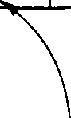
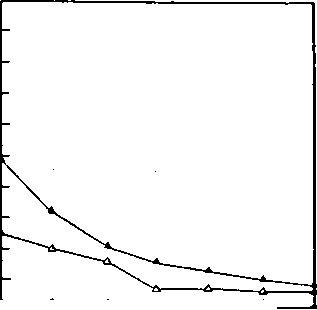
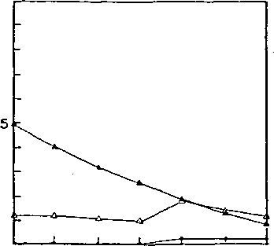
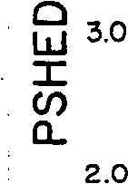

EPA-600/2-84-109a

> Final Draft November 1981
>
> Tenth Printing March 1987
>
> STORM WATER MANAGEMENT MODEL
>
> USER'S MANUAL
>
> Version III
>
> By

Wayne C. Huber, James P. Heaney, Stephan J. Nix, Robert E. Dickinson and Donald J. Polmann

Department of Environmental Engineering Sciences University of Florida

> Gainesville, Florida 32611
>
> Project No. CR-805664
>
> Project Officer  
> Douglas C. Ammon

Storm and Combined Sewer Section  
Systems and Engineering Evaluation Branch  
Wastewater Research Division  
Municipal Environmental Research Laboratory

> Cincinnati, Ohio 45268
>
> MUNICIPAL ENVIRONMENTAL RESEARCH CENTER  
> OFFICE OF RESEARCH AND DEVELOPMENT  
> U.S. ENVIRONMENTAL PROTECTION AGENCY  
> CINCINNATI, OHIO 45268

FOREWARD

The Environmental Protection Agency was created because of increasing public and governmental concern about the dangers of pollution to the health and welfare of the American people. Noxious air, foul water, and spoiled land are tragic testimony to the deterioration of our natural environment. The complexity of that environment and the interplay between its components require a concentrated and integrated attack on the problem.

Research and development is that necessary first step in problem solution and it involves defining the problem, measuring its impact, and searching for solutions. The Municipal Environmental Research Laboratory develops new and improved technology and systems for the prevention, treatment, and management of wastewater and solid and hazardous waste pollutant discharges from municipal and community sources, for the preservation and treatment of public drinking water supplies, and to minimize the adverse economic, social, health, and aesthetic effects of pollution. This publication is one of the products of that research; a most vital communications link between the researcher and the user community.

Mathematical models are an important tool for use in analysis of quantity and quality problems resulting from urban storm water runoff and combined sewer overflows. This report is an updated user's manual and documentation for one of the first of such models, the EPA Storm Water Management Model (SWMM). Detailed instructions on the use of the model are given and its use is illustrated with case studies.

> Francis T. Mayo, Director
>
> Municipal Environmental Research Laboratory

iii

**PREFACE**

**There is seemingly never enough time to write a manual and document a computer program in the manner it deserves. This** SWMM Version **III User's Manual has been under preparation in one form or another for six years, yet it will be found upon examination that some aspects of the model are covered in much more detail than others, and some coverage is downright sparse, notably case studies. The tendency to add "one more thing" to the model has unfortunately proven all too irresistable, to the detriment of as much testing and demonstration as would be desirable. Nonetheless, with a few exceptions most coding is** not radically new; **much deals just with improved input/output. Hence, much reliance has been placed on the continuous testing of the model during its development over the past 12 years.**

**Writing of the various text has also been accomplished in steps. Hence, references on various topics, e.g., snowmelt, storage/treatment, were current at the time of writing which may have been two or three years ago. SWMM quality routines are most continually in a state of** flux due to new developments in the literature. The user should remain **familiar** with **current** information **and** alter his/her modeling practices as necessary.

Some parts of the model are completely new, some are similar if not identical to the first release in 1971. The most significant change since the 1975 Version II release is the inclusion of the Extended Transport Block for quantity routing. This is documented separately by Camp, Dresser and McKee in an addendum to this volume. Other major changes include: continuous simulation, completely revised storage/ treatment routines, snowmelt, surface quality generation, a statistical analysis block, updated graphical and tabular output, and scour-deposition computations in the Transport Block. Parts of the model that remain basically unchanged include the flow routing techniques of the Runoff and Transport Blocks. From a software point of view, the program is no shorter, but nor is it much longer for any particular block.

An attempt has been made to provide adequate information in this manual for most users to conceptualize a stormwater problem and simulate it using SWMM. As a result, some of the text is rather lengthy, approach­ing a hydrology textbook in style in places. Unfortunately, it will still be the user's responsibility to seek out the proper references for additional information on modeling, especially when dealing with water quality.

iv

> The authors hope that the user is not "put *off"* by the length of this volume and the size of the SWMM program. Aside from the fact that it requires a large computer core (about 400 K bytes) the program may often be easily and usefully run with a minimum of input, say a dozen data cards. For small systems in which time step requirements are not severe, the model is very economical as well, and is within the reach of most users. It is by no means the only engineering tool of its kind available, but it has bene­fited greatly from its longevity and feedback from model users. The authors hope such feedback will continue, and earnestly solicit suggestions for improvements. Although no major support for model changes is likely to be forthcoming, the EPA Storm Water and Water Quality Model Users Group (form­erly the SWMM Users Group) remains a convenient forum. Announcements of corrections, changes and new options will be made through that group, man­aged by Mr. Thomas O. Barnwell, EPA, Athens, Georgia 30605.
>
> For the May 1982,Second Printing, minor editorial corrections have been made on the following pages: xxvi, 1-7, 1-1O, 2-4, 2-5, 2-6, 2-7, 2-8, 2­12, 2-13, 4-87, 4-139, 4-154, 7-3, 8-1, 9-2, 9-3, 9-7, 9-11, 9-18, I-6, TV-5, IV-7, IV-1O, IV-13, IV-19.
>
> For the July 1982 Third Printing minor editorial corrections have been made on the following pages: 4-144, 6-50, 7-7, IV-1O, IV-17.

|                                                                          |       |       |       |       |     |
|--------------------------------------------------------------------------|-------|-------|-------|-------|-----|
| For the October 1982 Fourth Printing minor editorial correction have     |       |       |       |       |     |
| been made on the following pages: 1-3, 1-8, 1-9, 1-1O, 1-14, 1-15, 2-17, |       |       |       |       | 2-  |
| 18, 4-28, 4-30, 4-41, 4-134, 4-138, 4-143, 4-154,                        | 6-44, | 6-50, | 6-51, | 6-72, | 7-  |
| 3, 7-4, 10-15, 10-17, IX-1, IX-2.                                        |       |       |       |       |     |

> For the January 1983 Fifth Printing minor editorial correction have been made on the following page: 1-15, 4-157, 7-2, 1II-3.
>
> For the July 1983 Sixth Printing minor editorial corrections have been
>
> made on the following pages: 1-11, 1-12, 1-13, 1-14, 1-15, 4-138, 4-143, 4-
>
> 144, 4-145, 4-146, 6-56, 7-29, 9-9, 9-13, 10-8, 1O-12.
>
> For the October 1983 Seventh Printing minor editorial corrections have been made on the following pages: ii, 3-4, 10-3, 1O-9.
>
> For the May 1984 Eighth Printing minor editorial corrections have been made on the following page: 6-58.
>
> For the September 1984 Ninth Printing minor editorial corrections have been made on the following pages: 2-13, 4-19, 7-22.
>
> For the March 1987 Tenth Printing minor editorial corrections have been made on the following pages: 4-131, 4-147, 6-21, 9-5, 10-3, 10-6, 10-8, 1O-1O, 1O-11, 10-16.

V

ABSTRACT

The EPA Storm Water Management Model (SWMM) is a comprehensive mathematical model for simulation of urban runoff quantity and quality in storm and combined sewer systems. All aspects of the urban hydrologic and quality cycles are simulated, including surface runoff, transport through the drainage network, storage and treatment, and receiving water effects. (The latter component is currently under revision by the EPA.) This volume applies to Version III of SWMM and is an update of two earlier User's Manuals issued in 1971 and 1975. It should be coupled with Addendum I in order to run the Extran Block (detailed hydraulic flow routing) developed by Camp, Dresser and McKee.

Detailed descriptions are provided herein for all blocks (except the Receiving Water Block): Runoff, Transport, Storage/Treatment, Combine, Statistics and Graph (part of the Executive Block). The latter three blocks are "service" blocks while the first three are the principal computational blocks. In addition, extensive documentation of new procedures is provided in the text and in several appendices.

This report was submitted in partial fulfillment of cooperative agreement CR-805664 by the University of Florida under the sponsorship of the U.S. Environmental Protection Agency. Work was completed as of November 1981.

vi

CONTENTS

<table>
<colgroup>
<col style="width: 94%" />
<col style="width: 5%" />
</colgroup>
<tbody>
<tr class="odd">
<td>
Foreward

Preface

Abstract

Figures

Tables

Acknowledgments
</td>
<td></td>
</tr>
</tbody>
</table>

<u>Sections</u>

1 Introduction 1-1

> Urban Runoff Analysis 1-1
>
> Urban Runoff Models 1-1
>
> Objectives 1-1
>
> Screening Models 1-1
>
> Planning Models 1-2
>
> Design Models 1-2
>
> Operational Models 1-3
>
> Other Models 1-3
>
> Development of the Storm Water Management Model 1-3
>
> Overall SWMM Description 1-4
>
> Overview 1-4
>
> Service Blocks 1-7
>
> Executive Block 1-7
>
> Combine Block 1-7
>
> Statistics Block 1-7
>
> Total Simulation 1-7
>
> Detailed SWMM Summary 1-8
>
> User Requirements 1-8
>
> Computer Facilities 1-8
>
> Data Requirements 1-8
>
> Verification and Calibration 1-9
>
> Metrification 1-9
>
> When Should SWMM Be Used?. . . 1-9

2 Executive Block, Graph Routines and System Requirements 2-1

> Block Description 2-1
>
> Functions 2-1
>
> Program Operation 2-1
>
> Interfacing Between Computational Blocks 2-3
>
> vii

<table>
<colgroup>
<col style="width: 89%" />
<col style="width: 10%" />
</colgroup>
<tbody>
<tr class="odd">
<td><blockquote>

CONTENTS (continued)

Initial Job Set-Up

Computer System Requirements

</blockquote></td>
<td>
2-7

2-7
</td>
</tr>
<tr class="even">
<td><blockquote>

Program Compilation, Execution Time and Cost

</blockquote></td>
<td>2-7</td>
</tr>
<tr class="odd">
<td><blockquote>

Fortran

</blockquote></td>
<td>2-9</td>
</tr>
<tr class="even">
<td><blockquote>

Logical Units

</blockquote></td>
<td>2-9</td>
</tr>
<tr class="odd">
<td><blockquote>

Sample Job Control Language (JCL)

</blockquote></td>
<td>2-11</td>
</tr>
<tr class="even">
<td><blockquote>

Overlay Procedures

</blockquote></td>
<td>2-14</td>
</tr>
<tr class="odd">
<td><blockquote>

Dummy Subroutines

</blockquote></td>
<td>2-14</td>
</tr>
<tr class="even">
<td><blockquote>

Scratch Data Sets

</blockquote></td>
<td>2-15</td>
</tr>
<tr class="odd">
<td><blockquote>

Instructions For Data Preparation

</blockquote></td>
<td>2-18</td>
</tr>
<tr class="even">
<td><blockquote>

Block Selection

</blockquote></td>
<td>2-18</td>
</tr>
<tr class="odd">
<td><blockquote>

Graph Routine

</blockquote></td>
<td>2-13</td>
</tr>
<tr class="even">
<td><blockquote>

Capabilities

</blockquote></td>
<td>2-18</td>
</tr>
<tr class="odd">
<td><blockquote>

Input Parameters and Options

</blockquote></td>
<td>2-21</td>
</tr>
<tr class="even">
<td><blockquote>

Examples

</blockquote></td>
<td>2-22</td>
</tr>
</tbody>
</table>

<table>
<colgroup>
<col style="width: 90%" />
<col style="width: 9%" />
</colgroup>
<tbody>
<tr class="odd">
<td>
3 Combine Block

<blockquote>

Block Description

Instructions for Data Preparation

Collate

Combine

Quality Options

Timing

</blockquote>

4 Runoff Block
</td>
<td><blockquote>

3-1 
3-1 
3-1 
3-1 
3-4 
3-4

</blockquote>

3-4

4-1
</td>
</tr>
<tr class="even">
<td><blockquote>

Block Description

</blockquote></td>
<td>4-1</td>
</tr>
<tr class="odd">
<td><blockquote>

Introduction

</blockquote></td>
<td>4-1</td>
</tr>
<tr class="even">
<td><blockquote>

Program Operation

</blockquote></td>
<td>4-2</td>
</tr>
<tr class="odd">
<td><blockquote>

Interfacing and the Use of Off-line Computer Storage.

</blockquote></td>
<td>4-2</td>
</tr>
<tr class="even">
<td><blockquote>

Instructions For Data Preparation

</blockquote></td>
<td>4-5</td>
</tr>
<tr class="odd">
<td><blockquote>

Introduction

</blockquote></td>
<td>4-5</td>
</tr>
<tr class="even">
<td><blockquote>

Basic Runoff Data Sources

</blockquote></td>
<td>4-5</td>
</tr>
<tr class="odd">
<td><blockquote>

Importance of Runoff Block Data

</blockquote></td>
<td>4-5</td>
</tr>
<tr class="even">
<td><blockquote>

Meteorological Data

</blockquote></td>
<td>4-5</td>
</tr>
<tr class="odd">
<td><blockquote>

Surface Quantity Data

</blockquote></td>
<td>4-5</td>
</tr>
<tr class="even">
<td><blockquote>

Surface Quality Data

</blockquote></td>
<td>4-6</td>
</tr>
<tr class="odd">
<td><blockquote>

Default Parameters

</blockquote></td>
<td>4-6</td>
</tr>
<tr class="even">
<td><blockquote>

General Input and Control Data (Card Groups Al-B2)

</blockquote></td>
<td>4-6</td>
</tr>
<tr class="odd">
<td><blockquote>

Meteorological Data Processing (Card Groups Cl-F1)

</blockquote></td>
<td>4-7</td>
</tr>
<tr class="even">
<td><blockquote>

Snowmelt Data

</blockquote></td>
<td>4-7</td>
</tr>
<tr class="odd">
<td><blockquote>

Air Temperatures

</blockquote></td>
<td>4-14</td>
</tr>
<tr class="even">
<td><blockquote>

Precipitation Data

</blockquote></td>
<td>4-15</td>
</tr>
<tr class="odd">
<td><blockquote>

Evaporation Data (Card Fl)

</blockquote></td>
<td>4-21</td>
</tr>
</tbody>
</table>

viii

CONTENTS (continued)

> Surface Quantity Input Data (Card Groups G1-I3) 4-22
>
> Runoff Flow Routing Procedures and Options 4-22
>
> Input Data Preparation 4-22
>
> Discretization of the Catchment 4-23
>
> Gutter/Pipe Parameters (Card Groups G1 and G2) 4-29
>
> Subcatchment Parameters (Card Groups H1 and H2) 4-30
>
> Subcatchment Aggregation and Lumping 4-56
>
> Snowmelt Parameters (Card Groups 11-I3) 4-59
>
> Surface Quality Input Data (Card Groups J1-L1) 4-69
>
> Overview of Quality Procedures 4-69
>
> Quality Simulation Credibility 4-70
>
> Quality Constituents 4-71
>
> Land *Use* Data (Card Group J2) 4-73
>
> Buildup 4-73
>
> Washoff 4-88
>
> Related Buildup-Washoff Studies 4-103
>
> Rating Curve 4-104
>
> Street Cleaning 4-105
>
> Catchbasins 4-108
>
> Constituent Fractions 4-114
>
> Precipitation Contributions 4-116
>
> Urban Erosion 4-120
>
> Subcatchment Quality Data (Card Group L1) 4-125
>
> Overall Sensitivity to Quality Parameters 4-129
>
> Print Control (Card Groups M1 and M2) 4-133

5 Extended Transport Block 5-1

6 Transport Block 6-1

> Block Description 6-1
>
> Introduction 6-1
>
> Broad Description of Flow Routing 6-1
>
> Broad Description of Quality Routing 6-3
>
> Program Operation 6-4
>
> Off-Line Files 6-5
>
> Instructions For Data Preparation 6-5
>
> Introduction 6-5
>
> Transport 6-7
>
> Categories of Data 6-7
>
> Step 1. Theoretical Data 6-7
>
> Step 2. The Physical Representation of the Sewer System 6-9
>
> Step 3. Input Data and Computational Controls 6-21
>
> Quality 6-22
>
> Constituents 6-22
>
> Decay 6-22
>
> Routing 6-23
>
> Scour and Deposition 6-23
>
> ix
>
> CONTENTS (continued)
>
> Internal Storage Model 6-25
>
> Step 1. Call 6-25
>
> Step 2. Storage Description: Part 1 6-25
>
> Step 3. Storage Description: Part 2 6-25
>
> Step 4. Initial Conditions 6-25
>
> Infiltration Model 6-26
>
> Description 6-26
>
> Dry Weather Infiltration (DINFIL) 6-29
>
> Residual Melting Ice and Frost Infiltration (SINFIL). . 6-29
>
> Antecedent Precipitation (RINFIL) 6-31
>
> High Groundwater Table (GINFIL) 6-31
>
> Apportionment of Infiltration 6-32
>
> Quality of Infiltration 6-33
>
> Data Needs 6-33
>
> Summary of Infiltration Procedures 6-33
>
> Dry Weather Flow Model 6-34
>
> Methodology 6-34
>
> Quantity Estimates 6-36
>
> Quality Estimates 6-38
>
> Summary of Dry Weather Flow Requirements 6-42
>
> Initialization 6-44
>
> 7 Storage/Treatment Block 7-1
>
> Block Description 7-1
>
> Introduction 7-1
>
> Program Operation 7-1
>
> Use of Off-line Computer Storage 7-3
>
> Instructions For Data Preparation 7-4
>
> Preliminary Information 7-4
>
> Title 7-4
>
> General Information 7-4
>
> Starting Time and Print Instructions 7-6
>
> Evaporation Data 7-6
>
> Pollutant Characterizations 7-6
>
> Storage/Treatment Unit Information 7-8
>
> General Unit Information 7-10
>
> Pollutant Removal 7-10
>
> Detention Unit Data 7-15
>
> Cost Data 7-18
>
> Input Waste Stream 7-20
>
> Flow and Pollutant Data 7-20
>
> Altering The Program Size 7-20
>
> 8 Receiving Water Block 8-1

CONTENTS (continued)

9 Statistics Block 9-1

> Block Description 9-1
>
> Introduction 9-1
>
> Program Operation 9-1
>
> Output Options 9-3
>
> Potential for Output 9-3
>
> Sequential Series of Events 9-3
>
> Table of Magnitude, Return Period and Frequency 9-4 Graph of Magnitude vs. Return Period or Graph of
>
> Magnitude vs. Frequency 9-4
>
> Moments 9-4
>
> Preparation of Input Data 9-4
>
> Extent of Data 9-4
>
> Card Group Al 9-5
>
> Card Group Bl 9-5
>
> Card Group B2 9-5
>
> Card Groups Cl-C4 9-7
>
> Card Groups Dl-D4 9-7
>
> Card Group El 9-7
>
> Card Group Fl 9-7
>
> Card Groups G1 and G2 9-8
>
> Computations 9-8
>
> Return Period and Frequency 9-8
>
> Moments 9-8
>
> Messages/Labels 9-10
>
> Analysis of Rainfall Data 9-12

10 References 10-1

<u>Appendices</u>

> Continuous Simulation I-1
>
> Continuous and Single Event Simulation I-1
>
> Continuous SWMM Overview I-2
>
> Snowmelt I-2
>
> Input Data I-3
>
> Catchment Schematization I-3
>
> Output 1-3
>
> Runoff Block I-3
>
> Storage/Treatment Block 1-4
>
> Dry-Period Regeneration I-4
>
> Quantity 1-4
>
> Quality I-4
>
> Continuous SWMM Compared to STORM 1-6

xi

CONTENTS (continued)

**II SWMM Snowmelt Routines II-1**

> **Introduction II-1**
>
> Overview 11-2
>
> Snow Depths I1-2
>
> Single Event Simulation I1-2
>
> Continuous Simulation 11-2
>
> Pollutant Simulation 11-3
>
> Snow and Temperature Generation From NWS Tapes 1I-3
>
> National Weather Service (NWS) Data I1-3
>
> Creation of Hourly Temperatures I1-5
>
> Generation of Snowfall Intensities I1-9
>
> Gage Catch Deficiency Correction 1I-9
>
> Structure of Precipitation-Temperature Data Set I1-9
>
> Output Options 11-12
>
> Single Event SWMM I1-12
>
> Subcatchment Schematization 11-12
>
> Land Surface - Snow Cover Combinations I1-12
>
> Redistribution and Simulation of Snow Removal 11-13
>
> Array Restrictions 11-15
>
> Melt Calculations 11-15
>
> Theory of Snowmelt I1-15
>
> Introduction I1-15
>
> Snowpack Heat Budget 1I-18
>
> Melt Prediction Techniques 1I-18
>
> Choice of Predictive Method 1I-19
>
> SWMM Melt Equations I1-20
>
> Heat Exchange During Non-Melt Periods 11-22
>
> Areal Extent of Snow Cover I1-24
>
> Introduction I1-24
>
> Areal Depletion Curves I1-25
>
> Use of Value of ASC 1I-29
>
> Liquid Water Routing in Snow Pack 11-29
>
> Net Runoff 11-29
>
> Effect of Snow on Infiltration and Surface Parameters . 1I-31
>
> Quality Interactions 11-31
>
> Pollutant Accumulation I1-31
>
> Snowmelt Quality I1-31
>
> **Pollutant Loadings** 11-33
>
> Adjustments for Presence of Snow I1-33
>
> Possible Loading Rates 11-33
>
> Street Sweeping 11-33
>
> Other Considerations I1-34
>
> Data Requirements II-34
>
> New Parameters II-34
>
> Sensitivity 11-34
>
> xii

CONTENTS (continued)

> Output 11-35
>
> Temperature and Snowfall Generation II-35
>
> Runoff Simulation Output 1I-35
>
> Programming Notes I1-35
>
> Subroutines 11-35
>
> Variable Names 11-35
>
> Computer Time I1-35
>
> Computer Size Requirements I1-37

III Reduction Of Energy Balance Equation To Degree-Day Equation. . .II1-1

> Purpose III-1
>
> Energy Budget III-1
>
> Short Wave Radiation, H 11I-2
>
> Heat Conduction Throughr around, H II1-2
>
> Net Long Wave Radiation, H 1 g11I-2
>
> Convective Heat Transfer, fic 111-3
>
> Condensation Heat Transfer, H I11-4
>
> <u>e</u> Heat Advection By Rain, H 111-4
>
> Combined Equations p 111-5
>
> Numerical Example 1II-6

IV Storage/Treatment Simulation IV-1

> Objectives IV-1
>
> Program Developement And Overview IV-1
>
> Development IV-1
>
> Overview IV-2
>
> Simulation Techniques IV-2
>
> Introduction IV-2
>
> Flow Routing 1V-4
>
> Detention vs. Instantaneous Throughflow IV-4
>
> Detention Units IV-4
>
> Residual Flow IV-3
>
> Evaporation IV-8
>
> Instantaneous Throughflow IV-8
>
> Pollutant Routing IV-9
>
> Complete Mixing 1V-9
>
> Plug Flow IV-11
>
> Instantaneous Throughflow IV-11
>
> Pollutant Characterization 1V-12
>
> Pollutant Removal 1V-12
>
> Characterized By Magnitude IV-12

Characterized by Particle Size-Specific Gravity or

> Settling Velocity Distribution IV-15
>
> Cost Calculations 1V-22

IV-23

> Summary

**CONTENTS (concluded)**

> **V Other Runoff Block Revisions V-i**
>
> **Infiltration V-1**
>
> **Introduction V-1**
>
> **Evaporation V-1**
>
> **Integrated Horton's Equation V-1**
>
> **Cumulative Infiltration V-1**
>
> **Summary of Procedure V-5**
>
> **Regeneration of Infiltration Capacity V-6**
>
> **Program Variables V-9**
>
> **Green-Ampt Equation V-9**
>
> **Infiltration During Rainfall Events V-9**
>
> **Recovery of Infiltration Capacity (Redistribution). V-11**
>
> **Program Variables V-13**
>
> **Subcatchment Runoff Calculations V-13**
>
> **Overland Flow V-13**
>
> **Gutter/Pipes V-18**
>
> **VI Transport Block Scour And Deposition VI-1**
>
> **Introduction VI-1**
>
> **Methodology and Assumptions VI-2**
>
> **Overview VI-2**
>
> **Assumptions VI-2**
>
> **Shields' Criterion VI-3**
>
> **Particle Size Distribution VI-8**
>
> **Inflows and Junctions VI-12**
>
> **VII Example Analysis Of Urban Runoff Quality Data For Modeling**
>
> **Applications VII-1**
>
> **VIII Miscellaneous Transport Block Tables VIII-1**
>
> **IX Integrated Form Of Complete Mixing Quality Routing IX-1**

xiv

FIGURES

<table>
<colgroup>
<col style="width: 8%" />
<col style="width: 82%" />
<col style="width: 8%" />
</colgroup>
<tbody>
<tr class="odd">
<td>Number</td>
<td rowspan="2">Overview of SWMM Model Structure, Indicating Linkages</td>
<td><blockquote>

Page

</blockquote></td>
</tr>
<tr class="even">
<td><blockquote>

1-1

</blockquote></td>
<td></td>
</tr>
<tr class="odd">
<td></td>
<td><blockquote>

Among the Five Computational Blocks

</blockquote></td>
<td><blockquote>

1-6

</blockquote></td>
</tr>
<tr class="even">
<td>2-1</td>
<td><blockquote>

Relationship of Executive Block to Other Blocks

</blockquote></td>
<td><blockquote>

2-2

</blockquote></td>
</tr>
<tr class="odd">
<td>2-2</td>
<td><blockquote>

Detailed Organization of SWMM Interfacing File

</blockquote></td>
<td><blockquote>

2-5

</blockquote></td>
</tr>
<tr class="even">
<td>2-3</td>
<td><blockquote>

Fortran Statements Required to Generate an Interface

</blockquote></td>
<td></td>
</tr>
<tr class="odd">
<td></td>
<td><blockquote>

File

</blockquote></td>
<td><blockquote>

2-6

</blockquote></td>
</tr>
<tr class="even">
<td>2-4</td>
<td><blockquote>

Hypothetical Card Arrangement for a Comprehensive SWMM

</blockquote></td>
<td></td>
</tr>
<tr class="odd">
<td></td>
<td><blockquote>

Run

</blockquote></td>
<td><blockquote>

2-19

</blockquote></td>
</tr>
<tr class="even">
<td>3-1</td>
<td><blockquote>

Combination of SWMM Runs for Overall Lancaster Simulation .

</blockquote></td>
<td><blockquote>

3-2

</blockquote></td>
</tr>
<tr class="odd">
<td>3-2</td>
<td><blockquote>

Hypothetical Drainage Network to be Collated

</blockquote></td>
<td><blockquote>

3-3

</blockquote></td>
</tr>
<tr class="even">
<td>3-3</td>
<td><blockquote>

Hypothetical Drainage Network to be Combined

</blockquote></td>
<td><blockquote>

3-3

</blockquote></td>
</tr>
<tr class="odd">
<td>4-1</td>
<td><blockquote>

Structure of Runoff Block Subroutines

</blockquote></td>
<td><blockquote>

4-4

</blockquote></td>
</tr>
<tr class="even">
<td>4-2</td>
<td><blockquote>

Gage Catch Deficiency Factor (SCF) Versus Wind Speed. . .

</blockquote></td>
<td><blockquote>

4-8

</blockquote></td>
</tr>
<tr class="odd">
<td>4-3</td>
<td><blockquote>

Card Image of National Weather Service Card Deck 345,

</blockquote></td>
<td></td>
</tr>
<tr class="even">
<td></td>
<td><blockquote>

"Summary of Day"

</blockquote></td>
<td><blockquote>

4-10

</blockquote></td>
</tr>
<tr class="odd">
<td>4-4</td>
<td><blockquote>

Actual Areal Depletion Curve for Natural Area

</blockquote></td>
<td><blockquote>

4-12

</blockquote></td>
</tr>
<tr class="even">
<td>4-5</td>
<td><blockquote>

Effect on Snow Cover of Areal Depletion Curves

</blockquote></td>
<td><blockquote>

4-13

</blockquote></td>
</tr>
<tr class="odd">
<td>4-6</td>
<td><blockquote>

Comparison of Synthetic Versus Actual Storm Patterns,

</blockquote></td>
<td></td>
</tr>
<tr class="even">
<td></td>
<td><blockquote>

Chicago

</blockquote></td>
<td><blockquote>

4-17

</blockquote></td>
</tr>
<tr class="odd">
<td>4-7</td>
<td><blockquote>

Card Image of National Weather Service Card Deck 488,

</blockquote></td>
<td></td>
</tr>
<tr class="even">
<td></td>
<td><blockquote>

"Hourly Precipitation"

</blockquote></td>
<td><blockquote>

4-20

</blockquote></td>
</tr>
<tr class="odd">
<td>4-8</td>
<td><blockquote>

Northwood (Baltimore) Drainage Basin "Fine" Plan

</blockquote></td>
<td><blockquote>

4-24

</blockquote></td>
</tr>
<tr class="even">
<td>4-9</td>
<td><blockquote>

Northwood (Baltimore) Drainage Basin "Coarse" Plan

</blockquote></td>
<td><blockquote>

4-25

</blockquote></td>
</tr>
<tr class="odd">
<td>4-10</td>
<td><blockquote>

Effect of Coarsening Subcatchment System, Northwood

</blockquote></td>
<td></td>
</tr>
<tr class="even">
<td></td>
<td><blockquote>

(Baltimore)

</blockquote></td>
<td><blockquote>

4-26

</blockquote></td>
</tr>
</tbody>
</table>

<table style="width:100%;">
<colgroup>
<col style="width: 8%" />
<col style="width: 82%" />
<col style="width: 8%" />
</colgroup>
<tbody>
<tr class="odd">
<td><blockquote>

Number

</blockquote></td>
<td>FIGURES (continued)</td>
<td>Page</td>
</tr>
<tr class="even">
<td><blockquote>

4-11

</blockquote></td>
<td><blockquote>

Subcatchment Schematization

</blockquote></td>
<td>4-32</td>
</tr>
<tr class="odd">
<td><blockquote>

4-12

</blockquote></td>
<td><blockquote>

Non-linear Reservoir Representation of Subcatchment . . . .

</blockquote></td>
<td>4-34</td>
</tr>
<tr class="even">
<td><blockquote>

4-13

</blockquote></td>
<td><blockquote>

Idealized Subcatchment - Gutter Arrangement Illustrating

the Subcatchment Width

</blockquote></td>
<td>4-35</td>
</tr>
<tr class="odd">
<td><blockquote>

4-14

</blockquote></td>
<td><blockquote>

Different Subcatchment Shapes to Illustrate Effect of

Subcatchment Width

</blockquote></td>
<td>4-37</td>
</tr>
<tr class="even">
<td><blockquote>

4-15

</blockquote></td>
<td><blockquote>

Subcatchment Hydrographs for Different Shapes of Figure

4-14

</blockquote></td>
<td>4-38</td>
</tr>
<tr class="odd">
<td><blockquote>

4-16

</blockquote></td>
<td><blockquote>

Irregular Subcatchment Shape for Width Calculation

</blockquote></td>
<td>4-40</td>
</tr>
<tr class="even">
<td><blockquote>

4-17

</blockquote></td>
<td><blockquote>

Percent Imperviousness Versus Developed Population

Density for Large Urban Areas

</blockquote></td>
<td>4-43</td>
</tr>
<tr class="odd">
<td><blockquote>

4-18

</blockquote></td>
<td><blockquote>

Depression Storage vs. Catchment Slope

</blockquote></td>
<td>4-47</td>
</tr>
<tr class="even">
<td><blockquote>

4-19

</blockquote></td>
<td><blockquote>

Soil Conservation Service Soil Survey Interpretation

for Conestoga Silt Loam (found near Lancaster, PA). . . .

</blockquote></td>
<td>4-50</td>
</tr>
<tr class="odd">
<td><blockquote>

4-20

</blockquote></td>
<td><blockquote>

Effect of Changing the Level of Discretization on the

Width of Overland Flow

</blockquote></td>
<td>4-58</td>
</tr>
<tr class="even">
<td><blockquote>

4-21

</blockquote></td>
<td><blockquote>

Effect on Hydrographs of Changing Subcatchment Width for

West Toronto Area

</blockquote></td>
<td>4-60</td>
</tr>
<tr class="odd">
<td><blockquote>

4-22

</blockquote></td>
<td><blockquote>

Seasonal Variation of Melt Coeffecients for Continuous

Simulation

</blockquote></td>
<td>4-62</td>
</tr>
<tr class="even">
<td><blockquote>

4-23

</blockquote></td>
<td><blockquote>

Degree-Day Equations for Snow Melt

</blockquote></td>
<td>4-64</td>
</tr>
<tr class="odd">
<td><blockquote>

4-24

</blockquote></td>
<td><blockquote>

Freezing Point Depression Versus Roadway Salting Chemical

Concentration

</blockquote></td>
<td>4-66</td>
</tr>
<tr class="even">
<td><blockquote>

4-25

</blockquote></td>
<td><blockquote>

Illustration of Snow Redistribution Fractions

</blockquote></td>
<td>4-67</td>
</tr>
<tr class="odd">
<td><blockquote>

4-26

</blockquote></td>
<td><blockquote>

Layout of Quality Constitutent Headings

</blockquote></td>
<td>4-72</td>
</tr>
<tr class="even">
<td><blockquote>

4-27

</blockquote></td>
<td><blockquote>

Non-linear Buildup of Street Solids

</blockquote></td>
<td>4-76</td>
</tr>
<tr class="odd">
<td><blockquote>

4-28

</blockquote></td>
<td><blockquote>

Buildup of Street Solids in San Jose

</blockquote></td>
<td>4-77</td>
</tr>
<tr class="even">
<td><blockquote>

4-29

</blockquote></td>
<td><blockquote>

Comparison of Linear and Three Non-linear Buildup

Equations

</blockquote></td>
<td>4-82</td>
</tr>
</tbody>
</table>

xvi

FIGURES (continued)

<u>Number Page</u>

4-30 Washoff of Street Solids by Flushing with a Sprinkler

> System 4-90

4-31 Time Variation of Runoff Rate Used in Example of Table

> 4-20 and Figures 4-32 to 4-35 4-93

4-32 Time History of Concentration and Subcatchment Load

> (PSHED) for Case 1 Runoff (Figure 4-31) 4-94

4-33 Time History of Concentration and Subcatchment Load

> (PSHED) for Case 2 Runoff (Figure 4-31) 4-95

4-34 Time History of Concentration and Subcatchment Load

> (PSHED) for Case 3 Runoff (Figure 4-31) 4-96

4-35 Time History of Concentration and Subcatchment Load

> (PSHED) for Case 4 Runoff (Figure 4-31) 4-97

4-36 Simulated Load Variations within a Storm as a Function

> of Runoff Rate 4-100

4-37 Variation of BODc, TSS and NO,+NO1-N Load and

> Concentration ₹or Storm of 11/17/74 for View Ridge 1
>
> Catchment, Seattle 4-101

4-38 Hypothetical Time Sequence of Linear Buildup and Street

> Sweeping 4-109

4-39 Representative Catchbasin Designs 4-110

4-40 Catchbasin Flushing Characteristics 4-113

4-41 Nationwide Annual Loadings of NH4+N + NO3-N in

> Precipitation 4-119

4-42 Nomograph for Calculation of Soil Erodability Factor, K 4-123

4-43 Interaction of Buildup Parameters and Storm Interevent

> Time 4-130

4-44 Relationship Between RCOEF and WASHPO for 90 Percent

> Washoff During a Storm Event of Runoff Depth d 4-132

4-45 Data Deck for the Runoff Block 4-135

6-1 Structure of Transport Block Subroutines 6-2

6-2 Data Deck for the Transport Block 6-6

xvii

<table>
<colgroup>
<col style="width: 8%" />
<col style="width: 84%" />
<col style="width: 7%" />
</colgroup>
<tbody>
<tr class="odd">
<td>Number</td>
<td rowspan="2">
FIGURES (continued)

The Intersection of the Straight Line and the Normalized
</td>
<td><blockquote>

Page

</blockquote></td>
</tr>
<tr class="even">
<td><blockquote>

6-3

</blockquote></td>
<td></td>
</tr>
<tr class="odd">
<td></td>
<td><blockquote>

Flow-Area Curve as Determined in Route

</blockquote></td>
<td>6-8</td>
</tr>
<tr class="even">
<td>6-4</td>
<td><blockquote>

Sewer Cross Sections

</blockquote></td>
<td>6-12</td>
</tr>
<tr class="odd">
<td>6-5</td>
<td><blockquote>

Cunnette Section

</blockquote></td>
<td>6-18</td>
</tr>
<tr class="even">
<td>6-6</td>
<td><blockquote>

Example Particle Size Distributions for Pollutants found

</blockquote></td>
<td></td>
</tr>
<tr class="odd">
<td></td>
<td><blockquote>

on Street Surfaces

</blockquote></td>
<td>6-24</td>
</tr>
<tr class="even">
<td>6-7</td>
<td><blockquote>

Typical Drainage Basin in which Infiltration is to be

</blockquote></td>
<td></td>
</tr>
<tr class="odd">
<td></td>
<td><blockquote>

Estimated

</blockquote></td>
<td>6-27</td>
</tr>
<tr class="even">
<td>6-8</td>
<td><blockquote>

Components of Infiltration

</blockquote></td>
<td>6-28</td>
</tr>
<tr class="odd">
<td>6-9</td>
<td><blockquote>

Prescribed Melting Period

</blockquote></td>
<td>6-30</td>
</tr>
<tr class="even">
<td>6-10</td>
<td><blockquote>

Determination of Subcatchment and Identification to

</blockquote></td>
<td></td>
</tr>
<tr class="odd">
<td></td>
<td><blockquote>

Estimate Sewage at 8 Points

</blockquote></td>
<td>6-35</td>
</tr>
<tr class="even">
<td>6-11</td>
<td><blockquote>

Representative Daily Flow Variation

</blockquote></td>
<td>6-39</td>
</tr>
<tr class="odd">
<td>6-12</td>
<td><blockquote>

Representative Hourly Flow Variation

</blockquote></td>
<td>6-39</td>
</tr>
<tr class="even">
<td>7-1</td>
<td><blockquote>

Storage/Treatment Block

</blockquote></td>
<td>7-2</td>
</tr>
<tr class="odd">
<td>7-2</td>
<td><blockquote>

Data Deck for the Storage/Treatment Block

</blockquote></td>
<td>7-5</td>
</tr>
<tr class="even">
<td>7-3</td>
<td><blockquote>

Flows Into, Through, and Out of a Storage/Treatment Unit.

</blockquote></td>
<td>7-11</td>
</tr>
<tr class="odd">
<td>7-4</td>
<td><blockquote>

Storage/Treatment Plant Configurations

</blockquote></td>
<td>7-12</td>
</tr>
<tr class="even">
<td>9-1</td>
<td><blockquote>

Structure of Statistics Block Subroutines

</blockquote></td>
<td>9-2</td>
</tr>
<tr class="odd">
<td>9-2</td>
<td><blockquote>

Structure of the Data Deck

</blockquote></td>
<td>9-6</td>
</tr>
<tr class="even">
<td>II-1</td>
<td><blockquote>

Card Image of NWS Card Deck 345, "WBAN Summary of Day". .

</blockquote></td>
<td>II-4</td>
</tr>
</tbody>
</table>

<table>
<colgroup>
<col style="width: 10%" />
<col style="width: 78%" />
<col style="width: 10%" />
</colgroup>
<tbody>
<tr class="odd">
<td>11-2</td>
<td><blockquote>

Sinusoidal Interpolation of Hourly Temperatures

</blockquote></td>
<td><blockquote>

11-6

</blockquote></td>
</tr>
<tr class="even">
<td>11-3</td>
<td><blockquote>

Typical Gage Catch Deficiency Correction

</blockquote></td>
<td><blockquote>

II-10

</blockquote></td>
</tr>
<tr class="odd">
<td>11-4</td>
<td><blockquote>

Structure of Precipitation-Temperature Data Set Used

</blockquote></td>
<td></td>
</tr>
<tr class="even">
<td>11-5</td>
<td><blockquote>

Internally in Runoff for Continuous Simulation

Subcatchment Schematization With and Without Snowmelt

</blockquote></td>
<td><blockquote>

II-11

</blockquote></td>
</tr>
<tr class="odd">
<td></td>
<td><blockquote>

Simulation

</blockquote></td>
<td><blockquote>

II-14

</blockquote></td>
</tr>
</tbody>
</table>

xviii

> FIGURES (continued)
>
> <u>Numbers</u>
>
> 1I-6 Redistribution of Snow During Continuous Simulation .
>
> 11-7 Seasonal Variation of Melt Coefficients
>
> 1I-8 Typical Areal Depletion Curve for Natural Area and
>
> Temporary Curve for New Snow I1-26
>
> 1I-9 Effect on Snow Cover of Areal Depletion Curves II-27
>
> II-10 Schematic of Liquid Water Routing Through Snow Pack . . . 11-30
>
> IV-1 Flows Into, Through and Out of a Storage/Treatment Unit . • IV-3
>
> IV-2 Time-Varying Inflow and Outflow Rates for a Reservoir • IV-4
>
> IV-3 Well-Mixed, Variable Volume Reservoir IV-10
>
> IV-4 Reduction in Volatile Solids in Raw Sludge IV-14
>
> IV-5 Camp's Sediment Trap Efficiency Curves IV-19
>
> IV-6 Limiting Cases in Sediment Trap Efficiency IV-19
>
> V-1 Horton Infiltration Curve and Typical Hyetograph V-3
>
> V-2 Cumulative Infiltration, F, is the Integral of f, i.e.,
>
> the Area Under the Curve V-4
>
> V-3 Regeneration (Recovery) of Infiltration Capacity During
>
> Dry Time Steps V-7
>
> V-4 Subcatchment Schematization for Overland Flow Calculations. V-14
>
> V-5 Non-linear Reservoir Model of Subcatchment V-15
>
> V-6 Depth Parameters for Trapezoidal Gutter and Circular Pipe V-19
>
> VI-1 Shields' Diagram for Definition of Incipient Motion . . . . VI-4
>
> VI-2 Linear and Parabolic Approximation of Shields' Diagram. . . VI-6
>
> VI-3 Particle Size Distribution for a Pollutant VI-9
>
> VI-4 Truncation of Particle Size Distribution During Scour and
>
> Deposition VI-10
>
> xix

FIGURES (continued)

<u>Numbers Page</u>

VII-1 Flow and Quality Data for Seattle, Washington View Ridge

> I Catchment (Single Family Residential, Separate Sewers),
>
> Event 1, Event 6, Event 7 VII-2

VII-2 Flow and Quality Data for Seattle, Washington South Seattle Catchment (Industrial, Separate Sewers), Event 3, Event

> 4, Event 5 VII -3

VII-3 Flow and Quality Data for Seattle, Washington Southcenter Catchment (Shopping Center, Separate Sewers), Event 2,

> Event 3, Event 7 VII-4

VII-4 BOD Load Vs. Flow VII-5

VII-5 TSS Load Vs. Flow VII-6

VII-6 NO2-N + NO3-N Load Vs. Flow VII-7

VII-7 Log10 BOD Load Vs. Log10 Flow VII-8

VII-8 Log10 TSS Load Vs. Log10 Flow VII-9

VII-9 Log10 NO2-N + NO3-N Load Vs. Log10 Flow VII-10

VII-10 Log10 Load Vs. Log10 Flow for All Events VII-11

VII-11 Logi Load Vs. Log io Runoff for All Events BOD, TSS and

> NO2() -N + NO3-N VII-12

VII-12 Login Load/Area Vs. Log10 Runoff for All Events BOD, TSS,

> & NO2-N + NO3-N VII-13

VII-13 Flow and Quality Data for Stevens Avenue Catchment (Single and Multi-Family Residential, Combined Sewers),

> Lancaster, Pennsylvannia VII-14

VII-14 BOD Concentration Vs. Flow, Event 1, Event 2, Event 6 . . . VII-15

VII-15 TSS Concentration Vs. Flow, Event 1, Event 2, Event 6 . . . VII-16

VII-16 NO3-N Concentration Vs. Flow, Event 1, Event 2, Event 6 . . VII-17

VII-17 BOD Load Vs. Flow, Event 1, Event 2, Event 6 VII-18

VII-18 TSS Load Vs. Flow, Event 1, Event 2, Event 6 VII-19

VII-19 NO3-N Load Vs. Flow, Event 1, Event 2, Event 6 VII-20

xx

TABLES

<table>
<colgroup>
<col style="width: 8%" />
<col style="width: 84%" />
<col style="width: 7%" />
</colgroup>
<tbody>
<tr class="odd">
<td>Number</td>
<td rowspan="2"><blockquote>

Summary of EPA Storm Water Management Model (SWMM)

</blockquote></td>
<td><blockquote>

Page

</blockquote></td>
</tr>
<tr class="even">
<td><blockquote>

1-1

</blockquote></td>
<td></td>
</tr>
<tr class="odd">
<td></td>
<td><blockquote>

Characteristics

</blockquote></td>
<td>1-11</td>
</tr>
<tr class="even">
<td>2-1</td>
<td><blockquote>

Interface Limitations for Each Computational Block

</blockquote></td>
<td>2-4</td>
</tr>
<tr class="odd">
<td>2-2</td>
<td><blockquote>

Lengths of SWMM Blocks

</blockquote></td>
<td>2-7</td>
</tr>
<tr class="even">
<td>2-3</td>
<td><blockquote>

Example Execution Times and Costs

</blockquote></td>
<td>2-8</td>
</tr>
<tr class="odd">
<td>2-4</td>
<td><blockquote>

Possible Fortran Modifications for CDC Machines

</blockquote></td>
<td>2-10</td>
</tr>
<tr class="even">
<td>2-5</td>
<td><blockquote>

Sample Job Control Language for Compilation and Execution

</blockquote></td>
<td></td>
</tr>
<tr class="odd">
<td></td>
<td><blockquote>

of SWMM

</blockquote></td>
<td>2-12</td>
</tr>
<tr class="even">
<td>2-6</td>
<td><blockquote>

Scratch Data Sets Required by SWMM

</blockquote></td>
<td>2-16</td>
</tr>
<tr class="odd">
<td>2-7</td>
<td><blockquote>

Summary of Control Words and Corresponding Action for

</blockquote></td>
<td></td>
</tr>
<tr class="even">
<td></td>
<td><blockquote>

Main Program

</blockquote></td>
<td>2-20</td>
</tr>
<tr class="odd">
<td>2-8</td>
<td><blockquote>

Executive Block Card Data

</blockquote></td>
<td>2-23</td>
</tr>
<tr class="even">
<td>3-1</td>
<td><blockquote>

Combine Block Card Data

</blockquote></td>
<td>3-5</td>
</tr>
<tr class="odd">
<td>4-1</td>
<td><blockquote>

Runoff Data Set Allocations

</blockquote></td>
<td>4-3</td>
</tr>
<tr class="even">
<td>4-2</td>
<td><blockquote>

Snowpack Free‘Water Holding Capacity

</blockquote></td>
<td>4-9</td>
</tr>
<tr class="odd">
<td>4-3</td>
<td><blockquote>

Flow Routing Characteristics of Runoff, Transport and

</blockquote></td>
<td></td>
</tr>
<tr class="even">
<td></td>
<td><blockquote>

Extended Transport Blocks

</blockquote></td>
<td>4-28</td>
</tr>
<tr class="odd">
<td>4-4</td>
<td><blockquote>

Subcatchment Surface Classification

</blockquote></td>
<td>4-31</td>
</tr>
<tr class="even">
<td>4-5</td>
<td><blockquote>

Estimate of Manning's Roughness Coefficients

</blockquote></td>
<td>4-44</td>
</tr>
<tr class="odd">
<td>4-6</td>
<td><blockquote>

Recent European Depression Storage Data

</blockquote></td>
<td>4-45</td>
</tr>
<tr class="even">
<td>4-7</td>
<td><blockquote>

Values of f for Hydrologic Soil Groups

</blockquote></td>
<td>4-49</td>
</tr>
<tr class="odd">
<td>4-8</td>
<td><blockquote>

Rate of Decay of Infiltration for Different Values of a .

</blockquote></td>
<td>4-52</td>
</tr>
<tr class="even">
<td>4-9</td>
<td><blockquote>

Representative Values for fo

</blockquote></td>
<td>4-53</td>
</tr>
</tbody>
</table>

> TABLES (continued)
>
> <u>Number Page</u>
>
> 4-10 Typical Values of IMD (SMDMAX) for Various Soil Types . . 4-55
>
> 4-11 Typical Values of Su (SUCT) for Various Soil Types 4-56
>
> 4-12 Guidelines for Levels of Service in Snow and Ice Control. 4-68
>
> 4-13 Measured Dust and Dirt (DD) Accumulation in Chicago by
>
> the APWA in 1969 4-73
>
> 4-14 Milligrams of Pollutant Per Gram of Dust and Dirt (Parts
>
> Per Thousand By Mass) For Four Chicago Land Uses From
>
> 1969 APWA Study 4-74
>
> 4-15 Buildup Equations and Units for Dust and Dirt 4-78
>
> 4-16 Buildup Equations for Constituents 4-79
>
> 4-17 Units for Card Input of Constituent Parameters, Card
>
> Group J3 4-80
>
> 4-18 Nationwide Data on Linear Dust and Dirt Buildup Rates
>
> and on Pollutant Fractions 4-84
>
> 4-19 Guidelines for Chemical Application Rates for Snow
>
> Control 4-89
>
> 4-20 Parameters Used for Washoff Equation Example 4-98
>
> 4-21 Removal Efficiencies from Street Cleaner Path for Various
>
> Street Cleaning Programs 4-107
>
> 4-22 Constituent Concentrations in San Francisco Catchbasins . . 4-112
>
> 4-23 Rainfall and Runoff Concentrations For A Residential Area
>
> Near Fort Lauderdale, Florida 4-117
>
> 4-24 Representative Concentrations in Rainfall 4-118
>
> 4-25 Cropping Management Factor, C 4-126
>
> 4-26 Erosion Control Practice Factor, P, for Construction
>
> Sites 4-127
>
> 4-27 Measured Curb Length Density for Various Land Uses 4-128
>
> 4-28 Runoff Block Card Data 4-136
>
> TABLES (continued)
>
> <u>Numbers Page</u>
>
> 6-1 Different Element Types Supplied with the Storm Water
>
> Management Model 6-10
>
> 6-2 Summary of Area Relationships and Required Conduit
>
> Dimensions 6-15
>
> 6-3 Parameters Required For Non-Conduits 6-17
>
> 6-4 RINFIL Equations For Three Study Areas 6-32
>
> 6-5 Land Use Classification 6-37
>
> 6-6 Transport Block Card Data 6-45
>
> 7-1 Particle Size Distributions 7-9
>
> 7-2 Program Variables Available for Pollutant 7-13
>
> 7-3 Storage/Treatment Block Card Data 7-22
>
> 9-1 Labels and Units 9-11
>
> 9-2 Statistics Block Card Data 9-13
>
> I-1 Hourly Event Ranking by Rain, Flow and BOD for Two Year Simulation of Lake Calhoun Catchment, Minneapolis . . . . 1-5
>
> II-1 Time Zones and Standard Meridians 11-8
>
> 11-2 Subcatchment Surface Classification 11-13
>
> 1I-3 Guidelines for Levels of Service in Snow and Ice Control. 1I-17
>
> II -L Guidelines for C!-,emical Applicaticr. Ra\*.=.= 11-32
>
> 11-5 Salting Rates Used in Ontario 11-33
>
> I1-6 Comparative Computer Runs of Continuous SWMM with
>
> Snowmelt (Runoff Block only) 11-36
>
> IV-1 Geometric and Hydraulic Data for Hypothetical Reservoir . . IV-6
>
> VIII-1 Average Monthly Degree-days for Cities in the United
>
> States (Base 65F) VIII-2
>
> VIII-2 Guide for Establishing Water Usage in Commercial Subareas
>
> VIII-3 Guide for Establishing Water Usage in Industrial Subareas
>
> xxiv

ACKNOWLEDGEMENTS

> Maintenance and updating of the EPA SWMM has been continuous since its inception in 1969-70. Over the several intervening years, many individuals have contributed to its improvement, most notably EPA col­leagues Richard Field, Harry Torno, Chi-Yuan Fan, Doug Ammon and Tom Barnwell. Harry Torno and Tom Barnwell have also managed the SWMM Users Group, through which many helpful suggestions for improvements have come, including those from the large contingent of Canadian users.
>
> Regarding specific components of SWMM Version III, the Green-Ampt infiltration routines were reviewed, programmed and tested by Dr. Russell G. Mein, Department of Civil Engineering, Monash University, Clayton, Victoria, Australia while on a sabbatical at the University of Florida. He also provided valuable review and testing of other model components. The earliest implementation of continuous simulation in the Runoff and Storage/Treatment Blocks was done by George F. Smith, now with the Office of Hydrology, National Weather Service, Silver Spring, Maryland. Basic formulation of the snowmelt routines was done following the work of Proctor and Redfern, Ltd. and James F. MacLaren, Ltd., Toronto, who were under contract to the Ontario Ministry of the Environment and the Canadian Environmental Protection Service. Runoff Block surface quality changes were the subject of masters research at the University of Florida by Douglas C. Ammon, now with the EPA, Storm and Combined Sewer Branch, Cincinnati. Revision of Transport Block scour/deposition routines is based on work with Dennis Lai, Clinton-Bogert Associates, Fort Lee, New Jersey. Many lasting improvements in SWMM programming were made by W. Alan Peltz, now with General Electric, Atlanta.
>
> Several others contributed to changes in the model. The card ID system and the user-defined default values and ratios were suggested by the Corps of Engineers, Hydrologic Engineering Center, Davis, California. The programming basis has been aided by Dr. William James, McMaster University, Hamilton, Ontario and exposure to his FASTSWMM programs. Emphasis upon proper use and objectives of SWMM modeling has been enhanced by conversations with the late Murray McPherson, Marblehead, Massachusetts, Eugene Driscoll, Oakland, New Jersey, Dr. Dominic DiToro, Manhattan College, New York City, John Mancini, Lincoln, Nebraska, Dr. Paul Wisner, Ottawa University, Charles Howard, Vancouver, B.C., and several others. OF is additionally grateful to Reinhard Sprenger, Templeton Engineering, Winnipeg, for improvements to the Extran Block, to Christian Eicher, Gore and Storrie, Ltd., Toronto, for several important corrections to the overall program, to Robert Johnson, Lehigh University, Bethlehem, Pennsylvania, for comments on the compatability with CDC machines, to Tom Jewell, Union College, Schenectady, New York, for analysis of surface

xxv

> washoff and other comments, and to Tom Meinholz and Richard Race, formerly of Envirex, Inc., Milwaukee, for suggestions on making the program more suitable to prototype configurations.
>
> The Extended Transport Block has been an invaluable addition to the SWMM package. Developed by Water Resources Engineers (now a part of Camp, Dresser and McKee), Extran may be the most widely used portion of SWMM. Dr. Larry Roesner and the late Dr. Robert Shubinski of CDM, Annan­dale, Virginia have given generously of their time in enhancing Extran and in making other useful suggestions to SWMM modeling.
>
> At the University of Florida, salutary programming and testing has been conducted by J. Jay Santos, Efi Foufoula, Michael Kennedy, Kelly Nead and Christina Neff. Typing has been performed by Linda Trawick, Jeanette Heeb, Kim Karr and the College of Engineering Word Processing Center. Figures were drafted by Terri Schubert, Micky Hartnett and Anelia Crawford. Computations were performed at the Northeast Regional Data Center on the University of Florida campus, Gainesville.

xxvi

SECTION 1  
INTRODUCTION

> URBAN RUNOFF ANALYSIS
>
> Urban runoff quantity and quality constitute problems of both a historical and current nature. Cities have long assumed the responsibil­ity of control of stormwater flooding and treatment of point sources (e.g., municipal sewage) of wastewater. Within the past two decades, the severe pollution potential of urban non-point sources, principally combined sewer overflows and stormwater discharges, has been recognized, both through field observation and federal legislation. The advent of modern, high speed computers has led to the development of new, complex, sophisticated tools for analysis of both quantity and non-point pollution problems. The EPA Storm Water Management Model, SWMM, developed in 1969-71, was one of the first of such models, but is by no means the only one. Since its original development, it has been continually maintained and updated, and is perhaps the best known and most widely used of the available urban runoff quantity/quality models.
>
> Many of the changes that have occured to SWMM during the past Len years have been poorly documented and not readily visible to users. This volume includes documentation (of both the theory and programming details) of major changes to the model since its original development. This documentation is located primarily in the appendices whereas the text consists primarily of the User's Manual. Theory that underlies unchanged parts of the model may still be reviewed in the original documentation (Metcalf and Eddy et al., 1971a, 1971b, 1971c, 1971d) plus intermediate reports (Huber et al., 1975, Heaney et al., 1975).
>
> URBAN RUNOFF MODELS  
> <u>Objectives</u>
>
> Models are generally used for studies of quantity and quality problems associated with urban runoff in which four broad objectives may be identified: screening, planning, design and operation. Each objective typically produces models with somewhat different characteristics, and the different models overlap to some degree.
>
> <u>Screening Models</u>
>
> Screening models are preliminary, "first-cut" ("Level I"), desktop procedures that require no computer. They are intended to provide a
>
> first estimate of the magnitude of urban runoff quantity and quality problems, prior to an investment of time and resources into more complex computer based models. Only after the screening model indicates its necessity should one of the latter models be used. Examples of screening models include SWMM Level I procedures (Heaney et al., 1976, Heaney and Nix, 1977) and others: Howard (1976), Hydroscience (1976, 1979), Chan and Bras (1979).
>
> <u>Planning Models</u>
>
> Planning models are used for an overall assessment of the urban runoff problem as well as estimates of the effectiveness and costs of abatement procedures. They may also be used for "first-cut" analyses of the rainfall-runoff-process and illustrate trade-offs among various control options. They are typified by relatively large time steps (hours) and long simulation times (months and years), i.e., continuous simulation. Data requirements are kept to a minimum and their mathemati­cal complexity is low.
>
> Various continuous simulation models are reviewed in Appendix I. SWMM has had this capability since 1976, following the earliest work of the Stanford Watershed Model (Crawford and Linsley, 1966) and the later widely used Corps of Engineers STORM model (Roesner et al., 1974, HEC, 1977a).
>
> A planning model may also be run to identify hydrologic events that may be of special interest for design or other purposes. These storm events may then be analyzed in detail using a more sophisticated design model. Planning or longterm models may also be used to generate initial conditions (i.e., antecedent conditions) for input to design models. They may occasionally be coupled to continuous receiving water models as well; for example, SWMM and STORM may be used as input to Medina's (1979) Level III Receiving Water Model.
>
> <u>Design Models</u>
>
> Design models are oriented toward the detailed simulation of a single storm event. They provide a complete description of flow and pollutant routing from the point of rainfall through the entire urban runoff system and often into the receiving waters as well. Such models may be used for accurate predictions of flows and concentrations anywhere in the rainfall/runoff system and can illustrate the detailed and exact manner in which abatement procedures or design options affect them. As such, these models are a highly useful tool for determining least-cost abatement procedures for both quantity and quality problems in urban areas. Design models are generally used for simulation of a single storm event and are typified by short time steps (minutes) and short simulation times (hours). Data requirements may be moderate to very extensive depending upon the particular model employed.
>
> In its original form (Metcalf and Eddy et al., 1971a, 1971b, 1971c, 1971d), SWMM was strictly a design model. However, as described above,
>
> 2 1-2
>
> it may now be used in both a planning and design mode. In addition, it has acquired additional design potential through inclusion of the Extended Transport Model, EXTRAN, developed by Camp, Dresser and McKee (formerly Water Resources Engineers). EXTRAN is probably the most sophisticated program available in the public domain for detailed hydraulic analysis of sewer systems (Shubinski and Roesner, 1973, Roesner et al., 1981).
>
> <u>Operational Models</u>
>
> Operational models are used to produce actual control decisions during a storm event. Rainfall is entered from telemetered stations and the model is used to predict system responses a short time into the future. Various control options may then be employed, e.g., in-system storage, diversions, regulator settings.
>
> These models are frequently developed from sophisticated design models and applied to a particular system. Examples are operational models designed for Minneapolis-St. Paul (Bowers et al., 1968) and Seattle (Leiser, 1974).
>
> <u>Other Models</u>
>
> SWMM is by no stretch of the imagination the only urban runoff model available, or necessarily the preferred one under many circum­stances. Many other urban runoff models have been described in the literature and are too numerous to list here. However, good comparative reviews are available, e.g., Brandstetter (1977), Chu and Bowers (1977), Huber and Heaney (1979, 1980). In spite of the scores of models described in the literature, Huber and Heaney (1979, 1980) identified only 14 operational (i.e., documented, tested and available for general use) water <u>quality</u> models. A much larger number of strictly hydrologic and hydraulic models is available.
>
> DEVELOPMENT OF THE STORM WATER MANAGEMENT MODEL
>
> Under the sponsorship of the Environmental Protection Agency, a consortium of contractors -- Metcalf and Eddy, Incorporated, the Univer­sity of Florida, and Water Resources Engineers, Incorporated -- developed in 1969-71 a comprehensive mathematical model capable of representing urban stormwater runoff and combined sewer overflow phenomena. The SWMM portrays correctional devices in the form of user-selected options for storage and/or treatment with associated estimates of cost. Effectiveness is portrayed by computed treatment efficiencies and modeled changes in receiving water quality.
>
> The original project report is divided into four volumes. Volume I, the "Final Report" (Metcalf and Eddy et al., 1971a), contains the background, justifications, judgements, and assumptions used in the model development. It further includes descriptions of unsuccessful modeling techniques that were attempted and recommendations for forms of user teams to implement systems analysis techniques most effectively. Although many modifications and improvements have since been added to
>
> 3 1-3
>
> the SWMM, the material in Volume I still accurately describes much of the theory behind updated versions. Documentation of some of the proce­dures included in the 1975 Version II release of SWMM is provided by Heaney et al. (1975).
>
> Volume II, "Verification and Testing," (Metcalf and Eddy et al., 1971b), describes the methods and results of the application of the original model to four urban catchments.
>
> Volume III, the "User's Manual" (Metcalf and Eddy et al., 1971c) contains program descriptions, flow charts, instructions on data prepara­tion and program usage, and test examples. This was updated in 1975 by the Version II User's Manual (Huber et al., 1975). This present report supersedes both of these previous two documents.
>
> Volume IV, "Program Listing" (Metcalf and Eddy et al., 1971d),
>
> lists the entire original program and Job Control Language (JCL) as used in the demonstration runs. Since many routines in the updated version are similar or identical to the original, it is still a useful reference, but on the whole should be disregarded since the present coding is in many cases, completely different.
>
> All three original contractors have continued to modify and improve the SWMM, as have numerous other users since its release. Through EPA research grants, the University of Florida has conducted extensive . research on urban runoff and SWMM development, and has evolved into an unofficial "clearinghouse" for SWMM improvements. There has clearly been a large benefit from the fact that SWMM is in the public domain and non-proprietary since the present version reflects the input and critical assessments of over ten years of user experience. Of course, lingering "bugs" are the responsibility of the present report authors alone.
>
> As described earlier, this report is both a SWMM Version III User's Manual and also documentation of new procedures. As much as possible, input formats for large card groups (e.g., input of subcatchment informa­tion) are compatible with earlier versions and will not necessarily have to be rearranged. However, some changes are quite visible, such as a two-column identifier on each card (in the manner of Hydrologic Engineer­ing Center programs). Hence, it must be assumed by the user that all input must be prepared anew for this SWMM version.
>
> OVERALL SWMM DESCRIPTION  
> <u>Overview</u>
>
> The comprehensive Storm Water Management Model uses a high speed digital computer to simulate real storm events on the basis of rainfall (hyetograph) inputs and system (catchment, conveyance, storage/treatment, and receiving water) characterization to predict outcomes in the form of quantity and quality values. The simulation technique -- that is, the dynamic representation of the physical systems identifiable within the
>
> 4 1-4
>
> model -- was selected because it permits relatively easy interpretation and great versatility and flexibility in model representation of prototype situations.
>
> Since the program objectives are particularly directed toward both complete time and spatial effects and also to gross effects (such as total pounds of pollutant discharged in a given storm), it is considered essential to work with both continuous curves (magnitude versus time), referred to as hydrographs and "pollutographs," and with daily, monthly, annual and total simulation summaries (for continuous simulation).
>
> An overview of the Model structure is shown in Figure 1-1. In simplest terms the program is constructed in the form of "blocks" as follows:

1)  The input sources:

> The Runoff Block generates surface runoff based on arbi­trary rainfall hyetographs, antecedent conditions, land use, and topography. Dry-weather flow and infiltration into the sewer system may be optionally generated using the Transport Block.

2)  The central core:

> The Transport and Extended Transport Blocks carry and
>
> combine the inputs through the sewer system.

3)  The correctional devices:

> The Storage/Treatment Block characterizes the effects of control devices upon flow and quality. Elementary cost computations are also made.

4)  The effect (receiving waters):

> The Receiving Block routes hydrographs and pollutographs through the receiving waters, which may consist of a stream, river, lake, estuary, or bay.
>
> Quality constituents for simulation may be arbitrarily chosen for any of the blocks, although the different blocks have different con­straints on the number and type of constituents that may be modeled. The Extended Transport Block is the only block that does not simulate water quality.
>
> An Indlcniud In Figure I-1, the Transport, Extended Transport and Storage/Treatment Blocks may all use input and provide output to any
>
> fr:77

5 1-5

> <u>Service Blocks  
> Executive Block</u> --
>
> In addition to the five computational blocks mentioned above, two service blocks are utilized, the Executive and Combine Blocks. The Executive Block assigns logical units (disk/tape/drum), determines the block or sequence of blocks to be executed, and, on call, produces graphs of selected results on the line printer. All access to the computational blocks and transfers between them must pass through the MAIN program of the Executive Block. Transfers are accomplished on offline devices (disk/tape/drum) which may be saved for multiple trials or permanent record using appropriate job control language (JCL).
>
> <u>Combine Block</u> --
>
> This block allows the manipulation of data sets (files stored on offline devices) in order to, aggregate results of previous runs for input into subsequent blocks. In this manner large, complex drainage systems may be partitioned for simulation in smaller segments.
>
> <u>Statistics Block</u> --
>
> Output from continuous simulation can be enormous if results for every time step are printed. Even the monthly and annual summaries contain more information than may easily be assimilated. The Statistics Block has the capability to review the time step output from a continuous (or single event) simulation, separate output into discrete storm events, rank the events according to almost any desired criterion (e.g., peak or average runoff rate, pollutant load, etc.), assign empirical frequencies and return periods to runoff and pollutant parameters, tabulate and graph the results, and calculate statistical moments. Output from this block can thus be used to identify key events for further study and for many other screening and analytical purposes.
>
> <u>Total Simulation</u>
>
> In principle, the capability exists to run all blocks together in a given computer execution, although from a practical and sometimes neces­sary viewpoint (due to computer core limitations), typical runs usually involve only one or two computational blocks together with the Executive Block. This approach may be used to avoid overlay and, moreover, allow for examination of intermediate results before continuing the computa­tions. Further, it permits the use of intermediate results as start-up data in subsequent execution runs, thereby avoiding the waste of repeating the computations already performed.
>
> This manual expands on these block descriptions by providing for each block:
>
> 1\) descriptions of the program operation,
>
> 7 1-7

2)  instructions on data preparation with tables for data card input requirements, and

3)  examples of the application of procedures described with sample I/O information reproduced.

> There are two exceptions. The user's manual and documentation for the Extended Transport Block has been prepared by Camp, Dresser and McKee (Roesner et al., 1981) as an addendum to this report and is avail­able as a separate document. Thus, Section 5 of this report merely introduces EXTRAN.
>
> Similarly, the Receiving Block is currently (May 1981) undergoing extensive revisions-at the EPA Athens, Georgia, Environmental Research Laboratory. This revised routine will combine the best features of the EPA Dynamic Estuary Model and its many derivatives, such as the Receiving Block. Hence, documentation from the Athens EPA effort will be utilized as a supplement to this report when available in the future, and Section 8 only outlines RECEIV capabilities.
>
> <u>Detailed SWMM Summary</u>
>
> A concise description of most features of SWMM is given in Table 1-
>
> 1, adapted from similar tables prepared by Huber and Heaney (1979, 1980). Except for the Receiving Block, an indication of almost all modeling techniques is included in the table.
>
> USER REQUIREMENTS  
> <u>Computer Facilities</u>
>
> A large, high-speed computer is required for operation of the SWMM, such as an IBM 370, Amdahl 470, UNIVAC 1108 or CDC 6600. The largest of the blocks requires on the order of 90,000 words of storage. Through considerable efforts, users have been able to adapt different blocks of the program to various mini-computers, but only with extensive use of off-line storage and increase in execution time. Execution time is discussed in SeCtion 2.
>
> <u>Data Requirements</u>
>
> As will be seen from a review of following sections, the data requirements for the SWMM may be extensive. Collection of the data from various municipal and other offices within a city is possible to accom­plish within a few days. However, reduction of the data for input to the model is time consuming and may take up to three man-weeks for a large area (e.g., greater than 2000 acres). On an optimistic note, however, most of the data reduction is straight forward (e.g., tabulation of slopes, lengths, diameters, etc., of the sewer system). The SWMM is flexible enough to allow different modeling approaches to the same area, and a specific, individual modeling decision upstream in the catchment will have little effect on the predicted results at the outfall.
>
> 3 1-8
>
> <u>Verification and Calibration</u>
>
> The SWMM is designed as a "deterministic" model, in that if all input parameters are accurate, the physics of the processes are simulated sufficiently well to produce accurate results with minimal calibration. This concept fails in practice because the input data and the numerical methods are not accurate enough for many real applications. Furthermore, many computational procedures within the model are based upon limited data themselves, especially surface quality predictions.
>
> As a result it is essential that local verification/calibration data be available at specific application sites to lend credibility to the predictions of any urban runoff model. These data are usually in the form of measured flows and concentrations at outfalls or combined sewer overflow locations. Note that quality measurements without accom­panying flows are of little value. The SWMM has sufficient parameters that may be "adjusted,"particularly in the Runoff Block, such that calibrating the model against measured data is usually readily accom­plished.
>
> METRIFICATION
>
> Use of metric units for input and output of data and results is now allowed in the Runoff, Transport and Storage/Treatment Blocks as an alternative to U.S. customary units. (Metric I/O to the Extran and Receive Blocks may be added in the future.) For the most part, the metric units are used strictly for I/O; all internal quantity calculations are still performed in ft-sec units. (These units will apply to program generated error messages printed during the simulation.) Most quality calculations use conventional concentration units (e.g., mg/1) and loads may be given in both pounds and kilograms, depending on the particular subroutine, although pounds3will not be used if metric I/O is specified. Thus, metric units (e.g., m /sec or, in some places, cms for brevity) are obtained merely by a conversion factor for printing.
>
> No attempt has been made to conform to SI standards or even customary metric units for some parameters. For instance, because of output format complications, metric pipe diameters are requested and printed in meters instead of the more usual millimeters. However, all units are clearly stated for both card input and printed output. It should be a simple task to convert to other metric alternatives.
>
> WHEN SHOULD SWMM BE USED?
>
> SWMM is a large, relatively sophisticated hydrologic, hydraulic and water quality simulation program. It is not appropriate for all applica­tions or for all manner of personnel. For instance, hydrologic routing (e.g., prediction of runoff from rainfall) may be performed simply using standard techniques (e.g., unit hydrographs, linear reservoirs) described in hydrology texts and suitable for programmable hand-held calculators (e.g., Croley, 1977) or micro-computers (e.g., Golding, 1981). In addition, many other, smaller Fortran programs are available for urban
>
> 9 1-9
>
> **hydrologic simulation that may be entirely suitable for a given problem and much easier to implement on a given computer system. Notable among the hundreds of such programs are the Corps of Engineers, Hydrologic Engineering Center program STORM (Roesner et al., 1974, HEC, 1977a) for continuous simulation and the Illinois State Water Survey program ILLUDAS (Terstreip and Stall, 1974) for single event simulation and pipe sizing. Both have good documentation and user support and have been extensively tested and utilized by engineers other than the model developers.**
>
> **SWMM has similar attributes but is certainly more formidable in terms of its size and capabilities. Who, then, should use SWMM and for what purposes? Some guidelines are given below for when SWMM probably is appropriate:**

1.  **The engineer is knowledgeable of the modeling techniques (e.g., non-linear reservoirs, kinematic waves, St. Venant equations, buildup-washoff equations). An appreciation for how physical processes may be simulated in a Fortran program is a necessity. As a corollary, the engineer is assumed to be familiar with the problem to be solved and with customary techniques for handling it. A clear problem definition is a prerequisite to any solution methodology.**

2.  **By virtue of its size (e.g., sewer system with hundreds of pipes) or complexity (e.g., hydraulic controls, backwater) a simpler technique or model will not work. It may be borne in mind, however, that SWMM may also be used as a very simple "black box" model with minimal input data, at the expense of computer overhead to manage the program size and off-line files.**

3.  **Quality is to be simulated. Although there are other models that also simulate quality, SWMM is perhaps the most flexible of any.**

4.  **A large body of literature on theory and case studies is**

> **desired. Since SWMM was originally introduced in 1971, a wealth of such information is available, including citation in hydrology texts (e.g., Viessman et al., 1977, Wanielista, 1978).**
>
> **The primary technical disadvantage of SWMM is its lack of routines for soil moisture accounting and sub-surface flow routing, e.g., as in HSPF (Johanson et al., 1980). It is thus seldom suitable for largely pervious, non-urban areas.**
>
> **While any number of other examples could be presented for when SWMM should not be used, attention is drawn to just one: the user is already familiar with an adequate alternative technique or model. It is far more important for the engineer/user to understand the methodology being utilized than it is for a model such as SWMM to be employed on the**
>
> **premise of a more sophisticated technique. In the final analysis, the engineer/analyst is responsible for the decisions made using any technique of analysis; the technique or model is only a tool that must be clearly understood by those using it.**
>
> 10 1-10
>
> Table 1-1. Summary of EPA Storm Water Management Model (SWMM) Character­istics
>
> Applicable Land Drainage Area
>
> \(1\) Urban; (2) General nonurban; (3) Unsuitable for lands requiring soil moisture accounting and generation of base flow from ground water.
>
> Time Properties
>
> \(1\) Single event or continuous simulation; both modes have an unlimited number of time steps, although former usually \< 200, depending on portions of model utilized; (2) Precipitation: input at arbitrary time intervals for single event simulation (typically 1-15 min) and usually at one-hour intervals for continuous simulation; for snowmelt daily max-min tempera­tures required for continuous, temperatures at arbitrary intervals for single event; (3) Output at time step intervals (or multiples); daily, monthly, annual, and total summaries for continuous simulation; (4) Time step arbitrary for single event (typically 5 minutes) and usually one hour for continuous, Extran transport model time step depends on stability criteria, may be as small as a few seconds.
>
> Space Properties
>
> \(1\) Small to large multiple catchments: (a) surface: lumped simulation of overland flow with allowance for up to 200 subcatchments and six input hyetographs, up to 200 gutter/pipes may be simulated by non-linear reservoir routing, (b) channel/pipes: one-dimensional network, up to 159 conduit/ nonconduit elements for original transport model, up to 187 conduits in Extras► transport model, up to two in-line storage units in original trans­port model, (c) catchment area may be disaggregated and modeled sequentially for simulation of areas too large for existing SWMM dimensions; (2) Storage/ treatment simulated separately, receiving input from upstream routing; (3) Output from surface, channel/pipe, or storage/treatment simulation may serve as new input for further simulation by the latter two modules.
>
> Physical Processes
>
> \(1\) Flow derived from precipitation and/or snowmelt; snow accumulation and melt simulated using temperature-index methods developed by National Weather Service, snow redistribution (e.g., plowing, removal) may be simulated; (2) Overland flow by nonlinear reservoir using Manning's equation and continuity, depression storage, integrated Horton or Green-Anipt infiltration (lost from system), recovery of depression storage via evaporation between storms during continuous simulation, also expon­ential recovery of infiltration capacity; (3) Channel/pipes: (a) nonlinear
>
> reservoir formulation for gutter/pipes in surface runoff module, includes translation and attenuation effects, (b) kinematic wave formulation in original transport model assumes cascade of conduits, cannot simulate backwater over more than one conduit length, surcharging handled by storing water at surcharged junction pending available flow capacity; (c) Extran transport model solves complete St. Venant equations including effects of backwater, flow reversal, surcharging, looped connections, pressure flow, (d) infiltration and dry weather flow may enter conduit of either transport simulation; (4) Storage routing using modified Puls method assuming horizontal water surface, outlets include pumps, weirs, orifices; (5) Surface quality on basis of linear or non-linear buildup of dust/dirt or other constituents during dry-weather and associated pollutant fractions, power-exponential washoff with decay parameter a power function of runoff rate; optional concentration prediction as power function of flow rate only (rating curve); erosion by Universal Soil Loss Equation; (6) Dry-weather flow quantity and quality on basis of diurnal and daily variation, population density and other demographic parameters, buildup of suspended solids in conduits by dry weather deposition using Shield's criterion; (7) Quality routing by advection and mixing in conduits and by plug flow or complete mixing in storage units, scour and deposition of suspended solids in conduits (original transport model) using Shield's criterion; (8) Storage/treatment device simulated as series-parallel network of units, each with optional storage routing; (9) Treatment simulation: (a) use of arbitrary user-supplied removal equations (e.g., removal as exponential function of residence time); (b) use of sedimentation theory coupled with particle size-specific gravity distribution for constituents.
>
> Chemical Processes
>
> \(1\) Ten arbitrary conservative constituents in Runoff module, rainfall quality included, choice of concentraton units is arbitrary; erosion of "sediment" is optional; (2) Four constituents may be routed through the original transport module (with optional first order decay), three through the storage/treatment module and none through Extran (quantity only).
>
> Biological Processes
>
> \(1\) Coliform washoff may be included; (2) Biological treatment may be simulated.
>
> Economic Analysis
>
> Amortized capital plus operation and maintenance costs for control units are determined.
>
> 12 1-12
>
> Mathematical Properties
>
> \(1\) Deterministic model; (2) Surface quantity: iterative solution of coupled continuity and Manning equations, Green-Ampt or integrated form of Horton infiltration (infiltration rate proportional to cumulative infiltration, not time); (3) Surface gutter/pipe routing: non-linear reservoir assuming water surface parallel to invert; (4) Channel/pipes: (a) original transport: implicit finite difference solution to modified kinematic wave equation, (b) Extran transport: explicit finite difference solution of complete St. Venant equations, stability may require short time step; (5) Storage/sedimentation: modified Puls method requires table look-up for calculation of outflow ; (6) Surface quality, quality routing and treatment: algebraic equations, no iterations required once flows and conduit volumes are known.
>
> Computational Status
>
> \(1\) Coded in Fortran IV, approximately 25,000 statements long; (2) Has been run on IBM 370 series, UNIVAC 1108, CDC 6600, Amdahl 470, VAX 11/780, *Prime* 550 and others, may be run in modular form (surface runoff, original or Extran transport,storage/treatment, receiving water, plus executive and service routines, e.g., plotting, file combining), largest module requires about 90,000 words or 360K bytes of storage; (3) Available on a magnetic tape; (4) Requires up to five off-line storage files.
>
> Input Data Requirements
>
> \(1\) Historical or synthetic precipitation record, uses National Weather Service precipitaton tapes for continuous simulation, monthly evaporation rates; for snowmelt: daily max-min (continuous) or time-step (single event) temperatures, monthly wind speeds, melt coefficients and base melt temperatures, snow distribution fractions and areal depletion curves (continuous only), other melt paremeters; (2) Surface quantity: area, imperviousness, slope, width, depression storage and Manning's roughness for pervious and impervious areas; Horton or Green-Ampt infil-trati6n parameters;(3) Channel/pipe quantity: linkages, shape, slope, length, Manning's roughness, (Extran transport also requires invert and ground elevation, storage volumes at manholes and other structures), geometric and hydraulic parameters for weirs, pumps, orifices, storages, etc., infiltration rate; (4) Storage/sedimentation quantity geometry, hydraulic characteristics of outflows (5) Surface quality: (Note: several parameters are optional, depending upon methods used) land use, total curb length, catchbasin volume and initial pollutant concentrations, street sweeping interval, efficiency and availability factor, dry days prior to initial precipitation, dust/dirt and/or pollutant fraction parameters for each land use or pollutant rating curve coefficients, initial pollutant surface loadings, exponential and power washoff coeffi­cients, erosion parameters for Universal Soil Loss Equation, if simulated; (6) Dry weather flow on basis of diurnal and daily quantity/quality
>
> 13 1-13
>
> variations; population density, other demographic parameters; (7) Optional particle size distribution, Shields parameter and decay coefficients for channel/ pipe quality routing; (8) Storage/treatment: parameters defining pollutant removal equations, parameters for individual treatment options, e.g., particle size distribution, maximum flow rates, size of unit, outflow characteristics, optional dry-weather flow data when using continuous simulation; (9) Storage/treatment costs: parameters for capital and operation and maintenance costs as function of flows, volumes and operating time; (10) Data requirements for individual modules much less than for run of whole model; large reduction in data requirements possible by aggregating (lumping) of subcatchments and channel/pipes, especially useful for continuous simulation; (11) Metric units optional for all I/O.
>
> Ease of Application

1)  Nonproprietary model available from EPA, Athens, GA or University of Florida, Department of Environmental Engineering Sciences, Gainesville;

2)  Updated user's manual and thorough documentation of most routines published as EPA reports, no one report covers all model aspects; (3) Test cases documented in several EPA and other reports; (4) Short course proceedings also useful for model applications; (5) U.S. and Canadian users groups with newsletters and semi-annual meetings permit publication of changes; (6) Due to its age (originally published in 1971), availabil­ity, documentation, examples of SWMM usage are widely available in the literature; (7) Frequent model update/corrections/improvements are often difficult to learn about, new model released approximately on a bi-annual basis; (8) Size of model most frequent deterrent to use, however, see item 10 above under Input Data Requirements; (9) Initial model setup often moderately difficult due to size.

> Output and Output Format
>
> \(1\) Input data summary including precipitation; (2) Hydrographs and pollutographs (concentrations and loads versus time) at any point in system on time step or longer basis, no stages or velocities printed;

3)  Extran transport also outputs elevation of hydraulic grade line; (4) Surcharge volumes and required flow capacity, original transport model will resize conduits to pass required flow (optional); (5) Removal in storage/treatment units, generated sludge quantities; (6) Summaries of volumes and pollutant loads for simulation period, continuity check, initial and final pounds of solids in conduit elements; (7) Daily (option­al), monthly, annual and total summaries for continuous simulation, plus ranking of 50 highest hourly precipitation runoff and pollutant values;

<!-- -->

8)  Line printer plots of hyetographs, hydrographs, and pollutographs;

9)  Costs of simulated storage/treatment options; (10) Statistical analysis of continuous (or single event) output for frequency analysis, moments and identification of critical events.

> 14 1-14
>
> Linkages to Other Models
>
> \(1\) SWMM contains its own receiving water model, RECEIV; (2) Individual modules and the total SWMM model have been linked to the HEC STORM model, the QUAL-II model, simplified receiving water models, and others; (3) Individual modules (e.g., surface runoff, receiving water) have been altered by various groups.
>
> Personnel Requirements
>
> \(1\) Environmental engineer familiar with urban hydrological processes for data reduction and model analysis; (2) Systems programmer for model setup and off-line storage file usage.
>
> Costs
>
> \(1\) Model available upon receipt of cost of magnetic tape plus a nominal charge (about \$125 from University of Florida or no other charge from EPA); (2) Data assembly and preparation may require multiple man-weeks for a large catchment or urban area; (3) Example computer execution costs given in user's manual, on the order of \$20 for a surface runoff and transport run for a single storm event with about 50 subcatchments and channel/pipes, use of Extran transport can be more costly due to short time step, continuous simulation of one subcatchment with snowmelt for two years costs about \$20; (4) Extensive calibration may be required to duplicate measured quality results, quantity calibration relatively simple; (5) National Weather Service precipitation tapes for continuous simulation cost about \$200 for a 25-year hourly record.
>
> Model Accuracy
>
> \(1\) Quantity simulation may be made quite accurate with relatively
>
> little calibration; (2) Quality simulation requires more extensive calibration using measured pollutant concentrations, quality results will almost certainly be very inaccurate without local measurements; (3) Extran transport accurately simulates backwater, flow reversal, surcharg­ing, pressure flow; original transport routines may be used at less cost if these conditions not present; (4) Sensitivity to input parameters depends upon schematization, however, surface quality predictions are most sensitive to pollutant loading rates.
>
> 15 1-15

**SECTION 2**

**EXECUTIVE BLOCK, GRAPH ROUTINES AND  
SYSTEM REQUIREMENTS**

**BLOCK DESCRIPTION**

**<u>Functions</u>**

> **The Executive Block performs three functions:**

1)  **assignment of logical units and files,**

2)  **control of the sequencing of computational blocks, and**

3)  **graphing of data files by the line printer.**

**No computations as such are performed. The relationship of the Executive Block to other blocks is shown in Figure 2-1.**

**<u>Program Operation</u>**

**The Executive Block assigns logical units and files, and controls the computational block(s) to be executed. These functions depend on reading in a few data cards which must be supplied according to the needs of a given computer run.**

**Since the various blocks use logical devices for input and output of computations, the Executive Block has provision for assigning logical unit numbers by reading two data cards. Logical units and data sets are dis­cussed later. The first card may contain up to 20 integer numbers, corres­ponding to 10 input and 10 output units. It is not necessary, however, to make such a large number of assignment:; for the usual run; in fact, there have *been* few occasions during the development and testing of the model when more than four units have been needed. The files that are produced on these units are saved (during the run) for use by a subsequent computational block; also, the information contained in them can be examined directly by using the graphing capability of the Executive Block. The other unit assignments on the second data card are for scratch files, i.e., files that are gener­ated and used during execution of the program, and are erased at the end of the run. Again, there is provision for up to five such units, but only one or two are typically needed. The unit numbers are passed from the Executive Block to all pertinent blocks in the labeled COMMON/TAPES/.**

> **16 2-1**

The graphing subroutines enable hydrographs and pollutographs to be plotted on the line printer for selected locations for output data files (e.g., predicted results) as well as measured data that are input by the user. Predicted and measured results may be plotted on one graph for com­parison. Operation of the graph routines is described later. The subrou­tines include GRAPH, called from the main executive program only, in which control information, titles, and measured data, if any, are read.

Subroutine HYSTAT is called from GRAPH for computation of hydrograph volumes, durations, peak flows, and times of peaks. This is done for both predicted and measured hydrographs.

Subroutine CURVE is called from GRAPH to coordinate the actual plotting. It is also called diiectly from the Runoff, Extran and Receive blocks, in which case control information, titles, etc. are supplied from those blocks, bypassing subroutine GRAPH. Subroutine CURVE performs the following opera­tions:

1)  Determines maximum and minimum values of arrays to be plotted, calculates the range of values, and selects appropriate scale intervals using subroutine SCALE.

2)  Computes vertical axis labels based upon the cal­culated scales.

3)  Computes horizontal axis labels based upon the cal­culated scales.

4)  joins individual parts of the curve using subroutine PINE.

5)  Outputs final plot using subroutine PPLOT.

Subroutine SCALE calculates ranges and scaling factors. Subroutine PINE joins two coordinate locations with appropriate characters in the out­put image array A of PPLOT. Subroutine PPLOT initializes the plotting array, stores individual locations, and outputs the final image array A for the printer plot.

INTERFACING BETWEEN COMPUTATIONAL BLOCKS

Data may be transferred or interfaced from one block to another through the use of the tape/disk assignments on card group 'Al. The interface tape/ disk (file) header consists of descriptive titles, the user-supplied pollu­tant and unit names, the simulation starting date and time, the name of the block generating the interface file, the number of time steps and time step size, the total catchment or service area, and the number of locations (in­lets, outfalls, elements, etc.) and pollutants found on the interface file. Also included are the location identifiers for which flow and pollutant data are transferred, a conversion factor for converting the flow dimensions found

> 18 2-3

on the interface file to the internal SWMM dimension of cfs and the type of pollutant concentration units. Following the file header are the flow and pollutant data for each time step (up to the total number of time steps) for each of the specified locations. The detailed organization of the interfac­ing file is shown in Figure 2-2, and example Fortran statements that will write such a file are shown in Figure 2-3. These figures may be used as guidelines for users who may wish to write or read an interfacing file with a program of their own. Further information on required pollutant identifiers, etc. may be found in the Runoff Block card input data descrip­tion.

The title and the values for the starting date and time from the first computational block are not altered by any subsequent block encountered by the Executive Block. All other data may (depending on the block) be altered by subsequent blocks. The individual computational blocks also have limita­tions on what data they will accept from an upstream block and pass to a downstream block. These limitations are summarized in Table 2-1. Detailed discussions are presented in the computational block sections.

> Table 2-1. Interface Limitations for Each Computational Block.
>
> Block Input Outputs

<table>
<colgroup>
<col style="width: 26%" />
<col style="width: 39%" />
<col style="width: 33%" />
</colgroup>
<tbody>
<tr class="odd">
<td><blockquote>

Runoff

Transport

Extended

<strong>Transport</strong>

</blockquote>

Storage/ b 
Treatment

<blockquote>

Receive

</blockquote></td>
<td><blockquote>

80 elements (inlets), 4 pollutants

187 junctions (inlets), no pollutants (ignored if on.the file)

10 elements (inlets

or non-conduits),

3 pollutants

50 elements (inlets non-

conduits or outfall),

6 pollutants

</blockquote></td>
<td><blockquote>

200 elements (inlets),

10 pollutants .

80 elements (non-

conduits), 4 pollutants

187 junctions

10 elements, 
3 pollutants

</blockquote></td>
</tr>
</tbody>
</table>

> aThe interface file may contain up to 10 pollutants from which a lesser number may be selected by following blocks. The number of pollutants found on the output file from any block is the lesser of the number in the input file or that specified on cards within the block.
>
> b Although the Storage/Treatment Block will read and write data for as many as 10 elements, the data for only one element have passed through the storage/treatment plant; the rest are unchanged from the input
>
> file. **19 2-4**
>
> <u>DESCRIPTION4 </u>

Title from first computational block; format is 38A4.

Starting date; six-digit number, year-month-day, e.g.,

July 20, 1979 is 790720.

Starting time of day, hours and fraction, e.g., 5:30P.M. is 17.5.

Title from interfacing computational block; format is 38A4.

Name of interfacing computational block; format is 5A4.

Number of time steps of flow/pollutant data on interface file.

Time step size, seconds.

Number of locations (inlets, manholes, outfalls, etc.) on inter-

face file.

Number of pollutants on interface file.

Tributary or service area, acres.

Location numbers for which flow/pollutant data are found on

interface file.

NPOLL pollutant names; format for each is 2A4.

NPOLL pollutants units, e.g., mg/1, MPN/1, JTU, pmho, etc., format

for each is 2A4.

Parameter to indicate type of pollutant concentration units.

=0, mg/1.

1.  "other quantity" per liter, e.g., for bacteria, units could be HPN/I.

2.  other concentration units, e.g., JTU, pmho, °C, p11.

Conversion factor to obtain units of flow of cfs, (multiply values

on interface file by QCONV to get cfs).

Running time, beginning at TZERO, hours and fraction. First entry

on file is at TZERO DTSEC/3600. TIME is continuous and is not reset

at end of a day.

Date for this time step, six-digit number, year-month-day, e.g.,

November 24, 1979 is 791124.

Time of day for this time step, hours and fraction, e.g., 12:45A.M.

is 0.75.

Flow and pollutant loads for NLOCAT locations at this time step. Q(K) must be the <u>instantaneous</u> flow at this time (i.e., at end of time step) in units of length/time. POLL(j,K) is the flow rate times the concentration (instantaneous value at end of time step) fcic J'th pollutant at K'th location, e.g., units of cfa • mg/1 or misec •JT11c.

:Unformatted unless specified. Use an integer or real value as indicated by the variable name.

Elapsed time is thus TIME-TZERO.

clf units other than cfs are used for flow, this will be accounted for by multiplication by parameter QCONV.

Figure 2-2. Detailed Organization of SWNM Interfacing File.

> INITIAL JOB SET-UP
>
> <u>Computer System Requirements</u>
>
> The Storm Water Management Model can be run on a machine having core storage capacity of approximately 400 K bytes (or equivalent) and using overlay. Current core requirements of each block are shown in Table 2-2. In addition, the program uses peripheral storage devices which may consist of disk, tape, or drum units, depending on the machine configuration.
>
> The program has undergone detailed testing on the University of Florida Amdahl 470 V/6-II running under OS/MVS Release 3.7 JES2 NJE Release 3 (as of September 1979). Thus, SWHt1 should be compatible with any IBM or Amdahl machine. Experience has shown that the program may be run fairly easily on UNIVAC machines but can require minor programming changes for use on CDC equipment (see discussion of Fortran, below). In any event, users are regretfully warned that there are undoubtedly many "bugs" remaining in the program, subtle and otherwise, for which they must be on the alert.

<table>
<colgroup>
<col style="width: 30%" />
<col style="width: 29%" />
<col style="width: 40%" />
</colgroup>
<tbody>
<tr class="odd">
<td colspan="3">
Table 2-2. Lengths of SWNN Blocks (in bytes)a 
(Lengths are for overlay structure shown in Table 2-5.)

Length with

Block Length Alone Executive/Graph
</td>
</tr>
<tr class="even">
<td><blockquote>

Executive/Graphb

</blockquote></td>
<td>142,100</td>
<td><strong>•••</strong></td>
</tr>
<tr class="odd">
<td><blockquote>

Runoff

</blockquote></td>
<td>226,900</td>
<td>369,000</td>
</tr>
<tr class="even">
<td><blockquote>

Transport

</blockquote></td>
<td>95,300</td>
<td>237,400</td>
</tr>
<tr class="odd">
<td><blockquote>

Extran

</blockquote></td>
<td>135,500</td>
<td>277,600</td>
</tr>
<tr class="even">
<td><blockquote>

Storage/Treatment

</blockquote></td>
<td>98,000</td>
<td>240,100</td>
</tr>
<tr class="odd">
<td><blockquote>

Combine

</blockquote></td>
<td>22,000</td>
<td>164,100</td>
</tr>
<tr class="even">
<td><blockquote>

Statistics

</blockquote></td>
<td>173,700</td>
<td>315,800</td>
</tr>
</tbody>
</table>

> a0n the OF IBM system, approximately 20 K bytes are added to the storage requirement for each off-line file accessed. E.g., if the Runoff Block accesses three different off-line files, it requires about 60,000 additional bytes of storage.
>
> bIncludes all required IBM library and overhead procedures. <u>Program Compilation, Execution Time and Cost</u>

A sample of the compilation and execution times with run costs for  
separate program blocks is shown on Table 2-3. This table incorporates the

> 22 2-7
>
> Table 2-3. Example Execution Times and Costs (See also Table 11-6.)

<table style="width:100%;">
<colgroup>
<col style="width: 27%" />
<col style="width: 13%" />
<col style="width: 16%" />
<col style="width: 18%" />
<col style="width: 12%" />
<col style="width: 10%" />
</colgroup>
<tbody>
<tr class="odd">
<td><blockquote>

Block/

Schematization

</blockquote></td>
<td>No. Time 
Steps</td>
<td>Simulation 
Duration</td>
<td>No. Quality 
Constituents</td>
<td><blockquote>

CPU

</blockquote>

Seconds
</td>
<td>Cost,b</td>
</tr>
<tr class="even">
<td><blockquote>

Runoff

</blockquote></td>
<td></td>
<td></td>
<td></td>
<td></td>
<td></td>
</tr>
<tr class="odd">
<td><blockquote>

7 Subcat. (ICRAIN = 1)

</blockquote></td>
<td>3624</td>
<td>5 mo.</td>
<td>6</td>
<td><blockquote>

14

</blockquote></td>
<td>4.50</td>
</tr>
<tr class="even">
<td><blockquote>

1 Subcat. (ICRAIN = 2)

</blockquote></td>
<td>17,520</td>
<td>24 mo.</td>
<td>6</td>
<td><blockquote>

14

</blockquote></td>
<td>4.50</td>
</tr>
<tr class="odd">
<td><blockquote>

Runoff + Transport

</blockquote></td>
<td></td>
<td></td>
<td></td>
<td></td>
<td></td>
</tr>
<tr class="even">
<td><blockquote>

29 Subcat., 34 Cutter/

</blockquote>

pipes, 50 Elements
</td>
<td>100</td>
<td>100 min.</td>
<td>
8 (Runoff)

4 (Transp.)
</td>
<td>10.9</td>
<td>4.09</td>
</tr>
<tr class="odd">
<td><blockquote>

Storage/Treatments

</blockquote></td>
<td></td>
<td></td>
<td></td>
<td></td>
<td></td>
</tr>
<tr class="even">
<td><blockquote>

1 Deten. unit 1)

</blockquote>

(plug flow)

<ol start="2" type="1">
<li></li>
<li></li>
</ol></td>
<td>
8760

50

100
</td>
<td><blockquote>

12 mo. 50 hr. 100 hr.

</blockquote></td>
<td>
2

1

1
</td>
<td>
18.4

1.13

1.34
</td>
<td>
5.97

1.17

1.67
</td>
</tr>
</tbody>
</table>

> \`Compilation time not included.
>
> bCosts are <u>total</u> costs at approximately <u>half</u> the commercial rate, including CPU time, disk T/0, printing, etc.
>
> c Runs I) and 3) used removal equations. Run 2) used a particle size distribution.
>
> savings which wf•re made by storing compiled blocks of the program in a per­manent job library (load modules). At most computer installations, there is a daily or monthly charge for storing load modules. If the SWMM is going to be used more than a few times, it would be advisable to use load modules.
>
> From the Central Processing Unit (CPU) and execution times in this table, it may be possible to extrapolate a time and cost estimate for other machines. A syE.tems analyst can obtain these figures.
>
> <u>Fortran</u>
>
> All coding is in Fortran IV. Attempts have been made to follow Ameri­can National Standards Institute Fortran (1978) but some instructions may be machine dependent. Wetzel and Johnson (1976) describe programming modifica­tions that were necessary in order to run SWMM on a CDC 6400. Although some of their modifications have been incorporated into the present version, others might still be necessary. Examples are shown in Table 2-4.
>
> At the University of Florida, the program is routinely used with the Fortran H extended compjler. Some but not all of the program has also been run under Fortran G.
>
> <u>Logical Units</u>
>
> Logical units or file numbers are simply the numbers assigned to vari­ous input/output devices for use in the program. At most installations, logical units for the card reader, line printer and card punch are as given below:
>
> <u>I/O Device Logical Unit</u>
>
> Card Reader 5
>
> Line Printer 6
>
> Card Punch 7
>
> SWMM is programmed under the assumption that the card reader and line printer are so defined (no cards are punched by SWMM). However, in an attempt to allow versatility, all READ and WRITE statements use parameters N5 and N6 for the logical unit numbers of the card reader and line printer respectively. These are defined only once,
>
> N5=5  
> N6=6
>
> near the beginning of the Executive Block MAIN program and passed to all other blocks through the labeled COMMON/TAPES/. Thus, if other logical units are required for the card reader and line printer, the only program­ming changes required should be at the above location.
>
> Other I/O units include tapes, disks and drums. Such devices are typi­cally assigned logical units between l and 20 (but not 5, 6 or 7) by appro-nriate JCL.
>
> 24 2-9

Table 2-4. Possible Fortran Modifications for CDC Machines

> <u>IBM Machines CDC Machines Comment</u>
>
> STOP 1000 STOP '1000' Without the delimeters,
>
> the statement number may be interpreted in octal on CDC.
>
> ARSIN(Y) ASIN(Y) Different names of library
>
> functions for arc-sine.
>
> READ(MTAPE,END=300) READ(MTAPE) • End of file check is
>
> IF (EOF(MTAPE)) 300,200 different. 200 CONTINUE

300 CONTINUE

300 CONTINUE

> FORMAT (' -'c') FORMAT (4H2\*\*) The asterisk is sometimes
>
> a delimeter on CDC.

<u>Sample Job Contl:ol Language (JCL)</u>

As a rule, JCL is highly machine dependent; in fact, it often differs on two identical machines at different installations. Therefore, the SWMM cannot include JCL that is universally applicable. The following remarks, however, may be useful in gaining insight into what is involved on systems such as an IBM 370/165 or Amdahl 470.

Usually, the interfacing file and scratch file assignments require JCL to *be* supplied for each unit. The rules for such JCL must be ascertained from the systems programmers at the installation, since there is consider­able variation in unit number availability, etc. In general, one should only set up the units needed in a given run, since there may be a charge for file space that is reserved, even if it is not used.

Most users will prefer to store a compiled version of SWMM on a disk rather than to compile and execute from cards or tape. Such an example is shown in Table 2-5. This example is for an IBM operating system such as is used on the University of Florida's Amdahl 470.

> The following is a description of Table 2-5.
>
> Line 0 is the job card unique to the University of  
> Florida Computing Center.
>
> Lines 3-4 ere for execution and overlay of the SWMM  
> Source coding and load modules (compiled portions  
> stored on disks).
>
> Lines 5-10 contain dummy subroutines to be compiled,  
> instead of retrieving them from disk storage.
>
> Lines 12-14 describe the load module data set. The SWMM program is stored on a data set named
>
> "UF.A0063473.NEW.SWMM".
>
> Lines 16-86 describe the overlay structure used at  
> the University of Florida (see below). The compiled  
> version of each subroutine is stored in the data  
> set with a name the same as the subroutine name.  
> "INCLUDE" cards list subroutines and "INSERT" cards  
> list labeled common blocks.
>
> Lines 87-100 describe scratch disk files to estab-  
> lish unit numbers to be used for interface files  
> and scratch file assignments in the Executive Block.  
> Other JCL could be used to save a file after run-  
> ning the program; these will be "lost" when the run  
> is over. An example of a disk unit number is  
> //GO.FXXF001 DD... where XX stands for the symbolic  
> unit number.
>
> 26 2-11
>
> Table 2-5. Sample Job Control Language for Compilation and Execution of SWMM.
>
> JCL is for IBM Operating System OS/MVS Release 3.8. Also shown is the overlay structure for subroutines and the location of sample input data. Files RBDATA, TBDATA, BLOCK, STRDAT and LABELS are Block Data subroutines.
>
> 0000 //SWMMIII JOB (1006,3473,15,9,0),'SwmM JCLI,CLASS.A,REGION-400K
>
> 0001 /\*PASSWORD
>
> 0002 /\*ROUTE PRINT LOCAL
>
> 0003 // EXEC FORTXCLE,LPARM■'LIST,MAP,OVLY'
>
> 0004 //FORT.SYSIN DO \*
>
> 0005 SUBROUTINE RECEIV
>
> 0006 RE-TURN
>
> 0007 END
>
> 0008 SUBROUTINE COMBIN
>
> 0009 RETURN
>
> 0010 END
>
> 0011 /\*
>
> 0012 //LKED.SYSLMOD DO SPACE=(CYL,(5,1,1))
>
> 0013 //LKED.SYSUT1 DD SPACEIR(CYL,(5,2))
>
> 0014 //LKED.LIB DD DSN=UF.A0063473.NEW.SWMM,DISP=SHR
>
> 0015 //LKED.SYSIN DO \*
>
> 0016 INCLUDE LIB(MAIN,GRAPH,CURVE,PPLOT,HYSTAT)
>
> 0017 INCLUDE LIB(PINE,SCALE)
>
> 0018 OVERLAY ALPHA
>
> 0019 INCLUDE LIB(RUNOFF,RBDATA)
>
> 0020 INSERT TIMER,SUBCAT,QUALTY,COSHED,DETAIL,GUTCOm
>
> 0021 OVERLAY BETA
>
> 0022 INCLUDE LIB(HYDRO,WSHED,GUTTER,GQUAL,GAMP)
>
> 0023 INCLUDE LIB(MELT,FINDSC,AREAL)
>
> 0024 INCLUDE LIB(QSHED,BUILD)
>
> 0025 OVERLAY GAMMA
>
> 0026 INCLUDE LIB(RMYDR0)
>
> 0027 OVERLAY DELTA
>
> 0028 INCLUDE LLB(CTRAIN)
>
> 0029 OVERLAY DELTA
>
> 0030 INCLUDE LIB(QHYDRO,ERROR)
>
> 0031 OVERLAY GAMMA
>
> 0032 INCLUDE LIB(HCURVE)
>
> 0033 OVERLAY BETA
>
> 0034 INCLUDE LIB(PRINTR)
>
> 0035 OVERLAY ALPHA
>
> 0036 INCLUDE LIB(TRANS,TBDATA,FIRST,FINDA,RADH,vEL)
>
> 0037 INCLUDE LIB(NEWTON,CIRCLE,DEPTH,PSI,DPSI)
>
> 0038 INCLUDE LIB(ROUTE,QUAL,PCT)
>
> 0039 INCLUDE LIB(TSTORG,TINTRP)
>
> 0040 INSERT TST
>
> 0041 INSERT DRwF,TABLES,NAmES,PSIDPS,NEw81
>
> 0042 OVERLAY BETA
>
> **0043 INCLUDE LIB(SLOP)**
>
> 0044 OVERLAY BETA
>
> 0045 INCLUDE LIB(TSTRDT)
>
> 0046 OVERLAY BETA
>
> 0047 INCLUDE LIB(INFIL)
>
> 0048 OVERLAY BETA
>
> 0049 INCLUDE LIB(FILTH)
>
> 0050 OVERLAY BETA
>
> 0051 INCLUDE LIB(DWLOAD)
>
> 0052 OVERLAY BETA
>
> 0053 INCLUDE LIB(INITAL)
>
> 0054 OVERLAY BETA
>
> 0055 INCLUDE LIB(PRINTF,PRINTLI)

(continued)

> 27 2-12

Table 2-5 (concluded). Sample Job Control Language for Compilation and Execution of SWMM.

> 0056 INSERT NEW80
>
> 0057 OVERLAY ALPHA
>
> 0058 INCLUDE LIB(EXTRAN,BLOCK,TRANSX)
>
> 0059 INSERT FILES,BD
>
> 0060 INSERT BND,HYFLOW,CONTR,PIPE,TRAP,STORE,OUT,EXSTAT,SURCHG
>
> 0061 INSERT ELEV,JUNC,ORF,WEIR,PUMP
>
> 0062 OVERLAY BETA
>
> 0063 INCLUDE LIB(INDATA)
>
> 0064 OVERLAY GAMMA
>
> 0065 INCLUDE LIB(TIDCF)
>
> 0066 OVERLAY BETA
>
> 0067 INCLUDE LIB(INFLOW)
>
> 0068 OVERLAY dETA
>
> 0069 INCLUDE LIB(DEPTHX,HYDRAD)
>
> 0070 OVERLAY GAMMA
>
> 0071 INCLUDE Lld(dOUND)
>
> 0072 OVERLAY GAMMA
>
> 0073 INCLUDE LIB(HEAD)
>
> 0074 OVERLAY BETA
>
> 0075 INCLUDE LIB(OUTPUT)
>
> 0076 OVERLAY ALPHA
>
> 0077 INCLUDE LIB(STRT)
>
> 0078 INSERT S1,S2
>
> 0079 OVERLAY BETA
>
> 0080 INCLUDE LIB(STRDAT)
>
> 0081 OVERLAY BETA
>
> 0082 INCLUDE LIB(STCOST)
>
> 0083 OVERLAY BETA
>
> 0084 INCLUDE LI8(CONTRL,UNIT,PLUuS,EQUATE,INTERP)
>
> U085 OVERLAY ALPHA
>
> 0086 INCLUDE LIB(STATS,SORT,MOMENT,SBTABL,POINTS,LABELS) 0037 //GO.FTO1F001 DD UNIT=SYSDA,SPACE.(TRK,(100,10)), 0088 // VOL=SER=WORK01,DCB=(RECFM=VBS,BLKSIZE=4'240,BUFNU=1) 0089 //GO.FTO2F001 DD UNIT=SYSDA,SPACEs(TRK,(100,10)). U090 // VOL.SER=WORK01,DCB=(RECFM=VBS,BLKSIZE=4240,BUFNO.1) 0091 //GO.FTO3F001 DO UNIT=SYSDA,SPACEm(TRK,(100,10)), 0092 // VOL=SER=WORK01,DCB=(RECFM=VBS,BLKSIZE=4240,3UFNO=1) 0093 //GO.FTO4F001 OD UNIT=SYSDA,SPACE=(TRK,(100,10)). 0094 // VOL=SER=WORK01,DCB.(RECFM=VBS,dLKSIZE=4240,BUFNO=1) 0095 //GO.FTO8F001 OD UNIT.SYSDA,SPACE.,(TRX,(100,10)), 0096 // VOL=SER=WORK01,DCBs(RECFM=VBS,BLKSIZE=4240,BUFNO=1) 0097 //GO.FTO9F001 OD UNIT=SYSOA,SPACE.(TRK,(100,10)). 0098 // VOL=SER=WORK01,0C8=(RECFM=VBS,BLKSI2E=4240,BUFNO=1) 0099 //GO.FTIOF001 DO UNIT.SYSDA,SPACE.(TRK,(100,10)), 0100 // VOL=SER=WORK01,DCBm(RECFM=VBS,ULKSIZE=4240,BUFNO=1) 0101 //GO.SYSIN DD •
>
> 0102 0 9 9 10 10 9 9 10
>
> 0103 1 2 3 4 8  
> 0104 RUNOFF
>
> 0105 RUNOFF DATA  
> 0106 TRANSPORT
>
> 0107 TRANSPORT DATA
>
> 0108 EXTRAN
>
> 0109 EXTRAN DATA  
> 0110 STORAGE
>
> 0111 STORAGE TREATMENT DATA  
> 0112 STATS
>
> 0113 STATS BLOCK DATA
>
> 0114 ENOPROGRAM
>
> 0115 /\*EOF
>
> 28 2-13
>
> Lines 102-":14 contain data for the run (described  
> below).

Note that the Extran Block uses the same graph subroutines as does the rest of SWMM. \].t is unnecessary to use a separate set of graph routines just for that block.

<u>Overlay Procedures</u>

The SWMM model was constructed as an overlay program because it can then be executed in an area of main storage that is not large enough to contain the entire model at one time. The linkage editor subdivides the model so that it can be loaded and executed segment by segment. The total main storage required is approximately 400 K bytes using the overlay structure illustrated in Table 2-5.

First, there is the root segment which is always in main storage and includes all the subroutines of the Executive Block.

Second, there is a group of subroutines on the same level, (ALPHA level), which is called a segment. Only one ALPHA segment can be in main storage at a time with the root segment (Executive Block).

Next, there is another group of subroutines on the next lower level, (BETA level). Only one BETA segment can occupy main storage simultaneously, with the ALPHA segment. Thence follow GAMMA and DELTA segments which behave similarly.

With the JCL and overlay setup as shown, all the SWMM blocks can be run either independently or sequentially in a continuous string. The Combine and Receive Blocks are the only blocks that cannot be run for this example. They could be run simply by removing the dummy subroutine cards at the beginning of the JCL and then by adding an OVERLAY ALPHA and INCLUDE LIB(COMBIN) card, etc. A systems programmer would be helpful in setting up the overlay on other machines. For instance, Wetzel and Johnson (1976) describe a segmented load procedure for CDC machines.

<u>Dummy Subroutines</u>

Use of dummy subroutines is not confined to the Combine and Receive Blocks. Rather, they may be used to wroid compiling or having in permanent storage any of the subroutines called by the SWNN Executive Block. These sub-programs are RUNOFF, TRANS (Transport), RECEIV (Receive), STRT (Storage/Treatment), COMBIN (Combine), EXTRAN (Extended Transport), STATS (Statistics) and GRAPH (graphing routine). The latter routine is always required and is part of the Executive Block. All others are needed only for specific applications and may be "dummied" in the manner of the Combine Block (as in Table 2-5), if not required.

29 2-14

<u>Scratch Data</u> Sei,s

A "scratch data set" is simply off-line storage (e.g., disk or drum) that is used during program execution. However, the contents are erased (lost) at the end of the simulation. These are established by assignment of logical units in lines 87-100 in Table 2-5 using IBM JCL, for example. Alternatively, it may be wished to save output from a block for future runs of subsequent. blocks. In this case, appropriate JCL must be provided tor this purpose.

Ordinarily, scratch data sets will'be used for parameters JIN, JOUT and NSCRAT of the Executive Block. With only two exceptions, parameters JIN and JOUT are used only to transfer data between blocks, as explained elsewhere within this section. One exception is that a JIN data set may be needed for rainfall input from a tape to the Runoff Block when continuous SWMM is being used. The second exception is that a ,BOUT data set must be used to store processed event data in the Statistics Block. (This data set cannot be transferred to other SWMM blocks.) The NSCRAT files are used for miscella­neous tasks within each block, most typically to store output for later printing. Currvnt requjremcnts are shown in Table 2-6.

The following presents a detailed explanation of the scratch data sets used for the parameters for the example of Table 2-5. These are used to make a typical run of the SWMM. The unit numbers assigned to the various data sets are arbitrary. Any desired values compatible with the descrip­tions of lines 87-100, Table 2-5, could be used. Furthermore, the following definitions assume Runoff, Transport, Storage/Treatment and Statistics are to he run in order. However, various f:equences may be used, and the param­eters would correspond to the sequence defined in lines 104-114 of Table 2-5. Line 101 tells the computer that input data follow. Line 102 is tape/disk assignments and corresponds to card group \*1 of the Executive Block Card Data Section. Line 102 may be interpreted as follows:

> JIN(1), JOUT(1), JIN(2), JOUT(2), JIN(3), JOUT(3), JIN(4), JOUT(4)
>
> 0 9 9 10 10 9 9 10

Here, JIN(N) = I refers to an input device or file and JOUT(N) = I refers to an output device or file. For example, a typical read statement in a FORTRAN program may be READ(I,80). The I is replaced by the symbolic unit number of an input device (e.g., card reader). As discussed previously, on most com-putei systems, I is equal to 5 for reading cards and 6 or 7 for writing or punching output. The same applies to JIN(N) = I or JOUT(N) = I where I is substituted with. the symbolic unit number of an input or output device such as a tape or disk unit, as defined by lines 87-100. Since the numbers 5, 6, and 7 have standard meanings, their descriptions are omitted.

> JIN(1) = unit number of tape/disk input into the first block to be run (Runoff Block). JIN(1) = 0 means there is no tape/disk input.

30 2-15

> "able 2-6. Scratch Data Sets Required by SWMM

1.  Runoff Block

> NSCRAT(1) Always required.
>
> NSCRAT(2) Required for continuous SWH11.
>
> NSCRAT(3) Required for coutiu000s SW11 **wiLit snowmen.**
>
> NSCRAT(4) Required for single event SWH11 if it is desired to avoid limitation of 200 rainfall hyetograph entries.

2.  Transport Block

> NSCRAT(1) - Always required.  
> NSCRAT(2) - Always required.

3.  Storage/Treatment Block  
    > None regoired.

4.  Receiving Water Blocka

> NSCRAT(1) - Always required (quantity and quality), NSCRAT(2) - Required for quality simulation.
>
> NSCRAT(3) j Required for quality simulation if
>
> NSCRAT(4) 1 restart option is used.

5.  Extended Transport Block (EXTRAN)

<table>
<colgroup>
<col style="width: 26%" />
<col style="width: 73%" />
</colgroup>
<tbody>
<tr class="odd">
<td><blockquote>

NSCRAT(1) NSCRAT(2)

</blockquote>
<ol start="6" type="1">
<li>
Combine Block
</li>
</ol></td>
<td><ul>
<li>
Always required.
</li>
<li>
Always required.
</li>
</ul></td>
</tr>
</tbody>
</table>

> None required.
>
> 7\. Statistics Blockb
>
> None required.
>
> aAlso, a value for JOUT must be specified for Receiving Block quantity.
>
> bHowever, a value for JOUT must be specified for the processing of event data in the Statistics Block.
>
> 31 2-16
>
> JOUT(1) = 'nit number of tape/disk output from the first block to be run (Runoff Block). JOUT(1) = 9 means there is such output to be saved and lines 97-98 describe the disk utilized.
>
> JIN(2) = unit number of tape/disk input to the second block to be run (Transport Block). (This is norm.ily the come as the output numk,-r from the preceding block.) jIN(2) = 9 means there is such input (from the Runoff Block) and lines 97-98 describe the disk utilized.
>
> JOUT(2) = unit number of tape/disk output from the second block to be run (Transport Block). JOUT(2) = 10 means there is such output to be saved and lines 99-100 describe the disk utilized.
>
> JIN(3) = unit number of the tape/disk input to the third block to be run (Storage/Treatment Block). (This is normally the same as the output unit number from the preceding block.) JIN(3) = 10 means there is such input (from the Trans­port Block) and lines 99-100 describe the disk utilized.
>
> JOUT(3) = unit number of the tape/disk output from the thiid block to be run (Storage/Treatment Block). JOUT(3) = 9 means there is such output to he s.aved. (Note that. Runoff output wilL be written over.)
>
> JIN(4) = unit number of the tape/disk input to the fourth block to be run (Statistics Block). (This is normally the same as the output unit number from the preceding block.)
>
> JOUT(4) = unit number of tape/disk output from the fourth block to be run (Statistics Block), JOUT(4) = 10. (Note that Transport output will be written over.)
>
> JIN(5) = JIN(10) and JOUT(5) - JOUT(10) allow more than just four blocks to be run sequentially and are defined similarly if required.

Line 103 is scratch tape/disk assignments and corresponds to card group \*2 of the Executive Block Card Data. Line 103 may be interpreted as follows:

> NSCRAT(1), NSCRAT(2), NSCRAT(3), NSCRAT(4), NSCRAT(5),
>
> 1 2 3 4 8

Here, NSCRAT(N) = I refers to an input/output device or file. I is substi-LuLed with the symbolic unit number of an input/output device such as a tape

> 32 2-17
>
> or disk unit deined in lines 87-100. There should be a scratch tape/disk assignment for NSCRAT(1) through NSCRAT(S). Most blocks do not use all NSCRAT(I) tape/disk assignments (see Table 2-6); however, there is no stor­age or CPU time charged for the ones not used at most installations.
>
> INSTRUCTIONS FOR DATA PREPARATION  
> <u>Block Selection</u>
>
> The instructions for data preparation are divided into two parts cor­responding to control of the SWMM block selection and graphing capability. Figure 2-4 and Table 2-8 at the end of these instructions give the procedure for data card preparation.
>
> The program controls the computational block(s) to be executed by read-ingalphanumeric information, CNAME, on sentinel cards. Thus, for example, CNAME might be RUNOFF. The program compares this word with a dictionary of
>
> such words (first eight characters). a match is found, as it would be in  
> ti,is case, control is passed to the appropriate block. Here, for example, call would be made to the Runoff Block. After execution of the Runoff Block, control is returned to the Executive Block.
>
> The program again reads a sentinel data card, which might indicate that another block is to be executed. For example, if the Transport Block is to *be* executed, the control word TRANSPORT would be given, etc. If results are to be graphed, the control word GRAPH would be on the sentinel card, or, if the run is to be terminated, the word ENDPROGRAM is given on the card. A summary of the control words and corresponding action is given in Table 2-7.
>
> The use of control words.on sentinel cards allows considerable flexi­bility in utilization of the Storm Water Management Model. The most common type of run involves execution of one of the computational blocks along with the graphing of results on the line printer. Thus, for the Runoff Block, such a run would be made by appropriate use of the words RUNOFF, GRAPH, and ENDPROGRAM. If the entire model were to be run with graphical output at the end of, say for example, the Transport and Storage/Treatment Blocks, the sequence would be RUNOFF, TRANSPORT, GRAPH, STORAGE, GRAPH, and ENDPROGRAM.
>
> <u>Graph Routine  
> Capabilities</u> --
>
> When called from the Executive Block, the graph routines will plot pre­dicted and/or measured hydrographs and pollutographs for specified locations. Such hydrographs and pollutographs will be called simply "graphs" in the following discussion. Predicted graphs can be generated by the Runoff, Transport, Extended Transport, and Stowage/Treatment blocks. Thus, their output files may be input to the graph routines. Measured graphs (or data otherwise input on cards by the user) may also be plotted whether or not predicted graphs are produced. Thus, the graph routines may be treated as stand-alone programs and used independently of the other SWHH blocks. When
>
> 33 2-18
>
> **<u>(CNAME = ENDPROGRAM</u>**
>
> **(RECEIVING DATA CARDS (CNAME= RECEIVING**
>
> **(GRAPH DATA CARDS (CNAME = GRAPH**
>
> **(STORAGE/TREATMENT DATA CARDS (CNAME = STORAG E**
>
> **EXTENDED TRANSPORT DATA CARDS (CNAME = EXTRAN**
>
> **GRAPH DATA CARDS**
>
> **(CNAME = GRAPH**
>
> **TRANSPORT BLOCK DATA CARDS  
> (CNAME = TRANSPORT**
>
> **(RUNOFF BLOCK DATA CARDS  
> (C NAME = RUNOFF**

**( SCRATCH TA PE ASSIGNMENTS  
/INPUT/OUTPUT TAPE ASSIGNMENTS**

> Figure 2-4. Hypothetical Card Arrangement for a Comprehensive SWMM Run.

|     |      |
|-----|------|
| 34  | 2-19 |

Table 2-7. Summary of Control Words and Corresponding Action  
for MAIN Program

Control word Action to be taken

RUNOFF Execute Runoff Block

TRANSPORT Execute Transport Block

EXTRAN Execute Extended Transport

> (Extran) Block

STORAGE Execute Storage/Treatment Block

RECEIVING Execute Receiving Water Block

COMBINE Execute Combine

STATS Execute Statistics Block

GRAPH Produce graphs on line printer

ENDPROGRAM Terminate run

Any other word Terminate runb

a

bProgram compares first eight characters only.

> Up to 20 more cards will be examined for a possible match prior to terminating the run.

35 2-20

**predicted and measured graphs are available for the same location, they will be overprinted on one plot for comparison purposes. This greatly facilitates calibration work.**

**A few simple statistics are also computed for each hydrograph and are printed below each plot: volume, peak, time of peak, and duration. When both the measured and predicted hydrographs are plotted on the same plot, the above statistics and differences (absolute and percent) are also given for the overlapping time period.**

**The final plot is produced by printing of array "A", dimensioned 51 (vertical) by 101 (horizontal). Both the vertical and horizontal scales are determined on the basis of the range of the input data. The left-most plot­ting location (at the left vertical axis) corresponds to the graph value at the start of the simulation (TZERO). When more than 100 points are to be plotted, the program selects points such that the final output will consist of up to 100 points. For instance, if 200 equally spaced (in time) data points were input, only every other one would be plotted. The actual choice of points plotted depends on the number read in, their range, and whether poinLs are "bunched" in some portion of the plot.**

**The particular graph routines used in SWMM "fill in" between separated points, horizontally or vertically, to form a continuous line. Thus, it is sometimes difficult to determine exactly the points that were input for plotting, except that they are usually the end points of line segments.**

<u>Input Parameters and Options</u>

**Graphs (hydrographs** or pollutographs) may he \[dolled for only one **loca­tion at a time. Overprinting of graphs from several locations on just one plot is not allowed.**

**The routine will plot graphs of measured data, predicted data or both for a location. If measured and predicted graphs are both supplied for the same location, they will be overprinted on one plot for comparison.**

**Plots for up to ten locations for predicted and ten locations for mea­sured may be requested during one call' to GRAPH. The locations need not be the same. For example, the routine may be used to plot only predicted or only measured graphs. If there is a need to plot more than ten locations, GRAPH may simply be called again.**

**The routine will always plot hydrographs (when supplied) but will plot pollutographs only if NQP \> 0 (card Al). Any three from a group of up to ten pollutants may be plotted (card B1), assuming the pollutant is available. Any group of pollutants (as many as ten) may be input to GRAPH. The param­eter IPOL selects the IPOLth pollutant on the interfacing tape.**

**The time scales for input of measured graphs need not be the same as for predicted graphs, nor does the time spacing of measured graphs have to be constant. The plot will run from the minimum to the maximum times of the predicted or measured graphs. Several options are available for input of the times associated with graph ordinates (card D1).**

> **36 2-21**

**Input of tl.e horizontal axis Labe). is not required, and it always reads "Time of Day, in Hours". The times are actually elapsed time, beginning at the start of the simulation (TZERO). Conversion to hour of day does not include a reset at midnight. Thus, if a simulation period begins at, say, 10 p.m. and last.s four hours, the graph abscissa will run from 22 to 26 hours.**

**Vertical axis labels are either "flow in cts" or else the name and units of the pollutant being plotted. All pollutographs are plotted in concentration units. The same units are required for both predicted and measured pollutc'graph inputs. Hydrographs are plotted in units of cfs, (or m /sec if METRIC = 1) and measured data must be entered in these same units. "Loadographs" (e.g., lb/min vs. time) cannot be plotted.**

**The input format of all measured data may be supplied by the user (card E2). This should considerably facilitate the use of data already prepared under an arbitrary format. In addition; the number of data values per card may be varied (LCARD on card El).**

**Measured dz.ta may be read from cards (MEAS=1) or may be previously stored as card images on off-line file number MFILE and read from that file (MEAS=2 on card Al). Retrieval from file MFILE may avoid reading voluminous card data more than once. Of course, appropriate job control language must be supplied by the user to ensure the permanent storage of file MFILE.**

**<u>Examples</u> --**

**Sample input data are shown** in conjunction with Runoff, Transport and Storage/Treatment runs.

37 2-22

Table 2-8. Executive Block Card Data

<table>
<colgroup>
<col style="width: 7%" />
<col style="width: 9%" />
<col style="width: 11%" />
<col style="width: 49%" />
<col style="width: 12%" />
<col style="width: 10%" />
</colgroup>
<tbody>
<tr class="odd">
<td><strong>Card Group</strong></td>
<td><strong>Format</strong></td>
<td><strong>Card 
Columns</strong></td>
<td><blockquote>

<strong>Description</strong>

</blockquote></td>
<td><blockquote>

<strong>Variable Name</strong>

</blockquote></td>
<td><strong>Default 
Value</strong></td>
</tr>
<tr class="even">
<td></td>
<td></td>
<td></td>
<td><blockquote>

<strong>I/O tape/disk assignments.</strong>

</blockquote></td>
<td></td>
<td></td>
</tr>
<tr class="odd">
<td>*1</td>
<td><strong>20I4</strong></td>
<td><strong>1-4</strong></td>
<td><blockquote>

<strong>Input tape assignment for first block to <em>be</em> run.</strong>

</blockquote></td>
<td><blockquote>

<strong>JIN(1)</strong>

</blockquote></td>
<td><strong>0</strong></td>
</tr>
<tr class="even">
<td></td>
<td></td>
<td><strong>5-8</strong></td>
<td><blockquote>

<strong>Output tape assignment for first block to be run.</strong>

</blockquote></td>
<td><blockquote>

<strong>JOUT(1)</strong>

</blockquote></td>
<td><strong>0</strong></td>
</tr>
<tr class="odd">
<td></td>
<td></td>
<td><strong>9-12</strong></td>
<td><blockquote>

<strong>Input tape assignment for second block</strong>

<strong>to be run (usually the same as the output</strong>

<strong>tape from first block).</strong>

</blockquote></td>
<td><blockquote>

<strong>JIN(2)</strong>

</blockquote></td>
<td><strong>0</strong></td>
</tr>
<tr class="even">
<td></td>
<td></td>
<td><strong>13-16</strong></td>
<td><blockquote>

<strong>Output tape for second block to be run.</strong>

</blockquote></td>
<td><blockquote>

<strong>JOUT(2)</strong>

</blockquote></td>
<td><strong>0</strong></td>
</tr>
<tr class="odd">
<td></td>
<td></td>
<td><strong>77-80</strong></td>
<td><blockquote>

<strong>Output tape for tenth block to be run.</strong>

</blockquote></td>
<td><blockquote>

<strong>JOUT(10)</strong>

</blockquote></td>
<td><strong>0</strong></td>
</tr>
<tr class="even">
<td></td>
<td></td>
<td></td>
<td><blockquote>

<strong>Scratch tape-disk assignments.</strong>

</blockquote></td>
<td></td>
<td></td>
</tr>
<tr class="odd">
<td><strong>*2</strong></td>
<td><strong>5I4</strong></td>
<td><strong>1-4</strong></td>
<td><blockquote>

<strong>First scratch tape assignment.</strong>

</blockquote></td>
<td><blockquote>

<strong>NSCRAT(1)</strong>

</blockquote></td>
<td><strong>0</strong></td>
</tr>
<tr class="even">
<td></td>
<td></td>
<td><strong>5-8</strong></td>
<td><blockquote>

<strong>Second scratch tape assignment.</strong>

</blockquote></td>
<td><blockquote>

<strong>NSCRAT(2)</strong>

</blockquote></td>
<td><strong>0</strong></td>
</tr>
<tr class="odd">
<td></td>
<td></td>
<td><strong>9-12</strong></td>
<td><blockquote>

<strong>Third scratch tape assignment.</strong>

</blockquote></td>
<td><blockquote>

<strong>NSCRAT(3)</strong>

</blockquote></td>
<td><strong>0</strong></td>
</tr>
<tr class="even">
<td></td>
<td></td>
<td><strong>13-16</strong></td>
<td><blockquote>

<strong>Fourth scratch tape assignment.</strong>

</blockquote></td>
<td><blockquote>

<strong>NSCRAT(4)</strong>

</blockquote></td>
<td></td>
</tr>
<tr class="odd">
<td></td>
<td></td>
<td><strong>17-20</strong></td>
<td><blockquote>

<strong>Fifth scratch tape assignment.</strong>

</blockquote></td>
<td><blockquote>

<strong>NSCRAT(5)</strong>

</blockquote></td>
<td><strong>0</strong></td>
</tr>
<tr class="even">
<td></td>
<td></td>
<td></td>
<td><blockquote>

<strong>REPEAT CARD *3 FOR EACH BLOCK TO BE CALLED, AFTER EXECUTION OF PRECEDING BLOCK.</strong>

</blockquote></td>
<td></td>
<td></td>
</tr>
<tr class="odd">
<td></td>
<td></td>
<td></td>
<td><blockquote>

<strong>Control cards indicating which blocks in the program are to be called.</strong>

</blockquote></td>
<td></td>
<td></td>
</tr>
</tbody>
</table>

> 38 2-23

Table 2-8 (continued). Executive Block Card Data

Card Card Variable Default

Group Format Columns Description Name Value

> \*3 3A4 1-12 Name of block to be called. Names CNAME None
>
> must start in column I. All blocks  
> may be called more than once if over-  
> lay is not used or, if overlay is used,  
> one or more blocks may be repeated if  
> overlay is set up for this. See sub-  
> section "Initial Job Set-Up".
>
> CNAME = RUNOFF for Runoff Block,
>
> = TRANSPORT for Transport Block,
>
> = EXTRAN for Extended Transport  
> (Extran) Block,
>
> = RECEIVING for Receiving Water  
> Block,
>
> = STORAGE for Storage/Treatment Block,
>
> = COMBINE for Combine Block,
>
> = STATS for Statistics Block,
>
> = GRAPH for GRAPH subroutine,
>
> = ENDPROGRAM for ending the SWIM  
> simulation.
>
> Card \*3 is the last Executive Block card  
> unless the graph routines are called.  
> From card \*3, control is passed to the  
> appropriate block. When execution of  
> that block is complete, control re-  
> turns to card \*3.
>
> Read card groups Al-E3 only if GRAPH  
> has been called on card \*3.
>
> General graph information.
>
> Al 2X 1-2 Card identifier = Al. Blank

<table>
<colgroup>
<col style="width: 72%" />
<col style="width: 27%" />
</colgroup>
<tbody>
<tr class="odd">
<td>
13 3-5 File (logical unit) where predicted

<blockquote>

graph information is stored. Will usually = JOUT value of desired block. If zero, only measured data will he plotted.

</blockquote></td>
<td>NTAPE None</td>
</tr>
</tbody>
</table>

> 39 2-24

Table 2-8 (continued). Executive Block Card Data

**Card Card Variable Default**

**Group Format Columns Description Name Value**

> **6I5 6-10 Number of locations (e.g., inlets) NPLOT**
>
> **for which predicted hydrographs (and  
> pollutographs) are to be plotted.  
> Maximum = 10.**
>
> **11-15 Input and plot measured data. MEAS**
>
> = **0, No measured data (on cards)  
> to be plotted.**

1.  **Read (and plot) data from cards.**

2.  **Read (and plot) data stored as  
    > card images on file MFILE.**

> **The following two parameters are not required if MEAS = O.**

<table>
<colgroup>
<col style="width: 7%" />
<col style="width: 9%" />
<col style="width: 11%" />
<col style="width: 47%" />
<col style="width: 12%" />
<col style="width: 11%" />
</colgroup>
<tbody>
<tr class="odd">
<td></td>
<td></td>
<td><strong>16-20</strong></td>
<td><blockquote>

<strong>File (logical unit) where measured</strong>

<strong>data are stored. Not required if</strong>

</blockquote></td>
<td><blockquote>

<strong>KFILE</strong>

</blockquote></td>
<td><strong>N5</strong></td>
</tr>
<tr class="even">
<td></td>
<td></td>
<td><strong>21-25</strong></td>
<td><blockquote>

<strong>MEAS 1 1. (If zero, defaults to card reader.)</strong>

<strong>Number of locations (e.g., inlets, man-</strong>

<strong>holes) for which measured data are to be input and plotted (MEAS = 1,2).</strong>

</blockquote></td>
<td><blockquote>

<strong>MPLOT</strong>

</blockquote></td>
<td></td>
</tr>
<tr class="odd">
<td></td>
<td></td>
<td><strong>26-30</strong></td>
<td><blockquote>

<strong>Maximum = 10.</strong>

<strong>Number of pollutants graphed.</strong>

</blockquote></td>
<td><blockquote>

<strong>NQP</strong>

</blockquote></td>
<td></td>
</tr>
<tr class="even">
<td></td>
<td></td>
<td><strong>31-35</strong></td>
<td><blockquote>

<strong>(Maximum = 5).</strong>

<strong>Metric units used for input-output.</strong>

</blockquote></td>
<td><blockquote>

<strong>METRIC</strong>

</blockquote></td>
<td><strong>0</strong></td>
</tr>
<tr class="odd">
<td></td>
<td></td>
<td></td>
<td><blockquote>

<strong>= 0, U.S. customary units.</strong>

<strong>= 1, Metric units used, indicated in</strong>

</blockquote>

<strong>brackets [ I in remainder of table.</strong>
</td>
<td></td>
<td></td>
</tr>
<tr class="even">
<td><strong>Bl</strong></td>
<td><strong>2X</strong></td>
<td><strong>1-2</strong></td>
<td><blockquote>

<strong>Pollutant selection card.</strong>

<strong>IF NQP = 0 (CARD Al), SKIP TO CARD Cl. OTHERWISE, REPEAT CARD B1 NQP TIMES.</strong>

<strong>Card group identifier = Bl.</strong>

</blockquote></td>
<td></td>
<td><strong>Blank</strong></td>
</tr>
<tr class="odd">
<td></td>
<td><strong>I3</strong></td>
<td><strong>3-5</strong></td>
<td><blockquote>

<strong>Pollutant identifier from sequence</strong>

</blockquote></td>
<td><blockquote>

<strong>IPOL</strong>

</blockquote></td>
<td></td>
</tr>
</tbody>
</table>

> **on interfacing file. E.g., if IPOL(1)**

3.  **first pollutant graphed will be  
    > third on interfacing file. User  
    > must know sequence, as determined from  
    > input to preceding block (e.g., card  
    > group J3 of Runoff Block). If IPOL  
    > = 0, pollutant is not found on inter-**  
    > **facing file and is input only from  
    > cards.**

> 40 2-25

Table 2-8 (continued). Executive Block Card Data

**Card Card Variable Default**

**Group Format Columns Description Name Value**

> **\*\*\* If IPOL \# 0, omit all the following \*\*\*  
> parameters since they will be obtained**

<table>
<colgroup>
<col style="width: 16%" />
<col style="width: 10%" />
<col style="width: 45%" />
<col style="width: 12%" />
<col style="width: 14%" />
</colgroup>
<tbody>
<tr class="odd">
<td></td>
<td></td>
<td><blockquote>

<strong>from the interfacing file. For discus­sion of these parameters, see card group J3 of the Runoff Block and its discus­sion.</strong>

</blockquote></td>
<td></td>
<td></td>
</tr>
<tr class="even">
<td><blockquote>

<strong>2A4</strong>

</blockquote></td>
<td><strong>6-13</strong></td>
<td><blockquote>

<strong>Pollutant name</strong>

</blockquote></td>
<td><blockquote>

<strong>PNAME(1)</strong>

</blockquote></td>
<td><strong>Blank</strong></td>
</tr>
<tr class="odd">
<td></td>
<td></td>
<td></td>
<td><blockquote>

<strong>PNAME(2)</strong>

</blockquote></td>
<td></td>
</tr>
<tr class="even">
<td><blockquote>

<strong>2A4</strong>

</blockquote></td>
<td><strong>14-21</strong></td>
<td><blockquote>

<strong>Pollutant units.</strong>

</blockquote></td>
<td><blockquote>

<strong>PUNIT(1)</strong>

</blockquote></td>
<td><strong>Blank</strong></td>
</tr>
<tr class="odd">
<td></td>
<td></td>
<td></td>
<td><blockquote>

<strong>PUNIT(2)</strong>

</blockquote></td>
<td></td>
</tr>
<tr class="even">
<td><blockquote>

<strong>I4</strong>

</blockquote></td>
<td><strong>22-25</strong></td>
<td><blockquote>

<strong>Type of units.</strong>

</blockquote></td>
<td><blockquote>

<strong>NDIM</strong>

</blockquote></td>
<td><strong>0</strong></td>
</tr>
<tr class="odd">
<td></td>
<td></td>
<td><blockquote>

<strong>= 0, mg/l.</strong>

</blockquote>
<ol type="1">
<li><blockquote>

<strong>"other" per liter, e.g., MPN/1.</strong>

</blockquote></li>
<li><blockquote>

<strong>other concentration units, e.g., JTU, pH.</strong>

</blockquote></li>
</ol></td>
<td></td>
<td></td>
</tr>
</tbody>
</table>

> **IF NPLOT = 0, SKIP TO CARD C2.**
>
> **Locations (e.g., inlets, manholes) for  
> plotting of predicted output. Supply  
> NPLOT values, (maximum of 10).**
>
> **Cl 2X 1-2 Card identifier = Cl. Blank**
>
> **I3 3-5 First location to be plotted. IPLOT(1) None**
>
> **915 6-10 Second location to *be* plotted. IPLOT(2) None**
>
> **Last location to be plotted. IPLOT None**
>
> **(NPLOT)**
>
> **IF MPLOT = 0, SKIP TO CARD DI.**
>
> **Locations (e.g., inlets, manholes) for**
>
> **input and/or plotting of measured data.  
> Supply MPLOT values, (maximum of 10).**
>
> 41 2-26

Table 2-8 (continued). Executive Block Card Data

> **Card Card Variable Default**
>
> **Group Format Columns Description Name Value**
>
> **C2 2X 1-2 Card identifier = C2. Blank**
>
> **I3 3-5 First location to be input and KPLOT(1) None**
>
> **plotted.**
>
> **9I5 6-10 Second location to be input and KPLOT(2) None**
>
> **plotted.**
>
> **Last location to be input and KPLOT None**
>
> **plotted. (MPLOT)**
>
> **Title Card.**
>
> **D1 2X 1-2 Card identifier = DI. Blank**
>
> **16A4 3-66 Title to be printed at bottom of TITL Blank**
>
> **each plot.**
>
> **IF MPLOT = 0, SKIP REMAINING CARD  
> GROUPS. OTHERWISE READ MPLOT GROUPS  
> OF CARD GROUP(S) El (AND POSSIBLY E2  
> AND E3) A TOTAL OF NQP + 1 TIMES.**
>
> **First, for measured hydrograph, MPLOT  
> groups of cards El, E2 and E3:**
>
> **El 2X 1-2 Card identifier = El. Blank**
>
> **I3 3-5 Measured data for this graph and KDATA 0**
>
> **location corresponding to sequence**
>
> **on card C2.**
>
> **= 0, No measured data to be entered**

**for this location.**

> **= 1, Input measured data according to**
>
> **remaining parameters and format of**
>
> **card El.**

42 2-27

Table 2-8 (continued). Executive Block Card Data

**Card Card Variable Default**

**Group Format Columns Description Name Value**

> **The following parameters are not required  
> if MDATA = 0,**
>
> **3I5 6-10 Number of graph ordinates per card LCARD None**
>
> **(MTIME \> 0) or pairs of time-graph  
> ordinates per card (MTIME = 0).  
> Maximum = 16.**
>
> **11-15 Option for time of graph ordinates. MTIME 0**
>
> **= 0, Enter a time with each ordin-**  
> **ate. Cease input of time-ordinate  
> pairs when entered time is \> TQUIT.**
>
> **\> 0, The time for each ordinate will be  
> computed starting at TMZERO and using  
> time increment DTMHR. Read a total of  
> MTIME ordinates. Maximum = 201  
> ordinates for either case.**
>
> **16-20 Units of time if MTIME= O. Not MUNIT 0**
>
> 43 2-23
>
> Table 2-8 (concluded). Executive Block Card Data
>
> **Card Card Variable Default**
>
> **Group Format Columns Description Name Value**
>
> **Card groups E2 and E3 are not re-**  
> **quired if HDATA = 0 for this graph  
> and location.**
>
> **E2 2X 1-2 Card identifier = E2. Blank**
>
> **19A4 3-78 Format by which measured data of FIRMAT (2X, F8.0,**
>
> **card group E3 will be read. In- 7F10.0)**
>
> **clude beginning and final paren-**
>
> **theses. If card is left blank**
>
> **the default format will be used.**
>
> **\*\*\* Note: If MEAS \<1 (card Al) this card will be read \*\*\* from the card reader (unit N5). Otherwise, the formatted read will be from unit number MFILE (card Al).**
>
> **E3 Card identifier is optional.**
>
> **Time (if MTIME = 0) and graph ordinate, TIMX 0.0**
>
> **LCARD pairs (if MTIME = 0) per card, (optional)**
>
> **according to format of card E2. and**
>
> **Entries are stopped when a time** is **YVAL 0.0**
>
> **\> TQUIT (this time is not included**
>
> **as a data entry). If MTIME \> 0,**
>
> **only YVAL will be read, a total of**
>
> **MTIME values, LCARD values per card**
>
> **according to format of card E2.**
>
> **Units of qydrograph ordinate must**
>
> **be cfs \[m /sec if METRIC = 1), and**
>
> **pollutograph ordinates must be**
>
> **concentrations corresilonding to**
>
> **NDIM of card group Bl.**
>
> **Repeat card groups El, E2 and E3 for remaining MPLOT-1 locations for measured hydrograph inputs. Then, input MPLOT groups of cards El, E2 and E3 for first pollutograph, second pollutograph, etc., up to NQP pollutographs. Note, data for the MPLOT locations must appear in the order in which the locations were entered on card C2. There will be a total of MPLOT.(NQP+1) entries of card group(s) El (and possibly E2 and E3).**
>
> **At the end of graph input, control is returned to card \*3 of the Executive Block.**
>
> 44 2-29

**SECTION 3**

**COMBINE BLOCK**

**BLOCK DESCRIPTION**

**In order to add the capability of modeling larger areas, the Combine Block has been added to the Storm Watez Management Model. This block has two main objectives.**

**The first objective is to <u>collate</u> different data sets into one, e.g., two separate output data sets, one Transport and one Storage/Treatment, are to be input into the Receiving Water Block. The Coffibine Block would be used to collate the two output data sets into one which, in turn, would be input into the Receiving Water Block.**

**The second objective is to <u>combine</u> different data sets and nodes into a single data set and one node, e.g., using the Transport Block on two differ­ent drainage networks gives two separate output data sets. Both data sets go to** the same treatment facility **'at the same inlet node. This program would be used to combine the two different Transport output data sets into one data set with a single node which then could** be input **into the Storage/Treatment Block.**

**The Combine Block can be used in** a **number of different ways and gives the Storm Water Management Model the capability of simulating the largest and most diverse cities. For example, Figure 3-1 shows how the Combine Block was used on a combination of SWMI1 runs for Lancaster, Pennsylvania.**

**INSTRUCTIONS FOR DATA PREPARATION  
<u>Collate</u>**

**The first objective is to collate two different output data sets from Runoff, Transport, Storage/Treatment, Extran, or any combination thereof. This new data set could then be used a:; input into any block (Transport, Extran, Storage/Treatment or Receiving Water), except Runoff. For example (Figure 3-2), an output file from Transport area 'A' with manhole numbers 5, 6, 12 was collated with an output file from Transport area 'B' with manhole numbers 1, 3, 6. 19. Manhole number 6 is common between both output data sets, therefore the hydrographs and pollutographs from both manholes are added together. The new output file produced from the Combine Block has manhole numbers 1, 3, 5, 6, 12, 19. This new data set could then** *be* **used as input to any other block, including Transport itself.**

> **45 3-1**

**Figure 3-1. Combination of SWMM Runs for Overall Lancaster Simulation.**

**46**

> 

**Figure 3-2. Hypothetical Drainage Network** to Be Collated.

> 

**Figure 3-3. Hypothetical Drainage Network** to Be Combined.

> 47 3-3
>
> <u>Combine</u>
>
> The Combine section combines two different files and output locations into a single file with one output location. For example (Figure 3-3), an output file from Transport area 'X' with manhole number 16 and an output data set from Transport area 'Y' with manhole number 23 are to be used as input into the Receiving Water Block junction number 14. The Combine por­tion of the Combine Block would be used to combine the two output data sets into one data set with one location, assigned the new number, 14. This number would correspond to the junction number of the Receiving Water Block. The Combine Block card data are shown in Table 3-1.
>
> <u>Quality Options</u>
>
> The two different input files may have different quality constituents, especially if a Runoff file is combined/collated with a Transport file, etc. The user is responsible for knowing the contents of each input file and may specify on card Cl the constituents to be used from each. For instance, if BOD is the first constituent to be placed on the output file, and if it is ne5third on file 1 and seventh oil rile: 2, then NPOS2(1) = 3 and NPOS2(i) = 7. The description (name, units and type of units) will be copied from the first input file. Constituents not accessed will not be placed on the output file.
>
> If a constituent is contained on one file but not the other, it may still be used. However, the file for which the constituent position (NPOS1 or NPOS2) is zero will be assumed to have zero concentration for that con­stituent.
>
> If NPOLL = 0 on card Al no quality constituents will be placed on the new output file regardless of whether they are on the input files.
>
> <u>Timing</u>
>
> Both input files must utilize the same time step. An error message will be printed if they differ. If the starting time (TZERO) is different for the two input files, the output file will begin at the earlier TZERO
>
> using zeroes for the other file until series begins. Similarly, if one  
> input file ends before the other, zeroes will be used until the end of the other file.
>
> <u>Files</u>
>
> The two off-line files (unit numbers) used as input are specified by parameters NDATAS(1) and NDATAS(2), and the output file by parameter NDOUT. Note that Executive Block parameters JIN and JOUT are not used at all by the Combine Block. Nor does the Combine Block advance the "counter" for param­eters JIN and JOUT as all other blocks do. For instance, if the following sequence were performed: 1. Runoff-A, 2. Runoff-B, 3. Combine (Runoff-A and Runoff-B), 4. Transport, then JIN(3) and J0UT(3) would refer to the Transport Block run and not to the Combine Block run.

48 3-4

<table style="width:100%;">
<colgroup>
<col style="width: 6%" />
<col style="width: 9%" />
<col style="width: 9%" />
<col style="width: 48%" />
<col style="width: 14%" />
<col style="width: 10%" />
</colgroup>
<tbody>
<tr class="odd">
<td></td>
<td></td>
<td></td>
<td><strong>Table 3-1. Combine Block Card Data</strong></td>
<td></td>
<td></td>
</tr>
<tr class="even">
<td><strong>Card Group</strong></td>
<td><strong>Format</strong></td>
<td><blockquote>

<strong>Card Columns</strong>

</blockquote></td>
<td><blockquote>

<strong>Description</strong>

</blockquote></td>
<td><strong>Variable 
Name</strong></td>
<td><blockquote>

<strong>Default Value</strong>

</blockquote></td>
</tr>
<tr class="odd">
<td><strong>Al</strong></td>
<td><blockquote>

<strong>2X</strong>

</blockquote></td>
<td><blockquote>

<strong>1-2</strong>

</blockquote></td>
<td><blockquote>

<strong>Card identifier = Al.</strong>

</blockquote></td>
<td></td>
<td><blockquote>

<strong>Blank</strong>

</blockquote></td>
</tr>
<tr class="even">
<td></td>
<td><blockquote>

<strong>I3</strong>

</blockquote></td>
<td><blockquote>

<strong>3-5</strong>

</blockquote></td>
<td><blockquote>

<strong>Program control.</strong>

</blockquote></td>
<td><blockquote>

<strong>ICONS</strong>

</blockquote></td>
<td><blockquote>

<strong>1</strong>

</blockquote></td>
</tr>
<tr class="odd">
<td></td>
<td><blockquote>

<strong>I5</strong>

</blockquote></td>
<td><blockquote>

<strong>6-10</strong>

</blockquote></td>
<td><ol type="1">
<li><blockquote>

<strong>Collate only.</strong>

</blockquote></li>
<li><blockquote>

<strong>Combine only.</strong>

</blockquote></li>
</ol>
<blockquote>

<strong>Number of quality constituents to be placed on new file.</strong>

</blockquote></td>
<td><blockquote>

<strong>NPOLL</strong>

</blockquote></td>
<td><blockquote>

<strong>0</strong>

</blockquote></td>
</tr>
<tr class="even">
<td rowspan="2"></td>
<td rowspan="2"></td>
<td rowspan="2"></td>
<td><blockquote>

<strong>Title cards: two cards with heading</strong>

</blockquote></td>
<td rowspan="2"></td>
<td rowspan="2"></td>
</tr>
<tr class="odd">
<td><blockquote>

<strong>to be printed on output.</strong>

</blockquote></td>
</tr>
<tr class="even">
<td><strong>B1</strong></td>
<td><blockquote>

<strong>2X</strong>

</blockquote></td>
<td><blockquote>

<strong>1-2</strong>

</blockquote></td>
<td><blockquote>

<strong>Card identifier = 81.</strong>

</blockquote></td>
<td></td>
<td><blockquote>

<strong>Blank</strong>

</blockquote></td>
</tr>
<tr class="odd">
<td></td>
<td><blockquote>

<strong>2X</strong>

</blockquote></td>
<td><blockquote>

<strong>3-4</strong>

</blockquote></td>
<td><blockquote>

<strong>Skip.</strong>

</blockquote></td>
<td></td>
<td><blockquote>

<strong>Blank</strong>

</blockquote></td>
</tr>
<tr class="even">
<td></td>
<td><blockquote>

<strong>I9A4</strong>

</blockquote></td>
<td><blockquote>

<strong>5-80</strong>

</blockquote></td>
<td><blockquote>

<strong>Title, 2 cards, to be placed as</strong>

<strong>first title on output file.</strong>

</blockquote></td>
<td><blockquote>

<strong>TITLE</strong>

</blockquote></td>
<td><blockquote>

<strong>Blank</strong>

</blockquote></td>
</tr>
<tr class="odd">
<td><strong>B2</strong></td>
<td><blockquote>

<strong>2X</strong>

</blockquote></td>
<td><blockquote>

<strong>1-2</strong>

</blockquote></td>
<td><blockquote>

<strong>Card identifier.</strong>

</blockquote></td>
<td></td>
<td><blockquote>

<strong>Blank</strong>

</blockquote></td>
</tr>
<tr class="even">
<td></td>
<td><blockquote>

<strong>I3</strong>

</blockquote></td>
<td><blockquote>

<strong>3-5</strong>

</blockquote></td>
<td><blockquote>

<strong>Output file number.</strong>

</blockquote></td>
<td><blockquote>

<strong>NDOUT</strong>

</blockquote></td>
<td><blockquote>

<strong>None</strong>

</blockquote></td>
</tr>
<tr class="odd">
<td></td>
<td><blockquote>

<strong>I5</strong>

</blockquote></td>
<td><blockquote>

<strong>6-10</strong>

</blockquote></td>
<td><blockquote>

<strong>Node number on output file for combined</strong>

<strong>location. (Not required if ICONB = 1.)</strong>

</blockquote></td>
<td><blockquote>

<strong>NODEOT</strong>

</blockquote></td>
<td><blockquote>

<strong>None</strong>

</blockquote></td>
</tr>
<tr class="even">
<td></td>
<td></td>
<td></td>
<td><blockquote>

<strong>Input data set numbers.</strong>

</blockquote></td>
<td></td>
<td></td>
</tr>
<tr class="odd">
<td><strong>B3</strong></td>
<td><blockquote>

<strong>2X</strong>

</blockquote></td>
<td><blockquote>

<strong>1-2</strong>

</blockquote></td>
<td><blockquote>

<strong>Card identifier.</strong>

</blockquote></td>
<td></td>
<td><blockquote>

<strong>Blank</strong>

</blockquote></td>
</tr>
<tr class="even">
<td></td>
<td><blockquote>

<strong>I3</strong>

</blockquote></td>
<td><blockquote>

<strong>3-5</strong>

</blockquote></td>
<td><blockquote>

<strong>First input file number.</strong>

</blockquote></td>
<td><blockquote>

<strong>NDATAS(1)</strong>

</blockquote></td>
<td><blockquote>

<strong>None</strong>

</blockquote></td>
</tr>
<tr class="odd">
<td></td>
<td><blockquote>

<strong>15</strong>

</blockquote></td>
<td><blockquote>

<strong>6-10</strong>

</blockquote></td>
<td><blockquote>

<strong>Second input file number.</strong>

</blockquote></td>
<td><blockquote>

<strong>NDATAS(2)</strong>

</blockquote></td>
<td><blockquote>

<strong>None</strong>

</blockquote></td>
</tr>
</tbody>
</table>

> 49 3-5

Table 3-1 (continued). Combine Block Card Data

> Card Card Variable Default
>
> Group Format Columns Description Name Value
>
> Pollutant identification card not  
> required if NPOLL = 0.
>
> Cl 2X 1-2 Card identifier = Cl. Blank
>
> 20I3 3-5 Constituent 1 position on file 1. NPOS1(1) 0
>
> 6-8 Constituent 1 position on file 2. NPOS2(1) 0
>
> Constituent NPOLL position on file 1. NPOS1(NPOLL) 0
>
> Constituent NPOLL position on file 2. NPOS2(NPOLL) 0
>
> END OF COMBINE BLOCK CARDS.
>
> Progiam now seeks new input from  
> Card \*3 of Executive Block.

50 3-6

SECTION 4  
RUNOFF BLOCK

BLOCK DESCRIPTION  
<u>Introduction</u>

The Runoff Block has been developed to simulate both the quantity and quality runoff phenomena of a drainage basin and the routing of flows and contaminants to the major *sewer* lines. It represents the basin by an aggre­gate of idealized subcatchments and gutters. The program accepts an arbi­trary rainfall or snowfall hyeiograph and makes a step by step accounting ot snowmelt, infiltration losses in pervious areas, surface detention, overland flow, gutter flow, and the constituents washed into inlets leading to the calculation of a number of inlet hydrographs and pollutographs.

The Runoff Block may be run in the single event or continuous mode. With the slight exception of snowmelt, all computations are done identically for the two cases. In addition, continuous SWMM produces extra daily,

monthly and animal summary output which single event SWMM does not. The main difference between single event and continuous operation is basically that the latter uses data sets (off-line storage) for storage of precipitation and temperature input data instead of dimensioned arrays, thus eliminating any restriction on the number of time steps. Even in the single event mode, the only time step limitation is imposed by the allowed input of only 200 precipi­tation and air temperature values. Since the input time intervals for precip­itation and air temperatures do not have to equal the computational time step, this may impose a limit for single event simulation of either greater or less than 200 time steps. (The limi.t of 200 precipitation values may be bypassed by setting file NSCRAT(4) \# 0.)

The overall catchment may be divided into a maximum of 200 subcatchments for single event simulation and 30 for continuous simulation although such high limits are only rarely needed. These, in turn, may drain into a maximum of 200 (or 30) €;utter/pipes plus inlets. Inlet flows and pollutographs may be placed on the interfacing file for input to subsequent blocks. However, these blocks have their own limitations on the number of inflow locations they will accept.. See Table 2-1 for details.

This section describes the program operation of the Runoff Block, pro­vides instructions on data preparation and input data card formats, shows sample runs, and presents the results of a calibration of the Runoff Block.

> 51 4-1

<u>Program Operation</u>

The relationships among the subroutines which make up the Runoff Block are shown in Figure 4-1. Subroutine RUNOFF is called by the Executive Block to gain entrance to the Runoff Block. The program prints "ENTRY MADE TO RUNOFF MODEL" and then acts as the driver routine for the block. Subroutine RUNOFF directly calls subroutines HYDRO and PRINTR. Although BLOCK DATA is not actually a subroutine, it is automatically activated by RUNOFF and initializes some variables. Subroutine PRINTR reads tape headers, and prints the table headings and results of the quantity and quality simula­tions.

Subroutine HYDRO computes the hydrograph ordinates and the watershed quality contributions with the assistance of six core subroutines, i.e., RHYDRO, QHYDRO, WSHED, QSHED, BUILD and GUTTER. It initializes all vari­ables to zero before calling RHYDRO to read in the rainfall hyetograph and information concerning the inlet drainage basin. Subroutine CTRAIN is called from RHYDRO if the continuous simulation mode is selected. Its purpose is to read long-term precipitation/temperature histories from Na-ti.onal Weather Service (NWS) magnetic tapes. TE quality is to he simolatcd, subroutine QHYDRO is called for input of parameters and subroutine ERROR prints its error messages. QSHED and BUILD are then called to initialize the watershed constituent loads. Next HYDRO sets up an ordering array to sequence the computational order for gutter/pipes according to the upstream and downstream relationships.

HYDRO then sets up a DO loop to compute the hydrograph ordinate for each incremental time step. In each step, subroutine WSHED is first called to calculate the rate of water flowing out of the idealized subcatchments. If snowmelt is simulated subroutines AREAL and MELT are called from WSHED and subroutine FINDSC from AREAL. Additionally, subroutine CAMP is called from WSHED if the Green-Ampt model is used to simulate infiltration. If quality is to he simulated, QSHED and BUILD are called to compute the water­shed quality contributions from catchbasins, erosion, dust and dirt, and other sources. GUTTER is then called to compute the instantaneous water depth and flow rate for the gutter/pipes and to route the flow. Water flowing into the inlet point, be it from gutter/pipes or direct drainage from subcatchments, is summed for a hydrograph ordinate. A continuity check is then made for the disposition of rainfall water in the form of runoff, detention, and infiltration and evaporation losses. The error in continuity is computed and printed as a percentage of precipitation. With the assist­ance of subroutine HCURVE, HYDRO plots the rainfall hyetograph and the runoff hydrograph for the total drainage basin. Subroutine GQUAL routes quality in each gutter/pipe for the flow values computed in subroutine GUTTER.

<u>Interfacing and the Use of Off-line Computer Storage</u>

The Runoff Block transfers hydrographs and pollutographs for as many as 200 inlets and 10 constituents through an assigned tape or disk to other SWMM blocks (see Section 2). However, the other blocks may only accept part of this output. These restrictions may be circumvented by making a single

> 52 4-2

Figure 4-1. Structure of Runoff Block Subroutines.

run of the Runoff Block and generating a permanent data set that will allow several runs of other blocks utilizing different portions of the output. If this is the first computational block, the title, and values for the start­ing date and time and time step size will remain throughout all subsequent blocks.

One or two scratch data set are required for the single-event mode and as many as three scratch data sets are required for the continuous mode; see Table 4-1. In the continuous mode the additional data sets are used to provide the program with a continuous feed of precipitation data so that there is effectively no limit on the length of the simulation.

Table 4-1 Runoff Data Set Allocations

JIN(1)a = Input unit for NWS precipitation tape, read only, required for continuous SWMM only (ICFAIN = 1 or 4 only, card Bl).

NSCRAT(1) = ScrPtch data set, always required. Used for temporary storage of output data to be printed.

NSCRAT(2)b = Data set used for storage of processed precipitation val­ues (and temperatures if snowmelt is used) for continuous SWM4, ICRAIN \# 0. File can be saved and used as input for subsequent Runoff runs if desired, (TCRAIN = 2), thus avoid­ing reprocessing of precipitation (and temperature) records. Can also be used to contain precipitation data for single event SWMM (lCRA1N=0) thus avoiding time step restrictions.

NSCRAT(3)b = Input data set for NWS temperature tape, read only, re­quired only for continuous SWMN with snowmelt, ICRAIN = 1 or 4 and ISNOW = 2.

NSCRAT(4) = Temporary storage of precipitation input data; may be used to avoid possible limit of 200 time steps with single event SWMM.

JOUT(1)a = Output unit for transfer of Runoff results to subsequent blocks. Not required if no subsequent blocks are used or graphing is not desired.

Subscript "one" is used if Runoff is the first block run in a SW/111 simula­tion. See explanation of Executive Block (Section 2).

bAlthough files. NSCRAT(2) and NSCRAT(3) are protected for an individual run

taken

during continuous SWMM using Runoff and Storage/Treatment, care should be

during subsequent SWMM runs to insure that other blocks using scratch files do not accidently access the same files and write over them, thus eliminat­ing them.

> 54 4-4
>
> **INSTRUCTIONS F0le DATA PREPARATION  
> <u>Introduction</u>**
>
> **Instructions on the use of the Runoff Block are divided into five subsections; general input and control data, meteorological data processing, surface quantity, surface quality and print control. These subsections follow** the order of the input data cards shown in. Table 4-28 **at** Lite end of this section. Figure 4-45 shows the layout of the data cards. The user should refer to the latest documentation in the appendices and the original SWMM documentation (Metcalf and Eddy et al., 1971a). Many individual param­eters are explained in more detail in the footnotes to Table 4-28.
>
> <u>Basic Runoff Data Sources</u>
>
> <u>Importance of Runoff Block Data</u> --
>
> The Runoff Block forms the source of runoff and quality hydrographs and pollutographs for most SWMM applications. Although the other SWMM blocks allow direct input of hvdrographs and pollutographs from cards, eithor bypassing the interfacing file or in addition to it, in most cases these will be generated by the conversion of rainfall/snowmelt into runoff and pollutant loads in the Runoff Block. Hence, the input data for this block are probably the most important in the model.
>
> Key data requirements and sources are mentioned during discussions of individual card groups later. However, the general types of data are dis­cussed briefly at this point.
>
> <u>Meteorological</u> Data --
>
> Precipitation data are usually obtained from on-site gages maintained by an agency that has performed rainfall-runoff monitoring such as a local consulting firm, 208 agency, or city, county, state or federal agency. In the unfortunate event of a missing rain gage, precipitation data are then obtained from the nearest National Weather Service (NWS) station. The fundamental data are precipitation hyet.ographs for the duration of the simulation. (See subsequent discussion for use of synthetic rainfall data When znowmelt is simulated, air temperatures and wind speed are needed in addition.
>
> <u>Surface Quantity Data</u> --
>
> Flow routing data are usually derived from topographic maps, aerial photos and drainage system plans. These are customarily obtained from the local agency responsible for drainage, usually the city or county. Especi­ally for topographic maps, there is great variation in the quality of such data. Some cities, for instance, have 1:200 scale topographic maps complete with outlines of roads and structures. Slopes are easily derived from the one or two foot contours found on such maps. In other cities, the only contour information available may be the 1:24000 scale USGS quadrangle maps from which gross parameter estimation is often the only possibility. Seekers
>
> 55 4-5

of basic quantity data must be prepared to spend one to five days at the municipal engineer's office to locate needed maps, plans etc. in public files.

A significant problem remains: the reliability of such data sources. Most municipal offices contain design drainage drawings, but recent as-built information is very rare. In older cities, design drawings may date back several decades and only serve as a guide to what actually exists in the field. This most often affects sewer slopes and cross sections (due to deterioration of old sewers). Finally, combined sewer regulators and other hydraulic control locations are often different from design drawings because of deterioration and maintenance. In many instances, hydraulic connections exist that are not included on any plans because of pragamatic action of maintenance crews. .In summary, all such data should be field checked.

<u>Surface Quality Data</u> --

Data required to formulate pollutographs are the most conceptual and ambiguous of any SWMM input data. Such data and their possible sources are discussed later. At this point it is only re-emphasized that unless act“al field sampling of runoff quality has been performed, typically by a 208 o;: pollution control agency, the credibility of predicted quality result:; cannot be established.

<u>Default Parameters</u>

A characteristic of past SWMM versions has been the inclusion of de­fault values for many quantity and quality parameters. Although this prac-Lite is continued in a few instances, it is now discouraged, either by removal of a default option altogether, or else by forcing the user to insert the default parameters. This latter option is easily accomplished through the use of "default" and "ratio" cards -- see footnotes 23 and 24 to Table 4-28. Thus, the user is encouraged at least to consider the values of Manning's n, depression storage or infiltration parameters, for instance. Representative values and guidelines for selection of such parameters are included in this volume.

<u>General Input and Control Data (Card Groups Al - B2)</u>

The first three card groups are concerned with a label for the output and general operating parameters. The labels of card Al will be placed ott the interfacing file for future identification of the output. Most in­dividual parameters are self-explanatory. However, further information ott several parameters (e.g., infiltration) may be found in subsequent discus­sions of those topics. The computational time step, DELT, is discussed in conjunction with rainfall data and flow routing (surface quantity) param­eters. Also, the user should avoid printing large amounts of unnecessary output and use the parameters IRPRNT, ICNTNS, and IPRDAY judiciously (es­pecially for continuous simulations).

> 56 4-6

**<u>Meteorological Data Processing (Card Groups CI-F1)  
Snowmelt Data</u> --**

**<u>General Parameters</u> -- Card groups Cl through Fl are used•to read all per­tinent meteorological data. Within these cards, groups CI-05 are concerned with snowmelt, if simulated. Additional snowmelt parameters are found in card groups 11-13. Since snowmelt procedures are discussed in detail for those card groups and in Appendix II, only minimal information is given here.**

**On card Cl, the watershed elevation is used only to compute average atmospheric pressure, which in turn has only a minimal effect on results. Hence, it is not a "sensitive" parameter. The free water holding capacity of a snow pack is the volume of water (as a depth, in inches) within the pack that can be held as liquid melt prior to releasing runoff. In the model it simply acts as an intermediate reservoir.; the larger its volume, the greater the delay in the appearance of runoff following the conversion of snow to liquid water. Unfortunately, as is the case for most snowmelt parameters, very few data exist that permit estimation of this parameter in urban areas, let alone make distinctions among three types of snow covered areas as required on card Cl. However, some available information is sum­marized in Table 4-2.**

**In natural areas, a surface temperature (SNOTMP) of 34 to 35°F (1-2°C) provides the dividing line between equal probabilities of rain and snow. (Eagleson, 1970, Corps at Engineers, 1956). However, parameter. SNOTMP on card Cl** might need to he somewhat lower in urban areas due to warmer surface temperatures.

**The snow gage correction factor accounts for the error in snow gage measurements. The value of SCF is usually greater than 1.0 (the gage tends to underestimate the catch) and increases as a function of wind speed. Representative values are shown in Figure 4-2 (Anderson, 1973). In prac­tice, SCF can be used as a calibration factor to account for gains or losses of snow if data are available to determine it.**

**During non-melt periods (i.e., sub-freezing weather) the temperature of the snow pack follows the air temperature, but with a delay, since tempera­ture changes cannot occur instantaneously. Heat exchange and temperature changes during this period are explained in Appendix II with reference to equations II-15 and II-16. The weighting factor, TIPH, is an indicator of the thickness of the "surface" layer of the snow pack. Values of TIPH \< 0.l give significant weight to temperatures over the past week or more and would indicate a deeper layer (thus inhibiting heat transfer) than TIPM values greater than about 0.5 which would essentially only give weight to tempera­tures during the past day. In other words the pack will both warm and cool faster (i.e., track the air temperatures) with higher values of TIPH. Anderson (1973) states that TIPM = 0.5 has given reasonable results in natural catchments, although there is some reason to believe that lower values may be appropriate. No data exist for urban areas.**

> **57 4-7**

**4 8 I2 16 20 24**

> **WIND SPEED AT THE GAGE, mph**
>
> Figure 4-2. Gage Catch Deficiency Factor (SCF) Versus Wind Speed. (After Anderson, 1973 p. 5-20).
>
> 58 4-8
>
> Heat transfer within the snow pack is less during non-melt periods than during melt periods due to the preset.ce of liquid water in the pack for the latter case. Parameter RNM simply multiplies melt coefficients (described for card groups 11-I3) to produce a lower "negative melt coefficient" for use during non-melt periods. A typical value for natural areas is 0.6, with values for urban areas likely to be somewhat higher because of the higher density of urban packs. The higher the value of RNM, the more rapid is the heat gain or loss of the pack in response to air LemperaLore chduges.
>
> The catchment latitude and tha longitude correction (described in footnote 14 to Table 4-28) are used only to compute hours of daylight for the catchment. Computations are insensitive to small errors in these values.
>
> Table 4-2 Snowpack Free Water Holding Capacity  
> (Anderson, 1973, Corps cf Engineers, 1956)
>
> Model input (card C1) is  
> FWFRAC = FWmax/WSNOW
>
> where FWFRAC = free water holding capacity as a fraction of snowpack depth,
>
> FWmax = maximum depth of free water stored in pack, inches, and WSNOW = snowpack depth, inches water equivalent.

<table>
<colgroup>
<col style="width: 51%" />
<col style="width: 48%" />
</colgroup>
<tbody>
<tr class="odd">
<td><blockquote>

<u>Snowpack Conditions 
</u>Typical deep pack 
(WSNOW &gt; 10 in.)

Typical shallow early 
winter pack

Typical shallow spring pack or with slush layer

</blockquote></td>
<td><blockquote>

FWFRAC

0.02-0.05

0.05-0.25

0.20-0.30

</blockquote></td>
</tr>
</tbody>
</table>

> FWFRAC increases as pack density increases, pack depth decreases, slush layer increases, ground slope decreases.
>
> <u>NWS Temperature Data</u> -- Continuous SWH1 requires a complete time history of daily maximum and minimum temperatures, from which hourly temperatures are synthesized by sinusoidal interpolation (see Appendix II). These max-min temperatures are on the NWS card deck 345, "WBAN Summary of Day", as shown in Figure 4-3. A magnetic tape containing these card images is available for most first-order NWS stations and others within the U.S. from the NOAA National Weather Records Center in Asheville, NC (phone
>
> 59 4-9
>
> CERD LECh 345 hEJAA JF *UhY*
>
> Figure 4-3. Card Image of National Weather Service Card Deck 345, "Summary of Day".

704, 258 2850). A record of 25 years costs <u>approximately</u> \$100. Such a record, corresponding to the precipitation record, is required for continuous simulation of snowmelt. Values are interpolated for missing dates. Parameter LOCAT3 is seen to be located in columns 1-5 of card deck 345 (Figure 4-3).

<u>(find Data</u> -- Wind speeds, entered on card C2, are used only for melt cal-cultionc during periods,of rainfall (,-q-^"^n 11-8). The higher the val­ues of wind speed, the greater are the convective and condensation melt terms. Of course, if-the simulation covers a large city, the wind speeds entered on card C2 can only be considered gross estimates of actual high­ly variable speeds. Average monthly speeds are often available from cli­matological summaries (e.g., NOAA, 1974).

<u>Areal Depletion Curves</u> -- Areal depletion curves account for the variation in actual snow covered area that occurs following a snowfall. They are explained in detail in Appendix II, some of which is repeated herein.

In most snowmelt models, it is assumed that there is a depth, SI, above which there will always be 100 percent cover. (Values of Si are input in card group I2.) In some models, the value of SI is adjusted during the simulation; in SWMM it remains constant. The amount of snow present at any time is indicated by the parameter WSNOW, which is the depth (water equivalent) over the snow covered areas of each subcatchment. This depth is r,cu-dimensionalized by S\[ for use in calculating the frac­tion of areas that is snow covered, ASC. Thus, an areal depletion curve (ADC) is a plot of WSNOW/Si versus ASC; a typical ADC for a natural catch­ment is shown in Figure 4-4. For values of the ratio AWESI = WSNOW/SI greater than 1.0, ASC = 1.0, that is, the area is 100 percent snow covered.

Some of the implications of different functional forms of the ADC may be seen in Figure 4-5. Since the program maintains snow quantities, WSNOW, as the depth over the total area, AT, then the actual snow depth, WS, and area covered, AS, are related by continuity,

> WSNOW • AT = WS • AS (4-1)

where WSNOW = depth of snow over total area AT, ft water

> equivalent,
>
> AT = total area, ft2,
>
> WS = actual snow depth, ft water equivalent, and
>
> AS = snow covered area, ft 2.

In terms of parameters shown on the ADC, equation 4-1 may *be* rearranged to read

> <u>WSNOW</u> WS AS WS .„
>
> AWESI = = =
>
> SI SI AT SI • (4-2)

61 4-11

Equation 4-2 can be used to compute the actual snow depth, WS, from known ADC parameters, if desired. It is unnecessary to do this in the program, but it is helpful in understanding the curves of Figure 4-5. Thus,

<table>
<colgroup>
<col style="width: 68%" />
<col style="width: 31%" />
</colgroup>
<tbody>
<tr class="odd">
<td>
<u>AWESI</u>

WS = . SI

<blockquote>

ASC

</blockquote></td>
<td>(4-3)</td>
</tr>
</tbody>
</table>

Consider the three ADC curves, B, C and D. For case B, AWE\$I is always less than ASC; hence, WS is always less than SI as shown in Figure 4-5d. For case C, AWESI = ASC, hence WS = SI, as shown in Figure 4-5e. Finally, for case D, AWESI is always greater than ASC; hence WS is always greater than SI, as shown in Figure 4-5f. Constant values of ASC at 100 percent cover and 40 percent cover are illustrated in Figures 4-5c, curve A, and Figure 4-5g, case E, respectively. At a given time (e.g, t**1** in Figure 4- 5), the area of each snow depth-area curve is the same and equal to AWESI

- SI, (e.g., 0.3 SI for time t1).

Curve B on Figure 4-5a is the most common type of ADC occurring in nature, as shown in Figure 4-4. The convex curve D requires some mech­anism for raising snow levels above their original depth, SI. In nature, drifting might provide such a mechanism; in urban areas, plowing and windrowing could cause a similar effect. It is seen that such a convex curve acts to delay melt because of the inhibiting effect on heat trans­fer of deep snow packs. A complex curve could be generated to represent specific snow removal practices in a city. However, the program utilizes only one ADC curve for all impervious areas and only one ADC curve for all pervious areas. This limitation should not hinder an adequate simula­tion since the effects of variations in individual areas are averaged out in the city-wide scope of most continuous simulations.

The two ADC curves for impervious (card C3) and pervious (card C4) areas are input by the user, as are values of SI for each subcatchment (card I2). The program does not require the ADC curves to pass through the origin, AWESI=ASC=0; they may intersect the abscissa at a value of ASC \> 0 when ASC = 0.

The preceding paragraphs have centered on the situation where a depth of snow greater than or equal to SI has fallen and is melting. (The ADC curves are not employed until WSNOW becomes less than SI.) The situation when there is new snow is discussed in Appendix II.

<u>Air Temperatures</u> --

For single event snowmelt simulation, air temperatures are input in card group C5. These may be obtained from instrumentation at the catch­ment or from the nearest NWS station. The temperatures are constant over the time interval DTAIR (card B2). Hence, DTAIR should be an integer multi­ple of DELT.

> 64 4-14

<u>FrecipilaLion</u> Data --

**<u>Choice of Rainfall Data</u> -- Without doubt, rainfall data are the single most important group of hydrologic data required** by SW1111. Yet, they are often prepared as an afterthought without proper consideration of the implications of their choice. The following discussion will briefly des­cribe options for rainfall input and their consequences. Only rainfall is considered since for snow it is the physics of snoumelt rather th?n. snowfall which is important in determining runoff.

SWMM requires a hyetograph of rai.afall intensities versus time for the period of simulation. For single event simulation this is usually a single storm, and data for up to six gages may be entered (if the user is fortunate enough to-have multiple gages for the catchment). For continu­ous simulation, hourly data from only one gage are required; these are usually obtained from the nearest NWS station. Thus, for continuous simu­lation, the options are fewer since a satisfactory generator of a synthet­ic hourly rainfall sequence is not usually available, or probably even desir­able. Hence, a historical rainfall sequence is used.

For single event simulation, on the other hand, synthetic sequences are indeed an option in lieu of historical records. However, several pit­falls exist in the use of synthetic hyetographs that may not be obvious at first thought. As a prelude, consider the objectives of hydrologic quan­tity and quality modeling.

<u>Modeling Objectives</u> -- These were treated broadly in Section 1. More spe­cifically, models might be used to aid in urban drainage design for protec­tion against flooding for a certain return period (e.g., five or ten years), or to protect against pollution of receiving waters at a certain frequency (e.g., only one combined sewer overflow per year). In these contexts, the frequency or return period needs to be associated with a very specific pa­rameter. That is, for rainfall one may speak of frequency distributions of interevent times, total storm depth, total storm duration or average storm intensity, all of which are different (Eagleson, 1970, pp. 183-190). Traditional urban drainage techniques often utilize frequencies of depths given durations, taken from intensity-duration-frequency (IDF) curves, which are really conditional frequency distributions. But for the above objectives, and in fact, for almost all urban hydrology work, the frequen-cieS-of runoff and quality parameters are required, not those of rainfall at all. Thus, one may speak of the frequencies of maximum flow rate, to­tal runoff volume or duration or of total pollutant loads. These distri­butions are in no way the same as for similar rainfall parameters, although they may be related through analytical methods (Howard, 1976, Chan and Bras, 1979, Hydroscience, 1980). Finally, for pollution control, the real inter­est may lie in the frequency of water quality standards violations in the receiving water, which leads to further complications.

Ideally an analyst would develop costs and benefits for designs at several frequencies in preparation **for an economic optimization. In** prac­tice, it is often difficult to accomplish this for even one case.

65 4-15

> However, continuous simulation offers an excellent, if not the only method for obtaining the frequency of events of interest, be they related to quantity or quality. Advantages are discussed in Section 1 and Appen­dix I along with several other models besides SWMM that will perform simi­lar tasks. But continuous simulation has the disadvantages of a higher cost and the need for a continuous rainfall record. This has led to the use of a "design storm" or "design rainfall" or "design event" in a single event simulation instead of continuous. Of course, this idea long preceded continuous simulation, before the advent of modern computers. It is the choice of the design event, as it will be termed herein, that may lead to problems.
>
> <u>Design Events</u> -- Two methods of obtaining design events are considered:
>
> 1\) use of a historical sequence and 2) generation of a synthetic sequence. Synthetic sequences are usually constructed by the following steps:
>
> 1\. A storm duration is chosen, either on an arbitrary basis or to coincide with the assumed catchment time of concentration, t, i.e., equi­librium time during a steady rainfall at which outflow equalsc a constant fraction of inflow (or outflow equals inflow on a catchment without lnsges). The latter method itself has difficulties because of the depen­dence of t on rainfall intensity and other parameters (Eagelson, 1970).
>
> c 2. A return period is chosen in order to select the total storm depth for the specified duration from intensity-duration-frequency (IDF) curves.

3.  A time history for the storm is assumed, usually on the basis of historical percentage mass curves. if peak intensities are at the begin­ning of the storm, the hyetograph takes on the appearance of a decaying exponential curve. If the peak intensities are near the middle, a "circus tent" hyetograph results (Figure 4-6). The hyetograph is shaped such that depths (or average intensities) for any duration centered about the peak match those from the IDF curve.

4.  The continuous hyetograph of Figure 4-6 must then be segmented in­to a histogram for input to most digital models.

> This procedure was apparently first detailed by Keifer and Chiu (1957) and then by Tholin and Keifer (1960) in Chicago. It has since been emu­lated by many others.
>
> Many problems with this procedure have been enumerated for construc­tion of synthetic hyetographs (McPherson, 1978, Patry and McPherson, 1979) and the underlying Rational Method and IDF curves on which it is based (McPherson, 1969). These reports may be seen for details, but some key points are given here:

1.  IDF curves themselves may consist of components of several differ­ent storms. They in no way represent the time history of a real storm.

2.  When frequencies are assigned to total storm depths (independent of duration) they generally do not coincide with the conditional frequen­cies of depth given duration obtained from IDF curves. For instance, the two historical storms shown on Figure 4-6 for comparison with the "5-year" synthetic storm of 2.28 in (58 mm) have return periods (based on total depth) of 4.6 and 5.8 years, but total depths of only 1.61 and 1.85 in (41 and 47 mm), respectively. Thus, IDF curves cannot be used to assign

66 4-16

frequencies to t:torm volumes. If synthetic hyetographs are thence used for studies of detention storage or pollutant loads, where volumetric considera­tions are key, no frequency should be assigned to the results.

0.  Although the time history assigned to a synthetic storm may repre­sent an average of many storms, there is often considerable variability (see P. Bock, Discussion of Tholin and Keifer, 1960). If a frequency could be assigned to a synthetic storm, it would probably be considerably rarer than its nominal frequency, because the joint probability of all time sequences within the storm corresponding to those of an IDF curve is very low. The two historical storms shown on Figure 4-6 certainly do not mimic the synthet­ic storm.

1.  Antecedent conditions must still be chosen arbitrarily when using a design event (either a synthetic or historical storm).

2.  A synthetic design event is one that "never really happened." McPherson (1978) emphasizes the need to design with a real (historical) event to insure credibility in the eyes of the public.

3.  There is evidence that synthetic design events may produce an over-design if the objective is a design for a given return period. Marsalek (1978a,b) has compared continuous simulation results of flood peaks and volumes vcrcus return period with results obtained by single event simula­tions using the same model with input of n-year synthetic events of the type described earlier. Flood peaks are always higher for the synthetic events. Flood volumes are higher for most synthetic events, depending on the method of generation of the event, because the return periods assigned to the synthetic volumes are incorrect.

<u>Design Event Alternatives</u> -- In spite of all of its problems, use of a design event may still he required. Fortunately, there are ways in which this may *be* accomplished satisfactorily.

Foremost among these is the use of continuous simulation as a screening tool. As stated earlier, continuous simulation for several years of a large catchment with inclusion of spatial detail can be expensive. Instead, representative smaller catchmehts may be simulated from which critical events may be selected for a more detailed, single event simulation. Thus, from a simple long-term continuous simulation, critical subsets may be iden­tified for further analysis. Walesh and Snyder (1979) present ideas along this line.

Continuous simulation may also be used to "calibrate" a synthetic de­sign event. That is, the design hyetograph may be adjusted such that it produces flows or volumes that correspond for its return period to those produced by a continuous simulation run. This has been done in studies in northern Virginia (Shubinski and Fitch. 1976) and Denver (B. Urbonas, per­sonal communication, 1979). Proper adjustment of antecedent conditions can also cause results from synthetic design events to match historical results (Wenzel and Voorhees, 1978).

In any event, several storm events should be processed for design considerations. These may be selected from a continuous simulation run, as suggested above or chosen from the historical record on another basis. For urban drainage or flood control design, it may be desirable to choose a

> 68 4-18
>
> particular, well-known local rainfall event and make sure that a design will handle that storm.
>
> Calibration of the model remains important for any application. It has been suggested (M. Terstriep, personal communication, 1979) that use of a synthetic design event for analysis of a *new* system may not be any worse Chan using historical data in an uncalibrated model.
>
> <u>National Weather Service Precipitation Data</u> -- Hourly precipitation values (including water equivalent of snowfall depths) are available for 25 year periods for most. first-order NWS stations around the U.S. (Similar data are available in Canada from the Atmospheric Environment Service.) Magnetic tapes containing card images of NWS Card Deck 488, "USWB Hourly Precipita­tion" (Figure 4-7) are available from the NOAA National Weather Records Center in Asheville, NC (phone 704, 259 0682) at a cost of <u>about</u> \$150. The same data are also available for shorter periods for multiple cities.
>
> --Having obtained these data for a continuous simulation, they are read directly from, the tape in subroutine CTRAIN. The required NWS ID number is read on c?rd Dl. Starting dates for the simulation are given on card El, ending dates on card Dl. The station name (card D1) is only for printing purposes.
>
> The highest. 50 hourly rainfall depths are printed following the pre­cipitation tape processing. These may be used to aid in selection of events of interest. Ii ICRAIN = 4 (card B1), input ceases at card D1, and pro­cessed precipitation (and temperature) data may be reviewed prior to the rest of the simulation run, if desired.
>
> <u>Card Input of Precipitation Data</u> -- For single event.simulation, precipita­tion hyetographs may be input for up to six gages in card groups El and E2. Any one of the six gages may then be assigned to a subcatchment. The time interval for input of hyetograph intensities, THISTO, (the same for all hyetographs) must be either equal to the computation time step, DELT (Card B2), or an integer multiple or integer fraction (e.g., 1/2, 1/5, etc.) thereof. If TH1STO is an integer fraction of DELT, the average intensity over time step DELT is used in computations.
>
> Up to 200 hyetograph ordinates may be entered without using a
>
> scratch file (NSCRAT(2)). Depending on the relationship between DELT and THISTO, this may impose a limitation on the run less than, more than or
>
> equal to 200 time steps. When ICRAIN .7.: 3 (card Bl) or when NSCRAT(4) 0, the precipitation data input from cards are stored on an off-line file instead of in an array, eliminating any limit on the number of time steps
>
> <u>Temporal Rainfall Variations</u> -- The required time detail for rainfall hyeto-graphs is a function of the catchment response to rainfall input. Small, steep, smooth, impervious catchments have fast response times, and vice versa. As a generality, shorter time increment data are preferable to longer time increment data, but for a large (e.g., 10 square miles, 2.6 km2)
>
> 69 4-19

> subcatchment (coarse schematization), even the hourly inputs used for con­tinuous simulation may be appropriate.
>
> The rain gage itself is usually the limiting factor. It is possible to reduce data from 24-hour charts from standard weighing-bucket gages to
>
> obtain 5 minute increment data, and some USGS gages produce no better than 5 minute values. Shorter time increment data may usually be obtained only from tipping bucket gage installations.
>
> Of course, the necessary time increment for rainfall is closely coupled to the computational time step, DELT. This is discussed subsequently in conjunction with flow routing parameters.
>
> <u>Spatial Rainfall Variations</u> -- Even for small catchments, runoff and con­sequent model predictions (and prototype measurements) may be very sensitive to spatial variations of the rainfall. For instance, thunderstorms (convec-tive_rainfall) may be very localized, and nearby gages may have very dissimi­lar readings. For modeling accuracy (or even more specifically, for a successful calibration of SWMM), it is essential that rain gages be located within and adjacent to the catchment.
>
> SWMM inputs the spatial variability by the assignment of one of up to six gages to a particular subcatchment. (Clearly, there is no point in the input of more gage data than there are subcatchments.) If multiple gages are available, this is a much better procedure than is the use of spatially averaged (e.g., Thiessen weighted) data, because averaged data tend to have short-term time variations removed (i.e., rainfall pulses are "lowered" and "spread out"). In general, if the rainfall is uniform spatially, as might be expected from cyclonic (e.g., frontal) systems, these spatial considera­tions are not as important. In making this judgment, the storm size and speed in relation to the total catchment must be considered. It should be noted that a moving or "kinematic" storm may only be simulated in SWMM by using multiple gages. Storm motion may very significantly affect hydrographs at the catchment outlet (Yen and Chow, 1968, Surkan, 1974, James and Drake, 1980).
>
> <u>Evaporation Data (Card F1)</u> --
>
> An average monthly evaporation rate is required for the month being simulated in the single event mode, or for all months in the continuous mode. This rate is subtracted from rainfall and snowmelt intensities at each time step and is also used to replenish surface depression storage but for no other purposes. For instance, it is not used to account for sublima­tion from snow or exfiltration from soil. Evaporation data may usually be obtained from climatological summmaries (NOAA, 1974) or NWS or other pan measurements (e.g., from NWS <u>Climatological Data).</u> Single event simulations are usually insensitive to the evaporation rate, but evaporation can make up a significant component of the water budget during continuous simulation.

71 4-21

> **<u>Surface Quantity Input Data (Card Groups Gl-I3)  
> Runoff Flow Routing Procedures and</u> Options --**
>
> **Card groups G1 through I3 input data used to establish flow routing and snowmelt parameters for the Runoff Block. Snowmelt will be discussed subse­quently. Flow routing is accomplished using three types of elements:**

1.  **subcatehment elements (overland flow),**

2.  **gutter elements (trapezoidal channel flow), and**

3.  **pipe elements (circular channel flow).**

> **Subcatchment elements receive rainfall and snowmelt, account for losses due to evaporation and infiltration (via Horton's equation or the Green-Ampt equation), and permit surface depression storage to. account for losses such as ponding or retention on grass or pavement. Flow from subcatchments is always into gutter/pipe elements or inlets. A tree-network of gutter/ pipes may be used to simulate smaller drainage elements of the sewer system. If they are used, they route hydrographs (and pollutographs) from subcatchments to inlets (e.g., entry points to the main sewer system). Inlet flows are placed on the interfacing file for transmital to subsequent. SWMM blocks. However, the Runoff Block is often used by itself if the more sophisticated routing procedures of the Transport or Extended Transport Blocks are not required (discussed below).**
>
> **Flow routing for both subcatchments and gutter/pipes is accomplished by approximating them as non-linear reservoirs. This is simply a coupling of a spatially lumped continuity equation with Manning's equation. A detailed description is presented in Appendix VI and the SWMM Final Report (Metcalf and Eddy et al., 1971a). Should the capacity of a gutter/pipe be exceeded, "surcharge" is indicated, and excess water is stored at the upstream end until the gutter/pipe can accept it.**
>
> **<u>Input Data Preparation</u> --**
>
> **Preparation of these input data cards requires two tasks: 1) dis-cretization of the physical drainage system and 2) estimation of the co­efficients necessary to characterize the catchment. These tasks require varying amounts of effort depending on the level of detail desired by the user.**
>
> **Very useful additional information for these tasks is contained in short course proceedings prepared by the University of Massachusetts (Di-Giano et al., 1977). The Runoff Block example is particularly good because of the emphasis on data reduction from typical municipal maps and plans. The SWMM user** is **encouraged to review these proceedings for alternative explanations and examples. Further useful information is contained in the User's Manual prepared for Canadian SWAM applications (Proctor and Redfern and James F. MacLaren, 1977) and in the SWMM-related references discussed in Section 1.**
>
> **72 4-22**
>
> <u>Discretization</u> .'f <u>the Catchment</u> --
>
> <u>Definition</u> -- Discretization is a procedure for the mathematical abstraction of the physical drainage system. For the computation of hydrographs, the drainage basin may be conceptually represented by a network of hydraulic elements, i.e., subcatchments, gutters, and pipes. Hydraulic properties of each element are then characterized by various parameters, such as size, slope, and roughness coefficient.
>
> Subcatchments represent idealized runoff areas with uniform slope. Parameters such as roughness values, depression storage and infiltration values are taken as constant for the area and usually represent averages, although pervious and impervious areas have different characteristics within the model. If roofs drain onto pervious areas, such as lawns, they are usually considered part of the pervious area, although conceivably, they could be treated as miniature subcatchments themselves.
>
> Discretization begins with the identification of drainage boundaries using a topographic map, the location of major sewer inlets using a sewer system map, and the selection of those gutter/pipes to be included in the Runoff Block system. Note that discretization of the sewer system involves choices that affect elements to be used in either of the subsequent Trans­port Blocks (see below). An example will illustrate some of these points.
>
> <u>Example</u> -- Two possible discretizations of the Northwood catchment in Balti­more (Tucker, 1968, Huber et al., 1979) are indicated in Figures 4-8 and 4-9 (Metcalf and Eddy et al., 1971a). A "fine" approach was used in Figure 4-8, resulting in 12 subcatchments and 13 pipes leading to one inlet. In Figure 4-9, a "coarse" discretization was used, resulting in five subcatchments and no gutter/pipes. "Storm Conduits" shown in Figure 4-9 could either be simulated by the Transport Block or ignored, feeding all subcatchment flows to the one inlet. The outlet to the creek then represents the downstream point in the simulation. (This could lead; in a larger system, to inlets in the Transport Model.)
>
> A comparison of hydrographs produced by the two methods is shown in Figure 4-10 (Metcalf and Eddy et al., 1971a), in which the differences are relatively minor. Additional calibration effort could bring the two schema-tizations into better agreement with each other and with the measured hydro-graph. Techniques for this purpose are discussed later as are techniques for aggregation of subcatchments.
>
> <u>Required Amount of Detail</u> -- It is anticipated that only a very coarse discretization will be used for continuous simulation. Although up to 30 subcatchments and gutter/pipes or inlets are allowed, a typical continuous simulation might include only one subcatchment and no gutter/pipes. This economy in the amount of detail simulated is prompted to save computer time and because detail simply is not required for continuous simulation which serves as a screening and planning tool (see Section 1 and Appendix I). Moreover, reasonable agreement is possible between hydrographs produced by coarse and fine schematizations as will be discussed later under "subcatch-ment aggregation".
>
> 73 4-23
>
> Figure 4-8. Northwood (Baltimore) Drainage Basin "Fine" Plan. (After Metcalf and Eddy et al., 1971a, p. 50)
>
> 74 4-24
>
> **Figure 4-9. Northwood (Baltimore) Drainage Basin "Coarse" Plan. (After Metcalf and Eddy et al., 1971a, p. 51)**

- u

> 75 4-25
>
> Figure 4-10. Effect of Coarsening Subcatchment System, Northwood (Baltimore). (After Metcalf and Eddy et al., **1971a, p.74)**

**Should flow routing be desired during continuous simulation, Runoff Block gutter/pipes may be used. (The Transport Blocks are intended pri­marily for a detailed storm event analysis.)**

**For single event simulation, the amount of detail should be the minimum consistent with requirements for within-catchment information. Obviously, no information can be obtained about upstream surcharging if the upstream conduits are not simulated and subcatchments are not provided to feed them. In addition, sufficient detail needs to be provided to allow within-system control options to be tried for different areas and land uses. If, however, the primary objective is simply to produce a hydrograph and pollutograph at the outlet, utilizing a single rain gage, then one subcatchment will often (but not always) serve as well as many.**

**A final constraint on the amount of detail is dictated by personnel requirements for data reduction. Once data resources (e.g., maps, plans) are gathered, discretization of the catchment can occupy one to three per­son-days (a longer time for more subcatchments) with perhaps an additional 15 to 30 minutes per subcatchment for their input parameters. Finally, there is no one "right" way to accomplish tF1P discretization,**

**especially since decisions at this stage can be compensated for during the later calibration phase.**

<u>**Choice of** *Sewer* **System Flow Routing**</u> **-- There are many criteria that influence the choice of the block used for sewer system routing: Runoff, Transport or Extended Transport. Several of these are give in Table 4-3; much more extensive information is contained in the sections of this report and SWMM documentation (Metcalf and Eddy et al., 1971a, Roesner et al., 1981) pertain­ing to each block.**

**Regarding flow routing methods, no backwater effects can be calculated (i.e., in an upstream direction) in the Runoff and Transport Blocks because each conduit element simply provides an inflow to a downstream element with no effect of the latter on the former. Thus, both Runoff and Transport Block routing acts as a "cascade" of elements, each discharging into the next with no other interactions. On the other hand, the solution of the complete St. Venant (gradually varied flow) equations by the Extended Trans­port Block provides for backwater effects and much more, as indicated in Table 4-3. This is at the cost of considerable extra complexity and com­puter time.**

**As a practical matter, the Runoff Block is often used to simulate smaller diameter pipes, e.g., less than 30 in (762 mm) and one of the two Transport Blocks for the larger trunk sewer system. The larger the catch­ment being simulated, the less important becomes the simulation of small conduits, far upstream. Conduits of less than a 12 in (305 mm) diameter are rarely simulated. Also, in spite of the fact that Runoff Block trapezoidal conduits are called "gutters", it should almost never be necessary to simu­late flow in a roadside curb and gutter channel, unless the catchment is extremely small.**

**77 4-27**

<table>
<colgroup>
<col style="width: 47%" />
<col style="width: 15%" />
<col style="width: 18%" />
<col style="width: 18%" />
</colgroup>
<tbody>
<tr class="odd">
<td colspan="4">
<strong>Table 4-3. Flow Routing Characteristics of Runoff, Transport and Extended</strong>

<strong>Transport Blocks.</strong>

<blockquote>

<strong>Runoff Transport Extended</strong>

<strong>Block Block Transport</strong>

</blockquote>

<strong>Block</strong>
</td>
</tr>
<tr class="even">
<td><ol type="1">
<li><blockquote>

<strong>Flow routing method</strong>

</blockquote></li>
</ol></td>
<td><blockquote>

<strong>Non-linear</strong>

</blockquote></td>
<td><blockquote>

<strong>Kinematic</strong>

</blockquote></td>
<td><blockquote>

<strong>Complete</strong>

</blockquote></td>
</tr>
<tr class="odd">
<td></td>
<td><blockquote>

<strong>reservoir, cascade of</strong>

</blockquote></td>
<td><blockquote>

<strong>wave,</strong>

<strong>cascade of</strong>

</blockquote></td>
<td><blockquote>

<strong>equations, interactive</strong>

</blockquote></td>
</tr>
<tr class="even">
<td></td>
<td><blockquote>

<strong>conduits</strong>

</blockquote></td>
<td><blockquote>

<strong>conduits</strong>

</blockquote></td>
<td><strong>conduit 
network</strong></td>
</tr>
<tr class="odd">
<td><ol start="0" type="1">
<li><blockquote>

<strong>Relative computational expense for identical network schematizations</strong>

</blockquote></li>
</ol></td>
<td><blockquote>

<strong>Low</strong>

</blockquote></td>
<td><blockquote>

<strong>Moderate</strong>

</blockquote></td>
<td><blockquote>

<strong>High</strong>

</blockquote></td>
</tr>
<tr class="even">
<td><ol start="2" type="1">
<li><blockquote>

<strong>Attenuation of hydrograph peaks</strong>

</blockquote></li>
</ol></td>
<td><blockquote>

<strong>Yes</strong>

</blockquote></td>
<td><blockquote>

<strong>Yes</strong>

</blockquote></td>
<td><blockquote>

<strong>Yes</strong>

</blockquote></td>
</tr>
<tr class="odd">
<td><ol type="1">
<li><blockquote>

<strong>Time displacement of hydrograph peaks</strong>

</blockquote></li>
</ol></td>
<td><blockquote>

<strong>Weak</strong>

</blockquote></td>
<td><blockquote>

<strong>Yes</strong>

</blockquote></td>
<td><blockquote>

<strong>Yes</strong>

</blockquote></td>
</tr>
<tr class="even">
<td><ol start="3" type="1">
<li><blockquote>

<strong>In-conduit storage</strong>

</blockquote></li>
</ol></td>
<td><blockquote>

<strong>Yes</strong>

</blockquote></td>
<td><blockquote>

<strong>Yes</strong>

</blockquote></td>
<td><blockquote>

<strong>Yes</strong>

</blockquote></td>
</tr>
<tr class="odd">
<td><ol start="2" type="1">
<li><blockquote>

<strong>Backwater or downstream control effects</strong>

</blockquote></li>
</ol></td>
<td><blockquote>

<strong>No</strong>

</blockquote></td>
<td><blockquote>

<strong>Noa</strong>

</blockquote></td>
<td><blockquote>

<strong>Yes</strong>

</blockquote></td>
</tr>
<tr class="even">
<td><ol start="4" type="1">
<li><blockquote>

<strong>Flow reversal</strong>

</blockquote></li>
</ol></td>
<td><blockquote>

<strong>No</strong>

</blockquote></td>
<td><blockquote>

<strong>No</strong>

</blockquote></td>
<td><blockquote>

<strong>Yes</strong>

</blockquote></td>
</tr>
<tr class="odd">
<td><ol start="5" type="1">
<li><blockquote>

<strong>Surcharge</strong>

</blockquote></li>
</ol></td>
<td><blockquote>

<strong>Weak</strong>

</blockquote></td>
<td><blockquote>

<strong>Weak</strong>

</blockquote></td>
<td><blockquote>

<strong>Yes</strong>

</blockquote></td>
</tr>
<tr class="even">
<td><ol start="6" type="1">
<li><blockquote>

<strong>Pressure flow</strong>

</blockquote></li>
</ol></td>
<td><blockquote>

<strong>No</strong>

</blockquote></td>
<td><blockquote>

<strong>No</strong>

</blockquote></td>
<td><blockquote>

<strong>Yes</strong>

</blockquote></td>
</tr>
<tr class="odd">
<td><ol start="3" type="1">
<li>
<strong>Branching tree network</strong>
</li>
</ol></td>
<td><blockquote>

<strong>Yes</strong>

</blockquote></td>
<td><blockquote>

<strong>Yes</strong>

</blockquote></td>
<td><blockquote>

<strong>Yes</strong>

</blockquote></td>
</tr>
<tr class="even">
<td><ol start="4" type="1">
<li>
<strong>Network</strong> <em>with</em> <strong>looped connections</strong>
</li>
</ol></td>
<td><blockquote>

<strong>No</strong>

</blockquote></td>
<td><blockquote>

<strong>No</strong>

</blockquote></td>
<td><blockquote>

<strong>Yes</strong>

</blockquote></td>
</tr>
<tr class="odd">
<td><ol start="5" type="1">
<li><blockquote>

<strong>Number of pre-programmed conduit shapes</strong>

</blockquote></li>
</ol></td>
<td><blockquote>

<strong>2</strong>

</blockquote></td>
<td><blockquote>

<strong>13</strong>

</blockquote></td>
<td><blockquote>

<strong>6</strong>

</blockquote></td>
</tr>
<tr class="even">
<td><ol start="6" type="1">
<li>
<strong>Alternative hydraulic elements</strong>
</li>
</ol>

<strong>(e.g., pumps, weirs, regulators)</strong>
</td>
<td><blockquote>

<strong>No</strong>

</blockquote></td>
<td><blockquote>

Yes

</blockquote></td>
<td><blockquote>

Yes

</blockquote></td>
</tr>
<tr class="odd">
<td><ol start="7" type="1">
<li><blockquote>

<strong>Dry weather flow and infiltra- tion generation (base flow)</strong>

</blockquote></li>
</ol></td>
<td><blockquote>

<strong>No</strong>

</blockquote></td>
<td><blockquote>

<strong>Yes</strong>

</blockquote></td>
<td><blockquote>

<strong>Yes</strong>

</blockquote></td>
</tr>
<tr class="even">
<td><ol start="8" type="1">
<li>
<strong>Pollutograph routing</strong>
</li>
</ol></td>
<td><blockquote>

Yes•

</blockquote></td>
<td><blockquote>

<strong>Yes</strong>

</blockquote></td>
<td><blockquote>

<strong>No</strong>

</blockquote></td>
</tr>
<tr class="odd">
<td><ol start="9" type="1">
<li>
<strong>Solids scour/deposition</strong>
</li>
</ol></td>
<td><blockquote>

<strong>No</strong>

</blockquote></td>
<td><blockquote>

<strong>Yes</strong>

</blockquote></td>
<td><blockquote>

<strong>No</strong>

</blockquote></td>
</tr>
<tr class="even">
<td><ol start="10" type="1">
<li>
<strong>Card input of hydrographs/</strong>
</li>
</ol></td>
<td><blockquote>

<strong>No</strong>

</blockquote></td>
<td><blockquote>

<strong>Yes</strong>

</blockquote></td>
<td><blockquote>

<strong>Yes</strong>

</blockquote></td>
</tr>
</tbody>
</table>

> **pollutographs**

**aBackwater may be simulated as a horizontal water surface behind a storage element.**

78

> **<u>Numbering Schenw.,s</u> Subcatchments may be assigned any numbers between 1 and 9999. This is true also for gutter/pipes and inlets except that inlet numbers corresponding to Transport Block manholes must be less than or equal to 1000. Also, Receive Block junctions have a maximum number equal to the number of junctions. Thus, inflows to such junctions must be numbered accordingly. To be on the safe side, it is often a good idea to reserve relatively low numbers for inlets, etc. that are transfered to subsequent blocks.**
>
> **Internally, the Runoff Block assigns subscripts (internal numbers) in the order in which the gutter/pipes or subcatchment cards are read in. Some error messages use these numbers. It is not necessary to state specifically the inlets to be transfered to subsequent blocks, since all inlets at the downstream end of any subcatchment-gutter/pipe flow routing chain are placed in that category and are printed out.**
>
> **Within the above confines, considerable latitude exists for numbering schemes. Thus, subcatchments may feed gutter/pipes with the same number; subcatchments or gutter/pipes may be given numbers in a certain range (e.g 200 - 299) based on certain characteri3tics; etc. The Transport Block numbering scheme allows even more latitude since it includes non-conduits (e.g., manholes).**
>
> **<u>Gutter/Pipe Parameters (Card Groups G1 and G2)</u> --**
>
> **<u>Routing and Time Step Considerations</u> -•- As mentioned earlier, the non-linear reservoir method of** gutter/pipe flow routing is described in Appendix V and the original documentation volume (Metcalf and Eddy et al., 1971a). Since the formulation produces a spatially "lumped" configuration (i.e., there is no dependence upon longitudinal distance for a given gutter/pipe element), flows introduced at the "upstream end" of such an element are distributed horizontally over the entire water suface area. The implication is that a concentrated inflow into one "end" of a simulated gutter/pipe is a reason­able approximation to the true situation in which gutter/pipes receive distributed inflows along their lengths.
>
> At each time step, an iterative (llewton-Raphson) scheme is used to solve the non-linear difference equation used to approximate the differ­ential equation of the non-linear reservoir. Depending upon the choice of parameters for the gutter/pipe and the size of the time step, DELT, conver­gence problems can arise. These usually occur with a gutter/pipe of rela­tively small volume (e.g., short length and diameter) coupled with too long a time step. In such a case, the continuity equation may try to force a negative volume to be calculated because there is not enough "real water" in the gutter/pipe to satisfy the outflow rate. In such a case, the volume and outflow are set to zero and a warning message is printed by subroutine **GUTTER.** This correction only approximates the true occurrence and results in a small error in continuity.
>
> Most convergence problems of this or other natures can be cured either by decreasing the time step or increasing the gutter/pipe dimensions.
>
> **79 4-29**

Analysis of a similar finite difference approximation for a <u>linear</u> reservoir routing technique indicates that negative volumes cannot occur if

> DELT \<

<u>2 • Q</u> — <u>V</u> 2 <u>• VGLEN</u>

> (4-4)

where DELT = computational time step, sec,

> V = volume of water in gutter/pipe, f'3,
>
> Q = outflow from gutter/pipe, cfs,
>
> GLEN = length of gutter/pipe, ft, and
>
> V = velocity of flow through gutter/pipe, ft/sec.

The requirement of equation 4-4 is thus a <u>suggestion</u> for Runoff Block gut-ter/pipe routing, since a stability analysis of the non-linear routing scheme has not been accomplished. Note, however, that if gutter/pipes are used for continuous simulation, with a one-hour time step, their dimensions should be quite large.

As a general rule, accuracy of the scheme increases as the time step decreases, hut it should seldom be necessary to decrease the time step to less than one minute; most often DELT is between one and five minutes. The choice of the time step is also linked to the rainfall hyetograph input, discussed earlier.

<u>Parameter Selection</u> -- Most gutter/pipe parameters are self explanatory and little interpretation is needed. The slope and roughness are combined into one parameter for further use in the program, using Manning's equation. Thus,

<table>
<colgroup>
<col style="width: 72%" />
<col style="width: 27%" />
</colgroup>
<tbody>
<tr class="odd">
<td>
. ,--

GCON = <u>1G6486</u> • 4G3
</td>
<td>(4-5)</td>
</tr>
</tbody>
</table>

where GCON = routing parameter,

> G6 = Manning's roughness, n, and
>
> G3 = invert slope, ft/ft.

Thus, equivalent changes in the routing can be made through changes in either the slope or roughness.

The invert slope is usually given on drainage maps or may easily be calculated from invert elevations and conduit lengths. Tables of Manning's roughness coefficients are given in many references; see for instance Chow (1959) or ASCE-WPCF (1969).

<u>Subcatchment Parameters (Card Groups H1 and H2)</u> --

<u>Subcatchment Schematization</u> -- Many hydrologic models obtain a distributed effect (spatially) by subdividing the overall catchment into subcatchments, predicting runoff from the subcatchments on the basis of their individual properties, and combining their outflows using a flow routing scheme. This

> 80 4-30

procedure is followed in SWMM, in which subcatchments are idealized mathe­matically as spatially lumped, non-linear reservoirs, and their outflows are routed via the gutter/pipe (or a subsequent Transport Block) network.

Each subcatchment is schematized as in Figure 4-11, in which three or four subareas (depending on whether snowmelt is simulated) are used to represent different surface properties as enumerated in Table 4-4. The slcpe of the idealized subcatchment is in the direction perpendicular to the width. Flow from each subarea moves <u>directly</u> to a gutter/pipe or inlet and does not pass over any other subarea. (Thus, it is not possible to route runoff from roofs over lawn surfaces, for instance.) The width of the pervious subarea, A2, is the entire subcatchment width, whereas the widths of the impervious subareas, Al, A3, A4, are in proportion to the ratio of their area to the total impervious area, as implied in Figure 4-11. Speci­fication of each subarea is through the use of parameters WAREA and WW(3) on Card H1, PCTZER on Card B2 and.SNN1 on Card Il. If desired, any sub-catchment may consist entirely of any one (or more) types of subareas.

Table 4-4. Subcatchment Surface Classification

> Depression <u>Snow Cover and Extent</u>
>
> <u>Subarea Perviousness Storage Single Event Continuous</u>
>
> Al Impervious Yes Bare Normally bare,

but may have snow cover over 100% of Subarea Al plus Subarea A3.

Snow covered sub-ject to areal depletion curve.

Same as Subarea Al.

Snow covered subject to areal depletion curve.

Of course, real subcatchments seldom exhibit the uniform rectangular geometries shown in Figure 4-11. In terms of the flow routing, all geometrical properties are merely parameters (as explained below) and no inherent "shape" can be assumed in the non-linear reservoir technique. However, in terms of parameter selection, the conceptual geometry of Figure 4-11 is useful because it aids in explaining the flow routing.

<u>Routing and Time Step Considerations</u> -- The routing and time step discussion given earlier for gutter/pipes applies almost identically for subcatchments. A detailed explanation of the non-line.3r reservoir equations is also

given in Appendix V. The routing is performed separately for each of

> 81 4-31

**TO INLET OR GUTTER / PIPE**

Figure 4-11. Subcatchment Schematization. Flows from pervious and total impervious subareas go <u>directly</u> to gutter/ pipe or inlet. (E.g., flow from the pervious subarea does not travel over impervious area.)

82 4-32

> the three or four subareas of the subcatchment. The same comments apply regarding convergence and time step considerations as given with reference to equation 4-4, except that V and Q are the volume and outflow of water, respectively, from each subarea within the subcatchment. In fact, convergence problems are rarely encountered during subcatchment routing because total subcatchment volumes (area times depth) are usually large compared to outflow volumes.
>
> Parameter selection is aided with reference to Figure 4-12 in which the subcatchment "reservoir" is shown in relation to inflows and outflows (or losses). The outflow to gutter/pipes and inlets is computed as the product of velocity (from Manning's equation based on the difference between total depth and depression storage), depth and width,
>
> Q = W • <u>1.49(d</u> - d )5/3 S1/2
>
> (4-5)
>
> where Q = WFLOW = subcatchment (or subarea) outflow, cfs,
>
> W = WW(1) = subcatchment width, ft,
>
> n = WW(5) or WW(6) = Manning's roughness coefficient,
>
> d = WDEPTH = water depth, ft,

d = WSTORE = depth of depression (retention) storage, ft, and

> SP = WSLOPE = slope, ft/ft.
>
> The Fortran parameters listed above are the Runoff Block parameters. When combined with the continuity equation (see Appendix V) and divided by the surface area, a new routing parameter is defined for the pervious and total impervious suhcatchment areas and used in all subsequent calcu­lations:

<table>
<colgroup>
<col style="width: 60%" />
<col style="width: 39%" />
</colgroup>
<tbody>
<tr class="odd">
<td>
WCON = <u>W • 1.49</u> 1/2

A • n
</td>
<td>(4-6)</td>
</tr>
</tbody>
</table>

> where WCON = routing parameter used in subroutine WSHED, ft-sec units,
>
> and

A = surface area of pervious or total impervious subarea,

> ft .
>
> Note that the width, slope and roughness parameters are combined into one parameter. Thus, equivalent changes may be caused by appropriate alteration of any of the three parameters. (However, see further com­ments below on the subcatchment width.) Flows computed in the Runoff Block and transfered to subsequent blocks are instantaneous values at the end of a time step.
>
> <u>Subcatchment Width</u> -- If overland flow is visualized (Figure 4-11) as running downslope off an idealized, rectangular catchment, then the width of the subcatchment (card HI) is the physical width of overland flow. This may be further seen in Figure 4-13 in which the lateral flow per unit width, qL, is computed and multiplied by the width to obtain the total inflow into the gutter. (As mentioned previously, the SWHH gutter/pipes can only receive a concentrated inflow, however, and do not receive a distributed inflow in a specific fashion.) Note also, in
>
> 83 4-33
>
> **RAINFALL,**

**EVAPORATION SNO WeELT**

> **1**
>
> IMIIM  
> iM

**ease NMI. emll ••• omm• dio ollnil•**

**5/3 1/2**

**----\> Qa w 1419- td—dP ) • S**

> **INFILTRATION**

Figure 4-12. Non-linear Reservoir Representation of Subcatchment.

> **qL = RATE OF OVERLAND FLOW/ UNIT WIDTH**
>
> **W = at = TOTAL WIDTH OF OVERLAND FLOW**

Figure 4-13. Idealized Subcatchment-Gutter Arrangement Illustrating the Subcatchment Width.

> 85 4-35
>
> **Figure 4-13, th,lt for this idealized case, if the two sides of the subcatchment are symmetrical, the total width is twice the length of the drainage channel.**
>
> **Since real subcatchments will not be rectangular with properties of symmetry and uniformity, it is necessary to adopt other procedures to obtain the width for more general cases. This is of special importance, because if the :lope and roughness arc fixed, (see equation 4-6), the width can be used to alter the hydrograph shape.**
>
> **For example, consider the five different subcatchment shapes shown on Figure 4-14. Catchment hydraulic properties, routing parameters and time of concentration are also given. The latter is calculated using the kinematic wave formulation (Eagleson, 1970, p. 340),**
>
> **tc = \[ (4-7) a i\*m-111/m**
>
> **where t = time of concentration, sec,**
>
> **Lc = subcatchment <u>length,</u> ft,**
>
> **i\* = rainfall excess (rainfall minus losses), ft/sec, and**
>
> **a,m = kinematic wave parameters.**
>
> **The kinematic wave formulation assumes that the runoff per unit width (velocity times depth) from the subcatchment is**
>
> qL **= adm (4-8)**
>
> **where q = flow per unit width, ft2/sec, and  
> d = depth of flow, ft.**
>
> **Parameters a and m depend upon the velocity equation used for normal flow. For Manning's equation,**
>
> **1.49 1/2**
>
> **a = S (4-9)**
>
> **and**
>
> **m = 5/3 (4-10)**
>
> **Note that the units of a depend upon the value of m, and for Manning's equation, feet-second units should be used for all calculations. The subcatchment length may be computed for the assumed rectangular shape simply by dividing the area by the width.**
>
> **Finally, note the dependence of time of concentration upon the rainfall intensity. As i\* increases, t decreases. The calculation using equation 4-7 is consistent with tfie definition of t given earlier:**
>
> **tc is the time to equilibrium, at which inflow equals out€low (for an**
>
> **.**
>
> **impervious catchment).**
>
> **Outflow hydrographs for continuous rainfall and for rainfall of duration 20 min are shown on Figure 4-15. These were computed by the Runoff Block non-linear reservoir equations (Appendix V) using a time**
>
> 86 **4-36**

**A**

> **4 4 4 4 4**
>
> Slope = 0.01
>
> Imperviousness = 100%
>
> Depression Storage = 0
>
> n = 0.02
>
> Equilibrium outflow = i\*A = 0.926 cfs

<table>
<colgroup>
<col style="width: 11%" />
<col style="width: 18%" />
<col style="width: 12%" />
<col style="width: 19%" />
<col style="width: 18%" />
<col style="width: 20%" />
</colgroup>
<tbody>
<tr class="odd">
<td></td>
<td colspan="4"><blockquote>

DELT = 5min= 300 sec

i* = Rainfall = 1.0 in/hr = 0.000023148 ft/sec

</blockquote></td>
<td></td>
</tr>
<tr class="even">
<td>Shape</td>
<td>A</td>
<td>W</td>
<td>L</td>
<td>tca</td>
<td><blockquote>

WCONb

</blockquote></td>
</tr>
<tr class="odd">
<td></td>
<td>(f t2)</td>
<td>(ft)</td>
<td>(ft)</td>
<td>(min)</td>
<td>(ft-sec units)</td>
</tr>
<tr class="even">
<td>A</td>
<td>40,000</td>
<td>800</td>
<td>50</td>
<td>3.7</td>
<td>-0.149</td>
</tr>
<tr class="odd">
<td>B</td>
<td>40,000</td>
<td>400</td>
<td>100</td>
<td>5.7</td>
<td>-0.0745</td>
</tr>
<tr class="even">
<td>C</td>
<td>40,000</td>
<td>200</td>
<td>200</td>
<td>8.6</td>
<td>-0.03725</td>
</tr>
<tr class="odd">
<td>D</td>
<td>40,000</td>
<td>100</td>
<td>400</td>
<td>13.0</td>
<td>-0.018625</td>
</tr>
<tr class="even">
<td>E</td>
<td>40,000</td>
<td>50</td>
<td>800</td>
<td>19.7</td>
<td>-0.0093125</td>
</tr>
</tbody>
</table>

> aEquation 4-7  
> bEquation 4-6
>
> Figure 4-14. Different Subcatchment Shapes to Illustrate Effect of Subcatchment Width.
>
> 87 4-37

**TI ME**, **min**

Figure 4-15. Subcatchment Hydrographs for Different Shapes of Figure 4-14.

step of 5 mil:. Clearly, as the subcatchment width is narrowed (i.e., the outlet is constricted), the time to equilibrium increases. Thus, it is achieved quite rapidly for cases A and B and more slowly for cases C, D and E. The kinematic wave computation of tc (Figure 4-14) is not partic­ularly accurate for the non-linear reservoirs in which the asymptotic value of equilibrium outflow is approached exponentially. However, it may be used for guidance.

> Two routing effects may be observed. A <u>storage effect</u> is very

noticeable, especially when comparing hydrographs A and E for a duration of 20 min. The subcatchment thus behaves in the familiar manner of a reservoir. For case E, the outflow is constricted (narrow); hence, for the same amount of inflow (rainfall) more water is stored and less released. For case A, on the other hand, water is released rapidly and little is stored. Thus case A has both the fastest rising and recession limbs of the hydrographs.

A <u>shape effect</u> is also evident. Theoretically, all the hydrographs peak simultaneously (at the cessation of rainfall). However, a large width (e.g., case A) will cause equilibrium outflow to be achieved rapidly, producing a flat-topped hydrograph for the remainder of the (constant) rainfall. Thus, for a catchment schematized with several subcatchments and subject to variable rainfall, increasing the widths can tend to cause peak flows to occur sooner. In general, however, shifting hydrograph peaks in time is difficult to achieve through adjust­ment of Runoff Block flow routing parameters. The time distribution of runoff is far and away the most sensitive to the time distribution of rainfall. Further discussion of the effect of subcatchment width on hydrograph shapes will be given below under "Subcatchment Aggregation and Lumping".

What is the best estimate of subcatchment width? If the subcatchment has the appearance of Figure 4-13, then the width is approximately twice the length of the main drainage channel through the catchment. This is perhaps the best single approximation. However, if the drainage channel is on the side of the catchment as in Figure 4-14, the width is just equal to the length of the channel.

Most real subcatchments will be irregular in shape and have a drainage channel which is off center, as in Figure 4-16. A simple way of handling this case is given by the University of Massachusetts Proce­edings (DiGiano et al., 1977). A skew factor is computed,

<table>
<colgroup>
<col style="width: 26%" />
<col style="width: 37%" />
<col style="width: 35%" />
</colgroup>
<tbody>
<tr class="odd">
<td>Y =</td>
<td>
<u>A2 </u>- <u>A1</u>

<blockquote>

A

</blockquote></td>
<td>(4-11)</td>
</tr>
</tbody>
</table>

<table>
<colgroup>
<col style="width: 81%" />
<col style="width: 18%" />
</colgroup>
<tbody>
<tr class="odd">
<td>
where y = skew factor, 0 &lt; y &lt; 1.0,

<blockquote>

Al = area to one side of channel, ft2'2

A2 = area to other tide of channel, ft , and

A = total area, ft .

</blockquote>

89
</td>
<td>4-39</td>
</tr>
</tbody>
</table>

Figure 4-16. Irregular Subcatchment Shape for Width Calculation. **(After DiGiano et al., 1977, p. 165.)**

> **90 4-40**

Then the 'idth is simply weighted between the two limits of 2 or 22 as.

> W = (2 - y).2 (4-12)
>
> where W = subcatchment width, ft, and
>
> 2 = length of main drainage channel, ft.
>
> To reiterate, changing *the* subcatchment width changes the routing parameter WCON of equation 4-6. Thus, identical effects to those discus­sed above may be created by appropriate variation of the roughness and slope.
>
> <u>Subcatchment Area</u> -- In principle, the catchment and subcatchment area can be defined by constructing drainage divides on topographic maps. In practice, this may or may not be easy because of the lack of detailed contour information and the presence of unknown inflows and outflows. This may be most noticeably brought to the modeler's attention when the measured runoff volume exceeds the measured rainfall volume. Since the latter depends upon the catchment area, the area may be at fault.
>
> From the modeling standpoint, there are no upper or lower bounds on subcatchment area (other than to avoid convergence problems, as discussed earlier). Subcatchments are usually chosen to coincide with different land uses and with drainage divides. Further guidance is given later while discussing subcatchment aggregation.
>
> <u>Imperviousness</u> -- The percent imperviousness of a subcatchment is another parameter that can, in principle, be measured accurately from aerial photos or land use maps. In practice, such work tends to be tedious, and it is common to make careful measurements for only a few representa­tive areas and extrapolate to the rest.
>
> Care must be taken to insure that impervous areas are hydraulically (directly) connected to the drainage system. For instance, if rooftops drain onto adjacent pervious areas, they should not be treated as
>
> impervious in the Runoff Block. On the other hand, if a driveway drains to a street and thence to a stormwater inlet, the driveway would be considered to be hydraulically connected. Rooftops with downspouts connected directly to a sewer are definitely hydraulically connnected.
>
> Should rooftops be treated as "pervious", the real surrounding pervious area is subject to more incoming water than rainfall alone and thus might produce runoff sooner than if rainfall alone were considered. In the unlikely event that this effect is important (a judgment based on infiltration parameters) it could be modeled by altering the infiltration parameters or by treating such pervious areas as separate subcatchments, and increasing their rainfall by the ratio of roof area plus pervious to pervious alone. Since the roof areas would then not be simulated, continuity would be maintained.
>
> Further information on the concept of hydraulically connected impervious areas is contained in USGS studies (Jennings and Doyle, 1978) and documentation of the 1LLUUAS model (Ierstriep and Stall, 19/4).
>
> 91 4-41
>
> For continuous simulation in which very large subcatchments are being used, even spot calculations of imperviousness may be impractical. Instead, regression formulations have been developed in several studies (Graham et al., 1974, Stankowski, 1974, Manning et al., 1977, Sullivan et al., 1978). These typically relate percent imperviousness to population density, and are compared in Figure 4-17 (Heaney et al., 1977). The New jersey equation (Stankowski, 1974) is perhaps the most representative,
>
> (0.53 - 0.0391 log10 PDd)
>
> I = 9.6 PDd (4-13)
>
> where I = WW(3) = imperviousness, percent, and
>
> PDd = population density in developed portion of the urbanized
>
> area, persons per acre.
>
> The "developed portion" excludes large segments of undeveloped (i.e.,
>
> natural or agricultural) lands that may lie within the area being simulated.
>
> Also note that the relationships shown in Figure 4-17 were all developed
>
> for large (city-wide) urban areas as a whole. Their use may be tenuous
>
> for smaller sub-basins.
>
> <u>Slope</u> -- The subcatchment slope should reflect the average along the pathway of overland flow to inlet locations. For a simple geometry (e.g., Figures 4-13 and 4-14) the calculation is simply the elevation difference divided by the length of flow. For more complex geometries, several overland flow pathways may be determined, their slopes calculated, and a weighed slope computed using a path-length weighted average. Such a procedure is described in the University of Massachusetts Proceedings (DiGiano et al., 1977, pp. 101-102).
>
> <u>Manning's Roughness Coefficient, n</u> -- Values of Manning's roughness
>
> coefficient, n, are not as well known for overland flow as for channel
>
> flow because of the considerable variability in ground cover for the
>
> former, transitions between laminar and turbulent flow, very small
>
> depths, etc. Most studies indicate that for a given surface cover, n
>
> varies inversely in proportion to depth, discharge or Reynolds's number.
>
> Such studies may be consulted for guidance (Petryk and Bosmajian, 1975,
>
> Chen, 1976, Christensen, 1976, Graf and Chhun, 1976, Turner et al., 1978,
>
> Emmett, 1978), or generalized values used (Chow, 1959, Crawford and Linsley,
>
> 1966). Successful use of the Stanford Watershed Model (Crawford and Linsley,
>
> 1966\) was accomplished with the values given in Table 4-5.

92 4-42

**DEVELOPED POPULATION DENSITY, PRI, persons/acre**

Figure 4-17. Percent Imperviousness Versus Developed Population Density for Large Urban Areas. (After Heaney, et al., 1977, p. 105)

> 93 4-43

Table 4-5. Estimate of Manning's Roughness Coefficients. (Crawford and Linsley, 1966)

> Ground Cover Manning's n for
>
> Overland Flow
>
> Smooth asphalt 0.012
>
> Asphalt or concrete paving 0.014
>
> Packed clay 0.03
>
> Light turf 0.20
>
> Dense turf 0.35
>
> Dense shrubbery
>
> and forest litter 0.4

<u>Depression Storage</u> -- Depression (retention) storage is a volume that must be filled prior to the occurrence of runoff on both pervious and impervious areas (see Figure 4-12); a good discussion is presented by Viessman et al. (1977). It represents a loss or "initial abstraction" caused by such phenomena as surface ponding, surface wetting, intercep­tion and evaporation. In some models, "depression storage" also includes infiltration in pervious areas. In.the Runoff Block, water stored as depression storage on pervious areas is subject to infiltration (and evaporation), so that it is continuously and rapidly replenished. Water stored in depression storage on impervious areas is depleted only by evaporation. Hence, replenishment typically takes much longer.

As described earlier (e.g., Table 4-3), a percent PCTZER (card B2) of the impervious area is assigned zero depression storage in order to promote immediate runoff This percentage is the same for all subcatch-ments. Should variation among subcatchments be desired, PCTZER may be set to zero, and zero values for WSTORE entered in card group H1 as needed.

Depression storage may be derived from rainfall runoff data for impervious areas by plotting runoff volume (depth) as the ordinate against rainfalL volume as the abscissa for several storms. The rainfall intercept at zero runoff is the depression storage. Data obtained in this manner from 18 urban European catchments (Falk and Niemczynomicz, 1978, Kidd, 1978a, Van den Berg, 1978) are summarized in Table 4-6. The very small catchments (e.g., less than 1 ac or 0.40 ha) were primarily roadway tributaries to stormwater inlets and catchbasins.

94 4-44

<table>
<colgroup>
<col style="width: 6%" />
<col style="width: 19%" />
<col style="width: 21%" />
<col style="width: 12%" />
<col style="width: 5%" />
<col style="width: 9%" />
<col style="width: 6%" />
<col style="width: 19%" />
</colgroup>
<tbody>
<tr class="odd">
<td></td>
<td><blockquote>

<strong>Catchment 
Name</strong>

</blockquote></td>
<td colspan="5"><blockquote>

<strong>Table 4-6 Recent European Depression Storage Data (Kidd, 1978b)</strong>

<strong>Country Area Paved Imperviousness Slope Depression No. of</strong>

</blockquote>

<strong>(ac) Area (%) (%) Storage Events</strong>

<strong>(ac) (in)</strong>
</td>
<td><blockquote>

<strong>Reference</strong>

</blockquote></td>
</tr>
<tr class="even">
<td></td>
<td><blockquote>

<strong>Lelystad Housing Area</strong>

</blockquote></td>
<td><blockquote>

<strong>Netherlands 4.94 2.17</strong>

</blockquote></td>
<td><strong>44</strong></td>
<td><strong>0.5</strong></td>
<td><strong>0.059</strong></td>
<td><strong>10</strong></td>
<td><blockquote>

<strong>Van den Berg, 1978</strong>

</blockquote></td>
</tr>
<tr class="odd">
<td></td>
<td><blockquote>

<strong>Lelystad Parking Lota</strong>

</blockquote></td>
<td><blockquote>

<strong>Netherlands 1.73 1.73</strong>

</blockquote></td>
<td><strong>100</strong></td>
<td><strong>0.5</strong></td>
<td><strong>0.035</strong></td>
<td><strong>10</strong></td>
<td></td>
</tr>
<tr class="even">
<td></td>
<td><blockquote>

<strong>Ennerdale Two</strong>

</blockquote></td>
<td><blockquote>

<strong>U.K. 0.088 0.079</strong>

</blockquote></td>
<td><strong>89</strong></td>
<td><strong>3.1</strong></td>
<td><strong>0.020</strong></td>
<td><strong>6</strong></td>
<td><blockquote>

<strong>Kidd, 1978a</strong>

</blockquote></td>
</tr>
<tr class="odd">
<td></td>
<td><blockquote>

<strong>Ennerdale Three</strong>

</blockquote></td>
<td><blockquote>

<strong>U.K. 0.022 0.022</strong>

</blockquote></td>
<td><strong>100</strong></td>
<td><strong>3.0</strong></td>
<td><strong>0.016</strong></td>
<td><strong>9</strong></td>
<td></td>
</tr>
<tr class="even">
<td></td>
<td><blockquote>

<strong>Bishopdale-Two</strong>

</blockquote></td>
<td><blockquote>

<strong>U.K. 0.146 0.111</strong>

</blockquote></td>
<td><strong>76</strong></td>
<td><strong>2.4</strong></td>
<td><strong>0.018</strong></td>
<td><strong>11</strong></td>
<td><strong>.</strong></td>
</tr>
<tr class="odd">
<td></td>
<td><blockquote>

<strong>Hyde <em>Green</em> One</strong>

</blockquote></td>
<td><blockquote>

<strong>U.K. 0.120 0.085</strong>

</blockquote></td>
<td><strong>71</strong></td>
<td><strong>2.2</strong></td>
<td><strong>0.019</strong></td>
<td><strong>7</strong></td>
<td><strong>.</strong></td>
</tr>
<tr class="even">
<td></td>
<td><blockquote>

<strong>Hyde Green Two</strong>

</blockquote></td>
<td><blockquote>

<strong>U.K. 0.209 0.103</strong>

</blockquote></td>
<td><strong>49</strong></td>
<td><strong>2.0</strong></td>
<td><strong>0.020</strong></td>
<td><strong>8</strong></td>
<td><strong>II</strong></td>
</tr>
<tr class="odd">
<td></td>
<td><blockquote>

<strong>School Close One</strong>

</blockquote></td>
<td><blockquote>

<strong>U.K. 0.113 0.070</strong>

</blockquote></td>
<td><strong>62</strong></td>
<td><strong>1.7</strong></td>
<td><strong>0.009</strong></td>
<td><strong>11</strong></td>
<td><strong>u</strong></td>
</tr>
<tr class="even">
<td></td>
<td><blockquote>

<strong>School Close Two</strong>

</blockquote></td>
<td><blockquote>

<strong>U.K. 0.177 0.097</strong>

</blockquote></td>
<td><strong>55</strong></td>
<td><strong>0.9</strong></td>
<td><strong>0.026</strong></td>
<td><strong>11</strong></td>
<td><strong>u</strong></td>
</tr>
<tr class="odd">
<td></td>
<td><blockquote>

<strong>Lund 1:75</strong>

</blockquote></td>
<td><blockquote>

<strong>Sweden 0.072 0.072</strong>

</blockquote></td>
<td><strong>100</strong></td>
<td><strong>2.1</strong></td>
<td><strong>0.005</strong></td>
<td><strong>11</strong></td>
<td><blockquote>

<strong>Falk and Niemczynomicz,</strong>

</blockquote></td>
</tr>
<tr class="even">
<td></td>
<td><blockquote>

<strong>Klostergarden 1:76</strong>

</blockquote></td>
<td><blockquote>

<strong>Sweden 0.081 0.081</strong>

</blockquote></td>
<td><strong>100</strong></td>
<td><strong>0.9</strong></td>
<td><strong>0.041</strong></td>
<td></td>
<td><strong>11</strong></td>
</tr>
<tr class="odd">
<td></td>
<td><blockquote>

<strong>Klostergarden 1:77</strong>

</blockquote></td>
<td><blockquote>

<strong>Sweden 0.083 0.083</strong>

</blockquote></td>
<td><strong>100</strong></td>
<td><strong>2.3</strong></td>
<td><strong>0.020</strong></td>
<td><strong>13</strong></td>
<td><strong>u</strong></td>
</tr>
<tr class="even">
<td></td>
<td><blockquote>

<strong>Klostergarden 2:76</strong>

</blockquote></td>
<td><blockquote>

<strong>Sweden 0.020 0.020</strong>

</blockquote></td>
<td><strong>100</strong></td>
<td><strong>3.3</strong></td>
<td><strong>0.019</strong></td>
<td><strong>11</strong></td>
<td><strong>u</strong></td>
</tr>
<tr class="odd">
<td><strong>MD</strong></td>
<td><blockquote>

<strong>Klostergarden 2:77</strong>

</blockquote></td>
<td><blockquote>

<strong>Sweden 0.019 0.019</strong>

</blockquote></td>
<td><strong>100</strong></td>
<td><strong>4.1</strong></td>
<td><strong>0.013</strong></td>
<td><strong>12</strong></td>
<td><strong>u</strong></td>
</tr>
<tr class="even">
<td><strong>Ln</strong></td>
<td><blockquote>

<strong>Klostergarden 3:76</strong>

</blockquote></td>
<td><blockquote>

<strong><em>Sweden</em> 0.076 0.076</strong>

</blockquote></td>
<td><strong>100</strong></td>
<td><strong>3.1</strong></td>
<td><strong>0.022</strong></td>
<td><strong>11</strong></td>
<td><strong>ii</strong></td>
</tr>
<tr class="odd">
<td></td>
<td><blockquote>

<strong>Klostergarden 3:77</strong>

</blockquote></td>
<td><blockquote>

<strong>Sweden 0.102 0.102</strong>

</blockquote></td>
<td><strong>100</strong></td>
<td><strong>2.3</strong></td>
<td><strong>0.022</strong></td>
<td><strong>13</strong></td>
<td><strong>u</strong></td>
</tr>
<tr class="even">
<td></td>
<td><blockquote>

<strong>Klostergarden 4:76</strong>

</blockquote></td>
<td><blockquote>

<strong>Sweden 0.068 0.068</strong>

</blockquote></td>
<td><strong>100</strong></td>
<td><strong>1.6</strong></td>
<td><strong>0.020</strong></td>
<td><strong>10</strong></td>
<td><strong>u</strong></td>
</tr>
<tr class="odd">
<td></td>
<td><blockquote>

<strong>Klostergarden 4:77</strong>

</blockquote></td>
<td><blockquote>

<strong>Sweden 0.069 0.069</strong>

</blockquote></td>
<td><strong>100</strong></td>
<td><strong>1.9</strong></td>
<td><strong>0.022</strong></td>
<td><strong>13</strong></td>
<td><strong>u</strong></td>
</tr>
<tr class="even">
<td></td>
<td><blockquote>

<strong>a55% brick pavement.</strong>

</blockquote></td>
<td colspan="3"><strong>Other catchments have primarily asphalt pavement.</strong></td>
<td></td>
<td></td>
<td></td>
</tr>
</tbody>
</table>

> The data wt•re aggregated and a regression of depression storage versus slope performed as part of a workshop (Kidd, 1978b). The data are plotted in Figure 4-18 along with the relationship developed by the workshop,
>
> d = 0.0303 • S-049 , (r = -0.85) (4-14)
>
> where d = WSTORE = depression storage, in, and  
> S = WSLOPE = catchment slope, percent.
>
> Viessman et al. (1977, p. 69) illustrate a similar but linear plot in which depression storage values for "four small impervious areas" range from 0.06 to 0.11 in (1.5 to 2.8 mm), considerably higher than the values shown in Figure 4-18. The reason for this discrepancy is not known, but it appears that the recent European data may be better suited to provide depression storage estimates, mainly because of their extent.
>
> Separate values of depression storage for pervious and impervious areas are required for input in card group Hl. Representative values for the latter can probably be obtained from the European data just discussed. Pervious area measurements are lacking; most reported values are derived from successful simulation of measured runoff hydrographs. Although pervious area values are expected to exceed those for impervious areas, it must b' remembered that the infiltration loss, often included as an initial abstraction in simpler models, is computed explicitly in SWMM. Hence, pervious area depression storage might best be represented as an interception loss, based on the type of surface vegetation. Many interception estimates are available for natural and agricultural areas (Viessman et al., 1977, Linsley et al., 1949). For grassed urban surfaces a value of 0.10 in (2.5 mm) may be appropriate.
>
> As mentioned earlier, several studies have determined depression storage values in order to achieve successful modeling results. For instance, Hicks (1944) in Los Angeles used values of 0.20, 0.15 and 0.10 in (5.1, 3.8, 2.5 mm) for sand, loam and clay soils, respectively, in the urban area. Tholin and Kiefer (1960) used values of 0.25 and 0.0625 in (6.4 and 1.6 mm) for pervious and impervious areas, respectively, for their Chicago hydrograph method. Miller and Viessman (1972) give an initial abstraction (depression storage) of between 0.10 and 0.15 in (2.5 and 3.8 mm) for four composite urban catchments.
>
> In SWMM, depression storage may be treated as a calibration parameter, particularly to adjust runoff volumes. If so, extensive preliminary work to obtain an accurate <u>a priori</u> value may be point­less since the value will be changed during calibration anyway.
>
> <u>Infiltration\*</u> -- Infiltration from pervious areas may be computed by either the Horton (1933, 1940) or Green-Ampt (1911) equations described
>
> \*The infiltration section was prepared by Dr. Russell G. Mein, Monash University, Clayton, Victoria, Australia.
>
> 96 4-46

**0.07**

> **0.0**

**C**

**LLT  
L9**

> **0.05**

***CC***

**0**

**z 0.04 0**

**C7)  
Cf)**

**CC 0.03** O

**ett 0.02 2**

**0. 01**

> **AVERAGE SLOPE, percent**

Figure 4-18. Depression Storage vs. Catchment Slope (after Kidd,

> 1978b). See Table 4-6 for catchment data.
>
> 97 4-47
>
> below. A complte description of the theoretical background and programming details for both is given in Appendix V. The user has the option of which method to be used for all subcatchments (parameter INFILM, card 81). Param­eters required by the two methods are quite different.
>
> <u>Horton Infiltration</u> -- Infiltration capacity as a function of time is given by Horton (1933, 1940) as
>
> fP = f + (f - fm) e-at (4-15)
>
> where f = infiltration capacity into soil, ft/sec,
>
> fm = minimum or ultimate value of f (WLMIN), ft/sec,
>
> fo = maximum or initial value of f (WLMAX), ft/sec,
>
> t = time from beginning of storm, sec, and
>
> a = decay coefficient, (DECAY), sec-1.
>
> This equation describes the familiar exponential decay of infiltration capacity evident during heavy storms. However, the program does not use equation 4-15 directly; rather the integrated form is used in order to avoid an unwarranted reduction in fP during periods of light rainfall. Details
>
> ,
>
> are given in Appendix V.
>
> Required parameters for card group HI are fo (WLMAX), fm (MLMIN) and *a* (DECAY). In addition a parameter used to regenerate infiltration capacity (REGEN, card B2) is required for continuous simulation. Although the Horton infiltration equation is probably the best-known of the several infiltration equations available, there is little to help the user select values of parameters f and a for a particular application, (fortunately, some guid­ance can be 'Lund for the value of f). Since the actual values of fo and a (and often fm) depend on the soil, vegetation, and initial moisture content, ideally these parameters should be estimated using results from field infil-trometer tests for a number of sites of the watershed and for a number of antecedent wetness conditions. If it is not possible to use field data to find estimates of f , fm, and a for each sub-catchment, the following guide­lines should be helpful.
>
> The U.S. Soil Conservation Service (SCS) has classified most soils into Hydrologic Soil Groups, A, B, C, and D, dependent on their limiting infiltra­tion capacities, f. A listing of the groupings for more than 4000 soil
>
> types tan .r"" SCS 77.
>
> similar listing is also given in the <u>Handbook of Applied Hydrology</u> (Ogrosky and Mockus, 1964, pp. 21.12-21.25), but the former reference also gives alternative groqpings for some soil types depending on the degree of drain-
>
> 98 4-48
>
> The best source of information about a particular soil type is a publication entitled "Soil Survey Interpertations" available from the local SCS office. Information on the soil profile, the soil properties, its suitability for a variety of uses, its erosion and crop yield potential, and other data is included on the sheet provided. A copy of the listing for Conestoga silt loam is shown in Figure 4-19.
>
> Alternatively, values for fm according to Musgrave (1955) are given in Table 4-7. To help select a value within the range given for each soil group, the user should consider the texture of the layer of least hydraulic conductivity in the profile. Depending on whether that layer is sand, loam, or clay, the f value should be chosen near the top, middle, and bottom of the range respectively. For example, the data sheet for Conestoga-silt loam identifies it as being in Hydrology Group B which puts the estimate of fa, into the range 0.15-0.30 in/hr, (3.8-7.6 mm/hr). Examination of the texture of the layers in the soil profile indicates that they are silty in nature, suggesting that the estimate of
>
> the f value should be in the low end of the range, say 0.15 - 0.20 co
>
> in/hr, (3.8 - 5.1 mm/hr). A sensitivity test on the fo value will indicate the importance of this parameter to the overall result.
>
> Table 4-7. Values of fco for Hydrologic Soil Groups (Musgrave, 1955)

<table>
<colgroup>
<col style="width: 57%" />
<col style="width: 42%" />
</colgroup>
<tbody>
<tr class="odd">
<td><blockquote>

Hydrologic Soil <u>Group</u>

</blockquote></td>
<td></td>
</tr>
</tbody>
</table>

<table>
<colgroup>
<col style="width: 40%" />
<col style="width: 32%" />
<col style="width: 27%" />
</colgroup>
<tbody>
<tr class="odd">
<td>A</td>
<td>0.45</td>
<td><blockquote>

- 0.30

</blockquote></td>
</tr>
<tr class="even">
<td>B</td>
<td>0.30</td>
<td><blockquote>

- 0.15

</blockquote></td>
</tr>
<tr class="odd">
<td>C</td>
<td>0.15</td>
<td><blockquote>

- 0.05

</blockquote></td>
</tr>
<tr class="even">
<td>D</td>
<td>0.05</td>
<td><blockquote>

- 0

</blockquote></td>
</tr>
</tbody>
</table>

> For any field infiltration test the rate of decrease (or "decay") of infiltration capacity, a, from the initial value, f, depends on the initial moisture content. Thus the a value determined for the same soil will vary from test to test.
>
> It is postulated here that, if f is always specified in relation to a particular soil moisture condition (e.g., dry) and for moisture contents other than this the time scale is changed accordingly (i.e., time "zero" is adjusted to correspond with the constant fo), then a can be considered a constant for the soil independent of initial moisture content. Put another way, this means that infiltration curves for the same soil, but different antecedent conditions, can be made coincident if they are moved along the time axis. Butler (1957) makes a similar assumption.
>
> 99 4-49

<table>
<colgroup>
<col style="width: 8%" />
<col style="width: 6%" />
<col style="width: 6%" />
<col style="width: 2%" />
<col style="width: 2%" />
<col style="width: 5%" />
<col style="width: 1%" />
<col style="width: 3%" />
<col style="width: 1%" />
<col style="width: 5%" />
<col style="width: 7%" />
<col style="width: 7%" />
<col style="width: 7%" />
<col style="width: 0%" />
<col style="width: 8%" />
<col style="width: 8%" />
<col style="width: 8%" />
<col style="width: 8%" />
</colgroup>
<tbody>
<tr class="odd">
<td colspan="18"><blockquote>

<strong>1,40..3 1 ./ 1. 01 .<em>G•..7.4.</em> 'We</strong>

</blockquote>
<ul>
<li><blockquote>

<strong>1,1110 I. •0 10.1. CO II•v• 1.04 II av,C11</strong>

</blockquote></li>
<li><blockquote>

<strong>.•..IP C001 10,1 ./ •</strong>

</blockquote></li>
</ul>
<blockquote>

<strong>CECA • CECI</strong>

<strong>CECB CECJ SOIL SURVEY INTERPRETATIONS</strong>

<strong>CECR CECE</strong>

<strong>CECC CECD</strong>

<strong>Pennsylvania Oare 7/21/71 Subject to Champs SOIL. CORTSTOOA silt loam</strong>

</blockquote></td>
</tr>
<tr class="even">
<td colspan="18"><blockquote>

<strong>MLRA 140 •</strong>

</blockquote></td>
</tr>
<tr class="odd">
<td colspan="18"><blockquote>

<strong>..</strong>

<strong>MAP SYMBOLS. - '•eir pl <em>"'A . ' • 0.• I, ...</em></strong>

</blockquote></td>
</tr>
<tr class="even">
<td colspan="18"><blockquote>

<strong>6°"11°(sclu"" I Deep, well•drained upland soils formed from weathered oleaceous or .holy limestone and cal-</strong>

</blockquote></td>
</tr>
<tr class="odd">
<td colspan="18"><blockquote>

<strong>careous schist and phylit.. They have • silt loom surface layer. a silty clay loam subsoil. Bedrock occurs at</strong>

<strong>abort</strong> 75 <strong>inches.</strong>

<strong>Hydrology, Group</strong> II Irrigation Group' I Drainage Group <strong>NA</strong>

</blockquote></td>
</tr>
<tr class="even">
<td colspan="18"><blockquote>

<strong>ESTIMATED PHYSICAL AND CHEMICAL PROPERTIES</strong>

</blockquote></td>
</tr>
<tr class="odd">
<td colspan="18"><blockquote>

Depth To Bedrock ill) 5. Depth To Seasonal High Water table ill). he Flood Hazard: lone

</blockquote></td>
</tr>
<tr class="even">
<td rowspan="2"><blockquote>

Depth <strong>in</strong> Inches From Surface

</blockquote></td>
<td colspan="5">Classification</td>
<td colspan="2" rowspan="2">
Coarse Fraction

<ul>
<li><blockquote>

Than 
3n I

</blockquote></li>
</ul></td>
<td colspan="5">Percent Passing Sieve - - -</td>
<td colspan="2" rowspan="2">
Range in

Permeability

Inches/Hr
</td>
<td rowspan="2"><blockquote>

Available Moisture

C aao city 
in. in of soil

</blockquote></td>
<td rowspan="2"><blockquote>

React= pH

</blockquote></td>
<td rowspan="2">Shrink - 
Swell 
Potential</td>
</tr>
<tr class="odd">
<td colspan="2">USDA Texture</td>
<td colspan="2">Unified</td>
<td>AASHO</td>
<td colspan="2"><blockquote>

No. 1 -4,2mm)

</blockquote></td>
<td><blockquote>

No. 10 I2.0mm)

</blockquote></td>
<td><blockquote>

No. 10 I.42mmi

</blockquote></td>
<td><blockquote>

No. 200 1.071mml

</blockquote></td>
</tr>
<tr class="even">
<td><blockquote>

0-15

<strong>15-43</strong>

<strong>43-75</strong>

<em><strong>75,</strong></em>

</blockquote></td>
<td colspan="2"><blockquote>

ST 1 
<strong>SICL</strong>

</blockquote>

<strong>SR SIL</strong>
</td>
<td colspan="2"><blockquote>

mL <strong>PIL,C1</strong>

<strong>NR,CH</strong>

<strong>Gli,NL CL,Ril CR</strong>

</blockquote></td>
<td><blockquote>

A-I, <strong>P-4,</strong>

</blockquote>

<strong>5,6</strong>

<strong>7</strong>

<blockquote>

<strong>A-2 A-5</strong>

</blockquote>

<strong>A-7</strong>
</td>
<td colspan="2">
-

<strong>0-5</strong>

<strong>0-15</strong>
</td>
<td colspan="2">
90-100

<strong>90-100</strong>

<strong>35-90</strong>
</td>
<td>
90-100

<strong>90-100</strong>

35-85
</td>
<td>
80-100

<strong>63-100</strong>

<em><strong>35-85</strong></em>
</td>
<td>
<strong>60-90</strong>

<strong>60-90</strong>

<em><strong>30-80</strong></em>
</td>
<td colspan="2">
<strong>0.63-2.0</strong>

<strong>0.63-2.0</strong>

<strong>0.63-2.0</strong>
</td>
<td>
<strong>.16-.20</strong>

<strong>.12-.16</strong>

<strong>.06-.10</strong>
</td>
<td><blockquote>

li.5-6.5

<strong>4.5-5.5</strong>

5.6-7.8

</blockquote></td>
<td>
low 
<strong>lam</strong>

<strong>low</strong>
</td>
</tr>
<tr class="odd">
<td colspan="18"><strong>SUITABILITY OF SOIL AS A SOURCE OF -- —</strong></td>
</tr>
<tr class="even">
<td colspan="7"><ul>
<li><blockquote>

TOPSOIL

</blockquote></li>
</ul></td>
<td colspan="7"><blockquote>

SAND AND GRAVEL

</blockquote></td>
<td colspan="4"><blockquote>

ROAOFILL

</blockquote></td>
</tr>
<tr class="odd">
<td colspan="7"><blockquote>

GOOD to 15 inches

</blockquote></td>
<td colspan="7"><blockquote>

<strong>OISIIITABLE</strong>

</blockquote></td>
<td colspan="4"><blockquote>

<strong>FAIR to</strong> POofti 1-4. 5, 6, 7

</blockquote></td>
</tr>
<tr class="even">
<td colspan="18"><strong>SOIL FEATURES AFFECTING SPECIFIED ENGINEERING USES</strong></td>
</tr>
<tr class="odd">
<td colspan="2">:Ise</td>
<td colspan="16">Map Soil Feature !Wetting Use</td>
</tr>
<tr class="even">
<td colspan="2"><blockquote>

<strong>m.r..) ,rid Road Location</strong>

</blockquote></td>
<td colspan="16"><blockquote>

<strong>Moderate potential frost action; cuts and fills needed</strong>

</blockquote></td>
</tr>
<tr class="odd">
<td colspan="2"><blockquote>

<strong>PoncrvResepimiAms</strong>

</blockquote></td>
<td colspan="16"><blockquote>

<strong>Moderate perm.</strong>

</blockquote></td>
</tr>
<tr class="even">
<td colspan="2"><blockquote>

<strong>romes.ymbsiihmenis</strong>

</blockquote></td>
<td colspan="16"><blockquote>

<strong>Fair to poor stability and compaction: fair to <em>poor</em> resistance to pipini</strong>

</blockquote></td>
</tr>
<tr class="odd">
<td colspan="2"><strong>ormate</strong></td>
<td colspan="16"><blockquote>

<strong>MA</strong>

</blockquote></td>
</tr>
<tr class="even">
<td colspan="2"><blockquote>

<strong>Sonnhieflulalion</strong>

</blockquote></td>
<td colspan="16"><blockquote>

<strong>Moderate intake rate; moderate perm.; high available moisture capacity</strong>

</blockquote></td>
</tr>
<tr class="odd">
<td colspan="2"><blockquote>

<strong>TorictsolOiremons</strong>

</blockquote></td>
<td colspan="16"><blockquote>

<strong>Fair to poor stability</strong>

</blockquote></td>
</tr>
<tr class="even">
<td colspan="2"><blockquote>

<strong>Giasserisitenray;</strong>

</blockquote></td>
<td colspan="16"><blockquote>

<strong>High available moisture capacity; moderate fertility</strong>

</blockquote></td>
</tr>
<tr class="odd">
<td colspan="2"><blockquote>

<strong>IlimetOrliemy</strong>

</blockquote></td>
<td colspan="16"><blockquote>

<strong>Fair traffiembility</strong>

</blockquote></td>
</tr>
<tr class="even">
<td colspan="2"><strong>PqmhfleCamtiuCOm 
andMainitmarKe</strong></td>
<td colspan="16"><blockquote>

<strong>All features are favorable</strong>

</blockquote></td>
</tr>
<tr class="odd">
<td colspan="18"><strong>SOIL LIMITATIONS FOR COMMUNITY DEVELOPMENT</strong></td>
</tr>
<tr class="even">
<td colspan="2">Use</td>
<td colspan="2">Phase</td>
<td colspan="5">Degree ot Limitatice 1</td>
<td colspan="9">Maio! Soil Feature Attesting Use</td>
</tr>
<tr class="odd">
<td colspan="2">Septic Tank 
Filter Fields</td>
<td colspan="2">
S—S1

0-11$

<strong>1*35%</strong>
</td>
<td colspan="5">
LIGHT

<blockquote>

<strong>DERATE 
EVERE</strong>

</blockquote></td>
<td colspan="9"><blockquote>

Inc

<strong>Slope; MC</strong>

<strong>Slope •</strong>

</blockquote></td>
</tr>
<tr class="even">
<td colspan="2"><blockquote>

Sewage Lagoons

</blockquote></td>
<td colspan="2">
<em><strong>0-31</strong></em>

<em><strong>).“</strong></em>

<em><strong>6-35%</strong></em>
</td>
<td colspan="5">
ODERATE

<blockquote>

<strong>ODERATF. 
EVF.RE</strong>

</blockquote></td>
<td colspan="9"><blockquote>

Moderate <strong>perm.</strong>

<strong>Slope; moderate perm. 
Slope</strong>

</blockquote></td>
</tr>
<tr class="odd">
<td colspan="2" rowspan="2">Low Buildings 
With Basements</td>
<td colspan="2" rowspan="4">
04%

<em>80-111/</em><strong>%</strong>

0-i%

<em><strong>kus</strong></em>

<strong>11635%</strong>
</td>
<td colspan="5">
<strong>1„t; 5</strong> LIGHT

<strong>EVER TE</strong>
</td>
<td colspan="9"><blockquote>

<strong>Slo</strong>pe<strong>'Slo</strong>

</blockquote></td>
</tr>
<tr class="even">
<td colspan="5" rowspan="2">
LIMIT

<blockquote>

<strong>BERATE 
SEVERE</strong>

</blockquote></td>
<td colspan="9" rowspan="2"><blockquote>

<strong>Slops 
Slope</strong>

</blockquote></td>
</tr>
<tr class="odd">
<td colspan="2" rowspan="2">
lawns 
and

<blockquote>

<strong>Lmdionine</strong>

</blockquote></td>
</tr>
<tr class="even">
<td colspan="5" rowspan="2">
LIGHT

<blockquote>

<strong>DERATE 
LEINE</strong>

</blockquote></td>
<td colspan="9" rowspan="2"><blockquote>

<strong>Slope 
Slop*</strong>

</blockquote></td>
</tr>
<tr class="odd">
<td colspan="2">Rutting Lots 
and Streets 
<strong>in</strong> Subdivisions</td>
<td colspan="2">
0_1

<em>3</em>-<em>41</em>

<em>4.</em><strong>3`5%</strong>
</td>
</tr>
<tr class="even">
<td colspan="2"><blockquote>

<strong>Sanitary Land</strong> Fills

</blockquote></td>
<td colspan="2">
<strong>0-6</strong>

z

<strong>go-11%</strong>

<strong>4:3511</strong>
</td>
<td colspan="5"><blockquote>

<strong>UGH? 
°DEPUTE 
.RE</strong>

</blockquote></td>
<td colspan="9"><blockquote>

<strong>Slop* 
Slope</strong>

</blockquote></td>
</tr>
</tbody>
</table>

> ••
>
> Figure 4-19a
>
> Figure 4-19. Soil Conservation Service Soil Survey Interpretation for
>
> Conestoga Silt Loam (found near Lancaster, PA ).
>
> 100 4-50

<table>
<colgroup>
<col style="width: 15%" />
<col style="width: 0%" />
<col style="width: 0%" />
<col style="width: 4%" />
<col style="width: 2%" />
<col style="width: 2%" />
<col style="width: 0%" />
<col style="width: 0%" />
<col style="width: 3%" />
<col style="width: 1%" />
<col style="width: 0%" />
<col style="width: 4%" />
<col style="width: 0%" />
<col style="width: 1%" />
<col style="width: 0%" />
<col style="width: 2%" />
<col style="width: 2%" />
<col style="width: 1%" />
<col style="width: 5%" />
<col style="width: 0%" />
<col style="width: 4%" />
<col style="width: 2%" />
<col style="width: 0%" />
<col style="width: 2%" />
<col style="width: 4%" />
<col style="width: 0%" />
<col style="width: 4%" />
<col style="width: 1%" />
<col style="width: 1%" />
<col style="width: 2%" />
<col style="width: 5%" />
<col style="width: 0%" />
<col style="width: 3%" />
<col style="width: 5%" />
<col style="width: 0%" />
<col style="width: 4%" />
<col style="width: 1%" />
<col style="width: 4%" />
</colgroup>
<tbody>
<tr class="odd">
<td colspan="38"><blockquote>

<strong>••10.tf-t• J t .,••••••t•• ..,. ......• ,_ •,•,</strong>

<strong>ety.seo y-,, M</strong>W <strong>11,8</strong> SOIL • <strong>ColLSTCOA</strong> •11t <strong>loan</strong>

<strong>Wt.%</strong>

</blockquote>
<ul>
<li><blockquote>

,.f<strong>Coal tt ••••••tet,e, ^t to•t• ..•••••</strong>

</blockquote></li>
</ul></td>
</tr>
<tr class="even">
<td colspan="38"></td>
</tr>
<tr class="odd">
<td colspan="38"><blockquote>

<strong>SOIL LIMITATIONS FOR RECREATIONAL USES</strong>

</blockquote></td>
</tr>
<tr class="even">
<td colspan="2" rowspan="2"><strong>Use</strong></td>
<td colspan="5" rowspan="2"><strong>Phase</strong></td>
<td colspan="8" rowspan="2"><blockquote>

<strong>Degree cil Limitation</strong>

</blockquote></td>
<td colspan="23">
<strong>Map" Soil Features Altecting Use</strong>

<blockquote>

<strong>—</strong>

</blockquote></td>
</tr>
<tr class="odd">
<td colspan="23" rowspan="2"><strong>4 Slope 
acme</strong></td>
</tr>
<tr class="even">
<td colspan="2"><blockquote>

<strong>Campsites • Tents</strong>

</blockquote></td>
<td colspan="5"><ul>
<li><blockquote>

<strong>Ajg 351</strong>

</blockquote></li>
</ul></td>
<td colspan="8"><blockquote>

<strong>SLIGHT MODERATE SLUE</strong>

</blockquote></td>
</tr>
<tr class="odd">
<td colspan="2"><blockquote>

<strong>Campsites Trailers</strong>

</blockquote></td>
<td colspan="5">
<strong>0-.4</strong>

<strong>3</strong>

<strong>151</strong>
</td>
<td colspan="8"><blockquote>

<strong>SLIOHT 
MODERATE 
MERE</strong>

</blockquote></td>
<td colspan="23"><blockquote>

<strong>Slope 
_Slog</strong>

</blockquote></td>
</tr>
<tr class="even">
<td colspan="2" rowspan="2"><blockquote>

<strong>Low, BuildinAs *ohm! B.r.earnl.,</strong>

<strong>Paths and Trails</strong>

</blockquote></td>
<td colspan="5" rowspan="2"><blockquote>

<strong>ifs,,.. l(P"wha 11E-,Si 0-11% 1Q--2S% 15;451</strong>

</blockquote></td>
<td colspan="8"><blockquote>

<strong>SLIGHT 
MODERATE 
SF.YERE</strong>

</blockquote></td>
<td colspan="23"><blockquote>

<strong>Slope 
Slope</strong>

</blockquote></td>
</tr>
<tr class="odd">
<td colspan="8"><blockquote>

<strong>SLIGHT 
MODERATE 
SUM</strong>

</blockquote></td>
<td colspan="23"><blockquote>

<strong>Slope 
Slope</strong>

</blockquote></td>
</tr>
<tr class="even">
<td colspan="2"><blockquote>

<strong>Picnic and Play Areas</strong>

</blockquote></td>
<td colspan="5">
<strong>ir..</strong>

<strong>1.11.-35%</strong>
</td>
<td colspan="8"><blockquote>

<strong>SLIGHT 
MODERATE 
SEVERE</strong>

</blockquote></td>
<td colspan="23"><blockquote>

<strong>Slope 
Slope</strong>

</blockquote></td>
</tr>
<tr class="odd">
<td colspan="2"><blockquote>

<strong>Athletic Fields</strong>

</blockquote></td>
<td colspan="5">
<strong>04.</strong>

<strong>3</strong>

<strong>i-p</strong>
</td>
<td colspan="8"><blockquote>

<strong>SLIGHT 
MODERATE 
SEVERE</strong>

</blockquote></td>
<td colspan="23"><blockquote>

<strong>Slope 
Slope</strong>

</blockquote></td>
</tr>
<tr class="even">
<td colspan="2"><blockquote>

<strong>Colt Fairways</strong>

</blockquote></td>
<td colspan="5">
<strong>0-0</strong>

<blockquote>

<strong>&amp;Mg M151</strong>

</blockquote></td>
<td colspan="8"><blockquote>

<strong>SLIGHT 
MODERATE 
SEVERE</strong>

</blockquote></td>
<td colspan="23"><blockquote>

<strong>(moderate on eroded phase)</strong>

<strong>Slope ( eeeeee en eroded phase) , 
Slow</strong>

</blockquote></td>
</tr>
<tr class="odd">
<td colspan="2"></td>
<td colspan="36"><strong>LAND CAPABILITY. SOIL LOSS FACTORS, AND ESTIMATED "B- MANAGEMENT YIELDS</strong></td>
</tr>
<tr class="even">
<td colspan="3" rowspan="3"></td>
<td colspan="3" rowspan="3"></td>
<td colspan="12" rowspan="2"></td>
<td rowspan="3"></td>
<td colspan="2" rowspan="3"></td>
<td colspan="3" rowspan="3"></td>
<td colspan="2" rowspan="3"></td>
<td rowspan="3"></td>
<td colspan="3" rowspan="3"></td>
<td rowspan="3"></td>
<td colspan="2" rowspan="3">
<strong>A Hay</strong>

<strong>T.</strong>
</td>
<td rowspan="3"><blockquote>

<strong>Hay T.</strong>

</blockquote></td>
<td colspan="4"></td>
</tr>
<tr class="odd">
<td colspan="2" rowspan="2"><blockquote>

<strong>Grass e. a. e.</strong>

</blockquote></td>
<td colspan="2" rowspan="2"><blockquote>

<strong>LGe'ilv/.1; c.o.d.</strong>

</blockquote></td>
</tr>
<tr class="even">
<td colspan="5"></td>
<td colspan="3"></td>
<td colspan="4"></td>
</tr>
<tr class="odd">
<td colspan="3"><blockquote>

<strong>Oil</strong>

<strong>:34i sev.</strong>

<strong>ii:31:‘</strong>

<strong>10 <em>see.</em> o' 32:25% sew. 25-35%</strong>

</blockquote></td>
<td colspan="3">
<strong>I</strong>

<ol start="2" type="I">
<li></li>
</ol>
<ol start="0" type="I">
<li><blockquote>

<strong>1,1I• IVs IVis Rs</strong>

</blockquote></li>
</ol>

<strong>VI.</strong>

<strong>...</strong>
</td>
<td colspan="5"><blockquote>

<strong>.43 .43 .43 .43 .43 .43 .43</strong>

</blockquote>

<strong>.43</strong>
</td>
<td colspan="3">
<strong>4</strong>

<strong>14</strong>

<strong>3</strong>

<strong>4</strong>

<strong>3</strong>

<strong>4</strong>

<strong>3 
li</strong>
</td>
<td colspan="4"><blockquote>

<strong>9.3 9.3 7.0 9.3 7.0</strong>

</blockquote>

<strong>9.3</strong>
</td>
<td><blockquote>

<strong>135 135 125 125 110</strong>

</blockquote>

<strong>110</strong>
</td>
<td colspan="2"><blockquote>

<strong>80 80 75 75 65</strong>

</blockquote>

<strong>65</strong>
</td>
<td colspan="3"><blockquote>

<strong>50 50 45 45 40</strong>

</blockquote>

<strong>40</strong>
</td>
<td colspan="2"><blockquote>

<strong>65 45 35 35 -</strong>

</blockquote>

<strong>—</strong>
</td>
<td></td>
<td colspan="3"></td>
<td></td>
<td colspan="2">
<strong>5.5 5.5 5.o 5.0 4.5</strong>

<strong>4.5</strong>

<strong>-</strong>
</td>
<td>
<strong>3.5 3.5 3.5 3.5 3.0</strong>

<strong>3.0</strong>

<strong>-</strong>
</td>
<td colspan="2"><blockquote>

<strong>160 160 160 160 135 135 115</strong>

</blockquote>

<strong>115</strong>
</td>
<td colspan="2"><blockquote>

<strong>315 315 285 :85 255 125 -</strong>

</blockquote>

<strong>-</strong>
</td>
</tr>
<tr class="even">
<td colspan="2"></td>
<td colspan="36"><blockquote>

<strong>WOODLAND</strong>

</blockquote></td>
</tr>
<tr class="odd">
<td rowspan="3"><blockquote>

<strong>Soil Phase</strong>

</blockquote></td>
<td colspan="15"><strong><em>I. Slo;hr 2</em> Modwato J. Seyt.o</strong></td>
<td colspan="13" rowspan="2"><strong>Species To Favor in - -</strong></td>
<td colspan="8" rowspan="3"><strong>Species and Site Index</strong></td>
<td rowspan="3"><blockquote>

<strong>Ord. God</strong>

</blockquote></td>
</tr>
<tr class="even">
<td colspan="3" rowspan="2"><blockquote>

<strong>Etosros wawa</strong>

</blockquote></td>
<td colspan="4" rowspan="2"><blockquote>

<strong>Equip. Restnct.</strong>

</blockquote></td>
<td colspan="2" rowspan="2"><blockquote>

<strong>sndi,„, Wont.</strong>

</blockquote></td>
<td colspan="2" rowspan="2">
<strong>pia."</strong>

<strong>Comatt.</strong>

<strong>c R</strong>
</td>
<td colspan="4" rowspan="2">
<strong>Lad</strong>

<blockquote>

<strong>tho• <em>Hat ird</em></strong>

</blockquote></td>
</tr>
<tr class="odd">
<td colspan="6"><strong>Natural</strong></td>
<td colspan="7"><strong>Plantation</strong></td>
</tr>
<tr class="even">
<td><blockquote>

<em><strong>°-#</strong></em>

</blockquote></td>
<td colspan="3"><em><strong>1</strong></em></td>
<td colspan="4"><em><strong>1</strong></em></td>
<td colspan="2"><em><strong>1</strong></em></td>
<td colspan="2"><strong>3 2</strong></td>
<td colspan="4"><strong>1</strong></td>
<td colspan="6" rowspan="5">
<strong>RD 
A</strong>

<strong>sm</strong>

<strong>Tr 
lif</strong>
</td>
<td colspan="7" rowspan="5">
<strong>YP 
<em>Hi</em></strong>

<strong>I. 
NSp 
wP</strong>
</td>
<td colspan="8" rowspan="5"><blockquote>

<strong>Ex. es. 
mo</strong>

<strong>A</strong>

<strong>SR</strong>

<strong>Ex. 95,</strong>

<em><strong>V</strong></em>

</blockquote></td>
<td rowspan="5"></td>
</tr>
<tr class="odd">
<td><blockquote>

<strong>i-1.O</strong>

</blockquote></td>
<td colspan="3"><strong>2</strong></td>
<td colspan="4"></td>
<td colspan="2"></td>
<td colspan="2"><strong>3 2</strong></td>
<td colspan="4"><strong>1</strong></td>
</tr>
<tr class="even">
<td><blockquote>

<strong>3%351</strong>

</blockquote></td>
<td colspan="3"><strong>3</strong></td>
<td colspan="4"><strong>2</strong></td>
<td colspan="2"><strong>1</strong></td>
<td colspan="2"><strong>3 2</strong></td>
<td colspan="4"><strong>1</strong></td>
</tr>
<tr class="odd">
<td></td>
<td colspan="3"></td>
<td colspan="4"></td>
<td colspan="2"></td>
<td colspan="2"></td>
<td colspan="4"></td>
</tr>
<tr class="even">
<td></td>
<td colspan="3"></td>
<td colspan="4"></td>
<td colspan="2"></td>
<td colspan="2"></td>
<td colspan="4"></td>
</tr>
<tr class="odd">
<td colspan="2"></td>
<td colspan="36"><blockquote>

<strong>WILDLIFE</strong>

</blockquote></td>
</tr>
<tr class="even">
<td colspan="2"></td>
<td colspan="26"><strong>wildhie Habitat Elements</strong></td>
<td colspan="10"><strong>Kinds of WiIdlite Habitat</strong></td>
</tr>
<tr class="odd">
<td colspan="2"><blockquote>

<strong>Soil Phase</strong>

</blockquote></td>
<td colspan="3">
<strong>Guam" 
and</strong>

<strong>SW 
</strong>Croon
</td>
<td colspan="4">
<strong>Gass</strong>

<strong>,,,,</strong>

<strong>%Mimes</strong>
</td>
<td colspan="4"><blockquote>

<strong>Wild Herb. upiand</strong>

</blockquote>

<strong>Plants</strong>
</td>
<td colspan="4"><blockquote>

<strong>llaininnoe Tien, Shrubs.</strong> vines<strong>Plants</strong>

</blockquote></td>
<td colspan="3"><blockquote>

<strong>con,Infous Woody</strong>

</blockquote></td>
<td colspan="3"><strong>Wild Notp 
</strong>Weuiand 
<strong>Planls</strong></td>
<td colspan="2"><blockquote>

<strong>Plano. "NW</strong>

</blockquote>

<strong>Oro.</strong>
</td>
<td colspan="3">
Shaun.

<strong>e</strong>

<strong>I ICattd Ponds</strong>
</td>
<td colspan="4"><strong>Openiand 
mum , 
Hatulat</strong></td>
<td colspan="3"><strong>Iloodkne 
Wildlife 
Habitat</strong></td>
<td colspan="3">
<strong>lartInnd 
Witable</strong>

<strong>wawa'</strong>
</td>
</tr>
<tr class="even">
<td colspan="2"><blockquote>

<strong>0-11</strong>

</blockquote></td>
<td colspan="3"><strong>. 1</strong></td>
<td colspan="4"><strong>1</strong></td>
<td colspan="4"><strong>1</strong></td>
<td colspan="4"><strong>1</strong></td>
<td colspan="3"><strong>1</strong></td>
<td colspan="3"><strong>L</strong></td>
<td colspan="2"><strong>L</strong></td>
<td colspan="3"><strong>4</strong></td>
<td colspan="4"><strong>1</strong></td>
<td colspan="3"><strong>1</strong></td>
<td colspan="3"><strong>Is</strong></td>
</tr>
<tr class="odd">
<td colspan="2"><blockquote>

<strong>34</strong>

</blockquote></td>
<td colspan="3"><strong>2</strong></td>
<td colspan="4"><strong>1</strong></td>
<td colspan="4"><strong>1</strong></td>
<td colspan="4"><strong>1</strong></td>
<td colspan="3"><strong>1</strong></td>
<td colspan="3"><strong>4</strong></td>
<td colspan="2"><strong>4</strong></td>
<td colspan="3"></td>
<td colspan="4" rowspan="2">
<strong><u>41</u></strong>

<strong>1</strong>
</td>
<td colspan="3" rowspan="2">
<strong>1</strong>

<strong>1</strong>
</td>
<td colspan="3" rowspan="2">
<strong>4</strong>

<strong>14</strong>
</td>
</tr>
<tr class="even">
<td colspan="2"><blockquote>

<strong>IF</strong>

</blockquote></td>
<td colspan="3"><strong>2</strong></td>
<td colspan="4"><strong>1</strong></td>
<td colspan="4"><strong>1</strong></td>
<td colspan="4"><strong>1</strong></td>
<td colspan="3"><strong>1</strong></td>
<td colspan="3"><strong>4</strong></td>
<td colspan="2"><strong>4</strong></td>
<td colspan="3"><strong>4</strong></td>
</tr>
<tr class="odd">
<td colspan="2"><blockquote>

<strong>1Z25$</strong>

</blockquote></td>
<td colspan="3"><strong>3</strong></td>
<td colspan="4"><em><strong>2</strong></em></td>
<td colspan="4"><em><strong>1</strong></em></td>
<td colspan="4"><em><strong>1</strong></em></td>
<td colspan="3"><em><strong>1</strong></em></td>
<td colspan="3"><strong>4</strong></td>
<td colspan="2"><strong>li</strong></td>
<td colspan="3"><strong>Is</strong></td>
<td colspan="4"><strong>2</strong></td>
<td colspan="3"><strong>1</strong></td>
<td colspan="3">
<strong>•</strong>

<strong>4</strong>
</td>
</tr>
<tr class="even">
<td colspan="2"><blockquote>

<strong>25-35II</strong>

</blockquote></td>
<td colspan="3"><strong>4</strong></td>
<td colspan="4"><strong>2</strong></td>
<td colspan="4"><strong>1</strong></td>
<td colspan="4"><strong>1</strong></td>
<td colspan="3"><strong>1</strong></td>
<td colspan="3"><strong>4</strong></td>
<td colspan="2"><strong>4</strong></td>
<td colspan="3"><strong>4</strong></td>
<td colspan="4"><strong>2</strong></td>
<td colspan="3"><strong>1</strong></td>
<td colspan="3"><strong>4</strong></td>
</tr>
<tr class="odd">
<td colspan="38"><blockquote>

<strong><em>I Good 2 F.., I Poe.</em> 4 V. P.O.</strong>

</blockquote></td>
</tr>
</tbody>
</table>

> •••• Ise ......
>
> **Figure 4-19b**
>
> 101 4-51
>
> Values of o found in the literature (Viessman et al., 1911, Linsley et al., 1975, Overion and Meadows, 1976, Wanielista, 1978)
>
> range from 0.67 to 49 hr. Nevertheless most of the valuPs cited
>
> appear to be in the range 3-6 hr (0.00083 - 0.00167 sec ). The
>
> evidence is not clear as to whether there is any relationship *between* soil texture and the a value although several published curves seem to indicate a lower *a* value for sandy\_!oils. If_to field data are
>
> available, an estimate of 0.00115 sec (4.14 hr ) could he used.  
> Use of such an estimate implies that, under ponded conditions, the infiltration capacity will fall 98 percent of the way towards its minimum value in the first hour, a not uncommon observation. Table 4-8 shows the rate of decay of infiltration for several values of a.
>
> Table 4-8. Rate of_Decay of Infiltration for Different Values of a.

<table>
<colgroup>
<col style="width: 14%" />
<col style="width: 23%" />
<col style="width: 61%" />
</colgroup>
<tbody>
<tr class="odd">
<td><blockquote>

hr

</blockquote></td>
<td><blockquote>

<strong>N</strong> value 
(sec -1)

</blockquote></td>
<td><blockquote>

Percent of decline of infiltration capacity towards limiting value fm after 1 hour.

</blockquote></td>
</tr>
<tr class="even">
<td><blockquote>

2

</blockquote></td>
<td>(0.00056)</td>
<td>76</td>
</tr>
<tr class="odd">
<td><blockquote>

3

</blockquote></td>
<td>(0.00083)</td>
<td>95</td>
</tr>
<tr class="even">
<td><blockquote>

4

</blockquote></td>
<td>(0.00111)</td>
<td>98</td>
</tr>
<tr class="odd">
<td><blockquote>

5

</blockquote></td>
<td>(0.00139)</td>
<td>99</td>
</tr>
</tbody>
</table>

> The initial infiltration capacity, fo, depends primarily on soil type, initial moisture content, and surface vegetation conditions. For example, Linsley et al. (1975) present data which show, for a sandy loam soil, a 60 to 70 percent reduction in the f value due to wet initial conditions. They also show that lower f values apply for a loam soil than for a sandy loam soil. As to the effect of vegetation, Jens and McPherson (1964, pp. 20.20 - 20.38) list data which show that dense grass vegetation nearly doubles the infiltration capacities measured for bare soil surfaces.
>
> For the assumption that the decay coefficient a is independent of initial moisture content to hold, f must be specified for the dry soil condition. The continuous version oof SWMM automatically calculates the f value applicable for wetter conditions as part of the moisture accoun­ting routine. However, the user of the single-event version of SWMM is required to specify the f value for the storm in question, which may *be* less than the value for dory soil conditions.
>
> Published values of f vary depending on the soil, moisture, and vegetation conditions for the particular test measurement. The f
>
> values listed in Table 4-9 can be used as a rough guide. Interpo?ation between the values may be required.
>
> 102 4-52
>
> Table 4-9. Representative Values for fo.

1.  **DRY soils** (with little or no vegetation):

> Sandy soils: 5 in/hr
>
> Loam soils: 3 in/hr
>
> Clay soils: 1 in/hr

2.  DRY soils (with dense vegetation):

> Multiply values given in A. by 2 (after Jens and
>
> McPherson, 1964)

3.  MOIST soils (change from dry f value required for single

> event model version of SWMM only):
>
> Soils which have drained but not dried out (i.e., field
>
> capacity): divide values from A and B by 3.
>
> Soils close to saturation: choose value close to f co
>
> value.
>
> Soils which have partially dried out: divide values
>
> from A and B by 1.5-2.5.
>
> For continuous simulation, infiltration capacity will be regenerated (recovered) during dry weather. SWMM performs this function whenever there are dry time steps - no precipitation or surface water - according to the following equation (see Figure V-3, Appendix V).
>
> f p =f o- (fo- fcc.) e -ud(t-tw) (4-16)
>
> where ad = decay coefficient for the recovery curve, sec-1, and
>
> tw = hypothetical projected time at which f = fco on the recovery curve, sec.

In the absence of better knowledge of ad, it is taken to be a constant fraction or multiple of a,

> ad = R a (4-17)

where R = constant ratio, probably \<\< 1.0, (implying a "longer" drying curve than wetting curve). The parameter R is represented in the program by REGEN (card B2).

On well drained porous soils (e.g., medium to coarse sands), recovery of infiltration capacity is quite rapid and could well be complete in a couple of days. For heavier soils, the recovery rate is likely to be slower, say 7 to 14 days. The choice of the value can also be related to the interval between a heavy storm and wilting of vegetation. The value of ad is then,

> ad = 0.02/D (4-1A)
>
> 103 4-53

**where ad =** Ra = **recovery curve decay coefficient, day-1, and**

**D = number of days required for the soil to dry out (recover).**

**The factor of 0.02 in equation_6-H assumes 98 percent recovery of**

**infiltration capacity (i.e., e = 0.98). The value of R mfy then be**

**calculated from equation 4-17. For example, for a = 4.14 daN and dry4ng times of 3,\_Z and 14 days, values of R are 1.61 x 10 , 6.90 x**

**10 and 3.45 x 10 respectively.**

**<u>Green-Ampt Infiltration</u> -- The second infiltration option is the Green-Ampt equation (1911), which, although not as well known as the Horton equation, has the advantage of physically based parameters which, in principle, can *be* predicted <u>a priori.</u> The Mein-Larson (1973) formulation of the Green-Ampt equation is a two-stage model. The first step predicts the volume of water, F , which will infiltrate before the surface becomes saturated. From this point onward, infiltration capacity, f , is pre­dicted directly by the Green-Ampt equation. Thus,**

> **<u>Su </u>• IHD**
>
> **For F \< Fs** F**s = i/K - 1 for i \> Ks**
>
> **s**
>
> **f = i and (4-19)**
>
> **No calculation of Fs for i — K**
>
> **For F F**— **s****:**

<table>
<colgroup>
<col style="width: 18%" />
<col style="width: 37%" />
<col style="width: 18%" />
<col style="width: 25%" />
</colgroup>
<tbody>
<tr class="odd">
<td></td>
<td><strong>f = f</strong>p <strong>and fP = K s(1 +</strong></td>
<td><blockquote>

<strong><u>Su </u>• IMD 
</strong>F

</blockquote></td>
<td><strong>(4-20)</strong></td>
</tr>
<tr class="even">
<td><strong><em>where</em> f</strong></td>
<td><strong>infiltration rate, ft/sec,</strong></td>
<td></td>
<td></td>
</tr>
</tbody>
</table>

> f = **infiltration capacity, ft/sec,  
> rainfall intensity, ft/sec,**
>
> F **cumulative infiltration volume, this event, ft,**
>
> **Fs = cumulative infiltration volume required to cause surface saturation, ft,**
>
> **Su = average capillary suction at the wetting front (SUCT), ft water,**
>
> **IMD = initial moisture deficit for this event (SMDMAX), ft/ft, and**
>
> **Ks = saturated hydraulic conductivity of soil, (HYDCON) ft/sec.**

**Infiltration is thus related to the volume of water infiltrated as well as to the moisture conditions in the surface soil zone. Full computa­tional details are given in Appendix V.**

> **104 4-54**

Like the Horton equation, the Green-Ampt infiltration equation has three parameters to be specified S (SUCT), Ks (HYDCON) and IMD (SMDMAX). Again, estimates based on any avadable field data should take precedence over the following guidelines. No default values are provided.

The "Soil Survey Interpretation" sheet (see Figure 4-19) available for most soils from the SCS shows values of "permeability" (hydraulic conductivity) for the soil, K . However these values are taken from data for disturbed samples an8 tend to be highly variable. For example, for Conestoga silt loam the values range from 0.63 to 2.0 in/hr (16 to 51 mm/hr). A better guide for the K values is as given for parameter f for the Horton equation; theoretically these parameters (i.e., fo, and K ) should be equal for the same soil. Note that, in general, the range of K values encountered will be of the order of a few tenths of an inch per dour.

The moisture deficit, IMD, is defined as the fraction difference between soil porosity and actual moisture content. Sandy soils tend to have lower porosities than clay soils, but drain to lower moisture contents between storms because the water is not held so strongly in the soil pores. Consequently, values of IMD for dry antecedent conditions tend to be higher for sandy soils than for clay soils. This parameter is the most sensitive of the three parameters for estimates of runoff from pervious areas (Brakensiek and Onstad, 1977); hence, some care should be taken in determining the best IMD value to use. Table 4-10, derived from Clapp and Hornberger (1973), gives typical values of IMD for various soil types.

> Table 4-10 Typical Values of IMD (SMDMAX) for Various Soil Types
>
> Soil Typical IMD at
>
> <u>Texture</u> <u>Soil Wilting Point</u>
>
> Sand 0.34
>
> Sandy Loam 0.33
>
> Silt Loam 0.32
>
> Loam 0.31
>
> Sandy Clay Loam 0.26
>
> Clay Loam 0.24
>
> Clay 0.21

These IMD values would be suitable for input to <u>continuous</u> SWMM; the soil type selected should correspond to the surface layer for the parti­cular subcatchment. For <u>single event</u> SWMM the values of Table 4-10 would apply only to very dry antecedent conditions. For moist or wet antecedent conditions lower values of IMD should *be* used. When estimating the particular value it should be borne in mind that sandy soils drain more quickly than clayey soils, i.e., for the same time since the previous event, the IMD value for a sandy soil will be closer in value to that of Table 4-10 than it would be for a clayey soil.

> 105 4-55

**The average capillary suction, S, is perhaps the most difficult parameter to measure. It can be derived from soil moisture - conductivity data (Mein and Larsen, 1973) but such data are rare for most soils. Chu (1978) gives average values of the product of Su.IMD for a range of soils, but these are not based on measurements. Fortunately the results obtained are not highly sensitive to the estimate of S (Brakensiek and Onstad, 1977). The approximate values which follow result from a survey of the literature (Mein** and Larsen, 1973, **Brakensiek and Onslad, 1977, Clapp and Horuberger, 1978, Chu, 1978). Published values vary considerably and conflict; however, a range of 2 to 15 in (50 to 380 mm) covers virtually all soil textures. Table 4-11 summarizes the published values.**

> **Table 4-11. Typical values of Su (SUCT) for Various Soil Types.**
>
> **Soil Texture Typical Values**
>
> **for Su (inches)**
>
> **Sand 4**
>
> **Sandy Loam 8**
>
> **Silt Loam 12**
>
> **Loam 8**
>
> **Clay Loam 10**
>
> **Clay 7**

**It is very difficult to give satisfactory estimates of infiltration equation parameters that will apply to all soils encountered. Whichever infiltration equation is used, the user should be prepared to adjust preliminary estimates in the light of any available data whether they be infiltrometer tests, measurements of runoff volume, or local experience.**

**<u>Subcatchment Agvegation and Lumping</u> --**

**As discussed earlier, it is desirable to represent the total catch­ment by as few subcatchments as possible, consistent with the need for hydraulic detail within the catchment. That is, if the only interest is in hydrographs and pollutographs at the catchment outlet, as is likely for continuous simulation, then one subcatchment should suffice for the simulation (although up to 30 can be used for continuous simulation). For a single event, detailed simulation, the number of subcatchments needed is a function of the amount of hydraulic detail (e.g., backwater, surcharging, routing, storage) that must be modeled. In addition, enough detail must be simulated to allow non-point source controls to be evaluated (e.g., detention, street sweeping). Finally, multiple subcatch-ments are the only means by which a moving (kinematic) storm may be simulated. Coupled spatial and temporal variations in rainfall can signi­ficantly alter predicted hydrographs (Yen and Chow, 1968, Surkan, 1974, James and Drake, 1980).**

**106 4-56**

**Clearly, the required volume of input data (and personnel time) decreases as the number of subcatchments decreases. How then, can sub-catchments be aggregated or "lumped" to provide hydrographs and polluto-graphs that are equivalent to more detailed simulations?**

**The most complete study of this question is contained in the Canadian SWMN report (Proctor and Redfern and J. F. MacLaren, 1976a) in which the effect of lumping is** compared on real and hypothetical catchments. **Similar work has been performed independently by Smith (1975). In both studies it is shown that a single equivalent lumped catchment can be formulated by proper adjustment of the subcatchment width.**

**In SWMM, Runoff and Transport simulation of the drainage network (i.e., conduits and channels) adds storage to the system and thus attenuates and somewhat delays the hydrograph peaks. When the drainage network is removed from the simulation, subcatchment runoff feeds "instantaneously" into-inlets, with consequent higher and earlier hydrograph peaks. The key to aggregation of subcatchments is thus the replacement of the lost storage. This is best acccomplished through variation of the subcatchment width, although the** samc **effect could be achieved through variation of the slope or roughness (see discussion of equation 4-6). However, it is assumed that reasonable average values of the latter two parameters for the total catchment may be obtained by weighting individual subcatchment values by their respective areas. (For the roughness an area-weighted harmonic mean may be used, although it is probably an unnecessary refinement). Hence, the subcatchment width is a more logical parameter to be adjusted.**

**It was shown in the discussion of the subcatchment width, that reducing its value increases storage on the subcatchment. Hence, as subcatchments are aggregated and drainage network storage lost, the total catchment width, i.e., the sum of the subcatchment widths, must be reduced accordingly. This may *be* seen in Figure 4-20 for a very schema­tized drainage network in which the subcatchment widths are nominally twice the length of the drainage conduits (Smith, 1975). The lumped catchment could be represented by a single subcatchment, as in the bottom sketch of Figure 4-20, in which the width is approximately twice the length of the main drainage channel. Experience indicates (Smith, 1975, Proctor and Redfern and J. F. MacLaren, 1976a) that good results can be obtained with no channel/conduit network. However, the Canadian study (Proctor and Redfern and J. F. MacLaren, 1976a) does illustrate the routing effect of an "equivalent pipe" in the Transport Block. Note that if the storm duration is long compared to the catchment time of concentration, and if the rainfall intensity is constant, the peak flows obtained for either a. lumped or detailed simulation will be about the same, since equilibrium outflow must ultimately result (see the discussion of Figure 4-15).**

**Several examples of lumping using real rainfall data on real catch­ments are shown by Proctor and Redfern and James F. MacLaren (1976a) and Smith (1975). An instructive example for the 2330 ac (943 ha) West Toronto**

**107 4-57**

> **I'S El f)**
>
> **I I I i I I**
>
> **I I**
>
> **<u>0,- --) II--..„,</u>**
>
> **. \_J**
>
> **,.• ••=/ MO 410 C ra• 2 7....) C .... .... i**
>
> **r IM., . •=110 Ma .s,** <u>1 r i\_\_\_, 3</u>
>
> .......1 f\_.\_..0 <u>**\_**\_\_*I**f -** I**\_\_)***</u>
>
> ***.....„, ..- ...1* ir..**
>
> I <u>l\_\_\_ **=MD**</u> **MI= 4i MEM MN, <u>i</u> *I* •=• 4INI ANINI. .0 4M, mimm IMMO) II**
>
> **I**
>
> **.h.:4• .1• =OW** MEIN 4•M• .i•, 'MEM MIIM **a• alma MINII Olimsli**
>
> **1 *1-----***
>
> **II**
>
> **I I**
>
> **II**
>
> **I I**
>
> **WIDTH= 53/8 x 2**

|                                                                            |                            |     |     |        |     |     |     |     |
|----------------------------------------------------------------------------|----------------------------|-----|-----|--------|-----|-----|-----|-----|
|  |                            | ')  |     | **el** |     |     |     |     |
|                                                                            |                            |     |     |        |     |     |     |     |
|                                                                            |                            |     |     |        |     |     |     |     |
|                                                                            |                            |     |     |        |     |     |     |     |
|                                                                            |                            |     |     |        |     |     |     |     |
|                                                                            |                            |     |     |        |     |     |     |     |
|                                                                            |                            |     |     |        |     |     |     |     |
|                                                                            | **) *..\_\_\_\_\_\_\_WP*** |     |     |        |     |     |     |     |
|                                                                            |                            |     |     |        |     |     |     |     |
|                                                                            |                            |     |     |        | ..  |     |     |     |
|                                                                            |                            |     |     |        |     |     |     |     |

> **WIDTH= 33/8 x 2**

|                                                  |
|--------------------------------------------------|
| **WIDTH=7/8 x 2 I UNIT** I |

**Figure 4-20. Effect of Changing the Level of Discretization on the Width of Overland Flow. (After Smith, 1975, p. 57.)**

> **108 4-58**
>
> area is taken from the former reference and shown in Figure 4-21. A Runoff-Transport simulation using 45 subcatchments and including the drainage network is compared with three Runoff-only simulations with no drainage network. The best agreement, in terms of matching of peak flows, between the detailed and lumped simulations occured for a single subcatchment width of 60,000 ft (18,000 m) which is about 1.7 times the length of the main trunk conduit in the actual system. Even if a factor of two had been used (i.e., a width of 70,600 fL or 21,500 m) as a first guess, agreement would not ***be*** bad. The timing of the peaks for the single subcatchment representation is somewhat early, but adequate for most purposes. Recall that it is difficult to change the timing of subcatchment hydrograph peaks by changing only the width.
>
> It is assumed that when subcatchments are aggregated, other para­meters required on card HI are simply areally weighted. When this is done, very little difference in runoff volume occurs between the aggre­gated and detailed representations. Differences that do result are usu­ally—from water that remains in storage and has not yet drained off of the lumped catchment, or from very slightly increased infiltration on the limped catchment, again due to the longer presence of standing water on pervious areas (because of the reduced width).
>
> To summarize, many subcatchments may be aggregated into a single lumped or equivalent subcatchment by using areally weighted subcatchment parameters and by adjustment of the subcatchment width. The lumped subcatchment width should be approximately twice the length of the main drainage channel (e.g., the trunk sewer) through the catchment in order to match hydrograph peaks. The effect on runoff volume should be minimal.
>
> Runoff quality predictions are affected by aggreagtion of sub-catchments to the extent that hydrographs and surface loadings are changed. When areal weighted averages of the latter are used for a lumped catchment, total storm loads are essentially the same as for a detailed simulation. Pollutographs of concentration versus time then vary only because of hydrograph variations.
>
> <u>Snowmelt Parameters (Card Groups I1-I3)</u> --
>
> <u>Overview of Procedures</u> -- Following the earlier work of the Canadian SWMM study by Proctor and Redfern and James F. MacLaren (1976a, 1976b, 1977) snowmelt simulation has been added for both single event and continuous simulation. Since snowmelt computations are explained in
>
> detail in Appendix II, only an outline is given here. Most techniques are drawn from Anderson's (1973) work for the National Weather Service (NWS). For continuous simulation, daily max-min temperatures from the NWS "WBAN Summary of the Day, Deck 345" are converted to hourly values by sinusoidal interpolation, as explained earlier.
>
> Urban snow removal practices may be simulated through "redistribution fractions" input for each subcatchment (discussed below), through altera­tion of the melt coefficients and base temperatures for the regions of

109 4-59

> **Figure 4-21. Effect on Hydrographs of Changing Subcatchment Width for West Toronto Area. (After Proctor and Redfern and J.F. MacLaren, 1976a, p. 216.)**
>
> 110 **4-60**
>
> **each subcatchment, and through the areal depletion curves used for continuous simulation. Anderson's temperature-index and heat balance melt equations are used for melt computations during dry and rainy periods, respectively. For continuous simulation, the "cold content" of the pack is maintained in order to "ripen" the snow before melting. Routing of melt water through the snow pack is performed as a simple reservoir routing procedure, as in the Canadian study.**
>
> **The presence of a snow pack is assumed to have no effect on overland flow processes beneath it. Melt is routed in the same manner as rain­fall.**
>
> **<u>Subcatchment Schematization</u> -- When snowmelt is simulated, a fourth subarea is added to each subcatchment as illustrated in Figure 4-11. The properties of each subarea are described in Table 4-4. The main purpose of the fourth subarea is to permit part of the impervious area (subarea A4) to be continuously snow covered (e.g., due to windrowing or dumping) and part (subareas Al plus A3) to be "normally bare" (e.g., streets and sidewalks that are plowed). However, during continuous simulation, the normally bare portion can also have snow cover up to an amount WEPLOW (card I2) inches water equivalent (in. w.e.). (All snow depths and calculations are in terms of the equivalent depth of liquid water.) The snow covered and normally bare impervious areas are determined from fraction SNN1 (card I1). During single event simulation, subarea A4 retains 100 percent snow cover until it has all melted. During continuous simulation, an areal depletion curve, discussed earlier, is used.**
>
> **Similarly, for single event simulation, a fraction SNN2 (card II) of the pervious area remains 100 percent snow covered. During continuous simulation, the whole pervious area is subject to an areal depletion curve.**
>
> **<u>Initialization</u> •-- Initial snow depths (inches water equivalent) may be entered using parameters SNN3, SNN4 (card Il) and SNN7 (card I2). This is likely to be the only source of snow for a single event simulation although snowfall values may be entered as negative precipitation in card group E2. During continuous simulation, the effect of initial conditions will die out, given a simulation of a few months.**
>
> **No liquid runoff will leave the snow pack until its free water holding capacity (due to its porosity) has been exceeded. The available volume is a constant fraction, FWFRAC (card C1) of the snow depth, WSNOW. Hence, initial values of free water, FW, should maintain the inequality**
>
> **FW \< FWFRAC • WSNOW (4-21)**
>
> **<u>Melt Equations</u> -- During periods of no rainfall, snowmelt is computed by a degree-day or temperature index equation,**
>
> **SMELT = DHM •(TA - TBASE) (4-22)**
>
> where SMELT = snowmelt rate, in. w.e./hr,
>
> DHM = melt coefficient, in. w.e./hr-°F,
>
> TA = air temperature, °F, and
>
> TBASE = snowmelt base temperature, °F.
>
> There is no melt when TA \< TBASE. For single event simulation, the melt coefficient, DIN, remains constant. For continuous simulation it is allowed to vary sinusoidally from a minimum value on December 21 to a maximum value on June 21 (see Figure 4-22) in order to reflect seasonal changes.
>
> Melt coefficients and base melt temperatures may be determined both theoretically and experimentally. Considering the former, it is possible to first write a snowmelt equation from a heat budget formulation that includes all relevant terms: change in. snow pack heat storage, net short wave radiation entering pack, conduction of heat to the pack from underlying ground, net (incoming minus outgoing) longwave radiation entering pack, convective transport of sensible heat from air to pack, rnlease **of** latent heat of vaporization by condensation of atmospheric water vapor, and advection of heat to snow pack by rain. (It is assumed here that the pack is "ripe", i.e., just at the melting point, so that rain will not freeze and release its latent heat of fusion.) The equation may then be linearized about a reference air temperature and reduced to the form of equation 4-22. Exactly this procedure is followed in a detailed example presented in Appendix III.
>
> Alternatively, observed melt, in inches per time interval, may be plotted against temperature for that time interval, and a linear relation­ship developed of the form of equation 4-22. An often-cited such develop­ment for natural areas is illustrated in Figure 4-23 taken from the Corps of Engineers (1956). Viessman et al. (1977) also present a good discussion
>
> of degree-day equations. In the highly desirable but unlikely event that snowmelt data are available, the experimental procedure of Figure 4-23 is probabaly best for urban areas due to the considerable variation of snow pack and meteorological conditions that will be encountered, making reasonable theoretical assumptions more difficult.
>
> For natural areas, considerable range in melt coefficients exits, on the order of 0.0006 to 0.008 in/hr-°F (0.03 to 0.4 mm/hr-°C). Although base melt temperatures are nominally near the freezing point (i.e., 32°F or 0°C) they may be considerably lower depending on the exposure of the site and meteorological conditions. For instance, for the linearization performed in Appendix III a base melt temperature of 9°F (-13°C) was computed, which is valid only over the range of air temperatures used in the linearization (approximately 30 to 40°F or -1 to 5°C).
>
> If the effects of snow removal practices (e.g., street salting) and land surface factors are known, different melt coefficients and base melt temperatures may be entered for the different snow covered subareas of a subcatchment. For instance, street salting lowers the freezing point in
>
> 113 4-63

<table>
<colgroup>
<col style="width: 12%" />
<col style="width: 12%" />
<col style="width: 7%" />
<col style="width: 5%" />
<col style="width: 12%" />
<col style="width: 12%" />
<col style="width: 12%" />
<col style="width: 12%" />
<col style="width: 12%" />
</colgroup>
<tbody>
<tr class="odd">
<td></td>
<td></td>
<td></td>
<td></td>
<td></td>
<td></td>
<td></td>
<td></td>
<td></td>
</tr>
<tr class="even">
<td></td>
<td></td>
<td></td>
<td></td>
<td></td>
<td></td>
<td></td>
<td></td>
<td></td>
</tr>
<tr class="odd">
<td></td>
<td></td>
<td></td>
<td></td>
<td></td>
<td>
5116 •

09e
</td>
<td></td>
<td rowspan="2"></td>
<td rowspan="2"></td>
</tr>
<tr class="even">
<td></td>
<td></td>
<td>•</td>
<td>6(1'</td>
<td></td>
<td></td>
<td>5.</td>
</tr>
<tr class="odd">
<td rowspan="2"></td>
<td></td>
<td></td>
<td></td>
<td rowspan="2"><blockquote>

05(1.32

</blockquote>

<em>i</em>
</td>
<td></td>
<td></td>
<td></td>
<td></td>
</tr>
<tr class="even">
<td rowspan="2"></td>
<td></td>
<td>Wi</td>
<td><blockquote>

<em>Mole: Equations range of Me o'icgrom.</em>

</blockquote></td>
<td><em>temperatures</em></td>
<td>
<em>are applicable</em>

<em>shown</em>
</td>
<td>
<em>only</em>

<em>to</em>

<em>on</em>
</td>
</tr>
<tr class="odd">
<td><em>.............„.............................</em></td>
<td></td>
<td></td>
<td></td>
<td></td>
<td></td>
<td></td>
<td></td>
</tr>
</tbody>
</table>

> **.34 36 42 46 50 34 35 62 66**
>
> **MEAN DAILY TEMPERATURE (T), or**
>
> **(a)** MEAN TEMPERATURE INDEX

Figure 4-23. Degree-Day Equations for Snow Melt. (After

> Corps of Engineers, 1956, plate 6-4).
>
> 114 4-64
>
> proportion to the concentration of the chemical. Handbook values (Chemical Rubber Co., 1976, pp. D218 - D267) for freezing point depression are plotted versus concentration in Figure 4-24 for several common roadway salting chemicals. Thus, the base melt temperature computed for pure water might be lowered by an amount taken from Figure 4-24 if an idea is known about the likely concentration on the roadway. The concentration will depend upon the amount of chemical applied and the amount of snowfall and might net be easily computed. An interesting alternative would be to let SW predict it!
>
> During periods (i.e., time steps) with rainfall, good assumptions can be made about relevant meteorological parameters for the complete heat balance melt equation. It then replaces the degree-day equation for "wet" time steps. A detailed explanation may be found in reference to equation III-8 in Appendix III. Melt during these time steps is linearly proportional to air temperature and wind speed.
>
> <u>Areal Depletion Parameters</u> -- In the earlier discussion of areal depletion curves it was noted that there would be 100 percent cover above a depth of SI inches water equivalent. Values of ST for impervious and pervious areas are read on card I2.
>
> For natural areas, Anderson (1973) recommends that a distinction be made on the basis of areal homogeneity. For a very heterogeneous area there are likely to be areas that receive little snow, or else it will quickly melt. The value of SI for such areas might be about the maximum depth anticipated. For homogeneous areas a much lower value would be appropriate.
>
> No specific information is available for urban areas; however, they are likely to be quite heterogeneous, especially if large, aggregated subcatchments are being used for the continuous simulation. Hence, a high value is probably indicated. Whichever values are used, they should be consistent with the form of the areal depletion curves entered in card groups C3 and C4. In general (depending somewhat on the areal depletion curve), the higher the value of SI, the more "stacked up" on a catchment is the snow, and snowmelt will occur at a lower rate over a longer time.
>
> <u>Snow Redistribution</u> -- The program allows (during continuous simulation) snow that falls on the normally bare impervious areas to be redistributed according to the fractions given as SFRAC on card I2. This is intended to simulate plowing and other snow removal practices in urban areas. Snow depths above WEPLOW inches water equivalent are thus redistributed according to Figure 4-25.
>
> The value of WEPLOW depends upon the level of service given the particular impervious area. That is, at what snow depth do removal practices start'? Some guidelines are provided by Richardson et al. (1974) in Table 4-12.

115 4-65

> **Al = IMPERVIOUS AREA WITH DEPRESSION STORAGE**
>
> **A2= PERVIOUS AREA**
>
> **A3= IMPERVIOUS AREA WITH ZERO DEPRESSION STORAGE**
>
> **A4= SNOW COVERED IMPERVIOUS AREA**
>
> **AI t43= NORMALLY BARE**

Figure 4-25. Illustration of Snow Redistribution Fractions.

> Table 4-12. Guidelines for Levels of Service in Snow and Ice Control. (Richardson et al., 1974.)

<table>
<colgroup>
<col style="width: 3%" />
<col style="width: 3%" />
<col style="width: 19%" />
<col style="width: 3%" />
<col style="width: 36%" />
<col style="width: 2%" />
<col style="width: 9%" />
<col style="width: 10%" />
<col style="width: 10%" />
</colgroup>
<tbody>
<tr class="odd">
<td rowspan="2"></td>
<td rowspan="2"><strong>1.</strong></td>
<td><blockquote>

<strong>Road Classification</strong>

</blockquote></td>
<td rowspan="2">
<strong>•</strong>

<strong>•</strong>

<strong>•</strong>
</td>
<td colspan="4">
<strong>Full Pave-</strong>

<strong>Snow Depth to Max. Snow Depth meat Clear of</strong>

<strong>Start Plowing on Pavement Snow After</strong>

<strong>Level of Service (Inches) (Inches) Storm (Hours)</strong>
</td>
<td><blockquote>

<strong>Full Pavement Clear of Ice After Storm Hours</strong>

</blockquote></td>
</tr>
<tr class="even">
<td><blockquote>

<strong>Low-Speed Multilane 
Urban Expressway</strong>

</blockquote></td>
<td><blockquote>

<strong>Roadway routinely patrolled during storms 0.5 to</strong>

<strong>All traffic lanes treated with chemicals</strong>

<strong>All lanes (including breakdown lanes) operable</strong>

<strong>at all times but ac reduced speeds</strong>

</blockquote></td>
<td><strong>I</strong></td>
<td><strong>1</strong></td>
<td><strong>1</strong></td>
<td><strong>12</strong></td>
</tr>
<tr class="odd">
<td></td>
<td></td>
<td></td>
<td><strong>•</strong></td>
<td><blockquote>

<strong>Occasional patches of well-sanded snow pack</strong>

</blockquote></td>
<td></td>
<td></td>
<td></td>
<td></td>
</tr>
<tr class="even">
<td></td>
<td></td>
<td></td>
<td><strong>•</strong></td>
<td><blockquote>

<strong>Roadway repeatedly cleared by echelons 
of plows to minimize traffic disruption</strong>

</blockquote></td>
<td></td>
<td></td>
<td></td>
<td></td>
</tr>
<tr class="odd">
<td></td>
<td></td>
<td></td>
<td><strong>•</strong></td>
<td><blockquote>

<strong>Clear pavement obtained as soon as possible</strong>

</blockquote></td>
<td></td>
<td></td>
<td></td>
<td></td>
</tr>
<tr class="even">
<td></td>
<td><strong>2.</strong></td>
<td><blockquote>

<strong>Eigh-Speed</strong>

</blockquote></td>
<td><strong>•</strong></td>
<td><blockquote>

<strong>Roadway routinely patrolled during storms</strong>

</blockquote></td>
<td><strong>1</strong></td>
<td><blockquote>

<strong>2</strong>

</blockquote></td>
<td><strong>1.5</strong></td>
<td><strong>12</strong></td>
</tr>
<tr class="odd">
<td></td>
<td></td>
<td><blockquote>

<strong>4-Lane Divided Highways</strong>

</blockquote></td>
<td><strong>•</strong></td>
<td><blockquote>

<strong>Driving and passing lanes treated with chemicals</strong>

</blockquote></td>
<td></td>
<td></td>
<td></td>
<td></td>
</tr>
<tr class="even">
<td></td>
<td></td>
<td><blockquote>

<strong>Interstate System</strong>

<strong>ADT greater than 10,000</strong>

</blockquote></td>
<td><strong>•</strong></td>
<td><blockquote>

<strong>Driving lane operabl2 at all times at reduced speeds</strong>

</blockquote></td>
<td></td>
<td></td>
<td></td>
<td></td>
</tr>
<tr class="odd">
<td></td>
<td></td>
<td></td>
<td><strong>•</strong></td>
<td><blockquote>

<strong>Passing lane operable depending on equipment availability</strong>

</blockquote></td>
<td></td>
<td></td>
<td></td>
<td></td>
</tr>
<tr class="even">
<td></td>
<td></td>
<td></td>
<td><strong>•</strong></td>
<td><blockquote>

<strong>Clear pavement obtained as soon as possible</strong>

</blockquote></td>
<td></td>
<td></td>
<td></td>
<td></td>
</tr>
<tr class="odd">
<td><strong>Co</strong></td>
<td><strong>3.</strong></td>
<td><blockquote>

<strong>Primary Highways</strong>

</blockquote></td>
<td><strong>•</strong></td>
<td><blockquote>

<strong>Roadway is routinely patrolled during storms</strong>

</blockquote></td>
<td><strong>1</strong></td>
<td><blockquote>

<strong>2.5</strong>

</blockquote></td>
<td><strong>2</strong></td>
<td><strong>24</strong></td>
</tr>
<tr class="even">
<td></td>
<td></td>
<td><blockquote>

<strong>Undivided 2 and 3 lanes</strong>

</blockquote></td>
<td><strong>•</strong></td>
<td><blockquote>

<strong>Mostly clear pavement after storm stops</strong>

</blockquote></td>
<td></td>
<td></td>
<td></td>
<td></td>
</tr>
<tr class="odd">
<td></td>
<td></td>
<td><blockquote>

<strong>ADT 500 -- 5000</strong>

</blockquote></td>
<td><strong>•</strong></td>
<td><blockquote>

<strong>Hazardous areas rereive treatment of chemicals or abrasive</strong>

</blockquote></td>
<td></td>
<td></td>
<td></td>
<td></td>
</tr>
<tr class="even">
<td></td>
<td></td>
<td></td>
<td><strong>•</strong></td>
<td><blockquote>

<strong>Remaining snow and ice removed when thawing occurs</strong>

</blockquote></td>
<td></td>
<td></td>
<td></td>
<td></td>
</tr>
<tr class="odd">
<td></td>
<td><strong>4.</strong></td>
<td><blockquote>

<strong>Secondary Roads</strong>

</blockquote></td>
<td></td>
<td><blockquote>

<strong>Roadway is patrolled at least once during a storm</strong>

</blockquote></td>
<td><strong>2</strong></td>
<td><blockquote>

<strong>3</strong>

</blockquote></td>
<td><strong>3</strong></td>
<td><strong>48</strong></td>
</tr>
<tr class="even">
<td></td>
<td></td>
<td><blockquote>

<strong>ADT less than 500</strong>

</blockquote></td>
<td><strong>•</strong></td>
<td><blockquote>

<strong>Bare left-wheel track with intermittent snow cover</strong>

</blockquote></td>
<td></td>
<td></td>
<td></td>
<td></td>
</tr>
<tr class="odd">
<td></td>
<td></td>
<td></td>
<td><strong>•</strong></td>
<td><blockquote>

<strong>Hazardous areas are plowed and treated with chemicals</strong>

<strong>or abrasives as a first order of work</strong>

</blockquote></td>
<td></td>
<td></td>
<td></td>
<td></td>
</tr>
<tr class="even">
<td></td>
<td></td>
<td></td>
<td><strong>•</strong></td>
<td><blockquote>

<strong>Full width of road is cleared as equipment becomes available</strong>

</blockquote></td>
<td></td>
<td></td>
<td></td>
<td></td>
</tr>
</tbody>
</table>

**The five fractions, SFRAC, should sum to 1.0 and are defined on the basis of the ultimate fate of the removed snow. For instance, if snow is plowed from a street onto an adjacent impervious or pervious area, fractions SFRAC(1) or SFRAC(2) would be appropriate. It may also be transfered to the last subcatchment (e.g., a dumping ground) or removed from the simulation (i.e., removed from the total catchment) altogether. Finally, it may be converted to immediate melt. Should variations** in snow removal practices need to be simulated, different subcatchments can be established for different purposes and the frac­tions varied accordingly.

<u>Surface Quality Input Data (Card Groups J1-L1)  
Overview of Quality Procedures</u> --

For most SWMM applications, **the Runoff Block is the origin of water quality constituents. Although effects of dry-weather flow and scour** and deposition may he included in the Transport Block, (dry-weather flow quality may also be included in the Storage/treatment Block), the generation of nasality constituents (e.g., pollutants) in the storm water itself can only be included in the Runoff Block.

Several mechanisms constitute the genesis of stormwater quality, most notably <u>buildup</u> and <u>washoff.</u> In an impervious urban area, it is usually assumed that a supply of constituents is built up on the land surface dur­ing dry weather preceding a storm. Such a buildup may or may not be a function of time and factors such as traffic flow, dry fallout and street sweeping. With the storm the material is then washed off into the drainage system. The physics of the washoff may involve rainfall energy, as in some erosion calculations, or may be a function of bottom shear stress in the flow as in sediment transport theory. Most often, however, washoff is treated by an empirical equation with slight physical justification.

As an alternative to the use of a buildup-washoff formulation, quality loads (i.e., mass/time) may be generated by a rating curve approach in which loads are proportional to flow to some power. Such an approach may also be justified physically and is often easier to calibrate using available data.

Another quality source is catchbasins. These are treated in SWMM as a reservoir of constituents in each subcatchment available to be flushed out during the storm.

Erosion of "solids" may be simulated directly by the Universal Soil Loss Equation (USLE). Since it was developed for long term predictions (e.g., seasonal or annual loads), its use during a storm event in SWMM is questionable. But it is convenient since many data are available to support it.

A final source of constituents is in the precipitation itself. Much more monitoring exists of precipitation quality at present than in the past, and precipitation can contain surprisingly high concentrations of many parameters. This is treated in SWMM by permitting a constant concentration of constituents in precipilaLion.

> 119 4-69

Many constituents can appear in either dissolved or solid form (e.g., BUD, nitrogen, phosphorus) and may adsorbed onto other constituents (e.g., pesticides onto "solids") and thus be generated as a portion of such other constituents. To treat this situation, any constituent may be computed as a fraction ("potency factor") of another. For instance, five percent of the suspended solids load could be added to the (soluble) B0D load. Or several particle size - specific gravity ranges could be generated, with other constituents consisting of fractions of each.

Up to ten quality constituents may be simulated in the Runoff Block. All are user supplied, with appropriate parameters for each. All are transferred to the interface file for transmittal to subsequent SWMM blocks, but not all may be used by the blocks; see the documentation for each block.

Up to five user supplied land uses may be entered to characterize dif-ferent subcatchments. Street sweeping is a function of land use, and indi­vidual constituents. Constituent buildup may be a function of land use or else fixed for each constituent. Considerable flexibility thus exists.

When gutter/pipes are included, quality constituents are routed through them assuming complete mixing within each gutter/pipe at each time step. No scour, deposition or decay-interaction during routing is simulated in the Runoff Block.

Output consists of pollutographs (concentrations versus time) at de­sired locations along with total loads, and flow-weighted concentration means and standard deviations. The pollutographs may be plotted using the graph routines of the Executive Block (Section 2). In addition, summaries are printed for each constituent describing its overall mass balance for the simulation for the total catchment, i.e., sources, removals, etc. These sum­maries are the most useful output for continuous simulation runs.

In the following material, the processes described above will be dis­cussed in more detail. The various parameters will be related to individual card groups as appropriate.

<u>Quality Simulation Credibility</u> --

Although the conceptualization of the quality processes is not diffi­cult, the reliability and credibility of quality parameter simulation is very difficult to establish. In fact, quality predictions by SWMM or almost any **other surface runoff model are almost useless without local data for the** catchment being simulated to use for calibration and verification. If such data are lacking, results may still be used to compare <u>relative</u> effects of changes, but parameter magnitudes (i.e., actual values of predicted concen­trations) will forever be in doubt. This is in marked contrast to quantity prediction for which reasonable estimates of hydrographs may be made in advance of calibration.

Moreover, as will be discussed, there is disagreement in the literature as to what are the important and appropriate physical and chemical mecha­nisms that should be included in a model to generate surface runoff quality.

> 120 4-7O

The objective in the Runoff Block has been to provide flexibility in mecha­nisms and the opportunity for calibration. But this places a considerable burden on the user to obtain adequate data for model usage and to be famil­iar with quality mechanisms that may apply to the catchment being studied. This burden may often be ignored, leading ultimately to model results being discredited.

In the end then, there is no substitute for local data, that iS, flow and concentration measurements, with which to calibrate and verify the quality predictions. <u>Without such data, little reliability can be placed in the predicted magnitudes of quality parameters.</u>

<u>Quality Constituents</u> --

The number and choice of constituents to be simulated must reflect the user's needs, potential for treatment and receiving water impacts, etc. Al­most any constituent measured by common laboratory or field tests can be included, up to a total of ten. The name and concentration units are entered. as A-format variables in card group J3. These will be passed to subsequent blocks *(see* Section 2) and are used as column headings for tabular output of concentrations, as illustrated in Figure 4-26. This heading style is used in both the Runoff and Transport Blocks.

Options for concentration units are reasonably broad and broken into three categories, indicated by parameter NDIM in card group J3. Most con­stituents are measurable in units of milligrams per liter, mg/l. Although parameters such as metals, phosphorus or trace organics are often given as micrograms per liter, pg/l, the output of concentrations for NDIM=0 is F10.3 (allowing for three decimal places), and it is expected to be compatible with reported values of such parameters. Thus, the use of mg/1 should suffice for all parameters for which the "quantity" of the parameter is measured as a mass (e.g., mg).

A notable exception to the use of mass units is for bacteria, for which constituents such as coliforms, fecal strep etc. are given as a number or count per volume, e.g., MPN/1. Setting NDIM=1 accounts for these units (or any other type of "quantity" per liter, including mass if desired). Con­centration output for these constituents is given an E9.3 format.

A third category covers parameters with specialized concentration-type units such as pH, conductivity ((mho), turbidity (JTU), color (PCU), temperature (°C), etc. These are simulated using NDIM=2. For these param­eters, interpretation of concentration results is straightforward, but "total mass" or "buildup" is mostly conceptual. Since loads (e.g., mass/time) are • transmitted in terms of concentration times flow rate, whichever concentra­tion units are used, proper continuity of parameters is readily maintained. Of course, simulation of a parameter such as temperature could only be done to the zeroth approximation in any event since all Runoff Block constituents are conservative.

121 4-71

> **PNAME (I,K) PNAME(IIK +I)**
>
> **PNAME (2,K) PNAME (2,K +1)**
>
> **FIELD WIDTH = 10 FOR CONCENTRATION OUTPUT,**
>
> **E.G., F10.3 OR IX, E9.3**

Figure 4-26. Layout of Quality Constituent Headings. Parameters PNAME and PUNIT are entered in card group J3, Table 4-28.

122 4-72

> **<u>Land Use Data (Card Group J2)</u> --**
>
> **Each subcatchment must be assigned only one of up to five user supplied land uses. The number of the land use is used as a program subscript, so at least one land use card must be entered. Street sweeping is a function of land use and constituent (discussed subsequently). Constituent buildup may be a function of land use depending on the type of buildup calculation** spec­ified for each in **card group** J3. The buildup parameters DDLIM, DDPOW, and DDFACT in card group J2 are used only when constituent buildup will be a function of "dust and dirt" buildup. This is discussed in detail below.
>
> The land use name, LNAME, will be printed in the output using eight columns. The land use types are completely arbitrary, but they could re­flect those for which data are available and, of course, those found in the catchment, or an aggregate thereof.
>
> <u>Buildup</u> --
>
> <u>Background</u> -- One of the most influential of the early studies of stormwater pollution was conducted in Chicago by the American Public Works Association (1969). As part of this project, street surface accumulation of "dust and dirt" (anything passing through a quarter inch mesh screen) was measured'by sweeping with brooms and vacuum cleaners. The accumulations were measured for different land uses and curb lengths, and the data were normalized in terms of pounds of dust and dirt per dry day per 100-ft of curb or gutter. These well known results are shown in Table 4-13 and imply that dust and dirt buildup is a linear function of time.

<table>
<colgroup>
<col style="width: 13%" />
<col style="width: 44%" />
<col style="width: 41%" />
</colgroup>
<tbody>
<tr class="odd">
<td>
Table 4-13

Type
</td>
<td colspan="2">
Measured Dust and Dirt (DD) Accumulation in Chicago by

<blockquote>

the APWA in 1969 (APWA, 1969).

</blockquote>

Land Use Pounds DD/dry day•100 ft-curb
</td>
</tr>
<tr class="even">
<td>1</td>
<td><blockquote>

Single Family Residential

</blockquote></td>
<td>0.7</td>
</tr>
<tr class="odd">
<td>2</td>
<td><blockquote>

Multi-Family Residential

</blockquote></td>
<td>2.3</td>
</tr>
<tr class="even">
<td>3</td>
<td><blockquote>

Commercial

</blockquote></td>
<td>3.3</td>
</tr>
<tr class="odd">
<td>4</td>
<td><blockquote>

Industrial

</blockquote></td>
<td>4.6</td>
</tr>
<tr class="even">
<td>5</td>
<td><blockquote>

Undeveloped or Park

</blockquote></td>
<td>1.5</td>
</tr>
</tbody>
</table>

> The dust and dirt samples were analyzed chemically, and the fraction of sample consisting of various constituents for each of four land uses was determined, leading to the results shown in Table 4-14.

123 4-73

> Table 4-14 Milligrams of Pollutant Per Gram of Dust and Dirt (Parts Per Thousand By Mass) For Four Chicago Land Uses From 1969 APWA Study (APWA, 1969).

<table>
<colgroup>
<col style="width: 24%" />
<col style="width: 20%" />
<col style="width: 23%" />
<col style="width: 16%" />
<col style="width: 15%" />
</colgroup>
<tbody>
<tr class="odd">
<td rowspan="2">Parameter</td>
<td rowspan="2"><blockquote>

Single Family Residential

</blockquote></td>
<td>Land Use Type</td>
<td rowspan="2">Commercial</td>
<td rowspan="2">Industrial</td>
</tr>
<tr class="even">
<td>Multi-Family 
Residential</td>
</tr>
<tr class="odd">
<td><blockquote>

BOD5

</blockquote></td>
<td>5.0</td>
<td>3.6</td>
<td>7.7</td>
<td>3.0</td>
</tr>
<tr class="even">
<td><blockquote>

COD

</blockquote></td>
<td>40.0</td>
<td>40.0</td>
<td>39.0</td>
<td>40.0</td>
</tr>
<tr class="odd">
<td><blockquote>

Total Coliformsa

</blockquote></td>
<td>1.3x106</td>
<td>2.7x106</td>
<td>1.7x106</td>
<td>1.0x106</td>
</tr>
<tr class="even">
<td><blockquote>

Total N

</blockquote></td>
<td>0.48</td>
<td>0.61</td>
<td>0.41</td>
<td>0.43</td>
</tr>
<tr class="odd">
<td><blockquote>

Total PO4 (as PO4)

</blockquote></td>
<td>0.05</td>
<td>0.05</td>
<td>0.07</td>
<td>0.03</td>
</tr>
</tbody>
</table>

> aUnits **for** coliforms are MPN/gram.
>
> From the values shown in the table, the buildup of each constituent (also linear with time) can be computed simply by multiplying dust and dirt by the appropriate fraction. Since the APWA study was published during the original SWMM project (1969-1971), it represented the state of the art at the time and was used extensively in the development of the surface quality routines (Metcalf and Eddy et al., 1971a, Section 11). In fact, the formulation and data may still be used in this present version of SWMM should the user wish to rely upon highly site specific results for Chicago. Needless to say, unless the application is in Chicago this is not recom­mended. Several useful studies have been conducted since the pioneering APWA work which permit much more selectivity.
>
> Of course the whole buildup idea essentially ignores the physics of generation of pollutants from sources such as street pavement, vehicles, atmospheric fallout, vegetation, land surfaces, litter, spills, anti-skid compounds and chemicals, construction, and drainage networks. Lager et al. (1977a) consider each source in turn and give guidance on buildup rates. But the rates that are (optionally) entered into the Runoff Block only reflect the aggregate of all sources.
>
> <u>Available Studies</u> -- The 1969 APWA study (APWA, 1969) was followed by sev­eral more efforts, notably AVCO (1970) reporting extensive data from Tulsa, Sartor and Boyd (1972) reporting a cross section of data.from ten US cities, and Shaheen (1975) reporting data for highways in the Washington, D.C. area. Pitt and Amy (1973) followed the Sartor and Boyd (1972) study with an anal­ysis of heavy metals on street surfaces from the same ten U.S. cities. More recently, Pitt (1979) reports extensive data gathered both on the street surface and in runoff for San Jose. A drawback of the earlier studies is that it is difficult to draw conclusions from them on the relationship between street surface accumulation and stormwater concentrations since they were seldom measured simultaneously.
>
> 124 4-74
>
> Amy et al. (1975) provide a summary of data available in 1974 while Lager et al. (1977a) provide a similar function as of 1977 without the extensive data tabulations given by Amy et al. Perhaps the most compre­hensive summary of surface accumulation and pollutant fraction data is provided by Manning et al. (1977) in which the many problems and facets of sampling and measurements are also discussed. For instance, some data are obtained by sweeping, others by flushing; the particle size characteristics
>
> and degree of removal from the street surface ;or each rncthcd. Some results of Manning et al. (1977) will be illustrated later. Surface accumu­lation data may be gleaned, somewhat less directly, from references on loading functions that include McElroy et al. (1976), Heaney et al. (1977) and Huber et al. (1979, 1980).
>
> Ammon (1979) has summarized many of these and other studies, specific­ally in regard to application to SWMM. For instance, there is evidence to suggest several buildup relationships as alternatives to the linear one, and these relationships may change with the constituent being considered. Upper limits for buildup are also likely. Several options for both buildup and washoff are investigated by Ammon, and his results are partially the basis fnr formulations in this version of SWMM. Recently, Jewel\] et al. (1980) also provide a useful critique of methods available for simulation of sur­face runoff quality and ultimately suggest statistical analysis as the proper alternative. Many of the problems and weaknesses with extensive data and present modeling formulations are pointed out by Sonnen (1980) along with guidelines for future research.
>
> To summarize, many studies and voluminous data exist with which to formulate buildup relationships, most of which are purely empirical and data-based, ignoring the underlying physics and chemistry of the generation processes. Nonetheless, they represent what is available, and modeling techniques in SWMM are designed to accommodate them in their heuristic form.
>
> <u>Buildup Formulations</u> -- Most data, as will be seen, imply linear buildup since they are given in units such as lb/ac-day or lb/100 ft curb-day. As stated earlier, the Chicago data that were used in the original SWMM formu­lation assumed a linear buildup. However, there is ample evidence that buildup can be nonlinear; Sartor and Boyd's (1972) data are most often cited as examples (Figure 4-27). More recent data from Pitt (Figure 4-28) for San Jose indicate almost liner accumulation, although some of the best fit lines indicated in the figure had very poor correlation coefficients, rang­ing from 0.35 S. r S 0.9. Even in data collected as carefully as in the San Jose study, the scatter (not shown in the report) is considerable. Thus, the choice of the best functional form is not obvious. Whipple (1977) has criticized the linear buildup formulation included in the original SWMM, although it is somewhat irrelevant since the user has long been able to insert his/her own desired initial loads, calculated by whatever procedure was desired, in card group LI. However, linear buildup between storms during continuous simulation has indeed been used in SWNM, until this present version.
>
> The choice of the proper functional form must ultimately be the re­sponsibility of the user. The program provides three options for dust and dirt buildup (Table 4-15) and thrcc for individual constituents (Table 4-16). They are the same three, as seen from the tables, namely:
>
> 125 4-75
>
> **DAYS SINCE LAST CLEANED**

Figure 4-28. Buildup of Street Solids in San Jose. (After Pitt, 1979, p. 29.)

> **Table 4-15. Buildup Equations and Units for Dust and Dirt.**
>
> **Enter parameters on Card Group J2. <u>For metric input</u> substitute kg for lb,**
>
> **ha for ac and km for 100-ft.**
>
> **DD = Dust and Dirt, lb. t = time, days.**
>
> **METHOD Type Equation Equation Number  
> <u>(Card Group J2) </u>**

**Power-Linear DD = DDFACT • tpDPOW**

> **(4-23)**
>
> **DD \< DDLIM**
>
> **-DDPOW.t**

**DD = DDLIM.(1-e) Exponential (4-24)**

**Michaelis-Menton DD = DDLIM•t/(DDFACT+t) (4-25)**

<table>
<colgroup>
<col style="width: 10%" />
<col style="width: 8%" />
<col style="width: 29%" />
<col style="width: 20%" />
<col style="width: 31%" />
</colgroup>
<tbody>
<tr class="odd">
<td><strong>METHOD</strong></td>
<td colspan="2">
<strong>Units for Card Input of:</strong>

<strong>JACGUT DDLIM</strong>
</td>
<td><blockquote>

<strong>DDPOW</strong>

</blockquote></td>
<td><strong>DDFACT</strong></td>
</tr>
<tr class="even">
<td>0</td>
<td><strong>0</strong></td>
<td><blockquote>

<strong>lb.(100 ft curb)-1</strong>

</blockquote></td>
<td><strong>Dimensionless</strong></td>
<td>
<strong>lb (100 ft-curb)-1-day-DDPOW</strong>

<blockquote>

<strong>.</strong>

</blockquote></td>
</tr>
<tr class="odd">
<td></td>
<td><strong>1</strong></td>
<td><blockquote>

<strong>lb•ac-1</strong>

</blockquote></td>
<td><strong>Dimensionless</strong></td>
<td><blockquote>

<strong>•</strong>

</blockquote>

<strong>lb ac-1•day-DDPOW</strong>
</td>
</tr>
<tr class="even">
<td></td>
<td><strong>2</strong></td>
<td><blockquote>

<strong>lb</strong>

</blockquote></td>
<td><strong>Dimensionless</strong></td>
<td><strong>lb-day-DDPOW</strong></td>
</tr>
<tr class="odd">
<td>1</td>
<td><strong>0</strong></td>
<td><blockquote>

<strong>lb.(100 ft curb)-1</strong>

</blockquote></td>
<td><strong>day-1</strong></td>
<td><strong>Not Used</strong></td>
</tr>
<tr class="even">
<td></td>
<td></td>
<td><strong>-</strong></td>
<td></td>
<td></td>
</tr>
<tr class="odd">
<td></td>
<td><strong>1</strong></td>
<td><blockquote>

<strong>lb•ac1</strong>

</blockquote></td>
<td>
<strong>-1</strong>

<strong>day</strong>
</td>
<td><strong>Not Used</strong></td>
</tr>
<tr class="even">
<td></td>
<td></td>
<td></td>
<td><strong>-1</strong></td>
<td></td>
</tr>
<tr class="odd">
<td></td>
<td><strong>2</strong></td>
<td><blockquote>

<strong>lb</strong>

</blockquote></td>
<td><strong>day</strong></td>
<td><strong>Not Used</strong></td>
</tr>
<tr class="even">
<td><strong>2</strong></td>
<td><strong>0</strong></td>
<td><blockquote>

<strong>lb.(100 ft curb)-1</strong>

</blockquote></td>
<td><blockquote>

<strong>Not Used</strong>

</blockquote></td>
<td><blockquote>

<strong>day</strong>

</blockquote></td>
</tr>
<tr class="odd">
<td></td>
<td><strong>1</strong></td>
<td><blockquote>

<strong>lb•ac-1</strong>

</blockquote></td>
<td><blockquote>

<strong>Not Used</strong>

</blockquote></td>
<td><blockquote>

<strong>day</strong>

</blockquote></td>
</tr>
<tr class="even">
<td></td>
<td><strong>2</strong></td>
<td><blockquote>

<strong>lb</strong>

</blockquote></td>
<td><blockquote>

<strong>Not Used</strong>

</blockquote></td>
<td><blockquote>

<strong>day</strong>

</blockquote></td>
</tr>
</tbody>
</table>

> **Parameters DDLIM, DDPOW, and DDFACT are single subscripted by land use, J.**

128 4-78

> **Table 4-16. Buildup Equations for Constituents.**

<table>
<colgroup>
<col style="width: 19%" />
<col style="width: 16%" />
<col style="width: 23%" />
<col style="width: 28%" />
<col style="width: 12%" />
</colgroup>
<tbody>
<tr class="odd">
<td></td>
<td colspan="2" rowspan="2">
<strong>Enter Parameters on Card Group J3.</strong>

<strong>PSHED = Constituent quantity. t = time, days. For parameter units, see Table 4-17.</strong>

<strong>KALC Type 
(Card Group J3)</strong>
</td>
<td rowspan="2"><blockquote>

<strong>Equation</strong>

</blockquote></td>
<td rowspan="2"><strong>Equation Number</strong></td>
</tr>
<tr class="even">
<td rowspan="2"><strong>N.)</strong></td>
</tr>
<tr class="odd">
<td></td>
<td></td>
<td></td>
<td></td>
</tr>
<tr class="even">
<td><strong>%AD</strong></td>
<td><strong>1</strong></td>
<td><blockquote>

<strong>Power-Linear</strong>

</blockquote></td>
<td><blockquote>

<strong>PSHED = QFACT(3)-tQFACT(2)</strong>

</blockquote></td>
<td><strong>(4-26)</strong></td>
</tr>
<tr class="odd">
<td></td>
<td></td>
<td></td>
<td><blockquote>

<strong>PSHED &lt; QFACT(1)</strong>

</blockquote></td>
<td></td>
</tr>
<tr class="even">
<td></td>
<td><strong>2</strong></td>
<td><blockquote>

<strong>Exponential</strong>

</blockquote></td>
<td><blockquote>

<strong>PSHED = QFACT(1).(1-e-QFACT(2)-t)</strong>

</blockquote></td>
<td><strong>(4-27)</strong></td>
</tr>
<tr class="odd">
<td rowspan="2"></td>
<td rowspan="2"><strong>3</strong></td>
<td rowspan="2"><blockquote>

<strong>Michaelis-Menton</strong>

</blockquote></td>
<td><blockquote>

<strong>- QFACT(1).t 
PSHED —</strong>

</blockquote></td>
<td rowspan="2"><strong>(4-28)</strong></td>
</tr>
<tr class="even">
<td><strong>(QFACT(3)+t)</strong></td>
</tr>
</tbody>
</table>

**Parameters QFACT are doubly subscripted. Second subscript is constituent number, K.**

> **Table 4-17. Units for Card Input of Constituent Parameters, Card Group J3.  
> Define Q1 and Q2 E Constituent quantity as follows:**
>
> **<u>NDIH</u>**
>
> **0 Ql = lb, Q2 = mg**
>
> **1 Q1 = Q2 = 106 • Other quantity, e.g., 106-MPN <u>For metric isput</u> substitute**
>
> **kg for lb, m for ft , ha for**
>
> **2 Q1 = Q2 = Concentration x ft3, *e.g.,* JTU • ft3 ac and km for 100-ft.  
> For KALC = 4, buildup parameters are not required.**
>
> **For KALC = 0, QFACT(J,K) = - /1 to JLAND and gDp = grams dust and dirt. (E.g., see Table 4-14) Q**2**/g**00 **for J =**
>
> **Otherwise:**
>
> **KALC <u>KACGUT QFACT(1,K) QFACT(2,K) QFACT(3,K)</u>**

<table>
<colgroup>
<col style="width: 8%" />
<col style="width: 11%" />
<col style="width: 25%" />
<col style="width: 20%" />
<col style="width: 33%" />
</colgroup>
<tbody>
<tr class="odd">
<td><strong>1</strong></td>
<td><strong>0</strong></td>
<td><blockquote>

<strong>Q,-(100 ft-curb)-1</strong>

</blockquote></td>
<td><strong>Dimensionless</strong></td>
<td><blockquote>

<strong>Q1-(100 ft-curb)-1.day-QFACT(2,K)</strong>

</blockquote></td>
</tr>
<tr class="even">
<td></td>
<td><strong>1</strong></td>
<td><blockquote>

<strong>Q1 ac 1•_1</strong>

</blockquote></td>
<td><strong>Dimensionless</strong></td>
<td><blockquote>

<strong>QI•ac-i-da y-QFACT(2,K)</strong>

</blockquote></td>
</tr>
<tr class="odd">
<td></td>
<td><strong>2</strong></td>
<td><blockquote>

<strong>Q1</strong>

</blockquote></td>
<td><strong>Dimensionless</strong></td>
<td><blockquote>

<strong>Q1•day-QFACT(2,K)</strong>

</blockquote></td>
</tr>
<tr class="even">
<td><strong>2</strong></td>
<td><strong>0</strong></td>
<td><blockquote>

<strong>Q,-(100 ft-curb) -1</strong>

</blockquote></td>
<td><strong>day-1</strong></td>
<td><blockquote>

<strong>Not Used</strong>

</blockquote></td>
</tr>
<tr class="odd">
<td></td>
<td><strong>1</strong></td>
<td><blockquote>

<strong>Q1</strong>

</blockquote>

<strong>1 ac..</strong>

<strong>-,</strong>
</td>
<td><strong>day-1</strong></td>
<td><blockquote>

<strong>Not Used</strong>

</blockquote></td>
</tr>
<tr class="even">
<td></td>
<td><strong>2</strong></td>
<td><blockquote>

<strong>Q1</strong>

</blockquote></td>
<td><strong>day-1</strong></td>
<td><blockquote>

<strong>Not Used</strong>

</blockquote></td>
</tr>
<tr class="odd">
<td><strong>3</strong></td>
<td><strong>0</strong></td>
<td><blockquote>

<strong>Q1-(100 ft-curb)-1</strong>

</blockquote></td>
<td><strong>Not Used</strong></td>
<td><strong>day</strong></td>
</tr>
<tr class="even">
<td></td>
<td><strong>1</strong></td>
<td><blockquote>

<strong>Q1 -ac-1</strong>

</blockquote></td>
<td><strong>Not Used</strong></td>
<td><strong>day</strong></td>
</tr>
<tr class="odd">
<td></td>
<td><strong>2</strong></td>
<td><blockquote>

<strong>Q1</strong>

</blockquote></td>
<td><strong>Not Used</strong></td>
<td><strong>day</strong></td>
</tr>
</tbody>
</table>

> **QFACT(4,K) and QFACT(J,K) not required for KALC \# O.**

1.  **power-linear,**

2.  **exponential, or**

3.  **Michaelis-Menton.**

**Linear buildup is simply a subset of a power function buildup. The shapes of the three functions are compared in Figure 4-29 using the dust and** dirt parameters (card group J2) as examples, and a strictly arbitrary assignment of numerical values to the parameters. Exponential and Michaelis-Menton functions have clearly defined asymptotes or upper limits. Upper limits for linear or power function buildup may be imposed if desired. "Instan­taneous buildup" may be easily achieved using any of the formulations with appropriate parameter choices. For instance, if it were desired to always have a fixed amount of dust and dirt available, DDLIM, at the beginning of any storm event (i.e., after any dry time step during continuous simula­tion), then linear buildup could be used with DDPOW = 1.0 and UDFACT equal

to a large number DDLIM/DELT. Linear buildup is "cheapest" to run in terms of computer time.

It is apparent in Figure 4-29 that different options may be used to accomplish the same objective (e.g., nonlinear buildup); the choice may well be made on the basis of available data to which one or the other func­tional forms have been fit. If an asymptotic form is desired, either the exponential or Michaelis-Menton option may be used depending upon ease of comprehension of the parameters. For instance, for exponential buildup the exponent (i.e., DDPOW for dust and dirt or QFACT(2,K) for a constit­uent) is the familiar exponential decay constant. It may be obtained from the slope of a semi-log plot of byildup versus time. As a numerical ex­ample, if its value were 0.4 day , then it would take 5.76 days to reach 90 percent of the maximum buildup (see Figure 4-29).

For Michaelis-Menton buildup the parameter DDFACT for dust and dirt (or QFACT(3,K) for a constituent) has the interpretation of the half-time con­stant, that is, the time at which buildup is half of the maximum (asymp­totic) value. For instance, DD = 50 lb at t = 0.9 days for curve 4 in Figure 4-29. If the asymptotic value is known or estimated, the half­time constant may be obtained from buildup data from the slope of a plot of DD versus t-(DDLIM-DD), using dust and dirt as an example. Generally, the Michaelis-Menton formulation will rise steeply (in fact, linearly for small t) and then approach the asymptote slowly.

The power function may be easily adjusted to resemble asymptotic behavior, but it must always ultimately exceed the maximum value (if used). The parameters are readily found from a log-log plot of buildup versus time. This is a common way of analyzing data, (e.g., Miller et al., 1978, Ammon, 1979, Smolenyak, 1979, Jewell et al., 1980, Wallace, 1980).

Prior to the beginning of the simulation, buildup occurs over DRYDAY days for both single event and continuous simulation. During the simula­tion, buildup will occur during dry time steps (runoff less than 0.0005 in./hr or 0.013 mm/hr) only for continuous simulation.

131 4-81

> **2 4 6 8 10 12 14**

**TIME, days**

> Figure 4-29. Comparison of Linear and Three Non-linear Buildup Equations. "Dust and dirt," DD, is used as an example. Numerical values have been chosen arbitrarily.
>
> 132 4-82

For a given constituent, buildup may be computed 1) as a fraction of dust and dirt, or 2) individually for the constituent. If the first option is used (KALC=0 on card group J3) then the rate of buildup will depend upon the fraction and the functional form used for a given land use. In other words, the functional form could vary with land use for a given constituent. If the second option is used (1 ≤ KALC 5. 3 on card group J3) the buildup function will be the same for all land uses (and subcatchments) for a given constituent. Of course, each constituent may use any of the options. Catchment characteristics (i.e., area or gutter length) may be included through the use of parameters JACGUT (card group J2) or KACGUT (card group J3), as described in Tables 4-15 and 4-17.

Units for dust and dirt buildup parameters are reasonably straight­forward and explained in Table 4-15. For example, if linear buildup was assumed using the Chicago APWA data (APWA, 1969), values for DDFACT could be taken directly from Table 4-13 for different land uses. Parameters JACGUT would equal zero. A limiting buildup (DDLIM) of so many lb/100 ft-curb could be entered if desired, and for linear buildup, DDPOW = 1.0.

Units for constituent buildup parameters depend upon parameter NDIM, that is, the units for the buildup parameters depend upon the units of the constituent. When NDIM = 0 and the constituent concentration is simply mg/1 (mass per volume), then buildup units are straightforward and given as pounds. When NDIM = 1, concentrations are given as some other quantity per volume, usually a bacteria count such as MPN/1. In this case buildup is simply in millions of MPN. The scaling is included to facilitate entry of large numbers.

When NDIM = 2, constituent concentrations are given in specialized units such as pH, JTU, PCU, °C, etc. "Buildup" of such parameters is rarely referred to; instead, a much more viable option is the use of a rating curve that gives load (i.e., concentration times flow) directly as a function of flow (discussed subsequently). However, the buildup option may be used with such constituents if desired. Within the Runoff Block, concentrations are ultimately computed in subroutine GUTTER by dividing a load (quantity per second) by a flow rate (cubic feet per second). Thus, if the quantity has units of concentration times cubic feet, the proper conversion will be made. This is the reason for the peculiar units requested in Table 4-17. The authors of this report have not seen data placed in this form, but such an analysis would be straightforward and analogous to computations of total mass in pounds (obtained by summing flow rate times concentration) for constituents measured in mg/l.

<u>Buildup Data</u> -- Data with which to evaluate buildup parameters are available in most of the references cited earlier under "available studies." Manning et al. (1977) have perhaps the best summary of linear buildup rates; these are presented in Table 4-18. It may be noted that dust and dirt buildup varies considerably among three different studies. Individual constituent buildup may be taken conveniently as a fraction of dust and dirt from the entries in Table 4-18, or they may be computed explicitly. It is apparent that although a large number of constituents have been sampled, little distinction can be made on the basis of land uses rOf roost of thew.

> 133 4-83

Table 4-18. (Continued)

> **Pollutant t Land Us\* Categciries**
>
> **Single Family Multiple Family**
>
> **<u>Residential Residential Commercial Industrial All Data</u>**
>
> **P04•P Mean 49 58 60 26 53**
>
> **(mg/kg) Range 20-109 20-73 0-142 14.30 0-142**
>
> **No. of Obs 59 93 101 38 291**
>
> **Chlorides Mean -- 220 220**
>
> **(mg/kg) Range 100-370 100.370**
>
> **No. of Obs 22 22**
>
> **Asbestos Mean 57.2x106(126x106) 57.2x106(126x106)**
>
> **fibers/lb ' Range 0-172.5x106(0-380x106) 0-172.5x10610-380x106)**
>
> **(fibers/kg) No. of Obs 16 16**
>
> **Ag Mean 200 200**
>
> **(mg/kg) Range 0600 0-600**
>
> **No. of Obs 3 3**

**As Mean 0**

**(mg/kg) Range 0**

> **No. of Obs 3**

**Ba Mean 38**

**(mg/kg) Range 0-80**

> **No. of Cbs 8**

**CD Mean 3.3 2.7 2.9**

**Img/kg) Range 0-8.8 0.3.6.0 0.9.3**

> **No. of Obs 14 8 22**

**Cr Mean 200 180 140**

**(mg/kg) Range 111325 75-325 10-430**

> **No. of Obs 14 8 30**

**Cu Mean 91 73 95**

**(mg/kg) Range 33-150 34.170 25.810**

> **No. of Obs 14 8 30**

**Fe Mean 21,280 18,500 21,580**

**(mg/kg) Range 11,000-48,000 11,000-25,000 5,000-44,000**

> **No. of Obs 14 8 10**

**. Iv Mean 0.02**

**(mg/kg) Range 0-0.1**

> **No. of Obs •• 6**

**Mn Mean 450 340 380**

**(mg/kg) Range 250-700 230-450 160-540**

> **No. of Obs 14 8 10**

**Ni Mean 38 18 94**

**(mg/kg) Range 0-120 0-80 6.170**

> **No. of Obs 14 8 30**

0

0

**3**

**38**

**0-80**

**8**

> **3.6 3.1**
>
> **0.3.11.0 0-11.0**
>
> **13 57**
>
> **240 180**

**159.335 10-430**

> **13 65**
>
> **87 90**
>
> **32.170 25-810**
>
> **13 65**

**22,540 21,220**

**14,000-43,000 5,000-48,000**

> **13 45**

**0.02**

**0-0.1**

**6**

> **430 410**

**240-620 160-700**

> **13 45**
>
> **44 62**
>
> **1.120 1.170**
>
> **13 65**

135 4-85

> **Table 4-18. (Concluded)**
>
> **Pollutant Land Use Categories**
>
> **Single Family Multiple Family**
>
> **Residential <u>Residential Commercial Industrial All Data</u>**
>
> **Pb Mean 1,570 1.980 2.330 1,590 1,970**
>
> **(mg/kg) Range 220.5.700 470-3,700 0.7,600 260.3.500 0-7,600**
>
> **No. of Obs 14 8 29 13 64**
>
> **Sb Mean 54 54**
>
> **(mg/kg) Range 50-60 50-60**
>
> **No. of Obs 3 3**
>
> **Se Mean 0 0**
>
> **(mg/k9) Range 0 0**
>
> **No. of Obs 3 3**
>
> **Sn Mean 17 17**
>
> **(mg/kg) Range 0-50 0-50**
>
> **No. of Obs 3 3**
>
> **Sr Mean 32 18 17 13 21**
>
> **(mg/kg) Range 5-110 12.24 7.38 0-24 0-110**
>
> **No. of Obs 14 8 10 13 45**
>
> **Zn Mean 310 280 690 280 470**
>
> **(mg/kg) Range 110-810 210-490 90-3,040 140-450 90-3,040**
>
> **No. of Obs 14 8 30 13 65**
>
> **Fecal Strep Geo. Mean 370 370**
>
> **No./gram Range 44.2,420 44.2,420**
>
> **No. of Obs -- 17 17**
>
> **Fecal Coli Geo. Mean 82,500 38,800 36,900 30,700 94,700**
>
> **No./gram Range 26-130,000 1,500-1,000.000 140-970.000 67.530,000 26.1.000,000**
>
> **No. of Obs 65 96 84 42 287**
>
> **Total Coli Geo. Mean 891,000 1,900,000 1,000,000 419,000 1,070,000**
>
> **No./gram Range 25,000-3,000,000 80.000-5,600,00018,000-3,500,000 27,000-2.600,000 18.000-5.600.000**
>
> **No. of Obs 65 97 85 43 290**
>
> **136 4-86**
>
> As an example, suppose options METHOD = 0 and KALC = 0 are chosen

in card groups J2 and J3 and "all data" are used from Table 4-18 to com-\_1

pute_lust and dirt parameters. Since the data are given as lb"curb mile "

day , linear buildup is assumedi and_iommercial land use DD buildup would

be DDFACT = 2.2 lb"(100 ft curb) "day (i.e., 116/52.8, where 52.8 is the

number of hundreds of feet in a mile). DDPOW would equal 1.0 and no data are available to set an upper limt, DDLIM. Parameter JACGUT = 0 so that the loading rate will be multiplied by the curb length for each subcatch-ment. Constituent fractions are available from the table. For instance, QFACT values for commercial land use would be 7.19 mg/g gor BOD5, 0.06 mg/g for total phosphorus, 0.00002 mg/g for Hg, and 0.0369 10 MPN/g for fecal coliforms. Direct loading rates could be computed for each constituent as an alternative. For instance, with KALC = 1 for BOD5 and KACGUT = 0, parameter QFACT(3,K) would equal 2.2 x 0.00719 = 0.0158 lb " (100 ft curb) " day .

It must be stressed once again that the generalized buildup data of Table 4-18 are merely informational, and are never a substitute for local sampling or even a calibration using measured concentrations. They may serve as a first trial value for a calibration, however. In this respect it is important to point out that concentrations and loads computed by the Runoff Block are usually linearly proportional to buildup rates. If twice the quantity is available at the beginning of a storm, then concentrations and loads will be doubled. Calibration is probably easiest with linear buildup parameters, but it depends on the rate at which the limiting build­up, i.e., DDLIM or QFACT(1,K), is approached. If the limiting value is reached during the interval between most storms, then calibration using it will also have almost a linear effect on concentrations and loads. It is apparent that the interaction between the interevent time of storms (i.e., dry days) and the effect of buildup is accomplished using the rate constants, DDPOW and DDFACT for dust and dirt and QFACT(2,K) and QFACT(3,K) for constituents. This is discussed further subsequently under "Overall Sensitivity to Quality Parameters."

Almost all of the above loading data are from samples of storm water, not combined sewage. Although some loadings may be inferred from concentration measurements of combined sewage (e.g., Huber et al., 1979, 1980, Wallace, 1980), they are not directly related to most surface accumulation measurements. Thus, if buildup data alone are used in com­bined sewer areas, buildup rates will probably be multiples of the values listed, for example, in Table 4-18. The proper factor will most easily be found by calibration with local concentration measurements. Alternatively the dry-weather flow mixing and scour routines in the Transport Block may be used to increase combined sewer concentrations. However, mixing of dry-weather flow with storm water has a negligible effect on concentrations dur­ing high flows, and the scour routine is highly empirical and adds a second calibration step. Hence, the easiest option for combined sewers is probably to calibrate as described earlier. Calibration may also be achieved using the rating curve approach.

> 137 4-87
>
> **When snowmelt is simulated, some of the ten constituents may be used**
>
> **to represent deicing chemicals; several common roadway "salts" are listed**
>
> **in Figure 4-24. Application of such chemicals varies depending upon depth**
>
> **of snowfall and local practice. Loading rates are discussed in Appendix**
>
> **II and other references (Proctor and Redfern and J.F. MacLaren, 1976a, 1976b,**
>
> **Field et al., 1973, Richardson et al., 1974, Ontario Ministry of the Environ-**
>
> **ment, 1974). For instance, guidelines of the type proposed by Richardson** et
>
> al. (1974) are used in many cities and are given in Table 4-13. Sumaia r les
>
> **are also given by Manning et al. (1977) and Lager et al. (1977a).**
>
> **Since for most deicing chemicals the principal source is direct appli­cation during snow events, there is little or no buildup during snow-free periods. Parameter LINKUP (card group J3) may be used to simulate this effect for continuous simulation. Of course, for single event simulation, buildup may be computed directly by the user and input in card group Ll or computed by any of the equations just discussed. Since there is only one storm simulated (ordinarily) there is no need for inter-storm buildup.**
>
> **<u>Washoff</u>** --
>
> **<u>Definition</u> -- Washoff is the process of erosion or solution of constituents from a subcatchment surface during a period of runoff. If the water depth is more than a few millimeters, processes of erosion may be described by sediment transport theory in which the mass flow rate of sediment is pro­portional to** flow **and bottom shear stress, and a critical shear stress can be used to determine incipient motion of a** particle resting on the bottom of a stream channel, e.g., Graf (1971), Vanoni (1975). Such a mechanism might apply in street gutters and larger channels. For thin overland flow, however, rainfall energy can also cause particle detachment and motion. This effect is often incorporated into predictive methods for erosion from pervious areas (Wischmeier and Smith, 1958) and may also apply to washoff from imper­vious surfaces, although in this latter case, the effect of a limited supply (buildup) of the material must be considered.
>
> <u>Washoff Formulation</u> -- Ammon (1979) reviews several theoretical approaches for urban runoff washoff and concludes that although the sediment transport based theory is attractive, it is often insufficient in practice because of lack of data for parameter (e.g., shear stress) evaluation, sensitivity to time step and discretization and because simpler methods usually work as well (still with some theoretical basis) and are usually able to duplicate observed washoff phenomena. Among the latter, the most oft-cited results are those of Sartor and Boyd (1972), shown in Figure 4-30, in which con­stituents were flushed from streets using a sprinkler system. From the figure it would appear that an exponential relationship could be developed to describe washoff of the form
>
> POFF(t) = PSHED„( i\_e-kt) (4-29)
>
> where POFF = cumulative amount washed off at time, t,
>
> PSHED, = initial amount of quantity on surface at t=0, and
>
> k = coefficient.
>
> 138 4-83
>
> **FLUSHING TIME (hours) FLUSHING TIME (hAm)**

Figure 4-30. Washoff of Street Solids by Flushing with a Sprinkler System. (After Sartor and Boyd, 1972, pp. 86-87.)

**POFF is shown at; the ordinate of Figure 4-30. Alternatively, since the amount remaining, PSHED(t), equals PSHED,-POFF, then**

> **PSHED(t) = PSHEDOe-kt (4-30)**

**where PSHED(t) = quantity remaining on surface at time, t,**

> **PSHED, = initial amount of quantity, and**
>
> **k = coefficient.**

**It is clear that the coefficient, k, is a function of both particle size and runoff rate. An analysis of the Sartor and Boyd (1972) data by Ammon (1979) indicates that k increases with runoff rate, as would be expected, and de­creases with particle size.**

**The Sartor and Boyd data lend credibility to the washoff assumption included in the original SWMM release (and all versions to date), that the rate of washoff (e.g., mg/sec) at any time is proportional to the remaining quantity,**

**The solution of equation 4-31 is equation 4-30. This was first proposed by Mr. Allen J. Burdoin, a consultant to Metcalf and Eddy, during the orig­inal SWMM development. The coefficient k may be evaluated by assuming it is proportional to runoff rate, r:**

> **k = RCOEF • r (4-32)**

**where RCOEF = washoff coefficient, in**-1**, and  
r = runoff rate over subcatchment, in/hr.**

**Burdoin assumed that one-half inch of total runoff in one hour would wash off 90 percent of the initial surface load, leading to the now familiar value of RCOEF of 4.6 in . (The actual time distribution of intensity does not affect the calculation of RCOEF.)**

**Even in the original SWMM release, this formulation did not adequately fit some data, and as a "correction," availability factors of the form**

> **AV = a + brc (4-33)**

**where AV = availability factor, and  
a,b,c = coefficients,**

**were multiplied by equation 4-29 in order to match measured suspended solids concentrations in Cincinnati and San Francisco (Metcalf and Eddy et al., 1971a, Section 11). The primary difficulty is that use of equations 4-31 and 4-32 will always produce decreasing concentrations as a function of time regardless of the time distribution of runoff. This is counter-intuitive, since it is expected that high runoff rates during the middle of a storm**

> **141 4-91**

**<u>might</u> indeed produce higher concentrations than those preceding. This may be explained by observing that concentrations are calculated by dividing the load rate (e.g., mg/sec.) to obtain the quantity per volume (e.g., mg/1). Thus,**

<table>
<colgroup>
<col style="width: 74%" />
<col style="width: 25%" />
</colgroup>
<tbody>
<tr class="odd">
<td><blockquote>

<strong>C = = const.</strong>

<strong>1 d <u>PSHED RCOEF • r • PSHED</u></strong>

<strong>7.7 •</strong>

<strong>dt A•r</strong>

</blockquote>

<strong>where C = concentration, quantity/volume,</strong>

<blockquote>

<strong>Q = A•r = flow rate, cfs,</strong>

<strong>A = subcatchment area, ac,</strong>

<strong>r = runoff rate, in/hr.,</strong>

</blockquote></td>
<td><strong>(4-34)</strong></td>
</tr>
</tbody>
</table>

**and the constant incorporates conversion factors. Clearly, the concentra­tion will always decrease with time since the runoff rate, r, divides out of the equation and the quantity remaining, PSHED, continues to decrease. This problem is overcome in the present version of SWMM by making washoff at each time step, POFF, proportional to runoff rate to a power, WASHPO,**

<table>
<colgroup>
<col style="width: 75%" />
<col style="width: 24%" />
</colgroup>
<tbody>
<tr class="odd">
<td>
<strong><u>d PSHED</u> wAP</strong>

<blockquote>

<strong>-POFF(t) = = -RCUEFX • r-- SR-O • PSHED dt</strong>

</blockquote></td>
<td><strong>(4-35)</strong></td>
</tr>
</tbody>
</table>

**where POFF = constituent load washed off at time, t, quantity/sec**

> **(e.g., mg/sec),**

**PSHED = quantity of constituent available for washoff at time, t,**

> **(e.g., mg),**

**RCOEFX = washoff coefficient = RCOEF/3600, (in/hr)-WASHPO • sec-1, and**

> **r = runoff rate, in/hr.**

**It may be seen that if equation 4-35 is divided by runoff** 7**A obtain**

**concentration, then concentration is now proportional to r . Hence, if the increase in runoff rate is sufficient, concentrations can increase during the middle of a storm even if PSHED is diminished. (Equation 4-35 was first suggested in a 1974 report to the Boston District Corps of Engi­neers, authorship unknown).**

**There are two parameters to be determined, RCOEF and WASHPO. Avail­ability factors of the form of equation 4-33 are no longer used since there is sufficient flexibility for calibration using only equation 4-35. Of course, the original SWMM methodology can be recovered using WASHPO = 1.0.**

**<u>Effects of Parameters</u> -- The effect of different values for RCOEF and WASHPO on PSHED and concentration is shown for four temporal distributions of run­off (Figure 4-31) in Figures 4-32 to 4-35. The basis for the calculations and plotted values is given in Table 4-20. It may be seen that concentra­tions may be made to increase with increasing runoff rate during the middle of a storm by increasing the value of WASHPO. However, perhaps counter in­tuitively, a larger value of WASHPO generally yields lower concentrations and higher values of PSHED. This is because the runoff rates used for the**

> **142 4-92**

<table>
<colgroup>
<col style="width: 12%" />
<col style="width: 7%" />
<col style="width: 18%" />
<col style="width: 38%" />
<col style="width: 11%" />
<col style="width: 10%" />
</colgroup>
<tbody>
<tr class="odd">
<td rowspan="2">
<strong>7</strong>

0

<strong>PC</strong>

rn
</td>
<td rowspan="2">
10

<strong>9</strong>

<strong>•</strong>

<strong>7</strong>

<strong>6</strong>
</td>
<td></td>
<td></td>
<td></td>
<td></td>
</tr>
<tr class="even">
<td></td>
<td></td>
<td></td>
<td></td>
</tr>
<tr class="odd">
<td>
6

z
</td>
<td><strong>4</strong></td>
<td></td>
<td></td>
<td></td>
<td></td>
</tr>
<tr class="even">
<td>
<strong>0</strong>

<strong>0</strong>
</td>
<td><strong>3</strong></td>
<td></td>
<td></td>
<td></td>
<td></td>
</tr>
<tr class="odd">
<td></td>
<td><strong>2</strong></td>
<td></td>
<td></td>
<td></td>
<td></td>
</tr>
<tr class="even">
<td rowspan="2"></td>
<td rowspan="2"></td>
<td></td>
<td></td>
<td></td>
<td></td>
</tr>
<tr class="odd">
<td rowspan="2"><strong>10</strong></td>
<td rowspan="2"><strong>20 30 40</strong></td>
<td rowspan="2"><strong>50</strong></td>
<td rowspan="2"><strong>60</strong></td>
</tr>
<tr class="even">
<td></td>
<td>0</td>
</tr>
<tr class="odd">
<td></td>
<td colspan="2"></td>
<td><blockquote>

<strong>TIME, min</strong>

</blockquote></td>
<td></td>
<td></td>
</tr>
<tr class="even">
<td></td>
<td colspan="2"></td>
<td><blockquote>

<strong>RCOEF = 10</strong>

</blockquote></td>
<td></td>
<td></td>
</tr>
<tr class="odd">
<td rowspan="2"></td>
<td rowspan="2"><strong>10</strong></td>
<td></td>
<td></td>
<td></td>
<td></td>
</tr>
<tr class="even">
<td></td>
<td></td>
<td></td>
<td></td>
</tr>
<tr class="odd">
<td></td>
<td><strong>9</strong></td>
<td></td>
<td></td>
<td></td>
<td></td>
</tr>
<tr class="even">
<td>01</td>
<td></td>
<td></td>
<td></td>
<td></td>
<td></td>
</tr>
<tr class="odd">
<td><strong>14</strong></td>
<td>
O

<strong>7</strong>
</td>
<td></td>
<td></td>
<td></td>
<td></td>
</tr>
<tr class="even">
<td><strong>v'</strong></td>
<td><strong>6</strong></td>
<td></td>
<td></td>
<td></td>
<td></td>
</tr>
<tr class="odd">
<td><strong>0</strong></td>
<td><strong>5</strong></td>
<td></td>
<td></td>
<td></td>
<td></td>
</tr>
<tr class="even">
<td><strong>X</strong></td>
<td><strong>4</strong></td>
<td></td>
<td></td>
<td></td>
<td></td>
</tr>
<tr class="odd">
<td></td>
<td><strong>3</strong></td>
<td></td>
<td></td>
<td></td>
<td></td>
</tr>
<tr class="even">
<td></td>
<td><strong>2</strong></td>
<td></td>
<td></td>
<td></td>
<td></td>
</tr>
<tr class="odd">
<td></td>
<td>1</td>
<td></td>
<td></td>
<td></td>
<td></td>
</tr>
<tr class="even">
<td></td>
<td></td>
<td><strong>I</strong></td>
<td></td>
<td></td>
<td></td>
</tr>
</tbody>
</table>

**10 20 30 40 50 60 TIME, min**

RCOEF = 10

- —• WASHPO= WASHPO = 2 WASHPO = 5

> Figure 4-34,, Time History of Concentration and Subcatchment Load (PSHED) for Case 3 Runoff (Figure 4-31).

**TIME,** *min*

RCOEF = 10

- WASHPO = **I**

WASHPO= 2

- WASHp0= 5

example are all less than 1.0 in/hr. (25.4 mm/hr.) and decrease in magni­tude when raised to a power. The reverse will be true for values of r \< 1.0. But many storms will have r \> 1.0 throughout their durations. Increasing the value of RCOEF always increases concentrations. (See also the subse­quent discussion under "Overall Sensitivity to Quality Parameters".)

In subroutine QSHED of the Runoff Block, washoff load rates (e.g., mg/sec) are computed instantaneously at the end of a time step using

equation 4-35. They are subsequently combined with other possible in­flow loads to a gutter/pipe or inlet before dividing by the total inflow rate to obtain a concentration. The remaining constituent load on the sub-catchment at the end of a time step is determined by using the average power of the runoff rate over the time step,

> r(t)WASHPO <u>+</u> r(t+At)WASHPO
>
> •

PSHED(t+At) = PSHED(t) • e-RCOEF 2 at(4-36)

Table 4-20 Parameters Used for Washcff Equation Example

<u>Equations Used:</u>

> ASHPO + r(t)WASHP
>
> 01

-RCOEF • At • 0.5 • Er(t+At)W

PSHED(t+At) = PSHED(t) • e

C(ti-At)= <u>Const. • RCOEFX</u> • r(t+a)WASHP0-1• PS HED(t+At)

> A

where PSHED(t) = mg on catchment,

> PSHED(0) = 1000 mg,
>
> C(t) = concentration, mg/1,  
> RCOEFX = RCOEF/3609,
>
> Const. = 0.0353 ft /1, (utilizing 1 ac-in/hr - 1 cfs),
>
> A = 1 ac,
>
> At = 0.16667 hr. (10 min),
>
> r(t) = runoff rate in in/hr. (Figure 4-31).

Evaluate for 36 combinations of four runoff rate distributions (Figure

4-31), three values of RCOEF and three values of WASHPO given below:

|                                                     |        |     |
|-----------------------------------------------------|--------|-----|
| RCOEF, (in/hr.)-WASHPO • hr-1 | WASHP0 |     |
|                                                     |        |     |

|     |     |
|-----|-----|
| 2   | 1   |
| 5   | 2   |
| 10  | 5   |

> 148 4-98

This calculation is done prior to application of ugg6on 4-35. The average

(trapezoidal rule) approximates the integral of r over the time step.

That the load rate of sediment is proportional to flow rate as in equation 4-35 is supported by both theory and data. For instance, sediment data from streams can usually be described by a sediment rating curve of the form

> G = aQb (4-37)

where G = sediment load rate, mg/sec,

> Q = flow rate, cfs, and,
>
> a,b = coefficients.

Due to a hysteresis effect, such relationships may vary during the passing of a flood wave, but the functional form is evident in many rivers, e.g., Vanoni (1975), pp. 220-225, Graf (1971), pp. 234-241, and Simons and Senturk (1977), p. 602. Of particular relevance to overland flow washoff is the appearance of similar relationships describing sediment yield from a catch­ment e.g.. Vanoni (1975), pp. 472-481. The exponent b in equation 4-37 corresponds to the exponent WASHPO in equation 4-35, and the presence of the quantity PSHED in equations 4-35 reflects the fact that the total

quantity of sediment washed off of a largely impervious urban area is likely to be limited to the amount built up during dry weather. Natural catchments and rivers from which equation 4-37 is derived generally have no source limi­tation.

The use of rating curves in their own right is an option in the Runoff Block which will be discussed subsequently. At this point, however, results from sediment transport theory can be used to provide guidance for the magni­tude of parameters WASHPO and RCOEF in equation 4-35. Values of the exponent b in equation 4-37 range between 1.1 and 2.6 for rivers and sediment yield from catchments, with most values near 2.0. Typically, the exponent tends to decrease (approach 1.0) at high flow rates (Vanoni, 1975, p. 476). In the Runoff Block, constituent concentrations will follow runoff rates better if WASHPO is higher (see Figures 4-32 to 4-35). A reasonable first guess for WASHPO would appear to be in the range of 1.5-2.5.

Values of RCOEF are much harder to infer from the sediment rating curve data since they vary in nature by almost five orders of magnitude. The issue is further complicated by the fact that equation 4-35 includes the quantity remaining to be washed off, PSHED, which decreases steadily during an event. At this point it will suffice to say that values of RCOEF between 1.0 and 10 appear to give concentrations in the range of most observed values in urban runoff. Both RCOEF and WASHPO may be varied in order to calibrate the model to observed data.

The preceding discussion assumes that urban runoff quality constituents will behave in some manner similar to "sediment" of sediment transport theory. Since many constituents are in particulate form the assumption may not be too bad. If the concentration of a dissolved constituent is observed to decrease sixongly with increasing flow rate, a value of WASHPO \< 1.0 could be used.

> 149 4-99
>
> **c RUNOFF RATE, in/hr d RUNOFF RATE, in/hr**

Figure 4-36. Simulated Load Variations within a Storm as a Function of Runoff Rate. The initial

- surface load is 1000 mg on a 1 ac catchment, and the time step is 5 min. The loop

O effect is exagerated as RCOEF is increased (Figures b vs. d). The loops are flattened when using a log-log scale (Figure c).

<table>
<colgroup>
<col style="width: 24%" />
<col style="width: 7%" />
<col style="width: 68%" />
</colgroup>
<tbody>
<tr class="odd">
<td></td>
<td>I00</td>
<td><blockquote>

</blockquote></td>
</tr>
<tr class="even">
<td>
<strong>a)</strong>

E

CV

0
</td>
<td>
1O

1.O

O.1
</td>
<td>NO +NO3</td>
</tr>
</tbody>
</table>

> O.1 O.5 1O 2O
>
> f **FLOW, cfs**

Figure 4-37(Continued). The log-log plots could form the basis for rating curves, although the loop effect may only be simulated using a washoff calculation. Compare with Figure 4-36 b and d. Several more plots are shown in Appendix VII.

> 152 4-102

Although the development has ignored the physics of rainfall energy in eroding particles, the runoff rate, r, in equation 4-35 closely follows rainfall intensity. Hence to some degree at least, greater washoff will be experienced with greater rainfall rates. As an option, soil erosion lit­erature could be surveyed to infer a value of WASHPO if erosion is pro­portional to rainfall intensity to a power.

An idea of the relative effect **of parameters** RCCEF acid WASHP0 **has been shown in Figures 4-32 to 4-35. Another view is presented in Figure 4-36 in which the time history of washoff is presented as a function of flow for various parameter values and for a more realistic runoff hydrograph. By variation of WASHPO especially, the shape of the curve may be varied to match local data. A plot using such data (Figure 4-37) is illustrated under the discussion of rating curves, and several such plots are given in Appendix VII.**

**<u>Related Buildup-Washoff Studies</u> --**

**Several recent studies are directly related to the preceding discus-siofis of the SWMM Runoff Block water quality routines. Some of these have been mentioned previously in the text, but it is worthwhile pointing out those that are particularly relevant to SWMM <u>modeling</u> as opposed to data collection and analysis (although most of the studies do, of course, utilize data as well). The following discussion is by no means exhaustive but does include several studies that have simulated water quality using buildup-washoff mechanisms, rating curves or both.**

**The U.S. Geological Survey (USGS) has performed comprehensive urban hydrologic studies from both a data collection and modeling point of view. For example, their South Florida urban runoff data are described and refer­enced in the EPA Urban Rainfall-Runoff-Quality Data Base (Huber et al., 1979, 1980). Urban rainfall-runoff quantity may be simulated with the USGS dis­tributed Routing Rainfall-Runoff Model (Dawdy et al., 1978, Alley et al., 1980a) which is presently being appended to include simulation of water quality. This will be accomplished using a separate program that uses the quantity model results as input. These efforts are described by Alley (1980) and Alley et al. (1980b). Alley (1981) also provides a method for optimal estimation of washoff parameters using measured data. The USGS procedures are based in part upon earlier work of Ellis and Sutherland (1979). These four references all discuss the use of the original SWMM buildup-washoff equations. An application of SWMM Runoff and Transport Blocks to two Denver catchments during which buildup-washoff parameters were calibrated is described by Ellis (1978) and Alley and Ellis (1979).**

**Work at the University of Massachusetts has developed procedures for calibration of SWMM Runoff Block quality (Jewell et al., 1978a) and for determination of appropriate washoff relationships for use in the Version II SWMM release (Jewell et al., 1978b). Recently Jewell et al. (1980) and Jewell and Adrian (1981) reviewed the supporting data base for buildup-washoff relationships and advocate using local data to develop site spe­cific equations for buildup and washoff. Most of their suggested forms could be simulated using the available functional forms in SWMM.**

> **153 4-103**

**Since several other models use quality formulations similar to those of SWMM, their documentation provides insight into choosing proper SWMM parameters. In particular, most of the STORM calibration procedures (Roesner et al., 1974, HEC, 1977a,b) can be applied also to SWMM (with WASHP0=1). Recent inclusion of water quality simulation in ILLUDAS (Terstriep et al., 1978, Han and Delleur, 1979) also is based on SWMM procedures. Finally, modified SWMM routines have been used to simulate water quality in Houston (Diniz, 1978, Bedient et al., 1978).**

**<u>Rating Curve</u> --**

**As discussed above, the washoff calculations may be avoided and load rates computed for each subcatchment at each time step by a rating curve method, analogous to equation 4-37,**

> **POFF = RCOEF • WFLOWWASHPO (4-38)**

**where WFLOW = subcatchment runoff, cfs, (or m3/sec for metric input), POFF = constituent load washed off at time, t, quantity/sec (e.g., mg/sec),**

> **RCOEF = coefficient that includes correct units conversion, and WASHPO = exponent.**

**Parameters RCOEF and WASHPO are entered for a particular constituent on card J3. That these parameters apply to a rating curve is indicated by parameter KWASH on card J3. Although used on a time step basis, the parameters for equation 4-38 are customarily determined on a <u>storm event</u> basis, by plotting total load versus total flow (Huber, 1980, Wallace, 1980).**

**Two differences are apparent between equations 4-35 and 4-38. First, the former includes the quantity remaining on the surface, PSHED, in the right-hand side of the equation, leading to an exponential-type decay of the quantity in addition to being a function of runoff rate.**

**Second, the form of the runoff rate is different in the equations. The power-exponential washoff, equation 4-35, uses a normalized runoff rate, r, in in./hr over *the* total subcatchment surface (not just the impervious part). The rating curve, equation 4-38, also uses the total runoff, but in an unnormalized form, WFLOW, in cfs. Since data for a particular catchment are often analyzed as a log-log plot of load versus flow, equation 4-38 facilitates use of the best fit line. For example, data for Seattle are plotted in Figure 4-37. In addition, Appendix VII contains several other similar plots for three Seattle catchments and for Lancaster, Pennsylvania.**

**Clearly, the rating curve will work better for some storms and param­eters than for others. If the data plot primarily as a loop (Figure 4-37), the power-exponential washoff formulation will work better since it tends to produce lower loads at the end of storm events. But if the load versus flow data tend to plot as a straight line on log-log paper, the rating curve method should work better. On the basis of the previous discussion of**

> **154 4-104**

rating curves based on sediment data, it is expected that the exponent, WASHPO, would be in the range of 1.5-3.0 for constituents that behave like particulates. For dissolved constituents, the exponent will tend to be less than 1.0 since concentration often decreases as flow increases, and concentration is proportional to flow to the power WASHPO-1. (Constant concentration would use WASHPO = 1.0.) Much more variability is expected for RCOEF. Should a value need to ***be*** entered for RC0EF that exceeds the field width of five available using the F5.0 format, an E-format may still be used with three place accuracy. For instance, the entry 243E3 will be read as 243,000 using an F5.0 format. This may often be necessary, since for constituents measured in mg/1 (NDIM=0), load rates in mg/sec will usually be quite large.

The rating curve approach may be combined with constituent buildup if desired. If KWASH=1 on card J3, constituents are generated according to the rating curve with no upper limit. There is no buildup ***between*** storms during continuous simulation, nor will measures like street sweeping have any effect. Constituents will be generated solely on the basis of flow rate.

Alternatively, with KWASH=2, the rating curve is still used, but the maximum amount that can be removed is the amount built up prior to the storm. It will have an effect only if this limit is reached, at which time loads and concentrations will suddenly drop to zero. They will not assume non-zero values again until dry-weather time steps occur to allow buildup (during continuous simulation). Street sweeping will have an effect if the buildup limit is reached.

<u>Street Cleaning</u> --

Street cleaning is performed in most urban areas for control of solids and trash deposited along street gutters. Although it has long been assumed that street cleaning has a beneficial effect upon the quality of urban runoff, until recently, few data have been available to quantify this effect. The best current study is probably that of Pitt (1979) in which street sur­face loadings were carefully monitored along with runoff quality in order to determine the effectiveness of street cleaning. According to Pitt, frequent street cleaning on smooth asphalt surfaces (once or twice per day) can remove up to 50 percent of the total solids and heavy metal yields of urban runoff. Under more typical cleaning programs (once or twice a month), less than 5 percent of the total solids and heavy metals in the runoff are removed. Organics and nutrients in the runoff cannot be effectively control­led by intensive street cleaning -- typically much less than 10 percent re­moval, even for daily cleaning. This is because the latter originate pri­marily in runoff and erosion from off-street areas during storms.

The removal effectiveness of street cleaning depends upon many factors such as the type of sweeper, whether flushing is included, the presence of parked cars, the quantity of total solids, and constituent being considered. Data from which an analysis of most of these efforts can be performed are available in Pitt (1979). For example, removal efficiencies for several

155 4-105

**constituents are shown in Table 4-21. Clearly, efficiencies are greater for constituents that behave as particulates.**

**Within the Runoff Block, street cleaning (usually assumed to be sweep­ing) is performed (if desired) prior to the beginning of the first storm event and in between storm events (for continuous simulation). Unless initial constituent loads are input in card group Ll (or unless a rating curve is used) a "mini-simulation" is performed for each consLituent. during the dry days prior to a storm during which buildup and sweeping are modeled. Starting with zero initial load, buildup occurs according to the method chosen in card groups J2 and J3. Street sweeping occurs at intervals of CLFREQ days (card J2). (During continuous simulation, sweeping occurs between storms based on intervals calculated using dry time steps only. A dry time step does not have runoff greater than 0.0005 in/hr (0.013 mm/hr), nor is snow present on the impervious area of the catchment.) Removal occurs such that the fraction of constituent sur­face load, PSHED, remaining on the surface is**

> **REMAIN = 1.0 - AVSWP(J) • REFF(K) (4-39)**

***Where* REMAIN = fraction of constituent (or dust and dirt) load remaining on catchment surface,**

> **AVSWP = availability factor (fraction) for land use J, and  
> REFF = removal efficiency (fraction) for constituent K.**

**The removal efficiency differs for each constituent as seen in Table 4-21, from which estimates of REFF may be obtained. The effect of multiple passes must be included in the value of REFF. During the mini-simulation that occurs prior to the initial storm or start of simulation "dust and dirt" is also removed during sweeping using an efficiency REFFDD (card J2). It is probably reasonable to assume that dust and dirt is removed similarly to the total solids of Table 4-21. A non-linear effect is exhibited in Table 4-21, in which efficiencies tend to increase as the total solids on the street surface increase. The Runoff Block algorithm does not duplicate this effect. Rather, the same fraction is removed during each sweeping.**

**The availability factor, AVSWP, is intended to account for the frac­tion of the catchment area that is actually sweepable, For instance, Heaney and Nix (1977) demonstrate that total imperviousness increases faster as a function of population density than does imperviousness due to streets only. Thus, the ratio of street surface to total impervious­ness is one measure of the availability factor, and their relationship is**

> **AVSWP = 0.6 • PDd -0'2, PDd \> 0.1 (4.40)**

**where AVSWP = availability factor, fraction, and**

**PDd = population density over developed area, persons/ac.**

**Such a relationship is reasonably a function of land use. Although a value of AVSWP must *be* entered for each land use (card J2), the equation of Heaney and Nix (1977) was developed only for an overall urban area. Thus, extra-**

> **156 4-106**
>
> Table 4-21. Removal Efficiencies from Street Cleaner Path for Various Street Cleaning Programs.\* (Pitt, 1979)
>
> **Sreet Cleaning  
> Program and**

<table>
<colgroup>
<col style="width: 23%" />
<col style="width: 5%" />
<col style="width: 6%" />
<col style="width: 5%" />
<col style="width: 4%" />
<col style="width: 5%" />
<col style="width: 7%" />
<col style="width: 5%" />
<col style="width: 4%" />
<col style="width: 5%" />
<col style="width: 4%" />
<col style="width: 4%" />
<col style="width: 4%" />
<col style="width: 4%" />
<col style="width: 3%" />
<col style="width: 4%" />
</colgroup>
<tbody>
<tr class="odd">
<td colspan="2">
<strong>Street Surface Total</strong>

<strong>Loading Conditions Solids</strong>
</td>
<td><strong>BOD5</strong></td>
<td><strong>COD</strong></td>
<td><strong>KN</strong></td>
<td><strong>PO4</strong></td>
<td><blockquote>

<strong>Pesti-cider</strong>

</blockquote></td>
<td><strong>Cd</strong></td>
<td><strong>Sr</strong></td>
<td><strong>Cu</strong></td>
<td><strong>Ni</strong></td>
<td><strong>Cr</strong></td>
<td><strong>Zn</strong></td>
<td><strong>Mn</strong></td>
<td><strong>Pb</strong></td>
<td><strong>Fe</strong></td>
</tr>
<tr class="even">
<td><blockquote>

<strong>Vacuum Street Cleaner</strong>

</blockquote></td>
<td></td>
<td></td>
<td></td>
<td></td>
<td></td>
<td></td>
<td></td>
<td></td>
<td></td>
<td></td>
<td></td>
<td></td>
<td></td>
<td></td>
<td></td>
</tr>
<tr class="odd">
<td><blockquote>

<strong>1 pass; 20 • 200 
lb/curb mile 
total solids</strong>

</blockquote></td>
<td><strong>31</strong></td>
<td><strong>24</strong></td>
<td><strong>16</strong></td>
<td><strong>26</strong></td>
<td><strong>8</strong></td>
<td><strong>33</strong></td>
<td><strong>23</strong></td>
<td><strong>27</strong></td>
<td><strong>30</strong></td>
<td><strong>37</strong></td>
<td><strong>34</strong></td>
<td><strong>34</strong></td>
<td><strong>37</strong></td>
<td><strong>40</strong></td>
<td><strong>40</strong></td>
</tr>
<tr class="even">
<td><blockquote>

<strong>2 passes</strong>

</blockquote></td>
<td><strong>45</strong></td>
<td><strong>35</strong></td>
<td><strong>22</strong></td>
<td><strong>37</strong></td>
<td><strong>12</strong></td>
<td><strong>50</strong></td>
<td><strong>34</strong></td>
<td><strong>35</strong></td>
<td><strong>45</strong></td>
<td><strong>54</strong></td>
<td><strong>53</strong></td>
<td><strong>52</strong></td>
<td><strong>56</strong></td>
<td><strong>59</strong></td>
<td><strong>59</strong></td>
</tr>
<tr class="odd">
<td><blockquote>

<strong>3 passes</strong>

</blockquote></td>
<td><strong>53</strong></td>
<td><strong>41</strong></td>
<td><strong>27</strong></td>
<td><strong>.45</strong></td>
<td><strong>14</strong></td>
<td><strong>59</strong></td>
<td><strong>40</strong></td>
<td><strong>48</strong></td>
<td><strong>52</strong></td>
<td><strong>63</strong></td>
<td><strong>.60</strong></td>
<td><strong>59</strong></td>
<td><strong>65</strong></td>
<td><strong>70</strong></td>
<td><strong>68</strong></td>
</tr>
<tr class="even">
<td><blockquote>

<strong>Vacuum Street Cleaner</strong>

</blockquote></td>
<td></td>
<td></td>
<td></td>
<td></td>
<td></td>
<td></td>
<td></td>
<td></td>
<td></td>
<td></td>
<td></td>
<td></td>
<td></td>
<td></td>
<td></td>
</tr>
<tr class="odd">
<td>
<strong>1 pass; 200 • 1,000</strong>

<blockquote>

<strong>lb/curb mile 
total solids</strong>

</blockquote></td>
<td><strong>37</strong></td>
<td><strong>29</strong></td>
<td><strong>21</strong></td>
<td><strong>31</strong></td>
<td><strong>12</strong></td>
<td><strong>40.</strong></td>
<td><strong>30</strong></td>
<td><strong>34</strong></td>
<td><strong>36</strong></td>
<td><strong>43</strong></td>
<td><strong>42</strong></td>
<td><strong>41</strong></td>
<td><strong>45</strong></td>
<td><strong>49</strong></td>
<td><strong>59</strong></td>
</tr>
<tr class="even">
<td><blockquote>

<strong>2 passes</strong>

</blockquote></td>
<td><strong>51</strong></td>
<td><strong>42</strong></td>
<td><strong>29</strong></td>
<td><strong>46</strong></td>
<td><strong>17</strong></td>
<td><strong>59</strong></td>
<td><strong>43</strong></td>
<td><strong>48</strong></td>
<td><strong>49</strong></td>
<td><strong>59</strong></td>
<td><strong>60</strong></td>
<td><strong>59</strong></td>
<td><strong>63</strong></td>
<td><strong>68</strong></td>
<td><strong>68</strong></td>
</tr>
<tr class="odd">
<td><blockquote>

<strong>3 passes</strong>

</blockquote></td>
<td><strong>58</strong></td>
<td><strong>47</strong></td>
<td><strong>35</strong></td>
<td><strong>51</strong></td>
<td><strong>20</strong></td>
<td><strong>67</strong></td>
<td><strong>50</strong></td>
<td><strong>53</strong></td>
<td><strong>59</strong></td>
<td><strong>68</strong></td>
<td><strong>66</strong></td>
<td><strong>67</strong></td>
<td><strong>70</strong></td>
<td><strong>76</strong></td>
<td><strong>75</strong></td>
</tr>
<tr class="even">
<td><blockquote>

<strong>Vacuum Street Cleaner</strong>

</blockquote></td>
<td></td>
<td></td>
<td></td>
<td></td>
<td></td>
<td></td>
<td></td>
<td></td>
<td></td>
<td></td>
<td></td>
<td></td>
<td></td>
<td></td>
<td></td>
</tr>
<tr class="odd">
<td>
<strong>I pass; 1000 • 10,000</strong>

<strong>lb/curb mile</strong>

<strong>total solids</strong>
</td>
<td><strong>48</strong></td>
<td><strong>38</strong></td>
<td><strong>33</strong></td>
<td><strong>43</strong></td>
<td><strong>20</strong></td>
<td><strong>57</strong></td>
<td><strong>45</strong></td>
<td><strong>44</strong></td>
<td><strong>49</strong></td>
<td><strong>55</strong></td>
<td><strong>53</strong></td>
<td><strong>55</strong></td>
<td><strong>58</strong></td>
<td><strong>62</strong></td>
<td><strong>63</strong></td>
</tr>
<tr class="even">
<td><blockquote>

<strong>2 passes</strong>

</blockquote></td>
<td><strong>60</strong></td>
<td><strong>50</strong></td>
<td><strong>42</strong></td>
<td><strong>54</strong></td>
<td><strong>25</strong></td>
<td><strong>72</strong></td>
<td><strong>57</strong></td>
<td><strong>55</strong></td>
<td><strong>63</strong></td>
<td><strong>70</strong></td>
<td><strong>68</strong></td>
<td><strong>69</strong></td>
<td><strong>72</strong></td>
<td><strong>79</strong></td>
<td><strong>77</strong></td>
</tr>
<tr class="odd">
<td><blockquote>

<strong>3 passes</strong>

</blockquote></td>
<td><strong>63</strong></td>
<td><strong>52</strong></td>
<td><strong>44</strong></td>
<td><strong>57</strong></td>
<td><strong>26</strong></td>
<td><strong>75</strong></td>
<td><strong>60</strong></td>
<td><strong>58</strong></td>
<td><strong>66</strong></td>
<td><strong>73</strong></td>
<td><strong>72</strong></td>
<td><strong>73</strong></td>
<td><strong>76</strong></td>
<td><strong>83</strong></td>
<td><strong>82</strong></td>
</tr>
<tr class="even">
<td><blockquote>

<strong>Mechanical Street Cleaner</strong>

</blockquote></td>
<td></td>
<td></td>
<td></td>
<td></td>
<td></td>
<td></td>
<td></td>
<td></td>
<td></td>
<td></td>
<td></td>
<td></td>
<td></td>
<td></td>
<td></td>
</tr>
<tr class="odd">
<td><blockquote>

<strong>1 pass; 180 •'1800 
lb/curb mile 
total solids</strong>

</blockquote></td>
<td><strong>54</strong></td>
<td><strong>40</strong></td>
<td><strong>31</strong></td>
<td><strong>40</strong></td>
<td><strong>20</strong></td>
<td><strong>40</strong></td>
<td><strong>28</strong></td>
<td><strong>40</strong></td>
<td><strong>38</strong></td>
<td><strong>45</strong></td>
<td><strong>44</strong></td>
<td><strong>43</strong></td>
<td><strong>47</strong></td>
<td><strong>44</strong></td>
<td><strong>49</strong></td>
</tr>
<tr class="even">
<td><blockquote>

<strong>2 passes</strong>

</blockquote></td>
<td><strong>75</strong></td>
<td><strong>58</strong></td>
<td><strong>48</strong></td>
<td><strong>58</strong></td>
<td><strong>35</strong></td>
<td><strong>60</strong></td>
<td><strong>45</strong></td>
<td><strong>59</strong></td>
<td><strong>58</strong></td>
<td><strong>65</strong></td>
<td><strong>64</strong></td>
<td><strong>64</strong></td>
<td><strong>64</strong></td>
<td><strong>65</strong></td>
<td><strong>71</strong></td>
</tr>
<tr class="odd">
<td><blockquote>

<strong>3 passes</strong>

</blockquote></td>
<td><strong>85</strong></td>
<td><strong>69</strong></td>
<td><strong>59</strong></td>
<td><strong>69</strong></td>
<td><strong>46</strong></td>
<td><strong>72</strong></td>
<td><strong>57</strong></td>
<td><strong>70</strong></td>
<td><ul>
<li>
<strong>69</strong>
</li>
</ul></td>
<td><strong>76</strong></td>
<td><strong>75</strong></td>
<td><strong>75</strong></td>
<td><strong>79</strong></td>
<td><strong>77</strong></td>
<td><strong>82</strong></td>
</tr>
<tr class="even">
<td><blockquote>

<strong>Flusher</strong>

</blockquote></td>
<td><strong>30</strong></td>
<td><strong>(a)</strong></td>
<td><strong>(a)</strong></td>
<td><strong>(a)</strong></td>
<td><strong>(a)</strong></td>
<td><strong>(a)</strong></td>
<td><strong>(a)</strong></td>
<td><strong>(a)</strong></td>
<td><strong>(a)</strong></td>
<td><strong>(a)</strong></td>
<td><strong>(a)</strong></td>
<td><strong>(a)</strong></td>
<td><strong>(a)</strong></td>
<td><strong>(a)</strong></td>
<td><strong>(a)</strong></td>
</tr>
<tr class="odd">
<td><strong>Mechanical Street Cleaner followed by a flusher</strong></td>
<td><strong>80</strong></td>
<td><strong>(b)</strong></td>
<td><strong>(b)</strong></td>
<td><strong>(b)</strong></td>
<td><strong>(b)</strong></td>
<td><strong>(b)</strong></td>
<td><strong>(b)</strong></td>
<td><strong>(b)</strong></td>
<td><strong>(b)</strong></td>
<td><strong>(b)</strong></td>
<td><strong>(b)</strong></td>
<td><strong>(b)</strong></td>
<td><strong>(b)</strong></td>
<td><strong>(b)</strong></td>
<td><strong>(b)</strong></td>
</tr>
</tbody>
</table>

1)  **15 • 40 percent estimated**

2)  **35 • 100 percent estimated**

**\*These removal values assume all the pollutants would lie within the cleaner path (0 to 8 ft. from.the curb)**

157 4-107

> **polation to specific land uses should be done only with caution, but equation 4-40 is probably suitable for use on a large, aggregated catchment, such as might be used for continuous simulation.**
>
> **An alternative approach may be found in Pitt (1979) in which the issue of parked cars is dealt with directly. Pitt shows that the percentage of curb left uncleaned is essentially equal to the percentage of curb occupied by parked cars. Thus, if typically 40 percent of the curb (length) is occupied by parked cars, the availability factor would be about 0.60. In many cities, parking restrictions on street cleaning days limit the length of curb occupied during sweeping.**
>
> **Parameter DSLCL (card J2) merely establishes the proper time sequence for the "mini-simulation" prior to the start of the storm (or continuous simulation). A hypothetical sequence of linear buildup and street sweeping prior to a storm is sketched in Figure 4-38. Eventually an equilibrium between buildup and sweeping will occur. For the example shown in Figure 4-38, ths is when the removal,** 0.3g • **PSHED, equals the weekly buildup, 0.3 x 10 • 7, or PSHED = 6.56 x 10 mg. If sweeping is scheduled for the** day of the start of the storm (DSCL = CLFREQ) it does not occur. (An exception would be when the first day of a continuous simulation is a dry day. Sweeping would then occur during the first time step.)
>
> The SWMM user should bear in mind that although the model assumes constituents **to** build up over the entire subcatchment surface, the sur­face load, PSHED, is simply a lumped total in, say, mg (for NDIM = 0), and there are no spatial effects on buildup or washoff. Hence, if it is assumed that a particular constituent originates only on the impervious portion of the catchment, loading rates and parameters can be scaled accordingly. Likewise, AVSWP can be determined based on the characteriza­tion of only the impervious areas described above. However, if a constituent originates over both the pervious and impervious area of the subcatchment (e.g., nutrients and organics) the removal **efficiency, REFF, should be re­duced by the average ratio of impervious to total area since it is** indepen­dent of land type. The availability factor, AVSWP, differs for individual land uses but has the same effect on all constituents.
>
> <u>Catchbasins</u>
>
> --
>
> <u>Background</u> -- Catchbasins are found in a large number of cities. They were originally installed at storm water inlets to combined sewers to prevent sewer clogging by **trapping coarse debris and solids and to prevent emanation of odors from the sewer by providing a water seal. There is no standard design for catchbasins; representative designs are shown in Figure 4-39. The purpose of the deep well or sump is to trap solids by sedimentation prior to stormwater entry into the sewer, which distinguishes catchbasins from stormwater inlets. The voluile of the** sump varies considerably with design, ranging from 2.8 to 78 ft (0.08 - 2.21 m ). The volume is typic­ally reduced by a large quantity of solids trapped in the sump, often by more than 50 percent.

158 4-108

**4.5 - BUILDUP RATE = 0.3 x106 mg /day**

> 0\)
>
> E
>
> **to**

**0 4.0**

11%

> **AVSWP = 0.8**

**32 PERCENT**

**- REFF = 0.4 REMOVAL**

**DRYDAY = 25**

**CLFREQ = 7**

> **1.0**

**DSLC = 3**

**0.0 START OF SIMULATION -7**

> **-25 -20 -15 -10**. **-5 0**

**TIME PRIOR TO STORM, days**

**Figure 4-38. Hypothetical Time Sequence of Linear Buildup and Street Sweeping.**

> **159 4-109**
>
> 
>
> **NEW YORK**

e

> •

**•••**

**N**

**CAP**

**2 ft — 9 In.**

**SAN FRANCISCO**

> **ATLANTA TORONTO**
>
> Figure 4-39. Representative Catchbasin Designs. (After Lager et al., 1977b, p. 12.)
>
> 160 4-110

**A comprehensive examination of catchbasins and their effectiveness for pollutant control is presented by Lager et al. (1917b). They con­clude that:**

> **"Existing catchbasins exhibit mixed performance with  
> respect to pollution control. The trapped liquid  
> purged from catchbasins to the sewers during each  
> storm generally has a high pollution content that  
> contributes to the intensification of first-flush  
> loadings. Countering this negative impact is the  
> removal of pollutants associated with the solids  
> retained in, and subsequently cleaned from, the  
> basin."**

**In fact according to their data, there is unlikely to be much removal (treatment) at all in most cities because of infrequent maintenance; the median cleaning frequency in 1973 was once per year. Without such maintenance, solids accumulate in the sump until there is little removal effectiveness, even for large particles. Lager et al. (1977b) conclude** that, with the possible exception of total solids and heavy metals, catchbasins are of limited usefulness for pollution abatement, both because of their ineffectiveness and because of their high maintenance costs. Hence, their treatment potential is not modeled in SWMM. (If it is significant in a given city, surface loadings could be correspondingly reduced.)

<u>Modeling Approach</u> -- The potential for a first flush of catchbasin material is simulated by assuming that the sump contains at the beginning of a storm a constituent load (e.g., mass, in mg, for NDIM = 0) given by

> PBASIN = CBVOL • BASINS • CBFACT • FACT3 (4-41)

where PBASTN = subcatchment constituent load in catchbasins at

beginning of storm, mg for NDIM = 0,

CBVOL = individual catchbasin volume of sump, seduced by

quantity of stored solids, if know, ft ,

> BASINS = number of basins in subcatchment,

CBFACT = constituent concentration in basin at beginning

of storm, mg/1 for NDIM = O, and

Parameter CBVOL is entered on card Jl as an average for the entire catchment. The number of basins in each subcatchment, BASINS, is entered in card group Ll. Numbers can be obtained knowing the general basin density for the catchment in lieu of the more tedious method of counting every one. Consti­tuent concentrations, CBFACT, are entered in card group J3 and should, of course, be measured in the catchment under study. Literature values are few. Samples from 12 San Francisco catchbasins (Sartor and Boyd, 1972) were characterized by Lager et al. (1977b) by "casting out the extremes and averaging," resulting in the values shown in Table 4-22.

161 4-111

**Table 4-22 Constituent Concentrations in San Francisco  
Catchbasins (Sartor and Boyd, 1972)**

> **Constituent Concentration, mg/1**
>
> **Average Range**
>
> **COD 6,400 153 - 143,000**
>
> **BOD5 110 5 - 1,500**
>
> **Total-N 8 0.5 - 33**
>
> **Total-P 0.2 \<0.2 0.3**

**The values for COD and Total-N are consistent with a few samples reported by Sartor and Boyd (1972) for Baltimore and Milwaukee, although the "phosphates" concentration in these two cities was somewhat higher, 1.1 -** 2.2 mg/l. The concentration of BOD5 in seven Chicago catchbasins was measured by APIA (1969). The average concentration for five commercial area basins was 126 mg/1, ranging from 35 to 225 mg/l. Two residential area basins yielded BOD5 concentrations of 50 and 85 mg/l.

No data have been found to characterize other constituents within the catchbasins themselves. In particular, suspended solids (SS) concentrations can be expected to be high for particle sizes less than about 0.25 mm, on the basis of flushing tests (Sartor and Boyd, 1972, Lager et al., 1977b). Initial suspended and total solids concentrations of several thousand mg/1 are probably justified, although measurements by Waller (1971) <u>during</u> storms in four residential catchbasins in Halifax indicate SS concentra­tions in a range of 42 to 305 mg/1.

Flushing of stored constituents from catchbasin sumps is based on tests conducted by APWA (1969) in which salt was used as a tracer and its rate of flushing observed. Data and fitted equations are shown in Figure 4-40. The basin behaves approximately as a completely mixed tank in which

<table>
<colgroup>
<col style="width: 63%" />
<col style="width: 36%" />
</colgroup>
<tbody>
<tr class="odd">
<td>
<u>d PBASIN WFLOW</u>

<ul>
<li>
PBASIN
</li>
</ul>

dt k•BASINS
</td>
<td>(4-42)</td>
</tr>
</tbody>
</table>

where PBASIN = constituent load remaining in the catchbasin as

a function of time, e.g., mg for NDIM = 0,

WFLOW = flow through the basin (runoff from the subcatchment),

> cfs,
>
> BASINS = volume of catchbasin sump, ft3, and

k = constant to be determined from flushing tests.

When the flow rate is constant, equation 4-42 integrates to

> 162 4-112

<table>
<colgroup>
<col style="width: 62%" />
<col style="width: 37%" />
</colgroup>
<tbody>
<tr class="odd">
<td><blockquote>

<strong><u>WFLOW</u></strong>

<strong>k•BASINS t</strong>

</blockquote>

<strong>PBASIN = PBASIN • e</strong>
</td>
<td><strong>(4-43)</strong></td>
</tr>
</tbody>
</table>

**where PBASINo = initial catchbasin load.**

**If complete mixing occurs, k=1. For the Chicago tests this did not quite occur, as seen in Figure 4-40. The original SWMM version used k=1.6, but this does not give the best-fit line. Rather, a k value of 1.3 is con­sistent with a least squares fit through the data points and is used in this version of SWMM. (However, the difference is probably undetectable in a simulation.)**

**During a runoff event, equation 4-42 is used to calculate the load rate, dPBASIN/dt, at each time step. (Parameter BASINS represents the total catchbasin volume for the subcatchment.) The remaining catchbasin load is then computed by multiplying the load rate by DELT and subtracting from PBASIN. This crude Euler integration is justified because of 1) the weakness of field data and mixing assumptions, 2) the necessity for an additional array and computation time for a more sophisticated approxima­tion, and 3) insensitivity of most simulations to catchbasin flushing. The latter point will be discussed further subsequently.**

**<u>Regeneration of Catchbasin Loads</u> -- During continuous simulation, catchbasin loads are regenerated to their original values, PBASIN at a rate PBASIN0/ DRYBSN (e.g., mg/day) where DRYBSN is entered on card Jl and is the time required for complete regeneration from a zero load. No data are available herein to establish a value for DRYBSN, but it is likely that catchbasins are at "full strength" after only few days of dry weather.**

**<u>Effect on Simulation</u> -- It is the experience of the authors of this report that catchbasins have a negligible effect on most simulation results. Typ­ical drainage areas served by catchbasins range from 2.15 to 5.05 ac/basin (0.85 to 2.05 ha/basin) in the U.S. (Lager et al., 1977b). Unless the area served is low, surface loadings tend to overwhelm those from catchbasins. Although they do contribute to a first flush effect, the most important task in most simulations is to obtain a proper total storm load, to which catchbasins are seldom strong contributors. Hence, excessive effort to pin down catchbasin simulation parameters is seldom justified.**

**<u>Constituent Fractions</u> --**

**<u>Background</u> -- As previously discussed, the original SWMH Runoff Block qual­ity routines were based on the 1969 APWA study in Chicago (APWA, 1969). A particular aspect of that study that led to modifications to the first buildup-washoff formulation was that the Chicago quality data (e.g., Table 4-14) were reported for the soluble fraction only, i.e., the samples were filtered prior to chemical analysis. Hence, they could not represent the total content of, say, BOD5, in the stormwater. In calibration of SWMM in San Francisco and Cincinnati, five percent of predicted suspended solids was added to BOD to account for the insoluble fraction. This provided a**

**reasonable BOD5 calibration in both cities.  
5**

> **164 4-114**
>
> **The Version II release of SWMM (Huber et al., 1975) followed the STORM model (Roesner et al., 1974) and added to BOD5, *N* and P04 fractions of both suspended solids and settleable solids. Adding a fraction from settleable solids is double counting however, since it is no more than a fraction of suspended solids itself. Furthermore, all the fractions in SWMM and STORM were basically just assumed from calibration exercises as opposed to being measured from field samples.**
>
> **Agricultural models, such as NPS (Donigian and Crawford, 1976) and ARM (Donigian et al., 1977) also relate other constituent mass load rates and concentrations to that of "solids," usually "sediment" predicted by an erosion equation. The ratio of constituent to "solids" is then called a "potency factor" and for some constituents is the only means by which their concentrations are predicted. The approach works well when constituents are transported in solid form, either as particulates or by adsorption onto soil particles. This approach can also be used in SWMM. For instance, one con­stituent could represent "solids" and be predicted by any of the means available (i.e., buildup-washoff, rating curve, Universal Soil Loss Equa-tiOn). Other constituents could then be treated simply as a fraction, Fl, of "solids." The fractions (potency factors) are entered in card group J4. As a refinement, two or more constituents could represent "solids" in different particle size ranges, and fractions of each summed to predict other constituents. Again, this approach will not work well for consti­tuents that are transported primarily in a dissolved state (e.g., NO3).**
>
> **<u>Available Information</u> -- In an effort to evaluate potency factors for vari­ous constituents in both urban and agricultural runoff, Zison (1980) ex­amined available data and developed regression relationships as a function of suspended solids and other parameters. His only urban catchments were three from Seattle, taken from the Urban Rainfall-Runoff-Quality Data Base (Huber et al., 1979), for which several water quality and storm event param­eters were available. Unfortunately, statistically meaningful results could only be obtained using log-transformed data, and simple fractions of the type required for input in card group J4 are seldom reported. Zison (1980) acknowledged this and suggested that model modifications might be made or piecewise-linear approximation made to the power function relationship. In any event, Zison related the total constituent concentration (not just the nonsoluble portion) to other parameters. Hence, for their use in SWMM, the buildup-washoff portion would need to be "zeroed out," (easily accomplished), as suggested earlier.**
>
> **Other reports also provide some insight as to potential values for the constituent fractions. For instance, Sartor and Boyd (1972), Shaheen (1975) and Manning et al. (1977), report particle size distributions for several constituents. However, the distributions refer principally to fractions of constituents appearing as "dust and dirt," not to fractions of total concen­tration, soluble plus nonsoluble. Finally, Pitt and Amy (1973) give frac­tions (and surface loadings) for heavy metals.**
>
> **If constituent fractions are used in SWMM, local samples should identify the soluble (filtrable) and nonsoluble fractions for the constituents of in­terest. Alternatively, the fractions may be avoided altogether by treating the buildvp-washeff or rating curve approach as one for the total concentra­tion, thus eliminating the need to break constituents into more than one**
>
> **form. 165 4-115**

**<u>Effect in Runoff Block</u> -- The fractions entered in card group J4 act only in "one direction." That is, nothing is subtracted from, say, suspended solids if it is a constituent that contributes to others. When the frac­tions are used, they can contribute significantly to the concentration of a constituent. For instance, if five percent of suspended solids is added to BOD5, high SS concentrations will insure somewhat high BOD5 concentra­tions, even if B0D5 loadings are small.**

**Units conversions must be accounted for in the fractions. For instance, if a fraction of SS is added to total coliforms, units for Fl would be MPN per mg of SS. In general, Fl has units of the "quantity" of KTO (e.g., MPN) per "quantity" of constituent KFROM (e.g., mg).**

**The contributions from other constituents are the penultimate step in subroutine QSHED. They occur after the Universal Soil Loss Equation cal­culation, and the to-from constituents can include the contribution from erosion if desired. Only the contribution from precipitation comes later and thus cannot be included in the constituent fractions. Rather it is added to the constituent load at the end of the chain of calculations, as described below.**

**<u>Precipitation Contributions</u> --**

**<u>Precipitation Chemistry</u> -- There is now considerable public awareness of the fact that precipitation is by no means "pure" and does not have character­istics of distilled water. Low pH (acid rain) is the best known parameter but many substances can also be found in precipitation, including organics, solids, nutrients, metals and pesticides. Compared to surface sources, rain­fall is probably an important contributor mainly of some nutrients, although it may contribute sustantially to other constituents as well. In particular, Kluesener and Lee (1974) found ammonia levels in rainfall higher than in runoff in a residential catchment in Madison, Wisconsin; rainfall nitrate accounted for 20 to 90 percent of the nitrate in stormwater runoff to Lake Wingra. Mattraw and Sherwood (1977) report similar findings for nitrate and total nitrogen for a residential area near Fort Lauderdale, Florida. Data from the latter study are presented in Table 4-23 in which rainfall may be seen to be an important contributor to all nitrogen forms, plus COD, although the instance of a higher COD value in rainfall than in run­off is probably anomalous.**

**In addition to the two references first cited, Weibel et al. (1964, 1966) report concentrations of constituents in Cincinnati rainfall (Table 4-24), and a summary is also given by Manning et al. (1977). A comprehen­sive summary is presented by Brezonik (1975) from which it may be seen in Table 4-24 that there is a wide range of concentrations observed in rain­fall. Again, the most important parameters relative to urban runoff are probably the various nitrogen forms.**

**Uttormark et al. (1974) provide annual nitrogen (and phosphorus) precipitation loading values (kg/ha-yr) for many cities regionally for the U.S. and Canada. Their nitrogen loadings are shown in Figure 4-41**

**166 4-116**

<table>
<colgroup>
<col style="width: 37%" />
<col style="width: 24%" />
<col style="width: 8%" />
<col style="width: 29%" />
</colgroup>
<tbody>
<tr class="odd">
<td rowspan="3"><blockquote>

Table 4-23 Rainfall and Runoff Fort Lauderdale,

Rainfall, in.

Runoff, in.

Concentrations (mg/1):

</blockquote></td>
<td colspan="3">
Concentrations For A Residential Area Near

Florida (After Mattraw and Sherwood, 1977).

Storm
</td>
</tr>
<tr class="even">
<td><blockquote>

8/23/75

</blockquote></td>
<td>9/17/75</td>
<td>9/26/75</td>
</tr>
<tr class="odd">
<td>
1.01

0.060
</td>
<td>
0.55

0.012
</td>
<td>
0.77

0.072
</td>
</tr>
<tr class="even">
<td><blockquote>

Total N, rainfall

</blockquote></td>
<td>0.30</td>
<td>0.84</td>
<td>0.29</td>
</tr>
<tr class="odd">
<td><blockquote>

Total N, runoff

</blockquote></td>
<td>0.52</td>
<td>0.74</td>
<td>1.50</td>
</tr>
<tr class="even">
<td><blockquote>

NO3-N, rainfall

</blockquote></td>
<td>0.14</td>
<td>0.73</td>
<td>0.12</td>
</tr>
<tr class="odd">
<td><blockquote>

NO3-N, runoff

</blockquote></td>
<td>0.16</td>
<td>0.19</td>
<td>0.26</td>
</tr>
<tr class="even">
<td><blockquote>

Org.-N, rainfall

</blockquote></td>
<td>0.15</td>
<td>0.09</td>
<td>0.12</td>
</tr>
<tr class="odd">
<td><blockquote>

Org.-N, runoff

</blockquote></td>
<td>0.34</td>
<td>0.49</td>
<td>1.10</td>
</tr>
<tr class="even">
<td><blockquote>

NH3-N, rainfall

</blockquote></td>
<td>0.01</td>
<td>0.01</td>
<td>0.04</td>
</tr>
<tr class="odd">
<td><blockquote>

NH3-N, runoff

</blockquote></td>
<td>0.02</td>
<td>0.04</td>
<td>0.13</td>
</tr>
<tr class="even">
<td><blockquote>

Total P, rainfall

</blockquote></td>
<td>0.01</td>
<td>0.02</td>
<td>0.05</td>
</tr>
<tr class="odd">
<td><blockquote>

Total P, runoff

</blockquote></td>
<td>0.12</td>
<td>0.20</td>
<td>0.30</td>
</tr>
<tr class="even">
<td><blockquote>

COD, rainfall

</blockquote></td>
<td>22</td>
<td>12</td>
<td>4</td>
</tr>
<tr class="odd">
<td><blockquote>

COD, runoff

</blockquote></td>
<td>16</td>
<td>21</td>
<td>17</td>
</tr>
</tbody>
</table>

> 167 4-117

<table>
<colgroup>
<col style="width: 24%" />
<col style="width: 25%" />
<col style="width: 35%" />
<col style="width: 14%" />
</colgroup>
<tbody>
<tr class="odd">
<td></td>
<td colspan="2"><blockquote>

<strong>Table 4-24 Representative Concentrations in Rainfall</strong>

</blockquote>

<strong>Ft. Lauderdalea Cincinnatib</strong>
</td>
<td><blockquote>

<strong>"Typical Range"</strong>

</blockquote></td>
</tr>
<tr class="even">
<td><blockquote>

<strong>Parameter</strong>

</blockquote></td>
<td><blockquote>

<strong>(Hattraw and Sherwood, 1977)</strong>

</blockquote></td>
<td><strong>(Weibel et al., 1966)</strong></td>
<td><blockquote>

<strong>(Brezonik, 1975)</strong>

</blockquote></td>
</tr>
<tr class="odd">
<td><blockquote>

<strong>Acidity (pH)</strong>

</blockquote></td>
<td></td>
<td></td>
<td><strong>3-6</strong></td>
</tr>
<tr class="even">
<td><blockquote>

<strong>Organics</strong>

</blockquote></td>
<td></td>
<td></td>
<td></td>
</tr>
<tr class="odd">
<td><blockquote>

<strong>BOD5' mg/1</strong>

</blockquote></td>
<td></td>
<td></td>
<td><strong>1-13</strong></td>
</tr>
<tr class="even">
<td><blockquote>

<strong>COD, mg/1</strong>

</blockquote></td>
<td><strong>4-22</strong></td>
<td><strong>16</strong></td>
<td><strong>9-16</strong></td>
</tr>
<tr class="odd">
<td><blockquote>

<strong>TOC, mg/1</strong>

</blockquote></td>
<td><strong>1-3</strong></td>
<td></td>
<td><strong>Few</strong></td>
</tr>
<tr class="even">
<td><blockquote>

<strong>Inorg. C, mg/1</strong>

</blockquote></td>
<td><strong>0-2</strong></td>
<td></td>
<td></td>
</tr>
<tr class="odd">
<td><blockquote>

<strong>Color, PCU</strong>

</blockquote></td>
<td><strong>5-10</strong></td>
<td></td>
<td></td>
</tr>
<tr class="even">
<td><blockquote>

<strong>Solids</strong>

</blockquote></td>
<td></td>
<td></td>
<td></td>
</tr>
<tr class="odd">
<td><blockquote>

<strong>Total Solids, mg/1</strong>

</blockquote></td>
<td><strong>18-24</strong></td>
<td></td>
<td></td>
</tr>
<tr class="even">
<td><blockquote>

<strong>Suspended Solids, mg/1</strong>

</blockquote></td>
<td><strong>2-10</strong></td>
<td><strong>13</strong></td>
<td></td>
</tr>
<tr class="odd">
<td><blockquote>

<strong>Turbidity, JTU</strong>

</blockquote></td>
<td><strong>4-7</strong></td>
<td></td>
<td></td>
</tr>
<tr class="even">
<td><blockquote>

<strong>Nutrients</strong>

</blockquote></td>
<td></td>
<td></td>
<td></td>
</tr>
<tr class="odd">
<td><blockquote>

<strong>Org. N, mg/1</strong>

</blockquote></td>
<td><strong>0.09-0.15</strong></td>
<td><strong>0.58</strong></td>
<td><blockquote>

<strong>0.05-1.0</strong>

</blockquote></td>
</tr>
<tr class="even">
<td><blockquote>

<strong>NH -N' mg/1</strong>

</blockquote></td>
<td><strong>0.01-0.04</strong></td>
<td></td>
<td></td>
</tr>
<tr class="odd">
<td><blockquote>

<strong>NO3-N' mg/1</strong>

</blockquote></td>
<td><strong>0.00-0.01</strong></td>
<td></td>
<td></td>
</tr>
<tr class="even">
<td><blockquote>

<strong>NO2-N, mg/1</strong>

</blockquote></td>
<td><strong>0.12-0.73</strong></td>
<td><strong>1.27c</strong></td>
<td><blockquote>

<strong>0.05-1.0</strong>

</blockquote></td>
</tr>
<tr class="odd">
<td><blockquote>

To<strong>tal N, mg/1</strong>

</blockquote></td>
<td><strong>0.29-0.84</strong></td>
<td></td>
<td><blockquote>

<strong>0.2 -1.5</strong>

</blockquote></td>
</tr>
<tr class="even">
<td><blockquote>

<strong>Orthophosphorus, mg/1</strong>

</blockquote></td>
<td><strong>0.01-0.03</strong></td>
<td><strong>0.08</strong></td>
<td><blockquote>

<strong>0.0 -0.05</strong>

</blockquote></td>
</tr>
<tr class="odd">
<td><blockquote>

<strong>Total P, mg/1</strong>

</blockquote></td>
<td><strong>0.01-0.05</strong></td>
<td></td>
<td><blockquote>

<strong>0.02-0.15</strong>

</blockquote></td>
</tr>
<tr class="even">
<td><blockquote>

<strong>Pesticides, pg/1</strong>

</blockquote></td>
<td></td>
<td><strong>3-600</strong></td>
<td><blockquote>

<strong>Few</strong>

</blockquote></td>
</tr>
<tr class="odd">
<td><blockquote>

<strong>Heavy metals, pg/1</strong>

</blockquote></td>
<td></td>
<td></td>
<td><blockquote>

<strong>Few</strong>

</blockquote></td>
</tr>
<tr class="even">
<td><blockquote>

<strong><em>Lead,</em> pg/1</strong>

</blockquote></td>
<td></td>
<td></td>
<td><blockquote>

<strong>30-70</strong>

</blockquote></td>
</tr>
<tr class="odd">
<td><blockquote>

<strong>aRange for three storms</strong>

</blockquote></td>
<td><strong>bAverage of 35 storms</strong></td>
<td><strong>cSum of NH3-N, NO2<em>-N, </em>NO3-N</strong></td>
<td></td>
</tr>
</tbody>
</table>

Figure 4-41. Nationwide Annual Loadings of NH4+-N + NO3-N in Precipitation (after Uttormark et al., 1974, p. 87). Dry fallout is not included.

**although it should be remembered that considerable seasonal variability may exist. These may be easily converted to precipitation <u>concentrations</u> required for SWMM input if the local rainfall is known, since kg/ha-yr cm/yr x 10 = mg/l. For instance, annual NH -N + NO** -N **loadings at Miami are almost 2 kg/ha-yr from Figure 4-41, and annual rainfall is 60 in (152 cm). From the above, the inorganic nitrogen concentration is 10 x 2/152 = 0.13 mg/1 which compares quite favorably with the sum of NH3-N and NO** -N **concentrations for two of** the **three Ft. Lauderdale storms given in Table 4-23. For a better breakdown of nitrogen forms, see Table 17 of Uttormark et al. (1974).**

**<u>Effect in Runoff Block</u> -- Constituent concentrations in precipitation are entered in card group J3. All runoff, including snowmelt, is assumed to have at least this concentration, and the precipitation load (e.g., mg/sec) is calculated by multiplying by the runoff rate and adding to the load already generated by other mechanisms. It may be inappropriate to add a precipitation load to loads generated by a calibration of buildup-washoff or rating curve parameters against measured runoff concentrations, since the latter already reflect the sum of all contributions, land surface and otherwise. But precipitation loads** might well be included if starting with buildup-washoff data from other sources.

For single event simulation, use of precipitation concentrations is **a**

**simple way in which to account for the high concentrations of several con­stituents found in snowpacks (Proctor and Redfern and James F. MacLaren, 1976b). It would be inappropriate for continuous simulation, however, since such high concentrations in runoff would not be expected to persist over the whole year. If this is the only method used to simulate melt**

quality, however, a constant predicted concentration will result. Also, caution should be used if simulating particulates (e.g., suspended solids) or heavy metals since high concentrations in a snowpack do not necessarily mean high concentrations in runoff, since the material may rapidly settle during overland flow. -For instance, the very high lead concentrations (2 ­100 mg/1) found in snow windrows in urban areas are greatly reduced in the melt runoff (0.05 - 0.95 mg/1), (Proctor and Redfern and James F. MacLaren, 1976b).

<u>Urban Erosion</u> --

<u>Background</u> -- Erosion and sedimentation are often cited as a major problem related to urban runoff. They not only contribute to degradation of land surfaces and soil loss but also to adverse receiving water quality and sedi­mentation in channels and sewer networks. Several ways exist to analyze erosion from the land surface (e.g., Vanoni, 1975), the most sophisticated of which include calculations of the shear stress exerted on soil particles by overland flow and/or the influence of rainfall energy in dislodging them. In keeping with the simplified quality procedures included in the rest of the Runoff Block, a widely-used empirical approach, the Universal Soil Loss Equation (USLE), has been adapted for use in SWMM. Full details and further information on the USLE are given by Heaney et al. (1975).

170 4-120

**<u>Universal Soil Loss Equation</u> -- The USLE was derived from statistical analy­ses of soil loss and associated data obtained in 40 years of research by the Agricultural Research Service (ARS) and assembled at the ARS runoff and soil loss data center at Purdue University. The data include more than 250,000 runoff events at 48 research stations in 26 states, representing about 10,000 plot-years of erosion studies under natural rain. It was developed by Wischmeier and Smith (1958) as an <u>estimate</u> of the <u>average annual</u> soil** erosion from rainstorms for a given upland area, L, expressed as the average annual soil loss per unit area, (tons per acre per year):

> L = R • K • LS • C • P (4-44)

where R = the rainfall factor,

> K = the soil erodibility factor,
>
> LS = the slope length gradient ratio,

C = the cropping management factor or cover index factor, and

> P = the erosion control practice factor.

This equation represents a comprehensive attempt at relating the major factors in soil erosion. It is used in SWIM to predict the <u>average</u> soil loss for a given storm or time period. It is recognized that the USLE was not developed for making predictions based on <u>specific</u> rainfall events. There are many random variables which tend to cancel out when predicting individual storm yields. For example, the initial soil moisture condition, or antecedent moisture condition, is a parameter which cannot be determined directly and used reliably. It should be understood by the SWHN user that equation 4-44 enables land management planners to estimate <u>gross</u> erosion rates for a wide range of rainfall, soil, slope, crop, and management condi­tions.

<u>Input Parameters</u> -- If erosion is to be simulated, it is so indicated by parameter IROS on card Jl. Note that at least one other (arbitrary) quality constituent must be simulated along with "erosion." No particular soil characteristics (e.g., particle size distribution) are assigned to the erosion parameter, and its title is "EROSION," with units of mg/1, in the output. Erosion may be added to another constituent, e.g., suspended solids, if desired using parameter IROSAD on card J1. However, the erosion parameter will also always be maintained as an individual param­eter throughout the Runoff Block.

> Other input parameters are:

1)  the maximum 30-minute rainfall intensity of the storm (single-event) or of the simulation period (continuous), RAINIT, (card Jl),

2)  the area of each subcatchment subject to erosion, ERODAR, (card K1),

3)  the flow distance in feet from the point of origin of overland flow over the erodible area to the point at which runoff enters the gutter or inlet, ERLEN, (card Kl),

> 171 4-121

4)  **the soil factor K, SOILF, (card Kl),**

5)  **the cropping management factor C, CROPMF, (card Kl), and**

6)  **the control practice factor P, CONTPF, (card Kl).  
    The source and use of these parameters is described below.**

**<u>Rainfall Factor and Maximum Thirty Minute Intensity</u> -- The rainfall factor, R, of equation 4-44 is the product of the maximum thirty minute intensity and the sum of the rainfall energy for the time of simulation. Rainfall energy, E, is given by an empirical expression by Wischmeier and Smith (1958),**

> **E = 1(9.16 + 3.31 log10 • RNINHRi) • RNINHRJ • DELT (4-45)**

**where E = total rainfall energy for time period of summation, 100-ft-ton/ac, RNINHR. = rainfall intensity at time interval j, in/hr, and**

> **DELT = time interval, hr, such that the product RNINHR • DELT = rainfall depth during the time interval.**

**The summation was performed over all time intervals with rainfall for a year for the original LISLE development; contours of R over the U.S. are given by Wischmeier and Smith (1965). However, it can also be performed for an indi­vidual storm. In SWMM this is performed on a time step basis; that is, E is evaluated at each time step using the rainfall intensity at that time step (no summation). The rainfall factor, R, is then**

> **R = E • RAINIT (4-46)**

**where RAINIT = maximum average 30-minute rainfall intensity for the**

> **storm (single event) or the period of simulation (continuous),**
>
> **in/hr.**

**RAINIT must be found from an inspection of the input hyetograph prior to simulation. Computed in this manner, the rainfall factor does not account for soil losses due to snowmelt or wind erosion. The units of R (100-ft-ton-in/ac-hr) are generally meaningless since the soil factor, K, is de­signed to cancel them. But the indicated units for RAINIT and RNINHR (in/hr) must be used.**

**<u>Erosion Area</u> -- Parameter ERODAR (card K1) represents the acres of the subcatchment subject to erosion. This would ordinarily be less than**, **or equal to the pervious area of the subcatchment and could indicate land that is barren or under construction.**

**<u>Soil Factor</u> -- The soil factor, K, is a measure of the potential erodibility of a soil and has units of tons per unit of rainfall factor, R. The soil erodibility nomograph shown in Figure 4-42 (Wischmeier et al., 1971) may be used to find the value of the soil factor once five soil parameters have**

> **172 4-122**

**been estimated. These parameters are: percent silt plus very fine sand (0.05-0.10 mm), percent sand greater than 0.10 mm, organic matter (0.M.) content, structure, and permeability. To use the nomograph, enter on the left vertical scale with the appropriate percent silt plus very fine sand. Proceed horizontally to the correct percent sand curve, then move vertically to correct organic matter curve. Moving horizontally to the right from this point, the first approximation of K is given on the vertical scale. For soils of fine granular structure and moderate permeability, this first approximation value corresponds to the final K value and the procedure is terminated. If the soil structure and permeability is different than this, it is necessary to continue the horizontal path to interact the correct structure curve, pro­ceed vertically downward to the correct permeability curve, and move left to the soil erodibility scale to find K. This procedure is illustrated by the dotted line on the nomograph. For a more complete discussion of this topic, *see* Wischmeier et al. (1971).**

**A preferable and often simpler alternative to the use of the nomograph of Figure 4-42 is to refer directly to the soil survey interpretation sheet for the soil in question, on which may be found the value of the soil factor. This is.illustrated in Figure 4-19 for Conestoga Silt Loam whereupon the K value is given as 0.43. Since this is site-specific local information, it is highly recommended. Local Agricultural Research Service and Soil Conser­vation Service offices are available to obtain the soil survey interpreta­tion sheets and to provide much other useful information.**

**<u>Slope Length Gradient Ratio</u> -- This parameter is an empirical function of runoff length and slope and is given by**

**LS =** ERLENO**'**S **• (0.0076 + 0.53 • WSLOPE + 7.6 • WSLOPE2) (4-47)**

**where LS = slope length gradient ratio,**

> **ERLEN = the length in feet from the point of origin of overland flow to the point where the slope decreases to the extent that deposition begins or to the point at which runoff enters a defined channel, e.g., gutter/pipe or inlet, and**
>
> **WSLOPE = the average slope over the given runoff length, ft/ft.**

**Parameter ERLEN is entered with the erosion parameters in card group Kl. The slope, WSLOPE, is the same as for runoff calculations and will already have been entered in card group Hl.**

**In using the average slope in calculating the LS factor, the predicted erosion will be different from the actual erosion when the slope is not uniform. Meyer and Kramer (1969) show that when the actual slope is convex, the average slope prediction will underestimate the total erosion whereas for a concave slope, the prediction equation will overestimate the actual erosion. If possible, to minimize these errors, large eroding sites should be broken up into areas of fairly uniform slope.**

**<u>Cropping Management Factor</u> -- This factor** is **dependent upon the type of ground cover, the general management practice and the condition of the soil over the area of concern. The C factor (CROPMF in card group Kl) is set equal to 1.0 for continuous fallow gi:ouud which is defined as land that** has

> 174 4-124

**been tilled and kept free of vegetation and surface crusting. Values for the cropping management factor are given in Table 4-25 (Maryland Dept. of Natural Resources, 1973). Again consultation with local soils experts is recommended.**

**<u>Control Practice Factor</u> -- This is similar to the C factor except that P (CONTPF in card group Kl) accounts for the erosion-control effectiveness of superimposed practices such as contouring, terracing, compacting, sediment basins and control structures. Values for the control practice factor for construction sites are given in Table 4-26 (Ports, 1973). Agricultural land use P factor values are given by Wi.schmeier and Smith (1965).**

**The C and P factors are the subject of much controversy among erosion and sedimentation experts of the US Department of Agriculture (USDA) and the Soil Conservation Service (SCS). These factors are <u>estimates</u> and many have no theoretical or experimental justification. It has been suggested that upper and lower limits be placed on these factors by local experts to increase the flexibility of the USLE for local conditions.**

**The P factors in the upper portion of Table 4-26 were designated as <u>estimates</u> when they were originally published. SCS scientists have found no theoretical or experimental justification for factors significantly greater than 1.0. Surface conditions 4, 6, 7 and 8 (P \< 1.0) of Table 4-26 also are estimates with no experimental verification.**

**<u>Subcatchment Quality Data (Card Group</u> L1) --**

**<u>Introduction</u> -- As discussed earlier while describing buildup and washoff mechanisms, certain quality parameters are unique to each subcatchment and are entered in this card group. These parameters are independent of the quantity parameters entered in card group H1 (except for subcatchment num­ber, of course) and are not required if no quality simulation is performed.**

**<u>Land Use</u> -- Each subcatchment is assigned one of up to five land uses defined in card group J2. Parameters entered for an individual land use will then be used on the corresponding subcatchments.**

**<u>Catchbasins</u> -- The total number is entered for parameter BASINS. (See earlier discussion of catchbasins.) In lieu of counting every one, BASINS may be computed if the general catchbasin density is known, e.g., 0.2 - 0.5 per ac (0.5 - 1.2 per ha) for most cities (Lager et al., 1977b). When BASINS = 0, no catchbasin computations are performed for the subcatchment.**

**<u>Gutter Length</u> -- Gutter or curb length, GQLEN, is used <u>only</u> for <u>quality</u> calculations for which buildup parameters are normalized as lb/100-ft curb, etc. (i.e., only when parameters JACGUT or KACGUT equal zero in card groups J2 and J3). This parameter may be measured directly by scaling the total length of streets off of maps and multiplying by two. As for other parameters, this is most economically achieved by measurements in a few repre­sentative areas and extrapolation to others.**

> **175 4-125**

<table>
<colgroup>
<col style="width: 20%" />
<col style="width: 11%" />
<col style="width: 23%" />
<col style="width: 19%" />
<col style="width: 10%" />
<col style="width: 14%" />
</colgroup>
<tbody>
<tr class="odd">
<td></td>
<td></td>
<td colspan="2">
Table 4-25 Cropping Management Factor, C

<blockquote>

(Maryland Dept. of Natural Resources, 1973)

</blockquote></td>
<td></td>
<td></td>
</tr>
<tr class="even">
<td><blockquote>

Type of cover

</blockquote></td>
<td>C Value</td>
<td><blockquote>

Mulch

</blockquote></td>
<td><blockquote>

Rate of 
Application 
(tons/acre)

</blockquote></td>
<td>C Value</td>
<td><blockquote>

Maximum 
Allowable 
Slope Length

</blockquote></td>
</tr>
<tr class="odd">
<td><blockquote>

None (fallow)

</blockquote></td>
<td>1.00</td>
<td><blockquote>

Hay or straw

</blockquote></td>
<td>0.5</td>
<td>0.35</td>
<td>20 feet</td>
</tr>
<tr class="even">
<td></td>
<td></td>
<td></td>
<td>1.0</td>
<td>0.20</td>
<td>30</td>
</tr>
<tr class="odd">
<td><blockquote>

Temporary seedings:

</blockquote></td>
<td></td>
<td></td>
<td>1.5</td>
<td>0.10</td>
<td>40</td>
</tr>
<tr class="even">
<td>First sixty days</td>
<td>0.40</td>
<td></td>
<td>2.0</td>
<td>0.05</td>
<td>50</td>
</tr>
<tr class="odd">
<td>After sixty days</td>
<td>0.05</td>
<td></td>
<td></td>
<td></td>
<td></td>
</tr>
<tr class="even">
<td></td>
<td></td>
<td><blockquote>

Stone or gravel

</blockquote></td>
<td>15.0</td>
<td>0.80</td>
<td>15</td>
</tr>
<tr class="odd">
<td><blockquote>

Permanent seedings:

</blockquote></td>
<td></td>
<td></td>
<td>60.0</td>
<td>0.20</td>
<td>80</td>
</tr>
<tr class="even">
<td>First sixty days</td>
<td>0.40</td>
<td></td>
<td>135.0</td>
<td>0.10</td>
<td>175</td>
</tr>
<tr class="odd">
<td>After sixty days</td>
<td>0.05</td>
<td></td>
<td>240.0</td>
<td>0.05</td>
<td>200</td>
</tr>
<tr class="even">
<td></td>
<td></td>
<td><blockquote>

Chemical mulches

</blockquote></td>
<td></td>
<td></td>
<td></td>
</tr>
<tr class="odd">
<td><blockquote>

Sod (laid immediately)

</blockquote></td>
<td>0.01</td>
<td>First ninety days</td>
<td>a</td>
<td>0.50</td>
<td>50</td>
</tr>
<tr class="even">
<td></td>
<td></td>
<td>After ninety days</td>
<td>a</td>
<td>1.00</td>
<td>50</td>
</tr>
<tr class="odd">
<td></td>
<td></td>
<td><blockquote>

Woodchips

</blockquote></td>
<td>2.0</td>
<td>0.80</td>
<td>25</td>
</tr>
<tr class="even">
<td></td>
<td></td>
<td></td>
<td>4.0</td>
<td>0.30</td>
<td>50</td>
</tr>
<tr class="odd">
<td></td>
<td></td>
<td></td>
<td>12.0</td>
<td>0.10</td>
<td>100</td>
</tr>
<tr class="even">
<td></td>
<td></td>
<td></td>
<td>20.0</td>
<td>0.06</td>
<td>150</td>
</tr>
<tr class="odd">
<td></td>
<td></td>
<td></td>
<td>25.0</td>
<td>0.05</td>
<td>200</td>
</tr>
</tbody>
</table>

> s recommended by manufacturer

Table 4-26 Erosion Control Practice Factor, P, for Construction Sites

(Ports, 1973)

> <u>Surface Condition With no Cover Factor P</u>

1.  Compact, smooth, scraped with bulldozer

> or scraper up and down hill 1.30

2.  Same as above, except raked with bulldozer

> root, raked up and down hill 1.20

3.  Compact, smooth, scraped with bulldozer

> or scraper across the slope 1.20

4.  Same as above, except raked with bulldozer

> root, raked across the slope 0.90

5.  Loose, as in a disked plow layer 1.00

6.  Rough irregular surface, equipment

> tracks in all directions 0.90

7.  Loose with rough surface greater than 12" depth 0.80

8.  Loose with smooth surface greater than 12" depth 0.90 Structures

<!-- -->

1.  Small sediment basins:

> 0.04 basin/acre 0.50
>
> 0.06 basin/acre 0.30

2.  Downstream sediment basins:

> with chemical flocculants 0.10
>
> without chemical flocculants 0.20

3.  Erosion control structures:

> normal rate usage 0.50
>
> high rate usage 0.40

4.  Strip building 0.75

177 4-127

Curb length has been measured in several cities as a function of land use. Results for Tulsa and for ten Ontario cities are shown in Table 4-27. The Ontario results were compiled from aerial photographs. On a broad, total urbanized area basis, curb length has been related to population density, e.g., Graham et al. (1974) for the Washington, D.C. area. Manning et al. (1977) augmented the Washington, D.C. data with data from six other U.S. cities to develop the equation

> GD = 413 - 353 • 0.839PD (4-48)

where GD = curb length density, ft/ac, and PD = population density, persons/ac.

Subcatchment gutter length may then be obtained simply by

> GQLEN = ***GD •*** WAREA/100. (4-49)

where GQLEN = gutter (curb) length, 100-ft, and  
WAREA = subcatchment area, ac.

Equation 4-48 should only be used .-Eor large, areas, such as an aggregated subcatchment used for continuous simulation. Site specific data are always preferred in any event.

> Table 4-27. Measured Curb Length Density for Various Land Uses. (Heaney et al., 1977, Sullivan et al., 1978)

<table>
<colgroup>
<col style="width: 18%" />
<col style="width: 14%" />
<col style="width: 11%" />
<col style="width: 14%" />
<col style="width: 14%" />
<col style="width: 9%" />
<col style="width: 17%" />
</colgroup>
<tbody>
<tr class="odd">
<td></td>
<td><strong>mile/acre</strong></td>
<td><blockquote>

<strong>Tulsa km/ha</strong>

</blockquote></td>
<td><strong>100ft/acre</strong></td>
<td colspan="3">
<strong>10 Ontario Cities</strong>

<strong>mile/acre km/ha 100ft/acre</strong>
</td>
</tr>
<tr class="even">
<td><blockquote>

<strong>Residential</strong>

</blockquote></td>
<td><strong>0.076</strong></td>
<td><strong>0.30</strong></td>
<td><strong>4.0</strong></td>
<td><strong>0.042</strong></td>
<td><strong>0.17</strong></td>
<td><strong>2.2</strong></td>
</tr>
<tr class="odd">
<td><blockquote>

<strong>Commercial</strong>

</blockquote></td>
<td><strong>0.081</strong></td>
<td><strong>0.32</strong></td>
<td><strong>4.3</strong></td>
<td><strong>0.057</strong></td>
<td><strong>0.23</strong></td>
<td><strong>3.0</strong></td>
</tr>
<tr class="even">
<td><blockquote>

<strong>Industrial</strong>

</blockquote></td>
<td><strong>0.042</strong></td>
<td><strong>0.17</strong></td>
<td><strong>2.2</strong></td>
<td><strong>0.025</strong></td>
<td><strong>0.099</strong></td>
<td><strong>1.3</strong></td>
</tr>
<tr class="odd">
<td><blockquote>

<strong>Park</strong>

</blockquote></td>
<td><strong>0.042</strong></td>
<td><strong>0.17</strong></td>
<td><strong>2.2</strong></td>
<td><strong>-</strong></td>
<td><strong>-</strong></td>
<td><strong>-</strong></td>
</tr>
<tr class="even">
<td><blockquote>

<strong>Open</strong>

</blockquote></td>
<td><strong>0.016</strong></td>
<td><strong>0.063</strong></td>
<td><strong>0.85</strong></td>
<td><strong>0.015</strong></td>
<td><strong>0.059</strong></td>
<td><strong>0.79</strong></td>
</tr>
<tr class="odd">
<td><blockquote>

<strong>Institutional</strong>

</blockquote></td>
<td></td>
<td><strong>-</strong></td>
<td><strong>-</strong></td>
<td><strong>0.030</strong></td>
<td><strong>0.12</strong></td>
<td><strong>1.60</strong></td>
</tr>
</tbody>
</table>

> 178 4-128
>
> **<u>Constituent Loadings</u> -- As an alternative to the several buildup options available in card groups J2 and J3, <u>initial</u> desired constituent loads may be entered on a per acre basis for each subcatchment. Total initial loads are then computed simply by multiplication by the subcatchment area,**
>
> **PSHED = pshed • WAREA • FACT1 (4-50)**
>
> **where PSHED = initial surface constituent load, e.g., mg for NDIM=0,**
>
> **pshed = loading entered on card group Ll, e.g., lb/ac for**
>
> **NDIM=0,**
>
> **WAREA = subcatchment area, ac, and**
>
> **FACT1 = conversion factor, e.g., 453600 mg/lb for NDIM=0.**
>
> **Loadings may be entered for any number of constituents. A loading entered for one subcatchment does not affect buildup calculations on another for which a zero loading is used.**
>
> **For continuous simulation, constituents will buildup between storms, (unless the rating curve option is used). These buildup parameters must be entered in card groups J2 and J3. The initial loading will have no effect after the first storm has ended except for a possible residual load (PSHED) remaining on the surface. The loading parameters on card group Ll are thus most easily adapted to single event simulation. They also provide one method of avoiding computation of an equivalent gutter length for land uses such as parking lots (if that type of normalized loading rate is being used).**
>
> **<u>Overall Sensitivity to Quality Parameters</u> --**
>
> **One of the advantages of computer simulation is that it permits examina­tion of the interactions between the complex precipitation time series and the various quantity and quality process of the catchment. It should be borne in mind that quality buildup processes in the model occur only during dry weather, and quality washoff processes occur only during storms (or during runoff due to snowmelt). For the moment it will be assumed that the rating curve approach is not being used.**
>
> **As a general rule, predicted concentrations and total loads are most sensitive to buildup rates. Twice the initial surface load usually means that about twice the load in the runoff will occur. (An obvious qualifica­tion is if washoff parameters are such that not all the material is washed from the surface during most storm events.) For instance, if linear build­up is used for dust and dirt, parameter DDFACT in card group J2 is a very important parameter. But the upper limit to buildup also enters the pic­ture.**
>
> **Consider the sketch in Figure 4-43. If the limiting buildup quantity is reached before a storm occurs, the results will be sensitive to the buildup limit (i.e., DDLIM or QFACT(1)) but not the rate. On the other hand, if the limit is not reached before a storm occurs, the results will be sensitive to the buildup rate (i.e., DDFACT or QFACT(3)) but not the limit. During continuous simulation the interevent time between storms varies, typically with an exponential probability density function. But**
>
> **179 4-129**
>
> **TIME**

Figure **4-43. Interaction of** Buildup Parameters and Storm Interevent Time.

180 4-130

> examination of the average interevent item should permit a sensitivity analysis of the type sketched in Figure 4-43. A similar argument could be made using power, exponential or Michaelis-Menton buildup functions
>
> The effect of street cleaning is also obviously related to average interevent time. Clearly if the interval, CLFREQ, exceeds the storm inter-event time, cleaning will have a decreasing effect. For example, for a continuous simulation of Des Moines, Iowa, street cleaning had essentially no effect for intervals greater than 20 days (Heaney et al., 1977). The average interevent time for Des Moines is about 4 days.
>
> Should it be desired to evaluate the average interevent time for pre­cipitation, the computer program SYNOP may be used to process the National Weather Service precipitation tapes. This is described in the EPA Area-wide Assessment Procedures Manual (EPA, 1976). Alternatively the SWMM Statistics Block may be used.
>
> Total storm loads will be sensitive to washoff parameters as long as they do not already produce 100 percent washoff during most storms. For examples, in many SWMM applications in the past, parameters RCOEF and WASHPO (equation 4-51) were set to 4.6 in-1 and 1.O, respectively. This resulted in 90 percent washoff after 0.5 in (13 mm) of runoff (independent of the time, as discussed earlier). Since most applications of single event SWMM simulated storm events for which runoff was greater than 0.5 in (13 mm), total loads were insensitive to increases in RCOEF and relatively insensi­tive to decreases.
>
> This may still be true for single event simulations of "large" storms (i.e., depths greater than 0.5 in or 13 mm). But during continuous simula­tion the median runoff depth is likely to be considerably less than 0.5 in (13 mm), more on the order of 0.2 in (5 mm). Hence washoff coefficients will be relatively more important for continuous simulation. As an indica­tion of relative sensitivity, equation 4-36 can be rearranged for constant runoff rate, r, and for 90 percent washoff (PSHED/PSHED0 = O.1) to give
>
> RCOEF • r WASHPO . t = RCOEF • rWASHPO-1 . d = -1n 0.1 = 2.303 (4-51)
>
> where RCOEF = washoff coefficient, in-WASHPO . hrIASHPO-1,
>
> WASHPO = washoff power,
>
> t = time (runoff duration), hr,
>
> r = runoff rate, in/hr, and
>
> d = storm runoff depth, in.
>
> This relationship between RCOEF and WASHPO (linear on semi-log paper) is shown for d = 0.2 and 0.5 in (5 and 13 mm) on Figure 4-44 for various values of r. Note that for a half-inch of runoff, the familiar value for RCOEF of 4.6 is found for r = 1.0 in/hr or WASHPO = 1.O. The figure shows that for runoff rates less that 1.0 in/hr (25 mm/hr) RCOEF must be increased as WASHPO is increased to achieve the same percent washoff. The relationship is reversed for r \> 1.0 in/hr, but runoff rates this high occur only over

181 4-131

Figure 4-44. Relationship Between RCOEF and WASHPO for 90 Percent Washoff During a Storm Event of Runoff Depth d. The runoff rate is r.

> 182 4-132

**brief intervals during a year. In fact, average <u>hourly</u> rainfall intensi­ties greater than 1.0 in/hr are rarely found in precipitation records. Hence, during continuous simulation, if RCOEF or WASHPO is changed, the other parameter should be increased if the same percentage total washoff is desired. Manipulations similar to equation 4-51 may be performed if a different percentage washoff is being considered.**

**During single event simulation it may occasionally *be* important to match the pollutograph (concentration versus time) <u>shape</u> to measured data, as well as the total storm load. The effect of RCOEF and WASHPO on pollu-tographs has already been discussed and illustrated in Figures 4-32 to 4-36. Generally, if the data show that concentrations tend to increase with flow rate, especially late in the storm, then WASHPO should be greater than one.**

**If a rating curve approach is being used buildup parameters will have no effect (KWASH = 1) or little effect (KWASH = 2). In general, as WASHPO increases beyond 1.0, the predicted loads and concentrations will closely follow flow variations. If WASHPO is less than 1.0, concentration will be inversely proportional to flow.**

**As has been discussed, catchbasins have only a small effect on total storm load and affect pollutographs only during the first several time steps of a storm. Their main effect is to enhance the first flush, if there is one.**

**The constituent fractions (card group J4) are capable of having a large effect on a few constituents if those constituents have added to them a large loading. Thus, if suspended solids (SS) are high and five percent of SS is added to BOD, BOD can also be high without any surface loading. Since the fractions interrelate the constituents, it is often easier to calibrate the model without them, although it may be more physically realistic to include them.**

**<u>Print Control (Card Groups M1 and M2)</u>**

**Two types of printed output are available from the Runoff Block. Ex­amples may be found subsequently in the section on case studies. Summary tables listing total flow volumes and quality loads by source are always printed. For continuous simulation options exist for the frequency of summaries (daily or monthly and annual) as indicated by parameter IPRDAY on card BI. Caution should be used in order not to produce excessive lines and pages of output.**

**The continuity check for quantity will ordinarily have an error of less than 1 percent, due to roundoff and the method of summing (numerically integrating) instantaneous flow rates. Should non-convergence messages be encountered, the continuity error could *be* somewhat higher.**

**The second type of output available is on a time, step basis. Single event SWMM (ICRAIN = 0) will print output for desired locations for the total event duration. Since there is no limit on time steps, it is possible**

**183 4-133**

for this output to be lengthy. However, the number of time steps between printing may be varied using parameter INTERV on card Ml.

For continuous simulation, time step print out is available for up to five specified time periods. The choice of these time periods must be made in advance and can be most reasonably accomplished by examination of the precipitation record prior to running the total continuous simulation. Recall that this is done by using ICRAIN = 4 for preprocessing of the precipitation (and temperature) records.

For single event simulation (ICRAIN = 0) all time step flows and concen­trations are <u>instantaneous</u> values at the indicated time. (In previous SWMM versions they were averages over the preceding time step.) In addition to the time step values, the total load, and flow-weighted averages and standard deviations are printed for flow and each quality parameter.

For continuous simulation (ICRAIN \> 0), <u>flows</u> are <u>time averages</u> over the previous time step. It was necessary to adopt this scheme to reduce large continuity errors that resulted when using a one hour time step for periods of a year or more. Computationally, the procedure is the same as outlined in Appendix V except that the average flow, Q, is found by insertion of the end-of-time-step depth, d2, found by equation V-37 into the continuity equation V-33. This is the way the Runoff Block formerly computed all flows and results in very low continuity errors at the expense of other computational incon­veniences.

The print control cards mark the end of Runoff Block input. A schematic of all required card input is given in Figure 4-45. Control is now returned to the Executive Block. For review of hydrographs and pollutographs and for ease of calibration, use of the graph routines described in Section 2 is highly recommended. Finally, continuous SWMM output may most conveniently be summarized using the Statistics Block.

> 184 4-134
>
> **((MI-M2 PRINT CONTROL CARDS LI SUBCATCHMENT CARDS**
>
> **(KI-K2 EROSION CARDS**
>
> **(JI-J5 QUALITY CARDS /II-I3 SNOWMELT CARDS (HI-H2 SUBCATCHMENT CARDS**
>
> **(GI -G2 GUTTER/ PIPE CARDS (Ft EVAPORATION DATA**
>
> **(EI-E2 PRECIPITATION DATA (DI CONTINUOUS SIMULATION DATA**

**(CI -05 SNOWMELT PARAMETERS  
BI 62 CONTROL PARAMETERS**

> **(Al TITLE CARDS**

**( RUNOFF (READ IN EXECUTIVE BLOCK)**

> Figure 4-45. Data Deck for the Runoff Block

185 4-135

Table 4-28. Runoff Block Card Data

> Card Card Variable Default
>
> Group Format Columns Description Name Value
>
> Two Title Cards
>
> Al 2X 1-2 Card group identifier = Al. Blank
>
> 19A4 3-78 Title, heading to be printed TITLE Blanks
>
> on output and carried to sub-  
> sequent SWMM blocks (two cards.)
>
> First Control Card
>
> B1 2X 1-2 Card identifier = Bl. Blank
>
> I3 3-5 Continuous SWMM parameter.1
>
> ICRAIN 0
>
> = 0, Single event SWMM, continuous SWMM  
> not used.

\*\`•\*Values greater than zero indicate continuous SWMM\*\*\*

1.  Hourly precipitation values read as

> card images from National Weather Service
>
> (NWS) tape. Input unit is JIN(1)• for
>
> NWS tape.

2.  Processed hourly precipitation values (and temperatures if ISNOW = 2) are read from unit NSCRAT(2). These values were generated and. saved from earlier run when ICRAIN = 1• or 4.

3.  Read precipitation values from cards, using card groups E1 and E2. Not useable with snowmelt, i.e., ISNOW must equal zero.

4.  Same as ICRAIN = 1, except that program stops after processing precipitation (and tempera­ture) data. The only Runoff Block input parameters 2required are those needed for this

> processing. Card input ceases after card Dl.
>
> 186 4-136

**Table 4-28 (continued). Runoff Block Card Data**

> **Card Card Description Variable Default**
>
> **Group Format Columns Name Value**
>
> **I2 6-7 Metric input-output. METRIC 0**
>
> **= 0, Use U.S. customary units.**
>
> **= 1, Use metric units. Metric input**

**indicated in brackets \[ j in**

**remainder of Table 4-28.**

> **B1 I3 8-10 Snowmelt parameter3 ISNOW 0**
>
> **= 0, Snowmelt not simulated.**

1.  **Snowmelt simulation for single event  
    > ICRAIN must equal zero.**

2.  **Snowmelt simulation for continuous SWMM, ICRAIN \# 0 or 3. When ICRAIN = 1 or 4, NWS temperature tape is input on unit NSCRAT(3). When ICRA1N = 2, use already processed precipitation and temperature data saved on NSCRAT(2).**

<table style="width:100%;">
<colgroup>
<col style="width: 19%" />
<col style="width: 9%" />
<col style="width: 45%" />
<col style="width: 9%" />
<col style="width: 15%" />
</colgroup>
<tbody>
<tr class="odd">
<td><strong>6I5</strong></td>
<td><strong>11-15</strong></td>
<td><blockquote>

<strong>Number of hyetographs (rain gages) (maxi-</strong>

<strong>mum = 6, must be equal to only one for con­tinuous SWMM).</strong>

</blockquote></td>
<td><strong>NRGAG</strong></td>
<td><strong>1</strong></td>
</tr>
<tr class="even">
<td></td>
<td><strong>16-20</strong></td>
<td><blockquote>

<strong>Choice of infiltration equation.</strong>

</blockquote></td>
<td><strong>INFILM</strong></td>
<td><strong>0</strong></td>
</tr>
<tr class="odd">
<td></td>
<td><strong>21-25</strong></td>
<td><blockquote>

<strong>= 0, Horton equation used.</strong>

<strong>= I, Green-Ampt equation used.</strong>

<strong>Quality (or erosion) simulated?</strong>

</blockquote></td>
<td><strong>KWALTY</strong></td>
<td><strong>0</strong></td>
</tr>
<tr class="even">
<td></td>
<td><strong>26-30</strong></td>
<td><blockquote>

<strong>= 0, No.</strong>

<strong>= 1, Yes.</strong>

<strong>Evaporation parameter.4</strong>

</blockquote></td>
<td><strong>IVAP</strong></td>
<td><strong>0</strong></td>
</tr>
</tbody>
</table>

> **= 0, Evaporation data not read in,  
> default rate used of 0.1 in./day  
> \[3 mm/dayj.**
>
> 187 4-137

Table 4-28 (continued). Runoff Block Card Data

<table>
<colgroup>
<col style="width: 22%" />
<col style="width: 8%" />
<col style="width: 48%" />
<col style="width: 9%" />
<col style="width: 11%" />
</colgroup>
<tbody>
<tr class="odd">
<td colspan="2">
Card Card

Group Format Columns
</td>
<td colspan="2">
Variable

Description Name
</td>
<td><blockquote>

Default Value

</blockquote></td>
</tr>
<tr class="even">
<td></td>
<td></td>
<td colspan="2"><blockquote>

= 1, Read monthly evaporation data on Card Fl.

</blockquote></td>
<td></td>
</tr>
<tr class="odd">
<td></td>
<td>31-35</td>
<td><blockquote>

Hour of day of start of storm (24-hour

clock, midnight = 0). N.R. for ICRAIN # O.

</blockquote></td>
<td>NHR</td>
<td><blockquote>

0

</blockquote></td>
</tr>
<tr class="even">
<td></td>
<td>36-40</td>
<td><blockquote>

Minute of hour of start of storm. N.R. for ICRAIN # O.

</blockquote></td>
<td>NMN</td>
<td><blockquote>

0

</blockquote></td>
</tr>
<tr class="odd">
<td>3(3X,I2)</td>
<td>41-45</td>
<td><blockquote>

Day of month of start of simulation.5

</blockquote></td>
<td>NDAY</td>
<td><blockquote>

1

</blockquote></td>
</tr>
<tr class="even">
<td></td>
<td>46-50</td>
<td><blockquote>

Month of start of simulation.6

</blockquote></td>
<td>MONTH</td>
<td><blockquote>

1

</blockquote></td>
</tr>
<tr class="odd">
<td></td>
<td>51-55</td>
<td><blockquote>

Year of start of simulation.5

</blockquote></td>
<td>IYRSTR</td>
<td><blockquote>

None

</blockquote></td>
</tr>
<tr class="even">
<td>3I5</td>
<td>56-60</td>
<td><blockquote>

Print control parameter for NWS pre-

cipitation and temperature data, (con-

</blockquote></td>
<td>IRPRNT</td>
<td><blockquote>

0

</blockquote></td>
</tr>
</tbody>
</table>

> tinuous SWUM). Used (and useable) when  
> ICRAIN = 1 or 4 only.
>
> = 0, No print of any precipitation or  
> temperature data.

1.  All hourly precipitation data printed.7 When snowmelt is run, prints only daily maximum and minimum temperatures, one year per page, 6 days per line.

2.  All hourly precipitation data printed.7 When snowmelt is run, all generated hourly temperatures are printed (in­cluding summer values), two lines per day, 29 days per page (See also Card 01).

> 61-65 Data set print control parameter. Used ICNTNS 0
>
> to print data sets generated while pro-  
> cessing NWS precipitation and tempera-  
> ture data. Used only for possible de-  
> bugging, and only for ICRAIN \# 1 or 4.
>
> *0, Not used.*
>
> = 1, Prints data set, NSCRAT(2), with hourly precipitation and temperature values on it. Prints 4 lines per day.
>
> 188 4-138

**Table 4-28 (continued). Runoff Block Card Data**

**Card Card Variable Default**

**.Group Format Columns Description Name Value**

<table>
<colgroup>
<col style="width: 13%" />
<col style="width: 11%" />
<col style="width: 58%" />
<col style="width: 16%" />
</colgroup>
<tbody>
<tr class="odd">
<td></td>
<td></td>
<td><blockquote>

<strong>General Snow Input Data</strong>

<strong>IF ISNOW = 0 ON CARD B1, SKIP TO CARD DI.</strong>

</blockquote></td>
<td></td>
</tr>
<tr class="even">
<td><blockquote>

<strong>2X</strong>

</blockquote></td>
<td><strong>1-2</strong></td>
<td><blockquote>

<strong>Card identifier = Cl.</strong>

</blockquote></td>
<td></td>
</tr>
<tr class="odd">
<td><blockquote>

<strong>F8.0</strong>

</blockquote></td>
<td><strong>3-10</strong></td>
<td><blockquote>

<strong>Average watershed elevation, ft. fm) MSL.</strong>

</blockquote></td>
<td><blockquote>

<strong>ELEV</strong>

</blockquote></td>
</tr>
<tr class="even">
<td><blockquote>

<strong>9F5.0</strong>

</blockquote></td>
<td><strong>11-15</strong></td>
<td><blockquote>

<strong>Ratio of free water holding cay2city</strong>

<strong>to snow depth (in. or mm w.e.) on snow 
covered impervious area.</strong>

</blockquote></td>
<td><blockquote>

<strong>FWFRAC(1)</strong>

</blockquote></td>
</tr>
<tr class="odd">
<td></td>
<td><strong>16-20</strong></td>
<td><blockquote>

<strong>Ratio of free water holding capacity to snow depth (in. or mm w.e.) on snow covered pervious area.</strong>

</blockquote></td>
<td><blockquote>

<strong>FWFRAC(2)</strong>

</blockquote></td>
</tr>
</tbody>
</table>

> **-4\*\* The following parameters are required only for \*\*\* ISNOW = 2 (continuous SWMM).**
>
> **21-25 Ratio of free water holding capacity to FWFRAC(3) 0.0**
>
> **snow depth (in. or mm w.e.) for snow on  
> normally bare impervious area.**
>
> **26-30 Dividing temperature between snow and SNOTMP 0.0**
>
> **rain, °F FOCI. Precipitation occurring at**
>
> **air temperatures above this value will**
>
> **be rain, at or below will *be* snow.**
>
> **31-35 Snow gage catch correction factor. Snow SCF 1.0**
>
> **depths computed from NWS precipitationu  
> tape will be multiplied by this value.**

<table>
<colgroup>
<col style="width: 85%" />
<col style="width: 14%" />
</colgroup>
<tbody>
<tr class="odd">
<td><blockquote>

<strong>36-40 Weight used to compute antecedent tempera- TIPM ture index, 0 5 TIPM 5 1.0. Low values (e.g., 0.1).give more weight to past tem­peratures. Values</strong> a <strong>0.5 essentially give weight to temperatures only during the past day.</strong>

</blockquote></td>
<td>0.0</td>
</tr>
</tbody>
</table>

> **41-45 Ratio of negative melt coefficient to RNM 0.6**
>
> **melt coefficient. "Negative melt coeffi­cient" is used when snow is warming or cooling below the base melt temperature without producing liquid melt. RNM is usually 5 1.0 with a typical value of 0.6.**
>
> 190 4-140

**Table 4-28 (continued). Runoff Block Card Data**

**Card Card Variable Default**

**Group Format Columns Description Name Value**

> **46-50 Average latitude of watershed, degrees ANGLAT 0.0**
>
> **north.**
>
> **51-55 Longitude correction, standard timeiTinus DTLONG 0.0**
>
> **mean solar time, minutes (of time).**
>
> **\*\*\*The following parameter is not required if ICRAIN = 2\*\*\* (precipitation/temperature data set has been already computed).**
>
> **I5 56-60 National Weather Service (NWS) Station LOCAT3 None**
>
> **ID number for temperature tape, read in  
> on NSCRAT(3). Progir must find a match  
> for this ID number.**
>
> **Monthly Wind Speeds**
>
> **If ISNOW = 2, values are required for all months with potential snow melt.**
>
> **If ISNOW = 1, value is required only for month of the event being simulated.**

**C2 2X 1-2 Card identifier = C2. Blank**

> **F8.0 3-10 Average wind speed in January, miles/hr WIND(1) 0.0**
>
> **\[m/hrJ.**
>
> **11F5.0 11-15 Average wind speed in February, miles/hr WIND(2) 0.0**
>
> **\[m/hrj.**
>
> **61-65 Average wind speed in December, miles/hr WIND(12) 0.0**
>
> **\[m/hrl.**
>
> **191 4-141**

**Table 4-28 (continued). Runoff Block Card Data**

> **Card Card Variable Default**
>
> **Group Format Columns Description Name Value**
>
> **IF ISNOW = 1, ON CARD B1, SKIP TO CARD GROUP C5 REQUIRED ONLY FOR ISNOW = 2**

<table>
<colgroup>
<col style="width: 19%" />
<col style="width: 11%" />
<col style="width: 47%" />
<col style="width: 9%" />
<col style="width: 11%" />
</colgroup>
<tbody>
<tr class="odd">
<td><strong>Note:</strong></td>
<td colspan="3"><strong>Program automatically assigns value of ADCI = 1.0 when AWESI =</strong></td>
<td><strong>1.0.</strong></td>
</tr>
<tr class="even">
<td><strong>C4 2X</strong></td>
<td><blockquote>

<strong>1-2</strong>

</blockquote></td>
<td><blockquote>

<strong>Areal Depletion Curve for Pervious Area16 Card identifier = C4.</strong>

</blockquote></td>
<td></td>
<td><strong>Blank</strong></td>
</tr>
<tr class="odd">
<td><strong>F8.0</strong></td>
<td><blockquote>

<strong>3-10</strong>

</blockquote></td>
<td><blockquote>

<strong>Fraction of area covered by snow (ASC) i7</strong>

<strong>at "zero+" ratio of snow delAh to depth</strong>

<strong>at 100 percent cover (AWESI).</strong>

</blockquote></td>
<td><blockquote>

<strong>ADCP(1)</strong>

</blockquote></td>
<td><strong>0.0</strong></td>
</tr>
<tr class="even">
<td><strong>9F5.0</strong></td>
<td><blockquote>

<strong>11-15</strong>

</blockquote></td>
<td><blockquote>

<strong>Value of ASC for AWESI = 0.1</strong>

</blockquote></td>
<td><blockquote>

<strong>ADCP(2)</strong>

</blockquote></td>
<td><strong>0.0</strong></td>
</tr>
<tr class="odd">
<td></td>
<td><blockquote>

<strong>16-20</strong>

</blockquote></td>
<td><blockquote>

<strong>Value of ASC for AWESI = 0.2</strong>

</blockquote></td>
<td><blockquote>

<strong>ADCP(3)</strong>

</blockquote></td>
<td><strong>0.0</strong></td>
</tr>
<tr class="even">
<td></td>
<td><blockquote>

<strong>46-50</strong>

</blockquote></td>
<td><blockquote>

<strong>Value of ASC for AWESI = 0.8</strong>

</blockquote></td>
<td><blockquote>

<strong>ADCP(9)</strong>

</blockquote></td>
<td><strong>0.0</strong></td>
</tr>
<tr class="odd">
<td></td>
<td><blockquote>

<strong>51-55</strong>

</blockquote></td>
<td><blockquote>

<strong>Value of ASC for AWESI = 0.9</strong>

</blockquote></td>
<td><blockquote>

<strong>ADCP(10)</strong>

</blockquote></td>
<td><strong>0.0</strong></td>
</tr>
</tbody>
</table>

**Note: Program automatically assigns value of ADCP = 1.0 when AWESI = 1.0.**

> 192 4-142

**Table 4-28 (continued). Runoff Block Card Data**

**Card Card Variable Default**

**Group Format Columns Description Name Value**

**Air Temperatures**

> **READ CARD C5 ONLY IF ISNOW = 1. SKIP TO  
> CARD D1 IF ISNOW = 2.**
>
> **(For ISNOW = 2, (continuous SWMM) air temperatures are computed using NWS tapes). Read an air temperature for each time interval, ten values per card, for a total of NAIRT values. (Maximum number of values - 200.)**

**CS 2X 1-2 Card group identifier = C5. Blank**

> **F8.0 3-10 Air temperature during time interval TAIR(1) 0.0**

1.  **°F 1°C\].**

> **9F5.0 11-15 Air temperature during time interval TAIR(2) 0.0**

2.  **°F 1°C\].**

> **51-55 Air temperature during time interval TAIR(10) 0.0**
>
> **10, °F \[°C\].**

<table>
<colgroup>
<col style="width: 7%" />
<col style="width: 12%" />
<col style="width: 8%" />
<col style="width: 46%" />
<col style="width: 12%" />
<col style="width: 12%" />
</colgroup>
<tbody>
<tr class="odd">
<td></td>
<td></td>
<td></td>
<td colspan="2"><blockquote>

<strong>Repeat card C5 until NAIRT values are read in.</strong>

</blockquote></td>
<td></td>
</tr>
<tr class="even">
<td></td>
<td></td>
<td></td>
<td><strong>IF ICRAIN = 0 ON CARD B1, SKIP TO CARD El</strong></td>
<td></td>
<td></td>
</tr>
<tr class="odd">
<td><strong>D1</strong></td>
<td><blockquote>

<strong>2X</strong>

</blockquote></td>
<td><strong>1-2</strong></td>
<td><blockquote>

<strong>Card identifier = DI.</strong>

</blockquote></td>
<td></td>
<td><blockquote>

<strong>Blank</strong>

</blockquote></td>
</tr>
<tr class="even">
<td></td>
<td><blockquote>

<strong>13</strong>

</blockquote></td>
<td><strong>3-5</strong></td>
<td><blockquote>

<strong>Day simulation ends.19</strong>

</blockquote></td>
<td><strong>DAYSTP</strong></td>
<td><blockquote>

<strong>last day</strong>

</blockquote></td>
</tr>
<tr class="odd">
<td></td>
<td><blockquote>

<strong>I5</strong>

</blockquote></td>
<td><strong>6-10</strong></td>
<td><blockquote>

<strong>Month simulation ends.19</strong>

</blockquote></td>
<td><strong>MONSTP</strong></td>
<td><blockquote>

<strong>of month 12</strong>

</blockquote></td>
</tr>
<tr class="even">
<td></td>
<td><blockquote>

<strong>3X,I2</strong>

</blockquote></td>
<td><strong>14-15</strong></td>
<td><blockquote>

<strong>Year simulation ends.19</strong>

</blockquote></td>
<td><strong>IYRSTP</strong></td>
<td><blockquote>

<strong>IYRSTR</strong>

</blockquote></td>
</tr>
<tr class="odd">
<td></td>
<td><blockquote>

<strong>I10</strong>

</blockquote></td>
<td><strong>16-25</strong></td>
<td><blockquote>

<strong>NWS station identification number.15'19</strong>

</blockquote></td>
<td><strong>LOCAT1</strong></td>
<td><blockquote>

<strong>None</strong>

</blockquote></td>
</tr>
<tr class="even">
<td></td>
<td><blockquote>

<strong>8A4</strong>

</blockquote></td>
<td><strong>26-57</strong></td>
<td><blockquote>

<strong>Program must find a match for this ID</strong>

<strong>number on JIN(1) (precipitation tape). Required only for ICRAIN = 1 or 4.</strong>

<strong>Station name.</strong>

</blockquote></td>
<td><strong>RTITLE</strong></td>
<td><blockquote>

<strong>Blank</strong>

</blockquote></td>
</tr>
</tbody>
</table>

> **\*\*\*The following parameters required only to\*\*\*  
> control print out of continuous <u>temperature  
> </u>data, ICRAIN = 1 or 4, ISNOW = 2, IRPRNT . 2  
> or 3 (card B1).**
>
> 193 4-143

**Table 4-28 (continued). Runoff Block Card Data**

> **Card Card Variable Default**
>
> **Group Format Columns Description Name Value**
>
> **No temperature data printed during a year between  
> these dates. (Use equal dates to print for all  
> dates.)**
>
> **DI 3X,I3 61-63 Month to end print of temperature data. MOT1 4**
>
> **I2 64-65 Day of month to end print of temperature MDAYI 1**
>
> **data.**
>
> **I3 66-68 Month to resume print of temperature MOT2 10**
>
> **data.**
>
> **I2 69-70 Day of month to resume print of MDAY2 1**
>
> **temperature data.**

<table>
<colgroup>
<col style="width: 8%" />
<col style="width: 12%" />
<col style="width: 9%" />
<col style="width: 48%" />
<col style="width: 11%" />
<col style="width: 10%" />
</colgroup>
<tbody>
<tr class="odd">
<td></td>
<td></td>
<td colspan="2"><strong>***End of Runoff Block input if ICRAIN = 4***</strong></td>
<td></td>
<td></td>
</tr>
<tr class="even">
<td></td>
<td></td>
<td></td>
<td colspan="2"><blockquote>

<strong>IF ICRAIN = 1 OR 2 ON CARD B1, SKIP CARDS El &amp; E2 Rainfall Control Card</strong>

</blockquote></td>
<td></td>
</tr>
<tr class="odd">
<td><strong>El</strong></td>
<td><blockquote>

<strong>2X</strong>

</blockquote></td>
<td><strong>1-2</strong></td>
<td><blockquote>

<strong>Card identifier = El</strong>

</blockquote></td>
<td></td>
<td><blockquote>

<strong>Blank</strong>

</blockquote></td>
</tr>
<tr class="even">
<td></td>
<td><blockquote>

<strong>I8</strong>

</blockquote></td>
<td><strong>3-10</strong></td>
<td><blockquote>

<strong>Number of data points for each hyetograph</strong>

</blockquote></td>
<td><strong>NHISTO</strong></td>
<td><blockquote>

<strong>None</strong>

</blockquote></td>
</tr>
<tr class="odd">
<td></td>
<td><blockquote>

<strong>F5.0</strong>

</blockquote></td>
<td><strong>11-15</strong></td>
<td><blockquote>

<strong>(Maximum - 200 for ICRAIN = 0 and NSCRAT(4)</strong>

</blockquote>

<strong>0,</strong> qg <strong>limit for ICRAIN = 3 or NSCRAT(4)</strong>

<blockquote>

<strong>x 0.)"</strong>

<strong>Time interval between values, min.21</strong>

</blockquote></td>
<td><strong>THISTO</strong></td>
<td><blockquote>

<strong>None</strong>

</blockquote></td>
</tr>
<tr class="even">
<td></td>
<td></td>
<td></td>
<td><blockquote>

<strong>REPEAT CARD GROUP E2 FOR EACH HYET0GRAPH, UP TO NRGAG TIMES</strong>

</blockquote></td>
<td></td>
<td></td>
</tr>
<tr class="odd">
<td><strong>E2</strong></td>
<td><blockquote>

<strong>2X</strong>

</blockquote></td>
<td><strong>1-2</strong></td>
<td colspan="2"><blockquote>

<strong>Rainfall hyetograph cards: Read 10 intensities per card, up to NHISTO values.</strong>

<strong>Card group identifier = E2</strong>

</blockquote></td>
<td><blockquote>

<strong>Blank</strong>

</blockquote></td>
</tr>
<tr class="even">
<td></td>
<td><blockquote>

<strong>F8.0</strong>

</blockquote></td>
<td><strong>3-10</strong></td>
<td><blockquote>

<strong>Rainfall intensity, first interval, in./hr [mm/hr].</strong>

</blockquote></td>
<td><strong>RAIN(1)</strong></td>
<td><strong>0.0</strong></td>
</tr>
<tr class="odd">
<td></td>
<td><blockquote>

<strong>9F5.0</strong>

</blockquote></td>
<td><strong>11-15</strong></td>
<td><blockquote>

<strong>Rainfall intensity, second interval,</strong>

<strong>in./hr [mm/hr].</strong>

</blockquote></td>
<td><strong>RAIN(2)</strong></td>
<td><strong>0.0</strong></td>
</tr>
<tr class="even">
<td></td>
<td></td>
<td><strong>16-20</strong></td>
<td><blockquote>

<strong>Rainfall intensity, third interval,</strong>

</blockquote></td>
<td><strong>RAIN(3)</strong></td>
<td><strong>0.0</strong></td>
</tr>
</tbody>
</table>

> **in./hr \[mm/hr\].**
>
> 194 4-144
>
> Table 4-28 (continued). Runoff Block Card Data
>
> Card Card Variable Default
>
> Group Format Columns Description Name Value

E2

> 51-55 Rainfall intensity, tenth interval, RAIN(10) 0.0
>
> in./hr \[mm/hr\].
>
> Note: IF ISNOW = 1, snowfall during a time step may be entered as a negative value. Units are in. \[mm\] water equivalent/hr.

SKIP THIS CARD IF IVAP \* 1 ON CARD B1

<table>
<colgroup>
<col style="width: 7%" />
<col style="width: 13%" />
<col style="width: 9%" />
<col style="width: 59%" />
<col style="width: 9%" />
</colgroup>
<tbody>
<tr class="odd">
<td>Fl</td>
<td>
2X 
F8.0

<blockquote>

11F5.0

</blockquote></td>
<td>
1-2

3-10

11-15
</td>
<td><blockquote>

Card identifier = Fl.

Evaporation rate for month 1 (January), VAP(1) in./day [mm/day].

Evaporation rate for month 2 (February), VAP(2)

in./day [mm/day].

</blockquote></td>
<td><blockquote>

Blank

</blockquote>

0.022

0.0
</td>
</tr>
<tr class="even">
<td></td>
<td></td>
<td>61-56</td>
<td><blockquote>

Evaporation rate for month 12 (December), VAP(12) in./day [mm/day].

</blockquote></td>
<td>0.0</td>
</tr>
<tr class="odd">
<td></td>
<td></td>
<td></td>
<td><blockquote>

REPEAT CARD Cl FOR EACH GUTTER/PIPE

</blockquote></td>
<td></td>
</tr>
<tr class="even">
<td></td>
<td></td>
<td></td>
<td><blockquote>

Gutter/pipe cards: one card per gutter/pipe

(if none, leave out). Maximum number of gutter/pipes plus inlets = 200.

</blockquote></td>
<td></td>
</tr>
<tr class="odd">
<td>Cl</td>
<td><blockquote>

2X

</blockquote></td>
<td>1-2</td>
<td><blockquote>

Card group identifier = Cl

</blockquote></td>
<td><blockquote>

Blank

</blockquote></td>
</tr>
<tr class="even">
<td></td>
<td><blockquote>

I8

</blockquote></td>
<td>3-10</td>
<td><blockquote>

Cutter/pipe number. NAMEG25

</blockquote></td>
<td><blockquote>

None

</blockquote></td>
</tr>
<tr class="odd">
<td></td>
<td><blockquote>

2I5

</blockquote></td>
<td>11-15</td>
<td><blockquote>

= +number, gutter/ping ID number.

</blockquote>
<ol type="1">
<li><blockquote>

new ratios, or

</blockquote></li>
</ol>

24

<ol start="2" type="1">
<li><blockquote>

new default values for values with*.

</blockquote></li>
</ol>
<blockquote>

Gutter or inlet number for drainage. NGTO25,26

</blockquote></td>
<td><blockquote>

None

</blockquote></td>
</tr>
<tr class="even">
<td></td>
<td></td>
<td>16-20</td>
<td><blockquote>

(Max. of 30 different inlets for con- 
tinuous SWMM.)

Gutter/pipe shape. NPG = NP

</blockquote></td>
<td></td>
</tr>
</tbody>
</table>

> = 1 for gutter, (trapezoidal channel).
>
> = 2 for circular pipe,
>
> = 3 for dummy gutter, inflow=outflow.27
>
> 195 4-145

**Table 4-28 (continued). Runoff Block Card Data**

<table>
<colgroup>
<col style="width: 30%" />
<col style="width: 60%" />
<col style="width: 9%" />
</colgroup>
<tbody>
<tr class="odd">
<td>
<strong>Card Card</strong>

<strong>Group Format Columns</strong>
</td>
<td>
<strong>Variable</strong>

<strong>Description Name</strong>
</td>
<td><blockquote>

<strong>Default Value</strong>

</blockquote></td>
</tr>
<tr class="even">
<td colspan="2"><blockquote>

<strong>***The following parameters are N.R. if NP = 3***</strong>

</blockquote>

<strong>GI 7F8.0 21-28 Bottom width of gutter28, or pipe GWIDTH=G1*</strong>

<blockquote>

<strong>diameter, ft [m].</strong>

<strong>29-36 Length of gutter, ft [m]. GLEN=G2*</strong>

<strong>37-44 Invert slope, ft/ft [dimensionless). G3*</strong>

</blockquote></td>
<td>
<strong>0.0</strong>

<strong>0.0 
None</strong>
</td>
</tr>
<tr class="odd">
<td><blockquote>

<strong>45-52</strong>

</blockquote></td>
<td><blockquote>

<strong>Left-hand side slope,</strong>

</blockquote></td>
<td></td>
</tr>
<tr class="even">
<td><blockquote>

<strong>53-60</strong>

</blockquote></td>
<td><blockquote>

<strong>ft/ft [dimensionless].</strong> 29651 = <strong>G4*</strong>

t <strong>Horizontal/vertical.</strong>

<strong>/ N.R. if NP <em>t</em> 1.</strong>

<strong>Right-hand side slope,</strong>

</blockquote></td>
<td><strong>None</strong></td>
</tr>
<tr class="odd">
<td></td>
<td><blockquote>

<strong>ft/ft [dimensionless]. GS2 = G5*</strong>

</blockquote></td>
<td><strong>None</strong></td>
</tr>
<tr class="even">
<td><blockquote>

<strong>61-68</strong>

</blockquote></td>
<td><blockquote>

<strong>Manning's roughness coefficient. G6*</strong>

</blockquote></td>
<td><strong>None</strong></td>
</tr>
<tr class="odd">
<td><blockquote>

<strong>69-76</strong>

</blockquote></td>
<td><blockquote>

<strong>Depth of gutter when full, ft [m]. N.R. DFULL=G7*</strong>

<strong>if NP <em>t</em> 1.</strong>

</blockquote></td>
<td><strong>None</strong></td>
</tr>
</tbody>
</table>

**G2 Blank card (except for identifier) to terminate 30 gutter cards: one card (must always be included).**

> **REPEAT CARD HI FOR EACH SUBCATCHMENT**
>
> **Subcatchment Data: (Maximum of 200 different subcatchments for single event SWMM, ICRAIN = 0, and 30 for continuous SWMH, ICRAIN \$ 0).**

**HI 2X 1-2 Card group identifier = HI. Blank**

> **I3 3-5 Hyetograph number (based on the order in JK 1**
>
> **which they are input, in card group E2).**
>
> **2I5 6-10 Subcatchment number NANEW31**
>
> **None**
>
> **= + number, subcatchment ID number,**

1.  **new ratio, or**

2.  **new default for values with \*24.**

> **11-15 Gutter or inlet (manhole) number for NGTO25'32 None**
>
> **drainage (max. 30 different inlets for  
> continuous SWMH).**
>
> 196 4-146

**Table 4-28 (continued). Runoff Block Card Data**

> **Card Card Variable Default**
>
> **Group Format Columns Description Name Value**
>
> **IF ISNOW = 0, SKIP TO CARD J1. IF ISNOW = 1, READ ONLY CARD Il AND TERMINATE WITH A BLANK CARD (CARD I3). IF ISNOW = 2, READ BOTH CARDS Il AND I2, IN PAIRS, AND TERMINATE WITH ONE BLANK CARD (CARD I3). ORDER OF SUBCATCHMENTS MUST BE SAME AS IN CARD GROUP HI, AND THERE MUST BE SNOW DATA CARD(S) FOR EACH ONE. CAUTION - THERE IS A LIMIT OF 30 SUBCATCH-**

<table style="width:100%;">
<colgroup>
<col style="width: 22%" />
<col style="width: 8%" />
<col style="width: 60%" />
<col style="width: 8%" />
</colgroup>
<tbody>
<tr class="odd">
<td>
II <strong>2X</strong>

<blockquote>

<strong>I3</strong>

</blockquote></td>
<td>
<strong>1-2</strong>

<strong>3-5</strong>
</td>
<td colspan="2"><blockquote>

<strong>MENTS WHEN ISNOW = 2.</strong>

<strong>NOTE THAT ALL SNOW DEPTH RELATED PARAMETERS</strong>

<strong>REFER TO DEPTH OF SNOW WATER EQUIVALENT (in. w.e.)12.</strong>

<strong>Subcatchment Snow Input Data</strong>

<strong>Card group identifier = I1. Blank</strong>

<strong>Subcatchment number.34 JK135(=NAMEW(N))36 None</strong>

</blockquote></td>
</tr>
<tr class="even">
<td></td>
<td></td>
<td><blockquote>

<strong>= + number, subc25chment ID number.</strong>

</blockquote>
<ol type="1">
<li><blockquote>

<strong>new ratio.</strong>

</blockquote></li>
<li><blockquote>

<strong>new default value24 for parameter with *.37</strong>

</blockquote></li>
</ol></td>
<td></td>
</tr>
<tr class="odd">
<td><blockquote>

<strong>I5F5.0</strong>

</blockquote></td>
<td><strong>6-10</strong></td>
<td><blockquote>

<strong>Fraction of impervious area with 100 SNNI</strong>

<strong>percent snow cover (ISNOW = 1) or</strong>

<strong>subject to areal depletion curve</strong>

</blockquote></td>
<td><strong>0.0</strong></td>
</tr>
<tr class="even">
<td></td>
<td><strong>11-15</strong></td>
<td><blockquote>

<strong>(ISNOW = 2).</strong>

<strong>Fraction of pervious area subject SNN2=SNCP(N) to 100 per-cent snow cover (ISNOW</strong>

</blockquote></td>
<td><strong>0.0</strong></td>
</tr>
<tr class="odd">
<td></td>
<td><strong>16-20</strong></td>
<td><blockquote>

<strong>= 1). N.R. if ISNOW = 2.</strong>

<strong>Initial snow depth on impervious SNN3=WSNOW(N,1) area that is normally snow covered,</strong>

<strong>in. [ram] water equivalent (in. or mm w.e.)12.</strong>

</blockquote></td>
<td><strong>0.0</strong></td>
</tr>
<tr class="even">
<td></td>
<td><strong>21-25</strong></td>
<td><blockquote>

<strong>Initial snow depth on pervious area, SNN4=WSNOW(N,2)</strong>

<strong>in. (mm] w.e.</strong>

</blockquote></td>
<td><strong>0.0</strong></td>
</tr>
<tr class="odd">
<td></td>
<td><strong>26-30</strong></td>
<td><blockquote>

<strong>Initial <em>free</em> water on snow covered SNN5=FW(N,1)</strong>

<strong>impervious area, in. [mml.</strong>

</blockquote></td>
<td><strong>0.0</strong></td>
</tr>
<tr class="even">
<td></td>
<td><strong>31-35</strong></td>
<td><blockquote>

<strong>Initial free water on snow covered SNN6=FW(N,2)</strong>

<strong>pervious area, in. [mm[.</strong>

</blockquote></td>
<td><strong>0.0</strong></td>
</tr>
<tr class="odd">
<td></td>
<td><strong>36-40</strong></td>
<td><blockquote>

<strong>Melt coefficient (ISNOW = 1) or SN(1)*=DHMAX(N,1)</strong>

</blockquote></td>
<td><strong>0.0</strong></td>
</tr>
</tbody>
</table>

> **maximum melt coefficient, occurring  
> June 21 (\[SNOW = 2) for snow covered  
> impervious area, in. w.e./hr-°F  
> \[mm w.e./hr-°C\[.**
>
> **198 4-148**
>
> **Table 4-28 (continued). Runoff Block Card Data**
>
> **Card Card Variable Default**
>
> **Group Format Columns Description Name Value**
>
> **41-45 Melt coefficient (ISNOW = 1) or SN(2)\*=DIRIAX(N,2) 0.0**
>
> **maximum melt coefficient, occuring  
> on June 21 (ISNOW = 2) for snow**
>
> **covered pervious area, in. w.e./hr-°F  
> (mm w.e./hr-°C\].**
>
> **46-50 Snowmelt base temperature for snow SN(3)\*=TBASE(N,1) 0.0**
>
> **covered impervious area, °F (oc).**
>
> **51-55 Snowmelt base temperature for snow SN(4)\*=TBASE(N,2) 0.0**
>
> **covered pervious area, °F 1°CL**
>
> **READ CARD I2 ONLY FOR ISNOW = 2**
>
> **I2 2X 1-2 Card group identifier = I2. -- Blank**
>
> **I3 3-5 Subcatchment number.34 If JK2 =+ JK235(=NAMEW(N)) None**
>
> **number, then JK2 = subcatchment23  
> number. If JK2 = -1, new ratio  
> or if JK2 -2, new default value  
> for parameters with \* .**

<table>
<colgroup>
<col style="width: 67%" />
<col style="width: 32%" />
</colgroup>
<tbody>
<tr class="odd">
<td>
<strong>I5F5.0 6-10 Initial snow depth on impervgus</strong>

<blockquote>

<strong>area that is urmally bare, in. [mm] w.e.</strong>

</blockquote></td>
<td><strong>SNN7=WSNOW(N,3) 0.0</strong></td>
</tr>
</tbody>
</table>

> **11-15 Initial free water on impervious SNN8=FW(N,3)** 0.0
>
> **area that is normally bare, in. \[mm).**
>
> **16-20 Maximum melt coefficient, occurring SN(5)\*=DRMAX(N,3) 0.0**
>
> **on June 21 for snow on normally bare**
>
> **impervious area, in. w.e./hr-°F**
>
> **(mm w.e./hr-°C).**
>
> **21-25 Snowmelt base temperature for nor- SN(6)=TBASE(1,1,3)**
>
> **mally bare impervious area, °F 1°C1.**
>
> **26-30 Minimum melt coefficient occuring on SN(7)\*=DMMIN(N,1) 0.0**
>
> **Dec. 21 for snow covered impervious**
>
> **area, in. w.e./hr.-°F (mm/w.e./hr-°C\[.**
>
> **31-35. Minimum melt coefficient, occurring SN(8)-:::DIIMIN(N.2) 0.0**
>
> **on Dec. 21 for snow covered pervious area, in. w.e./hr-°F \[an w.e./hr-°C(.**
>
> **36-40 Minimum melt coefficient, occurring SN(9)=DMMININ,3) 0.0**
>
> **on Dec. 21 for snow on normally bare**
>
> **impervious area, in. w.e./hr-°F**
>
> **(mm w.e./hr-°Cl.**
>
> 199 4-149

**Table 4-28 (continued). Runoff Block Card Data**

> **Card Card Variable Default**
>
> **Group Format Columns Description Name Value**
>
> **IF KWALTY \# 1 (CARD 81) SKIP TO CARD M1 General Quality Control Card**
>
> **J1 2X 1-2 Card identifier = Jl.**
>
> **I3 3-5 Number of quality constituents,**
>
> **maximum = 10. Must have 1\< NQS**
>
> **\< 9 if erosion is simulated (IROS =1).41**
>
> **3I5 6-10 Number of land uses,**
>
> **1 \< JLAND \< 5.**
>
> **11-15 Erosion simulation parameter. = 0, Erosion not simulated.**
>
> **= 1, Erosion of suspended solids simulated using the Universal Soil Loss Equation. Parameters input in card group Kl. Output will be last qualitxiconstituent (i.e., constituent NQS+1).**
>
> **16-20 Option to add erosion constituent to IROSAD 0**
>
> **constituent number IROSAD. E.g., if**
>
> **IROSAD = 3, erosion will be added to**
>
> **constituent 3 (perhaps suspended solids).**
>
> **No addition if IROSAD = O. *N.R.* if IROS = 0.42**
>
> **5F5.0 21-25 Number of dry days prior to start of DRYDAY 0.0**
>
> **storm. Must be \>0 for I**£**IAIN \>0  
> (continuous simulation).**
>
> **26-30 Average, igdividual catchbasin storage CBVOL 0.0**
>
> **volume, ft (m J.**
>
> **31-35 Dry days required to recharge catch- DRYBSN 1.0**
>
> **basin concentrations to initial values  
> (CBFACT, card group J3). N.R. if  
> ICRAIN = O. Must be \> O.**
>
> **36-40 For erosion, highest average 30-minute RAINIT 0.0**
>
> **rainfall intensity during the year**
>
> **(continuous SWIM) or during the storm  
> (single event), in./hr. \[mm/hr\[. N.R. if  
> IROS = O.**
>
> **201 4-151**

Table 4-28 (continued).• Runoff Block Card Data

<table>
<colgroup>
<col style="width: 7%" />
<col style="width: 10%" />
<col style="width: 10%" />
<col style="width: 62%" />
<col style="width: 9%" />
</colgroup>
<tbody>
<tr class="odd">
<td>Card Group</td>
<td>Format</td>
<td><blockquote>

Card Columns

</blockquote></td>
<td>
Variable

Description Name
</td>
<td><blockquote>

Default Value

</blockquote></td>
</tr>
<tr class="even">
<td></td>
<td></td>
<td></td>
<td>*** Street Sweeping Parameters ***</td>
<td></td>
</tr>
<tr class="odd">
<td></td>
<td></td>
<td><blockquote>

41-45

</blockquote></td>
<td><blockquote>

Street sweeping efficiency (removal), REFFDD for "dust and dirt" fraction.

</blockquote></td>
<td>0.0</td>
</tr>
<tr class="even">
<td></td>
<td></td>
<td colspan="2"><blockquote>

The following two variables are required only *** for ICRAIN $ 0 (continuous SWMM)

</blockquote></td>
<td></td>
</tr>
<tr class="odd">
<td></td>
<td>2I5</td>
<td><blockquote>

46-50

</blockquote></td>
<td><blockquote>

Day of year on which street4£weeping KLNBGN

begins (e.g., March 1 = 60)

</blockquote></td>
<td></td>
</tr>
<tr class="even">
<td></td>
<td></td>
<td><blockquote>

51-55

</blockquote></td>
<td><blockquote>

Day of year on which street 4eeping KLNEND

stops'(e.g., Nov. 30 = 334).

</blockquote></td>
<td>367</td>
</tr>
<tr class="odd">
<td></td>
<td></td>
<td></td>
<td><blockquote>

Land Use Cards

</blockquote></td>
<td></td>
</tr>
<tr class="even">
<td></td>
<td></td>
<td></td>
<td><blockquote>

REPEAT FOR EACH LAND USE, TOTAL OF JLAND

</blockquote></td>
<td></td>
</tr>
<tr class="odd">
<td></td>
<td></td>
<td></td>
<td><blockquote>

CARDS. (MINIMUM =1, MAXIMUM =5.) LAND USE

</blockquote></td>
<td></td>
</tr>
<tr class="even">
<td></td>
<td></td>
<td></td>
<td><blockquote>

1 WILL BE THAT AT FIRST CARD, LAND USE 2

</blockquote></td>
<td></td>
</tr>
<tr class="odd">
<td></td>
<td></td>
<td></td>
<td><blockquote>

WILL BE THAT OF SECOND CARD, ETC.

</blockquote></td>
<td></td>
</tr>
<tr class="even">
<td>J2</td>
<td>2X</td>
<td><blockquote>

1-2

</blockquote></td>
<td><blockquote>

Card group identifier = J2.

</blockquote></td>
<td>Blank</td>
</tr>
<tr class="odd">
<td></td>
<td>2A4</td>
<td><blockquote>

3-10

</blockquote></td>
<td><blockquote>

Name of land use. LNAME(1,J)

</blockquote></td>
<td>Blank</td>
</tr>
<tr class="even">
<td></td>
<td></td>
<td></td>
<td>LNAME(2,J)</td>
<td></td>
</tr>
<tr class="odd">
<td></td>
<td>2I5</td>
<td><blockquote>

11-15

</blockquote></td>
<td><blockquote>

Buildup equation tys METHOD(J)

for "dust and dirt" (see text).

</blockquote></td>
<td>0</td>
</tr>
<tr class="even">
<td></td>
<td></td>
<td></td>
<td><blockquote>

= -2, New default value, 23 or

</blockquote></td>
<td></td>
</tr>
<tr class="odd">
<td></td>
<td></td>
<td></td>
<td><blockquote>

= -1, new ratio for parameters with 24

</blockquote></td>
<td></td>
</tr>
<tr class="even">
<td></td>
<td></td>
<td></td>
<td><blockquote>

= 0, Power-linear.

</blockquote></td>
<td></td>
</tr>
<tr class="odd">
<td></td>
<td></td>
<td></td>
<td><blockquote>

=. 1, Exponential.

</blockquote></td>
<td></td>
</tr>
<tr class="even">
<td></td>
<td></td>
<td></td>
<td><blockquote>

= 2, Michaelis - Menton.

</blockquote></td>
<td></td>
</tr>
<tr class="odd">
<td></td>
<td></td>
<td><blockquote>

16-20

</blockquote></td>
<td><blockquote>

Functional dgendence of buildup JACGUT(J)

parameters.

</blockquote></td>
<td>0</td>
</tr>
</tbody>
</table>

> = 0, Function of subcatchment gutter Length.

1.  Function of subcatchment area.

2.  Constant.

> 202 4-152

**Table 4-28 (continued). Runoff Block Card Data**

> **Card Card Variable Default**
>
> **Group Format Columns Description Name Value**
>
> **\*\*\* Following are up to three buildup parameters.45 \*\*\* (See Table 4-15)**
>
> **3F10.0 21-30 Limiting buildup quantity. DDLIH(J)\* 1050**
>
> **31-40 Power or exponent. DDPOW(J)\* 0.0**
>
> **41-50 Coefficient. DDFACT(J)\* 0.0**

**\*\*\*Street Sweeping Parameters47\*\*\***

> **3F5.0 51-55 Cleaning interval, days. CLFREQ(J)\* 0.0**
>
> **56-60 Availability factor, fraction. AVSWP(J)\* 0.0**
>
> **61-65 Days since last cleaning, DSLCL(J)\* 0.0**
>
> **DSLCL \< CLFREQ.**
>
> **Constituent Cards**
>
> **REPEAT FOR EACH CONSTITUENT, TOTAL OF NQS CARDS. (MAXIMUM =10.) CONSTITUENT** I **WILL BE THAT OF FIRST CARD, CONSTITUENT 2 THAT OF SECOND CARD, ETC.**
>
> **J3 2X 1-2 Card group identifier = J3. Blank**
>
> **2A4 3-10 Constituent name.48**
>
> **PNAME(1,K) Blank PNAME(2,K)**
>
> **2A4 11-18 Constituent units. PUNIT(1,K) Blank**
>
> **PUNIT(2,K)**
>
> **I2 19-20 Type of units.49 NDIM(K) 0**
>
> **= 0, mg/l.**

1.  **"other"per liter, e.g., MPN/1.**

2.  **other concentration units, e.g., pH, JTU.**

> **I3 21-23 Type of buildup calculation.50 KALC(K) 0**
>
> **=-2, New default value24, or**
>
> **=-1, New ratio for paramters** with \*.23  
> = 0, Buildup is fraction of "dust and  
> **dirt" for each land** use.
>
> 203 4-153

**Table 4-28 (continued). Runoff Block Card Data**

> **Card Card Variable Default**
>
> **Group Format Columns Description Name Value**

<table>
<colgroup>
<col style="width: 28%" />
<col style="width: 46%" />
<col style="width: 12%" />
<col style="width: 12%" />
</colgroup>
<tbody>
<tr class="odd">
<td></td>
<td><strong>***Miscellaneous parameters.***</strong></td>
<td></td>
<td></td>
</tr>
<tr class="even">
<td><strong>66-70</strong></td>
<td><blockquote>

<strong>Initial catchbasin concentration.53</strong>

</blockquote></td>
<td><blockquote>

<strong>CBFACT(K)*</strong>

</blockquote></td>
<td><strong>0.0</strong></td>
</tr>
<tr class="odd">
<td></td>
<td><blockquote>

<strong>(Units according to NDIM.)</strong>

</blockquote></td>
<td></td>
<td></td>
</tr>
<tr class="even">
<td><strong>71-75</strong></td>
<td><blockquote>

<strong>Concentration in precipitation.54</strong>

</blockquote></td>
<td><blockquote>

<strong>CONCRN(K)*</strong>

</blockquote></td>
<td><strong>0.0</strong></td>
</tr>
<tr class="odd">
<td></td>
<td><blockquote>

<strong>(Units according to NDIH.)</strong>

</blockquote></td>
<td></td>
<td></td>
</tr>
<tr class="even">
<td><strong>76-80</strong></td>
<td><blockquote>

<strong>Street sweeping efficiency</strong>

</blockquote></td>
<td><blockquote>

<strong>REFF(K)*</strong>

</blockquote></td>
<td>0.0</td>
</tr>
<tr class="odd">
<td></td>
<td><blockquote>

<strong>(removal) for this constituent, fraction.</strong>

</blockquote></td>
<td></td>
<td></td>
</tr>
</tbody>
</table>

**Fractions For Contributions From Other Constituents55**

> **REPEAT THIS CARD UNTIL ALL DESIRED FRACTIONS ARE  
> ENTERED. END WITH A BLANK CARD.**
>
> **J4 2X 1-2 Card group identifier = J4. Blank**
>
> **I3 3-5 Number (from order in card group J3) KTO 0**
>
> **of constituent to which fraction will  
> be added.**
>
> **I5 6-10 Number of constitutent from which KFROM 0**
>
> **fraction is computed.**
>
> **F10.0 11-20 Fraction of constitutent KFROM to be FI(KTO, 0.0**
>
> **added to constituent KTO. KFROM)**
>
> **J5 End this card group with a blank card (except**
>
> **for identifier).**
>
> **Erosion Cards56**
>
> **IF IROS = 0 ON CARD J1, SKIP TO CARD GROUP LI**
>
> **REPEAT CARD K1 ONLY FOR EACH SUBCATCHMENTTHAT IS SUBJECT TO EROSION COMPUTATIONS. ORDER OF CARDS IS ARBITRARY, BUT A MATCH MUST BE FOUND OF SUBCATCHMENT NUMBER WITH A VALUE OF NAMEW USED IN CARD GROUP HI.**
>
> **K1 2X 1-2 Card group identifier = Kl. Blank**
>
> 205 4-155

<table style="width:100%;">
<colgroup>
<col style="width: 7%" />
<col style="width: 11%" />
<col style="width: 11%" />
<col style="width: 58%" />
<col style="width: 10%" />
</colgroup>
<tbody>
<tr class="odd">
<td></td>
<td></td>
<td colspan="2"><blockquote>

<strong>Table 4-28 (continued). Runoff Block Card Data</strong>

</blockquote></td>
<td></td>
</tr>
<tr class="even">
<td><blockquote>

<strong>Card Group</strong>

</blockquote></td>
<td><strong>Format</strong></td>
<td><blockquote>

<strong>Card Columns</strong>

</blockquote></td>
<td>
<strong>Variable</strong>

<strong>Description Name</strong>
</td>
<td><blockquote>

<strong>Default Value</strong>

</blockquote></td>
</tr>
<tr class="odd">
<td></td>
<td><blockquote>

<strong>I8</strong>

</blockquote></td>
<td><blockquote>

<strong>3-10</strong>

</blockquote></td>
<td><blockquote>

<strong>Subcatchment number. N=NAMEW</strong>

</blockquote></td>
<td><strong>None</strong></td>
</tr>
<tr class="even">
<td></td>
<td><blockquote>

<strong>5F5.0</strong>

</blockquote></td>
<td><blockquote>

<strong>11-15</strong>

</blockquote></td>
<td><blockquote>

<strong>= + number, s2catchment ID number.</strong>

</blockquote>
<ol type="1">
<li><blockquote>

<strong>New ratio , or 24</strong>

</blockquote></li>
<li><blockquote>

<strong>new default value for values with*.</strong>

</blockquote></li>
</ol>
<blockquote>

<strong>Area of subcatchment subject to erosion, ERODAR*</strong>

<strong>acres [hal.</strong>

</blockquote></td>
<td><strong>0.0</strong></td>
</tr>
<tr class="odd">
<td></td>
<td></td>
<td><blockquote>

<strong>16-20</strong>

</blockquote></td>
<td><blockquote>

<strong>Flow distance in feet Em) from point of ERLEN*</strong>

<strong>origin of overland flow over erodible</strong>

<strong>area to point at which runoff enters</strong>

<strong>gutter or inlet.</strong>

</blockquote></td>
<td><strong>0.0</strong></td>
</tr>
<tr class="even">
<td></td>
<td></td>
<td><blockquote>

<strong>21-25</strong>

</blockquote></td>
<td><blockquote>

<strong>Soil factor 'K'. SOILF*</strong>

</blockquote></td>
<td><strong>0.0</strong></td>
</tr>
<tr class="odd">
<td></td>
<td></td>
<td><blockquote>

<strong>26-30</strong>

</blockquote></td>
<td><blockquote>

<strong>Cropping management factor 'C'. CROPMF*</strong>

</blockquote></td>
<td><strong>0.0</strong></td>
</tr>
<tr class="even">
<td></td>
<td></td>
<td><blockquote>

<strong>31-35</strong>

</blockquote></td>
<td><blockquote>

<strong>Control practice factor 'P'. CONTPF*</strong>

</blockquote></td>
<td><strong>0.0</strong></td>
</tr>
<tr class="odd">
<td><strong>K2</strong></td>
<td></td>
<td></td>
<td><blockquote>

<strong>Terminate erosion input data with os6 
blank card (except for identifier).</strong>

</blockquote></td>
<td></td>
</tr>
</tbody>
</table>

> **Subcatchment Surface Quality Data Cards  
> IF NOS = 0, SKIP TO CARD Ml.**
>
> **ONE CARD FOR EACH SUBCATCHMENT IS REQUIRED. ORDER IS ARBITRARY, BUT A MATCH MUST BE FOUND FOR EACH SUBCATCHMENT NUMBER (NAMEW) USED EARLIER IN CARD GROUP Hl.**
>
> **Ll 2X 1-2 Card group identifier = Ll Blank**
>
> **I8 3-10 Subcatchment number N=NAMEW None**
>
> **= +number, subca**tZ**3****rhment ID number.**

1.  **New ratio. 24**

2.  **New default for values with \*.**

> **IS 11-15 Land use classification. Must have KL**
>
> **1 KL 1 5. Numbers correspond to  
> input sequence of card group J2.**

206 4-156

Table 4-28 (continued). Runoff Block Card Data

Card Card Variable Default

Group Format Columns Description Name Value

> F5.0 16-20 Number of catchbasins in subcatchment. BA\*=BASINS(N) 0.0
>
> F10.0 21-30 Total curb length within subcatchments, Gir=GQLEN(N) 0.0
>
> hundreds of feet (km). May not  
> be required, depending on method used  
> to calculate constuent loadings (card  
> groups J2 and J3).
>
> The following constituent loading values  
> may *be* input as an alternative to compu-  
> tation of loadings via methods specified  
> in card groups J2 and J3. For any non-  
> zero values read in, initial constituent  
> loadings will be calculated simply by  
> multiplication of the value by the sub-  
> catchment area. "Load" has units depend-  
> ing on value of NDIM (card group J3),  
> according to following table:

<table>
<colgroup>
<col style="width: 8%" />
<col style="width: 13%" />
<col style="width: 9%" />
<col style="width: 45%" />
<col style="width: 15%" />
<col style="width: 7%" />
</colgroup>
<tbody>
<tr class="odd">
<td rowspan="2"></td>
<td rowspan="2"></td>
<td rowspan="2"></td>
<td><blockquote>

NDIM Load

</blockquote></td>
<td rowspan="2">
106 MPN

106 pli.ft3
</td>
<td rowspan="2"></td>
</tr>
<tr class="even">
<td><blockquote>

0 pounds [kg]

1 106 x quantity, e.g.,

2 106 quantity x ft3, e.g.,

</blockquote></td>
</tr>
<tr class="odd">
<td></td>
<td><blockquote>

10F5.0

</blockquote></td>
<td>31-35</td>
<td><blockquote>

Initial loading, first constituent,

load/acre (load/ha).

</blockquote></td>
<td>PSHED(1,N)*</td>
<td>0.0</td>
</tr>
<tr class="even">
<td></td>
<td></td>
<td>36-40</td>
<td><blockquote>

Initial loading, second constituent.

load/acre [load/hal.

</blockquote></td>
<td>PSRED(2,N)*</td>
<td>0.0</td>
</tr>
<tr class="odd">
<td></td>
<td></td>
<td>76-80</td>
<td><blockquote>

Initial loading, tenth constituent (if

used), load/acre (load/hal.

</blockquote></td>
<td>PSHED(10,N)*</td>
<td>0.0</td>
</tr>
<tr class="even">
<td></td>
<td></td>
<td></td>
<td>Gutter/Inlet Print Control</td>
<td></td>
<td></td>
</tr>
<tr class="odd">
<td>M1</td>
<td><blockquote>

2X

</blockquote></td>
<td>1-2</td>
<td><blockquote>

Card identifier = Ml.

</blockquote></td>
<td></td>
<td>Blank</td>
</tr>
<tr class="even">
<td></td>
<td><blockquote>

13

</blockquote></td>
<td>3-5</td>
<td><blockquote>

Total number of gutters/inlets for which

non-zero flows (and concentratirs) arc

to be printed (maximum = 200).j

</blockquote></td>
<td>NPRNT</td>
<td>0</td>
</tr>
</tbody>
</table>

> 207 4-157

**Table 4-28 (continued). Runoff Block Card Data**

> **Card Card Variable Default**
>
> **Group Format Columns Description Name Value**
>
> **I5 6-10 Number of time-steps between printings. INTERV None**
>
> **(Use INTERV = 1 for printing at each  
> time step.)**

<table style="width:100%;">
<colgroup>
<col style="width: 7%" />
<col style="width: 12%" />
<col style="width: 10%" />
<col style="width: 47%" />
<col style="width: 14%" />
<col style="width: 8%" />
</colgroup>
<tbody>
<tr class="odd">
<td></td>
<td><blockquote>

<strong>10I6</strong>

</blockquote></td>
<td colspan="3">
<strong>*** For continuous SWMM (ICRAIN = 1, 2, 3), detailed (time *** 
step) printing may be obtained for up to five different</strong>

<blockquote>

<strong>time periods. The following parameters N.R. if ICRAIN</strong>

<strong>= 0, (printing will occur for the total simulation), or if NPRNT = O.</strong>

<strong>11-16 For starting printout date, year, month STARTP(1)59</strong>

</blockquote>

<strong>day, e.g., October 2, 1949 = 491002.</strong>

<blockquote>

<strong>17-22 First stopping printout date. STOPPR(1)59</strong>

</blockquote></td>
<td>
<strong>None</strong>

<strong>None</strong>
</td>
</tr>
<tr class="even">
<td></td>
<td></td>
<td><blockquote>

<strong>23-28</strong>

</blockquote></td>
<td><blockquote>

<strong>Second starting date.</strong>

</blockquote></td>
<td><blockquote>

<strong>STARTP(2)</strong>

</blockquote></td>
<td><strong>0</strong></td>
</tr>
<tr class="odd">
<td></td>
<td></td>
<td><blockquote>

<strong>29-34</strong>

</blockquote></td>
<td><blockquote>

<strong>Second stopping date.</strong>

</blockquote></td>
<td><blockquote>

<strong>STOPPR(2)</strong>

</blockquote></td>
<td><strong>0</strong></td>
</tr>
<tr class="even">
<td></td>
<td></td>
<td><blockquote>

<strong>35-40</strong>

</blockquote></td>
<td><blockquote>

<strong>Third starting date.</strong>

</blockquote></td>
<td><blockquote>

<strong>STARTP(3)</strong>

</blockquote></td>
<td><strong>0</strong></td>
</tr>
<tr class="odd">
<td></td>
<td></td>
<td><blockquote>

<strong>41-46</strong>

</blockquote></td>
<td><blockquote>

<strong>Third stopping date.</strong>

</blockquote></td>
<td><blockquote>

<strong>.STOPPR(3)</strong>

</blockquote></td>
<td><strong>0</strong></td>
</tr>
<tr class="even">
<td></td>
<td></td>
<td><blockquote>

<strong>47-52</strong>

</blockquote></td>
<td><blockquote>

<strong>Fourth starting date.</strong>

</blockquote></td>
<td><blockquote>

<strong>STARTP(4)</strong>

</blockquote></td>
<td><strong>0</strong></td>
</tr>
<tr class="odd">
<td></td>
<td></td>
<td><blockquote>

<strong>53-58</strong>

</blockquote></td>
<td><blockquote>

<strong>Fourth stopping date.</strong>

</blockquote></td>
<td><blockquote>

<strong>STOPPR(4)</strong>

</blockquote></td>
<td><strong>0</strong></td>
</tr>
<tr class="even">
<td></td>
<td></td>
<td><blockquote>

<strong>59-64</strong>

</blockquote></td>
<td><blockquote>

<strong>Fifth starting date.</strong>

</blockquote></td>
<td><blockquote>

<strong>STARTP(5)</strong>

</blockquote></td>
<td><strong>0</strong></td>
</tr>
<tr class="odd">
<td></td>
<td></td>
<td><blockquote>

<strong>65-70</strong>

</blockquote></td>
<td><blockquote>

<strong>Fifth stopping date.</strong>

</blockquote></td>
<td><blockquote>

<strong>STOPPR(5)</strong>

</blockquote></td>
<td><strong>0</strong></td>
</tr>
<tr class="even">
<td></td>
<td></td>
<td></td>
<td><blockquote>

<strong>IF NPRNT = 0, SKIP CARD M2</strong>

</blockquote></td>
<td></td>
<td></td>
</tr>
<tr class="odd">
<td><strong>M2</strong></td>
<td><blockquote>

<strong>2X</strong>

</blockquote></td>
<td><blockquote>

<strong>1-2</strong>

</blockquote></td>
<td><blockquote>

<strong>Gutter/Inlet Print Cards:</strong> 16 <strong>Values/Card</strong>

<strong>(Same format for all cards)</strong>

<strong>Card group identifier = M2.</strong>

</blockquote></td>
<td></td>
<td>Blank</td>
</tr>
<tr class="even">
<td></td>
<td><blockquote>

<strong>I3</strong>

</blockquote></td>
<td><blockquote>

<strong>3-5</strong>

</blockquote></td>
<td><blockquote>

Gutter/inlet numbers for which flows and <strong>concentrations are to be printed.</strong>

</blockquote></td>
<td><blockquote>

IMNT(1)60

</blockquote></td>
<td>None</td>
</tr>
<tr class="odd">
<td></td>
<td><blockquote>

<strong>15I5</strong>

</blockquote></td>
<td><blockquote>

<strong>6-10</strong>

</blockquote></td>
<td></td>
<td><blockquote>

<strong>IPRNT(2)</strong>

</blockquote></td>
<td><strong>None</strong></td>
</tr>
</tbody>
</table>

> 208 4-158

**Table 4-28 (continued). Runoff Block Card Data**

> **Card Card Variable Default**
>
> **Group Format Columns Description Name Value**
>
> **11-15 IPRNT(3) None**
>
> •
>
> **IPRNT(NPRNT) None**

**\*\*\*END OF RUNOFF BLOCK DATA CARDS\*\*\***

**At this point, program will seek new input data from the Executive Block.**

> 209 4-159

**Footnotes Lo Table 4-28**

1.  **The main difference between "single event" and "continuous" SWMM is basically that the latter uses data sets or offline storage (e.g., disks) for storage of precipitation (and temperature) input data instead of dimensioned arrays, thus eliminating any restric­tion on the number of time steps. With the slight exception of snowmelt, all computations are done identically for the two cases. In addition, continuous SWMM produces extra daily, monthly and annual summary output which single event SWMM does not. See also footnotes 9, 10, and 20.**

2.  **This option may be used, for example, if it is desired to review the precipitation/temperature data prior to the simulation, perhaps for location of critical time periods for detailed output using card group Ml. To avoid the expense of reprocessing the NWS tapes, out­put** stored on unit NSCRAT(2) should be permaueaLly saved fur later use when ICRAIN = 2. This is done using appropriate job control language instructions. When ICRAIN = 4, only the following para­meters are required on card groups Al - Dl; others may be left blank (zero), although the print out of zeros may be misleading. Required parameters (allowing for some default values) are: card Al, TITLE; card Bl, ICRAIN (=4), ISNOW, INFILM, KWALTY, NDAY, MONTH, IYRSTR, IRPRNT, ICNTNS; card B2. DELT (=60.); card Cl, ELEV, SNOTMP, SCF, ANGLAT, DTLONG, LOCAT3; card C2, none; card C3, none; card C4, none; card CS, none; card D1, DhYSTP, MONSTP, LYRSTP, LOCATI, RTITLE. Input data end after card Dl. The usual instructions for skipping card groups should be followed, e.g., if ISNOW = 0, skip card groups CI-CS.

3.  The main differences between single event and continuous snowmelt simulation follow. For single event SWMM, snow covered areas are constant (areal depletion curves are used for continuous SWMM) and input parameters are fewer. In addition, snowfall quantities are not computed on the basis of air temperatures but may only be input, if desired, as negative precipitation intensities on card group E2. Melt coefficients are constant and there is no maintenance of the cold content of the snow pack, nor is there redistribution (e.g., plowing) from normally bare areas. For continuous SWMM, melt coefficients vary daily, from a maximum on June 21 to a minimum on December 21. Both modes use the same melt equations and melt routing procedures.

4.  Evaporation is used to renew surface depression storage and is also subtracted from rainfall and/or snowmelt at each time step. It has a negligible effect on single event simulation, but is important for continuous simulation. Evaporation is not used to deplete the snow pack, i.e., it does not also act: as sublimation, nor does it affect regeneration of infiltration capacity.

> 210 4-160

0.  **Used for information only for single event SWMM (ICRAIN = 0). This parameter does not affect computations, but it is passed to subsequent blocks.**

1.  **Used as subscript for monthly wind speed and evaporation data (card groups C2 and FI).**

2.  **Precipitation values printed one line per day, 57 days per page.**

> **A line is printed only for days with measureable precipitation and**
>
> **for the first day of each month.**

3.  **Conventional output from card groups M1 and M2 may also be used with continuous SWMM.**

4.  **There is now no limit on the number of time steps for any SWMM block. However, the allowable number of input values for precipitation and temperature data may provide an effective limit of 200 time steps in some cases. See card groups C5 and E2. When ICRAIN =1 or 4,:-(option=\]. for ICRAIN = 3) NSTEP will be calculated by program on the basis of nearest precipitation (and temperature) data to specified beginning and ending dates. (Ending date will always be reached, using zeroes for missing precipitation and temperatures at end of record, if required.) Note that continuous SWMM will always start and stop at midnight, such that computations are done for groups of whole days. If ICRAIN = 2, (use previously processed and saved precipitation and, possibly, temperature values), NSTEP must still be input and must be less than or equal to value <u>printed in output</u> from prior run using ICRAIN = 1 or 4.**

5.  **A 60 minute time step must be used when accessing National Weather Ser­vice (NWS) tapes (ICRAIN = 1, 2. or 4) since they provide hourly data, and the program is not equipped to average over longer time steps or to treat the hourly values as a step function for shorter time steps. This restriction, however, is due only to I/O complexity; all computa­tions use DELT as a variable.**

> **When ICRAIN = 3, no use is made of NWS tapes. DELT is arbitrary for this case.**
>
> **The nonlinear reservoir routing procedures used for subcatchment overland flows and gutter/pipe flows is unconditionally stable and independent of the time step. However, problems of conver­gence arise occasionally for gutter/pipe routing when too large a time step is used. These take the form of error messages print­ed from subroutine GUTTER, and usually mean that flow values com­puted at one or a few time steps are slightly in error. It may also result from an attempt to produce a negative outflow, neces­sary to satisfy continuity, but not allowed by the program. These problems can usually be eliminated by shortening the time step (e.g. reduce DELT from, say, five minutes to two and one-half**
>
> **211 4-161**
>
> **minutes), or, by increasing the volume of the offending gutter/**
>
> **pipe (i.e., increase the length and/or the width/diameter). The**
>
> **latter option would be the only recourse when using continuous**
>
> **SWMM with a 60 minute time step; however, gutter/pipes will seldom**
>
> **be used at all with continuous SWMM, thus avoiding any such problem.**
>
> **Convergence problems** almost never occur in the subcatchment over­land flow routing. If nonconvergence messages are encountered from subroutine WSHED, however, the time step could be shortened or subcatchment area increased.
>
> See also footnotes 1, 9 and 21.

5.  This parameter allows immediate runoff, prior to filling depres­sion storage on impervious areas. As PCTZER is increased, the rising limb of the hydrograph steepens.

6.  All snow depths are in inches \[or mm\] of water equivalent, "in.

> \[mm\] w.e." One inch of snow water eqnivalent equals a depth
>
> of approximately 11 inches of new snow on the ground surface.

7.  Values of SCF are usually \> 1.0 and increase as a function of wind speed. *See* Figure 4-2. The value of SCF can also be used to account for snow losses, such as interception and sublimation, not included in program computations.

> 14.' Compute DTLONG as follows: Determine standard meridian (SM) for time zone of catchment (e.g., EST = 75°W, CST = 90°W, MST = 105°W, PST = 120°W). Let 0 = average longitude of catchment and A = **0 —**
>
> **SM.** Then DTLONG = 4 min/deg x A. Example: Minneapolis at 0 = 93°W has DTLONG = +12 min.

15. The NWS station ID for the temperature tape is not necessarily the same as for the precipitation tape.

16. See Figures 4-4 and 4-5 for description of areal depletion curve.

17. Value of ADC may = zero, but curve need not pass through (0,0); see Figure 4-4. Thus ADC can take on an arbitrary value for a small departure of AWESI from zero.

18. In program, AWESI is the ratio of actual snow depth (WSNOW) to depth at 100 percent cover (SI, read in card group I2).

19. Values are used computationally only for ICRAIN = 1 or 4. When ICRAIN = 2 or 3, ending date may be optionally determined from value of NSTEP. Card is required for continuous SWMM for these cases only to be able to print out values on card.

212 4-162

20. **Scratch mile number 2, NSCRAT(2), is used for storage of processed rainfall data for continuous simulation. NSCRAT(4) may also be used for this purpose for single event simulation, thus eliminating the restriction of 200 rainfall values imposed by the rainfall array dimension.**

21. **THISTO must be the same or an integer multiple of DELT (card B2) or vice versa. (If DELT is an integer multiple of THISTO, the rainfall values are averaged over the time step, DELT.)**

22. **If this card is read, the default value of 0.1 in./day \[3 mm/day\] indicated on card Bl no longer applies, i.e., the default value becomes zero.**

23. **Input values on this card indicated with asterisks are multiplied**

> **by ratios, initially set equal to 1.0. If the ID number = -1,**
>
> **non-zero data entries for parameters with asterisks will replace**
>
> **old values of the ratios. Ratios may be altered or reset to 1..0**
>
> **any number of times. The intention of the use of ratios is to**
>
> **simplify sensitivity analyscs, ctc.,** by allowing easy changes **of**
>
> **data values without repunching data cards. Ratios may be reset**
>
> **any number of times and alter the indicated ratios to be applied**
>
> **to all following data cards (until another ratio card is encountered).**

24. **Input parameters on this card indicated with asterisks will take on default values if input values are zero. If the ID number =** -2, **non-zero data entries for parameters with asterisks will become new default values for all future entries of these para­meters. Default values may be altered or reset to their original values (except zero) any number of times. The indicated default values apply to all following data cards (until another default card is encountered).**

> **It is not possible to reset a default value exactly to zero since only non-zero values are changed. However, the value may be made arbitrarily small by usin§0E-format data entries. For example,**
>
> **1E-50 will be read as 10 in an F5.0 format.**

25. **Numbers may be arbitrarily chosen, such that 1 \< NAMEG or NGTO \< 9999. However, if an inlet number is to correspond to an inlet manhole in the Transport Block, it must be \< 1000. The maximum total number of inlets must be \< 80 for input to Transport, \< 180 for input to Extended Transport, \< 50 for input to Receive. There is no restriction for input to Storage/Treatment except that the block will select only one of the inlets on the interface file for input. Others will be saved but: ignored. Gutter/pipe numbers and inlet numbers are contained in the same array and thus must be dis­tinct from one another; however, they may duplicate subcatchment numbers if desired. Each inlet is assigned a dummy gutter/pipe to receive upstream flows. Hence, the total number of gutter/pipes plus**

**213 4-163**

> **inlets must be \< 200. Internal subscripts in the program for gutter/ pipe data are assigned in the order in which cards in card group G1 are read in.**
>
> **Of course it makes no sense to indicate a gutter/pipe with nothing entering it. Thus, each one should have flow entering, either from other gutter/pipe(s) or from subcatchment(s).**

26. **A maximum of five different gutter/pipes may feed to a single gutter/pipe or to a single inlet. If more are desired, a dummy gutter/pipe may be used to provide five additional "feeds". See footnote 27.**

27. **Dummy gutters may *be* used for two purposes: 1) to provide five additional "feeds" to a given gutter/pipe or inlet (see footnote 26) by placing it in series with the gutter/pipe or inlet**

> **(although, of course, by placing it in series with the original gutter/pipe or inlet, it uses one of the original five "feeds"), or 2) to provide a location for print out of data. The latter** situation arises because outflows from <u>subcatchments</u> may not be printed directly (using card groups M1 and M2), only inflows **or** outflows to gutter/pipes or inflows to inlets. Hence, if a dummy gutter/pipe is placed immediately downstream from a subcatchment, the inflow (or outflow) to the dummy gutter/pipe is the outflow from the subcatchment, (provided that that is the only subcatchment feeding the dummy **gutter/pipe).**
>
> **28..** A bottom width of zero for a gutter corresponds to a triangular cross section.

29. A side slope of zero indicates a vertical wall.

30. Check for blank card is to see if ID number equals zero.

31. Numbers may be arbitrarily chosen such that 1 \< NAMEW \< 9999

> except that when snow melt is simulated (ISNOW \> 0), numbers must be \< 999 since they are read by an I3 format in card groups Il and I2. Numbers may duplicate gutter/pipe and inlet numbers if desired. Internal subscripts in the program for subcatchment data are assigned in the order in which cards in card group H1 are read in.

32. A maximum of five different subcatchments may feed to a single gutter/pipe or to a single inlet:, (in addition to gutter/pipes feeding the gutter/pipe or inlet:). If more "feeds" are desired, a dummy gutter/pipe may be used to provide additional feeds. See footnote 27.

33. The subcatchment width is a key calibration parameter, one of the few that can significantly alter the <u>shape</u> of the hydrograph,

214 4-164

> **rather than just the runoff volume. One way to think of the width is the area of the subcatchment divided by the average path length of overland flow (see Figure 4-13). The effect upon output hydro-graphs is illustrated in Figure 4-15 and is approximately as fol­lows. For rainfall durations less than the time of concentration, (i.e., less than the equilibrium time of an impervious subcatchment at which inflow equals outflow), increasing the width effectively provides a greater cross sectional area for outflow from the sub-catchment., thus increasing the magnitude of the peak flow and decreasing the time to peak. Decreasing the width has the oppos­ite effect, and the subcatchment surface acts more as a reservoir, reducing and delaying the peak. For rainfall durations greater than the time of concentration, the magnitude of the peak is affected only minutely. The time to equilibrium conditions, that is, the time of concentration, is reduced slightly for larger widths.**
>
> **The subcatchment width ran thus he used to incorporate**
>
> **storage lost when pipes are removed from the simulation. For instance, if only a coarse discretization of the total catchment is desired, only a few or no pipes need be modeled. To account for this lost storage in the system, the overall subcatchment width is correspondingly reduced (see Figure 4-20). Whether for one aggregated catchment or for a small individual subcatchment, a reasonable approximation for determining the width is to use twice the length of the <u>main</u> drainage channel in the catchment (see Figure 4-20).**
>
> **The same subcatchment width entered here is used for the pervious area of the subcatchment and the total impervious area of the subcatchment (see Figure 4-11).**

34. **Subcatchment number(s) entered on cards Il and I2 must correspond exactly to numbers and order of card group Hl.**

35. **Numbers JK1 and JK2 must be the same.**

36. **Subscript• N is the internal subcatchment number (subscript) determined from the order in which subcatchment data are entered in card group HI.**

37. **Default value/ratio test is on parameter JK1. If JK1 = -1 or -2, then <u>both,</u> cards I1 and I2 will be treated as changes of default values/ratios.**

38. **"Normally bare" implies surfaces such as roadways and sidewalks that receive snowfall, but are subject to early snow removal.**

39. **"Last subcatchment" is last one entered in card group Hl.**

40. **Test for blank card (zero) is on parameter JK1.**

> **215 4-165**

41. **The 10 or fewer constituents may be arbitrarily chosen (see text). When erosion is simulated it is stored as the last constituent. Hence, no more than 9 constituents may be simulated while using the erosion routine. Furthermore, at least one constituent must be simulated in addition to erosion in order to proceed correctly through program loops.**

42. **This addition is performed before constituent fractions are added (card group J4).**

43. **A "dry day" is not well defined, but may be considered as the number of days prior to start of simulation, in which the cumulative rain­fall is less than a specified value, e.g., 0.1 in. (3 mm).**

44. **Not required for ICRAIN = 0. For year-round sweeping, let KLNBGN = 0 and KLNEND = 367. Leap years are not treated separately, other than in maintaining the proper number of days in February and in total annual days.**

45. Sec the text for explanation and illustration of the various options for buildup of dust and dirt. Depending on the form of buildup chosen for each constituent (card group J3), the land use buildup parameters may not be required.

46. If JACGUT = 0, parameters DDLIM and DDFACT will be multiplied by GQLEN (card group L1) in 100-ft. If JACGUT = 1, parameters DDLIM and DDFACT will be multiplied by WAREA (card group H1) in acres.

47. For continuous simulation, street sweeping occurs at intervals of CLFREQ days, computed during the simulation using <u>dry</u> time steps only (no runoff and no unmelted snow on normally bare impervious areas). When cleaning occurs, a fraction of each pollutant, REFF-AVSWP, is removed from each subcatchment. The availability factor AVSWP, is intended to account for the relative amount of subcatchment surface that consists of streets, and therefore may be swept. See text.

> At start of single-event and continuous simulations, streets are swept approximately DRYDAY/CLFREQ times, each time removing a fraction REFF.AVSWP. Parameter DSLCL establishes proper backwards time sequence.

48. The constituent names and units established in this card group will be carried through to subsequent SWIIN blocks. See Figure 4-26 for illus­tration of how the A-format names and units will appear as headings.

49. Since most constituents are meaHurable in mass units, NDIM = 0 will be the most common. Since concentrations will be printed using an F10.3 format, NDIM = 0 should suffice also for consti­tuents whose concentrations are usually given in pg/l. The value of NDIM basically affects conversion factors used in the program.

216 4-166
