EPA-600/2-84-109a

> Final Draft November 1981
>
> Tenth Printing March 1987
>
> STORM WATER MANAGEMENT MODEL
>
> USER'S MANUAL
>
> Version III
>
> By

Wayne C. Huber, James P. Heaney, Stephan J. Nix, Robert E. Dickinson and Donald J. Polmann

Department of Environmental Engineering Sciences University of Florida

> Gainesville, Florida 32611
>
> Project No. CR-805664
>
> Project Officer  
> Douglas C. Ammon

Storm and Combined Sewer Section  
Systems and Engineering Evaluation Branch  
Wastewater Research Division  
Municipal Environmental Research Laboratory

> Cincinnati, Ohio 45268
>
> MUNICIPAL ENVIRONMENTAL RESEARCH CENTER  
> OFFICE OF RESEARCH AND DEVELOPMENT  
> U.S. ENVIRONMENTAL PROTECTION AGENCY  
> CINCINNATI, OHIO 45268

FOREWARD

The Environmental Protection Agency was created because of increasing public and governmental concern about the dangers of pollution to the health and welfare of the American people. Noxious air, foul water, and spoiled land are tragic testimony to the deterioration of our natural environment. The complexity of that environment and the interplay between its components require a concentrated and integrated attack on the problem.

Research and development is that necessary first step in problem solution and it involves defining the problem, measuring its impact, and searching for solutions. The Municipal Environmental Research Laboratory develops new and improved technology and systems for the prevention, treatment, and management of wastewater and solid and hazardous waste pollutant discharges from municipal and community sources, for the preservation and treatment of public drinking water supplies, and to minimize the adverse economic, social, health, and aesthetic effects of pollution. This publication is one of the products of that research; a most vital communications link between the researcher and the user community.

Mathematical models are an important tool for use in analysis of quantity and quality problems resulting from urban storm water runoff and combined sewer overflows. This report is an updated user's manual and documentation for one of the first of such models, the EPA Storm Water Management Model (SWMM). Detailed instructions on the use of the model are given and its use is illustrated with case studies.

> Francis T. Mayo, Director
>
> Municipal Environmental Research Laboratory

iii

**PREFACE**

**There is seemingly never enough time to write a manual and document a computer program in the manner it deserves. This** SWMM Version **III User's Manual has been under preparation in one form or another for six years, yet it will be found upon examination that some aspects of the model are covered in much more detail than others, and some coverage is downright sparse, notably case studies. The tendency to add "one more thing" to the model has unfortunately proven all too irresistable, to the detriment of as much testing and demonstration as would be desirable. Nonetheless, with a few exceptions most coding is** not radically new; **much deals just with improved input/output. Hence, much reliance has been placed on the continuous testing of the model during its development over the past 12 years.**

**Writing of the various text has also been accomplished in steps. Hence, references on various topics, e.g., snowmelt, storage/treatment, were current at the time of writing which may have been two or three years ago. SWMM quality routines are most continually in a state of** flux due to new developments in the literature. The user should remain **familiar** with **current** information **and** alter his/her modeling practices as necessary.

Some parts of the model are completely new, some are similar if not identical to the first release in 1971. The most significant change since the 1975 Version II release is the inclusion of the Extended Transport Block for quantity routing. This is documented separately by Camp, Dresser and McKee in an addendum to this volume. Other major changes include: continuous simulation, completely revised storage/ treatment routines, snowmelt, surface quality generation, a statistical analysis block, updated graphical and tabular output, and scour-deposition computations in the Transport Block. Parts of the model that remain basically unchanged include the flow routing techniques of the Runoff and Transport Blocks. From a software point of view, the program is no shorter, but nor is it much longer for any particular block.

An attempt has been made to provide adequate information in this manual for most users to conceptualize a stormwater problem and simulate it using SWMM. As a result, some of the text is rather lengthy, approach­ing a hydrology textbook in style in places. Unfortunately, it will still be the user's responsibility to seek out the proper references for additional information on modeling, especially when dealing with water quality.

iv

> The authors hope that the user is not "put *off"* by the length of this volume and the size of the SWMM program. Aside from the fact that it requires a large computer core (about 400 K bytes) the program may often be easily and usefully run with a minimum of input, say a dozen data cards. For small systems in which time step requirements are not severe, the model is very economical as well, and is within the reach of most users. It is by no means the only engineering tool of its kind available, but it has bene­fited greatly from its longevity and feedback from model users. The authors hope such feedback will continue, and earnestly solicit suggestions for improvements. Although no major support for model changes is likely to be forthcoming, the EPA Storm Water and Water Quality Model Users Group (form­erly the SWMM Users Group) remains a convenient forum. Announcements of corrections, changes and new options will be made through that group, man­aged by Mr. Thomas O. Barnwell, EPA, Athens, Georgia 30605.
>
> For the May 1982,Second Printing, minor editorial corrections have been made on the following pages: xxvi, 1-7, 1-1O, 2-4, 2-5, 2-6, 2-7, 2-8, 2­12, 2-13, 4-87, 4-139, 4-154, 7-3, 8-1, 9-2, 9-3, 9-7, 9-11, 9-18, I-6, TV-5, IV-7, IV-1O, IV-13, IV-19.
>
> For the July 1982 Third Printing minor editorial corrections have been made on the following pages: 4-144, 6-50, 7-7, IV-1O, IV-17.

|                                                                          |       |       |       |       |     |
|--------------------------------------------------------------------------|-------|-------|-------|-------|-----|
| For the October 1982 Fourth Printing minor editorial correction have     |       |       |       |       |     |
| been made on the following pages: 1-3, 1-8, 1-9, 1-1O, 1-14, 1-15, 2-17, |       |       |       |       | 2-  |
| 18, 4-28, 4-30, 4-41, 4-134, 4-138, 4-143, 4-154,                        | 6-44, | 6-50, | 6-51, | 6-72, | 7-  |
| 3, 7-4, 10-15, 10-17, IX-1, IX-2.                                        |       |       |       |       |     |

> For the January 1983 Fifth Printing minor editorial correction have been made on the following page: 1-15, 4-157, 7-2, 1II-3.
>
> For the July 1983 Sixth Printing minor editorial corrections have been
>
> made on the following pages: 1-11, 1-12, 1-13, 1-14, 1-15, 4-138, 4-143, 4-
>
> 144, 4-145, 4-146, 6-56, 7-29, 9-9, 9-13, 10-8, 1O-12.
>
> For the October 1983 Seventh Printing minor editorial corrections have been made on the following pages: ii, 3-4, 10-3, 1O-9.
>
> For the May 1984 Eighth Printing minor editorial corrections have been made on the following page: 6-58.
>
> For the September 1984 Ninth Printing minor editorial corrections have been made on the following pages: 2-13, 4-19, 7-22.
>
> For the March 1987 Tenth Printing minor editorial corrections have been made on the following pages: 4-131, 4-147, 6-21, 9-5, 10-3, 10-6, 10-8, 1O-1O, 1O-11, 10-16.

V

ABSTRACT

The EPA Storm Water Management Model (SWMM) is a comprehensive mathematical model for simulation of urban runoff quantity and quality in storm and combined sewer systems. All aspects of the urban hydrologic and quality cycles are simulated, including surface runoff, transport through the drainage network, storage and treatment, and receiving water effects. (The latter component is currently under revision by the EPA.) This volume applies to Version III of SWMM and is an update of two earlier User's Manuals issued in 1971 and 1975. It should be coupled with Addendum I in order to run the Extran Block (detailed hydraulic flow routing) developed by Camp, Dresser and McKee.

Detailed descriptions are provided herein for all blocks (except the Receiving Water Block): Runoff, Transport, Storage/Treatment, Combine, Statistics and Graph (part of the Executive Block). The latter three blocks are "service" blocks while the first three are the principal computational blocks. In addition, extensive documentation of new procedures is provided in the text and in several appendices.

This report was submitted in partial fulfillment of cooperative agreement CR-805664 by the University of Florida under the sponsorship of the U.S. Environmental Protection Agency. Work was completed as of November 1981.

vi

CONTENTS

<table>
<colgroup>
<col style="width: 94%" />
<col style="width: 5%" />
</colgroup>
<tbody>
<tr class="odd">
<td>
Foreward

Preface

Abstract

Figures

Tables

Acknowledgments
</td>
<td></td>
</tr>
</tbody>
</table>

<u>Sections</u>

1 Introduction 1-1

> Urban Runoff Analysis 1-1
>
> Urban Runoff Models 1-1
>
> Objectives 1-1
>
> Screening Models 1-1
>
> Planning Models 1-2
>
> Design Models 1-2
>
> Operational Models 1-3
>
> Other Models 1-3
>
> Development of the Storm Water Management Model 1-3
>
> Overall SWMM Description 1-4
>
> Overview 1-4
>
> Service Blocks 1-7
>
> Executive Block 1-7
>
> Combine Block 1-7
>
> Statistics Block 1-7
>
> Total Simulation 1-7
>
> Detailed SWMM Summary 1-8
>
> User Requirements 1-8
>
> Computer Facilities 1-8
>
> Data Requirements 1-8
>
> Verification and Calibration 1-9
>
> Metrification 1-9
>
> When Should SWMM Be Used?. . . 1-9

2 Executive Block, Graph Routines and System Requirements 2-1

> Block Description 2-1
>
> Functions 2-1
>
> Program Operation 2-1
>
> Interfacing Between Computational Blocks 2-3
>
> vii

<table>
<colgroup>
<col style="width: 89%" />
<col style="width: 10%" />
</colgroup>
<tbody>
<tr class="odd">
<td><blockquote>

CONTENTS (continued)

Initial Job Set-Up

Computer System Requirements

</blockquote></td>
<td>
2-7

2-7
</td>
</tr>
<tr class="even">
<td><blockquote>

Program Compilation, Execution Time and Cost

</blockquote></td>
<td>2-7</td>
</tr>
<tr class="odd">
<td><blockquote>

Fortran

</blockquote></td>
<td>2-9</td>
</tr>
<tr class="even">
<td><blockquote>

Logical Units

</blockquote></td>
<td>2-9</td>
</tr>
<tr class="odd">
<td><blockquote>

Sample Job Control Language (JCL)

</blockquote></td>
<td>2-11</td>
</tr>
<tr class="even">
<td><blockquote>

Overlay Procedures

</blockquote></td>
<td>2-14</td>
</tr>
<tr class="odd">
<td><blockquote>

Dummy Subroutines

</blockquote></td>
<td>2-14</td>
</tr>
<tr class="even">
<td><blockquote>

Scratch Data Sets

</blockquote></td>
<td>2-15</td>
</tr>
<tr class="odd">
<td><blockquote>

Instructions For Data Preparation

</blockquote></td>
<td>2-18</td>
</tr>
<tr class="even">
<td><blockquote>

Block Selection

</blockquote></td>
<td>2-18</td>
</tr>
<tr class="odd">
<td><blockquote>

Graph Routine

</blockquote></td>
<td>2-13</td>
</tr>
<tr class="even">
<td><blockquote>

Capabilities

</blockquote></td>
<td>2-18</td>
</tr>
<tr class="odd">
<td><blockquote>

Input Parameters and Options

</blockquote></td>
<td>2-21</td>
</tr>
<tr class="even">
<td><blockquote>

Examples

</blockquote></td>
<td>2-22</td>
</tr>
</tbody>
</table>

<table>
<colgroup>
<col style="width: 90%" />
<col style="width: 9%" />
</colgroup>
<tbody>
<tr class="odd">
<td>
3 Combine Block

<blockquote>

Block Description

Instructions for Data Preparation

Collate

Combine

Quality Options

Timing

</blockquote>

4 Runoff Block
</td>
<td><blockquote>

3-1 
3-1 
3-1 
3-1 
3-4 
3-4

</blockquote>

3-4

4-1
</td>
</tr>
<tr class="even">
<td><blockquote>

Block Description

</blockquote></td>
<td>4-1</td>
</tr>
<tr class="odd">
<td><blockquote>

Introduction

</blockquote></td>
<td>4-1</td>
</tr>
<tr class="even">
<td><blockquote>

Program Operation

</blockquote></td>
<td>4-2</td>
</tr>
<tr class="odd">
<td><blockquote>

Interfacing and the Use of Off-line Computer Storage.

</blockquote></td>
<td>4-2</td>
</tr>
<tr class="even">
<td><blockquote>

Instructions For Data Preparation

</blockquote></td>
<td>4-5</td>
</tr>
<tr class="odd">
<td><blockquote>

Introduction

</blockquote></td>
<td>4-5</td>
</tr>
<tr class="even">
<td><blockquote>

Basic Runoff Data Sources

</blockquote></td>
<td>4-5</td>
</tr>
<tr class="odd">
<td><blockquote>

Importance of Runoff Block Data

</blockquote></td>
<td>4-5</td>
</tr>
<tr class="even">
<td><blockquote>

Meteorological Data

</blockquote></td>
<td>4-5</td>
</tr>
<tr class="odd">
<td><blockquote>

Surface Quantity Data

</blockquote></td>
<td>4-5</td>
</tr>
<tr class="even">
<td><blockquote>

Surface Quality Data

</blockquote></td>
<td>4-6</td>
</tr>
<tr class="odd">
<td><blockquote>

Default Parameters

</blockquote></td>
<td>4-6</td>
</tr>
<tr class="even">
<td><blockquote>

General Input and Control Data (Card Groups Al-B2)

</blockquote></td>
<td>4-6</td>
</tr>
<tr class="odd">
<td><blockquote>

Meteorological Data Processing (Card Groups Cl-F1)

</blockquote></td>
<td>4-7</td>
</tr>
<tr class="even">
<td><blockquote>

Snowmelt Data

</blockquote></td>
<td>4-7</td>
</tr>
<tr class="odd">
<td><blockquote>

Air Temperatures

</blockquote></td>
<td>4-14</td>
</tr>
<tr class="even">
<td><blockquote>

Precipitation Data

</blockquote></td>
<td>4-15</td>
</tr>
<tr class="odd">
<td><blockquote>

Evaporation Data (Card Fl)

</blockquote></td>
<td>4-21</td>
</tr>
</tbody>
</table>

viii

CONTENTS (continued)

> Surface Quantity Input Data (Card Groups G1-I3) 4-22
>
> Runoff Flow Routing Procedures and Options 4-22
>
> Input Data Preparation 4-22
>
> Discretization of the Catchment 4-23
>
> Gutter/Pipe Parameters (Card Groups G1 and G2) 4-29
>
> Subcatchment Parameters (Card Groups H1 and H2) 4-30
>
> Subcatchment Aggregation and Lumping 4-56
>
> Snowmelt Parameters (Card Groups 11-I3) 4-59
>
> Surface Quality Input Data (Card Groups J1-L1) 4-69
>
> Overview of Quality Procedures 4-69
>
> Quality Simulation Credibility 4-70
>
> Quality Constituents 4-71
>
> Land *Use* Data (Card Group J2) 4-73
>
> Buildup 4-73
>
> Washoff 4-88
>
> Related Buildup-Washoff Studies 4-103
>
> Rating Curve 4-104
>
> Street Cleaning 4-105
>
> Catchbasins 4-108
>
> Constituent Fractions 4-114
>
> Precipitation Contributions 4-116
>
> Urban Erosion 4-120
>
> Subcatchment Quality Data (Card Group L1) 4-125
>
> Overall Sensitivity to Quality Parameters 4-129
>
> Print Control (Card Groups M1 and M2) 4-133

5 Extended Transport Block 5-1

6 Transport Block 6-1

> Block Description 6-1
>
> Introduction 6-1
>
> Broad Description of Flow Routing 6-1
>
> Broad Description of Quality Routing 6-3
>
> Program Operation 6-4
>
> Off-Line Files 6-5
>
> Instructions For Data Preparation 6-5
>
> Introduction 6-5
>
> Transport 6-7
>
> Categories of Data 6-7
>
> Step 1. Theoretical Data 6-7
>
> Step 2. The Physical Representation of the Sewer System 6-9
>
> Step 3. Input Data and Computational Controls 6-21
>
> Quality 6-22
>
> Constituents 6-22
>
> Decay 6-22
>
> Routing 6-23
>
> Scour and Deposition 6-23
>
> ix
>
> CONTENTS (continued)
>
> Internal Storage Model 6-25
>
> Step 1. Call 6-25
>
> Step 2. Storage Description: Part 1 6-25
>
> Step 3. Storage Description: Part 2 6-25
>
> Step 4. Initial Conditions 6-25
>
> Infiltration Model 6-26
>
> Description 6-26
>
> Dry Weather Infiltration (DINFIL) 6-29
>
> Residual Melting Ice and Frost Infiltration (SINFIL). . 6-29
>
> Antecedent Precipitation (RINFIL) 6-31
>
> High Groundwater Table (GINFIL) 6-31
>
> Apportionment of Infiltration 6-32
>
> Quality of Infiltration 6-33
>
> Data Needs 6-33
>
> Summary of Infiltration Procedures 6-33
>
> Dry Weather Flow Model 6-34
>
> Methodology 6-34
>
> Quantity Estimates 6-36
>
> Quality Estimates 6-38
>
> Summary of Dry Weather Flow Requirements 6-42
>
> Initialization 6-44
>
> 7 Storage/Treatment Block 7-1
>
> Block Description 7-1
>
> Introduction 7-1
>
> Program Operation 7-1
>
> Use of Off-line Computer Storage 7-3
>
> Instructions For Data Preparation 7-4
>
> Preliminary Information 7-4
>
> Title 7-4
>
> General Information 7-4
>
> Starting Time and Print Instructions 7-6
>
> Evaporation Data 7-6
>
> Pollutant Characterizations 7-6
>
> Storage/Treatment Unit Information 7-8
>
> General Unit Information 7-10
>
> Pollutant Removal 7-10
>
> Detention Unit Data 7-15
>
> Cost Data 7-18
>
> Input Waste Stream 7-20
>
> Flow and Pollutant Data 7-20
>
> Altering The Program Size 7-20
>
> 8 Receiving Water Block 8-1

CONTENTS (continued)

9 Statistics Block 9-1

> Block Description 9-1
>
> Introduction 9-1
>
> Program Operation 9-1
>
> Output Options 9-3
>
> Potential for Output 9-3
>
> Sequential Series of Events 9-3
>
> Table of Magnitude, Return Period and Frequency 9-4 Graph of Magnitude vs. Return Period or Graph of
>
> Magnitude vs. Frequency 9-4
>
> Moments 9-4
>
> Preparation of Input Data 9-4
>
> Extent of Data 9-4
>
> Card Group Al 9-5
>
> Card Group Bl 9-5
>
> Card Group B2 9-5
>
> Card Groups Cl-C4 9-7
>
> Card Groups Dl-D4 9-7
>
> Card Group El 9-7
>
> Card Group Fl 9-7
>
> Card Groups G1 and G2 9-8
>
> Computations 9-8
>
> Return Period and Frequency 9-8
>
> Moments 9-8
>
> Messages/Labels 9-10
>
> Analysis of Rainfall Data 9-12

10 References 10-1

<u>Appendices</u>

> Continuous Simulation I-1
>
> Continuous and Single Event Simulation I-1
>
> Continuous SWMM Overview I-2
>
> Snowmelt I-2
>
> Input Data I-3
>
> Catchment Schematization I-3
>
> Output 1-3
>
> Runoff Block I-3
>
> Storage/Treatment Block 1-4
>
> Dry-Period Regeneration I-4
>
> Quantity 1-4
>
> Quality I-4
>
> Continuous SWMM Compared to STORM 1-6

xi

CONTENTS (continued)

**II SWMM Snowmelt Routines II-1**

> **Introduction II-1**
>
> Overview 11-2
>
> Snow Depths I1-2
>
> Single Event Simulation I1-2
>
> Continuous Simulation 11-2
>
> Pollutant Simulation 11-3
>
> Snow and Temperature Generation From NWS Tapes 1I-3
>
> National Weather Service (NWS) Data I1-3
>
> Creation of Hourly Temperatures I1-5
>
> Generation of Snowfall Intensities I1-9
>
> Gage Catch Deficiency Correction 1I-9
>
> Structure of Precipitation-Temperature Data Set I1-9
>
> Output Options 11-12
>
> Single Event SWMM I1-12
>
> Subcatchment Schematization 11-12
>
> Land Surface - Snow Cover Combinations I1-12
>
> Redistribution and Simulation of Snow Removal 11-13
>
> Array Restrictions 11-15
>
> Melt Calculations 11-15
>
> Theory of Snowmelt I1-15
>
> Introduction I1-15
>
> Snowpack Heat Budget 1I-18
>
> Melt Prediction Techniques 1I-18
>
> Choice of Predictive Method 1I-19
>
> SWMM Melt Equations I1-20
>
> Heat Exchange During Non-Melt Periods 11-22
>
> Areal Extent of Snow Cover I1-24
>
> Introduction I1-24
>
> Areal Depletion Curves I1-25
>
> Use of Value of ASC 1I-29
>
> Liquid Water Routing in Snow Pack 11-29
>
> Net Runoff 11-29
>
> Effect of Snow on Infiltration and Surface Parameters . 1I-31
>
> Quality Interactions 11-31
>
> Pollutant Accumulation I1-31
>
> Snowmelt Quality I1-31
>
> **Pollutant Loadings** 11-33
>
> Adjustments for Presence of Snow I1-33
>
> Possible Loading Rates 11-33
>
> Street Sweeping 11-33
>
> Other Considerations I1-34
>
> Data Requirements II-34
>
> New Parameters II-34
>
> Sensitivity 11-34
>
> xii

CONTENTS (continued)

> Output 11-35
>
> Temperature and Snowfall Generation II-35
>
> Runoff Simulation Output 1I-35
>
> Programming Notes I1-35
>
> Subroutines 11-35
>
> Variable Names 11-35
>
> Computer Time I1-35
>
> Computer Size Requirements I1-37

III Reduction Of Energy Balance Equation To Degree-Day Equation. . .II1-1

> Purpose III-1
>
> Energy Budget III-1
>
> Short Wave Radiation, H 11I-2
>
> Heat Conduction Throughr around, H II1-2
>
> Net Long Wave Radiation, H 1 g11I-2
>
> Convective Heat Transfer, fic 111-3
>
> Condensation Heat Transfer, H I11-4
>
> <u>e</u> Heat Advection By Rain, H 111-4
>
> Combined Equations p 111-5
>
> Numerical Example 1II-6

IV Storage/Treatment Simulation IV-1

> Objectives IV-1
>
> Program Developement And Overview IV-1
>
> Development IV-1
>
> Overview IV-2
>
> Simulation Techniques IV-2
>
> Introduction IV-2
>
> Flow Routing 1V-4
>
> Detention vs. Instantaneous Throughflow IV-4
>
> Detention Units IV-4
>
> Residual Flow IV-3
>
> Evaporation IV-8
>
> Instantaneous Throughflow IV-8
>
> Pollutant Routing IV-9
>
> Complete Mixing 1V-9
>
> Plug Flow IV-11
>
> Instantaneous Throughflow IV-11
>
> Pollutant Characterization 1V-12
>
> Pollutant Removal 1V-12
>
> Characterized By Magnitude IV-12

Characterized by Particle Size-Specific Gravity or

> Settling Velocity Distribution IV-15
>
> Cost Calculations 1V-22

IV-23

> Summary

**CONTENTS (concluded)**

> **V Other Runoff Block Revisions V-i**
>
> **Infiltration V-1**
>
> **Introduction V-1**
>
> **Evaporation V-1**
>
> **Integrated Horton's Equation V-1**
>
> **Cumulative Infiltration V-1**
>
> **Summary of Procedure V-5**
>
> **Regeneration of Infiltration Capacity V-6**
>
> **Program Variables V-9**
>
> **Green-Ampt Equation V-9**
>
> **Infiltration During Rainfall Events V-9**
>
> **Recovery of Infiltration Capacity (Redistribution). V-11**
>
> **Program Variables V-13**
>
> **Subcatchment Runoff Calculations V-13**
>
> **Overland Flow V-13**
>
> **Gutter/Pipes V-18**
>
> **VI Transport Block Scour And Deposition VI-1**
>
> **Introduction VI-1**
>
> **Methodology and Assumptions VI-2**
>
> **Overview VI-2**
>
> **Assumptions VI-2**
>
> **Shields' Criterion VI-3**
>
> **Particle Size Distribution VI-8**
>
> **Inflows and Junctions VI-12**
>
> **VII Example Analysis Of Urban Runoff Quality Data For Modeling**
>
> **Applications VII-1**
>
> **VIII Miscellaneous Transport Block Tables VIII-1**
>
> **IX Integrated Form Of Complete Mixing Quality Routing IX-1**

xiv

FIGURES

<table>
<colgroup>
<col style="width: 8%" />
<col style="width: 82%" />
<col style="width: 8%" />
</colgroup>
<tbody>
<tr class="odd">
<td>Number</td>
<td rowspan="2">Overview of SWMM Model Structure, Indicating Linkages</td>
<td><blockquote>

Page

</blockquote></td>
</tr>
<tr class="even">
<td><blockquote>

1-1

</blockquote></td>
<td></td>
</tr>
<tr class="odd">
<td></td>
<td><blockquote>

Among the Five Computational Blocks

</blockquote></td>
<td><blockquote>

1-6

</blockquote></td>
</tr>
<tr class="even">
<td>2-1</td>
<td><blockquote>

Relationship of Executive Block to Other Blocks

</blockquote></td>
<td><blockquote>

2-2

</blockquote></td>
</tr>
<tr class="odd">
<td>2-2</td>
<td><blockquote>

Detailed Organization of SWMM Interfacing File

</blockquote></td>
<td><blockquote>

2-5

</blockquote></td>
</tr>
<tr class="even">
<td>2-3</td>
<td><blockquote>

Fortran Statements Required to Generate an Interface

</blockquote></td>
<td></td>
</tr>
<tr class="odd">
<td></td>
<td><blockquote>

File

</blockquote></td>
<td><blockquote>

2-6

</blockquote></td>
</tr>
<tr class="even">
<td>2-4</td>
<td><blockquote>

Hypothetical Card Arrangement for a Comprehensive SWMM

</blockquote></td>
<td></td>
</tr>
<tr class="odd">
<td></td>
<td><blockquote>

Run

</blockquote></td>
<td><blockquote>

2-19

</blockquote></td>
</tr>
<tr class="even">
<td>3-1</td>
<td><blockquote>

Combination of SWMM Runs for Overall Lancaster Simulation .

</blockquote></td>
<td><blockquote>

3-2

</blockquote></td>
</tr>
<tr class="odd">
<td>3-2</td>
<td><blockquote>

Hypothetical Drainage Network to be Collated

</blockquote></td>
<td><blockquote>

3-3

</blockquote></td>
</tr>
<tr class="even">
<td>3-3</td>
<td><blockquote>

Hypothetical Drainage Network to be Combined

</blockquote></td>
<td><blockquote>

3-3

</blockquote></td>
</tr>
<tr class="odd">
<td>4-1</td>
<td><blockquote>

Structure of Runoff Block Subroutines

</blockquote></td>
<td><blockquote>

4-4

</blockquote></td>
</tr>
<tr class="even">
<td>4-2</td>
<td><blockquote>

Gage Catch Deficiency Factor (SCF) Versus Wind Speed. . .

</blockquote></td>
<td><blockquote>

4-8

</blockquote></td>
</tr>
<tr class="odd">
<td>4-3</td>
<td><blockquote>

Card Image of National Weather Service Card Deck 345,

</blockquote></td>
<td></td>
</tr>
<tr class="even">
<td></td>
<td><blockquote>

"Summary of Day"

</blockquote></td>
<td><blockquote>

4-10

</blockquote></td>
</tr>
<tr class="odd">
<td>4-4</td>
<td><blockquote>

Actual Areal Depletion Curve for Natural Area

</blockquote></td>
<td><blockquote>

4-12

</blockquote></td>
</tr>
<tr class="even">
<td>4-5</td>
<td><blockquote>

Effect on Snow Cover of Areal Depletion Curves

</blockquote></td>
<td><blockquote>

4-13

</blockquote></td>
</tr>
<tr class="odd">
<td>4-6</td>
<td><blockquote>

Comparison of Synthetic Versus Actual Storm Patterns,

</blockquote></td>
<td></td>
</tr>
<tr class="even">
<td></td>
<td><blockquote>

Chicago

</blockquote></td>
<td><blockquote>

4-17

</blockquote></td>
</tr>
<tr class="odd">
<td>4-7</td>
<td><blockquote>

Card Image of National Weather Service Card Deck 488,

</blockquote></td>
<td></td>
</tr>
<tr class="even">
<td></td>
<td><blockquote>

"Hourly Precipitation"

</blockquote></td>
<td><blockquote>

4-20

</blockquote></td>
</tr>
<tr class="odd">
<td>4-8</td>
<td><blockquote>

Northwood (Baltimore) Drainage Basin "Fine" Plan

</blockquote></td>
<td><blockquote>

4-24

</blockquote></td>
</tr>
<tr class="even">
<td>4-9</td>
<td><blockquote>

Northwood (Baltimore) Drainage Basin "Coarse" Plan

</blockquote></td>
<td><blockquote>

4-25

</blockquote></td>
</tr>
<tr class="odd">
<td>4-10</td>
<td><blockquote>

Effect of Coarsening Subcatchment System, Northwood

</blockquote></td>
<td></td>
</tr>
<tr class="even">
<td></td>
<td><blockquote>

(Baltimore)

</blockquote></td>
<td><blockquote>

4-26

</blockquote></td>
</tr>
</tbody>
</table>

<table style="width:100%;">
<colgroup>
<col style="width: 8%" />
<col style="width: 82%" />
<col style="width: 8%" />
</colgroup>
<tbody>
<tr class="odd">
<td><blockquote>

Number

</blockquote></td>
<td>FIGURES (continued)</td>
<td>Page</td>
</tr>
<tr class="even">
<td><blockquote>

4-11

</blockquote></td>
<td><blockquote>

Subcatchment Schematization

</blockquote></td>
<td>4-32</td>
</tr>
<tr class="odd">
<td><blockquote>

4-12

</blockquote></td>
<td><blockquote>

Non-linear Reservoir Representation of Subcatchment . . . .

</blockquote></td>
<td>4-34</td>
</tr>
<tr class="even">
<td><blockquote>

4-13

</blockquote></td>
<td><blockquote>

Idealized Subcatchment - Gutter Arrangement Illustrating

the Subcatchment Width

</blockquote></td>
<td>4-35</td>
</tr>
<tr class="odd">
<td><blockquote>

4-14

</blockquote></td>
<td><blockquote>

Different Subcatchment Shapes to Illustrate Effect of

Subcatchment Width

</blockquote></td>
<td>4-37</td>
</tr>
<tr class="even">
<td><blockquote>

4-15

</blockquote></td>
<td><blockquote>

Subcatchment Hydrographs for Different Shapes of Figure

4-14

</blockquote></td>
<td>4-38</td>
</tr>
<tr class="odd">
<td><blockquote>

4-16

</blockquote></td>
<td><blockquote>

Irregular Subcatchment Shape for Width Calculation

</blockquote></td>
<td>4-40</td>
</tr>
<tr class="even">
<td><blockquote>

4-17

</blockquote></td>
<td><blockquote>

Percent Imperviousness Versus Developed Population

Density for Large Urban Areas

</blockquote></td>
<td>4-43</td>
</tr>
<tr class="odd">
<td><blockquote>

4-18

</blockquote></td>
<td><blockquote>

Depression Storage vs. Catchment Slope

</blockquote></td>
<td>4-47</td>
</tr>
<tr class="even">
<td><blockquote>

4-19

</blockquote></td>
<td><blockquote>

Soil Conservation Service Soil Survey Interpretation

for Conestoga Silt Loam (found near Lancaster, PA). . . .

</blockquote></td>
<td>4-50</td>
</tr>
<tr class="odd">
<td><blockquote>

4-20

</blockquote></td>
<td><blockquote>

Effect of Changing the Level of Discretization on the

Width of Overland Flow

</blockquote></td>
<td>4-58</td>
</tr>
<tr class="even">
<td><blockquote>

4-21

</blockquote></td>
<td><blockquote>

Effect on Hydrographs of Changing Subcatchment Width for

West Toronto Area

</blockquote></td>
<td>4-60</td>
</tr>
<tr class="odd">
<td><blockquote>

4-22

</blockquote></td>
<td><blockquote>

Seasonal Variation of Melt Coeffecients for Continuous

Simulation

</blockquote></td>
<td>4-62</td>
</tr>
<tr class="even">
<td><blockquote>

4-23

</blockquote></td>
<td><blockquote>

Degree-Day Equations for Snow Melt

</blockquote></td>
<td>4-64</td>
</tr>
<tr class="odd">
<td><blockquote>

4-24

</blockquote></td>
<td><blockquote>

Freezing Point Depression Versus Roadway Salting Chemical

Concentration

</blockquote></td>
<td>4-66</td>
</tr>
<tr class="even">
<td><blockquote>

4-25

</blockquote></td>
<td><blockquote>

Illustration of Snow Redistribution Fractions

</blockquote></td>
<td>4-67</td>
</tr>
<tr class="odd">
<td><blockquote>

4-26

</blockquote></td>
<td><blockquote>

Layout of Quality Constitutent Headings

</blockquote></td>
<td>4-72</td>
</tr>
<tr class="even">
<td><blockquote>

4-27

</blockquote></td>
<td><blockquote>

Non-linear Buildup of Street Solids

</blockquote></td>
<td>4-76</td>
</tr>
<tr class="odd">
<td><blockquote>

4-28

</blockquote></td>
<td><blockquote>

Buildup of Street Solids in San Jose

</blockquote></td>
<td>4-77</td>
</tr>
<tr class="even">
<td><blockquote>

4-29

</blockquote></td>
<td><blockquote>

Comparison of Linear and Three Non-linear Buildup

Equations

</blockquote></td>
<td>4-82</td>
</tr>
</tbody>
</table>

xvi

FIGURES (continued)

<u>Number Page</u>

4-30 Washoff of Street Solids by Flushing with a Sprinkler

> System 4-90

4-31 Time Variation of Runoff Rate Used in Example of Table

> 4-20 and Figures 4-32 to 4-35 4-93

4-32 Time History of Concentration and Subcatchment Load

> (PSHED) for Case 1 Runoff (Figure 4-31) 4-94

4-33 Time History of Concentration and Subcatchment Load

> (PSHED) for Case 2 Runoff (Figure 4-31) 4-95

4-34 Time History of Concentration and Subcatchment Load

> (PSHED) for Case 3 Runoff (Figure 4-31) 4-96

4-35 Time History of Concentration and Subcatchment Load

> (PSHED) for Case 4 Runoff (Figure 4-31) 4-97

4-36 Simulated Load Variations within a Storm as a Function

> of Runoff Rate 4-100

4-37 Variation of BODc, TSS and NO,+NO1-N Load and

> Concentration ₹or Storm of 11/17/74 for View Ridge 1
>
> Catchment, Seattle 4-101

4-38 Hypothetical Time Sequence of Linear Buildup and Street

> Sweeping 4-109

4-39 Representative Catchbasin Designs 4-110

4-40 Catchbasin Flushing Characteristics 4-113

4-41 Nationwide Annual Loadings of NH4+N + NO3-N in

> Precipitation 4-119

4-42 Nomograph for Calculation of Soil Erodability Factor, K 4-123

4-43 Interaction of Buildup Parameters and Storm Interevent

> Time 4-130

4-44 Relationship Between RCOEF and WASHPO for 90 Percent

> Washoff During a Storm Event of Runoff Depth d 4-132

4-45 Data Deck for the Runoff Block 4-135

6-1 Structure of Transport Block Subroutines 6-2

6-2 Data Deck for the Transport Block 6-6

xvii

<table>
<colgroup>
<col style="width: 8%" />
<col style="width: 84%" />
<col style="width: 7%" />
</colgroup>
<tbody>
<tr class="odd">
<td>Number</td>
<td rowspan="2">
FIGURES (continued)

The Intersection of the Straight Line and the Normalized
</td>
<td><blockquote>

Page

</blockquote></td>
</tr>
<tr class="even">
<td><blockquote>

6-3

</blockquote></td>
<td></td>
</tr>
<tr class="odd">
<td></td>
<td><blockquote>

Flow-Area Curve as Determined in Route

</blockquote></td>
<td>6-8</td>
</tr>
<tr class="even">
<td>6-4</td>
<td><blockquote>

Sewer Cross Sections

</blockquote></td>
<td>6-12</td>
</tr>
<tr class="odd">
<td>6-5</td>
<td><blockquote>

Cunnette Section

</blockquote></td>
<td>6-18</td>
</tr>
<tr class="even">
<td>6-6</td>
<td><blockquote>

Example Particle Size Distributions for Pollutants found

</blockquote></td>
<td></td>
</tr>
<tr class="odd">
<td></td>
<td><blockquote>

on Street Surfaces

</blockquote></td>
<td>6-24</td>
</tr>
<tr class="even">
<td>6-7</td>
<td><blockquote>

Typical Drainage Basin in which Infiltration is to be

</blockquote></td>
<td></td>
</tr>
<tr class="odd">
<td></td>
<td><blockquote>

Estimated

</blockquote></td>
<td>6-27</td>
</tr>
<tr class="even">
<td>6-8</td>
<td><blockquote>

Components of Infiltration

</blockquote></td>
<td>6-28</td>
</tr>
<tr class="odd">
<td>6-9</td>
<td><blockquote>

Prescribed Melting Period

</blockquote></td>
<td>6-30</td>
</tr>
<tr class="even">
<td>6-10</td>
<td><blockquote>

Determination of Subcatchment and Identification to

</blockquote></td>
<td></td>
</tr>
<tr class="odd">
<td></td>
<td><blockquote>

Estimate Sewage at 8 Points

</blockquote></td>
<td>6-35</td>
</tr>
<tr class="even">
<td>6-11</td>
<td><blockquote>

Representative Daily Flow Variation

</blockquote></td>
<td>6-39</td>
</tr>
<tr class="odd">
<td>6-12</td>
<td><blockquote>

Representative Hourly Flow Variation

</blockquote></td>
<td>6-39</td>
</tr>
<tr class="even">
<td>7-1</td>
<td><blockquote>

Storage/Treatment Block

</blockquote></td>
<td>7-2</td>
</tr>
<tr class="odd">
<td>7-2</td>
<td><blockquote>

Data Deck for the Storage/Treatment Block

</blockquote></td>
<td>7-5</td>
</tr>
<tr class="even">
<td>7-3</td>
<td><blockquote>

Flows Into, Through, and Out of a Storage/Treatment Unit.

</blockquote></td>
<td>7-11</td>
</tr>
<tr class="odd">
<td>7-4</td>
<td><blockquote>

Storage/Treatment Plant Configurations

</blockquote></td>
<td>7-12</td>
</tr>
<tr class="even">
<td>9-1</td>
<td><blockquote>

Structure of Statistics Block Subroutines

</blockquote></td>
<td>9-2</td>
</tr>
<tr class="odd">
<td>9-2</td>
<td><blockquote>

Structure of the Data Deck

</blockquote></td>
<td>9-6</td>
</tr>
<tr class="even">
<td>II-1</td>
<td><blockquote>

Card Image of NWS Card Deck 345, "WBAN Summary of Day". .

</blockquote></td>
<td>II-4</td>
</tr>
</tbody>
</table>

<table>
<colgroup>
<col style="width: 10%" />
<col style="width: 78%" />
<col style="width: 10%" />
</colgroup>
<tbody>
<tr class="odd">
<td>11-2</td>
<td><blockquote>

Sinusoidal Interpolation of Hourly Temperatures

</blockquote></td>
<td><blockquote>

11-6

</blockquote></td>
</tr>
<tr class="even">
<td>11-3</td>
<td><blockquote>

Typical Gage Catch Deficiency Correction

</blockquote></td>
<td><blockquote>

II-10

</blockquote></td>
</tr>
<tr class="odd">
<td>11-4</td>
<td><blockquote>

Structure of Precipitation-Temperature Data Set Used

</blockquote></td>
<td></td>
</tr>
<tr class="even">
<td>11-5</td>
<td><blockquote>

Internally in Runoff for Continuous Simulation

Subcatchment Schematization With and Without Snowmelt

</blockquote></td>
<td><blockquote>

II-11

</blockquote></td>
</tr>
<tr class="odd">
<td></td>
<td><blockquote>

Simulation

</blockquote></td>
<td><blockquote>

II-14

</blockquote></td>
</tr>
</tbody>
</table>

xviii

> FIGURES (continued)
>
> <u>Numbers</u>
>
> 1I-6 Redistribution of Snow During Continuous Simulation .
>
> 11-7 Seasonal Variation of Melt Coefficients
>
> 1I-8 Typical Areal Depletion Curve for Natural Area and
>
> Temporary Curve for New Snow I1-26
>
> 1I-9 Effect on Snow Cover of Areal Depletion Curves II-27
>
> II-10 Schematic of Liquid Water Routing Through Snow Pack . . . 11-30
>
> IV-1 Flows Into, Through and Out of a Storage/Treatment Unit . • IV-3
>
> IV-2 Time-Varying Inflow and Outflow Rates for a Reservoir • IV-4
>
> IV-3 Well-Mixed, Variable Volume Reservoir IV-10
>
> IV-4 Reduction in Volatile Solids in Raw Sludge IV-14
>
> IV-5 Camp's Sediment Trap Efficiency Curves IV-19
>
> IV-6 Limiting Cases in Sediment Trap Efficiency IV-19
>
> V-1 Horton Infiltration Curve and Typical Hyetograph V-3
>
> V-2 Cumulative Infiltration, F, is the Integral of f, i.e.,
>
> the Area Under the Curve V-4
>
> V-3 Regeneration (Recovery) of Infiltration Capacity During
>
> Dry Time Steps V-7
>
> V-4 Subcatchment Schematization for Overland Flow Calculations. V-14
>
> V-5 Non-linear Reservoir Model of Subcatchment V-15
>
> V-6 Depth Parameters for Trapezoidal Gutter and Circular Pipe V-19
>
> VI-1 Shields' Diagram for Definition of Incipient Motion . . . . VI-4
>
> VI-2 Linear and Parabolic Approximation of Shields' Diagram. . . VI-6
>
> VI-3 Particle Size Distribution for a Pollutant VI-9
>
> VI-4 Truncation of Particle Size Distribution During Scour and
>
> Deposition VI-10
>
> xix

FIGURES (continued)

<u>Numbers Page</u>

VII-1 Flow and Quality Data for Seattle, Washington View Ridge

> I Catchment (Single Family Residential, Separate Sewers),
>
> Event 1, Event 6, Event 7 VII-2

VII-2 Flow and Quality Data for Seattle, Washington South Seattle Catchment (Industrial, Separate Sewers), Event 3, Event

> 4, Event 5 VII -3

VII-3 Flow and Quality Data for Seattle, Washington Southcenter Catchment (Shopping Center, Separate Sewers), Event 2,

> Event 3, Event 7 VII-4

VII-4 BOD Load Vs. Flow VII-5

VII-5 TSS Load Vs. Flow VII-6

VII-6 NO2-N + NO3-N Load Vs. Flow VII-7

VII-7 Log10 BOD Load Vs. Log10 Flow VII-8

VII-8 Log10 TSS Load Vs. Log10 Flow VII-9

VII-9 Log10 NO2-N + NO3-N Load Vs. Log10 Flow VII-10

VII-10 Log10 Load Vs. Log10 Flow for All Events VII-11

VII-11 Logi Load Vs. Log io Runoff for All Events BOD, TSS and

> NO2() -N + NO3-N VII-12

VII-12 Login Load/Area Vs. Log10 Runoff for All Events BOD, TSS,

> & NO2-N + NO3-N VII-13

VII-13 Flow and Quality Data for Stevens Avenue Catchment (Single and Multi-Family Residential, Combined Sewers),

> Lancaster, Pennsylvannia VII-14

VII-14 BOD Concentration Vs. Flow, Event 1, Event 2, Event 6 . . . VII-15

VII-15 TSS Concentration Vs. Flow, Event 1, Event 2, Event 6 . . . VII-16

VII-16 NO3-N Concentration Vs. Flow, Event 1, Event 2, Event 6 . . VII-17

VII-17 BOD Load Vs. Flow, Event 1, Event 2, Event 6 VII-18

VII-18 TSS Load Vs. Flow, Event 1, Event 2, Event 6 VII-19

VII-19 NO3-N Load Vs. Flow, Event 1, Event 2, Event 6 VII-20

xx

TABLES

<table>
<colgroup>
<col style="width: 8%" />
<col style="width: 84%" />
<col style="width: 7%" />
</colgroup>
<tbody>
<tr class="odd">
<td>Number</td>
<td rowspan="2"><blockquote>

Summary of EPA Storm Water Management Model (SWMM)

</blockquote></td>
<td><blockquote>

Page

</blockquote></td>
</tr>
<tr class="even">
<td><blockquote>

1-1

</blockquote></td>
<td></td>
</tr>
<tr class="odd">
<td></td>
<td><blockquote>

Characteristics

</blockquote></td>
<td>1-11</td>
</tr>
<tr class="even">
<td>2-1</td>
<td><blockquote>

Interface Limitations for Each Computational Block

</blockquote></td>
<td>2-4</td>
</tr>
<tr class="odd">
<td>2-2</td>
<td><blockquote>

Lengths of SWMM Blocks

</blockquote></td>
<td>2-7</td>
</tr>
<tr class="even">
<td>2-3</td>
<td><blockquote>

Example Execution Times and Costs

</blockquote></td>
<td>2-8</td>
</tr>
<tr class="odd">
<td>2-4</td>
<td><blockquote>

Possible Fortran Modifications for CDC Machines

</blockquote></td>
<td>2-10</td>
</tr>
<tr class="even">
<td>2-5</td>
<td><blockquote>

Sample Job Control Language for Compilation and Execution

</blockquote></td>
<td></td>
</tr>
<tr class="odd">
<td></td>
<td><blockquote>

of SWMM

</blockquote></td>
<td>2-12</td>
</tr>
<tr class="even">
<td>2-6</td>
<td><blockquote>

Scratch Data Sets Required by SWMM

</blockquote></td>
<td>2-16</td>
</tr>
<tr class="odd">
<td>2-7</td>
<td><blockquote>

Summary of Control Words and Corresponding Action for

</blockquote></td>
<td></td>
</tr>
<tr class="even">
<td></td>
<td><blockquote>

Main Program

</blockquote></td>
<td>2-20</td>
</tr>
<tr class="odd">
<td>2-8</td>
<td><blockquote>

Executive Block Card Data

</blockquote></td>
<td>2-23</td>
</tr>
<tr class="even">
<td>3-1</td>
<td><blockquote>

Combine Block Card Data

</blockquote></td>
<td>3-5</td>
</tr>
<tr class="odd">
<td>4-1</td>
<td><blockquote>

Runoff Data Set Allocations

</blockquote></td>
<td>4-3</td>
</tr>
<tr class="even">
<td>4-2</td>
<td><blockquote>

Snowpack Free‘Water Holding Capacity

</blockquote></td>
<td>4-9</td>
</tr>
<tr class="odd">
<td>4-3</td>
<td><blockquote>

Flow Routing Characteristics of Runoff, Transport and

</blockquote></td>
<td></td>
</tr>
<tr class="even">
<td></td>
<td><blockquote>

Extended Transport Blocks

</blockquote></td>
<td>4-28</td>
</tr>
<tr class="odd">
<td>4-4</td>
<td><blockquote>

Subcatchment Surface Classification

</blockquote></td>
<td>4-31</td>
</tr>
<tr class="even">
<td>4-5</td>
<td><blockquote>

Estimate of Manning's Roughness Coefficients

</blockquote></td>
<td>4-44</td>
</tr>
<tr class="odd">
<td>4-6</td>
<td><blockquote>

Recent European Depression Storage Data

</blockquote></td>
<td>4-45</td>
</tr>
<tr class="even">
<td>4-7</td>
<td><blockquote>

Values of f for Hydrologic Soil Groups

</blockquote></td>
<td>4-49</td>
</tr>
<tr class="odd">
<td>4-8</td>
<td><blockquote>

Rate of Decay of Infiltration for Different Values of a .

</blockquote></td>
<td>4-52</td>
</tr>
<tr class="even">
<td>4-9</td>
<td><blockquote>

Representative Values for fo

</blockquote></td>
<td>4-53</td>
</tr>
</tbody>
</table>

> TABLES (continued)
>
> <u>Number Page</u>
>
> 4-10 Typical Values of IMD (SMDMAX) for Various Soil Types . . 4-55
>
> 4-11 Typical Values of Su (SUCT) for Various Soil Types 4-56
>
> 4-12 Guidelines for Levels of Service in Snow and Ice Control. 4-68
>
> 4-13 Measured Dust and Dirt (DD) Accumulation in Chicago by
>
> the APWA in 1969 4-73
>
> 4-14 Milligrams of Pollutant Per Gram of Dust and Dirt (Parts
>
> Per Thousand By Mass) For Four Chicago Land Uses From
>
> 1969 APWA Study 4-74
>
> 4-15 Buildup Equations and Units for Dust and Dirt 4-78
>
> 4-16 Buildup Equations for Constituents 4-79
>
> 4-17 Units for Card Input of Constituent Parameters, Card
>
> Group J3 4-80
>
> 4-18 Nationwide Data on Linear Dust and Dirt Buildup Rates
>
> and on Pollutant Fractions 4-84
>
> 4-19 Guidelines for Chemical Application Rates for Snow
>
> Control 4-89
>
> 4-20 Parameters Used for Washoff Equation Example 4-98
>
> 4-21 Removal Efficiencies from Street Cleaner Path for Various
>
> Street Cleaning Programs 4-107
>
> 4-22 Constituent Concentrations in San Francisco Catchbasins . . 4-112
>
> 4-23 Rainfall and Runoff Concentrations For A Residential Area
>
> Near Fort Lauderdale, Florida 4-117
>
> 4-24 Representative Concentrations in Rainfall 4-118
>
> 4-25 Cropping Management Factor, C 4-126
>
> 4-26 Erosion Control Practice Factor, P, for Construction
>
> Sites 4-127
>
> 4-27 Measured Curb Length Density for Various Land Uses 4-128
>
> 4-28 Runoff Block Card Data 4-136
>
> TABLES (continued)
>
> <u>Numbers Page</u>
>
> 6-1 Different Element Types Supplied with the Storm Water
>
> Management Model 6-10
>
> 6-2 Summary of Area Relationships and Required Conduit
>
> Dimensions 6-15
>
> 6-3 Parameters Required For Non-Conduits 6-17
>
> 6-4 RINFIL Equations For Three Study Areas 6-32
>
> 6-5 Land Use Classification 6-37
>
> 6-6 Transport Block Card Data 6-45
>
> 7-1 Particle Size Distributions 7-9
>
> 7-2 Program Variables Available for Pollutant 7-13
>
> 7-3 Storage/Treatment Block Card Data 7-22
>
> 9-1 Labels and Units 9-11
>
> 9-2 Statistics Block Card Data 9-13
>
> I-1 Hourly Event Ranking by Rain, Flow and BOD for Two Year Simulation of Lake Calhoun Catchment, Minneapolis . . . . 1-5
>
> II-1 Time Zones and Standard Meridians 11-8
>
> 11-2 Subcatchment Surface Classification 11-13
>
> 1I-3 Guidelines for Levels of Service in Snow and Ice Control. 1I-17
>
> II -L Guidelines for C!-,emical Applicaticr. Ra\*.=.= 11-32
>
> 11-5 Salting Rates Used in Ontario 11-33
>
> I1-6 Comparative Computer Runs of Continuous SWMM with
>
> Snowmelt (Runoff Block only) 11-36
>
> IV-1 Geometric and Hydraulic Data for Hypothetical Reservoir . . IV-6
>
> VIII-1 Average Monthly Degree-days for Cities in the United
>
> States (Base 65F) VIII-2
>
> VIII-2 Guide for Establishing Water Usage in Commercial Subareas
>
> VIII-3 Guide for Establishing Water Usage in Industrial Subareas
>
> xxiv

ACKNOWLEDGEMENTS

> Maintenance and updating of the EPA SWMM has been continuous since its inception in 1969-70. Over the several intervening years, many individuals have contributed to its improvement, most notably EPA col­leagues Richard Field, Harry Torno, Chi-Yuan Fan, Doug Ammon and Tom Barnwell. Harry Torno and Tom Barnwell have also managed the SWMM Users Group, through which many helpful suggestions for improvements have come, including those from the large contingent of Canadian users.
>
> Regarding specific components of SWMM Version III, the Green-Ampt infiltration routines were reviewed, programmed and tested by Dr. Russell G. Mein, Department of Civil Engineering, Monash University, Clayton, Victoria, Australia while on a sabbatical at the University of Florida. He also provided valuable review and testing of other model components. The earliest implementation of continuous simulation in the Runoff and Storage/Treatment Blocks was done by George F. Smith, now with the Office of Hydrology, National Weather Service, Silver Spring, Maryland. Basic formulation of the snowmelt routines was done following the work of Proctor and Redfern, Ltd. and James F. MacLaren, Ltd., Toronto, who were under contract to the Ontario Ministry of the Environment and the Canadian Environmental Protection Service. Runoff Block surface quality changes were the subject of masters research at the University of Florida by Douglas C. Ammon, now with the EPA, Storm and Combined Sewer Branch, Cincinnati. Revision of Transport Block scour/deposition routines is based on work with Dennis Lai, Clinton-Bogert Associates, Fort Lee, New Jersey. Many lasting improvements in SWMM programming were made by W. Alan Peltz, now with General Electric, Atlanta.
>
> Several others contributed to changes in the model. The card ID system and the user-defined default values and ratios were suggested by the Corps of Engineers, Hydrologic Engineering Center, Davis, California. The programming basis has been aided by Dr. William James, McMaster University, Hamilton, Ontario and exposure to his FASTSWMM programs. Emphasis upon proper use and objectives of SWMM modeling has been enhanced by conversations with the late Murray McPherson, Marblehead, Massachusetts, Eugene Driscoll, Oakland, New Jersey, Dr. Dominic DiToro, Manhattan College, New York City, John Mancini, Lincoln, Nebraska, Dr. Paul Wisner, Ottawa University, Charles Howard, Vancouver, B.C., and several others. OF is additionally grateful to Reinhard Sprenger, Templeton Engineering, Winnipeg, for improvements to the Extran Block, to Christian Eicher, Gore and Storrie, Ltd., Toronto, for several important corrections to the overall program, to Robert Johnson, Lehigh University, Bethlehem, Pennsylvania, for comments on the compatability with CDC machines, to Tom Jewell, Union College, Schenectady, New York, for analysis of surface

xxv

> washoff and other comments, and to Tom Meinholz and Richard Race, formerly of Envirex, Inc., Milwaukee, for suggestions on making the program more suitable to prototype configurations.
>
> The Extended Transport Block has been an invaluable addition to the SWMM package. Developed by Water Resources Engineers (now a part of Camp, Dresser and McKee), Extran may be the most widely used portion of SWMM. Dr. Larry Roesner and the late Dr. Robert Shubinski of CDM, Annan­dale, Virginia have given generously of their time in enhancing Extran and in making other useful suggestions to SWMM modeling.
>
> At the University of Florida, salutary programming and testing has been conducted by J. Jay Santos, Efi Foufoula, Michael Kennedy, Kelly Nead and Christina Neff. Typing has been performed by Linda Trawick, Jeanette Heeb, Kim Karr and the College of Engineering Word Processing Center. Figures were drafted by Terri Schubert, Micky Hartnett and Anelia Crawford. Computations were performed at the Northeast Regional Data Center on the University of Florida campus, Gainesville.

xxvi

SECTION 1  
INTRODUCTION

> URBAN RUNOFF ANALYSIS
>
> Urban runoff quantity and quality constitute problems of both a historical and current nature. Cities have long assumed the responsibil­ity of control of stormwater flooding and treatment of point sources (e.g., municipal sewage) of wastewater. Within the past two decades, the severe pollution potential of urban non-point sources, principally combined sewer overflows and stormwater discharges, has been recognized, both through field observation and federal legislation. The advent of modern, high speed computers has led to the development of new, complex, sophisticated tools for analysis of both quantity and non-point pollution problems. The EPA Storm Water Management Model, SWMM, developed in 1969-71, was one of the first of such models, but is by no means the only one. Since its original development, it has been continually maintained and updated, and is perhaps the best known and most widely used of the available urban runoff quantity/quality models.
>
> Many of the changes that have occured to SWMM during the past Len years have been poorly documented and not readily visible to users. This volume includes documentation (of both the theory and programming details) of major changes to the model since its original development. This documentation is located primarily in the appendices whereas the text consists primarily of the User's Manual. Theory that underlies unchanged parts of the model may still be reviewed in the original documentation (Metcalf and Eddy et al., 1971a, 1971b, 1971c, 1971d) plus intermediate reports (Huber et al., 1975, Heaney et al., 1975).
>
> URBAN RUNOFF MODELS  
> <u>Objectives</u>
>
> Models are generally used for studies of quantity and quality problems associated with urban runoff in which four broad objectives may be identified: screening, planning, design and operation. Each objective typically produces models with somewhat different characteristics, and the different models overlap to some degree.
>
> <u>Screening Models</u>
>
> Screening models are preliminary, "first-cut" ("Level I"), desktop procedures that require no computer. They are intended to provide a
>
> first estimate of the magnitude of urban runoff quantity and quality problems, prior to an investment of time and resources into more complex computer based models. Only after the screening model indicates its necessity should one of the latter models be used. Examples of screening models include SWMM Level I procedures (Heaney et al., 1976, Heaney and Nix, 1977) and others: Howard (1976), Hydroscience (1976, 1979), Chan and Bras (1979).
>
> <u>Planning Models</u>
>
> Planning models are used for an overall assessment of the urban runoff problem as well as estimates of the effectiveness and costs of abatement procedures. They may also be used for "first-cut" analyses of the rainfall-runoff-process and illustrate trade-offs among various control options. They are typified by relatively large time steps (hours) and long simulation times (months and years), i.e., continuous simulation. Data requirements are kept to a minimum and their mathemati­cal complexity is low.
>
> Various continuous simulation models are reviewed in Appendix I. SWMM has had this capability since 1976, following the earliest work of the Stanford Watershed Model (Crawford and Linsley, 1966) and the later widely used Corps of Engineers STORM model (Roesner et al., 1974, HEC, 1977a).
>
> A planning model may also be run to identify hydrologic events that may be of special interest for design or other purposes. These storm events may then be analyzed in detail using a more sophisticated design model. Planning or longterm models may also be used to generate initial conditions (i.e., antecedent conditions) for input to design models. They may occasionally be coupled to continuous receiving water models as well; for example, SWMM and STORM may be used as input to Medina's (1979) Level III Receiving Water Model.
>
> <u>Design Models</u>
>
> Design models are oriented toward the detailed simulation of a single storm event. They provide a complete description of flow and pollutant routing from the point of rainfall through the entire urban runoff system and often into the receiving waters as well. Such models may be used for accurate predictions of flows and concentrations anywhere in the rainfall/runoff system and can illustrate the detailed and exact manner in which abatement procedures or design options affect them. As such, these models are a highly useful tool for determining least-cost abatement procedures for both quantity and quality problems in urban areas. Design models are generally used for simulation of a single storm event and are typified by short time steps (minutes) and short simulation times (hours). Data requirements may be moderate to very extensive depending upon the particular model employed.
>
> In its original form (Metcalf and Eddy et al., 1971a, 1971b, 1971c, 1971d), SWMM was strictly a design model. However, as described above,
>
> 2 1-2
>
> it may now be used in both a planning and design mode. In addition, it has acquired additional design potential through inclusion of the Extended Transport Model, EXTRAN, developed by Camp, Dresser and McKee (formerly Water Resources Engineers). EXTRAN is probably the most sophisticated program available in the public domain for detailed hydraulic analysis of sewer systems (Shubinski and Roesner, 1973, Roesner et al., 1981).
>
> <u>Operational Models</u>
>
> Operational models are used to produce actual control decisions during a storm event. Rainfall is entered from telemetered stations and the model is used to predict system responses a short time into the future. Various control options may then be employed, e.g., in-system storage, diversions, regulator settings.
>
> These models are frequently developed from sophisticated design models and applied to a particular system. Examples are operational models designed for Minneapolis-St. Paul (Bowers et al., 1968) and Seattle (Leiser, 1974).
>
> <u>Other Models</u>
>
> SWMM is by no stretch of the imagination the only urban runoff model available, or necessarily the preferred one under many circum­stances. Many other urban runoff models have been described in the literature and are too numerous to list here. However, good comparative reviews are available, e.g., Brandstetter (1977), Chu and Bowers (1977), Huber and Heaney (1979, 1980). In spite of the scores of models described in the literature, Huber and Heaney (1979, 1980) identified only 14 operational (i.e., documented, tested and available for general use) water <u>quality</u> models. A much larger number of strictly hydrologic and hydraulic models is available.
>
> DEVELOPMENT OF THE STORM WATER MANAGEMENT MODEL
>
> Under the sponsorship of the Environmental Protection Agency, a consortium of contractors -- Metcalf and Eddy, Incorporated, the Univer­sity of Florida, and Water Resources Engineers, Incorporated -- developed in 1969-71 a comprehensive mathematical model capable of representing urban stormwater runoff and combined sewer overflow phenomena. The SWMM portrays correctional devices in the form of user-selected options for storage and/or treatment with associated estimates of cost. Effectiveness is portrayed by computed treatment efficiencies and modeled changes in receiving water quality.
>
> The original project report is divided into four volumes. Volume I, the "Final Report" (Metcalf and Eddy et al., 1971a), contains the background, justifications, judgements, and assumptions used in the model development. It further includes descriptions of unsuccessful modeling techniques that were attempted and recommendations for forms of user teams to implement systems analysis techniques most effectively. Although many modifications and improvements have since been added to
>
> 3 1-3
>
> the SWMM, the material in Volume I still accurately describes much of the theory behind updated versions. Documentation of some of the proce­dures included in the 1975 Version II release of SWMM is provided by Heaney et al. (1975).
>
> Volume II, "Verification and Testing," (Metcalf and Eddy et al., 1971b), describes the methods and results of the application of the original model to four urban catchments.
>
> Volume III, the "User's Manual" (Metcalf and Eddy et al., 1971c) contains program descriptions, flow charts, instructions on data prepara­tion and program usage, and test examples. This was updated in 1975 by the Version II User's Manual (Huber et al., 1975). This present report supersedes both of these previous two documents.
>
> Volume IV, "Program Listing" (Metcalf and Eddy et al., 1971d),
>
> lists the entire original program and Job Control Language (JCL) as used in the demonstration runs. Since many routines in the updated version are similar or identical to the original, it is still a useful reference, but on the whole should be disregarded since the present coding is in many cases, completely different.
>
> All three original contractors have continued to modify and improve the SWMM, as have numerous other users since its release. Through EPA research grants, the University of Florida has conducted extensive . research on urban runoff and SWMM development, and has evolved into an unofficial "clearinghouse" for SWMM improvements. There has clearly been a large benefit from the fact that SWMM is in the public domain and non-proprietary since the present version reflects the input and critical assessments of over ten years of user experience. Of course, lingering "bugs" are the responsibility of the present report authors alone.
>
> As described earlier, this report is both a SWMM Version III User's Manual and also documentation of new procedures. As much as possible, input formats for large card groups (e.g., input of subcatchment informa­tion) are compatible with earlier versions and will not necessarily have to be rearranged. However, some changes are quite visible, such as a two-column identifier on each card (in the manner of Hydrologic Engineer­ing Center programs). Hence, it must be assumed by the user that all input must be prepared anew for this SWMM version.
>
> OVERALL SWMM DESCRIPTION  
> <u>Overview</u>
>
> The comprehensive Storm Water Management Model uses a high speed digital computer to simulate real storm events on the basis of rainfall (hyetograph) inputs and system (catchment, conveyance, storage/treatment, and receiving water) characterization to predict outcomes in the form of quantity and quality values. The simulation technique -- that is, the dynamic representation of the physical systems identifiable within the
>
> 4 1-4
>
> model -- was selected because it permits relatively easy interpretation and great versatility and flexibility in model representation of prototype situations.
>
> Since the program objectives are particularly directed toward both complete time and spatial effects and also to gross effects (such as total pounds of pollutant discharged in a given storm), it is considered essential to work with both continuous curves (magnitude versus time), referred to as hydrographs and "pollutographs," and with daily, monthly, annual and total simulation summaries (for continuous simulation).
>
> An overview of the Model structure is shown in Figure 1-1. In simplest terms the program is constructed in the form of "blocks" as follows:

1)  The input sources:

> The Runoff Block generates surface runoff based on arbi­trary rainfall hyetographs, antecedent conditions, land use, and topography. Dry-weather flow and infiltration into the sewer system may be optionally generated using the Transport Block.

2)  The central core:

> The Transport and Extended Transport Blocks carry and
>
> combine the inputs through the sewer system.

3)  The correctional devices:

> The Storage/Treatment Block characterizes the effects of control devices upon flow and quality. Elementary cost computations are also made.

4)  The effect (receiving waters):

> The Receiving Block routes hydrographs and pollutographs through the receiving waters, which may consist of a stream, river, lake, estuary, or bay.
>
> Quality constituents for simulation may be arbitrarily chosen for any of the blocks, although the different blocks have different con­straints on the number and type of constituents that may be modeled. The Extended Transport Block is the only block that does not simulate water quality.
>
> An Indlcniud In Figure I-1, the Transport, Extended Transport and Storage/Treatment Blocks may all use input and provide output to any
>
> fr:77

5 1-5

> <u>Service Blocks  
> Executive Block</u> --
>
> In addition to the five computational blocks mentioned above, two service blocks are utilized, the Executive and Combine Blocks. The Executive Block assigns logical units (disk/tape/drum), determines the block or sequence of blocks to be executed, and, on call, produces graphs of selected results on the line printer. All access to the computational blocks and transfers between them must pass through the MAIN program of the Executive Block. Transfers are accomplished on offline devices (disk/tape/drum) which may be saved for multiple trials or permanent record using appropriate job control language (JCL).
>
> <u>Combine Block</u> --
>
> This block allows the manipulation of data sets (files stored on offline devices) in order to, aggregate results of previous runs for input into subsequent blocks. In this manner large, complex drainage systems may be partitioned for simulation in smaller segments.
>
> <u>Statistics Block</u> --
>
> Output from continuous simulation can be enormous if results for every time step are printed. Even the monthly and annual summaries contain more information than may easily be assimilated. The Statistics Block has the capability to review the time step output from a continuous (or single event) simulation, separate output into discrete storm events, rank the events according to almost any desired criterion (e.g., peak or average runoff rate, pollutant load, etc.), assign empirical frequencies and return periods to runoff and pollutant parameters, tabulate and graph the results, and calculate statistical moments. Output from this block can thus be used to identify key events for further study and for many other screening and analytical purposes.
>
> <u>Total Simulation</u>
>
> In principle, the capability exists to run all blocks together in a given computer execution, although from a practical and sometimes neces­sary viewpoint (due to computer core limitations), typical runs usually involve only one or two computational blocks together with the Executive Block. This approach may be used to avoid overlay and, moreover, allow for examination of intermediate results before continuing the computa­tions. Further, it permits the use of intermediate results as start-up data in subsequent execution runs, thereby avoiding the waste of repeating the computations already performed.
>
> This manual expands on these block descriptions by providing for each block:
>
> 1\) descriptions of the program operation,
>
> 7 1-7

2)  instructions on data preparation with tables for data card input requirements, and

3)  examples of the application of procedures described with sample I/O information reproduced.

> There are two exceptions. The user's manual and documentation for the Extended Transport Block has been prepared by Camp, Dresser and McKee (Roesner et al., 1981) as an addendum to this report and is avail­able as a separate document. Thus, Section 5 of this report merely introduces EXTRAN.
>
> Similarly, the Receiving Block is currently (May 1981) undergoing extensive revisions-at the EPA Athens, Georgia, Environmental Research Laboratory. This revised routine will combine the best features of the EPA Dynamic Estuary Model and its many derivatives, such as the Receiving Block. Hence, documentation from the Athens EPA effort will be utilized as a supplement to this report when available in the future, and Section 8 only outlines RECEIV capabilities.
>
> <u>Detailed SWMM Summary</u>
>
> A concise description of most features of SWMM is given in Table 1-
>
> 1, adapted from similar tables prepared by Huber and Heaney (1979, 1980). Except for the Receiving Block, an indication of almost all modeling techniques is included in the table.
>
> USER REQUIREMENTS  
> <u>Computer Facilities</u>
>
> A large, high-speed computer is required for operation of the SWMM, such as an IBM 370, Amdahl 470, UNIVAC 1108 or CDC 6600. The largest of the blocks requires on the order of 90,000 words of storage. Through considerable efforts, users have been able to adapt different blocks of the program to various mini-computers, but only with extensive use of off-line storage and increase in execution time. Execution time is discussed in SeCtion 2.
>
> <u>Data Requirements</u>
>
> As will be seen from a review of following sections, the data requirements for the SWMM may be extensive. Collection of the data from various municipal and other offices within a city is possible to accom­plish within a few days. However, reduction of the data for input to the model is time consuming and may take up to three man-weeks for a large area (e.g., greater than 2000 acres). On an optimistic note, however, most of the data reduction is straight forward (e.g., tabulation of slopes, lengths, diameters, etc., of the sewer system). The SWMM is flexible enough to allow different modeling approaches to the same area, and a specific, individual modeling decision upstream in the catchment will have little effect on the predicted results at the outfall.
>
> 3 1-8
>
> <u>Verification and Calibration</u>
>
> The SWMM is designed as a "deterministic" model, in that if all input parameters are accurate, the physics of the processes are simulated sufficiently well to produce accurate results with minimal calibration. This concept fails in practice because the input data and the numerical methods are not accurate enough for many real applications. Furthermore, many computational procedures within the model are based upon limited data themselves, especially surface quality predictions.
>
> As a result it is essential that local verification/calibration data be available at specific application sites to lend credibility to the predictions of any urban runoff model. These data are usually in the form of measured flows and concentrations at outfalls or combined sewer overflow locations. Note that quality measurements without accom­panying flows are of little value. The SWMM has sufficient parameters that may be "adjusted,"particularly in the Runoff Block, such that calibrating the model against measured data is usually readily accom­plished.
>
> METRIFICATION
>
> Use of metric units for input and output of data and results is now allowed in the Runoff, Transport and Storage/Treatment Blocks as an alternative to U.S. customary units. (Metric I/O to the Extran and Receive Blocks may be added in the future.) For the most part, the metric units are used strictly for I/O; all internal quantity calculations are still performed in ft-sec units. (These units will apply to program generated error messages printed during the simulation.) Most quality calculations use conventional concentration units (e.g., mg/1) and loads may be given in both pounds and kilograms, depending on the particular subroutine, although pounds3will not be used if metric I/O is specified. Thus, metric units (e.g., m /sec or, in some places, cms for brevity) are obtained merely by a conversion factor for printing.
>
> No attempt has been made to conform to SI standards or even customary metric units for some parameters. For instance, because of output format complications, metric pipe diameters are requested and printed in meters instead of the more usual millimeters. However, all units are clearly stated for both card input and printed output. It should be a simple task to convert to other metric alternatives.
>
> WHEN SHOULD SWMM BE USED?
>
> SWMM is a large, relatively sophisticated hydrologic, hydraulic and water quality simulation program. It is not appropriate for all applica­tions or for all manner of personnel. For instance, hydrologic routing (e.g., prediction of runoff from rainfall) may be performed simply using standard techniques (e.g., unit hydrographs, linear reservoirs) described in hydrology texts and suitable for programmable hand-held calculators (e.g., Croley, 1977) or micro-computers (e.g., Golding, 1981). In addition, many other, smaller Fortran programs are available for urban
>
> 9 1-9
>
> **hydrologic simulation that may be entirely suitable for a given problem and much easier to implement on a given computer system. Notable among the hundreds of such programs are the Corps of Engineers, Hydrologic Engineering Center program STORM (Roesner et al., 1974, HEC, 1977a) for continuous simulation and the Illinois State Water Survey program ILLUDAS (Terstreip and Stall, 1974) for single event simulation and pipe sizing. Both have good documentation and user support and have been extensively tested and utilized by engineers other than the model developers.**
>
> **SWMM has similar attributes but is certainly more formidable in terms of its size and capabilities. Who, then, should use SWMM and for what purposes? Some guidelines are given below for when SWMM probably is appropriate:**

1.  **The engineer is knowledgeable of the modeling techniques (e.g., non-linear reservoirs, kinematic waves, St. Venant equations, buildup-washoff equations). An appreciation for how physical processes may be simulated in a Fortran program is a necessity. As a corollary, the engineer is assumed to be familiar with the problem to be solved and with customary techniques for handling it. A clear problem definition is a prerequisite to any solution methodology.**

2.  **By virtue of its size (e.g., sewer system with hundreds of pipes) or complexity (e.g., hydraulic controls, backwater) a simpler technique or model will not work. It may be borne in mind, however, that SWMM may also be used as a very simple "black box" model with minimal input data, at the expense of computer overhead to manage the program size and off-line files.**

3.  **Quality is to be simulated. Although there are other models that also simulate quality, SWMM is perhaps the most flexible of any.**

4.  **A large body of literature on theory and case studies is**

> **desired. Since SWMM was originally introduced in 1971, a wealth of such information is available, including citation in hydrology texts (e.g., Viessman et al., 1977, Wanielista, 1978).**
>
> **The primary technical disadvantage of SWMM is its lack of routines for soil moisture accounting and sub-surface flow routing, e.g., as in HSPF (Johanson et al., 1980). It is thus seldom suitable for largely pervious, non-urban areas.**
>
> **While any number of other examples could be presented for when SWMM should not be used, attention is drawn to just one: the user is already familiar with an adequate alternative technique or model. It is far more important for the engineer/user to understand the methodology being utilized than it is for a model such as SWMM to be employed on the**
>
> **premise of a more sophisticated technique. In the final analysis, the engineer/analyst is responsible for the decisions made using any technique of analysis; the technique or model is only a tool that must be clearly understood by those using it.**
>
> 10 1-10
>
> Table 1-1. Summary of EPA Storm Water Management Model (SWMM) Character­istics
>
> Applicable Land Drainage Area
>
> \(1\) Urban; (2) General nonurban; (3) Unsuitable for lands requiring soil moisture accounting and generation of base flow from ground water.
>
> Time Properties
>
> \(1\) Single event or continuous simulation; both modes have an unlimited number of time steps, although former usually \< 200, depending on portions of model utilized; (2) Precipitation: input at arbitrary time intervals for single event simulation (typically 1-15 min) and usually at one-hour intervals for continuous simulation; for snowmelt daily max-min tempera­tures required for continuous, temperatures at arbitrary intervals for single event; (3) Output at time step intervals (or multiples); daily, monthly, annual, and total summaries for continuous simulation; (4) Time step arbitrary for single event (typically 5 minutes) and usually one hour for continuous, Extran transport model time step depends on stability criteria, may be as small as a few seconds.
>
> Space Properties
>
> \(1\) Small to large multiple catchments: (a) surface: lumped simulation of overland flow with allowance for up to 200 subcatchments and six input hyetographs, up to 200 gutter/pipes may be simulated by non-linear reservoir routing, (b) channel/pipes: one-dimensional network, up to 159 conduit/ nonconduit elements for original transport model, up to 187 conduits in Extras► transport model, up to two in-line storage units in original trans­port model, (c) catchment area may be disaggregated and modeled sequentially for simulation of areas too large for existing SWMM dimensions; (2) Storage/ treatment simulated separately, receiving input from upstream routing; (3) Output from surface, channel/pipe, or storage/treatment simulation may serve as new input for further simulation by the latter two modules.
>
> Physical Processes
>
> \(1\) Flow derived from precipitation and/or snowmelt; snow accumulation and melt simulated using temperature-index methods developed by National Weather Service, snow redistribution (e.g., plowing, removal) may be simulated; (2) Overland flow by nonlinear reservoir using Manning's equation and continuity, depression storage, integrated Horton or Green-Anipt infiltration (lost from system), recovery of depression storage via evaporation between storms during continuous simulation, also expon­ential recovery of infiltration capacity; (3) Channel/pipes: (a) nonlinear
>
> reservoir formulation for gutter/pipes in surface runoff module, includes translation and attenuation effects, (b) kinematic wave formulation in original transport model assumes cascade of conduits, cannot simulate backwater over more than one conduit length, surcharging handled by storing water at surcharged junction pending available flow capacity; (c) Extran transport model solves complete St. Venant equations including effects of backwater, flow reversal, surcharging, looped connections, pressure flow, (d) infiltration and dry weather flow may enter conduit of either transport simulation; (4) Storage routing using modified Puls method assuming horizontal water surface, outlets include pumps, weirs, orifices; (5) Surface quality on basis of linear or non-linear buildup of dust/dirt or other constituents during dry-weather and associated pollutant fractions, power-exponential washoff with decay parameter a power function of runoff rate; optional concentration prediction as power function of flow rate only (rating curve); erosion by Universal Soil Loss Equation; (6) Dry-weather flow quantity and quality on basis of diurnal and daily variation, population density and other demographic parameters, buildup of suspended solids in conduits by dry weather deposition using Shield's criterion; (7) Quality routing by advection and mixing in conduits and by plug flow or complete mixing in storage units, scour and deposition of suspended solids in conduits (original transport model) using Shield's criterion; (8) Storage/treatment device simulated as series-parallel network of units, each with optional storage routing; (9) Treatment simulation: (a) use of arbitrary user-supplied removal equations (e.g., removal as exponential function of residence time); (b) use of sedimentation theory coupled with particle size-specific gravity distribution for constituents.
>
> Chemical Processes
>
> \(1\) Ten arbitrary conservative constituents in Runoff module, rainfall quality included, choice of concentraton units is arbitrary; erosion of "sediment" is optional; (2) Four constituents may be routed through the original transport module (with optional first order decay), three through the storage/treatment module and none through Extran (quantity only).
>
> Biological Processes
>
> \(1\) Coliform washoff may be included; (2) Biological treatment may be simulated.
>
> Economic Analysis
>
> Amortized capital plus operation and maintenance costs for control units are determined.
>
> 12 1-12
>
> Mathematical Properties
>
> \(1\) Deterministic model; (2) Surface quantity: iterative solution of coupled continuity and Manning equations, Green-Ampt or integrated form of Horton infiltration (infiltration rate proportional to cumulative infiltration, not time); (3) Surface gutter/pipe routing: non-linear reservoir assuming water surface parallel to invert; (4) Channel/pipes: (a) original transport: implicit finite difference solution to modified kinematic wave equation, (b) Extran transport: explicit finite difference solution of complete St. Venant equations, stability may require short time step; (5) Storage/sedimentation: modified Puls method requires table look-up for calculation of outflow ; (6) Surface quality, quality routing and treatment: algebraic equations, no iterations required once flows and conduit volumes are known.
>
> Computational Status
>
> \(1\) Coded in Fortran IV, approximately 25,000 statements long; (2) Has been run on IBM 370 series, UNIVAC 1108, CDC 6600, Amdahl 470, VAX 11/780, *Prime* 550 and others, may be run in modular form (surface runoff, original or Extran transport,storage/treatment, receiving water, plus executive and service routines, e.g., plotting, file combining), largest module requires about 90,000 words or 360K bytes of storage; (3) Available on a magnetic tape; (4) Requires up to five off-line storage files.
>
> Input Data Requirements
>
> \(1\) Historical or synthetic precipitation record, uses National Weather Service precipitaton tapes for continuous simulation, monthly evaporation rates; for snowmelt: daily max-min (continuous) or time-step (single event) temperatures, monthly wind speeds, melt coefficients and base melt temperatures, snow distribution fractions and areal depletion curves (continuous only), other melt paremeters; (2) Surface quantity: area, imperviousness, slope, width, depression storage and Manning's roughness for pervious and impervious areas; Horton or Green-Ampt infil-trati6n parameters;(3) Channel/pipe quantity: linkages, shape, slope, length, Manning's roughness, (Extran transport also requires invert and ground elevation, storage volumes at manholes and other structures), geometric and hydraulic parameters for weirs, pumps, orifices, storages, etc., infiltration rate; (4) Storage/sedimentation quantity geometry, hydraulic characteristics of outflows (5) Surface quality: (Note: several parameters are optional, depending upon methods used) land use, total curb length, catchbasin volume and initial pollutant concentrations, street sweeping interval, efficiency and availability factor, dry days prior to initial precipitation, dust/dirt and/or pollutant fraction parameters for each land use or pollutant rating curve coefficients, initial pollutant surface loadings, exponential and power washoff coeffi­cients, erosion parameters for Universal Soil Loss Equation, if simulated; (6) Dry weather flow on basis of diurnal and daily quantity/quality
>
> 13 1-13
>
> variations; population density, other demographic parameters; (7) Optional particle size distribution, Shields parameter and decay coefficients for channel/ pipe quality routing; (8) Storage/treatment: parameters defining pollutant removal equations, parameters for individual treatment options, e.g., particle size distribution, maximum flow rates, size of unit, outflow characteristics, optional dry-weather flow data when using continuous simulation; (9) Storage/treatment costs: parameters for capital and operation and maintenance costs as function of flows, volumes and operating time; (10) Data requirements for individual modules much less than for run of whole model; large reduction in data requirements possible by aggregating (lumping) of subcatchments and channel/pipes, especially useful for continuous simulation; (11) Metric units optional for all I/O.
>
> Ease of Application

1)  Nonproprietary model available from EPA, Athens, GA or University of Florida, Department of Environmental Engineering Sciences, Gainesville;

2)  Updated user's manual and thorough documentation of most routines published as EPA reports, no one report covers all model aspects; (3) Test cases documented in several EPA and other reports; (4) Short course proceedings also useful for model applications; (5) U.S. and Canadian users groups with newsletters and semi-annual meetings permit publication of changes; (6) Due to its age (originally published in 1971), availabil­ity, documentation, examples of SWMM usage are widely available in the literature; (7) Frequent model update/corrections/improvements are often difficult to learn about, new model released approximately on a bi-annual basis; (8) Size of model most frequent deterrent to use, however, see item 10 above under Input Data Requirements; (9) Initial model setup often moderately difficult due to size.

> Output and Output Format
>
> \(1\) Input data summary including precipitation; (2) Hydrographs and pollutographs (concentrations and loads versus time) at any point in system on time step or longer basis, no stages or velocities printed;

3)  Extran transport also outputs elevation of hydraulic grade line; (4) Surcharge volumes and required flow capacity, original transport model will resize conduits to pass required flow (optional); (5) Removal in storage/treatment units, generated sludge quantities; (6) Summaries of volumes and pollutant loads for simulation period, continuity check, initial and final pounds of solids in conduit elements; (7) Daily (option­al), monthly, annual and total summaries for continuous simulation, plus ranking of 50 highest hourly precipitation runoff and pollutant values;

<!-- -->

8)  Line printer plots of hyetographs, hydrographs, and pollutographs;

9)  Costs of simulated storage/treatment options; (10) Statistical analysis of continuous (or single event) output for frequency analysis, moments and identification of critical events.

> 14 1-14
>
> Linkages to Other Models
>
> \(1\) SWMM contains its own receiving water model, RECEIV; (2) Individual modules and the total SWMM model have been linked to the HEC STORM model, the QUAL-II model, simplified receiving water models, and others; (3) Individual modules (e.g., surface runoff, receiving water) have been altered by various groups.
>
> Personnel Requirements
>
> \(1\) Environmental engineer familiar with urban hydrological processes for data reduction and model analysis; (2) Systems programmer for model setup and off-line storage file usage.
>
> Costs
>
> \(1\) Model available upon receipt of cost of magnetic tape plus a nominal charge (about \$125 from University of Florida or no other charge from EPA); (2) Data assembly and preparation may require multiple man-weeks for a large catchment or urban area; (3) Example computer execution costs given in user's manual, on the order of \$20 for a surface runoff and transport run for a single storm event with about 50 subcatchments and channel/pipes, use of Extran transport can be more costly due to short time step, continuous simulation of one subcatchment with snowmelt for two years costs about \$20; (4) Extensive calibration may be required to duplicate measured quality results, quantity calibration relatively simple; (5) National Weather Service precipitation tapes for continuous simulation cost about \$200 for a 25-year hourly record.
>
> Model Accuracy
>
> \(1\) Quantity simulation may be made quite accurate with relatively
>
> little calibration; (2) Quality simulation requires more extensive calibration using measured pollutant concentrations, quality results will almost certainly be very inaccurate without local measurements; (3) Extran transport accurately simulates backwater, flow reversal, surcharg­ing, pressure flow; original transport routines may be used at less cost if these conditions not present; (4) Sensitivity to input parameters depends upon schematization, however, surface quality predictions are most sensitive to pollutant loading rates.
>
> 15 1-15

**SECTION 2**

**EXECUTIVE BLOCK, GRAPH ROUTINES AND  
SYSTEM REQUIREMENTS**

**BLOCK DESCRIPTION**

**<u>Functions</u>**

> **The Executive Block performs three functions:**

1)  **assignment of logical units and files,**

2)  **control of the sequencing of computational blocks, and**

3)  **graphing of data files by the line printer.**

**No computations as such are performed. The relationship of the Executive Block to other blocks is shown in Figure 2-1.**

**<u>Program Operation</u>**

**The Executive Block assigns logical units and files, and controls the computational block(s) to be executed. These functions depend on reading in a few data cards which must be supplied according to the needs of a given computer run.**

**Since the various blocks use logical devices for input and output of computations, the Executive Block has provision for assigning logical unit numbers by reading two data cards. Logical units and data sets are dis­cussed later. The first card may contain up to 20 integer numbers, corres­ponding to 10 input and 10 output units. It is not necessary, however, to make such a large number of assignment:; for the usual run; in fact, there have *been* few occasions during the development and testing of the model when more than four units have been needed. The files that are produced on these units are saved (during the run) for use by a subsequent computational block; also, the information contained in them can be examined directly by using the graphing capability of the Executive Block. The other unit assignments on the second data card are for scratch files, i.e., files that are gener­ated and used during execution of the program, and are erased at the end of the run. Again, there is provision for up to five such units, but only one or two are typically needed. The unit numbers are passed from the Executive Block to all pertinent blocks in the labeled COMMON/TAPES/.**

> **16 2-1**

The graphing subroutines enable hydrographs and pollutographs to be plotted on the line printer for selected locations for output data files (e.g., predicted results) as well as measured data that are input by the user. Predicted and measured results may be plotted on one graph for com­parison. Operation of the graph routines is described later. The subrou­tines include GRAPH, called from the main executive program only, in which control information, titles, and measured data, if any, are read.

Subroutine HYSTAT is called from GRAPH for computation of hydrograph volumes, durations, peak flows, and times of peaks. This is done for both predicted and measured hydrographs.

Subroutine CURVE is called from GRAPH to coordinate the actual plotting. It is also called diiectly from the Runoff, Extran and Receive blocks, in which case control information, titles, etc. are supplied from those blocks, bypassing subroutine GRAPH. Subroutine CURVE performs the following opera­tions:

1)  Determines maximum and minimum values of arrays to be plotted, calculates the range of values, and selects appropriate scale intervals using subroutine SCALE.

2)  Computes vertical axis labels based upon the cal­culated scales.

3)  Computes horizontal axis labels based upon the cal­culated scales.

4)  joins individual parts of the curve using subroutine PINE.

5)  Outputs final plot using subroutine PPLOT.

Subroutine SCALE calculates ranges and scaling factors. Subroutine PINE joins two coordinate locations with appropriate characters in the out­put image array A of PPLOT. Subroutine PPLOT initializes the plotting array, stores individual locations, and outputs the final image array A for the printer plot.

INTERFACING BETWEEN COMPUTATIONAL BLOCKS

Data may be transferred or interfaced from one block to another through the use of the tape/disk assignments on card group 'Al. The interface tape/ disk (file) header consists of descriptive titles, the user-supplied pollu­tant and unit names, the simulation starting date and time, the name of the block generating the interface file, the number of time steps and time step size, the total catchment or service area, and the number of locations (in­lets, outfalls, elements, etc.) and pollutants found on the interface file. Also included are the location identifiers for which flow and pollutant data are transferred, a conversion factor for converting the flow dimensions found

> 18 2-3

on the interface file to the internal SWMM dimension of cfs and the type of pollutant concentration units. Following the file header are the flow and pollutant data for each time step (up to the total number of time steps) for each of the specified locations. The detailed organization of the interfac­ing file is shown in Figure 2-2, and example Fortran statements that will write such a file are shown in Figure 2-3. These figures may be used as guidelines for users who may wish to write or read an interfacing file with a program of their own. Further information on required pollutant identifiers, etc. may be found in the Runoff Block card input data descrip­tion.

The title and the values for the starting date and time from the first computational block are not altered by any subsequent block encountered by the Executive Block. All other data may (depending on the block) be altered by subsequent blocks. The individual computational blocks also have limita­tions on what data they will accept from an upstream block and pass to a downstream block. These limitations are summarized in Table 2-1. Detailed discussions are presented in the computational block sections.

> Table 2-1. Interface Limitations for Each Computational Block.
>
> Block Input Outputs

<table>
<colgroup>
<col style="width: 26%" />
<col style="width: 39%" />
<col style="width: 33%" />
</colgroup>
<tbody>
<tr class="odd">
<td><blockquote>

Runoff

Transport

Extended

<strong>Transport</strong>

</blockquote>

Storage/ b 
Treatment

<blockquote>

Receive

</blockquote></td>
<td><blockquote>

80 elements (inlets), 4 pollutants

187 junctions (inlets), no pollutants (ignored if on.the file)

10 elements (inlets

or non-conduits),

3 pollutants

50 elements (inlets non-

conduits or outfall),

6 pollutants

</blockquote></td>
<td><blockquote>

200 elements (inlets),

10 pollutants .

80 elements (non-

conduits), 4 pollutants

187 junctions

10 elements, 
3 pollutants

</blockquote></td>
</tr>
</tbody>
</table>

> aThe interface file may contain up to 10 pollutants from which a lesser number may be selected by following blocks. The number of pollutants found on the output file from any block is the lesser of the number in the input file or that specified on cards within the block.
>
> b Although the Storage/Treatment Block will read and write data for as many as 10 elements, the data for only one element have passed through the storage/treatment plant; the rest are unchanged from the input
>
> file. **19 2-4**
>
> <u>DESCRIPTION4</u>

Title from first computational block; format is 38A4.

Starting date; six-digit number, year-month-day, e.g.,

July 20, 1979 is 790720.

Starting time of day, hours and fraction, e.g., 5:30P.M. is 17.5.

Title from interfacing computational block; format is 38A4.

Name of interfacing computational block; format is 5A4.

Number of time steps of flow/pollutant data on interface file.

Time step size, seconds.

Number of locations (inlets, manholes, outfalls, etc.) on inter-

face file.

Number of pollutants on interface file.

Tributary or service area, acres.

Location numbers for which flow/pollutant data are found on

interface file.

NPOLL pollutant names; format for each is 2A4.

NPOLL pollutants units, e.g., mg/1, MPN/1, JTU, pmho, etc., format

for each is 2A4.

Parameter to indicate type of pollutant concentration units.

=0, mg/1.

1.  "other quantity" per liter, e.g., for bacteria, units could be HPN/I.

2.  other concentration units, e.g., JTU, pmho, °C, p11.

Conversion factor to obtain units of flow of cfs, (multiply values

on interface file by QCONV to get cfs).

Running time, beginning at TZERO, hours and fraction. First entry

on file is at TZERO DTSEC/3600. TIME is continuous and is not reset

at end of a day.

Date for this time step, six-digit number, year-month-day, e.g.,

November 24, 1979 is 791124.

Time of day for this time step, hours and fraction, e.g., 12:45A.M.

is 0.75.

Flow and pollutant loads for NLOCAT locations at this time step. Q(K) must be the <u>instantaneous</u> flow at this time (i.e., at end of time step) in units of length/time. POLL(j,K) is the flow rate times the concentration (instantaneous value at end of time step) fcic J'th pollutant at K'th location, e.g., units of cfa • mg/1 or misec •JT11c.

:Unformatted unless specified. Use an integer or real value as indicated by the variable name.

Elapsed time is thus TIME-TZERO.

clf units other than cfs are used for flow, this will be accounted for by multiplication by parameter QCONV.

Figure 2-2. Detailed Organization of SWNM Interfacing File.

> INITIAL JOB SET-UP
>
> <u>Computer System Requirements</u>
>
> The Storm Water Management Model can be run on a machine having core storage capacity of approximately 400 K bytes (or equivalent) and using overlay. Current core requirements of each block are shown in Table 2-2. In addition, the program uses peripheral storage devices which may consist of disk, tape, or drum units, depending on the machine configuration.
>
> The program has undergone detailed testing on the University of Florida Amdahl 470 V/6-II running under OS/MVS Release 3.7 JES2 NJE Release 3 (as of September 1979). Thus, SWHt1 should be compatible with any IBM or Amdahl machine. Experience has shown that the program may be run fairly easily on UNIVAC machines but can require minor programming changes for use on CDC equipment (see discussion of Fortran, below). In any event, users are regretfully warned that there are undoubtedly many "bugs" remaining in the program, subtle and otherwise, for which they must be on the alert.

<table>
<colgroup>
<col style="width: 30%" />
<col style="width: 29%" />
<col style="width: 40%" />
</colgroup>
<tbody>
<tr class="odd">
<td colspan="3">
Table 2-2. Lengths of SWNN Blocks (in bytes)a 
(Lengths are for overlay structure shown in Table 2-5.)

Length with

Block Length Alone Executive/Graph
</td>
</tr>
<tr class="even">
<td><blockquote>

Executive/Graphb

</blockquote></td>
<td>142,100</td>
<td><strong>•••</strong></td>
</tr>
<tr class="odd">
<td><blockquote>

Runoff

</blockquote></td>
<td>226,900</td>
<td>369,000</td>
</tr>
<tr class="even">
<td><blockquote>

Transport

</blockquote></td>
<td>95,300</td>
<td>237,400</td>
</tr>
<tr class="odd">
<td><blockquote>

Extran

</blockquote></td>
<td>135,500</td>
<td>277,600</td>
</tr>
<tr class="even">
<td><blockquote>

Storage/Treatment

</blockquote></td>
<td>98,000</td>
<td>240,100</td>
</tr>
<tr class="odd">
<td><blockquote>

Combine

</blockquote></td>
<td>22,000</td>
<td>164,100</td>
</tr>
<tr class="even">
<td><blockquote>

Statistics

</blockquote></td>
<td>173,700</td>
<td>315,800</td>
</tr>
</tbody>
</table>

> a0n the OF IBM system, approximately 20 K bytes are added to the storage requirement for each off-line file accessed. E.g., if the Runoff Block accesses three different off-line files, it requires about 60,000 additional bytes of storage.
>
> bIncludes all required IBM library and overhead procedures. <u>Program Compilation, Execution Time and Cost</u>

A sample of the compilation and execution times with run costs for  
separate program blocks is shown on Table 2-3. This table incorporates the

> 22 2-7
>
> Table 2-3. Example Execution Times and Costs (See also Table 11-6.)

<table style="width:100%;">
<colgroup>
<col style="width: 27%" />
<col style="width: 13%" />
<col style="width: 16%" />
<col style="width: 18%" />
<col style="width: 12%" />
<col style="width: 10%" />
</colgroup>
<tbody>
<tr class="odd">
<td><blockquote>

Block/

Schematization

</blockquote></td>
<td>No. Time 
Steps</td>
<td>Simulation 
Duration</td>
<td>No. Quality 
Constituents</td>
<td><blockquote>

CPU

</blockquote>

Seconds
</td>
<td>Cost,b</td>
</tr>
<tr class="even">
<td><blockquote>

Runoff

</blockquote></td>
<td></td>
<td></td>
<td></td>
<td></td>
<td></td>
</tr>
<tr class="odd">
<td><blockquote>

7 Subcat. (ICRAIN = 1)

</blockquote></td>
<td>3624</td>
<td>5 mo.</td>
<td>6</td>
<td><blockquote>

14

</blockquote></td>
<td>4.50</td>
</tr>
<tr class="even">
<td><blockquote>

1 Subcat. (ICRAIN = 2)

</blockquote></td>
<td>17,520</td>
<td>24 mo.</td>
<td>6</td>
<td><blockquote>

14

</blockquote></td>
<td>4.50</td>
</tr>
<tr class="odd">
<td><blockquote>

Runoff + Transport

</blockquote></td>
<td></td>
<td></td>
<td></td>
<td></td>
<td></td>
</tr>
<tr class="even">
<td><blockquote>

29 Subcat., 34 Cutter/

</blockquote>

pipes, 50 Elements
</td>
<td>100</td>
<td>100 min.</td>
<td>
8 (Runoff)

4 (Transp.)
</td>
<td>10.9</td>
<td>4.09</td>
</tr>
<tr class="odd">
<td><blockquote>

Storage/Treatments

</blockquote></td>
<td></td>
<td></td>
<td></td>
<td></td>
<td></td>
</tr>
<tr class="even">
<td><blockquote>

1 Deten. unit 1)

</blockquote>

(plug flow)

<ol start="2" type="1">
<li></li>
<li></li>
</ol></td>
<td>
8760

50

100
</td>
<td><blockquote>

12 mo. 50 hr. 100 hr.

</blockquote></td>
<td>
2

1

1
</td>
<td>
18.4

1.13

1.34
</td>
<td>
5.97

1.17

1.67
</td>
</tr>
</tbody>
</table>

> \`Compilation time not included.
>
> bCosts are <u>total</u> costs at approximately <u>half</u> the commercial rate, including CPU time, disk T/0, printing, etc.
>
> c Runs I) and 3) used removal equations. Run 2) used a particle size distribution.
>
> savings which wf•re made by storing compiled blocks of the program in a per­manent job library (load modules). At most computer installations, there is a daily or monthly charge for storing load modules. If the SWMM is going to be used more than a few times, it would be advisable to use load modules.
>
> From the Central Processing Unit (CPU) and execution times in this table, it may be possible to extrapolate a time and cost estimate for other machines. A syE.tems analyst can obtain these figures.
>
> <u>Fortran</u>
>
> All coding is in Fortran IV. Attempts have been made to follow Ameri­can National Standards Institute Fortran (1978) but some instructions may be machine dependent. Wetzel and Johnson (1976) describe programming modifica­tions that were necessary in order to run SWMM on a CDC 6400. Although some of their modifications have been incorporated into the present version, others might still be necessary. Examples are shown in Table 2-4.
>
> At the University of Florida, the program is routinely used with the Fortran H extended compjler. Some but not all of the program has also been run under Fortran G.
>
> <u>Logical Units</u>
>
> Logical units or file numbers are simply the numbers assigned to vari­ous input/output devices for use in the program. At most installations, logical units for the card reader, line printer and card punch are as given below:
>
> <u>I/O Device Logical Unit</u>
>
> Card Reader 5
>
> Line Printer 6
>
> Card Punch 7
>
> SWMM is programmed under the assumption that the card reader and line printer are so defined (no cards are punched by SWMM). However, in an attempt to allow versatility, all READ and WRITE statements use parameters N5 and N6 for the logical unit numbers of the card reader and line printer respectively. These are defined only once,
>
> N5=5  
> N6=6
>
> near the beginning of the Executive Block MAIN program and passed to all other blocks through the labeled COMMON/TAPES/. Thus, if other logical units are required for the card reader and line printer, the only program­ming changes required should be at the above location.
>
> Other I/O units include tapes, disks and drums. Such devices are typi­cally assigned logical units between l and 20 (but not 5, 6 or 7) by appro-nriate JCL.
>
> 24 2-9

Table 2-4. Possible Fortran Modifications for CDC Machines

> <u>IBM Machines CDC Machines Comment</u>
>
> STOP 1000 STOP '1000' Without the delimeters,
>
> the statement number may be interpreted in octal on CDC.
>
> ARSIN(Y) ASIN(Y) Different names of library
>
> functions for arc-sine.
>
> READ(MTAPE,END=300) READ(MTAPE) • End of file check is
>
> IF (EOF(MTAPE)) 300,200 different. 200 CONTINUE

300 CONTINUE

300 CONTINUE

> FORMAT (' -'c') FORMAT (4H2\*\*) The asterisk is sometimes
>
> a delimeter on CDC.

<u>Sample Job Contl:ol Language (JCL)</u>

As a rule, JCL is highly machine dependent; in fact, it often differs on two identical machines at different installations. Therefore, the SWMM cannot include JCL that is universally applicable. The following remarks, however, may be useful in gaining insight into what is involved on systems such as an IBM 370/165 or Amdahl 470.

Usually, the interfacing file and scratch file assignments require JCL to *be* supplied for each unit. The rules for such JCL must be ascertained from the systems programmers at the installation, since there is consider­able variation in unit number availability, etc. In general, one should only set up the units needed in a given run, since there may be a charge for file space that is reserved, even if it is not used.

Most users will prefer to store a compiled version of SWMM on a disk rather than to compile and execute from cards or tape. Such an example is shown in Table 2-5. This example is for an IBM operating system such as is used on the University of Florida's Amdahl 470.

> The following is a description of Table 2-5.
>
> Line 0 is the job card unique to the University of  
> Florida Computing Center.
>
> Lines 3-4 ere for execution and overlay of the SWMM  
> Source coding and load modules (compiled portions  
> stored on disks).
>
> Lines 5-10 contain dummy subroutines to be compiled,  
> instead of retrieving them from disk storage.
>
> Lines 12-14 describe the load module data set. The SWMM program is stored on a data set named
>
> "UF.A0063473.NEW.SWMM".
>
> Lines 16-86 describe the overlay structure used at  
> the University of Florida (see below). The compiled  
> version of each subroutine is stored in the data  
> set with a name the same as the subroutine name.  
> "INCLUDE" cards list subroutines and "INSERT" cards  
> list labeled common blocks.
>
> Lines 87-100 describe scratch disk files to estab-  
> lish unit numbers to be used for interface files  
> and scratch file assignments in the Executive Block.  
> Other JCL could be used to save a file after run-  
> ning the program; these will be "lost" when the run  
> is over. An example of a disk unit number is  
> //GO.FXXF001 DD... where XX stands for the symbolic  
> unit number.
>
> 26 2-11
>
> Table 2-5. Sample Job Control Language for Compilation and Execution of SWMM.
>
> JCL is for IBM Operating System OS/MVS Release 3.8. Also shown is the overlay structure for subroutines and the location of sample input data. Files RBDATA, TBDATA, BLOCK, STRDAT and LABELS are Block Data subroutines.
>
> 0000 //SWMMIII JOB (1006,3473,15,9,0),'SwmM JCLI,CLASS.A,REGION-400K
>
> 0001 /\*PASSWORD
>
> 0002 /\*ROUTE PRINT LOCAL
>
> 0003 // EXEC FORTXCLE,LPARM■'LIST,MAP,OVLY'
>
> 0004 //FORT.SYSIN DO \*
>
> 0005 SUBROUTINE RECEIV
>
> 0006 RE-TURN
>
> 0007 END
>
> 0008 SUBROUTINE COMBIN
>
> 0009 RETURN
>
> 0010 END
>
> 0011 /\*
>
> 0012 //LKED.SYSLMOD DO SPACE=(CYL,(5,1,1))
>
> 0013 //LKED.SYSUT1 DD SPACEIR(CYL,(5,2))
>
> 0014 //LKED.LIB DD DSN=UF.A0063473.NEW.SWMM,DISP=SHR
>
> 0015 //LKED.SYSIN DO \*
>
> 0016 INCLUDE LIB(MAIN,GRAPH,CURVE,PPLOT,HYSTAT)
>
> 0017 INCLUDE LIB(PINE,SCALE)
>
> 0018 OVERLAY ALPHA
>
> 0019 INCLUDE LIB(RUNOFF,RBDATA)
>
> 0020 INSERT TIMER,SUBCAT,QUALTY,COSHED,DETAIL,GUTCOm
>
> 0021 OVERLAY BETA
>
> 0022 INCLUDE LIB(HYDRO,WSHED,GUTTER,GQUAL,GAMP)
>
> 0023 INCLUDE LIB(MELT,FINDSC,AREAL)
>
> 0024 INCLUDE LIB(QSHED,BUILD)
>
> 0025 OVERLAY GAMMA
>
> 0026 INCLUDE LIB(RMYDR0)
>
> 0027 OVERLAY DELTA
>
> 0028 INCLUDE LLB(CTRAIN)
>
> 0029 OVERLAY DELTA
>
> 0030 INCLUDE LIB(QHYDRO,ERROR)
>
> 0031 OVERLAY GAMMA
>
> 0032 INCLUDE LIB(HCURVE)
>
> 0033 OVERLAY BETA
>
> 0034 INCLUDE LIB(PRINTR)
>
> 0035 OVERLAY ALPHA
>
> 0036 INCLUDE LIB(TRANS,TBDATA,FIRST,FINDA,RADH,vEL)
>
> 0037 INCLUDE LIB(NEWTON,CIRCLE,DEPTH,PSI,DPSI)
>
> 0038 INCLUDE LIB(ROUTE,QUAL,PCT)
>
> 0039 INCLUDE LIB(TSTORG,TINTRP)
>
> 0040 INSERT TST
>
> 0041 INSERT DRwF,TABLES,NAmES,PSIDPS,NEw81
>
> 0042 OVERLAY BETA
>
> **0043 INCLUDE LIB(SLOP)**
>
> 0044 OVERLAY BETA
>
> 0045 INCLUDE LIB(TSTRDT)
>
> 0046 OVERLAY BETA
>
> 0047 INCLUDE LIB(INFIL)
>
> 0048 OVERLAY BETA
>
> 0049 INCLUDE LIB(FILTH)
>
> 0050 OVERLAY BETA
>
> 0051 INCLUDE LIB(DWLOAD)
>
> 0052 OVERLAY BETA
>
> 0053 INCLUDE LIB(INITAL)
>
> 0054 OVERLAY BETA
>
> 0055 INCLUDE LIB(PRINTF,PRINTLI)

(continued)

> 27 2-12

Table 2-5 (concluded). Sample Job Control Language for Compilation and Execution of SWMM.

> 0056 INSERT NEW80
>
> 0057 OVERLAY ALPHA
>
> 0058 INCLUDE LIB(EXTRAN,BLOCK,TRANSX)
>
> 0059 INSERT FILES,BD
>
> 0060 INSERT BND,HYFLOW,CONTR,PIPE,TRAP,STORE,OUT,EXSTAT,SURCHG
>
> 0061 INSERT ELEV,JUNC,ORF,WEIR,PUMP
>
> 0062 OVERLAY BETA
>
> 0063 INCLUDE LIB(INDATA)
>
> 0064 OVERLAY GAMMA
>
> 0065 INCLUDE LIB(TIDCF)
>
> 0066 OVERLAY BETA
>
> 0067 INCLUDE LIB(INFLOW)
>
> 0068 OVERLAY dETA
>
> 0069 INCLUDE LIB(DEPTHX,HYDRAD)
>
> 0070 OVERLAY GAMMA
>
> 0071 INCLUDE Lld(dOUND)
>
> 0072 OVERLAY GAMMA
>
> 0073 INCLUDE LIB(HEAD)
>
> 0074 OVERLAY BETA
>
> 0075 INCLUDE LIB(OUTPUT)
>
> 0076 OVERLAY ALPHA
>
> 0077 INCLUDE LIB(STRT)
>
> 0078 INSERT S1,S2
>
> 0079 OVERLAY BETA
>
> 0080 INCLUDE LIB(STRDAT)
>
> 0081 OVERLAY BETA
>
> 0082 INCLUDE LIB(STCOST)
>
> 0083 OVERLAY BETA
>
> 0084 INCLUDE LI8(CONTRL,UNIT,PLUuS,EQUATE,INTERP)
>
> U085 OVERLAY ALPHA
>
> 0086 INCLUDE LIB(STATS,SORT,MOMENT,SBTABL,POINTS,LABELS) 0037 //GO.FTO1F001 DD UNIT=SYSDA,SPACE.(TRK,(100,10)), 0088 // VOL=SER=WORK01,DCB=(RECFM=VBS,BLKSIZE=4'240,BUFNU=1) 0089 //GO.FTO2F001 DD UNIT=SYSDA,SPACEs(TRK,(100,10)). U090 // VOL.SER=WORK01,DCB=(RECFM=VBS,BLKSIZE=4240,BUFNO.1) 0091 //GO.FTO3F001 DO UNIT=SYSDA,SPACEm(TRK,(100,10)), 0092 // VOL=SER=WORK01,DCB=(RECFM=VBS,BLKSIZE=4240,3UFNO=1) 0093 //GO.FTO4F001 OD UNIT=SYSDA,SPACE=(TRK,(100,10)). 0094 // VOL=SER=WORK01,DCB.(RECFM=VBS,dLKSIZE=4240,BUFNO=1) 0095 //GO.FTO8F001 OD UNIT.SYSDA,SPACE.,(TRX,(100,10)), 0096 // VOL=SER=WORK01,DCBs(RECFM=VBS,BLKSIZE=4240,BUFNO=1) 0097 //GO.FTO9F001 OD UNIT=SYSOA,SPACE.(TRK,(100,10)). 0098 // VOL=SER=WORK01,0C8=(RECFM=VBS,BLKSI2E=4240,BUFNO=1) 0099 //GO.FTIOF001 DO UNIT.SYSDA,SPACE.(TRK,(100,10)), 0100 // VOL=SER=WORK01,DCBm(RECFM=VBS,ULKSIZE=4240,BUFNO=1) 0101 //GO.SYSIN DD •
>
> 0102 0 9 9 10 10 9 9 10
>
> 0103 1 2 3 4 8  
> 0104 RUNOFF
>
> 0105 RUNOFF DATA  
> 0106 TRANSPORT
>
> 0107 TRANSPORT DATA
>
> 0108 EXTRAN
>
> 0109 EXTRAN DATA  
> 0110 STORAGE
>
> 0111 STORAGE TREATMENT DATA  
> 0112 STATS
>
> 0113 STATS BLOCK DATA
>
> 0114 ENOPROGRAM
>
> 0115 /\*EOF
>
> 28 2-13
>
> Lines 102-":14 contain data for the run (described  
> below).

Note that the Extran Block uses the same graph subroutines as does the rest of SWMM. \].t is unnecessary to use a separate set of graph routines just for that block.

<u>Overlay Procedures</u>

The SWMM model was constructed as an overlay program because it can then be executed in an area of main storage that is not large enough to contain the entire model at one time. The linkage editor subdivides the model so that it can be loaded and executed segment by segment. The total main storage required is approximately 400 K bytes using the overlay structure illustrated in Table 2-5.

First, there is the root segment which is always in main storage and includes all the subroutines of the Executive Block.

Second, there is a group of subroutines on the same level, (ALPHA level), which is called a segment. Only one ALPHA segment can be in main storage at a time with the root segment (Executive Block).

Next, there is another group of subroutines on the next lower level, (BETA level). Only one BETA segment can occupy main storage simultaneously, with the ALPHA segment. Thence follow GAMMA and DELTA segments which behave similarly.

With the JCL and overlay setup as shown, all the SWMM blocks can be run either independently or sequentially in a continuous string. The Combine and Receive Blocks are the only blocks that cannot be run for this example. They could be run simply by removing the dummy subroutine cards at the beginning of the JCL and then by adding an OVERLAY ALPHA and INCLUDE LIB(COMBIN) card, etc. A systems programmer would be helpful in setting up the overlay on other machines. For instance, Wetzel and Johnson (1976) describe a segmented load procedure for CDC machines.

<u>Dummy Subroutines</u>

Use of dummy subroutines is not confined to the Combine and Receive Blocks. Rather, they may be used to wroid compiling or having in permanent storage any of the subroutines called by the SWNN Executive Block. These sub-programs are RUNOFF, TRANS (Transport), RECEIV (Receive), STRT (Storage/Treatment), COMBIN (Combine), EXTRAN (Extended Transport), STATS (Statistics) and GRAPH (graphing routine). The latter routine is always required and is part of the Executive Block. All others are needed only for specific applications and may be "dummied" in the manner of the Combine Block (as in Table 2-5), if not required.

29 2-14

<u>Scratch Data</u> Sei,s

A "scratch data set" is simply off-line storage (e.g., disk or drum) that is used during program execution. However, the contents are erased (lost) at the end of the simulation. These are established by assignment of logical units in lines 87-100 in Table 2-5 using IBM JCL, for example. Alternatively, it may be wished to save output from a block for future runs of subsequent. blocks. In this case, appropriate JCL must be provided tor this purpose.

Ordinarily, scratch data sets will'be used for parameters JIN, JOUT and NSCRAT of the Executive Block. With only two exceptions, parameters JIN and JOUT are used only to transfer data between blocks, as explained elsewhere within this section. One exception is that a JIN data set may be needed for rainfall input from a tape to the Runoff Block when continuous SWMM is being used. The second exception is that a ,BOUT data set must be used to store processed event data in the Statistics Block. (This data set cannot be transferred to other SWMM blocks.) The NSCRAT files are used for miscella­neous tasks within each block, most typically to store output for later printing. Currvnt requjremcnts are shown in Table 2-6.

The following presents a detailed explanation of the scratch data sets used for the parameters for the example of Table 2-5. These are used to make a typical run of the SWMM. The unit numbers assigned to the various data sets are arbitrary. Any desired values compatible with the descrip­tions of lines 87-100, Table 2-5, could be used. Furthermore, the following definitions assume Runoff, Transport, Storage/Treatment and Statistics are to he run in order. However, various f:equences may be used, and the param­eters would correspond to the sequence defined in lines 104-114 of Table 2-5. Line 101 tells the computer that input data follow. Line 102 is tape/disk assignments and corresponds to card group \*1 of the Executive Block Card Data Section. Line 102 may be interpreted as follows:

> JIN(1), JOUT(1), JIN(2), JOUT(2), JIN(3), JOUT(3), JIN(4), JOUT(4)
>
> 0 9 9 10 10 9 9 10

Here, JIN(N) = I refers to an input device or file and JOUT(N) = I refers to an output device or file. For example, a typical read statement in a FORTRAN program may be READ(I,80). The I is replaced by the symbolic unit number of an input device (e.g., card reader). As discussed previously, on most com-putei systems, I is equal to 5 for reading cards and 6 or 7 for writing or punching output. The same applies to JIN(N) = I or JOUT(N) = I where I is substituted with. the symbolic unit number of an input or output device such as a tape or disk unit, as defined by lines 87-100. Since the numbers 5, 6, and 7 have standard meanings, their descriptions are omitted.

> JIN(1) = unit number of tape/disk input into the first block to be run (Runoff Block). JIN(1) = 0 means there is no tape/disk input.

30 2-15

> "able 2-6. Scratch Data Sets Required by SWMM

1.  Runoff Block

> NSCRAT(1) Always required.
>
> NSCRAT(2) Required for continuous SWH11.
>
> NSCRAT(3) Required for coutiu000s SW11 **wiLit snowmen.**
>
> NSCRAT(4) Required for single event SWH11 if it is desired to avoid limitation of 200 rainfall hyetograph entries.

2.  Transport Block

> NSCRAT(1) - Always required.  
> NSCRAT(2) - Always required.

3.  Storage/Treatment Block  
    > None regoired.

4.  Receiving Water Blocka

> NSCRAT(1) - Always required (quantity and quality), NSCRAT(2) - Required for quality simulation.
>
> NSCRAT(3) j Required for quality simulation if
>
> NSCRAT(4) 1 restart option is used.

5.  Extended Transport Block (EXTRAN)

<table>
<colgroup>
<col style="width: 26%" />
<col style="width: 73%" />
</colgroup>
<tbody>
<tr class="odd">
<td><blockquote>

NSCRAT(1) NSCRAT(2)

</blockquote>
<ol start="6" type="1">
<li>
Combine Block
</li>
</ol></td>
<td><ul>
<li>
Always required.
</li>
<li>
Always required.
</li>
</ul></td>
</tr>
</tbody>
</table>

> None required.
>
> 7\. Statistics Blockb
>
> None required.
>
> aAlso, a value for JOUT must be specified for Receiving Block quantity.
>
> bHowever, a value for JOUT must be specified for the processing of event data in the Statistics Block.
>
> 31 2-16
>
> JOUT(1) = 'nit number of tape/disk output from the first block to be run (Runoff Block). JOUT(1) = 9 means there is such output to be saved and lines 97-98 describe the disk utilized.
>
> JIN(2) = unit number of tape/disk input to the second block to be run (Transport Block). (This is norm.ily the come as the output numk,-r from the preceding block.) jIN(2) = 9 means there is such input (from the Runoff Block) and lines 97-98 describe the disk utilized.
>
> JOUT(2) = unit number of tape/disk output from the second block to be run (Transport Block). JOUT(2) = 10 means there is such output to be saved and lines 99-100 describe the disk utilized.
>
> JIN(3) = unit number of the tape/disk input to the third block to be run (Storage/Treatment Block). (This is normally the same as the output unit number from the preceding block.) JIN(3) = 10 means there is such input (from the Trans­port Block) and lines 99-100 describe the disk utilized.
>
> JOUT(3) = unit number of the tape/disk output from the thiid block to be run (Storage/Treatment Block). JOUT(3) = 9 means there is such output to he s.aved. (Note that. Runoff output wilL be written over.)
>
> JIN(4) = unit number of the tape/disk input to the fourth block to be run (Statistics Block). (This is normally the same as the output unit number from the preceding block.)
>
> JOUT(4) = unit number of tape/disk output from the fourth block to be run (Statistics Block), JOUT(4) = 10. (Note that Transport output will be written over.)
>
> JIN(5) = JIN(10) and JOUT(5) - JOUT(10) allow more than just four blocks to be run sequentially and are defined similarly if required.

Line 103 is scratch tape/disk assignments and corresponds to card group \*2 of the Executive Block Card Data. Line 103 may be interpreted as follows:

> NSCRAT(1), NSCRAT(2), NSCRAT(3), NSCRAT(4), NSCRAT(5),
>
> 1 2 3 4 8

Here, NSCRAT(N) = I refers to an input/output device or file. I is substi-LuLed with the symbolic unit number of an input/output device such as a tape

> 32 2-17
>
> or disk unit deined in lines 87-100. There should be a scratch tape/disk assignment for NSCRAT(1) through NSCRAT(S). Most blocks do not use all NSCRAT(I) tape/disk assignments (see Table 2-6); however, there is no stor­age or CPU time charged for the ones not used at most installations.
>
> INSTRUCTIONS FOR DATA PREPARATION  
> <u>Block Selection</u>
>
> The instructions for data preparation are divided into two parts cor­responding to control of the SWMM block selection and graphing capability. Figure 2-4 and Table 2-8 at the end of these instructions give the procedure for data card preparation.
>
> The program controls the computational block(s) to be executed by read-ingalphanumeric information, CNAME, on sentinel cards. Thus, for example, CNAME might be RUNOFF. The program compares this word with a dictionary of
>
> such words (first eight characters). a match is found, as it would be in  
> ti,is case, control is passed to the appropriate block. Here, for example, call would be made to the Runoff Block. After execution of the Runoff Block, control is returned to the Executive Block.
>
> The program again reads a sentinel data card, which might indicate that another block is to be executed. For example, if the Transport Block is to *be* executed, the control word TRANSPORT would be given, etc. If results are to be graphed, the control word GRAPH would be on the sentinel card, or, if the run is to be terminated, the word ENDPROGRAM is given on the card. A summary of the control words and corresponding action is given in Table 2-7.
>
> The use of control words.on sentinel cards allows considerable flexi­bility in utilization of the Storm Water Management Model. The most common type of run involves execution of one of the computational blocks along with the graphing of results on the line printer. Thus, for the Runoff Block, such a run would be made by appropriate use of the words RUNOFF, GRAPH, and ENDPROGRAM. If the entire model were to be run with graphical output at the end of, say for example, the Transport and Storage/Treatment Blocks, the sequence would be RUNOFF, TRANSPORT, GRAPH, STORAGE, GRAPH, and ENDPROGRAM.
>
> <u>Graph Routine  
> Capabilities</u> --
>
> When called from the Executive Block, the graph routines will plot pre­dicted and/or measured hydrographs and pollutographs for specified locations. Such hydrographs and pollutographs will be called simply "graphs" in the following discussion. Predicted graphs can be generated by the Runoff, Transport, Extended Transport, and Stowage/Treatment blocks. Thus, their output files may be input to the graph routines. Measured graphs (or data otherwise input on cards by the user) may also be plotted whether or not predicted graphs are produced. Thus, the graph routines may be treated as stand-alone programs and used independently of the other SWHH blocks. When
>
> 33 2-18
>
> **<u>(CNAME = ENDPROGRAM</u>**
>
> **(RECEIVING DATA CARDS (CNAME= RECEIVING**
>
> **(GRAPH DATA CARDS (CNAME = GRAPH**
>
> **(STORAGE/TREATMENT DATA CARDS (CNAME = STORAG E**
>
> **EXTENDED TRANSPORT DATA CARDS (CNAME = EXTRAN**
>
> **GRAPH DATA CARDS**
>
> **(CNAME = GRAPH**
>
> **TRANSPORT BLOCK DATA CARDS  
> (CNAME = TRANSPORT**
>
> **(RUNOFF BLOCK DATA CARDS  
> (C NAME = RUNOFF**

**( SCRATCH TA PE ASSIGNMENTS  
/INPUT/OUTPUT TAPE ASSIGNMENTS**

> Figure 2-4. Hypothetical Card Arrangement for a Comprehensive SWMM Run.

|     |      |
|-----|------|
| 34  | 2-19 |

Table 2-7. Summary of Control Words and Corresponding Action  
for MAIN Program

Control word Action to be taken

RUNOFF Execute Runoff Block

TRANSPORT Execute Transport Block

EXTRAN Execute Extended Transport

> (Extran) Block

STORAGE Execute Storage/Treatment Block

RECEIVING Execute Receiving Water Block

COMBINE Execute Combine

STATS Execute Statistics Block

GRAPH Produce graphs on line printer

ENDPROGRAM Terminate run

Any other word Terminate runb

a

bProgram compares first eight characters only.

> Up to 20 more cards will be examined for a possible match prior to terminating the run.

35 2-20

**predicted and measured graphs are available for the same location, they will be overprinted on one plot for comparison purposes. This greatly facilitates calibration work.**

**A few simple statistics are also computed for each hydrograph and are printed below each plot: volume, peak, time of peak, and duration. When both the measured and predicted hydrographs are plotted on the same plot, the above statistics and differences (absolute and percent) are also given for the overlapping time period.**

**The final plot is produced by printing of array "A", dimensioned 51 (vertical) by 101 (horizontal). Both the vertical and horizontal scales are determined on the basis of the range of the input data. The left-most plot­ting location (at the left vertical axis) corresponds to the graph value at the start of the simulation (TZERO). When more than 100 points are to be plotted, the program selects points such that the final output will consist of up to 100 points. For instance, if 200 equally spaced (in time) data points were input, only every other one would be plotted. The actual choice of points plotted depends on the number read in, their range, and whether poinLs are "bunched" in some portion of the plot.**

**The particular graph routines used in SWMM "fill in" between separated points, horizontally or vertically, to form a continuous line. Thus, it is sometimes difficult to determine exactly the points that were input for plotting, except that they are usually the end points of line segments.**

<u>Input Parameters and Options</u>

**Graphs (hydrographs** or pollutographs) may he \[dolled for only one **loca­tion at a time. Overprinting of graphs from several locations on just one plot is not allowed.**

**The routine will plot graphs of measured data, predicted data or both for a location. If measured and predicted graphs are both supplied for the same location, they will be overprinted on one plot for comparison.**

**Plots for up to ten locations for predicted and ten locations for mea­sured may be requested during one call' to GRAPH. The locations need not be the same. For example, the routine may be used to plot only predicted or only measured graphs. If there is a need to plot more than ten locations, GRAPH may simply be called again.**

**The routine will always plot hydrographs (when supplied) but will plot pollutographs only if NQP \> 0 (card Al). Any three from a group of up to ten pollutants may be plotted (card B1), assuming the pollutant is available. Any group of pollutants (as many as ten) may be input to GRAPH. The param­eter IPOL selects the IPOLth pollutant on the interfacing tape.**

**The time scales for input of measured graphs need not be the same as for predicted graphs, nor does the time spacing of measured graphs have to be constant. The plot will run from the minimum to the maximum times of the predicted or measured graphs. Several options are available for input of the times associated with graph ordinates (card D1).**

> **36 2-21**

**Input of tl.e horizontal axis Labe). is not required, and it always reads "Time of Day, in Hours". The times are actually elapsed time, beginning at the start of the simulation (TZERO). Conversion to hour of day does not include a reset at midnight. Thus, if a simulation period begins at, say, 10 p.m. and last.s four hours, the graph abscissa will run from 22 to 26 hours.**

**Vertical axis labels are either "flow in cts" or else the name and units of the pollutant being plotted. All pollutographs are plotted in concentration units. The same units are required for both predicted and measured pollutc'graph inputs. Hydrographs are plotted in units of cfs, (or m /sec if METRIC = 1) and measured data must be entered in these same units. "Loadographs" (e.g., lb/min vs. time) cannot be plotted.**

**The input format of all measured data may be supplied by the user (card E2). This should considerably facilitate the use of data already prepared under an arbitrary format. In addition; the number of data values per card may be varied (LCARD on card El).**

**Measured dz.ta may be read from cards (MEAS=1) or may be previously stored as card images on off-line file number MFILE and read from that file (MEAS=2 on card Al). Retrieval from file MFILE may avoid reading voluminous card data more than once. Of course, appropriate job control language must be supplied by the user to ensure the permanent storage of file MFILE.**

**<u>Examples</u> --**

**Sample input data are shown** in conjunction with Runoff, Transport and Storage/Treatment runs.

37 2-22

Table 2-8. Executive Block Card Data

<table>
<colgroup>
<col style="width: 7%" />
<col style="width: 9%" />
<col style="width: 11%" />
<col style="width: 49%" />
<col style="width: 12%" />
<col style="width: 10%" />
</colgroup>
<tbody>
<tr class="odd">
<td><strong>Card Group</strong></td>
<td><strong>Format</strong></td>
<td><strong>Card 
Columns</strong></td>
<td><blockquote>

<strong>Description</strong>

</blockquote></td>
<td><blockquote>

<strong>Variable Name</strong>

</blockquote></td>
<td><strong>Default 
Value</strong></td>
</tr>
<tr class="even">
<td></td>
<td></td>
<td></td>
<td><blockquote>

<strong>I/O tape/disk assignments.</strong>

</blockquote></td>
<td></td>
<td></td>
</tr>
<tr class="odd">
<td>*1</td>
<td><strong>20I4</strong></td>
<td><strong>1-4</strong></td>
<td><blockquote>

<strong>Input tape assignment for first block to <em>be</em> run.</strong>

</blockquote></td>
<td><blockquote>

<strong>JIN(1)</strong>

</blockquote></td>
<td><strong>0</strong></td>
</tr>
<tr class="even">
<td></td>
<td></td>
<td><strong>5-8</strong></td>
<td><blockquote>

<strong>Output tape assignment for first block to be run.</strong>

</blockquote></td>
<td><blockquote>

<strong>JOUT(1)</strong>

</blockquote></td>
<td><strong>0</strong></td>
</tr>
<tr class="odd">
<td></td>
<td></td>
<td><strong>9-12</strong></td>
<td><blockquote>

<strong>Input tape assignment for second block</strong>

<strong>to be run (usually the same as the output</strong>

<strong>tape from first block).</strong>

</blockquote></td>
<td><blockquote>

<strong>JIN(2)</strong>

</blockquote></td>
<td><strong>0</strong></td>
</tr>
<tr class="even">
<td></td>
<td></td>
<td><strong>13-16</strong></td>
<td><blockquote>

<strong>Output tape for second block to be run.</strong>

</blockquote></td>
<td><blockquote>

<strong>JOUT(2)</strong>

</blockquote></td>
<td><strong>0</strong></td>
</tr>
<tr class="odd">
<td></td>
<td></td>
<td><strong>77-80</strong></td>
<td><blockquote>

<strong>Output tape for tenth block to be run.</strong>

</blockquote></td>
<td><blockquote>

<strong>JOUT(10)</strong>

</blockquote></td>
<td><strong>0</strong></td>
</tr>
<tr class="even">
<td></td>
<td></td>
<td></td>
<td><blockquote>

<strong>Scratch tape-disk assignments.</strong>

</blockquote></td>
<td></td>
<td></td>
</tr>
<tr class="odd">
<td><strong>*2</strong></td>
<td><strong>5I4</strong></td>
<td><strong>1-4</strong></td>
<td><blockquote>

<strong>First scratch tape assignment.</strong>

</blockquote></td>
<td><blockquote>

<strong>NSCRAT(1)</strong>

</blockquote></td>
<td><strong>0</strong></td>
</tr>
<tr class="even">
<td></td>
<td></td>
<td><strong>5-8</strong></td>
<td><blockquote>

<strong>Second scratch tape assignment.</strong>

</blockquote></td>
<td><blockquote>

<strong>NSCRAT(2)</strong>

</blockquote></td>
<td><strong>0</strong></td>
</tr>
<tr class="odd">
<td></td>
<td></td>
<td><strong>9-12</strong></td>
<td><blockquote>

<strong>Third scratch tape assignment.</strong>

</blockquote></td>
<td><blockquote>

<strong>NSCRAT(3)</strong>

</blockquote></td>
<td><strong>0</strong></td>
</tr>
<tr class="even">
<td></td>
<td></td>
<td><strong>13-16</strong></td>
<td><blockquote>

<strong>Fourth scratch tape assignment.</strong>

</blockquote></td>
<td><blockquote>

<strong>NSCRAT(4)</strong>

</blockquote></td>
<td></td>
</tr>
<tr class="odd">
<td></td>
<td></td>
<td><strong>17-20</strong></td>
<td><blockquote>

<strong>Fifth scratch tape assignment.</strong>

</blockquote></td>
<td><blockquote>

<strong>NSCRAT(5)</strong>

</blockquote></td>
<td><strong>0</strong></td>
</tr>
<tr class="even">
<td></td>
<td></td>
<td></td>
<td><blockquote>

<strong>REPEAT CARD *3 FOR EACH BLOCK TO BE CALLED, AFTER EXECUTION OF PRECEDING BLOCK.</strong>

</blockquote></td>
<td></td>
<td></td>
</tr>
<tr class="odd">
<td></td>
<td></td>
<td></td>
<td><blockquote>

<strong>Control cards indicating which blocks in the program are to be called.</strong>

</blockquote></td>
<td></td>
<td></td>
</tr>
</tbody>
</table>

> 38 2-23

Table 2-8 (continued). Executive Block Card Data

Card Card Variable Default

Group Format Columns Description Name Value

> \*3 3A4 1-12 Name of block to be called. Names CNAME None
>
> must start in column I. All blocks  
> may be called more than once if over-  
> lay is not used or, if overlay is used,  
> one or more blocks may be repeated if  
> overlay is set up for this. See sub-  
> section "Initial Job Set-Up".
>
> CNAME = RUNOFF for Runoff Block,
>
> = TRANSPORT for Transport Block,
>
> = EXTRAN for Extended Transport  
> (Extran) Block,
>
> = RECEIVING for Receiving Water  
> Block,
>
> = STORAGE for Storage/Treatment Block,
>
> = COMBINE for Combine Block,
>
> = STATS for Statistics Block,
>
> = GRAPH for GRAPH subroutine,
>
> = ENDPROGRAM for ending the SWIM  
> simulation.
>
> Card \*3 is the last Executive Block card  
> unless the graph routines are called.  
> From card \*3, control is passed to the  
> appropriate block. When execution of  
> that block is complete, control re-  
> turns to card \*3.
>
> Read card groups Al-E3 only if GRAPH  
> has been called on card \*3.
>
> General graph information.
>
> Al 2X 1-2 Card identifier = Al. Blank

<table>
<colgroup>
<col style="width: 72%" />
<col style="width: 27%" />
</colgroup>
<tbody>
<tr class="odd">
<td>
13 3-5 File (logical unit) where predicted

<blockquote>

graph information is stored. Will usually = JOUT value of desired block. If zero, only measured data will he plotted.

</blockquote></td>
<td>NTAPE None</td>
</tr>
</tbody>
</table>

> 39 2-24

Table 2-8 (continued). Executive Block Card Data

**Card Card Variable Default**

**Group Format Columns Description Name Value**

> **6I5 6-10 Number of locations (e.g., inlets) NPLOT**
>
> **for which predicted hydrographs (and  
> pollutographs) are to be plotted.  
> Maximum = 10.**
>
> **11-15 Input and plot measured data. MEAS**
>
> = **0, No measured data (on cards)  
> to be plotted.**

1.  **Read (and plot) data from cards.**

2.  **Read (and plot) data stored as  
    > card images on file MFILE.**

> **The following two parameters are not required if MEAS = O.**

<table>
<colgroup>
<col style="width: 7%" />
<col style="width: 9%" />
<col style="width: 11%" />
<col style="width: 47%" />
<col style="width: 12%" />
<col style="width: 11%" />
</colgroup>
<tbody>
<tr class="odd">
<td></td>
<td></td>
<td><strong>16-20</strong></td>
<td><blockquote>

<strong>File (logical unit) where measured</strong>

<strong>data are stored. Not required if</strong>

</blockquote></td>
<td><blockquote>

<strong>KFILE</strong>

</blockquote></td>
<td><strong>N5</strong></td>
</tr>
<tr class="even">
<td></td>
<td></td>
<td><strong>21-25</strong></td>
<td><blockquote>

<strong>MEAS 1 1. (If zero, defaults to card reader.)</strong>

<strong>Number of locations (e.g., inlets, man-</strong>

<strong>holes) for which measured data are to be input and plotted (MEAS = 1,2).</strong>

</blockquote></td>
<td><blockquote>

<strong>MPLOT</strong>

</blockquote></td>
<td></td>
</tr>
<tr class="odd">
<td></td>
<td></td>
<td><strong>26-30</strong></td>
<td><blockquote>

<strong>Maximum = 10.</strong>

<strong>Number of pollutants graphed.</strong>

</blockquote></td>
<td><blockquote>

<strong>NQP</strong>

</blockquote></td>
<td></td>
</tr>
<tr class="even">
<td></td>
<td></td>
<td><strong>31-35</strong></td>
<td><blockquote>

<strong>(Maximum = 5).</strong>

<strong>Metric units used for input-output.</strong>

</blockquote></td>
<td><blockquote>

<strong>METRIC</strong>

</blockquote></td>
<td><strong>0</strong></td>
</tr>
<tr class="odd">
<td></td>
<td></td>
<td></td>
<td><blockquote>

<strong>= 0, U.S. customary units.</strong>

<strong>= 1, Metric units used, indicated in</strong>

</blockquote>

<strong>brackets [ I in remainder of table.</strong>
</td>
<td></td>
<td></td>
</tr>
<tr class="even">
<td><strong>Bl</strong></td>
<td><strong>2X</strong></td>
<td><strong>1-2</strong></td>
<td><blockquote>

<strong>Pollutant selection card.</strong>

<strong>IF NQP = 0 (CARD Al), SKIP TO CARD Cl. OTHERWISE, REPEAT CARD B1 NQP TIMES.</strong>

<strong>Card group identifier = Bl.</strong>

</blockquote></td>
<td></td>
<td><strong>Blank</strong></td>
</tr>
<tr class="odd">
<td></td>
<td><strong>I3</strong></td>
<td><strong>3-5</strong></td>
<td><blockquote>

<strong>Pollutant identifier from sequence</strong>

</blockquote></td>
<td><blockquote>

<strong>IPOL</strong>

</blockquote></td>
<td></td>
</tr>
</tbody>
</table>

> **on interfacing file. E.g., if IPOL(1)**

3.  **first pollutant graphed will be  
    > third on interfacing file. User  
    > must know sequence, as determined from  
    > input to preceding block (e.g., card  
    > group J3 of Runoff Block). If IPOL  
    > = 0, pollutant is not found on inter-**  
    > **facing file and is input only from  
    > cards.**

> 40 2-25

Table 2-8 (continued). Executive Block Card Data

**Card Card Variable Default**

**Group Format Columns Description Name Value**

> **\*\*\* If IPOL \# 0, omit all the following \*\*\*  
> parameters since they will be obtained**

<table>
<colgroup>
<col style="width: 16%" />
<col style="width: 10%" />
<col style="width: 45%" />
<col style="width: 12%" />
<col style="width: 14%" />
</colgroup>
<tbody>
<tr class="odd">
<td></td>
<td></td>
<td><blockquote>

<strong>from the interfacing file. For discus­sion of these parameters, see card group J3 of the Runoff Block and its discus­sion.</strong>

</blockquote></td>
<td></td>
<td></td>
</tr>
<tr class="even">
<td><blockquote>

<strong>2A4</strong>

</blockquote></td>
<td><strong>6-13</strong></td>
<td><blockquote>

<strong>Pollutant name</strong>

</blockquote></td>
<td><blockquote>

<strong>PNAME(1)</strong>

</blockquote></td>
<td><strong>Blank</strong></td>
</tr>
<tr class="odd">
<td></td>
<td></td>
<td></td>
<td><blockquote>

<strong>PNAME(2)</strong>

</blockquote></td>
<td></td>
</tr>
<tr class="even">
<td><blockquote>

<strong>2A4</strong>

</blockquote></td>
<td><strong>14-21</strong></td>
<td><blockquote>

<strong>Pollutant units.</strong>

</blockquote></td>
<td><blockquote>

<strong>PUNIT(1)</strong>

</blockquote></td>
<td><strong>Blank</strong></td>
</tr>
<tr class="odd">
<td></td>
<td></td>
<td></td>
<td><blockquote>

<strong>PUNIT(2)</strong>

</blockquote></td>
<td></td>
</tr>
<tr class="even">
<td><blockquote>

<strong>I4</strong>

</blockquote></td>
<td><strong>22-25</strong></td>
<td><blockquote>

<strong>Type of units.</strong>

</blockquote></td>
<td><blockquote>

<strong>NDIM</strong>

</blockquote></td>
<td><strong>0</strong></td>
</tr>
<tr class="odd">
<td></td>
<td></td>
<td><blockquote>

<strong>= 0, mg/l.</strong>

</blockquote>
<ol type="1">
<li><blockquote>

<strong>"other" per liter, e.g., MPN/1.</strong>

</blockquote></li>
<li><blockquote>

<strong>other concentration units, e.g., JTU, pH.</strong>

</blockquote></li>
</ol></td>
<td></td>
<td></td>
</tr>
</tbody>
</table>

> **IF NPLOT = 0, SKIP TO CARD C2.**
>
> **Locations (e.g., inlets, manholes) for  
> plotting of predicted output. Supply  
> NPLOT values, (maximum of 10).**
>
> **Cl 2X 1-2 Card identifier = Cl. Blank**
>
> **I3 3-5 First location to be plotted. IPLOT(1) None**
>
> **915 6-10 Second location to *be* plotted. IPLOT(2) None**
>
> **Last location to be plotted. IPLOT None**
>
> **(NPLOT)**
>
> **IF MPLOT = 0, SKIP TO CARD DI.**
>
> **Locations (e.g., inlets, manholes) for**
>
> **input and/or plotting of measured data.  
> Supply MPLOT values, (maximum of 10).**
>
> 41 2-26

Table 2-8 (continued). Executive Block Card Data

> **Card Card Variable Default**
>
> **Group Format Columns Description Name Value**
>
> **C2 2X 1-2 Card identifier = C2. Blank**
>
> **I3 3-5 First location to be input and KPLOT(1) None**
>
> **plotted.**
>
> **9I5 6-10 Second location to be input and KPLOT(2) None**
>
> **plotted.**
>
> **Last location to be input and KPLOT None**
>
> **plotted. (MPLOT)**
>
> **Title Card.**
>
> **D1 2X 1-2 Card identifier = DI. Blank**
>
> **16A4 3-66 Title to be printed at bottom of TITL Blank**
>
> **each plot.**
>
> **IF MPLOT = 0, SKIP REMAINING CARD  
> GROUPS. OTHERWISE READ MPLOT GROUPS  
> OF CARD GROUP(S) El (AND POSSIBLY E2  
> AND E3) A TOTAL OF NQP + 1 TIMES.**
>
> **First, for measured hydrograph, MPLOT  
> groups of cards El, E2 and E3:**
>
> **El 2X 1-2 Card identifier = El. Blank**
>
> **I3 3-5 Measured data for this graph and KDATA 0**
>
> **location corresponding to sequence**
>
> **on card C2.**
>
> **= 0, No measured data to be entered**

**for this location.**

> **= 1, Input measured data according to**
>
> **remaining parameters and format of**
>
> **card El.**

42 2-27

Table 2-8 (continued). Executive Block Card Data

**Card Card Variable Default**

**Group Format Columns Description Name Value**

> **The following parameters are not required  
> if MDATA = 0,**
>
> **3I5 6-10 Number of graph ordinates per card LCARD None**
>
> **(MTIME \> 0) or pairs of time-graph  
> ordinates per card (MTIME = 0).  
> Maximum = 16.**
>
> **11-15 Option for time of graph ordinates. MTIME 0**
>
> **= 0, Enter a time with each ordin-**  
> **ate. Cease input of time-ordinate  
> pairs when entered time is \> TQUIT.**
>
> **\> 0, The time for each ordinate will be  
> computed starting at TMZERO and using  
> time increment DTMHR. Read a total of  
> MTIME ordinates. Maximum = 201  
> ordinates for either case.**
>
> **16-20 Units of time if MTIME= O. Not MUNIT 0**
>
> 43 2-23
>
> Table 2-8 (concluded). Executive Block Card Data
>
> **Card Card Variable Default**
>
> **Group Format Columns Description Name Value**
>
> **Card groups E2 and E3 are not re-**  
> **quired if HDATA = 0 for this graph  
> and location.**
>
> **E2 2X 1-2 Card identifier = E2. Blank**
>
> **19A4 3-78 Format by which measured data of FIRMAT (2X, F8.0,**
>
> **card group E3 will be read. In- 7F10.0)**
>
> **clude beginning and final paren-**
>
> **theses. If card is left blank**
>
> **the default format will be used.**
>
> **\*\*\* Note: If MEAS \<1 (card Al) this card will be read \*\*\* from the card reader (unit N5). Otherwise, the formatted read will be from unit number MFILE (card Al).**
>
> **E3 Card identifier is optional.**
>
> **Time (if MTIME = 0) and graph ordinate, TIMX 0.0**
>
> **LCARD pairs (if MTIME = 0) per card, (optional)**
>
> **according to format of card E2. and**
>
> **Entries are stopped when a time** is **YVAL 0.0**
>
> **\> TQUIT (this time is not included**
>
> **as a data entry). If MTIME \> 0,**
>
> **only YVAL will be read, a total of**
>
> **MTIME values, LCARD values per card**
>
> **according to format of card E2.**
>
> **Units of qydrograph ordinate must**
>
> **be cfs \[m /sec if METRIC = 1), and**
>
> **pollutograph ordinates must be**
>
> **concentrations corresilonding to**
>
> **NDIM of card group Bl.**
>
> **Repeat card groups El, E2 and E3 for remaining MPLOT-1 locations for measured hydrograph inputs. Then, input MPLOT groups of cards El, E2 and E3 for first pollutograph, second pollutograph, etc., up to NQP pollutographs. Note, data for the MPLOT locations must appear in the order in which the locations were entered on card C2. There will be a total of MPLOT.(NQP+1) entries of card group(s) El (and possibly E2 and E3).**
>
> **At the end of graph input, control is returned to card \*3 of the Executive Block.**
>
> 44 2-29

**SECTION 3**

**COMBINE BLOCK**

**BLOCK DESCRIPTION**

**In order to add the capability of modeling larger areas, the Combine Block has been added to the Storm Watez Management Model. This block has two main objectives.**

**The first objective is to <u>collate</u> different data sets into one, e.g., two separate output data sets, one Transport and one Storage/Treatment, are to be input into the Receiving Water Block. The Coffibine Block would be used to collate the two output data sets into one which, in turn, would be input into the Receiving Water Block.**

**The second objective is to <u>combine</u> different data sets and nodes into a single data set and one node, e.g., using the Transport Block on two differ­ent drainage networks gives two separate output data sets. Both data sets go to** the same treatment facility **'at the same inlet node. This program would be used to combine the two different Transport output data sets into one data set with a single node which then could** be input **into the Storage/Treatment Block.**

**The Combine Block can be used in** a **number of different ways and gives the Storm Water Management Model the capability of simulating the largest and most diverse cities. For example, Figure 3-1 shows how the Combine Block was used on a combination of SWMI1 runs for Lancaster, Pennsylvania.**

**INSTRUCTIONS FOR DATA PREPARATION  
<u>Collate</u>**

**The first objective is to collate two different output data sets from Runoff, Transport, Storage/Treatment, Extran, or any combination thereof. This new data set could then be used a:; input into any block (Transport, Extran, Storage/Treatment or Receiving Water), except Runoff. For example (Figure 3-2), an output file from Transport area 'A' with manhole numbers 5, 6, 12 was collated with an output file from Transport area 'B' with manhole numbers 1, 3, 6. 19. Manhole number 6 is common between both output data sets, therefore the hydrographs and pollutographs from both manholes are added together. The new output file produced from the Combine Block has manhole numbers 1, 3, 5, 6, 12, 19. This new data set could then** *be* **used as input to any other block, including Transport itself.**

> **45 3-1**

**Figure 3-1. Combination of SWMM Runs for Overall Lancaster Simulation.**

**46**

> 

**Figure 3-2. Hypothetical Drainage Network** to Be Collated.

> 

**Figure 3-3. Hypothetical Drainage Network** to Be Combined.

> 47 3-3
>
> <u>Combine</u>
>
> The Combine section combines two different files and output locations into a single file with one output location. For example (Figure 3-3), an output file from Transport area 'X' with manhole number 16 and an output data set from Transport area 'Y' with manhole number 23 are to be used as input into the Receiving Water Block junction number 14. The Combine por­tion of the Combine Block would be used to combine the two output data sets into one data set with one location, assigned the new number, 14. This number would correspond to the junction number of the Receiving Water Block. The Combine Block card data are shown in Table 3-1.
>
> <u>Quality Options</u>
>
> The two different input files may have different quality constituents, especially if a Runoff file is combined/collated with a Transport file, etc. The user is responsible for knowing the contents of each input file and may specify on card Cl the constituents to be used from each. For instance, if BOD is the first constituent to be placed on the output file, and if it is ne5third on file 1 and seventh oil rile: 2, then NPOS2(1) = 3 and NPOS2(i) = 7. The description (name, units and type of units) will be copied from the first input file. Constituents not accessed will not be placed on the output file.
>
> If a constituent is contained on one file but not the other, it may still be used. However, the file for which the constituent position (NPOS1 or NPOS2) is zero will be assumed to have zero concentration for that con­stituent.
>
> If NPOLL = 0 on card Al no quality constituents will be placed on the new output file regardless of whether they are on the input files.
>
> <u>Timing</u>
>
> Both input files must utilize the same time step. An error message will be printed if they differ. If the starting time (TZERO) is different for the two input files, the output file will begin at the earlier TZERO
>
> using zeroes for the other file until series begins. Similarly, if one  
> input file ends before the other, zeroes will be used until the end of the other file.
>
> <u>Files</u>
>
> The two off-line files (unit numbers) used as input are specified by parameters NDATAS(1) and NDATAS(2), and the output file by parameter NDOUT. Note that Executive Block parameters JIN and JOUT are not used at all by the Combine Block. Nor does the Combine Block advance the "counter" for param­eters JIN and JOUT as all other blocks do. For instance, if the following sequence were performed: 1. Runoff-A, 2. Runoff-B, 3. Combine (Runoff-A and Runoff-B), 4. Transport, then JIN(3) and J0UT(3) would refer to the Transport Block run and not to the Combine Block run.

48 3-4

<table style="width:100%;">
<colgroup>
<col style="width: 6%" />
<col style="width: 9%" />
<col style="width: 9%" />
<col style="width: 48%" />
<col style="width: 14%" />
<col style="width: 10%" />
</colgroup>
<tbody>
<tr class="odd">
<td></td>
<td></td>
<td></td>
<td><strong>Table 3-1. Combine Block Card Data</strong></td>
<td></td>
<td></td>
</tr>
<tr class="even">
<td><strong>Card Group</strong></td>
<td><strong>Format</strong></td>
<td><blockquote>

<strong>Card Columns</strong>

</blockquote></td>
<td><blockquote>

<strong>Description</strong>

</blockquote></td>
<td><strong>Variable 
Name</strong></td>
<td><blockquote>

<strong>Default Value</strong>

</blockquote></td>
</tr>
<tr class="odd">
<td><strong>Al</strong></td>
<td><blockquote>

<strong>2X</strong>

</blockquote></td>
<td><blockquote>

<strong>1-2</strong>

</blockquote></td>
<td><blockquote>

<strong>Card identifier = Al.</strong>

</blockquote></td>
<td></td>
<td><blockquote>

<strong>Blank</strong>

</blockquote></td>
</tr>
<tr class="even">
<td></td>
<td><blockquote>

<strong>I3</strong>

</blockquote></td>
<td><blockquote>

<strong>3-5</strong>

</blockquote></td>
<td><blockquote>

<strong>Program control.</strong>

</blockquote></td>
<td><blockquote>

<strong>ICONS</strong>

</blockquote></td>
<td><blockquote>

<strong>1</strong>

</blockquote></td>
</tr>
<tr class="odd">
<td></td>
<td><blockquote>

<strong>I5</strong>

</blockquote></td>
<td><blockquote>

<strong>6-10</strong>

</blockquote></td>
<td><ol type="1">
<li><blockquote>

<strong>Collate only.</strong>

</blockquote></li>
<li><blockquote>

<strong>Combine only.</strong>

</blockquote></li>
</ol>
<blockquote>

<strong>Number of quality constituents to be placed on new file.</strong>

</blockquote></td>
<td><blockquote>

<strong>NPOLL</strong>

</blockquote></td>
<td><blockquote>

<strong>0</strong>

</blockquote></td>
</tr>
<tr class="even">
<td rowspan="2"></td>
<td rowspan="2"></td>
<td rowspan="2"></td>
<td><blockquote>

<strong>Title cards: two cards with heading</strong>

</blockquote></td>
<td rowspan="2"></td>
<td rowspan="2"></td>
</tr>
<tr class="odd">
<td><blockquote>

<strong>to be printed on output.</strong>

</blockquote></td>
</tr>
<tr class="even">
<td><strong>B1</strong></td>
<td><blockquote>

<strong>2X</strong>

</blockquote></td>
<td><blockquote>

<strong>1-2</strong>

</blockquote></td>
<td><blockquote>

<strong>Card identifier = 81.</strong>

</blockquote></td>
<td></td>
<td><blockquote>

<strong>Blank</strong>

</blockquote></td>
</tr>
<tr class="odd">
<td></td>
<td><blockquote>

<strong>2X</strong>

</blockquote></td>
<td><blockquote>

<strong>3-4</strong>

</blockquote></td>
<td><blockquote>

<strong>Skip.</strong>

</blockquote></td>
<td></td>
<td><blockquote>

<strong>Blank</strong>

</blockquote></td>
</tr>
<tr class="even">
<td></td>
<td><blockquote>

<strong>I9A4</strong>

</blockquote></td>
<td><blockquote>

<strong>5-80</strong>

</blockquote></td>
<td><blockquote>

<strong>Title, 2 cards, to be placed as</strong>

<strong>first title on output file.</strong>

</blockquote></td>
<td><blockquote>

<strong>TITLE</strong>

</blockquote></td>
<td><blockquote>

<strong>Blank</strong>

</blockquote></td>
</tr>
<tr class="odd">
<td><strong>B2</strong></td>
<td><blockquote>

<strong>2X</strong>

</blockquote></td>
<td><blockquote>

<strong>1-2</strong>

</blockquote></td>
<td><blockquote>

<strong>Card identifier.</strong>

</blockquote></td>
<td></td>
<td><blockquote>

<strong>Blank</strong>

</blockquote></td>
</tr>
<tr class="even">
<td></td>
<td><blockquote>

<strong>I3</strong>

</blockquote></td>
<td><blockquote>

<strong>3-5</strong>

</blockquote></td>
<td><blockquote>

<strong>Output file number.</strong>

</blockquote></td>
<td><blockquote>

<strong>NDOUT</strong>

</blockquote></td>
<td><blockquote>

<strong>None</strong>

</blockquote></td>
</tr>
<tr class="odd">
<td></td>
<td><blockquote>

<strong>I5</strong>

</blockquote></td>
<td><blockquote>

<strong>6-10</strong>

</blockquote></td>
<td><blockquote>

<strong>Node number on output file for combined</strong>

<strong>location. (Not required if ICONB = 1.)</strong>

</blockquote></td>
<td><blockquote>

<strong>NODEOT</strong>

</blockquote></td>
<td><blockquote>

<strong>None</strong>

</blockquote></td>
</tr>
<tr class="even">
<td></td>
<td></td>
<td></td>
<td><blockquote>

<strong>Input data set numbers.</strong>

</blockquote></td>
<td></td>
<td></td>
</tr>
<tr class="odd">
<td><strong>B3</strong></td>
<td><blockquote>

<strong>2X</strong>

</blockquote></td>
<td><blockquote>

<strong>1-2</strong>

</blockquote></td>
<td><blockquote>

<strong>Card identifier.</strong>

</blockquote></td>
<td></td>
<td><blockquote>

<strong>Blank</strong>

</blockquote></td>
</tr>
<tr class="even">
<td></td>
<td><blockquote>

<strong>I3</strong>

</blockquote></td>
<td><blockquote>

<strong>3-5</strong>

</blockquote></td>
<td><blockquote>

<strong>First input file number.</strong>

</blockquote></td>
<td><blockquote>

<strong>NDATAS(1)</strong>

</blockquote></td>
<td><blockquote>

<strong>None</strong>

</blockquote></td>
</tr>
<tr class="odd">
<td></td>
<td><blockquote>

<strong>15</strong>

</blockquote></td>
<td><blockquote>

<strong>6-10</strong>

</blockquote></td>
<td><blockquote>

<strong>Second input file number.</strong>

</blockquote></td>
<td><blockquote>

<strong>NDATAS(2)</strong>

</blockquote></td>
<td><blockquote>

<strong>None</strong>

</blockquote></td>
</tr>
</tbody>
</table>

> 49 3-5

Table 3-1 (continued). Combine Block Card Data

> Card Card Variable Default
>
> Group Format Columns Description Name Value
>
> Pollutant identification card not  
> required if NPOLL = 0.
>
> Cl 2X 1-2 Card identifier = Cl. Blank
>
> 20I3 3-5 Constituent 1 position on file 1. NPOS1(1) 0
>
> 6-8 Constituent 1 position on file 2. NPOS2(1) 0
>
> Constituent NPOLL position on file 1. NPOS1(NPOLL) 0
>
> Constituent NPOLL position on file 2. NPOS2(NPOLL) 0
>
> END OF COMBINE BLOCK CARDS.
>
> Progiam now seeks new input from  
> Card \*3 of Executive Block.

50 3-6

SECTION 4  
RUNOFF BLOCK

BLOCK DESCRIPTION  
<u>Introduction</u>

The Runoff Block has been developed to simulate both the quantity and quality runoff phenomena of a drainage basin and the routing of flows and contaminants to the major *sewer* lines. It represents the basin by an aggre­gate of idealized subcatchments and gutters. The program accepts an arbi­trary rainfall or snowfall hyeiograph and makes a step by step accounting ot snowmelt, infiltration losses in pervious areas, surface detention, overland flow, gutter flow, and the constituents washed into inlets leading to the calculation of a number of inlet hydrographs and pollutographs.

The Runoff Block may be run in the single event or continuous mode. With the slight exception of snowmelt, all computations are done identically for the two cases. In addition, continuous SWMM produces extra daily,

monthly and animal summary output which single event SWMM does not. The main difference between single event and continuous operation is basically that the latter uses data sets (off-line storage) for storage of precipitation and temperature input data instead of dimensioned arrays, thus eliminating any restriction on the number of time steps. Even in the single event mode, the only time step limitation is imposed by the allowed input of only 200 precipi­tation and air temperature values. Since the input time intervals for precip­itation and air temperatures do not have to equal the computational time step, this may impose a limit for single event simulation of either greater or less than 200 time steps. (The limi.t of 200 precipitation values may be bypassed by setting file NSCRAT(4) \# 0.)

The overall catchment may be divided into a maximum of 200 subcatchments for single event simulation and 30 for continuous simulation although such high limits are only rarely needed. These, in turn, may drain into a maximum of 200 (or 30) €;utter/pipes plus inlets. Inlet flows and pollutographs may be placed on the interfacing file for input to subsequent blocks. However, these blocks have their own limitations on the number of inflow locations they will accept.. See Table 2-1 for details.

This section describes the program operation of the Runoff Block, pro­vides instructions on data preparation and input data card formats, shows sample runs, and presents the results of a calibration of the Runoff Block.

> 51 4-1

<u>Program Operation</u>

The relationships among the subroutines which make up the Runoff Block are shown in Figure 4-1. Subroutine RUNOFF is called by the Executive Block to gain entrance to the Runoff Block. The program prints "ENTRY MADE TO RUNOFF MODEL" and then acts as the driver routine for the block. Subroutine RUNOFF directly calls subroutines HYDRO and PRINTR. Although BLOCK DATA is not actually a subroutine, it is automatically activated by RUNOFF and initializes some variables. Subroutine PRINTR reads tape headers, and prints the table headings and results of the quantity and quality simula­tions.

Subroutine HYDRO computes the hydrograph ordinates and the watershed quality contributions with the assistance of six core subroutines, i.e., RHYDRO, QHYDRO, WSHED, QSHED, BUILD and GUTTER. It initializes all vari­ables to zero before calling RHYDRO to read in the rainfall hyetograph and information concerning the inlet drainage basin. Subroutine CTRAIN is called from RHYDRO if the continuous simulation mode is selected. Its purpose is to read long-term precipitation/temperature histories from Na-ti.onal Weather Service (NWS) magnetic tapes. TE quality is to he simolatcd, subroutine QHYDRO is called for input of parameters and subroutine ERROR prints its error messages. QSHED and BUILD are then called to initialize the watershed constituent loads. Next HYDRO sets up an ordering array to sequence the computational order for gutter/pipes according to the upstream and downstream relationships.

HYDRO then sets up a DO loop to compute the hydrograph ordinate for each incremental time step. In each step, subroutine WSHED is first called to calculate the rate of water flowing out of the idealized subcatchments. If snowmelt is simulated subroutines AREAL and MELT are called from WSHED and subroutine FINDSC from AREAL. Additionally, subroutine CAMP is called from WSHED if the Green-Ampt model is used to simulate infiltration. If quality is to he simulated, QSHED and BUILD are called to compute the water­shed quality contributions from catchbasins, erosion, dust and dirt, and other sources. GUTTER is then called to compute the instantaneous water depth and flow rate for the gutter/pipes and to route the flow. Water flowing into the inlet point, be it from gutter/pipes or direct drainage from subcatchments, is summed for a hydrograph ordinate. A continuity check is then made for the disposition of rainfall water in the form of runoff, detention, and infiltration and evaporation losses. The error in continuity is computed and printed as a percentage of precipitation. With the assist­ance of subroutine HCURVE, HYDRO plots the rainfall hyetograph and the runoff hydrograph for the total drainage basin. Subroutine GQUAL routes quality in each gutter/pipe for the flow values computed in subroutine GUTTER.

<u>Interfacing and the Use of Off-line Computer Storage</u>

The Runoff Block transfers hydrographs and pollutographs for as many as 200 inlets and 10 constituents through an assigned tape or disk to other SWMM blocks (see Section 2). However, the other blocks may only accept part of this output. These restrictions may be circumvented by making a single

> 52 4-2

Figure 4-1. Structure of Runoff Block Subroutines.

run of the Runoff Block and generating a permanent data set that will allow several runs of other blocks utilizing different portions of the output. If this is the first computational block, the title, and values for the start­ing date and time and time step size will remain throughout all subsequent blocks.

One or two scratch data set are required for the single-event mode and as many as three scratch data sets are required for the continuous mode; see Table 4-1. In the continuous mode the additional data sets are used to provide the program with a continuous feed of precipitation data so that there is effectively no limit on the length of the simulation.

Table 4-1 Runoff Data Set Allocations

JIN(1)a = Input unit for NWS precipitation tape, read only, required for continuous SWMM only (ICFAIN = 1 or 4 only, card Bl).

NSCRAT(1) = ScrPtch data set, always required. Used for temporary storage of output data to be printed.

NSCRAT(2)b = Data set used for storage of processed precipitation val­ues (and temperatures if snowmelt is used) for continuous SWM4, ICRAIN \# 0. File can be saved and used as input for subsequent Runoff runs if desired, (TCRAIN = 2), thus avoid­ing reprocessing of precipitation (and temperature) records. Can also be used to contain precipitation data for single event SWMM (lCRA1N=0) thus avoiding time step restrictions.

NSCRAT(3)b = Input data set for NWS temperature tape, read only, re­quired only for continuous SWMN with snowmelt, ICRAIN = 1 or 4 and ISNOW = 2.

NSCRAT(4) = Temporary storage of precipitation input data; may be used to avoid possible limit of 200 time steps with single event SWMM.

JOUT(1)a = Output unit for transfer of Runoff results to subsequent blocks. Not required if no subsequent blocks are used or graphing is not desired.

Subscript "one" is used if Runoff is the first block run in a SW/111 simula­tion. See explanation of Executive Block (Section 2).

bAlthough files. NSCRAT(2) and NSCRAT(3) are protected for an individual run

taken

during continuous SWMM using Runoff and Storage/Treatment, care should be

during subsequent SWMM runs to insure that other blocks using scratch files do not accidently access the same files and write over them, thus eliminat­ing them.

> 54 4-4
>
> **INSTRUCTIONS F0le DATA PREPARATION  
> <u>Introduction</u>**
>
> **Instructions on the use of the Runoff Block are divided into five subsections; general input and control data, meteorological data processing, surface quantity, surface quality and print control. These subsections follow** the order of the input data cards shown in. Table 4-28 **at** Lite end of this section. Figure 4-45 shows the layout of the data cards. The user should refer to the latest documentation in the appendices and the original SWMM documentation (Metcalf and Eddy et al., 1971a). Many individual param­eters are explained in more detail in the footnotes to Table 4-28.
>
> <u>Basic Runoff Data Sources</u>
>
> <u>Importance of Runoff Block Data</u> --
>
> The Runoff Block forms the source of runoff and quality hydrographs and pollutographs for most SWMM applications. Although the other SWMM blocks allow direct input of hvdrographs and pollutographs from cards, eithor bypassing the interfacing file or in addition to it, in most cases these will be generated by the conversion of rainfall/snowmelt into runoff and pollutant loads in the Runoff Block. Hence, the input data for this block are probably the most important in the model.
>
> Key data requirements and sources are mentioned during discussions of individual card groups later. However, the general types of data are dis­cussed briefly at this point.
>
> <u>Meteorological</u> Data --
>
> Precipitation data are usually obtained from on-site gages maintained by an agency that has performed rainfall-runoff monitoring such as a local consulting firm, 208 agency, or city, county, state or federal agency. In the unfortunate event of a missing rain gage, precipitation data are then obtained from the nearest National Weather Service (NWS) station. The fundamental data are precipitation hyet.ographs for the duration of the simulation. (See subsequent discussion for use of synthetic rainfall data When znowmelt is simulated, air temperatures and wind speed are needed in addition.
>
> <u>Surface Quantity Data</u> --
>
> Flow routing data are usually derived from topographic maps, aerial photos and drainage system plans. These are customarily obtained from the local agency responsible for drainage, usually the city or county. Especi­ally for topographic maps, there is great variation in the quality of such data. Some cities, for instance, have 1:200 scale topographic maps complete with outlines of roads and structures. Slopes are easily derived from the one or two foot contours found on such maps. In other cities, the only contour information available may be the 1:24000 scale USGS quadrangle maps from which gross parameter estimation is often the only possibility. Seekers
>
> 55 4-5

of basic quantity data must be prepared to spend one to five days at the municipal engineer's office to locate needed maps, plans etc. in public files.

A significant problem remains: the reliability of such data sources. Most municipal offices contain design drainage drawings, but recent as-built information is very rare. In older cities, design drawings may date back several decades and only serve as a guide to what actually exists in the field. This most often affects sewer slopes and cross sections (due to deterioration of old sewers). Finally, combined sewer regulators and other hydraulic control locations are often different from design drawings because of deterioration and maintenance. In many instances, hydraulic connections exist that are not included on any plans because of pragamatic action of maintenance crews. .In summary, all such data should be field checked.

<u>Surface Quality Data</u> --

Data required to formulate pollutographs are the most conceptual and ambiguous of any SWMM input data. Such data and their possible sources are discussed later. At this point it is only re-emphasized that unless act“al field sampling of runoff quality has been performed, typically by a 208 o;: pollution control agency, the credibility of predicted quality result:; cannot be established.

<u>Default Parameters</u>

A characteristic of past SWMM versions has been the inclusion of de­fault values for many quantity and quality parameters. Although this prac-Lite is continued in a few instances, it is now discouraged, either by removal of a default option altogether, or else by forcing the user to insert the default parameters. This latter option is easily accomplished through the use of "default" and "ratio" cards -- see footnotes 23 and 24 to Table 4-28. Thus, the user is encouraged at least to consider the values of Manning's n, depression storage or infiltration parameters, for instance. Representative values and guidelines for selection of such parameters are included in this volume.

<u>General Input and Control Data (Card Groups Al - B2)</u>

The first three card groups are concerned with a label for the output and general operating parameters. The labels of card Al will be placed ott the interfacing file for future identification of the output. Most in­dividual parameters are self-explanatory. However, further information ott several parameters (e.g., infiltration) may be found in subsequent discus­sions of those topics. The computational time step, DELT, is discussed in conjunction with rainfall data and flow routing (surface quantity) param­eters. Also, the user should avoid printing large amounts of unnecessary output and use the parameters IRPRNT, ICNTNS, and IPRDAY judiciously (es­pecially for continuous simulations).

> 56 4-6

**<u>Meteorological Data Processing (Card Groups CI-F1)  
Snowmelt Data</u> --**

**<u>General Parameters</u> -- Card groups Cl through Fl are used•to read all per­tinent meteorological data. Within these cards, groups CI-05 are concerned with snowmelt, if simulated. Additional snowmelt parameters are found in card groups 11-13. Since snowmelt procedures are discussed in detail for those card groups and in Appendix II, only minimal information is given here.**

**On card Cl, the watershed elevation is used only to compute average atmospheric pressure, which in turn has only a minimal effect on results. Hence, it is not a "sensitive" parameter. The free water holding capacity of a snow pack is the volume of water (as a depth, in inches) within the pack that can be held as liquid melt prior to releasing runoff. In the model it simply acts as an intermediate reservoir.; the larger its volume, the greater the delay in the appearance of runoff following the conversion of snow to liquid water. Unfortunately, as is the case for most snowmelt parameters, very few data exist that permit estimation of this parameter in urban areas, let alone make distinctions among three types of snow covered areas as required on card Cl. However, some available information is sum­marized in Table 4-2.**

**In natural areas, a surface temperature (SNOTMP) of 34 to 35°F (1-2°C) provides the dividing line between equal probabilities of rain and snow. (Eagleson, 1970, Corps at Engineers, 1956). However, parameter. SNOTMP on card Cl** might need to he somewhat lower in urban areas due to warmer surface temperatures.

**The snow gage correction factor accounts for the error in snow gage measurements. The value of SCF is usually greater than 1.0 (the gage tends to underestimate the catch) and increases as a function of wind speed. Representative values are shown in Figure 4-2 (Anderson, 1973). In prac­tice, SCF can be used as a calibration factor to account for gains or losses of snow if data are available to determine it.**

**During non-melt periods (i.e., sub-freezing weather) the temperature of the snow pack follows the air temperature, but with a delay, since tempera­ture changes cannot occur instantaneously. Heat exchange and temperature changes during this period are explained in Appendix II with reference to equations II-15 and II-16. The weighting factor, TIPH, is an indicator of the thickness of the "surface" layer of the snow pack. Values of TIPH \< 0.l give significant weight to temperatures over the past week or more and would indicate a deeper layer (thus inhibiting heat transfer) than TIPM values greater than about 0.5 which would essentially only give weight to tempera­tures during the past day. In other words the pack will both warm and cool faster (i.e., track the air temperatures) with higher values of TIPH. Anderson (1973) states that TIPM = 0.5 has given reasonable results in natural catchments, although there is some reason to believe that lower values may be appropriate. No data exist for urban areas.**

> **57 4-7**

**4 8 I2 16 20 24**

> **WIND SPEED AT THE GAGE, mph**
>
> Figure 4-2. Gage Catch Deficiency Factor (SCF) Versus Wind Speed. (After Anderson, 1973 p. 5-20).
>
> 58 4-8
>
> Heat transfer within the snow pack is less during non-melt periods than during melt periods due to the preset.ce of liquid water in the pack for the latter case. Parameter RNM simply multiplies melt coefficients (described for card groups 11-I3) to produce a lower "negative melt coefficient" for use during non-melt periods. A typical value for natural areas is 0.6, with values for urban areas likely to be somewhat higher because of the higher density of urban packs. The higher the value of RNM, the more rapid is the heat gain or loss of the pack in response to air LemperaLore chduges.
>
> The catchment latitude and tha longitude correction (described in footnote 14 to Table 4-28) are used only to compute hours of daylight for the catchment. Computations are insensitive to small errors in these values.
>
> Table 4-2 Snowpack Free Water Holding Capacity  
> (Anderson, 1973, Corps cf Engineers, 1956)
>
> Model input (card C1) is  
> FWFRAC = FWmax/WSNOW
>
> where FWFRAC = free water holding capacity as a fraction of snowpack depth,
>
> FWmax = maximum depth of free water stored in pack, inches, and WSNOW = snowpack depth, inches water equivalent.

<table>
<colgroup>
<col style="width: 51%" />
<col style="width: 48%" />
</colgroup>
<tbody>
<tr class="odd">
<td><blockquote>

<u>Snowpack Conditions 
</u>Typical deep pack 
(WSNOW &gt; 10 in.)

Typical shallow early 
winter pack

Typical shallow spring pack or with slush layer

</blockquote></td>
<td><blockquote>

FWFRAC

0.02-0.05

0.05-0.25

0.20-0.30

</blockquote></td>
</tr>
</tbody>
</table>

> FWFRAC increases as pack density increases, pack depth decreases, slush layer increases, ground slope decreases.
>
> <u>NWS Temperature Data</u> -- Continuous SWH1 requires a complete time history of daily maximum and minimum temperatures, from which hourly temperatures are synthesized by sinusoidal interpolation (see Appendix II). These max-min temperatures are on the NWS card deck 345, "WBAN Summary of Day", as shown in Figure 4-3. A magnetic tape containing these card images is available for most first-order NWS stations and others within the U.S. from the NOAA National Weather Records Center in Asheville, NC (phone
>
> 59 4-9
>
> 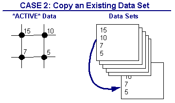CERD LECh 345 hEJAA JF *UhY*
>
> Figure 4-3. Card Image of National Weather Service Card Deck 345, "Summary of Day".

704, 258 2850). A record of 25 years costs <u>approximately</u> \$100. Such a record, corresponding to the precipitation record, is required for continuous simulation of snowmelt. Values are interpolated for missing dates. Parameter LOCAT3 is seen to be located in columns 1-5 of card deck 345 (Figure 4-3).

<u>(find Data</u> -- Wind speeds, entered on card C2, are used only for melt cal-cultionc during periods,of rainfall (,-q-^"^n 11-8). The higher the val­ues of wind speed, the greater are the convective and condensation melt terms. Of course, if-the simulation covers a large city, the wind speeds entered on card C2 can only be considered gross estimates of actual high­ly variable speeds. Average monthly speeds are often available from cli­matological summaries (e.g., NOAA, 1974).

<u>Areal Depletion Curves</u> -- Areal depletion curves account for the variation in actual snow covered area that occurs following a snowfall. They are explained in detail in Appendix II, some of which is repeated herein.

In most snowmelt models, it is assumed that there is a depth, SI, above which there will always be 100 percent cover. (Values of Si are input in card group I2.) In some models, the value of SI is adjusted during the simulation; in SWMM it remains constant. The amount of snow present at any time is indicated by the parameter WSNOW, which is the depth (water equivalent) over the snow covered areas of each subcatchment. This depth is r,cu-dimensionalized by S\[ for use in calculating the frac­tion of areas that is snow covered, ASC. Thus, an areal depletion curve (ADC) is a plot of WSNOW/Si versus ASC; a typical ADC for a natural catch­ment is shown in Figure 4-4. For values of the ratio AWESI = WSNOW/SI greater than 1.0, ASC = 1.0, that is, the area is 100 percent snow covered.

Some of the implications of different functional forms of the ADC may be seen in Figure 4-5. Since the program maintains snow quantities, WSNOW, as the depth over the total area, AT, then the actual snow depth, WS, and area covered, AS, are related by continuity,

> WSNOW • AT = WS • AS (4-1)

where WSNOW = depth of snow over total area AT, ft water

> equivalent,
>
> AT = total area, ft2,
>
> WS = actual snow depth, ft water equivalent, and
>
> AS = snow covered area, ft 2.

In terms of parameters shown on the ADC, equation 4-1 may *be* rearranged to read

> <u>WSNOW</u> WS AS WS .„
>
> AWESI = = =
>
> SI SI AT SI • (4-2)

61 4-11

Equation 4-2 can be used to compute the actual snow depth, WS, from known ADC parameters, if desired. It is unnecessary to do this in the program, but it is helpful in understanding the curves of Figure 4-5. Thus,

<table>
<colgroup>
<col style="width: 68%" />
<col style="width: 31%" />
</colgroup>
<tbody>
<tr class="odd">
<td>
<u>AWESI</u>

WS = . SI

<blockquote>

ASC

</blockquote></td>
<td>(4-3)</td>
</tr>
</tbody>
</table>

Consider the three ADC curves, B, C and D. For case B, AWE\$I is always less than ASC; hence, WS is always less than SI as shown in Figure 4-5d. For case C, AWESI = ASC, hence WS = SI, as shown in Figure 4-5e. Finally, for case D, AWESI is always greater than ASC; hence WS is always greater than SI, as shown in Figure 4-5f. Constant values of ASC at 100 percent cover and 40 percent cover are illustrated in Figures 4-5c, curve A, and Figure 4-5g, case E, respectively. At a given time (e.g, t**1** in Figure 4- 5), the area of each snow depth-area curve is the same and equal to AWESI

- SI, (e.g., 0.3 SI for time t1).

Curve B on Figure 4-5a is the most common type of ADC occurring in nature, as shown in Figure 4-4. The convex curve D requires some mech­anism for raising snow levels above their original depth, SI. In nature, drifting might provide such a mechanism; in urban areas, plowing and windrowing could cause a similar effect. It is seen that such a convex curve acts to delay melt because of the inhibiting effect on heat trans­fer of deep snow packs. A complex curve could be generated to represent specific snow removal practices in a city. However, the program utilizes only one ADC curve for all impervious areas and only one ADC curve for all pervious areas. This limitation should not hinder an adequate simula­tion since the effects of variations in individual areas are averaged out in the city-wide scope of most continuous simulations.

The two ADC curves for impervious (card C3) and pervious (card C4) areas are input by the user, as are values of SI for each subcatchment (card I2). The program does not require the ADC curves to pass through the origin, AWESI=ASC=0; they may intersect the abscissa at a value of ASC \> 0 when ASC = 0.

The preceding paragraphs have centered on the situation where a depth of snow greater than or equal to SI has fallen and is melting. (The ADC curves are not employed until WSNOW becomes less than SI.) The situation when there is new snow is discussed in Appendix II.

<u>Air Temperatures</u> --

For single event snowmelt simulation, air temperatures are input in card group C5. These may be obtained from instrumentation at the catch­ment or from the nearest NWS station. The temperatures are constant over the time interval DTAIR (card B2). Hence, DTAIR should be an integer multi­ple of DELT.

> 64 4-14

<u>FrecipilaLion</u> Data --

**<u>Choice of Rainfall Data</u> -- Without doubt, rainfall data are the single most important group of hydrologic data required** by SW1111. Yet, they are often prepared as an afterthought without proper consideration of the implications of their choice. The following discussion will briefly des­cribe options for rainfall input and their consequences. Only rainfall is considered since for snow it is the physics of snoumelt rather th?n. snowfall which is important in determining runoff.

SWMM requires a hyetograph of rai.afall intensities versus time for the period of simulation. For single event simulation this is usually a single storm, and data for up to six gages may be entered (if the user is fortunate enough to-have multiple gages for the catchment). For continu­ous simulation, hourly data from only one gage are required; these are usually obtained from the nearest NWS station. Thus, for continuous simu­lation, the options are fewer since a satisfactory generator of a synthet­ic hourly rainfall sequence is not usually available, or probably even desir­able. Hence, a historical rainfall sequence is used.

For single event simulation, on the other hand, synthetic sequences are indeed an option in lieu of historical records. However, several pit­falls exist in the use of synthetic hyetographs that may not be obvious at first thought. As a prelude, consider the objectives of hydrologic quan­tity and quality modeling.

<u>Modeling Objectives</u> -- These were treated broadly in Section 1. More spe­cifically, models might be used to aid in urban drainage design for protec­tion against flooding for a certain return period (e.g., five or ten years), or to protect against pollution of receiving waters at a certain frequency (e.g., only one combined sewer overflow per year). In these contexts, the frequency or return period needs to be associated with a very specific pa­rameter. That is, for rainfall one may speak of frequency distributions of interevent times, total storm depth, total storm duration or average storm intensity, all of which are different (Eagleson, 1970, pp. 183-190). Traditional urban drainage techniques often utilize frequencies of depths given durations, taken from intensity-duration-frequency (IDF) curves, which are really conditional frequency distributions. But for the above objectives, and in fact, for almost all urban hydrology work, the frequen-cieS-of runoff and quality parameters are required, not those of rainfall at all. Thus, one may speak of the frequencies of maximum flow rate, to­tal runoff volume or duration or of total pollutant loads. These distri­butions are in no way the same as for similar rainfall parameters, although they may be related through analytical methods (Howard, 1976, Chan and Bras, 1979, Hydroscience, 1980). Finally, for pollution control, the real inter­est may lie in the frequency of water quality standards violations in the receiving water, which leads to further complications.

Ideally an analyst would develop costs and benefits for designs at several frequencies in preparation **for an economic optimization. In** prac­tice, it is often difficult to accomplish this for even one case.

65 4-15

> However, continuous simulation offers an excellent, if not the only method for obtaining the frequency of events of interest, be they related to quantity or quality. Advantages are discussed in Section 1 and Appen­dix I along with several other models besides SWMM that will perform simi­lar tasks. But continuous simulation has the disadvantages of a higher cost and the need for a continuous rainfall record. This has led to the use of a "design storm" or "design rainfall" or "design event" in a single event simulation instead of continuous. Of course, this idea long preceded continuous simulation, before the advent of modern computers. It is the choice of the design event, as it will be termed herein, that may lead to problems.
>
> <u>Design Events</u> -- Two methods of obtaining design events are considered:
>
> 1\) use of a historical sequence and 2) generation of a synthetic sequence. Synthetic sequences are usually constructed by the following steps:
>
> 1\. A storm duration is chosen, either on an arbitrary basis or to coincide with the assumed catchment time of concentration, t, i.e., equi­librium time during a steady rainfall at which outflow equalsc a constant fraction of inflow (or outflow equals inflow on a catchment without lnsges). The latter method itself has difficulties because of the depen­dence of t on rainfall intensity and other parameters (Eagelson, 1970).
>
> c 2. A return period is chosen in order to select the total storm depth for the specified duration from intensity-duration-frequency (IDF) curves.

3.  A time history for the storm is assumed, usually on the basis of historical percentage mass curves. if peak intensities are at the begin­ning of the storm, the hyetograph takes on the appearance of a decaying exponential curve. If the peak intensities are near the middle, a "circus tent" hyetograph results (Figure 4-6). The hyetograph is shaped such that depths (or average intensities) for any duration centered about the peak match those from the IDF curve.

4.  The continuous hyetograph of Figure 4-6 must then be segmented in­to a histogram for input to most digital models.

> This procedure was apparently first detailed by Keifer and Chiu (1957) and then by Tholin and Keifer (1960) in Chicago. It has since been emu­lated by many others.
>
> Many problems with this procedure have been enumerated for construc­tion of synthetic hyetographs (McPherson, 1978, Patry and McPherson, 1979) and the underlying Rational Method and IDF curves on which it is based (McPherson, 1969). These reports may be seen for details, but some key points are given here:

1.  IDF curves themselves may consist of components of several differ­ent storms. They in no way represent the time history of a real storm.

2.  When frequencies are assigned to total storm depths (independent of duration) they generally do not coincide with the conditional frequen­cies of depth given duration obtained from IDF curves. For instance, the two historical storms shown on Figure 4-6 for comparison with the "5-year" synthetic storm of 2.28 in (58 mm) have return periods (based on total depth) of 4.6 and 5.8 years, but total depths of only 1.61 and 1.85 in (41 and 47 mm), respectively. Thus, IDF curves cannot be used to assign

66 4-16

frequencies to t:torm volumes. If synthetic hyetographs are thence used for studies of detention storage or pollutant loads, where volumetric considera­tions are key, no frequency should be assigned to the results.

0.  Although the time history assigned to a synthetic storm may repre­sent an average of many storms, there is often considerable variability (see P. Bock, Discussion of Tholin and Keifer, 1960). If a frequency could be assigned to a synthetic storm, it would probably be considerably rarer than its nominal frequency, because the joint probability of all time sequences within the storm corresponding to those of an IDF curve is very low. The two historical storms shown on Figure 4-6 certainly do not mimic the synthet­ic storm.

1.  Antecedent conditions must still be chosen arbitrarily when using a design event (either a synthetic or historical storm).

2.  A synthetic design event is one that "never really happened." McPherson (1978) emphasizes the need to design with a real (historical) event to insure credibility in the eyes of the public.

3.  There is evidence that synthetic design events may produce an over-design if the objective is a design for a given return period. Marsalek (1978a,b) has compared continuous simulation results of flood peaks and volumes vcrcus return period with results obtained by single event simula­tions using the same model with input of n-year synthetic events of the type described earlier. Flood peaks are always higher for the synthetic events. Flood volumes are higher for most synthetic events, depending on the method of generation of the event, because the return periods assigned to the synthetic volumes are incorrect.

<u>Design Event Alternatives</u> -- In spite of all of its problems, use of a design event may still he required. Fortunately, there are ways in which this may *be* accomplished satisfactorily.

Foremost among these is the use of continuous simulation as a screening tool. As stated earlier, continuous simulation for several years of a large catchment with inclusion of spatial detail can be expensive. Instead, representative smaller catchmehts may be simulated from which critical events may be selected for a more detailed, single event simulation. Thus, from a simple long-term continuous simulation, critical subsets may be iden­tified for further analysis. Walesh and Snyder (1979) present ideas along this line.

Continuous simulation may also be used to "calibrate" a synthetic de­sign event. That is, the design hyetograph may be adjusted such that it produces flows or volumes that correspond for its return period to those produced by a continuous simulation run. This has been done in studies in northern Virginia (Shubinski and Fitch. 1976) and Denver (B. Urbonas, per­sonal communication, 1979). Proper adjustment of antecedent conditions can also cause results from synthetic design events to match historical results (Wenzel and Voorhees, 1978).

In any event, several storm events should be processed for design considerations. These may be selected from a continuous simulation run, as suggested above or chosen from the historical record on another basis. For urban drainage or flood control design, it may be desirable to choose a

> 68 4-18
>
> particular, well-known local rainfall event and make sure that a design will handle that storm.
>
> Calibration of the model remains important for any application. It has been suggested (M. Terstriep, personal communication, 1979) that use of a synthetic design event for analysis of a *new* system may not be any worse Chan using historical data in an uncalibrated model.
>
> <u>National Weather Service Precipitation Data</u> -- Hourly precipitation values (including water equivalent of snowfall depths) are available for 25 year periods for most. first-order NWS stations around the U.S. (Similar data are available in Canada from the Atmospheric Environment Service.) Magnetic tapes containing card images of NWS Card Deck 488, "USWB Hourly Precipita­tion" (Figure 4-7) are available from the NOAA National Weather Records Center in Asheville, NC (phone 704, 259 0682) at a cost of <u>about</u> \$150. The same data are also available for shorter periods for multiple cities.
>
> --Having obtained these data for a continuous simulation, they are read directly from, the tape in subroutine CTRAIN. The required NWS ID number is read on c?rd Dl. Starting dates for the simulation are given on card El, ending dates on card Dl. The station name (card D1) is only for printing purposes.
>
> The highest. 50 hourly rainfall depths are printed following the pre­cipitation tape processing. These may be used to aid in selection of events of interest. Ii ICRAIN = 4 (card B1), input ceases at card D1, and pro­cessed precipitation (and temperature) data may be reviewed prior to the rest of the simulation run, if desired.
>
> <u>Card Input of Precipitation Data</u> -- For single event.simulation, precipita­tion hyetographs may be input for up to six gages in card groups El and E2. Any one of the six gages may then be assigned to a subcatchment. The time interval for input of hyetograph intensities, THISTO, (the same for all hyetographs) must be either equal to the computation time step, DELT (Card B2), or an integer multiple or integer fraction (e.g., 1/2, 1/5, etc.) thereof. If TH1STO is an integer fraction of DELT, the average intensity over time step DELT is used in computations.
>
> Up to 200 hyetograph ordinates may be entered without using a
>
> scratch file (NSCRAT(2)). Depending on the relationship between DELT and THISTO, this may impose a limitation on the run less than, more than or
>
> equal to 200 time steps. When ICRAIN .7.: 3 (card Bl) or when NSCRAT(4) 0, the precipitation data input from cards are stored on an off-line file instead of in an array, eliminating any limit on the number of time steps
>
> <u>Temporal Rainfall Variations</u> -- The required time detail for rainfall hyeto-graphs is a function of the catchment response to rainfall input. Small, steep, smooth, impervious catchments have fast response times, and vice versa. As a generality, shorter time increment data are preferable to longer time increment data, but for a large (e.g., 10 square miles, 2.6 km2)
>
> 69 4-19

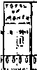

> subcatchment (coarse schematization), even the hourly inputs used for con­tinuous simulation may be appropriate.
>
> The rain gage itself is usually the limiting factor. It is possible to reduce data from 24-hour charts from standard weighing-bucket gages to
>
> obtain 5 minute increment data, and some USGS gages produce no better than 5 minute values. Shorter time increment data may usually be obtained only from tipping bucket gage installations.
>
> Of course, the necessary time increment for rainfall is closely coupled to the computational time step, DELT. This is discussed subsequently in conjunction with flow routing parameters.
>
> <u>Spatial Rainfall Variations</u> -- Even for small catchments, runoff and con­sequent model predictions (and prototype measurements) may be very sensitive to spatial variations of the rainfall. For instance, thunderstorms (convec-tive_rainfall) may be very localized, and nearby gages may have very dissimi­lar readings. For modeling accuracy (or even more specifically, for a successful calibration of SWMM), it is essential that rain gages be located within and adjacent to the catchment.
>
> SWMM inputs the spatial variability by the assignment of one of up to six gages to a particular subcatchment. (Clearly, there is no point in the input of more gage data than there are subcatchments.) If multiple gages are available, this is a much better procedure than is the use of spatially averaged (e.g., Thiessen weighted) data, because averaged data tend to have short-term time variations removed (i.e., rainfall pulses are "lowered" and "spread out"). In general, if the rainfall is uniform spatially, as might be expected from cyclonic (e.g., frontal) systems, these spatial considera­tions are not as important. In making this judgment, the storm size and speed in relation to the total catchment must be considered. It should be noted that a moving or "kinematic" storm may only be simulated in SWMM by using multiple gages. Storm motion may very significantly affect hydrographs at the catchment outlet (Yen and Chow, 1968, Surkan, 1974, James and Drake, 1980).
>
> <u>Evaporation Data (Card F1)</u> --
>
> An average monthly evaporation rate is required for the month being simulated in the single event mode, or for all months in the continuous mode. This rate is subtracted from rainfall and snowmelt intensities at each time step and is also used to replenish surface depression storage but for no other purposes. For instance, it is not used to account for sublima­tion from snow or exfiltration from soil. Evaporation data may usually be obtained from climatological summmaries (NOAA, 1974) or NWS or other pan measurements (e.g., from NWS <u>Climatological Data).</u> Single event simulations are usually insensitive to the evaporation rate, but evaporation can make up a significant component of the water budget during continuous simulation.

71 4-21

> **<u>Surface Quantity Input Data (Card Groups Gl-I3)  
> Runoff Flow Routing Procedures and</u> Options --**
>
> **Card groups G1 through I3 input data used to establish flow routing and snowmelt parameters for the Runoff Block. Snowmelt will be discussed subse­quently. Flow routing is accomplished using three types of elements:**

1.  **subcatehment elements (overland flow),**

2.  **gutter elements (trapezoidal channel flow), and**

3.  **pipe elements (circular channel flow).**

> **Subcatchment elements receive rainfall and snowmelt, account for losses due to evaporation and infiltration (via Horton's equation or the Green-Ampt equation), and permit surface depression storage to. account for losses such as ponding or retention on grass or pavement. Flow from subcatchments is always into gutter/pipe elements or inlets. A tree-network of gutter/ pipes may be used to simulate smaller drainage elements of the sewer system. If they are used, they route hydrographs (and pollutographs) from subcatchments to inlets (e.g., entry points to the main sewer system). Inlet flows are placed on the interfacing file for transmital to subsequent. SWMM blocks. However, the Runoff Block is often used by itself if the more sophisticated routing procedures of the Transport or Extended Transport Blocks are not required (discussed below).**
>
> **Flow routing for both subcatchments and gutter/pipes is accomplished by approximating them as non-linear reservoirs. This is simply a coupling of a spatially lumped continuity equation with Manning's equation. A detailed description is presented in Appendix VI and the SWMM Final Report (Metcalf and Eddy et al., 1971a). Should the capacity of a gutter/pipe be exceeded, "surcharge" is indicated, and excess water is stored at the upstream end until the gutter/pipe can accept it.**
>
> **<u>Input Data Preparation</u> --**
>
> **Preparation of these input data cards requires two tasks: 1) dis-cretization of the physical drainage system and 2) estimation of the co­efficients necessary to characterize the catchment. These tasks require varying amounts of effort depending on the level of detail desired by the user.**
>
> **Very useful additional information for these tasks is contained in short course proceedings prepared by the University of Massachusetts (Di-Giano et al., 1977). The Runoff Block example is particularly good because of the emphasis on data reduction from typical municipal maps and plans. The SWMM user** is **encouraged to review these proceedings for alternative explanations and examples. Further useful information is contained in the User's Manual prepared for Canadian SWAM applications (Proctor and Redfern and James F. MacLaren, 1977) and in the SWMM-related references discussed in Section 1.**
>
> **72 4-22**
>
> <u>Discretization</u> .'f <u>the Catchment</u> --
>
> <u>Definition</u> -- Discretization is a procedure for the mathematical abstraction of the physical drainage system. For the computation of hydrographs, the drainage basin may be conceptually represented by a network of hydraulic elements, i.e., subcatchments, gutters, and pipes. Hydraulic properties of each element are then characterized by various parameters, such as size, slope, and roughness coefficient.
>
> Subcatchments represent idealized runoff areas with uniform slope. Parameters such as roughness values, depression storage and infiltration values are taken as constant for the area and usually represent averages, although pervious and impervious areas have different characteristics within the model. If roofs drain onto pervious areas, such as lawns, they are usually considered part of the pervious area, although conceivably, they could be treated as miniature subcatchments themselves.
>
> Discretization begins with the identification of drainage boundaries using a topographic map, the location of major sewer inlets using a sewer system map, and the selection of those gutter/pipes to be included in the Runoff Block system. Note that discretization of the sewer system involves choices that affect elements to be used in either of the subsequent Trans­port Blocks (see below). An example will illustrate some of these points.
>
> <u>Example</u> -- Two possible discretizations of the Northwood catchment in Balti­more (Tucker, 1968, Huber et al., 1979) are indicated in Figures 4-8 and 4-9 (Metcalf and Eddy et al., 1971a). A "fine" approach was used in Figure 4-8, resulting in 12 subcatchments and 13 pipes leading to one inlet. In Figure 4-9, a "coarse" discretization was used, resulting in five subcatchments and no gutter/pipes. "Storm Conduits" shown in Figure 4-9 could either be simulated by the Transport Block or ignored, feeding all subcatchment flows to the one inlet. The outlet to the creek then represents the downstream point in the simulation. (This could lead; in a larger system, to inlets in the Transport Model.)
>
> A comparison of hydrographs produced by the two methods is shown in Figure 4-10 (Metcalf and Eddy et al., 1971a), in which the differences are relatively minor. Additional calibration effort could bring the two schema-tizations into better agreement with each other and with the measured hydro-graph. Techniques for this purpose are discussed later as are techniques for aggregation of subcatchments.
>
> <u>Required Amount of Detail</u> -- It is anticipated that only a very coarse discretization will be used for continuous simulation. Although up to 30 subcatchments and gutter/pipes or inlets are allowed, a typical continuous simulation might include only one subcatchment and no gutter/pipes. This economy in the amount of detail simulated is prompted to save computer time and because detail simply is not required for continuous simulation which serves as a screening and planning tool (see Section 1 and Appendix I). Moreover, reasonable agreement is possible between hydrographs produced by coarse and fine schematizations as will be discussed later under "subcatch-ment aggregation".
>
> 73 4-23
>
> Figure 4-8. Northwood (Baltimore) Drainage Basin "Fine" Plan. (After Metcalf and Eddy et al., 1971a, p. 50)
>
> 74 4-24
>
> 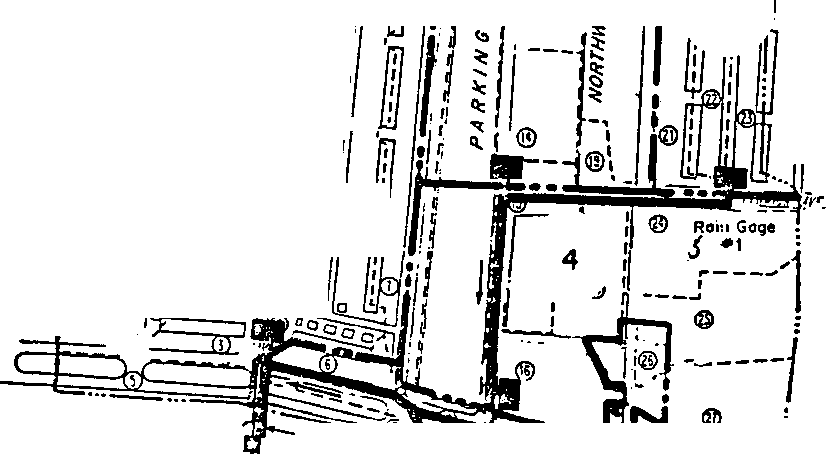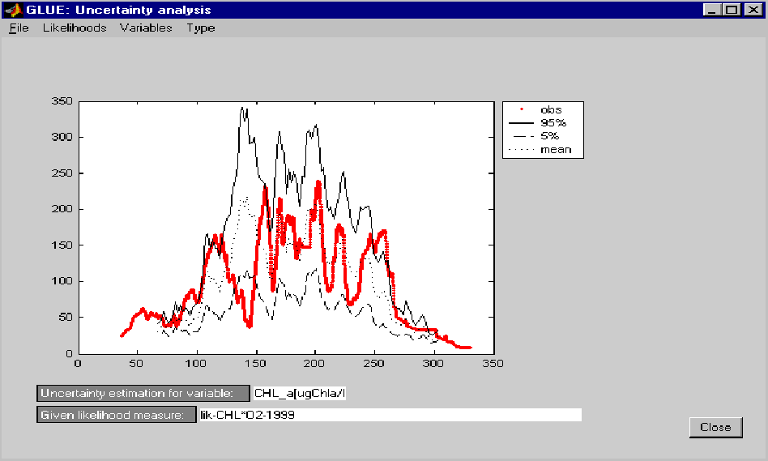**Figure 4-9. Northwood (Baltimore) Drainage Basin "Coarse" Plan. (After Metcalf and Eddy et al., 1971a, p. 51)**

- u

> 75 4-25
>
> Figure 4-10. Effect of Coarsening Subcatchment System, Northwood (Baltimore). (After Metcalf and Eddy et al., **1971a, p.74)**

**Should flow routing be desired during continuous simulation, Runoff Block gutter/pipes may be used. (The Transport Blocks are intended pri­marily for a detailed storm event analysis.)**

**For single event simulation, the amount of detail should be the minimum consistent with requirements for within-catchment information. Obviously, no information can be obtained about upstream surcharging if the upstream conduits are not simulated and subcatchments are not provided to feed them. In addition, sufficient detail needs to be provided to allow within-system control options to be tried for different areas and land uses. If, however, the primary objective is simply to produce a hydrograph and pollutograph at the outlet, utilizing a single rain gage, then one subcatchment will often (but not always) serve as well as many.**

**A final constraint on the amount of detail is dictated by personnel requirements for data reduction. Once data resources (e.g., maps, plans) are gathered, discretization of the catchment can occupy one to three per­son-days (a longer time for more subcatchments) with perhaps an additional 15 to 30 minutes per subcatchment for their input parameters. Finally, there is no one "right" way to accomplish tF1P discretization,**

**especially since decisions at this stage can be compensated for during the later calibration phase.**

<u>**Choice of** *Sewer* **System Flow Routing**</u> **-- There are many criteria that influence the choice of the block used for sewer system routing: Runoff, Transport or Extended Transport. Several of these are give in Table 4-3; much more extensive information is contained in the sections of this report and SWMM documentation (Metcalf and Eddy et al., 1971a, Roesner et al., 1981) pertain­ing to each block.**

**Regarding flow routing methods, no backwater effects can be calculated (i.e., in an upstream direction) in the Runoff and Transport Blocks because each conduit element simply provides an inflow to a downstream element with no effect of the latter on the former. Thus, both Runoff and Transport Block routing acts as a "cascade" of elements, each discharging into the next with no other interactions. On the other hand, the solution of the complete St. Venant (gradually varied flow) equations by the Extended Trans­port Block provides for backwater effects and much more, as indicated in Table 4-3. This is at the cost of considerable extra complexity and com­puter time.**

**As a practical matter, the Runoff Block is often used to simulate smaller diameter pipes, e.g., less than 30 in (762 mm) and one of the two Transport Blocks for the larger trunk sewer system. The larger the catch­ment being simulated, the less important becomes the simulation of small conduits, far upstream. Conduits of less than a 12 in (305 mm) diameter are rarely simulated. Also, in spite of the fact that Runoff Block trapezoidal conduits are called "gutters", it should almost never be necessary to simu­late flow in a roadside curb and gutter channel, unless the catchment is extremely small.**

**77 4-27**

<table>
<colgroup>
<col style="width: 47%" />
<col style="width: 15%" />
<col style="width: 18%" />
<col style="width: 18%" />
</colgroup>
<tbody>
<tr class="odd">
<td colspan="4">
<strong>Table 4-3. Flow Routing Characteristics of Runoff, Transport and Extended</strong>

<strong>Transport Blocks.</strong>

<blockquote>

<strong>Runoff Transport Extended</strong>

<strong>Block Block Transport</strong>

</blockquote>

<strong>Block</strong>
</td>
</tr>
<tr class="even">
<td><ol type="1">
<li><blockquote>

<strong>Flow routing method</strong>

</blockquote></li>
</ol></td>
<td><blockquote>

<strong>Non-linear</strong>

</blockquote></td>
<td><blockquote>

<strong>Kinematic</strong>

</blockquote></td>
<td><blockquote>

<strong>Complete</strong>

</blockquote></td>
</tr>
<tr class="odd">
<td></td>
<td><blockquote>

<strong>reservoir, cascade of</strong>

</blockquote></td>
<td><blockquote>

<strong>wave,</strong>

<strong>cascade of</strong>

</blockquote></td>
<td><blockquote>

<strong>equations, interactive</strong>

</blockquote></td>
</tr>
<tr class="even">
<td></td>
<td><blockquote>

<strong>conduits</strong>

</blockquote></td>
<td><blockquote>

<strong>conduits</strong>

</blockquote></td>
<td><strong>conduit 
network</strong></td>
</tr>
<tr class="odd">
<td><ol start="0" type="1">
<li><blockquote>

<strong>Relative computational expense for identical network schematizations</strong>

</blockquote></li>
</ol></td>
<td><blockquote>

<strong>Low</strong>

</blockquote></td>
<td><blockquote>

<strong>Moderate</strong>

</blockquote></td>
<td><blockquote>

<strong>High</strong>

</blockquote></td>
</tr>
<tr class="even">
<td><ol start="2" type="1">
<li><blockquote>

<strong>Attenuation of hydrograph peaks</strong>

</blockquote></li>
</ol></td>
<td><blockquote>

<strong>Yes</strong>

</blockquote></td>
<td><blockquote>

<strong>Yes</strong>

</blockquote></td>
<td><blockquote>

<strong>Yes</strong>

</blockquote></td>
</tr>
<tr class="odd">
<td><ol type="1">
<li><blockquote>

<strong>Time displacement of hydrograph peaks</strong>

</blockquote></li>
</ol></td>
<td><blockquote>

<strong>Weak</strong>

</blockquote></td>
<td><blockquote>

<strong>Yes</strong>

</blockquote></td>
<td><blockquote>

<strong>Yes</strong>

</blockquote></td>
</tr>
<tr class="even">
<td><ol start="3" type="1">
<li><blockquote>

<strong>In-conduit storage</strong>

</blockquote></li>
</ol></td>
<td><blockquote>

<strong>Yes</strong>

</blockquote></td>
<td><blockquote>

<strong>Yes</strong>

</blockquote></td>
<td><blockquote>

<strong>Yes</strong>

</blockquote></td>
</tr>
<tr class="odd">
<td><ol start="2" type="1">
<li><blockquote>

<strong>Backwater or downstream control effects</strong>

</blockquote></li>
</ol></td>
<td><blockquote>

<strong>No</strong>

</blockquote></td>
<td><blockquote>

<strong>Noa</strong>

</blockquote></td>
<td><blockquote>

<strong>Yes</strong>

</blockquote></td>
</tr>
<tr class="even">
<td><ol start="4" type="1">
<li><blockquote>

<strong>Flow reversal</strong>

</blockquote></li>
</ol></td>
<td><blockquote>

<strong>No</strong>

</blockquote></td>
<td><blockquote>

<strong>No</strong>

</blockquote></td>
<td><blockquote>

<strong>Yes</strong>

</blockquote></td>
</tr>
<tr class="odd">
<td><ol start="5" type="1">
<li><blockquote>

<strong>Surcharge</strong>

</blockquote></li>
</ol></td>
<td><blockquote>

<strong>Weak</strong>

</blockquote></td>
<td><blockquote>

<strong>Weak</strong>

</blockquote></td>
<td><blockquote>

<strong>Yes</strong>

</blockquote></td>
</tr>
<tr class="even">
<td><ol start="6" type="1">
<li><blockquote>

<strong>Pressure flow</strong>

</blockquote></li>
</ol></td>
<td><blockquote>

<strong>No</strong>

</blockquote></td>
<td><blockquote>

<strong>No</strong>

</blockquote></td>
<td><blockquote>

<strong>Yes</strong>

</blockquote></td>
</tr>
<tr class="odd">
<td><ol start="3" type="1">
<li>
<strong>Branching tree network</strong>
</li>
</ol></td>
<td><blockquote>

<strong>Yes</strong>

</blockquote></td>
<td><blockquote>

<strong>Yes</strong>

</blockquote></td>
<td><blockquote>

<strong>Yes</strong>

</blockquote></td>
</tr>
<tr class="even">
<td><ol start="4" type="1">
<li>
<strong>Network</strong> <em>with</em> <strong>looped connections</strong>
</li>
</ol></td>
<td><blockquote>

<strong>No</strong>

</blockquote></td>
<td><blockquote>

<strong>No</strong>

</blockquote></td>
<td><blockquote>

<strong>Yes</strong>

</blockquote></td>
</tr>
<tr class="odd">
<td><ol start="5" type="1">
<li><blockquote>

<strong>Number of pre-programmed conduit shapes</strong>

</blockquote></li>
</ol></td>
<td><blockquote>

<strong>2</strong>

</blockquote></td>
<td><blockquote>

<strong>13</strong>

</blockquote></td>
<td><blockquote>

<strong>6</strong>

</blockquote></td>
</tr>
<tr class="even">
<td><ol start="6" type="1">
<li>
<strong>Alternative hydraulic elements</strong>
</li>
</ol>

<strong>(e.g., pumps, weirs, regulators)</strong>
</td>
<td><blockquote>

<strong>No</strong>

</blockquote></td>
<td><blockquote>

Yes

</blockquote></td>
<td><blockquote>

Yes

</blockquote></td>
</tr>
<tr class="odd">
<td><ol start="7" type="1">
<li><blockquote>

<strong>Dry weather flow and infiltra- tion generation (base flow)</strong>

</blockquote></li>
</ol></td>
<td><blockquote>

<strong>No</strong>

</blockquote></td>
<td><blockquote>

<strong>Yes</strong>

</blockquote></td>
<td><blockquote>

<strong>Yes</strong>

</blockquote></td>
</tr>
<tr class="even">
<td><ol start="8" type="1">
<li>
<strong>Pollutograph routing</strong>
</li>
</ol></td>
<td><blockquote>

Yes•

</blockquote></td>
<td><blockquote>

<strong>Yes</strong>

</blockquote></td>
<td><blockquote>

<strong>No</strong>

</blockquote></td>
</tr>
<tr class="odd">
<td><ol start="9" type="1">
<li>
<strong>Solids scour/deposition</strong>
</li>
</ol></td>
<td><blockquote>

<strong>No</strong>

</blockquote></td>
<td><blockquote>

<strong>Yes</strong>

</blockquote></td>
<td><blockquote>

<strong>No</strong>

</blockquote></td>
</tr>
<tr class="even">
<td><ol start="10" type="1">
<li>
<strong>Card input of hydrographs/</strong>
</li>
</ol></td>
<td><blockquote>

<strong>No</strong>

</blockquote></td>
<td><blockquote>

<strong>Yes</strong>

</blockquote></td>
<td><blockquote>

<strong>Yes</strong>

</blockquote></td>
</tr>
</tbody>
</table>

> **pollutographs**

**aBackwater may be simulated as a horizontal water surface behind a storage element.**

78

> **<u>Numbering Schenw.,s</u> Subcatchments may be assigned any numbers between 1 and 9999. This is true also for gutter/pipes and inlets except that inlet numbers corresponding to Transport Block manholes must be less than or equal to 1000. Also, Receive Block junctions have a maximum number equal to the number of junctions. Thus, inflows to such junctions must be numbered accordingly. To be on the safe side, it is often a good idea to reserve relatively low numbers for inlets, etc. that are transfered to subsequent blocks.**
>
> **Internally, the Runoff Block assigns subscripts (internal numbers) in the order in which the gutter/pipes or subcatchment cards are read in. Some error messages use these numbers. It is not necessary to state specifically the inlets to be transfered to subsequent blocks, since all inlets at the downstream end of any subcatchment-gutter/pipe flow routing chain are placed in that category and are printed out.**
>
> **Within the above confines, considerable latitude exists for numbering schemes. Thus, subcatchments may feed gutter/pipes with the same number; subcatchments or gutter/pipes may be given numbers in a certain range (e.g 200 - 299) based on certain characteri3tics; etc. The Transport Block numbering scheme allows even more latitude since it includes non-conduits (e.g., manholes).**
>
> **<u>Gutter/Pipe Parameters (Card Groups G1 and G2)</u> --**
>
> **<u>Routing and Time Step Considerations</u> -•- As mentioned earlier, the non-linear reservoir method of** gutter/pipe flow routing is described in Appendix V and the original documentation volume (Metcalf and Eddy et al., 1971a). Since the formulation produces a spatially "lumped" configuration (i.e., there is no dependence upon longitudinal distance for a given gutter/pipe element), flows introduced at the "upstream end" of such an element are distributed horizontally over the entire water suface area. The implication is that a concentrated inflow into one "end" of a simulated gutter/pipe is a reason­able approximation to the true situation in which gutter/pipes receive distributed inflows along their lengths.
>
> At each time step, an iterative (llewton-Raphson) scheme is used to solve the non-linear difference equation used to approximate the differ­ential equation of the non-linear reservoir. Depending upon the choice of parameters for the gutter/pipe and the size of the time step, DELT, conver­gence problems can arise. These usually occur with a gutter/pipe of rela­tively small volume (e.g., short length and diameter) coupled with too long a time step. In such a case, the continuity equation may try to force a negative volume to be calculated because there is not enough "real water" in the gutter/pipe to satisfy the outflow rate. In such a case, the volume and outflow are set to zero and a warning message is printed by subroutine **GUTTER.** This correction only approximates the true occurrence and results in a small error in continuity.
>
> Most convergence problems of this or other natures can be cured either by decreasing the time step or increasing the gutter/pipe dimensions.
>
> **79 4-29**

Analysis of a similar finite difference approximation for a <u>linear</u> reservoir routing technique indicates that negative volumes cannot occur if

> DELT \<

<u>2 • Q</u> — <u>V</u> 2 <u>• VGLEN</u>

> (4-4)

where DELT = computational time step, sec,

> V = volume of water in gutter/pipe, f'3,
>
> Q = outflow from gutter/pipe, cfs,
>
> GLEN = length of gutter/pipe, ft, and
>
> V = velocity of flow through gutter/pipe, ft/sec.

The requirement of equation 4-4 is thus a <u>suggestion</u> for Runoff Block gut-ter/pipe routing, since a stability analysis of the non-linear routing scheme has not been accomplished. Note, however, that if gutter/pipes are used for continuous simulation, with a one-hour time step, their dimensions should be quite large.

As a general rule, accuracy of the scheme increases as the time step decreases, hut it should seldom be necessary to decrease the time step to less than one minute; most often DELT is between one and five minutes. The choice of the time step is also linked to the rainfall hyetograph input, discussed earlier.

<u>Parameter Selection</u> -- Most gutter/pipe parameters are self explanatory and little interpretation is needed. The slope and roughness are combined into one parameter for further use in the program, using Manning's equation. Thus,

<table>
<colgroup>
<col style="width: 72%" />
<col style="width: 27%" />
</colgroup>
<tbody>
<tr class="odd">
<td>
. ,--

GCON = <u>1G6486</u> • 4G3
</td>
<td>(4-5)</td>
</tr>
</tbody>
</table>

where GCON = routing parameter,

> G6 = Manning's roughness, n, and
>
> G3 = invert slope, ft/ft.

Thus, equivalent changes in the routing can be made through changes in either the slope or roughness.

The invert slope is usually given on drainage maps or may easily be calculated from invert elevations and conduit lengths. Tables of Manning's roughness coefficients are given in many references; see for instance Chow (1959) or ASCE-WPCF (1969).

<u>Subcatchment Parameters (Card Groups H1 and H2)</u> --

<u>Subcatchment Schematization</u> -- Many hydrologic models obtain a distributed effect (spatially) by subdividing the overall catchment into subcatchments, predicting runoff from the subcatchments on the basis of their individual properties, and combining their outflows using a flow routing scheme. This

> 80 4-30

procedure is followed in SWMM, in which subcatchments are idealized mathe­matically as spatially lumped, non-linear reservoirs, and their outflows are routed via the gutter/pipe (or a subsequent Transport Block) network.

Each subcatchment is schematized as in Figure 4-11, in which three or four subareas (depending on whether snowmelt is simulated) are used to represent different surface properties as enumerated in Table 4-4. The slcpe of the idealized subcatchment is in the direction perpendicular to the width. Flow from each subarea moves <u>directly</u> to a gutter/pipe or inlet and does not pass over any other subarea. (Thus, it is not possible to route runoff from roofs over lawn surfaces, for instance.) The width of the pervious subarea, A2, is the entire subcatchment width, whereas the widths of the impervious subareas, Al, A3, A4, are in proportion to the ratio of their area to the total impervious area, as implied in Figure 4-11. Speci­fication of each subarea is through the use of parameters WAREA and WW(3) on Card H1, PCTZER on Card B2 and.SNN1 on Card Il. If desired, any sub-catchment may consist entirely of any one (or more) types of subareas.

Table 4-4. Subcatchment Surface Classification

> Depression <u>Snow Cover and Extent</u>
>
> <u>Subarea Perviousness Storage Single Event Continuous</u>
>
> Al Impervious Yes Bare Normally bare,

but may have snow cover over 100% of Subarea Al plus Subarea A3.

Snow covered sub-ject to areal depletion curve.

Same as Subarea Al.

Snow covered subject to areal depletion curve.

Of course, real subcatchments seldom exhibit the uniform rectangular geometries shown in Figure 4-11. In terms of the flow routing, all geometrical properties are merely parameters (as explained below) and no inherent "shape" can be assumed in the non-linear reservoir technique. However, in terms of parameter selection, the conceptual geometry of Figure 4-11 is useful because it aids in explaining the flow routing.

<u>Routing and Time Step Considerations</u> -- The routing and time step discussion given earlier for gutter/pipes applies almost identically for subcatchments. A detailed explanation of the non-line.3r reservoir equations is also

given in Appendix V. The routing is performed separately for each of

> 81 4-31

**TO INLET OR GUTTER / PIPE**

Figure 4-11. Subcatchment Schematization. Flows from pervious and total impervious subareas go <u>directly</u> to gutter/ pipe or inlet. (E.g., flow from the pervious subarea does not travel over impervious area.)

82 4-32

> the three or four subareas of the subcatchment. The same comments apply regarding convergence and time step considerations as given with reference to equation 4-4, except that V and Q are the volume and outflow of water, respectively, from each subarea within the subcatchment. In fact, convergence problems are rarely encountered during subcatchment routing because total subcatchment volumes (area times depth) are usually large compared to outflow volumes.
>
> Parameter selection is aided with reference to Figure 4-12 in which the subcatchment "reservoir" is shown in relation to inflows and outflows (or losses). The outflow to gutter/pipes and inlets is computed as the product of velocity (from Manning's equation based on the difference between total depth and depression storage), depth and width,
>
> Q = W • <u>1.49(d</u> - d )5/3 S1/2
>
> (4-5)
>
> where Q = WFLOW = subcatchment (or subarea) outflow, cfs,
>
> W = WW(1) = subcatchment width, ft,
>
> n = WW(5) or WW(6) = Manning's roughness coefficient,
>
> d = WDEPTH = water depth, ft,

d = WSTORE = depth of depression (retention) storage, ft, and

> SP = WSLOPE = slope, ft/ft.
>
> The Fortran parameters listed above are the Runoff Block parameters. When combined with the continuity equation (see Appendix V) and divided by the surface area, a new routing parameter is defined for the pervious and total impervious suhcatchment areas and used in all subsequent calcu­lations:

<table>
<colgroup>
<col style="width: 60%" />
<col style="width: 39%" />
</colgroup>
<tbody>
<tr class="odd">
<td>
WCON = <u>W • 1.49</u> 1/2

A • n
</td>
<td>(4-6)</td>
</tr>
</tbody>
</table>

> where WCON = routing parameter used in subroutine WSHED, ft-sec units,
>
> and

A = surface area of pervious or total impervious subarea,

> ft .
>
> Note that the width, slope and roughness parameters are combined into one parameter. Thus, equivalent changes may be caused by appropriate alteration of any of the three parameters. (However, see further com­ments below on the subcatchment width.) Flows computed in the Runoff Block and transfered to subsequent blocks are instantaneous values at the end of a time step.
>
> <u>Subcatchment Width</u> -- If overland flow is visualized (Figure 4-11) as running downslope off an idealized, rectangular catchment, then the width of the subcatchment (card HI) is the physical width of overland flow. This may be further seen in Figure 4-13 in which the lateral flow per unit width, qL, is computed and multiplied by the width to obtain the total inflow into the gutter. (As mentioned previously, the SWHH gutter/pipes can only receive a concentrated inflow, however, and do not receive a distributed inflow in a specific fashion.) Note also, in
>
> 83 4-33
>
> **RAINFALL,**

**EVAPORATION SNO WeELT**

> **1**
>
> IMIIM  
> iM

**ease NMI. emll ••• omm• dio ollnil•**

**5/3 1/2**

**----\> Qa w 1419- td—dP ) • S**

> **INFILTRATION**

Figure 4-12. Non-linear Reservoir Representation of Subcatchment.

> **qL = RATE OF OVERLAND FLOW/ UNIT WIDTH**
>
> **W = at = TOTAL WIDTH OF OVERLAND FLOW**

Figure 4-13. Idealized Subcatchment-Gutter Arrangement Illustrating the Subcatchment Width.

> 85 4-35
>
> **Figure 4-13, th,lt for this idealized case, if the two sides of the subcatchment are symmetrical, the total width is twice the length of the drainage channel.**
>
> **Since real subcatchments will not be rectangular with properties of symmetry and uniformity, it is necessary to adopt other procedures to obtain the width for more general cases. This is of special importance, because if the :lope and roughness arc fixed, (see equation 4-6), the width can be used to alter the hydrograph shape.**
>
> **For example, consider the five different subcatchment shapes shown on Figure 4-14. Catchment hydraulic properties, routing parameters and time of concentration are also given. The latter is calculated using the kinematic wave formulation (Eagleson, 1970, p. 340),**
>
> **tc = \[ (4-7) a i\*m-111/m**
>
> **where t = time of concentration, sec,**
>
> **Lc = subcatchment <u>length,</u> ft,**
>
> **i\* = rainfall excess (rainfall minus losses), ft/sec, and**
>
> **a,m = kinematic wave parameters.**
>
> **The kinematic wave formulation assumes that the runoff per unit width (velocity times depth) from the subcatchment is**
>
> qL **= adm (4-8)**
>
> **where q = flow per unit width, ft2/sec, and  
> d = depth of flow, ft.**
>
> **Parameters a and m depend upon the velocity equation used for normal flow. For Manning's equation,**
>
> **1.49 1/2**
>
> **a = S (4-9)**
>
> **and**
>
> **m = 5/3 (4-10)**
>
> **Note that the units of a depend upon the value of m, and for Manning's equation, feet-second units should be used for all calculations. The subcatchment length may be computed for the assumed rectangular shape simply by dividing the area by the width.**
>
> **Finally, note the dependence of time of concentration upon the rainfall intensity. As i\* increases, t decreases. The calculation using equation 4-7 is consistent with tfie definition of t given earlier:**
>
> **tc is the time to equilibrium, at which inflow equals out€low (for an**
>
> **.**
>
> **impervious catchment).**
>
> **Outflow hydrographs for continuous rainfall and for rainfall of duration 20 min are shown on Figure 4-15. These were computed by the Runoff Block non-linear reservoir equations (Appendix V) using a time**
>
> 86 **4-36**

**A**

> **4 4 4 4 4**
>
> Slope = 0.01
>
> Imperviousness = 100%
>
> Depression Storage = 0
>
> n = 0.02
>
> Equilibrium outflow = i\*A = 0.926 cfs

<table>
<colgroup>
<col style="width: 11%" />
<col style="width: 18%" />
<col style="width: 12%" />
<col style="width: 19%" />
<col style="width: 18%" />
<col style="width: 20%" />
</colgroup>
<tbody>
<tr class="odd">
<td></td>
<td colspan="4"><blockquote>

DELT = 5min= 300 sec

i* = Rainfall = 1.0 in/hr = 0.000023148 ft/sec

</blockquote></td>
<td></td>
</tr>
<tr class="even">
<td>Shape</td>
<td>A</td>
<td>W</td>
<td>L</td>
<td>tca</td>
<td><blockquote>

WCONb

</blockquote></td>
</tr>
<tr class="odd">
<td></td>
<td>(f t2)</td>
<td>(ft)</td>
<td>(ft)</td>
<td>(min)</td>
<td>(ft-sec units)</td>
</tr>
<tr class="even">
<td>A</td>
<td>40,000</td>
<td>800</td>
<td>50</td>
<td>3.7</td>
<td>-0.149</td>
</tr>
<tr class="odd">
<td>B</td>
<td>40,000</td>
<td>400</td>
<td>100</td>
<td>5.7</td>
<td>-0.0745</td>
</tr>
<tr class="even">
<td>C</td>
<td>40,000</td>
<td>200</td>
<td>200</td>
<td>8.6</td>
<td>-0.03725</td>
</tr>
<tr class="odd">
<td>D</td>
<td>40,000</td>
<td>100</td>
<td>400</td>
<td>13.0</td>
<td>-0.018625</td>
</tr>
<tr class="even">
<td>E</td>
<td>40,000</td>
<td>50</td>
<td>800</td>
<td>19.7</td>
<td>-0.0093125</td>
</tr>
</tbody>
</table>

> aEquation 4-7  
> bEquation 4-6
>
> Figure 4-14. Different Subcatchment Shapes to Illustrate Effect of Subcatchment Width.
>
> 87 4-37

**TI ME**, **min**

Figure 4-15. Subcatchment Hydrographs for Different Shapes of Figure 4-14.

step of 5 mil:. Clearly, as the subcatchment width is narrowed (i.e., the outlet is constricted), the time to equilibrium increases. Thus, it is achieved quite rapidly for cases A and B and more slowly for cases C, D and E. The kinematic wave computation of tc (Figure 4-14) is not partic­ularly accurate for the non-linear reservoirs in which the asymptotic value of equilibrium outflow is approached exponentially. However, it may be used for guidance.

> Two routing effects may be observed. A <u>storage effect</u> is very

noticeable, especially when comparing hydrographs A and E for a duration of 20 min. The subcatchment thus behaves in the familiar manner of a reservoir. For case E, the outflow is constricted (narrow); hence, for the same amount of inflow (rainfall) more water is stored and less released. For case A, on the other hand, water is released rapidly and little is stored. Thus case A has both the fastest rising and recession limbs of the hydrographs.

A <u>shape effect</u> is also evident. Theoretically, all the hydrographs peak simultaneously (at the cessation of rainfall). However, a large width (e.g., case A) will cause equilibrium outflow to be achieved rapidly, producing a flat-topped hydrograph for the remainder of the (constant) rainfall. Thus, for a catchment schematized with several subcatchments and subject to variable rainfall, increasing the widths can tend to cause peak flows to occur sooner. In general, however, shifting hydrograph peaks in time is difficult to achieve through adjust­ment of Runoff Block flow routing parameters. The time distribution of runoff is far and away the most sensitive to the time distribution of rainfall. Further discussion of the effect of subcatchment width on hydrograph shapes will be given below under "Subcatchment Aggregation and Lumping".

What is the best estimate of subcatchment width? If the subcatchment has the appearance of Figure 4-13, then the width is approximately twice the length of the main drainage channel through the catchment. This is perhaps the best single approximation. However, if the drainage channel is on the side of the catchment as in Figure 4-14, the width is just equal to the length of the channel.

Most real subcatchments will be irregular in shape and have a drainage channel which is off center, as in Figure 4-16. A simple way of handling this case is given by the University of Massachusetts Proce­edings (DiGiano et al., 1977). A skew factor is computed,

<table>
<colgroup>
<col style="width: 26%" />
<col style="width: 37%" />
<col style="width: 35%" />
</colgroup>
<tbody>
<tr class="odd">
<td>Y =</td>
<td>
<u>A2 </u>- <u>A1</u>

<blockquote>

A

</blockquote></td>
<td>(4-11)</td>
</tr>
</tbody>
</table>

<table>
<colgroup>
<col style="width: 81%" />
<col style="width: 18%" />
</colgroup>
<tbody>
<tr class="odd">
<td>
where y = skew factor, 0 &lt; y &lt; 1.0,

<blockquote>

Al = area to one side of channel, ft2'2

A2 = area to other tide of channel, ft , and

A = total area, ft .

</blockquote>

89
</td>
<td>4-39</td>
</tr>
</tbody>
</table>

Figure 4-16. Irregular Subcatchment Shape for Width Calculation. **(After DiGiano et al., 1977, p. 165.)**

> **90 4-40**

Then the 'idth is simply weighted between the two limits of 2 or 22 as.

> W = (2 - y).2 (4-12)
>
> where W = subcatchment width, ft, and
>
> 2 = length of main drainage channel, ft.
>
> To reiterate, changing *the* subcatchment width changes the routing parameter WCON of equation 4-6. Thus, identical effects to those discus­sed above may be created by appropriate variation of the roughness and slope.
>
> <u>Subcatchment Area</u> -- In principle, the catchment and subcatchment area can be defined by constructing drainage divides on topographic maps. In practice, this may or may not be easy because of the lack of detailed contour information and the presence of unknown inflows and outflows. This may be most noticeably brought to the modeler's attention when the measured runoff volume exceeds the measured rainfall volume. Since the latter depends upon the catchment area, the area may be at fault.
>
> From the modeling standpoint, there are no upper or lower bounds on subcatchment area (other than to avoid convergence problems, as discussed earlier). Subcatchments are usually chosen to coincide with different land uses and with drainage divides. Further guidance is given later while discussing subcatchment aggregation.
>
> <u>Imperviousness</u> -- The percent imperviousness of a subcatchment is another parameter that can, in principle, be measured accurately from aerial photos or land use maps. In practice, such work tends to be tedious, and it is common to make careful measurements for only a few representa­tive areas and extrapolate to the rest.
>
> Care must be taken to insure that impervous areas are hydraulically (directly) connected to the drainage system. For instance, if rooftops drain onto adjacent pervious areas, they should not be treated as
>
> impervious in the Runoff Block. On the other hand, if a driveway drains to a street and thence to a stormwater inlet, the driveway would be considered to be hydraulically connected. Rooftops with downspouts connected directly to a sewer are definitely hydraulically connnected.
>
> Should rooftops be treated as "pervious", the real surrounding pervious area is subject to more incoming water than rainfall alone and thus might produce runoff sooner than if rainfall alone were considered. In the unlikely event that this effect is important (a judgment based on infiltration parameters) it could be modeled by altering the infiltration parameters or by treating such pervious areas as separate subcatchments, and increasing their rainfall by the ratio of roof area plus pervious to pervious alone. Since the roof areas would then not be simulated, continuity would be maintained.
>
> Further information on the concept of hydraulically connected impervious areas is contained in USGS studies (Jennings and Doyle, 1978) and documentation of the 1LLUUAS model (Ierstriep and Stall, 19/4).
>
> 91 4-41
>
> For continuous simulation in which very large subcatchments are being used, even spot calculations of imperviousness may be impractical. Instead, regression formulations have been developed in several studies (Graham et al., 1974, Stankowski, 1974, Manning et al., 1977, Sullivan et al., 1978). These typically relate percent imperviousness to population density, and are compared in Figure 4-17 (Heaney et al., 1977). The New jersey equation (Stankowski, 1974) is perhaps the most representative,
>
> (0.53 - 0.0391 log10 PDd)
>
> I = 9.6 PDd (4-13)
>
> where I = WW(3) = imperviousness, percent, and
>
> PDd = population density in developed portion of the urbanized
>
> area, persons per acre.
>
> The "developed portion" excludes large segments of undeveloped (i.e.,
>
> natural or agricultural) lands that may lie within the area being simulated.
>
> Also note that the relationships shown in Figure 4-17 were all developed
>
> for large (city-wide) urban areas as a whole. Their use may be tenuous
>
> for smaller sub-basins.
>
> <u>Slope</u> -- The subcatchment slope should reflect the average along the pathway of overland flow to inlet locations. For a simple geometry (e.g., Figures 4-13 and 4-14) the calculation is simply the elevation difference divided by the length of flow. For more complex geometries, several overland flow pathways may be determined, their slopes calculated, and a weighed slope computed using a path-length weighted average. Such a procedure is described in the University of Massachusetts Proceedings (DiGiano et al., 1977, pp. 101-102).
>
> <u>Manning's Roughness Coefficient, n</u> -- Values of Manning's roughness
>
> coefficient, n, are not as well known for overland flow as for channel
>
> flow because of the considerable variability in ground cover for the
>
> former, transitions between laminar and turbulent flow, very small
>
> depths, etc. Most studies indicate that for a given surface cover, n
>
> varies inversely in proportion to depth, discharge or Reynolds's number.
>
> Such studies may be consulted for guidance (Petryk and Bosmajian, 1975,
>
> Chen, 1976, Christensen, 1976, Graf and Chhun, 1976, Turner et al., 1978,
>
> Emmett, 1978), or generalized values used (Chow, 1959, Crawford and Linsley,
>
> 1966). Successful use of the Stanford Watershed Model (Crawford and Linsley,
>
> 1966\) was accomplished with the values given in Table 4-5.

92 4-42

**DEVELOPED POPULATION DENSITY, PRI, persons/acre**

Figure 4-17. Percent Imperviousness Versus Developed Population Density for Large Urban Areas. (After Heaney, et al., 1977, p. 105)

> 93 4-43

Table 4-5. Estimate of Manning's Roughness Coefficients. (Crawford and Linsley, 1966)

> Ground Cover Manning's n for
>
> Overland Flow
>
> Smooth asphalt 0.012
>
> Asphalt or concrete paving 0.014
>
> Packed clay 0.03
>
> Light turf 0.20
>
> Dense turf 0.35
>
> Dense shrubbery
>
> and forest litter 0.4

<u>Depression Storage</u> -- Depression (retention) storage is a volume that must be filled prior to the occurrence of runoff on both pervious and impervious areas (see Figure 4-12); a good discussion is presented by Viessman et al. (1977). It represents a loss or "initial abstraction" caused by such phenomena as surface ponding, surface wetting, intercep­tion and evaporation. In some models, "depression storage" also includes infiltration in pervious areas. In.the Runoff Block, water stored as depression storage on pervious areas is subject to infiltration (and evaporation), so that it is continuously and rapidly replenished. Water stored in depression storage on impervious areas is depleted only by evaporation. Hence, replenishment typically takes much longer.

As described earlier (e.g., Table 4-3), a percent PCTZER (card B2) of the impervious area is assigned zero depression storage in order to promote immediate runoff This percentage is the same for all subcatch-ments. Should variation among subcatchments be desired, PCTZER may be set to zero, and zero values for WSTORE entered in card group H1 as needed.

Depression storage may be derived from rainfall runoff data for impervious areas by plotting runoff volume (depth) as the ordinate against rainfalL volume as the abscissa for several storms. The rainfall intercept at zero runoff is the depression storage. Data obtained in this manner from 18 urban European catchments (Falk and Niemczynomicz, 1978, Kidd, 1978a, Van den Berg, 1978) are summarized in Table 4-6. The very small catchments (e.g., less than 1 ac or 0.40 ha) were primarily roadway tributaries to stormwater inlets and catchbasins.

94 4-44

<table>
<colgroup>
<col style="width: 6%" />
<col style="width: 19%" />
<col style="width: 21%" />
<col style="width: 12%" />
<col style="width: 5%" />
<col style="width: 9%" />
<col style="width: 6%" />
<col style="width: 19%" />
</colgroup>
<tbody>
<tr class="odd">
<td></td>
<td><blockquote>

<strong>Catchment 
Name</strong>

</blockquote></td>
<td colspan="5"><blockquote>

<strong>Table 4-6 Recent European Depression Storage Data (Kidd, 1978b)</strong>

<strong>Country Area Paved Imperviousness Slope Depression No. of</strong>

</blockquote>

<strong>(ac) Area (%) (%) Storage Events</strong>

<strong>(ac) (in)</strong>
</td>
<td><blockquote>

<strong>Reference</strong>

</blockquote></td>
</tr>
<tr class="even">
<td></td>
<td><blockquote>

<strong>Lelystad Housing Area</strong>

</blockquote></td>
<td><blockquote>

<strong>Netherlands 4.94 2.17</strong>

</blockquote></td>
<td><strong>44</strong></td>
<td><strong>0.5</strong></td>
<td><strong>0.059</strong></td>
<td><strong>10</strong></td>
<td><blockquote>

<strong>Van den Berg, 1978</strong>

</blockquote></td>
</tr>
<tr class="odd">
<td></td>
<td><blockquote>

<strong>Lelystad Parking Lota</strong>

</blockquote></td>
<td><blockquote>

<strong>Netherlands 1.73 1.73</strong>

</blockquote></td>
<td><strong>100</strong></td>
<td><strong>0.5</strong></td>
<td><strong>0.035</strong></td>
<td><strong>10</strong></td>
<td></td>
</tr>
<tr class="even">
<td></td>
<td><blockquote>

<strong>Ennerdale Two</strong>

</blockquote></td>
<td><blockquote>

<strong>U.K. 0.088 0.079</strong>

</blockquote></td>
<td><strong>89</strong></td>
<td><strong>3.1</strong></td>
<td><strong>0.020</strong></td>
<td><strong>6</strong></td>
<td><blockquote>

<strong>Kidd, 1978a</strong>

</blockquote></td>
</tr>
<tr class="odd">
<td></td>
<td><blockquote>

<strong>Ennerdale Three</strong>

</blockquote></td>
<td><blockquote>

<strong>U.K. 0.022 0.022</strong>

</blockquote></td>
<td><strong>100</strong></td>
<td><strong>3.0</strong></td>
<td><strong>0.016</strong></td>
<td><strong>9</strong></td>
<td></td>
</tr>
<tr class="even">
<td></td>
<td><blockquote>

<strong>Bishopdale-Two</strong>

</blockquote></td>
<td><blockquote>

<strong>U.K. 0.146 0.111</strong>

</blockquote></td>
<td><strong>76</strong></td>
<td><strong>2.4</strong></td>
<td><strong>0.018</strong></td>
<td><strong>11</strong></td>
<td><strong>.</strong></td>
</tr>
<tr class="odd">
<td></td>
<td><blockquote>

<strong>Hyde <em>Green</em> One</strong>

</blockquote></td>
<td><blockquote>

<strong>U.K. 0.120 0.085</strong>

</blockquote></td>
<td><strong>71</strong></td>
<td><strong>2.2</strong></td>
<td><strong>0.019</strong></td>
<td><strong>7</strong></td>
<td><strong>.</strong></td>
</tr>
<tr class="even">
<td></td>
<td><blockquote>

<strong>Hyde Green Two</strong>

</blockquote></td>
<td><blockquote>

<strong>U.K. 0.209 0.103</strong>

</blockquote></td>
<td><strong>49</strong></td>
<td><strong>2.0</strong></td>
<td><strong>0.020</strong></td>
<td><strong>8</strong></td>
<td><strong>II</strong></td>
</tr>
<tr class="odd">
<td></td>
<td><blockquote>

<strong>School Close One</strong>

</blockquote></td>
<td><blockquote>

<strong>U.K. 0.113 0.070</strong>

</blockquote></td>
<td><strong>62</strong></td>
<td><strong>1.7</strong></td>
<td><strong>0.009</strong></td>
<td><strong>11</strong></td>
<td><strong>u</strong></td>
</tr>
<tr class="even">
<td></td>
<td><blockquote>

<strong>School Close Two</strong>

</blockquote></td>
<td><blockquote>

<strong>U.K. 0.177 0.097</strong>

</blockquote></td>
<td><strong>55</strong></td>
<td><strong>0.9</strong></td>
<td><strong>0.026</strong></td>
<td><strong>11</strong></td>
<td><strong>u</strong></td>
</tr>
<tr class="odd">
<td></td>
<td><blockquote>

<strong>Lund 1:75</strong>

</blockquote></td>
<td><blockquote>

<strong>Sweden 0.072 0.072</strong>

</blockquote></td>
<td><strong>100</strong></td>
<td><strong>2.1</strong></td>
<td><strong>0.005</strong></td>
<td><strong>11</strong></td>
<td><blockquote>

<strong>Falk and Niemczynomicz,</strong>

</blockquote></td>
</tr>
<tr class="even">
<td></td>
<td><blockquote>

<strong>Klostergarden 1:76</strong>

</blockquote></td>
<td><blockquote>

<strong>Sweden 0.081 0.081</strong>

</blockquote></td>
<td><strong>100</strong></td>
<td><strong>0.9</strong></td>
<td><strong>0.041</strong></td>
<td></td>
<td><strong>11</strong></td>
</tr>
<tr class="odd">
<td></td>
<td><blockquote>

<strong>Klostergarden 1:77</strong>

</blockquote></td>
<td><blockquote>

<strong>Sweden 0.083 0.083</strong>

</blockquote></td>
<td><strong>100</strong></td>
<td><strong>2.3</strong></td>
<td><strong>0.020</strong></td>
<td><strong>13</strong></td>
<td><strong>u</strong></td>
</tr>
<tr class="even">
<td></td>
<td><blockquote>

<strong>Klostergarden 2:76</strong>

</blockquote></td>
<td><blockquote>

<strong>Sweden 0.020 0.020</strong>

</blockquote></td>
<td><strong>100</strong></td>
<td><strong>3.3</strong></td>
<td><strong>0.019</strong></td>
<td><strong>11</strong></td>
<td><strong>u</strong></td>
</tr>
<tr class="odd">
<td><strong>MD</strong></td>
<td><blockquote>

<strong>Klostergarden 2:77</strong>

</blockquote></td>
<td><blockquote>

<strong>Sweden 0.019 0.019</strong>

</blockquote></td>
<td><strong>100</strong></td>
<td><strong>4.1</strong></td>
<td><strong>0.013</strong></td>
<td><strong>12</strong></td>
<td><strong>u</strong></td>
</tr>
<tr class="even">
<td><strong>Ln</strong></td>
<td><blockquote>

<strong>Klostergarden 3:76</strong>

</blockquote></td>
<td><blockquote>

<strong><em>Sweden</em> 0.076 0.076</strong>

</blockquote></td>
<td><strong>100</strong></td>
<td><strong>3.1</strong></td>
<td><strong>0.022</strong></td>
<td><strong>11</strong></td>
<td><strong>ii</strong></td>
</tr>
<tr class="odd">
<td></td>
<td><blockquote>

<strong>Klostergarden 3:77</strong>

</blockquote></td>
<td><blockquote>

<strong>Sweden 0.102 0.102</strong>

</blockquote></td>
<td><strong>100</strong></td>
<td><strong>2.3</strong></td>
<td><strong>0.022</strong></td>
<td><strong>13</strong></td>
<td><strong>u</strong></td>
</tr>
<tr class="even">
<td></td>
<td><blockquote>

<strong>Klostergarden 4:76</strong>

</blockquote></td>
<td><blockquote>

<strong>Sweden 0.068 0.068</strong>

</blockquote></td>
<td><strong>100</strong></td>
<td><strong>1.6</strong></td>
<td><strong>0.020</strong></td>
<td><strong>10</strong></td>
<td><strong>u</strong></td>
</tr>
<tr class="odd">
<td></td>
<td><blockquote>

<strong>Klostergarden 4:77</strong>

</blockquote></td>
<td><blockquote>

<strong>Sweden 0.069 0.069</strong>

</blockquote></td>
<td><strong>100</strong></td>
<td><strong>1.9</strong></td>
<td><strong>0.022</strong></td>
<td><strong>13</strong></td>
<td><strong>u</strong></td>
</tr>
<tr class="even">
<td></td>
<td><blockquote>

<strong>a55% brick pavement.</strong>

</blockquote></td>
<td colspan="3"><strong>Other catchments have primarily asphalt pavement.</strong></td>
<td></td>
<td></td>
<td></td>
</tr>
</tbody>
</table>

> The data wt•re aggregated and a regression of depression storage versus slope performed as part of a workshop (Kidd, 1978b). The data are plotted in Figure 4-18 along with the relationship developed by the workshop,
>
> d = 0.0303 • S-049 , (r = -0.85) (4-14)
>
> where d = WSTORE = depression storage, in, and  
> S = WSLOPE = catchment slope, percent.
>
> Viessman et al. (1977, p. 69) illustrate a similar but linear plot in which depression storage values for "four small impervious areas" range from 0.06 to 0.11 in (1.5 to 2.8 mm), considerably higher than the values shown in Figure 4-18. The reason for this discrepancy is not known, but it appears that the recent European data may be better suited to provide depression storage estimates, mainly because of their extent.
>
> Separate values of depression storage for pervious and impervious areas are required for input in card group Hl. Representative values for the latter can probably be obtained from the European data just discussed. Pervious area measurements are lacking; most reported values are derived from successful simulation of measured runoff hydrographs. Although pervious area values are expected to exceed those for impervious areas, it must b' remembered that the infiltration loss, often included as an initial abstraction in simpler models, is computed explicitly in SWMM. Hence, pervious area depression storage might best be represented as an interception loss, based on the type of surface vegetation. Many interception estimates are available for natural and agricultural areas (Viessman et al., 1977, Linsley et al., 1949). For grassed urban surfaces a value of 0.10 in (2.5 mm) may be appropriate.
>
> As mentioned earlier, several studies have determined depression storage values in order to achieve successful modeling results. For instance, Hicks (1944) in Los Angeles used values of 0.20, 0.15 and 0.10 in (5.1, 3.8, 2.5 mm) for sand, loam and clay soils, respectively, in the urban area. Tholin and Kiefer (1960) used values of 0.25 and 0.0625 in (6.4 and 1.6 mm) for pervious and impervious areas, respectively, for their Chicago hydrograph method. Miller and Viessman (1972) give an initial abstraction (depression storage) of between 0.10 and 0.15 in (2.5 and 3.8 mm) for four composite urban catchments.
>
> In SWMM, depression storage may be treated as a calibration parameter, particularly to adjust runoff volumes. If so, extensive preliminary work to obtain an accurate <u>a priori</u> value may be point­less since the value will be changed during calibration anyway.
>
> <u>Infiltration\*</u> -- Infiltration from pervious areas may be computed by either the Horton (1933, 1940) or Green-Ampt (1911) equations described
>
> \*The infiltration section was prepared by Dr. Russell G. Mein, Monash University, Clayton, Victoria, Australia.
>
> 96 4-46

**0.07**

> **0.0**

**C**

**LLT  
L9**

> **0.05**

***CC***

**0**

**z 0.04 0**

**C7)  
Cf)**

**CC 0.03** O

**ett 0.02 2**

**0. 01**

> **AVERAGE SLOPE, percent**

Figure 4-18. Depression Storage vs. Catchment Slope (after Kidd,

> 1978b). See Table 4-6 for catchment data.
>
> 97 4-47
>
> below. A complte description of the theoretical background and programming details for both is given in Appendix V. The user has the option of which method to be used for all subcatchments (parameter INFILM, card 81). Param­eters required by the two methods are quite different.
>
> <u>Horton Infiltration</u> -- Infiltration capacity as a function of time is given by Horton (1933, 1940) as
>
> fP = f + (f - fm) e-at (4-15)
>
> where f = infiltration capacity into soil, ft/sec,
>
> fm = minimum or ultimate value of f (WLMIN), ft/sec,
>
> fo = maximum or initial value of f (WLMAX), ft/sec,
>
> t = time from beginning of storm, sec, and
>
> a = decay coefficient, (DECAY), sec-1.
>
> This equation describes the familiar exponential decay of infiltration capacity evident during heavy storms. However, the program does not use equation 4-15 directly; rather the integrated form is used in order to avoid an unwarranted reduction in fP during periods of light rainfall. Details
>
> ,
>
> are given in Appendix V.
>
> Required parameters for card group HI are fo (WLMAX), fm (MLMIN) and *a* (DECAY). In addition a parameter used to regenerate infiltration capacity (REGEN, card B2) is required for continuous simulation. Although the Horton infiltration equation is probably the best-known of the several infiltration equations available, there is little to help the user select values of parameters f and a for a particular application, (fortunately, some guid­ance can be 'Lund for the value of f). Since the actual values of fo and a (and often fm) depend on the soil, vegetation, and initial moisture content, ideally these parameters should be estimated using results from field infil-trometer tests for a number of sites of the watershed and for a number of antecedent wetness conditions. If it is not possible to use field data to find estimates of f , fm, and a for each sub-catchment, the following guide­lines should be helpful.
>
> The U.S. Soil Conservation Service (SCS) has classified most soils into Hydrologic Soil Groups, A, B, C, and D, dependent on their limiting infiltra­tion capacities, f. A listing of the groupings for more than 4000 soil
>
> types tan .r"" SCS 77.
>
> similar listing is also given in the <u>Handbook of Applied Hydrology</u> (Ogrosky and Mockus, 1964, pp. 21.12-21.25), but the former reference also gives alternative groqpings for some soil types depending on the degree of drain-
>
> 98 4-48
>
> The best source of information about a particular soil type is a publication entitled "Soil Survey Interpertations" available from the local SCS office. Information on the soil profile, the soil properties, its suitability for a variety of uses, its erosion and crop yield potential, and other data is included on the sheet provided. A copy of the listing for Conestoga silt loam is shown in Figure 4-19.
>
> Alternatively, values for fm according to Musgrave (1955) are given in Table 4-7. To help select a value within the range given for each soil group, the user should consider the texture of the layer of least hydraulic conductivity in the profile. Depending on whether that layer is sand, loam, or clay, the f value should be chosen near the top, middle, and bottom of the range respectively. For example, the data sheet for Conestoga-silt loam identifies it as being in Hydrology Group B which puts the estimate of fa, into the range 0.15-0.30 in/hr, (3.8-7.6 mm/hr). Examination of the texture of the layers in the soil profile indicates that they are silty in nature, suggesting that the estimate of
>
> the f value should be in the low end of the range, say 0.15 - 0.20 co
>
> in/hr, (3.8 - 5.1 mm/hr). A sensitivity test on the fo value will indicate the importance of this parameter to the overall result.
>
> Table 4-7. Values of fco for Hydrologic Soil Groups (Musgrave, 1955)

<table>
<colgroup>
<col style="width: 57%" />
<col style="width: 42%" />
</colgroup>
<tbody>
<tr class="odd">
<td><blockquote>

Hydrologic Soil <u>Group</u>

</blockquote></td>
<td></td>
</tr>
</tbody>
</table>

<table>
<colgroup>
<col style="width: 40%" />
<col style="width: 32%" />
<col style="width: 27%" />
</colgroup>
<tbody>
<tr class="odd">
<td>A</td>
<td>0.45</td>
<td><blockquote>

- 0.30

</blockquote></td>
</tr>
<tr class="even">
<td>B</td>
<td>0.30</td>
<td><blockquote>

- 0.15

</blockquote></td>
</tr>
<tr class="odd">
<td>C</td>
<td>0.15</td>
<td><blockquote>

- 0.05

</blockquote></td>
</tr>
<tr class="even">
<td>D</td>
<td>0.05</td>
<td><blockquote>

- 0

</blockquote></td>
</tr>
</tbody>
</table>

> For any field infiltration test the rate of decrease (or "decay") of infiltration capacity, a, from the initial value, f, depends on the initial moisture content. Thus the a value determined for the same soil will vary from test to test.
>
> It is postulated here that, if f is always specified in relation to a particular soil moisture condition (e.g., dry) and for moisture contents other than this the time scale is changed accordingly (i.e., time "zero" is adjusted to correspond with the constant fo), then a can be considered a constant for the soil independent of initial moisture content. Put another way, this means that infiltration curves for the same soil, but different antecedent conditions, can be made coincident if they are moved along the time axis. Butler (1957) makes a similar assumption.
>
> 99 4-49

<table>
<colgroup>
<col style="width: 8%" />
<col style="width: 6%" />
<col style="width: 6%" />
<col style="width: 2%" />
<col style="width: 2%" />
<col style="width: 5%" />
<col style="width: 1%" />
<col style="width: 3%" />
<col style="width: 1%" />
<col style="width: 5%" />
<col style="width: 7%" />
<col style="width: 7%" />
<col style="width: 7%" />
<col style="width: 0%" />
<col style="width: 8%" />
<col style="width: 8%" />
<col style="width: 8%" />
<col style="width: 8%" />
</colgroup>
<tbody>
<tr class="odd">
<td colspan="18"><blockquote>

<strong>1,40..3 1 ./ 1. 01 .<em>G•..7.4.</em> 'We</strong>

</blockquote>
<ul>
<li><blockquote>

<strong>1,1110 I. •0 10.1. CO II•v• 1.04 II av,C11</strong>

</blockquote></li>
<li><blockquote>

<strong>.•..IP C001 10,1 ./ •</strong>

</blockquote></li>
</ul>
<blockquote>

<strong>CECA • CECI</strong>

<strong>CECB CECJ SOIL SURVEY INTERPRETATIONS</strong>

<strong>CECR CECE</strong>

<strong>CECC CECD</strong>

<strong>Pennsylvania Oare 7/21/71 Subject to Champs SOIL. CORTSTOOA silt loam</strong>

</blockquote></td>
</tr>
<tr class="even">
<td colspan="18"><blockquote>

<strong>MLRA 140 •</strong>

</blockquote></td>
</tr>
<tr class="odd">
<td colspan="18"><blockquote>

<strong>..</strong>

<strong>MAP SYMBOLS. - '•eir pl <em>"'A . ' • 0.• I, ...</em></strong>

</blockquote></td>
</tr>
<tr class="even">
<td colspan="18"><blockquote>

<strong>6°"11°(sclu"" I Deep, well•drained upland soils formed from weathered oleaceous or .holy limestone and cal-</strong>

</blockquote></td>
</tr>
<tr class="odd">
<td colspan="18"><blockquote>

<strong>careous schist and phylit.. They have • silt loom surface layer. a silty clay loam subsoil. Bedrock occurs at</strong>

<strong>abort</strong> 75 <strong>inches.</strong>

<strong>Hydrology, Group</strong> II Irrigation Group' I Drainage Group <strong>NA</strong>

</blockquote></td>
</tr>
<tr class="even">
<td colspan="18"><blockquote>

<strong>ESTIMATED PHYSICAL AND CHEMICAL PROPERTIES</strong>

</blockquote></td>
</tr>
<tr class="odd">
<td colspan="18"><blockquote>

Depth To Bedrock ill) 5. Depth To Seasonal High Water table ill). he Flood Hazard: lone

</blockquote></td>
</tr>
<tr class="even">
<td rowspan="2"><blockquote>

Depth <strong>in</strong> Inches From Surface

</blockquote></td>
<td colspan="5">Classification</td>
<td colspan="2" rowspan="2">
Coarse Fraction

<ul>
<li><blockquote>

Than 
3n I

</blockquote></li>
</ul></td>
<td colspan="5">Percent Passing Sieve - - -</td>
<td colspan="2" rowspan="2">
Range in

Permeability

Inches/Hr
</td>
<td rowspan="2"><blockquote>

Available Moisture

C aao city 
in. in of soil

</blockquote></td>
<td rowspan="2"><blockquote>

React= pH

</blockquote></td>
<td rowspan="2">Shrink - 
Swell 
Potential</td>
</tr>
<tr class="odd">
<td colspan="2">USDA Texture</td>
<td colspan="2">Unified</td>
<td>AASHO</td>
<td colspan="2"><blockquote>

No. 1 -4,2mm)

</blockquote></td>
<td><blockquote>

No. 10 I2.0mm)

</blockquote></td>
<td><blockquote>

No. 10 I.42mmi

</blockquote></td>
<td><blockquote>

No. 200 1.071mml

</blockquote></td>
</tr>
<tr class="even">
<td><blockquote>

0-15

<strong>15-43</strong>

<strong>43-75</strong>

<em><strong>75,</strong></em>

</blockquote></td>
<td colspan="2"><blockquote>

ST 1 
<strong>SICL</strong>

</blockquote>

<strong>SR SIL</strong>
</td>
<td colspan="2"><blockquote>

mL <strong>PIL,C1</strong>

<strong>NR,CH</strong>

<strong>Gli,NL CL,Ril CR</strong>

</blockquote></td>
<td><blockquote>

A-I, <strong>P-4,</strong>

</blockquote>

<strong>5,6</strong>

<strong>7</strong>

<blockquote>

<strong>A-2 A-5</strong>

</blockquote>

<strong>A-7</strong>
</td>
<td colspan="2">
-

<strong>0-5</strong>

<strong>0-15</strong>
</td>
<td colspan="2">
90-100

<strong>90-100</strong>

<strong>35-90</strong>
</td>
<td>
90-100

<strong>90-100</strong>

35-85
</td>
<td>
80-100

<strong>63-100</strong>

<em><strong>35-85</strong></em>
</td>
<td>
<strong>60-90</strong>

<strong>60-90</strong>

<em><strong>30-80</strong></em>
</td>
<td colspan="2">
<strong>0.63-2.0</strong>

<strong>0.63-2.0</strong>

<strong>0.63-2.0</strong>
</td>
<td>
<strong>.16-.20</strong>

<strong>.12-.16</strong>

<strong>.06-.10</strong>
</td>
<td><blockquote>

li.5-6.5

<strong>4.5-5.5</strong>

5.6-7.8

</blockquote></td>
<td>
low 
<strong>lam</strong>

<strong>low</strong>
</td>
</tr>
<tr class="odd">
<td colspan="18"><strong>SUITABILITY OF SOIL AS A SOURCE OF -- —</strong></td>
</tr>
<tr class="even">
<td colspan="7"><ul>
<li><blockquote>

TOPSOIL

</blockquote></li>
</ul></td>
<td colspan="7"><blockquote>

SAND AND GRAVEL

</blockquote></td>
<td colspan="4"><blockquote>

ROAOFILL

</blockquote></td>
</tr>
<tr class="odd">
<td colspan="7"><blockquote>

GOOD to 15 inches

</blockquote></td>
<td colspan="7"><blockquote>

<strong>OISIIITABLE</strong>

</blockquote></td>
<td colspan="4"><blockquote>

<strong>FAIR to</strong> POofti 1-4. 5, 6, 7

</blockquote></td>
</tr>
<tr class="even">
<td colspan="18"><strong>SOIL FEATURES AFFECTING SPECIFIED ENGINEERING USES</strong></td>
</tr>
<tr class="odd">
<td colspan="2">:Ise</td>
<td colspan="16">Map Soil Feature !Wetting Use</td>
</tr>
<tr class="even">
<td colspan="2"><blockquote>

<strong>m.r..) ,rid Road Location</strong>

</blockquote></td>
<td colspan="16"><blockquote>

<strong>Moderate potential frost action; cuts and fills needed</strong>

</blockquote></td>
</tr>
<tr class="odd">
<td colspan="2"><blockquote>

<strong>PoncrvResepimiAms</strong>

</blockquote></td>
<td colspan="16"><blockquote>

<strong>Moderate perm.</strong>

</blockquote></td>
</tr>
<tr class="even">
<td colspan="2"><blockquote>

<strong>romes.ymbsiihmenis</strong>

</blockquote></td>
<td colspan="16"><blockquote>

<strong>Fair to poor stability and compaction: fair to <em>poor</em> resistance to pipini</strong>

</blockquote></td>
</tr>
<tr class="odd">
<td colspan="2"><strong>ormate</strong></td>
<td colspan="16"><blockquote>

<strong>MA</strong>

</blockquote></td>
</tr>
<tr class="even">
<td colspan="2"><blockquote>

<strong>Sonnhieflulalion</strong>

</blockquote></td>
<td colspan="16"><blockquote>

<strong>Moderate intake rate; moderate perm.; high available moisture capacity</strong>

</blockquote></td>
</tr>
<tr class="odd">
<td colspan="2"><blockquote>

<strong>TorictsolOiremons</strong>

</blockquote></td>
<td colspan="16"><blockquote>

<strong>Fair to poor stability</strong>

</blockquote></td>
</tr>
<tr class="even">
<td colspan="2"><blockquote>

<strong>Giasserisitenray;</strong>

</blockquote></td>
<td colspan="16"><blockquote>

<strong>High available moisture capacity; moderate fertility</strong>

</blockquote></td>
</tr>
<tr class="odd">
<td colspan="2"><blockquote>

<strong>IlimetOrliemy</strong>

</blockquote></td>
<td colspan="16"><blockquote>

<strong>Fair traffiembility</strong>

</blockquote></td>
</tr>
<tr class="even">
<td colspan="2"><strong>PqmhfleCamtiuCOm 
andMainitmarKe</strong></td>
<td colspan="16"><blockquote>

<strong>All features are favorable</strong>

</blockquote></td>
</tr>
<tr class="odd">
<td colspan="18"><strong>SOIL LIMITATIONS FOR COMMUNITY DEVELOPMENT</strong></td>
</tr>
<tr class="even">
<td colspan="2">Use</td>
<td colspan="2">Phase</td>
<td colspan="5">Degree ot Limitatice 1</td>
<td colspan="9">Maio! Soil Feature Attesting Use</td>
</tr>
<tr class="odd">
<td colspan="2">Septic Tank 
Filter Fields</td>
<td colspan="2">
S—S1

0-11$

<strong>1*35%</strong>
</td>
<td colspan="5">
LIGHT

<blockquote>

<strong>DERATE 
EVERE</strong>

</blockquote></td>
<td colspan="9"><blockquote>

Inc

<strong>Slope; MC</strong>

<strong>Slope •</strong>

</blockquote></td>
</tr>
<tr class="even">
<td colspan="2"><blockquote>

Sewage Lagoons

</blockquote></td>
<td colspan="2">
<em><strong>0-31</strong></em>

<em><strong>).“</strong></em>

<em><strong>6-35%</strong></em>
</td>
<td colspan="5">
ODERATE

<blockquote>

<strong>ODERATF. 
EVF.RE</strong>

</blockquote></td>
<td colspan="9"><blockquote>

Moderate <strong>perm.</strong>

<strong>Slope; moderate perm. 
Slope</strong>

</blockquote></td>
</tr>
<tr class="odd">
<td colspan="2" rowspan="2">Low Buildings 
With Basements</td>
<td colspan="2" rowspan="4">
04%

<em>80-111/</em><strong>%</strong>

0-i%

<em><strong>kus</strong></em>

<strong>11635%</strong>
</td>
<td colspan="5">
<strong>1„t; 5</strong> LIGHT

<strong>EVER TE</strong>
</td>
<td colspan="9"><blockquote>

<strong>Slo</strong>pe<strong>'Slo</strong>

</blockquote></td>
</tr>
<tr class="even">
<td colspan="5" rowspan="2">
LIMIT

<blockquote>

<strong>BERATE 
SEVERE</strong>

</blockquote></td>
<td colspan="9" rowspan="2"><blockquote>

<strong>Slops 
Slope</strong>

</blockquote></td>
</tr>
<tr class="odd">
<td colspan="2" rowspan="2">
lawns 
and

<blockquote>

<strong>Lmdionine</strong>

</blockquote></td>
</tr>
<tr class="even">
<td colspan="5" rowspan="2">
LIGHT

<blockquote>

<strong>DERATE 
LEINE</strong>

</blockquote></td>
<td colspan="9" rowspan="2"><blockquote>

<strong>Slope 
Slop*</strong>

</blockquote></td>
</tr>
<tr class="odd">
<td colspan="2">Rutting Lots 
and Streets 
<strong>in</strong> Subdivisions</td>
<td colspan="2">
0_1

<em>3</em>-<em>41</em>

<em>4.</em><strong>3`5%</strong>
</td>
</tr>
<tr class="even">
<td colspan="2"><blockquote>

<strong>Sanitary Land</strong> Fills

</blockquote></td>
<td colspan="2">
<strong>0-6</strong>

z

<strong>go-11%</strong>

<strong>4:3511</strong>
</td>
<td colspan="5"><blockquote>

<strong>UGH? 
°DEPUTE 
.RE</strong>

</blockquote></td>
<td colspan="9"><blockquote>

<strong>Slop* 
Slope</strong>

</blockquote></td>
</tr>
</tbody>
</table>

> ••
>
> Figure 4-19a
>
> Figure 4-19. Soil Conservation Service Soil Survey Interpretation for
>
> Conestoga Silt Loam (found near Lancaster, PA ).
>
> 100 4-50

<table>
<colgroup>
<col style="width: 15%" />
<col style="width: 0%" />
<col style="width: 0%" />
<col style="width: 4%" />
<col style="width: 2%" />
<col style="width: 2%" />
<col style="width: 0%" />
<col style="width: 0%" />
<col style="width: 3%" />
<col style="width: 1%" />
<col style="width: 0%" />
<col style="width: 4%" />
<col style="width: 0%" />
<col style="width: 1%" />
<col style="width: 0%" />
<col style="width: 2%" />
<col style="width: 2%" />
<col style="width: 1%" />
<col style="width: 5%" />
<col style="width: 0%" />
<col style="width: 4%" />
<col style="width: 2%" />
<col style="width: 0%" />
<col style="width: 2%" />
<col style="width: 4%" />
<col style="width: 0%" />
<col style="width: 4%" />
<col style="width: 1%" />
<col style="width: 1%" />
<col style="width: 2%" />
<col style="width: 5%" />
<col style="width: 0%" />
<col style="width: 3%" />
<col style="width: 5%" />
<col style="width: 0%" />
<col style="width: 4%" />
<col style="width: 1%" />
<col style="width: 4%" />
</colgroup>
<tbody>
<tr class="odd">
<td colspan="38"><blockquote>

<strong>••10.tf-t• J t .,••••••t•• ..,. ......• ,_ •,•,</strong>

<strong>ety.seo y-,, M</strong>W <strong>11,8</strong> SOIL • <strong>ColLSTCOA</strong> •11t <strong>loan</strong>

<strong>Wt.%</strong>

</blockquote>
<ul>
<li><blockquote>

,.f<strong>Coal tt ••••••tet,e, ^t to•t• ..•••••</strong>

</blockquote></li>
</ul></td>
</tr>
<tr class="even">
<td colspan="38"></td>
</tr>
<tr class="odd">
<td colspan="38"><blockquote>

<strong>SOIL LIMITATIONS FOR RECREATIONAL USES</strong>

</blockquote></td>
</tr>
<tr class="even">
<td colspan="2" rowspan="2"><strong>Use</strong></td>
<td colspan="5" rowspan="2"><strong>Phase</strong></td>
<td colspan="8" rowspan="2"><blockquote>

<strong>Degree cil Limitation</strong>

</blockquote></td>
<td colspan="23">
<strong>Map" Soil Features Altecting Use</strong>

<blockquote>

<strong>—</strong>

</blockquote></td>
</tr>
<tr class="odd">
<td colspan="23" rowspan="2"><strong>4 Slope 
acme</strong></td>
</tr>
<tr class="even">
<td colspan="2"><blockquote>

<strong>Campsites • Tents</strong>

</blockquote></td>
<td colspan="5"><ul>
<li><blockquote>

<strong>Ajg 351</strong>

</blockquote></li>
</ul></td>
<td colspan="8"><blockquote>

<strong>SLIGHT MODERATE SLUE</strong>

</blockquote></td>
</tr>
<tr class="odd">
<td colspan="2"><blockquote>

<strong>Campsites Trailers</strong>

</blockquote></td>
<td colspan="5">
<strong>0-.4</strong>

<strong>3</strong>

<strong>151</strong>
</td>
<td colspan="8"><blockquote>

<strong>SLIOHT 
MODERATE 
MERE</strong>

</blockquote></td>
<td colspan="23"><blockquote>

<strong>Slope 
_Slog</strong>

</blockquote></td>
</tr>
<tr class="even">
<td colspan="2" rowspan="2"><blockquote>

<strong>Low, BuildinAs *ohm! B.r.earnl.,</strong>

<strong>Paths and Trails</strong>

</blockquote></td>
<td colspan="5" rowspan="2"><blockquote>

<strong>ifs,,.. l(P"wha 11E-,Si 0-11% 1Q--2S% 15;451</strong>

</blockquote></td>
<td colspan="8"><blockquote>

<strong>SLIGHT 
MODERATE 
SF.YERE</strong>

</blockquote></td>
<td colspan="23"><blockquote>

<strong>Slope 
Slope</strong>

</blockquote></td>
</tr>
<tr class="odd">
<td colspan="8"><blockquote>

<strong>SLIGHT 
MODERATE 
SUM</strong>

</blockquote></td>
<td colspan="23"><blockquote>

<strong>Slope 
Slope</strong>

</blockquote></td>
</tr>
<tr class="even">
<td colspan="2"><blockquote>

<strong>Picnic and Play Areas</strong>

</blockquote></td>
<td colspan="5">
<strong>ir..</strong>

<strong>1.11.-35%</strong>
</td>
<td colspan="8"><blockquote>

<strong>SLIGHT 
MODERATE 
SEVERE</strong>

</blockquote></td>
<td colspan="23"><blockquote>

<strong>Slope 
Slope</strong>

</blockquote></td>
</tr>
<tr class="odd">
<td colspan="2"><blockquote>

<strong>Athletic Fields</strong>

</blockquote></td>
<td colspan="5">
<strong>04.</strong>

<strong>3</strong>

<strong>i-p</strong>
</td>
<td colspan="8"><blockquote>

<strong>SLIGHT 
MODERATE 
SEVERE</strong>

</blockquote></td>
<td colspan="23"><blockquote>

<strong>Slope 
Slope</strong>

</blockquote></td>
</tr>
<tr class="even">
<td colspan="2"><blockquote>

<strong>Colt Fairways</strong>

</blockquote></td>
<td colspan="5">
<strong>0-0</strong>

<blockquote>

<strong>&amp;Mg M151</strong>

</blockquote></td>
<td colspan="8"><blockquote>

<strong>SLIGHT 
MODERATE 
SEVERE</strong>

</blockquote></td>
<td colspan="23"><blockquote>

<strong>(moderate on eroded phase)</strong>

<strong>Slope ( eeeeee en eroded phase) , 
Slow</strong>

</blockquote></td>
</tr>
<tr class="odd">
<td colspan="2"></td>
<td colspan="36"><strong>LAND CAPABILITY. SOIL LOSS FACTORS, AND ESTIMATED "B- MANAGEMENT YIELDS</strong></td>
</tr>
<tr class="even">
<td colspan="3" rowspan="3"></td>
<td colspan="3" rowspan="3"></td>
<td colspan="12" rowspan="2"></td>
<td rowspan="3"></td>
<td colspan="2" rowspan="3"></td>
<td colspan="3" rowspan="3"></td>
<td colspan="2" rowspan="3"></td>
<td rowspan="3"></td>
<td colspan="3" rowspan="3"></td>
<td rowspan="3"></td>
<td colspan="2" rowspan="3">
<strong>A Hay</strong>

<strong>T.</strong>
</td>
<td rowspan="3"><blockquote>

<strong>Hay T.</strong>

</blockquote></td>
<td colspan="4"></td>
</tr>
<tr class="odd">
<td colspan="2" rowspan="2"><blockquote>

<strong>Grass e. a. e.</strong>

</blockquote></td>
<td colspan="2" rowspan="2"><blockquote>

<strong>LGe'ilv/.1; c.o.d.</strong>

</blockquote></td>
</tr>
<tr class="even">
<td colspan="5"></td>
<td colspan="3"></td>
<td colspan="4"></td>
</tr>
<tr class="odd">
<td colspan="3"><blockquote>

<strong>Oil</strong>

<strong>:34i sev.</strong>

<strong>ii:31:‘</strong>

<strong>10 <em>see.</em> o' 32:25% sew. 25-35%</strong>

</blockquote></td>
<td colspan="3">
<strong>I</strong>

<ol start="2" type="I">
<li></li>
</ol>
<ol start="0" type="I">
<li><blockquote>

<strong>1,1I• IVs IVis Rs</strong>

</blockquote></li>
</ol>

<strong>VI.</strong>

<strong>...</strong>
</td>
<td colspan="5"><blockquote>

<strong>.43 .43 .43 .43 .43 .43 .43</strong>

</blockquote>

<strong>.43</strong>
</td>
<td colspan="3">
<strong>4</strong>

<strong>14</strong>

<strong>3</strong>

<strong>4</strong>

<strong>3</strong>

<strong>4</strong>

<strong>3 
li</strong>
</td>
<td colspan="4"><blockquote>

<strong>9.3 9.3 7.0 9.3 7.0</strong>

</blockquote>

<strong>9.3</strong>
</td>
<td><blockquote>

<strong>135 135 125 125 110</strong>

</blockquote>

<strong>110</strong>
</td>
<td colspan="2"><blockquote>

<strong>80 80 75 75 65</strong>

</blockquote>

<strong>65</strong>
</td>
<td colspan="3"><blockquote>

<strong>50 50 45 45 40</strong>

</blockquote>

<strong>40</strong>
</td>
<td colspan="2"><blockquote>

<strong>65 45 35 35 -</strong>

</blockquote>

<strong>—</strong>
</td>
<td></td>
<td colspan="3"></td>
<td></td>
<td colspan="2">
<strong>5.5 5.5 5.o 5.0 4.5</strong>

<strong>4.5</strong>

<strong>-</strong>
</td>
<td>
<strong>3.5 3.5 3.5 3.5 3.0</strong>

<strong>3.0</strong>

<strong>-</strong>
</td>
<td colspan="2"><blockquote>

<strong>160 160 160 160 135 135 115</strong>

</blockquote>

<strong>115</strong>
</td>
<td colspan="2"><blockquote>

<strong>315 315 285 :85 255 125 -</strong>

</blockquote>

<strong>-</strong>
</td>
</tr>
<tr class="even">
<td colspan="2"></td>
<td colspan="36"><blockquote>

<strong>WOODLAND</strong>

</blockquote></td>
</tr>
<tr class="odd">
<td rowspan="3"><blockquote>

<strong>Soil Phase</strong>

</blockquote></td>
<td colspan="15"><strong><em>I. Slo;hr 2</em> Modwato J. Seyt.o</strong></td>
<td colspan="13" rowspan="2"><strong>Species To Favor in - -</strong></td>
<td colspan="8" rowspan="3"><strong>Species and Site Index</strong></td>
<td rowspan="3"><blockquote>

<strong>Ord. God</strong>

</blockquote></td>
</tr>
<tr class="even">
<td colspan="3" rowspan="2"><blockquote>

<strong>Etosros wawa</strong>

</blockquote></td>
<td colspan="4" rowspan="2"><blockquote>

<strong>Equip. Restnct.</strong>

</blockquote></td>
<td colspan="2" rowspan="2"><blockquote>

<strong>sndi,„, Wont.</strong>

</blockquote></td>
<td colspan="2" rowspan="2">
<strong>pia."</strong>

<strong>Comatt.</strong>

<strong>c R</strong>
</td>
<td colspan="4" rowspan="2">
<strong>Lad</strong>

<blockquote>

<strong>tho• <em>Hat ird</em></strong>

</blockquote></td>
</tr>
<tr class="odd">
<td colspan="6"><strong>Natural</strong></td>
<td colspan="7"><strong>Plantation</strong></td>
</tr>
<tr class="even">
<td><blockquote>

<em><strong>°-#</strong></em>

</blockquote></td>
<td colspan="3"><em><strong>1</strong></em></td>
<td colspan="4"><em><strong>1</strong></em></td>
<td colspan="2"><em><strong>1</strong></em></td>
<td colspan="2"><strong>3 2</strong></td>
<td colspan="4"><strong>1</strong></td>
<td colspan="6" rowspan="5">
<strong>RD 
A</strong>

<strong>sm</strong>

<strong>Tr 
lif</strong>
</td>
<td colspan="7" rowspan="5">
<strong>YP 
<em>Hi</em></strong>

<strong>I. 
NSp 
wP</strong>
</td>
<td colspan="8" rowspan="5"><blockquote>

<strong>Ex. es. 
mo</strong>

<strong>A</strong>

<strong>SR</strong>

<strong>Ex. 95,</strong>

<em><strong>V</strong></em>

</blockquote></td>
<td rowspan="5"></td>
</tr>
<tr class="odd">
<td><blockquote>

<strong>i-1.O</strong>

</blockquote></td>
<td colspan="3"><strong>2</strong></td>
<td colspan="4"></td>
<td colspan="2"></td>
<td colspan="2"><strong>3 2</strong></td>
<td colspan="4"><strong>1</strong></td>
</tr>
<tr class="even">
<td><blockquote>

<strong>3%351</strong>

</blockquote></td>
<td colspan="3"><strong>3</strong></td>
<td colspan="4"><strong>2</strong></td>
<td colspan="2"><strong>1</strong></td>
<td colspan="2"><strong>3 2</strong></td>
<td colspan="4"><strong>1</strong></td>
</tr>
<tr class="odd">
<td></td>
<td colspan="3"></td>
<td colspan="4"></td>
<td colspan="2"></td>
<td colspan="2"></td>
<td colspan="4"></td>
</tr>
<tr class="even">
<td></td>
<td colspan="3"></td>
<td colspan="4"></td>
<td colspan="2"></td>
<td colspan="2"></td>
<td colspan="4"></td>
</tr>
<tr class="odd">
<td colspan="2"></td>
<td colspan="36"><blockquote>

<strong>WILDLIFE</strong>

</blockquote></td>
</tr>
<tr class="even">
<td colspan="2"></td>
<td colspan="26"><strong>wildhie Habitat Elements</strong></td>
<td colspan="10"><strong>Kinds of WiIdlite Habitat</strong></td>
</tr>
<tr class="odd">
<td colspan="2"><blockquote>

<strong>Soil Phase</strong>

</blockquote></td>
<td colspan="3">
<strong>Guam" 
and</strong>

<strong>SW 
</strong>Croon
</td>
<td colspan="4">
<strong>Gass</strong>

<strong>,,,,</strong>

<strong>%Mimes</strong>
</td>
<td colspan="4"><blockquote>

<strong>Wild Herb. upiand</strong>

</blockquote>

<strong>Plants</strong>
</td>
<td colspan="4"><blockquote>

<strong>llaininnoe Tien, Shrubs.</strong> vines<strong>Plants</strong>

</blockquote></td>
<td colspan="3"><blockquote>

<strong>con,Infous Woody</strong>

</blockquote></td>
<td colspan="3"><strong>Wild Notp 
</strong>Weuiand 
<strong>Planls</strong></td>
<td colspan="2"><blockquote>

<strong>Plano. "NW</strong>

</blockquote>

<strong>Oro.</strong>
</td>
<td colspan="3">
Shaun.

<strong>e</strong>

<strong>I ICattd Ponds</strong>
</td>
<td colspan="4"><strong>Openiand 
mum , 
Hatulat</strong></td>
<td colspan="3"><strong>Iloodkne 
Wildlife 
Habitat</strong></td>
<td colspan="3">
<strong>lartInnd 
Witable</strong>

<strong>wawa'</strong>
</td>
</tr>
<tr class="even">
<td colspan="2"><blockquote>

<strong>0-11</strong>

</blockquote></td>
<td colspan="3"><strong>. 1</strong></td>
<td colspan="4"><strong>1</strong></td>
<td colspan="4"><strong>1</strong></td>
<td colspan="4"><strong>1</strong></td>
<td colspan="3"><strong>1</strong></td>
<td colspan="3"><strong>L</strong></td>
<td colspan="2"><strong>L</strong></td>
<td colspan="3"><strong>4</strong></td>
<td colspan="4"><strong>1</strong></td>
<td colspan="3"><strong>1</strong></td>
<td colspan="3"><strong>Is</strong></td>
</tr>
<tr class="odd">
<td colspan="2"><blockquote>

<strong>34</strong>

</blockquote></td>
<td colspan="3"><strong>2</strong></td>
<td colspan="4"><strong>1</strong></td>
<td colspan="4"><strong>1</strong></td>
<td colspan="4"><strong>1</strong></td>
<td colspan="3"><strong>1</strong></td>
<td colspan="3"><strong>4</strong></td>
<td colspan="2"><strong>4</strong></td>
<td colspan="3"></td>
<td colspan="4" rowspan="2">
<strong><u>41</u></strong>

<strong>1</strong>
</td>
<td colspan="3" rowspan="2">
<strong>1</strong>

<strong>1</strong>
</td>
<td colspan="3" rowspan="2">
<strong>4</strong>

<strong>14</strong>
</td>
</tr>
<tr class="even">
<td colspan="2"><blockquote>

<strong>IF</strong>

</blockquote></td>
<td colspan="3"><strong>2</strong></td>
<td colspan="4"><strong>1</strong></td>
<td colspan="4"><strong>1</strong></td>
<td colspan="4"><strong>1</strong></td>
<td colspan="3"><strong>1</strong></td>
<td colspan="3"><strong>4</strong></td>
<td colspan="2"><strong>4</strong></td>
<td colspan="3"><strong>4</strong></td>
</tr>
<tr class="odd">
<td colspan="2"><blockquote>

<strong>1Z25$</strong>

</blockquote></td>
<td colspan="3"><strong>3</strong></td>
<td colspan="4"><em><strong>2</strong></em></td>
<td colspan="4"><em><strong>1</strong></em></td>
<td colspan="4"><em><strong>1</strong></em></td>
<td colspan="3"><em><strong>1</strong></em></td>
<td colspan="3"><strong>4</strong></td>
<td colspan="2"><strong>li</strong></td>
<td colspan="3"><strong>Is</strong></td>
<td colspan="4"><strong>2</strong></td>
<td colspan="3"><strong>1</strong></td>
<td colspan="3">
<strong>•</strong>

<strong>4</strong>
</td>
</tr>
<tr class="even">
<td colspan="2"><blockquote>

<strong>25-35II</strong>

</blockquote></td>
<td colspan="3"><strong>4</strong></td>
<td colspan="4"><strong>2</strong></td>
<td colspan="4"><strong>1</strong></td>
<td colspan="4"><strong>1</strong></td>
<td colspan="3"><strong>1</strong></td>
<td colspan="3"><strong>4</strong></td>
<td colspan="2"><strong>4</strong></td>
<td colspan="3"><strong>4</strong></td>
<td colspan="4"><strong>2</strong></td>
<td colspan="3"><strong>1</strong></td>
<td colspan="3"><strong>4</strong></td>
</tr>
<tr class="odd">
<td colspan="38"><blockquote>

<strong><em>I Good 2 F.., I Poe.</em> 4 V. P.O.</strong>

</blockquote></td>
</tr>
</tbody>
</table>

> •••• Ise ......
>
> **Figure 4-19b**
>
> 101 4-51
>
> Values of o found in the literature (Viessman et al., 1911, Linsley et al., 1975, Overion and Meadows, 1976, Wanielista, 1978)
>
> range from 0.67 to 49 hr. Nevertheless most of the valuPs cited
>
> appear to be in the range 3-6 hr (0.00083 - 0.00167 sec ). The
>
> evidence is not clear as to whether there is any relationship *between* soil texture and the a value although several published curves seem to indicate a lower *a* value for sandy\_!oils. If_to field data are
>
> available, an estimate of 0.00115 sec (4.14 hr ) could he used.  
> Use of such an estimate implies that, under ponded conditions, the infiltration capacity will fall 98 percent of the way towards its minimum value in the first hour, a not uncommon observation. Table 4-8 shows the rate of decay of infiltration for several values of a.
>
> Table 4-8. Rate of_Decay of Infiltration for Different Values of a.

<table>
<colgroup>
<col style="width: 14%" />
<col style="width: 23%" />
<col style="width: 61%" />
</colgroup>
<tbody>
<tr class="odd">
<td><blockquote>

hr

</blockquote></td>
<td><blockquote>

<strong>N</strong> value 
(sec -1)

</blockquote></td>
<td><blockquote>

Percent of decline of infiltration capacity towards limiting value fm after 1 hour.

</blockquote></td>
</tr>
<tr class="even">
<td><blockquote>

2

</blockquote></td>
<td>(0.00056)</td>
<td>76</td>
</tr>
<tr class="odd">
<td><blockquote>

3

</blockquote></td>
<td>(0.00083)</td>
<td>95</td>
</tr>
<tr class="even">
<td><blockquote>

4

</blockquote></td>
<td>(0.00111)</td>
<td>98</td>
</tr>
<tr class="odd">
<td><blockquote>

5

</blockquote></td>
<td>(0.00139)</td>
<td>99</td>
</tr>
</tbody>
</table>

> The initial infiltration capacity, fo, depends primarily on soil type, initial moisture content, and surface vegetation conditions. For example, Linsley et al. (1975) present data which show, for a sandy loam soil, a 60 to 70 percent reduction in the f value due to wet initial conditions. They also show that lower f values apply for a loam soil than for a sandy loam soil. As to the effect of vegetation, Jens and McPherson (1964, pp. 20.20 - 20.38) list data which show that dense grass vegetation nearly doubles the infiltration capacities measured for bare soil surfaces.
>
> For the assumption that the decay coefficient a is independent of initial moisture content to hold, f must be specified for the dry soil condition. The continuous version oof SWMM automatically calculates the f value applicable for wetter conditions as part of the moisture accoun­ting routine. However, the user of the single-event version of SWMM is required to specify the f value for the storm in question, which may *be* less than the value for dory soil conditions.
>
> Published values of f vary depending on the soil, moisture, and vegetation conditions for the particular test measurement. The f
>
> values listed in Table 4-9 can be used as a rough guide. Interpo?ation between the values may be required.
>
> 102 4-52
>
> Table 4-9. Representative Values for fo.

1.  **DRY soils** (with little or no vegetation):

> Sandy soils: 5 in/hr
>
> Loam soils: 3 in/hr
>
> Clay soils: 1 in/hr

2.  DRY soils (with dense vegetation):

> Multiply values given in A. by 2 (after Jens and
>
> McPherson, 1964)

3.  MOIST soils (change from dry f value required for single

> event model version of SWMM only):
>
> Soils which have drained but not dried out (i.e., field
>
> capacity): divide values from A and B by 3.
>
> Soils close to saturation: choose value close to f co
>
> value.
>
> Soils which have partially dried out: divide values
>
> from A and B by 1.5-2.5.
>
> For continuous simulation, infiltration capacity will be regenerated (recovered) during dry weather. SWMM performs this function whenever there are dry time steps - no precipitation or surface water - according to the following equation (see Figure V-3, Appendix V).
>
> f p =f o- (fo- fcc.) e -ud(t-tw) (4-16)
>
> where ad = decay coefficient for the recovery curve, sec-1, and
>
> tw = hypothetical projected time at which f = fco on the recovery curve, sec.

In the absence of better knowledge of ad, it is taken to be a constant fraction or multiple of a,

> ad = R a (4-17)

where R = constant ratio, probably \<\< 1.0, (implying a "longer" drying curve than wetting curve). The parameter R is represented in the program by REGEN (card B2).

On well drained porous soils (e.g., medium to coarse sands), recovery of infiltration capacity is quite rapid and could well be complete in a couple of days. For heavier soils, the recovery rate is likely to be slower, say 7 to 14 days. The choice of the value can also be related to the interval between a heavy storm and wilting of vegetation. The value of ad is then,

> ad = 0.02/D (4-1A)
>
> 103 4-53

**where ad =** Ra = **recovery curve decay coefficient, day-1, and**

**D = number of days required for the soil to dry out (recover).**

**The factor of 0.02 in equation_6-H assumes 98 percent recovery of**

**infiltration capacity (i.e., e = 0.98). The value of R mfy then be**

**calculated from equation 4-17. For example, for a = 4.14 daN and dry4ng times of 3,\_Z and 14 days, values of R are 1.61 x 10 , 6.90 x**

**10 and 3.45 x 10 respectively.**

**<u>Green-Ampt Infiltration</u> -- The second infiltration option is the Green-Ampt equation (1911), which, although not as well known as the Horton equation, has the advantage of physically based parameters which, in principle, can *be* predicted <u>a priori.</u> The Mein-Larson (1973) formulation of the Green-Ampt equation is a two-stage model. The first step predicts the volume of water, F , which will infiltrate before the surface becomes saturated. From this point onward, infiltration capacity, f , is pre­dicted directly by the Green-Ampt equation. Thus,**

> **<u>Su </u>• IHD**
>
> **For F \< Fs** F**s = i/K - 1 for i \> Ks**
>
> **s**
>
> **f = i and (4-19)**
>
> **No calculation of Fs for i — K**
>
> **For F F**— **s****:**

<table>
<colgroup>
<col style="width: 18%" />
<col style="width: 37%" />
<col style="width: 18%" />
<col style="width: 25%" />
</colgroup>
<tbody>
<tr class="odd">
<td></td>
<td><strong>f = f</strong>p <strong>and fP = K s(1 +</strong></td>
<td><blockquote>

<strong><u>Su </u>• IMD 
</strong>F

</blockquote></td>
<td><strong>(4-20)</strong></td>
</tr>
<tr class="even">
<td><strong><em>where</em> f</strong></td>
<td><strong>infiltration rate, ft/sec,</strong></td>
<td></td>
<td></td>
</tr>
</tbody>
</table>

> f = **infiltration capacity, ft/sec,  
> rainfall intensity, ft/sec,**
>
> F **cumulative infiltration volume, this event, ft,**
>
> **Fs = cumulative infiltration volume required to cause surface saturation, ft,**
>
> **Su = average capillary suction at the wetting front (SUCT), ft water,**
>
> **IMD = initial moisture deficit for this event (SMDMAX), ft/ft, and**
>
> **Ks = saturated hydraulic conductivity of soil, (HYDCON) ft/sec.**

**Infiltration is thus related to the volume of water infiltrated as well as to the moisture conditions in the surface soil zone. Full computa­tional details are given in Appendix V.**

> **104 4-54**

Like the Horton equation, the Green-Ampt infiltration equation has three parameters to be specified S (SUCT), Ks (HYDCON) and IMD (SMDMAX). Again, estimates based on any avadable field data should take precedence over the following guidelines. No default values are provided.

The "Soil Survey Interpretation" sheet (see Figure 4-19) available for most soils from the SCS shows values of "permeability" (hydraulic conductivity) for the soil, K . However these values are taken from data for disturbed samples an8 tend to be highly variable. For example, for Conestoga silt loam the values range from 0.63 to 2.0 in/hr (16 to 51 mm/hr). A better guide for the K values is as given for parameter f for the Horton equation; theoretically these parameters (i.e., fo, and K ) should be equal for the same soil. Note that, in general, the range of K values encountered will be of the order of a few tenths of an inch per dour.

The moisture deficit, IMD, is defined as the fraction difference between soil porosity and actual moisture content. Sandy soils tend to have lower porosities than clay soils, but drain to lower moisture contents between storms because the water is not held so strongly in the soil pores. Consequently, values of IMD for dry antecedent conditions tend to be higher for sandy soils than for clay soils. This parameter is the most sensitive of the three parameters for estimates of runoff from pervious areas (Brakensiek and Onstad, 1977); hence, some care should be taken in determining the best IMD value to use. Table 4-10, derived from Clapp and Hornberger (1973), gives typical values of IMD for various soil types.

> Table 4-10 Typical Values of IMD (SMDMAX) for Various Soil Types
>
> Soil Typical IMD at
>
> <u>Texture</u> <u>Soil Wilting Point</u>
>
> Sand 0.34
>
> Sandy Loam 0.33
>
> Silt Loam 0.32
>
> Loam 0.31
>
> Sandy Clay Loam 0.26
>
> Clay Loam 0.24
>
> Clay 0.21

These IMD values would be suitable for input to <u>continuous</u> SWMM; the soil type selected should correspond to the surface layer for the parti­cular subcatchment. For <u>single event</u> SWMM the values of Table 4-10 would apply only to very dry antecedent conditions. For moist or wet antecedent conditions lower values of IMD should *be* used. When estimating the particular value it should be borne in mind that sandy soils drain more quickly than clayey soils, i.e., for the same time since the previous event, the IMD value for a sandy soil will be closer in value to that of Table 4-10 than it would be for a clayey soil.

> 105 4-55

**The average capillary suction, S, is perhaps the most difficult parameter to measure. It can be derived from soil moisture - conductivity data (Mein and Larsen, 1973) but such data are rare for most soils. Chu (1978) gives average values of the product of Su.IMD for a range of soils, but these are not based on measurements. Fortunately the results obtained are not highly sensitive to the estimate of S (Brakensiek and Onstad, 1977). The approximate values which follow result from a survey of the literature (Mein** and Larsen, 1973, **Brakensiek and Onslad, 1977, Clapp and Horuberger, 1978, Chu, 1978). Published values vary considerably and conflict; however, a range of 2 to 15 in (50 to 380 mm) covers virtually all soil textures. Table 4-11 summarizes the published values.**

> **Table 4-11. Typical values of Su (SUCT) for Various Soil Types.**
>
> **Soil Texture Typical Values**
>
> **for Su (inches)**
>
> **Sand 4**
>
> **Sandy Loam 8**
>
> **Silt Loam 12**
>
> **Loam 8**
>
> **Clay Loam 10**
>
> **Clay 7**

**It is very difficult to give satisfactory estimates of infiltration equation parameters that will apply to all soils encountered. Whichever infiltration equation is used, the user should be prepared to adjust preliminary estimates in the light of any available data whether they be infiltrometer tests, measurements of runoff volume, or local experience.**

**<u>Subcatchment Agvegation and Lumping</u> --**

**As discussed earlier, it is desirable to represent the total catch­ment by as few subcatchments as possible, consistent with the need for hydraulic detail within the catchment. That is, if the only interest is in hydrographs and pollutographs at the catchment outlet, as is likely for continuous simulation, then one subcatchment should suffice for the simulation (although up to 30 can be used for continuous simulation). For a single event, detailed simulation, the number of subcatchments needed is a function of the amount of hydraulic detail (e.g., backwater, surcharging, routing, storage) that must be modeled. In addition, enough detail must be simulated to allow non-point source controls to be evaluated (e.g., detention, street sweeping). Finally, multiple subcatch-ments are the only means by which a moving (kinematic) storm may be simulated. Coupled spatial and temporal variations in rainfall can signi­ficantly alter predicted hydrographs (Yen and Chow, 1968, Surkan, 1974, James and Drake, 1980).**

**106 4-56**

**Clearly, the required volume of input data (and personnel time) decreases as the number of subcatchments decreases. How then, can sub-catchments be aggregated or "lumped" to provide hydrographs and polluto-graphs that are equivalent to more detailed simulations?**

**The most complete study of this question is contained in the Canadian SWMN report (Proctor and Redfern and J. F. MacLaren, 1976a) in which the effect of lumping is** compared on real and hypothetical catchments. **Similar work has been performed independently by Smith (1975). In both studies it is shown that a single equivalent lumped catchment can be formulated by proper adjustment of the subcatchment width.**

**In SWMM, Runoff and Transport simulation of the drainage network (i.e., conduits and channels) adds storage to the system and thus attenuates and somewhat delays the hydrograph peaks. When the drainage network is removed from the simulation, subcatchment runoff feeds "instantaneously" into-inlets, with consequent higher and earlier hydrograph peaks. The key to aggregation of subcatchments is thus the replacement of the lost storage. This is best acccomplished through variation of the subcatchment width, although the** samc **effect could be achieved through variation of the slope or roughness (see discussion of equation 4-6). However, it is assumed that reasonable average values of the latter two parameters for the total catchment may be obtained by weighting individual subcatchment values by their respective areas. (For the roughness an area-weighted harmonic mean may be used, although it is probably an unnecessary refinement). Hence, the subcatchment width is a more logical parameter to be adjusted.**

**It was shown in the discussion of the subcatchment width, that reducing its value increases storage on the subcatchment. Hence, as subcatchments are aggregated and drainage network storage lost, the total catchment width, i.e., the sum of the subcatchment widths, must be reduced accordingly. This may *be* seen in Figure 4-20 for a very schema­tized drainage network in which the subcatchment widths are nominally twice the length of the drainage conduits (Smith, 1975). The lumped catchment could be represented by a single subcatchment, as in the bottom sketch of Figure 4-20, in which the width is approximately twice the length of the main drainage channel. Experience indicates (Smith, 1975, Proctor and Redfern and J. F. MacLaren, 1976a) that good results can be obtained with no channel/conduit network. However, the Canadian study (Proctor and Redfern and J. F. MacLaren, 1976a) does illustrate the routing effect of an "equivalent pipe" in the Transport Block. Note that if the storm duration is long compared to the catchment time of concentration, and if the rainfall intensity is constant, the peak flows obtained for either a. lumped or detailed simulation will be about the same, since equilibrium outflow must ultimately result (see the discussion of Figure 4-15).**

**Several examples of lumping using real rainfall data on real catch­ments are shown by Proctor and Redfern and James F. MacLaren (1976a) and Smith (1975). An instructive example for the 2330 ac (943 ha) West Toronto**

**107 4-57**

> **I'S El f)**
>
> **I I I i I I**
>
> **I I**
>
> **<u>0,- --) II--..„,</u>**
>
> **. \_J**
>
> **,.• ••=/ MO 410 C ra• 2 7....) C .... .... i**
>
> **r IM., . •=110 Ma .s,** <u>1 r i\_\_\_, 3</u>
>
> .......1 f\_.\_..0 <u>**\_**\_\_*I**f -** I**\_\_)***</u>
>
> ***.....„, ..- ...1* ir..**
>
> I <u>l\_\_\_ **=MD**</u> **MI= 4i MEM MN, <u>i</u> *I* •=• 4INI ANINI. .0 4M, mimm IMMO) II**
>
> **I**
>
> **.h.:4• .1• =OW** MEIN 4•M• .i•, 'MEM MIIM **a• alma MINII Olimsli**
>
> **1 *1----- ***
>
> **II**
>
> **I I**
>
> **II**
>
> **I I**
>
> **WIDTH= 53/8 x 2**

|                                                                            |                            |     |     |        |     |     |     |     |
|----------------------------------------------------------------------------|----------------------------|-----|-----|--------|-----|-----|-----|-----|
|  |                            | ')  |     | **el** |     |     |     |     |
|                                                                            |                            |     |     |        |     |     |     |     |
|                                                                            |                            |     |     |        |     |     |     |     |
|                                                                            |                            |     |     |        |     |     |     |     |
|                                                                            |                            |     |     |        |     |     |     |     |
|                                                                            |                            |     |     |        |     |     |     |     |
|                                                                            |                            |     |     |        |     |     |     |     |
|                                                                            | **) *..\_\_\_\_\_\_\_WP*** |     |     |        |     |     |     |     |
|                                                                            |                            |     |     |        |     |     |     |     |
|                                                                            |                            |     |     |        | ..  |     |     |     |
|                                                                            |                            |     |     |        |     |     |     |     |

> **WIDTH= 33/8 x 2**

|                                                  |
|--------------------------------------------------|
| **WIDTH=7/8 x 2 I UNIT** I |

**Figure 4-20. Effect of Changing the Level of Discretization on the Width of Overland Flow. (After Smith, 1975, p. 57.)**

> **108 4-58**
>
> area is taken from the former reference and shown in Figure 4-21. A Runoff-Transport simulation using 45 subcatchments and including the drainage network is compared with three Runoff-only simulations with no drainage network. The best agreement, in terms of matching of peak flows, between the detailed and lumped simulations occured for a single subcatchment width of 60,000 ft (18,000 m) which is about 1.7 times the length of the main trunk conduit in the actual system. Even if a factor of two had been used (i.e., a width of 70,600 fL or 21,500 m) as a first guess, agreement would not ***be*** bad. The timing of the peaks for the single subcatchment representation is somewhat early, but adequate for most purposes. Recall that it is difficult to change the timing of subcatchment hydrograph peaks by changing only the width.
>
> It is assumed that when subcatchments are aggregated, other para­meters required on card HI are simply areally weighted. When this is done, very little difference in runoff volume occurs between the aggre­gated and detailed representations. Differences that do result are usu­ally—from water that remains in storage and has not yet drained off of the lumped catchment, or from very slightly increased infiltration on the limped catchment, again due to the longer presence of standing water on pervious areas (because of the reduced width).
>
> To summarize, many subcatchments may be aggregated into a single lumped or equivalent subcatchment by using areally weighted subcatchment parameters and by adjustment of the subcatchment width. The lumped subcatchment width should be approximately twice the length of the main drainage channel (e.g., the trunk sewer) through the catchment in order to match hydrograph peaks. The effect on runoff volume should be minimal.
>
> Runoff quality predictions are affected by aggreagtion of sub-catchments to the extent that hydrographs and surface loadings are changed. When areal weighted averages of the latter are used for a lumped catchment, total storm loads are essentially the same as for a detailed simulation. Pollutographs of concentration versus time then vary only because of hydrograph variations.
>
> <u>Snowmelt Parameters (Card Groups I1-I3)</u> --
>
> <u>Overview of Procedures</u> -- Following the earlier work of the Canadian SWMM study by Proctor and Redfern and James F. MacLaren (1976a, 1976b, 1977) snowmelt simulation has been added for both single event and continuous simulation. Since snowmelt computations are explained in
>
> detail in Appendix II, only an outline is given here. Most techniques are drawn from Anderson's (1973) work for the National Weather Service (NWS). For continuous simulation, daily max-min temperatures from the NWS "WBAN Summary of the Day, Deck 345" are converted to hourly values by sinusoidal interpolation, as explained earlier.
>
> Urban snow removal practices may be simulated through "redistribution fractions" input for each subcatchment (discussed below), through altera­tion of the melt coefficients and base temperatures for the regions of

109 4-59

> 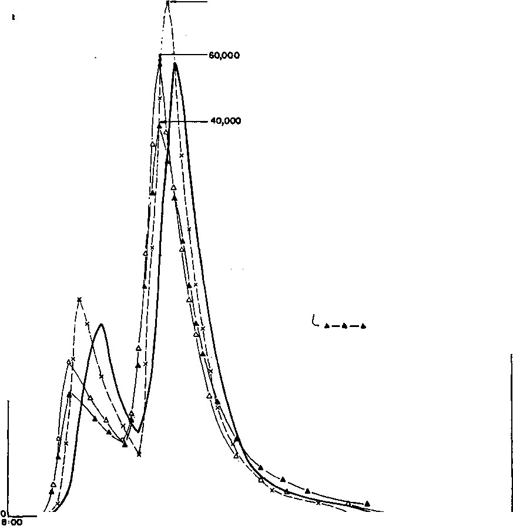**Figure 4-21. Effect on Hydrographs of Changing Subcatchment Width for West Toronto Area. (After Proctor and Redfern and J.F. MacLaren, 1976a, p. 216.)**
>
> 110 **4-60**
>
> **each subcatchment, and through the areal depletion curves used for continuous simulation. Anderson's temperature-index and heat balance melt equations are used for melt computations during dry and rainy periods, respectively. For continuous simulation, the "cold content" of the pack is maintained in order to "ripen" the snow before melting. Routing of melt water through the snow pack is performed as a simple reservoir routing procedure, as in the Canadian study.**
>
> **The presence of a snow pack is assumed to have no effect on overland flow processes beneath it. Melt is routed in the same manner as rain­fall.**
>
> **<u>Subcatchment Schematization</u> -- When snowmelt is simulated, a fourth subarea is added to each subcatchment as illustrated in Figure 4-11. The properties of each subarea are described in Table 4-4. The main purpose of the fourth subarea is to permit part of the impervious area (subarea A4) to be continuously snow covered (e.g., due to windrowing or dumping) and part (subareas Al plus A3) to be "normally bare" (e.g., streets and sidewalks that are plowed). However, during continuous simulation, the normally bare portion can also have snow cover up to an amount WEPLOW (card I2) inches water equivalent (in. w.e.). (All snow depths and calculations are in terms of the equivalent depth of liquid water.) The snow covered and normally bare impervious areas are determined from fraction SNN1 (card I1). During single event simulation, subarea A4 retains 100 percent snow cover until it has all melted. During continuous simulation, an areal depletion curve, discussed earlier, is used.**
>
> **Similarly, for single event simulation, a fraction SNN2 (card II) of the pervious area remains 100 percent snow covered. During continuous simulation, the whole pervious area is subject to an areal depletion curve.**
>
> **<u>Initialization</u> •-- Initial snow depths (inches water equivalent) may be entered using parameters SNN3, SNN4 (card Il) and SNN7 (card I2). This is likely to be the only source of snow for a single event simulation although snowfall values may be entered as negative precipitation in card group E2. During continuous simulation, the effect of initial conditions will die out, given a simulation of a few months.**
>
> **No liquid runoff will leave the snow pack until its free water holding capacity (due to its porosity) has been exceeded. The available volume is a constant fraction, FWFRAC (card C1) of the snow depth, WSNOW. Hence, initial values of free water, FW, should maintain the inequality**
>
> **FW \< FWFRAC • WSNOW (4-21)**
>
> **<u>Melt Equations</u> -- During periods of no rainfall, snowmelt is computed by a degree-day or temperature index equation,**
>
> **SMELT = DHM •(TA - TBASE) (4-22)**
>
> where SMELT = snowmelt rate, in. w.e./hr,
>
> DHM = melt coefficient, in. w.e./hr-°F,
>
> TA = air temperature, °F, and
>
> TBASE = snowmelt base temperature, °F.
>
> There is no melt when TA \< TBASE. For single event simulation, the melt coefficient, DIN, remains constant. For continuous simulation it is allowed to vary sinusoidally from a minimum value on December 21 to a maximum value on June 21 (see Figure 4-22) in order to reflect seasonal changes.
>
> Melt coefficients and base melt temperatures may be determined both theoretically and experimentally. Considering the former, it is possible to first write a snowmelt equation from a heat budget formulation that includes all relevant terms: change in. snow pack heat storage, net short wave radiation entering pack, conduction of heat to the pack from underlying ground, net (incoming minus outgoing) longwave radiation entering pack, convective transport of sensible heat from air to pack, rnlease **of** latent heat of vaporization by condensation of atmospheric water vapor, and advection of heat to snow pack by rain. (It is assumed here that the pack is "ripe", i.e., just at the melting point, so that rain will not freeze and release its latent heat of fusion.) The equation may then be linearized about a reference air temperature and reduced to the form of equation 4-22. Exactly this procedure is followed in a detailed example presented in Appendix III.
>
> Alternatively, observed melt, in inches per time interval, may be plotted against temperature for that time interval, and a linear relation­ship developed of the form of equation 4-22. An often-cited such develop­ment for natural areas is illustrated in Figure 4-23 taken from the Corps of Engineers (1956). Viessman et al. (1977) also present a good discussion
>
> of degree-day equations. In the highly desirable but unlikely event that snowmelt data are available, the experimental procedure of Figure 4-23 is probabaly best for urban areas due to the considerable variation of snow pack and meteorological conditions that will be encountered, making reasonable theoretical assumptions more difficult.
>
> For natural areas, considerable range in melt coefficients exits, on the order of 0.0006 to 0.008 in/hr-°F (0.03 to 0.4 mm/hr-°C). Although base melt temperatures are nominally near the freezing point (i.e., 32°F or 0°C) they may be considerably lower depending on the exposure of the site and meteorological conditions. For instance, for the linearization performed in Appendix III a base melt temperature of 9°F (-13°C) was computed, which is valid only over the range of air temperatures used in the linearization (approximately 30 to 40°F or -1 to 5°C).
>
> If the effects of snow removal practices (e.g., street salting) and land surface factors are known, different melt coefficients and base melt temperatures may be entered for the different snow covered subareas of a subcatchment. For instance, street salting lowers the freezing point in
>
> 113 4-63

<table>
<colgroup>
<col style="width: 12%" />
<col style="width: 12%" />
<col style="width: 7%" />
<col style="width: 5%" />
<col style="width: 12%" />
<col style="width: 12%" />
<col style="width: 12%" />
<col style="width: 12%" />
<col style="width: 12%" />
</colgroup>
<tbody>
<tr class="odd">
<td></td>
<td></td>
<td></td>
<td></td>
<td></td>
<td></td>
<td></td>
<td></td>
<td></td>
</tr>
<tr class="even">
<td></td>
<td></td>
<td></td>
<td></td>
<td></td>
<td></td>
<td></td>
<td></td>
<td></td>
</tr>
<tr class="odd">
<td></td>
<td></td>
<td></td>
<td></td>
<td></td>
<td>
5116 •

09e
</td>
<td></td>
<td rowspan="2"></td>
<td rowspan="2"></td>
</tr>
<tr class="even">
<td></td>
<td></td>
<td>•</td>
<td>6(1'</td>
<td></td>
<td></td>
<td>5.</td>
</tr>
<tr class="odd">
<td rowspan="2"></td>
<td></td>
<td></td>
<td></td>
<td rowspan="2"><blockquote>

05(1.32

</blockquote>

<em>i</em>
</td>
<td></td>
<td></td>
<td></td>
<td></td>
</tr>
<tr class="even">
<td rowspan="2"></td>
<td></td>
<td>Wi</td>
<td><blockquote>

<em>Mole: Equations range of Me o'icgrom.</em>

</blockquote></td>
<td><em>temperatures</em></td>
<td>
<em>are applicable</em>

<em>shown</em>
</td>
<td>
<em>only</em>

<em>to</em>

<em>on</em>
</td>
</tr>
<tr class="odd">
<td><em>.............„.............................</em></td>
<td></td>
<td></td>
<td></td>
<td></td>
<td></td>
<td></td>
<td></td>
</tr>
</tbody>
</table>

> **.34 36 42 46 50 34 35 62 66**
>
> **MEAN DAILY TEMPERATURE (T), or**
>
> **(a)** MEAN TEMPERATURE INDEX

Figure 4-23. Degree-Day Equations for Snow Melt. (After

> Corps of Engineers, 1956, plate 6-4).
>
> 114 4-64
>
> proportion to the concentration of the chemical. Handbook values (Chemical Rubber Co., 1976, pp. D218 - D267) for freezing point depression are plotted versus concentration in Figure 4-24 for several common roadway salting chemicals. Thus, the base melt temperature computed for pure water might be lowered by an amount taken from Figure 4-24 if an idea is known about the likely concentration on the roadway. The concentration will depend upon the amount of chemical applied and the amount of snowfall and might net be easily computed. An interesting alternative would be to let SW predict it!
>
> During periods (i.e., time steps) with rainfall, good assumptions can be made about relevant meteorological parameters for the complete heat balance melt equation. It then replaces the degree-day equation for "wet" time steps. A detailed explanation may be found in reference to equation III-8 in Appendix III. Melt during these time steps is linearly proportional to air temperature and wind speed.
>
> <u>Areal Depletion Parameters</u> -- In the earlier discussion of areal depletion curves it was noted that there would be 100 percent cover above a depth of SI inches water equivalent. Values of ST for impervious and pervious areas are read on card I2.
>
> For natural areas, Anderson (1973) recommends that a distinction be made on the basis of areal homogeneity. For a very heterogeneous area there are likely to be areas that receive little snow, or else it will quickly melt. The value of SI for such areas might be about the maximum depth anticipated. For homogeneous areas a much lower value would be appropriate.
>
> No specific information is available for urban areas; however, they are likely to be quite heterogeneous, especially if large, aggregated subcatchments are being used for the continuous simulation. Hence, a high value is probably indicated. Whichever values are used, they should be consistent with the form of the areal depletion curves entered in card groups C3 and C4. In general (depending somewhat on the areal depletion curve), the higher the value of SI, the more "stacked up" on a catchment is the snow, and snowmelt will occur at a lower rate over a longer time.
>
> <u>Snow Redistribution</u> -- The program allows (during continuous simulation) snow that falls on the normally bare impervious areas to be redistributed according to the fractions given as SFRAC on card I2. This is intended to simulate plowing and other snow removal practices in urban areas. Snow depths above WEPLOW inches water equivalent are thus redistributed according to Figure 4-25.
>
> The value of WEPLOW depends upon the level of service given the particular impervious area. That is, at what snow depth do removal practices start'? Some guidelines are provided by Richardson et al. (1974) in Table 4-12.

115 4-65

> **Al = IMPERVIOUS AREA WITH DEPRESSION STORAGE**
>
> **A2= PERVIOUS AREA**
>
> **A3= IMPERVIOUS AREA WITH ZERO DEPRESSION STORAGE**
>
> **A4= SNOW COVERED IMPERVIOUS AREA**
>
> **AI t43= NORMALLY BARE**

Figure 4-25. Illustration of Snow Redistribution Fractions.

> Table 4-12. Guidelines for Levels of Service in Snow and Ice Control. (Richardson et al., 1974.)

<table>
<colgroup>
<col style="width: 3%" />
<col style="width: 3%" />
<col style="width: 19%" />
<col style="width: 3%" />
<col style="width: 36%" />
<col style="width: 2%" />
<col style="width: 9%" />
<col style="width: 10%" />
<col style="width: 10%" />
</colgroup>
<tbody>
<tr class="odd">
<td rowspan="2"></td>
<td rowspan="2"><strong>1.</strong></td>
<td><blockquote>

<strong>Road Classification</strong>

</blockquote></td>
<td rowspan="2">
<strong>•</strong>

<strong>•</strong>

<strong>•</strong>
</td>
<td colspan="4">
<strong>Full Pave-</strong>

<strong>Snow Depth to Max. Snow Depth meat Clear of</strong>

<strong>Start Plowing on Pavement Snow After</strong>

<strong>Level of Service (Inches) (Inches) Storm (Hours)</strong>
</td>
<td><blockquote>

<strong>Full Pavement Clear of Ice After Storm Hours</strong>

</blockquote></td>
</tr>
<tr class="even">
<td><blockquote>

<strong>Low-Speed Multilane 
Urban Expressway</strong>

</blockquote></td>
<td><blockquote>

<strong>Roadway routinely patrolled during storms 0.5 to</strong>

<strong>All traffic lanes treated with chemicals</strong>

<strong>All lanes (including breakdown lanes) operable</strong>

<strong>at all times but ac reduced speeds</strong>

</blockquote></td>
<td><strong>I</strong></td>
<td><strong>1</strong></td>
<td><strong>1</strong></td>
<td><strong>12</strong></td>
</tr>
<tr class="odd">
<td></td>
<td></td>
<td></td>
<td><strong>•</strong></td>
<td><blockquote>

<strong>Occasional patches of well-sanded snow pack</strong>

</blockquote></td>
<td></td>
<td></td>
<td></td>
<td></td>
</tr>
<tr class="even">
<td></td>
<td></td>
<td></td>
<td><strong>•</strong></td>
<td><blockquote>

<strong>Roadway repeatedly cleared by echelons 
of plows to minimize traffic disruption</strong>

</blockquote></td>
<td></td>
<td></td>
<td></td>
<td></td>
</tr>
<tr class="odd">
<td></td>
<td></td>
<td></td>
<td><strong>•</strong></td>
<td><blockquote>

<strong>Clear pavement obtained as soon as possible</strong>

</blockquote></td>
<td></td>
<td></td>
<td></td>
<td></td>
</tr>
<tr class="even">
<td></td>
<td><strong>2.</strong></td>
<td><blockquote>

<strong>Eigh-Speed</strong>

</blockquote></td>
<td><strong>•</strong></td>
<td><blockquote>

<strong>Roadway routinely patrolled during storms</strong>

</blockquote></td>
<td><strong>1</strong></td>
<td><blockquote>

<strong>2</strong>

</blockquote></td>
<td><strong>1.5</strong></td>
<td><strong>12</strong></td>
</tr>
<tr class="odd">
<td></td>
<td></td>
<td><blockquote>

<strong>4-Lane Divided Highways</strong>

</blockquote></td>
<td><strong>•</strong></td>
<td><blockquote>

<strong>Driving and passing lanes treated with chemicals</strong>

</blockquote></td>
<td></td>
<td></td>
<td></td>
<td></td>
</tr>
<tr class="even">
<td></td>
<td></td>
<td><blockquote>

<strong>Interstate System</strong>

<strong>ADT greater than 10,000</strong>

</blockquote></td>
<td><strong>•</strong></td>
<td><blockquote>

<strong>Driving lane operabl2 at all times at reduced speeds</strong>

</blockquote></td>
<td></td>
<td></td>
<td></td>
<td></td>
</tr>
<tr class="odd">
<td></td>
<td></td>
<td></td>
<td><strong>•</strong></td>
<td><blockquote>

<strong>Passing lane operable depending on equipment availability</strong>

</blockquote></td>
<td></td>
<td></td>
<td></td>
<td></td>
</tr>
<tr class="even">
<td></td>
<td></td>
<td></td>
<td><strong>•</strong></td>
<td><blockquote>

<strong>Clear pavement obtained as soon as possible</strong>

</blockquote></td>
<td></td>
<td></td>
<td></td>
<td></td>
</tr>
<tr class="odd">
<td><strong>Co</strong></td>
<td><strong>3.</strong></td>
<td><blockquote>

<strong>Primary Highways</strong>

</blockquote></td>
<td><strong>•</strong></td>
<td><blockquote>

<strong>Roadway is routinely patrolled during storms</strong>

</blockquote></td>
<td><strong>1</strong></td>
<td><blockquote>

<strong>2.5</strong>

</blockquote></td>
<td><strong>2</strong></td>
<td><strong>24</strong></td>
</tr>
<tr class="even">
<td></td>
<td></td>
<td><blockquote>

<strong>Undivided 2 and 3 lanes</strong>

</blockquote></td>
<td><strong>•</strong></td>
<td><blockquote>

<strong>Mostly clear pavement after storm stops</strong>

</blockquote></td>
<td></td>
<td></td>
<td></td>
<td></td>
</tr>
<tr class="odd">
<td></td>
<td></td>
<td><blockquote>

<strong>ADT 500 -- 5000</strong>

</blockquote></td>
<td><strong>•</strong></td>
<td><blockquote>

<strong>Hazardous areas rereive treatment of chemicals or abrasive</strong>

</blockquote></td>
<td></td>
<td></td>
<td></td>
<td></td>
</tr>
<tr class="even">
<td></td>
<td></td>
<td></td>
<td><strong>•</strong></td>
<td><blockquote>

<strong>Remaining snow and ice removed when thawing occurs</strong>

</blockquote></td>
<td></td>
<td></td>
<td></td>
<td></td>
</tr>
<tr class="odd">
<td></td>
<td><strong>4.</strong></td>
<td><blockquote>

<strong>Secondary Roads</strong>

</blockquote></td>
<td></td>
<td><blockquote>

<strong>Roadway is patrolled at least once during a storm</strong>

</blockquote></td>
<td><strong>2</strong></td>
<td><blockquote>

<strong>3</strong>

</blockquote></td>
<td><strong>3</strong></td>
<td><strong>48</strong></td>
</tr>
<tr class="even">
<td></td>
<td></td>
<td><blockquote>

<strong>ADT less than 500</strong>

</blockquote></td>
<td><strong>•</strong></td>
<td><blockquote>

<strong>Bare left-wheel track with intermittent snow cover</strong>

</blockquote></td>
<td></td>
<td></td>
<td></td>
<td></td>
</tr>
<tr class="odd">
<td></td>
<td></td>
<td></td>
<td><strong>•</strong></td>
<td><blockquote>

<strong>Hazardous areas are plowed and treated with chemicals</strong>

<strong>or abrasives as a first order of work</strong>

</blockquote></td>
<td></td>
<td></td>
<td></td>
<td></td>
</tr>
<tr class="even">
<td></td>
<td></td>
<td></td>
<td><strong>•</strong></td>
<td><blockquote>

<strong>Full width of road is cleared as equipment becomes available</strong>

</blockquote></td>
<td></td>
<td></td>
<td></td>
<td></td>
</tr>
</tbody>
</table>

**The five fractions, SFRAC, should sum to 1.0 and are defined on the basis of the ultimate fate of the removed snow. For instance, if snow is plowed from a street onto an adjacent impervious or pervious area, fractions SFRAC(1) or SFRAC(2) would be appropriate. It may also be transfered to the last subcatchment (e.g., a dumping ground) or removed from the simulation (i.e., removed from the total catchment) altogether. Finally, it may be converted to immediate melt. Should variations** in snow removal practices need to be simulated, different subcatchments can be established for different purposes and the frac­tions varied accordingly.

<u>Surface Quality Input Data (Card Groups J1-L1)  
Overview of Quality Procedures</u> --

For most SWMM applications, **the Runoff Block is the origin of water quality constituents. Although effects of dry-weather flow and scour** and deposition may he included in the Transport Block, (dry-weather flow quality may also be included in the Storage/treatment Block), the generation of nasality constituents (e.g., pollutants) in the storm water itself can only be included in the Runoff Block.

Several mechanisms constitute the genesis of stormwater quality, most notably <u>buildup</u> and <u>washoff.</u> In an impervious urban area, it is usually assumed that a supply of constituents is built up on the land surface dur­ing dry weather preceding a storm. Such a buildup may or may not be a function of time and factors such as traffic flow, dry fallout and street sweeping. With the storm the material is then washed off into the drainage system. The physics of the washoff may involve rainfall energy, as in some erosion calculations, or may be a function of bottom shear stress in the flow as in sediment transport theory. Most often, however, washoff is treated by an empirical equation with slight physical justification.

As an alternative to the use of a buildup-washoff formulation, quality loads (i.e., mass/time) may be generated by a rating curve approach in which loads are proportional to flow to some power. Such an approach may also be justified physically and is often easier to calibrate using available data.

Another quality source is catchbasins. These are treated in SWMM as a reservoir of constituents in each subcatchment available to be flushed out during the storm.

Erosion of "solids" may be simulated directly by the Universal Soil Loss Equation (USLE). Since it was developed for long term predictions (e.g., seasonal or annual loads), its use during a storm event in SWMM is questionable. But it is convenient since many data are available to support it.

A final source of constituents is in the precipitation itself. Much more monitoring exists of precipitation quality at present than in the past, and precipitation can contain surprisingly high concentrations of many parameters. This is treated in SWMM by permitting a constant concentration of constituents in precipilaLion.

> 119 4-69

Many constituents can appear in either dissolved or solid form (e.g., BUD, nitrogen, phosphorus) and may adsorbed onto other constituents (e.g., pesticides onto "solids") and thus be generated as a portion of such other constituents. To treat this situation, any constituent may be computed as a fraction ("potency factor") of another. For instance, five percent of the suspended solids load could be added to the (soluble) B0D load. Or several particle size - specific gravity ranges could be generated, with other constituents consisting of fractions of each.

Up to ten quality constituents may be simulated in the Runoff Block. All are user supplied, with appropriate parameters for each. All are transferred to the interface file for transmittal to subsequent SWMM blocks, but not all may be used by the blocks; see the documentation for each block.

Up to five user supplied land uses may be entered to characterize dif-ferent subcatchments. Street sweeping is a function of land use, and indi­vidual constituents. Constituent buildup may be a function of land use or else fixed for each constituent. Considerable flexibility thus exists.

When gutter/pipes are included, quality constituents are routed through them assuming complete mixing within each gutter/pipe at each time step. No scour, deposition or decay-interaction during routing is simulated in the Runoff Block.

Output consists of pollutographs (concentrations versus time) at de­sired locations along with total loads, and flow-weighted concentration means and standard deviations. The pollutographs may be plotted using the graph routines of the Executive Block (Section 2). In addition, summaries are printed for each constituent describing its overall mass balance for the simulation for the total catchment, i.e., sources, removals, etc. These sum­maries are the most useful output for continuous simulation runs.

In the following material, the processes described above will be dis­cussed in more detail. The various parameters will be related to individual card groups as appropriate.

<u>Quality Simulation Credibility</u> --

Although the conceptualization of the quality processes is not diffi­cult, the reliability and credibility of quality parameter simulation is very difficult to establish. In fact, quality predictions by SWMM or almost any **other surface runoff model are almost useless without local data for the** catchment being simulated to use for calibration and verification. If such data are lacking, results may still be used to compare <u>relative</u> effects of changes, but parameter magnitudes (i.e., actual values of predicted concen­trations) will forever be in doubt. This is in marked contrast to quantity prediction for which reasonable estimates of hydrographs may be made in advance of calibration.

Moreover, as will be discussed, there is disagreement in the literature as to what are the important and appropriate physical and chemical mecha­nisms that should be included in a model to generate surface runoff quality.

> 120 4-7O

The objective in the Runoff Block has been to provide flexibility in mecha­nisms and the opportunity for calibration. But this places a considerable burden on the user to obtain adequate data for model usage and to be famil­iar with quality mechanisms that may apply to the catchment being studied. This burden may often be ignored, leading ultimately to model results being discredited.

In the end then, there is no substitute for local data, that iS, flow and concentration measurements, with which to calibrate and verify the quality predictions. <u>Without such data, little reliability can be placed in the predicted magnitudes of quality parameters.</u>

<u>Quality Constituents</u> --

The number and choice of constituents to be simulated must reflect the user's needs, potential for treatment and receiving water impacts, etc. Al­most any constituent measured by common laboratory or field tests can be included, up to a total of ten. The name and concentration units are entered. as A-format variables in card group J3. These will be passed to subsequent blocks *(see* Section 2) and are used as column headings for tabular output of concentrations, as illustrated in Figure 4-26. This heading style is used in both the Runoff and Transport Blocks.

Options for concentration units are reasonably broad and broken into three categories, indicated by parameter NDIM in card group J3. Most con­stituents are measurable in units of milligrams per liter, mg/l. Although parameters such as metals, phosphorus or trace organics are often given as micrograms per liter, pg/l, the output of concentrations for NDIM=0 is F10.3 (allowing for three decimal places), and it is expected to be compatible with reported values of such parameters. Thus, the use of mg/1 should suffice for all parameters for which the "quantity" of the parameter is measured as a mass (e.g., mg).

A notable exception to the use of mass units is for bacteria, for which constituents such as coliforms, fecal strep etc. are given as a number or count per volume, e.g., MPN/1. Setting NDIM=1 accounts for these units (or any other type of "quantity" per liter, including mass if desired). Con­centration output for these constituents is given an E9.3 format.

A third category covers parameters with specialized concentration-type units such as pH, conductivity ((mho), turbidity (JTU), color (PCU), temperature (°C), etc. These are simulated using NDIM=2. For these param­eters, interpretation of concentration results is straightforward, but "total mass" or "buildup" is mostly conceptual. Since loads (e.g., mass/time) are • transmitted in terms of concentration times flow rate, whichever concentra­tion units are used, proper continuity of parameters is readily maintained. Of course, simulation of a parameter such as temperature could only be done to the zeroth approximation in any event since all Runoff Block constituents are conservative.

121 4-71

> **PNAME (I,K) PNAME(IIK +I)**
>
> **PNAME (2,K) PNAME (2,K +1)**
>
> **FIELD WIDTH = 10 FOR CONCENTRATION OUTPUT,**
>
> **E.G., F10.3 OR IX, E9.3**

Figure 4-26. Layout of Quality Constituent Headings. Parameters PNAME and PUNIT are entered in card group J3, Table 4-28.

122 4-72

> **<u>Land Use Data (Card Group J2)</u> --**
>
> **Each subcatchment must be assigned only one of up to five user supplied land uses. The number of the land use is used as a program subscript, so at least one land use card must be entered. Street sweeping is a function of land use and constituent (discussed subsequently). Constituent buildup may be a function of land use depending on the type of buildup calculation** spec­ified for each in **card group** J3. The buildup parameters DDLIM, DDPOW, and DDFACT in card group J2 are used only when constituent buildup will be a function of "dust and dirt" buildup. This is discussed in detail below.
>
> The land use name, LNAME, will be printed in the output using eight columns. The land use types are completely arbitrary, but they could re­flect those for which data are available and, of course, those found in the catchment, or an aggregate thereof.
>
> <u>Buildup</u> --
>
> <u>Background</u> -- One of the most influential of the early studies of stormwater pollution was conducted in Chicago by the American Public Works Association (1969). As part of this project, street surface accumulation of "dust and dirt" (anything passing through a quarter inch mesh screen) was measured'by sweeping with brooms and vacuum cleaners. The accumulations were measured for different land uses and curb lengths, and the data were normalized in terms of pounds of dust and dirt per dry day per 100-ft of curb or gutter. These well known results are shown in Table 4-13 and imply that dust and dirt buildup is a linear function of time.

<table>
<colgroup>
<col style="width: 13%" />
<col style="width: 44%" />
<col style="width: 41%" />
</colgroup>
<tbody>
<tr class="odd">
<td>
Table 4-13

Type
</td>
<td colspan="2">
Measured Dust and Dirt (DD) Accumulation in Chicago by

<blockquote>

the APWA in 1969 (APWA, 1969).

</blockquote>

Land Use Pounds DD/dry day•100 ft-curb
</td>
</tr>
<tr class="even">
<td>1</td>
<td><blockquote>

Single Family Residential

</blockquote></td>
<td>0.7</td>
</tr>
<tr class="odd">
<td>2</td>
<td><blockquote>

Multi-Family Residential

</blockquote></td>
<td>2.3</td>
</tr>
<tr class="even">
<td>3</td>
<td><blockquote>

Commercial

</blockquote></td>
<td>3.3</td>
</tr>
<tr class="odd">
<td>4</td>
<td><blockquote>

Industrial

</blockquote></td>
<td>4.6</td>
</tr>
<tr class="even">
<td>5</td>
<td><blockquote>

Undeveloped or Park

</blockquote></td>
<td>1.5</td>
</tr>
</tbody>
</table>

> The dust and dirt samples were analyzed chemically, and the fraction of sample consisting of various constituents for each of four land uses was determined, leading to the results shown in Table 4-14.

123 4-73

> Table 4-14 Milligrams of Pollutant Per Gram of Dust and Dirt (Parts Per Thousand By Mass) For Four Chicago Land Uses From 1969 APWA Study (APWA, 1969).

<table>
<colgroup>
<col style="width: 24%" />
<col style="width: 20%" />
<col style="width: 23%" />
<col style="width: 16%" />
<col style="width: 15%" />
</colgroup>
<tbody>
<tr class="odd">
<td rowspan="2">Parameter</td>
<td rowspan="2"><blockquote>

Single Family Residential

</blockquote></td>
<td>Land Use Type</td>
<td rowspan="2">Commercial</td>
<td rowspan="2">Industrial</td>
</tr>
<tr class="even">
<td>Multi-Family 
Residential</td>
</tr>
<tr class="odd">
<td><blockquote>

BOD5

</blockquote></td>
<td>5.0</td>
<td>3.6</td>
<td>7.7</td>
<td>3.0</td>
</tr>
<tr class="even">
<td><blockquote>

COD

</blockquote></td>
<td>40.0</td>
<td>40.0</td>
<td>39.0</td>
<td>40.0</td>
</tr>
<tr class="odd">
<td><blockquote>

Total Coliformsa

</blockquote></td>
<td>1.3x106</td>
<td>2.7x106</td>
<td>1.7x106</td>
<td>1.0x106</td>
</tr>
<tr class="even">
<td><blockquote>

Total N

</blockquote></td>
<td>0.48</td>
<td>0.61</td>
<td>0.41</td>
<td>0.43</td>
</tr>
<tr class="odd">
<td><blockquote>

Total PO4 (as PO4)

</blockquote></td>
<td>0.05</td>
<td>0.05</td>
<td>0.07</td>
<td>0.03</td>
</tr>
</tbody>
</table>

> aUnits **for** coliforms are MPN/gram.
>
> From the values shown in the table, the buildup of each constituent (also linear with time) can be computed simply by multiplying dust and dirt by the appropriate fraction. Since the APWA study was published during the original SWMM project (1969-1971), it represented the state of the art at the time and was used extensively in the development of the surface quality routines (Metcalf and Eddy et al., 1971a, Section 11). In fact, the formulation and data may still be used in this present version of SWMM should the user wish to rely upon highly site specific results for Chicago. Needless to say, unless the application is in Chicago this is not recom­mended. Several useful studies have been conducted since the pioneering APWA work which permit much more selectivity.
>
> Of course the whole buildup idea essentially ignores the physics of generation of pollutants from sources such as street pavement, vehicles, atmospheric fallout, vegetation, land surfaces, litter, spills, anti-skid compounds and chemicals, construction, and drainage networks. Lager et al. (1977a) consider each source in turn and give guidance on buildup rates. But the rates that are (optionally) entered into the Runoff Block only reflect the aggregate of all sources.
>
> <u>Available Studies</u> -- The 1969 APWA study (APWA, 1969) was followed by sev­eral more efforts, notably AVCO (1970) reporting extensive data from Tulsa, Sartor and Boyd (1972) reporting a cross section of data.from ten US cities, and Shaheen (1975) reporting data for highways in the Washington, D.C. area. Pitt and Amy (1973) followed the Sartor and Boyd (1972) study with an anal­ysis of heavy metals on street surfaces from the same ten U.S. cities. More recently, Pitt (1979) reports extensive data gathered both on the street surface and in runoff for San Jose. A drawback of the earlier studies is that it is difficult to draw conclusions from them on the relationship between street surface accumulation and stormwater concentrations since they were seldom measured simultaneously.
>
> 124 4-74
>
> Amy et al. (1975) provide a summary of data available in 1974 while Lager et al. (1977a) provide a similar function as of 1977 without the extensive data tabulations given by Amy et al. Perhaps the most compre­hensive summary of surface accumulation and pollutant fraction data is provided by Manning et al. (1977) in which the many problems and facets of sampling and measurements are also discussed. For instance, some data are obtained by sweeping, others by flushing; the particle size characteristics
>
> and degree of removal from the street surface ;or each rncthcd. Some results of Manning et al. (1977) will be illustrated later. Surface accumu­lation data may be gleaned, somewhat less directly, from references on loading functions that include McElroy et al. (1976), Heaney et al. (1977) and Huber et al. (1979, 1980).
>
> Ammon (1979) has summarized many of these and other studies, specific­ally in regard to application to SWMM. For instance, there is evidence to suggest several buildup relationships as alternatives to the linear one, and these relationships may change with the constituent being considered. Upper limits for buildup are also likely. Several options for both buildup and washoff are investigated by Ammon, and his results are partially the basis fnr formulations in this version of SWMM. Recently, Jewel\] et al. (1980) also provide a useful critique of methods available for simulation of sur­face runoff quality and ultimately suggest statistical analysis as the proper alternative. Many of the problems and weaknesses with extensive data and present modeling formulations are pointed out by Sonnen (1980) along with guidelines for future research.
>
> To summarize, many studies and voluminous data exist with which to formulate buildup relationships, most of which are purely empirical and data-based, ignoring the underlying physics and chemistry of the generation processes. Nonetheless, they represent what is available, and modeling techniques in SWMM are designed to accommodate them in their heuristic form.
>
> <u>Buildup Formulations</u> -- Most data, as will be seen, imply linear buildup since they are given in units such as lb/ac-day or lb/100 ft curb-day. As stated earlier, the Chicago data that were used in the original SWMM formu­lation assumed a linear buildup. However, there is ample evidence that buildup can be nonlinear; Sartor and Boyd's (1972) data are most often cited as examples (Figure 4-27). More recent data from Pitt (Figure 4-28) for San Jose indicate almost liner accumulation, although some of the best fit lines indicated in the figure had very poor correlation coefficients, rang­ing from 0.35 S. r S 0.9. Even in data collected as carefully as in the San Jose study, the scatter (not shown in the report) is considerable. Thus, the choice of the best functional form is not obvious. Whipple (1977) has criticized the linear buildup formulation included in the original SWMM, although it is somewhat irrelevant since the user has long been able to insert his/her own desired initial loads, calculated by whatever procedure was desired, in card group LI. However, linear buildup between storms during continuous simulation has indeed been used in SWNM, until this present version.
>
> The choice of the proper functional form must ultimately be the re­sponsibility of the user. The program provides three options for dust and dirt buildup (Table 4-15) and thrcc for individual constituents (Table 4-16). They are the same three, as seen from the tables, namely:
>
> 125 4-75
>
> **DAYS SINCE LAST CLEANED**

Figure 4-28. Buildup of Street Solids in San Jose. (After Pitt, 1979, p. 29.)

> **Table 4-15. Buildup Equations and Units for Dust and Dirt.**
>
> **Enter parameters on Card Group J2. <u>For metric input</u> substitute kg for lb,**
>
> **ha for ac and km for 100-ft.**
>
> **DD = Dust and Dirt, lb. t = time, days.**
>
> **METHOD Type Equation Equation Number  
> <u>(Card Group J2) </u>**

**Power-Linear DD = DDFACT • tpDPOW**

> **(4-23)**
>
> **DD \< DDLIM**
>
> **-DDPOW.t**

**DD = DDLIM.(1-e) Exponential (4-24)**

**Michaelis-Menton DD = DDLIM•t/(DDFACT+t) (4-25)**

<table>
<colgroup>
<col style="width: 10%" />
<col style="width: 8%" />
<col style="width: 29%" />
<col style="width: 20%" />
<col style="width: 31%" />
</colgroup>
<tbody>
<tr class="odd">
<td><strong>METHOD</strong></td>
<td colspan="2">
<strong>Units for Card Input of:</strong>

<strong>JACGUT DDLIM</strong>
</td>
<td><blockquote>

<strong>DDPOW</strong>

</blockquote></td>
<td><strong>DDFACT</strong></td>
</tr>
<tr class="even">
<td>0</td>
<td><strong>0</strong></td>
<td><blockquote>

<strong>lb.(100 ft curb)-1</strong>

</blockquote></td>
<td><strong>Dimensionless</strong></td>
<td>
<strong>lb (100 ft-curb)-1-day-DDPOW</strong>

<blockquote>

<strong>.</strong>

</blockquote></td>
</tr>
<tr class="odd">
<td></td>
<td><strong>1</strong></td>
<td><blockquote>

<strong>lb•ac-1</strong>

</blockquote></td>
<td><strong>Dimensionless</strong></td>
<td><blockquote>

<strong>•</strong>

</blockquote>

<strong>lb ac-1•day-DDPOW</strong>
</td>
</tr>
<tr class="even">
<td></td>
<td><strong>2</strong></td>
<td><blockquote>

<strong>lb</strong>

</blockquote></td>
<td><strong>Dimensionless</strong></td>
<td><strong>lb-day-DDPOW</strong></td>
</tr>
<tr class="odd">
<td>1</td>
<td><strong>0</strong></td>
<td><blockquote>

<strong>lb.(100 ft curb)-1</strong>

</blockquote></td>
<td><strong>day-1</strong></td>
<td><strong>Not Used</strong></td>
</tr>
<tr class="even">
<td></td>
<td></td>
<td><strong>-</strong></td>
<td></td>
<td></td>
</tr>
<tr class="odd">
<td></td>
<td><strong>1</strong></td>
<td><blockquote>

<strong>lb•ac1</strong>

</blockquote></td>
<td>
<strong>-1</strong>

<strong>day</strong>
</td>
<td><strong>Not Used</strong></td>
</tr>
<tr class="even">
<td></td>
<td></td>
<td></td>
<td><strong>-1</strong></td>
<td></td>
</tr>
<tr class="odd">
<td></td>
<td><strong>2</strong></td>
<td><blockquote>

<strong>lb</strong>

</blockquote></td>
<td><strong>day</strong></td>
<td><strong>Not Used</strong></td>
</tr>
<tr class="even">
<td><strong>2</strong></td>
<td><strong>0</strong></td>
<td><blockquote>

<strong>lb.(100 ft curb)-1</strong>

</blockquote></td>
<td><blockquote>

<strong>Not Used</strong>

</blockquote></td>
<td><blockquote>

<strong>day</strong>

</blockquote></td>
</tr>
<tr class="odd">
<td></td>
<td><strong>1</strong></td>
<td><blockquote>

<strong>lb•ac-1</strong>

</blockquote></td>
<td><blockquote>

<strong>Not Used</strong>

</blockquote></td>
<td><blockquote>

<strong>day</strong>

</blockquote></td>
</tr>
<tr class="even">
<td></td>
<td><strong>2</strong></td>
<td><blockquote>

<strong>lb</strong>

</blockquote></td>
<td><blockquote>

<strong>Not Used</strong>

</blockquote></td>
<td><blockquote>

<strong>day</strong>

</blockquote></td>
</tr>
</tbody>
</table>

> **Parameters DDLIM, DDPOW, and DDFACT are single subscripted by land use, J.**

128 4-78

> **Table 4-16. Buildup Equations for Constituents.**

<table>
<colgroup>
<col style="width: 19%" />
<col style="width: 16%" />
<col style="width: 23%" />
<col style="width: 28%" />
<col style="width: 12%" />
</colgroup>
<tbody>
<tr class="odd">
<td></td>
<td colspan="2" rowspan="2">
<strong>Enter Parameters on Card Group J3.</strong>

<strong>PSHED = Constituent quantity. t = time, days. For parameter units, see Table 4-17.</strong>

<strong>KALC Type 
(Card Group J3)</strong>
</td>
<td rowspan="2"><blockquote>

<strong>Equation</strong>

</blockquote></td>
<td rowspan="2"><strong>Equation Number</strong></td>
</tr>
<tr class="even">
<td rowspan="2"><strong>N.)</strong></td>
</tr>
<tr class="odd">
<td></td>
<td></td>
<td></td>
<td></td>
</tr>
<tr class="even">
<td><strong>%AD</strong></td>
<td><strong>1</strong></td>
<td><blockquote>

<strong>Power-Linear</strong>

</blockquote></td>
<td><blockquote>

<strong>PSHED = QFACT(3)-tQFACT(2)</strong>

</blockquote></td>
<td><strong>(4-26)</strong></td>
</tr>
<tr class="odd">
<td></td>
<td></td>
<td></td>
<td><blockquote>

<strong>PSHED &lt; QFACT(1)</strong>

</blockquote></td>
<td></td>
</tr>
<tr class="even">
<td></td>
<td><strong>2</strong></td>
<td><blockquote>

<strong>Exponential</strong>

</blockquote></td>
<td><blockquote>

<strong>PSHED = QFACT(1).(1-e-QFACT(2)-t)</strong>

</blockquote></td>
<td><strong>(4-27)</strong></td>
</tr>
<tr class="odd">
<td rowspan="2"></td>
<td rowspan="2"><strong>3</strong></td>
<td rowspan="2"><blockquote>

<strong>Michaelis-Menton</strong>

</blockquote></td>
<td><blockquote>

<strong>- QFACT(1).t 
PSHED —</strong>

</blockquote></td>
<td rowspan="2"><strong>(4-28)</strong></td>
</tr>
<tr class="even">
<td><strong>(QFACT(3)+t)</strong></td>
</tr>
</tbody>
</table>

**Parameters QFACT are doubly subscripted. Second subscript is constituent number, K.**

> **Table 4-17. Units for Card Input of Constituent Parameters, Card Group J3.  
> Define Q1 and Q2 E Constituent quantity as follows:**
>
> **<u>NDIH</u>**
>
> **0 Ql = lb, Q2 = mg**
>
> **1 Q1 = Q2 = 106 • Other quantity, e.g., 106-MPN <u>For metric isput</u> substitute**
>
> **kg for lb, m for ft , ha for**
>
> **2 Q1 = Q2 = Concentration x ft3, *e.g.,* JTU • ft3 ac and km for 100-ft.  
> For KALC = 4, buildup parameters are not required.**
>
> **For KALC = 0, QFACT(J,K) = - /1 to JLAND and gDp = grams dust and dirt. (E.g., see Table 4-14) Q**2**/g**00 **for J =**
>
> **Otherwise:**
>
> **KALC <u>KACGUT QFACT(1,K) QFACT(2,K) QFACT(3,K)</u>**

<table>
<colgroup>
<col style="width: 8%" />
<col style="width: 11%" />
<col style="width: 25%" />
<col style="width: 20%" />
<col style="width: 33%" />
</colgroup>
<tbody>
<tr class="odd">
<td><strong>1</strong></td>
<td><strong>0</strong></td>
<td><blockquote>

<strong>Q,-(100 ft-curb)-1</strong>

</blockquote></td>
<td><strong>Dimensionless</strong></td>
<td><blockquote>

<strong>Q1-(100 ft-curb)-1.day-QFACT(2,K)</strong>

</blockquote></td>
</tr>
<tr class="even">
<td></td>
<td><strong>1</strong></td>
<td><blockquote>

<strong>Q1 ac 1•_1</strong>

</blockquote></td>
<td><strong>Dimensionless</strong></td>
<td><blockquote>

<strong>QI•ac-i-da y-QFACT(2,K)</strong>

</blockquote></td>
</tr>
<tr class="odd">
<td></td>
<td><strong>2</strong></td>
<td><blockquote>

<strong>Q1</strong>

</blockquote></td>
<td><strong>Dimensionless</strong></td>
<td><blockquote>

<strong>Q1•day-QFACT(2,K)</strong>

</blockquote></td>
</tr>
<tr class="even">
<td><strong>2</strong></td>
<td><strong>0</strong></td>
<td><blockquote>

<strong>Q,-(100 ft-curb) -1</strong>

</blockquote></td>
<td><strong>day-1</strong></td>
<td><blockquote>

<strong>Not Used</strong>

</blockquote></td>
</tr>
<tr class="odd">
<td></td>
<td><strong>1</strong></td>
<td><blockquote>

<strong>Q1</strong>

</blockquote>

<strong>1 ac..</strong>

<strong>-,</strong>
</td>
<td><strong>day-1</strong></td>
<td><blockquote>

<strong>Not Used</strong>

</blockquote></td>
</tr>
<tr class="even">
<td></td>
<td><strong>2</strong></td>
<td><blockquote>

<strong>Q1</strong>

</blockquote></td>
<td><strong>day-1</strong></td>
<td><blockquote>

<strong>Not Used</strong>

</blockquote></td>
</tr>
<tr class="odd">
<td><strong>3</strong></td>
<td><strong>0</strong></td>
<td><blockquote>

<strong>Q1-(100 ft-curb)-1</strong>

</blockquote></td>
<td><strong>Not Used</strong></td>
<td><strong>day</strong></td>
</tr>
<tr class="even">
<td></td>
<td><strong>1</strong></td>
<td><blockquote>

<strong>Q1 -ac-1</strong>

</blockquote></td>
<td><strong>Not Used</strong></td>
<td><strong>day</strong></td>
</tr>
<tr class="odd">
<td></td>
<td><strong>2</strong></td>
<td><blockquote>

<strong>Q1</strong>

</blockquote></td>
<td><strong>Not Used</strong></td>
<td><strong>day</strong></td>
</tr>
</tbody>
</table>

> **QFACT(4,K) and QFACT(J,K) not required for KALC \# O.**

1.  **power-linear,**

2.  **exponential, or**

3.  **Michaelis-Menton.**

**Linear buildup is simply a subset of a power function buildup. The shapes of the three functions are compared in Figure 4-29 using the dust and** dirt parameters (card group J2) as examples, and a strictly arbitrary assignment of numerical values to the parameters. Exponential and Michaelis-Menton functions have clearly defined asymptotes or upper limits. Upper limits for linear or power function buildup may be imposed if desired. "Instan­taneous buildup" may be easily achieved using any of the formulations with appropriate parameter choices. For instance, if it were desired to always have a fixed amount of dust and dirt available, DDLIM, at the beginning of any storm event (i.e., after any dry time step during continuous simula­tion), then linear buildup could be used with DDPOW = 1.0 and UDFACT equal

to a large number DDLIM/DELT. Linear buildup is "cheapest" to run in terms of computer time.

It is apparent in Figure 4-29 that different options may be used to accomplish the same objective (e.g., nonlinear buildup); the choice may well be made on the basis of available data to which one or the other func­tional forms have been fit. If an asymptotic form is desired, either the exponential or Michaelis-Menton option may be used depending upon ease of comprehension of the parameters. For instance, for exponential buildup the exponent (i.e., DDPOW for dust and dirt or QFACT(2,K) for a constit­uent) is the familiar exponential decay constant. It may be obtained from the slope of a semi-log plot of byildup versus time. As a numerical ex­ample, if its value were 0.4 day , then it would take 5.76 days to reach 90 percent of the maximum buildup (see Figure 4-29).

For Michaelis-Menton buildup the parameter DDFACT for dust and dirt (or QFACT(3,K) for a constituent) has the interpretation of the half-time con­stant, that is, the time at which buildup is half of the maximum (asymp­totic) value. For instance, DD = 50 lb at t = 0.9 days for curve 4 in Figure 4-29. If the asymptotic value is known or estimated, the half­time constant may be obtained from buildup data from the slope of a plot of DD versus t-(DDLIM-DD), using dust and dirt as an example. Generally, the Michaelis-Menton formulation will rise steeply (in fact, linearly for small t) and then approach the asymptote slowly.

The power function may be easily adjusted to resemble asymptotic behavior, but it must always ultimately exceed the maximum value (if used). The parameters are readily found from a log-log plot of buildup versus time. This is a common way of analyzing data, (e.g., Miller et al., 1978, Ammon, 1979, Smolenyak, 1979, Jewell et al., 1980, Wallace, 1980).

Prior to the beginning of the simulation, buildup occurs over DRYDAY days for both single event and continuous simulation. During the simula­tion, buildup will occur during dry time steps (runoff less than 0.0005 in./hr or 0.013 mm/hr) only for continuous simulation.

131 4-81

> **2 4 6 8 10 12 14**

**TIME, days**

> Figure 4-29. Comparison of Linear and Three Non-linear Buildup Equations. "Dust and dirt," DD, is used as an example. Numerical values have been chosen arbitrarily.
>
> 132 4-82

For a given constituent, buildup may be computed 1) as a fraction of dust and dirt, or 2) individually for the constituent. If the first option is used (KALC=0 on card group J3) then the rate of buildup will depend upon the fraction and the functional form used for a given land use. In other words, the functional form could vary with land use for a given constituent. If the second option is used (1 ≤ KALC 5. 3 on card group J3) the buildup function will be the same for all land uses (and subcatchments) for a given constituent. Of course, each constituent may use any of the options. Catchment characteristics (i.e., area or gutter length) may be included through the use of parameters JACGUT (card group J2) or KACGUT (card group J3), as described in Tables 4-15 and 4-17.

Units for dust and dirt buildup parameters are reasonably straight­forward and explained in Table 4-15. For example, if linear buildup was assumed using the Chicago APWA data (APWA, 1969), values for DDFACT could be taken directly from Table 4-13 for different land uses. Parameters JACGUT would equal zero. A limiting buildup (DDLIM) of so many lb/100 ft-curb could be entered if desired, and for linear buildup, DDPOW = 1.0.

Units for constituent buildup parameters depend upon parameter NDIM, that is, the units for the buildup parameters depend upon the units of the constituent. When NDIM = 0 and the constituent concentration is simply mg/1 (mass per volume), then buildup units are straightforward and given as pounds. When NDIM = 1, concentrations are given as some other quantity per volume, usually a bacteria count such as MPN/1. In this case buildup is simply in millions of MPN. The scaling is included to facilitate entry of large numbers.

When NDIM = 2, constituent concentrations are given in specialized units such as pH, JTU, PCU, °C, etc. "Buildup" of such parameters is rarely referred to; instead, a much more viable option is the use of a rating curve that gives load (i.e., concentration times flow) directly as a function of flow (discussed subsequently). However, the buildup option may be used with such constituents if desired. Within the Runoff Block, concentrations are ultimately computed in subroutine GUTTER by dividing a load (quantity per second) by a flow rate (cubic feet per second). Thus, if the quantity has units of concentration times cubic feet, the proper conversion will be made. This is the reason for the peculiar units requested in Table 4-17. The authors of this report have not seen data placed in this form, but such an analysis would be straightforward and analogous to computations of total mass in pounds (obtained by summing flow rate times concentration) for constituents measured in mg/l.

<u>Buildup Data</u> -- Data with which to evaluate buildup parameters are available in most of the references cited earlier under "available studies." Manning et al. (1977) have perhaps the best summary of linear buildup rates; these are presented in Table 4-18. It may be noted that dust and dirt buildup varies considerably among three different studies. Individual constituent buildup may be taken conveniently as a fraction of dust and dirt from the entries in Table 4-18, or they may be computed explicitly. It is apparent that although a large number of constituents have been sampled, little distinction can be made on the basis of land uses rOf roost of thew.

> 133 4-83

Table 4-18. (Continued)

> **Pollutant t Land Us\* Categciries**
>
> **Single Family Multiple Family**
>
> **<u>Residential Residential Commercial Industrial All Data</u>**
>
> **P04•P Mean 49 58 60 26 53**
>
> **(mg/kg) Range 20-109 20-73 0-142 14.30 0-142**
>
> **No. of Obs 59 93 101 38 291**
>
> **Chlorides Mean -- 220 220**
>
> **(mg/kg) Range 100-370 100.370**
>
> **No. of Obs 22 22**
>
> **Asbestos Mean 57.2x106(126x106) 57.2x106(126x106)**
>
> **fibers/lb ' Range 0-172.5x106(0-380x106) 0-172.5x10610-380x106)**
>
> **(fibers/kg) No. of Obs 16 16**
>
> **Ag Mean 200 200**
>
> **(mg/kg) Range 0600 0-600**
>
> **No. of Obs 3 3**

**As Mean 0**

**(mg/kg) Range 0**

> **No. of Obs 3**

**Ba Mean 38**

**(mg/kg) Range 0-80**

> **No. of Cbs 8**

**CD Mean 3.3 2.7 2.9**

**Img/kg) Range 0-8.8 0.3.6.0 0.9.3**

> **No. of Obs 14 8 22**

**Cr Mean 200 180 140**

**(mg/kg) Range 111325 75-325 10-430**

> **No. of Obs 14 8 30**

**Cu Mean 91 73 95**

**(mg/kg) Range 33-150 34.170 25.810**

> **No. of Obs 14 8 30**

**Fe Mean 21,280 18,500 21,580**

**(mg/kg) Range 11,000-48,000 11,000-25,000 5,000-44,000**

> **No. of Obs 14 8 10**

**. Iv Mean 0.02**

**(mg/kg) Range 0-0.1**

> **No. of Obs •• 6**

**Mn Mean 450 340 380**

**(mg/kg) Range 250-700 230-450 160-540**

> **No. of Obs 14 8 10**

**Ni Mean 38 18 94**

**(mg/kg) Range 0-120 0-80 6.170**

> **No. of Obs 14 8 30**

0

0

**3**

**38**

**0-80**

**8**

> **3.6 3.1**
>
> **0.3.11.0 0-11.0**
>
> **13 57**
>
> **240 180**

**159.335 10-430**

> **13 65**
>
> **87 90**
>
> **32.170 25-810**
>
> **13 65**

**22,540 21,220**

**14,000-43,000 5,000-48,000**

> **13 45**

**0.02**

**0-0.1**

**6**

> **430 410**

**240-620 160-700**

> **13 45**
>
> **44 62**
>
> **1.120 1.170**
>
> **13 65**

135 4-85

> **Table 4-18. (Concluded)**
>
> **Pollutant Land Use Categories**
>
> **Single Family Multiple Family**
>
> **Residential <u>Residential Commercial Industrial All Data</u>**
>
> **Pb Mean 1,570 1.980 2.330 1,590 1,970**
>
> **(mg/kg) Range 220.5.700 470-3,700 0.7,600 260.3.500 0-7,600**
>
> **No. of Obs 14 8 29 13 64**
>
> **Sb Mean 54 54**
>
> **(mg/kg) Range 50-60 50-60**
>
> **No. of Obs 3 3**
>
> **Se Mean 0 0**
>
> **(mg/k9) Range 0 0**
>
> **No. of Obs 3 3**
>
> **Sn Mean 17 17**
>
> **(mg/kg) Range 0-50 0-50**
>
> **No. of Obs 3 3**
>
> **Sr Mean 32 18 17 13 21**
>
> **(mg/kg) Range 5-110 12.24 7.38 0-24 0-110**
>
> **No. of Obs 14 8 10 13 45**
>
> **Zn Mean 310 280 690 280 470**
>
> **(mg/kg) Range 110-810 210-490 90-3,040 140-450 90-3,040**
>
> **No. of Obs 14 8 30 13 65**
>
> **Fecal Strep Geo. Mean 370 370**
>
> **No./gram Range 44.2,420 44.2,420**
>
> **No. of Obs -- 17 17**
>
> **Fecal Coli Geo. Mean 82,500 38,800 36,900 30,700 94,700**
>
> **No./gram Range 26-130,000 1,500-1,000.000 140-970.000 67.530,000 26.1.000,000**
>
> **No. of Obs 65 96 84 42 287**
>
> **Total Coli Geo. Mean 891,000 1,900,000 1,000,000 419,000 1,070,000**
>
> **No./gram Range 25,000-3,000,000 80.000-5,600,00018,000-3,500,000 27,000-2.600,000 18.000-5.600.000**
>
> **No. of Obs 65 97 85 43 290**
>
> **136 4-86**
>
> As an example, suppose options METHOD = 0 and KALC = 0 are chosen

in card groups J2 and J3 and "all data" are used from Table 4-18 to com-\_1

pute_lust and dirt parameters. Since the data are given as lb"curb mile "

day , linear buildup is assumedi and_iommercial land use DD buildup would

be DDFACT = 2.2 lb"(100 ft curb) "day (i.e., 116/52.8, where 52.8 is the

number of hundreds of feet in a mile). DDPOW would equal 1.0 and no data are available to set an upper limt, DDLIM. Parameter JACGUT = 0 so that the loading rate will be multiplied by the curb length for each subcatch-ment. Constituent fractions are available from the table. For instance, QFACT values for commercial land use would be 7.19 mg/g gor BOD5, 0.06 mg/g for total phosphorus, 0.00002 mg/g for Hg, and 0.0369 10 MPN/g for fecal coliforms. Direct loading rates could be computed for each constituent as an alternative. For instance, with KALC = 1 for BOD5 and KACGUT = 0, parameter QFACT(3,K) would equal 2.2 x 0.00719 = 0.0158 lb " (100 ft curb) " day .

It must be stressed once again that the generalized buildup data of Table 4-18 are merely informational, and are never a substitute for local sampling or even a calibration using measured concentrations. They may serve as a first trial value for a calibration, however. In this respect it is important to point out that concentrations and loads computed by the Runoff Block are usually linearly proportional to buildup rates. If twice the quantity is available at the beginning of a storm, then concentrations and loads will be doubled. Calibration is probably easiest with linear buildup parameters, but it depends on the rate at which the limiting build­up, i.e., DDLIM or QFACT(1,K), is approached. If the limiting value is reached during the interval between most storms, then calibration using it will also have almost a linear effect on concentrations and loads. It is apparent that the interaction between the interevent time of storms (i.e., dry days) and the effect of buildup is accomplished using the rate constants, DDPOW and DDFACT for dust and dirt and QFACT(2,K) and QFACT(3,K) for constituents. This is discussed further subsequently under "Overall Sensitivity to Quality Parameters."

Almost all of the above loading data are from samples of storm water, not combined sewage. Although some loadings may be inferred from concentration measurements of combined sewage (e.g., Huber et al., 1979, 1980, Wallace, 1980), they are not directly related to most surface accumulation measurements. Thus, if buildup data alone are used in com­bined sewer areas, buildup rates will probably be multiples of the values listed, for example, in Table 4-18. The proper factor will most easily be found by calibration with local concentration measurements. Alternatively the dry-weather flow mixing and scour routines in the Transport Block may be used to increase combined sewer concentrations. However, mixing of dry-weather flow with storm water has a negligible effect on concentrations dur­ing high flows, and the scour routine is highly empirical and adds a second calibration step. Hence, the easiest option for combined sewers is probably to calibrate as described earlier. Calibration may also be achieved using the rating curve approach.

> 137 4-87
>
> **When snowmelt is simulated, some of the ten constituents may be used**
>
> **to represent deicing chemicals; several common roadway "salts" are listed**
>
> **in Figure 4-24. Application of such chemicals varies depending upon depth**
>
> **of snowfall and local practice. Loading rates are discussed in Appendix**
>
> **II and other references (Proctor and Redfern and J.F. MacLaren, 1976a, 1976b,**
>
> **Field et al., 1973, Richardson et al., 1974, Ontario Ministry of the Environ-**
>
> **ment, 1974). For instance, guidelines of the type proposed by Richardson** et
>
> al. (1974) are used in many cities and are given in Table 4-13. Sumaia r les
>
> **are also given by Manning et al. (1977) and Lager et al. (1977a).**
>
> **Since for most deicing chemicals the principal source is direct appli­cation during snow events, there is little or no buildup during snow-free periods. Parameter LINKUP (card group J3) may be used to simulate this effect for continuous simulation. Of course, for single event simulation, buildup may be computed directly by the user and input in card group Ll or computed by any of the equations just discussed. Since there is only one storm simulated (ordinarily) there is no need for inter-storm buildup.**
>
> **<u>Washoff</u>** --
>
> **<u>Definition</u> -- Washoff is the process of erosion or solution of constituents from a subcatchment surface during a period of runoff. If the water depth is more than a few millimeters, processes of erosion may be described by sediment transport theory in which the mass flow rate of sediment is pro­portional to** flow **and bottom shear stress, and a critical shear stress can be used to determine incipient motion of a** particle resting on the bottom of a stream channel, e.g., Graf (1971), Vanoni (1975). Such a mechanism might apply in street gutters and larger channels. For thin overland flow, however, rainfall energy can also cause particle detachment and motion. This effect is often incorporated into predictive methods for erosion from pervious areas (Wischmeier and Smith, 1958) and may also apply to washoff from imper­vious surfaces, although in this latter case, the effect of a limited supply (buildup) of the material must be considered.
>
> <u>Washoff Formulation</u> -- Ammon (1979) reviews several theoretical approaches for urban runoff washoff and concludes that although the sediment transport based theory is attractive, it is often insufficient in practice because of lack of data for parameter (e.g., shear stress) evaluation, sensitivity to time step and discretization and because simpler methods usually work as well (still with some theoretical basis) and are usually able to duplicate observed washoff phenomena. Among the latter, the most oft-cited results are those of Sartor and Boyd (1972), shown in Figure 4-30, in which con­stituents were flushed from streets using a sprinkler system. From the figure it would appear that an exponential relationship could be developed to describe washoff of the form
>
> POFF(t) = PSHED„( i\_e-kt) (4-29)
>
> where POFF = cumulative amount washed off at time, t,
>
> PSHED, = initial amount of quantity on surface at t=0, and
>
> k = coefficient.
>
> 138 4-83
>
> **FLUSHING TIME (hours) FLUSHING TIME (hAm)**

Figure 4-30. Washoff of Street Solids by Flushing with a Sprinkler System. (After Sartor and Boyd, 1972, pp. 86-87.)

**POFF is shown at; the ordinate of Figure 4-30. Alternatively, since the amount remaining, PSHED(t), equals PSHED,-POFF, then**

> **PSHED(t) = PSHEDOe-kt (4-30)**

**where PSHED(t) = quantity remaining on surface at time, t,**

> **PSHED, = initial amount of quantity, and**
>
> **k = coefficient.**

**It is clear that the coefficient, k, is a function of both particle size and runoff rate. An analysis of the Sartor and Boyd (1972) data by Ammon (1979) indicates that k increases with runoff rate, as would be expected, and de­creases with particle size.**

**The Sartor and Boyd data lend credibility to the washoff assumption included in the original SWMM release (and all versions to date), that the rate of washoff (e.g., mg/sec) at any time is proportional to the remaining quantity,**

**The solution of equation 4-31 is equation 4-30. This was first proposed by Mr. Allen J. Burdoin, a consultant to Metcalf and Eddy, during the orig­inal SWMM development. The coefficient k may be evaluated by assuming it is proportional to runoff rate, r:**

> **k = RCOEF • r (4-32)**

**where RCOEF = washoff coefficient, in**-1**, and  
r = runoff rate over subcatchment, in/hr.**

**Burdoin assumed that one-half inch of total runoff in one hour would wash off 90 percent of the initial surface load, leading to the now familiar value of RCOEF of 4.6 in . (The actual time distribution of intensity does not affect the calculation of RCOEF.)**

**Even in the original SWMM release, this formulation did not adequately fit some data, and as a "correction," availability factors of the form**

> **AV = a + brc (4-33)**

**where AV = availability factor, and  
a,b,c = coefficients,**

**were multiplied by equation 4-29 in order to match measured suspended solids concentrations in Cincinnati and San Francisco (Metcalf and Eddy et al., 1971a, Section 11). The primary difficulty is that use of equations 4-31 and 4-32 will always produce decreasing concentrations as a function of time regardless of the time distribution of runoff. This is counter-intuitive, since it is expected that high runoff rates during the middle of a storm**

> **141 4-91**

**<u>might</u> indeed produce higher concentrations than those preceding. This may be explained by observing that concentrations are calculated by dividing the load rate (e.g., mg/sec.) to obtain the quantity per volume (e.g., mg/1). Thus,**

<table>
<colgroup>
<col style="width: 74%" />
<col style="width: 25%" />
</colgroup>
<tbody>
<tr class="odd">
<td><blockquote>

<strong>C = = const.</strong>

<strong>1 d <u>PSHED RCOEF • r • PSHED</u></strong>

<strong>7.7 •</strong>

<strong>dt A•r</strong>

</blockquote>

<strong>where C = concentration, quantity/volume,</strong>

<blockquote>

<strong>Q = A•r = flow rate, cfs,</strong>

<strong>A = subcatchment area, ac,</strong>

<strong>r = runoff rate, in/hr.,</strong>

</blockquote></td>
<td><strong>(4-34)</strong></td>
</tr>
</tbody>
</table>

**and the constant incorporates conversion factors. Clearly, the concentra­tion will always decrease with time since the runoff rate, r, divides out of the equation and the quantity remaining, PSHED, continues to decrease. This problem is overcome in the present version of SWMM by making washoff at each time step, POFF, proportional to runoff rate to a power, WASHPO,**

<table>
<colgroup>
<col style="width: 75%" />
<col style="width: 24%" />
</colgroup>
<tbody>
<tr class="odd">
<td>
<strong><u>d PSHED</u> wAP</strong>

<blockquote>

<strong>-POFF(t) = = -RCUEFX • r-- SR-O • PSHED dt</strong>

</blockquote></td>
<td><strong>(4-35)</strong></td>
</tr>
</tbody>
</table>

**where POFF = constituent load washed off at time, t, quantity/sec**

> **(e.g., mg/sec),**

**PSHED = quantity of constituent available for washoff at time, t,**

> **(e.g., mg),**

**RCOEFX = washoff coefficient = RCOEF/3600, (in/hr)-WASHPO • sec-1, and**

> **r = runoff rate, in/hr.**

**It may be seen that if equation 4-35 is divided by runoff** 7**A obtain**

**concentration, then concentration is now proportional to r . Hence, if the increase in runoff rate is sufficient, concentrations can increase during the middle of a storm even if PSHED is diminished. (Equation 4-35 was first suggested in a 1974 report to the Boston District Corps of Engi­neers, authorship unknown).**

**There are two parameters to be determined, RCOEF and WASHPO. Avail­ability factors of the form of equation 4-33 are no longer used since there is sufficient flexibility for calibration using only equation 4-35. Of course, the original SWMM methodology can be recovered using WASHPO = 1.0.**

**<u>Effects of Parameters</u> -- The effect of different values for RCOEF and WASHPO on PSHED and concentration is shown for four temporal distributions of run­off (Figure 4-31) in Figures 4-32 to 4-35. The basis for the calculations and plotted values is given in Table 4-20. It may be seen that concentra­tions may be made to increase with increasing runoff rate during the middle of a storm by increasing the value of WASHPO. However, perhaps counter in­tuitively, a larger value of WASHPO generally yields lower concentrations and higher values of PSHED. This is because the runoff rates used for the**

> **142 4-92**

<table>
<colgroup>
<col style="width: 12%" />
<col style="width: 7%" />
<col style="width: 18%" />
<col style="width: 38%" />
<col style="width: 11%" />
<col style="width: 10%" />
</colgroup>
<tbody>
<tr class="odd">
<td rowspan="2">
<strong>7</strong>

0

<strong>PC</strong>

rn
</td>
<td rowspan="2">
10

<strong>9</strong>

<strong>•</strong>

<strong>7</strong>

<strong>6</strong>
</td>
<td></td>
<td></td>
<td></td>
<td></td>
</tr>
<tr class="even">
<td></td>
<td></td>
<td></td>
<td></td>
</tr>
<tr class="odd">
<td>
6

z
</td>
<td><strong>4</strong></td>
<td></td>
<td></td>
<td></td>
<td></td>
</tr>
<tr class="even">
<td>
<strong>0</strong>

<strong>0</strong>
</td>
<td><strong>3</strong></td>
<td></td>
<td></td>
<td></td>
<td></td>
</tr>
<tr class="odd">
<td></td>
<td><strong>2</strong></td>
<td></td>
<td></td>
<td></td>
<td></td>
</tr>
<tr class="even">
<td rowspan="2"></td>
<td rowspan="2"></td>
<td></td>
<td></td>
<td></td>
<td></td>
</tr>
<tr class="odd">
<td rowspan="2"><strong>10</strong></td>
<td rowspan="2"><strong>20 30 40</strong></td>
<td rowspan="2"><strong>50</strong></td>
<td rowspan="2"><strong>60</strong></td>
</tr>
<tr class="even">
<td></td>
<td>0</td>
</tr>
<tr class="odd">
<td></td>
<td colspan="2"></td>
<td><blockquote>

<strong>TIME, min</strong>

</blockquote></td>
<td></td>
<td></td>
</tr>
<tr class="even">
<td></td>
<td colspan="2"></td>
<td><blockquote>

<strong>RCOEF = 10</strong>

</blockquote></td>
<td></td>
<td></td>
</tr>
<tr class="odd">
<td rowspan="2"></td>
<td rowspan="2"><strong>10</strong></td>
<td></td>
<td></td>
<td></td>
<td></td>
</tr>
<tr class="even">
<td></td>
<td></td>
<td></td>
<td></td>
</tr>
<tr class="odd">
<td></td>
<td><strong>9</strong></td>
<td></td>
<td></td>
<td></td>
<td></td>
</tr>
<tr class="even">
<td>01</td>
<td></td>
<td></td>
<td></td>
<td></td>
<td></td>
</tr>
<tr class="odd">
<td><strong>14</strong></td>
<td>
O

<strong>7</strong>
</td>
<td></td>
<td></td>
<td></td>
<td></td>
</tr>
<tr class="even">
<td><strong>v'</strong></td>
<td><strong>6</strong></td>
<td></td>
<td></td>
<td></td>
<td></td>
</tr>
<tr class="odd">
<td><strong>0</strong></td>
<td><strong>5</strong></td>
<td></td>
<td></td>
<td></td>
<td></td>
</tr>
<tr class="even">
<td><strong>X</strong></td>
<td><strong>4</strong></td>
<td></td>
<td></td>
<td></td>
<td></td>
</tr>
<tr class="odd">
<td></td>
<td><strong>3</strong></td>
<td></td>
<td></td>
<td></td>
<td></td>
</tr>
<tr class="even">
<td></td>
<td><strong>2</strong></td>
<td></td>
<td></td>
<td></td>
<td></td>
</tr>
<tr class="odd">
<td></td>
<td>1</td>
<td></td>
<td></td>
<td></td>
<td></td>
</tr>
<tr class="even">
<td></td>
<td></td>
<td><strong>I</strong></td>
<td></td>
<td></td>
<td></td>
</tr>
</tbody>
</table>

**10 20 30 40 50 60 TIME, min**

RCOEF = 10

- —• WASHPO= WASHPO = 2 WASHPO = 5

> Figure 4-34,, Time History of Concentration and Subcatchment Load (PSHED) for Case 3 Runoff (Figure 4-31).

**TIME,** *min*

RCOEF = 10

- WASHPO = **I**

WASHPO= 2

- WASHp0= 5

example are all less than 1.0 in/hr. (25.4 mm/hr.) and decrease in magni­tude when raised to a power. The reverse will be true for values of r \< 1.0. But many storms will have r \> 1.0 throughout their durations. Increasing the value of RCOEF always increases concentrations. (See also the subse­quent discussion under "Overall Sensitivity to Quality Parameters".)

In subroutine QSHED of the Runoff Block, washoff load rates (e.g., mg/sec) are computed instantaneously at the end of a time step using

equation 4-35. They are subsequently combined with other possible in­flow loads to a gutter/pipe or inlet before dividing by the total inflow rate to obtain a concentration. The remaining constituent load on the sub-catchment at the end of a time step is determined by using the average power of the runoff rate over the time step,

> r(t)WASHPO <u>+</u> r(t+At)WASHPO
>
> •

PSHED(t+At) = PSHED(t) • e-RCOEF 2 at(4-36)

Table 4-20 Parameters Used for Washcff Equation Example

<u>Equations Used:</u>

> ASHPO + r(t)WASHP
>
> 01

-RCOEF • At • 0.5 • Er(t+At)W

PSHED(t+At) = PSHED(t) • e

C(ti-At)= <u>Const. • RCOEFX</u> • r(t+a)WASHP0-1• PS HED(t+At)

> A

where PSHED(t) = mg on catchment,

> PSHED(0) = 1000 mg,
>
> C(t) = concentration, mg/1,  
> RCOEFX = RCOEF/3609,
>
> Const. = 0.0353 ft /1, (utilizing 1 ac-in/hr - 1 cfs),
>
> A = 1 ac,
>
> At = 0.16667 hr. (10 min),
>
> r(t) = runoff rate in in/hr. (Figure 4-31).

Evaluate for 36 combinations of four runoff rate distributions (Figure

4-31), three values of RCOEF and three values of WASHPO given below:

|                                                     |        |     |
|-----------------------------------------------------|--------|-----|
| RCOEF, (in/hr.)-WASHPO • hr-1 | WASHP0 |     |
|                                                     |        |     |

|     |     |
|-----|-----|
| 2   | 1   |
| 5   | 2   |
| 10  | 5   |

> 148 4-98

This calculation is done prior to application of ugg6on 4-35. The average

(trapezoidal rule) approximates the integral of r over the time step.

That the load rate of sediment is proportional to flow rate as in equation 4-35 is supported by both theory and data. For instance, sediment data from streams can usually be described by a sediment rating curve of the form

> G = aQb (4-37)

where G = sediment load rate, mg/sec,

> Q = flow rate, cfs, and,
>
> a,b = coefficients.

Due to a hysteresis effect, such relationships may vary during the passing of a flood wave, but the functional form is evident in many rivers, e.g., Vanoni (1975), pp. 220-225, Graf (1971), pp. 234-241, and Simons and Senturk (1977), p. 602. Of particular relevance to overland flow washoff is the appearance of similar relationships describing sediment yield from a catch­ment e.g.. Vanoni (1975), pp. 472-481. The exponent b in equation 4-37 corresponds to the exponent WASHPO in equation 4-35, and the presence of the quantity PSHED in equations 4-35 reflects the fact that the total

quantity of sediment washed off of a largely impervious urban area is likely to be limited to the amount built up during dry weather. Natural catchments and rivers from which equation 4-37 is derived generally have no source limi­tation.

The use of rating curves in their own right is an option in the Runoff Block which will be discussed subsequently. At this point, however, results from sediment transport theory can be used to provide guidance for the magni­tude of parameters WASHPO and RCOEF in equation 4-35. Values of the exponent b in equation 4-37 range between 1.1 and 2.6 for rivers and sediment yield from catchments, with most values near 2.0. Typically, the exponent tends to decrease (approach 1.0) at high flow rates (Vanoni, 1975, p. 476). In the Runoff Block, constituent concentrations will follow runoff rates better if WASHPO is higher (see Figures 4-32 to 4-35). A reasonable first guess for WASHPO would appear to be in the range of 1.5-2.5.

Values of RCOEF are much harder to infer from the sediment rating curve data since they vary in nature by almost five orders of magnitude. The issue is further complicated by the fact that equation 4-35 includes the quantity remaining to be washed off, PSHED, which decreases steadily during an event. At this point it will suffice to say that values of RCOEF between 1.0 and 10 appear to give concentrations in the range of most observed values in urban runoff. Both RCOEF and WASHPO may be varied in order to calibrate the model to observed data.

The preceding discussion assumes that urban runoff quality constituents will behave in some manner similar to "sediment" of sediment transport theory. Since many constituents are in particulate form the assumption may not be too bad. If the concentration of a dissolved constituent is observed to decrease sixongly with increasing flow rate, a value of WASHPO \< 1.0 could be used.

> 149 4-99
>
> **c RUNOFF RATE, in/hr d RUNOFF RATE, in/hr**

Figure 4-36. Simulated Load Variations within a Storm as a Function of Runoff Rate. The initial

- surface load is 1000 mg on a 1 ac catchment, and the time step is 5 min. The loop

O effect is exagerated as RCOEF is increased (Figures b vs. d). The loops are flattened when using a log-log scale (Figure c).

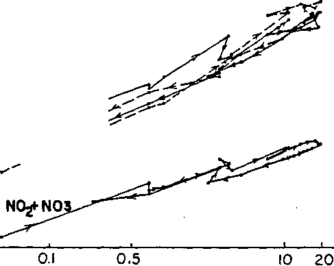

<table>
<colgroup>
<col style="width: 24%" />
<col style="width: 7%" />
<col style="width: 68%" />
</colgroup>
<tbody>
<tr class="odd">
<td></td>
<td>I00</td>
<td><blockquote>

</blockquote></td>
</tr>
<tr class="even">
<td>
<strong>a)</strong>

E

CV

0
</td>
<td>
1O

1.O

O.1
</td>
<td>NO +NO3</td>
</tr>
</tbody>
</table>

> O.1 O.5 1O 2O
>
> f **FLOW, cfs**

Figure 4-37(Continued). The log-log plots could form the basis for rating curves, although the loop effect may only be simulated using a washoff calculation. Compare with Figure 4-36 b and d. Several more plots are shown in Appendix VII.

> 152 4-102

Although the development has ignored the physics of rainfall energy in eroding particles, the runoff rate, r, in equation 4-35 closely follows rainfall intensity. Hence to some degree at least, greater washoff will be experienced with greater rainfall rates. As an option, soil erosion lit­erature could be surveyed to infer a value of WASHPO if erosion is pro­portional to rainfall intensity to a power.

An idea of the relative effect **of parameters** RCCEF acid WASHP0 **has been shown in Figures 4-32 to 4-35. Another view is presented in Figure 4-36 in which the time history of washoff is presented as a function of flow for various parameter values and for a more realistic runoff hydrograph. By variation of WASHPO especially, the shape of the curve may be varied to match local data. A plot using such data (Figure 4-37) is illustrated under the discussion of rating curves, and several such plots are given in Appendix VII.**

**<u>Related Buildup-Washoff Studies</u> --**

**Several recent studies are directly related to the preceding discus-siofis of the SWMM Runoff Block water quality routines. Some of these have been mentioned previously in the text, but it is worthwhile pointing out those that are particularly relevant to SWMM <u>modeling</u> as opposed to data collection and analysis (although most of the studies do, of course, utilize data as well). The following discussion is by no means exhaustive but does include several studies that have simulated water quality using buildup-washoff mechanisms, rating curves or both.**

**The U.S. Geological Survey (USGS) has performed comprehensive urban hydrologic studies from both a data collection and modeling point of view. For example, their South Florida urban runoff data are described and refer­enced in the EPA Urban Rainfall-Runoff-Quality Data Base (Huber et al., 1979, 1980). Urban rainfall-runoff quantity may be simulated with the USGS dis­tributed Routing Rainfall-Runoff Model (Dawdy et al., 1978, Alley et al., 1980a) which is presently being appended to include simulation of water quality. This will be accomplished using a separate program that uses the quantity model results as input. These efforts are described by Alley (1980) and Alley et al. (1980b). Alley (1981) also provides a method for optimal estimation of washoff parameters using measured data. The USGS procedures are based in part upon earlier work of Ellis and Sutherland (1979). These four references all discuss the use of the original SWMM buildup-washoff equations. An application of SWMM Runoff and Transport Blocks to two Denver catchments during which buildup-washoff parameters were calibrated is described by Ellis (1978) and Alley and Ellis (1979).**

**Work at the University of Massachusetts has developed procedures for calibration of SWMM Runoff Block quality (Jewell et al., 1978a) and for determination of appropriate washoff relationships for use in the Version II SWMM release (Jewell et al., 1978b). Recently Jewell et al. (1980) and Jewell and Adrian (1981) reviewed the supporting data base for buildup-washoff relationships and advocate using local data to develop site spe­cific equations for buildup and washoff. Most of their suggested forms could be simulated using the available functional forms in SWMM.**

> **153 4-103**

**Since several other models use quality formulations similar to those of SWMM, their documentation provides insight into choosing proper SWMM parameters. In particular, most of the STORM calibration procedures (Roesner et al., 1974, HEC, 1977a,b) can be applied also to SWMM (with WASHP0=1). Recent inclusion of water quality simulation in ILLUDAS (Terstriep et al., 1978, Han and Delleur, 1979) also is based on SWMM procedures. Finally, modified SWMM routines have been used to simulate water quality in Houston (Diniz, 1978, Bedient et al., 1978).**

**<u>Rating Curve</u> --**

**As discussed above, the washoff calculations may be avoided and load rates computed for each subcatchment at each time step by a rating curve method, analogous to equation 4-37,**

> **POFF = RCOEF • WFLOWWASHPO (4-38)**

**where WFLOW = subcatchment runoff, cfs, (or m3/sec for metric input), POFF = constituent load washed off at time, t, quantity/sec (e.g., mg/sec),**

> **RCOEF = coefficient that includes correct units conversion, and WASHPO = exponent.**

**Parameters RCOEF and WASHPO are entered for a particular constituent on card J3. That these parameters apply to a rating curve is indicated by parameter KWASH on card J3. Although used on a time step basis, the parameters for equation 4-38 are customarily determined on a <u>storm event</u> basis, by plotting total load versus total flow (Huber, 1980, Wallace, 1980).**

**Two differences are apparent between equations 4-35 and 4-38. First, the former includes the quantity remaining on the surface, PSHED, in the right-hand side of the equation, leading to an exponential-type decay of the quantity in addition to being a function of runoff rate.**

**Second, the form of the runoff rate is different in the equations. The power-exponential washoff, equation 4-35, uses a normalized runoff rate, r, in in./hr over *the* total subcatchment surface (not just the impervious part). The rating curve, equation 4-38, also uses the total runoff, but in an unnormalized form, WFLOW, in cfs. Since data for a particular catchment are often analyzed as a log-log plot of load versus flow, equation 4-38 facilitates use of the best fit line. For example, data for Seattle are plotted in Figure 4-37. In addition, Appendix VII contains several other similar plots for three Seattle catchments and for Lancaster, Pennsylvania.**

**Clearly, the rating curve will work better for some storms and param­eters than for others. If the data plot primarily as a loop (Figure 4-37), the power-exponential washoff formulation will work better since it tends to produce lower loads at the end of storm events. But if the load versus flow data tend to plot as a straight line on log-log paper, the rating curve method should work better. On the basis of the previous discussion of**

> **154 4-104**

rating curves based on sediment data, it is expected that the exponent, WASHPO, would be in the range of 1.5-3.0 for constituents that behave like particulates. For dissolved constituents, the exponent will tend to be less than 1.0 since concentration often decreases as flow increases, and concentration is proportional to flow to the power WASHPO-1. (Constant concentration would use WASHPO = 1.0.) Much more variability is expected for RCOEF. Should a value need to ***be*** entered for RC0EF that exceeds the field width of five available using the F5.0 format, an E-format may still be used with three place accuracy. For instance, the entry 243E3 will be read as 243,000 using an F5.0 format. This may often be necessary, since for constituents measured in mg/1 (NDIM=0), load rates in mg/sec will usually be quite large.

The rating curve approach may be combined with constituent buildup if desired. If KWASH=1 on card J3, constituents are generated according to the rating curve with no upper limit. There is no buildup ***between*** storms during continuous simulation, nor will measures like street sweeping have any effect. Constituents will be generated solely on the basis of flow rate.

Alternatively, with KWASH=2, the rating curve is still used, but the maximum amount that can be removed is the amount built up prior to the storm. It will have an effect only if this limit is reached, at which time loads and concentrations will suddenly drop to zero. They will not assume non-zero values again until dry-weather time steps occur to allow buildup (during continuous simulation). Street sweeping will have an effect if the buildup limit is reached.

<u>Street Cleaning</u> --

Street cleaning is performed in most urban areas for control of solids and trash deposited along street gutters. Although it has long been assumed that street cleaning has a beneficial effect upon the quality of urban runoff, until recently, few data have been available to quantify this effect. The best current study is probably that of Pitt (1979) in which street sur­face loadings were carefully monitored along with runoff quality in order to determine the effectiveness of street cleaning. According to Pitt, frequent street cleaning on smooth asphalt surfaces (once or twice per day) can remove up to 50 percent of the total solids and heavy metal yields of urban runoff. Under more typical cleaning programs (once or twice a month), less than 5 percent of the total solids and heavy metals in the runoff are removed. Organics and nutrients in the runoff cannot be effectively control­led by intensive street cleaning -- typically much less than 10 percent re­moval, even for daily cleaning. This is because the latter originate pri­marily in runoff and erosion from off-street areas during storms.

The removal effectiveness of street cleaning depends upon many factors such as the type of sweeper, whether flushing is included, the presence of parked cars, the quantity of total solids, and constituent being considered. Data from which an analysis of most of these efforts can be performed are available in Pitt (1979). For example, removal efficiencies for several

155 4-105

**constituents are shown in Table 4-21. Clearly, efficiencies are greater for constituents that behave as particulates.**

**Within the Runoff Block, street cleaning (usually assumed to be sweep­ing) is performed (if desired) prior to the beginning of the first storm event and in between storm events (for continuous simulation). Unless initial constituent loads are input in card group Ll (or unless a rating curve is used) a "mini-simulation" is performed for each consLituent. during the dry days prior to a storm during which buildup and sweeping are modeled. Starting with zero initial load, buildup occurs according to the method chosen in card groups J2 and J3. Street sweeping occurs at intervals of CLFREQ days (card J2). (During continuous simulation, sweeping occurs between storms based on intervals calculated using dry time steps only. A dry time step does not have runoff greater than 0.0005 in/hr (0.013 mm/hr), nor is snow present on the impervious area of the catchment.) Removal occurs such that the fraction of constituent sur­face load, PSHED, remaining on the surface is**

> **REMAIN = 1.0 - AVSWP(J) • REFF(K) (4-39)**

***Where* REMAIN = fraction of constituent (or dust and dirt) load remaining on catchment surface,**

> **AVSWP = availability factor (fraction) for land use J, and  
> REFF = removal efficiency (fraction) for constituent K.**

**The removal efficiency differs for each constituent as seen in Table 4-21, from which estimates of REFF may be obtained. The effect of multiple passes must be included in the value of REFF. During the mini-simulation that occurs prior to the initial storm or start of simulation "dust and dirt" is also removed during sweeping using an efficiency REFFDD (card J2). It is probably reasonable to assume that dust and dirt is removed similarly to the total solids of Table 4-21. A non-linear effect is exhibited in Table 4-21, in which efficiencies tend to increase as the total solids on the street surface increase. The Runoff Block algorithm does not duplicate this effect. Rather, the same fraction is removed during each sweeping.**

**The availability factor, AVSWP, is intended to account for the frac­tion of the catchment area that is actually sweepable, For instance, Heaney and Nix (1977) demonstrate that total imperviousness increases faster as a function of population density than does imperviousness due to streets only. Thus, the ratio of street surface to total impervious­ness is one measure of the availability factor, and their relationship is**

> **AVSWP = 0.6 • PDd -0'2, PDd \> 0.1 (4.40)**

**where AVSWP = availability factor, fraction, and**

**PDd = population density over developed area, persons/ac.**

**Such a relationship is reasonably a function of land use. Although a value of AVSWP must *be* entered for each land use (card J2), the equation of Heaney and Nix (1977) was developed only for an overall urban area. Thus, extra-**

> **156 4-106**
>
> Table 4-21. Removal Efficiencies from Street Cleaner Path for Various Street Cleaning Programs.\* (Pitt, 1979)
>
> **Sreet Cleaning  
> Program and**

<table>
<colgroup>
<col style="width: 23%" />
<col style="width: 5%" />
<col style="width: 6%" />
<col style="width: 5%" />
<col style="width: 4%" />
<col style="width: 5%" />
<col style="width: 7%" />
<col style="width: 5%" />
<col style="width: 4%" />
<col style="width: 5%" />
<col style="width: 4%" />
<col style="width: 4%" />
<col style="width: 4%" />
<col style="width: 4%" />
<col style="width: 3%" />
<col style="width: 4%" />
</colgroup>
<tbody>
<tr class="odd">
<td colspan="2">
<strong>Street Surface Total</strong>

<strong>Loading Conditions Solids</strong>
</td>
<td><strong>BOD5</strong></td>
<td><strong>COD</strong></td>
<td><strong>KN</strong></td>
<td><strong>PO4</strong></td>
<td><blockquote>

<strong>Pesti-cider</strong>

</blockquote></td>
<td><strong>Cd</strong></td>
<td><strong>Sr</strong></td>
<td><strong>Cu</strong></td>
<td><strong>Ni</strong></td>
<td><strong>Cr</strong></td>
<td><strong>Zn</strong></td>
<td><strong>Mn</strong></td>
<td><strong>Pb</strong></td>
<td><strong>Fe</strong></td>
</tr>
<tr class="even">
<td><blockquote>

<strong>Vacuum Street Cleaner</strong>

</blockquote></td>
<td></td>
<td></td>
<td></td>
<td></td>
<td></td>
<td></td>
<td></td>
<td></td>
<td></td>
<td></td>
<td></td>
<td></td>
<td></td>
<td></td>
<td></td>
</tr>
<tr class="odd">
<td><blockquote>

<strong>1 pass; 20 • 200 
lb/curb mile 
total solids</strong>

</blockquote></td>
<td><strong>31</strong></td>
<td><strong>24</strong></td>
<td><strong>16</strong></td>
<td><strong>26</strong></td>
<td><strong>8</strong></td>
<td><strong>33</strong></td>
<td><strong>23</strong></td>
<td><strong>27</strong></td>
<td><strong>30</strong></td>
<td><strong>37</strong></td>
<td><strong>34</strong></td>
<td><strong>34</strong></td>
<td><strong>37</strong></td>
<td><strong>40</strong></td>
<td><strong>40</strong></td>
</tr>
<tr class="even">
<td><blockquote>

<strong>2 passes</strong>

</blockquote></td>
<td><strong>45</strong></td>
<td><strong>35</strong></td>
<td><strong>22</strong></td>
<td><strong>37</strong></td>
<td><strong>12</strong></td>
<td><strong>50</strong></td>
<td><strong>34</strong></td>
<td><strong>35</strong></td>
<td><strong>45</strong></td>
<td><strong>54</strong></td>
<td><strong>53</strong></td>
<td><strong>52</strong></td>
<td><strong>56</strong></td>
<td><strong>59</strong></td>
<td><strong>59</strong></td>
</tr>
<tr class="odd">
<td><blockquote>

<strong>3 passes</strong>

</blockquote></td>
<td><strong>53</strong></td>
<td><strong>41</strong></td>
<td><strong>27</strong></td>
<td><strong>.45</strong></td>
<td><strong>14</strong></td>
<td><strong>59</strong></td>
<td><strong>40</strong></td>
<td><strong>48</strong></td>
<td><strong>52</strong></td>
<td><strong>63</strong></td>
<td><strong>.60</strong></td>
<td><strong>59</strong></td>
<td><strong>65</strong></td>
<td><strong>70</strong></td>
<td><strong>68</strong></td>
</tr>
<tr class="even">
<td><blockquote>

<strong>Vacuum Street Cleaner</strong>

</blockquote></td>
<td></td>
<td></td>
<td></td>
<td></td>
<td></td>
<td></td>
<td></td>
<td></td>
<td></td>
<td></td>
<td></td>
<td></td>
<td></td>
<td></td>
<td></td>
</tr>
<tr class="odd">
<td>
<strong>1 pass; 200 • 1,000</strong>

<blockquote>

<strong>lb/curb mile 
total solids</strong>

</blockquote></td>
<td><strong>37</strong></td>
<td><strong>29</strong></td>
<td><strong>21</strong></td>
<td><strong>31</strong></td>
<td><strong>12</strong></td>
<td><strong>40.</strong></td>
<td><strong>30</strong></td>
<td><strong>34</strong></td>
<td><strong>36</strong></td>
<td><strong>43</strong></td>
<td><strong>42</strong></td>
<td><strong>41</strong></td>
<td><strong>45</strong></td>
<td><strong>49</strong></td>
<td><strong>59</strong></td>
</tr>
<tr class="even">
<td><blockquote>

<strong>2 passes</strong>

</blockquote></td>
<td><strong>51</strong></td>
<td><strong>42</strong></td>
<td><strong>29</strong></td>
<td><strong>46</strong></td>
<td><strong>17</strong></td>
<td><strong>59</strong></td>
<td><strong>43</strong></td>
<td><strong>48</strong></td>
<td><strong>49</strong></td>
<td><strong>59</strong></td>
<td><strong>60</strong></td>
<td><strong>59</strong></td>
<td><strong>63</strong></td>
<td><strong>68</strong></td>
<td><strong>68</strong></td>
</tr>
<tr class="odd">
<td><blockquote>

<strong>3 passes</strong>

</blockquote></td>
<td><strong>58</strong></td>
<td><strong>47</strong></td>
<td><strong>35</strong></td>
<td><strong>51</strong></td>
<td><strong>20</strong></td>
<td><strong>67</strong></td>
<td><strong>50</strong></td>
<td><strong>53</strong></td>
<td><strong>59</strong></td>
<td><strong>68</strong></td>
<td><strong>66</strong></td>
<td><strong>67</strong></td>
<td><strong>70</strong></td>
<td><strong>76</strong></td>
<td><strong>75</strong></td>
</tr>
<tr class="even">
<td><blockquote>

<strong>Vacuum Street Cleaner</strong>

</blockquote></td>
<td></td>
<td></td>
<td></td>
<td></td>
<td></td>
<td></td>
<td></td>
<td></td>
<td></td>
<td></td>
<td></td>
<td></td>
<td></td>
<td></td>
<td></td>
</tr>
<tr class="odd">
<td>
<strong>I pass; 1000 • 10,000</strong>

<strong>lb/curb mile</strong>

<strong>total solids</strong>
</td>
<td><strong>48</strong></td>
<td><strong>38</strong></td>
<td><strong>33</strong></td>
<td><strong>43</strong></td>
<td><strong>20</strong></td>
<td><strong>57</strong></td>
<td><strong>45</strong></td>
<td><strong>44</strong></td>
<td><strong>49</strong></td>
<td><strong>55</strong></td>
<td><strong>53</strong></td>
<td><strong>55</strong></td>
<td><strong>58</strong></td>
<td><strong>62</strong></td>
<td><strong>63</strong></td>
</tr>
<tr class="even">
<td><blockquote>

<strong>2 passes</strong>

</blockquote></td>
<td><strong>60</strong></td>
<td><strong>50</strong></td>
<td><strong>42</strong></td>
<td><strong>54</strong></td>
<td><strong>25</strong></td>
<td><strong>72</strong></td>
<td><strong>57</strong></td>
<td><strong>55</strong></td>
<td><strong>63</strong></td>
<td><strong>70</strong></td>
<td><strong>68</strong></td>
<td><strong>69</strong></td>
<td><strong>72</strong></td>
<td><strong>79</strong></td>
<td><strong>77</strong></td>
</tr>
<tr class="odd">
<td><blockquote>

<strong>3 passes</strong>

</blockquote></td>
<td><strong>63</strong></td>
<td><strong>52</strong></td>
<td><strong>44</strong></td>
<td><strong>57</strong></td>
<td><strong>26</strong></td>
<td><strong>75</strong></td>
<td><strong>60</strong></td>
<td><strong>58</strong></td>
<td><strong>66</strong></td>
<td><strong>73</strong></td>
<td><strong>72</strong></td>
<td><strong>73</strong></td>
<td><strong>76</strong></td>
<td><strong>83</strong></td>
<td><strong>82</strong></td>
</tr>
<tr class="even">
<td><blockquote>

<strong>Mechanical Street Cleaner</strong>

</blockquote></td>
<td></td>
<td></td>
<td></td>
<td></td>
<td></td>
<td></td>
<td></td>
<td></td>
<td></td>
<td></td>
<td></td>
<td></td>
<td></td>
<td></td>
<td></td>
</tr>
<tr class="odd">
<td><blockquote>

<strong>1 pass; 180 •'1800 
lb/curb mile 
total solids</strong>

</blockquote></td>
<td><strong>54</strong></td>
<td><strong>40</strong></td>
<td><strong>31</strong></td>
<td><strong>40</strong></td>
<td><strong>20</strong></td>
<td><strong>40</strong></td>
<td><strong>28</strong></td>
<td><strong>40</strong></td>
<td><strong>38</strong></td>
<td><strong>45</strong></td>
<td><strong>44</strong></td>
<td><strong>43</strong></td>
<td><strong>47</strong></td>
<td><strong>44</strong></td>
<td><strong>49</strong></td>
</tr>
<tr class="even">
<td><blockquote>

<strong>2 passes</strong>

</blockquote></td>
<td><strong>75</strong></td>
<td><strong>58</strong></td>
<td><strong>48</strong></td>
<td><strong>58</strong></td>
<td><strong>35</strong></td>
<td><strong>60</strong></td>
<td><strong>45</strong></td>
<td><strong>59</strong></td>
<td><strong>58</strong></td>
<td><strong>65</strong></td>
<td><strong>64</strong></td>
<td><strong>64</strong></td>
<td><strong>64</strong></td>
<td><strong>65</strong></td>
<td><strong>71</strong></td>
</tr>
<tr class="odd">
<td><blockquote>

<strong>3 passes</strong>

</blockquote></td>
<td><strong>85</strong></td>
<td><strong>69</strong></td>
<td><strong>59</strong></td>
<td><strong>69</strong></td>
<td><strong>46</strong></td>
<td><strong>72</strong></td>
<td><strong>57</strong></td>
<td><strong>70</strong></td>
<td><ul>
<li>
<strong>69</strong>
</li>
</ul></td>
<td><strong>76</strong></td>
<td><strong>75</strong></td>
<td><strong>75</strong></td>
<td><strong>79</strong></td>
<td><strong>77</strong></td>
<td><strong>82</strong></td>
</tr>
<tr class="even">
<td><blockquote>

<strong>Flusher</strong>

</blockquote></td>
<td><strong>30</strong></td>
<td><strong>(a)</strong></td>
<td><strong>(a)</strong></td>
<td><strong>(a)</strong></td>
<td><strong>(a)</strong></td>
<td><strong>(a)</strong></td>
<td><strong>(a)</strong></td>
<td><strong>(a)</strong></td>
<td><strong>(a)</strong></td>
<td><strong>(a)</strong></td>
<td><strong>(a)</strong></td>
<td><strong>(a)</strong></td>
<td><strong>(a)</strong></td>
<td><strong>(a)</strong></td>
<td><strong>(a)</strong></td>
</tr>
<tr class="odd">
<td><strong>Mechanical Street Cleaner followed by a flusher</strong></td>
<td><strong>80</strong></td>
<td><strong>(b)</strong></td>
<td><strong>(b)</strong></td>
<td><strong>(b)</strong></td>
<td><strong>(b)</strong></td>
<td><strong>(b)</strong></td>
<td><strong>(b)</strong></td>
<td><strong>(b)</strong></td>
<td><strong>(b)</strong></td>
<td><strong>(b)</strong></td>
<td><strong>(b)</strong></td>
<td><strong>(b)</strong></td>
<td><strong>(b)</strong></td>
<td><strong>(b)</strong></td>
<td><strong>(b)</strong></td>
</tr>
</tbody>
</table>

1)  **15 • 40 percent estimated**

2)  **35 • 100 percent estimated**

**\*These removal values assume all the pollutants would lie within the cleaner path (0 to 8 ft. from.the curb)**

157 4-107

> **polation to specific land uses should be done only with caution, but equation 4-40 is probably suitable for use on a large, aggregated catchment, such as might be used for continuous simulation.**
>
> **An alternative approach may be found in Pitt (1979) in which the issue of parked cars is dealt with directly. Pitt shows that the percentage of curb left uncleaned is essentially equal to the percentage of curb occupied by parked cars. Thus, if typically 40 percent of the curb (length) is occupied by parked cars, the availability factor would be about 0.60. In many cities, parking restrictions on street cleaning days limit the length of curb occupied during sweeping.**
>
> **Parameter DSLCL (card J2) merely establishes the proper time sequence for the "mini-simulation" prior to the start of the storm (or continuous simulation). A hypothetical sequence of linear buildup and street sweeping prior to a storm is sketched in Figure 4-38. Eventually an equilibrium between buildup and sweeping will occur. For the example shown in Figure 4-38, ths is when the removal,** 0.3g • **PSHED, equals the weekly buildup, 0.3 x 10 • 7, or PSHED = 6.56 x 10 mg. If sweeping is scheduled for the** day of the start of the storm (DSCL = CLFREQ) it does not occur. (An exception would be when the first day of a continuous simulation is a dry day. Sweeping would then occur during the first time step.)
>
> The SWMM user should bear in mind that although the model assumes constituents **to** build up over the entire subcatchment surface, the sur­face load, PSHED, is simply a lumped total in, say, mg (for NDIM = 0), and there are no spatial effects on buildup or washoff. Hence, if it is assumed that a particular constituent originates only on the impervious portion of the catchment, loading rates and parameters can be scaled accordingly. Likewise, AVSWP can be determined based on the characteriza­tion of only the impervious areas described above. However, if a constituent originates over both the pervious and impervious area of the subcatchment (e.g., nutrients and organics) the removal **efficiency, REFF, should be re­duced by the average ratio of impervious to total area since it is** indepen­dent of land type. The availability factor, AVSWP, differs for individual land uses but has the same effect on all constituents.
>
> <u>Catchbasins</u>
>
> --
>
> <u>Background</u> -- Catchbasins are found in a large number of cities. They were originally installed at storm water inlets to combined sewers to prevent sewer clogging by **trapping coarse debris and solids and to prevent emanation of odors from the sewer by providing a water seal. There is no standard design for catchbasins; representative designs are shown in Figure 4-39. The purpose of the deep well or sump is to trap solids by sedimentation prior to stormwater entry into the sewer, which distinguishes catchbasins from stormwater inlets. The voluile of the** sump varies considerably with design, ranging from 2.8 to 78 ft (0.08 - 2.21 m ). The volume is typic­ally reduced by a large quantity of solids trapped in the sump, often by more than 50 percent.

158 4-108

**4.5 - BUILDUP RATE = 0.3 x106 mg /day**

> 0\)
>
> E
>
> **to**

**0 4.0**

11%

> **AVSWP = 0.8**

**32 PERCENT**

**- REFF = 0.4 REMOVAL**

**DRYDAY = 25**

**CLFREQ = 7**

> **1.0**

**DSLC = 3**

**0.0 START OF SIMULATION -7**

> **-25 -20 -15 -10**. **-5 0**

**TIME PRIOR TO STORM, days**

**Figure 4-38. Hypothetical Time Sequence of Linear Buildup and Street Sweeping.**

> **159 4-109**
>
> 
>
> **NEW YORK**

e

> •

**•••**

**N**

**CAP**

**2 ft — 9 In.**

**SAN FRANCISCO**

> **ATLANTA TORONTO**
>
> Figure 4-39. Representative Catchbasin Designs. (After Lager et al., 1977b, p. 12.)
>
> 160 4-110

**A comprehensive examination of catchbasins and their effectiveness for pollutant control is presented by Lager et al. (1917b). They con­clude that:**

> **"Existing catchbasins exhibit mixed performance with  
> respect to pollution control. The trapped liquid  
> purged from catchbasins to the sewers during each  
> storm generally has a high pollution content that  
> contributes to the intensification of first-flush  
> loadings. Countering this negative impact is the  
> removal of pollutants associated with the solids  
> retained in, and subsequently cleaned from, the  
> basin."**

**In fact according to their data, there is unlikely to be much removal (treatment) at all in most cities because of infrequent maintenance; the median cleaning frequency in 1973 was once per year. Without such maintenance, solids accumulate in the sump until there is little removal effectiveness, even for large particles. Lager et al. (1977b) conclude** that, with the possible exception of total solids and heavy metals, catchbasins are of limited usefulness for pollution abatement, both because of their ineffectiveness and because of their high maintenance costs. Hence, their treatment potential is not modeled in SWMM. (If it is significant in a given city, surface loadings could be correspondingly reduced.)

<u>Modeling Approach</u> -- The potential for a first flush of catchbasin material is simulated by assuming that the sump contains at the beginning of a storm a constituent load (e.g., mass, in mg, for NDIM = 0) given by

> PBASIN = CBVOL • BASINS • CBFACT • FACT3 (4-41)

where PBASTN = subcatchment constituent load in catchbasins at

beginning of storm, mg for NDIM = 0,

CBVOL = individual catchbasin volume of sump, seduced by

quantity of stored solids, if know, ft ,

> BASINS = number of basins in subcatchment,

CBFACT = constituent concentration in basin at beginning

of storm, mg/1 for NDIM = O, and

Parameter CBVOL is entered on card Jl as an average for the entire catchment. The number of basins in each subcatchment, BASINS, is entered in card group Ll. Numbers can be obtained knowing the general basin density for the catchment in lieu of the more tedious method of counting every one. Consti­tuent concentrations, CBFACT, are entered in card group J3 and should, of course, be measured in the catchment under study. Literature values are few. Samples from 12 San Francisco catchbasins (Sartor and Boyd, 1972) were characterized by Lager et al. (1977b) by "casting out the extremes and averaging," resulting in the values shown in Table 4-22.

161 4-111

**Table 4-22 Constituent Concentrations in San Francisco  
Catchbasins (Sartor and Boyd, 1972)**

> **Constituent Concentration, mg/1**
>
> **Average Range**
>
> **COD 6,400 153 - 143,000**
>
> **BOD5 110 5 - 1,500**
>
> **Total-N 8 0.5 - 33**
>
> **Total-P 0.2 \<0.2 0.3**

**The values for COD and Total-N are consistent with a few samples reported by Sartor and Boyd (1972) for Baltimore and Milwaukee, although the "phosphates" concentration in these two cities was somewhat higher, 1.1 -** 2.2 mg/l. The concentration of BOD5 in seven Chicago catchbasins was measured by APIA (1969). The average concentration for five commercial area basins was 126 mg/1, ranging from 35 to 225 mg/l. Two residential area basins yielded BOD5 concentrations of 50 and 85 mg/l.

No data have been found to characterize other constituents within the catchbasins themselves. In particular, suspended solids (SS) concentrations can be expected to be high for particle sizes less than about 0.25 mm, on the basis of flushing tests (Sartor and Boyd, 1972, Lager et al., 1977b). Initial suspended and total solids concentrations of several thousand mg/1 are probably justified, although measurements by Waller (1971) <u>during</u> storms in four residential catchbasins in Halifax indicate SS concentra­tions in a range of 42 to 305 mg/1.

Flushing of stored constituents from catchbasin sumps is based on tests conducted by APWA (1969) in which salt was used as a tracer and its rate of flushing observed. Data and fitted equations are shown in Figure 4-40. The basin behaves approximately as a completely mixed tank in which

<table>
<colgroup>
<col style="width: 63%" />
<col style="width: 36%" />
</colgroup>
<tbody>
<tr class="odd">
<td>
<u>d PBASIN WFLOW</u>

<ul>
<li>
PBASIN
</li>
</ul>

dt k•BASINS
</td>
<td>(4-42)</td>
</tr>
</tbody>
</table>

where PBASIN = constituent load remaining in the catchbasin as

a function of time, e.g., mg for NDIM = 0,

WFLOW = flow through the basin (runoff from the subcatchment),

> cfs,
>
> BASINS = volume of catchbasin sump, ft3, and

k = constant to be determined from flushing tests.

When the flow rate is constant, equation 4-42 integrates to

> 162 4-112

<table>
<colgroup>
<col style="width: 62%" />
<col style="width: 37%" />
</colgroup>
<tbody>
<tr class="odd">
<td><blockquote>

<strong><u>WFLOW</u></strong>

<strong>k•BASINS t</strong>

</blockquote>

<strong>PBASIN = PBASIN • e</strong>
</td>
<td><strong>(4-43)</strong></td>
</tr>
</tbody>
</table>

**where PBASINo = initial catchbasin load.**

**If complete mixing occurs, k=1. For the Chicago tests this did not quite occur, as seen in Figure 4-40. The original SWMM version used k=1.6, but this does not give the best-fit line. Rather, a k value of 1.3 is con­sistent with a least squares fit through the data points and is used in this version of SWMM. (However, the difference is probably undetectable in a simulation.)**

**During a runoff event, equation 4-42 is used to calculate the load rate, dPBASIN/dt, at each time step. (Parameter BASINS represents the total catchbasin volume for the subcatchment.) The remaining catchbasin load is then computed by multiplying the load rate by DELT and subtracting from PBASIN. This crude Euler integration is justified because of 1) the weakness of field data and mixing assumptions, 2) the necessity for an additional array and computation time for a more sophisticated approxima­tion, and 3) insensitivity of most simulations to catchbasin flushing. The latter point will be discussed further subsequently.**

**<u>Regeneration of Catchbasin Loads</u> -- During continuous simulation, catchbasin loads are regenerated to their original values, PBASIN at a rate PBASIN0/ DRYBSN (e.g., mg/day) where DRYBSN is entered on card Jl and is the time required for complete regeneration from a zero load. No data are available herein to establish a value for DRYBSN, but it is likely that catchbasins are at "full strength" after only few days of dry weather.**

**<u>Effect on Simulation</u> -- It is the experience of the authors of this report that catchbasins have a negligible effect on most simulation results. Typ­ical drainage areas served by catchbasins range from 2.15 to 5.05 ac/basin (0.85 to 2.05 ha/basin) in the U.S. (Lager et al., 1977b). Unless the area served is low, surface loadings tend to overwhelm those from catchbasins. Although they do contribute to a first flush effect, the most important task in most simulations is to obtain a proper total storm load, to which catchbasins are seldom strong contributors. Hence, excessive effort to pin down catchbasin simulation parameters is seldom justified.**

**<u>Constituent Fractions</u> --**

**<u>Background</u> -- As previously discussed, the original SWMH Runoff Block qual­ity routines were based on the 1969 APWA study in Chicago (APWA, 1969). A particular aspect of that study that led to modifications to the first buildup-washoff formulation was that the Chicago quality data (e.g., Table 4-14) were reported for the soluble fraction only, i.e., the samples were filtered prior to chemical analysis. Hence, they could not represent the total content of, say, BOD5, in the stormwater. In calibration of SWMM in San Francisco and Cincinnati, five percent of predicted suspended solids was added to BOD to account for the insoluble fraction. This provided a**

**reasonable BOD5 calibration in both cities.  
5**

> **164 4-114**
>
> **The Version II release of SWMM (Huber et al., 1975) followed the STORM model (Roesner et al., 1974) and added to BOD5, *N* and P04 fractions of both suspended solids and settleable solids. Adding a fraction from settleable solids is double counting however, since it is no more than a fraction of suspended solids itself. Furthermore, all the fractions in SWMM and STORM were basically just assumed from calibration exercises as opposed to being measured from field samples.**
>
> **Agricultural models, such as NPS (Donigian and Crawford, 1976) and ARM (Donigian et al., 1977) also relate other constituent mass load rates and concentrations to that of "solids," usually "sediment" predicted by an erosion equation. The ratio of constituent to "solids" is then called a "potency factor" and for some constituents is the only means by which their concentrations are predicted. The approach works well when constituents are transported in solid form, either as particulates or by adsorption onto soil particles. This approach can also be used in SWMM. For instance, one con­stituent could represent "solids" and be predicted by any of the means available (i.e., buildup-washoff, rating curve, Universal Soil Loss Equa-tiOn). Other constituents could then be treated simply as a fraction, Fl, of "solids." The fractions (potency factors) are entered in card group J4. As a refinement, two or more constituents could represent "solids" in different particle size ranges, and fractions of each summed to predict other constituents. Again, this approach will not work well for consti­tuents that are transported primarily in a dissolved state (e.g., NO3).**
>
> **<u>Available Information</u> -- In an effort to evaluate potency factors for vari­ous constituents in both urban and agricultural runoff, Zison (1980) ex­amined available data and developed regression relationships as a function of suspended solids and other parameters. His only urban catchments were three from Seattle, taken from the Urban Rainfall-Runoff-Quality Data Base (Huber et al., 1979), for which several water quality and storm event param­eters were available. Unfortunately, statistically meaningful results could only be obtained using log-transformed data, and simple fractions of the type required for input in card group J4 are seldom reported. Zison (1980) acknowledged this and suggested that model modifications might be made or piecewise-linear approximation made to the power function relationship. In any event, Zison related the total constituent concentration (not just the nonsoluble portion) to other parameters. Hence, for their use in SWMM, the buildup-washoff portion would need to be "zeroed out," (easily accomplished), as suggested earlier.**
>
> **Other reports also provide some insight as to potential values for the constituent fractions. For instance, Sartor and Boyd (1972), Shaheen (1975) and Manning et al. (1977), report particle size distributions for several constituents. However, the distributions refer principally to fractions of constituents appearing as "dust and dirt," not to fractions of total concen­tration, soluble plus nonsoluble. Finally, Pitt and Amy (1973) give frac­tions (and surface loadings) for heavy metals.**
>
> **If constituent fractions are used in SWMM, local samples should identify the soluble (filtrable) and nonsoluble fractions for the constituents of in­terest. Alternatively, the fractions may be avoided altogether by treating the buildvp-washeff or rating curve approach as one for the total concentra­tion, thus eliminating the need to break constituents into more than one**
>
> **form. 165 4-115**

**<u>Effect in Runoff Block</u> -- The fractions entered in card group J4 act only in "one direction." That is, nothing is subtracted from, say, suspended solids if it is a constituent that contributes to others. When the frac­tions are used, they can contribute significantly to the concentration of a constituent. For instance, if five percent of suspended solids is added to BOD5, high SS concentrations will insure somewhat high BOD5 concentra­tions, even if B0D5 loadings are small.**

**Units conversions must be accounted for in the fractions. For instance, if a fraction of SS is added to total coliforms, units for Fl would be MPN per mg of SS. In general, Fl has units of the "quantity" of KTO (e.g., MPN) per "quantity" of constituent KFROM (e.g., mg).**

**The contributions from other constituents are the penultimate step in subroutine QSHED. They occur after the Universal Soil Loss Equation cal­culation, and the to-from constituents can include the contribution from erosion if desired. Only the contribution from precipitation comes later and thus cannot be included in the constituent fractions. Rather it is added to the constituent load at the end of the chain of calculations, as described below.**

**<u>Precipitation Contributions</u> --**

**<u>Precipitation Chemistry</u> -- There is now considerable public awareness of the fact that precipitation is by no means "pure" and does not have character­istics of distilled water. Low pH (acid rain) is the best known parameter but many substances can also be found in precipitation, including organics, solids, nutrients, metals and pesticides. Compared to surface sources, rain­fall is probably an important contributor mainly of some nutrients, although it may contribute sustantially to other constituents as well. In particular, Kluesener and Lee (1974) found ammonia levels in rainfall higher than in runoff in a residential catchment in Madison, Wisconsin; rainfall nitrate accounted for 20 to 90 percent of the nitrate in stormwater runoff to Lake Wingra. Mattraw and Sherwood (1977) report similar findings for nitrate and total nitrogen for a residential area near Fort Lauderdale, Florida. Data from the latter study are presented in Table 4-23 in which rainfall may be seen to be an important contributor to all nitrogen forms, plus COD, although the instance of a higher COD value in rainfall than in run­off is probably anomalous.**

**In addition to the two references first cited, Weibel et al. (1964, 1966) report concentrations of constituents in Cincinnati rainfall (Table 4-24), and a summary is also given by Manning et al. (1977). A comprehen­sive summary is presented by Brezonik (1975) from which it may be seen in Table 4-24 that there is a wide range of concentrations observed in rain­fall. Again, the most important parameters relative to urban runoff are probably the various nitrogen forms.**

**Uttormark et al. (1974) provide annual nitrogen (and phosphorus) precipitation loading values (kg/ha-yr) for many cities regionally for the U.S. and Canada. Their nitrogen loadings are shown in Figure 4-41**

**166 4-116**

<table>
<colgroup>
<col style="width: 37%" />
<col style="width: 24%" />
<col style="width: 8%" />
<col style="width: 29%" />
</colgroup>
<tbody>
<tr class="odd">
<td rowspan="3"><blockquote>

Table 4-23 Rainfall and Runoff Fort Lauderdale,

Rainfall, in.

Runoff, in.

Concentrations (mg/1):

</blockquote></td>
<td colspan="3">
Concentrations For A Residential Area Near

Florida (After Mattraw and Sherwood, 1977).

Storm
</td>
</tr>
<tr class="even">
<td><blockquote>

8/23/75

</blockquote></td>
<td>9/17/75</td>
<td>9/26/75</td>
</tr>
<tr class="odd">
<td>
1.01

0.060
</td>
<td>
0.55

0.012
</td>
<td>
0.77

0.072
</td>
</tr>
<tr class="even">
<td><blockquote>

Total N, rainfall

</blockquote></td>
<td>0.30</td>
<td>0.84</td>
<td>0.29</td>
</tr>
<tr class="odd">
<td><blockquote>

Total N, runoff

</blockquote></td>
<td>0.52</td>
<td>0.74</td>
<td>1.50</td>
</tr>
<tr class="even">
<td><blockquote>

NO3-N, rainfall

</blockquote></td>
<td>0.14</td>
<td>0.73</td>
<td>0.12</td>
</tr>
<tr class="odd">
<td><blockquote>

NO3-N, runoff

</blockquote></td>
<td>0.16</td>
<td>0.19</td>
<td>0.26</td>
</tr>
<tr class="even">
<td><blockquote>

Org.-N, rainfall

</blockquote></td>
<td>0.15</td>
<td>0.09</td>
<td>0.12</td>
</tr>
<tr class="odd">
<td><blockquote>

Org.-N, runoff

</blockquote></td>
<td>0.34</td>
<td>0.49</td>
<td>1.10</td>
</tr>
<tr class="even">
<td><blockquote>

NH3-N, rainfall

</blockquote></td>
<td>0.01</td>
<td>0.01</td>
<td>0.04</td>
</tr>
<tr class="odd">
<td><blockquote>

NH3-N, runoff

</blockquote></td>
<td>0.02</td>
<td>0.04</td>
<td>0.13</td>
</tr>
<tr class="even">
<td><blockquote>

Total P, rainfall

</blockquote></td>
<td>0.01</td>
<td>0.02</td>
<td>0.05</td>
</tr>
<tr class="odd">
<td><blockquote>

Total P, runoff

</blockquote></td>
<td>0.12</td>
<td>0.20</td>
<td>0.30</td>
</tr>
<tr class="even">
<td><blockquote>

COD, rainfall

</blockquote></td>
<td>22</td>
<td>12</td>
<td>4</td>
</tr>
<tr class="odd">
<td><blockquote>

COD, runoff

</blockquote></td>
<td>16</td>
<td>21</td>
<td>17</td>
</tr>
</tbody>
</table>

> 167 4-117

<table>
<colgroup>
<col style="width: 24%" />
<col style="width: 25%" />
<col style="width: 35%" />
<col style="width: 14%" />
</colgroup>
<tbody>
<tr class="odd">
<td></td>
<td colspan="2"><blockquote>

<strong>Table 4-24 Representative Concentrations in Rainfall</strong>

</blockquote>

<strong>Ft. Lauderdalea Cincinnatib</strong>
</td>
<td><blockquote>

<strong>"Typical Range"</strong>

</blockquote></td>
</tr>
<tr class="even">
<td><blockquote>

<strong>Parameter</strong>

</blockquote></td>
<td><blockquote>

<strong>(Hattraw and Sherwood, 1977)</strong>

</blockquote></td>
<td><strong>(Weibel et al., 1966)</strong></td>
<td><blockquote>

<strong>(Brezonik, 1975)</strong>

</blockquote></td>
</tr>
<tr class="odd">
<td><blockquote>

<strong>Acidity (pH)</strong>

</blockquote></td>
<td></td>
<td></td>
<td><strong>3-6</strong></td>
</tr>
<tr class="even">
<td><blockquote>

<strong>Organics</strong>

</blockquote></td>
<td></td>
<td></td>
<td></td>
</tr>
<tr class="odd">
<td><blockquote>

<strong>BOD5' mg/1</strong>

</blockquote></td>
<td></td>
<td></td>
<td><strong>1-13</strong></td>
</tr>
<tr class="even">
<td><blockquote>

<strong>COD, mg/1</strong>

</blockquote></td>
<td><strong>4-22</strong></td>
<td><strong>16</strong></td>
<td><strong>9-16</strong></td>
</tr>
<tr class="odd">
<td><blockquote>

<strong>TOC, mg/1</strong>

</blockquote></td>
<td><strong>1-3</strong></td>
<td></td>
<td><strong>Few</strong></td>
</tr>
<tr class="even">
<td><blockquote>

<strong>Inorg. C, mg/1</strong>

</blockquote></td>
<td><strong>0-2</strong></td>
<td></td>
<td></td>
</tr>
<tr class="odd">
<td><blockquote>

<strong>Color, PCU</strong>

</blockquote></td>
<td><strong>5-10</strong></td>
<td></td>
<td></td>
</tr>
<tr class="even">
<td><blockquote>

<strong>Solids</strong>

</blockquote></td>
<td></td>
<td></td>
<td></td>
</tr>
<tr class="odd">
<td><blockquote>

<strong>Total Solids, mg/1</strong>

</blockquote></td>
<td><strong>18-24</strong></td>
<td></td>
<td></td>
</tr>
<tr class="even">
<td><blockquote>

<strong>Suspended Solids, mg/1</strong>

</blockquote></td>
<td><strong>2-10</strong></td>
<td><strong>13</strong></td>
<td></td>
</tr>
<tr class="odd">
<td><blockquote>

<strong>Turbidity, JTU</strong>

</blockquote></td>
<td><strong>4-7</strong></td>
<td></td>
<td></td>
</tr>
<tr class="even">
<td><blockquote>

<strong>Nutrients</strong>

</blockquote></td>
<td></td>
<td></td>
<td></td>
</tr>
<tr class="odd">
<td><blockquote>

<strong>Org. N, mg/1</strong>

</blockquote></td>
<td><strong>0.09-0.15</strong></td>
<td><strong>0.58</strong></td>
<td><blockquote>

<strong>0.05-1.0</strong>

</blockquote></td>
</tr>
<tr class="even">
<td><blockquote>

<strong>NH -N' mg/1</strong>

</blockquote></td>
<td><strong>0.01-0.04</strong></td>
<td></td>
<td></td>
</tr>
<tr class="odd">
<td><blockquote>

<strong>NO3-N' mg/1</strong>

</blockquote></td>
<td><strong>0.00-0.01</strong></td>
<td></td>
<td></td>
</tr>
<tr class="even">
<td><blockquote>

<strong>NO2-N, mg/1</strong>

</blockquote></td>
<td><strong>0.12-0.73</strong></td>
<td><strong>1.27c</strong></td>
<td><blockquote>

<strong>0.05-1.0</strong>

</blockquote></td>
</tr>
<tr class="odd">
<td><blockquote>

To<strong>tal N, mg/1</strong>

</blockquote></td>
<td><strong>0.29-0.84</strong></td>
<td></td>
<td><blockquote>

<strong>0.2 -1.5</strong>

</blockquote></td>
</tr>
<tr class="even">
<td><blockquote>

<strong>Orthophosphorus, mg/1</strong>

</blockquote></td>
<td><strong>0.01-0.03</strong></td>
<td><strong>0.08</strong></td>
<td><blockquote>

<strong>0.0 -0.05</strong>

</blockquote></td>
</tr>
<tr class="odd">
<td><blockquote>

<strong>Total P, mg/1</strong>

</blockquote></td>
<td><strong>0.01-0.05</strong></td>
<td></td>
<td><blockquote>

<strong>0.02-0.15</strong>

</blockquote></td>
</tr>
<tr class="even">
<td><blockquote>

<strong>Pesticides, pg/1</strong>

</blockquote></td>
<td></td>
<td><strong>3-600</strong></td>
<td><blockquote>

<strong>Few</strong>

</blockquote></td>
</tr>
<tr class="odd">
<td><blockquote>

<strong>Heavy metals, pg/1</strong>

</blockquote></td>
<td></td>
<td></td>
<td><blockquote>

<strong>Few</strong>

</blockquote></td>
</tr>
<tr class="even">
<td><blockquote>

<strong><em>Lead,</em> pg/1</strong>

</blockquote></td>
<td></td>
<td></td>
<td><blockquote>

<strong>30-70</strong>

</blockquote></td>
</tr>
<tr class="odd">
<td><blockquote>

<strong>aRange for three storms</strong>

</blockquote></td>
<td><strong>bAverage of 35 storms</strong></td>
<td><strong>cSum of NH3-N, NO2<em>-N, </em>NO3-N</strong></td>
<td></td>
</tr>
</tbody>
</table>

Figure 4-41. Nationwide Annual Loadings of NH4+-N + NO3-N in Precipitation (after Uttormark et al., 1974, p. 87). Dry fallout is not included.

**although it should be remembered that considerable seasonal variability may exist. These may be easily converted to precipitation <u>concentrations</u> required for SWMM input if the local rainfall is known, since kg/ha-yr cm/yr x 10 = mg/l. For instance, annual NH -N + NO** -N **loadings at Miami are almost 2 kg/ha-yr from Figure 4-41, and annual rainfall is 60 in (152 cm). From the above, the inorganic nitrogen concentration is 10 x 2/152 = 0.13 mg/1 which compares quite favorably with the sum of NH3-N and NO** -N **concentrations for two of** the **three Ft. Lauderdale storms given in Table 4-23. For a better breakdown of nitrogen forms, see Table 17 of Uttormark et al. (1974).**

**<u>Effect in Runoff Block</u> -- Constituent concentrations in precipitation are entered in card group J3. All runoff, including snowmelt, is assumed to have at least this concentration, and the precipitation load (e.g., mg/sec) is calculated by multiplying by the runoff rate and adding to the load already generated by other mechanisms. It may be inappropriate to add a precipitation load to loads generated by a calibration of buildup-washoff or rating curve parameters against measured runoff concentrations, since the latter already reflect the sum of all contributions, land surface and otherwise. But precipitation loads** might well be included if starting with buildup-washoff data from other sources.

For single event simulation, use of precipitation concentrations is **a**

**simple way in which to account for the high concentrations of several con­stituents found in snowpacks (Proctor and Redfern and James F. MacLaren, 1976b). It would be inappropriate for continuous simulation, however, since such high concentrations in runoff would not be expected to persist over the whole year. If this is the only method used to simulate melt**

quality, however, a constant predicted concentration will result. Also, caution should be used if simulating particulates (e.g., suspended solids) or heavy metals since high concentrations in a snowpack do not necessarily mean high concentrations in runoff, since the material may rapidly settle during overland flow. -For instance, the very high lead concentrations (2 ­100 mg/1) found in snow windrows in urban areas are greatly reduced in the melt runoff (0.05 - 0.95 mg/1), (Proctor and Redfern and James F. MacLaren, 1976b).

<u>Urban Erosion</u> --

<u>Background</u> -- Erosion and sedimentation are often cited as a major problem related to urban runoff. They not only contribute to degradation of land surfaces and soil loss but also to adverse receiving water quality and sedi­mentation in channels and sewer networks. Several ways exist to analyze erosion from the land surface (e.g., Vanoni, 1975), the most sophisticated of which include calculations of the shear stress exerted on soil particles by overland flow and/or the influence of rainfall energy in dislodging them. In keeping with the simplified quality procedures included in the rest of the Runoff Block, a widely-used empirical approach, the Universal Soil Loss Equation (USLE), has been adapted for use in SWMM. Full details and further information on the USLE are given by Heaney et al. (1975).

170 4-120

**<u>Universal Soil Loss Equation</u> -- The USLE was derived from statistical analy­ses of soil loss and associated data obtained in 40 years of research by the Agricultural Research Service (ARS) and assembled at the ARS runoff and soil loss data center at Purdue University. The data include more than 250,000 runoff events at 48 research stations in 26 states, representing about 10,000 plot-years of erosion studies under natural rain. It was developed by Wischmeier and Smith (1958) as an <u>estimate</u> of the <u>average annual</u> soil** erosion from rainstorms for a given upland area, L, expressed as the average annual soil loss per unit area, (tons per acre per year):

> L = R • K • LS • C • P (4-44)

where R = the rainfall factor,

> K = the soil erodibility factor,
>
> LS = the slope length gradient ratio,

C = the cropping management factor or cover index factor, and

> P = the erosion control practice factor.

This equation represents a comprehensive attempt at relating the major factors in soil erosion. It is used in SWIM to predict the <u>average</u> soil loss for a given storm or time period. It is recognized that the USLE was not developed for making predictions based on <u>specific</u> rainfall events. There are many random variables which tend to cancel out when predicting individual storm yields. For example, the initial soil moisture condition, or antecedent moisture condition, is a parameter which cannot be determined directly and used reliably. It should be understood by the SWHN user that equation 4-44 enables land management planners to estimate <u>gross</u> erosion rates for a wide range of rainfall, soil, slope, crop, and management condi­tions.

<u>Input Parameters</u> -- If erosion is to be simulated, it is so indicated by parameter IROS on card Jl. Note that at least one other (arbitrary) quality constituent must be simulated along with "erosion." No particular soil characteristics (e.g., particle size distribution) are assigned to the erosion parameter, and its title is "EROSION," with units of mg/1, in the output. Erosion may be added to another constituent, e.g., suspended solids, if desired using parameter IROSAD on card J1. However, the erosion parameter will also always be maintained as an individual param­eter throughout the Runoff Block.

> Other input parameters are:

1)  the maximum 30-minute rainfall intensity of the storm (single-event) or of the simulation period (continuous), RAINIT, (card Jl),

2)  the area of each subcatchment subject to erosion, ERODAR, (card K1),

3)  the flow distance in feet from the point of origin of overland flow over the erodible area to the point at which runoff enters the gutter or inlet, ERLEN, (card Kl),

> 171 4-121

4)  **the soil factor K, SOILF, (card Kl),**

5)  **the cropping management factor C, CROPMF, (card Kl), and**

6)  **the control practice factor P, CONTPF, (card Kl).  
    The source and use of these parameters is described below.**

**<u>Rainfall Factor and Maximum Thirty Minute Intensity</u> -- The rainfall factor, R, of equation 4-44 is the product of the maximum thirty minute intensity and the sum of the rainfall energy for the time of simulation. Rainfall energy, E, is given by an empirical expression by Wischmeier and Smith (1958),**

> **E = 1(9.16 + 3.31 log10 • RNINHRi) • RNINHRJ • DELT (4-45)**

**where E = total rainfall energy for time period of summation, 100-ft-ton/ac, RNINHR. = rainfall intensity at time interval j, in/hr, and**

> **DELT = time interval, hr, such that the product RNINHR • DELT = rainfall depth during the time interval.**

**The summation was performed over all time intervals with rainfall for a year for the original LISLE development; contours of R over the U.S. are given by Wischmeier and Smith (1965). However, it can also be performed for an indi­vidual storm. In SWMM this is performed on a time step basis; that is, E is evaluated at each time step using the rainfall intensity at that time step (no summation). The rainfall factor, R, is then**

> **R = E • RAINIT (4-46)**

**where RAINIT = maximum average 30-minute rainfall intensity for the**

> **storm (single event) or the period of simulation (continuous),**
>
> **in/hr.**

**RAINIT must be found from an inspection of the input hyetograph prior to simulation. Computed in this manner, the rainfall factor does not account for soil losses due to snowmelt or wind erosion. The units of R (100-ft-ton-in/ac-hr) are generally meaningless since the soil factor, K, is de­signed to cancel them. But the indicated units for RAINIT and RNINHR (in/hr) must be used.**

**<u>Erosion Area</u> -- Parameter ERODAR (card K1) represents the acres of the subcatchment subject to erosion. This would ordinarily be less than**, **or equal to the pervious area of the subcatchment and could indicate land that is barren or under construction.**

**<u>Soil Factor</u> -- The soil factor, K, is a measure of the potential erodibility of a soil and has units of tons per unit of rainfall factor, R. The soil erodibility nomograph shown in Figure 4-42 (Wischmeier et al., 1971) may be used to find the value of the soil factor once five soil parameters have**

> **172 4-122**

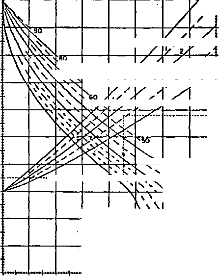

**been estimated. These parameters are: percent silt plus very fine sand (0.05-0.10 mm), percent sand greater than 0.10 mm, organic matter (0.M.) content, structure, and permeability. To use the nomograph, enter on the left vertical scale with the appropriate percent silt plus very fine sand. Proceed horizontally to the correct percent sand curve, then move vertically to correct organic matter curve. Moving horizontally to the right from this point, the first approximation of K is given on the vertical scale. For soils of fine granular structure and moderate permeability, this first approximation value corresponds to the final K value and the procedure is terminated. If the soil structure and permeability is different than this, it is necessary to continue the horizontal path to interact the correct structure curve, pro­ceed vertically downward to the correct permeability curve, and move left to the soil erodibility scale to find K. This procedure is illustrated by the dotted line on the nomograph. For a more complete discussion of this topic, *see* Wischmeier et al. (1971).**

**A preferable and often simpler alternative to the use of the nomograph of Figure 4-42 is to refer directly to the soil survey interpretation sheet for the soil in question, on which may be found the value of the soil factor. This is.illustrated in Figure 4-19 for Conestoga Silt Loam whereupon the K value is given as 0.43. Since this is site-specific local information, it is highly recommended. Local Agricultural Research Service and Soil Conser­vation Service offices are available to obtain the soil survey interpreta­tion sheets and to provide much other useful information.**

**<u>Slope Length Gradient Ratio</u> -- This parameter is an empirical function of runoff length and slope and is given by**

**LS =** ERLENO**'**S **• (0.0076 + 0.53 • WSLOPE + 7.6 • WSLOPE2) (4-47)**

**where LS = slope length gradient ratio,**

> **ERLEN = the length in feet from the point of origin of overland flow to the point where the slope decreases to the extent that deposition begins or to the point at which runoff enters a defined channel, e.g., gutter/pipe or inlet, and**
>
> **WSLOPE = the average slope over the given runoff length, ft/ft.**

**Parameter ERLEN is entered with the erosion parameters in card group Kl. The slope, WSLOPE, is the same as for runoff calculations and will already have been entered in card group Hl.**

**In using the average slope in calculating the LS factor, the predicted erosion will be different from the actual erosion when the slope is not uniform. Meyer and Kramer (1969) show that when the actual slope is convex, the average slope prediction will underestimate the total erosion whereas for a concave slope, the prediction equation will overestimate the actual erosion. If possible, to minimize these errors, large eroding sites should be broken up into areas of fairly uniform slope.**

**<u>Cropping Management Factor</u> -- This factor** is **dependent upon the type of ground cover, the general management practice and the condition of the soil over the area of concern. The C factor (CROPMF in card group Kl) is set equal to 1.0 for continuous fallow gi:ouud which is defined as land that** has

> 174 4-124

**been tilled and kept free of vegetation and surface crusting. Values for the cropping management factor are given in Table 4-25 (Maryland Dept. of Natural Resources, 1973). Again consultation with local soils experts is recommended.**

**<u>Control Practice Factor</u> -- This is similar to the C factor except that P (CONTPF in card group Kl) accounts for the erosion-control effectiveness of superimposed practices such as contouring, terracing, compacting, sediment basins and control structures. Values for the control practice factor for construction sites are given in Table 4-26 (Ports, 1973). Agricultural land use P factor values are given by Wi.schmeier and Smith (1965).**

**The C and P factors are the subject of much controversy among erosion and sedimentation experts of the US Department of Agriculture (USDA) and the Soil Conservation Service (SCS). These factors are <u>estimates</u> and many have no theoretical or experimental justification. It has been suggested that upper and lower limits be placed on these factors by local experts to increase the flexibility of the USLE for local conditions.**

**The P factors in the upper portion of Table 4-26 were designated as <u>estimates</u> when they were originally published. SCS scientists have found no theoretical or experimental justification for factors significantly greater than 1.0. Surface conditions 4, 6, 7 and 8 (P \< 1.0) of Table 4-26 also are estimates with no experimental verification.**

**<u>Subcatchment Quality Data (Card Group</u> L1) --**

**<u>Introduction</u> -- As discussed earlier while describing buildup and washoff mechanisms, certain quality parameters are unique to each subcatchment and are entered in this card group. These parameters are independent of the quantity parameters entered in card group H1 (except for subcatchment num­ber, of course) and are not required if no quality simulation is performed.**

**<u>Land Use</u> -- Each subcatchment is assigned one of up to five land uses defined in card group J2. Parameters entered for an individual land use will then be used on the corresponding subcatchments.**

**<u>Catchbasins</u> -- The total number is entered for parameter BASINS. (See earlier discussion of catchbasins.) In lieu of counting every one, BASINS may be computed if the general catchbasin density is known, e.g., 0.2 - 0.5 per ac (0.5 - 1.2 per ha) for most cities (Lager et al., 1977b). When BASINS = 0, no catchbasin computations are performed for the subcatchment.**

**<u>Gutter Length</u> -- Gutter or curb length, GQLEN, is used <u>only</u> for <u>quality</u> calculations for which buildup parameters are normalized as lb/100-ft curb, etc. (i.e., only when parameters JACGUT or KACGUT equal zero in card groups J2 and J3). This parameter may be measured directly by scaling the total length of streets off of maps and multiplying by two. As for other parameters, this is most economically achieved by measurements in a few repre­sentative areas and extrapolation to others.**

> **175 4-125**

<table>
<colgroup>
<col style="width: 20%" />
<col style="width: 11%" />
<col style="width: 23%" />
<col style="width: 19%" />
<col style="width: 10%" />
<col style="width: 14%" />
</colgroup>
<tbody>
<tr class="odd">
<td></td>
<td></td>
<td colspan="2">
Table 4-25 Cropping Management Factor, C

<blockquote>

(Maryland Dept. of Natural Resources, 1973)

</blockquote></td>
<td></td>
<td></td>
</tr>
<tr class="even">
<td><blockquote>

Type of cover

</blockquote></td>
<td>C Value</td>
<td><blockquote>

Mulch

</blockquote></td>
<td><blockquote>

Rate of 
Application 
(tons/acre)

</blockquote></td>
<td>C Value</td>
<td><blockquote>

Maximum 
Allowable 
Slope Length

</blockquote></td>
</tr>
<tr class="odd">
<td><blockquote>

None (fallow)

</blockquote></td>
<td>1.00</td>
<td><blockquote>

Hay or straw

</blockquote></td>
<td>0.5</td>
<td>0.35</td>
<td>20 feet</td>
</tr>
<tr class="even">
<td></td>
<td></td>
<td></td>
<td>1.0</td>
<td>0.20</td>
<td>30</td>
</tr>
<tr class="odd">
<td><blockquote>

Temporary seedings:

</blockquote></td>
<td></td>
<td></td>
<td>1.5</td>
<td>0.10</td>
<td>40</td>
</tr>
<tr class="even">
<td>First sixty days</td>
<td>0.40</td>
<td></td>
<td>2.0</td>
<td>0.05</td>
<td>50</td>
</tr>
<tr class="odd">
<td>After sixty days</td>
<td>0.05</td>
<td></td>
<td></td>
<td></td>
<td></td>
</tr>
<tr class="even">
<td></td>
<td></td>
<td><blockquote>

Stone or gravel

</blockquote></td>
<td>15.0</td>
<td>0.80</td>
<td>15</td>
</tr>
<tr class="odd">
<td><blockquote>

Permanent seedings:

</blockquote></td>
<td></td>
<td></td>
<td>60.0</td>
<td>0.20</td>
<td>80</td>
</tr>
<tr class="even">
<td>First sixty days</td>
<td>0.40</td>
<td></td>
<td>135.0</td>
<td>0.10</td>
<td>175</td>
</tr>
<tr class="odd">
<td>After sixty days</td>
<td>0.05</td>
<td></td>
<td>240.0</td>
<td>0.05</td>
<td>200</td>
</tr>
<tr class="even">
<td></td>
<td></td>
<td><blockquote>

Chemical mulches

</blockquote></td>
<td></td>
<td></td>
<td></td>
</tr>
<tr class="odd">
<td><blockquote>

Sod (laid immediately)

</blockquote></td>
<td>0.01</td>
<td>First ninety days</td>
<td>a</td>
<td>0.50</td>
<td>50</td>
</tr>
<tr class="even">
<td></td>
<td></td>
<td>After ninety days</td>
<td>a</td>
<td>1.00</td>
<td>50</td>
</tr>
<tr class="odd">
<td></td>
<td></td>
<td><blockquote>

Woodchips

</blockquote></td>
<td>2.0</td>
<td>0.80</td>
<td>25</td>
</tr>
<tr class="even">
<td></td>
<td></td>
<td></td>
<td>4.0</td>
<td>0.30</td>
<td>50</td>
</tr>
<tr class="odd">
<td></td>
<td></td>
<td></td>
<td>12.0</td>
<td>0.10</td>
<td>100</td>
</tr>
<tr class="even">
<td></td>
<td></td>
<td></td>
<td>20.0</td>
<td>0.06</td>
<td>150</td>
</tr>
<tr class="odd">
<td></td>
<td></td>
<td></td>
<td>25.0</td>
<td>0.05</td>
<td>200</td>
</tr>
</tbody>
</table>

> s recommended by manufacturer

Table 4-26 Erosion Control Practice Factor, P, for Construction Sites

(Ports, 1973)

> <u>Surface Condition With no Cover Factor P</u>

1.  Compact, smooth, scraped with bulldozer

> or scraper up and down hill 1.30

2.  Same as above, except raked with bulldozer

> root, raked up and down hill 1.20

3.  Compact, smooth, scraped with bulldozer

> or scraper across the slope 1.20

4.  Same as above, except raked with bulldozer

> root, raked across the slope 0.90

5.  Loose, as in a disked plow layer 1.00

6.  Rough irregular surface, equipment

> tracks in all directions 0.90

7.  Loose with rough surface greater than 12" depth 0.80

8.  Loose with smooth surface greater than 12" depth 0.90 Structures

<!-- -->

1.  Small sediment basins:

> 0.04 basin/acre 0.50
>
> 0.06 basin/acre 0.30

2.  Downstream sediment basins:

> with chemical flocculants 0.10
>
> without chemical flocculants 0.20

3.  Erosion control structures:

> normal rate usage 0.50
>
> high rate usage 0.40

4.  Strip building 0.75

177 4-127

Curb length has been measured in several cities as a function of land use. Results for Tulsa and for ten Ontario cities are shown in Table 4-27. The Ontario results were compiled from aerial photographs. On a broad, total urbanized area basis, curb length has been related to population density, e.g., Graham et al. (1974) for the Washington, D.C. area. Manning et al. (1977) augmented the Washington, D.C. data with data from six other U.S. cities to develop the equation

> GD = 413 - 353 • 0.839PD (4-48)

where GD = curb length density, ft/ac, and PD = population density, persons/ac.

Subcatchment gutter length may then be obtained simply by

> GQLEN = ***GD •*** WAREA/100. (4-49)

where GQLEN = gutter (curb) length, 100-ft, and  
WAREA = subcatchment area, ac.

Equation 4-48 should only be used .-Eor large, areas, such as an aggregated subcatchment used for continuous simulation. Site specific data are always preferred in any event.

> Table 4-27. Measured Curb Length Density for Various Land Uses. (Heaney et al., 1977, Sullivan et al., 1978)

<table>
<colgroup>
<col style="width: 18%" />
<col style="width: 14%" />
<col style="width: 11%" />
<col style="width: 14%" />
<col style="width: 14%" />
<col style="width: 9%" />
<col style="width: 17%" />
</colgroup>
<tbody>
<tr class="odd">
<td></td>
<td><strong>mile/acre</strong></td>
<td><blockquote>

<strong>Tulsa km/ha</strong>

</blockquote></td>
<td><strong>100ft/acre</strong></td>
<td colspan="3">
<strong>10 Ontario Cities</strong>

<strong>mile/acre km/ha 100ft/acre</strong>
</td>
</tr>
<tr class="even">
<td><blockquote>

<strong>Residential</strong>

</blockquote></td>
<td><strong>0.076</strong></td>
<td><strong>0.30</strong></td>
<td><strong>4.0</strong></td>
<td><strong>0.042</strong></td>
<td><strong>0.17</strong></td>
<td><strong>2.2</strong></td>
</tr>
<tr class="odd">
<td><blockquote>

<strong>Commercial</strong>

</blockquote></td>
<td><strong>0.081</strong></td>
<td><strong>0.32</strong></td>
<td><strong>4.3</strong></td>
<td><strong>0.057</strong></td>
<td><strong>0.23</strong></td>
<td><strong>3.0</strong></td>
</tr>
<tr class="even">
<td><blockquote>

<strong>Industrial</strong>

</blockquote></td>
<td><strong>0.042</strong></td>
<td><strong>0.17</strong></td>
<td><strong>2.2</strong></td>
<td><strong>0.025</strong></td>
<td><strong>0.099</strong></td>
<td><strong>1.3</strong></td>
</tr>
<tr class="odd">
<td><blockquote>

<strong>Park</strong>

</blockquote></td>
<td><strong>0.042</strong></td>
<td><strong>0.17</strong></td>
<td><strong>2.2</strong></td>
<td><strong>-</strong></td>
<td><strong>-</strong></td>
<td><strong>-</strong></td>
</tr>
<tr class="even">
<td><blockquote>

<strong>Open</strong>

</blockquote></td>
<td><strong>0.016</strong></td>
<td><strong>0.063</strong></td>
<td><strong>0.85</strong></td>
<td><strong>0.015</strong></td>
<td><strong>0.059</strong></td>
<td><strong>0.79</strong></td>
</tr>
<tr class="odd">
<td><blockquote>

<strong>Institutional</strong>

</blockquote></td>
<td></td>
<td><strong>-</strong></td>
<td><strong>-</strong></td>
<td><strong>0.030</strong></td>
<td><strong>0.12</strong></td>
<td><strong>1.60</strong></td>
</tr>
</tbody>
</table>

> 178 4-128
>
> **<u>Constituent Loadings</u> -- As an alternative to the several buildup options available in card groups J2 and J3, <u>initial</u> desired constituent loads may be entered on a per acre basis for each subcatchment. Total initial loads are then computed simply by multiplication by the subcatchment area,**
>
> **PSHED = pshed • WAREA • FACT1 (4-50)**
>
> **where PSHED = initial surface constituent load, e.g., mg for NDIM=0,**
>
> **pshed = loading entered on card group Ll, e.g., lb/ac for**
>
> **NDIM=0,**
>
> **WAREA = subcatchment area, ac, and**
>
> **FACT1 = conversion factor, e.g., 453600 mg/lb for NDIM=0.**
>
> **Loadings may be entered for any number of constituents. A loading entered for one subcatchment does not affect buildup calculations on another for which a zero loading is used.**
>
> **For continuous simulation, constituents will buildup between storms, (unless the rating curve option is used). These buildup parameters must be entered in card groups J2 and J3. The initial loading will have no effect after the first storm has ended except for a possible residual load (PSHED) remaining on the surface. The loading parameters on card group Ll are thus most easily adapted to single event simulation. They also provide one method of avoiding computation of an equivalent gutter length for land uses such as parking lots (if that type of normalized loading rate is being used).**
>
> **<u>Overall Sensitivity to Quality Parameters</u> --**
>
> **One of the advantages of computer simulation is that it permits examina­tion of the interactions between the complex precipitation time series and the various quantity and quality process of the catchment. It should be borne in mind that quality buildup processes in the model occur only during dry weather, and quality washoff processes occur only during storms (or during runoff due to snowmelt). For the moment it will be assumed that the rating curve approach is not being used.**
>
> **As a general rule, predicted concentrations and total loads are most sensitive to buildup rates. Twice the initial surface load usually means that about twice the load in the runoff will occur. (An obvious qualifica­tion is if washoff parameters are such that not all the material is washed from the surface during most storm events.) For instance, if linear build­up is used for dust and dirt, parameter DDFACT in card group J2 is a very important parameter. But the upper limit to buildup also enters the pic­ture.**
>
> **Consider the sketch in Figure 4-43. If the limiting buildup quantity is reached before a storm occurs, the results will be sensitive to the buildup limit (i.e., DDLIM or QFACT(1)) but not the rate. On the other hand, if the limit is not reached before a storm occurs, the results will be sensitive to the buildup rate (i.e., DDFACT or QFACT(3)) but not the limit. During continuous simulation the interevent time between storms varies, typically with an exponential probability density function. But**
>
> **179 4-129**
>
> **TIME**

Figure **4-43. Interaction of** Buildup Parameters and Storm Interevent Time.

180 4-130

> examination of the average interevent item should permit a sensitivity analysis of the type sketched in Figure 4-43. A similar argument could be made using power, exponential or Michaelis-Menton buildup functions
>
> The effect of street cleaning is also obviously related to average interevent time. Clearly if the interval, CLFREQ, exceeds the storm inter-event time, cleaning will have a decreasing effect. For example, for a continuous simulation of Des Moines, Iowa, street cleaning had essentially no effect for intervals greater than 20 days (Heaney et al., 1977). The average interevent time for Des Moines is about 4 days.
>
> Should it be desired to evaluate the average interevent time for pre­cipitation, the computer program SYNOP may be used to process the National Weather Service precipitation tapes. This is described in the EPA Area-wide Assessment Procedures Manual (EPA, 1976). Alternatively the SWMM Statistics Block may be used.
>
> Total storm loads will be sensitive to washoff parameters as long as they do not already produce 100 percent washoff during most storms. For examples, in many SWMM applications in the past, parameters RCOEF and WASHPO (equation 4-51) were set to 4.6 in-1 and 1.O, respectively. This resulted in 90 percent washoff after 0.5 in (13 mm) of runoff (independent of the time, as discussed earlier). Since most applications of single event SWMM simulated storm events for which runoff was greater than 0.5 in (13 mm), total loads were insensitive to increases in RCOEF and relatively insensi­tive to decreases.
>
> This may still be true for single event simulations of "large" storms (i.e., depths greater than 0.5 in or 13 mm). But during continuous simula­tion the median runoff depth is likely to be considerably less than 0.5 in (13 mm), more on the order of 0.2 in (5 mm). Hence washoff coefficients will be relatively more important for continuous simulation. As an indica­tion of relative sensitivity, equation 4-36 can be rearranged for constant runoff rate, r, and for 90 percent washoff (PSHED/PSHED0 = O.1) to give
>
> RCOEF • r WASHPO . t = RCOEF • rWASHPO-1 . d = -1n 0.1 = 2.303 (4-51)
>
> where RCOEF = washoff coefficient, in-WASHPO . hrIASHPO-1,
>
> WASHPO = washoff power,
>
> t = time (runoff duration), hr,
>
> r = runoff rate, in/hr, and
>
> d = storm runoff depth, in.
>
> This relationship between RCOEF and WASHPO (linear on semi-log paper) is shown for d = 0.2 and 0.5 in (5 and 13 mm) on Figure 4-44 for various values of r. Note that for a half-inch of runoff, the familiar value for RCOEF of 4.6 is found for r = 1.0 in/hr or WASHPO = 1.O. The figure shows that for runoff rates less that 1.0 in/hr (25 mm/hr) RCOEF must be increased as WASHPO is increased to achieve the same percent washoff. The relationship is reversed for r \> 1.0 in/hr, but runoff rates this high occur only over

181 4-131

Figure 4-44. Relationship Between RCOEF and WASHPO for 90 Percent Washoff During a Storm Event of Runoff Depth d. The runoff rate is r.

> 182 4-132

**brief intervals during a year. In fact, average <u>hourly</u> rainfall intensi­ties greater than 1.0 in/hr are rarely found in precipitation records. Hence, during continuous simulation, if RCOEF or WASHPO is changed, the other parameter should be increased if the same percentage total washoff is desired. Manipulations similar to equation 4-51 may be performed if a different percentage washoff is being considered.**

**During single event simulation it may occasionally *be* important to match the pollutograph (concentration versus time) <u>shape</u> to measured data, as well as the total storm load. The effect of RCOEF and WASHPO on pollu-tographs has already been discussed and illustrated in Figures 4-32 to 4-36. Generally, if the data show that concentrations tend to increase with flow rate, especially late in the storm, then WASHPO should be greater than one.**

**If a rating curve approach is being used buildup parameters will have no effect (KWASH = 1) or little effect (KWASH = 2). In general, as WASHPO increases beyond 1.0, the predicted loads and concentrations will closely follow flow variations. If WASHPO is less than 1.0, concentration will be inversely proportional to flow.**

**As has been discussed, catchbasins have only a small effect on total storm load and affect pollutographs only during the first several time steps of a storm. Their main effect is to enhance the first flush, if there is one.**

**The constituent fractions (card group J4) are capable of having a large effect on a few constituents if those constituents have added to them a large loading. Thus, if suspended solids (SS) are high and five percent of SS is added to BOD, BOD can also be high without any surface loading. Since the fractions interrelate the constituents, it is often easier to calibrate the model without them, although it may be more physically realistic to include them.**

**<u>Print Control (Card Groups M1 and M2)</u>**

**Two types of printed output are available from the Runoff Block. Ex­amples may be found subsequently in the section on case studies. Summary tables listing total flow volumes and quality loads by source are always printed. For continuous simulation options exist for the frequency of summaries (daily or monthly and annual) as indicated by parameter IPRDAY on card BI. Caution should be used in order not to produce excessive lines and pages of output.**

**The continuity check for quantity will ordinarily have an error of less than 1 percent, due to roundoff and the method of summing (numerically integrating) instantaneous flow rates. Should non-convergence messages be encountered, the continuity error could *be* somewhat higher.**

**The second type of output available is on a time, step basis. Single event SWMM (ICRAIN = 0) will print output for desired locations for the total event duration. Since there is no limit on time steps, it is possible**

**183 4-133**

for this output to be lengthy. However, the number of time steps between printing may be varied using parameter INTERV on card Ml.

For continuous simulation, time step print out is available for up to five specified time periods. The choice of these time periods must be made in advance and can be most reasonably accomplished by examination of the precipitation record prior to running the total continuous simulation. Recall that this is done by using ICRAIN = 4 for preprocessing of the precipitation (and temperature) records.

For single event simulation (ICRAIN = 0) all time step flows and concen­trations are <u>instantaneous</u> values at the indicated time. (In previous SWMM versions they were averages over the preceding time step.) In addition to the time step values, the total load, and flow-weighted averages and standard deviations are printed for flow and each quality parameter.

For continuous simulation (ICRAIN \> 0), <u>flows</u> are <u>time averages</u> over the previous time step. It was necessary to adopt this scheme to reduce large continuity errors that resulted when using a one hour time step for periods of a year or more. Computationally, the procedure is the same as outlined in Appendix V except that the average flow, Q, is found by insertion of the end-of-time-step depth, d2, found by equation V-37 into the continuity equation V-33. This is the way the Runoff Block formerly computed all flows and results in very low continuity errors at the expense of other computational incon­veniences.

The print control cards mark the end of Runoff Block input. A schematic of all required card input is given in Figure 4-45. Control is now returned to the Executive Block. For review of hydrographs and pollutographs and for ease of calibration, use of the graph routines described in Section 2 is highly recommended. Finally, continuous SWMM output may most conveniently be summarized using the Statistics Block.

> 184 4-134
>
> **((MI-M2 PRINT CONTROL CARDS LI SUBCATCHMENT CARDS**
>
> **(KI-K2 EROSION CARDS**
>
> **(JI-J5 QUALITY CARDS /II-I3 SNOWMELT CARDS (HI-H2 SUBCATCHMENT CARDS**
>
> **(GI -G2 GUTTER/ PIPE CARDS (Ft EVAPORATION DATA**
>
> **(EI-E2 PRECIPITATION DATA (DI CONTINUOUS SIMULATION DATA**

**(CI -05 SNOWMELT PARAMETERS  
BI 62 CONTROL PARAMETERS**

> **(Al TITLE CARDS**

**( RUNOFF (READ IN EXECUTIVE BLOCK)**

> Figure 4-45. Data Deck for the Runoff Block

185 4-135

Table 4-28. Runoff Block Card Data

> Card Card Variable Default
>
> Group Format Columns Description Name Value
>
> Two Title Cards
>
> Al 2X 1-2 Card group identifier = Al. Blank
>
> 19A4 3-78 Title, heading to be printed TITLE Blanks
>
> on output and carried to sub-  
> sequent SWMM blocks (two cards.)
>
> First Control Card
>
> B1 2X 1-2 Card identifier = Bl. Blank
>
> I3 3-5 Continuous SWMM parameter.1
>
> ICRAIN 0
>
> = 0, Single event SWMM, continuous SWMM  
> not used.

\*\`•\*Values greater than zero indicate continuous SWMM\*\*\*

1.  Hourly precipitation values read as

> card images from National Weather Service
>
> (NWS) tape. Input unit is JIN(1)• for
>
> NWS tape.

2.  Processed hourly precipitation values (and temperatures if ISNOW = 2) are read from unit NSCRAT(2). These values were generated and. saved from earlier run when ICRAIN = 1• or 4.

3.  Read precipitation values from cards, using card groups E1 and E2. Not useable with snowmelt, i.e., ISNOW must equal zero.

4.  Same as ICRAIN = 1, except that program stops after processing precipitation (and tempera­ture) data. The only Runoff Block input parameters 2required are those needed for this

> processing. Card input ceases after card Dl.
>
> 186 4-136

**Table 4-28 (continued). Runoff Block Card Data**

> **Card Card Description Variable Default**
>
> **Group Format Columns Name Value**
>
> **I2 6-7 Metric input-output. METRIC 0**
>
> **= 0, Use U.S. customary units.**
>
> **= 1, Use metric units. Metric input**

**indicated in brackets \[ j in**

**remainder of Table 4-28.**

> **B1 I3 8-10 Snowmelt parameter3 ISNOW 0**
>
> **= 0, Snowmelt not simulated.**

1.  **Snowmelt simulation for single event  
    > ICRAIN must equal zero.**

2.  **Snowmelt simulation for continuous SWMM, ICRAIN \# 0 or 3. When ICRAIN = 1 or 4, NWS temperature tape is input on unit NSCRAT(3). When ICRA1N = 2, use already processed precipitation and temperature data saved on NSCRAT(2).**

<table style="width:100%;">
<colgroup>
<col style="width: 19%" />
<col style="width: 9%" />
<col style="width: 45%" />
<col style="width: 9%" />
<col style="width: 15%" />
</colgroup>
<tbody>
<tr class="odd">
<td><strong>6I5</strong></td>
<td><strong>11-15</strong></td>
<td><blockquote>

<strong>Number of hyetographs (rain gages) (maxi-</strong>

<strong>mum = 6, must be equal to only one for con­tinuous SWMM).</strong>

</blockquote></td>
<td><strong>NRGAG</strong></td>
<td><strong>1</strong></td>
</tr>
<tr class="even">
<td></td>
<td><strong>16-20</strong></td>
<td><blockquote>

<strong>Choice of infiltration equation.</strong>

</blockquote></td>
<td><strong>INFILM</strong></td>
<td><strong>0</strong></td>
</tr>
<tr class="odd">
<td></td>
<td><strong>21-25</strong></td>
<td><blockquote>

<strong>= 0, Horton equation used.</strong>

<strong>= I, Green-Ampt equation used.</strong>

<strong>Quality (or erosion) simulated?</strong>

</blockquote></td>
<td><strong>KWALTY</strong></td>
<td><strong>0</strong></td>
</tr>
<tr class="even">
<td></td>
<td><strong>26-30</strong></td>
<td><blockquote>

<strong>= 0, No.</strong>

<strong>= 1, Yes.</strong>

<strong>Evaporation parameter.4</strong>

</blockquote></td>
<td><strong>IVAP</strong></td>
<td><strong>0</strong></td>
</tr>
</tbody>
</table>

> **= 0, Evaporation data not read in,  
> default rate used of 0.1 in./day  
> \[3 mm/dayj.**
>
> 187 4-137

Table 4-28 (continued). Runoff Block Card Data

<table>
<colgroup>
<col style="width: 22%" />
<col style="width: 8%" />
<col style="width: 48%" />
<col style="width: 9%" />
<col style="width: 11%" />
</colgroup>
<tbody>
<tr class="odd">
<td colspan="2">
Card Card

Group Format Columns
</td>
<td colspan="2">
Variable

Description Name
</td>
<td><blockquote>

Default Value

</blockquote></td>
</tr>
<tr class="even">
<td></td>
<td></td>
<td colspan="2"><blockquote>

= 1, Read monthly evaporation data on Card Fl.

</blockquote></td>
<td></td>
</tr>
<tr class="odd">
<td></td>
<td>31-35</td>
<td><blockquote>

Hour of day of start of storm (24-hour

clock, midnight = 0). N.R. for ICRAIN # O.

</blockquote></td>
<td>NHR</td>
<td><blockquote>

0

</blockquote></td>
</tr>
<tr class="even">
<td></td>
<td>36-40</td>
<td><blockquote>

Minute of hour of start of storm. N.R. for ICRAIN # O.

</blockquote></td>
<td>NMN</td>
<td><blockquote>

0

</blockquote></td>
</tr>
<tr class="odd">
<td>3(3X,I2)</td>
<td>41-45</td>
<td><blockquote>

Day of month of start of simulation.5

</blockquote></td>
<td>NDAY</td>
<td><blockquote>

1

</blockquote></td>
</tr>
<tr class="even">
<td></td>
<td>46-50</td>
<td><blockquote>

Month of start of simulation.6

</blockquote></td>
<td>MONTH</td>
<td><blockquote>

1

</blockquote></td>
</tr>
<tr class="odd">
<td></td>
<td>51-55</td>
<td><blockquote>

Year of start of simulation.5

</blockquote></td>
<td>IYRSTR</td>
<td><blockquote>

None

</blockquote></td>
</tr>
<tr class="even">
<td>3I5</td>
<td>56-60</td>
<td><blockquote>

Print control parameter for NWS pre-

cipitation and temperature data, (con-

</blockquote></td>
<td>IRPRNT</td>
<td><blockquote>

0

</blockquote></td>
</tr>
</tbody>
</table>

> tinuous SWUM). Used (and useable) when  
> ICRAIN = 1 or 4 only.
>
> = 0, No print of any precipitation or  
> temperature data.

1.  All hourly precipitation data printed.7 When snowmelt is run, prints only daily maximum and minimum temperatures, one year per page, 6 days per line.

2.  All hourly precipitation data printed.7 When snowmelt is run, all generated hourly temperatures are printed (in­cluding summer values), two lines per day, 29 days per page (See also Card 01).

> 61-65 Data set print control parameter. Used ICNTNS 0
>
> to print data sets generated while pro-  
> cessing NWS precipitation and tempera-  
> ture data. Used only for possible de-  
> bugging, and only for ICRAIN \# 1 or 4.
>
> *0, Not used.*
>
> = 1, Prints data set, NSCRAT(2), with hourly precipitation and temperature values on it. Prints 4 lines per day.
>
> 188 4-138

**Table 4-28 (continued). Runoff Block Card Data**

**Card Card Variable Default**

**.Group Format Columns Description Name Value**

<table>
<colgroup>
<col style="width: 13%" />
<col style="width: 11%" />
<col style="width: 58%" />
<col style="width: 16%" />
</colgroup>
<tbody>
<tr class="odd">
<td></td>
<td></td>
<td><blockquote>

<strong>General Snow Input Data</strong>

<strong>IF ISNOW = 0 ON CARD B1, SKIP TO CARD DI.</strong>

</blockquote></td>
<td></td>
</tr>
<tr class="even">
<td><blockquote>

<strong>2X</strong>

</blockquote></td>
<td><strong>1-2</strong></td>
<td><blockquote>

<strong>Card identifier = Cl.</strong>

</blockquote></td>
<td></td>
</tr>
<tr class="odd">
<td><blockquote>

<strong>F8.0</strong>

</blockquote></td>
<td><strong>3-10</strong></td>
<td><blockquote>

<strong>Average watershed elevation, ft. fm) MSL.</strong>

</blockquote></td>
<td><blockquote>

<strong>ELEV</strong>

</blockquote></td>
</tr>
<tr class="even">
<td><blockquote>

<strong>9F5.0</strong>

</blockquote></td>
<td><strong>11-15</strong></td>
<td><blockquote>

<strong>Ratio of free water holding cay2city</strong>

<strong>to snow depth (in. or mm w.e.) on snow 
covered impervious area.</strong>

</blockquote></td>
<td><blockquote>

<strong>FWFRAC(1)</strong>

</blockquote></td>
</tr>
<tr class="odd">
<td></td>
<td><strong>16-20</strong></td>
<td><blockquote>

<strong>Ratio of free water holding capacity to snow depth (in. or mm w.e.) on snow covered pervious area.</strong>

</blockquote></td>
<td><blockquote>

<strong>FWFRAC(2)</strong>

</blockquote></td>
</tr>
</tbody>
</table>

> **-4\*\* The following parameters are required only for \*\*\* ISNOW = 2 (continuous SWMM).**
>
> **21-25 Ratio of free water holding capacity to FWFRAC(3) 0.0**
>
> **snow depth (in. or mm w.e.) for snow on  
> normally bare impervious area.**
>
> **26-30 Dividing temperature between snow and SNOTMP 0.0**
>
> **rain, °F FOCI. Precipitation occurring at**
>
> **air temperatures above this value will**
>
> **be rain, at or below will *be* snow.**
>
> **31-35 Snow gage catch correction factor. Snow SCF 1.0**
>
> **depths computed from NWS precipitationu  
> tape will be multiplied by this value.**

<table>
<colgroup>
<col style="width: 85%" />
<col style="width: 14%" />
</colgroup>
<tbody>
<tr class="odd">
<td><blockquote>

<strong>36-40 Weight used to compute antecedent tempera- TIPM ture index, 0 5 TIPM 5 1.0. Low values (e.g., 0.1).give more weight to past tem­peratures. Values</strong> a <strong>0.5 essentially give weight to temperatures only during the past day.</strong>

</blockquote></td>
<td>0.0</td>
</tr>
</tbody>
</table>

> **41-45 Ratio of negative melt coefficient to RNM 0.6**
>
> **melt coefficient. "Negative melt coeffi­cient" is used when snow is warming or cooling below the base melt temperature without producing liquid melt. RNM is usually 5 1.0 with a typical value of 0.6.**
>
> 190 4-140

**Table 4-28 (continued). Runoff Block Card Data**

**Card Card Variable Default**

**Group Format Columns Description Name Value**

> **46-50 Average latitude of watershed, degrees ANGLAT 0.0**
>
> **north.**
>
> **51-55 Longitude correction, standard timeiTinus DTLONG 0.0**
>
> **mean solar time, minutes (of time).**
>
> **\*\*\*The following parameter is not required if ICRAIN = 2\*\*\* (precipitation/temperature data set has been already computed).**
>
> **I5 56-60 National Weather Service (NWS) Station LOCAT3 None**
>
> **ID number for temperature tape, read in  
> on NSCRAT(3). Progir must find a match  
> for this ID number.**
>
> **Monthly Wind Speeds**
>
> **If ISNOW = 2, values are required for all months with potential snow melt.**
>
> **If ISNOW = 1, value is required only for month of the event being simulated.**

**C2 2X 1-2 Card identifier = C2. Blank**

> **F8.0 3-10 Average wind speed in January, miles/hr WIND(1) 0.0**
>
> **\[m/hrJ.**
>
> **11F5.0 11-15 Average wind speed in February, miles/hr WIND(2) 0.0**
>
> **\[m/hrj.**
>
> **61-65 Average wind speed in December, miles/hr WIND(12) 0.0**
>
> **\[m/hrl.**
>
> **191 4-141**

**Table 4-28 (continued). Runoff Block Card Data**

> **Card Card Variable Default**
>
> **Group Format Columns Description Name Value**
>
> **IF ISNOW = 1, ON CARD B1, SKIP TO CARD GROUP C5 REQUIRED ONLY FOR ISNOW = 2**

<table>
<colgroup>
<col style="width: 19%" />
<col style="width: 11%" />
<col style="width: 47%" />
<col style="width: 9%" />
<col style="width: 11%" />
</colgroup>
<tbody>
<tr class="odd">
<td><strong>Note:</strong></td>
<td colspan="3"><strong>Program automatically assigns value of ADCI = 1.0 when AWESI =</strong></td>
<td><strong>1.0.</strong></td>
</tr>
<tr class="even">
<td><strong>C4 2X</strong></td>
<td><blockquote>

<strong>1-2</strong>

</blockquote></td>
<td><blockquote>

<strong>Areal Depletion Curve for Pervious Area16 Card identifier = C4.</strong>

</blockquote></td>
<td></td>
<td><strong>Blank</strong></td>
</tr>
<tr class="odd">
<td><strong>F8.0</strong></td>
<td><blockquote>

<strong>3-10</strong>

</blockquote></td>
<td><blockquote>

<strong>Fraction of area covered by snow (ASC) i7</strong>

<strong>at "zero+" ratio of snow delAh to depth</strong>

<strong>at 100 percent cover (AWESI).</strong>

</blockquote></td>
<td><blockquote>

<strong>ADCP(1)</strong>

</blockquote></td>
<td><strong>0.0</strong></td>
</tr>
<tr class="even">
<td><strong>9F5.0</strong></td>
<td><blockquote>

<strong>11-15</strong>

</blockquote></td>
<td><blockquote>

<strong>Value of ASC for AWESI = 0.1</strong>

</blockquote></td>
<td><blockquote>

<strong>ADCP(2)</strong>

</blockquote></td>
<td><strong>0.0</strong></td>
</tr>
<tr class="odd">
<td></td>
<td><blockquote>

<strong>16-20</strong>

</blockquote></td>
<td><blockquote>

<strong>Value of ASC for AWESI = 0.2</strong>

</blockquote></td>
<td><blockquote>

<strong>ADCP(3)</strong>

</blockquote></td>
<td><strong>0.0</strong></td>
</tr>
<tr class="even">
<td></td>
<td><blockquote>

<strong>46-50</strong>

</blockquote></td>
<td><blockquote>

<strong>Value of ASC for AWESI = 0.8</strong>

</blockquote></td>
<td><blockquote>

<strong>ADCP(9)</strong>

</blockquote></td>
<td><strong>0.0</strong></td>
</tr>
<tr class="odd">
<td></td>
<td><blockquote>

<strong>51-55</strong>

</blockquote></td>
<td><blockquote>

<strong>Value of ASC for AWESI = 0.9</strong>

</blockquote></td>
<td><blockquote>

<strong>ADCP(10)</strong>

</blockquote></td>
<td><strong>0.0</strong></td>
</tr>
</tbody>
</table>

**Note: Program automatically assigns value of ADCP = 1.0 when AWESI = 1.0.**

> 192 4-142

**Table 4-28 (continued). Runoff Block Card Data**

**Card Card Variable Default**

**Group Format Columns Description Name Value**

**Air Temperatures**

> **READ CARD C5 ONLY IF ISNOW = 1. SKIP TO  
> CARD D1 IF ISNOW = 2.**
>
> **(For ISNOW = 2, (continuous SWMM) air temperatures are computed using NWS tapes). Read an air temperature for each time interval, ten values per card, for a total of NAIRT values. (Maximum number of values - 200.)**

**CS 2X 1-2 Card group identifier = C5. Blank**

> **F8.0 3-10 Air temperature during time interval TAIR(1) 0.0**

1.  **°F 1°C\].**

> **9F5.0 11-15 Air temperature during time interval TAIR(2) 0.0**

2.  **°F 1°C\].**

> **51-55 Air temperature during time interval TAIR(10) 0.0**
>
> **10, °F \[°C\].**

<table>
<colgroup>
<col style="width: 7%" />
<col style="width: 12%" />
<col style="width: 8%" />
<col style="width: 46%" />
<col style="width: 12%" />
<col style="width: 12%" />
</colgroup>
<tbody>
<tr class="odd">
<td></td>
<td></td>
<td></td>
<td colspan="2"><blockquote>

<strong>Repeat card C5 until NAIRT values are read in.</strong>

</blockquote></td>
<td></td>
</tr>
<tr class="even">
<td></td>
<td></td>
<td></td>
<td><strong>IF ICRAIN = 0 ON CARD B1, SKIP TO CARD El</strong></td>
<td></td>
<td></td>
</tr>
<tr class="odd">
<td><strong>D1</strong></td>
<td><blockquote>

<strong>2X</strong>

</blockquote></td>
<td><strong>1-2</strong></td>
<td><blockquote>

<strong>Card identifier = DI.</strong>

</blockquote></td>
<td></td>
<td><blockquote>

<strong>Blank</strong>

</blockquote></td>
</tr>
<tr class="even">
<td></td>
<td><blockquote>

<strong>13</strong>

</blockquote></td>
<td><strong>3-5</strong></td>
<td><blockquote>

<strong>Day simulation ends.19</strong>

</blockquote></td>
<td><strong>DAYSTP</strong></td>
<td><blockquote>

<strong>last day</strong>

</blockquote></td>
</tr>
<tr class="odd">
<td></td>
<td><blockquote>

<strong>I5</strong>

</blockquote></td>
<td><strong>6-10</strong></td>
<td><blockquote>

<strong>Month simulation ends.19</strong>

</blockquote></td>
<td><strong>MONSTP</strong></td>
<td><blockquote>

<strong>of month 12</strong>

</blockquote></td>
</tr>
<tr class="even">
<td></td>
<td><blockquote>

<strong>3X,I2</strong>

</blockquote></td>
<td><strong>14-15</strong></td>
<td><blockquote>

<strong>Year simulation ends.19</strong>

</blockquote></td>
<td><strong>IYRSTP</strong></td>
<td><blockquote>

<strong>IYRSTR</strong>

</blockquote></td>
</tr>
<tr class="odd">
<td></td>
<td><blockquote>

<strong>I10</strong>

</blockquote></td>
<td><strong>16-25</strong></td>
<td><blockquote>

<strong>NWS station identification number.15'19</strong>

</blockquote></td>
<td><strong>LOCAT1</strong></td>
<td><blockquote>

<strong>None</strong>

</blockquote></td>
</tr>
<tr class="even">
<td></td>
<td><blockquote>

<strong>8A4</strong>

</blockquote></td>
<td><strong>26-57</strong></td>
<td><blockquote>

<strong>Program must find a match for this ID</strong>

<strong>number on JIN(1) (precipitation tape). Required only for ICRAIN = 1 or 4.</strong>

<strong>Station name.</strong>

</blockquote></td>
<td><strong>RTITLE</strong></td>
<td><blockquote>

<strong>Blank</strong>

</blockquote></td>
</tr>
</tbody>
</table>

> **\*\*\*The following parameters required only to\*\*\*  
> control print out of continuous <u>temperature  
> </u>data, ICRAIN = 1 or 4, ISNOW = 2, IRPRNT . 2  
> or 3 (card B1).**
>
> 193 4-143

**Table 4-28 (continued). Runoff Block Card Data**

> **Card Card Variable Default**
>
> **Group Format Columns Description Name Value**
>
> **No temperature data printed during a year between  
> these dates. (Use equal dates to print for all  
> dates.)**
>
> **DI 3X,I3 61-63 Month to end print of temperature data. MOT1 4**
>
> **I2 64-65 Day of month to end print of temperature MDAYI 1**
>
> **data.**
>
> **I3 66-68 Month to resume print of temperature MOT2 10**
>
> **data.**
>
> **I2 69-70 Day of month to resume print of MDAY2 1**
>
> **temperature data.**

<table>
<colgroup>
<col style="width: 8%" />
<col style="width: 12%" />
<col style="width: 9%" />
<col style="width: 48%" />
<col style="width: 11%" />
<col style="width: 10%" />
</colgroup>
<tbody>
<tr class="odd">
<td></td>
<td></td>
<td colspan="2"><strong>***End of Runoff Block input if ICRAIN = 4***</strong></td>
<td></td>
<td></td>
</tr>
<tr class="even">
<td></td>
<td></td>
<td></td>
<td colspan="2"><blockquote>

<strong>IF ICRAIN = 1 OR 2 ON CARD B1, SKIP CARDS El &amp; E2 Rainfall Control Card</strong>

</blockquote></td>
<td></td>
</tr>
<tr class="odd">
<td><strong>El</strong></td>
<td><blockquote>

<strong>2X</strong>

</blockquote></td>
<td><strong>1-2</strong></td>
<td><blockquote>

<strong>Card identifier = El</strong>

</blockquote></td>
<td></td>
<td><blockquote>

<strong>Blank</strong>

</blockquote></td>
</tr>
<tr class="even">
<td></td>
<td><blockquote>

<strong>I8</strong>

</blockquote></td>
<td><strong>3-10</strong></td>
<td><blockquote>

<strong>Number of data points for each hyetograph</strong>

</blockquote></td>
<td><strong>NHISTO</strong></td>
<td><blockquote>

<strong>None</strong>

</blockquote></td>
</tr>
<tr class="odd">
<td></td>
<td><blockquote>

<strong>F5.0</strong>

</blockquote></td>
<td><strong>11-15</strong></td>
<td><blockquote>

<strong>(Maximum - 200 for ICRAIN = 0 and NSCRAT(4)</strong>

</blockquote>

<strong>0,</strong> qg <strong>limit for ICRAIN = 3 or NSCRAT(4)</strong>

<blockquote>

<strong>x 0.)"</strong>

<strong>Time interval between values, min.21</strong>

</blockquote></td>
<td><strong>THISTO</strong></td>
<td><blockquote>

<strong>None</strong>

</blockquote></td>
</tr>
<tr class="even">
<td></td>
<td></td>
<td></td>
<td><blockquote>

<strong>REPEAT CARD GROUP E2 FOR EACH HYET0GRAPH, UP TO NRGAG TIMES</strong>

</blockquote></td>
<td></td>
<td></td>
</tr>
<tr class="odd">
<td><strong>E2</strong></td>
<td><blockquote>

<strong>2X</strong>

</blockquote></td>
<td><strong>1-2</strong></td>
<td colspan="2"><blockquote>

<strong>Rainfall hyetograph cards: Read 10 intensities per card, up to NHISTO values.</strong>

<strong>Card group identifier = E2</strong>

</blockquote></td>
<td><blockquote>

<strong>Blank</strong>

</blockquote></td>
</tr>
<tr class="even">
<td></td>
<td><blockquote>

<strong>F8.0</strong>

</blockquote></td>
<td><strong>3-10</strong></td>
<td><blockquote>

<strong>Rainfall intensity, first interval, in./hr [mm/hr].</strong>

</blockquote></td>
<td><strong>RAIN(1)</strong></td>
<td><strong>0.0</strong></td>
</tr>
<tr class="odd">
<td></td>
<td><blockquote>

<strong>9F5.0</strong>

</blockquote></td>
<td><strong>11-15</strong></td>
<td><blockquote>

<strong>Rainfall intensity, second interval,</strong>

<strong>in./hr [mm/hr].</strong>

</blockquote></td>
<td><strong>RAIN(2)</strong></td>
<td><strong>0.0</strong></td>
</tr>
<tr class="even">
<td></td>
<td></td>
<td><strong>16-20</strong></td>
<td><blockquote>

<strong>Rainfall intensity, third interval,</strong>

</blockquote></td>
<td><strong>RAIN(3)</strong></td>
<td><strong>0.0</strong></td>
</tr>
</tbody>
</table>

> **in./hr \[mm/hr\].**
>
> 194 4-144
>
> Table 4-28 (continued). Runoff Block Card Data
>
> Card Card Variable Default
>
> Group Format Columns Description Name Value

E2

> 51-55 Rainfall intensity, tenth interval, RAIN(10) 0.0
>
> in./hr \[mm/hr\].
>
> Note: IF ISNOW = 1, snowfall during a time step may be entered as a negative value. Units are in. \[mm\] water equivalent/hr.

SKIP THIS CARD IF IVAP \* 1 ON CARD B1

<table>
<colgroup>
<col style="width: 7%" />
<col style="width: 13%" />
<col style="width: 9%" />
<col style="width: 59%" />
<col style="width: 9%" />
</colgroup>
<tbody>
<tr class="odd">
<td>Fl</td>
<td>
2X 
F8.0

<blockquote>

11F5.0

</blockquote></td>
<td>
1-2

3-10

11-15
</td>
<td><blockquote>

Card identifier = Fl.

Evaporation rate for month 1 (January), VAP(1) in./day [mm/day].

Evaporation rate for month 2 (February), VAP(2)

in./day [mm/day].

</blockquote></td>
<td><blockquote>

Blank

</blockquote>

0.022

0.0
</td>
</tr>
<tr class="even">
<td></td>
<td></td>
<td>61-56</td>
<td><blockquote>

Evaporation rate for month 12 (December), VAP(12) in./day [mm/day].

</blockquote></td>
<td>0.0</td>
</tr>
<tr class="odd">
<td></td>
<td></td>
<td></td>
<td><blockquote>

REPEAT CARD Cl FOR EACH GUTTER/PIPE

</blockquote></td>
<td></td>
</tr>
<tr class="even">
<td></td>
<td></td>
<td></td>
<td><blockquote>

Gutter/pipe cards: one card per gutter/pipe

(if none, leave out). Maximum number of gutter/pipes plus inlets = 200.

</blockquote></td>
<td></td>
</tr>
<tr class="odd">
<td>Cl</td>
<td><blockquote>

2X

</blockquote></td>
<td>1-2</td>
<td><blockquote>

Card group identifier = Cl

</blockquote></td>
<td><blockquote>

Blank

</blockquote></td>
</tr>
<tr class="even">
<td></td>
<td><blockquote>

I8

</blockquote></td>
<td>3-10</td>
<td><blockquote>

Cutter/pipe number. NAMEG25

</blockquote></td>
<td><blockquote>

None

</blockquote></td>
</tr>
<tr class="odd">
<td></td>
<td><blockquote>

2I5

</blockquote></td>
<td>11-15</td>
<td><blockquote>

= +number, gutter/ping ID number.

</blockquote>
<ol type="1">
<li><blockquote>

new ratios, or

</blockquote></li>
</ol>

24

<ol start="2" type="1">
<li><blockquote>

new default values for values with*.

</blockquote></li>
</ol>
<blockquote>

Gutter or inlet number for drainage. NGTO25,26

</blockquote></td>
<td><blockquote>

None

</blockquote></td>
</tr>
<tr class="even">
<td></td>
<td></td>
<td>16-20</td>
<td><blockquote>

(Max. of 30 different inlets for con- 
tinuous SWMM.)

Gutter/pipe shape. NPG = NP

</blockquote></td>
<td></td>
</tr>
</tbody>
</table>

> = 1 for gutter, (trapezoidal channel).
>
> = 2 for circular pipe,
>
> = 3 for dummy gutter, inflow=outflow.27
>
> 195 4-145

**Table 4-28 (continued). Runoff Block Card Data**

<table>
<colgroup>
<col style="width: 30%" />
<col style="width: 60%" />
<col style="width: 9%" />
</colgroup>
<tbody>
<tr class="odd">
<td>
<strong>Card Card</strong>

<strong>Group Format Columns</strong>
</td>
<td>
<strong>Variable</strong>

<strong>Description Name</strong>
</td>
<td><blockquote>

<strong>Default Value</strong>

</blockquote></td>
</tr>
<tr class="even">
<td colspan="2"><blockquote>

<strong>***The following parameters are N.R. if NP = 3***</strong>

</blockquote>

<strong>GI 7F8.0 21-28 Bottom width of gutter28, or pipe GWIDTH=G1*</strong>

<blockquote>

<strong>diameter, ft [m].</strong>

<strong>29-36 Length of gutter, ft [m]. GLEN=G2*</strong>

<strong>37-44 Invert slope, ft/ft [dimensionless). G3*</strong>

</blockquote></td>
<td>
<strong>0.0</strong>

<strong>0.0 
None</strong>
</td>
</tr>
<tr class="odd">
<td><blockquote>

<strong>45-52</strong>

</blockquote></td>
<td><blockquote>

<strong>Left-hand side slope,</strong>

</blockquote></td>
<td></td>
</tr>
<tr class="even">
<td><blockquote>

<strong>53-60</strong>

</blockquote></td>
<td><blockquote>

<strong>ft/ft [dimensionless].</strong> 29651 = <strong>G4*</strong>

t <strong>Horizontal/vertical.</strong>

<strong>/ N.R. if NP <em>t</em> 1.</strong>

<strong>Right-hand side slope,</strong>

</blockquote></td>
<td><strong>None</strong></td>
</tr>
<tr class="odd">
<td></td>
<td><blockquote>

<strong>ft/ft [dimensionless]. GS2 = G5*</strong>

</blockquote></td>
<td><strong>None</strong></td>
</tr>
<tr class="even">
<td><blockquote>

<strong>61-68</strong>

</blockquote></td>
<td><blockquote>

<strong>Manning's roughness coefficient. G6*</strong>

</blockquote></td>
<td><strong>None</strong></td>
</tr>
<tr class="odd">
<td><blockquote>

<strong>69-76</strong>

</blockquote></td>
<td><blockquote>

<strong>Depth of gutter when full, ft [m]. N.R. DFULL=G7*</strong>

<strong>if NP <em>t</em> 1.</strong>

</blockquote></td>
<td><strong>None</strong></td>
</tr>
</tbody>
</table>

**G2 Blank card (except for identifier) to terminate 30 gutter cards: one card (must always be included).**

> **REPEAT CARD HI FOR EACH SUBCATCHMENT**
>
> **Subcatchment Data: (Maximum of 200 different subcatchments for single event SWMM, ICRAIN = 0, and 30 for continuous SWMH, ICRAIN \$ 0).**

**HI 2X 1-2 Card group identifier = HI. Blank**

> **I3 3-5 Hyetograph number (based on the order in JK 1**
>
> **which they are input, in card group E2).**
>
> **2I5 6-10 Subcatchment number NANEW31**
>
> **None**
>
> **= + number, subcatchment ID number,**

1.  **new ratio, or**

2.  **new default for values with \*24.**

> **11-15 Gutter or inlet (manhole) number for NGTO25'32 None**
>
> **drainage (max. 30 different inlets for  
> continuous SWMH).**
>
> 196 4-146

**Table 4-28 (continued). Runoff Block Card Data**

> **Card Card Variable Default**
>
> **Group Format Columns Description Name Value**
>
> **IF ISNOW = 0, SKIP TO CARD J1. IF ISNOW = 1, READ ONLY CARD Il AND TERMINATE WITH A BLANK CARD (CARD I3). IF ISNOW = 2, READ BOTH CARDS Il AND I2, IN PAIRS, AND TERMINATE WITH ONE BLANK CARD (CARD I3). ORDER OF SUBCATCHMENTS MUST BE SAME AS IN CARD GROUP HI, AND THERE MUST BE SNOW DATA CARD(S) FOR EACH ONE. CAUTION - THERE IS A LIMIT OF 30 SUBCATCH-**

<table style="width:100%;">
<colgroup>
<col style="width: 22%" />
<col style="width: 8%" />
<col style="width: 60%" />
<col style="width: 8%" />
</colgroup>
<tbody>
<tr class="odd">
<td>
II <strong>2X</strong>

<blockquote>

<strong>I3</strong>

</blockquote></td>
<td>
<strong>1-2</strong>

<strong>3-5</strong>
</td>
<td colspan="2"><blockquote>

<strong>MENTS WHEN ISNOW = 2.</strong>

<strong>NOTE THAT ALL SNOW DEPTH RELATED PARAMETERS</strong>

<strong>REFER TO DEPTH OF SNOW WATER EQUIVALENT (in. w.e.)12.</strong>

<strong>Subcatchment Snow Input Data</strong>

<strong>Card group identifier = I1. Blank</strong>

<strong>Subcatchment number.34 JK135(=NAMEW(N))36 None</strong>

</blockquote></td>
</tr>
<tr class="even">
<td></td>
<td></td>
<td><blockquote>

<strong>= + number, subc25chment ID number.</strong>

</blockquote>
<ol type="1">
<li><blockquote>

<strong>new ratio.</strong>

</blockquote></li>
<li><blockquote>

<strong>new default value24 for parameter with *.37</strong>

</blockquote></li>
</ol></td>
<td></td>
</tr>
<tr class="odd">
<td><blockquote>

<strong>I5F5.0</strong>

</blockquote></td>
<td><strong>6-10</strong></td>
<td><blockquote>

<strong>Fraction of impervious area with 100 SNNI</strong>

<strong>percent snow cover (ISNOW = 1) or</strong>

<strong>subject to areal depletion curve</strong>

</blockquote></td>
<td><strong>0.0</strong></td>
</tr>
<tr class="even">
<td></td>
<td><strong>11-15</strong></td>
<td><blockquote>

<strong>(ISNOW = 2).</strong>

<strong>Fraction of pervious area subject SNN2=SNCP(N) to 100 per-cent snow cover (ISNOW</strong>

</blockquote></td>
<td><strong>0.0</strong></td>
</tr>
<tr class="odd">
<td></td>
<td><strong>16-20</strong></td>
<td><blockquote>

<strong>= 1). N.R. if ISNOW = 2.</strong>

<strong>Initial snow depth on impervious SNN3=WSNOW(N,1) area that is normally snow covered,</strong>

<strong>in. [ram] water equivalent (in. or mm w.e.)12.</strong>

</blockquote></td>
<td><strong>0.0</strong></td>
</tr>
<tr class="even">
<td></td>
<td><strong>21-25</strong></td>
<td><blockquote>

<strong>Initial snow depth on pervious area, SNN4=WSNOW(N,2)</strong>

<strong>in. (mm] w.e.</strong>

</blockquote></td>
<td><strong>0.0</strong></td>
</tr>
<tr class="odd">
<td></td>
<td><strong>26-30</strong></td>
<td><blockquote>

<strong>Initial <em>free</em> water on snow covered SNN5=FW(N,1)</strong>

<strong>impervious area, in. [mml.</strong>

</blockquote></td>
<td><strong>0.0</strong></td>
</tr>
<tr class="even">
<td></td>
<td><strong>31-35</strong></td>
<td><blockquote>

<strong>Initial free water on snow covered SNN6=FW(N,2)</strong>

<strong>pervious area, in. [mm[.</strong>

</blockquote></td>
<td><strong>0.0</strong></td>
</tr>
<tr class="odd">
<td></td>
<td><strong>36-40</strong></td>
<td><blockquote>

<strong>Melt coefficient (ISNOW = 1) or SN(1)*=DHMAX(N,1)</strong>

</blockquote></td>
<td><strong>0.0</strong></td>
</tr>
</tbody>
</table>

> **maximum melt coefficient, occurring  
> June 21 (\[SNOW = 2) for snow covered  
> impervious area, in. w.e./hr-°F  
> \[mm w.e./hr-°C\[.**
>
> **198 4-148**
>
> **Table 4-28 (continued). Runoff Block Card Data**
>
> **Card Card Variable Default**
>
> **Group Format Columns Description Name Value**
>
> **41-45 Melt coefficient (ISNOW = 1) or SN(2)\*=DIRIAX(N,2) 0.0**
>
> **maximum melt coefficient, occuring  
> on June 21 (ISNOW = 2) for snow**
>
> **covered pervious area, in. w.e./hr-°F  
> (mm w.e./hr-°C\].**
>
> **46-50 Snowmelt base temperature for snow SN(3)\*=TBASE(N,1) 0.0**
>
> **covered impervious area, °F (oc).**
>
> **51-55 Snowmelt base temperature for snow SN(4)\*=TBASE(N,2) 0.0**
>
> **covered pervious area, °F 1°CL**
>
> **READ CARD I2 ONLY FOR ISNOW = 2**
>
> **I2 2X 1-2 Card group identifier = I2. -- Blank**
>
> **I3 3-5 Subcatchment number.34 If JK2 =+ JK235(=NAMEW(N)) None**
>
> **number, then JK2 = subcatchment23  
> number. If JK2 = -1, new ratio  
> or if JK2 -2, new default value  
> for parameters with \* .**

<table>
<colgroup>
<col style="width: 67%" />
<col style="width: 32%" />
</colgroup>
<tbody>
<tr class="odd">
<td>
<strong>I5F5.0 6-10 Initial snow depth on impervgus</strong>

<blockquote>

<strong>area that is urmally bare, in. [mm] w.e.</strong>

</blockquote></td>
<td><strong>SNN7=WSNOW(N,3) 0.0</strong></td>
</tr>
</tbody>
</table>

> **11-15 Initial free water on impervious SNN8=FW(N,3)** 0.0
>
> **area that is normally bare, in. \[mm).**
>
> **16-20 Maximum melt coefficient, occurring SN(5)\*=DRMAX(N,3) 0.0**
>
> **on June 21 for snow on normally bare**
>
> **impervious area, in. w.e./hr-°F**
>
> **(mm w.e./hr-°C).**
>
> **21-25 Snowmelt base temperature for nor- SN(6)=TBASE(1,1,3)**
>
> **mally bare impervious area, °F 1°C1.**
>
> **26-30 Minimum melt coefficient occuring on SN(7)\*=DMMIN(N,1) 0.0**
>
> **Dec. 21 for snow covered impervious**
>
> **area, in. w.e./hr.-°F (mm/w.e./hr-°C\[.**
>
> **31-35. Minimum melt coefficient, occurring SN(8)-:::DIIMIN(N.2) 0.0**
>
> **on Dec. 21 for snow covered pervious area, in. w.e./hr-°F \[an w.e./hr-°C(.**
>
> **36-40 Minimum melt coefficient, occurring SN(9)=DMMININ,3) 0.0**
>
> **on Dec. 21 for snow on normally bare**
>
> **impervious area, in. w.e./hr-°F**
>
> **(mm w.e./hr-°Cl.**
>
> 199 4-149

**Table 4-28 (continued). Runoff Block Card Data**

> **Card Card Variable Default**
>
> **Group Format Columns Description Name Value**
>
> **IF KWALTY \# 1 (CARD 81) SKIP TO CARD M1 General Quality Control Card**
>
> **J1 2X 1-2 Card identifier = Jl.**
>
> **I3 3-5 Number of quality constituents,**
>
> **maximum = 10. Must have 1\< NQS**
>
> **\< 9 if erosion is simulated (IROS =1).41**
>
> **3I5 6-10 Number of land uses,**
>
> **1 \< JLAND \< 5.**
>
> **11-15 Erosion simulation parameter. = 0, Erosion not simulated.**
>
> **= 1, Erosion of suspended solids simulated using the Universal Soil Loss Equation. Parameters input in card group Kl. Output will be last qualitxiconstituent (i.e., constituent NQS+1).**
>
> **16-20 Option to add erosion constituent to IROSAD 0**
>
> **constituent number IROSAD. E.g., if**
>
> **IROSAD = 3, erosion will be added to**
>
> **constituent 3 (perhaps suspended solids).**
>
> **No addition if IROSAD = O. *N.R.* if IROS = 0.42**
>
> **5F5.0 21-25 Number of dry days prior to start of DRYDAY 0.0**
>
> **storm. Must be \>0 for I**£**IAIN \>0  
> (continuous simulation).**
>
> **26-30 Average, igdividual catchbasin storage CBVOL 0.0**
>
> **volume, ft (m J.**
>
> **31-35 Dry days required to recharge catch- DRYBSN 1.0**
>
> **basin concentrations to initial values  
> (CBFACT, card group J3). N.R. if  
> ICRAIN = O. Must be \> O.**
>
> **36-40 For erosion, highest average 30-minute RAINIT 0.0**
>
> **rainfall intensity during the year**
>
> **(continuous SWIM) or during the storm  
> (single event), in./hr. \[mm/hr\[. N.R. if  
> IROS = O.**
>
> **201 4-151**

Table 4-28 (continued).• Runoff Block Card Data

<table>
<colgroup>
<col style="width: 7%" />
<col style="width: 10%" />
<col style="width: 10%" />
<col style="width: 62%" />
<col style="width: 9%" />
</colgroup>
<tbody>
<tr class="odd">
<td>Card Group</td>
<td>Format</td>
<td><blockquote>

Card Columns

</blockquote></td>
<td>
Variable

Description Name
</td>
<td><blockquote>

Default Value

</blockquote></td>
</tr>
<tr class="even">
<td></td>
<td></td>
<td></td>
<td>*** Street Sweeping Parameters ***</td>
<td></td>
</tr>
<tr class="odd">
<td></td>
<td></td>
<td><blockquote>

41-45

</blockquote></td>
<td><blockquote>

Street sweeping efficiency (removal), REFFDD for "dust and dirt" fraction.

</blockquote></td>
<td>0.0</td>
</tr>
<tr class="even">
<td></td>
<td></td>
<td colspan="2"><blockquote>

The following two variables are required only *** for ICRAIN $ 0 (continuous SWMM)

</blockquote></td>
<td></td>
</tr>
<tr class="odd">
<td></td>
<td>2I5</td>
<td><blockquote>

46-50

</blockquote></td>
<td><blockquote>

Day of year on which street4£weeping KLNBGN

begins (e.g., March 1 = 60)

</blockquote></td>
<td></td>
</tr>
<tr class="even">
<td></td>
<td></td>
<td><blockquote>

51-55

</blockquote></td>
<td><blockquote>

Day of year on which street 4eeping KLNEND

stops'(e.g., Nov. 30 = 334).

</blockquote></td>
<td>367</td>
</tr>
<tr class="odd">
<td></td>
<td></td>
<td></td>
<td><blockquote>

Land Use Cards

</blockquote></td>
<td></td>
</tr>
<tr class="even">
<td></td>
<td></td>
<td></td>
<td><blockquote>

REPEAT FOR EACH LAND USE, TOTAL OF JLAND

</blockquote></td>
<td></td>
</tr>
<tr class="odd">
<td></td>
<td></td>
<td></td>
<td><blockquote>

CARDS. (MINIMUM =1, MAXIMUM =5.) LAND USE

</blockquote></td>
<td></td>
</tr>
<tr class="even">
<td></td>
<td></td>
<td></td>
<td><blockquote>

1 WILL BE THAT AT FIRST CARD, LAND USE 2

</blockquote></td>
<td></td>
</tr>
<tr class="odd">
<td></td>
<td></td>
<td></td>
<td><blockquote>

WILL BE THAT OF SECOND CARD, ETC.

</blockquote></td>
<td></td>
</tr>
<tr class="even">
<td>J2</td>
<td>2X</td>
<td><blockquote>

1-2

</blockquote></td>
<td><blockquote>

Card group identifier = J2.

</blockquote></td>
<td>Blank</td>
</tr>
<tr class="odd">
<td></td>
<td>2A4</td>
<td><blockquote>

3-10

</blockquote></td>
<td><blockquote>

Name of land use. LNAME(1,J)

</blockquote></td>
<td>Blank</td>
</tr>
<tr class="even">
<td></td>
<td></td>
<td></td>
<td>LNAME(2,J)</td>
<td></td>
</tr>
<tr class="odd">
<td></td>
<td>2I5</td>
<td><blockquote>

11-15

</blockquote></td>
<td><blockquote>

Buildup equation tys METHOD(J)

for "dust and dirt" (see text).

</blockquote></td>
<td>0</td>
</tr>
<tr class="even">
<td></td>
<td></td>
<td></td>
<td><blockquote>

= -2, New default value, 23 or

</blockquote></td>
<td></td>
</tr>
<tr class="odd">
<td></td>
<td></td>
<td></td>
<td><blockquote>

= -1, new ratio for parameters with 24

</blockquote></td>
<td></td>
</tr>
<tr class="even">
<td></td>
<td></td>
<td></td>
<td><blockquote>

= 0, Power-linear.

</blockquote></td>
<td></td>
</tr>
<tr class="odd">
<td></td>
<td></td>
<td></td>
<td><blockquote>

=. 1, Exponential.

</blockquote></td>
<td></td>
</tr>
<tr class="even">
<td></td>
<td></td>
<td></td>
<td><blockquote>

= 2, Michaelis - Menton.

</blockquote></td>
<td></td>
</tr>
<tr class="odd">
<td></td>
<td></td>
<td><blockquote>

16-20

</blockquote></td>
<td><blockquote>

Functional dgendence of buildup JACGUT(J)

parameters.

</blockquote></td>
<td>0</td>
</tr>
</tbody>
</table>

> = 0, Function of subcatchment gutter Length.

1.  Function of subcatchment area.

2.  Constant.

> 202 4-152

**Table 4-28 (continued). Runoff Block Card Data**

> **Card Card Variable Default**
>
> **Group Format Columns Description Name Value**
>
> **\*\*\* Following are up to three buildup parameters.45 \*\*\* (See Table 4-15)**
>
> **3F10.0 21-30 Limiting buildup quantity. DDLIH(J)\* 1050**
>
> **31-40 Power or exponent. DDPOW(J)\* 0.0**
>
> **41-50 Coefficient. DDFACT(J)\* 0.0**

**\*\*\*Street Sweeping Parameters47\*\*\***

> **3F5.0 51-55 Cleaning interval, days. CLFREQ(J)\* 0.0**
>
> **56-60 Availability factor, fraction. AVSWP(J)\* 0.0**
>
> **61-65 Days since last cleaning, DSLCL(J)\* 0.0**
>
> **DSLCL \< CLFREQ.**
>
> **Constituent Cards**
>
> **REPEAT FOR EACH CONSTITUENT, TOTAL OF NQS CARDS. (MAXIMUM =10.) CONSTITUENT** I **WILL BE THAT OF FIRST CARD, CONSTITUENT 2 THAT OF SECOND CARD, ETC.**
>
> **J3 2X 1-2 Card group identifier = J3. Blank**
>
> **2A4 3-10 Constituent name.48**
>
> **PNAME(1,K) Blank PNAME(2,K)**
>
> **2A4 11-18 Constituent units. PUNIT(1,K) Blank**
>
> **PUNIT(2,K)**
>
> **I2 19-20 Type of units.49 NDIM(K) 0**
>
> **= 0, mg/l.**

1.  **"other"per liter, e.g., MPN/1.**

2.  **other concentration units, e.g., pH, JTU.**

> **I3 21-23 Type of buildup calculation.50 KALC(K) 0**
>
> **=-2, New default value24, or**
>
> **=-1, New ratio for paramters** with \*.23  
> = 0, Buildup is fraction of "dust and  
> **dirt" for each land** use.
>
> 203 4-153

**Table 4-28 (continued). Runoff Block Card Data**

> **Card Card Variable Default**
>
> **Group Format Columns Description Name Value**

<table>
<colgroup>
<col style="width: 28%" />
<col style="width: 46%" />
<col style="width: 12%" />
<col style="width: 12%" />
</colgroup>
<tbody>
<tr class="odd">
<td></td>
<td><strong>***Miscellaneous parameters.***</strong></td>
<td></td>
<td></td>
</tr>
<tr class="even">
<td><strong>66-70</strong></td>
<td><blockquote>

<strong>Initial catchbasin concentration.53</strong>

</blockquote></td>
<td><blockquote>

<strong>CBFACT(K)*</strong>

</blockquote></td>
<td><strong>0.0</strong></td>
</tr>
<tr class="odd">
<td></td>
<td><blockquote>

<strong>(Units according to NDIM.)</strong>

</blockquote></td>
<td></td>
<td></td>
</tr>
<tr class="even">
<td><strong>71-75</strong></td>
<td><blockquote>

<strong>Concentration in precipitation.54</strong>

</blockquote></td>
<td><blockquote>

<strong>CONCRN(K)*</strong>

</blockquote></td>
<td><strong>0.0</strong></td>
</tr>
<tr class="odd">
<td></td>
<td><blockquote>

<strong>(Units according to NDIH.)</strong>

</blockquote></td>
<td></td>
<td></td>
</tr>
<tr class="even">
<td><strong>76-80</strong></td>
<td><blockquote>

<strong>Street sweeping efficiency</strong>

</blockquote></td>
<td><blockquote>

<strong>REFF(K)*</strong>

</blockquote></td>
<td>0.0</td>
</tr>
<tr class="odd">
<td></td>
<td><blockquote>

<strong>(removal) for this constituent, fraction.</strong>

</blockquote></td>
<td></td>
<td></td>
</tr>
</tbody>
</table>

**Fractions For Contributions From Other Constituents55**

> **REPEAT THIS CARD UNTIL ALL DESIRED FRACTIONS ARE  
> ENTERED. END WITH A BLANK CARD.**
>
> **J4 2X 1-2 Card group identifier = J4. Blank**
>
> **I3 3-5 Number (from order in card group J3) KTO 0**
>
> **of constituent to which fraction will  
> be added.**
>
> **I5 6-10 Number of constitutent from which KFROM 0**
>
> **fraction is computed.**
>
> **F10.0 11-20 Fraction of constitutent KFROM to be FI(KTO, 0.0**
>
> **added to constituent KTO. KFROM)**
>
> **J5 End this card group with a blank card (except**
>
> **for identifier).**
>
> **Erosion Cards56**
>
> **IF IROS = 0 ON CARD J1, SKIP TO CARD GROUP LI**
>
> **REPEAT CARD K1 ONLY FOR EACH SUBCATCHMENTTHAT IS SUBJECT TO EROSION COMPUTATIONS. ORDER OF CARDS IS ARBITRARY, BUT A MATCH MUST BE FOUND OF SUBCATCHMENT NUMBER WITH A VALUE OF NAMEW USED IN CARD GROUP HI.**
>
> **K1 2X 1-2 Card group identifier = Kl. Blank**
>
> 205 4-155

<table style="width:100%;">
<colgroup>
<col style="width: 7%" />
<col style="width: 11%" />
<col style="width: 11%" />
<col style="width: 58%" />
<col style="width: 10%" />
</colgroup>
<tbody>
<tr class="odd">
<td></td>
<td></td>
<td colspan="2"><blockquote>

<strong>Table 4-28 (continued). Runoff Block Card Data</strong>

</blockquote></td>
<td></td>
</tr>
<tr class="even">
<td><blockquote>

<strong>Card Group</strong>

</blockquote></td>
<td><strong>Format</strong></td>
<td><blockquote>

<strong>Card Columns</strong>

</blockquote></td>
<td>
<strong>Variable</strong>

<strong>Description Name</strong>
</td>
<td><blockquote>

<strong>Default Value</strong>

</blockquote></td>
</tr>
<tr class="odd">
<td></td>
<td><blockquote>

<strong>I8</strong>

</blockquote></td>
<td><blockquote>

<strong>3-10</strong>

</blockquote></td>
<td><blockquote>

<strong>Subcatchment number. N=NAMEW</strong>

</blockquote></td>
<td><strong>None</strong></td>
</tr>
<tr class="even">
<td></td>
<td><blockquote>

<strong>5F5.0</strong>

</blockquote></td>
<td><blockquote>

<strong>11-15</strong>

</blockquote></td>
<td><blockquote>

<strong>= + number, s2catchment ID number.</strong>

</blockquote>
<ol type="1">
<li><blockquote>

<strong>New ratio , or 24</strong>

</blockquote></li>
<li><blockquote>

<strong>new default value for values with*.</strong>

</blockquote></li>
</ol>
<blockquote>

<strong>Area of subcatchment subject to erosion, ERODAR*</strong>

<strong>acres [hal.</strong>

</blockquote></td>
<td><strong>0.0</strong></td>
</tr>
<tr class="odd">
<td></td>
<td></td>
<td><blockquote>

<strong>16-20</strong>

</blockquote></td>
<td><blockquote>

<strong>Flow distance in feet Em) from point of ERLEN*</strong>

<strong>origin of overland flow over erodible</strong>

<strong>area to point at which runoff enters</strong>

<strong>gutter or inlet.</strong>

</blockquote></td>
<td><strong>0.0</strong></td>
</tr>
<tr class="even">
<td></td>
<td></td>
<td><blockquote>

<strong>21-25</strong>

</blockquote></td>
<td><blockquote>

<strong>Soil factor 'K'. SOILF*</strong>

</blockquote></td>
<td><strong>0.0</strong></td>
</tr>
<tr class="odd">
<td></td>
<td></td>
<td><blockquote>

<strong>26-30</strong>

</blockquote></td>
<td><blockquote>

<strong>Cropping management factor 'C'. CROPMF*</strong>

</blockquote></td>
<td><strong>0.0</strong></td>
</tr>
<tr class="even">
<td></td>
<td></td>
<td><blockquote>

<strong>31-35</strong>

</blockquote></td>
<td><blockquote>

<strong>Control practice factor 'P'. CONTPF*</strong>

</blockquote></td>
<td><strong>0.0</strong></td>
</tr>
<tr class="odd">
<td><strong>K2</strong></td>
<td></td>
<td></td>
<td><blockquote>

<strong>Terminate erosion input data with os6 
blank card (except for identifier).</strong>

</blockquote></td>
<td></td>
</tr>
</tbody>
</table>

> **Subcatchment Surface Quality Data Cards  
> IF NOS = 0, SKIP TO CARD Ml.**
>
> **ONE CARD FOR EACH SUBCATCHMENT IS REQUIRED. ORDER IS ARBITRARY, BUT A MATCH MUST BE FOUND FOR EACH SUBCATCHMENT NUMBER (NAMEW) USED EARLIER IN CARD GROUP Hl.**
>
> **Ll 2X 1-2 Card group identifier = Ll Blank**
>
> **I8 3-10 Subcatchment number N=NAMEW None**
>
> **= +number, subca**tZ**3****rhment ID number.**

1.  **New ratio. 24**

2.  **New default for values with \*.**

> **IS 11-15 Land use classification. Must have KL**
>
> **1 KL 1 5. Numbers correspond to  
> input sequence of card group J2.**

206 4-156

Table 4-28 (continued). Runoff Block Card Data

Card Card Variable Default

Group Format Columns Description Name Value

> F5.0 16-20 Number of catchbasins in subcatchment. BA\*=BASINS(N) 0.0
>
> F10.0 21-30 Total curb length within subcatchments, Gir=GQLEN(N) 0.0
>
> hundreds of feet (km). May not  
> be required, depending on method used  
> to calculate constuent loadings (card  
> groups J2 and J3).
>
> The following constituent loading values  
> may *be* input as an alternative to compu-  
> tation of loadings via methods specified  
> in card groups J2 and J3. For any non-  
> zero values read in, initial constituent  
> loadings will be calculated simply by  
> multiplication of the value by the sub-  
> catchment area. "Load" has units depend-  
> ing on value of NDIM (card group J3),  
> according to following table:

<table>
<colgroup>
<col style="width: 8%" />
<col style="width: 13%" />
<col style="width: 9%" />
<col style="width: 45%" />
<col style="width: 15%" />
<col style="width: 7%" />
</colgroup>
<tbody>
<tr class="odd">
<td rowspan="2"></td>
<td rowspan="2"></td>
<td rowspan="2"></td>
<td><blockquote>

NDIM Load

</blockquote></td>
<td rowspan="2">
106 MPN

106 pli.ft3
</td>
<td rowspan="2"></td>
</tr>
<tr class="even">
<td><blockquote>

0 pounds [kg]

1 106 x quantity, e.g.,

2 106 quantity x ft3, e.g.,

</blockquote></td>
</tr>
<tr class="odd">
<td></td>
<td><blockquote>

10F5.0

</blockquote></td>
<td>31-35</td>
<td><blockquote>

Initial loading, first constituent,

load/acre (load/ha).

</blockquote></td>
<td>PSHED(1,N)*</td>
<td>0.0</td>
</tr>
<tr class="even">
<td></td>
<td></td>
<td>36-40</td>
<td><blockquote>

Initial loading, second constituent.

load/acre [load/hal.

</blockquote></td>
<td>PSRED(2,N)*</td>
<td>0.0</td>
</tr>
<tr class="odd">
<td></td>
<td></td>
<td>76-80</td>
<td><blockquote>

Initial loading, tenth constituent (if

used), load/acre (load/hal.

</blockquote></td>
<td>PSHED(10,N)*</td>
<td>0.0</td>
</tr>
<tr class="even">
<td></td>
<td></td>
<td></td>
<td>Gutter/Inlet Print Control</td>
<td></td>
<td></td>
</tr>
<tr class="odd">
<td>M1</td>
<td><blockquote>

2X

</blockquote></td>
<td>1-2</td>
<td><blockquote>

Card identifier = Ml.

</blockquote></td>
<td></td>
<td>Blank</td>
</tr>
<tr class="even">
<td></td>
<td><blockquote>

13

</blockquote></td>
<td>3-5</td>
<td><blockquote>

Total number of gutters/inlets for which

non-zero flows (and concentratirs) arc

to be printed (maximum = 200).j

</blockquote></td>
<td>NPRNT</td>
<td>0</td>
</tr>
</tbody>
</table>

> 207 4-157

**Table 4-28 (continued). Runoff Block Card Data**

> **Card Card Variable Default**
>
> **Group Format Columns Description Name Value**
>
> **I5 6-10 Number of time-steps between printings. INTERV None**
>
> **(Use INTERV = 1 for printing at each  
> time step.)**

<table style="width:100%;">
<colgroup>
<col style="width: 7%" />
<col style="width: 12%" />
<col style="width: 10%" />
<col style="width: 47%" />
<col style="width: 14%" />
<col style="width: 8%" />
</colgroup>
<tbody>
<tr class="odd">
<td></td>
<td><blockquote>

<strong>10I6</strong>

</blockquote></td>
<td colspan="3">
<strong>*** For continuous SWMM (ICRAIN = 1, 2, 3), detailed (time *** 
step) printing may be obtained for up to five different</strong>

<blockquote>

<strong>time periods. The following parameters N.R. if ICRAIN</strong>

<strong>= 0, (printing will occur for the total simulation), or if NPRNT = O.</strong>

<strong>11-16 For starting printout date, year, month STARTP(1)59</strong>

</blockquote>

<strong>day, e.g., October 2, 1949 = 491002.</strong>

<blockquote>

<strong>17-22 First stopping printout date. STOPPR(1)59</strong>

</blockquote></td>
<td>
<strong>None</strong>

<strong>None</strong>
</td>
</tr>
<tr class="even">
<td></td>
<td></td>
<td><blockquote>

<strong>23-28</strong>

</blockquote></td>
<td><blockquote>

<strong>Second starting date.</strong>

</blockquote></td>
<td><blockquote>

<strong>STARTP(2)</strong>

</blockquote></td>
<td><strong>0</strong></td>
</tr>
<tr class="odd">
<td></td>
<td></td>
<td><blockquote>

<strong>29-34</strong>

</blockquote></td>
<td><blockquote>

<strong>Second stopping date.</strong>

</blockquote></td>
<td><blockquote>

<strong>STOPPR(2)</strong>

</blockquote></td>
<td><strong>0</strong></td>
</tr>
<tr class="even">
<td></td>
<td></td>
<td><blockquote>

<strong>35-40</strong>

</blockquote></td>
<td><blockquote>

<strong>Third starting date.</strong>

</blockquote></td>
<td><blockquote>

<strong>STARTP(3)</strong>

</blockquote></td>
<td><strong>0</strong></td>
</tr>
<tr class="odd">
<td></td>
<td></td>
<td><blockquote>

<strong>41-46</strong>

</blockquote></td>
<td><blockquote>

<strong>Third stopping date.</strong>

</blockquote></td>
<td><blockquote>

<strong>.STOPPR(3)</strong>

</blockquote></td>
<td><strong>0</strong></td>
</tr>
<tr class="even">
<td></td>
<td></td>
<td><blockquote>

<strong>47-52</strong>

</blockquote></td>
<td><blockquote>

<strong>Fourth starting date.</strong>

</blockquote></td>
<td><blockquote>

<strong>STARTP(4)</strong>

</blockquote></td>
<td><strong>0</strong></td>
</tr>
<tr class="odd">
<td></td>
<td></td>
<td><blockquote>

<strong>53-58</strong>

</blockquote></td>
<td><blockquote>

<strong>Fourth stopping date.</strong>

</blockquote></td>
<td><blockquote>

<strong>STOPPR(4)</strong>

</blockquote></td>
<td><strong>0</strong></td>
</tr>
<tr class="even">
<td></td>
<td></td>
<td><blockquote>

<strong>59-64</strong>

</blockquote></td>
<td><blockquote>

<strong>Fifth starting date.</strong>

</blockquote></td>
<td><blockquote>

<strong>STARTP(5)</strong>

</blockquote></td>
<td><strong>0</strong></td>
</tr>
<tr class="odd">
<td></td>
<td></td>
<td><blockquote>

<strong>65-70</strong>

</blockquote></td>
<td><blockquote>

<strong>Fifth stopping date.</strong>

</blockquote></td>
<td><blockquote>

<strong>STOPPR(5)</strong>

</blockquote></td>
<td><strong>0</strong></td>
</tr>
<tr class="even">
<td></td>
<td></td>
<td></td>
<td><blockquote>

<strong>IF NPRNT = 0, SKIP CARD M2</strong>

</blockquote></td>
<td></td>
<td></td>
</tr>
<tr class="odd">
<td><strong>M2</strong></td>
<td><blockquote>

<strong>2X</strong>

</blockquote></td>
<td><blockquote>

<strong>1-2</strong>

</blockquote></td>
<td><blockquote>

<strong>Gutter/Inlet Print Cards:</strong> 16 <strong>Values/Card</strong>

<strong>(Same format for all cards)</strong>

<strong>Card group identifier = M2.</strong>

</blockquote></td>
<td></td>
<td>Blank</td>
</tr>
<tr class="even">
<td></td>
<td><blockquote>

<strong>I3</strong>

</blockquote></td>
<td><blockquote>

<strong>3-5</strong>

</blockquote></td>
<td><blockquote>

Gutter/inlet numbers for which flows and <strong>concentrations are to be printed.</strong>

</blockquote></td>
<td><blockquote>

IMNT(1)60

</blockquote></td>
<td>None</td>
</tr>
<tr class="odd">
<td></td>
<td><blockquote>

<strong>15I5</strong>

</blockquote></td>
<td><blockquote>

<strong>6-10</strong>

</blockquote></td>
<td></td>
<td><blockquote>

<strong>IPRNT(2)</strong>

</blockquote></td>
<td><strong>None</strong></td>
</tr>
</tbody>
</table>

> 208 4-158

**Table 4-28 (continued). Runoff Block Card Data**

> **Card Card Variable Default**
>
> **Group Format Columns Description Name Value**
>
> **11-15 IPRNT(3) None**
>
> •
>
> **IPRNT(NPRNT) None**

**\*\*\*END OF RUNOFF BLOCK DATA CARDS\*\*\***

**At this point, program will seek new input data from the Executive Block.**

> 209 4-159

**Footnotes Lo Table 4-28**

1.  **The main difference between "single event" and "continuous" SWMM is basically that the latter uses data sets or offline storage (e.g., disks) for storage of precipitation (and temperature) input data instead of dimensioned arrays, thus eliminating any restric­tion on the number of time steps. With the slight exception of snowmelt, all computations are done identically for the two cases. In addition, continuous SWMM produces extra daily, monthly and annual summary output which single event SWMM does not. See also footnotes 9, 10, and 20.**

2.  **This option may be used, for example, if it is desired to review the precipitation/temperature data prior to the simulation, perhaps for location of critical time periods for detailed output using card group Ml. To avoid the expense of reprocessing the NWS tapes, out­put** stored on unit NSCRAT(2) should be permaueaLly saved fur later use when ICRAIN = 2. This is done using appropriate job control language instructions. When ICRAIN = 4, only the following para­meters are required on card groups Al - Dl; others may be left blank (zero), although the print out of zeros may be misleading. Required parameters (allowing for some default values) are: card Al, TITLE; card Bl, ICRAIN (=4), ISNOW, INFILM, KWALTY, NDAY, MONTH, IYRSTR, IRPRNT, ICNTNS; card B2. DELT (=60.); card Cl, ELEV, SNOTMP, SCF, ANGLAT, DTLONG, LOCAT3; card C2, none; card C3, none; card C4, none; card CS, none; card D1, DhYSTP, MONSTP, LYRSTP, LOCATI, RTITLE. Input data end after card Dl. The usual instructions for skipping card groups should be followed, e.g., if ISNOW = 0, skip card groups CI-CS.

3.  The main differences between single event and continuous snowmelt simulation follow. For single event SWMM, snow covered areas are constant (areal depletion curves are used for continuous SWMM) and input parameters are fewer. In addition, snowfall quantities are not computed on the basis of air temperatures but may only be input, if desired, as negative precipitation intensities on card group E2. Melt coefficients are constant and there is no maintenance of the cold content of the snow pack, nor is there redistribution (e.g., plowing) from normally bare areas. For continuous SWMM, melt coefficients vary daily, from a maximum on June 21 to a minimum on December 21. Both modes use the same melt equations and melt routing procedures.

4.  Evaporation is used to renew surface depression storage and is also subtracted from rainfall and/or snowmelt at each time step. It has a negligible effect on single event simulation, but is important for continuous simulation. Evaporation is not used to deplete the snow pack, i.e., it does not also act: as sublimation, nor does it affect regeneration of infiltration capacity.

> 210 4-160

0.  **Used for information only for single event SWMM (ICRAIN = 0). This parameter does not affect computations, but it is passed to subsequent blocks.**

1.  **Used as subscript for monthly wind speed and evaporation data (card groups C2 and FI).**

2.  **Precipitation values printed one line per day, 57 days per page.**

> **A line is printed only for days with measureable precipitation and**
>
> **for the first day of each month.**

3.  **Conventional output from card groups M1 and M2 may also be used with continuous SWMM.**

4.  **There is now no limit on the number of time steps for any SWMM block. However, the allowable number of input values for precipitation and temperature data may provide an effective limit of 200 time steps in some cases. See card groups C5 and E2. When ICRAIN =1 or 4,:-(option=\]. for ICRAIN = 3) NSTEP will be calculated by program on the basis of nearest precipitation (and temperature) data to specified beginning and ending dates. (Ending date will always be reached, using zeroes for missing precipitation and temperatures at end of record, if required.) Note that continuous SWMM will always start and stop at midnight, such that computations are done for groups of whole days. If ICRAIN = 2, (use previously processed and saved precipitation and, possibly, temperature values), NSTEP must still be input and must be less than or equal to value <u>printed in output</u> from prior run using ICRAIN = 1 or 4.**

5.  **A 60 minute time step must be used when accessing National Weather Ser­vice (NWS) tapes (ICRAIN = 1, 2. or 4) since they provide hourly data, and the program is not equipped to average over longer time steps or to treat the hourly values as a step function for shorter time steps. This restriction, however, is due only to I/O complexity; all computa­tions use DELT as a variable.**

> **When ICRAIN = 3, no use is made of NWS tapes. DELT is arbitrary for this case.**
>
> **The nonlinear reservoir routing procedures used for subcatchment overland flows and gutter/pipe flows is unconditionally stable and independent of the time step. However, problems of conver­gence arise occasionally for gutter/pipe routing when too large a time step is used. These take the form of error messages print­ed from subroutine GUTTER, and usually mean that flow values com­puted at one or a few time steps are slightly in error. It may also result from an attempt to produce a negative outflow, neces­sary to satisfy continuity, but not allowed by the program. These problems can usually be eliminated by shortening the time step (e.g. reduce DELT from, say, five minutes to two and one-half**
>
> **211 4-161**
>
> **minutes), or, by increasing the volume of the offending gutter/**
>
> **pipe (i.e., increase the length and/or the width/diameter). The**
>
> **latter option would be the only recourse when using continuous**
>
> **SWMM with a 60 minute time step; however, gutter/pipes will seldom**
>
> **be used at all with continuous SWMM, thus avoiding any such problem.**
>
> **Convergence problems** almost never occur in the subcatchment over­land flow routing. If nonconvergence messages are encountered from subroutine WSHED, however, the time step could be shortened or subcatchment area increased.
>
> See also footnotes 1, 9 and 21.

5.  This parameter allows immediate runoff, prior to filling depres­sion storage on impervious areas. As PCTZER is increased, the rising limb of the hydrograph steepens.

6.  All snow depths are in inches \[or mm\] of water equivalent, "in.

> \[mm\] w.e." One inch of snow water eqnivalent equals a depth
>
> of approximately 11 inches of new snow on the ground surface.

7.  Values of SCF are usually \> 1.0 and increase as a function of wind speed. *See* Figure 4-2. The value of SCF can also be used to account for snow losses, such as interception and sublimation, not included in program computations.

> 14.' Compute DTLONG as follows: Determine standard meridian (SM) for time zone of catchment (e.g., EST = 75°W, CST = 90°W, MST = 105°W, PST = 120°W). Let 0 = average longitude of catchment and A = **0 —**
>
> **SM.** Then DTLONG = 4 min/deg x A. Example: Minneapolis at 0 = 93°W has DTLONG = +12 min.

15. The NWS station ID for the temperature tape is not necessarily the same as for the precipitation tape.

16. See Figures 4-4 and 4-5 for description of areal depletion curve.

17. Value of ADC may = zero, but curve need not pass through (0,0); see Figure 4-4. Thus ADC can take on an arbitrary value for a small departure of AWESI from zero.

18. In program, AWESI is the ratio of actual snow depth (WSNOW) to depth at 100 percent cover (SI, read in card group I2).

19. Values are used computationally only for ICRAIN = 1 or 4. When ICRAIN = 2 or 3, ending date may be optionally determined from value of NSTEP. Card is required for continuous SWMM for these cases only to be able to print out values on card.

212 4-162

20. **Scratch mile number 2, NSCRAT(2), is used for storage of processed rainfall data for continuous simulation. NSCRAT(4) may also be used for this purpose for single event simulation, thus eliminating the restriction of 200 rainfall values imposed by the rainfall array dimension.**

21. **THISTO must be the same or an integer multiple of DELT (card B2) or vice versa. (If DELT is an integer multiple of THISTO, the rainfall values are averaged over the time step, DELT.)**

22. **If this card is read, the default value of 0.1 in./day \[3 mm/day\] indicated on card Bl no longer applies, i.e., the default value becomes zero.**

23. **Input values on this card indicated with asterisks are multiplied**

> **by ratios, initially set equal to 1.0. If the ID number = -1,**
>
> **non-zero data entries for parameters with asterisks will replace**
>
> **old values of the ratios. Ratios may be altered or reset to 1..0**
>
> **any number of times. The intention of the use of ratios is to**
>
> **simplify sensitivity analyscs, ctc.,** by allowing easy changes **of**
>
> **data values without repunching data cards. Ratios may be reset**
>
> **any number of times and alter the indicated ratios to be applied**
>
> **to all following data cards (until another ratio card is encountered).**

24. **Input parameters on this card indicated with asterisks will take on default values if input values are zero. If the ID number =** -2, **non-zero data entries for parameters with asterisks will become new default values for all future entries of these para­meters. Default values may be altered or reset to their original values (except zero) any number of times. The indicated default values apply to all following data cards (until another default card is encountered).**

> **It is not possible to reset a default value exactly to zero since only non-zero values are changed. However, the value may be made arbitrarily small by usin§0E-format data entries. For example,**
>
> **1E-50 will be read as 10 in an F5.0 format.**

25. **Numbers may be arbitrarily chosen, such that 1 \< NAMEG or NGTO \< 9999. However, if an inlet number is to correspond to an inlet manhole in the Transport Block, it must be \< 1000. The maximum total number of inlets must be \< 80 for input to Transport, \< 180 for input to Extended Transport, \< 50 for input to Receive. There is no restriction for input to Storage/Treatment except that the block will select only one of the inlets on the interface file for input. Others will be saved but: ignored. Gutter/pipe numbers and inlet numbers are contained in the same array and thus must be dis­tinct from one another; however, they may duplicate subcatchment numbers if desired. Each inlet is assigned a dummy gutter/pipe to receive upstream flows. Hence, the total number of gutter/pipes plus**

**213 4-163**

> **inlets must be \< 200. Internal subscripts in the program for gutter/ pipe data are assigned in the order in which cards in card group G1 are read in.**
>
> **Of course it makes no sense to indicate a gutter/pipe with nothing entering it. Thus, each one should have flow entering, either from other gutter/pipe(s) or from subcatchment(s).**

26. **A maximum of five different gutter/pipes may feed to a single gutter/pipe or to a single inlet. If more are desired, a dummy gutter/pipe may be used to provide five additional "feeds". See footnote 27.**

27. **Dummy gutters may *be* used for two purposes: 1) to provide five additional "feeds" to a given gutter/pipe or inlet (see footnote 26) by placing it in series with the gutter/pipe or inlet**

> **(although, of course, by placing it in series with the original gutter/pipe or inlet, it uses one of the original five "feeds"), or 2) to provide a location for print out of data. The latter** situation arises because outflows from <u>subcatchments</u> may not be printed directly (using card groups M1 and M2), only inflows **or** outflows to gutter/pipes or inflows to inlets. Hence, if a dummy gutter/pipe is placed immediately downstream from a subcatchment, the inflow (or outflow) to the dummy gutter/pipe is the outflow from the subcatchment, (provided that that is the only subcatchment feeding the dummy **gutter/pipe).**
>
> **28..** A bottom width of zero for a gutter corresponds to a triangular cross section.

29. A side slope of zero indicates a vertical wall.

30. Check for blank card is to see if ID number equals zero.

31. Numbers may be arbitrarily chosen such that 1 \< NAMEW \< 9999

> except that when snow melt is simulated (ISNOW \> 0), numbers must be \< 999 since they are read by an I3 format in card groups Il and I2. Numbers may duplicate gutter/pipe and inlet numbers if desired. Internal subscripts in the program for subcatchment data are assigned in the order in which cards in card group H1 are read in.

32. A maximum of five different subcatchments may feed to a single gutter/pipe or to a single inlet:, (in addition to gutter/pipes feeding the gutter/pipe or inlet:). If more "feeds" are desired, a dummy gutter/pipe may be used to provide additional feeds. See footnote 27.

33. The subcatchment width is a key calibration parameter, one of the few that can significantly alter the <u>shape</u> of the hydrograph,

214 4-164

> **rather than just the runoff volume. One way to think of the width is the area of the subcatchment divided by the average path length of overland flow (see Figure 4-13). The effect upon output hydro-graphs is illustrated in Figure 4-15 and is approximately as fol­lows. For rainfall durations less than the time of concentration, (i.e., less than the equilibrium time of an impervious subcatchment at which inflow equals outflow), increasing the width effectively provides a greater cross sectional area for outflow from the sub-catchment., thus increasing the magnitude of the peak flow and decreasing the time to peak. Decreasing the width has the oppos­ite effect, and the subcatchment surface acts more as a reservoir, reducing and delaying the peak. For rainfall durations greater than the time of concentration, the magnitude of the peak is affected only minutely. The time to equilibrium conditions, that is, the time of concentration, is reduced slightly for larger widths.**
>
> **The subcatchment width ran thus he used to incorporate**
>
> **storage lost when pipes are removed from the simulation. For instance, if only a coarse discretization of the total catchment is desired, only a few or no pipes need be modeled. To account for this lost storage in the system, the overall subcatchment width is correspondingly reduced (see Figure 4-20). Whether for one aggregated catchment or for a small individual subcatchment, a reasonable approximation for determining the width is to use twice the length of the <u>main</u> drainage channel in the catchment (see Figure 4-20).**
>
> **The same subcatchment width entered here is used for the pervious area of the subcatchment and the total impervious area of the subcatchment (see Figure 4-11).**

34. **Subcatchment number(s) entered on cards Il and I2 must correspond exactly to numbers and order of card group Hl.**

35. **Numbers JK1 and JK2 must be the same.**

36. **Subscript• N is the internal subcatchment number (subscript) determined from the order in which subcatchment data are entered in card group HI.**

37. **Default value/ratio test is on parameter JK1. If JK1 = -1 or -2, then <u>both,</u> cards I1 and I2 will be treated as changes of default values/ratios.**

38. **"Normally bare" implies surfaces such as roadways and sidewalks that receive snowfall, but are subject to early snow removal.**

39. **"Last subcatchment" is last one entered in card group Hl.**

40. **Test for blank card (zero) is on parameter JK1.**

> **215 4-165**

41. **The 10 or fewer constituents may be arbitrarily chosen (see text). When erosion is simulated it is stored as the last constituent. Hence, no more than 9 constituents may be simulated while using the erosion routine. Furthermore, at least one constituent must be simulated in addition to erosion in order to proceed correctly through program loops.**

42. **This addition is performed before constituent fractions are added (card group J4).**

43. **A "dry day" is not well defined, but may be considered as the number of days prior to start of simulation, in which the cumulative rain­fall is less than a specified value, e.g., 0.1 in. (3 mm).**

44. **Not required for ICRAIN = 0. For year-round sweeping, let KLNBGN = 0 and KLNEND = 367. Leap years are not treated separately, other than in maintaining the proper number of days in February and in total annual days.**

45. Sec the text for explanation and illustration of the various options for buildup of dust and dirt. Depending on the form of buildup chosen for each constituent (card group J3), the land use buildup parameters may not be required.

46. If JACGUT = 0, parameters DDLIM and DDFACT will be multiplied by GQLEN (card group L1) in 100-ft. If JACGUT = 1, parameters DDLIM and DDFACT will be multiplied by WAREA (card group H1) in acres.

47. For continuous simulation, street sweeping occurs at intervals of CLFREQ days, computed during the simulation using <u>dry</u> time steps only (no runoff and no unmelted snow on normally bare impervious areas). When cleaning occurs, a fraction of each pollutant, REFF-AVSWP, is removed from each subcatchment. The availability factor AVSWP, is intended to account for the relative amount of subcatchment surface that consists of streets, and therefore may be swept. See text.

> At start of single-event and continuous simulations, streets are swept approximately DRYDAY/CLFREQ times, each time removing a fraction REFF.AVSWP. Parameter DSLCL establishes proper backwards time sequence.

48. The constituent names and units established in this card group will be carried through to subsequent SWIIN blocks. See Figure 4-26 for illus­tration of how the A-format names and units will appear as headings.

49. Since most constituents are meaHurable in mass units, NDIM = 0 will be the most common. Since concentrations will be printed using an F10.3 format, NDIM = 0 should suffice also for consti­tuents whose concentrations are usually given in pg/l. The value of NDIM basically affects conversion factors used in the program.

216 4-166

50. See the text for full explanation of buildup-washoff equation options and interpretation of parameters.

51. If KACGUT = 0, parameters QFACT(1,K) and QFACT(3,K) will be multi­plied by GQLEN (card group L1) in 100-ft \[km\]. If KACGUT = 1, para­meters QFACT(1,K) and QFACT(3,K) will be multiplied by WAR EA

> (card group HI) in acres \[ha\].

52. For instance, if chlorides are simulated, they might be only applied for street salting when snow is present. The <u>rate</u> of buildup will not be a function of the <u>amount</u> of snow, however.

53. For continuous SWMM, concentrations will be regenerated to this value during dry time steps over a period of DRYBSN days,

> (DRYBSN entered on card Jl).

54. This concentration is assumed to be that of the runoff (and snow-melt) before adding washoff loads. The precipitation load is always added regardless of the washoff mechanism utilized,

> unless of course, CONCRN = O.

55. After computing and summing all loads except rainfall, a fraction of any constituent may be added to any other. (No fractions are <u>removed,</u> however.) This is intended to account for insoluble BOD etc. if surface loadings are based only on insoluble portions,• as is true, for instance, for 1969 APWA data from Chicago. For instance, 5 percent of suspended solids could be added to BOD. Alternatively, different particle size ranges could be generated as different constituents, and other constituents could consist of fractions of the first group of different particle sizes. When these fractions are used, concentrations can be drastically (and subtly) increased if, for instance, suspended solids are high, soluble LOD is low and a fraction of 0.05 is used. The choice of whether or not any fractions should be entered depends upon how constituent data are being reported (e.g. total BOD or only the soluble fraction) and on how it is desired to simulate each con­stituent in SWMM.

56. See text for explanation of method of computation, parameters and typical values. Also, there may be a need to consult with local Soil Conservation Service or Agricultural Research Service or state agricultural extension service experts for knowledge of parameter values for particular areas.

> A value of the "sediment delivery ratio" is sometimes included in the U.S.L.E. computation. Since it is merely another multiplier, if desired, it may be incorporated into the "K" or "C" or "P" fac­tors.

57. See footnotes 46 and 51. This is the only use of parameter GQLEN.

> 217 4-167

58. **Zero flows are not printed to avoid voluminous output with contin-**

> **uous SWMM. (There are no quality loads when flows are zero).**
>
> **Thus, some care should be taken in examining the output, since**
>
> **if a zero flow occurs in the middle of a single-event simulation,**
>
> **for instance, it will not be listed. This can be determined**
>
> **by inspecting the sequential time of day printed with each set**
>
> **of values.**
>
> **Care should still be taken when running continuous SWMM, since one line of output will be generated for each hourly value of non-zero flow, for each indicated location, within the indicated time span. Hence, the potential exists for thousands of lines of output.**

59. **All printed values are instantaneous (flows and concentrations) at the end of the preceding time step.**

60. **These numbers correspond to numbers NAMEG and NGTO used in card groups G1 and Hl.** They may be tither positive or negative. A positive number will cause the <u>total inflows</u> to the indicated gutter/pipe or inlet to be printed. A negative number will cause the outflow to be printed. (Both a positive and negative value for the same location may be used). Regardless of the sign, only outflow concentrations are printed, however, since it is computationally inconvenient to calculate the average inflow concentration. Of course, for an inlet (or dummy **gutter/pipe),** inflow values equal outflow values.

218 4-168

SECTION 5

EXTENDED TRANSPORT BLOCK

> Following development of the original SWMM model, Water Resources Engineers (now, Camp, Dresser and McKee) participated in a study of the proposed master plan for control of combined sewer overflows in San Francisco. In order to analyze the complex hydraulics of that system, they developed the WRE Transport Model (Shubinski and Roesner, 1973), one that solves the coupled complete St. Venant equations and accounts for phenomena such as backwater, looped connections, surcharging and pressure flow that were either not considered or treated in a very simplified manner in the original Transport Model (Section 6). Through subsequent work for EPA in other cities the WRE Transport Model was acquired for the SWMM package and became known as the Extended Transport Model or Extran. This model has few peers in its capacity for simulation of the hydraulics of urban drainage system and is probably the most sophisticated such model that is non-proprietary and available in the public domain. (Similar proprietary models do exist.) Extran capabil­ities are compared with those of Runoff and Transport in Table 4-3.
>
> Extran has been part of the SWMM package since 1976. However, it has been rather poorly documented and the quality portion has never been used. In fact, the only (but very extensive) use for the model has been for hydraulic analysis, and the quality routing has been formally removed from the program. The state of the art in urban runoff quality modeling is such that adequate simulation of pollutographs may be performed using the simpler hydraulics of the Runoff and Transport Blocks.
>
> Comprehensive new documentation of Extran for this Version III of SWMM has been prepared by Camp, Dresser and McKee and is included as a separate addendum to this User's Manual (Roesner et al., 1981). Full details of the model are available therein. Interfacing between Extran and the remainder of SWMM is performed as described in Section 2.
>
> 219 5-1

SECTION 6

TRANSPORT BLOCK

BLOCK DESCRIPTION

<u>Introduction</u>

Flow routing through the sewer system may be accomplished in the Storm Water Management Model (SWMM) by subroutine TRANS which is called from the Executive Block program. TRANS has the responsibility of coordinating not only routing of sewage quantities but also such functions as routing of quality parameters (subrouting QUAL), estimating dry-weather flow (DWF) (subrouting FILTH), estimating infiltration (subroutine INFIL), and calling internal storage (subroutine TSTRDT). The relationships among the subrou­tines which make up the Transport Block are shown in Figure 6-1. The pro­gram is about 5,000 cards long, consisting of 24 subroutines and functions.

This section describes the Transport Block, provides instructions on data preparation, and furnishes examples of program usage. Instructions are provided for these subroutines requiring card input data, namely: transport, internal storage, infiltration, and DWF. Examples, with sample I/O data, are given for transport, infiltration, and DWF computations.

<u>Broad Description of Flow Routing</u>

Differences in flow routing techniques among the Runoff, Transport and Extended Transort Blocks were described in Section 4 (e.g., Table 4-3); the techniques increase in complexity in the order just listed. A brief descrip­tion of techniques used in the Transport Block follows.

To categorize a sewer system conveniently prior to flow routing, each component of the system is classified as a certain type of "element." All elements in combination form a conceptual representation of the system in a manner similar to that of links and nodes. Elements may be conduits, man­holes, lift stations, overflow structures, or any other component of a real system. Conduits themselves may be of different element types depending upon their geometrical cross-section (e.g., circular, rectangular, horse­shoe). A sequencing is first performed (in subroutine SLOP) to order the numbered elements for computations. Flow routing then proceeds downstream through all elements during each increment in time until the storm hydro-graphs have been passed through the system.

The solution procedure is described in detail in the original SWMM documentation (Metcalf and Eddy et al., 1971a) and basically follows a kinematic wave approach in which disturbances are allowed to propagate only

> 220 6-1
>
> **in the downstream direction. As a consequence, backwater effects are not modeled beyond the realm of a single conduit, and downstream conditions (e.g., tide gates, diversion structures) will not affect upstream computa­tions. Systems that branch in the downstream direction can be modeled using "flow divider" elements to the extent that overflows, etc., are not affected by backwater conditions. Surcharging is modeled simply by storing excess flows (over and above the fullflow conduit capacity) at the upstream manhole until capacity exists to accept** the stored volume. Pressure-flow conditions **are not explicitly modeled and no attempt is made to determine if ground surface flooding exists. However, a message is printed at each time step for each location at which surcharging occurs. The Transport Block has proven its ability to model accurately flows in most sewer systems, within the limitations discussed above, and as such it should be adequate for most applications. However, it will not accurately simulate systems with exten­sive interconnections or loops, systems that exhibit flow. reversals or significant backwater effects, or systems in which surcharging must be treated as a pressure-flow phenomenon; the Extended Transport Block should** be used for this purpose (Section 5).
>
> An option in the program is the use of the internal storage **model which acts as a transport element. It is a scaled-down version of the Storage/ Treatment Block (Section 7) and provides the possibility of storagerouting of the storm at one or two separate** points within the sewer system (restricted by computer core capacity). The program routes the flow through the storage unit for each time step based on the continuity equation in a manner analogous to flood routing through a reservoir. Extensive backwater conditions may thus be modeled by treating portions of the sewer system as a storage unit with a horizontal water surface.
>
> <u>Broad Description of Quality Routing</u>
>
> Up to four contaminants are also handled by the Transport Block. Con­stituents may be introduced to the sewer system by any combination of four means:

<table>
<colgroup>
<col style="width: 12%" />
<col style="width: 87%" />
</colgroup>
<tbody>
<tr class="odd">
<td>1)</td>
<td><blockquote>

Storm;generated pollutographs computed by an upstream block are transferred on tape/disk devices (the interface file of Section 2) to enter the system at designated inlet manholes.

</blockquote></td>
</tr>
</tbody>
</table>

2)  Storm-generated pollutographs may be entered on cards at designated inlet manholes.

3)  Residual bottom sediment in the pipes may be resuspended due to the flushing action of the storm flows (subroutine DWLOAD).

4)  For combined systems, dry-weather flow pollutographs (sub­routine FILTH) may be entered at designated inlet manholes.

dThe Transport Block can receive inputs from the Runoff, Storage/Treatment,

> Extran, and Transport Block itself.
>
> 222 6-3

The routing of the pollutants is then done for each time step by subroutine QUAL. The maximum number of contaminants that can be routed is four. These may be selected arbitrarily from the input file, except that the FILTH rou­tine can only be used to generate suspended solids, BOD5 and total coliforms. The scour/deposition routines may be used for any constituent.

<u>rrogram Operation</u>

Most of the input to TRANS is related to data needed to describe the particular sewer system being modeled (e.g., dimensions, slopes, roughnesses, etc.) and parameters needed to solve the governing flow routing equations.

Following input of these data, the sewer elements are sequenced for computations in subroutine SLOP. Certain geometric and flow parameters are then initialized in subroutine FIRST while others are initialized in TRANS. The various program parameters and initialized variables describing the elements are then printed. Parameters relating to the amount of data to be stored and printed out are also read (from cards).

If indicated, infiltration values will be calculated in subroutine INFTL and DWF quantity and quality parameters will be calculated in subroutine FILTH. Alternatively, user supplied values may simply be input at any manhole loca­tion. If desired, subroutine DWLOAD then initializes constituent depositions, and subroutine INITAL initializes flows and pollutant concentrations in each element to values corresponding to a condition of dry-weather flow and infiltration only.

The main iterations of the program consist of an outer loop on time steps and an inner loop on element numbers in order to calculate flows and concentrations in all elements at each time step. Inlet hydrographs and pollutograph ordinates are read from the interface file and/or cards to permit linear interpolation for values at each time step prior to entering the loop of element numbers.

When in the loop on element numbers (with index I), the current sewer element through which flows are to be routed, indicated by the variable M, is determined from the vector JR(I). This array is calculated in subroutine SLOP in a manner to insure that prior to flow routing in a given element, all flows upstream will have been calculated.

When calculating flows in each element, the upstream flows are summed and added to surface runoff, DWF, and infiltration entering at that element. These latter three quantities are allowed to enter the system only at non-conduits (e.g., manholes, flow dividers). If the element is a conduit, a check for surcharging is made. If the inflow exceeds the conduit capacity, excess flow is stored at the element just upstream (usually a manhole) and the conduit is assumed to operate at full-flow capacity until the excess flow can be transmitted. A message indicating surcharging is printed.

A simple hydraulic design routine is available at this point. If desired (NDESN = 1), when a surcharge condition is encountered, the conduit will be increased in size in standard increments (for circular pipes) or in

> 223 6-4
>
> six-inch width increments for rectangular conduits until capacity exists to accept the flow. (Conduits that are neither circular nor rectangular will be converted to circular if they need to be resized.) A message is printed indicating the resizing, and a table of final conduit dimensions is printed at the end of the simulation. This design operation will effectively elimi­nate surcharging but will also minimize in-system storage within manholes, etc. The net effect is to increase hydrograph peaks at the downstream end of the system. An obvious conflict can thus exist between controls aimed at curing in-system hydraulic problems and controls intended for pollution abatement procedures at the outfall.
>
> Flows are routed through each element in subroutine ROUTE and quality parameters are routed in subroutine QUAL. When routing flows in conduits, ROUTE may be entered more than once depending upon the value of ITER, the number of iterations. It is necessary to iterate upon the solution in certain cases because of the implicit nature of calculating the energy grade line in ROUTE.
>
> Upon completion of flow and quality routing at all time steps for all elements, TRANS then performs the task of outputting the various data. Hydrograph and pollutograph ordinates for any specified outfall point(s) may be written onto an interface file for further use by the Executive Block, and subroutine PRINTQ (or PRINTF for flows only) is then called for printing outflows for any of up to 80 desired elements.
>
> <u>Off-Line Files</u>
>
> The Transport Block uses two scratch data sts, NSCRAT(1) and NSCRAT(2), for storage of input and output hydrographs and pollutographs prior to print­ing. These are specified in the Executive Block using job control language (JCL) appropriate to the computer system. No input data will be sought from the interface file (Section 2) if JIN = 0, and no output will be placed on the file if JOUT = 0.
>
> INSTRUCTIONS FOR DATA PREPARATION  
> <u>Introduction</u>
>
> Instructions for data preparation for the Transport Block have been di­vided along the lines of the major components for clarity of the presenta­tion. These components are: (1) Transport, (2) Quality, (3) Internal Storage, (4) Infiltration and (5) Dry-Weather Flow. All data input card and tape/disk sources enter the Transport Block through one of these components. The typical data deck setup for the complete Transport Block is shown in Figure 6-2. Transport data describe the physical characteristics of the conveyance system. Quality data identify pollutants to be routed and their characteristics. Internal Storage data describe a particular type of Trans­port element. Infiltration and DWF data describe the necessary drainage area characteristics to permit the computation of the respective inflow quantities and qualities. Data card preparation and sequencing instructions for the complete Transport Block are given at the end of these instructions in Table 6-6.
>
> 224 6-5
>
> **/RI CARD HYDROGRAPHS, POLLUTOGRAPHS**

**- Q I FILTH DATA**

> **(K I -K2 INFIL DATA**

**( J I - J2 ELEMENT PRINT DATA**

> **HI-II ELEMENT I/O DATA**
>
> **El ELEMENT DATA**
>
> **(DI - D3 EXECUTION DATA**
>
> **C I TITLE**
>
> **(B I - B9 NEW ELEMENT DATA  
> ( Al NKLASS, KPRINT**

**Figure 6-2. Data Deck for the Transport Block**

> **225 6-6**
>
> <u>Transport</u>
>
> <u>Categories of</u> Data --
>
> Use of the Transport program involves three primary steps:

1)  Preparation of theoretical data for use by subroutines en-gaged in hydraulic calculations in the program.

2)  Preparation of physical data describing the combined sewer system.

3)  Generation of inlet hydrographs and pollutographs required as input to the Transport Block and computational controls.

> Data for Step 1 are supplied with the SWMM program for 13 different conduit shapes, and it will only be necessary for the user to generate supplemental data in special instances. These instances will occur only when conduit sections of very unusual geometry are incorporated into the 5nwer system. Generation of such data will be discussed below.
>
> The primary data requirements for the user are for Step 2, the physical description of the combined sewer system, i.e., the tabulation of shape, dimension, slope, and roughness parameters, which will be discussed in detail below.
>
> The data for Step 3 may be generated by cards, by an external block and by subroutines INFIL and FILTH.
>
> <u>Step 1. Theoretical Data</u> --
>
> The first data read by TRANS describe the number and types of different conduit shapes found in the system. Only in the case of a very unusual shape should it become necessary to generate theoretical data to supplement the data supplied by the program. The required data describe flow-area relation­ships of conduits, as shown in Figure 6-3 through the parameters ANORM and QNORM described below. A similar depth-area relationship is also required using the parameter DNORM.
>
> The flow-area data are generated from Manning's equation, normalized by dividing by the corresponding equation for the conduit flowing full,'denoted by the subscript f. Thus,

<table>
<colgroup>
<col style="width: 16%" />
<col style="width: 44%" />
<col style="width: 39%" />
</colgroup>
<tbody>
<tr class="odd">
<td>Q/Qf =</td>
<td><blockquote>

A.112/3

A a2/3= f(A/Af)

f f

</blockquote></td>
<td>(6-1)</td>
</tr>
</tbody>
</table>

<table>
<colgroup>
<col style="width: 71%" />
<col style="width: 28%" />
</colgroup>
<tbody>
<tr class="odd">
<td>
where Q = flow, cfs, 2

<blockquote>

A = flow area, ft 2, and

R = hydraulic radius, ft.

</blockquote>

226
</td>
<td>6-7</td>
</tr>
</tbody>
</table>

> **PSIMAX**

> *A/AfE* 1.0

Figure 6-3. The Intersection of the Straight Line and the Normalized Flow-Area Curve as Determined in Route. The tP-cc Curve is Formed by Straight Line Segments Delineated by the Variables ANORM and QNORM, for Conduits with a Tabular Q-A Relationship. Q Denotes Flow, A Denotes Area, and the Subscript f Denotes Values at Full-Flow. The Line -C1 cc -C2 is Formed by the Program from the Continuity Equation.

> 227 6-8
>
> **For a given conduit shape (e.g., circular, rectangular, horseshoe), the hy­draulic radius is a unique function of the area of flow; hence, Q/Qf (inter­polated between values of QNORM) is a function only of A/Af (interpolated between values of ANORM). This function is tabulated for circular conduits in Appendix A of Chow (1959), for example, and on page 443 of Davis (1952) for a Boston horseshoe section. It is shown in graphical form for several conduit shapes in Chapter XI of Metcalf and Eddy (1914) from which some data supplied with this program have been generated. A list of the conduit shapes supplied with the Transport Block as well as all other element types is given in Table 6-1. The conduits are illustrated in Figure 6-4. If y = depth of flow, values of y/yf corresponding to A/Af (ANORM) are tabulated as the variable DNORM.**
>
> **It will often be satisfactory to represent a shape not included in Table 6-1 by one of similar geometry. This'use of "equivalent" sewer sections will avoid the problem of generating flow-area and depth-area data. An equivalent section is defined as a conduit shape from Table 6-1 whose dimensions are**
>
> such that its cross-sectional area and the area of the actual conduit are equal. Only very small errors should result from the flow routing when this is done.
>
> If it is desired to hve the exact flow-area and depth-area relation­ships, then the product AR213 must be found as a function of area. In gen­eral, the mathematical description of the shape will be complex and the task is most easily carried out graphically. Areas may be planimetered, and the wetted perimeter measured to determine R. In addition, the depth may be measured with a scale. The required flow-area relationship of Equation 6-1 may then be tabulated as can the depth-area relationship. The number of points on the flow-area and depth-area curves required to describe the curves is an input variable (MM and NN, respectively). Note that the nor­malized flows (QNORM) and depths (DN0RM) must be tabulated at points corres­ponding to MM-1 and NN-1, respectively, <u>equal</u> divisions of the normalized area axis (ANORM). If desired, the routing parameters stored in the program may be listed by specifying KPRINT = 1 on card Al. The four pages of output are seldom necessary during the simulations, however.
>
> <u>Step 2. The Physical Representation of the Sewer System</u> --
>
> <u>General</u> -- These data are the diffe:-ent element types of the sewer system and their physical descriptions. The system must first be as a network of conduit lengths, joined at manholes (or other nonconduits). In addition, either real or hypothetical manholes should delineate significant changes in conduit geometry, dimensions, slope, or roughness. Finally, inflows to the system (i.e., stormwater, wastewater, and infiltration) are allowed to enter only at manholes (or other non-conduits). Thus, manholes must be located at points corresponding to inlet points for hydrographs generated by an external block and input points specified in subroutines FILTH and INFIL. In general, the task of identifying elements of the sewer system will be done most con­veniently in conjunction with the preparation of data for these other sub­routines, especially the Runoff Block.
>
> 228 6-9
>
> Table 6-1. Different Element Types Supplied with the Storm Water Management Model
>
> NTYPE
>
> <u>Conduits</u>
>
> 1 Circular
>
> 2 Rectangular
>
> 3 Phillips standard egg shape
>
> 4 Boston horseshoe
>
> 5 Gothic
>
> 6 Catenary
>
> 7 Louisville semielliptic
>
> 8 Basket-handle
>
> 9 Semi-circular
>
> 10 Modified basket-handle
>
> 11 Rectangular, triangular bottom
>
> 12 Rectangular, round bottom
>
> 13 Trapezoid
>
> 14,15 User supplied
>
> <u>Non-conduits</u>
>
> 16 Manhole
>
> 17 Lift station
>
> 18 Flow divider
>
> 19 Storage unit
>
> 20 Flow divider - weir
>
> 21 Flow divider
>
> 22 Backwater element

229 6-10

> Each element (conduit or non-conduit) must be identified with a number which may range from 1 to 1000. They need not be sequential or continuous. Experience has shown that a schematic map showing the complete sewer network and the numbering system will be very useful for debugging and identification purposes. It is difficult to rely upon detailed (and often cluttered) sewer plans alone.
>
> <u>Description of Conduits</u> -- The 13 conduit. shapes supplied with the Wrili are shown in Figure 6-4. For each shape, the required dimensions are illustrated in the figure and specified in Table 6-2. In addition, Table 6-2 gives the formula for calculating the total cross-sectional area of the conduit.
>
> Usually, the shape and dimensions of the conduit will be indicated on plans. It is then a simple matter to refer to Figure 6-4 for the proper con­duit type and dimensions. If the shape does not correspond to any supplied by the program, it will ordinarily suffice to choose a shape corresponding most nearly to the one in question. For example, an inverted egg can be reasonably approximated by a catenary section. The dimensions of the substi­tute shape should be chosen so that the area of the substitute conduit and that of the actual conduit are the same. This is facilitated by Table 6-2, in which the area is given as a function of conduit dimensions. If desired, the flow-depth area parameters for up to two additional conduit shapes may be read in at the beginning of the program as discussed previously. (See also Card Groups B1-B9, Table 6-6.)
>
> Occasionally, the conduit dimensions and area may be given, but the shape not specified. It will sometimes be possible to deduce the shape from the given information. For example, a conduit may have an area of 4.58 ft2. (0.425 m2) and dimensions of 2 ft by 3 ft (0.6 by 1.0 m). First, assume that the 2 foot dimension is the width and the 3 foot dimension is the depth of the conduit. Second, note from Figure 6-4 that the ratio of depth to width for an egg-shaped conduit is 1.5:1. Finally, the area of an egg-shaped con-
>
> duit of 3 foot depth is 0.5105 x 9 4.59 ft2 (0.426 m2). It is concluded  
> that the conduit should be type 3 with GEOM1 = 3 ft.
>
> Because of the limits on the size of the computer program, it will usually not be possible to model every conduit in the drainage basin. Conse­quently, aggregation of individual conduits into longer ones will usually be the rule. Average slopes and sizes may be used provided that the flow capac­ity of the aggregate conduit is not significantly less than that of any por­tion of the real system. This is to avoid simulated surcharge conditions that would not occur in reality. In general, flow calculations are rela­tively insensitive to conduit lengths although with conduits over 4000 to 5000 ft (1200 m and 1500 m) long some loss of routing accuracy will result. This is caused primarily when a large inflow enters a dry or nearly dry pipe, often at the beginning of the simulation. A non-convergence error message will be printed, but the resultant error is seldom significant. Conduit lengths should always be separated by manholes (or other non-conduit type elements). The conduit length should be measured from the center of the adjacent manholes. A further means of simulating large systems lies ia simulating different portions with separate Transport runs and combining the results using the Combine Block (see Section 3).
>
> 230 6-11

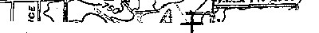

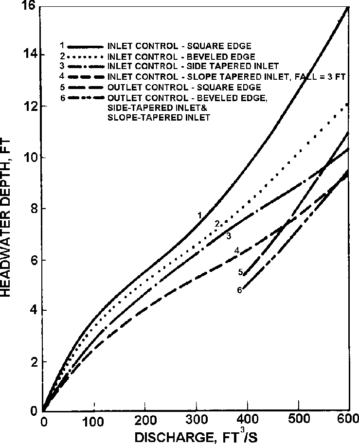

|        |        |
|--------|--------|
|        |        |
| **GI** | **G3** |
|        |        |
|        |        |

**G2**

> **TYPE 13: TRAPEZOID**

Figure 6-4 (continued). Sewer Cross-Section

|     |      |
|-----|------|
| 233 | 6-14 |

**Table 6-2. Summary of Area Relationships and Required Conduit Dimensions.a**

**NTYPE Shape Area Required dimensions**

> **(ft)**

<table>
<colgroup>
<col style="width: 58%" />
<col style="width: 41%" />
</colgroup>
<tbody>
<tr class="odd">
<td>
<strong>1 Circular (n/4)(G1)2</strong>

<blockquote>

<strong>2 Rectangular GI.G2</strong>

<strong>3 Egg-shaped 0.5105.(G1) 2</strong>

<strong>4 Horseshoe 0.829-(G1)2</strong>

<strong>5 Gothic 0.655*(G1)2</strong>

<strong>6 Catenary 0.703.(G1)2</strong>

<strong>7 Semielliptic 0.785-(G1)2</strong>

<strong>8 Basket-handle 0.786.(G1)2</strong>

<strong>9 Semi-circular 1.27-(G1)2</strong>

<strong>10 Modified basket- G2(G1+(n/8)G2)</strong>

<strong>handle</strong>

<strong>11 Rectangular, G2(G1-G3/2)</strong>

<strong>triangular bottom</strong>

</blockquote></td>
<td><blockquote>

<strong>GEOM1 = Diameter</strong>

<strong>GEOM1 = Height 
GEOM2 = Width</strong>

<strong>GEOM1 = Height 
GEOM1 = Height 
GEOM1 = Height 
GEOM1 = Height 
GEOM1 = Height 
GEOM1 = Height 
GEOMI = Height</strong>

<strong>GEOMI = Side height 
GEOM2 = Width</strong>

<strong>GEOMI = Height</strong>

<strong>GEOM2 = Width</strong>

<strong>GEOM3 = Invert height</strong>

</blockquote></td>
</tr>
</tbody>
</table>

**12 Rectangular,** e = **2.ARSIN GEOMI = Side height**

> **round bottom** .(G2/(2G3)) **GEOM2 = Width**
>
> **GEOM3 = Invert radius**

**Area = G1-G2**

**+ (G3)2/2**

**.(9-SIN(8))**

**13 Trapezoidal channel G1(G2+G/G3) GEOMI = Depth**

> **GEOM2 = Bottom width GE0M3 = Side slope (ver-tical/horizontal)**

**aRefer to Figure 6-4 for definition of dimensions, GI, G2, and G3.  
Note that G1 = GEOM1, G2 = GEOM3, G3 = GEOM3.**

> 234 6-15

**Values of Manning's roughness may be known by engineers familiar with the sewer system. Otherwise, they may be estimated from tables in many engineering references (e.g., Chow, 1959, ASCE-WPCF, 1969) as a function of the construction material and sewer conditions. The value may be adjusted to account for losses not considered in the routing procedure (e.g., head losses in manholes or other structures, roots, obstructions). However, the flow routing is relatively insensitive to small changes in Manning's n.**

**<u>Description of Non-Conduits</u> -- The sewer system consists of many different structures, each with its own hydraulic properties. Elements 16 through 22 are designed to simulate such structures. Data requirements for these ele­ments are given in Table 6-3. Brief descriptions of these elements follow.**

**<u>Manholes (NTYPE = 16)</u> -- No physical data are required for manholes except their numbers and upstream element numbers. Note that the number of upstream elements is limited to three. If more than three branches of the system should join at a point, two manholes could be placed in series, allowing a total of five branches to joint at that point, etc. Flow routing is accom­plished in manholes by specifying that the outflow equals the sum of the inflows.**

**As an alternative to the use of the more detailed infiltration (INFIL) and dry-weather flow (FILTH) routines described later, flow and quality con­stituents may be input at manholes to simulate baseflow conditions. This input is constant over time and is allowed only at manholes and at no other element types.**

**<u>Lift Stations (NTYPE = 17)</u> -- The data requirements for lift stations are given in Table 6-3. It is assumed that the force main will remain full when the pump is not operating, resulting in no time delay in the flow routing (i.e., no time is required to fill the force main when the pump starts). When the volume of sewage in the wet** well reaches its specified capacity, the pumps begin to operate at a constant rate. This continues until the wet well volume equals zero. (Two-stage pumping may be simulated using a storage element.)

<u>Flow Dividers (NTYPE = 18 **and 21)**</u> **-- The routing procedure through these elements is explained in the discussion below. Typical** uses are given below.

1)  Simple diversion structure - A type 18 flow divider may be used to model a diversion structure in which none of the **flow is diverted until it reaches** a specified value (GEOM1). When the inflow is above this value, the non-diverted flow (QO1) remains constant at its capacity, GEOM1, and the surplus flow (Q02) is diverted.

2)  Cunnette section - A type 21 flow divider may be used to model a downstream cunnette section. The cunnette section is considered as a separate circular conduit to be placed parallel to the primary conduit as shown in Figure **6-5.** In order to model the cunnette as a semi-circle, the sep­arate circular conduit is given a diameter (GEOM1) so that

> **235 6-16**

<table>
<colgroup>
<col style="width: 19%" />
<col style="width: 42%" />
<col style="width: 16%" />
<col style="width: 21%" />
</colgroup>
<tbody>
<tr class="odd">
<td></td>
<td rowspan="4"><blockquote>

<strong>SECTION OF SEWER WITH CUNNETTE</strong>

</blockquote></td>
<td></td>
<td rowspan="5">1</td>
</tr>
<tr class="even">
<td></td>
<td></td>
</tr>
<tr class="odd">
<td></td>
<td></td>
</tr>
<tr class="even">
<td></td>
<td></td>
</tr>
<tr class="odd">
<td colspan="3"><strong>PRIMARY CONDUIT PRIMARY CONDUIT</strong></td>
</tr>
<tr class="even">
<td></td>
<td></td>
<td></td>
<td></td>
</tr>
</tbody>
</table>

> **CUNNETTE (TYPE I) CUNNETTE (TYPE I) FLOW DIVIDER (TYPE 21**

a\. SCHEMATIC OF HYPOTHETICAL FLOW DIVISION

> 

**CONDUIT WITH  
CUNNETTE**

b\. SPLIT OF CONDUIT INTO PRIMARY CONDUIT AND CUNNETTE

**Figure 6-5. Cunnette Section**

> 237 6-18
>
> **its area will be twice that of the actual total cunnette flow area. (The distance, slope and roughness will be the same as for the primary conduit.) A type 21 flow divider is then the upstream element common to both conduits, as shown in Figure 6-5. (The program assigns a value of GEOM1 of the flow divider equal to half the full flow capacity of the circular pipe simulating the cunnette so that it has the hydraulic characteristics of a semi-circle.) Any flow higher than GEOM1 will be diverted to the primary con­duit. Note that the parameter GEOM3 of the flow divider will be the element number assigned to the cunnette sec­tion. Note further that the element downstream from the two parallel conduits must list them both as upstream ele­ments.**
>
> **3) Overbank flow - A type 18 flow divider can be used to simulate flow into a main channel (undiverted flow) and into a parallel overbank channel for simulation of flooded conditions. Parameter GEOM1 would be set equal to the main channel capacity.** The channels could he of any **shape although two trapezoidal channels might be most appropriate for many natural configurations.**

**<u>Routing at Flow Dividers (NTYPE = 18 and 21)</u> -- Both types will divide the in­flow, QI, into two outflows, QO1 and Q02. The divider then acts as follows:**

> For 0 5 QI ≤ GEOM1, Q01 = QI
>
> Q02 = 0.0
>
> **(6-2)**
>
> **For GEOM1 QI, QO1 = GEOM1**
>
> **Q02 = QI - GEOM1**

**The undiverted outflow, QO1, will flow into the downstream element denoted by GEOM3. (The element into which Q02 flows does not need to be specified).**

**<u>Flow Divider (NTYPE = 20)</u> -- This element is used to model a weir-type diver­sion strucutre in which a linear relationship can adequately relate the flow rate and the depth of flow into the weir structure. Input parameters are de­fined in Table 6-3. The weir constant, incorporated into the variable ,ROUGH, can be varied to account for the type of weir. Typical values of the weir con­stant are 3.3 for a broad crested weir and 4.1 for a side weir.**

**The flow divider behaves as a function of the inflow, QI, as follows:**

> **For Q S QI S DIST, QO1 = QI**
>
> **Q02 = 0.0** (6-3)
>
> **For DIST ≤ QI, QO1 and Q02 are computed as follows:**
>
> 1\) **Compute depth of flow above the weir, DH, assuming a linear flow-depth relationship:**

**DR = (QI-DIST).(GEOM2-GEOM1)/(SLOPE-DIST)**

> **238 6-19**

2)  Compute the diverted flow from the weir formula: Q02 = ROUGH•DH1.5

3)  Compute the undiverted flow:  
    > QO1 = QI - Q02

> <u>Storage Unit (NTYPE 19)</u> -- This element is specified only when internal storage computations are required. Internal storage is modeled in a manner similar to the detention unit of the Storage/Treatment Block. (See Section 7 and Appendix IV.) Internal storage is modeled as a completely-mixed unit with a variety of outlet structures. However, as opposed to the detention unit in the S/T Block, pollutant removal is not simulated other than by decay. The storage unit must be described on card groups G1 to GS.
>
> A storage unit may be placed anywhere in the sewer system where appreci­able storage may exist, such as at an outflow or diversion structure. The required data inputs are described later. It should be noted that the stor­age area or "reservoir" may consist of a portion of the sewer system itself, and area-depth relationships must be worked out accordingly.
>
> <u>Backwater Element (NTYPE = 22)</u> -- This element may be used to model backwater conditions in a series of conduits due to a flow control structure downstream. The situation is modeled in a manner analogous to reservoir flood routing as follows:

1)  A storage element (NTYPE 19) is placed at the location of the control structure. The type of storage element will depend upon the structure (e.g., weir, orifice). One inflow to this storage element is then from the conduit just upstream.

2)  If the water surface is extended horizontally upstream

> from the flow control structure at the time of maximum
>
> depth at the structure, it will intersect the invert slope of the sewer at a point corresponding to the assumed maxi­mum length of backwater. The reach between this point and the structure may encompass several conduit lengths. A
>
> backwater element (NTYPE 22) is placed at this point of
>
> maximum backwater, in place of a manhole, **for instance.**

3)  The backwater element then diverts flow directly into the storage element depending upon the volume of water (and hence, the length of backwater) in the storage element. If the backwater extends all the way to the backwater ele­ment, the total flow is diverted to the storage element; none is diverted to the conduits.

4)  The amount of diverted flow (QO1) is assumed directly pro­portional to the length of the backwater. The storage area in reality consists of the conduits. Since most conduits

> 239 6-20
>
> can be assumed to have a constant width, on the average, the backwater length is assumed proportional to the square root of the current storage volume, obtained from the storage routine.

3)  The parameter GEOM3 of the backwater element must contain the element number of the downstream storage unit.

4)  Parameters for the storage element are read in as usual. Note that the depth-area values will correspond to the storage area of the upstream conduits. Note also that the storage unit must list the backwater element as one of its upstream elements, as well as the conduit immediately upstream.

5)  At each time step, the backwater element computes the ratio of current to maximum storage volume in the downstream storage element. Call this ratio r. Then

> QO 1 = QI
>
> and (6-4)  
> Q02 = OI - Q01
>
> where Q01 = flow directly into storage unit,
>
> Q02 = flow into intermediate conduits, and
>
> Q1 = inflow to backwater element.
>
> <u>Step 3. Input Data and Computational Controls</u> --
>
> <u>Options</u> -- The basic input data, hydrographs and pollutographs are generated outside of the Transport Block. However, certain operational controls are available within Transport.
>
> <u>Choice of Time Step (DT)</u> -- The size of the time step must be an integer multiple or integer fraction of the time step used in the preceding block. In tests of sensitivity (Metcalf and Eddy et al., 1971a), it was found that except for very small values of DT (10 seconds), the output from Transport is insensitive to the length of the time step. Between values of two minutes and 30 minutes, hydrograph ordinates varied by less than one per­cent. For extremely short time step values, the peak flow moved downstream faster and never attained the maximum value that it had with a DT of two minutes and longer. Within the range commonly needed by SWMM users (two minutes to 30 minutes), the choice of time step will not significantly affect results. However, continuity errors can occasionally arise if the time step is "appreciably" longer than the travel time through any conduit. "Appreciably" longer means about factor of two.
>
> <u>Choice of Number of Time Steps (NDT)</u> -- The number of time steps is not restricted. The program will use the number input in Transport (NDT) or the number used by the preceding block, whichever gives the shorter simulation time.
>
> 240 6-21
>
> **<u>Choice of Number of Iterations (NITER)</u> -- The purpose of iterations in the computations is to eliminate flow oscillations in the output. The flatter pipe slopes (less than 0.001 ft/ft) require iterations of the flow routing portion of the Transport Model to help dampen these oscillations. Four iterations have proven to be sufficient in most cases.**
>
> **<u>Choice of Allowable Convergence Error (EPSIL)</u> -- Convergence of the flow routing procedure should not be any problem, and -the default value of EPSIL, 0.0001, may be used. It will provide sufficient accuracy and result in only a very minimal increase in computer time over larger values. The only conver­gence problems that may exist can occur when flow enters a dry conduit. For instance, this could occur at the beginning of a storm in a sewer with little or no base flow. Messages to this effect will be printed if parameter NPRINT**
>
> **0. These may almost always be ignored since the default options in subrou­tine ROUTE will continue program execution and only result in a very small error in continuity (a fraction of a percent).**
>
> **<u>Alternate Hydrograph and Pollutograph Inputs</u> -- Hydrograph and pollutographs may be entered from a tape/disk file (e.g., as generated in the Runoff Block) and/or entered from cards, using card groups Il and R1 in Table 6-6. Param­eters NCNTRL and NINPUT are set accordingly. Note that input from both cards and tape/disk may be performed simultaneously. If, for some reason, input from cards is not desired, a tape/disk file containing the specified input values could be created and specified as an input file to Transport in place of, say, a file generated by the Runoff Block. The format of such a file is described in Section 2.**
>
> **<u>Quality</u>**
>
> **<u>Constituents</u> --**
>
> **Up to four pollutants may be arbitrarily chosen for input and routing by the Transport Block. Although these would often be chosen from the group (up to ten) supplied by the Runoff Block (or another preceding block), they do not have to he since card input may be used in addition to the interface file. If the same pollutant is entered from both the interface file and from cards, the description (name, name of units, type of units) from the inter­face file must he used. If the pollutant is entered only from cards, this description must be supplied on card group Fl. Further information on pollutant description is contained in Section 4.**
>
> **<u>Decay</u> --**
>
> **Each pollutant may be subjected to a first order decay during the rout­ing process by supplying a first order decay coefficient, DECAY (based on natural logarithms or base e). Although travel time through most sewer sys­tems is short enough so that decay is seldom important, the user could sup-**
>
> **ply, for example, a deoxygenation coefficient, for BOD if desired. Non-conservative pollutants are not linked. The decay of one has no effect on any other.**

**241 6-22**

> <u>Routing</u> --
>
> Routing of quality parameters is performed by using the integral solu­tion for the output from a completely mixed conduit volume (Medina et al., 1981). See Appendix IX for a derivation. Although this tends to introduce artificial dispersion of concentration profiles, it is the most convenient way in which to introduce new loadings at manholes along the system, as well as to facilitate scour and deposition calculations. The quality routing procedure is not subject to calibration directly. However, the routing becomes closer to pure advection (plug flow) as the number of elements is increased.
>
> <u>Scour and Deposition</u> --
>
> The basis for these procedures is described in Appendix VI. Each pollutant is assigned a specific gravity (SPG) and particle size distri­bution, assumed to apply throughout the drainage system regardless of the source of the pollutant, e.g., stormwater or dry-weather flow. If the specific gravity is less than or equal to 1.0, the pollutant is considered to be entirely suspended (or dissolved) and not subject to scour and deposition. If all calibration is to be performed using Runoff Block buildup-washoff parameters, for instance, it may be desirable to avoid the complexity of simulating a second real but largely unknown source.
>
> Typical particle size distributions (and interpretation of input param­eters PSIZE and PGR) are illustrated in Figure 6-6. Such information should be collected first hand at each catchment; secondary sources such as Sartor and Boyd (1972), Shaheen (1975), Manning et al. (1977) and Pisano et al. (1979) should be used only if local data are not available. During the simu­lation scour and deposition are simulated using Shield's criterion to deter­mine the critical diameter for incipient motion and deposition (see Appendix VI). The kinematic velocity of water (GNU on Card D2) is a function of temperature and used to calculate the boundary Reynolds number on Shield's diagram (Graf, 1971, Vanoni, 1975). For each conduit, the critical diameter is determined as a function of velocity, roughness and specific gravity. At the same time, the maximum diameter of the <u>suspended</u> fraction and the <u>minimum</u> diameter of the <u>settled</u> fraction is maintained. If the critical diameter is less than the maximum of the suspended material, more is settled; the settled mass is determined by multiplying by a fraction determined from the particle size distribution (Appendix VI). Similarly, if the critical diameter is greater than the minimum of the settled material, more is suspended. The settled material is thus assumed to have the particle size distribution of the right hand tail of the total distribution (Figure 6-6), and the sus­pended material has the distribution of the left hand side.
>
> Decreasing the specific gravity (downwards toward 1.0) increases the amount suspended and vice versa. As SPG approaches 1.0 closely the proce­dure becomes very sensitive to SPG since there is a division by SPG-1.0. Typical values of specific gravities of particulate matter in sewers range from 1.1 for volatile material to 2.7 for sand and grit. The actual situa­tion in which each particle size range may have its own specific gravity can be handled by the Storage/Treatment Block, but not the Transport Block
>
> 242 6-23

> (except that up to four different pollutants may be simulated). Since it is only one parameter, calibration of the scour-deposition routine may be most easily calibrated using SPG. Alternatively, a greater percentage of large diameter material may be assigned a pollutant using the particle size distribution if, for instance, more deposition were desired.
>
> Unlike the previous Transport Model, continuity of pollutant mass is now maintained during scour and deposition. In addition, larger particles can settle upstream in flat conduits and be unavailable for downstream settling. An initial settled mass in each conduit is computed prior to the start of the simulation by running the routine for DWDAYS days (card D2) prior to the storm event (or longer) simulation. This initial deposition is assumed to start with a clean bed.
>
> Although this scour-deposition routine is a far cry from the detailed sewer sediment transport program developed by Sonnen (1977), it is reason­ably simple, consistent and may be calibrated. And should the user desire, it may be bypassed (using SPG.51.0), and all quality calibration performed in the Runoff Block.
>
> <u>Internal Storage Model</u>
>
> Use of the internal storage routine involves four basic steps. A somewhat more detailed data description may be found in Section 7.
>
> <u>Step 1. Call</u> --
>
> The internal storage routine is called by subroutine TRANS when element NTYPE 19 is specified. No more than two storage locations may be specified in a single run.
>
> <u>Step 2. Storage Description: Part 1</u>
>
> Describe the manner in which the outlet depth-discharge relationship is given (set of data pairs, power equation or pumps). See Appendix IV and Section 7 for a more detailed description of this technique.
>
> <u>Step 3. Storage Description: Part 2</u> --
>
> Describe the geometry of the unit with a set of depth-surface area volume data triplets and the depth-discharge -relationship with data pairs or a power equation. See Appendix IV and Section 7 for more details.
>
> <u>Step 4. Initial Conditions</u> --
>
> Describe the initial conditions of the unit with respect to volume and pollutant concentrations.
>
> 244 6-25
>
> **<u>Infiltration</u> Model<u>  
> Description</u> --**
>
> **The infiltration program, INFIL, has been developed to estimate infil­tration into a given sewer system based upon existing information about the sewer, its surrounding soil and groundwater, and precipitation. It should**
>
> be borne in mind throughout that the accuracy of infiltration prediction is
>
> **dependent upon the accuracy and extent of data descriptive of infiltration in the system being modeled.**
>
> **Using these data, INFIL has been structured to accept estimates of average daily infiltration inflows at discrete locations along the trunk sewers of a given sewer system. A typical urban drainage basin in which infiltration might be estimated is shown in Figure 6-7.**
>
> **Since the Storm Water Management Model's principal use has been mainly to simulate individual storms which cover a time period of less than a day, average daily estimates from INFIL are calculated only once prior to sewer**
>
> flow routing. INFIL is called from subroutine TRANS by setting the variable, NINFIL equal to 1, thus signaling the computer to estimate infiltration. In fact, however, the user has most of the responsibility for infiltration estimation, optionally using techniques described below. The program does little more than apportion it properly.
>
> For the purposes of analysis, infiltration is classified into four categories, i.e., miscellaneous sources causing a base dry weather inflow, frozen residual moisture, antecedent precipitation, and high groundwater. The cumulative effects of the first three sources can be seen in Figure 6-8 which excludes surface runoff. Figure 6-8 shows total infiltration QINF as the sum of dry weather infiltration DINFIL, wet weather infiltration RINFIL, and melting residual ice and frost infiltration SINFIL. However, in cases where the groundwater table rises about the sewer invert, it is assumed that groundwater inflow GINFIL alone will be the dominant source of infiltration. Thus, infiltration is defined as:
>
> DINFIL + RINFIL + SINFIL
>
> QINF = or (6-5)
>
> GINFIL for high groundwater table
>
> **Throughout the procedure for determining input variables, observations and estimates based upon local data given preference over generalized esti­mates for infiltration described below. Thus, the hierarchy for basing estimates should be:**

1)  **Use historical** data for the study area under consider­ation.

<!-- -->

4)  Use historical data for a nearby study area and adjust re­sults accordingly.

> 245 6-26
>
> Figure 6-7. Typical Drainage Basin in which Infiltration is to be Estimated

246

QINF = Total infiltration

DINFIL = Dry weather infiltration

RINFIL = Wet weather infiltration

SINFIL = Melting residual ice and snow infiltration

RSMAX = Residual moisture peak contribution

SMMDWF = Accounted for sewage flow

**Figure 6-8. Components of Infiltration**

**247 6-28**

5)  **Use estimates of local professionals.**

6)  **Use generalized estimates based upon country-wide observa­tions.**

**Infiltration - inflow studies (e.g., EPA, 1975) have been performed in many cities and should provide much of the needed data.**

**<u>Dry Weather Infiltration (DINFIL)</u>** --

**If the study area under consideration has been gaged, base dry-weather infiltration can be taken by inspection from the flow data. In the absence of flow data, an estimate of the unit infiltration rate XLOCAL (gpm/inch-diameter per mile) for dry weather must be obtained from local professionals. From data in the form of calculated values of DIAM and PLEN, Equation 6-6 can then be used to determine DINFIL (gpm):**

> **DINFIL = XLOCAL•DIAM•PLEN (6-6)**
>
> **where DI A".', = average sewer diamater, in., and  
> PLEN = pipe length, mi.**

**Values of XLOCAL range from 250 to 600 gpm/in-diameter per day (ASCE-WPCF, 1969) and may be even higher for laterals with many stubs and wyes. The importance of local data cannot be over-emphasized.**

<u>Residual Meltin€; Ice and Frost Infiltration (SINFIL)</u>

SINFIL arises from residual precipitation such as snow as it melts fol­lowing cold periods. Published data (American Soc. of Heating and Air Condi­tioning Engineers) in the form of monthly degree days (sum of **deviations below 65°F) provide an excellent index as to the significance of SINFIL. Average monthly degree-days for cities in the United States are reproduced in Appendix VIII. The onset and duration of melting can be estimated by noting the degree days NDD above and immediately below a value of 750. Refer to Figure 6-9 for the following description.**

**Within subroutine INFIL, the beginning of melting, MLTBE, is taken as the day on which NDD drops below 750. Next, MLTEN is determined so that *Al* equals A2. In the absence of evidence to the contrary, it is assumed that the melting rate is sinusoidal. The maximum contribution RSMAX from residual moisture can be determined from previous gaging of the study area or local estimates. In either case, SINFIL is determined within the program by the following equation:**

**RSMAX•sin\[180•(NDYUD-MLTBE)/(MLTEN-MLTBE)\]**

<table>
<colgroup>
<col style="width: 24%" />
<col style="width: 75%" />
</colgroup>
<tbody>
<tr class="odd">
<td><strong>SINFIL =</strong></td>
<td>
(6-7)

<blockquote>

<strong>0.0 if NDYUD is not in melting period or if: NDD never exceeds 750.</strong>

</blockquote>

<strong>248 6-29</strong>
</td>
</tr>
</tbody>
</table>

DATE

> MLTBE = Day on which melting period hegi.ns /STEN = Day on which melting peril:: enda

**Figure 6-9. Prescribed Melting Period**

> 249 6-30
>
> where NDYUD = day on which infiltration estimate is desired, RSMAX = residual moisture peak contribution, gpm, MLTBE = beginning of melting period, day, and
>
> MLTEN = end of melting period, day.
>
> Note that RSMAX is a required input parameters, in addition to degree day information.
>
> <u>Antecedent Precipitation (RINFIL)</u>
>
> --
>
> RINFIL depends upon antecedent precipitation occurring within nine days prior to an estimate. If antecedent rainfall is unavailable or less than about 0.25 in (6.4 mm), the RINFIL contribution to QINFIL is usually small. For larger antecedent rainfall contributions, regression techniques offer one method of estimating RINFIL. For example, during development of the infiltration routine, available rainfall and infiltration data were examined (Metcalf and Eddy et al., 1971a). For three areas in which sewer flow data were not affected by melting, RINFIL was found to satisfy the following linear relationship:
>
> RINFIL = ALF + ALFO.RNO + ALF1.RN1 + + ALF9•RN9 (6-8)
>
> where RINFIL = SWFLOW - DINFIL - SIMDWF, gpm,
>
> ALFN = coefficient to rainfall for N days prior to estimate, gpm/in,
>
> RNN = precipitation on N days prior to estimate, in,
>
> SWFLOW = daily average sewer flow excluding surface runoff, gpm,
>
> arid
>
> SMIDWg = otherwise accounted for sewage flow, gpm.
>
> To determine the coefficients in Equation 6-8, a multiple linear regression should be run on existing flow and rainfall data. For comparative purposes, the results of regression analyses for study areas in three selected cities (Lentz, 1963, Metcalf and Eddy et al., 1971a) are given in Table 6-4.
>
> <u>High Groundwater Table (GINFIL)</u>
>
> --
>
> For locations and times of the year that cause the groundwater table to be above the sewer invert, groundwater infiltration GINFIL supersedes contri­butions from DINFIL, RINFIL, and SINFIL. GINFIN can be determined from his­torical sewer flow data by inspection or regression analysis. For example, a regression analysis could involve determination of the BETA coefficients in Equation 6-9, or an alternative formulation could be investigated.
>
> GINFIL = BETA + BETAl-GWHD5 + BETA2.GWHD2 + (6-9)
>
> BETA3-GWHDu
>
> where GWHD = groundwater table elevation above *sewer* invert,
>
> ft, and
>
> BETAN = coefficient for term N.
>
> 250 6-31
>
> Table 6-4 RINFIL Equations For Three Study Areas
>
> **Study Area Equation**

**Bradenton, RINFIL = 4.1 + 2.9RNO + 17.5RN1 + 15.ORN2 +**

> **Florida 12.8RN3 + 13.ORN4 + 10.4RN5 +**
>
> **13.2RN6 + 10.1RN7 + 11.8RN8 + 9.5N9**

**Baltimore, RINFIL = 2.4 + 11.3RNO + 11.6RN1 + 5.5RN2 +**

> **Maryland 6.4RN3 + 4.8RN4 + 3.6RN5 + 1.ORN6 +**
>
> **1.5RN7 + 1.4RN8 + 1.8RN9**

**Springfield, RINFIL = 2.0 + 18.3RNO + 13.9RN1 + 8.9RN2 +**

> **Missouri 5.5RN3 + 6.7RN4 + 16.RN5 + 5.2RN6 +**
>
> **4.6RN7 + 4.4RN8 + 1.3RN9**

**<u>Apportionment of Infiltration</u> --**

**Once an estimate of the total local infiltration QINF has been obtained, this flow must be apportioned throughout the designated study area. The cri­terion chosen for apportionment is an opportunity factor OPINF which repre­sents the relative number and length of openings susceptible to infiltration. Pipe joints constitute the primary avenue for entry of infiltration (Geyer and Lentz, 1963). The number and length of joints is assumed to be propor­tional to the relative surface area of each conduit. For each, an equivalent circular pipe diameter will be proportional to the square root of its known cross sectional area, ft. Then the fraction of total infiltration ("oppor­tunity"** for infiltration) allocated to each conduit, OPINF, is:

<table>
<colgroup>
<col style="width: 79%" />
<col style="width: 20%" />
</colgroup>
<tbody>
<tr class="odd">
<td><blockquote>

<em>4A,</em> <strong>.DIST</strong>

</blockquote>

<strong>OPINF =</strong>

<blockquote>

<strong>I 4Af.DIST</strong>

<strong>where A£ = cross sectional area of conduit, ft2, and DIST = conduit length, ft,</strong>

</blockquote></td>
<td><strong>(6-10)</strong></td>
</tr>
</tbody>
</table>

**and the summation in the denominator is over all conduits. Trapezoidal chan­nels are treated the same as all others. The apportioned infiltration enters the system at the non-conduit element immediately upstream of the conduit.**

**This procedure allocates the most infiltration to the largest and long­est conduits. Should local information dictate otherwise, infiltration may be apportioned by the user and entered at appropriate manholes in card group El.**

> **251 6-32**
>
> Infiltration developed using subroutine INFIL is held constant in time. Should hourly or daily corrections be desired, infiltration can be incorpo­rated into dry-weather flow (described below).
>
> <u>Quality of Infiltration</u> --
>
> Although infiltration is often assumed to *be* "clean" due to its origin in the soil layers, in-conduit measurements usually indicate non-zero levels of most parameters. These concentrations may be entered on card Kl.
>
> <u>Data Needs</u> --
>
> <u>Hydrologic Data</u> -- Concurrent historical rainfall, water table, and sewer flow data of several weeks' duration are needed to completely describe infil­tration. In addition, rainfall for several days prior to the flow estimate is required for use in a regression equation for RINFIL. Of course, such data would be required for many different storms for development of such an equation.
>
> Ideally, the rainfall record would be from a rain gage which is located near the center of the study area and which records daily rainfall in inches. If more than one rain gage is located within the study area, daily measure­ments from all gages should be averaged. Missing data (e.g., from a malfunc­tioning gage) or a total absence of measurements due to no gaging within the study area can sometimes be overcome with measurements taken from a rain gage located within a few miles. If National Weather Service (NWS) Climatological Data recorded at the nearest airport or federal installation are not avail­able, contact the National Weather Records Center (Asheville, NC) for assistance.
>
> Should some other form of precipitation, e.g., snowfall, be encountered, it will *be* necessary to convert this to equivalent rainfall. If estimates are unavailable from the NWS, the ratio of ten inches of snow to one inch of rain may be used.
>
> Water table data should also be obtained from gaging within the study area. However, shallow-well data from the US Geological, Survey or state geological office can be used to supplement missing data. Water table ele­vations are not required if they are below the sewer inverts for the day on which QINF is to be estimated.
>
> <u>Sewer Data</u> -- Sewer flow data for regression analysis should be taken from a gage located at the downstream point within the study area. Upstream gag­ing may sometimes be used to estimate flows at the downstream point by simply adjusting flows based upon respective surface area. Physical sewer data (e.g., lengths, diameters) are taken from prior input used within TRANS to route sewer flow.
>
> <u>Summary of Infiltration Procedures</u> --
>
> <u>Input</u> -- Effective use of the Infiltration Model requires estimates of its component flows, namely:
>
> 252 6-33
>
> DINFIL = dry weather infiltration,
>
> RINFIL = wet weather infiltration,
>
> SINFIL = melting residual ice and snow, and
>
> GINFIL = groundwater infiltration.

<u>Step 1. Determine Groundwater Condition</u> - If the groundwater table is pre­dominantly above the sewer invert, all infiltration is attributed to this source (GINFIL). In this case, an estimate of Lhe LuLal infiltration is made directly (i.n cfs for the total drainage basin) and read in card Kl. This card followed by a blank card (card K2) would complete the infiltration data input. If the groundwater table is not predominantly above the sewer invert, proceed to Step 2.

<u>Step 2. Build-Up Infiltration from Base Estimates</u> -- From measurements, historical data, or judgment, provide estimates of DINFIL and RINFIL. In this case, GINF1L must be set equal to 0.0. Finally, if needed, provide the peak residual moisture (RSMAX), and the 12 monthly degree-day totals taken from Appendix VII or a local source.

<u>Pry Weather Flow Model  
Methodology</u> --

Subroutine FILTH has been developed as an option to estimate average sewage flow and quality from residential, commercial, and industrial urban areas. FILTH estimates sewage inputs at discrete locations along the trunk sewers of any specified urban drainage basin. These estimates are calculated from data describing drainage basin subsections (subcatchments and subareas) under which the trunk sewer passes. In this routine, dry-weather flow quan­tity and quality are developed from regression equations, as explained in the documentation (Metcalf and Eddy et al., 1971a). The estimates are for three <u>specific</u> quality parameters: BOD5, suspended solids (SS) and total coliforms. Thus, if any different parameters are to be simulated, FILTH cannot be used. However, if a fourth parameter is to be routed in addition to BOD5, SS and total coliforms, FILTH can be used to provide estimates for the first three but not the additional one. Also bear in mind that a con­stant base flow for any parameter may be input at manholes in card group El.

When FILTH is not used, DWF estimates may be input at desired manholes, as discussed previously. In fact, this; option may *be* routinely used in place of FILTH whenever reasonable estimates are available for instream DWF quan­tity and quality.

An example of a hypothetical sewer system and input situation for FILTH is given in Figure 6-10. To avoid confusion with Runoff Block subcatchments, all drainage basin subdivisions will be referred to as subareas in the fol­lowing discussion. As shown in the figure, an input manhole near the center of each subarea is assumed to accept all sewage flow from that subarea. Criteria for establishing subarea boundaries and input locations are dis­cussed later in the text.

> 253 6-34
>
> **<u>Sewer and Subcatchment Data</u>**

1.  **Manhole 32 is the cost downstream point.**

2.  **Subcatchments 1,2,3, and 4 are single-family residential areas, each 100 acres in size and each with water metering.**

3.  **Subcatchcents 5 and 7 are 220-acre industrial areas.**

4.  **Subarea 6 is a 250-acre park.**

5.  **Subarea 8 is a 50-acre commercial area.**

> **Subareas 6 and 8 constitute a subcatchment draining to input manhole number 21.**
>
> **<u>Resulting Data</u>**
>
> **B sewage estimates**
>
> **KTVUM, total subcatchments and subareas in drainage basin = 8.**
>
> **TOTA, total acres in drainage basin = 1,140.**
>
> **ASUB, .**
>
> **KNUM, INPUT, KLAND, acres in  
> subcatchment input manhole land *use* subcatchment**
>
> **<u>or subarea number</u> SaL212EL <u>or subarea</u>**

|       |        |       |         |
|-------|--------|-------|---------|
| **1** | **3**  | **1** | **100** |
| **2** | **17** | **1** | **100** |
| **3** | **29** | **1** | **100** |
| **4** | **8**  | **1** | **100** |
| **5** | **26** | **4** | **220** |
| **6** | **21** | **5** | **250** |
| **7** | **24** | **4** | **220** |
| **8** | **21** | **3** | **50**  |

**Figure 6-10. Determination of Subcatchment and Identifi-**

**cation to Estimate Sewage at 8 Points**

**254 6-35**

> **In the context of the SWMM, FILTH calculates daily sewage flow (cfs) and characteristics (BODc, SS, and total coliforms) averaged over the entire year for each subarea. FILTH is called from subroutine TRANS by setting the parameter NFILTH equal to one. Flow and quality characteristics estimates and corresponding manhole input numbers are then returned to TRANS where the estimates undergo adjustment depending upon the day of the week and hour of the day during which simulation is proceeding.**
>
> **The subroutine may** *be* **omitted when modeling separate storm sewers unless it is desired to generate a base flow with DWF characteristics. FILTH is designed to handle an unrestricted number of inlet areas and indi­vidual process flow contributors. As a safeguard against faulty data, how­ever, a program interrupt is provided if the combined number exceeds 159, which is a limit set by the Transport Model.**
>
> **<u>Quantity Estimates</u> --**
>
> **Three data categories are used to estimate sewage flow: (1) drainage basin data, (2) subarea data, and (3) decision and adjustment parameters.**
>
> **Study area data are TOTA, KTNUM and ADWF. KTNUM denotes the number of subareas into which a drainage basin, having a surface area TOTA (acres), is being divided. ADWF, which is optional depending upon its availability, gives the average sewage flow (cfs) originating from the entire drainage basin (e.g., average flow data from a treatment plant serving the study area). When it is included, the predicted basin flow will be adjusted to match this value.**
>
> **Subarea data requirements consist of several options depending upon availability and choice of input. Discussion later in the text will assist in data tabulation by noting the order of preference where options exist. Subarea data can be broken into three categories** as **follows: (1) identifi­cation parameters, (2) flow data, and (3) estimating data.**
>
> 1\) **<u>Identification parameters</u> -- Identification parameters are KNUM, INPUT, and KLAND. KNUM identifies each subarea by a number less than or equal to KTNUM. For each of the KTNUM subareas, INPUT indicates the number of the manhole into which DWF is assumed to enter. Land use within each sub­area which approximately corresponds to zoning classifica­tion, is categorized according to Table 6-5. KLAND serves as an important factor in deciding subarea locations and sizes. Figure 6-10 will assist in describing how the above data are determined and tabulated.**
>
> **255 6-36**

Table 6-5. Land Use Classification

> KLAND
>
> 1 Single-family residential
>
> 2 Multi-family residential
>
> 3 Commercial
>
> 4 Industrial
>
> 5 Park and open area

2)  <u>Flow</u> data.-•- Flow data are optional inputs that eliminate the need for using predictive equations. Two possible types of flow data are average sewage flow measurements, SEWAGE, and metered water use, WATER. Commercial or industrial sewage flow or water use measurements should be input using the variable SAQPF. Flows from commercial and in­dustrial establishments located in residential or open subareas may be included using SAQPF, also. Metering at lift stations and other flow control structures within the study area is occasionally available and should be used whenever possible. Metered water use offers a more available source of subarea flow data. Unfortunately, considerable effort in locating, tabulating, and aver­aging these data is often required.

3)  <u>Estimating data</u> -- For each subarea where SEWAGE or WATER measurements are not available estimated water use must be used as an estimate of sewage flow. In the case of a fac­tory or commercial establishment, estimates can be made by multiplying the number of employees by an established co­efficient (gpd per employee). In the case of a large fac­tory or commercial establishment, one subarea may be estab­lished with estimated water use tabulated as SAQPF for that subarea. On the other hand, estimates of water use for established non-residential areas (e.g., industrial parks or shopping centers) may be summed and tabulated as SAQPF for one large subarea. A list of the above mentioned co­efficients is given in Appendix VIII.

> In the case of residential areas, estimating data for each subarea are METHOD, PRICE, ASUB, POPDEN, DWLINGS, FAMILY, and VALUE. Default values and definitions of each of these are given in the description of input data. Decision and adjustment parameters consist of DVDWF, HVDWF, KDAY, CPI, and
>
> 256 6-37

CCCI\. DVDWF and HVDWF are daily and hourly correction factors, respectively, for DWF. DVDWF is comprised of seven numbers that are ratios of daily aver­age sewage flows to weekly average flow. Likewise, HVDWF is comprised of 24 numbers that are ratios of hourly average sewage flows to daily average flow. Both groups of 'numbers may be derived from observed flow variation patterns throughout the country (e.g., Tucker, 1967, Portland Cement Association, 1968). Their use is to correct measured or estimated average sewage flow Lu more accurate eatimates depending upon the day and hour. Typical sewage flow variations are shown in Figures 6-11 and 6-12. These flow patterns are only examples; locally observed patterns more accurately describe local variations and should be used when available.

KDAY denotes the day of the week at which simulation is to begin. As the simulation proceeds, this value is continually updated. By using the current day and hour, the appropriate values of DVDWF and HVDWF can be multiplied by average flow to determine the correct value. KDAY ranges from 1 to 7 with Sunday being day number 1.

Two cost indices are employed to adjust current house valuations and water prices to appropriate 1960 values and 1963 prices, respectively. This is done because estimating equations within FILTH are based upon 1960 values and 1963 prices. CPI, consumer price index, has been chosen to adjust water price by multiplying water price by 1960 CPI divided by the current CPI. CCCI, composite construction cost index, has been chosen to adjust house valuations similarly. Both indices can be found in most libraries in jour­nals on economic affairs (e.g., U.S. Dept. of Commerce, <u>Survey of Current Business and Statistical Abstracts of the United States).</u>

<u>Quality Estimates</u> --

The purpose of the DWF quality computation is to apportion waste charac­teristics (such as would be measured at a sewage treatment plant before treatment) among the various subareas in the drainage basin under study, or in the event no measured data are available, to estimate and apportion usable average values. The apportionment is based upon the flow distribution, land use, measured or estimated industrial flows, average family income, the use or absence of garbage grinders, and infiltration.

Daily and hourly correction factors for concentrations of BOD, SS and total coliforms are input in conjunction with those for flow variations. All are expressed as ratios of instantaneous to annual or daily averages.

Card Ni includes the total number of subareas and process flow sources to be processed along with the type case (whether the total DWF character­istics are known or to ***be*** estimated), the number of process flow contribu­tors, the cost indices, and the total drainage basin population. Depending upon the instructions given, computations proceed along the Case 1 or Case 2 channel.

> <u>Case</u> 1 -- In this instance, the total DWF quality charac­teristics are known at a point well downstream in the sys­tem. These characteristics may be obtained from treatment
>
> 257 6-38

**•••••••••.**

0.90 L\_\_ <u>I I</u> i I

> 1 2 3 4 5 6 7 1
>
> Sup Mon Tie Wed Thur Fri Sat Sun

DAY OF THE WEEK

**Figure 6-11. Representative Daily Flow Variation**

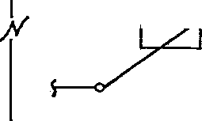<u>1 1 I I</u> 1 <u>1 1 j</u> t (,1\_.\_1 <u>1 1</u>

> <u>1 I I I II 1 1</u>
>
> 12 6 12 **6 12**
>
> a.m.

POUR OF THE DAY

**Figure 6-12. Representative Hourly Flow Variation**

**258 6-39**

> **plant operating records (raw sewage) or by a direct sampling program. The average daily concentrations are read into the program for flow, BOD , SS, and total coliforms (card 01). The total pounds per5 day of BOD5 and SS and the total MPN .per day of coliforms are then calculated. Then, infil­tration and base flow are subtracted from the average daily flow. Note that infiltration is computed in separate sub­routine INFIL. If it is not executed a default:. of zero will be assumed.**
>
> **Next, the known process flow contributions (card group P1) are summed and deducted from the daily totals, yielding a further corrected flow, C2DWF (cfs), and characteristics, C1BOD and C1SS (lb/day). This is the only use of the in­put from card group P1. Process flow information must be <u>re-entered</u> for each subarea, in card group Ql.**
>
> **Finally, corrections based on regression equations, are made for personal income variations, degree of commercial use, and garbage grinder status (card 02). The DWF quan­tity does not change but the characteristics obtain new, average values, C2BOD and C2SS. Average concentrations of the residual flow, A1BOD, A1SS, and AlCOLI are then computed.**
>
> **<u>Case</u> 2 -- Here no direct measurements are available; thus, estimates must be made or default values will be assumed. A typical application of Case 2 would be in a situation where several catchments are to be modeled, yet funds will permit monitoring the DWF only in a single area. A1BOD, A1SS, and AlCOLI would be computed via the Case 1 sub­routine for the known area and the results could be trans­ferred as Case 2 for the remaining catchments.**
>
> **Default values of A1BOD, A1SS, and AlCOLI are 1300 lb/day-cfs (241 mg/1), 1420 lb/day-cfs (263 mg/1) and 6.2 x 107 MPN/100 ml. These values assume 85 gal/capita-day (322 1/capita-day) domestic wastewater flow and 0.02 lb/capita-day (0.09 kg/capita-day) for BOlk, 0.22 lb/capita-day (0.1 kg/capita-day) for SS and 2d0 billion MPN/capita-day for total coliforms. All values assume average income families. The default value for ADWF assumes 100 gal/capita-day (376 1/capita-day) which includes an extra 15 gal/capita-day (57 1/capita-day) for infiltration or other sources.**
>
> **Following estimation of basin totals, average daily flow and quality values are computed for each of the KINUM subareas. Data are input in card group Q1 for estimation of water use and sewage quality as well as process flow information for each subarea.**
>
> **Dry weather flow quantity (DWF in cfs) is computed for each land use on the basics of the following priorities:**
>
> **259 6-40**
>
> **<u>Priority Method</u>**
>
> **1 Measured average sewage flow (SEWAGE \$ 0.0).**
>
> **2 Measured water use (WATER \$ 0).**
>
> **3 Regression equations, for single and multiple-family residential land use only.**
>
> **The first two methods are really equivalent since DWF is simply equated to either SEWAGE or WATER, in this order, for all land uses. Regression equa­tions are employed as a third choice for residential land uses. As explained in the documentation (Metcalf and Eddy et al., 1971a), DWF becomes a function of the number of dwelling units within the subarea (DWLNGS) and other param­eters as will be listed below. DWLNGS is required for all regression equa­tions and is computed on the following basis:**
>
> **<u>Priority Method</u>**
>
> **1 Input on card Ql**
>
> **2 DWLNGS = POPDEN•ASUB/FAMILY**
>
> **3 Default to 10 units per acre.**
>
> **DWF is then computed using DWLNGS and input parameters as listed below:**
>
> **METHOD = 1 METHOD = 2**
>
> **<u>PRICE = 0 PRICE \# 0</u>**
>
> **DWLNGS DWLNGS DWLNGS**
>
> **VALUE PRICE FAMILY**
>
> **CPI VALUE  
> VALUE**
>
> **For each technique default values will be used where necessary. It may be inferred that parameters not used in a regression equation may be omitted from input. Note that VALUE is also used in each technique. It is adjusted to the 1960 Composite Construction Cost Index, CCCI, by**
>
> **VALUE = VALUE • 103/CCCI (6-11)**
>
> **Finally, the user is reminded that all inputs for the regression equations can be avoided if either SEWAGE or WATER is known.**
>
> **For commercial, industrial or undeveloped land uses parameter SEWAGE**
>
> **or WATER is the only method used to input DWF, except that process flows**
>
> **are <u>added</u> to the value of DWF previously computed, for all land uses. Thus,**
>
> **they could constitute the only dry-weather flow source for non-residential**
>
> **land use.**

**260 6-41**

Dry-weather flow quality starts with the average BOD5 and SS concentra­tions (A1BOD and A1SS) previously computed for the entire subarea. These are used for the concentrations of non-process flows for all subareas, with two exceptions. First, for commercial and industrial areas, the average concentrations are multiplied by 0.9. Second, the strengths of residential flows are adjusted according to average family income, XINCOM, and percent garbage grinders, PCGG, as explained in the documentation.

The process flow load (i.e. flow times concentration) is then added to the loads just computed, for all land uses. For non-residential land use process flows could constitute the only quality loads.

Finally, for all subareas, total coliforms are computed solely on the basis of population using the average concentration, AlCOLI, computed earlier along with the total basin populations, POPULA, (card N1) and subarea popula­tions computed from POPDEN (card Q1). Thus, there will be a subarea contri­bution of total coliforms only if POPDEN \$ O.

For each of the KTNUM subareas, subtotals (cumulative up to this sub­area) of computed flows and quality will he printed for each subarea if MSUBT \$ 1. Otherwise, only basin totals will be printed. If measured basin averages have been input on card 01 (KASE = 1) all subarea loads are adjusted by a constant ratio such that the flow and concentrations computed from the data of card group Q1 will agree with the input averages.

<u>Summary of Dry Weather Flow Requirements</u> --

<u>Step 1. Establishing Subareas</u> -- Establishment of the subareas constitutes the initial step in applying subroutine FILTH. Both detail of input data and assumptions made in developing FILTH imply constraints on the type, size, and number of subareas. However, most important in subarea establishment is the type of estimating data available and the maintenance of homogenous land use.

Subareas should be located and sized to utilize existing sewer flow measurements taken within the drainage basin. These measurements should be recent and of sufficient duration to provide a current average sewage flow value for the period of time during which simulation is to proceed. Measured daily and hourly flow variation should be used in lieu of generalized values described earlier in the text. A gaging site with less than 200 ac (81 ha) contributing flow often provides a convenient data input situation. A sub­area should be established upstream from the gage with average sewage flow tabulated as SEWAGE for that subarea. It is convenient, though not neces­sary, for the subareas to correspond to subcatchments in Runoff.

If metered water use is to be used to estimate sewage flow, subareas should be located to coincide with meter reading zones or other zones used by the water department that simplify data takeoff. Since water use would be used to estimate sewage flow, average winter readings should be used to minimize the effects of lawn sprinkling and other summer uses.

> 261 6-42
>
> If neither gaging nor metered water use are input, sewage characteris­tics must be estimated. Subareas should then be established to yield apprO-priate input data for the residential estimating equations in FILTH. Zero sewage flow is assumed from commercial, industrial, and parkland subareas for which SEWAGE and WATER are zero and measurements of SAQPF are not given. Since KLAND and VALUE are the significant variables in estimating subarea sewage flow, subareas should be located and sized to include land with uni•-form land use and property valuation. To utilize es-sting census data, sub­area boundaries should *be made* to coincide with census tract boundaries.
>
> Criteria for establishing subareas are listed in the following summary:
>
> 1\) Subareas in general should:

1.  be of homogenous land use;

2.  be less than or equal to 159 in number; and

3.  conform to the branched pipe network.

> 2\) Subareas should be established to employ any existing sewer flow measurements.
>
> 3\) Subareas for which metered water use is used to estimate sewage flow should be compatible with meter reading zones.
>
> 4\) Residential subareas for which estimated water use is used to estimate sewage flow should:

1.  be uniform with respect to land use;

2.  be uniform with respect to dwelling unit  
    > valuation; and

3.  coincide with census tracts.

> <u>Step 2. Collection of Data</u> -- Other than the establishment of measured data described earlier, the primary data source is the US Bureau of Census for census tract information. This source provides readily available data on population distribution, family income, and the number and relative age of dwelling units. City records, aerial photographs, and on-site inspection may be necessary to define land use activities, process flow, and dwelling density variations within tracts.
>
> <u>Step 3. Data Tabulation</u> -- Once subareas have been established, several alternatives exist regarding data tabulation. An identification number KNUM should be given to each subarea prior to data takeoff. However, once KNUM's have been established, corresponding INPUT manhole numbers are selected from a previously numbered schematic diagram of the trunk sewer. This numbered schematic serves as the mechanism to coordinate runoff, infiltration, and sewage inputs. Refer to the Transport discussion for additional information about the numbered schematic. If water use estimates are necessary, land

262 6-43

> **use should be dt!termined from city zoning maps and the previously tabulated values for KLAND.**
>
> **ADWF should be tabulated as average drainage basin sewage flow. As the ADWF, SEWAGE should be averaged from flow data for the appropriate month, season, or year. ADWF, SAQPF, or SEWAGE may be obtained from routine or specific gaging programs done by the city, consulting engineers, or other** agencies. SAQPF may **be estimated for commercial and industrial areas** using **water use coefficients (Appendix VIII). Also, SAQPF and WATER may be deter­mined for all land use categories from water meter records.**
>
> **<u>Initialization</u>**
>
> **Following execution of subroutines INFIL and/or FILTH, flows and con­centrations will be initialized to base flow values simply by summing flows and loads at all junctions (non-conduits) in subroutine INITAL. Base flow can thus originate from three sources: input at manholes, infiltration (sub­routine INFIL), and/or dry-weather flow (subroutine FILTH). Inflows from FILTH are always subject to the hourly and daily adjustment factors; inflows from INFIL and manholes are not.**
>
> **In addition, the buildup of settled pollutant fractions (if simulated) in the sewer system is estimated using subroutine DWLOAD. For the particle size distribution and specific gravity discussed earlier, daily "solids" deposition is computed for DWDAYS dry-weather days (card D2) prior to the simulation. The initial pounds of deposition are printed for each conduit. This material is then eligible for erosion during the simulation (computed in subroutine QUAL). Thus, if flows increase over their initial values, (as expected during a storm) a "first flush" will be provided.**
>
> **263 6-44**
>
> **Table 6-6. Transport Block Card Data**
>
> **Card Card Variable Default**
>
> **Group Format Columns Description Name Value**
>
> **Flow routing data for new shapes.**
>
> **Al 2X 1-2 Card identifier = Al. Blank**
>
> **13 5 Number of sewer cross-sectional NKLASS 0**
>
> **shapes, in addition to the 13  
> program-supplied for which ele-**  
> **ment routing parameters are to  
> follow (maximum value = 2).**
>
> **I5 10 Control parameter for printing KPRINT 0**
>
> **out flow routing parameters for  
> all shapes, (about 500 lines).**
>
> **= 0, Suppress printing.**
>
> **= 1, To allow printing (for  
> all shapes, program-**  
> **supplied and additional)**
>
> **DELETE CARD GROUPS Bl TO B9 IF  
> NKLASS = 0**
>
> **Ill 2X 1-2 Card identifier = Si. Blank**
>
> **8A4 3-18 16-letter name of shape 1. NAME(I,14) None**
>
> **19-34 16-letter name of shape 2. NAME(I,15) None**
>
> 264 6-45
>
> **Table 6-6 (continued). Transport Block Card Data**
>
> **Card Card Variable Default**
>
> **Group Format Columns Description Name Value**
>
> **Number of values of QNORM to  
> be read (maximum value = 51,**

<table>
<colgroup>
<col style="width: 6%" />
<col style="width: 11%" />
<col style="width: 9%" />
<col style="width: 44%" />
<col style="width: 18%" />
<col style="width: 9%" />
</colgroup>
<tbody>
<tr class="odd">
<td></td>
<td></td>
<td></td>
<td><blockquote>

<strong>minimum value = 2).</strong>

</blockquote></td>
<td></td>
<td></td>
</tr>
<tr class="even">
<td><strong>B3</strong></td>
<td><blockquote>

<strong>2X</strong>

</blockquote></td>
<td><strong>1-2</strong></td>
<td><blockquote>

<strong>Card identifier = B3.</strong>

</blockquote></td>
<td></td>
<td><blockquote>

<strong>Blank</strong>

</blockquote></td>
</tr>
<tr class="odd">
<td></td>
<td><blockquote>

<strong>I3</strong>

</blockquote></td>
<td><strong>4-5</strong></td>
<td><blockquote>

<strong>Number of values for shape 1.</strong>

</blockquote></td>
<td><ol start="14" type="1">
<li></li>
</ol></td>
<td><blockquote>

<strong>None</strong>

</blockquote></td>
</tr>
<tr class="even">
<td></td>
<td><blockquote>

<strong>IS</strong>

</blockquote></td>
<td><strong>9-10</strong></td>
<td><blockquote>

<strong>Number of values for shape 2.</strong>

</blockquote></td>
<td><ol start="15" type="1">
<li></li>
</ol></td>
<td><blockquote>

<strong>None</strong>

</blockquote></td>
</tr>
<tr class="odd">
<td></td>
<td></td>
<td></td>
<td><blockquote>

<strong>Value of A/A</strong> 1 corresponding <strong>to</strong>

<strong>the maximum 0/Qf value for each shape.</strong>

</blockquote></td>
<td></td>
<td></td>
</tr>
<tr class="even">
<td><strong>B4</strong></td>
<td><blockquote>

<strong>2X</strong>

</blockquote></td>
<td><strong>1-2</strong></td>
<td><blockquote>

<strong>Card identifier = B4.</strong>

</blockquote></td>
<td></td>
<td><blockquote>

<strong>Blank</strong>

</blockquote></td>
</tr>
<tr class="odd">
<td></td>
<td><blockquote>

<strong>F8.0</strong>

</blockquote></td>
<td><strong>3-10</strong></td>
<td><blockquote>

<strong>A/Af value for shape 1.</strong>

</blockquote></td>
<td><blockquote>

<strong>ALFMAX(14)</strong>

</blockquote></td>
<td><blockquote>

<strong>None</strong>

</blockquote></td>
</tr>
<tr class="even">
<td></td>
<td><blockquote>

<strong>F10.0</strong>

</blockquote></td>
<td><strong>11-20</strong></td>
<td><blockquote>

<strong>A/Af value for shape 2.</strong>

</blockquote></td>
<td><blockquote>

<strong>ALFMAX(15)</strong>

</blockquote></td>
<td><blockquote>

<strong>None</strong>

</blockquote></td>
</tr>
<tr class="odd">
<td></td>
<td></td>
<td></td>
<td><blockquote>

<strong>Maximum Q/Qf2 value for each shape.</strong>

</blockquote></td>
<td></td>
<td></td>
</tr>
<tr class="even">
<td><strong>B5</strong></td>
<td><blockquote>

<strong>2X</strong>

</blockquote></td>
<td><strong>1-2</strong></td>
<td><blockquote>

<strong>Card identifier = B5.</strong>

</blockquote></td>
<td></td>
<td><blockquote>

<strong>Blank</strong>

</blockquote></td>
</tr>
<tr class="odd">
<td></td>
<td><blockquote>

<strong>F8.0</strong>

</blockquote></td>
<td><strong>3-10</strong></td>
<td><blockquote>

<strong>Maximum Q/Qf value for shape 1.</strong>

</blockquote></td>
<td><blockquote>

<strong>PSIMAX(14)</strong>

</blockquote></td>
<td><blockquote>

<strong>None</strong>

</blockquote></td>
</tr>
<tr class="even">
<td></td>
<td><blockquote>

<strong>F10.0</strong>

</blockquote></td>
<td><strong>11-20</strong></td>
<td><blockquote>

<strong>Maximum Q/Qf value for shape 2.</strong>

</blockquote></td>
<td><blockquote>

<strong>PSIMAX(I5)</strong>

</blockquote></td>
<td><blockquote>

<strong>None</strong>

</blockquote></td>
</tr>
<tr class="odd">
<td></td>
<td></td>
<td></td>
<td><blockquote>

<strong>Factor used to determine full flow</strong>

<strong>area for each shape, i.e., for use 
in <em>AFULL = AFACT(GEOM1)2.</em></strong>

</blockquote></td>
<td><blockquote>

<strong>AFACT</strong>

</blockquote></td>
<td></td>
</tr>
<tr class="even">
<td><strong>B6</strong></td>
<td><blockquote>

<strong>2X</strong>

</blockquote></td>
<td><strong>1-2</strong></td>
<td><blockquote>

<strong>Card identifier = B6.</strong>

</blockquote></td>
<td></td>
<td><blockquote>

<strong>Blank</strong>

</blockquote></td>
</tr>
<tr class="odd">
<td></td>
<td><blockquote>

<strong>F8.0</strong>

</blockquote></td>
<td><strong>3-10</strong></td>
<td><blockquote>

<strong>Factor for shape 1.</strong>

</blockquote></td>
<td><blockquote>

<strong>AFACT(14)</strong>

</blockquote></td>
<td><blockquote>

<strong>None</strong>

</blockquote></td>
</tr>
<tr class="even">
<td></td>
<td><blockquote>

<strong>F10.0</strong>

</blockquote></td>
<td><strong>11-20</strong></td>
<td><blockquote>

<strong>Factor for shape 2.</strong>

</blockquote></td>
<td><blockquote>

<strong>AFACT(15)</strong>

</blockquote></td>
<td><blockquote>

<strong>None</strong>

</blockquote></td>
</tr>
</tbody>
</table>

> 265 6-46
>
> **Table 6-6 (continued). Transport Block Card Data**
>
> **Card Card Variable Default**
>
> **Group Format Columns Description Name Value**
>
> **Factor used to determine full flow  
> hydraulic radius for each shape,  
> i.e., for use in equation**
>
> **RADH = RFACT(GEOM1).**
>
> **B7 2X 1-2 Card identifier = B7. Blank**
>
> **F8.0 3-10 Factor for shape 1. RFACT(14) None**
>
> **F10.0 11-20 Factor for shape 2. RFACT(15) None**
>
> **REPEAT CARD GROUP B8 FOR EACH  
> ADDED SHAPE.**
>
> **Input of tabular data (depth of  
> flow, y, divided by total depth  
> of conduit, yE (y/yE)) for each  
> added shape corresponding to the  
> NN-1 equal divisions of A/AE of  
> the conduit as3given by NN on  
> card group B2.**

<table>
<colgroup>
<col style="width: 7%" />
<col style="width: 11%" />
<col style="width: 9%" />
<col style="width: 41%" />
<col style="width: 21%" />
<col style="width: 8%" />
</colgroup>
<tbody>
<tr class="odd">
<td><strong>118</strong></td>
<td><blockquote>

<strong>2X</strong>

</blockquote></td>
<td><strong>1-2</strong></td>
<td><blockquote>

<strong>Card identifier4 = B8.</strong>

</blockquote></td>
<td></td>
<td><strong>Blank</strong></td>
</tr>
<tr class="even">
<td></td>
<td><blockquote>

<strong>F8.0</strong>

</blockquote></td>
<td><strong>3-10</strong></td>
<td><blockquote>

<strong>First value for y/yf for shape 1.</strong>

</blockquote></td>
<td><blockquote>

<strong>DNORM(I,1)</strong>

</blockquote></td>
<td><strong>None</strong></td>
</tr>
<tr class="odd">
<td></td>
<td><blockquote>

<strong>7F10.0</strong>

</blockquote></td>
<td><strong>11-20</strong></td>
<td><blockquote>

<strong>Second value of y/yf for shape 1.</strong>

</blockquote></td>
<td><blockquote>

<strong>DNORM(I,2)</strong>

</blockquote></td>
<td><strong>None</strong></td>
</tr>
<tr class="even">
<td></td>
<td></td>
<td></td>
<td><blockquote>

<strong>Last'value of y/yf for shape 1.</strong>

</blockquote></td>
<td><strong>DNORM(I,NN(I))</strong></td>
<td><strong>None</strong></td>
</tr>
</tbody>
</table>

> **(Total of NN(14)/8 + NN(15)/8  
> data cards)**
>
> ;•f41.:' t.tj  
> DED 3 HAP!:
>
> **Input of tabular data (flow rate,  
> Q, divided by the flow rate of the  
> conduit running full, QE(Q/QE))  
> for each added shape corresponding  
> to the MM-1 equal divisions of A/AE  
> of the conduit as given by MM on  
> card group B3".**
>
> 266 6-47

<table>
<colgroup>
<col style="width: 7%" />
<col style="width: 9%" />
<col style="width: 13%" />
<col style="width: 51%" />
<col style="width: 17%" />
</colgroup>
<tbody>
<tr class="odd">
<td></td>
<td></td>
<td colspan="2"><strong>Table 6-6 (continued). Transport Block Card Data</strong></td>
<td></td>
</tr>
<tr class="even">
<td><strong>Card Group</strong></td>
<td><blockquote>

<strong>Format</strong>

</blockquote></td>
<td><strong>Card 
Columns</strong></td>
<td><blockquote>

<strong>Description</strong>

</blockquote></td>
<td><blockquote>

<strong>Variable 
Name</strong>

</blockquote></td>
</tr>
<tr class="odd">
<td><strong>B9</strong></td>
<td><blockquote>

<strong>2X</strong>

<strong>F8.0 7F10.0</strong>

</blockquote></td>
<td>
<strong>1-2</strong>

<strong>10</strong>

<strong>11-20</strong>
</td>
<td><blockquote>

<strong>Card identifier4 = B9.</strong>

<strong>First value of Q/Qf for shape 1.</strong>

<strong>Second value of Q/Qf for shape 1.</strong>

</blockquote></td>
<td><blockquote>

<strong>QNORM(1,1) QNORM(I,2)</strong>

</blockquote></td>
</tr>
</tbody>
</table>

> **Last value of Q/Qf for shape 1. QNORM(I,MM(1)) None**
>
> **(Total of MM(14)/8 + MM(15)/8  
> data cards)**
>
> **Two title cards.**
>
> **Cl 2X 1-2 Card identifier = Cl. Blank**
>
> **19A4 3-78 Title, two cards with**
>
> **heading to be printed on output.5**
>
> **TITLE Blank**
>
> **Execution control data.**

**D1 2X 1-2 Card identifier = DI. Blank**

> **I8 3-10 Total number of time-steps, no MDT None**
>
> **limit.**
>
> **7I5 14-15 Total number of non-conduits ele- NINPUT None**
>
> **ments into which there will be card  
> input of hydrographs and pollutographs  
> in card group RI (maximum = 80).**
>
> **19-20 Total number of non-conduit elements • NNYN None**
>
> **at which input hydrographs and pollu-**  
> **tographs are to be printed out (maxi-**  
> **mum = 80, minimum = 0).**
>
> **24-25 Total number of non-conduit elements NNPE** None
>
> **at which routed hydrographs and  
> pollutographs are to be printed out  
> (maximum = 80, minimum = 0).**
>
> **26-30 Total number of non-conduit elements NOUTS None**
>
> **at which flow is to be transferred  
> to a subsequent blocs by tape or  
> disk (maximum = 80).**
>
> 267 6-48
>
> **Table 6-6 (continued). Transport Block Card Data**
>
> **Card Card Variable Default**
>
> **Group Format Columns Description Name Value**
>
> **35 Control parameter for program- NPRINT 0**
>
> **generated error messages occurring  
> in the execution of the flow  
> routing scheme. These errors do  
> not normal;y affect the program  
> execution.**
>
> **Execution control data.**
>
> **D2 2X 1-2 Card identifier = D2. Blank**
>
> **F8.0 3-10 Size of time-step for computation, DT**
>
> **6,10 None sec.**
>
> **5F10.0 11-20 Allowable error for convergence of EPSIL 0.0001**
>
> **iterative methods in routing routine  
> (0.0001 recommended).**
>
> 268 6-49
>
> **Table 6-6 (continued). Transport Block Card Data**

**Card Card Variable Default**

**Group Format Columns Description Name Value**

> **21-30 Total number of days (dry-weather days) DWDAYS** 0
>
> **prior to simulation during which solids  
> were not flushed from the sewers.**
>
> **31-40 Starting time of day of storm, hours TZERO** 0
>
> **and fraction, e.g., 5:30 PM is 11.5.  
> Superseded by value on interface file  
> from previous block, if accessed.**
>
> **41-50 Kin2matic viscosity of water, ft2/sec GNU 10-5**
>
> **\[cm** /sec\]. **Required only if SPG \> 1.0 110-21**
>
> **for any of pollutants in card group F1.**
>
> **51-55 Total catchment area, ac \[ha\]. Superseded TRIBA 0.0**
>
> **by value on interface file from previous  
> block, if accessed.**
>
> **Execution control data.**

**D3 2X 1-2 Card identifier = D3. Blank**

> **I3 5 Control parameter specifying means NCNTRL 0**
>
> **to *be* used in transferring inlet  
> hydrographs.**
>
> **= 0, Input from a preceding  
> block. using interface file  
> (tape/diskii.IIN (card input  
> optional).**
>
> **= 1, Input from cards only.**
>
> **3I5 10 Control parameter in estimating 12 NINFIL 0**
>
> **groundwater infiltration inflows.**
>
> **= 0, Infiltration not estimated (INFIL  
> not called and corresponding data  
> omitted).**
>
> **= 1, Infiltration to be estimated (sub-**  
> **routine INFIL called).**
>
> 269 6-50
>
> **Table 6-6 (continued). Transport Block Card Data**

**Card Card Variable Default**

**Group Format Columns Description Name Value**

> **15 Control parameter ihestimating sani NFILTH 0**
>
> **tary sewage inflow. If used with  
> quality simulation, the first three  
> pollutants must be BOD5' SS and Total  
> Coliforms.**
>
> **= 0, Sewage inflows not estimated  
> (FILTH not called and correspond-**  
> **ing data omitted).**
>
> **= 1, Sewage inflows to be estimated  
> (subroutine FILTH called).**
>
> **20 Control parameter for hydraulic design NDESN 0**
>
> **routine. (See pp. 6-4, 6-5.)**
>
> **= 0, Hydraulic design routine is not  
> called.**
>
> **= 1, Hydraulic design routine is to  
> *be* called.**
>
> **REPEAT CARD GROUP El FOR EACH  
> NUMBERED SEWER ELEMENT (maximum  
> number of elements = 159). THESE  
> CARDS MAY BE READ IN ANY ORDER.  
> TERMINATE WITH A BLANK CARD.**
>
> **Sewer element data.**

**El 2X 1-2 Card group identifier = El. Blank**

> **5I4 3-6 External element number.13 No NOE None**
>
> **element may be labeled with a  
> number greater than 1000, and  
> it must be a positive numeral.  
> However, numbering need not be  
> consecutive or continuous.**
>
> **= + number, elemenl4number.**

1.  **new ratios, or**

2.  **new defaul values for  
    > values with\*.**

> 270 6-51
>
> **Table 6-6 (continued). Transport Block Card Data**
>
> **Card Card Variable Default**
>
> **Group Format Columns Description Name Value**
>
> **55-62 Second characteristic dimension of GEOM2\* None**
>
> **conduit, ft\[m\]. See Figure 6-4 and  
> Table 6-2 for definition. (Not  
> required for some conduit shapes.)  
> (For manhole: constant concentra-**  
> **tion of pollutant 4 in the inflow,  
> if simulated. Units according to  
> NDIM, card group Fl.)**
>
> **63-70 Number of barrels for this element. BARREL\* 1.0**
>
> **The barrels are assumed to be identi-**
>
> **16**
>
> **cal in shape and flow characteristics.  
> (Must be integer** a 1.)
>
> **71-78 Third characteristic dimension of GEOM3\* None**
>
> **conduit, ft\[m\]. See Figure 6-4  
> and Table 6-2 for definition.  
> (Not required for some conduit  
> shapes.)**

**E2 Blank card (except for identifier)**

> **to end card group El. (Test is  
> whether NOE = 0.)**
>
> **SKIP TO CARD G1 IF NPOLL = 0 (card DI)  
> Quality input data.**
>
> **READ NPOLL CARDS (NPOLL 5 4).  
> POLLUTANT NUMBERS ASSIGNED BY  
> THE ORDER OF THESE CARDS.**

**Fl 2X 1-2 Card group identifier = Fl. Blank**

> **I3 3-5 Pollutant selector from interface KPOL 0**
>
> **file. E.g., if KPOL = 7, seventh  
> constituent on interface file will  
> be this pollutant. User must know  
> contents of interface file from run-**  
> **ning preceding block. If KPOL = 0,  
> this pollutant is *defined* beloy7and  
> not taken from interface file.**
>
> **272 6-53**
>
> **Table 6-6 (continued). Transport Block Card Data**
>
> **Card Card Variable Default**
>
> **Group Format Columns Description Name Value**
>
> **CARD GROUPS G1 THROUGH G5 ARE  
> FOR INTERNAL STORAGE (NTYPE = 19).  
> OMIT IF INTERNAL STORAGE IS NOT  
> DESIRED AND SKIP TO CARD HI.  
> REPEAT CARD GROUPS G1-G5 FOR EACH  
> INTERNAL STORAGE ELEMENT, IS (maxi-**  
> **mum of 2).**
>
> **G1 2X 1-2 Card identifier = Gl. Blank**
>
> **I8 '3-10 Outflow routing parameter. LOUT(IS) 0**
>
> **= 0, The depth-outflow relation-**  
> **ship is described by as many as  
> sixteen data pairs on the G2  
> cards.**

1.  **The depth-outflow relation-**  
    > **ship is described by a single  
    > power equation on card G3.**

2.  **The depth-outflow relation-**  
    > **ship is governed by two power  
    > equations on card G3.**

3.  **The depth-outflow relation-**  
    > **ship is controlled by the pumps  
    > described on card G4.**

> **Depth-surface area-volume-outflow  
> data cards. Each card contains a**
>
> **column for a unit depth and the  
> corresponding values of area,  
> volume and treated outflow. The**
>
> **column for outflow may be left  
> blank depending on the value of  
> LOUT(IS) on card GI. If no  
> values for volume are entered  
> the program estimates volume  
> from the depth-surface area  
> relationship. Order the cards  
> from the bottom of the unit  
> (TSDEP(IS,1) = 0.0) to the  
> maximum depth (including  
> as many as sixteen cards.  
> <u>End the card series with  
> a blank card.</u>**
>
> 274 6-55
>
> **Table 6-6 (continued). Transport Block Card Data**

**Card Card Variable Default**

**Group Format Columns Description Name Value**

**G2 2X 1-2 Card identifier = G2. Blank**

> **F8.0 3-10 A unit depth, ft \[mi. TSDEP(IS,MM) None**
>
> **4F10.0 11-20 Surface area coiresionding to the TSAREA(IS,MM) None**
>
> **above depth, ft Em J.**
>
> **21-30 Volume3 corresponding to the above depth, TSTORE(IS,MM) None**
>
> 3 , **J.**
>
> **tm I-**
>
> **31-40**
>
> **31-40 Ouiflow at the above depth, ft3/sec TSQ0U(IS,MM) None**
>
> **(m /sect.**
>
> **Follow the last card (maximum depth) with**
>
> **a blank card.**
>
> **Depth-outflow power equation card.  
> Required <u>only</u> if LOUT(IS) = 1 or 2  
> (card G1). (See Equation 7-3 )**

**G3 2X 1-2 Card identifier = G3. Blank**

> **F8.0 3-10 Depth-outflow equation coefficient, A1(1) 0.0**
>
> **AI.**
>
> **6F10.0 11-20 Depth-outflow equation minimum flow DO(1) 0.0**
>
> **depth, D0.**
>
> **21-30 Depth-outflow equation exponent, A2. A2(1) 0.0**
>
> **\*\*\* The following parameters required \*\*\*  
> only if LOUT(IS) = 2 (card G1).**
>
> **31-40 Depth-outflow equation coefficient A1(2) 0.0**
>
> **for second outlet.**
>
> **41-50 Depth-outflow equation minimum flow DO(2) 0.0**
>
> **depth for second outlet.**
>
> **51-60 Depth-outflow equation exponent** A2(2) 0.0
>
> **for second outlet.**
>
> **61-70 External element number into which GEOM3** 0.0
>
> **flows the outflow from the second  
> outlet. (Include decimal point.)**
>
> **275 6-56**
>
> **Table 6-6 (continued). Transport Block Card Data**
>
> **Card Card Variable Default**
>
> **Group Format Columns Description Name Value**

<table>
<colgroup>
<col style="width: 6%" />
<col style="width: 11%" />
<col style="width: 12%" />
<col style="width: 46%" />
<col style="width: 14%" />
<col style="width: 8%" />
</colgroup>
<tbody>
<tr class="odd">
<td></td>
<td></td>
<td></td>
<td><strong>Outflow pumping card. Required 
only if LOUT(IS) = 3 (card G1).</strong></td>
<td></td>
<td></td>
</tr>
<tr class="even">
<td><strong>G4</strong></td>
<td><blockquote>

<strong>2X</strong>

</blockquote></td>
<td><strong>1-2</strong></td>
<td><blockquote>

<strong>Card identifier = G4.</strong>

</blockquote></td>
<td></td>
<td><strong>Blank</strong></td>
</tr>
<tr class="odd">
<td></td>
<td><blockquote>

<strong>F8.0</strong>

</blockquote></td>
<td><strong>3-10</strong></td>
<td>
<strong>Depth at which pumping rate TQPUMP(IS,1),</strong>

<strong>ft [m].</strong>
</td>
<td><blockquote>

<strong>TDSTAR(IS,1)</strong>

</blockquote></td>
<td><strong>None</strong></td>
</tr>
<tr class="even">
<td></td>
<td><blockquote>

<strong>4F10.0</strong>

</blockquote></td>
<td><strong>11-20</strong></td>
<td>
<strong>Depth at which pumping rate TOPUMP(IS,2)</strong>

<strong>begins, ft [m]. Must be greater than or equal to TDSTAR(IS,1).</strong>
</td>
<td><blockquote>

<strong>TDSTAR(IS,2)</strong>

</blockquote></td>
<td><strong>None</strong></td>
</tr>
<tr class="odd">
<td></td>
<td></td>
<td><strong>21-30</strong></td>
<td>
<strong>Pumping rate when depth is g§eater t4an</strong>

<strong>or equal to TDSTAR(IS,1), ft /sec [m /sec].</strong>
</td>
<td><blockquote>

<strong>TQPUMP(IS,1)</strong>

</blockquote></td>
<td><strong>None</strong></td>
</tr>
<tr class="even">
<td></td>
<td></td>
<td><strong>31-40</strong></td>
<td>
<strong>Pumping rate when depth is gseater than</strong>

<strong>or equal to TDSTAR(IS,2), ft /sec [in /sec].</strong>
</td>
<td><blockquote>

<strong>TQPUMP(IS,2)</strong>

</blockquote></td>
<td><strong>None</strong></td>
</tr>
<tr class="odd">
<td></td>
<td></td>
<td><strong>41-50</strong></td>
<td>
<strong>Depth below which all pumping stops,</strong>

<strong>ft [m]. Must be less than or equal to</strong>
</td>
<td><blockquote>

<strong>TDSTOP(IS)</strong>

</blockquote></td>
<td><strong>None</strong></td>
</tr>
<tr class="even">
<td></td>
<td></td>
<td></td>
<td><blockquote>

<strong>TDSTAR(IS,1).</strong>

</blockquote></td>
<td></td>
<td></td>
</tr>
<tr class="odd">
<td></td>
<td></td>
<td></td>
<td><strong>Initial conditions in internal storage element IS.</strong></td>
<td></td>
<td></td>
</tr>
<tr class="even">
<td><strong>G5</strong></td>
<td><blockquote>

<strong>2X</strong>

</blockquote></td>
<td><strong>1-2</strong></td>
<td><blockquote>

<strong>Card identifier = G5.</strong>

</blockquote></td>
<td></td>
<td>Blank</td>
</tr>
<tr class="odd">
<td></td>
<td><blockquote>

<strong>F8.0</strong>

</blockquote></td>
<td><strong>3-10</strong></td>
<td>
<strong>Total volume of water in unit</strong> ai <strong>3</strong>

<strong>the start of the simulation, ft [m ].</strong>
</td>
<td><blockquote>

<strong>STORL(IS)</strong>

</blockquote></td>
<td><strong>0.0</strong></td>
</tr>
<tr class="even">
<td></td>
<td></td>
<td></td>
<td><strong>The initial pollutant concentration are required only if STORL(IS) &gt; 0.0.</strong></td>
<td></td>
<td></td>
</tr>
<tr class="odd">
<td></td>
<td></td>
<td></td>
<td><strong>The concentrations must <em>be</em> given with dimensions consistent with those en­tered in card group Fl.</strong></td>
<td></td>
<td></td>
</tr>
<tr class="even">
<td></td>
<td><blockquote>

<strong>4F10.0</strong>

</blockquote></td>
<td><strong>11-20</strong></td>
<td>
<strong>Concentration of pollutant in the storage unit at the start of the</strong>

<strong>simulation. Required only if</strong>
</td>
<td><blockquote>

<strong>PTCO(IS,1)</strong>

</blockquote></td>
<td><strong>0.0</strong></td>
</tr>
<tr class="odd">
<td></td>
<td></td>
<td></td>
<td><blockquote>

<strong>NPOLL</strong> a 1.

</blockquote></td>
<td></td>
<td></td>
</tr>
<tr class="even">
<td></td>
<td></td>
<td><strong>21-30</strong></td>
<td>
<strong>Concentration of pollutant 2 in the storage unit at the start of the</strong>

<strong>simulation. Required only if NPOLL</strong>
</td>
<td><blockquote>

<strong>PTC0(1S.,2)</strong>

</blockquote></td>
<td><strong>0.0</strong></td>
</tr>
</tbody>
</table>

> **2.**
>
> 276 6-57
>
> **Table 6-6 (continued). Transport Block Card Data**

**Card Card Variable Default**

**Group Format Columns Description Name Value**

<table>
<colgroup>
<col style="width: 71%" />
<col style="width: 28%" />
</colgroup>
<tbody>
<tr class="odd">
<td><blockquote>

<strong>31-40 Concentration of pollutant 3 in the storage unit at the `start of the simulation. Required only if NPOLL</strong> a <strong>3.</strong>

<strong>41-50 Concentration of pollutant 4 in the storage unit at the start of the simulation. Required only if NPOLL = 4.</strong>

</blockquote></td>
<td>
<strong>PTCO(IS,3) 0.0</strong>

<strong>PTCO(IS,4) 0.0</strong>
</td>
</tr>
</tbody>
</table>

> **SKIP TO CARD Il IF NOUTS = 0 ON CARD DI.**
>
> **List of external non-conduit element  
> numbers at which outflows are to be  
> transferred to subsequent blocks for  
> a total of0 NOUTS (Card DI) non-conduit  
> **elements.

**H1 2X 1-2 Card identifier = HI. Blank**

> **I3 3-5 First element number.21 JN(1) None**
>
> **15I5 6-10 Second element number. JN(2) None**
>
> **Last element number. JN(NOUTS) None**
>
> **SKIP TO CARD Jl IF NINPUT = 0 (card D1).**
>
> **Non-conduit element numbers into  
> which hydrographs and pollutographs  
> (from card input using card group RI)  
> enter the sewer system. These must be  
> in the order in which hydrograph and  
> pollutograph ordinates appear at each  
> time step20 A total of NINPUT values  
> required.**
>
> **2X 1-2 Card identifier = II.** Blank
>
> 277 6-58
>
> **Table 6-6 (continued). Transport Block Card Data**

**Card Card Variable Default**

**Group Format Columns Description Name Value**

> **I3 3-5 First element number. NORDER(1) None**
>
> **1515 6-10 Second element number. NORDER(2) None**

<table>
<colgroup>
<col style="width: 5%" />
<col style="width: 11%" />
<col style="width: 10%" />
<col style="width: 46%" />
<col style="width: 15%" />
<col style="width: 10%" />
</colgroup>
<tbody>
<tr class="odd">
<td></td>
<td></td>
<td></td>
<td><blockquote>

<strong>Last element number.</strong>

</blockquote></td>
<td colspan="2"><blockquote>

<strong>NORDER(NINPUT)None</strong>

</blockquote></td>
</tr>
<tr class="even">
<td></td>
<td></td>
<td></td>
<td><blockquote>

<strong>SKIP TO CARD J2 IF NNYN = 0 (card D1).</strong>

<strong>List of external non-conduit element numbers at which input hydrographs and pollutographs are to be stored and printed out for a total of 20-­(card DI) non-conduit elements.</strong>

</blockquote></td>
<td></td>
<td></td>
</tr>
<tr class="odd">
<td><strong>Jl</strong></td>
<td><strong>2X</strong></td>
<td><blockquote>

<strong>1-2</strong>

</blockquote></td>
<td><blockquote>

<strong>Card identifier = Jl.</strong>

</blockquote></td>
<td></td>
<td><blockquote>

<strong>Blank</strong>

</blockquote></td>
</tr>
<tr class="even">
<td></td>
<td><strong>I3</strong></td>
<td><blockquote>

<strong>3-5</strong>

</blockquote></td>
<td><blockquote>

<strong>First input location number.</strong>

</blockquote></td>
<td><blockquote>

<strong>NYN(1)</strong>

</blockquote></td>
<td><blockquote>

<strong>None</strong>

</blockquote></td>
</tr>
<tr class="odd">
<td></td>
<td><strong>15I5</strong></td>
<td><blockquote>

<strong>6-10</strong>

</blockquote></td>
<td><blockquote>

<strong>Second input location number.</strong>

</blockquote></td>
<td><blockquote>

<strong>NYN(2)</strong>

</blockquote></td>
<td><blockquote>

<strong>None</strong>

</blockquote></td>
</tr>
<tr class="even">
<td></td>
<td></td>
<td></td>
<td><blockquote>

<strong>Last input location number.</strong>

</blockquote></td>
<td><blockquote>

<strong>NYN(NNYN)</strong>

</blockquote></td>
<td><blockquote>

<strong>None</strong>

</blockquote></td>
</tr>
<tr class="odd">
<td><strong>J2</strong></td>
<td><strong>2X</strong></td>
<td><blockquote>

<strong>1-2</strong>

</blockquote></td>
<td><blockquote>

<strong>SKIP TO CARD Kl IF NNPE = 0 (card D1).</strong>

<strong>List of external non-conduit element numbers at which output hydrographs and pollutographs are to be stored and printed out for a total oloNNPE (card DI) non-conduit elements.</strong>

<strong>Card identifier = J2.</strong>

</blockquote></td>
<td></td>
<td><blockquote>

<strong>Blank</strong>

</blockquote></td>
</tr>
<tr class="even">
<td></td>
<td><strong>13</strong></td>
<td><blockquote>

<strong>3-5</strong>

</blockquote></td>
<td><blockquote>

<strong>First output location number.</strong>

</blockquote></td>
<td><blockquote>

<strong>NPE(1)</strong>

</blockquote></td>
<td><blockquote>

<strong>None</strong>

</blockquote></td>
</tr>
</tbody>
</table>

> **278 6-59**

<table>
<colgroup>
<col style="width: 7%" />
<col style="width: 8%" />
<col style="width: 10%" />
<col style="width: 46%" />
<col style="width: 14%" />
<col style="width: 12%" />
</colgroup>
<tbody>
<tr class="odd">
<td></td>
<td></td>
<td colspan="2"><strong>Table 6-6 (continued). Transport Block Card Data</strong></td>
<td></td>
<td></td>
</tr>
<tr class="even">
<td><blockquote>

<strong>Card Group</strong>

</blockquote></td>
<td><blockquote>

<strong>Format</strong>

</blockquote></td>
<td><strong>Card 
Columns</strong></td>
<td><blockquote>

<strong>Description</strong>

</blockquote></td>
<td><strong>Variable 
Name</strong></td>
<td><strong>Default 
Value</strong></td>
</tr>
<tr class="odd">
<td></td>
<td><blockquote>

<strong>15I5</strong>

</blockquote></td>
<td><strong>6-10</strong></td>
<td><blockquote>

<strong>Second output location number.</strong>

</blockquote></td>
<td><blockquote>

<strong>NPE(2)</strong>

</blockquote></td>
<td><blockquote>

<strong>None</strong>

</blockquote></td>
</tr>
<tr class="even">
<td></td>
<td></td>
<td></td>
<td><blockquote>

<strong>Last output location number.</strong>

</blockquote></td>
<td><blockquote>

<strong>NPE(NNPE)</strong>

</blockquote></td>
<td><blockquote>

<strong>None</strong>

</blockquote></td>
</tr>
<tr class="odd">
<td></td>
<td></td>
<td></td>
<td><blockquote>

<strong>IF SUBROUTINE INFIL IS TO BE CALLED</strong>

</blockquote></td>
<td></td>
<td></td>
</tr>
<tr class="even">
<td></td>
<td></td>
<td></td>
<td><blockquote>

<strong>(NINFIL = 1), INSERT CARDS Kl THROUGH</strong>

</blockquote></td>
<td></td>
<td></td>
</tr>
<tr class="odd">
<td></td>
<td></td>
<td></td>
<td><blockquote>

<strong>K2, OTHERWISE OMIT:</strong>

</blockquote></td>
<td></td>
<td></td>
</tr>
<tr class="even">
<td></td>
<td></td>
<td></td>
<td><blockquote>

<strong>Estimated infiltration.</strong>

</blockquote></td>
<td></td>
<td></td>
</tr>
<tr class="odd">
<td><strong>Kl</strong></td>
<td><blockquote>

<strong>2X</strong>

</blockquote></td>
<td><strong>1-2</strong></td>
<td><blockquote>

<strong>Card identifier = Kl.</strong>

</blockquote></td>
<td></td>
<td><blockquote>

<strong>Blank</strong>

</blockquote></td>
</tr>
<tr class="even">
<td></td>
<td><blockquote>

<strong>F8.0</strong>

</blockquote></td>
<td><strong>3-10</strong></td>
<td><blockquote>

<strong>Baie dry weather infiltration, cfs,</strong>

</blockquote></td>
<td><blockquote>

<strong>DINFIL</strong>

</blockquote></td>
<td><strong>0.0</strong></td>
</tr>
<tr class="odd">
<td></td>
<td></td>
<td></td>
<td><strong>/secj.</strong></td>
<td></td>
<td></td>
</tr>
<tr class="even">
<td></td>
<td><blockquote>

<strong>7F10.0</strong>

</blockquote></td>
<td><strong>11-20</strong></td>
<td><blockquote>

<strong>Gr3undwater infiltration, cfs</strong>

</blockquote></td>
<td><blockquote>

<strong>GINFIL</strong>

</blockquote></td>
<td><strong>0.0</strong></td>
</tr>
<tr class="odd">
<td></td>
<td></td>
<td></td>
<td><blockquote>

<strong>[m /secj.</strong>

</blockquote></td>
<td></td>
<td></td>
</tr>
<tr class="even">
<td></td>
<td></td>
<td><strong>21-30</strong></td>
<td><blockquote>

<strong>Rainwater infiltration, cfs (m3/sec!.</strong>

</blockquote></td>
<td><blockquote>

<strong>RINFIL</strong>

</blockquote></td>
<td><strong>0.0</strong></td>
</tr>
<tr class="odd">
<td></td>
<td></td>
<td><strong>31-40</strong></td>
<td><blockquote>

<strong>Peak residual moisture, cfs [m3/secj.</strong>

</blockquote></td>
<td><blockquote>

<strong>RSMAX</strong>

</blockquote></td>
<td><strong>0.0</strong></td>
</tr>
<tr class="even">
<td></td>
<td></td>
<td></td>
<td><blockquote>

<strong>Constant concentrations of pollutants</strong>

<strong>in infiltration. Not required</strong> if <strong>NPOLL</strong>

</blockquote></td>
<td></td>
<td></td>
</tr>
<tr class="odd">
<td></td>
<td></td>
<td></td>
<td><blockquote>

<strong>= 0. Units of each according to NDIM, card group Fl.</strong>

</blockquote></td>
<td></td>
<td></td>
</tr>
<tr class="even">
<td></td>
<td></td>
<td><strong>41-SO</strong></td>
<td><blockquote>

<strong>Concentration of pollutant 1.</strong>

</blockquote></td>
<td><blockquote>

<strong>CPINF(1)</strong>

</blockquote></td>
<td><strong>0.0</strong></td>
</tr>
<tr class="odd">
<td></td>
<td></td>
<td><strong>51-60</strong></td>
<td><blockquote>

<strong>Concentration of polutant 2.</strong>

</blockquote></td>
<td><blockquote>

<strong>CPINF(2)</strong>

</blockquote></td>
<td><strong>0.0</strong></td>
</tr>
<tr class="even">
<td></td>
<td></td>
<td><strong>61-70</strong></td>
<td><blockquote>

<strong>Concentration of pollutant 3.</strong>

</blockquote></td>
<td><blockquote>

<strong>CPINF(3)</strong>

</blockquote></td>
<td>0.0</td>
</tr>
<tr class="odd">
<td></td>
<td></td>
<td><strong>71-80</strong></td>
<td><blockquote>

<strong>Concentration of pollutant 4.</strong>

</blockquote></td>
<td><blockquote>

<strong>CPINF(4)</strong>

</blockquote></td>
<td>0.0</td>
</tr>
<tr class="even">
<td></td>
<td></td>
<td></td>
<td><blockquote>

<strong>Monthly degree-days.22</strong>

</blockquote></td>
<td></td>
<td></td>
</tr>
<tr class="odd">
<td><strong>K2</strong></td>
<td><blockquote>

<strong>2X</strong>

</blockquote></td>
<td><strong>1-2</strong></td>
<td><blockquote>

<strong>Card identifier = K2.</strong>

</blockquote></td>
<td></td>
<td><blockquote>

<strong>Blank</strong>

</blockquote></td>
</tr>
<tr class="even">
<td></td>
<td><blockquote>

<strong>13</strong>

</blockquote></td>
<td><strong>3-5</strong></td>
<td><blockquote>

<strong>July degree-days.</strong>

</blockquote></td>
<td><blockquote>

<strong>NDD(1)</strong>

</blockquote></td>
<td>0.0</td>
</tr>
</tbody>
</table>

> 279 6-60
>
> **Table 6-6 (continued). Transport Block Card Data**
>
> **Card Card Variable Default**
>
> **Group Format Columns Description Name Value**
>
> **11I5 6-10 August degree-days. NDD(2) 0.0**
>
> **56-60 June degree-days. NDD(12) 0.0**
>
> **IF SUBROUTINE FILTH IS TO BE CALLED  
> (NFILTH = 1), INSERT CARD GROUPS LI  
> THROUGH Q1, OTHERWISE OMIT.**
>
> **Factors to correct yearly average  
> sewage flows to daily average by  
> accounting for daily variations  
> throughout a typical week.**
>
> **LI 2X 1-2 Card identifier = LI. Blank**
>
> **F8.0 3-10 Flow correction for Sunday. DVDWF(1) \_ 1.0**
>
> **6F10.0 11-20 Flow correction for Monday. DVDWF(2) 1.0**
>
> **61-70 Flow correction for Saturday. DVDWF(7) 1.0**
>
> **IF NPOLL = 0 SKIP TO CARD GROUP Ml.  
> (NOTE:. IF POLLUTANTS ARE SIMULATED  
> AND FILTH IS CALLED, FIRST THREE  
> POLLUTANTS MUST BE B0Dc, SU9SENDED  
> SOLIDS AND TOTAL COLIFORMS.**
>
> **Factors to correct BOD yearly averages  
> to daily averages.**
>
> **L2 2X 1-2 Card identifier = L2. Blank**
>
> **F8.0 3-10 B0D correction for Sunday. DVBOD(1) 1.0**
>
> **6F10.0**
>
> **61-70 BOD correction for Saturday. DVBOD(7) 1.0**
>
> 280 6-61
>
> **Table 6-6 (continued). Transport Block Card Data**
>
> **Card Card Variable Default**
>
> **Group Format Columns Description Name Value**
>
> **Factors for correction of yearly SS  
> averages to daily averages.**
>
> **L3 2X 1-2 Card identifier = L3. Blank**
>
> **F8.0 3-10 SS correction for Sunday. DVSS(1) 1.0**
>
> **6F10.0**
>
> **61-70 SS correction for Saturday. DVSS(7) 1.0**
>
> **(No daily correction factors for coliforms)**

<table>
<colgroup>
<col style="width: 5%" />
<col style="width: 12%" />
<col style="width: 9%" />
<col style="width: 46%" />
<col style="width: 15%" />
<col style="width: 10%" />
</colgroup>
<tbody>
<tr class="odd">
<td></td>
<td></td>
<td></td>
<td><blockquote>

<strong>Factors to correct daily average sewage flow to hourly averages by accounting for hourly variations throughout a typical day (3 cards needed).</strong>

</blockquote></td>
<td></td>
<td></td>
</tr>
<tr class="even">
<td><strong>MI</strong></td>
<td><blockquote>

<strong>2X</strong>

</blockquote></td>
<td><strong>1-2</strong></td>
<td><blockquote>

<strong>Card identifier = Ml.</strong>

</blockquote></td>
<td></td>
<td><strong>Blank</strong></td>
</tr>
<tr class="odd">
<td></td>
<td><blockquote>

<strong>F8.0</strong>

</blockquote></td>
<td><strong>3-10</strong></td>
<td><blockquote>

<strong>Midnight to 1 a.m. factor (first card).</strong>

</blockquote></td>
<td><blockquote>

<strong>HVDWF(1)</strong>

</blockquote></td>
<td><strong>1.0</strong></td>
</tr>
<tr class="even">
<td></td>
<td><blockquote>

<strong>7F10.0</strong>

</blockquote></td>
<td><strong>1-10</strong></td>
<td><blockquote>

<strong>8 a.m. to 9 a.m. factor (second card).</strong>

</blockquote></td>
<td><blockquote>

<strong>HVDWF(9)</strong>

</blockquote></td>
<td><strong>1.0</strong></td>
</tr>
<tr class="odd">
<td></td>
<td></td>
<td><strong>1-10</strong></td>
<td><blockquote>

<strong>4 p.m. to 5 p.m. factor (third card).</strong>

</blockquote></td>
<td><blockquote>

<strong>HVDWF(17)</strong>

</blockquote></td>
<td><strong>1.0</strong></td>
</tr>
<tr class="even">
<td></td>
<td></td>
<td></td>
<td><blockquote>

<strong>IF NPOLL = 0 SKIP TO CARD GROUP Ni.</strong>

</blockquote></td>
<td></td>
<td></td>
</tr>
<tr class="odd">
<td><strong>M2</strong></td>
<td><blockquote>

<strong>2X</strong>

</blockquote></td>
<td><strong>1-2</strong></td>
<td><blockquote>

<strong>Factors for BOD hourly corrections (3 cards needed).</strong>

<strong>Card group identifier = M2.</strong>

</blockquote></td>
<td></td>
<td><strong>Blank</strong></td>
</tr>
</tbody>
</table>

> **281 6-62**
>
> **Table 6-6 (continued). Transport Block Card Data**
>
> **Card Card Variable Default**
>
> **Group Format Columns Description Name Value**
>
> **F8.0 3-10 Midnight to 1 a.m. factor (first card). HVBOD(I) 1.0**
>
> **7F10.0**
>
> **71-80 11 p.m. to midnight factor (third card). HVBOD(24) 1.0**
>
> **Factors for SS hourly corrections  
> (3 cards needed).**
>
> **M3 2X 1-2 Card group identifier = M3. Blank**
>
> **F8.0 3-10 Midnight to 1 a.m. factor (first card). HVSS(1) 1.0**
>
> **7F10.0**
>
> **71-80 11 p.m. to midnight factor (third card). HVSS(24) 1.0**
>
> **Factors for total coliform hourly  
> corrections (3 cards needed).**
>
> **M4 2X 1-2 Card group identifier = M4. Blank**
>
> **F8.0 3-10 Midnight to 1 a.m. factor (first card). HVCOLI(1) 1.0**
>
> **7F10.0**
>
> **71-80 11 p.m. to midnight factor (third card). HVCOLI(24) 1.0**
>
> **Study area data.**
>
> **Ni 2X 1-2 Card group identifier = NI. Blank**
>
> **I3. 3-5 Total number of subareas within a given KTNUM None**
>
> **study area in which sewage flow and  
> quality are to be estimated.**
>
> **3I5 6-10 Indicator as to whether study area data, KASE**
>
> **such as treatment plant records, are to  
> be used to estimate sewage quality, i.e.,**
>
> **= I, Yes.  
> = 2, No.**
>
> **282 6-63**

**Table 6-6 (conti**n**ued). Transport Block Card Data**

**Card Card Variable Default**

**Group Format Columns Description Name Value**

> **21-30 Total contributing commercial area, TCA None**
>
> **acres \[ha\].**
>
> **\*\*\* Valuations for the following three \*\*\* parameters are for 1963 dollars!**
>
> **31-40 Total contributing high income (above TRHA None**
>
> **\$15,000) residential area, acres \[ha\].**
>
> **41-50 Total contributing average income TRAA None**
>
> **(above \$7,000 but below \$15,000)  
> residential area, acres \[ha\].**
>
> **51-60 Total contributing low income (below TRLA None**
>
> **\$4,000) residential area, acres \[ha\].**
>
> **61-70 Total area from the above three resi- TRGGA None**
>
> **dential areas that contribute addi-**  
> **tional waste from garbage grinders,  
> acres \[ha\].**
>
> **71-80 Total park and open area within the TPOA None**
>
> **study area, acres (ha\].**
>
> **IF PROCESS FLOW DATA ARE AVAILABLE  
> (NPF NOT EQUAL 0 AND KASE = 1), RE-**  
> **PEAT CARD GROUP P1 FOR EACH PROCESS  
> FLOW (NPF cards). OTHERWISE, SKIP  
> TO CARD GROUP Ql.**
>
> **Process flow characteristics.**

**P1 2X 1-2 Card group identifier = P1. Blank**

> **I3 3-5 External manhole number into which INPUT None**
>
> **flow is assumed to enter (maximum  
> value = 1000, minimum value = 1).**
>
> **3F10.3 6-15 Average daily process flow ensering 25 QPF None**
>
> **the study area system, cfs \[m /sec\].**
>
> **16-25 Average daily BOD of process flow, BODPF 0.0**
>
> **mg/l.**
>
> **26-35 Average daily SS of process flow, SUSPF 0.0**
>
> **mg/1.**
>
> 284 6-65

**Table 6-6 (continued). Transport Block Card Data**

**Card Card Variable Default**

**Group Format Columns Description Name Value**

> **REPEAT CARD GROUP QI FOR EACH OF THE  
> KTNUM SUBAREAS. THESE SUBAREAS DO  
> NOT NECESSARILY HAVE TO CORRESPOND TO  
> RUNOFF SUBCATCHMENTS.**
>
> **Subarea data.**

**QI 2X 1-2 Card group identifier = Ql. Blank**

> **I3 3-5 Subarea number. KNUM None**
>
> **I5 6-10 External number of the manhole into INPUT None**
>
> **which flow is assumed to enter for  
> subareas KNUM (maximum value = 1000,  
> minimum value = 1).**
>
> **I2 11-12 Predominant land use within subarea. KLAND 5**

1.  **Single-family residential.**

2.  **Multi-family residential.**

3.  **Commercial.**

4.  **Industrial.**

5.  **Undeveloped or park lands.**

> **3I1 13 Parameter indicating whether or not METHOD 2**
>
> **water usage within subarea KNUM is  
> metered.**

1.  **Metered water use.**

2.  **Incomplete or no metering.**

> **14 Parameter indicating units in which KUNIT 0**
>
> **water usage estimates (WATER) are  
> tabulated.**
>
> **= 0, thousand gal/mo \[103m3/mot.  
> = 1, thousand ft3/mo \[103m3/mot.**
>
> 285 6-66
>
> **Table 6-6 (continued). Transport Block Card Data**

**Card Card Variable Default**

**Group Format Columns Description Name Value**

> **15 Subtotals printed after each subarea MSUBT**
>
> **input?**
>
> **= 0, No.  
> = 1, Yes.**
>
> **\*\*\* Several of the following parameters \*\*\*  
> are optional. See text.**
>
> **13F5.1 16-20 Measured <u>winter</u> water use for sub- WATER**
>
> **area KNUM in the units specified by KUNIT.2**
>
> **21-25 Cost of the last thousand gal (103m3) of PRICE**
>
> **water per billing period for an aver­age consumer within subar5a3KNUM, cents/1,000 gal (cents/10 m J.**
>
> **26-30 Measured average sewage flog from SEWAGE None**
>
> **entire subarea KNUM, cfs (m /sec\],**
>
> **but not including process flows (SAQPF).25**
>
> **31-35 Total area within subarea KNUM, acres (ha\]. ASUB None**
>
> **\*\*\* The next six parameters are not re- \*\*\*  
> required if KLAND \> 2.**
>
> **36-40 Population density within sullgea POPDEN None**
>
> **KNUM, persons/acre (pers/hal.**
>
> **41-45 Total number 25 dwelling units within DWLNGS 10.0/ac.**
>
> **subarea KNUM.**
>
> **46-50 Number of people living in average27 FAMILY 3.0**
>
> **dwelling unit within subarea KNUM.**
>
> **51-55 Market value of average dwellihg unit VALUE 20.0**
>
> **within subarea KNUM, thousands of  
> dollars.**
>
> **56-60 Percentage of dwelling units pos- PCGG 0.0**
>
> **sessing garbage grinders within sub-**  
> **area KNUM.**
>
> **61-65 Income of average family living** within XINCOH **VALUE/2.5**
>
> **subarea KNUM, thousands of dollars per  
> year.**
>
> 286 6-67
>
> **Table 6-6 (continued). Transport Block Card Data**
>
> **Card Card Variable Default**
>
> **Group Format Columns Description Name Value**
>
> **41-50 Pollutant 3 for this time at first PE2(3) 0.0**
>
> **inlet, concentration according to  
> NDIH (card Fl).**
>
> **51-60 Pollutant 4 for this time at PE2(4) 0.0**
>
> **first inlet, concentration  
> according to NDIM (card F1).**
>
> **END OF TRANSPORT BLOCK DATA CARDS.**
>
> **At this point the program seeks new  
> input from the Executive Block.**
>
> 288 6-69

**Footnotes to Table 6-6**

1.  **A/A = ANORM is the cross-sectional flow area divided by the cross-sectional flow area of the pipe running full. Tabular values of ANORM are generated in the program by dividing the ANORM axis (0.0 1.0) into NN1 or MM1 equal divisions.**

2.  **Q/Qf = QNORM is the flow rate divided by the flow rate of the conduit flowing full.**

3.  **y/y = DNORM is the depth of flow, y, divided by the maximum flow depth, yf (e.g., diameter of a circular conduit).**

4.  **Repeated cards have same format, i.e., 2X, F8.0, 7F10.0.**

5.  **The title from the first of any preceding blocks run will also be printed.**

6.  **The** Transport Block time step doe:; not have to equal that of a preced­ing block. The total simulation time is NDT • DT. If this is greater than that of an input file, the simulation will end earlier. Although there is no limit on the simulation time (number of time steps), output is geared toward single events only. That is, daily or monthly totals are not printed, and zeroes are not suppressed. Hence, output is inconvenient for continuous simulation, although the Transport Block can be run that way.

<!-- -->

61. Inlet hydrographs from a preceding block will automatically be accepted, but a match must be found for each inlet (element) number on the inter­face file with an element number entered in Transport.

62. These locations should include any elements for which graphical output is desired since only locations on the interface file may be plotted using the Executive Block.

63. Except in unusual cases, these errors will only indicate that a small continuity violation will occur. These errors can usually be cured by shortening the time step or increasing the length of the conduit.

64. If the time step for Transport is different than that for a preceding block, input hydrograph and pollutograph ordinates will be found by linear interpolation at the required time.

65. If both card and interface file input is used, hydrographs and polluto-graph loads entered at common locations will be summed. Transport can be run without card hydrograph input if it were desired to route only dry-weather flows (base flows).

66. Constant base flows and concentrations may be entered at manhole ele­ments (Type 16) in card group El if desired, thus eliminating the need to call FILTH or INFIL. They may still be called if desired;

> **289 6-70**
>
> **infiltration, dry-weather flow and base flow will be summed for entry at non-conduits. Base flows and concentrations entered in card group El will not be subject to daily and hourly correction factors.**

67. **"External" numbers are those assigned by the user to the various sewer system components. "Internal" numbers are assigned within the program in the order in which elements in card group El are read in. All input to the Transport Model is in** terms of external numbers.

68. **Input values on this card indicated with asterisks are multiplied by ratios, initially set equal to 1.0. If the element number = 1, non­zero data entries for parameters with asterisks will replace old values of the ratios. Ratios may be altered or reset to 1.0 any number of times. The intention of the use of ratios is to simplify sensitivity analyses, etc., by allowing easy changes of data values without repunching data cards. The altered ratios apply to all subsequent input cards (until changed by another ratio card).**

69. **Input parameters on this card indicated with asterisks will take on** default values if input, values are zero. **Tf** the element numbet'= 2, **non-zero data entries for parameters with asterisks will become new default values for all future entries of these parameters. Default values may be altered or reset to their original values (except zero) any number of times. It is not possible to reset a default value exactly torero since only non-zero values are changed. However, the value may be made arbitrarily small by u8ing E-format data entries.**

> **For example, 0.10E-50 will be read as 10 in an F8.3 format.** The altered default values apply to all subsequent input cards (until changed by another default value card).

70. For example, a two-barrelled conduit would consist of two identical parallel conduits adjacent to each other, as in a double box culvert.

71. If NFILTH .= 1 (card D3) it will be assumed that the first pollutant is BOD5, the second is suspended solids and the third is total coliforms. Hence, the selection indicated by NPOL must be in this order. The fourth pollutant, if simulated, is unaffected by the value of NFILTH.

72. See the discussion in the Runoff Block.

73. Up to the five available points (including 0.0 mm, 100%) may be used to define the particle size distribution. For instance, if a triangular distribution were satisfactory with 0.1 mm being the largest particle size, then PSIZE(2) = 0.1, PGR(2) = 0.0 would be the only entries needed.

74. May require multiple cards.

75. Be careful in subsequent blocks to ensure that element numbers will correspond to those transferred in interface file. However, any ele­ment number may be placed on the interface file, e.g., for plotting purposes.

> 290 6-71

76. See Table VIII-1, Appendix VIII, for representative values. Degree-days are not needed if RSMAX = 0.0 on card Kl, (but a blank card must still be included for card K2). Degree days are in °F-day and there is no metric input for this parameter.

77. When subroutine FILTH is used to generate dry-weather flow and pollu­tants, the only pollutants included are BOD5, suspended solids (SS) and total coliforms (T.C.). NPOLL must be 3 or 4, and the three pollutants entered in the given order in card group Fl. The fourth pollutant is arbitrary (if used) and is not affected by FILTH calculations.

78. Predicted total average daily dry-weather flow from downstream end(s) of system will be adjusted to these values.

79. If process flows are too large it is possible for ADWF - infiltration ZQPF \< 0 in which case the program defaults to KASE = 2.

80. Either-SEWAGE or else WATER is required to generate dry-weather flow from commercial areas. If both are zero, only process flows will be considered. SEWAGE and WATER should = 0 for industrial land use; for KLAND = 4, let entire flow be process flow.

81. DWLNGS and FAMILY can be used to calculate the population and then the population density. If both are given, the value of POPDEN will be overridden.

82. These industrial process flows described by SAQPF, SABPF and SASPF will be added to flows and quality already generated.

83. The program will interpolate linearly between entries of TE2 to obtain intermediate values of flow and concentrations. Hence, the difference between two time entries, TE2, should not be less than the time step, DT, unless a step function change is desired. Time entries need not be equally spaced, but the last time entered must extend past the end time of the run. Time TZERO is read from the interface file or else entered on card D2. If simulation extends beyond midnight (i.e., TE2 \> 24), continue the running time into the next day or days (i.e., let TE2 be greater than 24). Note, the time TE2 must be the same for all inlets. (The program will use the value for TE2 entered on the last inlet card.)

> 291 6-72
>
> SECTION 7
>
> STORAGE/TREATMENT BLOCK
>
> BLOCK DESCRIPTION  
> <u>Introduction</u>
>
> The Storage/Treatment Block has been developed to simulate the routing of flows and pollutants through a dry- or wet-weather storage/treatment plant containing up to five units or processes. The model will accept any number of time steps; therefore, a single-event or a continuous simulation is possible. Each unit may be modeled as having detention or non-detention characteristics.. The various units may be linked in a variety of configur­ations. Sludge handling may also be modeled using one or more units. Addi­tionally, capital cost and operation and maintenance cost may be estimated for each unit.
>
> The SIT Block will route, in addition to flow, up to three different pollutants. These pollutants may be input to the block from any external block via off-line storage, directly from cards, or a combination of both. Characterization of the pollutants may be by magnitude (i.e., concentration) or by magnitude and a particle size/specific gravity or settling velocity distribution. All input flows and pollutant concentrations are assumed to be instantanous values. However, the instantaneous values at the beginning and end of each time are used to compute average values for each time step. Thus, the user is cautioned that the output from the S/T Block consist of average values, not instantaneous values as in the rest of SWMM.
>
> This section describes the program operations of the S/T Block, pro­vides instructions for preparing input data cards, defines program vari­ables, and presents test applications. The user is referred to Appendix IV for theoretical development and explanations.
>
> <u>Program Operation</u>
>
> The Storage/Treatment Block is a FORTRAN program of approximately 2000 statements in length and consists of eight subroutines. The relationships among the S/T Block, the rest of SWMM and the various subroutines are shown in Figure 7-1.
>
> The subroutine STRT is called by the Executive Block to initiate the operation of the S/T Block. STRT provides the main driving loop for the block and generally acts as the central coordinating subroutine. Input flow and pollutants from any external block are read in this subroutine. Output
>
> 292 7-1
>
> from the S/T Block transferred to other blocks is also handled by STRT (through the Executive Block). The information transferred to other blocks is discussed in the next paragraph. Subroutine STRDAT is called in STRT at the start of a run and is responsible for reading the input data describing the units, their configuration, the pollutant removal mechanisms, the method of characterizing pollutants and the remainder of the data provided by the user (excluding flow and pollutant inputs). STRDAT also prints the input data for verification. Subroutine CONTRL is called each time-step from the main driving loop in subroutine STRT. CONTRL directs flow and pollutants between units and any subsequent block. CONTRL also coordinates the account­ing and printout of detailed and summarized performance information. Flow and pollutant inputs from cards are also read in this subroutine. Sub­routine UNIT is called from subroutine CONTRL for each unit and is the heart of the S/T Block. UNIT has the flexibility and capability to model deten­tion and non-detention units with a variety of pollutant removal mechanisms, residual removal schemes and outflow structures. Subroutine EQUATE is used by UNIT to provide a variety of pollutant removal equations. Subroutine INTERP is employed by UNIT for linear interpolation in routing flows through detention units. Subroutine PLUGS is used by UNIT to model pollutant rout­ing through a detention unit when perfect plug flow is specified. -.Subroutine STCOST is called from STRT to estimate the capital cost and operation and maintenance cost for each unit.
>
> <u>Use of Off-line Computer Storage</u>
>
> No scratch data sets are required to run the Storage/Treatment Block. However, disks or tapes may be used as an input source (from an external block) or to transfer output to other blocks. This interfacing file con­sists of descriptive titles, user-supplied pollutant names and dimensions, the simulation starting date and time, the name of the external block gener­ating the output (input) file, the number of time steps and time step size, the total catchment or tributary area, the number of elements (inlets, outfalls, nonconduits, etc.) and pollutants found on the output (input) file, and the elements for which flow and pollutant data are placed (read from) the output (input) file. This preliminary information is followed by the flow and pollutant data for each time step (up to the total number of time steps) for each of the specified elements. The user should refer to Section 2 for a detailed description of the interfacing file.
>
> Flow and up to three pollutants are transferred unchanged from an input file to an output file if the data are from elements or are polluCahts not selected for use in the S/T Block. In other words, the flow and pollutant data from an input file (external block) are altered only if they pass through a storage/ treatment facility. However, the dimensions of the data on the input file will be made to conform to the standard SWHU dimensions before being placed on an output file (see Section 2). The methods of selecting these data from particular external element numbers and processing specific pollutants is discussed in the next subsection.
>
> 294 7-3

INSTRUCTIONS FOP DATA PREPARATION

The Storage/Treatment Block is a user-intensive model, i.e., the user should have a thorough knowledge of what he/she is modeling. This is an obvious, but often overlooked, axiom. This is especially true when a model provides."default" values. The user in herein required to describe each unit in some detail with data of his own choosing. Storage/treatment performance depends on local pollutant characteristics, flow rates, etc.; thus, the user is encouraged to use local operating data, whenever possible, to aid in the modeling effort.

Instructions for preparing the input data cards are presented below with suggestions and examples. All entries not described in the text are considered to be self-explanatory or covered sufficiently in Table 7-3. The user is referred to this table for input format and order. All card groups are required unless otherwise stated. Figure 7-2 shows the general structure of the data deck.

<u>Preliminary Information  
Title</u> --

<u>Card Group Al</u> -- This card group allows the user to print a descriptive heading at the start of the printed output. The heading is also transferred to the next block. Two cards are required.

<u>General Information</u> --

<u>Card Group Bl</u> -- The variable NOTAPE allows the user to specify the source of flow and pollutants used for input to the S/T Block. If NOTAPE = 0, the input is provided by an external input file (arranged by the Executive Block). When NOTAPE = 1, the input is provided by card group Jl. If NOTAPE = 2, the input is the sum of the entries for each time step from the external file and card group J1. The parameter JNS selects the external element number (from an external file, NOTAPE = 0 or 2) from which flows and pollu­tants will be taken and passed through the SIT Block. If the input is provided solely by card group Jl (NOTAPE = 1 or 2), the user may label the output of the S/T Block with an element: number. When NOTAPE = 0 or 2, the variables NDT and DS are read from the external input file. However, the value of NDT from an external block may be altered-by specifying a non-zero value on card Bl. There is no limit on the number of time steps. This is useful for extending the simulation beyond the limit of the external block or input file. The value of DS from an external block will supersede any value for DS entered on card Bl.

The variable NU specifies the number of storage/treatment units, in­cluding residuals (sludge) handling units, to be modeled and the number of times that card groups Fl through Il are repeated. The model, as written, is limited to five units. However, a few program modifications can increase this limit (see later discussion). The variable NP specifies the number of pollutants to be routed through the storage/treatment system. If NP = 0, then only flows are routed. A maximum of three pollutants may be selected

> 295 7-4

**<u>CARD GROUP J I , FLOW & POLLUTANT DATA</u>**

**( CARD GROUP II, COST DATA**

> **( CARD GROUPS HI- H8, DETENTION UNIT DATA**
>
> **<u>(CARD GROUPS GI- G 4 POLLUTANT REMOVAL</u>**

**<u>( CARD GROUPS F I -F2 , GENERAL UNIT CHARACTERISTICS</u>**

> **<u>(CARD GROUPS El- E6, POLLUTANT CHARACTERIZATION ( CARD GROUP D I , EVAPORATION DATA</u>**
>
> **<u>( CARD GROUPS C I - C 2, STARTING TIME 8 PRINT</u> INSTR.** <u>*(CARD* **GROUP B I , GENERAL DATA **</u>
>
> **( CARD GROUP Al , TITLE**

**1 STORAGE**

Figure 7-2. Data Deck for the Storage/Treatment Block

**for routing. The specific pollutants are selected on card El. However, NP may not be greater than the number of pollutants transferred from other blocks (NOTAPE = 0 or 2).**

**If ICOST = 1, the cost model is called and the capital and operation and maintenance costs are computed for each unit. Cost equation parameters** are entered on card group Jl. The value of METRIC determines whether U.S. customary or metric units are used for all card input and the resulting output. The value of TRIBA is the service area of the S/T plant. It does not enter into the computations but is transferred to the next block.

<u>Starting Time and Print Instructions</u> --

<u>Card Group Cl</u> -- The values of IDATE and ITIME are used to start the date/ time algorithm of the SIT Block. The date (year, month, and day) and time (hour, minutes, and seconds) are updated for each time step. If NOTAPE = O or .2 (card Bl) the values of IDATE and ITIME read from the external file supersede the values entered on card Cl.

The user rutioned against printing large quantities of unwanted information. The first runs should have as little printout as possible (ISUM = 0 and IDET = 0) to check for obvious errors in the input data. As simulation efforts proceed, more detailed printouts may be desired.

<u>Card Group C2</u> -- These cards (up to two) are used to enter the first and last dates of the detailed print periods specified by NPR (card C1).

<u>Evaporation Data</u> --

<u>Card Group D1</u> -- Monthly evaporation rates are required to correct for evap­oration from detention units. However., two cards must be included even if there are no detention units. If needed, values of E(1) through E(12) are entered for the months during which the simulation occurs; others may be left blank.

<u>Pollutant Characterizations</u> --

> Card groups El through E6 are omitted if NP = 0 (card BI).

<u>Card Group El</u> -- These cards (up to two) allow the user to select the NP (card Bi) pollutants to be routed through the SIT Block. The variables IPOLL(1), IPOLL(2), and IPOLL(3) are used to select pollutants from an ex­ternal input file (NOTAPE = 0 or 2, card Bl). For example, if IPOLL(1) = 5, then the first pollutant routed through the S/T Block is the fifth pollutant found on the input file. If data from card group Jl are to be added to the external input file data (NOTAPE = 2, card Bl), the pollutants entered on that card group must be in the same order as specified by IPOLL(1), IPOLL(2), and IPOLL(3).

Pollutants may *be* characterized by their magnitude alone (concentration) or by their magnitude and a particle size/specific gravity or settling velocity distribution by specifying IPART(IP) = 0 or 1, respectively. If

> 297 7-6
>
> IPART(IP) = 1, the user is required to enter these distributions on card groups E2 through E6. Using these distributions, however, limits the type of unit that may be modeled (discussed in later card groups).
>
> The variables NDIM1(1), NDIM1(2), and NDIM1(3) are used to describe the dimensions of the pollutant data on card group J1 when NOTAPE = 1. When NOTAPE = 0 or 2 (card B1) this information is provided by the external input file. For example, if NDIM1(1) = 0, then the first pollutant has dimensionsi of mg/l. If NDIM1(1) = 1, then the first pollutant has dimensions of liter This is used when pollutants such as coliforms are routed. When NDIM1(1) = 2, pollutant 1 has other concentration dimensions such as JTU, µmho, °C, pH, etc.
>
> The entry of pollutant names PNAME1(IN,1), PNAME1(IN,2), and PNAME1(IN,3) and dimension names PUNIT1(IN,1), PUNIT1(IN,2), and PUNIT1(IN,3) is required only when the source of flow and pollutant data is solely card group Jl (NOTAPE = 1, card Bl). If flow and pollutant data are read from ari external input file (NOTAPE = 0 or 2, card Bl) this information is already provided.
>
> Naturally, if NP = 2 (card Bl), for example, then the values for IPOLL (3), IPART(3), NOIR1(3), PNARE1(IN,3), and PUNIT1(IN,3) are not required under any circumstances. The order in which this pollutant information is entered determines the numbering of the pollutants.
>
> Card groups E2 through E6 are required only if IPART(IP) = 1 for <u>any</u> pollutant. The user is referred to Appendix IV for a more detailed discus­sion of this form of pollutant characterization.
>
> <u>Card Group E2</u> -- The variable NVS specifies the manner in which the particles in the waste stream are classified. If NVS = 0, the particles are classi­fied by size and specific gravity. The variable NNR specifies the number of size/specific gravity ranges used to delineate the distribution (up to a maximum of 10 ranges). The size/specific gravity classification remains constant throughout the simulation for each pollutant characterized in this manner. The size and specific gravity ranges are established in card groups E3 and E4. These cards and card E5 (which enters waste stream temperature data) provide the information with which an average settling velocity is computed for each range (see Appendix IV for details). If NVS = 1, the particles are classified by NNR settling velocity ranges specified on card group E3. The average settling velocity for each size range is the average of the range endpoints. Cards E4 and E5 are not required. As with the size/specific gravity ranges, this classification remains constant throughout the simulation for each pollutant characterized by settling velocity. Obviously, a particle size or settling velocity distribution may change as it passes through the storage/treatment plant. This is accomplished by altering the pollutant fractions associated with the various size/specific gravity or settling velocity ranges as they pass through the units. The initial pollutant distributions are entered on the E6 cards. These distri­butions remain constant, however, at the input to the S/T plant.
>
> The results of a literature review to characterize the pollutants in sanitary sewage, combined sewer overflows, and urban runoff by particle size
>
> 298 7-7

and specific gravity are shown in Table 7-1. The data presented in Table 7-1 are not default values and are presented only as a guide in setting up card groups E2 through E6. Local data, through sieve and/or settling column analyses, are always preferred.

<u>Card Group E3</u> -- These cards (up to two) are used to enter particle size (if NVS = 0, card E2) or settling velocity (if NVS= 1, card E2) ranges. A maxi­mum of ten ranges (as indicated by NNR, card E2) may be catered. The vari­ables RAN(1,1) and RAN(1,2) through RAN(NNR,1) and RAN (NNR,2) represent the lower and upper bounds of the diameters or settling velocities of particles found in ranges 1 through NNR. The ranges entered on this card remain constant through a simulation. When NVS = 0 (card E2), corresponding con­stant values of specific gravity are read on card E4.

<u>Card Group E4</u> -- These cards (up to two) are required only if NVS = 0(card E2). The variables SPG(1) through SPG(NNR) represent the specific gravity of the particles found in size ranges 1 through NNR(card E2). Literature values are shown in Table 7-1.

<u>Card Group E5</u> -- These cards (two) are required only if NVS = 0(r.-rd E2). The variables TEMP(1) through TEMP(12) represent the average wastewater temperatures for each month of the year. Water temperature has a direct ef­fect on the settling velocity of a particle. This is reflected through the viscosity of the wastewater which is a function of temperature. The user is referred to Appendix IV for details.

<u>Card Group E6</u> A set (consisting of up to two cards) of E6 cards is required for each pollutant characterized by a particle size/specific grav­ity or settling velocity distribution (IPART(1P) = 1, card El). For example, if IPART(1) = 1(card El) the variables PSD(1,1) through PSD(1, NNR) represent the fraction of pollutant 1 found in the particle size/ specific gravity or settling velocity ranges 1 through NNR entering unit 1 (all flows and pollu­tants must enter the S/T plant at unit 1). Naturally, these fractions

should sum to 1.0. Table 7-1 contains some literature values for several pollutants (particle size/specific gravity distributions only).

The distribution entering the S/T plant remains constant throughout the simulation; however, it may change as the pollutants move through the var­ious units. This is an approximation of the more probable situation in which the plant influent distributions change with time. This limitation was necessary due to the fact that no other SWMM blocks generate such dis­tributions for input to the S/T Block. However, the S/T Block can be easily modified to accept time-varying distributions should such a capability be developed in the future.

<u>Storage/Treatment Unit Information</u>

Card groups Fl through Il are repeated for each storage/treatment unit (up to NU, card Bl). The unit number, I, is determined by the order in which each set of card groups Fl through Il appears. This numbering scheme is important to the permissible configurations of units. There are two rules for numbering units; 1) flows and pollutant exiting from one unit must

> 299 7-8

<table>
<colgroup>
<col style="width: 16%" />
<col style="width: 4%" />
<col style="width: 5%" />
<col style="width: 5%" />
<col style="width: 5%" />
<col style="width: 10%" />
<col style="width: 4%" />
<col style="width: 10%" />
<col style="width: 6%" />
<col style="width: 8%" />
<col style="width: 8%" />
<col style="width: 6%" />
<col style="width: 7%" />
</colgroup>
<tbody>
<tr class="odd">
<td><blockquote>

<strong>SANITARY SEWAGEa</strong>

</blockquote></td>
<td colspan="3">Table 7-1.</td>
<td colspan="5">
Particle Size Distributions.

<strong>Percent Weighted in Each Size Range</strong>
</td>
<td></td>
<td></td>
<td></td>
<td></td>
</tr>
<tr class="even">
<td><strong>Particle Size, Microns</strong></td>
<td><strong>(1)</strong></td>
<td colspan="3"><blockquote>

<strong>Total Solids</strong>

<strong>(2) (3) (4)</strong>

</blockquote></td>
<td><strong>(5)</strong></td>
<td><strong>(1)</strong></td>
<td colspan="2">
<strong>Volatile Solids</strong>

<strong>(2) (3) (4)</strong>
</td>
<td><strong>(5)</strong></td>
<td colspan="2">
<strong>Organic Nitrogen</strong>

<strong>(6) (3) (7)</strong>
</td>
<td>
<strong>Total P</strong>

<strong>(4)</strong>
</td>
</tr>
<tr class="odd">
<td><blockquote>

<strong>&lt; 0.001</strong>

</blockquote></td>
<td><strong>69</strong></td>
<td><strong>68</strong></td>
<td><strong>64</strong></td>
<td><strong>64</strong></td>
<td><strong>64</strong></td>
<td><strong>50</strong></td>
<td><strong>42 41</strong></td>
<td><strong>31</strong></td>
<td><strong>46</strong></td>
<td><strong>53 22</strong></td>
<td><strong>37</strong></td>
<td><strong>68</strong></td>
</tr>
<tr class="even">
<td><blockquote>

<strong>0.001-1</strong>

</blockquote></td>
<td><strong>6</strong></td>
<td><strong>6</strong></td>
<td><strong>7</strong></td>
<td><strong>7</strong></td>
<td><strong>7</strong></td>
<td><strong>9</strong></td>
<td><strong>9 10</strong></td>
<td><strong>14</strong></td>
<td><strong>11</strong></td>
<td><strong>11</strong></td>
<td><strong>20</strong></td>
<td><strong>9</strong></td>
</tr>
<tr class="odd">
<td><blockquote>

<strong>1-100</strong>

</blockquote></td>
<td><strong>11</strong></td>
<td><strong>11</strong></td>
<td><strong>11</strong></td>
<td><strong>12</strong></td>
<td><strong>29</strong></td>
<td><strong>18</strong></td>
<td><strong>18 19</strong></td>
<td><strong>24</strong></td>
<td><strong>43</strong></td>
<td><strong>47 34</strong></td>
<td><strong>20</strong></td>
<td><strong>15</strong></td>
</tr>
<tr class="even">
<td><blockquote>

<strong>&gt; 100</strong>

</blockquote></td>
<td><strong>14</strong></td>
<td><strong>15</strong></td>
<td><strong>18</strong></td>
<td><strong>17</strong></td>
<td></td>
<td><strong>23</strong></td>
<td><strong>25 30</strong></td>
<td><strong>31 .</strong></td>
<td></td>
<td><strong>33</strong></td>
<td><strong>23</strong></td>
<td><strong>8</strong></td>
</tr>
</tbody>
</table>

<table>
<colgroup>
<col style="width: 30%" />
<col style="width: 15%" />
<col style="width: 28%" />
<col style="width: 25%" />
</colgroup>
<tbody>
<tr class="odd">
<td><strong>Specific gravity: Suspended solids,</strong></td>
<td rowspan="2">
<strong>0.80-1.60(6); Settleable</strong>

<strong>Percent Weight in Each Size Range</strong>
</td>
<td rowspan="2">
<strong>Solids, excluding grit,</strong>

<strong>STORMWATER RUNOFF (STREET</strong>
</td>
<td rowspan="2"><blockquote>

<strong>1.05-1.20(11); Grit, 2.65(11)</strong>

<strong>CONTAMINANTS)a</strong>

</blockquote>

<strong>Percent Weight 
in Each Size Range</strong>
</td>
</tr>
<tr class="even">
<td><strong>CO:SINED SEWAGEa</strong></td>
</tr>
<tr class="odd">
<td><blockquote>

<strong>Particle Size,</strong>

</blockquote></td>
<td><strong>Suspended Solids</strong></td>
<td><blockquote>

<strong>Particle Size,</strong>

</blockquote></td>
<td><strong>Suspended Solids</strong></td>
</tr>
<tr class="even">
<td><blockquote>

<strong>Microns</strong>

</blockquote></td>
<td><strong>(8)</strong></td>
<td><blockquote>

<strong>Microns</strong>

</blockquote></td>
<td><strong>(9)</strong></td>
</tr>
<tr class="odd">
<td><blockquote>

<strong>&lt; 74</strong>

</blockquote></td>
<td><strong>48</strong></td>
<td><blockquote>

<strong>&lt; 43</strong>

</blockquote></td>
<td><strong>14</strong></td>
</tr>
<tr class="even">
<td><blockquote>

74-295

</blockquote></td>
<td>22</td>
<td><blockquote>

43-104

</blockquote></td>
<td>11</td>
</tr>
<tr class="odd">
<td><blockquote>

295-991

</blockquote></td>
<td>16</td>
<td><blockquote>

104-246

</blockquote></td>
<td>18</td>
</tr>
<tr class="even">
<td><blockquote>

991-3327

</blockquote></td>
<td>9</td>
<td><blockquote>

246-840

</blockquote></td>
<td>22</td>
</tr>
<tr class="odd">
<td><blockquote>

&gt; 3327

</blockquote></td>
<td>5</td>
<td><blockquote>

840-2000

</blockquote></td>
<td>14</td>
</tr>
<tr class="even">
<td></td>
<td></td>
<td><blockquote>

&gt; 2000

</blockquote></td>
<td>21</td>
</tr>
</tbody>
</table>

<table>
<colgroup>
<col style="width: 17%" />
<col style="width: 25%" />
<col style="width: 56%" />
</colgroup>
<tbody>
<tr class="odd">
<td colspan="2"><blockquote>

<u>Snecific gravity:</u> Suspended solids, 0.80­2.60(10); Settleable solids, excluding grit, 1.05-1.20(11); Grit, 2.65(11)

</blockquote></td>
<td><blockquote>

<strong><u>Specific gravity:</u> Same as reported by 
reference 11 for combined sewage.</strong>

</blockquote></td>
</tr>
<tr class="even">
<td></td>
<td></td>
<td></td>
</tr>
</tbody>
</table>

> **aNumbers in parentheses refer to the literature cited below:**

<table>
<colgroup>
<col style="width: 12%" />
<col style="width: 26%" />
<col style="width: 6%" />
<col style="width: 19%" />
<col style="width: 6%" />
<col style="width: 7%" />
<col style="width: 20%" />
</colgroup>
<tbody>
<tr class="odd">
<td><strong>(1)</strong></td>
<td><blockquote>

<strong>Rickert and Hunter, 1967</strong>

</blockquote></td>
<td>(5)</td>
<td><blockquote>

<strong>Metcalf and Eddy, Inc.,</strong>

</blockquote></td>
<td><strong>1972</strong></td>
<td><strong>(9)</strong></td>
<td><strong>Sartor and Boyd, 1972</strong></td>
</tr>
<tr class="even">
<td><strong>(2)</strong></td>
<td><blockquote>

<strong>Rickert and Hunter, 1971</strong>

</blockquote></td>
<td><strong>(6)</strong></td>
<td><blockquote>

<strong>Helfgatt et al., 1970</strong>

</blockquote></td>
<td></td>
<td><strong>(10)</strong></td>
<td><strong>Dalrymple et al., 1975</strong></td>
</tr>
<tr class="odd">
<td><strong>(3)</strong></td>
<td><blockquote>

<strong>Hunter and Meulekekian, 1965</strong>

</blockquote></td>
<td><strong>(7)</strong></td>
<td><blockquote>

<strong>Painter and Viney, 1959</strong>

</blockquote></td>
<td></td>
<td><strong>(11)</strong></td>
<td><strong>Sullivan et al., 1974</strong></td>
</tr>
<tr class="even">
<td><strong>(4)</strong></td>
<td><blockquote>

<strong>Heulekekian and,Balmat, 1959</strong>

</blockquote></td>
<td><strong>(8)</strong></td>
<td><blockquote>

<strong>Envirogeaics Co., 1970</strong>

</blockquote></td>
<td></td>
<td></td>
<td></td>
</tr>
</tbody>
</table>

be directed to a unit with a number greater than its own; and 2) all flows and pollutants entering the S/T system must enter unit 1. The flows enter­ing and exiting a unit are shown in Figure 7-3. Several examples of storage/treatment plant configurations are shown in Figure 7-4.

<u>General Unit Information</u> --

<u>Card Croup Fl</u> -- This card is used to enter the name of unit I.

<u>Card Group F2</u> -- The variable IDENT(I) describes the unit I as a nondeten-tion (IDENT(I) = 0) or detention process (IDENT(I) = 1). If IDENT(I) = 1, all or portions of card group H must be included.

Each unit is assigned a maximum inflow, QtiAX(I), beyond which all flows and pollutants are bypassed. However, this variable may be set to an ab­normally high value for design purposes (i.e., responses at all possible inputs) or set at a realistic value for modeling existing or proposed facil­ities. The variable QRF(I) is used to specify the residual flow, as a fraction of the inflow, for non-detention units only (IDENT(I) = 0).

The variables IDIREC(I,1), IDIREC(I,2) and IDIREC(I,3) are used to direct bypassed flow and pollutants, treated outflow, and residuals from unit I to other units. The values entered for these variables represent the unit numbers to which these flows and pollutants are to be directed. Addi­tionally, these flows may be sent directly to the next block (e.g., Receiving Block) or to ultimate disposal (which simply removes them from the simulation) by specifying IDIREC(I,ID) = 100 or 200, respectively. The flows and pollu­tants directed to the next block are summed for all the units and transferred as a single stream. Any unit to which flows are directed must have a unit number greater than the source unit (see Figure 7-4 for examples).

Pollutant Removal --

Pollutants are removed by settling or obstruction when characterized by particle size/specific gravity or settling velocity distributions. When they are characterized by magnitude (concentration) alone, removal is simu­lated through removal equations. Card groups G1 through G3 are used to establish these removal equations. When a particle size/specific gravity or settling velocity distribution is used and the unit is classified as a non-detention process, then a critical size or settling velocity is selected. The model removes all particles with a size or settling velocity greater than or equal to the critical size. Card G4 is used to enter this parameter.

Card groups G1 through G4 are repeated for each pollutant unless a detention unit is specified (IDENT(1) = 1, card F2) and a particle size/ specific gravity or settling velocity distribution is specified for pollu­tant IP (IPART(IP) = 1, card El). Naturally, these card groups are omitted if no pollutants are routed (NP = 0, card B1). Again, card groups G1 through G3 are used only if the pollutant is characterized solely by magnitude. Card G4 is used only if a pollutant is characterized by magnitude and a particle size/specific gravity or settling velocity distribution (IPART(IP) = 1, card El) and a non-detention unit is specified (IDENT(I) = 0, card F2).

> 301 7-10

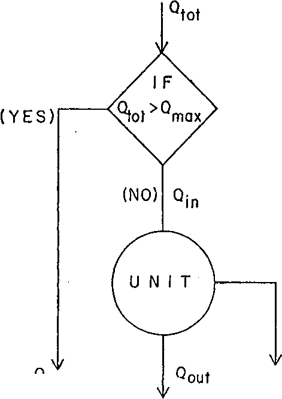

> **PLANT  
> INFLOW**

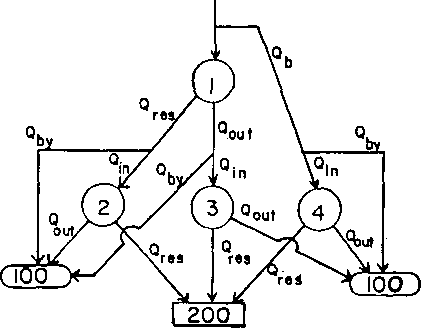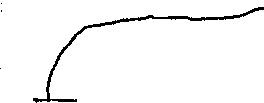Figure 7-4. Storage/Treatment Plant Configurations.

> 303 7-12

Table 7-2. Program Variables Available for Pollutant Removal Equations

> al = unit number.
>
> IP = pollutant number.
>
> K = Subscript of x in equations 7-1.
>
> bDimensions determined by NDIM(IP) on card El.
>
> 304 7-13

<u>Card Group G1</u> -- A single flexible functional form is avaliable for use as a pollutant removal equation (See Appendix IV):

<table>
<colgroup>
<col style="width: 81%" />
<col style="width: 18%" />
</colgroup>
<tbody>
<tr class="odd">
<td>
a1x1 a2 a x, a4 a5x5 a6

R = (a12e x2 + a13e x4 al4e x6

(a7x7 +

a8x8) a9 a10 all) a16

+ a15e x9 x10 xll
</td>
<td>(7-1)</td>
</tr>
</tbody>
</table>

where x. = removal equation variables,

> a\. = coefficients, and
>
> R = removal fraction, 0 ≤ R ≤ 1.0.

Each removal equation variable, x., may represent, one of several parameters available in the program at each time step and these options are discussed below (card gronp G2 ). With these variables and the coefficients, a., the user can develop the desired removal equation. The coefficients are Antered on card group G3.

A maximum removal fraction is specified by RMX(I,IP) This is partic-cularly useful for equations which mathematically generate values of the removal fraction, R, that may exceed a reasonable value or 1.0. RNX(I,IP) provides an upper bound on such equations.

<u>Card Group G2</u> -- These cards (two) allow the user to assign various program variables to the variables in equation 7-1. For example, if pollutant 1 (IP = 1) is to be removed in unit I by a removal equation, the values given INPUT(I,1,1) through INPUT(I,1,11) assign program variables to the corre-

sponding variables xl through x in equation 7-1. The program variables available for inclusion are shown in Table 7-2. An example removal equation is discussed below.

<u>Card Group G3</u> -- The variables A(I,IP,3) through A(I,IP,16) represent the variables a1 through a16 in equation 7-1 as applied to pollutant IP in unit I. Two cards are required.

An example of applying equation 7-1 is provided by a suspended solids removal equation used in an earlier version of the Storage/Treatment Block for sedimentation (detention) units:

<table>
<colgroup>
<col style="width: 68%" />
<col style="width: 31%" />
</colgroup>
<tbody>
<tr class="odd">
<td>
-ktd

RSS = Rmax (1 - e )
</td>
<td>(7-2)</td>
</tr>
</tbody>
</table>

> 305 7-14

where R

> SS = su.vended solids removal fraction, 0 RSS 5 Rmax, Rmax = maximum removal fraction, td = detention time, seconds, and
>
> k = first order decay coefficient, 1/sec.

This equation can be constructed from equation 7-1 by setting a12 (or A(I,

IP,12)) = R , ai, (or A(I,IP,13)) = -R , a (or A(I,IP,3)) = -k,  
a1 (or A(111315,16)1 = 1.0, and letting xT131aK detention time, td , by setting IRPUT(I,IP,3) = 1 (card group G2). All other coefficients, a. (or A(I,IP,J)), would equal zero. RMX(I,IP) (card Gl) would not Ie necessary, as Rmax limits the value of R. Appendix IV contains other examples.

<u>Card Group G4</u> -- The variable PSC(I) specifies a critical particle size (if NVS = 0, card E2) or settling velocity (if NVS = 1, card E2) that Onotes the point above which all particles are removed from the influent. This parameter is included primarily to model such non-detention units as micro-screens, fine screens, and coarse screens. An approximation of the removal effectiveness of screens may be obtained by letting PSC(I) equal the aper­ture size of the screen (see Appendix IV). Card G4 is required <u>only</u> if IPART(IP) = 1 (card El) and IDENT(I) = 0 (card F2).

Detention Unit Data --

Card groups H1 through H8 are used to describe the special charac­teristics of detention units. Sedimentation, dissolved air floatation, chlorination, and sludge thickening are some of the processes that may be modeled by a detention unit.

These cards primarily describe the hydraulic characteristics of a detention unit and, thus, are required only if IDENT(I) = 1 (card F2).

<u>Card Group H1</u> -- The variable IROUTE(I) specifies the manner in which pol­lutants are routed in detention unit I. When IROUTE(I) = 0 the unit routes pollutants under the assumption of perfect plug flow. Perfect plug flow is recommended for long, rectangular tanks where settling is the most important removal mechanism and is <u>required</u> when <u>any</u> pollutant is characterized by a particle size/specific gravity or settling velocity distribution (IPART(IP) = 1, card El). Removed pollutants are accumulated in plug-flow units, without decay, until removed by the residual flow. When IROUTE(I) = 1 the unit routes pollutants under the assumption of perfect miximg. Complete mixing is most applicable to small tanks where the primary purpose is to thoroughly mix the contents (e.g., rapid-mix chlorination, flocculators, and mixing tanks). Removed pollutant quantities are not allowed to accumulate in completely-mixed units (i.e., no settling). The user is referred to Appendix IV for further explanation.

The variable IOUT(I) is used to describe the depth-treated outflow relationship that characterizes the discharge of treated outflow (e.g., weir flow) from unit I. The user is given three options. The first (IOUT(I) = 0)

> 306 7-15

is to provide the model with as many as sixteen data pairs describing the depth-outflow relationship (entered on card group I3). The second option (IOUT(I) = 1) is to approximate the relationship by a power equation (entered on card H4). The third option (IOUT(I)=2) specifies a constant pumping rate between certain depths (entered on card H5).

In addition to treated outflow, a residual stream may be drawn from the unit during periods of no inflow or treated outflow. When a residual stream occurs from a plug-flow unit the entire unit contents (including the removed pollutant quantities) are mixed (i.e., the remaining plugs lose their iden­tity) and drawn off until the unit is empty or inflow occurs. If inflow begins before the unit is empty the remaining contents are placed in a single plug for further routing. In a completely-mixed unit, the pollutant concentrations in the residual flow are identical to the concentrations in the treated outflow. Again, the flow is suspended when inflow occurs. The variable IDRAW(I) simply specifies the conditions under which a residual stream begins. If IDRAW(I) = 0, a residual stream is never drawn and the accumulated pollutants (if IROUTE(I) = 0) remain in the unit. If IDRAW(I) 5 -1, the residuals are drawn off starting at every -IDRAW(I) time steps (but Ll.le flow is delayed if inflow and/ur ti:eaLed ouLilow is in progress). This option corresponds with the situation in which the unit is drained on a

regular (e.g., scheduled) basis. If IDRAW(I) 1, the residuals are drawn after IDRAW(I) time steps of no inflow or treated outflow. The conditions

specified by IDRAW(I) 1 apply directt.y to the case in which the unit contents are drained after each runoff event.

The variable IRES(I) is used to describe the depth-residual flow re­lationship that characterizes the draw off of the residual stream from unit I. If IRES(I) = 0, the user provides the model with as many as sixteen data pairs describing the depth-residual flow relationship (entered on the H3 cards). If IRES(I) = 1, the relationship is approximated by a power equa­tion (entered on card H6).

<u>Card Group H2</u> -- The parameters on this card are required <u>only</u> when a part­icle size/specific gravity or settling velocity distribution is used to characterize <u>any</u> pollutant (IPART(IP) = 1, card El) and unit I is a plug-flow detention unit (IROUTE(I) = 0, card Hi).

The variable ALEN(I) represents the travel length for plugs in unit I. The variable AMAN(I) is the Manning's roughness coefficient for the surfaces of unit I and is commonly available for many materials. These values are required for the pollutant removal algorithms used when a particle size/ specific gravity or settling velocity distribution characterizes a pollutant (see Appendix IV).

<u>Card Group H3</u> -- These cards are used to enter up to sixteen sets of data describing the geometry and hydraulics of detention unit I. Each card enters a value for depth, SDEPTH(I,MM), along with the corresponding values of surface area, SAREA(I,MM), volume, SSTORE(I,MM), treated outflow, SQQ0U(I,MM), and residual flow, SQQRS(I,MM). <u>The series is terminated by a</u> blank card.

|     |     |      |
|-----|-----|------|
|     | 307 | 7-16 |

> **The only required parameters are DEPTH(I,MM) and SAREA(I,MM); the need for the other parameters depends on other factors. If SSTORE(I,MM) is left blank on <u>every</u> H3 card, the program will estimate the volume at each depth by averaging the surface area at each depth and the lower adjacent depth, multiplying by the difference in depth, and adding the result to the esti­mated volume at the lower adjacent depth. A value for treated outflow, SQQOU(I,MM), is required for each depth only if IOUT(I) = 0 (card H1). If LOUT = 1 or 2 (card HI), this relationship** is provided by card 114 or caid **H5, respectively. Likewise, a value for residual flow, SQQRS(I,MM), is required for each depth only if IRES(I) = 0 (card H1). If IRES(I) = 1 (card H1), this relationship is described by card H6. The values entered for SQQRS(I,MM) are used during periods in which a residual stream is drawn from the unit (IDRAW(I), card I1).**
>
> **The values specified on these cards (or computed as a result of cards H4, H5, and H6) are used to establish relationships between depth, surface area, volume, treated outflow, and residual flow. The program also gener­ates a relationship between depth and the evaporation rate (see card group D1). These relationships are used to route flows through a detention unit Iming the Pills method (Viessman et al., 1977). This method is described in detail in Appendix IV.**
>
> **<u>Card Group H4</u> -- This card is required <u>only</u> if a power equation is to de­scribe the depth-treated outflow relationship (IOUT(I) = 1, card H1). The equation is**

**where** gout **= treated outflow, ft3/sec \[m**3/sec\],

> **C1, **C2 = **coefficients,**
>
> D **= water depth in detention unit, ft \[m\], and**
>
> D**O = depth below which there is no treated outflow, ft \[m\].**

**The user supplies the values of D0, C1, and C2 (program variables DO, Cl, and C2, respectively).**

**Two common outlet structures that may be modeled with equation 7-3 are the orifice and the broad-crested weir. For example, a weir could be modeled by letting Ci = 3.33 • L where L = length of the weir in feet, C2 = 1.5, and D0 = depth at the bottom of the weir in feet. These substitutions yield the familiar weir equation.**

**<u>Card Group H5</u> -- This card is required <u>only</u> if pumping is specified for the treated outflow from a detention unit (IOUT(I) = 2, card H1). The variables DSTART(I,1) and DSTART(I,2) represent the depths at which the pumping rates QPUMP(I,1) and QPUMP(I,2) begin. The variable DSTOP(I) specifies the depth at which all pumping stops. In other words, the rate QPUMP(I,1) occurs when**

> **308 7-17**
>
> the depth is equal to or exceeds DSTART(I,1) and the rate QPUMP(I,2) occurs when the depth is greater than or equal to DSTART(I,2). The pumping rate reverts to the rate QPUMP(I,1) when the depth falls below DSTART(I,2) and continues at that rate until the depth falls to DSTOP(I). The value of DSTART(I,1) must be less than or equal to DSTART(I,2) and DSTOP(I) must be less than or equal to DSTART (1,1).
>
> <u>Card Group H6</u> -- This card is required onl— if a power equation is used to describe the depth-residual flow relationship (IRES(I) = 1, card H1). The equation is
>
> Qres = C3(D - D1 ) C4 (7-4)
>
> where Qres = residual flow, ft3/sec \[m3/sec\],  
> C3, C4 = coefficients,
>
> D = water depth in detention unit, ft \[m\], and
>
> D1 = depth below which there is no residual flow, ft \[m\].
>
> The user supplies the values of D1, C3, and C4 (program variables D1, C3, and C4, respectively). Recall that a residual flow occurs only when dicta­ted by IDRAW(I) (card H1).
>
> <u>Card Group H7</u> -- This card is used to indicate the build up of sludge in a plug-flow detention unit (tROUTE(I) = 0, card H1). The user specifies the pollutant used to calculate the sludge volume, NPSL(I); the concentration of pollutant NPSL(E) in sludge; and the depth at which a warning is given to indicate that sludge has accumulated to an unacceptable level. The sludge volume is increased by dividing the amount of pollutant NPSL(I) removed each <u>time</u> step by SLDEN(I). The model assumes that the sludge volume has no effect on the available storage volume and that no compression occurs. The information on this card is only used to warn the user of a possible maintenance/performance problem.
>
> <u>Card Group H8</u> -- This card specifies the total volume, WARN(I), and pollu­tant concentrations, PCO(I,IP), present in the unit at the start of the simulation. Obviously, the values of PCO(I,IP) are not required if NP = 0 (card B1) or WARN(I) = 0.0.
>
> <u>Cost Data</u> --
>
> <u>Card Group Il</u> -- This card is required <u>only</u> if ICOST = 1 (card 81)
>
> The capital cost for each unit is computed as a function of a design flow or volume specified by the user or is calculated by the model as a function of the maximum value recorded during the simulation.
>
> 309 7-18

<table>
<colgroup>
<col style="width: 12%" />
<col style="width: 55%" />
<col style="width: 31%" />
</colgroup>
<tbody>
<tr class="odd">
<td>or</td>
<td>
C = d V + hD

<blockquote>

max om op

C = d(Vobs)f

</blockquote>

max + om mop
</td>
<td>
(7-11)

(7-12)
</td>
</tr>
</tbody>
</table>

where Com = operation and maintenance cost, dollars,

D = total operating time during the simulation period, hours,

> op
>
> and
>
> d,f,h = coefficients (supplied by the user).

Equations 7-9 through 7-12 differ only in the variable used to compute the operation and maintenance costs for unit I. The variable KPC(I,2) specifies which variable is used (as shown in Table 7-3) and CC(I,3), CC(I,4), and CC(I,5) represent thc,. coefficients d, f, and h.

The user is cautioned not to misinterpret the cost calculated by the model. For example, in a single-event simulation the calculated capital cost can only be considered an estimator of the true capital cost when the simulated event is a design event. Likewise, when operating time is a factor in computing operation and maintenance costs, the calculated costs can be a valid estimator of the true costs only when a long-term simulation is performed. Recent EPA publications provide useful information for the proper selection of the coefficients required in equations 7-5 through 7-12 (EPA, 1976; Benjes, 1976).

<u>Input Waste Stream</u>

<u>Flow and Pollutant Data</u> --

> Card group Jl is required <u>only</u> if NOTAPE = 1 or 2 (card Bl).

<u>Card Group Jl</u> -- This card is repeated for <u>each</u> time step including those with no inflow. The pollutant concentrations, PCAR(IP), must be entered in the same order as on card El and have the same dimensions specified by NDIM(IP) and PUNIT(IN,IP)(card El). If NOTAPE = 2 (card BI), the flow and concentrations are added to the values from the external tape or disk. All values are instantaneous flows or concentrations (at the end of the time step).

ALTERING THE PROGRAM SIZE

The Storage/Treatment Block, as presently written, is capable of model­ing a maximum of five S/T units. To alter this restriction requires that the number 5, which appears in several lines of seven subrountines, be changed to the desired maximum. The specific subroutines and lines (num­bered in columns 72 through 80) are as follows:

> 311 7-20
>
> <u>Subroutine</u> STRT: 14 through 27.
>
> <u>Subroutine STRDAT:</u> 4 through 18.
>
> <u>Subroutine CONTRL:</u> 4 through 19 and 21 through 24.
>
> <u>Subroutine UNIT:</u> 4 through 23 and 25.
>
> <u>Subroutine PLUGS:</u> 3
>
> <u>Subroutine EQUATE:</u> 3 through 16.
>
> <u>Subroutine STCOST:</u> 4 through 17.
>
> When a detention unit is modeled as a plug-flow reactor(IDENT(I) = 1, card F2, and IROUTE(I) = 0, card H1) the maximum number of plugs allowed to be in the unit at any one time is 50. The program will terminate if this limit is exceeded. However, the user can increase this capacity by changing the number 50 to the desired value in the following lines (numbered in columns 72-80):
>
> <u>Subroutine UNIT:</u> 18 through 21, 23, 25 and 29.

312 7-21

> Table 7-3. Storage/Treatment Block Card Data
>
> Card Card Variable Default
>
> Group Format Column Description Name Value
>
> CARD GROUP Al; TITLE

<table>
<colgroup>
<col style="width: 7%" />
<col style="width: 67%" />
<col style="width: 11%" />
<col style="width: 12%" />
</colgroup>
<tbody>
<tr class="odd">
<td>Al</td>
<td><blockquote>

Title cards: two cards with heading to be printed on output.

2X 1-2 Card identifier = Al.

2X 3-4 Skip

19A4 5-80 Title.

</blockquote></td>
<td>TITLE2</td>
<td>Blank 
Blank 
None</td>
</tr>
</tbody>
</table>

CARD GROUP Bl; GENERAL DATA

B1 2X 1-2 Card identifier = Bl. Blank

<table>
<colgroup>
<col style="width: 75%" />
<col style="width: 24%" />
</colgroup>
<tbody>
<tr class="odd">
<td>
I3 3-5 Input data source.

<blockquote>

= 0, Input is from an external input file.

</blockquote>
<ol type="1">
<li><blockquote>

Input is supplied on card group J1.

</blockquote></li>
<li><blockquote>

Input is from an external input file and card group Jl.

</blockquote></li>
</ol></td>
<td>NOTAPE</td>
</tr>
</tbody>
</table>

> I5 6-10 External element number from the outside JNS None
>
> block (e.g., NOE in Transport Block)  
> which routes flow to the S/T Block. If  
> NOTAPE = 1, the value of JNS is placed on  
> the output file.
>
> I10 11-20 Total number of simulation time steps. IrDT 0
>
> F10.0 21-30 Size of time step, seconds. Required only, DS None
>
> if NOTAPE = 1.
>
> 4I5 31-35 Number of storage/treatment units. 1
>
> (maximum = 5).
>
> 36-40 Number of pollutants routed (maximum = 3). NP 0
>
> 41-45 Cost calculations performance? !COST 0
>
> = 0, No.  
> = 1, Yes.
>
> 313 7-22
>
> Table 7-3 (continued). Storage/Treatment Block Card Data

<table>
<colgroup>
<col style="width: 8%" />
<col style="width: 10%" />
<col style="width: 9%" />
<col style="width: 44%" />
<col style="width: 14%" />
<col style="width: 12%" />
</colgroup>
<tbody>
<tr class="odd">
<td><blockquote>

Card Group

</blockquote></td>
<td><blockquote>

Format

</blockquote></td>
<td>Card 
Column</td>
<td>Description</td>
<td><blockquote>

Variable 
Name

</blockquote></td>
<td>Default 
Value</td>
</tr>
<tr class="even">
<td></td>
<td></td>
<td></td>
<td><blockquote>

Detailed print period cards. NPR (card Cl)

periods must be specified. Only date to date

periods may be used (e.g., 790720 to 790806).

Required only if IDET &gt; 0 (card C1).

</blockquote></td>
<td></td>
<td></td>
</tr>
<tr class="odd">
<td>C2</td>
<td><blockquote>

2X

</blockquote></td>
<td>1-2</td>
<td><blockquote>

Card group identifier = C2.

</blockquote></td>
<td></td>
<td><blockquote>

Blank

</blockquote></td>
</tr>
<tr class="even">
<td></td>
<td><blockquote>

I8

</blockquote></td>
<td>3-10</td>
<td><blockquote>

First detailed print period starting date

</blockquote></td>
<td><blockquote>

ISTART(1)

</blockquote></td>
<td><blockquote>

None

</blockquote></td>
</tr>
<tr class="odd">
<td></td>
<td><blockquote>

7I10

</blockquote></td>
<td>11-20</td>
<td><blockquote>

(e.g., July 20, 1979 = 790720).

First detailed print period ending date

</blockquote></td>
<td><blockquote>

IEND(1)

</blockquote></td>
<td><blockquote>

None

</blockquote></td>
</tr>
<tr class="even">
<td></td>
<td></td>
<td>21-30</td>
<td><blockquote>

(e.g., August 6, 1979 = 790806).

Repeat for second period, etc., up to NPR

</blockquote></td>
<td><blockquote>

ISTART(2)

</blockquote></td>
<td><blockquote>

None

</blockquote></td>
</tr>
<tr class="odd">
<td></td>
<td></td>
<td>31-40</td>
<td><blockquote>

(card Cl) periods (may require two cards).

</blockquote></td>
<td><blockquote>

IEND(2)

</blockquote></td>
<td><blockquote>

None

</blockquote></td>
</tr>
</tbody>
</table>

CARD GROUP DI; EVAPORATION DATA

> Evaporation data cards. May leave blank if  
> there are no detention units (IDENT(I) = 0  
> for all units, see card F2). However, two

<table>
<colgroup>
<col style="width: 7%" />
<col style="width: 12%" />
<col style="width: 8%" />
<col style="width: 47%" />
<col style="width: 9%" />
<col style="width: 14%" />
</colgroup>
<tbody>
<tr class="odd">
<td></td>
<td></td>
<td></td>
<td><blockquote>

cards must be included.

</blockquote></td>
<td></td>
<td></td>
</tr>
<tr class="even">
<td>DI</td>
<td><blockquote>

2X

</blockquote></td>
<td>1-2</td>
<td><blockquote>

Card group identifier = DI.

</blockquote></td>
<td></td>
<td><blockquote>

Blank

</blockquote></td>
</tr>
<tr class="odd">
<td></td>
<td><blockquote>

F8.0

</blockquote></td>
<td>3-10</td>
<td><blockquote>

Evaporation rate, January, in/day [mm/day].

</blockquote></td>
<td><ol type="1">
<li></li>
</ol></td>
<td><blockquote>

0.0

</blockquote></td>
</tr>
<tr class="even">
<td></td>
<td><blockquote>

7F10.0

</blockquote></td>
<td>11-20</td>
<td><blockquote>

Evaporation rate, February, in/day [mm/day].

</blockquote></td>
<td><ol start="2" type="1">
<li></li>
</ol></td>
<td><blockquote>

0.0

</blockquote></td>
</tr>
</tbody>
</table>

> **Iteve.nt for ”n,1,** mnnt Ii.
>
> CARD GROUPS E1-E6; POLLUTANT CHARACTERIZATION.  
> REQUIRED ONLY IF NP \> 0 (CARD 81).
>
> Table 7-3 (continued). Storage/Treatment Block Card Data
>
> **Card Card Variable Default**
>
> **Group Format Column Description Name Value**
>
> **General pollutant characteristics card.**
>
> **El 2X 1-2 Card group identifier = El. Blank**
>
> **3I1 3 Pollutant 1 selector. Required only if IPOLL(1) None**
>
> **NOTAPE = 0 or 2 (card B1). The value  
> selected depends on the order in which  
> the pollutants were placed on the ex-**  
> **ternal input file. For example, if  
> suspended solids was the third pollu-**  
> **tant listed on the file and it was  
> desired for use in the S/T Block,  
> then IPOLL(1) = 3.**
>
> **4 Dimensions for pollutant 1. Required only NDIH1(1) 0**
>
> **if NOTAPE = 1 (card B1).**
>
> **= 0, Dimensions are mg/1...1**

1.  **Dimensions are liter .**

2.  **Other concentration dimensions are used (e.g., JTU, pmho, °C, pH)**

> 5 Particle size/specific gravity or settling IPART(1) 0
>
> velocity distribution parameter.
>
> = 0, Distribution not used to characterize
>
> pollutant 1.
>
> = 1, Distribution used to characterize
>
> pollutant 1.
>
> 2(2X,2A4) 8-15 Pollutant 1 name. Required only if PNAMEI(IN,1) None •
>
> NOTAPE = 1 (card B1).
>
> 18-25 Pollutant 1 dimension label. PUNITI(IN,I) None
>
> Required only if NOTAPE = 1 (card B1).
>
> 2X,3I1 28 Pollutant 2 selector.. Required only . IPOLL(2) None
>
> if NP 2 and NOTAPE = 0 or 2 (card 81).  
> See above.
>
> 29 Dimensions for pollutant 2. Required only NDIMI(2) 0
>
> if NP 2 and NOTAPE = 1 (card 81). See  
> above.
>
> 30 Particle size/specific gravity or settling IPART(2) 0
>
> velocity distribution parameter. Required
>
> only if NP 2 (card B1). See above.
>
> 2(2X,2A4) 33-40 Pollutant 2 name. Required only if PNAME1(IN.2) None
>
> NP 2 and NOTAPE = 1 (card B1).
>
> 316 7-25
>
> Table 7-3 (continued). Storage/Treatment Block Card Data

Card Card Variable Default

Group Format Column Description Name Value

> 43-50 Pollutant 2 dimension label. Required PUNITI(IN,2) None
>
> only if NP a 2 and NOTAPE = 1 (card B1).
>
> 2X,3I1 53 Pollutant 3 selector. Required only IPOLL(3) None
>
> if NP = 3 and NOTAPE = 0 or 2 (card 81).  
> Stt et.s.ve.
>
> 54 Dimensions for pollutant 3. Required only NDIH1(3) 0
>
> if NP = 3 and NOTAPE = 1 (card B1). See  
> above.
>
> 55 Particle size/specific gravity or settling IPART(3) 0
>
> velocity distribution parameter. Required  
> only if NP = 3 (card B1). See above.
>
> 2(2X,2A4) 58-65 Pollutant 3 name. Required only PNAME1(IN,3) None
>
> if NP = 3 and NOTAPE = 1 (card B1).
>
> 68-75 Pollutant 3 dimension label. Required PUNITI(IN,3) None
>
> only if NP = 3 and NOTAPE = 1 (card B1).
>
> CARD GROUPS E2-E6 ARE REQUIRED <u>ONLY</u> IF IPART(IP) = 1 (CARD El) FOR ANY POLLUTANTS.

E2 2X 1-2 Card identifier = E2. Blank

> I8 3-10 Classification parameter. NVS 0
>
> = 0, Particle size/specific gravity distri-
>
> bution is used to classify particles
>
> in waste stream.
>
> = 1, Settling velocity distribution is used.
>
> I10 11-20 Number of particle size ranges or settling NNR None
>
> velocities used to classify particles in . waste stream.
>
> Particle size (if NVS =0, card E2) or
>
> settling velocity (if NVS = 1, card E2) range **cards. May require up to three cards.**

E3 2X 1-2 Card group identifier = E3. **Blank**

> I8 3-10 **Lower** bound of size or velocity RAN(1,1) None
>
> range 1, microns or ft/sec (cm/sec\].
>
> 7I10 11-20 Upper bound of size or velocity range 1, RAN(1,2) None
>
> microns or ft/sec (cm/sec(.
>
> 317 7-26
>
> Table 7-3 (continued). Storage/Treatment Block Card Data
>
> Card Card Variable Default
>
> Group Format Column Description Name Value
>
> 21-30 Lower bound of size or velocity range 2, RAN(2,1) None
>
> microns or ft/sec (cm/sec).
>
> 31-40 Upper bound of size or velocity range 2, RAN(2,2) None
>
> microns or ft/sec (cm/sec(.
>
> Repeat for each size or velocity range, up to • NNR (card E2) ranges.
>
> Specific gravity cards. Required <u>only</u> if
>
> NVS = 0 (card E2). May require up to
>
> two cards.
>
> E4 2X 1-2 Card group identifier = E4. Blank
>
> F8.0 3-10 Specific gravity for particles in size SPG(1) None
>
> range I.
>
> 7F10.0 11-20 Specific gravity for particles in size SPG(2) None
>
> range 2.
>
> •
>
> Repeat for each size range, up to NNR
>
> (card E2) ranges.
>
> Waste stream temperature cards. Required <u>only</u> if NVS = 0 (card E2). Requires two cards.
>
> E5 2X 1-2 Card group identifier = ES. Blank
>
> F8.0 3-10 Waste stream temperature, January, °F (°C\]. TEMP(1) None
>
> 7-17
>
> Table 7-3 (continued). Storage/Treatment Block Card Data

Card Card Variable Default

Group Format Column Description Name Value

> Fraction of pollutant associated with  
> each particle size/specific gravity  
> or settling velocity range (card  
> group E3). Repeat these cards for each  
> pollutant for which IPART(IP) = 1(card  
> El). Each pollutant may require up to  
> two cards.

E6 2X 1-2 Card group identifier = E6. Blank

> F8.0 3-10 Fraction of pollutant IP in range 1. PSD(IP,1) None
>
> 7F10.0 11-20 Fraction of pollutant IP in range 2. PSD(IP,2) None
>
> Repeat for each range up to  
> NNR (card E2) ranges.
>
> REPEAT CARD GROUPS Fl-I1 FOR EACH UNIT I.  
> THERE WILL BE NU(CARD B1) SETS. THE UNIT  
> NUMBER IS DICTATED BY THE ORDER IN WHICH  
> THE SETS OF CARD GROUPS Fl-II ARE READ.

CARD GROUPS FI-F2; GENERAL UNIT CHARACTERISTICS

Fl 2X 1-2 Card group identifier = Fl. Blank

> 6A3 3-20 Name of unit. UNANE(I,ID) None
>
> General unit parameters and flow directions.

F2 2X 1-2 Card group identifier = F2. Blank

> I8 3-10 Detention modeling parameter. IDENT(\[) o
>
> = 0, Unit is the non-detention type.  
> = 1, Unit is the detention type.
>
> 319 7-28

<table style="width:100%;">
<colgroup>
<col style="width: 19%" />
<col style="width: 8%" />
<col style="width: 46%" />
<col style="width: 14%" />
<col style="width: 10%" />
</colgroup>
<tbody>
<tr class="odd">
<td colspan="3"><strong>Table 7-3 (continued). Storage/Treatment Block Card Data</strong></td>
<td></td>
<td></td>
</tr>
<tr class="even">
<td>
<strong>Card</strong>

<strong>Group Format</strong>
</td>
<td><blockquote>

<strong>Card Column</strong>

</blockquote></td>
<td><blockquote>

<strong>Description</strong>

</blockquote></td>
<td><strong>Variable 
Name</strong></td>
<td><blockquote>

<strong>Default Value</strong>

</blockquote></td>
</tr>
<tr class="odd">
<td><strong>2F1O.O</strong></td>
<td><blockquote>

<strong>11-20</strong>

</blockquote></td>
<td><blockquote>

<strong>Maximum inflow (above which bypass occurs),</strong>

<strong>ft3/sec [m3/sec).</strong>

</blockquote></td>
<td><blockquote>

<strong>QMAX(1)</strong>

</blockquote></td>
<td><strong>None</strong></td>
</tr>
<tr class="even">
<td></td>
<td><blockquote>

<strong>21-30</strong>

</blockquote></td>
<td><blockquote>

<strong>Residual flow as a fraction of the</strong>

<strong>inflow. Required only if IDENT(I) = 0.</strong>

</blockquote></td>
<td><blockquote>

<strong>QRF(I)</strong>

</blockquote></td>
<td><strong>None</strong></td>
</tr>
<tr class="odd">
<td></td>
<td></td>
<td><blockquote>

<strong>Residual flows for detention units</strong>

<strong>(IDENT(I) = 1) are determined in card</strong>

<strong>groups HI, H3, and H6.</strong>

</blockquote></td>
<td></td>
<td></td>
</tr>
<tr class="even">
<td><strong>3I1O</strong></td>
<td><blockquote>

<strong>31-40</strong>

</blockquote></td>
<td><blockquote>

<strong>Unit number to which bypass is directed</strong>

</blockquote></td>
<td><blockquote>

<strong>IDIREC(I,1)</strong>

</blockquote></td>
<td><strong>None</strong></td>
</tr>
<tr class="odd">
<td></td>
<td><blockquote>

<strong>41-50</strong>

</blockquote></td>
<td><blockquote>

<strong>(must be greater than I).</strong>

<strong>= 2-5, Downstream S/T unit.</strong>

<strong>= 100, Next block.</strong>

<strong>= 200, Ultimate disposal.</strong>

<strong>Unit number to which treated outflow is</strong>

directed (must be greater than <strong>I).</strong> See 
above.

</blockquote></td>
<td><blockquote>

IDIREC(I,2)

</blockquote></td>
<td>None</td>
</tr>
<tr class="even">
<td></td>
<td><blockquote>

51-60

</blockquote></td>
<td><blockquote>

Unit number to which residuals stream is

</blockquote></td>
<td><blockquote>

IDIREC(I,3)

</blockquote></td>
<td>None</td>
</tr>
</tbody>
</table>

> directed (must he greater than I). Sec
>
> above. **If 1DRAW(I) = 0** (card Ill), set  
> equal to any number greater than I.
>
> CARD GROUPS GI-G4; POLLUTANT REMOVAL  
> REQUIRED <u>ONLY</u> IF NP \> 0 (card R1).

REPEAT CARD GROUPS GI - G3 FOR EACH  
POLLUTANT FOR WHICH IPART(IP) = 0.

> GI 2X 1-2 Card identifier = Gl. Blank
>
> **F8.O** 3-10 Maximum removal fraction('5 1.0). RMX(I.(r) None
>
> Removal equation variable card (equation 7-1). Requires two cards.

320 7-29

> Table 7-3 (continued). Storage/Treatment Block Card Data
>
> **Card Card Variable Default**
>
> **Group Format Column Description Name Name**
>
> **G2 2X 1-2 Card group identifier = 62. Blank**
>
> **I8 3-10 Program variable for equation variable INPUT(I,IP,1) 0**
>
> **x.**
>
> **=10, Not used.**
>
> **= 1**
>
> **= 2**
>
> **= 3 See Table 7-2 in text.**
>
> **= 4**
>
> **= 5**
>
> **=6**
>
> **= 7**
>
> **7I10 11-20 Program variable for equation variable INPUT(I,IP,2) 0**
>
> **x2. See above.**
>
> **Repeat for each program variable xi.**
>
> **Equation coefficients cards. Requires  
> two cards. The coefficients must be**
>
> **consistent with the units used (see METRIC,  
> card 81).**
>
> **G3 2X 1-2 Card group identifier = G3. Blank**
>
> **F8.0 3-10 Value of coefficient a**l**. A(I,IP,1) 0.0**
>
> **7F10.0 11-20 Value of coefficient a2. A(I,IP,2) 0.0**
>
> **Repeat for each coefficient a..**
>
> **Critical particle size or settling velo-**  
> **city card. Required <u>only</u> if IPART(IP) = 1  
> (card El) for <u>any</u> pollutant and unit I is  
> a non-detention unit, IDENT(I) = 0 (card  
> F2).**
>
> **G4 2X 1-2 Card group identifier = G4. Blank**
>
> 321 7-30
>
> Table 7-3 (continued). Storage/Treatment Block Card Data

<table style="width:100%;">
<colgroup>
<col style="width: 19%" />
<col style="width: 9%" />
<col style="width: 47%" />
<col style="width: 11%" />
<col style="width: 12%" />
</colgroup>
<tbody>
<tr class="odd">
<td><blockquote>

<strong>Card</strong>

<strong>Group Format</strong>

</blockquote></td>
<td><strong>Card 
Column</strong></td>
<td colspan="2"><blockquote>

<strong>Variable</strong>

</blockquote>

<strong>Description Name</strong>
</td>
<td><strong>Default 
Value</strong></td>
</tr>
<tr class="even">
<td><blockquote>

<strong>F8.0</strong>

</blockquote></td>
<td><strong>3-10</strong></td>
<td colspan="2"><blockquote>

<strong>Critical particle size microns (if</strong>

<strong>NVS = 0, card E2), or settling velocity, PSC(I)</strong>

<strong>ft/sec [cm/sec] (if NVS = 1, card E2).</strong>

</blockquote></td>
<td><blockquote>

<strong>None</strong>

</blockquote></td>
</tr>
<tr class="odd">
<td></td>
<td></td>
<td></td>
<td></td>
<td></td>
</tr>
<tr class="even">
<td rowspan="2"></td>
<td rowspan="2"></td>
<td><blockquote>

<strong>CARD GROUP HI-148; DETENTION UNIT DATA REQUIRED ONLY IF IDENT(I) = 1 (CARD F2).</strong>

</blockquote></td>
<td rowspan="2"></td>
<td rowspan="2"></td>
</tr>
<tr class="odd">
<td></td>
</tr>
<tr class="even">
<td></td>
<td></td>
<td></td>
<td></td>
<td></td>
</tr>
<tr class="odd">
<td><blockquote>

<strong>2X 
I8</strong>

<strong>3I10</strong>

</blockquote></td>
<td>
<strong>1-2</strong>

<strong>3-10</strong>

<strong>11-20</strong>

<strong>21-30</strong>
</td>
<td><blockquote>

<strong>General detention unit parameters card. Card group identifier = Hl.</strong>

<strong>Pollutant routing parameter. 
= 0, Plug flow mode is used.</strong>

<strong>= 1, Complete mixing mode is used. (Note: 
Particle size or settling velocity</strong> distribution are not routed through <strong>completely-mixed units.)</strong>

<strong>Treated outflow routing parameter.</strong>

<strong>= 0, The depth-treated outflow relation-</strong>

</blockquote>

<strong>ship is described by as</strong> many as six-

teen <strong>data pairs on card group H3.</strong>

<ol type="1">
<li><blockquote>

<strong>The depth-treated outflow relation­ship is described by a power equa­tion on card H4.</strong>

</blockquote></li>
<li><blockquote>

<strong>The depth-treated outflow relationship is controlled by the pumps described on card H5.</strong>

</blockquote></li>
</ol>
<blockquote>

<strong>Residuals stream draw-off scheme.</strong>

<strong>6 -1, A residual stream is drawn off</strong>

<strong>starting at every -IDRAW(I)</strong>

<strong>time step (if possible).</strong>

<strong>= 0, Residuals are never drawn off.</strong>

</blockquote>

1, A <strong>residuals stream</strong> (if available) is
</td>
<td><blockquote>

<strong>IROUTE(I)</strong>

<strong>IOUT(I)</strong>

<strong>IDRAW(I)</strong>

</blockquote></td>
<td><blockquote>

<strong>Blank 
0</strong>

<strong>0</strong>

<strong>0</strong>

</blockquote></td>
</tr>
</tbody>
</table>

> drawn off only after IDRAW(I) time  
> steps of **no inflow or** treated outflow.
>
> 322 7-31
>
> Table 7-3 (continued). Storage/Treatment Block Card Data

**Card Card Variable Default**

**Group Format Column Description Name Value**

> **31-40 Residual stream routing parameter. IRES(I) 0**

**Required only if IDRAW(I) \$ 0.**

> **= 0, The depth-residual flow relationship  
> is described by as many as sixteen  
> data pairs on card group H3.**
>
> **= 1, The depth-residual flow relationship  
> is described by a power equation on  
> card H6.**
>
> **Detention unit (plug flow only)** parameters  
> required when pollutants are characterized  
> by a particle size/specific gravity or  
> settling velocity distribution. Thus, this  
> card is required only if IPART(IP) = 1 for  
> any pollutant (card El) and IROUTE(I) = 0  
> (card HI).

**H2** 2X 1-2 Card group identifier = H2. Blank

> FH.0 1-10 Travel length for plug flow, ft (ml. ALEN(I) 'None
>
> F10.0 11-20 Manning's roughness coefficient for AMAN(11 None
>
> detention unit surfaces.
>
> Depth-surface area-volume-treated out-  
> flow- residual flow data cards. Each  
> card contains a column for a unit depth  
> and the corresponding values of area,  
> volume, treated outflow. and residual  
> flow. The columns for treated outflow  
> and residual flow may be left blank ie-
>
> pending on the values ICI-T(1' and
>
> :n :art U. If 7.: t,77
>
> A':1'..!” Are en tttt ! -.-.17a1e5
>
> the A7,'A 7?1A-
>
> :::?.\$!!!r. :rder tbe

oncluJ,.n;

be as 71Ally as sIxteen

ttevlet= with a blank :AVA.

> HA :\\ Card group 1.1etItxtier
>
> F8.0 3-10 A unit depth, ft (ml. **SDEFTHil.nnl None**

**7-32**

323

> Table 7-3 (continued). Storage/Treatment Block Card Data

<table>
<colgroup>
<col style="width: 8%" />
<col style="width: 10%" />
<col style="width: 9%" />
<col style="width: 48%" />
<col style="width: 11%" />
<col style="width: 11%" />
</colgroup>
<tbody>
<tr class="odd">
<td>Card Group</td>
<td><blockquote>

Format

</blockquote></td>
<td>Card 
Column</td>
<td colspan="2"><blockquote>

Variable

</blockquote>

Description Name
</td>
<td><blockquote>

Default Value

</blockquote></td>
</tr>
<tr class="even">
<td></td>
<td></td>
<td>21-30</td>
<td><blockquote>

Maximum sludge depth, ft (m). 
A warning message is printed 
if this depth is exceeded by

the accumulated sludge. Required 
only if NPSL(I) ≥ 1.

</blockquote></td>
<td>SLDMAX(I)</td>
<td><blockquote>

None

</blockquote></td>
</tr>
<tr class="odd">
<td></td>
<td></td>
<td></td>
<td><blockquote>

Initial conditions in detention 
unit I.

</blockquote></td>
<td></td>
<td></td>
</tr>
<tr class="even">
<td>NB</td>
<td><blockquote>

2X

</blockquote></td>
<td>1-2</td>
<td><blockquote>

Card identifier = 118.

</blockquote></td>
<td></td>
<td><blockquote>

Blank

</blockquote></td>
</tr>
<tr class="odd">
<td></td>
<td><blockquote>

F8.0

</blockquote></td>
<td>3-10</td>
<td><blockquote>

Total volume of water in urit at3 the

start of the simulation, ft 1m ).

</blockquote></td>
<td>WARN(I)</td>
<td>0.0</td>
</tr>
<tr class="even">
<td></td>
<td></td>
<td></td>
<td><blockquote>

The following concentrations must be given with dimensions consistent with those entered

on card El(NDIM(IP)) if NOTAPE = 1(card 81) 
or on the external input file if NOTAPE = 2.

</blockquote></td>
<td></td>
<td></td>
</tr>
<tr class="odd">
<td></td>
<td><blockquote>

3F10.0

</blockquote></td>
<td>11-20</td>
<td><blockquote>

Concentration of pollutant 1 in the unit at the start of the simulation.

</blockquote></td>
<td>PCO(I,1)</td>
<td>0.0</td>
</tr>
<tr class="even">
<td></td>
<td></td>
<td></td>
<td><blockquote>

Required only if NP ≥ 1 (card 81) and

</blockquote></td>
<td></td>
<td></td>
</tr>
<tr class="odd">
<td></td>
<td></td>
<td></td>
<td><blockquote>

WARN(I) &gt; 0.0.

</blockquote></td>
<td></td>
<td></td>
</tr>
<tr class="even">
<td></td>
<td></td>
<td>21-30</td>
<td><blockquote>

Concentration of pollutant 2 in the unit volume at the start of the

simulation. Required only if NP ≥ 2

</blockquote></td>
<td>PCO(I,2)</td>
<td>0.0</td>
</tr>
<tr class="odd">
<td></td>
<td></td>
<td></td>
<td><blockquote>

(card B1) and WARN(I) &gt; 0.0.

</blockquote></td>
<td></td>
<td></td>
</tr>
<tr class="even">
<td></td>
<td></td>
<td>31-40</td>
<td><blockquote>

Concentration of pollutant 3 in the unit volume at the start of the

simulation. Required only if NP = 3

</blockquote></td>
<td>PCO(I,3)</td>
<td>0.0</td>
</tr>
</tbody>
</table>

(card B1) and WARN(I) \> 0.0.

CARD GROUP II, COST DATA

REQUIRED ONLY IF ICOST = 1 (CARD BI).

> Cost data card. The coefficients **must** he  
> consistent with the units used (see  
> METRIC, card BI).

11 2X 1-2 Card group identifier = 11. **Blank**

> 326 7-35

Table 7-3 (continued). Storage/Treatment Block Card Data

<table>
<colgroup>
<col style="width: 8%" />
<col style="width: 10%" />
<col style="width: 9%" />
<col style="width: 45%" />
<col style="width: 13%" />
<col style="width: 12%" />
</colgroup>
<tbody>
<tr class="odd">
<td>Card Group</td>
<td><blockquote>

Format

</blockquote></td>
<td>Card 
Column</td>
<td><blockquote>

Description

</blockquote></td>
<td>Variable 
Name</td>
<td><blockquote>

Default Value

</blockquote></td>
</tr>
<tr class="even">
<td>J1</td>
<td><blockquote>

2X

</blockquote></td>
<td>1-2</td>
<td><blockquote>

Card group identifier = Jl.

</blockquote></td>
<td></td>
<td><blockquote>

Blank

</blockquote></td>
</tr>
<tr class="odd">
<td></td>
<td><blockquote>

F8.0

</blockquote></td>
<td>3-10</td>
<td><blockquote>

Flr entering S/T plant (at unit 1), ft /sec [m /sec].

</blockquote></td>
<td>QCAR</td>
<td>0.0</td>
</tr>
<tr class="even">
<td></td>
<td><blockquote>

3F10.0

</blockquote></td>
<td>11-20</td>
<td><blockquote>

Concentration of pollutant 1 entering S/T

plant (at unit 1). Required only if NP

a 1 (card Bl) and QCAR &gt; 0.0.

</blockquote></td>
<td>PCAR(1)</td>
<td>0.0</td>
</tr>
<tr class="odd">
<td></td>
<td></td>
<td>21-30</td>
<td><blockquote>

Concentration of pollutant 2 entering S/T

plant (at unit 1). Required only if NP

a 2 (card B1) and QCAR &gt; 0.0

</blockquote></td>
<td>PCAR(2)</td>
<td>0.0</td>
</tr>
<tr class="even">
<td></td>
<td></td>
<td>31-40</td>
<td><blockquote>

Concentration of pollutant 3 entering S/T

plant (at unit 1). Required only if NP =

</blockquote></td>
<td>PCAR(3)</td>
<td>0.0</td>
</tr>
</tbody>
</table>

3 (card Bl) and QCAR \> 0.0.

> END OF STORAGE/TREATMENT BLOCK DATA
>
> At this point the program seeks new input from the Executive Block.

328 7-37

SECTION 8

RECEIVING WATER BLOCK

The Receiving Water Model (Receive) has been a block of SWMM since the original SWMM development. Receive is a dynamic, branching one-dimensional network model that is often used as a pseudo-two dimensional model when the links and nodes are arranged in a triangular or other grid pattern. Based upon the EPA Dynamic Estuary Model (DEM), it is one of several variants of the DEM, and in turn, has had several other models developed based upon it. Due to the proliferation of link-node models that are direct descendants of DEM or Receive, the EPA Athens, Georgia Laboratory decided in 1980 to combine the best features of the several variants into one new Receive/DEM-type model. It was also decided that this would be the appropriate model for use with SWMM when completed. As of this writing (May 1981), work is still underway on the model and its User's Manual. Rather than publish outdated information on Receive, it was decided to use this documentation in the form of an addendum to this SWMM Version III User's Manual when it became available. Hence, no details on Receive are included herein.

Current (May 1981) Receive capabilities are relatively unchanged since the Version II SWMM (Huber et al., 1975), although a few minor changes were included with an interim SWMM release in 1977. Persons needing the Receive model should contact Mr. Tom Barnwell or Robert Ambrose of the EPA Athens lab for information on the best available version since it will not be included with the rest of the SWMM Ver­sion III release.

> 329 8-1

SECTION 9

STATISTICS BLOCK

BLOCK DESCRIPTION  
<u>Introduction</u>

The Statistics Block has been developed to provide the added capability within SWMM to perform simple statistical analyses on continuous event data. Both quantity and quality parameters may be analyzed. The options available include a table depicting the sequential series of events, a table of magni­tude, return period and frequency of events, a graph of magnitude vs. retura period, a graph of magnitude vs. frequency, and the first three moments of the event data.

Statistical analyses are performed on data read from an interface file arranged in the standardized SWMM format (refer to Section 2). The Statis­tics Block may be called after any block that generates such a file. In addition, the user may create an interface file of rainfall or other data and, through an understanding and alteration of various conversion factors, use the Statistics Block to analyze rainfall, rather than stormwater events.

Separation of the data into events depends on the unique series of zero and non-zero instantaneous flow values found at each location within the system being simulated. The results of the analyses would be expected to vary from location to location. The Statistics Block handles only one location at a time.

This section describes the program operation of the Statistics Block, identifies output options, provides instructions for preparing input data cards, defines program variables, presents the equations utilized within the block and explains the messages and labels that may be printed.

<u>Program Operation</u>

The Statistics Block is a Fortran program of approximately 1500 state­ments in length and consists of six subroutines. The relationships among the Statistics Block, the rest of SWMM and the various subroutines are shown in Figure 9-1.

The subroutine STATS comprises the major portion of the block. Input data and data from the interface file are read in STATS. Descriptive infor­mation from the file header is printed, followed by a summary of the input data. STATS separates the flow/pollutant data into events and writes this

> 330 9-1

<table>
<colgroup>
<col style="width: 1%" />
<col style="width: 4%" />
<col style="width: 8%" />
<col style="width: 2%" />
<col style="width: 5%" />
<col style="width: 5%" />
<col style="width: 5%" />
<col style="width: 3%" />
<col style="width: 3%" />
<col style="width: 6%" />
<col style="width: 2%" />
<col style="width: 0%" />
<col style="width: 8%" />
<col style="width: 1%" />
<col style="width: 0%" />
<col style="width: 6%" />
<col style="width: 3%" />
<col style="width: 12%" />
<col style="width: 2%" />
<col style="width: 8%" />
<col style="width: 4%" />
<col style="width: 3%" />
</colgroup>
<tbody>
<tr class="odd">
<td></td>
<td></td>
<td></td>
<td></td>
<td></td>
<td></td>
<td></td>
<td></td>
<td colspan="5"><blockquote>

<strong>EXECUTIVE BLOCK</strong>

</blockquote></td>
<td></td>
<td></td>
<td></td>
<td></td>
<td></td>
<td></td>
<td></td>
<td></td>
<td></td>
</tr>
<tr class="even">
<td></td>
<td></td>
<td></td>
<td></td>
<td></td>
<td></td>
<td></td>
<td></td>
<td></td>
<td></td>
<td></td>
<td></td>
<td></td>
<td></td>
<td></td>
<td></td>
<td></td>
<td></td>
<td></td>
<td></td>
<td></td>
<td></td>
</tr>
<tr class="odd">
<td></td>
<td></td>
<td></td>
<td></td>
<td></td>
<td></td>
<td></td>
<td></td>
<td></td>
<td></td>
<td></td>
<td></td>
<td></td>
<td></td>
<td></td>
<td></td>
<td></td>
<td></td>
<td></td>
<td></td>
<td></td>
<td></td>
</tr>
<tr class="even">
<td></td>
<td></td>
<td></td>
<td></td>
<td></td>
<td></td>
<td></td>
<td></td>
<td></td>
<td colspan="4"><strong>STATS</strong></td>
<td></td>
<td></td>
<td></td>
<td></td>
<td></td>
<td></td>
<td></td>
<td></td>
<td></td>
</tr>
<tr class="odd">
<td></td>
<td></td>
<td></td>
<td></td>
<td></td>
<td></td>
<td></td>
<td></td>
<td></td>
<td></td>
<td></td>
<td></td>
<td></td>
<td></td>
<td></td>
<td></td>
<td></td>
<td></td>
<td></td>
<td></td>
<td></td>
<td></td>
</tr>
<tr class="even">
<td></td>
<td></td>
<td></td>
<td></td>
<td></td>
<td></td>
<td></td>
<td></td>
<td></td>
<td></td>
<td></td>
<td></td>
<td></td>
<td></td>
<td></td>
<td></td>
<td></td>
<td></td>
<td></td>
<td></td>
<td></td>
<td></td>
</tr>
<tr class="odd">
<td colspan="3" rowspan="4"><blockquote>

<strong>LABELS (BLOCK DATA )</strong>

</blockquote></td>
<td></td>
<td></td>
<td></td>
<td></td>
<td></td>
<td></td>
<td></td>
<td></td>
<td></td>
<td></td>
<td></td>
<td></td>
<td></td>
<td></td>
<td></td>
<td></td>
<td></td>
<td></td>
<td></td>
</tr>
<tr class="even">
<td></td>
<td></td>
<td></td>
<td></td>
<td></td>
<td></td>
<td></td>
<td></td>
<td></td>
<td></td>
<td></td>
<td></td>
<td></td>
<td></td>
<td></td>
<td></td>
<td></td>
<td></td>
<td></td>
</tr>
<tr class="odd">
<td></td>
<td></td>
<td></td>
<td></td>
<td colspan="3"><strong>POINTS</strong></td>
<td></td>
<td></td>
<td></td>
<td></td>
<td></td>
<td></td>
<td></td>
<td><strong>CURVE</strong></td>
<td></td>
<td></td>
<td></td>
<td></td>
</tr>
<tr class="even">
<td></td>
<td></td>
<td></td>
<td></td>
<td></td>
<td></td>
<td></td>
<td></td>
<td></td>
<td></td>
<td></td>
<td></td>
<td></td>
<td></td>
<td></td>
<td></td>
<td></td>
<td></td>
<td></td>
</tr>
<tr class="odd">
<td></td>
<td></td>
<td></td>
<td></td>
<td></td>
<td></td>
<td></td>
<td></td>
<td></td>
<td></td>
<td></td>
<td></td>
<td></td>
<td></td>
<td></td>
<td></td>
<td></td>
<td></td>
<td></td>
<td></td>
<td></td>
<td></td>
</tr>
<tr class="even">
<td></td>
<td></td>
<td></td>
<td></td>
<td></td>
<td></td>
<td></td>
<td></td>
<td></td>
<td></td>
<td></td>
<td></td>
<td></td>
<td></td>
<td></td>
<td></td>
<td></td>
<td></td>
<td></td>
<td></td>
<td></td>
<td></td>
</tr>
<tr class="odd">
<td></td>
<td></td>
<td></td>
<td></td>
<td colspan="2"><strong>SORT</strong></td>
<td></td>
<td></td>
<td></td>
<td></td>
<td></td>
<td></td>
<td colspan="4">SBTAEL</td>
<td></td>
<td></td>
<td></td>
<td colspan="3"><strong>MOMENT</strong></td>
</tr>
<tr class="even">
<td></td>
<td></td>
<td></td>
<td></td>
<td></td>
<td></td>
<td></td>
<td></td>
<td></td>
<td></td>
<td></td>
<td></td>
<td></td>
<td></td>
<td></td>
<td></td>
<td></td>
<td></td>
<td></td>
<td></td>
<td></td>
<td></td>
</tr>
</tbody>
</table>

Figure 9-1. Structure of the Statistics Block Subroutines.

> 331 9-2

new data set on an off-line file. The write statement contains 561 bytes. Using disk storage with 19500 bytes per track, data for 34 events can be stored on one track. With an internal program limit of 3750 events, 111 tracks of disk storage are required for the Statistics Block. The limit of 3750 can be changed, resulting in a change in off-line storage requirements.

After the entire simulation period has been examined, a table of the sequential series of events is printed (if requested). If a table of return period and frequency or a graph of either of these is requested, SORT is called to sort the series into descending order. SBTABL is utilized to generate and print the table of magnitude, return period and frequency. POINTS is called prior to CURVE. POINTS generates an array of (X,Y) pairs to be plotted as points on either the return period or frequency graph. CURVE and PPLOT are part of the Executive Block and are used to print the graphs. MOMENT calculates and prints the mean, variance, standard devia­tion, coefficient of variation and coefficient of skewness of the event data. LABELS is a Block Data subroutine utilized for initializing constants in labeled common blocks that are used for labeling graphs and other output.

<u>Output Options</u>

The table of sequential series of events depicts the original time series of flow data after the time steps have been grouped into events. The table includes the date and time of day that each event began, flow volume of each event, duration of each event and interevent durations. The table of magnitude, return period and frequency is a rank order table showing the date and time that each event began, the magnitude of the event being ana­lyzed, the return period (in months) of that magnitude and the percent of occurrences that are less than or equal to the given magnitude. The graph of magnitude vs. return period is a plot of two columns of the table, except that return period is presented as the base ten logarithm. The graph of magnitude vs. frequency is a similar plot with frequency presented as a per­cent. Although the graphing routines plot information centered in the table, it is not necessary to select the table option in order to select the graph options. Any of these may be printed independently of the others. The last option available is a calculation of a number of sample statistics of the event data (enumerated above).

The table of sequential series pertains only to the volume of the flow events. The remaining options can be requested for flow or pollutants. Any (or all) of these can be selected for any (or all) of the five flow parame­ters and for any (or all) of the five pollutant parameters. Different pol­lutant parameters can be analyzed for different pollutants. Events are identified on the basis of zero and nonzero flow values so that the duration of events and interevents will be identical for flow and any of the pollu-. tants selected.

<u>Potential for Output</u>

<u>Sequential Series of Events</u> --

This option prints a table of the original series of events before any sorting has taken place. Printing of the table, which contains 120 events

> 332 9-3

**per page, may bt! accessed in several ways. First, the table may be printed directly as an option under normal program execution. Second, when the num­ber of events in the time series exceeds the designated limit and termination of the program has not been requested, the table may be printed (ignoring the rest of the series). Third, in the case where termination has been selected, the option remains to print a table for that portion of the series Lhat has been separated into events.**

**<u>Table of Magnitude, Return Period and Frequency</u> --**

**For those parameters where this option is requested, one table will be printed for each parameter chosen for each constitutent chosen. For example, if, for the constitutent 'FLOW', two parameters are chosen (e.g., total flow and event duration), and for each of two pollutants two parameters are chosen (e.g., total load and peak concentration), then six separate tables are printed, each containing magnitude, return period and frequency for the appropriate parameter. Therefore, although it is unlikely that one would have reason to do so, up to 55 tables can be printed in one run (five flow parameters, and five pollutant parameters for ten pollutants). The length** of eaoh table depends on the number **of events within the period of analysis (180 events are printed per page).**

**<u>Graph of Magnitude vs. Return Period or Graph of Magnitude vs. Frequency</u> --**

**The following discussion refers to either type of graph. As with the tables above, one graph is printed for each parameter chosen of each constit­uent for which a graph is requested. Each graph comprises one page of output. Again, up to 55 graphs can be printed, although this would be an unlikely choice.**

**<u>Moments</u> --**

**This option calculates and prints unbiased estimates for the mean, vari­ance, standard deviation, coefficient of variation and coefficient of skew­ness. These values will be printed for each parameter chosen for each con­stituent chosen. The output incorporates approximately 15 lines and will appear in sequence where space is available (i.e., a new page is not printed for each set of moments).**

**PREPARATION OF INPUT DATA  
<u>Extent of Data </u>**

**The Statistics Block requires a minimal amount of input data under nor­mal use. The flow/pollutant data to be analyzed will be read from interface files generated by other blocks of SWMM. The input data required simply indicate what type of analysis should be performed on the interface data. Use of the block for rainfall data will be discussed in a later subsection.**

**Card by card instructions for preparing the input data cards will be presented. The user is referred to Table 9-2 at the end of this section for**

> 333 9-4
>
> input format and order. With regard to integer formats, it is imperative that all values be right-justified within the format field. All card groups are required. Figure 9-2 shows the general structure of the data deck.
>
> <u>Card Group Al</u>
>
> The variable ISTART and TSTART indicate the date and time, respec­tively, at which the program should begin searching for events. The vari­able IEND and TEND indicate the last point on the file that should be read. In this manner, the user can choose any period within the record (e.g., one particular year, five sequential years, etc) on which to perform statistical analyses. Default values of zero for both date and time can be chosen for starting and/or ending. Zero starting values indicate that analyses should commence with the first value on the interface file. Zero ending values indicate that analyses should continue to the end of the available record. Formats for date and time correspond to the standardized interface format.
>
> <u>Card Group B1</u>
>
> The minimum interevent time (MIT) indicates the minimum number of dry time steps (time steps with zero flow) that will constitute an interevent. In other words, the number of consecutive dry time steps encountered in the search must be equal to or greater than MIT in order that the preceding wet period (made up of at least one nonzero flow value) be considered a separate event. Dry periods of duration less than MIT may exist within an event preceded and followed by wet time steps. The number of events in a given period of analysis is directly dependent on the value of MIT. A value of zero may be chosen for MIT; in this manner every wet time step will be viewed as a separate event. No "correct" value of MIT can be suggested, although a value of 6 to 22 hrs is often used to separate <u>rainfall</u> events (Heaney et al., 1977). The value utilized depends on the criteria employed by the user in defining an event.
>
> The variable LOCRQ indicates at which location, e.g., inlet or manhole number, within the system the analyses are being performed. The interface file may contain data for up to 200 locations, each identified in the array
>
> LOCNOS(K). The variable LOCRQ should have the same value as one of the elements of the array LOCNOS(K).
>
> The variable NPR indicates the number of pollutants requested for statistical analysis. NPR must be less than or equal to NPOLL (the number of pollutants on the interface file).
>
> <u>Card Group B2</u>
>
> The variable array IPOLRQ will contain up to ten elements, corres­ponding to the maximum value of NPR (and NPOLL). The pollutants requested for analysis must be identified by their position on the interface file (not by name). Therefore, the elements of IPOLRQ will contain integer values from 1 to 1O. For example, if the first pollutant to be analyzed is BOD, and BOD is the third pollutant on the interface file, then IPOLRQ(1) would have the value 3. Similarly, if the second pollutant to be analyzed is TSS, and TSS is the fifth pollutant on the interface file, then IPOLRQ(2) would have the value 5.

334 9-5

<u>(CARD GROUPS G1-G2; Codes for Termination</u>

<u>(CARD GROUP Fli Code for Units</u>

<u>(CARD GROUP El; Code for Sequential Series</u>

> <u>(CARD GROUPS D1-D4; Stat Options for Pollutants</u>

<u>(CARD GROUPS Cl-C4; Stat Options for Flow</u>

<u>(CARD GROUP BI-B2; General Data</u>

> <u>(CARD GROUP Al; Starting and Ending Date/Time</u>

rSTATS

> Figure 9-2. Structure of the Data Deck.

335 9-6

> <u>Card Groups C1-C4</u>
>
> The four "C" cards indicate the statistical options requested for flow. One card is used for each type of statistical option. Card Cl is for a table of event magnitude, return period and frequency. Card C2 is for a graph of magnitude vs. return period. Card C3 is for a graph of magnitude vs. fre­quency. Card C4 is for a table of the first three moments of the event data. There are five fields on each card, one field for each of the five flow parameters. The five parameters are (1) total flow for the event, measured as a volume and reported as inches \[mm\], (2) average flow for the event, measured as a rate and reported as inches/hour \[mm/hr\], (3) peak flow for the event, measured as an instantaneous rate and reported as inches/hour \[mm/hr\], (4) duration of the event, measured as the number of time steps making up the event and reported as hours, and (5) duration of the inter-event, measured as the number of dry time steps preceding the event and reported as hours. For a given card, those fields containing a 1 indicate the flow parameters for which that option has been selected. Values of zero indicate that the analyses should not be performed.
>
> <u>Card Groups D1-D4</u>
>
> The four "D" cards are identical in format to the "C" cards. The four statistical options available for flow are also available for pollutants. Again, one card is used for each type of statistical option. An entire set of "D" cards must be included for each pollutant requested, indicating which options for which parameters should be performed for each pollutant. The "D" cards should be arranged as a group (D1-D4), with groups of cards in a sequence corresponding to the order in which the pollutants were requested. Again, there are five fields on each card, one field for each of the five pollutant parameters. The five parameters are (1) total load, measured as a sum of the concentration times the flow rate and reported as pounds \[kg\], (2) average load, measured as a rate of pollutant loading and reported as lbs/hour \[kg/hr\], (3) peak load, measured as an instantaneous rate of pollu­tant loading and reported as lbs/hour \[kg/hr\], (4) flow weighted average concentration, reported as mg/1, and (5) peak concentration, reported as mg/l. As noted in Table 9-2, at least one set of Dl-D4 cards must be included. If NPR = 0, all "D" cards would contain zero values (or be left blank).
>
> <u>Card Group El</u>
>
> The variable KSEQ indicates whether or not a table of the sequential series of events should be printed.
>
> <u>Card Group Fl</u>
>
> The variable KENGSI indicates the system of units in which output should be reported. To implement U.S. customary units, use KENGSI = O. For metric units, use KENGSI = 1.
>
> 336 9-7

<u>Card Groups G1 and G2</u>

The variable KTERM indicates whether or not to terminate analyses in the case where the number of events exceeds the allowable computer memory space. The number of events that can be sorted and analyzed has been set within the program at 3750. This value corresponds to 150 events per year for a 25 year period. As noted at the beginning of the STATS subroutine, this value may be altered by the user. If the number of events exceeds the limit set, the program will either (a) perform the analyses on the events already identified, ignoring the remainder of the record (KTERM = 0), or (b) terminate execution of the block, performing no event analysis (KTERM = 1). If the analyses are being performed, a table of the sequential series will be printed if KSEQ = 1. If the analyses are not performed, the option still exists to print the table of sequential series before termination. The variable KTSEQS indicates that the table should or should not be printed in this case.

COMPUTATIONS

<u>Return Period and Frequency</u>

The logic of the program is described by comment statements at the beginning of each subroutine and throughout the program listing. Computa­tions that require further explanation will be discussed.

In subroutine STATS, the variables Ti and T2 indicate the beginning and end, respectively, of the period of analysis. The values are reported as elapsed time from the beginning of the simulation, measured in hours. The return period of an event of a given magnitude is reported as months so that a calculation of, the number of months (NOMOS) within the period of analysis is required. The average number of hours per month in a year of 365.25 days is 730.5. This value is used to find a value for NOMOS, rounded to the nearest month, by the equation

<table>
<colgroup>
<col style="width: 70%" />
<col style="width: 29%" />
</colgroup>
<tbody>
<tr class="odd">
<td>
NOMOS = Integer <u>((T2-T1)</u> + 0.5 1'

730.5
</td>
<td>(9-1)</td>
</tr>
</tbody>
</table>

For short periods of analysis (e.g., on the order of one year) NOMOS may be in error by one month depending on which months of the year are included in the period. This should pose little difficulty as a return period analysis for such a short period is generally not undertaken (or at best is of questionable worth).

In subroutine TABLES, calculations are made of the return period and frequency of events. The program is set up in such a way that the equation used depends on the column of the table in which the values will be printed. These calculations are summarized in the general forms

> 337 9—8
>
> **where X = magnitude of the event parameter, and**
>
> **N = total number of events within the period of analysis.**
>
> **S2 and Cs are unbiased estimates. All summations are from 1 to N. <u>Messages/Labels</u>**
>
> The m2jority of the "intcd az part of thc
>
> **are self-explanatory and do not require discussion in the text. A notable exception to this involves the units printed for pollutants. As a prelude to this discussion, an explanation of the units provided in the tables and graphs is called for. Table 9-1 summarizes the units printed for flow and three types of pollutants. The labels printed for the ordinate of the graphs are also presented.**
>
> **All flow parameters are normalized to depth or depth/hr (i.e., in or mm or in/hr or mm/nr). Should true volumes be desired, they may be obtained by multiplying by the catchment area, printed after reading the interface file.**
>
> **When NDIM = 2, a special message is printed on the graph nr table. Rather than printing the units described in Table 9-2, the output contains "SEE NOTE" and the note "Magnitude has units of .... See user manual for explanation." The explanation referred to is included in the following discussion.**
>
> **The user is referred to Sections 2 and 4 for an introduction to the variable NDIM. For NDIM = 0, pollutant concentration is given in mg/l. In this case, a direct conversion is possible for loading rates and concentra­tions. For NDIM = 1, pollutant concentration is given in "other quantity" per liter (e.g., MPN/1). Here, no conversion is possible to mass loading or mass per unit volume. "Mass" must be presented** as **"quantity" and the user must be aware of what "quantity" refers to for** the **pollutant involved. The units printed for flow weighted average concentration and peak concentration will correspond to the variable PUNIT found on the interface file for the particular pollutant. For NDIM = 2, pollutant concentration is given in some other units, not on a "per liter" basis (e.g., JTU). Therefore, no units conversion can be made. Magnitudes reported for total load will have units of a volume multiplied by the appropriate PUNIT. The magnitude is obtained by summing the pollutant values found on the interface file (which are in units of an instantaneous flow rate multiplied by a concentration) and multiplying this value by the time step size (DTSEC) of the event. Interpretation of the significance of these magnitudes is left strictly to the user, who should exercise caution in selecting this statistical option. A similar caution applies to average load and peak load. These magnitudes will have units of a flow rate multiplied by the appropriate PUNIT. The average load is the mean of the values found on the interface file for a given event, with a units conversion for flow rate. The peak load is the largest of the values within an event, with a similar units conversion for flow rate. Flow weighted average concentration and peak concentration will have units corresponding to PUNIT for the particular pollutant and an inter­pretation of these magnitudes may *be* simpler than the above parameters. The calculation of these two parameters is self-evident.**
>
> 339 9-10
>
> ANALYSIS OF RAI;WALL DATA
>
> A series of rainfall measurements can be viewed as analogous to a series of flow values and can be analyzed using the statistical options for flow. The following discussion assumes that the rainfall record is in hourly time steps. The user can make similar adjustments for other types of rainfall records.
>
> An interface file of the standardized SWMM format must be generated by the user. This will contain rainfall data only, no pollutants. The file may contain data for a number of locations, but only one location may ***be*** analyzed during a run.
>
> The event parameters will be viewed as follows: Values reported as "total flow" will be total depth of the storm, in inches; values reported as "average flow" will be average intensity during the event, in inches/hour, and calculated as the total depth divided by the duration of the event; "peak flow" will ***be*** peak intensity, in inches/hour, and will be the largest single hourly value recorded for the storm; event duration and interevent duration are identical in concept to stormwater events.
>
> Variables that require the assignment of particular values are: <u>For the interface file:</u>

- DTSEC = 3600

- TRIBA = 1.000

- QCONV = 1.00833 =

> 12 in/ft x 3600 sec/hr
>
> <u>For the input data:</u>

- NPR = 0

- KENGSI = 0

> The input data also require one set of "D" cards, all blank.
>
> As regards labels for the output, the term "FLOW" will remain. The user must think of this in the context of the options selected (i.e., depth or intensity). The remainder of the program operation will be identical to stormwater events.
>
> 341 9-12

Table 9-2. Statistics Block Card Data

Card Format Card Description Variable Default

Group Columns Name Value

CARD GROUP Al; Starting and Ending Date/Time

Al 2X 1-2 Card identifier = Blank

> Al.
>
> I6 3-8 Starting date, ISTART 000000
>
> yr/mo/day.
>
> 4X 9-12 Skip Blank
>
> F5.2 13-17 Starting time, TSTART 00.00
>
> decimal hours.
>
> 5X 18-22 Skip Blank
>
> I6 23-28 Ending date, LEND 000000
>
> yr/mo/day.
>
> 4X 29-32 Skip Blank
>
> F5.2 33-37 Ending time, TEND 00.00
>
> decimal hours.

CARD GROUP RI; General Data

B1 2X 1-2 Card identifier = Blank

> Bl.
>
> I10 3-12 Minimum interevent MIT 0
>
> time, no. of time  
> steps.
>
> 110 13-22 Location requested. LOCRQ none
>
> 110 23-32 Number of pollai- NPR
>
> tants requested.
>
> F10.0 33-42 Base flow to BASE 00.00
>
> determine end of  
> event, in/hr Imm/hr1.  
> Only flows \> BASE  
> (and their
>
> associated pollutant  
> loads) are analyzed.  
> Others are treated  
> as zeroes.
>
> B2 2X 1-2 Card identifier = Blink
>
> B2.
>
> I015 3-1 First pollutant IPOLRQ(1) none
>
> requested, identi-  
> fied by position on  
> interface file.

342 9-13

Table 9-2. (continued). Statistics Block Card Data

Card Format Card Description Variable Default

Group Columns Name Value

> 8-12 Second pollutant IPOLRQ(2) none
>
> requested, identi-
>
> ty fied by position on **tt  
> **interface file.
>
> 48-52 Tenth pollutant IPOLRQ(10) none
>
> requested, identi-  
> fied by position on  
> interface file.

CARD GROUPS CI-C4; Stat Options for Flow

> Requests to print  
> table of magnitude,  
> return period and  
> frequency for each  
> of five parameters.  
> In all cases, No = 0,

<table>
<colgroup>
<col style="width: 24%" />
<col style="width: 15%" />
<col style="width: 30%" />
<col style="width: 17%" />
<col style="width: 12%" />
</colgroup>
<tbody>
<tr class="odd">
<td>Cl 2X</td>
<td>1-2</td>
<td><blockquote>

Yes = 1.

Card identifier = Cl.

</blockquote></td>
<td></td>
<td>Blank</td>
</tr>
<tr class="even">
<td>5I10</td>
<td>3-12</td>
<td><blockquote>

Request table for total flow.

</blockquote></td>
<td>ISFLOW(1,I)</td>
<td>0</td>
</tr>
<tr class="odd">
<td></td>
<td>13-22</td>
<td><blockquote>

Request table for average flow.

</blockquote></td>
<td>ISFLOW(l,2)</td>
<td>0</td>
</tr>
<tr class="even">
<td></td>
<td>23-32</td>
<td><blockquote>

Request table for peak flow.

</blockquote></td>
<td>ISFLOW(1,3)</td>
<td>0</td>
</tr>
<tr class="odd">
<td></td>
<td>33-42</td>
<td><blockquote>

Request table for event duration.

</blockquote></td>
<td>ISFLOW(1,4)</td>
<td>0</td>
</tr>
<tr class="even">
<td></td>
<td>43-52</td>
<td><blockquote>

Request table for interevent duration.

</blockquote></td>
<td>ISFLOW(1,S)</td>
<td>0</td>
</tr>
</tbody>
</table>

> Requests to print graph of magnitude vs. return period for each of five parameters. In all cases, No = 0, Yes = I.

343 9-14

Table 9-2. (continued). Statistics Block Card Data

Card Format Card Description Variable Default

Group Columns Name Value

> C2 2X 1-2 Card identifier = Blank
>
> C2.
>
> 5110 3-12 Request graph for ISFLOW(2,1) 0
>
> total flow.
>
> 13-22 Request graph for ISFLOW(2,2) 0
>
> average **flow.**
>
> 23-32 Request graph for ISFLOW(2,3) 0
>
> peak flow.
>
> 33-42 Request graph for ISFLOW(2,4) 0
>
> event duration.
>
> 43-52 Request graph for ISFLOW(2,5) 0
>
> interevent duration.
>
> Requests to print graph
>
> of magnitude vs. frequency
>
> for each of five parameters.
>
> In all cases, No = 0,
>
> Yes = 1.
>
> C3 2X 1-2 Card identifier = Blank
>
> C2.
>
> 5I10 3-12 Card similar to Cl
>
> etc. and C2.
>
> Requests to print  
> moments for each of  
> five flow parameters.  
> In all cases, No = 0,  
> Yes = 1.
>
> C4 2X 1-2 Card identifier = Blank
>
> C4.
>
> 5I10 3-12 Card similar to C1
>
> etc. and C2.

344 9-15

Table 9-2. (continued). Statistics Block Card Data

Card Format Card Description Variable Default

Group Columns Name Value

CARD GROUPS D1-D4; Stat Options for Pollutants

MUST INCLUDE AT LEAST ONE SET OF DI-D4 CARDS, EVEN IF NPR = 0. IF NPR = 0, USE FOUR BLANK CARDS FOR D1-D4. IF NPR\>1, USE ONE SET OF D1-D4 CARDS FOR EACH POLLUTANT REQUESTED, UP TO TEN SETS OF CARDS, IN THE ORDER DEFINED BY CARD B2. THE FIRST INDEX OF ISPOLL (K, I, J) IDENTIFIES THE POLLUTANT.

> Requests to print table  
> of magnitude, return

<table>
<colgroup>
<col style="width: 9%" />
<col style="width: 15%" />
<col style="width: 15%" />
<col style="width: 48%" />
<col style="width: 11%" />
</colgroup>
<tbody>
<tr class="odd">
<td></td>
<td></td>
<td></td>
<td><blockquote>

period and frequency 
for each of five

parameters. In all

cases, No = 0,

Yes = 1.

</blockquote></td>
<td></td>
</tr>
<tr class="even">
<td>DI</td>
<td>2X</td>
<td>1-2</td>
<td><blockquote>

Card identifier =

</blockquote></td>
<td>Blank</td>
</tr>
<tr class="odd">
<td></td>
<td>5I10</td>
<td>3-12</td>
<td><blockquote>

DI.

Request table for ISPOLL(1,1,1)

total load.

</blockquote></td>
<td>0</td>
</tr>
<tr class="even">
<td></td>
<td></td>
<td>13-22</td>
<td><blockquote>

Request table for ISPOLL(1,1,2)

average load.

</blockquote></td>
<td>0</td>
</tr>
<tr class="odd">
<td></td>
<td></td>
<td>23-32</td>
<td><blockquote>

Request table for ISPOLL(1,1,3)

peak load.

</blockquote></td>
<td>0</td>
</tr>
<tr class="even">
<td></td>
<td></td>
<td>33-42</td>
<td><blockquote>

Request table for ISPOLL(1,1,4)

flow weighted

average concentration.

</blockquote></td>
<td>0</td>
</tr>
<tr class="odd">
<td></td>
<td></td>
<td>43-52</td>
<td><blockquote>

Request table for ISPOLL(1,1,5)

peak concentration.

</blockquote></td>
<td>0</td>
</tr>
</tbody>
</table>

> Requests to print graph of magnitude vs. return period for each of five parameters. In all cases, No = 0, Yes = 1.

D2 2X 1-2 Card identifier = **Blank**

> **D2.**

345 9-16

Table 9-2. (continued). Statistics Block Card Data

Card Format Card Description Variable Default

Group Columns Name Value

> 5I10 3-12 Request graph for ISPOLL(1,2,1) 0
>
> total load.
>
> 13-22 Request graph for ISPOLL(1,2,2) 0
>
> average load.
>
> 23-32 Request graph for ISPOLL(1,2,3) 0
>
> peak load.
>
> 33-42 Request graph for ISPOLL(1,2,4) 0
>
> flow weighted
>
> average concentration.
>
> 43-52 Request graph for ISPOLL(1,2,5) 0
>
> peak concentration.
>
> Requests to print graph
>
> of magnitude vs. frequency
>
> for each of five parameters.
>
> In all cases, No = 0,
>
> Yes = 1.

D3 2X 1-2 Card identifier = Blank

> D3.
>
> 5I10 3-12 Card similar to Dl
>
> etc. and D2.
>
> Requests to print  
> moments for each of  
> five parameters. In  
> all cases, No = 0,  
> Yes = 1.

D4 2X 1-2 Card identifier = Blank

> D4.
>
> 5I10 3-12 Card similar to DI
>
> etc. and D2.
>
> 346 9-17

**Table 9-2. (continued). Statistics Block Card Data**

**Card Format Card Description Variable Default**

**Group Columns Name Value**

**CARD GROUP El; Code for Sequential Series**

**El 2X 1-2 Card identifier = Blank**

> **Fl.**
>
> **I10 3-12 Request to print KSEQ 0**
>
> **sequential series  
> of flow events.  
> No = 0, Yes = 1.**

**CARD GROUP Fl; Code for Units**

**Fl 2X 1-2 Card identifier = Blank**

> **Fl.**
>
> **I10 3-12 Request type of KENGSI 0**
>
> **units for output.**
>
> **= 0, U.S. customary.**
>
> **= 1, Metric.**

**CARD GROUPS G1 AND G2; Codes for Termination**

> **In the case where  
> the number of events  
> exceeds allowable  
> memory space:**

**G1 2X 1-2 Card identifier = Blank**

> **Gl.**
>
> **I10 3-12 Code for terminat- KTERM 0**
>
> **ing program.**
>
> **= 0, Do not terminate  
> (perform analyses on  
> those events already  
> identified).**
>
> **= 1, Terminate program  
> (no event analysis  
> performed).**

**347 9-18**

<table>
<colgroup>
<col style="width: 10%" />
<col style="width: 14%" />
<col style="width: 15%" />
<col style="width: 27%" />
<col style="width: 18%" />
<col style="width: 13%" />
</colgroup>
<tbody>
<tr class="odd">
<td></td>
<td colspan="4"><strong>Table 9-2. (continued). Statistics Block Card Data</strong></td>
<td></td>
</tr>
<tr class="even">
<td><blockquote>

<strong>Card Group</strong>

</blockquote></td>
<td><strong>Format</strong></td>
<td><strong>Card 
Columns</strong></td>
<td><strong>Description</strong></td>
<td><strong>Variable 
Name</strong></td>
<td><blockquote>

<strong>Default Value</strong>

</blockquote></td>
</tr>
<tr class="odd">
<td></td>
<td></td>
<td></td>
<td></td>
<td></td>
<td></td>
</tr>
<tr class="even">
<td><strong>G2</strong></td>
<td>
<strong>2X</strong>

<strong>I10</strong>
</td>
<td>
<strong>1-2</strong>

<strong>3-12</strong>
</td>
<td><blockquote>

<strong>Card identifier = G2.</strong>

</blockquote>

<strong>Code for printing</strong>
</td>
<td><blockquote>

<strong>KTSEQS</strong>

</blockquote></td>
<td>
<strong>Blank</strong>

<strong>0</strong>
</td>
</tr>
</tbody>
</table>

> **sequential series  
> if termination occurs  
> (where number of events  
> exceeds limit and KTERM  
> = 1).**
>
> **= 0, Do not print  
> sequential series.**
>
> **= 1, Print sequential  
> series of those events  
> already identified.**
>
> **END OF STATISTICS BLOCK DATA. AT THIS POINT, PROGRAM EXECUTION COMMENCES WITH READING OF INTERFACE FILE HEADER.**
>
> **DATA CARDS FOLLOWING THESE WILL BE READ BY THE EXECUTIVE BLOCK.**

348 9-19

> SECTION 10  
> REFERENCES

Alley, W.M., "An Examination of the Storm Water Management Model (SWMM) Surface-Runoff-Quality Algorithms," Proceedings Storm Water Management Model User's Group Meeting, January 1980, EPA-600/9­80-017, Environmental Protection Agency, Washington, DC, March 1980, pp. 93-110.

Alley, W.M., "Estimation of Impervious-Area Washoff Parameters," Water Resources Research, Vol. 17, No. 4, August 1981, pp. 1161-1166.

Alley, W.M., Dawdy, D.R. and Schaake, J.C., Jr., "Parametric-Deterministic Urban Watershed Model," Journal of the Hydraulics Division, ASCE, Vol. 106, No. HY5, May 1980a, pp. 679-690.

Alley, W.M. and Ellis, S.R., "Rainfall-Runoff Modeling of Flow and Total Nitrogen from Two Localities in the Denver, Colorado Metro­politan Area," Proceedings Storm Water Management Model User's Group Meeting, May 1979, EPA-600/9-79-026, Environmental Protection Agency, Washington, DC, 1979, pp. 362-403.

Alley, W.M., Ellis, F.W. and Sutherland, R.C., "Toward a More Deterministic Urban Runoff-Quality Model," International Symposium on Urban Storm Runoff, University of Kentucky, Lexington, KY, July 1980b, pp. 171-182.

American National Standards Institute, "American National Standard Programming Language FORTRAN," ANSI X3.9-1978, New York, NY, 1978.

American Public Works Association, "Water Pollution Aspects of Urban Runoff," Federal Water Pollution Control Administration Contract WP-20-15, 1969.

American Public Works Association, "Managing Snow Removal and Ice Control Programs," Special Report No. 42, American Public Works Association, Chicago, IL, 1974.

American Public Health Association, American Public Works Associ­ation, Water Pollution Control Federation, <u>Standard Methods for the Examination of Water and Wastewater,</u> 13th Edition, American Public Health Association, Washington, DC, 1971.

349 10-1

> American Society of Civil Engineers, Water Pollution Control Fed­eration, <u>Design and Construction of Sanitary and Storm Sewers,</u> Mater Pollution Control Federation, Washington, DC, 1969.
>
> American Society of Heating and Air Conditioning Engineers, "Heat­ing, Ventilating, Air Conditioning Guide," New York, NY, Annual Publication (superseded by the American Society of Heating, Refrigerating and Ventilating Engineers Handbook).
>
> Ammon, D.C., "Urban Stormwater Pollutant Buildup and Washoff Relationships," Master of Engineering Thesis, University of Florida, Gainesville, FL, 1979.
>
> Amy, G., Pitt, R., Singh, R., Bradford, W.L. and LaGraff, M.B., "Water Quality Management Planning for Urban Runoff," EPA-440/ 9-75-004 (NTIS PB 241 689), Environmental Protection Agency, Washington, DC, December 1974.
>
> Anderson, E.R., "Energy Budget Studies, Water Loss Investigations: Lake Hefner Studies," U.S. Geological Survey Professional Paper 269, Washington, DC, 1954.
>
> Anderson, E.A., "National Weather Service River Forecast System ­Snow Accumulation and Ablation Model," NOAA Tech. Memo NWS HYDRO-17, U.S. Department of Commerce, Washington, DC, 1973.
>
> Anderson, E.A., "A Point Energy and Mass Balance Model of a Snow Cover," NOAA Tech. deport NWS 19, U.S. Department of Commerce, Washington, DC, February 1976.
>
> AVCO Economic Systems Corporation, "Storm Water Pollution from Urban Land Activity," EPA 11034FKL07/70 (NTIS PB 195 281), Environmental Protection' Agency, July 1970.
>
> Bedient, P.B., Harned, D.A. and Characklis, W.G., "Stormwater Analysis and Prediction in Houston," Journal of the Environmental Engineering Division, ASCE, Vol. 104, No. EE6, December 1978, pp. 1087-1100..
>
> **Bengston, L., "Snowmelt-Generated Runoff in Urban Areas," Proc.** Second International Conference on Urban Storm Drainage, Urbana, IL, June 14-19, 1981, Vol. I, pp. 444-451.
>
> Benjes, H.H., "Cost Estimating Manual - Combined Sewer Overflow Storage and Treatment," EPA-600/2-76-286 (NTIS PB 266 359), Environ­mental Protection Agency, Cincinnati, OH, December 1976.
>
> Brakensiek, D.L. and Onstad, C.A., "Parameter Estimation of the Green-Ampt Equation," Water Resources Research, Vol. 13, No. 6, December 1977, pp. 1009-1012.
>
> 350 10-2

Brandstetter, A.B., "Assessment of Mathematical Models for Storm and Com­bined Sewer Management," EPA-600/2-76-175a (NTIS PB 259 597), Environmental Protection Agency, Cincinnati, OH, August 1977.

Brezonik, P.L., "Nutrients and Other Biologically Active Substances in Atmospheric Precipitation", Proceedings Symposium on Atmospheric Contribu­tion to the Chemistry of Lake Waters, International Association Great Lakes Research, September 1975, pp 166-186.

Brown, C.B., "Sedimentation Engineering", Chapter XII in <u>Engineering Hydraulics,</u> Rouse, H., ed., John Wiley and Sons, New York, NY, 1950.

Butler, S.S., <u>Engineering Hydrology,</u> Prentice Hall, New York, NY, 1957.

Camp, T.L., "Sedimentation and the Design of Settling Tanks," Transactions ASCE, Vol. 111, 1946, pp. 895-936.

Chan, S. and Bras, R.L., "Urban Storm Water Management: Distribution of Flood Volumes," Water Resources Research, Vol. 15, No. 2, April 1979, pp. 371-382.

Chemical Rubber Company, <u>Handbook</u> of <u>Chemistry</u> and <u>Physics,</u> Weast, ed., 57th Editions, Chemical Rubber Company, Cleveland, OH, 1976.

Chen, C., "Flow Resistance in Broad Shallow Grassed Channels", Journal of the Hydraulics Division, ASCE, Vol. 102, No. HY3, March 1976, pp. 307-322.

Chen, C.N., "Design of Sediment Retention Basins," Proceedings National Symposium on Urban Hydrology and Sediment Control, University of Kentucky, Lexington, KY, July 1975.

Chow, V.T., <u>Open-Channel Hydraulics,</u> McGraw-Hill, New York, NY, 1959.

Chow, V.T. and Yen, B.C., "Urban Stormwater Runoff: Determination of Volumes and Flowrates," EPA-600/2-76-116 (NTIS PB 253 410), Environmental Protection Agency, Cincinnati, OH, May 1976.

Christensen, B.A., "Hydraulics of Sheet Flow in Wetlands," Symposium on Inland Waterways for Navigation, Flood Control and Water Diversions, Colorado State University, ASCE, New York, NY, August 1976, pp. 746-759.

Chu, C.S. and Bowers, C.E., "Computer Programs in Water Resources," WRRC Bulletin 97, Water Resources Research Center, University of Minnesota, Minneapolis, MN, November 1977.

Chu, S.T., "Infiltration During an Unsteady Rain," Water Resources Research, Vol. 14, No. 3, June 1978, pp. 461-466.

351 10-3

Clapp, R.B. and Hornberger, G.M., "Empirical Equations for Some Soil Properties," Water Resources Research, Vol. 14, No. 4, August 1978, pp. 601-604.

Colyer, P.J. and Pethick, R.W., "Storm Drainage Design Methods, A Literature Review," Report No. INT 154, Hydraulics Research Station, Wallingford, Oxon, England, March 1976.

Corps of Engineers, "Snow Hydrology," NTIS PB 151 660, North Pacific Division, Corps of Engineers, Portland, OR, June 1956.

Corps of Engineers, "Runoff Evaluation and Streamflow Simulation by Computer," Tech. Report, North Pacific Division, Corps of Engineers, Portland, OR, 1971.

Crawford, N.H. and Linsley, R.K., "Digital Simulation in Hydrology: Stanford Watershed Model IV," Tech. Report No. 39, Civil Engineer­ing Department, Stanford University, Palo Alto, CA, July 1966.

Croley, T.E., <u>Hydrologic and Hydraulic Computations on Small Programmable Calculators,</u> Iowa Institute of Hydraulic Research, University of Iowa, Iowa City, 1977.

Dalrymple, R.J., Hodd, S.L. and Morin, D.C., "Physical and Settling Characteristics of Particulates in Storm and Sanitary Wastewaters," EPA-670/2-75-011 (NTIS PB 242 001), Environmental Protection Agency, Cincinnati, OH, April 1975.

Davis, C.V., <u>Handbook of Applied Hydraulics,</u> Second Edition, McGraw-Hill, New York, NY, 1952.

Dawdy, D.R., Schaake, J. C., Jr. and Alley, W.M., "User's Guide for Distributed Routing Rainfall-Runoff Model," Water-Resources Investigations 78-90, U. S. Geological Survey, NSTL Station, MS, September 1978.

Digiano, F.A., Adrian, D.D. and Mangarella, P.A., eds., "Short Course Proceedings-Applications of Stormwater Management Models, 1976," EPA-600/2-77-065 (NTIS PB 265 321), Environmental Protection Agency, Cincinnati, OH, March, 1977.

Diniz, E.V., "Modifications to the Storm Water Management Model and Application to Natural Drainage Systems," Proceedings International Conference at the University of Southampton, April 1978, Helliwell, P.R., ed., <u>Urban Storm Drainage,</u> Pentech Press, London, 1978, pp. 256-274.

Dobbins, W.E., "Effect of Turbulence on Sedimentation," Transactions ASCE, Vol. 109, 1944, pp. 629-678.

> 352 10-4

Donigian, A.S., Jr., Beyerlein, D.C., Davis, H.H., Jr. and Crawford, N.H., "Agricultural Runoff Management Model Version II: Refinement and Testing," EPA-600/3-77-098, Environmental Protection Agency, Athens, GA, August 1977.

Donigian, A.S., Jr. and Crawford, N.H., "Modeling Non-point Pol­lution from the Land Surface," EPA-600/3-76-083, Environmental Protection Agency, July 1976.

Eagleson, P.S., <u>Dynamic Hydrology,</u> McGraw-Hill, New York, NY, 1970.

Ellis, F.W. and Sutherland, R.C., "An Approach to Urban Pollutant Washoff Modeling," Proceedings International Symposium on Urban Storm Runoff, University of Kentucky, Lexington, KY, July 1979, pp. 325-340.

Ellis, S.R., "Hydrologic Data for Urban Storm Runoff from Three Localities in the Denver Metropolitan Area, Colorado," Open-File

Report 78-410, U.S. Geological Survey in cooperation with the . Denver Board of Water Commissioners, the Denver Regional Council of Governments and the Urban Drainage and Flood Control District, Lakewood, Colorado, May 1978.

Emmett, W.W., "Overland Flow," Kirkby, M.J., ed., <u>Hillslope Hydrology,</u> John Wiley and Sons, New York, NY, 1978, pp. 145-176.

Envirogenics Company, "In-Sewer Fixed Screening of Combined Sewer Overflows," EPA-11024FKJ10/70 (NTIS PB 213 118), Environmental Protection Agency, Cincinnati, OH, November 1970.

Environmental Protection Agency, "Handbook for Sewer System Evaluation and Rehabilitation," EPA-430/9-75-021, Environmental Protection Agency, Washington, DC, December 1975.

Environmental Protection Agency, "Areawide Assessment Procedures Manual," Three Volumes, EPA-600/9-76-014, Environmental Protection Agency, Cincinnati, OH, July 1976 et seq.

Fair, M.F., Geyer, J.C. and Okun, D.A., <u>Water and Wastewater Engineering,</u> John Wiley and Sons, Inc., New York, NY, 1968.

Falk, J. and Niemczynomicz, J., "Characteristics of the Above-Ground Runoff in Sewered Catchments," Proceedings International Conference at the University of Southampton, April 1978, Helliwell, P.R., ed., <u>Urban Storm Drainage,</u> Pentech Press, London, 1978, pp. 159-171.

Field, R., Struzeski, E.J., Jr., Masters, H.E. and Tafuri, A.N., "Water Pollution and Associated Effects from Street Salting," EPA-R2-73-257 (NTIS PB 222 795), Environmental Protection Agency, Cincinnati, OH, May 1973.

353 10-5

Fleming, G, <u>Computer Simulation Techniques</u> in <u>Hydrology,</u> American Elsevier Publishing Co, New York, NY 1975.

Franz, D.D., "Prediction of Dew Point Temperature, Solar Radiation and Wind Movement Data for Simulation and Operations Research Models," Report for Office of Water Resources Research, Hydrocomp, Inc., Palo Alto, CA, April 1974

Geiger, W.F. and Dorsch, H.R., "Quantity-Quality Simulation (QQS): A De­tailed Continuous Planning Model for Urban Runoff Control, Volume I, Model Description, Testing and Applications," EPA-600/2-80-011 (NTIS PB80 190507), Environmental Protection Agency, Cincinnati, OH, March 1980.

Geiger, W.F., LaBella, S.A. and McDonald, G.C., "Overflow Abatement Alterna­tives Selected by Combining Continuous and Single Event Simulations," Pro­ceedings National Symposium on Urban Hydrology, Hydraulics and Sediment Control, University of Kentucky, Lexington, KY, July 1976.

Geyer, J.C. and Lentz, J.J., "An Evaluation of the Problems of Sanitary Sewer System Design," Department of Sanitary Engineering and Water Resources, Johns Hopkins University, Baltimore, MD, 1963.

Golding, B.L., "Flood Routing Program," Civil Engineering, Vol 51, No. 6, June 1981, pp. 74-75.

Graf, W.H., Hydraulics of <u>Sediment Transport,</u> McGraw-Hill, New York, NY, 1971.

Graf, W.H. and Chhun, V.H., "Mannings Roughness for Artificial Grasses," Journal of the Irrigation and Drainage Division, ASCE, Vol. 102, No. IR4, December 1976, pp. 413-423.

Graham, P.H., Costello, L.S. and Mallon, H.J., "Estimation of Imperviousness and Specific Curb Length for Forecasting Storm water Quality and Quantity," Journal Water Pollution Control Federation, Vol. 46, No. 4, April 1974, pp. 717-725.

Gray, D.M., ed., <u>Handbook</u> on the <u>Principles</u> of <u>Hydrology,</u> Water Information Center, Fort **Washington, NY, 1970.**

Green, W.H. and Ampt, G.A., "Studies on Soil Physics, 1. The Flow of Air and Water Through Soils," Journal of Agricultural Sciences, Vol. 4, **1911, pp. 11-24.**

Gupta, M.K., Bollinger, E., Vanderah, S., Hansen, C. and Clark, M., "Hand­ling and Disposal of Sludges from Combined Sewer Overflow Treatment: Phase I - Characterization," EPA-600/2-77-053a (NTIS PB 270 212), Environmental Protection Agency, Cincinnati, OH, May 1977.

354 10-6

> Han, J. and Delleur, J.W., "Development of an Extension of Illudas Model for Continuous Simulation of Urban Runoff Quantity and Discrete Simulation of Runoff Quality," Water Resources Research Center Technical Report No. 109, Purdue University, West Lafayette, IN, July 1979.
>
> Hazen, A., "On Sedimentation," Transactions ASCE, Vol. 53, 1904, pp. 45-71.
>
> Heaney, J.P., Huber, W.C., Medina, M.A., Jr., Murphy, M.P., Nix, S.J. and Hasan, S.M., "Nationwide Evaluation of Combined Sewer Over­flows and Urban Stormwater Discharges - Vol. II: Cost Assessment and Impacts," EPA-600/2-77-064b (NTIS PB 266 005), Environmental Protection Agency, Cincinnati, OH, March 1977.
>
> Heaney, J.P., Huber, W.C. and Nix, S.J., "Storm Water Management.. Model - Level I: Preliminary Screening Procedures," EPA-600/2­76-275 (NTIS PB 259 916), Environmental Protection Agency, Cincinnati, OH, October 1976.
>
> Heaney, J.P., Huber, W.C., Sheikh, H., Medina, M.A., Doyle, J.R., Peltz, W.A. and Darling, J.E., "Urban Stormwater Management Modeling and Decision Making," EPA-670/2-75-022 (NTIS PB 242 290), Environ­mental Protection Agency, Cincinnati, OH, May 1975.
>
> Heaney, J.P. and Nix, S.J., "Storm Water Management Model: Level I - Comparative Evaluation of Storage-Treatment and Other Management Practices," EPA-600/2-77-083 (NTIS PB 265 671), Environmental Protection Agency, Cincinnati, OH, April 1977.
>
> Helfgott, T., Hunter, J.V. and Rickert, D., "Analytic and Process Classification of Effluents," Journal of the Sanitary Engineering Division, ASCE, Vol. 96, No. SA3, June 1970, pp. 779-803.
>
> Heukelekian, H. and Balmat, J.L., "Chemical Composition of Partic­ulate Fractions of Domestic Sewage," Sewage and Industrial Wastes, Vol. 31, No. 4, April, 1959, pp. 413-423.
>
> Hicks, W.I., "A Method of Computing Urban Runoff," Transactions ASCE, Vol. 109, 1944, pp. 1217-1253.
>
> Horton, R.E., "The Role of Infiltration in the Hydrologic Cycle," Transactions American Geophysical Union, Vol. 14, 1933, pp. 446-460.
>
> Horton, R.E., "An Approach Toward a Physical Interpretation of Infiltration Capacity," Proceedings Soil Science of America, Vol. 5, 1940, pp. 399-417.
>
> Howard, C.D.D., "Theory of Storage and Treatment-Plant Overflows," Journal of the Environmental Engineering Division, ASCE, Vol. 102, No. EE4, August 1976, pp. 709-722.

355 10-7

Howard, Charles and Associates, Ltd., "Analysis and Use of Urban Rainfall Data in Canada," Economical and Technical Review Report No. EPS 3-WP-79-4, Environmental Protection Service, Environment Canada, Ottawa, Ontario, Canada, July 1979.

Huber, W.C., "Urban Wasteload Generation by Multiple Regression Analysis of Nationwide Urban Runoff Data," in Workshop on Verification of Water Quality Models, R.V. Thomann and T.O. Barnwell, eds., EPA-600/9-80-016 (NTIS PB80 186539), Environmental Protection Agency, Athens, GA, April 1980, pp. 167­174.

Huber, W.C. and Heaney, J.P., "Urban Rainfall-Runoff-Quality Data Base," EPA-600/8-77-009 (NTIS PB 270 065), Environmental Protection Agency, Cincin­nati, OH, July 1977.

Huber, W.C. and Heaney, J.P., "Analyzing Residuals Generation and Discharges from Urban ***and*** Nonurban Land ***Surfaces,"*** Basta, D.J. and Bower, B.T., ***eds.,*** <u>AnalyzinE Natural Systems, Analysis</u> for <u>Residuals</u> - <u>Environmental Quality Management,</u> Resources for the Future, Washington, DC, December 1979, (EPA-600/3-83-046, NTIS PB83-223321).

Huber, W.C. and Heaney, J.P., "Operational Models for Stormwater Quality Management," Overcash, M.R. and Davidson, J.M., eds., <u>Environmental Impact</u> of <u>Nonpoint Source</u> Pollution, Ann Arbor Science, Ann Arbor, MI, 1980, pp. 397-444.

Huber, W.C., Heaney, J.P., Aggidis, D.A., Dickinson, R.E., Smolenyak, K.J. and Wallace, R.C., "Urban Rainfall-Runoff-Quality Data Base", EPA-600/2-81­238 (NTIS PB82-221094), Environmental Protection Agency, Cincinnati, OH, September 1980.

Huber, W.C., Heaney, J.P., Medina, M.A., Peltz, W.A., Sheikh, H. and Smith, G.F., "Storm Water Management Model User's Manual - Version II," EPA-670/2­75-017 (NTIS PB257809), Environmental Protection Agency, Cincinnati, OH, March 1975.

Huber, W.C., Heaney, J.P., Smolenyak, K.J. and Aggidis, D.A., "Urban Rain­fall-Runoff-Quality Data Base, Update With Statistical Analysis,: EPA-600/8­79-004, Environmental Protection Agency, Cincinnati, OH, August 1979.

Huggins, L.F. and Monke, E.J., "Mathematical Simulation of Hydrologic Events of Ungaged Watersheds," Purdue University Water Resources Research Center Technical Report No. 14, West Lafayette, IN, March 1970.

Huibregtse, K.R., "Handling and Disposal of Sludges From Combined Sewer Overflow Treatment: Phase II - Impact Assessment," EPA-600/2-77-053b (NTIS PB 280 309), Environmental Protection Agency, Cincinnati, OH, 1977.

356 10-8

> Hunter, J.V. and Heukelekian, H., "The Composition of Domestic Sewage Fractions," Journal Water Pollution Control Federation, Vol. 37, No. 8, August 1965, pp. 1142-1163.
>
> Hydrologic Engineering Center, "Storage, Treatment, Overflow, Runoff Model, STORM," User's Manual, Generalized Computer Program 723-S8—L7520, HEC, Corps of Engineers, Davis, CA, August 1977a.
>
> Hydrologic Engineering Center, "Guidelines for Calibration and
>
> Application of STORM," Training Document No. 8, HEC, Corps
>
> of Engineers, Davis, CA, December 1977b.
>
> Hydroscience, Inc., "Areawide Assessment Procedures Manual," Vols. I, II and III, EPA-600/9-76-014, Environmental Protection Agency, Cincinnati, OH, July 1976, et seq.
>
> Hydroscience, Inc., "A Statistical Method for the Assessment of Urban Stormwater," EPA-440/3-79-023, Environmental Protection Agency, Washington, D.C., May 1979.
>
> James, W. and Drake, J.J., "Kinematic Design Storms Incorporating Spatial and Time Averaging," Proceedings Storm Water Management Model User's Group Meeting, June 1980, EPA-600/9-80-064, Environ­mental Protection Agency, Athens, GA, December 1980, pp. 133-149.
>
> Jennings, M.E. and Doyle, W.H., Jr., "Deterministic Modeling of Urban Storm Water Processes, Broward County, Florida," Proceedings International Symposium on Urban Storm Water Management, University of Kentucky, Lexington, KY, July 1978, pp. 275-281.
>
> Jens, S.W. and McPherson, M.B., "Hydrology of Urban Areas," Chow, V.T., ed., <u>Handbook of Applied Hydrology,</u> McGraw-Hill, New York, NY, 1964.
>
> Jewell, T.K. and Adrian, D.D., "SWMM Stormwater Pollutant Washoff Functions," Journal of the Environmental Engineering Division, ASCE, Vol. 104, No. EE5, October 1978, pp. 1036-1040.
>
> Jewell, T.K. and Adrian, D.D., "Development of Improved Stormwater Quality Models," Journal of the Environmental Engineering Division, ASCE, Vol. 107, No. EE5, October 1981, pp. 957-974.
>
> Jewell, T.K., Adrian, D.D. and DiGiano, F.A., "Urban Stormwater Pollutant Loadings," Water Resources Research Center Publication No. 113, University of Massachusetts, Amherst, MA, May 1980.
>
> Jewell, T.K., Nunno, T.J. and Adrian, D.D., "Methodology for Cali­brating Stormwater Models," Journal of the Environmental Engineering Division, ASCE, Vol. 104, No. EE5, June 1978, pp. 485-501.
>
> 357 10-9

Johanson, R.C., Imhoff, J.C. and Davis, H.H., "User's Manual for Hydro­logical Simulation Program - Fortran (HSPF)," EPA-600/9-80-015, Environ­mental Protection Agency, Athens, GA, April 1980.

Keifer, C.J. and Chu, H.H., "Synthetic Storm Pattern for Drainage Design," Proceedings ASCE, Vol. 83, No. HY4, Paper No. 1332, August 1957.

Kidd, C.H.R., "A Calibrated Model for the Simulation of the Inlet Hydrograph for Fully Sewered Catchments," Proceedings International Conference at the University of Southampton, April 1978, Helliwell, P.R., ed., Urban <u>Storm Drainage,</u> Pentech Press, London, 1978a, pp. 171-186.

Kidd, C.H.R., "Rainfall-Runoff Processes Over Urban Surfaces," Proceedings International Workshop held at the Institute of Hydrology, Wallingford, Oxon, England, April 1978b.

Kluesener, J.W. and Lee, G.F., "Nutrient Loading from a Separate Storm Sewer in Madison, Wisconsin," Journal Water Pollution Control Federation, Vol. 46, No. 5, May 1974, pp. 920-936.

Lager, J.A., Didriksson, T. and Otte, G.B., "Development and Application of a Simplified Stormwater Management Model," EPA-600/2-76-218 (NTIS PB 258 074), Environmental Protection Agency, Cincinnati, OH, August 1976.

Lager, J.A., Smith, W.G., Lynard, W.G., Finn, R.F. and Finnemore, E.J., "Urban Stormwater Management and Technology: Update and User's Guide," EPA-600/8-77-014 (NTIS PB 275 264), Environmental Protection Agency, Cincinnati, OH, September 1977a.

Lager, J.A., Smith W.G. and Tchobanoglous, G., "Catchbasin Technology Over­view and Assessment," EPA-600/1-77-051 (NTIS PB 270 092), Environmental Protection Agency, Cincinnati, OH, May 1977b.

Lentz, J.J., "Estimation of Design Maximum Domestic Sewage Flow Rates," Department of Sanitary Engineering and Water Resources, Johns Hopkins University, Baltimore, MD, May 1963.

Linsley, R.K. and Crawford, N.H., "Continuous Simulation Models in Urban Hydrology," Geophysical Research Letters, Vol. 1, No. 1, May 1974, pp. 59­62.

Linsley, R.K., Jr., Kohler, M.A. and Paulhus, J.L.H., <u>Hydrology</u> for <u>Engineers,</u> McGraw-Hill, New York, NY, 1975.

Linsley, R.K., Kohler, M.A. and Paulhus, J.L.H., <u>Applied Hydrology,</u> McGraw-Hill, New York, NY, 1949.

List, R.J., ed., <u>Smithsonian Meteorological Tables,</u> Smithsonian Institution, Washington, DC, 1966.

> 358 10-10

Maher, M.B., "Microstraining and Disinfection of Combined Sewer Overflows ­Phase III," EPA-670/2-74-049 (NTIS PB 235 771), Environmental Protection Agency, Cincinnati, OH, August 1974.

Manning, M.J., Sullivan, R.H. and Kipp, T.M., "Nationwide Evaluation of Combined Sewer Overflows and Urban Stormwater Discharges - Vol. III: Char­acterization of Discharges," EPA-600/2-77-064c (NTIS PB 272 107), Environ­mental Protection Agency, Cincinnati, OH, August 1977.

Marsalek, J., "Synthesized and Historical Storms for Urban Drainage Design," Proceedings International Conference at the University of Southampton, April 1978, Helliwell, P.R., ed., Urban Storm <u>Drainage,</u> Pentech Press, London, 1978a, pp. 87-99.

Marsalek, J., "Research on the Design Storm Concept," ASCE Urban Water Resources Research Program Tech. Memo No. 33 (NTIS PB 291936), ASCE, New York, NY, September 1978b.

Maryland Water Resources Administration, "Technical Guide to Erosion and Sediment Control Design," Maryland Department of Natural Resources, September 1973.

Mattraw, H.C., Jr, and Sherwood, C.B., "Quality of Storm Water Runoff From a Residential Area, Broward County, Florida," Journal Research U.S. Geolog­ical Survey, Vol. 5, No. 6, November-December 1977, pp. 823-834.

McElroy, A.D., Chiu, S.Y., Nebgen, J.W., Aleti, A. and Bennett, F.W., "Load­ing Functions for Assessment of Water Pollution for Non-point Sources" EPA-600/2-76-151 (NTIS PB 253 325), Environmental Protection Agency, Washington, D.C., May 1976.

McPherson, M.B., "Some Notes on the Rational Method of Storm Drain Design," ASCE Urban Water Resources Research Program Tech. Memo No. 6, ASCE, New York, NY, January 1969.

McPherson, M.B., "Urban Runoff Control Planning," EPA-600/9-78-035, Environ­mental Protection Agency, Washington, DC, October 1978.

Medina, M.A., Jr, "Interaction of Urban Stormwater Runoff, Control Measures and Receiving Water Response," Ph.D. Dissertation, University of Florida, Gainesville, FL, 1976.

Medina, M.A., Jr, "Level III: Receiving Water Quality Modeling for Urban Stormwater Management," EPA-600/2-79-100 (NTIS PB 80 134406), Environmental Protection Agency, Cincinnati, OH August 1979.

> 359 1 0 - 1 1

Medina, M.A., Huber, W.C. and Heaney, J. P., "Modeling Stormwater Storage/Treatment Transients: Theory," Journal of the Environ-mental Engineering Division, ASCE, Vol. 107, No. EE4, August 1981, pp. 787-797.

Mein, R.G. and Larson, C.L., "Modeling Infiltration During a

Steady Rain," Water Resources Research, Vol. 9, No. 2, April 1973, pp. 384-394.

Metcalf, L. and Eddy, H.P., <u>American Sewerage Practice, Design of Sewers,</u> Volume 1, First Edition, McGraw-Hill, New York, NY, 1914.

Metcalf and Eddy, Inc., <u>Wastewater Engineering,</u> McGraw-Hill, New York, NY, 1972.

Metcalf and Eddy, Inc., University of Florida, and Water Resources Engineers, Inc., "Storm Water Management Model, Volume I - Final Report," EPA Report 11024 DOC 07/71 (NTIS PB 203 289), Environmental Protection Agency, Washington, DC, July 1971a.

Metcalf and Eddy, Inc., University of Florida, and Water Resources Engineers, Inc., "Storm Water Management Model, Volume II - Verifi­cation and Testing," EPA Report 11024 DOC 08/71 (NTIS PB 203 290), Environmental Protection Agency, Washington, DC, August 1971b.

Metcalf and Eddy, Inc., University of Florida, and Water Resources Engineers, "Storm Water Management Model, Volume III - User's Manual," EPA-11024 DOC 09/71 (NTIS PB 203 291), Environmental Protection Agency, Washington, DC, September 1971c.

Metcalf and Eddy, Inc., University of Florida, and Water Resources Engineers, Inc., "Storm Water Management Model, Volume IV - Program Listing," EPA Report 11024 DOC 10/71 (NTIS PB 203 292), Environ­mental Protection Agency, Washington, DC, October 1971d.

Meyer, L.D. and Kramer, L.A., "Erosion Equations Predict Land Slope Developments," Agricultural Engineer, Vol. 50, No. 9, September 1969, pp. 522-523.

Miller, C.R. and Viessman, W., Jr., "Runoff Volumes from Small Urban Watersheds," Water Resources Research, Vol. 8, No. 2, April 1972, pp. 429-434.

Miller, R.A., Mattraw, H.C., Jr. and Jennings, M.E., "Statistical Modeling of Urban Storm Water Processes, Broward County, Florida," Proceedings International Symposium on Urban Storm Water Manage­ment, University of Kentucky, Lexington, KY, July 1978, pp. 269­273.

Musgrave, G.W., "How Much Water Enters the Soils," <u>U.S.D.A. Year­</u>book, U.S. Department of Agriculture, 1955, pp. 151-159.

> 360 10-12
>
> National Oceanic and Atmospheric Administration, <u>Climates of the States,</u> Volumes I and II, Water Information Center, Inc., Port Washington, NY, 1974.
>
> Ogrosky, H.O. and Mockus, V., "Hydrology of Agricultural Lands,"
>
> Chow, V.T., ed., <u>Handbook of Applied Hydrology,</u> McGraw-Hill,
>
> New York, NY, 1964.
>
> Ontario Ministry of the Environment, "A Review of Literature on the Environmental Impact of Deicing Compounds and Snow Disposal from Streets and Highways," Unpublished Report to the Technical Task Force on Snow Disposal, Water Resources Branch, Ontario Ministry of the Environment, Toronto, Ontario, Canada, May 1974.
>
> Osantowski, R., Geinopolos, A., Wullschleger, R.E. and Clark, M.J., "Handling and Disposal of Sludges from Combined Sewer Overflow Treatment: Phase III - Treatability Studies," EPA-600/2-77-053c (NTIS PB 281 006) Environmental Protection Agency, Cincinnati, OH, December 1977.
>
> Overton, D.E. and Meadows, M.E., <u>Stormwater Modeling,</u> Academic Press, New York, NY, 1976.
>
> Painter, J. and Viney, M., "Composition of Domestic Sewage," Journal of Biochemical and Microbiological Technology and Engineering, Vol. 1, No. 2, 1959, pp. 143-162.
>
> Patry, G. and McPherson, M.B., eds., "The Design Storm Concept," Ecole Polytechnique de Montreal, Civil Engineering Dept., EP8O-R-8, GREMU-79/02, Montreal, Quebec, Canada, December 1979.
>
> Petryk, S. and Bosmajian, G, "Analysis of Flow Through Vegetation," Journal of the Hydraulics Division, ASCE, Vol. 101, No. HY7, July 1975, pp. 871-884.
>
> Pisano, W.C., Aronson, G.L., Queiroz, C.S., Blanc, F.C. and O'Shaughnessy, J.C., "Dry-Weather Deposition and Flushing for Combined Sewer Overflow Pollution Control," EPA-600/2-79-133 (NTIS PB 80 118524), Environmental Protection Agency, Cincinnati, OH, August 1979.
>
> Pitt, R. and Amy, G., "Toxic Materials Analysis of Street Surface Contaminants," EPA-R2-73-283 (NTIS PB 224 677), Environmental Protection Agency, Washington, DC, August 1973.
>
> Pitt, R., "Demonstration of Non-point Pollution Abatement Through Improved Street Cleaning Practices," EPA-600/2-79-161 (NTIS PB 80 108988), Environmental Protection Agency, Cincinnati, OH, August 1979.
>
> Portland Cement Association, "Design and Construction of Concrete Sewers," Chicago, IL, 1968, p. 13.
>
> 361 10-13
>
> Ports, M.A., *"Use* of the Universal Soil Loss Equation as a Design Standard," ASCE Water Resources Engineering Meeting, Washington, DC, 1973.
>
> Proctor and Redfern, Ltd. and James F. MacLaren, Ltd.,
>
> "Stormwater Management Model Study - Vol. I, Final Report," Research Report No. 47, Canada-Ontario Research Program, Environmental Protection Service, Environment Canada, Ottawa, Ontario, September 1976a.
>
> Proctor and Redfern, Ltd. and James F. MacLaren, Ltd., "Storm Water Management Model Study - Volume II, Technical Background," Research Report No. 48, Canada-Ontario Research Program, Environ­mental Protection Service, Environment Canada, Ottawa, Ontario, September 1976b.
>
> Proctor and Redfern, Ltd., and James F. MacLaren, Ltd., "Storm'. Water Management Model Study - Volume III, User's Manual," Research Report No. 62, Canada-Ontario Research Program, Environmental Protection Service, Environment Canada, Ottawa, Ontario, 1977.
>
> Rich, L.G., <u>Environmental Systems Engineering,</u> McGraw-Hill, New York, NY, 1973.
>
> Richardson, D.L., Terry, R.C., Metzger, J.B., Carroll, R.J. and Little, A.D., "Manual for Deicing Chemicals: Application Practices," EPA-670/2-74-045 (NTIS PB 236 152), Environmental Protection
>
> Agency, Cincinnati, OH, December 1974.
>
> Rickert, D. and Hunter, J.V., "Rapid Fractionation and Materials Balance of Solids Fractions in Wastewater and Wastewater Effluent," Journal Water Pollution Control Federation, Vol. 39, No. 9, September 1967, pp. 1475-1486.
>
> Rickert, D. and Hunter, J.V., "General Nature of Soluble and Particulate Organics in Sewage and Secondary Effluent," Water Research, Vol. 5, 1971, pp. 421-436.
>
> Roesner, L.A., Nichandros, H.M., Shubinski, R.P., Feldman, A.D.., Abbott, J.W. and Friedland, A.O., "A Model for Evaluating Runoff-Quality in Metropolitan Master Planning," ASCE Urban Water Resources Research Program Tech. Memo No. 23 (NTIS PB 234 312), ASCE, New York, *NY,* April 1974.
>
> Roesner, L.A., Shubinski, R.P. and Aldrich, J.A., "Storm Water Management Model User's Manual Version III: Addendum I, EXTRAN," EPA Report, Cincinnati, OH, 1981.
>
> Sartor, J.D. and Boyd, G.B., "Water Pollution Aspects of Street Surface Contaminants," EPA-R2-72-081 (NTIS PB 214 408), Environ­mental Protection Agency, Washington, DC, November 1972.

362 10-14

> Scholl, J.E., "Water Quality Response td Sewage Effluent and Urban Runoff in the Halifax River, Florida," Master of Engineering Thesis, University of Florida, Gainesville, FL, 1978.
>
> Shaheen, D.G., "Contributions of Urban Roadway Usage to Water Pollution," EPA-600/2-75-004 (NTIS PB 245 854), Environmental Protection Agency, Washington, DC, April:1975.
>
> Shubinski, R.P. and Fitch, W.N., "Urbanization and Flooding, an Example," in Environmental Modeling and Simulation, EPA-600/9-76-016 (NTIS PB 257 142), Environmental Protection Agency, Washington, DC, July 1976, pp. 69-73.
>
> Shubinski, R.P. and Roesner, L.A., "Linked Process Routing Models," Presented at Spring Meeting, American Geophysical Union, Washington,
>
> DC, April 1973. 3;
>
> Simons, D.B. and Senturk, F., <u>Sediment Transport Technology,</u> Water Resources Publications, Ft. Collins, CO, 1977.
>
> Smith, G.F., "Adaptation of the EPA Stotm Water Management Model for Use in Preliminary Planning for Control of Urban Storm Runoff," Master of Engineering Thesis, University of Florida, Gainesville, FL, 1975.
>
> Smolenyak, K.J., "Urban Wet-Weather Pollutant Loadings," Master of Engineering Thesis, University of Florida, Gainesville, FL, 1979.
>
> Soil Conservation Service, <u>SCS Nationala.Engineering Handbook,</u> U.S. Department of Agriculture, 1972.
>
> Sonnen, M.B., "Subroutine for Settling Velocities of Spheres," Journal of the Hydraulics Division, ASC£, Vol. 103, No. HY9, September 1977a, pp. 1097-1101.
>
> Sonnen, M.B., "Abatement of Deposition And Scour in Sewers," EPA-600/2-77-212 (NTIS PB 276 585), Envirortmental Protection Agency, Cincinnati, OH, November 1977b.
>
> Sonnen, M.B., "Urban Runoff Quality: Information Needs," Journal of the Technical Councils, ASCE, Vol. 46, No. TC1, August 1980, pp. 29-40.
>
> Stankowski, S.J., "Magnitude and Frequency of Floods in New Jersey with Effects of Urbanization," SpecialtJteport 38, U.S. Goelogical Survey, Water Resources Division, Trenton, NJ, 1974.
>
> Stoneham, S.M. and Kidd, C.H.R., "Prediction of Runoff Volume From Fully Sewered Urban Catchments," Report No. 41, Institute of Hydrology, Wallingford, Oxon, England,ISeptember 1977.
>
> 363 10-15

Sullivan, R.H., Cohn, M.M., Ure, J.E. and Parkinson, F., "The Swirl Concen­trator as a Grit Separator Device," EPA-670/2-74-026 (NTIS PB 223 964), Environmental Protection Agency, Cincinnati, OH, June 1974.

Sullivan, R.H., Hurst, W.D., Kipps, T.M., Heaney, J.P., Huber, W.C. and Nix, S.J., "Evaluation of the Magnitude and Significance of Pollution from Urban Storm Water Runoff in Ontario," Research Report No. 81, Ontario Ministry of Environment, Toronto, Ontario, 1978.

Surkan, A.J., "Simulation of Storm Velocity Effects on Flow From Distributed Channel Networks," Water Resources Research, Vol. 10, No. 6, December 1974, pp. 1149-1160.

Tennessee Valley Authority, "Heat and Mass Transfer Between a Water Surface and the Atmosphere," Water Resources Research Lab, Report No. 14, Engineer­ing Laboratory, Norris, TN, April 1972.

Terstriep, M.L., Bender, G.M. and Benoit, J., "Buildup, Strength and Washoff of Urban Pollutants," Preprint No. 3439, ASCE Convention and Exposition, Chicago, IL, October 1978.

Terstriep, M.L. and Stall, J.B., "The Illinois Urban Drainage Area Simu­lator, ILLUDAS," Bulletin 58, Illinois State Water Survey, Urbana, IL, 1974.

Tholin, A.L. and Keifer, C.J., "Hydrology of Urban Runoff," Transactions ASCE, Paper No. 3061, Vol. 125, 1960, pp. 1308-1355.

Torno, H.C., "Model Application in EPA Planning Programs," Preprint No. 3526, ASCE Convention and Exposition, Boston, MA, April 1979.

Tucker, L.S., "Sewage Flow Variations in Individual Homes," ASCE Combined Sewer Separation Project Tech. Memo No. 2, ASCE, New York, NY, 1967, p. 8.

Tucker, L.S., "Northwood Caging Installation, Baltimore - Instrumentation and Data," Tech. Memo No. 2, ASCE Urban Water Resources Research Program, ASCE, New York, NY, August 1968.

Turner, A.K., Langford, K.J., Win, M. and Clift, T.R., "Discharge-Depth Equation for Shallow Flow," Journal of the Irrigation and Drainage Division, ASCE, Vol. 1O4, No. IR1, March 1978, pp. 95-110.

Uttormark, P.D., Chapin, J.D. and Green, K.M., "Estimating Nutrient Loadings of Lake from Non-point Sources," EPA-660/3-74-020, Environmental Protection Agency, Washington, DC, August 1974.

364 10 - 16

> Van den Berg, J.A., "Quick and Slow Response to Rainfall by an Urban Area," Proceedings International Conference at the University of Southampton, April 1978, Helliwell, P.R., ed., <u>Urban Storm Drainage,</u> Pentech Press, London, 1978, pp. 705-712.
>
> Vanoni, V.A., ed., <u>Sedimentation Engineering,</u> ASCE, New York, NY, 1975.
>
> Viessman, J.W., Knapp, J.W., Lewis, G.L., and Harbaugh, T.E., <u>Introduction to Hydrology,</u> IEP, New York, NY, 1977.
>
> Walesh, S.G. and Snyder, D.F., "Reducing the Cost of Continuous Hydrologic-Hydraulic Simulation," Water Resources Bulletin, AWRA, Vol. 15, No. 3, June 1979, pp. 644-659.
>
> Wallace, R.C., "Statistical Modeling of Water Quality Parameters in Urban Runoff," Master of Engineering Technical Report (unpub­lished), Department of Environmental Engineering Sciences, Univer­sity of Florida, Gainesville, FL, 1980.
>
> Waller, D.H., "Pollution Attributable to Surface Runoff and Over­flows from Combined Sewerage Systems," Atlantic Industrial Research Institute, Halifax, Nova Scotia, April 1971.
>
> Wanielista, M.P., <u>Stormwater Management-Quantity and Quality,</u> Ann Arbor Science Publishers, Ann Arbor, MI, 1978, pp. 57-59.
>
> Weibel, S.R., Anderson, R.J. and Woodward, R.L., "Urban Land Runoff as a Factor in Stream Pollution," Journal Water Pollution Control Federation, Vol. 36, No. 7, July 1964, pp. 914-924.
>
> Weibel, S.R., Weidner, R.B., Cohen, J.M. and Christianson, A.G., "Pesticides and Other Contaminants in Rainfall and Runoff," Journal American Water Works Association, Vol.58, No. 8, August 1966, pp. 1075-1084.
>
> Wenzel, H.G., Jr., and Voorhees, M.L., "Evaluation of the Design Storm Concept," paper presented at the 1978 Fall Meeting of American Geophysical Union, San Francisco, CA, December 1978.
>
> Westerstrom, G., "Snowmelt Runoff from Urban Plot," Proc. Second International Conference on Urban Storm Drainage, Urbana, IL, June 14-19, 1981, Vol. I, pp. 452-459.
>
> Wetzel, E.D. and Johnson, R.L., "Alteration of EPA's SWMM for Use on a CDC 6400," Fritz Engineering Laboratory Report 416.1, Lehigh University, Bethlehem, PA, December 1976.
>
> Wischmeier, W.H., Johnson, C.B. and Cross, B.U., "A Soil Erodibility
>
> Nomograph for Farmland and Construction Sites," Journal of Soil
>
> and Water Conservation, Vol. 26, No. 5, September-October 1971,
>
> pp. 189-193.
>
> 365 10-17
>
> Wischmeier, W.H. and Smith, D.D., "Rainfall Energy and Its Relation­ship to Soil Loss," Transactions American Geophysical Union, Vol. 39, No. 2, April 1958, pp. 285-291.
>
> Wischmeier, W.H. and Smith, D.D., "Predicting Rainfall-Erosion Losses from Cropland East of the Rocky Mountains," Agricultural Handbook 282, U.S. Department of Agriculture, Washington, DC, 1965.
>
> Whipple, W., Jr., Hunter, J.V. and Yu, S.L., "Effects of Storm Frequency on Pollution from Urban Runoff," Journal Water Pollution Control Federation, Vol. 49, No. 11, November 1977, pp. 2243-2248.
>
> Yen, B.C. and Chow, V.T., "A Study of Surface Runoff Due to Moving Rainstorms," Hydraulic Engineering Series Report No. 17, Dept. of Civil Engineering, University of Illinois, Urbana, IL, June 1968.
>
> Zison, S.W., "Sediment-Pollutant Relationships in Runoff From Selected Agricultrual, Suburban and Urban Watersheds," EPA-600/. 3-80-022, Environmental Protection Agency, Athens, GA, January 1980.
>
> 366 10-18

APPENDIX I

CONTINUOUS SIMULATION

CONTINUOUS AND SINGLE EVENT SIMULATION

The original Storm Water Management Model, designed for single event simulation, produced detailed (i.e., short time increment) hydrographs and pollutographs for individual storm events. Although this capability remains, the model has now been altered. so that it may be run for an unlimited number of time steps, for multiple events. In this mode it may be used in a plan­ning context, that is, for an overall assessment of urban runoff problems sad estimates cf the effectiveness and costs of abatement procedures. Trade­offs among various control options, such as storage, treatment and street sweeping, may be evaluated. Complex interactions between the meteorology, e.g., precipitation patterns, and the hydrology of an area may be simulated without resorting to average values or very simplified methods. In this manner, critical events from the long period of simulation may be selected for detailed analysis. In addition, return periods for intensity, duration and volume (mass) of runoff (pollutant loads) may be assigned on the basis of the simulated record instead of incorrectly equating them to the same statistics of the rainfall record. In this manner, the critical events chosen for study may be substituted for hypothetical "design storms", the latter often being synthesized from intensity-duration-frequency curves on the basis of questionable statistical assumptions. Linsley and Crawford (1974) present a useful discussion of continuous simulation in urban hydrology.

Several continuous simulation models are available for urban runoff analysis. Among the earliest was the Stanford Watershed Model (Crawford and Linsley, 1966), out of which evolved the HSPF Model (Johanson et al., 1980), a versatile program for natural and agricultural as well as urban areas. It uses a 15 minute time step whereas a 5 minute time step is used by the Dorsch QQS model (Geiger et al., 1974, Geiger and Dorsch, 1980). Probably the most widely used continuous simulation model for urban areas is STORM (Hydrologic Engineering Center, 1977, Rosener et al., 1974), developed by Water Resources Engineers, the City of San Francisco and the Hydrologic Engineering Center of the Corps of Engineers. It utilizes one hour time steps coupled with simplified runoff and pollutant estimation procedures and has been extensively used for planning (Roesner et al., 1974) and overall urban runoff evaluation (Heaney et al., 1977). A similar, but even simpler model, still producing useful statistics of long-term urban runoff, is the Simplified Storm Water Management Model developed by Metcalf and Eddy, Inc. (Lager et al., 1976). Finally, several "first cut" procedures have been developed, based in part upon continuous simulation, but avoiding any computer usage at all (Hydro-science, Inc., 1976, Howard, 1976, Heaney et al., 1976, Chan and Bras, 1979).

> 367 I-1
>
> CONTINUOUS SWIM OVERVIEW
>
> SWMM is run continuously using only the Runoff and Storage/Treatment (S/T) blocks. Routing in Transport, WRE Transport (EXTRAN) or Receiving is avoided and is unnecessary for the planning purposes to which the model is applied. (However, there is no limitation on the number of time steps for either Extran, Transport or Receive). A "Level III" receiving water model that will couple with either continuous SWHM or STORM has been developed based upon earlier work (Heaney et al., 1977) and is documented (Medina, 1979). The algorithms used in Runoff and S/T are almost identical when run continuously or as a single event model, the only differences occuring in a minor way in the snowmelt routines. A one-hour time step is required when the model receives input from National Weather Service (NWS) precipitation and temperature tapes, which will be true for most applications. Although other time steps may be used, the output is generally formated for an assumed 24 time steps per day. In fact, inclusion of daily, monthly and annual totals along with a few other I/O features forms about the only distinction between the continuous and single event mode.
>
> It is anticipated that continuous, long-term simulation will only be used with a very coarse, "lumped" or aggregated catchment schematization in order to minimize computer costs. For example, only one subcatchment and no gutter/pipes will often suffice.
>
> SNOWMELT
>
> Following the earlier work of the Canadian SWMM study by Proctor and Redfern and James F. MacLaren (1976a, 1976b) snowmelt simulation has been added for both single event and continuous simulation. Since snowmelt com­putations are explained in detail in Appendix II, only an outline is given here. Most techniques are drawn from Anderson's (1973) work for the National Weather Service (NWS). For continuous simulation, daily max-min temperatures from the NWS "WSAN Summary of the Day, Deck 345" are converted to hourly values by sinusoidal interpolation.
>
> Urban snow removal practices may be simulated through "redistribution fractions" input for each subcatchment (see Figure II-6 in Appendix II), through alteration of the melt coefficients and base temperatures for-the regions of each subcatchment, and through the areal depletion curves•used for continuous simulation. Anderson's temperature-index and heat balance melt equations are used for melt computations during dry and rainy periods, respectively. For continous simulation, the "cold content" of the pack is maintained in order to "ripen" the snow before melting. Routing of melt water through the snow pack is performed as a simple reservoir routing pro­cedure, as in the Canadian study.
>
> The presence of a snow pack is assumed to have no effect on overland flow processes beneath it. Melt is routed in the same manner as rainfall.

368 I-2

> INPUT DATA
>
> Continuous SWMM requires all data entries previously required except that a coarse schematization greatly reduces the amount of entries required for subcatchments and gutter/pipes (see below). The key data need is a long­term precipitation record for the area. SWMM is keyed to the use of magnetic tapes available from the National Weather Records Center of the NWS at Ashe­ville, North Carolina. These tapes contain card images of "NWS Card Deck 488, USWB Hourly Precipitation" and cost approximately \$200 per station for a 25 year record of hourly precipitation totals. (Similar tapes are supplied in Canada by the Atmospheric Environment Service.) When snowmelt is simu­lated, a record of daily temperature data is also required; see the snowmelt documentation in Appendix II. These data are processed in subroutine CTRAIN in Runoff for later use by the other routines in the block. Optionally, the processed data, including a tabulation of the 50 highest values, may be exam­ined prior to proceeding with the remainder of the simulation. When snowmelt is simulated, rainfall or snowfall is determined from hourly air temperatures synthesized from the daily max-min values for the station. Snowfall values are keyed as negative precipitation for internal use in the program.
>
> Other input data unique to continuous simulation consist mainly of dates for starting and stopping, printing, etc. In addition, NWS Station ID num­bers must be known for the precipitation and temperature tapes.
>
> CATCHMENT SCHEMATIZATION
>
> Guidelines for subcatchment "lumping" or aggregation are given by Smith (1975) and Proctor and Redfern, Ltd. and James F. MacLaren, Ltd. (1976a, 1976b). In general, almost identical outlet hydrographs may be produced using only one subcatchment and one or no gutter/pipes as for a detailed schematization, using several subcatchments and gutter/pipes. A key param­eter to be adjusted is the subcatchment width. Quality comparisons may be more variable depending upon how the several land uses and/or pollutant loading rates are aggregated.
>
> OUTPUT
>
> <u>Runoff Block</u>
>
> Output from single event simulation consists basically of hydrographs and pollutographs printed over the whole event at a specified interval of time steps (e.g., every time step). Continuous SWMM retains this option for up to five user-specified date intervals. In addition, daily, monthly, annual and grand total values for runoff, precipitation and pollutant loads are provided. Daily totals are printed whenever there is runoff and/or pre­cipitation.
>
> In addition, the 50 highest hourly totals are listed, by both runoff volume and BOD load. These may be compared to the 50 highest hourly rainfall depths and used in selecting critical time periods for more detailed study.
>
> 369 I-3
>
> **For example, a two-year simulation of a 312 ac (126 ha) catchment tributary to Lake Calhoun in Minneapolis was made, and the ten highest rainfall, runoff and BOD loads (from the output of the 50 highest) are shown in Table I-1. The comparisons indicate that the rankings differ according to antecedent conditions, etc. affecting each parameter. For example, the highest rainfall depth corresponds to the third highest runoff depth and second highest BOD load. The table adds further justification to the contention that it is necessary to treat rainfall, runoff and pollutant loads separately in terms of statistical analyses.**
>
> **The most useful review of continuous SWMM output is probably accomplished using the Statistics Block. Therein a frequency analysis of many storm quan­tity and quality parameters (e.g., depth, duration, interevent time, load, peak concentration, etc.) may be performed. Output is available in both tabular and graphical forms. Analysis by the Statistics Block may follow** any other block (except Receive).
>
> <u>Storage/Treatment Block</u>
>
> There is no distinction made between output for a single event or con­tinuous simulation in the Storage/Treatment Block. Regardless of the number of time steps specified, the user has the option of printing a detailed report for each time step during eight different intervals (or less), a monthly summary, an annual summary, and/or a final summary. Of course, the monthly and annual summaries have little value in a single event simulation and should only be used for long-term runs.
>
> DRY-PERIOD REGENERATION  
> <u>Quantity</u>
>
> Infiltration capacity is regenerated during dry periods assuming an ex­ponential "drying curve" analogous to the "wetting curve" of Horton's equa­tion (see Appendix V). Monthly evaporation totals are used to regenerate depression storage on both pervious and impervious areas and are also con­sidered an initial "loss" for each time step with rainfall. Computations are bypassed during dry periods if infiltration and depression storage re­generation is complete.
>
> <u>Quality</u>
>
> Pollutant loadings on the subcatchment surfaces are regenerated during dry time steps (i.e, no runoff) depending upon how they are input initially. Linear or non-linear buildup may be used, with or without an upper limit. If desired, a rating curve (load versus flow) may be used instead of a washoff equation.
>
> Street sweeping occurs at intervals specified for each land use. The intervals are computed on the basis of intervening dry time steps. A dry time step is one in which the subcatchment receives no precipitation and has no water remaining in impervious area depression storage or as snow. When suowmelt is simulated, street sweeping may be bypassed for a specified
>
> interval of the year (e.g., the winter months). 1
>
> 370 -4
>
> Table I-1. Hourly Event Ranking by Rain Flow and BOD for Two Year Simulation of Lake Calhoun Catchment, Minneapolis.
>
> Ten highest values are taken from the tabulated output of 50 highest given by SWMM.

<table>
<colgroup>
<col style="width: 3%" />
<col style="width: 11%" />
<col style="width: 7%" />
<col style="width: 12%" />
<col style="width: 13%" />
<col style="width: 5%" />
<col style="width: 15%" />
<col style="width: 11%" />
<col style="width: 6%" />
<col style="width: 12%" />
</colgroup>
<tbody>
<tr class="odd">
<td>Rank</td>
<td>Date</td>
<td>Hr</td>
<td>Rain (in./hr)</td>
<td>Date</td>
<td>Hr</td>
<td>Flow (in./hr)</td>
<td><blockquote>

Dale

</blockquote></td>
<td>Hr</td>
<td>HOD (lb/min)</td>
</tr>
<tr class="even">
<td>1</td>
<td>7/20/51</td>
<td>22</td>
<td>0.98</td>
<td>7/21/51</td>
<td>2</td>
<td>0.543</td>
<td>5/15/51</td>
<td>22</td>
<td>16.78</td>
</tr>
<tr class="odd">
<td>2</td>
<td>7/21/51</td>
<td>1</td>
<td>0.80</td>
<td>7/20/51</td>
<td>23</td>
<td>0.429</td>
<td>7/20/51</td>
<td>22</td>
<td>12.88</td>
</tr>
<tr class="even">
<td>3</td>
<td>7/22/50</td>
<td>15</td>
<td>0.79</td>
<td>7/20/51</td>
<td>22</td>
<td>0.392</td>
<td>7/16/51</td>
<td>2</td>
<td>9.62</td>
</tr>
<tr class="odd">
<td>4</td>
<td>7/30/51</td>
<td>8</td>
<td>0.65</td>
<td>5/15/51</td>
<td>22</td>
<td>0.383</td>
<td>7/20/51</td>
<td>23</td>
<td>7.64</td>
</tr>
<tr class="even">
<td>5</td>
<td>5/15/51</td>
<td>21</td>
<td>0.63</td>
<td>7/21/51</td>
<td>1</td>
<td>0.320</td>
<td>5/15/51</td>
<td>21</td>
<td>6.19</td>
</tr>
<tr class="odd">
<td>6</td>
<td>7/21/51</td>
<td>2</td>
<td>0.56</td>
<td>7/30/51</td>
<td>8</td>
<td>0.295</td>
<td>9/08/51</td>
<td>20</td>
<td>5.70</td>
</tr>
<tr class="even">
<td>7</td>
<td>9/11/51</td>
<td>23</td>
<td>0.55</td>
<td>7/16/51</td>
<td>2</td>
<td>0.254</td>
<td>7/22/51</td>
<td>15</td>
<td>5.43</td>
</tr>
<tr class="odd">
<td>8</td>
<td>8/07/51</td>
<td>18</td>
<td>0.54</td>
<td>7/22/51</td>
<td>16</td>
<td>0.253</td>
<td>7/30/51</td>
<td>8</td>
<td>5.42</td>
</tr>
<tr class="even">
<td>9</td>
<td>5/05/50</td>
<td>10</td>
<td>0.49</td>
<td>5/18/51</td>
<td>16</td>
<td>0.238</td>
<td>5/05/50</td>
<td>10</td>
<td>5.25</td>
</tr>
<tr class="odd">
<td>10</td>
<td>6/25/51</td>
<td>24</td>
<td>0.49</td>
<td>7/22/50</td>
<td>15</td>
<td>0.221</td>
<td>7/22/50</td>
<td>16</td>
<td>5.11</td>
</tr>
</tbody>
</table>

> Runoff simulates any ten quality parameters with arbitrary units, plus, optionally, erosion using the Universal Soil Loss Equation. As a user op­tion, regeneration of selected constituents (e.g, chlorides) during dry periods will occur only when snow is present.
>
> CONTINUOUS SWIM COMPARED TO STORM
>
> Preliminary comparisons of SWMM and STORM, without S/T simulation, in­dicate that the two outputs are comparable and STORM is approximately 50 percent cheaper (see Appendix II). Why, then, might SWMM be used over STORM or other existing continuous models? When just the Runoff Block is required, STORM could be the choice because of its simplicity, good documentation, useful output and inclusion of the SCS method for rural runoff generation. SWMM might be preferred if flow routing in gutter/pipes were desired or par­ticular features of runoff or quality generation were needed. In addition, SWMM now couples both the single event and continuous simulation capability into one model.
>
> The principal advantage of continuous SWMM lies in its Storage/Treat-ment block described in Appendix IV. Several pathways among and through the various storage and/or treatment devices may be utilized instead of one fixed configuration. Most importantly, the treatment that occurs in storage as well as sludge generation by all control options, may be simulated by SWMM. Finally, SWMM S/T will compute operation and maintenance costs on the basis of actual hours of operation of wet-weather treatment devices, providing more realistic cost data.

1-6

APPENDIX II

SWMM SNOWMELT ROUTINES

INTRODUCTION

Snowmelt is an additional mechanism by which urban runoff may ***be*** gener­ated. Although flow rates are typically low, they may be sustained over several days and remove a significant fraction of pollutants deposited dur­ing the winter. Rainfall events superimposed upon snowmelt baseflow may produce higher runoff peaks and volumes as well as add to the melt rate of the snow.

In the context of long term, continuous simulation, runoff and pollu­tant loads are distributed quite differently in time between the cases when snowmelt is and is not simulated. The water and pollutant storage that occurs during winter months in colder climates cannot be simulated without including snowmelt.

Several hydrologic models include snowmelt computations, e.g., Stanford Watershed Model (Crawford and Linsley, 1966), HSPF (Johanson et al., 1980), NWS (Anderson, 1973, 1976), STORM (Hydrologic Engineering Center, 1977, Roesner et al., 1974) and SSARR (Corps of Engineers, 1971). Of these exam­ples, only HSPF and STORM include pollutant routing options. Useful summa­ries of snowmelt modeling techniques are available in texts by Fleming (1975), Eagleson (1970), Linsley et al. (1975), Viessman et al. (1977), and Gray (1970). All of these draw upon the classic work, <u>Snow Hydrology,</u> of the Corps of Engineers (1956).

As part of a broad program of testing and adaptation to Canadian condi­tions, a snowmelt routine was placed is SWMM for single event simulation by Proctor and Redfern, Ltd. and James F. MacLaren, Ltd., abbreviated PR-JFM (1976a, 1976b, 1977), during 1974-1976. The basic melt computations were based on routines developed by the U. S. National Weather Service, NWS (Anderson, 1973). The work reported herein has utilized the Canadian SWMM snowmelt routines as a starting point and has considerably augmented their capabilities as well as added the facility for snowmelt computations while running continuous SWMM. In addition, features have been added which aid in adapting the snowmelt process to urban conditions since most efforts in the past, except for STORM, have been aimed at simulation of spring melt in large river basins. The work of the National Weather Service (Anderson, 1973) has also been heavily utilized, especially for the extension to continuous simu­lation and the resulting inclusion of cold content, variable melt coefficients and areal depletion.

> 373 II-1
>
> The following sections describe the methodology presently programmed in the SWMM Runoff Block. It is intended to aid in understanding the various input parameters required, computations performed, and output produced.
>
> OVERVIEW  
> <u>E-w Dcpths</u>
>
> Throughout the program, all snow depths are treated as "depth of water equivalent" to avoid specification of the specific gravity of the snow pack which is highly variable with time. The specific gravity of new snow is on the order of 0.09; an 11:1 or 10:1 ratio of snow pack depth to water equiva­lent depth is often used as a rule of thumb. With time, the pack compresses until the specific gravity can be considerably greater, to 0.5 and above. In urban areas, lingering snow piles may resemble ice more than snow, with specific gravities approaching 1.0. Although snow pack heat conduction and storage depend on specific gravity, sufficient accuracy may be obtained without using it. It is adequate to maintain continuity through the use of &loth of water equivalent.
>
> Most input parameters are in units of inches of water equivalent (in. w.e.). For all computations, conversions are made to feet of water equiva­lent.
>
> <u>Single Event Simulation</u>
>
> For single event simulation, it is unnecessary to generate a long rec­ord of precipitation and temperature data. Snow quantities are input as initial depths (water equivalent) on subcatchments and as negative rainfall intensities on rainfall input cards. Snowfall is generally keyed as nega­tive precipitation on input files. TeTperature data are read for each time step from card input. (Other parameters are explained subsequently.)
>
> During the simulation, melt is generated at each time step using a degree-day type equation during dry weather and Anderson's NWS equation (1973) during rainfall periods. Specified, constant areas of each sub-catchment are designated as snow covered. Melt, after routing through the remaining snow pack, is combined with rainfall to form the spatially weighted "effective rainfall" for overland flow routing in the same manner as in the past.
>
> <u>Continuous Simulation</u>
>
> For continuous simulation, hourly precipitation depths from NWS magnet­ic tapes are utilized along with daily max-min temperatures from other NWS tapes. The latter are interpolated sinusoidally to produce hourly tempera­ture values, as explained in detail in the next subsection. If temperatures are below a dividing value (e.g., 32°F), precipitation values are treated as snow and keyed with a negative sign. The hourly temperatures are also used in the melt computations.
>
> 374 11-2
>
> Melt is again generated using a degree-day type equation during dry weather and Anderson's NWS equation during rainfall periods. In addition, a record of the cold content of the snow is maintained. Thus, before melt can occur, the pack must be "ripened", that is, heated to a specified base tem­perature.
>
> One partition of the urban subcatchment is the "normally bare impervi­ous area." This is intended to represent surfaces such as streets, parking lots and sidewalks which are subject to plowing or snow "redistribution". The program includes this feature.
>
> Following the practice of melt computations in natural basins, "areal depletion curves" describe the spatial extent of snow cover as the pack melts. For instance, shaded areas would be expected to retain a snow cover longer than exposed areas. Thus, the snow covered area of each subcatchment changes with time during continuous simulation.
>
> Melt computations themselves proceed as in the single event simulation, except that the degree-day melt coefficients vary sinusoidally, from a maxi­mum on June 21 to a minimum on December 21.
>
> <u>Pollutant Simulation</u>
>
> Pollutant washoff is simulated as in the past using combined runoff from snowmelt and/or rainfall. For continuous SWMM, regeneration of any pollutant may depend upon whether snow cover is present if, for example, chlorides are to be simulated.
>
> SNOW AND TEMPERATURE GENERATION FROM NWS TAPES  
> <u>National Weather Service (NWS) Data</u>
>
> As explained in the description, continuous SWMM and other continuous simulation models utilize long-term precipitation and temperature data ob­tained from the National Weather Records Center (NWRC) at Asheville, North Carolina for the nearest NWS or airport weather station of record. If snow-melt is not simulated only the precipitation tape is needed; hourly precipi­tation totals are included on it for every day with measureable precipita­tion, plus for the first day of each month whether or not there is precipi­tation. For continuous SWMM without snowmelt, all such hourly values are treated as rainfall.
>
> Maximum and minimum temperatures as well as several other meteorologi­cal parameters are given for every day of the year on the NWRC's "WBAN Summary of Day, Deck 345". A card is illustrated in Figure II-1. Only the ID number, date and max-min temperatures are used although other data may be useful for other purposes. Note that the five-digit ID number is not neces-sarily the same as for the hourly precipitation data. The program, in sub­routine CTRAIN, accesses a magnetic tape containing card images of data shown in Figure II-1. The unit number of the tape is input in the executive Block as NSCRAT(3). As explained in the description of continuous SWMM, a
>
> 375 11-3

CARD DECK 345 WBAN SUMMARY OF DAY

<table style="width:100%;">
<colgroup>
<col style="width: 2%" />
<col style="width: 5%" />
<col style="width: 2%" />
<col style="width: 2%" />
<col style="width: 2%" />
<col style="width: 3%" />
<col style="width: 3%" />
<col style="width: 4%" />
<col style="width: 3%" />
<col style="width: 3%" />
<col style="width: 3%" />
<col style="width: 0%" />
<col style="width: 2%" />
<col style="width: 3%" />
<col style="width: 0%" />
<col style="width: 2%" />
<col style="width: 2%" />
<col style="width: 2%" />
<col style="width: 2%" />
<col style="width: 1%" />
<col style="width: 2%" />
<col style="width: 2%" />
<col style="width: 3%" />
<col style="width: 4%" />
<col style="width: 2%" />
<col style="width: 2%" />
<col style="width: 2%" />
<col style="width: 3%" />
<col style="width: 7%" />
<col style="width: 3%" />
<col style="width: 3%" />
<col style="width: 2%" />
<col style="width: 1%" />
<col style="width: 3%" />
</colgroup>
<tbody>
<tr class="odd">
<td rowspan="6">
<strong>F2</strong>

3

<strong>,-</strong>

<strong>0</strong>

<strong>4-</strong>

<strong>2</strong>

<strong>2</strong>

<strong>ul</strong>

<strong>4</strong>

<strong>0</strong>

<strong>3g</strong>

4
</td>
<td rowspan="6">
<strong>Static,. NuNNONE li</strong>

1

<strong>._.</strong>

<strong>'woos</strong>

<strong>714(5*</strong>

<strong>COLuiNNS</strong>

<strong>1-1 i 6 6</strong>

7 7 7 7 1

<strong>8 8 8 8 8</strong>

<strong>9 9 9 9 9</strong>

<strong>I 3 NIS</strong>
</td>
<td rowspan="6">
<strong>11111111111111</strong>

<strong>ti</strong>

<strong>_</strong>

<strong>lo</strong>

<strong>ii</strong>

<strong>•</strong>

7 <em>1</em>

<strong>8 8</strong>

<strong>9 9</strong>

<strong>7</strong>
</td>
<td rowspan="6">
<strong>ATE</strong>

<strong>so</strong>

<strong>_</strong>

<strong>6</strong>

7

<strong>8</strong>

<strong>9</strong>

<strong>III</strong>
</td>
<td rowspan="6">
<strong>on</strong>

12

<strong>4</strong>

<strong>5</strong>

<strong>6</strong>

7

<strong>8</strong>

<strong>9</strong>

<strong>1</strong>
</td>
<td rowspan="6">
33333333<strong>1333313333</strong>40

<strong>BM TIP</strong>

<strong>en</strong>

<strong>-1</strong>

22

<blockquote>

<strong>44 55 6 6</strong> <em>1</em> 7 <strong>es</strong>

</blockquote>

<strong>9 9</strong>

<strong>iN I) 14</strong>
</td>
<td rowspan="6">
<strong>III. 
MU 
en</strong>

<strong>]</strong>

<strong>2 2</strong>

<strong>44</strong>

<strong>55</strong>

<strong>6 6</strong>

7 1

<strong>98</strong>

<strong>9 9</strong>

<strong>12 1111</strong>
</td>
<td rowspan="6"><blockquote>

<strong>CUM oil</strong>

</blockquote>

Ir..-

<strong>2 21 I 2 2</strong>

<strong>I</strong>

<strong>4'4 4</strong>

<strong>I</strong>

<strong>5I5 5</strong>

<strong>1</strong>

<strong>6,6 6</strong>

717 <em><strong>1</strong></em>

<em><strong>4</strong></em>

<strong>8188</strong>

<strong>I</strong>

<strong>9,9 9</strong>

<strong>ill-111011</strong>

<strong>i</strong>
</td>
<td rowspan="6">
<strong>MI</strong>

<strong>INI.1 ail</strong>

ii

<strong>2 11?</strong>

<strong>i</strong>

<strong>4 4t4</strong>

<strong>I</strong>

<strong>515</strong>

<strong>66</strong>

<strong>I</strong>

111

<em><strong>I</strong></em>

<strong>818</strong>

<strong>1</strong>

919

<strong><em>I2</em> 73 ND</strong>

<strong>I</strong>
</td>
<td rowspan="3">
<strong>__ A</strong>

<strong>$101-</strong>

017)0<strong>oa</strong>

<strong>COI</strong>

.0F:
</td>
<td rowspan="3"><blockquote>

<strong>PEAK LASSO</strong>

</blockquote>

.,
</td>
<td colspan="2" rowspan="3"><strong>III.</strong></td>
<td rowspan="3">
<strong>I</strong>) <strong>1111iIIII11111111111i111111e.05;5:":til;i1:::9</strong>

<strong>Gus,</strong>

<blockquote>

<strong>_ Mt</strong>

</blockquote>

tt.01

<strong>IQ</strong>
</td>
<td colspan="2" rowspan="3"><blockquote>

<strong>Nil IR NUN iiu</strong>

</blockquote></td>
<td rowspan="3"><blockquote>

<strong>Ott la NUN iv</strong>

</blockquote></td>
<td rowspan="3">
<strong>00000000000+00+0000i0000j0000000""00,00000042:::1:::::!:!00ok00000000lor000000+oo+00000</strong>

<strong>i</strong>

<strong>,:.</strong>
</td>
<td colspan="2" rowspan="3">
<strong>t11.2.1</strong>

<em><strong>OAT</strong></em>

<strong>,..</strong> -T-

<strong>1 .</strong>

<strong>'a''.</strong>
</td>
<td rowspan="3"><strong>vliim</strong></td>
<td rowspan="3">
<strong>1,</strong>

.!

<strong>..1!5 :z</strong>
</td>
<td rowspan="3">
<strong>i2F411. 'mm</strong>

<strong>i</strong>

,z,i

<strong>El: j,</strong>

<strong>.1; :r_</strong>

<strong>50151152</strong>
</td>
<td rowspan="3">
<strong>1 1115uNsaliNNE</strong>

<strong>_ —</strong>

<strong>NOUNS</strong>

<strong>4 all</strong>

<ul>
<li>
<strong>1' inns</strong> 2<strong>0124 25151</strong>
</li>
</ul></td>
<td rowspan="3">
<strong>__Le</strong>

<strong>'</strong>

<strong>;...ptil to</strong>

<strong>n</strong>
</td>
<td rowspan="3">
<strong>2.......</strong>

<strong>112</strong>

<strong>25</strong>

<strong>_ _</strong>
</td>
<td rowspan="3">
p. <strong>go</strong>

<strong>miti</strong>

<strong>ci</strong>

El

<strong>. 1</strong>
</td>
<td colspan="2" rowspan="3">
<strong>I 11111111IIII11:1i111111111111111</strong>

<strong>27</strong>

<strong>..</strong>

<strong>III</strong>

<strong>t I g 
:A:</strong>

<strong>; frii</strong>

<strong>4.11.</strong>

<strong>n w IS II</strong>

<strong>•</strong>
</td>
<td colspan="3">
<strong>OCRIVIED TEMP.</strong>

<strong>vlLutS</strong>
</td>
<td colspan="2" rowspan="2">L</td>
</tr>
<tr class="even">
<td>
<strong>NISI TINN</strong>

<strong>-1rn</strong>

<strong>____</strong>
</td>
<td>
<strong>nn onta [(NINON ININAL :iris _</strong>

<strong>_...</strong>

<strong>n n</strong>
</td>
<td>
<strong>.2</strong>

<strong>.</strong>

<strong>nitt</strong>
</td>
</tr>
<tr class="odd">
<td colspan="4" rowspan="3">
-

<strong>oo NoT</strong>

<strong>PuNICN4 IN</strong>

<strong>um,/</strong>

<strong>WI-WKS</strong>
</td>
<td rowspan="3"></td>
</tr>
<tr class="even">
<td><strong>2 2 2</strong></td>
<td><strong>2 2 2</strong></td>
<td colspan="2"><strong>. .</strong></td>
<td><strong>2 2i2</strong></td>
<td colspan="3"><strong>7 2 2 2</strong></td>
<td></td>
<td colspan="2"></td>
<td></td>
<td></td>
<td><strong>!2</strong></td>
<td><strong>2 1 2'2</strong></td>
<td colspan="3"><strong>1 2 2 2 2 2.2</strong></td>
<td colspan="2"><strong>2;2:I 2 2 2 2 2 2</strong></td>
</tr>
<tr class="odd">
<td colspan="3" rowspan="2">
<strong>tsSI</strong>

<strong>3 3</strong>

<strong>44! 4 4</strong>

<strong>55 5 5</strong>

<strong>6 6 6 6</strong>

1 7 7 1

<strong>8 8 8 8 8</strong>

<strong>9 9 9 9 9</strong>

<strong>26 212210</strong>
</td>
<td rowspan="2">
<strong>- -</strong>

<strong>% %</strong>

<strong>1 i</strong>

<ul>
<li>
<em><strong>'</strong></em>
</li>
</ul>

--

<strong>% '</strong>

<strong>3131</strong>
</td>
<td colspan="2" rowspan="2">
<strong>3 3 3</strong>

<strong>'</strong>

<strong>44141</strong>

<strong>I!</strong>

<strong>5 5i5i</strong>

II

<strong>6 6'61</strong>

<strong>I</strong>

7 1,<strong>I</strong>

<strong>8 IIII</strong>

99<strong>,</strong>9

<strong>I</strong>
</td>
<td colspan="2" rowspan="2">
<strong>1</strong>

<strong>2 34'2131113113.</strong>

<strong>3 3 3 44</strong>

<strong>5 5 5 5</strong>

<strong>6 6</strong>

<strong>8888</strong>

<strong>I</strong>

<strong>9 919 9</strong>

<strong>I</strong>

<strong>i</strong>
</td>
<td rowspan="2">
<strong>41'42</strong>

<strong>.</strong>

<strong>I</strong>
</td>
<td rowspan="2">
<strong>43 44</strong>

<strong>I</strong>7I <em>:1</em>
</td>
<td colspan="2" rowspan="2">
I

I

<strong>I</strong>

<strong>I</strong>

<strong>42 4141</strong>
</td>
<td rowspan="2">
<strong>•</strong>

<strong>l040</strong>
</td>
<td rowspan="2">
<strong>I 3</strong>

<strong>:44</strong>

I <strong>I</strong>

515

<strong>1</strong>

<em><strong>i</strong></em>

<strong>8</strong>

199

<strong>SO Sir</strong>
</td>
<td colspan="4" rowspan="2">
<strong>t ;6</strong>

<strong>3 3;3 3 3,3 3 3 3</strong>

<blockquote>

<strong>i i</strong>

</blockquote>

<strong>4'4!4 4 4 4 4 4</strong>

<blockquote>

<strong>I '</strong>

</blockquote>

<strong>515 5 55 5;5 5</strong>

<blockquote>

<strong>I I,</strong>

</blockquote>

<strong>6 6 6 6 6:6 6I6 6</strong>

7 7I7 7 7!7 <strong><em>1'</em>I <em>117</em></strong>

<blockquote>

<em><strong>I I :</strong></em>

</blockquote>

<strong>8 818 8 818 8 8 8</strong>

<blockquote>

<strong>1 1</strong>

</blockquote>

<strong>9,9 9 919 919 9</strong>

<strong>S) 51 2.2 ) IIIISOM 1.111.1</strong>

<blockquote>

<strong>I 1</strong>

</blockquote></td>
<td rowspan="2">
<strong>3 3,3!3</strong>

<strong>Ii</strong>

<strong>4 4.414</strong>

<strong>I</strong>

<strong>5 5;515</strong>

<strong>I I</strong>

<strong>6 646</strong>

<strong>I i.</strong>

<em><strong>7'7</strong></em>

<strong>t!</strong>

<strong>8 181818</strong>

I

<strong>9 9I9l9</strong>

<strong>i4.131IN</strong>
</td>
<td rowspan="2">
<strong>I II</strong>

<strong>3 3 3 3 3</strong>

<strong>4 4 4 4 4</strong>

<strong>!</strong>

<strong>5 5 5 5 5</strong>

<strong>6 6 6 6 6</strong>

<em><strong>1 71111</strong></em>

<strong>8 8 8</strong>

<strong>9 9 9 9 9</strong>

<strong>11 NI 0 a /la</strong>
</td>
</tr>
<tr class="even">
<td>
66

<em><strong>17</strong></em>

<strong>11</strong>

<strong>99</strong>

<strong>)3 I.</strong>
</td>
<td>
<strong>6 6</strong>

<strong>818</strong>

<strong>9 9</strong>

<strong>IS a 71</strong>
</td>
<td colspan="2">
<em><strong>7177'1</strong></em>

<strong>6 6 6</strong>

<em><strong>.</strong></em>

<strong>8 8</strong>

<strong>9 9 9</strong>

<strong>1% ;3 SI</strong>

<strong>_i_</strong>
</td>
<td>a</td>
</tr>
</tbody>
</table>

Figure II-1. Card Image of NWS Card Deck 345, "WBAN Summary of Day." The only parameters used by SWMM are Station number, date, maximum temperature and minimum

> temperature. One card is read for each day of the simulation.
>
> **magnetic tape containing card images of hourly precipitation values is accessed similarly using unit number JIN(1).**
>
> **Temperature data are input, and processed, for every day of the year, including summer months. Should an entry (date) be missing, the max-min values for the previous day are used.**
>
> <u>Creation of Hourly Temperatures</u>
>
> **The ."WBAN Summary of Day" or temperature tape does not list the time of day at which the minimum and maximum temperatures occur. Hence, the minimum temperature is <u>assumed</u> to occur at sunrise each day, and the maximum is <u>assumed</u> to occur three hours prior to sunset. All times are rounded to the nearest hour. This scheme obviously cannot account for many meteorological phenomena that would create other temperature-time distributions but is apparently the most appropriate one under the** circumstances. Given the max-min temperatures and their assumed hours of occurrence, the other 22 hourly temperatures are readily created by sinusoidal interpolation, as sketched in Figure II-2. The interpolation is performed, using three differ­ent periods, **1)** between the maximum of the previous day and the minimum of the present, 2) between the minimum and maximum of the present, and 3) between the maximum of the present and minimum of the following.
>
> The time of day of sunrise and sunset are easily obtained as a function of latitude and longitude of the catchment and the date. Techniques for these computations are explained, for example, by List (1966) and by the TVA (1972). The program, in subroutine CTRAIN, utilizes approximate (but suffi­ciently accurate) formulas given in the latter reference. Their use is ex­plained briefly below.
>
> The hour angle of the sun, h, is the angular distance between the in­stantaneous meridian of the sun (i.e., the meridian through which passes a line from the center of the earth to the sun) and the meridian of the obser­ver (i.e., the meridian of the catchment). It may be measured in degrees or radians or readily converted to hours, since 24 hours is equivalent to 360 degrees or 2n radians. The hour angle is a function of latitude, declination of the earth and time of day and is zero at noon, true solar time, and posi­tive in the afternoon. However, at sunrise and sunset, the solar altitude of the sun (vertical angle of the sun measured from the earth's surface) is zero, and the hour angle is computed only as a function of latitude and dec­lination,
>
> cos h = -tan 6 • tan 0 (II-1)
>
> where h = hour angle, radians,
>
> = earth's declination, a function of season (date),
>
> radians, and
>
> = latitude of observer, radians.
>
> **The earth's declination is provided in tables (e.g., List, 1966), but for programming purposes, an approximate formula is used (TVA, 1972):**

**377 11 -5**

> <u>23.45**180** • *n*</u> **n**
>
> — cos **\[t.22365 (172 - D)\]**
>
> **where D is number of the day of the year (no leap year correction is war­ranted) and 6 is in radians. Having the latitude as an input parameter, the hour angle is thus computed in <u>hours,</u> positive for sunset, negative for sunrise, as**
>
> **h = 11 • ccs-1 (-tan 6 • tan 0 (II-3)**
>
> **The computation is valid for any latitude between the arctic and antarctic circles, and no correction is made for obstruction of the horizon.**
>
> **The hour of sunrise and sunset is symmetric about noon, true solar time. True solar noon occurs when the sun is at its highest elevation for the day. It differs from standard zone time, (i.e., the time on clocks) because of a longitude effect and because of the "equation of time". The latter is of astronomical origin and causes a correction that varies season­ally between approximately ± 15 minutes. It is neglected here. The longi­tude correction accounts for the time difference due to the separation of the meridian of** the observer and the meridian of the standard time zone. These are listed in Table II-1. It is readily computed as
>
> DTLONG = 4 <u>minutes</u>
>
> degree x (0 - SM) **(II-4)**
>
> where DTLONG = longitude correction, minutes (of time),
>
> 0 = longitude of the observer, degrees, and
>
> SM = standard meridian of the time zone, degrees, from Table
>
> II-1.
>
> Note that DTLONG can be either positive or negative, and the sign should be retained. For instance, Boston at approximately 71°W has DTLONG = -16 min­utes, meaning that mean solar noon precedes EST noon by 16 minutes. (Mean solar time differs from true solar time by the neglected "equation of time".)
>
> The time of day of sunrise is then
>
> HSR = 12 - h + DTLONG/60.
>
> and the time of day of sunset is
>
> HSS = 12 + h + DTLONG/60.
>
> These times are rounded to the nearest hour for use in continuous SWMM since hourly time steps are used. If shorter time steps are allowed in the future, such rounding could be removed. As stated earlier, the maximum temperature is assumed to occur at hour HSS - 3.
>
> Standard time is used in all calculations and in NWS tapes. There is no input or output that includes allowance for daylight savings time.
>
> 379 II-7

**Table II-1. Time Zones and Standard Meridians**

**<u>Time Zone</u>**

**Newfoundland Std. Time**

**Atlantic Std. Time**

**Eastern Std. Time Central Std. Time Mountain Std. Time Pacific Std. Time Yukon Std. Time**

**Alaska Std. Time Hawaiian Std. Time**

**Bering Std. Time**

**<u>Example Cities</u>**

**St. John's, Newfoundland**

**Halifax, Nova Scotia San Juan, Puerto Rico**

**New York, New York**

**Chicago, Illinois**

**Denver, Colorado**

**San Francisco, California**

**Yakutat, Alaskab**

**Anchorage, Alaska Honolulu, Hawaii**

**Nome, Alaska**

**Standard Meridian <u>(degrees west longitude) </u>**

> **52.5a  
> 60**
>
> **75**
>
> **90**
>
> **105  
> 120  
> 135  
> 150**
>
> **165**

|                                                                          |     |                                  |
|--------------------------------------------------------------------------|-----|----------------------------------|
| **aThe time zone of the island of Newfoundland other zones.** |     | **is offset one half hour from** |

**bAll of the Yukon Territory is on Pacific Standard Time.**

> **<u>Generation of Snowfall Intensities</u>**
>
> **The estimated hourly temperatures, T, in °F, are compared to a dividing temperature, SNOTMP, for each hour with precipitation. Then if**
>
> **T \> SNOTMP, precipitation = rain;  
> T \< SNOTMP, precipitation = snow.**
>
> **Snowfall depths are tagged as negative quantities for identification by later components of the program.**
>
> **<u>Gage Catch Deficiency Correction</u>**
>
> **Precipitation gages tend to produce inaccurate snowfall measurements because of the complicated aerodynamics of snow flakes falling into the gage. Snowfall totals are generally underestimated as a result, by a factor that varies considerably depending upon gage exposure, wind velocity and whether or not the gage has a wind shield. The program includes a parameter, SCF, which multiplies snow depths only, as computed using equation II-7. Although it will vary considerably from storm to storm, it acts as a mean correction factor over a season in the model. Anderson (1973) provides typical values of SCF as a function of wind speed, as shown in Figure II-3, which may be helpful in establishing an initial estimate. The value of SCF can also be used to account for other factors, such as losses of snow due to interception and sublimation not accounted for in the model. Anderson (1973) states that both losses are usually small compared to the gage catch deficiency.**
>
> **<u>Structure of Precipitation - Temperature Data Set</u>**
>
> **Output from subroutine CTRAIN is placed as a file on off-line storage unit number NSCRAT(2) as diagrammed in Figure II-4. If snowmelt is not sim­ulated, only hourly rainfall intensities (in feet/second) are placed on the unit, in blocks of eight 24 hour days, for 192 values. No other parameters (e.g., dates) are included.**
>
> **When snowmelt is run, the subroutine first makes all the temperature calculations, and stores these temporarily on unit NSCRAT(1). (This volum­inous file may optionally be printed for error checking.) These values are then retrieved Eor utilization with the precipitation tape. The final file is stored on unit NSCRAT(2) in the form day number/hour, temperature, pre­cipitation, day number/hour, temperature, precipitation, etc., to 192 groups of three, as diagrammed in Figure II-4. The day number/hour parameter is IDTHR where the first three digits are the day of the year and the last two are the hour of the day, (e.g., for noon on February 3, IDTHR = 03412). The year is not included and must be calculated knowing the date of the initial entry on the file. This file may also be printed for debugging purposes but will produce voluminous output.**
>
> **For most purposes, it will be best to use appropriate job control language (JCL) to save permanently the file on NSCRAT(2) for future repeated use. This avoids reprocessing the NWS tapes; reuse is available as a pro­gram option by setting ICRAIN = 2. The JCL required to do this is highly**
>
> **381 11-9**

**0 4 8 12 16 20 24**

**WIND SPEED (MPH) AT THE GAGE**

> Figure 1I-3. Typical Gage Catch Deficiency Correction (Anderson, 1973, p. 5-20).
>
> 382 II-10

Figure II-4. Structure of Precipitation-Temperature Data Set Used Internally in Runoff for Continuous Simulation.

**dependent upon he type of machine and upon the invididual computer installation. If it is not done, however, the file will be "lost" after the program has executed.**

**<u>Output Options</u>**

> **Depending upon the value of IRPRNT, all non-zero, hourly precipitation**

values may be printed along with **either all <u>'tad</u> hourly temperatures for all days, or only the max-min temperatures for all days. In addition, the 50 highest hourly precipitation intensities are printed to aid in choos­ing critical events for detailed simulation. At the option of the user, the program will stop at this point, by setting parameter ICRAIN =** 4, **so that this output may be reviewed prior to the actual continuous SWMM simulation. Of course, in this case *file* NSCRAT(2) should be saved so that it can be retrieved and used later for a continuous SWMM simulation when ICRAIN is set equal to 2.**

**<u>Single Event SWMM</u>**

**NWS tapes are not used, nor is subroutine CTRAIN called for single event simulation. Precipitation is entered on cards as in the past. However, snowfall can be included, if desired, as a negative precipitation value at any time step.**

**SUBCATCHMENT SCIfEMATIZATION**

**<u>Land Surface - Snow Cover Combinations</u>**

**In order to have flexibility in treating different combinations of snow cover and ground surface types, four such combinations are provided, as described in Table II-2 and illustrated in Figure II-5. When snowmelt is not simulated, only the first three are used, as in the past. (Type 3, impervious area with no depression storage, is specified in Runoff by the parameter PCTZER, percent of impervious area with immediate runoff.) Snow cover is treated identically on types 1 and 3 since these surfaces are likely to be of a similar nature, e.g., streets, sidewalks, parking lots, etc. For continuous simulation, these surfaces are considered "normally bare" because of probable plowing, salting or other rapid snow removal, but are subject to snow cover also, as described subsequently. For single event simulation, these surfaces are always bare; all snow on' impervious areas is handled in type 4.**

**In Runoff, especially subroutine WSHED, the "types" are subscripts for the parameter WDEPTH, the water depth on each surface type. Since snow cover is the same for types 1 and 3, snow depths, WSNOW, are only triply subscripted.**

**For single event simulation, the fraction of snow covered pervious area is constant; for continuous simulation the fraction varies according to an areal depletion curve (as for type 4 impervious). The depletion curves are explained in a following subsection.**

> **384 11-12**
>
> **Apportionment of impervious area is different when simulating with and without snowmelt. For the latter situation, the area with zero depression storage (type 3) is taken as a percentage, PCTZER, of the total impervious area. For the former situation (with snowmelt), it is taken as a percentage, the same PCTZER, of the bare impervious area (single event simulation) or of the "normally bare" impervious area (continuous simulation). Thus, the type 3 area will vary according to whether snowmelt is simulated or not, as shown** in Figure 11-5. The effect on outflow is very minor. The fraction of imper­vious area with 100 percent snow cover (single event) or subject to an areal depletion curve (continuous) is an input parameter, SNN1, for each subcatch-ment.

Table II-2. Subcatchment Surface Classification

|            |                              |
|------------|------------------------------|
| Depression | <u>Snow Cover and Extent</u> |
|            |                              |

<table>
<colgroup>
<col style="width: 15%" />
<col style="width: 29%" />
<col style="width: 27%" />
<col style="width: 27%" />
</colgroup>
<tbody>
<tr class="odd">
<td>Type</td>
<td>Perviousness</td>
<td>Storage</td>
<td><blockquote>

Single Event

</blockquote></td>
</tr>
<tr class="even">
<td>1</td>
<td><blockquote>

Impervious

</blockquote></td>
<td>Yes</td>
<td>Bare</td>
</tr>
<tr class="odd">
<td>2</td>
<td><blockquote>

Pervious

</blockquote></td>
<td>Yes</td>
<td><strong>Constant frac­tion, SNCP, of area is snow covered.</strong></td>
</tr>
<tr class="even">
<td>3</td>
<td><blockquote>

Impervious

</blockquote></td>
<td><strong>No</strong></td>
<td><strong>Bare</strong></td>
</tr>
<tr class="odd">
<td>4</td>
<td><blockquote>

Impervious

</blockquote></td>
<td><strong>Yes</strong></td>
<td><blockquote>

<strong>100% covered</strong>

</blockquote></td>
</tr>
</tbody>
</table>

> **<u>Continuous</u>**

**Normally bare, but may have snow cover over 100% of type 1 plus type 3 area.**

**Snow covered subject to areal depletion curve.**

**Same as type 1.**

**Snow covered subject to areal depletion curve.**

> **<u>Redistribution and Simulation of Snow Removal</u>**
>
> **Snow removal practices form a major difference between the snow hydrol­ogy of urban and rural areas. Much of the snow cover may be completely removed from heavily urbanized areas, or plowed into windrows or piles, with melt characteristics that differ markedly from those of undisturbed snow. Management practices in cities vary according to location, climate, topogra­phy and the storm itself; they are summarized in a study by APWA (1974). It is probably not possible to treat them all in a simulation model. However, in continuous SWMM, provision is made for approximate simulation of some practices.**
>
> **It is assumed that all snow subject to "redistribution", (e.g. plowing) resides on the "normally bare" category, type 1 plus 3 above, (see Figure II-5), which might consist of streets, sidewalks, parking lots, etc. (The desired degree of definition may be obtained by using several subcatchments, although a coarse schematization, e.g., one or two subcatchments, is likely to be all that is required for continuous simulation.) For each subcatch-**
>
> 385 11-13

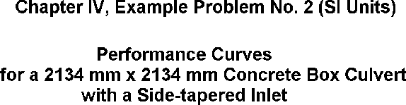**TO INLET OR GUTTER /PIPE**

Figure 11-5. Subcatchment Schematization With and Without Snowmelt Simulation. See also Table II-2.

386 11-14

> ment, a depth of snow, WEPLOW, is input for this area, above which redistri­bution occurs as indicated in Figure II-6. All snow in excess of this depth, say 0.1 - 0.2 in. water equivalent (2.5 - 5.1 mm), is redistributed to other areas according to five fractions, SFRAC, input for each subcatchment. These are described on Figure II-6. For instance, if snow is usually windrowed onto adjacent impervious or pervious areas, SFRAC(1) or SFRAC(2) may be used. If it is trucked to another subcatchment, (the last one input is used for this purpose), a fraction SFRAC(3) will so indicate, or SFRAC(4) if the snow is removed entirely from the simulated watershed. In the latter case, such removals are tabulated and included in the final continuity check. Finally, excess snow may be immediately "melted", (i.e., treated as rainfall), using SFRAC(5). The transfers are area weighted, of course, and the five fractions should sum to 1.0. A depth of snow WEPLOW remains on the normally bare area and is subject to melting as on the other areas. See Table II-3 for guide­lines as to typical levels of service for snow and ice control (Richardson et al., 1974).
>
> No pollutants are transferred with the snow. The transfers are assumed to have no effect on pollutant washoff and regeneration. In addition, all the parameters of this process remain constant throughout the simulation and can only represent averages over a snow season.
>
> The redistribution simulation does not account for snow management practices using chemicals, e.g., roadway salting. This is handled using the melt equations, as described subsequently.
>
> <u>Array Restrictions</u>
>
> In an attempt to maintain a manageable size of the Runoff Block, con­tinuous SWNN is limited to 30 subcatchments and 30 inlets because several additional parameters are needed. However, this should be more than ade­quate for continuous simulation, with and without snowmelt, since only a coarse catchment discretization should be sufficient. Limitations for single event SWHN remain at 200 subcatchments and 200 gutter/pipes plus inlets.
>
> MELT CALCULATIONS  
> <u>Theory of Snowmelt  
> Introduction</u> --
>
> Excellent descriptions of the processes of snowmelt and accumulation
>
> are available in several texts and simulation model reports and in the well-
>
> known 1956 <u>Snow Hydrology</u> report by the Corps of Engineers (1956). The impor-
>
> tant heat budget and melt components are first mentioned briefly here; any
>
> of the above sources may be consulted for detailed explanations. A brief
>
> justification for the techniques adopted for snowmelt calculations in SWNN
>
> is presented below.
>
> 387 11-15
>
> **Al = IMPERVIOUS AREA WITH DEPRESSION STORAGE**
>
> **A2= PERVIOUS AREA**
>
> **A3= IMPERVIOUS AREA WITH ZERO DEPRESSION STORAGE**
>
> **A4= SNOW COVERED IMPERVIOUS AREA**
>
> **AI tA3= NORMALLY BARE**

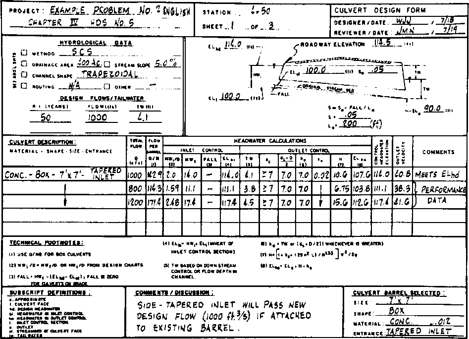Figure 1I-6. Redistribution of Snow During Continuous Simulation.

> **388 I1-16**
>
> Table 11-3. Guidelines for Levels of Service in Snow and Ice Control (Richardson et al., 1974).
>
> **Full Pave- Full Pavement**
>
> **Snow Depth to Max. Snow Depth ment Clear of Clear of Ice**
>
> **Start Plowing on Pavement Snow After After Storm**

<u>**Road Classification** Level of Service **(Inches) (Inches) Storm (Hours) Hours **</u>

<table>
<colgroup>
<col style="width: 64%" />
<col style="width: 35%" />
</colgroup>
<tbody>
<tr class="odd">
<td>
<strong>7. Low-Speed Multilane • Roadway</strong> routinely patrolled during storms

<strong>Urban Expressway</strong> • All traffic lanes treated with chemicals

<ul>
<li><blockquote>

All lanes (including breakdown lanes) <strong>operable at all times but at reduced speeds</strong>

</blockquote></li>
<li><blockquote>

<strong>Occasional patches of well-sanded snow pack</strong>

</blockquote></li>
<li><blockquote>

<strong>Roadway repeatedly cleared by echelons of plows to minimize traffic disruption</strong>

</blockquote></li>
<li><blockquote>

<strong>Clear pavement obtained as soon as possible</strong>

</blockquote></li>
</ul>

<strong>2. High-Speed • Roadway routinely patrolled during storms</strong>

<strong>4-Lane Divided Highways • Driving and passing lanes treated with chemicals</strong>

<strong>Interstate System • Driving lane operable at all times at reduced</strong>

<strong>ADT greater than 10,000a speeds</strong>

<ul>
<li><blockquote>

<strong>Passing lane operable depending on equipment availability</strong>

</blockquote></li>
<li><blockquote>

<strong>Clear pavement obtained as soon as possible</strong>

</blockquote></li>
</ul></td>
<td>
<strong>0.5 to</strong> 1 1 <strong>1 12</strong>

1 <strong>2 1.5 12</strong>
</td>
</tr>
</tbody>
</table>

<table>
<colgroup>
<col style="width: 24%" />
<col style="width: 44%" />
<col style="width: 4%" />
<col style="width: 10%" />
<col style="width: 15%" />
</colgroup>
<tbody>
<tr class="odd">
<td><ol start="3" type="1">
<li>
<strong>Primary Highways</strong>
</li>
</ol>
<blockquote>

<strong>Undivided 2 and 3 lanes ADT 500 -- 5000a</strong>

</blockquote>
<ol start="4" type="1">
<li>
<strong>Secondary Roads 
ADT less than 500a</strong>
</li>
</ol></td>
<td><ul>
<li><blockquote>

<strong>Roadway is routinely patrolled during storms</strong>

</blockquote></li>
<li><blockquote>

<strong>Mostly clear pavement after storm stops</strong>

</blockquote></li>
<li><blockquote>

<strong>Hazardous areas receive treatment of chemicals or abrasive</strong>

</blockquote></li>
<li><blockquote>

<strong>Remaining snow and ice removed when thawing occurs</strong>

</blockquote></li>
<li><blockquote>

<strong>Roadway is patrolled at least once during a storm</strong>

</blockquote></li>
<li><blockquote>

<strong>Bare left-wheel track with intermittent snow cover</strong>

</blockquote></li>
<li><blockquote>

<strong>Hazardous areas are plowed and treated with chemicals or abrasives as a first order of work</strong>

</blockquote></li>
<li><blockquote>

<strong>Full width of road is cleared as equipment becomes available</strong>

</blockquote></li>
</ul></td>
<td>1</td>
<td><blockquote>

<strong>2.5</strong>

<strong>3</strong>

</blockquote></td>
<td>
<strong>2 24</strong>

<strong>3 48</strong>
</td>
</tr>
</tbody>
</table>

> a
>
> ADT - average daily traffic

<u>Snowpack Heat Budget</u> --

Heat may be added or removed from a snowpack by the following processes:

> 1\. Absorbed solar radiation (addition).
>
> Nat langwave radiation exchange with the surrounding environment (addition or removal).

3.  Convective transfer of sensible heat from air (addition or removal).

4.  Release of latent heat of vaporization by condensate (addition) or, the opposite, its removal by sublimation (removing the latent heat of vaporization plus the latent heat of fusion).

5.  Advection of heat by rain (addition) plus addition of the heat of fusion if the rain freezes.

6.  Conduction of heat from underlying ground (removal or addition).

The terms nay be summed, with appropriate signs, and equated to the change of heat stored in the snowpack to form a conservation of heat equa­tion. Refer to Appendix III for further detail. All of the processes listed above vary in relative importance with topography, season, climate, local meteorological conditions, etc., but items 1-4 are the most important. Item 5 is of less importance on a seasonal basis, and item 6 is often neglected.

A snowpack is termed "ripe" when any additional heat will produce liquid runoff. Rainfall (item 5) will rapidly ripen a snowpack by release of its latent heat of fusion as it freezes in subfreezing snow, followed by quickly filling the free water holding capacity of the snow.

<u>Melt Prediction Techniques</u> --

Prediction of melt follows from prediction of the heat storage of the snow pack. "Energy budget" techniques are the most exact formulation since they evaluate each of the heat budget terms individually, requiring as mete­orologic input **quantities such as solar radiation, air temperature, dew** point or relative humidity, wind speed, and precipitation. Assumptions must be made about the density, surface roughness and heat and water storage (mass balance) of the snow pack as well as on related topographical and vegetative parameters. Further complications arise in dealing with heat conduction and roughness of the underlying ground and whether or not it is permeable.

Several models treat individually some or all of these effects. One of the more recent was developed for the NWS river forecast system by Anderson (1976). Interestingly, under many conditions, he found that results obtained using his energy balance model were not significantly better than those ob­tained using simpler (e.g., degree-day or temperature-index) techniques in **his** earlier model (1973). The more open and variable the conditions, the

> 390 **11-18**
>
> **better** is the energy balance technique. Closest agreement between his two models was for heavily forested watersheds.
>
> Minimal data ***needed*** to apply an energy balance model are a good esti­mate of incoming solar radiation, plus measurements of air temperature, vapor pressure (or dew point or relative humidity) and wind speed. All of these data, except possibly solar radiation, are available at at least one location (e.g., the airport) for almost all reasonably sized cities. Even solar radi­ation measurements are taken at several locations in most states. Predictive techniques are also available, for solar radiation and other parameters, based on available measurements (TVA, 1972, Franz, 1974).
>
> <u>Choice of Predictive Method</u> --
>
> Two major reasons suggest that simpler, e.g., temperature-index, tech­niques should be used for simulation of snowmelt and accumulation in urban areas. First, even though required meteorologic data for energy balance models are likely to be available, there is a large local variation in the magnitude of these parameters due to the urbanization itself. For example, radiation melt will be influenced heavily by shading of buildings and
>
> reduced albedo caused by urban pollutants. In view of the many unknown pro­perties of the snowpack itself in urban areas, it may be overly ambitious to attempt to predict melt at all! But at the least, simpler techniques are probably all that are warranted. They have the added advantage of consider­ably reducing the already extensive input data to a model such as SWMM.
>
> Second, the objective of the modeling should be examined. Although it may contribute, snowmelt seldom causes flooding or hydrologic extremes in an urban area itself. Hence, exact prediction of flow magnitudes does not as­sume nearly the importance it has in the models of, say, the NWS, in which river flood forecasting is of paramount importance. For continuous simula­tion and planning purposes in urban areas, exact quantity (or quality) pre­diction is not the objective in any event; rather, these efforts produce a statistical evaluation of a complex system and help identify critical time periods for more detailed analysis.
>
> For these and other reasons, simple snowmelt prediction techniques have been incorporated into SWMM. In their literature review preparatory to sim­ilar earlier work, Proctor and Redfern and James F. MacLaren (1976a, 1976b) felt that Anderson's NWS (1973) temperature-index method was most appropriate for SWMM. It is also well documented and tested, and has been incorporated into the SWMM version described herein. As described subsequently, the snow-melt modeling follows Anderson's work in several areas, not just in the melt equations. The energy budget technique is illustrated in this report, how­ever, in Appendix III, in order to show how it reduces to a temperature-index equation under certain assumptions. It may be noted that the STORM model (Hydrologic Engineering Center, 1977, Roesner et al., 1974) also uses the temperature-index method for snowmelt prediction, in a considerably less complex manner than is now programmed in SWMM.
>
> 391 11-19

**<u>SWMM Melt Equations</u>**

**Anderson's NWS model (1973) treats two different melt situations: with and without rainfall. When there is rainfall (greater than 0.1 in./6 hr or 2.5 mm/6 hr in the NWS model, greater than 0.02 in./hr or 0.51 mm/hr in SWMM), accurate assumptions may be made about several energy budget terms. These are: zero solar radiation, incoming longwave radiation equals blackbody r."4."-"n at the ambient air temperature, the snow surface temperature is 32°F (0°C), and the dew point and rain water temperatures equal the ambient air temperature. Anderson combines the appropriate terms for each heat budget component into one equation for the melt rate. As used in subroutine MELT in SWMM, it is**

> **SMELT = (TA - 32) • (0.001167 + SGAMMA•UADJ + 0.007•PREC) + 8.5 • UADJ • (EA - 0.18)**

**where SMELT = melt rate, in./hr,**

> **TA = air temprature, °F,**
>
> **SGAMMA = 7.5.y, in. Hg/°F,**
>
> **y = psychometric constant, in. Hg/°F,**
>
> **UADJ = wind speed function, in./in. Hg - hr,**
>
> **PREC = rainfall intensity, in./hr, and**

**EA = saturation vapor pressure at air temperature, in. Hg.**

**The psychometric constant, y, is calculated as**

**y = 0.000359 • PA**

**where PA = atmospheric pressure, in. Hg.**

**Average atmospheric pressure is, in turn, calculated as a function of eleva­tion, z,**

> **PA = 29.9 - 1.02 (z/1000) + 0.0032 • (z/1000)2.4 (II-10)**

**where z = average catchment elevation, ft.**

**The elevation, z, is an input parameter, ELEV. The wind function, UADJ, accounts for turbulent transport of sensible heat and water vapor. Anderson (1973) gives**

> **UADJ = 0.006 • 1.1 (II-11)**

**where UADJ = wind speed function, in./in. Hg - hr, and**

**u = average wind speed 1.64 ft (0.5 m) above the snow surface,**

> **mi/hr.**

**In practice, available wind data are used and are seldom corrected for the actual elevation of the anemometer. For SWMM, average wind speeds are input for each month. Finally, the saturation vapor pressure, EA, is given accurately by the convenient exponential approximation,**

> **392 11-20**
>
> **EA = 8.1175 x 106 exp\]-7701.544/(TA + 405.0265)\] (II-12)**
>
> **where EA = saturation vapor pressure, in. Hg, and  
> TA = air temperature, °F.**
>
> **The origin of numerical constants found in equation II-8 is given by Anderson (1973), and reflects units conversions as well as US customary**
>
> **units for physical prope-"-,- Note that equation 111-13 of Appendix III may be reduced to equation II-8.**
>
> **During non-rain periods, melt is calculated as a linear function of the difference between the air temperature, TA, and a base temperature, TBASE, using a degree-day or temperature-index type equation,**
>
> **SMELT = DHM • (TA - TBASE) (II-13)**
>
> **where SMELT = snowmelt, in./hr or ft/sec,**
>
> **TA = air temperature, °F,**
>
> **TBASE = base melt temperature, °F, and**
>
> **DHM = melt factor, in./hr-°F or ft/sec-°F.**
>
> **Different values of TBASE and DHM may be input for three area classifications for each subcatchment *(see* Table II-2 and Figure II-5). For instance, these parameters may be used to account for street salting which lowers the base melt temperature. If desired, rooftops could be simulated as a separate subcatchment using a lower value of TBASE to reflect heat transfer vertically through the roof. Values of TBASE will probably range between 25 and 32 °F (-4 and 0°C). Unfortunately, few urban area data exist to define adequately appropriate modified values for TBASE and DHM, and they may be considered calibration parameters.**
>
> **In rural areas, the melt coefficient ranges** from 0.03 - 0.15 in./day-°F (1.4 - 6.9 **mm/day-°C) or from 0.001 - 0.006 in./hr-°F (0.057 - 0.29 mm/hr-°C); the latter are units used for SWMM input. In urban areas, values may tend toward the higher part of the range due to compression of the pack by vehicles, pedestrians, windrows, etc. Again, there appear to be few data available to produce accurate estimates. However, Bengston (1981) and Westerstrom (1981) do describe preliminary results of urban snowmelt studies in Sweden, including degree-day coefficients which range from 3 to 8 mm/°C-day (0.007 - 0.17 in./°F-day).**
>
> **It is important to realize that a degree-day equation may be derived from the complete energy budget equation if parameters other than air tem­perature are held constant. The equation is simply linearized about a desired air temperature range, and numerical values for DHM and TBASE com­puted. The values are accurate for the assumed values of other parameters, but may not appear to make sense physically, e.g., it is not difficult to use parameters that produce negative values of TBASE. An example of this procedure is given in Appendix III. It also serves to illustrate the energy budget computation method.**
>
> 393 I1-21
>
> **For single event SWMM, parameters DHM and TBASE are constant throughout the simulation. For continuous SWMM, TBASE remains constant, but DHM is allowed a seasonal variation, as illustrated in Figure II-7. Following Anderson (1973), the minimum melt coefficient is assumed to occur on Decem­ber 21 and the maximum on June 21. Parameters DHMIN and DHMAX are input for the three areas of each subcatchment, and sinusoidal interpolation is used to produce a value of DHM, constant over each day,**

<table>
<colgroup>
<col style="width: 66%" />
<col style="width: 33%" />
</colgroup>
<tbody>
<tr class="odd">
<td>
<strong>DHM = <u>(DHMAX + DHMIN)</u> (DHMAX <u>- DHMIN) </u></strong>

<strong>2 2</strong>
</td>
<td><strong>sin [182(D-81)] (II-14)</strong></td>
</tr>
</tbody>
</table>

> **where DHMIN = minimum melt coefficient, occurring Dec. 21, in./hr-°F, DHMAX = maximum melt coefficient, occurring June 21, in./hr-°F, and D = number of *the* day of the year.**
>
> **No special allowance is made for leap year in any seasonal computations of the type of equation II-14. However, the correct date (and day number, D) is maintained.**
>
> **<u>Heat Exchange Haring Nou-Melt Periods</u>**
>
> **During subfreezing weather, the snow pack does not melt, and heat ex­change with the atmosphere can either warm or cool the pack. The difference between the heat content of the subfreezing pack and the (higher) base melt temperature is taken as positive and termed the "cold content" of the pack. No melt will occur until this quantity, COLDC in SWMM, is reduced to zero. It is maintained in inches (or feet) of water equivalent. That is, a cold content of 0.1 in. (2.5 mm) is equivalent to the heat required to melt 0.1 in. (2.5 mm) of snow. Following Anderson (1973), the heat exchange altering the cold content is proportional to the difference between the air tempera­ture, TA, and an antecedent temperature index, ATI, indicative of the temper­ature of the surface layer of the snow pack. The revised value of ATI at time step 2 is calculated as**
>
> **ATI2 = ATI1 + TIPM • (TA2 - ATI1)**
>
> **where ATI = antecedent temperature index, °F,**
>
> **TA = air temperature, °F,**
>
> **TIPM = antecedent temperature index parameter,**
>
> **0 \< TIPM \< 1.0, and**
>
> **subscripts 1 and 2 refer to time steps 1 and 2, respectively. The value of ATI is not allowed to exceed TBASE, and when snowfall is occuring, ATI takes on the current air temperature.**
>
> **The weighting factor, TIPM, is an indication of the thickness of the "surface" layer of snow. Values of TIPM less than 0.1 give significant weight to temperatures over the past week or more and would thus indicate a deeper layer than TIPM values greater than, say, 0.5 which would essentially only give weight to temperatures during the past day. In other words, the pack will both warm and cool more slowly with low values of TIPM. Anderson states that TIPM = 0.5 has given reasonable results in natural watersheds,**
>
> **394 11-22**

**although there is some evidence that a lower value may be more appropriate. No calibration has been attempted on urban watersheds.**

**Following computation of the antecedent temperature index, the cold content is changed by an amount**

> **ACOLDC = RNM • DHM • (ATI - TA) • At (II-16)**

**where ACOLDC = change in cold content, ft water equiv.,**

> **RNM = ratio of negative melt coefficient to melt**
>
> **coefficient,**
>
> **DHM = melt coefficient, ft/sec-°F,**
>
> **TA = air temperature, °F,**
>
> **ATI = antecedent temperature index, °F, and**
>
> **At = time step, sec.**

**Note that the cold content is increased, (ACOLDC is positive) when the air temperature is less (colder) than the antecedent temperature index. Since heat transfer during non-melt periods is less than during melt periods, Anderson uses a "negative melt coefficient" in the heat exchange computation. SWMM computes this simply as a fraction, RNM, of the melt coefficient, DHM. Hence, the negative melt coefficient, i.e., the product RHM • DHM, also varies seasonally. A typical value of RNM is 0.6.**

**When heat is added to a snow pack with zero cold content, liquid melt is produced, but runoff does not occur, until the "free water holding capa­city" of the snow pack is filled. This is discussed subsequently. For single event SWMM no cold content calculations are performed; values of COLDC are assumed to equal zero throughout the simulation. The value of COLDC is in units of feet of water equivalent over the area in question. The cold content "volume", equivalent to calories or BTU's is obtained by multiplying by the area. Finally, an adjustment is made to equation II-16 depending on the areal extent of snow cover. This is discussed below.**

**<u>Areal Extent of Snow Cover  
Introduction</u> --**

**The snow pack on a catchment rarely melts uniformly over the total area. Rather, due to shading, drifting, topography, etc., certain portions of the catchment will become bare before others, and only a fraction, ASC, will be snow covered. This fraction must be known in order to compute the snow covered area available for heat exchange and melt, and to know how much rain falls on bare ground. Because of year to year similarities in topography, vegetation, drift patterns, etc., the fraction, ASC, is primarily only a function of the amount of snow on the catchment at a given time; this func­tion, called an "areal depletion curve", is discussed below. These functions are used only for continuous SWMM to describe the seasonal growth and reces­sion of the snow pack. For single event simulation, fractions of snow covered area are fixed for the pervious and impervious areas of each subcatchment.**

**396 11-24**

> **<u>Areal Depletion Curves</u> --**
>
> **The functional dependence of the areal depletion curve, ADC, has just been described. As used in most snowmelt models, it is assumed that there is a depth, SI, above which there will always *be* 100 percent cover. In some models, the value of SI is adjusted during the simulation; in SWMM it remains constant. The amount of snow present at any time is indicated by the param­eter WGNOW, which** is **Cue depth (water equivalent) over each of the three possible snow covered areas of each subcatchment, (see Figure II-5). This depth is nondimensionalized by SI for use in calculating ASC. Thus, an areal depletion curve is a plot of WSNOW/SI versus ASC; a typical ADC for a natural catchment is shown in Figure II-8. For values of the ratio AWESI = WSNOW/SI greater than 1.0, ASC = 1.0, that is, the area is 100 percent snow covered.**
>
> **Some of the implications of different functional forms of the ADC may be seen in Figure II-9. Since the program maintains snow quantities, WSNOW, as the depth over the total area, AT, the actual snow depth, WS, and actual area covered, AS, are related by continuity,**
>
> **WSNnW • AT = WS . AS**
>
> **where WSNOW = depth of snow over total area AT, ft water equivalent,**
>
> **AT = total area, ft2,**
>
> **WS = actual snow depth, ft water equivalent, and**
>
> **AS = snow covered area, ft2.**
>
> **In terms of parameters shown on the ADC, equation II-17 may be rearranged to read**

<table>
<colgroup>
<col style="width: 81%" />
<col style="width: 18%" />
</colgroup>
<tbody>
<tr class="odd">
<td>
<strong><u>WSNOW</u> WS . AS = WS</strong>

<strong>AWESI = ASC</strong>

<strong>SI = . SI AT SI</strong>
</td>
<td><strong>(II-18)</strong></td>
</tr>
</tbody>
</table>

> **Equation II-18 can be used to compute the actual snow depth, WS, from known ADC parameters, if desired. It is unnecessary to do this in the program, but it is helpful in understanding the curves of Figure II-9. Thus,**
>
> **tic \_ AWESI**
>
> **"- ASC SI**
>
> **Consider the three ADC curves, B, C and D. For curve B, AWESI is always less than ASC; hence, WS is always less than SI as shown in Figure II-9d. For curve C, AWESI = ASC, hence WS = SI, as shown in Figure II-9e. Finally, for curve D, AWESI is always greater than ASC; hence, WS is always greater than SI, as shown in Figure II-9f. Constant values of ASC at 100 percent cover and 40 percent cover are illustrated in Figures II-9c, curve A, and Figure II-9g, curve E, respectively. At a given time (e.g., t1 in Figure II-9), the area of each snow depth versus area curve is the same and equal to AWESI**

- **SI, (e.g.,** o.a **SI for time t1).**

> **Curve B on Figure II-9a is the most common type of ADC occurring in nature, as shown in Figure II-8. The convex curve D requires some mech­anism for raising snow levels above their original depth, SI. In nature,**
>
> **397 II-25**
>
> 0.5 1.0 ASC= AS/AT

Figure I1-8. Typical Areal Depletion Curve for Natural Area (Anderson, 1973, P. 3-15) and Temporary Curve for New Snow.

> 398 1I-26

drifting might provide such a mechanism; in urban areas, plowing and wind­rowing could cause a similar effect. A complex curve could be generated to represent specific snow removal practices in a city. However, the program utilizes only one ADC curve for all impervious areas (e.g., area A4 of Figure II-5 for all subcatchments) and only one ADC curve for all pervious areas (e.g., area A2 of Figure II-5 for all subcatchments). This limitation should not hinder an adequate simulation since the effects of variations in individ­ual locations are averaged out in the city-wide scope of most continuous simulations.

The two ADC curves for pervious and impervious areas are input by the user, as are values of SI for each subcatchment. The program does not require the ADC curves to pass through the origin, AWESI=ASC=0; they may intersect the abscissa at a value of ASC \> 0 in order to maintain some snow covered area up until the instant that all snow disappears (see Figure II-8). However, the curves may not intersect the ordinate, AWESI \> 0 when ASC = O.

The preceding paragraphs have centered on the situation where a depth of snow greater than or equal to SI has fallen and is melting. (The ADC curves are not employed until WSNOW becomes less than SI.) The situation when there is new snow needs to be discussed, starting from both zero or non-zero initial cover. The SWMM procedure again follows Anderson's NWS method (1973).

When there is new snow and WSNOW is already greater than or equal to SI, then ASC remains unchanged at 1.0. However, when there is new snow on bare or partially bare ground, it is assumed that the total area is 100 per­cent covered for a period of time, and a "temporary" ADC is established as shown in Figure II-8. This temporary curve returns to the same point on the ADC as the snow melts. Let the depth of new snow be SNO, measured in equi­valent feet of water. Then the value of AWESI will be changed from an ini­tial value of AWE to a *new* value of SNEW by

> SNEW = AWE + SNO/SI (II-20)

It is assumed that the areal snow cover remains at 100 percent until 25 per­cent of the new snow melts. This defines the value of SBWS of Figure II-8 as

> SBWS = AWE + 0.75 • ANO/SI (II-21)

Anderson (1973) reports low sensitivity of model results to the arbitrary 25 percent assumption. When melt produces a value of AWESI between SBWS and AWE, linear interpolation of the temporary curve is used to find ASC until. the actual ADC curve is again reached. When new snow has fallen, the pro­gram thus maintains values of AWE, SBA and SBWS.

The interactive nature of melt and fraction of snow cover is not accounted for <u>during</u> each time step. It is sufficient to use the value of ASC at the beginning of each time step, especially with the short one-hour time step used for the simulation.

400 II-28

> <u>Use of Value of</u> ASC --
>
> The fraction of area that is snow covered, ASC, is *used* to adjust 1) the volume of melt that occurs, and 2) the "volume" of cold content change, since it is assumed that heat transfer occurs only over the snow covered area. The melt rate is computed from either equation II-8 or equation II-13. The snow depth is then reduced from its value at time step 1 to time step 2
>
> **ZS**
>
> WSNOW2 = WSNOW1 - SMELT • ASC (II-22)
>
> with variables as defined previously and including appropriate continuity checks in the program to avoid melting more snow than is there, etc.
>
> Cold content changes are also adjusted by the value of ASC. Thus, using equation II-16, cold content at time step 2 is computed from the value at time step 1 by
>
> COLDC2 = COLDC1 + RNM • DHM • (ATI-TA) • At • ASC (1I-23)
>
> where variables are as previously defined. Again there are program checks for negative values of COLDC, etc.
>
> <u>Liquid Water Routing in Snow Pack</u>
>
> Production of melt does not necessarily mean that there will be liquid runoff at a given time step since a snow pack, acting as a porous medium with a "porosity", has a certain "free water holding capacity" at a given instant in time. Following PR-JFM (1976a, 1976b), this capacity is taken as a constant fraction, FWFRAC, of the variable snow depth, WSNOW, at each time step. This volume (depth) must be filled before runoff from the snow pack occurs. The program maintains the depth of free water, FW, ft of water, for use in these computations. When FW = FWFRAC • WSNOW, the snow pack is fully ripe. The procedure is sketched in Figure II-10.
>
> The inclusion of the free water holding capacity via this simple reser­voir-type routing delays and somewhat attenuates the appearance of liquid runoff. The value of FWFRAC will normally be less than 0.10 and usually between 0.02 - 0.05 for deep snow packs (WSNOW \> 10 in. or 254 mm water equivalent). However, Anderson (1973) reports that a value of 0.25 is not unreasonable for shallow snow packs that may form a slush layer. When rain­fall occurs, it is added to the melt rate entering storage as free water. No free water **is** released when melt does not occur, but remains in storage, available for release when the pack is again ripe. This re-frozen free water is not included in subsequent cold content or melt computations.
>
> <u>Net Runoff</u>
>
> Melt from snow covered areas and rainfall on bare surfaces are area weighted and combined to produce net runoff onto the surface as follows,
>
> RI = ASC • SMELT + (1.0-ASC) • RINE (II-24)
>
> 401 11-29
>
> where RI = net ,runoff onto surface, ft/sec,
>
> ASC = fraction of area that is snow covered,

SMELT = melt rate, including effect of attenuation due to free water

> holding capacity, ft/sec, and
>
> RINE = rainfall intensity, ft/sec.
>
> Thus, the net runoff acts just as rainfall would act alone in subsequent overland flow aad ia'414--ation calculations.
>
> If immediate melt is produced through the use of the snow redistribu­tion fraction S7RAC(5), discussed earlier (see Figure II-6), it is added to equation II-24. Furthermore, all melt calculations are ended when the depth of snow water equivalent becomes less than 0.001 in. (0.025 mm), and remain­ing snow and free water are converted to immediate melt and added to equa­tion II-24.
>
> <u>Effect of Snow on Infiltration and Surface Parameters</u>
>
> A snow pack tends to insulate the surface beneath it. If ground has frozen prior to snowfall, it will tend to remain so, even as the snow begins to melt. Conversely, unfrozen ground is generally not frozen by subsequent snowfall. The infiltration characteristics of frozen versus unfrozen ground are not well understood and depend upon the moisture content at the time of freezing. For these and other reasons, SWMM assumes that snow has no effect on infiltration or other parameters, such as surface roughness or detention storage (although the latter is altered in a sense through the use of the free water holding capacity of the snow). In addition, all heat transfer calculations cease when the water becomes "net runoff". Thus, water in tem­porary surface storage during the overland flow routing will not refreeze as the temperature drops and is also subject to evaporation beneath the snow pack.
>
> QUALITY INTERACTIONS  
> <u>Pollutant Accumulation  
> Snowmelt Quality</u> --
>
> A detailed review of literature related to snowmelt quality is given by PR-JFM (1976a, 1976b). Among the various contaminants found in deposited snow and melt water, chlorides and lead appear to be the most serious and potentially hazardous. Chloride concentrations in runoff along major high­ways can be higher than 20,000 mg/1, with typical values of from 1,000 to 10,000 mg/l. Several other studies also document chloride contamination and discuss street salting practices (Field et al., 1973, Richardson et al., 1974, Ontario Ministry of the Environment, 1974). Lead concentrations in snow windrows have been as high as 100 mg/1 with typical values of from 1 to 10 mg/l. However, most deposited lead results from automobile combustion and is insoluble. Hence, melt runoff concentrations are lower than snow pack values and are mostly associated with suspended solids.
>
> 403 11-31

**<u>Pollutant Loadings</u> --**

**Mechanisms and modeling alternatives for pollutant buildup and washoff are described extensively in Section 4 (Runoff Block). Any parameter**

**related to snowmelt may be generated using linear or non-linear buildup, or else a rating curve (load proportional to flow). Specifically, street salt­ing chemicals may be simulated, such as sodium chloride or calcium chloride.**

**<u>Adjustments for Presence of Snow</u> --**

**As a user option, regeneration of any quality constituent may be per­formed only when snow is present. This option is indicated by parameter LINKUP. Thus, if chlorides are simulated, for example, they will not be re­generated from bare ground, during the summer months for instance. However, regeneration when it does occur is a function only if the snow is present, not the actual <u>amount</u> (depth).**

**<u>Possible Loading Rates</u> --**

**Pollutant loading rates are best determined from local data. The lite-ature review of PR-JFM (1976a, 1976b) may also be consulted for tables that may be used to estimate loading rate parameters for snow-associated pollu­tants. Other references will also be useful (e.g., Field et al., 1973, Richardson et a\].., 1974, Ontario Ministry of the Environment, 1974).**

**Table II-4 (Richardson et al, 1974) lists <u>recommended</u> deicing chemical application rates for roadways. In general, PR-JFM show that <u>observed</u> load­ing rates are functions of population density with suburban rates lower than arterial highway rates, as indicated in Table II-5. This is also true for other pollutants.**

**Table II-5. Salting Rates Used in Ontario**

**(Proctor and Redfern Ltd. and James F. MacLaren, Ltd., Vol. II, 1976b)**

> **Population Density Salting Rate per Application**
>
> **<u>(pop. per sq mile) (lb per lane-mile)</u>**
>
> **Less than 1,000 75-800**
>
> **1,000 to 5,000 350-1,800**
>
> **More than 5,000 400-1,200**

**<u>Street Sweeping</u>**

**Simulation of street sweeping in SWMM is performed as in the past, except: for slight modifications as described in Section 4. The effect of snow is included in two minor ways. First, beginning and ending dates, parameters KLNBGN and KLNEND respectively, may be input for continuous SWMM to indicate**

> **405 11-33**
>
> **the interval during the year subject to street sweeping. If sweeping normally is not done between, say, December 1 and March 1, because of high snow volumes, this may be so indicated.**
>
> **Second, the presence of snow can alter the street sweeping interval. These intervals are specified for each of the five land uses. Each sub-catchment is swept when the number of <u>dry</u> time steps for that subcatchment exceeds the interval for the given land use. A dry time step, in subroutine QSHED, is one in which there is no precipitation and no water or snow on areas Al and A3 (Figure II-S). Thus, subcatchments will not be swept until there is no snow or water on "normally bare" impervious areas.**
>
> **<u>Other Considerations</u>**
>
> **The snow itself is assumed to be "pure" and contain no pollutants.**
>
> **Thus, the redistribution or transfers of snow described earlier (Figure II-6) will not remove accumulated pollutants. This is partially justified on the basis of the assumption that such transfers would occur soon after fresh snow has fallen. They occur during the same time step in the model.**
>
> **Although not well tested, it is assumed that the principal effect of inclusion of snowmelt upon runoff quality predictions of continuous SWMM will be to shift the season and magnitude of pollutant washoff. There will tend to be fewer periods of washoff during the winter. As snowmelt, equivalent melt rates are likely to be less than the usual magnitude of rainfall inten­sities experienced. Hence, concentrations may tend to be more uniform during the melt washoff events.**
>
> **DATA REQUIREMENTS  
> <u>New Parameters </u>**
>
> **The revised Runoff Block input data formats should be examined for the new snowmelt variables. For single event simulation these include watershed elevation, free water holding capacities, air temperatures and wind speeds, and for each subcatchment, snow covered fractions, initial snow and free water, melt coefficients and base temperatures. Continuous simulation requires the same data as above, except that air temperatures are computed using other input parameters. In addition, it requires the snow gage cor­rection factor, negative heat exchange parameter, areal depletion curves, and, for each subcatchment, the redistribution parameters. Of course, for continuous simulation, the required parameters can be kept to a minimum by keeping the number of subcatchments used to a minimum (e.g., one). Also required are pollutant loading data that may or may not be related to snow.**
>
> **<u>Sensitivity</u>**
>
> **The melt routines have not been sufficiently tested to date to quantify the sensitivity of results to various input parameters. It is expected that melt volumes will be most related to the precipitation record, of course, and to the gage correction factor, which influences the amount of snow that**
>
> **406 II-34**
>
> **falls. Melt rates will be influenced by the melt coefficients and base tem­peratures, and, to some degree, by the areal depletion curves which simulate the relative "piling" or "stacking" of the snow.**
>
> **OUTPUT**

<table>
<colgroup>
<col style="width: 14%" />
<col style="width: 85%" />
</colgroup>
<tbody>
<tr class="odd">
<td><blockquote>

</blockquote></td>
<td><strong>and Snowfall Generation</strong></td>
</tr>
</tbody>
</table>

> **Output from subroutine CTRAIN has been described earlier and consists of temperatures synthesized from daily max-min values, and hourly precipita­tion totals, in which snowfall is tagged as a negative value.**
>
> **<u>Runoff Simulation Output</u>**
>
> **Snowmelt events are not tagged for output by continuous SWMM. If:daily output is used, snowmelt may be discerned to some degree by observing whether precipitation accompanies the runoff for that day. Snowfall and initial snow depths are identified as separate items in the final continuity check for the total watershed.**
>
> **PROGRAMMING NOTES  
> <u>Subroutines </u>**
>
> **Hourly temperatures are synthesized in subroutine CTRAIN, called from subroutine RHYDRO. Hourly precipitation intensities (rain and snow) are also computed therein. All input data other than NWS tapes are read in sub­routine RHYDRO, as in the past.**
>
> **The bulk of the melt computations are performed in subroutine WSHED, used to generate overland flow from rainfall, and now, from snowmelt as well. Subroutine WSHED calls subroutine MELT to compute the melt rate and to perform computations related to the areal depletion curves. Subroutine AREAL calls subroutine FINDSC for linear interpolation along the curves.**
>
> **Minor changes related to snowmelt have also been made in subroutines HYDRO and QSHED. Changes in the former relate primarily to initialization and the continuity check output. Changes in the latter account for the minor interactions of snow and quality predictions.**
>
> **<u>Variable Names</u>**
>
> **Variable names for input snowmelt parameters are included in the Runoff Block input data format table. Other key parameters have been mentioned in the preceding text and used in the equations.**
>
> **<u>Computer Time</u>**
>
> **Although not tested extensively, an approximate idea of computer costs for various conditions may be seen in Table II-6. STORM results are shown**
>
> 407 II-35
>
> **for comparison. The latter runs prove to be faster and cheaper, reflecting the considerably simpler formulations used in STORM. Thus, the choice of STORM or continuous SWMM for runoff generation will depend upon costs, model formulations, I/O, availability, etc.**
>
> **<u>Computer Size Requirements</u>**
>
> **Every effort was made during the snowmelt programming to minimize the use of new arrays, although several were necessary. However, during the course of the programming it was possible to eliminate several unneeded arrays and overlay others. As a result, the present size of the Runoff Block plus the Executive Block is a bit less than 360K bytes or 90K words.**
>
> **409 II-37**

**APPENDIX III**

**REDUCTION OF ENERGY BALANCE EQUATION TO DEGREE-DAY EQUATION**

> **PURPOSE**
>
> **This appendix presents equations that can be used for each term in the energy balance equation discussed in Appendix II. The equation is then lin­earized and typical numerical values are used to reduce it to a degree-day or temperature-index type equation. The energy budget method will thus *be* better understood, and a physical basis for the simple prediction equations will be seen. Notation and equations used will follow Eagleson (1970), al­though an identical development could he based nn several other references.**
>
> **ENERGY BUDGET**
>
> **The energy budget given in Appendix II is repeated and symbols are assigned to each term. Units for each energy buqet term will be energy/ area-time, e.g., ly/day (one langley = one cal/cm ). However, within this scope, there will be mixtures of units used as convenient, e.g., minutes and days, °C and °F. The equation will ultimately *be* converted to U.S. custom­ary units.**
>
> **The snow pack energy budget is (e.g., units of ly/day) OH = Hrs + Hg + Hrl + He + He + Hp**
>
> **where AH = change in heat storage in snow pack,**
>
> **H = net short wave radiation entering the snow pack,**

**Hr = conduction of heat to snow pack from underlying ground,**

**Hgl = net (incoming minus outgoing) long wave radiation entering**

> **the snow pack,**

**Hc = convective transport of sensible heat from air to snow pack,**

**He = release of latent heat of vaporization by condensation of**

> **atmospheric water vapor, and**
>
> **H = advection of heat to snow pack by rain.**
>
> **All terms can be positive or negative except for He (sublimation will not be considered since it also involves the heat of fusion), Hrs and H (heat can­not be removed by rain).**
>
> **It will be assumed that the snow pack is ripe, and all heat added will product liquid melt. Since inches of melt are desired, and it requires**

**410**

> **about 80 cal to melt one gram of water (the latent heat of fusion) or 80 ly per cm, it requires 2.54 cm/in. x 80 ly/cm = 203.2 ly per inch of melt. Thus, equation III-1 will eventually be linearized and put in the form of equation II-13 in Appendix II,**

**SMELT = AH/203.2 = DHM • (Ta - Tb)**

> **where SMELT = melt rate, in. /day,**
>
> **AH = change in heat storage, ly/day,**
>
> **DHM = melt coefficient, in./day-°F,**
>
> **Ta = air temperature, °F, and**
>
> **Tb = base melt temperature, °F.**
>
> **Other terms will be defined where introduced. Caution should be used to in­sure that all terms eventually have the same units.**
>
> **SHORT WAVE RADIATION, H rs**
>
> **Measured values from NWS stations are ordinarily used. The albedo (reflection coefficient) of new snow can be as high as 0.80 and is seldom lower than 0.4 in natural areas. Albedos of dirty urban snow surfaces are not documented, but probably lower than 0.4. Net shortwave radiation, Hrs, is incoming minus reflected. If measurements of incoming radiation are unavailable, predictive techniques may be used (TVA, 1972, Franz, 1974).**
>
> **HEAT CONDUCTION THROUGH GROUND, H**
>
> g
>
> **Few data are available to quantify this term, and it is often deter­mined as a residual in the energy budget equation. For urban areas, the intriguing possibility exists of predicting heat transfer through roofs based upon assumed temperature differences across the roof surface and thermal properties of the roofing material. In most cases, however, such calculations will be inaccurate and/or infeasible. Hence, this term is usually neglected.**
>
> **NET LONG WAVE RADIATION, Hri**
>
> **Incoming minus outgoing long wave radiation is given by the Stefan-Boltzman law,**
>
> **Hrl = 0.97 • ea • a • Ta4**
>
> **- 0.97 • a • T4**
>
> **where ea = atmospheric emissivity, a function of_y8ter vapor 4ontent,**
>
> **a = Stefan-Boltzman constant = 0.826 x 10 ly/min-°K ,**
>
> **T = air temperature at specified elevation, °K,**
>
> **Ta = snow surface temperature, °K.**

**411 111-2**

> **The first factoc of 0.97 accounts for three percent reflection of incoming long wave radiation, and the second factor of 0.97 is the emissivity of the snow surface.**
>
> **The key unknown is the atmospheric emissivity, for which several em­pirical formulas are available and in which the effect of clouds may also be included (TVA, 1972). For example, a simple formula due to Anderson (1954) fr.,- clear skies is**
>
> **ga = 0.74 + 0.0049e**
>
> **where e = ground level atmospheric vapor pressure, mb.**
>
> **Clouds may be assumed to radiate with an emissivity of 0.97 at the cloud base temperature, if known.**
>
> **The snow surface temperature may be taken as 0°C. Hence, it is neces­sary to linearize only the air temperature term. This may be done by means of a Taylor series, under the assumption**
>
> **Ta = To + AT (III-5)**
>
> **The fourth-power term is then linearized about the reference temperature,**
>
> **To,**
>
> T**a = (To + AT)4 =** T**o + AT • 4 •** T**o + . . = To3**
>
> **(4Ta - 3T0) (III-6)  
> The reference temperature, T , will be a constant in the equation and is chosen near the midpoint of the expected temperature range at the time of evaluation of the heat budget. Equation III-6 may be substituted into equa­tion III-3,**
>
> **Hrl = 0.97 • ea • a •** T**o (4Ta - 3T0) - 0.97 • a • Ts4**
>
> **(III-7)**
>
> **Which is linear in Ta, in °K. Later, temperatures must be converted to °F for consistency.**
>
> **CONVECTIVE HEAT TRANSFER,** He
>
> **Equations for this process (and for condensation melt) vary according to the asumptions made about surface roughness, wind speed profiles and tur­bulent transfer coefficients. A common equation is (Eagleson, 1970)**
>
> **—**
>
> He **= 203.2 • kc • p s /po • (za • zb)-1/6 • ub • (Ta - Ts) (III-8)**
>
> **where ps = surface atmospheric pressure (consistent units with pc.),**
>
> **P = sea level atmospheric pressure (consistent units with ps),**
>
> **zao = height above surface of air temperature (and humidity)**
>
> **measurement, ft,**
>
> **412 III-3**
>
> **zb = height above surface of wind speed measurement, ft,**
>
> **ub = wind speed at height zb, mph,**
>
> **T = air temperature, °F,**
>
> **Ta = snow surface temperature, °F, and**
>
> **Hs = heat transfer in ly/day.**

**The factor 203.2 converts inches to langleys and the coefficient kc has be-- measured for the Sierra Nevada mountains as**

**kc = 0.00629 in. ft1/3 hr/day-°F-mi**

**CONDENSATION HEAT TRANSFER, He**

**Since both this and convective heat transfer are diffusive type pro­cesses, the same introductory remarks hold as for the latter. A common equation is (Eagleson, 1970)**

> **He = 203.2 • 8.5 • ke • (za • zb)-1/6 • ub • (ea - es) (III-10)**

**and other variables are defined as for equation III-8. The coefficient ke has been measured for the Sierras as**

> **ke = 0.00635 in. ft1/3 hr/day-mb-mile. (III-11)**

**The factor of 8.5 in equation III-10 accounts for the fact that when the snow pack is ripe, the latent heat of condensation will supply the latent heat of fusion to melt the snow. Because of the ratio of these latent heats, 600/80 = 7.5, each inch of condensate will cause 7.5 + 1 = 8.5 inches of "melt".**

**HEAT ADVECTION BY RAIN, H** p

**Heat is advected by rain in proportion to the rainfall depth and tem­perature of the rain (assumed to *be* equal to the air temperature). Then**

> Hp **= 1.41 d (Ta - Ts) (III-12)**

**where H = heat advected in ly/day, and**

> **d = daily rainfall depth, in./day, and**

**the temperatures are in °F.**

> **413 1II-4**

**NUMERICAL EXAMPLE**

> **The following meteorological parameters are assumed,**
>
> **Hrs = 288 ly/day,**
>
> **To = 35°F = 274.7°K**
>
> **Ts = 32°F = 273°K**
>
> **za = 6 ft**
>
> **zb = 20 ft**
>
> **ub = 9 mph**
>
> **es = es(32°F) = 6.11 mb**
>
> **r = 0.6**
>
> **ea = 0.6 • es(35°F) = 0.6 • 6.87 = 4.12 mb**
>
> e**a = 0.90**
>
> **Po = 1013.2 mb**
>
> **ps = 950 mb (about 2000 ft elevation),**
>
> **rainfall = zero**
>
> **H = zero  
> **g

**Each of the terms in equation III-13 is now evaluated, with units of inches/day.**

|          |              |                                |
|----------|--------------|--------------------------------|
| **Term** | **Constant** | **Temperature Term**           |
| **1**    | **+11.24**   | **+ 0.0235 Ta**     |
| **2**    | **+ 1.24**   | **+** 0.0239 T**a** |
| **3**    | **+ 1.417**  |                                |
| **4**    | **- 3.154**  |                                |
| **5**    | **- 1.200**  |                                |
| **6**    | **- 8.729**  |                                |
|          | **- 0.426**  | **+ 0.0474 Ta**     |

> **415**

**Then the degree-day or temperature-index equation becomes, with Ta in °F, SMELT = DHM • (Ta - Tb) (III-15)**

> **= 0.0474 Ta - 0.426 in./day**
>
> **= 0.0474 (Ta - 8.99) in./day**
>
> **= 0.00198 (Ta - 8.99) in./hr**

**The low value of Tu of about 9°F implies sufficient energy input (via solar radiation and condensation) to cause melt even at low temperatures. This is not really true, however, since the melt equation was linearized about a temperature of 35°F and should only *be* used in that range. The exercise serves to indicate the range of values that may be found when sub­stituting actual meteorological data iato the equations. Although seem­ingly wrong values may result, e.g., base melt temperatures less than zero, the equation with such values is still valid for the input parameters used and over the range of the linearization.**

> 416 111-7
>
> APPENDIX IV
>
> STORAGE/TREATMENT SIMULATION
>
> OBJECTIVES
>
> The primary objectives of the Storage/Treatment Block are to:

1.  provide the capability of modeling a larger number of processes in both the single event and continuous modes;

2.  simulate the quality improvement provided by each process;

3.  simulate the handling of sludges; and

> provide estimates of capital, operation and maintenance costs.
>
> Although the objectives of the Storage/Treatment Block have not changed appreciably from earlier versions (Metcalf and Eddy et al., 1971a), the model has been virtually rewritten. The earlier versions were more limited in use and scope. This version is much more flexible in terms of the control units available, pollutant routing and cost estimating. However, the user is advised that increased flexibility implies increased user input and knowledge of the processes to be modeled. In other words, the model does not provide several dozen specialized designs, but provides the tools necessary to simu­late the desired processes. Naturally, flexibility precludes ultrasophisti-cation.
>
> Several precautions should be noted before setting up the S/T Block.

1.  Local waste characterization data are essential to appraise realisti­cally the performance of treatment units.

2.  Lab or pilot plant performance data should be used whenever possible to derive performance functions.

3.  Dry-weather treatment performance functions should be applied cautious­ly to wet-weather units.

> PROGRAM DEVELOPMENT AND OVERVIEW  
> <u>Development</u>
>
> Past versions of the Storage/Treatment Block simulated various proces­ses on the basis of limited empirical data and operating experience. Often the data were localized and/or specialized. Thus, they were of questionable applicability to a wide variety of situations. Additionally, the model did not account for the physical characteristics of the incoming waste stream or the handling of residuals (sludges).
>
> 417 IV-1

To improve the storage/treatment modeling capabilities of SWMM the fol­lowing considerations were instrumental in creating a new model.

1.  There should be a high degree of flexibility in the simulation of in­dividual units and the interaction among units.

2.  In addition to simulating the mass of pollutants, it is important to account for the physical characteristics (i.e., particle size and spe--"" gravity distribution) of each pollutant.

3.  Residual (sludge) handling is an important part of any wastewater treatment scheme and should be simulated.

4.  All costing routines should be as flexible as the performance algorithms.

5.  The model should be capable of modeling wet- and dry-weather facilities.

<u>Overview</u>

The present Storage/Treatment Block is approximately 2000 Fortran state­ments in length and consists of eight subroutines. The routing of flow and nollutants thrnugh the entire block is controlled by subroutine STRT which is called from the Executive Block. STRT also provides the main driving loop for the model and generally acts as the central coordinating subroutine. Subroutine STRDAT is called in STRT and is responsible for reading the input data provided by the user. Subroutine CONTRL is called each time-step from the main driving loop in STRT. CONTRL directs flow and pollutants from one unit to another as prescribed by the desired scheme and coordinates the majority of the printed output. Subroutine UNIT is called from CONTRL for each unit modeled and is the heart of the Storage/Treatment Block. It con­tains the necessary flexibility and capability to model most storage/treat-ment processes (units). Subroutine EQUATE is used by UNIT to provide several forms of pollutant removal equations. Subroutine INTERP is employed by UNIT for linear interpolation. Subroutine PLUGS is used by UNIT to model perfect plug flow through a detention unit. Subroutine STCOST is called from STRT to determine capital and operation and maintenance costs.

The model has become user-intensive rather than program-intensive. The user is responsible for providing the program with the desired storage/treat-ment scheme and operating characteristics of each unit (along with other information). However, input guidelines are provided in the User's Manual for several types of units. Again, the strength of this approach is to maximize flexibility and applicability to local conditions and design criteria.

SIMULATION TECHNIQUES  
<u>Introduction</u>

Flow and pollutants are routed through one or more storage/treatment units by several techniques. The flows into, through and out of a unit are shown in Figure IV-1. The units may be arranged in any fashion, restricted only by the requirements that inflow to the plant enters at only one unit

> 418 IV-2

**LEGEND**

> **Qtot Qmax**
>
> **Qby Qin Qout Qres**

**= TOTAL INFLOW, ft3/sec**

**= MAXIMUM ALLOWABLE INFLOW,**

> **ft3/sec**

**= BYPASSED FLOW, ft3/sec**

**= DIRECT INFLOW TO UNIT, f13/sec**

**= TREATED OUTFLOW, ft3/sec**

**= RESIDUAL STREAM, ft3/sec**

Figure IV-1. Flows Into, Through, and Out of a Storage/Treatment Unit.

> 419 IV-3

and that the products (treated outflow, residuals, and bypass flow) from each unit not be directed to more than three units. Treatment and sludge handling units are modeled by the same subroutine (UNIT). Additionally, both wet-and dry-weather facilities may be simulated by the proper selection of unit arrangement and characteristics. Units may ***be*** modeled as having a detention capability or instantaneous throughflow. Pollutants or sludges may be repre­sented as mass only or further characterized by a particle size or settling velocity distribution. **A** unit may remove pollutants (or concentrate sludges) as a function of particle size and specific gravity, detention time, incoming concentration, the removal rate of another pollutant, or a constant percentage. The S/T Block can receive the flow and any three pollutants from any one outlet in any other block of SWMM. Also, flows and pollutants may be provided by the user and fed directly to the S/T Block. If both sources are present they are combined and treated as one input. For example, the user may enter directly dry-weather flows and enter wet-weather flows from the Runoff Block. All flows and pollutant concentrations reported by the S/T Block are average values over each time step. This is necessary for some of the algorithms in the S/T Block (in particular, the plug flow routines); it does not signifi­cantly affect the results.

The following sections describe the techniques available for flow and pollutant routing which allow the user to model several types of storage/ treatment units.

<u>Flow Routing</u>

<u>Detention vs. Instantaneous Throughflow</u>

--

A unit may be modeled to handle flow in one of two ways; as a detention unit (reservoir) or a unit instantaneously passing all flow. The idea of a detention unit is not limited to storage basins and sedimentation tanks but also includes such processes as dissolved air flotation, activated sludge, and chlorination. Processes that may be modeled as having instantaneous throughflow include microscreens, fine screens and other forms of screening.

<u>Detention Units</u> --

The rate of change of storage in a detention unit or reservoir is found by writing a mass balance equation for the system shown in Figure IV-2.

V

Figure IV-2. Time Varying'Inflow and Outflow Rates for a Reservoir.

> 420 IV-4
>
> The rate of change of storage equals inflow minus outflow, or
>
> AV/At = I - 5 (I17-1)
>
> where I = average inflow rate during it, ft3/sec,  
> 5 = average outflow rate during At, ft3/sec,  
> V = reservoir volume, ft3, and
>
> At = time step, sec.
>
> Let subscripts 1 and 2 denote the beginning and end of the time step, respectively. Then, the average inflow rate I, is
>
> I = (ii + 12)/2 (IV-2) The average outflow rate, 0, is
>
> d = (01 + 02)/2 (IV-3) Also, the change in reservoir volume is
>
> AV = V2 - V1 (IV-4)
>
> Substituting equations IV-2, IV-3, and IV-4 into equation IV-1 and multiplying through by At yields the desired expression for the change in volume, i.e.,

<table>
<colgroup>
<col style="width: 79%" />
<col style="width: 20%" />
</colgroup>
<tbody>
<tr class="odd">
<td>
II <u>2</u>

<u>01 </u>+ <u>02 </u>

V2 - V1 = At At
</td>
<td>(IV-5)</td>
</tr>
</tbody>
</table>

> For a given time step, I1, I2, 01, and V1 are known and 02 and V2 need to be determined. Grouping the unknowns on the left hand side of the equation and rearranging yields one of two required equations:
>
> 0.502At + V2 = 0.5(I1 +2)At + (V1 - 0.5016t) (IV-6)
>
> The second required equation is found by relating 02 and V2, each of which is a function of reservoir depth. The procedure is illustrated in the fol­lowing example.
>
> Table IV-1 presents geometric and routing data for a hypothetical reser­voir with a base elevation of 343.0 ft and a maximum pool elevation of 353.0 ft. The corresponding depths are shown in column 3. Surface area, as a function of depth, is presented in column 4. If the reservoir has an irreg­ular geometry, the surface area is measured from a topographic map. The deptharea data pairs shown in columns 3 and 4 of Table IV-1 are required input data. If the user desires, the depth-discharge relationship may be input directly by assigning values of 01 to each depth or generated by a user-supplied depth-discharge equation (e.g., weir equation). Similarly, the user may specify the volume, V2, associated with each depth or allow
>
> 421 IV-5

<table style="width:100%;">
<colgroup>
<col style="width: 3%" />
<col style="width: 12%" />
<col style="width: 8%" />
<col style="width: 11%" />
<col style="width: 9%" />
<col style="width: 9%" />
<col style="width: 10%" />
<col style="width: 12%" />
<col style="width: 21%" />
</colgroup>
<tbody>
<tr class="odd">
<td>n</td>
<td colspan="8">
Table IV-l. Geometric and Hydraulic Data for Hypothetical Reservoir

Surface

Elevation Depth Area Discharge Volume 02DT2 SATERM

<blockquote>

h y A 02 V2 0.502At 0.502AttV2 Remarks

</blockquote>

•

<blockquote>

ft ft 1000 ft2 ft3/sec 1000 ft3 1000 ft3 1000 ft3

</blockquote></td>
</tr>
<tr class="even">
<td>(1)</td>
<td>(2)</td>
<td>(3)</td>
<td>(4)</td>
<td>(5)</td>
<td>(6)</td>
<td>(7)</td>
<td>(8)</td>
<td>(9)</td>
</tr>
<tr class="odd">
<td>1</td>
<td>343.0</td>
<td>0.0</td>
<td>0.</td>
<td>0.</td>
<td>0.</td>
<td>0.</td>
<td>0.</td>
<td><blockquote>

Base of reservoir

</blockquote></td>
</tr>
<tr class="even">
<td>2</td>
<td>344.0</td>
<td>1.0</td>
<td>3.</td>
<td>0.</td>
<td>2.</td>
<td>0.</td>
<td>2.</td>
<td></td>
</tr>
<tr class="odd">
<td>3</td>
<td>345.0</td>
<td>2.0</td>
<td>15.</td>
<td>0.</td>
<td>10.</td>
<td>0.</td>
<td>10.</td>
<td></td>
</tr>
<tr class="even">
<td>4</td>
<td>346.0</td>
<td>3.0</td>
<td>45.</td>
<td>0.</td>
<td>40.</td>
<td>0.</td>
<td>40.</td>
<td></td>
</tr>
<tr class="odd">
<td>5</td>
<td>347.0</td>
<td>4.0</td>
<td>121.</td>
<td>0.</td>
<td>120.</td>
<td>0.</td>
<td>120.</td>
<td></td>
</tr>
<tr class="even">
<td>6</td>
<td>348.0</td>
<td>5.0</td>
<td>225.</td>
<td>0.</td>
<td>300.</td>
<td>0.</td>
<td>300.</td>
<td></td>
</tr>
<tr class="odd">
<td>7</td>
<td>349.0</td>
<td>'6.0</td>
<td>365.</td>
<td>0.</td>
<td>590.</td>
<td>0.</td>
<td>590.</td>
<td></td>
</tr>
<tr class="even">
<td>8</td>
<td>350.0</td>
<td>7.0</td>
<td>550.</td>
<td>0.</td>
<td>1050.</td>
<td>0.</td>
<td>1050.</td>
<td></td>
</tr>
<tr class="odd">
<td>9</td>
<td>351.0</td>
<td>8.0</td>
<td>790.</td>
<td>0.</td>
<td>1720.</td>
<td>0.</td>
<td>1720.</td>
<td><blockquote>

Weir elevation

</blockquote></td>
</tr>
<tr class="even">
<td>10</td>
<td>351.5</td>
<td>8.5</td>
<td>910.</td>
<td>30.</td>
<td>2140.</td>
<td>324.</td>
<td>2464.</td>
<td></td>
</tr>
<tr class="odd">
<td>11</td>
<td>352.0</td>
<td>9.0</td>
<td>1080.</td>
<td>65.</td>
<td>2650.</td>
<td>702.</td>
<td>3352.</td>
<td></td>
</tr>
<tr class="even">
<td>12</td>
<td>352.2</td>
<td>9.2</td>
<td>1130.</td>
<td>80.</td>
<td>2900.</td>
<td>864.</td>
<td>3764.</td>
<td></td>
</tr>
<tr class="odd">
<td>13</td>
<td>352.4</td>
<td>9.4</td>
<td>1190.</td>
<td>105.</td>
<td>3100.</td>
<td>1134.</td>
<td>4234.</td>
<td></td>
</tr>
<tr class="even">
<td>14</td>
<td>352.6</td>
<td>9:6</td>
<td>1270.</td>
<td>130.</td>
<td>3400.</td>
<td>1404.</td>
<td>4804.</td>
<td></td>
</tr>
<tr class="odd">
<td>15</td>
<td>352.8</td>
<td>9.8</td>
<td>1350.</td>
<td>165.</td>
<td>3700.</td>
<td>1782.</td>
<td>5482.</td>
<td></td>
</tr>
<tr class="even">
<td>16</td>
<td>353.0</td>
<td>10.0</td>
<td>1440.</td>
<td>200.</td>
<td>3900.</td>
<td>2160.</td>
<td>6060.</td>
<td><blockquote>

Maximum pool

</blockquote></td>
</tr>
</tbody>
</table>

> Column

1)  **Counter**

2)  Elevation from topographic map

3)  Depth = h - 343.0

4)  **Measured** from topographic map or may be calculated (by user) if geometry is regular

5)  **Measured** data or calculated from discharge formulas

6)  **Measured data** or calculated

7)  **Calculated from** column 5, At = 21,600 sec.

8)  **Calculated from** columns 6 and 7

422 IV-6

> the model to calculate the depth-volume relationship. This is accomplished by averaging the surface area between adjacent values of depth, multiplying by the difference in depth, and adding the incremental volume to the accumu­lated total. The depth-area data pairs are also used to estimate the volume lost from the reservoir due to evaporation.
>
> Recalling equation IV-6, the objective is to find
>
> 0.502At = f(0.502At + V2). (IV-7)

The data in Table IV-1 give 02 and 11,, as functions of depth. In this case, discharge or outflow occurs only if the reservoir depth exceeds 8.0 ft. The model uses these data to calculate the values of 0.502At (column 7) and 0.501At + V2 (column 8) for each depth (defined in the model as 02DT2 and SATERM, respectively). Thus, the relationship required by equation IV-7 is indirectly generated. During the simulation, the value of 0.502At + V2 is calculated by equation IV-6 and the corresponding value of 0.501At found by linear interpolation through the previously generated set of 020T2 - SATERM values. The values of 02 and V are subsequently calculated. This proce­dure is repeated each time step2with the value of 02 and V2 becoming the values of 01 and V1 for use in equation IV-6 during the next time step. In a normal simulation the outflow, 02, represents treated outflow, residual

> The computational procedure is summarized as follows:

1.  Known values of I1, I2, 01, it, and V1 are substituted into the right hand side of equation IV-6. The result is the first value of 0.502At + V2.

2.  Knowing (0.502At + V2) the value of 0.502At is obtained by interpola­ting between adjacent values of 02DT2 and SATERM.

3.  The values of V2 and 02 are determined and become the values of V1 and 01, respectively, in the next time step.

4.  Add 0.5(I1 + I2) At to the new value of V1 - 0.501At to get the new value of 0.502At + V2.

5.  Continue this process until all inflows have been routed.

> To summarize the input alternatives, the earlier version of the storage model permitted the user to read in depth-area data and an outflow condition of a weir, orifice, or pumping. It could not handle the case of a natural reservoir with an irregular stage-discharge relationship. The updated model allows the user to input the required relationship between depth-surface area, treated outflow, residual flow, and storage volume through as many as
>
> 423 IV-7
>
> **sixteen data sets. This approach permits the user to select the data points which best approximate the desired functional relationships. This approach is felt to be preferable to adding more complexity to the model to analyze automatically the wide variety of reservoir geometries and operating policies encountered in practice.**
>
> **An excellent description of this level-surface routing procedure (the Puls Method) is presented .Ln Viessman et al. (1977). \$Ol1UU engineering judgement is essential in setting up this routing procedure. The input data and associated assumptions should be checked carefully.**
>
> **<u>Residual Flow</u> --**
>
> **Residual flows occur only during dry periods (i.e. no inflow or treated outflow), and thus, serve to drain the detention unit between storms. The user can direct the unit to be drainedtn after a specified number of dry time steps or on a scheduled basis (every** i time, **depending on the inflow/out-flow status). Residual flows are handled in the same manner as the outflow in the routing procedure outlined previously. These flows contain a mixture** of the stored wastewater and removed pollutant quantities (see later discus­sion). The manner in which pollutants are removed and accumulated is dis­cussed later. In detention units, the residual flow is suspended when wet weather occurs.
>
> <u>Evaporation</u> --
>
> Evaporation losses are also accounted for in detention units. The loss rate is computed by
>
> ev = A • ed /k (IV-8) where ev = evaporation loss rate, ft3/sec,
>
> A = surface area at the water level in the unit, ft2, ed = evaporation **rate, in./day, and**
>
> **k = 1036800.0, conversion factor, in./day per ft/sec.**
>
> **The user must supply the values of ed for each month of the simulation period. <u>Instantaneous Throughflow </u>**
>
> --
>
> **If the unit is specified to have no detention capability, then the model assumes that what arrives during a time step leaves as treated outflow that same time step less the residual flow. The residual flow is calculated as a constant fraction of the inflow.**

**424 IV-8**

> **<u>Pollutant Routines  
> Complete Mixing</u> --**
>
> **Pollutants are routed through a detention unit by one of two modes: Complete mixing or plug flow. For complete mixing, the concentration of the pollutant in the unit is. assumed to be equal to the effluent concentration. The mass balance equation for the assumed well-mixed, variable-volume reser­voir shown in Figure IV-3 is (Medina, 1976):**
>
> **<u>ddt(VC)</u> = I(t) CI(t) - 0(t) C(t) - K C(t) V(t) (IV-9) where V = reservoir volume, ft3**
>
> **CI = influent pollutant concentration, mg/1,**
>
> **C = effluent and reservoir pollutant concentration, mg/1,** I = inflow rate, ft3/Cec,
>
> 0 = outflow rate, ft3/sec,  
> t = time, sec, and
>
> K = decay coefficient, sec -1.
>
> **Equation IV-9 is very difficult to work with directly. It may be approxi­mated by writing the mass balance equation for the pollutant over the inter­val, At:**
>
> **Change in Mass entering Mass leaving Decay during**
>
> **mass in basin = during At • - during At - At  
> during At**
>
> C1 I1 **+ C****I I**2 **<u>C101</u> + <u>C202 C1V1</u> + <u>C2V2</u> (IV-10)**
>
> C2V2 - C1V1 **=** 2 **At** 2 **At** 2
>
> **K At**
>
> **where subscripts 1 and 2 refer to the beginning and end of the time step, respectively.**
>
> 425 IV-9
>
> I(t),C'(t) o(t),C (t)
>
> **A**

GO  
V(t),C (t)

Figure IV-3. Well-Mixed, Variable-Volume Reservoir (Rich, 1973).

> From the flow routing procedure discussed earlier, I , ' , I 0 0 , V1,
>
> .2
>
> and V2 are known. The concentration in the reservoirIat1 the2 begi1nning of
>
> the time step, C1' and the influent concentrations, C1 2 and CI are also known as are the decay rate, K, and the time step, At. Thus, the only unknown, the end of time step concentration, C2, can be found directly by rearranging equation IV-10 to yield

<table style="width:100%;">
<colgroup>
<col style="width: 16%" />
<col style="width: 61%" />
<col style="width: 21%" />
</colgroup>
<tbody>
<tr class="odd">
<td rowspan="2">C2</td>
<td>
(CI <u>1</u> 4. CI <u>2)</u> C101 K <u>C1V1</u>

C1V1 + 2 At 2 2 At At
</td>
<td>(IV-11)</td>
</tr>
<tr class="even">
<td>
K 2At) + 02 At

<blockquote>

V2(1 +

</blockquote>

2
</td>
<td></td>
</tr>
</tbody>
</table>

> Equation IV-11 is the basis for the complete mixing model of pollutant routing through a detention unit.
>
> Equations IV-9, IV-10, and IV-11 assume that pollutants are removed at a rate proportional to the concentration present in the unit. In other words, a first-order reaction is assumed. The coefficient K is the rate constant. The product of K and At is represented by the value of R in a user-supplied removal equation (See Equation IV-14 and accompanying discussion).
>
> Removed pollutant quantities are not allowed to accumulate in a completely-mixed detention unit. Strictly, pollutants cannot settle under such conditions. Therefore, the residual stream is effectively another route for treated outflow. All pollutant removal is assumed to occur by non-physical means (e.g., biological decomposition). Several processes such as flocculation and rapid-mix chlorination are essentially completely-mixed detention units.

|     |       |
|-----|-------|
| 426 | IV-10 |

> <u>Plug Flow</u> --
>
> If the user selects the plug flow option, the inflow during each time step, herein called a plug, is labeled and queued through the detention unit. Transfer of pollutants between plugs is not permitted. The outflow for any time step is comprised of the oldest plugs, and/or fractions thereof, present is the unit. This is accomplished by satisfying continuity for the present outflow volume (which was calculated earlier):
>
> LP
>
> 2 V. • f. = V (IV-12)
>
> **i=jp 0**
>
> where Vo = volume leaving unit during the present time step, ft3, V. = volume entering unit during jth time step (plug j), ft3,
>
> f\. = fraction of plug j that must be removed to satisfy continuity with Vo, 0 ≤ f. ≤ 1,
>
> JP = time step number of the oldest plug in the unit, and
>
> LP = time step number of the youngest plug required to satisfy continuity with Vo.
>
> As in a completely-mixed detention unit, detention time is the most impor­tant indicator of pollutant removal ability. Removal equations are speci­fied by the user (see later discussion) and, in this case, should be written as a function of detention time (along with other possible parameters). The detention time for each plug j is calculated as
>
> (td)j = (KKDT - j)At (IV-13)
>
> where KKDT = present time step number. The detention time is calculated in the same manner during dry- and wet-weather periods because the plugs always maintain their identity.
>
> Removed pollutant quantities accumulate in a plug-flow unit until they are drawn off by residual flow. The accumulated pollutants do not affect the amount of available storage and are assumed to be conservative (i.e., no decay). When residual flow occurs the entire unit contents (including the removed pollutant quantities) are mixed and drawn off until the unit is empty or wet weather continues. If wet weather (i.e., inflow) occurs before the unit is empty, the contents are placed into one plug for further routing.
>
> <u>Instantaneous Throughflow</u>
>
> Pollutants are routed instantaneously through units modeled as having no detention capability. In other words, the pollutants arriving during a time step leave the same time step less the removed portion. The amount of removed pollutants is determined by user-supplied removal equations (see later discussion). The removed pollutants are routed with the residuals stream.
>
> 427 IV-11
>
> **<u>Pollutant Characterization</u>**
>
> **Pollutants are characterized by their magnitude (i.e., mass flow and concentration) and, if the user desires, by particle size/specific gravity or settling velocity distributions. Describing pollutants by their particle size distribution is especially appropriate where small or large particles dominate or where several storage/treatment units are operated in series. For example, if the influent is primarily sand and grit, then a sedimentation unit would be very effective; if clay and silt predominate, sedimentation may be of little use. Also, if several units are operated in series, the first units will remove a certain range of particle sizes thus affecting the performance of downstream units. Therefore, the need for describing pollu­tants in more detail is obvious for modeling purposes. The pollutant removal mechanism peculiar to each characterization is discussed below.**
>
> **<u>Pollutant Removal</u>**
>
> **<u>Characterized by Magnitude</u> --**
>
> **If pullutauts are characterized only by their magnitude then the model improves the quality of the waste stream by removal equations. Removal of a pollutant may be simulated as a function of (1) detention time (detention units only), (2) time step size, (3) its influent concentration, (4) inflow rate, (5) the removal fractions of pollutants, and/or (6) the influent con­centrations of other pollutants. This selection is left to the user but there are some restrictions (depending on the unit type). A single flexible equation is provided by the program to construct the desired removal equa­tion:**

<table>
<colgroup>
<col style="width: 1%" />
<col style="width: 6%" />
<col style="width: 74%" />
<col style="width: 17%" />
</colgroup>
<tbody>
<tr class="odd">
<td></td>
<td></td>
<td rowspan="2">
<strong>a1 x1 a</strong>2 <strong>a33 x, a</strong>4 <strong>a5x5 a6</strong>

<strong>R =</strong> a12e <strong>x2 + a13e</strong> x<strong>4 + a14e</strong>

<strong>(x6</strong>

<strong>(a7x7 + a8x8)</strong>

<strong>+ a15e a9</strong> a10 <strong>all</strong> a16

<strong>x9 x10 x11</strong>
</td>
<td><strong>(IV-14)</strong></td>
</tr>
<tr class="even">
<td></td>
<td></td>
<td></td>
</tr>
<tr class="odd">
<td colspan="3">
<strong>where x. = removal equation variables,</strong>

<blockquote>

<strong>a. = coefficients, and 
3</strong>

<strong>R = removal fraction, 0 ≤ R ≤ 1.0</strong>

</blockquote></td>
<td></td>
</tr>
</tbody>
</table>

> **The user assigns the removal equation variables, x. to specific program variables (detention time, flow rate, etc.). If an equation variable is not assigned it is set equal to 1.0 for the duration of the simulation. The values of the coefficients, a., are directly specified by the users. There is considerable flexibility dintained in equation IV-14 and, with a judicious selection of coefficients and assignment of variables, the user probably can create the desired equation. Three examples are given below.**
>
> **An earlier version of the Storage/Treatment Block employed the followine removal equation for suspended solids in a sedimentation tank (Huber et al., 1975):**
>
> **428 IV-12**
>
> **RSS = R max( 1 - e-Ktd) **(IV-15)
>
> **where Rss = suspended solids removal fraction, 0 RSS Rmax'**
>
> **Rmax = maximum removal fraction,**
>
> **td = detention time, sec, and**
>
> K **= first order decay coefficient, sec-1.**
>
> **This same equation could be built from equation IV-14 by setting a12 = Rmax, a13 = -Rmax' a3 = -K, a16 = 1.0, and letting x3 = detention time, td.**
>
> **All other coefficients, a., would equal zero.**
>
> Another example is taken from a study by Lager et al. (1977a). Several curves for suspended solids removal from **microstrainers with a variety of** aperture sizes were derived. Fitting a power function to the curve repre­senting a 35-micron microstrainer yields
>
> RSS = 0.0963 SS0.286 **(IV-16)**
>
> where RSS = suspended solids removal fraction, and 0 RSS 5 1.0, and, SS = influent suspended solids concentration, mg/l.
>
> Equation IV-14 can be used to duplicate this removal equation by setting a12 = 0.0963, a2 = 0.286, a16 = 1.0, and x2 = influent suspended solids concen­tration, SS. All other a. are zero.
>
> Sludge handling may also be modeled with equation IV-14. Figure IV-4 shows the reduction in volatile solids in raw sludge (suspended solids --see earlier discussion) by a digester as a function of percent volatile solids and detention time (Rich, 1973). These curves can be approximated by

<table>
<colgroup>
<col style="width: 80%" />
<col style="width: 19%" />
</colgroup>
<tbody>
<tr class="odd">
<td><blockquote>

<u>td</u> 0.33

</blockquote>

<strong>vS</strong>

= 1.31 x 10-4 (<strong>86400) PVS67</strong>

<strong>where RVs = volatile solids reduction, 0</strong> RVS <strong>1.0</strong>

<blockquote>

td = detention time, sec,

PVS = percent volatile solids in raw sludge,

</blockquote></td>
<td>(IV-17)</td>
</tr>
</tbody>
</table>

<table>
<colgroup>
<col style="width: 89%" />
<col style="width: 10%" />
</colgroup>
<tbody>
<tr class="odd">
<td>
VS

PVS = 100 SS

where VS = influent volatile solids concentration, mg/1, and

SS = influent suspended solids (raw sludge) concentration, mg/1.
</td>
<td>(IV-18)</td>
</tr>
</tbody>
</table>

> 429 IV-13

Figure IV-4. Reduction in Volatile Solids in Raw Sludge (Rich, 1973).

> 430 IV-14
>
> Equation IV414 can 1)6 5ed tolcustruct equation IV-17 by setting al =
>
> (1.31 x 10 )(1440) ' (100) , a9 = 0.33, a10 = 1.67, a11 = -1.67,  
> a16 = 1.0, x9 = detention time, td, x10 = influent volatile solids concen­tration, VS, and xll = influent suspended solids (raw sludge) concentration, SS. A current description of sludge handling can be found in several ref­erences (Gupta et al., 1977, Huibregtse, 1977, Osantowski et al., 1977).
>
> <u>Characterized by Particle Size Specific Gravity or Settling Velocity Distribution</u> --
>
> <u>Particle Sizes and Specific Gravities</u> -- If a pollutant is characterized by its particle size/specific gravity or settling velocity distribution, then it is removed from the waste stream by particle settling or obstruction. Many storage/treatment processes use these physical methods to treat waste­water; sedimentation and screening are among the most obvious examples.
>
> In this mode, the pollutant is apportioned over several (up to 10) par­ticle size/specific gravity ranges (e.g., ten percent of the BOD is found in the range from 10 to 50 microns) or settling velocities. Each of the ranges is preset by the user and assigaed an upper and lower bound on the particle diameter and a value for specific gravity. If a size/specific gravity distribution is specified the model estimates the average settling velocity for each range. Alternatively, the user may specify a set of set­tling velocity ranges. The user also specifies the apportionment of the pollutant over the various ranges as it enters the first unit. This distri­bution is modified as it passes through the storage/treatment plant. Un­fortunately, the distribution entered at the first unit must remain constant over time since the other blocks of SWMM do not provide a time-varying par­ticle size or settling velocity distribution.
>
> Each unit removes all or some portion of the particles in each range or velocity; the associated removal of the pollutant is easily determined. For example, if a sedimentation unit removes 50 percent of the particles in the 50 to 100 micron range and ten percent of the pollutant in question is found in this range, then five percent of the total pollutant load is re­moved. The total removal is determined by summing the effects of the sev­eral ranges or settling velocities passing through this unit. Once certain particles are removed, the distribution of particle sizes or settling ve­locities for the outflow can be determined and passed on to the next unit or receiving water. The removed particles constitute the size or settling velocity distribution for the sludge volume. The next several paragraphs describe the two mechanisms available to the user for pollutant removal when a pollutant is characterized by particle size or settling velocity.
>
> <u>Particle Settling</u> -- There are several forms of settling: unhindered set­tling by discrete particles, settling by flocculating particles, and hind­ered settling by closely spaced particles (Fair et al., 1968). For sim­plicity, the unhindered settling of discrete particles will be the removal mechanism simulated in this model. This procedure is <u>only</u> applicable to detention basins modeled as plug-flow reactors.
>
> 431 IV-15

**Discrete particles settling in a quiescent fluid accelerate to the point where the drag force exerted by the suspending fluid reaches equilib­rium with the gravitational force exerted on the particle (Fair et al., 1968). At this point, the particle settles at a constant velocity known as the terminal velocity. By equating the forces acting on such a particle, the equation for the terminal or settling velocity of the particle is de­rived and approximated by**

<table style="width:100%;">
<colgroup>
<col style="width: 41%" />
<col style="width: 15%" />
<col style="width: 20%" />
<col style="width: 22%" />
</colgroup>
<tbody>
<tr class="odd">
<td colspan="3">
<strong>v s 3 = 112 CD 3.1(S</strong> p<strong>- 1)</strong>

<strong>where vs = terminal velocity of particle, ft/sec,</strong>

<blockquote>

<strong>g = gravitational constant, 32 7.-ft/sec2,</strong>

<strong>CD = drag coefficient,</strong>

<strong>S = specific gravity of particle, and d = diameter of particle, ft.</strong>

</blockquote>

<strong>Additionally,</strong>
</td>
<td><strong>(IV-19)</strong></td>
</tr>
</tbody>
</table>

> **CD N = N4, if NR \< 0.5, or (IV-20)**
>
> **R**
>
> **CD N**4**= .2 + + 0.34, if 0.5 =I NR \< 104, or (IV-21)**
>
> **R** *VN***-- R**
>
> **CD ..'"4 0.4, if NR ≥ 104. (IV-22)**
>
> **where NR = Reynolds number, dimensionless,**
>
> **NR = vs d/v (IV-23)**
>
> **and v = kinematic viscosity, ft2/sec. Kinematic viscosity is a function of temperature and is approximated by (Fair et al., 1969)**
>
> v = **8.46 x 10-4/(T + 10) (IV-24) where T = water temperature, °F.**
>
> **The procedure for finding v under any of the above conditions is demon­strated by Sonnen (1977). Ihe average of the high and low ends of each particle size range is used as the representative particle size for use in the above calculations. If a settling velocity distribution is provided by the user these calculations are omitted.**
>
> **A range of conditions may exist in an actual detention unit, from very quiescent, to highly turbulent and nonquiescent. Camp's (1946) ideal removal efficiency, EQ, will be used for quiescent conditions, and an adaptation of**
>
> **432 IV-16**

his sedimentation trap efficiency curves (Camp, 1946, Dobbins, 1944, Brown, 1950) as described by Chen (1975) will be used to make the extension to nonquiescent conditions, as described below.

> For quiescent conditions,

<table>
<colgroup>
<col style="width: 86%" />
<col style="width: 13%" />
</colgroup>
<tbody>
<tr class="odd">
<td><blockquote>

where EQ = particle removal efficiency as a fraction, 0 &lt; EQ &lt; 1,

vs = terminal velocity of particle, ft/sec, and

vu = overflow velocity, ft/sec. 
Additionally,

</blockquote>

v = Q/A = Ay/td = Y/td

A

<blockquote>

where Q = flow rate, ft3/sec,

A = surface area of detention unit, ft2,

y = depth of water in unit, ft, and

</blockquote></td>
<td>(IV-26)</td>
</tr>
</tbody>
</table>

> td = detention time, sec.
>
> Equation IV-26 assumes a rectangular detention unit with vertical sides. However, a circular unit (with vertical sides) may also be modeled when characterizing pollutants by particle size. In other words, equation IV-26 is restricted to units that allow the surface area to remain constant at any depth. Applying this equation (and, thus, the entire methodology) to other unit types should only be done when the surface area is independent of depth.
>
> Equation IV-25 represents an ideal quiescent basin in which all:parti-cles with settling velocities greater than v will be removed. Deviations from quiescent conditions can be handled expYicitly based on Camp's (1946) sedimentation trap efficiency curves, which were developed as a complex function of particle settling velocity and several basin parameters, i.e.,

<table>
<colgroup>
<col style="width: 77%" />
<col style="width: 22%" />
</colgroup>
<tbody>
<tr class="odd">
<td><blockquote>

vsy s

</blockquote>

vA v2 v

E = f( s )

<blockquote>

2e ' Q vu

</blockquote>

vty
</td>
<td>(IV-27)</td>
</tr>
</tbody>
</table>

> where E = particle removal efficiency, 0 E ≤ 1,
>
> e = vertical turbulent diffusivity or mixing coefficient, ft2/sec,
>
> v = flow through velocity of detention unit, ft/sec,
>
> 2t = travel length of detention unit, ft, and
>
> other terms are defined previously.
>
> 433 IV-17
>
> Camp (1946) solves for the functional form of equation IV-27 assuming a uniform horizontal velocity distribution and constant diffusivity, c. A form of the advective-diffusion equation then results in which local changes in concentration at any vertical elevation are equal to the net effect of settling from above and diffusion from below. The diffusivity will be con­stant if the horizontal velocity is assumed to have a parabolic distribution, (although this assumption is clearly at variance with the uniform velocity distribution ..es”mpt4cn above) . For the parabolic distribution, c is then found from
>
> c = 0.075 y4T05 (IV-28)
>
> where **to =** boundary shear stress, lb/ft2 and
>
> p = density of water = 1.94 slug/ft3 (1.00 g/cm3).
>
> The term p known as the shear velocity, u,, and can be evaluated using Manning's equation for open channel flow (Brown, 1950),

<table>
<colgroup>
<col style="width: 54%" />
<col style="width: 11%" />
<col style="width: 34%" />
</colgroup>
<tbody>
<tr class="odd">
<td rowspan="2">
= T0T3 =

where n = Manning's roughness coefficient.
</td>
<td></td>
<td rowspan="2">(IV-29)</td>
</tr>
<tr class="even">
<td>1.49 y1/6</td>
</tr>
</tbody>
</table>

> The flow through ("horizontal") velocity, vt, is also given by

vt = 2/td

> where 2 = travel length of detention unit, ft, and td = detention time, sec.
>
> Equations IV-27 and IV-28 are then used to convert vsy/2e to a more usable
>
> form,
>
> 1/6
>
> v y <u>vs </u> v
>
> <u>SY </u>
>
> a = 0.1 = = (IV-31)
>
> 2e 1.511\_,, vt n4g
>
> where a = turbulence factor, dimensionless when all parameters are in units of feet and seconds.
>
> Camp's sedimentation trap efficiency curves (Camp, 1946; Dobbins, 1944, Brown, 1950, Chen, 1975) are the solution to the advective-diffusion equa­tion mentioned previously and are shown in Figure IV-5 as a function of a. Ideally, these curves could be included in the model in some manner, but their representation is not straight forward from a programming standpoint. Instead, a simplification is used, based on early work of Hazen (1904) and the Bureau of Reclamation as described by Chen (1975).
>
> 434 IV-18
>
> It is assufaed that an upper limit on turbulent conditions is given by a = 0.01. Removal efficiency under these conditions is accurately represented by the function (fitted to the ordinate of Figure IV-5),

<table>
<colgroup>
<col style="width: 87%" />
<col style="width: 12%" />
</colgroup>
<tbody>
<tr class="odd">
<td><blockquote>

ET = (1 - e-vs/vu)

or

ET = (1 - e-vs td/y)

</blockquote>

where ET = particle removal efficiency under turbulent conditions,

0 &lt;_T E ≤ 1.

'
</td>
<td>
(IV-32)

(IV-33)
</td>
</tr>
</tbody>
</table>

> Quiescent conditions are assumed to exist for a = 1.0 for which removal is given by equation IV-25. Equations IV-25 and IV-32 are shown in Figure IV-6. The parameter a may now be used as a weighting factor to obtain the overall removal efficiency, E,
>
> <u>In *a —* In 0.01 In</u>
>
> Q 4.605 (EQ - ET) (IV-34)
>
> E= ET +
>
> T In 1- In 0.01 (EQ ET) = E +
>
> Thus, a linear approximation (with respect to In a) is made of the curves shown in Figure IV-5. Within the program, values of the turbulence factor are limited to 0.01 ≤ a ≤ 1.0. If a value computed from equation IV-31 is less than 0.01 it is set equal to 0.01 and similarly for the quiescent boundary.

To summarize, the particle settling computations proceed as follows.

1.  For each size and specific gravity range a settling velocity is com­puted using equations IV-19 to IV-24 or a distribution of settling velocities is provided by the user. If a settling velocity distri­bution is used the end points of each range are averaged to estimate the representative velocity. Then for each velocity (in each plug leaving the unit) all steps below are performed.

2.  The turbulence factor, a, is computed from equation IV-31.

3.  EQ is computed using equation IV-25.

4.  ET is computed using equation IV-32 or IV-33.

5.  Finally, the removal efficiency for the particular particle

> settling velocity is computed from equation IV-34.
>
> In a normal simulation, several plugs leave the detention unit in any given time step. The effluent is all, or part of a number of plugs depending on the required outflow as determined by the storage routing techniques dis­cussed earlier. Thus, the effluent particle size or settling velocity dis­tribution is a composite of several plugs. This composite distribution is
>
> 436 IV-20
>
> **determined by taking a weighted average (by pollutant weight in each plug) over the effluent plugs. This distribution is then routed downstream for release or further treatment. The particles that were removed from each plug are also composited and are used to characterize the sludge volume.**
>
> **<u>Particle Obstruction</u> -- The second removal mechanism used when a pollutant** is **characterized by a particle size or settling velocity distribution is obstruction. The most obvious example of a storage/treatment process using this mechanism is screening. This mechanism is assumed by the model whenever a non-detention unit is encountered (and a pollutant is characterized by a size or settling velocity distribution). The user simply specifies a "criti­cal" size or settling velocity and any particles with a greater size or settling velocity are removed (and, in turn, so are the associated pollu­tants). The program operation is simple but the interpretation of the "critical" size or settling velocity is more complex.**
>
> **The primary** intent of including this mechanism in the model is to simu­late screens. Pollutant removal by screens is a result of two actions: the straining of the screens, and the additional filtration provided by the mat produced by the initial screening (Maher, 1974). Screens vary widely in thQ size of the aperture and the manner in which the waste water flows through them. To simplify the analysis, the removal of particles may be assumed to be a function of screen size only; i.e., the filtration by the mat is ignored. In other words, a particular screen size will remove only those particles larger than that size. If a settling velocity distribution is employed, the user must specify a settling velocity. This is not entirely accurate, of course, but the result is a conservative removal estimate that may be accurate in cases where backwashing is at a relatively high rate. In fact, a study by Maher indicates that this simplifying assumption is reason­able (Maher, 1974). In this case, a microstrainer with a Mark "0" screen (aperture of 23 microns) was installed in a residential area of Philadelphia, Pennsylvania. The analysis of the backwash material for two storms (one in which a coagulant was used) revealed that, by particle <u>count,</u> 88 to 96 per­cent of the particles were indeed smaller than 23 microns. However, by <u>weight,</u> over 99 percent of the material was found in particles greater than 23 microns. Although Maher did not report the distribution in terms of weight, it was a simple matter to convert by assuming a specific gravity.
>
> During the simulation, a screen alters a particle size distribution for a particular time step without detention time. Again, only the particles larger than a specified or "critical" size are removed. The specified size may or may not correspond to the screen aperture, but such an assumption is probably valid given the preceeding discussion. If the specified size falls between the high and low ends of any range, the pollutants are removed by simple linear interpolation. For example, if 20 percent of the suspended solids are found in the range from 10 to 50 microns and the "critical" size is 20 microns, then 75 percent of the suspended solids in that range will be removed or 15 percent of the total suspended solids load. Of course, if the entire range is larger than the specified size, then all pollutants in that range are removed. If a pollutant is characterized by a settling velocity distribution (in lieu of a size distribution) the user specifies a "critical" settling velocity. The portion associated with velocities greater than or equal to the "critical" value is removed.
>
> 437 IV-21
>
> <u>Comment on Characterization by Particle Size Distribution</u> -- Pollutants characterized by a particle size or settling velocity distribution are restricted by the model to the two removal mechanisms discussed above. This limits the user somewhat if this characterization is chosen. The types of units that could be considered in this case would include sedimentation tanks and storage basins (operating as plug-flow reactors), bar racks, fine screens and microscreens. However, these units probably represent a large portion of the processes applied to the problem of combined sewer overflow and stormwater runoff. Thus, the limits of the applicability of the model using this mode are probably not too severe.
>
> <u>Cost Calculations</u>
>
> Initial capital and operation and maintenance costs are calculated at the end of a simulation. These costs are computed using only the informa­tion processed for the simulation period. In other words, no attempt is made to derive costs for particular time intervals (e.g., annual). It is left for the user to interpret the results produced by the subroutine STCOST.
>
> The capital cost for each unit is computed as a function of a design flow or volume specified by the user or is calculated by the model as a function of the maximum value recorded during the simulation.
>
> a Qb
>
> Ccap = max
>
> or i
>
> a(Qb

Ccap =

> n) max
>
> or C = a Vb
>
> cap max
>
> or C a(V b

cap =

> obs) max

<table>
<colgroup>
<col style="width: 8%" />
<col style="width: 12%" />
<col style="width: 78%" />
</colgroup>
<tbody>
<tr class="odd">
<td>where</td>
<td><blockquote>

Ccap 
Qmax

(Qin)max Vmax (Vobs)max

a, b

</blockquote></td>
<td><blockquote>

= initial capital cost, dollars,

= maximum allowable inflow, ft3/sec,

= maximum inflow encountered during the simulation, ft3/sec,

= maximum allowable storage (detention units only), ft3,

= maximum storage encounterel during the simulation (detention units only), ft , and

= coefficients (specified by the user).

</blockquote></td>
</tr>
</tbody>
</table>

> Power functions are frequently used in wastewater treatment cost estimations. Therefore, the above equations should be widely applicable.
>
> Operation and maintenance costs are calculated as functions of the variables listed above and the total operating time (calculated as the number of time steps with inflow to the unit).
>
> 438 IV-22

<table>
<colgroup>
<col style="width: 78%" />
<col style="width: 21%" />
</colgroup>
<tbody>
<tr class="odd">
<td>
f

<blockquote>

C = d Qmax + hD

om op C = d(Qif + hD

or

om n) max op

or C = d Vf + hD

om max op

or C = d(V )f + 1T)

om obs'max op

</blockquote></td>
<td><blockquote>

(IV-39) (IV-40) (IV-41) (IV-42)

</blockquote></td>
</tr>
</tbody>
</table>

> where C om = operation and maintenance costs, dollars,
>
> op = total operating time during the simulation period, hours, and
>
> d,f,h = coefficients (supplied by the user).
>
> The user is cautioned not to misinterpret the cost calculated by the model. For example, in a single event simulation the calculated capital cost could only be considered an estimator of the true capital cost when the e'vent simulated is a design event. Likewise, when operating time is'a fac­tor in computing operation and maintenance costs, the calculated costs can be a valid estimator of the true costs only when a long term simulation is performed. Recent EPA publications provide useful information for the proper selection of the coefficients required in equations IV-35 through IV-42 (EPA, 1976, Benjes, 1976).
>
> SUMMARY
>
> A new Storage/Treatment Block has been developed that is somewhat dif-ferent from its predecessor. The model requires greater user input and knowledge of the processes being modeled. Storage/Treatment units may be modeled as detention or non-detention units. Pollutants may be character­ized by their magnitude alone or by magnitude and their particle size/ specific gravity distribution. Any three of the pollutants available from other blocks may be routed through the S/T Block. A simple cost routine is also included.
>
> In summary, the Storage/Treatment Block offers the user a flexible tool for modeling wet- and dry-weather facilities and evaluating their performance and costs.
>
> 439 Iv-23

APPENDIX V

OTHER RUNOFF BLOCK REVISIONS

> INFILTRATION  
> <u>Introduction</u>
>
> For pervious areas SWMM users now have the option of specifying one of two alternative infiltration models: The Horton model or the modified Green-Ampt model (Horton, 1940, Green and Ampt, 1911). Horton's model is empirical and is perhaps the best known of the infiltration equations. Many hydrologists have a "feel" for the best values of its three parameters dc-spite the fact that little published information is available. In its usual form it is applicable only to events for which the rainfall intensity always exceeds the infiltration capacity, although the modified form used in SWMM is intended to overcome this deficiency.
>
> On the other hand the Green-Ampt equation is a physically based model which can give a good description of the infiltration process. The Mein-Larson (1973) formulation of it is applicable also for the case of rainfall intensity being less than the infiltration capacity at the beginning of the storm. Work is currently underway to help users evaluate the parameter val­ues from available soil data. With results from these studies now being published, use of the Green-Ampt model for estimating infiltration should increase.
>
> <u>Evaporation</u>
>
> Evaporation is input for each month as parameter VAP in subroutine RHYDRO and used in equations in subroutine WSHED as parameter EVAP. It is considered as a loss "off the top". That is, evaporation is subtracted from rainfall depths and/or ponded water prior to calculating infiltration. Thus, subsequent use of the symbol i for "rainfall intensity" is really rainfall intensity less evaporation rate. Although evaporation and infiltration are summed to form one total loss (RLOSS in subroutine WSHED) for the subcatch-ment runoff calculations, separate totals are maintained for the overall continuity check.
>
> <u>Integrated Horton's Equation  
> Cumulative Infiltration</u> --
>
> SWMM and many other hydrologic analysis techniques have used Horton's equation (Horton, 1940) for prediction of infiltration capacity into the
>
> 440 V-1

<table>
<colgroup>
<col style="width: 89%" />
<col style="width: 10%" />
</colgroup>
<tbody>
<tr class="odd">
<td><blockquote>

soil as a function of time,

</blockquote>

fp = f0 (fo - f0) e-at

<blockquote>

where f = infiltration capacity into soil, ft/sec,

fo, = minimum or ultimate value of f (at t = 0), ft/sec,

fo = maximum or initial value of f (at t = 0), ft/sec,

</blockquote>

t = time from beginning of storm, sec, and

a = decay coefficient, sec-1.

<blockquote>

See Figure V-1 for a sketch of equation V-1. Actual infiltration is

</blockquote>

f(t) = min [f (t), i(t)]
</td>
<td><ol type="1">
<li></li>
<li></li>
</ol></td>
</tr>
</tbody>
</table>

> where f = actual infiltration into the soil, ft/sec, and i = rainfall intensity, ft/sec.
>
> Equation V-2 simply states that actual infiltration will be the lesser of actual rainfall and infiltration capacity.
>
> Typical values for parameters f and for. are often greater than typical rainfall intensities. Thus, when equation V-1 is used such that f is a function of time only, f will decrease even if rainfall intensities are very light, as sketched ?ri Figure V-1. This results in a reduction in in­filtration capacity regardless of the actual amount of entry of water into the soil.
>
> To correct this problem, the integrated form of Horton's equation V-1 may be used,

<table>
<colgroup>
<col style="width: 80%" />
<col style="width: 19%" />
</colgroup>
<tbody>
<tr class="odd">
<td><blockquote>

t (f - f ) -at

</blockquote>

F(t ) =fPf dt =f t+ °a (1-e P)

<blockquote>

0 P p

</blockquote></td>
<td><ol start="0" type="1">
<li></li>
</ol></td>
</tr>
</tbody>
</table>

> where F = cumulative infiltration at time t , ft.
>
> This is shown schematically in Figure V-2 and assumes that actual infiltra­tion has been equal to f . In fact, this is seldom the case, as sketched in Figure V-1. Thus, thg true cumulative infiltration will be
>
> F(t) = ft6 f(t) dt (V-4) where f is given by equation V-2.
>
> 441 V-2

> 
>
> **tp tp,**
>
> **EQUIVALENT TIME**

Figure V-2. Cumulative Infiltration, F, is the Integral of f, i.e., the Area Under the Curve.

443 V-4

> 4\. A new value of tp is then found, t , from equation V-5. If
>
> PI

AF = At, t is found simply by t = tp + At. However, it is

> P PI PI

necessary to solve equation V-5 iteratively when the new t will be

> p
>
> I

less than t + At, as sketched in Figure V-2. This is done using the

Newton-Raphson procedure:

<table>
<colgroup>
<col style="width: 65%" />
<col style="width: 34%" />
</colgroup>
<tbody>
<tr class="odd">
<td>
<u>(fo Co)</u>

FF = 0 = f t

P a
</td>
<td><blockquote>

-at

</blockquote>

(1 - e P) - F
</td>
</tr>
</tbody>
</table>

> -at
>
> FF' = f P (t P) = f + (fo - f) e P

An initial guess is made for t , say t (n) = tp + At/2

> pi pi

where n refers to the number of the iteration. Then a correction is made to t (n) using FF and FF',

> 1) 1
>
> t (n+1) = t (n) - FF/FF' (V-13)
>
> p1 p1

The convergence criterion is

FF/FF' \< 0.001 At (V-14)  
and is achieved quite rapidly.

5\. If t \> 16/a, the Horton curve is essentially flat and f = f *co* . Beyond this point there is no need to iterate since fp will be c8nstant at f and independent of F.

<u>Regeneration of Infiltration Capacity</u> --

For continuous simulation, infiltration capacity will be regenerated (recovered) during dry weather. SWMM performs this function whenever there are dry time steps - no precipitation or surface water - according to the hypothetical drying curve sketched in Figure V-3.

> -ad(t-tw)

fp = fo - (f0- fm) e (V-15)  
where ad = decay coefficient for the recovery curve, sec-1, and

> tw = hypothetical projected time at which fp = fco on the recovery curve, sec.
>
> 445 V-6

**In the absence eq better knowledge of** ad, it **is taken to be a constant frac­tion or multiple of** a,

> ad **= R** a **(V-16)**

***where R =* constant ratio, probably \<\< 1.0, (implying a "longer" drying curve than wetting curve).**

**New values of tP are then generated as indicated in Figure V-3. Let**

> **t = value of t at beginning of recovery, sec, p**
>
> **r P**
>
> **fr = corresponding value of f P, ft/sec, and**
>
> **Twl = tw - t w , T = tw2 - tw, etc.**
>
> **1 w2**

**Thus, along the recovery curve, for example,**

<table>
<colgroup>
<col style="width: 84%" />
<col style="width: 15%" />
</colgroup>
<tbody>
<tr class="odd">
<td>
<strong><em>-a.</em> T</strong>

<blockquote>

<strong>f1 = f (t ) =</strong> fo - (f0- f00) <strong>e aw1 
p w1</strong>

</blockquote>

<strong>Solving equation V-17 for the initial time difference, Tw ,</strong>

<strong>r</strong>
</td>
<td><strong>(V-17)</strong></td>
</tr>
</tbody>
</table>

**and f1 in Figure** V-3 **is found from equation** V-17. **Finally t is found**

> **p**
>
> **1**

**from equation V-1,**

<table>
<colgroup>
<col style="width: 77%" />
<col style="width: 22%" />
</colgroup>
<tbody>
<tr class="odd">
<td>
<strong><u>fo </u>- <u>fm</u></strong>

<strong>t = 1 ln</strong>

<strong>p1 a fl - fm</strong>

<strong>The procedure may be summarized as follows:</strong>
</td>
<td>(V-20)</td>
</tr>
</tbody>
</table>

1.  **Knowing t , find fr from equation V-1.  
    > Pr**

2.  **Solve for Tw from equation V-18.  
    > r**

3.  **Increment Tw according to equation V-19.  
    > r**

4.  **Solve for f1 from equation V-17.**

5.  **Solve for tp from equation V-20.  
    > l**

> 447 V-8

<table>
<colgroup>
<col style="width: 84%" />
<col style="width: 15%" />
</colgroup>
<tbody>
<tr class="odd">
<td>
All steps are combined in

-adOt -at

Pr

1

<blockquote>

t = -3 In [ 1 - e (1 - e -)] 
P1

</blockquote></td>
<td>(V-21)</td>
</tr>
</tbody>
</table>

> On succeeding time steps, t may be substituted for t and t may be
>
> p1 Pr P2
>
> substituted for t , etc. Note that fp has reached it maximum value p1
>
> of fo when t = 0.
>
> p
>
> <u>Program Variables</u> --
>
> The infiltration computations are performed in subroutine WSHED in the Runoff Block of SWMM. Correspondence of program variables to those of this subsection is as follows:

<table>
<colgroup>
<col style="width: 31%" />
<col style="width: 68%" />
</colgroup>
<tbody>
<tr class="odd">
<td>
At = DELT 
fo = WIMAX

f = WLMIN 
co

a = DECAY 
R = REGEN
</td>
<td><blockquote>

t = TP1 
p1

FF = FF 
FF' = DFF

= RLOSS (RLOSS is also the sum of infiltration plus evaporation)

</blockquote>

=RI
</td>
</tr>
</tbody>
</table>

> t = TP f = RLOSS1
>
> F = CUMIN' = CUMI

<u>Green-Ampt Equation</u>

<u>Infiltration During Rainfall Events</u>

The Green-Ampt equation (Green and Ampt, 1911) has received consider­able attention in recent years. The original equation, was for infiltration with excess water at the surface at all times. Mein and Larson (1973)

showed how it could be adapted to a steady rainfall input and proposed a way in which the capillary suction parameter could be determined. More recently Chu (1978) has shown the applicability of the equation to the unsteady rain­fall situation, using data for a field catchment.

The Mein-Larson formulation is a two-stage model. The first step pre­dicts the volume of water which will infiltrate before the surface becomes saturated. From this point onward, infiltration capacity is predicted by the Green-Ampt equation. Thus,

> 448 V-9
>
> **<u>S •</u> For F \< Fs: Fs i/K IMD 1**
>
> **s -**
>
> **f and (V-22)**
>
> **No calculation of Fs for i K**—
>
> **For F F**— **s****:**

<table>
<colgroup>
<col style="width: 12%" />
<col style="width: 12%" />
<col style="width: 57%" />
<col style="width: 16%" />
</colgroup>
<tbody>
<tr class="odd">
<td></td>
<td colspan="2">
<strong>f = f</strong>p <strong>and f = K(1 +</strong>

<strong><u>S • IMD)</u></strong>

<strong>p s</strong>
</td>
<td><strong>(V-23)</strong></td>
</tr>
<tr class="even">
<td colspan="3">
<strong>where f = infiltration rate, ft/sec,</strong>

<strong>f = infiltration capacity, ft/sec,</strong>

<blockquote>

<strong>i = rainfall intensity, ft/sec,</strong>

<strong>F = cumulative infiltration volume, this event, ft,</strong>

</blockquote></td>
<td></td>
</tr>
</tbody>
</table>

> **Fs = cumulative infiltration volume required to cause surface saturation, ft,**

**S = average capillary suction at the wetting front, ft. water,**

> **IMD = initial moisture deficit for this event, ft/ft, and**
>
> **Ks = saturated hydraulic conductivity of soil, ft/sec.**

**Equation V-22 shows that the volume of rainfall required to saturate the surface depends on the current value of the rainfall intensity. Hence, at each time step for which i \> K , the value of F is calculated and com­pared with the volume of rainfallsalready infiltrated for this event. Only if F \> Fs does the surface saturate, and further calculations for this con­dition use equation V-23.**

**When rainfall occurs at an intensity less than or equal to K, all rainfall infiltrates and is used only to update the initial moisture defi­cit, IMD. (The mechanism for this is discussed in the next subsection with reference to equation V-31.) The cumulative infiltration is not altered for this case of low rainfall intensity (relative to the saturated hydraulic conductivity, Ks).**

**Equation V-23 shows that the infiltration capacity after surface satur­ation depends on the infiltrated volume, which in turn depends on the infil­tration rates in previous time steps. To avoid numerical errors over long time steps, the integrated form of the Green-Ampt equation is more suitable. That is, f is replaced by dF/dt and integrated to obtain**

> **Ks(t2 - t1) = F2 - C • ln(F2 + C) - F1 + C • ln(F1 + C) (V-24)**
>
> **449 V-10**
>
> **where C = IMD • S, ft of water,**
>
> **t = time, sec, and**
>
> **1,2 = subscripts for start and end of time interval respectively.**
>
> **Equation V-24 must be solved iteratively for F2, the cumulative infiltration at the end of the time step. A Newton-Raphsoa routine is used.**
>
> **The infiltration volume during time step (t2 - ti) is thus (t2 - t1) • i if the surface does not saturate, and (F2 - Fi) if saturation has previously occurred and a sufficient water supply is at the surface. If saturation oc­curs during the time interval, the infiltration volumes over each stage of the process within the time steps are calculated and summed. When rainfall ends (or falls below infiltration capacity) any water ponded on the surface is allowed to infiltrate and *added* to the cumulative infiltration volume.**
>
> **<u>Recovery of Infiltration Capacity (Redistribution)</u> --**
>
> **Evaporation, subsurface drainage, and moisture redistribution bet,..ieen rainfall events decrease the soil moisture content in the upper soil zone and increase the infiltration capacity of the soil. The processes involved are complex and depend on many factors. In SWMM a simple empirical routine is used as outline below; commonly used units are given in the equations to make the description easier to understand.**
>
> **Infiltration is usually dominated by conditions in the uppermost layer of the soil. The thickness of this layer depends on the soil type; for a sandy soil it could be several inches, for a heavy clay it would be less. The equation used to determine the thickness of the layer is**
>
> **L.= 4 • 4Ks (V-25)**
>
> **where L = thickness of layer, in, and**
>
> **Ks = saturated hydraulic conductivity, in/hr.**
>
> **Thus for a high K of 0.5 in/hr (12.7 mm/hr) the thickness computed by equa­tion V-25 is 2.33s inches (71.8 mm). For a soil with a low hydraulic conduc­tivity, say K = 0.1 in/hr (2.5 mm), the computed thickness is 1.26 inches**
>
> **(32.1 mm). s**
>
> **A depletion factor is applied to the soil moisture during all time steps for which there is no infiltration from rainfall or depression storage. This factor is indirectly related again to the saturated hydraulic conductivity of the soil and is calculated by**
>
> **DF = L/300 (V-26) where DF = depletion factor, hr -1, and**
>
> **L = depth of upper zone, in.**
>
> **450** V-11

<u>Program Variables</u> --

The infiltration computations are performed in subroutines WSHED and GAMP in the Runoff Block. Correspondence of program variables to those of this subsection is as follows:

> S = SUCT(J) L = UL(J)

IMDmax = SMDMAX (J) DF = DF(J)

> Ks = HYDCON(J) i = RI
>
> Amax = FUMAX(J) t = TIME
>
> FU = FU(J) At = DELT
>
> IMD = SMD(J) DV = DEP
>
> F = F(J) F = FS
>
> SUBCATCHMENT RUNOFF CALCULATIONS  
> <u>Overland Flow</u>
>
> The Runoff Block forms the origin of flow generation within SWMM, and much of the emphasis in data preparation and user effort is aimed at success­ful execution of this block. In order to understand better the conversion of rainfall excess (rainfall and/or snowmelt less infiltration and/or evapor­ation) into runoff (overland flow), this subsection briefly describes the equations used for this purpose. It is intended to supplement the material presented in the original SWMM documentation (Metcalf and Eddy et al., 1971a).
>
> As discussed in Section 4, subcatchments are subdivided into three sub­areas that simulate impervious area, with and without depression (detention) storage, and pervious area (with depression storage). These are areas Al, A3 and A2 respectively on Figure V-4 and are denoted in subroutine WSHED by the subscript J, (J = 1, 2, 3, 4). When snowmelt is included, a fourth sub­area is added to account for the presence or absence of snow cover, (see Figure II-5 in Appendix II) but that case will not be considered further here. The depth of depression storage is an input parameter (WSTORE) for the im­pervious and pervious areas of each catchment. The impervious area without depression storage is specified for all subcatchments by parameter PCTZER (as a percent),
>
> A3 = <u>PCTZER</u> (Al + A3) (V-32)
>
> Of course, any subcatchment may be assigned zero depression storage over its entirety through the use of parameter WSTORE.
>
> Overland flow is generated from each of the three subareas by approxi­mating them as non-linear reservoirs, as sketched in Figure V-5. This is a
>
> 452 V-13

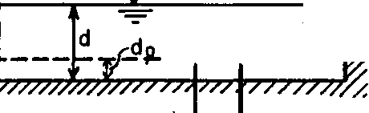

**spatially "lumped"** .**configuration and really assumes no special shape. How­ever, if the subcatchment width, W, is assumed to represent a true prototype width of overland flow, then the reservoir will behave as a rectangular catchment, as sketched in Figure V-4. Otherwise, the width (and the slope and roughness) may be considered calibration parameters and used to adjust predicted to measured hydrographs.**

**The non-linear reservoir is established by coupling the continuity equation with Manning's equation. Continuity may be written for a subarea as**

**A • i\* - Q (V-33)**

**where V = A • d = volume of water on the subarea, ft3,**

> **d = water depth, ft,**
>
> **t = time, sec,**
>
> **A = surface area of subarea, ft-2,**
>
> **i\* = rainfall excess = rainfall/snowmelt intensity minus evaporation/ infiltration rate, ft/sec, and**
>
> **Q = outflow rate, cfs.**

<table>
<colgroup>
<col style="width: 78%" />
<col style="width: 21%" />
</colgroup>
<tbody>
<tr class="odd">
<td>
<strong>The outflow is generated using Manning's equation</strong>

<strong>w • 1.49 (d _ d 15/3 s1/2</strong>

n <strong>Pj</strong>

<strong>where W = subcatchment width, ft.</strong>

<blockquote>

<strong>n = Manning's roughness coefficient,</strong>

</blockquote>

<strong>d = depth of depression storage, ft, and</strong>

<blockquote>

<strong>S = subcatchment slope, ft/ft.</strong>

</blockquote></td>
<td><ol start="34" type="1">
<li></li>
</ol></td>
</tr>
</tbody>
</table>

**Equations V-33 and V-34 may be combined into one non-linear differential equation that may *be* solved for one unknown, the depth, d. This produces the non-linear reservoir equation,**

> **dt**
>
> **\_ <u>1.49 • W</u>**
>
> **i\* n (d - d )5/3 S1/2**

0.  

> **dt A •**
>
> **= i\* + WCON • (d - d )5/3**
>
> **<u>149 • W •</u> S1/2 **

**where WCON = <u>. A</u> n (V-36)**

- 

**Note the grouping of width, slope and roughness into only one parameter.**

> **455 V-16**

**Equation V-35 is solved at each time step by means of a simple finite difference scheme. For this purpose, the net inflow and outflow on the right hand side (RHS) of the equation must be averages over the time step. The rainfall excess, i\*, is given in the program as a time step average. The average outflow is approximated by computing it using the average between the old and new depths. That is, letting subscripts 1 and 2 denote the beginning and the end of a time step, respectively, equation V-35 is approximated by**

<table>
<colgroup>
<col style="width: 83%" />
<col style="width: 16%" />
</colgroup>
<tbody>
<tr class="odd">
<td><blockquote>

<strong>d - d 5/3 2At <u>1</u> = i* + WCON • Ed1 + .2-(d2 - d1) - dp]</strong>

</blockquote>

<em>where</em> <strong>At = time step, sec.</strong>
</td>
<td><strong>(V-37)</strong></td>
</tr>
</tbody>
</table>

**Equation V-37 is then solved for d2 using a Newton-Raphson iteration; the Fortran coding is located near the end of subroutine WSHED.**

**Given d2, the instantaneous outflow at the end of a time step, WFLOW, is computed using equation V-34. Parameter WFLOW is used in runoff quality calculations and is the flow value that is input to inlets and gutter/pipes. The instantaneous outflow at a given time is also the flow value transfered to subsequent SWMM blocks.**

**Although the solution of equation V-37 is straightforward and simple (and in fact may be performed on programmable hand calculators), some pecu­liarities exist'in the way the parameters for individual subareas (Al, A2, A3 in Figure V-4) are specified. In particular, only two values of WCON are computed (equation V-36), one for the pervious and one for the total imper­vious subareas. Thus, WCON is the same for calculating depths on subareas Al and A3 and is computed from equation V-36 using the total impervious area, Al plus A3, in the denominator. However, the instantaneous flow is computed using the individual area of each subarea (e.g., Al or A3). The net effect for subareas Al and A3 is approximately to reduce the subcatchment width by the ratio Al/(Al + A3) or A3/(Al + A3) as implied in Figure V-4. Numerical tests of this scheme versus one that uses the individual areas (and propor­tional widths) in parameter WCON indicate only about a half percent differ­ence between the two methods. Hence, it should be satisfactory.**

**Prior to performing these calculations, a check is made to see if losses are greater than the rainfall depth plus ponded water. If so, the losses (evaporation plus infiltration) absorb all water and outflow is zero. Similarly, if losses alone would be sufficient to lower the depth below the depression storage, the new depth is computed on this basis only and the outflow is zero.**

**The computational scheme (equations V-37 and V-38) has proven quite stable. The only instance for which non-convergence problems arise (or an attempt to compute a negative depth) is when the subarea values are very small (e.g., a few square feet) coupled with a large time step (e.g., ten minutes). Should a non-convergence message be printed, the problem may usually be cured by increasing the appropriate area or decreasing the time step.**

> **456 V-17**
>
> **<u>Gutter/Pipes</u>**
>
> **Flow routing in gutter/pipes is also performed by coupling the continu­ity equation with Manning's equation to produce a non-linear reservoir. The solution techniiue is performed in subroutine GUTTER and is entirely analo­gous to that just described for overland flow; no details will be given here. However, a few comments are in order. Two cross sectional shapes are avail­able for gutter/pipes: circular and trapezoidal, as shown in Figure V-6. Parameters representing depth (e.g., GDEPTH, Dl, DO) are actual depths, in feet, for trapezoidal gutters but not for circular pipes. Rather, for pipes the "depth" parameters are half of the angle subtended by the wetted peri­meter, in radians, as shown in Figure V-6. Knowledge of this fact aids in understanding the Fortran coding in subroutine GUTTER.**
>
> **Since a gutter/pipe acts as a reservoir with a water surface parallel to the invert, inflows are automatically "distributed" along its length. Hence, concentration of subcatchment inflows only at the upstream end of a gutter/pipe may be reasonable. On the other hand, this leads to consider­able dispersion or flattening of a hydrograph peak when it is routed through a cascade of gutter/pipes. Of course, for this flow routing scheme, down­stream changes are not "felt" upstream, and no backwater effects can be simulated.**
>
> **Non-convergence messages are encountered more frequently during gutter/ pipe routing than for subcatchment flow routing, due to the tendency to in­clude short gutter/pipes of small dimensions in the simulation. Again, this can usually be cured by increasing the dimensions (e.g., length and width/ diameter) or decreasing the time step.**
>
> 457 V-18

**TRAPEZOIDAL  
GUTTER**

> **CIRCULAR  
> PIPE**

**Figure V-6. Depth Parameters for Trapezoidal Gutter and Circular Pipe.**

> **458 V-19**

APPENDIX VI

TRANSPORT BLOCK SCOUR AND DEPOSITION

INTRODUCTION

Deposition of solid material during dry-weather flow (DWF) in combined sewers and subsequent scour during wet-weather flow has long been assumed to form a significant contribution of solids to combined sewer overflows. The deposition-scour phenomenon is also evident in the "first flush" -- high solids concentrations at the beginning of a storm event -- found in many sewer systems. Even storm sewer systems may show a first flush if there is a base flow due to infiltration or illegal connections.

Deposition and scour processes were included in the original SWMM Transport Block as described in the documentation (Metcalf and Eddy et al., 1971a). It simulated solids buildup during DWDAYS dry days prior to the storm and scour during the storm, as velocities increased. A constant horizontal approximation to the dimensionless shear stress on Shields' curve (described subsequently) was used to determine incipient motion, and one fixed particle size distribution (for suspended solids only) and specific gravity of 2.7 were used to characterize the solids.

Several problems existed in the routine, perhaps unknown to most SWMM users. The deposition-scour was dependent on the time step.

Buildup of solids would occur using a 1-hr time step for the dry days prior to simulation, but scour would occur using, say, a 10-min simu­lation time step with the same flow conditions. The particle size distribution was unaffected by the amount scoured from the bottom or deposited from the flow. Thus, there was no simulation of large particles being deposited in upstream conduits (and thereby unavailable for deposi­tion further downstream). It was not possible to calibrate the routine or even "turn it off" since all constants were incorporated into the program and were not input parameters. Finally, there were situations in which conservation of solids mass was violated. Although the revised routine still represents a gross approximation to the real sediment transport processes at work in sewer systems, it is at least consistent within itself, it conserves mass, and is both calibratable and avoidable.

There have been other recent investigations of solids deposition in sewers, most notably the work of Sonnen (1977) and Pisano et al. (1979). Sonnen's work is highly relevant to the modeling aspect since he developed

> 459 VI-1

a deposition-scour routine to accompany the Extran Block of SWMM. This model simulated both bed load and suspended load sediment transport and characterized the sediment by up to ten particle size-specific gravity ranges. Although his routines worked satisfactorily, they are not compatible with the "old" Transport Block, and the "new" Extran Block no longer routes quality parameters. In addition, they are perhaps overly sophisticated for the present needs. Thus, the current programming utilizes an approximate method that is not as sound as Sonnen's but does have the attributes described earlier.

The best characterization of solids in real sewer systems is given by Pisano et al. (1979) in their description of extensive field and analytical work done in the Boston area. The many problems inherent in dealing with real systems are amply demonstrated.

METHODOLOGY AND ASSUMPTIONS  
<u>Overview</u>

> Since the criterion for deposition and scour depends upon the sediment

characteristics (notably size and specific gravity), one option for

simulation of the range of characteristics found in real sewer sediment

is to carry along a group of different sizes and specific gravities and

route each range individually. This is done in the Storage/Treatment

Block of SWMM and was done by Sonnen (1977). This has the disadvantage

of requiring large array sizes since each range must be simulated for

each conduit and preferably for each pollutant.

As an alternative, the present methodology utilizes a fixed particle size distribution and specific gravity (input by the user) for each desired pollutant and maintains a time history for each conduit of the <u>maximum</u> particle diameter (DS) in <u>suspension</u> (really, in <u>motion</u> -- via bed or suspended load) and the <u>minimum</u> particle diameter (DB) in the bed. Thus, the particle size distribution of particles in motion is the input distribution truncated on the right at DS, and the particle size distribution of deposited solids is the input distribution truncated on the left at DB. Mass-weighted values of DS are routed downstream for entry to subsequent conduits.

<u>Assumptions</u>

Several assumptions are inherent in the following development, including the following:

1\. Solids in sewer systems are.assumed to behave like ideal non-cohesive sediment described in various texts (e.g., Graf, 1971, Vanoni, 1975). Unfortunately, the work of Pisano et al. (1979) shows little evidence of this, and in fact, it may be an impossible task to provide an accurate theoretical description of transport of the highly hetero­geneous material constituting "solids" in real sewer systems. The only hope is that the theory will appear to behave in a "reasonable" manner.

> 460 VI-2

2.  No distinction is made between particle size distributions resulting from different pollutant sources, e.g., dry-weather flow and storms water. Only one distribution (and one average specific gravity) is used for each pollutant.

3.  Shields' criterion is used to determine the dividing particle size between motion and no motion.

4.  Once in motion, no distinction is made between bed and suspended load. Particles in motion ("suspension") are routed downstream in each conduit by complete mixing, the same as other quality parameters.

5.  When a critical diameter (CRITD) is determined for scour, all particles with diameter less than or equal to CRITD are eroded. There is no effect simulated of armoring or of erosion of layers of the bed.

6.  Scour-deposition is considered <u>only</u> in conduits. It is not simulated in non-conduits, including storage elements.

7.  The effect of deposited sediment on the bed geometry is not considered. When the hydraulic radius (an important parameter) is calculated to determine the critical diameter for motion, the bed is assumed to have the geometry of the conduit. This leads to some under­estimation of deposited material, mainly at low flows.

> SHIELDS' CRITERION
>
> Shields' diagram for the definition of incipient motion is shown in Figure VI-1. It is widely accepted as a good definition of the beginning of particle motion and describes the balance between the hydrodynamic forces of drag and lift on a particle (tending to induce motion) and the submerged weight of a particle (tending to resist motion). When hydro­dynamic forces acting on a sediment particle reach a value such that if increased even slightly will put the particle into motion, critical or threshold conditions are said to have been reached. Dimensional analysis of this condition leads to

<table>
<colgroup>
<col style="width: 65%" />
<col style="width: 34%" />
</colgroup>
<tbody>
<tr class="odd">
<td><u>Tc </u>u21 d 
(Ys-Y)d = f ( __)</td>
<td>(VI-1)</td>
</tr>
</tbody>
</table>

<table>
<colgroup>
<col style="width: 91%" />
<col style="width: 8%" />
</colgroup>
<tbody>
<tr class="odd">
<td><blockquote>

where Tc = critical shear stress required to induce particle motion, lb/ft ,

ys = specific weight of the sediment, lb/f t3,

y = specific weight of water = 62.4 lb/ft3,

d'= sediment diameter, ft (a conversion is made from mm),

u* = shear or friction velocity, ft/sec, and

v = kinematic viscosity of water, ft2/sec.

</blockquote>

461
</td>
<td>VI-3</td>
</tr>
</tbody>
</table>

> The equation may be stated in words that the dimensionless critical shear stress is a function of the shear Reynolds number. The critical shear stress and shear velocity are related to each other and to flow properties by
>
> u\* = T;TT (VI-2)
>
> where p = water density = 1.98 slug/f t3,  
> g = gravity = 32.2 ft/sec2,
>
> R = hydraulic radius, ft, and
>
> S = slope of energy grade line (assumed equal to invert slope).
>
> In addition, the specific weight difference may be related to the specific gravity difference between sediment and water,
>
> Ys - y = y(SPG - 1) (VI-3)
>
> where SPG = specific gravity of the sediment,  
> and the specific gravity of water is taken as 1.0.
>
> Experiments on critical shear stress (e.g., see Graf, 1971 and Vanoni, 1975) reveal the motion of sediment grains to be highly unsteady and non-uniformly distributed. Near critical conditions, observations of a large area of the sediment bed will show that the incidence of sediment motion occurs as gusts and is random in both time and space. Shields and others observed the process of initiation of motion to be stochastic in nature, so that there *is* no true "critical condition" at which motion suddenly begins. In fact, data on critical shear stress are based upon arbitrary definitions of critical conditions by several investigators. Shields himself determined Tc as the value for zero sediment discharge obtained by extrapolation on a graph of observed sediment discharge versus shear stress.
>
> Although experiments have been performed incorporating various -­materials, (e.g., sand, glass beads, steel shot, minerals), size ranges and specific gravities, the Shields criterion is generally not used fdt cohesive sediment that may be more characteristic of sewer systems. -­Nonetheless, it appears to be the only well documented criterion for initiation of motion and is utilized in spite of its limitations.
>
> In SWMM, the Shields diagram is used to determine the dividing sediment diameter between motion and no motion. Thus, it is necessary to solve the functional relationship for the critical diameter, d = CRITD. For programming purposes, the diagram is approximated as shown in Figure VI-2, where two straight line segments bound a central polyno­mial approximation, all on a log-log plot. Letting the dimensionless shear stress E Y, and the shear Reynolds number E R\*, then the functional forms and their best-fit parameters are as follows:
>
> 463 VI-5
>
> **O.1 1.O 1.47 1O 1OO 4OO 1OOO**
>
> **Lied**

Figure VI-2. Linear and Parabolic Approximation of Shields' Diagram

<table>
<colgroup>
<col style="width: 16%" />
<col style="width: 0%" />
<col style="width: 11%" />
<col style="width: 1%" />
<col style="width: 5%" />
<col style="width: 1%" />
<col style="width: 41%" />
<col style="width: 20%" />
</colgroup>
<tbody>
<tr class="odd">
<td></td>
<td></td>
<td colspan="2"><blockquote>

R* • &lt; 1 47

</blockquote></td>
<td></td>
<td></td>
<td></td>
<td></td>
</tr>
<tr class="even">
<td><blockquote>

with

</blockquote></td>
<td></td>
<td colspan="5"><blockquote>

Y = a • R*b

a = 0.1166, and

</blockquote>

b = -0.977842 = -1 
1.47 &lt; R* &lt; 10
</td>
<td>(VI-4)</td>
</tr>
<tr class="odd">
<td></td>
<td></td>
<td colspan="5"><blockquote>

y = a0 + a1.x + a2.x2 + a3.x3 r

</blockquote></td>
<td>(VI-5)</td>
</tr>
<tr class="even">
<td><blockquote>

where

and with

</blockquote></td>
<td></td>
<td colspan="5">
<u>C</u>

<blockquote>

y = log10 (y -y)d

x = log10 R*

a0 = -0.9078950

a1 = -1.2326090

a2 = 0.7298640

</blockquote>

a3 = -0.0772426 
10 &lt; R* &lt; 400
</td>
<td></td>
</tr>
<tr class="odd">
<td><blockquote>

with

</blockquote></td>
<td></td>
<td colspan="5"><blockquote>

Y = a•R*b

a = 0.0227, and

</blockquote>

b = 0.1568 
R* &gt; 400
</td>
<td>(VI-6)</td>
</tr>
<tr class="even">
<td></td>
<td></td>
<td colspan="5"><blockquote>

Y = 0.06 or

</blockquote></td>
<td></td>
</tr>
</tbody>
</table>

> <u>R•S</u>
>
> d - (VI-7)
>
> (SPG-1) • 0.06
>
> and using the relationships of equations VI-2 and VI-3, resulting in
>
> 1
>
> CRITD - \[(11.S)1-b/2

<u>vb</u> 1+b

> (VI-9)
>
> (SPG-1) .a.gb/2
>
> 465 VI-7

Equation VI-9 works well for the coefficients a and b of equation VI-6. But for equation VI-4, b = -1 and the exponent approaches infinity. For the region R\* \< 1.47, all sediment particles are within the laminar sublayer of the flow, and motion is independent of the diameter (Graf, 1971). For practical purposes, there is no apparent motion, and the critical diameter is assumed to be the value at R\* = 1.47 in the model,

that is d <u>1.47-</u>

> The polynomial for the transition region, 1.47 \< R\* \< 10, is

rapidly solved using a Newton-Raphson iteration. In the program, equation VI-9 is first solved using the a and b values for equation VI-6 (10 \< R\* \< 400). If the resulting value of R\* is greater than 400, the critical diameter is evaluated from equation VI-7. If R\* is less 10, the polynomial approximation is then solved. If the resulting value of R\* from polyno­mial is greater than 10, the critical diameter is assumed to be the value at R\* = 10, and if R\* is less than 1.47, the value at R\*= 1.47 is used as a default.

Regarding the parameters of equation VI-9, the slope, S is taken as the invert slope (SLOPE) for each conduit, used by the Transport Block. The hydraulic radius is calculated at each time step, and the kinematic viscosity, v, (GNU) is input for each run. (It incorporates any tempera­ture effects.), The specific gravity (SPG) of sewer particles ranges from 1.1 for organic material to 2.7 for sand and grit. An average value, based upon the rough composition of the sediment, must be used. When quality parameters are input in card group Fl of the Transport Block, if SPG \< 1.0, the deposition-scour routine will not be used. It may be seen that if SPG is greater than 1.0 but very close to it, the value of CRITD in equation VI-9 becomes highly sensitive to it.

PARTICLE SIZE DISTRIBUTION

The particle size distribution for each pollutant for which it is desired to simulate deposition and scour is input by up to four straight line segments, as shown in Figure VI-3 (see also Figure 6-6). The distribution may be based upon characteristics of surface sediment for simulation of storm sewers, but should utilize sewer conduit samples for combined sewers.

An example will best illustrate the use of the particle size distri­bution. Consider first an example of scour. The distribution of Figure VI-3 is sketched again in Figure VI-4a. At the beginning of the time step, all particles in the bed are assumed to have diameters \> DB = 0.6 mm in the example. If a new critical diameter, CRITD, is calculated that is greater than DB, (CRITD = 1.5 mm in the example), the new bed distribution will become as shown in Figure VI-4b. The percent of the bed mass that is scoured is

> 72-35
>
> x 100 = 51%
>
> 72
>
> 466 VI-8

INFLOWS AND JUNCTIONS

To allow some difference between surface inflows to the sewer system and dry-weather flow inflows (e.g., domestic sewage) a maximum particle size, PSDWF, may be specified (in card group Fl) for the pollutant found in DWF. This also applies to pollutants entering as a base flow in manholes. Pollutants entering via infiltration are assumed to be completely dissolved and have "zero particle sizes."

At junctions (manholes or other non-conduits), a new value of DS

is computed by mass weighting the merging values. For instance,

> 3
>
> .Z DSu .0u .Cu + PSDWF.QDwp.CD147 1=1
>
> DSm = 3 (VI-12)

1=1 u. u. QDWF.CDWF Qinf

where DSm = value of DS of mixture, mm,

> DSu. = DS value in upstream conduit i, mm, 1
>
> = outflow from upstream conduit i, cfs, Qui
>
> C = concentration in upstream conduit i, mg/1, and
>
> . u.
>
> 1

subscripts DWF and inf refer to dry-weather flow and infiltration respectively.

470 VI-12

APPENDIX VII

EXAMPLE ANALYSIS OF URBAN RUNOFF  
QUALITY DATA FOR MODELING APPLICATIONS

Options for simulation of surface runoff quality in SWMM have been described in Section 4 of this report. They are basically two: use of a buildup-washoff equation or use of a rating curve. The former (equation 4-35) results in a characteristic loop effect when intra-storm loads are plotted versus runoff rate (Figure 4-36) while the latter must result in a single valued function. In this appendix, data from three separate sewered catchments in Seattle and one combined sewered catchment in Lancaster, PA are examined in order to see if SWMM has the ability to mimic their load and concentration versus flow characteristics. The data were taken from the EPA Urban Rainfall-Runoff-Quality Data Base (Huber et al., 1979) and analyzed using library statistical packages.

> Three parameters were chosen for analysis:

1)  Five day biochemical oxygen demand, BOD5,

2)  Total suspended solids, TSS, and

3)  N02+N03-N for Seattle and N03-N for Lancaster.

The first parameter, BOD, is likely to be associated with solids, the second parameter is a solid, and the nitrogen parameters are likely to be dissolved. Hence, they may exhibit different characteristic relation­ships.

Results are presented in the following figures. (See also Figure 4-37.) Loops are evident in the Lancaster data (Figures VII-17 to VII-19) although eratic, since the runoff hydrographs are eratic. Loops are also present for the Seattle data although harder to detect since suces-sive points are not connected (Figures VII-4 to VII-6). As expected, nitrate concentrations decrease with increasing flow rate (Figures VII-16 and VII-20). Log-log plots tend to reduce the magnitude of the loops and could form the basis of a rating curve approximation. When loads for the three Seattle catchments are normalized by dividing by their respective catchment areas the data are grouped with less scatter (Figure VII-12) than when not normalized (Figure VII-11). The runoff rate in inches/hr is already a normalized flow rate for these catchments.

> 471 VII -1

<table>
<colgroup>
<col style="width: 25%" />
<col style="width: 10%" />
<col style="width: 4%" />
<col style="width: 7%" />
<col style="width: 3%" />
<col style="width: 48%" />
</colgroup>
<tbody>
<tr class="odd">
<td colspan="5">Figure VII-4. BOD Load vs. Flow. Top:</td>
<td><blockquote>

View Ridge 1 catchment - (*) Event 1,

</blockquote></td>
</tr>
<tr class="even">
<td>(0)</td>
<td>Event 6,</td>
<td>(X)</td>
<td>Event</td>
<td>7.</td>
<td>Middle: South Seattle catchment -</td>
</tr>
<tr class="odd">
<td>(*)</td>
<td>Event 3,</td>
<td>(0)</td>
<td>Event</td>
<td>4,</td>
<td><blockquote>

(X) Event 5. Bottom: Southcenter

</blockquote></td>
</tr>
<tr class="even">
<td colspan="3">catchment - (*)</td>
<td>Event</td>
<td>2,</td>
<td>(0) Event 3, (X) Event 7.</td>
</tr>
</tbody>
</table>

> Figure VII-7. Log10 BOD Load Vs. Logic, Flow. Same symbols as Figure VII-4.

Figure VII-8. Logic, TSS Load Vs. Logi° Flow. Same symbols as Figure

Figure VII-9. Log10 NO2-N + NO3-N Load Vs. Log10 Flow. Same symbols as Figure VII-4.

Figure VII-10. Log10 Load Vs. Log7n Flow for all Events. (1) View Ridge 1 ­Event 1, (2) View Edge 1 - Event 6, (3) View.Ridge - Event 7, (4) South Seattle - Event 3, (5) South Seattle - Event 4, (6) South Seattle - Event 5, (7) Southcenter - Event 2, (8) South-center - Event 3, (9) Southcenter — Event 7.

<table>
<colgroup>
<col style="width: 29%" />
<col style="width: 70%" />
</colgroup>
<tbody>
<tr class="odd">
<td>
<strong>o.or • oor</strong>

<strong>a</strong>
</td>
<td><strong>osor oo. oor 0•Or 000 00r</strong></td>
</tr>
</tbody>
</table>

Figure VII-11. Login Load Vs. Log1O Runoff for All Events BOD, TSS and N02-N + N03-N. Same notation as Figure VII-1O.

<table>
<colgroup>
<col style="width: 25%" />
<col style="width: 10%" />
<col style="width: 9%" />
<col style="width: 12%" />
<col style="width: 6%" />
<col style="width: 10%" />
<col style="width: 12%" />
<col style="width: 12%" />
</colgroup>
<tbody>
<tr class="odd">
<td></td>
<td></td>
<td></td>
<td><strong>LANCASTER.</strong></td>
<td><strong>PA.</strong></td>
<td><strong>EVINT83</strong></td>
<td><strong>11/24/73</strong></td>
<td></td>
</tr>
<tr class="even">
<td><strong>081</strong></td>
<td><strong>11842</strong></td>
<td><strong>PL0443</strong></td>
<td><strong>0002</strong></td>
<td><strong>TIM</strong></td>
<td><strong>m033</strong></td>
<td><strong>LOA08003</strong></td>
<td><strong>LOAOT883</strong></td>
</tr>
<tr class="odd">
<td>
<strong>i</strong>

<strong>4</strong>
</td>
<td>
<strong>1320</strong>

<strong>t3:8</strong>

<strong>1350</strong>
</td>
<td>
<strong>1: tl</strong>

<strong>6. 38</strong>

<strong>6.31</strong>
</td>
<td>
<strong>eo</strong>

<strong>52</strong>

<strong>112</strong>

<strong>lb/</strong>
</td>
<td>
<strong>21rd</strong>

<strong>210</strong>
</td>
<td>
IS

ig
</td>
<td>
h4t;

B9t,
</td>
<td>
<strong>114008</strong>

<strong>80346</strong>

<strong>344,8</strong>

<strong>37927</strong>
</td>
</tr>
<tr class="even">
<td><strong>5</strong></td>
<td><strong>1400</strong></td>
<td><strong>2.42</strong></td>
<td><strong>151</strong></td>
<td><strong>156</strong></td>
<td><strong>14</strong></td>
<td>10811</td>
<td><strong>11375</strong></td>
</tr>
<tr class="odd">
<td></td>
<td><strong>1410</strong></td>
<td><strong>3.94</strong></td>
<td><strong>137</strong></td>
<td><strong>100</strong></td>
<td><strong>13</strong></td>
<td></td>
<td><strong>tatas</strong></td>
</tr>
<tr class="even">
<td><strong>1</strong></td>
<td>
<strong>1420</strong>

<strong>1430</strong>
</td>
<td>
<strong>292</strong>

<strong>2.53</strong>
</td>
<td>
<strong>146</strong>

<strong>155</strong>
</td>
<td><strong>13</strong></td>
<td><strong>14</strong></td>
<td>
<strong>12073.4</strong>

<strong>111087</strong>
</td>
<td>
<strong>4796</strong>

<strong>3947</strong>
</td>
</tr>
<tr class="odd">
<td></td>
<td><strong>1440</strong></td>
<td><strong>3. 76</strong></td>
<td><strong>142</strong></td>
<td><strong>1</strong></td>
<td></td>
<td><strong>15120.6</strong></td>
<td><strong>106</strong></td>
</tr>
<tr class="even">
<td><strong>10</strong></td>
<td>1450</td>
<td><strong>2.18</strong></td>
<td><strong>151</strong></td>
<td><strong>60</strong></td>
<td><strong>/I</strong></td>
<td>9322.4</td>
<td><strong>3704</strong></td>
</tr>
</tbody>
</table>

<table>
<colgroup>
<col style="width: 24%" />
<col style="width: 10%" />
<col style="width: 9%" />
<col style="width: 12%" />
<col style="width: 7%" />
<col style="width: 10%" />
<col style="width: 12%" />
<col style="width: 13%" />
</colgroup>
<tbody>
<tr class="odd">
<td></td>
<td></td>
<td></td>
<td><strong>LANCASTER.</strong></td>
<td><strong>PA.</strong></td>
<td><strong>IO/434744</strong></td>
<td><strong>11/20/71</strong></td>
<td></td>
</tr>
<tr class="even">
<td><strong>088</strong></td>
<td><strong>/1044</strong></td>
<td><strong>r.l.2•46</strong></td>
<td><strong>8004</strong></td>
<td><em><strong>T934</strong></em></td>
<td><em><strong>4034</strong></em></td>
<td><em><strong>Loamy.</strong></em></td>
<td><em><strong>1.0407384</strong></em></td>
</tr>
<tr class="odd">
<td>
<strong>1</strong>

<strong>2</strong>

<strong>3</strong>

<strong>•</strong>
</td>
<td>
<strong>1528</strong>

<strong>1534</strong>

<strong>1348</strong>

<strong>1558</strong>
</td>
<td>
<strong>27.360</strong>

<strong>14-1</strong>

<strong>10.738</strong>
</td>
<td>
<strong>:417</strong>

<strong>?II</strong>

*4/
</td>
<td>
<strong>1172</strong>

<strong>798</strong>

<strong>438</strong>
</td>
<td>
<strong>7.2</strong>

<strong>6.0</strong>

<strong>/..0</strong>
</td>
<td>
<strong>454820</strong>

<strong>*46446</strong>

<strong>199703</strong>
</td>
<td>
<strong>908107</strong>

<strong>376900</strong>

<strong>395443</strong>
</td>
</tr>
<tr class="even">
<td colspan="2"><strong>S</strong> *100</td>
<td><strong>1.322</strong></td>
<td><strong>120</strong></td>
<td><strong>792</strong></td>
<td><strong>0.4</strong></td>
<td><strong>18086</strong></td>
<td>
<strong>138670</strong>

<strong>119369</strong>
</td>
</tr>
<tr class="odd">
<td><strong>6</strong></td>
<td><strong>1618</strong></td>
<td><strong>9 194</strong></td>
<td><strong>.110</strong></td>
<td><strong>298</strong></td>
<td><strong>13.3</strong></td>
<td><strong>28634</strong></td>
<td><strong>77623</strong></td>
</tr>
<tr class="even">
<td>
<strong>7</strong>

<strong>8</strong>
</td>
<td>
<strong>1620</strong>

<strong>1638</strong>
</td>
<td>
<strong>9 022</strong>

<strong>3 633</strong>
</td>
<td>
<strong>W</strong>

<strong>97</strong>
</td>
<td>
<strong>212</strong>

<strong>118</strong>
</td>
<td>
<strong>It.7</strong>

<strong>13.4</strong>
</td>
<td>
<strong>11005</strong>

<strong>13480</strong>
</td>
<td>
<strong>35840</strong>

<strong>18431</strong>
</td>
</tr>
<tr class="odd">
<td><strong>•</strong></td>
<td><strong>1648</strong></td>
<td><ul>
<li>
<strong>535</strong>
</li>
</ul></td>
<td><strong>43</strong></td>
<td><strong>114</strong></td>
<td><strong>15.0</strong></td>
<td><strong>10660</strong></td>
<td><strong>14641</strong></td>
</tr>
</tbody>
</table>

<table>
<colgroup>
<col style="width: 23%" />
<col style="width: 10%" />
<col style="width: 10%" />
<col style="width: 12%" />
<col style="width: 7%" />
<col style="width: 10%" />
<col style="width: 12%" />
<col style="width: 12%" />
</colgroup>
<tbody>
<tr class="odd">
<td></td>
<td></td>
<td></td>
<td><strong>LANCASTER.</strong></td>
<td><strong>PA.</strong></td>
<td><strong>0101106</strong></td>
<td><strong>12/11/74</strong></td>
<td></td>
</tr>
<tr class="even">
<td><strong>COI</strong></td>
<td><strong>TIME3</strong></td>
<td><strong>PLOW</strong></td>
<td><blockquote>

<strong>111305</strong>

</blockquote></td>
<td><strong>1113</strong></td>
<td><strong>WU</strong></td>
<td><strong>1.0601009</strong></td>
<td><strong>L04011253</strong></td>
</tr>
<tr class="odd">
<td><strong>3</strong></td>
<td>
<strong>2a</strong>

<strong>26</strong>
</td>
<td>
<strong><em>6</em>g 1•</strong>

<strong>E</strong>

<strong>10.016</strong>
</td>
<td><blockquote>

<strong>170</strong>

<strong>45</strong>

</blockquote></td>
<td>
<strong>o</strong>

<strong>216</strong>
</td>
<td>
<strong>V</strong>

<strong>1?</strong>
</td>
<td><strong>12764</strong></td>
<td>
<strong>644634</strong>

176161!
</td>
</tr>
<tr class="even">
<td>
<strong>4</strong>

<strong>5</strong>
</td>
<td>
<strong>36</strong>

<strong>46</strong>
</td>
<td>
<strong>13. 644</strong>

<strong>72. 134</strong>
</td>
<td><blockquote>

<strong>53</strong>

<strong>35</strong>

</blockquote></td>
<td>
<strong>106</strong>

<strong>230</strong>
</td>
<td><strong>13</strong></td>
<td><strong>20479</strong></td>
<td>
71270

<strong>162373</strong>
</td>
</tr>
<tr class="odd">
<td></td>
<td>
<strong>,56</strong>

<strong>*06</strong>
</td>
<td>
<strong>66.</strong>

<strong>33.7</strong>
</td>
<td><blockquote>

<strong>107</strong>

</blockquote></td>
<td>
<strong>878</strong>

<strong>OW</strong>
</td>
<td></td>
<td>
2<strong>02081</strong>

<strong>101371</strong>
</td>
<td><strong>16581 94</strong></td>
</tr>
<tr class="even">
<td>
•

<strong>•</strong>
</td>
<td><strong>16</strong></td>
<td>
<strong>12636</strong>

<strong>127.3</strong>
</td>
<td><blockquote>

*00

<strong>4</strong>

</blockquote></td>
<td>
<strong>370</strong>

408
</td>
<td><strong>•</strong></td>
<td>
<strong>47113</strong>

<strong>130124</strong>
</td>
<td>
<strong>LITNI</strong>

<strong>1763904</strong>
</td>
</tr>
<tr class="odd">
<td>
<strong>10</strong>

<strong>11</strong>
</td>
<td>
<strong>136</strong>

<strong>146</strong>

<strong>158</strong>
</td>
<td><strong>Ala</strong></td>
<td><blockquote>

<strong>35</strong>

<strong>14</strong>

<strong>I.5</strong>

</blockquote></td>
<td>
<strong>534</strong>

<strong>1.I8</strong>
</td>
<td>
<strong>•</strong>

<strong>•</strong>
</td>
<td><strong>14776</strong></td>
<td>1910097</td>
</tr>
<tr class="even">
<td><blockquote>

<strong>13 i4</strong>

</blockquote>

<strong>1$</strong>

<strong>it</strong>
</td>
<td><blockquote>

<strong>206 216 <em>244</em> 306</strong>

</blockquote>

<strong>346</strong>
</td>
<td>
km

<strong>a/a</strong>

<strong>11. 160</strong>
</td>
<td><blockquote>

R.

<strong>30</strong>

<strong>60</strong>

</blockquote></td>
<td>
<strong>IN.</strong>

<strong>?!</strong>

<strong>78</strong>
</td>
<td>
<strong>4</strong>

<strong>4</strong>

<ul>
<li>
10
</li>
</ul></td>
<td>
<strong>1854</strong>

<em><strong>960</strong></em>

<strong>38977284,</strong>

<strong>1</strong>
</td>
<td>
<strong>17771II</strong>

<em><strong>192424</strong></em>

164417

14670
</td>
</tr>
</tbody>
</table>

**Figure VII-13. Flow and Quality Data for Stevens Avenue**

> **Catchment (Single and Multi-Family Residential, Combined Sewers), Lancaster, Pennsylvania. Parameters are: Flow (cfs); BOD, TSS, NO3-N concentration (mg/1); BOD, TSS and NO3-N loads (mg/sec).**
>
> **484 VII -14**

Figure VII-14. BOD Concentration Vs. Flow, Event 1, Event 2, Event 6. Sequence of letters follows time history.

> **Figure VII-15. TSS Concentration Vs. Flow, Event 1, Event 2, Event 6. Sequence of letters follows time history.**

Figure VII-16. NO3-N Concentration Vs. Flow, Event 1, Event 2, Event 6. Sequence of letters follows time history.

|      |     |     |
|------|-----|-----|
| .. . | IP  |     |
|      |     |     |

APPENDIX VIII

MISCELLANEOUS TRANSPORT BLOCK TABLES

The following tables provide guidelines for input into the infil­tration (subroutine INFIL) and dry-weather flow (subroutine FILTH)

routines of the Transport Block. Table gives average degree-days  
(cumulative deviation below 65°F, summed for the days of each month) for several U.S. cities. Current values are also tabulated in various summary forms by the National Weather Service.

Tables VIII-2 and VIII-3 provide guidelines for relative water use by various commercial establishments and industries. These may be entered as process flows in card groups P1 and Ql, for instance.

493 VIII -1

> Table VIII-l. Average Monthly Degree-days for Cities in the United States (Base 65F).

<table>
<colgroup>
<col style="width: 7%" />
<col style="width: 20%" />
<col style="width: 9%" />
<col style="width: 5%" />
<col style="width: 5%" />
<col style="width: 4%" />
<col style="width: 5%" />
<col style="width: 5%" />
<col style="width: 5%" />
<col style="width: 5%" />
<col style="width: 5%" />
<col style="width: 5%" />
<col style="width: 5%" />
<col style="width: 5%" />
</colgroup>
<tbody>
<tr class="odd">
<td><strong>State</strong></td>
<td><strong>Station</strong></td>
<td><strong>July</strong></td>
<td colspan="2"><strong>Aug Sept</strong></td>
<td colspan="3"><strong>Oct Nov Dec</strong></td>
<td><strong>Jan</strong></td>
<td><strong>Feb</strong></td>
<td colspan="3"><strong>Mar April May</strong></td>
<td><strong>June</strong></td>
</tr>
<tr class="even">
<td><strong>Ala.</strong></td>
<td><blockquote>

<strong>Anniston</strong>

</blockquote></td>
<td><strong>0</strong></td>
<td><strong>0</strong></td>
<td><strong>17</strong></td>
<td><strong>118</strong></td>
<td><strong>438</strong></td>
<td><strong>614</strong></td>
<td><strong>614</strong></td>
<td><strong>485</strong></td>
<td><strong>381</strong></td>
<td><strong>128</strong></td>
<td><strong>25</strong></td>
<td>0</td>
</tr>
<tr class="odd">
<td></td>
<td><blockquote>

<strong>Birmingham</strong>

</blockquote></td>
<td><strong>0</strong></td>
<td><strong>0</strong></td>
<td><strong>13</strong></td>
<td><strong>123</strong></td>
<td><strong>396</strong></td>
<td><strong>598</strong></td>
<td><strong>623</strong></td>
<td><strong>491</strong></td>
<td><strong>378</strong></td>
<td><strong>128</strong></td>
<td><strong>30</strong></td>
<td>0</td>
</tr>
<tr class="even">
<td></td>
<td><blockquote>

<strong>Mobile</strong>

</blockquote></td>
<td><strong>0</strong></td>
<td><strong>0</strong></td>
<td><strong>0</strong></td>
<td><strong>23</strong></td>
<td><strong>198</strong></td>
<td><strong>357</strong></td>
<td><strong>412</strong></td>
<td><strong>290</strong></td>
<td><strong>209</strong></td>
<td><strong>40</strong></td>
<td><strong>0</strong></td>
<td>0</td>
</tr>
<tr class="odd">
<td></td>
<td><blockquote>

<strong>Montgomery</strong>

</blockquote></td>
<td><strong>0</strong></td>
<td><strong>0</strong></td>
<td><strong>0</strong></td>
<td><strong>55</strong></td>
<td><strong>267</strong></td>
<td><strong>458</strong></td>
<td><strong>483</strong></td>
<td><strong>360</strong></td>
<td><strong>265</strong></td>
<td><strong>66</strong></td>
<td><strong>0</strong></td>
<td></td>
</tr>
<tr class="even">
<td><strong>Ariz.</strong></td>
<td><blockquote>

<strong>Flagstaff</strong>

</blockquote></td>
<td><strong>49</strong></td>
<td><strong>78</strong></td>
<td><strong>243</strong></td>
<td><strong>586</strong></td>
<td><strong>876</strong></td>
<td><strong>1135</strong></td>
<td><strong>1231</strong></td>
<td><strong>1014</strong></td>
<td><strong>949</strong></td>
<td><strong>687</strong></td>
<td><strong>465</strong></td>
<td><strong>212</strong></td>
</tr>
<tr class="odd">
<td></td>
<td><blockquote>

<strong>Phoenix</strong>

</blockquote></td>
<td><strong>0</strong></td>
<td><strong>0</strong></td>
<td><strong>0</strong></td>
<td><strong>13</strong></td>
<td><strong>182</strong></td>
<td><strong>360</strong></td>
<td><strong>425</strong></td>
<td><strong>275</strong></td>
<td><strong>175</strong></td>
<td><strong>62</strong></td>
<td><strong>0</strong></td>
<td><strong>0</strong></td>
</tr>
<tr class="even">
<td></td>
<td><blockquote>

<strong>Yuma</strong>

</blockquote></td>
<td><strong>0</strong></td>
<td><strong>0</strong></td>
<td><strong>0</strong></td>
<td><strong>0</strong></td>
<td><strong>105</strong></td>
<td><strong>259</strong></td>
<td><strong>318</strong></td>
<td><strong>167</strong></td>
<td><strong>88</strong></td>
<td><strong>14</strong></td>
<td><strong>0</strong></td>
<td><strong>0</strong></td>
</tr>
<tr class="odd">
<td><strong>Ark.</strong></td>
<td><blockquote>

<strong>Bentonville</strong>

</blockquote></td>
<td><strong>1</strong></td>
<td><strong>1</strong></td>
<td><strong>38</strong></td>
<td><strong>216</strong></td>
<td><strong>516</strong></td>
<td><strong>810</strong></td>
<td><strong>879</strong></td>
<td><strong>716</strong></td>
<td><strong>519</strong></td>
<td><strong>247</strong></td>
<td><strong>86</strong></td>
<td><strong>7</strong></td>
</tr>
<tr class="even">
<td></td>
<td><blockquote>

<strong>Fort Smith</strong>

</blockquote></td>
<td><strong>0</strong></td>
<td><strong>0</strong></td>
<td><strong>9</strong></td>
<td><strong>131</strong></td>
<td><strong>435</strong></td>
<td><strong>698</strong></td>
<td><strong>775</strong></td>
<td><strong>571</strong></td>
<td><strong>418</strong></td>
<td><strong>127</strong></td>
<td><strong>24</strong></td>
<td><strong>0</strong></td>
</tr>
<tr class="odd">
<td></td>
<td><blockquote>

<strong>Little Rock</strong>

</blockquote></td>
<td><strong>0</strong></td>
<td><strong>0</strong></td>
<td><strong>10</strong></td>
<td><strong>110</strong></td>
<td><strong>405</strong></td>
<td><strong>654</strong></td>
<td><strong>719</strong></td>
<td><strong>543</strong></td>
<td><strong>401</strong></td>
<td><strong>122</strong></td>
<td><strong>18</strong></td>
<td><strong>0</strong></td>
</tr>
<tr class="even">
<td><strong>Calif.</strong></td>
<td><blockquote>

<strong>Eureka</strong>

</blockquote></td>
<td><strong>267</strong></td>
<td><strong>248</strong></td>
<td><strong>264</strong></td>
<td><strong>335</strong></td>
<td><strong>411</strong></td>
<td><strong>508</strong></td>
<td><strong>552</strong></td>
<td><strong>465</strong></td>
<td><strong>493</strong></td>
<td><strong>432</strong></td>
<td><strong>375</strong></td>
<td><strong>282</strong></td>
</tr>
<tr class="odd">
<td></td>
<td><blockquote>

<strong>Fresno</strong>

</blockquote></td>
<td><strong>0</strong></td>
<td><strong>0</strong></td>
<td><strong>0</strong></td>
<td><strong>86</strong></td>
<td><strong>345</strong></td>
<td><strong>580</strong></td>
<td><strong>629</strong></td>
<td><strong>400</strong></td>
<td><strong>304</strong></td>
<td><strong>145</strong></td>
<td><strong>43</strong></td>
<td><strong>0</strong></td>
</tr>
<tr class="even">
<td></td>
<td><blockquote>

<strong>Independence</strong>

</blockquote></td>
<td><strong>0</strong></td>
<td><strong>0</strong></td>
<td><strong>28</strong></td>
<td><strong>216</strong></td>
<td><strong>512</strong></td>
<td><strong>778</strong></td>
<td><strong>799</strong></td>
<td><strong>619</strong></td>
<td><strong>477</strong></td>
<td><strong>267</strong></td>
<td><strong>120</strong></td>
<td><strong>18</strong></td>
</tr>
<tr class="odd">
<td></td>
<td><blockquote>

<strong>Los Angeles</strong>

</blockquote></td>
<td><strong>0</strong></td>
<td><strong>0</strong></td>
<td><strong>17</strong></td>
<td><strong>41</strong></td>
<td><strong>140</strong></td>
<td><strong>253</strong></td>
<td><strong>328</strong></td>
<td><strong>244</strong></td>
<td><strong>212</strong></td>
<td><strong>129</strong></td>
<td><strong>68</strong></td>
<td><strong>19</strong></td>
</tr>
<tr class="even">
<td></td>
<td><blockquote>

<strong>Needles</strong>

</blockquote></td>
<td><strong>0</strong></td>
<td><strong>0</strong></td>
<td><strong>0</strong></td>
<td><strong>19</strong></td>
<td><strong>217</strong></td>
<td><strong>416</strong></td>
<td><strong>447</strong></td>
<td><strong>243</strong></td>
<td><strong>124</strong></td>
<td><strong>26</strong></td>
<td><strong>3</strong></td>
<td><strong>0</strong></td>
</tr>
<tr class="odd">
<td></td>
<td><blockquote>

<strong>Point Reyes</strong>

</blockquote></td>
<td><strong>350</strong></td>
<td><strong>336</strong></td>
<td><strong>263</strong></td>
<td><strong>282</strong></td>
<td><strong>317</strong></td>
<td><strong>425</strong></td>
<td><strong>467</strong></td>
<td><strong>406</strong></td>
<td><strong>437</strong></td>
<td><strong>413</strong></td>
<td><strong>415</strong></td>
<td><strong>363</strong></td>
</tr>
<tr class="even">
<td></td>
<td><blockquote>

<strong>Red Bluff</strong>

</blockquote></td>
<td><strong>0</strong></td>
<td><strong>0</strong></td>
<td><strong>0</strong></td>
<td><strong>59</strong></td>
<td><strong>319</strong></td>
<td><strong>564</strong></td>
<td><strong>617</strong></td>
<td><strong>423</strong></td>
<td><strong>336</strong></td>
<td><strong>117</strong></td>
<td><strong>51</strong></td>
<td><strong>0</strong></td>
</tr>
<tr class="odd">
<td></td>
<td><blockquote>

<strong>Sacramento</strong>

</blockquote></td>
<td><strong>0</strong></td>
<td><strong>0</strong></td>
<td><strong>17</strong></td>
<td><strong>75</strong></td>
<td><strong>321</strong></td>
<td><strong>567</strong></td>
<td><strong>614</strong></td>
<td><strong>403</strong></td>
<td><strong>317</strong></td>
<td><strong>196</strong></td>
<td><strong>85</strong></td>
<td><strong>5</strong></td>
</tr>
<tr class="even">
<td></td>
<td><blockquote>

<strong>San Diego</strong>

</blockquote></td>
<td><strong>11</strong></td>
<td><strong>7</strong></td>
<td><strong>24</strong></td>
<td><strong>52</strong></td>
<td><strong>147</strong></td>
<td><strong>255</strong></td>
<td><strong>317</strong></td>
<td><strong>247</strong></td>
<td><strong>223</strong></td>
<td><strong>151</strong></td>
<td><strong>97</strong></td>
<td><strong>43</strong></td>
</tr>
<tr class="odd">
<td></td>
<td><blockquote>

<strong>San Francisco</strong>

</blockquote></td>
<td><strong>189</strong></td>
<td><strong>177</strong></td>
<td><strong>110</strong></td>
<td><strong>128</strong></td>
<td><strong>237</strong></td>
<td><strong>406</strong></td>
<td><strong>462</strong></td>
<td><strong>336</strong></td>
<td><strong>317</strong></td>
<td><strong>279</strong></td>
<td><strong>248</strong></td>
<td><strong>180</strong></td>
</tr>
<tr class="even">
<td></td>
<td><blockquote>

<strong>San Jose</strong>

</blockquote></td>
<td><strong>7</strong></td>
<td><strong>11</strong></td>
<td><strong>26</strong></td>
<td><strong>97</strong></td>
<td><strong>270</strong></td>
<td><strong>450</strong></td>
<td><strong>487</strong></td>
<td><strong>342</strong></td>
<td><strong>308</strong></td>
<td><strong>229</strong></td>
<td><strong>137</strong></td>
<td><strong>46</strong></td>
</tr>
<tr class="odd">
<td><strong>Colo.</strong></td>
<td><blockquote>

<strong>Denver</strong>

</blockquote></td>
<td><strong>0</strong></td>
<td><strong>5</strong></td>
<td><strong>103</strong></td>
<td><strong>385</strong></td>
<td><strong>711</strong></td>
<td><strong>958</strong></td>
<td><strong>1042</strong></td>
<td><strong>854</strong></td>
<td><strong>797</strong></td>
<td><strong>492</strong></td>
<td><strong>266</strong></td>
<td><strong>60</strong></td>
</tr>
<tr class="even">
<td></td>
<td><blockquote>

<strong>Durango</strong>

</blockquote></td>
<td><strong>25</strong></td>
<td><strong>37</strong></td>
<td><strong>201</strong></td>
<td><strong>535</strong></td>
<td><strong>861</strong></td>
<td><strong>1204</strong></td>
<td><strong>1271</strong></td>
<td><strong>1002</strong></td>
<td><strong>859</strong></td>
<td><strong>615</strong></td>
<td><strong>394</strong></td>
<td><strong>139</strong></td>
</tr>
<tr class="odd">
<td></td>
<td><blockquote>

<strong>Grand Junction</strong>

</blockquote></td>
<td><strong>0</strong></td>
<td><strong>0</strong></td>
<td><strong>36</strong></td>
<td><strong>333</strong></td>
<td><strong>792</strong></td>
<td><strong>1132</strong></td>
<td><strong>1271</strong></td>
<td><strong>924</strong></td>
<td><strong>738</strong></td>
<td><strong>402</strong></td>
<td><strong>145</strong></td>
<td><strong>23</strong></td>
</tr>
<tr class="even">
<td></td>
<td><blockquote>

<strong>Leadville</strong>

</blockquote></td>
<td><strong>280</strong></td>
<td><strong>332</strong></td>
<td><strong>509</strong></td>
<td><strong>841</strong></td>
<td><strong>1139</strong></td>
<td><strong>1413</strong></td>
<td><strong>1470</strong></td>
<td><strong>1285</strong></td>
<td><strong>1245</strong></td>
<td><strong>990</strong></td>
<td><strong>740</strong></td>
<td><strong>434</strong></td>
</tr>
<tr class="odd">
<td></td>
<td><blockquote>

<strong>Pueblo</strong>

</blockquote></td>
<td><strong>0</strong></td>
<td><strong>0</strong></td>
<td><strong>74</strong></td>
<td><strong>383</strong></td>
<td><strong>771</strong></td>
<td><strong>1051</strong></td>
<td><strong>1104</strong></td>
<td><strong>865</strong></td>
<td><strong>775</strong></td>
<td><strong>456</strong></td>
<td><strong>203</strong></td>
<td><strong>27</strong></td>
</tr>
<tr class="even">
<td><strong>Conn.</strong></td>
<td><blockquote>

<strong>Hartford</strong>

</blockquote></td>
<td><strong>0</strong></td>
<td><strong>14</strong></td>
<td><strong>101</strong></td>
<td><strong>384</strong></td>
<td><strong>699</strong></td>
<td><strong>1082</strong></td>
<td><strong>1178</strong></td>
<td><strong>1050</strong></td>
<td><strong>871</strong></td>
<td><strong>528</strong></td>
<td><strong>201</strong></td>
<td><strong>31</strong></td>
</tr>
<tr class="odd">
<td></td>
<td><blockquote>

<strong>New Haven</strong>

</blockquote></td>
<td><strong>0</strong></td>
<td><strong>18</strong></td>
<td><strong>93</strong></td>
<td><strong>363</strong></td>
<td><strong>663</strong></td>
<td><strong>1026</strong></td>
<td><strong>1113</strong></td>
<td><strong>1005</strong></td>
<td><strong>865</strong></td>
<td><strong>567</strong></td>
<td><strong>261</strong></td>
<td><strong>52</strong></td>
</tr>
<tr class="even">
<td><strong>D. C.</strong></td>
<td><blockquote>

<strong>Washington</strong>

</blockquote></td>
<td><strong>0</strong></td>
<td><strong>0</strong></td>
<td><strong>32</strong></td>
<td><strong>231</strong></td>
<td><strong>510</strong></td>
<td><strong>831</strong></td>
<td><strong>884</strong></td>
<td><strong>770</strong></td>
<td><strong>606</strong></td>
<td><strong>314</strong></td>
<td><strong>80</strong></td>
<td><strong>0</strong></td>
</tr>
<tr class="odd">
<td><strong>Fla.</strong></td>
<td><blockquote>

<strong>Apalachicola</strong>

</blockquote></td>
<td><strong>0</strong></td>
<td><strong>0</strong></td>
<td><strong>0</strong></td>
<td><strong>17</strong></td>
<td><strong>154</strong></td>
<td><strong>304</strong></td>
<td><strong>352</strong></td>
<td><strong>263</strong></td>
<td><strong>184</strong></td>
<td><strong>33</strong></td>
<td><strong>0</strong></td>
<td><strong>0</strong></td>
</tr>
<tr class="even">
<td></td>
<td><blockquote>

<strong>Jacksonville</strong>

</blockquote></td>
<td><strong>0</strong></td>
<td><strong>0</strong></td>
<td><strong>0</strong></td>
<td><strong>11</strong></td>
<td><strong>129</strong></td>
<td><strong>276</strong></td>
<td><strong>303</strong></td>
<td><strong>226</strong></td>
<td><strong>154</strong></td>
<td><strong>14</strong></td>
<td><strong>0</strong></td>
<td><strong>0</strong></td>
</tr>
<tr class="odd">
<td></td>
<td><blockquote>

<strong>Key West</strong>

</blockquote></td>
<td><strong>0</strong></td>
<td><strong>0</strong></td>
<td><strong>0</strong></td>
<td><strong>0</strong></td>
<td><strong>0</strong></td>
<td><strong>18</strong></td>
<td><strong>28</strong></td>
<td><strong>24</strong></td>
<td><strong>7</strong></td>
<td><strong>0</strong></td>
<td><strong>0</strong></td>
<td><strong>0</strong></td>
</tr>
<tr class="even">
<td></td>
<td><blockquote>

<strong>Miami</strong>

</blockquote></td>
<td><strong>0</strong></td>
<td><strong>0</strong></td>
<td><strong>0</strong></td>
<td><strong>0</strong></td>
<td><strong>5</strong></td>
<td><strong>48</strong></td>
<td><strong>57</strong></td>
<td><strong>48</strong></td>
<td><strong>15</strong></td>
<td><strong>0</strong></td>
<td><strong>0</strong></td>
<td><strong>0</strong></td>
</tr>
<tr class="odd">
<td></td>
<td><blockquote>

<strong>Pensacola</strong>

</blockquote></td>
<td><strong>0</strong></td>
<td><strong>0</strong></td>
<td><strong>0</strong></td>
<td><strong>18</strong></td>
<td><strong>177</strong></td>
<td><strong>334</strong></td>
<td><strong>383</strong></td>
<td><strong>275</strong></td>
<td><strong>203</strong></td>
<td><strong>45</strong></td>
<td><strong>0</strong></td>
<td><strong>0</strong></td>
</tr>
<tr class="even">
<td></td>
<td><blockquote>

<strong>Tampa</strong>

</blockquote></td>
<td><strong>0</strong></td>
<td><strong>0</strong></td>
<td><strong>0</strong></td>
<td><strong>0</strong></td>
<td><strong>60</strong></td>
<td><strong>163</strong></td>
<td><strong>201</strong></td>
<td><strong>148</strong></td>
<td><strong>102</strong></td>
<td><strong>0</strong></td>
<td><strong>0</strong></td>
<td><strong>0</strong></td>
</tr>
<tr class="odd">
<td><strong>Ga.</strong></td>
<td><blockquote>

<strong>Atlanta</strong>

</blockquote></td>
<td><strong>0</strong></td>
<td><strong>0</strong></td>
<td><strong>8</strong></td>
<td><strong>107</strong></td>
<td><strong>387</strong></td>
<td><strong>611</strong></td>
<td><strong>632</strong></td>
<td><strong>515</strong></td>
<td><strong>392</strong></td>
<td><strong>135</strong></td>
<td><strong>24</strong></td>
<td><strong>0</strong></td>
</tr>
<tr class="even">
<td></td>
<td><blockquote>

<strong>Augusta</strong>

</blockquote></td>
<td><strong>0</strong></td>
<td><strong>0</strong></td>
<td><strong>0</strong></td>
<td><strong>59</strong></td>
<td><strong>282</strong></td>
<td><strong>494</strong></td>
<td><strong>521</strong></td>
<td><strong>412</strong></td>
<td><strong>308</strong></td>
<td><strong>62</strong></td>
<td><strong>0</strong></td>
<td>0</td>
</tr>
<tr class="odd">
<td></td>
<td><blockquote>

<strong>Macon</strong>

</blockquote></td>
<td><strong>0</strong></td>
<td><strong>0</strong></td>
<td><strong>0</strong></td>
<td><strong>63</strong></td>
<td><strong>280</strong></td>
<td><strong>481</strong></td>
<td><strong>497</strong></td>
<td><strong>391</strong></td>
<td><strong>275</strong></td>
<td><strong>62</strong></td>
<td><strong>0</strong></td>
<td>0</td>
</tr>
<tr class="even">
<td></td>
<td><blockquote>

<strong>Savannah</strong>

</blockquote></td>
<td><strong>0</strong></td>
<td><strong>0</strong></td>
<td><strong>0</strong></td>
<td><strong>38</strong></td>
<td><strong>225</strong></td>
<td><strong>412</strong></td>
<td><strong>424</strong></td>
<td><strong>330</strong></td>
<td><strong>238</strong></td>
<td><strong>43</strong></td>
<td><strong>0</strong></td>
<td>0</td>
</tr>
<tr class="odd">
<td></td>
<td><blockquote>

<strong>Thomasville</strong>

</blockquote></td>
<td><strong>0</strong></td>
<td><strong>0</strong></td>
<td><strong>2</strong></td>
<td><strong>48</strong></td>
<td><strong>208</strong></td>
<td><strong>361</strong></td>
<td><strong>359</strong></td>
<td><strong>299</strong></td>
<td><strong>178</strong></td>
<td><strong>52</strong></td>
<td><strong>5</strong></td>
<td>1</td>
</tr>
<tr class="even">
<td><strong>Idaho</strong></td>
<td><blockquote>

<strong>Boise</strong>

</blockquote></td>
<td><strong>0</strong></td>
<td><strong>0</strong></td>
<td><strong>135</strong></td>
<td><strong>389</strong></td>
<td><strong>762</strong></td>
<td><strong>1054</strong></td>
<td><strong>1169</strong></td>
<td><strong>868</strong></td>
<td><strong>719</strong></td>
<td><strong>453</strong></td>
<td><strong>249</strong></td>
<td><strong>92</strong></td>
</tr>
<tr class="odd">
<td></td>
<td><blockquote>

<strong>Lewiston</strong>

</blockquote></td>
<td><strong>0</strong></td>
<td><strong>0</strong></td>
<td><strong>133</strong></td>
<td><strong>406</strong></td>
<td><strong>747</strong></td>
<td><strong>961</strong></td>
<td><strong>1060</strong></td>
<td><strong>815</strong></td>
<td><strong>663</strong></td>
<td><strong>408</strong></td>
<td><strong>222</strong></td>
<td><strong>68</strong></td>
</tr>
<tr class="even">
<td></td>
<td><blockquote>

<strong>Pocatello</strong>

</blockquote></td>
<td><strong>0</strong></td>
<td><strong>0</strong></td>
<td><strong>183</strong></td>
<td><strong>487</strong></td>
<td><strong>873</strong></td>
<td><strong>1184</strong></td>
<td><strong>1333</strong></td>
<td><strong>1022</strong></td>
<td><strong>880</strong></td>
<td><strong>561</strong></td>
<td><strong>317</strong></td>
<td><strong>136</strong></td>
</tr>
<tr class="odd">
<td><strong>111.</strong></td>
<td><blockquote>

<strong>Cairo</strong>

</blockquote></td>
<td><strong>0</strong></td>
<td><strong>0</strong></td>
<td><strong>28</strong></td>
<td><strong>161</strong></td>
<td><strong>492</strong></td>
<td><strong>784</strong></td>
<td><strong>856</strong></td>
<td><strong>683</strong></td>
<td><strong>523</strong></td>
<td><strong>182</strong></td>
<td><strong>47</strong></td>
<td><strong>0</strong></td>
</tr>
<tr class="even">
<td></td>
<td><blockquote>

<strong>Chicago</strong>

</blockquote></td>
<td><strong>0</strong></td>
<td><strong>0</strong></td>
<td><strong>90</strong></td>
<td><strong>350</strong></td>
<td><strong>765</strong></td>
<td><strong>1147</strong></td>
<td><strong>1243</strong></td>
<td><strong>1053</strong></td>
<td><strong>868</strong></td>
<td><strong>507</strong></td>
<td><strong>229</strong></td>
<td><strong>58</strong></td>
</tr>
<tr class="odd">
<td></td>
<td><blockquote>

<strong>Peoria</strong>

</blockquote></td>
<td><strong>0</strong></td>
<td><strong>11</strong></td>
<td><strong>86</strong></td>
<td><strong>339</strong></td>
<td><strong>759</strong></td>
<td><strong>1128</strong></td>
<td><strong>1240</strong></td>
<td><strong>1028</strong></td>
<td><strong>828</strong></td>
<td><strong>435</strong></td>
<td><strong>192</strong></td>
<td><strong>41</strong></td>
</tr>
<tr class="even">
<td></td>
<td><blockquote>

<strong>Springfield</strong>

</blockquote></td>
<td><strong>0</strong></td>
<td><strong>0</strong></td>
<td><strong>56</strong></td>
<td><strong>259</strong></td>
<td><strong>666</strong></td>
<td><strong>1017</strong></td>
<td><strong>1116</strong></td>
<td><strong>907</strong></td>
<td><strong>713</strong></td>
<td><strong>350</strong></td>
<td><strong>127</strong></td>
<td><strong>14</strong></td>
</tr>
<tr class="odd">
<td><strong>Ind.</strong></td>
<td><blockquote>

<strong>Evansville</strong>

</blockquote></td>
<td><strong>0</strong></td>
<td><strong>0</strong></td>
<td><strong>59</strong></td>
<td><strong>215</strong></td>
<td><strong>570</strong></td>
<td><strong>871</strong></td>
<td><strong>939</strong></td>
<td><strong>770</strong></td>
<td><strong>589</strong></td>
<td><strong>251</strong></td>
<td><strong>90</strong></td>
<td><strong>6</strong></td>
</tr>
<tr class="even">
<td></td>
<td><blockquote>

<strong>Fort Wayne</strong>

</blockquote></td>
<td><strong>0</strong></td>
<td><strong>17</strong></td>
<td><strong>107</strong></td>
<td><strong>377</strong></td>
<td><strong>759</strong></td>
<td><strong>1122</strong></td>
<td><strong>1260</strong></td>
<td><strong>1036</strong></td>
<td><strong>874</strong></td>
<td><strong>516</strong></td>
<td><strong>226</strong></td>
<td><strong>53</strong></td>
</tr>
<tr class="odd">
<td></td>
<td><blockquote>

<strong>Indianapolis</strong>

</blockquote></td>
<td><strong>0</strong></td>
<td><strong>0</strong></td>
<td><strong>59</strong></td>
<td><strong>247</strong></td>
<td><strong>642</strong></td>
<td><strong>986</strong></td>
<td><strong>1051</strong></td>
<td><strong>893</strong></td>
<td><strong>725</strong></td>
<td><strong>375</strong></td>
<td><strong>140</strong></td>
<td><strong>16</strong></td>
</tr>
<tr class="even">
<td></td>
<td><blockquote>

<strong>Royal Center</strong>

</blockquote></td>
<td><strong>11</strong></td>
<td><strong>19</strong></td>
<td><strong>116</strong></td>
<td><strong>373</strong></td>
<td><strong>740</strong></td>
<td><strong>1104</strong></td>
<td><strong>1239</strong></td>
<td><strong>976</strong></td>
<td><strong>860</strong></td>
<td><strong>502</strong></td>
<td><strong>245</strong></td>
<td><strong>54</strong></td>
</tr>
<tr class="odd">
<td></td>
<td><blockquote>

<strong>Terre Haute</strong>

</blockquote></td>
<td><strong>0</strong></td>
<td><strong>5</strong></td>
<td><strong>77</strong></td>
<td><strong>295</strong></td>
<td><strong>681</strong></td>
<td><strong>1023</strong></td>
<td><strong>1107</strong></td>
<td><strong>913</strong></td>
<td><strong>715</strong></td>
<td><strong>371</strong></td>
<td><strong>145</strong></td>
<td><strong>24</strong></td>
</tr>
</tbody>
</table>

> 494 **VIII -2**

<table>
<colgroup>
<col style="width: 7%" />
<col style="width: 23%" />
<col style="width: 8%" />
<col style="width: 4%" />
<col style="width: 5%" />
<col style="width: 5%" />
<col style="width: 5%" />
<col style="width: 5%" />
<col style="width: 5%" />
<col style="width: 5%" />
<col style="width: 5%" />
<col style="width: 5%" />
<col style="width: 5%" />
<col style="width: 5%" />
</colgroup>
<tbody>
<tr class="odd">
<td colspan="3"><strong>Table VIII-1.</strong> (continued)</td>
<td></td>
<td></td>
<td></td>
<td></td>
<td></td>
<td></td>
<td></td>
<td></td>
<td></td>
<td></td>
<td></td>
</tr>
<tr class="even">
<td><strong>State</strong></td>
<td><strong>Station</strong></td>
<td><strong>July</strong></td>
<td colspan="4"><strong>Aug. Sept Oct Nov</strong></td>
<td><strong>Dec</strong></td>
<td><strong>Jan</strong></td>
<td><strong>Feb</strong></td>
<td><strong>Mar</strong></td>
<td colspan="2"><strong>April May</strong></td>
<td><strong>June</strong></td>
</tr>
<tr class="odd">
<td><strong>Iowa</strong></td>
<td><blockquote>

<strong>Charles City</strong>

</blockquote></td>
<td><strong>17</strong></td>
<td><strong>30</strong></td>
<td><strong>151</strong></td>
<td><strong>444</strong></td>
<td><strong>912</strong></td>
<td><strong>1352</strong></td>
<td><strong>1494</strong></td>
<td><strong>1240</strong></td>
<td><strong>1001</strong></td>
<td colspan="2"><strong>537 256</strong></td>
<td><strong>70</strong></td>
</tr>
<tr class="even">
<td></td>
<td><blockquote>

<strong>Davenport</strong>

</blockquote></td>
<td><strong>0</strong></td>
<td><strong>7</strong></td>
<td><strong>79</strong></td>
<td><strong>320</strong></td>
<td><strong>756</strong></td>
<td><strong>1147</strong></td>
<td><strong>1262</strong></td>
<td><strong>1044</strong></td>
<td><strong>834</strong></td>
<td><strong>432</strong></td>
<td><strong>175</strong></td>
<td><strong>35</strong></td>
</tr>
<tr class="odd">
<td></td>
<td><blockquote>

<strong>Des Moines</strong>

</blockquote></td>
<td><strong>0</strong></td>
<td><strong>6</strong></td>
<td><strong>89</strong></td>
<td><strong>346</strong></td>
<td><strong>777</strong></td>
<td><strong>1178</strong></td>
<td><strong>1308</strong></td>
<td><strong>1072</strong></td>
<td><strong>849</strong></td>
<td><strong>425</strong></td>
<td><strong>183</strong></td>
<td><strong>41</strong></td>
</tr>
<tr class="even">
<td></td>
<td><blockquote>

<strong>Dubuque</strong>

</blockquote></td>
<td><strong>8</strong></td>
<td><strong>28</strong></td>
<td><strong>149</strong></td>
<td><strong>444</strong></td>
<td><strong>882</strong></td>
<td><strong>1290</strong></td>
<td><strong>1414</strong></td>
<td><strong>1187</strong></td>
<td><strong>983</strong></td>
<td><strong>543</strong></td>
<td><strong>267</strong></td>
<td><strong>76</strong></td>
</tr>
<tr class="odd">
<td></td>
<td><blockquote>

<strong>Keokuk</strong>

</blockquote></td>
<td><strong>1</strong></td>
<td><strong>3</strong></td>
<td><strong>71</strong></td>
<td><strong>303</strong></td>
<td><strong>680</strong></td>
<td><strong>1077</strong></td>
<td><strong>1191</strong></td>
<td><strong>1025</strong></td>
<td><strong>761</strong></td>
<td><strong>397</strong></td>
<td><strong>136</strong></td>
<td><strong>18</strong></td>
</tr>
<tr class="even">
<td><strong>•</strong></td>
<td><blockquote>

<strong>Sioux City</strong>

</blockquote></td>
<td><strong>8</strong></td>
<td><strong>17</strong></td>
<td><strong>128</strong></td>
<td><strong>405</strong></td>
<td><strong>885</strong></td>
<td><strong>1290</strong></td>
<td><strong>1423</strong></td>
<td><strong>1170</strong></td>
<td><strong>930</strong></td>
<td><strong>474</strong></td>
<td><strong>228</strong></td>
<td><strong>54</strong></td>
</tr>
<tr class="odd">
<td><strong>Kan.</strong></td>
<td><blockquote>

<strong>Concotdia</strong>

</blockquote></td>
<td><strong>0</strong></td>
<td><strong>0</strong></td>
<td><strong>55</strong></td>
<td><strong>277</strong></td>
<td><strong>687</strong></td>
<td><strong>1029</strong></td>
<td><strong>1144</strong></td>
<td><strong>899</strong></td>
<td><strong>725</strong></td>
<td><strong>341</strong></td>
<td><strong>146</strong></td>
<td><strong>20</strong></td>
</tr>
<tr class="even">
<td></td>
<td><blockquote>

<strong>Dodge Gity</strong>

</blockquote></td>
<td><strong>0</strong></td>
<td><strong>0</strong></td>
<td><strong>40</strong></td>
<td><strong>262</strong></td>
<td><strong>669</strong></td>
<td><strong>980</strong></td>
<td><strong>1076</strong></td>
<td><strong>840</strong></td>
<td><strong>694</strong></td>
<td><strong>347</strong></td>
<td><strong>135</strong></td>
<td><strong>15</strong></td>
</tr>
<tr class="odd">
<td></td>
<td><blockquote>

<strong>Iola</strong>

</blockquote></td>
<td><strong>0</strong></td>
<td></td>
<td><strong>40</strong></td>
<td><strong>/36</strong></td>
<td><strong>579</strong></td>
<td><strong>930</strong></td>
<td><strong>1026</strong></td>
<td><strong>817</strong></td>
<td><strong>599</strong></td>
<td><strong>252</strong></td>
<td><strong>:3</strong></td>
<td><strong>3</strong></td>
</tr>
<tr class="even">
<td></td>
<td><blockquote>

<strong>Topeka</strong>

</blockquote></td>
<td><strong>0</strong></td>
<td><strong>0</strong></td>
<td><strong>42</strong></td>
<td><strong>242</strong></td>
<td><strong>630</strong></td>
<td><strong>977</strong></td>
<td><strong>1088</strong></td>
<td><strong>851</strong></td>
<td><strong>669</strong></td>
<td><strong>295</strong></td>
<td><strong>112</strong></td>
<td><strong>13</strong></td>
</tr>
<tr class="odd">
<td></td>
<td><blockquote>

<strong>Wichita</strong>

</blockquote></td>
<td><strong>0</strong></td>
<td><strong>0</strong></td>
<td><strong>32</strong></td>
<td><strong>219</strong></td>
<td><strong>597</strong></td>
<td><strong>915</strong></td>
<td><strong>1023</strong></td>
<td><strong>778</strong></td>
<td><strong>619</strong></td>
<td><strong>280</strong></td>
<td><strong>101</strong></td>
<td><strong>7</strong></td>
</tr>
<tr class="even">
<td><strong>Ky.</strong></td>
<td><blockquote>

<strong>Louisville</strong>

</blockquote></td>
<td><strong>0</strong></td>
<td><strong>0</strong></td>
<td><strong>41</strong></td>
<td><strong>206</strong></td>
<td><strong>549</strong></td>
<td><strong>849</strong></td>
<td><strong>911</strong></td>
<td><strong>762</strong></td>
<td><strong>605</strong></td>
<td><strong>270</strong></td>
<td><strong>86</strong></td>
<td>0</td>
</tr>
<tr class="odd">
<td></td>
<td><blockquote>

<strong>Lexington</strong>

</blockquote></td>
<td><strong>0</strong></td>
<td><strong>0</strong></td>
<td><strong>56</strong></td>
<td><strong>259</strong></td>
<td><strong>636</strong></td>
<td><strong>933</strong></td>
<td><strong>1008</strong></td>
<td><strong>854</strong></td>
<td><strong>710</strong></td>
<td><strong>368</strong></td>
<td><strong>140</strong></td>
<td><strong>15</strong></td>
</tr>
<tr class="even">
<td><strong>La.</strong></td>
<td><blockquote>

<strong>New Orleans</strong>

</blockquote></td>
<td><strong>0</strong></td>
<td><strong>0</strong></td>
<td><strong>0</strong></td>
<td><strong>5</strong></td>
<td><strong>141</strong></td>
<td><strong>283</strong></td>
<td><strong>341</strong></td>
<td><strong>223</strong></td>
<td><strong>163</strong></td>
<td><strong>19</strong></td>
<td><strong>0</strong></td>
<td><strong>0</strong></td>
</tr>
<tr class="odd">
<td></td>
<td><blockquote>

<strong>Shreveport</strong>

</blockquote></td>
<td><strong>0</strong></td>
<td><strong>0</strong></td>
<td><strong>0</strong></td>
<td><strong>53</strong></td>
<td><strong>305</strong></td>
<td><strong>490</strong></td>
<td><strong>550</strong></td>
<td><strong>386</strong></td>
<td><strong>272</strong></td>
<td><strong>61</strong></td>
<td><strong>0</strong></td>
<td><strong>0</strong></td>
</tr>
<tr class="even">
<td><strong>Me.</strong></td>
<td><blockquote>

<strong>Eastport</strong>

</blockquote></td>
<td><strong>141</strong></td>
<td><strong>136</strong></td>
<td><strong>261</strong></td>
<td><strong>521</strong></td>
<td><strong>798</strong></td>
<td><strong>1206</strong></td>
<td><strong>1333</strong></td>
<td><strong>1201</strong></td>
<td><strong>1063</strong></td>
<td><strong>774</strong></td>
<td><strong>524</strong></td>
<td><strong>288</strong></td>
</tr>
<tr class="odd">
<td></td>
<td><blockquote>

<strong>Greenville</strong>

</blockquote></td>
<td><strong>69</strong></td>
<td><strong>113</strong></td>
<td><strong>315</strong></td>
<td><strong>642</strong></td>
<td><strong>1012</strong></td>
<td><strong>1464</strong></td>
<td><strong>1625</strong></td>
<td><strong>1443</strong></td>
<td><strong>1251</strong></td>
<td><strong>842</strong></td>
<td><strong>468</strong></td>
<td><strong>194</strong></td>
</tr>
<tr class="even">
<td></td>
<td><blockquote>

<strong>Portland</strong>

</blockquote></td>
<td><strong>15</strong></td>
<td><strong>56</strong></td>
<td><strong>199</strong></td>
<td><strong>515</strong></td>
<td><strong>825</strong></td>
<td><strong>1238</strong></td>
<td><strong>1373</strong></td>
<td><strong>1218</strong></td>
<td><strong>1039</strong></td>
<td><strong>693</strong></td>
<td><strong>394</strong></td>
<td><strong>117</strong></td>
</tr>
<tr class="odd">
<td><strong>Md.</strong></td>
<td><blockquote>

<strong>Baltimore</strong>

</blockquote></td>
<td><strong>0</strong></td>
<td><strong>0</strong></td>
<td><strong>29</strong></td>
<td><strong>207</strong></td>
<td><strong>489</strong></td>
<td><strong>812</strong></td>
<td><strong>880</strong></td>
<td><strong>776</strong></td>
<td><strong>611</strong></td>
<td><strong>326</strong></td>
<td><strong>73</strong></td>
<td><strong>0</strong></td>
</tr>
<tr class="even">
<td><strong>Mass.</strong></td>
<td><blockquote>

<strong>Boston</strong>

</blockquote></td>
<td><strong>0</strong></td>
<td><strong>7</strong></td>
<td><strong>77</strong></td>
<td><strong>315</strong></td>
<td><strong>618</strong></td>
<td><strong>998</strong></td>
<td><strong>1113</strong></td>
<td><strong>1002</strong></td>
<td><strong>849</strong></td>
<td><strong>534</strong></td>
<td><strong>236</strong></td>
<td><strong>42</strong></td>
</tr>
<tr class="odd">
<td></td>
<td><blockquote>

<strong>Fitchburg</strong>

</blockquote></td>
<td><strong>12</strong></td>
<td><strong>29</strong></td>
<td><strong>144</strong></td>
<td><strong>432</strong></td>
<td><strong>774</strong></td>
<td><strong>1139</strong></td>
<td><strong>1240</strong></td>
<td><strong>1137</strong></td>
<td><strong>940</strong></td>
<td><strong>572</strong></td>
<td><strong>254</strong></td>
<td><strong>70</strong></td>
</tr>
<tr class="even">
<td></td>
<td><blockquote>

<strong>Nantucket</strong>

</blockquote></td>
<td><strong>22</strong></td>
<td><strong>34</strong></td>
<td><strong>111</strong></td>
<td><strong>372</strong></td>
<td><strong>615</strong></td>
<td><strong>924</strong></td>
<td><strong>1020</strong></td>
<td><strong>949</strong></td>
<td><strong>880</strong></td>
<td><strong>642</strong></td>
<td><strong>394</strong></td>
<td><strong>139</strong></td>
</tr>
<tr class="odd">
<td><strong>Mich.</strong></td>
<td><blockquote>

<strong>Alpena</strong>

</blockquote></td>
<td><strong>50</strong></td>
<td><strong>85</strong></td>
<td><strong>215</strong></td>
<td><strong>530</strong></td>
<td><strong>864</strong></td>
<td><strong>1218</strong></td>
<td><strong>1358</strong></td>
<td><strong>1263</strong></td>
<td><strong>1156</strong></td>
<td><strong>762</strong></td>
<td><strong>437</strong></td>
<td><strong>135</strong></td>
</tr>
<tr class="even">
<td></td>
<td><blockquote>

<strong>Detroit-Willow Run</strong>

</blockquote></td>
<td><strong>0</strong></td>
<td><strong>10</strong></td>
<td><strong>96</strong></td>
<td><strong>393</strong></td>
<td><strong>759</strong></td>
<td><strong>1125</strong></td>
<td><strong>1231</strong></td>
<td><strong>1089</strong></td>
<td><strong>915</strong></td>
<td><strong>552</strong></td>
<td><strong>244</strong></td>
<td><strong>55</strong></td>
</tr>
<tr class="odd">
<td></td>
<td><blockquote>

<strong>Detroit City</strong>

</blockquote></td>
<td><strong>0</strong></td>
<td><strong>8</strong></td>
<td><strong>96</strong></td>
<td><strong>381</strong></td>
<td><strong>747</strong></td>
<td><strong>1101</strong></td>
<td><strong>1203</strong></td>
<td><strong>1972</strong></td>
<td><strong>927</strong></td>
<td><strong>558</strong></td>
<td><strong>251</strong></td>
<td><strong>60</strong></td>
</tr>
<tr class="even">
<td></td>
<td><blockquote>

<strong>Escanaba</strong>

</blockquote></td>
<td><strong>62</strong></td>
<td><strong>95</strong></td>
<td><strong>247</strong></td>
<td><strong>555</strong></td>
<td><strong>933</strong></td>
<td><strong>1321</strong></td>
<td><strong>1473</strong></td>
<td><strong>1327</strong></td>
<td><strong>1203</strong></td>
<td><strong>804</strong></td>
<td><strong>471</strong></td>
<td><strong>166</strong></td>
</tr>
<tr class="odd">
<td></td>
<td><blockquote>

<strong>Grand Rapids</strong>

</blockquote></td>
<td><strong>0</strong></td>
<td><strong>20</strong></td>
<td><strong>105</strong></td>
<td><strong>394</strong></td>
<td><strong>756</strong></td>
<td><strong>1107</strong></td>
<td><strong>1215</strong></td>
<td><strong>1086</strong></td>
<td><strong>939</strong></td>
<td><strong>546</strong></td>
<td><strong>248</strong></td>
<td><strong>58</strong></td>
</tr>
<tr class="even">
<td></td>
<td><blockquote>

<strong>Houghton</strong>

</blockquote></td>
<td><strong>70</strong></td>
<td><strong>94</strong></td>
<td><strong>268</strong></td>
<td><strong>582</strong></td>
<td><strong>965</strong></td>
<td><strong>1355</strong></td>
<td><strong>1535</strong></td>
<td><strong>1421</strong></td>
<td><strong>1251</strong></td>
<td><strong>820</strong></td>
<td><strong>474</strong></td>
<td><strong>195</strong></td>
</tr>
<tr class="odd">
<td></td>
<td><blockquote>

<strong>Lansing</strong>

</blockquote></td>
<td><strong>13</strong></td>
<td><strong>33</strong></td>
<td><strong>140</strong></td>
<td><strong>455</strong></td>
<td><strong>813</strong></td>
<td><strong>1175</strong></td>
<td><strong>1277</strong></td>
<td><strong>1142</strong></td>
<td><strong>986</strong></td>
<td><strong>591</strong></td>
<td><strong>287</strong></td>
<td><strong>70</strong></td>
</tr>
<tr class="even">
<td></td>
<td><blockquote>

<strong>Ludington</strong>

</blockquote></td>
<td><strong>41</strong></td>
<td><strong>55</strong></td>
<td><strong>182</strong></td>
<td><strong>472</strong></td>
<td><strong>794</strong></td>
<td><strong>1135</strong></td>
<td><strong>1271</strong></td>
<td><strong>1183</strong></td>
<td><strong>1056</strong></td>
<td><strong>698</strong></td>
<td><strong>418</strong></td>
<td><strong>153</strong></td>
</tr>
<tr class="odd">
<td></td>
<td><blockquote>

<strong>Marquette</strong>

</blockquote></td>
<td><strong>69</strong></td>
<td><strong>87</strong></td>
<td><strong>236</strong></td>
<td><strong>543</strong></td>
<td><strong>933</strong></td>
<td><strong>1299</strong></td>
<td><strong>1435</strong></td>
<td><strong>1291</strong></td>
<td><strong>1181</strong></td>
<td><strong>789</strong></td>
<td><strong>477</strong></td>
<td><strong>189</strong></td>
</tr>
<tr class="even">
<td></td>
<td><blockquote>

<strong>Sault Ste. Marie</strong>

</blockquote></td>
<td><strong>109</strong></td>
<td><strong>126</strong></td>
<td><strong>298</strong></td>
<td><strong>639</strong></td>
<td><strong>1005</strong></td>
<td><strong>1398</strong></td>
<td><strong>1587</strong></td>
<td><strong>1442</strong></td>
<td><strong>1302</strong></td>
<td><strong>846</strong></td>
<td><strong>499</strong></td>
<td><strong>224</strong></td>
</tr>
<tr class="odd">
<td><strong>Minn.</strong></td>
<td><blockquote>

<strong>Duluth</strong>

</blockquote></td>
<td><strong>66</strong></td>
<td><strong>91</strong></td>
<td><strong>277</strong></td>
<td><strong>614</strong></td>
<td><strong>1092</strong></td>
<td><strong>1550</strong></td>
<td><strong>1696</strong></td>
<td><strong>1448</strong></td>
<td><strong>1252</strong></td>
<td><strong>801</strong></td>
<td><strong>487</strong></td>
<td><strong>200</strong></td>
</tr>
<tr class="even">
<td></td>
<td><blockquote>

<strong>Minneapolis</strong>

</blockquote></td>
<td><strong>8</strong></td>
<td><strong>17</strong></td>
<td><strong>157</strong></td>
<td><strong>459</strong></td>
<td><strong>960</strong></td>
<td><strong>1414</strong></td>
<td><strong>1562</strong></td>
<td><strong>1310</strong></td>
<td><strong>1057</strong></td>
<td><strong>570</strong></td>
<td><strong>259</strong></td>
<td><strong>80</strong></td>
</tr>
<tr class="odd">
<td></td>
<td><blockquote>

<strong>Moorhead</strong>

</blockquote></td>
<td><strong>20</strong></td>
<td><strong>47</strong></td>
<td><strong>240</strong></td>
<td><strong>607</strong></td>
<td><strong>1105</strong></td>
<td><strong>1609</strong></td>
<td><strong>1815</strong></td>
<td><strong>1555</strong></td>
<td><strong>1225</strong></td>
<td><strong>679</strong></td>
<td><strong>327</strong></td>
<td><strong>98</strong></td>
</tr>
<tr class="even">
<td></td>
<td><blockquote>

<strong>St. Paul</strong>

</blockquote></td>
<td><strong>12</strong></td>
<td><strong>21</strong></td>
<td><strong>154</strong></td>
<td><strong>459</strong></td>
<td><strong>951</strong></td>
<td><strong>1401</strong></td>
<td><strong>1553</strong></td>
<td><strong>1305</strong></td>
<td><strong>1051</strong></td>
<td><strong>564</strong></td>
<td><strong>256</strong></td>
<td><strong>77</strong></td>
</tr>
<tr class="odd">
<td><strong>Miss.</strong></td>
<td><blockquote>

<strong>Corinth</strong>

</blockquote></td>
<td><strong>0</strong></td>
<td><strong>1</strong></td>
<td><strong>13</strong></td>
<td><strong>142</strong></td>
<td><strong>418</strong></td>
<td><strong>669</strong></td>
<td><strong>.696</strong></td>
<td><strong>570</strong></td>
<td><strong>396</strong></td>
<td><strong>149</strong></td>
<td><strong>32</strong></td>
<td>1</td>
</tr>
<tr class="even">
<td></td>
<td><blockquote>

<strong>Meridian</strong>

</blockquote></td>
<td><strong>0</strong></td>
<td><strong>0</strong></td>
<td><strong>0</strong></td>
<td><strong>90</strong></td>
<td><strong>338</strong></td>
<td><strong>528</strong></td>
<td><strong>561</strong></td>
<td><strong>413</strong></td>
<td><strong>309</strong></td>
<td><strong>85</strong></td>
<td><strong>9</strong></td>
<td>0</td>
</tr>
<tr class="odd">
<td></td>
<td><blockquote>

<strong>Vicksburg</strong>

</blockquote></td>
<td><strong>0</strong></td>
<td></td>
<td><strong>0</strong></td>
<td><strong>51</strong></td>
<td>268</td>
<td><strong>456</strong></td>
<td><strong>507</strong></td>
<td><strong>374</strong></td>
<td><strong>273</strong></td>
<td><strong>71</strong></td>
<td><strong>0</strong></td>
<td>0</td>
</tr>
<tr class="even">
<td><strong>Mo.</strong></td>
<td><blockquote>

<strong>Columbia</strong>

</blockquote></td>
<td><strong>0</strong></td>
<td>0</td>
<td><strong>62</strong></td>
<td><strong>262</strong></td>
<td><strong>654</strong></td>
<td><strong>989</strong></td>
<td><strong>1091</strong></td>
<td><strong>876</strong></td>
<td><strong>698</strong></td>
<td><strong>326</strong></td>
<td><strong>135</strong></td>
<td><strong>14</strong></td>
</tr>
<tr class="odd">
<td></td>
<td><blockquote>

<strong>Hannibal</strong>

</blockquote></td>
<td><strong>1</strong></td>
<td><strong>3</strong></td>
<td><strong>66</strong></td>
<td><strong>288</strong></td>
<td><strong>652</strong></td>
<td><strong>1037</strong></td>
<td><strong>1139</strong></td>
<td><strong>980</strong></td>
<td><strong>710</strong></td>
<td><strong>374</strong></td>
<td><strong>128</strong></td>
<td><strong>15</strong></td>
</tr>
<tr class="even">
<td></td>
<td><blockquote>

<strong>Kansas City</strong>

</blockquote></td>
<td><strong>0</strong></td>
<td><strong>0</strong></td>
<td><strong>44</strong></td>
<td><strong>240</strong></td>
<td><strong>621</strong></td>
<td><strong>970</strong></td>
<td><strong>1085</strong></td>
<td><strong>851</strong></td>
<td><strong>666</strong></td>
<td><strong>292</strong></td>
<td><strong>111</strong></td>
<td><strong>8</strong></td>
</tr>
<tr class="odd">
<td></td>
<td><blockquote>

<strong>St. Louis</strong>

</blockquote></td>
<td><strong>0</strong></td>
<td><strong>0</strong></td>
<td><strong>38</strong></td>
<td><strong>202</strong></td>
<td><strong>570</strong></td>
<td><strong>893</strong></td>
<td><strong>983</strong></td>
<td><strong>792</strong></td>
<td><strong>620</strong></td>
<td><strong>270</strong></td>
<td><strong>94</strong></td>
<td><strong>7</strong></td>
</tr>
<tr class="even">
<td></td>
<td><blockquote>

<strong>Springfield</strong>

</blockquote></td>
<td><strong>0</strong></td>
<td><strong>8</strong></td>
<td><strong>61</strong></td>
<td><strong>249</strong></td>
<td><strong>615</strong></td>
<td><strong>908</strong></td>
<td><strong>1001</strong></td>
<td><strong>790</strong></td>
<td><strong>632</strong></td>
<td><strong>295</strong></td>
<td><strong>118</strong></td>
<td><strong>16</strong></td>
</tr>
<tr class="odd">
<td><strong>Mont.</strong></td>
<td><blockquote>

<strong>Billings</strong>

</blockquote></td>
<td><strong>8</strong></td>
<td><strong>20</strong></td>
<td><strong>194</strong></td>
<td><strong>497</strong></td>
<td><strong>876</strong></td>
<td><strong>1172</strong></td>
<td><strong>1305</strong></td>
<td><strong>1089</strong></td>
<td><strong>958</strong></td>
<td><strong>564</strong></td>
<td><strong>304</strong></td>
<td><strong>119</strong></td>
</tr>
<tr class="even">
<td></td>
<td><blockquote>

<strong>Harve</strong>

</blockquote></td>
<td><strong>20</strong></td>
<td><strong>38</strong></td>
<td><strong>270</strong></td>
<td><strong>564</strong></td>
<td><strong>1023</strong></td>
<td><strong>1383</strong></td>
<td><strong>1513</strong></td>
<td><strong>1291</strong></td>
<td><strong>1076</strong></td>
<td><strong>597</strong></td>
<td><strong>313</strong></td>
<td><strong>125</strong></td>
</tr>
<tr class="odd">
<td></td>
<td><blockquote>

<strong>Helena</strong>

</blockquote></td>
<td><strong>51</strong></td>
<td><strong>78</strong></td>
<td><strong>359</strong></td>
<td><strong>598</strong></td>
<td><strong>969</strong></td>
<td><strong>1215</strong></td>
<td><strong>1438</strong></td>
<td><strong>1114</strong></td>
<td><strong>992</strong></td>
<td><strong>660</strong></td>
<td><strong>427</strong></td>
<td><strong>225</strong></td>
</tr>
<tr class="even">
<td></td>
<td><blockquote>

<strong>Kalispell</strong>

</blockquote></td>
<td><strong>47</strong></td>
<td><strong>83</strong></td>
<td><strong>326</strong></td>
<td><strong>639</strong></td>
<td><strong>990</strong></td>
<td><strong>1249</strong></td>
<td><strong>1386</strong></td>
<td><strong>1120</strong></td>
<td><strong>970</strong></td>
<td><strong>639</strong></td>
<td><strong>391</strong></td>
<td><strong>215</strong></td>
</tr>
<tr class="odd">
<td></td>
<td><blockquote>

<strong>Miles City</strong>

</blockquote></td>
<td><strong>6</strong></td>
<td><strong>11</strong></td>
<td><strong>187</strong></td>
<td><strong>525</strong></td>
<td><strong>966</strong></td>
<td><strong>1373</strong></td>
<td><strong>1516</strong></td>
<td><strong>1257</strong></td>
<td><strong>1048</strong></td>
<td><strong>570</strong></td>
<td><strong>285</strong></td>
<td><strong>106</strong></td>
</tr>
<tr class="even">
<td></td>
<td><blockquote>

<strong>Missoula</strong>

</blockquote></td>
<td><strong>22</strong></td>
<td><strong>57</strong></td>
<td><strong>292</strong></td>
<td><strong>623</strong></td>
<td><strong>993</strong></td>
<td><strong>1283</strong></td>
<td><strong>1414</strong></td>
<td><strong>110u</strong></td>
<td><strong>939</strong></td>
<td><strong>609</strong></td>
<td><strong>365</strong></td>
<td><strong>176</strong></td>
</tr>
<tr class="odd">
<td><em><strong>Neb.</strong></em></td>
<td><blockquote>

<strong>Drexel</strong>

</blockquote></td>
<td><strong>4</strong></td>
<td><strong>6</strong></td>
<td><strong>95</strong></td>
<td><strong>405</strong></td>
<td><strong>788</strong></td>
<td><strong>1271</strong></td>
<td><strong>1353</strong></td>
<td><strong>1096</strong></td>
<td><strong>843</strong></td>
<td><strong>493</strong></td>
<td><strong>219</strong></td>
<td><strong>38</strong></td>
</tr>
<tr class="even">
<td></td>
<td><blockquote>

<strong>Lincoln</strong>

</blockquote></td>
<td><strong>0</strong></td>
<td><strong>7</strong></td>
<td><strong>79</strong></td>
<td><strong>310</strong></td>
<td><strong>741</strong></td>
<td><strong>1113</strong></td>
<td><strong>1240</strong></td>
<td><strong>1000</strong></td>
<td><strong>794</strong></td>
<td><strong>377</strong></td>
<td><strong>172</strong></td>
<td><strong>32</strong></td>
</tr>
<tr class="odd">
<td></td>
<td><blockquote>

<strong>North Platte</strong>

</blockquote></td>
<td><strong>7</strong></td>
<td><strong>11</strong></td>
<td><strong>120</strong></td>
<td><strong>425</strong></td>
<td><strong>846</strong></td>
<td><strong>1172</strong></td>
<td><strong>1271</strong></td>
<td><strong>1016</strong></td>
<td><strong>887</strong></td>
<td><strong>489</strong></td>
<td><strong>243</strong></td>
<td><strong>59</strong></td>
</tr>
<tr class="even">
<td></td>
<td><blockquote>

<strong>Omaha</strong>

</blockquote></td>
<td><strong>0</strong></td>
<td><strong>5</strong></td>
<td><strong>88</strong></td>
<td><strong>331</strong></td>
<td><strong>783</strong></td>
<td><strong>1166</strong></td>
<td><strong>1302</strong></td>
<td><strong>1058</strong></td>
<td><strong>831</strong></td>
<td><strong>389</strong></td>
<td><strong>175</strong></td>
<td><strong>32</strong></td>
</tr>
<tr class="odd">
<td></td>
<td><blockquote>

<strong>Valentine</strong>

</blockquote></td>
<td><strong>11</strong></td>
<td><strong>10</strong></td>
<td><strong>145</strong></td>
<td><strong>461</strong></td>
<td><strong>891</strong></td>
<td><strong>1212</strong></td>
<td><strong>1361</strong></td>
<td><strong>1100</strong></td>
<td><strong>970</strong></td>
<td><strong>543</strong></td>
<td><strong>288</strong></td>
<td><strong>83</strong></td>
</tr>
</tbody>
</table>

> 495 VIII-3

<table>
<colgroup>
<col style="width: 7%" />
<col style="width: 22%" />
<col style="width: 7%" />
<col style="width: 5%" />
<col style="width: 5%" />
<col style="width: 5%" />
<col style="width: 5%" />
<col style="width: 5%" />
<col style="width: 5%" />
<col style="width: 5%" />
<col style="width: 6%" />
<col style="width: 5%" />
<col style="width: 5%" />
<col style="width: 5%" />
</colgroup>
<tbody>
<tr class="odd">
<td colspan="3"><strong>Table VIII-1. (continued)</strong></td>
<td></td>
<td></td>
<td></td>
<td></td>
<td></td>
<td></td>
<td></td>
<td></td>
<td></td>
<td></td>
<td></td>
</tr>
<tr class="even">
<td><blockquote>

<strong>State</strong>

</blockquote></td>
<td><strong>Station</strong></td>
<td colspan="2"><strong>July Aug</strong></td>
<td colspan="2"><strong>Sept Oct</strong></td>
<td><strong>Nov</strong></td>
<td><strong>Dec</strong></td>
<td><strong>Jan</strong></td>
<td><strong>Feb</strong></td>
<td colspan="3"><strong>Mar April May</strong></td>
<td><strong>June</strong></td>
</tr>
<tr class="odd">
<td><blockquote>

<strong>Nev.</strong>

</blockquote></td>
<td><blockquote>

<strong>Reno</strong>

</blockquote></td>
<td><strong>27</strong></td>
<td><strong>61</strong></td>
<td><strong>165</strong></td>
<td><strong>443</strong></td>
<td><strong>744</strong></td>
<td><strong>986</strong></td>
<td><strong>1048</strong></td>
<td><strong>804</strong></td>
<td><strong>756</strong></td>
<td><strong>519</strong></td>
<td><strong>318</strong></td>
<td><strong>165</strong></td>
</tr>
<tr class="even">
<td></td>
<td><blockquote>

<strong>Tonopah</strong>

</blockquote></td>
<td><strong>0</strong></td>
<td><strong>5</strong></td>
<td><strong>96</strong></td>
<td><strong>422</strong></td>
<td><strong>723</strong></td>
<td><strong>995</strong></td>
<td><strong>1082</strong></td>
<td><strong>860</strong></td>
<td><strong>763</strong></td>
<td><strong>504</strong></td>
<td><strong>272</strong></td>
<td><strong>91</strong></td>
</tr>
<tr class="odd">
<td></td>
<td><blockquote>

<strong>Winnemucca</strong>

</blockquote></td>
<td><strong>0</strong></td>
<td><strong>17</strong></td>
<td><strong>180</strong></td>
<td><strong>508</strong></td>
<td><strong>822</strong></td>
<td><strong>1085</strong></td>
<td><strong>1153</strong></td>
<td><strong>854</strong></td>
<td><strong>794</strong></td>
<td><strong>546</strong></td>
<td><strong>299</strong></td>
<td><strong>111</strong></td>
</tr>
<tr class="even">
<td><blockquote>

<strong>N.H.</strong>

</blockquote></td>
<td><blockquote>

<strong>Concord</strong>

</blockquote></td>
<td><strong>11</strong></td>
<td><strong>57</strong></td>
<td><strong>192</strong></td>
<td><strong>527</strong></td>
<td><strong>849</strong></td>
<td><strong>1271</strong></td>
<td><strong>1392</strong></td>
<td><strong>1226</strong></td>
<td><strong>1029</strong></td>
<td><strong>660</strong></td>
<td><strong>316</strong></td>
<td><strong>82</strong></td>
</tr>
<tr class="odd">
<td><blockquote>

<strong>N.J.</strong>

</blockquote></td>
<td><blockquote>

<strong>Atlantic City</strong>

</blockquote></td>
<td><strong>0</strong></td>
<td><strong>0</strong></td>
<td><strong>29</strong></td>
<td><strong>230</strong></td>
<td><strong>507</strong></td>
<td><strong>831</strong></td>
<td><strong>905</strong></td>
<td><strong>829</strong></td>
<td><strong>729</strong></td>
<td><strong>468</strong></td>
<td><strong>189</strong></td>
<td><strong>24</strong></td>
</tr>
<tr class="even">
<td></td>
<td><blockquote>

<strong>Cape May</strong>

</blockquote></td>
<td><strong>1</strong></td>
<td><strong>2</strong></td>
<td><strong>38</strong></td>
<td><strong>221</strong></td>
<td><strong>527</strong></td>
<td><strong>852</strong></td>
<td><strong>936</strong></td>
<td><strong>876</strong></td>
<td><strong>737</strong></td>
<td><strong>459</strong></td>
<td><strong>188</strong></td>
<td><strong>33</strong></td>
</tr>
<tr class="odd">
<td></td>
<td><blockquote>

<strong>Newark</strong>

</blockquote></td>
<td><strong>0</strong></td>
<td><strong>0</strong></td>
<td><strong>47</strong></td>
<td><strong>301</strong></td>
<td><strong>603</strong></td>
<td><strong>961</strong></td>
<td><strong>1039</strong></td>
<td><strong>932</strong></td>
<td><strong>760</strong></td>
<td><strong>450</strong></td>
<td><strong>148</strong></td>
<td><strong>11</strong></td>
</tr>
<tr class="even">
<td></td>
<td><blockquote>

<strong>Sandy Hook</strong>

</blockquote></td>
<td><strong>1</strong></td>
<td><strong>2</strong></td>
<td><strong>40</strong></td>
<td><strong>268</strong></td>
<td><strong>579</strong></td>
<td><strong>921</strong></td>
<td><strong>1016</strong></td>
<td><strong>973</strong></td>
<td><strong>833</strong></td>
<td><strong>499</strong></td>
<td><strong>206</strong></td>
<td><strong>31</strong></td>
</tr>
<tr class="odd">
<td></td>
<td><blockquote>

<strong>Trenton</strong>

</blockquote></td>
<td><strong>0</strong></td>
<td><strong>0</strong></td>
<td><strong>55</strong></td>
<td><strong>285</strong></td>
<td><strong>582</strong></td>
<td><strong>930</strong></td>
<td><strong>1004</strong></td>
<td><strong>904</strong></td>
<td><strong>735</strong></td>
<td><strong>429</strong></td>
<td><strong>133</strong></td>
<td><strong>11</strong></td>
</tr>
<tr class="even">
<td><blockquote>

<strong>N.M.</strong>

</blockquote></td>
<td><blockquote>

<strong>Albuquerque</strong>

</blockquote></td>
<td><strong>0</strong></td>
<td><strong>0</strong></td>
<td><strong>10</strong></td>
<td><strong>218</strong></td>
<td><strong>630</strong></td>
<td><strong>899</strong></td>
<td><strong>970</strong></td>
<td><strong>714</strong></td>
<td><strong>589</strong></td>
<td><strong>289</strong></td>
<td><strong>70</strong></td>
<td><strong>0</strong></td>
</tr>
<tr class="odd">
<td></td>
<td><blockquote>

<strong>Roswell</strong>

</blockquote></td>
<td><strong>0</strong></td>
<td><strong>0</strong></td>
<td><strong>8</strong></td>
<td><strong>156</strong></td>
<td><strong>501</strong></td>
<td><strong>750</strong></td>
<td><strong>787</strong></td>
<td><strong>566</strong></td>
<td><strong>443</strong></td>
<td><strong>185</strong></td>
<td><strong>28</strong></td>
<td><strong>0</strong></td>
</tr>
<tr class="even">
<td></td>
<td><blockquote>

<strong>Santa Fe</strong>

</blockquote></td>
<td><strong>12</strong></td>
<td><strong>15</strong></td>
<td><strong>129</strong></td>
<td><strong>451</strong></td>
<td><strong>772</strong></td>
<td><strong>1071</strong></td>
<td><strong>1094</strong></td>
<td><strong>892</strong></td>
<td><strong>786</strong></td>
<td><strong>544</strong></td>
<td><strong>297</strong></td>
<td><strong>60</strong></td>
</tr>
<tr class="odd">
<td><blockquote>

<strong>N.Y.</strong>

</blockquote></td>
<td><blockquote>

<strong>Albany</strong>

</blockquote></td>
<td><strong>0</strong></td>
<td><strong>6</strong></td>
<td><strong>98</strong></td>
<td><strong>388</strong></td>
<td><strong>708</strong></td>
<td><strong>1113</strong></td>
<td><strong>1234</strong></td>
<td><strong>1103</strong></td>
<td><strong>905</strong></td>
<td><strong>531</strong></td>
<td><strong>202</strong></td>
<td><strong>31</strong></td>
</tr>
<tr class="even">
<td></td>
<td><blockquote>

<strong>Binghamton</strong>

</blockquote></td>
<td><strong>0</strong></td>
<td><strong>36</strong></td>
<td><strong>141</strong></td>
<td><strong>428</strong></td>
<td><strong>735</strong></td>
<td><strong>1113</strong></td>
<td><strong>1218</strong></td>
<td><strong>1100</strong></td>
<td><strong>927</strong></td>
<td><strong>570</strong></td>
<td><strong>240</strong></td>
<td><strong>48</strong></td>
</tr>
<tr class="odd">
<td></td>
<td><blockquote>

<strong>Buffalo</strong>

</blockquote></td>
<td><strong>16</strong></td>
<td><strong>30</strong></td>
<td><strong>122</strong></td>
<td><strong>433</strong></td>
<td><strong>753</strong></td>
<td><strong>1116</strong></td>
<td><strong>1225</strong></td>
<td><strong>1128</strong></td>
<td><strong>992</strong></td>
<td><strong>636</strong></td>
<td><strong>315</strong></td>
<td><strong>72</strong></td>
</tr>
<tr class="even">
<td></td>
<td><blockquote>

<strong>Canton</strong>

</blockquote></td>
<td><strong>27</strong></td>
<td><strong>61</strong></td>
<td><strong>219</strong></td>
<td><strong>550</strong></td>
<td><strong>898</strong></td>
<td><strong>1368</strong></td>
<td><strong>1516</strong></td>
<td><strong>1385</strong></td>
<td><strong>1139</strong></td>
<td><strong>695</strong></td>
<td><strong>340</strong></td>
<td><strong>107</strong></td>
</tr>
<tr class="odd">
<td></td>
<td><blockquote>

<strong>Ithaca</strong>

</blockquote></td>
<td><strong>17</strong></td>
<td><strong>40</strong></td>
<td><strong>156</strong></td>
<td><strong>451</strong></td>
<td><strong>770</strong></td>
<td><strong>1129</strong></td>
<td><strong>1236</strong></td>
<td><strong>1156</strong></td>
<td><strong>978</strong></td>
<td><strong>606</strong></td>
<td><strong>292</strong></td>
<td><strong>83</strong></td>
</tr>
<tr class="even">
<td></td>
<td><blockquote>

<strong>New York</strong>

</blockquote></td>
<td><strong>0</strong></td>
<td><strong>0</strong></td>
<td><strong>31</strong></td>
<td><strong>250</strong></td>
<td><strong>552</strong></td>
<td><strong>902</strong></td>
<td><strong>1001</strong></td>
<td><strong>910</strong></td>
<td><strong>747</strong></td>
<td><strong>435</strong></td>
<td><strong>130</strong></td>
<td><strong>7</strong></td>
</tr>
<tr class="odd">
<td></td>
<td><blockquote>

<strong>Oswego</strong>

</blockquote></td>
<td><strong>20</strong></td>
<td><strong>39</strong></td>
<td><strong>139</strong></td>
<td><strong>430</strong></td>
<td><strong>738</strong></td>
<td><strong>1132</strong></td>
<td><strong>1249</strong></td>
<td><strong>1134</strong></td>
<td><strong>995</strong></td>
<td><strong>654</strong></td>
<td><strong>355</strong></td>
<td><strong>90</strong></td>
</tr>
<tr class="even">
<td></td>
<td><blockquote>

<strong>Rochester</strong>

</blockquote></td>
<td><strong>9</strong></td>
<td><strong>34</strong></td>
<td><strong>133</strong></td>
<td><strong>440</strong></td>
<td><strong>759</strong></td>
<td><strong>1141</strong></td>
<td><strong>1249</strong></td>
<td><strong>1148</strong></td>
<td><strong>992</strong></td>
<td><strong>615</strong></td>
<td><strong>289</strong></td>
<td><strong>54</strong></td>
</tr>
<tr class="odd">
<td></td>
<td><blockquote>

<strong>Syracuse</strong>

</blockquote></td>
<td><strong>0</strong></td>
<td><strong>29</strong></td>
<td><strong>117</strong></td>
<td><strong>396</strong></td>
<td><strong>714</strong></td>
<td><strong>1113</strong></td>
<td><strong>1225</strong></td>
<td><strong>1117</strong></td>
<td><strong>955</strong></td>
<td><strong>570</strong></td>
<td><strong>247</strong></td>
<td><strong>37</strong></td>
</tr>
<tr class="even">
<td><blockquote>

<strong>N.C.</strong>

</blockquote></td>
<td><blockquote>

<strong>Asheville</strong>

</blockquote></td>
<td><strong>0</strong></td>
<td><strong>0</strong></td>
<td><strong>50</strong></td>
<td><strong>262</strong></td>
<td><strong>552</strong></td>
<td><strong>769</strong></td>
<td><strong>794</strong></td>
<td><strong>678</strong></td>
<td><strong>572</strong></td>
<td><strong>285</strong></td>
<td><strong>105</strong></td>
<td><strong>5</strong></td>
</tr>
<tr class="odd">
<td></td>
<td><blockquote>

<strong>Charlotte</strong>

</blockquote></td>
<td><strong>0</strong></td>
<td><strong>0</strong></td>
<td><strong>7</strong></td>
<td><strong>147</strong></td>
<td><strong>438</strong></td>
<td><strong>682</strong></td>
<td><strong>704</strong></td>
<td><strong>577</strong></td>
<td><strong>449</strong></td>
<td><strong>172</strong></td>
<td><strong>29</strong></td>
<td><strong>0</strong></td>
</tr>
<tr class="even">
<td></td>
<td><blockquote>

<strong>Hatteras</strong>

</blockquote></td>
<td><strong>0</strong></td>
<td><strong>0</strong></td>
<td><strong>0</strong></td>
<td><strong>63</strong></td>
<td><strong>244</strong></td>
<td><strong>481</strong></td>
<td><strong>527</strong></td>
<td><strong>487</strong></td>
<td><strong>394</strong></td>
<td><strong>171</strong></td>
<td><strong>25</strong></td>
<td><strong>0</strong></td>
</tr>
<tr class="odd">
<td></td>
<td><blockquote>

<strong>Manteo</strong>

</blockquote></td>
<td><strong>0</strong></td>
<td><strong>0</strong></td>
<td><strong>7</strong></td>
<td><strong>113</strong></td>
<td><strong>358</strong></td>
<td><strong>595</strong></td>
<td><strong>642</strong></td>
<td><strong>594</strong></td>
<td><strong>469</strong></td>
<td><strong>249</strong></td>
<td><strong>75</strong></td>
<td><strong>7</strong></td>
</tr>
<tr class="even">
<td></td>
<td><blockquote>

<strong>Raleigh</strong>

</blockquote></td>
<td><strong>0</strong></td>
<td><strong>0</strong></td>
<td><strong>10</strong></td>
<td><strong>118</strong></td>
<td><strong>387</strong></td>
<td><strong>651</strong></td>
<td><strong>691</strong></td>
<td><strong>577</strong></td>
<td><strong>440</strong></td>
<td><strong>172</strong></td>
<td><strong>29</strong></td>
<td><strong>0</strong></td>
</tr>
<tr class="odd">
<td></td>
<td><blockquote>

<strong>Wilmington</strong>

</blockquote></td>
<td><strong>0</strong></td>
<td><strong>0</strong></td>
<td><strong>0</strong></td>
<td><strong>73</strong></td>
<td><strong>288</strong></td>
<td><strong>508</strong></td>
<td><strong>533</strong></td>
<td><strong>463</strong></td>
<td><strong>347</strong></td>
<td><strong>104</strong></td>
<td><strong>7</strong></td>
<td><strong>0</strong></td>
</tr>
<tr class="even">
<td><blockquote>

<strong>N.D.</strong>

</blockquote></td>
<td><blockquote>

<strong>Bismarck</strong>

</blockquote></td>
<td><strong>29</strong></td>
<td><strong>37</strong></td>
<td><strong>227</strong></td>
<td><strong>598</strong></td>
<td><strong>1098</strong></td>
<td><strong>1533</strong></td>
<td>17311</td>
<td><strong>1464</strong></td>
<td><strong>1187</strong></td>
<td><strong>657</strong></td>
<td><strong>355</strong></td>
<td><strong>116</strong></td>
</tr>
<tr class="odd">
<td></td>
<td><blockquote>

<strong>Devils Lake</strong>

</blockquote></td>
<td><strong>47</strong></td>
<td><strong>61</strong></td>
<td><strong>276</strong></td>
<td><strong>654</strong></td>
<td><strong>1197</strong></td>
<td><strong>1558</strong></td>
<td><strong>1866</strong></td>
<td><strong>1576</strong></td>
<td><strong>1314</strong></td>
<td><strong>750</strong></td>
<td><strong>394</strong></td>
<td><strong>137</strong></td>
</tr>
<tr class="even">
<td></td>
<td><blockquote>

<strong>Grand Forks</strong>

</blockquote></td>
<td><strong>32</strong></td>
<td><strong>60</strong></td>
<td><strong>274</strong></td>
<td><strong>663</strong></td>
<td><strong>1160</strong></td>
<td><strong>1631</strong></td>
<td><strong>1895</strong></td>
<td><strong>1608</strong></td>
<td><strong>1298</strong></td>
<td><strong>718</strong></td>
<td><strong>359</strong></td>
<td><strong>123</strong></td>
</tr>
<tr class="odd">
<td></td>
<td><blockquote>

<strong>Williston</strong>

</blockquote></td>
<td><strong>29</strong></td>
<td><strong>42</strong></td>
<td><strong>261</strong></td>
<td><strong>605</strong></td>
<td><strong>1101</strong></td>
<td><strong>1528</strong></td>
<td><strong>1705</strong></td>
<td><strong>1442</strong></td>
<td><strong>1194</strong></td>
<td><strong>663</strong></td>
<td><strong>360</strong></td>
<td><strong>138</strong></td>
</tr>
<tr class="even">
<td><blockquote>

<strong>Ohio</strong>

</blockquote></td>
<td><blockquote>

<strong>Cincinnati</strong>

</blockquote></td>
<td><strong>0</strong></td>
<td><strong>0</strong></td>
<td><strong>42</strong></td>
<td><strong>222</strong></td>
<td><strong>567</strong></td>
<td><strong>880</strong></td>
<td><strong>942</strong></td>
<td><strong>812</strong></td>
<td><strong>645</strong></td>
<td><strong>314</strong></td>
<td><strong>103</strong></td>
<td><strong>0</strong></td>
</tr>
<tr class="odd">
<td></td>
<td><blockquote>

<strong>Cleveland</strong>

</blockquote></td>
<td><strong>0</strong></td>
<td><strong>9</strong></td>
<td><strong>60</strong></td>
<td><strong>311</strong></td>
<td><strong>635</strong></td>
<td><strong>995</strong></td>
<td><strong>1101</strong></td>
<td><strong>977</strong></td>
<td><strong>846</strong></td>
<td><strong>510</strong></td>
<td><strong>223</strong></td>
<td><strong>49</strong></td>
</tr>
<tr class="even">
<td></td>
<td><blockquote>

<strong>Columbus</strong>

</blockquote></td>
<td><strong>0</strong></td>
<td><strong>0</strong></td>
<td><strong>59</strong></td>
<td><strong>299</strong></td>
<td><strong>554</strong></td>
<td><strong>933</strong></td>
<td><strong>1051</strong></td>
<td><strong>907</strong></td>
<td><strong>741</strong></td>
<td><strong>408</strong></td>
<td><strong>153</strong></td>
<td><strong>22</strong></td>
</tr>
<tr class="odd">
<td></td>
<td><blockquote>

<strong>Dayton</strong>

</blockquote></td>
<td><strong>0</strong></td>
<td><strong>5</strong></td>
<td><strong>74</strong></td>
<td><strong>324</strong></td>
<td><strong>693</strong></td>
<td><strong>1032</strong></td>
<td><strong>1094</strong></td>
<td><strong>941</strong></td>
<td><strong>781</strong></td>
<td><strong>435</strong></td>
<td><strong>179</strong></td>
<td><strong>39</strong></td>
</tr>
<tr class="even">
<td></td>
<td><blockquote>

<strong>Sandusky</strong>

</blockquote></td>
<td><strong>0</strong></td>
<td><strong>0</strong></td>
<td><strong>66</strong></td>
<td><strong>327</strong></td>
<td><strong>684</strong></td>
<td><strong>1039</strong></td>
<td><strong>1122</strong></td>
<td><strong>997</strong></td>
<td><strong>853</strong></td>
<td><strong>513</strong></td>
<td><strong>217</strong></td>
<td><strong>41</strong></td>
</tr>
<tr class="odd">
<td></td>
<td><blockquote>

<strong>Toledo</strong>

</blockquote></td>
<td><strong>0</strong></td>
<td><strong>12</strong></td>
<td><strong>102</strong></td>
<td><strong>387</strong></td>
<td><strong>756</strong></td>
<td><strong>1119</strong></td>
<td><strong>1197</strong></td>
<td><strong>1056</strong></td>
<td><strong>905</strong></td>
<td><strong>555</strong></td>
<td><strong>245</strong></td>
<td><strong>60</strong></td>
</tr>
<tr class="even">
<td><blockquote>

<strong>Okla.</strong>

</blockquote></td>
<td><blockquote>

<strong>Broken Arrow</strong>

</blockquote></td>
<td><strong>0</strong></td>
<td><strong>0</strong></td>
<td><strong>28</strong></td>
<td><strong>169</strong></td>
<td><strong>513</strong></td>
<td><strong>805</strong></td>
<td><strong>881</strong></td>
<td><strong>646</strong></td>
<td><strong>506</strong></td>
<td><strong>212</strong></td>
<td><strong>61</strong></td>
<td><strong>5</strong></td>
</tr>
<tr class="odd">
<td></td>
<td><blockquote>

<strong>Oklahoma City</strong>

</blockquote></td>
<td><strong>0</strong></td>
<td><strong>0</strong></td>
<td><strong>12</strong></td>
<td><strong>149</strong></td>
<td><strong>459</strong></td>
<td><strong>747</strong></td>
<td><strong>843</strong></td>
<td><strong>610</strong></td>
<td><strong>472</strong></td>
<td><strong>169</strong></td>
<td><strong>38</strong></td>
<td><strong>0</strong></td>
</tr>
<tr class="even">
<td><blockquote>

<strong>Ore.</strong>

</blockquote></td>
<td><blockquote>

<strong>Baker</strong>

</blockquote></td>
<td><strong>25</strong></td>
<td><strong>47</strong></td>
<td><strong>255</strong></td>
<td><strong>518</strong></td>
<td><strong>852</strong></td>
<td><strong>1138</strong></td>
<td><strong>1268</strong></td>
<td><strong>972</strong></td>
<td><strong>837</strong></td>
<td><strong>591</strong></td>
<td><strong>384</strong></td>
<td><strong>200</strong></td>
</tr>
<tr class="odd">
<td></td>
<td><blockquote>

<strong>Medford</strong>

</blockquote></td>
<td><strong>0</strong></td>
<td><strong>0</strong></td>
<td><strong>77</strong></td>
<td><strong>326</strong></td>
<td><strong>624</strong></td>
<td><strong>822</strong></td>
<td><strong>862</strong></td>
<td><strong>627</strong></td>
<td><strong>552</strong></td>
<td><strong>381</strong></td>
<td><strong>207</strong></td>
<td><strong>69</strong></td>
</tr>
<tr class="even">
<td></td>
<td><blockquote>

<strong>Portland</strong>

</blockquote></td>
<td><strong>13</strong></td>
<td><strong>14</strong></td>
<td><strong>85</strong></td>
<td><strong>280</strong></td>
<td><strong>534</strong></td>
<td><strong>701</strong></td>
<td><strong>791</strong></td>
<td><strong>594</strong></td>
<td><strong>515</strong></td>
<td><strong>347</strong></td>
<td><strong>199</strong></td>
<td><strong>70</strong></td>
</tr>
<tr class="odd">
<td></td>
<td><blockquote>

<strong>Roseburg</strong>

</blockquote></td>
<td><strong>14</strong></td>
<td><strong>10</strong></td>
<td><strong>98</strong></td>
<td><strong>288</strong></td>
<td><strong>531</strong></td>
<td><strong>694</strong></td>
<td><strong>744</strong></td>
<td><strong>563</strong></td>
<td><strong>508</strong></td>
<td><strong>366</strong></td>
<td><strong>223</strong></td>
<td><strong>83</strong></td>
</tr>
<tr class="even">
<td><blockquote>

<strong>Pa.</strong>

</blockquote></td>
<td><blockquote>

<strong>Erie</strong>

</blockquote></td>
<td><strong>0</strong></td>
<td><strong>17</strong></td>
<td><strong>76</strong></td>
<td><strong>352</strong></td>
<td><strong>672</strong></td>
<td><strong>1020</strong></td>
<td><strong>1128</strong></td>
<td><strong>1039</strong></td>
<td><strong>911</strong></td>
<td><strong>573</strong></td>
<td><strong>273.</strong></td>
<td><strong>55</strong></td>
</tr>
<tr class="odd">
<td></td>
<td><blockquote>

<strong>Harrisburg</strong>

</blockquote></td>
<td><strong>0</strong></td>
<td><strong>0</strong></td>
<td><strong>69</strong></td>
<td><strong>308</strong></td>
<td><strong>630</strong></td>
<td><strong>964</strong></td>
<td><strong>1051</strong></td>
<td><strong>921</strong></td>
<td><strong>750</strong></td>
<td><strong>423</strong></td>
<td><strong>128</strong></td>
<td><strong>14</strong></td>
</tr>
<tr class="even">
<td></td>
<td><blockquote>

<strong>Philadelphia</strong>

</blockquote></td>
<td><strong>0</strong></td>
<td><strong>0</strong></td>
<td><strong>33</strong></td>
<td><strong>219</strong></td>
<td><strong>516</strong></td>
<td><strong>856</strong></td>
<td><strong>933</strong></td>
<td><strong>837</strong></td>
<td><strong>667</strong></td>
<td><strong>369</strong></td>
<td><strong>93</strong></td>
<td><strong>0</strong></td>
</tr>
<tr class="odd">
<td></td>
<td><blockquote>

<strong>Pittsburgh</strong>

</blockquote></td>
<td><strong>0</strong></td>
<td><strong>0</strong></td>
<td><strong>56</strong></td>
<td><strong>298</strong></td>
<td><strong>612</strong></td>
<td><strong>924</strong></td>
<td><strong>992</strong></td>
<td><strong>879</strong></td>
<td><strong>735</strong></td>
<td><strong>402</strong></td>
<td><strong>137</strong></td>
<td><strong>13</strong></td>
</tr>
<tr class="even">
<td></td>
<td><blockquote>

<strong>Reading</strong>

</blockquote></td>
<td><strong>0</strong></td>
<td><strong>5</strong></td>
<td><strong>57</strong></td>
<td><strong>285</strong></td>
<td><strong>588</strong></td>
<td><strong>936</strong></td>
<td><strong>1017</strong></td>
<td><strong>902</strong></td>
<td><strong>725</strong></td>
<td><strong>411</strong></td>
<td><strong>123</strong></td>
<td><strong>11</strong></td>
</tr>
<tr class="odd">
<td></td>
<td><blockquote>

<strong>Scranton</strong>

</blockquote></td>
<td><strong>0</strong></td>
<td><strong>18</strong></td>
<td><strong>115</strong></td>
<td><strong>389</strong></td>
<td><strong>693</strong></td>
<td><strong>1057</strong></td>
<td><strong>1141</strong></td>
<td><strong>1028</strong></td>
<td><strong>849</strong></td>
<td><strong>516</strong></td>
<td><strong>196</strong></td>
<td><strong>35</strong></td>
</tr>
<tr class="even">
<td><blockquote>

<strong>R.I.</strong>

</blockquote></td>
<td><blockquote>

<strong>Block Islandz</strong>

</blockquote></td>
<td><strong>6</strong></td>
<td><strong>21</strong></td>
<td><strong>88</strong></td>
<td><strong>330</strong></td>
<td><strong>591</strong></td>
<td><strong>927</strong></td>
<td><strong>1026</strong></td>
<td><strong>955</strong></td>
<td><strong>865</strong></td>
<td><strong>603</strong></td>
<td><strong>335</strong></td>
<td><strong>96</strong></td>
</tr>
<tr class="odd">
<td></td>
<td><blockquote>

<strong>Narragansett Pier</strong>

</blockquote></td>
<td><strong>1</strong></td>
<td><strong>26</strong></td>
<td><strong>121</strong></td>
<td><strong>366</strong></td>
<td><strong>691</strong></td>
<td><strong>1012</strong></td>
<td><strong>1113</strong></td>
<td><strong>1074</strong></td>
<td><strong>916</strong></td>
<td><strong>622</strong></td>
<td><strong>342</strong></td>
<td><strong>113</strong></td>
</tr>
<tr class="even">
<td></td>
<td><blockquote>

<strong>Providence</strong>

</blockquote></td>
<td><strong>0</strong></td>
<td><strong>7</strong></td>
<td><strong>68</strong></td>
<td><strong>330</strong></td>
<td><strong>624</strong></td>
<td><strong>986</strong></td>
<td><strong>1076</strong></td>
<td><strong>972</strong></td>
<td><strong>809</strong></td>
<td><strong>507</strong></td>
<td><strong>197</strong></td>
<td><strong>31</strong></td>
</tr>
<tr class="odd">
<td><blockquote>

<strong>S.C.</strong>

</blockquote></td>
<td><blockquote>

<strong>Charleston</strong>

</blockquote></td>
<td><strong>0</strong></td>
<td><strong>0</strong></td>
<td><strong>0</strong></td>
<td><strong>34</strong></td>
<td><strong>214</strong></td>
<td><strong>410</strong></td>
<td><strong>445</strong></td>
<td><strong>363</strong></td>
<td><strong>260</strong></td>
<td><strong>43</strong></td>
<td><strong>0</strong></td>
<td><strong>0</strong></td>
</tr>
<tr class="even">
<td></td>
<td><blockquote>

<strong>Columbia</strong>

</blockquote></td>
<td><strong>0</strong></td>
<td><strong>0</strong></td>
<td><strong>0</strong></td>
<td><strong>76</strong></td>
<td><strong>308</strong></td>
<td><strong>524</strong></td>
<td><strong>538</strong></td>
<td><strong>443</strong></td>
<td><strong>318</strong></td>
<td><strong>77</strong></td>
<td><strong>0</strong></td>
<td><strong>0</strong></td>
</tr>
<tr class="odd">
<td></td>
<td><blockquote>

<strong>Due West</strong>

</blockquote></td>
<td><strong>0</strong></td>
<td><strong>0</strong></td>
<td><strong>9</strong></td>
<td><strong>142</strong></td>
<td><strong>393</strong></td>
<td><strong>594</strong></td>
<td><strong>651</strong></td>
<td><strong>491</strong></td>
<td><strong>411</strong></td>
<td><strong>158</strong></td>
<td><strong>39</strong></td>
<td><strong>2</strong></td>
</tr>
<tr class="even">
<td></td>
<td><blockquote>

<strong>Greenville</strong>

</blockquote></td>
<td><strong>0</strong></td>
<td><strong>0</strong></td>
<td><strong>10</strong></td>
<td><strong>131</strong></td>
<td><strong>411</strong></td>
<td><strong>648</strong></td>
<td><strong>673</strong></td>
<td><strong>552</strong></td>
<td><strong>442</strong></td>
<td><strong>161</strong></td>
<td><strong>32</strong></td>
<td><strong>0</strong></td>
</tr>
</tbody>
</table>

> **496 VIII -4**

<table>
<colgroup>
<col style="width: 7%" />
<col style="width: 22%" />
<col style="width: 8%" />
<col style="width: 5%" />
<col style="width: 5%" />
<col style="width: 5%" />
<col style="width: 5%" />
<col style="width: 5%" />
<col style="width: 5%" />
<col style="width: 5%" />
<col style="width: 5%" />
<col style="width: 6%" />
<col style="width: 5%" />
<col style="width: 6%" />
</colgroup>
<tbody>
<tr class="odd">
<td colspan="4">Table VIII-1. (continued)</td>
<td></td>
<td></td>
<td></td>
<td></td>
<td></td>
<td></td>
<td></td>
<td></td>
<td></td>
<td></td>
</tr>
<tr class="even">
<td><strong>State</strong></td>
<td><strong>Station</strong></td>
<td colspan="2"><strong>July Aug</strong></td>
<td colspan="3"><strong>Sept Oct Nov</strong></td>
<td><strong>Dec</strong></td>
<td><strong>Jan</strong></td>
<td><strong>Feb</strong></td>
<td><strong>Mar</strong></td>
<td colspan="2"><strong>April Mav</strong></td>
<td><strong>Jung</strong></td>
</tr>
<tr class="odd">
<td><strong>S.D.</strong></td>
<td><blockquote>

<strong>Huron</strong>

</blockquote></td>
<td><strong>10</strong></td>
<td><strong>16</strong></td>
<td><strong>149</strong></td>
<td><strong>472</strong></td>
<td><strong>975</strong></td>
<td><strong>1407</strong></td>
<td><strong>1597</strong></td>
<td><strong>1327</strong></td>
<td><strong>1032</strong></td>
<td><strong>558</strong></td>
<td><strong>279</strong></td>
<td><strong>80</strong></td>
</tr>
<tr class="even">
<td></td>
<td><blockquote>

<strong>Pierre</strong>

</blockquote></td>
<td><strong>4</strong></td>
<td><strong>11</strong></td>
<td><strong>136</strong></td>
<td><strong>438</strong></td>
<td><strong>887</strong></td>
<td><strong>1317</strong></td>
<td><strong>1460</strong></td>
<td><strong>1253</strong></td>
<td><strong>971</strong></td>
<td><strong>516</strong></td>
<td><strong>233</strong></td>
<td><strong>52</strong></td>
</tr>
<tr class="odd">
<td></td>
<td><blockquote>

<strong>Rapid City</strong>

</blockquote></td>
<td><strong>32</strong></td>
<td><strong>24</strong></td>
<td><strong>193</strong></td>
<td><strong>500</strong></td>
<td><strong>891</strong></td>
<td><strong>1218</strong></td>
<td><strong>1361</strong></td>
<td><strong>1151</strong></td>
<td><strong>1045</strong></td>
<td><strong>615</strong></td>
<td><strong>357</strong></td>
<td><strong>148</strong></td>
</tr>
<tr class="even">
<td><strong>Tenn.</strong></td>
<td><blockquote>

<strong>Chattanooga</strong>

</blockquote></td>
<td><strong>0</strong></td>
<td><strong>0</strong></td>
<td><strong>24</strong></td>
<td><strong>169</strong></td>
<td><strong>477</strong></td>
<td><strong>710</strong></td>
<td><strong>725</strong></td>
<td><strong>588</strong></td>
<td><strong>467</strong></td>
<td><strong>179</strong></td>
<td><strong>45</strong></td>
<td><strong>0</strong></td>
</tr>
<tr class="odd">
<td></td>
<td><blockquote>

<strong>Knoxville</strong>

</blockquote></td>
<td><strong>0</strong></td>
<td><strong>0</strong></td>
<td><strong>33</strong></td>
<td><strong>179</strong></td>
<td><strong>498</strong></td>
<td><strong>744</strong></td>
<td><strong>760</strong></td>
<td><strong>630</strong></td>
<td><strong>500</strong></td>
<td><strong>196</strong></td>
<td><strong>50</strong></td>
<td><strong>0</strong></td>
</tr>
<tr class="even">
<td></td>
<td><blockquote>

<strong>Memphis</strong>

</blockquote></td>
<td><strong>0</strong></td>
<td><strong>0</strong></td>
<td><strong>13</strong></td>
<td><strong>98</strong></td>
<td><strong>392</strong></td>
<td><strong>639</strong></td>
<td><strong>716</strong></td>
<td><strong>574</strong></td>
<td><strong>423</strong></td>
<td><strong>131</strong></td>
<td><strong>.20</strong></td>
<td><strong>0</strong></td>
</tr>
<tr class="odd">
<td></td>
<td><blockquote>

<strong>Nashville</strong>

</blockquote></td>
<td><strong>0</strong></td>
<td><strong>0</strong></td>
<td><strong>22</strong></td>
<td><strong>154</strong></td>
<td><strong>471</strong></td>
<td><strong>725</strong></td>
<td><strong>778</strong></td>
<td><strong>636</strong></td>
<td><strong>498</strong></td>
<td><strong>186</strong></td>
<td><strong>43</strong></td>
<td><strong>0</strong></td>
</tr>
<tr class="even">
<td><strong>Texas</strong></td>
<td><blockquote>

<strong>Abilene</strong>

</blockquote></td>
<td><strong>0</strong></td>
<td><strong>0</strong></td>
<td><strong>5</strong></td>
<td><strong>98</strong></td>
<td><strong>350</strong></td>
<td><strong>595</strong></td>
<td><strong>673</strong></td>
<td><strong>479</strong></td>
<td><strong>344</strong></td>
<td><strong>113</strong></td>
<td><strong>0</strong></td>
<td><strong>0</strong></td>
</tr>
<tr class="odd">
<td></td>
<td><blockquote>

<strong>Amarillo</strong>

</blockquote></td>
<td><strong>0</strong></td>
<td><strong>0</strong></td>
<td><strong>37</strong></td>
<td><strong>240</strong></td>
<td><strong>594</strong></td>
<td><strong>859</strong></td>
<td><strong>921</strong></td>
<td><strong>711</strong></td>
<td><strong>586</strong></td>
<td><strong>298</strong></td>
<td><strong>99</strong></td>
<td><strong>0</strong></td>
</tr>
<tr class="even">
<td></td>
<td><blockquote>

<strong>Austin</strong>

</blockquote></td>
<td>0</td>
<td><strong>0</strong></td>
<td><strong>0</strong></td>
<td><strong>30</strong></td>
<td><strong>214</strong></td>
<td><strong>402</strong></td>
<td><strong>484</strong></td>
<td><strong>322</strong></td>
<td><strong>211</strong></td>
<td><strong>50</strong></td>
<td><strong>0</strong></td>
<td><strong>0</strong></td>
</tr>
<tr class="odd">
<td></td>
<td><blockquote>

<strong>Brownsville</strong>

</blockquote></td>
<td>0</td>
<td><strong>0</strong></td>
<td><strong>0</strong></td>
<td><strong>0</strong></td>
<td><strong>59</strong></td>
<td><strong>159</strong></td>
<td><strong>219</strong></td>
<td><strong>106</strong></td>
<td><strong>74</strong></td>
<td><strong>0</strong></td>
<td><strong>0</strong></td>
<td><strong>0</strong></td>
</tr>
<tr class="even">
<td></td>
<td><blockquote>

<strong>Corpus Christi</strong>

</blockquote></td>
<td>0</td>
<td><strong>0</strong></td>
<td><strong>0</strong></td>
<td>0</td>
<td><strong>113</strong></td>
<td><strong>252</strong></td>
<td><strong>330</strong></td>
<td><strong>192</strong></td>
<td><strong>118</strong></td>
<td><strong>6</strong></td>
<td><strong>0</strong></td>
<td><strong>0</strong></td>
</tr>
<tr class="odd">
<td></td>
<td><blockquote>

<strong>Dallas</strong>

</blockquote></td>
<td>0</td>
<td><strong>0</strong></td>
<td>0</td>
<td><strong>53</strong></td>
<td><strong>299</strong></td>
<td><strong>518</strong></td>
<td><strong>607</strong></td>
<td><strong>432</strong></td>
<td><strong>288</strong></td>
<td><strong>75</strong></td>
<td><strong>0</strong></td>
<td><strong>0</strong></td>
</tr>
<tr class="even">
<td></td>
<td><blockquote>

<strong>Del Rio</strong>

</blockquote></td>
<td>0</td>
<td><strong>0</strong></td>
<td>0</td>
<td><strong>26</strong></td>
<td><strong>188</strong></td>
<td><strong>371</strong></td>
<td><strong>419</strong></td>
<td><strong>235</strong></td>
<td><strong>147</strong></td>
<td><strong>21</strong></td>
<td><strong>0</strong></td>
<td><strong>0</strong></td>
</tr>
<tr class="odd">
<td></td>
<td><blockquote>

<strong>El Paso</strong>

</blockquote></td>
<td>0</td>
<td><strong>0</strong></td>
<td>0</td>
<td><strong>70</strong></td>
<td><strong>390</strong></td>
<td><strong>626</strong></td>
<td><strong>670</strong></td>
<td><strong>445</strong></td>
<td><strong>330</strong></td>
<td><strong>110</strong></td>
<td><strong>0</strong></td>
<td><strong>0</strong></td>
</tr>
<tr class="even">
<td></td>
<td><blockquote>

<strong>Fort Worth</strong>

</blockquote></td>
<td>0</td>
<td><strong>0</strong></td>
<td>0</td>
<td><strong>58</strong></td>
<td><strong>299</strong></td>
<td><strong>533</strong></td>
<td><strong>622</strong></td>
<td><strong>446</strong></td>
<td><strong>308</strong></td>
<td><strong>90</strong></td>
<td><strong>5</strong></td>
<td><strong>0</strong></td>
</tr>
<tr class="odd">
<td></td>
<td><blockquote>

<strong>Galveston</strong>

</blockquote></td>
<td>0</td>
<td><strong>0</strong></td>
<td>0</td>
<td>0</td>
<td><strong>131</strong></td>
<td><strong>271</strong></td>
<td><strong>356</strong></td>
<td><strong>247</strong></td>
<td><strong>176</strong></td>
<td><strong>30</strong></td>
<td><strong>0</strong></td>
<td><strong>0</strong></td>
</tr>
<tr class="even">
<td></td>
<td><blockquote>

<strong>Houston</strong>

</blockquote></td>
<td>0</td>
<td><strong>0</strong></td>
<td>0</td>
<td>0</td>
<td><strong>162</strong></td>
<td><strong>303</strong></td>
<td><strong>378</strong></td>
<td><strong>240</strong></td>
<td><strong>166</strong></td>
<td><strong>27</strong></td>
<td><strong>0</strong></td>
<td><strong>0</strong></td>
</tr>
<tr class="odd">
<td></td>
<td><blockquote>

<strong>Palestine</strong>

</blockquote></td>
<td>0</td>
<td><strong>0</strong></td>
<td>0</td>
<td><strong>45</strong></td>
<td><strong>260</strong></td>
<td><strong>440</strong></td>
<td><strong>531</strong></td>
<td><strong>368</strong></td>
<td><strong>265</strong></td>
<td><strong>71</strong></td>
<td><strong>0</strong></td>
<td><strong>0</strong></td>
</tr>
<tr class="even">
<td></td>
<td><blockquote>

<strong>Port Arthur</strong>

</blockquote></td>
<td>0</td>
<td><strong>0</strong></td>
<td></td>
<td><strong>8</strong></td>
<td><strong>170</strong></td>
<td><strong>315</strong></td>
<td><strong>381</strong></td>
<td><strong>258</strong></td>
<td><strong>181</strong></td>
<td><strong>27</strong></td>
<td><strong>0</strong></td>
<td><strong>0</strong></td>
</tr>
<tr class="odd">
<td></td>
<td><blockquote>

<strong>San Antonio</strong>

</blockquote></td>
<td>0</td>
<td><strong>0</strong></td>
<td>
0

0
</td>
<td><strong>25</strong></td>
<td><strong>201</strong></td>
<td><strong>374</strong></td>
<td><strong>462</strong></td>
<td><strong>293</strong></td>
<td><strong>190</strong></td>
<td><strong>34</strong></td>
<td><strong>0</strong></td>
<td><strong>0</strong></td>
</tr>
<tr class="even">
<td></td>
<td><blockquote>

<strong>Taylor</strong>

</blockquote></td>
<td>0</td>
<td><strong>0</strong></td>
<td></td>
<td><strong>56</strong></td>
<td><strong>234</strong></td>
<td><strong>462</strong></td>
<td><strong>494</strong></td>
<td><strong>375</strong></td>
<td><strong>214</strong></td>
<td><strong>64</strong></td>
<td><strong>8</strong></td>
<td><strong>0</strong></td>
</tr>
<tr class="odd">
<td><strong>Utah</strong></td>
<td><blockquote>

<strong>Modeaa</strong>

</blockquote></td>
<td></td>
<td><strong>11</strong></td>
<td><strong>155</strong></td>
<td><strong>499</strong></td>
<td><strong>832</strong></td>
<td><strong>1142</strong></td>
<td><strong>1190</strong></td>
<td><strong>944</strong></td>
<td><strong>816</strong></td>
<td><strong>567</strong></td>
<td><strong>338</strong></td>
<td><strong>97</strong></td>
</tr>
<tr class="even">
<td></td>
<td><blockquote>

<strong>Salt Lake City</strong>

</blockquote></td>
<td>0</td>
<td><strong>0</strong></td>
<td><strong>61</strong></td>
<td><strong>330</strong></td>
<td><strong>714</strong></td>
<td><strong>995</strong></td>
<td><strong>1119</strong></td>
<td><strong>857</strong></td>
<td><strong>701</strong></td>
<td><strong>414</strong></td>
<td><strong>208</strong></td>
<td><strong>64</strong></td>
</tr>
<tr class="odd">
<td><strong>Vt.</strong></td>
<td><blockquote>

<strong>Burlington</strong>

</blockquote></td>
<td><strong>19</strong></td>
<td><strong>47</strong></td>
<td><strong>172</strong></td>
<td><strong>521</strong></td>
<td><strong>858</strong></td>
<td><strong>1308</strong></td>
<td><strong>1460</strong></td>
<td><strong>1313</strong></td>
<td><strong>1107</strong></td>
<td><strong>681</strong></td>
<td><strong>307</strong></td>
<td><strong>72</strong></td>
</tr>
<tr class="even">
<td></td>
<td><blockquote>

<strong>Northfield</strong>

</blockquote></td>
<td><strong>62</strong></td>
<td><strong>112</strong></td>
<td><strong>283</strong></td>
<td><strong>602</strong></td>
<td><strong>947</strong></td>
<td><strong>1389</strong></td>
<td><strong>1524</strong></td>
<td><strong>1384</strong></td>
<td><strong>1176</strong></td>
<td><strong>754</strong></td>
<td><strong>405</strong></td>
<td><strong>166</strong></td>
</tr>
<tr class="odd">
<td><strong>Va.</strong></td>
<td><blockquote>

<strong>Cape Henry</strong>

</blockquote></td>
<td><strong>0</strong></td>
<td><strong>0</strong></td>
<td><strong>0</strong></td>
<td><strong>120</strong></td>
<td><strong>366</strong></td>
<td><strong>648</strong></td>
<td><strong>698</strong></td>
<td><strong>636</strong></td>
<td><strong>512</strong></td>
<td><strong>267</strong></td>
<td><strong>60</strong></td>
<td><strong>0</strong></td>
</tr>
<tr class="even">
<td></td>
<td><blockquote>

<strong>Lynchburg</strong>

</blockquote></td>
<td><strong>0</strong></td>
<td><strong>0</strong></td>
<td><strong>49</strong></td>
<td><strong>236</strong></td>
<td><strong>531</strong></td>
<td><strong>809</strong></td>
<td><strong>846</strong></td>
<td><strong>722</strong></td>
<td><strong>584</strong></td>
<td><strong>289</strong></td>
<td><strong>82</strong></td>
<td><strong>5</strong></td>
</tr>
<tr class="odd">
<td></td>
<td><blockquote>

<strong>Norfolk</strong>

</blockquote></td>
<td><strong>0</strong></td>
<td><strong>0</strong></td>
<td><strong>5</strong></td>
<td><strong>118</strong></td>
<td><strong>354</strong></td>
<td><strong>636</strong></td>
<td><strong>679</strong></td>
<td><strong>602</strong></td>
<td><strong>464</strong></td>
<td><strong>220</strong></td>
<td><strong>41</strong></td>
<td><strong>0</strong></td>
</tr>
<tr class="even">
<td></td>
<td><blockquote>

<strong>Richmond</strong>

</blockquote></td>
<td><strong>0</strong></td>
<td><strong>0</strong></td>
<td><strong>31</strong></td>
<td><strong>181</strong></td>
<td><strong>456</strong></td>
<td><strong>750</strong></td>
<td><strong>787</strong></td>
<td><strong>695</strong></td>
<td><strong>529</strong></td>
<td><strong>254</strong></td>
<td><strong>57</strong></td>
<td><strong>0</strong></td>
</tr>
<tr class="odd">
<td></td>
<td><blockquote>

<strong>Wytheville</strong>

</blockquote></td>
<td><strong>7</strong></td>
<td><ul>
<li>
<strong>13</strong>
</li>
</ul></td>
<td><strong>82</strong></td>
<td><strong>352</strong></td>
<td><strong>662</strong></td>
<td><strong>916</strong></td>
<td><strong>945</strong></td>
<td><strong>836</strong></td>
<td><strong>677</strong></td>
<td><strong>410</strong></td>
<td><strong>168</strong></td>
<td><strong>35</strong></td>
</tr>
<tr class="even">
<td><strong>Wash.</strong></td>
<td><blockquote>

<strong>North Head L.H.</strong>

</blockquote></td>
<td></td>
<td></td>
<td></td>
<td></td>
<td></td>
<td></td>
<td></td>
<td></td>
<td></td>
<td></td>
<td></td>
<td></td>
</tr>
<tr class="odd">
<td></td>
<td><strong>Reservation</strong></td>
<td><strong>239</strong></td>
<td><strong>205</strong></td>
<td><strong>234</strong></td>
<td><strong>341</strong></td>
<td><strong>486</strong></td>
<td><strong>636</strong></td>
<td><strong>704</strong></td>
<td><strong>585</strong></td>
<td><strong>598</strong></td>
<td><strong>492</strong></td>
<td><strong>406</strong></td>
<td><strong>285</strong></td>
</tr>
<tr class="even">
<td></td>
<td><blockquote>

<strong>Seattle</strong>

</blockquote></td>
<td><strong>49</strong></td>
<td><strong>45</strong></td>
<td><strong>134</strong></td>
<td><strong>329</strong></td>
<td><strong>540</strong></td>
<td><strong>679</strong></td>
<td><strong>753</strong></td>
<td><strong>602</strong></td>
<td><strong>558</strong></td>
<td><strong>396</strong></td>
<td><strong>246</strong></td>
<td><strong>107</strong></td>
</tr>
<tr class="odd">
<td></td>
<td><blockquote>

<strong>Spokane</strong>

</blockquote></td>
<td><strong>17</strong></td>
<td><strong>28</strong></td>
<td><strong>205</strong></td>
<td><strong>508</strong></td>
<td><strong>879</strong></td>
<td><strong>1113</strong></td>
<td><strong>1243</strong></td>
<td><strong>988</strong></td>
<td><strong>834</strong></td>
<td><strong>561</strong></td>
<td><strong>330</strong></td>
<td><strong>146</strong></td>
</tr>
<tr class="even">
<td></td>
<td><blockquote>

<strong>Tacoma</strong>

</blockquote></td>
<td><strong>66</strong></td>
<td><strong>62</strong></td>
<td><strong>177</strong></td>
<td><strong>375</strong></td>
<td><strong>579</strong></td>
<td><strong>719</strong></td>
<td><strong>797</strong></td>
<td><strong>636</strong></td>
<td><strong>595</strong></td>
<td><strong>435</strong></td>
<td><strong>282</strong></td>
<td><strong>143</strong></td>
</tr>
<tr class="odd">
<td></td>
<td><blockquote>

<strong>Tatoosh Island</strong>

</blockquote></td>
<td><em><strong>295</strong></em></td>
<td><strong>288</strong></td>
<td><strong>315</strong></td>
<td><strong>406</strong></td>
<td><strong>528</strong></td>
<td><strong>648</strong></td>
<td><strong>713</strong></td>
<td><strong>610</strong></td>
<td><strong>629</strong></td>
<td><strong>525</strong></td>
<td><strong>437</strong></td>
<td><strong>330</strong></td>
</tr>
<tr class="even">
<td></td>
<td><blockquote>

<strong>Walla Walla</strong>

</blockquote></td>
<td><strong>0</strong></td>
<td><strong>0</strong></td>
<td><strong>93</strong></td>
<td><strong>308</strong></td>
<td><strong>675</strong></td>
<td><strong>890.</strong></td>
<td><strong>1023</strong></td>
<td><strong>748</strong></td>
<td><strong>564</strong></td>
<td><strong>338</strong></td>
<td><strong>171</strong></td>
<td><strong>38</strong></td>
</tr>
<tr class="odd">
<td></td>
<td><blockquote>

<strong>Yakima</strong>

</blockquote></td>
<td><strong>0</strong></td>
<td><strong>7</strong></td>
<td><strong>150</strong></td>
<td><strong>446</strong></td>
<td><strong>807</strong></td>
<td><strong>1066•</strong></td>
<td>rm.</td>
<td><strong>862</strong></td>
<td><strong>660</strong></td>
<td><strong>408</strong></td>
<td><strong>205</strong></td>
<td><strong>53</strong></td>
</tr>
<tr class="even">
<td><strong>woia.</strong></td>
<td><blockquote>

<strong>Elkins</strong>

</blockquote></td>
<td><strong>9</strong></td>
<td><strong>31</strong></td>
<td><strong>122</strong></td>
<td><strong>412</strong></td>
<td><strong>726</strong></td>
<td><strong>995</strong></td>
<td><strong>1017</strong></td>
<td><strong>910</strong></td>
<td><strong>797</strong></td>
<td><strong>477</strong></td>
<td><strong>224</strong></td>
<td><strong>53</strong></td>
</tr>
<tr class="odd">
<td></td>
<td><blockquote>

<strong>Parkersburg</strong>

</blockquote></td>
<td><strong>0</strong></td>
<td><strong>0</strong></td>
<td><strong>56</strong></td>
<td><strong>272</strong></td>
<td><strong>600</strong></td>
<td><strong>896</strong></td>
<td><strong>949</strong></td>
<td><strong>826</strong></td>
<td><strong>672</strong></td>
<td><strong>347</strong></td>
<td><strong>119</strong></td>
<td><strong>13</strong></td>
</tr>
<tr class="even">
<td><em><strong>Wis.</strong></em></td>
<td><blockquote>

<strong>Green Bay</strong>

</blockquote></td>
<td><strong>32</strong></td>
<td><strong>58</strong></td>
<td><strong>183</strong></td>
<td><strong>515</strong></td>
<td><strong>945</strong></td>
<td><strong>1392</strong></td>
<td><strong>1516</strong></td>
<td><strong>1336</strong></td>
<td><strong>1132</strong></td>
<td><strong>696</strong></td>
<td><strong>347</strong></td>
<td><strong>107</strong></td>
</tr>
<tr class="odd">
<td></td>
<td><blockquote>

<strong>La Crosse</strong>

</blockquote></td>
<td><strong>11</strong></td>
<td><strong>20</strong></td>
<td><strong>152</strong></td>
<td><strong>447</strong></td>
<td><strong>921</strong></td>
<td><strong>1380</strong></td>
<td><strong>1528</strong></td>
<td><strong>1280</strong></td>
<td><strong>1035</strong></td>
<td><strong>552</strong></td>
<td><strong>250</strong></td>
<td><strong>74</strong></td>
</tr>
<tr class="even">
<td></td>
<td><blockquote>

<strong>Madison</strong>

</blockquote></td>
<td><strong>10</strong></td>
<td><strong>30</strong></td>
<td><strong>137</strong></td>
<td><strong>419</strong></td>
<td><strong>864</strong></td>
<td><strong>1287</strong></td>
<td><strong>1417</strong></td>
<td><strong>1207</strong></td>
<td><strong>1011</strong></td>
<td><strong>573</strong></td>
<td><strong>266</strong></td>
<td><strong>79</strong></td>
</tr>
<tr class="odd">
<td></td>
<td><blockquote>

<strong>Milwaukee</strong>

</blockquote></td>
<td><strong>11</strong></td>
<td><strong>24</strong></td>
<td><strong>112</strong></td>
<td><strong>397</strong></td>
<td><strong>795</strong></td>
<td><strong>1184</strong></td>
<td><strong>1302</strong></td>
<td><strong>1117</strong></td>
<td><strong>961</strong></td>
<td><strong>606</strong></td>
<td><strong>335</strong></td>
<td><strong>100</strong></td>
</tr>
<tr class="even">
<td></td>
<td><blockquote>

<strong>Wausau</strong>

</blockquote></td>
<td><strong>26</strong></td>
<td><strong>58</strong></td>
<td><strong>216</strong></td>
<td><strong>568</strong></td>
<td><strong>982</strong></td>
<td><strong>1427</strong></td>
<td><strong>1594</strong></td>
<td><strong>1381</strong></td>
<td><strong>1147</strong></td>
<td><strong>680</strong></td>
<td><strong>315</strong></td>
<td><strong>100</strong></td>
</tr>
<tr class="odd">
<td><strong>Wyo.</strong></td>
<td><blockquote>

<strong>Cheyenne</strong>

</blockquote></td>
<td><strong>33</strong></td>
<td><strong>39</strong></td>
<td><strong>241</strong></td>
<td><strong>577</strong></td>
<td><strong>897</strong></td>
<td><strong>1125</strong></td>
<td><strong>1225</strong></td>
<td><strong>1044</strong></td>
<td><strong>1029</strong></td>
<td><strong>717</strong></td>
<td><strong>315</strong></td>
<td><strong>100</strong></td>
</tr>
<tr class="even">
<td></td>
<td><blockquote>

<strong>Lander</strong>

</blockquote></td>
<td><strong>7</strong></td>
<td><strong>23</strong></td>
<td><strong>244</strong></td>
<td><strong>632</strong></td>
<td><strong>1050</strong></td>
<td><strong>1383</strong></td>
<td><strong>1494</strong></td>
<td><strong>1179</strong></td>
<td><strong>1045</strong></td>
<td><strong>687</strong></td>
<td><strong>396</strong></td>
<td><strong>163</strong></td>
</tr>
<tr class="odd">
<td></td>
<td><blockquote>

<strong>Yellowstone Park</strong>

</blockquote></td>
<td><strong>125</strong></td>
<td><strong>173</strong></td>
<td><strong>424</strong></td>
<td><strong>759</strong></td>
<td><strong>1079</strong></td>
<td><strong>1386</strong></td>
<td><strong>1464</strong></td>
<td><strong>1252</strong></td>
<td><strong>1165</strong></td>
<td><strong>841</strong></td>
<td><strong>603</strong></td>
<td><strong>334</strong></td>
</tr>
</tbody>
</table>

**Source: American Society of Heating and Air Conditioning Engineers, "Heating, Ventilating, Air Conditioning Guide," Annual**

> **Publication.**
>
> **497 VIII -5**
>
> Table Guide for Establishing Water Usage in Commercial Subareas.

<table>
<colgroup>
<col style="width: 25%" />
<col style="width: 33%" />
<col style="width: 41%" />
</colgroup>
<tbody>
<tr class="odd">
<td><blockquote>

Commercial 
category

</blockquote></td>
<td><strong>Parameter</strong></td>
<td><blockquote>

Coefficients, <strong>mean</strong>

<strong>annual water use, gpd/unit of parameter</strong>

</blockquote></td>
</tr>
<tr class="even">
<td></td>
<td></td>
<td></td>
</tr>
</tbody>
</table>

> **Barber Shops Barber Chair 97.5**
>
> **Beauty Shops Station 532.0**
>
> **Bus-Rail Depots Sq ft 5.0**
>
> **Car Washes Inside Sq ft 4.78**
>
> **Churches Member 0.14**
>
> **Golf-Swim Clubs Member 33.3-100.0**
>
> **Bowling Alleys Alley 200.0**
>
> **Colleges Resid. Student 179.0**
>
> **Hospitals Bed 150.0-559.0**
>
> **Hotels Sq ft 0.256**
>
> **Laundromats Sq ft 6.39**
>
> **Laundries Sq ft 0.64**
>
> **Medical Offices Sq ft 0.62**
>
> **Motels Sq ft unit 0.33**
>
> **Drive-In Movies Car Stall 8.0**
>
> **Nursing Homes Bed 75.0-209.0**
>
> **New Office Bldgs. Sq ft 0.16**
>
> **Old Office Bldgs. Sq ft 0.27**
>
> **Jails and Prisons Occupant 10.0-15.0**
>
> **Person 200.0**
>
> **Restaurants Seat 10.0-90.0**
>
> **Drive-In Restaurants Car Stalls 109.0**
>
> **498** VIII -6
>
> Table VIII-2. (continued)
>
> Coefficients, mean
>
> Commercial annual water use,
>
> category Parameter gpd/unit of parameter
>
> Night Clubs Person Served 2.0
>
> Retail Space Sale Sq ft 0.16
>
> Schools, Elementary Student 6.0-15.0
>
> Schools, High Student 10.0-19.9
>
> YMCA-YWCA Person 50.0
>
> Service Stations Inside Sq ft 0.49
>
> Theaters Employee 30.0
>
> Seat 5.0
>
> Apartments Dwelling Unit 50.0-195.0
>
> Shopping Centers Sq ft 0.20

Sources: Hittman Associates, Inc., "A System for Calculating and

> Evaluating Municipal Water Requirements"; - and *F.* P. Linaweaver and J. C. Geyer, "Commercial Water Use Project," Johns Hopkins University, Baltimore, Maryland.
>
> 499 VIII -7

Table VIII-3. Guide for Establishing Water Usage in Industrial

<table>
<colgroup>
<col style="width: 32%" />
<col style="width: 34%" />
<col style="width: 32%" />
</colgroup>
<tbody>
<tr class="odd">
<td colspan="2">Subareas.</td>
<td></td>
</tr>
<tr class="even">
<td><blockquote>

Industrial 
,catezaty

</blockquote></td>
<td><blockquote>

Standard 
Industrial

</blockquote>

Classification Number
</td>
<td>
Mean Annual

<blockquote>

Usage Coefficients gpd/employee

</blockquote></td>
</tr>
<tr class="odd">
<td><blockquote>

Meat Products

</blockquote></td>
<td>201</td>
<td>903.890</td>
</tr>
<tr class="even">
<td><blockquote>

Dairies

</blockquote></td>
<td>202</td>
<td>791.350</td>
</tr>
<tr class="odd">
<td><blockquote>

Can, Frozen Food

</blockquote></td>
<td>203</td>
<td>784.739</td>
</tr>
<tr class="even">
<td><blockquote>

Grain Mills

</blockquote></td>
<td>204</td>
<td>488.249</td>
</tr>
<tr class="odd">
<td><blockquote>

Bakery Products

</blockquote></td>
<td>205</td>
<td>220.608</td>
</tr>
<tr class="even">
<td><blockquote>

Sugar

</blockquote></td>
<td>206</td>
<td>1433.611</td>
</tr>
<tr class="odd">
<td><blockquote>

Candy

</blockquote></td>
<td>207</td>
<td>244.306</td>
</tr>
<tr class="even">
<td><blockquote>

Beverages

</blockquote></td>
<td>208</td>
<td>1144.865</td>
</tr>
<tr class="odd">
<td><blockquote>

Miscellaneous Foods

</blockquote></td>
<td>209</td>
<td>1077.360</td>
</tr>
<tr class="even">
<td><blockquote>

Cigarettes

</blockquote></td>
<td>211</td>
<td>193.613</td>
</tr>
<tr class="odd">
<td><blockquote>

Weaving, Cotton

</blockquote></td>
<td>221</td>
<td>171.434</td>
</tr>
<tr class="even">
<td><blockquote>

Weaving, Synthetics

</blockquote></td>
<td>222</td>
<td>344.259</td>
</tr>
<tr class="odd">
<td><blockquote>

Weaving, Wool

</blockquote></td>
<td>223</td>
<td>464.439</td>
</tr>
<tr class="even">
<td><blockquote>

Knitting Mills

</blockquote></td>
<td>225</td>
<td>273.429</td>
</tr>
<tr class="odd">
<td><blockquote>

Textile Finish

</blockquote></td>
<td>226</td>
<td>810.741</td>
</tr>
<tr class="even">
<td><blockquote>

Floor Covering

</blockquote></td>
<td>227</td>
<td>297.392</td>
</tr>
<tr class="odd">
<td><blockquote>

Yarn-Thread Mill

</blockquote></td>
<td>228</td>
<td>63.558</td>
</tr>
<tr class="even">
<td><blockquote>

Miscellaneous Textile

</blockquote></td>
<td>229</td>
<td>346.976</td>
</tr>
<tr class="odd">
<td><blockquote>

Whl. Apparel Industry

</blockquote></td>
<td>230</td>
<td>20.000</td>
</tr>
<tr class="even">
<td><blockquote>

Saw-Planning Mill

</blockquote></td>
<td>242</td>
<td>223.822</td>
</tr>
<tr class="odd">
<td><blockquote>

Millwork

</blockquote></td>
<td>243</td>
<td>316.420</td>
</tr>
<tr class="even">
<td><blockquote>

Wood Containers

</blockquote></td>
<td>244</td>
<td>238.000</td>
</tr>
<tr class="odd">
<td><blockquote>

Miscellaneous Wood

</blockquote></td>
<td>249</td>
<td>144.745</td>
</tr>
<tr class="even">
<td><blockquote>

Home Furniture

</blockquote></td>
<td>251</td>
<td>122.178</td>
</tr>
<tr class="odd">
<td><blockquote>

Furniture Fixture

</blockquote></td>
<td>259</td>
<td>122.178</td>
</tr>
<tr class="even">
<td><blockquote>

Pulp Mills

</blockquote></td>
<td>261</td>
<td>13494.110</td>
</tr>
<tr class="odd">
<td><blockquote>

Paper Mills

</blockquote></td>
<td>262</td>
<td>2433.856</td>
</tr>
<tr class="even">
<td><blockquote>

Paperboard Mills

</blockquote></td>
<td>263</td>
<td>2464.478</td>
</tr>
<tr class="odd">
<td><blockquote>

Paper Products

</blockquote></td>
<td>264</td>
<td>435.790</td>
</tr>
<tr class="even">
<td><blockquote>

Paperboard Boxes

</blockquote></td>
<td>2.65</td>
<td>154.804</td>
</tr>
<tr class="odd">
<td><blockquote>

Building. Paper Mills

</blockquote></td>
<td>266</td>
<td>583.355</td>
</tr>
<tr class="even">
<td><blockquote>

Whl. Print Industry

</blockquote></td>
<td>270</td>
<td>15.000</td>
</tr>
<tr class="odd">
<td><blockquote>

Basic Chemicals

</blockquote></td>
<td>281</td>
<td>2744.401</td>
</tr>
<tr class="even">
<td><blockquote>

Fibers, Plastic

</blockquote></td>
<td>282</td>
<td>864.892</td>
</tr>
<tr class="odd">
<td><blockquote>

Drugs

</blockquote></td>
<td>283</td>
<td>457.356</td>
</tr>
<tr class="even">
<td><blockquote>

Soap-Toilet Goods

</blockquote></td>
<td>284</td>
<td>672.043</td>
</tr>
<tr class="odd">
<td><blockquote>

Paint Allied Products

</blockquote></td>
<td>285</td>
<td>845.725</td>
</tr>
<tr class="even">
<td><blockquote>

Gum-Wood Chemicals

</blockquote></td>
<td>286</td>
<td>332.895</td>
</tr>
<tr class="odd">
<td><blockquote>

Agricultural Chcm.

</blockquote></td>
<td>287</td>
<td>449.836</td>
</tr>
<tr class="even">
<td><blockquote>

Miscellaneous Chemicals

</blockquote></td>
<td>289</td>
<td>984.415</td>
</tr>
</tbody>
</table>

500 VIII -8

> **Table VIII-3. (continued)**

<table>
<colgroup>
<col style="width: 24%" />
<col style="width: 43%" />
<col style="width: 31%" />
</colgroup>
<tbody>
<tr class="odd">
<td><blockquote>

<strong>Industrial category</strong>

</blockquote></td>
<td><blockquote>

<strong>Standard 
Industrial</strong>

</blockquote>

<strong>Classification Number</strong>
</td>
<td><blockquote>

<strong>Mean Annual Usage Coefficients gpd/employee</strong>

</blockquote></td>
</tr>
<tr class="even">
<td></td>
<td></td>
<td></td>
</tr>
</tbody>
</table>

<table>
<colgroup>
<col style="width: 41%" />
<col style="width: 19%" />
<col style="width: 24%" />
<col style="width: 13%" />
</colgroup>
<tbody>
<tr class="odd">
<td><blockquote>

<strong>Petroleum Refining</strong>

</blockquote></td>
<td><strong>291</strong></td>
<td><strong>3141.100</strong></td>
<td></td>
</tr>
<tr class="even">
<td><blockquote>

<strong>Paving-Roofing</strong>

</blockquote></td>
<td><strong>295</strong></td>
<td><strong>829.592</strong></td>
<td></td>
</tr>
<tr class="odd">
<td><blockquote>

<strong>Tires, Tubes</strong>

</blockquote></td>
<td><strong>301</strong></td>
<td><strong>375.211</strong></td>
<td></td>
</tr>
<tr class="even">
<td><blockquote>

<strong>Rubber Footware</strong>

</blockquote></td>
<td><strong>302</strong></td>
<td><strong>82.592</strong></td>
<td></td>
</tr>
<tr class="odd">
<td><blockquote>

<strong>Reclaimed Rubber</strong>

</blockquote></td>
<td><strong>303</strong></td>
<td><strong>1031.523</strong></td>
<td></td>
</tr>
<tr class="even">
<td><blockquote>

<strong>Rubber Products</strong>

</blockquote></td>
<td><strong>306</strong></td>
<td><strong>371.956</strong></td>
<td></td>
</tr>
<tr class="odd">
<td><blockquote>

<strong>Plastic Products</strong>

</blockquote></td>
<td><strong>307</strong></td>
<td><strong>527,784</strong></td>
<td></td>
</tr>
<tr class="even">
<td><blockquote>

<strong>Leather Tanning</strong>

</blockquote></td>
<td><strong>311</strong></td>
<td><strong>899.500</strong></td>
<td></td>
</tr>
<tr class="odd">
<td><blockquote>

<strong>Flat Glass</strong>

</blockquote></td>
<td><strong>321</strong></td>
<td><strong>590.140</strong></td>
<td></td>
</tr>
<tr class="even">
<td><blockquote>

<strong>Pressed, Blown Glassware</strong>

</blockquote></td>
<td><strong>322</strong></td>
<td><strong>340.753</strong></td>
<td></td>
</tr>
<tr class="odd">
<td><blockquote>

<strong>Products of Purchased Glass</strong>

</blockquote></td>
<td><strong>323</strong></td>
<td><strong>872.246</strong></td>
<td></td>
</tr>
<tr class="even">
<td><blockquote>

<strong>Cement, Hydraulic</strong>

</blockquote></td>
<td><strong>324</strong></td>
<td><strong>279.469</strong></td>
<td></td>
</tr>
<tr class="odd">
<td><blockquote>

<strong>Structural Clay</strong>

</blockquote></td>
<td><strong>325</strong></td>
<td><strong>698.197</strong></td>
<td></td>
</tr>
<tr class="even">
<td><blockquote>

<strong>Pottery Products</strong>

</blockquote></td>
<td><strong>326</strong></td>
<td><strong>326.975</strong></td>
<td></td>
</tr>
<tr class="odd">
<td><blockquote>

<strong>Cement, Plaster</strong>

</blockquote></td>
<td><strong>327</strong></td>
<td><strong>353.787</strong></td>
<td></td>
</tr>
<tr class="even">
<td><blockquote>

<strong>Cut Stone Products</strong>

</blockquote></td>
<td><strong>328</strong></td>
<td><strong>534.789</strong></td>
<td></td>
</tr>
<tr class="odd">
<td><blockquote>

<strong>Non-Metallic Mineral</strong>

</blockquote></td>
<td><strong>329</strong></td>
<td><strong>439.561</strong></td>
<td></td>
</tr>
<tr class="even">
<td><blockquote>

<strong>Steel-Rolling</strong>

</blockquote></td>
<td><strong>331</strong></td>
<td><strong>494.356</strong></td>
<td></td>
</tr>
<tr class="odd">
<td><blockquote>

<strong>Iron, Steel Foundries</strong>

</blockquote></td>
<td><strong>332</strong></td>
<td><strong>411.052</strong></td>
<td></td>
</tr>
<tr class="even">
<td><blockquote>

<strong>Prime Non-Ferrous</strong>

</blockquote></td>
<td><strong>333</strong></td>
<td><strong>716.626</strong></td>
<td></td>
</tr>
<tr class="odd">
<td><blockquote>

<strong>Secondary Non-Ferrous</strong>

</blockquote></td>
<td><strong>334</strong></td>
<td><strong>1016.596</strong></td>
<td></td>
</tr>
<tr class="even">
<td><blockquote>

<strong>Non-Ferrous Rolling</strong>

</blockquote></td>
<td><strong>335</strong></td>
<td><strong>675.475</strong></td>
<td></td>
</tr>
<tr class="odd">
<td><blockquote>

<strong>Non-Ferrous Foundries</strong>

</blockquote></td>
<td><strong>336</strong></td>
<td><strong>969.586</strong></td>
<td></td>
</tr>
<tr class="even">
<td><blockquote>

<strong>Prime Metal Industries</strong>

</blockquote></td>
<td><strong>339</strong></td>
<td><strong>498.331</strong></td>
<td></td>
</tr>
<tr class="odd">
<td><blockquote>

<strong>Metal Cans</strong>

</blockquote></td>
<td><strong>341</strong></td>
<td><strong>162.547</strong></td>
<td></td>
</tr>
<tr class="even">
<td><blockquote>

<strong>Cutlery, Hardware</strong>

</blockquote></td>
<td><strong>342</strong></td>
<td><strong>459.300</strong></td>
<td></td>
</tr>
<tr class="odd">
<td><blockquote>

<strong>Plumbing, Heating</strong>

</blockquote></td>
<td><strong>343</strong></td>
<td><strong>411.576</strong></td>
<td></td>
</tr>
<tr class="even">
<td><blockquote>

<strong>Structure, Metal</strong>

</blockquote></td>
<td><strong>344</strong></td>
<td><strong>319.875</strong></td>
<td></td>
</tr>
<tr class="odd">
<td><blockquote>

<strong>Screw Machine</strong>

</blockquote></td>
<td><strong>345</strong></td>
<td><strong>433.193</strong></td>
<td></td>
</tr>
<tr class="even">
<td><blockquote>

<strong>Metal Stamping</strong>

</blockquote></td>
<td><strong>346</strong></td>
<td><strong>463.209</strong></td>
<td></td>
</tr>
<tr class="odd">
<td><blockquote>

<strong>Metal Service</strong>

</blockquote></td>
<td><strong>347</strong></td>
<td><strong>1806.611</strong></td>
<td></td>
</tr>
<tr class="even">
<td><blockquote>

<strong>Fabricated Wire</strong>

</blockquote></td>
<td><strong>348</strong></td>
<td><strong>343.367</strong></td>
<td></td>
</tr>
<tr class="odd">
<td><blockquote>

<strong>Fabricated Metal</strong>

</blockquote></td>
<td><strong>349</strong></td>
<td><strong>271.186</strong></td>
<td></td>
</tr>
<tr class="even">
<td><blockquote>

<strong>Engines, Turbines</strong>

</blockquote></td>
<td><strong>351</strong></td>
<td><strong>197.418</strong></td>
<td></td>
</tr>
<tr class="odd">
<td><blockquote>

<strong>Farm Machinery</strong>

</blockquote></td>
<td><strong>352</strong></td>
<td><strong>320.704</strong></td>
<td></td>
</tr>
<tr class="even">
<td><blockquote>

<strong>Construction Equipment</strong>

</blockquote></td>
<td><strong>353</strong></td>
<td><strong>218.365</strong></td>
<td></td>
</tr>
<tr class="odd">
<td></td>
<td><strong>501</strong></td>
<td></td>
<td><strong>VIII -9</strong></td>
</tr>
</tbody>
</table>

> **Table VIII-3. (continued)**
>
> **Standard Mean Annual**
>
> **Industrial Industrial Usage Coefficients**
>
> **category Classification Number gpd/employee**

<table>
<colgroup>
<col style="width: 42%" />
<col style="width: 20%" />
<col style="width: 36%" />
</colgroup>
<tbody>
<tr class="odd">
<td><blockquote>

<strong>Metalwork, Machinery</strong>

</blockquote></td>
<td><strong>354</strong></td>
<td><strong>196.255</strong></td>
</tr>
<tr class="even">
<td><blockquote>

<strong>Special Industry Machinery</strong>

</blockquote></td>
<td><strong>355</strong></td>
<td><strong>290.494</strong></td>
</tr>
<tr class="odd">
<td><blockquote>

<strong>General Industrial Machinery</strong>

</blockquote></td>
<td><strong>356</strong></td>
<td><strong>246.689</strong></td>
</tr>
<tr class="even">
<td><blockquote>

<strong>Office Machines</strong>

</blockquote></td>
<td><strong>357</strong></td>
<td><strong>138.025</strong></td>
</tr>
<tr class="odd">
<td><blockquote>

<strong>Service Industrial Machine</strong>

</blockquote></td>
<td><strong>358</strong></td>
<td><strong>334.203</strong></td>
</tr>
<tr class="even">
<td><blockquote>

<strong>Miscellaneous Machines</strong>

</blockquote></td>
<td><strong>359</strong></td>
<td><strong>238.839</strong></td>
</tr>
<tr class="odd">
<td><blockquote>

<strong>Electric Distribution Products</strong>

</blockquote></td>
<td><strong>361</strong></td>
<td><strong>272.001</strong></td>
</tr>
<tr class="even">
<td><blockquote>

<strong>Electric Industrial Apparatus</strong>

</blockquote></td>
<td><strong>362</strong></td>
<td><strong>336.016</strong></td>
</tr>
<tr class="odd">
<td><blockquote>

<strong>Home Appliances</strong>

</blockquote></td>
<td><strong>363</strong></td>
<td><strong>411.914</strong></td>
</tr>
<tr class="even">
<td><blockquote>

<strong>Light-Wiring Fixtures</strong>

</blockquote></td>
<td><strong>364</strong></td>
<td><strong>369.592</strong></td>
</tr>
<tr class="odd">
<td><blockquote>

<strong>Radio TV Receiving</strong>

</blockquote></td>
<td><strong>365</strong></td>
<td><strong>235.763</strong></td>
</tr>
<tr class="even">
<td><blockquote>

<strong>Communication Equipment</strong>

</blockquote></td>
<td><strong>366</strong></td>
<td><strong>86.270</strong></td>
</tr>
<tr class="odd">
<td><blockquote>

<strong>Electronic Comp.</strong>

</blockquote></td>
<td><strong>367</strong></td>
<td><strong>203.289</strong></td>
</tr>
<tr class="even">
<td><blockquote>

<strong>Electric Product</strong>

</blockquote></td>
<td><strong>369</strong></td>
<td><strong>393.272</strong></td>
</tr>
<tr class="odd">
<td><blockquote>

<strong>Motor Vehicles</strong>

</blockquote></td>
<td><strong>371</strong></td>
<td><strong>318.233</strong></td>
</tr>
<tr class="even">
<td><blockquote>

<strong>Aircraft and Parts</strong>

</blockquote></td>
<td><strong>372</strong></td>
<td><strong>154.769</strong></td>
</tr>
<tr class="odd">
<td><blockquote>

<strong>Ship and Boat Building</strong>

</blockquote></td>
<td><strong>373</strong></td>
<td><strong>.166.074</strong></td>
</tr>
<tr class="even">
<td><blockquote>

<strong>Railroad Equipment</strong>

</blockquote></td>
<td><strong>374</strong></td>
<td><strong>238.798</strong></td>
</tr>
<tr class="odd">
<td><blockquote>

<strong>Motorcycle, Bike</strong>

</blockquote></td>
<td><strong>375</strong></td>
<td><strong>414.858</strong></td>
</tr>
<tr class="even">
<td><blockquote>

<strong>Scientific Instruments</strong>

</blockquote></td>
<td><strong>381</strong></td>
<td><strong>181.007</strong></td>
</tr>
<tr class="odd">
<td><blockquote>

<strong>Mechanical Measure</strong>

</blockquote></td>
<td><strong>383</strong></td>
<td><strong>237.021</strong></td>
</tr>
<tr class="even">
<td><blockquote>

<strong>Medical Instrumcnt</strong>

</blockquote></td>
<td><strong>384</strong></td>
<td><strong>506.325</strong></td>
</tr>
<tr class="odd">
<td><blockquote>

<strong>Photo Equipment</strong>

</blockquote></td>
<td><strong>386</strong></td>
<td><strong>120.253</strong></td>
</tr>
<tr class="even">
<td><blockquote>

<strong>Watches, Clccks</strong>

</blockquote></td>
<td><strong>387</strong></td>
<td><strong>164.815</strong></td>
</tr>
<tr class="odd">
<td><blockquote>

<strong>Jewelry, Silver</strong>

</blockquote></td>
<td><strong>391</strong></td>
<td><strong>306.491</strong></td>
</tr>
<tr class="even">
<td><blockquote>

<strong>Toys, Sport Goods</strong>

</blockquote></td>
<td><strong>394</strong></td>
<td><strong>213.907</strong></td>
</tr>
<tr class="odd">
<td><blockquote>

<strong>Costume Jewelry</strong>

</blockquote></td>
<td><strong>396</strong></td>
<td><strong>423.124</strong></td>
</tr>
<tr class="even">
<td><blockquote>

<strong>Miscellaneous Manufacturing</strong>

</blockquote></td>
<td><strong>398</strong></td>
<td><strong>258.270</strong></td>
</tr>
<tr class="odd">
<td><blockquote>

<strong>Miscellaneous Manufacturing</strong>

</blockquote></td>
<td><strong>399</strong></td>
<td><strong>258.270</strong></td>
</tr>
</tbody>
</table>

> **Source: Rittman Associates, Inc., "A System for CalCulating and Evaluating Municipal Water Requirements".**
>
> **502 VIII -10**
>
> **APPENDIX IX**
>
> **INTEGRATED FORM OF COMPLETE MIXING  
> QUALITY ROUTING**
>
> **Quality routing in the Transport and Runoff Blocks through conduit segments has long been accomplished by assuming complete mixing within the conduit in the manner of a continuously stirred tank reactor or "CSTR." The procedure is described in the original SWMM documentation (Metcalf and Eddy et al., 1971a, Appendix B) and was very similar to the complete mixing formulation of the Storage/Treatment Block. See, for example, the discussion of equations IV-9, IV-10 and IV-11 in Appendix IV. For the finite difference scheme of equation IV-11, however, it may easily be shown that negative concentrations may be predicted if**
>
> **2V**
>
> **At \> - (IX-1)**
>
> **where At = time step, sec,**
>
> **V = average volume in the conduit or storage unit, ft3, and  
> Q = average flow through the conduit or storage unit, cfs.**
>
> **This rarely causes a problem for storage unit simulation due to their large volumes. But when long time steps (e.g., 1 hr) are used in Runoff or Transport, instabilities in the predicted concentrations may arise.**
>
> **These may readily be avoided with minimal loss of accuracy by using the integrated form of the solution to the differential equation. The procedure is described by Medina et al. (1981) and is outlined below as applied to the Runoff and Transport Blocks.**
>
> **The governing differential equation for a completely mixed volume**
>
> is
>
> **dVC dC dV**
>
> **dt = Vc7E+ QiCi - QC - KCV + L (IX-2)**
>
> **where C = concentration in effluent and in the mixed volume, e.g., mg/1,**
>
> **V = volume, ft3,**
>
> **Qi = inflow rate, cfs,**
>
> **Ci = concentration of influent, e.g., mg/1,**
>
> **Q = outflow rate, cfs,**
>
> **K = first order decay coefficient, 1/sec, and**
>
> **L = source (or sink) of pollutant to the mixed volume, mass/time, e.g., cfs.mg/l.**
>
> **503 IX-1**
>
> **An analytical solution of this equation is seldom possible when Q, Qi, C V and L vary arbitrarily with time, as in the usual routing through conduits. However, a simple solution is available to the ordinary, first order differential equation with <u>constant</u> coefficients if parameters Q, Q , Ci , V, L and dV/dt are assumed to be <u>constant</u> over the solution time interval, t to t + At. In practice, average values over the time interval are used at each time step. Equation IX-2 is then readily integrated over the time interval t to t + At with**
>
> **C(0) = C(t) (IX-3)**
>
> **to yield**
>
> **L**
>
> **C(t+At) =**
>
> **DENOM - e-DENOM•A**t **C(t) e-DENOM'At**

**(IX-4)**

> **<u>V</u>**
>
> **where DENOM = Q/V + K + dV/dt (IX-5)  
> Thus, the concentration at the end of the time step is predicted as the sum of a weighted inflow concentration and a decaying concentration from the previous time step.**
>
> **Equation IX-4 is used in both the Runoff and Transport Block and is completely stable with respect to changes in At. It does not reflect rapid changes in volume and flow as well as the finite difference solution (e.g., equation IV-11) but it is updated at each time step. Given the many other uncertainties of quality routing within the sewer system, it should** *be* **adequate.**
>
> **504 IX-2**

<table>
<colgroup>
<col style="width: 31%" />
<col style="width: 18%" />
<col style="width: 14%" />
<col style="width: 15%" />
<col style="width: 20%" />
</colgroup>
<tbody>
<tr class="odd">
<td colspan="5">
TECHNICAL REPORT DATA

<em>(P case read Instructions on the reverse bc/ore completing)</em>
</td>
</tr>
<tr class="even">
<td><blockquote>

<em>t REPORT</em> NO.

</blockquote></td>
<td colspan="2">2.</td>
<td colspan="2">3. RECIPIENT'S ACCESSION.NO.</td>
</tr>
<tr class="odd">
<td colspan="3" rowspan="2"><blockquote>

.1, riTLE AND SUBTITLE

Storm Water Management Model User's Manual, Version III

</blockquote></td>
<td colspan="2"><ol start="5" type="1">
<li>
REPORT DATE
</li>
</ol>
<blockquote>

November 1981

</blockquote></td>
</tr>
<tr class="even">
<td colspan="2"><ol start="6" type="1">
<li>
PERFORMING ORGANIZATION CODE
</li>
</ol></td>
</tr>
<tr class="odd">
<td colspan="3"><ol start="0" type="1">
<li><blockquote>

AuTHORISI

</blockquote></li>
</ol>
<blockquote>

Wayne C. Huber, James P. Heaney, Stephan J. Nix, Robert E. Dickinson and Donald J. Polmann

</blockquote></td>
<td colspan="2"><ol type="1">
<li>
<strong>PERFORMING</strong> ORGANIZATION REPORT NO.
</li>
</ol></td>
</tr>
<tr class="even">
<td colspan="3" rowspan="2"><ol start="0" type="1">
<li><blockquote>

PERFORMING ORGANIZATION NAME AND ADDRESS

</blockquote></li>
</ol>
<blockquote>

Department of Environmental Engineering Sciences

University Of Florida

Gainesville, Florida 32611

</blockquote></td>
<td colspan="2"><ol start="7" type="1">
<li>
PROGRAM ELEMENT NO.
</li>
</ol></td>
</tr>
<tr class="odd">
<td colspan="2"><ol start="8" type="1">
<li>
CONTRACT/GRANT NO.
</li>
</ol>

.

<blockquote>

CR-805664

</blockquote></td>
</tr>
<tr class="even">
<td colspan="3" rowspan="2"><ol type="1">
<li><blockquote>

SPONSORING AGENCY NAME AND ADDRESS

</blockquote></li>
</ol>
<blockquote>

Municipal Environmental Research Laboratory Office of Research and Development

U.S. Environmental Protection Agency.

Cincinnati, Ohio 45268

</blockquote>

14. SPONSORING AGENCY CODE
</td>
<td colspan="2"><ol start="9" type="1">
<li>
TYPE OF REPORT AND PERIOD COVERED
</li>
</ol>
<blockquote>

5/75 - 11/81

</blockquote></td>
</tr>
<tr class="odd">
<td colspan="2"><blockquote>

EPA/600/14

</blockquote></td>
</tr>
<tr class="even">
<td colspan="5"><ol start="15" type="1">
<li><blockquote>

SUPPLEMENTARY NOTES

</blockquote></li>
</ol>
<blockquote>

Douglas C. Ammon, EPA, Cincinnati, OH (513) 684-7635 
Thomas Barnwell, EPA, Athens, GA (404) 546-3175

</blockquote></td>
</tr>
<tr class="odd">
<td colspan="3" rowspan="2"><ol start="16" type="1">
<li><blockquote>

ABSTRACT

</blockquote></li>
</ol>
<blockquote>

The EPA Storm Water Management Model (SWMM) is a comprehensive model for simulation of urban runoff quantity and quality

sewer systems. All aspects of the urban hydrologic and lated, including surface'runoff, transport through the

and treatment, and receiving water effects. (The latter

under revision by the EPA.)- This volume applies to Version 
update of two earlier User's Manuals issued in 1971 and coupled with:Addendum I in order to run the Extran Block routing) developed by Camp, Dresser and McKee.

Detailed descriptions are provided herein for all blocks

Water Block): Runoff, Transport, Storage/Treatment, Combine,

Graph (part of the Executive Block). The latter three 
while the first three are the principal computational blocks. extensive documentation of new procedures is provided in appendices.

ti. KEY WORDS AND DOCUMENT ANALYSIS

</blockquote></td>
<td colspan="2">
mathematical

in storm and combined quality cycles are simu—drainage network, storage

<blockquote>

component is currently

</blockquote>

III of SWMM and is an

1975. It should be

<blockquote>

(detailed hydraulic flow

(except the Receiving Statistics and blocks are "service" blocks In addition,

the text and in several

</blockquote></td>
</tr>
<tr class="even">
<td colspan="2"></td>
</tr>
<tr class="odd">
<td colspan="2"><blockquote>

i DESCRIPTORS

</blockquote></td>
<td colspan="2"><blockquote>

b. IDENTIFIERS/OPEN ENDED TERMS

</blockquote></td>
<td><blockquote>

c. COSATi Held/Group

</blockquote></td>
</tr>
<tr class="even">
<td colspan="2"><blockquote>

*Combined sewers, *Storm sewers, *Mathema- tical models, *Water'quality, Sewers, Rain- fall-runoff, Water storage, Waste treatment Cost analysis, Hydraulics, Drainage, Hydrology

</blockquote></td>
<td colspan="2"><blockquote>

*Urban runoff modeling, *Combined sewer overflows, *Computer models, Water Pollution control, *Ur-ban hydrology, *Hydro—logic models, Continuous simulation, Flow routing, snAT.Tnic.1 <strong>t</strong>

</blockquote></td>
<td>13B</td>
</tr>
<tr class="odd">
<td colspan="2" rowspan="2"><blockquote>

<strong>ri.</strong> DISTRIBUTION STATEMENT

RELEASE TO PUBLIC

</blockquote></td>
<td colspan="2">
19. SECURITY CLASS <em>(This Report)</em>

<blockquote>

UNCLASSIFIED

</blockquote></td>
<td>
21. NO. OF PAGES

531
</td>
</tr>
<tr class="even">
<td colspan="2">
20. SECURITY CLASS <em>(This page)</em>

<blockquote>

UNCLASSIFIED

</blockquote></td>
<td>
<strong>22. PRICE</strong>

<ul>
<li>
INrAll
</li>
</ul></td>
</tr>
</tbody>
</table>

> **EPA Form 2220.1 (9.73)**
