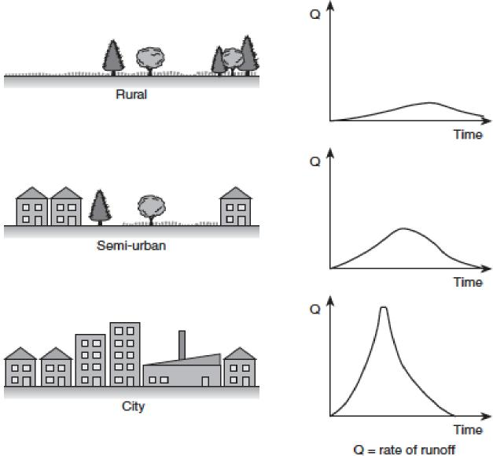
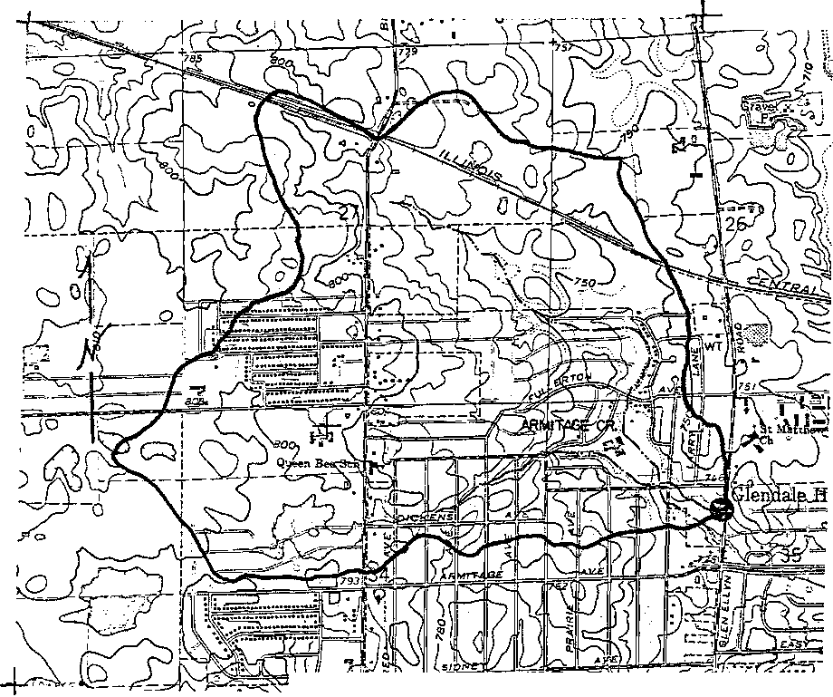
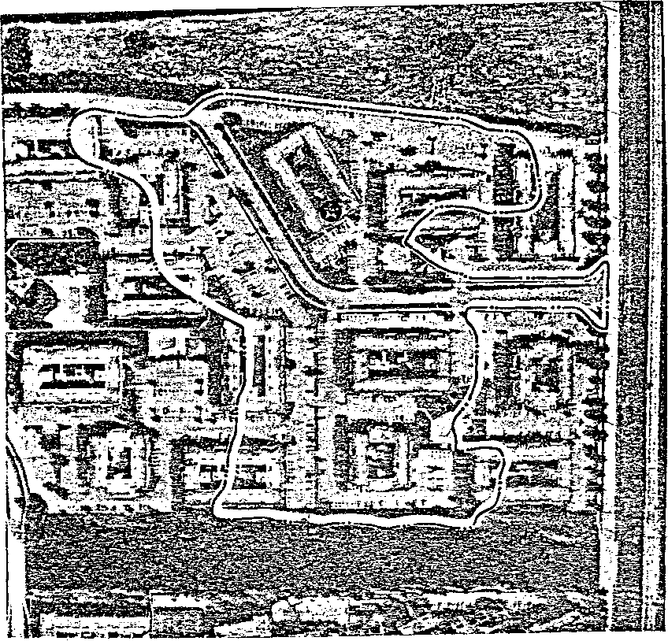

<table>
<colgroup>
<col style="width: 54%" />
<col style="width: 45%" />
</colgroup>
<tbody>
<tr class="odd">
<td></td>
<td><blockquote>

<strong>EPA/600/R-06/097 September 2006</strong>

</blockquote></td>
</tr>
</tbody>
</table>

**STORM WATER MANAGEMENT MODEL  
QUALITY ASSURANCE REPORT:  
Dynamic Wave Flow Routing**

By

Lewis A. Rossman  
Water Supply and Water Resources Division  
National Risk Management Research Laboratory  
Cincinnati, OH 45268

NATIONAL RISK MANAGEMENT RESEARCH LABORATORY  
OFFICE OF RESEARCH AND DEVELOPMENT  
U.S. ENVIRONMENTAL PROTECTION AGENCY  
CINCINNATI, OH 45268

**DISCLAIMER**

The information in this document has been funded wholly or in part by the U.S. Environmental Protection Agency (EPA). It has been subjected to the Agency’s peer and administrative review, and has been approved for publication as an EPA document. Mention of trade names or commercial products does not constitute endorsement or recommendation for use.

**II**

**FOREWORD**

The U.S. Environmental Protection Agency is charged by Congress with protecting the Nation’s land, air, and water resources. Under a mandate of national environmental laws, the Agency strives to formulate and implement actions leading to a compatible balance between human activities and the ability of natural systems to support and nurture life. To meet this mandate, EPA’s research program is providing data and technical support for solving environmental problems today and building a science knowledge base necessary to manage our ecological resources wisely, understand how pollutants affect our health, and prevent or reduce environmental risks in the future.

The National Risk Management Research Laboratory is the Agency’s center for investigation of technological and management approaches for reducing risks from threats to human health and the environment. The focus of the Laboratory’s research program is on methods for the prevention and control of pollution to the air, land, water, and subsurface resources; protection of water quality in public water systems; remediation of contaminated sites and ground water; and prevention and control of indoor air pollution. The goal of this research effort is to catalyze development and implementation of innovative, cost-effective environmental technologies; develop scientific and engineering information needed by EPA to support regulatory and policy decisions; and provide technical support and information transfer to ensure effective implementation of environmental regulations and strategies.

Water quality impairment due to runoff from urban and developing areas continues to be a major threat to the ecological health of our nation’s waterways. The EPA Storm Water Management Model is a computer program that can assess the impacts of such runoff and evaluate the effectiveness of mitigation strategies. This report documents the Quality Assurance testing that was performed on the dynamic wave flow routing portion of the recently modernized and updated version 5.0 of the model. As a result of this testing, users can have confidence that the updated model is performing correctly.

Sally C. Gutierrez, Director

National Risk Management Research Laboratory

**III**

**CONTENTS**

1.  Introduction 5

2.  Routing Models 6

3.  Testing Procedure 13

4.  Extran Manual Test Cases 15

5.  Challenge Test Cases 53

6.  User-Supplied Test Cases 72

7.  Summary and Conclusions 110

8.  References 111

Appendix A. SWMM 4 Routing Models 112

Appendix B. Test Data Sets 115

4

**1. Introduction**

The Storm Water Management Model (SWMM) was originally developed in 1971 as a computer-based tool for simulating storm water runoff quantity and quality from primarily urban areas (Metcalf & Eddy, Inc., et al., 1971). Since then it has undergone several major updates, the last of these being Version 4.4 (Huber and Dickinson, 1992) which is available through an Oregon State University web site ([<u>http://ccee.oregonstate.edu/swmm/)</u>](http://ccee.oregonstate.edu/swmm/)). Throughout each of these updates the general block nature of the overall program as well as the basic structure of its Fortran source code has remained more or less intact.

In 2002, the U.S. Environmental Protection Agency’s Water Supply and Water Resources Division partnered with the consulting firm CDM to develop a completely re-written version of SWMM. The goal of this project was to apply modern software engineering techniques to produce a more maintainable, extensible, and easier to use model. The result of this effort, SWMM 5 (Rossman, 2005), consists of a platform-independent computational engine written in C as well as a graphical user interface for the Microsoft Windows operating system written in Delphi. A rigorous Quality Assurance (QA) program was developed to insure that the numerical results produced from the new SWMM 5 model would be compatible with those obtained from SWMM 4.4 (Schade, 2002). The new SWMM 5 software was released to the public in October of 2004.

The most numerically challenging sub-model to implement within SWMM 5 was the dynamic wave flow routing routine known as Extran (for Extended Transport). It routes non-steady flows through a general network of open channels, closed conduits, storage facilities, pumps, orifices and weirs. In contrast to simpler routing methods, this procedure can model such phenomena as backwater effects, flow reversals, pressurized flow, and entrance/exit energy losses. Rather than simply encode a line-for-line copy of Extran, SWMM 5 restructured the code in a more readable and maintainable fashion. It also employed a slightly modified computational scheme with the intent of producing more numerically stable solutions in less time.

This report documents the Quality Assurance testing program that was used to compare the dynamic wave flow routing procedures of SWMM 4.4 and SWMM 5 with one another. Before describing the tests made and the results obtained it will be useful to contrast the way in which each version of the model implements dynamic wave flow routing.

**5**

When analyzing a network of conduits, an additional continuity relationship is needed for the junction nodes that connect two or more conduits together (see Figure 1.1). In SWMM a continuous water surface is assumed to exist between the water elevation at the node and in the conduits that enter and leave the node (with the exception of free fall drops should they occur). The change in hydraulic head *H* at the node with respect to time can be expressed as:

where *Astore* is the surface area of the node itself, *ΣAs* is the surface area contributed by the conduits connected to the node, and *ΣQ* is the net flow into the node (inflow – outflow) contributed by all conduits connected to the node as well as any externally imposed inflows. Note that the flow depth at the end of a conduit connected to a node can be computed as the difference between the head at the node and the invert elevation of the conduit.

> 

**Figure 1.1 Node-Link Representation of a Drainage System in SWMM (from Roesner et al, 1992).**

*<u>General Solution for Conduits</u>*

Equations (1), (2), and (3) are solved in SWMM by converting them into an explicit set of finite difference formulas that compute the flow in each conduit and head at each node for time *t + ∆t* as functions of known values at time *t*. The equation solved for the flow in each conduit is:

*7*

Then full-step flows are found by evaluating Eq. (4) again, this time using the full time step *∆t* and using the heads, areas, and velocities found for the half-step solution. Finally, new heads for the full time step *∆t* are found by solving Eq. (5) once more with the full-step flows.

SWMM 5 solves equations (4) and (5) using a method of successive approximations with under relaxation. The procedure goes as follows:

1.  A first estimate of flow in each conduit at time *t+∆t* is made by solving Eq. (4) using the heads, areas, and velocities found at the current time *t*. Then the same is done for heads by evaluating Eq. (5) using the flows just computed. These solutions are denoted as *Qlast* and *Hlast*.

2.  Eq. (4) is solved once again, using the heads, areas, and velocities that belong to the *Qlast* and *Hlast* values just computed. A relaxation factor fl is used to combine the new flow estimate *Qnew*, with the previous estimate *Qlast* according to the equation

> *Qnew* = (1−fl)*Qlast* + fl*Qnew* to produce an updated value of *Qnew*.

3.  Eq. (5) is solved once again for heads, using the flows *Qnew*. As with flow, this new solution for head, *Hnew*, is weighted with *Hlast* to produce an updated estimate for heads, *Hnew* = (1−fl)*Hlast* + fl*Hnew* .

4.  If *Hnew* is close enough to *Hlast* then the process stops with *Qnew* and *Hnew* as the solution for time *t+∆t*. Otherwise, *Hlast* and *Qlast* are replaced with *Hnew* and *Qnew*, respectively, and the process returns to step 2.

In implementing this procedure, SWMM 5 uses a constant relaxation factor fl of 0.5, a convergence tolerance of 0.005 feet on nodal heads, and limits the number of trials to four.

*<u>Computation of Average Conduit Conditions</u>*

Evaluation of the flow updating Eq. (4) requires values for the average area ( *A* ),

hydraulic radius ( *R* ), and velocity (*V* ) throughout the conduit in question. Both SWMM 4 and 5 compute these values using the heads *H1* and *H2* at either end of the conduit from

which corresponding flow depth values *y1* and *y2* can be derived. An average depth *y* is then computed by averaging these values and is used with the conduit’s cross-section geometry to compute the average area *A* and hydraulic radius *R* . The average velocity

*V* is found by dividing the most current flow value by the average area. SWMM 5 follows SWMM 4’s practice of limiting this velocity to be no higher than 50 ft/sec in absolute value, so as not to allow the frictional flow adjustment term in Eq. (4) to become unbounded.

When the conduit has a free-fall discharge into either of its end nodes (meaning that the water elevation in the node is below the invert elevation of the conduit), the depth at that end of the conduit is set equal to the smaller of the critical depth and the normal flow depth for the current flow through the conduit.

**9**

where from Eq. (4),

> <u>∂*Q* − *g* ∆ *AtL* /  
> </u>=

+ ∆+∆

> *Q friction Qlosses*

(∂*Q* ∂*H* has a negative sign in front of it because when evaluating *ΣQ*, flow directed out of a node is considered negative while flow into the node is positive.)

Every time that Eq. (6) is applied to update the head at a surcharged node, Eq. (4) is re­evaluated to provide flow updates for the conduits that connect to the node. This process continues until some convergence criterion is met. SWMM 4 enters this iterative mode for surcharged nodes at both the half-step and full-step portions of its solution method. The user sets a convergence tolerance on the maximum fractional difference for flows found between iterations as well as the maximum number of iterations allowed. For SWMM 5, these surcharge iterations are folded into its normal set of iterations outlined previously. That is, whenever heads need to be computed in the successive approximation scheme, Eq. (6) is used in place of Eq. (5) if a node is surcharged, and no under-relaxation of the resulting head value is performed.

*<u>Normal Flow Condition</u>*

Both SWMM 4 and SWMM 5 limit the flow in non-surcharged conduits to be no greater than the normal Manning’s flow for the current flow depth at the upstream end of the conduit whenever one of the following conditions occur:

1.  The water surface slope is less than the conduit slope.

2.  The Froude number, based on the water depth at either end of the conduit, is greater than 1.0.

Each condition indicates a flow regime that is supercritical. The user specifies which of these two criteria should apply.

*<u>Pumps, Orifices, and Weirs</u>*

Both programs model pumps, orifices, and weirs as links that connect a pair of nodes together. The flow through these links is computed as a function of the heads at their end nodes. These flows are computed during the flow evaluation step of both the SWMM 4 and 5 procedures after the flows through all of the conduits are computed.

SWMM 4 and 5 model pumps in a similar fashion, requiring the user to specify a pump curve along which the pump must operate. The pump curve can specify flow as a function of inlet node volume, inlet node depth, or the head difference between the inlet and outlet nodes. Both programs also limit the pump’s flow to the inflow to the inlet node during a given time step should the pump curve flow be high enough to completely drain the inlet node during the time step.

***11***

SWMM 4 models an orifice (i.e., an enclosed opening oriented either vertically or horizontally to the flow direction) as an equivalent pipe. The length *L* of the equivalent pipe is computed as 2*∆t gD* where *D* is the height of the orifice opening. Its roughness

coefficient is set equal to *R Cd* 2 *Lg*

2/3 where *R* is the hydraulic radius of the full orifice opening and *Cd* is the discharge coefficient of the orifice. Flow through the orifice is then computed in the same fashion as for any conduit. SWMM 5 takes a more direct approach. It uses the classical orifice equation *CdA* 2*gh* to compute flow when the orifice is fully submerged and a modified weir equation *CdA* 2 *gDf* when the orifice is submerged a

> 1 .5

fraction *f*. In these formulas, *A* is the area and *D* is the height of the full orifice opening, while *h* is the head across the orifice. Both programs compute a surface area contribution of the orifice to its end nodes, based on the equivalent pipe length *L* and the depth of water in the orifice.

SWMM 5 models weirs (i.e., an unrestricted opening oriented either transversely or parallel to the flow direction) in the same fashion as SWMM 4. An equation of the

general form *C w L w h* is used to compute flow as a function of head *h* across the weir

> *n*

when the weir is not fully submerged. *Cw* is the weir’s discharge coefficient, *Lw* is the length of its opening, and *n* is an exponent that depends on the type of weir being modeled (e.g., transverse, side-flow, V-notch, or trapezoidal). When the weir becomes completely submerged, both programs switch to using the orifice equation to predict flow as a function of the head across it. Weirs do not contribute any surface area to their end nodes.

**12**

**3. Testing Procedure**

The testing procedure used for this study involved running both SWMM 4 and 5 on an identical set of dynamic wave flow routing test problems and then comparing the results. Equivalent sets of analysis options, such as routing time step and minimum nodal surface area, were used with each program to maintain comparability (see below). The results produced by each program were inspected in the following ways:

- For examples that included a runoff calculation, the overall flow balances for runoff were compared to make sure that both versions of SWMM produced the same total inflow quantities to the flow routing computation.

- The flow balance error for the routing portion of each example was checked to insure that both versions of SWMM maintained acceptable flow continuity.

- Scatter plots were used to visually compare the peak flows computed for all conduits in each example by each of the programs.

- Time series plots of flows and water depths at critical locations in each example were visually compared, paying particular attention to any evidence of numerical

> instability exhibited by either program.

The critical locations chosen for time series plots typically included system outfalls, other significant system elements (such as orifices, weirs, storage units and pump stations), and locations that exhibited significant differences in peak flows between the two programs.

The test case examples used in this evaluation were divided into three distinct categories. The first category is the Extran Manual Test Cases. These consist of the ten Extran example data sets that were presented in the last SWMM 4.4 Users Manual (Roesner et al., 1992). They serve as a useful benchmark to compare against and model such elements as surcharged conduit flow, bottom and side orifices, weirs, storage units, pumps, and a variety of cross-sectional shapes.

The second test case category is the Challenge Test Cases. These are five examples from a suite of test cases compiled by Robert E. Dickinson of CDM. They all consist of several circular conduits connected in series that present different types of challenges to modeling dynamic flows, such as flat slopes, pipe constrictions, steep drops, adverse slopes, and inlet offsets.

The third test category is the User Submitted Test Cases. These contain five real-world data sets contributed by SWMM users. They include models of either storm sewer systems, combined sewer systems or natural channel systems and range in size from 59 conduits up to 273 conduits. Each of these user examples includes a runoff component that generates the flows supplied to the routing component of the model.

The versions of SWMM used in this comparison study were SWMM 4.4h (July 4, 2005) and SWMM 5.0.006 (September 2005). Unless otherwise indicated, the option settings listed in Table 3.1 were used in all runs to maintain computational compatibility between the two versions of SWMM. Note that the SWMM 4 ITMAX and SURTOL settings are not directly comparable to the SWMM 5 settings for maximum iterations and

**13**

> convergence tolerance since the former apply only to surcharge iterations while the latter are used throughout SWMM 5’s successive approximation routine.

<table>
<colgroup>
<col style="width: 14%" />
<col style="width: 33%" />
<col style="width: 9%" />
<col style="width: 32%" />
<col style="width: 9%" />
</colgroup>
<tbody>
<tr class="odd">
<td><blockquote>

<strong>Table 3.1.</strong>

</blockquote></td>
<td colspan="3"><strong>Computational Settings Used for the Test Case Comparisons.</strong></td>
<td></td>
</tr>
<tr class="even">
<td></td>
<td><blockquote>

<em><strong>SWMM 4</strong></em>

</blockquote></td>
<td></td>
<td><em><strong>SWMM 5</strong></em></td>
<td></td>
</tr>
<tr class="odd">
<td><blockquote>

<strong>Setting</strong>

</blockquote></td>
<td><blockquote>

<strong>Meaning</strong>

</blockquote></td>
<td><strong>Value</strong></td>
<td><blockquote>

<strong>Setting</strong>

</blockquote></td>
<td><strong>Value</strong></td>
</tr>
<tr class="even">
<td><blockquote>

ISOL

</blockquote></td>
<td><blockquote>

Solution method

</blockquote></td>
<td>0</td>
<td><blockquote>

Inertial terms

</blockquote></td>
<td>Keep</td>
</tr>
<tr class="odd">
<td><blockquote>

KSUPER

</blockquote></td>
<td><blockquote>

Normal flow limit criterion

</blockquote></td>
<td>0</td>
<td><blockquote>

Normal flow limit criterion

</blockquote></td>
<td>Slope</td>
</tr>
<tr class="even">
<td><blockquote>

NEQUAL

</blockquote></td>
<td><blockquote>

Lengthen short conduits

</blockquote></td>
<td>0</td>
<td><blockquote>

Lengthen short conduits

</blockquote></td>
<td>No</td>
</tr>
<tr class="odd">
<td><blockquote>

AMEN

</blockquote></td>
<td><blockquote>

Minimum surface area, ft2

</blockquote></td>
<td>12.57</td>
<td><blockquote>

Minimum surface area, ft2

</blockquote></td>
<td>12.57</td>
</tr>
<tr class="even">
<td><blockquote>

ITMAX

</blockquote></td>
<td><blockquote>

Maximum iterations

</blockquote></td>
<td>30</td>
<td><blockquote>

Maximum iterations

</blockquote></td>
<td>4</td>
</tr>
<tr class="odd">
<td></td>
<td><blockquote>

(for surcharge only)

</blockquote></td>
<td></td>
<td><blockquote>

(fixed internally)

</blockquote></td>
<td></td>
</tr>
<tr class="even">
<td><blockquote>

SURTOL

</blockquote></td>
<td><blockquote>

Surcharge tolerance, expressed as a fractional flow difference

</blockquote></td>
<td>0.05</td>
<td><blockquote>

Convergence tolerance, expressed as an absolute head difference in feet

</blockquote></td>
<td>0.005</td>
</tr>
<tr class="odd">
<td></td>
<td></td>
<td></td>
<td><blockquote>

(fixed internally)

</blockquote></td>
<td></td>
</tr>
</tbody>
</table>

***14***

**4. Extran Manual Test Cases  
***<u>Example EXTRAN1</u>*

The drainage network used in this example is displayed in Figure 4.1. It contains 7 circular conduits arranged in 2 branches that converge into a pair of trapezoidal channels with a free outfall. Three locations as shown in the figure are subjected to the inflow hydrographs shown in Figure 4.2. The system was designed so that conduits 8040, 8060, and 1602 along the top branch become surcharged and flooding occurs at node 80608. It was analyzed using a 20 second time step over an 8 hour simulation period.

SWMM 4 and 5 produced essentially identical results for this example. Comparison plots for flow in selected conduits and water depth at selected nodes are shown in Figures 4.3 through 4.6. The maximum flow at each conduit and the maximum water elevation at each node are compared in Figures 4.7 and 4.8, respectively.

> 16109 1602 82309 8060 80608 8040 80408
>
> Inflow

***EXAMPLE 1 OF EXTRAN MANUAL***

**Figure 4.1. Schematic of the Drainage Network Used for Example EXTRAN1.**

**15**

Time (hours)

**Figure 4.2. External Inflows for Example EXTRAN1.**

**Link 1602 Flow**

Elapsed Time (hours)

**Figure 4.3. Flow Comparison for Link 1602 of Example EXTRAN1.**

**16**

> **Link 1030 Flow**

Elapsed Time (hours)

> **Figure 4.4. Flow Comparison for Link 1030 of Example EXTRAN1.**
>
> **Node 82309 Depth**

Elapsed Time (hours)

**Figure 4.5. Water Depth Comparison for Node 82309 of Example EXTRAN1.**

**17**

> **Node 16009 Depth**

Elapsed Time (hours)

**Figure 4.6. Water Depth Comparison for Node 16009 of Example EXTRAN1.**

> 0 20 40 60 80 100 120 140

SWMM 4

> **Figure 4.7. Comparison of Peak Flows (cfs) Computed for the Conduits in Example EXTRAN1.**

**18**

> 80 90 100 110 120 130 140 150 160

SWMM 4

> Figure 4.8. Comparison of Maximum Water Elevations (ft) for the Nodes of Example EXTRAN1.

***19***

> *<u>Example EXTRAN2</u>*
>
> This example is identical to EXTRAN1 except that the free outfall at node 10208 is replaced with a fixed-elevation outfall that includes a tide gate. Again, the agreement between SWMM 4 and 5 is very good as shown in Figures 4.9 through 4.12.
>
> **Link 1030 Flow**

Elapsed Time (hours)

> **Figure 4.9. Flow Comparison for Link 1030 of Example EXTRAN2.**
>
> **Node 16009 Depth**

Elapsed Time (hours)

**Figure 4.10. Water Depth Comparison for Node 16009 of Example EXTRAN2.**

**20**

> **Link 1570 Flow**

Elapsed Time (hours)

**Figure 4.16. Flow Comparison for Link 1570 of Example EXTRAN3.**

> **Node 15009 Depth**
>
> 0 123456789

Elapsed Time (hours)

**Figure 4.17. Water Depth Comparison for Node 15009 of Example EXTRAN3.**

**24**

> 80 90 100 110 120 130 140

**SWMM5**

> Figure 4.18. Comparison of Peak Flows (cfs) for the Conduits of Example EXTRAN3.

0 20 40 60 80 100 120 140 160

**SWMM5**

Figure 4.19. Comparison of Maximum Water Elevations (ft) for the Nodes of Example EXTRAN3.

**25**

> **Node 82309 Depth**

Elapsed Time (hours)

**Figure 4.21. Comparison of Water Depth at the Inlet Node of the Weir in Example EXTRAN4.**

> 40 60 80 100 120 140

SWMM4

**Figure 4.22. Comparison of Peak Flows (cfs) for the Conduits of Example EXTRAN4.**

**27**

> 80 90 100 110 120 130 140

SWMM4

Figure 4.23. Comparison of Maximum Water Elevations (ft) for the Nodes of Example EXTRAN4.

**28**

*<u>Example EXTRAN5</u>*

Example EXTRAN5 modifies EXTRAN1 by replacing the node downstream of the node that floods with a storage unit that has a side outlet orifice. The modified schematic is shown in Figure 4.24. Node 82309 was converted into a 40.5 ft. high storage unit with a constant 800 sq. ft. of surface area. A new node, 82308, was added to connect the outlet orifice to the original conduit 1602.

> Inflow

***EXAMPLE 5 OF EXTRAN MANUAL***

**Figure 4.24. Schematic of the Drainage Network Used for Example EXTRAN5.**

Figure 4.25 compares the orifice flows computed by both SWMM 4 and SWMM 5. With the exception of a few points in time, there is good agreement between the two programs even though the orifice is modeled differently by each. Figure 4.26 compares flows in conduit 1602 immediately downstream of the orifice. Whatever differences in flow that existed through the orifice have been essentially eliminated leaving almost perfect agreement between SWMM 4 and 5.

A comparison of the water depth at the storage unit node 82309 is shown in Figure 4.26. Depth comparisons for the nodes both immediately upstream and downstream of the storage node are shown in Figures 4.27 and 4.28, respectively. There is good agreement at all time points. Good agreement is also obtained for the peak flows and water elevations in all conduits and nodes as shown in Figures 4.29 and 4.30, respectively.

**29**

> 0 123456789

Elapsed Time (hours)

> **Figure 4.25. Comparison of Flow Through the Outlet Orifice of Example EXTRAN5.**
>
> **Link 1602 Flow**

Elapsed Time (hours)

> **Figure 4.26. Comparison of Flow Through the Conduit Immediately Downstream of the Outlet Orifice of Example EXTRAN5.**

**30**

> **Node 82309 Depth**

Elapsed Time (hours)

> **Figure 4.27. Comparison of Water Depth at the Storage Node in Example EXTRAN5.**
>
> **Node 80608 Depth**

Elapsed Time (hours)

> **Figure 4.27. Comparison of Water Depth at the Node Immediately Upstream of the Storage Node in Example EXTRAN5.**

**31**

> **Node 82308 Depth**
>
> Elapsed Time (hours)

**Figure 4.28. Comparison of Water Depth at the Node Immediately Downstream of the Storage Node in Example EXTRAN5.**

> 40 60 80 100 120

SWMM4

**Figure 4.29. Comparison of Peak Flows (cfs) for the Conduits of Example EXTRAN5.**

**32**

> 80 90 100 110 120 130 140

SWMM4

Figure 4.30. Comparison of Maximum Water Elevations (ft) for the Nodes of Example EXTRAN5.

**33**

*<u>Example EXTRAN6</u>*

Example EXTRAN6 modifies EXTRAN1 by adding an off-line pumping station with wet well between nodes 82309 and 15009. The new wet well node, 82310, is connected to node 82309 by a new conduit 8061 which is 300 feet of 4-foot diameter pipe. The pump, link 90011, is represented by a Type 1 pump curve which describes pumping rate as a function of wet well volume. The highest point on this curve is 20 cfs at 1200 cubic feet. The latter number implicitly sets the maximum volume of the wet well node 82310. The resulting schematic of this network is displayed in Figure 4.31.

> Inflow
>
> ***EXAMPLE 6 OF EXTRAN MANUAL***

**Figure 4.31. Schematic of the Drainage Network Used for Example EXTRAN6.**

As shown in Figure 4.32, the flow through the pump computed by SWMM 4 and SWMM 5 is essentially the same. However, there is a significant difference in the way that the two programs handle the flow into the wet well coming from conduit 8061. SWMM 4 internally restricts the flow coming into the wet well so that the wet well does not flood. SWMM 5 allows the system to behave as designed, and allows the wet well to flood if more volume flows in than can be pumped. The resulting differences in the two programs are illustrated in Figures 4.33 and 4.34 which compares flow in conduit 8061, conduit 1602, and the flooding at the wet well node 82310. Figure 4.35 compares the flow in the outlet channel 1030 of this system. The mass balance report for SWMM 5 shows that the reduction in flow volume leaving the system as compared to SWMM 4 exactly equals the volume of flooding experienced at the pump’s wet well.

**34**

Elapsed Time (hours)

**Figure 4.34. SWMM 5 Flows Leaving Node 82309 for Example EXTRAN6.**

**Link 1030 Flow**

> 0 123456789

Elapsed Time (hours)

**Figure 4.35. Comparison of Outfall Flows for Example EXTRAN6.**

**36**

*<u>Example EXTRAN7</u>*

This example replaces the off-line pump used in example EXTRAN6 with an in-line Type 2 pump directly connecting nodes 82309 and 15009 as shown in Figure 4.36. The operating curve for this pump, which relates pumping rate to water depth, is super­imposed on the figure.

> Inflow

***EXAMPLE 7 OF EXTRAN MANUAL***

**Figure 4.36. Schematic of the Drainage Network Used for Example EXTRAN7.**

Figure 4.37 compares the flow through the pump computed by both SWMM 4 and 5. Figure 4.38 does the same for the water depth at the pump’s inlet node. SWMM 4

appears to have some flow instability at the pump when the inlet water depth falls to zero, while SWMM 5 produces a much smoother response. (Both programs limit the pumping rate to the inflow flow rate if the pump curve rate would cause the node to be pumped dry.) The overall higher pumping volume produced by SWMM 4 probably contributes to its larger continuity error (-6.87 percent) as compared to that of SWMM 5 (0.24 percent).

Looking downstream of the pump, the water depths at the pump outlet node 15009 are compared in Figure 4.39. SWMM 4 maintains a higher water depth at this node than does SWMM 5 after the inflow hydrograph has passed through due to the cycling of the pump. There is also an anomalously high depth at the start of the simulation with SWMM 4

**37**

which is difficult to explain. Even with these discrepancies, the final outfall flows through channel 1030 for the two programs are very close as shown in Figure 4.40. Also, the peak flows and maximum water elevations are essentially identical as shown in Figures 4.41 and 4.42, respectively.

> **Link 90010 Flow**
>
> SWMM5 SWMM4

Elapsed Time (hours)

**Figure 4.37. Comparison of Flow Through the Pump of Example EXTRAN7.**

> **Node 82309 Depth**

Elapsed Time (hours)

**Figure 4.38. Comparison of Water Depth at the Inlet Node of the Pump in Example EXTRAN7.**

**38**

**Node 15009 Depth**

> SWMM5 SWMM4

Elapsed Time (hours)

**Figure 4.39. Comparison of Water Depth at the Outlet Node of the Pump in Example EXTRAN7.**

**Link 1030 Flow**

> 0 123456789

Elapsed Time (hours)

**Figure 4.40. Comparison of Outfall Flows for Example EXTRAN7.**

**39**

> 40 60 80 100 120 140

SWMM4

> Figure 4.41. Comparison of Peak Flows (cfs) for the Conduits of Example EXTRAN7.
>
> 80 90 100 110 120 130 140

SWMM4

> Figure 4.42. Comparison of Maximum Water Elevations (ft) for the Nodes of Example EXTRAN7.

**40**

> *<u>Example EXTRAN8</u>*
>
> The schematic for example EXTRAN8 is shown in Figure 4.43. This example utilizes various cross-sectional shapes for its conduits as listed in Table 4.1. The geometries of the two irregular-shaped channels, 10081 and 10082, are depicted in Figure 4.44.
>
> Inflow
>
> Outfall
>
> **Figure 4.43. Schematic of the Drainage Network Used for Example EXTRAN8.**
>
> **Table 4.1. Cross-Sectional Shapes Used in Example EXTRAN8.**

**41**

Transect 91

> Station (ft)

Transect 92

> 0 20 40 6080100120140 160
>
> Station (ft)

**Figure 4.44. Geometry of Channels 10081 and 10082 in Example EXTRAN8.**

The inflows at nodes 30001, 30004, and 30007 are all triangular hydrographs with a base time of 1 hour and peak flow of 15 cfs, 18 cfs, and 9 cfs, respectively. The inflow at node 30081 is a constant 20 cfs. The water surface elevation at the outfall node 30083 is a fixed value. Following the protocol used in the SWMM 4 Extran Manual, this example was first run for a 1-hour duration with just the constant 20 cfs inflow to create a hot start file with the two natural channels 10081 and 10082 flowing at 20 cfs. Then the system was run using this hot start file and the three inflow hydrographs for a period of 2 hours. The results at selected locations are depicted in Figures 4.45 – 4.50 and show perfect agreement between the two programs.

**42**

SWMM4

Figure 4.49. Comparison of Peak Flows (cfs) for the Conduits of Example EXTRAN8.

790 792 794 796 798 800 802 804 806 808 810

SWMM4

Figure 4.50. Comparison of Maximum Water Elevations (ft) for the Nodes of Example EXTRAN8.

**45**

*<u>Example EXTRAN9</u>*

This example illustrates hydrograph routing through a variable-area storage unit with a side outlet orifice discharging to a free outfall. A schematic of the system is shown in Figure 4.51. The inflow hydrograph is triangular with a 5 hour time base and peak flow of 1.2 m3/s. The storage unit is shaped as shown in Figure 4.52. Comparisons of SWMM 4 and SWMM 5 results for depth in the storage unit and outflow through the orifice are shown in Figures 4.53 and 4.54, respectively. The results from the two programs are essentially the same.

> **EXTRAN EXAMPLE 9**

**Figure 4.51. Schematic of Example EXTRAN9**

**Figure 4.52. Storage Unit Shape for Example EXTRAN9.**

**46**

> *<u>Example EXTRAN10</u>*
>
> This example illustrates a 5-pump pumping station that moves water up a 50-foot hill from one storage unit to another. The schematic is shown in Figure 4.55. Each pump is a Type 3 pump that all share the same operating curve as shown in Figure 4.56. However each pump has a different operating range as shown in Table 4.2. These ranges are entered directly on the H1 lines of the SWMM 4 input data file and are converted into a set of Control Rules for the SWMM 5 input. As an example, the operating condition for pump 9002 can be expressed through the following set of control rules in SWMM 5:
>
> 
>
> **Figure 4.55. Schematic of Example EXTRAN10.**
>
> Head (ft)
>
> **Figure 4.56. Operating Curve for Pumps of Example EXTRAN 10**

**48**

> **Table 4.2. Operating Ranges for the Pumps of Example EXTRAN10 (Pump turns on when clear well depth exceeds high level and shuts down when depth reaches low level.)**
>
> ***Pump Low Level (feet) High Level (feet)***

|       |     |     |
|-------|-----|-----|
| 90002 | 2   | 6   |
| 90003 | 3   | 7   |
| 90004 | 4   | 8   |
| 90005 | 5   | 9   |
| 90006 | 6   | 10  |

> RULE 90002A
>
> IF NODE 401 DEPTH \>= 6
>
> AND PUMP 90002 STATUS = OFF
>
> THEN PUMP 90002 STATUS = ON
>
> RULE 90002B
>
> IF NODE 401 DEPTH \<= 2
>
> AND PUMP 90002 STATUS = ON
>
> THEN PUMP 90002 STATUS = OFF
>
> The upstream storage unit 401 is subjected to an external inflow that ramps up from 0 to 100 cfs over a period of an hour after which it remains constant at this rate. The system was solved using a 1 minute time step over a total duration of 5 hours.
>
> Figures 4.57 and 4.58 compare water depths in the two storage units computed by both SWMM 4 and SWMM 5. Figure 4.59 compares the outflow rate from the system through conduit 100. These figures show almost perfect agreement between SWMM 4 and 5. As for the 5 pumps, 90002, 90005, and 90006 also show almost perfect agreement. As an example, the flow for 90002 is shown in Figure 4.60. There are some differences in flow for Pumps 90003 and 90004 at 40 minutes into the simulation, as shown in Figure 4.61 for pump 90004. Table 4.3 compares the pump flows at 40 minutes for the two programs. For the three pumps that are on, 90002, 90003, and 90004, SWMM 5 produces the same flow rate which should be the case since each pump has the same operating curve and end nodes. SWMM 4, however, produces slightly different flow rates, suggesting that something is not quite right with how its computing pump flows.
>
> **Table 4.3. Pumping Rates for Example EXTRAN10 at Elapsed Time of 40 Minutes**
>
> ***Pump SWMM 5 Flow (cfs) SWMM 4 Flow (cfs)***

|       |      |      |
|-------|------|------|
| 90002 | 25.7 | 23.0 |
| 90003 | 25.7 | 22.5 |
| 90004 | 25.7 | 21.0 |
| 90005 | 0    | 0    |
| 90006 | 0    | 0    |

**49**

> **Node 401 Depth**
>
> Elapsed Time (hours)

Figure 4.57. Water Depth Comparison for the Storage Unit 401 of Example EXTRAN10.

> **Node 301 Depth**

Elapsed Time (hours)

Figure 4.58. Water Depth Comparison for the Storage Unit 301 of Example EXTRAN10.

**50**

> **Link 100 Flow**

Elapsed Time (hours)

**Figure 4.59. Flow Comparison for Outflow Conduit 100 of Example EXTRAN10.**

> **Link 90002 Flow**

<table>
<colgroup>
<col style="width: 6%" />
<col style="width: 3%" />
<col style="width: 89%" />
</colgroup>
<tbody>
<tr class="odd">
<td>Flow (CFS)</td>
<td><blockquote>

45.0 40.0 35.0 30.0 25.0 20.0 15.0 10.0 5.0

</blockquote>

0.0
</td>
<td></td>
</tr>
</tbody>
</table>

> 0 12345
>
> Elapsed Time (hours)
>
> **Figure 4.60. Flow Comparison for Pump 90002 of Example EXTRAN10.**

**51**

> **5. Challenge Test Cases  
> ***<u>Example TEST1</u>*
>
> The first challenge example compares the two programs in modeling a flat run of pipe. The profile of the pipe layout is displayed in Figure 5.1. It consists of ten, 100-foot lengths of 4-foot diameter circular pipe placed on a flat (0%) slope. The system was subjected to a 3-hour square wave inflow hydrograph of 100 cfs magnitude at the upstream end and was run for a 5 hour simulation period using a 5 second routing time step (larger time steps caused instability in both programs).
>
> Figure 5.2 compares flows produced by SWMM 4 and 5 in selected conduits while Figure 5.3 does the same for depth at selected nodes. Overall there is a very good agreement between the two programs, with SWMM 5 providing a slightly more stable solution for depth than SWMM 4.
>
> 0 1002003004005006007008009001,000

Distance (ft)

02/02/2002 00:04:30

> **Figure 5.1. Profile View of Example TEST1.**

**53**

> Elapsed Time (hours) Elapsed Time (hours)
>
> **Node 7 Depth**

<table>
<colgroup>
<col style="width: 5%" />
<col style="width: 3%" />
<col style="width: 90%" />
</colgroup>
<tbody>
<tr class="odd">
<td>Depth (ft)</td>
<td>
5.0 4.5 4.0 3.5 3.0 2.5 2.0 1.5 1.0 0.5

0.0
</td>
<td></td>
</tr>
</tbody>
</table>

> 0 12345
>
> Elapsed Time (hours) Elapsed Time (hours)

Figure 5.3. Depth Comparisons for Selected Nodes for Example TEST1.

**55**

**Node 1 Lateral Inflow**

> 0 1234567

Elapsed Time (hours)

**Figure 5.5. Inflow Hydrograph for Example TEST2.**

Comparisons of flow for various links are displayed in Figure 5.6 while those for water depths in various nodes are given in Figure 5.7. Note how much the constriction influences the shape of the inflow hydrograph as it moves downstream. SWMM 4 has the upstream pipe segments reaching a surcharged state about 10 minutes faster than does SWMM 5 and shows a slightly higher degree of flow oscillation in the large 12-foot pipe between nodes 3 and 4. The flow continuity error for both programs was 0.4%.

**57**

**Flow Between Nodes 1 and 2**

Elapsed Time (hours)

**Flow Between Nodes 2 and 3**

> 0 1234567

Elapsed Time (hours)

> Elapsed Time (hours) Elapsed Time (hours)

**Figure 5.6. Comparisons of Flow in Selected Conduits of Example TEST2.**

**58**

**Depth for Node 1**

Elapsed Time (hours)

**Depth for Node 3**

Elapsed Time (hours)

> **Depth for Node 5**
>
> Elapsed Time (hours)

**Figure 5.7. Water Depth Comparisons for Selected Nodes of Example TEST2.**

**59**

*<u>Example TEST3</u>*

This example consists of six sections of 6-foot diameter circular pipe that drop 40 feet to connect with another six sections of 3-foot diameter pipe. Each section is 500 feet long with a slope of 0.10%. The profile for this example is shown in Figure 5.8 and the inflow hydrograph is shown in Figure 5.9. Both SWMM 4 and 5 were run at a 5 second routing time step over a 6 hour simulation period.

0 500 1,0001,500 2,0002,500 3,0003,500 4,0004,500 5,000 5,500 6,000

Distance (ft)

01/01/1988 00:47:00

**Figure 5.8. Profile View of Example TEST3.**

<table>
<colgroup>
<col style="width: 6%" />
<col style="width: 93%" />
</colgroup>
<tbody>
<tr class="odd">
<td><blockquote>

110 100 90 80 70 60 50 40 30 20 10

</blockquote>

0
</td>
<td></td>
</tr>
<tr class="even">
<td></td>
<td>0 1 2 3456 7</td>
</tr>
</tbody>
</table>

Elapsed Time (hours)

**Figure 5.9. Inflow Hydrograph (cfs) for Example TEST3.**

**60**

> **Flow Between Nodes 6 and 7**
>
> **Flow to Outrall**

**Figure 5.10. Comparisons of Flow in Selected Conduits of Example TEST3.**

**61**

> Elapsed Time (hours)
>
> **Node 9 Depth**
>
> 0 2468101214
>
> Elapsed Time (hours)

**Figure 5.20. Water Depth Comparisons for Selected Nodes of Example TEST5.**

**70**

**6. User-Supplied Test Cases  
***<u>Example USER1</u>*

Example USER1 consists of a 175 hectare drainage area divided into 58 subcatchments. As shown in Figure 6.1, the conveyance system contains 59 circular conduits connected to 59 junctions and a single outfall. The elevation profile of the main stem drops almost 19 meters over a distance of 2.5 km (see Figure 6.2). The storm event used for the simulation is depicted in Figure 6.3. The system was solved using a 5 second flow routing time step for a 7 hour duration with a 1 minute reporting time step.

**Figure 6.1. Schematic of the Drainage Network for Example USER1.**

**72**

**Main Stem Elevation Profile**

Distance (m)

10/01/2003 00:01:00

**Figure 6.2. Elevation Profile of the Main Stem of the Drainage Network for Example USER1.**

> 0 0.2 0.4 0.6 0.8 1 1.2 1.4 1.6 1.8 2
>
> Elapsed Time (hours)

**Figure 6.3. Rainfall Hyetograph for the Design Storm Used for Example USER1.**

**73**

> Table 6.1 compares the runoff computation made by both SWMM 5 and SWMM 4 for this example. SWMM 5 produces slightly more runoff than does SWMM 4 and has a smaller continuity error. Figure 6.4 compares the peak flows estimated by both SWMM 5 and SWMM 4 for all conduits in this example. SWMM 4 tends to produce slightly higher peaks than SWMM 5 but the average difference is only 2.2%. Comparisons for flows at selected locations are displayed in Figure 6.5. These locations include the outfall and conduits 13, 23, and 64 which are all identified on the system schematic in Figure 6.1. The plots show an almost perfect match between SWMM 4 and 5. Comparisons were also made of water depths at nodes 05y32, 05y36, 05y41, and 05y44 whose locations are also identified in the schematic of Figure 6.1. These results are shown in Figure 6.6. The SWMM 5 depths match those of SWMM 4 very well except for the peak time at node 05y44. The peak SWMM 4 depth here is about a meter higher than that of SWMM 5. However, it appears that this might be a result of some numerical instability in the SWMM 4 solution and not a true difference.

<table>
<colgroup>
<col style="width: 43%" />
<col style="width: 38%" />
<col style="width: 17%" />
</colgroup>
<tbody>
<tr class="odd">
<td colspan="2"><blockquote>

<strong>Table 6.1. System-Wide Runoff Results for Example USER1.</strong>

</blockquote></td>
<td></td>
</tr>
<tr class="even">
<td></td>
<td><em>SWMM 5</em></td>
<td><em>SWMM 4</em></td>
</tr>
<tr class="odd">
<td><blockquote>

Precipitation (mm)

</blockquote></td>
<td>26.448</td>
<td>26.360</td>
</tr>
<tr class="even">
<td><blockquote>

Evaporation (mm)

</blockquote></td>
<td>0.000</td>
<td>0.000</td>
</tr>
<tr class="odd">
<td><blockquote>

Infiltration (mm)

</blockquote></td>
<td>7.257</td>
<td>7.243</td>
</tr>
<tr class="even">
<td><blockquote>

Runoff (mm)

</blockquote></td>
<td>19.189</td>
<td>18.461</td>
</tr>
<tr class="odd">
<td><blockquote>

Final Storage (mm)

</blockquote></td>
<td>0.097</td>
<td>0.121</td>
</tr>
<tr class="even">
<td><blockquote>

Continuity Error (%)

</blockquote></td>
<td>-0.358</td>
<td>2.028</td>
</tr>
</tbody>
</table>

> **SWMM 5**
>
> **Figure 6.4. Comparison of Peak Flows (cms) for All Conduits in Example USER1.**

**74**

*<u>Example USER2</u>*

This example models a 3.5 square mile drainage area broken into 17 subcatchments. The conveyance system, shown in Figure 6.6, contains 83 conduits that are a mixture of irregular natural channels, open channels and closed pipes of various shapes. There are 28 storage units along with 19 weirs. Many of these storage units and weirs represent junctions with above-ground surface storage coupled with road overflows. A typical arrangement is shown in Figure 6.7. A 4.4 inch, 24-hour design storm, depicted in Figure 6.8, was applied to the system over a 36-hour simulation period using a 5 second flow routing time step and a 5 minute reporting time step.

**Figure 6.6. Schematic of the Drainage Network for Example USER2.**

**77**

Height (ft)

**Figure 6.7. Configuration of Surface Storage Units with Road Overflows Used Throughout Example USER2.**

> 0 510152025

Elapsed Time (hours)

**Figure 6.8. Rainfall Hyetograph for the Design Storm Used for Example USER2.**

**78**

> Table 6.2 compares the runoff computations between the two programs. The results are almost identical. Figure 6.9 compares the peak flows computed by the two programs in the system’s conduits. The agreement is very good with the average difference being less than 2 percent. Figure 6.10 compares flows produced by the two programs at the four locations pictured in Figure 6.6. Figure 6.11 does the same for node water depths at these same locations. Finally, Figure 6.12 depicts the behavior of the two programs at one of the surface storage – road overflow locations, TW01240.

<table>
<colgroup>
<col style="width: 41%" />
<col style="width: 40%" />
<col style="width: 18%" />
</colgroup>
<tbody>
<tr class="odd">
<td colspan="2"><blockquote>

<strong>Table 6.2. System-Wide Runoff Results for Example USER2</strong>

</blockquote></td>
<td></td>
</tr>
<tr class="even">
<td></td>
<td><em>SWMM 5</em></td>
<td><em>SWMM 4</em></td>
</tr>
<tr class="odd">
<td><blockquote>

Precipitation (in)

</blockquote></td>
<td>4.391</td>
<td>4.391</td>
</tr>
<tr class="even">
<td><blockquote>

Evaporation (in)

</blockquote></td>
<td>0.014</td>
<td>0.014</td>
</tr>
<tr class="odd">
<td><blockquote>

Infiltration (in)

</blockquote></td>
<td>1.161</td>
<td>1.162</td>
</tr>
<tr class="even">
<td><blockquote>

Runoff (in)

</blockquote></td>
<td>3.125</td>
<td>3.123</td>
</tr>
<tr class="odd">
<td><blockquote>

Final Storage (in)

</blockquote></td>
<td>0.091</td>
<td>0.091</td>
</tr>
</tbody>
</table>

> 0 500 1000 1500 2000

**SWMM 5**

**Figure 6.9. Comparison of Peak Flows (cfs) for the Conduits in Example USER2.**

**79**

**Depth at Node TW01350**

> 0 510152025303540

Elapsed Time (hours)

**Depth at Node TW01170**

Elapsed Time (hours)

> 0 510152025303540 0 51015 2025303540
>
> Elapsed Time (hours) Elapsed Time (hours)

Figure 6.11. Depth Comparisons for Selected Nodes in Example USER2.

**81**

*<u>Example USER3</u>*

The USER3 data set is a combined sewer system containing 168 subcatchments that encompasses an area of 6 square kilometers. The network schematic is shown in Figure 6.13. The system contains 134 pipes which have mostly circular or egg-shaped cross sections. Of the 141 nodes in the network, 6 are outfalls (see Figure 6.14 for a detail drawing) and 130 are manhole or catch basin structures that are represented as small storage units (see Figure 6.15 for a representative profile). There are 5 pumps in the model that discharge directly to the system’s outfalls. The 3-hour, 42 mm design storm used in the simulation is shown in Figure 6.16. This system was analyzed using a 0.5 second routing step, a 1 minute reporting time step and a 6 hour total duration.

**Figure 6.13. Schematic of the Drainage Network for Example USER3.**

**83**

> **Figure 6.14. Detailed Schematics of the Outfalls for Example USER3.**
>
> **Figure 6.15. Profile View of a Typical Manhole Structure in Example USER3.**

**84**

> Elapsed Time (hours)

**Figure 6.16. Rainfall Hyetograph for the Design Storm Used for Example USER3.**

Table 6.2 shows the overall results of the runoff calculations. Both programs produce essentially the same amounts of runoff. Table 6.3 compares the flow balances for the routing calculations and shows a reasonable match between the two programs. The peak flows in each conduit are compared in Figure 6.17. SWMM 4 is clearly producing higher peak flows in many of the conduits than is SWMM 5 in this example. Flow comparisons for the system’s outfalls are shown in Figures 6.18 and 6.19. The general shapes of these hydrographs are similar, but SWMM 4 tends to produce a higher peak flow. Figure 6.20 compares flows in several of the pipes shown along the main trunk line between locations CMCPLOG and CAUBPOR. The SWMM 4 results shown in this figure suggest that numerical instabilities might be causing the higher peaks flows as compared with SWMM 5.

One possible cause of SWMM 4’s stability problem might be the shape of the manhole storage units used throughout the model. Figure 6.21 compares the SWMM 4 and 5 flow results for conduit SXANELG using the original set of storage nodes along its trunk line while Figure 6.22 does the same for a simulation where these nodes were converted into simple junctions. Note the reduced amount of instability in the SWMM 4 solution and the closer match it gives to the SWMM 5 hydrograph. Finally, Figure 6.23 gives evidence of how SWMM 5 is able to maintain the stability of its solution even when the flow routing time step is raised from 0.5 to 5 seconds.

**85**

> **Table 6.2. System-Wide Water Balances for Runoff in Example USER3 (all quantities are in millimeters).**

<table>
<colgroup>
<col style="width: 43%" />
<col style="width: 37%" />
<col style="width: 19%" />
</colgroup>
<tbody>
<tr class="odd">
<td><blockquote>

<em>System Total</em>

</blockquote></td>
<td><em>SWMM 5</em></td>
<td><em>SWMM 4</em></td>
</tr>
<tr class="even">
<td><blockquote>

Precipitation (mm)

</blockquote></td>
<td>42.20</td>
<td>42.20</td>
</tr>
<tr class="odd">
<td><blockquote>

Evaporation (mm)

</blockquote></td>
<td>0.54</td>
<td>0.53</td>
</tr>
<tr class="even">
<td><blockquote>

Infiltration (mm)

</blockquote></td>
<td>17.89</td>
<td>17.92</td>
</tr>
<tr class="odd">
<td><blockquote>

Surface Runoff (mm)

</blockquote></td>
<td>23.06</td>
<td>23.00</td>
</tr>
</tbody>
</table>

<table>
<colgroup>
<col style="width: 17%" />
<col style="width: 61%" />
<col style="width: 21%" />
</colgroup>
<tbody>
<tr class="odd">
<td><blockquote>

<strong>Table 6.3.</strong>

</blockquote></td>
<td colspan="2"><blockquote>

<strong>System-Wide Water Balances for Flow Routing in Example USER3</strong>

</blockquote></td>
</tr>
<tr class="even">
<td></td>
<td colspan="2"><blockquote>

<strong>(all quantities are in thousands of cubic meters).</strong>

</blockquote></td>
</tr>
<tr class="odd">
<td><blockquote>

<em>System Total</em>

</blockquote></td>
<td><em>SWMM 5</em></td>
<td><em>SWMM 4</em></td>
</tr>
<tr class="even">
<td><blockquote>

Initial Storage

</blockquote></td>
<td>23.0</td>
<td>23.1</td>
</tr>
<tr class="odd">
<td><blockquote>

Total Inflow

</blockquote></td>
<td>290.0</td>
<td>289.6</td>
</tr>
<tr class="even">
<td><blockquote>

Total Outflow

</blockquote></td>
<td>287.7</td>
<td>285.7</td>
</tr>
<tr class="odd">
<td><blockquote>

Final Storage

</blockquote></td>
<td>25.1</td>
<td>24.9</td>
</tr>
</tbody>
</table>

> **SWMM 5**

Figure 6.17. **Comparison of Peak Flows (cfs) for the Conduits in Example USER3.**

**86**

> **Flow at SAU BOUT Outfall**
>
> **Elapsed Time (hours)**
>
> **Flow at CAUBOUT Outfall**
>
> **Elapsed Time (hours)**
>
> **Flow at SRUBOUT Outfall**
>
> **Elapsed Time (hours)**

**Figure 6.18. Comparisons of Flows at Outfalls SAUBOUT, CAUBOUT, AND SRUBOUT for Example USER3.**

**87**

> **Flow at SCAN OUT Oufall**
>
> **0 1234567 Elapsed Time (hours)**
>
> **Flow at CMRYOUT Outfall**
>
> **Elapsed Time (hours)**
>
> **Flow at CCOROUT Outfall**
>
> **Elapsed Time (hours)**

**Figure 6.19. Comparisons of Flows at Outfalls SCANOUT, CMRYOUT, and CCOROUT for Example USER3.**

**88**

> 0 1234567
>
> Elapsed Time (hours)

**Figure 6.21. Flow in Conduit SXANELG in the Original Model for Example USER3.**

> 0 1234567
>
> Elapsed Time (hours)

**Figure 6.22. Flow in Conduit SXANELG After Converting Storage Nodes to Junctions Along its Trunk Line**

**90**

**Flow in Link CLIPSAR**

> **0 1234567**
>
> **Elapsed Time (hours)**

**Flow in Link CAUBPOR**

> **0 1234567**
>
> **Elapsed Time (hours)**
>
> **Figure 6.23. Flow Comparisons for Selected Conduits of Example USER3 for a 5 Second Routing Time Step**

**91**

*<u>Example USER4</u>*

Example USER4 is a combined sewer system covering 528 acres divided into 112 subcatchments. Its schematic is shown in Figure 6.24. There are 209 circular conduits connecting 209 junctions and one outfall. Each subcatchment contributes both a dry weather sanitary flow (modeled as an external time series inflow applied to the subcatchment’s outlet node) as well as a wet weather flow produced for the storm shown in Figure 6.25. The basin is fairly steep as shown by the profiles plotted in Figure 6.26. The system was analyzed over a 24 hour simulation period using a 5 second flow routing time step and a 5 minute reporting time step.

**Figure 6.24. Schematic of the Drainage System for Example USER4.**

**92**

Elapsed Time (hours)

**Figure 6.25. Rainfall Hyetograph for Example USER4.**

The runoff calculations for both SWMM 4 and 5 are summarized in Table 6.4. Both programs produce essentially the same amount of runoff. The peak flows in each conduit are compared in Figure 6.27. Again, there is excellent agreement between the two programs. Flow hydrographs for conduits P1, P2, P3 and P4 are compared in Figure 6.28 while water depths at the upstream end of these conduits are compared in Figure 6.29. Note how these results reflect the steep-sloped nature of the drainage system, wherein the runoff hydrographs entering the system are essentially translated downstream with little delay or change in shape.

**93**

**Figure 6.29. Comparison of Water Depths at the Upstream Nodes of Selected Conduits for Example USER4.**

**97**

*<u>Example User5</u>*

The final user-supplied example, USER5, models a 1,177 acre watershed using 145 subcatchments draining to 273 conduits, the majority of which are irregular natural channels. The drainage system schematic is shown in Figure 6.30. The design storm event is displayed in Figure 6.31. In addition, the system receives inflows at 3 locations from upper portions of the watershed that were modeled separately. The inflow hydrographs for these locations are shown in Figure 6.32. The system was analyzed over a 4 hour period using a 1 minute reporting time step and a 0.5 second flow routing time step. Larger routing time steps caused SWMM 4 (but not 5) to become highly unstable.

> **Outfall**
>
> **Figure 6.30. Drainage System Schematic for Example USER5.**

**98**

Elapsed Time (hours)

Figure 6.31. Design Storm Hyetograph Used in Example USER5.

**External Inflows**

> Elapsed Time (hours)
>
> Figure 6.32. External Lateral Inflows for Example USER5.

**99**

> Table 6.5 lists the water balances obtained by both SWMM 5 and 4 for the overall runoff computations for this example. The runoff results are very similar with SWMM 5 having a smaller mass balance error than SWMM 4. A comparison of the peak flows computed in the conduits by each program is shown in Figure 6.33. Absent from this figure are the conduits contained in the portion of the drainage system marked as Detail A. These will be discussed separately. For the remaining conduits there appears to be good agreement for peak flows with a few exceptions. An example of one of these exceptions is conduit *746_modify* which is located within the area marked Detail B on the system schematic. The time series of flows in this conduit computed by each program is shown in Figure 6.34. The difference in peak flows can be attributed to the larger instability produced by SWMM 4 around the peak flow period. Similar behavior was observed at the other conduits where peak flow differences were large.
>
> The majority of conduits had similar flow profiles under both SWMM 4 and 5. Some examples are shown in Figures 6.35 and 6.36 for the conduits labeled on the system schematic. Water depth profiles at the upstream nodes of these same conduits are compared in Figures 6.37 and 6.38.
>
> One area of this system which showed considerable differences between SWMM 4 and 5 is the one marked Detail A in Figure 6.30. The schematic of this portion of the system is shown in Figure 6.39. It consists of a 130-foot wide, flat channel that is fed by both a diversion box culvert and the outlet from a 3.2 acre detention basin. The downstream end of the channel flows into an outflow structure that consists of three weir openings at different heights. The channel is divided into 10 individual segments whose elevation profile is shown in Figure 6.40. Figure 6.41 through 6.43 displays the time histories of the flow entering the channel as well as the flows in the first and third sections of the channel. Both SWMM 4 and 5 produce an oscillatory flow motion in these sections due to the outflow control exercised at its downstream end. The magnitude of this oscillation seems suspiciously high in SWMM 4 when compared against the inflow to the channel. Interestingly, the oscillation appears to be caused by the inertial terms of the momentum equation (those involving changes in flow area with respect to space and time). Figure 6.44 shows what happens in the third channel section when these terms are dropped from SWMM 5 using its “Ignore Inertial Terms” option.
>
> **Table 6.5 System-Wide Water Balances for Runoff in Example USER5 (all quantities are in inches).**

<table>
<colgroup>
<col style="width: 46%" />
<col style="width: 34%" />
<col style="width: 19%" />
</colgroup>
<tbody>
<tr class="odd">
<td><blockquote>

<em>System Total</em>

</blockquote></td>
<td><em>SWMM 5</em></td>
<td><em>SWMM 4</em></td>
</tr>
<tr class="even">
<td><blockquote>

Precipitation

</blockquote></td>
<td>2.93</td>
<td>2.93</td>
</tr>
<tr class="odd">
<td><blockquote>

Evaporation

</blockquote></td>
<td>0.02</td>
<td>0.02</td>
</tr>
<tr class="even">
<td><blockquote>

Infiltration

</blockquote></td>
<td>1.00</td>
<td>1.00</td>
</tr>
<tr class="odd">
<td><blockquote>

Surface Runoff

</blockquote></td>
<td>1.77</td>
<td>1.72</td>
</tr>
<tr class="even">
<td><blockquote>

Final Surface Storage

</blockquote></td>
<td>0.15</td>
<td>0.15</td>
</tr>
<tr class="odd">
<td><blockquote>

Continuity Error (percent)

</blockquote></td>
<td>0.10</td>
<td>1.45</td>
</tr>
</tbody>
</table>

**100**

> 0 500 1000 1500

**SWMM 5**

> Figure 6.33. Comparison of Peak Flows (cfs) Produced by SWMM 4 and 5 for Example USER5.

**Flow in Conduit 746_modify**

> **Elapsed Time (hours)**

Figure 6.34. Comparison of Flows in Conduit 746_modify for Example USER5.

**101**

**Figure 6.39. Schematic of Detail A Portion of Example USER5.**

> 
>
> **0 100200300400500600700800**
>
> **Distance (ft)**

08/11/1998 00:01:00

**Figure 6.40. Elevation Profile of the Channels in the Detail A Portion of Example USER5.**

> **106**

**Inflow**

> **Elapsed Time (hours)**
>
> **Figure 6.41. Inflow to the Channel of Detail A for Example USER5.**

**First Section**

> **0 0.5 1 1.5 2 2.5 3 3.5 4**
>
> **Elapsed Time (hours)**
>
> **Figure 6.42. Flow in the First Section of the Channel of Detail A for Example USER5.**

**107**

**Third Section**

> **0 0.5 1 1.5 2 2.5 3 3.5 4**
>
> **Elapsed Time (hours)**
>
> **Figure 6.43. Flow in the Third Section of the Channel of Detail A for Example USER5.**

**Third Section**

<table>
<colgroup>
<col style="width: 100%" />
</colgroup>
<tbody>
<tr class="odd">
<td><blockquote>

<strong>SWMM 5 (non-inertial) SWMM 4</strong>

</blockquote></td>
</tr>
</tbody>
</table>

> **0 0.5 1 1.5 2 2.5 3 3.5 4**
>
> **Elapsed Time (hours)**
>
> **Figure 6.44. Flow in the Third Section of the Channel of Detail A for Example USER5 with Inertial Terms Ignored in SWMM 5.**

**108**

**7. Summary and Conclusions**

The dynamic wave flow routing computations in SWMM 5 (version 5.0.006) and SWMM 4 (version 4.4h) were compared against one another on a total of 20 test examples. These examples included:

- 10 examples from the original SWMM Extran Users Manual that modeled various types of drainage system elements, such as orifices, weirs, pumps, irregular-shaped channels, and storage units

- 5 examples that tested the ability to model flat slopes, pipe constrictions, steep drops, adverse slopes, and inlet offsets.

- 5 real-world systems ranging in size from 59 to 273 conduits that modeled a variety of storm sewer, combined sewer, and natural channel drainage systems.

For the most part the time histories of flows and water depths produced by SWMM 5 closely matched those of SWMM 4. There were some exceptions however. In two cases these were due to differences in the assumptions used to model specific elements between the two programs - bottom orifices and Type 1 pump wet wells. In some of the User Supplied test cases differences arose due to numerical instabilities in the SWMM 4 solution, even with as low a time step as 0.5 seconds. These instabilities were most apparent in the examples that included odd-shaped storage units and oscillatory flows due to significant inertial effects. In contrast SWMM 5 had no problem in handling these features.

SWWM 5 was generally able to produce stable solutions using a much higher routing time step than was SWMM 4. This was the case for 50 percent of the Challenge and User-Supplied test examples. SWMM 5 also executed slightly faster than SWMM 4 as shown by the run times for the User-Supplied examples compared in Table 7.1.

**Table 7.1. Execution Times for the User-Supplied Test Examples (in seconds).**

<table>
<colgroup>
<col style="width: 36%" />
<col style="width: 31%" />
<col style="width: 32%" />
</colgroup>
<tbody>
<tr class="odd">
<td><blockquote>

<strong>Example</strong>

</blockquote></td>
<td><strong>SWMM 4</strong></td>
<td><strong>SWMM 5</strong></td>
</tr>
<tr class="even">
<td><blockquote>

USER1

</blockquote></td>
<td>4</td>
<td>2</td>
</tr>
<tr class="odd">
<td><blockquote>

USER2

</blockquote></td>
<td>17</td>
<td>10</td>
</tr>
<tr class="even">
<td><blockquote>

USER3

</blockquote></td>
<td>52</td>
<td>34</td>
</tr>
<tr class="odd">
<td><blockquote>

USER4

</blockquote></td>
<td>30</td>
<td>22</td>
</tr>
<tr class="even">
<td><blockquote>

USER5

</blockquote></td>
<td>56</td>
<td>75</td>
</tr>
</tbody>
</table>

Overall, the Quality Assurance testing conducted in this study indicates that the updated SWMM 5.0 program performs dynamic wave flow routing as good as or better than SWMM 4.4.

**110**

**8. References**

Huber, W. C. and Dickinson, R.E., “Storm Water Management Model, Version 4: User’s Manual”, EPA/600/3-88/001a, Environmental Research Laboratory, U.S. Environmental Protection Agency, Athens, GA, October 1992.

Metcalf & Eddy, Inc., University of Florida, Water Resources Engineers, Inc. “Storm Water Management Model, Volume I – Final Report”, 11024DOC07/71, Water Quality Office, Environmental Protection Agency, Washington, DC, July 1971.

Roesner, L.A., Aldrich, J.A., and Dickinson, R.E., “Storm Water Management Model User’s Manual Version 4: Extran Addendum”, EPA/600/3-88/001b, Environmental Research Laboratory, U.S. Environmental Protection Agency, Athens, GA, October 1992.

Rossman, L.A. “Storm Water Management Model User’s Manual Version 5.0”,

> EPA/600/R-05/040, National Risk Management Research Laboratory, U.S. Environmental Protection Agency, Cincinnati, OH, June 2005.

Schade, T., “Quality Assurance Project Plan SWMM Redevelopment”, National Risk

> Management Research Laboratory, U.S. Environmental Protection Agency, Cincinnati, OH, November 2002.

**111**

**Appendix A. SWMM 4 Routing Models**

As mentioned at the beginning of Section 2 of this report, SWMM 4.4 offers the user three different options for solving its dynamic wave flow routing model. The Explicit Method was discussed in some detail in Section 2. The Enhanced Explicit Method is identical to the Explicit Method except that it uses an alternate way to express the inertial terms of the momentum equation in finite difference form. The resulting flow updating equation that is used in place of Eq. (4) is:

> *Q Q*
>
> *<u>t</u>* + ∆ *<u>grav</u>i<u>ty</u>*
>
> *Q* (A.1)
>
> *t t*
>
> +∆=1 + *Q* ∆+*Q*∆− ∆′ *Q*
>
> *friction lossesinertial*

where

> ∆ *Q* ′=2 ( *A*−*A*) *A*+( *QA*)( *A*−*A*) *A*( ∆ *tL*) (A.2)
>
> *inertial ttt* 21

and the other terms have the same definitions as before.

The third solution method, called the Iterative Method, also uses the above form of the flow updating formula. However, it replaces the Modified Euler integration method with a successive approximation method that is similar in nature to SWMM 5’s method. It also replaces the surcharge algorithm with a “Preissmann Slot” approach. This is a narrow wedge of additional flow area added to the top of a closed conduit once it pressurizes. In addition, it employs a variable routing time step that is adjusted during the simulation to try to satisfy the Courant stability criterion as the simulation unfolds. One must consult the SWMM 4.4 Fortran code itself to unravel all of the details of the Iterative Method as the description of it in the SWMM Extran Manual (Roesner, et al., 1992) is somewhat out of date.

For the Quality Assurance testing of SWMM 5 against SWMM 4 it was decided that the Explicit Method would be used in all of the SWMM 4 runs. This decision was based on a preliminary comparison of the three SWMM 4 solution methods on a subset of the same test data sets that would be used in the full testing. This comparison revealed the following results:

> 1\. The Enhanced Explicit method appeared to offer no consistent advantage over the Explicit method in the test cases studied. In most cases it produced identical results. In at least one case (TEST5 described on page 68), it produced a clearly incorrect solution (see Figure A.1 below) with a continuity error of -397 percent when compared with both the SWMM 4 Explicit method as well as SWMM 5. It also did not produce more stable solutions than the Explicit method when both were run at higher routing time steps.

**112**

> 2\. The Iterative method failed to perform acceptably in a consistent fashion. There were a number of examples where its flow solution was either markedly different or clearly inferior to that of the Explicit method. These include:

1.  Example EXTRAN1 (the simple 2-branch network described on page 15). As seen in Figure A.2, the Iterative method produced a flow hydrograph in surcharged pipe 1602 whose shape is considerably different than both the SWMM 4 Explicit method and the SWMM 5 solution.

2.  Example TEST4 (the inverted siphon example described on page 64). The Iterative method produced a solution that was much more unstable than that produced by the Explicit method (see Figure A.3).

3.  Example USER1 (the 59 conduit storm sewer system described on page 72). The flow continuity error produced by the Iterative method was -3150 percent compared with only 0.19 percent for the Explicit method.

4.  Example USER2 (the 83 conduit drainage system described on page 77). The Iterative method took 8.75 minutes to execute and produced a flow continuity error of -317 percent compared to 0.5 minutes and 0.4 percent, respectively, with the Explicit method.

> **Time (hours)**

**Figure A.1 Comparison of the SWMM 4 Explicit and Enhanced Explicit Methods for the Outfall Flow in Example TEST5.**

**113**

> **Time (hours)**
>
> **Figure A.2 Comparison of the SWMM 4 Explicit and Iterative Methods and SWMM 5 Results for Conduit 1602 of Example EXTRAN1.**
>
> **Time (hours)**
>
> **Figure A.3 Comparison of the SWMM 4 Explicit and Iterative Methods for Conduit 6 of Example TEST4.**

**114**

**Appendix B. Test Data Sets**

All twenty test data sets used in this study are available in electronic format at the EPA SWMM web site [<u>www.epa.gov/ednnrmrl/swmm</u>](http://www.epa.gov/ednnrmrl/swmm). Each data set includes:

- The SWMM 4 Extran input file and, for the user-supplied test cases , the corresponding SWMM 4 Runoff input file.

- The equivalent SWMM 5 input file.

- Calibration files that contain the SWMM 4 time series results for node depth and conduit flow that were used to generate the comparison plots in this report.

The SWMM 4 input data files are named with a “.dat” extension (e.g., extran1.dat) while the SWMM 5 input files have a “.inp” extension (e.g., extran1.inp). The calibration files are named “xxxx_y.dat” for node depth results or “xxxx_q.dat” for link flow results, where xxxx is the name of the test case.

**115**
