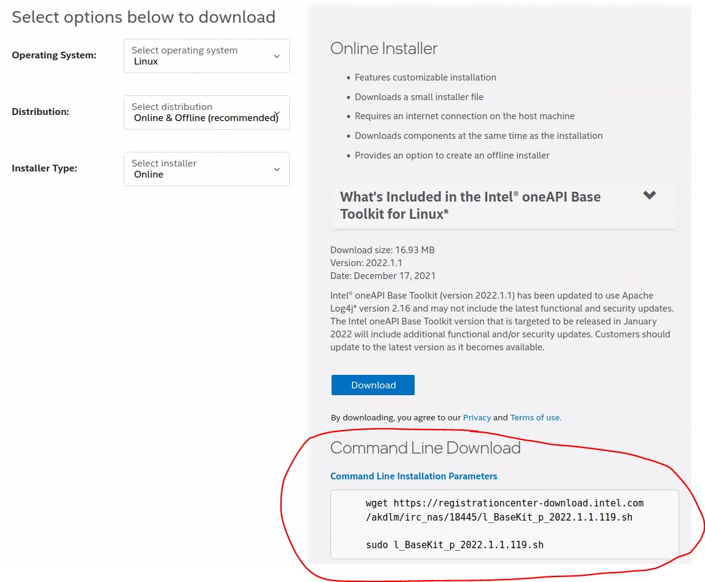
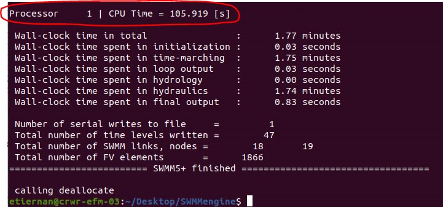
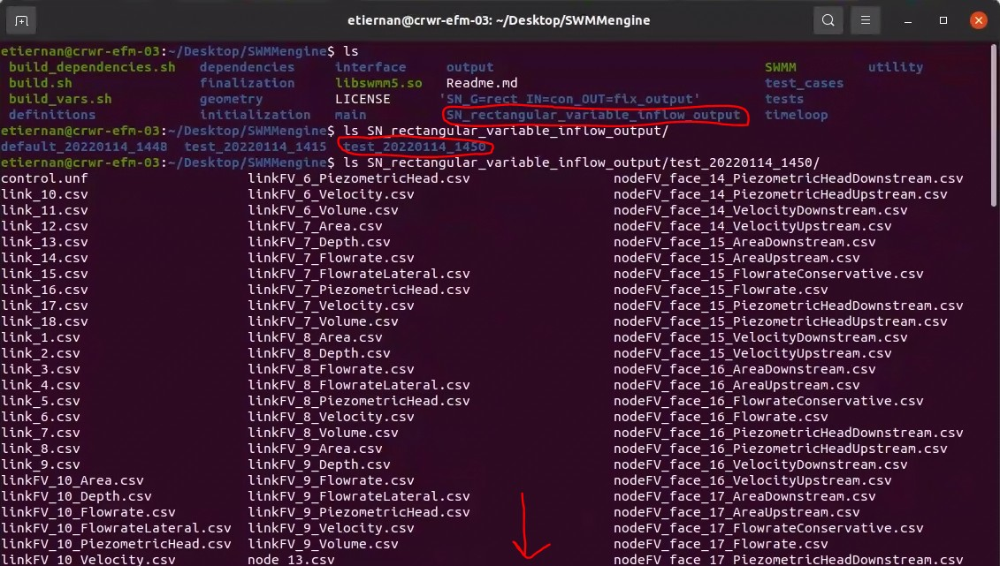

> **SWMM5+ Installation Guide**

1.  **Quick Start Guide**

> **Preface** The SWMM5+ computational engine is an alternative to the
> traditional EPA SWMM hydraulic routing module. At the present time,
> the SWMM5+ computational engine **cannot** be accessed from the EPA
> SWMM5 GUI, and must be called explicitly through command line
> arguments. This Quick Start Guide is intended to provide users a
> step-by-step instruction for *installing, running, and viewing the
> output of* the SWMM5+ software. Further details on the SWMM5+ code are
> provided in the main Beta Release Documentation.
>
> **System Requirements:** This installation guide supports **Windows
> 10** (via Docker) and Ubuntu **Linux** 16+. Other up to date Linux
> distributions will likely work, but have not been tested. Currently,
> **MacOS** users can run SWMM5+ via Docker in serial (one processor)
> mode only.
>
> **Windows 10/MacOS** users begin in
> [§1.1.](#windows-10macos---using-docker)
>
> **Linux** users begin in [§1.2.](#linux)

1.  # Windows 10/MacOS - Using Docker

    1.  **Installing the SWMM5+ Docker container**

> Install the Docker Desktop application from
> <https://www.docker.com/get-started>

# Note: If you need admin privileges to install the Docker Desktop application, you will likely need to run the following commands also as an administrator.

> After installation of the Docker Desktop application, open a command
> terminal in a directory of your choosing and execute
>
> \$ docker pull cimmresearch/swmm5plus-docker
>
> This command pulls a Docker image from the CIMM Research DockerHub
> repository. The Docker image contains the dependencies required to
> build and run the SWMM5+ executable.

# Note: This takes some time (approx. 30 minutes) and requires about 30GB of disk space.

> The Docker image itself is immutable, and cannot save any output files
> once the image is closed. For output files and edits to be recoverable
> between Docker image launches, we need to attach a "volume" folder
> from Docker to a local directory.
>
> \$ docker volume create SWMM5plus
>
> \$ docker run \--mount source=SWMM5plus,destination=/SWMM_5\_Plus
> cimmresearch/swmm5plus-docker

# Note: Beware the return line for copy-pasting the above commands. The argument cimmresearch/swmm5plus-docker is separated from the rest of the command by a simple space.

> At this point any changes made within the
> **cimmresearch/swmm5plus-docker** container will be saved and
> persisted in the SWMM5plus mounted volume. To test this, we can run a
> quick test
>
> within the Docker Desktop app. The test will be to create a textfile,
> and verify that the file is recoverable once the container is
> restarted.
>
> Open the Docker Desktop app, there should be an entry in the
> Containers/Apps window with a funny two part name, autogenerated by
> Docker, with a "cimmresearch" tag.

{width="5.46562445319335in"
height="3.0971872265966756in"}

> Figure 1: Docker Desktop GUI
>
> Hold the cursor over the container, and click "Start" to activate the
> container. Then click the "CLI" button to launch a Docker terminal.

# Note: This new terminal is running in the Docker container's Linux image, so Linux command syntax should be used.

> Create a new file called "test.txt", write some text, then save and
> close the file.
>
> \$ vim test.txt
>
> {width="5.45875in"
> height="3.0903116797900263in"}
>
> Figure 2: Text file to test that the volume was mounted to the
> container correctly.
>
> Use the command
>
> \$ exit
>
> to close the container terminal, and click the "STOP" button to close
> the container itself. Then restart the container, and use the
>
> \$ ls
>
> command to verify that the test.txt file is still there. If the
> test.txt file is not accessible, it means that the volume was not
> mounted correctly.

# Note: This test can also be run in a Windows terminal. The container can be launched using the command

> \$ docker run -it -v \[LOCAL_SWMM_FULLPATH\]:/SWMM_5\_Plus
> cimmresearch/swmm5plus-docker
>
> where the \[LOCAL_SWMM_FULLPATH\] is the path to the directory where
> the SWMM5plus Volume is mounted. Unless you've navigated away from the
> working directory, this full path ought to be everything to the left
> of the commandline marker, "\>".

# Creating the SWMM5+ executable in Docker

> Now that you have a Docker container with all necessary dependencies
> and a Volume mounted to store files, the next step is pulling the
> SWMM5+ code from the CIMM public github repository. From an active
> container (either in the Docker application GUI or in a Windows
> terminal), enter the command
>
> \$ git clone https://github.com/CIMM-ORG/SWMM5plus.git
>
> Navigate into the "SWMM5plus" directory, and build the SWMM5+
> executable using
>
> \$ ./build.sh

# Note: For more details pertaining to building the executable with optional flags, please see §3.2 of the main Beta Release Documentation.

> Another \$ ls command will reveal whether the executable (simply
> called "SWMM") has been created successfully.

{width="5.554687226596675in"
height="1.6265616797900262in"}

> Figure 3: Image of successfully compiled SWMM5+ executable. For more
> details about other files/folders in the SWMM5plus working directory,
> please see the main Beta Release Documenta- tion.

# Linux

> Linux users have options for installing and running SWMM5+. The Docker
> Desktop app and workflow can be hosted on a Linux OS; the only
> difference would be selecting the appropriate Linux distribution from
> <https://www.docker.com/get-started>.
>
> Alternatively, Linux users can install the requisite dependencies on
> their local OS to manage and run SWMM5+ without the "hassle" of
> dealing with containerization.

# Installing Dependencies

> The value of using the CIMM Docker container is that it comes
> preloaded with the dependencies needed to run SWMM5+. However, it is
> relatively straightforward to install these yourself on your native
> Linux OS.
>
> Create a folder named "oneapi_install" where the dependencies will be
> installed and kept. Open a terminal in this new folder.
>
> Open a web browser to
> [https://www.intel.com/content/www/us/en/developer/tools/](https://www.intel.com/content/www/us/en/developer/tools/oneapi/base-toolkit-download.html)
> [oneapi/base-toolkit-download.html](https://www.intel.com/content/www/us/en/developer/tools/oneapi/base-toolkit-download.html)
> and download the Intel oneAPI Base Toolkit for Linux. Select the
> Online & Offline distribution, and Online installer type.
>
> The easier method (i.e. without requiring creating an Intel account)
> for downloading this toolkit is to use the Command Line Download
> instructions on the right side of the webpage.

{width="5.491248906386701in"
height="4.537707786526684in"}

> Figure 4: Copy and paste the commands from this section to download
> the Intel oneAPI Base Toolkit. **Note: this requires nearly 30GB of
> disk space.**

# Note: For me, the second command did not work, but the same effect could be achieved with

> \$ sudo sh ./l_Basekit_p\_2022.1.1.119.sh
>
> Follow the installation wizard, ignore warnings about GUI packages or
> IDE's not being installed. This will take several minutes.
>
> The next package required is the Intel oneAPI HPC Toolkit, which can
> be down- loaded from
> [https://www.intel.com/content/www/us/en/developer/tools/oneapi/hpc](https://www.intel.com/content/www/us/en/developer/tools/oneapi/hpc-toolkit-download.html)
>
> [-toolkit-download.html](https://www.intel.com/content/www/us/en/developer/tools/oneapi/hpc-toolkit-download.html).
> Install the HPC Toolkit using the same parameters as the Base Toolkit.
>
> Once both Intel oneAPI Toolkits have been installed, we need to update
> the system variables using the command
>
> \$ source \[PATH_to_oneAPI\]/setvars.sh
>
> Where the \[PATH_to_oneAPI\] is the location where the oneAPI Toolkits
> were installed. If you used the autoinstallation wizard, it should
> tell you the installation location at the bottom left of the wizard.
> If the installation wizard has already closed, you can retrieve the
> path by repeating the command
>
> \$ sudo sh ./l_Basekit_p\_2022.1.1.119.sh
>
> which will direct you to your installed Intel oneAPI packages.
>
> To check that the installation of the Intel oneAPI Toolkits and the
> resetting of the system variables was completed correctly, execute the
> command
>
> \$ ifort -v
>
> The return should be ifort version 2021.5 or higher. If the command
> return says ifort version
>
> 18.0.2 (or something similar) that means there was an issue with the
> dependency installation that needs to be rectified before moving on.

# 1.2.2 Creating the SWMM5+ executable in Linux

> Open a command terminal in the working directory where you want to
> manage the SWMM5+ code. Then pull the code from the CIMM public github
> repository.
>
> git clone https://github.com/CIMM-ORG/SWMM5plus.git
>
> Navigate into the "SWMM5plus" directory, and build the SWMM5+
> executable using
>
> \$ ./build.sh

# Note: For more details pertaining to building the executable with optional flags, please see §3.2 of the main Beta Release Documentation.

> An \$ ls command will reveal whether the executable (simply called
> "SWMM") has been created successfully.
>
> {width="5.554687226596675in"
> height="1.6265616797900262in"}
>
> Figure 5: Image of successfully compiled SWMM5+ executable. For more
> details about other files/folders in the SWMM5plus working directory,
> please see the main Beta Release Documenta- tion.

# Running SWMM5+ and Viewing Output

> The SWMM5+ code uses a standard EPA SWMM5 .inp input file to
> initialize the simulation. Once installed and compiled (the tricky
> part), running the SWMM5+ code is as simple as calling the executable,
> and pointing it to the SWMM5.inp file you want to simulate. For
> Windows and Linux users, running the SWMM5+ code on pre-loaded test
> cases requires just one command in terminal.
>
> The following workflow illustrates an example of running the SWMM5+
> code on a small network test case and viewing the simulation output.

# Small Network Test Case

> The test case in this example is a simple hydraulic network built
> using the EPA SWMM5 GUI. Each node receives inflow from a timeseries
> meant to simulate the runoff from an attached subcatchment.

{width="5.45625in"
height="4.674374453193351in"}

> Figure 6: Example SWMM5 network. All links are 1000*m* with an initial
> inflow of 1*m*^3^*/s*. All nodes receive the same timeseries inflow
> and have an initial depth of 0*.*5*m*.

# Run SWMM5+

> Running this example network using SWMM5+ can be accomplished by
> opening a terminal in the working directory (i.e. where the SWMM5+
> executable was built), and entering the command
>
> ./SWMM ./test_cases/P_Small_Network/SN_rectangular_variable_inflow.inp

# Note: This command is sufficient to simulate the above test case with default SWMM5+ settings. To run a SWMM5+ simulation with custom settings, please see §4 and §5 of the main Beta Release Documentation.

> This command will launch the SWMM5+ simulation program, with a series
> of terminal print statements dictating the status of the simulation.
> For more details on what these print statements mean, please reference
> the main Beta Release Documentation.
>
> Important information pertaining to the simulation time and network
> details are printed out at the end of the simulation. For this
> example, the simulation time took roughly 100 seconds.

{width="5.4826038932633425in"
height="2.562603893263342in"}

> Figure 7: End of simulation summary print statements for the example
> network.
>
> **Note: The simulation for a small network (or a large network in
> serial) using SWMM5+ may take considerably longer than simulating the
> same network in EPA SWMM5.** The reason for this can be seen by the
> difference in the number of SWMM links/nodes vs the number of FV
> elements in Fig. [8.](#_bookmark2) Speed-up of the SWMM5+ engine
> (compared with EPA SWMM5) is expected only once the system is large
> enough for approx. 1,000 elements per processor spread across four+
> processors.

# View Output

> The output from a SWMM5+ simulation currently consists of a set of
> .csv files. The SWMM network links and nodes each have time-stamped
> data on system states such as Depth, Flowrate, Volume, etc. These data
> were ascertained by averaging the values from each finite volume
> element into which the original network links and nodes were
> decomposed. More detailed data from each individual finite volume
> element and face is included in their own .csv file.

# Note: The full consolidation of the simulation data into the format of an EPA SWMM5

> **.out output file is currently under development.**
>
> The described suite of .csv simulation output files can be found in a
> dedicated output folder within the working directory.
>
> {width="5.537187226596675in"
> height="3.138228346456693in"}
>
> []{#_bookmark2 .anchor}Figure 8: An output folder echoing the name of
> the input file is created in the working directory. Within that
> folder, time-stamped subfolders are dedicated to unique runs of the
> same input file. The arrow at the bottom of the image indicates that
> there are many more .csv output files than can be shown for this
> particular simulation.
>
> These csv files can be exported from their Windows 10 Volume, or Linux
> directory, into whatever post-processing environment you chose.
> Post-processing tools to automatically validate SWMM5+ simulation
> results against EPA SWMM5 simulation results are currently being
> developed.
>
> We can quickly check that the SWMM5+ simulation of our simple network
> ran through and produced reasonable results. Figure [9](#_bookmark3)
> shows a comparison of the flowrate through an arbitrary link simulated
> by the EPA SWMM GUI to the SWMM5+ hydraulic engine.

{width="2.834998906386702in"
height="1.485in"}

(a) {width="2.47502624671916in"
    height="1.8654133858267716in"}[]{#_bookmark3 .anchor}Flowrate for
    Link 1 from EPA SWMM5 GUI.

(b) Flowrate for Link 1 from SWMM5+ simulation output csv.

> Figure 9: Comparison of the flowrate through Link 1 of the simple
> network simulated by the EPA SWMM5 GUI and the SWMM5+ hydraulic
> engine.
>
> The EPA SWMM GUI plot was generated using the Report -\> Graph -\>
> Time Series plotting tool, while the SWMM5+ plot was generated by
> opening the Link_1.csv in the Linux LibreOffice Calc program. The
> agreement between EPA SWMM5 and SWMM5+ is good for small systems, but
> can diverge for larger systems due to differences in the computational
> routing approach.
