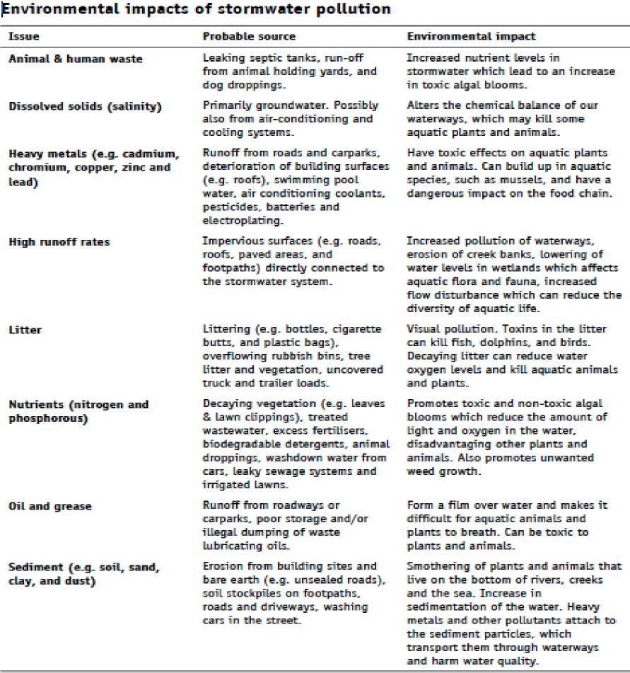
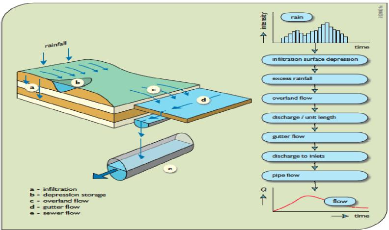
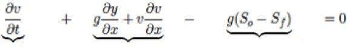

EPA 600-R-14-428 September 2014

SWMM-CAT User’s Guide

by

Lewis Rossman

> U.S. Environmental Protection Agency  
> Office of Research and Development  
> National Risk Management Research Laboratory  
> 26 Martin Luther King Drive  
> Cincinnati, OH 45268
>
> September 2014

DISCLAIMER

The information in this document has been funded wholly by the U.S. Environmental Protection Agency (EPA). It has been subjected to the Agency’s peer and administrative review, and has been approved for publication as an EPA document. Mention of trade names or commercial products does not constitute endorsement or recommendation for use.

Although a reasonable effort has been made to assure that the results obtained are correct, the computer programs described in this manual are experimental. Therefore the author and the U.S. Environmental Protection Agency are not responsible and assume no liability whatsoever for any results or any use made of the results obtained from these programs, nor for any damages or litigation that result from the use of these programs for any purpose.

ii

ABSTRACT

> The Storm Water Management Model Climate Adjustment Tool (SWMM-CAT) is a simple to use software utility that allows future climate change projections to be incorporated into the Storm Water Management Model (SWMM). SWMM was recently updated to accept a set of monthly adjustment factors for each of these time series that could represent the impact of future changes in climatic conditions. SWMM-CAT provides a set of location-specific adjustments that were derived from global climate change models run as part of the World Climate Research Programme (WCRP) Coupled Model Intercomparison Project Phase 3 (CMIP3) archive.

III

**ACKNOWLEDGEMENTS**

> This report was written by Lewis A. Rossman, Environmental Scientist Emeritus, U.S. Environmental Protection Agency, Cincinnati, OH. We would like to thank Dr. Rossman for his exemplary dedication to service.
>
> [<u>The author would like to acknowledge the assistance provided by E</u>](http://water.epa.gov/infrastructure/watersecurity/climate/creat.cfm)PA’s CREAT project team ([<u>http://water.epa.gov/infrastructure/watersecurity/climate/creat.cfm)</u>](http://water.epa.gov/infrastructure/watersecurity/climate/creat.cfm)) and Aqua Terra Consultants (under Work Assignment 5-38 of EPA Contract \#EP-C-06-029) in assembling the climate change data used in this project.

iv

ACRONYMS AND ABBREVIATIONS

CAT = Climate Adjustment Tool

CMIP3 = Coupled Model Intercomparison Project Phase 3

CREAT = Climate Resilience Evaluation and Analysis Tool

EPA = United States Environmental Protection Agency

GCM = General Circulation Model

GEV = Generalized Extreme Value

IPCC = Intergovernmental Panel on Climate Change

NCDC = National Climatic Data Center

NOAA = National Oceanic and Atmospheric Administration

NWS = National Weather Service

PRISM = Parameter-elevation Regressions on Independent Slopes Model

SWAT = Soil and Water Assessment Tool

SWMM = Storm Water Management Model

WCRP = World Climate Research Programme

v

TABLE OF CONTENTS

DISCLAIMER ii

ABSTRACT iii

ACKNOWLEDGEMENTS **i**v

ACRONYMS AND ABBREVIATIONS v

TABLE OF CONTENTS vi

TABLE OF FIGURES vi

1.  Introduction 7

2.  Installing SWMM-CAT 8

3.  Running SWMM-CAT 9

4.  Source of Climate Adjustments 14

5.References 16

TABLE OF FIGURES

Figure 1 Dialog for Registering SWMM-CAT as a SWMM Add-In Tool. 8

Figure 2 SWMM-CAT’s Main Window 9

Figure 3 Example of Monthly Temperature Adjustments. 10

Figure 4 Example of 24-Hour Design Storm Adjustments 11

Figure 5 Dialog Box Used to Save Adjustments to SWMM **1**2

Figure 6 SWMM’s Climatology Editor 13

vi

> **1. Introduction**
>
> The Storm Water Management Model Climate Adjustment Tool (SWMM-CAT) is a simple to use software utility that allows future climate change projections to be incorporated into the Storm Water Management Model (SWMM). SWMM is a dynamic rainfall-runoff-routing simulation model used for single event or long-term (continuous) simulation of stormwater runoff quantity and quality from primarily urban areas. Various versions of SWMM have been in existence since 1971 and it has been used in thousands of hydrology and drainage system design projects.
>
> SWMM uses externally supplied time series of the following climate-related variables in its hydrologic calculations:

- precipitation is the primary driving force in a SWMM simulation

- evaporation determines how quickly surfaces and soils dry out between storm events

- air temperature is used to model snow melt routines and can also be used to estimate evaporation rates.

> SWMM was recently updated to accept a set of monthly adjustment factors for each of these time series that could represent the impact of future changes in climatic conditions. Each monthly factor is used to modify all of the user-supplied climate data for a given month. As an example, if the June adjustment factor for precipitation was 1.3, then all June rainfall values supplied to SWMM would be multiplied by 1.3.
>
> Although SWMM users are free to use any set of adjustment factors they want, SWMM-CAT provides a set of location-specific adjustments that were derived from global climate change models run as part of the World Climate Research Programme (WCRP) Coupled Model Intercomparison Project Phase 3 (CMIP3) archive. These are the same climate change simulations that helped inform the United Nations Intergovernmental Panel on Climate Change in preparing its Fourth Assessment report (IPCC, 2007). Downscaled results from this archive were generated and converted into changes with respect to historical values by another EPA project called CREAT 2.0 (Climate Resilience Evaluation and Analysis Tool) (EPA, 2012). SWMM-CAT provides the linkage between CREAT 2.0’s downscaled climate change estimates and the monthly adjustment factors used by SWMM.
>
> You don’t have to run or have knowledge of SWMM to run SWMM-CAT if all you want to see are the projected future changes in monthly air temperature and rainfall at any specific location. However if you do want to run the two together then you must use SWMM version 5.1.007 or higher for it to recognize the climate adjustments that SWMM-CAT passes on to it.

7

**2. Installing SWMM-CAT**

SWMM-CAT runs as a desktop application on the Windows 7 or higher operating system. It is distributed as a zipped file named **swmm-cat_001.zip** (the 001 label will be updated as newer releases are made). It can be downloaded from the following web site:

[<u>http://www2.epa.gov/water-research/swmm-cat</u>](http://www2.epa.gov/water-research/swmm-cat)

The zip file contains three files, **swmm-cat.exe, ZedGraph.dll**, and this document that should be extracted into any folder of your choosing. You can launch SWMM-CAT independently of SWMM by double-clicking **swmm-cat.exe** in Windows Explorer or by creating a shortcut to it for your Start Menu.

If you wish to run SWMM-CAT from within SWMM itself, you have to register it as an add-in tool with SWMM. This can be done using the following steps:

1.  Launch SWMM and select **Tools \| Configure Tools** from the main menu bar.

2.  Click the **Add** button in the Tool Options dialog that appears.

3.  Fill in the Tool Properties dialog as shown in Figure 1 below. Note that this example has the

> SWMM-CAT program located in the folder [<u>C:\SWMM-CAT.</u>](C:\SWMM-CAT.) You can click the button to bring up a file dialog to find its location on your machine.
>
> 

**Figure 1 Dialog for Registering SWMM-CAT as a SWMM Add-In Tool.**

8

0.  Click **OK** to close the Tool Properties dialog and then click **Close** on the Tool Options dialog to close it as well.

1.  SWMM-CAT is now registered with SWMM. It appears as a separate option named “Climate Adjustment Tool” on the **Tools** menu which you would select to launch it from within SWMM.

**3. Running SWMM-CAT**

After SWMM-CAT is launched you are presented with the program’s main window shown in Figure 2. You can find concise instructions on how to proceed on the Help tab, but we will cover these in more detail here.

> 

**Figure 2 SWMM-CAT’s Main Window.**

The first step is to identify the location you are interested in viewing adjustments for. You can either enter its latitude and longitude coordinates (in decimal degrees separated by a comma) or its five-digit zip code.

You would then hit the **Enter** key or click the button to load in the CMIP3-CREAT 2.0 adjustments

that are closest to your site. Figure 3 is a screenshot showing how SWMM-CAT looks after a location has been supplied to it:

9

> Bing Maps [<u>(www.bing.com/maps)</u>](http://www.bing.com/maps) is a convenient way to find the coordinates of any specific address which can be copied and pasted into SWMM-CAT.
>
> 

**Figure 3 Example of Monthly Temperature Adjustments.**

The Monthly Temperature tab shows the change in average air temperature by month of the year over a future projection period. These changes are relative to the historical average monthly air temperatures from 1971 to 2000. A choice of two future 30-year projection periods is available: a near term projection from 2020 to 2049 and a far term projection from 2045 to 2074.

Note that for each month three different values are displayed. These reflect the variability in the outputs of the different global climate models from which the changes were derived. The Hot/Dry values reflect outcomes from the model that was close to both the highest annual average temperature and lowest annual rainfall, the Warm/Wet values represent the model close to the lowest annual temperature and highest annual rainfall, while the Median values come from the model whose results fell most closely to the median annual temperature and rainfall. More information on how the outcomes were selected from the CMIP3 model runs is presented in section 4 of this manual.

The Monthly Evaporation and Monthly Rainfall tabs display changes in potential monthly evaporation rate and monthly precipitation, respectively. Changes in potential evaporation rates are expressed as differences between the average monthly evaporation rate for bare soil computed from the Penman-

10

Monteith equation for the selected projection period as compared to the historical period. The rainfall changes are expressed as a percentage change from historical values. E.g, a 20 percent change for August means that the average total rainfall in August over the future projection period is 20 percent higher than over the historical record at the location being considered. A -10 percent change would mean that average rainfall was 10 percent lower than that from the historical record.

The 24-Hour Design Storm tab shows the percent change in the highest annual 24-hour rainfall that occurs at a given return period. Looking at Figure 4, we see that for the near term projection period under the Warm/Wet outcome, the largest 24-hour rainfall that occurs on average once every 5 years increases by 6 percent relative to the historical value. The once in 50 year rainfall for this scenario increases by only 2 percent.

> 

**Figure 4 Example of 24-Hour Design Storm Adjustments**

> You can observe the numerical value of a point plotted on any of SWMM-CAT’s graphs by holding the mouse over the point.

11

Once you have selected a future projection period and a climate change outcome (Hot/Dry, Median or Warm/Wet) to use, you can click the <u>Save Adjustments to SWMM and Exit</u> label to save the adjustments associated with those choices to a SWMM input file. Figure 5 shows the dialog box that appears asking for the name of an existing SWMM input file and which type of adjustments to save to it. You can click

the button to open a file selection dialog to locate your SWMM input file.

> If you launched SWMM-CAT from within SWMM then the SWMM file name box will be disabled since SWMM has created and passed in to SWMM-CAT a temporary file containing the project data you were working on in SWMM. After SWMM-CAT closes, control is passed back to SWMM which reads the climate adjustments from the updated input file and makes them available for editing in its Climatology Editor (see below).
>
> 

**Figure 5 Dialog Box Used to Save Adjustments to SWMM**

Since only one set of rainfall adjustments can be used in a SWMM project, the Monthly Rainfall and 24-Hour Design Storm options are mutually exclusive. If you select the Design Storm option then you should also select a return period for the adjusted storm’s magnitude from the drop down list box next to it.

12

> SWMM-CAT always displays temperature changes in degrees Celsius and evaporation changes in inches/day. When saving these adjustments to a SWMM file it will automatically detect the unit system used in the file and convert temperature to degrees Fahrenheit for US units and convert evaporation to mm/day for SI units.

Once you click the **Save and Exit** button SWMM-CAT will terminate with your selected set of adjustments saved to your SWMM input file. If you launched SWMM-CAT from within SWMM, then the SWMM window will appear once again. At this point you can verify that the adjustments were made (or edit them if you wish) by opening SWMM’s Climatology Editor and selecting its **Adjustments** tab. (To open the

editor, select **Climatology** from the Project Browser list box and click the button below it.) The  
Climatology Editor is pictured in Figure 6 below.

> 

**Figure 6 SWMM’s Climatology Editor**

13

**4. Source of Climate Adjustments**

As stated earlier, SWMM-CAT obtains its climate change scenarios and their effect on local precipitation and temperature from another EPA project called CREAT 2.0 (Climate Resilience Evaluation and Analysis Tool) (EPA, 2012). CREAT is a decision support tool to assist drinking water and wastewater utility owners in understanding, evaluating and addressing climate change risks. It contains a database of climate change effects across the US localized to a grid of 0.5 degrees in latitude and longitude (about 30 by 30 miles). These effects include changes in monthly average precipitation, monthly average temperature, and extreme event 24-hour rainfall amounts for each of three different climate change scenarios in two different future time periods.

CREAT uses statistically downscaled General Circulation Model (GCM) projections from the World Climate Research Programme (WCRP) Coupled Model Intercomparison Project Phase 3 (CMIP3) archive (Meehl et al., 2007) as the source of its climate change data. The CMIP3 archive was chosen by CREAT because:

- it contains 112 runs from 16 internationally recognized models using several emission scenarios;

- it supported model-based analyses presented in the IPCC Fourth Assessment Report (IPCC, 2007);

- it facilitates the comparison and diagnosis of model outputs by standardizing many of the assumptions and boundary conditions used;

- it is downscaled to appropriate spatial (regional, watershed) and temporal (monthly) scales using a proven downscaling technique;

- it contains well-documented model output that is widely available to researchers; and

- it has a high degree of scientific credibility and the archive encompasses a broad range of assumptions concerning demography, economic integration, technological advance, energy use, and greenhouse gas emissions.

CREAT limited its use of CMIP3 results to the nine GCM models that were most representative of US climate conditions and used the IPCC’s “middle of the road” projection of future economic growth. The latter is characterized by (1) rapid economic growth, (2) global population that peaks in mid-century, (3) the quick spread of new and efficient technologies, (4) the global convergence of income and ways of life, and (5) a balance of both fossil fuel and non-fossil energy sources (IPCC, 2007).

Each of the nine models produces a different set of monthly results for each future year within each downscaled 1/2 degree grid cell. To represent this type of uncertainty inherent in predicting future climate conditions, CREAT defined three scenarios that span the range of results produced by the models for any given projection year. The Warm/Wet scenario used the model that came closest to the 5th percentile of annual temperature change and 95th percentile of annual rainfall change. The Median scenario selected the model that was closest to the median temperature and rainfall changes. The Hot/Dry scenario used the model that was closest to the 95th percentile temperature change and 5th percentile rainfall change. Two different projection periods were selected: 2020 to 2049 and 2045 to 2074. The terms “warm and hot” and “dry and wet” are used here relative to the range on overall average temperature and

14

precipitation for the future forecast period. For example, dry does not always indicate a reduction in total precipitation relative to today; it simply indicates a projected total precipitation that lies on the lower end of the distribution of projected precipitation.

Once the model output to use for each scenario in each projection year in each grid cell was identified, CREAT extracted its CMIP3 results to produce a database of percent changes in monthly average precipitation and absolute changes in monthly average temperature for each scenario for each of the two projection periods in each grid cell across the US. The historical average temperatures and precipitation amounts that were used as a baseline to compute changes for each of these variables were obtained from the Parameter-elevation Regressions on Independent Slopes Model (PRISM) dataset (Daly et al., 2008). These data provided 30-year historical annual and monthly averages for each grid cell from 1971–2000.

Since it was not feasible to port the entire CREAT grid into SWMM-CAT, monthly temperature and precipitation changes were instead associated with the National Weather Service’s (NWS) national network of weather stations and rain gages. For each of 5,236 weather stations, average monthly temperature changes for each future climate scenario were obtained from the CREAT grid cell nearest to the station. Likewise, for each of 8,159 rain gages, average monthly precipitation changes were taken from the nearest CREAT grid cell. This resulted in a set of six temperature change files, one for each combination of projection period and climate model outcome (warm/wet, median, and hot/dry), with 5,236 records in each file and 12 fields in each record (i.e., the twelve monthly temperature changes). A similar set of six data files for monthly precipitation changes, each with 8,159 records, was created. Thus whenever SWMM-CAT needs to look up a set of monthly changes for a particular location it uses the results from the nearest weather station or rain gage location stored in these files.

Changes in evaporation rate, which were not part of the CREAT database, were developed in a slightly different manner. The Penman-Monteith algorithm was extracted from the SWAT model (Neitsch et al., 2005), and used to compute daily potential evaporation rates for bare soil from twenty years or more of historically recorded daily min/max air temperature at each weather station. The other meteorological variables in the algorithm, solar radiation, relative humidity, and wind speed, were generated from data contained in the closest SWAT reference weather station. Additional details of this calculation can be found in the Quality Assurance Report produced for the EPA’s National Stormwater Calculator project by Aqua Terra Consultants (Aqua Terra Consultants, 2011). From this historical time series of daily evaporation rates monthly averages were then computed. This calculation was then repeated, after first adjusting each historical daily max/min temperature by the CREAT temperature change for the month in which it fell. The difference between the temperature adjusted monthly average evaporation rates and the historical monthly average rates serve as the evaporation adjustments used by SWMM-CAT. This process was repeated six different times for each combination of future projection period and climate model outcome, resulting in another set of six files, each containing 5,236 records of twelve average monthly changes in evaporation rate.

The final climate related outcome that SWMM-CAT includes is the change in the size and frequency of intense precipitation events. CREAT considered this effect of climate change by fitting Generalized Extreme Value (GEV) probability distributions to the collection of annual maximum daily rainfall amounts

15

simulated over each future projection period by each of the three CMIP3 models selected in each grid cell. A GEV distribution was also fit to historical daily rainfall data from 4800 stations archived by NOAA’s National Climatic Data Center that had 30 or more years of data. From the GEV distributions, the annual maximum 24-hour rainfall depths for return periods of 5, 10, 15, 30, 50, and 100 years were easily calculated. These values were placed in a set of seven files, one for the historical values at each recording station and six for the future forecasts under each climate change scenario for the CREAT grid cells nearest to each precipitation station. SWMM-CAT uses these files to look up the station closest to the location being analyzed to return the relative difference between the historical and future extreme value rainfall at each return period.

**5. References**

Aqua Terra Consultants (2011). “Quality Assurance Project Plan – Stormwater Calculator Technical Support.”EPA Contract \#EP-C-06-029, Work Assignments \#4-38 and 5-38.

Daly, C., Halbleib, M., Smith, J.I., Gibson, W.P., Doggett, M.K., Taylor, G.H., Curtis, J., and Pasteris, P.P. (2008). “Physiographically sensitive mapping of climatological temperature and precipitation across the conterminous United States”, *Int. J. Climatol*., Published online in Wiley InterScience ([<u>www.interscience.wiley.com</u>](http://www.interscience.wiley.com)) DOI: 10.1002/joc.1688.

IPCC (Intergovernmental Panel on Climate Change) (2007). Climate Change 2007: Synthesis Report - Summary for Policymakers. Available online at:

[<u>http://www.ipcc.ch/pdf/assessment-report/ar4/syr/ar4_syr.pdf</u>](http://www.ipcc.ch/pdf/assessment-report/ar4/syr/ar4_syr.pdf)

Meehl, G. A., C. Covey, T. Delworth, M. Latif, B. McAvaney, J. F. B. Mitchell, R. J. Stouffer, and K. E. Taylor. (2007). “The WCRP CMIP3 multi-model dataset: A new era in climate change research”, *Bulletin of the American Meteorological Society*, 88, 1383-1394.

Neitsch S.L., J.G. Arnold, J.R. Kiniry, and J.R. Williams (2005). “Soil and Water Assessment Tool Theoretical Documentation.” Version 2005, *Agricultural Research Service and Texas Agricultural Experiment Station*, January 2005.

U.S. Environmental Protection Agency (EPA) (2012). *Climate Resilience Evaluation and Awareness Tool Version 2 Methodology Guide*, part of the CREAT Version 2.0 software available at: [<u>http://water.epa.gov/infrastructure/watersecurity/climate/creat.cfm</u>](http://water.epa.gov/infrastructure/watersecurity/climate/creat.cfm)

16
