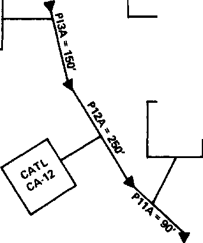

a30193

**CALIBRATION OF A DISTRIBUTED ROUTING RAINFALL-RUNOFF MODEL AT**

**FOUR URBAN SITES NEAR MIAMI, FLORIDA**

**By W. Harry Doyle, Jr. and *Jeffrey* E. Miller**

**U.S. GEOLOGICAL SURVEY**

**Water-Resources Investigations 80-1**

**February 1980**

UNITED STATES DEPARTMENT OF THE-INTERIOR

> CECIL D. ANDRUS, Secretary

GEOLOGICAL SURVEY

H. William Menard, Director

> For additional information write to:
>
> U.S. Geological Survey, WRD  
> Gulf Coast HydroscAonce,Center  
> National Space Technology Laboratories  
> NSTL Station, Mississippi 39529
>
> II

CONTENTS

Page

> Metric conversions VII
>
> Abstract 1
>
> Objectives and introduction 1
>
> Description of model 3
>
> Calibration and verification of the model 4
>
> Highway site 4
>
> Data management system 4
>
> Rainfall and soil-moisture analysis 6
>
> Input data requirements 11
>
> Physical representation of the basin in the model 11
>
> Calibration option 11
>
> Discussion of calibration results 17
>
> Verification of model 22
>
> Single-family residential site 22
>
> Physical representation of the basin in the model 22
>
> Rainfall and soil-moisture analysis 39
>
> Calibration results 39
>
> Verification results 42
>
> Commercial site 42
>
> Physical representation of the basin in the model 42
>
> Rainfall and soil-moisture analysis 53
>
> Calibration results 53
>
> Verification results 60
>
> Multifamily residential site 60
>
> Physical representation of the basin in the model 60
>
> Rainfall and soil-moisture analysis 60
>
> Calibration results 75
>
> Verification results 80
>
> Summary and conclusions 80
>
> Selected references 86

III

ILLUSTRATIONS

Page

Figure 1. Map showing location of the four urban sites---- 2

2.  Flow chart of model calibration and verification

> processes for Miami urban sites 5

3.  Format of "RRSUMRY" retrieval printout 7

4.  Graph showing rainfall-runoff relation for high-

> way site 8

5.  Contributing-areas (CA) map of highway site 12

6.  Map showing impervious and hydraulically connected

> impervious area of the highway site 14

7.  Flow chart of 25 segment representation

> of highway site and expanded view of the model
>
> representation of pipe 7 and catchment J and
>
> catchment G 16

8.  Graphs showing calibration storms for site 2,

> highway site 21

9.  Graphs showing verification storms for site 2,

> highway site 25

10. Graphs showing verification storms for site 2,

> highway site 31

11. Contributing-areas (CA) map of single-family

> residential site 34

12. Map showing impervious and hydraulically connected impervious areas of the single-family' residential

> site 36

13. Flow chart of 25 segment representation

> of single-family residential site 38

14. Graph showing rainfall-runoff relation for single-

> family residential site 40

15. Graphs showing calibration storms for site 1,

> single-family residential site 44

16. Graphs showing verification storms for site 1,

> single-family residential site 46

17. Contributing-areas (CA) map of commercial site 51

18. Map showing impervious and hydraulically con­nected impervious areas of the commercial

> sites 54

19. Flow chart showing 42 segment representation

> of commercial site 56

20. Graph showing rainfall-runoff relation for com-

> mercial site 57

21. Graph showing site 3, smaller storms showing

> effect of impervious retention 58

22. Graphs showing calibration storms for site 3,

> commercial site 62

23. Graphs showing verification storms for site 3,

> commercial site 64

24. Map showing contributing-areas (CA) of multi-

> family residential site 70

IV

<table>
<colgroup>
<col style="width: 10%" />
<col style="width: 6%" />
<col style="width: 70%" />
<col style="width: 12%" />
</colgroup>
<tbody>
<tr class="odd">
<td colspan="2">Figure 25.</td>
<td><blockquote>

Map showing impervious and hydraulically connected impervious areas of the multifamily residential

</blockquote></td>
<td>Page</td>
</tr>
<tr class="even">
<td></td>
<td></td>
<td><blockquote>

site

</blockquote></td>
<td>72</td>
</tr>
<tr class="odd">
<td></td>
<td><ol start="26" type="1">
<li></li>
</ol></td>
<td><blockquote>

Flow chart of 28 segment representation

of multifamily residential site

</blockquote></td>
<td>74</td>
</tr>
<tr class="even">
<td></td>
<td><ol start="27" type="1">
<li></li>
</ol></td>
<td><blockquote>

Graph showing rainfall-runoff relation for multi-

family residential site

</blockquote></td>
<td>76</td>
</tr>
<tr class="odd">
<td></td>
<td><ol start="28" type="1">
<li></li>
</ol></td>
<td><blockquote>

Graphs showing calibration storms for site 4,

multifamily residential site

</blockquote></td>
<td>79</td>
</tr>
<tr class="even">
<td></td>
<td><ol start="29" type="1">
<li></li>
</ol></td>
<td><blockquote>

Graphs showing verification storms for site 4,

multifamily residential site

</blockquote></td>
<td>82</td>
</tr>
<tr class="odd">
<td>Table</td>
<td>1.</td>
<td><blockquote>

TABLES

Parameters for soil-moisture accounting and

infiltration

</blockquote></td>
<td>9</td>
</tr>
<tr class="even">
<td></td>
<td>2.</td>
<td><blockquote>

Parameter values for soil-moisture accounting

and infiltration at the highway site

</blockquote></td>
<td>10</td>
</tr>
<tr class="odd">
<td></td>
<td>3.</td>
<td><blockquote>

List of impervious, pervious, effective impervious

and total areas for highway site

</blockquote></td>
<td>13</td>
</tr>
<tr class="even">
<td></td>
<td>4.</td>
<td><blockquote>

Highway site pipe-segment information

</blockquote></td>
<td>15</td>
</tr>
<tr class="odd">
<td></td>
<td>5.</td>
<td><blockquote>

Model calibration results--highway site, Miami,

Fla.

</blockquote></td>
<td>19</td>
</tr>
<tr class="even">
<td></td>
<td>6.</td>
<td><blockquote>

Model verification results--highway site, Miami,

Fla.

</blockquote></td>
<td>23</td>
</tr>
<tr class="odd">
<td></td>
<td>7.</td>
<td><blockquote>

Remaining model verification results--highway site,

Miami, Fla.

</blockquote></td>
<td>27</td>
</tr>
<tr class="even">
<td></td>
<td>8.</td>
<td><blockquote>

List of impervious, effective impervious, and total

areas for single-family residential site

</blockquote></td>
<td>35</td>
</tr>
<tr class="odd">
<td></td>
<td>9.</td>
<td><blockquote>

Single-family residential site pipe-segment

information

</blockquote></td>
<td>37</td>
</tr>
<tr class="even">
<td></td>
<td>10.</td>
<td><blockquote>

Parameter values for soil-moisture accounting and infiltration at the single-family residential

site

</blockquote></td>
<td>41</td>
</tr>
<tr class="odd">
<td></td>
<td>11.</td>
<td><blockquote>

Model calibration results--single-family residen-

tial site, Miami, Fla.

</blockquote></td>
<td>43</td>
</tr>
<tr class="even">
<td></td>
<td>12.</td>
<td><blockquote>

Model verification results--single-family resi-

dential site, Miami, Fla.

</blockquote></td>
<td>45</td>
</tr>
<tr class="odd">
<td></td>
<td>13.</td>
<td><blockquote>

Remaining model verification results--single-

</blockquote>

family residential site, Miami, Fla.
</td>
<td>48</td>
</tr>
<tr class="even">
<td></td>
<td>14.</td>
<td><blockquote>

List of impervious, pervious, effective impervious,

and total areas for commercial site

</blockquote></td>
<td>52</td>
</tr>
<tr class="odd">
<td></td>
<td colspan="2"><blockquote>

15. Commercial site pipe-segment information

</blockquote></td>
<td>55</td>
</tr>
<tr class="even">
<td></td>
<td colspan="2"><blockquote>

16.1 Parameter values for soil-moisture accounting and

infiltration at the commercial site

</blockquote></td>
<td>59</td>
</tr>
<tr class="odd">
<td></td>
<td>17.</td>
<td><blockquote>

Model calibration results--commercial site, Miami,

Fla.

</blockquote></td>
<td>61</td>
</tr>
</tbody>
</table>

V

<table>
<colgroup>
<col style="width: 11%" />
<col style="width: 6%" />
<col style="width: 72%" />
<col style="width: 9%" />
</colgroup>
<tbody>
<tr class="odd">
<td></td>
<td></td>
<td></td>
<td>Page</td>
</tr>
<tr class="even">
<td>Table</td>
<td>18.</td>
<td><blockquote>

Model verification results--commercial site, Miami,

Fla

</blockquote></td>
<td>63</td>
</tr>
<tr class="odd">
<td></td>
<td>19.</td>
<td><blockquote>

Remaining model verification results--commercial

site, Miami, Fla.

</blockquote></td>
<td>65</td>
</tr>
<tr class="even">
<td></td>
<td>20.</td>
<td><blockquote>

Lists of impervious, pervious, effective impervious, and total areas for multifamily residential

site

</blockquote></td>
<td>71</td>
</tr>
<tr class="odd">
<td></td>
<td>21.</td>
<td><blockquote>

Multifamily residential site pipe-segment

information

</blockquote></td>
<td>73</td>
</tr>
<tr class="even">
<td></td>
<td>22.</td>
<td><blockquote>

Parameter values for soil-moisture accounting and infiltration at the multifamily residential

site

</blockquote></td>
<td>77</td>
</tr>
<tr class="odd">
<td></td>
<td>23.</td>
<td><blockquote>

Model calibration results--multifamily residential

site, Miami, Fla.

</blockquote></td>
<td>78</td>
</tr>
<tr class="even">
<td></td>
<td>24.</td>
<td><blockquote>

Model verification results--multifamily residential

site, Miami, Fla.

</blockquote></td>
<td>81</td>
</tr>
<tr class="odd">
<td></td>
<td>25.</td>
<td><blockquote>

Remaining model verification results--multifamily

residential site, Miami, Fla.

</blockquote></td>
<td>83</td>
</tr>
</tbody>
</table>

VI

> CALIBRATION OF A DISTRIBUTED ROUTING RAINFALL-RUNOFF MODEL AT FOUR URBAN SITES NEAR MIAMI, FLORIDA

By W. Harry Doyle, Jr. and Jeffrey E. Miller

ABSTRACT

Urban stormwater data from four Miami, Fla. catchments were

collected and compiled by the U.S. Geological Survey and were used

for testing the applicability of deterministic modeling for characterizing

stormwater flows from small land-use areas. A description of model

calibration and verification is presented for:

1)  A 40.3-acre single-family residential area,

2)  A 58.3-acre highway area,

3)  A 20.4-acre commercial area, and

4)  A 14.7-acre multifamily residential area.

Rainfall-runoff data for 80, 108, 114, and 52 storms at sites 1, 2, 3, and 4, respectively, were collected, analyzed, and stored on direct-access files. Rainfall and runoff data for these storms (at 1-minute time intervals) were used in flow-modeling simulation analyses. A distributed routing Geological Survey rainfall-runoff model was used to determine rainfall excess and route overland and channel flows at each site. Optimization of soil-moisture-accounting and infiltration parameters was performed during the calibration phases. The results of this study showed that with qualifications an acceptable verification of the Geological Survey model can be achieved.

OBJECTIVES AND INTRODUCTION

The purpose of this report is to present mathematical modeling results of the rainfall-runoff process for urban stormwater data collected from January 1974 to June 1978, near Miami, Fla. A distributed routing rainfall-runoff model developed by Dawdy, Schaake, and Alley (1978) was calibrated and verified for four urban sites located near Miami in Broward and Dade Counties, Fla.

The report also describes the procedures used to achieve calibration and verification. Similar study areas could be modeled following report guidelines. The four sites were:

1)  A 40.8-acre single-family residential area,

2)  A 58.3-acre highway area,

3)  A 20.4-acre commercial area, and

4)  A 14.7-acre multifamily residential area.

The location of these sites is shown in figure 1.

1

Rainfall-runoff data for 80, 108, 114, and 52 storms at sites 1, 2, 3, and 4, respectively, were collected and analyzed, and the results were stored on direct-access disk files. Rainfall and runoff data are available at 1-minute time intervals. This unique detailed sampling information provided a significant data base of hydrograph information for flow that was used for model calibration and verification.

> DESCRIPTION OF MODEL

An urban watershed model developed by Dawdy, Schaake, and Alley (1978)--hereafter referred to as the DSA model--was adopted to route rainfall runoff to the outlet of each urban site. Modifications were made to the model (W. M. Alley, written commun., 1978) to accommodate 1-minute rainfall and runoff data recorded for these sites.

The model uses kinematic wave theory for routing flows over con­tributing areas through channels and (or) storm sewers that can be branched to the watershed outlet. A soil infiltratioh and moisture-accounting procedure (Dawdy and others, 1972) is used to determine the effect of antecedent conditions on the pervious watershed infiltration and to compute rainfall excess. The rainfall excess is then routed over pervious surfaces and two types of impervious surfaces: (1) hydraulically effective impervious areas (HEIA)--impervious areas draining directly into the channel drainage system, and (2) noneffective impervious areas (NIA)--impervious areas that drain onto pervious areas.

For a given modeling application, the drainage basin can be divided into as many as four types of segments:

1)  Overland-flow segments,

2)  Channel or pipe segments,

3)  Reservoir segments, and

4)  Nodal segments.

The DSA model was modified to accept as many as 99 total segments which provides the user a significant amount of flexibility for delineating the drainage basin. Channel segments are allowed to receive upstream inflow from as many as three segments, including any of types (2) to (4). In addition, a channel or pipe segment can receive uniformly distributed lateral inflow from overland-flow segments. The overland-flow segments receive uniformly distributed lateral inflow from excess precipitation. The model provides the option to use two types of reservoir routing (not tested in this report)--linear-storage routing or modified-Puls routing. It can also accept two types of nodal segments. These are junctions and input hydrographs.

Kinematic wave theory using a finite-difference solution scheme is applied to overland flow and channel or pipe routing. Kinematic wave equations are an approximation of the St. Venant equations in which the dynamic effects of flood wave movement are neglected. In this approxi­mation the friction slope is assumed equal to the channel slope.

3

Pipe flow in the model is limited to nonpressurized flow. When the runoff is greater than the capacity of nonpressurized pipe flow, the excess water is stored and later released when the runoff is less than this capacity.

> CALIBRATION AND VERIFICATION OF THE MODEL  
> <u>Highway Site</u>

The same procedure for calibrating and verifying the DSA model was utilized at each of the four sites. For continuity, the following

detailed discussion will pertain only to the 58.3-acre highway site. Later sections of this report will summarize calibration and verification results for the other sites. The highway basin contains a 3,000-foot highway section and is 36 percent impervious (21 acres) and 64 percent pervious (37 acres). The impervious area includes 14 acres of roads and 1 acre of roof tops.

<u>Data Management System</u>

Rainfall and stage data were recorded at the highway site for the period April 1975 through July 1977. Discharge was computed from two stage readings in a U-shaped constriction and recorded using an urban-hydrology monitor at the site (Smoot and others, 1974). During the period of record, 397 rain storms were recorded at 36-second sampling intervals. Of these, data for 108 were digitized and stored in a data-management system at 1-minute intervals. Storms selected for computer storage generally exceeded 0.10 in. rainfall. Water-quality samples were obtained for 42 of the 108 storms, and these data are also stored in the data base.

The quality of the data was generally good. However, the following problems could be sources of error: (1) The discharge rating in the constriction at the outlet for the transition between open-channel flow and pressure flow is not well defined. This produces slightly questionable discharges in the 25 to 35 ft3/s range. (2) Delineation of contributing drainage areas was difficult because of the flat topograpy, however, a field reconnaissance was made at all sites and the best values obtained.

A data management system was developed to store, edit, and retrieve the data collected in the Miami urban studies (Wilson and others, 1978). The data base, currently comprising 834 IBMI! 3350 disk tracks, is a random access file (360/370 direct access) designed as a user-oriented file for use with Fortran programs. Figure 2 shows the activity flow associated with acquiring model calibration and verification data from , the data base.

1/The use of the brand name in this report is for identification purposes only and does not imply endorsement by the U.S. Geological Survey.

**4**

> Figure 2.--Flow chart of model calibration and verification processes for Miami urban sites.

5

> <u>Rainfall and Soil-Moisture Analysis</u>
>
> A retrieval program "RRSUMRY", part of the data management system, was used to retrieve individual storm data for all 108 storms stored for the highway site. The retrieval format "RRSUMRY" generates (fig. 3) provides data needed to evaluate the storm. The observed rainfall (inches) versus the observed runoff (inches) were plotted (fig. 4). The graph was used as a guide for selecting a range of storms to use for an initial calibration data set. The number of storms selected was based upon how many the model could analyze during a run and also the total number of available storms. Twenty-eight representative storms were chosen. These included storms with rainfall ranging from 0.22 in. to 3.02 in. The observed peak discharge for these storms ranged from 0.32 to 43.9 ft3/s.
>
> The clone of the runoff versus rainfall retntion (fig. 4r
>
> 4., storms having less than 1.5 in. of rainfall was 0.18. The total
>
> SEIA was okl4imated as 10.5 **acres or** about 18 percent of the total
>
> **htiohwayn.ars** This implies that the HEIA is the source for a
>
> large percentage of the runoff for most storms which have rainfall up to 1.5 in. (Miller, 1978).
>
> Antecedent soil-moisture conditions affect the actual runoff amount. A detailed analysis of the soil-moisture accounting process using observed rainfall and runoff data indicated that in addition to impervious runoff, pervious areas contributed some rainfall excess under certain antecedent conditions. The analysis resulted in initial estimated values for the seven soil-moisture-accounting parameters (table 1). The data (table 2) indicated a highly porous, rapidly infiltrating soil. Consequently, pervious surfaces yield little overland runoff for most storms with rainfall less than 1.5 in. if there were 3 or more days prior to a storm without any appreciable rainfall. This is considered typical of soil types prevalent in the study areas (R. A. Miller, oral commun., 1978).
>
> Rainfall in any amount and intensity can occur at any time during the year in the Miami area. This creates wide fluctuations in antecedent soil-moisture conditions in the study area. Storm data illustrated that many storms were a part of very complex storm systems and not isolated events with preceding long dry periods. Runoff periods plotting near the 18 percent slope line of figure 4 represent drier conditions, and the resulting scatter of the data about the line verifies a fluctuating antecedent soil-moisture situation. Scatter at the low end is caused (in part) by the changing impervious retention while overall scatter is also the result of errors in precipitation and flow measurements.
>
> There are two recording rain gages in the highway basin. One gage operated satisfactorily for all storms, while the other malfunctioned for many of the storms. An automobile ran into the problem-plagued gage in June 1976 and destroyed it. Therefore, rainfall data from only one gage were used as model input for all highway site storm simulations. This probably induced no additional error into the results because the two gages were in close proximity and when both gages were functioning, little areal variation in rainfall was observed.
>
> 6
>
> **SITE NO: 2**
>
> **STORM NO: 29**
>
> **MON DAY YR HR MN MON DAY YR HR MN**
>
> **STATION ID: 261629080072400 FROM 10 -14 -75 13:15 TO 10 -14 -75 16:0**
>
> **NOTE: "'RAINFALL AND RUNOFF IN INCHES, DISCHARGE IN CUBIC FEET PER SECOND**

<table>
<colgroup>
<col style="width: 5%" />
<col style="width: 10%" />
<col style="width: 13%" />
<col style="width: 9%" />
<col style="width: 13%" />
<col style="width: 9%" />
<col style="width: 13%" />
<col style="width: 9%" />
<col style="width: 14%" />
</colgroup>
<tbody>
<tr class="odd">
<td><strong>TIME</strong></td>
<td><strong>DISCHARGE</strong></td>
<td colspan="4"><blockquote>

<strong>TIME INTERVAL OF BASIC DATA: 1.0 MINUTE (S) PRINT INTERVAL: EVERY 5 MINUTES</strong>

</blockquote>

<strong>ACCUMULATED RAINFALL ACCUMULATED RAINFALL</strong>

<strong>RUNOFF GAGE 1 RAIN 1 GAGE 2</strong>
</td>
<td><blockquote>

<strong>ACCUMULATED RAIN 2</strong>

</blockquote></td>
<td><blockquote>

<strong>RAINFALL GAGE 3</strong>

</blockquote></td>
<td><blockquote>

<strong>ACCUMULATED RAIN 3</strong>

</blockquote></td>
</tr>
<tr class="even">
<td><strong>13:15</strong></td>
<td><strong>0.00</strong></td>
<td><strong>0.00</strong></td>
<td><strong>0.00</strong></td>
<td><strong>0.00</strong></td>
<td><strong>0.00</strong></td>
<td><strong>0.00</strong></td>
<td><strong>0.00</strong></td>
<td><strong>0.00</strong></td>
</tr>
<tr class="odd">
<td><strong>13:20</strong></td>
<td><strong>1.55</strong></td>
<td><strong>0.00</strong></td>
<td><strong>0.28</strong></td>
<td><strong>0.28</strong></td>
<td><strong>0.30</strong></td>
<td><strong>0.30</strong></td>
<td><strong>0.00</strong></td>
<td><strong>0.00</strong></td>
</tr>
<tr class="even">
<td><strong>13:25</strong></td>
<td><strong>4.09</strong></td>
<td><strong>0.01</strong></td>
<td><strong>0.12</strong></td>
<td><strong>0.40</strong></td>
<td><strong>0.12</strong></td>
<td><strong>0.42</strong></td>
<td><strong>0.00</strong></td>
<td><strong>0.00</strong></td>
</tr>
<tr class="odd">
<td><strong>13:30</strong></td>
<td><strong>4.88</strong></td>
<td><strong>0.01</strong></td>
<td><strong>0.03</strong></td>
<td><strong>0.43</strong></td>
<td><strong>0.08</strong></td>
<td><strong>0.50</strong></td>
<td><strong>0.00</strong></td>
<td><strong>0.00</strong></td>
</tr>
<tr class="even">
<td><strong>13:35</strong></td>
<td><strong>3.65</strong></td>
<td><strong>0.02</strong></td>
<td><strong>0.10</strong></td>
<td><strong>0.53</strong></td>
<td><strong>0.06</strong></td>
<td><strong>0.56</strong></td>
<td><strong>0.00</strong></td>
<td><strong>0.00</strong></td>
</tr>
<tr class="odd">
<td><strong>13:40</strong></td>
<td><strong>3.36</strong></td>
<td><strong>0.02</strong></td>
<td><strong>0.00</strong></td>
<td><strong>0.53</strong></td>
<td><strong>0.00</strong></td>
<td><strong>0.56</strong></td>
<td><strong>0.00</strong></td>
<td><strong>0.00</strong></td>
</tr>
<tr class="even">
<td><strong>13:45</strong></td>
<td><strong>3.09</strong></td>
<td><strong>0.03</strong></td>
<td><strong>0.00</strong></td>
<td><strong>0.53</strong></td>
<td><strong>0.00</strong></td>
<td><strong>0.56</strong></td>
<td><strong>0.00</strong></td>
<td><strong>0.00</strong></td>
</tr>
<tr class="odd">
<td><strong>13:50</strong></td>
<td><strong>2.57</strong></td>
<td><strong>0.03</strong></td>
<td><strong>0.00</strong></td>
<td><strong>0.53</strong></td>
<td><strong>0.00</strong></td>
<td><strong>0.56</strong></td>
<td><strong>0.00</strong></td>
<td><strong>0.00</strong></td>
</tr>
<tr class="even">
<td><strong>13:55</strong></td>
<td><strong>2.57</strong></td>
<td><strong>0.04</strong></td>
<td><strong>0.00</strong></td>
<td><strong>0.53</strong></td>
<td><strong>0.00</strong></td>
<td><strong>0.56</strong></td>
<td><strong>0.00</strong></td>
<td><strong>0.00</strong></td>
</tr>
<tr class="odd">
<td><strong>14:00</strong></td>
<td><strong>1.36</strong></td>
<td><strong>0.04</strong></td>
<td><strong>0.00</strong></td>
<td><strong>0.53</strong></td>
<td><strong>0.00</strong></td>
<td><strong>0.56</strong></td>
<td><strong>0.00</strong></td>
<td><strong>0.00</strong></td>
</tr>
<tr class="even">
<td><strong>14:05</strong></td>
<td><strong>0.88</strong></td>
<td><strong>0.04</strong></td>
<td><strong>0.00</strong></td>
<td><strong>0.53</strong></td>
<td><strong>0.00</strong></td>
<td><strong>0.56</strong></td>
<td><strong>0.00</strong></td>
<td><strong>0.00 .</strong></td>
</tr>
<tr class="odd">
<td><strong>14:10</strong></td>
<td><strong>0.47</strong></td>
<td><strong>0.04</strong></td>
<td><strong>0.00</strong></td>
<td><strong>0.53</strong></td>
<td><strong>0.00</strong></td>
<td><strong>0.56</strong></td>
<td><strong>0.00</strong></td>
<td><strong>0.00</strong></td>
</tr>
<tr class="even">
<td><strong>14:15</strong></td>
<td><strong>0.47</strong></td>
<td><strong>0.04</strong></td>
<td><strong>0.00</strong></td>
<td><strong>0.53</strong></td>
<td><strong>0.00</strong></td>
<td><strong>0.56</strong></td>
<td><strong>0.00</strong></td>
<td><strong>0.00</strong></td>
</tr>
<tr class="odd">
<td><strong>14:20</strong></td>
<td><strong>0.32</strong></td>
<td><strong>0.04</strong></td>
<td><strong>0.00</strong></td>
<td><strong>0.53</strong></td>
<td><strong>0.00</strong></td>
<td><strong>0.56</strong></td>
<td><strong>0.00</strong></td>
<td><strong>0.00</strong></td>
</tr>
<tr class="even">
<td><strong>14:25</strong></td>
<td><strong>0.23</strong></td>
<td><strong>0.04.</strong></td>
<td><strong>0.00</strong></td>
<td><strong>0.53</strong></td>
<td><strong>0.00</strong></td>
<td><strong>0.56</strong></td>
<td><strong>0.00</strong></td>
<td><strong>0.00</strong></td>
</tr>
<tr class="odd">
<td><strong>14:30</strong></td>
<td><strong>0.19</strong></td>
<td><strong>0.04</strong></td>
<td><strong>0.00</strong></td>
<td><strong>0.53</strong></td>
<td><strong>0.00</strong></td>
<td><strong>0.56</strong></td>
<td><strong>0.00</strong></td>
<td><strong>0.00</strong></td>
</tr>
<tr class="even">
<td><strong>14:35</strong></td>
<td><strong>0.15</strong></td>
<td><strong>0.04</strong></td>
<td><strong>0.00</strong></td>
<td><strong>0.53</strong></td>
<td><strong>0.00</strong></td>
<td><strong>0.56</strong></td>
<td><strong>0.00</strong></td>
<td><strong>0.00</strong></td>
</tr>
<tr class="odd">
<td><strong>14:40</strong></td>
<td><strong>0.15</strong></td>
<td><strong>0.04</strong></td>
<td><strong>0.00</strong></td>
<td><strong>0.53</strong></td>
<td><strong>0.00</strong></td>
<td><strong>0.56</strong></td>
<td><strong>0.00</strong></td>
<td><strong>0.00</strong></td>
</tr>
<tr class="even">
<td><strong>14:45</strong></td>
<td><strong>0.11</strong></td>
<td><strong>0.04</strong></td>
<td><strong>0.00</strong></td>
<td><strong>0.53</strong></td>
<td><strong>0.00</strong></td>
<td><strong>0.56</strong></td>
<td><strong>0.00</strong></td>
<td><strong>0.00</strong></td>
</tr>
<tr class="odd">
<td><strong>14:50</strong></td>
<td><strong>0.08</strong></td>
<td><strong>0.04</strong></td>
<td><strong>0.00</strong></td>
<td><strong>0.53</strong></td>
<td><strong>0.00</strong></td>
<td><strong>0.56</strong></td>
<td><strong>0.00</strong></td>
<td><strong>0.00</strong></td>
</tr>
<tr class="even">
<td><strong>14:55</strong></td>
<td><strong>0.02</strong></td>
<td><strong>0.04</strong></td>
<td><strong>0.00</strong></td>
<td><strong>0.53</strong></td>
<td><strong>0.00</strong></td>
<td><strong>0.56</strong></td>
<td><strong>0.00</strong></td>
<td><strong>0.00</strong></td>
</tr>
<tr class="odd">
<td><strong>15:00</strong></td>
<td><strong>0.00</strong></td>
<td><strong>0.04</strong></td>
<td><strong>0.00</strong></td>
<td><strong>0.53</strong></td>
<td><strong>0.00</strong></td>
<td><strong>0.56</strong></td>
<td><strong>0.00</strong></td>
<td><strong>0.00</strong></td>
</tr>
</tbody>
</table>

|                            |       |          |
|----------------------------|-------|----------|
| **INCHES OF RUNOFF**       | **=** | **0.04** |
| **RUNOFF PERCENT, GAGE 1** | **=** | **8.05** |
| **GAGE 2**                 | **=** | **7.62** |
| **GAGE 3**                 | **=** | **0.00** |

> Figure 3.-Format of "RRSUMRY" retrieval printout.
>
> **0.0 0.5 1.0 1.5 2.0 2.5 3.0**
>
> **RAINFALL, IN INCHES**

Figure 4.--Rainfall-runoff relation for highway site.

Table 1.--Parameters for soil-moisture accounting and infiltration

Soil-Moisture Accounting

> <u>Parameters:</u>
>
> DRN--A constant drainage rate for redistribution of soil moisture,
>
> in inches per day
>
> EVC--A pan coefficient for converting measured pan evaporation to
>
> potential evapotranspiration

RR--The proportion of daily rainfall that infiltrates into the

> soil

BMSN--Soil-moisture-storage volume at field capacity, in inches

Infiltration

> <u>Parameters:</u>

KSAT--The minimum (saturated) value of hydraulic conductivity, in

> inches per hour

RGF--Ratio of suction at the wetting front for soil moisture at

> wilting point to that at field capacity
>
> PSP--Suction at wetted front for soil moisture at field capacity,
>
> in inches of pressure

9

> Table 2.--Parameter values for soil-moisture accounting and infiltration at the highway site

<table>
<colgroup>
<col style="width: 24%" />
<col style="width: 20%" />
<col style="width: 55%" />
</colgroup>
<tbody>
<tr class="odd">
<td><blockquote>

Parameter 
symbol

</blockquote></td>
<td>Range of values</td>
<td><blockquote>

Initial Optimized

estimate value

</blockquote></td>
</tr>
<tr class="even">
<td></td>
<td></td>
<td></td>
</tr>
</tbody>
</table>

<table>
<colgroup>
<col style="width: 16%" />
<col style="width: 17%" />
<col style="width: 16%" />
<col style="width: 21%" />
<col style="width: 28%" />
</colgroup>
<tbody>
<tr class="odd">
<td></td>
<td><blockquote>

Lower 
limit

</blockquote></td>
<td>Upper 
limit</td>
<td></td>
<td></td>
</tr>
<tr class="even">
<td><blockquote>

DRN

</blockquote></td>
<td>0,1</td>
<td>1.0</td>
<td>0.90</td>
<td>0.90</td>
</tr>
<tr class="odd">
<td><blockquote>

EVC

</blockquote></td>
<td><blockquote>

.5

</blockquote></td>
<td>1.0</td>
<td>0.90</td>
<td>.99</td>
</tr>
<tr class="even">
<td><blockquote>

RR

</blockquote></td>
<td><blockquote>

.65

</blockquote></td>
<td>1.0</td>
<td>0.90</td>
<td>.71</td>
</tr>
<tr class="odd">
<td><blockquote>

BMSN

</blockquote></td>
<td>1.0</td>
<td>15.0</td>
<td>14.0</td>
<td>9.3</td>
</tr>
<tr class="even">
<td><blockquote>

KSAT

</blockquote></td>
<td>0.01</td>
<td>1.0</td>
<td>0.9</td>
<td>.99</td>
</tr>
<tr class="odd">
<td><blockquote>

RGF

</blockquote></td>
<td>5.0</td>
<td>20.0</td>
<td>19.0</td>
<td>19.99</td>
</tr>
<tr class="even">
<td><blockquote>

PSP

</blockquote></td>
<td>1.0</td>
<td>15.0</td>
<td>14.0</td>
<td>14.8</td>
</tr>
</tbody>
</table>

10

> <u>Input Data Requirements</u>

The next step (see fig. 2), after selection of calibration storms, was to use a modified "RRSUMRY" program to retrieve the 1-minute unit-rainfall and unit-discharge data for each storm. Unit data refers to data collected or measured at specified intervals, for example, 1-minute, 5-minute, and so forth. This program produces 80-column data cards in the format required by the model. Daily rainfall and evaporation data for the entire period were retrieved from the data base by interface computer programs and used in the moisture-accounting routine of the model.

> Figure 5 shows segmentation of the basin into 35 contributing

areas. The areas ranged in size from 0.175 acres (CA-3) to 8.611'acres

(CA-27). Table 3 lists the total, pervious, impervious, and hydraulically

effective impervious areas for each contributing area. Figure 6 shows

the impervious area of each subarea. Also available were topographic

and drainage maps for the basin plus a sewer map documenting pipe lengths,

diameters, and slopes. The model requires individual segment data that

were obtained from these maps. Table 4 lists pipe lengths, diameters,

and slopes used in the calibration.

> <u>Physical Representation of the Basin in the Model</u>

The model will allow differentiation of the basin into as many as 99 segments. Three different sets of segments were used for the highway-site drainage area. One analysis employed a 10-segment representation; another, 25 segments; and a final analysis, 76 segments. The segments included all components of the system, such as overland flow segments, pipe or channel segments, and also junctions. There are no detention reservoirs in the drainage system. The effort associated with describing the basin in the analyses increased proportionally as the number of segments increased. Also, computer costs for the 76-segment representation were about three times the cost of the 25-segment representation. In general, the 25-segment analysis produced the best results, with the 76-segment analysis being the poorest. Figure 7 shows the 25-segment representation of the basin as chosen for general use in calibration and verification runs. Flow direction is indicated by the arrowhead symbols. Figure 7 also shows an. expanded view of the model representation of pipe 7 and catchments J and G.

> <u>Calibration Option</u>

The model has a calibration option to adjust the soil-moisture and infiltration parameters for drainage basins having observed rainfall-runoff data. The method of determining optimum values is based on an optimization technique devised by Rosenbrock (1960). The model will optimize any or all of seven soil-moisture accounting parameters using data for designated storms. All seven parameters were optimized for the 28 storms included in the calibration process. Because of the data measurement errors encountered and the relative unimportance of pervious area runoff, especially for smaller rainfall amounts, the optimization

> 11

Figure 5.--Contributing areas (CA) map of highway site.

<table style="width:100%;">
<colgroup>
<col style="width: 21%" />
<col style="width: 19%" />
<col style="width: 13%" />
<col style="width: 30%" />
<col style="width: 15%" />
</colgroup>
<tbody>
<tr class="odd">
<td colspan="3"><blockquote>

Table 3.--List of impervious, pervious, areas for highway site

</blockquote></td>
<td>effective impervious,</td>
<td><blockquote>

and total

</blockquote></td>
</tr>
<tr class="even">
<td></td>
<td></td>
<td></td>
<td></td>
<td></td>
</tr>
<tr class="odd">
<td><blockquote>

Designation

</blockquote></td>
<td><blockquote>

Total 
area

</blockquote></td>
<td><blockquote>

Pervious area

</blockquote></td>
<td>Impervious 
area</td>
<td><blockquote>

Effective impervious area

</blockquote></td>
</tr>
<tr class="even">
<td><blockquote>

CA-1

</blockquote></td>
<td>0.387</td>
<td>0.320</td>
<td>0.067</td>
<td>0.000</td>
</tr>
<tr class="odd">
<td><blockquote>

CA-2

</blockquote></td>
<td>.221</td>
<td>.095</td>
<td>.126</td>
<td>.126</td>
</tr>
<tr class="even">
<td><blockquote>

CA-3

</blockquote></td>
<td>.175</td>
<td>.175</td>
<td>.000</td>
<td>.000</td>
</tr>
<tr class="odd">
<td><blockquote>

CA-4

</blockquote></td>
<td>3.387</td>
<td>2.517</td>
<td>.870</td>
<td>.000</td>
</tr>
<tr class="even">
<td><blockquote>

CA-5

</blockquote></td>
<td>.341</td>
<td>.059</td>
<td>.282</td>
<td>.282</td>
</tr>
<tr class="odd">
<td><blockquote>

CA-6

</blockquote></td>
<td>.239</td>
<td>.105</td>
<td>.134</td>
<td>.134</td>
</tr>
<tr class="even">
<td><blockquote>

CA-7

</blockquote></td>
<td>.212</td>
<td>.061</td>
<td>.151</td>
<td>.121</td>
</tr>
<tr class="odd">
<td><blockquote>

CA-8

</blockquote></td>
<td>2.713</td>
<td>1.466</td>
<td>1.247</td>
<td>.249</td>
</tr>
<tr class="even">
<td><blockquote>

CA-9

</blockquote></td>
<td>.683</td>
<td>.325</td>
<td>.358</td>
<td>.358</td>
</tr>
<tr class="odd">
<td><blockquote>

CA-10

</blockquote></td>
<td>4.799</td>
<td>3.158</td>
<td>1.641</td>
<td>.372</td>
</tr>
<tr class="even">
<td><blockquote>

CA-11

</blockquote></td>
<td>.710</td>
<td>.473</td>
<td>.237</td>
<td>.222</td>
</tr>
<tr class="odd">
<td><blockquote>

CA-12

</blockquote></td>
<td>.719</td>
<td>.569</td>
<td>.150</td>
<td>.150</td>
</tr>
<tr class="even">
<td><blockquote>

CA-13

</blockquote></td>
<td>.443</td>
<td>.314</td>
<td>.126</td>
<td>.126</td>
</tr>
<tr class="odd">
<td><blockquote>

CA-14

</blockquote></td>
<td>.193</td>
<td>.055</td>
<td>.138</td>
<td>.138</td>
</tr>
<tr class="even">
<td><blockquote>

CA-15

</blockquote></td>
<td>.239</td>
<td>.171</td>
<td>.068</td>
<td>.034</td>
</tr>
<tr class="odd">
<td><blockquote>

CA-16

</blockquote></td>
<td>2.058</td>
<td>1.361</td>
<td>.697</td>
<td>.617</td>
</tr>
<tr class="even">
<td><blockquote>

CA-17

</blockquote></td>
<td>.738</td>
<td>.184</td>
<td>.554</td>
<td>.492</td>
</tr>
<tr class="odd">
<td><blockquote>

CA-18

</blockquote></td>
<td>1.118</td>
<td>.155</td>
<td>.963</td>
<td>.543</td>
</tr>
<tr class="even">
<td><blockquote>

CA-19

</blockquote></td>
<td>.941</td>
<td>.637</td>
<td>.304</td>
<td>.273</td>
</tr>
<tr class="odd">
<td><blockquote>

CA-20

</blockquote></td>
<td>].329</td>
<td>.506</td>
<td>.823</td>
<td>.490</td>
</tr>
<tr class="even">
<td><blockquote>

CA-21

</blockquote></td>
<td>0.941</td>
<td>.789</td>
<td>.152</td>
<td>.152</td>
</tr>
<tr class="odd">
<td><blockquote>

CA-22

</blockquote></td>
<td>2.427</td>
<td>2.008</td>
<td>.419</td>
<td>.240</td>
</tr>
<tr class="even">
<td><blockquote>

CA-23

</blockquote></td>
<td>3.452</td>
<td>1.742</td>
<td>1.710</td>
<td>.591</td>
</tr>
<tr class="odd">
<td><blockquote>

CA-24

</blockquote></td>
<td>2.196</td>
<td>1.856</td>
<td>.340</td>
<td>.340</td>
</tr>
<tr class="even">
<td><blockquote>

CA-25

</blockquote></td>
<td>3.313</td>
<td>2.198</td>
<td>1.115</td>
<td>.502</td>
</tr>
<tr class="odd">
<td><blockquote>

CA-26

</blockquote></td>
<td>3.876</td>
<td>3.113</td>
<td>.763</td>
<td>.519</td>
</tr>
<tr class="even">
<td><blockquote>

CA-27

</blockquote></td>
<td>8.611</td>
<td>5.335</td>
<td>3.276</td>
<td>.749</td>
</tr>
<tr class="odd">
<td><blockquote>

CA-28

</blockquote></td>
<td>4.753</td>
<td>3.221</td>
<td>1.532</td>
<td>.844</td>
</tr>
<tr class="even">
<td><blockquote>

CA-29

</blockquote></td>
<td>0.876</td>
<td>.146</td>
<td>.730</td>
<td>.526</td>
</tr>
<tr class="odd">
<td><blockquote>

CA-30

</blockquote></td>
<td>.646</td>
<td>.400</td>
<td>.246</td>
<td>.215</td>
</tr>
<tr class="even">
<td><blockquote>

CA-31

</blockquote></td>
<td>1.993</td>
<td>1.238</td>
<td>.755</td>
<td>.302</td>
</tr>
<tr class="odd">
<td><blockquote>

CA-32

</blockquote></td>
<td>1.209</td>
<td>.868</td>
<td>.341</td>
<td>.279</td>
</tr>
<tr class="even">
<td><blockquote>

CA-33

</blockquote></td>
<td>1.238</td>
<td>.627</td>
<td>.611</td>
<td>.397</td>
</tr>
<tr class="odd">
<td><blockquote>

CA-34

</blockquote></td>
<td>.572</td>
<td>.508</td>
<td>.064</td>
<td>.038</td>
</tr>
<tr class="even">
<td><blockquote>

CA-35

</blockquote></td>
<td>.507</td>
<td>.366</td>
<td>.141</td>
<td>.113</td>
</tr>
<tr class="odd">
<td><blockquote>

Totals

</blockquote></td>
<td>58.255</td>
<td>37.121</td>
<td>21.131</td>
<td>10.534</td>
</tr>
<tr class="even">
<td><blockquote>

Percentage

</blockquote></td>
<td>100.0</td>
<td>63.7</td>
<td><blockquote>

36.3

</blockquote></td>
<td>18.08</td>
</tr>
</tbody>
</table>

> \\

13

Figure 6.--Impervious and hydraulically connected impervious area of the highway site.

> **Table 4.--Highway site pipe-segment information**

<table>
<colgroup>
<col style="width: 19%" />
<col style="width: 27%" />
<col style="width: 28%" />
<col style="width: 24%" />
</colgroup>
<tbody>
<tr class="odd">
<td><strong>Segment</strong></td>
<td><strong>Length 
(ft)</strong></td>
<td><strong>Slope 
(ft/ft)</strong></td>
<td><blockquote>

<strong>Diameter (ft)</strong>

</blockquote></td>
</tr>
<tr class="even">
<td>P003</td>
<td><strong>400</strong></td>
<td><strong>0.001</strong></td>
<td>2.0</td>
</tr>
<tr class="odd">
<td>P004</td>
<td>350</td>
<td>.001</td>
<td>2.5</td>
</tr>
<tr class="even">
<td>P005</td>
<td>250</td>
<td><strong>.001</strong></td>
<td><strong>3.0</strong></td>
</tr>
<tr class="odd">
<td>P006</td>
<td>600</td>
<td>.001</td>
<td>3.0</td>
</tr>
<tr class="even">
<td>P007</td>
<td>810</td>
<td>.003</td>
<td>1.25</td>
</tr>
<tr class="odd">
<td>P008</td>
<td>390</td>
<td>.005</td>
<td>2.0</td>
</tr>
<tr class="even">
<td>P009</td>
<td>555</td>
<td>.005</td>
<td>3.5</td>
</tr>
<tr class="odd">
<td>P010</td>
<td>660</td>
<td>.005</td>
<td>3.5</td>
</tr>
<tr class="even">
<td>P011</td>
<td>55</td>
<td><strong>.008</strong></td>
<td><strong>3.5</strong></td>
</tr>
<tr class="odd">
<td><strong>P012</strong></td>
<td><strong>25</strong></td>
<td><strong>.003</strong></td>
<td><strong>3.5</strong></td>
</tr>
</tbody>
</table>

**15**

> **Figure 7.--Twenty-five segment representation of highway site and expanded view of the model representation of pipe 7 and catchment J and catchment G.**

technique in the model was difficult to apply in the studied urban, areas. The optimization results are significantly affected by the particular storms used. The sensitivity of the soil-moisture-accounting parameters determined in the optimization may be highly related to one event in which there is a significant data measurement error. The resulting soil-moisture-accounting parameters may not reflect the overall pervious area basin characteristics for most storms (Dawdy and others, p. B23, 1972).

> The 28 calibration storms covered a range of antecedent conditions

and rainfall-runoff events as suggested by Dawdy, Lichty, and Bergmann

(p. B23, 1972). Thus, optimizing on all storms produced parameter

values averaged over all antecedent conditions and data measurement

errors. These values should fit average antecedent conditions closely,

but large errors may result for simulation of some storms, particularly

where antecedent soil-moisture conditions are highly variable. This

condition was experienced during the calibration phase for the highway

site when the model failed to adequately simulate the outflow hydrographs

for some of the storms with unusually dry or wet antecedent conditions.

The final set of seven soil-moisture accounting and infiltration parameters

was used in all remaining runs.

<u>Discussion of Calibration Results</u>

The impervious area of the contributing areas is a measured and not-an optimized value in the model; however, simulated runoff volumes and peaks can be grossly in error if incorrect estimates of imperviousness are used. The detailed delineation of pervious and effective and noneffective impervious areas (fig. 6) established fairly reliable estimates for this analysis. Therefore, the error in reproducing runoff volumes and peaks will probably depend to a large extent on chosen

slopes, roughness coefficients, and impervious retention. These are the remaining parameters that can be adjusted within a reasonable range during calibration.

The DSA model will print out the outflow hydrograph for any designated section in the drainage system. During one of the calibration runs, a detailed output showed initial flow components occurring simultaneously at almost all segments and corresponded proportionately to the delineated HEIA of each segment. For example, an overland-flow segment with four times the HEIA of another segment produced four times the runoff initially as the smaller area.

Simplifications required by the model result in a few conceptional problems. The model assumes uniformly distributed lateral inflow from the overland-flow segments into the storm sewer system. However, in reality, overland flows are nonuniformily distributed and are rerouted through sewer inlets into the pipes. Also, flow in the pipe may be controlled by the inlets which restrict flow into the sewer to less than full-pipe flow. In addition, a storm sewer flowing under pressure has a greater discharge capacity than the flow predicted using kinematic wave theory.

17

> Excellent pipe-slope and geometry data were available for most of the sewer system. A roughness coefficient of 0.012 was used for all pipes. Overland-flow roughness coefficients and slopes were varied until an acceptable simulation of outflow volumes and peaks was obtained. An overland-flow roughness coefficient of 0.015 was selected to represent each contributing area. Actual field overland roughness values for urbanized areas are usually about 0.02. An average overland slope of 0.027 produced the best calibration. This value is greater than field values derived from topographic maps which showed slopes varying from almost flat to about 0.01. The greater model overland slope values were necessary to compensate for the assumptions of kinematic-wave-routing theory. This theory neglects momentum effects which are important in cases where flow occurs on mild slopes. With mild slopes it is not likely that uniform flow exists where the friction slope, bed slope, and water-surface slope are all parallel.
>
> Table 5 lists summary statistics for the 28 storms used to calibrate the DSA model at the highway site. The time interval (column 3) is expressed in 1-minute units which are counted from midnight (zero) to the beginning and end of the storm period. For example, a single storm beginning at 2 p.m. and lasting until 4 p.m. would have a time interval from 0840 to 0960. However, if the same storm occurred during the second day of a multisequence storm, the corresponding time intervals would originate on the first day and are computed by adding 1440 (that is, 60 x 24) to 0840 and 0960. Standard error of estimates (SEE) for computed volumes and peaks for all storms were 0.060 in. and 7.020 ft3/s, respectively. No storms were dropped from the optimization process even though storms 2 and 9 appear to be anomalies (occurring after a very dry 2-month period).
>
> Figure 8 shows the four best calibration storms, both observed (or measured) and simulated data. These storms cover a range of expected events, and include single peak small storms and more complex multipeak storms. meter the initial **calibration runs, acceptance criteria far further calibration and verification analyses were set as follows:**

1)  Hydrograph timing--simulated peaks, rising limbs, and recessions occurring within several minutes of measured hydrographs.

2)  Hydrograph shape--approximately the same width and height as measured data.

3)  Runoff volume--within 50 percent of measured values if simulated less than measured and within 100 percent of measured if simulated greater than measured.

4)  Peak discharge--same criteria as stated for runoff volumes.

> Model calibration at the highway site produced only 4 storms, 2, 9, 29, and 32 that were unacceptable. This amounts to 14 percent of the 28 calibration storms. Although hydraulically effective impervious area probably varies with storm size, the model uses one value for each

18

> Table 5.--Model calibration results--highway site, Miami, Fla.

<table>
<colgroup>
<col style="width: 7%" />
<col style="width: 15%" />
<col style="width: 15%" />
<col style="width: 17%" />
<col style="width: 17%" />
<col style="width: 26%" />
</colgroup>
<tbody>
<tr class="odd">
<td>Storm</td>
<td><blockquote>

Storm date ..

</blockquote></td>
<td>Time interval</td>
<td>
Rainfall Observed

(in.) runoff

<blockquote>

(in.)

</blockquote></td>
<td>
Simulated Percent

<blockquote>

runoff error (in.)

</blockquote></td>
<td><blockquote>

Observed Simulated Percent

</blockquote>

peak Q peak Q error

<blockquote>

(ft3/s) (ft3/s)

</blockquote></td>
</tr>
</tbody>
</table>

> 2 05-05-75
>
> 9 05-29-75
>
> 11 07-14-75
>
> 20 08-20-75
>
> 21 08-21-75
>
> 22 08-23-75
>
> 26 09-17-75

I-. 29 10-14-75

kr)

> 32 10-22-75
>
> 34 10-31-75
>
> 46 05-23-76
>
> 47 05-28-76
>
> 48 05-29-76
>
> 49 05-29-76 to 05-30-76
>
> 51 06-07-76 to 06-08-76
>
> 60 06-25-76
>
> 76 10-10-76 to 10-11-76
>
> 78 11-02-76 to 11-03-76

1170-1380 0810-0960 0755-0870 1302-1440 2000-2220 0947-1140 0850-1020 0795-0960 0555-0660 0373-0480 0680-0993 0960-1380 2445-2640 2750-2940 1334-1560 0240-0540 1320-1860 1265-1830

0.007 .052 .029 .031 .071 .202 .090 .043 .029 .051 .162 .366 .483 .088 .137 .086 .559

> .595

0.031 .155 .028 .047 .095 .212 .067 .091 .053 .066 .144 .405 .376 .080 .110 .106 .441

> .441

+343 0.32

+198 4.72

- 3 3.65

<!-- -->

- 52 3.65

- 34 7.03

- 5 18.74

<!-- -->

- 25 8.64

+111 4.38

- 83 3.22

- 29 5.22

<!-- -->

- 11 14.04

<!-- -->

- 11 23.69

<!-- -->

- 22 36.99

- 9 7.22

- 20 11.79

<!-- -->

- 23 8.43

<!-- -->

- 21 34.28

- 26 18.16

> 2.65 21.61 3.48 5.96 9.30 22.62 4.59 11.19 6.87 9.64 11.75 26.74 24.78 7.35 8.92 6.61 31.04

10.26

> Table 5.--Continued
>
> Storm Storm date Time interval Rainfall Observed Simulated Percent Observed Simulated Percent
>
> (in.) runoff runoff error peak Q peak Q error
>
> (in.) (in.) (ft3/s) (ft3/s)
>
> 81 12-06-76 0150-0360 0.25 0.065 0.033 - 49 4.09 2.62 - 36
>
> 82 12-06-76 0450-0660 .32 .080 .049 - 39 8.43 5.02 - 40
>
> 83 12-13-76 to 12-14-76 1170-1560 2.50 .500 .460 - 8 37.73 30.04 - 20
>
> 87 01-15-77 0540-0990 1.83 .397 .335 - 16 22.73 16.79 - 26
>
> 92 04-13-77 0841-1160 1.14 .170 .200 + 18 12.04 12.12 + 1
>
> 111 04-13-77 to 04-14-77 1185-1560 3.02 .697 .555 - 20 43.90 24.65 - 44
>
> 94 05-04-77 0670-1170 2.08 .383 .372 - 3 17.87 14.40 - 19
>
> 95 05-05-77 1710-1860 1.40 .275 .256 - 7 39.38 28.18 - 28

tv

o 102 06-01-77 to 06-02-77 0960-1530 1.48 .283 .255 - 10 22.41 14.78 - 34

> 106 06-09-77 0740-1040 1.50 .275 .274 - 0 16.94 18.35 + 8
>
> 28 storms Standard error Number of Average Number of Average
>
> of estimate high cases + error low cases - error
>
> percent percent

<table>
<colgroup>
<col style="width: 22%" />
<col style="width: 77%" />
</colgroup>
<tbody>
<tr class="odd">
<td><blockquote>

Computed volumes Computed peaks

</blockquote></td>
<td>
91/ 1/

171/ 1/

<blockquote>

0.060 in. 17.O-

</blockquote>

1/

46.71/

161/

27.81/

<blockquote>

7.020 ft3/s 10—

</blockquote></td>
</tr>
</tbody>
</table>

> ?/Without storms 2 and 9.

overland flow segment. This factor plus possible data measurement errors could be factors in rejecting these four storms. The larger storms produced the best simulation results in spite of possible discharge-rating errors. This implies that after soil-moisture requirements are satisfied, the model reproduces the outflow within the limits of the criteria given for acceptance. Also, larger storms tend to yield more uniform rain over the basin.

> <u>Verification of Model</u>

Twenty storms were used for verification. These storms were selected because they also varied from small to large size storms. A preliminary verification analysis resulted in a recalibration of the model. The recalibration involved adiustmeAtsmade_to thg_overind <u>roughnesses</u> and slopes and pipe slopes so that better results would be obtained for model simulations. Thus, the verification data set influenced the recalibration process, thereby no longer providing a completely independent verification of the model. However, the analysis made on the remaining 59 storms in the data base did provide an independent verification. After "fine tuning" the model, the SEE for verification storm volumes and peaks for the 20 selected storms were 0.054 in. and 10.406 ft3/s, respectively (table 6). Figure 9 shows six of the verification storms that were simulated.

> Table 7 presents results for the remaining 59 storms collected at

the highway site. The SEE for volumes and peaks were 0.086 in. and

5.791 ft3/s, respectively. Figure 10 shows 11 of the 59 storms for

which the best simulation results were obtained. Results for twelve

storms were unacceptable which equals 20 percent of the 59 storms. The

percentages of unacceptable results went from 14 to 20 percent as simulations

progressed from the calibration to the verification phase. This is

indicative of true modeling error as one goes from calibrating to

verifying a model.

> SINGLE-FAMILY RESIDENTIAL SITE
>
> <u>Physical Representation of the Basin in the Model</u>

Figure 11 shows the segmentation of the 40.8-acre basin into 17 contributing areas. The areas ranged in size from 0.029 acres (CA-14) to 12.149 acres (CA-1). Table 8 lists for each contributing area the total, pervious, impervious, and HEIA areas. Figure 12 shows the impervious area of each subarea. Also available were topographic and sewer maps. Table 9 lists pipe lengths, diameters, and slopes used in the calibration phase. A 25-segment representation (fig. 13) of the single-family residential site was used in calibration and verification simulations.

22

Table 6.--Model verification results--highway site, Miami, Fla.

<table>
<colgroup>
<col style="width: 7%" />
<col style="width: 15%" />
<col style="width: 15%" />
<col style="width: 8%" />
<col style="width: 8%" />
<col style="width: 9%" />
<col style="width: 7%" />
<col style="width: 8%" />
<col style="width: 9%" />
<col style="width: 7%" />
</colgroup>
<tbody>
<tr class="odd">
<td>Storm</td>
<td>Storm date</td>
<td>Time interval</td>
<td><blockquote>

Rainfall (in.)

</blockquote></td>
<td><blockquote>

Observed runoff

</blockquote>

(in.)
</td>
<td><blockquote>

Simulated runoff

</blockquote>

(in.)
</td>
<td><blockquote>

Percent error

</blockquote></td>
<td><blockquote>

Observed peak Q (ft3/s)

</blockquote></td>
<td><blockquote>

Simulated peak Q (ft3/s)

</blockquote></td>
<td><blockquote>

Percent error

</blockquote></td>
</tr>
<tr class="even">
<td>6</td>
<td>05-22-75</td>
<td>0590-0680</td>
<td>0.12</td>
<td>0.011</td>
<td>0.011</td>
<td>0</td>
<td>0.88</td>
<td>0.73</td>
<td>- 17</td>
</tr>
<tr class="odd">
<td>7</td>
<td>05-28-75</td>
<td>0720-0840</td>
<td>.16</td>
<td>.030</td>
<td>.021</td>
<td>- 30</td>
<td>4.56</td>
<td>1.92</td>
<td>- 58</td>
</tr>
<tr class="even">
<td>18</td>
<td>08-07-75</td>
<td>0510-0600</td>
<td>.24</td>
<td>.013</td>
<td>.036</td>
<td>+176</td>
<td>2.20</td>
<td>4.67</td>
<td>+112</td>
</tr>
<tr class="odd">
<td>19</td>
<td>08-16-75</td>
<td>0385-0510</td>
<td>.28</td>
<td>.052</td>
<td>.043</td>
<td>- 17</td>
<td>6.84</td>
<td>5.86</td>
<td>- 14</td>
</tr>
<tr class="even">
<td>23</td>
<td>08-29-75</td>
<td>0274-0420</td>
<td>.27</td>
<td>.038</td>
<td>.040</td>
<td>+ 5</td>
<td>5.05</td>
<td>5.12</td>
<td>+ 1</td>
</tr>
<tr class="odd">
<td>45</td>
<td>05-22-76</td>
<td>0070-0360</td>
<td>.54</td>
<td>.096</td>
<td>.086 ,</td>
<td>- 10</td>
<td>9.72</td>
<td>8.36</td>
<td>- 14</td>
</tr>
<tr class="even">
<td>54</td>
<td>06-11-76</td>
<td>0635-1200</td>
<td>.82</td>
<td>.191</td>
<td>.137</td>
<td>- 28</td>
<td>35.43</td>
<td>10.50</td>
<td>- 70</td>
</tr>
<tr class="odd">
<td>57</td>
<td>06-19-76</td>
<td>0676-0945</td>
<td>1.39</td>
<td>.269</td>
<td>.247</td>
<td>- 8</td>
<td>9.72</td>
<td>10.92</td>
<td>+ 12</td>
</tr>
<tr class="even">
<td>58</td>
<td>06-23-76</td>
<td>0486-0840</td>
<td>.96</td>
<td>.202</td>
<td>.166</td>
<td>- 18</td>
<td>13.53</td>
<td>8.77</td>
<td>- 35</td>
</tr>
<tr class="odd">
<td>65</td>
<td>07-22-76</td>
<td>0647-0840</td>
<td>1.92</td>
<td>.245</td>
<td>.353</td>
<td>+ 44</td>
<td>14.83</td>
<td>19.21</td>
<td>+ 30</td>
</tr>
<tr class="even">
<td>66</td>
<td>08-16-76</td>
<td>1060-1320</td>
<td>1.39</td>
<td>.326</td>
<td>.253</td>
<td>- 22</td>
<td>43.09</td>
<td>29.91</td>
<td>- 31</td>
</tr>
<tr class="odd">
<td>69</td>
<td>08-20-76</td>
<td>0750-0900</td>
<td>.46</td>
<td>.126</td>
<td>.077</td>
<td>- 39</td>
<td>24.67</td>
<td>11.66</td>
<td>- 53</td>
</tr>
<tr class="even">
<td>72</td>
<td>09-12-76</td>
<td>0390-0600</td>
<td>2.30</td>
<td>.470</td>
<td>.428</td>
<td>- 9</td>
<td>53.67</td>
<td>56.21</td>
<td>+ 5</td>
</tr>
<tr class="odd">
<td>75</td>
<td>10-09-76</td>
<td>0815-0960</td>
<td>.37</td>
<td>.090</td>
<td>.060</td>
<td>- 33</td>
<td>14.83</td>
<td>8.75</td>
<td>- 41</td>
</tr>
<tr class="even">
<td>77</td>
<td>10-18-76</td>
<td>0947-1260</td>
<td>.58</td>
<td>.178</td>
<td>.096</td>
<td>- 46</td>
<td>22.09</td>
<td>11.73</td>
<td>- 47</td>
</tr>
<tr class="odd">
<td>79</td>
<td>11-17-76</td>
<td>0238-0420</td>
<td>1.07</td>
<td>.244</td>
<td>.192</td>
<td>- 21</td>
<td>29.48</td>
<td>20.59</td>
<td>- 30</td>
</tr>
<tr class="even">
<td>96</td>
<td>05-09-77</td>
<td>1050-1320</td>
<td>.88</td>
<td>.138</td>
<td>.147</td>
<td>+ 7</td>
<td>15.36</td>
<td>12.31</td>
<td>- 20</td>
</tr>
<tr class="odd">
<td>97</td>
<td>05-10-77</td>
<td>2205-2520</td>
<td>1.04</td>
<td>.190</td>
<td>.183</td>
<td>- 4</td>
<td>32.40</td>
<td>27.94</td>
<td>- 14</td>
</tr>
<tr class="even">
<td>100</td>
<td>05-27-77</td>
<td>0862-1080</td>
<td>1.53</td>
<td>.322</td>
<td>.278</td>
<td>- 14</td>
<td>36.59</td>
<td>29.96</td>
<td>- 18</td>
</tr>
<tr class="odd">
<td>101</td>
<td>05-29-77</td>
<td>0960-1140</td>
<td>1.08</td>
<td>.318</td>
<td>.192</td>
<td>- 40</td>
<td>57.29</td>
<td>30.26</td>
<td>- 47</td>
</tr>
</tbody>
</table>

> Table 6.--Continued
>
> 20 storms Standard error Number of Average Number of Average
>
> of estimate high cases + error low cases - error
>
> percent percent

<table>
<colgroup>
<col style="width: 19%" />
<col style="width: 80%" />
</colgroup>
<tbody>
<tr class="odd">
<td><blockquote>

Computed volumes Computed peaks

</blockquote></td>
<td>
1/

4/

0.054 in. 14.1 151/ 22.61/

1/

0—

4 1/

<blockquote>

151 33.91/ 
/

</blockquote>

10.406 ft3/s 12.0—
</td>
</tr>
</tbody>
</table>

> 1
>
> /Without storm 18.

Figure 9.--Verification storms for site 2, highway site.

Figure 9.--Verification storms for site 2, highway site (Continued).

> Table 7.--Remaining model verification results--highway site, Miami, Fla.

<table>
<colgroup>
<col style="width: 2%" />
<col style="width: 5%" />
<col style="width: 18%" />
<col style="width: 12%" />
<col style="width: 8%" />
<col style="width: 8%" />
<col style="width: 9%" />
<col style="width: 7%" />
<col style="width: 8%" />
<col style="width: 9%" />
<col style="width: 8%" />
</colgroup>
<tbody>
<tr class="odd">
<td></td>
<td>Storm</td>
<td>Storm date</td>
<td>Time interval</td>
<td><blockquote>

Rainfall (in.)

</blockquote></td>
<td><blockquote>

Observed runoff

</blockquote>

(in.)
</td>
<td><blockquote>

Simulated runoff

</blockquote>

(in.)
</td>
<td><blockquote>

Percent error

</blockquote></td>
<td><blockquote>

Observed peak Q (ft3/s)

</blockquote></td>
<td>Simulated 
peak Q 
(ft3/s)</td>
<td>Percent 
error</td>
</tr>
<tr class="even">
<td></td>
<td>1</td>
<td>04-15-75</td>
<td>0857-0990</td>
<td>0.07</td>
<td>0.008</td>
<td>0.000</td>
<td>-100</td>
<td>0.47</td>
<td>0.00</td>
<td>-100</td>
</tr>
<tr class="odd">
<td></td>
<td>3</td>
<td>05-09-75</td>
<td>1030-1260</td>
<td>.33</td>
<td>.005</td>
<td>.052</td>
<td>+940</td>
<td>.32</td>
<td>4.39</td>
<td>+1272</td>
</tr>
<tr class="even">
<td></td>
<td>5</td>
<td>05-13-75</td>
<td>1020-1200</td>
<td>.63</td>
<td>.008</td>
<td>.108</td>
<td>+1250</td>
<td>.53</td>
<td>7.72</td>
<td>+1357</td>
</tr>
<tr class="odd">
<td></td>
<td>10</td>
<td>07-11-75</td>
<td>0890-1080</td>
<td>.24</td>
<td>.045</td>
<td>.034</td>
<td>- 24</td>
<td>2.20</td>
<td>1.29</td>
<td>- 41</td>
</tr>
<tr class="even">
<td></td>
<td>12</td>
<td>07-16-75</td>
<td>0090-0210</td>
<td>.17</td>
<td>.009</td>
<td>.021</td>
<td>+133</td>
<td>1.98</td>
<td>2.27</td>
<td>+ 15</td>
</tr>
<tr class="odd">
<td></td>
<td>13</td>
<td>07-16-75</td>
<td>0760-0870</td>
<td>.23</td>
<td>.019</td>
<td>.032</td>
<td>+ 68</td>
<td>1.76</td>
<td>3.43</td>
<td>+ 95</td>
</tr>
<tr class="even">
<td></td>
<td>16</td>
<td>08-01-75</td>
<td>0025-0150</td>
<td>.22</td>
<td>.055</td>
<td>.032</td>
<td>- 42</td>
<td>11.32</td>
<td>4.11</td>
<td>- 64</td>
</tr>
<tr class="odd">
<td>
t..)

,...]
</td>
<td>17</td>
<td>08-04-75</td>
<td>0060-0300</td>
<td>.81</td>
<td>.098</td>
<td>.138</td>
<td>+ 41</td>
<td>6.46</td>
<td>20.18</td>
<td>+212</td>
</tr>
<tr class="even">
<td></td>
<td>24</td>
<td>09-07-75</td>
<td>1005-1140</td>
<td>.62</td>
<td>.076</td>
<td>.106</td>
<td>+ 39</td>
<td>10.16</td>
<td>15.03</td>
<td>+ 48</td>
</tr>
<tr class="odd">
<td></td>
<td>25</td>
<td>09-09-75</td>
<td>0548-0780</td>
<td>.43</td>
<td>.062</td>
<td>.069</td>
<td>+ 11</td>
<td>7.61</td>
<td>7.25</td>
<td>- 5</td>
</tr>
<tr class="even">
<td></td>
<td>27</td>
<td>09-18-75</td>
<td>0815-1320</td>
<td>4.38</td>
<td>.195</td>
<td>.815</td>
<td>+318</td>
<td>6.09</td>
<td>37.67</td>
<td>+519</td>
</tr>
<tr class="odd">
<td></td>
<td>28</td>
<td>10-03-75 to 10-04-75</td>
<td>1373-1560</td>
<td>.25</td>
<td>.019</td>
<td>.035</td>
<td>+ 84</td>
<td>.81</td>
<td>2.23</td>
<td>+175</td>
</tr>
<tr class="even">
<td></td>
<td>30</td>
<td>10-18-75</td>
<td>0522-0660</td>
<td>.33</td>
<td>.014</td>
<td>.053</td>
<td>+279</td>
<td>.81</td>
<td>7.49</td>
<td>+825</td>
</tr>
<tr class="odd">
<td></td>
<td>31</td>
<td>10-19-75</td>
<td>2556-2700</td>
<td>.18</td>
<td>.020</td>
<td>.023</td>
<td>+ 15</td>
<td>1.20</td>
<td>1.38</td>
<td>+ 15</td>
</tr>
<tr class="even">
<td></td>
<td>33</td>
<td>10-29-75</td>
<td>0886-1200</td>
<td>.38</td>
<td>.045</td>
<td>.056</td>
<td>+ 24</td>
<td>5.39</td>
<td>4.39</td>
<td>- 19</td>
</tr>
<tr class="odd">
<td></td>
<td>35</td>
<td>10-31-75</td>
<td>0650-0780</td>
<td>.52</td>
<td>.083</td>
<td>.088</td>
<td>+ 6</td>
<td>9.06</td>
<td>10.94</td>
<td>+ 21</td>
</tr>
<tr class="even">
<td></td>
<td>36</td>
<td>11-04-75</td>
<td>0309-0450</td>
<td>.57</td>
<td>.037</td>
<td>.096</td>
<td>+159</td>
<td>2.69</td>
<td>13.43</td>
<td>+399</td>
</tr>
<tr class="odd">
<td></td>
<td>37</td>
<td>11-04-75</td>
<td>0726-0900</td>
<td>.28</td>
<td>.041</td>
<td>.042</td>
<td>+ 2</td>
<td>3.22</td>
<td>2.14</td>
<td>- 34</td>
</tr>
<tr class="even">
<td></td>
<td>38</td>
<td>11-20-75</td>
<td>0252-0560</td>
<td>.47</td>
<td>.034</td>
<td>.072</td>
<td>+112</td>
<td>.64</td>
<td>1.75</td>
<td>+173</td>
</tr>
</tbody>
</table>

Table 7.--Continued

<table>
<colgroup>
<col style="width: 5%" />
<col style="width: 2%" />
<col style="width: 17%" />
<col style="width: 13%" />
<col style="width: 8%" />
<col style="width: 8%" />
<col style="width: 9%" />
<col style="width: 7%" />
<col style="width: 8%" />
<col style="width: 9%" />
<col style="width: 8%" />
</colgroup>
<tbody>
<tr class="odd">
<td>Storm</td>
<td></td>
<td>Storm date</td>
<td>Time interval</td>
<td><blockquote>

Rainfall (in.)

</blockquote></td>
<td><blockquote>

Observed runoff

(in.)

</blockquote></td>
<td><blockquote>

Simulated runoff

</blockquote>

(in.)
</td>
<td><blockquote>

Percent error

</blockquote></td>
<td><blockquote>

Observed peak Q (ft3/s)

</blockquote></td>
<td><blockquote>

Simulated peak Q (ft3/s)

</blockquote></td>
<td><blockquote>

Percent error

</blockquote></td>
</tr>
<tr class="even">
<td>39</td>
<td></td>
<td><blockquote>

01-05-76

</blockquote></td>
<td>0526-0720</td>
<td>0.27</td>
<td>0.057</td>
<td>0.040</td>
<td><blockquote>

- 30

</blockquote></td>
<td>5.05</td>
<td>3.12</td>
<td><blockquote>

- 38

</blockquote></td>
</tr>
<tr class="odd">
<td>40</td>
<td></td>
<td><blockquote>

01-05-76 '

</blockquote></td>
<td>0976-1260</td>
<td>.39</td>
<td><blockquote>

.059

</blockquote></td>
<td><blockquote>

.063

</blockquote></td>
<td><blockquote>

+ 7

</blockquote></td>
<td>1.41</td>
<td>2.10</td>
<td><blockquote>

+ 49

</blockquote></td>
</tr>
<tr class="even">
<td>41</td>
<td></td>
<td><blockquote>

05-03-76

</blockquote></td>
<td>0666-0900</td>
<td>.29</td>
<td><blockquote>

.041

</blockquote></td>
<td><blockquote>

.044

</blockquote></td>
<td><blockquote>

+ 7

</blockquote></td>
<td>1.41</td>
<td>1.92</td>
<td><blockquote>

+ 36

</blockquote></td>
</tr>
<tr class="odd">
<td>42</td>
<td colspan="2">05-15-76 to 05-16-76</td>
<td>1240-1560</td>
<td>.63</td>
<td><blockquote>

.134

</blockquote></td>
<td><blockquote>

.101

</blockquote></td>
<td><blockquote>

- 25

</blockquote></td>
<td>5.56</td>
<td>3.64</td>
<td><blockquote>

- 35

</blockquote></td>
</tr>
<tr class="even">
<td>43</td>
<td></td>
<td><blockquote>

05-17-76

</blockquote></td>
<td>3679-3840</td>
<td>.30</td>
<td><blockquote>

.058

</blockquote></td>
<td><blockquote>

.044

</blockquote></td>
<td><blockquote>

- 24

</blockquote></td>
<td>4.72</td>
<td>2.71</td>
<td><blockquote>

- 43

</blockquote></td>
</tr>
<tr class="odd">
<td>44</td>
<td></td>
<td><blockquote>

05-21-76

</blockquote></td>
<td>0685-0900</td>
<td>.63</td>
<td><blockquote>

.134

</blockquote></td>
<td><blockquote>

.104

</blockquote></td>
<td><blockquote>

- 22

</blockquote></td>
<td>17.59</td>
<td>14.76</td>
<td><blockquote>

- 16

</blockquote></td>
</tr>
<tr class="even">
<td>50</td>
<td colspan="2">06-04-76 to 06-05-76</td>
<td>1390-1560</td>
<td>.38</td>
<td><blockquote>

.088

</blockquote></td>
<td><blockquote>

.061

</blockquote></td>
<td><blockquote>

- 31

</blockquote></td>
<td>8.64</td>
<td>4.47</td>
<td>48</td>
</tr>
<tr class="odd">
<td>52</td>
<td colspan="2">06-10-76</td>
<td>0870-1080</td>
<td>.25</td>
<td><blockquote>

.031

</blockquote></td>
<td><blockquote>

.029

</blockquote></td>
<td><blockquote>

- 6

</blockquote></td>
<td>1.34</td>
<td>1.72</td>
<td><blockquote>

+ 28

</blockquote></td>
</tr>
<tr class="even">
<td>53</td>
<td colspan="2">06-10-76 to 06-11-76</td>
<td>1230-1695</td>
<td>.84</td>
<td><blockquote>

.152

</blockquote></td>
<td><blockquote>

.132

</blockquote></td>
<td><blockquote>

- 13

</blockquote></td>
<td>8.43</td>
<td>7.41</td>
<td><blockquote>

- 12

</blockquote></td>
</tr>
<tr class="odd">
<td>55</td>
<td></td>
<td><blockquote>

06-16-76

</blockquote></td>
<td>0648-0750</td>
<td>.05</td>
<td><blockquote>

.011

</blockquote></td>
<td><blockquote>

.000

</blockquote></td>
<td><blockquote>

-100

</blockquote></td>
<td>1.34</td>
<td>.00</td>
<td><blockquote>

-100

</blockquote></td>
</tr>
<tr class="even">
<td>56</td>
<td></td>
<td><blockquote>

06-17-76

</blockquote></td>
<td>1245-1380</td>
<td>.31</td>
<td><blockquote>

.028

</blockquote></td>
<td><blockquote>

.046

</blockquote></td>
<td><blockquote>

+ 64

</blockquote></td>
<td>2.57</td>
<td>4.21</td>
<td><blockquote>

+ 64

</blockquote></td>
</tr>
<tr class="odd">
<td>59</td>
<td colspan="2">06-23-76 to 06-24-76</td>
<td>1285-1680</td>
<td>1.28</td>
<td><blockquote>

.187

</blockquote></td>
<td><blockquote>

.225

</blockquote></td>
<td><blockquote>

+ 20

</blockquote></td>
<td>14.57</td>
<td>15.87</td>
<td><blockquote>

+ 9

</blockquote></td>
</tr>
<tr class="even">
<td>61</td>
<td></td>
<td><blockquote>

06-27-76

</blockquote></td>
<td>0150-0330</td>
<td>.20</td>
<td><blockquote>

.087

</blockquote></td>
<td><blockquote>

.027

</blockquote></td>
<td><blockquote>

- 69

</blockquote></td>
<td>9.50</td>
<td>2.43</td>
<td><blockquote>

- 74

</blockquote></td>
</tr>
<tr class="odd">
<td>62</td>
<td></td>
<td><blockquote>

07-06-76

</blockquote></td>
<td>1084-1230</td>
<td>.18</td>
<td><blockquote>

.018

</blockquote></td>
<td><blockquote>

.024

</blockquote></td>
<td><blockquote>

+ 33

</blockquote></td>
<td>1.41</td>
<td>2.10</td>
<td><blockquote>

+ 49

</blockquote></td>
</tr>
<tr class="even">
<td>63</td>
<td></td>
<td><blockquote>

07-07-76

</blockquote></td>
<td>2279-2490</td>
<td>.53</td>
<td><blockquote>

.160

</blockquote></td>
<td><blockquote>

.087

</blockquote></td>
<td><blockquote>

- 45

</blockquote></td>
<td>24.34</td>
<td>9.34</td>
<td><blockquote>

- 62

</blockquote></td>
</tr>
<tr class="odd">
<td>64</td>
<td></td>
<td><blockquote>

07-13-76

</blockquote></td>
<td>0977-1140</td>
<td>.13</td>
<td><blockquote>

.026

</blockquote></td>
<td><blockquote>

.011

</blockquote></td>
<td><blockquote>

- 58

</blockquote></td>
<td>1.41</td>
<td>.71</td>
<td><blockquote>

- 50

</blockquote></td>
</tr>
<tr class="even">
<td>67</td>
<td></td>
<td><blockquote>

08-18-76

</blockquote></td>
<td>0730-1080</td>
<td>.56</td>
<td><blockquote>

.108

</blockquote></td>
<td><blockquote>

.089

</blockquote></td>
<td><blockquote>

- 18

</blockquote></td>
<td>7.61</td>
<td>5.32</td>
<td><blockquote>

- 30

</blockquote></td>
</tr>
<tr class="odd">
<td>68</td>
<td colspan="2">08-18-76 to 08-19-76</td>
<td>1380-1950</td>
<td>1.45</td>
<td><blockquote>

.234

</blockquote></td>
<td><blockquote>

.254

</blockquote></td>
<td><blockquote>

+ 9

</blockquote></td>
<td>12.77</td>
<td>7.85</td>
<td><blockquote>

- 39

</blockquote></td>
</tr>
<tr class="even">
<td>109</td>
<td></td>
<td><blockquote>

08-19-76

</blockquote></td>
<td>1951-2460</td>
<td>1.01</td>
<td><blockquote>

.198

</blockquote></td>
<td><blockquote>

.182

</blockquote></td>
<td><blockquote>

- 8

</blockquote></td>
<td>5.31</td>
<td>5.27</td>
<td><blockquote>

- 1

</blockquote></td>
</tr>
<tr class="odd">
<td>70</td>
<td></td>
<td><blockquote>

09-01-76

</blockquote></td>
<td>0606-0900</td>
<td>.54</td>
<td><blockquote>

.110

</blockquote></td>
<td><blockquote>

.083

</blockquote></td>
<td><blockquote>

- 25

</blockquote></td>
<td>7.81</td>
<td>6.29</td>
<td><blockquote>

- 19

</blockquote></td>
</tr>
<tr class="even">
<td>71</td>
<td></td>
<td><blockquote>

09-08-76

</blockquote></td>
<td>0533-0660</td>
<td>.35</td>
<td><blockquote>

.045

</blockquote></td>
<td><blockquote>

.055

</blockquote></td>
<td><blockquote>

+ 22

</blockquote></td>
<td>7.81</td>
<td>7.83</td>
<td>0</td>
</tr>
</tbody>
</table>

> Table 7.--Continued

<table>
<colgroup>
<col style="width: 5%" />
<col style="width: 19%" />
<col style="width: 12%" />
<col style="width: 8%" />
<col style="width: 8%" />
<col style="width: 9%" />
<col style="width: 7%" />
<col style="width: 8%" />
<col style="width: 9%" />
<col style="width: 8%" />
</colgroup>
<tbody>
<tr class="odd">
<td>Storm</td>
<td>_Storm date</td>
<td>Time interval</td>
<td><blockquote>

Rainfall (in.)

</blockquote></td>
<td><blockquote>

Observed runoff

</blockquote>

(in.)
</td>
<td><blockquote>

Simulated runoff

</blockquote>

(in.)
</td>
<td><blockquote>

Percent error

</blockquote></td>
<td>Observed 
peak Q 
(ft3/s)</td>
<td><blockquote>

Simulated peak Q (ft3/s)

</blockquote></td>
<td><blockquote>

Percent error

</blockquote></td>
</tr>
<tr class="even">
<td>73</td>
<td>09-12-76</td>
<td>1100-1320</td>
<td>0.79</td>
<td>0.125</td>
<td>0.135</td>
<td>+ 8</td>
<td>7.81</td>
<td>7.63</td>
<td>- <strong>2</strong></td>
</tr>
<tr class="odd">
<td><strong>74</strong></td>
<td><strong>09-23-76</strong></td>
<td>0880-1020</td>
<td><strong>.34</strong></td>
<td>.066</td>
<td>.054</td>
<td>- 18</td>
<td>9.28</td>
<td>7.09</td>
<td>- 24</td>
</tr>
<tr class="even">
<td>80</td>
<td>12-01-76</td>
<td>0620-0960</td>
<td>.50</td>
<td>.119</td>
<td>.080</td>
<td>- <strong>33</strong></td>
<td><strong>2.57</strong></td>
<td><strong>2.13</strong></td>
<td><strong>- 17</strong></td>
</tr>
<tr class="odd">
<td><strong>84</strong></td>
<td><strong>12-21-76</strong></td>
<td><strong>0110-0360</strong></td>
<td><strong>.26</strong></td>
<td><strong>.039</strong></td>
<td><strong>.033</strong></td>
<td><strong>- 15</strong></td>
<td><strong>2.44</strong></td>
<td><strong>2.13</strong></td>
<td><strong>- 13</strong></td>
</tr>
<tr class="even">
<td><strong>85</strong></td>
<td><strong>12-23-76 to 12-24-76</strong></td>
<td><strong>1020-1560</strong></td>
<td><strong>.59</strong></td>
<td><strong>.130</strong></td>
<td><strong>.097</strong></td>
<td><strong>- 25</strong></td>
<td><strong>1.45</strong></td>
<td><strong>1.27</strong></td>
<td><strong>- 12</strong></td>
</tr>
<tr class="odd">
<td><strong>110</strong></td>
<td><strong>12-24-76</strong></td>
<td><strong>1561-2040</strong></td>
<td><strong>.47</strong></td>
<td><strong>.111</strong></td>
<td><strong>.087</strong></td>
<td><strong>- 22</strong></td>
<td><strong>2.77</strong></td>
<td><strong>2.35</strong></td>
<td><strong>- 15</strong></td>
</tr>
<tr class="even">
<td><strong>86</strong></td>
<td><strong>12-25-76</strong></td>
<td><strong>3330-3660</strong></td>
<td><strong>.21</strong></td>
<td><strong>.039</strong></td>
<td><strong>.022</strong></td>
<td><strong>- 44</strong></td>
<td><strong>2.09</strong></td>
<td><strong>1.26</strong></td>
<td><strong>- 40</strong></td>
</tr>
<tr class="odd">
<td><strong>88</strong></td>
<td><strong>02-08-77</strong></td>
<td><strong>0400-0890</strong></td>
<td><strong>.71</strong></td>
<td><strong>.163</strong></td>
<td><strong>.118</strong></td>
<td><strong>28</strong></td>
<td><strong>8.64</strong></td>
<td><strong>7.09</strong></td>
<td><strong>- 18</strong></td>
</tr>
<tr class="even">
<td><strong>89</strong></td>
<td><strong>02-14-77</strong></td>
<td><strong>0822-1020</strong></td>
<td><strong>.32</strong></td>
<td><strong>.058</strong></td>
<td><strong>.050</strong></td>
<td><strong>- 14</strong></td>
<td><strong>4.09</strong></td>
<td><strong>2.47</strong></td>
<td><strong>- 40</strong></td>
</tr>
<tr class="odd">
<td><strong>90</strong></td>
<td><strong>04-10-77</strong></td>
<td><strong>1000-1260</strong></td>
<td><strong>.32</strong></td>
<td><strong>.052</strong></td>
<td><strong>.044</strong></td>
<td><strong>- 15</strong></td>
<td><strong>4.40</strong></td>
<td><strong>3.32</strong></td>
<td><strong>- 25</strong></td>
</tr>
<tr class="even">
<td><strong>91</strong></td>
<td><strong>04-12-77</strong></td>
<td><strong>1055-1260</strong></td>
<td><strong>.27</strong></td>
<td><strong>.030</strong></td>
<td><strong>.039</strong></td>
<td><strong>+ 30</strong></td>
<td><strong>2.95</strong></td>
<td><strong>2.58</strong></td>
<td><strong>- 13</strong></td>
</tr>
<tr class="odd">
<td><strong>93</strong></td>
<td><strong>04-24-77</strong></td>
<td><strong>0370-0505</strong></td>
<td><strong>.16</strong></td>
<td><strong>.016</strong></td>
<td><strong>.019</strong></td>
<td><strong>+ 19</strong></td>
<td><strong>2.09</strong></td>
<td><strong>1.61</strong></td>
<td><strong>- 23</strong></td>
</tr>
<tr class="even">
<td><strong>98</strong></td>
<td><strong>05-12-77</strong></td>
<td><strong>1305-1440</strong></td>
<td><strong>.67</strong></td>
<td><strong>.113</strong></td>
<td><strong>.116</strong></td>
<td><strong>+ 3</strong></td>
<td><strong>13.78</strong></td>
<td><strong>10.11</strong></td>
<td><strong>- 27</strong></td>
</tr>
<tr class="odd">
<td><strong>99</strong></td>
<td><strong>05-25-77</strong></td>
<td><strong>1275-1440</strong></td>
<td><strong>.33</strong></td>
<td><strong>.048</strong></td>
<td><strong>.050</strong></td>
<td><strong>+ 4</strong></td>
<td><strong>8.02</strong></td>
<td><strong>6.36</strong></td>
<td><strong>- 21</strong></td>
</tr>
<tr class="even">
<td><strong>103</strong></td>
<td><strong>06-02-77</strong></td>
<td><strong>0705-0990</strong></td>
<td><strong>1.14</strong></td>
<td><strong>.200</strong></td>
<td><strong>.201</strong></td>
<td><strong>0</strong></td>
<td><strong>9.28</strong></td>
<td><strong>9.31</strong></td>
<td><strong>0</strong></td>
</tr>
<tr class="odd">
<td><strong>104</strong></td>
<td><strong>06-03-77</strong></td>
<td><strong>2110-2310</strong></td>
<td><strong>.35</strong></td>
<td><strong>.051</strong></td>
<td><strong>.055</strong></td>
<td><strong>+ 8</strong></td>
<td><strong>2.20</strong></td>
<td><strong>2.53</strong></td>
<td><strong>+ 15</strong></td>
</tr>
<tr class="even">
<td><strong>105</strong></td>
<td><strong>06-08-77</strong></td>
<td><strong>1030-1140</strong></td>
<td><strong>.27</strong></td>
<td><strong>.064</strong></td>
<td><strong>.040</strong></td>
<td><strong>- 38</strong></td>
<td><strong>12.04</strong></td>
<td><strong>5.00</strong></td>
<td><strong>- 58</strong></td>
</tr>
<tr class="odd">
<td><strong>107</strong></td>
<td><strong>06-09-77 to 06-10-77</strong></td>
<td><strong>2480-2940</strong></td>
<td><strong>2.10</strong></td>
<td><strong>.392</strong></td>
<td><strong>.380</strong></td>
<td><strong>- 3</strong></td>
<td><strong>11.28</strong></td>
<td><strong>10.37</strong></td>
<td><strong>- 9</strong></td>
</tr>
<tr class="even">
<td><strong>108</strong></td>
<td><strong>07-01-77</strong></td>
<td><strong>0528-0650</strong></td>
<td><strong>.30</strong></td>
<td><strong>.064</strong></td>
<td><strong>.044</strong></td>
<td><strong>- 31</strong></td>
<td><strong>7.81</strong></td>
<td><strong>4.52</strong></td>
<td><strong>- 42</strong></td>
</tr>
</tbody>
</table>

Table 7.--Continued

59 storms Standard error Number of Average Number of Average

> of estimate high cases + error low cases - error
>
> percent percent

<table style="width:100%;">
<colgroup>
<col style="width: 18%" />
<col style="width: 20%" />
<col style="width: 14%" />
<col style="width: 17%" />
<col style="width: 15%" />
<col style="width: 13%" />
</colgroup>
<tbody>
<tr class="odd">
<td><blockquote>

Computed volumes

</blockquote></td>
<td><blockquote>

0.086 in.

</blockquote></td>
<td>282/</td>
<td>54.51/</td>
<td>291/</td>
<td>31.91/</td>
</tr>
<tr class="even">
<td><blockquote>

Computed peaks

</blockquote></td>
<td><blockquote>

5.791 ft3/s

</blockquote></td>
<td>20-1/</td>
<td>137.41/</td>
<td>371/</td>
<td>33.21/</td>
</tr>
</tbody>
</table>

> 1/W .
>
> — ithout storms 3 and 5.

Figure 10.---Verification storms for site 2, highway site.

Figure 10.--Verification storms for site 2, highway site (Continued).

<table>
<colgroup>
<col style="width: 18%" />
<col style="width: 21%" />
<col style="width: 13%" />
<col style="width: 30%" />
<col style="width: 15%" />
</colgroup>
<tbody>
<tr class="odd">
<td colspan="4"><blockquote>

Table 8.--List of impervious, pervious, effective impervious, areas for single-family residential site

</blockquote></td>
<td><blockquote>

and total

</blockquote></td>
</tr>
<tr class="even">
<td></td>
<td></td>
<td></td>
<td></td>
<td></td>
</tr>
<tr class="odd">
<td><blockquote>

Designation

</blockquote></td>
<td>Total 
area</td>
<td><blockquote>

Pervious area

</blockquote></td>
<td>Impervious 
area</td>
<td><blockquote>

Effective impervious area

</blockquote></td>
</tr>
<tr class="even">
<td><blockquote>

CA-1

</blockquote></td>
<td>12.149</td>
<td>6.905</td>
<td>5.092</td>
<td>0.152</td>
</tr>
<tr class="odd">
<td><blockquote>

CA-2

</blockquote></td>
<td>3.422</td>
<td>1.751</td>
<td>1.579</td>
<td>.092</td>
</tr>
<tr class="even">
<td><blockquote>

CA-3

</blockquote></td>
<td>.712</td>
<td>.329</td>
<td>.187</td>
<td>.196</td>
</tr>
<tr class="odd">
<td><blockquote>

CA-4

</blockquote></td>
<td>.650</td>
<td>.375</td>
<td>.202</td>
<td>.073</td>
</tr>
<tr class="even">
<td><blockquote>

CA-5

</blockquote></td>
<td>4.506</td>
<td>2.529</td>
<td>1.809</td>
<td>.168</td>
</tr>
<tr class="odd">
<td><blockquote>

CA-6

</blockquote></td>
<td>3.666</td>
<td>1.993</td>
<td>1.565</td>
<td>.108</td>
</tr>
<tr class="even">
<td><blockquote>

CA-7

</blockquote></td>
<td>3.220</td>
<td>1.989</td>
<td>1.081</td>
<td>.150</td>
</tr>
<tr class="odd">
<td><blockquote>

CA-8

</blockquote></td>
<td>.119</td>
<td>.064</td>
<td>.000</td>
<td>.055</td>
</tr>
<tr class="even">
<td><blockquote>

CA-9

</blockquote></td>
<td>.042</td>
<td>.029</td>
<td>.000</td>
<td>.013</td>
</tr>
<tr class="odd">
<td><blockquote>

CA-10

</blockquote></td>
<td>1.605</td>
<td>.823</td>
<td>.561</td>
<td>.221</td>
</tr>
<tr class="even">
<td><blockquote>

CA-11

</blockquote></td>
<td>1.851</td>
<td>1.249</td>
<td>.541</td>
<td>.061</td>
</tr>
<tr class="odd">
<td><blockquote>

CA-12

</blockquote></td>
<td>1.470</td>
<td>.864</td>
<td>.512</td>
<td>.094</td>
</tr>
<tr class="even">
<td><blockquote>

CA-13

</blockquote></td>
<td>1.533</td>
<td>.848</td>
<td>.561</td>
<td>.124</td>
</tr>
<tr class="odd">
<td><blockquote>

CA-14

</blockquote></td>
<td>.029</td>
<td>.018</td>
<td>.000</td>
<td>.011</td>
</tr>
<tr class="even">
<td><blockquote>

CA-15

</blockquote></td>
<td>.675</td>
<td>.045</td>
<td>.000</td>
<td>.630</td>
</tr>
<tr class="odd">
<td><blockquote>

CA-16

</blockquote></td>
<td>3.408</td>
<td>2.079</td>
<td>1.182</td>
<td>.147</td>
</tr>
<tr class="even">
<td><blockquote>

CA-17

</blockquote></td>
<td>1.701</td>
<td>.966</td>
<td>.618</td>
<td>.117</td>
</tr>
<tr class="odd">
<td><blockquote>

Totals

</blockquote></td>
<td>40.758</td>
<td>22.856</td>
<td>15.490</td>
<td>2.412</td>
</tr>
<tr class="even">
<td><blockquote>

Percentage

</blockquote></td>
<td>100.0</td>
<td>56.1</td>
<td>43.9</td>
<td>5.92</td>
</tr>
</tbody>
</table>

35

Table 9.--Single-family residential site pipe-segment information

<table>
<colgroup>
<col style="width: 20%" />
<col style="width: 28%" />
<col style="width: 28%" />
<col style="width: 21%" />
</colgroup>
<tbody>
<tr class="odd">
<td>Segment</td>
<td>Length 
(ft)</td>
<td>Slope 
(ft/ft)</td>
<td><blockquote>

Diameter (ft)

</blockquote></td>
</tr>
<tr class="even">
<td>P001</td>
<td>336</td>
<td>0.001</td>
<td>1.25</td>
</tr>
<tr class="odd">
<td>P002</td>
<td>95</td>
<td>.001</td>
<td>2.25</td>
</tr>
<tr class="even">
<td>P003</td>
<td>125</td>
<td>.001</td>
<td>2.25</td>
</tr>
<tr class="odd">
<td>PO3A</td>
<td>101</td>
<td>.001</td>
<td>2.25</td>
</tr>
<tr class="even">
<td>P004</td>
<td>160</td>
<td>.001</td>
<td>2.25</td>
</tr>
<tr class="odd">
<td>P005</td>
<td>78</td>
<td>.001</td>
<td>2.25</td>
</tr>
<tr class="even">
<td>P006</td>
<td>235</td>
<td>.001</td>
<td>3.00</td>
</tr>
<tr class="odd">
<td>P007</td>
<td>165</td>
<td>.001</td>
<td>2.00</td>
</tr>
<tr class="even">
<td>P008</td>
<td>82</td>
<td>.001</td>
<td>2.00</td>
</tr>
<tr class="odd">
<td>P009</td>
<td>20</td>
<td>.001</td>
<td>3.50</td>
</tr>
<tr class="even">
<td>P010</td>
<td>110</td>
<td>.0048</td>
<td>3.50</td>
</tr>
</tbody>
</table>

37

<table style="width:100%;">
<colgroup>
<col style="width: 8%" />
<col style="width: 2%" />
<col style="width: 8%" />
<col style="width: 3%" />
<col style="width: 8%" />
<col style="width: 2%" />
<col style="width: 8%" />
<col style="width: 2%" />
<col style="width: 8%" />
<col style="width: 2%" />
<col style="width: 8%" />
<col style="width: 2%" />
<col style="width: 8%" />
<col style="width: 6%" />
<col style="width: 8%" />
<col style="width: 2%" />
<col style="width: 8%" />
</colgroup>
<tbody>
<tr class="odd">
<td></td>
<td></td>
<td></td>
<td></td>
<td></td>
<td></td>
<td></td>
<td></td>
<td></td>
<td></td>
<td></td>
<td></td>
<td><strong>CAT J</strong></td>
<td></td>
<td></td>
<td></td>
<td></td>
</tr>
<tr class="even">
<td><blockquote>

<strong>CAT A</strong>

</blockquote></td>
<td></td>
<td><strong>CAT B</strong></td>
<td></td>
<td><strong>CAT E</strong></td>
<td></td>
<td><strong>CAT F</strong></td>
<td></td>
<td><strong>CAT G</strong></td>
<td></td>
<td><strong>CAT I</strong></td>
<td></td>
<td><strong>CA-11</strong></td>
<td></td>
<td><strong>CAT L</strong></td>
<td></td>
<td><strong>CAT M</strong></td>
</tr>
<tr class="odd">
<td><blockquote>

<strong>CA-1</strong>

</blockquote></td>
<td></td>
<td><strong>CA-2</strong></td>
<td></td>
<td><strong>CA-5</strong></td>
<td></td>
<td><strong>CA-6</strong></td>
<td></td>
<td><strong>CA-7</strong></td>
<td></td>
<td><strong>CA-10</strong></td>
<td></td>
<td><strong>CA-12</strong></td>
<td></td>
<td><strong>C16</strong></td>
<td></td>
<td><strong>CA-17</strong></td>
</tr>
<tr class="even">
<td></td>
<td></td>
<td></td>
<td></td>
<td></td>
<td></td>
<td></td>
<td></td>
<td></td>
<td></td>
<td></td>
<td></td>
<td><strong>CA-13</strong></td>
<td></td>
<td></td>
<td></td>
<td></td>
</tr>
</tbody>
</table>

> 1 **P2 P3A 4 <u>5</u>**<u>p **jP64P7**</u>

|           |     |           |     |           |     |           |     |     |           |
|-----------|-----|-----------|-----|-----------|-----|-----------|-----|-----|-----------|
|           |     |           |     |           |     |           |     |     |           |
|           |     |           |     | **CAT H** |     |           |     |     |           |
| **CAT C** |     | **CAT D** |     |           |     | **CAT N** |     |     | **CAT K** |
|           |     |           |     | **CA-8**  |     |           |     |     |           |
|           |     |           |     |           |     |           |     |     |           |
| **C3**    |     | **C4**    |     |           |     | **CA-14** |     |     | **CA-15** |
|           |     |           |     | **CA-9**  |     |           |     |     |           |

> **P10**
>
> **Imo**
>
> **OUTLET**

Figure 13.--Twenty-five segment representation of single-family residential site.

<u>Rainfall and Soil-Moisture Analysis</u>

Rainfall at three gages and stage data for 231 storms were recorded at the single-family residential site for the period January 1974 to September 1975. There are data for 80 storms that have been digitized and stored in the data base for the site at 1-minute intervals. Water-quality samples ***were*** obtained and stored in the data base for 32 of the 80 storms.

Individual storm data for all storms were retrieved ("RRSUMRY," example, fig. 3) and observed rainfall (inches) versus observed runoff (inches) were plotted (fig. 14). The graph was used as a guide and 14 calibration storms were selected. Rainfall for the 14 storms varied from 0.20 in. to 4.37 in. Measured peak discharges ranged from 0.24 to 37.75 ft3/s while measured runoff volumes ranged from 0.003 to 0.800 in.

The slope of the runoff versus rainfall relationship was 0.07 (fig. 14) for storms of less than about 0.8 in. rainfall. As with the highway site the <u>0.07 slope is</u> approximately equal to the total HEIA area. Figure 14 shows greater data scatter above 0.8 in. rainfall. Below this figure the source for runoff is mostly the HEIA while above 0.8 in., a significantly greater amount of the runoff is contributed from the pervious part of the basin. Possible sources of error as stated pre­viously probably account for most of the scatter above 0.8 in.

> The seven soil-moisture accounting parameters (table 1) were

optimized for all 14 storm events. Again, the results of the optimization were difficult to apply. Eight to nine computer simulations were made varying the seven parameters from low to medium to high to recommended starting values. As many as 75 iterations were performed on a single parameter during some of the runs. 'Table 10 shows the final optimized value for each parameter which was used in calibration and verification analyses.

<u>Calibration Results</u>

There were three recording rain gages operating in the basin from January 1974 to September 1975. At least one gage was operating for all storm events. Missing rain gage data was extrapolated from the nearest rain gage so that rainfall data was available for all storms at each gage for the entire period of record. These data were averaged together, since little aerial variation occurred, and a mean value was used to represent storm rainfall data for input to the modified DSA model

although the model can accept data from three rain gages.

Initially, there was a timing problem when simulating storm-runoff data. CAT K, which is CA-15 (fig. 11) is unusual in that 93 percent of the area is HEIA, or about one-fourth of the total HEIA for the entire 40.3-acre site is being generated from CAT K. An adjustment was made to that catchment's overland slope and overland roughness to slow down the runoff from CAT K. An overland slope of 0.005 and an overland <u>roughness</u>

39

> Figure 14.--Rainfall-runoff relation for single-family residential site.
>
> Table 10.--Parameter values for soil-moisture accounting and infiltration at the single-family residential site
>
> Parameter symbol Range of values Optimized value

<table>
<colgroup>
<col style="width: 26%" />
<col style="width: 23%" />
<col style="width: 22%" />
<col style="width: 26%" />
</colgroup>
<tbody>
<tr class="odd">
<td></td>
<td><blockquote>

Lower limit

</blockquote></td>
<td><blockquote>

Upper 
limit

</blockquote></td>
<td></td>
</tr>
<tr class="even">
<td>URN</td>
<td>0.1</td>
<td>1.0</td>
<td>0.80</td>
</tr>
<tr class="odd">
<td>EVC</td>
<td><blockquote>

.5

</blockquote></td>
<td>1.0</td>
<td>.60</td>
</tr>
<tr class="even">
<td>RR</td>
<td><blockquote>

.65

</blockquote></td>
<td>1.0</td>
<td>.80</td>
</tr>
<tr class="odd">
<td>BMSN</td>
<td>1.0</td>
<td>15.0</td>
<td>14.99</td>
</tr>
<tr class="even">
<td>KSAT</td>
<td><blockquote>

.01

</blockquote></td>
<td>1.0</td>
<td>.62</td>
</tr>
<tr class="odd">
<td>RGF</td>
<td>5.0</td>
<td>20.0</td>
<td>5.08</td>
</tr>
<tr class="even">
<td>PSP</td>
<td>1.0</td>
<td>15.0</td>
<td>1.25</td>
</tr>
</tbody>
</table>

41

> equal to 0.025 produced the best results for the calibration phase <u>while</u> a slope of 0.027 and a roughness of 0.015 were used on allother <u>overland</u> subareas. Many other values for slope (0.005 to 0.027) and roughness (0.015 to 0.025) were tried. The best combination .was <u>the 0.027 slope</u> and O.015 roughness. Except for CAT K it can be noted that these values were the same as selected for the highway site. This is expected since the areas are topographically similar and the runoff is occurring at both sites on overland-flow sections draining into sewer-collector systems.
>
> The pipe data (table 9) used for model calibration was adjusted from actual pipe data. Some of the pipe sections were not round so that equivalent round pipe diameters were computed and used to satisfy model requirements. A common pipe roughness of 0.012 was used for all sewer pipe sections while the slope value was 0.001 for all pipes except the last section at the outlet. Also, an impervious retention value of 0.02 <u>in.</u> provided the best calibration results.
>
> Table 11 lists summary statistics for the 14 calibration storms. The SEE for simulated volumes and peaks were 0.081 in. and 5.358 ft3/s, respectively.
>
> Observed and simulated data are shown in figure 15 for four of the best calibration storms. Acceptance criteria as stated previously for the highway site were used to determine when the model was calibrated.
>
> <u>Verification Results</u>
>
> Fourteen verification storms were selected. The first simulation produced a successful verification of the model with the SEE for simulated volumes and peaks of 0.032 in. and 2.389 ft3/s, respectively (table 12). The SEE for verification plus the average positive and negative errors were lower than the calibration results. Figure 16 shows some of the various simulated versus observed storms used for verification. Table 13 lists statistics on the remaining 49 storms in the data base for the single-family residential site.
>
> COMMERCIAL SITE
>
> <u>Physical Representation of the Basin in the Model</u>
>
> Figure 17 shows the segmentation of the 20.4-acre basin into 25 contributing areas which ranged in size from 0.067 acres (CA-3) to 1.870 acres (CA-13). Table 14 lists for each contributing area the total, pervious, impervious, and HEIA areas. The commercial site is different from the other three sites for several reasons. First, it contains a smaller range of individual subdivided areas, from 0.067 to 1.870 acres. Second, it contains a very small percentage of pervious area, 2.1 percent.

**42**

> Table 11.--Model calibration results--single-family residential site, Miami, Fla.

<table>
<colgroup>
<col style="width: 3%" />
<col style="width: 37%" />
<col style="width: 16%" />
<col style="width: 9%" />
<col style="width: 7%" />
<col style="width: 8%" />
<col style="width: 7%" />
<col style="width: 9%" />
</colgroup>
<tbody>
<tr class="odd">
<td></td>
<td><blockquote>

Storm <strong>Storm</strong> date Time interval

</blockquote></td>
<td>
Rainfall Observed

(in.) runoff

(in.)
</td>
<td>
Simulated 
runoff

(in.)
</td>
<td><blockquote>

<strong>Percent error</strong>

</blockquote></td>
<td><blockquote>

<strong>Observed peak Q (ft3/s)</strong>

</blockquote></td>
<td colspan="2">
<strong>Simulated Percent</strong>

<blockquote>

<strong>peak Q error (ft3/s)</strong>

</blockquote></td>
</tr>
<tr class="even">
<td></td>
<td>11 06-03-74 1235-1362</td>
<td>0.22 0.003</td>
<td>0.012</td>
<td><blockquote>

+300

</blockquote></td>
<td>0.24</td>
<td>0.40</td>
<td>+ <strong>67</strong></td>
</tr>
<tr class="odd">
<td></td>
<td><strong>12 06-05-74 0860-1005</strong></td>
<td><strong>.58</strong> .033</td>
<td>.045</td>
<td><blockquote>

+ 36

</blockquote></td>
<td>2.81</td>
<td>2.35</td>
<td>- 16</td>
</tr>
<tr class="even">
<td></td>
<td>15 06-15-74 0862-0990</td>
<td>.54 .030</td>
<td>.039</td>
<td><blockquote>

+ 30

</blockquote></td>
<td>1.60</td>
<td>1.65</td>
<td>+ <strong>3</strong></td>
</tr>
<tr class="odd">
<td></td>
<td><strong>16 06-16-74 2038-2190</strong></td>
<td><strong>1.15 .185</strong></td>
<td><strong>.164</strong></td>
<td><blockquote>

<strong>- 11</strong>

</blockquote></td>
<td><strong>18.56</strong></td>
<td><strong>14.06</strong></td>
<td><strong>- 24</strong></td>
</tr>
<tr class="even">
<td></td>
<td><strong>21 07-05-74 0780-0870</strong></td>
<td><strong>.45 .035</strong></td>
<td><strong>.039</strong></td>
<td><blockquote>

<strong>+ 11</strong>

</blockquote></td>
<td><strong>3.95</strong></td>
<td><strong>2.41</strong></td>
<td><strong>- 39</strong></td>
</tr>
<tr class="odd">
<td></td>
<td><strong>34 09-05-74 1120-1320</strong></td>
<td><strong>1.70 .464</strong></td>
<td><strong>.338</strong></td>
<td><blockquote>

<strong>- 27</strong>

</blockquote></td>
<td><strong>37.75</strong></td>
<td><strong>27.87</strong></td>
<td><strong>- 26</strong></td>
</tr>
<tr class="even">
<td></td>
<td><strong>35 09-06-74 2078-2168</strong></td>
<td><strong>.24 .014</strong></td>
<td><strong>.015</strong></td>
<td><blockquote>

<strong>+ 7</strong>

</blockquote></td>
<td><strong>1.48</strong></td>
<td><strong>.76</strong></td>
<td><strong>- 49</strong></td>
</tr>
<tr class="odd">
<td></td>
<td><strong>36 09-24-74 to 09-25-74 1168-1458</strong></td>
<td><strong>2.08 .361</strong></td>
<td><strong>.439</strong></td>
<td><blockquote>

<strong>+ 21</strong>

</blockquote></td>
<td><strong>32.84</strong></td>
<td><strong>28.95</strong></td>
<td><strong>- 12</strong></td>
</tr>
<tr class="even">
<td><strong>4. w</strong></td>
<td><strong>55 05-17-75 0070-0180</strong></td>
<td><strong>.20 .025</strong></td>
<td><strong>.012</strong></td>
<td><blockquote>

<strong>- 52</strong>

</blockquote></td>
<td><strong>1.72</strong></td>
<td><strong>.72</strong></td>
<td><strong>- 58</strong></td>
</tr>
<tr class="odd">
<td></td>
<td><strong>56 05-17-75 0930-1200</strong></td>
<td><strong>.88 .213</strong></td>
<td><strong>.092</strong></td>
<td><blockquote>

<strong>- 57'</strong>

</blockquote></td>
<td><strong>19.61</strong></td>
<td><strong>6.73</strong></td>
<td><strong>- 66</strong></td>
</tr>
<tr class="even">
<td></td>
<td><strong>57 06-17-75 0667-0840</strong></td>
<td><strong>1.25 .084</strong></td>
<td><strong>.184</strong></td>
<td><blockquote>

<strong>+119</strong>

</blockquote></td>
<td><strong>7.17</strong></td>
<td><strong>15.01</strong></td>
<td><strong>+109</strong></td>
</tr>
<tr class="odd">
<td></td>
<td><strong>73 07-19-75 0305-0630</strong></td>
<td><strong>1.92 .396</strong></td>
<td><strong>.337</strong></td>
<td><blockquote>

<strong>- 15</strong>

</blockquote></td>
<td><strong>21.75</strong></td>
<td><strong>22.09</strong></td>
<td><strong>+ 2</strong></td>
</tr>
<tr class="even">
<td></td>
<td><strong>84 09-18-75 0860-1440</strong></td>
<td><strong>4.37 .800</strong></td>
<td><strong>.981</strong></td>
<td><blockquote>

<strong>+ 23</strong>

</blockquote></td>
<td><strong>27.12</strong></td>
<td><strong>30.04</strong></td>
<td><strong>+ 11</strong></td>
</tr>
<tr class="odd">
<td></td>
<td><strong>85 09-26-75 1297-1440</strong></td>
<td><strong>.73 .083</strong></td>
<td><strong>.106</strong></td>
<td><blockquote>

<strong>+ 28</strong>

</blockquote></td>
<td><strong>8.34</strong></td>
<td><strong>8.60</strong></td>
<td><strong>+ 3</strong></td>
</tr>
<tr class="even">
<td></td>
<td><blockquote>

<strong>14 storms Standard error</strong>

</blockquote></td>
<td><blockquote>

<strong>Number of</strong>

</blockquote></td>
<td><strong>Average</strong></td>
<td></td>
<td><blockquote>

<strong>Number of</strong>

</blockquote></td>
<td></td>
<td><strong>Average</strong></td>
</tr>
<tr class="odd">
<td></td>
<td><strong>of estimate</strong></td>
<td><blockquote>

<strong>high cases</strong>

</blockquote></td>
<td><strong>+ error</strong></td>
<td></td>
<td><blockquote>

<strong>low cases</strong>

</blockquote></td>
<td></td>
<td><strong>- error</strong></td>
</tr>
<tr class="even">
<td></td>
<td></td>
<td></td>
<td><strong>percent</strong></td>
<td></td>
<td></td>
<td></td>
<td><strong>percent</strong></td>
</tr>
</tbody>
</table>

<table style="width:100%;">
<colgroup>
<col style="width: 21%" />
<col style="width: 20%" />
<col style="width: 13%" />
<col style="width: 16%" />
<col style="width: 14%" />
<col style="width: 13%" />
</colgroup>
<tbody>
<tr class="odd">
<td><blockquote>

<strong>Computed volumes</strong>

</blockquote></td>
<td><blockquote>

<strong>0.081 in.</strong>

</blockquote></td>
<td><strong>9</strong></td>
<td>63.9</td>
<td>5</td>
<td><strong>32.4</strong></td>
</tr>
<tr class="even">
<td><blockquote>

<strong>Computed peaks</strong>

</blockquote></td>
<td><blockquote>

<strong>5.358 ft3/s</strong>

</blockquote></td>
<td><strong>6</strong></td>
<td><strong>32.5</strong></td>
<td><strong>8</strong></td>
<td><strong>36.2</strong></td>
</tr>
</tbody>
</table>

> Table 12.--Model verification results--single-family residential site, Miami, Fla.

<table>
<colgroup>
<col style="width: 3%" />
<col style="width: 37%" />
<col style="width: 17%" />
<col style="width: 9%" />
<col style="width: 7%" />
<col style="width: 8%" />
<col style="width: 7%" />
<col style="width: 9%" />
</colgroup>
<tbody>
<tr class="odd">
<td></td>
<td><blockquote>

Storm Storm date Time interval

</blockquote></td>
<td>
Rainfall Observed

(in.) runoff

(in.)
</td>
<td><blockquote>

Simulated runoff

</blockquote>

(in.)
</td>
<td><blockquote>

Percent error

</blockquote></td>
<td><blockquote>

Observed peak Q (ft3/s)

</blockquote></td>
<td colspan="2">
Simulated Percent

<blockquote>

peak Q error (ft3/s)

</blockquote></td>
</tr>
<tr class="even">
<td></td>
<td>6 05-05-74 1035-1200</td>
<td>1.07 0.111</td>
<td>0.127</td>
<td>+ 14</td>
<td>9.09</td>
<td>8.21</td>
<td>- 10</td>
</tr>
<tr class="odd">
<td></td>
<td>7 05-07-74 1223-1438</td>
<td>.40 .011</td>
<td>.030</td>
<td>+172</td>
<td>1.16</td>
<td>1.88</td>
<td>+ 62</td>
</tr>
<tr class="even">
<td></td>
<td>8 05-08-74 2420-2552</td>
<td>.44 .026</td>
<td>.028</td>
<td>+ 8</td>
<td>1.26</td>
<td>1.03</td>
<td>- 18</td>
</tr>
<tr class="odd">
<td></td>
<td>17 06-17-74 0812-0882</td>
<td>.41 .020</td>
<td>.032</td>
<td>+ 60</td>
<td>2.23</td>
<td>2.07</td>
<td>- 7</td>
</tr>
<tr class="even">
<td></td>
<td>18 07-01-74 1112-1288</td>
<td>1.32 .242</td>
<td>.184</td>
<td>- 24</td>
<td>20.29</td>
<td>13.96</td>
<td>31</td>
</tr>
<tr class="odd">
<td></td>
<td>19 07-02-74 2110-2197</td>
<td>.47 .034</td>
<td>.039</td>
<td>+ 15</td>
<td>3.12</td>
<td>2.41</td>
<td>- 23</td>
</tr>
<tr class="even">
<td></td>
<td>24 07-18-74 0125-0300</td>
<td>.85 .072</td>
<td>.088</td>
<td>+ 22</td>
<td>4.31</td>
<td>4.94</td>
<td>+ 15</td>
</tr>
<tr class="odd">
<td>A o</td>
<td>29 08-17-74 1154-1260</td>
<td>.68 .043</td>
<td>.063</td>
<td>+ 47</td>
<td>3.78</td>
<td>3.44</td>
<td>- 9</td>
</tr>
<tr class="even">
<td></td>
<td>86 09-25-74 to 09-26-74 1200-1620</td>
<td>1.38 .217</td>
<td>.181</td>
<td>- 17</td>
<td>14.36</td>
<td>11.93</td>
<td>- 17</td>
</tr>
<tr class="odd">
<td></td>
<td>40 09-30-74 0850-1380</td>
<td>2.49 .429</td>
<td>.511</td>
<td>+ 19</td>
<td>32.08</td>
<td>29.27</td>
<td>- 9</td>
</tr>
<tr class="even">
<td></td>
<td>41 10-03-74 0930-1140</td>
<td>.19 .021</td>
<td>.010</td>
<td>- 52</td>
<td>.89</td>
<td>.37</td>
<td>- 58</td>
</tr>
<tr class="odd">
<td></td>
<td>42 10-05-74 0470-0540</td>
<td>.31 .014</td>
<td>.032</td>
<td>+128</td>
<td>2.23</td>
<td>2.09</td>
<td>- 6</td>
</tr>
<tr class="even">
<td></td>
<td>61 06-25-75 1040-1380</td>
<td>.92 .078</td>
<td>.075</td>
<td>- 4</td>
<td>7.18</td>
<td>2.98</td>
<td>- 58</td>
</tr>
<tr class="odd">
<td></td>
<td>66 07-11-75 0860-1050</td>
<td>1.28 .146</td>
<td>.160</td>
<td>+ 10</td>
<td>10.38</td>
<td>10.41</td>
<td>0</td>
</tr>
<tr class="even">
<td></td>
<td><blockquote>

14 storms Standard error

</blockquote></td>
<td><blockquote>

Number of

</blockquote></td>
<td>Average</td>
<td></td>
<td><blockquote>

Number of

</blockquote></td>
<td></td>
<td>Average</td>
</tr>
<tr class="odd">
<td></td>
<td>of estimate</td>
<td><blockquote>

high cases

</blockquote></td>
<td>+ error</td>
<td></td>
<td><blockquote>

low cases

</blockquote></td>
<td></td>
<td>- error</td>
</tr>
<tr class="even">
<td></td>
<td></td>
<td></td>
<td>percent</td>
<td></td>
<td></td>
<td></td>
<td>percent</td>
</tr>
</tbody>
</table>

<table>
<colgroup>
<col style="width: 21%" />
<col style="width: 19%" />
<col style="width: 13%" />
<col style="width: 16%" />
<col style="width: 14%" />
<col style="width: 13%" />
</colgroup>
<tbody>
<tr class="odd">
<td><blockquote>

Computed volumes

</blockquote></td>
<td><blockquote>

0.032 in.

</blockquote></td>
<td>10</td>
<td>49.5</td>
<td>4</td>
<td>23.4</td>
</tr>
<tr class="even">
<td><blockquote>

Computed peaks

</blockquote></td>
<td><blockquote>

2.389 ft3/s

</blockquote></td>
<td>3</td>
<td>25.7</td>
<td>11</td>
<td>22.4</td>
</tr>
</tbody>
</table>

**STORM 66**

> **a**
>
> **2 2,**
>
> **1•6.**
>
> **CIIISE A vt 0**

**•••1 3** 1

> 1,

COOKIII0

> •
>
> •
>
> **I4 I1405 I4 200 14000 15/10 14 NO 14I I1am 17 ow 15 000**
>
> **Ttilly14 HOURS**

Figure 16.--Verification storms for site 1, single-family residential site (Continued).

> Table 13.--Remaining model verification results--single-family residential site, Miami, Fla.
>
> Storm Storm date Time interval Rainfall Observed Simulated Percent Observed Simulated Percent
>
> (in.) runoff runoff error peak Q peak Q error
>
> (in.) (in.) (ft3/s) (ft3/s)
>
> 1 01-13-74. 0720-0990 0.81 0.098 0.051 - 48 2.82 1.05 - 63
>
> 3 04-15-74 0364-0480 .60 .059 .045 - 24 3.79 1.60 - 58
>
> 4 04-16-74 2220-2340 .22 .006 .012 +100 .63 .46 - 27
>
> 5 04-16-74 to 04-17-74 2820-2940 .19 .009 .012 + 33 .96 .57 - 41
>
> 9 05-14-74 to 05-15-74 1215-1560 .45 .015 .026 + 73 .76 .94 + 24
>
> 10 05-28-74 1160-1260 .18 .001 .009 +800 .15 .24 + 60
>
> 20 07-04-74 0368-0450 .27 .016 .017 + 6 .96 .65 — 32

*az.* 23 07-15-74 to 07-16-74 1356-1456 .42 .018 .031 + 72 1.84 1.82 - 1

m

> 25 07-21-74 1032-1170 .32 .016 .019 + 18 .82 .66 - 20
>
> 26 07-31-74 0860-0960 .16 .004 .009 +125 .51 .47 - 8
>
> 27 08-03-74 0330-0540 .77 .043 .077 + 79 4.31 4.67 + 8
>
> 28 08-12-74 1200-1335 .58 .012 .041 +241 .57 1.30 +128
>
> 30 08-23-74 0334-0480 .32 .031 .023 - 26 2.23 1.23 - 45
>
> 32 08-25-74 0590-0690 .30 .030 .025 - 17 3.12 1.69 - 46
>
> 33 09-05-74 0668-0780 .11 .007 .005 - 29 .39 .20 - 49
>
> 37 09-25-74 0740-1200 .46 .035 .026 - 26 .76 .53 - 30
>
> 38 09-26-74 0980-1200 .88 .087 .088 + 1 5.66 5.11 - 10
>
> 39 09-29-74 0990-1140 .32 .024 .022 - 8 2.10 1.17 - 44
>
> 45 12-26-74 1271-1380 .14 .010 .008 - 20 .57 .36 - 37
>
> Table 13.--Continued

<table style="width:100%;">
<colgroup>
<col style="width: 3%" />
<col style="width: 7%" />
<col style="width: 14%" />
<col style="width: 14%" />
<col style="width: 8%" />
<col style="width: 8%" />
<col style="width: 9%" />
<col style="width: 7%" />
<col style="width: 8%" />
<col style="width: 9%" />
<col style="width: 8%" />
</colgroup>
<tbody>
<tr class="odd">
<td></td>
<td>Storm</td>
<td>Storm date</td>
<td>Time interval</td>
<td><blockquote>

Rainfall (in.)

</blockquote></td>
<td><blockquote>

Observed runoff

(in.)

</blockquote></td>
<td><blockquote>

Simulated runoff

</blockquote>

(in.)
</td>
<td><blockquote>

Percent error

</blockquote></td>
<td><blockquote>

Observed peak Q (ft3/s)

</blockquote></td>
<td><blockquote>

Simulated peak Q (ft3/s)

</blockquote></td>
<td><blockquote>

Percent error

</blockquote></td>
</tr>
<tr class="even">
<td></td>
<td>46</td>
<td>02-05-75</td>
<td>0809-0900</td>
<td>0.14</td>
<td><blockquote>

0.010

</blockquote></td>
<td>0.008</td>
<td>- 20</td>
<td>0.90</td>
<td>0.42</td>
<td>- 53</td>
</tr>
<tr class="odd">
<td></td>
<td>47</td>
<td>02-10-75</td>
<td>0786-0900</td>
<td>.37</td>
<td><blockquote>

.018

</blockquote></td>
<td>.024</td>
<td>+ 33</td>
<td>1.37</td>
<td>1.05</td>
<td>- 23</td>
</tr>
<tr class="even">
<td></td>
<td>48</td>
<td>02-24-75</td>
<td>1263-1380</td>
<td>.45</td>
<td><blockquote>

.035

</blockquote></td>
<td>.031</td>
<td>- 11</td>
<td>1.97</td>
<td>1.16</td>
<td>- 41</td>
</tr>
<tr class="odd">
<td></td>
<td>49</td>
<td>04-12-75</td>
<td>0655-0750</td>
<td>.14</td>
<td><blockquote>

.017

</blockquote></td>
<td>.008</td>
<td>- 53</td>
<td>1.16</td>
<td>.37</td>
<td>- 68</td>
</tr>
<tr class="even">
<td></td>
<td>50</td>
<td>05-05-75</td>
<td>1170-1320</td>
<td>.26</td>
<td><blockquote>

.038

</blockquote></td>
<td>.016</td>
<td>- 58</td>
<td>3.95</td>
<td>.80</td>
<td>- 80</td>
</tr>
<tr class="odd">
<td></td>
<td>51</td>
<td>05-07-75</td>
<td>1142-1260</td>
<td>.31</td>
<td><blockquote>

.041

</blockquote></td>
<td>.020</td>
<td>- 51</td>
<td>3.79</td>
<td>1.18</td>
<td>- 69</td>
</tr>
<tr class="even">
<td></td>
<td>52</td>
<td>05-09-75</td>
<td>1023-1200</td>
<td>.23</td>
<td><blockquote>

.013

</blockquote></td>
<td>.012</td>
<td>- 8</td>
<td>.39</td>
<td>.34</td>
<td>- 13</td>
</tr>
<tr class="odd">
<td>.u.</td>
<td>53</td>
<td>05-10-75</td>
<td>2410-2700</td>
<td>1.09</td>
<td><blockquote>

.322

</blockquote></td>
<td>.116</td>
<td>- 64</td>
<td>22.86</td>
<td>6.68</td>
<td>- 71</td>
</tr>
<tr class="even">
<td>%.0</td>
<td>54</td>
<td>05-13-75</td>
<td>1035-1260</td>
<td>.45</td>
<td><blockquote>

.063

</blockquote></td>
<td>.028</td>
<td>- 56</td>
<td>3.12</td>
<td>1.08</td>
<td>- 65</td>
</tr>
<tr class="odd">
<td></td>
<td>58</td>
<td>06-19-75</td>
<td>0450-0540</td>
<td>.10</td>
<td><blockquote>

.002

</blockquote></td>
<td>.005</td>
<td>+150</td>
<td>.19</td>
<td>.24</td>
<td>+ 26</td>
</tr>
<tr class="even">
<td></td>
<td>60</td>
<td>06-24-75</td>
<td>0932-1080</td>
<td>.95</td>
<td><blockquote>

.047

</blockquote></td>
<td>.081</td>
<td>+ 72</td>
<td>2.37</td>
<td>3.10</td>
<td>+ 31</td>
</tr>
<tr class="odd">
<td></td>
<td>62</td>
<td>06-26-75</td>
<td>0855-0940</td>
<td>.58</td>
<td><blockquote>

.045

</blockquote></td>
<td>.080</td>
<td>+ 78</td>
<td>6.72</td>
<td>6.95</td>
<td>+ 3</td>
</tr>
<tr class="even">
<td></td>
<td>63</td>
<td>07-04-75</td>
<td>0885-1020</td>
<td>.46</td>
<td><blockquote>

.026

</blockquote></td>
<td>.035</td>
<td>+ 35</td>
<td>2.37</td>
<td>1.99</td>
<td>- 16</td>
</tr>
<tr class="odd">
<td></td>
<td>64</td>
<td>07-05-75</td>
<td>0320-0480</td>
<td>.22</td>
<td><blockquote>

.007

</blockquote></td>
<td>.013</td>
<td>+ 86</td>
<td>.89</td>
<td>.61</td>
<td>- 31</td>
</tr>
<tr class="even">
<td></td>
<td>65</td>
<td>07-06-75</td>
<td>1441-1560</td>
<td>.52</td>
<td><blockquote>

.026

</blockquote></td>
<td>.040</td>
<td>+ 54</td>
<td>1.97</td>
<td>1.99</td>
<td>+ 1</td>
</tr>
<tr class="odd">
<td></td>
<td>67</td>
<td>07-13-75</td>
<td>0380-0480</td>
<td>.26</td>
<td><blockquote>

.010

</blockquote></td>
<td>.020</td>
<td>+100</td>
<td>1.05</td>
<td>1.27</td>
<td>+ 21</td>
</tr>
<tr class="even">
<td></td>
<td>68</td>
<td>07-14-75</td>
<td>2189-2280</td>
<td>.25</td>
<td><blockquote>

.010

</blockquote></td>
<td>.016</td>
<td>+ 60</td>
<td>.96</td>
<td>.96</td>
<td>0</td>
</tr>
<tr class="odd">
<td></td>
<td>69</td>
<td>07-14-75</td>
<td>1330-1410</td>
<td>.21</td>
<td><blockquote>

.011

</blockquote></td>
<td>.014</td>
<td>+ 27</td>
<td>1.05</td>
<td>.89</td>
<td>- 15</td>
</tr>
<tr class="even">
<td></td>
<td>70</td>
<td>"07-15-75</td>
<td>0810-0900</td>
<td>.29</td>
<td><blockquote>

.016

</blockquote></td>
<td>.022</td>
<td>+ 38</td>
<td>2.10</td>
<td>1.36</td>
<td>- 35</td>
</tr>
<tr class="odd">
<td></td>
<td>71</td>
<td>07-17-75</td>
<td>0420-0505</td>
<td>.33</td>
<td><blockquote>

.020

</blockquote></td>
<td>.021</td>
<td>+ 5</td>
<td>1.37</td>
<td>.91</td>
<td>- 34</td>
</tr>
<tr class="even">
<td></td>
<td>72</td>
<td>07-18-75</td>
<td>1890-1980</td>
<td>.37</td>
<td><blockquote>

.022

</blockquote></td>
<td>.028</td>
<td>+ 27</td>
<td>2.10</td>
<td>1.63</td>
<td>- 22</td>
</tr>
</tbody>
</table>

> Table 13.--Continued
>
> Storm Storm date Time interval Rainfall Observed Simulated Percent Observed Simulated Percent
>
> (in.) runoff runoff error peak Q peak Q error
>
> (in.) (in.) (ft3/s) (ft3/s)

<table>
<colgroup>
<col style="width: 3%" />
<col style="width: 9%" />
<col style="width: 10%" />
<col style="width: 17%" />
<col style="width: 16%" />
<col style="width: 10%" />
<col style="width: 5%" />
<col style="width: 11%" />
<col style="width: 5%" />
<col style="width: 9%" />
</colgroup>
<tbody>
<tr class="odd">
<td></td>
<td>74</td>
<td>07-31-75</td>
<td>0645-0750</td>
<td>0.38 0.028</td>
<td>0.036</td>
<td>+ 29</td>
<td>3.28</td>
<td>2.46</td>
<td>- 25</td>
</tr>
<tr class="even">
<td></td>
<td>75</td>
<td>08-01-75</td>
<td>1460-1560</td>
<td>.29 .029</td>
<td><blockquote>

.025

</blockquote></td>
<td>- 14</td>
<td>4.13</td>
<td>1.66</td>
<td>- 60</td>
</tr>
<tr class="odd">
<td></td>
<td>77</td>
<td>08-12-75</td>
<td>0552-0630</td>
<td>.23 .011</td>
<td><blockquote>

.015

</blockquote></td>
<td>+ 36</td>
<td>1.15</td>
<td>.75</td>
<td>- 35</td>
</tr>
<tr class="even">
<td></td>
<td>76</td>
<td>08-16-75</td>
<td>0535-0600</td>
<td>.20 .013</td>
<td><blockquote>

.012

</blockquote></td>
<td>- 8</td>
<td>1.37</td>
<td>.63</td>
<td>- 54</td>
</tr>
<tr class="odd">
<td></td>
<td>78</td>
<td>08-21-75</td>
<td>0660-0750</td>
<td>.20 .014</td>
<td><blockquote>

.013

</blockquote></td>
<td>- 7</td>
<td>1.97</td>
<td>.75</td>
<td>- 62</td>
</tr>
<tr class="even">
<td></td>
<td>79</td>
<td>08-23-75</td>
<td>0937-1080</td>
<td>.93 .065</td>
<td><blockquote>

.088

</blockquote></td>
<td>+ 35</td>
<td>4.31</td>
<td>3.77</td>
<td>- 13</td>
</tr>
<tr class="odd">
<td></td>
<td>81</td>
<td>09-07-75</td>
<td>0994-1080</td>
<td>.52 .027</td>
<td><blockquote>

.059

</blockquote></td>
<td>+119</td>
<td>3.78</td>
<td>4.64</td>
<td>+ 23</td>
</tr>
<tr class="even">
<td></td>
<td>82</td>
<td>09-09-75</td>
<td>0642-0720</td>
<td>.68 .023</td>
<td><blockquote>

.070

</blockquote></td>
<td>+204</td>
<td>2.37</td>
<td>4.25</td>
<td>+ 79</td>
</tr>
<tr class="odd">
<td>Ui</td>
<td></td>
<td></td>
<td></td>
<td></td>
<td></td>
<td></td>
<td></td>
<td></td>
<td></td>
</tr>
<tr class="even">
<td>0</td>
<td>83</td>
<td>09-17-75</td>
<td>0845-0960</td>
<td>.50 .014</td>
<td><blockquote>

.037

</blockquote></td>
<td>+164</td>
<td>.83</td>
<td>1.16</td>
<td>+ 40</td>
</tr>
<tr class="odd">
<td></td>
<td>49 storms</td>
<td></td>
<td>Standard error</td>
<td><blockquote>

Number of

</blockquote></td>
<td><blockquote>

Average

</blockquote></td>
<td></td>
<td>Number of</td>
<td></td>
<td>Average</td>
</tr>
<tr class="even">
<td></td>
<td></td>
<td></td>
<td>of estimate</td>
<td><blockquote>

high cases

</blockquote></td>
<td><blockquote>

+ error percent

</blockquote></td>
<td></td>
<td>low cases</td>
<td></td>
<td><blockquote>

- error percent

</blockquote></td>
</tr>
</tbody>
</table>

<table>
<colgroup>
<col style="width: 21%" />
<col style="width: 19%" />
<col style="width: 13%" />
<col style="width: 16%" />
<col style="width: 14%" />
<col style="width: 14%" />
</colgroup>
<tbody>
<tr class="odd">
<td><blockquote>

Computed volumes

</blockquote></td>
<td><blockquote>

0.034 in.

</blockquote></td>
<td>30</td>
<td>96.7</td>
<td>19</td>
<td>28.8</td>
</tr>
<tr class="even">
<td><blockquote>

Computed peaks

</blockquote></td>
<td><blockquote>

2.554 ft3/s

</blockquote></td>
<td>13</td>
<td>34.9</td>
<td>36</td>
<td>38.8</td>
</tr>
</tbody>
</table>

**Figure 17.--Contributing-areas (CA) map of commercial site.**

**51**

<table>
<colgroup>
<col style="width: 18%" />
<col style="width: 17%" />
<col style="width: 19%" />
<col style="width: 29%" />
<col style="width: 14%" />
</colgroup>
<tbody>
<tr class="odd">
<td colspan="3"><blockquote>

Table 14.--List of impervious, pervious, areas for commercial site

</blockquote></td>
<td>effective impervious,</td>
<td>and total</td>
</tr>
<tr class="even">
<td></td>
<td></td>
<td></td>
<td></td>
<td></td>
</tr>
<tr class="odd">
<td><blockquote>

Designation

</blockquote></td>
<td>Total 
area</td>
<td>Pervious 
area</td>
<td>Impervious 
area</td>
<td>Effective impervious area</td>
</tr>
<tr class="even">
<td><blockquote>

CA-1

</blockquote></td>
<td>1.747</td>
<td>0.039</td>
<td>1.708</td>
<td>1.708</td>
</tr>
<tr class="odd">
<td><blockquote>

CA-2

</blockquote></td>
<td>.087</td>
<td>.031</td>
<td><blockquote>

.776

</blockquote></td>
<td>.776</td>
</tr>
<tr class="even">
<td><blockquote>

CA-3

</blockquote></td>
<td>.067</td>
<td></td>
<td><blockquote>

.067

</blockquote></td>
<td>.067</td>
</tr>
<tr class="odd">
<td><blockquote>

CA-4

</blockquote></td>
<td>.647</td>
<td></td>
<td><blockquote>

.647

</blockquote></td>
<td>.647</td>
</tr>
<tr class="even">
<td><blockquote>

CA-5

</blockquote></td>
<td>.489</td>
<td></td>
<td><blockquote>

.489

</blockquote></td>
<td>.489</td>
</tr>
<tr class="odd">
<td><blockquote>

CA-6

</blockquote></td>
<td>.999</td>
<td></td>
<td><blockquote>

.999

</blockquote></td>
<td>.999</td>
</tr>
<tr class="even">
<td><blockquote>

CA-7

</blockquote></td>
<td>.288</td>
<td>.010</td>
<td><blockquote>

.278

</blockquote></td>
<td>.278</td>
</tr>
<tr class="odd">
<td><blockquote>

CA-8

</blockquote></td>
<td>.769</td>
<td>.007</td>
<td><blockquote>

.762

</blockquote></td>
<td>.762</td>
</tr>
<tr class="even">
<td><blockquote>

CA-9

</blockquote></td>
<td>.931</td>
<td>.027</td>
<td><blockquote>

.904

</blockquote></td>
<td>.904</td>
</tr>
<tr class="odd">
<td><blockquote>

CA-10

</blockquote></td>
<td>.222</td>
<td>---</td>
<td><blockquote>

.222

</blockquote></td>
<td>.222</td>
</tr>
<tr class="even">
<td><blockquote>

CA-11

</blockquote></td>
<td>.551</td>
<td>.040</td>
<td><blockquote>

.511

</blockquote></td>
<td>.511</td>
</tr>
<tr class="odd">
<td><blockquote>

CA-12

</blockquote></td>
<td>1.166</td>
<td>.015</td>
<td>1.151</td>
<td>1.151</td>
</tr>
<tr class="even">
<td><blockquote>

CA-13

</blockquote></td>
<td>1.870</td>
<td>.024</td>
<td>1.846</td>
<td>1.846</td>
</tr>
<tr class="odd">
<td><blockquote>

CA-14

</blockquote></td>
<td>.560</td>
<td>.031</td>
<td><blockquote>

.529

</blockquote></td>
<td>.529</td>
</tr>
<tr class="even">
<td><blockquote>

CA-15

</blockquote></td>
<td>.514</td>
<td>.016</td>
<td><blockquote>

.498

</blockquote></td>
<td>.498</td>
</tr>
<tr class="odd">
<td><blockquote>

CA-16

</blockquote></td>
<td>.257</td>
<td>---</td>
<td><blockquote>

.257

</blockquote></td>
<td>.257</td>
</tr>
<tr class="even">
<td><blockquote>

CA-1

</blockquote></td>
<td></td>
<td></td>
<td></td>
<td></td>
</tr>
<tr class="odd">
<td><blockquote>

CA-18

</blockquote></td>
<td>1.240</td>
<td>.069</td>
<td>1.171</td>
<td>1.171</td>
</tr>
<tr class="even">
<td><blockquote>

CA-19

</blockquote></td>
<td>1.435</td>
<td>---</td>
<td>1.435</td>
<td>1.435</td>
</tr>
<tr class="odd">
<td><blockquote>

CA-20

</blockquote></td>
<td>.609</td>
<td>.020</td>
<td><blockquote>

.589

</blockquote></td>
<td>.589</td>
</tr>
<tr class="even">
<td><blockquote>

CA-21

</blockquote></td>
<td>.847</td>
<td>.028</td>
<td><blockquote>

.819

</blockquote></td>
<td>.819</td>
</tr>
<tr class="odd">
<td><blockquote>

CA-22

</blockquote></td>
<td>1.211</td>
<td>---</td>
<td>1.211</td>
<td>1.211</td>
</tr>
<tr class="even">
<td><blockquote>

CA-23

</blockquote></td>
<td>1.028</td>
<td>---</td>
<td>1.028</td>
<td>1.028</td>
</tr>
<tr class="odd">
<td><blockquote>

CA-24

</blockquote></td>
<td>.918</td>
<td>.025</td>
<td><blockquote>

.893

</blockquote></td>
<td>.893</td>
</tr>
<tr class="even">
<td><blockquote>

CA-25

</blockquote></td>
<td>1.232</td>
<td>.046</td>
<td>1.186</td>
<td>1.186</td>
</tr>
<tr class="odd">
<td><blockquote>

Totals

</blockquote></td>
<td>20.404</td>
<td>.428</td>
<td>19.976</td>
<td>19.976</td>
</tr>
<tr class="even">
<td><blockquote>

Percentage

</blockquote></td>
<td>100.0</td>
<td>2.1</td>
<td>97.9</td>
<td>97.9</td>
</tr>
</tbody>
</table>

52

Finally, all the impervious areas are HEIA areas. Figure 18 shows how the pervious and the HEIA areas are distributed. Additional maps showing roof drains, sewer inlets, pipes, and basin flow patterns were also available. Table 15 lists pipe lengths, diameters, and slopes used in the calibration phase. A 42-segment representation (fig. 19) of the commercial site was used in calibration and verification runs.

<u>Rainfall and Soil-Moisture Analysis</u>

Rainfall at one gage and stage data for 284 storms were recorded at the commercial site for the period May 1975 'Oa June 1977. There are data for 114 storms that have been digitized and stored in the data base at 1-minute intervals. Water-quality samples were collected, analyzed, and the data stored in the computer for 32 of the 114 storms.

Individual storm data were retrieved from the data base and observed rainfall (inches) versus observed runoff (inches) were plotted (fig. 20). By using figure 20 as a guide, 14 calibration storms were selected. Rainfall for the 14 storms varied from 0.19 in. to 4.41 in.- Obierved — peak discharges ranged from 3.29 to 48.64 ft3/s while observed runoff volumes ranged from 0.133 to 4.195 in.

The slope of the runoff versus rainfall relationship for <u>all</u> the <u>data</u> was very close to 1.0. This is *expected* since 98 percent <u>of the</u> basin is HEIA. The slight offset of the data points to the right of the curve in figure 20 is due to impervious retention. This effect is shown in figure 21 for storms less than 1.0 in. The two lines A and B in the figure represent a lower and higher limit of impervious retention, 0.05 and 0.1 respectively. At point C a value of 0.075 was chosen for the average impervious retention in the basin. This is higher than values used at sites 1 and 2, but the roof top drainage systems accent impervious retention because of very flat surfaces usually coated with an asphalt and small grain mixture.

Even though the basin contains only 2 percent pervious area, which will have essentially no significant contribution to the total runoff, all seven soil-moisture-accounting parameters *were* optimized for all **14** storm events. Site 1 final optimized values (table 10) were used as starting values and table 16 shows the resulting optimized values.

<u>Calibration Results</u>

There was only one rain gage in the commercial site study area. If additional rain gages were available, a verification of areal rainfall distribution could have been made.

It was necessary to make a few preliminary calibration runs to adjust timing, runoff volume, and peak discharge errors. The 98 percent HEIA results in little contribution, if any, from the 2 percent pervious area. In other analyses involving larger pervious areas, the runoff contribution from these areas created more problems during model calibration. Again as at sites 1 and 2, the overland slope of 0.027 and roughness equal to 0.015 were used in the analyses. **A** common pipe roughness of 0.012 was used and a pipe slope of 0.002 was used for most pipes: Table

> 53
>
> **EXPLANATION:**
>
> **EFFECTIVE IMPERVIOUS AREA**

<table>
<colgroup>
<col style="width: 1%" />
<col style="width: 2%" />
<col style="width: 18%" />
<col style="width: 76%" />
</colgroup>
<tbody>
<tr class="odd">
<td colspan="2">0</td>
<td><strong>200</strong></td>
<td></td>
</tr>
<tr class="even">
<td></td>
<td></td>
<td></td>
<td rowspan="2"><strong>FEET</strong></td>
</tr>
<tr class="odd">
<td></td>
<td></td>
<td></td>
</tr>
<tr class="even">
<td></td>
<td></td>
<td colspan="2"><blockquote>

<strong>100 ' 300</strong>

Figure 18.--Impervious and hydraulically connected impervious areas of the commercial site.

</blockquote></td>
</tr>
</tbody>
</table>

54

Table 15.--Commercial site pipe-segment information

<table>
<colgroup>
<col style="width: 19%" />
<col style="width: 27%" />
<col style="width: 28%" />
<col style="width: 24%" />
</colgroup>
<tbody>
<tr class="odd">
<td>Segment</td>
<td>Length 
(ft)</td>
<td>Slope 
(ft/ft)</td>
<td><blockquote>

Diameter (ft)

</blockquote></td>
</tr>
<tr class="even">
<td><blockquote>

P001

</blockquote></td>
<td>80</td>
<td>0.007</td>
<td>3.00</td>
</tr>
<tr class="odd">
<td><blockquote>

P002

</blockquote></td>
<td>448</td>
<td>.002</td>
<td>2.00</td>
</tr>
<tr class="even">
<td><blockquote>

P003

</blockquote></td>
<td>203</td>
<td>.002</td>
<td>1.50</td>
</tr>
<tr class="odd">
<td><blockquote>

P004

</blockquote></td>
<td>145</td>
<td>.002</td>
<td>1.00</td>
</tr>
<tr class="even">
<td><blockquote>

P005

</blockquote></td>
<td>152</td>
<td>.002</td>
<td>1.00</td>
</tr>
<tr class="odd">
<td><blockquote>

P006

</blockquote></td>
<td>167</td>
<td>.008</td>
<td>1.00</td>
</tr>
<tr class="even">
<td><blockquote>

P007

</blockquote></td>
<td>145</td>
<td>.002</td>
<td>1.25</td>
</tr>
<tr class="odd">
<td><blockquote>

P008

</blockquote></td>
<td>175</td>
<td>.002</td>
<td>1.25</td>
</tr>
<tr class="even">
<td><blockquote>

P009

</blockquote></td>
<td>78</td>
<td>.002</td>
<td>1.00</td>
</tr>
<tr class="odd">
<td><blockquote>

P010

</blockquote></td>
<td>559</td>
<td>.002</td>
<td>2.25</td>
</tr>
<tr class="even">
<td><blockquote>

P011

</blockquote></td>
<td>488</td>
<td>.002</td>
<td>1.75</td>
</tr>
<tr class="odd">
<td><blockquote>

P012

</blockquote></td>
<td>68</td>
<td>.002</td>
<td>1.00</td>
</tr>
<tr class="even">
<td><blockquote>

P013

</blockquote></td>
<td>240</td>
<td>.002</td>
<td>1.00</td>
</tr>
<tr class="odd">
<td><blockquote>

P014

</blockquote></td>
<td>180</td>
<td>.002</td>
<td>1.50</td>
</tr>
<tr class="even">
<td><blockquote>

P015

</blockquote></td>
<td>180</td>
<td>.002</td>
<td>1.00</td>
</tr>
<tr class="odd">
<td><blockquote>

P016

</blockquote></td>
<td>60</td>
<td>.002</td>
<td>1.00</td>
</tr>
<tr class="even">
<td><blockquote>

P017

</blockquote></td>
<td>128</td>
<td>.002</td>
<td>1.00</td>
</tr>
<tr class="odd">
<td><blockquote>

P018

</blockquote></td>
<td>160</td>
<td>.002</td>
<td>1.00</td>
</tr>
<tr class="even">
<td><blockquote>

P019

</blockquote></td>
<td>188</td>
<td>.002</td>
<td>1.00</td>
</tr>
<tr class="odd">
<td><blockquote>

P020

</blockquote></td>
<td>180</td>
<td>.002</td>
<td>1.00</td>
</tr>
<tr class="even">
<td><blockquote>

P021

</blockquote></td>
<td>146</td>
<td>.002</td>
<td>1.25</td>
</tr>
</tbody>
</table>

55

**0.0** 0.5 1.0 1.5 2.0 2.5 3.0 3.5 4.0 **4.5 5.0**

RAINFALL, IN INCHES

> Figure 20 -Rainfall-runof f relation for commercial site.

Figure 21.--Site 3, Smaller storms showing effect of impervious retention.

Table 16.--Parameter values for soil-moisture accounting and infiltration at the commercial site

<table>
<colgroup>
<col style="width: 21%" />
<col style="width: 20%" />
<col style="width: 57%" />
</colgroup>
<tbody>
<tr class="odd">
<td><blockquote>

Parameter 
symbol

</blockquote></td>
<td>Range of values</td>
<td>
Initial Optimized

value value
</td>
</tr>
<tr class="even">
<td></td>
<td></td>
<td></td>
</tr>
</tbody>
</table>

<table>
<colgroup>
<col style="width: 15%" />
<col style="width: 17%" />
<col style="width: 16%" />
<col style="width: 19%" />
<col style="width: 31%" />
</colgroup>
<tbody>
<tr class="odd">
<td></td>
<td><blockquote>

Lower 
limit

</blockquote></td>
<td>Upper 
limit</td>
<td></td>
<td></td>
</tr>
<tr class="even">
<td><blockquote>

DRN

</blockquote></td>
<td><blockquote>

.1

</blockquote></td>
<td>1.0</td>
<td>0.80</td>
<td>0.53</td>
</tr>
<tr class="odd">
<td><blockquote>

EVC

</blockquote></td>
<td><blockquote>

.5

</blockquote></td>
<td>1.0</td>
<td>.60</td>
<td>.50</td>
</tr>
<tr class="even">
<td><blockquote>

RR

</blockquote></td>
<td><blockquote>

.65

</blockquote></td>
<td>1.0</td>
<td>.80</td>
<td>.99</td>
</tr>
<tr class="odd">
<td><blockquote>

<em>BMSN</em>

</blockquote></td>
<td>1.0</td>
<td>15.0</td>
<td>14.99</td>
<td>9.52</td>
</tr>
<tr class="even">
<td><blockquote>

KSAT

</blockquote></td>
<td><blockquote>

.01

</blockquote></td>
<td>1.0</td>
<td>.62</td>
<td>.08</td>
</tr>
<tr class="odd">
<td><blockquote>

RGF

</blockquote></td>
<td>5.0</td>
<td>20.0</td>
<td>5.08</td>
<td>5.01</td>
</tr>
<tr class="even">
<td><blockquote>

PSP

</blockquote></td>
<td>1.0</td>
<td>15.0</td>
<td>1.25</td>
<td>1.04</td>
</tr>
</tbody>
</table>

59

17 lists summary statistics for the 14 calibration storms. The SEE for simulated volumes and peaks were 0.082 in. and 6.569 ft3/s, respectively.

Figure 22 shows the five best calibration storms--both observed and simulated storm hydrographs. Various type storms, small to large and single and multiple peaks, were analyzed. Results for two storms, 1 and 25, were determined as unacceptable.

> <u>Verification Results</u>

Fourteen storms were used for verification. The first run was successful with the SEE for simulated volumes and peaks *equal* to 0.171 in. and 7.458 ft3/s, respectively (table 18). None of the 14 verification storms were determined to be unacceptable. Figure 23 shows four of the verification storms.

Table 19 lists storm data and statistics on the remaining 84 storms for the commercial site. The wide variability in storm systems resulted in larger volume and peak errors than the calibration and verification analyses. About 20 of the 84 storms are questionable as to acceptance criteria.

> MULTIFAMILY RESIDENTIAL AREA
>
> <u>Physical Representation of the Basin in the Model</u>

Figure 24 shows the segmentation of the 14.7-acre basin into 13 contributing areas. The areas ranged in size from 0.352 acres (CA-2) to 2.798 acres (CA-10). Table 20 lists for each contributing area the total, pervious, impervious, and HEIA areas. Figure 25 shows the impervious area of each subarea. Topographic, sewer, and drainage maps were also available for the site. Table 21 lists pipe lengths, diameters, and slopes, and figure 26 shows the 28-segment representation used for the multifamily site during calibration and verification runs.

> <u>Rainfall and Soil-Moisture Analysis</u>

Rainfall at two gage locations (for all but three storms which used data from one gage only) and discharge information for 146 storms were recorded at the multifamily residential site for the period May 1977 to June 1978. There are data for 52 storms that have been digitized and stored in the data base at 1-minute intervals. Water-quality data for 16 of the storms are also stored in the data base.

At site 4 the outflow for storms 1 to 32 was monitored by measuring the water levels in a canal receiving the basin runoff and in an inlet box 215 ft upstream from the canal. Flow equations describing type IV culverts (Bodhaine, 1968) were programmed to compute the discharge. It was found that because water-level differences of .001 ft significantly affected the computed discharge and the stormwater flow was highly unsteady, that the type IV steady-state flow equations provided a poor

60

> Table 17.--Model calibration results--commercial site, Miami, Fla.
>
> Storm Storm date Time interval Rainfall Observed Simulated Percent Observed Simulated Percent
>
> (in.) runoff runoff error peak Q peak Q error
>
> (in.) (in.) (ft3/s) (ft3/s)

<table>
<colgroup>
<col style="width: 2%" />
<col style="width: 9%" />
<col style="width: 15%" />
<col style="width: 11%" />
<col style="width: 8%" />
<col style="width: 8%" />
<col style="width: 10%" />
<col style="width: 5%" />
<col style="width: 10%" />
<col style="width: 6%" />
<col style="width: 9%" />
</colgroup>
<tbody>
<tr class="odd">
<td></td>
<td>1</td>
<td>05-29-75</td>
<td>0795-0900</td>
<td>0.53</td>
<td>0.352</td>
<td>0.444</td>
<td>+ 26</td>
<td>11.20</td>
<td>20.79</td>
<td>+ 86</td>
</tr>
<tr class="even">
<td></td>
<td>9</td>
<td>07-04-75</td>
<td>0745-0900</td>
<td>.87</td>
<td>.852</td>
<td><blockquote>

.777

</blockquote></td>
<td>- 9</td>
<td>45.62</td>
<td>39.94</td>
<td>- 12</td>
</tr>
<tr class="odd">
<td></td>
<td>17</td>
<td>08-25-75</td>
<td>0088-0210</td>
<td>.21</td>
<td>.147</td>
<td><blockquote>

.125

</blockquote></td>
<td>15</td>
<td>8.47</td>
<td>7.78</td>
<td>- 8</td>
</tr>
<tr class="even">
<td></td>
<td>25</td>
<td>10-06-75</td>
<td>0090-0195</td>
<td>.19</td>
<td>.181</td>
<td><blockquote>

.107

</blockquote></td>
<td>- 41</td>
<td>11.18</td>
<td>4.90</td>
<td>- 56</td>
</tr>
<tr class="odd">
<td></td>
<td>35</td>
<td>11-20-75</td>
<td>0359-0515</td>
<td>.81</td>
<td>.753</td>
<td><blockquote>

.717

</blockquote></td>
<td>- 5</td>
<td>22.74</td>
<td>23.81</td>
<td>+ 5</td>
</tr>
<tr class="even">
<td></td>
<td>43</td>
<td>02-28-76</td>
<td>0262-0480</td>
<td>.73</td>
<td>.682</td>
<td><blockquote>

.637

</blockquote></td>
<td>- 7</td>
<td>25.74</td>
<td>19.97</td>
<td>- 22</td>
</tr>
<tr class="odd">
<td>m</td>
<td>51</td>
<td>05-21-76</td>
<td>0662-0960</td>
<td>.22</td>
<td>.136</td>
<td><blockquote>

.126

</blockquote></td>
<td>7</td>
<td>3.29</td>
<td>3.25</td>
<td>- 1</td>
</tr>
<tr class="even">
<td>I--,</td>
<td>59</td>
<td>06-23-76</td>
<td>0506-0840</td>
<td>1.13</td>
<td>1.123</td>
<td>1.022</td>
<td>- 9</td>
<td>22.49</td>
<td>19.05</td>
<td>- 15</td>
</tr>
<tr class="odd">
<td></td>
<td>61</td>
<td>07-07-76</td>
<td>0429-0780</td>
<td>1.67</td>
<td>1.520</td>
<td>1.556</td>
<td>+ 2</td>
<td>40.00</td>
<td>40.90</td>
<td>+ 2</td>
</tr>
<tr class="even">
<td></td>
<td>67</td>
<td>08-02-76</td>
<td>0417-0550</td>
<td>.22</td>
<td>.133</td>
<td><blockquote>

.142

</blockquote></td>
<td>+ 7</td>
<td>9.60</td>
<td>13.50</td>
<td>+ 40</td>
</tr>
<tr class="odd">
<td></td>
<td>80</td>
<td>10-09-76</td>
<td>0870-1200</td>
<td>.44</td>
<td>.336</td>
<td><blockquote>

.345

</blockquote></td>
<td>+ 3</td>
<td>36.11</td>
<td>21.05</td>
<td>- 42</td>
</tr>
<tr class="even">
<td></td>
<td colspan="2">83 11-02-76 to 11-03-76</td>
<td>1230-1800</td>
<td>4.41</td>
<td>4.195</td>
<td>4.271</td>
<td>+ 2</td>
<td>48.64</td>
<td>39.90</td>
<td>- 18</td>
</tr>
<tr class="odd">
<td></td>
<td colspan="2">100 04-13-77 to 04-14-77</td>
<td>1261-1680</td>
<td>1.41</td>
<td>1.296</td>
<td>1.289</td>
<td>1</td>
<td>41.99</td>
<td>38.11</td>
<td>- 9</td>
</tr>
<tr class="even">
<td></td>
<td>111</td>
<td>06-09-77</td>
<td>0404-0900</td>
<td>2.16</td>
<td>2.253</td>
<td>2.035</td>
<td>- 10</td>
<td>44.47</td>
<td>40.43</td>
<td>- 9</td>
</tr>
<tr class="odd">
<td></td>
<td>14 storms</td>
<td colspan="2">Standard error</td>
<td colspan="2"><blockquote>

Number of

</blockquote></td>
<td><blockquote>

Average

</blockquote></td>
<td></td>
<td>Number of</td>
<td></td>
<td>Average</td>
</tr>
<tr class="even">
<td></td>
<td></td>
<td colspan="2"><blockquote>

of estimate

</blockquote></td>
<td colspan="2"><blockquote>

high cases

</blockquote></td>
<td><blockquote>

+ error

</blockquote></td>
<td></td>
<td>low cases</td>
<td></td>
<td>- error</td>
</tr>
<tr class="odd">
<td></td>
<td></td>
<td></td>
<td></td>
<td></td>
<td></td>
<td><blockquote>

percent

</blockquote></td>
<td></td>
<td></td>
<td></td>
<td>percent</td>
</tr>
</tbody>
</table>

<table>
<colgroup>
<col style="width: 21%" />
<col style="width: 20%" />
<col style="width: 13%" />
<col style="width: 16%" />
<col style="width: 14%" />
<col style="width: 14%" />
</colgroup>
<tbody>
<tr class="odd">
<td><blockquote>

Computed volumes

</blockquote></td>
<td><blockquote>

0.082 in.

</blockquote></td>
<td>5</td>
<td>8.0</td>
<td>9</td>
<td>11.6</td>
</tr>
<tr class="even">
<td><blockquote>

Computed peaks

</blockquote></td>
<td><blockquote>

6.569 ft3/s

</blockquote></td>
<td>4</td>
<td>33.2</td>
<td>10</td>
<td>19.2</td>
</tr>
</tbody>
</table>

> Table 18.--Model verification results--commercial site, Miami, Fla.
>
> Storm Storm date Time interval Rainfall Observed Simulated Percent Observed Simulated Percent
>
> (in.) runoff runoff error peak Q peak Q error
>
> (in.) (in.) (ft3/s) (ft3/s)
>
> 2 06-03-75 0975-1220 1.29 1.016 1.191 + 17 43.04 59.14 + 37
>
> 5 06-20-75 0835-1080 .28 .284 .191 33 16.26 10.13 - 38
>
> 13 07-19-75 0147-0345 .20 .223 .117 48 3.73 3.85 + 3
>
> 22 09-18-75 to 09-19-75 0984-1500 4.15 4.381 4.010 - 8 48.49 60.13 + 24
>
> 29 10-22-75 0642-0850 .45 .537 .362 - 33 38.85 33.86 13
>
> 39 02-01-76 0964-1112 .22 .264 .138 — 48 17.54 10.66 — 39
>
> 46 05-01-76 0347-0450 .18 .104 .101 — 3 8.56 7.48 — 13

cn

w 55 06-07-76 to 06-08-76 1279-1550 1.65 1.603 1.539 - 4 51.67 48.48 6

> 60 06-23-76 to 06-24-76 1205-1460 2.34 2.196 2.231 + 2 45.73 50.11 + 10
>
> 63 07-11-76 0630-0840 .77 .612 .680 + 11 37.43 29.85 - 20
>
> 70 08-18-76 to 08-19-76 1435-1917 1.47 1.267 1.348 + 6 27.58 23.21 16
>
> 81 10-11-76 0125-0510 .78 .497 .681 + 37 15.84 16.45 + 4
>
> 105 05-20-77 1153-1440 1.16 1.306 1.052 - 19 47.04 41.42 - 12
>
> 113 06-10-77 0960-1110 .83 .926 .751 - 19 42.81 33.89 - 21
>
> 14 **storms Standard error Number of Average Number of Average**
>
> **of estimate high cases + error low cases - error**
>
> **percent percent**
>
> **Computed volumes 0.171 in. 5 14.6 9 23.9**
>
> **Campated peaks 7.45S ft3is 5 15.6 9 14.8**
>
> Table 19.--Remaining model verification results--commercial site, Miami, Fla.
>
> Storm Storm date Time interval Rainfall Observed Simulated Percent Observed Simulated Percent
>
> (in.) runoff runoff error peak Q peak Q error
>
> (in.) (in.) (ft3/s) (ft3/s)
>
> 3 06-04-75 1100-1200 0.20 0.110 0.122 + 11 7.01 11.34 + 62
>
> 4 06-17-75 0655-0840 .54 .569 .443 - 22 28.83 24.69 - 14
>
> 6 06-23-75 0947-1260 1.74 1.778 1.629 - 8 52.42 46.25 - 12
>
> 7 06-26-75 1121-1380 .31 .299 .206 - 31 2.54 3.31 + 30
>
> 8 07-02-75 0689-0900 1.07 1.115 .968 - 13 49.31 44.35 - 10
>
> 10 07-05-75 0207-0420 .60 .765 .509 - 33 37.27 28.67 - 23
>
> 11 07-05-75 to 07-06-75 1409-1530 .22 .152 .160 + 5 9.72 12.01 + 24

0'

trt

> 12 07-11-75 0883-1050 2.45 2.735 2.346 - 14 51.46 58.92 + 14
>
> 14 08-02-75 0114-0320 .53 .570 .438 - 23 44.72 33.64 - 25
>
> 15 08-04-75 0260-0360 .26 .195 .180 - 8 12.72 13.13 + 3
>
> 16 08-07-75 1395-1515 .35 .346 .270 - 22 32.38 23.14 - 29
>
> 18 09-01-75 1245-1390 .38 .325 .298 - 8 14.26 11.65 - 18
>
> 19 09-06-75 0509-0720 .37 .155 .285 + 84 12.41 19.27 + 55
>
> 20 09-07-75 0980-1110 .33 .241 .249 + 3 24.79 25.27 + 2
>
> 21 09-17-75 0861-0970 .25 .166 .170 + 2 10.09 10.42 + 3
>
> 23 09-19-75 1147-1395 .25 .492 .158 - 68 12.44 16.65 + 34
>
> 24 09-27-75 to 09-28-75 1261-1500 .61 .832 .524 - 37 32.98 26.79 - 19
>
> 26 10-19-75 0381-0540 .24 .296 .160 - 46 4.51 5.04 + 12
>
> 27 10-20-75 2697-2820 .20 .209 .159 - 24 9.98 7.57 - 24
>
> 28 10-21-75 3508-3615 .20 .068 .122 + 79 5.82 12.03 +1O7

Table 19.--Continued

<table>
<colgroup>
<col style="width: 5%" />
<col style="width: 2%" />
<col style="width: 17%" />
<col style="width: 13%" />
<col style="width: 8%" />
<col style="width: 8%" />
<col style="width: 9%" />
<col style="width: 7%" />
<col style="width: 8%" />
<col style="width: 9%" />
<col style="width: 8%" />
</colgroup>
<tbody>
<tr class="odd">
<td>Storm</td>
<td></td>
<td>Storm date</td>
<td>Time interval</td>
<td><blockquote>

Rainfall (in.)

</blockquote></td>
<td><blockquote>

Observed runoff

</blockquote>

(in.)
</td>
<td><blockquote>

Simulated runoff

</blockquote>

(in.)
</td>
<td><blockquote>

Percent error

</blockquote></td>
<td><blockquote>

Observed peak Q (ft3/s)

</blockquote></td>
<td><blockquote>

Simulated peak Q (ft3/s)

</blockquote></td>
<td><blockquote>

Percent error

</blockquote></td>
</tr>
<tr class="even">
<td>30</td>
<td></td>
<td>10-27-75</td>
<td>1123-1260</td>
<td>0.46</td>
<td>0.587</td>
<td>0.378</td>
<td>- 36</td>
<td>29.58</td>
<td>25.15</td>
<td>- 15</td>
</tr>
<tr class="odd">
<td>31</td>
<td></td>
<td>10-29-75</td>
<td>0975-1080</td>
<td>.25</td>
<td>.048</td>
<td>.171</td>
<td>+256</td>
<td>7.91</td>
<td>15.36</td>
<td>+ 94</td>
</tr>
<tr class="even">
<td>32</td>
<td></td>
<td>11-04-75</td>
<td>1282-1440</td>
<td>.50</td>
<td>.110</td>
<td>.412</td>
<td>+275</td>
<td>5.22</td>
<td>13.76</td>
<td>+164</td>
</tr>
<tr class="odd">
<td>36</td>
<td></td>
<td>12-08-75</td>
<td>0148-0360</td>
<td>.34</td>
<td>.208</td>
<td>.255</td>
<td>+ 23.</td>
<td>8.65</td>
<td>19.74</td>
<td>+128</td>
</tr>
<tr class="even">
<td>37</td>
<td></td>
<td>12-08-75</td>
<td>0581-0780</td>
<td>.20</td>
<td>.183</td>
<td>.182</td>
<td>- 1</td>
<td>5.57</td>
<td>10.23</td>
<td>+ 84</td>
</tr>
<tr class="odd">
<td>38</td>
<td></td>
<td>02-01-76</td>
<td>0693-0900</td>
<td>.38</td>
<td>.385</td>
<td>.294</td>
<td>- 24</td>
<td>11.43</td>
<td>12.00</td>
<td>+ 5</td>
</tr>
<tr class="even">
<td>40</td>
<td colspan="2">02-24-76 to 02-25-76</td>
<td>1319-1680</td>
<td>.24</td>
<td>.195</td>
<td>.143</td>
<td>- 27</td>
<td>1.92</td>
<td>2.20</td>
<td>+ 15</td>
</tr>
<tr class="odd">
<td>41</td>
<td></td>
<td>02-25-76</td>
<td>0205-0653</td>
<td>.87</td>
<td>.680</td>
<td>.760</td>
<td>+ 12</td>
<td>10.36</td>
<td>13.18</td>
<td>+ 27</td>
</tr>
<tr class="even">
<td>42</td>
<td></td>
<td>02-26-76</td>
<td>2501-2660</td>
<td>.17</td>
<td>.105</td>
<td>.094</td>
<td>- 10</td>
<td>3.08</td>
<td>2.93</td>
<td>- 5</td>
</tr>
<tr class="odd">
<td>44</td>
<td></td>
<td>02-28-76</td>
<td>0556-1020</td>
<td>.29</td>
<td>.244</td>
<td>.176</td>
<td>- 28</td>
<td>2.77</td>
<td>3.12</td>
<td>+ 13</td>
</tr>
<tr class="even">
<td>45</td>
<td></td>
<td>04-06-76</td>
<td>0431-0660</td>
<td>.42</td>
<td>.245</td>
<td>.322</td>
<td>+ 31</td>
<td>16.31</td>
<td>21.69</td>
<td>+ 33</td>
</tr>
<tr class="odd">
<td>47</td>
<td></td>
<td>05-01-76</td>
<td>0771-0915</td>
<td>.26</td>
<td>.273</td>
<td>.180</td>
<td>- 34</td>
<td>13.63</td>
<td>13.82</td>
<td>+ 1</td>
</tr>
<tr class="even">
<td>48</td>
<td></td>
<td>05-01-76</td>
<td>0982-1220</td>
<td>.51</td>
<td>.376</td>
<td>.467</td>
<td>+ 24</td>
<td>17.08</td>
<td>17.49</td>
<td>+ 2</td>
</tr>
<tr class="odd">
<td>49</td>
<td></td>
<td>05-03-76</td>
<td>0644-0900</td>
<td>.41</td>
<td>.500</td>
<td>.325</td>
<td>- 35</td>
<td>5.28</td>
<td>5.31</td>
<td>+ 1</td>
</tr>
<tr class="even">
<td>50</td>
<td colspan="2">05-15-76 to 05-16-76</td>
<td>1225-1705</td>
<td>.88</td>
<td>.784</td>
<td>.748</td>
<td>- 5</td>
<td>9.03</td>
<td>9.81</td>
<td>+ 9</td>
</tr>
<tr class="odd">
<td>52</td>
<td></td>
<td>05-22-76</td>
<td>0025-0420</td>
<td>.24</td>
<td>.211</td>
<td>.146</td>
<td>- 31</td>
<td>4.88</td>
<td>7.49</td>
<td>+ 53</td>
</tr>
<tr class="even">
<td>53</td>
<td></td>
<td>05-23-76</td>
<td>2361-2580</td>
<td>.55</td>
<td>.505</td>
<td>.462</td>
<td>- 9</td>
<td>44.03</td>
<td>41.84</td>
<td>- 5</td>
</tr>
<tr class="odd">
<td>54</td>
<td></td>
<td>06-05-76</td>
<td>1280-1440</td>
<td>1.01</td>
<td>1.010</td>
<td>.907</td>
<td>- 10</td>
<td>52.88</td>
<td>42.34</td>
<td>- 20</td>
</tr>
<tr class="even">
<td>56</td>
<td colspan="2">06-10-76 to 06-11-76</td>
<td>1160-1740</td>
<td>1.06</td>
<td>.895</td>
<td>.919</td>
<td>+ 3</td>
<td>24.70</td>
<td>26.38</td>
<td>+ 7</td>
</tr>
<tr class="odd">
<td>57</td>
<td colspan="2">06-11-76</td>
<td>2075-2460</td>
<td>.27</td>
<td>.178</td>
<td>.238</td>
<td>+ 34</td>
<td>4.67</td>
<td>6.99</td>
<td>+ 50</td>
</tr>
</tbody>
</table>

Table 19.--Continued

<table>
<colgroup>
<col style="width: 7%" />
<col style="width: 15%" />
<col style="width: 15%" />
<col style="width: 8%" />
<col style="width: 8%" />
<col style="width: 9%" />
<col style="width: 7%" />
<col style="width: 8%" />
<col style="width: 9%" />
<col style="width: 8%" />
</colgroup>
<tbody>
<tr class="odd">
<td>Storm</td>
<td>Storm date</td>
<td>Time interval</td>
<td><blockquote>

Rainfall (in.)

</blockquote></td>
<td><blockquote>

Observed runoff

</blockquote>

(in.)
</td>
<td><blockquote>

Simulated runoff

</blockquote>

(in.)
</td>
<td><blockquote>

Percent error

</blockquote></td>
<td><blockquote>

Observed peak Q (ft3/s)

</blockquote></td>
<td><blockquote>

Simulated peak Q (ft3/s)

</blockquote></td>
<td><blockquote>

Percent error

</blockquote></td>
</tr>
<tr class="even">
<td>58</td>
<td>06-19-76</td>
<td>0648-0900</td>
<td>0.44</td>
<td>0.302</td>
<td>0.327</td>
<td>+ 8</td>
<td>8.57</td>
<td>14.35</td>
<td>+ 67</td>
</tr>
<tr class="odd">
<td>62</td>
<td>07-09-76</td>
<td>0748-1020</td>
<td>.48</td>
<td>.531</td>
<td>.393</td>
<td>- 26</td>
<td>17.24</td>
<td>15.86</td>
<td>- 8</td>
</tr>
<tr class="even">
<td>64</td>
<td>07-25-76</td>
<td>0192-0370</td>
<td>.17</td>
<td>.124</td>
<td>.093</td>
<td>- 25</td>
<td>5.13</td>
<td>6.28</td>
<td>+ .22</td>
</tr>
<tr class="odd">
<td>65</td>
<td>07-31-76</td>
<td>0660-0840</td>
<td>.33</td>
<td>.108</td>
<td>.251</td>
<td>+132</td>
<td>11.47</td>
<td>24.76</td>
<td>+116</td>
</tr>
<tr class="even">
<td>66</td>
<td>08-01-76</td>
<td>2490-2760</td>
<td>.90</td>
<td>.718</td>
<td>.801</td>
<td>+ 12</td>
<td>38.80</td>
<td>36.57</td>
<td>- 6</td>
</tr>
<tr class="odd">
<td>68</td>
<td>08-11-76</td>
<td>1053-1242</td>
<td>.21</td>
<td>.174</td>
<td>.126</td>
<td>- 28</td>
<td>13.90</td>
<td>12.01</td>
<td>- 14</td>
</tr>
<tr class="even">
<td>69</td>
<td>08-18-76</td>
<td>0740-1020</td>
<td>.29</td>
<td>.255</td>
<td>.199</td>
<td>- 22</td>
<td>3.16</td>
<td>3.35</td>
<td>+ 6</td>
</tr>
<tr class="odd">
<td>72</td>
<td>08-23-76</td>
<td>1015-1170</td>
<td>.67</td>
<td><strong>.486</strong></td>
<td><strong>.582</strong></td>
<td><strong>+ 20</strong></td>
<td><strong>46.01</strong></td>
<td>40.30</td>
<td>- 12</td>
</tr>
<tr class="even">
<td>73</td>
<td>09-10-76</td>
<td><strong>1199-1320</strong></td>
<td><strong>.38</strong></td>
<td><strong>.121</strong></td>
<td><strong>.290</strong></td>
<td><strong>+140</strong></td>
<td><strong>10.79</strong></td>
<td><strong>22.94</strong></td>
<td><strong>+113</strong></td>
</tr>
<tr class="odd">
<td>74</td>
<td>09-12-76</td>
<td><strong>0360-0540</strong></td>
<td><strong>.40</strong></td>
<td><strong>.477</strong></td>
<td><strong>.307</strong></td>
<td><strong>36</strong></td>
<td><strong>35.10</strong></td>
<td><strong>24.40</strong></td>
<td><strong>- 30</strong></td>
</tr>
<tr class="even">
<td>75</td>
<td>09-12-76</td>
<td><strong>0598-0945</strong></td>
<td><strong>.29</strong></td>
<td><strong>.238</strong></td>
<td><strong>.263</strong></td>
<td><strong>+ 11</strong></td>
<td><strong>17.49</strong></td>
<td><strong>19.45</strong></td>
<td><strong>+ 11</strong></td>
</tr>
<tr class="odd">
<td>76</td>
<td>09-12-76</td>
<td><strong>1153-1350</strong></td>
<td><strong>.26</strong></td>
<td><strong>.178</strong></td>
<td><strong>.201</strong></td>
<td><strong>+ 13</strong></td>
<td><strong>12.05</strong></td>
<td><strong>11.60</strong></td>
<td><strong>4</strong></td>
</tr>
<tr class="even">
<td>77</td>
<td>09-14-76</td>
<td><strong>0958-1200</strong></td>
<td><strong>1.06</strong></td>
<td><strong>1.050</strong></td>
<td><strong>.970</strong></td>
<td><strong>8</strong></td>
<td><strong>43.32</strong></td>
<td><strong>32.62</strong></td>
<td><strong>- 25</strong></td>
</tr>
<tr class="odd">
<td>78</td>
<td>09-15-76</td>
<td><strong>2197-2530</strong></td>
<td><strong>1.26</strong></td>
<td><strong>1.000</strong></td>
<td><strong>1.163</strong></td>
<td><strong>+ 16</strong></td>
<td><strong>43.28</strong></td>
<td><strong>43.38</strong></td>
<td><strong>0</strong></td>
</tr>
<tr class="even">
<td>79</td>
<td>09-23-76</td>
<td><strong>1189-1360</strong></td>
<td><strong>.36</strong></td>
<td><strong>.217</strong></td>
<td><strong>.276</strong></td>
<td><strong>+ 27</strong></td>
<td><strong>9.48</strong></td>
<td><strong>11.69</strong></td>
<td><strong>+ 23</strong></td>
</tr>
<tr class="odd">
<td>82</td>
<td>10-18-76</td>
<td><strong>0967-1210</strong></td>
<td><strong>.31</strong></td>
<td><strong>.307</strong></td>
<td><strong>.222</strong></td>
<td><strong>- 28</strong></td>
<td><strong>14.10</strong></td>
<td><strong>14.41</strong></td>
<td><strong>+ 2</strong></td>
</tr>
<tr class="even">
<td>85</td>
<td>11-12-76</td>
<td><strong>0810-1080</strong></td>
<td><strong>.27</strong></td>
<td><strong>.249</strong></td>
<td><strong>.187</strong></td>
<td><strong>25</strong></td>
<td><strong>5.63</strong></td>
<td><strong>5.35</strong></td>
<td><strong>- 5</strong></td>
</tr>
<tr class="odd">
<td><strong>84</strong></td>
<td><strong>11-17-76</strong></td>
<td><strong>0184-0360</strong></td>
<td><strong>.38</strong></td>
<td><strong>.278</strong></td>
<td><strong>.299</strong></td>
<td><strong>+ 8</strong></td>
<td><strong>11.30</strong></td>
<td><strong>13.85</strong></td>
<td><strong>+ 23</strong></td>
</tr>
<tr class="even">
<td><strong>86</strong></td>
<td><strong>12-01-76</strong></td>
<td><strong>0695-1080</strong></td>
<td><strong>.29</strong></td>
<td><strong>.148</strong></td>
<td><strong>.198</strong></td>
<td><strong>+ 34</strong></td>
<td><strong>3.06</strong></td>
<td><strong>4.76</strong></td>
<td><strong>+ 56</strong></td>
</tr>
<tr class="odd">
<td><strong>87</strong></td>
<td><strong>12-06-76</strong></td>
<td><strong>0082-0750</strong></td>
<td><strong>1.93</strong></td>
<td><strong>1.764</strong></td>
<td><strong>1.785</strong></td>
<td><strong>+ 1</strong></td>
<td><strong>48.13</strong></td>
<td><strong>57.15</strong></td>
<td><strong>+ 19</strong></td>
</tr>
</tbody>
</table>

> Table 19.--Continued
>
> Storm Storm date Time interval Rainfall Observed Simulated Percent Observed Simulated Percent
>
> (in.) runoff runoff error peak Q peak Q error
>
> (in.) (in.) (ft3/s) (ft3/s)
>
> 88 12-13-76 to 12-14-76 1230-1560 1.93 1.982 1.829 - 8 46.25 38.36 - 17
>
> 89 12-14-76 1939-2160 .30 .168 .262 + 56 5.64 9.28 + 65
>
> 90 12-23-76 to 12-24-76 1224-1643 .49 .151 .399 +164 1.51 2.84 + 88
>
> 115 12-24-76 1650-2040 .39 .107 .379 +254 2.06 4.05 + 97
>
> 91 12-31-76 1035-1320 .20 .164 .118 - 28 10.14 9.56 - 6
>
> 92 01-03-77 0537-0840 .75 .518 .662 + 28 20.62 23.90 + 16
>
> 93 01-15-77 0708-1080 .78 .553 .693 + 25 34.55 30.90 - 11

m 94 01-29-77 0361-0495 .29 .315 .213 - 32 24.43 20.32 — 17

co

> 95 01-31-77 0933-1280 .28 .491 .190 - 61 16.13 14.63 - 9
>
> 96 02-08-77 0428-1080 .85 .806 .743 - 8 29.64 34.73 + 17
>
> 97 02-14-77 0817-1080 .41 .416 .326 - 22 10.62 11.81 + 11
>
> 98 02-15-77 to 02-16-77 2800-3180 .21 .264 .145 - 45 3.26 4.16 + 28
>
> 99 04-13-77 0805-1080 .21 .211 .118 - 44 8.80 4.86 - 45
>
> 101 04-24-77 0748-1015 .32 .296 .226 - 24 20.85 19.86 - 5
>
> 102 05-09-77 1058-1410 1.00 .877 .892 + 2 42.76 51.81 + 21
>
> 103 05-10-77 2216-2640 .41 .342 .324 - 5 4.94 7.53 + 52
>
> 104 05-12-77 0645-0960 .22 .221 .130 - 41 3.83 3.22 - 16
>
> 106 05-27-77 0905-1200 .80 .749 .708 - 5 25.40 25.54 + 1
>
> 107 05-29-77 1005-1280 1.60 1.602 1.511 - 6 70.26 60.59 - 14
>
> 108 06-01-77 to 06-02-77 0930-1640 1.49 1.462 1.350 - 8 30.72 30.97 + 1

Table 19.--Continued

Storm Storm date Time interval Rainfall Observed Simulated Percent Observed Simulated Percent

> (in.) runoff runoff error peak Q peak Q error
>
> (in.) (in.) (ft3/s) (ft3/s)
>
> 109 06-02-77 2140-2550 1.53 1.476 1.447 - 2 40.90 34.34 - 16
>
> 110 06-03-77 3727-4150 .52 .438 .444 + 1 11.23 12.91 + 15
>
> 112 06-09-77 0900-1225 .65 .151 .551 +265 3.19 6.20 + 94
>
> 114 06-20-77 0565-0750 .42 .212 .331 + 56 11.92 19.74 + 66

84 storms Standard error Number of Average Number of Average

> of estimate high cases + error low cases - error
>
> percent percent

Computed volumes 0.136 in. 35 60.4 49 23.3

**Computed peaks** 5.216 **ft**3/s 53 38.9 31 15.5

**EXPLANATION**

- **SEWER INLETS**

**CONTRIBUTING AREA DIVIDE**

> **A URBAN HYDROLOGY MONITOR  
> v RAIN GAGE AND NUMBER**

<table>
<colgroup>
<col style="width: 10%" />
<col style="width: 89%" />
</colgroup>
<tbody>
<tr class="odd">
<td>
0

i
</td>
<td></td>
</tr>
</tbody>
</table>

Figure 24.--Contributing areas (CA) map of multifamily residential site.

> 70

Table 20.--Lists of impervious, pervious, effective impervious, and total areas for multifamily residential site

<table>
<colgroup>
<col style="width: 18%" />
<col style="width: 17%" />
<col style="width: 20%" />
<col style="width: 23%" />
<col style="width: 19%" />
</colgroup>
<tbody>
<tr class="odd">
<td><blockquote>

Designation

</blockquote></td>
<td>Total 
area</td>
<td>Pervious 
area</td>
<td>Impervious 
area</td>
<td><blockquote>

Effective impervious area

</blockquote></td>
</tr>
<tr class="even">
<td><blockquote>

CA-1

</blockquote></td>
<td>1.157</td>
<td>0.460</td>
<td>0.698</td>
<td>0.415</td>
</tr>
<tr class="odd">
<td><blockquote>

CA-2

</blockquote></td>
<td>.352</td>
<td>.043</td>
<td>.309</td>
<td>.109</td>
</tr>
<tr class="even">
<td><blockquote>

CA-3

</blockquote></td>
<td>1.412</td>
<td>.626</td>
<td>.786</td>
<td>.568</td>
</tr>
<tr class="odd">
<td><blockquote>

CA-4

</blockquote></td>
<td>1.236</td>
<td>.380</td>
<td>.855</td>
<td>.459</td>
</tr>
<tr class="even">
<td><blockquote>

CA-5

</blockquote></td>
<td>.842</td>
<td>.137</td>
<td>.655</td>
<td>.397</td>
</tr>
<tr class="odd">
<td><blockquote>

CA-6

</blockquote></td>
<td>.395</td>
<td>.093</td>
<td>.303</td>
<td>.126</td>
</tr>
<tr class="even">
<td><blockquote>

CA-7

</blockquote></td>
<td>1.204</td>
<td>.315</td>
<td>.889</td>
<td>.585</td>
</tr>
<tr class="odd">
<td><blockquote>

CA-3

</blockquote></td>
<td>1.006</td>
<td>.310</td>
<td>.696</td>
<td>.513</td>
</tr>
<tr class="even">
<td><blockquote>

CA-9

</blockquote></td>
<td>.761</td>
<td>.179</td>
<td>.582</td>
<td>.241</td>
</tr>
<tr class="odd">
<td><blockquote>

CA-10

</blockquote></td>
<td>2.798</td>
<td>.601</td>
<td>2.197</td>
<td>1.380</td>
</tr>
<tr class="even">
<td><blockquote>

CA-11

</blockquote></td>
<td>1.049</td>
<td>.524</td>
<td>.525</td>
<td>.374</td>
</tr>
<tr class="odd">
<td><blockquote>

CA-12

</blockquote></td>
<td>1.452</td>
<td>.287</td>
<td>1.164</td>
<td>.864</td>
</tr>
<tr class="even">
<td><blockquote>

CA-13

</blockquote></td>
<td>1.079</td>
<td>.293</td>
<td>.786</td>
<td><strong>.444</strong></td>
</tr>
<tr class="odd">
<td><blockquote>

Totals

</blockquote></td>
<td>14.743</td>
<td>4.298</td>
<td>10.445</td>
<td>6.475</td>
</tr>
<tr class="even">
<td><blockquote>

Percentage

</blockquote></td>
<td>100.0</td>
<td><blockquote>

29.2

</blockquote></td>
<td>70.8</td>
<td>43.9</td>
</tr>
</tbody>
</table>

**71**

> 

<table style="width:100%;">
<colgroup>
<col style="width: 5%" />
<col style="width: 20%" />
<col style="width: 15%" />
<col style="width: 58%" />
</colgroup>
<tbody>
<tr class="odd">
<td colspan="2">0</td>
<td rowspan="2">
<strong>400 FEET</strong>

<strong>I</strong>
</td>
<td></td>
</tr>
<tr class="even">
<td></td>
<td></td>
<td><strong>EXPLANATION</strong></td>
</tr>
</tbody>
</table>

> **DRAINAGE DIVIDE**
>
> **HYDRAULICALLY EFFECTIVE IMPERVIOUS AREA**
>
> **IMPERVIOUS AREA NOT EFFECTIVE PERVIOUS AREA**
>
> Figure 25.--Impervious and hydraulically connected impervious areas of the multifamily residential site. •
>
> 72

Table 21.--Multifamily residential site pipe-segment information

<table>
<colgroup>
<col style="width: 19%" />
<col style="width: 27%" />
<col style="width: 28%" />
<col style="width: 24%" />
</colgroup>
<tbody>
<tr class="odd">
<td>Segment</td>
<td>Length 
(ft)</td>
<td>Slope 
(ft/ft)</td>
<td><blockquote>

Diameter (ft)

</blockquote></td>
</tr>
<tr class="even">
<td>P001</td>
<td>220</td>
<td>0.005</td>
<td>4.00</td>
</tr>
<tr class="odd">
<td>P002</td>
<td>32</td>
<td>.030</td>
<td>1.50</td>
</tr>
<tr class="even">
<td>P003</td>
<td>105</td>
<td>.002</td>
<td>1.50</td>
</tr>
<tr class="odd">
<td>P004</td>
<td>105</td>
<td>.002</td>
<td>1.50</td>
</tr>
<tr class="even">
<td>P005</td>
<td>240</td>
<td>.002</td>
<td>3.00</td>
</tr>
<tr class="odd">
<td>P006</td>
<td>40</td>
<td>.002</td>
<td>3.00</td>
</tr>
<tr class="even">
<td>PO6A</td>
<td>90</td>
<td>.002</td>
<td>1.50</td>
</tr>
<tr class="odd">
<td>P007</td>
<td>90</td>
<td>.007</td>
<td>3.00</td>
</tr>
<tr class="even">
<td>P008</td>
<td>40</td>
<td>.024</td>
<td>2.50</td>
</tr>
<tr class="odd">
<td>P009</td>
<td>165</td>
<td>.004</td>
<td>2.25</td>
</tr>
<tr class="even">
<td>P010</td>
<td>210</td>
<td>.002</td>
<td>2.00</td>
</tr>
<tr class="odd">
<td>P011</td>
<td>165</td>
<td>.002</td>
<td>2.50</td>
</tr>
<tr class="even">
<td>P11A</td>
<td>90</td>
<td>.002</td>
<td>2.50</td>
</tr>
<tr class="odd">
<td>P12A</td>
<td>250</td>
<td>.002</td>
<td>2.25</td>
</tr>
<tr class="even">
<td>P13A</td>
<td>150</td>
<td>.002</td>
<td>2.00</td>
</tr>
</tbody>
</table>

73

Figure 26.--Twenty-eight segment representation of multifamily residential site.

74

approximation of actual discharges during rapidly changing flows. An alternate method of computing discharge was selected and an electro­magnetic velocity meter was installed in the storm drain pipe near the outlet for flow measurements during storms 33 to 52. The meter provided calibration and verification data for the development of an unsteady flow model of the storm drain pipe (Land and Jobson, 1979). Discharge data for storms 1 to 32 were recomputed using the unsteady flow model.

Because data on storms 33 to 52 included flow velocity measurements, these storms were used for calibration and verification of the stormwater model. Observed rainfall (inches) versus observed runoff (inches) were plotted (fig. 27). Nine calibration storms were selected using figure 27 as a guide. Rainfall for the nine storms varied from 0.18 in. to 2.06 in. Observed peak discharges and runoff volumes were in the ranges of 1.66 to 27.13 ft /s and 0.061 to 0.712 in., respectively.

> The seven soil-moisture-accounting parameters were optimized using

20 iterations and all nine storms. Additionally, parameters KSAT and

RGF were allowed to optimize for 50 more iterations each. Table 22

shows the resulting optimized values used in calibration and verification

analyses.

<u>Calibration Results</u>

Data from two rain gages were averaged for each time increment during a storm. There was some aerial variation in rainfall, however, total rainfall amounts were closely related for most storms. Also, this site was the smallest of the four urban sites (14.7 acres), and the two gages were both functioning for all storms except three.

Initial calibration runs showed some timing, volume, and peak discharge errors. This resulted in additional optimization of the soil-moisture-accounting parameters KSAT and RGF. These two parameters

affect the supply of rainfall excess and influence any simulated peak discharges and volumes more than any of the other soil-moisture-accounting parameters. Also, the impervious retention was decreased from 0.05 to 0.02 in.

Again, as at the other sites the overland slope of 0.027 and roughness equal 0.015 were used in the analysis. Available pipe slope data (table 21) and roughness values reflective of corrugated and smooth metal pipes were selected. An adjustment was made to the smallest pipe slopes (0.001 increased to 0.002 in table 21) to eliminate some of the timing errors. Final adjustments to slope data are listed in table 21.

Table 23 lists summary statistics for the nine calibration stors. The SEE for simulated volumes and peaks were 0.080 in. and 1.491 ft /s, respectilvely. It was noted that the smaller peaks simulated produced the greatest errors. Digitizing or shift application errors could produce a change as much as + 1 ft3/s, which would be greater than model simulation errors for small storms. Figure 28 shows four of the best calibration storms--bdth observed and simulated storm hydrographs. No storms were determined to be unacceptable.

75

> Table 22.--Parameter values for soil-moisture accounting and infiltration at the multifamily residential site

<table>
<colgroup>
<col style="width: 22%" />
<col style="width: 20%" />
<col style="width: 57%" />
</colgroup>
<tbody>
<tr class="odd">
<td><blockquote>

Parameter 
symbol

</blockquote></td>
<td>Range of values</td>
<td>
Initial Optimized

value value
</td>
</tr>
<tr class="even">
<td></td>
<td></td>
<td></td>
</tr>
</tbody>
</table>

<table>
<colgroup>
<col style="width: 15%" />
<col style="width: 17%" />
<col style="width: 15%" />
<col style="width: 19%" />
<col style="width: 31%" />
</colgroup>
<tbody>
<tr class="odd">
<td></td>
<td><blockquote>

Lower 
limit

</blockquote></td>
<td>Upper 
limit</td>
<td></td>
<td></td>
</tr>
<tr class="even">
<td><blockquote>

DRN

</blockquote></td>
<td><blockquote>

.1

</blockquote></td>
<td>1.0</td>
<td>0.50</td>
<td>0.51</td>
</tr>
<tr class="odd">
<td><blockquote>

EVC

</blockquote></td>
<td><blockquote>

.5

</blockquote></td>
<td>1.0</td>
<td>.70</td>
<td>.51</td>
</tr>
<tr class="even">
<td><blockquote>

RR

</blockquote></td>
<td><blockquote>

.65

</blockquote></td>
<td>1.0</td>
<td>.90</td>
<td>.73</td>
</tr>
<tr class="odd">
<td><blockquote>

BMSN

</blockquote></td>
<td>1.0</td>
<td>15.0</td>
<td>5.00</td>
<td>6.80</td>
</tr>
<tr class="even">
<td><blockquote>

KSAT

</blockquote></td>
<td><blockquote>

.01

</blockquote></td>
<td>1.0</td>
<td>.10</td>
<td>.99</td>
</tr>
<tr class="odd">
<td><blockquote>

RGF

</blockquote></td>
<td>5.0</td>
<td>20.0</td>
<td>10.00</td>
<td>19.72</td>
</tr>
<tr class="even">
<td><blockquote>

PSP

</blockquote></td>
<td>1.0</td>
<td>15.0</td>
<td>5.00</td>
<td>4.70</td>
</tr>
</tbody>
</table>

77

> Table 23.--Model calibration results--multifamily residential site, Miami, Fla.

<table>
<colgroup>
<col style="width: 3%" />
<col style="width: 36%" />
<col style="width: 16%" />
<col style="width: 9%" />
<col style="width: 7%" />
<col style="width: 8%" />
<col style="width: 7%" />
<col style="width: 9%" />
</colgroup>
<tbody>
<tr class="odd">
<td></td>
<td>Storm Storm date Time interval</td>
<td>
Rainfall Observed

(in.) runoff

<blockquote>

(in.)

</blockquote></td>
<td><blockquote>

Simulated runoff

</blockquote>

(in.)
</td>
<td><blockquote>

Percent error

</blockquote></td>
<td><blockquote>

Observed peak Q (ft3/s)

</blockquote></td>
<td colspan="2">
Simulated Percent

<blockquote>

peak Q error (ft3/s)

</blockquote></td>
</tr>
<tr class="even">
<td></td>
<td>33 12-06-77 0635-0785</td>
<td>0.75 0.309</td>
<td>0.323</td>
<td>+ 5</td>
<td>15.57</td>
<td>12.86</td>
<td>- 17</td>
</tr>
<tr class="odd">
<td></td>
<td>36 01-04-78 1220-1440</td>
<td>.25 .111</td>
<td>.101</td>
<td>- 9</td>
<td>2.81</td>
<td>1.86</td>
<td>- 34</td>
</tr>
<tr class="even">
<td></td>
<td>37 01-13-78 0855-0960</td>
<td>.26 .125</td>
<td>.103</td>
<td>18</td>
<td>5.49</td>
<td>3.49</td>
<td>- 36</td>
</tr>
<tr class="odd">
<td></td>
<td>38 01-19-78 to 01-20-78 1215-1620</td>
<td>.76 .281</td>
<td>.331</td>
<td>+ 18</td>
<td>11.88</td>
<td>10.06</td>
<td>- 15</td>
</tr>
<tr class="even">
<td></td>
<td>39 02-18-78 0905-1380</td>
<td>2.06 .712</td>
<td>.916</td>
<td>+ 29</td>
<td>16.20</td>
<td>16.00</td>
<td>- 1</td>
</tr>
<tr class="odd">
<td></td>
<td>42 03-28-78 0660-0905</td>
<td>.20 .061</td>
<td>.072</td>
<td>+ 18</td>
<td>1.66</td>
<td>1.30</td>
<td>- 22</td>
</tr>
<tr class="even">
<td></td>
<td>48 05-18-78 0690-0920</td>
<td>.74 .238</td>
<td>.319</td>
<td>+ 34</td>
<td>8.50</td>
<td>7.35</td>
<td>- 14</td>
</tr>
<tr class="odd">
<td></td>
<td>49 05-25-78 1210-1350</td>
<td>.18 .069</td>
<td>.065</td>
<td>- 6</td>
<td>2.33</td>
<td>1.97</td>
<td>- 30</td>
</tr>
<tr class="even">
<td>-.3</td>
<td></td>
<td></td>
<td></td>
<td></td>
<td></td>
<td></td>
<td></td>
</tr>
<tr class="odd">
<td>co</td>
<td>52 06-12-78 0933-1000</td>
<td>1.01 .443</td>
<td>.442</td>
<td>0</td>
<td>27.13</td>
<td>27.07</td>
<td>0</td>
</tr>
<tr class="even">
<td></td>
<td>9 storms Standard error</td>
<td><blockquote>

Number of

</blockquote></td>
<td>Average</td>
<td></td>
<td><blockquote>

Number of

</blockquote></td>
<td></td>
<td>Average</td>
</tr>
<tr class="odd">
<td></td>
<td><blockquote>

of estimate

</blockquote></td>
<td><blockquote>

high cases

</blockquote></td>
<td><blockquote>

+ error percent

</blockquote></td>
<td></td>
<td><blockquote>

low cases

</blockquote></td>
<td></td>
<td><blockquote>

- error percent

</blockquote></td>
</tr>
</tbody>
</table>

<table>
<colgroup>
<col style="width: 21%" />
<col style="width: 19%" />
<col style="width: 13%" />
<col style="width: 16%" />
<col style="width: 14%" />
<col style="width: 15%" />
</colgroup>
<tbody>
<tr class="odd">
<td><blockquote>

Computed volumes

</blockquote></td>
<td><blockquote>

0.080 in.

</blockquote></td>
<td>5</td>
<td>20.8</td>
<td>4</td>
<td>8.2</td>
</tr>
<tr class="even">
<td><blockquote>

Computed peaks

</blockquote></td>
<td><blockquote>

1.491 ft3/s

</blockquote></td>
<td>0</td>
<td>0.0</td>
<td>9</td>
<td>18.3</td>
</tr>
</tbody>
</table>

<u>Verification Results</u>

Eight storms were used for verification. These were the remaining storms in the 33-52 range for which velocity data were available. The SEE for volumes and peaks (table 24) were 0.036 in. and 2.086 ft3/s, respectively. Storm 34 was unacceptable as the peak discharge error indicates. This storm had the smallest measured rainfall of any of the calibration or verification storms. Small storms, as shown at the other three sites, tend to produce largely variable runoff amounts. Figure 29 shows four of the eight verification storms.

Table 25 lists storm data and statistics for storms 1-32. Some of the storms not listed, such as 4, 11, and so forth, were not included in the analysis because the data was not ready for use from the data management system for various reasons. The SEE for volumes and peaks were 0.449 in. and 5.541 ft3/s, respectively. About 4 of the 20 storms were unacceptable. This site was more accurately modeled than any of. the previous three sites probably because the flow data for site 4 included velocity measurements and the unsteady flow analysis, plus the basin was the smallest in size and had two rain gages.

SUMMARY AND CONCLUSIONS

Deterministic flow model calibration and verification results have been presented for four urban catchments near Miami, Fla. The sites were:

1)  A 40.8-acre single-family residential area,

2)  A 58.3-acre highway area,

3)  A 20.4-acre commercial area, and

4)  A 14.7-acre multifamily residential area.

One-minute time interval rainfall and runoff data were available for 80, 108, 114, and 52 storms at sites 1, 2, 3, and 4, respectively. A preliminary calibration was performed, verification attempted, and a final model recalibration completed, if necessary. A verification was performed using a separate set of data in each case.

This study also demonstrated which data need to be collected in order to define rainfall-runoff processes. Additional information is needed to define the relationship between soil types and soil-moisture-accounting parameters. When pervious-area runoff is small as compared to total basin runoff, data measurement errors can often be larger than the total effect of pervious area runoff. In this case the optimization technique provided in the DSA model cannot determine soil-moisture-accounting parameters with any degree of confidence. This also points out the importance of an accurate measurement of discharge. Accurate rainfall data with complete basin coverage are needed for modeling requirements. It is recommended that every basin have a minimum of

80

> Table 24.--Model verification results--multifamily residential site, Miami, Fla.
>
> Storm Storm date Time interval Rainfall Observed Simulated Percent Observed Simulated Percent
>
> (in.) runoff runoff error peak Q peak Q error
>
> (in.) (in.) (ft3/s) (ft3/s)

<table>
<colgroup>
<col style="width: 4%" />
<col style="width: 9%" />
<col style="width: 9%" />
<col style="width: 17%" />
<col style="width: 16%" />
<col style="width: 9%" />
<col style="width: 5%" />
<col style="width: 10%" />
<col style="width: 6%" />
<col style="width: 9%" />
</colgroup>
<tbody>
<tr class="odd">
<td></td>
<td>34</td>
<td>12-27-77</td>
<td>0987-1020</td>
<td>0.17 0.090</td>
<td>0.066</td>
<td>- 27</td>
<td>7.35</td>
<td>2.73</td>
<td>- 63</td>
</tr>
<tr class="even">
<td></td>
<td>35</td>
<td>01-03-78</td>
<td>0395-0680</td>
<td>.28 .080</td>
<td><blockquote>

.115

</blockquote></td>
<td>+ <strong>44</strong></td>
<td>1.83</td>
<td>1.77</td>
<td>- 3</td>
</tr>
<tr class="odd">
<td></td>
<td>41</td>
<td>03-09-78</td>
<td>0079-0425</td>
<td>.57 .186</td>
<td><blockquote>

.234

</blockquote></td>
<td>+ 26</td>
<td>8.37</td>
<td>7.90</td>
<td>- 6</td>
</tr>
<tr class="even">
<td></td>
<td>43</td>
<td>03-31-78</td>
<td>0663-0780</td>
<td>.49 .177</td>
<td><blockquote>

.204

</blockquote></td>
<td>+ 15</td>
<td>7.06</td>
<td>6.36</td>
<td>- 10</td>
</tr>
<tr class="odd">
<td></td>
<td>46</td>
<td>05-10-78</td>
<td>0855-0960</td>
<td>.30 .099</td>
<td><blockquote>

.122

</blockquote></td>
<td>+ 23</td>
<td>5.13</td>
<td>4.51</td>
<td>- 12</td>
</tr>
<tr class="even">
<td></td>
<td>47</td>
<td>05-11-78</td>
<td>2285-2460</td>
<td>.52 .160</td>
<td><blockquote>

.217

</blockquote></td>
<td>+ 36</td>
<td>6.67</td>
<td>7.42</td>
<td>+ <strong>11</strong></td>
</tr>
<tr class="odd">
<td></td>
<td>50</td>
<td>05-26-78</td>
<td>0140-0270</td>
<td>.60 .269</td>
<td><blockquote>

.252

</blockquote></td>
<td>6</td>
<td>12.46</td>
<td>10.94</td>
<td>- 12</td>
</tr>
<tr class="even">
<td>m 
I-,</td>
<td>51</td>
<td>05-28-78</td>
<td>0245-0615</td>
<td>1.74 .773</td>
<td><blockquote>

.760

</blockquote></td>
<td>- 2</td>
<td>22.72</td>
<td>24.99</td>
<td>+ 10</td>
</tr>
<tr class="odd">
<td></td>
<td>8 storms</td>
<td></td>
<td>Standard error</td>
<td><blockquote>

Number of

</blockquote></td>
<td><blockquote>

Average

</blockquote></td>
<td></td>
<td>Number of</td>
<td></td>
<td>Average</td>
</tr>
<tr class="even">
<td></td>
<td></td>
<td></td>
<td>of estimate</td>
<td><blockquote>

high cases

</blockquote></td>
<td><blockquote>

+ error percent

</blockquote></td>
<td></td>
<td>low cases</td>
<td></td>
<td><blockquote>

- error percent

</blockquote></td>
</tr>
</tbody>
</table>

<table>
<colgroup>
<col style="width: 22%" />
<col style="width: 19%" />
<col style="width: 13%" />
<col style="width: 16%" />
<col style="width: 14%" />
<col style="width: 14%" />
</colgroup>
<tbody>
<tr class="odd">
<td><blockquote>

Computed volumes

</blockquote></td>
<td><blockquote>

0.036 in.

</blockquote></td>
<td>5</td>
<td>28.8</td>
<td>3</td>
<td>11.7</td>
</tr>
<tr class="even">
<td><blockquote>

Computed peaks

</blockquote></td>
<td><blockquote>

2.086 ft3/s

</blockquote></td>
<td>2</td>
<td>10.5</td>
<td>6</td>
<td>17.7</td>
</tr>
</tbody>
</table>

> Table 25.--Remaining model verification results--multifamily residential site, Miami, Fla.
>
> Storm Storm date Time interval Rainfall Observed Simulated Percent Observed Simulated Percent
>
> (in.) runoff runoff error peak Q peak Q error
>
> (in.) (in.) (ft3/s) (ft3/s)
>
> 1 05-04-77 0454-0810 2.85 1.983 1.248 - 37 21.22 15.63 - 26
>
> 2 05-04-77 0817-1230 3.80 2.725 1.712 - 37 21.82 15.45 - 29
>
> 3 05-11-77 0280-0418 1.21 .657 .571 - 13 31.95 32.00 0
>
> 5 06-01-77 0955-1380 2.24 1.176 .986 - 16 17.61 18.69 + 6
>
> 6 06-02-77 2054-2366 2.33 1.819 1.086 - 40 15.74 11.30 - 28
>
> 7 06-04-77 0282-0360 0.40 .162 .171 + 6 13.97 10.72 - 23
>
> 8 06-20-77 0720-0990 1.12 .705 .491 - 30 16.12 10.51 - 35
>
> co
>
> w 9 07-15-77 0390-0580 1.56 .668 .682 + 2 16.07 14.21 - 12
>
> 10 07-16-77 1970-2355 1.63 1.460 .718 - 51 17.87 12.42 - 30
>
> 12 07-23-77 0865-1200 1.24 .579 .552 - 5 15.76 19.55 + 24
>
> 14 08-06-77 0605-0695 .35 .216 .144 - 33 10.17 7.61 - 25
>
> 15 08-06-77 1130-1185 .22 .157 .088 - **44** 8.43 4.91 - 42
>
> 17 08-08-77 1065-1380 .94 .541 .407 - 25 13.88 14.65 + 6
>
> 19 08-16-77 1375-1430 .24 .127 .092 - 28 5.26 4.67 - 11
>
> 20 08-22-77 0905-1020 1.29 .523 .581 + 11 12.18 16.09 + 32
>
> 21 08-24-77 0100-0330 .39 .296 .157 - 47 6.46 5.24 19
>
> 28 09-07-77 0275-0450 .60 .492 .253 - 49 18.68 5.51 71
>
> 29 09-11-77 0865-0960 .43 .164 .183 + 12 17.83 9.06 49
>
> 31 09-27-77 0770-0825 .14 .203 .051 - 75 9.22 2.29 - 75
>
> 32 10-06-77 1090-1265 .47 1.169 .193 - 83 12.87 4.75 - 63

Table 25.--Continued

20 storms Standard error Number of Average Number of Average

> of estimate high cases + error low cases - error
>
> percent percent

<table>
<colgroup>
<col style="width: 18%" />
<col style="width: 20%" />
<col style="width: 13%" />
<col style="width: 16%" />
<col style="width: 15%" />
<col style="width: 14%" />
</colgroup>
<tbody>
<tr class="odd">
<td><blockquote>

Computed volumes

</blockquote></td>
<td><blockquote>

0.449 in.

</blockquote></td>
<td>4</td>
<td>7.8</td>
<td>16</td>
<td>38.3</td>
</tr>
<tr class="even">
<td><blockquote>

Computed peaks

</blockquote></td>
<td><blockquote>

5.541 ft3/s

</blockquote></td>
<td>5</td>
<td>13.6</td>
<td>15</td>
<td>35.9</td>
</tr>
</tbody>
</table>

two rain gages, not only for defining areal variation in rainfall but also for backup capabilities. The drainage areas should be accurately delineated, especially the hydraulically effective impervious areas.

A summary of specific sources of errors identified in this study is as follows:

1.  Rainfall data errors, including measurement and areal distribution;

2.  Streamflow data measurement errors;

3.  Shift application errors when used to compute discharges;

4.  Digitizing errors when preparing the rainfall-runoff data for computer storage;

5.  Varying antecedent soil-moisture conditions from storm to storm;

6.  Varying impervious retention;

7.  Varying hydraulically effective impervious areas as size of storms increase;

8.  Delineation of drainage areas, impervious areas, and HEIA;

9.  Kinematic wave theory neglecting the momentum effects of flow which are very important where mild slopes are prevalent; and

10. Last, but not least, the errors in the model that result from the stochastic nature of parametric modeling.

No attempt is made to quantify the actual amount of error that the above sources contribute to model error. It varies from storm to storm and from application to application.

The applicability of a verified model of one basin to another has

not been tested at this point in model development. Values for

overland roughnesses and slopes used in the model were the same at each

site and probably reflect inadequacies in the kinematic wave routing method.

This indicates a limited potential for model transferability within the

same geographic area. Although soil-moisture-accounting parameters

determined for each site were inadequate, they were indicative of the

highly pervious, rapidly infiltrating soil found in the study area.

Given a proper analysis of soil perviousness and adjustments to the

kinematic wave routing method, the transferability of the model might

be possible.

The results of this study showed that within the limits given an acceptable verification of the DSA model can be achieved with adequate data. Procedures for rainfall-runoff modeling and application of the DSA model have been developed and the important data collection needs for modeling purposes have been identified.

85

SELECTED REFERENCES

> Barr, A. J., Goodnight, J. H., Sall, J. P., and Helwig, J. T., 1976,
>
> A user's guide to SAS: Raleigh, N.C., SAS Institute, Inc., 329 p.
>
> Bodhaine, G. L., 1968, Measurement of peak discharge at culverts by indirect methods: U.S. Geological Survey Techniques of Water-Resources Investigations, Book 3, Chapter A3, 60 p.
>
> Dawdy, D. R., Lichty, R. W., and Bergman, J. M., 1972, A rainfall-runoff
>
> simulation model for estimation of flood peaks for small drainage basins: U.S. Geological Survey Professional Paper 506-B, 28 p.
>
> Dawdy, D. R., Schaake, J. C., and Alley, W. M., 1978, Users guide for distributed routing rainfall-runoff model: U.S. Geological Survey Water-Resources Investigations 78-90, 151 p.
>
> Hardee, J., 1979, Instrumentation of urban hydrology monitoring sites in southeast Florida: U.S. Geological Survey Water-Resources Investigations 79-37, 56 p.
>
> Hardee, J., Miller, R. A., and Mattraw, H. C., Jr., 1978, Stormwater runoff data for a highway area, Broward County Florida: U.S. Geological Survey Open-File Report 78-612, 166 p.
>
> Jennings, M. E., and Doyle, W. H., Jr., 1978, Deterministic modeling of urban stormwater processes, Broward County, Florida, in International Symposium on Urban Stormwater Management, University of Kentucky, 1978, Proceedings: UKY BU 116, p. 275-282.
>
> Jennings, M. E., and Mattraw, H. C., 1976, Comparison of the predictive accuracy of models of urban flow and water quality processes: National Symposium on Urban Hydrology, Hydraulics, and Sediment Control, Lexington, Ky., 1976, 8 p.
>
> Land, L. F., and Jobson, H. E., 1979, Unsteady flow computations in a
>
> full storm drain: American Society of Civil Engineers Proceedings,
>
> Journal of the Hydraulics Division, Technical Notes, 5 p. \[in press\].
>
> Mattraw, H. C., Jr., 1978, Quality and quantity of stormwater runoff from three land-use areas, Broward County, Florida, in International Symposium on Urban Stormwater Management, University of Kentucky, 1978, Proceedings: UKY BU 116, p. 253-258.
>
> Mattraw, H. C., Jr., Hardee, J., and Miller, R. A., 1978, Urban stormwater runoff data for a residential area, Pompano Beach, Florida: U.S. Geological Survey Open-File Report 78-324, 108 p.
>
> Mattraw, H. C., Jr., and Sherwood, C. B., 1977, Quality of stormwater runoff from a residential area, Broward County, Florida: U.S. Geological Survey Journal of Research, v. 5, no. 6, p. 823-834.

86

Miller, R. A., 1978, The hydraulically effective impervious area of an urban basin, Broward County, Florida, in International Symposium on Urban Stormwater Management, University of Kentucky, 1978, Proceedings: UKY BU 116, p. 259-262.

Miller, R. A., Mattraw, H. C., and Jennings, M. E., 1978, Statistical modeling of urban stormwater processes, Broward County, Florida, in International Symposium on Urban Stormwater Management, University of Kentucky, 1978, Proceedings: UKY BU 116, p. 269-274.

Rosenbrock, H. H., 1960, An automatic method of finding the greatest or

> least value of a function: Computer Journal, v. 3, p. 175-184.

Showen, C. R., 1978, Storage and retrieval of water-resources data in collection, storage, retrieval, and publication of water-resources data: U.S. Geological Survey Circular 756, p. 20-25.

Smoot, G. F., Davidian, J., and Billings, R. H., 1974, Urban storm rainfall-runoff-quality instrumentation: Bulletin of the Inter­national Association of Scientific Hydrology, Publication 112, p. 44-47.

Wilson, L. D., Miller, R. A., and Doyle, W. H., Jr., 1978, Urban stormwater data management system, Broward County, Florida, in International Symposium on Urban Stormwater Management, University of Kentucky, 1978, Proceedings: UKY BU 116, p. 263-269.

87
