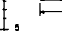

ABSTRACT

An earlier report provides the background, methods, catchment descriptions and statistical storm-event data, gathered by others, and assembled into a. data base.

> Huber, W.C., Heaney, J.P., Smolenyak, K.J. and D.A. Aggidis,
>
> "Urban Rainfall-Runoff-Quality Data Base, Update with Statistical Analysis," EPA-600/8-79-004, Cincinnati, OH, August 1979.

This addendum provides catchment information for the following new locations:

> City <u>No. Catchments Quality Data</u>
>
> Burlington, ON 1 Yes
>
> Chicago, IL 16 Yes
>
> Denver, CO 6 3 with quality
>
> Dade County, FL 1 Yes
>
> Toronto, ON 2 Yes

Additional information and data are also provided for three catchments in Broward County, FL already described in the earlier report.

Also given are summary statistical tables (e.g, quality concentrations and loads) for the new locations listed above and all old ones. Event quantity summaries (e.g., rainfall and runoff depths and durations) are provided for all catchments as well. Both the raw data and the statistical summaries are contained on a magnetic tape available from the report authors.

This report addendum is submitted in partial fulfillment of EPA contract No. 68-03-2663 and covers the period *November* 18, 1978 to

December 31, 1979. Work was completed as of September 30, 1980.

Additional assembly of data and statistical analyses are being performed as a continuation of this study under EPA Cooperative Agreement CR-807238.

10/80

CONTENTS

> Foreword iii
>
> Preface iv
>
> Abstract
>
> Figures ix
>
> Tables xiv
>
> Abbreviations xix
>
> Acknowledgments xxi

I Summary and Conclusions 1-1

> Objectives and Scope 1-1
>
> Data Summary 1-1
>
> Statistical Analyses 1-2

II Recommendations 2-1

III Introduction and Objectives 3-1

IV Criteria for Data Collection 4-1

> Introduction 4-1
>
> Precipitation Data 4-1
>
> Runoff Data 4-2
>
> Quality Data 4-3
>
> Comprehensive Examples 4-5
>
> Time Synchronization 4-5
>
> Modeling Data 4-5

V Data Sources 5-1

> Introduction 5-1
>
> Published Data Summaries 5-1
>
> Data Sources in Other Countries 5-3
>
> Potential Data Sources Not Included in The First Release
>
> of Data Base . . 5-4

10/80

vi

> VI Data Base Format 6-1
>
> Types of Information 6-1
>
> Parameter Identification 6-5
>
> Coding Format 6-5
>
> Access and *Use* 6-18
>
> VII Description of Rainfall-Runoff-Quality Data Base Sources 7-1
>
> Introduction 7-1
>
> Broward County, Florida 7-2
>
> Durham, North Carolina 7-11
>
> Lancaster, Pennsylvania 7-16
>
> Lincoln, Nebraska 7-21
>
> Racine, Wisconsin 7-29
>
> San Francisco, California 7-34
>
> Seattle, Washington 7-46
>
> Windsor, Ontario 7-60
>
> West Lafayette, Indiana 7-65
>
> Greenfield, Massachusetts 7-71
>
> Northampton, Massachusetts 7-77
>
> Burlington, Ontario 7-83
>
> Chicago, Illinois 7-90
>
> Denver, Colorado 7-130
>
> Dade County, Florida 7-144
>
> Toronto, Ontario 7-1S2
>
> VIII Description of Rainfall-Runoff Data Base Sources 8-1
>
> Introduction 8-1
>
> Baltimore, Maryland 8-2
>
> Chicago, Illinois 8-6
>
> Champaign-Urbana, Illinois 8-9
>
> Bucyrus, Ohio 8-13
>
> Falls Church, Virginia 8-16
>
> Winston-Salem, North Carolina 3-19
>
> Jackson, Mississippi 8-22
>
> Wichita, Kansas 8-25

10/80

vii

<table>
<colgroup>
<col style="width: 7%" />
<col style="width: 3%" />
<col style="width: 76%" />
<col style="width: 13%" />
</colgroup>
<tbody>
<tr class="odd">
<td></td>
<td></td>
<td><blockquote>

<strong>Westbury, Long Island, New York</strong>

</blockquote></td>
<td><blockquote>

<strong>8-28</strong>

</blockquote></td>
</tr>
<tr class="even">
<td></td>
<td></td>
<td><blockquote>

<strong>Philadelphia, Pennsylvania</strong>

</blockquote></td>
<td><blockquote>

<strong>8-31</strong>

</blockquote></td>
</tr>
<tr class="odd">
<td></td>
<td></td>
<td><blockquote>

<strong>Los Angeles, California</strong>

</blockquote></td>
<td><blockquote>

<strong>8-35</strong>

</blockquote></td>
</tr>
<tr class="even">
<td></td>
<td></td>
<td><blockquote>

<strong>Portland, Oregon</strong>

</blockquote></td>
<td><blockquote>

<strong>8-38</strong>

</blockquote></td>
</tr>
<tr class="odd">
<td></td>
<td></td>
<td><blockquote>

<strong>Houston, Texas</strong>

</blockquote></td>
<td><blockquote>

<strong>8-42</strong>

</blockquote></td>
</tr>
<tr class="even">
<td></td>
<td></td>
<td><blockquote>

<strong>Salt Lake City, Utah</strong>

</blockquote></td>
<td><blockquote>

<strong>8-48</strong>

</blockquote></td>
</tr>
<tr class="odd">
<td><strong>IX</strong></td>
<td colspan="2">
<strong>Maintenance, Updating, and Dissemination</strong>

<blockquote>

<strong>Maintenance and Updating</strong>

</blockquote></td>
<td><blockquote>

<strong>9-1</strong>

</blockquote></td>
</tr>
<tr class="even">
<td></td>
<td></td>
<td><blockquote>

<strong>Dissemination</strong>

</blockquote></td>
<td><blockquote>

<strong>9-1</strong>

</blockquote></td>
</tr>
<tr class="odd">
<td><strong>X</strong></td>
<td colspan="2"><strong>Statistical Analysis of Urban Runoff Data. . . .</strong></td>
<td><strong>10-1</strong></td>
</tr>
<tr class="even">
<td></td>
<td></td>
<td><blockquote>

<strong>Introduction</strong>

</blockquote></td>
<td><strong>10-1</strong></td>
</tr>
<tr class="odd">
<td></td>
<td></td>
<td><blockquote>

<strong>Methods</strong>

</blockquote></td>
<td><strong>10-1</strong></td>
</tr>
<tr class="even">
<td></td>
<td></td>
<td><blockquote>

<strong>Presentation and Computations</strong>

</blockquote></td>
<td><strong>10-1</strong></td>
</tr>
<tr class="odd">
<td><strong>XI</strong></td>
<td colspan="2"><strong>References</strong></td>
<td><strong>11-1</strong></td>
</tr>
</tbody>
</table>

10/80

FIGURES

> <u>Number Page</u>
>
> I-1 Location map for cities with rainfall-runoff-quality
>
> data (quality cities) and rainfall-runoff data
>
> (quantity cities) 1-6
>
> VI-1 Example of Data for Broward County, FL 6-11
>
> VI-2 Title Card for Raw Data File 6-12
>
> VI-3 Key to Rainfall Quality Information in Catchment File . 6-13
>
> VI-4 Non Flow and Raingage STORET Codes in Catchment File . . 6-14
>
> VI-5 Parameter Information Record 6-16
>
> VI-6 Parameter Value Record 6-17
>
> VII-0 Location map for Broward County Catchments 7-7a
>
> VII-1 Broward County, Florida, Residential Catchment 7-8
>
> VII-2 Broward County, Florida, Transportation Catchment 7-9
>
> VII-3 Broward County, Florida, Commercial Catchment 7-10
>
> VII-4 Durham, N.C., Third Fork Catchment 7-15
>
> VII-5 Lancaster, Pennsylvania, Stevens Ave. Catchment 7-20
>
> VII-6 Lincoln, Nebraska, 39th and Holdrege Catchment 7-26
>
> VII-7 Lincoln, Nebraska, 63rd and Holdrege Catchment 7-27
>
> VII-8 Lincoln, Nebraska, 78th and 'A' St. Catchment 7-28
>
> VII-9 Racine, Wisconsin, Site I Catchment 7-33
>
> VII-10 Location map for San Francisco Catchments 7-39
>
> VII-11 San Francisco, California, Baker St. Catchment 7-40

10/80

ix

> <u>Number Page</u>
>
> VII-12 San Francisco, California, Mariposa St. Catchment 7-41
>
> VII-13 San Francisco, California, Brotherhood Way Catchment . . 7-42
>
> VII-14 San Francisco, California, Vicente St. Catchment 7-43
>
> VII-15 San Francisco, California, Selby St. Catchment 7-44
>
> VII-16 San Francisco, California, Laguna St. Catchment 7-45
>
> VII-17 Location map for Seattle Catchments 7-52
>
> VII-18 Seattle, Washington, Viewridge 1 Catchment 7-53
>
> VII-19 Seattle, Washington, Viewridge 2 Catchment 7-54
>
> VII-20 Seattle, Washington, South Seattle Catchment 7-55
>
> VII-21 Seattle, Washington, Southcenter Catchment 7-56
>
> VII-22 Seattle, Washington, Lake Hills Catchment 7-57
>
> VII-23 Seattle, Washington, Highlands Catchment 7-58
>
> VII-24 Seattle, Washington, Central Business District Catchment 7-59
>
> VII-25 Windsor, Ontario, Labadie Road Catchment 7-64
>
> VII-26 Location map for the urban station, Ross-Ade Drain
>
> in West Lafayette, Indiana 7-69
>
> VII-27 West Lafayette, Indiana, Ross-Ade (Upper) Catchment. . . . 7-70
>
> VII-28 Greenfield, Massachusetts, Maple Brook Catchment 7-76
>
> VII-29 Northampton, Massachusetts, Market Street Brook Catchment 7-82
>
> VII-30 Location map for Burlington, Ontario Catchment 7-88
>
> VII-31 Burlington, Ontario, Malvern Urban Test Catchment 7-89
>
> VII-32 Location map for Chicago Catchments 7-98
>
> VII-33 Chicago, Illinois, Ravine Drive, Highland Park Catchment 7-99
>
> VII-34 Chicago, Illinois, Woodfield, Rolling Meadows Catchment. 7-100

10/80

> <u>Number</u> 1...12212. VII-35 Chicago, Illinois, Woodfield, Rolling Meadows Catchment. . 7-101 VII-36 Chicago, Illinois, Centex, Elk Grove Village Catchment . . 7-102 VII-37 Chicago, Illinois, Centex, Elk Grove Village Catchment . . 7-103 VII-38 Chicago, Illinois, Seymour Avenue, Mundelein Catchment . .7-104
>
> VII-39 Chicago, Illinois, Seymour Avenue, Mundelein
>
> Catchment 7-105
>
> VII-40 Chicago, Illinois, Glen Ellyn Road, Glendale Heights
>
> Catchment 7-106
>
> VII-41 Chicago, Illinois, Glen Ellyn Road, Glendale Heights
>
> Catchment 7-107
>
> . VII-42 Chicago, Illinois, Addison Avenue, Elmhurst Catchment 7-108
>
> VII-43 Chicago, Illinois, Addison Avenue, Elmhurst Catchment . 7-109
>
> VII-44 Chicago, Illinois, Springingsguth Road, Schaumburg
>
> Catchment 7-110
>
> VII-45 Chicago, Illinois, Springingsguth Road, Schaumburg
>
> Catchment 7-111
>
> VII-46 Chicago, Illinois, Park Forest South Catchment 7-112
>
> VII-47 Chicago, Illinois, Park Forest South Catchment 7-113
>
> VII-48 Chicago, Illinois, Winston Village, Bolingbrook Catchment 7-114
>
> VII-49 Chicago, Illinois, Winston Village, Bolingbrook Catchment 7-115
>
> VII-50 Chicago, Illinois, State Highway 83, Clarendon Hills Flagg
>
> Creek Catchment 7-116
>
> VII-51 Chicago, Illinois, State Highway 83, Clarendon Hills Flagg
>
> Creek Catchment 7-117
>
> VII-52 Chicago, Illinois, Perry Road Catchment 7-118
>
> VII-53 Chicago, Illinois, Perry Road Catchment 7-119
>
> VII-54 Chicago, Illinois, Beecher-Peotone Road Catchment 7-12O

10/80

xi

> <u>Number Page</u>
>
> VII-55 Chicago, Illinois, Beecher-Peotone Road Catchment 7-121
>
> VII-56 Chicago, Illinois, Olcott Road Catchment 7-122
>
> VII-57 Chicago, Illinois, Olcott Road Catchment 7-123
>
> VII-58 Chicago, Illinois, Pioneer Woods, Palos Park Catchment 7-124
>
> VII-59 Chicago, Illinois, Pioneer Woods, Palos Park Catchment 7-125
>
> VII-60 Chicago, Illinois, Alden Road Catchment 7-126
>
> VII-61 Chicago, Illinois, Alden Road Catchment 7-127
>
> VII-62 Chicago, Illinois, Hawthorn Center, Vernon Hills
>
> Catchment 7-128
>
> VII-63 Chicago, Illinois, Hawthorn Center, Vernon Hills
>
> Catchment 7-129
>
> VII-64 Location map for Denver Catchments 7-137
>
> VII-65 Denver, Colorado, Big Dry Creek Tributary, Littleton
>
> Catchment 7-138
>
> VII-66 Denver, Colorado, North Avenue, Denver Federal Center,
>
> Lakewood Catchment 7-139
>
> VII-67 Denver, Colorado, Thirty-sixth Street, Denver Catchment. . 7-140
>
> VII-68 Denver, Colorado, South Platte Tributary No. 2, Northglenn
>
> Catchment 7-141
>
> VII-69 Denver, Colorado, Harvard Gulch Catchment 7-142
>
> VII-70 Denver, Colorado, Concourse D Drain, Stapleton Airport
>
> Catchment 7-143
>
> VII-71 Location map for Miami, Dade County, Catchment 7-149
>
> VII-72 Location map for Miami, Dade County, Catchment 7-150
>
> VII-73 Miami, Dade County, Florida, Multi-Family Residential
>
> Catchment 7-151

10/80

xii

> <u>Number Page</u>
>
> VII-74 Location map for Toronto Catchments 7-159
>
> VII-75 Toronto, Ontario, Urban Catchment, East General Hospital,
>
> East York 7-160
>
> VII-76 Toronto, Ontario, Brucewood, North York Catchment 7-161
>
> VIII-1 Baltimore, Maryland, Gray Haven Catchment 8-4
>
> VIII-2 Baltimore, Maryland, Northwood Catchment 8-5
>
> VIII-3 Chicago, Illinois, Oakdale Catchment 8-8
>
> VIII-4 Champaign-Urbana, Illinois, Boneyard Creek Catchment. . . 8-12
>
> VIII-5 Bucyrus, Ohio, Sewer District Number Eight 8-15
>
> VIII-6 Falls Church, Virginia, Tripps Run Catchment 8-18
>
> VIII-7 Winston-Salem, North Carolina, Tar Branch Catchment . . . 8-21
>
> VIII-8 Jackson, Mississippi, Crane Creek Catchment 8-24
>
> VIII-9 Wichita, Kansas, Dry Creek Catchment 8-27
>
> VIII-10 Westbury, Long Island, New York, Woodoak Drive Catchment. 8-30
>
> VIII-11 Philadelphia, Pennsylvania, Wingohocking Catchment 8-34
>
> VIII-12 Los Angeles, California, Echo Park Catchment 8-37
>
> VIII-13 Portland, Oregon, Eastmoreland Catchment 8-41
>
> VIII-14 Houston, Texas, Hunting Bayou at Cavalcade St. Catchment,
>
> and Hunting Bayou at Falls St. Catchment 8-45
>
> VIII-15 Houston, Texas, Bering Ditch Catchment 8-46
>
> VIII-16 Houston, Texas, Berry Creek Catchment 8-47
>
> VIII-17 Location map for the highway drainage monitoring sites
>
> in the Salt Lake City area 8-56
>
> VIII-18 Salt Lake City, Utah, Layton Catchment 8-57
>
> VIII-19 Salt Lake City, Utah, Parleys Canyon Catchment 8-58
>
> X-1 Concentration, flow and mass load for event of 4/15/74
>
> for residential catchment, Broward County 10-5

10/80

TABLES

> <u>Number Page</u>
>
> I-1 Summary of Data 1-3
>
> V-1 Potential Sources of Data Not Included in The Data Base. 5-5
>
> VI-1 State and Provincial Mnemonics 6-2
>
> VI-2 Index to Location ID Codes 6-3
>
> VI-2a Changes in Parameter Code Numbers Implemented in the
>
> New Version of Table VI-3 (1980) 6-4b
>
> VI-3 STORET and University of Florida Codes 6-6
>
> VII-1 Catchments - Broward County 7-3
>
> VII-2 Quantity Data - Broward County 7-4
>
> VII-3 Quality Sampling - Broward County 7-5
>
> VII-4 Quality Parameters - Broward County 7-6
>
> VII-5 Catchments - Durham 7-12
>
> VII-6 Quantity Data - Durham 7-12
>
> VII-7 Quality Sampling - Durham 7-13
>
> VII-8 Quality Parameters - Durham 7-14
>
> VII-9 Catchments - Lancaster 7-17
>
> VII-10 Quantity Data - Lancaster 7-17
>
> VII-11 Quality Sampling - Lancaster 7-18
>
> VII-12 Quality Parameters - Lancaster 7-19
>
> VII-13 Catchments - Lincoln 7-22
>
> VII-14 Quality Data - Lincoln 7-23

10/80

xiv

<table>
<colgroup>
<col style="width: 11%" />
<col style="width: 51%" />
<col style="width: 25%" />
<col style="width: 11%" />
</colgroup>
<tbody>
<tr class="odd">
<td>Number</td>
<td></td>
<td></td>
<td>12AF0</td>
</tr>
<tr class="even">
<td>VII-15</td>
<td><blockquote>

Quality Sampling - Lincoln

</blockquote></td>
<td></td>
<td>7-24</td>
</tr>
<tr class="odd">
<td>VII-16</td>
<td><blockquote>

Quality Parameters - Lincoln

</blockquote></td>
<td></td>
<td>7-25</td>
</tr>
<tr class="even">
<td>VII-17</td>
<td><blockquote>

Catchments - Racine

</blockquote></td>
<td></td>
<td>7-30</td>
</tr>
<tr class="odd">
<td>VII-18</td>
<td><blockquote>

Quantity Data - Racine

</blockquote></td>
<td></td>
<td>7-31</td>
</tr>
<tr class="even">
<td>VII-19</td>
<td><blockquote>

Quality Sampling - Racine

</blockquote></td>
<td></td>
<td>7-32</td>
</tr>
<tr class="odd">
<td>VII-20</td>
<td><blockquote>

Quality Parameters - Racine

</blockquote></td>
<td></td>
<td>7-32</td>
</tr>
<tr class="even">
<td>VII-21</td>
<td><blockquote>

Catchments - San Francisco

</blockquote></td>
<td></td>
<td>7-35</td>
</tr>
<tr class="odd">
<td>VII-22</td>
<td><blockquote>

Quantity Data - San Francisco

</blockquote></td>
<td></td>
<td>7-36</td>
</tr>
<tr class="even">
<td>VII-23</td>
<td><blockquote>

Quality Sampling - San Francisco

</blockquote></td>
<td></td>
<td>7-37</td>
</tr>
<tr class="odd">
<td>VII-24</td>
<td><blockquote>

Quality Parameters - San Francisco

</blockquote></td>
<td></td>
<td>7-38</td>
</tr>
<tr class="even">
<td>VII-25</td>
<td><blockquote>

Catchments - Seattle

</blockquote></td>
<td></td>
<td>7-47</td>
</tr>
<tr class="odd">
<td>VII-26</td>
<td><blockquote>

Quantity Data - Seattle

</blockquote></td>
<td></td>
<td>7-48</td>
</tr>
<tr class="even">
<td>VII-27</td>
<td><blockquote>

Quality Sampling - Seattle

</blockquote></td>
<td></td>
<td>7-49</td>
</tr>
<tr class="odd">
<td>VII-28</td>
<td><blockquote>

Quality Parameters - Seattle

</blockquote></td>
<td></td>
<td>7-50</td>
</tr>
<tr class="even">
<td>VII-29</td>
<td><blockquote>

Background Levels at Three Catchments

</blockquote></td>
<td>- Seattle</td>
<td>7-51</td>
</tr>
<tr class="odd">
<td>VII-30</td>
<td><blockquote>

Catchment - Windsor

</blockquote></td>
<td></td>
<td>7-61</td>
</tr>
<tr class="even">
<td>VII-31</td>
<td><blockquote>

Quantity Data - Windsor

</blockquote></td>
<td></td>
<td>7-61</td>
</tr>
<tr class="odd">
<td>VII-32</td>
<td><blockquote>

Quality Sampling - Windsor

</blockquote></td>
<td></td>
<td>7-62</td>
</tr>
<tr class="even">
<td>VII-33</td>
<td><blockquote>

Quality Parameters - Windsor

</blockquote></td>
<td></td>
<td>7-63</td>
</tr>
<tr class="odd">
<td>VII-34</td>
<td><blockquote>

Catchments - West Lafayette

</blockquote></td>
<td></td>
<td>7-66</td>
</tr>
<tr class="even">
<td>VII-35</td>
<td><blockquote>

Quantity Data - West Lafayette

</blockquote></td>
<td></td>
<td>7-67</td>
</tr>
<tr class="odd">
<td>VII-36</td>
<td><blockquote>

Quality Sampling - West Lafayette

</blockquote></td>
<td></td>
<td>7-68</td>
</tr>
<tr class="even">
<td>VII-37</td>
<td><blockquote>

Quality Parameters - West Lafayette

</blockquote></td>
<td></td>
<td>7-68</td>
</tr>
<tr class="odd">
<td>VII-38</td>
<td><blockquote>

Catchments - Greenfield

</blockquote></td>
<td></td>
<td>7-72</td>
</tr>
<tr class="even">
<td>VII-39</td>
<td><blockquote>

Quantity Data - Greenfield

</blockquote></td>
<td></td>
<td>7-73</td>
</tr>
</tbody>
</table>

10/80

xv

> <u>Number Pale</u>
>
> VII-40 Quality Sampling - Greenfield 7-74
>
> VII-41 Quality Parameters - Greenfield 7-75
>
> VII-42 Catchments - Northampton 7-78
>
> VII-43 Quantity Data - Northampton 7-79
>
> VII-44 Quality Sampling - Northampton 7-80
>
> VII-45 Quality Parameters - Northampton 7-81
>
> VII-46 Catchments - Burlington, Ontario 7-84
>
> VII-47 Quantity Data - Burlington, Ontario 7-85
>
> VII-48 Quality Sampling - Burlington, Ontario 7-86
>
> VII-49 Quality Parameters - Burlington, Ontario 7-87
>
> VII-50 Miscellaneous Meteorological Data for Burlington (200). . 7-87
>
> VII-51 Catchments - Chicago, Illinois 7-91
>
> VII-52 Quantity Data - Chicago, Illinois 7-93
>
> VII-53 Quality Sampling - Chicago, Illinois 7-95
>
> VII-54 Quality Parameters, Chicago, Illinois 7-97
>
> VII-55 Catchments - Denver 7-131
>
> VII-56 Quantity Data - Denver 7-133
>
> VII-57 Quality Sampling - Denver 7-135
>
> VII-58 Quality Parameters - Denver 7-136
>
> VII-59 Catchments - Miami, Dade County 7-145
>
> VII-60 Quantity Data - Miami, Dade County 7-146
>
> VII-61 Quality Sampling - Miami, Dade County 7-147
>
> VII-62 Quality Parameters - Miami, Dade County 7-148
>
> VII-63 Catchments - Toronto 7-153
>
> VII-64 Quantity Data - Toronto 7-154

10/80

xvi

<u>Number Page</u>

> VII-65 Quality Sampling - Toronto 7-156
>
> VII-66 Quality Parameters - Toronto 7-157
>
> VII-67 Municipal Practices - Toronto 7-158

VIII-1 Catchments - Baltimore 8-3

VIII-2 Quantity Data - Baltimore 8-3

VIII-3 Catchments - Chicago 8-7

VIII-4 Quantity Data - Chicago 8-7

VIII-5 Catchment - Champaign-Urbana 8-10

VIII-6 Quantity Data - Champaign-Urbana 8-10

VIII-7 Additional Rain Gage Information - Champaign-Urbana. . . 8-11

VIII-8 Catchments - Bucyrus 8-14

VIII-9 Quantity Data - Bucyrus 8-14

VIII-10 Catchment - Falls Church 8-17

VIII-I1 Quantity Data - Falls Church 8-17

VIII-12 Catchment - Winston-Salem 8-20

VIII-13 Quantity Data - Winston-Salem 8-20

VIII-14 Catchment - Jackson 8-23

VIII-15 Quantity Data - Jackson 8-23

VIII-16 Catchment - Wichita 8-26

VIII-17 Quantity Data - Wichita 8-26

VIII-18 Catchment - Westbury, L I 8-29

VIII-19 Quantity Data - Westbury, L I 3-29

VIII-20 Catchment - Philadelphia J-32

VIII-21 Quantity Data - Philadelphia 3-32

VIII-22 Additional Rain Gage Information - Philadelphia 8-33

10/80

xvii

> <u>Number Page</u>
>
> VIII-23 Estimated Interceptor Diversions - Philadelphia 8-33
>
> VIII-24 Catchment - Los Angeles 8-36
>
> VIII-25 Quantity Data - Los Angeles 8-36
>
> VIII-26 Catchment - Portland 3-39
>
> VIII-27 Quantity Data - Portland 8-39
>
> VIII-28 Dry Weather Flow and Infiltration Information - Portland 8-40
>
> VIII-29 Catchments - Houston 8-43
>
> VIII-30 Quantity Data - Houston 8-44
>
> VIII-31 Catchments - Salt Lake City 8-49
>
> VIII-32 Quantity Data - Salt Lake City 8-50
>
> VIII-33 Minimum and Maximum Temperature During Runoff Events,
>
> Winds, and Wind Direction - Layton Site S-51
>
> VIII-34 Minimum and Maximum Temperature During Runoff Events,
>
> Winds, and Wind Direction - Parleys Site 8-52
>
> VIII-35 Soil Moisture Levels at the Beginning of Each Runoff
>
> Event - Layton Site 8-54
>
> VIII-36 Soil Moisture Levels at the Beginning of Each Runoff
>
> Event - Parleys Site 8-54
>
> VIII-37 Parameter Codes for Rain Gages - Salt Lake City 8-55
>
> IX-1 Catchment Latitude, Longitude and U.S.G.S. Quadrangle Map
>
> Information 9-3
>
> X-1 Methods of Calculation Mean and Variance 10-3
>
> X-2 Storm Event Data for 4/15/74 for Residential Catchment,
>
> Broward County 10-4
>
> X-3 Comparison of flow-weighted BOD5 and suspended solids means
>
> and standard deviations by land use and type of sewerage. 10-11
>
> X-4 to X-125
>
> Event and Quality Summaries for all catchments 10-14 to
>
> 10-208
>
> 10/80

ABBREVIATIONS

> APWA American Public Works Association
>
> ARS Agricultural Research Service
>
> ASCE American Society of Civil Engineers
>
> COA Canada - Ontario Agreement
>
> Colif Coliforms
>
> DWF Dry Weather Flow
>
> ENDEX Environmental Data Index (data retrieval system of NOAA)
>
> EPA Environmental Protection Agency
>
> FHWA Federal Highway Administration
>
> FWPCA Federal Water Pollution Control Administration
>
> FWQA Federal Water Quality Administration
>
> GPO Government Printing Office (Washington, D.C.2O402)
>
> HEC Hydrologic Engineering Center of the Corps of Engineers
>
> HSP Hydrocomp Simulation Program
>
> Hwy Highway
>
> IASH International Association for Scientific Hydrology
>
> IHD International Hydrological Decade
>
> ILLUDAS Illinois Urban Drainage Area Simulator
>
> Ind Industrial
>
> JWPCF Journal of the Water Pollution Control Federation
>
> METRO Municipality of Metropolitan Seattle
>
> NAWDEX National Water Data Exchange (data retrieval system of the USGS)

xix

ABBREVIATIONS (concluded)

NERC National Environmental Research Center

NOAA National Oceanic and Atmospheric Administration

NSF National Science Foundation

NTIS National Technical Information Service (5285 Port Royal Rd., Springfield, Virginia 22161)

NWS National Weather Service

OASIS Oceanic and Atmospheric Scientifc Information System (data retrie­val system of NOAA)

OWRT Office of Water Resources Technology

PHS Public Health Service

Res Residential

RRL Road Research Laboratory of Great Britain

Set Settleable

Sol Soluble

STORET Storage and Retrieval (data retrieval system of the EPA)

STORM Storage, Treatment, Overflow, Runoff Model

Susp Suspended

SWMM Storm Water Management Model

Tot Total

OF University of Florida

US United States

USGS United States Geological Survey

WATSTORE Water Data Information and Retrieval System (data retrieval system of the USGS)

WMO World Meteorological Organization

xx

ACKNOWLEDGMENTS

Considerable interest, encouragement and useful advice was received from EPA colleagues. The efforts of Richard Field, Harry Torno, Chi-Yuan Fan, Douglas Ammon, and Richard Traver are gratefully acknowledged.

More so than most projects this one depended upon the cooperation and good will of many contributors of data. The project could not have been per­formed without them. At the risk of omission, individuals associated with different locations are recognized below: Broward County - Harold C. Mattraw, Jr ., USGS, Water Resources Division, Miami; Seattle - John M. Buffo and Glen D. Farris, Metro, Seattle; Lincoln - Dewey R. Anderson, Department of Civil Engineering, University of Nebraska, Lincoln and Robert Sallach, Heningson, Durham and Richardson, Inc., Omaha; Racine - Tom Meinholz and Dick Race, Envirex, Milwaukee; Lancaster - Arthur E. Morris and Warren Farmer, Dept. of Public Works, City of Lancaster; Windsor - James P. Hartt, Dept. of Civil Engineering, University of Windsor, Windsor; San Francisco - Harold C. Coffee, Jr., Dept. of Public Works, City and County of San Francisco; Champaign-Urbana, Philadelphia, Bucyrus, Falls Church, Winston-Salem, Jackson, Wichita, Westbury - Michael L. Terstriep, Illinois Sate Water Survey, Urbana; Los Angeles - Donald C. Tillman, City Engineer, and Aaron Aarons, Bureau of Eng­ineering, Department of Public Works, City of Los Angeles; Portland - David G. Lorenzen, Dept. of Public Works, City of Portland and Allen L. Davis, CH2M-Hill, Corvallis; Houston - Steven L. Johnson (now with USGS, WRD, Miami) and Robert E. Smith, *USGS,* Water Resources Division, Houston; Greenfield and Northampton - Thomas K. Jewell, Department of Civil Engineering, University of Massachusetts, Amherst, MA (now with Department of Civil Engineering, Union College, Schenectady, NY); Salt Lake City - Joel E. Fletcher, Utah Water Research Laboratory, Utah State University, Logan; West Lafayette ­Felix T. R. McElroy III, School of Civil Engineering , Purdue University, West Lafayette, IN. Additional information about catchments described in the first report is acknowledged from: Broward County - Harold C. Mattraw, Jr., USGS, Water Resources Division, Tallahassee, FL, Robert A. Miller, USGS, WRD, Orlando, FL, Marshall E. Jennings, USGS, Bay St. Louis, MS; Bucyrus -

Larry D. Culler, Burgess and Niple Ltd., Columbus, OH.

At the University of Florida, several staff members made important contributions. Coding, retrieval and transferal of the data were supervised by W. Alan Peltz. Data reduction, cross checking and figure preparation were performed by William C. Taylor. Much of the original data reduction was organized by Harry L. Crotzer. The first structure of the data base was devised by Amuri A. Arroyo. Dedicated typing was performed by Grace Provenza and Linda Trawick. New figures were drafted by Anthony Dana. Computations were performed at the Northeast Regional Data Center at the University of Florida. Dr. Russell G. Mein, on leave from Monash University, Australia, reviewed and revised the reduction of quantity data for Lancaster, PA.

xxi

ACKNOWLEDGMENTS

> The continued support and active participation of EPA colleagues Douglas C. Ammon and Richard Field are gratefully acknowledged. As in earlier editions of the data base, this one would not be possible without the support of contributors of data and ancillary information: Chicago - J.A. Smedile, Northeastern Illinois Planning Commission, Chicago; Denver - James F. Blakey, USGS, Denver and Ben Urbonas, Urban Drainage and Flood Control District, Denver; Miami - Marshall E. Jennings, USGS, Bay St. Louis, MS; Burlington - Jiri Marsalek, National Water Research Institute, Canada Centre for Inland Waters, Burlington, ON; Toronto (East York) - Eric Larsen, M.M. Dillon Ltd., Toronto; Toronto (Brucewood) - James F. Maclaren Ltd., Toronto.
>
> At the University of Florida, figures were drafted by Amy Alford and Anelia Crawford and typing performed by Linda Trawick. Computations were performed at the Northeast Regional Data Center at the University of Florida.
>
> SECTION I
>
> SUMMARY AND CONCLUSIONS
>
> OBJECTIVES AND SCOPE
>
> Since 1974 the University of Florida has been engaged in aggregation of urban rainfall-runoff-quality data collected by others. These data are intended for urban runoff model calibration and verification, characterization of urban runoff on a nationwide basis, and synthesis of data for new loca­tions. Broadly, objectives have been to:

1.  identify sources of data,

2.  acquire available data,

3.  process and computerize the data,

4.  disseminate data and ancillary material, and

5.  perform statistical analyses on the data.

> This report was first published in 1977 as:
>
> Huber, W.C. and Heaney, J.P., "Urban Rainfall-Runoff-Quality Data Base," EPA-600/8-77-009, (NTIS PB-270 065), Environmental Protection Agency , Cincinnati, OH,'July 1977.
>
> This present edition reprints the material that was first published along with information on six new catchments and statistical analyses for 25 catchments with quality data.
>
> The page numbering system has been altered such that each section is numbered as 6-1, 6-2, etc. Thus, as new data locations are processed in thefuture, their documentation may be added to the end of appropriate sections. Project work continues under EPA contract no. 68-03-2663. The University of Florida actively solicits new data in care of the authors of this report.
>
> DATA SUMMARY
>
> Locations for which data have been assembled and placed on a magnetic tape are shown in Table I-1 and Figure I-1. Rainfall, runoff and quality data are available for eleven locations while the remaining number have only rainfall runoff data at present. Data are provided on a storm event basis; no long-term (continuous) records are presently included. Receiving water data are also not included.
>
> 1-1
>
> Many of these sources may be updated using data collected more recently or using data presently being collected under various programs, such as EPA 208 and National Urban Runoff Program projects and EPA/USGS cooperative urban runoff monitoring projects. As noted in Section V, a large volume of urban runoff data already exists, much of which may be included in the data base at a future date.
>
> The project results are provided in three forms:

1.  The final report (this volume), which includes descriptions and references of data sources utilized and pending.

2.  A magnetic tape containing the actual rainfall-runoff-quality data from each source on a storm event basis. Copies of the tape will be provided at cost. In addition, all data are being placed on the EPA STORET data retrieval system for more general accessibility.

3.  A limited amount of in-house modeling data (maps, plans, photos, etc.) at UF, available for short-term loan.

> STATISTICAL ANALYSES
>
> Data for all catchments subject to water quality monitoring have been analyzed statistically for flow and time weighted means and standard devia­tions as well as ranges of parameters and surface loadings (i.e., pounds of
>
> pollutant per acre-inch of runoff). Summary values for each catchment and pollutant are given for each statistical parameter. In addition, hydrologic information such as rainfall and runoff depth and duration is given for each storm event. Statistical analyses of the quality parameters for each indiv­idual storm event for each catchment are voluminous and available upon re­quest to the authors of this report.

<table>
<colgroup>
<col style="width: 26%" />
<col style="width: 20%" />
<col style="width: 5%" />
<col style="width: 9%" />
<col style="width: 11%" />
<col style="width: 10%" />
<col style="width: 7%" />
<col style="width: 8%" />
</colgroup>
<tbody>
<tr class="odd">
<td rowspan="2">Location</td>
<td rowspan="2"><blockquote>

Table I-1. Catchment

</blockquote></td>
<td rowspan="2">
Summary

ID 
Code
</td>
<td colspan="2">
of Data

Area
</td>
<td rowspan="2"><blockquote>

Drainage System

</blockquote></td>
<td colspan="2" rowspan="2">
No. Storms with

Quantity Quality
</td>
</tr>
<tr class="even">
<td colspan="2">(ac) (ha)</td>
</tr>
<tr class="odd">
<td><blockquote>

San Francisco, CA

</blockquote></td>
<td><blockquote>

Baker St.

</blockquote></td>
<td>CA0101</td>
<td>168</td>
<td><blockquote>

(68)

</blockquote></td>
<td>C</td>
<td>3</td>
<td>3</td>
</tr>
<tr class="even">
<td></td>
<td><blockquote>

Mariposa St.

</blockquote></td>
<td>CA0102</td>
<td>223</td>
<td><blockquote>

(90)

</blockquote></td>
<td>C</td>
<td>3</td>
<td>3</td>
</tr>
<tr class="odd">
<td></td>
<td><blockquote>

Brotherhood Way

</blockquote></td>
<td>CA0103</td>
<td>180</td>
<td><blockquote>

(73)

</blockquote></td>
<td>C</td>
<td>3</td>
<td>3</td>
</tr>
<tr class="even">
<td></td>
<td><blockquote>

Vicente St., N.

</blockquote></td>
<td>CA0104</td>
<td>16</td>
<td><blockquote>

(6.5)

</blockquote></td>
<td>S</td>
<td>1</td>
<td>1</td>
</tr>
<tr class="odd">
<td></td>
<td><blockquote>

Vicente St., S.

</blockquote></td>
<td>CA0105</td>
<td>21</td>
<td><blockquote>

(8.5)

</blockquote></td>
<td>S</td>
<td>1</td>
<td>1</td>
</tr>
<tr class="even">
<td></td>
<td><blockquote>

Selby St.

</blockquote></td>
<td>CA0106</td>
<td>3400</td>
<td>(1376)</td>
<td>C</td>
<td>8</td>
<td>8</td>
</tr>
<tr class="odd">
<td></td>
<td><blockquote>

Laguna St.

</blockquote></td>
<td>CA0107</td>
<td>375</td>
<td><blockquote>

(152)

</blockquote></td>
<td>C</td>
<td>2</td>
<td>2</td>
</tr>
<tr class="even">
<td><blockquote>

Los Angeles, CA

</blockquote></td>
<td><blockquote>

Echo Park

</blockquote></td>
<td>CA0201</td>
<td>252</td>
<td><blockquote>

(102)

</blockquote></td>
<td>S</td>
<td>18</td>
<td>0</td>
</tr>
<tr class="odd">
<td><blockquote>

Denver, CO

</blockquote></td>
<td><blockquote>

Big Dry Creek Trib.,

</blockquote></td>
<td>C00101</td>
<td>606</td>
<td><blockquote>

(245)

</blockquote></td>
<td>S</td>
<td>6</td>
<td>4</td>
</tr>
<tr class="even">
<td></td>
<td colspan="2">
Littleton

North Ave., Denver C00102
</td>
<td>76.7</td>
<td><blockquote>

(31)

</blockquote></td>
<td>S</td>
<td>5</td>
<td>2</td>
</tr>
<tr class="odd">
<td></td>
<td colspan="2">
Fed. Center, Lakewood

36th St. C00103
</td>
<td>2446</td>
<td><blockquote>

(990)

</blockquote></td>
<td>S</td>
<td>7</td>
<td>1</td>
</tr>
<tr class="even">
<td></td>
<td><blockquote>

South Platte Trib.

</blockquote></td>
<td>C00104</td>
<td>307</td>
<td><blockquote>

(124)

</blockquote></td>
<td>S</td>
<td>5</td>
<td>0</td>
</tr>
<tr class="odd">
<td></td>
<td>No. 2, Northglenn Harvard Gulch</td>
<td>000105</td>
<td>2956</td>
<td>(1196)</td>
<td>S</td>
<td>4</td>
<td>0</td>
</tr>
<tr class="even">
<td></td>
<td><blockquote>

Concourse D Drain,

</blockquote></td>
<td>C00106</td>
<td>73</td>
<td><blockquote>

(29.5)

</blockquote></td>
<td>S</td>
<td>2</td>
<td>0</td>
</tr>
<tr class="odd">
<td></td>
<td><blockquote>

Stapleton Airport

</blockquote></td>
<td></td>
<td></td>
<td></td>
<td></td>
<td></td>
<td></td>
</tr>
<tr class="even">
<td><blockquote>

Broward County, FL

</blockquote></td>
<td><blockquote>

Residential

</blockquote></td>
<td>FLO101</td>
<td>47.5</td>
<td><blockquote>

(19.2)

</blockquote></td>
<td>S</td>
<td>74</td>
<td>74</td>
</tr>
<tr class="odd">
<td></td>
<td><blockquote>

Commercial

</blockquote></td>
<td>FLO102</td>
<td>39.0</td>
<td><blockquote>

(15.8)

</blockquote></td>
<td>S</td>
<td>108</td>
<td>108</td>
</tr>
<tr class="even">
<td></td>
<td><blockquote>

Transportation

</blockquote></td>
<td>FL0103</td>
<td>28.4</td>
<td><blockquote>

(11.5)

</blockquote></td>
<td>S</td>
<td>113</td>
<td>113</td>
</tr>
<tr class="odd">
<td>
<strong>I-,</strong>

<strong>0</strong> Miami, Dade County, FL „

op

0
</td>
<td>Multi-Family Resi- dential</td>
<td>FLO201</td>
<td>14.7</td>
<td><blockquote>

(6.0)

</blockquote></td>
<td>S</td>
<td>43</td>
<td>43</td>
</tr>
</tbody>
</table>

<table>
<colgroup>
<col style="width: 8%" />
<col style="width: 15%" />
<col style="width: 20%" />
<col style="width: 9%" />
<col style="width: 18%" />
<col style="width: 10%" />
<col style="width: 7%" />
<col style="width: 8%" />
</colgroup>
<tbody>
<tr class="odd">
<td colspan="2" rowspan="2">Location</td>
<td rowspan="2"><blockquote>

Table I-1. Catchment

</blockquote></td>
<td rowspan="2"><blockquote>

Summary

</blockquote>

ID 
Code
</td>
<td>
of Data

Area
</td>
<td rowspan="2"><blockquote>

Drainage System

</blockquote></td>
<td colspan="2" rowspan="2">
No. Storms with.

Quantity Quality
</td>
</tr>
<tr class="even">
<td><blockquote>

(ac) (ha)

</blockquote></td>
</tr>
<tr class="odd">
<td><blockquote>

Chicago,

</blockquote></td>
<td>IL</td>
<td><blockquote>

Oakdale

</blockquote></td>
<td>ILO1O1</td>
<td>12.9 (5.2)</td>
<td>C</td>
<td>20</td>
<td>0</td>
</tr>
<tr class="even">
<td></td>
<td></td>
<td>Ravine Drive, 
Highland Park</td>
<td>ILOl02</td>
<td>313.9 (127.0)</td>
<td>S</td>
<td>3</td>
<td>3</td>
</tr>
<tr class="odd">
<td></td>
<td></td>
<td><blockquote>

Woodfield, Rolling

</blockquote></td>
<td>ILOl03</td>
<td>345.6 (139.9)</td>
<td>S</td>
<td>6</td>
<td>6</td>
</tr>
<tr class="even">
<td></td>
<td></td>
<td><blockquote>

Meadows

</blockquote></td>
<td></td>
<td></td>
<td></td>
<td></td>
<td></td>
</tr>
<tr class="odd">
<td></td>
<td></td>
<td><blockquote>

Centex, Elk Grove

</blockquote></td>
<td>110104</td>
<td>236.8 (95.8)</td>
<td>S</td>
<td>6</td>
<td>6</td>
</tr>
<tr class="even">
<td></td>
<td></td>
<td><blockquote>

Village

</blockquote></td>
<td></td>
<td></td>
<td></td>
<td></td>
<td></td>
</tr>
<tr class="odd">
<td></td>
<td></td>
<td>Seymour Ave., 
Mundelein</td>
<td>ILOl05</td>
<td>1139.2 (461)</td>
<td>S</td>
<td>8</td>
<td>8</td>
</tr>
<tr class="even">
<td></td>
<td></td>
<td>Glen Ellyn Rd., Glendale Heights</td>
<td>ILO1O6</td>
<td>992.0 (401.5)</td>
<td>S</td>
<td>8</td>
<td>8</td>
</tr>
<tr class="odd">
<td></td>
<td></td>
<td>Addison Ave., Elm- hurst</td>
<td>ILOl07</td>
<td>601.6 (243.5)</td>
<td>S</td>
<td>7</td>
<td>7</td>
</tr>
<tr class="even">
<td></td>
<td></td>
<td><blockquote>

Springingsguth Rd., Schaumburg

</blockquote></td>
<td>ILOl08</td>
<td>1491.2 (603.5)</td>
<td>S</td>
<td>4</td>
<td>4</td>
</tr>
<tr class="odd">
<td></td>
<td></td>
<td><blockquote>

Park Forest South

</blockquote></td>
<td>ILO1O9</td>
<td>160.0 (64.7)</td>
<td>S</td>
<td>5</td>
<td>5</td>
</tr>
<tr class="even">
<td></td>
<td></td>
<td>Winston Village, Bolingbrook</td>
<td>ILO11O</td>
<td>89.6 (36.3)</td>
<td>S</td>
<td>2</td>
<td>2</td>
</tr>
<tr class="odd">
<td></td>
<td></td>
<td><blockquote>

State Highway 83, Clarendon Hills, Flagg Creek

</blockquote></td>
<td>ILO111</td>
<td>972.8 (393.7)</td>
<td>S</td>
<td>4</td>
<td>4</td>
</tr>
<tr class="even">
<td></td>
<td></td>
<td><blockquote>

Perry Road

</blockquote></td>
<td>ILO112</td>
<td>4435.2 (1794.9)</td>
<td>S</td>
<td>5</td>
<td>5</td>
</tr>
<tr class="odd">
<td></td>
<td></td>
<td><blockquote>

Beecher-Peotone Road

</blockquote></td>
<td>ILO113</td>
<td>2617.6 (1059.3)</td>
<td>S</td>
<td>4</td>
<td>4</td>
</tr>
<tr class="even">
<td><blockquote>

0

</blockquote></td>
<td></td>
<td><blockquote>

Olcott Road

</blockquote></td>
<td>ILO114</td>
<td>3456.0 (1398.6)</td>
<td>S</td>
<td>2</td>
<td>2</td>
</tr>
</tbody>
</table>

**CO**

0

<table>
<colgroup>
<col style="width: 4%" />
<col style="width: 16%" />
<col style="width: 6%" />
<col style="width: 20%" />
<col style="width: 9%" />
<col style="width: 6%" />
<col style="width: 10%" />
<col style="width: 10%" />
<col style="width: 7%" />
<col style="width: 8%" />
</colgroup>
<tbody>
<tr class="odd">
<td rowspan="2"></td>
<td rowspan="2">Location</td>
<td rowspan="2"></td>
<td rowspan="2"><blockquote>

Table I-1. Catchment

</blockquote></td>
<td rowspan="2"><blockquote>

Summary

</blockquote>

ID 
Code
</td>
<td colspan="2">
of Data

Area
</td>
<td rowspan="2"><blockquote>

Drainage System

</blockquote></td>
<td colspan="2" rowspan="2">
No. Storms with

Quantity Quality
</td>
</tr>
<tr class="even">
<td colspan="2"><blockquote>

(ac) (ha)

</blockquote></td>
</tr>
<tr class="odd">
<td></td>
<td></td>
<td></td>
<td><blockquote>

Pioneer Woods, Palos

</blockquote></td>
<td>IL0115</td>
<td>2304.0</td>
<td>(932.4)</td>
<td></td>
<td>1</td>
<td>1</td>
</tr>
<tr class="even">
<td></td>
<td></td>
<td></td>
<td><blockquote>

Park

</blockquote></td>
<td></td>
<td></td>
<td></td>
<td></td>
<td></td>
<td></td>
</tr>
<tr class="odd">
<td></td>
<td></td>
<td></td>
<td><blockquote>

Alden Road

</blockquote></td>
<td>IL0116</td>
<td>4000.0</td>
<td>(1618.7)</td>
<td></td>
<td>1</td>
<td>1</td>
</tr>
<tr class="even">
<td></td>
<td></td>
<td></td>
<td><blockquote>

Hawthorn Center,

</blockquote></td>
<td>IL0117</td>
<td>96.0</td>
<td>(38.8)</td>
<td></td>
<td>3</td>
<td>3</td>
</tr>
<tr class="odd">
<td></td>
<td></td>
<td></td>
<td><blockquote>

Vernon Hills

</blockquote></td>
<td></td>
<td></td>
<td></td>
<td></td>
<td></td>
<td></td>
</tr>
<tr class="even">
<td></td>
<td><blockquote>

Champaign-Urbana,

</blockquote></td>
<td>IL</td>
<td><blockquote>

Boneyard Creek

</blockquote></td>
<td>IL0201</td>
<td>2290</td>
<td>(927)</td>
<td>S</td>
<td>27</td>
<td>0</td>
</tr>
<tr class="odd">
<td></td>
<td><blockquote>

West Lafayette, IN

</blockquote></td>
<td></td>
<td><blockquote>

Ross-Ade (Upper)

</blockquote></td>
<td>IN0101</td>
<td>29</td>
<td>(11.7)</td>
<td>S</td>
<td>10</td>
<td>10•</td>
</tr>
<tr class="even">
<td></td>
<td><blockquote>

Wichita, KS

</blockquote></td>
<td></td>
<td><blockquote>

Dry Creek

</blockquote></td>
<td>KS0101</td>
<td>1883</td>
<td>(762)</td>
<td>S</td>
<td>8</td>
<td>0</td>
</tr>
<tr class="odd">
<td></td>
<td><blockquote>

Baltimore, MD

</blockquote></td>
<td></td>
<td><blockquote>

Gray Haven

</blockquote></td>
<td>MD0101</td>
<td>47 4</td>
<td>(19.2)</td>
<td>S</td>
<td>24</td>
<td>0</td>
</tr>
<tr class="even">
<td><blockquote>

1-, 
tri

</blockquote></td>
<td></td>
<td></td>
<td><blockquote>

Northwood

</blockquote></td>
<td>MD0102</td>
<td>23.3</td>
<td>(9.4)</td>
<td>S</td>
<td>12</td>
<td>0</td>
</tr>
<tr class="odd">
<td></td>
<td><blockquote>

Greenfield, MA

</blockquote></td>
<td></td>
<td><blockquote>

Maple Brook

</blockquote></td>
<td>MA0101</td>
<td>1014</td>
<td>(410)</td>
<td>S</td>
<td>5</td>
<td>5</td>
</tr>
<tr class="even">
<td></td>
<td><blockquote>

Northampton, MA

</blockquote></td>
<td></td>
<td><blockquote>

Market St. Brook

</blockquote></td>
<td>MA0201</td>
<td>380</td>
<td>(154)</td>
<td>S</td>
<td>6</td>
<td>6</td>
</tr>
<tr class="odd">
<td></td>
<td><blockquote>

Jackson, MS

</blockquote></td>
<td></td>
<td><blockquote>

Crane Creek

</blockquote></td>
<td>MS0101</td>
<td>285</td>
<td>(115)</td>
<td>S</td>
<td>17</td>
<td>0</td>
</tr>
<tr class="even">
<td></td>
<td><blockquote>

Lincoln, NB

</blockquote></td>
<td></td>
<td><blockquote>

39th and Holdrege

</blockquote></td>
<td>NB0101</td>
<td>79</td>
<td>(32)</td>
<td>S</td>
<td>18</td>
<td>18</td>
</tr>
<tr class="odd">
<td></td>
<td></td>
<td></td>
<td><blockquote>

63th and Holdrege

</blockquote></td>
<td>NB0102</td>
<td>85</td>
<td>(34)</td>
<td>S</td>
<td>14</td>
<td>15</td>
</tr>
<tr class="even">
<td></td>
<td></td>
<td></td>
<td><blockquote>

78th and A

</blockquote></td>
<td>NB0103</td>
<td>357</td>
<td>(144.5)</td>
<td>S</td>
<td>10</td>
<td>11</td>
</tr>
<tr class="odd">
<td></td>
<td><blockquote>

Westbury, NY

</blockquote></td>
<td></td>
<td><blockquote>

Woodoak Dr.

</blockquote></td>
<td>NY0101</td>
<td>14.7</td>
<td>(6.0)</td>
<td>S</td>
<td>9</td>
<td>0</td>
</tr>
<tr class="even">
<td></td>
<td><blockquote>

Winston-Salem, NC

</blockquote></td>
<td></td>
<td><blockquote>

Tar Branch

</blockquote></td>
<td>NC0101</td>
<td>384</td>
<td>(155.5)</td>
<td>S</td>
<td>17</td>
<td>0</td>
</tr>
<tr class="odd">
<td></td>
<td><blockquote>

Durham, NC

</blockquote></td>
<td></td>
<td><blockquote>

Third Fork

</blockquote></td>
<td>NCO201</td>
<td>1069</td>
<td>(432.6)</td>
<td>S</td>
<td>19</td>
<td>4</td>
</tr>
<tr class="even">
<td></td>
<td><blockquote>

Bucyrus, OH

</blockquote></td>
<td></td>
<td><blockquote>

Sewer Dist. 8

</blockquote></td>
<td>OH0101</td>
<td>179</td>
<td>(72.5)</td>
<td>C</td>
<td>10</td>
<td>0</td>
</tr>
<tr class="odd">
<td>
1-,

0
</td>
<td><blockquote>

Windsor, ON

</blockquote></td>
<td></td>
<td><blockquote>

Labadie Rd.

</blockquote></td>
<td>ON0101</td>
<td>29.5</td>
<td>(11.9)</td>
<td>S</td>
<td>21</td>
<td>21</td>
</tr>
<tr class="even">
<td>CO</td>
<td></td>
<td></td>
<td></td>
<td></td>
<td></td>
<td></td>
<td></td>
<td></td>
<td></td>
</tr>
<tr class="odd">
<td>0</td>
<td><blockquote>

Burlington, ON

</blockquote></td>
<td></td>
<td><blockquote>

Malvern

</blockquote></td>
<td>ON0201</td>
<td>57.6</td>
<td>(23.30)</td>
<td>S</td>
<td>29</td>
<td>5</td>
</tr>
</tbody>
</table>

<table>
<colgroup>
<col style="width: 3%" />
<col style="width: 22%" />
<col style="width: 20%" />
<col style="width: 9%" />
<col style="width: 6%" />
<col style="width: 10%" />
<col style="width: 10%" />
<col style="width: 7%" />
<col style="width: 8%" />
</colgroup>
<tbody>
<tr class="odd">
<td rowspan="2"></td>
<td rowspan="2">Location</td>
<td rowspan="2"><blockquote>

Table I-1. Catchment

</blockquote></td>
<td rowspan="2"><blockquote>

Summary

</blockquote>

ID 
Code
</td>
<td colspan="2">
of Data

Area
</td>
<td rowspan="2"><blockquote>

Drainge System

</blockquote></td>
<td colspan="2" rowspan="2">
No. Storms with

Quantity Quality
</td>
</tr>
<tr class="even">
<td colspan="2"><blockquote>

(ac) (ha)

</blockquote></td>
</tr>
<tr class="odd">
<td></td>
<td><blockquote>

Toronto, ON

</blockquote></td>
<td><blockquote>

Urban, East York

</blockquote></td>
<td>ON0301</td>
<td>383.0</td>
<td>(155.0)</td>
<td>C</td>
<td>22</td>
<td>22</td>
</tr>
<tr class="even">
<td></td>
<td></td>
<td><blockquote>

Brucewood, North

</blockquote></td>
<td>ON0302</td>
<td>48.23</td>
<td>(19.52)</td>
<td>S</td>
<td>28</td>
<td>8</td>
</tr>
<tr class="odd">
<td></td>
<td><blockquote>

Portland, OR

</blockquote></td>
<td>
York

Eastmoreland
</td>
<td>OR0101</td>
<td>75</td>
<td>(30)</td>
<td>C</td>
<td>28</td>
<td>0</td>
</tr>
<tr class="even">
<td></td>
<td><blockquote>

Lancaster, PA

</blockquote></td>
<td><blockquote>

Stevens Ave.

</blockquote></td>
<td>PA0101</td>
<td>134</td>
<td>(54)</td>
<td>C</td>
<td>6</td>
<td>6</td>
</tr>
<tr class="odd">
<td></td>
<td><blockquote>

Philadelphia, PA

</blockquote></td>
<td><blockquote>

Wingohocking

</blockquote></td>
<td>PA0201</td>
<td>5326</td>
<td>(2155)</td>
<td>C</td>
<td>16</td>
<td>0</td>
</tr>
<tr class="even">
<td></td>
<td><blockquote>

Houston, TX

</blockquote></td>
<td><blockquote>

Hunting Bayou

</blockquote></td>
<td>TX0101</td>
<td>768</td>
<td>(311)</td>
<td>S</td>
<td>8</td>
<td>0</td>
</tr>
<tr class="odd">
<td></td>
<td></td>
<td><blockquote>

(Cavalcade St.) 
Hunting Bayou

</blockquote></td>
<td>TX0102</td>
<td>2509</td>
<td>(1015)</td>
<td>S</td>
<td>11</td>
<td>0</td>
</tr>
<tr class="even">
<td></td>
<td></td>
<td><blockquote>

(Falls St.) 
Bering Ditch

</blockquote></td>
<td>TX0103</td>
<td>1894</td>
<td>(766.5)</td>
<td>S</td>
<td>10</td>
<td>0</td>
</tr>
<tr class="odd">
<td></td>
<td></td>
<td><blockquote>

Berry Creek

</blockquote></td>
<td>TX0104</td>
<td>3110</td>
<td>(1258.6)</td>
<td>S</td>
<td>10</td>
<td>0</td>
</tr>
<tr class="even">
<td></td>
<td><blockquote>

Salt Lake City, UT

</blockquote></td>
<td><blockquote>

Layton

</blockquote></td>
<td>UT0101</td>
<td>1.35</td>
<td>(0.55)</td>
<td>S</td>
<td>18</td>
<td>0</td>
</tr>
<tr class="odd">
<td></td>
<td></td>
<td><blockquote>

Parleys Canyon I

</blockquote></td>
<td>UT0102</td>
<td>0.54</td>
<td>(0.22)</td>
<td>S</td>
<td>27</td>
<td>0</td>
</tr>
<tr class="even">
<td></td>
<td></td>
<td><blockquote>

Parleys Canyon II

</blockquote></td>
<td>UT0103</td>
<td>0.55</td>
<td>(0.22)</td>
<td>S</td>
<td>23</td>
<td>0</td>
</tr>
<tr class="odd">
<td></td>
<td><blockquote>

Falls Church, VA

</blockquote></td>
<td><blockquote>

Tripps Run

</blockquote></td>
<td>VA0101</td>
<td>332</td>
<td>(134)</td>
<td>S</td>
<td>7</td>
<td>0</td>
</tr>
<tr class="even">
<td></td>
<td><blockquote>

Seattle, WA

</blockquote></td>
<td><blockquote>

View Ridge I

</blockquote></td>
<td>WA0101</td>
<td>630</td>
<td>(255)</td>
<td>S</td>
<td>30</td>
<td>30</td>
</tr>
<tr class="odd">
<td></td>
<td></td>
<td><blockquote>

View Ridge II

</blockquote></td>
<td>WA0102</td>
<td>105</td>
<td>(42.5)</td>
<td>S</td>
<td>5</td>
<td>5</td>
</tr>
<tr class="even">
<td></td>
<td></td>
<td><blockquote>

South Seattle

</blockquote></td>
<td>WA0103</td>
<td>27.5</td>
<td>(11.1)</td>
<td>S</td>
<td>29</td>
<td>29</td>
</tr>
<tr class="odd">
<td></td>
<td></td>
<td><blockquote>

South Center

</blockquote></td>
<td>WA0104</td>
<td>24</td>
<td>(10)</td>
<td>S</td>
<td>29</td>
<td>29</td>
</tr>
<tr class="even">
<td></td>
<td></td>
<td><blockquote>

Lake Hills

</blockquote></td>
<td>WA0105</td>
<td>150</td>
<td>(61)</td>
<td>S</td>
<td>7</td>
<td>7</td>
</tr>
<tr class="odd">
<td><blockquote>

0 co

</blockquote></td>
<td></td>
<td><blockquote>

Highlands

</blockquote></td>
<td>WA0106</td>
<td>85</td>
<td>(34.5)</td>
<td>S</td>
<td>4</td>
<td>4</td>
</tr>
</tbody>
</table>

0

> Table I-1. Summary of Data
>
> Location Catchment ID <u>Area</u> Drainage No. Storms with
>
> <u>Code (ac) (ha) System Quantity Quality</u>

Seattle, WA Cent. Bus. Dist. WA0107 27.8 (11.3) C 5 5

Racine, WI Site I WI0101 829 (335.5) C 9 9

> **CHURCH**
>
> **Figure** Location map for cities with rainfall-runoff-quality data (quality cities) and rainfall-runoff data (quantity cities)
>
> SECTION II
>
> RECOMMENDATIONS

1.  Rainfall, runoff and quality data are needed for model development, urban runoff characterization, data synthesis and other purposes. Hence, potential data sources should be cultivated and added to the present data base. The University of Florida (in care of the authors of this report) and EPA actively solicit all such data.

2.  Confusion exists frequently as to the exact water quality parameter being reported--sampling method, type of sample (e.g., total or dissolved, fixed or volatile), laboratory procedure and units. Future providers of data should carefully document each of these items. Assignment of an EPA STORET code to the parameter provides a relatively unambiguous description.

3.  Elementary statistical analyses should continue to be applied to the extant data to develop loadings and to provide characterization informa­tion. Eventually, these results can be coupled with hydrologic, physical and demographic information to determine causative relationships.

4.  No long term, continuous, urbAn rainfall-runoff-quality data are known to exist. Such data are needed to verify planning-level analyses of urban areas and should be collected.

5.  Receiving water sampling should be performed concurrently with runoff sampling in order to assess the impact of urban runoff on receiving water quality.

SECTION III

INTRODUCTION AND OBJECTIVES

In an effort to provide useful planning tools for abatement of quantity and quality problems caused by urban stormwater runoff, many mathematical models have been developed to simulate the various components of urban hydro­logical processes (1,2). These models range from very simple, to very so­phisticated, yet all share a common need--adequate data for development, calibration and verification. Specifically, these data consist of detailed measurements of rainfall, runoff and quality parameters taken at frequent intervals during storms, such that the full dynamic and spatially variable nature of the urban runoff may be studied. Since most recent urban hydrolo­gic models define the complete hydrograph or pollutograph during a storm event, measurement of only, say, peak flows or average concentrations is inadequate for calibration of these models. Such models are being used in ever increasing applications and the need for relevant data has intensified.

Another important data requirement arises from the need to characterize urban runoff in a variety of ways. Examples of such needs are:

1)  determination of rainfall and runoff volumes, intensities, peaks, durations, interevent times and associated statistics;

2)  identification of quality parameters found in urban runoff;

3)  determination of ranges, arithmetic and flow-weighted means, medians, variances, and other statistics of quality parameters;

4)  computation of total mass emissions of quality parameters;

5)  computation of quality "loadings" such as pounds per acre, pounds per curb-mile, pounds per inch of rainfall, pounds per day, etc. and combinations, and;

6)  evaluation of causative relationships among rainfall, runoff, quality, demographic and abatement factors.

Several of the above needs require collection of both runoff and quality data; e.g., calculation of total pollutant loads, flow-weighted averages, etc. requires simultaneous measurement of flows and concentrations. Thus, concentration data by themselves are insufficient for many required analyses. Characterization results may then be used to synthesize data at unmonitored locations.

3-1

Data collected for characterization purposes are not always compatible with modeling needs since infrequent sampling times and/or omission of key parameters are likely. However, data suitable for model usage are usually also well suited for characterization purposes provided enough of a sample exists. It is desirable that characterization data be representative of an entire year or season and thus result from samplings of many storms since one group of data may be used for model calibration while the remaining group may be used for verification.

This project has obtained data, collected by others, to fulfill the modeling needs as first priority with attention also to the characterization needs. As described subsequently, there have been a surprisingly large num­ber of studies devoted to collection of data useful for modeling, although collection of good quality data is more difficult and lags the quantity data by a considerable degree. The overall objective of this research, then, has been to find these data and publish them.

> Specific objectives are, broadly:

1.  identify sources of data,

2.  establish criteria for collection of data,

3.  acquire available data,

4.  construct initial data base,

5.  define how continuing maintenance of the data base is to be accomplished,

6.  define how data dissemination should be done, and

7.  perform elementary statistical analyses on the data.

> These items are addressed individually and collectively in this report. Via­ble, current data sources are described within the report, and the actual data from these sources have been placed for easy access on magnetic tapes. The data are also being placed on the EPA STORET system for more general access.
>
> The data collection and evaluation process is a continuous one, espe­cially in light of current EPA Section 201 and 208 projects. Hence, the data sources described herein may be considered as an initial effort only. Data are continually being acquired as part of the project, and addenda with new data from new or the same sources will be issued periodically. To underscore this point, it should be noted that it is the responsibility of the University of Florida to review data received from 208 agencies and in­corporate them into the data base where possible. Under the auspices of the Areawide Waste Management Group within EPA, 208 agencies and others are thus encouraged to provide OF with relevant data as they become available (in care of the authors of this report).

3-2

> SECTION IV
>
> CRITERIA FOR DATA COLLECTION
>
> INTRODUCTION
>
> It is easy to be overwhelmed by the sheer magnitude of urban hydrologic and water quality data presently available. Hence, consideration must be given to the methods by which such data were collected prior to inclusion of them in a data base. On the whole, data collected directly by federal agencies (e.g., National Weather Service, U.S. Geological Survey) are gather­ed under standardized, documented procedures. However, the techniques used by almost all other agencies exhibit extreme variations. For instance, rain­fall data may be collected using everything from a tipping bucket rain gage to a graduated cylinder read periodically. Such variations in sampling pro­cedures may still be acceptable if they are at least documented; however, many project reports are lacking in this aspect. Since standardized proce­dures do exist for many phases of urban hydrologic sampling, these will be reviewed briefly, along with special considerations for different parameters.
>
> PRECIPITATION DATA
>
> Measurement of most meterological data is quite standardized. Publica­tions of the National Weather Service (3) and others (4,5) describe instru­ments and techniques for measurement of rainfall and other pertinent varia­bles. Accurate sampling of the time history of snowfall is seldom required; rather, the time history of snow melt is the record of concern. Hence, only measurement of rainfall is addressed here.
>
> Most urban hydrologic models require rainfall inputs (usually intensi­ties) at frequent time intervals (typically five minutes or less), with the required time interval decreasing as the response time of the catchment de­creases, e.g., models of steep, small, impervious catchments require more frequent rainfall inputs than for flat, large, pervious ones. Eagleson and Shack (6) relate required sampling frequency to catchment and storm proper­ties. However, some models require only hourly rainfall totals (7,8), available already tabulated from the National Weather Service for all first-order meteorological stations in the U.S. It is apparent that less frequent data can always be generated from averages of data taken at short time inter­vals.
>
> Perhaps the best rain gages for this purpose are of the tipping bucket variety, in which the time of occurence of every 0.01 in. (0.25mm) of rain­fall is recorded. However, by far the most common gage is the standard weighing-bucket gage used at most National Weather Service (NWS) installa­tions. When a 24 hour chart is used on these gages, it is difficult to
>
> 4-1

interpolate the chart at less than 15-minute intervals. Hence, this is often an unfortunate constraint on the temporal accuracy of rainfall data.

In the event that gages being used for modeling are only operated inter­mittently, antecedent conditions for rainfall may sometimes be evaluated using the nearest NWS gage, since these data are published regularly (9). The applicability of "nearby" data will depend heavily on the spatial dis­tribution of rainfall, discussed below.

The spatial extent of the gaging network is the other critical factor. It is important, though not always essential, that at least one gage be located within the catchment under consideration. This requirement becomes more binding as the size of the catchment and the likelihood of convective rainfall (e.g., thunderstorms) increases. When, as is all too often the case, there are no gages within a catchment that may otherwise have good flow and quality measurements, the recourse is to interpolate as best as possible from nearby gages. If the rainfall is uniform in time and space ( as is sometimes the case for storms of cyclonic origin), such data may adequately serve modeling needs. Quantitative methods are available for determination of the number of gages required as a function of catchment and storm characteristics (10, 11).

Point rainfall from a single gage may be converted to a spatial average using standard NWS curves (e.g., reference 5, p. 359) or more recent methods (12). Multiple-gage data averaged by the Thiessen or other techniques may create special problems, because high frequency time variations are frequent­ly lost when station records are combined. If possible, it is preferable to input data from separate gages in a discrete manner into a model, i.e., formu­late a model that is distributed enough to accept multiple rainfall inputs. Another alternative, if high frequency time variations are to be retained, is to use only one "most representative" gage for model input. In practice, the question of averaging or choice of gages is usually academic, however, since it is rare that data from more than one gage are available!

RUNOFF DATA

Quantity (runoff) measurements in urban areas are frequently difficult to perform because of a lack of an adequate hydraulic control along sewer outfalls. Almost all basic data consist of stages measured at some location, from which flows are derived, either by 1) calibration (by means of associa­ted velocity measurements), or 2) known stage-discharge relationship (e.g., at a weir, flume or orifice constriction), or 3) theoretical stage—discharge relationship (e.g., application of Manning's equation to depth measurements in a conduit). The last of the three methods is the most common and least accurate. However, from a record of stages, users can sometimes compute their own flows, given other data on geometry and roughness. In addition, models are occasionally programmed to print out depths as well as flows, although this is uncommon. (Most data included in this report were taken by methods 1 and 2 above.)

Standardized procedures for flow measurements have been published by federal agencies (13), notably the U.S. Geological Survey (USGSY in various

4-2

7"- chapters of their <u>Techniques of Water Resources Investigations</u> and their older <u>Surface Water Techniques.</u> Useful references from this series include numbers 14-17, and most are summarized in reference 13. Survey articles are available (5, 18, 19) that describe the hydraulics of flow measurements with reference to various agency techniques.

> Surveys of available techniques as applied to urban areas are also available (20-22). All measurement aspects of urban runoff studies are documented in a recent study by Wullscheleger, et al. (23). For gaging installations in which surcharged conditions (full-conduit flow) are unlike­ly to exist, various critical depth devices are the most suitable for con­tinuous stage monitoring, for example, flumes (22, 24, 25) or the venturi constriction used by the USGS (26). When surcharged conditions are likely or when velocity measurements are needed, instruments ranging from propeller meters to ultrasonic, doppler and electromagnetic flow meters are available (22, 23).
>
> Most stage data are recorded continuously on various types of recorders. The majority of installations utilize recorders located at the site. A few telemeter data to a central location. In these cases, and for certain other types of recorders, the stage gages are "interrogated" at frequent time inter­vals (usually fractions of a minute), as opposed to production of a continuous inked line on a chart. With few exceptions, adequate temporal definition of the hydrograph is not a problem. Rather, the calibration or method used to calculate flow rates is of prime concern.
>
> QUALITY DATA
>
> Most quality data consist of concentrations of various parameters. Some parameters may be measured in *situ* (e.g., pH, conductivity, temperature, D.0.), but the majority must be obtained by laboratory analysis of samples of the flow. The principal consideration in the use of quality data for urban modeling is the method by which these samples are taken. Again, a prime concern is the time frame.
>
> Many studies have been made in which a general characterization of ur­ban runoff is required. For this purpose, composite quality samples have often been taken in which flow is withdrawn into a sample container over a relatively long period (e.g., from 15 minutes to one hour). Sometimes, in the interest of economy, composites are made for laboratory analysis from samples taken at shorter time periods. In any event, composite samples are of much less usefulness for most current urban runoff quality models, because predicted pollutograph ordinates need to be calibrated against instantaneous concentrations. (Note that concentrations, mg/l,may be readily converted to mass rates, lb/min, if the flow rate, cfs, is known.) Composited quality samples may thus be "better than nothing," but must be treated carefully if model verification is an objective.
>
> Another aspect of sampling frequency concerns definition of first flush effects. A common practice is to sample frequently during the initial
>
> portion of a storm, and less frequently thereafter. This is accomplished by sampling frequently during the <u>whole</u> storm but providing laboratory analyses
>
> 4-3
>
> of only selected samples and discarding the remainder, to economize on the related expense. For example, it is common for a study to analyze three quality samples on the rising limb of the hydrograph, one near the peak and two on the hydrograph recession.
>
> Even data that are usually termed instantaneous, may be inherently composited. This is due to the nature of automatic quality samplers, in­stalled at many of the sampling locations. These samplers require a certain time to draw liquid into the sample jars, ranging from several seconds to several minutes depending upon the type of sampler and the volume of sample required. Larger volumes are required when a larger number of parameters is to be analyzed. Thus, some locations have quality samples withdrawn at 20-minute intervals, but the sample bottle requires ten minutes to fill. Hence, the result is ten-minute composites taken at 20-minute intervals. This is not necessarily incompatible with modeling applications, since qual­ity predictions are sometimes averages over the time step used in the model.
>
> Concerning selection and installation of automatic samplers themselves, recent studies have evaluated their characteristics and compared different types and makes (23, 27, 28). Manually obtained "grab samples" are also encountered frequently in the literature, especially when only a few runoff events are monitored. These may be quite acceptable if the procedure is well documented. Suggested water quality sampling procedures for various federal agencies are described in reference 13.
>
> Few, if any, quality monitoring studies have sampled from more than one location within the cross sectional area of the flow. For the usual turbu­lent flow conditions, this is a reasonable practice, except for solids, in which some variation may be expected over the cross section. However, this is usually neglected.
>
> It is very important. that water quality parameters being sampled are identified exactly. Urban runoff quality sample analysis frequently requires variations from procedures given in <u>Standard Methods</u> (29) because of the emphasis in that text on analysis of domestic water and wastewater (23). Moreover, it is not always sufficient to state simply that analytical pro­cedures follow those given in <u>Standard Methods</u> since there are frequently multiple options available for determination of a given parameter. For example, coliforms may be determined by both plate counts and membrane filters, using different growth media for either. Furthermore, the word "coliforms" by itself is ambiguous since total, fecal or other types may be implied. Another unnecessarily ambiguous parameter is phosphorous, since it is frequently measured as total P, phosphate, ortho-phosphate, hydrolizable P, organic P, etc. and may also be given as only the dissolved fraction.
>
> As important as the parameter itself and type of sample (e.g., total, dissolved, fixed) are the units associated with the parameter. Again, phosphorus is a frequent culprit, in which a three-fold difference results from listing a concentration as mg/1 as P versus mg/1 as P04.
>
> A relatively unambiguous parameter identification may be achieved by the assignment of a STORET code to each parameter. "STORET" is the acronym
>
> 4-4

describing EPA's Water Quality Control Information System (30). Units are clearly specified as are many analytical methods and types of sample. Water quality parameters and their STORET codes encountered during this study are given in Section VI.

COMPREHENSIVE EXAMPLES

Wullscheleger et al. (23) have prepared an excellent review and proce­dural guide as to all aspects of urban runoff sampling. In addition, a briefer review is provided by Lager and Smith (31) and the USGS (13). Flow measurement techniques are well covered by Shelley and Kirkpatrick (22). Case studies may be consulted for useful background information (e.g., 32-35).

TIME SYNCHRONIZATION

The fundamental model verification data are the rainfall-runoff-quality measurements discussed above. Of considerable importance is the relative time of each sample. Ideally, rainfall and runoff are recorded on the same chart (typical of USGS installations) and a mark is also made on the chart when the automatic quality sampler is switched on. This provides absolute timing on a relative scale, even if the chart is not synchronized perfectly with the time of day.

At many locations, however, isolated rain gages are used. In the ab­sence of telemetry to a central location, the temporal correlation of rain­falls and flow rates may be questionable. One solution to this problem may result from the use of the models themselves in which predicted and measured hydrographs may differ only by a constant time shift. This time shift may then be considered as the necessary adjustment between the clocks of the rain gages and the flow recorder.

MODELING DATA

Data required for models run the gamut from generalized demographic, land use and meteorological data to the details of sewer conduit geometries, slopes, etc. Such data are nearly always available from the city or munici­pality or other source, but it is of great usefulness if it has been gathered already by a group interested in applying models. Thus, even though differ­ent models will require different levels of detail, most will draw upon the same basic set of input requirements, e.g., topography, land use and soil parameters, demographic data, meteorology, drainage definition, and treatment, storage and cost descriptions.

Where possible, input data suitable for urban runoff models have been collected as part of this study where such data have already been prepared as part of other studies. For all cases, attempts are being made to obtain the relevant basic data mentioned earlier. In several instances, however, it is necessary to contact the data-collecting agency or municipality directly for the required input information.

4-5

SECTION V  
DATA SOURCES

INTRODUCTION

A typical conclusion in many reports related to urban hydrology is that "more data are needed." It is not always clear what purposes additional data will serve, but the attitude is almost inevitably, "the more data, the better." In spite of this generality, it has been observed during the course of this study that vast amounts of rainfall-runoff-quality data already exist, and even more are currently being collected. Of course, only a minority of these data are suitable for purposes such as modeling, although a larger fraction may be useful from the characterization viewpoint. An even smaller fraction are actually accessible in a well documented, tabulated fashion. Finally, many sources, especially university studies, are only discovered by accident; no clearinghouse for such studies exists.

Still, many data sources have been uncovered during the course of this study and new ones continue to arrive. Only the ones considered most promis­ing from a modeling viewpoint are given herein, and it is regrettable that suitable sources have probably been omitted through oversight. It is the purpose of this section to describe past and present summaries and sources of urban runoff data and to describe specific sites for which promising data exist but which were omitted from the data base prepared during this study for various reasons. Sections VII and VIII describe in detail data sources included in the data base itself.

PUBLISHED DATA SUMMARIES

<u>American Society of Civil Engineers</u>

The ASCE Urban Water Resources Research Council has conducted relevant studies of urban hydrology since 1967. Among the most widely used rainfall-runoff data are those collected at the Northwood catchment in Baltimore (36) and the Oakdale catchment in Chicago (37) and published under ASCE auspices. Later summaries by Tucker on monitored rainfall (38, 39) and other urban rainfall-runoff data (40, 41, 42) remain the <u>only</u> conveniently published information for many catchments, including some included in this report. Thus, references 36,37, 40, 41, and 42 should still be considered as prime data sources.

> Other recent ASCE publications include modeling applications (43) and

a summary of activities of the Council (44). Recent NSF-sponsored work has

produced summaries of available urban hydrologic data and modeling activities

5-1

in the U.S. (45), Australia (46), Canada (47), the United Kingdom (48), West Germany (148), Sweden (149), France (150), Norway (151), The Netherlands (180) and Poland (181). McPherson's report (45) contains a summary of U.S. and other catchments that have actually been used for testing of several current urban hydrologic models.

<u>Illinois State Water Survey</u>

During 1971 the Illinois State Water Survey evaluated the capabilities of the British Road Research Laboratory (RRL) model.for use in urban drainage design (49). This study included testing on ten U.S. catchments. The Survey later extended the capabilities of the RRL model to create the Illinois Urban Drainage Area Simulator (ILLUDAS) model (50). For this study, ILLUDAS was tested on rainfall-runoff data from 23 different catchments, all of which are described by Terstriep and Stall (50). The 23 include nine from the RRL study, and the report (50) provides very useful capsulized information about each catchment.

<u>U.S. Geological Survey</u>

The *USGS* has collected many of the data currently available for urban basins, and their urban hydrology programs are continuing. Several of the data sources utilized in the ILLUDAS study (50), for instance, were from the USGS. Current (1976), detailed sampling of urban rainfall-runoff-quality is being conducted in Denver, Philadelphia and Broward County, Florida. (The latter site is included in this report.) The main difficulty in utilizing USGS data is in obtaining published references to the studies. The extensive <u>Catalogue of Information on Water Data</u> (51), published biannually, apparently only contains references to continuing stream, lake, etc. gaging programs. Schneider's 1968 survey (52) contains some information, but is dated. A survey by the Water Resources Scientific Information Center (53) contains references to USGS urban hydrology studies as well as others. However, direct inquiries can be made to state USGS offices for information on relevant studies. In addition, most USGS quality data are placed in the EPA STORET file or the Water Data Information and Retrieval System (WATSTORE) file of the USGS itself (54) and are thus fairly easily accessible. Finally, the USGS has also established its National Water Data Exchange (NAWDEX), whose purpose is to point users to relevant data files in the manner of a clear­inghouse (55).

<u>Office of Water Resources Technology</u>

The OWRT has sponsored several projects related to urban hydrology and data collection. Included among them have been recent studies at Rutgers, Cornell, Virginia Polytechnic Institute, University of Maryland and Univer­sity of Massachusetts. Final reports from these studies are forthcoming. Data from one OWRT-sponsored study in Lincoln, Nebraska (56) are included in this report.

<u>Environmental Protection Agency</u>

Under the EPA and its predecessors (PHS, FWPCA, FWQA) many urban runoff studies have been conducted involving extensive sampling programs, some of

5-2

which are included in this report. Although better documented than most studies, many of the earlier reports contain samples of only a few storms at several sites or rely upon composited samples, thus making them unsuitable for modeling applications. Such reports may still contain useful characteri­zation data, however, and several are utilized for this purpose by Heaney et al. (57).

The number of potentially useful EPA-sponsored studies is too large to list each individually in this report. Also, the number is increasing be­cause of EPA Section 201 Construction Grant and Section 208 Areawide Waste Management Grant studies currently in progress under the 1972 Amendments to the Federal Water Pollution Control Act. However, reference to some reports is made in subsequent sections.

<u>Other Agencies</u>

Other federal agencies also publish hydrologic data, but few data are specifically for urban applications. For example, the Agricultural Research Service (ARS) has published rainfall-runoff data for many agricultural watersheds (58) that are useful for hydrologic modeling in general. The National Weather Service (NWS), Office of Hydrology, has compiled some data for use in their river forecasting and modeling efforts, but engage in little or no acquisition themselves. Of course, the NWS through its National Cli­matic Center at Asheville, North Carolina is the prime source of precipitation and other meteorological data collected at NWS and some other installations. For instance, although precipitation data are routinely reduced only at hour­ly intervals, photocopies of the original weighing bucket charts may be ob­tained from which data may be reduced at finer time intervals. In addition, the parent arm of the NWS, the National Oceanic and Atmospheric Administration (NOAA), has established their ENDEX/OASIS data retrieval system for access to environmental-related data within their jurisdiction (59). However, the em­phasis is upon marine data.

The Hydrologic Engineering Center (HEC) of the Corps of Engineers en­gages in extensive model development activities (e.g., 7) but few data col­lection activities. However, they have sponsored urban runoff monitoring in the San Francisco Bay region (160), which is listed in Table V-1 to follow.

References to other available hydrologic data, (though not necessarily urban), may be found in many reports, theses, dissertations, papers, etc. A report prepared as part of the International Hydrological Decade (60) con­tains information on 60 experimental watersheds in the U.S., but few are urban in character. A report prepared by the National Technical Information Service (NTIS) on data files available from federal agencies (61) contains only one reference to hydrologic data (to test data included with the NWS Office of Hydrology river forecast models).

DATA SOURCES IN OTHER COUNTRIES

> Programs in urban hydrology in several countries have been summarized

by the ASCE as discussed previously (45-48, 148-154 .180,181). Several Canadian

studies are referenced in subsequent sections of this report, and data from

5-3

> Windsor, Ontario are included in the data base. A summary of current activi­ties related to urban runoff in the Great Lakes region is available (152). Another recent publication provides a useful review of available snow quality data for urban areas (62).
>
> As additional sources to the ASCE report on Australia (46), Heeps and Mein (153) describe rainfall-runoff monitoring in Canbera and Melbourne, and Cordery (154) describes quality measurements in Sydney. Reports on urban runoff measurements in Paris (155) and Munich (156) have also been published. Additional references to monitored West German catchments may be found in other model studies (126, 174). Lindh (149) discusses data for the Bergsjiin catchment near Gothenberg, Sweden. Rainfall-runoff data for this catchment may be found in reports published by Arnell and Lyngfelt (157, 158).
>
> POTENTIAL DATA SOURCES NOT INCLUDED IN FIRST RELEASE OF DATA BASE
>
> During the course of this study, many promising data sources were un­covered, but only a portion are included in this first release of the data base. These locations are described in detail in Sections VII and VIII. Other locations showing promise as to modeling data are listed in Table V-1 with related information. Some sources will probably be included in future addenda to this report as data are reduced or computerized for inclusion. Some sources are definitely deserving of inclusion, but were simply not available in time. Note that the vast number of sources owing to EPA 201 and 208 studies are generally not included in Table V-1, as these studies are either being initiated or have been underway for too short a period to obtain and reduce useful data. Moreover, little is known about most of them except at the local level. However, as these sources become viable and pro­vide data to the University of Florida, they will be included in future ad­denda.

<table>
<colgroup>
<col style="width: 81%" />
<col style="width: 9%" />
<col style="width: 9%" />
</colgroup>
<tbody>
<tr class="odd">
<td>
Table V-1. Potential Sources of Data Not Included in The Data Base

ca. a)
</td>
<td>4.1</td>
<td><strong>V1 
</strong>aJ</td>
</tr>
</tbody>
</table>

<table>
<colgroup>
<col style="width: 22%" />
<col style="width: 11%" />
<col style="width: 4%" />
<col style="width: 9%" />
<col style="width: 13%" />
<col style="width: 7%" />
<col style="width: 13%" />
<col style="width: 6%" />
<col style="width: 9%" />
</colgroup>
<tbody>
<tr class="odd">
<td><blockquote>

City, Catchment, and Major Land Use

</blockquote></td>
<td>Area 
ac (ha)</td>
<td><blockquote>

Drainage <u>System</u>

</blockquote></td>
<td><ul>
<li>
f=i
</li>
</ul>
<blockquote>

° w

</blockquote>
<ul>
<li><blockquote>

o

</blockquote></li>
</ul>
<blockquote>

co ,--4

0 sq O

<strong>(1) O</strong>

x LH w

</blockquote></td>
<td><blockquote>

Quantity Data (Years)

</blockquote></td>
<td><blockquote>

Flow Me. TechniT

</blockquote></td>
<td><blockquote>

Quality Data (Years)

</blockquote></td>
<td>
c.) 
o

4J

o

<strong>O</strong>

°
</td>
<td>
0

)-, 
a)

<strong>4-1</strong>

a) 
r4
</td>
</tr>
<tr class="even">
<td><blockquote>

Atlanta, GA

</blockquote></td>
<td></td>
<td></td>
<td></td>
<td></td>
<td></td>
<td></td>
<td>1,2</td>
<td><blockquote>

63,64

</blockquote></td>
</tr>
<tr class="odd">
<td><blockquote>

Confederate Ave. (Res)

</blockquote></td>
<td><blockquote>

1129(457)

</blockquote></td>
<td>C</td>
<td><blockquote>

13'14

</blockquote></td>
<td><blockquote>

r2,(69,73)

</blockquote></td>
<td>f8'f2</td>
<td><blockquote>

q4'(69,73)

</blockquote></td>
<td></td>
<td></td>
</tr>
<tr class="even">
<td><blockquote>

Boulevard(Res.)

</blockquote></td>
<td><blockquote>

2421(980)

</blockquote></td>
<td>C</td>
<td><blockquote>

1 1

</blockquote></td>
<td><blockquote>

r2,(69,73)

</blockquote></td>
<td>f8,f2</td>
<td><blockquote>

q4'(69,73)

</blockquote></td>
<td></td>
<td></td>
</tr>
<tr class="odd">
<td><blockquote>

McDaniel <em>St.(Res.)</em>

</blockquote></td>
<td>968(392)</td>
<td>C</td>
<td><blockquote>

13 ''14

</blockquote></td>
<td><blockquote>

r'(69,73)

</blockquote></td>
<td>f8'f2</td>
<td><blockquote>

q2'(69,73)

</blockquote></td>
<td></td>
<td></td>
</tr>
<tr class="even">
<td><blockquote>

Harlan Dr.(Res.)

</blockquote></td>
<td>954(386)</td>
<td>S</td>
<td><blockquote>

13'14

</blockquote></td>
<td><blockquote>

r1,(69)

</blockquote></td>
<td>f8</td>
<td><blockquote>

(11,(69)

</blockquote></td>
<td></td>
<td></td>
</tr>
<tr class="odd">
<td><blockquote>

Casplan St.(Res.)

</blockquote></td>
<td>517(209)</td>
<td>S</td>
<td><blockquote>

13'14

</blockquote></td>
<td><blockquote>

r2,(69)

</blockquote></td>
<td>f8f</td>
<td><blockquote>

c11,(69)

</blockquote></td>
<td></td>
<td></td>
</tr>
<tr class="even">
<td><blockquote>

Fed. Prison (Open)

</blockquote></td>
<td><blockquote>

1498(606)

</blockquote></td>
<td>S</td>
<td><blockquote>

13'14

</blockquote></td>
<td><blockquote>

r1,(69)

</blockquote></td>
<td>8</td>
<td><blockquote>

cll'(69)

</blockquote></td>
<td></td>
<td></td>
</tr>
<tr class="odd">
<td><blockquote>

Burlington, ON

</blockquote></td>
<td></td>
<td></td>
<td></td>
<td></td>
<td></td>
<td></td>
<td>3</td>
<td><blockquote>

62,66,67

</blockquote></td>
</tr>
<tr class="even">
<td><blockquote>

Commercial

</blockquote></td>
<td><blockquote>

17.0( 6.9)

</blockquote></td>
<td>S</td>
<td>12</td>
<td><blockquote>

r3,(74-75)

</blockquote></td>
<td>f2</td>
<td><blockquote>

q4'(74-75)

</blockquote></td>
<td></td>
<td></td>
</tr>
<tr class="odd">
<td><blockquote>

Cincinnati, OH

</blockquote></td>
<td></td>
<td></td>
<td></td>
<td></td>
<td></td>
<td></td>
<td>4</td>
<td></td>
</tr>
<tr class="even">
<td><blockquote>

Bloody Run(Res.)

</blockquote></td>
<td><blockquote>

2380(964)

</blockquote></td>
<td>C</td>
<td>14</td>
<td><blockquote>

r (70)

</blockquote></td>
<td>fl'f2</td>
<td><blockquote>

q3'(70)

</blockquote></td>
<td></td>
<td><blockquote>

68,102,

</blockquote></td>
</tr>
<tr class="odd">
<td><blockquote>

Mt. Washington(Res.)

</blockquote></td>
<td>27(11)</td>
<td>S</td>
<td>15</td>
<td><blockquote>

r2,(62-64)' 2

</blockquote></td>
<td>f2</td>
<td><blockquote>

q1'(62-63)

</blockquote></td>
<td></td>
<td><blockquote>

129,40,

50,69

</blockquote></td>
</tr>
<tr class="even">
<td><blockquote>

Cleveland, OH

</blockquote></td>
<td></td>
<td></td>
<td></td>
<td></td>
<td></td>
<td></td>
<td>5</td>
<td><blockquote>

70

</blockquote></td>
</tr>
<tr class="odd">
<td><blockquote>

Madison (Res.)

</blockquote></td>
<td><blockquote>

2550(1030)

</blockquote></td>
<td>C</td>
<td><blockquote>

1l'12'13

</blockquote></td>
<td><blockquote>

r1,(66-67)

</blockquote></td>
<td>f</td>
<td><blockquote>

q1'(66-67)

</blockquote></td>
<td></td>
<td></td>
</tr>
<tr class="even">
<td><blockquote>

Edgewater(Res.)

</blockquote></td>
<td><blockquote>

1840( 745)

</blockquote></td>
<td>S</td>
<td><blockquote>

1l'12'13

</blockquote></td>
<td><blockquote>

r1,(66-67)

</blockquote></td>
<td>f2 l</td>
<td><blockquote>

g1,(66-67)

</blockquote></td>
<td></td>
<td></td>
</tr>
<tr class="odd">
<td><blockquote>

Des Moines, IA

</blockquote></td>
<td></td>
<td></td>
<td></td>
<td></td>
<td></td>
<td></td>
<td>7</td>
<td><blockquote>

73

</blockquote></td>
</tr>
<tr class="even">
<td><blockquote>

Several Residential

</blockquote></td>
<td></td>
<td>C&amp;S</td>
<td>13</td>
<td><blockquote>

r1,(69)

</blockquote></td>
<td>f2</td>
<td><blockquote>

q1'(69)

</blockquote></td>
<td></td>
<td></td>
</tr>
</tbody>
</table>

> O
>
> **O0**
>
> Table V-1. Potential Sources of Data Not Included in the Data Base (Continued)
>
> ui a1

<table>
<colgroup>
<col style="width: 23%" />
<col style="width: 11%" />
<col style="width: 5%" />
<col style="width: 9%" />
<col style="width: 13%" />
<col style="width: 7%" />
<col style="width: 14%" />
<col style="width: 6%" />
<col style="width: 8%" />
</colgroup>
<tbody>
<tr class="odd">
<td><blockquote>

City, Catchment, and Major Land Use

</blockquote></td>
<td>Area 
ac (ha)</td>
<td><blockquote>

<strong>w tkO</strong>

</blockquote>

<strong>MI E</strong>

<strong>4-1 4-)</strong>

cd co

1,4
</td>
<td>
<strong>0 WO</strong>

al cnfxr.,

<strong>0</strong>

<strong>9-1</strong>

<strong>0 CO</strong>

<strong>ChO I-1</strong>

cd S-4 <strong>(..)</strong> &gt;4

al o

43
</td>
<td><blockquote>

Quantity Data (years)

</blockquote></td>
<td><blockquote>

Flow Me Technic

</blockquote></td>
<td><blockquote>

Quality Data (Years)

</blockquote></td>
<td>Contrac</td>
<td><blockquote>

<strong>0 W</strong>

</blockquote>

<strong>1-4</strong>

w

4-4

ix
</td>
</tr>
<tr class="even">
<td><blockquote>

Detroit, MI 
Oakwood (Res.)

</blockquote></td>
<td><blockquote>

1500(607)

</blockquote></td>
<td>C</td>
<td>11,12,13</td>
<td><blockquote>

<strong>r</strong>2,(74-date)

</blockquote></td>
<td>f7</td>
<td>(15</td>
<td>8</td>
<td><blockquote>

42,130, 170

</blockquote></td>
</tr>
<tr class="odd">
<td><blockquote>

Halifax, N.S.

</blockquote></td>
<td></td>
<td></td>
<td></td>
<td></td>
<td></td>
<td></td>
<td>10</td>
<td><blockquote>

75,76,77

</blockquote></td>
</tr>
<tr class="even">
<td><blockquote>

Quinpool Rd.(Com.)

</blockquote></td>
<td><blockquote>

1.0(0.4)

</blockquote></td>
<td>Ca</td>
<td>13</td>
<td><blockquote>

<strong>r</strong> ,(69-70)

</blockquote></td>
<td>f2</td>
<td>q1,(69-70)</td>
<td></td>
<td><blockquote>

78

</blockquote></td>
</tr>
<tr class="odd">
<td><blockquote>

Cambridge St.(Res.)

</blockquote></td>
<td><blockquote>

2.4(1.0)

</blockquote></td>
<td>Ca</td>
<td>1</td>
<td><blockquote>

<strong>r</strong>1,(69-70)

</blockquote></td>
<td>f2</td>
<td><strong>q</strong>1,(69-70)</td>
<td></td>
<td></td>
</tr>
<tr class="even">
<td><blockquote>

Total Area

</blockquote></td>
<td><blockquote>

168(68)

</blockquote></td>
<td>Ca</td>
<td>13</td>
<td><blockquote>

r1,(69-70)

</blockquote></td>
<td>f4</td>
<td>ql,(69-70)</td>
<td></td>
<td></td>
</tr>
<tr class="odd">
<td><blockquote>

Hamilton, ON

</blockquote></td>
<td></td>
<td></td>
<td></td>
<td></td>
<td></td>
<td></td>
<td>11</td>
<td><blockquote>

79

</blockquote></td>
</tr>
<tr class="even">
<td><blockquote>

Hamilton Mt.(Res.)

</blockquote></td>
<td><blockquote>

176(71)

</blockquote></td>
<td>C</td>
<td>12</td>
<td><blockquote>

<strong>r</strong>1,(75-76)

</blockquote></td>
<td>f2</td>
<td>q2'(75-76)</td>
<td></td>
<td></td>
</tr>
<tr class="odd">
<td><blockquote>

Houston, TX Woodlands(Res.)

</blockquote></td>
<td><blockquote>

multiple

</blockquote></td>
<td>S</td>
<td>13</td>
<td><blockquote>

<strong>r</strong>3,(73-76)

</blockquote></td>
<td>f8</td>
<td>q4,(73-76)</td>
<td>12</td>
<td><blockquote>

80,169

</blockquote></td>
</tr>
<tr class="even">
<td></td>
<td><blockquote>

sites

</blockquote></td>
<td></td>
<td></td>
<td></td>
<td></td>
<td></td>
<td></td>
<td></td>
</tr>
<tr class="odd">
<td><blockquote>

Other Houston

</blockquote></td>
<td></td>
<td>S</td>
<td>11</td>
<td><blockquote>

<strong>r</strong>2,(65-69)

</blockquote></td>
<td></td>
<td>115</td>
<td>13</td>
<td><blockquote>

41,42,50,

</blockquote></td>
</tr>
<tr class="even">
<td></td>
<td></td>
<td></td>
<td></td>
<td></td>
<td></td>
<td></td>
<td></td>
<td><blockquote>

164-168

</blockquote></td>
</tr>
<tr class="odd">
<td><blockquote>

Kingston, ON

</blockquote></td>
<td></td>
<td></td>
<td></td>
<td></td>
<td></td>
<td></td>
<td>14</td>
<td><blockquote>

62,81,82

</blockquote></td>
</tr>
<tr class="even">
<td><blockquote>

Calvin Park(Res.)

</blockquote></td>
<td><blockquote>

36(15)

</blockquote></td>
<td>S</td>
<td>15</td>
<td><blockquote>

<strong>r</strong>2,(73-74)

</blockquote></td>
<td>f2</td>
<td><em>None</em></td>
<td></td>
<td></td>
</tr>
<tr class="odd">
<td><blockquote>

Louisville, KY

</blockquote></td>
<td></td>
<td></td>
<td></td>
<td></td>
<td></td>
<td></td>
<td>16</td>
<td><blockquote>

50,83,84

</blockquote></td>
</tr>
<tr class="even">
<td><blockquote>

Multiple Sites

</blockquote></td>
<td></td>
<td>S</td>
<td>1l'15</td>
<td><blockquote>

r,(45-47)

</blockquote></td>
<td>f8</td>
<td>None</td>
<td></td>
<td></td>
</tr>
</tbody>
</table>

> o
>
> **00**

Table V-1. Potential Sources of Data Not Included in the Data Base (Continued)

> O 0 CO a)

<table>
<colgroup>
<col style="width: 23%" />
<col style="width: 11%" />
<col style="width: 4%" />
<col style="width: 9%" />
<col style="width: 12%" />
<col style="width: 8%" />
<col style="width: 13%" />
<col style="width: 6%" />
<col style="width: 9%" />
</colgroup>
<tbody>
<tr class="odd">
<td><blockquote>

City, Catchment, and Major Land Use

</blockquote></td>
<td>Area 
ac (ha)</td>
<td>
8b

al El

<ul>
<li>
<strong>r-1</strong> .1-)
</li>
</ul>

al u)

lj).;,
</td>
<td>
-7, 44

0 En

u)

al (.)

<em>g</em> M
</td>
<td><blockquote>

Quantity Data (Years)

</blockquote></td>
<td><blockquote>

Flow MeE Techniqt

</blockquote></td>
<td><blockquote>

Quality Data (years)

</blockquote></td>
<td>
u

m

<blockquote>

g O

</blockquote></td>
<td>
<strong>G 
W</strong>

4-4 
co 
g
</td>
</tr>
<tr class="even">
<td><blockquote>

Lubbock, TX

</blockquote></td>
<td></td>
<td></td>
<td></td>
<td></td>
<td></td>
<td></td>
<td>17</td>
<td>85</td>
</tr>
<tr class="odd">
<td><blockquote>

Clapp Park (Res.)

</blockquote></td>
<td><blockquote>

223(90.2)

</blockquote></td>
<td>S</td>
<td>15</td>
<td><blockquote>

r2,(71-72)

</blockquote></td>
<td>f3</td>
<td><blockquote>

q4,(71-72)

</blockquote></td>
<td></td>
<td></td>
</tr>
<tr class="even">
<td><blockquote>

Milwaukee, WI

Humbolt Ave.(Res.)

</blockquote></td>
<td><blockquote>

570(231)

</blockquote></td>
<td>C</td>
<td>13,14</td>
<td><blockquote>

r3,(71-72)

</blockquote></td>
<td>f2,f8</td>
<td><blockquote>

q4,(71-75)

</blockquote></td>
<td>18</td>
<td><blockquote>

32,41, 
162

</blockquote></td>
</tr>
<tr class="odd">
<td><blockquote>

Occoquan Watershed, VA

</blockquote></td>
<td></td>
<td></td>
<td></td>
<td></td>
<td></td>
<td></td>
<td>19</td>
<td>86</td>
</tr>
<tr class="even">
<td><blockquote>

Several Urban

</blockquote></td>
<td></td>
<td>S</td>
<td>15</td>
<td><blockquote>

r3,(74-date)

</blockquote></td>
<td>f2,f8</td>
<td><blockquote>

q4,(74-date)

</blockquote></td>
<td></td>
<td></td>
</tr>
<tr class="odd">
<td><blockquote>

Orlando, FL

</blockquote></td>
<td></td>
<td></td>
<td></td>
<td></td>
<td></td>
<td></td>
<td>20</td>
<td><blockquote>

87,88,89

</blockquote></td>
</tr>
<tr class="even">
<td><blockquote>

Lake Eola (Com.)

</blockquote></td>
<td><blockquote>

28(11.3)

</blockquote></td>
<td>S</td>
<td>12'16</td>
<td><blockquote>

r ,f (73-74)

</blockquote></td>
<td>
f

1
</td>
<td><blockquote>

q1,(73-74),(73-74)

</blockquote></td>
<td></td>
<td></td>
</tr>
<tr class="odd">
<td><blockquote>

Lake Eola (Res.)

</blockquote></td>
<td><blockquote>

16( 6.5)

</blockquote></td>
<td>S</td>
<td>12'16</td>
<td><blockquote>

r1,(73-74)

</blockquote></td>
<td>1</td>
<td><blockquote>

q1

</blockquote></td>
<td></td>
<td></td>
</tr>
<tr class="even">
<td><blockquote>

Richmond, VA

</blockquote></td>
<td></td>
<td></td>
<td></td>
<td></td>
<td></td>
<td></td>
<td>21</td>
<td></td>
</tr>
<tr class="odd">
<td><blockquote>

Multiple Sites

</blockquote></td>
<td></td>
<td>S</td>
<td>12</td>
<td></td>
<td></td>
<td>q5</td>
<td></td>
<td></td>
</tr>
<tr class="even">
<td><blockquote>

Rochester, NY

</blockquote></td>
<td></td>
<td></td>
<td></td>
<td></td>
<td></td>
<td></td>
<td>22</td>
<td></td>
</tr>
<tr class="odd">
<td><blockquote>

Multiple Sites

</blockquote></td>
<td></td>
<td>C,S</td>
<td>11,12,13</td>
<td><blockquote>

r3,(74-76)

</blockquote></td>
<td>f2,f9</td>
<td><blockquote>

q4,(74-76)

</blockquote></td>
<td></td>
<td><blockquote>

147,173

</blockquote></td>
</tr>
<tr class="even">
<td><blockquote>

San Francisco Bay, CA

</blockquote></td>
<td></td>
<td></td>
<td></td>
<td></td>
<td></td>
<td></td>
<td>24</td>
<td>160</td>
</tr>
<tr class="odd">
<td><blockquote>

Castro Valley[Hayward]

</blockquote></td>
<td><blockquote>

3200(1300)

</blockquote></td>
<td>S</td>
<td>15</td>
<td><blockquote>

r3,(72-76)

</blockquote></td>
<td>f2</td>
<td><blockquote>

q4'(72-76)

</blockquote></td>
<td></td>
<td></td>
</tr>
<tr class="even">
<td>Res.</td>
<td></td>
<td></td>
<td></td>
<td></td>
<td></td>
<td></td>
<td></td>
<td></td>
</tr>
<tr class="odd">
<td><blockquote>

Peralta Cr. [Oakland]

</blockquote></td>
<td><blockquote>

1280( 520)

</blockquote></td>
<td>S</td>
<td>15</td>
<td><blockquote>

r1,(73)

</blockquote></td>
<td>f2</td>
<td><blockquote>

q2'(73)

</blockquote></td>
<td></td>
<td></td>
</tr>
<tr class="even">
<td>Res.</td>
<td></td>
<td></td>
<td></td>
<td></td>
<td></td>
<td></td>
<td></td>
<td></td>
</tr>
<tr class="odd">
<td><blockquote>

Ross Cr.[San Jose]

</blockquote></td>
<td><blockquote>

4480(1810)

</blockquote></td>
<td>S</td>
<td>15</td>
<td><blockquote>

r1,(73-74)

</blockquote></td>
<td>f2</td>
<td><blockquote>

q2'(73-74)

</blockquote></td>
<td></td>
<td></td>
</tr>
<tr class="even">
<td>Res.</td>
<td></td>
<td></td>
<td></td>
<td></td>
<td></td>
<td></td>
<td></td>
<td></td>
</tr>
<tr class="odd">
<td><blockquote>

Strong Ranch Sl.

</blockquote></td>
<td><blockquote>

3200(1300)

</blockquote></td>
<td>S</td>
<td>15</td>
<td><blockquote>

r1,(73-76)

</blockquote></td>
<td>f2</td>
<td><blockquote>

q4,(73-76)

</blockquote></td>
<td></td>
<td></td>
</tr>
<tr class="even">
<td>[Sacramento] (Res.)</td>
<td></td>
<td></td>
<td></td>
<td></td>
<td></td>
<td></td>
<td></td>
<td></td>
</tr>
</tbody>
</table>

Table V-1. Potential Sources of Data Not Included in the Data Base (Continued)

<table>
<colgroup>
<col style="width: 22%" />
<col style="width: 11%" />
<col style="width: 4%" />
<col style="width: 9%" />
<col style="width: 13%" />
<col style="width: 6%" />
<col style="width: 14%" />
<col style="width: 6%" />
<col style="width: 9%" />
</colgroup>
<tbody>
<tr class="odd">
<td><blockquote>

City, Catchment, and Major Land <em>Use</em>

</blockquote></td>
<td>Area 
ac (ha)</td>
<td>[Drainage</td>
<td>
0

<blockquote>

<strong><em>03</em> ri G M</strong>

<strong>0 <em>0</em></strong>

<strong><em>ili</em> .--1 <em>U</em></strong>

w 4.1m al

</blockquote></td>
<td><blockquote>

Quantity Data (Years)

</blockquote></td>
<td><blockquote>

Flow Mea Techniqu

</blockquote></td>
<td>Quality 
Data (Years)</td>
<td>Contract</td>
<td>Ref erenc</td>
</tr>
<tr class="even">
<td><blockquote>

Syracuse, NY

</blockquote></td>
<td></td>
<td></td>
<td></td>
<td></td>
<td></td>
<td></td>
<td>22</td>
<td><blockquote>

147

</blockquote></td>
</tr>
<tr class="odd">
<td><blockquote>

Maltbie St..(Com.) Newell St.(Res.)

</blockquote></td>
<td>
135(54.6)

54(21.9)
</td>
<td>C 
C</td>
<td><blockquote>

1 1

</blockquote></td>
<td><blockquote>

1l,34'13 1'(73-76) r'(73-76) r3,(73-76)

</blockquote></td>
<td>
f

2

f2
</td>
<td><blockquote>

q ,(73-76) 
q4

</blockquote></td>
<td></td>
<td></td>
</tr>
<tr class="even">
<td><blockquote>

Tallahassee, FL

</blockquote></td>
<td></td>
<td></td>
<td></td>
<td></td>
<td></td>
<td></td>
<td>25</td>
<td><blockquote>

90

</blockquote></td>
</tr>
<tr class="odd">
<td><blockquote>

Meginnis Arm (Res.)

</blockquote></td>
<td>1780(721)</td>
<td>S</td>
<td><blockquote>

1l'13

</blockquote></td>
<td><blockquote>

r3,(74-75)

</blockquote></td>
<td>f8</td>
<td><blockquote>

q4'(74-75)

</blockquote></td>
<td></td>
<td></td>
</tr>
<tr class="even">
<td></td>
<td></td>
<td></td>
<td><blockquote>

I5'16

</blockquote></td>
<td></td>
<td></td>
<td></td>
<td></td>
<td></td>
</tr>
<tr class="odd">
<td><blockquote>

Toronto, ON 
Int. Airport

</blockquote></td>
<td>495(200)</td>
<td>S</td>
<td><blockquote>

11,13

</blockquote></td>
<td><blockquote>

r (74-75)

</blockquote></td>
<td>f1</td>
<td><blockquote>

<strong>q</strong>1'(74-75)

</blockquote></td>
<td>26</td>
<td><blockquote>

62,95

</blockquote></td>
</tr>
<tr class="even">
<td><blockquote>

West Toronto (Res.)

</blockquote></td>
<td>2330(943)</td>
<td>C</td>
<td><blockquote>

11,14

</blockquote></td>
<td><blockquote>

r3,(69-76)1,

</blockquote></td>
<td>f2</td>
<td><blockquote>

None

</blockquote></td>
<td>28</td>
<td><blockquote>

62,63

</blockquote></td>
</tr>
<tr class="odd">
<td><blockquote>

Tucson, AZ

</blockquote></td>
<td></td>
<td></td>
<td></td>
<td></td>
<td></td>
<td></td>
<td>29</td>
<td><blockquote>

96-99

</blockquote></td>
</tr>
<tr class="even">
<td><blockquote>

Multiple Sites

</blockquote></td>
<td></td>
<td>S</td>
<td>13</td>
<td><blockquote>

r3,(67-75)

</blockquote></td>
<td>f3</td>
<td><blockquote>

q4'(67-75)

</blockquote></td>
<td></td>
<td></td>
</tr>
<tr class="odd">
<td><blockquote>

Washington, DC

</blockquote></td>
<td></td>
<td></td>
<td></td>
<td></td>
<td></td>
<td></td>
<td>30</td>
<td><blockquote>

100,102

</blockquote></td>
</tr>
<tr class="even">
<td><blockquote>

Kingman Lake (Res.)

</blockquote></td>
<td><blockquote>

4200(1700)

</blockquote></td>
<td>C</td>
<td><blockquote>

13,16

</blockquote></td>
<td><blockquote>

r3,(69)

</blockquote></td>
<td>f1</td>
<td><blockquote>

ql'(69)

</blockquote></td>
<td></td>
<td></td>
</tr>
<tr class="odd">
<td><blockquote>

Winnipeg, MB

</blockquote></td>
<td></td>
<td></td>
<td></td>
<td></td>
<td></td>
<td></td>
<td>31</td>
<td><blockquote>

62,63

</blockquote></td>
</tr>
<tr class="even">
<td><blockquote>

Bannatyne (Com.)

</blockquote></td>
<td>542(219)</td>
<td>C</td>
<td><blockquote>

15'16

</blockquote></td>
<td><blockquote>

r3'(69-71)

</blockquote></td>
<td>f2</td>
<td><blockquote>

q1,(69-71)

</blockquote></td>
<td></td>
<td></td>
</tr>
</tbody>
</table>

0

CO

This page intentionally left blank.

10/80

> Notes for Table V-1  
> Codes--
>
> f1 Stage measurement in conduits converted to flow using Manning equation
>
> f2 Weir
>
> f3 Parshall flume
>
> f4 Other critical depth measurement
>
> f5 Dye dilution
>
> f6 Calibrated flow constriction
>
> f7 Pumping records
>
> f8 Stage discharge calibration
>
> f9 Flow meter
>
> 11 Lack of sufficient documentation
>
> 12 Program being initiated or too few data to date
>
> 13 Data not in suitable form for transmittal or further reduction required
>
> 14 Data questionable or requiring re-analysis
>
> 15 Data unavailabe to OF in time
>
> 16 Large sampling interval, portions missing, or unsuitable for modeling
>
> q1 Yes, few parameters, \< 10 storms
>
> q2 Yes, several parameters,\< 10 storms
>
> q3 Yes, few parameters,\> 10 storms
>
> q4 Yes, several parameters,\> 10 storms
>
> q5 Program being initiated
>
> r1 Yes, \<10 storms
>
> r2 Yes, 10-20 storms
>
> r3 Yes, \> 20 storms
>
> C Combined sewer systems
>
> Storm sewer and/or natural drainage system.
>
> 5-10

Table V-i (concluded)

<table>
<colgroup>
<col style="width: 22%" />
<col style="width: 11%" />
<col style="width: 5%" />
<col style="width: 8%" />
<col style="width: 13%" />
<col style="width: 7%" />
<col style="width: 14%" />
<col style="width: 6%" />
<col style="width: 8%" />
</colgroup>
<tbody>
<tr class="odd">
<td><blockquote>

City, Catchment, and Major Land Use

</blockquote></td>
<td>Area 
ac(ha)</td>
<td><blockquote>

Drainage 
Systems

</blockquote></td>
<td><blockquote>

Reasons for Exclusion

</blockquote></td>
<td><blockquote>

Quantity Data(Years)

</blockquote></td>
<td><blockquote>

Flow Meas. Technique

</blockquote></td>
<td><blockquote>

Quality Data(Years)

</blockquote></td>
<td><blockquote>

ci m 4.1 o o u

</blockquote></td>
<td><blockquote>

References

</blockquote></td>
</tr>
<tr class="even">
<td><blockquote>

Tucson, AZ

</blockquote></td>
<td></td>
<td></td>
<td></td>
<td></td>
<td></td>
<td></td>
<td>29</td>
<td>96-99</td>
</tr>
<tr class="odd">
<td><blockquote>

Multiple sites

</blockquote></td>
<td></td>
<td>S</td>
<td>13</td>
<td><blockquote>

r3,(67-75)

</blockquote></td>
<td>f3</td>
<td><blockquote>

q4'(67-75)

</blockquote></td>
<td></td>
<td></td>
</tr>
<tr class="even">
<td><blockquote>

Washington, DC

</blockquote></td>
<td></td>
<td></td>
<td></td>
<td></td>
<td></td>
<td></td>
<td>30</td>
<td>100,102</td>
</tr>
<tr class="odd">
<td><blockquote>

Kingman Lake(Res.)

</blockquote></td>
<td>4200(1700)</td>
<td>C</td>
<td>13,16</td>
<td><blockquote>

r3,(69)

</blockquote></td>
<td>f1</td>
<td><blockquote>

ql'(69)

</blockquote></td>
<td></td>
<td></td>
</tr>
<tr class="even">
<td><blockquote>

Winnipeg, MAN

</blockquote></td>
<td></td>
<td></td>
<td></td>
<td></td>
<td></td>
<td></td>
<td>31</td>
<td>62,63</td>
</tr>
<tr class="odd">
<td><blockquote>

Bannatyne(Com.)

</blockquote></td>
<td><blockquote>

542(219)

</blockquote></td>
<td>C</td>
<td>15,16</td>
<td><blockquote>

r3,(69-71)

</blockquote></td>
<td>f2</td>
<td><blockquote>

q1,(69-71)

</blockquote></td>
<td></td>
<td></td>
</tr>
</tbody>
</table>

Notes for Table V-1 (continued)  
Contacts--

1.  Mr. Allen Fields, Environment and Streets, City of Atlanta, City Hall, Atlanta, Georgia 30303.

2.  Black, Crow & Eidsness, Inc., Consulting Engineers, 1261 Spring St. NW, Atlanta, Georgia 30309.

3.  Mr. J. Marsalek, Hydraulics Research Division, Canada Centre for Inland Waters, Box 5050, Burlington, Ontario L7R 4A6.

4.  Dr. H.C. Pruel, Dept. of Civil Engineering, University of Cincinnati, Cincinnati, Ohio 45221.

5.  Mr. L.W. Curtis, Havens and Emerson, Ltd., 1220 Leader Bldg., Cleveland, Ohio 44114.

6.  Mr. J. Biesecker, District Chief, U.S. Geological Survey, Water Resources Division, Stop 415, Box 25046, Denver Federal Center, Denver, Colorado 80225.

7.  Henningson, Durham and Richardson, Inc., 8404 Indian Hills Drive, Omaha, Nebraska 68114.

8.  Mr. D. Suhry, Director of Engineering, Detroit Metro Water Department, Water Board Bldg., Detroit, Michigan 48226.

9.  Dr. D.D. Adrian, Dept. of Civil Engineering, University of Massachusetts, Amherst, Massachusetts 01002.

10. Dr. D.H. Waller, Dept. of Civil Engineering, Nova Scotia Technical Uni­versity, Box 1000, Halifax, Nova Scotia.

11. Mr. C.W. Eicher, Gore and Storrie, Ltd., 1670 Bayview Avenue, Toronto, Ontario M4G 3C2.

12. Dr. W. Characklis, Dept. of Environmental Science and Engineering, *Rice* University, Houston, Texas 77001.

13. U.S. Geological Survey, Water Resources Division, 2320 La Branch St., Room 1112, Houston, Texas 77004.

<!-- -->

0.  Dr. W.E. Watt,Dept. of Civil Engineering, Queen's University, Kingston, Ontario K7L 3N6.

<!-- -->

14. Dr. A. Rao, Dept. of Civil Engineering, Purdue University, Lafayette, Indiana 47907.

15. District Engineer, U.S. Army Engineer District, Louisville, 600 Federal Plaza, Box 59, Louisville, Kentucky 40201.

5-11

0.  Dr. D. Wells, Water Resources Center, Texas Tech University, Lubbock, Texas 79409.

1.  City of Milwaukee, Dept. of Public Works, Milwaukee, Wisconsin 53202.

2.  Dr. T. Grizzard, Laboratory Director, Occoquan Watershed Monitoring Laboratory, Virginia Polytechnic Institute, Box 773, Manassas, Virginia 22110.

3.  Dr. M. Wanielista, College of Engineering, Florida Technological Univer­sity, Box 25000, Orlando, Florida 32816.

4.  Mr. K.C. Das, Director, Division of Special Projects, Piedmont Regional Office, State Water Control Board, Box 11143, Richmond, Virginia 23230.

5.  Mr. D. Carleo, O'Brien & Gere Engineers, 1304 Buckley Rd., Syracuse, New York 13201.

6.  Utah Water Research Laboratory, Utah State University, Logan, Utah 84322.

7.  Mr. Bill S. Eichert, Director, The Hydrologic Engineering Center, Corps of Engineers, 609 2nd St., Davis, California 95616.

8.  Dr. R.C. Harriss, Dept. of Oceanography, Florida State University, Tallahassee, Florida 32306.

9.  Dr. P.E. Wisner, James F. MacLaren Ltd., 435 McNicoll Ave., Willowdale, Ontario M2H 2R8.

10. Mr. E. Larsen, M.M. Dillon Ltd., 50 Holly St., Toronto, Ontario M4S 2E9.

11. Mr. C.S. Kitchen, Data Retrieval and Reporting, Dept. of Public Works, 24th Floor, East Tower, City Hall, Toronto, Ontario MSH 2N2.

12. Dr. S. Resnick, University of Arizona, Water Resources Research Center, Bldg. No. 28, Tucson, Arizona 85721.

13. Roy F. Weston, Inc., Weston Way, West Chester, Pennsylvania 19380.

14. Mr. G.E. Burns, Manager of Engineering, Waterworks, Waste and Disposal Division, City of Winnipeg, 455 Ellice Ave., Winnipeg, Manitoba R3B 1Y6.

SECTION VI

DATA BASE FORMAT

TYPES OF INFORMATION

At least four types of information are potentially available for each location utilized as a data source:

1.  physical, demographic, etc. descriptions of the *sites,* plus maps, parameters and sampling methods;

2.  published reports and other written documentation;

3.  the rainfall-runoff-quality data themselves; and

4.  associated modeling data, e.g., maps, plans, photos, etc.

Sections VII and VIII contain item 1 in write-ups for each location. A standardized tabular format is used for all sites. Item 2 is handled through a list of references for each location. Item 3 is handled separately, where­in all data have been coded and placed on a magnetic tape, the format of which is explained below. OF has been able to obtain a limited amount of data needed for model input, item 4. These will be available for short-term loan. The remainder of such data will have to be obtained from contacts with individuals at each location. In addition, input data for the EPA Storm Water Management Model, SWMM (101-103) are available for a few locations.

DATA IDENTIFICATION

<u>Location Identification</u>

For computer coding, all locations are given a state, city and catchment code. State codes are the standard two-character mnemonics used by the Postal Service. These are listed in Table VI-l. Canadian provinces are identified in the same manner, as given in Table VI-1. Since each mnemonic must be unique, the most logical two-character provincial identifier is not always used in order to avoid conflicts with state mnemonics.

A two-digit numeric code is arbitrarily assigned to each data location within a state. Similarly, a two-digit numeric code is then assigned to each catchment at a given location. These numbers have been assigned -,strictly on the basis of the order in which each location has been processed for the data base. They are identified along with each description, in Sectipns VII and VIII. An index is provided in Table VI-2.

6-1

<table>
<colgroup>
<col style="width: 27%" />
<col style="width: 29%" />
<col style="width: 31%" />
<col style="width: 10%" />
</colgroup>
<tbody>
<tr class="odd">
<td colspan="2"><blockquote>

Table VI-1. State and Provincial Mnemonics

</blockquote></td>
<td></td>
<td></td>
</tr>
<tr class="even">
<td>Area</td>
<td>Mnemonic</td>
<td><blockquote>

Area

</blockquote></td>
<td>Mnemonic</td>
</tr>
<tr class="odd">
<td><blockquote>

Alabama

</blockquote></td>
<td><blockquote>

AL

</blockquote></td>
<td><blockquote>

Nevada

</blockquote></td>
<td>NV</td>
</tr>
<tr class="even">
<td><blockquote>

Alaska

</blockquote></td>
<td><blockquote>

AK

</blockquote></td>
<td><blockquote>

New Brunswick

</blockquote></td>
<td>NK</td>
</tr>
<tr class="odd">
<td><blockquote>

Alberta

</blockquote></td>
<td><blockquote>

AB

</blockquote></td>
<td><blockquote>

Newfoundland

</blockquote></td>
<td>NF</td>
</tr>
<tr class="even">
<td><blockquote>

Arizona

</blockquote></td>
<td><blockquote>

AZ

</blockquote></td>
<td><blockquote>

New Hampshire

</blockquote></td>
<td><em>NH</em></td>
</tr>
<tr class="odd">
<td><blockquote>

Arkansas

</blockquote></td>
<td><blockquote>

AR

</blockquote></td>
<td><blockquote>

New Jersey

</blockquote></td>
<td>NJ</td>
</tr>
<tr class="even">
<td><blockquote>

British Columbia

</blockquote></td>
<td><blockquote>

BC

</blockquote></td>
<td><blockquote>

New Mexico

</blockquote></td>
<td>NM</td>
</tr>
<tr class="odd">
<td><blockquote>

California

</blockquote></td>
<td><blockquote>

CA

</blockquote></td>
<td><blockquote>

New York

</blockquote></td>
<td>NY</td>
</tr>
<tr class="even">
<td><blockquote>

Colorado

</blockquote></td>
<td><blockquote>

CO

</blockquote></td>
<td><blockquote>

North Carolina

</blockquote></td>
<td>NC</td>
</tr>
<tr class="odd">
<td><blockquote>

Connecticut

</blockquote></td>
<td><blockquote>

CT

</blockquote></td>
<td><blockquote>

Nova Scotia

</blockquote></td>
<td>NS</td>
</tr>
<tr class="even">
<td><blockquote>

Delaware

</blockquote></td>
<td><blockquote>

DE

</blockquote></td>
<td><blockquote>

Ohio

</blockquote></td>
<td>OH</td>
</tr>
<tr class="odd">
<td><blockquote>

District of Columbia

</blockquote></td>
<td><blockquote>

DC

</blockquote></td>
<td><blockquote>

Oklahoma

</blockquote></td>
<td>OK</td>
</tr>
<tr class="even">
<td><blockquote>

Florida

</blockquote></td>
<td><blockquote>

FL

</blockquote></td>
<td><blockquote>

Ontario

</blockquote></td>
<td>ON</td>
</tr>
<tr class="odd">
<td><blockquote>

Georgia

</blockquote></td>
<td><blockquote>

GA

</blockquote></td>
<td><blockquote>

Oregon

</blockquote></td>
<td>OR</td>
</tr>
<tr class="even">
<td><blockquote>

Hawaii

</blockquote></td>
<td><blockquote>

HI

</blockquote></td>
<td><blockquote>

Pennsylvania

</blockquote></td>
<td>PA</td>
</tr>
<tr class="odd">
<td><blockquote>

Idaho

</blockquote></td>
<td><blockquote>

ID

</blockquote></td>
<td><blockquote>

Prince Edward Island

</blockquote></td>
<td>PI</td>
</tr>
<tr class="even">
<td><blockquote>

Illinois

</blockquote></td>
<td><blockquote>

IL

</blockquote></td>
<td><blockquote>

Puerto Rico

</blockquote></td>
<td>PR</td>
</tr>
<tr class="odd">
<td><blockquote>

Indiana

</blockquote></td>
<td><blockquote>

IN

</blockquote></td>
<td><blockquote>

Quebec

</blockquote></td>
<td>PQ</td>
</tr>
<tr class="even">
<td><blockquote>

Iowa

</blockquote></td>
<td><blockquote>

IA

</blockquote></td>
<td><blockquote>

Rhode Island

</blockquote></td>
<td>RI</td>
</tr>
<tr class="odd">
<td><blockquote>

Kansas

</blockquote></td>
<td><blockquote>

KS

</blockquote></td>
<td><blockquote>

Saskatchewan

</blockquote></td>
<td>SS</td>
</tr>
<tr class="even">
<td><blockquote>

Kentucky

</blockquote></td>
<td><blockquote>

KY

</blockquote></td>
<td><blockquote>

South Carolina

</blockquote></td>
<td>SC</td>
</tr>
<tr class="odd">
<td><blockquote>

Louisiana

</blockquote></td>
<td><blockquote>

LA

</blockquote></td>
<td><blockquote>

South Dakota

</blockquote></td>
<td>SD</td>
</tr>
<tr class="even">
<td><blockquote>

Maine

</blockquote></td>
<td><blockquote>

ME

</blockquote></td>
<td><blockquote>

Tennessee

</blockquote></td>
<td>TN</td>
</tr>
<tr class="odd">
<td><blockquote>

Manitoba

</blockquote></td>
<td><blockquote>

MB

</blockquote></td>
<td><blockquote>

Texas

</blockquote></td>
<td>TX</td>
</tr>
<tr class="even">
<td><blockquote>

Maryland

</blockquote></td>
<td><blockquote>

MD

</blockquote></td>
<td><blockquote>

Utah

</blockquote></td>
<td>UT</td>
</tr>
<tr class="odd">
<td><blockquote>

Massachusetts

</blockquote></td>
<td><blockquote>

MA

</blockquote></td>
<td><blockquote>

Vermont

</blockquote></td>
<td>VT</td>
</tr>
<tr class="even">
<td><blockquote>

Michigan

</blockquote></td>
<td><blockquote>

MI

</blockquote></td>
<td><blockquote>

Virginia

</blockquote></td>
<td>VA</td>
</tr>
<tr class="odd">
<td><blockquote>

Minnesota

</blockquote></td>
<td><blockquote>

MN

</blockquote></td>
<td><blockquote>

Virgin Islands

</blockquote></td>
<td>VI</td>
</tr>
<tr class="even">
<td><blockquote>

Mississippi

</blockquote></td>
<td><blockquote>

MS

</blockquote></td>
<td><blockquote>

Washington

</blockquote></td>
<td>WA</td>
</tr>
<tr class="odd">
<td><blockquote>

Missouri

</blockquote></td>
<td><blockquote>

MO

</blockquote></td>
<td><blockquote>

West Virginia

</blockquote></td>
<td>WV</td>
</tr>
<tr class="even">
<td><blockquote>

Montana

</blockquote></td>
<td><blockquote>

MT

</blockquote></td>
<td><blockquote>

Wisconsin

</blockquote></td>
<td>WI</td>
</tr>
<tr class="odd">
<td><blockquote>

Nebraska

</blockquote></td>
<td><blockquote>

<em>NB</em>

</blockquote></td>
<td><blockquote>

Wyoming

</blockquote></td>
<td>WY</td>
</tr>
</tbody>
</table>

6-2

<table>
<colgroup>
<col style="width: 19%" />
<col style="width: 25%" />
<col style="width: 27%" />
<col style="width: 27%" />
</colgroup>
<tbody>
<tr class="odd">
<td colspan="3">
e"--N

<blockquote>

TableV1?-2 Index to Location ID Codes

Code State City

</blockquote></td>
<td><blockquote>

Catchment

</blockquote></td>
</tr>
<tr class="even">
<td><blockquote>

CA 1 1 CA 1 2

CA 1 3

CA 2 4 CA 1 5 CA 1 6

CA 1 7

</blockquote></td>
<td><blockquote>

California

</blockquote></td>
<td><blockquote>

San Francisco

</blockquote></td>
<td><blockquote>

Baker St. Mariposa St. Brotherhood Way Vicente St., N. Vicente, St., S. Selby St. Laguna St.

</blockquote></td>
</tr>
<tr class="odd">
<td><blockquote>

CA 2 1

</blockquote></td>
<td><blockquote>

California

</blockquote></td>
<td><blockquote>

Los Angeles

</blockquote></td>
<td><blockquote>

Echo Park

</blockquote></td>
</tr>
<tr class="even">
<td><blockquote>

FL 1 1

</blockquote></td>
<td><blockquote>

Florida

</blockquote></td>
<td><blockquote>

Broward County

</blockquote></td>
<td><blockquote>

Residential

</blockquote></td>
</tr>
<tr class="odd">
<td><blockquote>

FL 1 2

</blockquote></td>
<td></td>
<td></td>
<td><blockquote>

Transportation

</blockquote></td>
</tr>
<tr class="even">
<td><blockquote>

FL 1 3

</blockquote></td>
<td></td>
<td></td>
<td><blockquote>

Commercial

</blockquote></td>
</tr>
<tr class="odd">
<td><blockquote>

IL 1 1

</blockquote></td>
<td><blockquote>

Illinois

</blockquote></td>
<td><blockquote>

Chicago

</blockquote></td>
<td><blockquote>

Oakdale

</blockquote></td>
</tr>
<tr class="even">
<td><blockquote>

IL 2 1

</blockquote></td>
<td><blockquote>

Illinois

</blockquote></td>
<td><blockquote>

Champaign-Urbana

</blockquote></td>
<td><blockquote>

Boneyard Creek

</blockquote></td>
</tr>
<tr class="odd">
<td><blockquote>

KS 1 1

</blockquote></td>
<td><blockquote>

Kansas

</blockquote></td>
<td><blockquote>

Wichita

</blockquote></td>
<td><blockquote>

Dry Creek

</blockquote></td>
</tr>
<tr class="even">
<td><blockquote>

MD 1 1

</blockquote></td>
<td><blockquote>

Maryland

</blockquote></td>
<td><blockquote>

Baltimore

</blockquote></td>
<td><blockquote>

Gray Haven

</blockquote></td>
</tr>
<tr class="odd">
<td><blockquote>

MD 1 2

</blockquote></td>
<td></td>
<td></td>
<td><blockquote>

NorthOpod

</blockquote></td>
</tr>
<tr class="even">
<td><blockquote>

MS 1 1

</blockquote></td>
<td><blockquote>

Mississippi

</blockquote></td>
<td><blockquote>

Jackson

</blockquote></td>
<td><blockquote>

Crane Creek

</blockquote></td>
</tr>
<tr class="odd">
<td><blockquote>

NB 1 1

</blockquote></td>
<td><blockquote>

Nebraska

</blockquote></td>
<td><blockquote>

Lincoln

</blockquote></td>
<td><blockquote>

39 &amp; Holdrege

</blockquote></td>
</tr>
<tr class="even">
<td><blockquote>

NB 1 2

</blockquote></td>
<td></td>
<td></td>
<td><blockquote>

63 &amp; Holdrege

</blockquote></td>
</tr>
<tr class="odd">
<td><blockquote>

NB 1 3

</blockquote></td>
<td></td>
<td></td>
<td><blockquote>

78 &amp; A

</blockquote></td>
</tr>
<tr class="even">
<td><blockquote>

NC 1 1

</blockquote></td>
<td><blockquote>

North Carolina

</blockquote></td>
<td><blockquote>

Winston-Salem

</blockquote></td>
<td><blockquote>

Tar Branch

</blockquote></td>
</tr>
<tr class="odd">
<td><blockquote>

NC 2 1

</blockquote></td>
<td><blockquote>

North Carolina

</blockquote></td>
<td><blockquote>

Durham

</blockquote></td>
<td><blockquote>

Third Fork

</blockquote></td>
</tr>
<tr class="even">
<td><blockquote>

NY 1 1

</blockquote></td>
<td><blockquote>

New York

</blockquote></td>
<td><blockquote>

Westbury

</blockquote></td>
<td><blockquote>

Woodoak Dr.

</blockquote></td>
</tr>
<tr class="odd">
<td><blockquote>

OH 1 1

</blockquote></td>
<td><blockquote>

Ohio

</blockquote></td>
<td><blockquote>

Bucyrus

</blockquote></td>
<td><blockquote>

Sewer District 8

</blockquote></td>
</tr>
<tr class="even">
<td><blockquote>

ON 1 1

</blockquote></td>
<td><blockquote>

Ontario

</blockquote></td>
<td><blockquote>

Windsor

</blockquote></td>
<td><blockquote>

Labadie Rd,

</blockquote></td>
</tr>
<tr class="odd">
<td><blockquote>

OR 1 1

</blockquote></td>
<td><blockquote>

Oregon

</blockquote></td>
<td><blockquote>

Portland

</blockquote></td>
<td><blockquote>

Eastmoreland

</blockquote></td>
</tr>
<tr class="even">
<td><blockquote>

PA 1 1

</blockquote></td>
<td><blockquote>

Pennsylvania

</blockquote></td>
<td><blockquote>

Lancaster

</blockquote></td>
<td><blockquote>

Stevens Ave.

</blockquote></td>
</tr>
<tr class="odd">
<td><blockquote>

PA 2 1

</blockquote></td>
<td><blockquote>

Pennsylvania

</blockquote></td>
<td><blockquote>

Philadelphia

</blockquote></td>
<td><blockquote>

Wingohocking

</blockquote></td>
</tr>
</tbody>
</table>

6-3

Table VI-2 (concluded)

<table>
<colgroup>
<col style="width: 8%" />
<col style="width: 24%" />
<col style="width: 37%" />
<col style="width: 29%" />
</colgroup>
<tbody>
<tr class="odd">
<td><blockquote>

Code

</blockquote></td>
<td><blockquote>

State

</blockquote></td>
<td><blockquote>

City

</blockquote></td>
<td><blockquote>

Catchment

</blockquote></td>
</tr>
<tr class="even">
<td><blockquote>

TX 1 1

</blockquote></td>
<td><blockquote>

Texas

</blockquote></td>
<td><blockquote>

Houston

</blockquote></td>
<td><blockquote>

Hunting Bayou (Cavalcade St.)

</blockquote></td>
</tr>
<tr class="odd">
<td><blockquote>

TX 1 2

</blockquote></td>
<td></td>
<td></td>
<td><blockquote>

Hunting Bayou

</blockquote></td>
</tr>
<tr class="even">
<td></td>
<td></td>
<td></td>
<td><blockquote>

(Falls St.)

</blockquote></td>
</tr>
<tr class="odd">
<td><blockquote>

TX 1 3

</blockquote></td>
<td></td>
<td></td>
<td><blockquote>

Bering Ditch

</blockquote></td>
</tr>
<tr class="even">
<td><blockquote>

TX 1 4

</blockquote></td>
<td></td>
<td></td>
<td><blockquote>

Berry Creek

</blockquote></td>
</tr>
<tr class="odd">
<td><blockquote>

VA 1 1

</blockquote></td>
<td><blockquote>

Virginia

</blockquote></td>
<td><blockquote>

Falls Church

</blockquote></td>
<td><blockquote>

Tripps Run

</blockquote></td>
</tr>
<tr class="even">
<td><blockquote>

WA 1 1

</blockquote></td>
<td><blockquote>

Washington

</blockquote></td>
<td><blockquote>

Seattle

</blockquote></td>
<td><blockquote>

View Ridge 1

</blockquote></td>
</tr>
<tr class="odd">
<td><blockquote>

WA 1 2

</blockquote></td>
<td></td>
<td></td>
<td><blockquote>

View Ridge 2

</blockquote></td>
</tr>
<tr class="even">
<td><blockquote>

WA 1 3

</blockquote></td>
<td></td>
<td></td>
<td><blockquote>

South Seattle

</blockquote></td>
</tr>
<tr class="odd">
<td><blockquote>

WA 1 4

</blockquote></td>
<td></td>
<td></td>
<td><blockquote>

Southcenter

</blockquote></td>
</tr>
<tr class="even">
<td><blockquote>

WA 1 5

</blockquote></td>
<td></td>
<td></td>
<td><blockquote>

Lake Hills

</blockquote></td>
</tr>
<tr class="odd">
<td><blockquote>

WA 1 6

</blockquote></td>
<td></td>
<td></td>
<td><blockquote>

Highlands

</blockquote></td>
</tr>
<tr class="even">
<td><blockquote>

WA 1 7

</blockquote></td>
<td></td>
<td></td>
<td><blockquote>

Cent. Bus. Dist.

</blockquote></td>
</tr>
<tr class="odd">
<td><blockquote>

WI 1 1

</blockquote></td>
<td><blockquote>

Wisconsin

</blockquote></td>
<td><blockquote>

Racine

</blockquote></td>
<td><blockquote>

Site I

</blockquote></td>
</tr>
<tr class="even">
<td></td>
<td></td>
<td>1979 Additional Locations</td>
<td></td>
</tr>
<tr class="odd">
<td><blockquote>

IN 1 1

</blockquote></td>
<td><blockquote>

Indiana

</blockquote></td>
<td><blockquote>

West Lafayette

</blockquote></td>
<td><blockquote>

Ross Ade (Upper)

</blockquote></td>
</tr>
<tr class="even">
<td><blockquote>

MA 1 1

</blockquote></td>
<td><blockquote>

Massachusetts

</blockquote></td>
<td><blockquote>

Greenfield

</blockquote></td>
<td><blockquote>

Maple Brook

</blockquote></td>
</tr>
<tr class="odd">
<td><blockquote>

MA 2 1

</blockquote></td>
<td><blockquote>

Massachusetts

</blockquote></td>
<td><blockquote>

Northampton

</blockquote></td>
<td><blockquote>

Market Street Brook

</blockquote></td>
</tr>
<tr class="even">
<td><blockquote>

UT 1 1

</blockquote></td>
<td><blockquote>

Utah

</blockquote></td>
<td><blockquote>

Salt Lake City

</blockquote></td>
<td><blockquote>

Layton

</blockquote></td>
</tr>
<tr class="odd">
<td><blockquote>

UT 1 2

</blockquote></td>
<td><blockquote>

Utah

</blockquote></td>
<td><blockquote>

Salt Lake City

</blockquote></td>
<td><blockquote>

Parleys Canyon I

</blockquote></td>
</tr>
<tr class="even">
<td><blockquote>

UT 1 3

</blockquote></td>
<td><blockquote>

Utah

</blockquote></td>
<td><blockquote>

Salt Lake City

</blockquote></td>
<td><blockquote>

Parleys Canyon II

</blockquote></td>
</tr>
</tbody>
</table>

> Table VI-2 (concluded)
>
> Code <u>State City Catchment</u>
>
> IL 1 2 Illinois Chicago Ravine Drive, High-
>
> land Park
>
> IL 1 3 Woodfield, Rolling
>
> Meadows
>
> IL 1 4 Centex, Elk Grove
>
> Village
>
> IL 1 5 Seymour Ave.,
>
> Mundelein
>
> IL 1 6 Glen Ellyn Rd.,
>
> Glendale Heights
>
> IL 1 7 Addison Ave.,
>
> Elmhurst
>
> IL 1 8 Springingsguth Rd.,
>
> Schaumburg
>
> IL 1 9 Park Forest South
>
> IL 1I0 Winston Village,
>
> Bolingbrook
>
> IL 111 State Highway 83,
>
> Clarendon Hills
>
> IL 112 Perry Road
>
> IL 113 Beecher-Peotone Road
>
> IL 114 Olcott Road
>
> IL 115 Pioneer Woods,
>
> Palos Park
>
> IL 116 Alden Road
>
> IL 117 Hawthorn Center,
>
> Vernon Hills
>
> ON 2 1 Ontario Burlington Malvern
>
> ON 3 1 Ontario Toronto Urban, East York
>
> ON 3 2 Brucewood, North York

10/80

Table VI-2a Changes in *Parameter* Code Numbers Implemented in the New Version of Table VI-3 (1980)

> <u>Old Code New Code</u>
>
> 1107 1105
>
> 70351 552
>
> 90035 118
>
> 90036 119
>
> 90037 120
>
> 90038 121
>
> 90039 122
>
> 90040 123
>
> 90045 124
>
> 90046 125
>
> 90047 126
>
> 90048 127
>
> 90049 128
>
> 90050 129
>
> 90051 117
>
> 90052 91
>
> 90053 92
>
> 90055 93
>
> 90060 80099
>
> 90063 89
>
> 90064 88
>
> 90065 101
>
> 90066 102
>
> 90067 103
>
> 90068 104
>
> 90069 61405
>
> 90070 61405
>
> 90100 132

Old codes are used in tables of Quality Parameters, for cities until 1980. New codes are used in the tables of Quality Parameters for 1980 cities and the statistical tables for all cities.

6 -4b

PARAMETER IDENTIFICATION

Each quantity and quality parameter is identified with its appropriate five-digit STORET code(30). The codes for the parameters on the tape are given in Table VI-3 along with the units used. As discussed previously, in most cases, STORET codes have the advantage of implying the units, type of sample *(e.g.,* total, fixed, or dissolved) and the analytical technique used. A complete list of STORET codes may be found in the STORET manual(30), or accesed via the STORET system using the online program PARLIST.

CODING FORMAT

The Rainfall-Runoff-Quality data on the tape are separated by catchment and by event. Each catchment corresponds to one tape file. The events on a file are separated by a blank record and the final event in the file has a blank record before the tapemark signifying the end of the file.

The STORET code numbers for many parameters have been changed in this edition of the Database report. Look at Table VI-2a for a listing of the parameter codes changed.

A typical grouping of data is shown in Figure VI-1. Note that a title card containing the name of the city, state and catchment precedes the data for the catchment. The format for this title card can be seen in Figure V1-2. The second record contains information on the number of events in the file (NOE), the number of quality STORET parameters in the file (NOP), the number of raingages in the file (NOG), the type of catchment(i.e., storm or combined) listed respectively as

'S' or 'C' (TOC), and the type of raingage information

listed as either 'INT.' -- intensity, or 'CUM.' -- cumulative, (TOG). The format for the second record can be seen in Figure

VI-3. If there are quality STORET parameters in the file the next 1-3 lines will list the STORET codes for the parameters. Figure VI-4 illustrates the format for this type of record. Quality parameters are all the non-flow, non-raingage STORET parameters.

<table>
<colgroup>
<col style="width: 60%" />
<col style="width: 39%" />
</colgroup>
<tbody>
<tr class="odd">
<td><blockquote>

After the quality parameter listing information records and parameter value is one parameter information record for code in one event. The parameter value parameter information record and can be

</blockquote>

6-5
</td>
<td><blockquote>

are the parameter

records. There

each different STORET

records follow the

1 to 100 records long.

10/8O

</blockquote></td>
</tr>
</tbody>
</table>

> Table VI-3. STORET and University of Florida Codes

Chemical Symbol or

Code Parameter and Units Abbreviation

10 Temperature, Water, \[°C\]

11 Temperature, Water, \[°F\]

45 Precipitation, total \[in./day or in./storms\]

53 Catchment area, \[acres\]

61 Flow, instantaneous stream or conduit

> \[ft3 /sec=cfs\]

65 Stage, \[ft\]

70 Turbidity, \[Jackson Turbidity Units=JTU\]

80 Color, \[Platinum Cobalt Units=PCU\]

88 Settled BOD 5' \[mg/1\]

89 Settled COD, \[mg/1\]

9L Minimum flow, lower bound when flow reported

> over a range, \[cfs\]

92 Maximum flow, upper bound when flow reported  
over a range, \[cfs\]

93 Floatables, \[mg/1\]

94 Conductivity, field, \[pmhos/cm at 25°C\]

95 Conductivity, \[pmhos/cm at 25°C\]

101 Percent suspended solids on 74 p filter, \[%\]

102 Percent suspended solids on 14 p filter, \[%\]

103 Percent suspended solids on 5 p filter, \[%\]

104 Percent suspended solids on 0.45 u filter, \[%\]

117 Precipitation, storm event duration, \[min\]

118 Precipitation, cumulative at given time,

> sixth gage, \[in\]

119 Precipitation, cumulative at given time,  
fifth gage, \[in\]

120 Precipitation, cumulative at given time,  
fourth gage, \[in\]

121 Precipitation, cumulative at given time,  
third gage, \[in\]

122 Precipitation, cumulative at given time,  
second gage, \[in\]

123 Precipitation, cumulative at given time,  
principal gage, \[in\]

124 Precipitation intensity, beginning at  
given time, sixth gage, \[in/hr\]

125 Precipitation intensity, beginning at  
given time, fifth gage, \[in/hr\]

126 Precipitation intensity, beginning at  
given time, fourth gage, \[in/hr\]

127 Precipitation intensity, beginning at  
given time, third gage, \[in/hr\]

128 Precipitation intensity, beginning  
at given time, second gage, \[in/hr\]

6-6

<table>
<colgroup>
<col style="width: 9%" />
<col style="width: 69%" />
<col style="width: 20%" />
</colgroup>
<tbody>
<tr class="odd">
<td>Code</td>
<td colspan="2">
Table VI-3 STORET and University of Florida Codes

Chemical Symbol or

<blockquote>

Parameter and Units Abbreviation

</blockquote></td>
</tr>
<tr class="even">
<td>
129

132

299

300

301
</td>
<td><blockquote>

Precipitation intensity, beginning

at given time, principal gage, [in/hr]

Dry days preceding storm event, [days]

Oxygen, dissolved, by probe, [mg/1]

Oxygen, dissolved, [mg/1]

Oxygen, dissolved, <em>[%</em> saturation]

</blockquote></td>
<td>DO 
DO 
DO</td>
</tr>
<tr class="odd">
<td>310</td>
<td><blockquote>

Biochemical oxygen demand, 5-day, 20°C, [mg/1]

</blockquote></td>
<td><blockquote>

BOD5

</blockquote></td>
</tr>
<tr class="even">
<td>311</td>
<td><blockquote>

Biochemical oxygen demand, dissolved, 5-day,

</blockquote></td>
<td><blockquote>

Diss. BOD5

</blockquote></td>
</tr>
<tr class="odd">
<td></td>
<td><blockquote>

[mg/1]

</blockquote></td>
<td></td>
</tr>
<tr class="even">
<td>324</td>
<td><blockquote>

Biochemical oxygen demand 20-day, 20°C, [mg/1]

</blockquote></td>
<td><blockquote>

BOD20

</blockquote></td>
</tr>
<tr class="odd">
<td>335</td>
<td><blockquote>

Chemical oxygen demand, low level, .025N

K2CR2OF, [mg/1]

</blockquote></td>
<td><blockquote>

CODlow

</blockquote></td>
</tr>
<tr class="even">
<td>340</td>
<td><blockquote>

Chemical oxygen demand, high level, .25N K2CR2OF,

</blockquote></td>
<td><blockquote>

CODhigh

</blockquote></td>
</tr>
<tr class="odd">
<td></td>
<td><blockquote>

[mg/1]

</blockquote></td>
<td></td>
</tr>
<tr class="even">
<td>341</td>
<td><blockquote>

Chemical oxygen demand, dissolved, .25N K2CR2OF,

</blockquote></td>
<td><blockquote>

Diss. COD

</blockquote></td>
</tr>
<tr class="odd">
<td></td>
<td><blockquote>

[mg/1]

</blockquote></td>
<td></td>
</tr>
<tr class="even">
<td>400</td>
<td><blockquote>

pH, [standard units]

</blockquote></td>
<td><blockquote>

pH

</blockquote></td>
</tr>
<tr class="odd">
<td>
403

405
</td>
<td><blockquote>

pH, lab, [standard units]

Carbon dioxide, [mg/1 as CO2]

</blockquote></td>
<td><blockquote>

PHlab 
CO2

</blockquote></td>
</tr>
<tr class="even">
<td>410</td>
<td><blockquote>

Alkalinity, total, [mg/1 as CaCO3]

</blockquote></td>
<td></td>
</tr>
<tr class="odd">
<td>440</td>
<td><blockquote>

Bicarborate ion, [mg/1 as HCO3]

</blockquote></td>
<td></td>
</tr>
<tr class="even">
<td>445</td>
<td><blockquote>

Carbonate ion, [mg/1 as CO3]

</blockquote></td>
<td></td>
</tr>
<tr class="odd">
<td>480</td>
<td><blockquote>

Salinity, [parts per thousand = ppt]

</blockquote></td>
<td></td>
</tr>
<tr class="even">
<td>500</td>
<td><blockquote>

Residue, total (total solids), [mg/1]

</blockquote></td>
<td><blockquote>

TS

</blockquote></td>
</tr>
<tr class="odd">
<td>505</td>
<td><blockquote>

Residue, total volatile, (total volatile solids),

</blockquote></td>
<td><blockquote>

TVS

</blockquote></td>
</tr>
<tr class="even">
<td></td>
<td><blockquote>

[mg/1]

</blockquote></td>
<td></td>
</tr>
<tr class="odd">
<td>510</td>
<td><blockquote>

Residue, total fixed, (total fixed solids), [mg/1]

</blockquote></td>
<td><blockquote>

TFS

</blockquote></td>
</tr>
<tr class="even">
<td>515</td>
<td><blockquote>

Residue, total filtrable (dried at 105°C), [mg/1]

</blockquote></td>
<td><blockquote>

TDS

</blockquote></td>
</tr>
<tr class="odd">
<td>520</td>
<td><blockquote>

Residue, volatile filtrable, [mg/1]

</blockquote></td>
<td><blockquote>

VDS

</blockquote></td>
</tr>
<tr class="even">
<td>525</td>
<td><blockquote>

Residue, fixed filtrable, [mg/1]

</blockquote></td>
<td><blockquote>

FDS

</blockquote></td>
</tr>
<tr class="odd">
<td>530</td>
<td><blockquote>

Residue, total nonfiltrable (total suspended

solids), [mg/1]

</blockquote></td>
<td><blockquote>

TSS or SS

</blockquote></td>
</tr>
<tr class="even">
<td>535</td>
<td><blockquote>

Residue, volatile nonfiltrable, [mg/1]

</blockquote></td>
<td><blockquote>

VSS

</blockquote></td>
</tr>
<tr class="odd">
<td>540</td>
<td><blockquote>

Residue, fixed nonfiltrable, [mg/1]

</blockquote></td>
<td><blockquote>

FSS

</blockquote></td>
</tr>
<tr class="even">
<td>544</td>
<td><blockquote>

Residue, volatile settleable (volatile settleable

solids), at 45 mint, [mg/1]

</blockquote></td>
<td></td>
</tr>
<tr class="odd">
<td>545</td>
<td><blockquote>

Residue, settleable, (settleable solids), at

</blockquote></td>
<td><blockquote>

Set. S

</blockquote></td>
</tr>
<tr class="even">
<td></td>
<td><blockquote>

45 minc, [m1/1]

</blockquote></td>
<td></td>
</tr>
<tr class="odd">
<td>546</td>
<td><blockquote>

Residue, settleable, (settleable <em>solids), at</em>

</blockquote></td>
<td><blockquote>

<em>Set.</em> S

</blockquote></td>
</tr>
<tr class="even">
<td></td>
<td><blockquote>

45 minc, [mg/1]

</blockquote></td>
<td></td>
</tr>
<tr class="odd">
<td>552</td>
<td><blockquote>

Oil and grease, hexane extraction, total, rec., [mg/1]

</blockquote></td>
<td></td>
</tr>
<tr class="even">
<td>600</td>
<td><blockquote>

Nitrogen, total, [mg/1 as N]

</blockquote></td>
<td><blockquote>

Tot. N

</blockquote></td>
</tr>
<tr class="odd">
<td>605</td>
<td><blockquote>

Nitrogen, total organic, [mg/1 as N]

</blockquote></td>
<td><blockquote>

Org. N

</blockquote></td>
</tr>
<tr class="even">
<td></td>
<td></td>
<td><blockquote>

10/80

</blockquote></td>
</tr>
</tbody>
</table>

6-7

Table VI-3 STORET and University of Florida Codes

Chemical Symbol or

> Code Parameter and Units Abbreviation
>
> 608 Nitrogen, ammonia, dissolved, \[mg/1 as N\] Diss. NH3-N
>
> 610 Nitrogen, total ammonia, \[mg/1 as N\] NH -N
>
> 615 Nitrite nitrogen, total, \[mg/1 as N\] NO2-N3
>
> 620 Nitrate nitrogen, total, \[mg/1 as N\] NO3-N
>
> 625 Nitrogen, total Kjeldahl, \[mg/1 as N\] TKN
>
> 630 Nitrite plus nitrate, total, (one determin- NO2-N+NO3*-N  
> *ation), \[mg/1 as N\]
>
> 650 Phosphate, total, \[mg/1 as PO4\] TPO4-PO4
>
> 653 Phosphate, total soluble, \[mg/1 as PO4\] TPO4-PO4(sol)
>
> 660 Orthophosphate, total, \[mg/1 as PO4\] OPO4-PO4
>
> 665 Phosphate, total (wet method), \[mg/1 as P\] Tot. P
>
> 666 Phosphorus, dissolved (wet method), \[mg/1 as P\] Diss. P
>
> 669 Phosphorus total hydrolyzable, \[mg/1 as P\] Tot. hyd.-P
>
> 671 Phosphorus orthophosphate, dissolved, OPO4-P(sol)
>
> \[mg/1 as P\]
>
> 672 Phosphorus dissolved hydrolyzable, \[mg/1 as P\] Diss. hyd.—P
>
> 680 Carbon, total organic, \[mg/1 as C\] TOC
>
> 681 Carbon, dissolved organic, \[mg/1 as C\] Diss. OC
>
> 685 Carbon, total inorganic, \[mg/1 as C\] TIC

...\_-\_, 689 Carbon, suspended organic, \[mg/1 as C\] SOC

> 690 Carbon, total, \[mg/1 as C\] Tot. C
>
> 900 Hardness, total, \[mg/1 as CaCO3\]
>
> 901 Hardness, carbonate, \[mg/1 as CaCO3\]
>
> 902 Hardness, non-carbonate, \[mg/1 as CaCO3\]
>
> 915 Calcium, dissolved, \[mg/1 as Ca\] Diss. Ca
>
> 916 Calcium, total, \[mg/1 as Ca\] Tot. Ca
>
> 925 Magnesium, dissolved, \[mg/1 as Mg\] Diss. Mg
>
> 927 Magnesium, total, \[mg/1 as Mg\] Tot. Mg
>
> 929 Sodium total, \[mg/1 as Na\] Tot. Na
>
> 930 Sodium dissolved, \[mg/1 as Na\] Diss. Na
>
> 931 Sodium Adsorption, Ratio SAR
>
> 935 Potassium, dissolved, \[mg/1 as K\] Diss. K
>
> 937 Potassium, total, \[mg/1 as K\] Tot. K
>
> 940 Chloride, \[mg/1 as Cl\] Cl
>
> 945 Sulfate, total, \[mg/1 as SO4\] Tot. SO4
>
> 946 Sulfate, dissolved, \[mg/1 as SO4\] Diss. SO4
>
> 950 Fluoride, dissolved, \[mg/1 as Fl Diss. F
>
> 955 Silica, dissolved, \[mg/1 as Si02\] Diss. SiO2
>
> 956 Silica, total, \[mg/1 as Si02\] Tot. SiO2

10/80

6-8

<table>
<colgroup>
<col style="width: 9%" />
<col style="width: 69%" />
<col style="width: 21%" />
</colgroup>
<tbody>
<tr class="odd">
<td>Code</td>
<td colspan="2">
Table VI-3 STORET and University of Florida Codes

Chemical Symbol or

<blockquote>

Parameter and Units Abbreviation

</blockquote></td>
</tr>
<tr class="even">
<td>
129

132

299

300

301
</td>
<td><blockquote>

Precipitation intensity, beginning 
at given time, principal gage, [in/hr]

Dry days preceding storm event, [days]

Oxygen, dissolved, by probe, [mg/1]

Oxygen, dissolved, [mg/1]

Oxygen, dissolved, [% saturation]

</blockquote></td>
<td>DO 
DO 
DO</td>
</tr>
<tr class="odd">
<td>310</td>
<td><blockquote>

Biochemical oxygen demand, 5-day, 20°C, [mg/1]

</blockquote></td>
<td><blockquote>

BOD5

</blockquote></td>
</tr>
<tr class="even">
<td>311</td>
<td><blockquote>

Biochemical oxygen demand, dissolved, 5-day,

</blockquote></td>
<td><blockquote>

Diss. BOD5

</blockquote></td>
</tr>
<tr class="odd">
<td></td>
<td><blockquote>

[mg/1]

</blockquote></td>
<td></td>
</tr>
<tr class="even">
<td>
324

335
</td>
<td><blockquote>

Biochemical oxygen demand 20-day, 20°C, [mg/1] Chemical oxygen demand, low level, .025N

K2CR2OF, [mg/1]

</blockquote></td>
<td><blockquote>

BOD20

COD

low

</blockquote></td>
</tr>
<tr class="odd">
<td>340</td>
<td><blockquote>

Chemical oxygen demand, high level, .25N K2CR2OF,

</blockquote></td>
<td><blockquote>

COD

high

</blockquote></td>
</tr>
<tr class="even">
<td></td>
<td><blockquote>

[mg/1]

</blockquote></td>
<td></td>
</tr>
<tr class="odd">
<td>341</td>
<td><blockquote>

Chemical oxygen demand, dissolved, .25N K2CR2OF,

</blockquote></td>
<td><blockquote>

Diss. COD

</blockquote></td>
</tr>
<tr class="even">
<td></td>
<td><blockquote>

[mg/1]

</blockquote></td>
<td></td>
</tr>
<tr class="odd">
<td>400</td>
<td><blockquote>

pH, [standard units]

</blockquote></td>
<td><blockquote>

PH

</blockquote></td>
</tr>
<tr class="even">
<td>403</td>
<td><blockquote>

pH, lab, [standard units]

</blockquote></td>
<td></td>
</tr>
<tr class="odd">
<td>405</td>
<td><blockquote>

Carbon dioxide, [mg/1 as CO2]

</blockquote></td>
<td><blockquote>

COlab

</blockquote></td>
</tr>
<tr class="even">
<td>410</td>
<td><blockquote>

Alkalinity, total, [mg/1 as CaCO3]

</blockquote></td>
<td></td>
</tr>
<tr class="odd">
<td>440</td>
<td><blockquote>

Bicarborate ion, [mg/1 as HCO3]

</blockquote></td>
<td></td>
</tr>
<tr class="even">
<td>445</td>
<td><blockquote>

Carbonate ion, [mg/1 as CO3]

</blockquote></td>
<td></td>
</tr>
<tr class="odd">
<td>480</td>
<td><blockquote>

Salinity, [parts per thousand = ppt]

</blockquote></td>
<td></td>
</tr>
<tr class="even">
<td>500</td>
<td><blockquote>

Residue, total (total <em>solids),</em> [mg/1]

</blockquote></td>
<td><blockquote>

TS

</blockquote></td>
</tr>
<tr class="odd">
<td>505</td>
<td><blockquote>

Residue, total volatile, (total volatile solids),

</blockquote></td>
<td><blockquote>

TVS

</blockquote></td>
</tr>
<tr class="even">
<td></td>
<td><blockquote>

[mg/1]

</blockquote></td>
<td></td>
</tr>
<tr class="odd">
<td>510</td>
<td><blockquote>

Residue, total fixed, (total fixed solids), [mg/1]

</blockquote></td>
<td><blockquote>

TFS

</blockquote></td>
</tr>
<tr class="even">
<td>515</td>
<td><blockquote>

Residue, total filtrable (dried at 105°C), [mg/1]

</blockquote></td>
<td><blockquote>

TDS

</blockquote></td>
</tr>
<tr class="odd">
<td>520</td>
<td><blockquote>

Residue, volatile filtrable, [mg/1]

</blockquote></td>
<td><blockquote>

VDS

</blockquote></td>
</tr>
<tr class="even">
<td>525</td>
<td><blockquote>

Residue, fixed filtrable, [mg/1]

</blockquote></td>
<td><blockquote>

FDS

</blockquote></td>
</tr>
<tr class="odd">
<td>530</td>
<td><blockquote>

Residue, total nonfiltrable (total suspended

solids), [mg/1]

</blockquote></td>
<td><blockquote>

TSS or SS

</blockquote></td>
</tr>
<tr class="even">
<td>535</td>
<td><blockquote>

Residue, volatile nonfiltrable, [mg/1]

</blockquote></td>
<td>VSS</td>
</tr>
<tr class="odd">
<td>540</td>
<td><blockquote>

Residue, fixed nonfiltrable, [mg/1]

</blockquote></td>
<td>FSS</td>
</tr>
<tr class="even">
<td>544</td>
<td><blockquote>

Residue, volatile settleable (volatile settleable

solids), at 45 minc, [mg/1].

</blockquote></td>
<td></td>
</tr>
<tr class="odd">
<td>545</td>
<td><blockquote>

Residue, settleable, (settleable solids), at

</blockquote></td>
<td><blockquote>

Set. S

</blockquote></td>
</tr>
<tr class="even">
<td></td>
<td><blockquote>

45 minc, [m1/1]

</blockquote></td>
<td></td>
</tr>
<tr class="odd">
<td>546</td>
<td><blockquote>

Residue, settleable, (settleable solids), at

</blockquote></td>
<td><blockquote>

Set. S

</blockquote></td>
</tr>
<tr class="even">
<td></td>
<td><blockquote>

45 minc, [mg/1]

</blockquote></td>
<td></td>
</tr>
<tr class="odd">
<td>552</td>
<td><blockquote>

Oil and grease, hexane extraction, total, rec., [mg/1]

</blockquote></td>
<td></td>
</tr>
<tr class="even">
<td>600</td>
<td><blockquote>

Nitrogen, total, [mg/1 as N]

</blockquote></td>
<td><blockquote>

Tot. N

</blockquote></td>
</tr>
<tr class="odd">
<td>605</td>
<td><blockquote>

Nitrogen, total organic, [mg/1 as Nj

</blockquote></td>
<td><blockquote>

Org• N

</blockquote></td>
</tr>
<tr class="even">
<td></td>
<td></td>
<td>10/80</td>
</tr>
</tbody>
</table>

6-7

<table>
<colgroup>
<col style="width: 9%" />
<col style="width: 66%" />
<col style="width: 23%" />
</colgroup>
<tbody>
<tr class="odd">
<td>Code</td>
<td colspan="2">
Table VI-3 STORET and University of Florida Codes

Chemical Symbol or

<blockquote>

Parameter and Units Abbreviation

</blockquote></td>
</tr>
<tr class="even">
<td><blockquote>

1002 1027 1034 1037 1041 1042 1045

</blockquote>

1051
</td>
<td><blockquote>

Arsenic, total, [pg/1 as As]

Cadmium, total, [pg/1 as Cd]

Chromium, total, [pg/1 as Cr]

Cobalt, total, [pg/1 as Co]

Copper, suspended, [pg/1 as Cu]

Copper, total, [pg/1 as Cu]

Iron, total, [pg/1 as Fe]

Lead, total, [pg/1 as PbJ

</blockquote></td>
<td><blockquote>

Tot. As 
Tot. Cd 
Tot. Cr 
Tot. Co 
Susp. Cu 
Tot. Cu 
Tot. Fe 
Tot. Pb

</blockquote></td>
</tr>
<tr class="odd">
<td>1055</td>
<td><blockquote>

Manganese, total, [pg/1 as Mn]

</blockquote></td>
<td><blockquote>

Tot. Mn

</blockquote></td>
</tr>
<tr class="even">
<td>1056</td>
<td><blockquote>

Manganese, dissolved, [pg/1 as Mn]

</blockquote></td>
<td><blockquote>

Diss. Mn

</blockquote></td>
</tr>
<tr class="odd">
<td>1067</td>
<td><blockquote>

Nickel, total, [pg/1 as Ni]

</blockquote></td>
<td><blockquote>

Tot. Ni

</blockquote></td>
</tr>
<tr class="even">
<td>1082</td>
<td><blockquote>

Strontium, total, [pg/1 as Sr]

</blockquote></td>
<td><blockquote>

Tot. Sr

</blockquote></td>
</tr>
<tr class="odd">
<td>1092</td>
<td><blockquote>

Zinc, total, [pg/1 as Zn]

</blockquote></td>
<td><blockquote>

Tot. Zn

</blockquote></td>
</tr>
<tr class="even">
<td>1105</td>
<td><blockquote>

Aluminum, total, [pg/1 as Alj

</blockquote></td>
<td><blockquote>

Tot. Al

</blockquote></td>
</tr>
<tr class="odd">
<td>31501</td>
<td><blockquote>

Coliform, tot., membrane filter,dimmed.

</blockquote></td>
<td><blockquote>

Tot. Calif.

</blockquote></td>
</tr>
<tr class="even">
<td></td>
<td><blockquote>

M-endo media, 35°C [MPN/100 ml]

</blockquote></td>
<td></td>
</tr>
<tr class="odd">
<td>31503</td>
<td><blockquote>

Coliform, tot., membrane filter, delayed,

</blockquote></td>
<td><blockquote>

Tot. Colif.

</blockquote></td>
</tr>
<tr class="even">
<td></td>
<td><blockquote>

M-endo media, 35°C, [MPN/ 100 ml]d

</blockquote></td>
<td></td>
</tr>
<tr class="odd">
<td>31504</td>
<td><blockquote>

Coliform, tot., membrane filter, immed.,

</blockquote></td>
<td><blockquote>

Tot. Colif.

</blockquote></td>
</tr>
<tr class="even">
<td></td>
<td><blockquote>

Les endo. agar, 35°C, [MPN/100 ml]d

</blockquote></td>
<td></td>
</tr>
<tr class="odd">
<td>31505</td>
<td><blockquote>

Coliform, tot., MPN confirmed test, 35°C,

</blockquote></td>
<td><blockquote>

Tot. Colif.

</blockquote></td>
</tr>
<tr class="even">
<td></td>
<td><blockquote>

[MPN/100 ml]d

</blockquote></td>
<td></td>
</tr>
<tr class="odd">
<td>31615</td>
<td><blockquote>

Coliform, fecal, MPN, Ec. media, 44.5°C,

</blockquote></td>
<td><blockquote>

Fec. Colif.

</blockquote></td>
</tr>
<tr class="even">
<td></td>
<td><blockquote>

[MPN/100 ml]d

</blockquote></td>
<td></td>
</tr>
<tr class="odd">
<td>31616</td>
<td><blockquote>

Coliform, fecal, membrane filt., M-fc. broth,

</blockquote></td>
<td><blockquote>

Fec. Colif.

</blockquote></td>
</tr>
<tr class="even">
<td></td>
<td><blockquote>

44.5°C, [MPN/100 ml]d

</blockquote></td>
<td></td>
</tr>
<tr class="odd">
<td>31673</td>
<td><blockquote>

Streptococci, fecal, membr. filt., KF agar, 35°C,

</blockquote></td>
<td><blockquote>

Fec. Strep.

</blockquote></td>
</tr>
<tr class="even">
<td></td>
<td><blockquote>

48 hrs, [MPN/100 ml]d

</blockquote></td>
<td></td>
</tr>
<tr class="odd">
<td>31679</td>
<td><blockquote>

Streptococci, fecal, MFM-enterococcus agar,

</blockquote></td>
<td><blockquote>

Fec. Strep.

</blockquote></td>
</tr>
<tr class="even">
<td></td>
<td><blockquote>

35°C, 48 hrs, [MPN/100

</blockquote></td>
<td></td>
</tr>
<tr class="odd">
<td>32730</td>
<td><blockquote>

Phenolics, total, recoverable, [pg/1]

</blockquote></td>
<td><blockquote>

Tot. Phenols

</blockquote></td>
</tr>
<tr class="even">
<td>50055</td>
<td><blockquote>

Depth of flow in pipe or conduit, [in]

</blockquote></td>
<td></td>
</tr>
<tr class="odd">
<td>61405</td>
<td><blockquote>

Survival, percent in 96 hrs, (undiluted sample),

</blockquote></td>
<td></td>
</tr>
<tr class="even">
<td></td>
<td><blockquote>

[%J

</blockquote></td>
<td></td>
</tr>
<tr class="odd">
<td>70299</td>
<td><blockquote>

Solids, suspended-evaporation at 180°C, [mg/1]

</blockquote></td>
<td><blockquote>

TSS or SS

</blockquote></td>
</tr>
<tr class="even">
<td>70300</td>
<td><blockquote>

Residue, total filtrable-dried at 180°C

</blockquote></td>
<td>TDS</td>
</tr>
<tr class="odd">
<td></td>
<td><blockquote>

(dissolved), [mg/1]

</blockquote></td>
<td></td>
</tr>
<tr class="even">
<td>70506</td>
<td><blockquote>

Phosphate, tct. sol. colorimetric method,

</blockquote></td>
<td><blockquote>

TPO4-P (sol)

</blockquote></td>
</tr>
<tr class="odd">
<td></td>
<td><blockquote>

[mg/1 as P]

</blockquote></td>
<td></td>
</tr>
<tr class="even">
<td>70507</td>
<td><blockquote>

Phosphorus in total orthophosphate, [mg/1 as P]

</blockquote></td>
<td><blockquote>

OPO4-P

</blockquote></td>
</tr>
<tr class="odd">
<td>71886</td>
<td><blockquote>

Phosphorus, total, as PO4, [mg/1]

</blockquote></td>
<td><blockquote>

Tot.P-PO4

</blockquote></td>
</tr>
</tbody>
</table>

10/80

6-9

<table>
<colgroup>
<col style="width: 10%" />
<col style="width: 60%" />
<col style="width: 29%" />
</colgroup>
<tbody>
<tr class="odd">
<td><blockquote>

Code

</blockquote></td>
<td colspan="2">
Table VI-3 STORET and University of Florida Codes

Chemical Symbol or

<blockquote>

Parameter and Units Abbreviation

</blockquote></td>
</tr>
<tr class="even">
<td><blockquote>

71887

71889

71990

72005

80099

</blockquote></td>
<td><blockquote>

Nitrogen, total, as NO3, [mg/1] Phosphate, ortho., soluble as PO4, [mg/1]

Mercury, total, [pgil as Hg]

Sample source code (BM well data)f

Residue, settleable in 1/2 hour, [m1/1]

</blockquote></td>
<td><blockquote>

Tot. N-NO3 
OPO4-PO4 (sot)

</blockquote>

Tot. Hg
</td>
</tr>
</tbody>
</table>

> a
>
> Code also used for total storm depths as defined by data source, (i.e.,
>
> the storm duration may be unequal to one day).
>
> b Code also used for conduit flows (most urban data).
>
> c Code also used for settleable solids at 60 min.
>
> d On data tape, coliforms, etc. are given as 100 • log10 (ON/100 ml).
>
> e Storm duration given in absence of detailed rainfall hyetograph. Refers to 26 site sampling effort.

**0000000001.1111111,11,222222222333333333344444444445555555555.4666646664777777777/88888808889**

**RECI 123456789012345678901234547890123456789012345478901234547890123456789012345478901234567890**

<table>
<colgroup>
<col style="width: 63%" />
<col style="width: 7%" />
<col style="width: 7%" />
<col style="width: 20%" />
</colgroup>
<tbody>
<tr class="odd">
<td colspan="2"><blockquote>

<strong>1 BROUARD COUNTY, FLORIDA. RESIDENTIAL. (FL 1 1)</strong>

<strong>2 HOE 74 HOP 29 HOG 3 TOC S <em>TUG CUM.</em></strong>

</blockquote></td>
<td></td>
<td>
<strong>AN</strong>

<strong>mg</strong>
</td>
</tr>
<tr class="even">
<td><blockquote>

<strong>3 70 80 95 310 340 500 515 600 605 610 615</strong>

</blockquote></td>
<td><em><strong>620 665</strong></em></td>
<td><em><strong>680</strong></em></td>
<td><strong><em>685</em> 690rn</strong></td>
</tr>
<tr class="odd">
<td colspan="2"><blockquote>

<strong>4 940 1027 1034 1042 1045 1051 1092315013161631679702997050772005</strong>

</blockquote></td>
<td></td>
<td><strong>AA</strong></td>
</tr>
<tr class="even">
<td><blockquote>

<strong>5 FL 1 1 EVENT / YEAR74 STORET CODE 53 TOTAL VALUES</strong>

<strong>40.</strong>

</blockquote></td>
<td><strong>1</strong></td>
<td></td>
<td>
<strong>gm</strong>

<strong>AN</strong>
</td>
</tr>
<tr class="odd">
<td><blockquote>

<strong>7 FL 1 1 EVENT 1 YEAR74 STORET CODE 61 TOTAL VALUES</strong>

</blockquote></td>
<td><strong>121</strong></td>
<td></td>
<td><strong>AM</strong></td>
</tr>
<tr class="even">
<td><blockquote>

<strong>8 41623 0 0.0 41623 1 0.0 41623 2 0.0 41623 3</strong>

</blockquote></td>
<td><strong>0.0</strong></td>
<td><strong>41623 4</strong></td>
<td><strong>0.0 gg</strong></td>
</tr>
<tr class="odd">
<td><blockquote>

<strong>9 41623 5 0.0-, 41423 <em>6</em> 0.0 41623 7 0.0 41623 8</strong>

</blockquote></td>
<td><strong>0.0</strong></td>
<td><strong>41623 9</strong></td>
<td><strong>0.0 rn*</strong></td>
</tr>
<tr class="even">
<td><blockquote>

<strong>10 4162310 0.0 4162311 0.0 4162312 0.0 4162313</strong>

</blockquote></td>
<td><strong>0.0</strong></td>
<td><strong>4162314</strong></td>
<td><strong>0.0 gg</strong></td>
</tr>
<tr class="odd">
<td><blockquote>

<strong>11 4162315 0.0 4162316 0.0 4162317 0.0 4162318</strong>

</blockquote></td>
<td><strong>0.0</strong></td>
<td><strong>4162319</strong></td>
<td><strong>0.0 gg</strong></td>
</tr>
<tr class="even">
<td><blockquote>

<strong>12 4162320 0.0 4162321 0.0 4162322 0.0 4162323</strong>

</blockquote></td>
<td><strong>0.0137</strong></td>
<td><strong>4162324</strong></td>
<td><strong>0.1081gg</strong></td>
</tr>
<tr class="odd">
<td><blockquote>

<strong>13 4162325 0.1921 4162326 0.2879 4162327 0.3396 4162328</strong>

</blockquote></td>
<td><strong>0.3935</strong></td>
<td><strong>4162329</strong></td>
<td><strong>0.5075ni</strong></td>
</tr>
<tr class="even">
<td><blockquote>

<strong>14 4162330 0:6291 4162331 0.7575 4162332 0.8241 4162333</strong>

</blockquote></td>
<td><strong>0.9618</strong></td>
<td><strong>4162334</strong></td>
<td><strong>0.9618mg</strong></td>
</tr>
<tr class="odd">
<td><blockquote>

<strong>15 4162335 0.9618 4162336 0.9618 4162337 0.9618 4162330</strong>

</blockquote></td>
<td><strong>0.9618</strong></td>
<td><strong>4162339</strong></td>
<td><strong>0.0922gg</strong></td>
</tr>
<tr class="even">
<td><blockquote>

<strong>16 4162340 0.8241 4162341 0.6925 4162342 0.6291 4162343</strong>

</blockquote></td>
<td><strong>0.6291</strong></td>
<td><strong>4162344</strong></td>
<td><strong>0.567481</strong></td>
</tr>
<tr class="odd">
<td><blockquote>

<strong>17 4162345 0.5474 4162346 0.5075 4162347 0.5075 4162348</strong>

</blockquote></td>
<td><strong>0.4495</strong></td>
<td><strong>4162349</strong></td>
<td><strong>0.4495gg</strong></td>
</tr>
<tr class="even">
<td><blockquote>

<strong>18 4162350 0.3935 4162351 0.3935 4162352 0.3396 4162353</strong>

</blockquote></td>
<td><strong>0.3396</strong></td>
<td><strong>4162354</strong></td>
<td><strong>0.2879gg</strong></td>
</tr>
<tr class="odd">
<td><blockquote>

<strong>19 4162355 0.2879 4162356 0.2879 4162357 0.2387 4162358</strong>

</blockquote></td>
<td><strong>0.2387</strong></td>
<td><strong>4162359</strong></td>
<td><strong>0.1921gg</strong></td>
</tr>
<tr class="even">
<td><blockquote>

<strong>20 417 0 0 0.1921 417 0 1 0.1921 417 0 2 0.1485 417 0 3</strong>

</blockquote></td>
<td><strong>0.1485</strong></td>
<td><strong>417 0 4</strong></td>
<td><strong>0.1485nm</strong></td>
</tr>
<tr class="odd">
<td><blockquote>

<strong>21 417 0 5 0.1081 417 0 6 0.1081 417 0 7 0.1061 417 0 8</strong>

</blockquote></td>
<td><strong>0.0715</strong></td>
<td><strong>417 0 9</strong></td>
<td><strong>0.0715gg</strong></td>
</tr>
<tr class="even">
<td><blockquote>

<strong>22 417 010 0.0715 417 011 0.0715 417 012 0.0715 417 013</strong>

</blockquote></td>
<td><strong>0.0715</strong></td>
<td><strong>417 014</strong></td>
<td><strong>0.071538</strong></td>
</tr>
<tr class="odd">
<td><blockquote>

<strong>23 417 015 0.0715 417 016 0.0715 417 017 0.0715 417 018</strong>

</blockquote></td>
<td><strong>0.0715</strong></td>
<td><strong>417 019</strong></td>
<td><strong>0.0715gg</strong></td>
</tr>
<tr class="even">
<td><blockquote>

<strong>24 417 020 0.0715 417 021 0.0396 417 022 0.0396 417 023</strong>

</blockquote></td>
<td><strong>0.0396</strong></td>
<td><strong>417 024</strong></td>
<td><strong>0.0137gg</strong></td>
</tr>
<tr class="odd">
<td><blockquote>

<strong>25 417 025 0.0137 417 026 0.0137 417 027 0.0137 417 028</strong>

</blockquote></td>
<td><strong>0.0137</strong></td>
<td><strong>417 029</strong></td>
<td><strong>0.0137gg</strong></td>
</tr>
<tr class="even">
<td><blockquote>

<strong>26 417 030 0.0137 417 031 0.0137 417 032 0:0137 417 033</strong>

</blockquote></td>
<td><strong>0.0137</strong></td>
<td><strong>417 034</strong></td>
<td><strong>0.0137gg</strong></td>
</tr>
<tr class="odd">
<td><blockquote>

<strong>27 417 035 0.0137 417 036 0.0137 417 037 0.0137 417 030</strong>

</blockquote></td>
<td><strong>0.0137</strong></td>
<td><strong>417 039</strong></td>
<td><strong>0.0137gm</strong></td>
</tr>
<tr class="even">
<td><blockquote>

<strong>28 417 040 0.0 417 041 0.0 417 042 0.0 417 043</strong>

</blockquote></td>
<td><strong>0.0</strong></td>
<td><strong>417 044</strong></td>
<td><strong>0.0 AN</strong></td>
</tr>
<tr class="odd">
<td><blockquote>

<strong>29 417 045 0.0 417 046 0.0 417 047 0.0 417 048</strong>

</blockquote></td>
<td><strong>0.0</strong></td>
<td><strong>417 049</strong></td>
<td><strong>0.0 mg</strong></td>
</tr>
<tr class="even">
<td><blockquote>

<strong>30 417 050 0.0 417 051 0.0 417 052 0.0 417 053</strong>

</blockquote></td>
<td><strong>0.0</strong></td>
<td><strong>417 054</strong></td>
<td><strong>0.0 rn</strong></td>
</tr>
<tr class="odd">
<td><blockquote>

<strong>31 417 055 0.0 417 056 0.0 417 057 0.0 417 058</strong>

</blockquote></td>
<td><strong>0.0</strong></td>
<td><strong>417 059</strong></td>
<td><strong>0.0 rn</strong></td>
</tr>
<tr class="even">
<td><blockquote>

<strong>32 417 1 0 .0</strong>

</blockquote></td>
<td></td>
<td></td>
<td><strong>AM</strong></td>
</tr>
<tr class="odd">
<td><blockquote>

<strong>33 FL 1 1 EVERT 1 YEAR74 STURET CODE 123 TOTAL VALUES</strong>

</blockquote></td>
<td><strong>121</strong></td>
<td></td>
<td><strong>A4</strong></td>
</tr>
<tr class="even">
<td><blockquote>

<strong>34 41623 0 0.0 41623 1 0.0 41623 2 0.0 41623 3</strong>

</blockquote></td>
<td><strong>0.0</strong></td>
<td><strong>41623 4</strong></td>
<td><strong>0.0015gg</strong></td>
</tr>
<tr class="odd">
<td><blockquote>

<strong>35 41623 5 0.0015 41623 6 0.0015 41623 7 0.0015 41623 8</strong>

</blockquote></td>
<td><strong>0.0015</strong></td>
<td><strong>41623 9</strong></td>
<td><strong>0.0015ng</strong></td>
</tr>
<tr class="even">
<td><blockquote>

<strong>36 4162310 0..0015 4162311. 0.0015 4162312 0.0015 4162313</strong>

</blockquote></td>
<td><strong>0.0015</strong></td>
<td><strong>4162314</strong></td>
<td><strong>0.0015ng</strong></td>
</tr>
<tr class="odd">
<td><blockquote>

<strong>37 4162315 0.0168 4162316 0.0429 4162317 0.0704 4162318</strong>

</blockquote></td>
<td><strong>0.1026</strong></td>
<td><strong>4162319</strong></td>
<td><strong>0.1194gg</strong></td>
</tr>
<tr class="even">
<td><blockquote>

<strong>38 4162320 0.1348 4162321 0.1363 4162322 0.1363 4162323</strong>

</blockquote></td>
<td><strong>0.1363</strong></td>
<td><strong>4162324</strong></td>
<td><strong>0.1547gg</strong></td>
</tr>
<tr class="odd">
<td><blockquote>

<strong>39 4162325 0.1715 4162326 0.1960 4162327 0.2297 4162328</strong>

</blockquote></td>
<td><strong>0.2542</strong></td>
<td><strong>4162329</strong></td>
<td><strong>0.266518</strong></td>
</tr>
<tr class="even">
<td><blockquote>

<strong>40 4162330 0.2680 4162331 0.2695 4162332 0.2695 4162333</strong>

</blockquote></td>
<td><strong>0.2695</strong></td>
<td><strong>4162334</strong></td>
<td><strong>0.2695gg</strong></td>
</tr>
<tr class="odd">
<td><blockquote>

<strong>41 4162335 0.2695 4162336 0.2695 4162337 0.2695 4162338</strong>

</blockquote></td>
<td><strong>0.2695</strong></td>
<td><strong>4162339</strong></td>
<td><strong>0.2695gg</strong></td>
</tr>
<tr class="even">
<td><blockquote>

<strong>42 4162340 0.2695 4162341 0.2695 4162342 0.2695 4162343</strong>

</blockquote></td>
<td><strong>0.2695</strong></td>
<td><strong>4162344</strong></td>
<td><strong>0.2695mg</strong></td>
</tr>
<tr class="odd">
<td><blockquote>

<strong>43 4162345 0.</strong>2695 <strong>4162346 0.2695 4162347 0.2695 4162348</strong>

</blockquote></td>
<td><strong>0.2695</strong></td>
<td><strong>4162349</strong></td>
<td><strong>0.2695gg</strong></td>
</tr>
<tr class="even">
<td><blockquote>

<strong>44 4162350 0.2695 4162351 0.2695 4162352 0.2695 4162353</strong>

</blockquote></td>
<td><strong>0.2695</strong></td>
<td><strong>4162354</strong></td>
<td><strong>0.2695ng</strong></td>
</tr>
<tr class="odd">
<td><blockquote>

<strong>45 4162355 0.2695 4162356 0.2695 4162357 0.2695 4162358</strong>

</blockquote></td>
<td><strong>0.2695</strong></td>
<td><strong>4162359</strong></td>
<td><strong>0.2695gg</strong></td>
</tr>
<tr class="even">
<td><blockquote>

<strong>46 417 0 0 0.2695 417 0 1 0.2695 417 0 2 0.2695 417 0 3,</strong>

</blockquote></td>
<td><strong>0.2695</strong></td>
<td><strong>417 0 4</strong></td>
<td><strong>0.2695gg</strong></td>
</tr>
<tr class="odd">
<td><blockquote>

<strong>47 417 0 5 0.2695 417 0 0.2695 417 0 7 0.2695 417 0 8</strong>

</blockquote></td>
<td><strong>0.2695</strong></td>
<td><strong>417 0 9</strong></td>
<td><strong>0.26R5gg</strong></td>
</tr>
<tr class="even">
<td><blockquote>

<strong>48 417 010 0.2695 417 011 0.2695 417 012 0.2695 417 013</strong>

</blockquote></td>
<td><strong>0.2695</strong></td>
<td><strong>417 014</strong></td>
<td><strong>0.2695gg</strong></td>
</tr>
<tr class="odd">
<td><blockquote>

<strong>49 417 015 0.2695 417 016 0.2695 417 017 0.2695 417 018</strong>

</blockquote></td>
<td><strong>0.2695</strong></td>
<td><strong>417 019</strong></td>
<td><strong>0.2695gg</strong></td>
</tr>
<tr class="even">
<td><blockquote>

<strong>50 417 020 0.2695 417 021 0.2695 417 022 0.2695 417 023</strong>

</blockquote></td>
<td><strong>0.2695</strong></td>
<td><strong>417 024</strong></td>
<td><strong>0.2695gg</strong></td>
</tr>
</tbody>
</table>

**10/80**

> Figure VI-1. Example of Data for Broward County. 6-11
>
> **!--CATCHMENT TITLE**
>
> **I CITY-STATE-CATCHMENT NAME-CATCHMENT CODE**

**++++++++++++++++++++++++++++++++++++++++++++++++++++++++**

> **1-60**
>
> **FORMAT--( 60A1 )**

I

++++++++++++++++++++++++++++++++++++++++++++++++++++++++

> Figure VI-2. Title Card for Raw Data File

10/80

**--NUMBER OF EVENTS IN THE FILE**

> **--NUMBER OF QUALITY PARAMETERS ! --NUMBER OF RAINGAGES**
>
> **I--TYPE OF CATCHMENT**
>
> **I--TYPE OF RAINGAGE**

++++++++++++++++++++++++++++++++++++++++++++++++++++++++

|       |         |           |           |        |           |       |
|-------|---------|-----------|-----------|--------|-----------|-------|
| !     | !       | !         | **I**     | **I**  | **I**     | **I** |
| **I** | **I**   | **!**     | **I**     | **I**  | **I**     | **I** |
| **!** | **5-9** | **14-18** | **23-27** | **36** | **42-45** | **I** |

> **FORMAT --- ( 3(4X,I5), 8X,A1,5X,A4 )**

**++++++++++++++++++++++++++++++++++++++++++++++++++++++++**

Figure VI-3. *Key* to Rainfall-Quality Information in Catchment File

> **I---STORET PARAMETER CODE**
>
> **I 16 FIELDS ACROSS THE CARD**
>
> **I**
>
> **I**
>
> **+++++++++++++++++++++++++++++++++++++++++++++++++++++++**
>
> **I I**
>
> **I I**
>
> **I 1-5**
>
> I  
> I
>
> **I**
>
> **! FORMAT --- 1615  
> I**
>
> **I**
>
> **+++++++++++++++++++++++++++++++++++++++++++++++++++++++**
>
> Figure VI-4. Non(Flow and Raingage)STORET Codes in Catchment File

The sequence is parameter information record, parameter value

records, parameter information record, parameter value record...

The parameter information records contain information

about the parameter value records for one STORET code

in one event in the file. They list the location code

of the catchment, the event number of the file( each file

has its events ordered by date), the year the data values

were measured, the STORET parameter code, and the number

of parameter values measured for the STORET code during

the event. The format for this record can be seen in

Figure V1-5. An example is record 7 of Figure VI-1.

The parameter value records contain the measured values and

the times of measurement for the STORET code on the

previous parameter information card. The format for this

record type is shown in Figure VI-6. An example can be

seen in Figure VI-1, record numbers 3-32.

In addition to the quality parameters in a file there is flow(cfs) and rainfall(either cumulative or intensity) for every event. Every catchment does not have quality parameters, but every catchment has one flow parameter( STORET code 61) and at least one raingage parameter. There is only one type of raingage parameter per catchment. No catchment will have both cumulative and intensity raingages.

Listed along with the quality parameters on records 2-4 are some quantity parameters such as STORET code 132 -- Dry Days. They are treated the same as the STORET quality parameters, except for the catchment area. See record 6-7 in Figure VI-1 for an example of STORET code 53 -- Catchment area in acres. The catchment area is the first parameter listed in the first

event of all files. It is not listed in subsequent events unless the catchment area changes over time - as it does in the Houston, Texas catchments. Dry Days is listed in the event if a measured value is known, but it often is unknown.

PUNCHED DATA

Decimal points are always punched, and no scaling of the data is done. All values are instantaneous values at the given time except for rainfall, for which the value given is an average intensity over the time interval beginning at the indicated

time. In most instances though, cumulative rainfall depth is given to avoid calculation of intensities over varying time intervals.

Coliforms and streptococci values are treated differently because their range (1 to 10\*\*9) is greater than the seven-

> 6-15 10/80
>
> **!--STATE MNEMONIC**
>
> **!--CITY CODE-ARBITRARY, NUMERIC**
>
> **I-CATCHMENT CODE-ARBITRARY, NUMERIC**

<table>
<colgroup>
<col style="width: 18%" />
<col style="width: 81%" />
</colgroup>
<tbody>
<tr class="odd">
<td><blockquote>

</blockquote></td>
<td><strong>I--EVENT NUMBER OF FILE</strong></td>
</tr>
</tbody>
</table>

**I - -YEAR**

> I I I I !
>
> **!--STORET PARAMETER CODE**
>
> ! I **! I I I**
>
> **I ! I I I I !--NUMBER OF PARAMETER**
>
> **! ! I ! I I ! VALUES TO FOLLOW ON**
>
> **! ! I ! ! I I PARAMETER VALUE CARDS**

++++++++++++++++++++++++++++++++++++++++++++++++++++++++++++++++++++++++

! I ! I ! I I I

! ! i I I ! I **I**

**! \* \* \* \* \* \* \***

**I 1-2 3-4 5-6 16-18 24-25 38-42 56-60**

**FORMAT --- (3A2,9X,I3,5X,12,12X,I5,13X,I5)**

++++++++++++++++++++++++++++++++++++++++++++++++++++++++++++++++++++++++

> Figure VI-5. Parameter Information Record
>
> **!--MONTH !--DAY**
>
> **! ! !--HOUR**
>
> **! ! ! I**
>
> **I I ! !--MINUTE !--FIVE FIELDS**
>
> **I ! I I ! ACROSS**
>
> **! ! ! ! I--TENTH OF MINUTE ! THE CARD**
>
> **I I I I I I**
>
> **! ! ! ! ! I--PARAMETER !**
>
> **I I I I ! I VALUES !**
>
> **I ! ! I ! I I**

**++++++++++++++++++++++++++++++++++++++++++++++++++++++++++++**

I I  
I

**! 1-2 3-4 5-6 7-8 9 10-16**

> **FORMAT --- 5(412,I1,F7.0)**

++++++++++++++++++++++++++++++++++++++++++++++++++++++++++++

Figure VI-6. Parameter Value Record

> character field width of the data values. Hence, all such data are entered on the cards as 100 \* log(10) (MPN/100m1). (The multiplier of 100 is used to provide extra significant figures.) Users should be careful to remember this when reading the tape.
>
> ACCESS AND USE

The emphasis of this project was not upon the formulation

> of a sophisticated storage and retrieval system for the
>
> management of the data base. Rather, it was to obtain and
>
> document as much data as possible. Hence, the 'data base'
>
> itself is merely a magnetic tape containing records of the type
>
> shown in Figure VI-1. On the tape, rainfall-runoff-quality data
>
> are grouped by event and by catchment with one catchment per
>
> tape file. There are a total of 73 catchments for this edition of
>
> the data base report.
>
> Data may be utilized for comparison with modeling
>
> results simply by obtaining a listing via a 'dump'
>
> utility of the tape contents. Alternatively, only
>
> selected parameters may be retrieved from the tape if desired.
>
> The tape itself may be utilized for statistical analyses and
>
> characterization purposes, although in practice such manipula-
>
> tions will be better served after having placed the data onto

<table>
<colgroup>
<col style="width: 56%" />
<col style="width: 9%" />
<col style="width: 3%" />
<col style="width: 11%" />
<col style="width: 17%" />
</colgroup>
<tbody>
<tr class="odd">
<td><blockquote>

a rapid-access storage device.

</blockquote></td>
<td></td>
<td></td>
<td></td>
<td></td>
</tr>
<tr class="even">
<td>The statistical tables presented in</td>
<td>section</td>
<td colspan="2">X of this</td>
<td>report</td>
</tr>
<tr class="odd">
<td><blockquote>

are also available on the magnetic tape.

</blockquote></td>
<td>File</td>
<td>90</td>
<td>contains</td>
<td><blockquote>

the

</blockquote></td>
</tr>
<tr class="even">
<td><blockquote>

event statistics and summary statistics.

</blockquote></td>
<td>File</td>
<td>91</td>
<td>contains</td>
<td><blockquote>

only

</blockquote></td>
</tr>
</tbody>
</table>

> the summary statistics, (these are the Tables in Section X.)
>
> File 92 contains the non-tabular form of the quality event statistics.
>
> File 93 contains the non-tabular form of the quantity event
>
> Statistics. File 94 contains the measured and interpolated
>
> values of the quality parameters and corresponding flow values.
>
> The descriptions of all the data files and statistics files can
>
> be obtained along with the magnetic tape from the University
>
> of Florida.

The data have also been entered directly into the STORET system.

> This should facilitate nationwide access and permit the use of
>
> STORET software for statistical and other analyses. The data
>
> on STORET can be retrieved by the programs listed in the
>
> STORET manual(30).

6-18

SECTION VII

DESCRIPTION OF RAINFALL-RUNOFF-QUALITY

DATA BASE SOURCES

INTRODUCTION

The following subsections describe locations for which rainfall, runoff and quality data have been obtained that are suitable for the data base. Additional locations with rainfall-runoff data only are described in Section VIII.

Sources included in this section were chosen primarily on the basis of known high quality of the data, availability and documentation. The first consideration was checked primarily by familiarization with the sampling pro­gram, careful review of the documentation and personal conversations with the responsible personnel. The latter two considerations were the keys to actu­ally obtaining, reducing (in some cases), key punching, etc. the data for in­clusion on the magnetic tape. Since UF is distant from most of the sources, the only way in which these operations could be accomplished was to have good documentation provided in some form. In all cases, data values were inspected visually for reasonableness. Where data were key punched at UF, spot checks were made against the source listing..

Each location has tables describing the catchments, quantity sampling program, quality sampling program, quality data sampled, and, in a few cases, additional information. Similar tables for different locations differ in con­tent according to the available information at each location. In all cases, additional useful information may be obtained from the cited references.

The amount of modeling data contained in-house by UF varies considerably from location to location and is increasing with time. Requests should be made directly to UF to the persons indicated below for information on data for individual catchments.

> Wayne C. Huber, or  
> James P. Heaney

Department of Environmental Engineering Sciences

University of Florida

> Gainesville, Florida 32611

(904)392-0846

7-1

BROWARD COUNTY, FLORIDA

The Water Resources Division of The Miami office of the U.S. Geological Survey (USGS) initiated monitoring of- stormwater runoff at three sites with different land uses in northeast Broward County (Fort Lauderdale area) in 1974 in cooperation with the county and with the Florida Department of Trans­portation (104, 105). In addition to the extensive amount of quality sampling being done, an added advantage of this program is that all quality data are being placed directly into the STORET system, and are thus accessible by many users. Flow and rainfall data are not in the STORET files and were obtained by OF directly from USGS. Early data have been used for model comparisons (172).

All quality data were retrieved from STORET and placed in the same for­mat as other data on the data tape. Further data will be added to the data tape as they become available. Overall, these data are among the very best included in the data base, in terms of volume, care in sampling, sophistica­tion of instrumentation and accessibility.

Recent references make the data all the more useful. A complete data tabulation for the residential, transportation and commercial sites is given in references 190-192, respectively. The instrumentation and data management systems are described in references 193-194. Further study information and modeling efforts are presented in references 195-197. Results of a statistical analysis of residential and transportation site data are summarized in reference 198. Finally, one of the most valuable contributions from the study is a report documenting basin characteristics for modeling purposes (199). Containing maps, drainage plans, photos, and tabulations of pertinent data, it is an excellent adjunct to the data themselves. It also contains informa­tion on a fourth, multifamily residential site in Dade County, from which data will be included in the Data Base in the future.

State and City Code: FL 01

> BROWARD COUNTY, FLORIDA
>
> The Water Resources Division of The Miami Office of the U.S. Geological
>
> Survey (USGS) initiated monitoring of stormwater runoff at three sites
>
> with different land uses in northeast Broward County (Fort Lauderdale
>
> area) in 1974 in cooperation with the county and the Florida Department
>
> of Transportation (104, 105). In addition to the extensive amount of
>
> quality sampling being done, an added advantage of this program is that
>
> all quality data are being placed directly into the STORET system, and
>
> are thus accessible by many users. Flow and rainfall data are not in
>
> the STORET files and were obtained "by OF directly from USGS. Early
>
> data have been used for model comparisons (172).
>
> All quality data were retrieved from STORET and placed in the same format as other data on the data tape. Further data will be added to the data tape as they become available. Overall, these data are among the very best included in the data base, in terms of volume, care in sampling, sophistication of instrumentation and accessibility.
>
> Recent references make the data all the more useful. A complete data tabulation for the residential, transportation and commercial sites is given in references 190-192, respectively. The instrumentation and data management systems are described in references 193-194. Further study information and modeling efforts are presented in references 195­197. Results of a statistical analysis of residential and transportation site data are summarized in reference 198. Finally, one of the most valuable contributions from the study is a report documenting basin characteristics for model purposes (199). Containing maps, drainage plans, photos, and tabulations of pertinent data, it is an excellent adjunct to the data themselves. It also contains information on a fourth, multifamily residential site in Dade County.
>
> State and City Code: FL 01

10/80

<table style="width:100%;">
<colgroup>
<col style="width: 3%" />
<col style="width: 23%" />
<col style="width: 8%" />
<col style="width: 8%" />
<col style="width: 8%" />
<col style="width: 10%" />
<col style="width: 16%" />
<col style="width: 20%" />
</colgroup>
<tbody>
<tr class="odd">
<td>No</td>
<td>Name</td>
<td colspan="2">
Table VII-1.

Area,ac IA,acg

(ha) (ha)
</td>
<td colspan="3">
Catchments - Broward County

HEIA,ach Drainage STORET

<blockquote>

(ha) System Location

</blockquote>

ID
</td>
<td>Land Use</td>
</tr>
<tr class="even">
<td>1</td>
<td><blockquote>

Residential (near :

</blockquote></td>
<td>40.8</td>
<td>17.9</td>
<td><blockquote>

2.41

</blockquote></td>
<td><blockquote>

Storm

</blockquote></td>
<td>261615080055900</td>
<td><blockquote>

House roofs, 19%;

</blockquote></td>
</tr>
<tr class="odd">
<td></td>
<td><blockquote>

NE 31 St. and US1)

</blockquote></td>
<td>(16.5)</td>
<td>(7.2)</td>
<td><blockquote>

(1.0)

</blockquote></td>
<td></td>
<td></td>
<td><blockquote>

drive ways; 9%;roads

</blockquote></td>
</tr>
<tr class="even">
<td></td>
<td></td>
<td></td>
<td></td>
<td></td>
<td></td>
<td></td>
<td><blockquote>

11%; lawns, 61%.

</blockquote></td>
</tr>
<tr class="odd">
<td>2</td>
<td><blockquote>

Transportationb(Sample

</blockquote></td>
<td>58.3</td>
<td>21.1</td>
<td><blockquote>

10.5

</blockquote></td>
<td><blockquote>

Storm

</blockquote></td>
<td>261629080072400</td>
<td><blockquote>

Arterial Highway

</blockquote></td>
</tr>
<tr class="even">
<td></td>
<td><blockquote>

Rd. near I-75)

</blockquote></td>
<td>(23.6)</td>
<td>(8.5)</td>
<td><blockquote>

(4.2)

</blockquote></td>
<td></td>
<td></td>
<td><blockquote>

(does not include

interstate hwy. drainage).

</blockquote></td>
</tr>
<tr class="odd">
<td>3</td>
<td><blockquote>

Commercial (Coral Ridge

</blockquote></td>
<td>20.4</td>
<td>20.0</td>
<td><blockquote>

20.0

</blockquote></td>
<td><blockquote>

Storm

</blockquote></td>
<td>261002080070100</td>
<td><blockquote>

Shopping Centere.

</blockquote></td>
</tr>
<tr class="even">
<td></td>
<td><blockquote>

Shopping Plaza, near

</blockquote></td>
<td>(8.3)</td>
<td>(8.1)</td>
<td><blockquote>

(8.1)

</blockquote></td>
<td></td>
<td></td>
<td></td>
</tr>
<tr class="odd">
<td></td>
<td><blockquote>

NE 35 St. and US1)e

</blockquote></td>
<td></td>
<td></td>
<td></td>
<td></td>
<td></td>
<td></td>
</tr>
</tbody>
</table>

> a
>
> \- Population 351, estimated using 151 single family houses.
>
> b - North of Pompano Beach, Florida.
>
> c In north Ft. Lauderdale, Florida.
>
> d Roadway and connected parking lots 13.7 ac (5.6ha), permeable lawns 24.3 ac (9.8ha) and rooftops 1.0 ac (0.4ha).
>
> e Pavement 19.7 ac (8.0ha), vegetation 0.4 ac (0.16ha) and rooftops draining to sewer 8.3 ac (3.4ha).
>
> f Open-channel, swale drainage.
>
> \- Impervious Area.

o

> h

- \- Hydraulically Effective Impervious Area.

Table VII-2. Quantity Data - Broward County

> Rain
>
> <u>Flow Gages Used</u>
>
> No Catchment Type of Flow Sampling No. in No. near Type Sampling No. of Period
>
> Measurements Interval Catch. Catch. Interval Storms
>
> min min

<table style="width:100%;">
<colgroup>
<col style="width: 4%" />
<col style="width: 20%" />
<col style="width: 11%" />
<col style="width: 10%" />
<col style="width: 7%" />
<col style="width: 7%" />
<col style="width: 8%" />
<col style="width: 7%" />
<col style="width: 9%" />
<col style="width: 12%" />
</colgroup>
<tbody>
<tr class="odd">
<td>1</td>
<td><blockquote>

Residential

</blockquote></td>
<td>f1</td>
<td>1</td>
<td>3</td>
<td>0</td>
<td>r1</td>
<td>1</td>
<td>74</td>
<td><blockquote>

4/74-9/75

</blockquote></td>
</tr>
<tr class="even">
<td>2</td>
<td><blockquote>

Transportation

</blockquote></td>
<td>f1</td>
<td>1</td>
<td>2</td>
<td>0</td>
<td>r1</td>
<td>1</td>
<td>108a</td>
<td><blockquote>

4/75-4/77

</blockquote></td>
</tr>
<tr class="odd">
<td>3</td>
<td><blockquote>

Commercial

</blockquote></td>
<td>f1</td>
<td>1</td>
<td>1</td>
<td>0</td>
<td>r1</td>
<td>1</td>
<td>113</td>
<td><blockquote>

5/75-12/76

</blockquote></td>
</tr>
</tbody>
</table>

> f1 - Fiberglass U-shaped, venturi-type constriction mounted in 36 in. (914 mm), 54 in. (1372 mm). and 36 in. (914 mm) pipes at sites 1, 2 and 3, respectively. Calibrated in laboratory. Stage measured by nitrogen gas bubbler tube.
>
> r1 - Weather Measure Model P-501 tipping bucket gage; bucket capacity = 0.01 in. (0.25 mm).
>
> a
>
> \- Not every gage has the same number of storm events.
>
> Time synchronization, flow-rain: Excellent since data are telemetered to same multiple pen strip chart recorder.

Table V11-3. Quality Sampling - Broward County

> No Catchment Sampling Method Sampling Sampling Location No. of Period
>
> Interval Storms min

<table>
<colgroup>
<col style="width: 5%" />
<col style="width: 23%" />
<col style="width: 14%" />
<col style="width: 14%" />
<col style="width: 20%" />
<col style="width: 9%" />
<col style="width: 12%" />
</colgroup>
<tbody>
<tr class="odd">
<td>1</td>
<td><blockquote>

Residential

</blockquote></td>
<td>s1</td>
<td>1-15</td>
<td>Outfall Pipe</td>
<td>74</td>
<td><blockquote>

4/74-9/75

</blockquote></td>
</tr>
<tr class="even">
<td>2</td>
<td><blockquote>

Transportation

</blockquote></td>
<td>s1</td>
<td>1-15</td>
<td>Outfall Pipe</td>
<td>108</td>
<td><blockquote>

4/75-4/77

</blockquote></td>
</tr>
<tr class="odd">
<td>3</td>
<td><blockquote>

Commercial

</blockquote></td>
<td>s1</td>
<td>1-15</td>
<td>Outfall Pipe</td>
<td>113</td>
<td><blockquote>

5/75-12/76

</blockquote></td>
</tr>
</tbody>
</table>

> s1 - USGS continuous flow automatic sampler 21. (0.53 gal.) bottles.
>
> Time synchronization, flow-quality: Good since time of sample noted on same strip chart recorder as used for rain-flow.

Table VII-4. Quality Parameters - Broward County

Not all parameters are available for all storms at all catchments

Parameter STORET Units

> Code

Temperature 10a °C

Stage 65a ft

Turbidity 70 JTU

Color 80 PCU

Conductivity 95 pmho

Dis. Oxygen 300a mg/1

DO, % Saturation 301

BOD5 310 mg/1

COD low level 335 mg/1

COD High Level 340 mg/1

pH 400

CO2 405 mg/1 as CO2

Tot. Alkalinity 410 mg/1 as

> CaCO3

HCO3 ion 440 mg/1 as HCO3

CO3 ion 445 mg/1 as CO3

Tot. Solids 500 mg/1

Dis. Solids 515 mg/1

Residue, Total Nonfiltrable 530 mg/1

Tot. N 600 mg/1-N

Tot. Organic N 605 mg/1-N

NH3*-N* 610 mg/1-N

NO3-N 620 mg/1-N

TKN 625 mg/1-N

NO2 + NO3-N 630 mg/1-N

Tot. P 665 mg:://1C

--P Tot. Organic C 680

Tot. Inorganic C 685 mg/1-C

Tot. C 690 mg/1-C

Sodium Na, Total 929 mg/1

Potassium K, Total 937 mg/1

Cl 940 mg/1

Dis. Silica 955 mg/1 as SiO2

Arsenic As, total 1002 pg/1

Cd, total 1027 pg/1

Cr, total 1034 pg/1

a

> No values yet stored on STORET file.

10/80

7-6

<table>
<colgroup>
<col style="width: 30%" />
<col style="width: 14%" />
<col style="width: 28%" />
<col style="width: 27%" />
</colgroup>
<tbody>
<tr class="odd">
<td colspan="4">
Table VII-4. Quality Parameters - Broward County (Concluded)

Parameter STORET Units

Code
</td>
</tr>
<tr class="even">
<td><blockquote>

Cu, total

</blockquote></td>
<td></td>
<td>1042</td>
<td><blockquote>

lig/1

</blockquote></td>
</tr>
<tr class="odd">
<td><blockquote>

Fe, total

</blockquote></td>
<td></td>
<td>1045</td>
<td><blockquote>

ug/1

</blockquote></td>
</tr>
<tr class="even">
<td><blockquote>

Pb

</blockquote></td>
<td></td>
<td>1051</td>
<td><blockquote>

ug/1

</blockquote></td>
</tr>
<tr class="odd">
<td><blockquote>

Zn, total

</blockquote></td>
<td></td>
<td>1092</td>
<td><blockquote>

ug/1

</blockquote></td>
</tr>
<tr class="even">
<td><blockquote>

Tot. Colif.

</blockquote></td>
<td></td>
<td>31501</td>
<td><blockquote>

MPN/100 mla

</blockquote></td>
</tr>
<tr class="odd">
<td><blockquote>

Fec. Colif.

</blockquote></td>
<td></td>
<td>31616</td>
<td><blockquote>

MPN/loo mla

</blockquote></td>
</tr>
<tr class="even">
<td><blockquote>

Fec. Strep.

</blockquote></td>
<td></td>
<td>31679</td>
<td><blockquote>

MPN/100 mla

</blockquote></td>
</tr>
<tr class="odd">
<td><blockquote>

Susp. Solids by evap @

</blockquote></td>
<td>180°C</td>
<td>70299</td>
<td><blockquote>

mg/1

</blockquote></td>
</tr>
<tr class="even">
<td><blockquote>

0PO4-P

</blockquote></td>
<td></td>
<td>70507</td>
<td><blockquote>

mg/1-P

</blockquote></td>
</tr>
<tr class="odd">
<td><blockquote>

Tot. N as NO3

</blockquote></td>
<td></td>
<td>71887</td>
<td><blockquote>

mg/1 as NO3

</blockquote></td>
</tr>
<tr class="even">
<td><blockquote>

Sample source BM

</blockquote></td>
<td></td>
<td>72005</td>
<td></td>
</tr>
</tbody>
</table>

> a
>
> \- On data tape, coliforms reported as 100 x log10 (MPN/10O ml).

10/80

> **I. RESIDENTIAL**
>
> **2 TRANSPORTATION**
>
> **3 COMMERCIAL**

**Figure VII-0. Location map for Broward County catchments.**

10/80

**7-7a**

**BROWARD COUNTY , FLORIDA**

> **RESIDENTIAL CATCHMENT (FL I I)**

Figure VII-1 Broward County, Florida, Residential Catchment, 47.5 ac (19.2 ha)

7-8

<table>
<colgroup>
<col style="width: 46%" />
<col style="width: 10%" />
<col style="width: 25%" />
<col style="width: 16%" />
</colgroup>
<tbody>
<tr class="odd">
<td>
Table VII-4. <strong>(concluded)</strong>

<blockquote>

Parameter

</blockquote></td>
<td></td>
<td>STORET 
Code</td>
<td><blockquote>

Units

</blockquote></td>
</tr>
<tr class="even">
<td><blockquote>

Cu

</blockquote></td>
<td></td>
<td>1042</td>
<td><blockquote>

ug/1

</blockquote></td>
</tr>
<tr class="odd">
<td><blockquote>

Fe

</blockquote></td>
<td></td>
<td>1045</td>
<td><blockquote>

ug/1

</blockquote></td>
</tr>
<tr class="even">
<td><blockquote>

Pb

</blockquote></td>
<td></td>
<td>1051</td>
<td><blockquote>

ug/1

</blockquote></td>
</tr>
<tr class="odd">
<td><blockquote>

Zn

</blockquote></td>
<td></td>
<td>1092</td>
<td><blockquote>

ugh].

</blockquote></td>
</tr>
<tr class="even">
<td><blockquote>

Tot. Colif.

</blockquote></td>
<td></td>
<td>31501</td>
<td><blockquote>

MPN/100 mla

</blockquote></td>
</tr>
<tr class="odd">
<td><blockquote>

Fec. Colif.

</blockquote></td>
<td></td>
<td>31616</td>
<td><blockquote>

MPN/100 mla

</blockquote></td>
</tr>
<tr class="even">
<td><blockquote>

Fec. Strep.

</blockquote></td>
<td></td>
<td>31679</td>
<td><blockquote>

MPN/100 mla

</blockquote></td>
</tr>
<tr class="odd">
<td><blockquote>

Susp. Solids by evap @

</blockquote></td>
<td>180°C</td>
<td>70299</td>
<td><blockquote>

mg/1

</blockquote></td>
</tr>
<tr class="even">
<td><blockquote>

0PO4-P

</blockquote></td>
<td></td>
<td>70507</td>
<td><blockquote>

mg/1-P

</blockquote></td>
</tr>
<tr class="odd">
<td><blockquote>

Tot. N as NO3

</blockquote></td>
<td></td>
<td>71887</td>
<td><blockquote>

mg/1 as NO3

</blockquote></td>
</tr>
</tbody>
</table>

aOn data tape, coliforms reported as 100 x log10 (MPN/100 ml).

> 
>
> **OAKLAND PARK BOULEVARD**

|     |                                                                            |                      |
|-----|----------------------------------------------------------------------------|----------------------|
|     |  |                      |
|     |                                                                            | **II SAMPLING SITE** |

**BROWARD COUNTY , FLORIDA**

> **COMMERCIAL CATCHMENT (FL I 3)**

Figure VII-3 Broward County, Florida, Commercial Catchment, 28.4 ac (11.5/10. Scale is approximate.

7-10

DURHAM, NORTH CAROLINA

The 1069 ac (433 ha) Third Fork Basin in Durham has been monitored for rainfall-runoff data by the USGS as reported by Tucker (42). The RRL and ILLUDAS models were tested on these data (49,50), and keypunched rainfall-runoff data for 1969 were received through the courtesy of the Illinois State Water Survey. These data have also been used for hydrograph analyses (176).

Quality sampling was performed in 1969 by Bryan (133,134) and in 1971­1973 by Colston (135). Bryan's data were in the form of composite samples and are not included in the data base. Of the several storms sampled by Colston, rainfall data are reported for four and included herein. Colston's report (135) also contains useful catchment information and examples of SWMM modeling. All data for the catchment are considered to be good due to the careful processing of rainfall-runoff data by the USGS and analysis of the quality data by Colston. However, measurements of BOD5 were not reproducible, and it was Colston's recommendation that they not be used as an indicator of water quality. In addition, due to the fact that the quality samples were taken from the bottom, suspended solids measurements may not be representative of the entire vertical solids profile.

State and City Code: NC 02

Table VII-5. Catchments-Durham

> Area
>
> ac Impervious- Ave. land Land Use

No. Name (ha) Sewerage Population ness % Slope, % Percentages

> 1 Third Fork 1069 Storm 6400 29a 7.6 Res. 24, com. and
>
> \(433\) (open channels) ind. 19, public and
>
> institutional 12, open 10.

aPaved 20%, rooftops 9, unpaved streets 3, vegetation 68.  
Table VII-6. Quantity Data - Durham

> Flow Rain
>
> Sampling Gages Used Sampling
>
> Type of Interval, No. in No. near Interval, No. of
>
> No. <u>Catchment flow meas. min Catchment Catchment Type min Storms Period</u>
>
> 1 Third Fork f1 5 1 r1 5 15 6/69-2/70
>
> 4 6/72-10/72

f1 - Continuous stage measurement at V-notch weir, connected to digital tape punch recorder. USGS

> r1 - Float-type raingagewith punched record.
>
> Time synchronization: Good since rain gage and stage gage use same clock.
>
> Table VII-7. Quality Sampling - Durham
>
> Sampling
>
> Sampling Interval Sampling No.
>
> <u>No. Catchment Method min. Location Storms Period</u>

1 Third Fork s1 12 - 30 Basin outlet at 4 6/72-10/72

s1 - Pumped to Serco Model NW-3 automatic sampler, modified slightly as described by Colston (135).  
Sample volume was 0.35 1. Inlet pump was anchored, near stream bed immediately below weir.

> Time synchronization , flow-quality: Good since USGS and quality sampling clocks were housed in same facility and could be cross checked.
>
> **DURHAM , N . C.**
>
> **THIRD FORK CATCHMENT  
> (NC 2 I)**

Figure VII-4 Durham, N.C., Third Fork Catchment, 1069 ac (433 ha).

7-15

LANCASTER, PENNSYLVANIA

Data were taken from the 134 acre (54.2 ha) Stevens Avenue catchment as part of the Swirl Regulator Demonstration Project (EPA Grant S802219, formerly 11023 GSC) being undertaken at that location. In preparation for construction of a swirl regulator/concentrator at the Stevens Avenue outfall to Connestoga Creek, monitoring was performed in 1973-74 by the City of Lancaster and Mer­idian Engineering of Philadelphia. As a participant in the project, the University of Florida received data on a routine basis and has used the com-bined-sewered Stevens Avenue catchment as a study area in a previous report (106).

All data were collected and analyzed by the city; however, depth, pH, DO, conductivity and temperature were reduced directly from the original strip charts by UF. Rainfall data were similarly reduced by UF from xerox copies of the charts. Quality data are felt to be good at this location. Flow data are not as good since they were obtained using Manning's equation to convert measured depths. However, supercritical flow at the measuring point elimi­nates any backwater effects.

> The automatic depth gage recorded values at 18 sec intervals. When the data were reduced for conversion to flows (and inclusion on the Data Base
>
> tape), these values were weighted by AR2/3where A is the cross sectional area and R is the hydraulic radius at the given depth, and five adjacent values were averaged to provide 1.5 min, weighted averages. Even using this pro­cedure, computed flows are highly variable and may change by over 100 cfs (2.8 m3*/sec)* in one time step, owing to the steep, "flashy" character of the catchment. Since rainfall data are available at only a 5 min interval, hydrologic model calibration with these data is difficult.
>
> State and City Code: PA 01

7-16

Table VII-11. Quality Sampling - Lancaster

<table>
<colgroup>
<col style="width: 11%" />
<col style="width: 7%" />
<col style="width: 10%" />
<col style="width: 4%" />
<col style="width: 10%" />
<col style="width: 12%" />
<col style="width: 10%" />
<col style="width: 9%" />
<col style="width: 7%" />
<col style="width: 7%" />
<col style="width: 8%" />
</colgroup>
<tbody>
<tr class="odd">
<td>Catchment</td>
<td></td>
<td colspan="7">
Sampling

Sampling Interval Sampling No.

Method min Location Storms
</td>
<td></td>
<td>Period</td>
</tr>
<tr class="even">
<td></td>
<td></td>
<td></td>
<td></td>
<td></td>
<td></td>
<td></td>
<td></td>
<td></td>
<td></td>
<td></td>
</tr>
<tr class="odd">
<td></td>
<td></td>
<td></td>
<td></td>
<td></td>
<td></td>
<td></td>
<td></td>
<td></td>
<td></td>
<td></td>
</tr>
</tbody>
</table>

|                |                                                        |
|----------------|--------------------------------------------------------|
| Stevens Avenue | s1 1.5-60 Diversion Structure 6 9/73 - 1/74 |
|                |                                                        |

> s1 - pH, conductivity, DO, temperature by Ohmart Corp Model 1-1000-D probe sensor.
>
> Recorded on Westronic multiple-pen strip chart along with depth measurment. Other parameters by Sonfotd Model HG-4 automatic sampler (connected to Ohmart sampler pumps) into 2 liter (0.53 gal) bottles.

Time synchronization, flow-quality: good because data recorded on same strip chart.

) ) )

Table VII-12. Quality Parameters - Lancaster

Not all parameters are given for all storms.

<table>
<colgroup>
<col style="width: 80%" />
<col style="width: 19%" />
</colgroup>
<tbody>
<tr class="odd">
<td>Parameter</td>
<td><blockquote>

STORET Code

</blockquote></td>
</tr>
<tr class="even">
<td><blockquote>

Conductivity (probe) Dis. Oxygen (probe) pH (probe) Temperature (probe)

</blockquote></td>
<td>
94

299

400

11
</td>
</tr>
<tr class="odd">
<td><blockquote>

Sus. Solids (SS)

</blockquote></td>
<td>530</td>
</tr>
<tr class="even">
<td><blockquote>

Fixed SS

</blockquote></td>
<td>540</td>
</tr>
<tr class="odd">
<td><blockquote>

Vol. SS

</blockquote></td>
<td><strong>535</strong></td>
</tr>
<tr class="even">
<td><blockquote>

Dis. Solids

</blockquote></td>
<td><strong>515</strong></td>
</tr>
<tr class="odd">
<td><blockquote>

Tot. Solids

</blockquote></td>
<td>500</td>
</tr>
<tr class="even">
<td><blockquote>

BOD5

</blockquote></td>
<td><strong>310</strong></td>
</tr>
<tr class="odd">
<td><blockquote>

BOD20

</blockquote></td>
<td><strong>324</strong></td>
</tr>
<tr class="even">
<td><blockquote>

COD

</blockquote></td>
<td>340</td>
</tr>
<tr class="odd">
<td><blockquote>

TOC

</blockquote></td>
<td>680</td>
</tr>
<tr class="even">
<td><blockquote>

Tot. Cd

</blockquote></td>
<td>1027</td>
</tr>
<tr class="odd">
<td><blockquote>

Tot. Cr

</blockquote></td>
<td>1034</td>
</tr>
<tr class="even">
<td><blockquote>

Tot. Cu

</blockquote></td>
<td>1042</td>
</tr>
<tr class="odd">
<td><blockquote>

Tot. Pb

</blockquote></td>
<td>1051</td>
</tr>
<tr class="even">
<td><blockquote>

Tot. Zn

</blockquote></td>
<td>1092</td>
</tr>
<tr class="odd">
<td><blockquote>

Chloridemg/1

</blockquote></td>
<td>940</td>
</tr>
<tr class="even">
<td><blockquote>

<a href="http://Tot.Org"><u>Tot. Org</u></a>. N

</blockquote></td>
<td>605</td>
</tr>
<tr class="odd">
<td><blockquote>

NH-N

</blockquote></td>
<td>610</td>
</tr>
<tr class="even">
<td><blockquote>

NO3-N

</blockquote></td>
<td>620</td>
</tr>
<tr class="odd">
<td><blockquote>

NO -N

</blockquote></td>
<td>615</td>
</tr>
<tr class="even">
<td><blockquote>

OPO4-P

</blockquote></td>
<td>70507</td>
</tr>
<tr class="odd">
<td><blockquote>

Tot. P

</blockquote></td>
<td>665</td>
</tr>
<tr class="even">
<td><blockquote>

Hydroliz. P

</blockquote></td>
<td>669</td>
</tr>
<tr class="odd">
<td><blockquote>

Deptha

</blockquote></td>
<td>50055</td>
</tr>
<tr class="even">
<td><blockquote>

Flowa

</blockquote></td>
<td>61</td>
</tr>
<tr class="odd">
<td><blockquote>

Rain

</blockquote></td>
<td>90050</td>
</tr>
</tbody>
</table>

> Grease/oil, total coliforms and fecal coliforms were listed as part of the sampling program, but no data were given for the storms used.

aDepths and flows are averages of 5 values over a 1.5 min interval, reported at the center of the interval. Depths are weighted by AR2/3 as described in the text.

7-19

> **O 500 1000 F T**

**LANCASTER , PA.**

**STEVENS AVENUE CATCHMENT (PA I I)**

Figure VII-5 Lancaster, Pennsylvania, Stevens Ave. Catchment, 134 ac (54.2 ha).

7-20

LINCOLN, NEBRASKA

Quantity and quality data were gathered for the three residential catch­ments as part of OWRT-sponsored research conducted by the University of Nebraska. The period of study was April 1972 to May 1974.

Data were taken from a thesis (107) and completion report (56) and reduced prior to receipt by UF. Additional information on rainfall was re­ceived from R. Sallach (personal communications, 1975, 1976). These data are considered to be of good quality, on the basis of discussions with University of Nebraska personnel.

State and City Code: NB 01

<table>
<colgroup>
<col style="width: 2%" />
<col style="width: 20%" />
<col style="width: 7%" />
<col style="width: 11%" />
<col style="width: 13%" />
<col style="width: 20%" />
<col style="width: 12%" />
<col style="width: 12%" />
</colgroup>
<tbody>
<tr class="odd">
<td colspan="4">
Table VII-13. Catchments - Lincoln

<blockquote>

Area 
ac

</blockquote></td>
<td></td>
<td>Imperviousness</td>
<td><blockquote>

Length of Streets

</blockquote></td>
<td></td>
</tr>
<tr class="even">
<td>No.</td>
<td>Name</td>
<td>(ha)</td>
<td>Sewerage</td>
<td>Population</td>
<td>(%)</td>
<td>mi (km)</td>
<td><blockquote>

Land Use

</blockquote></td>
</tr>
<tr class="odd">
<td>1</td>
<td><blockquote>

39th &amp; Holdrege

</blockquote></td>
<td>79</td>
<td>Stormc</td>
<td>822a</td>
<td>30</td>
<td></td>
<td><blockquote>

Residential

</blockquote></td>
</tr>
<tr class="even">
<td></td>
<td></td>
<td>(32)</td>
<td></td>
<td></td>
<td></td>
<td></td>
<td></td>
</tr>
<tr class="odd">
<td>2</td>
<td><blockquote>

63rd &amp; Holdrege

</blockquote></td>
<td>85</td>
<td>Stormc</td>
<td>391b</td>
<td>36-40</td>
<td>4.3</td>
<td><blockquote>

Residential

</blockquote></td>
</tr>
<tr class="even">
<td></td>
<td></td>
<td>(39.4)</td>
<td>c</td>
<td></td>
<td></td>
<td>(6.9)</td>
<td></td>
</tr>
<tr class="odd">
<td>3</td>
<td><blockquote>

78th &amp; A St.

</blockquote></td>
<td>357</td>
<td>Storm</td>
<td></td>
<td>25</td>
<td></td>
<td><blockquote>

Developing

</blockquote></td>
</tr>
<tr class="even">
<td></td>
<td></td>
<td>(145)</td>
<td></td>
<td></td>
<td></td>
<td></td>
<td>residential, open, farm</td>
</tr>
</tbody>
</table>

a1952 population. Estimated 1975 population density = 11.3 persons/ac (27.9 persons/ha). b1952 population. Estimated 1975 population density = 7.9 persons/ac (19.5 persons/ha). cOpen channels.

<table style="width:100%;">
<colgroup>
<col style="width: 83%" />
<col style="width: 2%" />
<col style="width: 7%" />
<col style="width: 6%" />
</colgroup>
<tbody>
<tr class="odd">
<td>
Table VII-14. Quantity Data - Lincoln

Flow Rain
</td>
<td colspan="2" rowspan="2">No. 
Storms</td>
<td rowspan="2"><blockquote>

Period

</blockquote></td>
</tr>
<tr class="even">
<td>
Sampling Gages Used Sampling

Type of Interval No. in No.near Interval

<blockquote>

Catchment Flow Meas min Catchment Catchment Type min

</blockquote></td>
</tr>
<tr class="odd">
<td><blockquote>

39th &amp; Holdrege f1 10-15 1 0 r1 15-90

63rd• &amp; Holdrege f2 10-15 0 1 r1 15-90

78th &amp; A St. f3 10-15 1 0 r1 15-90

</blockquote></td>
<td rowspan="2">ft</td>
<td rowspan="2"><blockquote>

20

15

14

(6.1 m)

</blockquote></td>
<td rowspan="2">
4/72 ­5/74 4/72 ­5/74 4/72 -

7/73
</td>
</tr>
<tr class="even">
<td><blockquote>

f1 - Visual head measurement on sharp-crested rectangular weir in open channel 20 downstream of 48 in. (1220mm) concrete sewer.

</blockquote></td>
</tr>
</tbody>
</table>

> f2 - Visual readings of depth markings on wall of 48 in. (1220mm) sewer. Converted to flow using Manning's equation.

f3 - Visual readings of markings on wall of 5 x 10 ft(1.5x3.6m) concrete box culvert in open

> r1 - Standard USGS recording rain gages with seven day clock.
>
> Time synchronization: Rain-flow dependent upon different clocks. Possibility of occasional
>
> time shift between flow and rainfall measurements.
>
> Comment: Time sequence of rainfall is poorly defined for many storms due to reduction of data over long time periods (e.g., rainfall totals reported at 90 min intervals for some storms).

<table>
<colgroup>
<col style="width: 8%" />
<col style="width: 21%" />
<col style="width: 11%" />
<col style="width: 8%" />
<col style="width: 28%" />
<col style="width: 6%" />
<col style="width: 16%" />
</colgroup>
<tbody>
<tr class="odd">
<td colspan="3">
Table VII-15. Quality Sampling - Lincoln

Sampling

No. Catchment Method
</td>
<td><blockquote>

Sampling Interval min

</blockquote></td>
<td>Sampling 
Location</td>
<td><blockquote>

No. Storms

</blockquote></td>
<td><blockquote>

Period

</blockquote></td>
</tr>
<tr class="even">
<td>
1

2

3
</td>
<td>
39th &amp; Holdrege

<blockquote>

63rd &amp; Holdrege 78th &amp; A St.

</blockquote></td>
<td>
s1

s1 
s1
</td>
<td><blockquote>

10-15

10-15

10-15

</blockquote></td>
<td><blockquote>

At weir downstream

of 48 in. (1220 mm) sewer

At outlet of 48 in. (1220mm) sewer

In box culvert in open drainage ditch

</blockquote></td>
<td>
20

15

14
</td>
<td>
4/72 - 5/74

4/72 - 5/74

4/72 - 5/74
</td>
</tr>
</tbody>
</table>

> s1 - Manual grab samples.
>
> Time synchronization, flow-quality: good since both kinds of data recorded simultaneously at same point.

Table VII-16. Quality Parameters - Lincoln

Not all parameters were recorded for all storms at all locations.

<table>
<colgroup>
<col style="width: 40%" />
<col style="width: 22%" />
<col style="width: 9%" />
<col style="width: 27%" />
</colgroup>
<tbody>
<tr class="odd">
<td>Parameter</td>
<td>Catchment 
No.</td>
<td><blockquote>

STORET Code

</blockquote></td>
<td>Units</td>
</tr>
<tr class="even">
<td><blockquote>

BOD5

</blockquote></td>
<td><blockquote>

All

</blockquote></td>
<td>310</td>
<td><blockquote>

mg/1

</blockquote></td>
</tr>
<tr class="odd">
<td><blockquote>

COD

</blockquote></td>
<td><blockquote>

All

</blockquote></td>
<td>340</td>
<td><blockquote>

mg/1

</blockquote></td>
</tr>
<tr class="even">
<td><blockquote>

VSS

</blockquote></td>
<td><blockquote>

All

</blockquote></td>
<td>535</td>
<td><blockquote>

mg/1

</blockquote></td>
</tr>
<tr class="odd">
<td><blockquote>

TS

</blockquote></td>
<td><blockquote>

All

</blockquote></td>
<td>500</td>
<td><blockquote>

mg/1

</blockquote></td>
</tr>
<tr class="even">
<td><blockquote>

TVS

</blockquote></td>
<td><blockquote>

All

</blockquote></td>
<td>505</td>
<td><blockquote>

mg/1

</blockquote></td>
</tr>
<tr class="odd">
<td><blockquote>

SS

</blockquote></td>
<td><blockquote>

All

</blockquote></td>
<td>530</td>
<td><blockquote>

mg/1

</blockquote></td>
</tr>
<tr class="even">
<td><blockquote>

NO -N

</blockquote></td>
<td><blockquote>

All

</blockquote></td>
<td>620</td>
<td><blockquote>

mg/1-N

</blockquote></td>
</tr>
<tr class="odd">
<td><blockquote>

Org-N

</blockquote></td>
<td><blockquote>

All

</blockquote></td>
<td>605</td>
<td><blockquote>

mg/1-N

</blockquote></td>
</tr>
<tr class="even">
<td><blockquote>

OPO4-P (Soluble)

</blockquote></td>
<td><blockquote>

All

</blockquote></td>
<td>671</td>
<td><blockquote>

mg/1-P

</blockquote></td>
</tr>
<tr class="odd">
<td><blockquote>

Spec. Conductivity

</blockquote></td>
<td><blockquote>

All

</blockquote></td>
<td>95</td>
<td><blockquote>

p mho

</blockquote></td>
</tr>
<tr class="even">
<td><blockquote>

Turbidity

</blockquote></td>
<td><blockquote>

All

</blockquote></td>
<td>70</td>
<td><blockquote>

JTU

</blockquote></td>
</tr>
<tr class="odd">
<td><blockquote>

Tot. Colif.

</blockquote></td>
<td><blockquote>

All

</blockquote></td>
<td>31503</td>
<td><blockquote>

MPN/100 mla

</blockquote></td>
</tr>
<tr class="even">
<td><blockquote>

Salinity

</blockquote></td>
<td><blockquote>

All

</blockquote></td>
<td>480</td>
<td><blockquote>

<strong>ppt</strong>

</blockquote></td>
</tr>
</tbody>
</table>

allote: On data tape, coliforms are given as 100 x log10 (MPN/100

> 0 **1000 FT**

**LINCOLN . NEBRASKA**

> **78th AND 'A' ST CATCHMENT  
> ( NB I 3 )**

Figure VII-8 Lincoln, Nebraska, 78th and 'A' St. Catchment, 357 ac (195 ha). Scale is approximate.

7-28

RACINE, WISCONSIN

Data were taken from a draft report -(108) of a detailed study performed by Envirex, Inc. involving an extended monitoring program. The flow data are somewhat difficult to interpret since runoff from the catchment is split be­tween two outlets, Site I and Site II, and difficulties were experienced in flow measurements at Site II. Thus, proper interpretation of the Site I run­off data must rely upon accurate analysis of upstream diversion structures. It is understood that this information will be contained in the final version of the report. All data are taken from the draft report and were reduced prior to to receipt by UF. Additional quality parameters beyond the three included herein were also monitored and will be included in the data base at a future date.

State and City Code: WI 01

Table VII-19. Quality Sampling - Racine

<table>
<colgroup>
<col style="width: 4%" />
<col style="width: 4%" />
<col style="width: 12%" />
<col style="width: 5%" />
<col style="width: 10%" />
<col style="width: 4%" />
<col style="width: 10%" />
<col style="width: 4%" />
<col style="width: 11%" />
<col style="width: 4%" />
<col style="width: 8%" />
<col style="width: 8%" />
<col style="width: 8%" />
</colgroup>
<tbody>
<tr class="odd">
<td colspan="11">
Sampling

Sampling Interval Sampling No.

No. Catchment Method min Location Storms
</td>
<td></td>
<td>Period</td>
</tr>
<tr class="even">
<td></td>
<td></td>
<td></td>
<td></td>
<td></td>
<td></td>
<td></td>
<td></td>
<td></td>
<td></td>
<td></td>
<td></td>
<td></td>
</tr>
</tbody>
</table>

> 1 Site I s1 10-30 Wet well 7 11/73 - 8/74
>
> at lift
>
> station  
> to treat-  
> ment plant
>
> s1 - grab samples.
>
> Time synchronization: flow-quality, good since data gathered simultaneously at same location.

Table VII-20. Quality Parameters'- Racine

> Not all parameters are available at all times for all storms.

<table>
<colgroup>
<col style="width: 26%" />
<col style="width: 15%" />
<col style="width: 17%" />
<col style="width: 24%" />
<col style="width: 15%" />
</colgroup>
<tbody>
<tr class="odd">
<td>Parameter</td>
<td></td>
<td><blockquote>

STORET Code

</blockquote></td>
<td></td>
<td>Units</td>
</tr>
<tr class="even">
<td></td>
<td></td>
<td></td>
<td></td>
<td></td>
</tr>
</tbody>
</table>

> BOD5 310 mg/1
>
> SS 530 mg/1
>
> Tot. Colif. 31501 MPN/100 mla
>
> aOn data tape, coliforms are given as  
> 100 x log10 (MPN/100 ml).

Figure VII-9 Racine, Wisconsin, Site I Catchment, 829 ac (336 ha).

SAN FRANCISCO, CALIFORNIA

Flow and quality data included in the report were collected by Engineer­ing Science, Inc., for the City of San Francisco during 1966-70(34,35,175).Six catchments were monitored in the study, five mainly residential and one main­ly industrial. Although the volume of data (i.e., number of storms sampled) is small, the data themselves are considered good and represent one of the earlier efforts in monitoring overflow points for later model calibration.

All data were acquired and reduced by the staff of Engineering Science and are taken directly from their reports. They have been used previously for model verification (102,143-145,178). All rainfall values included on the data tape were read from graphs since no tabulation was provided.

The City of San Francisco instituted in 1972 an extensive network of tipping-bucket rain gages and bubbler stage measurements throughout the City. These data are stored on several hundred magnetic tapes by the City but have not been reduced to a convenient form for modeling to date.

State and City Code: CA 01

<table>
<colgroup>
<col style="width: 3%" />
<col style="width: 22%" />
<col style="width: 10%" />
<col style="width: 12%" />
<col style="width: 9%" />
<col style="width: 9%" />
<col style="width: 11%" />
<col style="width: 20%" />
</colgroup>
<tbody>
<tr class="odd">
<td colspan="4">
Table VII-21. Catchments - San Francisco

<blockquote>

Area 
ac

</blockquote>

No. Name (ha) Sewerage
</td>
<td>Popu- lation</td>
<td>No. 
Catch- 
basins</td>
<td><blockquote>

Streets, mi (km)

</blockquote></td>
<td><blockquote>

Land Use 
Percentages

</blockquote></td>
</tr>
<tr class="even">
<td>1</td>
<td><blockquote>

Baker St.

</blockquote></td>
<td><blockquote>

168

</blockquote></td>
<td><blockquote>

Combined

</blockquote></td>
<td>13,200</td>
<td>140</td>
<td>8.75</td>
<td><blockquote>

Res 80, Com 8,

</blockquote></td>
</tr>
<tr class="odd">
<td></td>
<td></td>
<td><blockquote>

(68)

</blockquote></td>
<td></td>
<td></td>
<td></td>
<td>(14.0)</td>
<td><blockquote>

Vac 12

</blockquote></td>
</tr>
<tr class="even">
<td>2</td>
<td><blockquote>

Mariposa St.

</blockquote></td>
<td><blockquote>

223

</blockquote></td>
<td><blockquote>

Combined

</blockquote></td>
<td>4,500</td>
<td>145</td>
<td>8.45</td>
<td><blockquote>

Res 29, Ind 36,

</blockquote></td>
</tr>
<tr class="odd">
<td></td>
<td></td>
<td><blockquote>

(90)

</blockquote></td>
<td></td>
<td></td>
<td></td>
<td>(13.5)</td>
<td><blockquote>

Vac 14,0ther 21

</blockquote></td>
</tr>
<tr class="even">
<td>3</td>
<td><blockquote>

Brotherhood Way

</blockquote></td>
<td><blockquote>

180

</blockquote></td>
<td><blockquote>

Combined

</blockquote></td>
<td>5,100</td>
<td>114</td>
<td>11.6</td>
<td><blockquote>

Res 77, Com 6

</blockquote></td>
</tr>
<tr class="odd">
<td></td>
<td></td>
<td><blockquote>

(73)

</blockquote></td>
<td></td>
<td></td>
<td></td>
<td>(19.6)</td>
<td><blockquote>

Govt 11, Other 6

</blockquote></td>
</tr>
<tr class="even">
<td>4</td>
<td><blockquote>

Vicente St., North

</blockquote></td>
<td>16</td>
<td><blockquote>

Storm

</blockquote></td>
<td>400a</td>
<td>12a</td>
<td>1.32</td>
<td><blockquote>

Res 100

</blockquote></td>
</tr>
<tr class="odd">
<td></td>
<td></td>
<td><blockquote>

(6.5)

</blockquote></td>
<td></td>
<td></td>
<td></td>
<td>(2.1)</td>
<td></td>
</tr>
<tr class="even">
<td>5</td>
<td><blockquote>

Vicente St., South

</blockquote></td>
<td>21</td>
<td><blockquote>

Storm

</blockquote></td>
<td>500a</td>
<td>15a</td>
<td>1.64</td>
<td><blockquote>

Res 80, Com 15,

</blockquote></td>
</tr>
<tr class="odd">
<td></td>
<td></td>
<td><blockquote>

(8.5)

</blockquote></td>
<td></td>
<td></td>
<td></td>
<td>(2.6)</td>
<td><blockquote>

Other 5

</blockquote></td>
</tr>
<tr class="even">
<td>6</td>
<td><blockquote>

Selby St.

</blockquote></td>
<td>3400</td>
<td><blockquote>

Combined

</blockquote></td>
<td>81,000</td>
<td>2300</td>
<td>136</td>
<td><blockquote>

<em>Res 77,</em> Com 2,

</blockquote></td>
</tr>
<tr class="odd">
<td></td>
<td></td>
<td>(1380)</td>
<td></td>
<td></td>
<td></td>
<td>(217)</td>
<td><blockquote>

Ind 6, Vac 15

</blockquote></td>
</tr>
<tr class="even">
<td>7</td>
<td><blockquote>

Laguna St.

</blockquote></td>
<td><blockquote>

375

</blockquote></td>
<td><blockquote>

Combined

</blockquote></td>
<td>25,300</td>
<td>250</td>
<td>17.2</td>
<td><blockquote>

Res 62, Com 16,

</blockquote></td>
</tr>
<tr class="odd">
<td></td>
<td></td>
<td>(152)</td>
<td></td>
<td></td>
<td></td>
<td>(27.5)</td>
<td><blockquote>

Ind 6, Other 16

</blockquote></td>
</tr>
</tbody>
</table>

> aEstimated

<table>
<colgroup>
<col style="width: 5%" />
<col style="width: 17%" />
<col style="width: 10%" />
<col style="width: 9%" />
<col style="width: 10%" />
<col style="width: 10%" />
<col style="width: 5%" />
<col style="width: 7%" />
<col style="width: 7%" />
<col style="width: 15%" />
</colgroup>
<tbody>
<tr class="odd">
<td colspan="2" rowspan="2">Table VII-22. Quantity</td>
<td colspan="2"><blockquote>

Data - San Francisco Flow

</blockquote></td>
<td></td>
<td>Rain</td>
<td></td>
<td></td>
<td rowspan="2"></td>
<td rowspan="2"></td>
</tr>
<tr class="even">
<td></td>
<td><blockquote>

Sampling

</blockquote></td>
<td colspan="2">Gages Used</td>
<td></td>
<td>Sampling</td>
</tr>
<tr class="odd">
<td></td>
<td></td>
<td>Type of</td>
<td>Interval</td>
<td>No. in</td>
<td><blockquote>

No. near

</blockquote></td>
<td></td>
<td>Interval</td>
<td>No.</td>
<td></td>
</tr>
<tr class="even">
<td>No.</td>
<td>Catchment</td>
<td>Flow Meas</td>
<td><blockquote>

min

</blockquote></td>
<td>Catchment</td>
<td><blockquote>

Catchment

</blockquote></td>
<td>Type</td>
<td>min</td>
<td>Storms</td>
<td><blockquote>

Period

</blockquote></td>
</tr>
<tr class="odd">
<td><blockquote>

1

</blockquote></td>
<td><blockquote>

Baker St.

</blockquote></td>
<td>f1</td>
<td><blockquote>

5-10

</blockquote></td>
<td>1</td>
<td><blockquote>

Fed Bldg

</blockquote></td>
<td>r1</td>
<td>10</td>
<td>3</td>
<td><blockquote>

4/69 - 11/69

</blockquote></td>
</tr>
<tr class="even">
<td><blockquote>

2

</blockquote></td>
<td><blockquote>

Mariposa St.

</blockquote></td>
<td>f1</td>
<td><blockquote>

5-10

</blockquote></td>
<td>1</td>
<td><blockquote>

Fed Bldg

</blockquote></td>
<td>r1</td>
<td>10</td>
<td>3</td>
<td><blockquote>

2/69 - 4/69

</blockquote></td>
</tr>
<tr class="odd">
<td><blockquote>

3

</blockquote></td>
<td><blockquote>

Brotherhood Way

</blockquote></td>
<td>f1</td>
<td><blockquote>

5-10

</blockquote></td>
<td>1</td>
<td><blockquote>

Fed Bldg

</blockquote></td>
<td>r1</td>
<td>10</td>
<td>3</td>
<td><blockquote>

1/70

</blockquote></td>
</tr>
<tr class="even">
<td><blockquote>

4

</blockquote></td>
<td><blockquote>

Vicente St., N

</blockquote></td>
<td>f1</td>
<td><blockquote>

5-10

</blockquote></td>
<td>1</td>
<td></td>
<td>r1</td>
<td>10</td>
<td>1</td>
<td><blockquote>

2/70

</blockquote></td>
</tr>
<tr class="odd">
<td><blockquote>

5

</blockquote></td>
<td><blockquote>

Vicente St., S

</blockquote></td>
<td>f1</td>
<td><blockquote>

5-10

</blockquote></td>
<td>1</td>
<td></td>
<td>r1</td>
<td>10</td>
<td>1</td>
<td><blockquote>

2/70

</blockquote></td>
</tr>
<tr class="even">
<td><blockquote>

6

</blockquote></td>
<td><blockquote>

Selby St.

</blockquote></td>
<td>f2</td>
<td><blockquote>

5-10

</blockquote></td>
<td>1</td>
<td><blockquote>

Fed Bldg

</blockquote></td>
<td>r1</td>
<td>10</td>
<td>8</td>
<td>11/69 - 3/67</td>
</tr>
<tr class="odd">
<td><blockquote>

7

</blockquote></td>
<td><blockquote>

Laguna St.

</blockquote></td>
<td>f3</td>
<td><blockquote>

5-10

</blockquote></td>
<td>1</td>
<td></td>
<td>r2</td>
<td>5-10</td>
<td>2</td>
<td><blockquote>

3/67

</blockquote></td>
</tr>
</tbody>
</table>

> f1 - Dye dilution, using pumped dye inflow 500-700 ft (150-210 m) upstream from diversion structure. Reported flows corrected for assumed flow into interceptor.
>
> f2 - Depth measurement at outfall structure. Stage-discharge calibration over weir. Interceptor blocked during storms, so reported flows are overflows over weir. A volume of approximately 5.3 x 105 ft3 (1.5 x 104 m3) in overflow structure and trunk sewer must be filled at beginning of storm prior to overflow.
>
> f3 - Depth measurement in sewer outfall, converted to flow by Manning equation. Flows apparently uncorrected for "small" amount diverted to interceptor during storms.
>
> rI - Unspecified recording raingage. Rainfall measured at Federal Building by US Weather Service
>
> occasionally used, but not indicated as to which storms.
>
> r2 - Homemade gage using graduated cylinder, read at fixed time intervals.
>
> Time synchronization: dependent on different clocks in different gages. Possibility of occasional time shift between flow and rainfall measurements.
>
> Table VII-23. Quality Sampling - San Francisco

<table style="width:100%;">
<colgroup>
<col style="width: 3%" />
<col style="width: 24%" />
<col style="width: 11%" />
<col style="width: 7%" />
<col style="width: 31%" />
<col style="width: 6%" />
<col style="width: 15%" />
</colgroup>
<tbody>
<tr class="odd">
<td>No.</td>
<td>Catchment</td>
<td><blockquote>

Sampling Method

</blockquote></td>
<td>Sampling Interval min</td>
<td>Sampling Location</td>
<td><blockquote>

No. Storms

</blockquote></td>
<td>Period</td>
</tr>
<tr class="even">
<td>1</td>
<td><blockquote>

Baker St.

</blockquote></td>
<td>Si</td>
<td>&gt; 10</td>
<td><blockquote>

Above diversion structure

</blockquote></td>
<td>3</td>
<td><blockquote>

4/69 - 11/69

</blockquote></td>
</tr>
<tr class="odd">
<td>2</td>
<td><blockquote>

Mariposa St.

</blockquote></td>
<td>Si</td>
<td>&gt; 10</td>
<td><blockquote>

Diversion structure

</blockquote></td>
<td>3</td>
<td><blockquote>

2/69 - 4/69

</blockquote></td>
</tr>
<tr class="even">
<td>3</td>
<td><blockquote>

Brotherhood Way

</blockquote></td>
<td>s1</td>
<td>&gt; 10</td>
<td><blockquote>

Above diversion structure

</blockquote></td>
<td>3</td>
<td><blockquote>

1/70

</blockquote></td>
</tr>
<tr class="odd">
<td>4</td>
<td><blockquote>

Vicente St., North

</blockquote></td>
<td>s1</td>
<td>&gt; 10</td>
<td><blockquote>

Diversion structure

</blockquote></td>
<td>1</td>
<td><blockquote>

2/70

</blockquote></td>
</tr>
<tr class="even">
<td>5</td>
<td><blockquote>

Vicente St., South

</blockquote></td>
<td>s1</td>
<td>&gt; 10</td>
<td><blockquote>

Diversion structure

</blockquote></td>
<td>1</td>
<td><blockquote>

2/70

</blockquote></td>
</tr>
<tr class="odd">
<td>6</td>
<td><blockquote>

Selby St.

</blockquote></td>
<td>s2</td>
<td>&gt; 10</td>
<td><blockquote>

Diversion structure

</blockquote></td>
<td>8</td>
<td>11/66 - 3/67</td>
</tr>
<tr class="even">
<td>7</td>
<td><blockquote>

Laguna St.

</blockquote></td>
<td>s3</td>
<td>&gt; 10</td>
<td><blockquote>

Outfall below diversion structure

</blockquote></td>
<td>2</td>
<td><blockquote>

3/67

</blockquote></td>
</tr>
</tbody>
</table>

> s1 - Pumped to sample bottle from intake on bottom of sewer. About 10 *sec* required to fill bottle.
>
> s2 - Mechanical sampler traverses flow from top to bottgm over about a two minute interval. Provides depth integrated sample. Final sample composited from three samplers at outfall.
>
> s3 - Manual grab samples taken in sewer outfall.
>
> Time synchronization: quality-flow good at all locations since both measurements made simultaneously at same point.

Table VII-24. Quality Parameters - San Francisco

> Not all parameters are given for all storms at all catchments

<table>
<colgroup>
<col style="width: 15%" />
<col style="width: 19%" />
<col style="width: 15%" />
<col style="width: 9%" />
<col style="width: 10%" />
<col style="width: 21%" />
<col style="width: 8%" />
</colgroup>
<tbody>
<tr class="odd">
<td>Parameter</td>
<td></td>
<td colspan="3">
Catchment STORET

No. Code
</td>
<td></td>
<td>Units</td>
</tr>
<tr class="even">
<td></td>
<td></td>
<td></td>
<td></td>
<td></td>
<td></td>
<td></td>
</tr>
</tbody>
</table>

> COD All 340 mg/1
>
> BOD5 All 310 mg/1
>
> Floatables All 90055 mg/1
>
> Grease (Hex Extract) All 70351 mg/1
>
> Set. Solids 1-5 545 m1/1
>
> Set. Solids @ 30 min 6,7 90060 m1/1
>
> Sus. Solids (SS) All 530 mg /1
>
> Vol. SS All 535 mg/1
>
> Particle Size Dist.  
> % Retained on:
>
> 74 u filter 1-5 90065 %
>
> 14 u filter 1-5 90066
>
> 5 u filter 1-5 90067
>
> 0.45 u filter 1-5 90068
>
> Tot. *N* 1-5 600 mg/1-N
>
> NH -N All 610 mg/1-N
>
> TK 6,7 625 mg/1-N
>
> OPO4-P 1-5 70507 mg /l-P
>
> TPO4-PO4 6,7 650 mg/1-PO4
>
> Tot. Colif. 1-5 31505 MPN/100 ml
>
> a
>
> Fec. Colif. All 31615 MPN/100 mla
>
> Spec. Conductivity All 95 u mho
>
> Alkalinity All 410 mg/1 as CaCO3
>
> pH 1-5 400
>
> Bioassay 1-5 90069 % survival at 96 hrs
>
> SO 6,7 945 mg/1-SO4
>
> Cl 6,7 940 mg/1
>
> Na 6,7 929 mg /1
>
> K 6,7 937 mg/1
>
> Ca 6,7 916 mg/1
>
> Mg 6,7 927 mg/1
>
> Settled BOD 6 90064 mg/1
>
> Vol. Set. Solids 6 544 mg/1
>
> Settled COD 6 90063 mg/1
>
> Toxicity 1-5 90070 % survival at 96 hrs
>
> Flow All 61 cfs
>
> Rainfall All 90050 in./hr
>
> aOn data tape, coliforms are given as 100 x log10 (MPN/100

7-38

> SAN FRANCISCO , CALIFORNIA BROTHERHOOD WAY CATCHMENT ( CA I 3)

Figure VII-13 San Francisco, California, Brotherhood Way Catchment, 180 ac (73 ha).

7-42

**Figure VII-15 San. Francisco. California, Selby St. Catchment, 3400 ac (1380 ha).**

> SEATTLE, WASHINGTON
>
> The data included in this report were made available by the Municipality of Metropolitan Seattle (METRO) through the River Basin Coordinating Commit­tee, plus later data through a continuing sampling program by METRO. The data are part of an integrated study of water and wastewater management of the Cedar and Green River Basins (33, 146).
>
> Seven catchments were sampled representing residential, commercial, and industrial land use. Data for all seven were gathered during 1973 under a cooperative arrangement between METRO and the Seattle District Corps of Engineers. Intensive sampling at three catchments has continued into 1974-75. All data, with the exception of some limited 74-75 rainfall data, were reduced by the agency prior to receipt by UF.
>
> All Seattle data are considered excellent, both in terms of sampling procedures and volume. METRO personnel are performing extensive in-house analyses of the data to determine loading rates, statistical parameters, etc. When published, their reports should provide a valuable addition to the data themselves. Some additional information on the catchments is available in modeling studies performed for the city (109, 143).

State and City Code: WA 01

<table>
<colgroup>
<col style="width: 3%" />
<col style="width: 23%" />
<col style="width: 12%" />
<col style="width: 7%" />
<col style="width: 53%" />
</colgroup>
<tbody>
<tr class="odd">
<td colspan="2">Table VII-25. Catchments -</td>
<td>
Seattle

Area 
ac
</td>
<td></td>
<td></td>
</tr>
<tr class="even">
<td>No.</td>
<td>Name</td>
<td><blockquote>

(ha)

</blockquote></td>
<td><blockquote>

Sewerage

</blockquote></td>
<td>Land Use</td>
</tr>
<tr class="odd">
<td>1</td>
<td><blockquote>

View Ridge 1 (VR1)a

</blockquote></td>
<td><blockquote>

630

</blockquote></td>
<td><blockquote>

Storm

</blockquote></td>
<td><blockquote>

High dens., older single

</blockquote></td>
</tr>
<tr class="even">
<td></td>
<td></td>
<td>(255)</td>
<td></td>
<td><blockquote>

family residential

</blockquote></td>
</tr>
<tr class="odd">
<td>2</td>
<td><blockquote>

View Ridge 2 (VR2)

</blockquote></td>
<td><blockquote>

105

</blockquote></td>
<td><blockquote>

Storm

</blockquote></td>
<td><blockquote>

Single fam. res. 50%,

</blockquote></td>
</tr>
<tr class="even">
<td></td>
<td></td>
<td><blockquote>

(43)

</blockquote></td>
<td></td>
<td><blockquote>

multiple fam. res. 40%, com. and hosp. 10%

</blockquote></td>
</tr>
<tr class="odd">
<td>3</td>
<td><blockquote>

South Seattle (SS3)

</blockquote></td>
<td>27.5</td>
<td><blockquote>

Storm

</blockquote></td>
<td><blockquote>

Industrial

</blockquote></td>
</tr>
<tr class="even">
<td></td>
<td></td>
<td>(11.1)</td>
<td></td>
<td></td>
</tr>
<tr class="odd">
<td>4</td>
<td><blockquote>

Southcenter (SC4)

</blockquote></td>
<td>24</td>
<td><blockquote>

Storm

</blockquote></td>
<td><blockquote>

New shopping center (com.)

</blockquote></td>
</tr>
<tr class="even">
<td></td>
<td></td>
<td>(9.8)</td>
<td></td>
<td></td>
</tr>
<tr class="odd">
<td>5</td>
<td><blockquote>

Lake Hills (LH5)

</blockquote></td>
<td><blockquote>

150

</blockquote></td>
<td><blockquote>

Storm

</blockquote></td>
<td><blockquote>

Medium dens., newer single

</blockquote></td>
</tr>
<tr class="even">
<td></td>
<td></td>
<td><blockquote>

(61)

</blockquote></td>
<td></td>
<td><blockquote>

family residential

</blockquote></td>
</tr>
<tr class="odd">
<td>6</td>
<td><blockquote>

Highlands (HL6)

</blockquote></td>
<td>85</td>
<td><blockquote>

Storm

</blockquote></td>
<td><blockquote>

Low density, wooded, single

</blockquote></td>
</tr>
<tr class="even">
<td></td>
<td></td>
<td><blockquote>

(34)

</blockquote></td>
<td></td>
<td><blockquote>

family residential

</blockquote></td>
</tr>
<tr class="odd">
<td colspan="2">7 Central Bus. Dist. (CBD7)</td>
<td>27.8</td>
<td><blockquote>

Combined

</blockquote></td>
<td><blockquote>

Older business district (com.)

</blockquote></td>
</tr>
<tr class="even">
<td></td>
<td></td>
<td>(11.3)</td>
<td></td>
<td></td>
</tr>
</tbody>
</table>

allotation used in Seattle documentation.

<table>
<colgroup>
<col style="width: 3%" />
<col style="width: 20%" />
<col style="width: 9%" />
<col style="width: 10%" />
<col style="width: 12%" />
<col style="width: 8%" />
<col style="width: 7%" />
<col style="width: 9%" />
<col style="width: 6%" />
<col style="width: 11%" />
</colgroup>
<tbody>
<tr class="odd">
<td colspan="2" rowspan="2"><blockquote>

Table VII-26. Quantity Data

No. Catchment

</blockquote></td>
<td colspan="2">
- Seattle

Flow
</td>
<td></td>
<td>Rain</td>
<td></td>
<td></td>
<td rowspan="2"><blockquote>

No. Storms

</blockquote></td>
<td rowspan="2">Period</td>
</tr>
<tr class="even">
<td><blockquote>

Type of a Flow Meas

</blockquote></td>
<td><blockquote>

Samplingb Interval min

</blockquote></td>
<td colspan="2">
Gages Used

No. in No. near

Catchment Catchment
</td>
<td>Type</td>
<td>
Sampling

Interval min
</td>
</tr>
<tr class="odd">
<td>1</td>
<td><blockquote>

View Ridge 1

</blockquote></td>
<td>
f

1
</td>
<td>5-15</td>
<td>0</td>
<td>3</td>
<td>r1</td>
<td>5-60</td>
<td>5</td>
<td>2/73- 9/73</td>
</tr>
<tr class="even">
<td></td>
<td></td>
<td></td>
<td></td>
<td></td>
<td></td>
<td></td>
<td></td>
<td>25</td>
<td>10/74-12/75</td>
</tr>
<tr class="odd">
<td>2</td>
<td><blockquote>

View Ridge 2

</blockquote></td>
<td>f 3</td>
<td>5-15</td>
<td>1</td>
<td>2</td>
<td>r1</td>
<td>5-15</td>
<td>5</td>
<td>2/73- 9/73</td>
</tr>
<tr class="even">
<td>3</td>
<td><blockquote>

South Seattle

</blockquote></td>
<td>f3</td>
<td>5-15</td>
<td></td>
<td>2</td>
<td>r1</td>
<td>5-60</td>
<td>5</td>
<td>3/73- 9/73</td>
</tr>
<tr class="odd">
<td></td>
<td></td>
<td></td>
<td></td>
<td>0</td>
<td></td>
<td></td>
<td></td>
<td>26</td>
<td>10/74-12/75</td>
</tr>
<tr class="even">
<td>4</td>
<td><blockquote>

Southcenter

</blockquote></td>
<td>fl</td>
<td>5-15</td>
<td></td>
<td>0</td>
<td>r1</td>
<td>5-60</td>
<td>6</td>
<td>2/73- 9/73</td>
</tr>
<tr class="odd">
<td></td>
<td></td>
<td></td>
<td></td>
<td></td>
<td></td>
<td></td>
<td></td>
<td>25</td>
<td>10/74-12/75</td>
</tr>
<tr class="even">
<td>5</td>
<td><blockquote>

Lake Hills

</blockquote></td>
<td>f2</td>
<td>5-15</td>
<td>1</td>
<td>1</td>
<td>r1</td>
<td>5-15</td>
<td>5</td>
<td>3/73- 9/73</td>
</tr>
<tr class="odd">
<td></td>
<td></td>
<td></td>
<td></td>
<td></td>
<td></td>
<td></td>
<td></td>
<td>2</td>
<td>4/75- 6/75</td>
</tr>
<tr class="even">
<td>6</td>
<td><blockquote>

Highlands

</blockquote></td>
<td>f3</td>
<td>5-15</td>
<td>0</td>
<td>1</td>
<td>r1</td>
<td>5-15</td>
<td>4</td>
<td>3/73- 9/73</td>
</tr>
<tr class="odd">
<td>7</td>
<td><blockquote>

Central Bus. Dist.

</blockquote></td>
<td>f3</td>
<td>5-15</td>
<td>0</td>
<td>1</td>
<td>r1</td>
<td>5-15</td>
<td>5</td>
<td>3/73- 9/73</td>
</tr>
</tbody>
</table>

from Manning equation, with some calibration using Model 63 TN Nitrogen Gas Bubbler Tube.

f2 - Recorder at catchbasin. f3 - Recorder at manhole.

bFlows were calculated every 15 min from strip chart records with linear interpolation for values reported at shorter intervals.

r1 - Stevens tipping bucket gage and event recorder. Reported data are for gage in catchment, if working,

> or else nearest gage in direction of approaching storm.
>
> Time synchronization, rain-flow: dependent upon separate clocks in rain and stage gages.
>
> No problems reported.
>
> Comment: Early problems in flow measurements developed at Southcenter, Lake Hills and Highlands due to unusually high velocities creating a venturi effect as water rushed past the bubbler tube. Weirs were installed on April 23-24, 1973 to reduce velocities, and calibrations changed accordingly. Flow data are con­sidered very good, in general.

<table>
<colgroup>
<col style="width: 5%" />
<col style="width: 25%" />
<col style="width: 12%" />
<col style="width: 7%" />
<col style="width: 26%" />
<col style="width: 5%" />
<col style="width: 16%" />
</colgroup>
<tbody>
<tr class="odd">
<td colspan="3">Table VII-27. Quality Sampling - Seattle</td>
<td>Sampling</td>
<td></td>
<td></td>
<td></td>
</tr>
<tr class="even">
<td></td>
<td></td>
<td>Sampling</td>
<td>Interval</td>
<td></td>
<td>No.</td>
<td></td>
</tr>
<tr class="odd">
<td>No.</td>
<td>Catchment</td>
<td>Method</td>
<td>min</td>
<td>Sampling Location</td>
<td>Storms</td>
<td>Period</td>
</tr>
<tr class="even">
<td>1</td>
<td><blockquote>

View Ridge 1

</blockquote></td>
<td>s1</td>
<td>15</td>
<td>Flow-measuring site</td>
<td>5</td>
<td>2/73- 9/73</td>
</tr>
<tr class="odd">
<td></td>
<td></td>
<td></td>
<td></td>
<td></td>
<td>25</td>
<td>10/74-12/75</td>
</tr>
<tr class="even">
<td>2</td>
<td><blockquote>

View Ridge 2

</blockquote></td>
<td>s2</td>
<td>15</td>
<td>Flow-measuring site</td>
<td>5</td>
<td>3/73- 9/73</td>
</tr>
<tr class="odd">
<td>3</td>
<td><blockquote>

South Seattle

</blockquote></td>
<td>s1</td>
<td>15</td>
<td>Flow-measuring site</td>
<td>5</td>
<td>3/73- 9/73</td>
</tr>
<tr class="even">
<td></td>
<td></td>
<td></td>
<td></td>
<td></td>
<td>26</td>
<td>10/74-12/75</td>
</tr>
<tr class="odd">
<td>4</td>
<td><blockquote>

Southcenter

</blockquote></td>
<td>s1</td>
<td>15</td>
<td>Flow-measuring site</td>
<td>5</td>
<td>2/73- 9/73</td>
</tr>
<tr class="even">
<td></td>
<td></td>
<td></td>
<td></td>
<td></td>
<td>25</td>
<td>10/74-12/75</td>
</tr>
<tr class="odd">
<td>5</td>
<td><blockquote>

Lake Hills

</blockquote></td>
<td>s2</td>
<td>15</td>
<td>Flow-measuring site</td>
<td>5a</td>
<td>3/73- 9/73</td>
</tr>
<tr class="even">
<td></td>
<td></td>
<td></td>
<td></td>
<td></td>
<td>2</td>
<td>4/75- 6/75</td>
</tr>
<tr class="odd">
<td>6</td>
<td><blockquote>

Highlands

</blockquote></td>
<td>s2</td>
<td>15</td>
<td>Flow-measuring site</td>
<td>4</td>
<td>3/73- 9/73</td>
</tr>
<tr class="even">
<td>7</td>
<td><blockquote>

Central Bus. Dist.

</blockquote></td>
<td>s2</td>
<td>15</td>
<td>Flow-measuring site</td>
<td>5</td>
<td>3/73- 9/73</td>
</tr>
</tbody>
</table>

> aOnly quality data are a few measurements of total P.
>
> s1 - Manual grab samples in 2 gal (7.6 1) bottles (1973 storms). Most 1974-75 storms used Serco automatic samplers.
>
> s2 - Manual grab samples in 2 gal (7.6 1) bottles.
>
> Time synchronization, flow-quality: good since flow measured at same location as quality sampling.

Table VII-28. Quality Parameters - Seattle

Not all parameters are given for all storms at all catchments.

<table>
<colgroup>
<col style="width: 40%" />
<col style="width: 12%" />
<col style="width: 19%" />
<col style="width: 26%" />
</colgroup>
<tbody>
<tr class="odd">
<td>Parameter</td>
<td>Catchment No.</td>
<td><blockquote>

STORET 
Code

</blockquote></td>
<td>Units</td>
</tr>
<tr class="even">
<td><blockquote>

DO

</blockquote></td>
<td><blockquote>

All

</blockquote></td>
<td>300</td>
<td><blockquote>

mg/1

</blockquote></td>
</tr>
<tr class="odd">
<td><blockquote>

pH

</blockquote></td>
<td><blockquote>

All

</blockquote></td>
<td>400</td>
<td></td>
</tr>
<tr class="even">
<td><blockquote>

Temperature

</blockquote></td>
<td><blockquote>

All

</blockquote></td>
<td>10</td>
<td><blockquote>

°C

</blockquote></td>
</tr>
<tr class="odd">
<td><blockquote>

Susp. Solids (SS)

</blockquote></td>
<td><blockquote>

Alla

</blockquote></td>
<td>530</td>
<td><blockquote>

mg/l

</blockquote></td>
</tr>
<tr class="even">
<td><blockquote>

BOD5

</blockquote></td>
<td><blockquote>

All

</blockquote></td>
<td>310</td>
<td><blockquote>

mg/1

</blockquote></td>
</tr>
<tr class="odd">
<td><blockquote>

COD

</blockquote></td>
<td><blockquote>

All

</blockquote></td>
<td>340</td>
<td><blockquote>

mg/1

</blockquote></td>
</tr>
<tr class="even">
<td><blockquote>

Cd

</blockquote></td>
<td><blockquote>

Alla

</blockquote></td>
<td>1027</td>
<td><blockquote>

pg/l

</blockquote></td>
</tr>
<tr class="odd">
<td><blockquote>

Cr

</blockquote></td>
<td><blockquote>

All

</blockquote></td>
<td>1034</td>
<td><blockquote>

pg/1

</blockquote></td>
</tr>
<tr class="even">
<td><blockquote>

Cu

</blockquote></td>
<td><blockquote>

All

</blockquote></td>
<td>1042</td>
<td><blockquote>

pg/1

</blockquote></td>
</tr>
<tr class="odd">
<td><blockquote>

Pb

</blockquote></td>
<td><blockquote>

Alla

</blockquote></td>
<td>1051</td>
<td><blockquote>

pg/1

</blockquote></td>
</tr>
<tr class="even">
<td><blockquote>

Zn

</blockquote></td>
<td><blockquote>

Alla

</blockquote></td>
<td>1092</td>
<td><blockquote>

pg/1

</blockquote></td>
</tr>
<tr class="odd">
<td><blockquote>

Cl

</blockquote></td>
<td><blockquote>

All

</blockquote></td>
<td>940</td>
<td><blockquote>

mg/1

</blockquote></td>
</tr>
<tr class="even">
<td><blockquote>

NH-N

</blockquote></td>
<td><blockquote>

Alla

</blockquote></td>
<td>610</td>
<td><blockquote>

mg/1-N

</blockquote></td>
</tr>
<tr class="odd">
<td><blockquote>

NO2-N2

</blockquote></td>
<td><blockquote>

All

</blockquote></td>
<td>615</td>
<td><blockquote>

mg/1-N

</blockquote></td>
</tr>
<tr class="even">
<td><blockquote>

NO -N + NO3-N

</blockquote></td>
<td><blockquote>

Alla

</blockquote></td>
<td>630</td>
<td><blockquote>

mg/1-N

</blockquote></td>
</tr>
<tr class="odd">
<td><blockquote>

TKN

</blockquote></td>
<td><blockquote>

All

</blockquote></td>
<td>625</td>
<td><blockquote>

mg/1-N

</blockquote></td>
</tr>
<tr class="even">
<td><blockquote>

Organic-N

</blockquote></td>
<td><blockquote>

1,3,4a

</blockquote></td>
<td>605</td>
<td></td>
</tr>
<tr class="odd">
<td><blockquote>

Fec. Colif.

</blockquote></td>
<td><blockquote>

All

</blockquote></td>
<td>31616</td>
<td><blockquote>

11141g/i010

mlb

</blockquote></td>
</tr>
<tr class="even">
<td><blockquote>

Tot. Colif.

</blockquote></td>
<td><blockquote>

All

</blockquote></td>
<td>31501</td>
<td><blockquote>

MPN/100 mlb

</blockquote></td>
</tr>
<tr class="odd">
<td><blockquote>

Tot. Hydroliz. P

</blockquote></td>
<td><blockquote>

All

</blockquote></td>
<td>669</td>
<td><blockquote>

mg/1-P

</blockquote></td>
</tr>
<tr class="even">
<td><blockquote>

Tot. P

</blockquote></td>
<td><blockquote>

1,3,4a

</blockquote></td>
<td>665</td>
<td><blockquote>

limig/1P

</blockquote></td>
</tr>
<tr class="odd">
<td><blockquote>

OPO/L-P

</blockquote></td>
<td><blockquote>

Alla

</blockquote></td>
<td>70507</td>
<td>
--P

g
</td>
</tr>
<tr class="even">
<td><blockquote>

Conductivity 
Turbidity

</blockquote></td>
<td>Alla 
Alla</td>
<td>
94

70
</td>
<td><blockquote>

pjzho/cm

</blockquote></td>
</tr>
<tr class="odd">
<td><blockquote>

Grease (Hex Extract)

</blockquote></td>
<td><blockquote>

All

</blockquote></td>
<td>70351</td>
<td><blockquote>

mg/1

</blockquote></td>
</tr>
<tr class="even">
<td><blockquote>

Tot. Dis. Solids

</blockquote></td>
<td><blockquote>

All

</blockquote></td>
<td>515</td>
<td><blockquote>

mg/1

</blockquote></td>
</tr>
<tr class="odd">
<td><blockquote>

Set. Solids (at 1 hr)

</blockquote></td>
<td><blockquote>

All

</blockquote></td>
<td>546</td>
<td><blockquote>

mg/1

</blockquote></td>
</tr>
<tr class="even">
<td><blockquote>

SO4

</blockquote></td>
<td><blockquote>

All

</blockquote></td>
<td>945</td>
<td><blockquote>

mg/1

</blockquote></td>
</tr>
<tr class="odd">
<td><blockquote>

Fe

</blockquote></td>
<td><blockquote>

All

</blockquote></td>
<td>1045</td>
<td><blockquote>

pg/1

</blockquote></td>
</tr>
<tr class="even">
<td><blockquote>

Hg

</blockquote></td>
<td><blockquote>

All

</blockquote></td>
<td>71900</td>
<td><blockquote>

pg/1

</blockquote></td>
</tr>
<tr class="odd">
<td><blockquote>

As

</blockquote></td>
<td><blockquote>

All

</blockquote></td>
<td>1002</td>
<td><blockquote>

pg/1

</blockquote></td>
</tr>
<tr class="even">
<td><blockquote>

Flow

</blockquote></td>
<td><blockquote>

Alla

</blockquote></td>
<td>61</td>
<td><blockquote>

cfs

</blockquote></td>
</tr>
<tr class="odd">
<td><blockquote>

Rain

</blockquote></td>
<td><blockquote>

Alla

</blockquote></td>
<td>90050</td>
<td>in./hr</td>
</tr>
<tr class="even">
<td><blockquote>

Dry Days Preceding

</blockquote></td>
<td><blockquote>

1,3,4

</blockquote></td>
<td>90100</td>
<td><blockquote>

days

</blockquote></td>
</tr>
<tr class="odd">
<td>Stormc</td>
<td></td>
<td></td>
<td></td>
</tr>
<tr class="even">
<td><blockquote>

Catchment Areas

</blockquote></td>
<td><blockquote>

1,3,4

</blockquote></td>
<td>53</td>
<td><blockquote>

acres

</blockquote></td>
</tr>
<tr class="odd">
<td><blockquote>

Storm Rainfalls

</blockquote></td>
<td><blockquote>

1,3,4

</blockquote></td>
<td>45</td>
<td><blockquote>

in.

</blockquote></td>
</tr>
</tbody>
</table>

> aOnly parameters measured when using automatic samplers during 1974-75 storms
>
> bOn data tape, coliforms are given as 100 x log10 (MPN/100 ml). cAlso provided on data tape for 1974-75 storms.

7-50

Table VII-29. Background Levels at Three Catchments - Seattle

> Limited samples were taken in 1976 to determine background levels of parameters during periods of no rain. These may be used as initial conditions at the initiation of storms. They also are subject to refinement at a future date.

<table>
<colgroup>
<col style="width: 28%" />
<col style="width: 8%" />
<col style="width: 17%" />
<col style="width: 13%" />
<col style="width: 15%" />
<col style="width: 15%" />
</colgroup>
<tbody>
<tr class="odd">
<td rowspan="2"><blockquote>

Parameter

</blockquote></td>
<td rowspan="2"><blockquote>

STORET Code

</blockquote></td>
<td colspan="3">Concentration at Catchments</td>
<td rowspan="2"><blockquote>

Units

</blockquote></td>
</tr>
<tr class="even">
<td><blockquote>

1 (VR1)

</blockquote></td>
<td><blockquote>

3 (SS3)

</blockquote></td>
<td><blockquote>

4 
(SC4)

</blockquote></td>
</tr>
<tr class="odd">
<td><blockquote>

Tot. P

</blockquote></td>
<td>665</td>
<td>0.15</td>
<td>0.11</td>
<td>0.22</td>
<td><blockquote>

mg/1-P

</blockquote></td>
</tr>
<tr class="even">
<td><blockquote>

OPO4-P

</blockquote></td>
<td>70507</td>
<td>0.09</td>
<td>0.1</td>
<td>0.14</td>
<td><blockquote>

mg/1-P

</blockquote></td>
</tr>
<tr class="odd">
<td><blockquote>

Organic-N

</blockquote></td>
<td>605</td>
<td>0.44</td>
<td>0.40</td>
<td>0.80</td>
<td><blockquote>

mg/1-N

</blockquote></td>
</tr>
<tr class="even">
<td><blockquote>

NH -N

</blockquote></td>
<td>610</td>
<td>0.06</td>
<td>0.08</td>
<td>0.16</td>
<td><blockquote>

mg/1-N

</blockquote></td>
</tr>
<tr class="odd">
<td><blockquote>

NO2 + NO3-N

</blockquote></td>
<td>630</td>
<td>2.3</td>
<td>0.1</td>
<td>0.35</td>
<td><blockquote>

mg/1-N

</blockquote></td>
</tr>
<tr class="even">
<td><blockquote>

Susp. Solids (SS)

</blockquote></td>
<td>530</td>
<td>6.0</td>
<td>24.0</td>
<td>14.0</td>
<td><blockquote>

mg/1

</blockquote></td>
</tr>
<tr class="odd">
<td><blockquote>

Turbidity

</blockquote></td>
<td>70</td>
<td>120</td>
<td>220</td>
<td>110</td>
<td><blockquote>

JTU

</blockquote></td>
</tr>
<tr class="even">
<td><blockquote>

Conductivity

</blockquote></td>
<td>94</td>
<td>290</td>
<td>180</td>
<td>420</td>
<td><blockquote>

P mho/cm

</blockquote></td>
</tr>
<tr class="odd">
<td><blockquote>

Cd

</blockquote></td>
<td>1027</td>
<td>4a</td>
<td>4a</td>
<td>4a</td>
<td><blockquote>

pg/1

</blockquote></td>
</tr>
<tr class="even">
<td><blockquote>

Pb

</blockquote></td>
<td>1051</td>
<td>100</td>
<td>100</td>
<td>100</td>
<td><blockquote>

pg/1

</blockquote></td>
</tr>
<tr class="odd">
<td><blockquote>

Zn

</blockquote></td>
<td>1092</td>
<td>10</td>
<td>190</td>
<td>150</td>
<td><blockquote>

pg/1

</blockquote></td>
</tr>
<tr class="even">
<td><blockquote>

Flow

</blockquote></td>
<td>61</td>
<td>0.24</td>
<td>0.01</td>
<td>0.01</td>
<td><blockquote>

cfs

</blockquote></td>
</tr>
</tbody>
</table>

> a
>
> Lowest measureable.

**SEATTLE , WASHINGTON**

**LAKE HILLS CATCHMENT (WA I 5)**

**Figure VII-22 Seattle, Washington, Lake Hills Catchment, 150 ac (61 ha).**

**7-57**

Figure VII-23 Seattle, Washington, Highlands Catchment, 85 ac (34 ha).

<table>
<colgroup>
<col style="width: 5%" />
<col style="width: 30%" />
<col style="width: 5%" />
<col style="width: 8%" />
<col style="width: 13%" />
<col style="width: 2%" />
<col style="width: 11%" />
<col style="width: 5%" />
<col style="width: 14%" />
<col style="width: 4%" />
</colgroup>
<tbody>
<tr class="odd">
<td>
I

I
</td>
<td>
<strong>ii-</strong>

<strong>2nd AVE.</strong>
</td>
<td></td>
<td></td>
<td></td>
<td></td>
<td></td>
<td></td>
<td><blockquote>

<strong>—1</strong>

</blockquote></td>
<td>
I

I
</td>
</tr>
<tr class="even">
<td rowspan="2">I</td>
<td rowspan="2"></td>
<td rowspan="2"><strong>3rd</strong></td>
<td rowspan="2"><strong>AVE.</strong></td>
<td rowspan="2"></td>
<td rowspan="2"></td>
<td></td>
<td></td>
<td></td>
<td rowspan="2"></td>
</tr>
<tr class="odd">
<td><strong>0</strong></td>
<td></td>
<td><strong>*OFT</strong></td>
</tr>
<tr class="even">
<td rowspan="2"><strong><u>BELL S T.</u></strong></td>
<td><strong>SAMPUNG SITE</strong></td>
<td></td>
<td></td>
<td></td>
<td></td>
<td><strong>WESTERN</strong></td>
<td><strong>AVE.</strong></td>
<td><blockquote>

<strong>t-:</strong>

<strong>0</strong>

<strong>&lt;</strong>

E

5

<em>a</em>

</blockquote></td>
<td rowspan="2"><strong>.41----</strong></td>
</tr>
<tr class="odd">
<td><strong>RAIN GAUGE LOCATED</strong></td>
<td><strong>OFF</strong></td>
<td><strong>SITE AT</strong></td>
<td><strong>INTERSECTION</strong></td>
<td><strong>OF</strong></td>
<td><strong>ALASKAN</strong></td>
<td><strong>AND</strong></td>
<td><strong>DENNY WAYS</strong></td>
</tr>
</tbody>
</table>

**SEATTLE , WASHINGTON**

**CENTRAL BUSINESS DISTRICT CATCHMENT (WA I 7)**

Figure VII-24 Seattle, Washington, Central Business District Catchment, 27.8 ac (11.3 ha).

WINDSOR, ONTARIO

> Data were taken from the thesis of Droste (11O) of the University of

Windsor from one residential catchment for the period September 1972 to

August 1973. Sampling and all data reduction were performed by the University

of Windsor. Additional information about a nearby catchment is provided in

an earlier study by Singh, but his data are not included because of construc-

tion activities underway during his sampling activities (111).

> The data included herein were taken for a large number of storms, 22,

but suffer from a large sampling interval of one hour. This will limit their

usefulness somewhat for modeling purposes.

Province and City Code: ON 01

Table VII-30. Catchment - Windsor

> Area  
> ac
>
> No. Name (ha) Sewerage Population Land Use
>
> 1 Labadie Road 29.5 Storm 590 Single family Residential
>
> (11.9)

Table VII-31. Quantity Data - Windsor

> Flow Rain
>
> Sampling Gages Used Sampling
>
> Type of Interval No. in No. near Interval No.

No. Catchment Flow Meas min Catchment Catchment Type min Storms Period

f1 - Stage measured by Arkon Model 63 TN Nitrogen Gas Bubbler Tube in 21 in. (53 cm) sewer at manhole. Flow computed using calibrated stage-discharge relationship.

r1 - Not reported, but 0.01 in. (0.254 mm) accuracy.

Flow-rain synchronization: dependent upon separate clocks on rain and stage gages. No problems reported.

Comment: A weighted average of two or three rain gages is reported leading to some smoothing of data. Gages are operated by Department of Geography at University of Windsor. Storms of January 23-24, March 16-17, 1973 and November 25-26, 1972 contain significant snowfall.

Table VII-32. Quality Sampling - Windsor

<table>
<colgroup>
<col style="width: 19%" />
<col style="width: 10%" />
<col style="width: 6%" />
<col style="width: 9%" />
<col style="width: 4%" />
<col style="width: 9%" />
<col style="width: 4%" />
<col style="width: 9%" />
<col style="width: 4%" />
<col style="width: 6%" />
<col style="width: 6%" />
<col style="width: 7%" />
<col style="width: 3%" />
</colgroup>
<tbody>
<tr class="odd">
<td></td>
<td>Catchment</td>
<td></td>
<td colspan="9"><blockquote>

Sampling

</blockquote>

Sampling Interval Sampling No.

Method min Location Storms Period
</td>
<td></td>
</tr>
<tr class="even">
<td colspan="3">Labadie Road</td>
<td colspan="10">s1 60 Manhole 22 9/72 - 8/73</td>
</tr>
</tbody>
</table>

> sl - Automatic grab sampler by Testing Machines International. Sampling head anchored to bottom of sewer. Samples not taken when flow \< 0.01 cfs (0.28 1/sec).
>
> Time synchronization: Quality-flow good because measurements taken at same location.

Table VII-33. Quality Parameters - Windsor

Not all parameters were sampled for all storms

<table>
<colgroup>
<col style="width: 33%" />
<col style="width: 16%" />
<col style="width: 13%" />
<col style="width: 36%" />
</colgroup>
<tbody>
<tr class="odd">
<td>Parameter</td>
<td></td>
<td><blockquote>

STORET Code

</blockquote></td>
<td>Units</td>
</tr>
<tr class="even">
<td><blockquote>

BOD5

</blockquote></td>
<td></td>
<td>310</td>
<td><blockquote>

mg/1

</blockquote></td>
</tr>
<tr class="odd">
<td><blockquote>

Tot. Colif.

</blockquote></td>
<td></td>
<td>31504</td>
<td><blockquote>

MPN/100 mla

</blockquote></td>
</tr>
<tr class="even">
<td><blockquote>

Fec. Colif.

</blockquote></td>
<td></td>
<td>31616</td>
<td><blockquote>

MPN/100 mla

</blockquote></td>
</tr>
<tr class="odd">
<td><blockquote>

Tot. Susp. Solids

</blockquote></td>
<td>(SS)</td>
<td>530</td>
<td><blockquote>

mg/1

</blockquote></td>
</tr>
<tr class="even">
<td><blockquote>

Vol. SS

</blockquote></td>
<td></td>
<td>535</td>
<td><blockquote>

mg/1

</blockquote></td>
</tr>
<tr class="odd">
<td><blockquote>

NH -N

</blockquote></td>
<td></td>
<td>610</td>
<td><blockquote>

mg/1-N

</blockquote></td>
</tr>
<tr class="even">
<td><blockquote>

NO3-N

</blockquote></td>
<td></td>
<td>620</td>
<td><blockquote>

mg/1-N

</blockquote></td>
</tr>
<tr class="odd">
<td><blockquote>

NO3-N

</blockquote></td>
<td></td>
<td>615</td>
<td><blockquote>

mg/1-N

</blockquote></td>
</tr>
<tr class="even">
<td><blockquote>

0134-PO4

</blockquote></td>
<td></td>
<td>660</td>
<td><blockquote>

mg/1 as PO4

</blockquote></td>
</tr>
<tr class="odd">
<td><blockquote>

Cl

</blockquote></td>
<td></td>
<td>940</td>
<td><blockquote>

mg/1

</blockquote></td>
</tr>
<tr class="even">
<td><blockquote>

SO4

</blockquote></td>
<td></td>
<td>945</td>
<td><blockquote>

mg/1

</blockquote></td>
</tr>
<tr class="odd">
<td><blockquote>

Alkalinity

</blockquote></td>
<td></td>
<td>410</td>
<td><blockquote>

mg/1 as CaCO3

</blockquote></td>
</tr>
<tr class="even">
<td><blockquote>

Ca. hardness

</blockquote></td>
<td></td>
<td>901</td>
<td><blockquote>

mg/1 as CaCO3

</blockquote></td>
</tr>
<tr class="odd">
<td><blockquote>

Total hardness

</blockquote></td>
<td></td>
<td>900</td>
<td><blockquote>

mg/1 as CaCO3

</blockquote></td>
</tr>
<tr class="even">
<td><blockquote>

pH

</blockquote></td>
<td></td>
<td>400</td>
<td></td>
</tr>
<tr class="odd">
<td><blockquote>

Color

</blockquote></td>
<td></td>
<td>80</td>
<td><blockquote>

PTU

</blockquote></td>
</tr>
<tr class="even">
<td><blockquote>

Turbidity

</blockquote></td>
<td></td>
<td>70</td>
<td><blockquote>

JTU

</blockquote></td>
</tr>
<tr class="odd">
<td><blockquote>

Spec. Conductivity

</blockquote></td>
<td></td>
<td>95</td>
<td><blockquote>

p mho

</blockquote></td>
</tr>
</tbody>
</table>

> Some additional data were taken in composite samples during storms.
>
> aOn data tape, coliforms are given as 100 x log10 (MPN/100 ml).

WEST LAFAYETTE, INDIANA

Quantity and quality data were gathered for an urban and a semi-urban/ rural watershed as part of OWRT-sponsored research conducted by Purdue University (Grant No. 14-31-001-3712).

The period of study was from October 1972 to May 1975. However, be­cause of missing rainfall data, only 38 percent of the urban events and none of the semi-urban/rural ones are included here.

Data were taken from a completion report (161) and reduced prior to receipt by UF. Included data are considered to be of good quality.

Tucker (42) and•Sarma et al. (182) also refer to these watersheds, as do Stall and Terstriep (49) in the evaluation of the RRL Method.

The latter authors indicate that the catchment boundary can be variable because of the possibility of additional inflows during large storms that would ordinarily be intercepted by an adjacent combined sewer.

State and City Code: IN 01

Table VII-34

> Catchments - West Lafayette
>
> Area
>
> ac Impervious- Land Use

No. <u>Name (ha) Sewerage Population ness % Percentages</u>

> 1 Ross-Ade 29 Storm 252a 38b Single family residential
>
> upper (11.7)  
> watershed

a - 72 single-family dwellings, 3-5 persons per dwelling, or 8.7 persons per acre.

b - Rooftops 17%, streets and driveways 21%.

Table VII-35 Quantity Data - West Lafayette

> Flow Rain
>
> Sampling Gages Used Sampling
>
> Type of Interval, No. in No. near Interval, No. of

No. <u>Catchment flow meas. min Catchment Catchment Type min Storms Period</u>

> 1 Ross-Ade f 1 30 1 0 r1 30 10 6/74-11/74
>
> upper
>
> watershed 2 8/67

f1 - Columbus-type deep notch weir with a crest length of six feet, downstream of a 6ft a.83m) deep by 6ft (1.83m)wide concrete flume which runs underneath the gaging station,which is a 15ft deep(46m) concrete pit, established by USGS in 1964. A stilling well, located to one side of the instrument pit, is connected to a Leupold-Stevens A-35 continuous stage recorder through a pulley arrangement.

r1 - The rain gage has a 16 in. (40.6cm) diameter rainfall receiver, and a temperature sensor is located 8ft (2.4m) above ground level. The Leupold-Stevens A-35 continuous stage recorder is also used to record cumulative rainfall and air temperature. The recorder has a 20 in. (50.8cm) chart and is driven at a rate of 144 in. /day (366cm/day) so readings can easily be made for 1 minute intervals.

Time Synchronization: Very good since the same recorder is used for rainfall and runoff recordings.

> Table VII-36 Quality Sampling - West Lafayette

Sampling

> Sampling Interval, No. of
>
> No. <u>Catchment Method min. Sampling Location Storms Period</u>

Ross-Ade s1 30' L1 10 6/74-11/74

> upper

watershed

> s1 - Sentry Sequential Composite Sampler, Charles F. Warrick Floatless Liquid Level Control, SearsModel 28-7108 3-amp 12-volt battery charger, and an isolation transformer. Samples consisted of six 4-

cr,

co minute aliquots. Samples are not refrigerated.

<table>
<colgroup>
<col style="width: 9%" />
<col style="width: 90%" />
</colgroup>
<tbody>
<tr class="odd">
<td>L1</td>
<td><blockquote>

Sampler was on the floor of the pit, about 8 ft (2.4 m) above the liquid level in the sewer. The samples were collected from the sewer through "Tygon" tubing and distributed in the polyethylene gallon containers placed under the sampler.

</blockquote></td>
</tr>
</tbody>
</table>

> Table VII-37 Quality Parameters - West Lafayette
>
> STORET
>
> <u>Parameter Code Units</u>
>
> BOD5 310 mg/1
>
> Tot Susp. Solids 530 mg/1

Figure VII-26. Location map for the urban station, Ross-Ade drain (upper basin)in West Lafayette, Indiana. The semi-urban/rural station is discussed in the Purdue University report (161) but not included in the data base be­cause of a lack of rainfall data. Some rainfall-runoff data are available for the entire Ross-Ade basin (not shown), draining through the Purdue campus to the southwest of the city.

7-69

> NORTHWESTERN
>
> AVE
>
> Figure VII-27 West Lafayette, Indiana, Ross-Ade (Upper) Catchment(IN0101), 29 ac (11.7 ha). The larger, surrounding basin does not con­tribute to the Ross-Ade drain. Most roofs not contributing to the drain are assumed to discharge to a combined sewer.

7-70

> GREENFIELD, MASSACHUSETTS
>
> Data were collected by the University of Massachusetts for an urban basin covering most of the city. The period of study is from June
>
> 1976 to May 1977. The data are considered to be of very good quality. Portions of the study were supported by the following grants: University of Massachusetts Water Resources Research Center WR-A095 and WR-B059, Massachusetts Division of Water Pollution Control 76-10-2, and EPA R-803069.
>
> Data were sent to OF by the University of Massachusetts. and were reduced prior to their receipt. Unfortunately, from the 8 storm events received, 3 were deleted due to missing rainfall values.
>
> Information on the basin, sampling program and SWMM calibration runs is given by Nunno (183) and Nunno et al. (184). Further information is given in other University of Massachusetts publications on SWMM modeling (74,143, 185,186) and SWMM input and output (187). Additional background information on the area and associated sampling in the Green River is given by DiGiano et al. (188).
>
> State and City Code: MA 01
>
> Table VII-38 Catchments - Greenfield

Street

> Area Cleaning
>
> ac Impervious- Avg. Land Land Use Interval
>
> No. <u>Name (ha) Sewerage Population ness % Slope % Percentages (days)</u>
>
> 1 Maple Brook 1014 Storm 14,800a 15.1 5.4 Single family resi— 60

rs

> Basin (410) dential, 64; multi-
>
> family residential, 5; commercial, 15; industrial, 3; open/ park land, 13.
>
> al4,800 = 18,500 x 0.80 (18,500 = total population of Greenfield).
>
> Table VII-39 Quantity Data - Greenfield
>
> Flow Rain
>
> Sampling Gages Used Sampling
>
> Type of Interval, No. in No. near Interval, No. of
>
> No. <u>Catchment flow meas. min Catchment Catchment Type min Storms Period</u>
>
> 1 Maple Brook f1 2- 15 1 0 r1 2- 15 5 6/76-4/77
>
> Basin
>
> f1 - Sharp crested suppressed rectangular weir in 7 x 7ft (2.13x2.13m) concrete culvert. Head was con­tinuously monitored with a Manning "Dipper" transmitter coupled with a Rustrak strip chart recorder.
>
> r1 - Weathermeasure P501 tipping bucket raingage, calibrated to 0.01 in. (0.25mm ) of rainfall, coupled with a Rustrak strip chart recorder. Raingage located near centroid of basin.
>
> Time synchronization: Rain-flow dependent on different clocks however, regular time checks were made to insure synchronization.
>
> Table VII-40 Quality Sampling - Greenfield

Sampling

> Sampling Interval, No. of
>
> <u>Catchment Method min. Sampling Location Storms Period</u>

Maple Brook sl 2 - 15 L1 5 6/76-4/77

> Basin
>
> Manning - S4000 automatic sampler used to take discrete samples.

L1 - Intake was located 20 ft (6.1m) upstream of a 3.0ft high by7.0ft wide (0.9m x 2.1m) sharp crested weir. The sampler was activated at a preselected water height by the stage recorder. Time of sampling was indicated on the stage strip chart.

Table VII-41 Quality Parameters - Greenfield

Not all parameters are given for all storms

<table>
<colgroup>
<col style="width: 15%" />
<col style="width: 29%" />
<col style="width: 10%" />
<col style="width: 34%" />
<col style="width: 9%" />
</colgroup>
<tbody>
<tr class="odd">
<td>Parameter</td>
<td></td>
<td><blockquote>

STORET Code

</blockquote></td>
<td></td>
<td>Units</td>
</tr>
<tr class="even">
<td></td>
<td></td>
<td></td>
<td></td>
<td></td>
</tr>
</tbody>
</table>

<table>
<colgroup>
<col style="width: 26%" />
<col style="width: 14%" />
<col style="width: 29%" />
<col style="width: 28%" />
</colgroup>
<tbody>
<tr class="odd">
<td colspan="2"><blockquote>

BOD5

COD

pH

Tot. Susp. Solids

</blockquote></td>
<td>
310

340

400

530
</td>
<td><blockquote>

mg/1 mg/1

</blockquote>

mg/1
</td>
</tr>
<tr class="even">
<td><blockquote>

Volatile Susp.

</blockquote></td>
<td>Solids</td>
<td>535</td>
<td>mg/1</td>
</tr>
<tr class="odd">
<td><blockquote>

Ortho -PO4

</blockquote></td>
<td></td>
<td>660</td>
<td>mg/1</td>
</tr>
<tr class="even">
<td><blockquote>

Total P

</blockquote></td>
<td></td>
<td>665</td>
<td>mg/1</td>
</tr>
<tr class="odd">
<td><blockquote>

TOC

</blockquote></td>
<td></td>
<td>680</td>
<td>mg/1</td>
</tr>
<tr class="even">
<td><blockquote>

Chloride

</blockquote></td>
<td></td>
<td>940</td>
<td>mg/1</td>
</tr>
<tr class="odd">
<td><blockquote>

Tot. Lead

</blockquote></td>
<td></td>
<td>1051</td>
<td>pg/1</td>
</tr>
<tr class="even">
<td><blockquote>

Tot. Zinc

</blockquote></td>
<td></td>
<td>1092</td>
<td>pg/1</td>
</tr>
</tbody>
</table>

Figure VII-28 Greenfield, Massachusetts, Maple Brook Catchment (MA0101), 1014 ac (410 ha). The catchment covers most of the city and has been divided into an upper and lower basin during modeling studies by the University of Massachusetts.

7-76

NORTHAMPTON, MASSACHUSETTS

Quantity and quality data for a 380 ac (154 ha) urban sub-basin were collected during June and July 1977 by the University of Massachusetts under joint sponsorship of the OWRT (Grants WR-A095 and WR-B059), Massachusetts Division of Water Pollution Control (Grant 76-10-2), and the EPA (Grant R-803069). Details of the sampling program and subsequent SWMM modeling are given by Nunno et al. (184) and McAloon (189). The data for the six storm events were reduced prior to receipt by OF and are considered to be of good quality.

State and City Code: MA 02

Table VII-42 Catchments - Northampton

Street

> Area Cleaning
>
> ac Impervious- Avg. Land Land Use Interval

<u>No. Name (ha) Sewerage Population ness % Slope % Percentages (days)</u>

> 1 Market Street 380 Storm a 24.2 2.86 Single family resi- b
>
> Brook Sewer (154) dential, 21; multi-
>
> Sub-basin I family residential, 25; commercial, 26; industrial, 7; open/ park land, 21.

a - Northampton's total population is 32,500 on 22,400 acres. This basin encompasses most of the commercial and industrial development.

b - The central business district (2.9% of catchment) is swept daily. Remaining catchment areas are swept at an average interval of 119 days.'

> Table VII-43 Quantity Data - Northampton
>
> <u>Flow Rain</u>
>
> Sampling Gages Used Sampling
>
> Type of Interval, No. in No. near Interval, No. of
>
> No. <u>Catchment flow meas. min Catchment Catchment</u> 1)r. <u>min Storms Period</u>
>
> 1 Market Street f 1 1- 15 1 0 r1 1- 15 6 6/77-7/77

**....J** Brook Sewer

**....J** Sub-basin I  
*ko*

> f - Broad crested weir of wood construction in a 130 year old brick arch (1.52mhqse 1.6m 2
>
> 1 height) sewer. Head was continuously monitored and recorded by Instrumentation Specialties Company companion units ISCO 1700 Flow Meter (bubbler principle) and ISCO 1720 Strip Chart Recorder.
>
> r1 - Weathermeasure P501 tipping bucket raingage calibrated to 0. 25mm of rainfall, coupled with a Texas Electronics Model R2-1014P Recorder. The single raingage was located near the mouth of the catchment. Time synchronization: Rain-flow records were dependent upon two different clocks; however, regular time
>
> checks were made to insure synchronization.
>
> Table VII-44 Quality Sampling - Northampton
>
> Sampling
>
> Sampling Interval, No. of
>
> No. <u>Catchment Method min. Sampling Location Storms Period</u>

<table>
<colgroup>
<col style="width: 9%" />
<col style="width: 90%" />
</colgroup>
<tbody>
<tr class="odd">
<td>1</td>
<td>
Market Street s1 4 - 36 L1 6 6/77-7/77

<blockquote>

Brook Sewer 
Sub-basin I

</blockquote></td>
</tr>
</tbody>
</table>

s1 - Samples were manually taken from street level with rope and bucket; they were stored in ice throughout transport to lab, then were chemically preserved and analyzed according to <u>Standard Methods.</u>

L1 - The sampling point was downstream from the weir which provided extensive turbulence in stream and therefore a well-mixed sample.

> Table VII-45 Quality Parameters - Northampton

<table>
<colgroup>
<col style="width: 13%" />
<col style="width: 32%" />
<col style="width: 9%" />
<col style="width: 37%" />
<col style="width: 7%" />
</colgroup>
<tbody>
<tr class="odd">
<td></td>
<td colspan="3">Not all parameters are given for all storms</td>
<td></td>
</tr>
<tr class="even">
<td>Parameter</td>
<td></td>
<td><blockquote>

STORET Code

</blockquote></td>
<td></td>
<td>Units</td>
</tr>
<tr class="odd">
<td></td>
<td></td>
<td></td>
<td></td>
<td></td>
</tr>
</tbody>
</table>

> BOD5 310 mg/1
>
> COD 340 mg/1
>
> pH 400
>
> Tot. Susp. Solids 530 mg/1
>
> Volatile Susp. Solids 535 mg/1
>
> Ortho-PO4 660 mg/1
>
> Total P 665 mg/1
>
> TOC 680 mg/1
>
> Chloride 940 mg/1
>
> Tot. Lead 1051 pg/1
>
> Tot. Zinc 1092 pg/1
>
> Antecedent Dry Daysa
>
> 90100 days
>
> aAntecedent dry days defined for this catchment as number of days before storm in which cumulative rainfall \< 1 in. (2.54 cm.)
>
> Figure VII-29 Northampton, Massachusetts, Market Street Brook Catchment (MA0201), 380 ac (154 ha). The catchment consists of sub-basin I of the University of Massachusetts study (189). The smaller sub-basin II (not shown) was modeled but not monitored.

7-82

BURLINGTON, ONTARIO

A 58 acre (23.5 ha) urban catchment (Malvern) was established, instrumented and monitored in Burlington, Ontario by the Hydraulics Research Division of the Canada Centre for Inland Waters in Burlington, Ontario. The work was done under the Research Program for the Abatement of Municipal Pollution within the Provisions of the Canada-Ontario Agreement on Great Lakes Water Quality, and project number 73-3-12.

Information on the basin, sampling program and SWMM calibration runs is given by Marsalek (66, 67, 200, 201). Data were taken from references 200 and 201 and were keypunched by the University of Florida. The former covers rainfall/runoff data during the period Sept. 1, 1973 to Dec. 10, 1973. The latter covers rainfall/runoff data in 1974. Monitoring of runoff quality started in late summer (1974). The data acquisition system used in 1974 is different from the one used in 1973.

Province and City Code: ON 02

**BROWARD COUNTY, FLORIDA**

> **1. RESIDENTIAL**
>
> **2 TRANSPORTATION**
>
> **3 COMMERCIAL**

**Figure VII-0. Location map for Broward County catchments.**

**10/80**

> Table VII-46 Catchments- Burlington, Ontario
>
> No Name Area,ac Population Surface Average Street Soil Drainage Land
>
> (ha) Characteristics Land Cleaning Type System Use
>
> Slope % Interval
>
> 1 Malvern 57.6 1,000a b,c 1-3 Twice a year d Storm e
>
> (23.31)
>
> a - 1974 estimate.
>
> b - Impervious area: 34% or 19.51 ac (7.9 ha); Manning's n = .013 ; Surface depression storage\* = .02 in (0.05 cm); Roofs = 8.1 ac (3.3 ha), Roads = 6.68 ac (2.7 ha), Driveways = 3.10 ac (1.2 ha), Sidewalks = 1.63 ac (0.7 ka) Pervious area: 66% or 38.09 ac (15.4 ha); Manning's n = .25 ; Surface depression storage = .184 in (0.47 cm); Infiltration rates: Max = 3.0 in/hr, (7.62 cm/hr), Min. = 0• 52 in/hr (1.32 cm/hr); Front yards = 8.00 ac (3.2 ha), Back yards = 30.09 ac (12.2 ha).
>
> Assumed for model studies.

co

> c

\- Roads = 1.87 mi (3.0 km), total curb length = 2 x 1.87 = 3.74 mi (6.0 km).

> d - Fox sandy loam, shallow phase, well drained.

\- 100% Single Family Residential; most houses built between 1960-1964; no vacant lots or parks.

> '2
>
> total of2214 houses with market price (1975) of \$75,000-\$100,000; average lot size = 9,000 ft .
>
> (8,361 m
>
> Table VII-47 Quantity Data - Burlington, Ontario
>
> Rain
>
> <u>Flow Gages Used</u>
>
> No Catchment Type of Flow Sampling No. in No. Near Type Sampling No. of Period
>
> Measurements Interval Catch. Catch. Interval Storms
>
> min min

<table>
<colgroup>
<col style="width: 26%" />
<col style="width: 73%" />
</colgroup>
<tbody>
<tr class="odd">
<td>1 Malvern</td>
<td>
2 1 r1 2 7 9/73-12/73

1 minimum 1 2 r2 1 minimum 22 5/74-12/74
</td>
</tr>
</tbody>
</table>

<table>
<colgroup>
<col style="width: 2%" />
<col style="width: 97%" />
</colgroup>
<tbody>
<tr class="odd">
<td>fl</td>
<td><blockquote>

- Rectangular weir, 1 ft height x 3.53 ft-width (30.5 cm x 107.6 cm); calibrated in laboratory for flows 0.4 - 16 cfs (0.011 — 0.45 m3/sec); located at the outfall from the sewer system; weir head recorded by an Ott Vertical Water Level Recorder, Type R16; Accuracy of the recorder ± 0.0005 ft (± 1.52 mm); chart speed 0.63 in/hr (1.6 cm/hr).

</blockquote></td>
</tr>
</tbody>
</table>

> r1 - Standard AES tipping bucket with a 24-hour recorder. Bucket capacity 0.01 inches (2.54 mm). Recorder speed 0.59 in/hr (1.5 cm/hr).
>
> Possible poor synchronization of precipitation/runoff records; need to replace charts every day.
>
> r2 - Leupold and Stevens tipping bucket raingage with a capacity of 0.01 inches (.254 mm); raingage output recorded by a Leupold and Stevens Type A (Model 71) Recorder; used chart drive speed 2.4 inches/hour (61 mm/hr) which makes possible discretization into one-minute intervals for short, medium-to-high intensity storms.
>
> Table VII-48 Quality Sampling - Burlington, Ontario
>
> No Catchment Sampling Method Sampling Sampling Location No. of Period
>
> Interval Storms min
>
> 1 Malvern Si S2 L1 5 9/74-12/74
>
> S1 - Sirco automatic wastewater sampler (Model B/ST-VS/24A-EX); ***sequential*** collection of ***up*** to 24 one-liter samples; automatic activation for storm water level of 1.5 inches (0.04 m) above the zero-flow level.
>
> s2 - Nominal 5 min, actual 6.5 min.
>
> L1 - Outfall from the Malvern catchment, 1.34 m above weir.
>
> Table VII-49 Quality Parameters - Burlington, Ontario Not all parameters are available for all storms

Parameter STORET Units

> Code

COD 340 mg/1

NO2 + NO3 - N 630 mg/1

Tot. P 665 mg/1

Suspended Soilds (Non filtrable 530 mg/1

> residue at 105°C)

Volatile Suspended-Solids (VSS) 535 mg/1

> Table VII-50 Miscellaneous Meteorological Data for Burlington (200)

<table>
<colgroup>
<col style="width: 13%" />
<col style="width: 16%" />
<col style="width: 7%" />
<col style="width: 25%" />
<col style="width: 17%" />
<col style="width: 11%" />
<col style="width: 8%" />
</colgroup>
<tbody>
<tr class="odd">
<td rowspan="2"></td>
<td>Winds</td>
<td></td>
<td rowspan="2">
Ambient

Temperature

(°F)
</td>
<td rowspan="2">Rainfall 
(inches)</td>
<td colspan="2" rowspan="2"><blockquote>

Evaporation (inches)

</blockquote>

Pan Lake
</td>
</tr>
<tr class="even">
<td><blockquote>

Direction

</blockquote></td>
<td><blockquote>

Speed (mph)

</blockquote></td>
</tr>
<tr class="odd">
<td>Jan.</td>
<td>W</td>
<td>9.6</td>
<td>23.0</td>
<td>1.11</td>
<td></td>
<td></td>
</tr>
<tr class="even">
<td>Feb.</td>
<td>W</td>
<td>9.6</td>
<td>24.4</td>
<td>1.15</td>
<td></td>
<td></td>
</tr>
<tr class="odd">
<td>Mar.</td>
<td>W</td>
<td>9.7</td>
<td>32.1</td>
<td>1.71</td>
<td></td>
<td></td>
</tr>
<tr class="even">
<td>Apr.</td>
<td>W</td>
<td>9.0</td>
<td>44.3</td>
<td>2.81</td>
<td></td>
<td></td>
</tr>
<tr class="odd">
<td>May</td>
<td>S</td>
<td>7.8</td>
<td>54.4</td>
<td>2.72</td>
<td>5.8</td>
<td>4.1</td>
</tr>
<tr class="even">
<td>June</td>
<td>S</td>
<td>7.4</td>
<td>65.3</td>
<td>2.61</td>
<td>6.3</td>
<td>4.4</td>
</tr>
<tr class="odd">
<td>July</td>
<td>W</td>
<td>7.0</td>
<td>70.4</td>
<td>2.91</td>
<td>7.4</td>
<td>5.3</td>
</tr>
<tr class="even">
<td>Aug.</td>
<td>W</td>
<td>6.7</td>
<td>69.1</td>
<td>3.11</td>
<td>6.1</td>
<td>4.3</td>
</tr>
<tr class="odd">
<td>Sep.</td>
<td>W</td>
<td>7.2</td>
<td>61.8</td>
<td>2.61</td>
<td>4.2</td>
<td>3.0</td>
</tr>
<tr class="even">
<td>Oct.</td>
<td>S</td>
<td>7.8</td>
<td>51.4</td>
<td>2.46</td>
<td>2.8*</td>
<td>2.0*</td>
</tr>
<tr class="odd">
<td>Nov.</td>
<td>W</td>
<td>9.6</td>
<td>39.9</td>
<td>2.26</td>
<td>5.8</td>
<td>4.1</td>
</tr>
<tr class="even">
<td>Dec.</td>
<td>W</td>
<td>9.9</td>
<td>28.2</td>
<td>1.72</td>
<td></td>
<td></td>
</tr>
<tr class="odd">
<td>Year</td>
<td>W</td>
<td>8.4</td>
<td>47.1</td>
<td>27.19</td>
<td>38.4</td>
<td>27.2</td>
</tr>
</tbody>
</table>

> Cumulative value November to April.

7-87

**BURLINGTON, ONTARIO**

> **MALVERN CATCHMENT  
> **(ON 2 I)

Figure VII-3O. Location map for Burlington, Ontario catchment

7-88

BURLINGTON, ONTARIO

**MALVERN URBAN TEST CATCHMENT**

Figure VII-31. Burlington, Ontario, Malvern Urban Test Catchment (0N0201) 57.6 ac (23.3 ha)

7-89

CHICAGO, ILLINOIS

The Northeastern Illinois Planning Commission (NIPC) undertook, as part of its 208 Areawide Waste Treatment Management Study, a land use runoff sampling program in order to characterize the quality of storm-water runoff from sixteen small watersheds of homogenous land use (211). At the same time a receiving water sampling program was started with the purpose of collecting water quality and stream flow data during dry and wet weather from major streams and watersheds of mixed but representative land use tributary to lake Michigan. Data were collected for the period of April 1977 to August 1977, under the NIPC-MSDGC (Metropolitan Sanitary District of Greater Chicago) 208 contract. Data for sixteen watersheds were taken from NIPC reports (202, 203, 204, 205, 207) (keypunched by the University of Florida) and from a NIPC tape (206). Polls and Lanyon, (210) discuss pollutant concentrations in the above catchments.

State and City Code: IL 01

<table>
<colgroup>
<col style="width: 2%" />
<col style="width: 8%" />
<col style="width: 28%" />
<col style="width: 16%" />
<col style="width: 24%" />
<col style="width: 19%" />
</colgroup>
<tbody>
<tr class="odd">
<td></td>
<td>No</td>
<td colspan="3">
Table VII-51 Catchments - Chicago Illinois

Name Area,ac Land Use

ha
</td>
<td>Drainage System</td>
</tr>
<tr class="even">
<td></td>
<td>2</td>
<td><blockquote>

Ravine Drive,

</blockquote></td>
<td><blockquote>

313.6

</blockquote></td>
<td>Ravine</td>
<td><blockquote>

Storm

</blockquote></td>
</tr>
<tr class="odd">
<td></td>
<td></td>
<td><blockquote>

Highland Park

</blockquote></td>
<td><blockquote>

(126.91)

</blockquote></td>
<td></td>
<td></td>
</tr>
<tr class="even">
<td></td>
<td>3</td>
<td><blockquote>

Woodfield,

</blockquote></td>
<td><blockquote>

345.6

</blockquote></td>
<td>Commercial</td>
<td><blockquote>

Storm

</blockquote></td>
</tr>
<tr class="odd">
<td></td>
<td></td>
<td><blockquote>

Rolling Meadows

</blockquote></td>
<td><blockquote>

(139.86)

</blockquote></td>
<td></td>
<td></td>
</tr>
<tr class="even">
<td></td>
<td>4</td>
<td><blockquote>

Centex,

</blockquote></td>
<td><blockquote>

236.8

</blockquote></td>
<td>Light Industrial</td>
<td><blockquote>

Storm

</blockquote></td>
</tr>
<tr class="odd">
<td></td>
<td></td>
<td><blockquote>

Elk Grove Village

</blockquote></td>
<td><blockquote>

(95.83)

</blockquote></td>
<td></td>
<td></td>
</tr>
<tr class="even">
<td></td>
<td>5</td>
<td><blockquote>

Seymour Avenue

</blockquote></td>
<td><blockquote>

1139.2

</blockquote></td>
<td><blockquote>

Single Family

</blockquote></td>
<td><blockquote>

Storm

</blockquote></td>
</tr>
<tr class="odd">
<td></td>
<td></td>
<td><blockquote>

Mundelein

</blockquote></td>
<td><blockquote>

(461.03)

</blockquote></td>
<td><blockquote>

Residential

</blockquote></td>
<td></td>
</tr>
<tr class="even">
<td></td>
<td>6</td>
<td><blockquote>

Glen Ellyn Road,

</blockquote></td>
<td><blockquote>

992.0

</blockquote></td>
<td><blockquote>

Single Family

</blockquote></td>
<td><blockquote>

Storm

</blockquote></td>
</tr>
<tr class="odd">
<td><strong>1/40</strong></td>
<td></td>
<td><blockquote>

Glendale Heights

</blockquote></td>
<td><blockquote>

(401.46)

</blockquote></td>
<td><blockquote>

Residential

</blockquote></td>
<td></td>
</tr>
<tr class="even">
<td></td>
<td>7</td>
<td><blockquote>

Addison Avenue,

</blockquote></td>
<td><blockquote>

601.6

</blockquote></td>
<td>Light Industrial</td>
<td><blockquote>

Storm

</blockquote></td>
</tr>
<tr class="odd">
<td></td>
<td></td>
<td><blockquote>

Elmhurst

</blockquote></td>
<td><blockquote>

(243.47)

</blockquote></td>
<td></td>
<td></td>
</tr>
<tr class="even">
<td></td>
<td>8</td>
<td><blockquote>

Springingsguth Road,

</blockquote></td>
<td><blockquote>

1491.2

</blockquote></td>
<td><blockquote>

Single Family

</blockquote></td>
<td><blockquote>

Storm

</blockquote></td>
</tr>
<tr class="odd">
<td></td>
<td></td>
<td><blockquote>

Schaumburg

</blockquote></td>
<td><blockquote>

(603.49)

</blockquote></td>
<td><blockquote>

Residential

</blockquote></td>
<td></td>
</tr>
<tr class="even">
<td></td>
<td>9</td>
<td><blockquote>

Park Forest South

</blockquote></td>
<td><blockquote>

160.0

</blockquote></td>
<td><blockquote>

Multi Family

</blockquote></td>
<td><blockquote>

Storm

</blockquote></td>
</tr>
<tr class="odd">
<td></td>
<td></td>
<td></td>
<td><blockquote>

(64.75)

</blockquote></td>
<td><blockquote>

Residential

</blockquote></td>
<td></td>
</tr>
<tr class="even">
<td></td>
<td>10</td>
<td><blockquote>

Winston Village,

</blockquote></td>
<td><blockquote>

89.6

</blockquote></td>
<td><blockquote>

Multi Family

</blockquote></td>
<td><blockquote>

Storm

</blockquote></td>
</tr>
<tr class="odd">
<td></td>
<td></td>
<td><blockquote>

Bolingbrook

</blockquote></td>
<td><blockquote>

(36.26)

</blockquote></td>
<td><blockquote>

Residential

</blockquote></td>
<td></td>
</tr>
<tr class="even">
<td></td>
<td>11</td>
<td><blockquote>

State Highway 83,

</blockquote></td>
<td><blockquote>

972.8

</blockquote></td>
<td>Single Family</td>
<td>Storm</td>
</tr>
<tr class="odd">
<td></td>
<td></td>
<td><blockquote>

Clarendon Hills

</blockquote></td>
<td><blockquote>

(393.69)

</blockquote></td>
<td><blockquote>

Residential

</blockquote></td>
<td></td>
</tr>
<tr class="even">
<td></td>
<td></td>
<td><blockquote>

Flagg Creek

</blockquote></td>
<td></td>
<td></td>
<td></td>
</tr>
</tbody>
</table>

)

<table>
<colgroup>
<col style="width: 3%" />
<col style="width: 8%" />
<col style="width: 28%" />
<col style="width: 15%" />
<col style="width: 25%" />
<col style="width: 18%" />
</colgroup>
<tbody>
<tr class="odd">
<td></td>
<td>No</td>
<td>
Table VII-51

Name
</td>
<td colspan="2">
Catchments - Chicago, Illinois (Cont'd)

<blockquote>

Area,ac Land <em>Use</em> (ha)

</blockquote></td>
<td>Drainage System</td>
</tr>
<tr class="even">
<td></td>
<td>12</td>
<td><blockquote>

Perry Road

</blockquote></td>
<td><blockquote>

4435.2

</blockquote></td>
<td><blockquote>

Agriculturea

</blockquote></td>
<td>Storm</td>
</tr>
<tr class="odd">
<td></td>
<td></td>
<td></td>
<td><blockquote>

(1794.9)

</blockquote></td>
<td></td>
<td></td>
</tr>
<tr class="even">
<td></td>
<td>13</td>
<td><blockquote>

Beecher-Peotone

</blockquote></td>
<td><blockquote>

2617.6

</blockquote></td>
<td><blockquote>

Agriculturea

</blockquote></td>
<td>Storm</td>
</tr>
<tr class="odd">
<td></td>
<td></td>
<td><blockquote>

Road

</blockquote></td>
<td><blockquote>

(1059.3)

</blockquote></td>
<td></td>
<td></td>
</tr>
<tr class="even">
<td></td>
<td>14</td>
<td><blockquote>

Olcott Road

</blockquote></td>
<td><blockquote>

3456.0

</blockquote></td>
<td><blockquote>

Agriculturea

</blockquote></td>
<td>Storm</td>
</tr>
<tr class="odd">
<td></td>
<td></td>
<td></td>
<td><blockquote>

(1398.6)

</blockquote></td>
<td></td>
<td></td>
</tr>
<tr class="even">
<td></td>
<td>15</td>
<td><blockquote>

Pioneer Woods

</blockquote></td>
<td><blockquote>

2304.0

</blockquote></td>
<td>Forestb</td>
<td>Storm</td>
</tr>
<tr class="odd">
<td></td>
<td></td>
<td><blockquote>

Palos Park

</blockquote></td>
<td><blockquote>

(932.43)

</blockquote></td>
<td></td>
<td></td>
</tr>
<tr class="even">
<td>....i</td>
<td></td>
<td></td>
<td></td>
<td></td>
<td></td>
</tr>
<tr class="odd">
<td>
1

.0
</td>
<td>16</td>
<td><blockquote>

Alden Road

</blockquote></td>
<td><blockquote>

4000.0

</blockquote></td>
<td><blockquote>

Agriculturea

</blockquote></td>
<td>Storm</td>
</tr>
<tr class="even">
<td>N</td>
<td></td>
<td></td>
<td><blockquote>

(1618.8)

</blockquote></td>
<td></td>
<td></td>
</tr>
<tr class="odd">
<td></td>
<td>17</td>
<td><blockquote>

Hawthorn Center

</blockquote></td>
<td><blockquote>

96.0

</blockquote></td>
<td><blockquote>

Shopping Center

</blockquote></td>
<td>Storm</td>
</tr>
<tr class="even">
<td></td>
<td></td>
<td><blockquote>

Vernon Hills

</blockquote></td>
<td><blockquote>

(38.85)

</blockquote></td>
<td></td>
<td></td>
</tr>
</tbody>
</table>

> a

- Corn predominant crop with rotations of pasture and other grain crops.

> b

- 100% forest

<table>
<colgroup>
<col style="width: 4%" />
<col style="width: 19%" />
<col style="width: 14%" />
<col style="width: 10%" />
<col style="width: 16%" />
<col style="width: 5%" />
<col style="width: 10%" />
<col style="width: 8%" />
<col style="width: 10%" />
</colgroup>
<tbody>
<tr class="odd">
<td rowspan="3"><blockquote>

No

</blockquote></td>
<td rowspan="3">Catchment</td>
<td colspan="2" rowspan="2">
Table VII-52 Quantity

Flow
</td>
<td colspan="3">
Data - Chicago, Illinois

Rain
</td>
<td rowspan="3"><blockquote>

No. of Storms

</blockquote></td>
<td rowspan="3">Period</td>
</tr>
<tr class="even">
<td>Gages Used</td>
<td rowspan="2">Type</td>
<td rowspan="2"><blockquote>

Sampling Interval min

</blockquote></td>
</tr>
<tr class="odd">
<td>Type of Flow Measurements</td>
<td><blockquote>

Sampling Interval min

</blockquote></td>
<td><blockquote>

No. in No. Near

Catch. Catch.

</blockquote></td>
</tr>
<tr class="even">
<td>2</td>
<td><blockquote>

Ravine Drive

</blockquote></td>
<td><blockquote>

f, d2

</blockquote></td>
<td>5</td>
<td>1</td>
<td>r</td>
<td>5</td>
<td><blockquote>

3

</blockquote></td>
<td><blockquote>

7/77-8/77

</blockquote></td>
</tr>
<tr class="odd">
<td></td>
<td><blockquote>

Highland Park

</blockquote></td>
<td></td>
<td></td>
<td></td>
<td></td>
<td></td>
<td></td>
<td></td>
</tr>
<tr class="even">
<td>3</td>
<td><blockquote>

Woodfield

</blockquote></td>
<td><blockquote>

f, d2

</blockquote></td>
<td>5</td>
<td>1</td>
<td>r</td>
<td>5</td>
<td><blockquote>

6

</blockquote></td>
<td><blockquote>

4/77-6/77

</blockquote></td>
</tr>
<tr class="odd">
<td></td>
<td><blockquote>

Rolling Meadows

</blockquote></td>
<td></td>
<td></td>
<td></td>
<td></td>
<td></td>
<td></td>
<td></td>
</tr>
<tr class="even">
<td>4</td>
<td><blockquote>

Centex

</blockquote></td>
<td><blockquote>

f, d3

</blockquote></td>
<td>5</td>
<td>1</td>
<td>r</td>
<td>5</td>
<td><blockquote>

6

</blockquote></td>
<td><blockquote>

4/77-6/77

</blockquote></td>
</tr>
<tr class="odd">
<td></td>
<td><blockquote>

Elk Grove Village

</blockquote></td>
<td></td>
<td></td>
<td></td>
<td></td>
<td></td>
<td></td>
<td></td>
</tr>
<tr class="even">
<td>5</td>
<td><blockquote>

Seymour Ave.

</blockquote></td>
<td><blockquote>

f, d4

</blockquote></td>
<td>5</td>
<td>1</td>
<td>r</td>
<td>5</td>
<td><blockquote>

8

</blockquote></td>
<td><blockquote>

4/77-7/77

</blockquote></td>
</tr>
<tr class="odd">
<td></td>
<td><blockquote>

Mundelein

</blockquote></td>
<td></td>
<td></td>
<td></td>
<td></td>
<td></td>
<td></td>
<td></td>
</tr>
<tr class="even">
<td>6</td>
<td><blockquote>

Glen Ellyn Road

</blockquote></td>
<td><blockquote>

f, d5

</blockquote></td>
<td>5</td>
<td>1</td>
<td>r</td>
<td>5</td>
<td><blockquote>

8

</blockquote></td>
<td><blockquote>

4/77-6/77

</blockquote></td>
</tr>
<tr class="odd">
<td></td>
<td><blockquote>

Glendale Heights

</blockquote></td>
<td></td>
<td></td>
<td></td>
<td></td>
<td></td>
<td></td>
<td></td>
</tr>
<tr class="even">
<td>7</td>
<td><blockquote>

Addison Avenue

</blockquote></td>
<td><blockquote>

f, d2

</blockquote></td>
<td>5</td>
<td>1</td>
<td>r</td>
<td>5</td>
<td><blockquote>

7

</blockquote></td>
<td><blockquote>

4/77-7/77

</blockquote></td>
</tr>
<tr class="odd">
<td></td>
<td><blockquote>

Elmhurst

</blockquote></td>
<td></td>
<td></td>
<td></td>
<td></td>
<td></td>
<td></td>
<td></td>
</tr>
<tr class="even">
<td>8</td>
<td><blockquote>

Springingsguth Rd

</blockquote></td>
<td><blockquote>

f, d5

</blockquote></td>
<td>5</td>
<td>1</td>
<td>r</td>
<td>5</td>
<td><blockquote>

4

</blockquote></td>
<td><blockquote>

6/77-7/77

</blockquote></td>
</tr>
<tr class="odd">
<td></td>
<td><blockquote>

Schaumburg

</blockquote></td>
<td></td>
<td></td>
<td></td>
<td></td>
<td></td>
<td></td>
<td></td>
</tr>
<tr class="even">
<td>9</td>
<td><blockquote>

Park Forest South

</blockquote></td>
<td><blockquote>

f, d6, s

</blockquote></td>
<td>5</td>
<td>1</td>
<td>r</td>
<td>5</td>
<td><blockquote>

5

</blockquote></td>
<td><blockquote>

5/77-7/77

</blockquote></td>
</tr>
<tr class="odd">
<td>10</td>
<td><blockquote>

Winston Village

</blockquote></td>
<td><blockquote>

f, d5

</blockquote></td>
<td>5</td>
<td>1</td>
<td>r</td>
<td>5</td>
<td><blockquote>

2

</blockquote></td>
<td><blockquote>

4/77-5/77

</blockquote></td>
</tr>
<tr class="even">
<td></td>
<td><blockquote>

Bolingbrook

</blockquote></td>
<td></td>
<td></td>
<td></td>
<td></td>
<td></td>
<td></td>
<td></td>
</tr>
<tr class="odd">
<td>11</td>
<td><blockquote>

State Highway 83

</blockquote></td>
<td><blockquote>

f, d7

</blockquote></td>
<td>5</td>
<td>1</td>
<td>r</td>
<td>5</td>
<td><blockquote>

4

</blockquote></td>
<td>5/77-6/77</td>
</tr>
<tr class="even">
<td></td>
<td><blockquote>

Clarendon Hills Flagg Creek

</blockquote></td>
<td></td>
<td></td>
<td></td>
<td></td>
<td></td>
<td></td>
<td></td>
</tr>
</tbody>
</table>

> Table VII-52 Quantity Data - Chicago, Illinois (Cont'd)

<table>
<colgroup>
<col style="width: 3%" />
<col style="width: 3%" />
<col style="width: 19%" />
<col style="width: 13%" />
<col style="width: 9%" />
<col style="width: 17%" />
<col style="width: 5%" />
<col style="width: 10%" />
<col style="width: 7%" />
<col style="width: 9%" />
</colgroup>
<tbody>
<tr class="odd">
<td rowspan="3"></td>
<td rowspan="3"><blockquote>

No

</blockquote></td>
<td rowspan="3">Catchment</td>
<td rowspan="2">Flow</td>
<td rowspan="2"></td>
<td>Rain</td>
<td></td>
<td></td>
<td rowspan="3"><blockquote>

No. of Storms

</blockquote></td>
<td rowspan="3">Period</td>
</tr>
<tr class="even">
<td>Gages Used</td>
<td rowspan="2">Type</td>
<td rowspan="2"><blockquote>

Sampling Interval min

</blockquote></td>
</tr>
<tr class="odd">
<td>Type of Flow Measurements</td>
<td><blockquote>

Sampling Interval min

</blockquote></td>
<td>
No. in No. Near

Catch. Catch.
</td>
</tr>
<tr class="even">
<td></td>
<td>12</td>
<td><blockquote>

Perry Rd.

</blockquote></td>
<td>f, d3</td>
<td>5</td>
<td><blockquote>

1

</blockquote></td>
<td>r</td>
<td>5</td>
<td>5</td>
<td><blockquote>

6/77-7/77

</blockquote></td>
</tr>
<tr class="odd">
<td></td>
<td>13</td>
<td><blockquote>

Beecher-Peotone

</blockquote></td>
<td>f, d8</td>
<td>5</td>
<td><blockquote>

1 -

</blockquote></td>
<td>r</td>
<td>5</td>
<td>4</td>
<td><blockquote>

6/77-7/77

</blockquote></td>
</tr>
<tr class="even">
<td></td>
<td></td>
<td><blockquote>

Road

</blockquote></td>
<td></td>
<td></td>
<td></td>
<td></td>
<td></td>
<td></td>
<td></td>
</tr>
<tr class="odd">
<td></td>
<td>14</td>
<td><blockquote>

Olcott Road

</blockquote></td>
<td>f, d5</td>
<td>5</td>
<td><blockquote>

1 -

</blockquote></td>
<td>r</td>
<td>5</td>
<td>2</td>
<td><blockquote>

7/77

</blockquote></td>
</tr>
<tr class="even">
<td></td>
<td>15</td>
<td><blockquote>

Pioneer Woods, Palos Park

</blockquote></td>
<td>f, d3</td>
<td>5</td>
<td><blockquote>

1 -

</blockquote></td>
<td>r</td>
<td>5</td>
<td>1</td>
<td><blockquote>

4/77

</blockquote></td>
</tr>
<tr class="odd">
<td>I</td>
<td></td>
<td></td>
<td></td>
<td></td>
<td></td>
<td></td>
<td></td>
<td></td>
<td></td>
</tr>
<tr class="even">
<td>VD</td>
<td></td>
<td></td>
<td></td>
<td></td>
<td></td>
<td></td>
<td></td>
<td></td>
<td></td>
</tr>
<tr class="odd">
<td>-P"</td>
<td>16</td>
<td><blockquote>

Alden Road

</blockquote></td>
<td>f, d5</td>
<td>5</td>
<td><blockquote>

1 -

</blockquote></td>
<td>r</td>
<td>5</td>
<td>1</td>
<td><blockquote>

6/77

</blockquote></td>
</tr>
<tr class="even">
<td></td>
<td>17</td>
<td><blockquote>

Hawthorn Center

</blockquote></td>
<td>f, d9</td>
<td>5</td>
<td><blockquote>

1 -

</blockquote></td>
<td>r</td>
<td>5</td>
<td>3</td>
<td><blockquote>

7/77

</blockquote></td>
</tr>
<tr class="odd">
<td></td>
<td></td>
<td><blockquote>

Vernon Hills

</blockquote></td>
<td></td>
<td></td>
<td></td>
<td></td>
<td></td>
<td></td>
<td></td>
</tr>
</tbody>
</table>

> f,r - USGS - installed digital water-stage recorder and rainfall gage.
>
> d2 - Rating developed from channel geometry.
>
> d3 - Rating developed using culvert geometry and discharge measurements.  
> d - Rating developed using culvert and channel geometry.
>
> d4 - Rating developed using culvert geometry.
>
> d5 - Rating developed from weir formula.
>
> d76 - Rating developed using stream and culvert geometry.
>
> d - Rating developed from culvert and bridge geometry.
>
> d8 - Rating developed using pipe geometry.
>
> s9 - Two-foot (60.96 cm) trapezoidal weir installed by MSDGC in a tributary of Deer Creek.

<table>
<colgroup>
<col style="width: 6%" />
<col style="width: 20%" />
<col style="width: 18%" />
<col style="width: 12%" />
<col style="width: 21%" />
<col style="width: 9%" />
<col style="width: 11%" />
</colgroup>
<tbody>
<tr class="odd">
<td>No</td>
<td>Catchment</td>
<td colspan="3">
Table VII-53 Quality Sampling - Chicago, Illinois

Sampling Method Sampling Sampling Location

<blockquote>

Interval 
min

</blockquote></td>
<td><blockquote>

No. of 
Storms

</blockquote></td>
<td>Period</td>
</tr>
<tr class="even">
<td>2</td>
<td><blockquote>

Ravine Drive,

</blockquote></td>
<td>S1</td>
<td>5</td>
<td></td>
<td>3</td>
<td><blockquote>

7/77-8/77

</blockquote></td>
</tr>
<tr class="odd">
<td></td>
<td><blockquote>

Highland Park

</blockquote></td>
<td></td>
<td></td>
<td></td>
<td></td>
<td></td>
</tr>
<tr class="even">
<td>3</td>
<td><blockquote>

Woodfield

</blockquote></td>
<td>S2</td>
<td>5</td>
<td>L1</td>
<td>6</td>
<td><blockquote>

4/77-6/77

</blockquote></td>
</tr>
<tr class="odd">
<td></td>
<td><blockquote>

Rolling Meadows

</blockquote></td>
<td></td>
<td></td>
<td></td>
<td></td>
<td></td>
</tr>
<tr class="even">
<td>4</td>
<td><blockquote>

Centex

</blockquote></td>
<td>S2</td>
<td>5</td>
<td>L1</td>
<td>6</td>
<td><blockquote>

4/77-6/77

</blockquote></td>
</tr>
<tr class="odd">
<td></td>
<td><blockquote>

Elk Grove Village

</blockquote></td>
<td></td>
<td></td>
<td></td>
<td></td>
<td></td>
</tr>
<tr class="even">
<td>5</td>
<td><blockquote>

Seymour Ave.,

</blockquote></td>
<td>S2</td>
<td>15</td>
<td>L1</td>
<td>8</td>
<td><blockquote>

4/77-7/77

</blockquote></td>
</tr>
<tr class="odd">
<td></td>
<td><blockquote>

Mundelein

</blockquote></td>
<td></td>
<td></td>
<td></td>
<td></td>
<td></td>
</tr>
<tr class="even">
<td>6</td>
<td><blockquote>

Glen Ellyn Rd.,

</blockquote></td>
<td>S2</td>
<td>15</td>
<td>L1</td>
<td>8</td>
<td><blockquote>

4/77-6/77

</blockquote></td>
</tr>
<tr class="odd">
<td></td>
<td><blockquote>

Glendale Heights

</blockquote></td>
<td></td>
<td></td>
<td></td>
<td></td>
<td></td>
</tr>
<tr class="even">
<td>7</td>
<td><blockquote>

Addison Avenue

</blockquote></td>
<td>S2</td>
<td>5</td>
<td>L1</td>
<td>7</td>
<td><blockquote>

4/77-7/77

</blockquote></td>
</tr>
<tr class="odd">
<td></td>
<td><blockquote>

Elmhurst

</blockquote></td>
<td></td>
<td></td>
<td></td>
<td></td>
<td></td>
</tr>
<tr class="even">
<td>8</td>
<td><blockquote>

Springingsguth Rd.,

</blockquote></td>
<td>S2</td>
<td>15</td>
<td>L1</td>
<td>4</td>
<td><blockquote>

6/77-7/77

</blockquote></td>
</tr>
<tr class="odd">
<td></td>
<td><blockquote>

Schaumburg

</blockquote></td>
<td></td>
<td></td>
<td></td>
<td></td>
<td></td>
</tr>
<tr class="even">
<td>9</td>
<td><blockquote>

Park Forest South

</blockquote></td>
<td>S2</td>
<td>5</td>
<td>1</td>
<td>5</td>
<td><blockquote>

5/77-7/77

</blockquote></td>
</tr>
<tr class="odd">
<td>10</td>
<td><blockquote>

Winston, Village

</blockquote></td>
<td>S2</td>
<td>5</td>
<td>L1</td>
<td>2</td>
<td><blockquote>

4/77-5/77

</blockquote></td>
</tr>
<tr class="even">
<td></td>
<td><blockquote>

Bolingbrook

</blockquote></td>
<td></td>
<td></td>
<td></td>
<td></td>
<td></td>
</tr>
<tr class="odd">
<td>11</td>
<td><blockquote>

State Highway 83

</blockquote></td>
<td>S2</td>
<td>15</td>
<td>L1</td>
<td>4</td>
<td><blockquote>

5/77-6/77

</blockquote></td>
</tr>
<tr class="even">
<td></td>
<td><blockquote>

Clarendon Hills Flagg Creek

</blockquote></td>
<td></td>
<td></td>
<td></td>
<td></td>
<td></td>
</tr>
</tbody>
</table>

<table>
<colgroup>
<col style="width: 3%" />
<col style="width: 4%" />
<col style="width: 17%" />
<col style="width: 21%" />
<col style="width: 12%" />
<col style="width: 22%" />
<col style="width: 8%" />
<col style="width: 9%" />
</colgroup>
<tbody>
<tr class="odd">
<td></td>
<td>No</td>
<td><blockquote>

Catchment

</blockquote></td>
<td colspan="3">
Table VII-53 Quality Sampling - Chicago, Illinois (cont'd)

Sampling Method Sampling Sampling Location

Interval 
min
</td>
<td>No. of 
Storms</td>
<td>Period</td>
</tr>
<tr class="even">
<td></td>
<td>12</td>
<td><blockquote>

Perry Road

</blockquote></td>
<td>S2</td>
<td>15</td>
<td><blockquote>

L1

</blockquote></td>
<td><blockquote>

5

</blockquote></td>
<td>6/77-7/77</td>
</tr>
<tr class="odd">
<td></td>
<td>13</td>
<td><blockquote>

Beecher-Peotone

</blockquote></td>
<td>S2</td>
<td>15</td>
<td><blockquote>

L,

</blockquote></td>
<td><blockquote>

4

</blockquote></td>
<td>6/77-7/77</td>
</tr>
<tr class="even">
<td></td>
<td>14</td>
<td><blockquote>

Road

Olcott Road

</blockquote></td>
<td>S2</td>
<td>15</td>
<td><blockquote>

L1

</blockquote></td>
<td><blockquote>

2

</blockquote></td>
<td>7/77</td>
</tr>
<tr class="odd">
<td></td>
<td>15</td>
<td><blockquote>

Pioneer Woods

</blockquote></td>
<td>S1</td>
<td>15</td>
<td></td>
<td><blockquote>

1

</blockquote></td>
<td>4/77</td>
</tr>
<tr class="even">
<td></td>
<td>16</td>
<td>Palos Park 
Alden Road</td>
<td>S2</td>
<td>15</td>
<td><blockquote>

L1

</blockquote></td>
<td><blockquote>

1

</blockquote></td>
<td>6/77</td>
</tr>
<tr class="odd">
<td>-.4</td>
<td></td>
<td></td>
<td></td>
<td></td>
<td></td>
<td></td>
<td></td>
</tr>
<tr class="even">
<td><blockquote>

,c) ciN

</blockquote></td>
<td>17</td>
<td><blockquote>

Hawthorn Center,

</blockquote></td>
<td>S2</td>
<td>5</td>
<td><blockquote>

L

</blockquote></td>
<td><blockquote>

3

</blockquote></td>
<td>7/77</td>
</tr>
<tr class="odd">
<td></td>
<td></td>
<td><blockquote>

Vernon Hills

</blockquote></td>
<td>1</td>
<td></td>
<td></td>
<td></td>
<td></td>
</tr>
</tbody>
</table>

> S1 - Manual sampling.
>
> S2 - Fieldtec Automatic Water Sampler; pumps a continuous stream of water into 12 individual, plastic sample bottles or a one gallon sample during a five or fifteen-minutes interval. Five minute interval used for developed or urban watersheds, fifteen-minute interval for the larger urban, forest, and agricultural areas. The automatic sampler runs on 110 volts power. It is equipped with an elapsed time clock which starts when the sampler starts. A refrigeration unit below the sampler maintains the samples at a temperature of 4°C. The automatic samplers were housed in either a trailer or a temporary shelter. In most cases, a 0.2 foot (6 cm) rise in stage in the stream was used to activate the sampler.
>
> L1 - The sample intake tube was located in the center of the streamflow, two to three inches (5-8 cm) above the stream bottom, and at a 45° angle pointing upstream into the flow, thus gathering a representative sample of the solids in the flow stream and preventing clogging and physical damage to the intake tube.
>
> Table VII-54 Quality Parameters - Chicago, Illinois  
> Not all parameters are available for all storms.

Parameter STORET Units

> Code

BOD5 310 mg/1

B0D20 324 mg/1

pH 403 mg/1

Tot. Alkalinity 410 mg/1

Tot. Residue (TS) 500 mg/1

Tot. Nonfilterable Residue (TSS) 530 mg/1

Volatile Nonfilterable Residue 535 mg/1

Total Ammonia Nitrogen 610 mg/1

Total Kjeldahl Nitrogen 625 mg/1

Total Nitrite + Nitrate 630 mg/1

Total Hardness 900 mg/1

Total Silica 956 mg/1

Phosphate, Total Sol., Colorimetric 70506 mg/1

> Method

> Figure VII-33. Chicago, Illinois, Ravine Drive, Highland Park (IL0102), 313.6 ac (126.9 ha)

**ELK GROVE VILLAGE, ILLINOIS**

**CENTEX**

**U.S.G.S. STA. NO 05530290**

> Figure VII-36. Chicago, Illinois, Centex,\_Elk Grove Village (IL0104), 236.8 ac (95.83 ha)

7-102

> Figure VII-37. Chicago, Illinois, Centex, Elk Grove Village (IL0104), 236.8 ac (95.83 ha)

7-103

MUNDELEIN, ILLINOIS

**SEYMOUR AVENUE**

**USGS STA NO 0552819**

> **Figure VII-38. Chicago, Illinois, Seymour Avenue, Mundelein (IL0105), 1139.2 ac (461.03 ha)**

Figure VII-39. Chicago, Illinois, Seymour Avenue, Mundelein (IL0105), 1139.2 ac (461.03 ha)

> Figure VII-41. Chicago, Illinois, Glen Ellyn Road, Glendale Heights (IL0106), 992.0 ac (401.46 ha)

7-107

> **ELMHURST, ILLINOIS**

**ADDISON AVENUE**

**USGS STA NO 05531750**

> Figure VII-42. Chicago, Illinois, Addison Avenue, Elmhurst (IL0107), 601.6 ac (243.47 ha)

7-108

SCHAUMBURG, ILLINOIS

**SPRING1NGSGUTH ROAD  
USGS STA NO 05539850**

> Figure VII-44. Chicago, Illinois, Springingsguth Road, Schaumburg (IL0108), 1491.2 ac (603.39 ha)

7-110

> **<u>SCALE 1:24000</u>**

WILL COUNTY, ILLINOIS

**PARK FOREST SOUTH**

**U.S.GS. STA. NQ 05536217**

> Figure VII-46. Chicago, Illinois, Park Forest South (IL0109), 160.0 ac (64.75 ha)

7-112

BOLINGBROOK, ILLINOIS

WINSTON VILLAGE

USGS STA NO 05540248

Figure VII-48. Chicago, Illinois, Winston Village, Bolingbrook

> (IL0110), 89.6 ac (36.26 ha)

7-114

> Figure VII-49. Chicago, Illinois, Winston Village, Bolingbrook (IL0110), 89.6 ac (36.26 ha)

7-115

> HIGHWAY 83, CLARENDON HILLS
>
> FLAGG CREEK, ILLINOIS  
> USGS STA NO. 05532960
>
> Figure VII-50. Chicago, Illinois, State Highway 83, Clarendon Hills Flagg Creek (IL0111), 972.8 ac (393.69 ha)

<table>
<colgroup>
<col style="width: 20%" />
<col style="width: 58%" />
<col style="width: 20%" />
</colgroup>
<tbody>
<tr class="odd">
<td>
88°35'00"

41° 52100'1
</td>
<td><blockquote>

0 1 Mile

I I

</blockquote>

PERRY ROAD, ILLINOIS

USGS STA NO. 05551865
</td>
<td>
88°31" 00"

41°52'00'1
</td>
</tr>
</tbody>
</table>

Figure VII-52. Chicago, Illinois, Perry Road (IL0112), 4435.2 ac (1794.9 ha)

7-118

> 0 **1 Mile**
>
> **BEECHER-PEOTONE ROAD**

**ILLINOIS**

**USGS STA NO 05526273**

> Figure VII-54. Chicago, Illinois, Beecher-Peotone Road (IL0113), 2617.6 ac (1059.3 ha)

7-120

> Figure VII-56. Chicago, Illinois, Olcott Road (IL0114), 3456.0 ac (1398.6 ha)

7-122

Figure VII-57. Chicago, Illinois, Olcott Road (11,0114), 3456.0 ac (1398.6 ha)

> Figure VII-59. Chicago, Illinois, Pioneer Woods, Palos Park (IL0115), 2304.0 ac (932.43 ha)
>
> **To Woodstock**
>
> Figure VII-61. Chicago, Illinois, Alden Road (IL0116), 4000.0 ac (1618.6 ha)

7-127

> **VERNON HILLS, ILLINOIS**
>
> **HAWTHORN CENTER**
>
> **Figure VII-62. Chicago, Illinois, Hawthorn Center, Vernon Hills (I1.0117), 96.0 ac (38.85 ha)**
>
> **ILLINOIS ROUTE 60 (TOWN LINE ROAD)**
>
> 
>
> Figure VII-63. Chicago, Illinois, Hawthorn Center, Vernon Hills (IL0117), 96.0 ac (38.85 ha)

DENVER, COLORADO

Commencing in May of 1967, the City and County of Denver, the Urban Drainage and Flood Control District, and the Denver Regional Council of Governments pursued the collection of basic data on runoff characteristics from urban basins. The City and County of Denver installed three recording rain gages and two runoff recording stations in the Harvard Gulch Basin (Wright-McLaughlin Engineers). The Urban Drainage and Flood Control District in cooperation with the USGS operated rainfall and runoff stations elsewhere. In 1969 and 1970 there were 16 basins that were measured in conjunction with the USGS (71,72). Data from reference 71 contain only rainfall and runoff and cover five catchments. The Harvard Gulch data have been used for testing of the Colorado Urban Hydrograph Procedure (CUHP). Tucker (42) refers to these catchments. Ellis (209) gives data about urban storm runoff from three localities in the Denver Metropolitan Area. The data were collected in 1977. Various monitoring problems limit the data taken to only 19 events from which only 7 have corresponding quality analyses. All the above data were keypunched at the University of Florida.

State and City Code: CO 01

<table style="width:100%;">
<colgroup>
<col style="width: 5%" />
<col style="width: 5%" />
<col style="width: 27%" />
<col style="width: 11%" />
<col style="width: 19%" />
<col style="width: 15%" />
<col style="width: 14%" />
</colgroup>
<tbody>
<tr class="odd">
<td></td>
<td></td>
<td></td>
<td colspan="3">Table VII -55. Catchments-Denver</td>
<td></td>
</tr>
<tr class="even">
<td></td>
<td>No</td>
<td>Name</td>
<td><blockquote>

Area, ac

</blockquote></td>
<td>Imperviousness</td>
<td>Drainage</td>
<td><blockquote>

Average

</blockquote></td>
</tr>
<tr class="odd">
<td rowspan="2"></td>
<td></td>
<td></td>
<td><blockquote>

(ha)

</blockquote></td>
<td>(%)</td>
<td><blockquote>

System

</blockquote></td>
<td><blockquote>

Slope(%)

</blockquote></td>
</tr>
<tr class="even">
<td>1</td>
<td><blockquote>

Big Dry Creek Trib.,

</blockquote></td>
<td><blockquote>

606

</blockquote></td>
<td>a1</td>
<td>
b1

<blockquote>

Storm

</blockquote></td>
<td></td>
</tr>
<tr class="odd">
<td></td>
<td>2</td>
<td><blockquote>

Littleton

North Avenue,

</blockquote></td>
<td><blockquote>

(245.25)

76.7

</blockquote></td>
<td>a2</td>
<td><blockquote>

b2 Storm

</blockquote></td>
<td></td>
</tr>
<tr class="even">
<td></td>
<td></td>
<td><blockquote>

Denver Federal Center, Lakewood

</blockquote></td>
<td><blockquote>

(31.04)

</blockquote></td>
<td></td>
<td></td>
<td></td>
</tr>
<tr class="odd">
<td></td>
<td>3</td>
<td><blockquote>

Thirty-sixth Street, Denver

</blockquote></td>
<td><blockquote>

2246

(908.96)

</blockquote></td>
<td>a3</td>
<td><blockquote>

Storm

</blockquote></td>
<td></td>
</tr>
<tr class="even">
<td><strong>1</strong></td>
<td></td>
<td></td>
<td></td>
<td></td>
<td></td>
<td></td>
</tr>
<tr class="odd">
<td>H</td>
<td>4</td>
<td><blockquote>

South Platte Trib.

</blockquote></td>
<td><blockquote>

307

</blockquote></td>
<td>2</td>
<td><blockquote>

b1 Storm

</blockquote></td>
<td>3.3</td>
</tr>
<tr class="even">
<td></td>
<td></td>
<td><blockquote>

No. 2, Northglenn

</blockquote></td>
<td><blockquote>

(124.2)

</blockquote></td>
<td></td>
<td></td>
<td></td>
</tr>
<tr class="odd">
<td></td>
<td>5</td>
<td><blockquote>

Harvard Gulch

</blockquote></td>
<td><blockquote>

2956

</blockquote></td>
<td>40</td>
<td><blockquote>

Storm

</blockquote></td>
<td>1.0</td>
</tr>
<tr class="even">
<td></td>
<td></td>
<td></td>
<td><blockquote>

(1196.3)

</blockquote></td>
<td></td>
<td></td>
<td></td>
</tr>
<tr class="odd">
<td></td>
<td>6</td>
<td><blockquote>

Concourse D Drain,

</blockquote></td>
<td><blockquote>

73

</blockquote></td>
<td>100</td>
<td><blockquote>

Storm

</blockquote></td>
<td>.5</td>
</tr>
<tr class="even">
<td></td>
<td></td>
<td><blockquote>

Stapleton Airport, Denver

</blockquote></td>
<td><blockquote>

(29.5)

</blockquote></td>
<td></td>
<td></td>
<td></td>
</tr>
</tbody>
</table>

> Table VII-55 Catchments-Denver (Cont'd)

No Name Area,ac Imperviousness Drainage Average Land

> <u>(ha) (%)</u> System Slo e(%) Use

a1 = Hydraulically connected to drainage system 15%, other 10%.

a2 = Hydraulically connected to drainage system 30%, other 10%.

a3 = Hydraulically connected to drainage system 40%, other 25%.

b1 = Street gutters and ditches.

b2 = Street gutters to central trunk storm sewer.

b3 = Storm sewer system.

b4 = Street gutters.

Table VII-56 Quantity Data-Denver

<table>
<colgroup>
<col style="width: 3%" />
<col style="width: 21%" />
<col style="width: 13%" />
<col style="width: 10%" />
<col style="width: 17%" />
<col style="width: 5%" />
<col style="width: 9%" />
<col style="width: 8%" />
<col style="width: 10%" />
</colgroup>
<tbody>
<tr class="odd">
<td rowspan="3"><blockquote>

No

</blockquote></td>
<td rowspan="3">Catchment</td>
<td rowspan="2">Flow</td>
<td rowspan="2"></td>
<td>Rain</td>
<td></td>
<td></td>
<td rowspan="3">No. of 
Storms</td>
<td rowspan="3">Period</td>
</tr>
<tr class="even">
<td>Gages Used</td>
<td rowspan="2">Type</td>
<td rowspan="2"><blockquote>

Sampling Interval min

</blockquote></td>
</tr>
<tr class="odd">
<td>Type of Flow Measurements</td>
<td><blockquote>

Sampling Intefval min

</blockquote></td>
<td>
No. in No. near

Catch. Catch.
</td>
</tr>
<tr class="even">
<td>1</td>
<td><blockquote>

Big Dry Creek Trib.

</blockquote></td>
<td><blockquote>

f1,3,7

</blockquote></td>
<td>2-5</td>
<td>3 -</td>
<td>r1</td>
<td>2-5</td>
<td>6</td>
<td><blockquote>

5/76-6/77

</blockquote></td>
</tr>
<tr class="odd">
<td></td>
<td><blockquote>

Littleton

</blockquote></td>
<td></td>
<td></td>
<td></td>
<td></td>
<td></td>
<td></td>
<td></td>
</tr>
<tr class="even">
<td>2</td>
<td><blockquote>

North Avenue,

</blockquote></td>
<td><blockquote>

f1,28

</blockquote></td>
<td>2-5</td>
<td>1 -</td>
<td>r1</td>
<td>2-5</td>
<td>5</td>
<td><blockquote>

4/77-5/77

</blockquote></td>
</tr>
<tr class="odd">
<td></td>
<td><blockquote>

Lakewood

</blockquote>

,
</td>
<td></td>
<td></td>
<td></td>
<td></td>
<td></td>
<td></td>
<td></td>
</tr>
<tr class="even">
<td>3</td>
<td><blockquote>

Thirty sixth Street

</blockquote></td>
<td><blockquote>

f1,2,9

</blockquote></td>
<td>5</td>
<td>3 -</td>
<td>r1</td>
<td>5</td>
<td>7</td>
<td><blockquote>

5/76-7/77

</blockquote></td>
</tr>
<tr class="odd">
<td></td>
<td><blockquote>

Denver

</blockquote></td>
<td></td>
<td></td>
<td></td>
<td></td>
<td></td>
<td></td>
<td></td>
</tr>
<tr class="even">
<td>4</td>
<td><blockquote>

South Platte Trib.

</blockquote></td>
<td><blockquote>

f45

</blockquote></td>
<td>5a</td>
<td>1 -</td>
<td>r2</td>
<td>5a</td>
<td>5</td>
<td><blockquote>

5/69-6/70

</blockquote></td>
</tr>
<tr class="odd">
<td></td>
<td><blockquote>

No. 2, Northglenn

</blockquote></td>
<td><blockquote>

,

</blockquote></td>
<td></td>
<td></td>
<td></td>
<td></td>
<td></td>
<td></td>
</tr>
<tr class="even">
<td>5</td>
<td><blockquote>

Harvard Gulch

</blockquote></td>
<td><blockquote>

f6

</blockquote></td>
<td>5a</td>
<td>3 -</td>
<td>r3</td>
<td>5a</td>
<td>4</td>
<td><blockquote>

7/67-6/69

</blockquote></td>
</tr>
<tr class="odd">
<td>6</td>
<td><blockquote>

Concourse D Drain,

</blockquote></td>
<td><blockquote>

f4

</blockquote></td>
<td>5a</td>
<td>1 -</td>
<td>r2</td>
<td>5a</td>
<td>2</td>
<td><blockquote>

6/70-7/70

</blockquote></td>
</tr>
<tr class="even">
<td></td>
<td><blockquote>

Stapleton Airport, Denver

</blockquote></td>
<td></td>
<td></td>
<td></td>
<td></td>
<td></td>
<td></td>
<td></td>
</tr>
</tbody>
</table>

a - Interval may also be a multiple of five minutes.

Table VII-56 Quantity Data - Denver (Cont'd)

f1r1 - Tipping bucket gauge (0.25 mm) and venturi flume described in Smoot, Davidian and Billings,

> f2 - Gage height - discharge relationships derived using V-notch veirs and their theoretical ratings.

<table>
<colgroup>
<col style="width: 7%" />
<col style="width: 92%" />
</colgroup>
<tbody>
<tr class="odd">
<td>
f5

f6'r3
</td>
<td><ul>
<li><blockquote>

Culvert method of analysis is used to determine stage-discharge relationship.

</blockquote></li>
<li><blockquote>

Rain gages and runoff recording stations installed by the City and County of Denver, Wright-McLaughlin Engineers.

</blockquote></li>
</ul></td>
</tr>
</tbody>
</table>

\- Some runoff values have been estimated by manual plotting of a hydrograph and estimating the beginning and ends of it. Estimated values from SWMM were not included.

> f8 - No accurate runoff data before March 1977 because of supercritical flow in storm drain, and
>
> therefore not included. In March 1977, a 90-degree V-notch weir was installed in the
>
> storm drain that allowed accurate measurements of runoff to be made.
>
> f9 - Events prior to 1977 with runoff between 40 cfs and 100 cfs (1.1 — 2.8 m3/sec) were not included because of supercritical flow in the storm sewer. In March 1977, an energy dissipator was installed upstream from the V-notch weir which reduced flow velocities to subcritical level enabling accurate runoff measurements.

<table style="width:100%;">
<colgroup>
<col style="width: 4%" />
<col style="width: 21%" />
<col style="width: 16%" />
<col style="width: 13%" />
<col style="width: 22%" />
<col style="width: 9%" />
<col style="width: 10%" />
</colgroup>
<tbody>
<tr class="odd">
<td>No</td>
<td>Catchment</td>
<td><blockquote>

Table VII-57 Sampling Method

</blockquote></td>
<td colspan="2">
Quality Sampling - Denver

<blockquote>

Sampling Sampling Location

Interval

min

</blockquote></td>
<td>No. of 
Storms</td>
<td><blockquote>

Period

</blockquote></td>
</tr>
<tr class="even">
<td>1</td>
<td><blockquote>

Big Dry Creek Trib,

</blockquote></td>
<td>S</td>
<td><blockquote>

4-14

</blockquote></td>
<td>Flow-measuring site</td>
<td>4</td>
<td>5/76-6/77</td>
</tr>
<tr class="odd">
<td></td>
<td><blockquote>

Littleton

</blockquote></td>
<td></td>
<td></td>
<td></td>
<td></td>
<td></td>
</tr>
<tr class="even">
<td>2</td>
<td><blockquote>

North Avenue,

</blockquote></td>
<td>S</td>
<td><blockquote>

4-30

</blockquote></td>
<td>Flow-measuring site</td>
<td>2</td>
<td><blockquote>

4/77

</blockquote></td>
</tr>
<tr class="odd">
<td></td>
<td><blockquote>

Lakewood

</blockquote></td>
<td></td>
<td></td>
<td></td>
<td></td>
<td></td>
</tr>
<tr class="even">
<td>3</td>
<td><blockquote>

Thirty-Sixth-Street

</blockquote></td>
<td>S</td>
<td>10</td>
<td>Flow-measuring site</td>
<td>1</td>
<td><blockquote>

5/77

</blockquote></td>
</tr>
<tr class="odd">
<td></td>
<td><blockquote>

Denver

</blockquote></td>
<td></td>
<td></td>
<td></td>
<td></td>
<td></td>
</tr>
</tbody>
</table>

> S - Sampler collects 24 two—litre samples. Sample bottles are refrigerated at about 4°C. Mounted on the refrigeration chest is a 48-position rotating faucet assembly which alternately fills a bottle in approximately 10 sec, or returns water to the sewer through a drain. The rotation of the faucet and the operation of the pump which feeds it are externally controlled.

> 

<table>
<colgroup>
<col style="width: 62%" />
<col style="width: 37%" />
</colgroup>
<tbody>
<tr class="odd">
<td colspan="2"><blockquote>

Table VII-58 Quality Parameters - Denver Not all parameters are available for all storms

Parameter STORET

</blockquote>

Code
</td>
</tr>
<tr class="even">
<td><blockquote>

Specific conductance, 25°C

</blockquote></td>
<td>95</td>
</tr>
<tr class="odd">
<td><blockquote>

Biochemical Oxygen Demand, 5-day

</blockquote></td>
<td>310</td>
</tr>
<tr class="even">
<td><blockquote>

PH

</blockquote></td>
<td>403</td>
</tr>
<tr class="odd">
<td><blockquote>

Alkalinity as CaCO3

</blockquote></td>
<td>410</td>
</tr>
<tr class="even">
<td><blockquote>

Bicarbonate (HCO3)

</blockquote></td>
<td>440</td>
</tr>
<tr class="odd">
<td><blockquote>

Carbonate (CO3) -

</blockquote></td>
<td>445</td>
</tr>
<tr class="even">
<td><blockquote>

Total Nonfiltrable Residue

</blockquote></td>
<td>530</td>
</tr>
<tr class="odd">
<td><blockquote>

Volatile Nonfiltrable Residue

</blockquote></td>
<td>535</td>
</tr>
<tr class="even">
<td><blockquote>

Total Nitrogen (N)

</blockquote></td>
<td>600</td>
</tr>
<tr class="odd">
<td><blockquote>

Total Organic Nitrogen (N)

</blockquote></td>
<td>605</td>
</tr>
<tr class="even">
<td><blockquote>

Total Ammonia Nitrogen (N)

</blockquote></td>
<td>610</td>
</tr>
<tr class="odd">
<td><blockquote>

Total Nitrite (N)

</blockquote></td>
<td>615</td>
</tr>
<tr class="even">
<td><blockquote>

Total Nitrate (N)

</blockquote></td>
<td>620</td>
</tr>
<tr class="odd">
<td><blockquote>

Total Kjeldahl Nitrogen (N)

</blockquote></td>
<td>625</td>
</tr>
<tr class="even">
<td><blockquote>

Total Nitrite plus Nitrate (N)

</blockquote></td>
<td>630</td>
</tr>
<tr class="odd">
<td><blockquote>

Dissolved Phosphorus (P)

</blockquote></td>
<td>666</td>
</tr>
<tr class="even">
<td><blockquote>

Dissolved Organic Carbon (C)

</blockquote></td>
<td>681</td>
</tr>
<tr class="odd">
<td><blockquote>

Suspended Organic Carbon (C)

</blockquote></td>
<td>689</td>
</tr>
<tr class="even">
<td><blockquote>

Total Hardness (Ca, Mg)

</blockquote></td>
<td>900</td>
</tr>
<tr class="odd">
<td><blockquote>

Non-Carbonate Hardness

</blockquote></td>
<td>902</td>
</tr>
<tr class="even">
<td><blockquote>

Dissolved Calcium (Ca)

</blockquote></td>
<td>915</td>
</tr>
<tr class="odd">
<td><blockquote>

Dissolved Magnesium (Mg)

</blockquote></td>
<td>925</td>
</tr>
<tr class="even">
<td><blockquote>

Dissolved Sodium (Na)

</blockquote></td>
<td>930</td>
</tr>
<tr class="odd">
<td><blockquote>

Sodium Absorption Ratio

</blockquote></td>
<td>931</td>
</tr>
<tr class="even">
<td><blockquote>

Dissolved Potassium (K)

</blockquote></td>
<td>935</td>
</tr>
<tr class="odd">
<td><blockquote>

Dissolved Chloride (C1)

</blockquote></td>
<td>940</td>
</tr>
<tr class="even">
<td><blockquote>

Dissolved Sulfate (SO )

</blockquote></td>
<td>946</td>
</tr>
<tr class="odd">
<td><blockquote>

Dissolved Fluoride (FT

</blockquote></td>
<td>950</td>
</tr>
<tr class="even">
<td><blockquote>

Dissolved Silica (SiO2)

</blockquote></td>
<td>955</td>
</tr>
<tr class="odd">
<td><blockquote>

Total Arsenic (As)

</blockquote></td>
<td>1002</td>
</tr>
<tr class="even">
<td><blockquote>

Total Copper (Cu)

</blockquote></td>
<td>1042</td>
</tr>
<tr class="odd">
<td><blockquote>

Total Iron (Fe)

</blockquote></td>
<td>1045</td>
</tr>
<tr class="even">
<td><blockquote>

Total Lead (Pb)

</blockquote></td>
<td>1051</td>
</tr>
<tr class="odd">
<td><blockquote>

Dissolved Manganese (Mn)

</blockquote></td>
<td>1056</td>
</tr>
<tr class="even">
<td><blockquote>

Total Zinc (Zn)

</blockquote></td>
<td>1092</td>
</tr>
<tr class="odd">
<td><blockquote>

Total Coliforms

</blockquote></td>
<td>31501</td>
</tr>
<tr class="even">
<td><blockquote>

Fecal Coliforms

</blockquote></td>
<td>31616</td>
</tr>
<tr class="odd">
<td><blockquote>

Streptococci

</blockquote></td>
<td>31679</td>
</tr>
<tr class="even">
<td><blockquote>

Total Orthophosphorus (P)

</blockquote></td>
<td>70507</td>
</tr>
</tbody>
</table>

LITTLETON, COLORADO

> **0 MONITORING STATION  
> 0 RAIN GAGE**
>
> Figure VII-65. Denver, Colorado, Big Dry Creek Tributary Littleton, (C00101), U.S. GS St. 06710200, 606 ac (245.25 ha)

7-138

> **BASIN LIMITS**
>
> **BASIN AREA • 76.7 ACRES**
>
> **(0.I2SQ.MI.)**
>
> **DENVER, COLORADO**
>
> Figure VII-66. Denver, Colorado, North Avenue, Denver Federal Center, Lakewood (C00102), 76.7 ac (31.04 ha)

7-139

> DENVER, COLORADO
>
> **O MONITORING STATION  
> (I) RAIN GAGE**
>
> Figure VII-67. Denver, Colorado, Thirty-sixth Street, Denver (C00103), U.S. GS St. No. 06714100,

2246 ac (908.96 ha)

7-14.0

NORTHGLE NN, COLORADO

SOUTH PLATTE TRIBUTARY NO. 2

> **CI RAIN FLOW SAMPLING STATION**
>
> Figure VII-68. Denver, Colorado, South Platte Tributary No. 2, Northglenn (C00104), 307 ac (124.2 ha)

7-141

<u>O</u> **1O0Oft** STAPLETON, COLORADO

> **CONCOURSE "D"**
>
> **0 RAIN FLOW SAMPLING STATION**

Figure VII-70. Denver, Colorado, Concourse D Drain, Stapleton Airport, (C00106), 73 ac (29.5 ha)

7-143

DADE COUNTY, FLORIDA

In a continuation of the sampling program initiated in Broward

County (described in detail elsewhere in this report) the Miami office

of the USGS has also monitored a 14.7 ac (6.0 ha) multi-family residential

(apartment) complex in south Miami. Details of the sampling are the

same as for Broward County. A site description and modeling data are

given by Miller (199), and data are contained in Hardee et al. (214).

Date were obtained from the USGS on a magnetic tape for entry into the

data base.

State and City Code: FL 02

> Table VII-59 Catchments - Miami, Dade County

No Name Area,ac SCS Soil Drainage

> <u>(ha) Types S</u> sy

1 Multi - Family Residential 14.7a Perrine Marlb Storm

> (Kings Creek Apartments (6.0)  
> near SW 77 Ave. and Camino Real)

a Impervious area: 10.4 ac (4.2ha)

> Hydraulically effective impervious area: 6.48 ac (2.6 ha)

b Friable marl of silt-loam texture; contains few shell fragments; underlain by limestone, hydrologic group D; soil cover is lawn.

c Streets have no curb and gutter, but centerline is lowest point at cross section; stormwater is then drained towards, and conveyed along the center of the street. Street material is bituminous concrete.

> Table VII -61 Quality Sampling - Miami, Dade County

No Catchment Sampling Method Sampling Sampling Location No. of Period

> Interval Storms

<u>min</u>

<table>
<colgroup>
<col style="width: 4%" />
<col style="width: 95%" />
</colgroup>
<tbody>
<tr class="odd">
<td>1</td>
<td><blockquote>

Multi-Family S1 1-15 Outfall Pipe 43 5/77-6/78

Residential

</blockquote></td>
</tr>
</tbody>
</table>

S1 - USGS continuous flow automatic sampler 22. (0.53 gal.) bottles.

Time synchronization, flow-quality: Good since time of sample noted on same strip chart recorder as used for rain-flow.

Table VII-62 Quality Parameters - Miami, Dade County  
Not all parameters are available for all storms.

> Parameter STORET Unite
>
> Code
>
> Turbidity 70 JTU
>
> Color 80 PCU
>
> Conductivity at 25°C 95 pmhos
>
> COD High level 340 mg/1
>
> Residue, Total 500 mg/1
>
> Residue dissolved-105°C 515 mg/1
>
> Total N 600 mg/1
>
> Organic N 605 mg/1
>
> NH3-N, total 610 mg/1
>
> N02-N, total 615 mg/1
>
> N03-N, total 620 mg/1
>
> Total Kjel. Nitrogen 625 mg/1
>
> N02 + NO3-N' total 630 mg/1
>
> Phos. P 665 mg/1
>
> Tot. Organic C 680 mg/1
>
> Tot. Inorganic C 685 mg/1
>
> Tot. C 690 mg/1
>
> Potassium K, total 937
>
> mg/1
>
> 1027
>
> Cadmium Cd, total pg/1
>
> Chromium Cr, total 1034 pg/1
>
> Copper, Cu, total 1042
>
> pg/1
>
> 1045
>
> Iron, total pg/1
>
> Lead, Pb, total 1051 pg/1
>
> 1092
>
> Zinc, Zn, total pg/1
>
> Tot. Colif. 31501 MPN/100 mla
>
> 31679 a
>
> Fec. Strep. MPN/100 mla
>
> 31673 Fec. Strep. MPN/100 ml
>
> Res.-Susp. Solids at 180°C 70299 mg/1
>
> Phosp-tot. Ortho. 70507 mg/1
>
> Total N as N03 71887 mg/1
>
> Sample Source BM 72005
>
> a

\- On data tape, coliforms reported as 100 x log10 (MPN/100 ml).

> 

DADE COUNTY, FLORIDA

**MULTIFAMILY RESIDENTIAL AREA**

> I <u>500 FEET</u>
>
> Figure VII.73. Miami, Dade County, Florida, Multi-Family Residential (Kings Creek Apartments) (FL0201), 14.7 ac (6.0 ha),

7-151

TORONTO, ONTARIO

Under the Research Program for the Abatement of Municipal Pollution within the Provisions of the Canada-Ontario Agreement on Great Lakes Water Quality, and project number 74-8-5, a storm water management, model verification study was undertaken by M. M. Dillon Ltd. in Toronto, Ontario (62,94,211,212). The 383 ac (155 ha) catchment is an urban one, with combined sewers located in the Borough of East York.

Under the same Program, J.F. MacLaren Ltd., undertook a similar project (project No. 77-8-43), in the Brucewood subdivision in North York, Toronto (62,91,92,93,213). This time the 48.23 ac (19.52 ha) catchment represented a typical modern subdivision with storm drainage system (213). Snow depth and density were measured at many locations and aerial photographs were used for assessment of major snow coverages. Both studies used their data for comparisons with SWMM runs. Data were taken from references (92,93) and keypunched by the University of Florida. The first gives data from March 1976 to September 1976. The second from May 1974 to March 1975.

Province and City Code: ON 03

<table>
<colgroup>
<col style="width: 2%" />
<col style="width: 22%" />
<col style="width: 13%" />
<col style="width: 18%" />
<col style="width: 10%" />
<col style="width: 5%" />
<col style="width: 8%" />
<col style="width: 8%" />
<col style="width: 10%" />
</colgroup>
<tbody>
<tr class="odd">
<td rowspan="3">No</td>
<td rowspan="3">Catchment</td>
<td rowspan="2"><blockquote>

Table Flow

</blockquote></td>
<td colspan="3">
VII-64. Quantity Data - Toronto

Rain
</td>
<td></td>
<td rowspan="3"><blockquote>

No. of Storms

</blockquote></td>
<td rowspan="3">Period</td>
</tr>
<tr class="even">
<td colspan="2">Gages Used</td>
<td rowspan="2">Type</td>
<td rowspan="2"><blockquote>

Sampling Interval min

</blockquote></td>
</tr>
<tr class="odd">
<td>Type of Flow Measurements</td>
<td>
Sampling No. in

Interval Catch.

min
</td>
<td><blockquote>

No. near Catch.

</blockquote></td>
</tr>
<tr class="even">
<td>
1

2
</td>
<td colspan="8">
East General Hosp. f1 6-7 1 0 rl 1-2 22 3/76-9/76

<blockquote>

East York 
Brucewood,

</blockquote>

f2 1-5 1 0 r2 1-5 28 5/74-3/75

North York

f1 - Partial Trapezoidal weir, mounted in a 66 in. (1676 mm) diameter outlet pipe, 100 ft (30.48 m)

downstream from the areas manhole. Head of water immediately upstream of the weir was measured
</td>
</tr>
</tbody>
</table>

> with 'bubbler type' system. A weir rating curve was produced at the Hydraulic Laboratory of Canada for Inland Waters.

- Meteorological Service of Canada (MSC) tipping bucket rain gauge; bucket capacity = 0.1" (0.25 nun) •

- Horizontal sharp crested weir located across the face of the sewer outfall structure; water level measured by a Manning "Dipper" Transmitter (T1120-02-F-07) which was powered by a 12V P.C. battery and was sensing the water level by a probe; a 10" (25.4 cm) diameter plexiglass tube connected to the wet well behind the weir by a 2" (5.08 cm) hose was used as stilling well; information was transmitted to a remote recorder located 3 miles from the site over leased telephone lines. Water levels recorded on a BIF 233-01 chart graph recorder, A.C. powered. The "Dipper" was proved to be reliable during the study. However there was problems with the initial calibration between transmitter and recorder and problems with accidental disconnection by the telephone company of the telephone transmission line once and when it was found broken another time. From October 16 the weir was converted to a compound V-notch sharp crested type for higher sensitivity in measuring snowmelt.

> r2 - Atmospheric Environment Service of Canada tipping bucket rain gauge; bucket capacity 0.01"
>
> (0.25 mm). Each tip was transmitted over leased telephone lines to the same remote recording
>
> location as the water levels. Rainfall recorded on a Rustrack Event Recorder 292-4, A.0 powered.
>
> Table VII-64. Quantity Data - Toronto (Cont'd)

Time synchronization - Brucewood: Good, since recordings were simultaneous. The first impulse from the rain gauge initiated both the rainfall and water level charts which were synchronized to travel at a rate of 6"/hr (15.24 cm/hr) enabling a chart resolution of 1 minute. Charts were set to run for two hours after the last impulse from the rain gauge were received, after which they stopped auto­matically.

Table VII-66. Quality Parameters - Toronto

Not all parameters are available for all storms at all catchments.

> Parameter. STORET Units
>
> Code
>
> Conductivity at 25°C 95 pmhos/cm
>
> BOD5 310 mg/1
>
> COD 340 mg/1
>
> Residue, total (total solids) (TS) 500 mg/1
>
> Residue, total volatile (TVS) 505 mg/1
>
> Residue, total fixed 510 mg/1
>
> Residue, total filtrable, 150°C, (TDS) 515 mg/1
>
> Residue, volatile filtrable (VDS) 520 mg/1
>
> Residue, fixed filtrable 525 mg/1
>
> Residue, total nonfiltrable, (TSS) 530 mg/1
>
> Residue, volatile nonfiltrable (VSS) 535 mg/1
>
> Residue, fixed nonfiltrable 540 mg/1
>
> Nitrogen, ammonia, dissolved (NH3-N,tot) 608 mg/1
>
> Nitrogen, ammonia, total (NH3-N,tot.) 610 mg/1
>
> Nitrite nitrogen, total (NO2-N,tot.) 615 mg/1
>
> Nitrate nitrogen, total (NO3-N,tot.) 620 mg/1
>
> Nitrogen, Kjeldahl, total (Tot. Kjel.N) 625 mg/1
>
> Phosphorus, total, wet method (tot. P) 665 mg/1
>
> Phosphorus, dissolved, wet method 666 mg/1
>
> (Dis. P)
>
> Phosphorus, dissolved hydrolyzable (P) 672 mg/1
>
> Chloride (C1) 940 mg/1
>
> Sulfate (SO4) 945 mg/1
>
> Lead, total (Pb, tot.) 1051 pg/1
>
> Coliform, tot., membrane filter, 31501 MPN/100 mla  
> immed. M-ENDO med., 35°C
>
> Fecal coliform, membr. filter, 31616 MPN/100 mla  
> M-FC broth, 44.5°C
>
> Phenols 32730 pg/1
>
> a - On data tape, coliforms reported as 100 x log10 (MPN/100 ml).

Table VII-67. Municipal Practices - Toronto

a

\- Snow depth and densities measured at various locations; Major snow coverages were assessed from

> aerial photographs.

> LEGEND:
>
> EAST YORK, TORONTO, ONTARIO

**EAST YORK URBAN CATCHMENT**

<table>
<colgroup>
<col style="width: 15%" />
<col style="width: 55%" />
<col style="width: 28%" />
</colgroup>
<tbody>
<tr class="odd">
<td>Figure VII-75.</td>
<td>
<strong>EXISTING LAND USE</strong>

<blockquote>

Toronto, Ontario, Urban Catchment East General Hospital,

383.O ac (155.0 ha)

</blockquote></td>
<td>East York (0N0301),</td>
</tr>
</tbody>
</table>

> **NORTH YORK, TORONTO, ONTARIO**
>
> **BRUCEWOOD SUBDIVISION URBAN TEST CATCHMENT STORM SEWER SYSTEM AND DRAINAGE SUBCATCHMENTS**
>
> Figure VII-76. Toronto, Ontario, Brucewood, North York (0N0302), 48.23 ac (19.52 ha)

Table IX-1 (Concluded)

<table>
<colgroup>
<col style="width: 21%" />
<col style="width: 20%" />
<col style="width: 4%" />
<col style="width: 3%" />
<col style="width: 7%" />
<col style="width: 8%" />
<col style="width: 3%" />
<col style="width: 7%" />
<col style="width: 22%" />
</colgroup>
<tbody>
<tr class="odd">
<td><blockquote>

City

</blockquote></td>
<td><blockquote>

Catchment

</blockquote></td>
<td colspan="6"><blockquote>

N. Latitude W. Longitude (Deg-Min-Sec)

</blockquote></td>
<td><blockquote>

Map Name

</blockquote></td>
</tr>
<tr class="even">
<td><blockquote>

Dade County

</blockquote></td>
<td><blockquote>

Miami

</blockquote></td>
<td>25</td>
<td>40</td>
<td>31</td>
<td>80</td>
<td>19</td>
<td>11</td>
<td><blockquote>

South Miami

</blockquote></td>
</tr>
<tr class="odd">
<td>
Florida

Burlington,
</td>
<td><blockquote>

Malvern

</blockquote></td>
<td>43</td>
<td>20</td>
<td>28</td>
<td>79</td>
<td>47</td>
<td>37</td>
<td></td>
</tr>
<tr class="even">
<td><blockquote>

Ontario

</blockquote></td>
<td></td>
<td></td>
<td></td>
<td></td>
<td></td>
<td></td>
<td></td>
<td></td>
</tr>
<tr class="odd">
<td><blockquote>

Chicago, Il

</blockquote></td>
<td><blockquote>

Ravine Drive

</blockquote></td>
<td>42</td>
<td>11</td>
<td>02</td>
<td>87</td>
<td>47</td>
<td>18</td>
<td><blockquote>

Highland Park

</blockquote></td>
</tr>
<tr class="even">
<td></td>
<td><blockquote>

Woodfield

</blockquote></td>
<td>42</td>
<td>02</td>
<td>29</td>
<td>88</td>
<td>01</td>
<td>46</td>
<td><blockquote>

Palatine

</blockquote></td>
</tr>
<tr class="odd">
<td></td>
<td><blockquote>

Centex

</blockquote></td>
<td>41</td>
<td>59</td>
<td>40</td>
<td>87</td>
<td>56</td>
<td>42</td>
<td><blockquote>

Elmhurst

</blockquote></td>
</tr>
<tr class="even">
<td></td>
<td><blockquote>

Seymour Ave.

</blockquote></td>
<td>42</td>
<td>16</td>
<td>09</td>
<td>88</td>
<td>00</td>
<td>14</td>
<td><blockquote>

Grayslake

</blockquote></td>
</tr>
<tr class="odd">
<td></td>
<td><blockquote>

Glen Ellyn Rd.

</blockquote></td>
<td>41</td>
<td>54</td>
<td>50</td>
<td>88</td>
<td>03</td>
<td>45</td>
<td><blockquote>

Lombard

</blockquote></td>
</tr>
<tr class="even">
<td></td>
<td><blockquote>

Addison Ave.

</blockquote></td>
<td>41</td>
<td>55</td>
<td>41</td>
<td>87</td>
<td>56</td>
<td>32</td>
<td><blockquote>

Elmhurst

</blockquote></td>
</tr>
<tr class="odd">
<td></td>
<td><blockquote>

Springingsguth

</blockquote></td>
<td>42</td>
<td>09</td>
<td>23</td>
<td>88</td>
<td>07</td>
<td>08</td>
<td><blockquote>

Palatine

</blockquote></td>
</tr>
<tr class="even">
<td></td>
<td><blockquote>

Rd.

Park Forest

</blockquote></td>
<td>41</td>
<td>26</td>
<td>30</td>
<td>87</td>
<td>40</td>
<td>46</td>
<td><blockquote>

Steger

</blockquote></td>
</tr>
<tr class="odd">
<td></td>
<td><blockquote>

South

Winston Village

</blockquote></td>
<td>41</td>
<td>43</td>
<td>04</td>
<td>88</td>
<td>03</td>
<td>41</td>
<td><blockquote>

Romeoville

</blockquote></td>
</tr>
<tr class="even">
<td></td>
<td><blockquote>

State

</blockquote></td>
<td>41</td>
<td>47</td>
<td>46</td>
<td>87</td>
<td>56</td>
<td>47</td>
<td><blockquote>

Hinsdale

</blockquote></td>
</tr>
<tr class="odd">
<td></td>
<td><blockquote>

Highway, 83 Perry Road

</blockquote></td>
<td>41</td>
<td>51</td>
<td>02</td>
<td>88</td>
<td>34</td>
<td>08</td>
<td><blockquote>

Big Rock

</blockquote></td>
</tr>
<tr class="even">
<td></td>
<td><blockquote>

Beecher-Peotone

</blockquote></td>
<td>41</td>
<td>20</td>
<td>23</td>
<td>87</td>
<td>42</td>
<td>33</td>
<td><blockquote>

Beecher West

</blockquote></td>
</tr>
<tr class="odd">
<td></td>
<td><blockquote>

Rd.

0lcott Rd.

</blockquote></td>
<td>42</td>
<td>18</td>
<td>00</td>
<td>88</td>
<td>41</td>
<td>37</td>
<td><blockquote>

Garden Prairie

</blockquote></td>
</tr>
<tr class="even">
<td></td>
<td><blockquote>

Pioneer Woods

</blockquote></td>
<td>41</td>
<td>41</td>
<td>46</td>
<td>87</td>
<td>52</td>
<td>30</td>
<td><blockquote>

Sag Bridge

</blockquote></td>
</tr>
<tr class="odd">
<td></td>
<td><blockquote>

Alden Road

</blockquote></td>
<td>42</td>
<td>25</td>
<td>16</td>
<td>88</td>
<td>30</td>
<td>46</td>
<td><blockquote>

Harvard

</blockquote></td>
</tr>
<tr class="even">
<td></td>
<td><blockquote>

Hawthorn Center

</blockquote></td>
<td>42</td>
<td>14</td>
<td>35</td>
<td>87</td>
<td>56</td>
<td>41</td>
<td><blockquote>

Wheeling

</blockquote></td>
</tr>
<tr class="odd">
<td><blockquote>

Denver, CO

</blockquote></td>
<td><blockquote>

Big Dry Creek

</blockquote></td>
<td>39</td>
<td>35</td>
<td>46</td>
<td>104</td>
<td>57</td>
<td>06</td>
<td><blockquote>

Englewood

</blockquote></td>
</tr>
<tr class="even">
<td></td>
<td><blockquote>

North Avenue

</blockquote></td>
<td>39</td>
<td>35</td>
<td>46</td>
<td>105</td>
<td>07</td>
<td>47</td>
<td><blockquote>

Fort Logan

</blockquote></td>
</tr>
<tr class="odd">
<td></td>
<td><blockquote>

Thirty Sixth

</blockquote></td>
<td>39</td>
<td>46</td>
<td>23</td>
<td>104</td>
<td>58</td>
<td>46</td>
<td><blockquote>

Commerce City

</blockquote></td>
</tr>
<tr class="even">
<td></td>
<td><blockquote>

St.

South Platte

</blockquote></td>
<td>39</td>
<td>51</td>
<td>58</td>
<td>105</td>
<td>00</td>
<td>36</td>
<td><blockquote>

Arvada

</blockquote></td>
</tr>
<tr class="odd">
<td></td>
<td><blockquote>

Trib.

Harvard Gulch

</blockquote></td>
<td>39</td>
<td>40</td>
<td>21</td>
<td>104</td>
<td>58</td>
<td>42</td>
<td><blockquote>

Englewood

</blockquote></td>
</tr>
<tr class="even">
<td></td>
<td><blockquote>

Concourse D

</blockquote></td>
<td>39</td>
<td>46</td>
<td>08</td>
<td>104</td>
<td>53</td>
<td>12</td>
<td><blockquote>

Commerce City

</blockquote></td>
</tr>
<tr class="odd">
<td><blockquote>

Toronto, Ontario

</blockquote></td>
<td><blockquote>

Drain

East York

</blockquote></td>
<td>43</td>
<td>41</td>
<td>52</td>
<td>79</td>
<td>21</td>
<td>54</td>
<td></td>
</tr>
<tr class="even">
<td></td>
<td><blockquote>

Brucewood

</blockquote></td>
<td>43</td>
<td>51</td>
<td>38</td>
<td>79</td>
<td>24</td>
<td>46</td>
<td></td>
</tr>
</tbody>
</table>

9-5

SECTION VIII

DESCRIPTION OF RAINFALL-RUNOFF DATA  
BASE SOURCES

INTRODUCTION

The following subsections describe locations for which rainfall and runoff data have been obtained and placed in the data base. No quality data (or only unsuitable data) are available, although current studies at some sites are likely to provide such data in the future.

Again, sources included in this section were chosen primarily on the basis of quality of the data, availability and documentation. Remarks made at the introduction to Section VII apply here also. In particular, documen­tation varies greatly from site to site. In a few instances, the only read­ily available information available to UF was that contained in the RRL and ILLUDAS studies (49,50). However, in most cases, at least some other source documentation was available. The cited references should be consulted for additional information at each location.

For quantity-only locations, a table of parameter codes is not given unless there are multiple rain gages, in which case data from each gage is given a different code number *(see* Table VI-3). In the absence of a table, rainfall and flow values are assigned the code numbers 90050 and 00061, respectively, as indicated in Table VI-3.

Information on modeling data should again be requested directly from UF, as indicated in Section VII.

BALTIMORE, MARYLAND

Some of the earliest and most widely used urban rainfall-runoff data were gathered in Baltimore as part of the Storm Drain Research Project at The John Hopkins Unviersity. Tucker (36,40) has published data for the Northwood and Gray Haven catchments, including necessary modeling information, and the data included herein were taken from these reports. Data from other catchments, including Swansea, Montebello No. 4 and South Parking Lot No. 1, are also available (40, 50).

The Baltimore data, especially Northwood, have been extensively used for model verification, e.g., references 50, 81, 101, 112-127, 143, 174, 176-178. Such references serve as valuable supplementary material for interpretation of data.

State and City Code: MD 01

<table>
<colgroup>
<col style="width: 4%" />
<col style="width: 10%" />
<col style="width: 12%" />
<col style="width: 12%" />
<col style="width: 14%" />
<col style="width: 11%" />
<col style="width: 22%" />
<col style="width: 10%" />
</colgroup>
<tbody>
<tr class="odd">
<td colspan="2">
Table VIII-1.

No. Name
</td>
<td colspan="2">
Catchments - Baltimore

<blockquote>

Area 
ac

</blockquote>

(ha) Sewerage
</td>
<td>Imperviousness,</td>
<td><blockquote>

Average Slope,%

</blockquote></td>
<td><blockquote>

Land Use Percentages

</blockquote></td>
<td></td>
</tr>
<tr class="even">
<td>1</td>
<td><blockquote>

Gray Haven

</blockquote></td>
<td>23.3</td>
<td>Storm</td>
<td>52</td>
<td><blockquote>

0.5

</blockquote></td>
<td><blockquote>

Residential

</blockquote></td>
<td></td>
</tr>
<tr class="odd">
<td></td>
<td></td>
<td>(9.4)</td>
<td></td>
<td></td>
<td></td>
<td></td>
<td></td>
</tr>
<tr class="even">
<td>2</td>
<td><blockquote>

Northwood

</blockquote></td>
<td>47.4</td>
<td>Storm</td>
<td>68</td>
<td><blockquote>

3

</blockquote></td>
<td><blockquote>

Res. 63, Com.

</blockquote></td>
<td>37</td>
</tr>
<tr class="odd">
<td></td>
<td></td>
<td>(19.2)</td>
<td></td>
<td></td>
<td></td>
<td></td>
<td></td>
</tr>
</tbody>
</table>

00 Table VII-2. Quantity Data - Baltimore

> Flow Rain
>
> Sampling Gages Used Sampling
>
> Type of Interval, No. in No. near Interval, No. of
>
> No. <u>Catchment flow meas. min Catchment Catchment Type min Storms Period</u>

<table style="width:100%;">
<colgroup>
<col style="width: 9%" />
<col style="width: 15%" />
<col style="width: 10%" />
<col style="width: 10%" />
<col style="width: 14%" />
<col style="width: 13%" />
<col style="width: 7%" />
<col style="width: 7%" />
<col style="width: 12%" />
</colgroup>
<tbody>
<tr class="odd">
<td>1</td>
<td><blockquote>

Gray Haven

</blockquote></td>
<td>f1</td>
<td>1</td>
<td>1</td>
<td>- r1</td>
<td>1</td>
<td>28</td>
<td><blockquote>

6/63-10/66

</blockquote></td>
</tr>
<tr class="even">
<td>2</td>
<td><blockquote>

Northwood

</blockquote></td>
<td><strong>f1</strong></td>
<td><strong>1</strong></td>
<td><strong>1</strong></td>
<td><strong>-</strong> r1</td>
<td>1</td>
<td>14</td>
<td><blockquote>

3/64-9/65

</blockquote></td>
</tr>
</tbody>
</table>

> f1 - Parshall flume located in open channel. Flow measurements estimated to be within + 5%.
>
> r1 - Tipping bucket gage, 0.01 in. (0.25 mm) capacity.
>
> Time synchronization: Excellent since data recorded on same chart.

CHICAGO, ILLINOIS

During the period 1959-1963, the Chicago Department of Public Works, Bureau of Engineering, collected rainfall-runoff data for the 12.9 ac (5.2 ha) Oakdale catchment, located about 6 miles (9.6 km) northwest of downtown Chicago. These data were published by Tucker (37, 40) and have been widely used for model testing, e.g., references 1, 81, 101, 112-115, 119, 125-129,143, 174. Complete modeling data are presented by Tucker (37) to which the studies of Chow and Yen (128) and Brandstetter (1) are valuable supplements.

State and City Code: IL 01

> Table VIII-3. Catchments - Chicago

<table>
<colgroup>
<col style="width: 11%" />
<col style="width: 4%" />
<col style="width: 5%" />
<col style="width: 3%" />
<col style="width: 2%" />
<col style="width: 7%" />
<col style="width: 1%" />
<col style="width: 8%" />
<col style="width: 2%" />
<col style="width: 8%" />
<col style="width: 4%" />
<col style="width: 7%" />
<col style="width: 2%" />
<col style="width: 10%" />
<col style="width: 19%" />
</colgroup>
<tbody>
<tr class="odd">
<td colspan="2">No. Name</td>
<td></td>
<td colspan="12"><blockquote>

<u>Impervious Area</u>

</blockquote>

Area Directly Indirectly Pervious

ac Connected Connected Area No. inlet Land 
(ha) Sewerage ac(ha) ac(ha) ac(ha) catchbasins Use
</td>
</tr>
<tr class="even">
<td></td>
<td></td>
<td></td>
<td></td>
<td></td>
<td></td>
<td></td>
<td></td>
<td></td>
<td></td>
<td></td>
<td></td>
<td></td>
<td></td>
<td></td>
</tr>
<tr class="odd">
<td colspan="2">1 Oakdale</td>
<td></td>
<td colspan="12">12.9 Combined 5.15 0.72 7.05 30 Dense residential</td>
</tr>
</tbody>
</table>

> (5.2) (2.09) (0.29) (2.85)

co Table VIII-4. Quantity Data - Chicago

|      |      |
|------|------|
| Flow | Rain |
|      |      |

> Sampling Gages Used Sampling
>
> Type of Interval, No. in No. near Interval, No. of
>
> No. <u>Catchment flow meas. min Catchment Catchment Type min</u> Storms <u>Period</u>
>
> 1 Oakdale
>
> 1 1 1 r1 1 16 5/59-9/64  
> f1 - Simplex 30 in. (76cm) Type "S" parabolic flume located in vault at outlet of 30 in,(76cm)
>
> combined sewer.
>
> r1 - Tipping bucket gage with 0.01 in. (0.25 mm) capacity located one block north of drainage area. Time synchronization: Good. Flow and rain data were telemetered to downtown office of Dept. of Public
>
> Works. However, time of day of start of storm is not noted, so all data are
>
> relative to start of storm.

CHAMPAIGN-URBANA, ILLINOIS

Runoff data for the Boneyard Creek catchment have been collected by the USGS since 1948. Rainfall data have been collected since 1949 by the Illinois State Water Survey in cooperation with the Department of Civil Engineering of the University of Illinois. Tucker (42) presents rainfall-stage data for 29 storms from October 1960 to August 1966. After having converted stages to flows via a rating curve and having keypunched the data, they were made avail­able to OF through the courtesy of the Illinois State Water Survey.

The basin contains five recording gages. For 15 of the 28 storms inclu­ded in the data base, a Thiessen weighted average of the five gages is given. For the remaining 13 storms, individual data for from three to five gages are given. Boneyard Creek data have been used by Stall and Terstriep for RRL and ILLUDAS model verification studies (50, 113) and by others (114, 115, 131, 142).

State and City Code: IL 02

> 1 Boneyard Creek 2290 Storm
>
> \(927\)
>
> apartially open channels,

Average

> Slope Imperviousness Impervious Area
>
> Land Use Percentage
>
> 0.2 44.1 Streets 10.9, Alleys 0.9,
>
> Sidewalks 3.5, Commercial 7.0, Residential Rooftops 14.8, Campus 7.0.
>
> Table VIII-6. Quantity Data - Champaign-Urbana

0

> Flow <u>Rain</u>
>
> Sampling Gages Used Sampling
>
> Type of Interval, No. in No. near Interval, No. of
>
> No. <u>Catchment flow meas. min Catchment Catchment Type min Storms Period</u>
>
> 1 Boneyard Creek f1 5-15 5 - r1 6 28 10/60-8/66
>
> f1 - Stage gage at concrete control. Rating curve given by Tucker (42). USGS gage ID is 3-3370. r1 - Weighing bucket gages with weekly charts.
>
> Time Synchronization: Among rain gages + 10%. Stage gage estimated to be with + 5 min. of actual time.

Table VIII-7. Additional Rain Gage Information - Champaign-Urbana

<table>
<colgroup>
<col style="width: 13%" />
<col style="width: 23%" />
<col style="width: 7%" />
<col style="width: 32%" />
<col style="width: 22%" />
</colgroup>
<tbody>
<tr class="odd">
<td rowspan="2">Gage No.</td>
<td></td>
<td></td>
<td>Thiessen Weights</td>
<td></td>
</tr>
<tr class="even">
<td>
Parameter

Code 5
</td>
<td>Gages</td>
<td>Gages 1,2,5b</td>
<td>Gages 1,2,5,11c</td>
</tr>
<tr class="odd">
<td><blockquote>

1

</blockquote></td>
<td><blockquote>

90049

</blockquote></td>
<td>0.15</td>
<td>0.40</td>
<td>0.20</td>
</tr>
<tr class="even">
<td><blockquote>

2

</blockquote></td>
<td><blockquote>

90048

</blockquote></td>
<td>0.20</td>
<td>0.30</td>
<td>0.20</td>
</tr>
<tr class="odd">
<td><blockquote>

5

</blockquote></td>
<td><blockquote>

90047

</blockquote></td>
<td>0.30</td>
<td>0.30</td>
<td>0.30</td>
</tr>
<tr class="even">
<td><blockquote>

7

</blockquote></td>
<td><blockquote>

90046

</blockquote></td>
<td>0.25</td>
<td></td>
<td></td>
</tr>
<tr class="odd">
<td><blockquote>

11

</blockquote></td>
<td><blockquote>

90045

</blockquote></td>
<td>0.10</td>
<td></td>
<td>0.30</td>
</tr>
<tr class="even">
<td>Average</td>
<td><blockquote>

90050a

</blockquote></td>
<td></td>
<td></td>
<td></td>
</tr>
</tbody>
</table>

> aUsed when Thiessen average rainfall of 5 gages is given (15 storms). These data were averaged because of similar rainfall patterns.
>
> bStorm of 7/13/62 has rainfall for only gages 1,2,5.  
> cStorm of 6/14/64 has rainfall for-only gages 1,2,5,11.
>
> Figure VIII-4 Champaign-Urbana, Illinois, Boneyard Creek Catchitent, 2290 ac, (927 ha) .

8-12

> BUCYRUS, OHIO
>
> During 1969, Burges and Niple, Ltd. conducted combined sewer overflow studies in Bucyrus (132). Their report contains considerable information about the three sewer districts sampled, including limited quality data. Data for Sewer District No. 8 were keypunched and supplied to OF through the courtesy of the Illinois State Water Survey.
>
> The data were used in testing the RRL and ILLUDAS models (49, 50). Terstriep and Stall (50) suggest sampling errors at high flows, i.e., high values of measured flows may be lower than their true values. In addition, the flat terrain and indeterminate drainage pattern create ponding during some storms.

State and City Code: OH 01

L**-Al STREAM GAUGE**

> **BUCYRUS , OHIO**
>
> **SEWER DISTRICT NUMBER EIGHT**
>
> **(OH I I )**

Figure VIII-5 Bucyrus, Ohio, Sewer District Number Eight, 179 ac (72.5ha).

8-15

FALLS CHURCH, VIRGINIA

The USGS began recording rainfall-runoff data in the residential Tripps Run Basin near Washington, D.C. in 1959. Tucker (42) reports on its charac­teristics and sampling program. The Illinois State Water Survey reduced original stage and rainfall records for a 326 ac (130 ha) tributary. The keypunched data were received by OF through their courtesy. A disadvantage in the data is the 0.1 in. (2.5 mm) capacity of the tipping bucket rain gage utilized. In testing the RRL and ILLUDAS models, Stall and Terstriep (49, 50) report some difficulty in obtaining good modeling information. The data have also been used in studies of the effect of urbanization on hydrographs (176, 177).

State and City Code: VA 01

Table VIII-10. Catchment - Falls Church

> Area Channel
>
> ac Total Paved Length, mi Channel
>
> No. Name (ha) Sewerage Area, % (km) Slope Land Use
>
> 1 Tripps Run 322 Storm 31 1.1 0.0193 Residential with some
>
> Tributary (130) (1.76) commercial
>
> Table VIII-11. Quantity Data - Falls Church
>
> <u>Flow Rain</u>
>
> Sampling Gages Used Sampling
>
> Type of Interval, No. in No. near Interval, No. of
>
> No. <u>Catchment flow meas. min Catchment Catchment Type min Storms Period</u>
>
> 1 Tripps Run f1 5-15 1 - r1 10 10 3/63-10/67
>
> Tributary
>
> f1 - Stage measurements by a Stevens graphical recorder on a rated culvert. USGS Gage No. 1-6526.45
>
> r1 - Tipping bucket gage with 0.1 in. (2.5 mm) capacity.
>
> Time synchronization: Good since rainfall and stage data recorded or same chart.

Figure VII-6 Falls Church, Virginia, Tripps Run Catchment, 322 ac (130 ha).

8-18

WINSTON-SALEM, NORTH CAROLINA

The USGS gages the 384 ac (155 ha) Tar Branch basin at Walnut Street in Winston-Salem. Keypunched rainfall-runoff data were made available to OF through the courtesy of the Illinois State Water Survey who utilized them in testing the RRL and ILLUDAS models (49, 50). The data have also been used for hydrograph analyses (171, 176). Tucker (42) provides additional informa-tior on the basin and gaging installations.

State and City Code: NC 01

> Table VIII-12. Catchment - Winston-Salem

<table>
<colgroup>
<col style="width: 3%" />
<col style="width: 3%" />
<col style="width: 4%" />
<col style="width: 7%" />
<col style="width: 4%" />
<col style="width: 5%" />
<col style="width: 8%" />
<col style="width: 6%" />
<col style="width: 11%" />
<col style="width: 5%" />
<col style="width: 10%" />
<col style="width: 4%" />
<col style="width: 7%" />
<col style="width: 6%" />
<col style="width: 11%" />
</colgroup>
<tbody>
<tr class="odd">
<td colspan="5"><blockquote>

Area ac

</blockquote>

No. Name (ha)
</td>
<td></td>
<td>Sewerage</td>
<td></td>
<td colspan="5"><blockquote>

Channel

</blockquote>

Total Paved Length, mi Channel

Area, % (km) Slope
</td>
<td></td>
<td>Land Use</td>
</tr>
<tr class="even">
<td></td>
<td></td>
<td></td>
<td></td>
<td></td>
<td></td>
<td></td>
<td></td>
<td></td>
<td></td>
<td></td>
<td></td>
<td></td>
<td></td>
<td></td>
</tr>
</tbody>
</table>

> 1 Tar Branch 384 Storm 59 1.27 0.0295 Residential
>
> \(155\) (2.03) and business
>
> Table VIII-13. Quantity Data - Winston-Salem

O

> Flow Rain
>
> Sampling Gages Used Sampling
>
> Type of Interval, No. in No. near Interval, No. of
>
> No. <u>Catchment flow meas. min Catchment Catchment Type min Storms Period</u>
>
> 1 Tar Branch f1 5 1 r1 5 17 6/68-12/69
>
> f1 - Continuous stage record above a rated culvert. Fischer-Porter automatic data recorder. USGS Station no. 20115843..
>
> r1 - Float-type gage with punched output onto paper tape.
>
> Time synchronization: Good since both rain and stage gage use same clock,

Figure VIII-7 Winston-Salem, N.C., Tar Branch Catchment, 384 ac (155 ha).

8-21

JACKSON, MISSISSIPPI

USGS data have been collected since 1965 on the residential Crane Creek basin in Jackson and utilized by the Illinois State Water Survey for RRL and ILLUDAS model verification (49, 50). Keypunched data were obtained by OF through the courtesy of the Survey. The data have also been used for unit hydrograph analyses (171) and model comparisons (172). Other information on urban runoff in Jackson is available in a USGS report by Wilson (136).

State and City Code: MS 01

Table VIII-14. Catchment - Jackson

<table>
<colgroup>
<col style="width: 3%" />
<col style="width: 4%" />
<col style="width: 4%" />
<col style="width: 8%" />
<col style="width: 4%" />
<col style="width: 6%" />
<col style="width: 8%" />
<col style="width: 8%" />
<col style="width: 10%" />
<col style="width: 4%" />
<col style="width: 10%" />
<col style="width: 4%" />
<col style="width: 7%" />
<col style="width: 14%" />
</colgroup>
<tbody>
<tr class="odd">
<td colspan="5"><blockquote>

Area ac

</blockquote>

No. Name (ha)
</td>
<td></td>
<td>Sewerage</td>
<td></td>
<td>Total Paved Area, %</td>
<td></td>
<td colspan="4">
Channel

Length, mi Channel

(km) Slope Land Use
</td>
</tr>
<tr class="even">
<td></td>
<td></td>
<td></td>
<td></td>
<td></td>
<td></td>
<td></td>
<td></td>
<td></td>
<td></td>
<td></td>
<td></td>
<td></td>
<td></td>
</tr>
<tr class="odd">
<td></td>
<td></td>
<td></td>
<td></td>
<td></td>
<td></td>
<td></td>
<td></td>
<td></td>
<td></td>
<td></td>
<td></td>
<td></td>
<td></td>
</tr>
<tr class="even">
<td></td>
<td></td>
<td></td>
<td></td>
<td></td>
<td></td>
<td></td>
<td></td>
<td></td>
<td></td>
<td></td>
<td></td>
<td></td>
<td></td>
</tr>
</tbody>
</table>

> 1 Crane Creek 285 Storm 24 0.8 0.0067 Residential
>
> \(115\) (1.3)

Table VIII-15. Quantity Data - Jackson

> Flow Rain
>
> Sampling Gages Used Sampling
>
> Type of Interval, No. in No. near Interval, No. of
>
> No. <u>Catchment flow meas. min Catchment Catchment Type min Storms Period</u>
>
> 1 Crane Creek f1 5 1 r1 5 16 5/65-5/66
>
> f1 - Continuous stage record at a rated box culvert (Meadowbrook Dr.). Digital output on punched tape. USGS Station no. 4857.80.
>
> r1 - Float-type gage with punched output onto paper tape, using same clock as stage gage. Time'synchronization: Good since both rain and stage gage use same clock.

WICHITA, KANSAS

USGS data have been collected on the residential Dry Creek basin in Wichita and utilized by the Illinois State Water Survey for RRL and ILLUDAS model verification (49, 50). Keypunched data were obtained by OF through the courtesy of the Survey. The data have also been used for studies of hydrologic

> effects of urbanization in the area (179).
>
> State and City Code: KS 01

Table VIII-16. Catchment - dichita

<table>
<colgroup>
<col style="width: 56%" />
<col style="width: 43%" />
</colgroup>
<tbody>
<tr class="odd">
<td>
Area

ac Total paved

No. Name (ha) Sewerage Area, %
</td>
<td>Land Use</td>
</tr>
</tbody>
</table>

> 1 Dry Creek 1883 Storm 31 Residential with commercial strips
>
> \(762\) (open channel)

Table VIII-17. Quantity Data - Wichita

> Flow Rain
>
> Sampling Gages Used Sampling
>
> Type of Interval, No. in No. near Interval, No. of
>
> No. <u>Catchment flow meas. min Catchment Catchment Type min Storms Period</u>
>
> 1 Dry Creek f1 5 1 r1 5 8 5/64-7/65
>
> f1 - Continuous stage record at a rated bridge (Lincoln St.). Digital output on punched tape. USGS Gage No. 7144330.
>
> r1 - Float-type gage with punched output onto paper tape, using same clock as stage gage. Time synchronization: Good since both rain and stage gage use same clock.

WESTBURY, LONG ISLAND, NEW YORK

In connection with a larger hydrologic study in Nassau County, New York, the USGS monitored inflow from the 14.7 ac (6.0 ha) residential Woodoak Drive basin into a small recharge basin. Seaburn reports the details of the 1966­67 study (137) with further information on the flow measurement techniques (138) and related hydrology efforts in the area (139). Thus, other parameters related to the recharge basin were measured as well. The Illinois State Water Survey utilized the data for verification of the RRL and ILLUDAS models (49, 5O). Keypunched data were obtained through the courtesy of the Survey.

State and City Code: NY 01

> **WESTBURY LONG ISLAND , N . Y.**
>
> **WOODOAK DRIVE CATCHMENT** A**NY I I)**
>
> Figure VIII-10 Westbury, Long Island, New York, Woodoak Drive Catchment, 14.7 ac (6.0 ha).

8-30

PHILADELPHIA, PENNSYLVANIA

The 5326 ac (2156 ha) Wingohocking basin is Philadelphia's largest

combined sewer catchment. Tucker (40) describes in detail the gaging program at Wingohocking which was initiated by the U.S. Public Health Service in 1963 and has been under the direction of the Philadelphia Water Department since 1965. Guarino, Radziul and Greene (140) discuss Wingohocking in the context of overall combined sewer problems in Philadelphia. Tucker (41) also provides additional information on the city's gaging program, plus more detailed information on the raingage network within the city (38). There are four raingages which service the Wingohocking area. Keypunched rainfall-runoff data were obtained through the courtesy of the Illinois State Water Survey who used them for RRL and ILLUDAS verification (49, 50). They indicate a possible change during 1966 in the rating curve used for flow calculations. The data have also been used for SWMM verification (102) in which some of the composited quality samples are utilized. These composited quality data are not included in the data base. SWMM input data are also given in reference 102. Additional SWMM simulations of several

of the storms included in this data base have been performed by Hagarman and Dressler (141).

State and City Code: PA 02

> Table VIII-20. Catchment - Philadelphia
>
> Area Length of
>
> ac 1960 Impervious- Sewers,
>
> No. Name (ha) Sewerage Population ness % tales (km) Land *Use* Percentages

<table>
<colgroup>
<col style="width: 51%" />
<col style="width: 48%" />
</colgroup>
<tbody>
<tr class="odd">
<td>
1 Wingohocking 5362a Combined 173,000

(2171)
</td>
<td>
75 45 Single Family Res.

<blockquote>

(72) 84.2, Multi-Family Res. 9.0, Open 6.8

</blockquote></td>
</tr>
</tbody>
</table>

> aReference 40. Reference 102 gives 5432 ac (2199 ha) and references 49 and 50 give 5326 ac (2156 ha). Table VIII-21. Quantity Data - Philadelphia
>
> Flow Rain
>
> Sampling Gages Used Sampling
>
> Type of Interval, No. in No. near Interval, No. of
>
> No. <u>Catchment flow meas. min Catchment Catchment Type min Storms Period</u>
>
> 1 Wingohocking f1 15 2 3 r1 5 12 7/67-8/68

<table>
<colgroup>
<col style="width: 2%" />
<col style="width: 97%" />
</colgroup>
<tbody>
<tr class="odd">
<td>fl</td>
<td><blockquote>

- Depth measurements 450 ft (137 m) upstream from calibrated (physical model) broad-crested weir, which is 87 ft (27 m) upstream from 21 by 24 ft (6.4 by 7.3 m) horseshoe-shaped combined sewer outfall. Continuous depth record on strip chart from Pro-Tech model SM-205 depth recorder. Note: Given flows are overflows over weir. See Table VIII-23 for estimate of diversion into interceptor upstream of weir. Dry weather flow estimated to be about 30 cfs (0.86 m3/sec).

</blockquote></td>
</tr>
</tbody>
</table>

> r1 - Weighing type with minimum scale divisions of 5 min. See Table VIII-22 for further information.
>
> Time Synchronization: Rain gage network estimated to be within + 5 min of clock time. Variation in
>
> 1 in,/hr (2.5 cm/hr) speed of depth gage strip chart may lead to variations with
>
> clock time greater than 5 min.

Table VIII-22. Additional Rain Gage Information - Philadelphia See also reference 38.

<table style="width:100%;">
<colgroup>
<col style="width: 10%" />
<col style="width: 16%" />
<col style="width: 19%" />
<col style="width: 17%" />
<col style="width: 12%" />
<col style="width: 8%" />
<col style="width: 14%" />
</colgroup>
<tbody>
<tr class="odd">
<td>Gage No.</td>
<td><blockquote>

City Gage No.

</blockquote></td>
<td><blockquote>

Name

</blockquote></td>
<td><blockquote>

Parameter Code

</blockquote></td>
<td colspan="2"><blockquote>

Approximate Elev. ft (m)

</blockquote></td>
<td><blockquote>

Thiessen Weight

</blockquote></td>
</tr>
<tr class="even">
<td>1</td>
<td>18</td>
<td><blockquote>

Roosevelt

</blockquote></td>
<td>90050</td>
<td>300</td>
<td>(91)</td>
<td>0.58</td>
</tr>
<tr class="odd">
<td>2</td>
<td>8</td>
<td><blockquote>

Heinz

</blockquote></td>
<td>90049</td>
<td>140</td>
<td>(43)</td>
<td>0.12</td>
</tr>
<tr class="even">
<td>3</td>
<td>17</td>
<td><blockquote>

Queen Lane

</blockquote></td>
<td>90048</td>
<td>220</td>
<td>(67)</td>
<td>0.15</td>
</tr>
<tr class="odd">
<td>4</td>
<td>7</td>
<td><blockquote>

Harrow Gate

</blockquote></td>
<td>90047</td>
<td>80</td>
<td>(24)</td>
<td>0.15</td>
</tr>
<tr class="even">
<td>5</td>
<td>20</td>
<td><blockquote>

Shawmonta

</blockquote></td>
<td>90046</td>
<td></td>
<td></td>
<td></td>
</tr>
</tbody>
</table>

> aLocated to west of catchment. Data also included in data base.
>
> Table VIII-23. Estimated Interceptor Diversions - Philadelphia
>
> The maximum capacity of the 102 in.(259 cm) interceptor is 270 cfs (7.7 m3/sec). It also may receive up to 150 cfs (4.3 m3/sec) from an upstream 60 in.(152 cm) pipe. Actual diversion through interceptor will depend upon storm pattern. However, in reference 102, the following <u>estimates</u> are given.
>
> Total Flow
>
> (Diversion plus Estimated
>
> Overflow) Diversion
>
> cfs (m3/sec) cfs (m3/sec)

<table>
<colgroup>
<col style="width: 21%" />
<col style="width: 11%" />
<col style="width: 23%" />
<col style="width: 28%" />
<col style="width: 14%" />
</colgroup>
<tbody>
<tr class="odd">
<td>0 - 500</td>
<td><blockquote>

( 0

</blockquote></td>
<td>- 14.2)</td>
<td>Up to 200</td>
<td>(5.7)</td>
</tr>
<tr class="even">
<td>500 - 1000</td>
<td><blockquote>

(14.2

</blockquote></td>
<td>- 28.3)</td>
<td>150</td>
<td>(4.3)</td>
</tr>
<tr class="odd">
<td>1000 - 1500</td>
<td><blockquote>

(28.3

</blockquote></td>
<td>- 42.5)</td>
<td>100</td>
<td>(2.8)</td>
</tr>
<tr class="even">
<td>1500</td>
<td colspan="2"><blockquote>

(42.5)

</blockquote></td>
<td>50</td>
<td>(1.4)</td>
</tr>
</tbody>
</table>

Figure VIII-11 Philadelphia, Pennsylvania,Wingohocking Catchment, 5362 ac (2171 ha).

LOS ANGELES, CALIFORNIA

The 252 ac (102 ha) Echo Park basin is a steep, residential catchment

in north central Los Angeles. Copies of strip chart records of rainfall

and runoff from 1954 to 1974, plus considerable catchment and other informa­tion, were received by OF directly from the City of Los Angeles, Depart­ment of Public Works, Bureau of Engineering. For purposes of the data base, reduced keypunched data were also obtained through the courtesy of the Illinois State Water Survey who used them for RRL and ILLUDAS model verifi-

cation (49, 50). The HSP model has also been applied to this basin (142) during which it was estimated that measured flows could be in error by more than 20 percent due to uncertainty in the roughness and the supercritical flow velocities in the sewer. Terstriep and Stall (50) also point out that for a basin this steep, rainfall resolution at intervals less than 4 minutes would be desirable, but the 24-hour rain gage charts do not permit it.

State and City Code: CA 02

> Table VIII-24. Catchment - Los Angeles

<table>
<colgroup>
<col style="width: 9%" />
<col style="width: 9%" />
<col style="width: 2%" />
<col style="width: 5%" />
<col style="width: 4%" />
<col style="width: 8%" />
<col style="width: 4%" />
<col style="width: 16%" />
<col style="width: 4%" />
<col style="width: 9%" />
<col style="width: 4%" />
<col style="width: 20%" />
</colgroup>
<tbody>
<tr class="odd">
<td colspan="10">
Area

<blockquote>

ac Imperviousness, % 1973

</blockquote>

No. Name (ha) Sewerage 1956 1970 Population
</td>
<td></td>
<td>Land Use</td>
</tr>
<tr class="even">
<td></td>
<td></td>
<td></td>
<td></td>
<td></td>
<td></td>
<td></td>
<td></td>
<td></td>
<td></td>
<td></td>
<td></td>
</tr>
</tbody>
</table>

> 1 Echo Park 252 Storm 49.5 53.8 2850a Residential with some
>
> \(102\) commercial
>
> aEstimate using population density of larger Echo Park District of Los Angeles.
>
> Table VIII-25. Quantity Data - Los Angeles

|      |      |
|------|------|
| Flow | Rain |

> Sampling Gages Used Sampling
>
> Type of Interval, No. in No. near Interval, No. of
>
> No. <u>Catchment flow meas. min Catchment Catchment Type min Storms Period</u>
>
> 1 Echo Park f1 2 - 10 1 r1 4 18 2/58-12/70
>
> f1 - Rating curve from Manning equation (n=0.013, slope = 0.018) in 51 in.(130 cm) concrete arch storm sewer. Stage records on Stevens Type L recorder with 24 hr chart.
>
> r1 - Weighing bucket gage with 24 hr chart.
>
> Time Synchronization: Possible errors due to separate clocks on rain and stage gages.
>
> **LOS ANGELES , CALIFORNIA  
> ECHO PARK CATCHMENT  
> (CA 2 I)**

Figure VIII-12 Los Angeles, California, Echo Park Catchment, 252 ac (1O2 ha).

PORTLAND, OREGON

The City of Portland, Department of Public Works has collected rainfall-runoff data at the /5 ac (30 ha) residential Eastmoreland catchment since early 1975. More recently, 24 rain gages and 14 sewer monitors have been in­stalled around the city, which are sampled at 15 second intervals and output stored on magnetic tapes. In addition, EPA Section 208 quality sampling pro­grams have been initiated on the Eastmoreland catchment and four others. Data from these may be included in the data base at a future date.

Eastmoreland rainfall-runoff data have been used to calibrate an urban runoff model developed for the City of Portland (163). Additional information on the catchment is included therein.

State and City Code: OR 01

> Table VIII-28. Dry Weather Flow and Infiltration Information - Portland
>
> Average daily DWF for the Eastmoreland area has been measured at approximately 0.1 cfs (0.003 m3/sec). This corresponds roughly to 50 gal/day per capita (0.19 m3/day per capita). Infiltration into the system is minimal and of the same order of magnitude as the average DWF. Hourly correction factors for DWF (excluding infiltration) have been determined and are given below.

|      |                               |
|------|-------------------------------|
| Hour | Correction Factora |
| 0    | 1.0                           |
| 1    | 0.6                           |
| 2    | 0.3                           |
| 3    | 0.2                           |
| 4    | 0.1                           |
| 5    | 0.1                           |
| 6    | 0.1                           |
| 7    | 0.6                           |
| 8    | 0.5                           |
| 9    | 0.6                           |
| 10   | 0.4                           |
| 11   | 0.4                           |
| 12   | 1.3                           |
| 13   | 1.1                           |
| 14   | 1.0                           |
| 15   | 0.95                          |
| 16   | 0.95                          |
| 17   | 1.1                           |
| 18   | 1.2                           |
| 19   | 1.4                           |
| 20   | 1.7                           |
| 21   | 1.6                           |
| 22   | 1.5                           |
| 23   | 1.3                           |

> 24.0
>
> aMultiply by average DWF to get value at each hour. These values have been adjusted slightly from data supplied by city so that they sum to 24.0.

HOUSTON, TEXAS

In cooper?tion with the City of Houston, the USGS initiated collection of urban rainfall-runoff data at more than 20 sites in 1964. Annual reports have been published (e.g., 164, 165) containing catchment information and detailed results (i.e., hyetographs and hydrographs) from several storm events at several sites. Unfortunately, all but the latest reports are out of print and available only for short-term loan from the Houston offices of the USGS.

The data have been used in studies of the effect of urbanization in the Houston area (e.g., 166, 167). Data from Hunting Bayou have been used for ILLUDAS model calibration (50). Data from several Houston catchments along with many others were used by Brater and Sherrill (168) to develop unit hydro-graph parameters. Keypunched data for the four catchments included herein were obtained from this latter '-tudy. Similar studies in urban hydrology are underway in Austin and Dallas.

The quality of these data are good. The measurements are carefully con­ducted, and the annual reports (164, 165) give a detailed time history of each storm. Quality sampling at several locations is now underway as a part of EPA 208 studies.

It is anticipated that quality data from the Woodlands project (80, 169) north of Houston will be included in addenda to the data base. Extensive quality data have been gathered; they await complete computerization before they can be transmitted to UF.

State and City Code: TX 01

<table>
<colgroup>
<col style="width: 5%" />
<col style="width: 5%" />
<col style="width: 15%" />
<col style="width: 4%" />
<col style="width: 8%" />
<col style="width: 16%" />
<col style="width: 4%" />
<col style="width: 5%" />
<col style="width: 6%" />
<col style="width: 6%" />
<col style="width: 9%" />
<col style="width: 11%" />
</colgroup>
<tbody>
<tr class="odd">
<td></td>
<td>
<strong>Table</strong>

<strong>No.</strong>
</td>
<td colspan="2">
<strong>VIII-29. Catchments - Houston</strong>

<blockquote>

<strong>Area, ac</strong>

</blockquote>

<strong>Name (ha)</strong>
</td>
<td><blockquote>

<strong>Sewerage</strong>

</blockquote></td>
<td><blockquote>

<strong>1960 Population Density, persons/ac</strong>

</blockquote>

<strong>(persons/ha)</strong>
</td>
<td colspan="2"><blockquote>

<strong>Imperviousness,a X</strong>

</blockquote></td>
<td><blockquote>

<strong>Storm Severed Area, X</strong>

</blockquote></td>
<td><strong>Main Channel Slope</strong></td>
<td>
<strong>Drainages 
Density</strong>

<blockquote>

<strong>mi/mi2(km/km2)</strong>

</blockquote></td>
<td><blockquote>

<strong>Land 
Uses</strong>

</blockquote></td>
</tr>
<tr class="even">
<td></td>
<td><strong>1</strong></td>
<td><blockquote>

<strong>Hunting Bayou at</strong>

</blockquote></td>
<td><strong>768a</strong></td>
<td><blockquote>

<strong>Stormd</strong>

</blockquote></td>
<td><strong>12.9</strong></td>
<td><strong>27</strong></td>
<td><strong>29</strong></td>
<td></td>
<td></td>
<td></td>
<td><blockquote>

<strong>Res.approx. 50%,</strong>

</blockquote></td>
</tr>
<tr class="odd">
<td></td>
<td></td>
<td><blockquote>

<strong>Cavalcade St.</strong>

<strong><em>(USGS</em> Gage 80757.5)</strong>

</blockquote></td>
<td><strong>(311)</strong></td>
<td></td>
<td><strong>(31.6)</strong></td>
<td></td>
<td></td>
<td></td>
<td></td>
<td></td>
<td><blockquote>

<strong>plus com., Ind., hwy.</strong>

</blockquote></td>
</tr>
<tr class="even">
<td></td>
<td><strong>2</strong></td>
<td><blockquote>

<strong>Hunting Bayou at</strong>

</blockquote></td>
<td><strong>2509b</strong></td>
<td><blockquote>

<strong>Stormd</strong>

</blockquote></td>
<td><strong>10.5</strong></td>
<td><strong>20</strong></td>
<td><strong>21</strong></td>
<td><strong>14</strong></td>
<td><strong>0.00167</strong></td>
<td><strong>2.61</strong></td>
<td><blockquote>

<strong>Res.approx. 70%,</strong>

</blockquote></td>
</tr>
<tr class="odd">
<td></td>
<td></td>
<td><blockquote>

<strong>Palls St.</strong>

<strong>(USGS Gage 80757.6)</strong>

</blockquote></td>
<td><strong>(1016)</strong></td>
<td></td>
<td><strong>(26.0)</strong></td>
<td></td>
<td></td>
<td></td>
<td></td>
<td><strong>(1.63)</strong></td>
<td><blockquote>

<strong>plus com., ind., Ivy.</strong>

</blockquote></td>
</tr>
<tr class="even">
<td></td>
<td><strong>3</strong></td>
<td><blockquote>

<strong>Bering Ditch at</strong>

</blockquote></td>
<td><strong>1894c</strong></td>
<td><blockquote>

<strong>Stormd</strong>

</blockquote></td>
<td><strong>6.9</strong></td>
<td><strong>17</strong></td>
<td><strong>27f</strong></td>
<td><strong>68</strong></td>
<td><strong>0.00066</strong></td>
<td><strong>3.20</strong></td>
<td><blockquote>

<strong>Res. approx.70%,</strong>

</blockquote></td>
</tr>
<tr class="odd">
<td></td>
<td></td>
<td><blockquote>

<strong>Woodway Dr.</strong>

</blockquote></td>
<td><strong>(767)</strong></td>
<td></td>
<td><strong>(17.1)</strong></td>
<td></td>
<td></td>
<td></td>
<td></td>
<td><strong>(2.00)</strong></td>
<td><blockquote>

<strong>plus cam., ind.</strong>

</blockquote></td>
</tr>
<tr class="even">
<td><strong>CO</strong></td>
<td></td>
<td><blockquote>

<strong>(USGS Gage 80738.0)</strong>

</blockquote></td>
<td></td>
<td></td>
<td></td>
<td></td>
<td></td>
<td></td>
<td></td>
<td></td>
<td></td>
</tr>
<tr class="odd">
<td><strong>I</strong></td>
<td></td>
<td></td>
<td></td>
<td></td>
<td></td>
<td></td>
<td></td>
<td></td>
<td></td>
<td></td>
<td></td>
</tr>
<tr class="even">
<td><strong>.4, 
L4</strong></td>
<td><strong>4</strong></td>
<td><blockquote>

<strong>Berry Creek at</strong>

</blockquote></td>
<td><strong>3110</strong></td>
<td><blockquote>

<strong>Stormd</strong>

</blockquote></td>
<td><strong>2.9</strong></td>
<td><strong>8</strong></td>
<td><strong>9</strong></td>
<td><strong>18</strong></td>
<td><strong>0.00114</strong></td>
<td><strong>2.11</strong></td>
<td><blockquote>

<strong>Res., com., open</strong>

</blockquote></td>
</tr>
<tr class="odd">
<td></td>
<td></td>
<td><blockquote>

<strong>Galveston Rd.</strong>

</blockquote></td>
<td><strong>(1259)</strong></td>
<td></td>
<td><strong>(6.0)</strong></td>
<td></td>
<td></td>
<td></td>
<td></td>
<td><strong>(1.32)</strong></td>
<td></td>
</tr>
<tr class="even">
<td></td>
<td></td>
<td><blockquote>

<strong>(USGS Gage 80757.0)</strong>

</blockquote></td>
<td></td>
<td></td>
<td></td>
<td></td>
<td></td>
<td></td>
<td></td>
<td></td>
<td></td>
</tr>
</tbody>
</table>

> **aTributary to (basin contained in) Hunting Bayou at Falls St. Area prior to June 1, 1970, 659 ac (267 ha)  
> bPrior to October 1, 1973, 2240 ac (907 ha); prior to June 1, 1970, 2189 ac (886 ha).**
>
> **cPrior to June 1965, 1773 ac (718 ha); June to Sept. 1965, 1658 ac (671 ha); Oct. 1965 to May 1967, 1722 ac (697 ha); June 1967 to March 1969, 1754 ac (710 ha). New drainage areas due to road construction.**
>
> **'Mostly open channel drainage, heavily vegetated.**
>
> **aFirst value, October 1964, second value, March 1969.**
>
> **(Value of 22%, February 1967.**
>
> **SIncludes all open channels, ditches and storm sewers \> 36 in.(91 cm).**

Table VIII-30. Quantity Data - Houston

<table>
<colgroup>
<col style="width: 3%" />
<col style="width: 17%" />
<col style="width: 11%" />
<col style="width: 10%" />
<col style="width: 10%" />
<col style="width: 10%" />
<col style="width: 5%" />
<col style="width: 10%" />
<col style="width: 3%" />
<col style="width: 14%" />
</colgroup>
<tbody>
<tr class="odd">
<td rowspan="2">No.</td>
<td rowspan="2">Catchment</td>
<td>Flow</td>
<td></td>
<td></td>
<td>Rain</td>
<td></td>
<td></td>
<td colspan="2" rowspan="2">
No. of

Storms Period
</td>
</tr>
<tr class="even">
<td>Type of flow meas.</td>
<td><blockquote>

Sampling Interval, min

</blockquote></td>
<td colspan="2"><blockquote>

Gages Used

</blockquote>

No. in No. near

Catchment Catchment
</td>
<td>Type</td>
<td>Sampling 
Interval, 
min</td>
</tr>
<tr class="odd">
<td>1</td>
<td><blockquote>

Hunting Bayou at Calvalcade St.

</blockquote></td>
<td>fl</td>
<td><blockquote>

15-60

</blockquote></td>
<td>1</td>
<td>2</td>
<td>r1</td>
<td><blockquote>

10-60

</blockquote></td>
<td>8</td>
<td>5/65-9/68</td>
</tr>
<tr class="even">
<td>2</td>
<td><blockquote>

Hunting Bayou at Falls St.

</blockquote></td>
<td>fl</td>
<td><blockquote>

15-60

</blockquote></td>
<td>2</td>
<td>1</td>
<td>r1</td>
<td><blockquote>

10-60

</blockquote></td>
<td>11</td>
<td>5/65-11/69</td>
</tr>
<tr class="odd">
<td>3</td>
<td><blockquote>

Bering Ditch at Woodway Dr.

</blockquote></td>
<td>f1</td>
<td><blockquote>

15-60

</blockquote></td>
<td>1</td>
<td></td>
<td>r1</td>
<td><blockquote>

10-60

</blockquote></td>
<td>10</td>
<td>12/64-9/68</td>
</tr>
<tr class="even">
<td>4</td>
<td><blockquote>

Berry Creek at Galveston Rd.

</blockquote></td>
<td>f1</td>
<td><blockquote>

15-60

</blockquote></td>
<td>1</td>
<td>2</td>
<td>r1</td>
<td><blockquote>

10-60

</blockquote></td>
<td>10</td>
<td>11/64-9/68</td>
</tr>
</tbody>
</table>

<table>
<colgroup>
<col style="width: 70%" />
<col style="width: 29%" />
</colgroup>
<tbody>
<tr class="odd">
<td>
<strong>HOUSTON , TEXAS</strong>

<strong>BERRY CREEK AT GALVESTON RD. CATCHMENT</strong>

<blockquote>

<strong>(TX I 4)</strong>

</blockquote></td>
<td>
<strong>/ ktAi.._.</strong>

<strong>TREAM GAUGE</strong>

<strong>/ . RAIN GAUGE</strong>
</td>
</tr>
</tbody>
</table>

<table>
<colgroup>
<col style="width: 0%" />
<col style="width: 46%" />
<col style="width: 17%" />
<col style="width: 16%" />
<col style="width: 18%" />
</colgroup>
<tbody>
<tr class="odd">
<td colspan="3"><strong>0 5000 FT</strong></td>
<td colspan="2"><blockquote>

</blockquote></td>
</tr>
<tr class="even">
<td></td>
<td></td>
<td></td>
<td></td>
<td>4</td>
</tr>
<tr class="odd">
<td></td>
<td></td>
<td></td>
<td colspan="2"></td>
</tr>
<tr class="even">
<td></td>
<td></td>
<td></td>
<td></td>
<td></td>
</tr>
<tr class="odd">
<td></td>
<td></td>
<td></td>
<td></td>
<td></td>
</tr>
</tbody>
</table>

> **HOBBY**
>
> **FIELD** I **NC**
>
> **O 1**
>
> t 1.
>
> ) \_ \_
>
> ---...• . \_i\_.
>
> 14)
>
> *I 7*

Figure VIII-16 Houston, Texas, Berry Creek Catchment, 3110 ac (1259 ha).

8-47

> SALT LAKE CITY, UTAH
>
> Through a contract between the Federal Highway Administration and Utah
>
> State University, (contract number DOT-FH-11-7806), quantity data were gathered during rainfall seasons in 1972 and 1973 on two urban highway cross-sections in the Salt Lake City area.
>
> In addition, minimum and maximum temperatures and wind speeds for each runoff event were measured along with antecedent soil moisture levels for
>
> several runoff events in 1973. These data are included in tabular form in this report.
>
> Further information on this study (along with the information contained herein) can be found in the final report(159). The data were taken directly from the report and keypunched by the University of Florida.
>
> State and City Code: UT 01

<table style="width:100%;">
<colgroup>
<col style="width: 12%" />
<col style="width: 16%" />
<col style="width: 17%" />
<col style="width: 7%" />
<col style="width: 23%" />
<col style="width: 22%" />
</colgroup>
<tbody>
<tr class="odd">
<td><blockquote>

Table VIII-31

</blockquote></td>
<td>Catchments</td>
<td>
- Salt Lake City

Area, ac
</td>
<td></td>
<td></td>
<td></td>
</tr>
<tr class="even">
<td><blockquote>

Number

</blockquote></td>
<td>Name</td>
<td><blockquote>

(ha)

</blockquote></td>
<td>Sewerage</td>
<td>Soil Type</td>
<td>Land Use</td>
</tr>
<tr class="odd">
<td>1</td>
<td><blockquote>

Layton (Hwy)

</blockquote></td>
<td>1.35</td>
<td>Storma</td>
<td><blockquote>

Well aggregated

</blockquote></td>
<td><blockquote>

Roadway (impervious)

</blockquote></td>
</tr>
<tr class="even">
<td></td>
<td><blockquote>

(Near Gentile Street on I-15)

</blockquote></td>
<td>(0.55)</td>
<td></td>
<td>clay loam</td>
<td><blockquote>

and sideslope paved or grassed (crested wheat grass)b.

</blockquote></td>
</tr>
<tr class="odd">
<td>2</td>
<td><blockquote>

Parleys Canyon I

</blockquote></td>
<td>0.54</td>
<td>Storma</td>
<td><blockquote>

Sandy loam with

</blockquote></td>
<td><blockquote>

Drainage from a side-

</blockquote></td>
</tr>
<tr class="even">
<td></td>
<td><blockquote>

(Hwy) (33rd South Street and I-215)

</blockquote></td>
<td>(0.22)</td>
<td></td>
<td><blockquote>

some silty clay lenses of very loose, poorly aggregated struc­ture.

</blockquote></td>
<td><blockquote>

slope to a gutter.

</blockquote></td>
</tr>
<tr class="odd">
<td>3</td>
<td><blockquote>

Parleys Canyon

</blockquote></td>
<td>0.55</td>
<td>Storma</td>
<td><blockquote>

Sandy loam with

</blockquote></td>
<td><blockquote>

Drainage from a road-

</blockquote></td>
</tr>
<tr class="even">
<td></td>
<td><blockquote>

II (33rd South Street and I-215)

</blockquote></td>
<td>(0.22)</td>
<td></td>
<td><blockquote>

some silty clay lenses of very loose, poorly aggregated struc­ture.

</blockquote></td>
<td><blockquote>

way (4 traffic lanes)

to a curb and gutterb.

</blockquote></td>
</tr>
</tbody>
</table>

aOpen channel, roadside drainage.  
bSee Figures VIII-18 and VIII-19

> Table VIII-32 Quantity Data - Salt Lake City

<table style="width:100%;">
<colgroup>
<col style="width: 3%" />
<col style="width: 6%" />
<col style="width: 15%" />
<col style="width: 11%" />
<col style="width: 2%" />
<col style="width: 7%" />
<col style="width: 8%" />
<col style="width: 6%" />
<col style="width: 12%" />
<col style="width: 6%" />
<col style="width: 8%" />
<col style="width: 10%" />
</colgroup>
<tbody>
<tr class="odd">
<td rowspan="2"></td>
<td rowspan="2">No.</td>
<td rowspan="2">Catchment</td>
<td>Flow</td>
<td></td>
<td></td>
<td></td>
<td></td>
<td><blockquote>

Rain

</blockquote></td>
<td></td>
<td rowspan="2">No. of 
Storms</td>
<td rowspan="2">Period</td>
</tr>
<tr class="even">
<td>Type of flow meas.</td>
<td colspan="2">Sampling Interval, min</td>
<td colspan="4">
Gages Used Sampling

No. in No. near Interval,

Catchment Catchment Type min
</td>
</tr>
<tr class="odd">
<td></td>
<td>1</td>
<td><blockquote>

Layton

</blockquote></td>
<td>f1</td>
<td>1 -</td>
<td>60a</td>
<td>7</td>
<td>6</td>
<td>r1</td>
<td>2b</td>
<td>23</td>
<td>9172-11/73</td>
</tr>
<tr class="even">
<td></td>
<td></td>
<td>(Hwy)</td>
<td></td>
<td></td>
<td></td>
<td></td>
<td></td>
<td>
(7 gages)

r2
</td>
<td></td>
<td></td>
<td></td>
</tr>
<tr class="odd">
<td></td>
<td></td>
<td></td>
<td></td>
<td></td>
<td></td>
<td></td>
<td></td>
<td>(6 gages)</td>
<td>Daysc</td>
<td></td>
<td></td>
</tr>
<tr class="even">
<td></td>
<td>2</td>
<td><blockquote>

Parleys

</blockquote></td>
<td>f1</td>
<td>1 -</td>
<td>60a</td>
<td>4</td>
<td>9</td>
<td>r 1</td>
<td>2b</td>
<td>42</td>
<td>8/72-10/73</td>
</tr>
<tr class="odd">
<td></td>
<td></td>
<td>Canyon I 
(Hwy)</td>
<td></td>
<td></td>
<td></td>
<td></td>
<td></td>
<td><blockquote>

(7 gages) 
r2

</blockquote></td>
<td>
c

Days
</td>
<td></td>
<td></td>
</tr>
<tr class="even">
<td>
oo

<blockquote>

I 
vi 
o

</blockquote></td>
<td>3</td>
<td><blockquote>

Parleys

</blockquote></td>
<td>f2</td>
<td>1 -</td>
<td>60a</td>
<td>4</td>
<td>9</td>
<td>
(6 gages)

r1
</td>
<td>2b</td>
<td>42</td>
<td>8/72-10/73</td>
</tr>
<tr class="odd">
<td></td>
<td></td>
<td>Canyon II 
(Hwy)</td>
<td></td>
<td></td>
<td></td>
<td></td>
<td></td>
<td>
(7 gages)

r2
</td>
<td>
c

Days
</td>
<td></td>
<td></td>
</tr>
<tr class="even">
<td></td>
<td></td>
<td></td>
<td></td>
<td></td>
<td></td>
<td></td>
<td></td>
<td>(6 gages)</td>
<td></td>
<td></td>
<td></td>
</tr>
</tbody>
</table>

> f1 - 90° bobbed tailed cutthroat flume. Calibrated in laboratory. Stage measured using a Belfort 5-FW-1 level recorder.
>
> a
>
> Flow monitored continuously, data reduced to varying time increments.
>
> b Rainfall monitored continuously for Belfort gages, data reduced to varying time increments. cRainfall measured with Truchek gages at the time the gages were serviced (various days).
>
> f2 - 2 foot, acute angled, V-notched cutthroat flume. Water level is sensed with a helical wound electrical depth sensor and remotely recorded on an Esterline Angus minigraph recorder.
>
> r1 - Belfort 5-780 dual traverse, 6 inches per traverse, weighing recording gage.
>
> r2 - Weather Measure model P567, 6-inch capacity Truchek rain gages.
>
> Table VIII-33 Minimum and Maximum Temperature During Runoff Events, Winds, and Wind Direction -

<table>
<colgroup>
<col style="width: 13%" />
<col style="width: 16%" />
<col style="width: 18%" />
<col style="width: 11%" />
<col style="width: 5%" />
<col style="width: 16%" />
<col style="width: 7%" />
<col style="width: 11%" />
</colgroup>
<tbody>
<tr class="odd">
<td rowspan="3"><blockquote>

Date

</blockquote></td>
<td colspan="2" rowspan="2">
Layton Site

Runoff Time
</td>
<td rowspan="2">Temperature,</td>
<td rowspan="2">°Fb</td>
<td></td>
<td>Wind</td>
<td></td>
</tr>
<tr class="even">
<td colspan="2">Speed, miles/hrc</td>
<td rowspan="2">Direction</td>
</tr>
<tr class="odd">
<td>Start</td>
<td>End</td>
<td>Max.</td>
<td>Min.</td>
<td>Max.</td>
<td>Min.</td>
</tr>
<tr class="even">
<td rowspan="2"><blockquote>

1972

</blockquote></td>
<td></td>
<td></td>
<td></td>
<td></td>
<td></td>
<td></td>
<td></td>
</tr>
<tr class="odd">
<td rowspan="2">5:28P</td>
<td rowspan="2">9:40P</td>
<td rowspan="2">71</td>
<td rowspan="2">60</td>
<td rowspan="2">7</td>
<td rowspan="2"><blockquote>

1

</blockquote></td>
<td rowspan="2"><blockquote>

NE

</blockquote></td>
</tr>
<tr class="even">
<td><blockquote>

5 Sept.

</blockquote></td>
</tr>
<tr class="odd">
<td><blockquote>

19 Sept.

</blockquote></td>
<td>
5 Oct.10:00A

<blockquote>

2:08A 7:56A

</blockquote></td>
<td>4:10A</td>
<td>
65

46
</td>
<td>
46

44
</td>
<td>
NR

3
</td>
<td>
NR

<blockquote>

0

</blockquote></td>
<td><blockquote>

NR

NE

</blockquote></td>
</tr>
<tr class="even">
<td><blockquote>

9 Oct.

</blockquote></td>
<td>1:55A</td>
<td>2:50A</td>
<td>52</td>
<td>44</td>
<td>2</td>
<td><blockquote>

0

</blockquote></td>
<td><blockquote>

S

</blockquote></td>
</tr>
<tr class="odd">
<td><blockquote>

20 Oct.

</blockquote></td>
<td>3:16A</td>
<td>10:00A</td>
<td>44</td>
<td>38</td>
<td>3</td>
<td><blockquote>

0

</blockquote></td>
<td><blockquote>

W

</blockquote></td>
</tr>
<tr class="even">
<td><blockquote>

20 Oct.

</blockquote></td>
<td>4:16P</td>
<td>6:52P</td>
<td>54</td>
<td>41</td>
<td>5</td>
<td><blockquote>

2

</blockquote></td>
<td><blockquote>

E

</blockquote></td>
</tr>
<tr class="odd">
<td><blockquote>

23-24 Oct.

</blockquote></td>
<td>9:52P</td>
<td>1:40A</td>
<td>57</td>
<td>27</td>
<td>3</td>
<td><blockquote>

0

</blockquote></td>
<td><blockquote>

E

</blockquote></td>
</tr>
<tr class="even">
<td><blockquote>

28-29 Oct.

</blockquote></td>
<td>9:50P</td>
<td>1:12A</td>
<td>29</td>
<td>29</td>
<td>10</td>
<td><blockquote>

3

</blockquote></td>
<td><blockquote>

NNE

</blockquote></td>
</tr>
<tr class="odd">
<td><blockquote>

4-5 Nov.

</blockquote></td>
<td>-</td>
<td><blockquote>

-

</blockquote></td>
<td></td>
<td></td>
<td>7</td>
<td><blockquote>

0

</blockquote></td>
<td><blockquote>

NNE

</blockquote></td>
</tr>
</tbody>
</table>

<table>
<colgroup>
<col style="width: 13%" />
<col style="width: 14%" />
<col style="width: 14%" />
<col style="width: 12%" />
<col style="width: 12%" />
<col style="width: 11%" />
<col style="width: 9%" />
<col style="width: 12%" />
</colgroup>
<tbody>
<tr class="odd">
<td>1973</td>
<td></td>
<td></td>
<td></td>
<td></td>
<td></td>
<td>2</td>
<td><blockquote>

N

</blockquote></td>
</tr>
<tr class="even">
<td><blockquote>

17 April

</blockquote></td>
<td>8:22A</td>
<td>11:52A</td>
<td><blockquote>

NRa

</blockquote></td>
<td>NR</td>
<td>5</td>
<td></td>
<td></td>
</tr>
<tr class="odd">
<td><blockquote>

17 April

</blockquote></td>
<td>12:42P</td>
<td>3:58P</td>
<td><blockquote>

NR

</blockquote></td>
<td>NR</td>
<td>5</td>
<td>3</td>
<td><blockquote>

N

</blockquote></td>
</tr>
<tr class="even">
<td><blockquote>

28 April

</blockquote></td>
<td>5:38P</td>
<td>7:51P</td>
<td><blockquote>

NR

</blockquote></td>
<td>NR</td>
<td>NR</td>
<td>NR</td>
<td><blockquote>

NR

</blockquote></td>
</tr>
<tr class="odd">
<td><blockquote>

29 April

</blockquote></td>
<td>8:46A</td>
<td>2:21P</td>
<td><blockquote>

60

</blockquote></td>
<td>54</td>
<td>NR</td>
<td>NR</td>
<td><blockquote>

NR

</blockquote></td>
</tr>
<tr class="even">
<td><blockquote>

25 May

</blockquote></td>
<td>5:53A</td>
<td>7:53A</td>
<td><blockquote>

59

</blockquote></td>
<td>57</td>
<td>2</td>
<td>0</td>
<td><blockquote>

NE

</blockquote></td>
</tr>
<tr class="odd">
<td><blockquote>

25 May

</blockquote></td>
<td>10:03A</td>
<td>2:43P</td>
<td><blockquote>

61

</blockquote></td>
<td>56</td>
<td>2</td>
<td>0</td>
<td><blockquote>

NE

</blockquote></td>
</tr>
<tr class="even">
<td><blockquote>

25 May

</blockquote></td>
<td>7:52P</td>
<td>11:44P</td>
<td><blockquote>

52

</blockquote></td>
<td>51</td>
<td>3</td>
<td>2</td>
<td>S 
E</td>
</tr>
<tr class="odd">
<td><blockquote>

26 May

</blockquote></td>
<td>12:04A</td>
<td>4:29A</td>
<td><blockquote>

50

</blockquote></td>
<td>48</td>
<td>3</td>
<td>0</td>
<td></td>
</tr>
<tr class="even">
<td><blockquote>

18 July

</blockquote></td>
<td>6:46P</td>
<td>7:53P</td>
<td><blockquote>

76

</blockquote></td>
<td>68</td>
<td>32</td>
<td>5</td>
<td><blockquote>

SSW

</blockquote></td>
</tr>
<tr class="odd">
<td><blockquote>

19 July

</blockquote></td>
<td>12:13P</td>
<td>6:33P</td>
<td><blockquote>

74

</blockquote></td>
<td>68</td>
<td>10</td>
<td>0</td>
<td><blockquote>

NW

</blockquote></td>
</tr>
<tr class="even">
<td>2 Sept.</td>
<td>12:41A</td>
<td>7:53A</td>
<td><blockquote>

32

</blockquote></td>
<td>29</td>
<td>10</td>
<td>2</td>
<td><blockquote>

SW

</blockquote></td>
</tr>
<tr class="odd">
<td>8 Sept.</td>
<td>12:33A</td>
<td>9:OOA</td>
<td><blockquote>

39

</blockquote></td>
<td>35</td>
<td>NR</td>
<td>NR</td>
<td><blockquote>

NR

</blockquote></td>
</tr>
<tr class="even">
<td><blockquote>

23 Sept.

</blockquote></td>
<td>9:14A</td>
<td>4:21P</td>
<td><blockquote>

50

</blockquote></td>
<td>32</td>
<td>17</td>
<td>0</td>
<td><blockquote>

NW

</blockquote></td>
</tr>
<tr class="odd">
<td><blockquote>

18 Nov.

</blockquote></td>
<td>7:40A</td>
<td>5:54P</td>
<td><blockquote>

46

</blockquote></td>
<td>28</td>
<td>10</td>
<td>0</td>
<td>S to NE</td>
</tr>
</tbody>
</table>

> allote: NR implies no record
>
> bNote: °C = 5/9(°F-32)
>
> cNote: 1 mile/hr = 0.477 m/sec
>
> Table VIII-34 Minimum and Maximum Temperature During Runoff Events, Winds, and Wind Direction -

<table>
<colgroup>
<col style="width: 4%" />
<col style="width: 14%" />
<col style="width: 14%" />
<col style="width: 15%" />
<col style="width: 11%" />
<col style="width: 13%" />
<col style="width: 7%" />
<col style="width: 7%" />
<col style="width: 11%" />
</colgroup>
<tbody>
<tr class="odd">
<td rowspan="3"></td>
<td rowspan="3"><blockquote>

Date

</blockquote></td>
<td colspan="2" rowspan="2">
Parleys Site

Runoff Time
</td>
<td rowspan="2"><blockquote>

Temperature,

</blockquote></td>
<td rowspan="2"><blockquote>

,Fb

</blockquote></td>
<td></td>
<td>Wind</td>
<td></td>
</tr>
<tr class="even">
<td colspan="2">Speed, miles/hrc</td>
<td rowspan="2">Direction</td>
</tr>
<tr class="odd">
<td>Start</td>
<td><blockquote>

End

</blockquote></td>
<td><blockquote>

Max.

</blockquote></td>
<td><blockquote>

Min.

</blockquote></td>
<td>Max.</td>
<td>Min.</td>
</tr>
<tr class="even">
<td></td>
<td><blockquote>

1972

</blockquote></td>
<td></td>
<td></td>
<td></td>
<td></td>
<td></td>
<td></td>
<td></td>
</tr>
<tr class="odd">
<td></td>
<td><blockquote>

13 Aug. 2 Sept.

</blockquote></td>
<td><blockquote>

8:46P 
9:02P

</blockquote></td>
<td><blockquote>

9:00P 
9:48P

</blockquote></td>
<td><blockquote>

NRa 
NR

</blockquote></td>
<td><blockquote>

NR 
NR

</blockquote></td>
<td>
NR

9
</td>
<td>
NR

2
</td>
<td><blockquote>

NR

SSW

</blockquote></td>
</tr>
<tr class="even">
<td></td>
<td><blockquote>

5 Sept.

</blockquote></td>
<td>8:24A</td>
<td>9:03A</td>
<td><blockquote>

60

</blockquote></td>
<td>58</td>
<td>3</td>
<td>2</td>
<td><blockquote>

SSE

</blockquote></td>
</tr>
<tr class="odd">
<td></td>
<td><blockquote>

5 Sept.

</blockquote></td>
<td>10:59A</td>
<td>3:07P</td>
<td><blockquote>

54

</blockquote></td>
<td>52</td>
<td>7</td>
<td>4</td>
<td><blockquote>

NE

</blockquote></td>
</tr>
<tr class="even">
<td></td>
<td><blockquote>

5 Sept.

</blockquote></td>
<td>3:07P</td>
<td>4:00P</td>
<td><blockquote>

54

</blockquote></td>
<td>52</td>
<td>7</td>
<td>4</td>
<td><blockquote>

NE

</blockquote></td>
</tr>
<tr class="odd">
<td></td>
<td><blockquote>

19 Sept.

</blockquote></td>
<td>1:40A</td>
<td>3:50A</td>
<td><blockquote>

56

</blockquote></td>
<td>52</td>
<td>5</td>
<td>3</td>
<td><blockquote>

NNE

</blockquote></td>
</tr>
<tr class="even">
<td></td>
<td><blockquote>

19 Sept.

</blockquote></td>
<td>3:52P</td>
<td>4:32P</td>
<td><blockquote>

54

</blockquote></td>
<td>52</td>
<td>7</td>
<td>2</td>
<td><blockquote>

NNE

</blockquote></td>
</tr>
<tr class="odd">
<td>op</td>
<td><blockquote>

4 Oct.

</blockquote></td>
<td>8:14P</td>
<td>9:23P</td>
<td><blockquote>

49

</blockquote></td>
<td>46</td>
<td>
8

5
</td>
<td>
3

2
</td>
<td><blockquote>

NNE 
NE

</blockquote></td>
</tr>
<tr class="even">
<td>
Ln

rs..)
</td>
<td>
4-5 Oct.

<blockquote>

9 Oct.

</blockquote></td>
<td>11:15P 
2:16A</td>
<td>
1:14A

6:32A
</td>
<td><blockquote>

49

45

</blockquote></td>
<td>
48

44
</td>
<td>17</td>
<td>2</td>
<td><blockquote>

ESE

</blockquote></td>
</tr>
<tr class="odd">
<td></td>
<td><blockquote>

10 Oct.

</blockquote></td>
<td>3:12A</td>
<td>6:24A</td>
<td><blockquote>

50

</blockquote></td>
<td>43</td>
<td>12</td>
<td>2</td>
<td><blockquote>

S

</blockquote></td>
</tr>
<tr class="even">
<td></td>
<td><blockquote>

20 Oct.

</blockquote></td>
<td>1:32A</td>
<td>7:45A</td>
<td><blockquote>

54

</blockquote></td>
<td>45</td>
<td>6</td>
<td>2</td>
<td><blockquote>

S

</blockquote></td>
</tr>
<tr class="odd">
<td></td>
<td><blockquote>

20 Oct.

</blockquote></td>
<td>8:54A</td>
<td>11:26A</td>
<td><blockquote>

54

</blockquote></td>
<td>45</td>
<td>NR</td>
<td>NR</td>
<td><blockquote>

NR

</blockquote></td>
</tr>
<tr class="even">
<td></td>
<td><blockquote>

23-24 Oct.

</blockquote></td>
<td>10:26P</td>
<td>2:00A</td>
<td><blockquote>

43

</blockquote></td>
<td>40</td>
<td>NR</td>
<td>NR</td>
<td><blockquote>

NR

</blockquote></td>
</tr>
<tr class="odd">
<td></td>
<td><blockquote>

28 Oct.

</blockquote></td>
<td>9:43P</td>
<td>10:33P</td>
<td><blockquote>

36

</blockquote></td>
<td>28</td>
<td>20</td>
<td>3</td>
<td><blockquote>

SSW

</blockquote></td>
</tr>
<tr class="even">
<td></td>
<td><blockquote>

29 Oct.

</blockquote></td>
<td>12:03A</td>
<td>3:45A</td>
<td><blockquote>

29

</blockquote></td>
<td>26</td>
<td>2</td>
<td>2</td>
<td>S</td>
</tr>
<tr class="odd">
<td></td>
<td><blockquote>

29 Oct.

</blockquote></td>
<td>4:16A</td>
<td>10:50A</td>
<td><blockquote>

28

</blockquote></td>
<td>26</td>
<td>NR</td>
<td>NR</td>
<td><blockquote>

NR

</blockquote></td>
</tr>
<tr class="even">
<td></td>
<td><blockquote>

30 Oct.

</blockquote></td>
<td>2:28P</td>
<td>2:52P</td>
<td><blockquote>

32

</blockquote></td>
<td>26</td>
<td>9</td>
<td>2</td>
<td>S</td>
</tr>
<tr class="odd">
<td></td>
<td><blockquote>

30 Oct.

</blockquote></td>
<td>3:12P</td>
<td>3:30P</td>
<td><blockquote>

40

</blockquote></td>
<td>21</td>
<td>NR</td>
<td>NR</td>
<td><blockquote>

NR

</blockquote></td>
</tr>
<tr class="even">
<td></td>
<td>5-6 Nov.</td>
<td>11:54P</td>
<td>6:09A</td>
<td><blockquote>

32

</blockquote></td>
<td>27</td>
<td>4</td>
<td>2</td>
<td>S</td>
</tr>
</tbody>
</table>

> allote: NR implies no record
>
> bNote: °C = 5/9(°F-32)
>
> cNote: 1 mile/hr = 0.477 m/sec
>
> Table 1/111-34 (concluded)
>
> Wind

<table>
<colgroup>
<col style="width: 4%" />
<col style="width: 14%" />
<col style="width: 12%" />
<col style="width: 16%" />
<col style="width: 11%" />
<col style="width: 4%" />
<col style="width: 17%" />
<col style="width: 8%" />
<col style="width: 10%" />
</colgroup>
<tbody>
<tr class="odd">
<td rowspan="3"></td>
<td rowspan="2">Date</td>
<td colspan="2">Runoff Time</td>
<td><blockquote>

Temperature,

</blockquote></td>
<td>°Fb</td>
<td colspan="2">Speed, miles/hre</td>
<td rowspan="2">Direction</td>
</tr>
<tr class="even">
<td>Start</td>
<td><blockquote>

End

</blockquote></td>
<td><blockquote>

Max.

</blockquote></td>
<td>Min.</td>
<td>Max.</td>
<td>Min.</td>
</tr>
<tr class="odd">
<td>1973</td>
<td></td>
<td></td>
<td></td>
<td></td>
<td></td>
<td></td>
<td></td>
</tr>
<tr class="even">
<td></td>
<td>12 April</td>
<td>9:31A</td>
<td>10:24A</td>
<td>
a

NR
</td>
<td>NR</td>
<td>7</td>
<td>5</td>
<td><blockquote>

SW 
NNE

</blockquote></td>
</tr>
<tr class="odd">
<td></td>
<td>17-18 April</td>
<td>2:13P</td>
<td>1:46A</td>
<td>89</td>
<td>68</td>
<td>6</td>
<td>3</td>
<td><blockquote>

NNE

</blockquote></td>
</tr>
<tr class="even">
<td></td>
<td>19 April</td>
<td>10:44A</td>
<td>1:37P</td>
<td>90</td>
<td>85</td>
<td>8</td>
<td>2</td>
<td><blockquote>

NE

</blockquote></td>
</tr>
<tr class="odd">
<td></td>
<td>19 April</td>
<td>1:52P</td>
<td>7:26P</td>
<td>90</td>
<td>74</td>
<td>5</td>
<td>2</td>
<td><blockquote>

NNE

</blockquote></td>
</tr>
<tr class="even">
<td></td>
<td>20-21 April</td>
<td>4:40P</td>
<td>2:01A</td>
<td>68</td>
<td>66</td>
<td>4</td>
<td>2</td>
<td></td>
</tr>
<tr class="odd">
<td></td>
<td>28 April</td>
<td>9:29P</td>
<td>11:54P</td>
<td>66</td>
<td>58</td>
<td>8</td>
<td>2</td>
<td><blockquote>

NNE 
NE

</blockquote></td>
</tr>
<tr class="even">
<td></td>
<td>29 April</td>
<td>12:38A</td>
<td>2:14A</td>
<td>77</td>
<td>68</td>
<td>7</td>
<td>5</td>
<td><blockquote>

S

</blockquote></td>
</tr>
<tr class="odd">
<td></td>
<td>29 April</td>
<td>6:41A</td>
<td>7:23P</td>
<td>84</td>
<td>68</td>
<td>5</td>
<td>2</td>
<td></td>
</tr>
<tr class="even">
<td><blockquote>

m 
1

</blockquote></td>
<td>20-21 May</td>
<td>4:52P</td>
<td>4:00P</td>
<td>69</td>
<td>60</td>
<td>11</td>
<td>2</td>
<td><blockquote>

NE

E

</blockquote></td>
</tr>
<tr class="odd">
<td>
lri

w
</td>
<td>25-26 May</td>
<td>4:31A</td>
<td>7:44A</td>
<td>59</td>
<td>57</td>
<td>10</td>
<td>2</td>
<td><blockquote>

S

</blockquote></td>
</tr>
<tr class="even">
<td></td>
<td>1 June</td>
<td>5:11P</td>
<td>6:50P</td>
<td>62</td>
<td>61</td>
<td>4</td>
<td>2</td>
<td><blockquote>

NR

</blockquote></td>
</tr>
<tr class="odd">
<td></td>
<td>19 July</td>
<td>12:08P</td>
<td>6:35P</td>
<td>80</td>
<td>67</td>
<td>NR</td>
<td>NR</td>
<td></td>
</tr>
<tr class="even">
<td></td>
<td>19 July</td>
<td>6:35P</td>
<td>11:00P</td>
<td>71</td>
<td>65</td>
<td>NR</td>
<td>NR</td>
<td><blockquote>

NR 
NE

</blockquote></td>
</tr>
<tr class="odd">
<td></td>
<td>16 Aug.</td>
<td>3:50P</td>
<td>8:58P</td>
<td>70</td>
<td>48</td>
<td>19</td>
<td>4</td>
<td><blockquote>

NNE

</blockquote></td>
</tr>
<tr class="even">
<td></td>
<td>31 Aug.</td>
<td>11:08P</td>
<td>11:42P</td>
<td>NR</td>
<td>NR</td>
<td>6</td>
<td>2</td>
<td><blockquote>

NR

</blockquote></td>
</tr>
<tr class="odd">
<td></td>
<td>1 Sept.</td>
<td>12:43A</td>
<td>1:00A</td>
<td>NR</td>
<td>NR</td>
<td>NR</td>
<td>NR</td>
<td><blockquote>

NE

</blockquote></td>
</tr>
<tr class="even">
<td></td>
<td>1-2 Sept.</td>
<td>5:35A</td>
<td>12:10A</td>
<td>NR</td>
<td>NR</td>
<td>11</td>
<td>1</td>
<td><blockquote>

NE

</blockquote></td>
</tr>
<tr class="odd">
<td></td>
<td>2 Sept.</td>
<td>12:10A</td>
<td>1:32A</td>
<td>NR</td>
<td>NR</td>
<td>5</td>
<td>2</td>
<td></td>
</tr>
<tr class="even">
<td></td>
<td>23 Sept.</td>
<td>7:57A</td>
<td>3:32P</td>
<td>89</td>
<td>42</td>
<td>9</td>
<td>2</td>
<td><blockquote>

SSE 
NE

</blockquote></td>
</tr>
<tr class="odd">
<td></td>
<td>25 Sept.</td>
<td>1:23A</td>
<td>4:00P</td>
<td>66</td>
<td>44</td>
<td>8</td>
<td>3</td>
<td><blockquote>

NNE

</blockquote></td>
</tr>
<tr class="even">
<td></td>
<td>8 Oct.</td>
<td>2:24P</td>
<td>10:16P</td>
<td>30</td>
<td>26</td>
<td>16</td>
<td>3</td>
<td><blockquote>

NNE

</blockquote></td>
</tr>
<tr class="odd">
<td></td>
<td>23-24 Oct.</td>
<td>4:28P</td>
<td>12:30A</td>
<td>35</td>
<td>26</td>
<td>18</td>
<td>2</td>
<td></td>
</tr>
</tbody>
</table>

> allote: NR implies no record
>
> bNote: °C = 5/9(°F-32)
>
> cNote: 1 mile/hr = 0.477 m/sec
>
> Table VIII-35 Soil Moisture Levels at the Beginning of Each
>
> Runoff Event - Layton Site

<table>
<colgroup>
<col style="width: 26%" />
<col style="width: 26%" />
<col style="width: 27%" />
<col style="width: 19%" />
</colgroup>
<tbody>
<tr class="odd">
<td rowspan="2"><blockquote>

Date

1973

</blockquote></td>
<td colspan="2">Soil Moisture Content, %,</td>
<td>at depth</td>
</tr>
<tr class="even">
<td>0-152mm</td>
<td>152-305mm</td>
<td>305-610mm</td>
</tr>
<tr class="odd">
<td><blockquote>

18 July

</blockquote></td>
<td>4.89</td>
<td>2.20</td>
<td>5.15</td>
</tr>
<tr class="even">
<td><blockquote>

19 July

</blockquote></td>
<td>16.93</td>
<td>10.58</td>
<td>7.45</td>
</tr>
<tr class="odd">
<td><blockquote>

2 Sept.

</blockquote></td>
<td>9.39</td>
<td>7.86</td>
<td>11.35</td>
</tr>
<tr class="even">
<td><blockquote>

8 Sept.

</blockquote></td>
<td>16.94</td>
<td>15.49</td>
<td>13.46</td>
</tr>
<tr class="odd">
<td><blockquote>

23 Sept.

</blockquote></td>
<td>10.97</td>
<td>6.67</td>
<td>8.60</td>
</tr>
<tr class="even">
<td><blockquote>

18 Nov.

</blockquote></td>
<td>14.78</td>
<td>11.84</td>
<td>10.61</td>
</tr>
</tbody>
</table>

> Table VIII-36 Soil Moisture Levels at the Beginning of Each
>
> Runoff Event - Parleys Site

<table>
<colgroup>
<col style="width: 36%" />
<col style="width: 16%" />
<col style="width: 25%" />
<col style="width: 21%" />
</colgroup>
<tbody>
<tr class="odd">
<td rowspan="2">
Date

1973
</td>
<td colspan="3">Soil Moisture Content, %, at depth</td>
</tr>
<tr class="even">
<td><blockquote>

0-152mm

</blockquote></td>
<td>152-305mm</td>
<td>305-610mm</td>
</tr>
<tr class="odd">
<td><blockquote>

19 July

</blockquote></td>
<td>6.86</td>
<td>6.07</td>
<td>9.62</td>
</tr>
<tr class="even">
<td><blockquote>

16 Aug.

</blockquote></td>
<td>3.58</td>
<td>4.12</td>
<td>2.17</td>
</tr>
<tr class="odd">
<td><blockquote>

31 Aug.

</blockquote></td>
<td>3.58</td>
<td>4.12</td>
<td>2.17</td>
</tr>
<tr class="even">
<td><blockquote>

1-2 Sept.

</blockquote></td>
<td>3.53</td>
<td>4.12</td>
<td>2.17</td>
</tr>
<tr class="odd">
<td><blockquote>

23 Sept.

</blockquote></td>
<td>12.98</td>
<td>12.26</td>
<td>14.05</td>
</tr>
<tr class="even">
<td><blockquote>

25 Sept.

</blockquote></td>
<td>3.92</td>
<td>4.14</td>
<td>1.50</td>
</tr>
<tr class="odd">
<td><blockquote>

8 Oct.

</blockquote></td>
<td>19.77</td>
<td>16.76</td>
<td>14.07</td>
</tr>
<tr class="even">
<td><blockquote>

23-24 Oct.

</blockquote></td>
<td>7.67</td>
<td>12.49</td>
<td>10.39</td>
</tr>
</tbody>
</table>

> 8-54
>
> Table VIII-37 Parameter Codes for Rain Gages--Salt Lake City

|             |           |              |           |
|-------------|-----------|--------------|-----------|
| Layton Site | Parameter | Parleys Site | Parameter |
| Gage No.    | Code      | Gage No.     | Code      |
| Ll          | 90040     | P1           | 90040     |
| L2          | 90039     | P2           | 90039     |
| L3          | 90038     | P3           | 90038     |
| L4          | 90037     | P4           | 90037     |
| L5          | 90036     | P5           | 90036     |
| L6          | 90035     | P6           | 90035     |
| L7          | 90034     | P7           | 90034     |

The locations of these gages are shown on Figures VIII-i8 and VIII-19.

> Figure VIII-17. Location map for the highway drainage monitoring sites in the Salt Lake City area.

8-56

SECTION IX

> MAINTENANCE, UPDATING AND DISSEMINATION MAINTENANCE AND UPDATING
>
> As indicated in Section V, many data sources already extant may be suitable for inclusion in the data base. In addition, approximately 150 EPA Section 208 Areawide Waste Managment Studies have been conducted, a few of which collected storm event data of the type included in this report. As such sources are processed, periodic addenda to this report will be issued. These will consist primarily of documentation for new sources of the nature of that found in Sections VII and VIII. Simultaneously, the data will be placed on the magnetic tape with the previous sources. Updating of the tape for previous sources will also include addition of new storm events to those already included on the tape. Any changes in the catchment parameters (e.g., imperviousness, population) will also be noted.
>
> DISSEMINATION
>
> The format of the magnetic tape containing the data was described in Section VI. As discussed, retrieval of the data can take the form of a listing or various searches for desired parameters. No special software is required since the tape is merely a substitute for input from punched cards. Copies of the tape will be mailed by OF at cost (anticipated to be about \$40) to those who request it. It is possible that the tape may also be made available through the National Technical Information Service (NTIS).
>
> The data are presently (June 1979) being placed on the EPA STORET data management system, facilitating access by a wide variety of users as well as access to STORET software for purposes of analysis. All data are being stored, including rainfall and flow values that are not usually found with quality data in STORET. Station codes or identification numbers are those given in this report, (e.g., CA0101 is Baker St., San Francisco), except for stations that already possess STORET station codes (e.g., Broward County). Station descriptions incorporating these station numbers are presently in the STORET system and may be retrieved in accordance with usual STORET procedures.
>
> While preparing the station descriptions, it was necessary to determine the latitude and longitude of each catchment sampling location, which was usually done using USGS quadrangle maps. This information is given for convenience in Table IX-l.

9-1

In-house modeling data vary in quantity from location to location. They generally consist of maps, photos, drainage plans and written descriptions of each location, but few sites have all such material. Available data will be made available on a loan basis for short time periods. Future refinements may include placing maps, plans, etc. on a microfiche file

Table IX-1(continued)

<table>
<colgroup>
<col style="width: 23%" />
<col style="width: 34%" />
<col style="width: 15%" />
<col style="width: 26%" />
</colgroup>
<tbody>
<tr class="odd">
<td><blockquote>

City

</blockquote></td>
<td colspan="3">
N.Latitude-W.Longitude

<blockquote>

Catchment (deg-min-sec) Map Name

</blockquote></td>
</tr>
<tr class="even">
<td><blockquote>

Winston-Salem,NC

</blockquote></td>
<td><blockquote>

Tar Branch 36-5-4

</blockquote></td>
<td><blockquote>

80-14-31

</blockquote></td>
<td><blockquote>

Winston-Salem E,NC

</blockquote></td>
</tr>
<tr class="odd">
<td><blockquote>

Jackson, MS

</blockquote></td>
<td><blockquote>

Crane Creek 32-21-2

</blockquote></td>
<td><blockquote>

90-9-50

</blockquote></td>
<td><blockquote>

Jackson,MS

</blockquote></td>
</tr>
<tr class="even">
<td><blockquote>

Wichita, KS

</blockquote></td>
<td><blockquote>

Dry Creek 37-40-21

</blockquote></td>
<td><blockquote>

97-16-41

</blockquote></td>
<td><blockquote>

Wichita East,KS

</blockquote></td>
</tr>
<tr class="odd">
<td><blockquote>

Westbury, NY

</blockquote></td>
<td><blockquote>

Woodoak Dr. 40-45-30

</blockquote></td>
<td><blockquote>

73-36-43

</blockquote></td>
<td><blockquote>

Hicksville,NY

</blockquote></td>
</tr>
<tr class="even">
<td><blockquote>

Philadelphia, PA

</blockquote></td>
<td><blockquote>

Wingohocking 40-0-51

</blockquote></td>
<td><blockquote>

75-5-49

</blockquote></td>
<td><blockquote>

Frankford,PA/NJ

</blockquote></td>
</tr>
<tr class="odd">
<td></td>
<td></td>
<td></td>
<td><blockquote>

Germantown,PA

</blockquote></td>
</tr>
<tr class="even">
<td><blockquote>

Los Angeles, CA

</blockquote></td>
<td><blockquote>

Echo Park 34-4-47

</blockquote></td>
<td><blockquote>

118-15-48

</blockquote></td>
<td><blockquote>

Hollywood,CA

</blockquote></td>
</tr>
<tr class="odd">
<td><blockquote>

Portland, OR

</blockquote></td>
<td><blockquote>

Eastmoreland 45-30-a

</blockquote></td>
<td><blockquote>

122-40-a

</blockquote></td>
<td><blockquote>

Lake Oswego,OR

</blockquote></td>
</tr>
<tr class="even">
<td><blockquote>

Houston, TX

</blockquote></td>
<td><blockquote>

Hunting Bayou-

Cavalcade St. 29-48-1

</blockquote></td>
<td><blockquote>

95-20-0

</blockquote></td>
<td><blockquote>

Settegast,TX

</blockquote></td>
</tr>
<tr class="odd">
<td></td>
<td><blockquote>

Falls St. 29-40-28

</blockquote></td>
<td><blockquote>

95-19-51

</blockquote></td>
<td><blockquote>

Park Place,TX

</blockquote></td>
</tr>
<tr class="even">
<td></td>
<td><blockquote>

Bering Ditch 29-45-21

</blockquote></td>
<td><blockquote>

95-29-44

</blockquote></td>
<td><blockquote>

Houston Heights,TX

</blockquote></td>
</tr>
<tr class="odd">
<td></td>
<td><blockquote>

Berry Creek 29-40-59

</blockquote></td>
<td><blockquote>

95-15-11

</blockquote></td>
<td><blockquote>

Park Place,TX

</blockquote></td>
</tr>
<tr class="even">
<td><blockquote>

West Lafayette,IN

</blockquote></td>
<td><blockquote>

Ross-Ade 40-26-19

</blockquote></td>
<td><blockquote>

86-54-29

</blockquote></td>
<td><blockquote>

Lafayette West,IN

</blockquote></td>
</tr>
<tr class="odd">
<td><blockquote>

Greenfield,MA

</blockquote></td>
<td><blockquote>

Maple Brook 42-35-30

</blockquote></td>
<td><blockquote>

72-36-0

</blockquote></td>
<td><blockquote>

Greenfield, MA

</blockquote></td>
</tr>
<tr class="even">
<td><blockquote>

Northampton,MA

</blockquote></td>
<td><blockquote>

Market Street 42-19-30

</blockquote></td>
<td><blockquote>

72-38-0

</blockquote></td>
<td><blockquote>

Mt. Holyoke,MA

</blockquote></td>
</tr>
<tr class="odd">
<td></td>
<td><blockquote>

Brook

</blockquote></td>
<td></td>
<td><blockquote>

Easthampton,MA

</blockquote></td>
</tr>
<tr class="even">
<td><blockquote>

Salt Lake City,UT

</blockquote></td>
<td><blockquote>

Layton 41-4-34

</blockquote></td>
<td><blockquote>

111-58-11

</blockquote></td>
<td><blockquote>

Kaysville, UT

</blockquote></td>
</tr>
<tr class="odd">
<td></td>
<td><blockquote>

Parleys Canyon I 40-41-57

</blockquote></td>
<td><blockquote>

111-47-49

</blockquote></td>
<td><blockquote>

Sugarhouse, UT

</blockquote></td>
</tr>
<tr class="even">
<td></td>
<td><blockquote>

Parleys Canyon II40-41-57

</blockquote></td>
<td><blockquote>

111-47-49

</blockquote></td>
<td><blockquote>

Sugarhouse, UT

</blockquote></td>
</tr>
</tbody>
</table>

a Accurate only to 10 minutes.

Table IX-1 (Concluded)

<table style="width:100%;">
<colgroup>
<col style="width: 21%" />
<col style="width: 20%" />
<col style="width: 4%" />
<col style="width: 3%" />
<col style="width: 7%" />
<col style="width: 8%" />
<col style="width: 3%" />
<col style="width: 8%" />
<col style="width: 23%" />
</colgroup>
<tbody>
<tr class="odd">
<td><blockquote>

City

</blockquote></td>
<td><blockquote>

Catchment

</blockquote></td>
<td colspan="6"><blockquote>

N. Latitude W. Longitude (Deg-Min-Sec)

</blockquote></td>
<td><blockquote>

Map Name

</blockquote></td>
</tr>
<tr class="even">
<td><blockquote>

Dade County

</blockquote></td>
<td><blockquote>

Miami

</blockquote></td>
<td><blockquote>

25

</blockquote></td>
<td>40</td>
<td>31</td>
<td>80</td>
<td>19</td>
<td>11</td>
<td><blockquote>

South Miami

</blockquote></td>
</tr>
<tr class="odd">
<td><blockquote>

Florida

Burlington,

</blockquote></td>
<td><blockquote>

Malvern

</blockquote></td>
<td><blockquote>

43

</blockquote></td>
<td>20</td>
<td>28</td>
<td>79</td>
<td>47</td>
<td>37</td>
<td></td>
</tr>
<tr class="even">
<td><blockquote>

Ontario

</blockquote></td>
<td></td>
<td></td>
<td></td>
<td></td>
<td></td>
<td></td>
<td></td>
<td></td>
</tr>
<tr class="odd">
<td><blockquote>

Chicago, Il

</blockquote></td>
<td><blockquote>

Ravine Drive

</blockquote></td>
<td><blockquote>

42

</blockquote></td>
<td>11</td>
<td>02</td>
<td>87</td>
<td>47</td>
<td>18</td>
<td><blockquote>

Highland Park

</blockquote></td>
</tr>
<tr class="even">
<td></td>
<td><blockquote>

Woodfield

</blockquote></td>
<td><blockquote>

42

</blockquote></td>
<td>02</td>
<td>29</td>
<td>88</td>
<td>01</td>
<td>46</td>
<td><blockquote>

Palatine

</blockquote></td>
</tr>
<tr class="odd">
<td></td>
<td><blockquote>

Centex

</blockquote></td>
<td><blockquote>

41

</blockquote></td>
<td>59</td>
<td>40</td>
<td>87</td>
<td>56</td>
<td>42</td>
<td><blockquote>

Elmhurst

</blockquote></td>
</tr>
<tr class="even">
<td></td>
<td><blockquote>

Seymour Ave.

</blockquote></td>
<td><blockquote>

42

</blockquote></td>
<td>16</td>
<td>09</td>
<td>88</td>
<td>00</td>
<td>14</td>
<td><blockquote>

Grayslake

</blockquote></td>
</tr>
<tr class="odd">
<td></td>
<td><blockquote>

Glen Ellyn Rd.

</blockquote></td>
<td><blockquote>

41

</blockquote></td>
<td>54</td>
<td>50</td>
<td>88</td>
<td>03</td>
<td>45</td>
<td><blockquote>

Lombard

</blockquote></td>
</tr>
<tr class="even">
<td></td>
<td><blockquote>

Addison Ave.

</blockquote></td>
<td><blockquote>

41

</blockquote></td>
<td>55</td>
<td>41</td>
<td>87</td>
<td>56</td>
<td>32</td>
<td><blockquote>

Elmhurst

</blockquote></td>
</tr>
<tr class="odd">
<td></td>
<td><blockquote>

Springingsguth

</blockquote></td>
<td><blockquote>

42

</blockquote></td>
<td>09</td>
<td>23</td>
<td>88</td>
<td>07</td>
<td>08</td>
<td><blockquote>

Palatine

</blockquote></td>
</tr>
<tr class="even">
<td></td>
<td><blockquote>

Rd.

Park Forest

</blockquote></td>
<td><blockquote>

41

</blockquote></td>
<td>26</td>
<td>30</td>
<td>87</td>
<td>40</td>
<td>46</td>
<td><blockquote>

Steger

</blockquote></td>
</tr>
<tr class="odd">
<td></td>
<td><blockquote>

South

Winston Village

</blockquote></td>
<td><blockquote>

41

</blockquote></td>
<td>43</td>
<td>04</td>
<td>88</td>
<td>03</td>
<td>41</td>
<td><blockquote>

Romeoville

</blockquote></td>
</tr>
<tr class="even">
<td></td>
<td><blockquote>

State

</blockquote></td>
<td><blockquote>

41

</blockquote></td>
<td>47</td>
<td>46</td>
<td>87</td>
<td>56</td>
<td>47</td>
<td><blockquote>

Hinsdale

</blockquote></td>
</tr>
<tr class="odd">
<td></td>
<td><blockquote>

Highway, 83 
Perry Road

</blockquote></td>
<td><blockquote>

41

</blockquote></td>
<td>51</td>
<td>02</td>
<td>88</td>
<td>34</td>
<td>08</td>
<td><blockquote>

Big Rock

</blockquote></td>
</tr>
<tr class="even">
<td></td>
<td><blockquote>

Beecher-Peotone

</blockquote></td>
<td><blockquote>

41

</blockquote></td>
<td>20</td>
<td>23</td>
<td>87</td>
<td>42</td>
<td>33</td>
<td><blockquote>

Beecher West

</blockquote></td>
</tr>
<tr class="odd">
<td></td>
<td><blockquote>

Rd.

Olcott Rd.

</blockquote></td>
<td><blockquote>

42

</blockquote></td>
<td>18</td>
<td>00</td>
<td>88</td>
<td>41</td>
<td>37</td>
<td><blockquote>

Garden Prairie

</blockquote></td>
</tr>
<tr class="even">
<td></td>
<td><blockquote>

Pioneer Woods

</blockquote></td>
<td><blockquote>

41

</blockquote></td>
<td>41</td>
<td>46</td>
<td>87</td>
<td>52</td>
<td>30</td>
<td><blockquote>

Sag Bridge

</blockquote></td>
</tr>
<tr class="odd">
<td></td>
<td><blockquote>

Alden Road

</blockquote></td>
<td><blockquote>

42

</blockquote></td>
<td>25</td>
<td>16</td>
<td>88</td>
<td>30</td>
<td>46</td>
<td><blockquote>

Harvard

</blockquote></td>
</tr>
<tr class="even">
<td></td>
<td><blockquote>

Hawthorn Center

</blockquote></td>
<td><blockquote>

42

</blockquote></td>
<td>14</td>
<td>35</td>
<td>87</td>
<td>56</td>
<td>41</td>
<td><blockquote>

Wheeling

</blockquote></td>
</tr>
<tr class="odd">
<td><blockquote>

Denver, CO

</blockquote></td>
<td><blockquote>

Big Dry Creek

</blockquote></td>
<td><blockquote>

39

</blockquote></td>
<td>35</td>
<td>46</td>
<td>104</td>
<td>57</td>
<td>06</td>
<td><blockquote>

Englewood

</blockquote></td>
</tr>
<tr class="even">
<td></td>
<td><blockquote>

North Avenue

</blockquote></td>
<td><blockquote>

39

</blockquote></td>
<td>35</td>
<td>46</td>
<td>105</td>
<td>07</td>
<td>47</td>
<td><blockquote>

Fort Logan

</blockquote></td>
</tr>
<tr class="odd">
<td></td>
<td><blockquote>

Thirty Sixth

</blockquote></td>
<td><blockquote>

39

</blockquote></td>
<td>46</td>
<td>23</td>
<td>104</td>
<td>58</td>
<td>46</td>
<td><blockquote>

Commerce City

</blockquote></td>
</tr>
<tr class="even">
<td></td>
<td><blockquote>

St.

South Platte

</blockquote></td>
<td><blockquote>

39

</blockquote></td>
<td>51</td>
<td>58</td>
<td>105</td>
<td>00</td>
<td>36</td>
<td><blockquote>

Arvada

</blockquote></td>
</tr>
<tr class="odd">
<td></td>
<td><blockquote>

Trib.

Harvard Gulch

</blockquote></td>
<td><blockquote>

39

</blockquote></td>
<td>40</td>
<td>21</td>
<td>104</td>
<td>58</td>
<td>42</td>
<td><blockquote>

Englewood

</blockquote></td>
</tr>
<tr class="even">
<td></td>
<td><blockquote>

Concourse D

</blockquote></td>
<td><blockquote>

39

</blockquote></td>
<td>46</td>
<td>08</td>
<td>104</td>
<td>53</td>
<td>12</td>
<td><blockquote>

Commerce City

</blockquote></td>
</tr>
<tr class="odd">
<td><blockquote>

Toronto, Ontario

</blockquote></td>
<td><blockquote>

Drain

East York

</blockquote></td>
<td><blockquote>

43

</blockquote></td>
<td>41</td>
<td>52</td>
<td>79</td>
<td>21</td>
<td>54</td>
<td></td>
</tr>
<tr class="even">
<td></td>
<td><blockquote>

Brucewood

</blockquote></td>
<td><blockquote>

43

</blockquote></td>
<td>51</td>
<td>38</td>
<td>79</td>
<td>24</td>
<td>46</td>
<td></td>
</tr>
</tbody>
</table>

9-5

SECTION X

STATISTICAL ANALYSIS OF URBAN RUNOFF DATA

INTROrUCTION

The thousands of data entries assembled as part of the urban rainfall-runoff-quality data base represent a sample from the vast population of such data. As such, they may be used to obtain insight as to the statistical character of urban runoff through generation of means, standard deviations, ranges, loads, etc. These parameters may be used in turn to develop causa­tive relationships among water quality parameters and hydrologic and demo­graphic factors (e.g., used in regression analyses). This latter work will be performed in the future using the characterization results that follow. These consist of the (flow-weighted) means, standard deviations (orvariances), ranges,'loads and certain other parameters for each event, plus averaged val­ues for each catchment.

METHODS

<u>Nature of Data</u>

The statistical analysis of the data is complicated by several factors, typical of most storm event data included in the data base. From the following list, some or all items may apply for a given event.

1.  Quality samples may not be given for all quantity samples.

2.  Quantity samples may not be given for all quality samples.

3.  The time interval between samples may vary.

4.  The quality sampling duration may cover only a small portion of the runoff duration.

5.  The start or end of the quantity (or quality) sampling may occur  
    > before or after that of the quality (or quantity) sampling.

6.  Only a very few samples (e.g., two or three) of certain parameters may be taken during a given event.

7.  Base flow samples (from which background levels may be derived)rnay be unavailable.

8.  Sampling intervals may be large (e.g., one hour) making it diffi­cult to determine variations.

10-1

> The example data shown in Figure VI-2, page 6-13,for Seattle,illustrate prob­lems 1 and 5 above, perhaps the most common of the list. For example, several gaps appear in the quality sampling, and the runoff sampling begins 45 minutes prior to quality sampling. However, if variations in concentra­tions are gradual during the latter part of an event, as is usually the case, additional sampling by the agency would have gained little additional infor-mation. Procedures to overcome some of these limitations are given below.
>
> Storm "events" must be defined as well. As a practical matter, the events were separated, usually by different means, by the sampling agencies, prior to receipt by UF. For example, the USGS in Broward County (105) de­fines an event as any precipitation which is greater than 0.01 in. (0.25 mm) and which had 45 minutes of prior rain-free conditions. None of their data included in the data base have interevent times of less than 24 hours, however. Almost all other storm events in the data base are separated by at least 12 hours of intervening dry weather (no precipitation). (A minor exception occurs in the Portland, Oregon data in which an interevent time of six hours is used at one point.)
>
> <u>Statistical Parameters</u>
>
> In the context of analysis of urban runoff quality data, there are at least four methods by which the mean and variance may be obtained. (The variance is, of course, the square of the standard deviation.) These methods depend upon whether the data are flow and/or time weighted and are listed below and given in Table X-1.

1.  Arithmetic (unweighted)

2.  Time weighted

> -3. Flow weighted
>
> 4\. Time and flow weighted
>
> Data from which the sample calculations were derived are given in Table X-2 and plotted in Figure X-1.
>
> Arithmetic computations are far and away the easiest and are
>
> performed by library routines in the STORET system, for example. But, if samples are taken at varying time intervals, some values (i.e., those taken at the short time intervals) will be unduly weighted with respect to others. Thus, time weighting can be used to give a true average value for a parameter plotted as a function of time (see Figure X-1).
>
> Implications and meanings of the various methods may be studied using Table X-1 and Figure X-1. In spite of the short time period under considera­tion, the four methods yield quite different results for the particular storm used as an example. (The decreasing values reading down Table X-1 are an artifact of these data.) Since the higher COD values tend to occur during the first few minutes, their impact on the computed average is diminished when weighted with the corresponding lower flows at that time as compared to
>
> 10-2

Table X-2. Storm Event Data for 4/15/74 for Residential Catchment,

<table>
<colgroup>
<col style="width: 17%" />
<col style="width: 18%" />
<col style="width: 25%" />
<col style="width: 13%" />
<col style="width: 14%" />
<col style="width: 10%" />
</colgroup>
<tbody>
<tr class="odd">
<td><blockquote>

Sample Number, i

</blockquote></td>
<td colspan="2"><blockquote>

Broward County

</blockquote>

Time of Elapsed

Day Time, t, min
</td>
<td>
a

At

min
</td>
<td>COD 
mg/1</td>
<td>cfs</td>
</tr>
<tr class="even">
<td>1</td>
<td><blockquote>

6:32

</blockquote></td>
<td>0</td>
<td>0.5</td>
<td>249</td>
<td>0.36</td>
</tr>
<tr class="odd">
<td>2</td>
<td><blockquote>

6:33

</blockquote></td>
<td>1</td>
<td>1.0</td>
<td>196</td>
<td>0.53</td>
</tr>
<tr class="even">
<td>3</td>
<td><blockquote>

6:34

</blockquote></td>
<td>2</td>
<td>1.0</td>
<td>208</td>
<td>0.71</td>
</tr>
<tr class="odd">
<td>4</td>
<td><blockquote>

6:35

</blockquote></td>
<td>3</td>
<td>1.0</td>
<td>65</td>
<td>0.88</td>
</tr>
<tr class="even">
<td>5</td>
<td><blockquote>

6:36

</blockquote></td>
<td>4</td>
<td>1.0</td>
<td>289</td>
<td>1.26</td>
</tr>
<tr class="odd">
<td>6</td>
<td><blockquote>

6:37

</blockquote></td>
<td>5</td>
<td>1.0</td>
<td>145</td>
<td>1.65</td>
</tr>
<tr class="even">
<td>7</td>
<td><blockquote>

6:38

</blockquote></td>
<td>6</td>
<td>1.5</td>
<td>57</td>
<td>2.03</td>
</tr>
<tr class="odd">
<td>8</td>
<td><blockquote>

6:40

</blockquote></td>
<td>8</td>
<td>1.5</td>
<td>75</td>
<td>2.80</td>
</tr>
<tr class="even">
<td>9</td>
<td><blockquote>

6:41

</blockquote></td>
<td>9</td>
<td>0.5</td>
<td>74</td>
<td>2.92</td>
</tr>
</tbody>
</table>

> aTime interval centered at time step i, Ati = (ti+1 - ti-1)/2.

Figure X-1. Concentration, flow and mass load (flow x concentration) for event of 4/15/74 for residential catchment, Broward County.

> an arithmetic average in which all values receive equal weight. Time weight­ing reduces the average for this example because the high first value applies over only half a time interval and because the seventh and eighth COD values (low in magnitude) receive a higher weighting because of the two minute in­terval between them. Time averaging is equivalent to integration (via the trapezoidal rule) of the COD versus time curve and dividing by the event duration (nine minutes for this example, although the quality measurements covered only a fraction of the total storm).
>
> However, the essence of the problem is the flow weighting, since almost all useful loading parameters must be derived by considering the product of concentrations and flows. Again, the problem of unequal time intervals associated with each data value leads to use of the fourth method, time and flow weighting,for all computations. Average concentrations computed by this method thus reflect within-storm variations in flow and sampling interval and may be multiplied by total flow volume to compute total mass loads.
>
> This is made more clear by examining the computation given in Table X-1 for the mean value using time and flow weighting.

E C. Q. At.

> C =
>
> Qi Ati (X-1)
>
> where C = mean concentration of parameter,
>
> Ci = concentration of parameter at sample number (time step) i,
>
> Qi = flow rate at .sample number (or time step) i, and
>
> Ati = time interval at sample number  
> (or time step) i.
>
> Summations are over i = 1 to number of samples (or time steps) Nand the time interval, Ati, is computed as
>
> Ati = (t1+1 - ti\_ 1)/2 (x-2)
>
> where t. = time at sample number (or time step) i.
>
> For the first and last samples, At is computed as half the following or preceding interval, respectively.

The numerator of equation X-1 is the total mass load of the storm event,

> M = E C. Q. At. (X-3)
>
> where M = total mass load (e.g., lb or kg).  
> The denominator is the total runoff volume,
>
> 10-6
>
> V = EQi Ati (X-4)
>
> where V = total runoff volume (e.g., ft3 or m3).

Of course, the runoff volume can be converted to an equivalent depth over the catchment by dividing by the catchment area.

Thus, the time and flow weighted average concentration is simply the mass load divided by the runoff volume. This is, of course, why it is essential to have flow weighted means when it is desired to compute mass emissions from catchments.

The variance, S2, (or square of the standard deviation, S) is calculated for the time and flow weighting method by

Ci2 Qi Ati

> S2 -C2(X-5)

and has the usual interpretation as the (weighted) average squared deviation from the mean.

Equations X-1 through X-5 are used to compute means and standard devia­tions for all data in the data base. Also listed are ranges of quality para­meters, selected simply by a search of the data for a given storm.

<u>Interpolation</u>

For the majority of the storm events found in the data base, there are segments within the event for which quality data have been reported but no flow value, or flow value but no quality data. The latter situation is the most frequent. Since the computations for mean and variance require a pro­duct of flow and concentration, either the missing parameter must be supplied or else the given parameter cannot be used. If the given parameter is not used then some of the supplied data are wasted. Furthermore, the computation of the total load (and mean concentration) may have a significant error. For instance, if a gap exists in the quality record over a time period when the flow increases temporarily, this increase in mass load will be missed if those data are not used.

The above considerations led to an interpolation scheme to supply "missing" values of either flow or quality parameters. In the computation scheme, it has been found most convenient to have a value for both at every sample number. Missing values are supplied simply by linear interpolation within the flow or quality parameter time series. Other ideas were also considered. For example, linear interpolation could be used along the mass load time series, and the missing value computed by division of the inter­polated mass load by the given value. However, this tends to produce an inverse relationship between flow and concentration which may not exist in fact. And the interpolation scheme used is quicker, saving computer time during analysis of the many events. Interpolation for missing values within

10-7

> each individual time series has been used by Seattle Metro (John Buffo, personal communication, 1978) for analysis of their data and will be docu­mented in a future report.
>
> In order to give an idea of the extent of interpolation necessary for analysis of each storm event, the number of measured and interpolated points are listed for each parameter. In addition, the duration of quality sampling is listed for comparison with the total runoff duration.
>
> No data have been extrapolated beyond the end (or prior to the beginning) of the sampling period. Although reasonable extrapolations could be made in some cases, this would require visual inspection of the data from every storm event, not possible for computer analysis of so many events and parameters.
>
> Since the quality sampling duration is often less than the runoff dura­tion, a reasonable estimate of the total mass load for the event can be made by taking the product of the computed average concentration and the total flow volume. This is often necessary in urban runoff studies to compute, say, total annual loads (e.g., 105). Its accuracy increases as the ratio of quali­ty sampling duration to total runoff duration increases.
>
> <u>Background Concentrations</u>
>
> In combined sewers there is an existing dry-weather flow in the conduits at the beginning of a storm. This is often the case in storm drains as well due to infiltration or unknown connections to the system. Since wet-weather sampling measures the combination of existing dry-weather flow plus the storm runoff, it is desirable to subtract the background load from the total in order to isolate the contributions due to surface runoff and scour of deposi­ted material (in a combined sewer). This can be done if initial conditions are known, e.g., the dry-weather flow rate and parameter concentrations just prior to the storm.
>
> Unfortunately, automatic samplers often do not "trigger" until the first
>
> pulse of the runoff has already arrived at the sampler location. It is then
>
> necessary to make a subjective judgment as to background levels, usually
>
> by visual inspection of the data. Again, this is not possible for the present
>
> analyses. Alternatively, an arbitrary rule, such as using the first (or
>
> last) sample as the base flow value often fails in practice. ,Still another
>
> option would be to utilize infiltration-inflow studies performed under other programs (e.g., EPA "201" projects). These studies provide information on total dry-weather flow in sewers, but they are not readily available for all sites. Thus, background loads have not been subtracted from the loads computed herein. In one instance, Seattle, suitable background values have been determined by Metro personnel; they will be used in a future analysis. Fortunately, the background loads are usually small compared to the total load computed.
>
> 10-8
>
> PRESENTATION OF COMPUTATIONS
>
> <u>Description of Summary Tables</u>
>
> For each catchment, three tables have been computed. The first presents quantity data for each storm event. Listed parameters included the date and time, precipitation and runoff durations and depths and preceding dry days, if available. This latter parameter is important in future analysis for causative effects; unfortunately, it is currently available for only a few catchments. This is because the assembled storm event data do not necessarily include <u>all</u> storms that occured during the agency's sampling program. In most cases, weather records will need to be examined to determine antecedent conditions.
>
> The second table presents all the previously indicated calculations (mean, standard deviation, range, etc.) for each quality parameter for each event. For catchments with several parameters and events, this table is quite lengthy. A few parameters are not amenable to load calculations, e.g., temp­erature, color, conductivity, pH, etc. Flow weighted means and variances are still utilized, however. Coliform loads are given as total count MPN or MF (membrane filter), instead of pounds, and coliform concentrations are rounded to three significant figures. The total number of pages generated by these tables is about 400. Hence, they are not included in this report. However, they are available to interested parties for the cost of reproduction and possibly through NTIS in the future. Inquiries should be addressed to the authors.
>
> The third table summarizes all the storm event quality statistics for
>
> each catchment A grand average concentration is computed as the ratio of
>
> the total computed load to total runoff volume

N

> E M.

1

<u>1</u>

> Cc- = 1= (X-6)
>
> E V,
>
> i=1

1

> where Cc- = average concentration of the parameter,

M. = load for storm event i,

> V. = runoff volume for storm event i, and
>
> N = number of events.
>
> The flow weighted variance Sc

is computed as

<table>
<colgroup>
<col style="width: 3%" />
<col style="width: 70%" />
<col style="width: 25%" />
</colgroup>
<tbody>
<tr class="odd">
<td></td>
<td>
E C. V.

S <u>1 1</u>

2 <u>i=1</u> -2

c =N Cc

E V.

i=1 1

where C.- = average concentration for event i.

10-9
</td>
<td>(X-7)</td>
</tr>
<tr class="even">
<td></td>
<td></td>
<td></td>
</tr>
</tbody>
</table>

The range of the parameters and number of events are also listed. Fin­ally, an average loading for the catchment is given in units of lb/ac-in. This can be computed either by dividing the sum of the loads by the catchment area and total inches of runoff or simply by converting the mean concentration in mg/1 computed using equation X-6 to units of lb/ac-in. by multiplying by 0.2265.

Column headings for each parameter are identical to headings used for STORET output. The parameter code (e.g., 310 = BOD5) is given first, follow­ed by the abreviation and units used by STORET. Codes for all parameters are identified in Table VI-3 of the first report. Codes can be indicative of the laboratory method as well as the parameter itself. For example, total coliforms determined by the membrane filter technique could be given code number 31501 (depending on whether immediate or delayed and on the type of media); those determined as MPN could be given code number 31505.

For ease of programming, no attempt was made to round to three signifi­cant figures for other than bacteria. (Otherwise a separate format would have been required for each parameter, leading to time consuming complica­tions.) Hence, <u>calculated values should not be utilized beyond three Sig­</u>nificant <u>figures.</u>

Blank spaces under a column heading indicate the parameter was unavail­able or not measured. This appears most often under "preceding dry days", which were usually not measured.

<u>Summary Tables</u>

The first and third tables discussed above thus provide the statistical results for 22 catchments with quality data. They are presented for each catchment in the following pages, in Tables X-3 to X-43. Two catchments, Vicente St. North and South in San Francisco, are analyzed for only one storm. Since a quality summary table is meaningless for this case, the event analysis (the second table discussed above) is given for these catchments and may be seen as an example of such tables.

As a brief comparison of results, average concentrations of BOD5 and suspended solids (SS) for the 22 catchments are given in Table X-3. These are the only parameters sampled for all catchments. A few generalizations may be made. Combined sewers consistently have higher BOD values than do storm sewers ( as is expected). SS values may not be so differentiated from these catchments, however. Too few catchments are analyzed to distin­guish trends among land uses. The high BOD and SS values for Durham appar­ently result from the nature of the drainage channel which is an open channel filled with considerable refuse.

It is clear from examination of Table X-3 and the quality summary tables that there is a high variability among data from the same catchments. The coefficient of variation (standard deviation/mean) is often greater than 1.0, indicating a skewed distribution for most parameters. That is, high outliers are expected among the data. For this reason, the range listed for

10-10

Table X-3. Comparison of flow-weighted BOD5and suspended solids means and standard deviations by land

<table>
<colgroup>
<col style="width: 4%" />
<col style="width: 56%" />
<col style="width: 7%" />
<col style="width: 21%" />
<col style="width: 3%" />
<col style="width: 6%" />
</colgroup>
<tbody>
<tr class="odd">
<td></td>
<td><blockquote>

use and type of sewerage.

</blockquote></td>
<td></td>
<td></td>
<td></td>
<td></td>
</tr>
<tr class="even">
<td></td>
<td><blockquote>

Means and standard deviations are taken from the statistical lated using equations X-6 and X-7.

</blockquote></td>
<td>summary</td>
<td>table for each city and</td>
<td>are</td>
<td>calcu-</td>
</tr>
<tr class="odd">
<td></td>
<td><blockquote>

Storm or 0031d1BOD5

</blockquote></td>
<td>Number</td>
<td><blockquote>

0053dISusp. Solids

</blockquote></td>
<td></td>
<td>Number</td>
</tr>
<tr class="even">
<td></td>
<td><blockquote>

Combined. Mean Std.Dev.

</blockquote></td>
<td>of</td>
<td><blockquote>

Mean Std. Dev.

</blockquote></td>
<td></td>
<td>of</td>
</tr>
<tr class="odd">
<td></td>
<td><blockquote>

City-Catchment Sewerage (mg/1) (m /1)

</blockquote></td>
<td>Events</td>
<td><blockquote>

(m /1) (m /1)

</blockquote></td>
<td></td>
<td>Events</td>
</tr>
<tr class="even">
<td></td>
<td><blockquote>

Single-Family Residential

</blockquote></td>
<td></td>
<td></td>
<td></td>
<td></td>
</tr>
<tr class="odd">
<td></td>
<td><blockquote>

San Francisco,CA-Selby St. C 38.1 30.0

</blockquote></td>
<td>8</td>
<td><blockquote>

215.4 146.0

</blockquote></td>
<td></td>
<td>8</td>
</tr>
<tr class="even">
<td></td>
<td>
Racine,WI-Site I C 89.6 17.7

Lancaster,PA-Stevens Ave. C 56.2 49.3
</td>
<td>7</td>
<td>
55 178.9

<blockquote>

137.3 271.37

</blockquote>

171.116:b
</td>
<td></td>
<td></td>
</tr>
<tr class="odd">
<td></td>
<td>
Broward County,FL-Residential S 6.7 4.3

San Francisco,CA-Vicente St. N. S 9.8 11.4c
</td>
<td>
20

1
</td>
<td>
28.46

48.3 29.2C
</td>
<td></td>
<td>
28

1
</td>
</tr>
<tr class="even">
<td></td>
<td><blockquote>

San Francisco,CA-Vicente St. S. S 4.5 3.4c

</blockquote></td>
<td>1</td>
<td>45.8 29.3c</td>
<td></td>
<td>1</td>
</tr>
<tr class="odd">
<td></td>
<td><blockquote>

Lincoln,NB-39 &amp; Holdrege S 37.6 51.8

</blockquote></td>
<td>13</td>
<td><blockquote>

735.9 302.8

</blockquote></td>
<td></td>
<td>18</td>
</tr>
<tr class="even">
<td>
I--.

0

1

I--. 
i-,
</td>
<td>
Lincoln,NB-63 &amp; Holdrege S 22.1 32.5

Lincoln,NB-78 &amp; A S 8.7 5.1

Windsor,ON-Labadie Rd. S 16.9 8.2
</td>
<td>
11

9

20
</td>
<td><blockquote>

827.7 228.4

</blockquote>

1532.0 780.4

<blockquote>

389.8 254.2

</blockquote></td>
<td>
10

20
</td>
<td>12</td>
</tr>
<tr class="odd">
<td></td>
<td><blockquote>

Seattle,WA-View Ridge 1 S 18.4 11.2

</blockquote></td>
<td>7</td>
<td>55.6 102.5</td>
<td></td>
<td>28</td>
</tr>
<tr class="even">
<td></td>
<td><blockquote>

Seattle,WA-View Ridge 2 S 12.9 9.4

</blockquote></td>
<td>5</td>
<td><blockquote>

107.7 33.1

</blockquote></td>
<td></td>
<td>4</td>
</tr>
<tr class="odd">
<td></td>
<td><blockquote>

Seattle,WA-Lake Hills S 6.3 2.9

</blockquote></td>
<td>5</td>
<td>61.3 9.9</td>
<td></td>
<td>5</td>
</tr>
<tr class="even">
<td></td>
<td><blockquote>

Seattle,WA-Highlands S 4.2 3.8

</blockquote></td>
<td>4</td>
<td><blockquote>

109.3 71.5

</blockquote></td>
<td></td>
<td>4</td>
</tr>
<tr class="odd">
<td></td>
<td><blockquote>

West Lafayette,IN-Ross-Ade S 59.6 89.7

</blockquote></td>
<td>8</td>
<td><blockquote>

104.7 52.0

</blockquote></td>
<td></td>
<td>8</td>
</tr>
<tr class="even">
<td></td>
<td><blockquote>

Greenfield,MA-Maple Brook S 11.6 7.2

</blockquote></td>
<td>4</td>
<td><blockquote>

147.4 112.1

</blockquote></td>
<td></td>
<td>5</td>
</tr>
<tr class="odd">
<td></td>
<td><blockquote>

Multiple-Family Residential

</blockquote></td>
<td></td>
<td></td>
<td></td>
<td></td>
</tr>
<tr class="even">
<td></td>
<td><blockquote>

San Francisco,CA-Baker St. C 22.9 6.0

</blockquote></td>
<td>3</td>
<td>90.7 14.5</td>
<td></td>
<td>3</td>
</tr>
<tr class="odd">
<td></td>
<td><blockquote>

San Francisco,CA-Brotherhood Way C 45.6 24.7

</blockquote></td>
<td>3</td>
<td><blockquote>

654.8 524.6

</blockquote></td>
<td></td>
<td>3</td>
</tr>
<tr class="even">
<td></td>
<td><blockquote>

San Francisco,CA-Laguna St. C 46.3 8.8

</blockquote></td>
<td>2</td>
<td><blockquote>

210.7 101.0

</blockquote></td>
<td></td>
<td>2</td>
</tr>
<tr class="odd">
<td></td>
<td><blockquote>

Commercial

</blockquote></td>
<td></td>
<td></td>
<td></td>
<td></td>
</tr>
<tr class="even">
<td></td>
<td><blockquote>

Seattle,WA-Central Bus. Dist. C 64.3 37.7

</blockquote></td>
<td>5</td>
<td><blockquote>

161.8 21.7

</blockquote></td>
<td></td>
<td>5</td>
</tr>
<tr class="odd">
<td></td>
<td><blockquote>

Seattle,WA-Southcenter S 12.5 7.7

</blockquote></td>
<td>7</td>
<td>93.5 237.0</td>
<td></td>
<td>27</td>
</tr>
</tbody>
</table>

<table>
<colgroup>
<col style="width: 30%" />
<col style="width: 9%" />
<col style="width: 10%" />
<col style="width: 9%" />
<col style="width: 9%" />
<col style="width: 10%" />
<col style="width: 12%" />
<col style="width: 8%" />
</colgroup>
<tbody>
<tr class="odd">
<td>
Table X-3(Continued)

City-Catchment
</td>
<td>Storm or 
Combined 
Sewerage</td>
<td colspan="2">
00310-BOD5

<blockquote>

Mean Std.Dev.

(mg/1) (mg/1)

</blockquote></td>
<td>
Number 
of

Events
</td>
<td colspan="2"><blockquote>

00530-Susp.Solids

Mean Std. Dev.

(mg/1) (mg/1)

</blockquote></td>
<td><blockquote>

Number of

</blockquote>

Events
</td>
</tr>
<tr class="even">
<td><blockquote>

Industrial

</blockquote></td>
<td></td>
<td></td>
<td></td>
<td></td>
<td></td>
<td></td>
<td></td>
</tr>
<tr class="odd">
<td><blockquote>

Seattle,WA-South Seattle

</blockquote></td>
<td>S</td>
<td>11.9</td>
<td>8.2</td>
<td>7</td>
<td>114.2</td>
<td>176.3</td>
<td>29</td>
</tr>
<tr class="even">
<td><blockquote>

Mixture-Res., Com., Other

</blockquote></td>
<td></td>
<td></td>
<td></td>
<td></td>
<td></td>
<td></td>
<td></td>
</tr>
<tr class="odd">
<td><blockquote>

San Francisco,CA-Mariposa St.

</blockquote></td>
<td>C</td>
<td>43.2</td>
<td>42.5</td>
<td>3</td>
<td>172.4</td>
<td>86.4</td>
<td>3</td>
</tr>
<tr class="even">
<td><blockquote>

Durham,NC-Third Fork

</blockquote></td>
<td>S</td>
<td>127.3</td>
<td>13.6</td>
<td>2</td>
<td>1498.3</td>
<td>171.2</td>
<td>4</td>
</tr>
<tr class="odd">
<td><blockquote>

Northampton,MA-Market St. Brook

</blockquote></td>
<td>S</td>
<td>30.1</td>
<td>19.4</td>
<td>3</td>
<td>149.2</td>
<td>55.0</td>
<td>6</td>
</tr>
</tbody>
</table>

> aSTORET code for parameter. Refer to Table VI-3
>
> bParanwter 70299 reported instead of 00530, i.e., suspended solids determined by evaporation instead
>
> of filtration.
>
> cStandard deviation based on within-storm variation, 8 samples for BOD5 and 10 samples for SS.

each parameter in the summary tables may be misleading in that the maximu value is usually several standard deviations away from the mean and is therefore of a very rare magnitude.

The nature of the rainfall-runoff data analyzed for the event summaries makes it difficult to get a clear perspective of runoff coefficients for sev­eral catchments. When the ratio of runoff volume to rainfall volume is com­puted for each storm, several catchments exhibit a wide variation, and a few values greater than 1.0 may be found. In the latter case, a remark is

usually made in the table caption and a reason given, if known . The main prdr lem appears to be the duration of rainfall and runoff sampling. In some cases one or the other was not sampled long enough to obtain the total volume. Since it has only been possible to analyze the data presented in the source material, there is no way to rectify this situation, especially if flow data are missing, although it may be possible to supplement rainfall data with the nearest National Weather Service or airport station records. (This was done in some instances in San Francisco, according to references 34 and 35.) Hence, if the total rainfall duration was not sampled, abnormally high runoff coefficients can result.

High runoff coefficients can also be caused by too small a catchment area, unknown diversions into the catchment during storm events and by the presence of dry-weather flow or base flow. (The latter has not been subtracted during runoff computations.) In several cases, runoff coefficients greater than 1.0 are also computed in documentation accompanying the hydrologic data, with little or no explanation given.

> Table X-4. Event Summary, Broward County, FL, Residential Catchment (FL01O1).

**OROWARO COUNIT.FLORIDA. FLO101  
SUMMARY OF EVENTS**

<table>
<colgroup>
<col style="width: 11%" />
<col style="width: 18%" />
<col style="width: 8%" />
<col style="width: 19%" />
<col style="width: 21%" />
<col style="width: 8%" />
<col style="width: 11%" />
</colgroup>
<tbody>
<tr class="odd">
<td><strong>EVENT 0</strong></td>
<td><blockquote>

<strong>DATE I START—END) (VRoMON.D.MR.MIN)</strong>

<strong>74/ 4/15 6:15</strong>

<strong>74/ 4/15 7:45</strong>

</blockquote></td>
<td>
<strong>RAINFALL</strong>

<strong>DURATION (MRS)</strong>

<strong>1.50</strong>
</td>
<td>
<strong>VOLUME PRECEDING</strong>

<strong>(INCH) DRY DAYS</strong>

<strong>0.57</strong>
</td>
<td>
<strong>FLOW</strong>

<strong>DATE(START-END) 
(TRoMCNoDeHR.MIN)</strong>

<strong>74/ 4/15 6:30</strong>

<strong>74/ 4/15 10:35</strong>
</td>
<td><blockquote>

<strong>DURATION (MR5)</strong>

</blockquote>
<ul>
<li><blockquote>

<strong>.08</strong>

</blockquote></li>
</ul></td>
<td>
<strong>VOLUME 
(INCH)</strong>

<strong>0.0471</strong>
</td>
</tr>
<tr class="even">
<td><strong>2</strong></td>
<td><blockquote>

<strong>74/ 5/ 7 20:23</strong>

</blockquote></td>
<td><strong>0.42</strong></td>
<td><strong>0.37</strong></td>
<td><strong>74/ 5/ 7 20:33</strong></td>
<td><strong>2.75</strong></td>
<td><strong>0.0163</strong></td>
</tr>
<tr class="odd">
<td></td>
<td><blockquote>

<strong>14/ 5/ 7 20:48</strong>

</blockquote></td>
<td></td>
<td></td>
<td><strong>74/ 5/ 7 23:18</strong></td>
<td></td>
<td></td>
</tr>
<tr class="even">
<td><strong>3</strong></td>
<td><blockquote>

<strong>74/ 5/28 19:20</strong>

</blockquote></td>
<td><strong>1.33</strong></td>
<td><strong>0.17</strong></td>
<td><strong>74/ 5/28 19:45</strong></td>
<td><strong>0.75</strong></td>
<td><strong>0.0013</strong></td>
</tr>
<tr class="odd">
<td></td>
<td><blockquote>

<strong>74/ S/26 20:40</strong>

</blockquote></td>
<td></td>
<td></td>
<td><strong>74/ 5/28 20:30</strong></td>
<td></td>
<td></td>
</tr>
<tr class="even">
<td><strong>4</strong></td>
<td><blockquote>

<strong>74/ 6/ 3 20:38</strong>

</blockquote></td>
<td><strong>0.67</strong></td>
<td><strong>0.16</strong></td>
<td><strong>74/ 6/ 3 21: 3</strong></td>
<td><strong>1.00</strong></td>
<td><strong>0.0025</strong></td>
</tr>
<tr class="odd">
<td></td>
<td><blockquote>

<strong>74/ 6/ 3 21:18</strong>

</blockquote></td>
<td></td>
<td></td>
<td><strong>74/ 6/ 3 <em>22:</em> 3</strong></td>
<td></td>
<td></td>
</tr>
<tr class="even">
<td></td>
<td><blockquote>

<strong>74/ 6/IS 15:25</strong>

</blockquote></td>
<td><strong>1.17</strong></td>
<td><strong>0.56</strong></td>
<td><strong>74/ 6/15 15:40</strong></td>
<td><strong>2.42</strong></td>
<td><strong>0.0264</strong></td>
</tr>
<tr class="odd">
<td></td>
<td><blockquote>

<strong>74/ 6/15 16:35</strong>

</blockquote></td>
<td></td>
<td></td>
<td><strong>74/ 6/15 18: S</strong></td>
<td></td>
<td></td>
</tr>
<tr class="even">
<td><strong>6</strong></td>
<td><blockquote>

<strong>74/ 6/16 9:57</strong>

</blockquote></td>
<td><strong>1.50</strong></td>
<td><strong>1.08</strong></td>
<td><strong>74/ 6/16 10: 2</strong></td>
<td><strong>2.58</strong></td>
<td><strong>0.1453</strong></td>
</tr>
<tr class="odd">
<td></td>
<td><blockquote>

<strong>74/ 6/16 11:27</strong>

</blockquote></td>
<td></td>
<td></td>
<td><strong>74/ 6/16 12:37</strong></td>
<td></td>
<td></td>
</tr>
<tr class="even">
<td><strong>7</strong></td>
<td><blockquote>

<strong>74/ 7/ I 16:38</strong>

</blockquote></td>
<td><strong>1.25</strong></td>
<td><strong>1.29</strong></td>
<td><strong>74/ 7/ I 18:53</strong></td>
<td><strong>3.83</strong></td>
<td><strong>0.1941</strong></td>
</tr>
<tr class="odd">
<td></td>
<td><blockquote>

<strong>74/ 7/ 1 19:53</strong>

</blockquote></td>
<td></td>
<td></td>
<td><strong>74/ 7/ I 22:43</strong></td>
<td></td>
<td></td>
</tr>
<tr class="even">
<td></td>
<td><blockquote>

<strong>74/ 7/ 2 II:</strong>

</blockquote></td>
<td><strong>0.50</strong></td>
<td><strong>0.46</strong></td>
<td><strong>74/ <em>7/</em> 2 11:13</strong></td>
<td><strong>1.17</strong></td>
<td><strong>0.0224</strong></td>
</tr>
<tr class="odd">
<td></td>
<td><blockquote>

<strong>74/ 7/ 2 11:38</strong>

</blockquote></td>
<td></td>
<td></td>
<td><strong>74/ 7/ <em>2 12:23</em></strong></td>
<td></td>
<td></td>
</tr>
<tr class="even">
<td><strong>9</strong></td>
<td><blockquote>

<strong>74/ 7/IS 22:30</strong>

</blockquote></td>
<td><strong>1.00</strong></td>
<td><strong>0.46</strong></td>
<td><strong>74/ 7/15 22:48</strong></td>
<td><strong>2.42</strong></td>
<td><strong>0.0207</strong></td>
</tr>
<tr class="odd">
<td></td>
<td><blockquote>

<strong>74/ 7/IS 23138</strong>

</blockquote></td>
<td></td>
<td></td>
<td><strong>74/ 7/16 1:13</strong></td>
<td></td>
<td></td>
</tr>
<tr class="even">
<td>10</td>
<td><blockquote>

<strong>74/ 7/18 2: 5</strong>

</blockquote></td>
<td><strong>1.50</strong></td>
<td><strong>0.65</strong></td>
<td><strong>74/ 7/18 2:35</strong></td>
<td><strong>3.67</strong></td>
<td><strong>0.0828</strong></td>
</tr>
<tr class="odd">
<td></td>
<td><blockquote>

<strong>74/ 7/18 3:35</strong>

</blockquote></td>
<td></td>
<td></td>
<td><strong><em>74/</em> 7/18 e:Is</strong></td>
<td></td>
<td></td>
</tr>
<tr class="even">
<td>II</td>
<td><blockquote>

<strong>74/ 7/21 17:12</strong>

</blockquote></td>
<td><strong>1.33</strong></td>
<td><strong>0.27</strong></td>
<td><strong>74/ 7/21 17:22</strong></td>
<td><strong>2.17</strong></td>
<td><strong>0.0100</strong></td>
</tr>
<tr class="odd">
<td></td>
<td><blockquote>

<strong>74/ 7/21 16:32</strong>

</blockquote></td>
<td></td>
<td></td>
<td><strong>74/ 7/21 19:32</strong></td>
<td></td>
<td></td>
</tr>
<tr class="even">
<td><strong>12</strong></td>
<td><blockquote>

<strong>74/ 7/31 14:25</strong>

</blockquote></td>
<td><strong>0.17</strong></td>
<td><strong>0.15</strong></td>
<td><strong>74/ 7/21 14:35</strong></td>
<td><strong>1.02</strong></td>
<td><strong>0.0073</strong></td>
</tr>
<tr class="odd">
<td></td>
<td><blockquote>

<strong>74/ 7/31 14:35</strong>

</blockquote></td>
<td></td>
<td></td>
<td><strong>74/ 7/31 16:30</strong></td>
<td></td>
<td></td>
</tr>
<tr class="even">
<td>13</td>
<td><blockquote>

<strong>74/ 0/17 19:14</strong>

</blockquote></td>
<td><strong>0.83</strong></td>
<td><em><strong>0.68</strong></em></td>
<td><strong>74/ 8/17 19:24</strong></td>
<td><strong>1.02</strong></td>
<td><strong>0.0456</strong></td>
</tr>
<tr class="odd">
<td></td>
<td><blockquote>

<strong>74/ 8/17 20: •</strong>

</blockquote></td>
<td></td>
<td></td>
<td><strong>74/ 8/17 21:19</strong></td>
<td></td>
<td></td>
</tr>
<tr class="even">
<td><strong>14</strong></td>
<td><blockquote>

<strong>74/ 8/23 5:27</strong>

</blockquote></td>
<td><strong>0.03</strong></td>
<td><strong>0.31</strong></td>
<td><strong>74/ 8/23 5:32</strong></td>
<td><strong>3.33</strong></td>
<td><strong>0.0265</strong></td>
</tr>
<tr class="odd">
<td></td>
<td><blockquote>

<strong>74/ 8/23 6:17</strong>

</blockquote></td>
<td></td>
<td></td>
<td><strong>74/ <em>8/23</em> 8:52</strong></td>
<td></td>
<td></td>
</tr>
<tr class="even">
<td>15</td>
<td><blockquote>

<strong>74/ 9/ 5 18:60</strong>

</blockquote></td>
<td><strong>0.17</strong></td>
<td><strong>0.12•</strong></td>
<td><strong>74/ 9/ 5 18:55</strong></td>
<td><strong>2.17</strong></td>
<td><strong>0.0070</strong></td>
</tr>
<tr class="odd">
<td></td>
<td><blockquote>

<strong>74/ 9/ 5 19: 0</strong>

</blockquote></td>
<td></td>
<td></td>
<td><strong>74/ 9/ 5 21: S</strong></td>
<td></td>
<td></td>
</tr>
<tr class="even">
<td><strong>16</strong></td>
<td><blockquote>

<strong>74/ 9/ 6 10:38</strong>

</blockquote></td>
<td><strong>0.25</strong></td>
<td><strong>0.23</strong></td>
<td><strong>74/ 9/ 6 10:43</strong></td>
<td><strong>2.50</strong></td>
<td><strong>0.0123</strong></td>
</tr>
<tr class="odd">
<td></td>
<td><blockquote>

<strong>74/ 9/ 6 10:53</strong>

</blockquote></td>
<td></td>
<td></td>
<td><strong>74/ 9/ 6 13:13</strong></td>
<td></td>
<td></td>
</tr>
<tr class="even">
<td><strong>17</strong></td>
<td><blockquote>

<strong>74/ 9/30 14:10</strong>

</blockquote></td>
<td><strong>4.92</strong></td>
<td><strong>0.98</strong></td>
<td><strong>74/ 9/30 141:35</strong></td>
<td><ul>
<li>
<strong>.17</strong>
</li>
</ul></td>
<td><strong>0.1128</strong></td>
</tr>
<tr class="odd">
<td></td>
<td><blockquote>

<strong>74/ 9/30 15: 5</strong>

</blockquote></td>
<td></td>
<td></td>
<td><strong>74/ 9/30 10:45</strong></td>
<td></td>
<td></td>
</tr>
<tr class="even">
<td>18</td>
<td><blockquote>

<strong>74/12/26 21:11</strong>

</blockquote></td>
<td><strong>0.42</strong></td>
<td><strong>0.14</strong></td>
<td><strong>74/12/26 21:16</strong></td>
<td><strong>2.17</strong></td>
<td><strong>0.0000</strong></td>
</tr>
<tr class="odd">
<td></td>
<td><blockquote>

<strong>74/12/26 21:36</strong>

</blockquote></td>
<td></td>
<td></td>
<td><strong>74/12/26 23:26</strong></td>
<td></td>
<td></td>
</tr>
<tr class="even">
<td><strong>19</strong></td>
<td><blockquote>

<strong>75/ 2/ 5 13:29</strong>

</blockquote></td>
<td><strong>0.33</strong></td>
<td><strong>0.16</strong></td>
<td><strong>75/ 2/ 5 13:49</strong></td>
<td><strong>1.50</strong></td>
<td><strong>0.0096</strong></td>
</tr>
<tr class="odd">
<td></td>
<td><blockquote>

<strong>75/ 2/ 5 13:49</strong>

</blockquote></td>
<td></td>
<td></td>
<td><strong>75/ 2/ 5 15:19</strong></td>
<td></td>
<td></td>
</tr>
<tr class="even">
<td><strong>20</strong></td>
<td><blockquote>

<strong>75/ 2/10 13: 6</strong>

</blockquote></td>
<td><strong>1.42</strong></td>
<td><strong>0.30</strong></td>
<td><strong>75/ 2/10 13:36</strong></td>
<td><strong>2.08</strong></td>
<td><strong>0.0181</strong></td>
</tr>
<tr class="odd">
<td></td>
<td><blockquote>

<strong>75/ 2/10 14:31</strong>

</blockquote></td>
<td></td>
<td></td>
<td><strong>75/ 2/10 15:41</strong></td>
<td></td>
<td></td>
</tr>
<tr class="even">
<td><strong>21</strong></td>
<td><blockquote>

<strong>75/ 2/24 21: 2</strong>

</blockquote></td>
<td><strong>1.00</strong></td>
<td><strong>0.56</strong></td>
<td><strong>75/ 2/24 21:22</strong></td>
<td><strong>3.75</strong></td>
<td><strong>0.0338</strong></td>
</tr>
<tr class="odd">
<td></td>
<td><blockquote>

<strong>75/ 2/24 22: 2</strong>

</blockquote></td>
<td></td>
<td></td>
<td><strong>75/ 2/28 1: 7</strong></td>
<td></td>
<td></td>
</tr>
<tr class="even">
<td><strong>22</strong></td>
<td><blockquote>

<strong>75/ 4/12 10:55</strong>

</blockquote></td>
<td><strong>0.25</strong></td>
<td><strong>0.15</strong></td>
<td><strong>75/ •/12 11: 0</strong></td>
<td><strong>3.50</strong></td>
<td><strong>0.0108</strong></td>
</tr>
<tr class="odd">
<td></td>
<td><blockquote>

<strong>75/ ♦/12 11:10</strong>

</blockquote></td>
<td></td>
<td></td>
<td><strong>75/ 4/12 14:30</strong></td>
<td></td>
<td></td>
</tr>
<tr class="even">
<td><strong>23</strong></td>
<td><blockquote>

<strong>75/ 5/ S 19:31</strong>

</blockquote></td>
<td><strong>0.67</strong></td>
<td><strong>0.27</strong></td>
<td><strong>75/ 5/ 5 19:41</strong></td>
<td><strong>2.08</strong></td>
<td><strong>0.0285</strong></td>
</tr>
<tr class="odd">
<td></td>
<td><blockquote>

<strong>75/ 5/ S 20:11</strong>

</blockquote></td>
<td></td>
<td></td>
<td><strong>75/ 5/ 5 21:46</strong></td>
<td></td>
<td></td>
</tr>
<tr class="even">
<td><strong>24</strong></td>
<td><blockquote>

<strong>75/ Si 9 17: 3</strong>

</blockquote></td>
<td><strong>1.50</strong></td>
<td><strong>0.22</strong></td>
<td><strong>7S/ 5/ 9 17:33</strong></td>
<td><strong>2.42</strong></td>
<td><strong>0.0133</strong></td>
</tr>
<tr class="odd">
<td></td>
<td><blockquote>

<strong>75/ 5/ 9 18:33</strong>

</blockquote></td>
<td></td>
<td></td>
<td><strong>75/ 5/ 9 ts:sa</strong></td>
<td></td>
<td></td>
</tr>
<tr class="even">
<td><strong>25</strong></td>
<td><blockquote>

<strong>75/ 6/17 11: 7</strong>

<strong>75/ 6/17 12:32</strong>

</blockquote></td>
<td><strong>1.42</strong></td>
<td><strong>1.24</strong></td>
<td>
<strong>75/ 6/17 11:17</strong>

<strong>75/ 6/17 13:42</strong>
</td>
<td><strong>2.42</strong></td>
<td><strong>0.0894</strong></td>
</tr>
<tr class="odd">
<td><strong>26</strong></td>
<td><blockquote>

<strong>75/ 6/19 6:38</strong>

<strong>75/ 6/19 6:aa</strong>

</blockquote></td>
<td><strong>0.17</strong></td>
<td><strong>0.09</strong></td>
<td>
<strong>75/ 6/19 7:48</strong>

<strong>75/ 6/19 S:38</strong>
</td>
<td><strong>0.83</strong></td>
<td><strong>0.0025</strong></td>
</tr>
<tr class="even">
<td><strong>27</strong></td>
<td><blockquote>

<strong>75/ 6/24 15:33</strong>

<strong>75/ 6/24 16:53</strong>

</blockquote></td>
<td><strong>1.33</strong></td>
<td><strong>0.98</strong></td>
<td>
<strong>75/ 6/24 15:48</strong>

<strong>75/ 6/24 22:48</strong>
</td>
<td><strong>7.00</strong></td>
<td><strong>0.0472</strong></td>
</tr>
<tr class="odd">
<td><strong>28</strong></td>
<td><blockquote>

<strong>75/ 7/14 22:18</strong>

<strong>75/ 7/14 23:20</strong>

</blockquote></td>
<td><strong>1.17</strong></td>
<td><strong>0.26</strong></td>
<td>
<strong>75/ 7/14 22:28</strong>

<strong>75/ 7/14 23:23</strong>
</td>
<td><strong>0.92</strong></td>
<td><strong>0.0084</strong></td>
</tr>
<tr class="even">
<td><strong>29</strong></td>
<td><blockquote>

<strong>75/ 7/1? 6: 7</strong>

<strong>7S/ 7/17 6:52</strong>

</blockquote></td>
<td><strong>0.73</strong></td>
<td><strong>0.33</strong></td>
<td>
<strong>TS/ 7/17 7:22</strong>

<strong>TS/ 7/17 8:42</strong>
</td>
<td><strong>1.33</strong></td>
<td><strong>0.0200</strong></td>
</tr>
<tr class="odd">
<td><strong>30</strong></td>
<td><blockquote>

<strong>75/ 5/23 15:37</strong>

<strong>75/ 0/23 17:17</strong>

</blockquote></td>
<td><strong>1.67</strong></td>
<td><strong>0.91</strong></td>
<td><blockquote>

<strong>75/ 8/23 15:47 
TS/ 8/23 17:52</strong>

</blockquote></td>
<td><strong>2.08</strong></td>
<td><strong>0.0568</strong></td>
</tr>
<tr class="even">
<td><strong>31</strong></td>
<td><blockquote>

<strong>75/ 9/17 14: 5</strong>

<strong>75/ 9/17 14:50</strong>

</blockquote></td>
<td>0.75</td>
<td><strong>0.49</strong></td>
<td>
<strong>15/ 9/17 14:10</strong>

<strong>75/ 9/17 15:55</strong>
</td>
<td><strong>1.75</strong></td>
<td><strong>0.0159</strong></td>
</tr>
<tr class="odd">
<td><strong>32</strong></td>
<td><blockquote>

<strong>75/ 9/26 21:37</strong>

<strong>75/ 9/26 22:52</strong>

</blockquote></td>
<td><strong>1.25</strong></td>
<td><strong>0.42</strong></td>
<td>
<strong>75/ 9/26 <em>21:42</em></strong>

<strong>75/ 9/26 231 7</strong>
</td>
<td><strong>1.42</strong></td>
<td><strong>0.0606</strong></td>
</tr>
</tbody>
</table>

10-14

**KAAMOOMINMENNIONAUMUNUAMMAIM**

> **SUNDRY OF EVENTS** tt

**MOMMONKMANWOMOMAXAXMANAMUNN**

> **CATCHMENT FILE : 1 31**
>
> **NANNKKUOUUNIMUMAACIANNUNNOWWWWWWWANOMMIOMMlaW**
>
> **m SAN FRANCISCO, CALIFORNIA. BAKER STREET. (CA 1 1) m  
> WitIXNNICOMMIUMBIkkAAOAMMIOMNAMMOMMAMMOWMOOKKMAhlIAA**
>
> **m COMBINED SEVERED AREA CATCHMENT AREA 168.00 ACRES 31 mmommummmmommommmummomummmmmummmlimmommmummommilmommo**
>
> **RAINFALL FLUU**

**EVENT RAIN DATE(START-END) DURATION VOLUME AVG PEAK BASIN DATE(START-END) DURATION VOLUME RUNOFF PEAK DRY**

> **GAGE YR,DON,D,HRAIN (HRS) (INCH) RAIN RAIN LAG YR,MON,D,HR,MIN (HRS) (INCH) COEFF. FLUV DAYS**
>
> **IN/HR IN/HR HRS CFS**

|       |         |              |           |          |            |           |          |          |                                         |          |           |           |           |
|-------|---------|--------------|-----------|----------|------------|-----------|----------|----------|-----------------------------------------|----------|-----------|-----------|-----------|
| **1** | **129** | **61/ 4/ 4** | **22: 0** | **9.00** | **0.300**  | **0.033** | **0.06** | **2.50** | **61/ 4/ 4 22:40**                      | **7.23** | **0.344** | **1.148** | **15.74** |
|       |         | **69/ 4/ 5** | **7: 0**  |          |            |           |          |          | **61/ 4/ 5 6:30**                       |          |           |           |           |
| **2** | **129** | **69/10/14** | **23:41** | **7.62** | **0.387**  | **0.051** | **0.06** | **6.98** | **61/10/15 3:10**                       | **3.50** | **0.192** | **0.496** | **12.54** |
|       |         | **69/10/15** | **7:18**  |          |            |           |          |          | **69/10/15 6:40** |          |           |           |           |
| **3** | **129** | **69/11/ 5** | **3:20**  | **4.92** | **().525** | **0.107** | **0.78** | **0.67** | **69/11/ 5 4: 0** | **4.16** | **0.464** | **0.823** | **81.80** |
|       |         | **69/11/ 5** | **8:15**  |          |            |           |          |          | **69/11/ 5 8:10** |          |           |           |           |

**1041\*** TABLE X - 4. mai

10-14

> MUU4XXXXX#1100181XXXXXIOXXXXXXXX

STATISTICAL SUMHARY

> KAWAXAXMUUMBENOMXXXXXKIMUMIMAit

CATCHMENT FILE : 1

> XXXXXIMMUKANNNXXAMMINAMMINX0XXXXXXXXXXXXXIMAXAMMA3MX4
>
> x SAN FRANCISCO, CALIFORNIA. BAKER STREET. (CA 1 1)  
> XAMINUNXXUAUUMVANIMMINUNUOW4XXXXXXXXXXXXAXXXXIIIW4XXWEXX
>
> X COMBINED SEARED AREA CATCHMENT AREA 163.00 ACRES u  
> timmuogomookghloadAiwuNguuhuwouuououmuouhuuxuaiii-:0

<table>
<colgroup>
<col style="width: 25%" />
<col style="width: 9%" />
<col style="width: 9%" />
<col style="width: 9%" />
<col style="width: 9%" />
<col style="width: 8%" />
<col style="width: 10%" />
<col style="width: 8%" />
<col style="width: 9%" />
</colgroup>
<tbody>
<tr class="odd">
<td></td>
<td>
93

FLOATBLS

MC/L
</td>
<td>
95

<blockquote>

CNDUCTUY 
AT 25C 
nicRunlin

</blockquote></td>
<td>101 
Z SUSP 
SOLIDS 
74U FLT</td>
<td>
102

Z SUSP 
SOLIDS

140 FIT
</td>
<td>
103

SUSP 
SOLIDS 
5U FLT
</td>
<td>
104

Z SUSP 
SOLIDS 
.45U FLT
</td>
<td>310 
BUD 
5 DAY 
HC/L</td>
<td>340 
COD 
HI LEVEL 
NC/L</td>
</tr>
<tr class="even">
<td><blockquote>

HEAH

</blockquote></td>
<td>2.140</td>
<td>754.000</td>
<td>44.700</td>
<td>32.600</td>
<td>17.100</td>
<td>11.800</td>
<td>22.900</td>
<td>138.000</td>
</tr>
<tr class="odd">
<td><blockquote>

STANDARD DEVIATION

</blockquote></td>
<td>0.916</td>
<td>737.000</td>
<td>27.800</td>
<td>6.040</td>
<td>13.600</td>
<td>1.960</td>
<td>6.020</td>
<td>56.000</td>
</tr>
<tr class="even">
<td><blockquote>

CHEF. Of VARIATION

</blockquote></td>
<td>0.427</td>
<td>1.044</td>
<td>0.622</td>
<td>0.185</td>
<td>0.795</td>
<td>0.166</td>
<td>0.263</td>
<td>0.406</td>
</tr>
<tr class="odd">
<td><blockquote>

PARAMETER RANCE

</blockquote></td>
<td></td>
<td></td>
<td></td>
<td></td>
<td></td>
<td></td>
<td></td>
<td></td>
</tr>
<tr class="even">
<td><blockquote>

<em>. HIM.</em>

</blockquote></td>
<td>0.100</td>
<td>127.000</td>
<td>1.700</td>
<td>2.000</td>
<td>1.200</td>
<td>4.400</td>
<td>5.000</td>
<td>12.000</td>
</tr>
<tr class="odd">
<td><blockquote>

MAX

</blockquote></td>
<td>10.500</td>
<td>23000.000</td>
<td>100.000</td>
<td>112.000</td>
<td>52.000</td>
<td>21.700</td>
<td>66.000</td>
<td>626.000</td>
</tr>
<tr class="even">
<td><blockquote>

S OF EVENTS

</blockquote></td>
<td>3</td>
<td>3</td>
<td>3</td>
<td>3</td>
<td>2</td>
<td>2</td>
<td>3</td>
<td>3</td>
</tr>
<tr class="odd">
<td><blockquote>

TOTAL FLOU VOLUMECINCH)

</blockquote></td>
<td>1.000</td>
<td>1.000</td>
<td>1.000</td>
<td>0.991</td>
<td>0.765</td>
<td>0.770</td>
<td>0.991</td>
<td>1.000</td>
</tr>
<tr class="even">
<td><blockquote>

TOTAL MASS LOAD(LBS)

</blockquote></td>
<td>##tt#i£#####</td>
<td>XX'4UAXI$AXA</td>
<td>XXia*XXXXX</td>
<td>WOUhKUUXX</td>
<td>tt#nom#tttt#tt</td>
<td>;,ixielhiatiCA</td>
<td>864.004</td>
<td>5240.000</td>
</tr>
<tr class="odd">
<td><blockquote>

CONCENTRATIOM(LBS/AC-IN)

</blockquote></td>
<td>mtiOxOUIWN</td>
<td>NAMAXAWINX</td>
<td>a#ii######tt</td>
<td>XAXNAMINAN</td>
<td>NlagA&gt;iixxg</td>
<td>XxAMNONAAX</td>
<td>5.190</td>
<td>31.200</td>
</tr>
</tbody>
</table>

<table>
<colgroup>
<col style="width: 25%" />
<col style="width: 9%" />
<col style="width: 9%" />
<col style="width: 9%" />
<col style="width: 9%" />
<col style="width: 8%" />
<col style="width: 9%" />
<col style="width: 8%" />
<col style="width: 9%" />
</colgroup>
<tbody>
<tr class="odd">
<td></td>
<td><blockquote>

400 
PH

SU

</blockquote></td>
<td>
410

T ALK 
CAM

MC/L
</td>
<td>
5.10

RESIDUE 
TOT MFLT

NC/L
</td>
<td>535 
RESIDUE 
VOL HFLT 
HC/L</td>
<td><blockquote>

545 RESIDUE SETTBLE WELL

</blockquote></td>
<td><blockquote>

552 CREASE NEX SOL

</blockquote>

nut.
</td>
<td><blockquote>

8t0

</blockquote>

)613-M 
TOTAL

<blockquote>

HC/L

</blockquote></td>
<td>
620 
MO3-N 
TOTAL

MG/L
</td>
</tr>
<tr class="even">
<td><blockquote>

HEAR

</blockquote></td>
<td>7.010</td>
<td>51.500</td>
<td>90.700</td>
<td>53.700</td>
<td>1.750</td>
<td>14.000</td>
<td>1.320</td>
<td>6.950</td>
</tr>
<tr class="odd">
<td><blockquote>

STANDARD DEVIATION

</blockquote></td>
<td>0.161</td>
<td>9.660</td>
<td>14.500</td>
<td>8.820</td>
<td>0.491</td>
<td>9.050</td>
<td>0.343</td>
<td>2.570</td>
</tr>
<tr class="even">
<td><blockquote>

COEF. OF VARIATION

</blockquote></td>
<td>0.023</td>
<td>0.187</td>
<td>0.160</td>
<td>0.164</td>
<td>0.231</td>
<td>0.647</td>
<td></td>
<td>0.370</td>
</tr>
<tr class="odd">
<td><blockquote>

PARAMETER RANGE

</blockquote></td>
<td></td>
<td></td>
<td></td>
<td></td>
<td></td>
<td></td>
<td><blockquote>

03:28::

</blockquote></td>
<td></td>
</tr>
<tr class="even">
<td><blockquote>

MIN.

MAX

</blockquote></td>
<td>
6.600

7.400
</td>
<td>
24.600

120.000
</td>
<td>
20.000

340.000
</td>
<td>
15.000

155.000
</td>
<td>
0.900

4.900
</td>
<td>
0.100

110.000
</td>
<td>0.200</td>
<td>1IVIC01</td>
</tr>
<tr class="odd">
<td><blockquote>

t OF EVENTS

</blockquote></td>
<td>2</td>
<td>3</td>
<td>3</td>
<td>3</td>
<td>3</td>
<td>3</td>
<td><blockquote>

3

</blockquote></td>
<td>3</td>
</tr>
<tr class="even">
<td><blockquote>

TOTAL FLOU VOLUME(INCH)

</blockquote></td>
<td>0.808</td>
<td>1.000</td>
<td>1.000</td>
<td>1.000</td>
<td>1.000</td>
<td>1.000</td>
<td>1.000</td>
<td>Lo-..</td>
</tr>
<tr class="odd">
<td><blockquote>

TOTAL HASS LOAD(LBS)

</blockquote></td>
<td>NAMMI4MNIM</td>
<td>1960.000</td>
<td>3450.000</td>
<td>2050.000</td>
<td>66.600</td>
<td>533.000</td>
<td>50.300</td>
<td>265.</td>
</tr>
<tr class="even">
<td><blockquote>

CONCENTRATION(LBS/AC-IN)

</blockquote></td>
<td>XMAANXHAX</td>
<td>11.700</td>
<td>20.500</td>
<td>12.200</td>
<td>0.396</td>
<td>3.170</td>
<td>0.299</td>
<td>1.50</td>
</tr>
</tbody>
</table>

<table>
<colgroup>
<col style="width: 26%" />
<col style="width: 9%" />
<col style="width: 8%" />
<col style="width: 10%" />
<col style="width: 45%" />
</colgroup>
<tbody>
<tr class="odd">
<td></td>
<td>
31505

TOT COLI 
<em>MPH</em> CONE 
LH/104ML
</td>
<td>
31615

FEC COLI 
1PMECMED 
LH/100ML
</td>
<td>
61405

TOXICITY 
Z SURUIU 
UNDL96HR
</td>
<td>
70507

FHUS-T 
ORTHO 
MC/L F 
--------
</td>
</tr>
<tr class="even">
<td><blockquote>

MEAN

</blockquote></td>
<td>17.000</td>
<td>15.400</td>
<td>96.500</td>
<td>0.844</td>
</tr>
<tr class="odd">
<td><blockquote>

STANDARD DEVIATION

</blockquote></td>
<td>16.300</td>
<td>15.500</td>
<td>0.000</td>
<td>0.164</td>
</tr>
<tr class="even">
<td><blockquote>

COEF. OF VARIATION

</blockquote></td>
<td>0.515</td>
<td>1.034</td>
<td>0.000</td>
<td>0.194</td>
</tr>
<tr class="odd">
<td><blockquote>

PARAMETER RANGE

</blockquote></td>
<td></td>
<td></td>
<td></td>
<td></td>
</tr>
<tr class="even">
<td><blockquote>

<em>MIN.</em>

</blockquote></td>
<td>13.000</td>
<td>11.900</td>
<td>80.000</td>
<td>0.320</td>
</tr>
<tr class="odd">
<td><blockquote>

fAX

</blockquote></td>
<td>18.500</td>
<td>17.400</td>
<td>100.004</td>
<td>2.800</td>
</tr>
<tr class="even">
<td><blockquote>

t OF EVENTS...

</blockquote></td>
<td>3</td>
<td>3</td>
<td>1</td>
<td>3</td>
</tr>
<tr class="odd">
<td><blockquote>

TOTAL FLDU alum-mew

</blockquote></td>
<td>0.973</td>
<td>0.913</td>
<td>0.360</td>
<td>0.962</td>
</tr>
<tr class="even">
<td><blockquote>

TOTAL MASS LOAD(LBS)

</blockquote></td>
<td>35.900</td>
<td>34.400</td>
<td>XXXXXXX00</td>
<td>30.900</td>
</tr>
<tr class="odd">
<td><blockquote>

CONCENTRATION(LBS/AC-IN)

</blockquote></td>
<td>30.800</td>
<td>29.300</td>
<td>XXXXXXXX§*</td>
<td>0.191</td>
</tr>
</tbody>
</table>

Oln TABLE *X -* 5. MxII

10-15

**KANKANOMMONAUNKANNNAANNOMNNA**

> **SUMMARY OF EVENTS**
>
> **NNOICIANNANNN\*MANWIAANNNN\*NNNIINN  
> CATCHMENT FILE : 2 U**
>
> **NIMOKNNANNNONNISWINNNNIONNIMANN\*NANNNIONIENXNAKANNKNANNONNANNAA**
>
> **g SAN FRANCISCO, CALIFORNIA. MARIPOSA STREET. (CA 1 2)**
>
> **onammeammAmmnrKomm\*NommomumemommotommommomAlc4d**
>
> **x COMBINED SEVERED AREA CATCHMENT AREA 223.00 ACRES g NOINNNN\*NONNNNNNOOKANINK\*NNNIEMONNNANNKANNNANNOMMUNNKAANNNNK**
>
> **RAIMFALL FLGY**

**EUENT RAIN DATE(START-END) DURATIUH MIME Alit PEAK BASIN DATE(START-EMD) DURATIBM MIME RUNOFF PEAK DRY**

> **CAGE YR,NUN,D,HR,MIN (HRS) (INCH) RAIN RAIN LAC YR,MON,D,HR,MIN (HRS) (INCH) CUEFF. FLOU DAYS**
>
> **IM/HR IN/HR HRS CIS**

|       |         |         |          |           |          |           |           |          |          |         |          |           |           |           |           |           |
|-------|---------|---------|----------|-----------|----------|-----------|-----------|----------|----------|---------|----------|-----------|-----------|-----------|-----------|-----------|
| **1** | **129** | **69/** | **2/27** | **21:14** | **8.02** | **0.329** | **0.041** | **0.13** | **0.98** | **49/** | **2/27** | **17:50** | **12.38** | **0.322** | **0.976** | **14.82** |
|       |         | **69/** | **2/28** | **5:15**  |          |           |           |          |          | **69/** | **2/28** | **6:13**  |           |           |           |           |
| **2** | **129** | **69/** | **3/20** | **10:30** | **4.50** | **0.219** | **0.049** | **0.08** | **3.50** | **69/** | **3/20** | **11: 0** | **5.00**  | **0.156** | **0.711** | **14.00** |
|       |         | **69/** | **3/20** | **15: 0** |          |           |           |          |          | **69/** | **3/20** | **16: 0** |           |           |           |           |
| **3** | **129** | **69/** | **4/ 2** | **10:30** | **0.83** | **0.067** | **0.080** | **0.08** | **0.83** | **69/** | **4/ 2** | **11:20** | **2.17**  | **0.032** | **0.422** | **8.55**  |
|       |         | **69/** | **4/ 2** | **11:20** |          |           |           |          |          | **69/** | **4/ 2** | **13:30** |           |           |           |           |

***081* TABLE X - 6. NO**

**10-16**

> **KAMAIMAKANUMAXAMMANAAAAAANAMAAN**

STATISTICAL SUMMARY

> **MAXAMMARNAMAANAMUNANAXAMANANANNA**
>
> **A** CATCHMENT FILE : 2
>
> **NUANUANKAANMANAU4ANANANAANANNANNANAAMANNANANNAKANAhAaM**
>
> **N** SAM FRANCISCO, CALIFORNIA. MARIPOSA STREET. (CA 1 2) **N  
> AXAMANAAANNAANANAHMAMINAMAAAMANAVAAMAAMANAHAAAAANAAAAAAaAANAN**
>
> **N** CUNDIRED SEVERED AREA CATCHMENT AREA 223.00 ACRES ti  
> NmeammentomumamAtwetmmuloomitaxamitemamith\*m§mugummatu

<table>
<colgroup>
<col style="width: 26%" />
<col style="width: 9%" />
<col style="width: 9%" />
<col style="width: 9%" />
<col style="width: 9%" />
<col style="width: 9%" />
<col style="width: 9%" />
<col style="width: 8%" />
<col style="width: 9%" />
</colgroup>
<tbody>
<tr class="odd">
<td></td>
<td>
93

FLOATBLS

FIG/L
</td>
<td>
95

<blockquote>

CHDUCTUY 
AT 25C 
HICRUMHO

</blockquote></td>
<td>101 
? SUSP 
SOLIDS 
740 FLT</td>
<td>102 
Z SUSP 
SOLIDS 
14U FLT</td>
<td><blockquote>

103 Z SUSP SOLIDS 5U FLT

</blockquote></td>
<td><blockquote>

104 Z SUSP SJI.IDS .450 FLT

</blockquote></td>
<td>310 
BOD 
5 DAY 
MIL</td>
<td>340 
COD 
HI LEVEL 
MG/L 
--------</td>
</tr>
<tr class="even">
<td><blockquote>

MEAN

</blockquote></td>
<td>2.220</td>
<td>431.000</td>
<td>20.000</td>
<td>74.100</td>
<td>3.420</td>
<td>4.060</td>
<td>43.200</td>
<td>189.000</td>
</tr>
<tr class="odd">
<td><blockquote>

STANDARD DEVIATION.

</blockquote></td>
<td>1.440</td>
<td>144.000</td>
<td>2.320</td>
<td>0.980</td>
<td>2.050</td>
<td>0.276</td>
<td>42.500</td>
<td>122.000</td>
</tr>
<tr class="even">
<td><blockquote>

COEF. OF UARIATIOR

</blockquote></td>
<td>0.649</td>
<td>0.331</td>
<td>0.116</td>
<td>0.013</td>
<td>0.600</td>
<td>0.068</td>
<td>0.985</td>
<td>0.645</td>
</tr>
<tr class="odd">
<td><blockquote>

PARAMETER RANGE

</blockquote></td>
<td></td>
<td></td>
<td></td>
<td></td>
<td></td>
<td></td>
<td></td>
<td></td>
</tr>
<tr class="even">
<td><blockquote>

MIN

</blockquote></td>
<td>0.100</td>
<td>138.000</td>
<td>3.400</td>
<td>41.900</td>
<td>0.800</td>
<td>0.600</td>
<td>10.000</td>
<td>16.000</td>
</tr>
<tr class="odd">
<td><blockquote>

MAX

</blockquote></td>
<td>23.700</td>
<td>3100.000</td>
<td>56.000</td>
<td>87.400</td>
<td>15.800</td>
<td>14.800</td>
<td>312.000</td>
<td>12800.000</td>
</tr>
<tr class="even">
<td><blockquote>

# OF EUENTS

</blockquote></td>
<td>3</td>
<td>3</td>
<td>2</td>
<td>2</td>
<td>2</td>
<td>2</td>
<td>3</td>
<td>3</td>
</tr>
<tr class="odd">
<td><blockquote>

TOTAL FLOP VOLUNE(IRCH)

</blockquote></td>
<td>0.469</td>
<td>0.510</td>
<td>0.179</td>
<td>0.179</td>
<td>0.169</td>
<td>0.176</td>
<td>0.462</td>
<td>0.510</td>
</tr>
<tr class="even">
<td><blockquote>

TOTAL MASS LOAD(LBS)

</blockquote></td>
<td><strong>ANAAAAMAAA</strong></td>
<td><strong>NAAUAANAAA</strong></td>
<td><strong>ANNANAAAAA</strong></td>
<td><strong>ANNAAANUAA</strong></td>
<td><strong>INA*AUAAAA</strong></td>
<td><strong>NAMAAAAN</strong></td>
<td><strong>1010.000</strong></td>
<td>4840.000</td>
</tr>
<tr class="odd">
<td><blockquote>

COHCERTRATION(LESIAC-IN)

</blockquote></td>
<td><strong>AANANUNANA</strong></td>
<td><strong>MOAN:NANO(</strong></td>
<td><strong>NANANANAAN</strong></td>
<td><strong>IMAM/ANN</strong></td>
<td><strong>ANKA#AONAX</strong></td>
<td><strong>AAKANNAAAA</strong></td>
<td>9.780</td>
<td>42.800</td>
</tr>
</tbody>
</table>

<table>
<colgroup>
<col style="width: 26%" />
<col style="width: 10%" />
<col style="width: 8%" />
<col style="width: 9%" />
<col style="width: 9%" />
<col style="width: 8%" />
<col style="width: 9%" />
<col style="width: 8%" />
<col style="width: 8%" />
</colgroup>
<tbody>
<tr class="odd">
<td></td>
<td>
400

PH

SU
</td>
<td>
410

T ALK 
CACO3

NG/L
</td>
<td>
530 
RESIDUE 
TOT NFLT 
MG/L

<em>--------</em>
</td>
<td>
535 
RESIDUE 
'JUL HILT 
MG/L.

<em>--------</em>
</td>
<td><blockquote>

545 RESIDUE SETTBLE PGiL

</blockquote></td>
<td><blockquote>

552 CREASE HEX SOL

</blockquote>

<em>nuL</em>
</td>
<td>
610 
HH3-H 
TOTAL

HG/L
</td>
<td><blockquote>

620 NO3-H TOTAL <em>ricit.</em>

</blockquote>

<em>--------</em>
</td>
</tr>
<tr class="even">
<td><blockquote>

MEAN

</blockquote></td>
<td>6.040</td>
<td>82.400</td>
<td>172.000</td>
<td>78.100</td>
<td>4.050</td>
<td>17.800</td>
<td>1.560</td>
<td>7.620</td>
</tr>
<tr class="odd">
<td><blockquote>

STANDARD DEVIATION

</blockquote></td>
<td>0.415</td>
<td>18.000</td>
<td>86.400</td>
<td>35.800</td>
<td>0.431</td>
<td>11.100</td>
<td>1.610</td>
<td>3.540</td>
</tr>
<tr class="even">
<td><blockquote>

COEF. OF VARIATION.

</blockquote></td>
<td>0.069</td>
<td>0.219</td>
<td>0.501</td>
<td>0.458</td>
<td>0.10?</td>
<td>0.625</td>
<td>1.035</td>
<td>0.465</td>
</tr>
<tr class="odd">
<td><blockquote>

PARAMETER RANGE

</blockquote></td>
<td></td>
<td></td>
<td></td>
<td></td>
<td></td>
<td></td>
<td></td>
<td></td>
</tr>
<tr class="even">
<td><blockquote>

HIN

</blockquote></td>
<td>1.900</td>
<td>47.000</td>
<td>32.000</td>
<td>4.000</td>
<td>0.100</td>
<td>0.800</td>
<td>0.100</td>
<td>1.800</td>
</tr>
<tr class="odd">
<td><blockquote>

MAX

</blockquote></td>
<td>9.100</td>
<td>211.000</td>
<td>4950.000</td>
<td>4420.000</td>
<td>15.000</td>
<td>1330.000</td>
<td>10.200</td>
<td>36.400</td>
</tr>
<tr class="even">
<td><blockquote>

# OF EUERTS

</blockquote></td>
<td>2</td>
<td>2</td>
<td>3</td>
<td>3</td>
<td><em><strong>2</strong></em></td>
<td>3</td>
<td>3</td>
<td></td>
</tr>
<tr class="odd">
<td><blockquote>

TOTAL FLOU VOLUME(ENCH)

</blockquote></td>
<td>0.188</td>
<td>0.183</td>
<td>0.510</td>
<td>0.510</td>
<td>0.188</td>
<td>0.510</td>
<td>0.510</td>
<td>0._.d</td>
</tr>
<tr class="even">
<td><blockquote>

TOTAL MASS LOAD(LBS)

</blockquote></td>
<td><strong>AAAAAAAANA</strong></td>
<td>783.000</td>
<td>4440.000</td>
<td>2010.000</td>
<td>33.500</td>
<td>459.000</td>
<td>40.100</td>
<td>133.000</td>
</tr>
<tr class="odd">
<td><blockquote>

CONCERTRATION(LBS/H-IN)

</blockquote></td>
<td><strong>NNANNWINNN</strong></td>
<td>18.700</td>
<td>39.100</td>
<td>17.700</td>
<td>0.917</td>
<td>4.040</td>
<td>0.353</td>
<td>1.730</td>
</tr>
</tbody>
</table>

<table>
<colgroup>
<col style="width: 27%" />
<col style="width: 9%" />
<col style="width: 8%" />
<col style="width: 10%" />
<col style="width: 44%" />
</colgroup>
<tbody>
<tr class="odd">
<td></td>
<td><blockquote>

31505 TOT COLI MPH CONF LN/10011L

</blockquote></td>
<td><blockquote>

31615 FEC COLT NPRECMED LP/100ML

</blockquote></td>
<td><blockquote>

61405 TOXICITY Z SURUIV UNDL96HR

</blockquote></td>
<td><blockquote>

70507 
PROS-T 
GRIND 
NG/L <em><strong>P 
--------</strong></em>

</blockquote></td>
</tr>
<tr class="even">
<td><blockquote>

REAM

</blockquote></td>
<td>15.600</td>
<td>14.600</td>
<td>100.000</td>
<td>2.270</td>
</tr>
<tr class="odd">
<td><blockquote>

STANDARD DEVIATION.

</blockquote></td>
<td>15.900</td>
<td>14.300</td>
<td>0.000</td>
<td>0.515</td>
</tr>
<tr class="even">
<td><blockquote>

COEF. OF VARIATION

</blockquote></td>
<td>1.303</td>
<td>0.728</td>
<td>0.000</td>
<td>0.227</td>
</tr>
<tr class="odd">
<td><blockquote>

PARAMETER RANGE

</blockquote></td>
<td></td>
<td></td>
<td></td>
<td></td>
</tr>
<tr class="even">
<td><blockquote>

MIN

</blockquote></td>
<td>12.300</td>
<td>10.300</td>
<td>100.000</td>
<td>0.800</td>
</tr>
<tr class="odd">
<td><blockquote>

MAX

</blockquote></td>
<td>19.900</td>
<td>18.100</td>
<td>100.000</td>
<td>11.400</td>
</tr>
<tr class="even">
<td><blockquote>

# OF EVENTS

</blockquote></td>
<td>3</td>
<td>3</td>
<td>1</td>
<td>3</td>
</tr>
<tr class="odd">
<td><blockquote>

TOTAL FLOU VOLUME(1HCH)

</blockquote></td>
<td>0.510</td>
<td>0.510</td>
<td>0.045</td>
<td>0.510</td>
</tr>
<tr class="even">
<td><blockquote>

TOTAL MASS LUAD(LBS)

</blockquote></td>
<td>34.200</td>
<td>33.200</td>
<td><strong>UNNAANNNAN</strong></td>
<td>58.400</td>
</tr>
<tr class="odd">
<td><blockquote>

CORCENTRATION(LBS/AC-IN)

</blockquote></td>
<td>29.400</td>
<td>28.400</td>
<td><strong>NNNNNNWINN</strong></td>
<td>0.514</td>
</tr>
</tbody>
</table>

Auti TABLE X - 7. **AAN**

10-17

**KMMUWORRIMMOXAMMNOANANWOMUU**

**SUMMARY OF EUEHTS**

**UUMIINAMINNNNAMOWOMIXIMMOONUN**

> **CATCHMENT FILE : 3 u**
>
> **NKIMANOWNUMAANCOMAMONNMIORIAMIENNWEAIMMNSKIMANWMIXO**

- **SAN FRANCISCO, CALIFORNIA. BROTBERHOOD UAY. (CA** 1 **3) g  
  > ummmgmmmummmummomumommommummomgmmgmmouggggggmggggggggggggAgg**

- **COMBINED SEVERED AREA CATCHMENT AREA 180.04** ACRES **g  
  > NXXXKUKOMMUMMOMMOMOANANKANNAISAMMOX\*AKKMAMOKAANAI\$.U114**

> **RAINFALL FLA**

**EVENT RAIN DATE(START-END) DURATION VOLUME AUG PEAK BASIN DATE(START-END) DURATION VOLUME RUNOFF PEAK *DRY***

> ***CAGE YR,PON,D,HR,OIN (IRS) (INCH) RAIN RAIN LAG YR,t0N,D,HR,NIN*** (H.S) **(INCH) COEFF. FLOV DAYS**
>
> **IR/HR IN/HR HRS CFS**

<table style="width:100%;">
<colgroup>
<col style="width: 4%" />
<col style="width: 5%" />
<col style="width: 4%" />
<col style="width: 4%" />
<col style="width: 3%" />
<col style="width: 2%" />
<col style="width: 6%" />
<col style="width: 6%" />
<col style="width: 5%" />
<col style="width: 5%" />
<col style="width: 5%" />
<col style="width: 3%" />
<col style="width: 3%" />
<col style="width: 6%" />
<col style="width: 7%" />
<col style="width: 8%" />
<col style="width: 6%" />
<col style="width: 9%" />
</colgroup>
<tbody>
<tr class="odd">
<td><strong>1</strong></td>
<td><strong>129</strong></td>
<td><strong>70/</strong></td>
<td><strong>1/14</strong></td>
<td><blockquote>

<strong>1:</strong>

</blockquote></td>
<td><strong>0</strong></td>
<td><strong>2.50</strong></td>
<td><strong>0.270</strong></td>
<td><strong>0.108</strong></td>
<td><strong>0.34</strong></td>
<td><strong>0.33</strong></td>
<td><strong>70/</strong></td>
<td><strong>1/14</strong></td>
<td><strong>1: 0</strong></td>
<td><strong>4.00</strong></td>
<td><strong>0.203</strong></td>
<td><strong>0.753</strong></td>
<td><strong>43.70</strong></td>
</tr>
<tr class="even">
<td></td>
<td></td>
<td><strong>70/</strong></td>
<td><strong>1/14</strong></td>
<td colspan="2"><blockquote>

<strong>3:30</strong>

</blockquote></td>
<td></td>
<td></td>
<td></td>
<td></td>
<td></td>
<td><strong>70/</strong></td>
<td><strong>1/14</strong></td>
<td><strong>5: 0</strong></td>
<td></td>
<td></td>
<td></td>
<td></td>
</tr>
<tr class="odd">
<td><strong>2</strong></td>
<td><strong>129</strong></td>
<td><strong>70/</strong></td>
<td><strong>1/15</strong></td>
<td><blockquote>

<strong>18:</strong>

</blockquote></td>
<td><strong>0</strong></td>
<td><strong>5.00</strong></td>
<td><strong>0.460</strong></td>
<td><strong>0.092</strong></td>
<td><strong>0.22</strong></td>
<td><strong>1.75</strong></td>
<td><strong>70/</strong></td>
<td><strong>1/15</strong></td>
<td><strong>18:45</strong></td>
<td><strong>4.00</strong></td>
<td><strong>0.144</strong></td>
<td><strong>0.312</strong></td>
<td><strong>21.20</strong></td>
</tr>
<tr class="even">
<td></td>
<td></td>
<td><strong>70/</strong></td>
<td><strong>1/15</strong></td>
<td><blockquote>

<strong>23:</strong>

</blockquote></td>
<td><strong>0</strong></td>
<td></td>
<td></td>
<td></td>
<td></td>
<td></td>
<td><strong>70/</strong></td>
<td><strong>1/15</strong></td>
<td><strong>22:45</strong></td>
<td></td>
<td></td>
<td></td>
<td></td>
</tr>
<tr class="odd">
<td><strong>3</strong></td>
<td><strong>129</strong></td>
<td><strong>70/</strong></td>
<td><strong>1/23</strong></td>
<td><blockquote>

<strong>3:</strong>

</blockquote></td>
<td><strong>0</strong></td>
<td><strong>2.00</strong></td>
<td><strong>0.020</strong></td>
<td><strong>0.010</strong></td>
<td><strong>0.01</strong></td>
<td><strong>0.83</strong></td>
<td><strong>70/</strong></td>
<td><strong>1/23</strong></td>
<td><strong>2:40</strong></td>
<td><strong>2.82</strong></td>
<td><strong>0.015</strong></td>
<td><strong>0.741</strong></td>
<td><strong>3.34</strong></td>
</tr>
<tr class="even">
<td></td>
<td></td>
<td><strong>70/</strong></td>
<td><strong>1/23</strong></td>
<td><blockquote>

<strong>5:</strong>

</blockquote></td>
<td><strong>0</strong></td>
<td></td>
<td></td>
<td></td>
<td></td>
<td></td>
<td><strong>70/</strong></td>
<td><strong>1/23</strong></td>
<td><strong>5:29</strong></td>
<td></td>
<td></td>
<td></td>
<td></td>
</tr>
</tbody>
</table>

**ggg TABLE X - 8. ,313E**

**10-18**

**001081030810XUMMOMMMUMMOONN**

> tt **STATISTICAL SUMMARY X**

**KAAUUMHOMMANNAMONAMOMMUA4101**

> **CATCHMENT FILE : 3 m**
>
> **KAMOMMUNNANNN#ANHANUCOMKAIONAANIMAMARNMMUIWA\*\*MIAMRaAM**
>
> **M SAN FRANCISCO; CALIFORNIA. BROTHERHOOD UAY. (CA** 1 3) **4**
>
> **MWOMUMMA§MMUAOHNAMMAKOMMOOMEAMOOMIBINNWOOMO**
>
> **COMBINED SEUERED AREA CATCHMENT AREA 180.00 ACRES 4**
>
> **NWENONXIMANUNOUVIIHMAXAbAhNhOtiMMANUMMUNMAIWENXiiiikatiXA**

<table>
<colgroup>
<col style="width: 26%" />
<col style="width: 9%" />
<col style="width: 9%" />
<col style="width: 9%" />
<col style="width: 9%" />
<col style="width: 8%" />
<col style="width: 10%" />
<col style="width: 8%" />
<col style="width: 9%" />
</colgroup>
<tbody>
<tr class="odd">
<td></td>
<td>
<strong>93</strong>

<strong>FLOATBLS</strong>

<strong>NG/L</strong>
</td>
<td>
<strong>95</strong>

<blockquote>

<strong>CNDUCTVY 
IIT 25C 
MICRONHO</strong>

</blockquote></td>
<td><strong>101 
Z SUSP 
SOLIDS 
740 FLT</strong></td>
<td>
<strong>102</strong>

<strong>Z SUSP 
SOLIDS 
14U FLT</strong>
</td>
<td><blockquote>

<strong>103 Z SUSP SOLIDS 5U FLT</strong>

</blockquote></td>
<td>
<strong>104</strong>

<strong>7 SUSP 
SOLIDS 
.450 FIT</strong>
</td>
<td><strong>310 
BCD 
5 DAY 
KG/L</strong></td>
<td><strong>340 
CUD 
HI LEVEL 
KG/L 
--------</strong></td>
</tr>
<tr class="even">
<td><blockquote>

<strong>NEAN</strong>

</blockquote></td>
<td>
r

<strong>37.100</strong>
</td>
<td><strong>75.400</strong></td>
<td><strong>79.800</strong></td>
<td><strong>8.490</strong></td>
<td><strong>6.100</strong></td>
<td><strong>7.890</strong></td>
<td><strong>45.600</strong></td>
<td><strong>100.000</strong></td>
</tr>
<tr class="odd">
<td><blockquote>

<strong>STANDARD DEVIATION</strong>

</blockquote></td>
<td><strong>105.000</strong></td>
<td><strong>39.000</strong></td>
<td><strong>0.573</strong></td>
<td><strong>1.510</strong></td>
<td><strong>2.080</strong></td>
<td><strong>0.123</strong></td>
<td><strong>24.700</strong></td>
<td><strong>92.200</strong></td>
</tr>
<tr class="even">
<td><blockquote>

<strong>COEF. OF VARIATION</strong>

</blockquote></td>
<td><strong>2.831</strong></td>
<td><strong>0.518</strong></td>
<td><strong>0.007</strong></td>
<td><strong>0.173</strong></td>
<td><strong>0.340</strong></td>
<td><strong>0.016</strong></td>
<td><strong>0.542</strong></td>
<td><strong>0.922</strong></td>
</tr>
<tr class="odd">
<td><blockquote>

<strong>PARAMETER RANGE</strong>

</blockquote></td>
<td></td>
<td></td>
<td></td>
<td></td>
<td></td>
<td></td>
<td></td>
<td></td>
</tr>
<tr class="even">
<td><blockquote>

<strong>MIN</strong>

</blockquote></td>
<td><strong>2.100</strong></td>
<td><strong>38.000</strong></td>
<td><strong>57.100</strong></td>
<td><strong>1.800</strong></td>
<td><strong>0.400</strong></td>
<td><strong>2.800</strong></td>
<td><strong>9.000</strong></td>
<td><strong>19.000</strong></td>
</tr>
<tr class="odd">
<td><blockquote>

<strong>MAX.</strong>

</blockquote></td>
<td><strong>1420.000</strong></td>
<td><strong>443.000</strong></td>
<td><strong>100.000</strong></td>
<td><strong>19.600</strong></td>
<td><strong>12.900</strong></td>
<td><strong>25.000</strong></td>
<td><strong>131.000</strong></td>
<td><strong>1250.000</strong></td>
</tr>
<tr class="even">
<td><blockquote>

<strong>1 OF EVENTS</strong>

</blockquote></td>
<td><strong>3</strong></td>
<td><strong>3</strong></td>
<td><strong>2</strong></td>
<td><strong>2</strong></td>
<td><strong>2</strong></td>
<td><strong>2</strong></td>
<td><strong>3</strong></td>
<td><strong>3</strong></td>
</tr>
<tr class="odd">
<td><blockquote>

<strong>TOTAL FLEW uounmacH)</strong>

</blockquote></td>
<td><strong>0.362</strong></td>
<td><strong>0.362</strong></td>
<td><strong>0.347</strong></td>
<td><strong>0.339</strong></td>
<td><strong>0.333</strong></td>
<td><strong>0.333</strong></td>
<td><strong>0:350</strong></td>
<td><strong>0.362</strong></td>
</tr>
<tr class="even">
<td><blockquote>

<strong>TOTAL MISS LEBD(LBS)</strong>

</blockquote></td>
<td><strong>OUOUICINN</strong></td>
<td><strong>UMAMINMAMM</strong></td>
<td><strong>UNAUMUWIM</strong></td>
<td><strong>NAMNUAURAM</strong></td>
<td><strong>N#UANAIM,1</strong></td>
<td><strong>2Ok3£ii#3Ot</strong></td>
<td><strong>652.000</strong></td>
<td><strong>1480.000</strong></td>
</tr>
<tr class="odd">
<td><blockquote>

<strong>CONCEHTRATION(LBS/AC-IN)</strong>

</blockquote></td>
<td><strong>OMMAXIMIN</strong></td>
<td><strong>naNAMMX</strong></td>
<td><strong>4UMUNWIN434</strong></td>
<td><strong>MUN*NOKAX</strong></td>
<td><strong>MUMMA</strong></td>
<td><strong>ONX344#444</strong></td>
<td><strong>10.300</strong></td>
<td><strong>22.700</strong></td>
</tr>
</tbody>
</table>

<table>
<colgroup>
<col style="width: 26%" />
<col style="width: 10%" />
<col style="width: 8%" />
<col style="width: 9%" />
<col style="width: 9%" />
<col style="width: 8%" />
<col style="width: 9%" />
<col style="width: 8%" />
<col style="width: 8%" />
</colgroup>
<tbody>
<tr class="odd">
<td></td>
<td>
<strong>400 
PH</strong>

<blockquote>

<strong>SU</strong>

</blockquote></td>
<td>
<strong>410</strong>

<strong>T AIK 
CACO3</strong>

<strong>MG/L</strong>
</td>
<td><strong>530 
RESIDUE 
TOT NFU. 
MG/L</strong></td>
<td><strong>535 
RESIDUE 
VOLNFLT 
KG/L</strong></td>
<td><blockquote>

<strong>545 RESIDUE SETTBLE</strong>

</blockquote>

<strong>MG/L</strong>
</td>
<td><strong>552 
GREASE 
HEX SOL 
MG/L</strong></td>
<td>
<strong>610 
NH3-14 
TOTAL</strong>

<strong>MG/L</strong>
</td>
<td><blockquote>

<strong>620 H831 TOTAL MGIL</strong>

</blockquote>

<strong>-------.-</strong>
</td>
</tr>
<tr class="even">
<td><blockquote>

<strong>MEAN</strong>

</blockquote></td>
<td><strong>6.740</strong></td>
<td><strong>15.900</strong></td>
<td><strong>655.000</strong></td>
<td><strong>500.000</strong></td>
<td><strong>1.310</strong></td>
<td><strong>34.400</strong></td>
<td><strong>0.809</strong></td>
<td><strong>17.100</strong></td>
</tr>
<tr class="odd">
<td><blockquote>

<strong>STANDARD DEVIATION</strong>

</blockquote></td>
<td><strong>0.258</strong></td>
<td><strong>6.520</strong></td>
<td><strong>524.000</strong></td>
<td><strong>457.000</strong></td>
<td><strong>0.844</strong></td>
<td><strong>24.200</strong></td>
<td><strong>0.264</strong></td>
<td><strong>6.060</strong></td>
</tr>
<tr class="even">
<td><blockquote>

<strong>COEF. OF VARIATION</strong>

</blockquote></td>
<td><strong>0.038</strong></td>
<td><strong>0.411</strong></td>
<td><strong>0.801</strong></td>
<td><strong>0.914</strong></td>
<td><strong>0.644</strong></td>
<td><strong>0.703</strong></td>
<td><strong>0.327</strong></td>
<td><strong>0.355</strong></td>
</tr>
<tr class="odd">
<td><blockquote>

<strong>PARAMETER RANGE</strong>

</blockquote></td>
<td></td>
<td></td>
<td></td>
<td></td>
<td></td>
<td></td>
<td></td>
<td></td>
</tr>
<tr class="even">
<td><blockquote>

<strong>MIN</strong>

</blockquote></td>
<td><strong>6.300</strong></td>
<td><strong>8.800</strong></td>
<td><strong>15.000</strong></td>
<td><strong>10.000</strong></td>
<td><strong>0.100</strong></td>
<td><strong>3.100</strong></td>
<td><strong>0.130</strong></td>
<td><strong>3.800</strong></td>
</tr>
<tr class="odd">
<td><blockquote>

<strong>MAX</strong>

</blockquote></td>
<td><strong>7.100</strong></td>
<td><strong>62.400</strong></td>
<td><strong>5540.000</strong></td>
<td><strong>5520.000</strong></td>
<td><strong>10.000</strong></td>
<td><strong>423.000</strong></td>
<td><strong>6.100</strong></td>
<td><strong>55.500</strong></td>
</tr>
<tr class="even">
<td><blockquote>

<strong># OF EVENTS</strong>

</blockquote></td>
<td><strong>3</strong></td>
<td><strong>3</strong></td>
<td><strong>3</strong></td>
<td><strong>3</strong></td>
<td><strong>3</strong></td>
<td><strong>3</strong></td>
<td></td>
<td><strong>3</strong></td>
</tr>
<tr class="odd">
<td><blockquote>

<strong>TOTAL FLOU VOLUME(INCH)</strong>

</blockquote></td>
<td><strong>0.362</strong></td>
<td><strong>0.362</strong></td>
<td><strong>0.362</strong></td>
<td><strong>0.362</strong></td>
<td><strong>0.362</strong></td>
<td><strong>0.362</strong></td>
<td><strong>0.362</strong></td>
<td><strong>O.:</strong></td>
</tr>
<tr class="even">
<td><blockquote>

<strong>TOTAL MASS LOAD(LBS)</strong>

</blockquote></td>
<td><strong>huNAXAMNR*</strong></td>
<td><strong>234.000</strong></td>
<td><strong>9670.000</strong></td>
<td><strong>7390.000</strong></td>
<td><strong>19.300</strong></td>
<td><strong>507.000</strong></td>
<td><strong>11.900</strong></td>
<td><strong>252.0v,</strong></td>
</tr>
<tr class="odd">
<td><blockquote>

<strong>CONCENTRATION(LBS/AC-IN)</strong>

</blockquote></td>
<td><strong>NuNg*NNAN</strong></td>
<td><strong>3.600</strong></td>
<td><strong>148.000</strong></td>
<td><strong>113.000</strong></td>
<td><strong>0.216</strong></td>
<td><strong>7.790</strong></td>
<td><strong>0.183</strong></td>
<td><strong>3.870</strong></td>
</tr>
</tbody>
</table>

<table>
<colgroup>
<col style="width: 27%" />
<col style="width: 9%" />
<col style="width: 8%" />
<col style="width: 10%" />
<col style="width: 45%" />
</colgroup>
<tbody>
<tr class="odd">
<td></td>
<td><blockquote>

<strong>31505 TOT COLI MPH CONF LH/100NL</strong>

</blockquote></td>
<td>
<strong>31615 
FEC COLI 
PREMED</strong>

mom

<strong>--------</strong>
</td>
<td><blockquote>

<strong>61405 TOXICITY 7 SURVIV UNDL96HR --------</strong>

</blockquote></td>
<td><blockquote>

<strong>70507 
PHOS-T 
ORTHO 
NG/L 12 
----- ---</strong>

</blockquote></td>
</tr>
<tr class="even">
<td><blockquote>

<strong>MEAN</strong>

</blockquote></td>
<td><strong>15.300</strong></td>
<td><strong>13.600</strong></td>
<td><strong>90.800</strong></td>
<td><strong>0.815</strong></td>
</tr>
<tr class="odd">
<td><blockquote>

<strong>STANDARD DEVIATION</strong>

</blockquote></td>
<td><strong>14.300</strong></td>
<td><strong>13.900</strong></td>
<td><strong>0.000</strong></td>
<td><strong>0.179</strong></td>
</tr>
<tr class="even">
<td><blockquote>

<strong>COEF. OF VARIATION</strong>

</blockquote></td>
<td><strong>0.376</strong></td>
<td><strong>1.422</strong></td>
<td><strong>0.000</strong></td>
<td><strong>0.220</strong></td>
</tr>
<tr class="odd">
<td><blockquote>

<strong>PARAMETER RANGE</strong>

</blockquote></td>
<td></td>
<td></td>
<td></td>
<td></td>
</tr>
<tr class="even">
<td><blockquote>

<strong>MIN</strong>

</blockquote></td>
<td><strong>12.800</strong></td>
<td><strong>11.400</strong></td>
<td><strong>90.000</strong></td>
<td><strong>0.200</strong></td>
</tr>
<tr class="odd">
<td><blockquote>

<strong>MAX</strong>

</blockquote></td>
<td><strong>16.200</strong></td>
<td><strong>16.200</strong></td>
<td><strong>100.000</strong></td>
<td><strong>2.460</strong></td>
</tr>
<tr class="even">
<td><blockquote>

<strong>1 OF EVENTS</strong>

</blockquote></td>
<td><strong>3</strong></td>
<td><strong>3</strong></td>
<td><strong>1</strong></td>
<td><strong>3</strong></td>
</tr>
<tr class="odd">
<td><blockquote>

<strong>TOTAL FLOU UOLUME(INCH)</strong>

</blockquote></td>
<td><strong>0.362</strong></td>
<td><strong>0.362</strong></td>
<td><strong>0.144</strong></td>
<td><strong>0.354</strong></td>
</tr>
<tr class="even">
<td><blockquote>

<strong>TOTAL MASS LOAD(LBS)</strong>

</blockquote></td>
<td><strong>33.300</strong></td>
<td><strong>31.600</strong></td>
<td><strong>4444444444</strong></td>
<td><strong>11.800</strong></td>
</tr>
<tr class="odd">
<td><blockquote>

<strong>CONCEXTRATION(LDS/AC-IH)</strong>

</blockquote></td>
<td><strong>29.200</strong></td>
<td><strong>27.400</strong></td>
<td><strong>444444444N</strong></td>
<td>0.185</td>
</tr>
</tbody>
</table>

**444 TABLE X - 9. go**

**10- 19**

**XXUMANNIMMAINUXXXMAAMUANUKAMX**

> **SUMMARY OF EVENTS** tt

**NIORMNONNNIONUNNOINAMIAAAANNAN**

> **M CATCHMENT FILE : 4 m**
>
> **XOMANAMMUNONUAKMUOMNANIMENNANNOMMONMEMANAOANOUNANNhXXAKM\* X SAN FRANCISCO, CALIFORNIA. VICENTE STREET NORTH (CA 1 4) A NNNXX188800WAXAMMANNKANIOXANOAANAMONAKMAIONWIXNAMAAM4A001**
>
> **m STORM SEVERED AREA CATCHMENT AREA 16.00** ACRES g  
> **XXIMUNNUMMINKANNUMANNIMX0XXANXVAUNIMUUMMISOINAMINONNIMMKO**
>
> **RAINFALL FLU**

**EVENT RAIN DATE(START-END) DURATION VOLUME AVG PEAK BASIN DATE(START-END) DURATIN VOLUME RUNOFF PEAK** DRY

> **CASE YR,MON,D,HR,DIN (HRS) (INCH) RAIN RAIN LAG YR,MON,D,HR,MIN (HRS) (INCH) COEFF. FLOV DAYS**
>
> **IN/HR IN/HR HRS CFS**
>
> **1 129 70/ 2/16 16:10 4.83 0.393 0.081 0.13 1.67 70/ 2/16 16:20 5.00 0.478 1.216 4.77**
>
> **70/ 2/16 21: 0 70/ 2/16 21:20**

**AAA TABLE X - 10. APEX**

**10-20**

> **MENAANNWINNONNIOAAAAAN#AAANNNUX**
>
> **STATISTICAL SUHNARY** A
>
> **MUUOMMUNNOWINUMANUMIANNAOUNA\***
>
> **CATCHMENT FILE : 4 X**
>
> **IfitOlatiltiMiii\*KIMMENAX4WROMAAMANAAMMIIMONOMMAAM§0**
>
> **X SAN FRANCISCO, CALIFORNIA. VICENTE STREET MORIN (CA 1** 4) **n  
> NUAKAIMANIOWIMMAXNUUMAWEAAAAAAIMAAAh/thAAMANAAhAAWMUAA**
>
> **A STORM SEVERED AREA CATCHHEMT AREA 16.00** ACRES **A  
> ANONAIWNWIMAIRMAMOUgMhX4AAUMWOMMOIMUXWIWEBOAaSlaikXsi**

<table style="width:100%;">
<colgroup>
<col style="width: 26%" />
<col style="width: 9%" />
<col style="width: 8%" />
<col style="width: 9%" />
<col style="width: 9%" />
<col style="width: 8%" />
<col style="width: 10%" />
<col style="width: 8%" />
<col style="width: 8%" />
</colgroup>
<tbody>
<tr class="odd">
<td rowspan="2"></td>
<td rowspan="2">
<strong>93</strong>

<strong>FLOAT£LS</strong>

<strong>nciL</strong>

<strong>----- ---</strong>
</td>
<td rowspan="2">
<strong>95</strong>

<strong>CMDUCTVY</strong>

<blockquote>

<strong>AT 25C HICROHHO</strong>

</blockquote>

<strong>--------</strong>
</td>
<td rowspan="2"><strong>101 
7. SUSP 
SOLIDS 
74U FLT</strong></td>
<td><strong>102 
7. SUSP 
SOLIDS 
14U ELT</strong></td>
<td rowspan="2"><blockquote>

<strong>103 I SUSP SOLIDS 5U FLT</strong>

</blockquote></td>
<td rowspan="2"><blockquote>

<strong>104 7. SUSP SOLIDS .45U FLT</strong>

</blockquote></td>
<td rowspan="2"><strong>310 
BOD 
5 DAY 
KG/L</strong></td>
<td rowspan="2"><strong>340 
COD 
HI LEVEL 
HG/L</strong></td>
</tr>
<tr class="even">
<td></td>
</tr>
<tr class="odd">
<td><blockquote>

<strong>tEAM</strong>

</blockquote></td>
<td><strong>2.720</strong></td>
<td><strong>177.000</strong></td>
<td><strong>78.700</strong></td>
<td><strong>11.300</strong></td>
<td><strong>6.480</strong></td>
<td><strong>3.560</strong></td>
<td><strong>9.780</strong></td>
<td><strong>66.200</strong></td>
</tr>
<tr class="even">
<td><blockquote>

<strong>STANDARD DEVIATION</strong>

</blockquote></td>
<td><strong>0.000</strong></td>
<td><strong>0.000</strong></td>
<td><strong>0.000</strong></td>
<td><strong>0.000</strong></td>
<td><strong>0.000</strong></td>
<td><strong>0.000</strong></td>
<td><strong>0.020</strong></td>
<td><strong>0.153</strong></td>
</tr>
<tr class="odd">
<td><blockquote>

<strong>COEF. OF VARIATION</strong>

</blockquote></td>
<td><strong>0.000</strong></td>
<td><strong>0.000</strong></td>
<td><strong>0.000</strong></td>
<td><strong>0.000</strong></td>
<td><strong>0.000</strong></td>
<td><strong>0.004</strong></td>
<td><strong>0.002</strong></td>
<td><strong>0.002</strong></td>
</tr>
<tr class="even">
<td><blockquote>

<strong>PARAMETER RANGE</strong>

</blockquote></td>
<td></td>
<td></td>
<td></td>
<td></td>
<td></td>
<td></td>
<td></td>
<td></td>
</tr>
<tr class="odd">
<td><blockquote>

<strong>YIN.</strong>

</blockquote></td>
<td><strong>1.000</strong></td>
<td><strong>113.000</strong></td>
<td><strong>40.604</strong></td>
<td><strong>4.300</strong></td>
<td><strong>2.700</strong></td>
<td><strong>0.600</strong></td>
<td><strong>3.000</strong></td>
<td><strong>27.000</strong></td>
</tr>
<tr class="even">
<td><blockquote>

<strong>hAX</strong>

</blockquote></td>
<td><strong>6.300</strong></td>
<td><strong>600.000</strong></td>
<td><strong>89.200</strong></td>
<td><strong>29.800</strong></td>
<td><strong>18.900</strong></td>
<td><strong>21.600</strong></td>
<td><strong>98.000</strong></td>
<td><strong>428.000</strong></td>
</tr>
<tr class="odd">
<td><blockquote>

<strong>t OF EVENTS</strong>

</blockquote></td>
<td><strong>1</strong></td>
<td><strong>1</strong></td>
<td><strong>1</strong></td>
<td><strong>1</strong></td>
<td><strong>1</strong></td>
<td><strong>1</strong></td>
<td><strong>1</strong></td>
<td><strong>1</strong></td>
</tr>
<tr class="even">
<td><blockquote>

<strong>TOTAL FLOU VOLUHE(ENCH)</strong>

</blockquote></td>
<td><strong>0.478</strong></td>
<td><strong>0.478</strong></td>
<td><strong>0.478</strong></td>
<td><strong>0.478</strong></td>
<td><strong>0.478</strong></td>
<td><strong>0.478</strong></td>
<td><strong>0.478</strong></td>
<td><strong>0.478</strong></td>
</tr>
<tr class="odd">
<td><blockquote>

<strong>TOTAL "ASS LOA.D(LBS)</strong>

</blockquote></td>
<td><strong>WOUUMAKM</strong></td>
<td><strong>##0##h# #q</strong></td>
<td><strong>UT*UOOKKKI*</strong></td>
<td><strong>IIKKAAleiliKM</strong></td>
<td><strong>04O10ithWeE</strong></td>
<td><strong>!MAUWIAUI</strong></td>
<td><strong>17.000</strong></td>
<td><strong>115.000</strong></td>
</tr>
<tr class="even">
<td><blockquote>

<strong>CONCENTRATION(LbliAC-IN)</strong>

</blockquote></td>
<td><strong>NRENXIINg§A</strong></td>
<td><strong>MgMEXHINN</strong></td>
<td><strong>gAMANWCIAN</strong></td>
<td><strong>MNONWIANN</strong></td>
<td><strong>MOAXAMPIOA f</strong></td>
<td><strong>NROMVAMMMA</strong></td>
<td><strong>2.220</strong></td>
<td><strong>15.000</strong></td>
</tr>
</tbody>
</table>

<table>
<colgroup>
<col style="width: 26%" />
<col style="width: 10%" />
<col style="width: 8%" />
<col style="width: 9%" />
<col style="width: 9%" />
<col style="width: 8%" />
<col style="width: 9%" />
<col style="width: 9%" />
<col style="width: 8%" />
</colgroup>
<tbody>
<tr class="odd">
<td></td>
<td>
<strong>400 
PH</strong>

<blockquote>

<strong>SU</strong>

</blockquote></td>
<td>
<strong>410</strong>

<strong>T ALK 
CACO3</strong>

<strong>HG/L</strong>
</td>
<td><strong>530 
RESIDUE 
TOT NFLT 
MG/L</strong></td>
<td><blockquote>

<strong>535 RESIDUE VOL NFLT</strong>

</blockquote>

<strong>MG/L</strong>
</td>
<td><blockquote>

<strong>545 RESIDUE SETTBLE IIGiL</strong>

</blockquote>

<strong>__ -----</strong>
</td>
<td>
<strong>552 
CREASE</strong>

<strong>HEX SOL 
HG/L</strong>

<strong>________</strong>
</td>
<td>
<strong>610 
NH3-14 
TOTAL</strong>

<strong>ICA</strong>

<strong>________</strong>
</td>
<td>
<strong>620 
1813-N 
TOTAL</strong>

<blockquote>

<strong>HG/L</strong>

</blockquote></td>
</tr>
<tr class="even">
<td><blockquote>

<em><strong>MEAN</strong></em>

</blockquote></td>
<td><strong>6.560</strong></td>
<td><strong>10.300</strong></td>
<td><strong>43.300</strong></td>
<td><strong>18.700</strong></td>
<td><strong>0.548</strong></td>
<td><strong>7.460</strong></td>
<td><strong>0.201</strong></td>
<td><strong>1.300</strong></td>
</tr>
<tr class="odd">
<td><blockquote>

<strong>STANDARD DEVIATION</strong>

</blockquote></td>
<td><strong>0.000</strong></td>
<td><strong>0.025</strong></td>
<td><strong>0.118</strong></td>
<td><strong>0.038</strong></td>
<td><strong>0.001</strong></td>
<td><strong>0.016</strong></td>
<td><strong>0.000</strong></td>
<td><strong>0.003</strong></td>
</tr>
<tr class="even">
<td><blockquote>

<strong>COEF. OF VARIATION</strong>

</blockquote></td>
<td><strong>0.000</strong></td>
<td><strong>0.002</strong></td>
<td><strong>0.002</strong></td>
<td><strong>0.002</strong></td>
<td><strong>0.002</strong></td>
<td><strong>0.002</strong></td>
<td><strong>0.002</strong></td>
<td><strong>0.002</strong></td>
</tr>
<tr class="odd">
<td><blockquote>

<strong>PARAAETER RANGE</strong>

</blockquote></td>
<td></td>
<td></td>
<td></td>
<td></td>
<td></td>
<td></td>
<td></td>
<td></td>
</tr>
<tr class="even">
<td><blockquote>

<strong>HIM</strong>

</blockquote></td>
<td><strong>' 6.400</strong></td>
<td><strong>6.300</strong></td>
<td><strong>20.000</strong></td>
<td><strong>7.000</strong></td>
<td><strong>0.350</strong></td>
<td><strong>4.500</strong></td>
<td><strong>0.120</strong></td>
<td><strong>0.610</strong></td>
</tr>
<tr class="odd">
<td><blockquote>

<strong>HAX</strong>

</blockquote></td>
<td><strong>6.700</strong></td>
<td><strong>42.000</strong></td>
<td><strong>210.000</strong></td>
<td><strong>77.000</strong></td>
<td><strong>5.700</strong></td>
<td><strong>17.900</strong></td>
<td><strong>1.360</strong></td>
<td><strong>8.500</strong></td>
</tr>
<tr class="even">
<td><blockquote>

<strong>t OF EVENTS</strong>

</blockquote></td>
<td><strong>1</strong></td>
<td><strong>1</strong></td>
<td><strong>1</strong></td>
<td><strong>1</strong></td>
<td><strong>1</strong></td>
<td>1</td>
<td><strong>1</strong></td>
<td></td>
</tr>
<tr class="odd">
<td><blockquote>

<strong>TOTAL FLOU VOLUHE(INCH)</strong>

</blockquote></td>
<td><strong>0.478</strong></td>
<td><strong>0.478</strong></td>
<td><strong>0.478</strong></td>
<td><strong>0.478</strong></td>
<td><strong>0.280</strong></td>
<td><strong>0.478</strong></td>
<td><strong>0.478</strong></td>
<td><strong>0.</strong></td>
</tr>
<tr class="even">
<td><blockquote>

<strong>TOTAL HASS LOAD(L£S)</strong>

</blockquote></td>
<td><strong>XAMMAAAN</strong></td>
<td><strong>17.800</strong></td>
<td><strong>83.700</strong></td>
<td><strong>32.400</strong></td>
<td><strong>0.577</strong></td>
<td><strong>12.900</strong></td>
<td><strong>0.363</strong></td>
<td><strong>2.250</strong></td>
</tr>
<tr class="odd">
<td><blockquote>

<strong>CONCENTRATION(LBSAC-IN)</strong>

</blockquote></td>
<td><strong>KRIBIUMMAAU</strong></td>
<td><strong>2.330</strong></td>
<td><strong>10.900</strong></td>
<td><strong>4.240</strong></td>
<td><strong>0.129</strong></td>
<td><strong>1.690</strong></td>
<td><strong>0.047</strong></td>
<td><strong>0.294</strong></td>
</tr>
</tbody>
</table>

<table>
<colgroup>
<col style="width: 27%" />
<col style="width: 9%" />
<col style="width: 9%" />
<col style="width: 8%" />
<col style="width: 45%" />
</colgroup>
<tbody>
<tr class="odd">
<td></td>
<td>
<strong>31505 
TOT CDLI</strong>

<strong>HPM COW</strong>

<strong>L8/100ML</strong>

<strong>----- ---</strong>
</td>
<td>
<strong>31615 
FEC COLT</strong>

<strong>HPNECHED</strong>

<strong>LM/1004L</strong>

<strong>--------</strong>
</td>
<td><blockquote>

<strong>70507 PHOS-T URTHO HG/L P --------</strong>

</blockquote></td>
<td><strong>80099 
RES-SETL 
30 HIN 
KL/L 
--------</strong></td>
</tr>
<tr class="even">
<td><blockquote>

<strong>HEAR</strong>

</blockquote></td>
<td><strong>11.200</strong></td>
<td><strong>11.600</strong></td>
<td><strong>0.098</strong></td>
<td><strong>2.280</strong></td>
</tr>
<tr class="odd">
<td><blockquote>

<strong>STANDARD DEVIATION</strong>

</blockquote></td>
<td><strong>0.000</strong></td>
<td><strong>0.000</strong></td>
<td><strong>0.000</strong></td>
<td><strong>0.004</strong></td>
</tr>
<tr class="even">
<td><blockquote>

<strong>COEF. OF VARIATION</strong>

</blockquote></td>
<td><strong>0.000</strong></td>
<td><strong>0.000</strong></td>
<td><strong>0.002</strong></td>
<td><strong>0.002</strong></td>
</tr>
<tr class="odd">
<td><blockquote>

<strong>PARAMETER RANGE</strong>

</blockquote></td>
<td></td>
<td></td>
<td></td>
<td></td>
</tr>
<tr class="even">
<td><blockquote>

<strong>HIM</strong>

</blockquote></td>
<td><strong>11.400</strong></td>
<td><strong>9.900</strong></td>
<td><strong>0.080</strong></td>
<td><strong>1.000</strong></td>
</tr>
<tr class="odd">
<td><blockquote>

<strong><u>HAX</u></strong>

</blockquote></td>
<td><strong>15.300</strong></td>
<td><strong>14.600</strong></td>
<td><strong>0.770</strong></td>
<td><strong>3.500</strong></td>
</tr>
<tr class="even">
<td><blockquote>

<strong># OF EVENTS</strong>

</blockquote></td>
<td><strong>1</strong></td>
<td><strong>1</strong></td>
<td><strong>1</strong></td>
<td><strong>1</strong></td>
</tr>
<tr class="odd">
<td><blockquote>

<strong>TOTAL FLOU VOLUflE(INCH)</strong>

</blockquote></td>
<td><strong>0.478</strong></td>
<td><strong>0.478</strong></td>
<td><strong>0.478</strong></td>
<td><strong>0.095</strong></td>
</tr>
<tr class="even">
<td><blockquote>

<strong>TOTAL PASS LOAD(LBS)</strong>

</blockquote></td>
<td><strong>29.100</strong></td>
<td><strong>27.500</strong></td>
<td><strong>0.170</strong></td>
<td><strong>0.783</strong></td>
</tr>
<tr class="odd">
<td><blockquote>

<strong>CONCEHTRATION(LBS/AC-IN)</strong>

</blockquote></td>
<td><strong>27.100</strong></td>
<td><strong>25.400</strong></td>
<td><strong>0.022</strong></td>
<td><strong>0.517</strong></td>
</tr>
</tbody>
</table>

**mot TABLE X - 11. 3**

**10-21**

**NMANAIMANninhANNMAAANXIMAMUXhhN**

> **SUMMARY OF EVENTS X**

**NXIIMUNXXMMXIMMUXKIMAXhAtik\*HMUM**

> **CATCHMENT FILE : 5 14**
>
> **MIN MAXIMO Mei SIXII310388BIN tEXOPIiIMIXX** mataitotommxilAii3-i
>
> **M SAN FRANCISCO, CALIFORNIA. UICENTE STREET SOUTH (CA 1 5) N  
> OPIMMAMMXXXOMINNWORMIXXXIMUXXXXXAMANAMXMXAUXAAAOMMXXAU**
>
> **m STORM SEVERED AREA CATCHMENT AREA 21.00** ACRES **N  
> MWMAMMIXOUXWOUN4UUNAUAMANUAXXMAUXIMAIMMOBIXICUMAAXXXO**
>
> **RAINFALL REV**

**EUENT RAIN DATE(START-END) DURATION VOLUME AUG PEAK BASIN DATE(START-END) DURATION VOLUME RUNOFF PEAK DRY**

> **GAGE YR,MON,D,HR,MIN (HRS) (INCH) RAIN RAIN LAG YR,M03,D,HR,MIN (HRS) (INCH) CDEFF. FLOU DAYS**
>
> **IN/HR IN/HR HRS CFS**
>
> **1 129 70/ 2/14 14:10 4.83 0.393 0.081 0.13 1.75 70/ 2/14 16:25 5.00 0.292 0.741 3.44**
>
> **70/ 2/14 21: 0 70/ 2/14 21:25**

**MIN TABLE X - 12. mum**

**10- 22**

> UNs0MMUNIUMMNIVAAAAAMAAM0OM

**STATISTICAL SUMMARY**

> UNOAAANKAAMOMAAANKKAAAORKUR
>
> **CATCHMENT FILE : 5** A
>
> TIONIMINU0MMOMMIMMOUNAUAAIMIMM0IMWANOWUNAKAWC0U
>
> A **SAN FRANCISCO, CALIFORNIA. VICENTE STREET SOUTH (CA 1 5) N  
> **MWMOINUNNAIINANAIMAhlahMANNMAAAAA\*A§AUXMWANAliklIMAKNAWAhWO
>
> A **STORM SEVERED AREA CATCHMENT AREA 21.00 ACRES** A  
> NMEXIMIUMMOINHMANAliNUN#AMAAAAAANAAAAAAAAUMUAAAaAAAAAAA

<table style="width:100%;">
<colgroup>
<col style="width: 27%" />
<col style="width: 9%" />
<col style="width: 9%" />
<col style="width: 9%" />
<col style="width: 9%" />
<col style="width: 9%" />
<col style="width: 10%" />
<col style="width: 8%" />
<col style="width: 7%" />
</colgroup>
<tbody>
<tr class="odd">
<td rowspan="2"></td>
<td rowspan="2">
<strong>93</strong>

<strong>FLOATBLS</strong>

<strong>NUL</strong>

<strong>--------</strong>
</td>
<td rowspan="2">
<strong>95</strong>

<blockquote>

<strong>CNDUCTVY 
AT 25C</strong>

</blockquote>

<strong>MICROIHO</strong>

<strong>--------</strong>
</td>
<td rowspan="2">
<strong>101</strong>

<blockquote>

<strong>Z SUSP SOLIDS 74U FLT --------</strong>

</blockquote></td>
<td rowspan="2">
<strong>102</strong>

<blockquote>

<strong>Z SUSP SOLIDS 140 FLT --------</strong>

</blockquote></td>
<td rowspan="2">
<strong>103</strong>

<blockquote>

<strong>Z SUSP SOLIDS 50 FLT -----</strong>

</blockquote></td>
<td rowspan="2">
<strong>104</strong>

<blockquote>

<strong>Z SUSP SOLIDS .450 FLY --------</strong>

</blockquote></td>
<td rowspan="2"><strong>310 
BOO 
5 DAY 
OWL</strong></td>
<td><strong>340 
COD 
HI LEVEL 
MG/L</strong></td>
</tr>
<tr class="even">
<td></td>
</tr>
<tr class="odd">
<td><blockquote>

<strong>MEAN</strong>

</blockquote></td>
<td><strong>4.010</strong></td>
<td><strong>255.000</strong></td>
<td><strong>86.200</strong></td>
<td><strong>7.690</strong></td>
<td>
<strong>--</strong>

<strong>4.840</strong>
</td>
<td><strong>4.480</strong></td>
<td><strong>4.530</strong></td>
<td>
r

<strong>61.200</strong>
</td>
</tr>
<tr class="even">
<td><blockquote>

<strong>STANDARD DEVIATION.</strong>

</blockquote></td>
<td><strong>0.000</strong></td>
<td><strong>0.000</strong></td>
<td><strong>0.000</strong></td>
<td><strong>0.000</strong></td>
<td><strong>0.000</strong></td>
<td><strong>0.000</strong></td>
<td><strong>0.010</strong></td>
<td><strong>0.144</strong></td>
</tr>
<tr class="odd">
<td><blockquote>

<strong>COEF. OF VARIATION</strong>

</blockquote></td>
<td><strong>0.000</strong></td>
<td><strong>0.000</strong></td>
<td><strong>0.000</strong></td>
<td><strong>0.000</strong></td>
<td><strong>0.000</strong></td>
<td><strong>0.000</strong></td>
<td><strong>0.002</strong></td>
<td><strong>0.002</strong></td>
</tr>
<tr class="even">
<td><blockquote>

<strong>PARAMETER RANGE</strong>

</blockquote></td>
<td></td>
<td></td>
<td></td>
<td></td>
<td></td>
<td></td>
<td></td>
<td></td>
</tr>
<tr class="odd">
<td><blockquote>

<strong>HIM</strong>

</blockquote></td>
<td><strong>1.200</strong></td>
<td><strong>144.000</strong></td>
<td><strong>73.600</strong></td>
<td><strong>1.600</strong></td>
<td><strong>0.600</strong></td>
<td><strong>1.800</strong></td>
<td><strong>1.000</strong></td>
<td><strong>31.000</strong></td>
</tr>
<tr class="even">
<td><blockquote>

<strong>MAX</strong>

</blockquote></td>
<td><strong>7.400</strong></td>
<td><strong>400.000</strong></td>
<td><strong>98.000</strong></td>
<td><strong>12.500</strong></td>
<td><strong>21.100</strong></td>
<td><strong>6.200</strong></td>
<td><strong>20.000</strong></td>
<td><strong>230.000</strong></td>
</tr>
<tr class="odd">
<td><blockquote>

<strong>I OF EVENTS</strong>

</blockquote></td>
<td><strong>1</strong></td>
<td><strong>1</strong></td>
<td><strong>1</strong></td>
<td><strong>1</strong></td>
<td><strong>1</strong></td>
<td><strong>1</strong></td>
<td><strong>1</strong></td>
<td><strong>1</strong></td>
</tr>
<tr class="even">
<td><blockquote>

<strong>TOTAL IOU VOLUME(INCH)</strong>

</blockquote></td>
<td><strong>0.292</strong></td>
<td><strong>0.292</strong></td>
<td><strong>0.292</strong></td>
<td><strong>0.292</strong></td>
<td><strong>0.292</strong></td>
<td><strong>0.273</strong></td>
<td><strong>0.292</strong></td>
<td><strong>0.292</strong></td>
</tr>
<tr class="odd">
<td><blockquote>

<strong>TOTAL MASS LOAD(LBS)</strong>

</blockquote></td>
<td>UntikENAAtW</td>
<td>hANWW44h*</td>
<td>dilltEhnU0KK</td>
<td>Mit(hOUUU</td>
<td>Wilt§Kghlih</td>
<td>agtEtEkAMIU</td>
<td><strong>6.280</strong></td>
<td><strong>84.900</strong></td>
</tr>
<tr class="even">
<td><blockquote>

<strong>CChCERTRATIGH(LBS/AC-IN)</strong>

</blockquote></td>
<td>IOMANMAAN</td>
<td>MARIE ANUU</td>
<td>UHKRANKKAA</td>
<td>NNAMAAAANN</td>
<td>AlaXAMIgAil</td>
<td>XPAMAJOEMAA</td>
<td><strong>1.030</strong></td>
<td><strong>13.900</strong></td>
</tr>
</tbody>
</table>

<table>
<colgroup>
<col style="width: 26%" />
<col style="width: 10%" />
<col style="width: 8%" />
<col style="width: 9%" />
<col style="width: 9%" />
<col style="width: 8%" />
<col style="width: 9%" />
<col style="width: 9%" />
<col style="width: 8%" />
</colgroup>
<tbody>
<tr class="odd">
<td rowspan="2"></td>
<td rowspan="2">
<strong>400 
PH</strong>

<blockquote>

<strong>SU</strong>

</blockquote></td>
<td rowspan="2">
<strong>410</strong>

<strong>T ALI( 
CACO3</strong>

<strong>MG/L</strong>
</td>
<td rowspan="2"><strong>530 
RESIDUE 
TOT HFLT 
fiG/L</strong></td>
<td><blockquote>

<strong>535 RESIDUE VOL HFLT</strong>

</blockquote>

<strong>MC/L</strong>
</td>
<td rowspan="2"><blockquote>

<strong>545 RESIDUE SETTBLE FIG/L</strong>

</blockquote>

<strong>--- -----</strong>
</td>
<td rowspan="2"><strong>552 
GREASE 
HEX SOL 
NM 
--------</strong></td>
<td rowspan="2">
<strong>610 
HH3-k 
TOTAL</strong>

<strong>MC/L</strong>
</td>
<td rowspan="2">
<strong>620 
H03-N 
TOTAL</strong>

<strong>MG/L</strong>
</td>
</tr>
<tr class="even">
<td rowspan="2">
<strong>--------</strong>

<strong>17.000</strong>
</td>
</tr>
<tr class="odd">
<td><blockquote>

<strong>MEAN</strong>

</blockquote></td>
<td><strong>6.310</strong></td>
<td><strong>11.800</strong></td>
<td><strong>45.800</strong></td>
<td><strong>0.367</strong></td>
<td><strong>12.500</strong></td>
<td><strong>0.296</strong></td>
<td><blockquote>

<strong>1.230</strong>

</blockquote></td>
</tr>
<tr class="even">
<td><blockquote>

<strong>STANDARD DEVIATION</strong>

</blockquote></td>
<td><strong>0.000</strong></td>
<td><strong>0.026</strong></td>
<td><strong>0.088</strong></td>
<td><strong>0.038</strong></td>
<td><strong>0.001</strong></td>
<td><strong>0.030</strong></td>
<td><strong>0.001</strong></td>
<td><blockquote>

<strong>0.002</strong>

</blockquote></td>
</tr>
<tr class="odd">
<td><blockquote>

<strong>COEF. OF VARIATION</strong>

</blockquote></td>
<td><strong>0.000</strong></td>
<td><strong>0.002</strong></td>
<td><strong>0.002</strong></td>
<td><strong>0.002</strong></td>
<td><strong>0.002</strong></td>
<td><strong>0.002</strong></td>
<td><strong>0.002</strong></td>
<td><blockquote>

<strong>0.002</strong>

</blockquote></td>
</tr>
<tr class="even">
<td><blockquote>

<strong>PARAMETER RANGE</strong>

</blockquote></td>
<td></td>
<td></td>
<td></td>
<td></td>
<td></td>
<td></td>
<td></td>
<td></td>
</tr>
<tr class="odd">
<td><blockquote>

<strong>MIN</strong>

</blockquote></td>
<td><strong>4.100</strong></td>
<td><strong>9.000</strong></td>
<td><strong>11.000</strong></td>
<td><strong>5.000</strong></td>
<td><strong>0.040</strong></td>
<td><strong>4.600</strong></td>
<td><strong>0.010</strong></td>
<td><blockquote>

<strong>0.560</strong>

</blockquote></td>
</tr>
<tr class="even">
<td><blockquote>

<strong>MAX</strong>

<strong># OF EVENTS...</strong>

</blockquote></td>
<td>
<strong>6.800</strong>

<strong>1</strong>
</td>
<td>
<strong>42.400</strong>

<strong>1</strong>
</td>
<td>
<strong>210.000</strong>

<strong>1</strong>
</td>
<td>
<strong>77.000</strong>

<strong>1</strong>
</td>
<td>
<strong>5.250</strong>

<strong>1</strong>
</td>
<td>
<strong>21.500</strong>

<strong>1</strong>
</td>
<td>
<strong>4.840</strong>

<strong>1</strong>
</td>
<td><blockquote>

<strong>8.130</strong>

</blockquote>

<strong>2.-,</strong>
</td>
</tr>
<tr class="odd">
<td><blockquote>

<strong>TOTAL ELM) VOLUME(INCH)</strong>

</blockquote></td>
<td><strong>0.292</strong></td>
<td><strong>0.292</strong></td>
<td><strong>0.292</strong></td>
<td><strong>0.292</strong></td>
<td><strong>0.292</strong></td>
<td><strong>0.273</strong></td>
<td><strong>0.292</strong></td>
<td><blockquote>

<strong>O.:</strong>

</blockquote></td>
</tr>
<tr class="even">
<td><blockquote>

<strong>TOTAL MASS LOAD(LBS).</strong>

</blockquote></td>
<td>KAAkAANUNA</td>
<td><strong>16.400</strong></td>
<td><strong>63.600</strong></td>
<td><strong>23.700</strong></td>
<td><strong>0.509</strong></td>
<td><strong>16.200</strong></td>
<td><strong>0.410</strong></td>
<td><blockquote>

<strong>1.71v</strong>

</blockquote></td>
</tr>
<tr class="odd">
<td><blockquote>

<strong>CONCENTRATION(LBS/AC-I0</strong>

</blockquote></td>
<td><em><strong>MUMMMIOOMM</strong></em></td>
<td><strong>2.660</strong></td>
<td><strong>10.400</strong></td>
<td><strong>3.860</strong></td>
<td><strong>0.083</strong></td>
<td><strong>2.830</strong></td>
<td><strong>0.067</strong></td>
<td><blockquote>

<strong>0.279</strong>

</blockquote></td>
</tr>
</tbody>
</table>

<table>
<colgroup>
<col style="width: 27%" />
<col style="width: 9%" />
<col style="width: 9%" />
<col style="width: 54%" />
</colgroup>
<tbody>
<tr class="odd">
<td></td>
<td>
<strong>31505 
TOT</strong> COLI 
<strong>MPH CHF</strong>

<strong>LN/100ML</strong>

<strong>----- ---</strong>
</td>
<td><blockquote>

<strong>31615 FEC COLT MEMO LH/1001 --------</strong>

</blockquote></td>
<td><blockquote>

<strong>70507 
PHOS-T 
ORM 
MO/L P 
<em>--------</em></strong>

</blockquote></td>
</tr>
<tr class="even">
<td><blockquote>

<em><strong>MEAN</strong></em>

</blockquote></td>
<td><strong>12.200</strong></td>
<td><strong>10.600</strong></td>
<td><strong>0.087</strong></td>
</tr>
<tr class="odd">
<td><blockquote>

<strong>STANDARD DEVIATION</strong>

</blockquote></td>
<td><strong>0.000</strong></td>
<td><strong>0.000</strong></td>
<td><strong>0.000</strong></td>
</tr>
<tr class="even">
<td><blockquote>

<strong>COEF. OF VARIATION</strong>

</blockquote></td>
<td><strong>0.000</strong></td>
<td><strong>0.000</strong></td>
<td><strong>0.002</strong></td>
</tr>
<tr class="odd">
<td><blockquote>

<strong>PARAMETER RANGE</strong>

</blockquote></td>
<td></td>
<td></td>
<td></td>
</tr>
<tr class="even">
<td><blockquote>

<strong>MIN</strong>

</blockquote></td>
<td><strong>10.600</strong></td>
<td><strong>9.210</strong></td>
<td><strong>0.020</strong></td>
</tr>
<tr class="odd">
<td><blockquote>

<strong>HAX</strong>

</blockquote></td>
<td><strong>14.600</strong></td>
<td><strong>13.700</strong></td>
<td><strong>1.250</strong></td>
</tr>
<tr class="even">
<td><blockquote>

<strong><em>4</em> OF EVENTS</strong>

</blockquote></td>
<td><strong>1</strong></td>
<td><strong>1</strong></td>
<td><strong>1</strong></td>
</tr>
<tr class="odd">
<td><blockquote>

TOTAL <strong>IOU VOLUME(INCH)</strong>

</blockquote></td>
<td><strong>0.292</strong></td>
<td><strong>0.292</strong></td>
<td><strong>0.242</strong></td>
</tr>
<tr class="even">
<td><blockquote>

<strong>TOTAL MASS LOAD(LBS)</strong>

</blockquote></td>
<td><strong>27.900</strong></td>
<td><strong>26.300</strong></td>
<td><strong>0.121</strong></td>
</tr>
<tr class="odd">
<td><blockquote>

<strong>CONCENTRATION(LBS/AC-IN)</strong>

</blockquote></td>
<td><strong>26.000</strong></td>
<td><strong>24.500</strong></td>
<td><strong>0.020</strong></td>
</tr>
</tbody>
</table>

AAA **TABLE X - 13. mmm**

**10- 23**

**KAMMOMMANKNANAMOOKKONONOMM**

> **SUMMARY OF EVENTS**

**tucomMNION10801#10INVOIMAIthigi0181**

> **CATCHMENT FILE : 6 n**
>
> **MISUNKKONNONNUNNUANONMAXIMMOWNMANANAONNIUMAWMAKAAAXA**
>
> **m SAN FRANCISCO. CALIFORNIA. SELBY STREET. (CA 1 6) N  
> NUMOINNKNIUMNOINMONOMMNXIIMMNIMMIMUMONIMAMAMMOWMIAY81**
>
> **N COMBINED SEWENED AREA CATCHMENT AREA 3400.00 ACRES 3  
> MANNNKAMOONAMONOMAIMAXAMMUNIOAMBOAAMAIMMAAXMOMAIRMUO**
>
> **RAINFALL FLOW**

<table>
<colgroup>
<col style="width: 9%" />
<col style="width: 4%" />
<col style="width: 8%" />
<col style="width: 5%" />
<col style="width: 7%" />
<col style="width: 5%" />
<col style="width: 4%" />
<col style="width: 4%" />
<col style="width: 5%" />
<col style="width: 7%" />
<col style="width: 5%" />
<col style="width: 8%" />
<col style="width: 6%" />
<col style="width: 6%" />
<col style="width: 10%" />
</colgroup>
<tbody>
<tr class="odd">
<td><strong>EVENT</strong></td>
<td><blockquote>

<strong>RAIN GAGE</strong>

</blockquote></td>
<td colspan="2"><blockquote>

<strong>DATE(START-END) YR.MON,D,HR,MIN</strong>

</blockquote></td>
<td><blockquote>

<strong>DURATION (HRS)</strong>

</blockquote></td>
<td><blockquote>

<strong>VOLUME (INCH)</strong>

</blockquote></td>
<td colspan="2">
<strong>AUG PEAK</strong>

<strong>RAIN RAIN</strong>

<strong>IN/HR IN/HR</strong>
</td>
<td colspan="3"><blockquote>

<strong>BASIN DATE(START-END)</strong>

<strong>LAG YR,M0X,D,HR,HIN 
HRS</strong>

</blockquote></td>
<td><blockquote>

<strong>DURATION (HRS)</strong>

</blockquote></td>
<td><strong>VOLUME 
(INCH)</strong></td>
<td><blockquote>

<strong>RUNOFF COEFF.</strong>

</blockquote></td>
<td><blockquote>

<strong>PEAK CRY</strong>

<strong>FLOW DAYS CFS</strong>

</blockquote></td>
</tr>
<tr class="even">
<td><blockquote>

<strong>1</strong>

</blockquote></td>
<td><strong>129</strong></td>
<td><strong>66/11/ d</strong></td>
<td><strong>8:55</strong></td>
<td><strong>3.75</strong></td>
<td><strong>0.919</strong></td>
<td><strong>0.245</strong></td>
<td><strong>0.62</strong></td>
<td><strong>2.82</strong></td>
<td><strong>64/11/ 6</strong></td>
<td><strong>10:34</strong></td>
<td><strong>4.83</strong></td>
<td><strong>0.162</strong></td>
<td><strong>0.176</strong></td>
<td><strong>465.00</strong></td>
</tr>
<tr class="odd">
<td></td>
<td></td>
<td><strong>66/11/ 6</strong></td>
<td><strong>12:40</strong></td>
<td></td>
<td></td>
<td></td>
<td></td>
<td></td>
<td><strong>66/11/ 6</strong></td>
<td><strong>15:24</strong></td>
<td></td>
<td></td>
<td></td>
<td></td>
</tr>
<tr class="even">
<td><blockquote>

<strong>2</strong>

</blockquote></td>
<td><strong>129</strong></td>
<td><strong>66/11/14</strong></td>
<td><strong>20: 0</strong></td>
<td><strong>4.00</strong></td>
<td><strong>0.175</strong></td>
<td><strong>0.044</strong></td>
<td><strong>0.25</strong></td>
<td><strong>1.91</strong></td>
<td><strong>66/11/14</strong></td>
<td><strong>21:55</strong></td>
<td><strong>3.17</strong></td>
<td><strong>0.071</strong></td>
<td><strong>0.403</strong></td>
<td><strong>167.00</strong></td>
</tr>
<tr class="odd">
<td></td>
<td></td>
<td><strong>66/11/14</strong></td>
<td><strong>24: 0</strong></td>
<td></td>
<td></td>
<td></td>
<td></td>
<td></td>
<td><strong>66/11/15</strong></td>
<td><strong>1: 5</strong></td>
<td></td>
<td></td>
<td></td>
<td></td>
</tr>
<tr class="even">
<td><blockquote>

<strong>3</strong>

</blockquote></td>
<td><strong>129</strong></td>
<td><strong>66/11/15</strong></td>
<td><strong>5:55</strong></td>
<td><strong>5.59</strong></td>
<td><strong>0.239</strong></td>
<td><strong>0.043</strong></td>
<td><strong>0.25</strong></td>
<td><strong>6.42</strong></td>
<td><strong>66/11/15</strong></td>
<td><strong>6:35</strong></td>
<td><strong>5.75</strong></td>
<td><strong>0.205</strong></td>
<td><strong>0.859</strong></td>
<td><strong>290.00</strong></td>
</tr>
<tr class="odd">
<td></td>
<td></td>
<td><strong>66/11/15</strong></td>
<td><strong>11:30</strong></td>
<td></td>
<td></td>
<td></td>
<td></td>
<td></td>
<td><strong>66/11/15</strong></td>
<td><strong>12:20</strong></td>
<td></td>
<td></td>
<td></td>
<td></td>
</tr>
<tr class="even">
<td><blockquote>

<strong>4</strong>

</blockquote></td>
<td><strong>129</strong></td>
<td><strong>67/ 1/20</strong></td>
<td><strong>4:30</strong></td>
<td><strong>42.50</strong></td>
<td><strong>4.595</strong></td>
<td><strong>0.108</strong></td>
<td><strong>0.41</strong></td>
<td><strong>22.50</strong></td>
<td><strong>67/ 1/20</strong></td>
<td><strong>7:10</strong></td>
<td><strong>42.33</strong></td>
<td><strong>3.170</strong></td>
<td><strong>0.690</strong></td>
<td><strong>460.00</strong></td>
</tr>
<tr class="odd">
<td></td>
<td></td>
<td><strong>67/ 1/21</strong></td>
<td><strong>23: 0</strong></td>
<td></td>
<td></td>
<td></td>
<td></td>
<td></td>
<td><strong>67/ 1/22</strong></td>
<td><strong>1:30</strong></td>
<td></td>
<td></td>
<td></td>
<td></td>
</tr>
<tr class="even">
<td><blockquote>

<strong>5</strong>

</blockquote></td>
<td><strong>129</strong></td>
<td><strong>67/ 1/23</strong></td>
<td><strong>20:15</strong></td>
<td><strong>8.75</strong></td>
<td><strong>1.107</strong></td>
<td><strong>0.127</strong></td>
<td><strong>0.27</strong></td>
<td><strong>5.33</strong></td>
<td><strong>67/ 1/23</strong></td>
<td><strong>21:25</strong></td>
<td><strong>4.08</strong></td>
<td><strong>0.519</strong></td>
<td><strong>0.469</strong></td>
<td><strong>440.00</strong></td>
</tr>
<tr class="odd">
<td></td>
<td></td>
<td><strong>67/ 1/24</strong></td>
<td><strong>5: 0</strong></td>
<td></td>
<td></td>
<td></td>
<td></td>
<td></td>
<td><strong>67/ 1/24</strong></td>
<td><strong>3:30</strong></td>
<td></td>
<td></td>
<td></td>
<td></td>
</tr>
<tr class="even">
<td><blockquote>

is

</blockquote></td>
<td><strong>129</strong></td>
<td><strong>67/</strong> 2/24</td>
<td><strong>20: 0</strong></td>
<td><strong>4.00</strong></td>
<td><strong>0.168</strong></td>
<td><strong>0.042</strong></td>
<td><strong>0.20</strong></td>
<td><strong>0.83</strong></td>
<td><strong>67/ 2/24</strong></td>
<td><strong>20:50</strong></td>
<td><strong>1.17</strong></td>
<td><strong>0.030</strong></td>
<td><strong>0.181</strong></td>
<td><strong>245.00</strong></td>
</tr>
<tr class="odd">
<td></td>
<td></td>
<td><strong>67/ 2/24</strong></td>
<td><strong>24: 0</strong></td>
<td></td>
<td></td>
<td></td>
<td></td>
<td></td>
<td><strong>67/ 2/24</strong></td>
<td><strong>22: 0</strong></td>
<td></td>
<td></td>
<td></td>
<td></td>
</tr>
<tr class="even">
<td><blockquote>

<strong>7</strong>

</blockquote></td>
<td><strong>129</strong></td>
<td><strong>67/ 3/10</strong></td>
<td><strong>20:15</strong></td>
<td><strong>5.50</strong></td>
<td><strong>1.267</strong></td>
<td><strong>0.230</strong></td>
<td><strong>0.83</strong></td>
<td><strong>3.42</strong></td>
<td><strong>67/ 3/10</strong></td>
<td><strong>21:50</strong></td>
<td><strong>2.83</strong></td>
<td><strong>0.287</strong></td>
<td><strong>0.227</strong></td>
<td><strong>720.00</strong></td>
</tr>
<tr class="odd">
<td></td>
<td></td>
<td><strong>67/ 3/11</strong></td>
<td><strong>1:45</strong></td>
<td></td>
<td></td>
<td></td>
<td></td>
<td></td>
<td><strong>67/ 3/11</strong></td>
<td><strong>0:40</strong></td>
<td></td>
<td></td>
<td></td>
<td></td>
</tr>
<tr class="even">
<td><blockquote>

<strong>8</strong>

</blockquote></td>
<td><strong>129</strong></td>
<td><strong>67/ 3/15</strong></td>
<td><strong>18: 0</strong></td>
<td><strong>7.58</strong></td>
<td><strong>1.168</strong></td>
<td><strong>0.154</strong></td>
<td><strong>0.82</strong></td>
<td><strong>5.65</strong></td>
<td><strong>67/ 3/15</strong></td>
<td><strong>22:25</strong></td>
<td><strong>3.15</strong></td>
<td><strong>0.261</strong></td>
<td><strong>0.223</strong></td>
<td><strong>530.00</strong></td>
</tr>
<tr class="odd">
<td></td>
<td></td>
<td><strong>67/ 3/16</strong></td>
<td><strong>1:35</strong></td>
<td></td>
<td></td>
<td></td>
<td></td>
<td></td>
<td><strong>67/ 3/16</strong></td>
<td><strong>1:34</strong></td>
<td></td>
<td></td>
<td></td>
<td></td>
</tr>
</tbody>
</table>

**ANN TABLE X - 14. \*AA**

**10-24**

**KNUMMOMUMMIKOWOMENXIMMKK**

**SUMMARY OF EUENTS**

**MUMMUMAINUOMMINWWWINMEAMUMNUM**

> **CATCHMENT FILE : 7 n**
>
> **38F386018114 WWI ti st3t \### MOM U0311:14nOti ki#313:134 MO XIV 3\$3011:EW.:**

- **SAN FRANCISCO, CALIFORNIA. LAGUNA STREET. (CA 1 7) n  
  > WOMMUM00000#10WhhUMAAANWIRMAIMMMINIMAUAMMUNWOOKakNMf**

<!-- -->

- **COMBINED SEVERED AREA CATCHnEHT AREA 375.00** ACRES 14  
  > **MOCIAMMOMMAAOMMUNIMUMBOMEXkUMASA§WOMAAMAMMOWAM**

> **RAINFALL FLEW**

**EVENT RAIN DATE(START-EHD) DURATION VOLUME AUG PEAK BASIN DATE(START -END) DURATION** UOLWIE **RUNOFF PEAK DRY**

> **GAGE YR,HUN,D,HR,MIN (HRS) (INCH) RAIN RAIN LAG YR,A0N,D,HR,11IN (HRS) (INCH) COEFF. FLO/ DAYS**
>
> **IN/HR IN/HR HRS CFS**
>
> **1 12q 67/ 3/10 20:30 3.50 0.984 0.281 3.06 3.00 67/ 3/10 20:45 3.25 0.194 0.147 80.60**
>
> **67/ 3/10 24: 0 67/ 3/10 24: 0**
>
> **2' 124 67/ 3/15 19:55 4.08 0.927 0.227 0.78 2.58 *671* 3/15 20:20 3.67 0.347 0.374 108.00**
>
> **67/ 3/15 24: 0 67/ 3/15 24: 0**

**?Inn TABLE X - 16. glai**

**10-26**

> **NUNANWHONNNIMANNUNANANANNUNIIN**

**STATISTICAL SUMMARY**

> **MOIANANUNMNWONNONNONAANANNAMNA**
>
> **CATCHMENT FILE : 7 g**
>
> **NANAN\*N§NNNNANNANIAAAANONANNUUNN\*NNAONNNNNONKANNKNNNNNANNNNNA**

- **SAN FRANCISCO, CALIFORNIA. LACUNA STREET. (CA 1 7) N  
  > NNNAUNNMNNNUNNUNNNNUOINNIINANUNNUNNNINICANMNNWINNNWNIMNJINNNNNA**

- **COISINED SEUERED AREA CATCHMENT AREA 375.00 ACRES N  
  > NNKNANKNAANMUNAMINUNNNINNNANNKONNANNNNANNNNMANNNahNaNNIINNNI14**

<table>
<colgroup>
<col style="width: 26%" />
<col style="width: 9%" />
<col style="width: 9%" />
<col style="width: 8%" />
<col style="width: 9%" />
<col style="width: 8%" />
<col style="width: 9%" />
<col style="width: 9%" />
<col style="width: 9%" />
</colgroup>
<tbody>
<tr class="odd">
<td></td>
<td>
<strong>93</strong>

<strong>FLOATBLS</strong>

<strong>NC/L</strong>
</td>
<td>
<strong>95</strong>

<strong>CNDUCTVY 
AT 25C 
NICRONHO</strong>
</td>
<td><strong>310 
DOD 
5 DAY 
Hit</strong></td>
<td><strong>340 
COD 
HI LEUEL 
hC/L</strong></td>
<td>
<strong>410</strong>

<strong>T ALK 
CACO3</strong>

<strong>EG/L</strong>
</td>
<td>
<strong>__</strong>

<blockquote>

<strong>530 REiIDUE</strong> IT. <strong>HFLT</strong>

</blockquote>

<strong>PC/L</strong>
</td>
<td><strong>535 
RESIDUE 
VOL HFLT 
118/1</strong></td>
<td><strong>552 
CREASE 
HEX SOL 
NC/L</strong></td>
</tr>
<tr class="even">
<td><blockquote>

<strong>MEAN</strong>

</blockquote></td>
<td><strong>2.740</strong></td>
<td><strong>115.400</strong></td>
<td><strong>46.300</strong></td>
<td><strong>145.000</strong></td>
<td><strong>24.500</strong></td>
<td><strong>211.000</strong></td>
<td><strong>98.400</strong></td>
<td><strong>17.700</strong></td>
</tr>
<tr class="odd">
<td><blockquote>

<strong>STANDARD DEVIATION</strong>

</blockquote></td>
<td><strong>2.050</strong></td>
<td><strong>11.200</strong></td>
<td><strong>8.800</strong></td>
<td><strong>33.100</strong></td>
<td><strong>3.620</strong></td>
<td><strong>101.000</strong></td>
<td><strong>37.600</strong></td>
<td><strong>7.930</strong></td>
</tr>
<tr class="even">
<td><blockquote>

<strong>COEF. OF UARIATION .</strong>

</blockquote></td>
<td><strong>0.749</strong></td>
<td><strong>0.097</strong></td>
<td><strong>0.190</strong></td>
<td><strong>0.227</strong></td>
<td><strong>0.148</strong></td>
<td><strong>0.479</strong></td>
<td><strong>0.382</strong></td>
<td><strong>0.448</strong></td>
</tr>
<tr class="odd">
<td><blockquote>

<strong>PARAMETER RANCE</strong>

</blockquote></td>
<td></td>
<td></td>
<td></td>
<td></td>
<td></td>
<td></td>
<td></td>
<td></td>
</tr>
<tr class="even">
<td><blockquote>

<strong>MIN</strong>

</blockquote></td>
<td><strong>0.400</strong></td>
<td><strong>62.000</strong></td>
<td><strong>4.000</strong></td>
<td><strong>41.000</strong></td>
<td><strong>13.800</strong></td>
<td><strong>53.000</strong></td>
<td><strong>28.000</strong></td>
<td><strong>2.200</strong></td>
</tr>
<tr class="odd">
<td><blockquote>

<strong>MAX</strong>

</blockquote></td>
<td><strong>7.800</strong></td>
<td><strong>338.000</strong></td>
<td><strong>252.000</strong></td>
<td><strong>458.000</strong></td>
<td><strong>82.000</strong></td>
<td><strong>483.000</strong></td>
<td><strong>264.000</strong></td>
<td><strong>63.400</strong></td>
</tr>
<tr class="even">
<td><blockquote>

<strong>* OF EVENTS</strong>

</blockquote></td>
<td><strong>2</strong></td>
<td><strong>2</strong></td>
<td><strong>2</strong></td>
<td><strong>2</strong></td>
<td></td>
<td><strong>2</strong></td>
<td><strong>2</strong></td>
<td><strong>2</strong></td>
</tr>
<tr class="odd">
<td><blockquote>

<strong>TOTAL FLOC</strong> VOLUME(INCH)

</blockquote></td>
<td><strong>0.541</strong></td>
<td><strong>0.541</strong></td>
<td><strong>0.541</strong></td>
<td><strong>0.541</strong></td>
<td><strong>0.541</strong></td>
<td><strong>0.541</strong></td>
<td><strong>0.541</strong></td>
<td><strong>0.541</strong></td>
</tr>
<tr class="even">
<td><blockquote>

<strong>TOTAL MASS LCAD(LBS)</strong>

</blockquote></td>
<td><strong>NNNNNNNNNN</strong></td>
<td><strong>NNNNNUNNNN</strong></td>
<td><strong>2130.000</strong></td>
<td><strong>6490.000</strong></td>
<td><strong>1130.000</strong></td>
<td><strong>9690.000</strong></td>
<td><strong>4520.040</strong></td>
<td><strong>814.000</strong></td>
</tr>
<tr class="odd">
<td><blockquote>

<strong>CONCENTRATION(LBS/AC-IN)</strong>

</blockquote></td>
<td><strong>ANNANNNNNN</strong></td>
<td><strong>NNNOANNUNN</strong></td>
<td><strong>10.500</strong></td>
<td><strong>33.000</strong></td>
<td><strong>5.530</strong></td>
<td><strong>47.800</strong></td>
<td><strong>22.300</strong></td>
<td><strong>4.010</strong></td>
</tr>
</tbody>
</table>

<table>
<colgroup>
<col style="width: 27%" />
<col style="width: 8%" />
<col style="width: 9%" />
<col style="width: 8%" />
<col style="width: 9%" />
<col style="width: 9%" />
<col style="width: 8%" />
<col style="width: 9%" />
<col style="width: 9%" />
</colgroup>
<tbody>
<tr class="odd">
<td rowspan="2"></td>
<td rowspan="2">
<strong>610 
HH3-N 
TOTAL</strong>

<strong>hC/L</strong>

<strong>--------</strong>
</td>
<td><strong>625 
TOT KJEL 
H 
hG/L</strong></td>
<td rowspan="2"><strong>650 
T PO4 
PO4 
flG1L 
--------</strong></td>
<td rowspan="2"><strong>91.6 
CALCIUM 
CA-TOT 
Mil 
--------</strong></td>
<td rowspan="2"><blockquote>

<strong>927 IICHSIU3 hG.TOT</strong>

</blockquote>

<strong>KG/1</strong>

<strong>--------</strong>
</td>
<td rowspan="2"><strong>929 
SUDICH 
Xft.TUT 
HC/L 
--------</strong></td>
<td><blockquote>

<strong>937 PTSSIUN K.TOT</strong>

</blockquote>

<strong>(NIL</strong>
</td>
<td rowspan="2"><strong>940 
CHLORIDE 
CL 
hC/L 
--------</strong></td>
</tr>
<tr class="even">
<td rowspan="2">
<strong>- ---</strong>

<strong>4.690</strong>
</td>
<td rowspan="2">
<strong>------</strong>

<strong>1.750</strong>
</td>
</tr>
<tr class="odd">
<td><blockquote>

<strong>MEAN</strong>

</blockquote></td>
<td><strong>2.390</strong></td>
<td><strong>0.881</strong></td>
<td><strong>6.150</strong></td>
<td><strong>2.140</strong></td>
<td><strong>8.060</strong></td>
<td><strong>8.020</strong></td>
</tr>
<tr class="even">
<td><blockquote>

<strong>STANDARD DEVIATION</strong>

</blockquote></td>
<td><strong>0.762</strong></td>
<td><strong>0.917</strong></td>
<td><strong>0.132</strong></td>
<td><strong>0.865</strong></td>
<td><strong>0.085</strong></td>
<td><strong>0.555</strong></td>
<td><strong>0.074</strong></td>
<td><strong>0.745</strong></td>
</tr>
<tr class="odd">
<td><blockquote>

<strong>COEF. OF UARIATION</strong>

</blockquote></td>
<td><strong>0.319</strong></td>
<td><strong>0.196</strong></td>
<td><strong>0.150</strong></td>
<td><strong>0.141</strong></td>
<td><strong>0.040</strong></td>
<td><strong>0.069</strong></td>
<td><strong>0.042</strong></td>
<td><strong>0.093</strong></td>
</tr>
<tr class="even">
<td><blockquote>

<strong>PARAMETER RANCE</strong>

</blockquote></td>
<td></td>
<td></td>
<td></td>
<td></td>
<td></td>
<td></td>
<td></td>
<td></td>
</tr>
<tr class="odd">
<td><blockquote>

<strong>MIN</strong>

</blockquote></td>
<td><strong>0.350</strong></td>
<td><strong>1.050</strong></td>
<td><strong>0.240</strong></td>
<td><strong>4.000</strong></td>
<td><strong>0.700</strong></td>
<td><strong>2.000</strong></td>
<td><strong>1.050</strong></td>
<td><strong>3.000</strong></td>
</tr>
<tr class="even">
<td><blockquote>

<strong>MAX</strong>

<strong>1 OF EVENTS</strong>

</blockquote></td>
<td>
<strong>23.800</strong>

<strong>2</strong>
</td>
<td>
<strong>19.940</strong>

<strong>2</strong>
</td>
<td>
<strong>3.200</strong>

<strong>2</strong>
</td>
<td>
<strong>15.200</strong>

<strong>2</strong>
</td>
<td>
<strong>5.800</strong>

<strong>2</strong>
</td>
<td>
<strong>29.500</strong>

<strong>2</strong>
</td>
<td>
<strong>4.700</strong>

<strong>2</strong>
</td>
<td><strong>32.090,</strong></td>
</tr>
<tr class="odd">
<td><blockquote>

<strong>TOTAL FLOC VOLUME(INCH)</strong>

</blockquote></td>
<td><strong>0.420</strong></td>
<td><strong>0.469</strong></td>
<td><strong>0.541</strong></td>
<td><strong>0.541</strong></td>
<td><strong>0.541</strong></td>
<td><strong>0.541</strong></td>
<td><strong>0.541</strong></td>
<td><strong>O.L._</strong></td>
</tr>
<tr class="even">
<td><blockquote>

<strong>TOTAL MASS LOAD(LBS)</strong>

</blockquote></td>
<td><strong>85.300</strong></td>
<td><strong>187.040</strong></td>
<td><strong>40.500</strong></td>
<td><strong>283.000</strong></td>
<td><strong>93.300</strong></td>
<td><strong>370.000</strong></td>
<td><strong>80.500</strong></td>
<td><strong>369.000</strong></td>
</tr>
<tr class="odd">
<td><blockquote>

<strong>CONCENTRATION(LRS/AC-IN).</strong>

</blockquote></td>
<td><strong>0.541</strong></td>
<td><strong>1.060</strong></td>
<td><strong>0.200</strong></td>
<td><strong>1.390</strong></td>
<td><strong>0.485</strong></td>
<td><strong>1.830</strong></td>
<td><strong>0.397</strong></td>
<td><strong>1.820</strong></td>
</tr>
</tbody>
</table>

<table>
<colgroup>
<col style="width: 43%" />
<col style="width: 14%" />
<col style="width: 17%" />
<col style="width: 12%" />
<col style="width: 12%" />
</colgroup>
<tbody>
<tr class="odd">
<td rowspan="2"></td>
<td rowspan="2">
<strong>945 
SULFATE</strong>

<blockquote>

<strong>SO4</strong>

<strong>MC/L</strong>

</blockquote>

<strong>--------</strong>
</td>
<td rowspan="2"><blockquote>

<strong>31505 
TOT CULT 
MPH COXF 
LX/100hL 
--------</strong>

</blockquote></td>
<td><strong>31615 FEC COLT HPNEChED LN/100ML</strong></td>
<td><blockquote>

<strong>80099 
RES-SETL 
30 11TH 
WI</strong>

</blockquote></td>
</tr>
<tr class="even">
<td rowspan="2">
<strong>--------</strong>

<strong>14.300</strong>
</td>
<td rowspan="2">
<strong>-------</strong>

<strong>0.888</strong>
</td>
</tr>
<tr class="odd">
<td><blockquote>

<strong>MEAN</strong>

</blockquote></td>
<td><strong>11.100</strong></td>
<td><strong>16.500</strong></td>
</tr>
<tr class="even">
<td><blockquote>

<strong>STANDARD DEVIATION</strong>

</blockquote></td>
<td><strong>1.170</strong></td>
<td><strong>15.600</strong></td>
<td><strong>12.300</strong></td>
<td><strong>0.167</strong></td>
</tr>
<tr class="odd">
<td><blockquote>

<strong>COEF. OF VARIATION</strong>

</blockquote></td>
<td><strong>0.105</strong></td>
<td><strong>0.392</strong></td>
<td><strong>0.145</strong></td>
<td><strong>0.188</strong></td>
</tr>
<tr class="even">
<td><blockquote>

<strong>PARAMETER RANGE</strong>

</blockquote></td>
<td></td>
<td></td>
<td></td>
<td></td>
</tr>
<tr class="odd">
<td><blockquote>

<strong>HIM</strong>

</blockquote></td>
<td><strong>5.000</strong></td>
<td><strong>12.300</strong></td>
<td><strong>12.300</strong></td>
<td><strong>0.200</strong></td>
</tr>
<tr class="even">
<td><blockquote>

<strong>MAX.</strong>

</blockquote></td>
<td><strong>29.000</strong></td>
<td><strong>18.100</strong></td>
<td><strong>16.400</strong></td>
<td><strong>4.000</strong></td>
</tr>
<tr class="odd">
<td><blockquote>

<strong>I OF EVENTS</strong>

</blockquote></td>
<td><strong>2</strong></td>
<td><strong>2</strong></td>
<td><strong>2</strong></td>
<td><strong>2</strong></td>
</tr>
<tr class="even">
<td><blockquote>

<strong>TOTAL FLOC VOLUME(INCH)</strong>

</blockquote></td>
<td><strong>0.541</strong></td>
<td><strong>0.541</strong></td>
<td><strong>0.541</strong></td>
<td><strong>0.314</strong></td>
</tr>
<tr class="odd">
<td><blockquote>

<strong>TOTAL MASS LOAD(LDS)</strong>

</blockquote></td>
<td><strong>512.000</strong></td>
<td><strong>35.600</strong></td>
<td><strong>33.400</strong></td>
<td><strong>23.700</strong></td>
</tr>
<tr class="even">
<td><blockquote>

<strong>CONCENTRATIOX(LBS/AC-IN)</strong>

</blockquote></td>
<td><strong>2.530</strong></td>
<td><strong>30.300</strong></td>
<td><strong>28.100</strong></td>
<td><strong>0.201</strong></td>
</tr>
</tbody>
</table>

**NNN TABLE X - 17. NNN**

**14-27**

**NIMANANNANNANNANANNANIENANNANANMA**

> **SUMMARY OF EVENTS N**
>
> **numnonunnunnunnunnummunumom  
> CATCHMENT FILE : 8 n**
>
> **NANNAMONA\*NANAANNAMAMAINANANNANNANAMONNANONANASANAMMANAKAX**

- **LOS ANGELES, CALIFORNIA. ECHO PARK. (CA 2 1) 34  
  > nommuumnonunnumounugununnunnumnInnununnnunnumnmumarAurai**

<!-- -->

- **STORM SEVERED AREA CATCHMENT AREA 252.00 ACRES *N  
  > *ANANANNANUAKANWEANNOANNANNANAXAANIMANAKAANNANANAKKAANANAXdNAU**

> **RAINFALL FLOU**

<table style="width:100%;">
<colgroup>
<col style="width: 8%" />
<col style="width: 4%" />
<col style="width: 8%" />
<col style="width: 5%" />
<col style="width: 7%" />
<col style="width: 5%" />
<col style="width: 4%" />
<col style="width: 5%" />
<col style="width: 5%" />
<col style="width: 12%" />
<col style="width: 8%" />
<col style="width: 6%" />
<col style="width: 6%" />
<col style="width: 11%" />
</colgroup>
<tbody>
<tr class="odd">
<td><strong>EVENT</strong></td>
<td><blockquote>

<strong>RAIN GAGE</strong>

</blockquote></td>
<td colspan="2"><blockquote>

<strong>DATE(START-END) YR,MON,D,HR,MIN</strong>

</blockquote></td>
<td><blockquote>

<strong>DURATION (HRS)</strong>

</blockquote></td>
<td><blockquote>

<strong>VOLUME (INCH)</strong>

</blockquote></td>
<td colspan="2">
<strong>AVG PEAK</strong>

<strong>RAIN RAIN</strong>

<strong>IN/HR IN/HR</strong>
</td>
<td colspan="2"><blockquote>

<strong>BASIN DATE(START-END)</strong>

<strong>LAG YR,mumAHRAIN 
HRS</strong>

</blockquote></td>
<td><blockquote>

<strong>DURATION (HRS)</strong>

</blockquote></td>
<td><blockquote>

<strong>VOLUME (INCH)</strong>

</blockquote></td>
<td><blockquote>

<strong>RUNOFF COEFF.</strong>

</blockquote></td>
<td>
<strong>PEAK DRY</strong>

<blockquote>

<strong>FLOV DAYS CFS</strong>

</blockquote></td>
</tr>
<tr class="even">
<td><strong>1</strong></td>
<td><strong>129</strong></td>
<td><strong>58/ 2/ 3</strong></td>
<td><strong>10: 2</strong></td>
<td><strong>2.00</strong></td>
<td><strong>0.660</strong></td>
<td><strong>0.330</strong></td>
<td><strong>1.80</strong></td>
<td><strong>1.50</strong></td>
<td><strong>58/ 2/ 3 10:20</strong></td>
<td><strong>2.67</strong></td>
<td><strong>0.289</strong></td>
<td><strong>0.438</strong></td>
<td><strong>275.20</strong></td>
</tr>
<tr class="odd">
<td></td>
<td></td>
<td><strong>58/ 2/ 3</strong></td>
<td><strong>12: 2</strong></td>
<td></td>
<td></td>
<td></td>
<td></td>
<td></td>
<td><strong>58/ 2/ 3 13: 0</strong></td>
<td></td>
<td></td>
<td></td>
<td></td>
</tr>
<tr class="even">
<td><strong>2</strong></td>
<td><strong>129</strong></td>
<td><strong>58/ 2/ 4</strong></td>
<td><strong>1: 2</strong></td>
<td><strong>7.13</strong></td>
<td><strong>1.100</strong></td>
<td><strong>0.154</strong></td>
<td><strong>1.50</strong></td>
<td><strong>6.80</strong></td>
<td><strong>58/ 2/ 4 1: 5</strong></td>
<td><strong>7.42</strong></td>
<td><strong>0.613</strong></td>
<td><strong>0.557</strong></td>
<td><strong>260.00</strong></td>
</tr>
<tr class="odd">
<td></td>
<td></td>
<td><strong>58/ 2/ 4</strong></td>
<td><strong>8:10</strong></td>
<td></td>
<td></td>
<td></td>
<td></td>
<td></td>
<td><strong>58/ 2/ 4 8:30</strong></td>
<td></td>
<td></td>
<td></td>
<td></td>
</tr>
<tr class="even">
<td><strong>3</strong></td>
<td><strong>129</strong></td>
<td><strong>58/ 2/19</strong></td>
<td><strong>1:22</strong></td>
<td><strong>9.40</strong></td>
<td><strong>3.430</strong></td>
<td><strong>0.365</strong></td>
<td><strong>2.40</strong></td>
<td><strong>9.05</strong></td>
<td><strong>531 2/19 1:35</strong></td>
<td><strong>9.83</strong></td>
<td><strong>1.431</strong></td>
<td><strong>0.417</strong></td>
<td><strong>295.20</strong></td>
</tr>
<tr class="odd">
<td></td>
<td></td>
<td><strong>58/ 2/19</strong></td>
<td><strong>10:46</strong></td>
<td></td>
<td></td>
<td></td>
<td></td>
<td></td>
<td><strong>58/ 2/19 11:25</strong></td>
<td></td>
<td></td>
<td></td>
<td></td>
</tr>
<tr class="even">
<td><strong>4</strong></td>
<td><strong>129</strong></td>
<td><strong>62/ 2/12</strong></td>
<td><strong>4: 2</strong></td>
<td><strong>1.87</strong></td>
<td><strong>0.680</strong></td>
<td><strong>0.364</strong></td>
<td><strong>1.35</strong></td>
<td><strong>0.88</strong></td>
<td><strong>62/ 2/12 4: 5</strong></td>
<td><strong>2.92</strong></td>
<td><strong>0.430</strong></td>
<td><strong>0.632</strong></td>
<td><strong>234.90</strong></td>
</tr>
<tr class="odd">
<td></td>
<td></td>
<td><strong>62/ 2/12</strong></td>
<td><strong>5:54</strong></td>
<td></td>
<td></td>
<td></td>
<td></td>
<td></td>
<td><strong>62/ 2/12 7: 0</strong></td>
<td></td>
<td></td>
<td></td>
<td></td>
</tr>
<tr class="even">
<td><strong>5</strong></td>
<td><strong>129</strong></td>
<td><strong>62/ 2/19</strong></td>
<td><strong>3:38</strong></td>
<td><strong>6.27</strong></td>
<td><strong>1.540</strong></td>
<td><strong>0.246</strong></td>
<td><strong>1.20</strong></td>
<td><strong>2.07</strong></td>
<td><strong>62/ 2/19 4:20</strong></td>
<td><strong>6.17</strong></td>
<td><strong>0.694</strong></td>
<td><strong>0.450</strong></td>
<td><strong>204.40</strong></td>
</tr>
<tr class="odd">
<td></td>
<td></td>
<td><strong>62/ 2/14</strong></td>
<td><strong>4:54</strong></td>
<td></td>
<td></td>
<td></td>
<td></td>
<td></td>
<td><strong>62/ 2/19 10:30</strong></td>
<td></td>
<td></td>
<td></td>
<td></td>
</tr>
<tr class="even">
<td><strong>6</strong></td>
<td><strong>129</strong></td>
<td><strong>63/ 2/ 9</strong></td>
<td><strong>11:22</strong></td>
<td><strong>8.73</strong></td>
<td><strong>2.380</strong></td>
<td><strong>0.273</strong></td>
<td><strong>1.05</strong></td>
<td><strong>8.55</strong></td>
<td><strong>63/ 2/ 9 12:20</strong></td>
<td><strong>8.17</strong></td>
<td><strong>0.812</strong></td>
<td><strong>0.341</strong></td>
<td><strong>169.90</strong></td>
</tr>
<tr class="odd">
<td></td>
<td></td>
<td><strong>63/ 2/ 9</strong></td>
<td><strong>20: 6</strong></td>
<td></td>
<td></td>
<td></td>
<td></td>
<td></td>
<td><strong>63/ 2/ 9 20:30</strong></td>
<td></td>
<td></td>
<td></td>
<td></td>
</tr>
<tr class="even">
<td><strong>7</strong></td>
<td><strong>129</strong></td>
<td><strong>44/ 1/21</strong></td>
<td><strong>0:14</strong></td>
<td><strong>4.80</strong></td>
<td><strong>1.060</strong></td>
<td><strong>0.221</strong></td>
<td><strong>1.05</strong></td>
<td><strong>4.27</strong></td>
<td><strong>64/ 1/21 0:20</strong></td>
<td><strong>5.67</strong></td>
<td><strong>0.433</strong></td>
<td><strong>0.408</strong></td>
<td><strong>178.00</strong></td>
</tr>
<tr class="odd">
<td></td>
<td></td>
<td><strong>64/ 1/21</strong></td>
<td><strong>5: 2</strong></td>
<td></td>
<td></td>
<td></td>
<td></td>
<td></td>
<td><strong>64/ 1/21 6: 0</strong></td>
<td></td>
<td></td>
<td></td>
<td></td>
</tr>
<tr class="even">
<td><strong>8</strong></td>
<td><strong>129</strong></td>
<td><strong>64/ 1/22</strong></td>
<td><strong>0:30</strong></td>
<td><strong>3.33</strong></td>
<td><strong>0.540</strong></td>
<td><strong>0.142</strong></td>
<td><strong>0.90</strong></td>
<td><strong>2.25</strong></td>
<td><strong>64/ 1/22 0:40</strong></td>
<td><strong>3.33</strong></td>
<td><strong>0.264</strong></td>
<td><strong>0.488</strong></td>
<td><strong>186.90</strong></td>
</tr>
<tr class="odd">
<td></td>
<td></td>
<td><strong>64/ 1/22</strong></td>
<td><strong>3:50</strong></td>
<td></td>
<td></td>
<td></td>
<td></td>
<td></td>
<td><strong>64/ 1/22 4: 0</strong></td>
<td></td>
<td></td>
<td></td>
<td></td>
</tr>
<tr class="even">
<td><strong>9.</strong></td>
<td><strong>129</strong></td>
<td><strong>65/ 4/ 8</strong></td>
<td><strong>6:40</strong></td>
<td><strong>4.73</strong></td>
<td><strong>1.662</strong></td>
<td><strong>0.351</strong></td>
<td><strong>16.65</strong></td>
<td><strong>3.92</strong></td>
<td><strong>65/ 4/ 8 6:55</strong></td>
<td><strong>4.50</strong></td>
<td><strong>0.436</strong></td>
<td><strong>0.262</strong></td>
<td><strong>181.50</strong></td>
</tr>
<tr class="odd">
<td></td>
<td></td>
<td><strong>45/ 4/ 8</strong></td>
<td><strong>11:24</strong></td>
<td></td>
<td></td>
<td></td>
<td></td>
<td></td>
<td><strong>65/ 4/ 8 11:25</strong></td>
<td></td>
<td></td>
<td></td>
<td></td>
</tr>
<tr class="even">
<td><strong>10</strong></td>
<td><strong>129</strong></td>
<td><strong>65/ 4/ 4</strong></td>
<td><strong>11:50</strong></td>
<td><strong>7.80</strong></td>
<td><strong>1.540</strong></td>
<td><strong>0.197</strong></td>
<td><strong>1.35</strong></td>
<td><strong>6.67</strong></td>
<td><strong>65/ 4/ 9 12: 5</strong></td>
<td><strong>8.92</strong></td>
<td><strong>0.760</strong></td>
<td><strong>0.494</strong></td>
<td><strong>199.20</strong></td>
</tr>
<tr class="odd">
<td></td>
<td></td>
<td><strong>65/ 4/ 4</strong></td>
<td><strong>19:38</strong></td>
<td></td>
<td></td>
<td></td>
<td></td>
<td></td>
<td><strong>65/ 4/ 9 21: 0</strong></td>
<td></td>
<td></td>
<td></td>
<td></td>
</tr>
<tr class="even">
<td><strong>11</strong></td>
<td><strong>129</strong></td>
<td><strong>67/11/19</strong></td>
<td><strong>0:18</strong></td>
<td><strong>3.60</strong></td>
<td><strong>0.878</strong></td>
<td><strong>0.244</strong></td>
<td><strong>1.50</strong></td>
<td><strong>2.20</strong></td>
<td><strong>67/11/19 1: 5</strong></td>
<td><strong>3.5S</strong></td>
<td><strong>0.493</strong></td>
<td><strong>0.561</strong></td>
<td><strong>260.00</strong></td>
</tr>
<tr class="odd">
<td></td>
<td></td>
<td><strong>67/11/19</strong></td>
<td><strong>3:54</strong></td>
<td></td>
<td></td>
<td></td>
<td></td>
<td></td>
<td><strong>67/11/19 4:40</strong></td>
<td></td>
<td></td>
<td></td>
<td></td>
</tr>
<tr class="even">
<td><strong>12</strong></td>
<td><strong>129</strong></td>
<td><strong>67/11/20</strong></td>
<td><strong>12:26</strong></td>
<td><strong>0.73</strong></td>
<td><strong>0.488</strong></td>
<td><strong>0.665</strong></td>
<td><strong>2.10</strong></td>
<td><strong>0.52</strong></td>
<td><strong>67/11/20 12:40</strong></td>
<td><strong>1.34</strong></td>
<td><strong>0.309</strong></td>
<td><strong>0.634</strong></td>
<td><strong>284.20</strong></td>
</tr>
<tr class="odd">
<td></td>
<td></td>
<td><strong>67/11/20</strong></td>
<td><strong>13:10</strong></td>
<td></td>
<td></td>
<td></td>
<td></td>
<td></td>
<td><strong>67/11/20 14: 0</strong></td>
<td></td>
<td></td>
<td></td>
<td></td>
</tr>
<tr class="even">
<td><strong>13</strong></td>
<td><strong>129</strong></td>
<td><strong>69/ 1/26</strong></td>
<td><strong>10:18</strong></td>
<td><strong>3.53</strong></td>
<td><strong>0.850</strong></td>
<td><strong>0.241</strong></td>
<td><strong>1.20</strong></td>
<td><strong>0.83</strong></td>
<td><strong>69/ 1/26 10:40</strong></td>
<td><strong>4.17</strong></td>
<td><strong>0.569</strong></td>
<td><strong>0.669</strong></td>
<td><strong>186.90</strong></td>
</tr>
<tr class="odd">
<td></td>
<td></td>
<td><strong>69/ 1/24</strong></td>
<td><strong>1J:50</strong></td>
<td></td>
<td></td>
<td></td>
<td></td>
<td></td>
<td><strong>69/ 1/24 14:50</strong></td>
<td></td>
<td></td>
<td></td>
<td></td>
</tr>
<tr class="even">
<td><strong>14</strong></td>
<td><strong>129</strong></td>
<td><strong>69/ 2/ 6</strong></td>
<td><strong>0:34</strong></td>
<td><strong>4.53</strong></td>
<td><strong>1.010</strong></td>
<td><strong>0.223</strong></td>
<td><strong>1.05</strong></td>
<td><strong>3.77</strong></td>
<td><strong>69/ 2/ 6 0:40</strong></td>
<td><strong>4.58</strong></td>
<td><strong>0.653</strong></td>
<td><strong>0.647</strong></td>
<td><strong>238.10</strong></td>
</tr>
<tr class="odd">
<td></td>
<td></td>
<td><strong>64/ 2/ 6</strong></td>
<td><strong>5: 6</strong></td>
<td></td>
<td></td>
<td></td>
<td></td>
<td></td>
<td><strong>64/ 2/ 6 5:15</strong></td>
<td></td>
<td></td>
<td></td>
<td></td>
</tr>
<tr class="even">
<td><strong>15</strong></td>
<td><strong>124</strong></td>
<td><strong>69/ 2/15</strong></td>
<td><strong>12:38</strong></td>
<td><strong>5.93</strong></td>
<td><strong>1.000</strong></td>
<td><strong>0.169</strong></td>
<td><strong>1.35</strong></td>
<td><strong>4.95</strong></td>
<td><strong>69/ 2/15 12:45</strong></td>
<td><strong>7.25</strong></td>
<td><strong>0.505</strong></td>
<td><strong>0.505</strong></td>
<td><strong>195.70</strong></td>
</tr>
<tr class="odd">
<td></td>
<td></td>
<td><strong>69/ 2/15</strong></td>
<td><strong>18:34</strong></td>
<td></td>
<td></td>
<td></td>
<td></td>
<td></td>
<td><strong>69/ 2/15 20: 4</strong></td>
<td></td>
<td></td>
<td></td>
<td></td>
</tr>
<tr class="even">
<td><strong>16</strong></td>
<td><strong>129</strong></td>
<td><strong>69/ 2/25</strong></td>
<td><strong>2:26</strong></td>
<td><strong>7.00</strong></td>
<td><strong>1.330</strong></td>
<td><strong>0.190</strong></td>
<td><strong>0.75</strong></td>
<td><strong>2.65</strong></td>
<td><strong>69/ 2/25 2:23</strong></td>
<td><strong>7.53</strong></td>
<td><strong>0.961</strong></td>
<td><strong>0.722</strong></td>
<td><strong>145.70</strong></td>
</tr>
<tr class="odd">
<td></td>
<td></td>
<td><strong>69/ 2/25</strong></td>
<td><strong>9:26</strong></td>
<td></td>
<td></td>
<td></td>
<td></td>
<td></td>
<td><strong>69/ 2/25 10: 0</strong></td>
<td></td>
<td></td>
<td></td>
<td></td>
</tr>
<tr class="even">
<td><strong>17</strong></td>
<td><strong>129</strong></td>
<td><strong>70/ 3/ 4</strong></td>
<td><strong>16: 2</strong></td>
<td><strong>6.73</strong></td>
<td><strong>1.350</strong></td>
<td><strong>0.201</strong></td>
<td><strong>1.05</strong></td>
<td><strong>5.63</strong></td>
<td><strong>70/ 3/ 4 16: 3</strong></td>
<td><strong>7.95</strong></td>
<td><strong>0.594</strong></td>
<td><strong>0.440</strong></td>
<td><strong>146.60</strong></td>
</tr>
<tr class="odd">
<td></td>
<td></td>
<td><strong>70/ 3/ 4</strong></td>
<td><strong>22:44</strong></td>
<td></td>
<td></td>
<td></td>
<td></td>
<td></td>
<td><strong>70/ 3/ 4 24: 0</strong></td>
<td></td>
<td></td>
<td></td>
<td></td>
</tr>
<tr class="even">
<td><strong>18</strong></td>
<td><strong>129</strong></td>
<td><strong>70/12/21</strong></td>
<td><strong>2: 0</strong></td>
<td><strong>5.40</strong></td>
<td><strong>1.351</strong></td>
<td><strong>0.250</strong></td>
<td><strong>1.05</strong></td>
<td><strong>5.00</strong></td>
<td><strong>70/12/21 2:20</strong></td>
<td><strong>5.67</strong></td>
<td><strong>0.252</strong></td>
<td><strong>0.187</strong></td>
<td><strong>115.80</strong></td>
</tr>
<tr class="odd">
<td></td>
<td></td>
<td><strong>70/12/21</strong></td>
<td><strong>7:24</strong></td>
<td></td>
<td></td>
<td></td>
<td></td>
<td></td>
<td><strong>70/12/21 8: 0</strong></td>
<td></td>
<td></td>
<td></td>
<td></td>
</tr>
</tbody>
</table>

**gglt TABLE X - 18. AAA**

**10-28**

**KNUIENHANOUNW0M00MMAkAMMONM%**

> H SUMMARY OF EVENTS

**NUMIONNUNNWMAUMMANUAUAAIWOMM**

> CATCHMENT FILE : 9 It
>
> onnonnonnononnunnononnongunnonnoonnonnoonoununna
>
> H DENUER, arum. BIG DRY CREEK. (CO 1 1) **it**
>
> **MUMMNNNKNMWMAMMAgh4UNIMIKUAMANIMMIAAMMIUMMUNbUNUkAahaliAii**
>
> N STORM SEVERED AREA CATCHMENT AREA 606.00 ACRES **K**
>
> **NNONMENUMAIMUMANIW0N0MUNANUNtitighiMMMENIMINUNigAAW"'',,,,A**
>
> RAINFALL FIN
>
> \- - -

<table>
<colgroup>
<col style="width: 7%" />
<col style="width: 4%" />
<col style="width: 4%" />
<col style="width: 3%" />
<col style="width: 4%" />
<col style="width: 7%" />
<col style="width: 5%" />
<col style="width: 4%" />
<col style="width: 4%" />
<col style="width: 5%" />
<col style="width: 3%" />
<col style="width: 3%" />
<col style="width: 5%" />
<col style="width: 8%" />
<col style="width: 6%" />
<col style="width: 6%" />
<col style="width: 11%" />
</colgroup>
<tbody>
<tr class="odd">
<td>EVENT</td>
<td><blockquote>

RAIN CAGE

</blockquote></td>
<td colspan="3"><blockquote>

DATE(START-END) YRAN,D,HR,MIN

</blockquote></td>
<td><blockquote>

DURATIBN (HRS)

</blockquote></td>
<td><blockquote>

VOLUME (INCH)

</blockquote></td>
<td colspan="2">
AUG PEAK

RAIN RAIN

IN/HR IN/HR
</td>
<td colspan="4"><blockquote>

BASIN DATE(START-END)

LAG YR,MON,D,HR,MIN 
HRS

</blockquote></td>
<td><blockquote>

DURATION (HRS)

</blockquote></td>
<td>MIME 
(INCH)</td>
<td><blockquote>

RUNOFF COEFF.

</blockquote></td>
<td><blockquote>

PEAK DRY

FLEW DAYS

CFS

</blockquote></td>
</tr>
<tr class="even">
<td><blockquote>

1

</blockquote></td>
<td>123</td>
<td>76/</td>
<td>5/30</td>
<td>13:25</td>
<td>0.58</td>
<td>0.300</td>
<td>0.514</td>
<td>0.84</td>
<td>0.58</td>
<td>76/</td>
<td>5/30</td>
<td>13:25</td>
<td>1.58</td>
<td>0.053</td>
<td>0.176</td>
<td>63.00</td>
</tr>
<tr class="odd">
<td></td>
<td></td>
<td>76/</td>
<td>5/30</td>
<td>14: 0</td>
<td></td>
<td></td>
<td></td>
<td></td>
<td></td>
<td>76/</td>
<td>5/30</td>
<td>15: 0</td>
<td></td>
<td></td>
<td></td>
<td></td>
</tr>
<tr class="even">
<td></td>
<td>122</td>
<td>76/</td>
<td>5/30</td>
<td>13:25</td>
<td>0.67</td>
<td>0.310</td>
<td>0.465</td>
<td>0.72</td>
<td>0.58</td>
<td></td>
<td></td>
<td></td>
<td></td>
<td></td>
<td>0.171</td>
<td></td>
</tr>
<tr class="odd">
<td></td>
<td></td>
<td>76/</td>
<td>5/30</td>
<td>14: 5</td>
<td></td>
<td></td>
<td></td>
<td></td>
<td></td>
<td></td>
<td></td>
<td></td>
<td></td>
<td></td>
<td></td>
<td></td>
</tr>
<tr class="even">
<td></td>
<td>121</td>
<td>76/</td>
<td>5/30</td>
<td>13:25</td>
<td>0.50</td>
<td>0.180</td>
<td>0.360</td>
<td>0.60</td>
<td>0.58</td>
<td></td>
<td></td>
<td></td>
<td></td>
<td></td>
<td>0.294</td>
<td></td>
</tr>
<tr class="odd">
<td></td>
<td></td>
<td>76/</td>
<td>5/30</td>
<td>13:55</td>
<td></td>
<td></td>
<td></td>
<td></td>
<td></td>
<td></td>
<td></td>
<td></td>
<td></td>
<td></td>
<td></td>
<td></td>
</tr>
<tr class="even">
<td><blockquote>

2

</blockquote></td>
<td>123</td>
<td>76/</td>
<td>7/25</td>
<td>17:30</td>
<td>0.20</td>
<td>0.140</td>
<td>0.703</td>
<td>1.28</td>
<td>0.46</td>
<td>76/</td>
<td>7/25</td>
<td>17:32</td>
<td>2.90</td>
<td>0.052</td>
<td>0.371</td>
<td>49.00</td>
</tr>
<tr class="odd">
<td></td>
<td></td>
<td>76/</td>
<td>7/25</td>
<td>17:42</td>
<td></td>
<td></td>
<td></td>
<td></td>
<td></td>
<td>76/</td>
<td>7/25</td>
<td>20:26</td>
<td></td>
<td></td>
<td></td>
<td></td>
</tr>
<tr class="even">
<td></td>
<td>122</td>
<td>76/</td>
<td>7/25</td>
<td>17:30</td>
<td>0.30</td>
<td>0.280</td>
<td>0.943</td>
<td>2.24</td>
<td>0.46</td>
<td></td>
<td></td>
<td></td>
<td></td>
<td></td>
<td>0.105</td>
<td></td>
</tr>
<tr class="odd">
<td></td>
<td></td>
<td>76/</td>
<td>7/25-</td>
<td>17:48</td>
<td></td>
<td></td>
<td></td>
<td></td>
<td></td>
<td></td>
<td></td>
<td></td>
<td></td>
<td></td>
<td></td>
<td></td>
</tr>
<tr class="even">
<td></td>
<td>121</td>
<td>76/</td>
<td>7/25</td>
<td>17:32</td>
<td>0.47</td>
<td>0.230</td>
<td>0.491</td>
<td>1.60</td>
<td>0.43</td>
<td></td>
<td></td>
<td></td>
<td></td>
<td></td>
<td>0.226</td>
<td></td>
</tr>
<tr class="odd">
<td></td>
<td></td>
<td>76/</td>
<td>7/25</td>
<td>18: 0</td>
<td></td>
<td></td>
<td></td>
<td></td>
<td></td>
<td></td>
<td></td>
<td></td>
<td></td>
<td></td>
<td></td>
<td></td>
</tr>
<tr class="even">
<td><blockquote>

3

</blockquote></td>
<td>123</td>
<td>77/</td>
<td>4/15</td>
<td>4:20</td>
<td>7.08</td>
<td>0.750</td>
<td>0.106</td>
<td>0.24</td>
<td>4.92</td>
<td>77/</td>
<td>4/15</td>
<td>4:20</td>
<td>7.67</td>
<td>0.170</td>
<td>0.226</td>
<td>33.00</td>
</tr>
<tr class="odd">
<td></td>
<td></td>
<td>77/</td>
<td>4/15</td>
<td>11:25</td>
<td></td>
<td></td>
<td></td>
<td></td>
<td></td>
<td>77/</td>
<td>4/15</td>
<td>12: 0</td>
<td></td>
<td></td>
<td></td>
<td></td>
</tr>
<tr class="even">
<td></td>
<td>122</td>
<td>77/</td>
<td>4/15</td>
<td>4:20</td>
<td>6.75</td>
<td>0.800</td>
<td>0.119</td>
<td>0.24</td>
<td>4.92</td>
<td></td>
<td></td>
<td></td>
<td></td>
<td></td>
<td>0.212</td>
<td></td>
</tr>
<tr class="odd">
<td></td>
<td></td>
<td>77/</td>
<td>4/15</td>
<td>11: 5</td>
<td></td>
<td></td>
<td></td>
<td></td>
<td></td>
<td></td>
<td></td>
<td></td>
<td></td>
<td></td>
<td></td>
<td></td>
</tr>
<tr class="even">
<td></td>
<td>121</td>
<td>77/</td>
<td>4/15</td>
<td>4:20</td>
<td>7.17</td>
<td>0.720</td>
<td>0.100</td>
<td>0.24</td>
<td>4.92</td>
<td></td>
<td></td>
<td></td>
<td></td>
<td></td>
<td>0.236</td>
<td></td>
</tr>
<tr class="odd">
<td></td>
<td></td>
<td>77/</td>
<td>4/15</td>
<td>11:30</td>
<td></td>
<td></td>
<td></td>
<td></td>
<td></td>
<td></td>
<td></td>
<td></td>
<td></td>
<td></td>
<td></td>
<td></td>
</tr>
<tr class="even">
<td><blockquote>

4

</blockquote></td>
<td>123</td>
<td>77/</td>
<td>4/18</td>
<td>14:45</td>
<td>0.83</td>
<td>0.060</td>
<td>0.072</td>
<td>0.12</td>
<td>0.58</td>
<td>77/</td>
<td>4/18</td>
<td>14:50</td>
<td>1.58</td>
<td>0.005</td>
<td>0.091</td>
<td>3.80</td>
</tr>
<tr class="odd">
<td></td>
<td></td>
<td>77/</td>
<td>4/18</td>
<td>15:35</td>
<td></td>
<td></td>
<td></td>
<td></td>
<td></td>
<td>77/</td>
<td>4/18</td>
<td>16:25</td>
<td></td>
<td></td>
<td></td>
<td></td>
</tr>
<tr class="even">
<td></td>
<td>122</td>
<td>77/</td>
<td>4/18</td>
<td>14:45</td>
<td>1.58</td>
<td>0.090</td>
<td>0.057</td>
<td>0.24</td>
<td>0.58</td>
<td></td>
<td></td>
<td></td>
<td></td>
<td></td>
<td>0.061</td>
<td></td>
</tr>
<tr class="odd">
<td></td>
<td></td>
<td>77/</td>
<td>4/18</td>
<td>16:20</td>
<td></td>
<td></td>
<td></td>
<td></td>
<td></td>
<td></td>
<td></td>
<td></td>
<td></td>
<td></td>
<td></td>
<td></td>
</tr>
<tr class="even">
<td></td>
<td>121</td>
<td>77/</td>
<td>4/18</td>
<td>14:55</td>
<td>1.33</td>
<td>0.050</td>
<td>0.037</td>
<td>0.12</td>
<td>0.42</td>
<td></td>
<td></td>
<td></td>
<td></td>
<td></td>
<td>0.110</td>
<td></td>
</tr>
<tr class="odd">
<td></td>
<td></td>
<td>77/</td>
<td>4/18</td>
<td>16:15</td>
<td></td>
<td></td>
<td></td>
<td></td>
<td></td>
<td></td>
<td></td>
<td></td>
<td></td>
<td></td>
<td></td>
<td></td>
</tr>
<tr class="even">
<td><blockquote>

5

</blockquote></td>
<td>123</td>
<td>77/</td>
<td>4/19</td>
<td>14:35</td>
<td>7.75</td>
<td>0.560</td>
<td>0.072</td>
<td>0.24</td>
<td>3.17</td>
<td>77/</td>
<td>4/19</td>
<td>15: 0</td>
<td>8.50</td>
<td>0.077</td>
<td>0.137</td>
<td>14.00</td>
</tr>
<tr class="odd">
<td></td>
<td></td>
<td>77/</td>
<td>4/19</td>
<td>22:20</td>
<td></td>
<td></td>
<td></td>
<td></td>
<td></td>
<td>77/</td>
<td>4/19</td>
<td>23:30</td>
<td></td>
<td></td>
<td></td>
<td></td>
</tr>
<tr class="even">
<td></td>
<td>122</td>
<td>77/</td>
<td>4/19</td>
<td>14:35</td>
<td>7.67</td>
<td>0.530</td>
<td>0.069</td>
<td>0.24</td>
<td>3.17</td>
<td></td>
<td></td>
<td></td>
<td></td>
<td></td>
<td>0.145</td>
<td></td>
</tr>
<tr class="odd">
<td></td>
<td></td>
<td>77/</td>
<td>4/19</td>
<td>22:15</td>
<td></td>
<td></td>
<td></td>
<td></td>
<td></td>
<td></td>
<td></td>
<td></td>
<td></td>
<td></td>
<td></td>
<td></td>
</tr>
<tr class="even">
<td></td>
<td>121</td>
<td>77/</td>
<td>4/19</td>
<td>14:35</td>
<td>7.83</td>
<td>0.470</td>
<td>0.060</td>
<td>0.24</td>
<td>3.17</td>
<td></td>
<td></td>
<td></td>
<td></td>
<td></td>
<td>0.163</td>
<td></td>
</tr>
<tr class="odd">
<td></td>
<td></td>
<td>77/</td>
<td>4/19</td>
<td>22:25</td>
<td></td>
<td></td>
<td></td>
<td></td>
<td></td>
<td></td>
<td></td>
<td></td>
<td></td>
<td></td>
<td></td>
<td></td>
</tr>
<tr class="even">
<td><blockquote>

6

</blockquote></td>
<td>123</td>
<td>77/</td>
<td>6/11</td>
<td>14:55</td>
<td>0.92</td>
<td>0.390</td>
<td>0.425</td>
<td>1.08</td>
<td>0.75</td>
<td>77/</td>
<td>6/11</td>
<td>14:55</td>
<td>2.33</td>
<td>0.118</td>
<td>0.302</td>
<td>96.00</td>
</tr>
<tr class="odd">
<td></td>
<td></td>
<td>77/</td>
<td>6/11</td>
<td>15:50</td>
<td></td>
<td></td>
<td></td>
<td></td>
<td></td>
<td>77/</td>
<td>6/11</td>
<td>17:15</td>
<td></td>
<td></td>
<td></td>
<td></td>
</tr>
<tr class="even">
<td></td>
<td>122</td>
<td>77/</td>
<td>4/11</td>
<td>14:55</td>
<td>0.92</td>
<td>0.440</td>
<td>0.480</td>
<td>1.20</td>
<td>0.75</td>
<td></td>
<td></td>
<td></td>
<td></td>
<td></td>
<td>0.268</td>
<td></td>
</tr>
<tr class="odd">
<td></td>
<td></td>
<td>77/</td>
<td>6/11</td>
<td>15:50</td>
<td></td>
<td></td>
<td></td>
<td></td>
<td></td>
<td></td>
<td></td>
<td></td>
<td></td>
<td></td>
<td></td>
<td></td>
</tr>
</tbody>
</table>

**MAA** TABLE X - 19. on

10-29

> **\#1801418131lalersUlliONNNNONNONNNNN**

- **STATISTICAL SUMMARY m  
  > KOKIANNMUNUMMWMINN0NANNNIMONNN**

<!-- -->

- **CATCHMENT FILE : 9** 4

> **NANNIONWINNANNUNHOMMINMIUWINUMINAUMOMMONNIONMXNAKOMA**
>
> **A DENVER, COLORADO. BIC DRY CREEK. (CO 1 1) *n  
> *KUNKRUKKUMMENhOligh4OKAUKUOINNIUMUMUKAUKKKAUKKKOMENXIMgit**
>
> **N STORM SEUERED AREA CATCHMENT AREA 606.00 ACRES 3(  
> NMAXAAMMAMOWW&NAHNIOUNAMANAIWAhNhMANNNMANAUMMANNNAkaii0**

<table>
<colgroup>
<col style="width: 28%" />
<col style="width: 10%" />
<col style="width: 7%" />
<col style="width: 10%" />
<col style="width: 8%" />
<col style="width: 8%" />
<col style="width: 9%" />
<col style="width: 9%" />
<col style="width: 8%" />
</colgroup>
<tbody>
<tr class="odd">
<td></td>
<td>
<strong>95</strong>

<strong>CHDUCTVY 
AT 25C 
MICRONHO</strong>
</td>
<td><strong>310 
HOD 
5 DAY 
MC/L</strong></td>
<td>
<strong>403 
LAB</strong>

<strong>PH</strong>

<strong>SU</strong>
</td>
<td>
<strong>410</strong>

<strong>T ALK 
CACO3</strong>

<strong>MC/L</strong>
</td>
<td><strong>440 
HCO3 ION 
HCO3 
</strong>MC/L</td>
<td><strong>530 
RESIDUE 
TOT HFLT 
</strong>'ma</td>
<td><blockquote>

<strong>535 RESIDUE VOL HFLT</strong>

</blockquote>

<strong>MC/L</strong>

<strong>--------</strong>
</td>
<td><strong>600 
TOTAL H 
H 
MC/L 
--- - --- -</strong></td>
</tr>
<tr class="even">
<td><blockquote>

<strong>MEAN</strong>

</blockquote></td>
<td><strong>108.000</strong></td>
<td><strong>34.900</strong></td>
<td><strong>7.040</strong></td>
<td><strong>27.300</strong></td>
<td><strong>33.300</strong></td>
<td><strong>541.000</strong></td>
<td><strong>136.000</strong></td>
<td><strong>3.240</strong></td>
</tr>
<tr class="odd">
<td><blockquote>

<strong>STANDARD DEVIATION</strong>

</blockquote></td>
<td><strong>18.800</strong></td>
<td><strong>2.000</strong></td>
<td><strong>0.353</strong></td>
<td><strong>0.945</strong></td>
<td><strong>1.100</strong></td>
<td><strong>144.000</strong></td>
<td><strong>34.000</strong></td>
<td><strong>0.981</strong></td>
</tr>
<tr class="even">
<td><blockquote>

<strong>CLEF. OF VARIATION</strong>

</blockquote></td>
<td><strong>0.175</strong></td>
<td><strong>0.058</strong></td>
<td><strong>0.050</strong></td>
<td><strong>0.035</strong></td>
<td><strong>0.033</strong></td>
<td><strong>0.267</strong></td>
<td><strong>0.250</strong></td>
<td><strong>0.303</strong></td>
</tr>
<tr class="odd">
<td><blockquote>

<strong>PARAMETER <em>RANGE</em></strong>

</blockquote></td>
<td></td>
<td></td>
<td></td>
<td></td>
<td></td>
<td></td>
<td></td>
<td></td>
</tr>
<tr class="even">
<td><blockquote>

<strong>MIN</strong>

</blockquote></td>
<td><strong>78.000</strong></td>
<td><strong>23.200</strong></td>
<td><strong>6.500</strong></td>
<td><strong>19.000</strong></td>
<td><strong>23.000</strong></td>
<td><strong>44.000</strong></td>
<td><strong>9.000</strong></td>
<td><strong>1.100</strong></td>
</tr>
<tr class="odd">
<td><blockquote>

<strong>MAX</strong>

</blockquote></td>
<td><strong>320.000</strong></td>
<td><strong>50.000</strong></td>
<td><strong>7.700</strong></td>
<td><strong>55.000</strong></td>
<td><strong>67.000</strong></td>
<td><strong>1340.000</strong></td>
<td><strong>248.000</strong></td>
<td><strong>10.000</strong></td>
</tr>
<tr class="even">
<td><blockquote>

<strong>.1 OF EVENTS</strong>

</blockquote></td>
<td><strong>4</strong></td>
<td><strong>2</strong></td>
<td><strong>4</strong></td>
<td><blockquote>

<strong>2</strong>

</blockquote></td>
<td><strong>2</strong></td>
<td><strong>4</strong></td>
<td><strong>4</strong></td>
<td><strong>4</strong></td>
</tr>
<tr class="odd">
<td><blockquote>

<strong>TOTAL FLOW VOLUME(INCH)</strong>

</blockquote></td>
<td><strong>0.209</strong></td>
<td><strong>0.090</strong></td>
<td><strong>0.209</strong></td>
<td><strong>0.117</strong></td>
<td><strong>0.117</strong></td>
<td><strong>0.209</strong></td>
<td><strong>0.209</strong></td>
<td><strong>0.209</strong></td>
</tr>
<tr class="even">
<td><blockquote>

<strong>TOTAL</strong> "ASS <strong>LOAD(LBS)</strong>

</blockquote></td>
<td><strong>IMENCIIINKM</strong></td>
<td><strong>432.000</strong></td>
<td><strong>MUMMA*</strong></td>
<td><strong>438.000</strong></td>
<td><strong>534.000</strong></td>
<td><strong>15500.000</strong></td>
<td><strong>3910.000</strong></td>
<td><strong>92.900</strong></td>
</tr>
<tr class="odd">
<td><blockquote>

<strong>CENCENTRATIGN(LBS/AC -IN) .</strong>

</blockquote></td>
<td><strong>KNMOOKUXX</strong></td>
<td><strong>7.900</strong></td>
<td><strong>msminnma</strong></td>
<td><strong>6.190</strong></td>
<td><strong>7.540</strong></td>
<td><strong>123.000</strong></td>
<td><strong>30.900</strong></td>
<td><strong>0.733</strong></td>
</tr>
</tbody>
</table>

<table>
<colgroup>
<col style="width: 29%" />
<col style="width: 9%" />
<col style="width: 8%" />
<col style="width: 8%" />
<col style="width: 8%" />
<col style="width: 8%" />
<col style="width: 8%" />
<col style="width: 9%" />
<col style="width: 8%" />
</colgroup>
<tbody>
<tr class="odd">
<td></td>
<td><strong>405 
CRC H 
N 
MCIL 
---</strong></td>
<td>
<strong>610 
1443-N 
TOTAL</strong>

<strong>MC/L</strong>
</td>
<td>
<strong>615 
)102-H 
TOTAL</strong>

<strong>MC/L</strong>

<strong>______--</strong>
</td>
<td>
<strong>420 
NO3-N 
TOTAL</strong>

<strong>fiCIL</strong>

<strong>_______-_</strong>
</td>
<td><strong>625 
TOT KJEL 
N 
MC/L 
________</strong></td>
<td><blockquote>

<strong>630 NO2tHO3 H-TOTAL</strong>

</blockquote>

<strong>MC/L</strong>

<strong>________</strong>
</td>
<td>
<strong>644</strong>

<strong>PHOS-DIS</strong>

<strong>MC/L P</strong>

<strong>-</strong>
</td>
<td>
<strong>681</strong>

<strong>D ORG C</strong>

<strong>C</strong>

<strong>MCA_</strong>
</td>
</tr>
<tr class="even">
<td><blockquote>

<strong>MEAN</strong>

</blockquote></td>
<td><strong>1.870</strong></td>
<td><strong>0.563</strong></td>
<td><strong>0.047</strong></td>
<td><strong>0.678</strong></td>
<td><strong>2.440</strong></td>
<td><strong>0.712</strong></td>
<td><strong>0.251</strong></td>
<td><strong>16.500</strong></td>
</tr>
<tr class="odd">
<td><blockquote>

<strong>STANDARD DEVIATION</strong>

</blockquote></td>
<td><strong>0.677</strong></td>
<td><strong>0.186</strong></td>
<td><strong>0.008</strong></td>
<td><strong>0.177</strong></td>
<td><strong>0.763</strong></td>
<td><strong>0.187</strong></td>
<td><strong>0.041</strong></td>
<td><strong>3.170</strong></td>
</tr>
<tr class="even">
<td><blockquote>

<strong>CLEF. OF VARIATION</strong>

</blockquote></td>
<td><strong>0.361</strong></td>
<td><strong>0.331</strong></td>
<td><strong>0.166</strong></td>
<td><strong>0.261</strong></td>
<td><strong>0.313</strong></td>
<td><strong>0.262</strong></td>
<td><strong>0.162</strong></td>
<td><strong>0.193</strong></td>
</tr>
<tr class="odd">
<td><blockquote>

<strong>PARAMETER RANGE</strong>

</blockquote></td>
<td></td>
<td></td>
<td></td>
<td></td>
<td></td>
<td></td>
<td></td>
<td></td>
</tr>
<tr class="even">
<td><blockquote>

<strong>MIN.</strong>

</blockquote></td>
<td><strong>0.360</strong></td>
<td><strong>0.210</strong></td>
<td><strong>0.010</strong></td>
<td><strong>0.240</strong></td>
<td><strong>0.800</strong></td>
<td><strong>0.250</strong></td>
<td><strong>0.060</strong></td>
<td><strong>4.700</strong></td>
</tr>
<tr class="odd">
<td><blockquote>

<strong>MAX</strong>

</blockquote></td>
<td><strong>8.900</strong></td>
<td><strong>1.200</strong></td>
<td><strong>0.220</strong></td>
<td><strong>1.900</strong></td>
<td><strong>9.500</strong></td>
<td><strong>2.000</strong></td>
<td><strong>0.420</strong></td>
<td><strong>90.000</strong></td>
</tr>
<tr class="even">
<td><blockquote>

<strong>4 OF EVENTS</strong>

</blockquote></td>
<td><strong>4</strong></td>
<td><strong>4</strong></td>
<td><strong>4</strong></td>
<td><strong>4</strong></td>
<td><strong>4</strong></td>
<td><strong>4</strong></td>
<td><strong>4</strong></td>
<td><strong>3</strong></td>
</tr>
<tr class="odd">
<td><blockquote>

<strong>,-- TOTAL FLOU VOLUME(INCH)</strong>

</blockquote></td>
<td><strong>0.209</strong></td>
<td><strong>0.209</strong></td>
<td><strong>0.209</strong></td>
<td><strong>0.209</strong></td>
<td><strong>0.209</strong></td>
<td><strong>0.209</strong></td>
<td><strong>0.209</strong></td>
<td><strong>0.152</strong></td>
</tr>
<tr class="even">
<td><blockquote>

<strong>TOTAL MASS LOAD(LBS)</strong>

</blockquote></td>
<td><strong>53.800</strong></td>
<td><strong>16.100</strong></td>
<td><strong>1.350</strong></td>
<td><strong>19.500</strong></td>
<td><strong>70.100</strong></td>
<td><strong>20.400</strong></td>
<td><strong>7.190</strong></td>
<td><strong>344.000</strong></td>
</tr>
<tr class="odd">
<td><blockquote>

<strong>CONCENTRATION(LBS/AC-2)</strong>

</blockquote></td>
<td><strong>0.425</strong></td>
<td><strong>0.127</strong></td>
<td><strong>0.011</strong></td>
<td><strong>0.154</strong></td>
<td><strong>0.553</strong></td>
<td><strong>0.161</strong></td>
<td><strong>0.057</strong></td>
<td><strong>3.740</strong></td>
</tr>
</tbody>
</table>

<table>
<colgroup>
<col style="width: 28%" />
<col style="width: 8%" />
<col style="width: 8%" />
<col style="width: 8%" />
<col style="width: 8%" />
<col style="width: 8%" />
<col style="width: 9%" />
<col style="width: 9%" />
<col style="width: 8%" />
</colgroup>
<tbody>
<tr class="odd">
<td rowspan="2"></td>
<td rowspan="2">
<strong>689</strong>

<strong>S CRC C</strong>

C

<strong>MC/L</strong>
</td>
<td rowspan="2"><strong>900 
TOT HARD 
CACO3 
MC/L</strong></td>
<td rowspan="2"><blockquote>

<strong>902 NC HARD CACO3</strong>

</blockquote>

<strong>MC/L</strong>
</td>
<td><blockquote>

<strong>915 CALCIUM CA,DISS</strong>

</blockquote>

<strong>MC/L</strong>
</td>
<td rowspan="2"><blockquote>

<strong>925 MCNSIUM CACO3</strong>

<strong>MG/L</strong>

</blockquote></td>
<td rowspan="2"><strong>930 
SODIUM 
NA,DISS 
MC/L 
------</strong></td>
<td rowspan="2"><strong>931 
SODIUM 
ADSBTIUN 
RATIO 
--------</strong></td>
<td rowspan="2">
<strong>935 
</strong>PTSSIUM

<strong>K,DISS</strong>

<strong>MC/L</strong>

<strong>--------</strong>
</td>
</tr>
<tr class="even">
<td rowspan="2"><strong>11.800</strong></td>
</tr>
<tr class="odd">
<td><blockquote>

<strong>MEAN</strong>

</blockquote></td>
<td><strong>21.400</strong></td>
<td><strong>33 .300</strong></td>
<td><strong>7.890</strong></td>
<td><strong>1.000</strong></td>
<td>
<strong>--</strong>

<strong>4.830</strong>
</td>
<td><strong>0.323</strong></td>
<td><strong>3.110</strong></td>
</tr>
<tr class="even">
<td><blockquote>

<strong>STANDARD DEVIATION</strong>

</blockquote></td>
<td><strong>0.678</strong></td>
<td><strong>4.640</strong></td>
<td><strong>3.360</strong></td>
<td><strong>1.180</strong></td>
<td><strong>0.209</strong></td>
<td><strong>1.750</strong></td>
<td><strong>0.077</strong></td>
<td><strong>0.187</strong></td>
</tr>
<tr class="odd">
<td><blockquote>

<strong>CUEF. OF VARIATION</strong>

</blockquote></td>
<td><strong>0.032</strong></td>
<td><strong>0.139</strong></td>
<td><strong>0.426</strong></td>
<td><strong>0.100</strong></td>
<td><strong>0.209</strong></td>
<td><strong>0.363</strong></td>
<td><strong>0.238</strong></td>
<td><strong>0.060</strong></td>
</tr>
<tr class="even">
<td><blockquote>

<strong>PARAMETER ROME</strong>

</blockquote></td>
<td></td>
<td></td>
<td></td>
<td></td>
<td></td>
<td></td>
<td></td>
<td></td>
</tr>
<tr class="odd">
<td><blockquote>

MIN

</blockquote></td>
<td><strong>7.500</strong></td>
<td><strong>25.000</strong></td>
<td><strong>1.000</strong></td>
<td><strong>8.100</strong></td>
<td><strong>0.700</strong></td>
<td><strong>0.300</strong></td>
<td><strong>0.080</strong></td>
<td><strong>2.400</strong></td>
</tr>
<tr class="even">
<td><blockquote>

<strong>MAX</strong>

</blockquote></td>
<td><strong>25.000</strong></td>
<td><strong>92.000</strong></td>
<td><strong>90.000</strong></td>
<td><strong>31.000</strong></td>
<td><strong>3.600</strong></td>
<td><strong>24.000</strong></td>
<td><strong>1.100</strong></td>
<td><strong>5.500</strong></td>
</tr>
<tr class="odd">
<td><blockquote>

<strong># OF EVENTS</strong>

</blockquote></td>
<td><strong>2</strong></td>
<td><strong>2</strong></td>
<td><strong>2</strong></td>
<td><strong>4</strong></td>
<td><strong>2</strong></td>
<td><strong>4</strong></td>
<td></td>
<td></td>
</tr>
<tr class="even">
<td><blockquote>

<strong>TOTAL FLEW VOLUME(INCH)</strong>

</blockquote></td>
<td><strong>0.117</strong></td>
<td><strong>0.117</strong></td>
<td><strong>0.117</strong></td>
<td><strong>0.209</strong></td>
<td><strong>0.117</strong></td>
<td><strong>0.209</strong></td>
<td><strong>' 111130,</strong></td>
<td><strong>0.117</strong></td>
</tr>
<tr class="odd">
<td><blockquote>

<strong>TOTAL MASS LOAD(LBS)</strong>

</blockquote></td>
<td><strong>343.000</strong></td>
<td><strong>535.000</strong></td>
<td><strong>127.000</strong></td>
<td><strong>338.000</strong></td>
<td><strong>16.100</strong></td>
<td><strong>139.000</strong></td>
<td></td>
<td><strong>50.000</strong></td>
</tr>
<tr class="even">
<td><blockquote>

<strong>CONCENTRATION(LBS/AC-IN)</strong>

</blockquote></td>
<td><strong>4.840</strong></td>
<td><strong>7.560</strong></td>
<td><strong>1.790</strong></td>
<td><strong>2.670</strong></td>
<td><strong>0.227</strong></td>
<td><strong>1.090</strong></td>
<td><strong>0.073</strong></td>
<td><strong>0.706</strong></td>
</tr>
</tbody>
</table>

**TABLE X - 20. mo**

**10-30**

> **NIVNINNANAMMOINNUMM\*MANNAM814#**

- **STATISTICAL SUMMARY  
  > tiiidt8C134L981MEMNIENNAMMENNI8OPAIM**

> **CATCHMENT FILE : 9 n**
>
> **\################• +£##############k##############tt###tt#####A####**
>
> **N DENVER, COLORADO. BIC DRY CREEK. (CO** 1 **1) *N***
>
> **MUONNNUMXUAIMANWMKUMANKA0AAAXXAAAIMMUUMAMMUUXAUkNkAlWatiiii**
>
> **14 STORM SEVERED AREA CATCHMENT AREA 606.00** ACRES **M**
>
> **NUMEMOIMMUAWOMAXAKONXIMIONXIMMWOMMOMOMMOItNkkhliKAM**

<table>
<colgroup>
<col style="width: 27%" />
<col style="width: 9%" />
<col style="width: 9%" />
<col style="width: 9%" />
<col style="width: 9%" />
<col style="width: 9%" />
<col style="width: 9%" />
<col style="width: 9%" />
<col style="width: 8%" />
</colgroup>
<tbody>
<tr class="odd">
<td></td>
<td><strong>940 
CHLORIDE 
CL 
MC/L 
--------</strong></td>
<td><blockquote>

<strong>946 SULFATE SO4-DISS</strong>

</blockquote>

<strong>hG/L</strong>

<strong>--------</strong>
</td>
<td><strong>950 
FLUORIDE 
F,DISS 
MG/L</strong></td>
<td><strong>955 
SILICA 
DISOLVED 
MC/L 
--------</strong></td>
<td><strong>1002 
ARSENIC 
AS.TDT 
UG/L</strong></td>
<td><blockquote>

<strong>1042 C2PPER CU.TOT UG/L</strong>

</blockquote>

<strong>--------</strong>
</td>
<td><blockquote>

<strong>1051 LEAD PG.TOT UG/L</strong>

</blockquote>

<strong>--------</strong>
</td>
<td>
<strong>1056 
MARCHESE 
MR,DISS</strong>

<strong>UG/L</strong>

<strong>--------</strong>
</td>
</tr>
<tr class="even">
<td><blockquote>

<strong>MEAN</strong>

</blockquote></td>
<td><strong>4.810</strong></td>
<td><strong>12.400</strong></td>
<td>
<strong>--- -----</strong>

<strong>0.118</strong>
</td>
<td><strong>1.760</strong></td>
<td>
<strong>--- -----</strong>

<strong>6.840</strong>
</td>
<td><strong>43.500</strong></td>
<td><strong>475.000</strong></td>
<td><strong>14.400</strong></td>
</tr>
<tr class="odd">
<td><blockquote>

<strong>STANDARD DEVIATION</strong>

</blockquote></td>
<td><strong>1.740</strong></td>
<td><strong>3.650</strong></td>
<td><strong>0.006</strong></td>
<td><strong>0.103</strong></td>
<td><strong>0.311</strong></td>
<td><strong>4.350</strong></td>
<td><strong>37.800</strong></td>
<td><strong>6.540</strong></td>
</tr>
<tr class="even">
<td><blockquote>

<strong>COEF. OF VARIATION.</strong>

</blockquote></td>
<td><strong>0.362</strong></td>
<td><strong>0.296</strong></td>
<td><strong>0.048</strong></td>
<td><strong>0.058</strong></td>
<td><strong>0.045</strong></td>
<td><strong>0.100</strong></td>
<td><strong>0.080</strong></td>
<td><strong>0.454</strong></td>
</tr>
<tr class="odd">
<td><blockquote>

<strong>PARAMETER RANGE</strong>

</blockquote></td>
<td></td>
<td></td>
<td></td>
<td></td>
<td></td>
<td></td>
<td></td>
<td></td>
</tr>
<tr class="even">
<td><blockquote>

<strong>MIN.</strong>

</blockquote></td>
<td><strong>2.400</strong></td>
<td><strong>5.600</strong></td>
<td><strong>0.100</strong></td>
<td><strong>1.300</strong></td>
<td><strong>2.000</strong></td>
<td><strong>10.000</strong></td>
<td><strong>100.000</strong></td>
<td><strong>10.000</strong></td>
</tr>
<tr class="odd">
<td><blockquote>

<strong>MAX</strong>

</blockquote></td>
<td><strong>26.000</strong></td>
<td><strong>90.000</strong></td>
<td><strong>0.300</strong></td>
<td><strong>4.000</strong></td>
<td><strong>12.000</strong></td>
<td><strong>240.000</strong></td>
<td><strong>900.000</strong></td>
<td><strong>70.000</strong></td>
</tr>
<tr class="even">
<td><blockquote>

<strong>0 OF EVENTS</strong>

</blockquote></td>
<td><strong>4</strong></td>
<td><strong>4</strong></td>
<td><strong>2</strong></td>
<td><strong>2</strong></td>
<td><strong>2</strong></td>
<td><strong>2</strong></td>
<td><strong>2</strong></td>
<td><strong>2</strong></td>
</tr>
<tr class="odd">
<td><blockquote>

<strong>TOTAL FLEW VOLUMECENCH)</strong>

</blockquote></td>
<td><strong>0.209</strong></td>
<td><strong>0.209</strong></td>
<td><strong>0.117</strong></td>
<td><strong>0.117</strong></td>
<td><strong>0.117</strong></td>
<td><strong>0.117</strong></td>
<td><strong>0.117</strong></td>
<td><strong>0.117</strong></td>
</tr>
<tr class="even">
<td><blockquote>

<strong>TOTAL MASS LOAD(LCS)</strong>

</blockquote></td>
<td><strong>138.000</strong></td>
<td><strong>35.000</strong></td>
<td><strong>1.900</strong></td>
<td><strong>28.300</strong></td>
<td><strong>0.110</strong></td>
<td><strong>0.698</strong></td>
<td><strong>7.630</strong></td>
<td><strong>0.231</strong></td>
</tr>
<tr class="odd">
<td><blockquote>

<strong>CONCENTRATIEN(LBSiAC-IN)</strong>

</blockquote></td>
<td><strong>1.090</strong></td>
<td><strong>2.800</strong></td>
<td><strong>0.027</strong></td>
<td><strong>0.400</strong></td>
<td><strong>0.002</strong></td>
<td><strong>0.010</strong></td>
<td><strong>0.108</strong></td>
<td><strong>0.003</strong></td>
</tr>
</tbody>
</table>

<table>
<colgroup>
<col style="width: 27%" />
<col style="width: 7%" />
<col style="width: 11%" />
<col style="width: 54%" />
</colgroup>
<tbody>
<tr class="odd">
<td rowspan="2"></td>
<td><blockquote>

<strong>1092 ZINC BUTT</strong>

<strong>UG/L <em>___</em></strong>

</blockquote></td>
<td rowspan="2">
<strong>70300 
RESIDUE 
DISS-180</strong>

<strong>C Me/</strong>

<em><strong>--------</strong></em>
</td>
<td rowspan="2"><blockquote>

<strong>70507 
PHOS-T 
INTRO</strong>

</blockquote>

<em><strong>HG/I. P</strong></em>

<em><strong>--------</strong></em>
</td>
</tr>
<tr class="even">
<td rowspan="2"><strong>215.000</strong></td>
</tr>
<tr class="odd">
<td><blockquote>

<em><strong>HEAN</strong></em>

</blockquote></td>
<td><strong>81.500</strong></td>
<td><strong>0.241</strong></td>
</tr>
<tr class="even">
<td><blockquote>

<strong>STANDARD DEVIATION</strong>

</blockquote></td>
<td><strong>12.800</strong></td>
<td><strong>30.400</strong></td>
<td><strong>0.050</strong></td>
</tr>
<tr class="odd">
<td><blockquote>

<strong>COEF. OF VARIATION</strong>

</blockquote></td>
<td><strong>0.060</strong></td>
<td><strong>0.373</strong></td>
<td><strong>0.207</strong></td>
</tr>
<tr class="even">
<td><blockquote>

<strong>PARAMETER RANGE</strong>

</blockquote></td>
<td></td>
<td></td>
<td></td>
</tr>
<tr class="odd">
<td><blockquote>

<strong>HEN</strong>

</blockquote></td>
<td><strong>60.000</strong></td>
<td><strong>1.020</strong></td>
<td><strong>0.040</strong></td>
</tr>
<tr class="even">
<td><blockquote>

<strong>MAX</strong>

</blockquote></td>
<td><strong>410.000</strong></td>
<td><strong>360.000</strong></td>
<td><strong>0.440</strong></td>
</tr>
<tr class="odd">
<td><blockquote>

<strong># OF EVENTS</strong>

</blockquote></td>
<td><strong>2</strong></td>
<td><strong>4</strong></td>
<td><strong>4</strong></td>
</tr>
<tr class="even">
<td><blockquote>

<strong>TOTAL FLOW VOLUME(ERCH)</strong>

</blockquote></td>
<td><strong>0.117</strong></td>
<td><strong>0.209</strong></td>
<td><strong>0.209</strong></td>
</tr>
<tr class="odd">
<td><blockquote>

<strong>TOTAL MASS LUAD(LBS)</strong>

</blockquote></td>
<td><strong>3.450</strong></td>
<td><strong>2340.000</strong></td>
<td><strong>6.920</strong></td>
</tr>
<tr class="even">
<td><blockquote>

<strong>CONCENTRATION(L8S/AC-IN)</strong>

</blockquote></td>
<td><strong>0.049</strong></td>
<td><strong>18.500</strong></td>
<td><strong>0.055</strong></td>
</tr>
</tbody>
</table>

**OM TABLE X - 20. mai**

**10-31**

**MANAMINOINOMUMIXAMEAMANNUOM**

> tt **SUMMARY OF EVENTS 1  
> mummmuommummmummommmtimmmommom  
> CATCHMENT FILE : 10 m-**

**KMANNANOMOMUNNANNNHUMUNKNANUNIONIINNWINOWAHOMAIIMInalan**

- **DENVER, COLORADO. NORTH AVENUE STORM DRAIN. (CO 1 2) 4  
  > PNOAMMOMUMMAMMWAHNUMMKAMMOggggggggagagggXgggggggggN§§ggg**

<!-- -->

- **STORM SEVERED AREA CATCHMENT AREA 73.70 ACRES g  
  > 00104438WWWWIMNAUMVXNAMANNUOUNAMOMMINOAANUNIMAMMEU**

> **RAINFALL FLOW**

<table>
<colgroup>
<col style="width: 6%" />
<col style="width: 5%" />
<col style="width: 4%" />
<col style="width: 3%" />
<col style="width: 4%" />
<col style="width: 7%" />
<col style="width: 5%" />
<col style="width: 5%" />
<col style="width: 4%" />
<col style="width: 5%" />
<col style="width: 3%" />
<col style="width: 3%" />
<col style="width: 5%" />
<col style="width: 8%" />
<col style="width: 6%" />
<col style="width: 6%" />
<col style="width: 11%" />
</colgroup>
<tbody>
<tr class="odd">
<td><strong>EVENT</strong></td>
<td colspan="4"><blockquote>

<strong>RAIN DATE(START-END)</strong>

<strong>GAGE</strong>

</blockquote></td>
<td><blockquote>

<strong>DURATION (HRS)</strong>

</blockquote></td>
<td><blockquote>

<strong>VOLUME (INCH)</strong>

</blockquote></td>
<td colspan="2">
<strong>AIX PEAK</strong>

<strong>RAIN RAIN</strong>

<strong>IN/HR IN/HR</strong>
</td>
<td colspan="4"><blockquote>

<strong>BASIN DATE(START-END)</strong>

<strong>LAG YR,NON,D,HR,MIN</strong>

<strong>HRS</strong>

<strong>---------------</strong>

</blockquote></td>
<td><blockquote>

<strong>DURATION (H4S)</strong>

</blockquote>

<strong>--------</strong>
</td>
<td><strong>VOLUME 
(INCH)</strong></td>
<td><strong>RUNaFF 
COEFF.</strong></td>
<td><blockquote>

<strong>PEAK DRY</strong>

<strong>FLOW DAYS CFS</strong>

</blockquote></td>
</tr>
<tr class="even">
<td><strong>1</strong></td>
<td><blockquote>

<strong>123</strong>

</blockquote></td>
<td><strong>77/</strong></td>
<td><strong>4111</strong></td>
<td><strong>14:20</strong></td>
<td><strong>1.23</strong></td>
<td><strong>0.160</strong></td>
<td><strong>0.087'</strong></td>
<td><strong>0.24</strong></td>
<td><strong>1.67</strong></td>
<td><strong>77/</strong></td>
<td><strong>4/11</strong></td>
<td><strong>14:30</strong></td>
<td><strong>2.58</strong></td>
<td><strong>0.036</strong></td>
<td><strong>0.225</strong></td>
<td><strong>3.40</strong></td>
</tr>
<tr class="odd">
<td></td>
<td></td>
<td><strong>77/</strong></td>
<td><strong>4/11</strong></td>
<td><strong>16:10</strong></td>
<td></td>
<td></td>
<td></td>
<td></td>
<td></td>
<td><strong>77/</strong></td>
<td><strong>4/11</strong></td>
<td><strong>17: 5</strong></td>
<td></td>
<td></td>
<td></td>
<td></td>
</tr>
<tr class="even">
<td><strong>2</strong></td>
<td><blockquote>

<strong>123</strong>

</blockquote></td>
<td><strong>77/</strong></td>
<td><strong>4/12</strong></td>
<td><strong>14:32</strong></td>
<td><strong>3.30</strong></td>
<td><strong>0.260</strong></td>
<td><strong>0.074</strong></td>
<td><strong>0.30</strong></td>
<td><strong>0.93</strong></td>
<td><strong>77/</strong></td>
<td><strong>4/12</strong></td>
<td><strong>14:44</strong></td>
<td><strong>5.98</strong></td>
<td><strong>0.079</strong></td>
<td><strong>0.305</strong></td>
<td><strong>3.50</strong></td>
</tr>
<tr class="odd">
<td></td>
<td></td>
<td><strong>77/</strong></td>
<td><strong>4/12</strong></td>
<td><strong>17:50</strong></td>
<td></td>
<td></td>
<td></td>
<td></td>
<td></td>
<td><strong>77/</strong></td>
<td><strong>4/12</strong></td>
<td><strong>20:45</strong></td>
<td></td>
<td></td>
<td></td>
<td></td>
</tr>
<tr class="even">
<td><strong>3</strong></td>
<td><blockquote>

<strong>123</strong>

</blockquote></td>
<td><strong>77/</strong></td>
<td><strong>4/15</strong></td>
<td><strong>0:10</strong></td>
<td><strong>9.50</strong></td>
<td><strong>0.700</strong></td>
<td><strong>0.074</strong></td>
<td><strong>0.24</strong></td>
<td><strong>7.33</strong></td>
<td><strong>77/</strong></td>
<td><strong>4/15</strong></td>
<td><strong>0:10</strong></td>
<td><strong>9.50</strong></td>
<td><strong>0.188</strong></td>
<td><strong>0.269</strong></td>
<td><strong>4.30</strong></td>
</tr>
<tr class="odd">
<td></td>
<td></td>
<td><strong>77/</strong></td>
<td><strong>4/15</strong></td>
<td><strong>9:40</strong></td>
<td></td>
<td></td>
<td></td>
<td></td>
<td></td>
<td><strong>77/</strong></td>
<td><strong>4/15</strong></td>
<td><strong>9:40</strong></td>
<td></td>
<td></td>
<td></td>
<td></td>
</tr>
<tr class="even">
<td><strong>4</strong></td>
<td><blockquote>

<strong>123</strong>

</blockquote></td>
<td><strong>77/</strong></td>
<td><strong>4/19</strong></td>
<td><strong>13:40</strong></td>
<td><strong>7.67</strong></td>
<td><strong>0.740</strong></td>
<td><strong>0.097</strong></td>
<td><strong>0.24</strong></td>
<td><strong>5.33</strong></td>
<td><strong>77/</strong></td>
<td><strong>4/19</strong></td>
<td><strong>13:40</strong></td>
<td><strong>16.25</strong></td>
<td><strong>0.334</strong></td>
<td><strong>0.451</strong></td>
<td><strong>3.30</strong></td>
</tr>
<tr class="odd">
<td></td>
<td></td>
<td><strong>77/</strong></td>
<td><strong>4/19</strong></td>
<td><strong>21:20</strong></td>
<td></td>
<td></td>
<td></td>
<td></td>
<td></td>
<td><strong>77/</strong></td>
<td><strong>4/20</strong></td>
<td><strong>5:55</strong></td>
<td></td>
<td></td>
<td></td>
<td></td>
</tr>
<tr class="even">
<td><strong>5</strong></td>
<td><blockquote>

<strong>123</strong>

</blockquote></td>
<td><strong>77/</strong></td>
<td><strong>5/20</strong></td>
<td><strong>14:18</strong></td>
<td><strong>5.70</strong></td>
<td><strong>0.120</strong></td>
<td><strong>0.021</strong></td>
<td><strong>0.30</strong></td>
<td><strong>5.62</strong></td>
<td><strong>77/</strong></td>
<td><strong>5/20</strong></td>
<td><strong>14:18</strong></td>
<td><strong>6.70</strong></td>
<td><strong>0.034</strong></td>
<td><strong>0.286</strong></td>
<td><strong>3.40</strong></td>
</tr>
<tr class="odd">
<td></td>
<td></td>
<td><strong>77/</strong></td>
<td><strong>5/20</strong></td>
<td><strong>20: 0</strong></td>
<td></td>
<td></td>
<td></td>
<td></td>
<td></td>
<td><strong>77/</strong></td>
<td><strong>5/20</strong></td>
<td><strong>21: 0</strong></td>
<td></td>
<td></td>
<td></td>
<td></td>
</tr>
</tbody>
</table>

**ggg TABLE X - 21. HAM**

**10-32**

> **mmommmomumummumummmmummmmmmxmom**
>
> **STATISTICAL SUMMARY m**
>
> **KNAMONNMMKOW04444444444NNAMM**
>
> **CATCHMENT FILE : 10 m**
>
> **1010INMMONMNIONAmitimONOMmaiRROINNAAMAMOUNAANUMAMMUAWANhrdi**
>
> **m DENVER, COLORADO.. NORTH AVENUE STORM DRAIN. (CO 1 2) 4  
> NUOMMOMMENIWKOMMMOUAMMAMMIRROAMINUMUMUMUNAMMUNXXAM**
>
> **4 STORM SEVERED AREA CATCHMENT AREA 76.70 ACRES 4  
> MANMINNWOMMOMMOOMMAXIMAOMUMMAOINAAWSUMANgaM**

<table>
<colgroup>
<col style="width: 26%" />
<col style="width: 9%" />
<col style="width: 10%" />
<col style="width: 8%" />
<col style="width: 9%" />
<col style="width: 9%" />
<col style="width: 9%" />
<col style="width: 10%" />
<col style="width: 6%" />
</colgroup>
<tbody>
<tr class="odd">
<td rowspan="2"></td>
<td rowspan="2">
<strong>95</strong>

<blockquote>

<strong>CNDUCTVY AT 25C mom</strong>

</blockquote>

<em><strong>--------</strong></em>
</td>
<td rowspan="2"><blockquote>

<strong>403 
LAB 
PH 
SU</strong>

</blockquote></td>
<td rowspan="2">
<strong>410</strong>

<strong>T ALK 
CACO3</strong>

<strong>MG/L</strong>

<em><strong>--------</strong></em>
</td>
<td><strong>440 
HCO3 ION 
HCO3 
MG/L</strong></td>
<td rowspan="2">
<strong>530 
RESIDUE 
TOT HILT 
MG/L</strong>

<em><strong>--------</strong></em>
</td>
<td rowspan="2"><blockquote>

<strong>515 RESIDUE VOL NFLT</strong>

</blockquote>

<strong>MG/L</strong>

<strong>--------</strong>
</td>
<td rowspan="2">
<strong>600 
TOTAL H</strong>

<strong>H</strong>

<strong>MG/L</strong>
</td>
<td><blockquote>

<strong>605 ORG N N</strong>

</blockquote>

<em><strong>nut</strong></em>
</td>
</tr>
<tr class="even">
<td><em><strong>-------</strong></em></td>
<td></td>
</tr>
<tr class="odd">
<td><blockquote>

<strong>KEAN</strong>

</blockquote></td>
<td><strong>116.000</strong></td>
<td><strong>8.020</strong></td>
<td><strong>38.300</strong></td>
<td><strong>46.600</strong></td>
<td><strong>478.000</strong></td>
<td><strong>83.900</strong></td>
<td><strong>2.250</strong></td>
<td><strong>1.480</strong></td>
</tr>
<tr class="even">
<td><blockquote>

<strong>STANDARD DEVIATION.</strong>

</blockquote></td>
<td><strong>0.000</strong></td>
<td><strong>0.526</strong></td>
<td><strong>0.075</strong></td>
<td><strong>0.073</strong></td>
<td><strong>0.935</strong></td>
<td><strong>0.140</strong></td>
<td><strong>0.317</strong></td>
<td><strong>0.312</strong></td>
</tr>
<tr class="odd">
<td><blockquote>

<strong>COEF. Of VARIATION</strong>

</blockquote></td>
<td><strong>0.000</strong></td>
<td><strong>0.066</strong></td>
<td><strong>0.002</strong></td>
<td><strong>0.002</strong></td>
<td><strong>0.002</strong></td>
<td><strong>0.002</strong></td>
<td><strong>0.141</strong></td>
<td><strong>0.211</strong></td>
</tr>
<tr class="even">
<td><blockquote>

<strong>PARAMETER RANGE</strong>

</blockquote></td>
<td></td>
<td></td>
<td></td>
<td></td>
<td></td>
<td></td>
<td></td>
<td></td>
</tr>
<tr class="odd">
<td><blockquote>

<strong>MIN</strong>

</blockquote></td>
<td><strong>85.000</strong></td>
<td><strong>7.000</strong></td>
<td><strong>34.000</strong></td>
<td><strong>41.000</strong></td>
<td><strong>204.000</strong></td>
<td><strong>1.400 '</strong></td>
<td><strong>1.500</strong></td>
<td><strong>0.730</strong></td>
</tr>
<tr class="even">
<td><blockquote>

<strong>MAX</strong>

</blockquote></td>
<td><strong>180.000</strong></td>
<td><strong>8.600</strong></td>
<td><strong>54.000</strong></td>
<td><strong>66.000</strong></td>
<td><strong>848_000</strong></td>
<td><strong>152.000</strong></td>
<td><strong>6.200</strong></td>
<td><strong>4.000</strong></td>
</tr>
<tr class="odd">
<td><blockquote>

<strong>0 OF EVENTS</strong>

</blockquote></td>
<td><strong>1</strong></td>
<td><strong>2</strong></td>
<td><strong>1</strong></td>
<td><strong>1</strong></td>
<td><strong>1</strong></td>
<td><strong>1</strong></td>
<td><strong>2</strong></td>
<td><strong>2</strong></td>
</tr>
<tr class="even">
<td><blockquote>

<strong>TOTAL FLOW VOLUMFAINCH)</strong>

</blockquote></td>
<td><strong>0.145</strong></td>
<td><strong>0.219</strong></td>
<td><strong>0.145</strong></td>
<td><strong>0.145</strong></td>
<td><strong>0.145</strong></td>
<td><strong>0.145</strong></td>
<td><strong>0.220</strong></td>
<td><strong>0.220</strong></td>
</tr>
<tr class="odd">
<td><blockquote>

<strong>TOTAL MASS LOAD(LBS)</strong>

</blockquote></td>
<td><strong>#0300811891</strong></td>
<td><strong>MUNRO:MN</strong></td>
<td><strong>16.500</strong></td>
<td><strong>118.000</strong></td>
<td><strong>1210.000</strong></td>
<td><strong>211.000</strong></td>
<td><strong>8.600</strong></td>
<td><strong>5.640</strong></td>
</tr>
<tr class="even">
<td><blockquote>

<strong>CONCENTRATION(LBS/AC-IN)</strong>

</blockquote></td>
<td><strong>KKNOMANKM</strong></td>
<td><strong>MANUMINOUA</strong></td>
<td><strong>8.680</strong></td>
<td><strong>10.600</strong></td>
<td><strong>108.000</strong></td>
<td><strong>19.000</strong></td>
<td><strong>0.511</strong></td>
<td><strong>0.335</strong></td>
</tr>
</tbody>
</table>

<table>
<colgroup>
<col style="width: 27%" />
<col style="width: 9%" />
<col style="width: 9%" />
<col style="width: 8%" />
<col style="width: 9%" />
<col style="width: 9%" />
<col style="width: 9%" />
<col style="width: 9%" />
<col style="width: 8%" />
</colgroup>
<tbody>
<tr class="odd">
<td></td>
<td>
<strong>614 
$143-H 
TOTAL</strong>

<strong>MC/L</strong>
</td>
<td>
<strong>615 
HO2-N 
TOTAL</strong>

<strong>MG/L</strong>
</td>
<td>
<strong>620 
N034 
TEl</strong>

<strong>MG/L</strong>
</td>
<td><strong>625 
TOT KJEL 
H 
MG/L</strong></td>
<td><blockquote>

<strong>630 NO2tH03 N-TOTAL</strong>

</blockquote>

<strong>MC/L</strong>
</td>
<td>
<strong>666 
PHOS-DIS</strong>

<strong>MG/L P</strong>
</td>
<td><blockquote>

<strong>681</strong>

</blockquote>

<strong>D <em>ORG</em> C</strong>

<blockquote>

<strong>C</strong>

</blockquote>

<strong>MG/L</strong>
</td>
<td>
<strong>689 
S</strong> ORG <strong>C</strong>

<strong>C 
MIL</strong>
</td>
</tr>
<tr class="even">
<td><blockquote>

<strong>MEAN</strong>

</blockquote></td>
<td><strong>0.272</strong></td>
<td><strong>0.067</strong></td>
<td><strong>0.469</strong></td>
<td><strong>1.750</strong></td>
<td><strong>0.507</strong></td>
<td><strong>0.025</strong></td>
<td><strong>8.630</strong></td>
<td><strong>16.700</strong></td>
</tr>
<tr class="odd">
<td><blockquote>

<strong>STANDARD DEVIATION</strong>

</blockquote></td>
<td><strong>0.033</strong></td>
<td><strong>0.000</strong></td>
<td><strong>0.001</strong></td>
<td><strong>0.346</strong></td>
<td><strong>0.040</strong></td>
<td><strong>0.000</strong></td>
<td><strong>0.017</strong></td>
<td><strong>0.031</strong></td>
</tr>
<tr class="even">
<td><blockquote>

<strong>COEF. OF VARIATION</strong>

</blockquote></td>
<td><strong>0.120</strong></td>
<td><strong>0.002</strong></td>
<td><strong>0.002</strong></td>
<td><strong>0.198</strong></td>
<td><strong>0.078</strong></td>
<td><strong>0.002</strong></td>
<td><strong>0.002</strong></td>
<td><strong>0.002</strong></td>
</tr>
<tr class="odd">
<td><blockquote>

<strong>PARAMETER RANGE</strong>

</blockquote></td>
<td></td>
<td></td>
<td></td>
<td></td>
<td></td>
<td></td>
<td></td>
<td></td>
</tr>
<tr class="even">
<td><blockquote>

<strong>MIN.</strong>

</blockquote></td>
<td><strong>0.170</strong></td>
<td><strong>0.050</strong></td>
<td><strong>0.330</strong></td>
<td><strong>0.970</strong></td>
<td><strong>0.360</strong></td>
<td><strong>0.010</strong></td>
<td><strong>6.400</strong></td>
<td><strong>9.200</strong></td>
</tr>
<tr class="odd">
<td><blockquote>

MAX.

</blockquote></td>
<td><strong>0.700</strong></td>
<td><strong>0.440</strong></td>
<td><strong>1.500</strong></td>
<td><strong>4.600</strong></td>
<td><strong>1.900</strong></td>
<td><strong>0.040</strong></td>
<td><strong>40.000</strong></td>
<td><strong>25.000</strong></td>
</tr>
<tr class="even">
<td><blockquote>

<strong>1 OF EVENTS</strong>

</blockquote></td>
<td><strong>2</strong></td>
<td><strong>1</strong></td>
<td><strong>1</strong></td>
<td><strong>2</strong></td>
<td><strong>2</strong></td>
<td><strong>1</strong></td>
<td><strong>1</strong></td>
<td></td>
</tr>
<tr class="odd">
<td><blockquote>

<strong>TOTAL FLOW VOLUME(INCH)</strong>

</blockquote></td>
<td><strong>0.220</strong></td>
<td><strong>0.145</strong></td>
<td><strong>0.145</strong></td>
<td><strong>0.220</strong></td>
<td><strong>0.219</strong></td>
<td><strong>0.145</strong></td>
<td><strong>0.145</strong></td>
<td><strong>O.-</strong></td>
</tr>
<tr class="even">
<td><blockquote>

<strong>TOTAL MASS LOAD(LBS)</strong>

</blockquote></td>
<td><strong>1.040</strong></td>
<td><strong>0.169</strong></td>
<td><strong>1.180</strong></td>
<td><strong>6.630</strong></td>
<td><strong>1.930</strong></td>
<td><strong>0.043</strong></td>
<td><strong>21.800</strong></td>
<td><strong>42.200</strong></td>
</tr>
<tr class="odd">
<td><blockquote>

<strong>CONCENTRATION(LBSIAC-IN)</strong>

</blockquote></td>
<td><strong>0.062</strong></td>
<td><strong>0.015</strong></td>
<td><strong>0.106</strong></td>
<td><strong>0.397</strong></td>
<td><strong>0.115</strong></td>
<td><strong>0.006</strong></td>
<td><strong>1.960</strong></td>
<td><strong>3.790</strong></td>
</tr>
</tbody>
</table>

<table style="width:100%;">
<colgroup>
<col style="width: 27%" />
<col style="width: 10%" />
<col style="width: 7%" />
<col style="width: 9%" />
<col style="width: 9%" />
<col style="width: 9%" />
<col style="width: 9%" />
<col style="width: 9%" />
<col style="width: 8%" />
</colgroup>
<tbody>
<tr class="odd">
<td rowspan="2"></td>
<td rowspan="2"><strong>900 
TOT HARD 
CACO3 
KM 
--------</strong></td>
<td><strong>915 CALCIUM CA,DISS MG/L ------</strong></td>
<td><blockquote>

<strong>925 MCNSIO CACO3 ncri. --------</strong>

</blockquote></td>
<td><blockquote>

<strong>930 SODIUM HA,DISS</strong>

</blockquote>

<strong>MG/L</strong>

<strong>------</strong>
</td>
<td rowspan="2"><strong>931 
SODIUM 
ADSBTION 
RATIO 
--------</strong></td>
<td rowspan="2"><blockquote>

<strong>935</strong> PTSSIUM

</blockquote>

<strong>It,DISS</strong>

<strong>MC/L</strong>

<strong>--------</strong>
</td>
<td rowspan="2"><strong>940 
CHLORIDE 
CL 
MG/L 
--------</strong></td>
<td rowspan="2"><strong>146 
SULFATE 
S14-DISS 
MG/L</strong></td>
</tr>
<tr class="even">
<td rowspan="2"><strong>8.260</strong></td>
<td rowspan="2"><strong>1.070</strong></td>
<td rowspan="2"><strong>-11.900</strong></td>
</tr>
<tr class="odd">
<td><blockquote>

<strong>MEAN</strong>

</blockquote></td>
<td><strong>25.100</strong></td>
<td><strong>1.040</strong></td>
<td><strong>1.250</strong></td>
<td><strong>9.380</strong></td>
<td><strong>8.100</strong></td>
</tr>
<tr class="even">
<td><blockquote>

<strong>STANDARD DEVIATION</strong>

</blockquote></td>
<td><strong>0.035</strong></td>
<td><strong>0.017</strong></td>
<td><strong>0.002</strong></td>
<td><strong>0.019</strong></td>
<td><strong>0.001</strong></td>
<td><strong>0.002</strong></td>
<td><strong>0.020</strong></td>
<td><strong>0.016</strong></td>
</tr>
<tr class="odd">
<td><blockquote>

<strong>COEF. OF VARIATION</strong>

</blockquote></td>
<td><strong>0.001</strong></td>
<td><strong>0.002</strong></td>
<td><strong>0.002</strong></td>
<td><strong>0.002</strong></td>
<td><strong>0.001</strong></td>
<td><strong>4.002</strong></td>
<td><strong>0.002</strong></td>
<td><strong>4.002</strong></td>
</tr>
<tr class="even">
<td><blockquote>

<em><strong>PARAMETER RANGE</strong></em>

<em><strong>nix</strong></em>

</blockquote></td>
<td><strong>3.800</strong></td>
<td><strong>6.204</strong></td>
<td><strong>0.800</strong></td>
<td><strong>7.000</strong></td>
<td><strong>0.700</strong></td>
<td><strong>0.700</strong></td>
<td><strong>4.600</strong></td>
<td><strong>6.204</strong></td>
</tr>
<tr class="odd">
<td><blockquote>

<strong>MAX</strong>

</blockquote></td>
<td><strong>44.000</strong></td>
<td><strong>15.000</strong></td>
<td><strong>2.100</strong></td>
<td><strong>23.000</strong></td>
<td><strong>1.500</strong></td>
<td><strong>2.700</strong></td>
<td><strong>25.000</strong></td>
<td><strong>21.000</strong></td>
</tr>
<tr class="even">
<td><blockquote>

<strong>0 OF EVENTS</strong>

</blockquote></td>
<td><strong>1</strong></td>
<td><strong>1</strong></td>
<td><strong>1</strong></td>
<td><strong>1</strong></td>
<td><strong>1</strong></td>
<td><strong>1</strong></td>
<td><strong>1</strong></td>
<td><strong>1</strong></td>
</tr>
<tr class="odd">
<td><blockquote>

<strong>TOTAL FLOW VOLUME(INCH) .</strong>

</blockquote></td>
<td><strong>0.145</strong></td>
<td><strong>0.145</strong></td>
<td><strong>0.145</strong></td>
<td><strong>0.145</strong></td>
<td><strong>0.145</strong></td>
<td><strong>0.145</strong></td>
<td><strong>0.145</strong></td>
<td><strong>0.145</strong></td>
</tr>
<tr class="even">
<td><blockquote>

<strong>TOTAL MASS LOAD(LBS)</strong>

</blockquote></td>
<td><strong>63.300</strong></td>
<td><strong>20.800</strong></td>
<td><strong>2.690</strong></td>
<td><strong>29.900</strong></td>
<td><strong>2.610</strong></td>
<td><strong>3.150</strong></td>
<td><strong>23.600</strong></td>
<td><strong>20.400</strong></td>
</tr>
<tr class="odd">
<td><blockquote>

<strong>COKENTRATION(LBS/AC-IN)</strong>

</blockquote></td>
<td><strong>5.690</strong></td>
<td><strong>1.870</strong></td>
<td><strong>0.242</strong></td>
<td><strong>2.690</strong></td>
<td><strong>0.235</strong></td>
<td><strong>0.284</strong></td>
<td><strong>2.130</strong></td>
<td><strong>1.840</strong></td>
</tr>
</tbody>
</table>

**lam TABLE X - 22. KKX**

10-33

> **houtinuommumommumommommum**
>
> **STATISTICAL SUMHARY** tt
>
> **teamtstintutossoimnioisXXMXXXXXXX  
> CATCHMENT FILE : 10 N**
>
> **WHOMMOMMUNiiiiKNOWKWOMNAMWOUHIUMMUMWOMMOWYKUU.A:4hNIE**
>
> **u DENVER, COLORADO. NORTH AUEHUE STORM DRAIN. (CO 1** 2) if  
> **KNUOMMOMMONAMINHAMNAUMMONWENAMMUMENIMUONOWWWKNU**
>
> **m STORM SEVERED AREA CATCHMENT AREA 76.70 ACRES X  
> NAONMMUUMMANIMUUNIIMNANAMMXXXXXXIMUKX#NleatENOXXXXX'aiiXAX**

<table>
<colgroup>
<col style="width: 27%" />
<col style="width: 9%" />
<col style="width: 9%" />
<col style="width: 9%" />
<col style="width: 8%" />
<col style="width: 9%" />
<col style="width: 9%" />
<col style="width: 9%" />
<col style="width: 8%" />
</colgroup>
<tbody>
<tr class="odd">
<td></td>
<td>
<strong>950 
FLUORIDE 
F,DISS</strong>

<strong>MC/L</strong>

<strong>- -- ---</strong>
</td>
<td><strong>955 
SILICA 
DISOLUED 
MG/L 
--------</strong></td>
<td><strong>1002 
ARSENIC 
</strong>AS.TUT 
<strong>UG/L 
--------</strong></td>
<td><blockquote>

<strong>1042 COPPER CU.TOT UC/L</strong>

</blockquote>

<strong>-- -----</strong>
</td>
<td><strong>1051 
LEAD 
PB.TOT 
UG/L 
--------</strong></td>
<td><blockquote>

<strong>1056 PiAHCNESE KH,DISS UG/L</strong>

</blockquote>

<strong>--------</strong>
</td>
<td><blockquote>

<strong>1092 ZINC ZN.TOT UG/L</strong>

</blockquote>

<strong>- -- ---- -</strong>
</td>
<td>
<strong>70300 
RESIDUE 
DISS -180</strong>

<strong>C MG/</strong>
</td>
</tr>
<tr class="even">
<td><blockquote>

<strong>HEAR</strong>

</blockquote></td>
<td><strong>0.172</strong></td>
<td><strong>2.710</strong></td>
<td><strong>12.100</strong></td>
<td><strong>49.600</strong></td>
<td><strong>329.000</strong></td>
<td><strong>20.100</strong></td>
<td><strong>311.000</strong></td>
<td><strong>68.800</strong></td>
</tr>
<tr class="odd">
<td><blockquote>

<strong>STANDARD DEVIATION</strong>

</blockquote></td>
<td><strong>0.000</strong></td>
<td><strong>0.004</strong></td>
<td><strong>4.040</strong></td>
<td><strong>5.500</strong></td>
<td><strong>70.300</strong></td>
<td><strong>0.031</strong></td>
<td><strong>89.700</strong></td>
<td><strong>0.088</strong></td>
</tr>
<tr class="even">
<td><blockquote>

<strong>COEF. OF VARIATION</strong>

</blockquote></td>
<td><strong>0.002</strong></td>
<td><strong>0.002</strong></td>
<td><strong>0.334</strong></td>
<td><strong>0.111</strong></td>
<td><strong>0.214</strong></td>
<td><strong>0.002</strong></td>
<td><strong>0.288</strong></td>
<td><strong>0.001</strong></td>
</tr>
<tr class="odd">
<td><blockquote>

<strong>PARAMETER RANGE</strong>

</blockquote></td>
<td></td>
<td></td>
<td></td>
<td></td>
<td></td>
<td></td>
<td></td>
<td></td>
</tr>
<tr class="even">
<td><blockquote>

<strong>HD'</strong>

</blockquote></td>
<td><strong>0.100</strong></td>
<td><strong>2.100</strong></td>
<td><strong>6.000</strong></td>
<td><strong>20.000</strong></td>
<td><strong>100.000</strong></td>
<td><strong>10.000</strong></td>
<td><strong>150.000</strong></td>
<td><strong>7.000</strong></td>
</tr>
<tr class="odd">
<td><blockquote>

<strong>MAX</strong>

</blockquote></td>
<td><strong>0.300</strong></td>
<td><strong>3.500</strong></td>
<td><strong>30.000</strong></td>
<td><strong>250.000</strong></td>
<td><strong>1000.000</strong></td>
<td><strong>120.000</strong></td>
<td><strong>1100.000</strong></td>
<td><strong>148.000</strong></td>
</tr>
<tr class="even">
<td><blockquote>

<strong>. OF EVENTS</strong>

</blockquote></td>
<td><strong>1</strong></td>
<td><strong>1</strong></td>
<td><strong>2</strong></td>
<td><strong>2</strong></td>
<td><strong>2</strong></td>
<td><strong>1</strong></td>
<td><strong>2</strong></td>
<td><strong>1</strong></td>
</tr>
<tr class="odd">
<td><blockquote>

<strong>TOTAL FLOP UOLUME(INCH)</strong>

</blockquote></td>
<td><strong>0.145</strong></td>
<td><strong>0.145</strong></td>
<td><strong>0.219</strong></td>
<td><strong>0.219</strong></td>
<td><strong>0.219</strong></td>
<td><strong>0.135</strong></td>
<td><strong>0.219</strong></td>
<td></td>
</tr>
<tr class="even">
<td><blockquote>

<strong>TOTAL MASS Laap(ss)</strong>

</blockquote></td>
<td><strong>0.433</strong></td>
<td><strong>6.630</strong></td>
<td><strong>0.046</strong></td>
<td><strong>0.189</strong></td>
<td><strong>1.250</strong></td>
<td><strong>0.047</strong></td>
<td><strong>1.180</strong></td>
<td><strong>173.0001</strong></td>
</tr>
<tr class="odd">
<td><blockquote>

<strong>CONCENTRATIOH(LBS/AC-IN)</strong>

</blockquote></td>
<td><strong>0.039</strong></td>
<td><strong>0.614</strong></td>
<td><strong>0.003</strong></td>
<td><strong>0.011</strong></td>
<td><strong>0.075</strong></td>
<td><strong>0.005</strong></td>
<td><strong>0.071</strong></td>
<td><strong>15.600</strong></td>
</tr>
</tbody>
</table>

<table>
<colgroup>
<col style="width: 78%" />
<col style="width: 21%" />
</colgroup>
<tbody>
<tr class="odd">
<td rowspan="2"></td>
<td><blockquote>

<strong>70507 FHOS-T ORIN nut. P --------</strong>

</blockquote></td>
</tr>
<tr class="even">
<td rowspan="2"><strong>0.295</strong></td>
</tr>
<tr class="odd">
<td><blockquote>

<strong>HEAR</strong>

</blockquote></td>
</tr>
<tr class="even">
<td><blockquote>

<strong>STANDARD DEVIATION</strong>

</blockquote></td>
<td><strong>0.102</strong></td>
</tr>
<tr class="odd">
<td><blockquote>

<strong>COEF. OF VARIATION</strong>

</blockquote></td>
<td><strong>0.346</strong></td>
</tr>
<tr class="even">
<td><blockquote>

<strong>PARAMETER RANGE</strong>

</blockquote></td>
<td></td>
</tr>
<tr class="odd">
<td><blockquote>

<strong>HIM</strong>

</blockquote></td>
<td><strong>0.040</strong></td>
</tr>
<tr class="even">
<td><blockquote>

<strong>OF EUENTSHAX</strong>

</blockquote></td>
<td>
<strong>2.002</strong>

<strong>0</strong>
</td>
</tr>
<tr class="odd">
<td><blockquote>

<strong>TOTAL FLEW VOLUME(INCH)</strong>

</blockquote></td>
<td><strong>0.220</strong></td>
</tr>
<tr class="even">
<td><blockquote>

<strong>TOTAL MASS LOAD(LBS)</strong>

</blockquote></td>
<td><strong>1.130</strong></td>
</tr>
<tr class="odd">
<td><blockquote>

<strong>CONCENTRATIDN(LBS/AC-IN)</strong>

</blockquote></td>
<td><strong>0.067</strong></td>
</tr>
</tbody>
</table>

**3I TABLE X -** 22. **XXX**

**10-34**

> **NUANANNONNNNNWINONNNOIENXXXXNUA**
>
> **A SUMMARY OF DENTS N**
>
> **KNUNUNNIUMNNN0NN0NNN0NMINNIRIANNA**
>
> **A CATMENT FILE : 11 A**
>
> **KNONIONNNONNWINANNIINANN\*MAKUNANANKUNNXNUNNNAKAUKXNNIMNAKX N DENVER, COLORADO. THIRTY-SIXTH STREET STURM SEVER (CII 1 3) M KUNIEN\*010900810(4NONNUNNNIMAXONNNNIONNMOINNANNMIWANNKNNNNNN**
>
> **a STIIRM SEVERED AREA CATCHMENT AREA 2246.00 ACRES 1**
>
> **NANMENIEMONANANNANANNUNNKKIMMUUNNNANNNONMNIMNNOWCONNAUNd**

|              |     |     |         |
|--------------|-----|-----|---------|
| **RAINFALL** |     |     | **FUN** |
|              |     |     |         |

<table>
<colgroup>
<col style="width: 6%" />
<col style="width: 6%" />
<col style="width: 3%" />
<col style="width: 3%" />
<col style="width: 5%" />
<col style="width: 7%" />
<col style="width: 5%" />
<col style="width: 5%" />
<col style="width: 5%" />
<col style="width: 5%" />
<col style="width: 3%" />
<col style="width: 3%" />
<col style="width: 5%" />
<col style="width: 8%" />
<col style="width: 6%" />
<col style="width: 6%" />
<col style="width: 11%" />
</colgroup>
<tbody>
<tr class="odd">
<td><strong>EVENT</strong></td>
<td></td>
<td colspan="2">
<strong>RAIN DATE(START</strong>

<strong>GAGE YR,MON,D,HR,MIN</strong>
</td>
<td><strong>-END)</strong></td>
<td><blockquote>

<strong>DURATION (HRS)</strong>

</blockquote>

----_---
</td>
<td><blockquote>

UOLUflE <strong>(INCH)</strong>

</blockquote></td>
<td colspan="2">
Aug PEAK

<blockquote>

<strong>RAIN RAIN IN/HR IH/HR</strong>

</blockquote></td>
<td colspan="4"><blockquote>

8ASIH <strong>DATE(START -CA))</strong>

<strong>LAG YR,MON,D,HR,MIN 
HRS</strong>

</blockquote></td>
<td><blockquote>

<strong>DURATION (HRS)</strong>

</blockquote></td>
<td><strong>VOLUME 
(INCH)</strong></td>
<td><blockquote>

<strong>RUNOFF COEFF.</strong>

</blockquote></td>
<td><blockquote>

<strong>PEAK DRY</strong>

<strong>FIN DAYS CFS</strong>

</blockquote></td>
</tr>
<tr class="even">
<td><strong>1</strong></td>
<td><strong>123</strong></td>
<td><strong>76/</strong></td>
<td><strong>5/24</strong></td>
<td><strong>19:25</strong></td>
<td><strong>6.08</strong></td>
<td><strong>0.050</strong></td>
<td><strong>0.008</strong></td>
<td><strong>0.36</strong></td>
<td><strong>6.25</strong></td>
<td><strong>76/</strong></td>
<td><strong>5/24</strong></td>
<td><strong>19:25</strong></td>
<td><strong>10.17</strong></td>
<td><strong>0.017</strong></td>
<td><strong>0.340</strong></td>
<td><strong>43.00</strong></td>
</tr>
<tr class="odd">
<td></td>
<td></td>
<td><strong>76/</strong></td>
<td><strong>5/25</strong></td>
<td><strong>1:30</strong></td>
<td></td>
<td></td>
<td></td>
<td></td>
<td></td>
<td><strong>76/</strong></td>
<td><strong>5/25</strong></td>
<td><strong>5:35</strong></td>
<td></td>
<td></td>
<td></td>
<td></td>
</tr>
<tr class="even">
<td></td>
<td><strong>122</strong></td>
<td><strong>76/</strong></td>
<td><strong>5/24</strong></td>
<td><strong>19:25</strong></td>
<td><strong>6.08</strong></td>
<td><strong>0.080</strong></td>
<td><strong>0.013</strong></td>
<td><strong>0.48</strong></td>
<td><strong>6.25</strong></td>
<td></td>
<td></td>
<td></td>
<td></td>
<td></td>
<td><strong>0.213</strong></td>
<td></td>
</tr>
<tr class="odd">
<td></td>
<td></td>
<td><strong>76/</strong></td>
<td><strong>5/21</strong></td>
<td><strong>1:30</strong></td>
<td></td>
<td></td>
<td></td>
<td></td>
<td></td>
<td></td>
<td></td>
<td></td>
<td></td>
<td></td>
<td></td>
<td></td>
</tr>
<tr class="even">
<td></td>
<td><strong>121</strong></td>
<td><strong>76/</strong></td>
<td><strong>5/24</strong></td>
<td><strong>19:30</strong></td>
<td><strong>5.58</strong></td>
<td><strong>0.120</strong></td>
<td><strong>0.021</strong></td>
<td><strong>0.72</strong></td>
<td><strong>6.17</strong></td>
<td></td>
<td></td>
<td></td>
<td></td>
<td></td>
<td><strong>0.142</strong></td>
<td></td>
</tr>
<tr class="odd">
<td></td>
<td></td>
<td><strong>76/</strong></td>
<td><strong>5/25</strong></td>
<td><strong>1: 5</strong></td>
<td></td>
<td></td>
<td></td>
<td></td>
<td></td>
<td></td>
<td></td>
<td></td>
<td></td>
<td></td>
<td></td>
<td></td>
</tr>
<tr class="even">
<td><strong>2</strong></td>
<td><strong>123</strong></td>
<td><strong>76/</strong></td>
<td><strong>8/24</strong></td>
<td><strong>20:30</strong></td>
<td><strong>0.08</strong></td>
<td><strong>0.100</strong></td>
<td><strong>1.219</strong></td>
<td><strong>0.49</strong></td>
<td><strong>0.58</strong></td>
<td><strong>76/</strong></td>
<td><strong>8/24</strong></td>
<td><strong>20:30</strong></td>
<td><strong>3.00</strong></td>
<td><strong>0.017</strong></td>
<td><strong>0.173</strong></td>
<td><strong>42.00</strong></td>
</tr>
<tr class="odd">
<td></td>
<td></td>
<td><strong>76/</strong></td>
<td><strong>8/24</strong></td>
<td><strong>20:35</strong></td>
<td></td>
<td></td>
<td></td>
<td></td>
<td></td>
<td><em><strong>76/</strong></em></td>
<td><strong>8/24</strong></td>
<td><strong>23:30</strong></td>
<td></td>
<td></td>
<td></td>
<td></td>
</tr>
<tr class="even">
<td></td>
<td><strong>122</strong></td>
<td><strong>76/</strong></td>
<td><strong>8/24</strong></td>
<td><strong>20:30</strong></td>
<td><strong>0.16</strong></td>
<td><strong>0.120</strong></td>
<td><strong>0.731</strong></td>
<td><strong>1.22</strong></td>
<td><strong>0.58</strong></td>
<td></td>
<td></td>
<td></td>
<td></td>
<td></td>
<td><strong>0.144</strong></td>
<td></td>
</tr>
<tr class="odd">
<td></td>
<td></td>
<td><strong>76/</strong></td>
<td><strong>8/24</strong></td>
<td><strong>20:40</strong></td>
<td></td>
<td></td>
<td></td>
<td></td>
<td></td>
<td></td>
<td></td>
<td></td>
<td></td>
<td></td>
<td></td>
<td></td>
</tr>
<tr class="even">
<td></td>
<td><strong>121</strong></td>
<td><strong>76/</strong></td>
<td><strong>8/24</strong></td>
<td><strong>20:30</strong></td>
<td><strong>0.25</strong></td>
<td><strong>0.050</strong></td>
<td><strong>0.200</strong></td>
<td><strong>0.24</strong></td>
<td><strong>0.58</strong></td>
<td></td>
<td></td>
<td></td>
<td></td>
<td></td>
<td><strong>0.347</strong></td>
<td></td>
</tr>
<tr class="odd">
<td></td>
<td></td>
<td><strong>76/</strong></td>
<td><strong>8/24</strong></td>
<td><strong>20:45</strong></td>
<td></td>
<td></td>
<td></td>
<td></td>
<td></td>
<td></td>
<td></td>
<td></td>
<td></td>
<td></td>
<td></td>
<td></td>
</tr>
<tr class="even">
<td><strong>3</strong></td>
<td><strong>123</strong></td>
<td><strong>77/</strong></td>
<td><strong>5/20</strong></td>
<td><strong>14:50</strong></td>
<td><strong>0.25</strong></td>
<td><strong>0.020</strong></td>
<td><strong>0.080</strong></td>
<td><strong>0.12</strong></td>
<td><strong>0.50</strong></td>
<td><strong>77/</strong></td>
<td><strong>5/20</strong></td>
<td><strong>14:50</strong></td>
<td><strong>2.83</strong></td>
<td><strong>0.025</strong></td>
<td><strong>1.266</strong></td>
<td><strong>99.00</strong></td>
</tr>
<tr class="odd">
<td></td>
<td></td>
<td><strong>77/</strong></td>
<td><strong>5/20</strong></td>
<td><strong>15: 5</strong></td>
<td></td>
<td></td>
<td></td>
<td></td>
<td></td>
<td><strong>77/</strong></td>
<td><strong>5/20</strong></td>
<td><strong>17:40</strong></td>
<td></td>
<td></td>
<td></td>
<td></td>
</tr>
<tr class="even">
<td></td>
<td><strong>122</strong></td>
<td><strong>77/</strong></td>
<td><strong>5/20</strong></td>
<td><strong>14:50</strong></td>
<td><strong>0.33</strong></td>
<td><strong>0.090</strong></td>
<td><strong>0.270</strong></td>
<td><strong>0.48</strong></td>
<td><strong>0.50</strong></td>
<td></td>
<td></td>
<td></td>
<td></td>
<td></td>
<td><strong>0.281</strong></td>
<td></td>
</tr>
<tr class="odd">
<td></td>
<td></td>
<td><strong>77/</strong></td>
<td><strong>5/20</strong></td>
<td><strong>15:10</strong></td>
<td></td>
<td></td>
<td></td>
<td></td>
<td></td>
<td></td>
<td></td>
<td></td>
<td></td>
<td></td>
<td></td>
<td></td>
</tr>
<tr class="even">
<td></td>
<td><strong>121</strong></td>
<td><strong>77/</strong></td>
<td><strong>5/20</strong></td>
<td><strong>14:50</strong></td>
<td><strong>0.50</strong></td>
<td><strong>0.080</strong></td>
<td><strong>0.160</strong></td>
<td><strong>0.24</strong></td>
<td><strong>0.50</strong></td>
<td></td>
<td></td>
<td></td>
<td></td>
<td></td>
<td><strong>0.316</strong></td>
<td></td>
</tr>
<tr class="odd">
<td></td>
<td></td>
<td><strong>77/</strong></td>
<td><strong>5/20</strong></td>
<td><strong>15:20</strong></td>
<td></td>
<td></td>
<td></td>
<td></td>
<td></td>
<td></td>
<td></td>
<td></td>
<td></td>
<td></td>
<td></td>
<td></td>
</tr>
<tr class="even">
<td><strong>4</strong></td>
<td><strong>123</strong></td>
<td><strong>77/</strong></td>
<td><strong>5/28</strong></td>
<td><strong>8: 0</strong></td>
<td><strong>10.00</strong></td>
<td><strong>0.140</strong></td>
<td><strong>0.014</strong></td>
<td><strong>0.24</strong></td>
<td><strong>4.50</strong></td>
<td><strong>77/</strong></td>
<td><strong>5/28</strong></td>
<td><strong>8: 0</strong></td>
<td><strong>10.00</strong></td>
<td><strong>0.020</strong></td>
<td><strong>0.145</strong></td>
<td><strong>52.00</strong></td>
</tr>
<tr class="odd">
<td></td>
<td></td>
<td><strong>77/</strong></td>
<td><strong>5/28</strong></td>
<td><strong>18: 0</strong></td>
<td></td>
<td></td>
<td></td>
<td></td>
<td></td>
<td><strong>77/</strong></td>
<td><strong>5/28</strong></td>
<td><strong>18: 0</strong></td>
<td></td>
<td></td>
<td></td>
<td></td>
</tr>
<tr class="even">
<td></td>
<td><strong>122</strong></td>
<td><strong>77/</strong></td>
<td><strong>5/28</strong></td>
<td><strong>a: 0</strong></td>
<td><strong>8.75</strong></td>
<td><strong>0.110</strong></td>
<td><strong>0.013</strong></td>
<td><strong>0.24</strong></td>
<td><strong>4.50</strong></td>
<td></td>
<td></td>
<td></td>
<td></td>
<td></td>
<td><strong>0.184</strong></td>
<td></td>
</tr>
<tr class="odd">
<td></td>
<td></td>
<td><strong>77/</strong></td>
<td><strong>5/28</strong></td>
<td><strong>16:45</strong></td>
<td></td>
<td></td>
<td></td>
<td></td>
<td></td>
<td></td>
<td></td>
<td></td>
<td></td>
<td></td>
<td></td>
<td></td>
</tr>
<tr class="even">
<td></td>
<td><strong>121</strong></td>
<td><strong>77/</strong></td>
<td><strong>5/23</strong></td>
<td><strong>8: 0</strong></td>
<td><strong>4.67</strong></td>
<td><strong>0.120</strong></td>
<td><strong>0.026</strong></td>
<td><strong>0.24</strong></td>
<td><strong>4.50</strong></td>
<td></td>
<td></td>
<td></td>
<td></td>
<td></td>
<td><strong>0.169</strong></td>
<td></td>
</tr>
<tr class="odd">
<td></td>
<td></td>
<td><strong>77/</strong></td>
<td><strong>5/28</strong></td>
<td><strong>12:40</strong></td>
<td></td>
<td></td>
<td></td>
<td></td>
<td></td>
<td></td>
<td></td>
<td></td>
<td></td>
<td></td>
<td></td>
<td></td>
</tr>
<tr class="even">
<td><strong>5</strong></td>
<td><strong>123</strong></td>
<td><strong>77/</strong></td>
<td><strong>6/ 5</strong></td>
<td><strong>22:25</strong></td>
<td><strong>18.25</strong></td>
<td><strong>0.350</strong></td>
<td><strong>0.019</strong></td>
<td><strong>0.43</strong></td>
<td><strong>2.17</strong></td>
<td><strong>77/</strong></td>
<td><strong>6/ 5</strong></td>
<td><strong>22:25</strong></td>
<td><strong>21.17</strong></td>
<td><strong>0.086</strong></td>
<td><strong>0.246</strong></td>
<td><strong>55.00</strong></td>
</tr>
<tr class="odd">
<td></td>
<td></td>
<td><strong>77/</strong></td>
<td><strong>6/ 6</strong></td>
<td><strong>16:40</strong></td>
<td></td>
<td></td>
<td></td>
<td></td>
<td></td>
<td><strong>77/</strong></td>
<td><strong>6/ 6</strong></td>
<td><strong>19:35</strong></td>
<td></td>
<td></td>
<td></td>
<td></td>
</tr>
<tr class="even">
<td></td>
<td><strong>122</strong></td>
<td><strong>77/</strong></td>
<td><strong>6/ 5</strong></td>
<td><strong>22:45</strong></td>
<td><strong>18.42</strong></td>
<td><strong>0.410</strong></td>
<td><strong>0.022</strong></td>
<td><strong>0.48</strong></td>
<td><strong>1.83</strong></td>
<td></td>
<td></td>
<td></td>
<td></td>
<td></td>
<td><strong>0.210</strong></td>
<td></td>
</tr>
<tr class="odd">
<td></td>
<td></td>
<td><strong>77/</strong></td>
<td><strong>6/ 6</strong></td>
<td><strong>17:10</strong></td>
<td></td>
<td></td>
<td></td>
<td></td>
<td></td>
<td></td>
<td></td>
<td></td>
<td></td>
<td></td>
<td></td>
<td></td>
</tr>
<tr class="even">
<td></td>
<td><strong>121</strong></td>
<td><strong>77/</strong></td>
<td><strong>6/ 5</strong></td>
<td><strong>22:25</strong></td>
<td><strong>18.92</strong></td>
<td><strong>0.420</strong></td>
<td><strong>0.022</strong></td>
<td><strong>1.08</strong></td>
<td><strong>2.17</strong></td>
<td></td>
<td></td>
<td></td>
<td></td>
<td></td>
<td><strong>0.205</strong></td>
<td></td>
</tr>
<tr class="odd">
<td></td>
<td></td>
<td><strong>77/</strong></td>
<td><strong>6/ 6</strong></td>
<td><strong>17:20</strong></td>
<td></td>
<td></td>
<td></td>
<td></td>
<td></td>
<td></td>
<td></td>
<td></td>
<td></td>
<td></td>
<td></td>
<td></td>
</tr>
<tr class="even">
<td><strong>6</strong></td>
<td><strong>123</strong></td>
<td><strong>77/</strong></td>
<td><strong>6/19</strong></td>
<td><strong>4:45</strong></td>
<td><strong>3.75</strong></td>
<td><strong>0.170</strong></td>
<td><strong>0.045</strong></td>
<td><strong>0.12</strong></td>
<td><strong>2.67</strong></td>
<td><strong>77/</strong></td>
<td><strong>6/19</strong></td>
<td><strong>4:35</strong></td>
<td><strong>6.42</strong></td>
<td><strong>0.039</strong></td>
<td><strong>0.228</strong></td>
<td><strong>53.00</strong></td>
</tr>
<tr class="odd">
<td></td>
<td></td>
<td><strong>77/</strong></td>
<td><strong>6/19</strong></td>
<td><strong>3:30</strong></td>
<td></td>
<td></td>
<td></td>
<td></td>
<td></td>
<td><strong>77/</strong></td>
<td><strong>6/19</strong></td>
<td><strong>11: 0</strong></td>
<td></td>
<td></td>
<td></td>
<td></td>
</tr>
<tr class="even">
<td></td>
<td><strong>122</strong></td>
<td><strong>77/</strong></td>
<td><strong>6/19</strong></td>
<td><strong>4:35</strong></td>
<td><strong>4.17</strong></td>
<td><strong>0.190</strong></td>
<td><strong>0.044</strong></td>
<td><strong>0.24</strong></td>
<td><strong>2.83</strong></td>
<td></td>
<td></td>
<td></td>
<td></td>
<td></td>
<td><strong>0.204</strong></td>
<td></td>
</tr>
<tr class="odd">
<td></td>
<td></td>
<td><strong>77/</strong></td>
<td><strong>6/19</strong></td>
<td><strong>8:45</strong></td>
<td></td>
<td></td>
<td></td>
<td></td>
<td></td>
<td></td>
<td></td>
<td></td>
<td></td>
<td></td>
<td></td>
<td></td>
</tr>
<tr class="even">
<td></td>
<td><strong>121</strong></td>
<td><strong>77/</strong></td>
<td><strong>6/19</strong></td>
<td><strong>4:35</strong></td>
<td><strong>4.50</strong></td>
<td><strong>0.180</strong></td>
<td><strong>0.040</strong></td>
<td><strong>0.48</strong></td>
<td><strong>2.83</strong></td>
<td></td>
<td></td>
<td></td>
<td></td>
<td></td>
<td><strong>0.215</strong></td>
<td></td>
</tr>
<tr class="odd">
<td></td>
<td></td>
<td><strong>77/</strong></td>
<td><strong>6/19</strong></td>
<td><strong>9: 5</strong></td>
<td></td>
<td></td>
<td></td>
<td></td>
<td></td>
<td></td>
<td></td>
<td></td>
<td></td>
<td></td>
<td></td>
<td></td>
</tr>
</tbody>
</table>

**NNN TABLE X - 23. NNN**

**10-35**

> **UNANNNNNNINNANXNUNNU\*NN0NUNWANA  
> SUOMARY OF EUENTS(CDNTINUED) n**

**ONNWIONNON\*NNNUNNMANNN\*NANNNANN**

> **CATCHHEHT FILE : 11 N**
>
> **ONNANNNOMPINNNONNXMONANNNANNANNUXWONANUNKNNUNONANMANWONNN J DENVER, COLORADO. THIRTY-SIXTH STREET STORM SEVER (CO 1 3) N NAMENMENNONNNWINONNNNNIOWNWANKNNANNUOUKANANUUNONANAWANNNO**
>
> **§ STOW! SEVERED AREA CATCHOENT AREA 2246.00 ACRES N  
> KNONONNXNNONNNNNIONMAN\*NNXN\*\*NNONNAN\*NNNNIINUNNNItNaNUNhAN**
>
> **RAINFALL FLDU**

**EVENT RAIN DATE(START-END) DURATION VOLUME RUG PEAK BASIN DATE(START-END) DURATION VOLUME RUNOFF PEAK DRY**

> **CAGE YR,OON,D,HR,MIN (HRS) (INCH) RAIN RAIN LAG YRAN,D,HR,OIN (HRS) (INCH) COEFF. FLUU DAYS**
>
> **IN/HR IN/HR HRS CFS**

|       |         |         |          |           |          |           |           |          |          |         |          |           |          |           |           |            |
|-------|---------|---------|----------|-----------|----------|-----------|-----------|----------|----------|---------|----------|-----------|----------|-----------|-----------|------------|
| **7** | **123** | **77/** | **7/ 5** | **17: 0** | **3.66** | **0.520** | **0.142** | **1.10** | **0.44** | **77/** | **7/ 5** | **17: 0** | **4.33** | **0.111** | **0.214** | **183.00** |
|       |         | **77/** | **7/ 5** | **20:40** |          |           |           |          |          | **77/** | **7/ 5** | **23:20** |          |           |           |            |
|       | **122** | **77/** | **7/ 5** | **17: 0** | **3.75** | **0.380** | **0.101** | **0.73** | **0.66** |         |          |           |          |           | **0.292** |            |
|       |         | **77/** | **7/ 5** | **20:45** |          |           |           |          |          |         |          |           |          |           |           |            |
|       | **121** | **77/** | **7/ 5** | **17: 0** | **3.50** | **0.460** | **0.131** | **0.98** | **0.66** |         |          |           |          |           | **0.242** |            |
|       |         | **77/** | **7/ 5** | **20:30** |          |           |           |          |          |         |          |           |          |           |           |            |

**NAN TABLE X - 23. KIM**

**10-346**

> **memmummumminimmminmammosuitimm**

**STATISTICAL SUMMARY**

> **Istmmommummtmemmmill0138OHIMMM30134#04**
>
> **CATCHMENT FILE : 11 *n***
>
> **UNKUMMOKKANOWNNWORMAIIMMISONNHIMMAMMMANNUONMentES**

- **DENVER, COLORADO. THIRTY-SIXTH STREET STORM SEVER (CO 1 3) N  
  > MINOMMOMWMANUMWNWOROOMMONNMIUMMEMMMUMINNAMIOOMaNNaAll**

<!-- -->

- **STORM SEVERED AREA CATCHMENT AREA 2246.00 ACRES *N  
  > NWNENKNIWWWINKHAMIAMMINNIMMONNNNNANNNONNNANUNNNNUNNNIWENN***

<table>
<colgroup>
<col style="width: 26%" />
<col style="width: 10%" />
<col style="width: 9%" />
<col style="width: 8%" />
<col style="width: 9%" />
<col style="width: 9%" />
<col style="width: 9%" />
<col style="width: 9%" />
<col style="width: 7%" />
</colgroup>
<tbody>
<tr class="odd">
<td></td>
<td>
<strong>95</strong>

<strong>CHDUCTUY 
AT 25C 
MICROMHO</strong>
</td>
<td><strong>310 
81]D 
5 DAY 
MG/L</strong></td>
<td>
<strong>403 
LAB</strong>

<strong>PH</strong>

<strong>SU</strong>
</td>
<td><strong>530 
RESIDUE 
TOT HFLT 
MG/L</strong></td>
<td><strong>535 
RESIDUE 
VOL MELT 
MG/L</strong></td>
<td>
<strong>600 
TOTAL H</strong>

<strong>H 
MCIL</strong>
</td>
<td>
<strong>605 
ORG H</strong>

<strong>H</strong>

<strong>MG/L</strong>
</td>
<td>
<strong>610 
HH3 -H 
TOTAL</strong>

<strong>MG/L</strong>
</td>
</tr>
<tr class="even">
<td><blockquote>

<strong><u>MEAT</u></strong>

</blockquote></td>
<td><strong>312.000</strong></td>
<td><strong>45.400</strong></td>
<td><strong>7.400</strong></td>
<td><strong>87.200</strong></td>
<td><strong>26.200</strong></td>
<td><strong>6.180</strong></td>
<td><strong>3.420</strong></td>
<td><strong>1.520</strong></td>
</tr>
<tr class="odd">
<td><blockquote>

<strong>STANDARD DEVIATION.</strong>

</blockquote></td>
<td><strong>0.000</strong></td>
<td><strong>0.125</strong></td>
<td><strong>0.000</strong></td>
<td><strong>0.198</strong></td>
<td><strong>0.044</strong></td>
<td><strong>0.014</strong></td>
<td><strong>0.008</strong></td>
<td><strong>0.003</strong></td>
</tr>
<tr class="even">
<td><blockquote>

<strong>CUEF. OF VARIATION</strong>

</blockquote></td>
<td><strong>0.000</strong></td>
<td><strong>0.002</strong></td>
<td><strong>0.000</strong></td>
<td><strong>0.002</strong></td>
<td><strong>0.002</strong></td>
<td><strong>0.002</strong></td>
<td><strong>0.002</strong></td>
<td><strong>0.002</strong></td>
</tr>
<tr class="odd">
<td><blockquote>

<strong>PARAMETER RANGE</strong>

</blockquote></td>
<td></td>
<td></td>
<td></td>
<td></td>
<td></td>
<td></td>
<td></td>
<td></td>
</tr>
<tr class="even">
<td><blockquote>

<strong>MIN</strong>

</blockquote></td>
<td><strong>280.000</strong></td>
<td><strong>34.000</strong></td>
<td><strong>7.200</strong></td>
<td><strong>15.000</strong></td>
<td><strong>8.000</strong></td>
<td><strong>4.400</strong></td>
<td><strong>2.300</strong></td>
<td><strong>0.650</strong></td>
</tr>
<tr class="odd">
<td><blockquote>

<strong>MAX.</strong>

</blockquote></td>
<td><strong>420.000</strong></td>
<td><strong>70.000</strong></td>
<td><strong>7.600</strong></td>
<td><strong>203.000</strong></td>
<td><strong>46.000</strong></td>
<td><strong>7.200</strong></td>
<td><strong>4.300</strong></td>
<td><strong>1.800</strong></td>
</tr>
<tr class="even">
<td><blockquote>

<strong># OF EVENTS</strong>

</blockquote></td>
<td><strong>1</strong></td>
<td><blockquote>

<strong>1</strong>

</blockquote></td>
<td><strong>1</strong></td>
<td><strong>1</strong></td>
<td><strong>1</strong></td>
<td><strong>1</strong></td>
<td><blockquote>

<strong>1</strong>

</blockquote></td>
<td><strong>1</strong></td>
</tr>
<tr class="odd">
<td><blockquote>

<strong>TOTAL FLOU VOLUME(INCH)</strong>

</blockquote></td>
<td><strong>0.002</strong></td>
<td><strong>0.002</strong></td>
<td><strong>0.002</strong></td>
<td><strong>0.002</strong></td>
<td><strong>0.002</strong></td>
<td><strong>0.002</strong></td>
<td><strong>0.002</strong></td>
<td><strong>0.002</strong></td>
</tr>
<tr class="even">
<td><blockquote>

<strong>TOTAL</strong> MASS <strong>LORD(LBS)</strong>

</blockquote></td>
<td><strong>mamma</strong></td>
<td colspan="2"><blockquote>

<strong>50.700 MUMMA</strong>

</blockquote></td>
<td><strong>68.900</strong></td>
<td><strong>20.700</strong></td>
<td><strong>4.890</strong></td>
<td><strong>2.700</strong></td>
<td><strong>1.200</strong></td>
</tr>
<tr class="odd">
<td><blockquote>

<strong>CONCENTRATION(LBS/AC-IN)</strong>

</blockquote></td>
<td><strong>XXIMUMMOAR</strong></td>
<td colspan="2"><blockquote>

<strong>14.800 mmommmmo</strong>

</blockquote></td>
<td><strong>14.800</strong></td>
<td><strong>5.450</strong></td>
<td><strong>1.400</strong></td>
<td><strong>0.775</strong></td>
<td><strong>0.345</strong></td>
</tr>
</tbody>
</table>

<table style="width:100%;">
<colgroup>
<col style="width: 27%" />
<col style="width: 9%" />
<col style="width: 8%" />
<col style="width: 9%" />
<col style="width: 9%" />
<col style="width: 9%" />
<col style="width: 9%" />
<col style="width: 9%" />
<col style="width: 8%" />
</colgroup>
<tbody>
<tr class="odd">
<td></td>
<td>
<strong>615 
NO2 -H 
TOTAL</strong>

<strong>MG/L</strong>
</td>
<td>
<strong>620 
Ul]3-N 
TOTAL</strong>

<strong>hC/L</strong>
</td>
<td><strong>625 
TOT KJEL 
N 
MG/L</strong></td>
<td><blockquote>

<strong>630 NO2KNO3 H -TOTAL</strong>

</blockquote>

<strong>MG/L</strong>
</td>
<td>
<strong>666 
PHDS -DIS</strong>

<strong>MG/L P</strong>
</td>
<td>
<strong>681</strong>

<strong>D ORC C</strong>

<strong>C</strong>

<strong>MG/L</strong>
</td>
<td><blockquote>

<strong>415 CALCIUM CA,DISS</strong>

</blockquote>

<strong>MG/L</strong>
</td>
<td><strong>930 
SODIUM 
RA,DISS 
MG/L</strong></td>
</tr>
<tr class="even">
<td><blockquote>

<strong>MEAN</strong>

</blockquote></td>
<td><strong>0.269</strong></td>
<td><strong>0.985</strong></td>
<td><strong>4.140</strong></td>
<td><strong>1.250</strong></td>
<td><strong>1.300</strong></td>
<td><strong>22.700</strong></td>
<td><strong>24.900</strong></td>
<td><strong>26.600</strong></td>
</tr>
<tr class="odd">
<td><blockquote>

<strong>STANDARD DEVIATION</strong>

</blockquote></td>
<td><strong>0.001</strong></td>
<td><strong>0.002</strong></td>
<td><strong>0.010</strong></td>
<td><strong>0.003</strong></td>
<td><strong>0.002</strong></td>
<td><strong>0.049</strong></td>
<td><strong>0.052</strong></td>
<td><strong>0.059</strong></td>
</tr>
<tr class="even">
<td><blockquote>

<strong>COEF. OF VARIATION</strong>

</blockquote></td>
<td><strong>0.002</strong></td>
<td><strong>0.002</strong></td>
<td><strong>0.002</strong></td>
<td><strong>0.002</strong></td>
<td><strong>0.002</strong></td>
<td><strong>0.002</strong></td>
<td><strong>0.002</strong></td>
<td><strong>0.002</strong></td>
</tr>
<tr class="odd">
<td><blockquote>

<strong>PARAMETER RANGE</strong>

</blockquote></td>
<td></td>
<td></td>
<td></td>
<td></td>
<td></td>
<td></td>
<td></td>
<td></td>
</tr>
<tr class="even">
<td><blockquote>

<strong>MIN</strong>

</blockquote></td>
<td><strong>0.110</strong></td>
<td><strong>0.180</strong></td>
<td><strong>3.200</strong></td>
<td><strong>0.390</strong></td>
<td><strong>0.860</strong></td>
<td><strong>15.000</strong></td>
<td><strong>21.000</strong></td>
<td><strong>22.04</strong></td>
</tr>
<tr class="odd">
<td><blockquote>

<strong>MAX</strong>

</blockquote></td>
<td><strong>0.670</strong></td>
<td><strong>1.600</strong></td>
<td><strong>5.800</strong></td>
<td><strong>2.000</strong></td>
<td><strong>2.000</strong></td>
<td><strong>50.000</strong></td>
<td><strong>35.000</strong></td>
<td><strong>40.</strong></td>
</tr>
<tr class="even">
<td><blockquote>

<strong>$ OF EVENTS</strong>

</blockquote></td>
<td><strong>1</strong></td>
<td><strong>1</strong></td>
<td><strong>1</strong></td>
<td><strong>1</strong></td>
<td><strong>1</strong></td>
<td><strong>1</strong></td>
<td><blockquote>

<strong>1</strong>

</blockquote></td>
<td></td>
</tr>
<tr class="odd">
<td><blockquote>

<strong>TOTAL FLOU UOLUME(INCH)</strong>

</blockquote></td>
<td><strong>0.002</strong></td>
<td><strong>0.002</strong></td>
<td><strong>0.002</strong></td>
<td><strong>0.002</strong></td>
<td><strong>0.001</strong></td>
<td><strong>0.002</strong></td>
<td><strong>0.002</strong></td>
<td><strong>0.002</strong></td>
</tr>
<tr class="even">
<td><blockquote>

<strong>TOTAL MASS LOAD(LBS)</strong>

</blockquote></td>
<td><strong>0.212</strong></td>
<td><strong>0.771</strong></td>
<td><strong>3.410</strong></td>
<td><strong>0.991</strong></td>
<td><strong>0.352</strong></td>
<td><strong>17.900</strong></td>
<td><strong>19.700</strong></td>
<td><strong>21.000</strong></td>
</tr>
<tr class="odd">
<td><blockquote>

<strong>CONCENTRATION(LBS/RC-IN)</strong>

</blockquote></td>
<td><strong>0.061</strong></td>
<td><strong>0.223</strong></td>
<td><strong>1.120</strong></td>
<td><strong>0.284</strong></td>
<td><strong>0.294</strong></td>
<td><strong>5.140</strong></td>
<td><strong>5.640</strong></td>
<td><strong>6.030</strong></td>
</tr>
</tbody>
</table>

<table>
<colgroup>
<col style="width: 30%" />
<col style="width: 10%" />
<col style="width: 10%" />
<col style="width: 10%" />
<col style="width: 10%" />
<col style="width: 10%" />
<col style="width: 12%" />
<col style="width: 6%" />
</colgroup>
<tbody>
<tr class="odd">
<td rowspan="2"></td>
<td rowspan="2"><strong>940 
CHLORIDE 
CL 
MG/L 
--------</strong></td>
<td rowspan="2"><blockquote>

<strong>444 SULFATE SO4-DISS</strong>

</blockquote>

<strong>MG/L</strong>

<strong>- -------</strong>
</td>
<td rowspan="2"><blockquote>

<strong>31501 TOT COLT OFINEHDO mooni</strong>

</blockquote></td>
<td><blockquote>

<strong>31616 FEC COLI MFh-FCBR LH/100ML</strong>

</blockquote></td>
<td rowspan="2"><blockquote>

<strong>31671 FECSTREP tiF fl-EHT moon!. --------</strong>

</blockquote></td>
<td rowspan="2">
<strong>70300 
RESIDUE 
DISS-180</strong>

<strong>C MC/</strong>

<strong>--------</strong>
</td>
<td><strong>70507 PROS-T IMMO MG/L P</strong></td>
</tr>
<tr class="even">
<td rowspan="2"><strong>-- 11.600</strong></td>
<td rowspan="2"><strong>0.539</strong></td>
</tr>
<tr class="odd">
<td><blockquote>

<strong>MEAN</strong>

</blockquote></td>
<td><strong>24.600</strong></td>
<td><strong>37.500</strong></td>
<td><strong>12.300</strong></td>
<td><strong>10.600</strong></td>
<td><strong>250.000</strong></td>
</tr>
<tr class="even">
<td><blockquote>

<strong>STANDARD DEVIATION.</strong>

</blockquote></td>
<td><strong>0.054</strong></td>
<td><strong>0.075</strong></td>
<td><strong>0.000</strong></td>
<td><strong>0.000</strong></td>
<td><strong>0.000</strong></td>
<td><strong>0.548</strong></td>
<td><strong>0.001</strong></td>
</tr>
<tr class="odd">
<td><blockquote>

<strong>COEF. OF VARIATION</strong>

</blockquote></td>
<td><strong>0.002</strong></td>
<td><strong>0.002</strong></td>
<td><strong>0.000</strong></td>
<td><strong>0.000</strong></td>
<td><strong>0.000</strong></td>
<td><strong>0.002</strong></td>
<td><strong>0.002</strong></td>
</tr>
<tr class="even">
<td><blockquote>

<strong>PARAMETER RANGE</strong>

</blockquote></td>
<td></td>
<td></td>
<td></td>
<td></td>
<td></td>
<td></td>
<td></td>
</tr>
<tr class="odd">
<td><blockquote>

<strong>MIN.</strong>

</blockquote></td>
<td><strong>22.000</strong></td>
<td><strong>33.000</strong></td>
<td><strong>11.500</strong></td>
<td><strong>10.500</strong></td>
<td><strong>9.210</strong></td>
<td><strong>228.000</strong></td>
<td><strong>0.210</strong></td>
</tr>
<tr class="even">
<td><blockquote>

<strong><em>MAX</em>.</strong>

</blockquote></td>
<td><strong>40.000</strong></td>
<td><strong>48.000</strong></td>
<td><strong>12.900</strong></td>
<td><strong>12.700</strong></td>
<td><strong>11.700</strong></td>
<td><strong>314.000</strong></td>
<td><strong>0.740</strong></td>
</tr>
<tr class="odd">
<td><blockquote>

<strong># OF EVENTS</strong>

</blockquote></td>
<td><strong>1</strong></td>
<td><strong>1</strong></td>
<td><strong>1</strong></td>
<td><strong>1</strong></td>
<td><strong>1</strong></td>
<td><strong>1</strong></td>
<td><strong>1</strong></td>
</tr>
<tr class="even">
<td><blockquote>

<strong>TOTAL FUN VOLUME(INCH)</strong>

</blockquote></td>
<td><strong>0.002</strong></td>
<td><strong>0.002</strong></td>
<td><strong>0.002</strong></td>
<td><strong>0.002</strong></td>
<td><strong>0.002</strong></td>
<td><strong>0.002</strong></td>
<td><strong>0.002</strong></td>
</tr>
<tr class="odd">
<td><blockquote>

<strong>TOTAL MASS LOAD(LBS)</strong>

</blockquote></td>
<td><strong>19.500</strong></td>
<td><strong>29.600</strong></td>
<td><strong>27.400</strong></td>
<td><strong>26.700</strong></td>
<td><strong>25.700</strong></td>
<td><strong>197.000</strong></td>
<td><strong>0.426</strong></td>
</tr>
<tr class="even">
<td><blockquote>

<strong>CONCENTRATION(LBS/AC-IN)</strong>

</blockquote></td>
<td><strong>5.580</strong></td>
<td><strong>6.440</strong></td>
<td><strong>26.100</strong></td>
<td><strong>25.400</strong></td>
<td><strong>24.500</strong></td>
<td><strong>56.600</strong></td>
<td><strong>0.122</strong></td>
</tr>
</tbody>
</table>

**NMI TABLE X - 24. ME**

**10- 37**

WEVAMMOMBINVOMIENNMAAMOOKNNUM

> SUMMARY OF EVENTS n

U\*1000800hOMMNIONUANUMUKUUNNN

> CATCHMENT FILE : 12 n
>
> JONNOAKNHANN\*NOUUMMUMMONKMAXINNUAAMOMMAIRIMMA\*Mak§WE
>
> a NORTNGLENN, COLORADO. SOUTH PLATTE TRIBUTARY. (CO 1 4) a

- WHOM ISENAN MOM Jai XXII IIIMIOSitatli NXISE# 38811EXIMIIIIK3E1:4388EgOIA

<!-- -->

- STORM SEMERED AREA CATCHMENT AREA 307.00 ACRES

> WM MOM MINN illiNifli3148084 XXielii AMIN liNtiNNONNOX Niet3iN
>
> RAINFALL FLOU

EVENT RAIN DATE(START-END) DURATION unune AUG PEAK BASIN DATE(START-END) DURATION VOLUME RUNOFF PEAK DRY

> GAGE YRAION,D,HR,HIN (HRS) (INCH) RAIN RAIN LAG YR,NON,D,NRAIN (HRS) (INCH) COEFF. FLOU DAYS
>
> IN/HR IN/HR HRS CFS

|     |     |     |                            |       |       |       |       |      |       |       |            |       |       |       |       |
|-----|-----|-----|----------------------------|-------|-------|-------|-------|------|-------|-------|------------|-------|-------|-------|-------|
| 1   | 123 | 69/ | 5/ *6*                     | 11:20 | 37.67 | 3.660 | 0.097 | 1.20 | 29.33 | 64/   | 5/ 6 17:40 | 32.42 | 0.436 | 0.114 | 24.00 |
|     |     | 69/ | 5/ 8                       | 1: 0  |       |       |       |      |       | *69/* | 5/ 8 2:35  |       |       |       |       |
| 2   | 123 | 69/ | 6/11 | 6: 0  | 7.50  | 0.430 | 0.057 | 0.64 | 4.58  | 69/   | 6/11 9:25  | 2.25  | 0.016 | 0.037 | 2.80  |
|     |     | 69/ | 6/11                       | 13:30 |       |       |       |      |       | 69/   | 6/11 11:40 |       |       |       |       |
| 3   | 123 | 69/ | 6/21 | 21: 0 | 1.91  | 0.470 | 0.246 | 1.22 | 1.91  | 69/   | 6/21 21:40 | 2.09  | 0.020 | 0.042 | 5.30  |
|     |     | 69/ | 6/21                       | 21:55 |       |       |       |      |       | 69/   | 6/21 23:45 |       |       |       |       |
| 4   | 123 | 69/ | 6/23                       | 18:45 | 2.58  | 0.640 | 0.248 | 4.07 | 3.00  | *69/* | 6/23 21:10 | 3.34  | 0.074 | 0.115 | 23.00 |
|     |     | 69/ | 6/23                       | 21:20 |       |       |       |      |       | 69/   | 6/24 0:30  |       |       |       |       |
| 5   | 123 | 70/ | 6/10 | 17:35 | 20.33 | 2.290 | 0.113 | 0.48 | 15.58 | 70/   | 6/10 17:35 | 23.50 | 0.466 | 0.203 | 16.00 |
|     |     | 70/ | 6/11                       | 13:55 |       |       |       |      |       | 70/   | 6/11 17: 5 |       |       |       |       |

NNN TABLE X - 25. RNA

10- 38

<table>
<colgroup>
<col style="width: 7%" />
<col style="width: 92%" />
</colgroup>
<tbody>
<tr class="odd">
<td><blockquote>

</blockquote></td>
<td>
<strong>unnummmommnumuumminmmoonnion</strong>

tt <strong>SUMMARY OF EVENTS</strong> tt

<blockquote>

KNAMMMOWNHAMOMOOMAIMANMAMM 
<strong>CATCHMENT FILE : 13 n</strong>

</blockquote>

<strong>mommanummuminunguminnummonfinohnnnannounnnmunnno=ssi</strong>

<strong>n DENVER, COLORADO. HARVARD GULCH. (CD 1</strong> 5) §

NIMUNIMMINUMUNAAMMOMMEWM44444K§4410M4A44§4444444tinqt

<blockquote>

4 <strong>STORM SEVERED AREA CATCHMENT AREA 2956.00</strong> ACRES 4 
MMOHNOhNUMMXIONNAHAXAHNNAMminAhiMAXIOWELIMMAIMAANM12,20E

</blockquote></td>
</tr>
</tbody>
</table>

> **RAINFALL FLO**

<table>
<colgroup>
<col style="width: 6%" />
<col style="width: 4%" />
<col style="width: 4%" />
<col style="width: 3%" />
<col style="width: 5%" />
<col style="width: 7%" />
<col style="width: 5%" />
<col style="width: 4%" />
<col style="width: 5%" />
<col style="width: 5%" />
<col style="width: 3%" />
<col style="width: 3%" />
<col style="width: 5%" />
<col style="width: 8%" />
<col style="width: 6%" />
<col style="width: 6%" />
<col style="width: 12%" />
</colgroup>
<tbody>
<tr class="odd">
<td><strong>EVENT</strong></td>
<td><blockquote>

<strong>RAIN GAGE</strong>

</blockquote></td>
<td colspan="2"><blockquote>

<strong>DATE(START-END) YR,MON,D,HR,MIN</strong>

</blockquote></td>
<td></td>
<td><blockquote>

<strong>DURATION (HRS)</strong>

</blockquote></td>
<td><blockquote>

<strong>VOLUME (INCH)</strong>

</blockquote></td>
<td colspan="2">
<strong>Mg PEAK</strong>

<strong>RAIN RAIN</strong>

<strong>IN/HR IN/HR</strong>
</td>
<td colspan="2"><blockquote>

<strong>BASIN DATE(START HRS</strong>

</blockquote></td>
<td colspan="2">
<strong>LAG YR,HON,D,HR,MIN</strong>

<strong>-END)</strong>
</td>
<td><blockquote>

<strong>DURATION (HRS)</strong>

</blockquote></td>
<td><strong>VOLUME 
(INCH)</strong></td>
<td><blockquote>

<strong>RUNOFF COEFF.</strong>

</blockquote></td>
<td><blockquote>

<strong>PEAK DRY</strong>

<strong>FLOU DAYS CFS</strong>

</blockquote></td>
</tr>
<tr class="even">
<td><strong>1</strong></td>
<td><strong>123</strong></td>
<td><strong>67/</strong></td>
<td><strong>7/ 3</strong></td>
<td><strong>21: 0</strong></td>
<td><strong>0.25</strong></td>
<td><strong>0.520</strong></td>
<td><strong>2.080</strong></td>
<td><strong>3.78</strong></td>
<td><strong>0.41</strong></td>
<td><strong>67/</strong></td>
<td><strong>7/ 3</strong></td>
<td><strong>21:10</strong></td>
<td><strong>4.00</strong></td>
<td><strong>0.149</strong></td>
<td><strong>0.287</strong></td>
<td><strong>470.00</strong></td>
</tr>
<tr class="odd">
<td></td>
<td></td>
<td><strong>67/</strong></td>
<td><strong>7/ 3</strong></td>
<td><strong>21:15</strong></td>
<td></td>
<td></td>
<td></td>
<td></td>
<td></td>
<td><strong>67/</strong></td>
<td><strong>7/ 4</strong></td>
<td><strong>1:10</strong></td>
<td></td>
<td></td>
<td></td>
<td></td>
</tr>
<tr class="even">
<td></td>
<td><strong>122</strong></td>
<td><strong>67/</strong></td>
<td><strong>7/ 3</strong></td>
<td><strong>21: 0</strong></td>
<td><strong>0.16</strong></td>
<td><strong>0.630</strong></td>
<td><strong>3.840</strong></td>
<td><strong>5.36</strong></td>
<td><strong>0.41</strong></td>
<td></td>
<td></td>
<td></td>
<td></td>
<td></td>
<td><strong>0.237</strong></td>
<td></td>
</tr>
<tr class="odd">
<td></td>
<td></td>
<td><strong>67/</strong></td>
<td><strong>7/ 3</strong></td>
<td><strong>21:10</strong></td>
<td></td>
<td></td>
<td></td>
<td></td>
<td></td>
<td></td>
<td></td>
<td></td>
<td></td>
<td></td>
<td></td>
<td></td>
</tr>
<tr class="even">
<td></td>
<td><strong>121</strong></td>
<td><strong>67/</strong></td>
<td><strong>7/ 3</strong></td>
<td><strong>21: 0</strong></td>
<td><strong>0.25</strong></td>
<td><strong>0.590</strong></td>
<td><strong>2.360</strong></td>
<td><strong>4.51</strong></td>
<td><strong>0.41</strong></td>
<td></td>
<td></td>
<td></td>
<td></td>
<td></td>
<td><strong>0.253</strong></td>
<td></td>
</tr>
<tr class="odd">
<td></td>
<td></td>
<td><strong>67/</strong></td>
<td><strong>7/ 3</strong></td>
<td><strong>21:15</strong></td>
<td></td>
<td></td>
<td></td>
<td></td>
<td></td>
<td></td>
<td></td>
<td></td>
<td></td>
<td></td>
<td></td>
<td></td>
</tr>
<tr class="even">
<td><strong>2</strong></td>
<td><strong>123</strong></td>
<td><strong>67/</strong></td>
<td><strong>7/ 8</strong></td>
<td><strong>17:40</strong></td>
<td><strong>0.59</strong></td>
<td><strong>0.260</strong></td>
<td><strong>0.444</strong></td>
<td><strong>1.22</strong></td>
<td><strong>0.92</strong></td>
<td><strong>67/</strong></td>
<td><strong>7/ 8</strong></td>
<td><strong>18:15</strong></td>
<td><strong>2.41</strong></td>
<td><strong>0.078</strong></td>
<td><strong>0.298</strong></td>
<td><strong>197.00</strong></td>
</tr>
<tr class="odd">
<td></td>
<td></td>
<td><strong>67/</strong></td>
<td><strong>7/ 8</strong></td>
<td><strong>18:15</strong></td>
<td></td>
<td></td>
<td></td>
<td></td>
<td></td>
<td><strong>67/</strong></td>
<td><strong>7/ 8</strong></td>
<td><strong>20:40</strong></td>
<td></td>
<td></td>
<td></td>
<td></td>
</tr>
<tr class="even">
<td></td>
<td><strong>122</strong></td>
<td><strong>67/</strong></td>
<td><strong>7/ 8</strong></td>
<td><strong>17:40</strong></td>
<td><strong>0.59</strong></td>
<td><strong>0.490</strong></td>
<td><strong>0.834</strong></td>
<td><strong>3.78</strong></td>
<td><strong>0.92</strong></td>
<td></td>
<td></td>
<td></td>
<td></td>
<td></td>
<td><strong>0.158</strong></td>
<td></td>
</tr>
<tr class="odd">
<td></td>
<td></td>
<td><strong>67/</strong></td>
<td><strong>7/ 8</strong></td>
<td><strong>13:15</strong></td>
<td></td>
<td></td>
<td></td>
<td></td>
<td></td>
<td></td>
<td></td>
<td></td>
<td></td>
<td></td>
<td></td>
<td></td>
</tr>
<tr class="even">
<td></td>
<td><strong>121</strong></td>
<td><strong>67/</strong></td>
<td><strong>7/ 8</strong></td>
<td><strong>17:50</strong></td>
<td><strong>0.25</strong></td>
<td><strong>0.200</strong></td>
<td><strong>0.800</strong></td>
<td><strong>1.22</strong></td>
<td><strong>0.75</strong></td>
<td></td>
<td></td>
<td></td>
<td></td>
<td></td>
<td><strong>0.338</strong></td>
<td></td>
</tr>
<tr class="odd">
<td></td>
<td></td>
<td><strong>67/</strong></td>
<td><strong>7/ 8</strong></td>
<td><strong>18: 5</strong></td>
<td></td>
<td></td>
<td></td>
<td></td>
<td></td>
<td></td>
<td></td>
<td></td>
<td></td>
<td></td>
<td></td>
<td></td>
</tr>
<tr class="even">
<td><strong>3</strong></td>
<td><strong>123</strong></td>
<td><strong>67/</strong></td>
<td><strong>7/15</strong></td>
<td><strong>13:30</strong></td>
<td><strong>3.66</strong></td>
<td><strong>0.600</strong></td>
<td><strong>0.164</strong></td>
<td><strong>0.61</strong></td>
<td><strong>1.66</strong></td>
<td><strong>67/</strong></td>
<td><strong>7/15</strong></td>
<td><strong>13:30</strong></td>
<td><strong>6.16</strong></td>
<td><strong>0.181</strong></td>
<td><strong>0.302</strong></td>
<td><strong>158.00</strong></td>
</tr>
<tr class="odd">
<td></td>
<td></td>
<td><strong>67/</strong></td>
<td><strong>7/15</strong></td>
<td><strong>17:10</strong></td>
<td></td>
<td></td>
<td></td>
<td></td>
<td></td>
<td><strong>67/</strong></td>
<td><strong>7/15</strong></td>
<td><strong>19:40</strong></td>
<td></td>
<td></td>
<td></td>
<td></td>
</tr>
<tr class="even">
<td></td>
<td><strong>122</strong></td>
<td><em><strong>67/</strong></em></td>
<td><strong>7/15</strong></td>
<td><strong>13:20</strong></td>
<td><strong>3.83</strong></td>
<td><strong>0.700</strong></td>
<td><strong>0.183</strong></td>
<td><strong>0.48</strong></td>
<td><strong>1.83</strong></td>
<td></td>
<td></td>
<td></td>
<td></td>
<td></td>
<td><strong>0.259</strong></td>
<td></td>
</tr>
<tr class="odd">
<td></td>
<td></td>
<td><strong>67/</strong></td>
<td><strong>7/15</strong></td>
<td><strong>17:10</strong></td>
<td></td>
<td></td>
<td></td>
<td></td>
<td></td>
<td></td>
<td></td>
<td></td>
<td></td>
<td></td>
<td></td>
<td></td>
</tr>
<tr class="even">
<td></td>
<td><strong>121</strong></td>
<td><strong>67/</strong></td>
<td><strong>7/15</strong></td>
<td><strong>11:20</strong></td>
<td><strong>3.83</strong></td>
<td><strong>0.670</strong></td>
<td><strong>0.175</strong></td>
<td><strong>0.79</strong></td>
<td><strong>1.83</strong></td>
<td></td>
<td></td>
<td></td>
<td></td>
<td></td>
<td><strong>0.270</strong></td>
<td></td>
</tr>
<tr class="odd">
<td></td>
<td></td>
<td><strong>67/</strong></td>
<td><strong>7/15</strong></td>
<td><strong>17:10</strong></td>
<td></td>
<td></td>
<td></td>
<td></td>
<td></td>
<td></td>
<td></td>
<td></td>
<td></td>
<td></td>
<td></td>
<td></td>
</tr>
<tr class="even">
<td><strong>4</strong></td>
<td><strong>123</strong></td>
<td><strong>69/</strong></td>
<td><strong>6/ 8</strong></td>
<td><strong>15:15</strong></td>
<td><strong>5.75</strong></td>
<td><strong>3.190</strong></td>
<td><strong>4.555</strong></td>
<td><strong>12.65</strong></td>
<td><strong>1.25</strong></td>
<td><strong>69/</strong></td>
<td><strong>6/ 8</strong></td>
<td><strong>14: 0</strong></td>
<td><strong>8.00</strong></td>
<td><strong>0.785</strong></td>
<td><strong>0.246</strong></td>
<td><strong>1610.00</strong></td>
</tr>
<tr class="odd">
<td></td>
<td></td>
<td><strong>69/</strong></td>
<td><strong>6/ 8</strong></td>
<td><strong>21: 0</strong></td>
<td></td>
<td></td>
<td></td>
<td></td>
<td></td>
<td><strong>69/</strong></td>
<td><strong>6/ 8</strong></td>
<td><strong>22: 0</strong></td>
<td></td>
<td></td>
<td></td>
<td></td>
</tr>
<tr class="even">
<td></td>
<td><strong>122</strong></td>
<td><strong>63/</strong></td>
<td><strong>6/ 8</strong></td>
<td><strong>15:30</strong></td>
<td><strong>5.00</strong></td>
<td><strong>1.810</strong></td>
<td><strong>0.362</strong></td>
<td><strong>3.00</strong></td>
<td><strong>1.00</strong></td>
<td></td>
<td></td>
<td></td>
<td></td>
<td></td>
<td><strong>0.434</strong></td>
<td></td>
</tr>
<tr class="odd">
<td></td>
<td></td>
<td><strong>69/</strong></td>
<td><strong>6/ 8</strong></td>
<td><strong>20:30</strong></td>
<td></td>
<td></td>
<td></td>
<td></td>
<td></td>
<td></td>
<td></td>
<td></td>
<td></td>
<td></td>
<td></td>
<td></td>
</tr>
<tr class="even">
<td></td>
<td><strong>121</strong></td>
<td><strong>69/</strong></td>
<td><strong>6/ 8</strong></td>
<td><strong>15:30</strong></td>
<td><strong>5.17</strong></td>
<td><strong>2.200</strong></td>
<td><strong>0.426</strong></td>
<td><strong>6.00</strong></td>
<td><strong>1.00</strong></td>
<td></td>
<td></td>
<td></td>
<td></td>
<td></td>
<td><strong>0.357</strong></td>
<td></td>
</tr>
<tr class="odd">
<td></td>
<td></td>
<td><strong>69/</strong></td>
<td><strong>6/ 8</strong></td>
<td><strong>20:40</strong></td>
<td></td>
<td></td>
<td></td>
<td></td>
<td></td>
<td></td>
<td></td>
<td></td>
<td></td>
<td></td>
<td></td>
<td></td>
</tr>
</tbody>
</table>

> **0 TABLE X - 26.** nm

**10-39**

**NOMMOMOMONNIIMMONANAA\*01810\***

> **HOMY OF EVENTS m ONANNIVOMMUKKAMINNISWINNAMONN CATCHMENT FILE : 14 g 080018130000BOOMMUNKMMINAMONIENMEXiMMANNANUMXMAAMMOMNA**
>
> **m DENVER. COLORADO. STAPLEDON AIRPORT. (CO 1 6) X 1600410800#1000004NiMMAgNAMMOOMMAANKMKANAAKOMMON\*\*00#N0**
>
> **STORK SEVERED AREA CATCHMENT AREA 73.00 ACRES X  
> KUMMAWOMMEAMINANAXARMIXOPKWOUNAMMUMORMAANAMMAIUMNA**
>
> **RAINFALL FUN**

**EVENT RAIN DATE(START-EAD) DURATION VOLUME A'JC PEAK BASIN DATE(START-END) DURATION unumE RUNOFF PEAK DRY**

> **GAGE YR,NON,D,HR,NIN (HRS) (INCH) RAIN RAIN LAG YR,NON,D,HR,HIN (HRS) (INCH) COEFF. FLOU DAYS**
>
> **IN/HR IN/HR HRS CFS**

|       |         |         |          |           |           |           |           |          |          |         |          |           |           |           |           |           |
|-------|---------|---------|----------|-----------|-----------|-----------|-----------|----------|----------|---------|----------|-----------|-----------|-----------|-----------|-----------|
| **1** | **123** | **70/** | **6/10** | **16:55** | **19.25** | **2.310** | **0.120** | **3.59** | **9.67** | **70/** | **6/10** | **16:55** | **23.60** | **1.169** | **0.506** | **13.00** |
|       |         | **70/** | **6/11** | **12:10** |           |           |           |          |          | **70/** | **6/11** | **16:31** |           |           |           |           |
| **2** | **123** | **70/** | **7/ 8** | **19:15** | **0.83**  | **0.420** | **0.505** | **1.71** | **0.41** | **70/** | **7/ 8** | **19:25** | **4.52**  | **0.181** | **0.431** | **29.00** |
|       |         | **70/** | **7/ 8** | **20: 5** |           |           |           |          |          | **70/** | **7/ 8** | **23:56** |           |           |           |           |

**XXX TABLE X - 27. MiN**

**10- 40**

<table>
<colgroup>
<col style="width: 8%" />
<col style="width: 91%" />
</colgroup>
<tbody>
<tr class="odd">
<td><blockquote>

</blockquote></td>
<td>
<strong>mmummummommtAMONANIONNMOMMU</strong>

<strong>SUMMARY OF EVENTS K</strong>

<strong>KANNMUMWMANNNIRMMIMON*AMMIN</strong>

<strong>CATCHMENT FILE : 15 m</strong>

<strong>NMEMENUMNNAMEMOMAOANUMOUNUMMAIIMMUNNNMAANUOMMK§KNU</strong>

<blockquote>

<strong>m BROUARD CLIUNFY, FLORIDA. RESIDENTIAL. (FL 1 1) N 
IMMOIDMMONNNA*MitiliNX41000iflaMOUMOMMOOMMONAAAUANAW:liiii</strong>

<strong>m STORM SEUERED AREA CATCHMENT AREA 40.80 ACRES m 
NONOMMANNWOMOMhhaNNXWMAUUOKXONIO*OMMOMONOMANhNiih:4,i,,N14</strong>

</blockquote></td>
</tr>
</tbody>
</table>

> **RAINFALL FLEW**

<table>
<colgroup>
<col style="width: 6%" />
<col style="width: 4%" />
<col style="width: 13%" />
<col style="width: 7%" />
<col style="width: 5%" />
<col style="width: 4%" />
<col style="width: 5%" />
<col style="width: 5%" />
<col style="width: 12%" />
<col style="width: 8%" />
<col style="width: 7%" />
<col style="width: 6%" />
<col style="width: 11%" />
</colgroup>
<tbody>
<tr class="odd">
<td rowspan="2"><strong>EVENT</strong></td>
<td rowspan="2"><blockquote>

<strong>RAIN GAGE</strong>

</blockquote></td>
<td><blockquote>

<strong>DATE(START-ENO) YR,NON,D,HN,MIX</strong>

</blockquote></td>
<td rowspan="2"><blockquote>

<strong>DURATION (HRS)</strong>

</blockquote>

<strong>--------</strong>
</td>
<td rowspan="2"><blockquote>

<strong>VOLUME (INCH)</strong>

</blockquote></td>
<td colspan="2" rowspan="2">
<strong>AUG PEAK</strong>

<blockquote>

<strong>RAIN RAIN IN/HR IN/HR</strong>

</blockquote></td>
<td rowspan="2"><blockquote>

<strong>BASIN LAG HRS</strong>

</blockquote></td>
<td><blockquote>

<strong>DATE(START -END) YR,MON,D,HR,MIN</strong>

</blockquote></td>
<td rowspan="2"><blockquote>

<strong>DURATION (HRS)</strong>

</blockquote>

<strong>- -</strong>
</td>
<td rowspan="2"><strong>VOLUME 
(INCH)</strong></td>
<td rowspan="2"><blockquote>

<strong>RUNOFF COEFF.</strong>

</blockquote></td>
<td rowspan="2">
<strong>PEAK DRY</strong>

<blockquote>

<strong>FLOU DAYS CFS</strong>

</blockquote></td>
</tr>
<tr class="even">
<td></td>
<td><strong>---------------</strong></td>
</tr>
<tr class="odd">
<td><strong>1</strong></td>
<td><strong>123</strong></td>
<td><strong>74/ 4/16 2.3: 3</strong></td>
<td><strong>0.47</strong></td>
<td><strong>0.270</strong></td>
<td><strong>0.577</strong></td>
<td><strong>2.00</strong></td>
<td><strong>0.58</strong></td>
<td><strong>74/ 4/16 23:22</strong></td>
<td><strong>1.30</strong></td>
<td><strong>0.005</strong></td>
<td><strong>0.033</strong></td>
<td><strong>0.96</strong></td>
</tr>
<tr class="even">
<td></td>
<td></td>
<td><strong>74/ 4/16 23:31</strong></td>
<td></td>
<td></td>
<td></td>
<td></td>
<td></td>
<td><strong>74/ 4/17 0:40</strong></td>
<td></td>
<td></td>
<td></td>
<td></td>
</tr>
<tr class="odd">
<td></td>
<td><strong>122</strong></td>
<td><strong>74/ 4/16 23: 0</strong></td>
<td><strong>0.48</strong></td>
<td><strong>0.162</strong></td>
<td><strong>0.336</strong></td>
<td><strong>1.75</strong></td>
<td><strong>0.63</strong></td>
<td></td>
<td></td>
<td></td>
<td><strong>0.055</strong></td>
<td></td>
</tr>
<tr class="even">
<td></td>
<td></td>
<td><strong>74/ 4/16 23:24</strong></td>
<td></td>
<td></td>
<td></td>
<td></td>
<td></td>
<td></td>
<td></td>
<td></td>
<td></td>
<td></td>
</tr>
<tr class="odd">
<td><strong>2</strong></td>
<td><strong>123</strong></td>
<td><strong>74/ 5/ 5 17:15</strong></td>
<td><strong>2.62</strong></td>
<td><strong>0.899</strong></td>
<td><strong>0.344</strong></td>
<td><strong>5.07</strong></td>
<td><strong>1.0?</strong></td>
<td><strong>74/ 5/ 5 17:29</strong></td>
<td><strong>2.52</strong></td>
<td><strong>0.111</strong></td>
<td><strong>0.123</strong></td>
<td><strong>9.09</strong></td>
</tr>
<tr class="even">
<td></td>
<td></td>
<td><strong>74/ 5/ 5 19:52</strong></td>
<td></td>
<td></td>
<td></td>
<td></td>
<td></td>
<td><strong>74/ 5/ 5 20: 0</strong></td>
<td></td>
<td></td>
<td></td>
<td></td>
</tr>
<tr class="odd">
<td></td>
<td><strong>122</strong></td>
<td><strong>74/ 5/ 5 17:15</strong></td>
<td><strong>2.67</strong></td>
<td><strong>1.318</strong></td>
<td><strong>0.494</strong></td>
<td><strong>8.85</strong></td>
<td><strong>1.07</strong></td>
<td></td>
<td></td>
<td></td>
<td><strong>0.084</strong></td>
<td></td>
</tr>
<tr class="even">
<td></td>
<td></td>
<td><strong>74/ 5/ 5 19:55</strong></td>
<td></td>
<td></td>
<td></td>
<td></td>
<td></td>
<td></td>
<td></td>
<td></td>
<td></td>
<td></td>
</tr>
<tr class="odd">
<td></td>
<td><strong>121</strong></td>
<td><strong>74/ 5/ 5 17:20</strong></td>
<td><strong>2.55</strong></td>
<td><strong>1.006</strong></td>
<td><strong>0.395</strong></td>
<td><strong>7.29</strong></td>
<td><strong>0.98</strong></td>
<td></td>
<td></td>
<td></td>
<td><strong>0.110</strong></td>
<td></td>
</tr>
<tr class="even">
<td></td>
<td></td>
<td><strong>74/ 5/ 5 19:53</strong></td>
<td></td>
<td></td>
<td></td>
<td></td>
<td></td>
<td></td>
<td></td>
<td></td>
<td></td>
<td></td>
</tr>
<tr class="odd">
<td><strong>3</strong></td>
<td><strong>123</strong></td>
<td><strong>741 5/ 7 20:23</strong></td>
<td><strong>2.62</strong></td>
<td><strong>0.364</strong></td>
<td><strong>0.139</strong></td>
<td><strong>3.87</strong></td>
<td><strong>0.28</strong></td>
<td><strong>74/ 51 7 20:31</strong></td>
<td><strong>2.05</strong></td>
<td><strong>0.011</strong></td>
<td><strong>0.030</strong></td>
<td><strong>1.16</strong></td>
</tr>
<tr class="even">
<td></td>
<td></td>
<td><strong>74/ 5/ 7 23: 0</strong></td>
<td></td>
<td></td>
<td></td>
<td></td>
<td></td>
<td><strong>74/ 5/ 7 22:34</strong></td>
<td></td>
<td></td>
<td></td>
<td></td>
</tr>
<tr class="odd">
<td></td>
<td><strong>122</strong></td>
<td><strong>74/ 5/ 7 20:23</strong></td>
<td><strong>3.32</strong></td>
<td><strong>0.470</strong></td>
<td><strong>0.142</strong></td>
<td><strong>5.36</strong></td>
<td><strong>0.28</strong></td>
<td></td>
<td></td>
<td></td>
<td><strong>0.023</strong></td>
<td></td>
</tr>
<tr class="even">
<td></td>
<td></td>
<td><strong>74/ 5/ 7 23:42</strong></td>
<td></td>
<td></td>
<td></td>
<td></td>
<td></td>
<td></td>
<td></td>
<td></td>
<td></td>
<td></td>
</tr>
<tr class="odd">
<td></td>
<td><strong>121</strong></td>
<td><strong>74/ 5/ 7 20:23</strong></td>
<td><strong>3.58</strong></td>
<td><strong>0.394</strong></td>
<td><strong>0.110</strong></td>
<td><strong>3.42</strong></td>
<td><strong>0.28</strong></td>
<td></td>
<td></td>
<td></td>
<td><strong>0.028</strong></td>
<td></td>
</tr>
<tr class="even">
<td></td>
<td></td>
<td><strong>74/ 5/ 7 23:58</strong></td>
<td></td>
<td></td>
<td></td>
<td></td>
<td></td>
<td></td>
<td></td>
<td></td>
<td></td>
<td></td>
</tr>
<tr class="odd">
<td><strong>4</strong></td>
<td><strong>123</strong></td>
<td><strong>74/ 5/ 8 16:20</strong></td>
<td><strong>1.93</strong></td>
<td><strong>0.348</strong></td>
<td><strong>0.180</strong></td>
<td><strong>1.39</strong></td>
<td><strong>0.52</strong></td>
<td><strong>74/ 5/ 8 16:37</strong></td>
<td><strong>1.92</strong></td>
<td><strong>0.026</strong></td>
<td><strong>0.075</strong></td>
<td><strong>1.26</strong></td>
</tr>
<tr class="even">
<td></td>
<td></td>
<td><strong>74/ 5/ 8 13:16</strong></td>
<td></td>
<td></td>
<td></td>
<td></td>
<td></td>
<td><strong>74/ 5/ 8 18:32</strong></td>
<td></td>
<td></td>
<td></td>
<td></td>
</tr>
<tr class="odd">
<td></td>
<td><strong>122</strong></td>
<td><strong>74/ 5/ 8 16:20</strong></td>
<td><strong>1.58</strong></td>
<td><strong>0.470</strong></td>
<td><strong>0.297</strong></td>
<td><strong>2.18</strong></td>
<td><strong>0.52</strong></td>
<td></td>
<td></td>
<td></td>
<td><strong>0.055</strong></td>
<td></td>
</tr>
<tr class="even">
<td></td>
<td></td>
<td><strong>74/ 5/ 8 17:55</strong></td>
<td></td>
<td></td>
<td></td>
<td></td>
<td></td>
<td></td>
<td></td>
<td></td>
<td></td>
<td></td>
</tr>
<tr class="odd">
<td></td>
<td><strong>121</strong></td>
<td><strong>Al 5/ 8 16:20</strong></td>
<td><strong>1.60</strong></td>
<td><strong>0.501</strong></td>
<td><strong>0.313</strong></td>
<td><strong>2.18</strong></td>
<td><strong>0.52</strong></td>
<td></td>
<td></td>
<td></td>
<td><strong>0.052</strong></td>
<td></td>
</tr>
<tr class="even">
<td></td>
<td></td>
<td><strong>74/ 5/ 8 11:56</strong></td>
<td></td>
<td></td>
<td></td>
<td></td>
<td></td>
<td></td>
<td></td>
<td></td>
<td></td>
<td></td>
</tr>
<tr class="odd">
<td><strong>5</strong></td>
<td><strong>123</strong></td>
<td><strong>741 5/14 20:18</strong></td>
<td><strong>4.05</strong></td>
<td><strong>0.387</strong></td>
<td><strong>0.096</strong></td>
<td><strong>0.64</strong></td>
<td><strong>1.87</strong></td>
<td><strong>74/ 5/14 21:33</strong></td>
<td><strong>2.53</strong></td>
<td><strong>0.015</strong></td>
<td><strong>0.038</strong></td>
<td><strong>0.76</strong></td>
</tr>
<tr class="even">
<td></td>
<td></td>
<td><strong>74/ 5/15 0:21</strong></td>
<td></td>
<td></td>
<td></td>
<td></td>
<td></td>
<td><strong>74/ 5/15 0: 5</strong></td>
<td></td>
<td></td>
<td></td>
<td></td>
</tr>
<tr class="odd">
<td></td>
<td><strong>122</strong></td>
<td><strong>74/ 5/14 20:15</strong></td>
<td><strong>1.77</strong></td>
<td><strong>0.328</strong></td>
<td><strong>0.185</strong></td>
<td><strong>1.27</strong></td>
<td><strong>1.92</strong></td>
<td></td>
<td></td>
<td></td>
<td><strong>0.045</strong></td>
<td></td>
</tr>
<tr class="even">
<td></td>
<td></td>
<td><strong>74/ 5/14 22: 1</strong></td>
<td></td>
<td></td>
<td></td>
<td></td>
<td></td>
<td></td>
<td></td>
<td></td>
<td></td>
<td></td>
</tr>
<tr class="odd">
<td></td>
<td><strong>121</strong></td>
<td><strong>74/ 5/14 20:15</strong></td>
<td><strong>4.07</strong></td>
<td><strong>0.649</strong></td>
<td><strong>0.160</strong></td>
<td><strong>2.03</strong></td>
<td><strong>1.92</strong></td>
<td></td>
<td></td>
<td></td>
<td><strong>0.023</strong></td>
<td></td>
</tr>
<tr class="even">
<td></td>
<td></td>
<td><strong>74/ 5/15 0:19</strong></td>
<td></td>
<td></td>
<td></td>
<td></td>
<td></td>
<td></td>
<td></td>
<td></td>
<td></td>
<td></td>
</tr>
<tr class="odd">
<td><strong>6</strong></td>
<td><strong>123</strong></td>
<td><strong>74/ 5/28 19:20</strong></td>
<td><strong>1.65</strong></td>
<td><strong>0.178</strong></td>
<td><strong>0.108</strong></td>
<td><strong>0.74</strong></td>
<td><strong>0.82</strong></td>
<td><strong>74/ 5/28 19:42</strong></td>
<td><strong>0.70</strong></td>
<td><strong>0.001</strong></td>
<td><strong>0.008</strong></td>
<td><strong>0.15</strong></td>
</tr>
<tr class="even">
<td></td>
<td></td>
<td><strong>74/ 5/28 20:59</strong></td>
<td></td>
<td></td>
<td></td>
<td></td>
<td></td>
<td><strong>74/ 5/28 20:24</strong></td>
<td></td>
<td></td>
<td></td>
<td></td>
</tr>
<tr class="odd">
<td></td>
<td><strong>122</strong></td>
<td><strong>74/ 5/28 19:20</strong></td>
<td><strong>1.62</strong></td>
<td><strong>0.179</strong></td>
<td><strong>0.111</strong></td>
<td><strong>0.74</strong></td>
<td><strong>0.82</strong></td>
<td></td>
<td></td>
<td></td>
<td><strong>0.008</strong></td>
<td></td>
</tr>
<tr class="even">
<td></td>
<td></td>
<td><strong>74/ 5/28 20:57</strong></td>
<td></td>
<td></td>
<td></td>
<td></td>
<td></td>
<td></td>
<td></td>
<td></td>
<td></td>
<td></td>
</tr>
<tr class="odd">
<td><strong>7</strong></td>
<td><strong>123</strong></td>
<td><strong>74/ 6/ 3 20:40</strong></td>
<td><strong>1.83</strong></td>
<td><strong>0.184</strong></td>
<td><strong>0.100</strong></td>
<td><strong>0.74</strong></td>
<td><strong>0.90</strong></td>
<td><strong>74/ 6/ 3 21: 8</strong></td>
<td><strong>1.18</strong></td>
<td><strong>0.003</strong></td>
<td><strong>0.017</strong></td>
<td><strong>0.24</strong></td>
</tr>
<tr class="even">
<td></td>
<td></td>
<td><strong>74/ 6/ 3 22:30</strong></td>
<td></td>
<td></td>
<td></td>
<td></td>
<td></td>
<td><strong>74/ 6/ 3 22:19</strong></td>
<td></td>
<td></td>
<td></td>
<td></td>
</tr>
<tr class="odd">
<td></td>
<td><strong>122</strong></td>
<td><strong>74/ 6/ 3 20:42</strong></td>
<td><strong>1.52</strong></td>
<td><strong>0.332</strong></td>
<td><strong>0.219</strong></td>
<td><strong>1.39</strong></td>
<td><strong>0.87</strong></td>
<td></td>
<td></td>
<td></td>
<td><strong>0.010</strong></td>
<td></td>
</tr>
<tr class="even">
<td></td>
<td></td>
<td><strong>74/ 6/ 3 22:13</strong></td>
<td></td>
<td></td>
<td></td>
<td></td>
<td></td>
<td></td>
<td></td>
<td></td>
<td></td>
<td></td>
</tr>
</tbody>
</table>

**NAN TABLE X - 28. ANN**

10-41

<table>
<colgroup>
<col style="width: 91%" />
<col style="width: 8%" />
</colgroup>
<tbody>
<tr class="odd">
<td><blockquote>

<strong>mutimmoromomosminamprommimmi 
It SUMMARY OF EMENTS(CDNTINUED) 
NANANONN*AKANANANNANANANNAANAANN</strong>

</blockquote>

<strong>A CATCHMENT FILE : 15 x</strong>

<strong>ANONWENNANANANNWAIIMANUNNANANAANAAAAWAANAAAAAAAANAAAAANANKNAI:NA</strong>

<blockquote>

<strong>N BROUARD COUNTY, FLORIDA. RESIDENTIAL. (FL 1 1) u 
IMANANANXNUANANNAXANANAANANNAUANAANNAAANNAAAAANANNANANNANAN§11</strong>

<strong>A STORM SEVERED AREA CATCHMENT AREA 40.80 ACRES A 
NONVANNANANNAUNNANURANUAAXANANANAOANNUNIINANANXIMAANANANNANN</strong>

</blockquote></td>
<td></td>
</tr>
</tbody>
</table>

> **RAINFALL FUN  
> --------**

<table>
<colgroup>
<col style="width: 8%" />
<col style="width: 5%" />
<col style="width: 4%" />
<col style="width: 3%" />
<col style="width: 4%" />
<col style="width: 7%" />
<col style="width: 5%" />
<col style="width: 5%" />
<col style="width: 4%" />
<col style="width: 5%" />
<col style="width: 3%" />
<col style="width: 3%" />
<col style="width: 5%" />
<col style="width: 8%" />
<col style="width: 6%" />
<col style="width: 6%" />
<col style="width: 10%" />
</colgroup>
<tbody>
<tr class="odd">
<td><strong>EVENT</strong></td>
<td colspan="4">
<strong>RAIN DATE(START -END)</strong>

<strong>CAGE YR,HON,D,HR,MIN</strong>

<strong>_______________</strong>
</td>
<td><blockquote>

<strong>DURATION (HRS)</strong>

</blockquote>

<strong>••••••••••...•••••=</strong>
</td>
<td><blockquote>

<strong>UOLUME (INCH)</strong>

</blockquote></td>
<td colspan="2">
<strong>AUG PEAK</strong>

<blockquote>

<strong>RAIN RAIN IN/HR IN/HR</strong>

</blockquote></td>
<td colspan="2"><blockquote>

<strong>BASIN DATE(START HRS</strong>

</blockquote></td>
<td colspan="2">
<strong>LAG YR,MDN,D,HR,MIN</strong>

<strong>-END)</strong>
</td>
<td><blockquote>

<strong>DURATION (HiS)</strong>

</blockquote></td>
<td><strong>VOLUME 
(INCH)</strong></td>
<td><strong>RUNOFF 
CDEFF.</strong></td>
<td><blockquote>

<strong>PEAK DRY</strong>

<strong>FLOU DAYS CFS</strong>

</blockquote></td>
</tr>
<tr class="even">
<td><strong>7</strong></td>
<td><strong>121</strong></td>
<td><strong>74/</strong></td>
<td><strong>6/ 3</strong></td>
<td><strong>20:46</strong></td>
<td><strong>1.17</strong></td>
<td>
<strong>0..walt,m.mym</strong>

<strong>0.136</strong>
</td>
<td><strong>0.117</strong></td>
<td><strong>0.55</strong></td>
<td><strong>0.80</strong></td>
<td><strong>74/</strong></td>
<td><strong>6/ 3</strong></td>
<td><strong>21: 8</strong></td>
<td><strong>1.18</strong></td>
<td><strong>0.003</strong></td>
<td><strong>0.023</strong></td>
<td><strong>0.24</strong></td>
</tr>
<tr class="odd">
<td></td>
<td></td>
<td><strong>74/</strong></td>
<td><strong>6/ 3</strong></td>
<td><strong>21:56</strong></td>
<td></td>
<td></td>
<td></td>
<td></td>
<td></td>
<td><strong>74/</strong></td>
<td><strong>6/ 3</strong></td>
<td><strong>22:14</strong></td>
<td></td>
<td></td>
<td></td>
<td></td>
</tr>
<tr class="even">
<td><strong>8</strong></td>
<td><strong>123</strong></td>
<td><strong>74/</strong></td>
<td><strong>6/ 5</strong></td>
<td><strong>14:23</strong></td>
<td><strong>2.08</strong></td>
<td><strong>0.593</strong></td>
<td><strong>0.285</strong></td>
<td><strong>3.50</strong></td>
<td><strong>0.38</strong></td>
<td><strong>74/</strong></td>
<td><strong>6/ 5</strong></td>
<td><strong>14:30</strong></td>
<td><strong>2.25</strong></td>
<td><strong>0.033</strong></td>
<td><strong>0.055</strong></td>
<td><strong>2.81</strong></td>
</tr>
<tr class="odd">
<td></td>
<td></td>
<td><strong>74/</strong></td>
<td><strong>6/ 5</strong></td>
<td><strong>16:28</strong></td>
<td></td>
<td></td>
<td></td>
<td></td>
<td></td>
<td><strong>74/</strong></td>
<td><strong>6/ 5</strong></td>
<td><strong>16:45</strong></td>
<td></td>
<td></td>
<td></td>
<td></td>
</tr>
<tr class="even">
<td><strong>9</strong></td>
<td><strong>123</strong></td>
<td><strong>74/</strong></td>
<td><strong>6/15</strong></td>
<td><strong>14:22</strong></td>
<td><strong>1.22</strong></td>
<td><strong>0.573</strong></td>
<td><strong>0.471</strong></td>
<td><strong>2.31</strong></td>
<td><strong>0.50</strong></td>
<td><strong>74/</strong></td>
<td><strong>6/15</strong></td>
<td><strong>14:34</strong></td>
<td><strong>1.93</strong></td>
<td><strong>0.030</strong></td>
<td><strong>0.052</strong></td>
<td><strong>1.60</strong></td>
</tr>
<tr class="odd">
<td></td>
<td></td>
<td><strong>74/</strong></td>
<td><strong>6/15</strong></td>
<td><strong>15:35</strong></td>
<td></td>
<td></td>
<td></td>
<td></td>
<td></td>
<td><strong>74/</strong></td>
<td><strong>6/15</strong></td>
<td><strong>16:30</strong></td>
<td></td>
<td></td>
<td></td>
<td></td>
</tr>
<tr class="even">
<td></td>
<td><strong>122</strong></td>
<td><strong>74/</strong></td>
<td><strong>6/15</strong></td>
<td><strong>14:24</strong></td>
<td><strong>2.08</strong></td>
<td><strong>0.564</strong></td>
<td><strong>0.271</strong></td>
<td><strong>2.31</strong></td>
<td><strong>0.47</strong></td>
<td></td>
<td></td>
<td></td>
<td></td>
<td></td>
<td><strong>0.052</strong></td>
<td></td>
</tr>
<tr class="odd">
<td></td>
<td></td>
<td><strong>74/</strong></td>
<td><strong>6/15</strong></td>
<td><strong>16:29</strong></td>
<td></td>
<td></td>
<td></td>
<td></td>
<td></td>
<td></td>
<td></td>
<td></td>
<td></td>
<td></td>
<td></td>
<td></td>
</tr>
<tr class="even">
<td></td>
<td><strong>121</strong></td>
<td><strong>74/</strong></td>
<td><strong>6/15</strong></td>
<td><strong>14:22</strong></td>
<td><strong>1.22</strong></td>
<td><strong>0.487</strong></td>
<td><strong>0.400</strong></td>
<td><strong>1.91</strong></td>
<td><strong>0.50</strong></td>
<td></td>
<td></td>
<td></td>
<td></td>
<td></td>
<td><strong>0.061</strong></td>
<td></td>
</tr>
<tr class="odd">
<td></td>
<td></td>
<td><strong>74/</strong></td>
<td><strong>6/15</strong></td>
<td><strong>15:35</strong></td>
<td></td>
<td></td>
<td></td>
<td></td>
<td></td>
<td></td>
<td></td>
<td></td>
<td></td>
<td></td>
<td></td>
<td></td>
</tr>
<tr class="even">
<td><strong>10</strong></td>
<td><strong>123</strong></td>
<td><strong>74/</strong></td>
<td><strong>6/16</strong></td>
<td><strong>10: 1</strong></td>
<td><strong>2.25</strong></td>
<td><strong>1.257</strong></td>
<td><strong>0.559</strong></td>
<td><strong>7.91</strong></td>
<td><strong>0.40</strong></td>
<td><strong>74/</strong></td>
<td><strong>6/16</strong></td>
<td><strong>10: 5</strong></td>
<td><strong>2.42</strong></td>
<td><strong>0.185</strong></td>
<td><strong>0.147</strong></td>
<td><strong>18.56</strong></td>
</tr>
<tr class="odd">
<td></td>
<td></td>
<td><strong>74/</strong></td>
<td><strong>6/16</strong></td>
<td><strong>12:16</strong></td>
<td></td>
<td></td>
<td></td>
<td></td>
<td></td>
<td><strong>74/</strong></td>
<td><strong>6/16</strong></td>
<td><strong>12:30</strong></td>
<td></td>
<td></td>
<td></td>
<td></td>
</tr>
<tr class="even">
<td></td>
<td><strong>122</strong></td>
<td><strong>71-r/</strong></td>
<td><strong>6/14</strong></td>
<td><strong>9:58</strong></td>
<td><strong>2.45</strong></td>
<td><strong>1.110</strong></td>
<td><strong>0.453</strong></td>
<td><strong>6.00</strong></td>
<td><strong>0.45</strong></td>
<td></td>
<td></td>
<td></td>
<td></td>
<td></td>
<td><strong>0.166</strong></td>
<td></td>
</tr>
<tr class="odd">
<td></td>
<td></td>
<td><strong>74/</strong></td>
<td><strong>6/16</strong></td>
<td><strong>12:25</strong></td>
<td></td>
<td></td>
<td></td>
<td></td>
<td></td>
<td></td>
<td></td>
<td></td>
<td></td>
<td></td>
<td></td>
<td></td>
</tr>
<tr class="even">
<td></td>
<td><strong>121</strong></td>
<td><strong>74/</strong></td>
<td><strong>6/16</strong></td>
<td><strong>9:58</strong></td>
<td><strong>2.08</strong></td>
<td><strong>1.075</strong></td>
<td><strong>0.516</strong></td>
<td><strong>5.35</strong></td>
<td><strong>0.45</strong></td>
<td></td>
<td></td>
<td></td>
<td></td>
<td></td>
<td><strong>0.172</strong></td>
<td></td>
</tr>
<tr class="odd">
<td></td>
<td></td>
<td><strong>74/</strong></td>
<td><strong>6/16</strong></td>
<td><strong>12: 3</strong></td>
<td></td>
<td></td>
<td></td>
<td></td>
<td></td>
<td></td>
<td></td>
<td></td>
<td></td>
<td></td>
<td></td>
<td></td>
</tr>
<tr class="even">
<td><strong>11</strong></td>
<td><strong>123</strong></td>
<td><strong>74/</strong></td>
<td><strong>6/17</strong></td>
<td><strong>13:33</strong></td>
<td><strong>0.30</strong></td>
<td><strong>0.522</strong></td>
<td><strong>1.740</strong></td>
<td><strong>3.23</strong></td>
<td><strong>0.43</strong></td>
<td><strong>74/</strong></td>
<td><strong>4/17</strong></td>
<td><strong>13:43</strong></td>
<td><strong>0.98</strong></td>
<td><strong>0.020</strong></td>
<td><strong>0.038</strong></td>
<td><strong>2.23</strong></td>
</tr>
<tr class="odd">
<td></td>
<td></td>
<td><strong>74/</strong></td>
<td><strong>6/17</strong></td>
<td><strong>13:51</strong></td>
<td></td>
<td></td>
<td></td>
<td></td>
<td></td>
<td><strong>74/</strong></td>
<td><strong>6/17</strong></td>
<td><strong>14:42</strong></td>
<td></td>
<td></td>
<td></td>
<td></td>
</tr>
<tr class="even">
<td></td>
<td><strong>122</strong></td>
<td><strong>74/</strong></td>
<td><strong>6/17</strong></td>
<td><strong>13:33</strong></td>
<td><strong>0.32</strong></td>
<td><strong>0.358</strong></td>
<td><strong>1.132</strong></td>
<td><strong>2.36</strong></td>
<td><strong>0.43</strong></td>
<td></td>
<td></td>
<td></td>
<td></td>
<td></td>
<td><strong>0.056</strong></td>
<td></td>
</tr>
<tr class="odd">
<td></td>
<td></td>
<td><strong>74/</strong></td>
<td><strong>6/17</strong></td>
<td><strong>13:52</strong></td>
<td></td>
<td></td>
<td></td>
<td></td>
<td></td>
<td></td>
<td></td>
<td></td>
<td></td>
<td></td>
<td></td>
<td></td>
</tr>
<tr class="even">
<td></td>
<td><strong>121</strong></td>
<td><strong>74/</strong></td>
<td><strong>6/17</strong></td>
<td><strong>13:34</strong></td>
<td><strong>0.33</strong></td>
<td><strong>0.363</strong></td>
<td><strong>1.089</strong></td>
<td><strong>3.96</strong></td>
<td><strong>0.42</strong></td>
<td></td>
<td></td>
<td></td>
<td></td>
<td></td>
<td><strong>0.055</strong></td>
<td></td>
</tr>
<tr class="odd">
<td></td>
<td></td>
<td><strong>74/</strong></td>
<td><strong>4/17</strong></td>
<td><strong>13:54</strong></td>
<td></td>
<td></td>
<td></td>
<td></td>
<td></td>
<td></td>
<td></td>
<td></td>
<td></td>
<td></td>
<td></td>
<td></td>
</tr>
<tr class="even">
<td><strong>12</strong></td>
<td><strong>123</strong></td>
<td><strong>74/</strong></td>
<td><strong>7/ 1</strong></td>
<td><strong>20:11</strong></td>
<td><strong>0.05</strong></td>
<td><strong>0.003</strong></td>
<td><strong>0.061</strong></td>
<td><strong>0.10</strong></td>
<td><strong>-0.91</strong></td>
<td><strong>74/</strong></td>
<td><strong>7/ 1</strong></td>
<td><strong>10:55</strong></td>
<td><strong>2.55</strong></td>
<td><strong>0.241</strong></td>
<td><strong>77.784</strong></td>
<td><strong>20.29</strong></td>
</tr>
<tr class="odd">
<td></td>
<td></td>
<td><strong>74/</strong></td>
<td><strong>7/ 1</strong></td>
<td><strong>20:14</strong></td>
<td></td>
<td></td>
<td></td>
<td></td>
<td></td>
<td><strong>74/</strong></td>
<td><strong>7/ 1</strong></td>
<td><strong>21:28</strong></td>
<td></td>
<td></td>
<td></td>
<td></td>
</tr>
<tr class="even">
<td></td>
<td><strong>122</strong></td>
<td><strong>74/</strong></td>
<td><strong>7/ 1</strong></td>
<td><strong>18:44</strong></td>
<td><strong>2.32</strong></td>
<td><strong>1.312</strong></td>
<td><strong>0.567</strong></td>
<td><strong>5.29</strong></td>
<td><strong>0.54</strong></td>
<td></td>
<td></td>
<td></td>
<td></td>
<td></td>
<td><strong>0.184</strong></td>
<td></td>
</tr>
<tr class="odd">
<td></td>
<td></td>
<td><strong>74/</strong></td>
<td><strong>7/ 1</strong></td>
<td><strong>21: 3</strong></td>
<td></td>
<td></td>
<td></td>
<td></td>
<td></td>
<td></td>
<td></td>
<td></td>
<td></td>
<td></td>
<td></td>
<td></td>
</tr>
<tr class="even">
<td></td>
<td><strong>121</strong></td>
<td><strong>74/</strong></td>
<td><strong>7/ 1</strong></td>
<td><strong>13:42</strong></td>
<td><strong>1.46</strong></td>
<td><strong>1.344</strong></td>
<td><strong>0.918</strong></td>
<td><strong>7.74</strong></td>
<td><strong>0.57</strong></td>
<td></td>
<td></td>
<td></td>
<td></td>
<td></td>
<td><strong>0.179</strong></td>
<td></td>
</tr>
<tr class="odd">
<td></td>
<td></td>
<td><strong>74/</strong></td>
<td><strong>7/ 1</strong></td>
<td><strong>20:10</strong></td>
<td></td>
<td></td>
<td></td>
<td></td>
<td></td>
<td></td>
<td></td>
<td></td>
<td></td>
<td></td>
<td></td>
<td></td>
</tr>
<tr class="even">
<td><strong>13</strong></td>
<td><strong>123</strong></td>
<td><strong>74/</strong></td>
<td><strong>7/ 2</strong></td>
<td><strong>11:10</strong></td>
<td><strong>1.32</strong></td>
<td><strong>0.470</strong></td>
<td><strong>0.357</strong></td>
<td><strong>2.94</strong></td>
<td><strong>0.43</strong></td>
<td><strong>74/</strong></td>
<td><strong>7/ 2</strong></td>
<td><strong>11:15</strong></td>
<td><strong>1.36</strong></td>
<td><strong>0.034</strong></td>
<td><strong>0.072</strong></td>
<td><strong>3.12</strong></td>
</tr>
<tr class="odd">
<td></td>
<td></td>
<td><strong>74/</strong></td>
<td><strong>7/ 2</strong></td>
<td><strong>12:29</strong></td>
<td></td>
<td></td>
<td></td>
<td></td>
<td></td>
<td><strong>74/</strong></td>
<td><strong>7/ 2</strong></td>
<td><strong>12:37</strong></td>
<td></td>
<td></td>
<td></td>
<td></td>
</tr>
<tr class="even">
<td><strong>14</strong></td>
<td><strong>123</strong></td>
<td><strong>74/</strong></td>
<td><strong>7/ 4</strong></td>
<td><strong><em>6:</em> 8</strong></td>
<td><strong>0.77</strong></td>
<td><strong>0.277</strong></td>
<td><strong>0.362</strong></td>
<td><strong>2.84</strong></td>
<td><strong>0.57</strong></td>
<td><strong>74/</strong></td>
<td><strong>7/ 4</strong></td>
<td><strong>6:15</strong></td>
<td><strong>1.25</strong></td>
<td><strong>0.016</strong></td>
<td><strong>0.059</strong></td>
<td><strong>0.96</strong></td>
</tr>
<tr class="odd">
<td></td>
<td></td>
<td><strong>74/</strong></td>
<td><strong>7/ 4</strong></td>
<td><strong>6:54</strong></td>
<td></td>
<td></td>
<td></td>
<td></td>
<td></td>
<td><strong>74/</strong></td>
<td><strong>7/ 4</strong></td>
<td><strong>7:30</strong></td>
<td></td>
<td></td>
<td></td>
<td></td>
</tr>
<tr class="even">
<td><strong>15</strong></td>
<td><strong>123</strong></td>
<td><strong>74/</strong></td>
<td><strong>7/ 5</strong></td>
<td><strong>13: 2</strong></td>
<td><strong>0.48</strong></td>
<td><strong>0.453</strong></td>
<td><strong>0.936</strong></td>
<td><strong>3.23</strong></td>
<td><strong>0.43</strong></td>
<td><strong>74/</strong></td>
<td><strong>7/ 5</strong></td>
<td><strong>13:11</strong></td>
<td><strong>1.32</strong></td>
<td><strong>0.035</strong></td>
<td><strong>0.076</strong></td>
<td><strong>3.95</strong></td>
</tr>
<tr class="odd">
<td></td>
<td></td>
<td><strong>74/</strong></td>
<td><strong>7/ 5</strong></td>
<td><strong>13:31</strong></td>
<td></td>
<td></td>
<td></td>
<td></td>
<td></td>
<td><strong>74/</strong></td>
<td><strong>7/ 5</strong></td>
<td><strong>14:30</strong></td>
<td></td>
<td></td>
<td></td>
<td></td>
</tr>
<tr class="even">
<td><strong>14</strong></td>
<td><strong>123</strong></td>
<td><strong>74/</strong></td>
<td><strong>7/15</strong></td>
<td><strong>22:37</strong></td>
<td><strong>1.02</strong></td>
<td><strong>0.476</strong></td>
<td><strong>0.467</strong></td>
<td><strong>3.43</strong></td>
<td><strong>0.42</strong></td>
<td><strong>74/</strong></td>
<td><strong>7/15</strong></td>
<td><strong>22:49</strong></td>
<td><strong>1.45</strong></td>
<td><strong>0.018</strong></td>
<td><strong>0.038</strong></td>
<td><strong>1.84</strong></td>
</tr>
<tr class="odd">
<td></td>
<td></td>
<td><strong>74/</strong></td>
<td><strong>7/15</strong></td>
<td><strong>23:38</strong></td>
<td></td>
<td></td>
<td></td>
<td></td>
<td></td>
<td><strong>74/</strong></td>
<td><strong>7/16</strong></td>
<td><strong>0:16</strong></td>
<td></td>
<td></td>
<td></td>
<td></td>
</tr>
</tbody>
</table>

**AAA TABLE X - 28. XAN**

**10-42**

**KMANUMNIWWWWWWOOWNWONNNA**

- **SUMMARY OF EVENTS(CONTINUED) n  
  > UMMOMUMWAKKAMMUMMUMMUUMN**

> **CATCHMENT FILE : 15 N**
>
> **UNKMUMOMMINHIO• NAMMUMONNWOMMOMNMKAKMMUNKMMONNAMMXNU**
>
> **1 BRUM COUNTY, FLORIDA. RESIDENTIAL. (FL 1 1) X  
> KAIDIAMOOMMEMNIORMONOCOSIAAXAMMUMOMMKAAMMOMMA§MIAltaMi**
>
> **g STURM SEUERED AREA CATCHMENT AREA 40.80** ACRES **X  
> KNIONOMMISOBINNOMEMOKNIVAAMOUWEIOMMOUNWOUWWWeiliNg0**
>
> **RAINFALL FIN**

<table>
<colgroup>
<col style="width: 6%" />
<col style="width: 4%" />
<col style="width: 4%" />
<col style="width: 9%" />
<col style="width: 7%" />
<col style="width: 5%" />
<col style="width: 4%" />
<col style="width: 5%" />
<col style="width: 5%" />
<col style="width: 12%" />
<col style="width: 8%" />
<col style="width: 7%" />
<col style="width: 6%" />
<col style="width: 11%" />
</colgroup>
<tbody>
<tr class="odd">
<td><strong>EVENT</strong></td>
<td><blockquote>

<strong>RAIN GAGE</strong>

</blockquote></td>
<td colspan="2"><blockquote>

<strong>DATE(START -END) YR,MON,D,HR,PIX</strong>

</blockquote></td>
<td><blockquote>

<strong>DURATION (HRS)</strong>

</blockquote></td>
<td><blockquote>

<strong>uaLumE (INCH)</strong>

</blockquote></td>
<td colspan="2">
<strong>AUG PEAK</strong>

<blockquote>

<strong>RAIN RAIN IN/HR IN/HR</strong>

</blockquote></td>
<td><blockquote>

<strong>BASIN LAG HRS</strong>

</blockquote></td>
<td><blockquote>

<strong>DATE(START-END) YRADN,D,HR,MIN</strong>

</blockquote></td>
<td><blockquote>

<strong>DURATIDN (HRS)</strong>

</blockquote></td>
<td><strong>vsLunE 
(INCH)</strong></td>
<td><strong>RUNDFF 
CDEFF.</strong></td>
<td><blockquote>

<strong>PEAK DRY</strong>

<strong>'LOU DAYS CFS</strong>

</blockquote></td>
</tr>
<tr class="even">
<td><strong>16</strong></td>
<td><strong>122</strong></td>
<td><strong>74/</strong></td>
<td><strong>7/15 22:36</strong></td>
<td><strong>1.17</strong></td>
<td><strong>0.444</strong></td>
<td><strong>0.382</strong></td>
<td><strong>3.33</strong></td>
<td><strong>0.43</strong></td>
<td><strong>74/ 7/15 22:49</strong></td>
<td><strong>1.45</strong></td>
<td><strong>0.018</strong></td>
<td><strong>0.041</strong></td>
<td><strong>1.84</strong></td>
</tr>
<tr class="odd">
<td></td>
<td></td>
<td><strong>74/</strong></td>
<td><strong>7/15 23:46</strong></td>
<td></td>
<td></td>
<td></td>
<td></td>
<td></td>
<td><strong>74/ 7/16 0:16</strong></td>
<td></td>
<td></td>
<td></td>
<td></td>
</tr>
<tr class="even">
<td></td>
<td><strong>121</strong></td>
<td><strong>74/</strong></td>
<td><strong>7/15 22:38</strong></td>
<td><strong>1.18</strong></td>
<td><strong>0.348</strong></td>
<td><strong>0.294</strong></td>
<td><strong>2.65</strong></td>
<td><strong>0.40</strong></td>
<td></td>
<td></td>
<td></td>
<td><strong>0.053</strong></td>
<td></td>
</tr>
<tr class="odd">
<td></td>
<td></td>
<td><strong>74/</strong></td>
<td><strong>7/15 23:49</strong></td>
<td></td>
<td></td>
<td></td>
<td></td>
<td></td>
<td></td>
<td></td>
<td></td>
<td></td>
<td></td>
</tr>
<tr class="even">
<td><strong>17</strong></td>
<td><strong>123</strong></td>
<td><strong>74/</strong></td>
<td><strong>7/18 2:12</strong></td>
<td><strong>2.68</strong></td>
<td><strong>0.740</strong></td>
<td><strong>0.276</strong></td>
<td><strong>5.39</strong></td>
<td><strong>0.58</strong></td>
<td><strong>74/ 7/18 2:34</strong></td>
<td><strong>2.43</strong></td>
<td><strong>0.072</strong></td>
<td><strong>0.098</strong></td>
<td><strong>4.31</strong></td>
</tr>
<tr class="odd">
<td></td>
<td></td>
<td><strong>74/</strong></td>
<td><strong>7/18 4:53</strong></td>
<td></td>
<td></td>
<td></td>
<td></td>
<td></td>
<td><strong>74/ 7/18 5: 0</strong></td>
<td></td>
<td></td>
<td></td>
<td></td>
</tr>
<tr class="even">
<td></td>
<td><strong>122</strong></td>
<td><strong>74/</strong></td>
<td><strong>7/18 2: 8</strong></td>
<td><strong>1.60</strong></td>
<td><strong>0.917</strong></td>
<td><strong>0.574</strong></td>
<td><strong>5.20</strong></td>
<td><strong>0.65</strong></td>
<td></td>
<td></td>
<td></td>
<td><strong>0.079</strong></td>
<td></td>
</tr>
<tr class="odd">
<td></td>
<td></td>
<td><strong>74/</strong></td>
<td><strong>7/18 3:44</strong></td>
<td></td>
<td></td>
<td></td>
<td></td>
<td></td>
<td></td>
<td></td>
<td></td>
<td></td>
<td></td>
</tr>
<tr class="even">
<td></td>
<td><strong>121</strong></td>
<td><strong>74/</strong></td>
<td><strong>7/18 2: 5</strong></td>
<td><strong>1.71</strong></td>
<td><strong>0.913</strong></td>
<td><strong>0.532</strong></td>
<td><strong>4.42</strong></td>
<td><strong>0.70</strong></td>
<td></td>
<td></td>
<td></td>
<td><strong>0.079</strong></td>
<td></td>
</tr>
<tr class="odd">
<td></td>
<td></td>
<td><strong>74/</strong></td>
<td><strong>7/18 3:48</strong></td>
<td></td>
<td></td>
<td></td>
<td></td>
<td></td>
<td></td>
<td></td>
<td></td>
<td></td>
<td></td>
</tr>
<tr class="even">
<td><strong>18</strong></td>
<td><strong>122</strong></td>
<td><strong>74/</strong></td>
<td><strong>7/21 17:12</strong></td>
<td><strong>1.95</strong></td>
<td><strong>0.328</strong></td>
<td><strong>0.168</strong></td>
<td><strong>4.22</strong></td>
<td><strong>0.82</strong></td>
<td><strong>74/ 7/21 17:21</strong></td>
<td><strong>2.15</strong></td>
<td><strong>0.016</strong></td>
<td><strong>0.050</strong></td>
<td><strong>0.82</strong></td>
</tr>
<tr class="odd">
<td></td>
<td></td>
<td><strong>74/</strong></td>
<td><strong>7/21 19: 9</strong></td>
<td></td>
<td></td>
<td></td>
<td></td>
<td></td>
<td><strong>74/ 7/21 19:30</strong></td>
<td></td>
<td></td>
<td></td>
<td></td>
</tr>
<tr class="even">
<td><strong>19</strong></td>
<td><strong>123</strong></td>
<td><strong>74/</strong></td>
<td><strong>7/31 14:22</strong></td>
<td><strong>1.62</strong></td>
<td><strong>0.193</strong></td>
<td><strong>0.119</strong></td>
<td><strong>3.06</strong></td>
<td><strong>0.57</strong></td>
<td><strong>74/ 7/31 14:46</strong></td>
<td><strong>0.73</strong></td>
<td><strong>0.004</strong></td>
<td><strong>0.019</strong></td>
<td><strong>0.51</strong></td>
</tr>
<tr class="odd">
<td></td>
<td></td>
<td><strong>74/</strong></td>
<td><strong>7/31 15:59</strong></td>
<td></td>
<td></td>
<td></td>
<td></td>
<td></td>
<td><strong>74/ 7/31 15:30</strong></td>
<td></td>
<td></td>
<td></td>
<td></td>
</tr>
<tr class="even">
<td></td>
<td><strong>122</strong></td>
<td><strong>74/</strong></td>
<td><strong>7/31 14:36</strong></td>
<td><strong>0.75</strong></td>
<td><strong>0.139</strong></td>
<td><strong>0.184</strong></td>
<td><strong>2.12</strong></td>
<td><strong>0.33</strong></td>
<td></td>
<td></td>
<td></td>
<td><strong>0.027</strong></td>
<td></td>
</tr>
<tr class="odd">
<td></td>
<td></td>
<td><strong>74/</strong></td>
<td><strong>7/31 15:21</strong></td>
<td></td>
<td></td>
<td></td>
<td></td>
<td></td>
<td></td>
<td></td>
<td></td>
<td></td>
<td></td>
</tr>
<tr class="even">
<td></td>
<td><strong>121</strong></td>
<td><strong>74/</strong></td>
<td><strong>7/31 14:30</strong></td>
<td><strong>0.80</strong></td>
<td><strong>0.150</strong></td>
<td><strong>0.188</strong></td>
<td><strong>2.35</strong></td>
<td><strong>0.43</strong></td>
<td></td>
<td></td>
<td></td>
<td><strong>0.025</strong></td>
<td></td>
</tr>
<tr class="odd">
<td></td>
<td></td>
<td><strong>74/</strong></td>
<td><strong>7/31 15:18</strong></td>
<td></td>
<td></td>
<td></td>
<td></td>
<td></td>
<td></td>
<td></td>
<td></td>
<td></td>
<td></td>
</tr>
<tr class="even">
<td><strong>20</strong></td>
<td><strong>123</strong></td>
<td><strong>74/</strong></td>
<td><strong>8/ 3 5:50</strong></td>
<td><strong>2.96</strong></td>
<td><strong>0.907</strong></td>
<td><strong>0.306</strong></td>
<td><strong>5.59</strong></td>
<td><strong>0.27</strong></td>
<td><strong>74/ 8/ 3 5:55</strong></td>
<td><strong>2.77</strong></td>
<td><strong>0.043</strong></td>
<td><strong>0.048</strong></td>
<td><strong>4.31</strong></td>
</tr>
<tr class="odd">
<td></td>
<td></td>
<td><strong>74/</strong></td>
<td><strong>8/ 3 8:48</strong></td>
<td></td>
<td></td>
<td></td>
<td></td>
<td></td>
<td><strong>74/ 8/ 3 8:41</strong></td>
<td></td>
<td></td>
<td></td>
<td></td>
</tr>
<tr class="even">
<td></td>
<td><strong>122</strong></td>
<td><strong>74/</strong></td>
<td><strong>8/ 3 5:30</strong></td>
<td><strong>3.35</strong></td>
<td><strong>0.652</strong></td>
<td><strong>0.195</strong></td>
<td><strong>3.43</strong></td>
<td><strong>0.60</strong></td>
<td></td>
<td></td>
<td></td>
<td><strong>0.066</strong></td>
<td></td>
</tr>
<tr class="odd">
<td></td>
<td></td>
<td><strong>74/</strong></td>
<td><strong>8/ 3 8:51</strong></td>
<td></td>
<td></td>
<td></td>
<td></td>
<td></td>
<td></td>
<td></td>
<td></td>
<td></td>
<td></td>
</tr>
<tr class="even">
<td></td>
<td><strong>121</strong></td>
<td>
<strong>74/</strong>

<strong>74/</strong>
</td>
<td>
<strong>8/ 3 5:49</strong>

<strong>8/ 3 8:59</strong>
</td>
<td><strong>3.16</strong></td>
<td><strong>0.769</strong></td>
<td><strong>0.243</strong></td>
<td><strong>4.70</strong></td>
<td><strong>0.28</strong></td>
<td></td>
<td></td>
<td></td>
<td><strong>0.056</strong></td>
<td></td>
</tr>
<tr class="odd">
<td><strong>21</strong></td>
<td><strong>123</strong></td>
<td><strong>74/</strong></td>
<td><strong>8/12 20: 0</strong></td>
<td><strong>2.13</strong></td>
<td><strong>0.695</strong></td>
<td><strong>0.326</strong></td>
<td><strong>2.45</strong></td>
<td><strong>0.93</strong></td>
<td><strong>74/ 8/12 20:21</strong></td>
<td><strong>1.90</strong></td>
<td><strong>0.012</strong></td>
<td><strong>0.018</strong></td>
<td><strong>0.57</strong></td>
</tr>
<tr class="even">
<td></td>
<td></td>
<td><strong>74/</strong></td>
<td><strong>8/12 22: 8</strong></td>
<td></td>
<td></td>
<td></td>
<td></td>
<td></td>
<td><strong>74/ 8/12 22:15</strong></td>
<td></td>
<td></td>
<td></td>
<td></td>
</tr>
<tr class="odd">
<td></td>
<td><strong>122</strong></td>
<td>
<strong>74/</strong>

<strong>74/</strong>
</td>
<td>
<strong>8/12 20: 0</strong>

<strong>8/12 22:14</strong>
</td>
<td><strong>2.23</strong></td>
<td><strong>0.606</strong></td>
<td><strong>0.272</strong></td>
<td><strong>3.92</strong></td>
<td><strong>0.93</strong></td>
<td></td>
<td></td>
<td></td>
<td><strong>0.020</strong></td>
<td></td>
</tr>
<tr class="even">
<td></td>
<td><strong>121</strong></td>
<td>
<strong>74/</strong>

<strong>74/</strong>
</td>
<td>
<strong>8/12 20: 8</strong>

<strong>8/12 22: 4</strong>
</td>
<td><strong>1.93</strong></td>
<td><strong>0.430</strong></td>
<td><strong>0.223</strong></td>
<td><strong>1.47</strong></td>
<td><strong>0.80</strong></td>
<td></td>
<td></td>
<td></td>
<td><strong>0.028</strong></td>
<td></td>
</tr>
<tr class="odd">
<td><strong>22</strong></td>
<td><strong>123</strong></td>
<td><strong>74/</strong></td>
<td><strong>8/17 19:14</strong></td>
<td><strong>1.27</strong></td>
<td><strong>0.695</strong></td>
<td><strong>0.548</strong></td>
<td><strong>2.94</strong></td>
<td><strong>0.37</strong></td>
<td><strong>74/ 8/17 19:21</strong></td>
<td><strong>1.48</strong></td>
<td><strong>0.043</strong></td>
<td><strong>0.062</strong></td>
<td><strong>3.78</strong></td>
</tr>
<tr class="even">
<td></td>
<td></td>
<td><strong>74/</strong></td>
<td><strong>8/17 20:30</strong></td>
<td></td>
<td></td>
<td></td>
<td></td>
<td></td>
<td><strong>74/ 8/17 20:50</strong></td>
<td></td>
<td></td>
<td></td>
<td></td>
</tr>
<tr class="odd">
<td></td>
<td><strong>122</strong></td>
<td>
<strong>74/</strong>

<strong>74/</strong>
</td>
<td>
<strong>8/17 19:14</strong>

<strong>8/1/ 20:57</strong>
</td>
<td><strong>1.72</strong></td>
<td><strong>0.674</strong></td>
<td><strong>0.392</strong></td>
<td><strong>2.65</strong></td>
<td><strong>0.37</strong></td>
<td></td>
<td></td>
<td></td>
<td><strong>0.064</strong></td>
<td></td>
</tr>
<tr class="even">
<td></td>
<td><strong>121</strong></td>
<td>
<strong>74/</strong>

<strong>74/</strong>
</td>
<td>
<strong>8/17 19:14</strong>

<strong>8/17 20:14</strong>
</td>
<td><strong>1.00</strong></td>
<td><strong>0.675</strong></td>
<td><strong>0.675</strong></td>
<td><strong>3.24</strong></td>
<td><strong>0.37</strong></td>
<td></td>
<td></td>
<td></td>
<td><strong>0.063</strong></td>
<td></td>
</tr>
</tbody>
</table>

**;mg TABLE X - 28. AAA**

**10-43**

**\#03(4014811iNMAKX01001§K§IIKUMANN**

> **M SUMMARY OF EUENTS(CONTINUED)  
> ammommuummagommAggimumgu  
> CATCHMENT FILE : 15**

**INOMMARKWOMOOMAIBINNA4NOWMMKAMIXAMINNOMMOAW.BeaKM**

> **M BRDUARD COUNTY, FLORIDA. RESIDENTIAL. (FL 1 1) n  
> 030780\*\*ANAUONAAMMINAA4MAXAMOMMAXAAXAMOMANWIRAMEWAK§KMA**
>
> **a STORM SEUERED AREA CATCHMENT AREA 40.80 ACRES g  
> NNWHOM§108814KOMNOMAAOMMOIMAIMIKKAMMOINAANOMAIVAA\***
>
> **RAINFALL FLOU**

<table>
<colgroup>
<col style="width: 8%" />
<col style="width: 4%" />
<col style="width: 4%" />
<col style="width: 3%" />
<col style="width: 4%" />
<col style="width: 7%" />
<col style="width: 5%" />
<col style="width: 4%" />
<col style="width: 5%" />
<col style="width: 5%" />
<col style="width: 3%" />
<col style="width: 3%" />
<col style="width: 5%" />
<col style="width: 8%" />
<col style="width: 7%" />
<col style="width: 6%" />
<col style="width: 10%" />
</colgroup>
<tbody>
<tr class="odd">
<td><strong>EVENT</strong></td>
<td><blockquote>

<strong>RAIN GAGE</strong>

</blockquote></td>
<td colspan="3"><blockquote>

<strong>DATE(START-END) YR,MON,D,HR,MIN</strong>

</blockquote></td>
<td><blockquote>

<strong>DURATION (HRS)</strong>

</blockquote></td>
<td><blockquote>

<strong>VOLUME (INCH)</strong>

</blockquote></td>
<td colspan="2">
<strong>AUG PEAK</strong>

<strong>RAIN RAIN</strong>

<strong>IN/HR IN/HR</strong>
</td>
<td colspan="2"><blockquote>

<strong>BASIN DATE(START-END) HRS</strong>

</blockquote></td>
<td colspan="2"><strong>LAG YR,MON,D,HR,MIN</strong></td>
<td><blockquote>

<strong>DURATION (HRS)</strong>

</blockquote></td>
<td><strong>VOLUME 
(INCH)</strong></td>
<td><strong>RUNOFF 
COEFF.</strong></td>
<td><blockquote>

<strong>PEAK DRY</strong>

<strong>FLOU DAYS CFS</strong>

</blockquote></td>
</tr>
<tr class="even">
<td><blockquote>

<strong>23</strong>

</blockquote></td>
<td><strong>123</strong></td>
<td><strong>74/</strong></td>
<td><strong>8/23</strong></td>
<td><strong>5:34</strong></td>
<td><strong>1.00</strong></td>
<td><strong>0.333</strong></td>
<td><strong>0.338</strong></td>
<td><strong>3.53</strong></td>
<td><strong>0.30</strong></td>
<td><strong>74/</strong></td>
<td><strong>8/23</strong></td>
<td><strong>5:41</strong></td>
<td><strong>2.32</strong></td>
<td><strong>0.031</strong></td>
<td><strong>0.092</strong></td>
<td><strong>2.23</strong></td>
</tr>
<tr class="odd">
<td></td>
<td></td>
<td><strong>74/</strong></td>
<td><strong>8/23</strong></td>
<td><strong>4:34</strong></td>
<td></td>
<td></td>
<td></td>
<td></td>
<td></td>
<td><strong>74/</strong></td>
<td><strong>8/23</strong></td>
<td><strong>8: 0</strong></td>
<td></td>
<td></td>
<td></td>
<td></td>
</tr>
<tr class="even">
<td></td>
<td><strong>122</strong></td>
<td><strong>74/</strong></td>
<td><strong>8/23</strong></td>
<td><strong>5:34</strong></td>
<td><strong>2.43</strong></td>
<td><strong>0.323</strong></td>
<td><strong>0.133</strong></td>
<td><strong>5.00</strong></td>
<td><strong>0.30</strong></td>
<td></td>
<td></td>
<td></td>
<td></td>
<td></td>
<td><strong>0.096</strong></td>
<td></td>
</tr>
<tr class="odd">
<td></td>
<td></td>
<td><strong>74/</strong></td>
<td><strong>8/23</strong></td>
<td><strong>8: 0</strong></td>
<td></td>
<td></td>
<td></td>
<td></td>
<td></td>
<td></td>
<td></td>
<td></td>
<td></td>
<td></td>
<td></td>
<td></td>
</tr>
<tr class="even">
<td></td>
<td><strong>121</strong></td>
<td><strong>74/</strong></td>
<td><strong>8/23</strong></td>
<td><strong>5:35</strong></td>
<td><strong>1.90</strong></td>
<td><strong>0.311</strong></td>
<td><strong>0.164</strong></td>
<td><strong>3.72</strong></td>
<td><strong>0.28</strong></td>
<td></td>
<td></td>
<td></td>
<td></td>
<td></td>
<td><strong>0.100</strong></td>
<td></td>
</tr>
<tr class="odd">
<td></td>
<td></td>
<td><strong>74/</strong></td>
<td><strong>8/23</strong></td>
<td><strong>7:29</strong></td>
<td></td>
<td></td>
<td></td>
<td></td>
<td></td>
<td></td>
<td></td>
<td></td>
<td></td>
<td></td>
<td></td>
<td></td>
</tr>
<tr class="even">
<td><blockquote>

<strong>24</strong>

</blockquote></td>
<td><strong>123</strong></td>
<td><strong>74/</strong></td>
<td><strong>8/25</strong></td>
<td><strong>9:52</strong></td>
<td><strong>1.37</strong></td>
<td><strong>0.306</strong></td>
<td><strong>0.224</strong></td>
<td><strong>3.33</strong></td>
<td><strong>0.34</strong></td>
<td><strong>74/</strong></td>
<td><strong>8/25</strong></td>
<td><strong>10: 0</strong></td>
<td><strong>1.50</strong></td>
<td><strong>0.030</strong></td>
<td><strong>0.096</strong></td>
<td><strong>3.12</strong></td>
</tr>
<tr class="odd">
<td></td>
<td></td>
<td><strong>74/</strong></td>
<td><strong>8/25</strong></td>
<td><strong>11:14</strong></td>
<td></td>
<td></td>
<td></td>
<td></td>
<td></td>
<td><strong>74/</strong></td>
<td><strong>8/25</strong></td>
<td><strong>11:30</strong></td>
<td></td>
<td></td>
<td></td>
<td></td>
</tr>
<tr class="even">
<td></td>
<td><strong>122</strong></td>
<td><strong>74/</strong></td>
<td><strong>8/25</strong></td>
<td><strong>9:50</strong></td>
<td><strong>1.58</strong></td>
<td><strong>0.300</strong></td>
<td><strong>0.190</strong></td>
<td><strong>3.92</strong></td>
<td><strong>0.37</strong></td>
<td></td>
<td></td>
<td></td>
<td></td>
<td></td>
<td><strong>0.098</strong></td>
<td></td>
</tr>
<tr class="odd">
<td></td>
<td></td>
<td><strong>74/</strong></td>
<td><strong>8/25</strong></td>
<td><strong>11:25</strong></td>
<td></td>
<td></td>
<td></td>
<td></td>
<td></td>
<td></td>
<td></td>
<td></td>
<td></td>
<td></td>
<td></td>
<td></td>
</tr>
<tr class="even">
<td></td>
<td><strong>121</strong></td>
<td><strong>74/</strong></td>
<td><strong>8/25</strong></td>
<td><strong>9:51</strong></td>
<td><strong>0.79</strong></td>
<td><strong>0.317</strong></td>
<td><strong>0.404</strong></td>
<td><strong>4.02</strong></td>
<td><strong>0.35</strong></td>
<td></td>
<td></td>
<td></td>
<td></td>
<td></td>
<td><strong>0.093</strong></td>
<td></td>
</tr>
<tr class="odd">
<td></td>
<td></td>
<td><strong>74/</strong></td>
<td><strong>8/25</strong></td>
<td><strong>10:38</strong></td>
<td></td>
<td></td>
<td></td>
<td></td>
<td></td>
<td></td>
<td></td>
<td></td>
<td></td>
<td></td>
<td></td>
<td></td>
</tr>
<tr class="even">
<td><blockquote>

<strong>25</strong>

</blockquote></td>
<td><strong>123</strong></td>
<td><strong>74/</strong></td>
<td><strong>9/ 5</strong></td>
<td><ol start="11" type="1">
<li>
<strong>8</strong>
</li>
</ol></td>
<td><strong>1.73</strong></td>
<td><strong>0.118</strong></td>
<td><strong>0.068</strong></td>
<td><strong>1.47</strong></td>
<td><strong>0.58</strong></td>
<td><strong>74/</strong></td>
<td><strong>9/ 5</strong></td>
<td><strong>11:15</strong></td>
<td><strong>1.75</strong></td>
<td><strong>0-.007</strong></td>
<td><strong>0.063</strong></td>
<td><strong>0.39</strong></td>
</tr>
<tr class="odd">
<td></td>
<td></td>
<td><strong>74/</strong></td>
<td><strong>9/ 5</strong></td>
<td><strong>12:52</strong></td>
<td></td>
<td></td>
<td></td>
<td></td>
<td></td>
<td><strong>74/</strong></td>
<td><strong>9/ 5</strong></td>
<td><strong>13: 0</strong></td>
<td></td>
<td></td>
<td></td>
<td></td>
</tr>
<tr class="even">
<td></td>
<td><strong>122</strong></td>
<td><strong>74/</strong></td>
<td><strong>9/ 5</strong></td>
<td><strong>11: 8</strong></td>
<td><strong>1.83</strong></td>
<td><strong>0.106</strong></td>
<td><strong>0.058</strong></td>
<td><strong>2.06</strong></td>
<td><strong>0.58</strong></td>
<td></td>
<td></td>
<td></td>
<td></td>
<td></td>
<td><strong>0.070</strong></td>
<td></td>
</tr>
<tr class="odd">
<td></td>
<td></td>
<td><strong>74/</strong></td>
<td><strong>9/ 5</strong></td>
<td><strong>12:58</strong></td>
<td></td>
<td></td>
<td></td>
<td></td>
<td></td>
<td></td>
<td></td>
<td></td>
<td></td>
<td></td>
<td></td>
<td></td>
</tr>
<tr class="even">
<td></td>
<td><strong>121</strong></td>
<td><strong>74/</strong></td>
<td><strong>9/ 5</strong></td>
<td><strong>11: 8</strong></td>
<td><strong>1.80</strong></td>
<td><strong>0.123</strong></td>
<td><strong>0.068</strong></td>
<td><strong>2.34</strong></td>
<td><strong>0.58</strong></td>
<td></td>
<td></td>
<td></td>
<td></td>
<td></td>
<td><strong>0.060</strong></td>
<td></td>
</tr>
<tr class="odd">
<td></td>
<td></td>
<td><strong>74/</strong></td>
<td><strong>9/ 5</strong></td>
<td><strong>12:56</strong></td>
<td></td>
<td></td>
<td></td>
<td></td>
<td></td>
<td></td>
<td></td>
<td></td>
<td></td>
<td></td>
<td></td>
<td></td>
</tr>
<tr class="even">
<td><blockquote>

<strong>26</strong>

</blockquote></td>
<td><strong>123</strong></td>
<td><strong>74/</strong></td>
<td><strong>9/ 5</strong></td>
<td><strong>18:44</strong></td>
<td><strong>2.92</strong></td>
<td><strong>1.677</strong></td>
<td><strong>0.575</strong></td>
<td><strong>13.33</strong></td>
<td><strong>0.37</strong></td>
<td><strong>74/</strong></td>
<td><strong>9/ 5</strong></td>
<td><strong>18:52</strong></td>
<td><strong>3.14</strong></td>
<td><strong>0.463</strong></td>
<td><strong>0.276</strong></td>
<td><strong>37.75</strong></td>
</tr>
<tr class="odd">
<td></td>
<td></td>
<td><strong>74/</strong></td>
<td><strong>9/ 5</strong></td>
<td><strong>21:39</strong></td>
<td></td>
<td></td>
<td></td>
<td></td>
<td></td>
<td><strong>74/</strong></td>
<td><strong>9/ 5</strong></td>
<td><strong>22: 0</strong></td>
<td></td>
<td></td>
<td></td>
<td></td>
</tr>
<tr class="even">
<td></td>
<td><strong>122</strong></td>
<td><strong>74/</strong></td>
<td><strong>9/ 5</strong></td>
<td><strong>18:46</strong></td>
<td><strong>2.68</strong></td>
<td><strong>1.642</strong></td>
<td><strong>0.612</strong></td>
<td><strong>9.80</strong></td>
<td><strong>0.33</strong></td>
<td></td>
<td></td>
<td></td>
<td></td>
<td></td>
<td><strong>0.282</strong></td>
<td></td>
</tr>
<tr class="odd">
<td></td>
<td></td>
<td><strong>74/</strong></td>
<td><strong>9/ 5</strong></td>
<td><strong>21:27</strong></td>
<td></td>
<td></td>
<td></td>
<td></td>
<td></td>
<td></td>
<td></td>
<td></td>
<td></td>
<td></td>
<td></td>
<td></td>
</tr>
<tr class="even">
<td></td>
<td><strong>121</strong></td>
<td><strong>74/</strong></td>
<td><strong>9/ 5</strong></td>
<td><strong>18:41</strong></td>
<td><strong>2.85</strong></td>
<td><strong>1.789</strong></td>
<td><strong>0.627</strong></td>
<td><strong>9.61</strong></td>
<td><strong>0.42</strong></td>
<td></td>
<td></td>
<td></td>
<td></td>
<td></td>
<td><strong>0.254</strong></td>
<td></td>
</tr>
<tr class="odd">
<td></td>
<td></td>
<td><strong>74/</strong></td>
<td><strong>9/ 5</strong></td>
<td><strong>21:32</strong></td>
<td></td>
<td></td>
<td></td>
<td></td>
<td></td>
<td></td>
<td></td>
<td></td>
<td></td>
<td></td>
<td></td>
<td></td>
</tr>
<tr class="even">
<td><blockquote>

<strong>27</strong>

</blockquote></td>
<td><strong>123</strong></td>
<td><strong>74/</strong></td>
<td><strong>9: 6</strong></td>
<td><strong>10:38</strong></td>
<td><strong>1.38</strong></td>
<td><strong>0.237</strong></td>
<td><strong>0.172</strong></td>
<td><strong>2.64</strong></td>
<td><strong>0.30</strong></td>
<td><strong>74/</strong></td>
<td><strong>9/ 6</strong></td>
<td><strong>10:45</strong></td>
<td><strong>1.38</strong></td>
<td><strong>0.013</strong></td>
<td><strong>0.057</strong></td>
<td>1.42</td>
</tr>
<tr class="odd">
<td></td>
<td></td>
<td><strong>74/</strong></td>
<td><strong>9/ 6</strong></td>
<td><strong>12: 1</strong></td>
<td></td>
<td></td>
<td></td>
<td></td>
<td></td>
<td><strong>74/</strong></td>
<td><strong>9/ 6</strong></td>
<td><strong>12: 8</strong></td>
<td></td>
<td></td>
<td></td>
<td></td>
</tr>
<tr class="even">
<td></td>
<td><strong>122</strong></td>
<td><strong>74/</strong></td>
<td><strong>9/ 6</strong></td>
<td><strong>10:38</strong></td>
<td><strong>1.38</strong></td>
<td><strong>0.216</strong></td>
<td><strong>0.156</strong></td>
<td><strong>2.65</strong></td>
<td><strong>0.30</strong></td>
<td></td>
<td></td>
<td></td>
<td></td>
<td></td>
<td><strong>0.062</strong></td>
<td></td>
</tr>
<tr class="odd">
<td></td>
<td></td>
<td><strong>74/</strong></td>
<td><strong>9/ 6</strong></td>
<td><strong>12: 1</strong></td>
<td></td>
<td></td>
<td></td>
<td></td>
<td></td>
<td></td>
<td></td>
<td></td>
<td></td>
<td></td>
<td></td>
<td></td>
</tr>
<tr class="even">
<td></td>
<td><strong>121</strong></td>
<td><strong>74/</strong></td>
<td><strong>9/ 6</strong></td>
<td><strong>10:38</strong></td>
<td><strong>1.43</strong></td>
<td><strong>0.230</strong></td>
<td><strong>0.195</strong></td>
<td><strong>3.43</strong></td>
<td><strong>0.30</strong></td>
<td></td>
<td></td>
<td></td>
<td></td>
<td></td>
<td><strong>0.048</strong></td>
<td></td>
</tr>
<tr class="odd">
<td></td>
<td></td>
<td><strong>74/</strong></td>
<td><strong>9/ 6</strong></td>
<td><ol start="12" type="1">
<li>
<strong>4</strong>
</li>
</ol></td>
<td></td>
<td></td>
<td></td>
<td></td>
<td></td>
<td></td>
<td></td>
<td></td>
<td></td>
<td></td>
<td></td>
<td></td>
</tr>
<tr class="even">
<td><blockquote>

<strong>28</strong>

</blockquote></td>
<td><strong>123</strong></td>
<td><strong>74/</strong></td>
<td><strong>9/24</strong></td>
<td><strong>19:28</strong></td>
<td><strong>4.83</strong></td>
<td><strong>2.092</strong></td>
<td><strong>0.433</strong></td>
<td><strong>7.16</strong></td>
<td><strong>0.65</strong></td>
<td><strong>74/</strong></td>
<td><strong>9/24</strong></td>
<td><strong>19:45</strong></td>
<td><strong>4.50</strong></td>
<td><strong>0.360</strong></td>
<td><strong>0.172</strong></td>
<td><strong>32.84</strong></td>
</tr>
<tr class="odd">
<td></td>
<td></td>
<td><strong>74/</strong></td>
<td><strong>9/25</strong></td>
<td><strong>0:18</strong></td>
<td></td>
<td></td>
<td></td>
<td></td>
<td></td>
<td><strong>74/</strong></td>
<td><strong>9/25</strong></td>
<td><strong>0:15</strong></td>
<td></td>
<td></td>
<td></td>
<td></td>
</tr>
<tr class="even">
<td></td>
<td><strong>122</strong></td>
<td><strong>74/</strong></td>
<td><strong>9/24</strong></td>
<td><strong>19:33</strong></td>
<td><strong>4.59</strong></td>
<td><strong>1.393</strong></td>
<td><strong>0.413</strong></td>
<td><strong>7.84</strong></td>
<td><strong>0.57</strong></td>
<td></td>
<td></td>
<td></td>
<td></td>
<td></td>
<td><strong>0.190</strong></td>
<td></td>
</tr>
<tr class="odd">
<td></td>
<td></td>
<td><strong>74/</strong></td>
<td><strong>9/21</strong></td>
<td><strong>0: 8</strong></td>
<td></td>
<td></td>
<td></td>
<td></td>
<td></td>
<td></td>
<td></td>
<td></td>
<td></td>
<td></td>
<td></td>
<td></td>
</tr>
<tr class="even">
<td></td>
<td><strong>121</strong></td>
<td><strong>74/</strong></td>
<td><strong>9/24</strong></td>
<td><strong>19:39</strong></td>
<td><strong>4.52</strong></td>
<td><strong>2.259</strong></td>
<td><strong>0.500</strong></td>
<td><strong>8.13</strong></td>
<td><strong>0.46</strong></td>
<td></td>
<td></td>
<td></td>
<td></td>
<td></td>
<td><strong>0.159</strong></td>
<td></td>
</tr>
<tr class="odd">
<td></td>
<td></td>
<td><strong>74/</strong></td>
<td><strong>9/25</strong></td>
<td><strong>0:10</strong></td>
<td></td>
<td></td>
<td></td>
<td></td>
<td></td>
<td></td>
<td></td>
<td></td>
<td></td>
<td></td>
<td></td>
<td></td>
</tr>
</tbody>
</table>

**moo TABLE X - 28. 10.04**

**10- 44**

**MONHANAOMANAMMANANNANANNAMMAA**

> **N SUMMARY OF EUENTS(CORTINUED)  
> NAMOMANNAMAAIMANNAMMANAMMAMAA  
> CATCHMENT FILE : 15 3\***

**KmunomemonnummuommommoingnnAnnunnunnunmannonnnuwao**

> **n BROUARD COUNTY, FLORIDA. RESIDENTIAL. (FL 1 1) A**
>
> **AMAAMAMA\*AMIONANNAKNAUMMAKMAXAMANAMMAAMAMMINUMAAAUMMA-AMMAMMA**
>
> **3\* STORM SEVERED AREA CATCHMENT AREA 40.80** ACRES 3\*  
> **AUXHAKMAMMAMAXMANOMMANONAMMUNAkMAXAMAKMAAMMAMMANAMMEANNA4**
>
> **RAINFALL** FLOJ

<table>
<colgroup>
<col style="width: 6%" />
<col style="width: 4%" />
<col style="width: 8%" />
<col style="width: 4%" />
<col style="width: 7%" />
<col style="width: 5%" />
<col style="width: 4%" />
<col style="width: 5%" />
<col style="width: 5%" />
<col style="width: 7%" />
<col style="width: 5%" />
<col style="width: 8%" />
<col style="width: 6%" />
<col style="width: 7%" />
<col style="width: 11%" />
</colgroup>
<tbody>
<tr class="odd">
<td><strong>EVENT</strong></td>
<td><blockquote>

<strong>RAIN GAGE</strong>

</blockquote></td>
<td colspan="2"><blockquote>

<strong>DATE(START-END) YR,MCM,D,NR,MIN</strong>

</blockquote></td>
<td><blockquote>

<strong>DURATION (HRS)</strong>

</blockquote></td>
<td><blockquote>

<strong>VOLUME (INCH)</strong>

</blockquote></td>
<td colspan="2">
<strong>AUC PEAK</strong>

<strong>RAIN RAIN</strong>

<strong>IN/PR IN/HR</strong>
</td>
<td><blockquote>

<strong>BASIN LAG HRS</strong>

</blockquote>

.....
</td>
<td><blockquote>

<strong>DATE(START-END) YR,MON,D,HR,MIN</strong>

</blockquote></td>
<td></td>
<td><blockquote>

<strong>DURATION (HRS)</strong>

</blockquote></td>
<td><strong>VOLUME 
(INCH)</strong></td>
<td>
<strong>RUNOFF 
COEFF.</strong>

<blockquote>

-------_-

</blockquote></td>
<td><blockquote>

<strong>PEAK DRY</strong>

<strong>FLOU DAYS CFS</strong>

</blockquote></td>
</tr>
<tr class="even">
<td><strong>29</strong></td>
<td><strong>123</strong></td>
<td><strong>74/ 9/25</strong></td>
<td><strong>12:20</strong></td>
<td><strong>7.55</strong></td>
<td><strong>0.444</strong></td>
<td><strong>0.059</strong></td>
<td><strong>2.65</strong></td>
<td><strong>0.45</strong></td>
<td><strong>74/ 9/25</strong></td>
<td><strong>12:30</strong></td>
<td><strong>7.50</strong></td>
<td><strong>0.035</strong></td>
<td><strong>0.078</strong></td>
<td><strong>0.76</strong></td>
</tr>
<tr class="odd">
<td></td>
<td></td>
<td><strong>74/ 9/25</strong></td>
<td><strong>19:53</strong></td>
<td></td>
<td></td>
<td></td>
<td></td>
<td></td>
<td><strong>74/ 9/25</strong></td>
<td><strong>20: 0</strong></td>
<td></td>
<td></td>
<td></td>
<td></td>
</tr>
<tr class="even">
<td></td>
<td><strong>122</strong></td>
<td><strong>74/ 9/25</strong></td>
<td><strong>12:20</strong></td>
<td><strong>7.25</strong></td>
<td><strong>0.424</strong></td>
<td><strong>0.059</strong></td>
<td><strong>1.77</strong></td>
<td><strong>0.45</strong></td>
<td></td>
<td></td>
<td></td>
<td></td>
<td><strong>0.082</strong></td>
<td></td>
</tr>
<tr class="odd">
<td></td>
<td></td>
<td><strong>74/ 9/25</strong></td>
<td><strong>19:35</strong></td>
<td></td>
<td></td>
<td></td>
<td></td>
<td></td>
<td></td>
<td></td>
<td></td>
<td></td>
<td></td>
<td></td>
</tr>
<tr class="even">
<td></td>
<td><strong>121</strong></td>
<td><strong>74/ 9/25</strong></td>
<td><strong>12:20</strong></td>
<td><strong>6.80</strong></td>
<td><strong>0.507</strong></td>
<td><strong>0.075</strong></td>
<td><strong>2.94</strong></td>
<td><strong>0.45</strong></td>
<td></td>
<td></td>
<td></td>
<td></td>
<td><strong>0.069</strong></td>
<td></td>
</tr>
<tr class="odd">
<td></td>
<td></td>
<td><strong>74/ 9/25</strong></td>
<td><strong>14: 8</strong></td>
<td></td>
<td></td>
<td></td>
<td></td>
<td></td>
<td></td>
<td></td>
<td></td>
<td></td>
<td></td>
<td></td>
</tr>
<tr class="even">
<td><strong>30</strong></td>
<td><strong>123</strong></td>
<td><strong>74/ 9/26</strong></td>
<td><strong>16:21</strong></td>
<td><strong>3.07</strong></td>
<td><strong>0.813</strong></td>
<td><strong>0.265</strong></td>
<td><strong>4.21</strong></td>
<td><strong>0.47</strong></td>
<td><strong>74/ 9/26</strong></td>
<td><strong>16:32</strong></td>
<td><strong>3.47</strong></td>
<td><strong>0.087</strong></td>
<td><strong>0.107</strong></td>
<td><strong>5.66</strong></td>
</tr>
<tr class="odd">
<td></td>
<td></td>
<td><strong>74/ 9/26</strong></td>
<td><strong>19:25</strong></td>
<td></td>
<td></td>
<td></td>
<td></td>
<td></td>
<td><strong>74/ 9/26</strong></td>
<td><strong>20: 0</strong></td>
<td></td>
<td></td>
<td></td>
<td></td>
</tr>
<tr class="even">
<td></td>
<td><strong>122</strong></td>
<td><strong>74/ 9/24</strong></td>
<td><strong>14:21</strong></td>
<td><strong>3.45</strong></td>
<td><strong>0.835</strong></td>
<td><strong>0.242</strong></td>
<td><strong>5.29</strong></td>
<td><strong>0.47</strong></td>
<td></td>
<td></td>
<td></td>
<td></td>
<td><strong>0.104</strong></td>
<td></td>
</tr>
<tr class="odd">
<td></td>
<td></td>
<td><strong>74/ 9/26</strong></td>
<td><strong>19:48</strong></td>
<td></td>
<td></td>
<td></td>
<td></td>
<td></td>
<td></td>
<td></td>
<td></td>
<td></td>
<td></td>
<td></td>
</tr>
<tr class="even">
<td></td>
<td><strong>121</strong></td>
<td><strong>74/ 9/26</strong></td>
<td><strong>16:21</strong></td>
<td><strong>3.54</strong></td>
<td><strong>0.998</strong></td>
<td><strong>0.282</strong></td>
<td><strong>4.61</strong></td>
<td><strong>0.47</strong></td>
<td></td>
<td></td>
<td></td>
<td></td>
<td><strong>0.087</strong></td>
<td></td>
</tr>
<tr class="odd">
<td></td>
<td></td>
<td><strong>74/ 9/26</strong></td>
<td><strong>19:53</strong></td>
<td></td>
<td></td>
<td></td>
<td></td>
<td></td>
<td></td>
<td></td>
<td></td>
<td></td>
<td></td>
<td></td>
</tr>
<tr class="even">
<td><strong>31</strong></td>
<td><strong>123</strong></td>
<td><strong>74/ 9/29</strong></td>
<td><strong>14:34</strong></td>
<td><strong>1.28</strong></td>
<td><strong>0.329</strong></td>
<td><strong>0.257</strong></td>
<td><strong>1.47</strong></td>
<td><strong>0.77</strong></td>
<td><strong>74/ 9/29</strong></td>
<td><strong>17: 3</strong></td>
<td><strong>1.95</strong></td>
<td><strong>0.024</strong></td>
<td><strong>0.074</strong></td>
<td><strong>2.10</strong></td>
</tr>
<tr class="odd">
<td></td>
<td></td>
<td><strong>74/ 9/29</strong></td>
<td><strong>17:51</strong></td>
<td></td>
<td></td>
<td></td>
<td></td>
<td></td>
<td><strong>74/ 9/29</strong></td>
<td><strong>19: 0</strong></td>
<td></td>
<td></td>
<td></td>
<td></td>
</tr>
<tr class="even">
<td></td>
<td><strong>122</strong></td>
<td><strong>74/ 9/29</strong></td>
<td><strong>13:34</strong></td>
<td><strong>2.18</strong></td>
<td><strong>0.329</strong></td>
<td><strong>0.151</strong></td>
<td><strong>2.06</strong></td>
<td><strong>0.77</strong></td>
<td></td>
<td></td>
<td></td>
<td></td>
<td><strong>0.074</strong></td>
<td></td>
</tr>
<tr class="odd">
<td></td>
<td></td>
<td><strong>74/ 9/29</strong></td>
<td><strong>18:45</strong></td>
<td></td>
<td></td>
<td></td>
<td></td>
<td></td>
<td></td>
<td></td>
<td></td>
<td></td>
<td></td>
<td></td>
</tr>
<tr class="even">
<td></td>
<td><strong>121</strong></td>
<td><strong>74/ 9/29</strong></td>
<td><strong>14:33</strong></td>
<td><strong>2.00</strong></td>
<td><strong>0.331</strong></td>
<td><strong>0.143</strong></td>
<td><strong>1.8d</strong></td>
<td><strong>0.79</strong></td>
<td></td>
<td></td>
<td></td>
<td></td>
<td><strong>0.074</strong></td>
<td></td>
</tr>
<tr class="odd">
<td></td>
<td></td>
<td><strong>74/ 9/29</strong></td>
<td><strong>18:33</strong></td>
<td></td>
<td></td>
<td></td>
<td></td>
<td></td>
<td></td>
<td></td>
<td></td>
<td></td>
<td></td>
<td></td>
</tr>
<tr class="even">
<td><strong>32</strong></td>
<td><strong>123</strong></td>
<td><strong>74/ 9/30</strong></td>
<td><strong>14:10</strong></td>
<td><strong>8.84</strong></td>
<td><strong>2.320</strong></td>
<td><strong>0.263</strong></td>
<td><strong>8.33</strong></td>
<td><strong>5.50</strong></td>
<td><strong>74/ 9/30</strong></td>
<td><strong>14:38</strong></td>
<td><strong>7.15</strong></td>
<td><strong>0.429</strong></td>
<td><strong>0.185</strong></td>
<td><strong>32.08</strong></td>
</tr>
<tr class="odd">
<td></td>
<td></td>
<td><strong>74/ 9/30</strong></td>
<td><strong>23: 0</strong></td>
<td></td>
<td></td>
<td></td>
<td></td>
<td></td>
<td><strong>74/ 9/30</strong></td>
<td><strong>21:47</strong></td>
<td></td>
<td></td>
<td></td>
<td></td>
</tr>
<tr class="even">
<td></td>
<td><strong>122</strong></td>
<td><strong>74/ 9/30</strong></td>
<td><strong>14:10</strong></td>
<td><strong>8.67</strong></td>
<td><strong>2.439</strong></td>
<td><strong>0.281</strong></td>
<td><strong>8.33</strong></td>
<td><strong>5.50</strong></td>
<td></td>
<td></td>
<td></td>
<td></td>
<td><strong>0.176</strong></td>
<td></td>
</tr>
<tr class="odd">
<td></td>
<td></td>
<td><strong>74/ 9/30</strong></td>
<td><strong>22:50</strong></td>
<td></td>
<td></td>
<td></td>
<td></td>
<td></td>
<td></td>
<td></td>
<td></td>
<td></td>
<td></td>
<td></td>
</tr>
<tr class="even">
<td></td>
<td><strong>121</strong></td>
<td><strong>74/ 9/30</strong></td>
<td><strong>14:10</strong></td>
<td><strong>8.29</strong></td>
<td><strong>2.703</strong></td>
<td><strong>0.326</strong></td>
<td><strong>10.00</strong></td>
<td><strong>5.50</strong></td>
<td></td>
<td></td>
<td></td>
<td></td>
<td><strong>0.154</strong></td>
<td></td>
</tr>
<tr class="odd">
<td></td>
<td></td>
<td><strong>74/ 9/30</strong></td>
<td><strong>22:27</strong></td>
<td></td>
<td></td>
<td></td>
<td></td>
<td></td>
<td></td>
<td></td>
<td></td>
<td></td>
<td></td>
<td></td>
</tr>
<tr class="even">
<td><strong>33</strong></td>
<td><strong>123</strong></td>
<td><strong>74/10/ 3</strong></td>
<td><strong>15:30</strong></td>
<td><strong>2.65</strong></td>
<td><strong>0.175</strong></td>
<td><strong>0.044</strong></td>
<td><strong>1.57</strong></td>
<td><strong>1.02</strong></td>
<td><strong>74/10/ 3</strong></td>
<td><strong>15:36</strong></td>
<td><strong>3.40</strong></td>
<td><strong>0.021</strong></td>
<td><strong>0.114</strong></td>
<td><strong>0.89</strong></td>
</tr>
<tr class="odd">
<td></td>
<td></td>
<td><strong>74/10/ 3</strong></td>
<td><strong>18: 9</strong></td>
<td></td>
<td></td>
<td></td>
<td></td>
<td></td>
<td><strong>74/10/ 3</strong></td>
<td><strong>19: 0</strong></td>
<td></td>
<td></td>
<td></td>
<td></td>
</tr>
<tr class="even">
<td></td>
<td><strong>122</strong></td>
<td><strong>74/10/ 3</strong></td>
<td><strong>15:30</strong></td>
<td><strong>2.41</strong></td>
<td><strong>0.181</strong></td>
<td><strong>0.075</strong></td>
<td><strong>1.18</strong></td>
<td><strong>1.02</strong></td>
<td></td>
<td></td>
<td></td>
<td></td>
<td><strong>0.115</strong></td>
<td></td>
</tr>
<tr class="odd">
<td></td>
<td></td>
<td><strong>74/10/ 3</strong></td>
<td><strong>17:55</strong></td>
<td></td>
<td></td>
<td></td>
<td></td>
<td></td>
<td></td>
<td></td>
<td></td>
<td></td>
<td></td>
<td></td>
</tr>
<tr class="even">
<td></td>
<td><strong>121</strong></td>
<td><strong>74/10/ 3</strong></td>
<td><strong>15:30</strong></td>
<td><strong>3.08</strong></td>
<td><strong>0.222</strong></td>
<td><strong>0.072</strong></td>
<td><strong>1.57</strong></td>
<td><strong>1.02</strong></td>
<td></td>
<td></td>
<td></td>
<td></td>
<td><strong>0.043</strong></td>
<td></td>
</tr>
<tr class="odd">
<td></td>
<td></td>
<td><strong>74/10/ 3</strong></td>
<td><strong>18:35</strong></td>
<td></td>
<td></td>
<td></td>
<td></td>
<td></td>
<td></td>
<td></td>
<td></td>
<td></td>
<td></td>
<td></td>
</tr>
<tr class="even">
<td><strong>34</strong></td>
<td><strong>123</strong></td>
<td><strong>74/10/ 5</strong></td>
<td><strong>7:56</strong></td>
<td><strong>0.60</strong></td>
<td><strong>0.341</strong></td>
<td><strong>0.568</strong></td>
<td><strong>4.90</strong></td>
<td><strong>0.27</strong></td>
<td><strong>74/10/ 5</strong></td>
<td><strong>8: 2</strong></td>
<td><strong>0.97</strong></td>
<td><strong>0.014</strong></td>
<td><strong>0.042</strong></td>
<td><strong>2.23</strong></td>
</tr>
<tr class="odd">
<td></td>
<td></td>
<td><strong>74/10/ 5</strong></td>
<td><strong>8:32</strong></td>
<td></td>
<td></td>
<td></td>
<td></td>
<td></td>
<td><strong>74/10/ 5</strong></td>
<td><strong>4: 0</strong></td>
<td></td>
<td></td>
<td></td>
<td></td>
</tr>
<tr class="even">
<td></td>
<td><strong>122</strong></td>
<td><strong>74/10/ 5</strong></td>
<td><strong>7:50</strong></td>
<td><strong>1.12</strong></td>
<td><strong>0.309</strong></td>
<td><strong>0.277</strong></td>
<td><strong>5.54</strong></td>
<td><strong>0.37</strong></td>
<td></td>
<td></td>
<td></td>
<td></td>
<td><strong>0.046</strong></td>
<td></td>
</tr>
<tr class="odd">
<td></td>
<td></td>
<td><strong>74/10/ 5</strong></td>
<td><strong>8:57</strong></td>
<td></td>
<td></td>
<td></td>
<td></td>
<td></td>
<td></td>
<td></td>
<td></td>
<td></td>
<td></td>
<td></td>
</tr>
<tr class="even">
<td></td>
<td><strong>121</strong></td>
<td><strong>74/10/ 5</strong></td>
<td><strong>7:50</strong></td>
<td><strong>1.03</strong></td>
<td><strong>0.296</strong></td>
<td><strong>0.28/</strong></td>
<td><strong>6.07</strong></td>
<td><strong>0.37</strong></td>
<td></td>
<td></td>
<td></td>
<td></td>
<td><strong>0.048</strong></td>
<td></td>
</tr>
<tr class="odd">
<td></td>
<td></td>
<td><strong>74/10/ 5</strong></td>
<td><strong>8:52</strong></td>
<td></td>
<td></td>
<td></td>
<td></td>
<td></td>
<td></td>
<td></td>
<td></td>
<td></td>
<td></td>
<td></td>
</tr>
</tbody>
</table>

**nnn TABLE X - 28. AAM**

**10-45**

**NAMMINNAWAIRWAMAAAAAAAAAAAAAAAAA**

SOIIMARY OF EUENTS(CONTINUED)

**MOHOMNISOMMNUMUMBROMUMKAUNNNA**

> CATCHMENT FILE : 15 u
>
> **\*AMANUNIEUKUMMANIMMAIMEXANUMhghAAOHAANAMENKNIMAMMUMgri**
>
> BROUARD COUNTY, FLORIDA. RESIDENTIAL. (FL 1 1) g
>
> **KANNIOMMOMUAMANtKOMMONKKAWINAUUKKAKOKUMONNWOEMEAME**
>
> **A** STORM SEVERED AREA CATCHMENT AREA 40.80 ACRES **A**
>
> **WRIANXIMMUMNIUNOWIAKAWWWWWINOUNAAKAUXUAMMAWOANti?-Mg**
>
> RAINFALL FUN

<table style="width:100%;">
<colgroup>
<col style="width: 7%" />
<col style="width: 4%" />
<col style="width: 13%" />
<col style="width: 7%" />
<col style="width: 5%" />
<col style="width: 4%" />
<col style="width: 4%" />
<col style="width: 5%" />
<col style="width: 12%" />
<col style="width: 8%" />
<col style="width: 6%" />
<col style="width: 6%" />
<col style="width: 10%" />
</colgroup>
<tbody>
<tr class="odd">
<td>EUENT</td>
<td><blockquote>

RAIN GAGE

</blockquote></td>
<td><blockquote>

DATE(START-END) YR,M0X,D,HR,MIN

</blockquote></td>
<td><blockquote>

DURATION (HRS)

</blockquote></td>
<td><blockquote>

VOLUME (INCH)

</blockquote></td>
<td colspan="2">
AUG PEAK

RAIN RAIN

IN/HR IN/HR
</td>
<td colspan="2"><blockquote>

BASIN DATE(START-END)

LAC YRAON,D,HRAIN 
HRS

</blockquote></td>
<td><blockquote>

DURATI2i (HRS)

</blockquote></td>
<td>UOLUME 
(INCH)</td>
<td>RUNOFF 
COEFF.</td>
<td><blockquote>

PEAK DRY

FLOU DAYS CFS

</blockquote></td>
</tr>
<tr class="even">
<td><blockquote>

35

</blockquote></td>
<td>123</td>
<td>74/12/26 21:11</td>
<td>1.18</td>
<td>0.126</td>
<td>0.106</td>
<td>1.08</td>
<td>0.43</td>
<td>74/12/26 21:15</td>
<td>1.75</td>
<td>0.010</td>
<td>0.078</td>
<td>0.57</td>
</tr>
<tr class="odd">
<td></td>
<td></td>
<td>74/12/26 22:22</td>
<td></td>
<td></td>
<td></td>
<td></td>
<td></td>
<td>74/12/26 23: 0</td>
<td></td>
<td></td>
<td></td>
<td></td>
</tr>
<tr class="even">
<td></td>
<td>122</td>
<td>74/12/26 21:11</td>
<td>1.17</td>
<td>0.135</td>
<td>0.115</td>
<td>1.96</td>
<td>0.43</td>
<td></td>
<td></td>
<td></td>
<td>0.072</td>
<td></td>
</tr>
<tr class="odd">
<td></td>
<td></td>
<td>74/12/26 22:21</td>
<td></td>
<td></td>
<td></td>
<td></td>
<td></td>
<td></td>
<td></td>
<td></td>
<td></td>
<td></td>
</tr>
<tr class="even">
<td></td>
<td>121</td>
<td>74/12/26 21:11</td>
<td>1.60</td>
<td>0.176</td>
<td>0.110</td>
<td>3.03</td>
<td>0.43</td>
<td></td>
<td></td>
<td></td>
<td>0.055</td>
<td></td>
</tr>
<tr class="odd">
<td></td>
<td></td>
<td>74/12/26 22:47</td>
<td></td>
<td></td>
<td></td>
<td></td>
<td></td>
<td></td>
<td></td>
<td></td>
<td></td>
<td></td>
</tr>
<tr class="even">
<td><blockquote>

36

</blockquote></td>
<td>123</td>
<td>75/ 2/ 5 13:29</td>
<td>0.77</td>
<td>0.136</td>
<td>0.178</td>
<td>2.49</td>
<td>0.52</td>
<td>75/ 2/ 5 13:50</td>
<td>1.17</td>
<td>0.009</td>
<td>0.070</td>
<td>0.90</td>
</tr>
<tr class="odd">
<td></td>
<td></td>
<td>75/ 2/ 5 14:15</td>
<td></td>
<td></td>
<td></td>
<td></td>
<td></td>
<td>75/ 2/ 5 15: 0</td>
<td></td>
<td></td>
<td></td>
<td></td>
</tr>
<tr class="even">
<td></td>
<td>122</td>
<td>75/ 2/ 5 13:36</td>
<td>0.88</td>
<td>0.159</td>
<td>0.180</td>
<td>2.58</td>
<td>0.40</td>
<td></td>
<td></td>
<td></td>
<td>0.060</td>
<td></td>
</tr>
<tr class="odd">
<td></td>
<td></td>
<td>751 2/ 5 14:29</td>
<td></td>
<td></td>
<td></td>
<td></td>
<td></td>
<td></td>
<td></td>
<td></td>
<td></td>
<td></td>
</tr>
<tr class="even">
<td></td>
<td>121</td>
<td>75/ 2/ 5 13:29</td>
<td>0.78</td>
<td>0.158</td>
<td>0.201</td>
<td>2.12</td>
<td>0.52</td>
<td></td>
<td></td>
<td></td>
<td>0.060</td>
<td></td>
</tr>
<tr class="odd">
<td></td>
<td></td>
<td>751 2/ 5 14:16</td>
<td></td>
<td></td>
<td></td>
<td></td>
<td></td>
<td></td>
<td></td>
<td></td>
<td></td>
<td></td>
</tr>
<tr class="even">
<td><blockquote>

37

</blockquote></td>
<td>123</td>
<td>75/ 2/10 13: 6</td>
<td>1.93</td>
<td>0.375</td>
<td>0.205</td>
<td>1.66</td>
<td>0.83</td>
<td>75/ 2/10 13:3?</td>
<td>1.38</td>
<td>0.018</td>
<td>0.047</td>
<td>1.37</td>
</tr>
<tr class="odd">
<td></td>
<td></td>
<td>75/ 2/10 14:56</td>
<td></td>
<td></td>
<td></td>
<td></td>
<td></td>
<td>75/ 2/10 15: 0</td>
<td></td>
<td></td>
<td></td>
<td></td>
</tr>
<tr class="even">
<td></td>
<td>122</td>
<td>75/ 2/10 13: 7</td>
<td>1.63</td>
<td>0.374</td>
<td>0.229</td>
<td>2.03</td>
<td>0.82</td>
<td></td>
<td></td>
<td></td>
<td>0.047</td>
<td></td>
</tr>
<tr class="odd">
<td></td>
<td></td>
<td>75/ 2/10 14:45</td>
<td></td>
<td></td>
<td></td>
<td></td>
<td></td>
<td></td>
<td></td>
<td></td>
<td></td>
<td></td>
</tr>
<tr class="even">
<td></td>
<td>121</td>
<td>75/ 2/10 13: 6</td>
<td>1.42</td>
<td>0.364</td>
<td>0.257</td>
<td>2.03</td>
<td>0.83</td>
<td></td>
<td></td>
<td></td>
<td>0.048</td>
<td></td>
</tr>
<tr class="odd">
<td></td>
<td></td>
<td>75/ 2/10 14:31</td>
<td></td>
<td></td>
<td></td>
<td></td>
<td></td>
<td></td>
<td></td>
<td></td>
<td></td>
<td></td>
</tr>
<tr class="even">
<td><blockquote>

33

</blockquote></td>
<td>123</td>
<td>75/ 2/24 21: 3</td>
<td>1.95</td>
<td>0.455</td>
<td>0.233</td>
<td>2.49</td>
<td>1.07</td>
<td>75/ 2/24 21:15</td>
<td>1.75</td>
<td>0.035</td>
<td>0.076</td>
<td>1.97</td>
</tr>
<tr class="odd">
<td></td>
<td></td>
<td>75/ 2/24 23: 0</td>
<td></td>
<td></td>
<td></td>
<td></td>
<td></td>
<td>75/ 2/24 23: 0</td>
<td></td>
<td></td>
<td></td>
<td></td>
</tr>
<tr class="even">
<td></td>
<td>122</td>
<td>75/ 2/24 21: 3</td>
<td>1.88</td>
<td>0.459</td>
<td>0.244</td>
<td>6.18</td>
<td>1.07</td>
<td></td>
<td></td>
<td></td>
<td>0.074</td>
<td></td>
</tr>
<tr class="odd">
<td></td>
<td></td>
<td>75/ 2/24 22:56</td>
<td></td>
<td></td>
<td></td>
<td></td>
<td></td>
<td></td>
<td></td>
<td></td>
<td></td>
<td></td>
</tr>
<tr class="even">
<td></td>
<td>121</td>
<td>75/ 2/24 21: 3</td>
<td>1.95</td>
<td>0,453</td>
<td>0.232</td>
<td>2.40</td>
<td>1.07</td>
<td></td>
<td></td>
<td></td>
<td>0.077</td>
<td></td>
</tr>
<tr class="odd">
<td></td>
<td></td>
<td>75/ 2/24 23: 0</td>
<td></td>
<td></td>
<td></td>
<td></td>
<td></td>
<td></td>
<td></td>
<td></td>
<td></td>
<td></td>
</tr>
<tr class="even">
<td><blockquote>

39

</blockquote></td>
<td>123</td>
<td>75/ 4/12 10:56</td>
<td>1.45</td>
<td>0.141</td>
<td>0.097</td>
<td>1.09</td>
<td>0.28</td>
<td>75/ 4/12 11: 0</td>
<td>1.50</td>
<td>0.017</td>
<td>0.118</td>
<td>1.16</td>
</tr>
<tr class="odd">
<td></td>
<td></td>
<td>75/ 4/12 12:23</td>
<td></td>
<td></td>
<td></td>
<td></td>
<td></td>
<td>75/ 4/12 12:30</td>
<td></td>
<td></td>
<td></td>
<td></td>
</tr>
<tr class="even">
<td></td>
<td>122</td>
<td>75/ 4/12 10:54</td>
<td>1.57</td>
<td>0.124</td>
<td>0.079</td>
<td>1.20</td>
<td>0.28</td>
<td></td>
<td></td>
<td></td>
<td>0.134</td>
<td></td>
</tr>
<tr class="odd">
<td></td>
<td></td>
<td>75/ 4/12 12:30</td>
<td></td>
<td></td>
<td></td>
<td></td>
<td></td>
<td></td>
<td></td>
<td></td>
<td></td>
<td></td>
</tr>
<tr class="even">
<td></td>
<td>121</td>
<td>75/ 4/12 10:56</td>
<td>0.13</td>
<td>0.176</td>
<td>1.319</td>
<td>2.00</td>
<td>0.28</td>
<td></td>
<td></td>
<td></td>
<td>0.094</td>
<td></td>
</tr>
<tr class="odd">
<td></td>
<td></td>
<td>75/ 4/12 11: 4</td>
<td></td>
<td></td>
<td></td>
<td></td>
<td></td>
<td></td>
<td></td>
<td></td>
<td></td>
<td></td>
</tr>
<tr class="even">
<td><blockquote>

40

</blockquote></td>
<td>123</td>
<td>75/ 5/ 5 19:30</td>
<td>1.90</td>
<td>0.228</td>
<td>0.120</td>
<td>1.30</td>
<td>0.45</td>
<td>75/ 5/ 5 19:38</td>
<td>2.23</td>
<td>0.03E</td>
<td>0.165</td>
<td>3.95</td>
</tr>
<tr class="odd">
<td></td>
<td></td>
<td>75/ 5/ 5 21:24</td>
<td></td>
<td></td>
<td></td>
<td></td>
<td></td>
<td>75/ 5/ 5 21:52</td>
<td></td>
<td></td>
<td></td>
<td></td>
</tr>
<tr class="even">
<td></td>
<td>122</td>
<td>75/ 5/ 5 19:30</td>
<td>2.18</td>
<td>0.288</td>
<td>0.132</td>
<td>1.57</td>
<td>0.45</td>
<td></td>
<td></td>
<td></td>
<td>0.130</td>
<td></td>
</tr>
<tr class="odd">
<td></td>
<td></td>
<td>75/ 5/ 5 21:41</td>
<td></td>
<td></td>
<td></td>
<td></td>
<td></td>
<td></td>
<td></td>
<td></td>
<td></td>
<td></td>
</tr>
<tr class="even">
<td></td>
<td>121</td>
<td>751 5/ 5 19:30</td>
<td>2.12</td>
<td>0.282</td>
<td>0.133</td>
<td>1.44</td>
<td>0.45</td>
<td></td>
<td></td>
<td></td>
<td>0.133</td>
<td></td>
</tr>
<tr class="odd">
<td></td>
<td></td>
<td>75/ 5/ 5 21:37</td>
<td></td>
<td></td>
<td></td>
<td></td>
<td></td>
<td></td>
<td></td>
<td></td>
<td></td>
<td></td>
</tr>
</tbody>
</table>

urn TABLE X - 28. OM

10-46

> **NAMOONNOMMINAMMAANNAMMMUNAMV  
> g SUMMARY OF EVENTS(CONTINUED) g  
> KNOMINMOMNANUMEKONIMUMUKKK**
>
> **CATCHMENT FILE : 15 N**
>
> **NMOMMOOMMN04140WHOMBRIMMOINIMMAWANNIMMAXMOWAUAN**

- **BROMARD COUNTY, FLORIDA. RESIDENTIAL. (FL 1 1) N  
  > MOOMMINOMMAMANNKANKNIUMAKAANAMWOMMINAMMOLIMMUIVA**

<!-- -->

- **STORM SEVERED AREA CATCHMENT AREA 40.80 ACRES g  
  > XXXMMENONONIMMAMHAMUMBROWOMUUMMUMMIMMUMMWMAkElhAti**

> **RAINFALL FLOU**

<table style="width:100%;">
<colgroup>
<col style="width: 6%" />
<col style="width: 4%" />
<col style="width: 4%" />
<col style="width: 3%" />
<col style="width: 5%" />
<col style="width: 7%" />
<col style="width: 5%" />
<col style="width: 4%" />
<col style="width: 5%" />
<col style="width: 5%" />
<col style="width: 3%" />
<col style="width: 3%" />
<col style="width: 5%" />
<col style="width: 9%" />
<col style="width: 4%" />
<col style="width: 8%" />
<col style="width: 11%" />
</colgroup>
<tbody>
<tr class="odd">
<td><strong>EUENT</strong></td>
<td><blockquote>

<strong>RAIN GAGE</strong>

</blockquote></td>
<td colspan="3"><blockquote>

<strong>DATE(START -END) YR,HON,D,Hi,MIN</strong>

</blockquote></td>
<td><blockquote>

<strong>DURATION (HRS)</strong>

</blockquote></td>
<td><blockquote>

<strong>VOLUME (INCH)</strong>

</blockquote></td>
<td colspan="2">
<strong>AUG PEAK</strong>

<strong>RAIN RAIN</strong>

<em><strong>IH/HR IN/HR</strong></em>
</td>
<td colspan="4"><blockquote>

<strong>BASIN DATE(START -END)</strong>

<strong>LAG YR,MEN,D,HR,MIN 
<em>HRS</em></strong>

</blockquote></td>
<td><blockquote>

<strong>DURATION (MS)</strong>

</blockquote></td>
<td><strong><em>VALUE</em> (INCH)</strong></td>
<td><blockquote>

<em><strong>RUNOFF CDEFF.</strong></em>

</blockquote></td>
<td><blockquote>

<strong>PEAK DRY <em>MU DAYS</em> CFS</strong>

</blockquote></td>
</tr>
<tr class="even">
<td><blockquote>

<strong>41</strong>

</blockquote></td>
<td><strong>123</strong></td>
<td><strong>75/</strong></td>
<td><strong>5/ 7</strong></td>
<td><strong>14: 2</strong></td>
<td><strong>1.60</strong></td>
<td><strong>0.303</strong></td>
<td><strong>0.189</strong></td>
<td><strong>1.84</strong></td>
<td><strong>0.37</strong></td>
<td><strong>75/</strong></td>
<td><strong>5/ 7</strong></td>
<td><strong>19:10</strong></td>
<td><strong>1.83</strong></td>
<td><strong>0.041</strong></td>
<td><strong>0.134</strong></td>
<td><strong>3.79</strong></td>
</tr>
<tr class="odd">
<td></td>
<td></td>
<td><strong>75/</strong></td>
<td><strong>5/ 7</strong></td>
<td><strong>20:33</strong></td>
<td></td>
<td></td>
<td></td>
<td></td>
<td></td>
<td><strong>75/</strong></td>
<td><strong>5/ 7</strong></td>
<td><strong>21: 0</strong></td>
<td></td>
<td></td>
<td></td>
<td></td>
</tr>
<tr class="even">
<td></td>
<td><strong>122</strong></td>
<td><strong>75/</strong></td>
<td><strong>5/ 7</strong></td>
<td><strong>14: 2</strong></td>
<td><strong>1.68</strong></td>
<td><strong>0.349</strong></td>
<td><strong>0.207</strong></td>
<td><strong>1.94</strong></td>
<td><strong>0.37</strong></td>
<td></td>
<td></td>
<td></td>
<td></td>
<td></td>
<td><strong>0.117</strong></td>
<td></td>
</tr>
<tr class="odd">
<td></td>
<td></td>
<td><strong>75/</strong></td>
<td><strong>5/ 7</strong></td>
<td><strong>20:43</strong></td>
<td></td>
<td></td>
<td></td>
<td></td>
<td></td>
<td></td>
<td></td>
<td></td>
<td></td>
<td></td>
<td></td>
<td></td>
</tr>
<tr class="even">
<td></td>
<td><strong>121</strong></td>
<td><strong>75/</strong></td>
<td><strong>5/ 7</strong></td>
<td><strong>19: 2</strong></td>
<td><strong>0.42</strong></td>
<td><strong>0.293</strong></td>
<td><strong>0.702</strong></td>
<td><strong>1.93</strong></td>
<td><strong>0.37</strong></td>
<td></td>
<td></td>
<td></td>
<td></td>
<td></td>
<td><strong>0.139</strong></td>
<td></td>
</tr>
<tr class="odd">
<td></td>
<td></td>
<td><strong>75/</strong></td>
<td><strong>5/ 7</strong></td>
<td><strong>19:27</strong></td>
<td></td>
<td></td>
<td></td>
<td></td>
<td></td>
<td></td>
<td></td>
<td></td>
<td></td>
<td></td>
<td></td>
<td></td>
</tr>
<tr class="even">
<td><blockquote>

<strong>42</strong>

</blockquote></td>
<td><strong>122</strong></td>
<td><strong>75/</strong></td>
<td><strong>5/ 9</strong></td>
<td><strong>17: 3</strong></td>
<td><strong>2.47</strong></td>
<td><strong>0.239</strong></td>
<td><strong>0.097</strong></td>
<td><strong>0.91</strong></td>
<td><strong>1.67</strong></td>
<td><strong>75/</strong></td>
<td><strong>5/ 9</strong></td>
<td><strong>17:26</strong></td>
<td><strong>2.57</strong></td>
<td><strong>0.013</strong></td>
<td><strong>0.053</strong></td>
<td><strong>0.39</strong></td>
</tr>
<tr class="odd">
<td></td>
<td></td>
<td><strong>75/</strong></td>
<td><strong>5/.</strong></td>
<td><strong>/4:31</strong></td>
<td></td>
<td></td>
<td></td>
<td></td>
<td></td>
<td><strong>75/</strong></td>
<td><strong>5/ 9</strong></td>
<td><strong>20: 0</strong></td>
<td></td>
<td></td>
<td></td>
<td></td>
</tr>
<tr class="even">
<td><blockquote>

<strong>43</strong>

</blockquote></td>
<td><strong>122</strong></td>
<td><strong>75/</strong></td>
<td><strong>5/10</strong></td>
<td><strong>16:12</strong></td>
<td><strong>4.77</strong></td>
<td><strong>1.060</strong></td>
<td><strong>0.222</strong></td>
<td><strong>4.70</strong></td>
<td><strong>1.15</strong></td>
<td><strong>75/</strong></td>
<td><strong>5/10</strong></td>
<td><strong>16:40</strong></td>
<td><strong>4.12</strong></td>
<td><strong>0.321</strong></td>
<td><strong>0.303</strong></td>
<td><strong>22.86</strong></td>
</tr>
<tr class="odd">
<td></td>
<td></td>
<td><strong>75/</strong></td>
<td><strong>5/10</strong></td>
<td><strong>20:58</strong></td>
<td></td>
<td></td>
<td></td>
<td></td>
<td></td>
<td><strong>75/</strong></td>
<td><strong>5/10</strong></td>
<td><strong>20:47</strong></td>
<td></td>
<td></td>
<td></td>
<td></td>
</tr>
<tr class="even">
<td><blockquote>

<strong>44</strong>

</blockquote></td>
<td><strong>122</strong></td>
<td><strong>75/</strong></td>
<td><strong>5/13</strong></td>
<td><strong>17:15</strong></td>
<td><strong>3.08</strong></td>
<td><strong>0.455</strong></td>
<td><strong>0.145</strong></td>
<td><strong>1.20</strong></td>
<td><strong>1.13</strong></td>
<td><strong>75/</strong></td>
<td><strong>5/13</strong></td>
<td><strong>17:41</strong></td>
<td><strong>3.32</strong></td>
<td><strong>0.063</strong></td>
<td><strong>0.138</strong></td>
<td><strong>3.12</strong></td>
</tr>
<tr class="odd">
<td></td>
<td></td>
<td><strong>75/</strong></td>
<td><strong>5/13</strong></td>
<td><strong>20:20</strong></td>
<td></td>
<td></td>
<td></td>
<td></td>
<td></td>
<td><strong>75/</strong></td>
<td><strong>5/13</strong></td>
<td><strong>21: 0</strong></td>
<td></td>
<td></td>
<td></td>
<td></td>
</tr>
<tr class="even">
<td><blockquote>

<strong>45</strong>

</blockquote></td>
<td><strong>122</strong></td>
<td><strong>75/</strong></td>
<td><strong>5/17</strong></td>
<td><strong>1:11</strong></td>
<td><strong>1.48</strong></td>
<td><strong>0.220</strong></td>
<td><strong>0.149</strong></td>
<td><strong>8.64</strong></td>
<td><strong>0.32</strong></td>
<td><strong>75/</strong></td>
<td><strong>5/17</strong></td>
<td><strong>1:17</strong></td>
<td><strong>1.72</strong></td>
<td><strong>0.025</strong></td>
<td><strong>0.112</strong></td>
<td><strong>1.72</strong></td>
</tr>
<tr class="odd">
<td></td>
<td></td>
<td><strong>75/</strong></td>
<td><strong>5/17</strong></td>
<td><strong>2:40</strong></td>
<td></td>
<td></td>
<td></td>
<td></td>
<td></td>
<td><strong>75/</strong></td>
<td><strong>5/17</strong></td>
<td><strong>3: 0</strong></td>
<td></td>
<td></td>
<td></td>
<td></td>
</tr>
<tr class="even">
<td><blockquote>

<strong>46</strong>

</blockquote></td>
<td><strong>122</strong></td>
<td><strong>75/</strong></td>
<td><strong>5/17</strong></td>
<td><strong>15:30</strong></td>
<td><strong>4.38</strong></td>
<td><strong>0.905</strong></td>
<td><strong>0.206</strong></td>
<td><strong>4.25</strong></td>
<td><strong>1.25</strong></td>
<td><strong>75/</strong></td>
<td><strong>5/17</strong></td>
<td><strong>16:18</strong></td>
<td><strong>3.63</strong></td>
<td><strong>0.213</strong></td>
<td><strong>0.235</strong></td>
<td><strong>19.61</strong></td>
</tr>
<tr class="odd">
<td></td>
<td></td>
<td><strong>75/</strong></td>
<td><strong>5/17</strong></td>
<td><strong>19:53</strong></td>
<td></td>
<td></td>
<td></td>
<td></td>
<td></td>
<td><strong>75/</strong></td>
<td><strong>5/17</strong></td>
<td><strong>19:56</strong></td>
<td></td>
<td></td>
<td></td>
<td></td>
</tr>
<tr class="even">
<td><blockquote>

<strong>47</strong>

</blockquote></td>
<td><strong>123</strong></td>
<td><strong>75/</strong></td>
<td><strong>6/17</strong></td>
<td><strong>11: 7</strong></td>
<td><strong>1.75</strong></td>
<td><strong>1.191</strong></td>
<td><strong>0.681</strong></td>
<td><strong>7.56</strong></td>
<td><strong>0.57</strong></td>
<td><strong>75/</strong></td>
<td><strong>6/17</strong></td>
<td><strong>11:15</strong></td>
<td><strong>2.08</strong></td>
<td><strong>0.084</strong></td>
<td><strong>0.071</strong></td>
<td><strong>7.17</strong></td>
</tr>
<tr class="odd">
<td></td>
<td></td>
<td><strong>75/</strong></td>
<td><strong>6/17</strong></td>
<td><strong>12:52</strong></td>
<td></td>
<td></td>
<td></td>
<td></td>
<td></td>
<td><strong>75/</strong></td>
<td><strong>6/17</strong></td>
<td><strong>13:20</strong></td>
<td></td>
<td></td>
<td></td>
<td></td>
</tr>
<tr class="even">
<td></td>
<td><strong>122</strong></td>
<td><strong>75/</strong></td>
<td><strong>6/17</strong></td>
<td><strong>11: 7</strong></td>
<td><strong>1.58</strong></td>
<td><strong>1.285</strong></td>
<td><strong>0.811</strong></td>
<td><strong>6.27</strong></td>
<td><strong>0.57</strong></td>
<td></td>
<td></td>
<td></td>
<td></td>
<td></td>
<td><strong>0.066</strong></td>
<td></td>
</tr>
<tr class="odd">
<td></td>
<td></td>
<td><strong>75/</strong></td>
<td><strong>6/17</strong></td>
<td><strong>12:42</strong></td>
<td></td>
<td></td>
<td></td>
<td></td>
<td></td>
<td></td>
<td></td>
<td></td>
<td></td>
<td></td>
<td></td>
<td></td>
</tr>
<tr class="even">
<td><blockquote>

<strong>48</strong>

</blockquote></td>
<td><strong>123</strong></td>
<td><strong>75/</strong></td>
<td><strong>6/19</strong></td>
<td><strong>7:33</strong></td>
<td><strong>1.20</strong></td>
<td><strong>0.080</strong></td>
<td><strong>0.066</strong></td>
<td><strong>1.18</strong></td>
<td><strong>0.58</strong></td>
<td><strong>75/</strong></td>
<td><strong>6/19</strong></td>
<td><strong>7:48</strong></td>
<td><strong>0.57</strong></td>
<td><strong>0.002</strong></td>
<td><strong>0.022</strong></td>
<td><strong>0.19</strong></td>
</tr>
<tr class="odd">
<td></td>
<td></td>
<td><strong>75/</strong></td>
<td><strong>6/19</strong></td>
<td><strong>8:45</strong></td>
<td></td>
<td></td>
<td></td>
<td></td>
<td></td>
<td><strong>75/</strong></td>
<td><strong>6/19</strong></td>
<td><strong>8:22</strong></td>
<td></td>
<td></td>
<td></td>
<td></td>
</tr>
<tr class="even">
<td></td>
<td><strong>122</strong></td>
<td><strong>75/</strong></td>
<td><strong>6/19</strong></td>
<td><strong>7:30</strong></td>
<td><strong>0.25</strong></td>
<td><strong>0.133</strong></td>
<td><strong>0.533</strong></td>
<td><strong>1.57</strong></td>
<td><strong>0.63</strong></td>
<td></td>
<td></td>
<td></td>
<td></td>
<td></td>
<td><strong>0.013</strong></td>
<td></td>
</tr>
<tr class="odd">
<td></td>
<td></td>
<td><strong>75/</strong></td>
<td><strong>6/19</strong></td>
<td><strong>7:45</strong></td>
<td></td>
<td></td>
<td></td>
<td></td>
<td></td>
<td></td>
<td></td>
<td></td>
<td></td>
<td></td>
<td></td>
<td></td>
</tr>
<tr class="even">
<td></td>
<td><strong>121</strong></td>
<td><strong>75/</strong></td>
<td><strong>6/19</strong></td>
<td><strong>7:34</strong></td>
<td><strong>0.82</strong></td>
<td><strong>0.121</strong></td>
<td><strong>0.148</strong></td>
<td><strong>1.91</strong></td>
<td><strong>0.57</strong></td>
<td></td>
<td></td>
<td></td>
<td></td>
<td></td>
<td><strong>0.015</strong></td>
<td></td>
</tr>
<tr class="odd">
<td></td>
<td></td>
<td><strong>75/</strong></td>
<td><strong>6/14</strong></td>
<td><strong>8:23</strong></td>
<td></td>
<td></td>
<td></td>
<td></td>
<td></td>
<td></td>
<td></td>
<td></td>
<td></td>
<td></td>
<td></td>
<td></td>
</tr>
<tr class="even">
<td><blockquote>

<strong>41</strong>

</blockquote></td>
<td><strong>123</strong></td>
<td><strong>75/</strong></td>
<td><strong>6/24</strong></td>
<td><strong>15:32</strong></td>
<td><strong>2.40</strong></td>
<td><strong>0.989</strong></td>
<td><strong>0.412</strong></td>
<td><strong>2.45</strong></td>
<td><strong>0.70</strong></td>
<td><strong>75/</strong></td>
<td><strong>6/24</strong></td>
<td><strong>15:44</strong></td>
<td><strong>1.92</strong></td>
<td><strong>0.047</strong></td>
<td><strong>0.047</strong></td>
<td><strong>2.37</strong></td>
</tr>
<tr class="odd">
<td></td>
<td></td>
<td><strong>75/</strong></td>
<td><strong>6/24</strong></td>
<td><strong>17:56</strong></td>
<td></td>
<td></td>
<td></td>
<td></td>
<td></td>
<td><strong>75/</strong></td>
<td><strong>6/24</strong></td>
<td><strong>17:39</strong></td>
<td></td>
<td></td>
<td></td>
<td></td>
</tr>
<tr class="even">
<td></td>
<td><strong>122</strong></td>
<td><strong>75/</strong></td>
<td><strong>6/24</strong></td>
<td><strong>15:32</strong></td>
<td><strong>2.45</strong></td>
<td><strong>0.991</strong></td>
<td><strong>0.405</strong></td>
<td><strong>3.23</strong></td>
<td><strong>0.70</strong></td>
<td></td>
<td></td>
<td></td>
<td></td>
<td></td>
<td><strong>0.047</strong></td>
<td></td>
</tr>
<tr class="odd">
<td></td>
<td></td>
<td><strong>75/</strong></td>
<td><strong>6/24</strong></td>
<td><strong>17:59</strong></td>
<td></td>
<td></td>
<td></td>
<td></td>
<td></td>
<td></td>
<td></td>
<td></td>
<td></td>
<td></td>
<td></td>
<td></td>
</tr>
<tr class="even">
<td></td>
<td><strong>121</strong></td>
<td><strong>75/</strong></td>
<td><strong>6/24</strong></td>
<td><strong>15:32</strong></td>
<td><strong>2.47</strong></td>
<td><strong>0.871</strong></td>
<td><strong>0.353</strong></td>
<td><strong>2.55</strong></td>
<td><strong>0.70</strong></td>
<td></td>
<td></td>
<td></td>
<td></td>
<td></td>
<td><strong>0.054</strong></td>
<td></td>
</tr>
<tr class="odd">
<td></td>
<td></td>
<td><strong>75/</strong></td>
<td><strong>6/24</strong></td>
<td><strong>18: 0</strong></td>
<td></td>
<td></td>
<td></td>
<td></td>
<td></td>
<td></td>
<td></td>
<td></td>
<td></td>
<td></td>
<td></td>
<td></td>
</tr>
<tr class="even">
<td><blockquote>

<strong>50</strong>

</blockquote></td>
<td><strong>123</strong></td>
<td><strong>75/</strong></td>
<td><strong>6/25</strong></td>
<td><strong>17:20</strong></td>
<td><strong>5.63</strong></td>
<td><strong>1.097</strong></td>
<td><strong>0.195</strong></td>
<td><strong>4.12</strong></td>
<td><strong>0.71</strong></td>
<td><strong>75/</strong></td>
<td><strong>6/25</strong></td>
<td><strong>17:28</strong></td>
<td><strong>3.32</strong></td>
<td><strong>0.078</strong></td>
<td><strong>0.071</strong></td>
<td><strong>7.18</strong></td>
</tr>
<tr class="odd">
<td></td>
<td></td>
<td><strong>75/</strong></td>
<td><strong>6/25</strong></td>
<td><strong>22:58</strong></td>
<td></td>
<td></td>
<td></td>
<td></td>
<td></td>
<td><strong>75/</strong></td>
<td><strong>6/25</strong></td>
<td><strong>20:47</strong></td>
<td></td>
<td></td>
<td></td>
<td></td>
</tr>
<tr class="even">
<td></td>
<td><strong>122</strong></td>
<td><strong>75/</strong></td>
<td><strong>6/25</strong></td>
<td><strong>17:20</strong></td>
<td><strong>5.44</strong></td>
<td><strong>0.319</strong></td>
<td><strong>0.150</strong></td>
<td><strong>2.65</strong></td>
<td><strong>0.71</strong></td>
<td></td>
<td></td>
<td></td>
<td></td>
<td></td>
<td><strong>0.045</strong></td>
<td></td>
</tr>
<tr class="odd">
<td></td>
<td></td>
<td><strong>75/</strong></td>
<td><strong>6/25</strong></td>
<td><strong>22:48</strong></td>
<td></td>
<td></td>
<td></td>
<td></td>
<td></td>
<td></td>
<td></td>
<td></td>
<td></td>
<td></td>
<td></td>
<td></td>
</tr>
</tbody>
</table>

**Kg\* TABLE X - 28. no**

**10-47**

**WiliA4UMMAIMAOHKANAMAMINANhNA**

> **A** SUMMARY OF EVENTS(CONTINUED)  
> **AMNAMINNAMOMMAXANWMAANOMMAA**
>
> 3\* CATCHMENT FILE : 15 **A**
>
> **MEMINANNNOWNXIMMWOONIFOKAXWBOMONAMMINOMANAMINIMKIM**
>
> ***a*** BROVARD COUNTY, FLORIDA. RESIDENTIAL. (FL 1 1) **A  
> BROOMMOOMMOHNONNOWIMUMOWIUMMAXMOINANNNAMONUAX2800**
>
> 3\* STORM SEVERED AREA CATCHMENT AREA 40.80 ACRES **A  
> MANNOMMOMMINAMMEHOMMANAMMIUMOMMOUMMU\*NAAMUMAN**
>
> RAINFALL FLEW

<table>
<colgroup>
<col style="width: 7%" />
<col style="width: 4%" />
<col style="width: 4%" />
<col style="width: 3%" />
<col style="width: 4%" />
<col style="width: 6%" />
<col style="width: 5%" />
<col style="width: 5%" />
<col style="width: 4%" />
<col style="width: 5%" />
<col style="width: 12%" />
<col style="width: 8%" />
<col style="width: 6%" />
<col style="width: 6%" />
<col style="width: 11%" />
</colgroup>
<tbody>
<tr class="odd">
<td>EVENT</td>
<td><blockquote>

RAIN GAGE

</blockquote></td>
<td colspan="3"><blockquote>

DATE(START-END) YR,HON,D,HR,MIN

</blockquote></td>
<td colspan="4">
DURATION +atm AUG PEAK

(HRS) (INCH) RAIN RAIN

IN/h R IN/HR
</td>
<td><blockquote>

BASIN LAG HRS

</blockquote></td>
<td><blockquote>

DATE(START-END) YR,MON,D,HR,MIN

</blockquote></td>
<td><blockquote>

DURATION (HRS)

</blockquote></td>
<td>VOLUME 
(INCH)</td>
<td><blockquote>

RUNOFF COEFF.

</blockquote></td>
<td><blockquote>

PEAK DRY

FEZ DAYS CFS

</blockquote></td>
</tr>
<tr class="even">
<td><blockquote>

50

</blockquote></td>
<td>121</td>
<td>75/</td>
<td>6/25</td>
<td>17:20</td>
<td>5.52</td>
<td>0.859</td>
<td>0.156</td>
<td>4.61</td>
<td>0.71</td>
<td>75/ 6/25 17:28</td>
<td>3.32</td>
<td>0.078</td>
<td>0.090</td>
<td>7.18</td>
</tr>
<tr class="odd">
<td></td>
<td></td>
<td>75/</td>
<td>6/27</td>
<td>22:51</td>
<td></td>
<td></td>
<td></td>
<td></td>
<td></td>
<td>75/ 6/25 20:47</td>
<td></td>
<td></td>
<td></td>
<td></td>
</tr>
<tr class="even">
<td><blockquote>

51

</blockquote></td>
<td>123</td>
<td>75/</td>
<td>6/26</td>
<td>14:15</td>
<td>1.11</td>
<td>0.586</td>
<td>0.527</td>
<td>7.94</td>
<td>0.21</td>
<td>75/ 6/26 14:20</td>
<td>1.33</td>
<td>0.045</td>
<td>0.078</td>
<td>6.72</td>
</tr>
<tr class="odd">
<td></td>
<td></td>
<td>75/</td>
<td>6/26</td>
<td>15:22</td>
<td></td>
<td></td>
<td></td>
<td></td>
<td></td>
<td>75/ 6/26 15:40</td>
<td></td>
<td></td>
<td></td>
<td></td>
</tr>
<tr class="even">
<td></td>
<td>122</td>
<td>75/</td>
<td>6/26</td>
<td>14:15</td>
<td>0.91</td>
<td>0.640</td>
<td>0.700</td>
<td>8.43</td>
<td>0.21</td>
<td></td>
<td></td>
<td></td>
<td>0.071</td>
<td></td>
</tr>
<tr class="odd">
<td></td>
<td></td>
<td>75/</td>
<td>6/24</td>
<td>15:10</td>
<td></td>
<td></td>
<td></td>
<td></td>
<td></td>
<td></td>
<td></td>
<td></td>
<td></td>
<td></td>
</tr>
<tr class="even">
<td></td>
<td>121</td>
<td>75/</td>
<td>6/26</td>
<td>14:15</td>
<td>0.68</td>
<td>0.519</td>
<td>0.764</td>
<td>5.88</td>
<td>0.21</td>
<td></td>
<td></td>
<td></td>
<td>0.088</td>
<td></td>
</tr>
<tr class="odd">
<td></td>
<td></td>
<td>75/</td>
<td>6/26</td>
<td>14:56</td>
<td></td>
<td></td>
<td></td>
<td></td>
<td></td>
<td></td>
<td></td>
<td></td>
<td></td>
<td></td>
</tr>
<tr class="even">
<td><blockquote>

52

</blockquote></td>
<td>123</td>
<td>75/</td>
<td>7/ 4</td>
<td>14:45</td>
<td>1.21</td>
<td>0.458</td>
<td>0.377</td>
<td>1.86</td>
<td>0.68</td>
<td>75/ 7/ 4 14:59</td>
<td>2.02</td>
<td>0.026</td>
<td>0.056</td>
<td>2.37</td>
</tr>
<tr class="odd">
<td></td>
<td></td>
<td>75/</td>
<td>7/ 4</td>
<td>15:58</td>
<td></td>
<td></td>
<td></td>
<td></td>
<td></td>
<td>75/ 7/ 4 17: 0</td>
<td></td>
<td></td>
<td></td>
<td></td>
</tr>
<tr class="even">
<td></td>
<td>122</td>
<td>75/</td>
<td>7/ 4</td>
<td>14:45</td>
<td>1.46</td>
<td>0.515</td>
<td>0.35'1</td>
<td>1.96</td>
<td>0.68</td>
<td></td>
<td></td>
<td></td>
<td>0.050</td>
<td></td>
</tr>
<tr class="odd">
<td></td>
<td></td>
<td>75/</td>
<td>7/ 4</td>
<td>16:13</td>
<td></td>
<td></td>
<td></td>
<td></td>
<td></td>
<td></td>
<td></td>
<td></td>
<td></td>
<td></td>
</tr>
<tr class="even">
<td></td>
<td>121</td>
<td>75/</td>
<td>7/ 4</td>
<td>14:45</td>
<td>1.93</td>
<td>0.424</td>
<td>0.220</td>
<td>1.57</td>
<td>0.68</td>
<td></td>
<td></td>
<td></td>
<td>0.060</td>
<td></td>
</tr>
<tr class="odd">
<td></td>
<td></td>
<td>75/</td>
<td>7/ 4</td>
<td>16:41</td>
<td></td>
<td></td>
<td></td>
<td></td>
<td></td>
<td></td>
<td></td>
<td></td>
<td></td>
<td></td>
</tr>
<tr class="even">
<td><blockquote>

53

</blockquote></td>
<td>123</td>
<td>75/</td>
<td>7/ 5</td>
<td>5:20</td>
<td>2.60</td>
<td>0.230</td>
<td>0.088</td>
<td>3.14</td>
<td>0.37</td>
<td>75/ 7/ 5 5:34</td>
<td>1.21</td>
<td>0.007</td>
<td>0.030</td>
<td>0.89</td>
</tr>
<tr class="odd">
<td></td>
<td></td>
<td>75/</td>
<td>7/ 5</td>
<td>7:56</td>
<td></td>
<td></td>
<td></td>
<td></td>
<td></td>
<td>75/ 7/ 5 6:47</td>
<td></td>
<td></td>
<td></td>
<td></td>
</tr>
<tr class="even">
<td></td>
<td>122</td>
<td>75/</td>
<td>7/ 5</td>
<td>5:20</td>
<td>2.63</td>
<td>0.216</td>
<td>0.002</td>
<td>2.35</td>
<td>0.37</td>
<td></td>
<td></td>
<td></td>
<td>0.032</td>
<td></td>
</tr>
<tr class="odd">
<td></td>
<td></td>
<td>75/</td>
<td>7/ 5</td>
<td>7:53</td>
<td></td>
<td></td>
<td></td>
<td></td>
<td></td>
<td></td>
<td></td>
<td></td>
<td></td>
<td></td>
</tr>
<tr class="even">
<td></td>
<td>121</td>
<td>75/</td>
<td>7/ 5</td>
<td>5:20</td>
<td>2.57</td>
<td>0.234</td>
<td>0.091</td>
<td>2.94</td>
<td>0.37</td>
<td></td>
<td></td>
<td></td>
<td>0.030</td>
<td></td>
</tr>
<tr class="odd">
<td></td>
<td></td>
<td>75/</td>
<td>7/ 5</td>
<td>7:54</td>
<td></td>
<td></td>
<td></td>
<td></td>
<td></td>
<td></td>
<td></td>
<td></td>
<td></td>
<td></td>
</tr>
<tr class="even">
<td><blockquote>

54

</blockquote></td>
<td>123</td>
<td>75/</td>
<td>7/ 6</td>
<td>0: 7</td>
<td>1.40</td>
<td>0.501</td>
<td>0.357</td>
<td>3.92</td>
<td>0.55</td>
<td>75/ 7/ 6 0:17</td>
<td>1.72</td>
<td>0.026</td>
<td>0.052</td>
<td>1.97</td>
</tr>
<tr class="odd">
<td></td>
<td></td>
<td>75/</td>
<td>7/ 6</td>
<td>1:31</td>
<td></td>
<td></td>
<td></td>
<td></td>
<td></td>
<td>75/ 7/ 6 2: 0</td>
<td></td>
<td></td>
<td></td>
<td></td>
</tr>
<tr class="even">
<td></td>
<td>122</td>
<td>75/</td>
<td>7/ 6</td>
<td>0: 4</td>
<td>1.71</td>
<td>0.538</td>
<td>0.313</td>
<td>2.84</td>
<td>0.60</td>
<td></td>
<td></td>
<td></td>
<td>0.044</td>
<td></td>
</tr>
<tr class="odd">
<td></td>
<td></td>
<td>75/</td>
<td>7/ 6</td>
<td>1:47</td>
<td></td>
<td></td>
<td></td>
<td></td>
<td></td>
<td></td>
<td></td>
<td></td>
<td></td>
<td></td>
</tr>
<tr class="even">
<td></td>
<td>121</td>
<td colspan="2">75/ 7/ d</td>
<td>0: 3</td>
<td>1.95</td>
<td>0.531</td>
<td>0.272</td>
<td>1.96</td>
<td>0.62</td>
<td></td>
<td></td>
<td></td>
<td>0.049</td>
<td></td>
</tr>
<tr class="odd">
<td></td>
<td></td>
<td colspan="2">75/ 7/ 6</td>
<td>2: 0</td>
<td></td>
<td></td>
<td></td>
<td></td>
<td></td>
<td></td>
<td></td>
<td></td>
<td></td>
<td></td>
</tr>
<tr class="even">
<td><blockquote>

55

</blockquote></td>
<td>123</td>
<td>75/</td>
<td>7/11</td>
<td>14:40</td>
<td>2.84</td>
<td>1.256</td>
<td>0.443</td>
<td>6.11</td>
<td>0.43</td>
<td>75/ 7/11 14:46</td>
<td>2.52</td>
<td>0.146</td>
<td>0.116</td>
<td>10.33</td>
</tr>
<tr class="odd">
<td></td>
<td></td>
<td>75/</td>
<td>7/11</td>
<td>17:30</td>
<td></td>
<td></td>
<td></td>
<td></td>
<td></td>
<td>75/ 7/11 17:17</td>
<td></td>
<td></td>
<td></td>
<td></td>
</tr>
<tr class="even">
<td></td>
<td>122</td>
<td>75/</td>
<td>7/11</td>
<td>14:40</td>
<td>2.60</td>
<td>1.348</td>
<td>4.518</td>
<td>4.80</td>
<td>0.43</td>
<td></td>
<td></td>
<td></td>
<td>0.108</td>
<td></td>
</tr>
<tr class="odd">
<td></td>
<td></td>
<td>75/</td>
<td>7/11</td>
<td>17:16</td>
<td></td>
<td></td>
<td></td>
<td></td>
<td></td>
<td></td>
<td></td>
<td></td>
<td></td>
<td></td>
</tr>
<tr class="even">
<td></td>
<td>121</td>
<td>75/</td>
<td>7/11</td>
<td>14:40</td>
<td>2.80</td>
<td>1.245</td>
<td>0.445</td>
<td>4.47</td>
<td>0.43</td>
<td></td>
<td></td>
<td></td>
<td>0.117</td>
<td></td>
</tr>
<tr class="odd">
<td></td>
<td></td>
<td>75/</td>
<td>7/11</td>
<td>17:28</td>
<td></td>
<td></td>
<td></td>
<td></td>
<td></td>
<td></td>
<td></td>
<td></td>
<td></td>
<td></td>
</tr>
<tr class="even">
<td><blockquote>

56

</blockquote></td>
<td>123</td>
<td>75/</td>
<td>7/13</td>
<td>6:21</td>
<td>1.29</td>
<td>0.300</td>
<td>0.234</td>
<td>8.72</td>
<td>0.33</td>
<td>75/ 7/13 6:27</td>
<td>1.08</td>
<td>0.010</td>
<td>0.033</td>
<td>1.05</td>
</tr>
<tr class="odd">
<td></td>
<td></td>
<td>75/</td>
<td>7/13</td>
<td>7:33</td>
<td></td>
<td></td>
<td></td>
<td></td>
<td></td>
<td>75/ 7/13 7:32</td>
<td></td>
<td></td>
<td></td>
<td></td>
</tr>
<tr class="even">
<td></td>
<td>122</td>
<td>75/</td>
<td>7/13</td>
<td>6:21</td>
<td>1.50</td>
<td>0.250</td>
<td>0.166</td>
<td>4.51</td>
<td>0.33</td>
<td></td>
<td></td>
<td></td>
<td>0.039</td>
<td></td>
</tr>
<tr class="odd">
<td></td>
<td></td>
<td>75/</td>
<td>7/13</td>
<td>7:51</td>
<td></td>
<td></td>
<td></td>
<td></td>
<td></td>
<td></td>
<td></td>
<td></td>
<td></td>
<td></td>
</tr>
</tbody>
</table>

**AAA** TABLE X - 28. **ANA**

10-48

NOWOIMMUM\*KAANMUMANNWHONNUNKH

- SUMMARY OF EVENTS(CONTINUED) g  
  > KOMMNOWUMBINNANANAMORMINK\*

> CATCHMENT FILE : 15 n
>
> MANNISOMMOMUM• UANNUNAUMMMkAUMMIAMMMAswoommumamiamolu
>
> \* BROUARD COUNTY, FLORIDA. RESIDENTIAL. (FL 1 1) \*
>
> \####################################i(#######t£##############
>
> A STURM SEVERED AREA CATCHMENT AREA 40.80 ACRES A  
> AMINIAMMOU\*\*044gUNNIMANNAUKAAANNOIMUNIMAANKAWKIAA§U§N
>
> RAINFALL FLOV

<table>
<colgroup>
<col style="width: 6%" />
<col style="width: 4%" />
<col style="width: 4%" />
<col style="width: 3%" />
<col style="width: 5%" />
<col style="width: 7%" />
<col style="width: 5%" />
<col style="width: 4%" />
<col style="width: 5%" />
<col style="width: 5%" />
<col style="width: 3%" />
<col style="width: 3%" />
<col style="width: 5%" />
<col style="width: 8%" />
<col style="width: 6%" />
<col style="width: 6%" />
<col style="width: 11%" />
</colgroup>
<tbody>
<tr class="odd">
<td>EVENT</td>
<td>
RAIN

GAGE
</td>
<td colspan="3">
DATE(START-END)

YR,AOH,D,HRAIN
</td>
<td><blockquote>

DURATION (HRS)

</blockquote>

--------
</td>
<td><blockquote>

VOLUME (INCH)

</blockquote></td>
<td colspan="2">
AUG PEAK

RAIN RAIN

IN/HR IN/HR
</td>
<td colspan="4"><blockquote>

BASIN DATE(START-END)

LAG YR,MON,D,HR,AIN

HRS

</blockquote>

-----------
</td>
<td><blockquote>

DURATION (HRS)

</blockquote></td>
<td>UOLUME 
(INCH)</td>
<td><blockquote>

RUNOFF CUFF.

</blockquote></td>
<td><blockquote>

PEAK DRY

FUN DAYS CFS

</blockquote></td>
</tr>
<tr class="even">
<td><blockquote>

56

</blockquote></td>
<td>121</td>
<td>75/</td>
<td>7/13</td>
<td>6:20</td>
<td>0.23</td>
<td>0.256</td>
<td>1.091</td>
<td>4.61</td>
<td>0.35</td>
<td>75/</td>
<td>7/13</td>
<td>6:27</td>
<td>1.08</td>
<td>0.010</td>
<td>0.038</td>
<td>1.05</td>
</tr>
<tr class="odd">
<td></td>
<td></td>
<td>75/</td>
<td>7/13</td>
<td>6:34</td>
<td></td>
<td></td>
<td></td>
<td></td>
<td></td>
<td>75/</td>
<td>7/13</td>
<td>7:32</td>
<td></td>
<td></td>
<td></td>
<td></td>
</tr>
<tr class="even">
<td><blockquote>

57

</blockquote></td>
<td>123</td>
<td>75/</td>
<td>7/14</td>
<td>12:29</td>
<td>0.73</td>
<td>0.259</td>
<td>0.352</td>
<td>7.45</td>
<td>0.40</td>
<td>75/</td>
<td>7/14</td>
<td>12:35</td>
<td>0.92</td>
<td>0.010</td>
<td>0.038</td>
<td>0.96</td>
</tr>
<tr class="odd">
<td></td>
<td></td>
<td>75/</td>
<td>7/14</td>
<td>13:13</td>
<td></td>
<td></td>
<td></td>
<td></td>
<td></td>
<td>75/</td>
<td>7/14</td>
<td>13:30</td>
<td></td>
<td></td>
<td></td>
<td></td>
</tr>
<tr class="even">
<td></td>
<td>122</td>
<td>75/</td>
<td>7/14</td>
<td>17:29</td>
<td>1.27</td>
<td>0.270</td>
<td>0.212</td>
<td>2.16</td>
<td>0.40</td>
<td></td>
<td></td>
<td></td>
<td></td>
<td></td>
<td>0.037</td>
<td></td>
</tr>
<tr class="odd">
<td></td>
<td></td>
<td>75/</td>
<td>7/14</td>
<td>13:45</td>
<td></td>
<td></td>
<td></td>
<td></td>
<td></td>
<td></td>
<td></td>
<td></td>
<td></td>
<td></td>
<td></td>
<td></td>
</tr>
<tr class="even">
<td></td>
<td>121</td>
<td>75/</td>
<td>7/14</td>
<td>12:29</td>
<td>1.47</td>
<td>0.233</td>
<td>0.159</td>
<td>2.45</td>
<td>0.40</td>
<td></td>
<td></td>
<td></td>
<td></td>
<td></td>
<td>0.043</td>
<td></td>
</tr>
<tr class="odd">
<td></td>
<td></td>
<td>75/</td>
<td>7/14</td>
<td>13:57</td>
<td></td>
<td></td>
<td></td>
<td></td>
<td></td>
<td></td>
<td></td>
<td></td>
<td></td>
<td></td>
<td></td>
<td></td>
</tr>
<tr class="even">
<td><blockquote>

58

</blockquote></td>
<td>123</td>
<td>75/</td>
<td>7/14</td>
<td>22:18</td>
<td>0.13</td>
<td>0.008</td>
<td>0.058</td>
<td>0.20</td>
<td>0.29</td>
<td>75/</td>
<td>7/14</td>
<td>22:22</td>
<td>1.14</td>
<td>0.011</td>
<td>1.365</td>
<td>1.05</td>
</tr>
<tr class="odd">
<td></td>
<td></td>
<td>75/</td>
<td>7/14</td>
<td>22:26</td>
<td></td>
<td></td>
<td></td>
<td></td>
<td></td>
<td>75/</td>
<td>7/14</td>
<td>23:30</td>
<td></td>
<td></td>
<td></td>
<td></td>
</tr>
<tr class="even">
<td></td>
<td>122</td>
<td>75/</td>
<td>7/14</td>
<td>22:16</td>
<td>0.35</td>
<td>0.216</td>
<td>0.621</td>
<td>3.92</td>
<td>0.32</td>
<td></td>
<td></td>
<td></td>
<td></td>
<td></td>
<td>0.049</td>
<td></td>
</tr>
<tr class="odd">
<td></td>
<td></td>
<td>75/</td>
<td>7/14</td>
<td>22:37</td>
<td></td>
<td></td>
<td></td>
<td></td>
<td></td>
<td></td>
<td></td>
<td></td>
<td></td>
<td></td>
<td></td>
<td></td>
</tr>
<tr class="even">
<td></td>
<td>121</td>
<td>75/</td>
<td>7/14</td>
<td>22:10</td>
<td>1.09</td>
<td>0.217</td>
<td>0.200</td>
<td>3.43</td>
<td>0.42</td>
<td></td>
<td></td>
<td></td>
<td></td>
<td></td>
<td>0.048</td>
<td></td>
</tr>
<tr class="odd">
<td></td>
<td></td>
<td>75/</td>
<td>7/14</td>
<td>23:15</td>
<td></td>
<td></td>
<td></td>
<td></td>
<td></td>
<td></td>
<td></td>
<td></td>
<td></td>
<td></td>
<td></td>
<td></td>
</tr>
<tr class="even">
<td><blockquote>

59

</blockquote></td>
<td>123</td>
<td>75/</td>
<td>7/15</td>
<td>13:49</td>
<td>0.36</td>
<td>0.014</td>
<td>0.038</td>
<td>0.49</td>
<td>0.07</td>
<td>75/</td>
<td>7/15</td>
<td>13:42</td>
<td>1.30</td>
<td>0.016</td>
<td>1.177</td>
<td>2.10'</td>
</tr>
<tr class="odd">
<td></td>
<td></td>
<td>75/</td>
<td>7/15</td>
<td>14:11</td>
<td></td>
<td></td>
<td></td>
<td></td>
<td></td>
<td>75/</td>
<td>7/15</td>
<td>15: 0</td>
<td></td>
<td></td>
<td></td>
<td></td>
</tr>
<tr class="even">
<td></td>
<td>122</td>
<td>75/</td>
<td>7/15</td>
<td>13:35</td>
<td>0.92</td>
<td>0.299</td>
<td>0.325</td>
<td>4.70</td>
<td>0.30</td>
<td></td>
<td></td>
<td></td>
<td></td>
<td></td>
<td>0.054</td>
<td></td>
</tr>
<tr class="odd">
<td></td>
<td></td>
<td>75/</td>
<td>7/15</td>
<td>14:30</td>
<td></td>
<td></td>
<td></td>
<td></td>
<td></td>
<td></td>
<td></td>
<td></td>
<td></td>
<td></td>
<td></td>
<td></td>
</tr>
<tr class="even">
<td></td>
<td>121</td>
<td>75/</td>
<td>7/15</td>
<td>13:36</td>
<td>0.72</td>
<td>0.302</td>
<td>0.420</td>
<td>4.31</td>
<td>0.29</td>
<td></td>
<td></td>
<td></td>
<td></td>
<td></td>
<td>0.054</td>
<td></td>
</tr>
<tr class="odd">
<td></td>
<td></td>
<td>75/</td>
<td>7/15</td>
<td>14:19</td>
<td></td>
<td></td>
<td></td>
<td></td>
<td></td>
<td></td>
<td></td>
<td></td>
<td></td>
<td></td>
<td></td>
<td></td>
</tr>
<tr class="even">
<td><blockquote>

60

</blockquote></td>
<td>122</td>
<td>75/</td>
<td>7/17</td>
<td>7: 4</td>
<td>0.80</td>
<td>0.340</td>
<td>0.427</td>
<td>1.67</td>
<td>0.52</td>
<td>75/</td>
<td>7/17</td>
<td>7:20</td>
<td>1.08</td>
<td>0.020</td>
<td>0.057</td>
<td>1.37</td>
</tr>
<tr class="odd">
<td></td>
<td></td>
<td>75/</td>
<td>7/17</td>
<td>7:52</td>
<td></td>
<td></td>
<td></td>
<td></td>
<td></td>
<td>75/</td>
<td>7/17</td>
<td>8:25</td>
<td></td>
<td></td>
<td></td>
<td></td>
</tr>
<tr class="even">
<td><blockquote>

61

</blockquote></td>
<td>122</td>
<td>75/</td>
<td>7/18</td>
<td>7:30</td>
<td>1.23</td>
<td>0.331</td>
<td>0.269</td>
<td>2.94</td>
<td>0.38</td>
<td>75/</td>
<td>7/18</td>
<td>7:34</td>
<td>1.43</td>
<td>0.022</td>
<td>0.066</td>
<td>2.10</td>
</tr>
<tr class="odd">
<td></td>
<td></td>
<td>75/</td>
<td>7/18</td>
<td>8:44</td>
<td></td>
<td></td>
<td></td>
<td></td>
<td></td>
<td>75/</td>
<td>7/18</td>
<td>9: 0</td>
<td></td>
<td></td>
<td></td>
<td></td>
</tr>
<tr class="even">
<td><blockquote>

62

</blockquote></td>
<td>122</td>
<td>75/</td>
<td>7/19</td>
<td>5: 5</td>
<td>5.07</td>
<td>1.877</td>
<td>0.371</td>
<td>7.06</td>
<td>3.78</td>
<td>75/</td>
<td>7/19</td>
<td>5:28</td>
<td>5.04</td>
<td>0.396</td>
<td>0.211</td>
<td>21.75</td>
</tr>
<tr class="odd">
<td></td>
<td></td>
<td>75/</td>
<td>7/19</td>
<td>10: 9</td>
<td></td>
<td></td>
<td></td>
<td></td>
<td></td>
<td>75/</td>
<td>7/19</td>
<td>10:30</td>
<td></td>
<td></td>
<td></td>
<td></td>
</tr>
<tr class="even">
<td><blockquote>

63

</blockquote></td>
<td>123</td>
<td>75/</td>
<td>7/31</td>
<td>10:45</td>
<td>1.55</td>
<td>0.372</td>
<td>0.241</td>
<td>4.61</td>
<td>0.23</td>
<td>75/</td>
<td>7/31</td>
<td>10:51</td>
<td>1.65</td>
<td>0.028</td>
<td>0.075</td>
<td>3.28</td>
</tr>
<tr class="odd">
<td></td>
<td></td>
<td>75,E</td>
<td>7/31</td>
<td>12:18</td>
<td></td>
<td></td>
<td></td>
<td></td>
<td></td>
<td>75/</td>
<td>7/31</td>
<td>12:30</td>
<td></td>
<td></td>
<td></td>
<td></td>
</tr>
<tr class="even">
<td></td>
<td>122</td>
<td>75/</td>
<td>7/31</td>
<td>10:45</td>
<td>1.43</td>
<td>0.243</td>
<td>0.205</td>
<td>6.67</td>
<td>0.23</td>
<td></td>
<td></td>
<td></td>
<td></td>
<td></td>
<td>0.095</td>
<td></td>
</tr>
<tr class="odd">
<td></td>
<td></td>
<td>75/</td>
<td>7/31</td>
<td>12:11</td>
<td></td>
<td></td>
<td></td>
<td></td>
<td></td>
<td></td>
<td></td>
<td></td>
<td></td>
<td></td>
<td></td>
<td></td>
</tr>
<tr class="even">
<td></td>
<td>121</td>
<td>75/</td>
<td>7/31</td>
<td>10:45</td>
<td>1.58</td>
<td>0.479</td>
<td>0.303</td>
<td>8.43</td>
<td>0.23</td>
<td></td>
<td></td>
<td></td>
<td></td>
<td></td>
<td>0.058</td>
<td></td>
</tr>
<tr class="odd">
<td></td>
<td></td>
<td>75/</td>
<td>7/31</td>
<td>12:20</td>
<td></td>
<td></td>
<td></td>
<td></td>
<td></td>
<td></td>
<td></td>
<td></td>
<td></td>
<td></td>
<td></td>
<td></td>
</tr>
<tr class="even">
<td><blockquote>

64

</blockquote></td>
<td>123</td>
<td>75/</td>
<td>8/ 1</td>
<td>0:23</td>
<td>1.18</td>
<td>0.304</td>
<td>0.261</td>
<td>4.81</td>
<td>0.21</td>
<td>75/</td>
<td>8/ 1</td>
<td>0:26</td>
<td>1.57</td>
<td>0.029</td>
<td>0.093</td>
<td>4.13</td>
</tr>
<tr class="odd">
<td></td>
<td></td>
<td>75/</td>
<td>8/ 1</td>
<td>1:34</td>
<td></td>
<td></td>
<td></td>
<td></td>
<td></td>
<td>75/</td>
<td>8/ 1</td>
<td>2: 0</td>
<td></td>
<td></td>
<td></td>
<td></td>
</tr>
<tr class="even">
<td></td>
<td>122</td>
<td>751</td>
<td>8/ 1</td>
<td>0:23</td>
<td>1.12</td>
<td>0.277</td>
<td>0.248</td>
<td>3.84</td>
<td>0.21</td>
<td></td>
<td></td>
<td></td>
<td></td>
<td></td>
<td>0.104</td>
<td></td>
</tr>
<tr class="odd">
<td></td>
<td></td>
<td>75/</td>
<td>8/ 1</td>
<td>1:30</td>
<td></td>
<td></td>
<td></td>
<td></td>
<td></td>
<td></td>
<td></td>
<td></td>
<td></td>
<td></td>
<td></td>
<td></td>
</tr>
</tbody>
</table>

***NUN*** TABLE X - 28. AAA

10- 49

> mouggoggirogumgm\*\*\*\*\*\*\*\*\*\*\*\*  
> \* SUMNARY OF EUENTS(CONTINUED) **K  
> **KS(slTfff**iHnillatHa**
>
> CATCHMENT FILE : 15 i
>
> **NMANAKIMAJOMNHOOMMUMUNIOMUOKOMMAMEAMONANIWii0**

- PROUARD COUNTY, FLORIDA. RESIDENTIAL. (FL 1 1) **X  
  > KMUNKOMMEAWOMOMMAMMUN\*MAXXAMONANWOMAKOMUIMAXIM§§N**

<!-- -->

- STORK SEUE.9ED AREA CATCHMENT AREA 40.80 ACRES **4  
  > KNMENMW008140XISMANAMEAK#N4A044XX44XXXX4XX440444444444XX44**

> RAINFALL FLOU

<table>
<colgroup>
<col style="width: 7%" />
<col style="width: 5%" />
<col style="width: 4%" />
<col style="width: 3%" />
<col style="width: 5%" />
<col style="width: 7%" />
<col style="width: 5%" />
<col style="width: 4%" />
<col style="width: 5%" />
<col style="width: 5%" />
<col style="width: 3%" />
<col style="width: 3%" />
<col style="width: 5%" />
<col style="width: 8%" />
<col style="width: 6%" />
<col style="width: 6%" />
<col style="width: 10%" />
</colgroup>
<tbody>
<tr class="odd">
<td>EVENT</td>
<td colspan="4">
RAIN DATE(START -END)

CAGE YR,MON,D,HR,MIN
</td>
<td><blockquote>

DURATION (HRS)

</blockquote></td>
<td><blockquote>

VOLUME (INCH)

</blockquote></td>
<td colspan="2">
AUG PEAK

PAIN RAIN

IN/HR IN/HR
</td>
<td colspan="4"><blockquote>

BASIN DATE(START -END)

LAC YR,HaH,D,HR,HIN 
HRS

</blockquote></td>
<td><blockquote>

DURATION

(HRS)

</blockquote></td>
<td><blockquote>

UGLUNE (INCH)

</blockquote></td>
<td>RUNOFF 
CCEFF.</td>
<td><blockquote>

PEAK DRY

FLOU DAYS CFS

</blockquote></td>
</tr>
<tr class="even">
<td><blockquote>

64

</blockquote></td>
<td>121</td>
<td>75/</td>
<td>8/ 1</td>
<td>0:22</td>
<td>1.30</td>
<td>0.318</td>
<td>0.245</td>
<td>7.05</td>
<td>0.23</td>
<td>75/</td>
<td>8/ 1</td>
<td>0:2d</td>
<td>1.57</td>
<td>0.029</td>
<td>0.091</td>
<td>4.13</td>
</tr>
<tr class="odd">
<td></td>
<td></td>
<td>75/</td>
<td>8/ 1</td>
<td>1:40</td>
<td></td>
<td></td>
<td></td>
<td></td>
<td></td>
<td>75/</td>
<td>8/ 1</td>
<td>2: 0</td>
<td></td>
<td></td>
<td></td>
<td></td>
</tr>
<tr class="even">
<td><blockquote>

65

</blockquote></td>
<td>123</td>
<td>75/</td>
<td>8/16</td>
<td>8:55</td>
<td>0.62</td>
<td>0.220</td>
<td>0.357</td>
<td>2.45</td>
<td>0.32</td>
<td>75/</td>
<td>8/16</td>
<td>3:58</td>
<td>1.04</td>
<td>0.013</td>
<td>0.058</td>
<td>1.37</td>
</tr>
<tr class="odd">
<td></td>
<td></td>
<td>75/</td>
<td>8/16</td>
<td>9:32</td>
<td></td>
<td></td>
<td></td>
<td></td>
<td></td>
<td>75/</td>
<td>8/16</td>
<td>10: 0</td>
<td></td>
<td></td>
<td></td>
<td></td>
</tr>
<tr class="even">
<td></td>
<td>122</td>
<td>75/</td>
<td>8/16</td>
<td>8:55</td>
<td>0.84</td>
<td>0.152</td>
<td>0.181</td>
<td>1.17</td>
<td>0.32</td>
<td></td>
<td></td>
<td></td>
<td></td>
<td></td>
<td>0.084</td>
<td></td>
</tr>
<tr class="odd">
<td></td>
<td></td>
<td>75/</td>
<td>8/14</td>
<td>9:45</td>
<td></td>
<td></td>
<td></td>
<td></td>
<td></td>
<td></td>
<td></td>
<td></td>
<td></td>
<td></td>
<td></td>
<td></td>
</tr>
<tr class="even">
<td></td>
<td>121</td>
<td>75/</td>
<td>8/16</td>
<td>8:55</td>
<td>0.65</td>
<td>0.242</td>
<td>0.371</td>
<td>3.23</td>
<td>0.32</td>
<td></td>
<td></td>
<td></td>
<td></td>
<td></td>
<td>0.053</td>
<td></td>
</tr>
<tr class="odd">
<td></td>
<td></td>
<td>75/</td>
<td>8/14</td>
<td>9:34</td>
<td></td>
<td></td>
<td></td>
<td></td>
<td></td>
<td></td>
<td></td>
<td></td>
<td></td>
<td></td>
<td></td>
<td></td>
</tr>
<tr class="even">
<td><blockquote>

66

</blockquote></td>
<td>123</td>
<td>75/</td>
<td>8/12</td>
<td>9:13</td>
<td>1.29</td>
<td>0.230</td>
<td>0.179</td>
<td>2.45</td>
<td>0.30</td>
<td>75/</td>
<td>8/12</td>
<td>9:19</td>
<td>1.18</td>
<td>0.011</td>
<td>0.048</td>
<td>1.15</td>
</tr>
<tr class="odd">
<td></td>
<td></td>
<td>75/</td>
<td>8/12</td>
<td>10:30</td>
<td></td>
<td></td>
<td></td>
<td></td>
<td></td>
<td>75/</td>
<td>8/12</td>
<td>10:30</td>
<td></td>
<td></td>
<td></td>
<td></td>
</tr>
<tr class="even">
<td></td>
<td>122</td>
<td>75/</td>
<td>8/12</td>
<td>9:15</td>
<td>1.25</td>
<td>0.268</td>
<td>0.214</td>
<td>4.61</td>
<td>0.27</td>
<td></td>
<td></td>
<td></td>
<td></td>
<td></td>
<td>0.041</td>
<td></td>
</tr>
<tr class="odd">
<td></td>
<td></td>
<td>75/</td>
<td>8/12</td>
<td>10:30</td>
<td></td>
<td></td>
<td></td>
<td></td>
<td></td>
<td></td>
<td></td>
<td></td>
<td></td>
<td></td>
<td></td>
<td></td>
</tr>
<tr class="even">
<td></td>
<td>121</td>
<td>75.'</td>
<td>8/12</td>
<td>9:13</td>
<td>0.79</td>
<td>0.222</td>
<td>0.283</td>
<td>2.36</td>
<td>0.30</td>
<td></td>
<td></td>
<td></td>
<td></td>
<td></td>
<td>0.050</td>
<td></td>
</tr>
<tr class="odd">
<td></td>
<td></td>
<td>75/</td>
<td>8/12</td>
<td>10: 0</td>
<td></td>
<td></td>
<td></td>
<td></td>
<td></td>
<td></td>
<td></td>
<td></td>
<td></td>
<td></td>
<td></td>
<td></td>
</tr>
<tr class="even">
<td><blockquote>

67

</blockquote></td>
<td>123</td>
<td>75/</td>
<td>8/21</td>
<td>11: 0</td>
<td>1.40</td>
<td>0.230</td>
<td>0.164</td>
<td>3.53</td>
<td>0.46</td>
<td>75/</td>
<td>8/21</td>
<td>11:11</td>
<td>1.32</td>
<td>0.014</td>
<td>0.060</td>
<td>1.97</td>
</tr>
<tr class="odd">
<td></td>
<td></td>
<td>75/</td>
<td>8/21</td>
<td>12:24</td>
<td></td>
<td></td>
<td></td>
<td></td>
<td></td>
<td>75/</td>
<td>8/21</td>
<td>12:30</td>
<td></td>
<td></td>
<td></td>
<td></td>
</tr>
<tr class="even">
<td></td>
<td>122</td>
<td>75/</td>
<td>8/21</td>
<td>11: 2</td>
<td>0.30</td>
<td>0.207</td>
<td>0.687</td>
<td>2.51</td>
<td>0.43</td>
<td></td>
<td></td>
<td></td>
<td></td>
<td></td>
<td>0.067</td>
<td></td>
</tr>
<tr class="odd">
<td></td>
<td></td>
<td>75/</td>
<td>8/21</td>
<td>11:20</td>
<td></td>
<td></td>
<td></td>
<td></td>
<td></td>
<td></td>
<td></td>
<td></td>
<td></td>
<td></td>
<td></td>
<td></td>
</tr>
<tr class="even">
<td></td>
<td>121</td>
<td>75/</td>
<td>8/21</td>
<td>11: 2</td>
<td>0.95</td>
<td>0.187</td>
<td>0.197</td>
<td>2.55</td>
<td>0.43</td>
<td></td>
<td></td>
<td></td>
<td></td>
<td></td>
<td>0.074</td>
<td></td>
</tr>
<tr class="odd">
<td></td>
<td></td>
<td>75/</td>
<td>8/21</td>
<td>11:59</td>
<td></td>
<td></td>
<td></td>
<td></td>
<td></td>
<td></td>
<td></td>
<td></td>
<td></td>
<td></td>
<td></td>
<td></td>
</tr>
<tr class="even">
<td><blockquote>

48

</blockquote></td>
<td>123</td>
<td>75/</td>
<td>8/23</td>
<td>15:37</td>
<td>2.32</td>
<td>1.006</td>
<td>0.434</td>
<td>4.51</td>
<td>0.82</td>
<td>75/</td>
<td>8/23</td>
<td>15:44</td>
<td>2.23</td>
<td>0.065</td>
<td>0.065</td>
<td>4.31</td>
</tr>
<tr class="odd">
<td></td>
<td></td>
<td>75/</td>
<td>8/23</td>
<td>17:54</td>
<td></td>
<td></td>
<td></td>
<td></td>
<td></td>
<td>75/</td>
<td>8/23</td>
<td>17:58</td>
<td></td>
<td></td>
<td></td>
<td></td>
</tr>
<tr class="even">
<td></td>
<td>122</td>
<td>75/</td>
<td>8/23</td>
<td>15:38</td>
<td>2.37</td>
<td>0.813</td>
<td>0.344</td>
<td>2.16</td>
<td>0.80</td>
<td></td>
<td></td>
<td></td>
<td></td>
<td></td>
<td>0.080</td>
<td></td>
</tr>
<tr class="odd">
<td></td>
<td></td>
<td>75/</td>
<td>8/23</td>
<td>12: 0</td>
<td></td>
<td></td>
<td></td>
<td></td>
<td></td>
<td></td>
<td></td>
<td></td>
<td></td>
<td></td>
<td></td>
<td></td>
</tr>
<tr class="even">
<td></td>
<td>121</td>
<td>75/</td>
<td>8/23</td>
<td>15:37</td>
<td>1.98</td>
<td>0.983</td>
<td>0.495</td>
<td>2.84</td>
<td>0.82</td>
<td></td>
<td></td>
<td></td>
<td></td>
<td></td>
<td>0.066</td>
<td></td>
</tr>
<tr class="odd">
<td></td>
<td></td>
<td>75/</td>
<td>8/23</td>
<td>17:36</td>
<td></td>
<td></td>
<td></td>
<td></td>
<td></td>
<td></td>
<td></td>
<td></td>
<td></td>
<td></td>
<td></td>
<td></td>
</tr>
<tr class="even">
<td><blockquote>

69

</blockquote></td>
<td>123</td>
<td>75/</td>
<td>9/ 7</td>
<td>16:34</td>
<td>0.52</td>
<td>0.594</td>
<td>1.152</td>
<td>6.20</td>
<td>0.20</td>
<td>75/</td>
<td>9/ 7</td>
<td>14:39</td>
<td>1.35</td>
<td>0.027</td>
<td>0.045</td>
<td>3.78</td>
</tr>
<tr class="odd">
<td></td>
<td></td>
<td>75/</td>
<td>9/ 7</td>
<td>17: 5</td>
<td></td>
<td></td>
<td></td>
<td></td>
<td></td>
<td>75/</td>
<td>9/ 7</td>
<td>18: 0</td>
<td></td>
<td></td>
<td></td>
<td></td>
</tr>
<tr class="even">
<td></td>
<td>122</td>
<td>75/</td>
<td>9/ 7</td>
<td>16:34</td>
<td>1.36</td>
<td>0.530</td>
<td>0.389</td>
<td>8.43</td>
<td>0.20</td>
<td></td>
<td></td>
<td></td>
<td></td>
<td></td>
<td>0.050</td>
<td></td>
</tr>
<tr class="odd">
<td></td>
<td></td>
<td>75/</td>
<td>9/ 7</td>
<td>1/:54</td>
<td></td>
<td></td>
<td></td>
<td></td>
<td></td>
<td></td>
<td></td>
<td></td>
<td></td>
<td></td>
<td></td>
<td></td>
</tr>
<tr class="even">
<td></td>
<td>121</td>
<td>75/</td>
<td>9/ 7</td>
<td>16:34</td>
<td>1.28</td>
<td>0.465</td>
<td>0.363</td>
<td>6.57</td>
<td>0.20</td>
<td></td>
<td></td>
<td></td>
<td></td>
<td></td>
<td>0.057</td>
<td></td>
</tr>
<tr class="odd">
<td></td>
<td></td>
<td>75/</td>
<td>9/ 7</td>
<td>17:51</td>
<td></td>
<td></td>
<td></td>
<td></td>
<td></td>
<td></td>
<td></td>
<td></td>
<td></td>
<td></td>
<td></td>
<td></td>
</tr>
<tr class="even">
<td><blockquote>

70

</blockquote></td>
<td>123</td>
<td>75/</td>
<td>9/ 9</td>
<td>10:42</td>
<td>1.30</td>
<td>0.573</td>
<td>0.440</td>
<td>4.61</td>
<td>0.37</td>
<td>75/</td>
<td>9/ 9</td>
<td>10:48</td>
<td>1.20</td>
<td>0.023</td>
<td>0.039</td>
<td>2.37</td>
</tr>
<tr class="odd">
<td></td>
<td></td>
<td>75/</td>
<td>9/ 9</td>
<td>12: 0</td>
<td></td>
<td></td>
<td></td>
<td></td>
<td></td>
<td>75/</td>
<td>9/ 9</td>
<td>12: 0</td>
<td></td>
<td></td>
<td></td>
<td></td>
</tr>
<tr class="even">
<td></td>
<td>122</td>
<td>75/</td>
<td>9/ 9</td>
<td>10:42</td>
<td>1.15</td>
<td>0.734</td>
<td>0.639</td>
<td>8.83</td>
<td>0.37</td>
<td></td>
<td></td>
<td></td>
<td></td>
<td></td>
<td>0.031</td>
<td></td>
</tr>
<tr class="odd">
<td></td>
<td></td>
<td>75/</td>
<td>9/ 9</td>
<td>11:51</td>
<td></td>
<td></td>
<td></td>
<td></td>
<td></td>
<td></td>
<td></td>
<td></td>
<td></td>
<td></td>
<td></td>
<td></td>
</tr>
</tbody>
</table>

**ANN** TABLE X - 28. ggg

10- 50

**NNNMAMHMONNNAANNNAMNNWIANNMENN**

**A SUMMARY OF EVENTS(CONTINUED)**

**MIN4AMNONNANN\*NNOHINNN\*\*\*Niaii\*N\***

> **CATCHMENT FILE : 15 m**
>
> **XANNUANKNWENKNANNNNNNANNIOUNNWENNUMNMENNAMOSNMNIWNNUNNUNNA**
>
> **SIMARD COUNTY, FLORIDA. RESIDENTIAL. (FL .1 1) A**
>
> **A STORM SEVERED AREA CATCHMENT AREA 40.80 ACRES *A***
>
> **NIUMINNIONNA\*NNNONNWIA\*NUNANKUNAANAVAXNANANNA\*AXAMINkhhhkitiNAN**
>
> **RAINFALL FLOU**

<table>
<colgroup>
<col style="width: 6%" />
<col style="width: 4%" />
<col style="width: 4%" />
<col style="width: 3%" />
<col style="width: 5%" />
<col style="width: 7%" />
<col style="width: 5%" />
<col style="width: 4%" />
<col style="width: 5%" />
<col style="width: 5%" />
<col style="width: 3%" />
<col style="width: 3%" />
<col style="width: 5%" />
<col style="width: 8%" />
<col style="width: 6%" />
<col style="width: 6%" />
<col style="width: 11%" />
</colgroup>
<tbody>
<tr class="odd">
<td><strong>EVENT</strong></td>
<td><blockquote>

<strong>RAIN GAGE</strong>

</blockquote></td>
<td colspan="2"><blockquote>

<strong>DATE(START-END) YR,MON,D,HR,MIN</strong>

</blockquote></td>
<td></td>
<td><blockquote>

<strong>DURATION (HRS)</strong>

</blockquote></td>
<td><blockquote>

<strong>VOLUME (INCH)</strong>

</blockquote></td>
<td colspan="2">
<strong>AUG PEAK</strong>

<blockquote>

<strong>RAIN RAIN IN/HR IN/HR</strong>

</blockquote></td>
<td colspan="2"><blockquote>

<strong>BASIN DATE(START-END) HRS</strong>

</blockquote></td>
<td colspan="2"><strong>LAG YR,MON,D,HR,MIN</strong></td>
<td><blockquote>

<strong>DURATION (HRS)</strong>

</blockquote></td>
<td><strong>VOLUME 
(INCH)</strong></td>
<td><blockquote>

<strong>RUNOFF COEFF.</strong>

</blockquote></td>
<td><blockquote>

<strong>PEAK DRY</strong>

<strong>FLOU DAYS CFS</strong>

</blockquote></td>
</tr>
<tr class="even">
<td><strong>70</strong></td>
<td><strong>121</strong></td>
<td><strong>75/</strong></td>
<td><strong>9/ 9</strong></td>
<td><strong>10:42</strong></td>
<td><strong>0.83</strong></td>
<td><strong>0.734</strong></td>
<td><strong>0.882</strong></td>
<td><strong>14.11</strong></td>
<td><strong>0.37</strong></td>
<td><strong>75/</strong></td>
<td><strong>9/ 9</strong></td>
<td><strong>10:48</strong></td>
<td><strong>1.20</strong></td>
<td><strong>0.023</strong></td>
<td><strong>0.031</strong></td>
<td><strong>2.37</strong></td>
</tr>
<tr class="odd">
<td></td>
<td></td>
<td><strong>75/</strong></td>
<td><strong>9/ 9</strong></td>
<td><strong>11:32</strong></td>
<td></td>
<td></td>
<td></td>
<td></td>
<td></td>
<td><strong>75/</strong></td>
<td><strong>9/ 9</strong></td>
<td><strong>12: 0</strong></td>
<td></td>
<td></td>
<td></td>
<td></td>
</tr>
<tr class="even">
<td><strong>71</strong></td>
<td><strong>123</strong></td>
<td><strong>75/</strong></td>
<td><strong>9/17</strong></td>
<td><strong>14: 5</strong></td>
<td><strong>1.67</strong></td>
<td><strong>0.510</strong></td>
<td><strong>0.306</strong></td>
<td><strong>5.98</strong></td>
<td><strong>0.27</strong></td>
<td><strong>75/</strong></td>
<td><strong>9/17</strong></td>
<td><strong>14:10</strong></td>
<td><strong>1.62</strong></td>
<td><strong>0.014</strong></td>
<td><strong>0.027</strong></td>
<td><strong>0.83</strong></td>
</tr>
<tr class="odd">
<td></td>
<td></td>
<td><strong>75/</strong></td>
<td><strong>9/17</strong></td>
<td><strong>15:45</strong></td>
<td></td>
<td></td>
<td></td>
<td></td>
<td></td>
<td><strong>75/</strong></td>
<td><strong>9/17</strong></td>
<td><strong>15:47</strong></td>
<td></td>
<td></td>
<td></td>
<td></td>
</tr>
<tr class="even">
<td></td>
<td><strong>122</strong></td>
<td><strong>75/</strong></td>
<td><strong>9/17</strong></td>
<td><strong>14: 5</strong></td>
<td><strong>1.87</strong></td>
<td><strong>0.574</strong></td>
<td><strong>0.308</strong></td>
<td><strong>6.07</strong></td>
<td><strong>0.27</strong></td>
<td></td>
<td></td>
<td></td>
<td></td>
<td></td>
<td><strong>0.024</strong></td>
<td></td>
</tr>
<tr class="odd">
<td></td>
<td></td>
<td><strong>75/</strong></td>
<td><strong>9/17</strong></td>
<td><strong>15:57</strong></td>
<td></td>
<td></td>
<td></td>
<td></td>
<td></td>
<td></td>
<td></td>
<td></td>
<td></td>
<td></td>
<td></td>
<td></td>
</tr>
<tr class="even">
<td></td>
<td><strong>121</strong></td>
<td><strong>75/</strong></td>
<td><strong>9/17</strong></td>
<td><strong>14: 5</strong></td>
<td><strong>1.63</strong></td>
<td><strong>0.435</strong></td>
<td><strong>0.266</strong></td>
<td><strong>3.53</strong></td>
<td><strong>0.27</strong></td>
<td></td>
<td></td>
<td></td>
<td></td>
<td></td>
<td><strong>0.031</strong></td>
<td></td>
</tr>
<tr class="odd">
<td></td>
<td></td>
<td><strong>75/</strong></td>
<td><strong>9/17</strong></td>
<td><strong>15:43</strong></td>
<td></td>
<td></td>
<td></td>
<td></td>
<td></td>
<td></td>
<td></td>
<td></td>
<td></td>
<td></td>
<td></td>
<td></td>
</tr>
<tr class="even">
<td><strong>72</strong></td>
<td><strong>123</strong></td>
<td><strong>75/</strong></td>
<td><strong>9/18</strong></td>
<td><strong>14:20</strong></td>
<td><strong>9.62</strong></td>
<td><strong>4.332</strong></td>
<td><strong>0.450</strong></td>
<td><strong>11.17</strong></td>
<td><strong>4.52</strong></td>
<td><strong>75/</strong></td>
<td><strong>9/18</strong></td>
<td><strong>14:30</strong></td>
<td><strong>9.50</strong></td>
<td><strong>0.799</strong></td>
<td><strong>0.184</strong></td>
<td><strong>27.12</strong></td>
</tr>
<tr class="odd">
<td></td>
<td></td>
<td><strong>75/</strong></td>
<td><strong>9/18</strong></td>
<td><strong>23:57</strong></td>
<td></td>
<td></td>
<td></td>
<td></td>
<td></td>
<td><strong>75/</strong></td>
<td><strong>9/18</strong></td>
<td><strong>24: 0</strong></td>
<td></td>
<td></td>
<td></td>
<td></td>
</tr>
<tr class="even">
<td></td>
<td><strong>122</strong></td>
<td><strong>75/</strong></td>
<td><strong>9/18</strong></td>
<td><strong>14:20</strong></td>
<td><strong>9.57</strong></td>
<td><strong>4.164</strong></td>
<td><strong>0.431</strong></td>
<td><strong>10.88</strong></td>
<td><strong>4.52</strong></td>
<td></td>
<td></td>
<td></td>
<td></td>
<td></td>
<td><strong>0.192</strong></td>
<td></td>
</tr>
<tr class="odd">
<td></td>
<td></td>
<td><strong>75/</strong></td>
<td><strong>9/18</strong></td>
<td><strong>23:54</strong></td>
<td></td>
<td></td>
<td></td>
<td></td>
<td></td>
<td></td>
<td></td>
<td></td>
<td></td>
<td></td>
<td></td>
<td></td>
</tr>
<tr class="even">
<td></td>
<td><strong>121</strong></td>
<td><strong>75/</strong></td>
<td><strong>9/18</strong></td>
<td><strong>14:20</strong></td>
<td><strong>9.55</strong></td>
<td><strong>4.602</strong></td>
<td><strong>0.482</strong></td>
<td><strong>13.33</strong></td>
<td><strong>4.52</strong></td>
<td></td>
<td></td>
<td></td>
<td></td>
<td></td>
<td><strong>0.174</strong></td>
<td></td>
</tr>
<tr class="odd">
<td></td>
<td></td>
<td><strong>75/</strong></td>
<td><strong>9/18</strong></td>
<td><strong>23:53</strong></td>
<td></td>
<td></td>
<td></td>
<td></td>
<td></td>
<td></td>
<td></td>
<td></td>
<td></td>
<td></td>
<td></td>
<td></td>
</tr>
<tr class="even">
<td><strong>73</strong></td>
<td><strong>123</strong></td>
<td><strong>75/</strong></td>
<td><strong>9/26</strong></td>
<td><strong>21:37</strong></td>
<td><strong>1.87</strong></td>
<td><strong>0.666</strong></td>
<td><strong>0.357</strong></td>
<td><strong>4.41</strong></td>
<td><strong>0.32</strong></td>
<td><strong>75/</strong></td>
<td><strong>9/26</strong></td>
<td><strong>21:39</strong></td>
<td><strong>2.08</strong></td>
<td><strong>0.083</strong></td>
<td><strong>0.125</strong></td>
<td><strong>8.34</strong></td>
</tr>
<tr class="odd">
<td></td>
<td></td>
<td><strong>75/</strong></td>
<td><strong>9/26</strong></td>
<td><strong>23:29</strong></td>
<td></td>
<td></td>
<td></td>
<td></td>
<td></td>
<td><strong>75/</strong></td>
<td><strong>9/26</strong></td>
<td><strong>23:44</strong></td>
<td></td>
<td></td>
<td></td>
<td></td>
</tr>
<tr class="even">
<td></td>
<td><strong>122</strong></td>
<td><strong>75/</strong></td>
<td><strong>9/26</strong></td>
<td><strong>21:37</strong></td>
<td><strong>1.85</strong></td>
<td><strong>0.789</strong></td>
<td><strong>0.426</strong></td>
<td><strong>5.00</strong></td>
<td><strong>0.32</strong></td>
<td></td>
<td></td>
<td></td>
<td></td>
<td></td>
<td><strong>0.105</strong></td>
<td></td>
</tr>
<tr class="odd">
<td></td>
<td></td>
<td><strong>75/</strong></td>
<td><strong>9/26</strong></td>
<td><strong>23:23</strong></td>
<td></td>
<td></td>
<td></td>
<td></td>
<td></td>
<td></td>
<td></td>
<td></td>
<td></td>
<td></td>
<td></td>
<td></td>
</tr>
<tr class="even">
<td></td>
<td><strong>121</strong></td>
<td><strong>.75/</strong></td>
<td><strong>9/26</strong></td>
<td><strong>21:37</strong></td>
<td><strong>2.17</strong></td>
<td><strong>0.749</strong></td>
<td><strong>0.345</strong></td>
<td><strong>4.86</strong></td>
<td><strong>0.32</strong></td>
<td></td>
<td></td>
<td></td>
<td></td>
<td></td>
<td><strong>0.111</strong></td>
<td></td>
</tr>
<tr class="odd">
<td></td>
<td></td>
<td><strong>75/</strong></td>
<td><strong>9/26</strong></td>
<td><strong>23:47</strong></td>
<td></td>
<td></td>
<td></td>
<td></td>
<td></td>
<td></td>
<td></td>
<td></td>
<td></td>
<td></td>
<td></td>
<td></td>
</tr>
<tr class="even">
<td><strong>74</strong></td>
<td><strong>123</strong></td>
<td><strong>74/</strong></td>
<td><strong>9/25</strong></td>
<td><strong>20: 4</strong></td>
<td><strong>5.78</strong></td>
<td><strong>1.181</strong></td>
<td><strong>0.204</strong></td>
<td><strong>2.82</strong></td>
<td><strong>4.65</strong></td>
<td><strong>74/</strong></td>
<td><strong>9/25</strong></td>
<td><strong>20: 0</strong></td>
<td><strong>7.00</strong></td>
<td><strong>0.216.</strong></td>
<td><strong>0.183</strong></td>
<td><strong>14.36</strong></td>
</tr>
<tr class="odd">
<td></td>
<td></td>
<td><strong>74/</strong></td>
<td><strong>9/26</strong></td>
<td><strong>1:51</strong></td>
<td></td>
<td></td>
<td></td>
<td></td>
<td></td>
<td><strong>74/</strong></td>
<td><strong>9/26</strong></td>
<td><strong>3: 0</strong></td>
<td></td>
<td></td>
<td></td>
<td></td>
</tr>
<tr class="even">
<td></td>
<td><strong>122</strong></td>
<td><strong>74/</strong></td>
<td><strong>9/25</strong></td>
<td><strong>20:11</strong></td>
<td><strong>6.50</strong></td>
<td><strong>1.283</strong></td>
<td><strong>0.197</strong></td>
<td><strong>4.80</strong></td>
<td><strong>4.54</strong></td>
<td></td>
<td></td>
<td></td>
<td></td>
<td></td>
<td><strong>0.169</strong></td>
<td></td>
</tr>
<tr class="odd">
<td></td>
<td></td>
<td><strong>74/</strong></td>
<td><strong>9/26</strong></td>
<td><strong>2:41</strong></td>
<td></td>
<td></td>
<td></td>
<td></td>
<td></td>
<td></td>
<td></td>
<td></td>
<td></td>
<td></td>
<td></td>
<td></td>
</tr>
<tr class="even">
<td></td>
<td><strong>121</strong></td>
<td><strong>74/</strong></td>
<td><strong>9/25</strong></td>
<td><strong>21: 0</strong></td>
<td><strong>6.02</strong></td>
<td><strong>1.683</strong></td>
<td><strong>0.280</strong></td>
<td><strong>5.98</strong></td>
<td><strong>4.71</strong></td>
<td></td>
<td></td>
<td></td>
<td></td>
<td></td>
<td><strong>0.129</strong></td>
<td></td>
</tr>
<tr class="odd">
<td></td>
<td></td>
<td><strong>74/</strong></td>
<td><strong>9/26</strong></td>
<td><strong>2: 1</strong></td>
<td></td>
<td></td>
<td></td>
<td></td>
<td></td>
<td></td>
<td></td>
<td></td>
<td></td>
<td></td>
<td></td>
<td></td>
</tr>
</tbody>
</table>

**AAA TABLE X - 28. An**

**17- 51**

> **NNONANNIUMBROOMENNANMENNNRHORBI**
>
> STATISTICAL SUMMARY §
>
> moommummummommummmtigua  
> CATCHMENT FILE : 15 g
>
> **NNNANNKAKNNA0UNANNANNNOMMINANNANNOWNWINUNONNOKNNNNANNKM**
>
> **N** DE WARD COUNTY, FLORIDA. RESIDENTIAL. (FL 1 1) **n  
> NONKNNONNN0NNKANPANUN\*NOWENNNWIMANNUNNNNNANNEINNNAKNANNNNA**
>
> m STURM SEUERED AREA CATCHMENT AREA 40.80 ACRES **N  
> NMXUNMUNNNONNANANANNIONUMNANKNANNNNANNNONNUNNONNAMANNANO**

<table>
<colgroup>
<col style="width: 26%" />
<col style="width: 9%" />
<col style="width: 9%" />
<col style="width: 10%" />
<col style="width: 8%" />
<col style="width: 8%" />
<col style="width: 9%" />
<col style="width: 9%" />
<col style="width: 8%" />
</colgroup>
<tbody>
<tr class="odd">
<td></td>
<td>
70

<blockquote>

TURF 
JKSH 
JTU

</blockquote>

- -- - - -- -
</td>
<td><blockquote>

80 COLOR PT-CO UNITS

</blockquote>

--------
</td>
<td>
95

CHDUCTVY

AT 25C 
MICRUMHO

--------
</td>
<td>310 
DOD 
5 DAY 
NC/L</td>
<td>340 
COD 
HI LEVEL 
MO/L 
--------</td>
<td><blockquote>

500 RESIDUE TOTAL MC/L

</blockquote>

--------
</td>
<td><blockquote>

515 RESIDUE DISS -105 C hC/L

</blockquote></td>
<td>
600 
TOTAL H

H

ncit

------
</td>
</tr>
<tr class="even">
<td><blockquote>

flEA4

</blockquote></td>
<td>13.300</td>
<td>19.900</td>
<td>75.000</td>
<td>6.780</td>
<td>22.000</td>
<td>98.300</td>
<td>70.300</td>
<td>+1.430</td>
</tr>
<tr class="odd">
<td><blockquote>

STANDARD DEUTATIff

</blockquote></td>
<td>6.020</td>
<td>19.600</td>
<td>44.400</td>
<td>4.220</td>
<td>23.800</td>
<td>64.600</td>
<td>54.100</td>
<td>1.370</td>
</tr>
<tr class="even">
<td><blockquote>

MU. OF VARIATION

</blockquote></td>
<td>0.454</td>
<td>0.983</td>
<td>0.592</td>
<td>0.623</td>
<td>1.082</td>
<td>0.457</td>
<td>0.744</td>
<td>0.959</td>
</tr>
<tr class="odd">
<td><blockquote>

PARAMETER RANGE

</blockquote></td>
<td></td>
<td></td>
<td></td>
<td></td>
<td></td>
<td></td>
<td></td>
<td></td>
</tr>
<tr class="even">
<td><blockquote>

MIN

</blockquote></td>
<td>3.000</td>
<td>5.000</td>
<td>34.000</td>
<td>1.900</td>
<td>2.000</td>
<td>9.000</td>
<td>9.004</td>
<td>0.290</td>
</tr>
<tr class="odd">
<td><blockquote>

MAX.

</blockquote></td>
<td>70.000</td>
<td>160.000</td>
<td>350.000</td>
<td>19.600</td>
<td>250.000</td>
<td>625.000</td>
<td>574.000</td>
<td>11.500</td>
</tr>
<tr class="even">
<td><blockquote>

I OF EVENTS...

</blockquote></td>
<td>31</td>
<td>29</td>
<td>31</td>
<td>21</td>
<td>31</td>
<td>31</td>
<td>31</td>
<td>31</td>
</tr>
<tr class="odd">
<td><blockquote>

TOTAL FLOU VULUME(INCH)

</blockquote></td>
<td>0.820</td>
<td>0.810</td>
<td>0.777</td>
<td>0.371</td>
<td>0.818</td>
<td>0.820</td>
<td>0.820</td>
<td>0.820</td>
</tr>
<tr class="even">
<td><blockquote>

TOTAL MASS LBAD(LBS)

</blockquote></td>
<td><strong>ANN0NNAAN*</strong></td>
<td><strong>MANN0NAN</strong></td>
<td><strong>MNIINNNNNUN</strong></td>
<td>23.200</td>
<td>16/.000</td>
<td>745.000</td>
<td>533.000</td>
<td>10.800</td>
</tr>
<tr class="odd">
<td><blockquote>

CONCENTRATION(LBS/AC -IN)

</blockquote></td>
<td><strong>NANANNMINN</strong></td>
<td><strong>ANNANN4UAN</strong></td>
<td><strong>NXONNNANN</strong></td>
<td>1.540</td>
<td>4.990</td>
<td>22.300</td>
<td>15.900</td>
<td>0.324</td>
</tr>
</tbody>
</table>

<table style="width:100%;">
<colgroup>
<col style="width: 27%" />
<col style="width: 9%" />
<col style="width: 9%" />
<col style="width: 9%" />
<col style="width: 8%" />
<col style="width: 8%" />
<col style="width: 9%" />
<col style="width: 9%" />
<col style="width: 8%" />
</colgroup>
<tbody>
<tr class="odd">
<td></td>
<td>605 
ARC H 
H 
MG/L 
- - -- - --</td>
<td>
610 
NIU -0 
TOTAL

hg/L
</td>
<td><blockquote>

615 H02 <em>-H</em> TOTAL HCIL

</blockquote></td>
<td>
620. 
<em>ND-N</em>

TOTAL 
hG/L

-- - - - -- -
</td>
<td>665 
<em>PHOS-P 
</em>P-VET 
MC/L 
---- - ---</td>
<td><blockquote>

680 T ORG C

</blockquote>

C

MC/L
</td>
<td>685 
T.IMURC 
C 
ttC/L 
- -- -- - - -</td>
<td>690 
T.-CARBON 
C 
MG/I. 
--- - ----</td>
</tr>
<tr class="even">
<td><blockquote>

HEAR

</blockquote></td>
<td>
-

0.901
</td>
<td>0.194</td>
<td>0.022</td>
<td>0.323</td>
<td>0.241</td>
<td>
--- -----

8.000
</td>
<td>4.290</td>
<td>12.100</td>
</tr>
<tr class="odd">
<td><blockquote>

STANDARD DEVIATION

</blockquote></td>
<td>0.836</td>
<td>0.381</td>
<td>0.021</td>
<td>0.219</td>
<td>0.204</td>
<td>10.700</td>
<td>1.760</td>
<td>12.300</td>
</tr>
<tr class="even">
<td><blockquote>

COEF. OF VARIATION

</blockquote></td>
<td>0.928</td>
<td>1.963</td>
<td>0.966</td>
<td>0.679</td>
<td>0.848</td>
<td>1.33d</td>
<td>0.411</td>
<td>1.016</td>
</tr>
<tr class="odd">
<td><blockquote>

PARAMETER RANGE

</blockquote></td>
<td></td>
<td></td>
<td></td>
<td></td>
<td></td>
<td></td>
<td></td>
<td></td>
</tr>
<tr class="even">
<td><blockquote>

MIN

</blockquote></td>
<td>0.140</td>
<td>0.010</td>
<td>0.010</td>
<td>0.010</td>
<td>0.060</td>
<td>1.000</td>
<td>1,000</td>
<td>3.000</td>
</tr>
<tr class="odd">
<td><blockquote>

MAX

</blockquote></td>
<td>9.400</td>
<td>2.600</td>
<td>0.240</td>
<td>2.100</td>
<td>2.400</td>
<td>104.000</td>
<td>17.000</td>
<td>120.000</td>
</tr>
<tr class="even">
<td><blockquote>

I OF EVENTS

</blockquote></td>
<td>31</td>
<td>31</td>
<td>31</td>
<td>31</td>
<td>31</td>
<td>30</td>
<td>30</td>
<td>30</td>
</tr>
<tr class="odd">
<td><blockquote>

TOTAL FLau UOLUME(INCN)

</blockquote></td>
<td>0.820</td>
<td>4.820</td>
<td>0.820</td>
<td>0.820</td>
<td>0.820</td>
<td>0.812</td>
<td>0.812</td>
<td>0.812</td>
</tr>
<tr class="even">
<td><blockquote>

TOTAL MASS LflAD(LBS)

</blockquote></td>
<td>6.830</td>
<td>1.470</td>
<td><em>0.166</em></td>
<td>2.450</td>
<td>1.830</td>
<td>60.100</td>
<td>32.200</td>
<td>91.100</td>
</tr>
<tr class="odd">
<td><blockquote>

CONCENTRATION(LBS/AC-IN)

</blockquote></td>
<td>0.204</td>
<td>0.044</td>
<td>0.005</td>
<td>0.073</td>
<td>0.055</td>
<td>1.810</td>
<td>0.971</td>
<td>2.750</td>
</tr>
</tbody>
</table>

<table style="width:100%;">
<colgroup>
<col style="width: 27%" />
<col style="width: 9%" />
<col style="width: 8%" />
<col style="width: 9%" />
<col style="width: 8%" />
<col style="width: 9%" />
<col style="width: 9%" />
<col style="width: 8%" />
<col style="width: 7%" />
</colgroup>
<tbody>
<tr class="odd">
<td rowspan="2"></td>
<td rowspan="2">940 
CHLORIDE 
CL 
MC/L</td>
<td rowspan="2"><blockquote>

1027 CADMIUM CD.TOT UC/L

</blockquote>

--------
</td>
<td rowspan="2">1034 
CHROMIUM 
CR.TOT 
UC/L 
--------</td>
<td rowspan="2">
1042 
COPPER 
CU.TOT

UC/L
</td>
<td rowspan="2"><blockquote>

1045 IRON TOTAL UC/L

</blockquote>

--------
</td>
<td rowspan="2">1051 
LEAD 
P8.THT 
UC/L 
--------</td>
<td rowspan="2"><blockquote>

1092 ZINC ZH.TOT UC/L

</blockquote>

--------
</td>
<td><blockquote>

31501 TOT CCU MFINEND0 LN/100NL

</blockquote></td>
</tr>
<tr class="even">
<td rowspan="2">12.800</td>
</tr>
<tr class="odd">
<td><blockquote>

MEAN

</blockquote></td>
<td>4.200</td>
<td>1.380</td>
<td>10.000</td>
<td>
------- -

7.000
</td>
<td>259.000</td>
<td>15/.000</td>
<td>77.600</td>
</tr>
<tr class="even">
<td><blockquote>

STANDARD DEVIATION

</blockquote></td>
<td>3.130</td>
<td>0.579</td>
<td>0.057</td>
<td>4.560</td>
<td>181.000</td>
<td>98.600</td>
<td>34.800</td>
<td>12.800</td>
</tr>
<tr class="odd">
<td><blockquote>

COEF. OF VARIATION

</blockquote></td>
<td>0.744</td>
<td>0.419</td>
<td>0.006</td>
<td>0.451</td>
<td>0.700</td>
<td>0.628</td>
<td>0.448</td>
<td>0.993</td>
</tr>
<tr class="even">
<td><blockquote>

PARAMETER RANGE

</blockquote></td>
<td></td>
<td></td>
<td></td>
<td></td>
<td></td>
<td></td>
<td></td>
<td></td>
</tr>
<tr class="odd">
<td><blockquote>

NM

</blockquote></td>
<td>1.300</td>
<td>1.000</td>
<td>10.000</td>
<td>1.000</td>
<td>10.000</td>
<td>30.000</td>
<td>10.000</td>
<td>10.100</td>
</tr>
<tr class="even">
<td><blockquote>

MX

</blockquote></td>
<td>20.000</td>
<td>4.000</td>
<td>20.000</td>
<td>41.000</td>
<td>5300.000</td>
<td>1100.000</td>
<td>560.000</td>
<td>14.400</td>
</tr>
<tr class="odd">
<td><blockquote>

I OF EVENTS

</blockquote></td>
<td>7</td>
<td><em>6</em></td>
<td>8</td>
<td>8</td>
<td>26</td>
<td>8</td>
<td>8</td>
<td>8</td>
</tr>
<tr class="even">
<td><blockquote>

TOTAL FLOU UOLUME(INCH)

</blockquote></td>
<td>0.055</td>
<td>0.224</td>
<td>0.298</td>
<td>0.298</td>
<td>0.796</td>
<td>0.298</td>
<td>0.298</td>
<td>0.084</td>
</tr>
<tr class="odd">
<td><blockquote>

TOTAL MASS LOAD(LgS)

</blockquote></td>
<td>2.150</td>
<td>0.003</td>
<td>0.028</td>
<td>0.019</td>
<td>1.910</td>
<td>0.432</td>
<td>0.213</td>
<td>27.800</td>
</tr>
<tr class="even">
<td><blockquote>

CDNCENTRATION(L8S/AC-IN)

</blockquote></td>
<td>0.952</td>
<td>0.000</td>
<td>0.002</td>
<td>0.002</td>
<td>0.059</td>
<td>0.036</td>
<td>0.018</td>
<td>26.600</td>
</tr>
</tbody>
</table>

**PM** TABLE X - 29. mxu

10-52

> **h310311i1801111\*18801113131AMMOHMAIII\*N4**

- **STATISTICAL SUMMARY**

<!-- -->

- **\*\*Ma MOM IMO 388Uffilill**

> **CATCHMENT FILE : 15 m**
>
> ma( mommam m• il ***No* Meigiam Mile1X030 Wail is: Mt**
>
> ***4* BROVARD COUNTY, FLORIDA. RESIDENTIAL. (FL 1 1) 31**
>
> ***Hatai* tom titi I:3mM mow xliNNIONINN**
>
> **m STORIt SEVERED AREA CATCHMENT AREA 40.80** ACRES ***4***
>
> **NUN XIDEMItitatIfillilaiiii ISE litisf tREIRM 3 313 3131 3i3i3i#3iii3i3i3i3i 3 3E3Hi3E ii3irt## WiUgk**

<table>
<colgroup>
<col style="width: 35%" />
<col style="width: 12%" />
<col style="width: 11%" />
<col style="width: 12%" />
<col style="width: 27%" />
</colgroup>
<tbody>
<tr class="odd">
<td rowspan="2"></td>
<td rowspan="2"><blockquote>

<strong>31616 FEC COL' HFH-FCAR LN/100ML</strong>

</blockquote>

--------
</td>
<td rowspan="2"><blockquote>

<strong>31179 FECSTREP Mt h-ENT LN/100ML</strong>

</blockquote>

--------
</td>
<td>
<strong>70299 
RES -SUSI' 
AT 180 C 
MG/L</strong>

----
</td>
<td rowspan="2"><blockquote>

<strong>70507 
PROS-T 
ORTHO</strong>

</blockquote>

ncit. P

- - <strong>-----</strong>
</td>
</tr>
<tr class="even">
<td rowspan="2"><strong>28.300</strong></td>
</tr>
<tr class="odd">
<td><blockquote>

<strong>MEAN</strong>

</blockquote></td>
<td><strong>10.700</strong></td>
<td><strong>10.800</strong></td>
<td><strong>0.167</strong></td>
</tr>
<tr class="even">
<td><blockquote>

<strong>STANDARD DEVIATION</strong>

</blockquote></td>
<td><strong>10.800</strong></td>
<td><strong>10.100</strong></td>
<td><strong>16.600</strong></td>
<td><strong>0.151</strong></td>
</tr>
<tr class="odd">
<td><blockquote>

<strong>COEF. OF VARIATION</strong>

</blockquote></td>
<td><strong>1.077</strong></td>
<td><strong>0.503</strong></td>
<td><strong>0.586</strong></td>
<td><strong>0.907</strong></td>
</tr>
<tr class="even">
<td><blockquote>

<strong>PARAMETER RANGE</strong>

</blockquote></td>
<td></td>
<td></td>
<td></td>
<td></td>
</tr>
<tr class="odd">
<td><blockquote>

<strong>MIN</strong>

</blockquote></td>
<td><strong>6.910</strong></td>
<td><strong>8.520</strong></td>
<td><strong>1.000</strong></td>
<td><strong>0.030</strong></td>
</tr>
<tr class="even">
<td><blockquote>

<strong>MAX.</strong>

</blockquote></td>
<td><strong>13.100</strong></td>
<td><strong>11.700</strong></td>
<td><strong>249.000</strong></td>
<td><strong>1.800</strong></td>
</tr>
<tr class="odd">
<td><blockquote>

<strong># OF EVENTS</strong>

</blockquote></td>
<td><strong>8</strong></td>
<td><strong>8</strong></td>
<td><strong>31</strong></td>
<td><strong>31</strong></td>
</tr>
<tr class="even">
<td><blockquote>

<strong>TOTAL FLOP VOLUME(INCH)</strong>

</blockquote></td>
<td><strong>0.084</strong></td>
<td><strong>0.084</strong></td>
<td><strong>0.820</strong></td>
<td><strong>0.820</strong></td>
</tr>
<tr class="odd">
<td><blockquote>

<strong>TOTAL MASS LOAD(LBS)</strong>

</blockquote></td>
<td><strong>25.800</strong></td>
<td><strong>25.900</strong></td>
<td><strong>214.000</strong></td>
<td><strong>1.270</strong></td>
</tr>
<tr class="even">
<td><blockquote>

<strong>CONCENTRATIOR(LBS/AC-IN)</strong>

</blockquote></td>
<td><strong>24.500</strong></td>
<td><strong>24.700</strong></td>
<td><strong>6.410</strong></td>
<td><strong>0.038</strong></td>
</tr>
</tbody>
</table>

**MEM TABLE X - 29.** on

**10- 53**

> **mommoommnammmummomhommtommu\*  
> SUMMARY OF EUEHTS**

**NKNUUNIM0NNONNNUUNMIUNANNNNNHUN**

> **CATCHMENT FILE : 16 K**
>
> **NNOLINUNNANANNNANANNNANAUNNONNANANNNNNUNN4NNNNANKNO#N4WsiNNU**

- **BROUARD COUNTY, FLORIDA. TRANSPORTATION. (FL 1 2) n  
  > NUNNMANIINNONNUNUANANNANNOOMNOWNIONNAUAg§HUMM\*X§WINUWIA§KX4**

<!-- -->

- **STORM SEUERED AREA CATCHMENT AREA 58.30 ACRES 1\*  
  > mmmmtimmommammxmmahommummiummmmmmmmxmummummmmummmumnmmmmtamm**

> **RAINFALL FLOU  
> --------**

<table>
<colgroup>
<col style="width: 8%" />
<col style="width: 5%" />
<col style="width: 4%" />
<col style="width: 3%" />
<col style="width: 4%" />
<col style="width: 7%" />
<col style="width: 5%" />
<col style="width: 4%" />
<col style="width: 5%" />
<col style="width: 5%" />
<col style="width: 3%" />
<col style="width: 3%" />
<col style="width: 5%" />
<col style="width: 8%" />
<col style="width: 7%" />
<col style="width: 6%" />
<col style="width: 10%" />
</colgroup>
<tbody>
<tr class="odd">
<td><strong>EVENT</strong></td>
<td colspan="4">
<strong>RAIN DATE(START-END)</strong>

<strong>CAGE YR,NON,D,HR,MIN</strong>
</td>
<td><blockquote>

<strong>DURATION (HRS)</strong>

</blockquote></td>
<td><blockquote>

<strong>VOLUME (INCH)</strong>

</blockquote></td>
<td colspan="2">
<strong>AVG PEAK</strong>

<strong>RAIN RAIN</strong>

<strong>IN/HR IN/HR</strong>
</td>
<td colspan="4"><blockquote>

<strong>BASIN DATE(START-END)</strong>

<strong>LAG YR,KUH,D,HR,HIN 
HRS</strong>

</blockquote></td>
<td><blockquote>

<strong>DORATIFIR (HRS)</strong>

</blockquote></td>
<td><strong>VOLUME 
(INCH)</strong></td>
<td><blockquote>

<strong><em>RUNOFF</em> CUEFF.</strong>

</blockquote></td>
<td><blockquote>

<strong>PEAK DRY</strong>

<strong>FLOU DAYS CFS</strong>

</blockquote></td>
</tr>
<tr class="even">
<td><blockquote>

<strong>1</strong>

</blockquote></td>
<td><strong>123</strong></td>
<td><strong>75/</strong></td>
<td><strong>4/15</strong></td>
<td><strong>14:17</strong></td>
<td><strong>2.22</strong></td>
<td><strong>0.072</strong></td>
<td><strong>0.032</strong></td>
<td><strong>1.27</strong></td>
<td><strong>0.60</strong></td>
<td><strong>75/</strong></td>
<td><strong>4/15</strong></td>
<td><strong>14:21</strong></td>
<td><strong>2.15</strong></td>
<td><strong>0.008</strong></td>
<td><strong>0.117</strong></td>
<td><strong>0.47</strong></td>
</tr>
<tr class="odd">
<td></td>
<td></td>
<td><strong>75/</strong></td>
<td><strong>4/15</strong></td>
<td><strong>16:30</strong></td>
<td></td>
<td></td>
<td></td>
<td></td>
<td></td>
<td><strong>75/</strong></td>
<td><strong>4/15</strong></td>
<td><strong>16:30</strong></td>
<td></td>
<td></td>
<td></td>
<td></td>
</tr>
<tr class="even">
<td><blockquote>

<strong>2</strong>

</blockquote></td>
<td><strong>123</strong></td>
<td><strong>75/</strong></td>
<td><strong>5/ 5</strong></td>
<td><strong>19:31</strong></td>
<td><strong>2.25</strong></td>
<td><strong>0.230</strong></td>
<td><strong>0.102</strong></td>
<td><strong>1.66</strong></td>
<td><strong>0.27</strong></td>
<td><strong>75/</strong></td>
<td><strong>5/ 5</strong></td>
<td><strong>19:39</strong></td>
<td><strong>2.30</strong></td>
<td><strong>0.007</strong></td>
<td><strong>0.030</strong></td>
<td><strong>0.32</strong></td>
</tr>
<tr class="odd">
<td></td>
<td></td>
<td><strong>75/</strong></td>
<td><strong>5/ 5</strong></td>
<td><strong>21:46</strong></td>
<td></td>
<td></td>
<td></td>
<td></td>
<td></td>
<td><strong>75/</strong></td>
<td><strong>5/ 5</strong></td>
<td><strong>21:57</strong></td>
<td></td>
<td></td>
<td></td>
<td></td>
</tr>
<tr class="even">
<td></td>
<td><strong>122</strong></td>
<td><strong>75/</strong></td>
<td><strong>5/ 5</strong></td>
<td><strong>19:30</strong></td>
<td><strong>1.85</strong></td>
<td><strong>0.242</strong></td>
<td><strong>0.131</strong></td>
<td><strong>1.91</strong></td>
<td><strong>0.28</strong></td>
<td></td>
<td></td>
<td></td>
<td></td>
<td></td>
<td><strong>0.028</strong></td>
<td></td>
</tr>
<tr class="odd">
<td></td>
<td></td>
<td><strong>75/</strong></td>
<td><strong>5/ 5</strong></td>
<td><strong>21:21</strong></td>
<td></td>
<td></td>
<td></td>
<td></td>
<td></td>
<td></td>
<td></td>
<td></td>
<td></td>
<td></td>
<td></td>
<td></td>
</tr>
<tr class="even">
<td><blockquote>

<strong>3</strong>

</blockquote></td>
<td><strong>123</strong></td>
<td><strong>75/</strong></td>
<td><strong>5/ 9</strong></td>
<td><strong>17:17</strong></td>
<td><strong>3.58</strong></td>
<td><strong>0.340</strong></td>
<td><strong>0.095</strong></td>
<td><strong>1.11</strong></td>
<td><strong>0.47</strong></td>
<td><strong>75/</strong></td>
<td><strong>5/ 9</strong></td>
<td><strong>17:32</strong></td>
<td><strong>3.42</strong></td>
<td><strong>0.005</strong></td>
<td><strong>0.016</strong></td>
<td><strong>0.32</strong></td>
</tr>
<tr class="odd">
<td></td>
<td></td>
<td><strong>75/</strong></td>
<td><strong>5/ 9</strong></td>
<td><strong>20:52</strong></td>
<td></td>
<td></td>
<td></td>
<td></td>
<td></td>
<td><strong>75/</strong></td>
<td><strong>5/ 9</strong></td>
<td><strong>20:57</strong></td>
<td></td>
<td></td>
<td></td>
<td></td>
</tr>
<tr class="even">
<td></td>
<td><strong>122</strong></td>
<td><strong>75/</strong></td>
<td><strong>5/ 9</strong></td>
<td><strong>17:15</strong></td>
<td><strong>3.75</strong></td>
<td><strong>0.439</strong></td>
<td><strong>0.117</strong></td>
<td><strong>2.03</strong></td>
<td><strong>0.50</strong></td>
<td></td>
<td></td>
<td></td>
<td></td>
<td></td>
<td><strong>0.012</strong></td>
<td></td>
</tr>
<tr class="odd">
<td></td>
<td></td>
<td><strong>75/</strong></td>
<td><strong>5/ 9</strong></td>
<td><strong>21: 0</strong></td>
<td></td>
<td></td>
<td></td>
<td></td>
<td></td>
<td></td>
<td></td>
<td></td>
<td></td>
<td></td>
<td></td>
<td></td>
</tr>
<tr class="even">
<td><blockquote>

<strong>4</strong>

</blockquote></td>
<td><strong>123</strong></td>
<td><strong>75/</strong></td>
<td><strong>5/10</strong></td>
<td><strong>14:53</strong></td>
<td><strong>2.82</strong></td>
<td><strong>1.355</strong></td>
<td><strong>0.481.</strong></td>
<td><strong>8.94</strong></td>
<td><strong>0.47</strong></td>
<td><strong>75/</strong></td>
<td><strong>5/10</strong></td>
<td><strong>15: 1</strong></td>
<td><strong>2.50</strong></td>
<td><strong>0.002</strong></td>
<td><strong>0.002</strong></td>
<td><strong>0.19</strong></td>
</tr>
<tr class="odd">
<td></td>
<td></td>
<td><strong>75/</strong></td>
<td><strong>5/10</strong></td>
<td><strong>17:42</strong></td>
<td></td>
<td></td>
<td></td>
<td></td>
<td></td>
<td><strong>75/</strong></td>
<td><strong>5/10</strong></td>
<td><strong>17:31</strong></td>
<td></td>
<td></td>
<td></td>
<td></td>
</tr>
<tr class="even">
<td><blockquote>

<strong>5</strong>

</blockquote></td>
<td><strong>123</strong></td>
<td><strong>75/</strong></td>
<td><strong>5/13</strong></td>
<td><strong>17: 0</strong></td>
<td><strong>2.58</strong></td>
<td><strong>0.634</strong></td>
<td><strong>0.245</strong></td>
<td><strong>1.39</strong></td>
<td><strong>0.55</strong></td>
<td><strong>75/</strong></td>
<td><strong>5113</strong></td>
<td><strong>17:23</strong></td>
<td><strong>2.62</strong></td>
<td><strong>0.008</strong></td>
<td><strong>0.013</strong></td>
<td><strong>0.53</strong></td>
</tr>
<tr class="odd">
<td></td>
<td></td>
<td><strong>75/</strong></td>
<td><strong>5/13</strong></td>
<td><strong>19:35</strong></td>
<td></td>
<td></td>
<td></td>
<td></td>
<td></td>
<td><strong>75/</strong></td>
<td><strong>5113</strong></td>
<td><strong>20: 0</strong></td>
<td></td>
<td></td>
<td></td>
<td></td>
</tr>
<tr class="even">
<td><blockquote>

<strong>6</strong>

</blockquote></td>
<td><strong>123</strong></td>
<td><strong>75/</strong></td>
<td><strong>5/22</strong></td>
<td><strong>9:50</strong></td>
<td><strong>1.17</strong></td>
<td><strong>0.121</strong></td>
<td><strong>0.104</strong></td>
<td><strong>0.65</strong></td>
<td><strong>0.68</strong></td>
<td><strong>75/</strong></td>
<td><strong>5/22</strong></td>
<td><strong>10: 0</strong></td>
<td><strong>1.33</strong></td>
<td><strong>0.011</strong></td>
<td><strong>0.089</strong></td>
<td><strong>0.88</strong></td>
</tr>
<tr class="odd">
<td></td>
<td></td>
<td><strong>75/</strong></td>
<td><strong>5/22</strong></td>
<td><strong>11: 0</strong></td>
<td></td>
<td></td>
<td></td>
<td></td>
<td></td>
<td><strong>75/</strong></td>
<td><strong>5/22</strong></td>
<td><strong>11:20</strong></td>
<td></td>
<td></td>
<td></td>
<td></td>
</tr>
<tr class="even">
<td></td>
<td><strong>122</strong></td>
<td><strong>75/</strong></td>
<td><strong>5/22</strong></td>
<td><strong>9:50</strong></td>
<td><strong>1.43</strong></td>
<td><strong>0.094</strong></td>
<td><strong>0.067</strong></td>
<td><strong>0.46</strong></td>
<td><strong>0.68</strong></td>
<td></td>
<td></td>
<td></td>
<td><strong>0.112</strong></td>
<td></td>
<td></td>
<td></td>
</tr>
<tr class="odd">
<td></td>
<td></td>
<td><strong>75/</strong></td>
<td><strong>5/22</strong></td>
<td><strong>11:16</strong></td>
<td></td>
<td></td>
<td></td>
<td></td>
<td></td>
<td></td>
<td></td>
<td></td>
<td></td>
<td></td>
<td></td>
<td></td>
</tr>
<tr class="even">
<td><blockquote>

<strong>7</strong>

</blockquote></td>
<td><strong>123</strong></td>
<td><strong>75/</strong></td>
<td><strong>5/23</strong></td>
<td><strong>12: 1</strong></td>
<td><strong>1.25</strong></td>
<td><strong>0.167</strong></td>
<td><strong>0.134</strong></td>
<td><strong>3.14</strong></td>
<td><strong>0.25</strong></td>
<td><strong>75/</strong></td>
<td><strong>5/28</strong></td>
<td><strong>12: 5</strong></td>
<td><strong>1.92</strong></td>
<td><strong>0.030</strong></td>
<td><strong>0.180</strong></td>
<td><strong>4.56</strong></td>
</tr>
<tr class="odd">
<td></td>
<td></td>
<td><strong>75/</strong></td>
<td><strong>5/28</strong></td>
<td><strong>13:16</strong></td>
<td></td>
<td></td>
<td></td>
<td></td>
<td></td>
<td><strong>75/</strong></td>
<td><strong>5/28</strong></td>
<td><strong>14: 0</strong></td>
<td></td>
<td></td>
<td></td>
<td></td>
</tr>
<tr class="even">
<td></td>
<td><strong>122</strong></td>
<td><strong>75/</strong></td>
<td><strong>5/23</strong></td>
<td><strong>12: 1</strong></td>
<td><strong>1.33</strong></td>
<td><strong>0.652</strong></td>
<td><strong>0.489</strong></td>
<td><strong>4.64</strong></td>
<td><strong>0.25</strong></td>
<td></td>
<td></td>
<td></td>
<td></td>
<td></td>
<td><strong>0.046</strong></td>
<td></td>
</tr>
<tr class="odd">
<td></td>
<td></td>
<td><strong>75/</strong></td>
<td><strong>5/28</strong></td>
<td><strong>13:21</strong></td>
<td></td>
<td></td>
<td></td>
<td></td>
<td></td>
<td></td>
<td></td>
<td></td>
<td></td>
<td></td>
<td></td>
<td></td>
</tr>
<tr class="even">
<td><blockquote>

<strong>8</strong>

</blockquote></td>
<td><strong>123</strong></td>
<td><strong>75/</strong></td>
<td><strong>5/24</strong></td>
<td><strong>13:30</strong></td>
<td><strong>2.10</strong></td>
<td><strong>0.882</strong></td>
<td><strong>0.420</strong></td>
<td><strong>7.75</strong></td>
<td><strong>0.28</strong></td>
<td><strong>75/</strong></td>
<td><strong>5/29</strong></td>
<td><strong>13:35</strong></td>
<td><strong>2.42</strong></td>
<td><strong>0.052</strong></td>
<td><strong>0.059</strong></td>
<td><strong>4.72</strong></td>
</tr>
<tr class="odd">
<td></td>
<td></td>
<td><strong>75/</strong></td>
<td><strong>5/24</strong></td>
<td><strong>15:36</strong></td>
<td></td>
<td></td>
<td></td>
<td></td>
<td></td>
<td><strong>75/</strong></td>
<td><strong>5/29</strong></td>
<td><strong>16: 0</strong></td>
<td></td>
<td></td>
<td></td>
<td></td>
</tr>
<tr class="even">
<td><blockquote>

<strong>9</strong>

</blockquote></td>
<td><strong>123</strong></td>
<td><strong>75/</strong></td>
<td><strong>7/11</strong></td>
<td><strong>14:53</strong></td>
<td><strong>2.87</strong></td>
<td><strong>0.248</strong></td>
<td><strong>0.087</strong></td>
<td><strong>1.57</strong></td>
<td><strong>0.25</strong></td>
<td><strong>75/</strong></td>
<td><strong>7/11</strong></td>
<td><strong>14:56</strong></td>
<td><strong>3.07</strong></td>
<td><strong>0.045</strong></td>
<td><strong>0.182</strong></td>
<td><strong>2.20</strong></td>
</tr>
<tr class="odd">
<td></td>
<td></td>
<td><strong>75/</strong></td>
<td><strong>7/11</strong></td>
<td><strong>17:45</strong></td>
<td></td>
<td></td>
<td></td>
<td></td>
<td></td>
<td><strong>75/</strong></td>
<td><strong>7/11</strong></td>
<td><strong>18: 0</strong></td>
<td></td>
<td></td>
<td></td>
<td></td>
</tr>
<tr class="even">
<td></td>
<td><strong>122</strong></td>
<td><strong>75/</strong></td>
<td><strong>7/11</strong></td>
<td><strong>14:50</strong></td>
<td><strong>3.12</strong></td>
<td><strong>0.314</strong></td>
<td><strong>0.101</strong></td>
<td><strong>2.36</strong></td>
<td><strong>0.30</strong></td>
<td></td>
<td></td>
<td></td>
<td><strong>0.144</strong></td>
<td></td>
<td></td>
<td></td>
</tr>
<tr class="odd">
<td></td>
<td></td>
<td><strong>75/</strong></td>
<td><strong>7/11</strong></td>
<td><strong>17:57</strong></td>
<td></td>
<td></td>
<td></td>
<td></td>
<td></td>
<td></td>
<td></td>
<td></td>
<td></td>
<td></td>
<td></td>
<td></td>
</tr>
<tr class="even">
<td><strong>10</strong></td>
<td><strong>123</strong></td>
<td><strong>75/</strong></td>
<td><strong>7/14</strong></td>
<td><strong>12:35</strong></td>
<td><strong>0.88</strong></td>
<td><strong>0.211</strong></td>
<td><strong>0.239</strong></td>
<td><strong>2.84</strong></td>
<td><strong>0.18</strong></td>
<td><strong>75/</strong></td>
<td><strong>7/14</strong></td>
<td><strong>12:37</strong></td>
<td><strong>1.84</strong></td>
<td><strong>0.029</strong></td>
<td><strong>0.138</strong></td>
<td><strong>3.65</strong></td>
</tr>
<tr class="odd">
<td></td>
<td></td>
<td><strong>75/</strong></td>
<td><strong>7/14</strong></td>
<td><strong>13:23</strong></td>
<td></td>
<td></td>
<td></td>
<td></td>
<td></td>
<td><strong>75/</strong></td>
<td><strong>7/14</strong></td>
<td><strong>14:30</strong></td>
<td></td>
<td></td>
<td></td>
<td></td>
</tr>
<tr class="even">
<td></td>
<td><strong>122</strong></td>
<td><strong>75/</strong></td>
<td><strong>7/14</strong></td>
<td><strong>12:35</strong></td>
<td><strong>1.67</strong></td>
<td><strong>0.247</strong></td>
<td><strong>0.148</strong></td>
<td><strong>5.68</strong></td>
<td><strong>0.18</strong></td>
<td></td>
<td></td>
<td></td>
<td></td>
<td></td>
<td><strong>0.118</strong></td>
<td></td>
</tr>
<tr class="odd">
<td></td>
<td></td>
<td><strong>75/</strong></td>
<td><strong>7/14</strong></td>
<td><strong>14:15</strong></td>
<td></td>
<td></td>
<td></td>
<td></td>
<td></td>
<td></td>
<td></td>
<td></td>
<td></td>
<td></td>
<td></td>
<td></td>
</tr>
<tr class="even">
<td><strong>11</strong></td>
<td><strong>123</strong></td>
<td><strong>75/</strong></td>
<td><strong>7/16</strong></td>
<td><strong>1:32</strong></td>
<td><strong>1.17</strong></td>
<td><strong>0.172</strong></td>
<td><strong>0.14?</strong></td>
<td><strong>3.62</strong></td>
<td><strong>0.15</strong></td>
<td><strong>75/</strong></td>
<td><strong>7/16</strong></td>
<td><strong>1:35</strong></td>
<td><strong>1.53</strong></td>
<td><strong>0.009</strong></td>
<td><strong>0.050</strong></td>
<td><strong>1.98</strong></td>
</tr>
<tr class="odd">
<td></td>
<td></td>
<td><strong>75/</strong></td>
<td><strong>7/16</strong></td>
<td><strong>2:42</strong></td>
<td></td>
<td></td>
<td></td>
<td></td>
<td></td>
<td><strong>75/</strong></td>
<td><strong>7/16</strong></td>
<td><strong>3: 7</strong></td>
<td></td>
<td></td>
<td></td>
<td></td>
</tr>
<tr class="even">
<td></td>
<td><strong>122</strong></td>
<td><strong>75/</strong></td>
<td><strong>7/16</strong></td>
<td><strong>1:31</strong></td>
<td><strong>1.83</strong></td>
<td><strong>0.233</strong></td>
<td><strong>0.127</strong></td>
<td><strong>4.12</strong></td>
<td><strong>0.16</strong></td>
<td></td>
<td></td>
<td></td>
<td></td>
<td></td>
<td><strong>0.037</strong></td>
<td></td>
</tr>
<tr class="odd">
<td></td>
<td></td>
<td><strong>75/</strong></td>
<td><strong>7/16</strong></td>
<td><strong>3:21</strong></td>
<td></td>
<td></td>
<td></td>
<td></td>
<td></td>
<td></td>
<td></td>
<td></td>
<td></td>
<td></td>
<td></td>
<td></td>
</tr>
</tbody>
</table>

> **WIN TABLE X - 30. RNA**
>
> **10-54**
>
> **KOMOMOUNMIIMMOMMMOW\*M10060\*  
> N SUMMARY OF EVENTS(CONTINUED) m  
> KNIMMOINAANWHOMMMMMMNYMNOMM4M**
>
> **CATCHMENT FILE : 16 N**
>
> **KWRIMMUONNANNUAINAHNODWANNUCOMOUWOMAOMUWOOMMAAMMNM**
>
> **M BROM COUNTY, FLORIDA. TRANSPORTATION. (FL 1 2) M  
> KOMMAXAMOMMAIIHNHAMOMMAMOMAXAMAIONXIMMENXIONCigliiiNU**
>
> **N STORM SEVERED AREA CATCHMENT AREA 58.30 ACRES N  
> 180M89804KMAJWIENIMMAWMMialilMainiNNNUOMMIENHKUhlalitraiiii0**
>
> **RAINFALL FLN**

<table style="width:100%;">
<colgroup>
<col style="width: 7%" />
<col style="width: 4%" />
<col style="width: 4%" />
<col style="width: 3%" />
<col style="width: 5%" />
<col style="width: 7%" />
<col style="width: 5%" />
<col style="width: 4%" />
<col style="width: 5%" />
<col style="width: 5%" />
<col style="width: 3%" />
<col style="width: 3%" />
<col style="width: 5%" />
<col style="width: 9%" />
<col style="width: 5%" />
<col style="width: 6%" />
<col style="width: 10%" />
</colgroup>
<tbody>
<tr class="odd">
<td><strong>EVENT</strong></td>
<td><blockquote>

<strong>RATH GAGE</strong>

</blockquote></td>
<td colspan="3"><blockquote>

<strong>DATE(START-END) YR,MON,D,HR,IIN</strong>

</blockquote></td>
<td><blockquote>

<strong>DURATION (HRS)</strong>

</blockquote></td>
<td><blockquote>

<strong>VOLUME (INCH)</strong>

</blockquote></td>
<td><blockquote>

<strong>AUG RAIN</strong>

</blockquote>

<strong>IN/HR</strong>
</td>
<td>
<strong>PEAK 
RAIN</strong>

<strong>IN/HR</strong>
</td>
<td colspan="2"><blockquote>

<strong>BASIN DATE(START-END) HRS</strong>

</blockquote></td>
<td colspan="2"><strong>LAG YR,MON,D,HR,HIN</strong></td>
<td><blockquote>

<strong>DURATION (HRS)</strong>

</blockquote></td>
<td><strong>VOLUME (INCH)</strong></td>
<td><strong>RUNOFF 
COEFF.</strong></td>
<td><blockquote>

<strong>PEAK DRY</strong>

<strong>FLOV DAYS CFS</strong>

</blockquote></td>
</tr>
<tr class="even">
<td><blockquote>

<strong>12</strong>

</blockquote></td>
<td><strong>123</strong></td>
<td><strong>75/</strong></td>
<td><strong>7/16</strong></td>
<td><strong>12:40</strong></td>
<td><strong>1.37</strong></td>
<td><strong>0.231</strong></td>
<td><strong>0.169</strong></td>
<td><strong>5.20</strong></td>
<td><strong>0.23</strong></td>
<td><strong>75/</strong></td>
<td><strong>7/16</strong></td>
<td><strong>12:47</strong></td>
<td><blockquote>

<strong>1.72</strong>

</blockquote></td>
<td><strong>0.019</strong></td>
<td><strong>0.081</strong></td>
<td><strong>1.76</strong></td>
</tr>
<tr class="odd">
<td></td>
<td></td>
<td><strong>75/</strong></td>
<td><strong>7/16</strong></td>
<td><strong>14: 2</strong></td>
<td></td>
<td></td>
<td></td>
<td></td>
<td></td>
<td><strong>75/</strong></td>
<td><strong>7/16</strong></td>
<td><strong>14:30</strong></td>
<td></td>
<td></td>
<td></td>
<td></td>
</tr>
<tr class="even">
<td></td>
<td><strong>122</strong></td>
<td><strong>75/</strong></td>
<td><strong>7/16</strong></td>
<td><strong>12:41</strong></td>
<td><strong>1.04</strong></td>
<td><strong>0.193</strong></td>
<td><strong>0.186</strong></td>
<td><strong>2.05</strong></td>
<td><strong>0.22</strong></td>
<td></td>
<td></td>
<td></td>
<td></td>
<td></td>
<td><strong>0.097</strong></td>
<td></td>
</tr>
<tr class="odd">
<td></td>
<td></td>
<td><strong>75/</strong></td>
<td><strong>7/16</strong></td>
<td><strong>13:43</strong></td>
<td></td>
<td></td>
<td></td>
<td></td>
<td></td>
<td></td>
<td></td>
<td></td>
<td></td>
<td></td>
<td></td>
<td></td>
</tr>
<tr class="even">
<td><blockquote>

<strong>13</strong>

</blockquote></td>
<td><strong>123</strong></td>
<td><strong>75/</strong></td>
<td><strong>8/ 1</strong></td>
<td><strong>0:28</strong></td>
<td><strong>0.80</strong></td>
<td><strong>0.225</strong></td>
<td><strong>0.221</strong></td>
<td><strong>3.82</strong></td>
<td><strong>0.23</strong></td>
<td><strong>75/</strong></td>
<td><strong>8/ 1</strong></td>
<td><strong>0:31</strong></td>
<td><blockquote>

<strong>1.98</strong>

</blockquote></td>
<td><strong>0.055</strong></td>
<td><strong>0.244</strong></td>
<td><strong>11.32</strong></td>
</tr>
<tr class="odd">
<td></td>
<td></td>
<td><strong>75/</strong></td>
<td><strong>8/ 1</strong></td>
<td><strong>1:16</strong></td>
<td></td>
<td></td>
<td></td>
<td></td>
<td></td>
<td><strong>75/</strong></td>
<td><strong>8/ 1</strong></td>
<td><strong>2:30</strong></td>
<td></td>
<td></td>
<td></td>
<td></td>
</tr>
<tr class="even">
<td></td>
<td><strong>122</strong></td>
<td><strong>75/</strong></td>
<td><strong>8/ 1</strong></td>
<td><strong>0:27</strong></td>
<td><strong>0.96</strong></td>
<td><strong>0.303</strong></td>
<td><strong>0.314</strong></td>
<td><strong>6.47</strong></td>
<td><strong>0.25</strong></td>
<td></td>
<td></td>
<td></td>
<td></td>
<td></td>
<td><strong>0.181</strong></td>
<td></td>
</tr>
<tr class="odd">
<td></td>
<td></td>
<td><strong>75/</strong></td>
<td><strong>8/ 1</strong></td>
<td><strong>1:25</strong></td>
<td></td>
<td></td>
<td></td>
<td></td>
<td></td>
<td></td>
<td></td>
<td></td>
<td></td>
<td></td>
<td></td>
<td></td>
</tr>
<tr class="even">
<td><blockquote>

<strong>14</strong>

</blockquote></td>
<td><strong>123</strong></td>
<td><strong>75/</strong></td>
<td><strong>8/ 4</strong></td>
<td><strong>1: 1</strong></td>
<td><strong>3.90</strong></td>
<td><strong>0.810</strong></td>
<td><strong>0.208</strong></td>
<td><strong>6.07</strong></td>
<td><strong>1.88</strong></td>
<td><strong>75/</strong></td>
<td><strong>8/ 4</strong></td>
<td><strong>1: 2</strong></td>
<td><blockquote>

<strong>3.97</strong>

</blockquote></td>
<td><strong>0.098</strong></td>
<td><strong>0.121</strong></td>
<td><strong>6.46</strong></td>
</tr>
<tr class="odd">
<td></td>
<td></td>
<td><strong>75/</strong></td>
<td><strong>8/ 4</strong></td>
<td><strong>4:55</strong></td>
<td></td>
<td></td>
<td></td>
<td></td>
<td></td>
<td><strong>75/</strong></td>
<td><strong>8/ 4</strong></td>
<td><strong>5: 0</strong></td>
<td></td>
<td></td>
<td></td>
<td></td>
</tr>
<tr class="even">
<td><blockquote>

<strong>15</strong>

</blockquote></td>
<td><strong>123</strong></td>
<td><strong>75/</strong></td>
<td><strong>8/ 7</strong></td>
<td><strong>8:30</strong></td>
<td><strong>1.25</strong></td>
<td><strong>0.243</strong></td>
<td><strong>0.195</strong></td>
<td><strong>3.60</strong></td>
<td><strong>0.15</strong></td>
<td><strong>75/</strong></td>
<td><strong>8/ 7</strong></td>
<td><strong>8:33</strong></td>
<td><blockquote>

<strong>1.45</strong>

</blockquote></td>
<td><strong>0.013</strong></td>
<td><strong>0.054</strong></td>
<td><strong>2.20</strong></td>
</tr>
<tr class="odd">
<td></td>
<td></td>
<td><strong>75/</strong></td>
<td><strong>8/ 7</strong></td>
<td><strong>9:45</strong></td>
<td></td>
<td></td>
<td></td>
<td></td>
<td></td>
<td><strong>75/</strong></td>
<td><strong>8/ 7</strong></td>
<td><strong>10: 0</strong></td>
<td></td>
<td></td>
<td></td>
<td></td>
</tr>
<tr class="even">
<td></td>
<td><strong>122</strong></td>
<td><strong>75/</strong></td>
<td><strong>8/ 7</strong></td>
<td><strong>8:30</strong></td>
<td><strong>0.11</strong></td>
<td><strong>0.124</strong></td>
<td><strong>1.095</strong></td>
<td><strong>3.23</strong></td>
<td><strong>0.15</strong></td>
<td></td>
<td></td>
<td></td>
<td></td>
<td></td>
<td><strong>0.107</strong></td>
<td></td>
</tr>
<tr class="odd">
<td></td>
<td></td>
<td><strong>75/</strong></td>
<td><strong>8/ 7</strong></td>
<td><strong>8:37</strong></td>
<td></td>
<td></td>
<td></td>
<td></td>
<td></td>
<td></td>
<td></td>
<td></td>
<td></td>
<td></td>
<td></td>
<td></td>
</tr>
<tr class="even">
<td><blockquote>

<strong>16</strong>

</blockquote></td>
<td><strong>123</strong></td>
<td><strong>75/</strong></td>
<td><strong>8/14</strong></td>
<td><strong>6:26</strong></td>
<td><strong>0.48</strong></td>
<td><strong>0.283</strong></td>
<td><strong>0.585</strong></td>
<td><strong>2.74</strong></td>
<td><strong>0.30</strong></td>
<td><strong>75/</strong></td>
<td><strong>8/16</strong></td>
<td><strong>6:29</strong></td>
<td><blockquote>

<strong>2.02 •</strong>

</blockquote></td>
<td><strong>0.051</strong></td>
<td><strong>0.182</strong></td>
<td><strong>6.84</strong></td>
</tr>
<tr class="odd">
<td></td>
<td></td>
<td><strong>75/</strong></td>
<td><strong>8/16</strong></td>
<td><strong>6:55</strong></td>
<td></td>
<td></td>
<td></td>
<td></td>
<td></td>
<td><strong>75/</strong></td>
<td><strong>8/16</strong></td>
<td><strong>8:30</strong></td>
<td></td>
<td></td>
<td></td>
<td></td>
</tr>
<tr class="even">
<td></td>
<td><strong>122</strong></td>
<td><strong>75/</strong></td>
<td><strong>8/16</strong></td>
<td><strong>6:26</strong></td>
<td><strong>2.02</strong></td>
<td><strong>0.250</strong></td>
<td><strong>0.124</strong></td>
<td><strong>2.84</strong></td>
<td><strong>0.30</strong></td>
<td></td>
<td></td>
<td></td>
<td></td>
<td></td>
<td><strong>0.206</strong></td>
<td></td>
</tr>
<tr class="odd">
<td></td>
<td></td>
<td><strong>75/</strong></td>
<td><strong>8/16</strong></td>
<td><strong>8:27</strong></td>
<td></td>
<td></td>
<td></td>
<td></td>
<td></td>
<td></td>
<td></td>
<td></td>
<td></td>
<td></td>
<td></td>
<td></td>
</tr>
<tr class="even">
<td><blockquote>

<strong>17</strong>

</blockquote></td>
<td><strong>123</strong></td>
<td><strong>75/</strong></td>
<td><strong>8/20</strong></td>
<td><strong>21:42</strong></td>
<td><strong>1.77</strong></td>
<td><strong>0.305</strong></td>
<td><strong>0.173</strong></td>
<td><strong>4.80</strong></td>
<td><strong>0.35</strong></td>
<td><strong>75/</strong></td>
<td><strong>8/20</strong></td>
<td><strong>21:43</strong></td>
<td><blockquote>

<strong>2.20</strong>

</blockquote></td>
<td><strong>0.031</strong></td>
<td><strong>0.103</strong></td>
<td><strong>3.65</strong></td>
</tr>
<tr class="odd">
<td></td>
<td></td>
<td><strong>75/</strong></td>
<td><strong>8/20</strong></td>
<td><strong>23:28</strong></td>
<td></td>
<td></td>
<td></td>
<td></td>
<td></td>
<td><strong>75/</strong></td>
<td><strong>8/20</strong></td>
<td><strong>24: 0</strong></td>
<td></td>
<td></td>
<td></td>
<td></td>
</tr>
<tr class="even">
<td></td>
<td><strong>122</strong></td>
<td><strong>75/</strong></td>
<td><strong>8/20</strong></td>
<td><strong>21:42</strong></td>
<td><strong>0.63</strong></td>
<td><strong>0.253</strong></td>
<td><strong>0.399</strong></td>
<td><strong>3.14</strong></td>
<td><strong>0.35</strong></td>
<td></td>
<td></td>
<td></td>
<td></td>
<td></td>
<td><strong>0.124</strong></td>
<td></td>
</tr>
<tr class="odd">
<td></td>
<td></td>
<td><strong>75/</strong></td>
<td><strong>8/20</strong></td>
<td><strong>22:20</strong></td>
<td></td>
<td></td>
<td></td>
<td></td>
<td></td>
<td></td>
<td></td>
<td></td>
<td></td>
<td></td>
<td></td>
<td></td>
</tr>
<tr class="even">
<td><blockquote>

<strong>18</strong>

</blockquote></td>
<td><strong>123</strong></td>
<td><strong>75/</strong></td>
<td><strong>8/21</strong></td>
<td><strong>9:20</strong></td>
<td><strong>2.68</strong></td>
<td><strong>0.576</strong></td>
<td><strong>0.215</strong></td>
<td><strong>3.43</strong></td>
<td><strong>2.18</strong></td>
<td><strong>75/</strong></td>
<td><strong>8/21</strong></td>
<td><strong>9:24</strong></td>
<td><blockquote>

<strong>3.60</strong>

</blockquote></td>
<td><strong>0.071</strong></td>
<td><strong>0.123</strong></td>
<td><strong>7.03</strong></td>
</tr>
<tr class="odd">
<td></td>
<td></td>
<td><strong>75/</strong></td>
<td><strong>8/21</strong></td>
<td><strong>12: 1</strong></td>
<td></td>
<td></td>
<td></td>
<td></td>
<td></td>
<td><strong>75/</strong></td>
<td><strong>8/21</strong></td>
<td><strong>13: 0</strong></td>
<td></td>
<td></td>
<td></td>
<td></td>
</tr>
<tr class="even">
<td></td>
<td><strong>122</strong></td>
<td><strong>75/</strong></td>
<td><strong>8/21</strong></td>
<td><strong>9:20</strong></td>
<td><strong>2.08</strong></td>
<td><strong>0.482</strong></td>
<td><strong>0.232</strong></td>
<td><strong>3.83</strong></td>
<td><strong>2.18</strong></td>
<td></td>
<td></td>
<td></td>
<td></td>
<td></td>
<td><strong>0.146</strong></td>
<td></td>
</tr>
<tr class="odd">
<td></td>
<td></td>
<td><strong>75/</strong></td>
<td><strong>8/21</strong></td>
<td><strong>11:25</strong></td>
<td></td>
<td></td>
<td></td>
<td></td>
<td></td>
<td></td>
<td></td>
<td></td>
<td></td>
<td></td>
<td></td>
<td></td>
</tr>
<tr class="even">
<td><strong>-r- 19</strong></td>
<td><strong>123</strong></td>
<td><strong>75/</strong></td>
<td><strong>8/23</strong></td>
<td><strong>15:47</strong></td>
<td><strong>2.75</strong></td>
<td><strong>1.202</strong></td>
<td><strong>0.437</strong></td>
<td><strong>9.02</strong></td>
<td><strong>0.35</strong></td>
<td><strong>75/</strong></td>
<td><strong>8/23</strong></td>
<td><strong>15:50</strong></td>
<td><blockquote>

<strong>3.17</strong>

</blockquote></td>
<td><strong>0.202</strong></td>
<td><strong>0.168</strong></td>
<td><strong>18.74</strong></td>
</tr>
<tr class="odd">
<td></td>
<td></td>
<td><strong>75/</strong></td>
<td><strong>8/23</strong></td>
<td><strong>18:32</strong></td>
<td></td>
<td></td>
<td></td>
<td></td>
<td></td>
<td><strong>75/</strong></td>
<td><strong>8/23</strong></td>
<td><strong>19: 0</strong></td>
<td></td>
<td></td>
<td></td>
<td></td>
</tr>
<tr class="even">
<td></td>
<td><strong>122</strong></td>
<td><strong>75/</strong></td>
<td><strong>8/23</strong></td>
<td><strong>15:47</strong></td>
<td><strong>2.85</strong></td>
<td><strong>1.251</strong></td>
<td><strong>0.439</strong></td>
<td><strong>10.39</strong></td>
<td><strong>0.35</strong></td>
<td></td>
<td></td>
<td></td>
<td><strong>0.161</strong></td>
<td></td>
<td></td>
<td></td>
</tr>
<tr class="odd">
<td></td>
<td></td>
<td><strong>75/</strong></td>
<td><strong>8/23</strong></td>
<td><strong>18:38</strong></td>
<td></td>
<td></td>
<td></td>
<td></td>
<td></td>
<td></td>
<td></td>
<td></td>
<td></td>
<td></td>
<td></td>
<td></td>
</tr>
<tr class="even">
<td><blockquote>

<strong>20</strong>

</blockquote></td>
<td><strong>123</strong></td>
<td><strong>75/</strong></td>
<td><strong>8/29</strong></td>
<td><strong>4:34</strong></td>
<td><strong>2.35</strong></td>
<td><strong>0.274</strong></td>
<td><strong>0.117</strong></td>
<td><strong>2.25</strong></td>
<td><strong>0.32</strong></td>
<td><strong>75/</strong></td>
<td><strong>8/29</strong></td>
<td><strong>4:37</strong></td>
<td><blockquote>

<strong>2.07</strong>

</blockquote></td>
<td><strong>0.038</strong></td>
<td><strong>0.140</strong></td>
<td><strong>5.05</strong></td>
</tr>
<tr class="odd">
<td></td>
<td></td>
<td><strong>75/</strong></td>
<td><strong>8/24</strong></td>
<td><strong>6:55</strong></td>
<td></td>
<td></td>
<td></td>
<td></td>
<td></td>
<td><strong>75/</strong></td>
<td><strong>8/29</strong></td>
<td><strong>4:41</strong></td>
<td></td>
<td></td>
<td></td>
<td></td>
</tr>
<tr class="even">
<td></td>
<td><strong>122</strong></td>
<td><strong>75/</strong></td>
<td><strong>8/29</strong></td>
<td><strong>4:34</strong></td>
<td><strong>2.35</strong></td>
<td><strong>0.277</strong></td>
<td><strong>0.118</strong></td>
<td><strong>2.20</strong></td>
<td><strong>0.32</strong></td>
<td></td>
<td></td>
<td></td>
<td></td>
<td></td>
<td><strong>0.138</strong></td>
<td></td>
</tr>
<tr class="odd">
<td></td>
<td></td>
<td><strong>75/</strong></td>
<td><strong>8/24</strong></td>
<td><strong>6:55</strong></td>
<td></td>
<td></td>
<td></td>
<td></td>
<td></td>
<td></td>
<td></td>
<td></td>
<td></td>
<td></td>
<td></td>
<td></td>
</tr>
<tr class="even">
<td><blockquote>

<strong>21</strong>

</blockquote></td>
<td><strong>123</strong></td>
<td><strong>75/</strong></td>
<td><strong>9/ 7</strong></td>
<td><strong>16:45</strong></td>
<td><strong>2.00</strong></td>
<td><strong>0.629</strong></td>
<td><strong>0.313</strong></td>
<td><strong>5.39</strong></td>
<td><strong>0.21</strong></td>
<td><strong>75/</strong></td>
<td><strong>9/ 7</strong></td>
<td><strong>14:48</strong></td>
<td><blockquote>

<strong>1.95</strong>

</blockquote></td>
<td><strong>0.076</strong></td>
<td><strong>0.121</strong></td>
<td><strong>10.16</strong></td>
</tr>
<tr class="odd">
<td></td>
<td></td>
<td><strong>75/</strong></td>
<td><strong>9/ 7</strong></td>
<td><strong>18:45</strong></td>
<td></td>
<td></td>
<td></td>
<td></td>
<td></td>
<td><strong>75/</strong></td>
<td><strong>9/ 7</strong></td>
<td><strong>18:45</strong></td>
<td></td>
<td></td>
<td></td>
<td></td>
</tr>
</tbody>
</table>

**NA\* TABLE X - 30. 3f≥EN**

**10- 55**

> **autimmummiamcosotimmillomm  
> § SUMMARY OF EVENTS(CONTINUED) 3  
> MIINWINHOOMMANOMMEWOMMAOME**
>
> **CATCHMENT FILE : 16 \$**
>
> **UNKM#NIMPAAMIKKAWAXAMIUMOUNIMMOISAANAWAAUMAKAAWM§Nnit**
>
> **4 BEHIND COUNTY, FLORIDA. TRANSPORTATION. (FL 1 2) 4  
> KROUNONMORMAhOWIMANNUOWNWECOUNAWMAIRMAMAAIRMA**
>
> **x STORM SEVERED AREA CATCHMENT AREA 58.30 ACRES 4  
> IMMAANKNUMMAXWAMOSIAMANXIIMAWMANAMANUIVOUUNA\*MhOlOM**
>
> **RAINFALL FIN**

<table>
<colgroup>
<col style="width: 8%" />
<col style="width: 4%" />
<col style="width: 13%" />
<col style="width: 7%" />
<col style="width: 5%" />
<col style="width: 4%" />
<col style="width: 5%" />
<col style="width: 5%" />
<col style="width: 12%" />
<col style="width: 8%" />
<col style="width: 6%" />
<col style="width: 6%" />
<col style="width: 10%" />
</colgroup>
<tbody>
<tr class="odd">
<td><strong>EVENT</strong></td>
<td><blockquote>

<strong>RAIN CAGE</strong>

</blockquote></td>
<td><blockquote>

<strong>DATE(START-END) YR,NON,D,HR,MIN</strong>

</blockquote></td>
<td>
<strong>DURATION (HRS)</strong>

<strong>me ,m,•••••=.</strong>

<strong>...swam</strong>
</td>
<td><blockquote>

VOLUTE <strong>(INCH)</strong>

</blockquote>

<strong>•••••••</strong>
</td>
<td colspan="2">
AUG PEAK

<strong>RAIN RAIN</strong>

<strong>IN/HR IN/HR</strong>

<strong>•••••••</strong>
</td>
<td><blockquote>

BASIN <strong>LAG HRS</strong>

</blockquote></td>
<td>
<strong>DATE(START-END) YR,HON,D,HR,MIN</strong>

<strong>......</strong>

<strong>awe.</strong>
</td>
<td><blockquote>

<strong>DURATION (HRS)</strong>

</blockquote>

<strong><em>ea</em> ,.aeawaveee..aar</strong>
</td>
<td>
<strong>VOLUME 
(INCH)</strong>

<strong>aeammaaaaeamem</strong>
</td>
<td><blockquote>

<strong>RUNOFF CDEFF.</strong>

</blockquote>

<strong>mem.. emaeoe.me</strong>
</td>
<td><blockquote>

<strong>PERK DRY</strong>

<strong>FLOU DAYS CFS</strong>

<strong>emee••••amp arra.*</strong>

</blockquote></td>
</tr>
<tr class="even">
<td><strong>21</strong></td>
<td><strong>122</strong></td>
<td><strong>75/ 9/ 7 16:45</strong></td>
<td><strong>1.50</strong></td>
<td><strong>0.663</strong></td>
<td><strong>0.442</strong></td>
<td><strong>8.72</strong></td>
<td><strong>0.21</strong></td>
<td><strong>75/ 9/ 7 16:48</strong></td>
<td><strong>1.95</strong></td>
<td><strong>0.076</strong></td>
<td><strong>0.115</strong></td>
<td><strong>10.16</strong></td>
</tr>
<tr class="odd">
<td></td>
<td></td>
<td><strong>75/ 9/ 7 18:15</strong></td>
<td></td>
<td></td>
<td></td>
<td></td>
<td></td>
<td><strong>75/ 9/ 7 18:45</strong></td>
<td></td>
<td></td>
<td></td>
<td></td>
</tr>
<tr class="even">
<td><strong>22</strong></td>
<td><strong>123</strong></td>
<td><strong>75/ 9/ 9 9: 8</strong></td>
<td><strong>3.87</strong></td>
<td><strong>0.433</strong></td>
<td><strong>0.112</strong></td>
<td><strong>4.61</strong></td>
<td><strong>1.82</strong></td>
<td><strong>75/ 9/ 9 9: 9</strong></td>
<td><strong>3.85</strong></td>
<td><strong>0.062</strong></td>
<td><strong>0.144</strong></td>
<td><strong>7.61</strong></td>
</tr>
<tr class="odd">
<td></td>
<td></td>
<td><strong>75/ 9/ 9 13: 0</strong></td>
<td></td>
<td></td>
<td></td>
<td></td>
<td></td>
<td><strong>75/ 9/ 9 13: 0</strong></td>
<td></td>
<td></td>
<td></td>
<td></td>
</tr>
<tr class="even">
<td></td>
<td><strong>122</strong></td>
<td><strong>75/ 9/ 9 9: 8</strong></td>
<td><strong>3.27</strong></td>
<td><strong>0.527</strong></td>
<td><strong>0.161</strong></td>
<td><strong>5.98</strong></td>
<td><strong>1.82</strong></td>
<td></td>
<td></td>
<td></td>
<td><strong>0.118</strong></td>
<td></td>
</tr>
<tr class="odd">
<td></td>
<td></td>
<td><strong>75/ 9/ 9 12:24</strong></td>
<td></td>
<td></td>
<td></td>
<td></td>
<td></td>
<td></td>
<td></td>
<td></td>
<td></td>
<td></td>
</tr>
<tr class="even">
<td><strong>23</strong></td>
<td><strong>123</strong></td>
<td><strong>75/ 9/17 14:11</strong></td>
<td><strong>2.50</strong></td>
<td><strong>0.415</strong></td>
<td><strong>0.166</strong></td>
<td><strong>2.35</strong></td>
<td><strong>0.37</strong></td>
<td><strong>75/ 9/17 14:18</strong></td>
<td><strong>2.67</strong></td>
<td><strong>0.090</strong></td>
<td><strong>0.217</strong></td>
<td><strong>8.64</strong></td>
</tr>
<tr class="odd">
<td></td>
<td></td>
<td><strong>75/ 1/17 16:41</strong></td>
<td></td>
<td></td>
<td></td>
<td></td>
<td></td>
<td><strong>75/ 9/17 16:58</strong></td>
<td></td>
<td></td>
<td></td>
<td></td>
</tr>
<tr class="even">
<td></td>
<td><strong>122</strong></td>
<td><strong>75/ 9/17 14:10</strong></td>
<td><strong>1.04</strong></td>
<td><strong>0.498</strong></td>
<td><strong>0.481</strong></td>
<td><strong>2.84</strong></td>
<td><strong>0.38</strong></td>
<td></td>
<td></td>
<td></td>
<td><strong>0.181</strong></td>
<td></td>
</tr>
<tr class="odd">
<td></td>
<td></td>
<td><strong>75/ 9/17 15:12</strong></td>
<td></td>
<td></td>
<td></td>
<td></td>
<td></td>
<td></td>
<td></td>
<td></td>
<td></td>
<td></td>
</tr>
<tr class="even">
<td><strong>24</strong></td>
<td><strong>123</strong></td>
<td><strong>75/ 9/18 13:35</strong></td>
<td><strong>7.85</strong></td>
<td><strong>4.387</strong></td>
<td><strong>0.559</strong></td>
<td><strong>9.72</strong></td>
<td><strong>2.80</strong></td>
<td><strong>75/ 9/18 13:40</strong></td>
<td><strong>8.34</strong></td>
<td><strong>0.194</strong></td>
<td><strong>0.044</strong></td>
<td><strong>6.09</strong></td>
</tr>
<tr class="odd">
<td></td>
<td></td>
<td><strong>75/ 9/18 21:26</strong></td>
<td></td>
<td></td>
<td></td>
<td></td>
<td></td>
<td><strong>75/ 9/18 22: 0</strong></td>
<td></td>
<td></td>
<td></td>
<td></td>
</tr>
<tr class="even">
<td></td>
<td><strong>122</strong></td>
<td><strong>75/ 1/15 13:36</strong></td>
<td><strong>8.33</strong></td>
<td><strong>4.329</strong></td>
<td><strong>0.520</strong></td>
<td><strong>7.55</strong></td>
<td><strong>2.79</strong></td>
<td></td>
<td></td>
<td></td>
<td><strong>0.045</strong></td>
<td></td>
</tr>
<tr class="odd">
<td></td>
<td></td>
<td><strong>75/ 9/18 21:56</strong></td>
<td></td>
<td></td>
<td></td>
<td></td>
<td></td>
<td></td>
<td></td>
<td></td>
<td></td>
<td></td>
</tr>
<tr class="even">
<td><strong>25</strong></td>
<td><strong>123</strong></td>
<td><strong>75/10/ 3 22:55</strong></td>
<td><strong>2.77</strong></td>
<td><strong>0.257</strong></td>
<td><strong>0.093</strong></td>
<td><strong>2.16</strong></td>
<td><strong>0.70</strong></td>
<td><strong>75/10/ 3 23: 3</strong></td>
<td><strong>2.95</strong></td>
<td><strong>0.019</strong></td>
<td><strong>0.075</strong></td>
<td><strong>0.81</strong></td>
</tr>
<tr class="odd">
<td></td>
<td></td>
<td><strong>75/10/ 4 1:41</strong></td>
<td></td>
<td></td>
<td></td>
<td></td>
<td></td>
<td><strong>75/10/ 4 2: 0</strong></td>
<td></td>
<td></td>
<td></td>
<td></td>
</tr>
<tr class="even">
<td></td>
<td><strong>122</strong></td>
<td><strong>75/10/ 3 22:53</strong></td>
<td><strong>2.78</strong></td>
<td><strong>0.199</strong></td>
<td><strong>0.072</strong></td>
<td><strong>1.27</strong></td>
<td><strong>0.73</strong></td>
<td></td>
<td></td>
<td></td>
<td><strong>0.097</strong></td>
<td></td>
</tr>
<tr class="odd">
<td></td>
<td></td>
<td><strong>75/10/ 4 1:40</strong></td>
<td></td>
<td></td>
<td></td>
<td></td>
<td></td>
<td></td>
<td></td>
<td></td>
<td></td>
<td></td>
</tr>
<tr class="even">
<td><strong>26</strong></td>
<td><strong>123</strong></td>
<td><strong>75/10/14 13:15</strong></td>
<td><strong>2.75</strong></td>
<td><strong>0.548</strong></td>
<td><strong>0.199</strong></td>
<td><strong>6.67</strong></td>
<td><strong>0.25</strong></td>
<td><strong>75/10/14 13:17</strong></td>
<td><strong>1.83</strong></td>
<td><strong>0.043</strong></td>
<td><strong>0.078</strong></td>
<td><strong>4.88</strong></td>
</tr>
<tr class="odd">
<td></td>
<td></td>
<td><strong>75/10/14 16: 0</strong></td>
<td></td>
<td></td>
<td></td>
<td></td>
<td></td>
<td><strong>75/10/14 15: 7</strong></td>
<td></td>
<td></td>
<td></td>
<td></td>
</tr>
<tr class="even">
<td></td>
<td><strong>122</strong></td>
<td><strong>75/10/14 13:15</strong></td>
<td><strong>2.27</strong></td>
<td><strong>0.571</strong></td>
<td><strong>0.252</strong></td>
<td><strong>5.10</strong></td>
<td><strong>0.25</strong></td>
<td></td>
<td></td>
<td></td>
<td><strong>0.075</strong></td>
<td></td>
</tr>
<tr class="odd">
<td></td>
<td></td>
<td><strong>75/10/14 15:31</strong></td>
<td></td>
<td></td>
<td></td>
<td></td>
<td></td>
<td></td>
<td></td>
<td></td>
<td></td>
<td></td>
</tr>
<tr class="even">
<td><strong>27</strong></td>
<td><strong>123</strong></td>
<td><strong>75/10/18 8:42</strong></td>
<td><strong>0.27</strong></td>
<td><strong>0.331</strong></td>
<td><strong>1.245</strong></td>
<td><strong>3.24</strong></td>
<td><strong>0.28</strong></td>
<td><strong>75/10/18 8:45</strong></td>
<td><strong>2.25</strong></td>
<td><strong>0.014</strong></td>
<td><strong>0.042</strong></td>
<td><strong>0.81</strong></td>
</tr>
<tr class="odd">
<td></td>
<td></td>
<td><strong>75/10/18 8:58</strong></td>
<td></td>
<td></td>
<td></td>
<td></td>
<td></td>
<td><strong>75/10/18 11: 0</strong></td>
<td></td>
<td></td>
<td></td>
<td></td>
</tr>
<tr class="even">
<td></td>
<td><strong>122</strong></td>
<td><strong>75/10/18 8:42</strong></td>
<td><strong>0.27</strong></td>
<td><strong>0.366</strong></td>
<td><strong>1.378</strong></td>
<td><strong>2.84</strong></td>
<td><strong>0.28</strong></td>
<td></td>
<td></td>
<td></td>
<td><strong>0.038</strong></td>
<td></td>
</tr>
<tr class="odd">
<td></td>
<td></td>
<td><strong>75/10/18 8:53</strong></td>
<td></td>
<td></td>
<td></td>
<td></td>
<td></td>
<td></td>
<td></td>
<td></td>
<td></td>
<td></td>
</tr>
<tr class="even">
<td><strong>28</strong></td>
<td><strong>123</strong></td>
<td><strong>75/10/19 13:37</strong></td>
<td><strong>2.39</strong></td>
<td><strong>0.182</strong></td>
<td><strong>0.076</strong></td>
<td><strong>2.94</strong></td>
<td><strong>0.48</strong></td>
<td><strong>75/10/19 18:39</strong></td>
<td><strong>2.35</strong></td>
<td><strong>0.020</strong></td>
<td><strong>0.108</strong></td>
<td><strong>1.20</strong></td>
</tr>
<tr class="odd">
<td></td>
<td></td>
<td><strong>75/10/19 21: 0</strong></td>
<td></td>
<td></td>
<td></td>
<td></td>
<td></td>
<td><strong>75/10/19 21: 0</strong></td>
<td></td>
<td></td>
<td></td>
<td></td>
</tr>
<tr class="even">
<td></td>
<td><strong>122</strong></td>
<td><strong>75/10/19 18:36</strong></td>
<td><strong>2.32</strong></td>
<td><strong>0.240</strong></td>
<td><strong>0.104</strong></td>
<td><strong>1.76</strong></td>
<td><strong>0.50</strong></td>
<td></td>
<td></td>
<td></td>
<td><strong>0.082</strong></td>
<td></td>
</tr>
<tr class="odd">
<td></td>
<td></td>
<td><strong>75/10/19 20:55</strong></td>
<td></td>
<td></td>
<td></td>
<td></td>
<td></td>
<td></td>
<td></td>
<td></td>
<td></td>
<td></td>
</tr>
<tr class="even">
<td><strong>29</strong></td>
<td><strong>123</strong></td>
<td><strong>75/10/22 9:15</strong></td>
<td><strong>1.25</strong></td>
<td><strong>0.337</strong></td>
<td><strong>0.270</strong></td>
<td><strong>4.12</strong></td>
<td><strong>0.21</strong></td>
<td><strong>75/10/22 9:17</strong></td>
<td><strong>1.72</strong></td>
<td><strong>0.029</strong></td>
<td><strong>0.086</strong></td>
<td><strong>3.22</strong></td>
</tr>
<tr class="odd">
<td></td>
<td></td>
<td><strong>75/10/22 10:30</strong></td>
<td></td>
<td></td>
<td></td>
<td></td>
<td></td>
<td><strong>75/10/22 11: 0</strong></td>
<td></td>
<td></td>
<td></td>
<td></td>
</tr>
<tr class="even">
<td></td>
<td><strong>122</strong></td>
<td><strong>75/10/22 9:15</strong></td>
<td><strong>1.38</strong></td>
<td><strong>0.406</strong></td>
<td><strong>0.293</strong></td>
<td><strong>3.24</strong></td>
<td><strong>0.21</strong></td>
<td></td>
<td></td>
<td></td>
<td><strong>0.071</strong></td>
<td></td>
</tr>
<tr class="odd">
<td></td>
<td></td>
<td><strong>75/10/22 10:38</strong></td>
<td></td>
<td></td>
<td></td>
<td></td>
<td></td>
<td></td>
<td></td>
<td></td>
<td></td>
<td></td>
</tr>
<tr class="even">
<td><strong>30</strong></td>
<td><strong>123</strong></td>
<td><strong>75/10/29 14:50</strong></td>
<td><strong>5.17</strong></td>
<td><strong>0.381</strong></td>
<td><strong>0.074</strong></td>
<td><strong>1.77</strong></td>
<td><strong>1.46</strong></td>
<td><strong>75/10/29 15:56</strong></td>
<td><strong>4.07</strong></td>
<td><strong>0.045</strong></td>
<td><strong>0.117</strong></td>
<td><strong>5.39</strong></td>
</tr>
<tr class="odd">
<td></td>
<td></td>
<td><strong>75/10/29 20: 0</strong></td>
<td></td>
<td></td>
<td></td>
<td></td>
<td></td>
<td><strong>75/10/29 20: 0</strong></td>
<td></td>
<td></td>
<td></td>
<td></td>
</tr>
</tbody>
</table>

**444 TABLE X - 30. NAM**

**10- 56**

**XhhtlitliNNXithil\*\*\*OggggMANIOMMOUI**

> **g SUMMARY OF EVENTS(CONTINUED) X  
> NXXUNNNAMMXIUMANNMXMINMUMMNIENO**
>
> **CATCHMENT FILE : 16 It**
>
> \#A**AA#######A###384####tt#### W18I####3PXI/XM8i#JY.f#iOWXX#3;####t¢#**
>
> **it BROVARD COUNTY, FLORIDA. TRANSPORTATION. (FL 1 2) g**
>
> **NXX\*UXU\*AMAXIONEOXIMX\*\*\*101MXXXXXXX\*AXXXNUMUMNANNh\*XIMXXXXXXO**
>
> **g STORM SEVERED AREA CATCHMENT AREA 58.30 ACRES g**
>
> **\*XIIMMONNXXOXMMANkNHUXNXIOMMX\*XXAMCOMXXXNUX3019IXXAMIXXXXXAM**
>
> **RAINFALL**
>
> **--------**

<table style="width:100%;">
<colgroup>
<col style="width: 6%" />
<col style="width: 4%" />
<col style="width: 13%" />
<col style="width: 7%" />
<col style="width: 5%" />
<col style="width: 4%" />
<col style="width: 5%" />
<col style="width: 5%" />
<col style="width: 12%" />
<col style="width: 8%" />
<col style="width: 6%" />
<col style="width: 6%" />
<col style="width: 11%" />
</colgroup>
<tbody>
<tr class="odd">
<td rowspan="2"><strong>EVENT</strong></td>
<td rowspan="2"><blockquote>

<strong>RAIN GAGE</strong>

</blockquote></td>
<td><blockquote>

<strong>DATE(START -END) YR,MON,D,HRAIN</strong>

</blockquote></td>
<td rowspan="2"><blockquote>

<strong>DURATION (HRS)</strong>

</blockquote>

<strong>--------</strong>
</td>
<td rowspan="2"><blockquote>

<strong>VOLUME (INCH)</strong>

</blockquote></td>
<td colspan="2" rowspan="2">
<strong>AVG PEAK</strong>

<strong>RAIN RAIN</strong>

<strong>IN/HR IN/HR</strong>
</td>
<td rowspan="2"><blockquote>

<strong>BASIN LAG HRS</strong>

</blockquote></td>
<td><blockquote>

<strong>DATE(START -END) YR,NON,D,HR,MIN</strong>

</blockquote></td>
<td rowspan="2"><blockquote>

<strong>DURATION (HRS)</strong>

</blockquote></td>
<td rowspan="2"><blockquote>

<strong>VOLUME (INCH)</strong>

</blockquote></td>
<td rowspan="2">
<strong>RUNOFF 
COEFF.</strong>

<strong>-</strong>
</td>
<td rowspan="2">
<strong>PEAK DRY</strong>

<blockquote>

<strong>FUN DAYS CFS</strong>

</blockquote></td>
</tr>
<tr class="even">
<td><ul>
<li>
II••••••.•.•••1•••••••
</li>
</ul></td>
<td></td>
</tr>
<tr class="odd">
<td><strong>30</strong></td>
<td><strong>122</strong></td>
<td><strong>75/10/29 14:44</strong></td>
<td><strong>4.95</strong></td>
<td><strong>0.414</strong></td>
<td><strong>0.084</strong></td>
<td><strong>2.26</strong></td>
<td><strong>1.48</strong></td>
<td><strong>75/10/24 15:56</strong></td>
<td><strong>4.07</strong></td>
<td><strong>0.045</strong></td>
<td><strong>0.108</strong></td>
<td><strong>5.39</strong></td>
</tr>
<tr class="even">
<td></td>
<td></td>
<td><strong>75/10/24 19:46</strong></td>
<td></td>
<td></td>
<td></td>
<td></td>
<td></td>
<td><strong>75/10/29 20: 0</strong></td>
<td></td>
<td></td>
<td></td>
<td></td>
</tr>
<tr class="odd">
<td><strong>31</strong></td>
<td><strong>123</strong></td>
<td><strong>75/10/31 6:13</strong></td>
<td><strong>1.25</strong></td>
<td><strong>0.409</strong></td>
<td><strong>0.327</strong></td>
<td><strong>4.12</strong></td>
<td><strong>0.32</strong></td>
<td><strong>75/10/31 6:15</strong></td>
<td><strong>1.75</strong></td>
<td><strong>0.051</strong></td>
<td><strong>0.125</strong></td>
<td><strong>5.22</strong></td>
</tr>
<tr class="even">
<td></td>
<td></td>
<td><strong>75/10/31 7:28</strong></td>
<td></td>
<td></td>
<td></td>
<td></td>
<td></td>
<td><strong>75/10/31 8: 0</strong></td>
<td></td>
<td></td>
<td></td>
<td></td>
</tr>
<tr class="odd">
<td></td>
<td><strong>122</strong></td>
<td><strong>75/10/31 6:13</strong></td>
<td><strong>1.13</strong></td>
<td><strong>0.369</strong></td>
<td><strong>0.326</strong></td>
<td><strong>3.63</strong></td>
<td><strong>0.32</strong></td>
<td></td>
<td></td>
<td></td>
<td><strong>0.139</strong></td>
<td></td>
</tr>
<tr class="even">
<td></td>
<td></td>
<td><strong>75/10/31 7:21</strong></td>
<td></td>
<td></td>
<td></td>
<td></td>
<td></td>
<td></td>
<td></td>
<td></td>
<td></td>
<td></td>
</tr>
<tr class="odd">
<td><strong>32</strong></td>
<td><strong>123</strong></td>
<td><strong>75/10/31 10:50</strong></td>
<td><strong>2.13</strong></td>
<td><strong>0.531</strong></td>
<td><strong>0.249</strong></td>
<td><strong>4.86</strong></td>
<td><strong>0.23</strong></td>
<td><strong>75/10/31 10:52</strong></td>
<td><strong>1.73</strong></td>
<td><strong>0.083</strong></td>
<td><strong>0.156</strong></td>
<td><strong>9.06</strong></td>
</tr>
<tr class="even">
<td></td>
<td></td>
<td><strong>75/10/31 12:58</strong></td>
<td></td>
<td></td>
<td></td>
<td></td>
<td></td>
<td><strong>75/10/31 12:36</strong></td>
<td></td>
<td></td>
<td></td>
<td></td>
</tr>
<tr class="odd">
<td></td>
<td><strong>122</strong></td>
<td><strong>75/10/31 10:50</strong></td>
<td><strong>2.05</strong></td>
<td><strong>0.570</strong></td>
<td><strong>0.278</strong></td>
<td><strong>6.19</strong></td>
<td><strong>0.23</strong></td>
<td></td>
<td></td>
<td></td>
<td><strong>0.145</strong></td>
<td></td>
</tr>
<tr class="even">
<td></td>
<td></td>
<td><strong>75/10/31 12:53</strong></td>
<td></td>
<td></td>
<td></td>
<td></td>
<td></td>
<td></td>
<td></td>
<td></td>
<td></td>
<td></td>
</tr>
<tr class="odd">
<td><strong>33</strong></td>
<td><strong>123</strong></td>
<td><strong>75/11/ 4 5: 9</strong></td>
<td><strong>2.35</strong></td>
<td><strong>0.576</strong></td>
<td><strong>0.245</strong></td>
<td><strong>5.79</strong></td>
<td><strong>0.27</strong></td>
<td><strong>75/11/ 4 5:18</strong></td>
<td><strong>2.20</strong></td>
<td><strong>0.037</strong></td>
<td><strong>0.065</strong></td>
<td><strong>2.69</strong></td>
</tr>
<tr class="even">
<td></td>
<td></td>
<td><strong>75/11/ 4 7:30</strong></td>
<td></td>
<td></td>
<td></td>
<td></td>
<td></td>
<td><strong>75/11/ 4 7:30</strong></td>
<td></td>
<td></td>
<td></td>
<td></td>
</tr>
<tr class="odd">
<td></td>
<td><strong>122</strong></td>
<td><strong>75/11/ 4 5:10</strong></td>
<td><strong>1.30</strong></td>
<td><strong>0.588</strong></td>
<td><strong>0.452</strong></td>
<td><strong>5.68</strong></td>
<td><strong>0.25</strong></td>
<td></td>
<td></td>
<td></td>
<td><strong>0.063</strong></td>
<td></td>
</tr>
<tr class="even">
<td></td>
<td></td>
<td><strong>75/11/ 4 6:28</strong></td>
<td></td>
<td></td>
<td></td>
<td></td>
<td></td>
<td></td>
<td></td>
<td></td>
<td></td>
<td></td>
</tr>
<tr class="odd">
<td><strong>34</strong></td>
<td><strong>123</strong></td>
<td><strong>75/11/ 4 12: 8</strong></td>
<td><strong>2.75</strong></td>
<td><strong>0.283</strong></td>
<td><strong>0.103</strong></td>
<td><strong>1.18</strong></td>
<td><strong>0.45</strong></td>
<td><strong>75/11/ 4 12: 7</strong></td>
<td><strong>2.89</strong></td>
<td><strong>0.041</strong></td>
<td><strong>0.146</strong></td>
<td><strong>3.22</strong></td>
</tr>
<tr class="even">
<td></td>
<td></td>
<td><strong>75/11/ 4 14:53</strong></td>
<td></td>
<td></td>
<td></td>
<td></td>
<td></td>
<td><strong>75/11/ 4 15: 0</strong></td>
<td></td>
<td></td>
<td></td>
<td></td>
</tr>
<tr class="odd">
<td></td>
<td><strong>122</strong></td>
<td><strong>75/11/ 4 12: 6</strong></td>
<td><strong>2.87</strong></td>
<td><strong>0.312</strong></td>
<td><strong>0.109</strong></td>
<td><strong>1.18</strong></td>
<td><strong>0.48</strong></td>
<td></td>
<td></td>
<td></td>
<td><strong>0.132</strong></td>
<td></td>
</tr>
<tr class="even">
<td></td>
<td></td>
<td><strong>75/11/ 4 14:58</strong></td>
<td></td>
<td></td>
<td></td>
<td></td>
<td></td>
<td></td>
<td></td>
<td></td>
<td></td>
<td></td>
</tr>
<tr class="odd">
<td><strong>35</strong></td>
<td><strong>123</strong></td>
<td><strong>75/11/20 4:12</strong></td>
<td><strong>5.13</strong></td>
<td><strong>0.478</strong></td>
<td><strong>0.093</strong></td>
<td><strong>0.59</strong></td>
<td><strong>5.13</strong></td>
<td><strong>75/11/20 4:25</strong></td>
<td><strong>4.92</strong></td>
<td><strong>0.034</strong></td>
<td><strong>0.072</strong></td>
<td><strong>0.64</strong></td>
</tr>
<tr class="even">
<td></td>
<td></td>
<td><strong>75/11/20 9:20</strong></td>
<td></td>
<td></td>
<td></td>
<td></td>
<td></td>
<td><strong>75/11/20 9:20</strong></td>
<td></td>
<td></td>
<td></td>
<td></td>
</tr>
<tr class="odd">
<td></td>
<td><strong>122</strong></td>
<td><strong>75/11/20 4:15</strong></td>
<td><strong>5.08</strong></td>
<td><strong>0.493</strong></td>
<td><strong>0.097</strong></td>
<td><strong>0.59</strong></td>
<td><strong>5.08</strong></td>
<td></td>
<td></td>
<td></td>
<td><strong>0.069</strong></td>
<td></td>
</tr>
<tr class="even">
<td></td>
<td></td>
<td><strong>75/11/20 9:20</strong></td>
<td></td>
<td></td>
<td></td>
<td></td>
<td></td>
<td></td>
<td></td>
<td></td>
<td></td>
<td></td>
</tr>
<tr class="odd">
<td><strong>36</strong></td>
<td><strong>123</strong></td>
<td><strong>76/ 1/ 5 8:44</strong></td>
<td><strong>1.60</strong></td>
<td><strong>0.276</strong></td>
<td><strong>0.172</strong></td>
<td><strong>0.92</strong></td>
<td><strong>1.40</strong></td>
<td><strong>76/ 1/ 5 8:55</strong></td>
<td><strong>3.08</strong></td>
<td><strong>0.057</strong></td>
<td><strong>0.205</strong></td>
<td><strong>5.05</strong></td>
</tr>
<tr class="even">
<td></td>
<td></td>
<td><strong>76/ 1/ 5 10:22</strong></td>
<td></td>
<td></td>
<td></td>
<td></td>
<td></td>
<td><strong>76/ 1/ 5 12: 0</strong></td>
<td></td>
<td></td>
<td></td>
<td></td>
</tr>
<tr class="odd">
<td></td>
<td><strong>122</strong></td>
<td><strong>76/ 11 5 8:51</strong></td>
<td><strong>2.72</strong></td>
<td><strong>0.332</strong></td>
<td><strong>0.122</strong></td>
<td><strong>0.92</strong></td>
<td><strong>1.32</strong></td>
<td></td>
<td></td>
<td></td>
<td><strong>0.170</strong></td>
<td></td>
</tr>
<tr class="even">
<td></td>
<td></td>
<td><strong>76/ 1/ 5 11:34</strong></td>
<td></td>
<td></td>
<td></td>
<td></td>
<td></td>
<td></td>
<td></td>
<td></td>
<td></td>
<td></td>
</tr>
<tr class="odd">
<td><em>37</em></td>
<td><strong>123</strong></td>
<td><em>761</em> <strong>1/ 5 16:16</strong></td>
<td><strong>4.58</strong></td>
<td><strong>0.392</strong></td>
<td><strong>0.086</strong></td>
<td><strong>0.55</strong></td>
<td><strong>2.98</strong></td>
<td><strong>76/ 1/ 5 16:29</strong></td>
<td><strong>4.52</strong></td>
<td><strong>0.059</strong></td>
<td><strong>0.150</strong></td>
<td><strong>1.41</strong></td>
</tr>
<tr class="even">
<td></td>
<td></td>
<td><strong>76/ 1/ 5 20:51</strong></td>
<td></td>
<td></td>
<td></td>
<td></td>
<td></td>
<td><strong>76/ 1/ 5 21: 0</strong></td>
<td></td>
<td></td>
<td></td>
<td></td>
</tr>
<tr class="odd">
<td></td>
<td><strong>122</strong></td>
<td><strong>76/ 1/ 5 16:18</strong></td>
<td><strong>4.57</strong></td>
<td><strong>0.447</strong></td>
<td><strong>0.098</strong></td>
<td><strong>0.46</strong></td>
<td><strong>2.95</strong></td>
<td></td>
<td></td>
<td></td>
<td><strong>0.132</strong></td>
<td></td>
</tr>
<tr class="even">
<td></td>
<td></td>
<td><strong>76/ 1/ 5 20:52</strong></td>
<td></td>
<td></td>
<td></td>
<td></td>
<td></td>
<td></td>
<td></td>
<td></td>
<td></td>
<td></td>
</tr>
<tr class="odd">
<td><strong>38</strong></td>
<td><strong>123</strong></td>
<td><strong>76/ 5/ 3 11:12</strong></td>
<td><strong>3.40</strong></td>
<td><strong>0.294</strong></td>
<td><strong>0.086</strong></td>
<td><strong>0.64</strong></td>
<td><strong>2.13</strong></td>
<td><strong>76/ 5/ 3 11:24</strong></td>
<td><strong>3.60</strong></td>
<td><strong>0.041</strong></td>
<td><strong>0.140</strong></td>
<td><strong>1.41</strong></td>
</tr>
<tr class="even">
<td></td>
<td></td>
<td><strong>76/ 5/ 3 14:36</strong></td>
<td></td>
<td></td>
<td></td>
<td></td>
<td></td>
<td><strong>76/ 5/ 3 15: 0</strong></td>
<td></td>
<td></td>
<td></td>
<td></td>
</tr>
<tr class="odd">
<td><strong>39</strong></td>
<td><strong>123</strong></td>
<td><strong>76/ 5/15 20:40</strong></td>
<td><strong>3.42</strong></td>
<td><strong>0.631</strong></td>
<td><strong>0.185</strong></td>
<td><strong>1.20</strong></td>
<td><strong>0.52</strong></td>
<td><strong>76/ 5/15 20:47</strong></td>
<td><strong>5.22</strong></td>
<td><strong>0.134</strong></td>
<td><strong>0.212</strong></td>
<td><strong>5.56</strong></td>
</tr>
<tr class="even">
<td></td>
<td></td>
<td><strong>76/ 5/16 0: 5</strong></td>
<td></td>
<td></td>
<td></td>
<td></td>
<td></td>
<td><strong>76/ 5/16 2: 0</strong></td>
<td></td>
<td></td>
<td></td>
<td></td>
</tr>
<tr class="odd">
<td><strong>40</strong></td>
<td><strong>123</strong></td>
<td><em>761</em> <strong>5/17 13:19</strong></td>
<td><strong>2.67</strong></td>
<td><strong>0.308</strong></td>
<td><strong>0.115</strong></td>
<td><strong>1.39</strong></td>
<td><strong>0.38</strong></td>
<td><strong>74/ 5/17 13:21</strong></td>
<td><strong>2.65</strong></td>
<td><strong>0.057</strong></td>
<td><strong>0.187</strong></td>
<td><strong>4.72</strong></td>
</tr>
<tr class="even">
<td></td>
<td></td>
<td><strong>76/ 5/17 15:59</strong></td>
<td></td>
<td></td>
<td></td>
<td></td>
<td></td>
<td><strong>76/ 5/17 16: 0</strong></td>
<td></td>
<td></td>
<td></td>
<td></td>
</tr>
</tbody>
</table>

***mnm* TABLE X - 30. XXX**

**10-57**

NONNANAMNNANANAAVANNIMMOHN#

> SUMIARY OF EUEHTS(CONTINUED) m  
> 4NUNgUNUIMUNNNNUNANAUNOWINNHXNA
>
> CATCHMENT FILE : 16 H
>
> NNNONMENONUMUNNANNNISONNUNNNANAONNANNNNNNNKONONANNliNNNO
>
> BROUARD COUNTY, FLORIDA. TRANSPORTATION. (FL 1 2) N NONUNNOUNANIMIANMUNNMOUNNNNUNIMUNNANAKNMHNIMANNNNANAhleZIAH
>
> II STORM SEUERED AREA CATCHMENT AREA 52.30 ACRES
>
> KAMANNNNNUNUMANNAONNNANNNIWANANMANANNUNNNNANANNOONXNNAIENNN
>
> RAINFALL FUN

<table>
<colgroup>
<col style="width: 8%" />
<col style="width: 4%" />
<col style="width: 4%" />
<col style="width: 8%" />
<col style="width: 7%" />
<col style="width: 5%" />
<col style="width: 4%" />
<col style="width: 5%" />
<col style="width: 5%" />
<col style="width: 12%" />
<col style="width: 8%" />
<col style="width: 6%" />
<col style="width: 6%" />
<col style="width: 10%" />
</colgroup>
<tbody>
<tr class="odd">
<td>EVENT</td>
<td><blockquote>

RAIN GAGE

</blockquote></td>
<td colspan="2">
DATE(START-END)

YR,MON,D,HR,HIN
</td>
<td>
DURATION

(HRS)
</td>
<td><blockquote>

VOLUME (INCH)

</blockquote></td>
<td colspan="2">
AUG PEAK

RAIN RAIN

IN/HR IN/HR
</td>
<td colspan="2"><blockquote>

BASIN DATE(START-END)

LAG YR,NON,D,HR,MIN 
HRS

</blockquote></td>
<td><blockquote>

DURATION

(HRS)

</blockquote></td>
<td>
VOLUME

(INCH)
</td>
<td><blockquote>

RUNOFF COEFF.

</blockquote></td>
<td><blockquote>

PEAK DRY

FLOU DAYS CFS

</blockquote></td>
</tr>
<tr class="even">
<td><blockquote>

41

</blockquote></td>
<td>123</td>
<td>76/</td>
<td>5/21 11:30</td>
<td>3.42</td>
<td>0.637</td>
<td>0.186</td>
<td>5.08</td>
<td>1.45</td>
<td>76/ 5/21 11:44</td>
<td>3.27</td>
<td>0.134</td>
<td>0.211</td>
<td>17.59</td>
</tr>
<tr class="odd">
<td></td>
<td></td>
<td>76/</td>
<td>5/21 14:55</td>
<td></td>
<td></td>
<td></td>
<td></td>
<td></td>
<td>76/ 5/21 15: 0</td>
<td></td>
<td></td>
<td></td>
<td></td>
</tr>
<tr class="even">
<td><blockquote>

42

</blockquote></td>
<td>123</td>
<td>76/</td>
<td>5/22 1:10</td>
<td>4.78</td>
<td>0.542</td>
<td>0.113</td>
<td>2.22</td>
<td>2.82</td>
<td>76/ 5/22 1:26</td>
<td>4.57</td>
<td>0.096</td>
<td>0.176</td>
<td>9.72</td>
</tr>
<tr class="odd">
<td></td>
<td></td>
<td>76/</td>
<td>5/22 5:57</td>
<td></td>
<td></td>
<td></td>
<td></td>
<td></td>
<td>76/ 5/22 6: 0</td>
<td></td>
<td></td>
<td></td>
<td></td>
</tr>
<tr class="even">
<td><blockquote>

43

</blockquote></td>
<td>123</td>
<td>76/</td>
<td>5/23 11:20</td>
<td>5.08</td>
<td>0.831</td>
<td>0.164</td>
<td>5.72</td>
<td>4.27</td>
<td>76/ 5/23 11:25</td>
<td>5.13</td>
<td>0.162</td>
<td>0.195</td>
<td>14.04</td>
</tr>
<tr class="odd">
<td></td>
<td></td>
<td>76/</td>
<td>5/23 16:25</td>
<td></td>
<td></td>
<td></td>
<td></td>
<td></td>
<td>76/ 5/23 16:33</td>
<td></td>
<td></td>
<td></td>
<td></td>
</tr>
<tr class="even">
<td><blockquote>

44

</blockquote></td>
<td>123</td>
<td>76/</td>
<td>5/28 16: 0</td>
<td>6.93</td>
<td>2.254</td>
<td>0.325</td>
<td>8.40</td>
<td>0.62</td>
<td>76/ 5/28 16: 8</td>
<td>6.87</td>
<td>0.365</td>
<td>0.162</td>
<td>23.69</td>
</tr>
<tr class="odd">
<td></td>
<td></td>
<td>76/</td>
<td>5/28 22:56</td>
<td></td>
<td></td>
<td></td>
<td></td>
<td></td>
<td>76/ 5/28 23: 0</td>
<td></td>
<td></td>
<td></td>
<td></td>
</tr>
<tr class="even">
<td></td>
<td>122</td>
<td>76/</td>
<td>5/28 14: 0</td>
<td>6.98</td>
<td>1.937</td>
<td>0.277</td>
<td>8.21</td>
<td>0.62</td>
<td></td>
<td></td>
<td></td>
<td>0.189</td>
<td></td>
</tr>
<tr class="odd">
<td></td>
<td></td>
<td>76/</td>
<td>5/23 22:59</td>
<td></td>
<td></td>
<td></td>
<td></td>
<td></td>
<td></td>
<td></td>
<td></td>
<td></td>
<td></td>
</tr>
<tr class="even">
<td><blockquote>

45

</blockquote></td>
<td>123</td>
<td colspan="2">7d/ 5/29 16:45</td>
<td>2.48</td>
<td>2.041</td>
<td>0.822</td>
<td>6.73</td>
<td>0.53</td>
<td>76/ 5/29 16:55</td>
<td>3.08</td>
<td>0.482</td>
<td>0.236</td>
<td>36.99</td>
</tr>
<tr class="odd">
<td></td>
<td></td>
<td>76/</td>
<td>5/29 19:14</td>
<td></td>
<td></td>
<td></td>
<td></td>
<td></td>
<td>76/ 5/29 20: 0</td>
<td></td>
<td></td>
<td></td>
<td></td>
</tr>
<tr class="even">
<td></td>
<td>122</td>
<td>76/</td>
<td>5/29 16:45</td>
<td>2.82</td>
<td>2.049</td>
<td>0.727</td>
<td>6.09</td>
<td>0.53</td>
<td></td>
<td></td>
<td></td>
<td>0.235</td>
<td></td>
</tr>
<tr class="odd">
<td></td>
<td></td>
<td>76/</td>
<td>5/29 19:34</td>
<td></td>
<td></td>
<td></td>
<td></td>
<td></td>
<td></td>
<td></td>
<td></td>
<td></td>
<td></td>
</tr>
<tr class="even">
<td><blockquote>

46

</blockquote></td>
<td>123</td>
<td>76/</td>
<td>5/29 21:55</td>
<td>3.08</td>
<td>0.508</td>
<td>0.165</td>
<td>1.48</td>
<td>0.92</td>
<td>76/ 5/29 22: 2</td>
<td>2.97</td>
<td>0.088</td>
<td>0.172</td>
<td>7.22</td>
</tr>
<tr class="odd">
<td></td>
<td></td>
<td>76/</td>
<td>5/30 1: 0</td>
<td></td>
<td></td>
<td></td>
<td></td>
<td></td>
<td>76/ 5/30 1: 0</td>
<td></td>
<td></td>
<td></td>
<td></td>
</tr>
<tr class="even">
<td></td>
<td>122</td>
<td>76/</td>
<td>5/29 21:55</td>
<td>3.05</td>
<td>0.525</td>
<td>0.172</td>
<td>1.36</td>
<td>0.92</td>
<td></td>
<td></td>
<td></td>
<td>0.167</td>
<td></td>
</tr>
<tr class="odd">
<td></td>
<td></td>
<td>76/</td>
<td>5/30 0:58</td>
<td></td>
<td></td>
<td></td>
<td></td>
<td></td>
<td></td>
<td></td>
<td></td>
<td></td>
<td></td>
</tr>
<tr class="even">
<td><blockquote>

47

</blockquote></td>
<td>123</td>
<td>76/</td>
<td>6/ 4 23:10</td>
<td>2.57</td>
<td>0.386</td>
<td>0.150</td>
<td>1.01</td>
<td>0.67</td>
<td>76/ 6/ 4 23:13</td>
<td>2.78</td>
<td>0.088</td>
<td>0.227</td>
<td>8.64</td>
</tr>
<tr class="odd">
<td></td>
<td></td>
<td>76/</td>
<td>6/ 5 1:44</td>
<td></td>
<td></td>
<td></td>
<td></td>
<td></td>
<td>76/ 6/ 5 2: 0</td>
<td></td>
<td></td>
<td></td>
<td></td>
</tr>
<tr class="even">
<td></td>
<td>122</td>
<td>76/</td>
<td>6/ 4 23:10</td>
<td>2.58</td>
<td>0.395</td>
<td>0.153</td>
<td>1.30</td>
<td>0.67</td>
<td></td>
<td></td>
<td></td>
<td>0.222</td>
<td></td>
</tr>
<tr class="odd">
<td></td>
<td></td>
<td>76/</td>
<td>6/ 5 1:45</td>
<td></td>
<td></td>
<td></td>
<td></td>
<td></td>
<td></td>
<td></td>
<td></td>
<td></td>
<td></td>
</tr>
<tr class="even">
<td><blockquote>

48

</blockquote></td>
<td>123</td>
<td><em>76/</em></td>
<td><em>6/</em> 7 22:14</td>
<td>2.37</td>
<td>0.648</td>
<td>0.274</td>
<td>4.55</td>
<td>0.35</td>
<td>76/ 6/ 7 22:17</td>
<td>3.72</td>
<td>0.137</td>
<td>0.211</td>
<td>11.79</td>
</tr>
<tr class="odd">
<td></td>
<td></td>
<td>76/</td>
<td>6/ 8 0:36</td>
<td></td>
<td></td>
<td></td>
<td></td>
<td></td>
<td>76/ 6/ 8 2: 0</td>
<td></td>
<td></td>
<td></td>
<td></td>
</tr>
<tr class="even">
<td></td>
<td>122</td>
<td><em>76/</em></td>
<td><em>6/</em> 7 22:14</td>
<td>3.27</td>
<td>0.668</td>
<td>0.204</td>
<td>2.86</td>
<td>0.35</td>
<td></td>
<td></td>
<td></td>
<td>0.205</td>
<td></td>
</tr>
<tr class="odd">
<td></td>
<td></td>
<td>76/</td>
<td>6/ 8 1:30</td>
<td></td>
<td></td>
<td></td>
<td></td>
<td></td>
<td></td>
<td></td>
<td></td>
<td></td>
<td></td>
</tr>
<tr class="even">
<td><blockquote>

49

</blockquote></td>
<td>123</td>
<td>76/</td>
<td>6/10 14:30</td>
<td>3.37</td>
<td>0.254</td>
<td>0.076</td>
<td>1.66</td>
<td>1.92</td>
<td>76/ 6/10 15:39</td>
<td>2.35</td>
<td>0.031</td>
<td>0.120</td>
<td>1.34</td>
</tr>
<tr class="odd">
<td></td>
<td></td>
<td>76/</td>
<td>6/10 17:52</td>
<td></td>
<td></td>
<td></td>
<td></td>
<td></td>
<td>76/ 6/10 18: 0</td>
<td></td>
<td></td>
<td></td>
<td></td>
</tr>
<tr class="even">
<td></td>
<td>122</td>
<td>76/</td>
<td>6/10 14:32</td>
<td>3.30</td>
<td>0.190</td>
<td>0.058</td>
<td>0.92</td>
<td>1.88</td>
<td></td>
<td></td>
<td></td>
<td>0.161</td>
<td></td>
</tr>
<tr class="odd">
<td></td>
<td></td>
<td>76/</td>
<td>6/10 17:50</td>
<td></td>
<td></td>
<td></td>
<td></td>
<td></td>
<td></td>
<td></td>
<td></td>
<td></td>
<td></td>
</tr>
<tr class="even">
<td><blockquote>

50

</blockquote></td>
<td>123</td>
<td>76/</td>
<td>6/10 20:41</td>
<td>7.03</td>
<td>0.841</td>
<td>0.120</td>
<td>1.73</td>
<td>6.42</td>
<td>76/ 6/10 20:49</td>
<td>7.43</td>
<td>0.152</td>
<td>0.181</td>
<td>8.43</td>
</tr>
<tr class="odd">
<td></td>
<td></td>
<td>76/</td>
<td>6/11 3:43</td>
<td></td>
<td></td>
<td></td>
<td></td>
<td></td>
<td>76/ 6/11 4:15</td>
<td></td>
<td></td>
<td></td>
<td></td>
</tr>
<tr class="even">
<td></td>
<td>122</td>
<td><em>71/</em></td>
<td>6/10 20:36</td>
<td>7.30</td>
<td>0.831</td>
<td>0.114</td>
<td>1.20</td>
<td>6.50</td>
<td></td>
<td></td>
<td></td>
<td>0.183</td>
<td></td>
</tr>
<tr class="odd">
<td></td>
<td></td>
<td>76/</td>
<td>6/11 3:54</td>
<td></td>
<td></td>
<td></td>
<td></td>
<td></td>
<td></td>
<td></td>
<td></td>
<td></td>
<td></td>
</tr>
<tr class="even">
<td><blockquote>

51

</blockquote></td>
<td>123</td>
<td>76/</td>
<td>6/11 10:35</td>
<td>9.28</td>
<td>0.825</td>
<td>0.089</td>
<td>6.37</td>
<td>7.72</td>
<td>76/ 6/11 10:41</td>
<td>9.32</td>
<td>0.191</td>
<td>0.232</td>
<td>35.43</td>
</tr>
<tr class="odd">
<td></td>
<td></td>
<td>76/</td>
<td>6/11 19:52</td>
<td></td>
<td></td>
<td></td>
<td></td>
<td></td>
<td>76/ 6/11 20: 0</td>
<td></td>
<td></td>
<td></td>
<td></td>
</tr>
</tbody>
</table>

RUN TABLE X - 30. olm

10-58

> **KHAWOONNUANUNONNUNNIUMENNNO**
>
> **\* SUMMARY OF EVENTS(CONTINUED) N  
> KUUMWOOMAANNNIIMONNNONNWOOMIN**
>
> **CATCHMENT FILE : 16 N**
>
> **MOUtommONNANA4MMOKAMOOMANOMAXIMANNANWUNNMMIA)WCO**

- **BRINARD COUNTY, FLORIDA. TRANSPORTATION. (FL 1 2) N  
  > KNOUNK\*MNIONUMialINUMAMONNKONNUNNUMMOINNUMNUANKUNNNilh**

<!-- -->

- **STORM SEUERED AREA CATCHMENT AREA 58.30** ACRES **N  
  > MUMNUMUNNNOBENUAUAUNONAWINANUONAXNA\*AUKOMKNUMAUNONANakitiiN4**

|              |     |         |
|--------------|-----|---------|
| **RAINFALL** |     | **FIN** |
|              |     |         |

<table>
<colgroup>
<col style="width: 6%" />
<col style="width: 4%" />
<col style="width: 13%" />
<col style="width: 7%" />
<col style="width: 5%" />
<col style="width: 4%" />
<col style="width: 4%" />
<col style="width: 5%" />
<col style="width: 12%" />
<col style="width: 8%" />
<col style="width: 6%" />
<col style="width: 6%" />
<col style="width: 11%" />
</colgroup>
<tbody>
<tr class="odd">
<td><strong>EVENT</strong></td>
<td><blockquote>

<strong>RAIN <em>GAGE</em></strong>

</blockquote></td>
<td><blockquote>

<strong>DATE(START-END) YRAON,D,HR,MIN</strong>

</blockquote></td>
<td><blockquote>

<strong>DURATION (HRS)</strong>

</blockquote></td>
<td><blockquote>

<strong>VOLUME (INCH)</strong>

</blockquote></td>
<td colspan="2">
<strong>AUG <em>PEAK</em></strong>

<strong>RAIN RAIN</strong>

<strong>IN/HR IN/HR</strong>
</td>
<td colspan="2"><blockquote>

<strong>BASIN DATE(START-END)</strong>

<strong>LAG YR,MON,D,HR,MIN 
HRS</strong>

</blockquote></td>
<td><blockquote>

DuRATImi <strong>(HRS)</strong>

</blockquote></td>
<td>uaLunE 
<strong>(INCH)</strong></td>
<td><blockquote>

RUNOFF <strong>COEFF.</strong>

</blockquote></td>
<td><blockquote>

PEAK <strong>DRY</strong>

<strong>FUN, DAYS CFS</strong>

</blockquote></td>
</tr>
<tr class="even">
<td><blockquote>

<strong>52</strong>

</blockquote></td>
<td><strong>123</strong></td>
<td><strong>76/ 6/16 10:48</strong></td>
<td><strong>1.32</strong></td>
<td><strong>0.052</strong></td>
<td><strong>0.040</strong></td>
<td><strong>1.00</strong></td>
<td><strong>0.43</strong></td>
<td><strong>76/ 6/16 10:57</strong></td>
<td><strong>1.4S</strong></td>
<td><strong>0.011</strong></td>
<td><strong>0.215</strong></td>
<td><strong>1.34</strong></td>
</tr>
<tr class="odd">
<td></td>
<td></td>
<td><em>76/</em> <strong>6/16 12: 7</strong></td>
<td></td>
<td></td>
<td></td>
<td></td>
<td></td>
<td><strong>7d/ 6/16 12:26</strong></td>
<td></td>
<td></td>
<td></td>
<td></td>
</tr>
<tr class="even">
<td></td>
<td><strong>122</strong></td>
<td><strong>76/ 6/16 10:48</strong></td>
<td><strong>1.25</strong></td>
<td><strong>0.101</strong></td>
<td><strong>0.081</strong></td>
<td><strong>3.45</strong></td>
<td><strong>0.43</strong></td>
<td></td>
<td></td>
<td></td>
<td><strong>0.111</strong></td>
<td></td>
</tr>
<tr class="odd">
<td></td>
<td></td>
<td><strong>76/ 6/16 12: 3</strong></td>
<td></td>
<td></td>
<td></td>
<td></td>
<td></td>
<td></td>
<td></td>
<td></td>
<td></td>
<td></td>
</tr>
<tr class="even">
<td><blockquote>

<strong>53</strong>

</blockquote></td>
<td><strong>123</strong></td>
<td><strong>76/ 6/17 20:45</strong></td>
<td><strong>2.12</strong></td>
<td><strong>0.312</strong></td>
<td><strong>0.148</strong></td>
<td><strong>1.09</strong></td>
<td><strong>0.75</strong></td>
<td><strong>76/ 6/17 20:53</strong></td>
<td><strong>2.03</strong></td>
<td><strong>0.027</strong></td>
<td><strong>0.088</strong></td>
<td><strong>2.57</strong></td>
</tr>
<tr class="odd">
<td></td>
<td></td>
<td><strong>76/ 6/17 22:52</strong></td>
<td></td>
<td></td>
<td></td>
<td></td>
<td></td>
<td><strong>76/ 6/17 22:55</strong></td>
<td></td>
<td></td>
<td></td>
<td></td>
</tr>
<tr class="even">
<td></td>
<td><strong>122</strong></td>
<td><strong>76/ 6/17 20:45</strong></td>
<td><strong>2.15</strong></td>
<td><strong>0.268</strong></td>
<td><strong>0.125</strong></td>
<td><strong>2.31</strong></td>
<td><strong>0.75</strong></td>
<td></td>
<td></td>
<td></td>
<td><strong>0.103</strong></td>
<td></td>
</tr>
<tr class="odd">
<td></td>
<td></td>
<td><strong>76/ 6/17 22:54</strong></td>
<td></td>
<td></td>
<td></td>
<td></td>
<td></td>
<td></td>
<td></td>
<td></td>
<td></td>
<td></td>
</tr>
<tr class="even">
<td><blockquote>

<strong>54</strong>

</blockquote></td>
<td><strong>123</strong></td>
<td><strong>76/ 6/19 11:16</strong></td>
<td><strong>3.85</strong></td>
<td><strong>1.400</strong></td>
<td><strong>0.364</strong></td>
<td><strong>5.78</strong></td>
<td><strong>1.82</strong></td>
<td><strong>76/ 6/19 11:19</strong></td>
<td><strong>4.43</strong></td>
<td><strong>0.269</strong></td>
<td><strong>0.192</strong></td>
<td><strong>9.72</strong></td>
</tr>
<tr class="odd">
<td></td>
<td></td>
<td><strong>76/ 6/19 15: 7</strong></td>
<td></td>
<td></td>
<td></td>
<td></td>
<td></td>
<td><strong>76/ 6/19 15:45</strong></td>
<td></td>
<td></td>
<td></td>
<td></td>
</tr>
<tr class="even">
<td></td>
<td><strong>122</strong></td>
<td><em>76/</em> <strong>6/19 11:16</strong></td>
<td><strong>3.85</strong></td>
<td><strong>1.338</strong></td>
<td><strong>0.248</strong></td>
<td><strong>5.09</strong></td>
<td><strong>1.82</strong></td>
<td></td>
<td></td>
<td></td>
<td><strong>0.201</strong></td>
<td></td>
</tr>
<tr class="odd">
<td></td>
<td></td>
<td><strong>76/ 6/19 15: 7</strong></td>
<td></td>
<td></td>
<td></td>
<td></td>
<td></td>
<td></td>
<td></td>
<td></td>
<td></td>
<td></td>
</tr>
<tr class="even">
<td><blockquote>

<strong>55</strong>

</blockquote></td>
<td><strong>123</strong></td>
<td><strong>76/ 6/23 8: 6</strong></td>
<td><strong>5.73</strong></td>
<td><strong>0.968</strong></td>
<td><strong>0.169</strong></td>
<td><strong>4.81</strong></td>
<td><strong>0.20</strong></td>
<td><strong>76/ 6/23 8: 8</strong></td>
<td><strong>5.87</strong></td>
<td><strong>0.202</strong></td>
<td><strong>0.209</strong></td>
<td><strong>13.53</strong></td>
</tr>
<tr class="odd">
<td></td>
<td></td>
<td><strong>76/ 6/23 13:50</strong></td>
<td></td>
<td></td>
<td></td>
<td></td>
<td></td>
<td><strong>76/ 6/23 14: 0</strong></td>
<td></td>
<td></td>
<td></td>
<td></td>
</tr>
<tr class="even">
<td></td>
<td><strong>122</strong></td>
<td><strong>76/ 6/23 8: 6</strong></td>
<td><strong>5.63</strong></td>
<td><strong>0.443</strong></td>
<td><strong>0.167</strong></td>
<td><strong>4.90</strong></td>
<td><strong>0.20</strong></td>
<td></td>
<td></td>
<td></td>
<td><strong>0.214</strong></td>
<td></td>
</tr>
<tr class="odd">
<td></td>
<td></td>
<td><strong>76/ 6/23 13:44</strong></td>
<td></td>
<td></td>
<td></td>
<td></td>
<td></td>
<td></td>
<td></td>
<td></td>
<td></td>
<td></td>
</tr>
<tr class="even">
<td><blockquote>

<strong>56</strong>

</blockquote></td>
<td><strong>123</strong></td>
<td><strong>76/ 6/23 21:25</strong></td>
<td><strong>5.54</strong></td>
<td><strong>1.285</strong></td>
<td><strong>0.232</strong></td>
<td><strong>3.04</strong></td>
<td><strong>4.10</strong></td>
<td><strong>74/ 6/23 21:31</strong></td>
<td><strong>6.48</strong></td>
<td><strong>0.187</strong></td>
<td><strong>0.146</strong></td>
<td><strong>14.57</strong></td>
</tr>
<tr class="odd">
<td></td>
<td></td>
<td><strong>76/ 6/24 2:57</strong></td>
<td></td>
<td></td>
<td></td>
<td></td>
<td></td>
<td><strong>76/ 6/24 4: 0</strong></td>
<td></td>
<td></td>
<td></td>
<td></td>
</tr>
<tr class="even">
<td></td>
<td><strong>122</strong></td>
<td><strong>76/ 6/23 21:25</strong></td>
<td><strong>6.50</strong></td>
<td><strong>1.077</strong></td>
<td><strong>0.166</strong></td>
<td><strong>2.25</strong></td>
<td><strong>4.10</strong></td>
<td></td>
<td></td>
<td></td>
<td><strong>0.174</strong></td>
<td></td>
</tr>
<tr class="odd">
<td></td>
<td></td>
<td><strong>76/ 6/24 3:55</strong></td>
<td></td>
<td></td>
<td></td>
<td></td>
<td></td>
<td></td>
<td></td>
<td></td>
<td></td>
<td></td>
</tr>
<tr class="even">
<td><blockquote>

<strong>57</strong>

</blockquote></td>
<td><strong>123</strong></td>
<td><strong>76/ 6/25 4: 0</strong></td>
<td><strong>5.00</strong></td>
<td><strong>0.628</strong></td>
<td><strong>0.126</strong></td>
<td><strong>3.23</strong></td>
<td><strong>1.93</strong></td>
<td><strong>76/ 6/25 4: 0</strong></td>
<td><strong>5.00</strong></td>
<td><strong>0.086</strong></td>
<td><strong>0.138</strong></td>
<td><strong>8.43</strong></td>
</tr>
<tr class="odd">
<td></td>
<td></td>
<td><strong>76/ 6/25 9: 0</strong></td>
<td></td>
<td></td>
<td></td>
<td></td>
<td></td>
<td><strong>76/ 6/25 9: 0</strong></td>
<td></td>
<td></td>
<td></td>
<td></td>
</tr>
<tr class="even">
<td></td>
<td><strong>122</strong></td>
<td><em>7t/</em> <strong>6/25 4: 5</strong></td>
<td><strong>4.53</strong></td>
<td><strong>0.553</strong></td>
<td><strong>0.122</strong></td>
<td><strong>2.55</strong></td>
<td><strong>1.85</strong></td>
<td></td>
<td></td>
<td></td>
<td><strong>0.156</strong></td>
<td></td>
</tr>
<tr class="odd">
<td></td>
<td></td>
<td><em>76/</em> <strong>6/25 8:37</strong></td>
<td></td>
<td></td>
<td></td>
<td></td>
<td></td>
<td></td>
<td></td>
<td></td>
<td></td>
<td></td>
</tr>
<tr class="even">
<td><blockquote>

<strong>58</strong>

</blockquote></td>
<td><strong>123</strong></td>
<td><strong>76/ 6/27 2:36</strong></td>
<td><strong>2.02</strong></td>
<td><strong>0.205</strong></td>
<td><strong>0.102</strong></td>
<td><strong>1.17</strong></td>
<td><strong>0.90</strong></td>
<td><strong>76/ 6/27 2:36</strong></td>
<td>2.90</td>
<td><strong>0.087</strong></td>
<td><strong>0.424</strong></td>
<td><strong>9.50</strong></td>
</tr>
<tr class="odd">
<td></td>
<td></td>
<td><strong>76/ 6/27 4:37</strong></td>
<td></td>
<td></td>
<td></td>
<td></td>
<td></td>
<td><strong>76/ 6/27 5:30</strong></td>
<td></td>
<td></td>
<td></td>
<td></td>
</tr>
<tr class="even">
<td><blockquote>

<strong>59</strong>

</blockquote></td>
<td><strong>123</strong></td>
<td><strong>76/ 7/ 6 18: 4</strong></td>
<td><strong>1.40</strong></td>
<td><strong>0.188</strong></td>
<td><strong>0.135</strong></td>
<td><strong>1.08</strong></td>
<td><strong>0.66</strong></td>
<td><strong>76/ 7/ 6 18:10</strong></td>
<td><strong>2.34</strong></td>
<td><strong>0.018</strong></td>
<td><strong>0.095</strong></td>
<td><strong>1.41</strong></td>
</tr>
<tr class="odd">
<td></td>
<td></td>
<td><strong>76/ 7/ 6 19:28</strong></td>
<td></td>
<td></td>
<td></td>
<td></td>
<td></td>
<td><strong>76/ 7/ 4 20:30</strong></td>
<td></td>
<td></td>
<td></td>
<td></td>
</tr>
<tr class="even">
<td><blockquote>

<strong>60</strong>

</blockquote></td>
<td><strong>123</strong></td>
<td><strong>76/ 7/ 7 13:59</strong></td>
<td><strong>2.04</strong></td>
<td><strong>0.531</strong></td>
<td><strong>0.261</strong></td>
<td><strong>6.07</strong></td>
<td><strong>0.20</strong></td>
<td><strong>76/ 7/ 7 14: 0</strong></td>
<td><strong>3.50</strong></td>
<td><strong>0.160</strong></td>
<td><strong>0.301</strong></td>
<td><strong>24.34</strong></td>
</tr>
<tr class="odd">
<td></td>
<td></td>
<td><strong><em>76/</em> 7/ 7 16: 1</strong></td>
<td></td>
<td></td>
<td></td>
<td></td>
<td></td>
<td><strong>76/ 7/ 7 17:30</strong></td>
<td></td>
<td></td>
<td></td>
<td></td>
</tr>
<tr class="even">
<td><blockquote>

<strong>61</strong>

</blockquote></td>
<td><strong>123</strong></td>
<td><strong>76/ 7/13 16:17</strong></td>
<td><strong>2.68</strong></td>
<td><strong>0.132</strong></td>
<td><strong>0.049</strong></td>
<td><strong>1.08</strong></td>
<td><strong>0.55</strong></td>
<td><strong>76/ 7/13 16:19</strong></td>
<td><strong>2.68</strong></td>
<td><strong>0.026</strong></td>
<td><strong>0.195</strong></td>
<td><strong>1.41</strong></td>
</tr>
<tr class="odd">
<td></td>
<td></td>
<td><strong>76/ 7/13 18:58</strong></td>
<td></td>
<td></td>
<td></td>
<td></td>
<td></td>
<td><strong>76/ 7/13 19: 0</strong></td>
<td></td>
<td></td>
<td></td>
<td></td>
</tr>
<tr class="even">
<td><blockquote>

<strong>62</strong>

</blockquote></td>
<td><strong>123</strong></td>
<td><strong>76/ 7/22 10:47</strong></td>
<td><strong>2.22</strong></td>
<td><strong>1.929</strong></td>
<td><strong>0.870</strong></td>
<td><strong>5.78</strong></td>
<td><strong>1.55</strong></td>
<td><strong>76/ 7/22 10:49</strong></td>
<td><strong>3.18</strong></td>
<td><strong>0.245</strong></td>
<td><strong>0.127</strong></td>
<td><strong>14.83</strong></td>
</tr>
<tr class="odd">
<td></td>
<td></td>
<td><strong>76/ 7/22 13: 0</strong></td>
<td></td>
<td></td>
<td></td>
<td></td>
<td></td>
<td><strong>76/ 7/22 14: 0</strong></td>
<td></td>
<td></td>
<td></td>
<td></td>
</tr>
<tr class="even">
<td><blockquote>

<strong>43.</strong>

</blockquote></td>
<td><strong>123</strong></td>
<td><strong>76/ 8/16 17:40</strong></td>
<td><strong>4.22</strong></td>
<td><strong>1.392</strong></td>
<td><strong>0.330</strong></td>
<td><strong>8.24</strong></td>
<td><strong>0.48</strong></td>
<td><strong>76/ 8/16 17:44</strong></td>
<td><strong>4.23</strong></td>
<td><strong>0.325</strong></td>
<td><strong>0.234</strong></td>
<td><strong>43.09</strong></td>
</tr>
<tr class="odd">
<td></td>
<td></td>
<td><strong>76/ 8/16 21:53</strong></td>
<td></td>
<td></td>
<td></td>
<td></td>
<td></td>
<td><strong>76/ 8/16</strong> 22: 0</td>
<td></td>
<td></td>
<td></td>
<td></td>
</tr>
</tbody>
</table>

**RNA TABLE X - 30.** moi

**10-59**

**DOWNANUMMOMMXIMOKUMOMMUMMM**

> SUMARY OF EUENTS(CONTINUED) **3  
> NOMMONNWOMOMMUMNIMMIN\***
>
> CATCHnEHT FILE : 16 **N**
>
> **099IMMUNMWOMMUMMINMUNNUMMXIMMUNONNAMIINUMMUOPHWOW4M1**

- BROYARD COUNTY, FLORIDA. TRANSPORTATION. (FL 1 2) §

> ***MORI* MOSIM18141891sH00900 \### \######## \#**\##88130001# 1#468801a Wa

- STORK SEVERED AREA CATCH1IENT AREA 58.30 ACRES **N  
  > KUNNXIMKNOWIEWMAXMAUNNMAXONAMMONAMMIMMOUNAOUXUAINA**

> RAINFALL FLDU

<table style="width:100%;">
<colgroup>
<col style="width: 7%" />
<col style="width: 4%" />
<col style="width: 13%" />
<col style="width: 7%" />
<col style="width: 5%" />
<col style="width: 4%" />
<col style="width: 5%" />
<col style="width: 5%" />
<col style="width: 12%" />
<col style="width: 8%" />
<col style="width: 6%" />
<col style="width: 6%" />
<col style="width: 10%" />
</colgroup>
<tbody>
<tr class="odd">
<td>EVENT</td>
<td><blockquote>

RAIN CASE

</blockquote></td>
<td><blockquote>

DATE(START-ED) yR,Hom,p,HR,Him

</blockquote></td>
<td><blockquote>

DURATION (HRS)

</blockquote></td>
<td><blockquote>

UOUH1E (INCH)

</blockquote></td>
<td><blockquote>

AUG RAIN

</blockquote>

IN/HR
</td>
<td>
PEAK 
RAIN

IN/HR
</td>
<td colspan="2"><blockquote>

BASIN DAIE(START-END)

LAG YR,MON,D,HRAIN 
HRS

</blockquote></td>
<td><blockquote>

DURATION (HRS)

</blockquote></td>
<td><blockquote>

yams (INCH)

</blockquote></td>
<td><blockquote>

RUNOFF COEFF.

</blockquote></td>
<td><blockquote>

PEAK DRY

FLOU DAYS CFS

</blockquote></td>
</tr>
<tr class="even">
<td><blockquote>

64

</blockquote></td>
<td>123</td>
<td>76/ 8118 12:10</td>
<td>5.55</td>
<td>0.570</td>
<td>0.103</td>
<td>2.65</td>
<td>0.43</td>
<td>76/ 8/18 12:14</td>
<td>5.33</td>
<td>0.108</td>
<td>0.140</td>
<td>7.61</td>
</tr>
<tr class="odd">
<td></td>
<td></td>
<td>76/ 8/18 17:43</td>
<td></td>
<td></td>
<td></td>
<td></td>
<td></td>
<td>76/ 8/18 17:36</td>
<td></td>
<td></td>
<td></td>
<td></td>
</tr>
<tr class="even">
<td><blockquote>

61

</blockquote></td>
<td>123</td>
<td>76/ 8/18 23: 4</td>
<td>9.23</td>
<td>1.456</td>
<td>0.158</td>
<td>4.31</td>
<td>0.46</td>
<td><em>76/</em> 8/18 23:18</td>
<td>9.20</td>
<td>0.234</td>
<td>0.161</td>
<td>12.77</td>
</tr>
<tr class="odd">
<td></td>
<td></td>
<td>76/ 8/19 8:18</td>
<td></td>
<td></td>
<td></td>
<td></td>
<td></td>
<td><em>76/</em> 8/19 8:30</td>
<td></td>
<td></td>
<td></td>
<td></td>
</tr>
<tr class="even">
<td><blockquote>

66

</blockquote></td>
<td>123</td>
<td>76/ 8/20 12:30</td>
<td>2.40</td>
<td>0.465</td>
<td>0.194</td>
<td>9.61</td>
<td>0.23</td>
<td>76/ 8/20 12:30</td>
<td>2.50</td>
<td>0.124</td>
<td>0.271</td>
<td>24.6?</td>
</tr>
<tr class="odd">
<td></td>
<td></td>
<td><em>76/</em> 8/20 14:54</td>
<td></td>
<td></td>
<td></td>
<td></td>
<td></td>
<td>76/ 8/20 15: 0</td>
<td></td>
<td></td>
<td></td>
<td></td>
</tr>
<tr class="even">
<td><blockquote>

<em>St</em>

</blockquote></td>
<td>123</td>
<td>76/ 9/ 1 10: 6</td>
<td>4.75</td>
<td>0.541</td>
<td>0.114</td>
<td>2.25</td>
<td>2.92</td>
<td>76/ 9/ 1 10: 8</td>
<td>4.87</td>
<td>0.110</td>
<td>0.204</td>
<td>7.81</td>
</tr>
<tr class="odd">
<td></td>
<td></td>
<td>76/ 9/ 1 14:51</td>
<td></td>
<td></td>
<td></td>
<td></td>
<td></td>
<td>76/ q/ 1 15: 0</td>
<td></td>
<td></td>
<td></td>
<td></td>
</tr>
<tr class="even">
<td><blockquote>

68

</blockquote></td>
<td>123</td>
<td>76/ 9/ 8 8:53</td>
<td>2.12</td>
<td>0.354</td>
<td>0.167</td>
<td>3.29</td>
<td>0.25</td>
<td>76/ 9/ 8 8:55</td>
<td>2.09</td>
<td>0.045</td>
<td>0.127</td>
<td>7.81</td>
</tr>
<tr class="odd">
<td></td>
<td></td>
<td>74/ 5/ 8 11: 0</td>
<td></td>
<td></td>
<td></td>
<td></td>
<td></td>
<td>76/ 9/ 8 11: 0</td>
<td></td>
<td></td>
<td></td>
<td></td>
</tr>
<tr class="even">
<td><blockquote>

64

</blockquote></td>
<td>123</td>
<td>76/ 9/12 6:31</td>
<td>1.25</td>
<td>2.300</td>
<td>1.840</td>
<td>9.61</td>
<td>0.30</td>
<td><em>76/</em> 9/12 6:39</td>
<td>2.45</td>
<td>0.470</td>
<td>0.204</td>
<td>53.67</td>
</tr>
<tr class="odd">
<td></td>
<td></td>
<td>76/ 9/12 7:46</td>
<td></td>
<td></td>
<td></td>
<td></td>
<td></td>
<td>76/ 9/12 9: 6</td>
<td></td>
<td></td>
<td></td>
<td></td>
</tr>
<tr class="even">
<td><blockquote>

70

</blockquote></td>
<td>123</td>
<td>76/ 9/12 18:20</td>
<td>3.67</td>
<td>0.796</td>
<td>0.217</td>
<td>3.72</td>
<td>0.30</td>
<td>76/ 9/12 18:24</td>
<td>3.60</td>
<td>0.125</td>
<td>0.156</td>
<td>7.81</td>
</tr>
<tr class="odd">
<td></td>
<td></td>
<td>76/ 9/12 22: 0</td>
<td></td>
<td></td>
<td></td>
<td></td>
<td></td>
<td>76/ 9/12 22: 0</td>
<td></td>
<td></td>
<td></td>
<td></td>
</tr>
<tr class="even">
<td><blockquote>

71

</blockquote></td>
<td>123</td>
<td>76/ 9/23 14:40</td>
<td>0.82</td>
<td>0.341</td>
<td>0.41$</td>
<td>3.92</td>
<td>0.43</td>
<td>76/ 9/23 14:44</td>
<td>2.34</td>
<td>0.065</td>
<td>0.192</td>
<td>9.28</td>
</tr>
<tr class="odd">
<td></td>
<td></td>
<td>76/ 9/23 15:29</td>
<td></td>
<td></td>
<td></td>
<td></td>
<td></td>
<td>76/ 9/23 17: 0</td>
<td></td>
<td></td>
<td></td>
<td></td>
</tr>
<tr class="even">
<td><blockquote>

72

</blockquote></td>
<td>123</td>
<td>76/10/ 9 13:35</td>
<td>2.42</td>
<td>0.377</td>
<td>0.156</td>
<td>4.63</td>
<td>0.32</td>
<td>76/10/ 9 13:36</td>
<td>2.40</td>
<td>0.050</td>
<td>0.238</td>
<td>14.83</td>
</tr>
<tr class="odd">
<td></td>
<td></td>
<td>76/10/ 9 16: 0</td>
<td></td>
<td></td>
<td></td>
<td></td>
<td></td>
<td>76/10/ 9 16: 0</td>
<td></td>
<td></td>
<td></td>
<td></td>
</tr>
<tr class="even">
<td><blockquote>

73

</blockquote></td>
<td>123</td>
<td>76/10/10 22: 0</td>
<td>8.73</td>
<td>2.429</td>
<td>0.273</td>
<td>5.49</td>
<td>5.16</td>
<td>76/10/10 22: 9</td>
<td>8.85</td>
<td>0.559</td>
<td>0.234</td>
<td>34.28</td>
</tr>
<tr class="odd">
<td></td>
<td></td>
<td>76/10/11 6:44</td>
<td></td>
<td></td>
<td></td>
<td></td>
<td></td>
<td>76/10/11 7: 0</td>
<td></td>
<td></td>
<td></td>
<td></td>
</tr>
<tr class="even">
<td><blockquote>

74

</blockquote></td>
<td>123</td>
<td>76/10/19 15:47</td>
<td>5.08</td>
<td>0.590</td>
<td>0.116</td>
<td>2.05</td>
<td>2.2?</td>
<td>74/10/18 15:49</td>
<td>5.18</td>
<td>0.178</td>
<td>0.302</td>
<td>22.09</td>
</tr>
<tr class="odd">
<td></td>
<td></td>
<td>76/10/18 20:52</td>
<td></td>
<td></td>
<td></td>
<td></td>
<td></td>
<td>76/10/18 21: 0</td>
<td></td>
<td></td>
<td></td>
<td></td>
</tr>
<tr class="even">
<td><blockquote>

75

</blockquote></td>
<td>123</td>
<td>76/11/ 2 21: <em><strong>6</strong></em></td>
<td>8.93</td>
<td>2.424</td>
<td>0.271</td>
<td>2.36</td>
<td>6.88</td>
<td>76/11/ 2 21: 5</td>
<td>9.42</td>
<td>0.595</td>
<td>0.245</td>
<td>18.16</td>
</tr>
<tr class="odd">
<td></td>
<td></td>
<td>76/11/ 3 6: 2</td>
<td></td>
<td></td>
<td></td>
<td></td>
<td></td>
<td>76/11/ 3 6:30</td>
<td></td>
<td></td>
<td></td>
<td></td>
</tr>
<tr class="even">
<td><blockquote>

76

</blockquote></td>
<td>123</td>
<td>76/11/17 3:59</td>
<td>2.97</td>
<td>1.073</td>
<td>0.362</td>
<td>3.43</td>
<td>0.55</td>
<td>76/11/17 4:11</td>
<td>2.82</td>
<td>0.244</td>
<td>0.228</td>
<td>29.48</td>
</tr>
<tr class="odd">
<td></td>
<td></td>
<td>76/11/17 6:57</td>
<td></td>
<td></td>
<td></td>
<td></td>
<td></td>
<td>74/11/17 7: 0</td>
<td></td>
<td></td>
<td></td>
<td></td>
</tr>
<tr class="even">
<td><blockquote>

77

</blockquote></td>
<td>123</td>
<td>76/12/ 1 10:20</td>
<td>5.38</td>
<td>0.502</td>
<td>0.093</td>
<td>0.59</td>
<td>0.63</td>
<td>74/12/ 1 10:20</td>
<td>5.67</td>
<td>0.118</td>
<td>0.236</td>
<td>2.57</td>
</tr>
<tr class="odd">
<td></td>
<td></td>
<td>76/12/ 1 15:43</td>
<td></td>
<td></td>
<td></td>
<td></td>
<td></td>
<td>76/12/ 1 16: 0</td>
<td></td>
<td></td>
<td></td>
<td></td>
</tr>
<tr class="even">
<td><blockquote>

78

</blockquote></td>
<td>123</td>
<td>76/12/ 6 2:40</td>
<td>3.32</td>
<td>0.254</td>
<td>0.07?</td>
<td>0.59</td>
<td>1.87</td>
<td>76/12/ 6 2:56</td>
<td>3.07</td>
<td>0.065</td>
<td>4.257</td>
<td>4.09</td>
</tr>
<tr class="odd">
<td></td>
<td></td>
<td>76/12/ 6 5:59</td>
<td></td>
<td></td>
<td></td>
<td></td>
<td></td>
<td>76/12/ 6 6: 0</td>
<td></td>
<td></td>
<td></td>
<td></td>
</tr>
<tr class="even">
<td><blockquote>

79

</blockquote></td>
<td>123</td>
<td>76/12/ 6 7:30</td>
<td>3.46</td>
<td>0.320</td>
<td>0.092</td>
<td>2.75</td>
<td>1.55</td>
<td>74/12/ 6 7:30</td>
<td>3.46</td>
<td>0.080</td>
<td>0.250</td>
<td>8.43</td>
</tr>
<tr class="odd">
<td></td>
<td></td>
<td>74/12/ <em>4</em> 10:58</td>
<td></td>
<td></td>
<td></td>
<td></td>
<td></td>
<td>76/12/ 6 10:58</td>
<td></td>
<td></td>
<td></td>
<td></td>
</tr>
<tr class="even">
<td><blockquote>

80

</blockquote></td>
<td>123</td>
<td>76/12/13 19:30</td>
<td>5.27</td>
<td>2.510</td>
<td>0.477</td>
<td>11.47</td>
<td>0.45</td>
<td>76/12/13 19:46</td>
<td>6.23</td>
<td>0.499</td>
<td>0.199</td>
<td>37.78</td>
</tr>
<tr class="odd">
<td></td>
<td></td>
<td>76/12/19 0:46</td>
<td></td>
<td></td>
<td></td>
<td></td>
<td></td>
<td>76/12/14 2: 0</td>
<td></td>
<td></td>
<td></td>
<td></td>
</tr>
<tr class="even">
<td><blockquote>

81

</blockquote></td>
<td>123</td>
<td>76/12/21 1:50</td>
<td>4.10</td>
<td>0.262</td>
<td>0.064</td>
<td>0.49</td>
<td>1.35</td>
<td>76/12/21 2:12</td>
<td>3.23</td>
<td>0.039</td>
<td>0-.150</td>
<td>2.49</td>
</tr>
<tr class="odd">
<td></td>
<td></td>
<td>76/12/21 5:56</td>
<td></td>
<td></td>
<td></td>
<td></td>
<td></td>
<td>76/12/21 5:29</td>
<td></td>
<td></td>
<td></td>
<td></td>
</tr>
</tbody>
</table>

**NO** TABLE X - 30. mmn

10-60

> **NANANANXIMMOINNWENNNN\*\*\*\*\*\*\*NNN  
> N SUMMARY OF EVENTS(CONTIMED) N  
> NAUNNONNIINUONN§NNNNMENNNAMNNN\***
>
> **CATCHMENT FILE : 16 m**
>
> **MENtihNii\*NNJWINNANIINANWINOINKNUNNNXNJENN\*NNNMUNIMENN\*ONXIENNNNNN**

- **BROVARO CHUM, FLORIDA. TRANSPORTATION. (FL 1 2) N  
  > NNION\*\*\*\*NNWIENNNANNANUNNNNNNUNNNUNNNNMONNNIENNUNONNNIMhhNa**

<!-- -->

- **STORM SEVERED AREA CATCHMENT AREA 58.30 ACRES N  
  > IMIEMNIMIONNIMNWANAANNWWWIENNNNUN4NNNIMUNKNNNNNINNUNNNUNNAO**

|              |     |     |          |
|--------------|-----|-----|----------|
| **RAINFALL** |     |     | **FLMS** |
|              |     |     |          |

<table>
<colgroup>
<col style="width: 6%" />
<col style="width: 4%" />
<col style="width: 13%" />
<col style="width: 7%" />
<col style="width: 5%" />
<col style="width: 4%" />
<col style="width: 5%" />
<col style="width: 5%" />
<col style="width: 12%" />
<col style="width: 9%" />
<col style="width: 4%" />
<col style="width: 8%" />
<col style="width: 10%" />
</colgroup>
<tbody>
<tr class="odd">
<td><strong>EVENT</strong></td>
<td><blockquote>

<strong>RAIN GAGE</strong>

</blockquote></td>
<td><blockquote>

<strong>DATE(START-END) YR,MON,D,HR,MIN</strong>

</blockquote></td>
<td><blockquote>

<strong>DURATION (HRS)</strong>

</blockquote></td>
<td><blockquote>

<strong>VOLUME (INCH)</strong>

</blockquote></td>
<td colspan="2">
<strong>AUG PEAK</strong>

<strong>RAIN RAIN</strong>

<strong>IN/HR IN/HR</strong>
</td>
<td><blockquote>

<strong>BASIN LAG HRS</strong>

</blockquote></td>
<td><blockquote>

<strong>DATE(STaRT-E4D) YR,MON,D,HR,HIN</strong>

</blockquote></td>
<td><blockquote>

<strong>DURATION (HRS)</strong>

</blockquote></td>
<td>
truunE

<strong>(INCH)</strong>
</td>
<td>
RUNOFF

<strong>COEFF.</strong>

•••=•••••••••••••.
</td>
<td><blockquote>

<strong>PEAK DRY</strong>

<strong>FLOP DAYS CFS</strong>

</blockquote></td>
</tr>
<tr class="even">
<td><blockquote>

<strong>82</strong>

</blockquote></td>
<td><strong>123</strong></td>
<td><strong>76/12/23 17: 0</strong></td>
<td><strong>8.95</strong></td>
<td><strong>0.591</strong></td>
<td><em><strong>0.046</strong></em></td>
<td><strong>0.88</strong></td>
<td><strong>5.23</strong></td>
<td><strong>76/12/23 17:19</strong></td>
<td><strong>8.68</strong></td>
<td><strong>0.130</strong></td>
<td><strong>0.221</strong></td>
<td><strong>1.45</strong></td>
</tr>
<tr class="odd">
<td></td>
<td></td>
<td><strong>76/12/24 1:57</strong></td>
<td></td>
<td></td>
<td></td>
<td></td>
<td></td>
<td><strong>76/12/24 2: 0</strong></td>
<td></td>
<td></td>
<td></td>
<td></td>
</tr>
<tr class="even">
<td><blockquote>

<strong>83</strong>

</blockquote></td>
<td><strong>123</strong></td>
<td><strong>76/12/21 7:36</strong></td>
<td><strong>5.13</strong></td>
<td><strong>0.219</strong></td>
<td><strong>0.043</strong></td>
<td><strong>1.17</strong></td>
<td><strong>2.62</strong></td>
<td><strong>76/12/25 7:58</strong></td>
<td><strong>5.04</strong></td>
<td><strong>0.039</strong></td>
<td><strong>0.178</strong></td>
<td><strong>2.09</strong></td>
</tr>
<tr class="odd">
<td></td>
<td></td>
<td><strong>76/12/25 12:44</strong></td>
<td></td>
<td></td>
<td></td>
<td></td>
<td></td>
<td><strong>76/12/25 13: 0</strong></td>
<td></td>
<td></td>
<td></td>
<td></td>
</tr>
<tr class="even">
<td><blockquote>

<strong>84</strong>

</blockquote></td>
<td><strong>123</strong></td>
<td><strong>77/ 1/15 9: 0</strong></td>
<td><strong>7.50</strong></td>
<td><strong>1.830</strong></td>
<td><strong>0.244</strong></td>
<td><strong>5.54</strong></td>
<td><strong>3.68</strong></td>
<td><strong>77/ 1/15 9: 0</strong></td>
<td><strong>7.50</strong></td>
<td><strong>0.397</strong></td>
<td><strong>0.217</strong></td>
<td><strong>22.73</strong></td>
</tr>
<tr class="odd">
<td></td>
<td></td>
<td><strong>77/ 1/15 16:30</strong></td>
<td></td>
<td></td>
<td></td>
<td></td>
<td></td>
<td><strong>77/ 1/15 16:30</strong></td>
<td></td>
<td></td>
<td></td>
<td></td>
</tr>
<tr class="even">
<td><blockquote>

<strong>85</strong>

</blockquote></td>
<td><strong>123</strong></td>
<td><strong>77/ 2/ 8 6:40</strong></td>
<td><strong>8.13</strong></td>
<td><strong>0.718</strong></td>
<td><strong>0.088</strong></td>
<td><strong>2.09</strong></td>
<td><strong>6.13</strong></td>
<td><strong>77/ 2/ 8 6:40</strong></td>
<td><strong>8.17</strong></td>
<td><strong>0.163</strong></td>
<td><strong>0.227</strong></td>
<td><strong>8.64</strong></td>
</tr>
<tr class="odd">
<td></td>
<td></td>
<td><strong>77/ 2/ 8 14:48</strong></td>
<td></td>
<td></td>
<td></td>
<td></td>
<td></td>
<td><strong>77/ 2/ 8 14:50</strong></td>
<td></td>
<td></td>
<td></td>
<td></td>
</tr>
<tr class="even">
<td><blockquote>

<strong>86</strong>

</blockquote></td>
<td><strong>123</strong></td>
<td><strong>77/ 2/1', 13:42</strong></td>
<td><strong>2.95</strong></td>
<td><strong>0.329</strong></td>
<td><strong>0.112</strong></td>
<td><strong>1.20</strong></td>
<td><strong>0.53</strong></td>
<td><strong>77/ 2/14 13:50</strong></td>
<td><strong>3.17</strong></td>
<td><strong>0.058</strong></td>
<td><strong>0.177</strong></td>
<td><strong>4.09</strong></td>
</tr>
<tr class="odd">
<td></td>
<td></td>
<td><strong>77/ 2/14 16:39</strong></td>
<td></td>
<td></td>
<td></td>
<td></td>
<td></td>
<td><strong>77/ 2/14 17: 0</strong></td>
<td></td>
<td></td>
<td></td>
<td></td>
</tr>
<tr class="even">
<td><blockquote>

<strong>87</strong>

</blockquote></td>
<td><strong>123</strong></td>
<td><strong>77/ 4/10 16:40</strong></td>
<td><strong>4.32</strong></td>
<td><strong>0.326</strong></td>
<td><strong>0.076</strong></td>
<td><strong>1.20</strong></td>
<td><strong>2.67</strong></td>
<td><strong>77/ 4110 16:52</strong></td>
<td><strong>3.85</strong></td>
<td><strong>0.052</strong></td>
<td><strong>0.161</strong></td>
<td><strong>4.40</strong></td>
</tr>
<tr class="odd">
<td></td>
<td></td>
<td><strong>77/ 4/14 20:59</strong></td>
<td></td>
<td></td>
<td></td>
<td></td>
<td></td>
<td><strong>77/ 4/10 20:43</strong></td>
<td></td>
<td></td>
<td></td>
<td></td>
</tr>
<tr class="even">
<td><blockquote>

<strong>88</strong>

</blockquote></td>
<td><strong>123</strong></td>
<td><strong>77/ 4/12 17:35</strong></td>
<td><strong>2.18</strong></td>
<td><strong>0.277</strong></td>
<td><strong>0.127</strong></td>
<td><strong>1.02</strong></td>
<td><strong>1.03</strong></td>
<td><strong>77/ 4/12 17:56</strong></td>
<td><strong>2.45</strong></td>
<td><strong>0.030</strong></td>
<td><strong>0.109</strong></td>
<td><strong>2.95</strong></td>
</tr>
<tr class="odd">
<td></td>
<td></td>
<td><strong>77/ 4/12 19:46</strong></td>
<td></td>
<td></td>
<td></td>
<td></td>
<td></td>
<td><strong>77/ 4/12 20:23</strong></td>
<td></td>
<td></td>
<td></td>
<td></td>
</tr>
<tr class="even">
<td><blockquote>

<strong>89</strong>

</blockquote></td>
<td><strong>123</strong></td>
<td><strong>77/ 4/13 14: 1</strong></td>
<td><strong>4.98</strong></td>
<td><strong>1.144</strong></td>
<td><strong>0.230</strong></td>
<td><strong>2.40</strong></td>
<td><strong>2.68</strong></td>
<td><strong>77/ 4113 14: 7</strong></td>
<td><strong>4.93</strong></td>
<td><strong>0.170</strong></td>
<td><strong>0.149</strong></td>
<td><strong>12.04</strong></td>
</tr>
<tr class="odd">
<td></td>
<td></td>
<td><strong>77/ 4/13 19: 0</strong></td>
<td></td>
<td></td>
<td></td>
<td></td>
<td></td>
<td><strong>77/ 4/13 19: 3</strong></td>
<td></td>
<td></td>
<td></td>
<td></td>
</tr>
<tr class="even">
<td><blockquote>

<strong>90</strong>

</blockquote></td>
<td><strong>123</strong></td>
<td><strong>77/ 4/24 6:10</strong></td>
<td><strong>1.25</strong></td>
<td><strong>0.164</strong></td>
<td><strong>0.131</strong></td>
<td><strong>2.12</strong></td>
<td><strong>0.77</strong></td>
<td><strong>77/ 4/24 6:37</strong></td>
<td><strong>1.42</strong></td>
<td><strong>0.016</strong></td>
<td><strong>0.098</strong></td>
<td><strong>2.09</strong></td>
</tr>
<tr class="odd">
<td></td>
<td></td>
<td><strong>77/ 4/24 7:25</strong></td>
<td></td>
<td></td>
<td></td>
<td></td>
<td></td>
<td><strong>77/ 4/24 8: 2</strong></td>
<td></td>
<td></td>
<td></td>
<td></td>
</tr>
<tr class="even">
<td><blockquote>

<strong>91</strong>

</blockquote></td>
<td><strong>123</strong></td>
<td><strong>77/ 5/ 4 11:10</strong></td>
<td><strong>8.13</strong></td>
<td><strong>2.081</strong></td>
<td><strong>0.256</strong></td>
<td><strong>2.40</strong></td>
<td><strong>4.07</strong></td>
<td><strong>77/ 5/ 4 11:38</strong></td>
<td><strong>7.87</strong></td>
<td><strong>0.382</strong></td>
<td><strong>0.184</strong></td>
<td><strong>17.87</strong></td>
</tr>
<tr class="odd">
<td></td>
<td></td>
<td><strong>77/ 5/ 4 19:18</strong></td>
<td></td>
<td></td>
<td></td>
<td></td>
<td></td>
<td><strong>77/ 5/ 4 19:30</strong></td>
<td></td>
<td></td>
<td></td>
<td></td>
</tr>
<tr class="even">
<td><blockquote>

<strong>92</strong>

</blockquote></td>
<td><strong>123</strong></td>
<td><strong>77/ 5/ 5 4:35</strong></td>
<td><strong>2.40</strong></td>
<td><strong>1.404</strong></td>
<td><strong>0.585</strong></td>
<td><strong>8.31</strong></td>
<td><strong>1.32</strong></td>
<td><strong>77/ 5/ 5 4:52</strong></td>
<td><strong>2.13</strong></td>
<td><strong>0.274</strong></td>
<td><strong>0.195</strong></td>
<td><strong>39.38</strong></td>
</tr>
<tr class="odd">
<td></td>
<td></td>
<td><strong>77/ 5/ 5 6:59</strong></td>
<td></td>
<td></td>
<td></td>
<td></td>
<td></td>
<td><strong>77/ 5/ 5 7: 0</strong></td>
<td></td>
<td></td>
<td></td>
<td></td>
</tr>
<tr class="even">
<td><blockquote>

<strong>93</strong>

</blockquote></td>
<td><strong>123</strong></td>
<td><strong>77/ 5/ 9 17:30</strong></td>
<td><strong>3.33</strong></td>
<td><strong>0.881</strong></td>
<td><strong>0.264</strong></td>
<td><strong>6.18</strong></td>
<td><strong>1.78</strong></td>
<td><strong>77/ 5/ 9 17:43</strong></td>
<td><strong>3.50</strong></td>
<td><strong>0.138</strong></td>
<td><strong>0.157</strong></td>
<td><strong>15.36</strong></td>
</tr>
<tr class="odd">
<td></td>
<td></td>
<td><strong>77/ 5/ 9 20:50</strong></td>
<td></td>
<td></td>
<td></td>
<td></td>
<td></td>
<td><strong>77/ 5/ 9 21:18</strong></td>
<td></td>
<td></td>
<td></td>
<td></td>
</tr>
<tr class="even">
<td><blockquote>

<strong>94</strong>

</blockquote></td>
<td><strong>123</strong></td>
<td><strong>77/ 5/10 12:45</strong></td>
<td><strong>4.72</strong></td>
<td><strong>1.044</strong></td>
<td><strong>0.222</strong></td>
<td><strong>8.21</strong></td>
<td><strong>2.40</strong></td>
<td><strong>77/ 5/10 14:54</strong></td>
<td><strong>2.67</strong></td>
<td><strong>0.190</strong></td>
<td><strong>0.181</strong></td>
<td><strong>32.40</strong></td>
</tr>
<tr class="odd">
<td></td>
<td></td>
<td><strong>77/ 5/10 17:28</strong></td>
<td></td>
<td></td>
<td></td>
<td></td>
<td></td>
<td><strong>77/ 5/14 17:34</strong></td>
<td></td>
<td></td>
<td></td>
<td></td>
</tr>
<tr class="even">
<td><blockquote>

<strong>95</strong>

</blockquote></td>
<td><strong>123</strong></td>
<td><strong>77/ 5/12 21:45</strong></td>
<td><strong>1.12</strong></td>
<td><strong>0.678</strong></td>
<td><strong>0.608</strong></td>
<td><strong>2.49</strong></td>
<td><strong>0.98</strong></td>
<td><strong>77/ 5/12 21:58</strong></td>
<td><strong>2.03</strong></td>
<td><strong>0.113</strong></td>
<td><strong>0.166</strong></td>
<td><strong>13.78</strong></td>
</tr>
<tr class="odd">
<td></td>
<td></td>
<td><strong>77/ 5/12 22:52</strong></td>
<td></td>
<td></td>
<td></td>
<td></td>
<td></td>
<td><strong>77/ 5/12 24: 0</strong></td>
<td></td>
<td></td>
<td></td>
<td></td>
</tr>
<tr class="even">
<td><blockquote>

<strong>96</strong>

</blockquote></td>
<td><strong>123</strong></td>
<td><strong>77/ 5/25 21:15</strong></td>
<td><strong>2.43</strong></td>
<td><strong>0.335</strong></td>
<td><strong>0.138</strong></td>
<td><strong>2.95</strong></td>
<td><strong>0.72</strong></td>
<td><strong>77/ 5/25 21:20</strong></td>
<td><strong>2.62</strong></td>
<td><strong>0.048</strong></td>
<td><strong>0.142</strong></td>
<td><strong>8.02</strong></td>
</tr>
<tr class="odd">
<td></td>
<td></td>
<td><strong>77/ 5/25 23:41</strong></td>
<td></td>
<td></td>
<td></td>
<td></td>
<td></td>
<td><strong>77/ 5/25 23:57</strong></td>
<td></td>
<td></td>
<td></td>
<td></td>
</tr>
<tr class="even">
<td><blockquote>

<strong>97</strong>

</blockquote></td>
<td><strong>123</strong></td>
<td><strong>77/ 5/27 14:22</strong></td>
<td><strong>3.22</strong></td>
<td><strong>1.534</strong></td>
<td><strong>0.477</strong></td>
<td><strong>7.10</strong></td>
<td><strong>1.55</strong></td>
<td><strong>77/ 5/27 14:46</strong></td>
<td><strong>3.23</strong></td>
<td><strong>0.322</strong></td>
<td><strong>0.210</strong></td>
<td><strong>36.60</strong></td>
</tr>
<tr class="odd">
<td></td>
<td></td>
<td><strong>77/ 5/27 17:35</strong></td>
<td></td>
<td></td>
<td></td>
<td></td>
<td></td>
<td><strong>77/ 5/27 18: 0</strong></td>
<td></td>
<td></td>
<td></td>
<td></td>
</tr>
<tr class="even">
<td><blockquote>

<strong>58</strong>

</blockquote></td>
<td><strong>123</strong></td>
<td><strong>77/ 5/29 16: 1</strong></td>
<td><strong>2.80</strong></td>
<td><strong>1.081</strong></td>
<td><strong>0.386</strong></td>
<td><strong>4.44</strong></td>
<td><strong>0.97</strong></td>
<td><strong>77/ 5/29 16: 7</strong></td>
<td><strong>2.83</strong></td>
<td><strong>0.318</strong></td>
<td><strong>0.294</strong></td>
<td><strong>57.29</strong></td>
</tr>
<tr class="odd">
<td></td>
<td></td>
<td><strong>77/ 5/29 18:49</strong></td>
<td></td>
<td></td>
<td></td>
<td></td>
<td></td>
<td><strong>77/ 5/29 18:57</strong></td>
<td></td>
<td></td>
<td></td>
<td></td>
</tr>
<tr class="even">
<td><blockquote>

<strong>99</strong>

</blockquote></td>
<td><strong>123</strong></td>
<td><strong>77/ 6/ 1 16: 0</strong></td>
<td><strong>9.42</strong></td>
<td><strong>1.481</strong></td>
<td><strong>0.157</strong></td>
<td><strong>4.70</strong></td>
<td><strong>0.87</strong></td>
<td><strong>77/ 6/ 1 16:31</strong></td>
<td><strong>8.93</strong></td>
<td><strong>0.283</strong></td>
<td><strong>0.191</strong></td>
<td><strong>22.41</strong></td>
</tr>
<tr class="odd">
<td></td>
<td></td>
<td><strong>77/ 6/ 2 1:25</strong></td>
<td></td>
<td></td>
<td></td>
<td></td>
<td></td>
<td><strong>77/ 6/ 2 1:30</strong></td>
<td></td>
<td></td>
<td></td>
<td></td>
</tr>
</tbody>
</table>

> **NNN TABLE X - 30. *MO***
>
> **10-61**

**UNANMOWNWANNKNANNUANNUANNMEN**

> **l SUMMARY OF EVENTS(CONTINUED) A  
> ANNONNUNNNUNNOWANNN\*XNANNUNN**
>
> **n - CATCHMENT FILE : 16 A**
>
> **NANNN\*\*\*NaNhaNaNNONKNUMUKANN\*Nk\*AWANNANNVIOINNNIMANONONN**
>
> **N BROVARD COUNTY, FLORIDA. TRANSPORTATION. (FL 1 2) A  
> JEN3INWROINIINANNNANUNNNhAgNNUNNNANNANNUNNAAAAAAAAAAAAAANAAAAAAA**
>
> **A STURM SEVERED AREA CATCHMENT AREA 58.30 ACRES A  
> NANNNIOWNNMANNMINXONN4UNONUNNKAXAMONNANNNONNNONNOkaAaANU**
>
> **RAINFALL FLU**

<table style="width:100%;">
<colgroup>
<col style="width: 7%" />
<col style="width: 4%" />
<col style="width: 4%" />
<col style="width: 3%" />
<col style="width: 4%" />
<col style="width: 7%" />
<col style="width: 5%" />
<col style="width: 4%" />
<col style="width: 5%" />
<col style="width: 5%" />
<col style="width: 12%" />
<col style="width: 8%" />
<col style="width: 6%" />
<col style="width: 6%" />
<col style="width: 11%" />
</colgroup>
<tbody>
<tr class="odd">
<td><strong>EVENT</strong></td>
<td><blockquote>

<strong>RAIN GAGE</strong>

</blockquote></td>
<td colspan="3"><blockquote>

<strong>DATE(START-END) YR,MON,D,HP,Mr4</strong>

</blockquote></td>
<td><blockquote>

<strong>DURATION (HRS)</strong>

-

</blockquote></td>
<td><blockquote>

<strong>VOLUME (INCH)</strong>

</blockquote>

_
</td>
<td><blockquote>

<strong>AUG RAIN</strong>

</blockquote>

<strong>IN/HR</strong>
</td>
<td>
<strong>PEAK 
RAIN</strong>

<strong>IN/HR</strong>
</td>
<td><blockquote>

<strong>BASIN LAG HRS</strong>

</blockquote></td>
<td><blockquote>

<strong>DATE(START-END) YR,MON,D,HR,MIN</strong>

</blockquote></td>
<td><blockquote>

<strong>DURATION (HRS)</strong>

</blockquote></td>
<td><strong>uuluts 
(INCH)</strong></td>
<td><blockquote>

<strong>RUNOFF COEFF.</strong>

</blockquote></td>
<td><blockquote>

<strong>PEAK DRY</strong>

<strong>FWD DAYS CFS</strong>

</blockquote></td>
</tr>
<tr class="even">
<td><strong>100</strong></td>
<td><strong>123</strong></td>
<td><strong>77/</strong></td>
<td><strong>6/ 2</strong></td>
<td><strong>11:45</strong></td>
<td><strong>4.33</strong></td>
<td><strong>1.149</strong></td>
<td><strong>0.265</strong></td>
<td><strong>1.75</strong></td>
<td><strong>2.28</strong></td>
<td><strong>77/ 6/ 2 11:45</strong></td>
<td><strong>4.75</strong></td>
<td><strong>0.200</strong></td>
<td><strong>0.174</strong></td>
<td><strong>4.28</strong></td>
</tr>
<tr class="odd">
<td></td>
<td></td>
<td><strong>77/</strong></td>
<td><strong>6/ 2</strong></td>
<td><strong>16: 5</strong></td>
<td></td>
<td></td>
<td></td>
<td></td>
<td></td>
<td><strong>77/ 6/ 2 16:30</strong></td>
<td></td>
<td></td>
<td></td>
<td></td>
</tr>
<tr class="even">
<td><strong>101</strong></td>
<td><strong>123</strong></td>
<td><strong>77/</strong></td>
<td><strong>6/ 3</strong></td>
<td><strong>11:10</strong></td>
<td><strong>3.18</strong></td>
<td><strong>0.354</strong></td>
<td><strong>0.111</strong></td>
<td><strong>1.45</strong></td>
<td><strong>0.55</strong></td>
<td><strong>77/ 6/ 3 11:16</strong></td>
<td><strong>3.23</strong></td>
<td><strong>0.051</strong></td>
<td><strong>0.143</strong></td>
<td><strong>2.20</strong></td>
</tr>
<tr class="odd">
<td></td>
<td></td>
<td><strong>77/</strong></td>
<td><strong><em>6/</em> 3</strong></td>
<td><strong>14:21</strong></td>
<td></td>
<td></td>
<td></td>
<td></td>
<td></td>
<td><strong>77/ 6/ 3 14:30</strong></td>
<td></td>
<td></td>
<td></td>
<td></td>
</tr>
<tr class="even">
<td><strong>102</strong></td>
<td><strong>123</strong></td>
<td><strong>77/</strong></td>
<td><strong>6/ 8</strong></td>
<td><strong>17:10</strong></td>
<td><strong>1.77</strong></td>
<td><strong>0.274</strong></td>
<td><strong>0.155</strong></td>
<td><strong>2.40</strong></td>
<td><strong>0.38</strong></td>
<td><strong>77/ 6/ 8 17:16</strong></td>
<td><strong>1.73</strong></td>
<td><strong>0.064</strong></td>
<td><strong>0.234</strong></td>
<td><strong>12.04</strong></td>
</tr>
<tr class="odd">
<td></td>
<td></td>
<td><strong>77/</strong></td>
<td><strong>4/ 8</strong></td>
<td><strong>13:56</strong></td>
<td></td>
<td></td>
<td></td>
<td></td>
<td></td>
<td><strong>77/ 6/ 8 14: 0</strong></td>
<td></td>
<td></td>
<td></td>
<td></td>
</tr>
<tr class="even">
<td><strong>103</strong></td>
<td><strong>123</strong></td>
<td><strong>77/</strong></td>
<td><strong>6/ 9</strong></td>
<td><strong>12:10</strong></td>
<td><strong>5.12</strong></td>
<td><strong>1.540</strong></td>
<td><strong>0.301</strong></td>
<td><strong>5.16</strong></td>
<td><strong>3.27</strong></td>
<td><strong>77/ 6/ 9 12:10</strong></td>
<td><strong>5.17</strong></td>
<td><strong>0.282</strong></td>
<td><strong>0.183</strong></td>
<td><strong>17.02</strong></td>
</tr>
<tr class="odd">
<td></td>
<td></td>
<td><strong>77/</strong></td>
<td><strong>6/ 9</strong></td>
<td><strong>11:17</strong></td>
<td></td>
<td></td>
<td></td>
<td></td>
<td></td>
<td><strong>77/ 6/ 9 17:20</strong></td>
<td></td>
<td></td>
<td></td>
<td></td>
</tr>
<tr class="even">
<td><strong>104</strong></td>
<td><strong>123</strong></td>
<td><strong>77/</strong></td>
<td><strong>6/ 9</strong></td>
<td><strong>17:21</strong></td>
<td><strong>6.63</strong></td>
<td><strong>2.106</strong></td>
<td><strong>0.317</strong></td>
<td><strong>2.95</strong></td>
<td><strong>1.58</strong></td>
<td><strong>77/ 6/ 9 17:20</strong></td>
<td><strong>7.67</strong></td>
<td><strong>0.426</strong></td>
<td><strong>0.203</strong></td>
<td><strong>11.55</strong></td>
</tr>
<tr class="odd">
<td></td>
<td></td>
<td><strong>77/</strong></td>
<td><strong>6/ 4</strong></td>
<td><strong>23:59</strong></td>
<td></td>
<td></td>
<td></td>
<td></td>
<td></td>
<td><strong>77/ 6/10 1: 0</strong></td>
<td></td>
<td></td>
<td></td>
<td></td>
</tr>
<tr class="even">
<td><strong>105</strong></td>
<td><strong>123</strong></td>
<td><strong>77/</strong></td>
<td><strong>7/ 1</strong></td>
<td><strong>8:48</strong></td>
<td><strong>2.04</strong></td>
<td><strong>0.302</strong></td>
<td><strong>0.148</strong></td>
<td><strong>2.27</strong></td>
<td><strong>0.29</strong></td>
<td><strong>77/ 7/ 1 8:51</strong></td>
<td><strong>1.98</strong></td>
<td><strong>0.064</strong></td>
<td><strong>0.213</strong></td>
<td><strong>7.81</strong></td>
</tr>
<tr class="odd">
<td></td>
<td></td>
<td><strong>77/</strong></td>
<td><strong>7/ 1</strong></td>
<td><strong>10:50</strong></td>
<td></td>
<td></td>
<td></td>
<td></td>
<td></td>
<td><strong>77/ 7/ 1 10:50</strong></td>
<td></td>
<td></td>
<td></td>
<td></td>
</tr>
<tr class="even">
<td><strong>106</strong></td>
<td><strong>123</strong></td>
<td><strong>76/</strong></td>
<td><strong>8/14</strong></td>
<td><strong>8:30</strong></td>
<td><strong>8.50</strong></td>
<td><strong>1.018</strong></td>
<td><strong>0.120</strong></td>
<td><strong>1.38</strong></td>
<td><strong>3.08</strong></td>
<td><strong><em>761</em> 8/19 8:30</strong></td>
<td><strong>8.50</strong></td>
<td><strong>0.210</strong></td>
<td><strong>0.206</strong></td>
<td><strong>5.39</strong></td>
</tr>
<tr class="odd">
<td></td>
<td></td>
<td><strong>76/</strong></td>
<td><strong>8/19</strong></td>
<td><strong>17: 0</strong></td>
<td></td>
<td></td>
<td></td>
<td></td>
<td></td>
<td><strong>76/ 8/19 17: 0</strong></td>
<td></td>
<td></td>
<td></td>
<td></td>
</tr>
<tr class="even">
<td><strong>107</strong></td>
<td><strong>123</strong></td>
<td colspan="2"><strong>76/12/24</strong></td>
<td><strong>2: 0</strong></td>
<td><strong>7.68</strong></td>
<td><strong>0.478</strong></td>
<td><strong>0.062</strong></td>
<td><strong>0.55</strong></td>
<td><strong>3.33</strong></td>
<td><strong>76/12/24 2: 0</strong></td>
<td><strong>8.00</strong></td>
<td><strong>0.118</strong></td>
<td><strong>0.246</strong></td>
<td><strong>2.82</strong></td>
</tr>
<tr class="odd">
<td></td>
<td></td>
<td colspan="2"><strong>76/12/24</strong></td>
<td><strong>9:41</strong></td>
<td></td>
<td></td>
<td></td>
<td></td>
<td></td>
<td><strong>76/12/24 10: 0</strong></td>
<td></td>
<td></td>
<td></td>
<td></td>
</tr>
<tr class="even">
<td><strong>108</strong></td>
<td><strong>123</strong></td>
<td><strong>77/</strong></td>
<td><strong>4/13</strong></td>
<td><strong>19:45</strong></td>
<td><strong>6.23</strong></td>
<td><strong>3.024</strong></td>
<td><strong>0.485</strong></td>
<td><strong>13.28</strong></td>
<td><strong>0.93</strong></td>
<td><strong>77/ 4113 20: 4</strong></td>
<td><strong>5.93</strong></td>
<td><strong>0.770</strong></td>
<td><strong>0.255</strong></td>
<td><strong>44.22</strong></td>
</tr>
<tr class="odd">
<td></td>
<td></td>
<td><strong>77/</strong></td>
<td><strong>4/14</strong></td>
<td><strong>1:59</strong></td>
<td></td>
<td></td>
<td></td>
<td></td>
<td></td>
<td><strong>77/ 4/14 2: 0</strong></td>
<td></td>
<td></td>
<td></td>
<td></td>
</tr>
</tbody>
</table>

**KNU TABLE X - 30. NO**

**10-62**

> **AMMANAMMANN\*N\*NANNANNANAMAISINNAN**
>
> **A STATISTICAL SUNNARY**
>
> **NANNANNANANKNONNANAANNANAMAANANA**
>
> **CATCHMENT FILE : 16**
>
> **AMIN ANNAANNANIINg NANNANNANIt NOMA ONANANNAN ANANN lekA ANNA NO**
>
> **A BROVARD** COUNTY, **FLORIDA. TRANSPORTATION. (FL 1 2) A  
> ANIONANION\*NANUANONANANNA\*NANNNANANANNhAUNtikAANANNA\*ANAUNANNAN**
>
> **g STIIRN SEVERED AREA CATCHNENT AREA 58.30 ACRES A  
> ANNA NI:H\*10 AIINANNANNN NANIWANNNANNIIANNANAN litENNIONNNIi MANN ANANNNNA**

<table style="width:100%;">
<colgroup>
<col style="width: 26%" />
<col style="width: 9%" />
<col style="width: 9%" />
<col style="width: 13%" />
<col style="width: 6%" />
<col style="width: 8%" />
<col style="width: 9%" />
<col style="width: 9%" />
<col style="width: 8%" />
</colgroup>
<tbody>
<tr class="odd">
<td rowspan="2"></td>
<td rowspan="2">
<strong>70</strong>

<blockquote>

<strong>TUR8 JKSH</strong>

</blockquote>

<strong>JTU</strong>

<strong>--</strong>
</td>
<td><blockquote>

<strong>80 COLOR PT-CU UNITS</strong>

</blockquote></td>
<td rowspan="2">
<strong>95</strong>

<strong>CNDUCTUY 
AT 25C 
flICRONHO</strong>
</td>
<td><strong>310 
BOO 
5 DAY 
NC/L</strong></td>
<td rowspan="2"><strong>335 
COD 
LOVLEVEL 
NC/L</strong></td>
<td rowspan="2">
<strong>••••••••••••••••••M</strong>

<strong>340 
COD 
HI LEVEL 
NC/L</strong>
</td>
<td rowspan="2"><blockquote>

<strong>500 RESIDUE TOTAL</strong>

</blockquote>

<strong>NC/L</strong>
</td>
<td rowspan="2"><blockquote>

<strong>515 RESIDUE DISS-105 C MIL</strong>

</blockquote></td>
</tr>
<tr class="even">
<td rowspan="2"><strong>17.200</strong></td>
<td rowspan="2"><strong>6.140</strong></td>
</tr>
<tr class="odd">
<td><blockquote>

<strong>MEAN</strong>

</blockquote></td>
<td><strong>10.300</strong></td>
<td><strong>71.600</strong></td>
<td><strong>26.900</strong></td>
<td><strong>37.100</strong></td>
<td><strong>80.900</strong></td>
<td><strong>66.500</strong></td>
</tr>
<tr class="even">
<td><blockquote>

<strong>STANDARD DEVIATION</strong>

</blockquote></td>
<td><strong>6.590</strong></td>
<td><strong>13.900</strong></td>
<td><strong>32.300</strong></td>
<td><strong>2.820</strong></td>
<td><strong>6.310</strong></td>
<td><strong>24.800</strong></td>
<td><strong>58.200</strong></td>
<td><strong>58.800</strong></td>
</tr>
<tr class="odd">
<td><blockquote>

<strong>COEF. OF VARIATION</strong>

</blockquote></td>
<td><strong>0.642</strong></td>
<td><strong>0.806</strong></td>
<td><strong>0.451</strong></td>
<td><strong>0.459</strong></td>
<td><strong>0.235</strong></td>
<td><strong>0.670</strong></td>
<td><strong>0.719</strong></td>
<td><strong>0.885</strong></td>
</tr>
<tr class="even">
<td><blockquote>

<strong>PARAMETER RANCE</strong>

</blockquote></td>
<td></td>
<td></td>
<td></td>
<td></td>
<td></td>
<td></td>
<td></td>
<td></td>
</tr>
<tr class="odd">
<td><blockquote>

<strong>MIN</strong>

</blockquote></td>
<td><strong>2.000</strong></td>
<td><strong>5.000</strong></td>
<td><strong>25.000</strong></td>
<td><strong>1.400</strong></td>
<td><strong>7.000</strong></td>
<td><strong>3.000</strong></td>
<td><strong>9.000</strong></td>
<td><strong>4.000</strong></td>
</tr>
<tr class="even">
<td><blockquote>

<strong>MAX.</strong>

</blockquote></td>
<td><strong>85.040</strong></td>
<td><strong>240.000</strong></td>
<td><strong>450.000</strong></td>
<td><strong>36.000</strong></td>
<td><strong>110.000</strong></td>
<td><strong>440.000</strong></td>
<td><strong>658.000</strong></td>
<td><strong>642.000</strong></td>
</tr>
<tr class="odd">
<td><blockquote>

<strong>t OF EVENTS</strong>

</blockquote></td>
<td><strong>42</strong></td>
<td><strong>42</strong></td>
<td><strong>42</strong></td>
<td><strong>13</strong></td>
<td><strong>9</strong></td>
<td><strong>36</strong></td>
<td><blockquote>

<strong>41</strong>

</blockquote></td>
<td><strong>41</strong></td>
</tr>
<tr class="even">
<td><blockquote>

<strong>TOTAL FLOP VOLUME(IMCH) .</strong>

</blockquote></td>
<td><strong>3.409</strong></td>
<td><strong>3.406</strong></td>
<td><strong>3.378</strong></td>
<td><strong>0.915</strong></td>
<td><strong>1.145</strong></td>
<td><strong>2.296</strong></td>
<td><strong>3.295</strong></td>
<td><strong>3.295</strong></td>
</tr>
<tr class="odd">
<td><blockquote>

<strong>TOTAL MASS LOAD(LBS)</strong>

</blockquote></td>
<td><strong>MAAAAAANAA</strong></td>
<td><strong>AAAAAAAAAA</strong></td>
<td><strong>AMANANAAAA</strong></td>
<td><strong>74.200</strong></td>
<td><strong>407.000</strong></td>
<td><strong>1120.000</strong></td>
<td><strong>3520.000</strong></td>
<td><strong>2890.000</strong></td>
</tr>
<tr class="even">
<td><blockquote>

<strong>CONCENTRAT/ON(LBS/AC-IN)</strong>

</blockquote></td>
<td><strong>ANANANNAA#</strong></td>
<td><strong>ANNANNfiNAN</strong></td>
<td><strong>KANAKANNAN</strong></td>
<td><strong>1.390</strong></td>
<td><strong>6.090</strong></td>
<td><strong>8.400</strong></td>
<td><strong>18.300</strong></td>
<td><strong>15.100</strong></td>
</tr>
</tbody>
</table>

<table style="width:100%;">
<colgroup>
<col style="width: 27%" />
<col style="width: 9%" />
<col style="width: 9%" />
<col style="width: 9%" />
<col style="width: 9%" />
<col style="width: 8%" />
<col style="width: 9%" />
<col style="width: 9%" />
<col style="width: 8%" />
</colgroup>
<tbody>
<tr class="odd">
<td rowspan="2"></td>
<td rowspan="2"><strong>600 
TOTAL N 
<em>N 
</em>NC/L 
--------</strong></td>
<td rowspan="2"><strong>605 
ORG 8 
<em>H 
</em>NUL 
--------</strong></td>
<td rowspan="2">
<strong>610 
NH3-N 
TOTAL</strong>

<strong>NG/L</strong>
</td>
<td>
<strong>615 
NO2-8 
TOTAL</strong>

<strong>NUL</strong>
</td>
<td rowspan="2">
<strong>620</strong>

<strong>803-8 
TOTAL</strong>

<strong>NC/L</strong>
</td>
<td rowspan="2">
<strong>625 
TOT KJEL</strong>

<strong>8</strong>

<strong>8C/L</strong>
</td>
<td rowspan="2"><blockquote>

<strong>630 NO2SNO3 8-TOTAL</strong>

</blockquote>

<strong>NC/L</strong>
</td>
<td rowspan="2"><strong>665 
PHOS-P 
P-VET 
NC/L</strong></td>
</tr>
<tr class="even">
<td rowspan="2"><strong>0.017</strong></td>
</tr>
<tr class="odd">
<td><blockquote>

<strong>MEAN</strong>

</blockquote></td>
<td><strong>0.600</strong></td>
<td><strong>0.321</strong></td>
<td><strong>0.045</strong></td>
<td><strong>0.221</strong></td>
<td><strong>0.931</strong></td>
<td><strong>0.180</strong></td>
<td><strong>0.054</strong></td>
</tr>
<tr class="even">
<td><blockquote>

<strong><em>STANDARD</em> DEVIATION</strong>

</blockquote></td>
<td><strong>0.319</strong></td>
<td><strong>0.185</strong></td>
<td><strong>0.077</strong></td>
<td><strong>0.010</strong></td>
<td><strong>0.127</strong></td>
<td><strong>0.002</strong></td>
<td><strong>0.000</strong></td>
<td><strong>0.024</strong></td>
</tr>
<tr class="odd">
<td><blockquote>

<strong>CDEF. OF VARIATION</strong>

</blockquote></td>
<td><strong>0.532</strong></td>
<td><strong>0.5/7</strong></td>
<td><strong>1.723</strong></td>
<td><strong>0.549</strong></td>
<td><strong>0.576</strong></td>
<td><strong>0.002</strong></td>
<td><strong>0.002</strong></td>
<td><strong>0.443</strong></td>
</tr>
<tr class="even">
<td><blockquote>

<strong>PARAMETER RANGE</strong>

</blockquote></td>
<td></td>
<td></td>
<td></td>
<td></td>
<td></td>
<td></td>
<td></td>
<td></td>
</tr>
<tr class="odd">
<td><blockquote>

<strong>MIN.</strong>

</blockquote></td>
<td><strong>0.090</strong></td>
<td><strong>0.050</strong></td>
<td><strong>0.010</strong></td>
<td><strong>0.010</strong></td>
<td><strong>0.010</strong></td>
<td><strong>0.390</strong></td>
<td><strong>0.100</strong></td>
<td><strong>0.010</strong></td>
</tr>
<tr class="even">
<td><blockquote>

<strong>MAX</strong>

</blockquote></td>
<td><strong>6.480</strong></td>
<td><strong>3.300</strong></td>
<td><strong>2.700</strong></td>
<td><strong>0.410</strong></td>
<td><strong>1.600</strong></td>
<td><strong>4.230</strong></td>
<td><strong>0.260</strong></td>
<td><strong>0.800</strong></td>
</tr>
<tr class="odd">
<td><blockquote>

<strong>8 OF EVENTS</strong>

</blockquote></td>
<td><strong>42</strong></td>
<td><strong>42</strong></td>
<td><strong>42</strong></td>
<td><strong>40</strong></td>
<td><blockquote>

<strong>42</strong>

</blockquote></td>
<td><strong>1</strong></td>
<td><blockquote>

<strong>1</strong>

</blockquote></td>
<td><strong>42</strong></td>
</tr>
<tr class="even">
<td><blockquote>

<strong>TOTAL FLOU VOLUNE(INCH)</strong>

</blockquote></td>
<td><strong>3.409</strong></td>
<td><strong>3.409</strong></td>
<td><strong>3.409</strong></td>
<td><strong>3.019</strong></td>
<td><strong>3.409</strong></td>
<td><strong>0.057</strong></td>
<td><strong>0.057</strong></td>
<td><strong>3.tA-4</strong></td>
</tr>
<tr class="odd">
<td><blockquote>

<strong>TOTAL MASS LOAO(LBS)</strong>

</blockquote></td>
<td><strong>27.000</strong></td>
<td><strong>14.400</strong></td>
<td><strong>2.010</strong></td>
<td><strong>0.691</strong></td>
<td><strong>9.960</strong></td>
<td><strong>0.702</strong></td>
<td><strong>0.134</strong></td>
<td><strong>2.</strong></td>
</tr>
<tr class="even">
<td><blockquote>

<strong>CONCENTRATION(LBS/AC-IN)</strong>

</blockquote></td>
<td><strong>0.136</strong></td>
<td><strong>0.073</strong></td>
<td><strong>0.010</strong></td>
<td><strong>0.004</strong></td>
<td><strong>0.050</strong></td>
<td><strong>0.211</strong></td>
<td><strong>0.041</strong></td>
<td><strong>0.v1.4</strong></td>
</tr>
</tbody>
</table>

<table>
<colgroup>
<col style="width: 27%" />
<col style="width: 7%" />
<col style="width: 10%" />
<col style="width: 9%" />
<col style="width: 9%" />
<col style="width: 9%" />
<col style="width: 8%" />
<col style="width: 9%" />
<col style="width: 8%" />
</colgroup>
<tbody>
<tr class="odd">
<td rowspan="2"></td>
<td>
<strong>680</strong>

<strong>I ORG C</strong>

<blockquote>

<strong>C 
</strong>nm

</blockquote></td>
<td rowspan="2">
<strong>685 
T.INORC</strong>

<strong>C</strong>

<strong>NC/L</strong>
</td>
<td rowspan="2"><blockquote>

<strong>690 T-CARBON C</strong>

</blockquote>

<strong>nut</strong>
</td>
<td rowspan="2"><blockquote>

<strong>937</strong> FTssIun <strong>K.TOT</strong>

</blockquote>

<strong>MC/L</strong>
</td>
<td rowspan="2"><strong>940 
CHLORIDE 
CL 
MG /L</strong></td>
<td rowspan="2">
<strong>1027 
CADMIUM 
CD.TOT</strong>

<strong>UC/L</strong>
</td>
<td rowspan="2"><strong>1034 
CHRONIUM 
CR.TOT 
UC/L</strong></td>
<td rowspan="2">
<strong>1042 
COPPER 
CU.TOT</strong>

<strong>UG/L</strong>

<strong>--_____</strong>
</td>
</tr>
<tr class="even">
<td rowspan="2"><strong>9.340</strong></td>
</tr>
<tr class="odd">
<td><blockquote>

<strong>MEAN</strong>

</blockquote></td>
<td><strong>4.450</strong></td>
<td><strong>14.000</strong></td>
<td><strong>0.912</strong></td>
<td><strong>3.070</strong></td>
<td><strong>1.430</strong></td>
<td><strong>15.500</strong></td>
<td><strong>5.360</strong></td>
</tr>
<tr class="even">
<td><blockquote>

<strong>STANDARD DEVIATION.</strong>

</blockquote></td>
<td><strong>7.300</strong></td>
<td><strong>2.000</strong></td>
<td><strong>8.840</strong></td>
<td><strong>0.387</strong></td>
<td><strong>4.040</strong></td>
<td><strong>0.384</strong></td>
<td><strong>4.840</strong></td>
<td><strong>2.790</strong></td>
</tr>
<tr class="odd">
<td><blockquote>

<strong>CUEF. OF VARIATION</strong>

</blockquote></td>
<td><strong>0.782</strong></td>
<td><strong>0.431</strong></td>
<td><strong>0.632</strong></td>
<td><strong>0.424</strong></td>
<td><strong>1.322</strong></td>
<td><strong>0.269</strong></td>
<td><strong>0.313</strong></td>
<td><strong>0.521</strong></td>
</tr>
<tr class="even">
<td><blockquote>

<strong>PARAMETER RANGE</strong>

</blockquote></td>
<td></td>
<td></td>
<td></td>
<td></td>
<td></td>
<td></td>
<td></td>
<td></td>
</tr>
<tr class="odd">
<td><blockquote>

MIH

</blockquote></td>
<td>1.000</td>
<td><strong>1.000</strong></td>
<td><strong>3.000</strong></td>
<td><strong>0.400</strong></td>
<td><strong>0.600</strong></td>
<td><strong>1.000</strong></td>
<td><strong>10.000</strong></td>
<td><strong>1.000</strong></td>
</tr>
<tr class="even">
<td><blockquote>

<strong>MAX</strong>

</blockquote></td>
<td><strong>149.000</strong></td>
<td><strong>35.000</strong></td>
<td><strong>158.000</strong></td>
<td><strong>3.800</strong></td>
<td><strong>33.000</strong></td>
<td><strong>8.000</strong></td>
<td><strong>70.000</strong></td>
<td><strong>51.000</strong></td>
</tr>
<tr class="odd">
<td><blockquote>

<strong>8 OF EVENTS...</strong>

</blockquote></td>
<td><strong>41</strong></td>
<td><strong>41</strong></td>
<td><strong>41</strong></td>
<td><strong>11</strong></td>
<td><strong>2</strong></td>
<td><strong>22</strong></td>
<td><strong>40</strong></td>
<td><strong>40</strong></td>
</tr>
<tr class="even">
<td><blockquote>

<strong>TOTAL FLOU UOLUNECINCH)</strong>

</blockquote></td>
<td><strong>3.352</strong></td>
<td><strong>3.350</strong></td>
<td><strong>3.352</strong></td>
<td><strong>0.901</strong></td>
<td><strong>0.312</strong></td>
<td><strong>1.729</strong></td>
<td><strong>3.395</strong></td>
<td><strong>3.324</strong></td>
</tr>
<tr class="odd">
<td><blockquote>

<strong>TOTAL MASS LOAD(LBS)</strong>

</blockquote></td>
<td><strong>413.000</strong></td>
<td><strong>206.000</strong></td>
<td><strong>619.000</strong></td>
<td><strong>10.900</strong></td>
<td><strong>12.600</strong></td>
<td><strong>0.033</strong></td>
<td><strong>0.694</strong></td>
<td><strong>0.236</strong></td>
</tr>
<tr class="even">
<td><blockquote>

<strong>CORCENTRATION(LBSIAC-IN)</strong>

</blockquote></td>
<td><strong>2.120</strong></td>
<td><strong>1.050</strong></td>
<td><strong>1.170</strong></td>
<td><strong>0.207</strong></td>
<td><strong>0.496</strong></td>
<td><strong>0.000</strong></td>
<td><strong>0.004</strong></td>
<td><strong>0.001</strong></td>
</tr>
</tbody>
</table>

> **ggg TABLE X - 31. AAA**

**10-63**

> **IMOUNNUMUMNIMMIROIAMMUNNMUM**
>
> **STATISTICAL SUMMARY *N***
>
> **MKANUNNIMUMNANNAKMMANUMMOMM\***
>
> **CATCHMENT FILE : 16 g**
>
> **XN\*0\*\*\*\*\*NNXUMANNOMORINNONNNKNNAMINOMMANUMUMMAIMANKg14§M**

- **BROVARD COUNTY, FLORIDA. TRAHSPORTAIION. (FL 1 2) g**

<!-- -->

- **kt#38119061k MOW t811814 1888=380081380031 1 MOISUMASOOMg31Aii3FaAlf**

> **N STORM SEVERED AREA CATCHMENT AREA 58.30 ACRES m**
>
> **XN\*VXMOMMUMANNONMONIONWAU\*\*\*\*UNAMMAXIIMMOMMOOMEOlih§4**

<table>
<colgroup>
<col style="width: 28%" />
<col style="width: 7%" />
<col style="width: 10%" />
<col style="width: 9%" />
<col style="width: 9%" />
<col style="width: 9%" />
<col style="width: 9%" />
<col style="width: 9%" />
<col style="width: 7%" />
</colgroup>
<tbody>
<tr class="odd">
<td></td>
<td><blockquote>

<strong>1045 
IRON 
TOTAL</strong>

</blockquote>

<strong>UG/L</strong>
</td>
<td><blockquote>

<strong>1051 
LEAD 
PB.TOT 
UC/L</strong>

</blockquote></td>
<td><blockquote>

<strong>1042 ZINC ZH.TOT</strong>

</blockquote>

<strong>U6/I</strong>
</td>
<td><blockquote>

<strong>31501 TOT COLT MFIMENDO Lmiloorti</strong>

</blockquote></td>
<td><blockquote>

<strong>31616 FEC COLT MP! -FCBR LN/100ML</strong>

</blockquote></td>
<td><blockquote>

<strong>31679 FECSTREP MF h-ENT Lm/loom</strong>

</blockquote></td>
<td><strong>70299 
RES-SUSP 
AT 180 C 
MG/L</strong></td>
<td><blockquote>

<strong>70507 PHUS-T MHO ilc/t. P</strong>

</blockquote></td>
</tr>
<tr class="even">
<td><blockquote>

<strong>MEAN</strong>

</blockquote></td>
<td><strong>179.000</strong></td>
<td><strong>245.000</strong></td>
<td>
<strong>179.000</strong>

<strong>56.600</strong>
</td>
<td><strong>9.030</strong></td>
<td><strong>8.280</strong></td>
<td>
--

<strong>7.660</strong>
</td>
<td><strong>14.700</strong></td>
<td><strong>0.032</strong></td>
</tr>
<tr class="odd">
<td><blockquote>

<strong>STANDARD DEVIATION</strong>

</blockquote></td>
<td><strong>92.900</strong></td>
<td><strong>92.900</strong></td>
<td><strong>31.600</strong></td>
<td><strong>7.580</strong></td>
<td><strong>8.340</strong></td>
<td><strong>6.944</strong></td>
<td><strong>13.300</strong></td>
<td><strong>0.013</strong></td>
</tr>
<tr class="even">
<td><blockquote>

<strong>COEF. OF VARIATION</strong>

</blockquote></td>
<td><strong>0.518</strong></td>
<td><strong>0.378</strong></td>
<td><strong>0.557</strong></td>
<td><strong>0.235</strong></td>
<td><strong>1.061</strong></td>
<td><strong>0.485</strong></td>
<td><strong>0.903</strong></td>
<td><strong>0.426</strong></td>
</tr>
<tr class="odd">
<td><blockquote>

<strong>PARAMETER RANGE</strong>

</blockquote></td>
<td></td>
<td></td>
<td></td>
<td></td>
<td></td>
<td></td>
<td></td>
<td></td>
</tr>
<tr class="even">
<td><blockquote>

<strong>MIN</strong>

</blockquote></td>
<td><strong>2.000</strong></td>
<td><strong>18.000</strong></td>
<td><strong>5.000</strong></td>
<td><strong>6.660</strong></td>
<td><strong>5.300</strong></td>
<td><strong>6.680</strong></td>
<td><strong>1.000</strong></td>
<td><strong>0.010</strong></td>
</tr>
<tr class="odd">
<td><blockquote>

<strong>MAX.</strong>

</blockquote></td>
<td><strong>3100.000</strong></td>
<td><strong>2700.000</strong></td>
<td><strong>1000.000</strong></td>
<td><strong>10.200</strong></td>
<td><strong>10.300</strong></td>
<td><strong>9.070</strong></td>
<td><strong>241.000</strong></td>
<td><strong>0.310</strong></td>
</tr>
<tr class="even">
<td><blockquote>

<strong>it OF EUEHTS .</strong>

</blockquote></td>
<td><strong>41</strong></td>
<td><strong>41</strong></td>
<td><strong>41</strong></td>
<td><strong>4</strong></td>
<td><strong>3</strong></td>
<td><strong>4</strong></td>
<td><strong>42</strong></td>
<td><strong>42</strong></td>
</tr>
<tr class="odd">
<td><blockquote>

<strong>TOTAL FLIVJ UOLUME(INCH)</strong>

</blockquote></td>
<td><strong>3.336</strong></td>
<td><strong>3.404</strong></td>
<td><strong>3.404</strong></td>
<td><strong>0.265</strong></td>
<td><strong>0.270</strong></td>
<td><strong>0.282</strong></td>
<td><strong>3.409</strong></td>
<td><strong>3.409</strong></td>
</tr>
<tr class="even">
<td><blockquote>

<strong>TOTAL MASS LOAD(LBS)</strong>

</blockquote></td>
<td><strong>7.900</strong></td>
<td><strong>11.000</strong></td>
<td><strong>2.550</strong></td>
<td><strong>25.600</strong></td>
<td><strong>24.900</strong></td>
<td><strong>24.300</strong></td>
<td><strong>664.000</strong></td>
<td><strong>1.420</strong></td>
</tr>
<tr class="odd">
<td><blockquote>

<strong>CONCEHTRATION(LBS/AC -IN)</strong>

</blockquote></td>
<td><strong>0.041</strong></td>
<td><strong>0.056</strong></td>
<td><strong>0.013</strong></td>
<td><strong>22.900</strong></td>
<td><strong>22.100</strong></td>
<td><strong>21.500</strong></td>
<td><strong>3.340</strong></td>
<td><strong>0.007</strong></td>
</tr>
</tbody>
</table>

<table>
<colgroup>
<col style="width: 28%" />
<col style="width: 71%" />
</colgroup>
<tbody>
<tr class="odd">
<td></td>
<td><blockquote>

<strong>71887 
VITAL N 
AS NO3</strong>

</blockquote>

<em><strong>MG/L</strong></em>
</td>
</tr>
<tr class="even">
<td><blockquote>

<em>MEAN</em>

</blockquote></td>
<td><strong>4.920</strong></td>
</tr>
<tr class="odd">
<td><blockquote>

<strong>STANDARD DEVIATION</strong>

</blockquote></td>
<td><strong>0.010</strong></td>
</tr>
<tr class="even">
<td><blockquote>

<strong>CC:El. OF VARIATION</strong>

</blockquote></td>
<td><strong>0.002</strong></td>
</tr>
<tr class="odd">
<td><blockquote>

<strong>PARAMETER RANGE</strong>

</blockquote></td>
<td></td>
</tr>
<tr class="even">
<td><blockquote>

<strong>MIN</strong>

</blockquote></td>
<td><strong>2.300</strong></td>
</tr>
<tr class="odd">
<td><blockquote>

<strong>MAX.</strong>

</blockquote></td>
<td><strong>19.000</strong></td>
</tr>
<tr class="even">
<td><blockquote>

<strong># OF EVENTS</strong>

</blockquote></td>
<td><strong>1</strong></td>
</tr>
<tr class="odd">
<td><blockquote>

<strong>VITAL FUN UOLUME(INCH)</strong>

</blockquote></td>
<td><strong>0.057</strong></td>
</tr>
<tr class="even">
<td><blockquote>

<strong>TOTAL MASS</strong> talo(Lss)

</blockquote></td>
<td><strong>3.710</strong></td>
</tr>
<tr class="odd">
<td><blockquote>

<strong>CONCENTRATION(LBSIAC-IN)</strong>

</blockquote></td>
<td><strong>1.110</strong></td>
</tr>
</tbody>
</table>

**num TABLE X - 31. LUEN**

**10-64**

**NUMIUMWOMMUNKONNONMNXXIMAXII**

**SUMMARY OF EUDITS**

**NANWOOMIXXXONNONNXIMMIMAKMUM**

> **CATCHMENT FILE : 17 x**
>
> **010XXIOINWHINWMAAIMMAUMMANAMIXIWAUNIONAIWOCAMAhXX\*HNIN**
>
> **N BROVARD COUNTY, FLORIDA. COMMERCIAL. (FL i 3) M  
> Klef\*XXXXXX\*\*\*KUXUOXHIMIWOMBIANiaaMMINN\*MONNIONMEANNUMANOI**
>
> **X STORM SEVERED AREA CATCHMENT AREA 20.40 ACRES *X  
> *NXMOMMMOMOMMANKNIONXIOWNNWINNNONNNINONNWENXNNONNNNAN;IMMM**
>
> **RAINFALL** FLOJ

<table>
<colgroup>
<col style="width: 6%" />
<col style="width: 6%" />
<col style="width: 3%" />
<col style="width: 3%" />
<col style="width: 4%" />
<col style="width: 7%" />
<col style="width: 5%" />
<col style="width: 4%" />
<col style="width: 5%" />
<col style="width: 5%" />
<col style="width: 3%" />
<col style="width: 9%" />
<col style="width: 8%" />
<col style="width: 7%" />
<col style="width: 6%" />
<col style="width: 11%" />
</colgroup>
<tbody>
<tr class="odd">
<td rowspan="2"><strong>EVENT</strong></td>
<td rowspan="2"></td>
<td>
<strong>RAIN DATE(START</strong>

<strong>GAGE rginum,D,HR,mix</strong>
</td>
<td colspan="2" rowspan="2"><strong>-END)</strong></td>
<td rowspan="2"><blockquote>

<strong>DURATION (HRS)</strong>

</blockquote></td>
<td rowspan="2"><blockquote>

<strong>mum (INCH)</strong>

</blockquote>

- -
</td>
<td><blockquote>

<strong>AUG RAIN</strong>

</blockquote>

<strong>IN/HR</strong>
</td>
<td rowspan="2"><blockquote>

<strong>PEAK RAIN</strong>

</blockquote>

<strong>IN</strong>"<strong>/HR</strong>
</td>
<td colspan="2" rowspan="2">
<strong>BASIN DATE(START</strong>

<blockquote>

<strong>LAG YR,MON,D,HR,MIN 
HRS</strong>

</blockquote></td>
<td><strong>-ENO)</strong></td>
<td><blockquote>

<strong>DURATION (HRS)</strong>

</blockquote></td>
<td rowspan="2"><strong>UULUME 
(INCH)</strong></td>
<td><blockquote>

<strong>RUNOFF COEFF.</strong>

</blockquote>

<strong>Mr.*</strong>
</td>
<td rowspan="2">
<strong>PEAK DRY</strong>

<blockquote>

<strong>FLEW DAYS CFS</strong>

</blockquote>

<strong>en.m.F Omm•• •m•</strong>
</td>
</tr>
<tr class="even">
<td></td>
<td></td>
<td></td>
<td></td>
<td></td>
</tr>
<tr class="odd">
<td><strong>1</strong></td>
<td><strong>123</strong></td>
<td><strong>75/</strong></td>
<td><strong>5/29</strong></td>
<td><strong>13:16</strong></td>
<td><strong>1.20</strong></td>
<td><strong>0.538</strong></td>
<td><strong>0.448</strong></td>
<td><strong>2.67</strong></td>
<td><strong>0.40</strong></td>
<td><strong>75/</strong></td>
<td><strong>5/29 13:15</strong></td>
<td><strong>1.75</strong></td>
<td><strong>0.352</strong></td>
<td><strong>0.655</strong></td>
<td><strong>11.20</strong></td>
</tr>
<tr class="even">
<td></td>
<td></td>
<td><strong>75/</strong></td>
<td><strong>5/29</strong></td>
<td><strong>14:28</strong></td>
<td></td>
<td></td>
<td></td>
<td></td>
<td></td>
<td><strong>75/</strong></td>
<td><strong>5/29 15: 0</strong></td>
<td></td>
<td></td>
<td></td>
<td></td>
</tr>
<tr class="odd">
<td><strong>2</strong></td>
<td><strong>123</strong></td>
<td><strong>75/</strong></td>
<td><strong>6/ 3</strong></td>
<td><strong>16:16</strong></td>
<td><strong>3.93</strong></td>
<td><strong>1.297</strong></td>
<td><strong>0.330</strong></td>
<td><strong>9.13</strong></td>
<td><strong>0.22</strong></td>
<td><strong>75/</strong></td>
<td><strong>6/ 3 16:15</strong></td>
<td><strong>4.08</strong></td>
<td><strong>1.015</strong></td>
<td><strong>0.783</strong></td>
<td><strong>43.04</strong></td>
</tr>
<tr class="even">
<td></td>
<td></td>
<td><strong>75/</strong></td>
<td><strong>6/ 3</strong></td>
<td><strong>20:12</strong></td>
<td></td>
<td></td>
<td></td>
<td></td>
<td></td>
<td><strong>75/</strong></td>
<td><strong>6/ 3 20:20</strong></td>
<td></td>
<td></td>
<td></td>
<td></td>
</tr>
<tr class="odd">
<td><strong>3</strong></td>
<td><strong>123</strong></td>
<td><strong>75/</strong></td>
<td><strong>6/ 4</strong></td>
<td><strong>13:20</strong></td>
<td><strong>1.02</strong></td>
<td><strong>0.204</strong></td>
<td><strong>0.200</strong></td>
<td><strong>4.15</strong></td>
<td><strong>0.15</strong></td>
<td><strong>75/</strong></td>
<td><strong>6/ 4 18:20</strong></td>
<td><strong>1.67</strong></td>
<td><strong>0.110</strong></td>
<td><strong>0.539</strong></td>
<td><strong>7.01</strong></td>
</tr>
<tr class="even">
<td></td>
<td></td>
<td><strong>75/</strong></td>
<td><strong>6/ 4</strong></td>
<td><strong>19:21</strong></td>
<td></td>
<td></td>
<td></td>
<td></td>
<td></td>
<td><strong>75/</strong></td>
<td><strong>6/ 4 20: 0</strong></td>
<td></td>
<td></td>
<td></td>
<td></td>
</tr>
<tr class="odd">
<td><strong>4</strong></td>
<td><strong>123</strong></td>
<td><strong>75/</strong></td>
<td><strong>6/17</strong></td>
<td><strong>10:55</strong></td>
<td><strong>2.48</strong></td>
<td><strong>0.544</strong></td>
<td><strong>0.182</strong></td>
<td><strong>2.22</strong></td>
<td><strong>0.30</strong></td>
<td><strong>75/</strong></td>
<td><strong>6/17 10:56</strong></td>
<td><strong>3.07</strong></td>
<td><strong>0.569</strong></td>
<td><strong>1.046</strong></td>
<td><strong>28.83</strong></td>
</tr>
<tr class="even">
<td></td>
<td></td>
<td><strong>75/</strong></td>
<td><strong>6/17</strong></td>
<td><strong>13:54</strong></td>
<td></td>
<td></td>
<td></td>
<td></td>
<td></td>
<td><strong>75/</strong></td>
<td><strong>6/17 14: 0</strong></td>
<td></td>
<td></td>
<td></td>
<td></td>
</tr>
<tr class="odd">
<td><strong>5</strong></td>
<td><strong>123</strong></td>
<td><strong>75/</strong></td>
<td><strong>6/20</strong></td>
<td><strong>13:56</strong></td>
<td><strong>3.60</strong></td>
<td><strong>0.285</strong></td>
<td><strong>0.079</strong></td>
<td><strong>1.86</strong></td>
<td><strong>0.35</strong></td>
<td><strong>75/</strong></td>
<td><strong>6/20 13:55</strong></td>
<td><strong>4.09</strong></td>
<td><strong>0.284</strong></td>
<td><strong>0.999</strong></td>
<td><strong>16.26</strong></td>
</tr>
<tr class="even">
<td></td>
<td></td>
<td><strong>75/</strong></td>
<td><strong>6/20</strong></td>
<td><strong>17:32</strong></td>
<td></td>
<td></td>
<td></td>
<td></td>
<td></td>
<td><strong>75/</strong></td>
<td><strong>6/20 18: 0</strong></td>
<td></td>
<td></td>
<td></td>
<td></td>
</tr>
<tr class="odd">
<td><strong>6</strong></td>
<td><strong>123</strong></td>
<td><strong>75/</strong></td>
<td><strong>6/23</strong></td>
<td><strong>15:47</strong></td>
<td><strong>5.22</strong></td>
<td><strong>1.746</strong></td>
<td><strong>0.335</strong></td>
<td><strong>5.79</strong></td>
<td><strong>0.47</strong></td>
<td><strong>75/</strong></td>
<td><strong>6/23 15:47</strong></td>
<td><strong>5.22</strong></td>
<td><strong>1.778</strong></td>
<td><strong>1.019</strong></td>
<td><strong>52.42</strong></td>
</tr>
<tr class="even">
<td></td>
<td></td>
<td><strong>75/</strong></td>
<td><strong>6/23</strong></td>
<td><strong>21: 0</strong></td>
<td></td>
<td></td>
<td></td>
<td></td>
<td></td>
<td><strong>75/</strong></td>
<td><strong>6/23 21: 0</strong></td>
<td></td>
<td></td>
<td></td>
<td></td>
</tr>
<tr class="odd">
<td><strong>7</strong></td>
<td><strong>123</strong></td>
<td><strong>75/</strong></td>
<td><strong>6/26</strong></td>
<td><strong>18:41</strong></td>
<td><strong>3.75</strong></td>
<td><strong>0.316</strong></td>
<td><strong>0.084</strong></td>
<td><strong>0.55</strong></td>
<td><strong>4.32</strong></td>
<td><strong>75/</strong></td>
<td><strong>6/26 18:41</strong></td>
<td><strong>4.32</strong></td>
<td><strong>0.298</strong></td>
<td><strong>0.945</strong></td>
<td><strong>2.54</strong></td>
</tr>
<tr class="even">
<td></td>
<td></td>
<td><strong>75/</strong></td>
<td><strong>6/26</strong></td>
<td><strong>22:26</strong></td>
<td></td>
<td></td>
<td></td>
<td></td>
<td></td>
<td><strong>75/</strong></td>
<td><strong>6/26 23: 0</strong></td>
<td></td>
<td></td>
<td></td>
<td></td>
</tr>
<tr class="odd">
<td><strong>8</strong></td>
<td><strong>123</strong></td>
<td><strong>75/</strong></td>
<td><strong>7/ 2</strong></td>
<td><strong>11:29</strong></td>
<td><strong>3.47</strong></td>
<td><strong>1.078</strong></td>
<td><strong>0.311</strong></td>
<td><strong>5.98</strong></td>
<td><strong>0.27</strong></td>
<td><strong>75/</strong></td>
<td><strong>7/ 2 11:29</strong></td>
<td><strong>3.52</strong></td>
<td><strong>1.116</strong></td>
<td><strong>1.035</strong></td>
<td><strong>49.31</strong></td>
</tr>
<tr class="even">
<td></td>
<td></td>
<td><strong>75/</strong></td>
<td><strong>7/ 2.</strong></td>
<td><strong>14:57</strong></td>
<td></td>
<td></td>
<td></td>
<td></td>
<td></td>
<td><strong>75/</strong></td>
<td><strong>7/ 2 15: 0</strong></td>
<td></td>
<td></td>
<td></td>
<td></td>
</tr>
<tr class="odd">
<td><strong>9</strong></td>
<td><strong>123</strong></td>
<td><strong>75/</strong></td>
<td><strong>7/ 4</strong></td>
<td><strong>12:25</strong></td>
<td><strong>2.52</strong></td>
<td><strong>0.871</strong></td>
<td><strong>0.346</strong></td>
<td><strong>3.92</strong></td>
<td><strong>0.45</strong></td>
<td><strong>75/</strong></td>
<td><strong>7/ 4 12:25</strong></td>
<td><strong>2.59</strong></td>
<td><strong>0.852</strong></td>
<td><strong>0.978</strong></td>
<td><strong>45.62</strong></td>
</tr>
<tr class="even">
<td></td>
<td></td>
<td><strong>75/</strong></td>
<td><strong>7/ 4</strong></td>
<td><strong>14:56</strong></td>
<td></td>
<td></td>
<td></td>
<td></td>
<td></td>
<td><strong>75/</strong></td>
<td><strong>7/ 4 15: 0</strong></td>
<td></td>
<td></td>
<td></td>
<td></td>
</tr>
<tr class="odd">
<td><strong>10</strong></td>
<td><strong>123</strong></td>
<td><strong>75/</strong></td>
<td><strong>7/ 5</strong></td>
<td><strong>3:29</strong></td>
<td><strong>2.90</strong></td>
<td><strong>0.609</strong></td>
<td><strong>0.210</strong></td>
<td><strong>4.86</strong></td>
<td><strong>0.20</strong></td>
<td><strong>75/</strong></td>
<td><strong>7/ 5 3:27</strong></td>
<td><strong>3.55</strong></td>
<td><strong>0.766</strong></td>
<td><strong>1.256</strong></td>
<td><strong>37.27</strong></td>
</tr>
<tr class="even">
<td></td>
<td></td>
<td><strong>75/</strong></td>
<td><strong>7/ 5</strong></td>
<td><strong>6:23</strong></td>
<td></td>
<td></td>
<td></td>
<td></td>
<td></td>
<td><strong>75/</strong></td>
<td><strong>7/ 5 7: 0</strong></td>
<td></td>
<td></td>
<td></td>
<td></td>
</tr>
<tr class="odd">
<td><strong>11</strong></td>
<td><strong>123</strong></td>
<td><strong>77/</strong></td>
<td><strong>7/ 5</strong></td>
<td><strong>23:29</strong></td>
<td><strong>1.67</strong></td>
<td><strong>0.228</strong></td>
<td><strong>0.137</strong></td>
<td><strong>1.38</strong></td>
<td><strong>0.35</strong></td>
<td><strong>77/</strong></td>
<td><strong>7/ 5 23:29</strong></td>
<td><strong>2.02</strong></td>
<td><strong>0.152</strong></td>
<td><strong>0.666</strong></td>
<td><strong>9.72</strong></td>
</tr>
<tr class="even">
<td></td>
<td></td>
<td><strong>77/</strong></td>
<td><strong>7/ 6</strong></td>
<td><strong>1: 9</strong></td>
<td></td>
<td></td>
<td></td>
<td></td>
<td></td>
<td><strong>77/</strong></td>
<td><strong>7/ 6 1:30</strong></td>
<td></td>
<td></td>
<td></td>
<td></td>
</tr>
<tr class="odd">
<td><strong>12</strong></td>
<td><strong>123</strong></td>
<td><strong>75/</strong></td>
<td><strong>7/11</strong></td>
<td><strong>14:44</strong></td>
<td><strong>2.73</strong></td>
<td><strong>2.453</strong></td>
<td><strong>0.897</strong></td>
<td><strong>8.72</strong></td>
<td><strong>0.65</strong></td>
<td><strong>75/</strong></td>
<td><strong>7/11 14:43</strong></td>
<td><strong>2.79</strong></td>
<td><strong>2.736</strong></td>
<td><strong>1.115</strong></td>
<td><strong>51.46</strong></td>
</tr>
<tr class="even">
<td></td>
<td></td>
<td><strong>75/</strong></td>
<td><strong>7/11</strong></td>
<td><strong>17:28</strong></td>
<td></td>
<td></td>
<td></td>
<td></td>
<td></td>
<td><strong>75/</strong></td>
<td><strong>7/11 17:30</strong></td>
<td></td>
<td></td>
<td></td>
<td></td>
</tr>
<tr class="odd">
<td><strong>13</strong></td>
<td><strong>123</strong></td>
<td><strong>75/</strong></td>
<td><strong>7/19</strong></td>
<td><strong>2:27</strong></td>
<td><strong>2.66</strong></td>
<td><strong>0.204</strong></td>
<td><strong>0.076</strong></td>
<td><strong>0.98</strong></td>
<td><strong>1.25</strong></td>
<td><strong>75/</strong></td>
<td><strong>7/19 2:27</strong></td>
<td><strong>3.30</strong></td>
<td><strong>0.223</strong></td>
<td><strong>1.094</strong></td>
<td><strong>3.73</strong></td>
</tr>
<tr class="even">
<td></td>
<td></td>
<td><strong>75/</strong></td>
<td><strong>7/19</strong></td>
<td><strong>5: 7</strong></td>
<td></td>
<td></td>
<td></td>
<td></td>
<td></td>
<td><strong>75/</strong></td>
<td><strong>7/19 5:45</strong></td>
<td></td>
<td></td>
<td></td>
<td></td>
</tr>
<tr class="odd">
<td><strong>14</strong></td>
<td><strong>123</strong></td>
<td><strong>75/</strong></td>
<td><strong>8/ 2</strong></td>
<td><strong>1:54</strong></td>
<td><strong>3.03</strong></td>
<td><strong>0.535</strong></td>
<td><strong>0.176</strong></td>
<td><strong>5.96</strong></td>
<td><strong>0.21</strong></td>
<td><strong>75/</strong></td>
<td><strong>8/ 2 1:54</strong></td>
<td><strong>3.43</strong></td>
<td><strong>0.569</strong></td>
<td><strong>1.065</strong></td>
<td><strong>44.72</strong></td>
</tr>
<tr class="even">
<td></td>
<td></td>
<td><strong>75/</strong></td>
<td><strong>8/ 2</strong></td>
<td><strong>4:56</strong></td>
<td></td>
<td></td>
<td></td>
<td></td>
<td></td>
<td><strong>75/</strong></td>
<td><strong>8/ 2 5:20</strong></td>
<td></td>
<td></td>
<td></td>
<td></td>
</tr>
<tr class="odd">
<td><strong>15</strong></td>
<td><strong>123</strong></td>
<td><strong>75/</strong></td>
<td><strong>8/ 4</strong></td>
<td><strong>4:23</strong></td>
<td><strong>1.27</strong></td>
<td><strong>0.268</strong></td>
<td><strong>0.212</strong></td>
<td><strong>2.04</strong></td>
<td><strong>0.25</strong></td>
<td><strong>75/</strong></td>
<td><strong>8/ 4 4:20</strong></td>
<td><strong>1.67</strong></td>
<td><strong>0.195</strong></td>
<td><strong>0.726</strong></td>
<td><strong>12.72</strong></td>
</tr>
<tr class="even">
<td></td>
<td></td>
<td><strong>75/</strong></td>
<td><strong>8/ 4</strong></td>
<td><strong>5:39</strong></td>
<td></td>
<td></td>
<td></td>
<td></td>
<td></td>
<td><strong>75/</strong></td>
<td><strong>8/ 4 6: 0</strong></td>
<td></td>
<td></td>
<td></td>
<td></td>
</tr>
<tr class="odd">
<td><strong>16</strong></td>
<td><strong>123</strong></td>
<td><strong>75/</strong></td>
<td><strong>8/ 7</strong></td>
<td><strong>23:15</strong></td>
<td><strong>1.30</strong></td>
<td><strong>0.357</strong></td>
<td><strong>0.275</strong></td>
<td><strong>3.92</strong></td>
<td><strong>0.20</strong></td>
<td><strong>75/</strong></td>
<td><strong>8/ 7 23:15</strong></td>
<td><strong>2.00</strong></td>
<td><strong>0.344</strong></td>
<td><strong>0.970</strong></td>
<td><strong>32.38</strong></td>
</tr>
<tr class="even">
<td></td>
<td></td>
<td><strong>75/</strong></td>
<td><strong>8/ 8</strong></td>
<td><strong>0:33</strong></td>
<td></td>
<td></td>
<td></td>
<td></td>
<td></td>
<td><strong>75/</strong></td>
<td><strong>8/ 8 1:15</strong></td>
<td></td>
<td></td>
<td></td>
<td></td>
</tr>
<tr class="odd">
<td><strong>17</strong></td>
<td><strong>123</strong></td>
<td><strong>75/</strong></td>
<td><strong>8/25</strong></td>
<td><strong>1:28</strong></td>
<td><strong>1.96</strong></td>
<td><strong>0.211</strong></td>
<td><strong>0.108</strong></td>
<td><strong>3.06</strong></td>
<td><strong>0.23</strong></td>
<td><strong>75/</strong></td>
<td><strong>8/25 1:28</strong></td>
<td><strong>2.04</strong></td>
<td><strong>0.147</strong></td>
<td><strong>0.694</strong></td>
<td><strong>8.47</strong></td>
</tr>
<tr class="even">
<td></td>
<td></td>
<td><strong>75/</strong></td>
<td><strong>8/25</strong></td>
<td><strong>3:26</strong></td>
<td></td>
<td></td>
<td></td>
<td></td>
<td></td>
<td><strong>75/</strong></td>
<td><strong>8/25 3:30</strong></td>
<td></td>
<td></td>
<td></td>
<td></td>
</tr>
<tr class="odd">
<td><strong>18</strong></td>
<td><strong>123</strong></td>
<td><strong>75/</strong></td>
<td><strong>9/ 1</strong></td>
<td><strong>20:45</strong></td>
<td><strong>0.77</strong></td>
<td><strong>0.386</strong></td>
<td><strong>0.504</strong></td>
<td><strong>5.20</strong></td>
<td><strong>0.25</strong></td>
<td><strong>75/</strong></td>
<td><strong>9/ 1 20:45</strong></td>
<td><strong>2.41</strong></td>
<td><strong>0.325</strong></td>
<td><strong>0.843</strong></td>
<td><strong>14.26</strong></td>
</tr>
<tr class="even">
<td></td>
<td></td>
<td colspan="2"><strong>75/ %I 1</strong></td>
<td><strong>21:31</strong></td>
<td></td>
<td></td>
<td></td>
<td></td>
<td></td>
<td><strong>75/</strong></td>
<td><strong>9/ 1 23:10</strong></td>
<td></td>
<td></td>
<td></td>
<td></td>
</tr>
</tbody>
</table>

**MIX TABLE X - 32. umu**

**10-45**

**memoommommommoommmsosim\***

> **n SUMMARY OF EVENTS(CONTINUED)  
> xmmustummumammummommomiammu\***
>
> **CATCHMENT FILE : 17 n**
>
> **NOMNNUNNNONNNIINNIINHONNUNNNNNANNUNNNONNIINVAWMANUN§NNNNNK**
>
> **N BROUARD COUNTY, FLORIDA. COMMERCIAL. (FL 1 3) 11  
> mitatmemmummummxkummummomminsnonnonnonnnonnonnInnn**
>
> **M STURM SEUE2ED AREA CATCHMENT AREA 20.40** ACRES )1  
> **\*NNANNANNONKNIONNUNNNMUNKINKNNUAllediNKNOKMONKNIMAkANNNKNU**
>
> **RAINFALL FLO:**

<table>
<colgroup>
<col style="width: 8%" />
<col style="width: 4%" />
<col style="width: 13%" />
<col style="width: 7%" />
<col style="width: 5%" />
<col style="width: 4%" />
<col style="width: 5%" />
<col style="width: 5%" />
<col style="width: 12%" />
<col style="width: 8%" />
<col style="width: 6%" />
<col style="width: 6%" />
<col style="width: 5%" />
<col style="width: 5%" />
</colgroup>
<tbody>
<tr class="odd">
<td rowspan="2"><strong>EVENT</strong></td>
<td rowspan="2"><blockquote>

<strong>RAIN GAGE</strong>

</blockquote></td>
<td rowspan="2"><blockquote>

<strong>DATE(START-END) YR,MON,D,HR,NIN</strong>

</blockquote></td>
<td rowspan="2"><blockquote>

<strong>DURATION (HRS)</strong>

</blockquote>

<strong>-----</strong>
</td>
<td rowspan="2">
<strong>VOLUME</strong>

<strong>(INCH)</strong>
</td>
<td colspan="2" rowspan="2">
<strong>AVG PEAK</strong>

<strong>RAIN RAIN</strong>

<strong>IN/HR IN/HR</strong>
</td>
<td rowspan="2"><blockquote>

<strong>BASIN LAG HRS</strong>

</blockquote></td>
<td><blockquote>

<strong>DATE(START-END) YR,AGN,O,HR,MIN</strong>

</blockquote></td>
<td rowspan="2"><blockquote>

<strong>DURATIEN (HRS)</strong>

</blockquote></td>
<td rowspan="2">
<strong>VOLUME</strong>

<strong>(INCH)</strong>
</td>
<td rowspan="2"><blockquote>

<strong>RUNOFF COEFF.</strong>

</blockquote></td>
<td rowspan="2"><blockquote>

<strong>PEAK FLAN</strong>

</blockquote>

<strong>CFS</strong>
</td>
<td rowspan="2">
<strong>DRY</strong>

<strong>DAYS</strong>
</td>
</tr>
<tr class="even">
<td></td>
</tr>
<tr class="odd">
<td><strong>19</strong></td>
<td><strong>123</strong></td>
<td><strong>75/ 9/ 5 8:29</strong></td>
<td><strong>2.42</strong></td>
<td><strong>0.377</strong></td>
<td><strong>0.156</strong></td>
<td><strong>2.05</strong></td>
<td><strong>1.05</strong></td>
<td><strong>75/ 9/ 5 8:29</strong></td>
<td><strong>2.73</strong></td>
<td><strong>0.155</strong></td>
<td><strong>0.412</strong></td>
<td><strong>12.41</strong></td>
<td></td>
</tr>
<tr class="even">
<td></td>
<td></td>
<td><strong>75/ 9/ 5 10:54</strong></td>
<td></td>
<td></td>
<td></td>
<td></td>
<td></td>
<td><strong>75/ 9/ 5 11:13</strong></td>
<td></td>
<td></td>
<td></td>
<td></td>
<td></td>
</tr>
<tr class="odd">
<td><strong>20</strong></td>
<td><strong>123</strong></td>
<td><strong>75/ 9/ 7 14:20</strong></td>
<td><strong>2.17</strong></td>
<td><strong>0.340</strong></td>
<td><strong>0.157</strong></td>
<td><strong>7.45</strong></td>
<td><strong>0.13</strong></td>
<td><strong>75/ 9/ 7 16:20</strong></td>
<td><strong>2.17</strong></td>
<td><strong>0.242</strong></td>
<td><strong>0.710</strong></td>
<td><strong>24.79</strong></td>
<td></td>
</tr>
<tr class="even">
<td></td>
<td></td>
<td><strong>75/ 9/ 7 18:30</strong></td>
<td></td>
<td></td>
<td></td>
<td></td>
<td></td>
<td><strong>75/ 9/ 7 18:30</strong></td>
<td></td>
<td></td>
<td></td>
<td></td>
<td></td>
</tr>
<tr class="odd">
<td><strong>21</strong></td>
<td><strong>123</strong></td>
<td><strong>75/ 9/17 14:21</strong></td>
<td><strong>0.82</strong></td>
<td><strong>0.256</strong></td>
<td><strong>0.313</strong></td>
<td><strong>2.36</strong></td>
<td><strong>0.22</strong></td>
<td><strong>75/ 9/17 14:21</strong></td>
<td><strong>1.82</strong></td>
<td><strong>0.166</strong></td>
<td><strong>0.650</strong></td>
<td><strong>10.09</strong></td>
<td></td>
</tr>
<tr class="even">
<td></td>
<td></td>
<td><strong>75/ 9/17 15:10</strong></td>
<td></td>
<td></td>
<td></td>
<td></td>
<td></td>
<td><strong>75/ 9/17 16:10</strong></td>
<td></td>
<td></td>
<td></td>
<td></td>
<td></td>
</tr>
<tr class="odd">
<td><strong>22</strong></td>
<td><strong>123</strong></td>
<td><strong>75/ 9/18 14:24</strong></td>
<td><strong>8.21</strong></td>
<td><strong>4.159</strong></td>
<td><strong>0.506</strong></td>
<td><strong>8.13</strong></td>
<td><strong>4.38</strong></td>
<td><strong>75/ 9/18 14:24</strong></td>
<td><strong>8.60</strong></td>
<td><strong>4.473</strong></td>
<td><strong>1.076</strong></td>
<td><strong>95.78</strong></td>
<td><strong>--7-</strong></td>
</tr>
<tr class="even">
<td></td>
<td></td>
<td><strong>75/ 4/19 0:37</strong></td>
<td></td>
<td></td>
<td></td>
<td></td>
<td></td>
<td><strong>75/ 9/19 1: 0</strong></td>
<td></td>
<td></td>
<td></td>
<td></td>
<td></td>
</tr>
<tr class="odd">
<td><strong>23</strong></td>
<td><strong>123</strong></td>
<td><strong>75/ 9/19 19: 8</strong></td>
<td><strong>2.40</strong></td>
<td><strong>0.257</strong></td>
<td><strong>0.107</strong></td>
<td><strong>2.75</strong></td>
<td><strong>1.44</strong></td>
<td><strong>75/ 9/19 19: 8</strong></td>
<td><strong>4.12</strong></td>
<td><strong>0.491</strong></td>
<td><strong>1.909</strong></td>
<td><strong>12.44</strong></td>
<td></td>
</tr>
<tr class="even">
<td></td>
<td></td>
<td><strong>75/ 9/19 21:32</strong></td>
<td></td>
<td></td>
<td></td>
<td></td>
<td></td>
<td><strong>75/ 9/19 23:15</strong></td>
<td></td>
<td></td>
<td></td>
<td></td>
<td></td>
</tr>
<tr class="odd">
<td><strong>24</strong></td>
<td><strong>123</strong></td>
<td><strong>75/ 9/27 21: 2</strong></td>
<td><strong>3.27</strong></td>
<td><strong>0.617</strong></td>
<td><strong>0.189</strong></td>
<td><strong>1.77</strong></td>
<td><strong>1.17</strong></td>
<td><strong>75/ 9/27 21: 1</strong></td>
<td><strong>3.98</strong></td>
<td><strong>0.832</strong></td>
<td><strong>1.347</strong></td>
<td><strong>32.98</strong></td>
<td></td>
</tr>
<tr class="even">
<td></td>
<td></td>
<td><strong>75/ 9/28 0:18</strong></td>
<td></td>
<td></td>
<td></td>
<td></td>
<td></td>
<td><strong>75/ 9/28 1: 0</strong></td>
<td></td>
<td></td>
<td></td>
<td></td>
<td></td>
</tr>
<tr class="odd">
<td><strong>25</strong></td>
<td><strong>123</strong></td>
<td><strong>75/10/ 6 1:30</strong></td>
<td><strong>1.75</strong></td>
<td><strong>0.195.</strong></td>
<td><strong>0.111</strong></td>
<td><strong>2.05</strong></td>
<td><strong>0.43</strong></td>
<td><strong>75/10/ 6 1:30</strong></td>
<td><strong>1.75</strong></td>
<td><strong>0.181</strong></td>
<td><strong>0.931</strong></td>
<td><strong>11.18</strong></td>
<td></td>
</tr>
<tr class="even">
<td></td>
<td></td>
<td><strong>75/10/ 6 3:15</strong></td>
<td></td>
<td></td>
<td></td>
<td></td>
<td></td>
<td><strong>75/10/ 6 3:15</strong></td>
<td></td>
<td></td>
<td></td>
<td></td>
<td></td>
</tr>
<tr class="odd">
<td><strong>26</strong></td>
<td><strong>123</strong></td>
<td><strong>75/10/19 6:21</strong></td>
<td><strong>2.55</strong></td>
<td><strong>0.248</strong></td>
<td><strong>0.047</strong></td>
<td><strong>0.49</strong></td>
<td><strong>1.55</strong></td>
<td><strong>75/10/19 6:21</strong></td>
<td><strong>2.65</strong></td>
<td><strong>0.296</strong></td>
<td><strong>1.192</strong></td>
<td><strong>4.51</strong></td>
<td></td>
</tr>
<tr class="even">
<td></td>
<td></td>
<td><strong>75/10/19 8:54</strong></td>
<td></td>
<td></td>
<td></td>
<td></td>
<td></td>
<td><strong>75/10/19 9: 0</strong></td>
<td></td>
<td></td>
<td></td>
<td></td>
<td></td>
</tr>
<tr class="odd">
<td><strong>27</strong></td>
<td><strong>123</strong></td>
<td><strong>75/10/20 20:57</strong></td>
<td><strong>2.05</strong></td>
<td><strong>0.210</strong></td>
<td><strong>0.102</strong></td>
<td><strong>2.16</strong></td>
<td><strong>0.18</strong></td>
<td><strong>75/10/20 20:57</strong></td>
<td><strong>2.05</strong></td>
<td><strong>0.208</strong></td>
<td><strong>0.991</strong></td>
<td><strong>9.98</strong></td>
<td></td>
</tr>
<tr class="even">
<td></td>
<td></td>
<td><strong>75/10/20 23: 0</strong></td>
<td></td>
<td></td>
<td></td>
<td></td>
<td></td>
<td><strong>75/10/20 23: 0</strong></td>
<td></td>
<td></td>
<td></td>
<td></td>
<td></td>
</tr>
<tr class="odd">
<td><strong>28</strong></td>
<td><strong>123</strong></td>
<td><strong>75/10/21 10:28</strong></td>
<td><strong>0.77</strong></td>
<td><strong>0.210</strong></td>
<td><strong>0.274</strong></td>
<td><strong>4.51</strong></td>
<td><strong>0.73</strong></td>
<td><strong>75/10/21 10:28</strong></td>
<td><strong>1.79</strong></td>
<td><strong>0.068</strong></td>
<td><strong>0.323</strong></td>
<td><strong>5.82</strong></td>
<td></td>
</tr>
<tr class="even">
<td></td>
<td></td>
<td><strong>75/10/21 11:14</strong></td>
<td></td>
<td></td>
<td></td>
<td></td>
<td></td>
<td><strong>75/10/21 12:15</strong></td>
<td></td>
<td></td>
<td></td>
<td></td>
<td></td>
</tr>
<tr class="odd">
<td><strong>29</strong></td>
<td><strong>123</strong></td>
<td><strong>75/10/22 10:42</strong></td>
<td><strong>3.46</strong></td>
<td><strong>0.458</strong></td>
<td><strong>0.132</strong></td>
<td><strong>3.48</strong></td>
<td><strong>0.58</strong></td>
<td><strong>75/10/22 10:42</strong></td>
<td><strong>3.46</strong></td>
<td><strong>0.536</strong></td>
<td><strong>1.170</strong></td>
<td><strong>38.85</strong></td>
<td></td>
</tr>
<tr class="even">
<td></td>
<td></td>
<td><strong>75/10/22 14:10</strong></td>
<td></td>
<td></td>
<td></td>
<td></td>
<td></td>
<td><strong>75/10/22 14:10</strong></td>
<td></td>
<td></td>
<td></td>
<td></td>
<td></td>
</tr>
<tr class="odd">
<td><strong>30</strong></td>
<td><strong>123</strong></td>
<td><strong>75/10/27 18:43</strong></td>
<td><strong>1.98</strong></td>
<td><strong>0.465</strong></td>
<td><strong>0.235</strong></td>
<td><strong>2.64</strong></td>
<td><strong>0.37</strong></td>
<td><strong>75/10/27 18:43</strong></td>
<td><strong>2.29</strong></td>
<td><strong>0.584</strong></td>
<td><strong>1.259</strong></td>
<td><strong>29.58</strong></td>
<td></td>
</tr>
<tr class="even">
<td></td>
<td></td>
<td><strong>75/10/21 20:42</strong></td>
<td></td>
<td></td>
<td></td>
<td></td>
<td></td>
<td><strong>75/10/27 21: 0</strong></td>
<td></td>
<td></td>
<td></td>
<td></td>
<td></td>
</tr>
<tr class="odd">
<td><strong>31</strong></td>
<td><strong>123</strong></td>
<td><strong>75/10/29 14:15</strong></td>
<td><strong>1.70</strong></td>
<td><strong>0.256</strong></td>
<td><strong>0.150</strong></td>
<td><strong>2.25</strong></td>
<td><strong>0.18</strong></td>
<td><strong>75/10/29 14:15</strong></td>
<td><strong>1.33</strong></td>
<td><strong>0.048</strong></td>
<td><strong>0.189</strong></td>
<td><strong>7.91</strong></td>
<td></td>
</tr>
<tr class="even">
<td></td>
<td></td>
<td><strong>75/10/29 17:57</strong></td>
<td></td>
<td></td>
<td></td>
<td></td>
<td></td>
<td><strong>75/10/29 17:35</strong></td>
<td></td>
<td></td>
<td></td>
<td></td>
<td></td>
</tr>
<tr class="odd">
<td><strong>32</strong></td>
<td><strong>123</strong></td>
<td><strong>75/11/ 4 21:22</strong></td>
<td><strong>2.48</strong></td>
<td><strong>0.512</strong></td>
<td><strong>0.206</strong></td>
<td><strong>2.55</strong></td>
<td><strong>0.37</strong></td>
<td><strong>75/11/ 4 21:22</strong></td>
<td><strong>1.68</strong></td>
<td><strong>0.110</strong></td>
<td><strong>0.215</strong></td>
<td><strong>5.22</strong></td>
<td></td>
</tr>
<tr class="even">
<td></td>
<td></td>
<td><strong>75/11/ 4 23:51</strong></td>
<td></td>
<td></td>
<td></td>
<td></td>
<td></td>
<td><strong>75/11/ 4 23: 3</strong></td>
<td></td>
<td></td>
<td></td>
<td></td>
<td></td>
</tr>
<tr class="odd">
<td><strong>33</strong></td>
<td><strong>123</strong></td>
<td><strong>75/11/20 5:59</strong></td>
<td><strong>2.54</strong></td>
<td><strong>0.812</strong></td>
<td><strong>0.320</strong></td>
<td><strong>2.35</strong></td>
<td><strong>1.97</strong></td>
<td><strong>75/11/20 5:59</strong></td>
<td><strong>2.40</strong></td>
<td><strong>0.752</strong></td>
<td><strong>0.926</strong></td>
<td><strong>22.74</strong></td>
<td></td>
</tr>
<tr class="even">
<td></td>
<td></td>
<td><strong>75/11/20 8:31</strong></td>
<td></td>
<td></td>
<td></td>
<td></td>
<td></td>
<td><strong>75/11/20 8:35</strong></td>
<td></td>
<td></td>
<td></td>
<td></td>
<td></td>
</tr>
<tr class="odd">
<td><strong>34</strong></td>
<td><strong>123</strong></td>
<td><strong>75/12/ 8 2:34</strong></td>
<td><strong>2.96</strong></td>
<td><strong>0.349</strong></td>
<td><strong>0.118</strong></td>
<td><strong>2.43</strong></td>
<td><strong>1.50</strong></td>
<td><strong>75/12/ 8 2:28</strong></td>
<td><strong>3.54</strong></td>
<td><strong>0.207</strong></td>
<td><strong>0.594</strong></td>
<td><strong>8.65</strong></td>
<td></td>
</tr>
<tr class="even">
<td></td>
<td></td>
<td><strong>75/12/ 8 5:32</strong></td>
<td></td>
<td></td>
<td></td>
<td></td>
<td></td>
<td><strong>75/12/ 8 6: 0</strong></td>
<td></td>
<td></td>
<td></td>
<td></td>
<td></td>
</tr>
<tr class="odd">
<td><strong>35</strong></td>
<td><strong>123</strong></td>
<td><strong>75/12/ 8 9:41</strong></td>
<td><strong>1.47</strong></td>
<td><strong>0.210</strong></td>
<td><strong>0.143</strong></td>
<td><strong>0.98</strong></td>
<td><strong>1.50</strong></td>
<td><strong>75/12/ 8 4:41</strong></td>
<td><strong>3.32</strong></td>
<td><strong>0.183</strong></td>
<td><strong>0.870</strong></td>
<td><strong>5.57</strong></td>
<td></td>
</tr>
<tr class="even">
<td></td>
<td></td>
<td><strong>75/12/ 8 11: 9</strong></td>
<td></td>
<td></td>
<td></td>
<td></td>
<td></td>
<td><strong>75/12/ 8 13: 0</strong></td>
<td></td>
<td></td>
<td></td>
<td></td>
<td></td>
</tr>
<tr class="odd">
<td><strong>36</strong></td>
<td><strong>123</strong></td>
<td><strong>76/ 2/ 1 11:33</strong></td>
<td><strong>2.47</strong></td>
<td><strong>0.381</strong></td>
<td><strong>0.155</strong></td>
<td><strong>1.18</strong></td>
<td><strong>0.30</strong></td>
<td><strong>76/ 2/ 1 11:33</strong></td>
<td><strong>3.45</strong></td>
<td><strong>0.385</strong></td>
<td><strong>1.010</strong></td>
<td><strong>11.43</strong></td>
<td></td>
</tr>
<tr class="even">
<td></td>
<td></td>
<td><em>76/</em> <strong>2/ 1 14: 1</strong></td>
<td></td>
<td></td>
<td></td>
<td></td>
<td></td>
<td><strong>76/ 2/ 1 15: 0</strong></td>
<td></td>
<td></td>
<td></td>
<td></td>
<td></td>
</tr>
</tbody>
</table>

> **MAN TABLE X - 32. NAN**
>
> **10-46**

**MUNANMMOSUMMOINKNISMOOMUMMUUM\***

> **N** SUMMARY OF EVENTS(CONTINUED) **a  
> NNAMAXIMMAWKW\*\*1088801IMOANN\***
>
> CATCHMENT FILE : 17
>
> **MAINXKUMMOMMOMOMONIIKAWNONNNIMOMOUNNOANNNUMMMWAKUO**

- BROM COUNTY, Ram. comnacIAL. (FL 1 3) **N  
  > MOMMIMMOBIAMMOUMMAMMONIONIWIMMUMAOSIKOMMOMMXNakiik§N**

<!-- -->

- STORM SEVERED AREA CATCHMENT AREA 20.40 **ACRES it**

> **1890( ISOM MOW MEM k !OE 181031 OM IVO WWI\* WM' akii**
>
> RAINFALL FLOV

<table style="width:100%;">
<colgroup>
<col style="width: 7%" />
<col style="width: 5%" />
<col style="width: 4%" />
<col style="width: 3%" />
<col style="width: 5%" />
<col style="width: 6%" />
<col style="width: 6%" />
<col style="width: 4%" />
<col style="width: 5%" />
<col style="width: 5%" />
<col style="width: 3%" />
<col style="width: 3%" />
<col style="width: 5%" />
<col style="width: 9%" />
<col style="width: 4%" />
<col style="width: 7%" />
<col style="width: 11%" />
</colgroup>
<tbody>
<tr class="odd">
<td>EVENT</td>
<td><blockquote>

RAIN GAGE

</blockquote></td>
<td colspan="3">DATE(START-END) YR,MON,D,NR,MIX</td>
<td><blockquote>

DURATION (HRS)

</blockquote></td>
<td><blockquote>

VOLUME (INCH)

</blockquote></td>
<td colspan="2">
AUG PEAK

RAIN RAIN

IN/HR <em><strong>IN/HR</strong></em>
</td>
<td colspan="2"><em><strong>HRS</strong></em></td>
<td colspan="2">
BASIN DATE(START-END)

LAG YR,MON,D,HRAIN
</td>
<td><blockquote>

DURATION (HRS)

</blockquote></td>
<td>VOLUME (INCH)</td>
<td><blockquote>

RUNOFF COEFF.

</blockquote></td>
<td><blockquote>

PEAK DRY

FLU DAYS 
CFS

</blockquote></td>
</tr>
<tr class="even">
<td>37</td>
<td>123</td>
<td>76/</td>
<td>2/ 1</td>
<td>14: 4</td>
<td>2.42</td>
<td>0.225</td>
<td>0.093</td>
<td>2.40</td>
<td>0.17</td>
<td>76/</td>
<td>2/ 1</td>
<td>16: 4</td>
<td>2.47</td>
<td>0.264</td>
<td>1.171</td>
<td>17.54</td>
</tr>
<tr class="odd">
<td></td>
<td></td>
<td>76/</td>
<td>2/ 1</td>
<td>18:29</td>
<td></td>
<td></td>
<td></td>
<td></td>
<td></td>
<td>76/</td>
<td>2/ 1</td>
<td>18:32</td>
<td></td>
<td></td>
<td></td>
<td></td>
</tr>
<tr class="even">
<td>38</td>
<td>123</td>
<td>76/</td>
<td>2/24</td>
<td>22: 0</td>
<td>6.75</td>
<td>0.245</td>
<td>0.036</td>
<td>0.46</td>
<td>4.33</td>
<td>76/</td>
<td>2/24</td>
<td>22: 0</td>
<td>7.00</td>
<td>0.200</td>
<td>0.816</td>
<td>1.92</td>
</tr>
<tr class="odd">
<td></td>
<td></td>
<td>76/</td>
<td>2/25</td>
<td>4:45</td>
<td></td>
<td></td>
<td></td>
<td></td>
<td></td>
<td>76/</td>
<td>2/25</td>
<td>5: 0</td>
<td></td>
<td></td>
<td></td>
<td></td>
</tr>
<tr class="even">
<td>39</td>
<td>123</td>
<td>76/</td>
<td>2/25</td>
<td>3:25</td>
<td>7.15</td>
<td>0.873</td>
<td>0.122</td>
<td>1.18</td>
<td>6.47</td>
<td>76/</td>
<td>2/25</td>
<td>3:25</td>
<td>7.47</td>
<td>0.720</td>
<td>0.825</td>
<td>10.47</td>
</tr>
<tr class="odd">
<td></td>
<td></td>
<td>76/</td>
<td>2125</td>
<td>10:34</td>
<td></td>
<td></td>
<td></td>
<td></td>
<td></td>
<td>76/</td>
<td>2/25</td>
<td>10:53</td>
<td></td>
<td></td>
<td></td>
<td></td>
</tr>
<tr class="even">
<td>40</td>
<td>123</td>
<td>76/</td>
<td>2/26</td>
<td>17:41</td>
<td>2.57</td>
<td>0.178</td>
<td>0.069</td>
<td>0.83</td>
<td>0.23</td>
<td>76/</td>
<td>2/26</td>
<td>17:41</td>
<td>2.65</td>
<td>0.105</td>
<td>0.591</td>
<td>3.08</td>
</tr>
<tr class="odd">
<td></td>
<td></td>
<td>76/</td>
<td>2/26</td>
<td>20:15</td>
<td></td>
<td></td>
<td></td>
<td></td>
<td></td>
<td>76/</td>
<td>2/26</td>
<td>20:20</td>
<td></td>
<td></td>
<td></td>
<td></td>
</tr>
<tr class="even">
<td>41</td>
<td>123</td>
<td>76/</td>
<td>2/28</td>
<td>4:22</td>
<td>3.58</td>
<td>0.735</td>
<td>0.205</td>
<td>3.04</td>
<td>0.18</td>
<td>76/</td>
<td>2/28</td>
<td>4:22</td>
<td>3.63</td>
<td>0.682</td>
<td>0.928</td>
<td>25.74</td>
</tr>
<tr class="odd">
<td></td>
<td></td>
<td>76/</td>
<td>2/23</td>
<td>7:57</td>
<td></td>
<td></td>
<td></td>
<td></td>
<td></td>
<td>76/</td>
<td>2/28</td>
<td>8: 0</td>
<td></td>
<td></td>
<td></td>
<td></td>
</tr>
<tr class="even">
<td>42</td>
<td>123</td>
<td>76/</td>
<td>2/28</td>
<td>9:16</td>
<td>7.60</td>
<td>0.296</td>
<td>0.039</td>
<td>0.83</td>
<td>5.62</td>
<td>76/</td>
<td>2/28</td>
<td>9:16</td>
<td>7.73</td>
<td>0.244</td>
<td>0.827</td>
<td>2.77</td>
</tr>
<tr class="odd">
<td></td>
<td></td>
<td>76/</td>
<td>2/28</td>
<td>16:52</td>
<td></td>
<td></td>
<td></td>
<td></td>
<td></td>
<td>76/</td>
<td>2/28</td>
<td>17: 0</td>
<td></td>
<td></td>
<td></td>
<td></td>
</tr>
<tr class="even">
<td>43</td>
<td>123</td>
<td>76/</td>
<td>4/ 6</td>
<td>7:12</td>
<td>3.80</td>
<td>0.424</td>
<td>0.112</td>
<td>2.31</td>
<td>1.55</td>
<td>76/</td>
<td>4/ 6</td>
<td>7:11</td>
<td>3.82</td>
<td>0.245</td>
<td>0.577</td>
<td>16.31</td>
</tr>
<tr class="odd">
<td></td>
<td></td>
<td>76/</td>
<td>4/ 6</td>
<td>11: 0</td>
<td></td>
<td></td>
<td></td>
<td></td>
<td></td>
<td>76/</td>
<td>4/ 6</td>
<td>11: 0</td>
<td></td>
<td></td>
<td></td>
<td></td>
</tr>
<tr class="even">
<td>44</td>
<td>123</td>
<td>76/</td>
<td>5/ 1</td>
<td>5:47</td>
<td>0.42</td>
<td>0.138</td>
<td>0.452</td>
<td>2.21</td>
<td>0.23</td>
<td>76/</td>
<td>5/ 1</td>
<td>5:47</td>
<td>1.72</td>
<td>0.104</td>
<td>0.549</td>
<td>8.56</td>
</tr>
<tr class="odd">
<td></td>
<td></td>
<td>76/</td>
<td>5/ 1</td>
<td>6:12</td>
<td></td>
<td></td>
<td></td>
<td></td>
<td></td>
<td>76/</td>
<td>5/ 1</td>
<td>7:30</td>
<td></td>
<td></td>
<td></td>
<td></td>
</tr>
<tr class="even">
<td>45</td>
<td>123</td>
<td>76/</td>
<td>5/ 1</td>
<td>12:51</td>
<td>0.63</td>
<td>0.270</td>
<td>0.426</td>
<td>1.57</td>
<td>0.30</td>
<td>76/</td>
<td>5/ 1</td>
<td>12:51</td>
<td>2.40</td>
<td>0.273</td>
<td>1.012</td>
<td>13.63</td>
</tr>
<tr class="odd">
<td></td>
<td></td>
<td>76/</td>
<td>5/ 1</td>
<td>13:24</td>
<td></td>
<td></td>
<td></td>
<td></td>
<td></td>
<td>76/</td>
<td>5/ 1</td>
<td>15:15</td>
<td></td>
<td></td>
<td></td>
<td></td>
</tr>
<tr class="even">
<td>46</td>
<td>123</td>
<td>76/</td>
<td>5/ 1</td>
<td>16:22</td>
<td>3.77</td>
<td>0.519</td>
<td>0.138</td>
<td>2.58</td>
<td>0.60</td>
<td>76/</td>
<td>5/ 1</td>
<td>16:22</td>
<td>3.97</td>
<td>0.375</td>
<td>0.723</td>
<td>17.03</td>
</tr>
<tr class="odd">
<td></td>
<td></td>
<td>76/</td>
<td>5/ 1</td>
<td>20: 8</td>
<td></td>
<td></td>
<td></td>
<td></td>
<td></td>
<td>76/</td>
<td>5/ 1</td>
<td>20:20</td>
<td></td>
<td></td>
<td></td>
<td></td>
</tr>
<tr class="even">
<td>47</td>
<td>123</td>
<td>76/</td>
<td>5/ 3</td>
<td>10:49</td>
<td>4.18</td>
<td>0.418</td>
<td>0.100</td>
<td>0.55</td>
<td>2.10</td>
<td>76/</td>
<td>5/ 3</td>
<td>10:44</td>
<td>4.27</td>
<td>0.499</td>
<td>1.195</td>
<td>5.28</td>
</tr>
<tr class="odd">
<td></td>
<td></td>
<td>76/</td>
<td>5/ 3</td>
<td>15: 0</td>
<td></td>
<td></td>
<td></td>
<td></td>
<td></td>
<td>76/</td>
<td>5/ 3</td>
<td>15: 0</td>
<td></td>
<td></td>
<td></td>
<td></td>
</tr>
<tr class="even">
<td>48</td>
<td>123</td>
<td>74/</td>
<td>5/15</td>
<td>20:25</td>
<td>7.95</td>
<td>0.885</td>
<td>0.111</td>
<td>1.43</td>
<td>1.50</td>
<td>76/</td>
<td>5/15</td>
<td>20:25</td>
<td>8.00</td>
<td>0.784</td>
<td>0.885</td>
<td>9.03</td>
</tr>
<tr class="odd">
<td></td>
<td></td>
<td>76/</td>
<td>5/16</td>
<td>4:22</td>
<td></td>
<td></td>
<td></td>
<td></td>
<td></td>
<td>76/</td>
<td>5/16</td>
<td>4:25</td>
<td></td>
<td></td>
<td></td>
<td></td>
</tr>
<tr class="even">
<td>49</td>
<td>123</td>
<td>76/</td>
<td>5/21</td>
<td>11: 2</td>
<td>3.88</td>
<td>0.228</td>
<td>0.059</td>
<td>0.64</td>
<td>0.47</td>
<td>76/</td>
<td>5/21</td>
<td>11: 2</td>
<td>4.97</td>
<td>0.136</td>
<td>0.597</td>
<td>3.29</td>
</tr>
<tr class="odd">
<td></td>
<td></td>
<td>76/</td>
<td>5/21</td>
<td>14:55</td>
<td></td>
<td></td>
<td></td>
<td></td>
<td></td>
<td>76/</td>
<td>5/21</td>
<td>16: 0</td>
<td></td>
<td></td>
<td></td>
<td></td>
</tr>
<tr class="even">
<td>50</td>
<td>123</td>
<td>76/</td>
<td>5/22</td>
<td>0:25</td>
<td>6.57</td>
<td>0.247</td>
<td>0.038</td>
<td>0.83</td>
<td>3.27</td>
<td>76/</td>
<td>5/22</td>
<td>0:25</td>
<td>6.58</td>
<td>0.211</td>
<td>0.855</td>
<td>4.88</td>
</tr>
<tr class="odd">
<td></td>
<td></td>
<td>76/</td>
<td>5/22</td>
<td>6:59</td>
<td></td>
<td></td>
<td></td>
<td></td>
<td></td>
<td>761</td>
<td>5/22</td>
<td>7: 0</td>
<td></td>
<td></td>
<td></td>
<td></td>
</tr>
<tr class="even">
<td>51</td>
<td>123</td>
<td>76/</td>
<td>5/23</td>
<td>15:21</td>
<td>3.62</td>
<td>0.553</td>
<td>0.153</td>
<td>11.90</td>
<td>0.47</td>
<td>76/</td>
<td>5/23</td>
<td>15:21</td>
<td>3.65</td>
<td>0.505</td>
<td>0.913</td>
<td>44.03</td>
</tr>
<tr class="odd">
<td></td>
<td></td>
<td>76/</td>
<td>5/23</td>
<td>13:58</td>
<td></td>
<td></td>
<td></td>
<td></td>
<td></td>
<td>76/</td>
<td>5/23</td>
<td>19: 0</td>
<td></td>
<td></td>
<td></td>
<td></td>
</tr>
<tr class="even">
<td>52</td>
<td>123</td>
<td>76/</td>
<td>6/ 5</td>
<td>21:20</td>
<td>2.67</td>
<td>1.011</td>
<td>0.379</td>
<td>5.81</td>
<td>0.18</td>
<td>76/</td>
<td>6/ 5</td>
<td>21:20</td>
<td>2.67</td>
<td>1.010</td>
<td>0.999</td>
<td>52.88</td>
</tr>
<tr class="odd">
<td></td>
<td></td>
<td>76/</td>
<td>6/ 5</td>
<td>24: 0</td>
<td></td>
<td></td>
<td></td>
<td></td>
<td></td>
<td>76/</td>
<td>6/ 5</td>
<td>24: 0</td>
<td></td>
<td></td>
<td></td>
<td></td>
</tr>
<tr class="even">
<td>53</td>
<td>123</td>
<td>76/</td>
<td>6/ 7</td>
<td>21:19</td>
<td>4.37</td>
<td>1.651</td>
<td>0.378</td>
<td>7.84</td>
<td>1.17</td>
<td>76/</td>
<td>6/ 7</td>
<td>21:19</td>
<td>4.52</td>
<td>1.602</td>
<td>0.970</td>
<td>51.67</td>
</tr>
<tr class="odd">
<td></td>
<td></td>
<td>76/</td>
<td>6/ 8</td>
<td>1:41</td>
<td></td>
<td></td>
<td></td>
<td></td>
<td></td>
<td>76/</td>
<td>6/ 8</td>
<td>1:50</td>
<td></td>
<td></td>
<td></td>
<td></td>
</tr>
<tr class="even">
<td>54</td>
<td>123</td>
<td>76/</td>
<td>6/10</td>
<td>19:20</td>
<td>9.60</td>
<td>1.067</td>
<td>0.111</td>
<td>2.64</td>
<td>7.18</td>
<td>76/</td>
<td>4/10</td>
<td>19:20</td>
<td>9.67</td>
<td>0.895</td>
<td>0.839</td>
<td>24.70</td>
</tr>
<tr class="odd">
<td></td>
<td></td>
<td>76/</td>
<td>6/11</td>
<td>4:56</td>
<td></td>
<td></td>
<td></td>
<td></td>
<td></td>
<td>76/</td>
<td>6/11</td>
<td>5: 0</td>
<td></td>
<td></td>
<td></td>
<td></td>
</tr>
</tbody>
</table>

**NNN** TABLE X - 32. **NO**

10-67

> **KMMUIANUMMOMMIKUNIONA\*NXAMUU\*  
> N** MARY OF EUENTS(CONTINUED) **N  
> NOWOOKUNISONKNAKAMANIMMU4%\***
>
> **m •** CATCHNEHT FILE : 17 ***n***
>
> **NNIMANKNNUONNOMMUNKNANNAMMAMMMUNONAMOIMMANKNANNOMMMOIMA**
>
> MONAD COUNTY, FLGRIDA. CEMENCIAL. (FL 1 1) ***N***
>
> **MMUMMIOMMOIMANNUVIIMMUNWINWOMAXAMMUOUNNIUMUNIANXIM01.Nt**
>
> g STORN SEVERED AREA CATCHMENT AREA 20.40 ACRES **A**
>
> **OM MIMI Maiii Milli NMI\*** ti;t ii#**II###31#II###1986EitIltflOW#3101418i3VIi0:-A**
>
> RAINFALL FLOU

<table>
<colgroup>
<col style="width: 3%" />
<col style="width: 5%" />
<col style="width: 4%" />
<col style="width: 4%" />
<col style="width: 8%" />
<col style="width: 7%" />
<col style="width: 5%" />
<col style="width: 4%" />
<col style="width: 5%" />
<col style="width: 5%" />
<col style="width: 3%" />
<col style="width: 9%" />
<col style="width: 8%" />
<col style="width: 6%" />
<col style="width: 6%" />
<col style="width: 5%" />
<col style="width: 5%" />
</colgroup>
<tbody>
<tr class="odd">
<td></td>
<td>EUENT</td>
<td><blockquote>

RAIN GAGE

</blockquote></td>
<td colspan="2"><blockquote>

DATE(START-END) yR,noN,D,NR,NIN

</blockquote></td>
<td><blockquote>

DURATION (HRS)

</blockquote></td>
<td><blockquote>

voLunE (INCH)

</blockquote></td>
<td colspan="2">
AUG PEAK

RAIN RAIN

IN/HR IN/HR
</td>
<td colspan="2">HRS</td>
<td>
BASIN DATE(START-END)

LAG YR,mox,A,NR,AIN
</td>
<td><blockquote>

DURATION (HRS)

</blockquote></td>
<td>MUNE 
(INCH)</td>
<td><blockquote>

RUNOFF CDEFF.

</blockquote></td>
<td>PEAK 
FLEW 
CFS</td>
<td><blockquote>

DRY DAYS

</blockquote></td>
</tr>
<tr class="even">
<td></td>
<td>55</td>
<td>123</td>
<td>76/</td>
<td>6/11 10:35</td>
<td>6.15</td>
<td>0.274</td>
<td>0.045</td>
<td>2.22</td>
<td>0.27</td>
<td>76/</td>
<td>6/11 10:35</td>
<td>6.42</td>
<td>0.178</td>
<td>0.649</td>
<td>4.67</td>
<td></td>
</tr>
<tr class="odd">
<td></td>
<td></td>
<td></td>
<td>76/</td>
<td>6/11 16:44</td>
<td></td>
<td></td>
<td></td>
<td></td>
<td></td>
<td>76/</td>
<td>6/11 17: 0</td>
<td></td>
<td></td>
<td></td>
<td></td>
<td></td>
</tr>
<tr class="even">
<td></td>
<td>56</td>
<td>123</td>
<td>76/</td>
<td>6/19 10:48</td>
<td>4.20</td>
<td>0.444</td>
<td>0.106</td>
<td>2.64</td>
<td>0.80</td>
<td>76/</td>
<td>6/19 10:48</td>
<td>4.20</td>
<td>0.302</td>
<td>0.680</td>
<td>8.57</td>
<td></td>
</tr>
<tr class="odd">
<td></td>
<td></td>
<td></td>
<td>76/</td>
<td>6/19 15: 0</td>
<td></td>
<td></td>
<td></td>
<td></td>
<td></td>
<td>76/</td>
<td>6/19 15: 0</td>
<td></td>
<td></td>
<td></td>
<td></td>
<td></td>
</tr>
<tr class="even">
<td></td>
<td>57</td>
<td>123</td>
<td>76/</td>
<td>6/23 8:26</td>
<td>5.57</td>
<td>1.139</td>
<td>0.205</td>
<td>2.06</td>
<td>4.80</td>
<td>76/</td>
<td>6/23 8:26</td>
<td>5.57</td>
<td>1.122</td>
<td>0.985</td>
<td>22.49</td>
<td></td>
</tr>
<tr class="odd">
<td></td>
<td></td>
<td></td>
<td>76/</td>
<td>6/23 14: 0</td>
<td></td>
<td></td>
<td></td>
<td></td>
<td></td>
<td>76/</td>
<td>6/23 14: 0</td>
<td></td>
<td></td>
<td></td>
<td></td>
<td></td>
</tr>
<tr class="even">
<td></td>
<td>58</td>
<td>123</td>
<td>76/</td>
<td>6/23 20: 5</td>
<td>4.15</td>
<td>2.348</td>
<td>0.566</td>
<td>6.27</td>
<td>1.48</td>
<td>76/</td>
<td>6/23 20: 5</td>
<td>4.25</td>
<td>2.218</td>
<td>0.945</td>
<td>66.35</td>
<td></td>
</tr>
<tr class="odd">
<td></td>
<td></td>
<td></td>
<td>76/</td>
<td>6/24 0:14</td>
<td></td>
<td></td>
<td></td>
<td></td>
<td></td>
<td>76/</td>
<td>6/24 0:24</td>
<td></td>
<td></td>
<td></td>
<td></td>
<td></td>
</tr>
<tr class="even">
<td></td>
<td>59</td>
<td>123</td>
<td>76/</td>
<td>7/ 7 7:10</td>
<td>5.20</td>
<td>1.675</td>
<td>0.322</td>
<td>4.70</td>
<td>1.48</td>
<td>76/</td>
<td>7/ 7 7: 9</td>
<td>5.85</td>
<td>1.520</td>
<td>0.907</td>
<td>40.00</td>
<td></td>
</tr>
<tr class="odd">
<td></td>
<td></td>
<td></td>
<td>76/</td>
<td>7/ 7 12:22</td>
<td></td>
<td></td>
<td></td>
<td></td>
<td></td>
<td>76/</td>
<td>7/ 7 13: 0</td>
<td></td>
<td></td>
<td></td>
<td></td>
<td></td>
</tr>
<tr class="even">
<td></td>
<td>60</td>
<td>123</td>
<td>76/</td>
<td>7/ 9 12:28</td>
<td>4.43</td>
<td>0.487</td>
<td>0.110</td>
<td>1.08</td>
<td>1.17</td>
<td>76/</td>
<td>7/ 9 12:28</td>
<td>4.54</td>
<td>0.530</td>
<td>1.088</td>
<td>17.24</td>
<td></td>
</tr>
<tr class="odd">
<td></td>
<td></td>
<td></td>
<td>76/</td>
<td>7/ 9 16:54</td>
<td></td>
<td></td>
<td></td>
<td></td>
<td></td>
<td>76/</td>
<td>7/ 9 17: 0</td>
<td></td>
<td></td>
<td></td>
<td></td>
<td></td>
</tr>
<tr class="even">
<td>....-,</td>
<td>61</td>
<td>123</td>
<td>76/</td>
<td>7/11 10:30</td>
<td>2.78</td>
<td>0.778</td>
<td>0.280</td>
<td>4.31</td>
<td>0.25</td>
<td>76/</td>
<td>7/11 10:30</td>
<td>3.50</td>
<td>0.413</td>
<td>0.788</td>
<td>37.43</td>
<td></td>
</tr>
<tr class="odd">
<td></td>
<td></td>
<td></td>
<td>76/</td>
<td>7/11 13:17</td>
<td></td>
<td></td>
<td></td>
<td></td>
<td></td>
<td>76/</td>
<td>7/11 14: 0</td>
<td></td>
<td></td>
<td></td>
<td></td>
<td></td>
</tr>
<tr class="even">
<td></td>
<td>62</td>
<td>123</td>
<td>76/</td>
<td>7/25 3:12</td>
<td>2.08</td>
<td>0.178</td>
<td>0.085</td>
<td>2.64</td>
<td>0.45</td>
<td>76/</td>
<td>7/25 3:12</td>
<td>2.96</td>
<td>0.124</td>
<td>0.701</td>
<td>5.13</td>
<td></td>
</tr>
<tr class="odd">
<td></td>
<td></td>
<td></td>
<td>76/</td>
<td>7/25 5:17</td>
<td></td>
<td></td>
<td></td>
<td></td>
<td></td>
<td>76/</td>
<td>7/25 6:10</td>
<td></td>
<td></td>
<td></td>
<td></td>
<td></td>
</tr>
<tr class="even">
<td></td>
<td>63</td>
<td>123</td>
<td>76/</td>
<td>7/31 11: 0</td>
<td>2.25</td>
<td>0.340</td>
<td>0.151</td>
<td>6.37</td>
<td>0.15</td>
<td>76/</td>
<td>7/31 11: 0</td>
<td>3.00</td>
<td>0.108</td>
<td>0.318</td>
<td>11.47</td>
<td></td>
</tr>
<tr class="odd">
<td></td>
<td></td>
<td></td>
<td>76/</td>
<td>7/31 13:15</td>
<td></td>
<td></td>
<td></td>
<td></td>
<td></td>
<td>76/</td>
<td>7/31 14: 0</td>
<td></td>
<td></td>
<td></td>
<td></td>
<td></td>
</tr>
<tr class="even">
<td></td>
<td>64</td>
<td>123</td>
<td>76/</td>
<td>8/ 1 17:30</td>
<td>4.45</td>
<td>0.905</td>
<td>0.203</td>
<td>3.45</td>
<td>0.46</td>
<td>76/</td>
<td>8/ 1 17:30</td>
<td>4.50</td>
<td>0.718</td>
<td>0.794</td>
<td>38.80</td>
<td></td>
</tr>
<tr class="odd">
<td></td>
<td></td>
<td></td>
<td>76/</td>
<td>8/ 1 21:57</td>
<td></td>
<td></td>
<td></td>
<td></td>
<td></td>
<td>76/</td>
<td>8/ 1 22: 0</td>
<td></td>
<td></td>
<td></td>
<td></td>
<td></td>
</tr>
<tr class="even">
<td></td>
<td>65</td>
<td>123</td>
<td>76/</td>
<td>8/ 2 6:57</td>
<td>1.27</td>
<td>0.228</td>
<td>0.180</td>
<td>2.35</td>
<td>0.25</td>
<td>76/</td>
<td>8/ 2 6:57</td>
<td>2.21</td>
<td>0.133</td>
<td>0.584</td>
<td>9.60</td>
<td></td>
</tr>
<tr class="odd">
<td></td>
<td></td>
<td></td>
<td>76/</td>
<td>8/ 2 8:13</td>
<td></td>
<td></td>
<td></td>
<td></td>
<td></td>
<td>76/</td>
<td>8/ 2 9:10</td>
<td></td>
<td></td>
<td></td>
<td></td>
<td></td>
</tr>
<tr class="even">
<td></td>
<td><em>66</em></td>
<td><em>123</em></td>
<td><em>76/</em></td>
<td>8/11 17:33</td>
<td>2.54</td>
<td>0.213</td>
<td>0.084</td>
<td>2.16</td>
<td>1.29</td>
<td>76/</td>
<td>8/11 17:33</td>
<td>3.15</td>
<td>0.174</td>
<td>0.818</td>
<td>13.90</td>
<td></td>
</tr>
<tr class="odd">
<td></td>
<td></td>
<td></td>
<td>76/</td>
<td>8/11 20: 5</td>
<td></td>
<td></td>
<td></td>
<td></td>
<td></td>
<td>76/</td>
<td>8/11 20:42</td>
<td></td>
<td></td>
<td></td>
<td></td>
<td></td>
</tr>
<tr class="even">
<td></td>
<td>67</td>
<td>123</td>
<td>76/</td>
<td>8/13 12:20</td>
<td>4.67</td>
<td>0.297</td>
<td>0.064</td>
<td>0.79</td>
<td>1.45</td>
<td><em>761</em></td>
<td>8/18 12:20</td>
<td>4.67</td>
<td>0.255</td>
<td>0.859</td>
<td>3.16</td>
<td></td>
</tr>
<tr class="odd">
<td></td>
<td></td>
<td></td>
<td><em>76/</em></td>
<td>8/18 17: 0</td>
<td></td>
<td></td>
<td></td>
<td></td>
<td></td>
<td>76/</td>
<td>8/18 17: 0</td>
<td></td>
<td></td>
<td></td>
<td></td>
<td></td>
</tr>
<tr class="even">
<td></td>
<td>68</td>
<td>123</td>
<td>76/</td>
<td>8/18 23:55</td>
<td>7.67</td>
<td>1.478</td>
<td>0.193</td>
<td>1.96</td>
<td>2.35</td>
<td>76/</td>
<td>8/18 23:55</td>
<td>8.04</td>
<td>1.265</td>
<td>0.856</td>
<td>27.58</td>
<td></td>
</tr>
<tr class="odd">
<td></td>
<td></td>
<td></td>
<td>76/</td>
<td>8/19 7:35</td>
<td></td>
<td></td>
<td></td>
<td></td>
<td></td>
<td>76/</td>
<td>8/19 7:57</td>
<td></td>
<td></td>
<td></td>
<td></td>
<td></td>
</tr>
<tr class="even">
<td></td>
<td>69</td>
<td>123</td>
<td>76/</td>
<td>8/19 7:55</td>
<td>5.00</td>
<td>1.617</td>
<td>0.323</td>
<td>4.02</td>
<td>3.92</td>
<td>76/</td>
<td>8/19 7:55</td>
<td>7.09</td>
<td>1.249</td>
<td>0.772</td>
<td>33.33</td>
<td>4--</td>
</tr>
<tr class="odd">
<td></td>
<td></td>
<td></td>
<td>76/</td>
<td>8/19 12:55</td>
<td></td>
<td></td>
<td></td>
<td></td>
<td></td>
<td>76/</td>
<td>8/19 15: 0</td>
<td></td>
<td></td>
<td></td>
<td></td>
<td></td>
</tr>
<tr class="even">
<td></td>
<td>70</td>
<td>123</td>
<td><em>76/</em></td>
<td>8/23 14:55</td>
<td>2.35</td>
<td>0.675</td>
<td>0.287</td>
<td>4.41</td>
<td>0.35</td>
<td>76/</td>
<td>8/23 16:55</td>
<td>2.59</td>
<td>0.486</td>
<td>0.719</td>
<td>46.41</td>
<td></td>
</tr>
<tr class="odd">
<td></td>
<td></td>
<td></td>
<td>74/</td>
<td>3121 19:16</td>
<td></td>
<td></td>
<td></td>
<td></td>
<td></td>
<td>76/</td>
<td>8/23 19:30</td>
<td></td>
<td></td>
<td></td>
<td></td>
<td></td>
</tr>
<tr class="even">
<td></td>
<td>71</td>
<td>123</td>
<td>76/</td>
<td>9110 19:59</td>
<td>1.52</td>
<td>0.381</td>
<td>0.251</td>
<td>2.84</td>
<td>0.15</td>
<td>76/</td>
<td>9/10 20: 1</td>
<td>1.98</td>
<td>0.121</td>
<td>0.318</td>
<td>10.79</td>
<td></td>
</tr>
<tr class="odd">
<td></td>
<td></td>
<td></td>
<td>76/</td>
<td>9/10 21:30</td>
<td></td>
<td></td>
<td></td>
<td></td>
<td></td>
<td><em>76/</em></td>
<td>9/10 22: 0</td>
<td></td>
<td></td>
<td></td>
<td></td>
<td></td>
</tr>
<tr class="even">
<td></td>
<td>72</td>
<td>123</td>
<td>76/</td>
<td>9/12 6: 6</td>
<td>2.88</td>
<td>0.443</td>
<td>4.140</td>
<td>3.53</td>
<td>0.22</td>
<td>76/</td>
<td>9/12 6: 0</td>
<td>3.00</td>
<td>0.476</td>
<td>1.181</td>
<td>35.10</td>
<td></td>
</tr>
<tr class="odd">
<td>..--..„.</td>
<td></td>
<td></td>
<td>76/</td>
<td>9/12 8:59</td>
<td></td>
<td></td>
<td></td>
<td></td>
<td></td>
<td>76/</td>
<td>9/12 9: 0</td>
<td></td>
<td></td>
<td></td>
<td></td>
<td></td>
</tr>
</tbody>
</table>

ggg TABLE X - 32. **gAA**

10-68

**immothoNOMMISMANnnOWNINXIMAANA**

**n :MARY OF EUENTS(CONTINUED) g**

**Nogg NO \#3E# \#3E### 390301988B4 MOW lei**

> **CATCHMENT FILE : 17**
>
> **IltiONIRENNMOMIIISOCINIMin \#######a#sEMOMMISOHMIEWil#03IN Alec.3a**

- **BREWED COUNTY, FLORIDA. COMMERCIAL. (FL 1 3) n  
  > NAAAAMMANNWWWWWINNUMUUUNknnnnNMAAMONAMUNONaltrAleaNd**

<!-- -->

- **STCRM SEVERED AREA CATCHMENT AREA 20.40 ACRES n  
  > WOEM0AMONXIMINMISOWMONNO\*011\*\*\*MAIMMANUMNAkNaleixtialai**

> **RAINFALL** FLOV

<table>
<colgroup>
<col style="width: 7%" />
<col style="width: 4%" />
<col style="width: 8%" />
<col style="width: 4%" />
<col style="width: 7%" />
<col style="width: 5%" />
<col style="width: 4%" />
<col style="width: 4%" />
<col style="width: 5%" />
<col style="width: 12%" />
<col style="width: 8%" />
<col style="width: 6%" />
<col style="width: 6%" />
<col style="width: 10%" />
</colgroup>
<tbody>
<tr class="odd">
<td><strong>EUENT</strong></td>
<td><blockquote>

<strong>RAIN CASE</strong>

</blockquote></td>
<td colspan="2"><blockquote>

<strong>DATE(START-END) YR,MON,D,HRAIN</strong>

</blockquote></td>
<td><blockquote>

<strong>DURATION (HRS)</strong>

</blockquote></td>
<td><blockquote>

<strong>VOLUME (INCH)</strong>

</blockquote></td>
<td colspan="2">
<strong>AUC PEAK</strong>

<strong>RAIN RAIN</strong>

<strong>IN/HR IN/HR</strong>
</td>
<td colspan="2"><blockquote>

<strong>BASIN DATE(START -END)</strong>

<strong>LAG YR,MON,D,HR,HIN 
HRS</strong>

</blockquote></td>
<td><blockquote>

<strong>DURATION (HRS)</strong>

</blockquote></td>
<td><strong>uniumE 
(INCH)</strong></td>
<td><blockquote>

<strong>RUNOFF COEFF.</strong>

</blockquote>

.m.mhan.mmimpdm
</td>
<td><blockquote>

<strong>PEAK DRY</strong>

<strong>FLU DAYS CFS</strong>

.somOM.M Mimommvm,

</blockquote></td>
</tr>
<tr class="even">
<td><blockquote>

<strong>73</strong>

</blockquote></td>
<td><strong>123</strong></td>
<td><strong>76/ 9/12</strong></td>
<td><strong>9:58</strong></td>
<td><strong>5.13</strong></td>
<td><strong>0.291</strong></td>
<td><strong>0.057</strong></td>
<td>
Ima.m.we

<strong>1.49</strong>
</td>
<td><strong>0.30</strong></td>
<td><strong>76/ 9/12 9:58</strong></td>
<td><strong>5.79</strong></td>
<td><strong>0.238</strong></td>
<td><strong>0.819</strong></td>
<td><strong>17.49</strong></td>
</tr>
<tr class="odd">
<td></td>
<td></td>
<td><strong>76/ 9/12</strong></td>
<td><strong>15: 6</strong></td>
<td></td>
<td></td>
<td></td>
<td></td>
<td></td>
<td><strong>76/ 9/12 15:45</strong></td>
<td></td>
<td></td>
<td></td>
<td></td>
</tr>
<tr class="even">
<td><blockquote>

<strong>74</strong>

</blockquote></td>
<td><strong>123</strong></td>
<td><strong>76/ 9/12</strong></td>
<td><strong>11:13</strong></td>
<td><strong>3.25</strong></td>
<td><strong>0.264</strong></td>
<td><strong>0.082</strong></td>
<td><strong>2.36</strong></td>
<td><strong>0.25</strong></td>
<td><strong>76/ 9/12 19:13</strong></td>
<td><strong>3.29</strong></td>
<td><strong>0.179</strong></td>
<td><strong>0.670</strong></td>
<td><strong>12.05</strong></td>
</tr>
<tr class="odd">
<td></td>
<td></td>
<td><strong>76/ 9/12</strong></td>
<td><strong>22:28</strong></td>
<td></td>
<td></td>
<td></td>
<td></td>
<td></td>
<td><strong>76/ 9/12 22:30</strong></td>
<td></td>
<td></td>
<td></td>
<td></td>
</tr>
<tr class="even">
<td><blockquote>

<strong>75</strong>

</blockquote></td>
<td><strong>123</strong></td>
<td><strong>76/ 4/14</strong></td>
<td><strong>15:58</strong></td>
<td><strong>1.68</strong></td>
<td><strong>1.064</strong></td>
<td><strong>0.635</strong></td>
<td><strong>5.72</strong></td>
<td><strong>0.68</strong></td>
<td><strong>76/ 9/14 15:58</strong></td>
<td><strong>4.04</strong></td>
<td><strong>1.048</strong></td>
<td><strong>0.980</strong></td>
<td><strong>43.32</strong></td>
</tr>
<tr class="odd">
<td></td>
<td></td>
<td><strong>76/ 9/14</strong></td>
<td><strong>17:39</strong></td>
<td></td>
<td></td>
<td></td>
<td></td>
<td></td>
<td><strong>76/ 9/14 20: 0</strong></td>
<td></td>
<td></td>
<td></td>
<td></td>
</tr>
<tr class="even">
<td><blockquote>

<strong>76</strong>

</blockquote></td>
<td><strong>123</strong></td>
<td><strong>76/ 9/15</strong></td>
<td><strong>12:37</strong></td>
<td><strong>5.54</strong></td>
<td><strong>1.269</strong></td>
<td><strong>0.229</strong></td>
<td><strong>6.46</strong></td>
<td><strong>0.72</strong></td>
<td><strong>76/ 9/15 12:37</strong></td>
<td><strong>5.55</strong></td>
<td><strong>1.000</strong></td>
<td><strong>0.787</strong></td>
<td><strong>43.28</strong></td>
</tr>
<tr class="odd">
<td></td>
<td></td>
<td><strong><em>76/</em> 9/15</strong></td>
<td><strong>18: 9</strong></td>
<td></td>
<td></td>
<td></td>
<td></td>
<td></td>
<td><strong>76/ 9/15 18:10</strong></td>
<td></td>
<td></td>
<td></td>
<td></td>
</tr>
<tr class="even">
<td><blockquote>

<strong>77</strong>

</blockquote></td>
<td><strong>123</strong></td>
<td><strong>76/ 9/23</strong></td>
<td><strong>19:44</strong></td>
<td><strong>2.82</strong></td>
<td><strong>0.363</strong></td>
<td><strong>0.129</strong></td>
<td><strong>1.76</strong></td>
<td><strong>0.35</strong></td>
<td><strong>76/ 9/23 19:49</strong></td>
<td><strong>2.85</strong></td>
<td><strong>0.217</strong></td>
<td><strong>0.598</strong></td>
<td><strong>9.48</strong></td>
</tr>
<tr class="odd">
<td></td>
<td></td>
<td><strong>76/ 9/23</strong></td>
<td><strong>22:33</strong></td>
<td></td>
<td></td>
<td></td>
<td></td>
<td></td>
<td><strong>76/ 9/23 22:40</strong></td>
<td></td>
<td></td>
<td></td>
<td></td>
</tr>
<tr class="even">
<td><blockquote>

<strong>78</strong>

</blockquote></td>
<td><strong>123</strong></td>
<td><strong>76/10/ 9</strong></td>
<td><strong>14:30</strong></td>
<td><strong>5.21</strong></td>
<td><strong>0.447</strong></td>
<td><strong>0.086</strong></td>
<td><strong>4.21</strong></td>
<td><strong>0.11</strong></td>
<td><strong>76/10/ 9 14:30</strong></td>
<td><strong>5.50</strong></td>
<td><strong>0.335</strong></td>
<td><strong>0.750</strong></td>
<td><strong>36.11</strong></td>
</tr>
<tr class="odd">
<td></td>
<td></td>
<td><strong>76/10/ 9</strong></td>
<td><strong>19:43</strong></td>
<td></td>
<td></td>
<td></td>
<td></td>
<td></td>
<td><strong>76/10/ 9 20: 0</strong></td>
<td></td>
<td></td>
<td></td>
<td></td>
</tr>
<tr class="even">
<td><blockquote>

<strong>79</strong>

</blockquote></td>
<td><strong>123</strong></td>
<td><strong>76/10/11</strong></td>
<td><strong>2: 5</strong></td>
<td><strong>4.87</strong></td>
<td><strong>0.784</strong></td>
<td><strong>0.161</strong></td>
<td><strong>1.37</strong></td>
<td><strong>3.65</strong></td>
<td><strong>76/10/11 2: 5</strong></td>
<td><strong>6.42</strong></td>
<td><strong>0.506</strong></td>
<td><strong>0.646</strong></td>
<td><strong>15.87</strong></td>
</tr>
<tr class="odd">
<td></td>
<td></td>
<td><strong>76/10/11</strong></td>
<td><strong>6:57</strong></td>
<td></td>
<td></td>
<td></td>
<td></td>
<td></td>
<td><strong>76/10/11 8:30</strong></td>
<td></td>
<td></td>
<td></td>
<td></td>
</tr>
<tr class="even">
<td><blockquote>

<strong>80</strong>

</blockquote></td>
<td><strong>123</strong></td>
<td><strong>76/10/18</strong></td>
<td><strong>16: 7</strong></td>
<td><strong>3.55</strong></td>
<td><strong>0.312</strong></td>
<td><strong>0.088</strong></td>
<td><strong>2.94</strong></td>
<td><strong>0.25</strong></td>
<td><strong>76/10/18 16: 7</strong></td>
<td><strong>4.05</strong></td>
<td><strong>0.307</strong></td>
<td><strong>0.981</strong></td>
<td><strong>14.10</strong></td>
</tr>
<tr class="odd">
<td></td>
<td></td>
<td><strong>76/10/18</strong></td>
<td><strong>19:40</strong></td>
<td></td>
<td></td>
<td></td>
<td></td>
<td></td>
<td><strong>76/10/18 20:10</strong></td>
<td></td>
<td></td>
<td></td>
<td></td>
</tr>
<tr class="even">
<td><blockquote>

<strong>81</strong>

</blockquote></td>
<td><strong>123</strong></td>
<td><strong>76/11/ 2</strong></td>
<td><strong>20:30</strong></td>
<td><strong>8.77</strong></td>
<td><strong>4.416</strong></td>
<td><strong>0.504</strong></td>
<td><strong>4.47</strong></td>
<td><strong>7.11</strong></td>
<td><strong>76/11/ 2 20:30</strong></td>
<td><strong>9.50</strong></td>
<td><strong>4.232</strong></td>
<td><strong>0.958</strong></td>
<td><strong>62.16</strong></td>
</tr>
<tr class="odd">
<td></td>
<td></td>
<td><strong>76/11/ 3</strong></td>
<td><strong>5:16</strong></td>
<td></td>
<td></td>
<td></td>
<td></td>
<td></td>
<td><strong>76/11/ 3 6: 0</strong></td>
<td></td>
<td></td>
<td></td>
<td></td>
</tr>
<tr class="even">
<td><blockquote>

<strong>82</strong>

</blockquote></td>
<td><strong>123</strong></td>
<td><strong>76/11/17</strong></td>
<td><strong>3: 4</strong></td>
<td><strong>2.48</strong></td>
<td><strong>0.387</strong></td>
<td><strong>-0.156</strong></td>
<td><strong>2.75</strong></td>
<td><strong>0.32</strong></td>
<td><strong>76/11/17 3: 4</strong></td>
<td><strong>2.93</strong></td>
<td><strong>0.278</strong></td>
<td><strong>0.716</strong></td>
<td><strong>11.30</strong></td>
</tr>
<tr class="odd">
<td></td>
<td></td>
<td><strong>76/11/17</strong></td>
<td><strong>5:33</strong></td>
<td></td>
<td></td>
<td></td>
<td></td>
<td></td>
<td><strong>76/11/17 6: 0</strong></td>
<td></td>
<td></td>
<td></td>
<td></td>
</tr>
<tr class="even">
<td><blockquote>

<strong>83</strong>

</blockquote></td>
<td><strong>123</strong></td>
<td><strong>76/11/12</strong></td>
<td><strong>13:30</strong></td>
<td><strong>3.43</strong></td>
<td><strong>0.277</strong></td>
<td><strong>0.081</strong></td>
<td><strong>0.59</strong></td>
<td><strong>1.98</strong></td>
<td><strong>76/11/12 13:30</strong></td>
<td><strong>4.50</strong></td>
<td><strong>0.249</strong></td>
<td><strong>0.899</strong></td>
<td><strong>5.63</strong></td>
</tr>
<tr class="odd">
<td></td>
<td></td>
<td><strong>76/11/12</strong></td>
<td><strong>14:56</strong></td>
<td></td>
<td></td>
<td></td>
<td></td>
<td></td>
<td><strong>76/11/12 18: 0</strong></td>
<td></td>
<td></td>
<td></td>
<td></td>
</tr>
<tr class="even">
<td><blockquote>

<strong>84</strong>

</blockquote></td>
<td><strong>123</strong></td>
<td><strong>76/12/ 1</strong></td>
<td><strong>11:35</strong></td>
<td><strong>5.95</strong></td>
<td><strong>0.297</strong></td>
<td><strong>0.050</strong></td>
<td><strong>0.59</strong></td>
<td><strong>1.46</strong></td>
<td><strong>76/12/ 1 11:35</strong></td>
<td><strong>6.42</strong></td>
<td><strong>0.148</strong></td>
<td><strong>0.499</strong></td>
<td><strong>3.06</strong></td>
</tr>
<tr class="odd">
<td></td>
<td></td>
<td><strong>76/12/ 1</strong></td>
<td><strong>17:32</strong></td>
<td></td>
<td></td>
<td></td>
<td></td>
<td></td>
<td><strong>76/12/ 1 18: 0</strong></td>
<td></td>
<td></td>
<td></td>
<td></td>
</tr>
<tr class="even">
<td><blockquote>

<strong>85</strong>

</blockquote></td>
<td><strong>123</strong></td>
<td><strong>76/12/ 6</strong></td>
<td><strong>1:22</strong></td>
<td><strong>9.82</strong></td>
<td><strong>1.936</strong></td>
<td><strong>0.197</strong></td>
<td><strong>7.55</strong></td>
<td><strong>2.97</strong></td>
<td><strong>76/12/ <em>6</em> 1:22</strong></td>
<td><strong>10.14</strong></td>
<td><strong>1.743</strong></td>
<td><strong>0.900</strong></td>
<td><strong>48.13</strong></td>
</tr>
<tr class="odd">
<td></td>
<td></td>
<td><strong>76/12/ 6</strong></td>
<td><strong>11:11</strong></td>
<td></td>
<td></td>
<td></td>
<td></td>
<td></td>
<td><strong>76/12/ 6 11:30</strong></td>
<td></td>
<td></td>
<td></td>
<td></td>
</tr>
<tr class="even">
<td><strong>86</strong></td>
<td><strong>123</strong></td>
<td><strong>76/12/13</strong></td>
<td><strong>20:30</strong></td>
<td><strong>5.50</strong></td>
<td><strong>1.936</strong></td>
<td><strong>0.352</strong></td>
<td><strong>6.47</strong></td>
<td><strong>1.65</strong></td>
<td><strong>76/12/13 20:30</strong></td>
<td><strong>3.50</strong></td>
<td><strong>1.981</strong></td>
<td><strong>1.024</strong></td>
<td><strong>46.25</strong></td>
</tr>
<tr class="odd">
<td></td>
<td></td>
<td><strong>76/12/14</strong></td>
<td><strong>2: 0</strong></td>
<td></td>
<td></td>
<td></td>
<td></td>
<td></td>
<td><strong>76/12/14 2: 0</strong></td>
<td></td>
<td></td>
<td></td>
<td></td>
</tr>
<tr class="even">
<td><strong>87</strong></td>
<td><strong>123</strong></td>
<td><strong>74/12/14</strong></td>
<td><strong>8:19</strong></td>
<td><strong>2.85</strong></td>
<td><strong>0.300</strong></td>
<td><strong>0.105</strong></td>
<td><strong>0.79</strong></td>
<td><strong>0.65</strong></td>
<td><strong>76/12/14 8:19</strong></td>
<td><strong>3.68</strong></td>
<td><strong>0.168</strong></td>
<td><strong>0.559</strong></td>
<td><strong>5.64</strong></td>
</tr>
<tr class="odd">
<td></td>
<td></td>
<td><strong>76/12/14</strong></td>
<td><strong>11:10</strong></td>
<td></td>
<td></td>
<td></td>
<td></td>
<td></td>
<td><strong>76/12/14 12: 0</strong></td>
<td></td>
<td></td>
<td></td>
<td></td>
</tr>
<tr class="even">
<td><strong>83</strong></td>
<td><strong>123</strong></td>
<td><strong>76/12/23</strong></td>
<td><strong>20:24</strong></td>
<td><strong>7.00</strong></td>
<td><strong>0.492</strong></td>
<td><strong>0.070</strong></td>
<td><strong>0.68</strong></td>
<td><strong>5.33</strong></td>
<td><strong>76/12/23 20:24</strong></td>
<td><strong>7.10</strong></td>
<td><strong>0.163</strong></td>
<td><strong>0.331</strong></td>
<td><strong>1.54</strong></td>
</tr>
<tr class="odd">
<td></td>
<td></td>
<td><strong>76/12/24</strong></td>
<td><strong>3:24</strong></td>
<td></td>
<td></td>
<td></td>
<td></td>
<td></td>
<td><strong>76/12/24 3:30</strong></td>
<td></td>
<td></td>
<td></td>
<td></td>
</tr>
<tr class="even">
<td><strong>89</strong></td>
<td><strong>123</strong></td>
<td><strong>76/12/31</strong></td>
<td><strong>17:15</strong></td>
<td><strong>3.30</strong></td>
<td><strong>0.202</strong></td>
<td><strong>0.061</strong></td>
<td><strong>1.33</strong></td>
<td><strong>1.66</strong></td>
<td><strong>76/12/31 17:15</strong></td>
<td><strong>4.75</strong></td>
<td><strong>0.165</strong></td>
<td><strong>0.815</strong></td>
<td><strong>10.14</strong></td>
</tr>
<tr class="odd">
<td></td>
<td></td>
<td><strong>74/12/31</strong></td>
<td><strong>20:33</strong></td>
<td></td>
<td></td>
<td></td>
<td></td>
<td></td>
<td><strong>76/12/31 22: 0</strong></td>
<td></td>
<td></td>
<td></td>
<td></td>
</tr>
<tr class="even">
<td><strong>90</strong></td>
<td><strong>123</strong></td>
<td><strong>77/ 1/ 3</strong></td>
<td><strong>8:57</strong></td>
<td><strong>3.97</strong></td>
<td><strong>0.757</strong></td>
<td><strong>0.191</strong></td>
<td><strong>3.12</strong></td>
<td><strong>1.98</strong></td>
<td><strong>77/ 1/ 3 8:57</strong></td>
<td><strong>5.05</strong></td>
<td><strong>0.518</strong></td>
<td><strong>0.685</strong></td>
<td><strong>20.62</strong></td>
</tr>
<tr class="odd">
<td></td>
<td></td>
<td><strong>77/ 1/ 3</strong></td>
<td><strong>12:55</strong></td>
<td></td>
<td></td>
<td></td>
<td></td>
<td></td>
<td><strong>77/ 1/ 3 14: 0</strong></td>
<td></td>
<td></td>
<td></td>
<td></td>
</tr>
</tbody>
</table>

**ggg TACLE X - 32. got**

**10-64**

> XON4MINNUMMWANWS8INIUMNA0Uha  
> *N* **SUMMARY OF EVENTS(CONTINUED)  
> **Moo Imo mem WHEN WHIMEit
>
> **A CATCHMENT FILE : 17** *N*
>
> NIMUNUMNNAANNAMIMA\*401880900NAMOUNOMAMOkimMAN\*\*=\*
>
> **BREVARD COUNTY, FLORIDA.** COMMERCIAL. **(FL 1 3)** 3\*
>
> ti XXXXX XXXXXXXX\*Xhie-giXaV
>
> X STOW, **SEVERED AREA CATCHMENT AREA** 20.40 ACRES *N  
> *mAkhleemumeammoliaingiUMNNteixAhNIIMMINMAMORIAltbkAX0w;i11.0
>
> **RAINFALL FLEW**

<table>
<colgroup>
<col style="width: 7%" />
<col style="width: 6%" />
<col style="width: 3%" />
<col style="width: 3%" />
<col style="width: 4%" />
<col style="width: 7%" />
<col style="width: 5%" />
<col style="width: 4%" />
<col style="width: 5%" />
<col style="width: 5%" />
<col style="width: 3%" />
<col style="width: 3%" />
<col style="width: 5%" />
<col style="width: 6%" />
<col style="width: 7%" />
<col style="width: 6%" />
<col style="width: 11%" />
</colgroup>
<tbody>
<tr class="odd">
<td><strong>EVENT</strong></td>
<td></td>
<td colspan="3">
<strong>RAIN DRTE(START-END)</strong>

<strong>CAGE YR,MON,D,HR,MIN</strong>
</td>
<td><blockquote>

<strong>DURATION (HRS)</strong>

</blockquote></td>
<td>
<strong>umunE</strong>

<strong>(INCH)</strong>
</td>
<td colspan="2">
<strong>RUC PEAK</strong>

<strong>RAIN <em>RAIH</em></strong>

<strong>IN/HR IN/HR</strong>
</td>
<td colspan="2"><blockquote>

<strong>BASIN DATE(START-END) HRS</strong>

</blockquote></td>
<td colspan="2"><em><strong>LAC YR,NON,D,HR,AIN</strong></em></td>
<td><blockquote>

<strong>DURATION <em>(HRS)</em></strong>

</blockquote></td>
<td><strong>VOLUME 
(INCH)</strong></td>
<td><blockquote>

<strong>RUNOFF COEFF.</strong>

</blockquote></td>
<td><blockquote>

<strong>PEAK DRY</strong>

<strong>FLOU DAYS 
CFS</strong>

</blockquote></td>
</tr>
<tr class="even">
<td><strong>91</strong></td>
<td><strong>123</strong></td>
<td><strong>77/</strong></td>
<td><strong>1/15</strong></td>
<td><strong>12: 0</strong></td>
<td><strong>5.15</strong></td>
<td><strong>0.787</strong></td>
<td><strong>0.153</strong></td>
<td><strong>2.86</strong></td>
<td><strong>1.85</strong></td>
<td><strong>77/</strong></td>
<td><strong>1/15</strong></td>
<td><strong>11:48</strong></td>
<td><strong>6.20</strong></td>
<td><strong>0.552</strong></td>
<td><strong>0.702</strong></td>
<td><strong>34.55</strong></td>
</tr>
<tr class="odd">
<td></td>
<td></td>
<td><strong>77/</strong></td>
<td><strong>1/15</strong></td>
<td><strong>17: 9</strong></td>
<td></td>
<td></td>
<td></td>
<td></td>
<td></td>
<td><strong>77/</strong></td>
<td><strong>1/15</strong></td>
<td><strong>18: 0</strong></td>
<td></td>
<td></td>
<td></td>
<td></td>
</tr>
<tr class="even">
<td><strong>92</strong></td>
<td><strong>123</strong></td>
<td><strong>77/</strong></td>
<td><strong>1/29</strong></td>
<td><strong>d: 1</strong></td>
<td><strong>1.48</strong></td>
<td><strong>0.293</strong></td>
<td><strong>0.197</strong></td>
<td><strong>3.51</strong></td>
<td><strong>0.20</strong></td>
<td><strong>77/</strong></td>
<td><strong>1/29</strong></td>
<td><strong>6: 1</strong></td>
<td><strong>2.23</strong></td>
<td><strong>0.315</strong></td>
<td><strong>1.078</strong></td>
<td><strong>24.43</strong></td>
</tr>
<tr class="odd">
<td></td>
<td></td>
<td><strong>77/</strong></td>
<td><strong>1/29</strong></td>
<td><strong>7:30</strong></td>
<td></td>
<td></td>
<td></td>
<td></td>
<td></td>
<td><strong>77/</strong></td>
<td><strong>1/29</strong></td>
<td><strong>8:15</strong></td>
<td></td>
<td></td>
<td></td>
<td></td>
</tr>
<tr class="even">
<td><strong>93</strong></td>
<td><strong>123</strong></td>
<td><strong>77/</strong></td>
<td><strong>1/31</strong></td>
<td><strong>15:33</strong></td>
<td><strong>5.18</strong></td>
<td><strong>0.280</strong></td>
<td><strong>0.054</strong></td>
<td><strong>3.42</strong></td>
<td><strong>0.43</strong></td>
<td><strong>77/</strong></td>
<td><strong>1/31</strong></td>
<td><strong>15:33</strong></td>
<td><strong>5.78</strong></td>
<td><strong>0.491</strong></td>
<td><strong>1.753</strong></td>
<td><strong>16.13</strong></td>
</tr>
<tr class="odd">
<td></td>
<td></td>
<td><strong>77/</strong></td>
<td><strong>1/31</strong></td>
<td><strong>20:44</strong></td>
<td></td>
<td></td>
<td></td>
<td></td>
<td></td>
<td><strong>77/</strong></td>
<td><strong>1/31</strong></td>
<td><strong>21:20</strong></td>
<td></td>
<td></td>
<td></td>
<td></td>
</tr>
<tr class="even">
<td><strong>94</strong></td>
<td><strong>123</strong></td>
<td><strong>77/</strong></td>
<td><strong>2/ 8</strong></td>
<td><strong>7: 8</strong></td>
<td><strong>8.97</strong></td>
<td><strong>0.858</strong></td>
<td><strong>0.046</strong></td>
<td><strong>3.32</strong></td>
<td><strong>5.17</strong></td>
<td><strong>77/</strong></td>
<td><strong>2/ 8</strong></td>
<td><strong>7: 8</strong></td>
<td><strong>9.87</strong></td>
<td><strong>0.790</strong></td>
<td><strong>0.921</strong></td>
<td><strong>29.64</strong></td>
</tr>
<tr class="odd">
<td></td>
<td></td>
<td><strong>77/</strong></td>
<td><strong>2/ 8</strong></td>
<td><strong>16: d</strong></td>
<td></td>
<td></td>
<td></td>
<td></td>
<td></td>
<td><strong>77/</strong></td>
<td><strong>2/ 8</strong></td>
<td><strong>17: 0</strong></td>
<td></td>
<td></td>
<td></td>
<td></td>
</tr>
<tr class="even">
<td><strong>95</strong></td>
<td><strong>123</strong></td>
<td><strong>77/</strong></td>
<td><strong>2/14</strong></td>
<td><strong>13:37</strong></td>
<td><strong>4.32</strong></td>
<td><strong>0.414</strong></td>
<td><strong>0.096</strong></td>
<td><strong>1.11</strong></td>
<td><strong>1.32</strong></td>
<td><strong>77/</strong></td>
<td><strong>2/14</strong></td>
<td><strong>13:37</strong></td>
<td><strong>4.38</strong></td>
<td><strong>0.416</strong></td>
<td><strong>1.005</strong></td>
<td><strong>10.62</strong></td>
</tr>
<tr class="odd">
<td></td>
<td></td>
<td><strong>77/</strong></td>
<td><strong>2/14</strong></td>
<td><strong>17:54</strong></td>
<td></td>
<td></td>
<td></td>
<td></td>
<td></td>
<td><strong>77/</strong></td>
<td><strong>2/14</strong></td>
<td><strong>18: 0</strong></td>
<td></td>
<td></td>
<td></td>
<td></td>
</tr>
<tr class="even">
<td><strong>96</strong></td>
<td><strong>123</strong></td>
<td><strong>77/</strong></td>
<td><strong>2/15</strong></td>
<td><strong>22:40</strong></td>
<td><strong>3.83</strong></td>
<td><strong>0.217</strong></td>
<td><strong>0.057</strong></td>
<td><strong>0.64</strong></td>
<td><strong>3.83</strong></td>
<td><strong>77/</strong></td>
<td><strong>2/15</strong></td>
<td><strong>22:40</strong></td>
<td><strong>6.33</strong></td>
<td><strong>0.263</strong></td>
<td><strong>1.211</strong></td>
<td><strong>3.26</strong></td>
</tr>
<tr class="odd">
<td></td>
<td></td>
<td><strong>77/</strong></td>
<td><strong>2/16</strong></td>
<td><strong>2:30</strong></td>
<td></td>
<td></td>
<td></td>
<td></td>
<td></td>
<td><strong>77/</strong></td>
<td><strong>2/16</strong></td>
<td><strong>5: 0</strong></td>
<td></td>
<td></td>
<td></td>
<td></td>
</tr>
<tr class="even">
<td><strong>97</strong></td>
<td><strong>123</strong></td>
<td><strong>77/</strong></td>
<td><strong>4/13</strong></td>
<td><strong>13:25</strong></td>
<td><strong>3.07</strong></td>
<td><strong>0.214</strong></td>
<td><strong>0.070</strong></td>
<td><strong>0.73</strong></td>
<td><strong>1.70</strong></td>
<td><strong>77/</strong></td>
<td><strong>4/13</strong></td>
<td><strong>13:25</strong></td>
<td><strong>4.58</strong></td>
<td><strong>0.211</strong></td>
<td><strong>0.986</strong></td>
<td><strong>8.80</strong></td>
</tr>
<tr class="odd">
<td></td>
<td></td>
<td><strong>77/</strong></td>
<td><strong>4/13</strong></td>
<td><strong>14:29</strong></td>
<td></td>
<td></td>
<td></td>
<td></td>
<td></td>
<td><strong>77/</strong></td>
<td><strong>4/13</strong></td>
<td><strong>18: 0</strong></td>
<td></td>
<td></td>
<td></td>
<td></td>
</tr>
<tr class="even">
<td><strong>98</strong></td>
<td><strong>123</strong></td>
<td><strong>77/</strong></td>
<td><strong>4/13</strong></td>
<td><strong>20:16</strong></td>
<td><strong>5.92</strong></td>
<td><strong>1.418</strong></td>
<td><strong>0.240</strong></td>
<td><strong>4.24</strong></td>
<td><strong>2.15</strong></td>
<td><strong>77/</strong></td>
<td><strong>4/13</strong></td>
<td><strong>20:16</strong></td>
<td><strong>7.73</strong></td>
<td><strong>1.295</strong></td>
<td><strong>0.913</strong></td>
<td><strong>41.99</strong></td>
</tr>
<tr class="odd">
<td></td>
<td></td>
<td><strong>77/</strong></td>
<td><strong>4/14</strong></td>
<td><strong>2:11</strong></td>
<td></td>
<td></td>
<td></td>
<td></td>
<td></td>
<td><strong>77/</strong></td>
<td><strong>4/14</strong></td>
<td><strong>4: 0</strong></td>
<td></td>
<td></td>
<td></td>
<td></td>
</tr>
<tr class="even">
<td><strong>99</strong></td>
<td><strong>123</strong></td>
<td><strong>77/</strong></td>
<td><strong>4/24</strong></td>
<td><strong>12:28</strong></td>
<td><strong>3.43</strong></td>
<td><strong>0.325</strong></td>
<td><strong>0.095</strong></td>
<td><strong>2.02</strong></td>
<td><strong>2.05</strong></td>
<td><strong>77/</strong></td>
<td><strong>4/24</strong></td>
<td><strong>12:28</strong></td>
<td><strong>4.45</strong></td>
<td><strong>0.296</strong></td>
<td><strong>0.912</strong></td>
<td><strong>20.85</strong></td>
</tr>
<tr class="odd">
<td></td>
<td></td>
<td><strong>77/</strong></td>
<td><strong>4/24</strong></td>
<td><strong>15:54</strong></td>
<td></td>
<td></td>
<td></td>
<td></td>
<td></td>
<td><strong>77/</strong></td>
<td><strong>4/24</strong></td>
<td><strong>16:55</strong></td>
<td></td>
<td></td>
<td></td>
<td></td>
</tr>
<tr class="even">
<td><strong>100</strong></td>
<td><strong>123</strong></td>
<td><strong>77/</strong></td>
<td><strong>5/ 9</strong></td>
<td><strong>17:38</strong></td>
<td><strong>5.37</strong></td>
<td><strong>1.005</strong></td>
<td><strong>0.187</strong></td>
<td><strong>7.82</strong></td>
<td><strong>1.78</strong></td>
<td><strong>77/</strong></td>
<td><strong>5/ 9</strong></td>
<td><strong>17:38</strong></td>
<td><strong>5.87</strong></td>
<td><strong>0.877</strong></td>
<td><strong>0.873</strong></td>
<td><strong>42.76</strong></td>
</tr>
<tr class="odd">
<td></td>
<td></td>
<td><strong>77/</strong></td>
<td><strong>5/ 9</strong></td>
<td><strong>23: 0</strong></td>
<td></td>
<td></td>
<td></td>
<td></td>
<td></td>
<td><strong>77/</strong></td>
<td><strong>5/ 9</strong></td>
<td><strong>23:30</strong></td>
<td></td>
<td></td>
<td></td>
<td></td>
</tr>
<tr class="even">
<td><strong>101</strong></td>
<td><strong>123</strong></td>
<td><strong>77/</strong></td>
<td><strong>5/10</strong></td>
<td><strong>13:28</strong></td>
<td><strong>3.57</strong></td>
<td><strong>0.420</strong></td>
<td><strong>0.118</strong></td>
<td><strong>1.10</strong></td>
<td><strong>3.05</strong></td>
<td><strong>77/</strong></td>
<td><strong>5/10</strong></td>
<td><strong>12:56</strong></td>
<td><strong>7.07</strong></td>
<td><strong>0.342</strong></td>
<td><strong>0.815</strong></td>
<td><strong>4.94</strong></td>
</tr>
<tr class="odd">
<td></td>
<td></td>
<td><strong>77/</strong></td>
<td><strong>5/10</strong></td>
<td><strong>17: 2</strong></td>
<td></td>
<td></td>
<td></td>
<td></td>
<td></td>
<td><strong>77/</strong></td>
<td><strong>5/10</strong></td>
<td><strong>20: 0</strong></td>
<td></td>
<td></td>
<td></td>
<td></td>
</tr>
<tr class="even">
<td><strong>102</strong></td>
<td><strong>123</strong></td>
<td><strong>77/</strong></td>
<td><strong>5/12</strong></td>
<td><strong>11:</strong> 0</td>
<td>4.40</td>
<td><strong>0.220</strong></td>
<td><strong>0.050</strong></td>
<td><strong>0.73</strong></td>
<td><strong>1.45</strong></td>
<td><strong>77/</strong></td>
<td><strong>5/12</strong></td>
<td><strong>10:45</strong></td>
<td><strong>5.25</strong></td>
<td><strong>0.221</strong></td>
<td><strong>1.000</strong></td>
<td><strong>3.83</strong></td>
</tr>
<tr class="odd">
<td></td>
<td></td>
<td><strong>77/</strong></td>
<td><strong>5/12</strong></td>
<td><strong>15:24</strong></td>
<td></td>
<td></td>
<td></td>
<td></td>
<td></td>
<td><strong>77/</strong></td>
<td><strong>5/12</strong></td>
<td><strong>16: 0</strong></td>
<td></td>
<td></td>
<td></td>
<td></td>
</tr>
<tr class="even">
<td><strong>103</strong></td>
<td><strong>123</strong></td>
<td><strong>77/</strong></td>
<td><strong>5/20</strong></td>
<td><strong>19:13</strong></td>
<td><strong>3.45</strong></td>
<td><strong>1.165</strong></td>
<td><strong>0.338</strong></td>
<td><strong>8.00</strong></td>
<td><strong>0.20</strong></td>
<td><strong>77/</strong></td>
<td><strong>5/20</strong></td>
<td><strong>19:13</strong></td>
<td><strong>4.78</strong></td>
<td><strong>1.305</strong></td>
<td><strong>1.120</strong></td>
<td><strong>47.04</strong></td>
</tr>
<tr class="odd">
<td></td>
<td></td>
<td><strong>77/</strong></td>
<td><strong>5/20</strong></td>
<td><strong>22:40</strong></td>
<td></td>
<td></td>
<td></td>
<td></td>
<td></td>
<td><strong>77/</strong></td>
<td><strong>5/20</strong></td>
<td><strong>24: 0</strong></td>
<td></td>
<td></td>
<td></td>
<td></td>
</tr>
<tr class="even">
<td><strong>104</strong></td>
<td><strong>123</strong></td>
<td><strong>77/</strong></td>
<td><strong>5/27</strong></td>
<td><strong>15: 5</strong></td>
<td><strong>4.80</strong></td>
<td><strong>0.805</strong></td>
<td><strong>0.168</strong></td>
<td><strong>2.58</strong></td>
<td><strong>0.57</strong></td>
<td><strong>77/</strong></td>
<td><strong>5/27</strong></td>
<td><strong>15: 5</strong></td>
<td><strong>4.42</strong></td>
<td><strong>0.749</strong></td>
<td><strong>0.929</strong></td>
<td><strong>25.40</strong></td>
</tr>
<tr class="odd">
<td></td>
<td></td>
<td><strong>77/</strong></td>
<td><strong>5/27</strong></td>
<td><strong>19:53</strong></td>
<td></td>
<td></td>
<td></td>
<td></td>
<td></td>
<td><strong>77/</strong></td>
<td><strong>5/27</strong></td>
<td><strong>20: 0</strong></td>
<td></td>
<td></td>
<td></td>
<td></td>
</tr>
<tr class="even">
<td><strong>105</strong></td>
<td><strong>123</strong></td>
<td><strong>77/</strong></td>
<td><strong>5/29</strong></td>
<td><strong>14:45</strong></td>
<td><strong>0.72</strong></td>
<td><strong>1.406</strong></td>
<td><strong>2.242</strong></td>
<td><strong>10.42</strong></td>
<td><strong>0.57</strong></td>
<td><strong>77/</strong></td>
<td><strong>5/29</strong></td>
<td><strong>16:45</strong></td>
<td><strong>4.58</strong></td>
<td><strong>1.602</strong></td>
<td><strong>0.997</strong></td>
<td><strong>70.26</strong></td>
</tr>
<tr class="odd">
<td></td>
<td></td>
<td><strong>771</strong></td>
<td><strong>5/29</strong></td>
<td><strong>17:28</strong></td>
<td></td>
<td></td>
<td></td>
<td></td>
<td></td>
<td><strong>77/</strong></td>
<td><strong>5/29</strong></td>
<td><strong>21:20</strong></td>
<td></td>
<td></td>
<td></td>
<td></td>
</tr>
<tr class="even">
<td><strong>106</strong></td>
<td><strong>123</strong></td>
<td colspan="2"><strong>77/ d/ 1</strong></td>
<td><strong>15:42</strong></td>
<td><strong>9.53</strong></td>
<td><strong>1.491</strong></td>
<td><strong>0.156</strong></td>
<td><strong>2.58</strong></td>
<td><strong>1.68</strong></td>
<td><strong>77/</strong></td>
<td><strong>6/ 1</strong></td>
<td><strong>15:30</strong></td>
<td><strong>9.83</strong></td>
<td><strong>1.279</strong></td>
<td><strong>0.857</strong></td>
<td><strong>30.72</strong></td>
</tr>
<tr class="odd">
<td></td>
<td></td>
<td><strong>77/</strong></td>
<td><strong>6/ 2</strong></td>
<td><strong>1:14</strong></td>
<td></td>
<td></td>
<td></td>
<td></td>
<td></td>
<td><strong>77/</strong></td>
<td><strong>6/ 2</strong></td>
<td><strong>1:20</strong></td>
<td></td>
<td></td>
<td></td>
<td></td>
</tr>
<tr class="even">
<td><strong>107</strong></td>
<td><strong>123</strong></td>
<td><strong>77/</strong></td>
<td><strong>6/ <em>2</em></strong></td>
<td><strong>11:45</strong></td>
<td><strong>4.45</strong></td>
<td><strong>1.536</strong></td>
<td><strong>0.345</strong></td>
<td><strong>3.18</strong></td>
<td><strong>2.47</strong></td>
<td><strong>77/</strong></td>
<td><strong>6/ 2</strong></td>
<td><strong>11:40</strong></td>
<td><strong>6.83</strong></td>
<td><strong>1.475</strong></td>
<td><strong>0.960</strong></td>
<td><strong>40.90</strong></td>
</tr>
<tr class="odd">
<td></td>
<td></td>
<td><strong>77/</strong></td>
<td><strong>6/ 2</strong></td>
<td><strong>14:12</strong></td>
<td></td>
<td></td>
<td></td>
<td></td>
<td></td>
<td><strong>77/</strong></td>
<td><strong>6/ 2</strong></td>
<td><strong>18:30</strong></td>
<td></td>
<td></td>
<td></td>
<td></td>
</tr>
<tr class="even">
<td><strong>103</strong></td>
<td><strong>123</strong></td>
<td><strong>77/</strong></td>
<td><strong>6/ 3</strong></td>
<td>14: 7</td>
<td>5.62</td>
<td>0.527</td>
<td>0.094</td>
<td>1.20</td>
<td>4.18</td>
<td>77/</td>
<td>6/ 3</td>
<td>14: 7</td>
<td>7.05</td>
<td>0.438</td>
<td>0.832</td>
<td>11.23</td>
</tr>
<tr class="odd">
<td></td>
<td></td>
<td>77/</td>
<td>6/ 3</td>
<td>19:44</td>
<td></td>
<td></td>
<td></td>
<td></td>
<td></td>
<td>77/</td>
<td>6/ 3</td>
<td>21:10</td>
<td></td>
<td></td>
<td></td>
<td></td>
</tr>
</tbody>
</table>

> Ann TABLE X - 32. **NAM**
>
> 10-70

**NUNAAHMMIWONIONNIONNAOAN\*KNIBM**

> **a SUMMARY OF EVENTS(CONTINUED) a  
> KMAANNNIXMOMMOMMOMMORFUNA**
>
> **CATCHMENT FILE : 17 a**
>
> **MONNOMMUNAKKAANUMAXONNIMMORMOMMOMMOMMORMIOWalgi**
>
> **a BROVARD COUNTY, FLORIDA. COMMERCIAL. (FL 1 3) a**
>
> anaa**Miti IMAM NNW MEM %OM MEM N381101 MOO**
>
> **a STORM SEVERED AREA CATCHMENT AREA 20.40 ACRES a  
> KANNAMMUOMMAXUNMONMWOUOUMMOMMIWOMUNOMOKNWOha:IMa**
>
> **RAINFALL FLO**

<table>
<colgroup>
<col style="width: 7%" />
<col style="width: 4%" />
<col style="width: 8%" />
<col style="width: 4%" />
<col style="width: 7%" />
<col style="width: 5%" />
<col style="width: 4%" />
<col style="width: 4%" />
<col style="width: 5%" />
<col style="width: 12%" />
<col style="width: 8%" />
<col style="width: 6%" />
<col style="width: 6%" />
<col style="width: 10%" />
</colgroup>
<tbody>
<tr class="odd">
<td><strong>EVENT</strong></td>
<td><blockquote>

<strong>RAIN CAGE</strong>

</blockquote></td>
<td colspan="2"><blockquote>

<strong>DATE(START-END) YR,MON,D,HR,MIN</strong>

</blockquote></td>
<td><blockquote>

<strong>DURATION (HRS)</strong>

</blockquote></td>
<td><blockquote>

<strong>UOLUtE (INCH)</strong>

</blockquote></td>
<td colspan="2">
RUG PERK

<strong>RAIN RAIN</strong>

<strong>IN/HR IN/HR</strong>
</td>
<td><blockquote>

<strong>BASIN LAG HRS</strong>

</blockquote></td>
<td><blockquote>

<strong>DATE(START-END) YR,MON,D,HR,MIN</strong>

</blockquote></td>
<td><blockquote>

<strong>DURATION (HRS)</strong>

</blockquote></td>
<td><blockquote>

<strong>VOLUME (INCH)</strong>

</blockquote></td>
<td><blockquote>

<strong>RUNOFF VEIT.</strong>

</blockquote></td>
<td><blockquote>

<strong>PEAK DRY</strong>

<strong>FLOU DAYS CFS</strong>

</blockquote></td>
</tr>
<tr class="even">
<td><strong>109</strong></td>
<td><strong>123</strong></td>
<td><strong>77! 6/ 9</strong></td>
<td><strong>6:44</strong></td>
<td><strong>8.22</strong></td>
<td><strong>2.167</strong></td>
<td><strong>0.264</strong></td>
<td><strong>4.70</strong></td>
<td><strong>3.68</strong></td>
<td><strong>77/ <em>6/</em> 9 6:44</strong></td>
<td><strong>8.27</strong></td>
<td><strong>2.252</strong></td>
<td><strong>1.039</strong></td>
<td><strong>44.47</strong></td>
</tr>
<tr class="odd">
<td></td>
<td></td>
<td><strong>77/ 6/ 9</strong></td>
<td><strong>14:57</strong></td>
<td></td>
<td></td>
<td></td>
<td></td>
<td></td>
<td><strong>77/ <em>6/ 9</em> 15: 0</strong></td>
<td></td>
<td></td>
<td></td>
<td></td>
</tr>
<tr class="even">
<td><strong>110</strong></td>
<td><strong>123</strong></td>
<td><strong>77/ 6/ 9</strong></td>
<td><strong>15: 0</strong></td>
<td><strong>5.23</strong></td>
<td><strong>0.655</strong></td>
<td><strong>0.125</strong></td>
<td><strong>0.83</strong></td>
<td><strong>3.50</strong></td>
<td><strong>77/ <em>6/</em> 9 15: 0</strong></td>
<td><strong>4.67</strong></td>
<td><strong>0.151</strong></td>
<td><strong>0.230</strong></td>
<td><strong>3.19</strong></td>
</tr>
<tr class="odd">
<td></td>
<td></td>
<td><strong>77/ <em>4/</em> 9</strong></td>
<td><strong>20:14</strong></td>
<td></td>
<td></td>
<td></td>
<td></td>
<td></td>
<td><strong>77/ 6/ 9 19:40</strong></td>
<td></td>
<td></td>
<td></td>
<td></td>
</tr>
<tr class="even">
<td><strong>111</strong></td>
<td><strong>123</strong></td>
<td><strong>77/ 6/10</strong></td>
<td><strong>16: 2</strong></td>
<td><strong>2.22</strong></td>
<td><strong>0.836</strong></td>
<td><strong>0.377</strong></td>
<td><strong>4.C9</strong></td>
<td><strong>0.58</strong></td>
<td><strong>77/ 6/10 16: 0</strong></td>
<td><strong>2.50</strong></td>
<td><strong>0.925</strong></td>
<td><strong>1.107</strong></td>
<td><strong>42.81</strong></td>
</tr>
<tr class="odd">
<td></td>
<td></td>
<td><strong>77/ 6/10</strong></td>
<td><strong>13:15</strong></td>
<td></td>
<td></td>
<td></td>
<td></td>
<td></td>
<td><strong>77/ 6/10 18:30</strong></td>
<td></td>
<td></td>
<td></td>
<td></td>
</tr>
<tr class="even">
<td><strong>112</strong></td>
<td><strong>123</strong></td>
<td><strong>77/ 6/20</strong></td>
<td><strong>9:25</strong></td>
<td><strong>2.75</strong></td>
<td><strong>0.427</strong></td>
<td><strong>0.155</strong></td>
<td><strong>1.96</strong></td>
<td><strong>0.98</strong></td>
<td><strong>77/ 6/20 9:25</strong></td>
<td><strong>3.09</strong></td>
<td><strong>0.212</strong></td>
<td><strong>0.496</strong></td>
<td><strong>11.92</strong></td>
</tr>
<tr class="odd">
<td></td>
<td></td>
<td><strong>77/ 6/20</strong></td>
<td><strong>12:10</strong></td>
<td></td>
<td></td>
<td></td>
<td></td>
<td></td>
<td><strong>77/ 6/20 12:30</strong></td>
<td></td>
<td></td>
<td></td>
<td></td>
</tr>
<tr class="even">
<td><strong>113</strong></td>
<td><strong>123</strong></td>
<td><strong>76/12/24</strong></td>
<td><strong>3:42</strong></td>
<td><strong>6.18</strong></td>
<td><strong>0.391</strong></td>
<td><strong>0.063</strong></td>
<td><strong>0.68</strong></td>
<td><strong>1.77</strong></td>
<td><strong>76112/24 3:30</strong></td>
<td><strong>6.50</strong></td>
<td><strong>0.117</strong></td>
<td><strong>0.300</strong></td>
<td><strong>2.09</strong></td>
</tr>
<tr class="odd">
<td></td>
<td></td>
<td><strong>76/12/24</strong></td>
<td><strong>9:53</strong></td>
<td></td>
<td></td>
<td></td>
<td></td>
<td></td>
<td><strong>76/12/24 10: 0</strong></td>
<td></td>
<td></td>
<td></td>
<td></td>
</tr>
</tbody>
</table>

**MIN TABLE X - 32. KAM**

**10-71**

> **\#4\*NhANNUNNNNUMUNUAANNNNUMWMANN**
>
> **STATISTICAL SUMMARY M**
>
> **ONNNONWININNSIONIMON\*NNINOINNA**
>
> **CATCHMENT FILE : 17 n**
>
> **ANINON\*NNWPOWINNNWINMENNMEMINNINNMINNWNIINAANNNONNONONNA**

- **MUNRO COUNN, FLORIDA. COMMERCIAL. (FL 1 3) x**

> **KNAMENNONN4ANKNNNANNKNIINN\*N\*NNUINN\*UNNWOMMUNNORMNIIIMMA§**

- **SINN SEVERED AREA CATCHMENT AREA. 20.40 ACRES g  
  > ggmgmgoggongungiongoggggaggogliggm\*gggggggggggggguggggggggg**

<table>
<colgroup>
<col style="width: 26%" />
<col style="width: 9%" />
<col style="width: 8%" />
<col style="width: 10%" />
<col style="width: 8%" />
<col style="width: 8%" />
<col style="width: 8%" />
<col style="width: 9%" />
<col style="width: 9%" />
</colgroup>
<tbody>
<tr class="odd">
<td rowspan="2"></td>
<td rowspan="2">
<strong>70</strong>

<blockquote>

<strong>TURK JKSN JTU</strong>

</blockquote>

<strong>- -- ---- -</strong>
</td>
<td rowspan="2"><blockquote>

<strong>80 COLOR PT-CU UNITS</strong>

</blockquote>

<strong>----</strong>
</td>
<td rowspan="2">
<strong>95</strong>

<strong>CNDUCTVY</strong>

<strong>AT 25C 
tICRUMHO</strong>

<strong>--------</strong>
</td>
<td><strong>310 
KID 
5 DAY 
KUL</strong></td>
<td rowspan="2"><strong>335 
COD 
LOVLEVEL 
MG/L 
--------</strong></td>
<td rowspan="2">
<strong>340 
COD</strong>

<strong>HI LEVEL 
MG/L</strong>

<strong>------</strong>
</td>
<td rowspan="2"><strong>500 
RESIDUE 
TOTAL 
NUL 
--------</strong></td>
<td rowspan="2"><blockquote>

<strong>515 RESIDUE DISS-101 C MG/L - --- <em>----</em></strong>

</blockquote></td>
</tr>
<tr class="even">
<td rowspan="2"><strong>4.420</strong></td>
</tr>
<tr class="odd">
<td><blockquote>

<em><strong>MEAN</strong></em>

</blockquote></td>
<td><strong>14.000</strong></td>
<td><strong>11.700</strong></td>
<td><strong>113.000</strong></td>
<td><strong>46.600</strong></td>
<td><strong>+55.300</strong></td>
<td><strong>129.104</strong></td>
<td><strong>84.300</strong></td>
</tr>
<tr class="even">
<td><blockquote>

<strong>STANDARD DEVIATION.</strong>

</blockquote></td>
<td><strong>9.070</strong></td>
<td><strong>6.420</strong></td>
<td><strong>177.000</strong></td>
<td><strong>1.470</strong></td>
<td><strong>26.600</strong></td>
<td><strong>55.200</strong></td>
<td><strong>129.000</strong></td>
<td><strong>102.000</strong></td>
</tr>
<tr class="odd">
<td><blockquote>

<strong>CDEF. OF VARIATION</strong>

</blockquote></td>
<td><strong>0.446</strong></td>
<td><strong>0.547</strong></td>
<td><strong>1.560</strong></td>
<td><strong>0.333</strong></td>
<td><strong>0.572</strong></td>
<td><strong>0.998</strong></td>
<td><strong>1.004</strong></td>
<td><strong>1.207</strong></td>
</tr>
<tr class="even">
<td><blockquote>

<strong>PARAMETER RANGE</strong>

</blockquote></td>
<td></td>
<td></td>
<td></td>
<td></td>
<td></td>
<td></td>
<td></td>
<td></td>
</tr>
<tr class="odd">
<td><blockquote>

<strong>MIN</strong>

</blockquote></td>
<td><strong>2.000</strong></td>
<td><strong>5.000</strong></td>
<td><strong>32.000</strong></td>
<td><strong>1.400</strong></td>
<td><strong>10.000</strong></td>
<td><strong>3.000</strong></td>
<td><strong>31.000</strong></td>
<td><strong>17.000</strong></td>
</tr>
<tr class="even">
<td><blockquote>

<strong>KM</strong>

</blockquote></td>
<td><strong>480.000</strong></td>
<td><strong>140.000</strong></td>
<td><strong>6200.000</strong></td>
<td><strong>17.400</strong></td>
<td><strong>360.000</strong></td>
<td><strong>2200.000</strong></td>
<td><strong>4170.000</strong></td>
<td><strong>3450.000</strong></td>
</tr>
<tr class="odd">
<td><blockquote>

<strong>I OF EVENTS</strong>

</blockquote></td>
<td><strong>31</strong></td>
<td><strong>31</strong></td>
<td><strong>31</strong></td>
<td><strong>11</strong></td>
<td><strong>11</strong></td>
<td><strong>22</strong></td>
<td><strong>30</strong></td>
<td><strong>30</strong></td>
</tr>
<tr class="even">
<td><blockquote>

<strong>TOTAL FLEW VOLUME(IMCH)</strong>

</blockquote></td>
<td><strong>15.540</strong></td>
<td><strong>15.540</strong></td>
<td><strong>14.731</strong></td>
<td><strong>6.716.</strong></td>
<td><strong>4.755</strong></td>
<td><strong>10.840</strong></td>
<td><strong>15.044</strong></td>
<td><strong>15.044</strong></td>
</tr>
<tr class="odd">
<td><blockquote>

<strong>TOTAL MASS LOAD(LBS)</strong>

</blockquote></td>
<td><strong>XNUMMANNtai</strong></td>
<td><strong>hUMMINMSNN</strong></td>
<td><strong>filaNNMIINAA</strong></td>
<td><strong>137.000</strong></td>
<td><strong>1020.000</strong></td>
<td><strong>2770.000</strong></td>
<td><strong>8940.000</strong></td>
<td><strong>5870.000</strong></td>
</tr>
<tr class="even">
<td><blockquote>

<strong>CONCENTRATION(LBS/AC-IF)</strong>

</blockquote></td>
<td><strong>ANNNANNN**</strong></td>
<td><strong>NUNKNNANN</strong></td>
<td><strong>IMNNN0UNAN</strong></td>
<td><strong>1.000</strong></td>
<td><strong>10.600</strong></td>
<td><strong>12.500</strong></td>
<td><strong>29.100</strong></td>
<td><strong>19.100</strong></td>
</tr>
</tbody>
</table>

<table>
<colgroup>
<col style="width: 27%" />
<col style="width: 7%" />
<col style="width: 10%" />
<col style="width: 9%" />
<col style="width: 8%" />
<col style="width: 8%" />
<col style="width: 8%" />
<col style="width: 9%" />
<col style="width: 9%" />
</colgroup>
<tbody>
<tr class="odd">
<td rowspan="2"></td>
<td><blockquote>

<strong>530 
RESIDUE 
TOT NFLT 
MG/L</strong>

</blockquote></td>
<td rowspan="2">
<strong>600 
TOTAL <em>N</em></strong>

<em><strong>N</strong></em>

<strong>MG/L</strong>
</td>
<td rowspan="2"><blockquote>

<strong>605 
<em>ORG</em> N 
H</strong>

</blockquote>

<strong>MG/L</strong>
</td>
<td>
<strong>610 
NH3-N 
TOTAL</strong>

<strong>MG/L</strong>
</td>
<td rowspan="2">
<strong>615 
H02-N 
TOTAL</strong>

<em><strong>MG/L</strong></em>
</td>
<td rowspan="2"><blockquote>

<strong>' VA NO3-N TOTAL</strong>

</blockquote>

<em><strong>HGA</strong></em>

<strong>--------</strong>
</td>
<td><strong>625 
TUT KJEL 
N 
MG/L</strong></td>
<td rowspan="2"><blockquote>

<strong>630 NO2ZNO3 H-TOTAL</strong>

</blockquote>

<strong>MG/L</strong>

<strong>---</strong>
</td>
</tr>
<tr class="even">
<td rowspan="2">
<strong>--------</strong>

<strong>76.200</strong>
</td>
<td rowspan="2"><strong>0.035</strong></td>
<td rowspan="2">
<strong>--------</strong>

<strong>0.702</strong>
</td>
</tr>
<tr class="odd">
<td><blockquote>

<strong>MEAN</strong>

</blockquote></td>
<td><strong>0.904</strong></td>
<td><strong>0.649</strong></td>
<td><strong>0.017</strong></td>
<td><strong>0.217</strong></td>
<td><strong>0.243</strong></td>
</tr>
<tr class="even">
<td><blockquote>

<strong>STANDARD DEVIATION.</strong>

</blockquote></td>
<td><strong>0.153</strong></td>
<td><strong>0.499</strong></td>
<td><strong>0.450</strong></td>
<td><strong>0.038</strong></td>
<td><strong>0.010</strong></td>
<td><strong>0.162</strong></td>
<td><strong>0.466</strong></td>
<td><strong>0.166</strong></td>
</tr>
<tr class="odd">
<td><blockquote>

<strong>COEF. OF VARIATION</strong>

</blockquote></td>
<td><strong>0.002</strong></td>
<td><strong>0.552</strong></td>
<td><strong>0.693</strong></td>
<td><strong>1.090</strong></td>
<td><strong>0.574</strong></td>
<td><strong>0.748</strong></td>
<td><strong>0.644</strong></td>
<td><strong>0.682</strong></td>
</tr>
<tr class="even">
<td><blockquote>

<strong>PARAMETER RANGE</strong>

</blockquote></td>
<td></td>
<td></td>
<td></td>
<td></td>
<td></td>
<td></td>
<td></td>
<td></td>
</tr>
<tr class="odd">
<td><blockquote>

<strong>MIN</strong>

</blockquote></td>
<td><strong>64.000</strong></td>
<td><strong>0.070</strong></td>
<td><strong>0.090</strong></td>
<td><strong>0.010</strong></td>
<td><strong>0.010</strong></td>
<td><strong>0.010</strong></td>
<td><strong>0.010</strong></td>
<td><strong>0.010</strong></td>
</tr>
<tr class="even">
<td><blockquote>

<strong>MAX</strong>

</blockquote></td>
<td><strong>90.000</strong></td>
<td><strong>11.100</strong></td>
<td><strong>11.000</strong></td>
<td><strong>0.340</strong></td>
<td><strong>0.400</strong></td>
<td><strong>1.300</strong></td>
<td><strong>11.000</strong></td>
<td><strong>1.320</strong></td>
</tr>
<tr class="odd">
<td>
<strong>--<em>OF</em></strong>

<blockquote>

<strong># EVENTS</strong>

</blockquote></td>
<td><strong>1</strong></td>
<td><strong>31</strong></td>
<td><blockquote>

<strong>31</strong>

</blockquote></td>
<td><strong>31</strong></td>
<td><strong>29</strong></td>
<td><strong>31</strong></td>
<td><strong>30</strong></td>
<td><strong>30</strong></td>
</tr>
<tr class="even">
<td><blockquote>

<strong>TOTAL FLOW VOLUME(INCH)</strong>

</blockquote></td>
<td><strong>0.404</strong></td>
<td><strong>16.060</strong></td>
<td><strong>15.785</strong></td>
<td><strong>16.060</strong></td>
<td><strong>14.961</strong></td>
<td><strong>15.924</strong></td>
<td><strong>14.721</strong></td>
<td><strong>14.937</strong></td>
</tr>
<tr class="odd">
<td><blockquote>

<strong>TOTAL MASS LOAD(LBS)</strong>

</blockquote></td>
<td><strong>142.000</strong></td>
<td><strong>67.100</strong></td>
<td><strong>47.400</strong></td>
<td><strong>2.600</strong></td>
<td><strong>1.170</strong></td>
<td><strong>15.900</strong></td>
<td><strong>47.840</strong></td>
<td><strong>16.800</strong></td>
</tr>
<tr class="even">
<td><blockquote>

<strong>CONCENTRATION(L8S1AC-IN)</strong>

</blockquote></td>
<td><strong>17.300</strong></td>
<td><strong>0.205</strong></td>
<td><strong>0.147</strong></td>
<td><strong>0.003</strong></td>
<td><strong>0.004</strong></td>
<td><strong>0.049</strong></td>
<td><strong>4:159</strong></td>
<td><strong>0.055</strong></td>
</tr>
</tbody>
</table>

<table>
<colgroup>
<col style="width: 27%" />
<col style="width: 8%" />
<col style="width: 8%" />
<col style="width: 9%" />
<col style="width: 9%" />
<col style="width: 8%" />
<col style="width: 8%" />
<col style="width: 9%" />
<col style="width: 9%" />
</colgroup>
<tbody>
<tr class="odd">
<td></td>
<td>
<strong>665 •</strong>

<strong>PROS-P 
P-VET 
MG/L 
----- ---</strong>
</td>
<td><strong>680 
T <em>ORG</em> C 
C 
MG/L 
--------</strong></td>
<td>
<strong>685 
T.INORG</strong>

<strong>C</strong>

<strong>MG/L</strong>

<strong>------</strong>
</td>
<td><strong>690 
T-CARBON 
C 
KG/L 
--------</strong></td>
<td><strong>929 
SODIUM 
NA.TOT 
KG/L</strong></td>
<td><blockquote>

<strong>937 PTSSIUM KAN</strong>

</blockquote>

<strong>MG/L</strong>
</td>
<td><strong>940 
CHLORIDE 
CL 
MG/L 
--------</strong></td>
<td><strong>1002 
ARSENIC 
AS.TOT 
UG/L</strong></td>
</tr>
<tr class="even">
<td><blockquote>

<strong>MEAN</strong>

</blockquote></td>
<td><strong>0.081</strong></td>
<td><strong>7.270</strong></td>
<td>
<strong>--</strong>

<strong>4.660</strong>
</td>
<td><strong>11.900</strong></td>
<td><strong>7.880</strong></td>
<td><strong>0.633</strong></td>
<td><strong>12.100</strong></td>
<td><strong>1.370</strong></td>
</tr>
<tr class="odd">
<td><blockquote>

<strong>STANDARD DEVIATION</strong>

</blockquote></td>
<td><strong>0.063</strong></td>
<td><strong>5.710</strong></td>
<td><strong>2.400</strong></td>
<td><strong>7.150</strong></td>
<td><strong>0.016</strong></td>
<td><strong>0.287</strong></td>
<td><strong>2.700</strong></td>
<td><strong>0.096</strong></td>
</tr>
<tr class="even">
<td><blockquote>

<strong>COEF. OF VARIATION</strong>

</blockquote></td>
<td><strong>0.768</strong></td>
<td><strong>0.786</strong></td>
<td><strong>0.515</strong></td>
<td><strong>0.600</strong></td>
<td><strong>0.002</strong></td>
<td><strong>0.453</strong></td>
<td><strong>0.224</strong></td>
<td><strong>0.070</strong></td>
</tr>
<tr class="odd">
<td><blockquote>

<strong>PARAMETER <em>RANGE</em></strong>

</blockquote></td>
<td></td>
<td></td>
<td></td>
<td></td>
<td></td>
<td></td>
<td></td>
<td></td>
</tr>
<tr class="even">
<td><blockquote>

<em><strong>NIH</strong></em>

</blockquote></td>
<td><strong>0.010</strong></td>
<td><strong>1.000</strong></td>
<td><strong>1.000</strong></td>
<td><strong>3.000</strong></td>
<td><strong>4.900</strong></td>
<td><strong>0.200</strong></td>
<td><strong>6.000</strong></td>
<td><strong>1.000</strong></td>
</tr>
<tr class="odd">
<td><blockquote>

<strong>MAX.</strong>

</blockquote></td>
<td><strong>1.000</strong></td>
<td><strong>99.000</strong></td>
<td><strong>34.000</strong></td>
<td><strong>116.000</strong></td>
<td><strong>24.000</strong></td>
<td><strong>4.500</strong></td>
<td><strong>118.000</strong></td>
<td><strong>2.000</strong></td>
</tr>
<tr class="even">
<td><blockquote>

<strong># OF EVENTS</strong>

</blockquote></td>
<td><strong>31</strong></td>
<td><strong>30</strong></td>
<td><strong>30</strong></td>
<td><strong>30</strong></td>
<td><strong>1</strong></td>
<td><strong>9</strong></td>
<td><strong>2</strong></td>
<td><strong>2</strong></td>
</tr>
<tr class="odd">
<td><blockquote>

<strong>TOTAL FLEW VOLUME(INCH)</strong>

</blockquote></td>
<td><strong>16.060</strong></td>
<td><strong>15.142</strong></td>
<td><strong>15.142</strong></td>
<td><strong>15.142</strong></td>
<td><strong>0.205</strong></td>
<td><strong>3.985</strong></td>
<td><strong>0.927</strong></td>
<td><strong>1.127</strong></td>
</tr>
<tr class="even">
<td><blockquote>

<strong>TOTAL MASS LOAD(LBS)</strong>

</blockquote></td>
<td><strong>6.040</strong></td>
<td><strong>509.000</strong></td>
<td><strong>326.000</strong></td>
<td><strong>833.000</strong></td>
<td><strong>7.480</strong></td>
<td><strong>11.700</strong></td>
<td><strong>51.700</strong></td>
<td><strong>0.007</strong></td>
</tr>
<tr class="odd">
<td><blockquote>

<strong>CONCENTRATION(LBS/AC-IN)</strong>

</blockquote></td>
<td><strong>0.018</strong></td>
<td><strong>1.650</strong></td>
<td><strong>1.060</strong></td>
<td><strong>2.700</strong></td>
<td><strong>1.790</strong></td>
<td><strong>0.143</strong></td>
<td><strong>2.740</strong></td>
<td><strong>0.000</strong></td>
</tr>
</tbody>
</table>

**ga TABLE X - 33. um**

**10- 72**

> **1804MANUMMOBINUMOMNINN\*AMMUUM**

**STATISTICAL** sunny.).

> **389110E 11# NO MUM MON WHOEMEAMI**
>
> **m. CATCHMENT FILE : 17 m**
>
> **trOiNhiegaliONCROMUMOISOMMUNWOMMINMEUMMOKUNIIKWAIRIVA**

- **NOMA COUNTY, FLORIDA. COMMERCIAL. (FL 1 3) 14  
  > NIONWOMMAXIMIXONWOMMKNIMMANNNXNNN\*\*NANNIMONKNNNNIONWgANA**

<!-- -->

- **STORM SEVERED AREA CATCHMENT AREA 20.40 ACRES N  
  > MO MOM MOM WO NUMMI:BIM 30003103#3813889HI MOM 18891081Mirs** iii

<table>
<colgroup>
<col style="width: 28%" />
<col style="width: 8%" />
<col style="width: 9%" />
<col style="width: 8%" />
<col style="width: 9%" />
<col style="width: 8%" />
<col style="width: 8%" />
<col style="width: 9%" />
<col style="width: 8%" />
</colgroup>
<tbody>
<tr class="odd">
<td></td>
<td><blockquote>

<strong>1027 CADMIUM CD.TOT UG/L</strong>

</blockquote>

<strong>--------</strong>
</td>
<td><strong>1034 
CHROMIUM 
CR.TOT 
UG/L 
--------</strong></td>
<td><blockquote>

<strong>1042 COPPER CU.TOT UG/L</strong>

</blockquote>

<strong>-- - - -- --</strong>
</td>
<td><blockquote>

<strong>1045 IRON TOTAL UG/L</strong>

</blockquote>

<strong>--------</strong>
</td>
<td><strong>1051 
LEAD 
PB.TOT 
UG/L 
----- --</strong></td>
<td><blockquote>

<strong>1092 ZINC ZN.TOT UG/L</strong>

</blockquote>

<strong>--------</strong>
</td>
<td><blockquote>

<strong>31501 TOT COLT OFIRENDO LN/100AL ------</strong>

</blockquote></td>
<td><blockquote>

<strong>31616 FEC COLI MFM-FCER LN/100ML</strong>

</blockquote>

<strong>- <em>---</em></strong>
</td>
</tr>
<tr class="even">
<td><blockquote>

<em><strong>MEAN</strong></em>

</blockquote></td>
<td><strong>1.590</strong></td>
<td><strong>34.100</strong></td>
<td><strong>12.500</strong></td>
<td><strong>317.000</strong></td>
<td><strong>352.000</strong></td>
<td><strong>114.000</strong></td>
<td><strong>10.800</strong></td>
<td><strong>8.540</strong></td>
</tr>
<tr class="odd">
<td><blockquote>

<strong>STANDARD DEVIATION</strong>

</blockquote></td>
<td><strong>0.477</strong></td>
<td><strong>67.200</strong></td>
<td><strong>13.200</strong></td>
<td><strong>218.000</strong></td>
<td><strong>229.000</strong></td>
<td><strong>64.600</strong></td>
<td><strong>10.400</strong></td>
<td><strong>7.990</strong></td>
</tr>
<tr class="even">
<td><blockquote>

<strong>COEF. OF VARIATION</strong>

</blockquote></td>
<td><strong>0.301</strong></td>
<td><strong>1.969</strong></td>
<td><strong>1.054</strong></td>
<td><strong>0.689</strong></td>
<td><strong>0.651</strong></td>
<td><strong>0.565</strong></td>
<td><strong>0.703</strong></td>
<td><strong>0.579</strong></td>
</tr>
<tr class="odd">
<td><blockquote>

<strong>PARAMETER RANGE</strong>

</blockquote></td>
<td></td>
<td></td>
<td></td>
<td></td>
<td></td>
<td></td>
<td></td>
<td></td>
</tr>
<tr class="even">
<td><blockquote>

<strong>MIN.</strong>

</blockquote></td>
<td><strong>1.000</strong></td>
<td><strong>1.000</strong></td>
<td><strong>2.000</strong></td>
<td><strong>10.000</strong></td>
<td><strong>6.000</strong></td>
<td><strong>10.000</strong></td>
<td><strong>8.700</strong></td>
<td><strong>5.300</strong></td>
</tr>
<tr class="odd">
<td><blockquote>

<strong>MAX.</strong>

</blockquote></td>
<td><strong>7.000</strong></td>
<td><strong>2300.000</strong></td>
<td><strong>500.000</strong></td>
<td><strong>8400.000</strong></td>
<td><strong>7000.000</strong></td>
<td><strong>1500.000</strong></td>
<td><strong>12.600</strong></td>
<td><strong>11.800</strong></td>
</tr>
<tr class="even">
<td><blockquote>

<strong># OF EVENTS</strong>

</blockquote></td>
<td><strong>20</strong></td>
<td><strong>29</strong></td>
<td><strong>29</strong></td>
<td><strong>29</strong></td>
<td><strong>30</strong></td>
<td><strong>30</strong></td>
<td><strong>5</strong></td>
<td><strong>5</strong></td>
</tr>
<tr class="odd">
<td><blockquote>

<strong>TO(AL FLOV VOLUME(INCH).</strong>

</blockquote></td>
<td><strong>8.965</strong></td>
<td><strong>14.026</strong></td>
<td><strong>14.026</strong></td>
<td><strong>15.050</strong></td>
<td><strong>15.848</strong></td>
<td><strong>15.848</strong></td>
<td><strong>2.653</strong></td>
<td><strong>2.653</strong></td>
</tr>
<tr class="even">
<td><blockquote>

<strong>TOTAL ?ASS LOAD(LDS) .</strong>

</blockquote></td>
<td><strong>0.066</strong></td>
<td><strong>2.210</strong></td>
<td><strong>0.812</strong></td>
<td><strong>22.000</strong></td>
<td><strong>25.800</strong></td>
<td><strong>8.380</strong></td>
<td><strong>28.600</strong></td>
<td><strong>26.400</strong></td>
</tr>
<tr class="odd">
<td><blockquote>

<strong>CONCENTRATION(LBS/AC -IN)</strong>

</blockquote></td>
<td><strong>0.000</strong></td>
<td><strong>0.008</strong></td>
<td><strong>0.003</strong></td>
<td><strong>0.072</strong></td>
<td><strong>0.080</strong></td>
<td><strong>0.026</strong></td>
<td><strong>24.600</strong></td>
<td><strong>22.400</strong></td>
</tr>
</tbody>
</table>

<table>
<colgroup>
<col style="width: 46%" />
<col style="width: 11%" />
<col style="width: 17%" />
<col style="width: 12%" />
<col style="width: 11%" />
</colgroup>
<tbody>
<tr class="odd">
<td rowspan="2"></td>
<td><strong>31679 FECSTREP Nf A -ENT LX/100AL</strong></td>
<td rowspan="2"><strong>70299 
RES,SUSP 
AT 180 C 
MG/L 
- - ---- --</strong></td>
<td><blockquote>

<strong>70507 PHOS -I ORTHO MG/L P</strong>

</blockquote></td>
<td><blockquote>

<strong>71887 TOTAL X AS NO3</strong>

</blockquote>

<strong>MG/L</strong>
</td>
</tr>
<tr class="even">
<td rowspan="2">
<strong>-----</strong>

<strong>9.240</strong>
</td>
<td rowspan="2"><strong>0.037</strong></td>
<td rowspan="2"><strong>4.230</strong></td>
</tr>
<tr class="odd">
<td><blockquote>

<strong>MEAN</strong>

</blockquote></td>
<td><strong>46.600</strong></td>
</tr>
<tr class="even">
<td><blockquote>

<strong>STANDARD DEVIATIMN</strong>

</blockquote></td>
<td><strong>9.200</strong></td>
<td><strong>39.800</strong></td>
<td><strong>0.031</strong></td>
<td><strong>2.420</strong></td>
</tr>
<tr class="odd">
<td><blockquote>

<strong>CHEF. OF VARIATION</strong>

</blockquote></td>
<td><strong>0.958</strong></td>
<td><strong>0.854</strong></td>
<td><strong>0.846</strong></td>
<td><strong>0.572</strong></td>
</tr>
<tr class="even">
<td><blockquote>

<strong>PARAMETER RANGE</strong>

</blockquote></td>
<td></td>
<td></td>
<td></td>
<td></td>
</tr>
<tr class="odd">
<td><blockquote>

<strong>MIN</strong>

</blockquote></td>
<td><strong>6.680</strong></td>
<td><strong>1.000</strong></td>
<td><strong>0.010</strong></td>
<td><strong>0.700</strong></td>
</tr>
<tr class="even">
<td><blockquote>

<strong>MAX</strong>

</blockquote></td>
<td><strong>11.300</strong></td>
<td><strong>1740.000</strong></td>
<td><strong>0.730</strong></td>
<td><strong>49.000</strong></td>
</tr>
<tr class="odd">
<td><blockquote>

# nv <strong>EVENTS</strong>

</blockquote></td>
<td><strong>5</strong></td>
<td><strong>31</strong></td>
<td><strong>31</strong></td>
<td><strong>21</strong></td>
</tr>
<tr class="even">
<td><blockquote>

<strong>TOTAL FLU VOLUNE(INCH).</strong>

</blockquote></td>
<td><strong>2.585</strong></td>
<td><strong>15.540</strong></td>
<td><strong>16.060</strong></td>
<td><strong>9.937</strong></td>
</tr>
<tr class="odd">
<td><blockquote>

<strong>TOTAL MASS LOAD(LBS)</strong>

</blockquote></td>
<td><strong>27.000</strong></td>
<td><strong>3350.000</strong></td>
<td><strong>2.760</strong></td>
<td><strong>194.000</strong></td>
</tr>
<tr class="even">
<td><blockquote>

<strong>CONCENTRATION(LBS/AC -IN)</strong>

</blockquote></td>
<td><strong>23.100</strong></td>
<td><strong>10.600</strong></td>
<td><strong>0.008</strong></td>
<td><strong>0.953</strong></td>
</tr>
</tbody>
</table>

**RNA TABLE X - 33. MAN**

**10- 73**

**ANNIMNNWENNhNiahltAMAAMMUION**

> **SUMMARY OF EVENTS**

**KNANCOMMMUNNAAMKAMMOUMMMOU**

> **CATCHMENT FILE : 18 X**
>
> **PENNWORIAN\*MMINAMNONNWENNAMMANNONAMONAAJOINNAMUMEXAMUNNX0**
>
> **\* DADE COUNTY, FLORIDA. MULTI-FAMILY. (FL 2 1) X**
>
> **KUNNIMUMWANNAMOMMAXMAMMOWOOKAMMOMMKROUMMWMONW40**
>
> **PI STORM SEVERED AREA CATCHMENT *AREA* 14.70 ACRES \***
>
> **0323IMMONMANNUMUNAWMAXNANAMMANAMMINUAKOMMAUMWAhAN**
>
> **RAINFALL FLOU**

<table style="width:100%;">
<colgroup>
<col style="width: 6%" />
<col style="width: 6%" />
<col style="width: 3%" />
<col style="width: 9%" />
<col style="width: 8%" />
<col style="width: 6%" />
<col style="width: 5%" />
<col style="width: 5%" />
<col style="width: 5%" />
<col style="width: 13%" />
<col style="width: 8%" />
<col style="width: 7%" />
<col style="width: 7%" />
<col style="width: 5%" />
</colgroup>
<tbody>
<tr class="odd">
<td rowspan="2"><em><strong>EVENT</strong></em></td>
<td rowspan="2"></td>
<td colspan="2">
<strong>RAIN DATE(START-END)</strong>

<em><strong>GAGE YR,NON,D,HRAIN</strong></em>
</td>
<td rowspan="2"><blockquote>

<strong>DURATION <em>(NRS)</em></strong>

</blockquote></td>
<td rowspan="2"><blockquote>

<strong>VOLUME <em>(INCH)</em></strong>

</blockquote></td>
<td colspan="2" rowspan="2">
<strong>AVG PEAK</strong>

<em><strong>RAIN RAIN</strong></em>

<strong>IN/HR IN/HR</strong>
</td>
<td rowspan="2"><blockquote>

<strong>BASIN LAG HRS</strong>

</blockquote></td>
<td><blockquote>

<strong>DATE(START-END) YR,MON,D,HR,MIN</strong>

</blockquote></td>
<td rowspan="2"><blockquote>

<strong>DURATION (HRS)</strong>

</blockquote>

<strong>--------</strong>
</td>
<td rowspan="2"><blockquote>

<strong>VOLUME (INCH)</strong>

</blockquote></td>
<td rowspan="2"><blockquote>

<strong>RUNOFF COEFF.</strong>

</blockquote></td>
<td rowspan="2"><strong>PEAK 
FLOW 
CFS</strong></td>
</tr>
<tr class="even">
<td></td>
<td></td>
<td></td>
</tr>
<tr class="odd">
<td><strong>1</strong></td>
<td><strong>123</strong></td>
<td><blockquote>

<strong>77/</strong>

</blockquote></td>
<td><strong>5/ 4 7:34</strong></td>
<td><strong>12.93</strong></td>
<td><strong>6.661</strong></td>
<td><strong>0.515</strong></td>
<td><strong>5.44</strong></td>
<td><strong>9.37</strong></td>
<td><strong>77/ 5/ 4 8:46</strong></td>
<td><strong>11.73</strong></td>
<td><strong>4.721</strong></td>
<td><strong>0.709</strong></td>
<td><strong>21.82</strong></td>
</tr>
<tr class="even">
<td></td>
<td></td>
<td><blockquote>

<strong>77/</strong>

</blockquote></td>
<td><strong>5/ 4 20:30</strong></td>
<td></td>
<td></td>
<td></td>
<td></td>
<td></td>
<td><strong>77/ 5/ 4 20:30</strong></td>
<td></td>
<td></td>
<td></td>
<td></td>
</tr>
<tr class="odd">
<td><strong>2</strong></td>
<td><strong>123</strong></td>
<td><blockquote>

<strong>77/</strong>

</blockquote></td>
<td><strong>5/11 4:40</strong></td>
<td><strong>2.30</strong></td>
<td><strong>1.217</strong></td>
<td><strong>0.529</strong></td>
<td><strong>8.67</strong></td>
<td><strong>0.27</strong></td>
<td><strong>77/ 5/11 4:44</strong></td>
<td><strong>0.82</strong></td>
<td><strong>0.659</strong></td>
<td><strong>0.542</strong></td>
<td><strong>31.95</strong></td>
</tr>
<tr class="even">
<td></td>
<td></td>
<td><blockquote>

<strong>77/</strong>

</blockquote></td>
<td><strong>5/11 6:58</strong></td>
<td></td>
<td></td>
<td></td>
<td></td>
<td></td>
<td><strong>77/ 5/11 5:33</strong></td>
<td></td>
<td></td>
<td></td>
<td></td>
</tr>
<tr class="odd">
<td><strong>3</strong></td>
<td><strong>123</strong></td>
<td><blockquote>

<strong>77/</strong>

</blockquote></td>
<td><strong>5/11 15:42</strong></td>
<td><strong>2.63</strong></td>
<td><strong>2.090</strong></td>
<td><strong>0.794</strong></td>
<td><strong>3,01</strong></td>
<td><strong>1.23</strong></td>
<td><strong>77/ 5/11 15:51</strong></td>
<td><strong>1.92</strong></td>
<td><strong>1.430</strong></td>
<td><strong>0.684</strong></td>
<td><strong>26.89</strong></td>
</tr>
<tr class="even">
<td></td>
<td></td>
<td><blockquote>

<em><strong>71/</strong></em>

</blockquote></td>
<td><strong>5/11 19:20</strong></td>
<td></td>
<td></td>
<td></td>
<td></td>
<td></td>
<td><strong>77/ 5/11 17:46</strong></td>
<td></td>
<td></td>
<td></td>
<td></td>
</tr>
<tr class="odd">
<td><strong>4</strong></td>
<td><strong>123</strong></td>
<td><blockquote>

<strong>77/</strong>

</blockquote></td>
<td><strong>6/ 1 15:55</strong></td>
<td><strong>7.08</strong></td>
<td><strong>2.355</strong></td>
<td><strong>0.332</strong></td>
<td><strong>9.13</strong></td>
<td><strong>0.45</strong></td>
<td><strong>77/ 6/ 1 15:55</strong></td>
<td><strong>4.30</strong></td>
<td><strong>1.179</strong></td>
<td><strong>0.501</strong></td>
<td><strong>17.61</strong></td>
</tr>
<tr class="even">
<td></td>
<td></td>
<td><blockquote>

<strong>77/</strong>

</blockquote></td>
<td><strong>6/ 1 23: 0</strong></td>
<td></td>
<td></td>
<td></td>
<td></td>
<td></td>
<td><strong>77/ 6/ 1 20:13</strong></td>
<td></td>
<td></td>
<td></td>
<td></td>
</tr>
<tr class="odd">
<td></td>
<td><strong>122</strong></td>
<td><blockquote>

<em><strong>771</strong></em>

</blockquote></td>
<td><strong><em>6/</em> 1 15:55</strong></td>
<td><strong>6.88</strong></td>
<td><strong>2.132</strong></td>
<td><strong>0.310</strong></td>
<td><strong>6.09</strong></td>
<td><strong>0.45</strong></td>
<td></td>
<td></td>
<td></td>
<td><strong>0.553</strong></td>
<td></td>
</tr>
<tr class="even">
<td></td>
<td></td>
<td><blockquote>

<strong>77/</strong>

</blockquote></td>
<td><strong>6/ 1 22:48</strong></td>
<td></td>
<td></td>
<td></td>
<td></td>
<td></td>
<td></td>
<td></td>
<td></td>
<td></td>
<td></td>
</tr>
<tr class="odd">
<td><strong>5</strong></td>
<td><strong>123</strong></td>
<td><blockquote>

<strong>77/</strong>

</blockquote></td>
<td><strong>6/ 2 10:14</strong></td>
<td><strong>5.20</strong></td>
<td><strong>2.335</strong></td>
<td><strong>0.449</strong></td>
<td><strong>2.49</strong></td>
<td><strong>2.95</strong></td>
<td><strong>77/ <em>61</em> 2 10:30</strong></td>
<td><strong>4.52</strong></td>
<td><strong>1.824</strong></td>
<td><strong>0.781</strong></td>
<td><strong>15.74</strong></td>
</tr>
<tr class="even">
<td></td>
<td></td>
<td><blockquote>

<strong>77/</strong>

</blockquote></td>
<td><strong>6/ 2 15:26</strong></td>
<td></td>
<td></td>
<td></td>
<td></td>
<td></td>
<td><strong>77/ 6/ 2 15: 1</strong></td>
<td></td>
<td></td>
<td></td>
<td></td>
</tr>
<tr class="odd">
<td></td>
<td><strong>122</strong></td>
<td><blockquote>

<strong>77/</strong>

</blockquote></td>
<td><strong>6/ 2 10:17</strong></td>
<td><strong>5.15</strong></td>
<td><strong>2.334</strong></td>
<td><strong>0.453</strong></td>
<td><strong>2.67</strong></td>
<td><strong>2.90</strong></td>
<td></td>
<td></td>
<td></td>
<td><strong>0.782</strong></td>
<td></td>
</tr>
<tr class="even">
<td></td>
<td></td>
<td><blockquote>

<strong>77/</strong>

</blockquote></td>
<td><strong>6/ 2 15:26</strong></td>
<td></td>
<td></td>
<td></td>
<td></td>
<td></td>
<td></td>
<td></td>
<td></td>
<td></td>
<td></td>
</tr>
<tr class="odd">
<td><em><strong>6</strong></em></td>
<td><strong>123</strong></td>
<td><blockquote>

<strong>77/</strong>

</blockquote></td>
<td><strong>6/ 4 4:42</strong></td>
<td><strong>1.28</strong></td>
<td><strong>0.426</strong></td>
<td><strong>0.332</strong></td>
<td><strong>5.00</strong></td>
<td><strong>0.12</strong></td>
<td><strong>77/ 6/ 4 4:43</strong></td>
<td><strong>1.05</strong></td>
<td><strong>0.162</strong></td>
<td><strong>0.381</strong></td>
<td><strong>13.97</strong></td>
</tr>
<tr class="even">
<td></td>
<td></td>
<td><blockquote>

<strong>77/</strong>

</blockquote></td>
<td><strong><em>6/</em> 4 5:59</strong></td>
<td></td>
<td></td>
<td></td>
<td></td>
<td></td>
<td><strong>77/ 6/ 4 5:46</strong></td>
<td></td>
<td></td>
<td></td>
<td></td>
</tr>
<tr class="odd">
<td></td>
<td><strong>122</strong></td>
<td><blockquote>

<strong>77/</strong>

</blockquote></td>
<td><strong>6/ 4 4:42</strong></td>
<td><strong>1.25</strong></td>
<td><strong>0.372</strong></td>
<td><strong>0.298</strong></td>
<td><strong>3.82</strong></td>
<td><strong>0.12</strong></td>
<td></td>
<td></td>
<td></td>
<td><strong>0.435</strong></td>
<td></td>
</tr>
<tr class="even">
<td></td>
<td></td>
<td colspan="2"><blockquote>

<strong>77/ d/ 4 5:57</strong>

</blockquote></td>
<td></td>
<td></td>
<td></td>
<td></td>
<td></td>
<td></td>
<td></td>
<td></td>
<td></td>
<td></td>
</tr>
<tr class="odd">
<td><strong>7</strong></td>
<td><strong>123</strong></td>
<td><blockquote>

<strong>77/</strong>

</blockquote></td>
<td><strong>6/20 12:11</strong></td>
<td><strong>4.30</strong></td>
<td><strong>0.867</strong></td>
<td><strong>0.202</strong></td>
<td><strong>3.62</strong></td>
<td><strong>0.68</strong></td>
<td><strong>77/ 6/20 12:15</strong></td>
<td><strong>4.25</strong></td>
<td><strong>0.707</strong></td>
<td><strong>0.815</strong></td>
<td><strong>16.12</strong></td>
</tr>
<tr class="even">
<td></td>
<td></td>
<td><blockquote>

<strong>77/</strong>

</blockquote></td>
<td><strong>6/20 16:21</strong></td>
<td></td>
<td></td>
<td></td>
<td></td>
<td></td>
<td><strong>77/ 6/20 16:30</strong></td>
<td></td>
<td></td>
<td></td>
<td></td>
</tr>
<tr class="odd">
<td></td>
<td><strong>122</strong></td>
<td><blockquote>

<strong>77/</strong>

</blockquote></td>
<td><strong>6/20 12:11</strong></td>
<td><strong>4.05</strong></td>
<td><strong>1.398</strong></td>
<td><strong>0.345</strong></td>
<td><strong>5.68</strong></td>
<td><strong>0.68</strong></td>
<td></td>
<td></td>
<td></td>
<td><strong>0.505</strong></td>
<td></td>
</tr>
<tr class="even">
<td></td>
<td></td>
<td><blockquote>

<strong>77/</strong>

</blockquote></td>
<td><strong>6/20 16:14</strong></td>
<td></td>
<td></td>
<td></td>
<td></td>
<td></td>
<td></td>
<td></td>
<td></td>
<td></td>
<td></td>
</tr>
<tr class="odd">
<td><strong>8</strong></td>
<td><strong>123</strong></td>
<td><blockquote>

<strong>77/</strong>

</blockquote></td>
<td><strong>7/15 6:30</strong></td>
<td><strong>2.98</strong></td>
<td><strong>1.672</strong></td>
<td><strong>0.561</strong></td>
<td><strong>4.90</strong></td>
<td><strong>2.40</strong></td>
<td><strong>77/ 7/15 6:35</strong></td>
<td><strong>3.08</strong></td>
<td><strong>0.670</strong></td>
<td><strong>0.400</strong></td>
<td><strong>16.07</strong></td>
</tr>
<tr class="even">
<td></td>
<td></td>
<td><blockquote>

<strong>77/</strong>

</blockquote></td>
<td><strong>7/15 9:21</strong></td>
<td></td>
<td></td>
<td></td>
<td></td>
<td></td>
<td><strong>77/ 7/15 9:40</strong></td>
<td></td>
<td></td>
<td></td>
<td></td>
</tr>
<tr class="odd">
<td></td>
<td><strong>122</strong></td>
<td><blockquote>

<strong>77/</strong>

</blockquote></td>
<td><strong>7/15 6:30</strong></td>
<td><strong>2.63</strong></td>
<td><strong>1.456</strong></td>
<td><strong>0.553</strong></td>
<td><strong>4.31</strong></td>
<td><strong>2.40</strong></td>
<td></td>
<td></td>
<td></td>
<td><strong>0.460</strong></td>
<td></td>
</tr>
<tr class="even">
<td></td>
<td></td>
<td><blockquote>

<strong>77/</strong>

</blockquote></td>
<td><strong>7/15 9: 8</strong></td>
<td></td>
<td></td>
<td></td>
<td></td>
<td></td>
<td></td>
<td></td>
<td></td>
<td></td>
<td></td>
</tr>
<tr class="odd">
<td><strong>9</strong></td>
<td><strong>123</strong></td>
<td><blockquote>

<strong>77/</strong>

</blockquote></td>
<td><strong>7/16 8:51</strong></td>
<td><strong>6.40</strong></td>
<td><strong>1.658</strong></td>
<td><strong>0.259</strong></td>
<td><strong>3.62</strong></td>
<td><strong>2.48</strong></td>
<td><strong>77/ 7/16 8:58</strong></td>
<td><strong>6.29</strong></td>
<td><strong>1.463</strong></td>
<td><strong>0.882</strong></td>
<td><strong>17.87</strong></td>
</tr>
<tr class="even">
<td></td>
<td></td>
<td><blockquote>

<strong>77/</strong>

</blockquote></td>
<td><strong>7/16 15:15</strong></td>
<td></td>
<td></td>
<td></td>
<td></td>
<td></td>
<td><strong>77/ 7/16 15:15</strong></td>
<td></td>
<td></td>
<td></td>
<td></td>
</tr>
<tr class="odd">
<td></td>
<td><strong>122</strong></td>
<td><blockquote>

<strong>77/</strong>

</blockquote></td>
<td><strong>7/16 8:53</strong></td>
<td><strong>6.27</strong></td>
<td><strong>1.616</strong></td>
<td><strong>0.258</strong></td>
<td><strong>2.84</strong></td>
<td><strong>2.45</strong></td>
<td></td>
<td></td>
<td></td>
<td><strong>0.906</strong></td>
<td></td>
</tr>
<tr class="even">
<td></td>
<td></td>
<td><blockquote>

<strong>77/</strong>

</blockquote></td>
<td><strong>7/16 15: 9</strong></td>
<td></td>
<td></td>
<td></td>
<td></td>
<td></td>
<td></td>
<td></td>
<td></td>
<td></td>
<td></td>
</tr>
<tr class="odd">
<td><strong>10</strong></td>
<td><strong>123</strong></td>
<td><blockquote>

<strong>77/</strong>

</blockquote></td>
<td><strong>8/ 6 10: 5</strong></td>
<td><strong>0.93</strong></td>
<td><strong>0.320</strong></td>
<td><strong>0.343</strong></td>
<td><strong>2.55</strong></td>
<td><strong>0.93</strong></td>
<td><strong>77/ 8/ <em>6</em> 10:22</strong></td>
<td><strong>1.22</strong></td>
<td><strong>0.216</strong></td>
<td><strong>0.674</strong></td>
<td><strong>10.17</strong></td>
</tr>
<tr class="even">
<td></td>
<td></td>
<td><blockquote>

<strong>77/</strong>

</blockquote></td>
<td><strong>3/ 6 11: 1</strong></td>
<td></td>
<td></td>
<td></td>
<td></td>
<td></td>
<td><strong>77/ 8/ <em>6</em> 11:35</strong></td>
<td></td>
<td></td>
<td></td>
<td></td>
</tr>
<tr class="odd">
<td></td>
<td><strong>122</strong></td>
<td><blockquote>

<strong>77/</strong>

</blockquote></td>
<td><strong>8/ 6 10: 5</strong></td>
<td><strong>1.30</strong></td>
<td><strong>0.389</strong></td>
<td><strong>0.299</strong></td>
<td><strong>2.90</strong></td>
<td><strong>0.93</strong></td>
<td></td>
<td></td>
<td></td>
<td><strong>0.555</strong></td>
<td></td>
</tr>
<tr class="even">
<td></td>
<td></td>
<td><blockquote>

<strong>77/</strong>

</blockquote></td>
<td><strong>8/ 6 11:23</strong></td>
<td></td>
<td></td>
<td></td>
<td></td>
<td></td>
<td></td>
<td></td>
<td></td>
<td></td>
<td></td>
</tr>
<tr class="odd">
<td><strong>11</strong></td>
<td><strong>123</strong></td>
<td><blockquote>

<strong>77/</strong>

</blockquote></td>
<td><strong>8/ 6 13:53</strong></td>
<td><strong>0.80</strong></td>
<td><strong>0.225</strong></td>
<td><strong>0.282</strong></td>
<td><strong>3.72</strong></td>
<td><strong>0.13</strong></td>
<td><strong>77/ 8/ 6 18:50</strong></td>
<td><strong>0.8?</strong></td>
<td><strong>0.158</strong></td>
<td><strong>0.702</strong></td>
<td><strong>8.43</strong></td>
</tr>
<tr class="even">
<td></td>
<td></td>
<td><blockquote>

<strong>77/</strong>

</blockquote></td>
<td><strong>8/ 6 19:41</strong></td>
<td></td>
<td></td>
<td></td>
<td></td>
<td></td>
<td><strong>77/ 8/ 6 19:42</strong></td>
<td></td>
<td></td>
<td></td>
<td></td>
</tr>
</tbody>
</table>

**XXX TABLE X - 34. KAA**

**10-74**

> **KNANNAMMOROWINUNOANNMANNNNUMN  
> it SUMMARY** OF **EVENTS(CONTINUED) N  
> NNMANUMONUMMUMMANONMMUNNANN**
>
> **CATCHMENT FILE : 18 N**
>
> **NWHINNAMMENKNIMOMNOONNOMONWINANNAMUMWOMMONNNANNAN§I:04**

- **DADE COUNTY, FLORIDA. MULTI-FAMILY. (FL 2 1)  
  > NNWORMORMMUMANAUNUANUMWOMINIOXIMMUNNXIMUMEHOMikKhh=aN#**

<!-- -->

- **STORM SEVERED AREA CATCHMENT AREA 14.70 ACRES g mummommo\*Namxuaummisaftlogiagggggggiouggaggggkgggagaggg**

> **RAINFALL FUN**

<table style="width:100%;">
<colgroup>
<col style="width: 7%" />
<col style="width: 5%" />
<col style="width: 3%" />
<col style="width: 8%" />
<col style="width: 7%" />
<col style="width: 5%" />
<col style="width: 4%" />
<col style="width: 5%" />
<col style="width: 5%" />
<col style="width: 12%" />
<col style="width: 8%" />
<col style="width: 6%" />
<col style="width: 6%" />
<col style="width: 11%" />
</colgroup>
<tbody>
<tr class="odd">
<td><strong>EUEHT</strong></td>
<td><blockquote>

<strong>RAIN GAGE</strong>

</blockquote></td>
<td colspan="2"><strong>DATE(START-END) YR,MON,D,HR,HIN</strong></td>
<td><blockquote>

<strong>DURATION (HRS)</strong>

</blockquote></td>
<td><blockquote>

<strong>VOLUME (INCH)</strong>

</blockquote></td>
<td colspan="2">
<strong>AUG PEAK</strong>

<strong>RAIN RAIN</strong>

<strong>IN/HR IN/OR</strong>
</td>
<td><blockquote>

<strong>BASIN LAG HRS</strong>

</blockquote></td>
<td><blockquote>

<strong>DATE(START-END) YR,MON,D,HR,HIN</strong>

</blockquote></td>
<td><blockquote>

<strong>DURATION (HRS)</strong>

</blockquote></td>
<td><strong>VOLUME 
(INCH)</strong></td>
<td><blockquote>

<strong>RUNOFF CUFF.</strong>

</blockquote></td>
<td><blockquote>

<strong>PEAK DRY</strong>

<strong>FLOU DAYS CFS</strong>

</blockquote></td>
</tr>
<tr class="even">
<td><strong>11</strong></td>
<td><strong>122</strong></td>
<td><strong>77/</strong></td>
<td><strong>8/ 6 18:50</strong></td>
<td><strong>0.58</strong></td>
<td><strong>0.225</strong></td>
<td><strong>0.387</strong></td>
<td><strong>3.83</strong></td>
<td><strong>0.18</strong></td>
<td><strong>77/ 8/ 6 18:50</strong></td>
<td><strong>0.87</strong></td>
<td><strong>0.153</strong></td>
<td><strong>0.702</strong></td>
<td><strong>8.43</strong></td>
</tr>
<tr class="odd">
<td></td>
<td></td>
<td><strong>77/</strong></td>
<td><strong>8/ 6 19:25</strong></td>
<td></td>
<td></td>
<td></td>
<td></td>
<td></td>
<td><strong>77/ 8/ 6 19:42</strong></td>
<td></td>
<td></td>
<td></td>
<td></td>
</tr>
<tr class="even">
<td><strong>12</strong></td>
<td><strong>122</strong></td>
<td><strong>77/</strong></td>
<td><strong>8/ 8 8:41</strong></td>
<td><strong>1.07</strong></td>
<td><strong>0.536</strong></td>
<td><strong>0.501</strong></td>
<td><strong>3.23</strong></td>
<td><strong>0.34</strong></td>
<td><strong>77/ 8/ 8 8:43</strong></td>
<td><strong>1.29</strong></td>
<td><strong>0.218</strong></td>
<td><strong>0.406</strong></td>
<td><strong>12.02</strong></td>
</tr>
<tr class="odd">
<td></td>
<td></td>
<td><strong>77/</strong></td>
<td><strong>8/ 8 9:45</strong></td>
<td></td>
<td></td>
<td></td>
<td></td>
<td></td>
<td><strong>77/ 8/ 8 10: 0</strong></td>
<td></td>
<td></td>
<td></td>
<td></td>
</tr>
<tr class="even">
<td><strong>13</strong></td>
<td><strong>123</strong></td>
<td><strong>77/</strong></td>
<td><strong>8/ 8 17:45</strong></td>
<td><strong>5.23</strong></td>
<td><strong>0.873</strong></td>
<td><strong>0.147</strong></td>
<td><strong>3.63</strong></td>
<td><strong>3.71</strong></td>
<td><strong>77/ 8/ 8 17:46</strong></td>
<td><strong>4.37</strong></td>
<td><strong>0.543</strong></td>
<td><strong>0.622</strong></td>
<td><strong>13.88</strong></td>
</tr>
<tr class="odd">
<td></td>
<td></td>
<td><strong>77/</strong></td>
<td><strong>8/ 8 22:59</strong></td>
<td></td>
<td></td>
<td></td>
<td></td>
<td></td>
<td><strong>77/ 8/ 8 22: 8</strong></td>
<td></td>
<td></td>
<td></td>
<td></td>
</tr>
<tr class="even">
<td></td>
<td><strong>122</strong></td>
<td><strong>77/</strong></td>
<td><strong>8/ 8 17:45</strong></td>
<td><strong>4.71</strong></td>
<td><strong>1.020</strong></td>
<td><strong>0.216</strong></td>
<td><strong>9.70</strong></td>
<td><strong>3.71</strong></td>
<td></td>
<td></td>
<td></td>
<td><strong>0.532</strong></td>
<td></td>
</tr>
<tr class="odd">
<td></td>
<td></td>
<td><strong>77/</strong></td>
<td><strong>8/ 8 22:28</strong></td>
<td></td>
<td></td>
<td></td>
<td></td>
<td></td>
<td></td>
<td></td>
<td></td>
<td></td>
<td></td>
</tr>
<tr class="even">
<td><strong>14</strong></td>
<td><strong>123</strong></td>
<td><strong>77/</strong></td>
<td><strong>8/12 3:40</strong></td>
<td><strong>6.84</strong></td>
<td><strong>1.565</strong></td>
<td><strong>0.229</strong></td>
<td><strong>3.72</strong></td>
<td><strong>4.37</strong></td>
<td><strong>77/ 8/12 3:41</strong></td>
<td><strong>6.12</strong></td>
<td><strong>0.902</strong></td>
<td><strong>0.576</strong></td>
<td><strong>14.40</strong></td>
</tr>
<tr class="odd">
<td></td>
<td></td>
<td><strong>77/</strong></td>
<td><strong>8/12 10:30</strong></td>
<td></td>
<td></td>
<td></td>
<td></td>
<td></td>
<td><strong>77/ 8/12 9:48</strong></td>
<td></td>
<td></td>
<td></td>
<td></td>
</tr>
<tr class="even">
<td></td>
<td><strong>122</strong></td>
<td><strong>77/</strong></td>
<td><strong>8/12 3:41</strong></td>
<td><strong>6.82</strong></td>
<td><strong>1.556</strong></td>
<td><strong>0.228</strong></td>
<td><strong>4.41</strong></td>
<td><strong>4.35</strong></td>
<td></td>
<td></td>
<td></td>
<td><strong>0.580</strong></td>
<td></td>
</tr>
<tr class="odd">
<td></td>
<td></td>
<td colspan="2"><strong>77/.8/12 10:30</strong></td>
<td></td>
<td></td>
<td></td>
<td></td>
<td></td>
<td></td>
<td></td>
<td></td>
<td></td>
<td></td>
</tr>
<tr class="even">
<td><strong>15</strong></td>
<td><strong>123</strong></td>
<td><strong>77/</strong></td>
<td><strong>8/16 22:55</strong></td>
<td><strong>0.50</strong></td>
<td><strong>0.229</strong></td>
<td><strong>-0.456</strong></td>
<td><strong>1.18</strong></td>
<td><strong>0.27</strong></td>
<td><strong>77/ 8/16 22:55</strong></td>
<td><strong>0.77</strong></td>
<td><strong>0.127</strong></td>
<td><strong>0.558</strong></td>
<td><strong>5.26</strong></td>
</tr>
<tr class="odd">
<td></td>
<td></td>
<td><strong>77/</strong></td>
<td><strong>8/16 23:25</strong></td>
<td></td>
<td></td>
<td></td>
<td></td>
<td></td>
<td><strong>77/ 8/16 23:41</strong></td>
<td></td>
<td></td>
<td></td>
<td></td>
</tr>
<tr class="even">
<td></td>
<td><strong>122</strong></td>
<td><strong>77/</strong></td>
<td><strong>8/14 22:55</strong></td>
<td><strong>0.92</strong></td>
<td><strong>0.250</strong></td>
<td><strong>0.272</strong></td>
<td><strong>2.05</strong></td>
<td><strong>0.27</strong></td>
<td></td>
<td></td>
<td></td>
<td><strong>0.510</strong></td>
<td></td>
</tr>
<tr class="odd">
<td></td>
<td></td>
<td><strong>77/</strong></td>
<td><strong>8/16 23:50</strong></td>
<td></td>
<td></td>
<td></td>
<td></td>
<td></td>
<td></td>
<td></td>
<td></td>
<td></td>
<td></td>
</tr>
<tr class="even">
<td><strong>14</strong></td>
<td><strong>123</strong></td>
<td><strong>77/</strong></td>
<td><strong>8/22 15: 9</strong></td>
<td><strong>1.60</strong></td>
<td><strong>1.309</strong></td>
<td><strong>0.318</strong></td>
<td><strong>4.51</strong></td>
<td><strong>0.57</strong></td>
<td><strong>77/ 8/22 15:24</strong></td>
<td><strong>1.15</strong></td>
<td><strong>0.525</strong></td>
<td><strong>0.401</strong></td>
<td><strong>12.18</strong></td>
</tr>
<tr class="odd">
<td></td>
<td></td>
<td><strong>77/</strong></td>
<td><strong>8/22 16:45</strong></td>
<td></td>
<td></td>
<td></td>
<td></td>
<td></td>
<td><strong>77/ 8/22 16:33</strong></td>
<td></td>
<td></td>
<td></td>
<td></td>
</tr>
<tr class="even">
<td></td>
<td><strong>122</strong></td>
<td><strong>77/</strong></td>
<td><strong>8/22 15: 7</strong></td>
<td><strong>1.62</strong></td>
<td><strong>1.291</strong></td>
<td><strong>0.798</strong></td>
<td><strong>3.04</strong></td>
<td><strong>0.60</strong></td>
<td></td>
<td></td>
<td></td>
<td><strong>0.407</strong></td>
<td></td>
</tr>
<tr class="odd">
<td></td>
<td></td>
<td><strong>77/</strong></td>
<td><strong>8/22 16:44</strong></td>
<td></td>
<td></td>
<td></td>
<td></td>
<td></td>
<td></td>
<td></td>
<td></td>
<td></td>
<td></td>
</tr>
<tr class="even">
<td><strong>17</strong></td>
<td><strong>123</strong></td>
<td><strong>77/</strong></td>
<td><strong>8/24 1:40</strong></td>
<td><strong>3.84</strong></td>
<td><strong>0.372</strong></td>
<td><strong>0.097</strong></td>
<td><strong>1.38</strong></td>
<td><strong>0.90</strong></td>
<td><strong>77/ 8/24 2:24</strong></td>
<td><strong>1.93</strong></td>
<td><strong>0.317</strong></td>
<td><strong>0.851</strong></td>
<td><strong>6.46</strong></td>
</tr>
<tr class="odd">
<td></td>
<td></td>
<td><strong>77/</strong></td>
<td><strong>8/24 5:30</strong></td>
<td></td>
<td></td>
<td></td>
<td></td>
<td></td>
<td><strong>77/ 8/24 4:20</strong></td>
<td></td>
<td></td>
<td></td>
<td></td>
</tr>
<tr class="even">
<td></td>
<td><strong>122</strong></td>
<td><strong>77/</strong></td>
<td><strong>8/24 1:40</strong></td>
<td><strong>3.73</strong></td>
<td><strong>0.423</strong></td>
<td><strong>0.113</strong></td>
<td><strong>1.57</strong></td>
<td><strong>0.90</strong></td>
<td></td>
<td></td>
<td></td>
<td><strong>0.749</strong></td>
<td></td>
</tr>
<tr class="odd">
<td></td>
<td></td>
<td><strong>77/</strong></td>
<td><strong>8/24 5:24</strong></td>
<td></td>
<td></td>
<td></td>
<td></td>
<td></td>
<td></td>
<td></td>
<td></td>
<td></td>
<td></td>
</tr>
<tr class="even">
<td><strong>18</strong></td>
<td><strong>123</strong></td>
<td><strong>77/</strong></td>
<td><strong>9/ 1 1:50</strong></td>
<td><strong>0.62</strong></td>
<td><strong>0.107</strong></td>
<td><strong>0.174</strong></td>
<td><strong>1.41</strong></td>
<td><strong>0.20</strong></td>
<td><strong>77/ 9/ 1 1:55</strong></td>
<td><strong>0.50</strong></td>
<td><strong>0.088</strong></td>
<td><strong>0.818</strong></td>
<td><strong>6.85</strong></td>
</tr>
<tr class="odd">
<td></td>
<td></td>
<td><strong>77/</strong></td>
<td><strong>9/ 1 2:27</strong></td>
<td></td>
<td></td>
<td></td>
<td></td>
<td></td>
<td><strong>77/ 9/ 1 2:25</strong></td>
<td></td>
<td></td>
<td></td>
<td></td>
</tr>
<tr class="even">
<td></td>
<td><strong>122</strong></td>
<td><strong>77/</strong></td>
<td><strong>9/ 1 1:51</strong></td>
<td><strong>0.15</strong></td>
<td><strong>0.130</strong></td>
<td><strong>0.855</strong></td>
<td><strong>1.57</strong></td>
<td><strong>0.18</strong></td>
<td></td>
<td></td>
<td></td>
<td><strong>0.674</strong></td>
<td></td>
</tr>
<tr class="odd">
<td></td>
<td></td>
<td><strong>77/</strong></td>
<td><strong>9/ 1 2: 0</strong></td>
<td></td>
<td></td>
<td></td>
<td></td>
<td></td>
<td></td>
<td></td>
<td></td>
<td></td>
<td></td>
</tr>
<tr class="even">
<td><strong>19</strong></td>
<td><strong>123</strong></td>
<td><strong>77/</strong></td>
<td><strong>9/ 1 10:25</strong></td>
<td><strong>3.27</strong></td>
<td><strong>1.914</strong></td>
<td><strong>0.586</strong></td>
<td><strong>6.96</strong></td>
<td><strong>1.09</strong></td>
<td><strong>77/ 9/ 1 10:57</strong></td>
<td><strong>2.32</strong></td>
<td><strong>1.072</strong></td>
<td><strong>0.540</strong></td>
<td><strong>26.14</strong></td>
</tr>
<tr class="odd">
<td></td>
<td></td>
<td><strong>77/</strong></td>
<td><strong>4/ 1 13:41</strong></td>
<td></td>
<td></td>
<td></td>
<td></td>
<td></td>
<td><strong>77/ 9/ 1 13:16</strong></td>
<td></td>
<td></td>
<td></td>
<td></td>
</tr>
<tr class="even">
<td></td>
<td><strong>122</strong></td>
<td><strong>77/</strong></td>
<td><strong>9/ 1 10:25</strong></td>
<td><strong>3.34</strong></td>
<td><strong>2.035</strong></td>
<td><strong>0.610</strong></td>
<td><strong>9.70</strong></td>
<td><strong>1.09</strong></td>
<td></td>
<td></td>
<td></td>
<td><strong>0.527</strong></td>
<td></td>
</tr>
<tr class="odd">
<td></td>
<td></td>
<td><strong>77/</strong></td>
<td><strong>9/ 1 13:45</strong></td>
<td></td>
<td></td>
<td></td>
<td></td>
<td></td>
<td></td>
<td></td>
<td></td>
<td></td>
<td></td>
</tr>
<tr class="even">
<td><strong>20</strong></td>
<td><strong>123</strong></td>
<td><strong>77/</strong></td>
<td><strong>9/ 2 11:54</strong></td>
<td><strong>1.93</strong></td>
<td><strong>0.764</strong></td>
<td><strong>0.395</strong></td>
<td><strong>2.45</strong></td>
<td><strong>0.71</strong></td>
<td><strong>77/ 9/ 2 11:58</strong></td>
<td><strong>1.83</strong></td>
<td><strong>0.410</strong></td>
<td><strong>0.641</strong></td>
<td><strong>11.17</strong></td>
</tr>
<tr class="odd">
<td></td>
<td></td>
<td><strong>77/</strong></td>
<td><strong>9/ 2 13:50</strong></td>
<td></td>
<td></td>
<td></td>
<td></td>
<td></td>
<td><strong>77/ 9/ 2 13:48</strong></td>
<td></td>
<td></td>
<td></td>
<td></td>
</tr>
<tr class="even">
<td></td>
<td><strong>122</strong></td>
<td><strong>77/</strong></td>
<td><strong>9/ 2 11:53</strong></td>
<td><strong>2.10</strong></td>
<td><strong>0.850</strong></td>
<td><strong>0.405</strong></td>
<td><strong>3.53</strong></td>
<td><strong>0.73</strong></td>
<td></td>
<td></td>
<td></td>
<td><strong>0.576</strong></td>
<td></td>
</tr>
<tr class="odd">
<td></td>
<td></td>
<td><strong>77/</strong></td>
<td><strong>9/ 2 13:59</strong></td>
<td></td>
<td></td>
<td></td>
<td></td>
<td></td>
<td></td>
<td></td>
<td></td>
<td></td>
<td></td>
</tr>
</tbody>
</table>

**NAM TABLE X - 34. MAN**

**10-75**

> **WOUNWOOSINNWINOMMMMIMAMOMMMM  
> It** SUHHARY OF EVENTS(CONTINUED) g  
> **80881118138INNOMINIVOMMIUBI10813M81**
>
> m CATCHMENT FILE : 18 **M**
>
> **KAMINKMMOMMOMONNWOOOMMUUANNIMMUMMMOMMMAMMOMMMMMMMOMMILO**
>
> g DADE COUNTY, FLORIDA. HULTI-FANILY. (FL 2 1) **3\***
>
> **OMMUMONANNUMAIRMAANNAMINNUNMIONMMMMUMMMUMMIMMOMMMMAMMIMMM**
>
> **8\*** um SEVERED AREA CATCHMENT AREA 14.70 ACRES g
>
> musgmmummommgmmmommmommomommmogggmgaggmigggmggaggggggggg\*
>
> RAINFALL FIN

<table>
<colgroup>
<col style="width: 7%" />
<col style="width: 4%" />
<col style="width: 13%" />
<col style="width: 7%" />
<col style="width: 5%" />
<col style="width: 4%" />
<col style="width: 4%" />
<col style="width: 5%" />
<col style="width: 12%" />
<col style="width: 8%" />
<col style="width: 6%" />
<col style="width: 6%" />
<col style="width: 11%" />
</colgroup>
<tbody>
<tr class="odd">
<td rowspan="2">EVENT</td>
<td rowspan="2"><blockquote>

RAIN GAGE

</blockquote></td>
<td rowspan="2"><blockquote>

DATE(START-D(0) YR,BON,D,HR,HIN

</blockquote></td>
<td rowspan="2"><blockquote>

DURATION (HRS)

</blockquote></td>
<td rowspan="2"><blockquote>

uaLunE (INCH)

</blockquote></td>
<td><blockquote>

AUC RAIN

</blockquote>

IN/HR
</td>
<td rowspan="2"><blockquote>

PEAK RAIN

</blockquote>

IH/HR

<strong>.•••••••••</strong>
</td>
<td rowspan="2"><blockquote>

BASIN LAG HRS

</blockquote>

<strong>••m•avii.</strong>
</td>
<td><blockquote>

DATE(START-END) YR,NON,D,HRAIN

</blockquote></td>
<td rowspan="2"><blockquote>

DURATION (HRS)

</blockquote></td>
<td rowspan="2"><blockquote>

VOLUM (INCH)

</blockquote>

<strong>••••• ,•••.m.•••</strong>
</td>
<td rowspan="2"><blockquote>

RUNOFF caErr.

</blockquote>
<ul>
<li>
<strong>=••••••••••••••••</strong>
</li>
</ul></td>
<td rowspan="2">
PEAK DRY

<blockquote>

FLOU DAYS CFS

</blockquote>

<strong>••••••••••••• <em>m-•••••••</em></strong>
</td>
</tr>
<tr class="even">
<td></td>
<td></td>
</tr>
<tr class="odd">
<td>21</td>
<td>123</td>
<td>77/ 9/ 3 0:20</td>
<td>4.65</td>
<td>0.709</td>
<td>0.153</td>
<td>1.86</td>
<td>0.21</td>
<td>77/ 9/ 3 0:29</td>
<td>3.40</td>
<td>0.313</td>
<td>0.442</td>
<td>5.35</td>
</tr>
<tr class="even">
<td></td>
<td></td>
<td>77/ 9/ 3 4:59</td>
<td></td>
<td></td>
<td></td>
<td></td>
<td></td>
<td>77/ 9/ 3 3:53</td>
<td></td>
<td></td>
<td></td>
<td></td>
</tr>
<tr class="odd">
<td></td>
<td>122</td>
<td>77/ 9/ 3 0:21</td>
<td>4.73</td>
<td>0.749</td>
<td>0.158</td>
<td>1.76</td>
<td>0.20</td>
<td></td>
<td></td>
<td></td>
<td>0.418</td>
<td></td>
</tr>
<tr class="even">
<td></td>
<td></td>
<td>77/ 9/ 3 5: 5</td>
<td></td>
<td></td>
<td></td>
<td></td>
<td></td>
<td></td>
<td></td>
<td></td>
<td></td>
<td></td>
</tr>
<tr class="odd">
<td>22</td>
<td>123</td>
<td>77/ q/ 7 4:35</td>
<td>2.83</td>
<td>0.533</td>
<td>0.188</td>
<td>4.02</td>
<td>0.12</td>
<td>77/ 9/ 7 4:36</td>
<td>2.90</td>
<td>0.329</td>
<td>0.617</td>
<td>9.99</td>
</tr>
<tr class="even">
<td></td>
<td></td>
<td>77/ 9/ 7 7:25</td>
<td></td>
<td></td>
<td></td>
<td></td>
<td></td>
<td>77/ 9/ 7 7:30</td>
<td></td>
<td></td>
<td></td>
<td></td>
</tr>
<tr class="odd">
<td></td>
<td>122</td>
<td>77/ 9/ 7 4:35</td>
<td>2.90</td>
<td>0.662</td>
<td>0.228</td>
<td>6.07</td>
<td>0.12</td>
<td></td>
<td></td>
<td></td>
<td>0.497</td>
<td></td>
</tr>
<tr class="even">
<td></td>
<td></td>
<td>77/ 9/ 7 7:29</td>
<td></td>
<td></td>
<td></td>
<td></td>
<td></td>
<td></td>
<td></td>
<td></td>
<td></td>
<td></td>
</tr>
<tr class="odd">
<td>23</td>
<td>.123</td>
<td>77/ 9/11 14:25</td>
<td>1.55</td>
<td>0.375</td>
<td>0.242</td>
<td>3.43</td>
<td>0.22</td>
<td>77/ 9/11 14:32</td>
<td>1.47</td>
<td>0.204</td>
<td>0.544</td>
<td>9.55</td>
</tr>
<tr class="even">
<td></td>
<td></td>
<td>77/ 9/11 15:53</td>
<td></td>
<td></td>
<td></td>
<td></td>
<td></td>
<td>77/ 9/11 16: 0</td>
<td></td>
<td></td>
<td></td>
<td></td>
</tr>
<tr class="odd">
<td></td>
<td>122</td>
<td>77/ 9/11 14:25</td>
<td>0.79</td>
<td>0.495</td>
<td>0.630</td>
<td>2.65</td>
<td>0.22</td>
<td></td>
<td></td>
<td></td>
<td>0.413</td>
<td></td>
</tr>
<tr class="even">
<td></td>
<td></td>
<td>77/ 9/11 15:12</td>
<td></td>
<td></td>
<td></td>
<td></td>
<td></td>
<td></td>
<td></td>
<td></td>
<td></td>
<td></td>
</tr>
<tr class="odd">
<td>24</td>
<td>123</td>
<td>77/ 9/27 12:52</td>
<td>0.18</td>
<td>0.121</td>
<td>0.659</td>
<td>2.36</td>
<td>0.15</td>
<td>77/ 9/27 12:50</td>
<td>0.63</td>
<td>0.058</td>
<td>0.482</td>
<td>4.75</td>
</tr>
<tr class="even">
<td></td>
<td></td>
<td>77/ 9/27 13: 3</td>
<td></td>
<td></td>
<td></td>
<td></td>
<td></td>
<td>77/ 9/27 13:28</td>
<td></td>
<td></td>
<td></td>
<td></td>
</tr>
<tr class="odd">
<td></td>
<td>122</td>
<td>77/ 9/27 12:50</td>
<td>0.23</td>
<td>0.150</td>
<td>0.640</td>
<td>2.04</td>
<td>0.18</td>
<td></td>
<td></td>
<td></td>
<td>0.388</td>
<td></td>
</tr>
<tr class="even">
<td></td>
<td></td>
<td>77/ 9/27 13: 4</td>
<td></td>
<td></td>
<td></td>
<td></td>
<td></td>
<td></td>
<td></td>
<td></td>
<td></td>
<td></td>
</tr>
<tr class="odd">
<td>25</td>
<td>123</td>
<td>77/10/ 6 18:10</td>
<td>2.38</td>
<td>0.487</td>
<td>0.204</td>
<td>2.36</td>
<td>1.35</td>
<td>77/10/ 6 18:10</td>
<td>2.05</td>
<td>0.317</td>
<td>0.651</td>
<td>6.83</td>
</tr>
<tr class="even">
<td></td>
<td></td>
<td>77/10/ 6 20:33</td>
<td></td>
<td></td>
<td></td>
<td></td>
<td></td>
<td>77/10/ 6 20:13</td>
<td></td>
<td></td>
<td></td>
<td></td>
</tr>
<tr class="odd">
<td></td>
<td>122</td>
<td>77/10/ 6 18:10</td>
<td>2.48</td>
<td>0.462</td>
<td>0.186</td>
<td>2.05</td>
<td>1.35</td>
<td></td>
<td></td>
<td></td>
<td>0.686</td>
<td></td>
</tr>
<tr class="even">
<td></td>
<td></td>
<td>77/10/ 6 20:39</td>
<td></td>
<td></td>
<td></td>
<td></td>
<td></td>
<td></td>
<td></td>
<td></td>
<td></td>
<td></td>
</tr>
<tr class="odd">
<td>26</td>
<td>123</td>
<td>77/12/ 6 10:35</td>
<td>2.50</td>
<td>0.706</td>
<td>0.282</td>
<td>3.62</td>
<td>0.17</td>
<td>77/12/ 6 10:35</td>
<td>2.50</td>
<td>0.310</td>
<td>0.439</td>
<td>15.57</td>
</tr>
<tr class="even">
<td></td>
<td></td>
<td>77/12/ 6 13: 5</td>
<td></td>
<td></td>
<td></td>
<td></td>
<td></td>
<td>77/12/ 6 13: 5</td>
<td></td>
<td></td>
<td></td>
<td></td>
</tr>
<tr class="odd">
<td></td>
<td>122</td>
<td>77/12/ 6 10:35</td>
<td>2.38</td>
<td>0.805</td>
<td>0.338</td>
<td>6.37</td>
<td>0.17</td>
<td></td>
<td></td>
<td></td>
<td>0.385</td>
<td></td>
</tr>
<tr class="even">
<td></td>
<td></td>
<td>77/12/ 6 12:58</td>
<td></td>
<td></td>
<td></td>
<td></td>
<td></td>
<td></td>
<td></td>
<td></td>
<td></td>
<td></td>
</tr>
<tr class="odd">
<td>27</td>
<td>123</td>
<td>77/12/27 16:27</td>
<td>0.45</td>
<td>0.061</td>
<td>0.136</td>
<td>0.78</td>
<td>0.03</td>
<td>77/12/27 16:27</td>
<td>0.48</td>
<td>0.090</td>
<td>1.448</td>
<td>7.35</td>
</tr>
<tr class="even">
<td></td>
<td></td>
<td>77/12/27 16:54</td>
<td></td>
<td></td>
<td></td>
<td></td>
<td></td>
<td>77/12/27 16:56</td>
<td></td>
<td></td>
<td></td>
<td></td>
</tr>
<tr class="odd">
<td></td>
<td>122</td>
<td>77/12/27 16:27</td>
<td>0.43</td>
<td>0.175</td>
<td>0.403</td>
<td>1.49</td>
<td>0.03</td>
<td></td>
<td></td>
<td></td>
<td>0.515</td>
<td></td>
</tr>
<tr class="even">
<td></td>
<td></td>
<td>77/12/27 16:53</td>
<td></td>
<td></td>
<td></td>
<td></td>
<td></td>
<td></td>
<td></td>
<td></td>
<td></td>
<td></td>
</tr>
<tr class="odd">
<td>28</td>
<td>123</td>
<td>78/ 1/ 3 6:37</td>
<td>4.18</td>
<td>0.288</td>
<td>0.069</td>
<td>0.46</td>
<td>0.77</td>
<td>78/ 1/ 3 6:35</td>
<td>1.47</td>
<td>0.083</td>
<td>0.290</td>
<td>1.83</td>
</tr>
<tr class="even">
<td></td>
<td></td>
<td>78/ 1/ 3 10:48</td>
<td></td>
<td></td>
<td></td>
<td></td>
<td></td>
<td>78/ 1/ 3 8: 3</td>
<td></td>
<td></td>
<td></td>
<td></td>
</tr>
<tr class="odd">
<td></td>
<td>122</td>
<td>78/ 1/ 3 6:40</td>
<td>4.65</td>
<td>0.283</td>
<td>0.061</td>
<td>0.64</td>
<td>0.72</td>
<td></td>
<td></td>
<td></td>
<td>0.294</td>
<td></td>
</tr>
<tr class="even">
<td></td>
<td></td>
<td>78/ 1/ 3 11:14</td>
<td></td>
<td></td>
<td></td>
<td></td>
<td></td>
<td></td>
<td></td>
<td></td>
<td></td>
<td></td>
</tr>
<tr class="odd">
<td>29</td>
<td>123</td>
<td>78/ 1/ 4 20:20</td>
<td>2.15</td>
<td>0.231</td>
<td>0.108</td>
<td>2.21</td>
<td>1.57</td>
<td>78/ 1/ 4 20:20</td>
<td>2.20</td>
<td>0.113</td>
<td>0.488</td>
<td>2.81</td>
</tr>
<tr class="even">
<td></td>
<td></td>
<td>78/ 1/ 4 22:29</td>
<td></td>
<td></td>
<td></td>
<td></td>
<td></td>
<td>78/ 1/ 4 22:32</td>
<td></td>
<td></td>
<td></td>
<td></td>
</tr>
<tr class="odd">
<td></td>
<td>122</td>
<td>78/ 1/ 4 20:20</td>
<td>2.12</td>
<td>0.273</td>
<td>0.129</td>
<td>3.13</td>
<td>1.57</td>
<td></td>
<td></td>
<td></td>
<td>0.414</td>
<td></td>
</tr>
<tr class="even">
<td></td>
<td></td>
<td>79/ 1/ 4 22:27</td>
<td></td>
<td></td>
<td></td>
<td></td>
<td></td>
<td></td>
<td></td>
<td></td>
<td></td>
<td></td>
</tr>
</tbody>
</table>

> ***NAN*** TABLE **X - 34. IMIN**
>
> 10-76
>
> **NIMANNOMMIWIMMUMMONWMAMMUMM  
> N SUMMARY OF EVENTS(CONTINUED)  
> KAMMINOMMOONIONNUNNUMMOAMIM  
> CATCHMENT FILE : 18 N**
>
> **IIIMMMOI *MOO* OMAN:MI MOO NNW& NMINNIONN MINNN tOEINN;:Mti**

- **DADE COUNTY, FLORIDA. MULTI-FAMILY. (FL 2 1) m**

> **30081301189Milift MUM N111810000 OM% HIMII11191181 MUM NIVAKItiOra."**

- **STORM SEVERED AREA CATCHMENT AREA 14.70 ACRES N  
  > MMMMMMMMMMMMMM 381MMMMMMMMMMMMMMMMMMMMMMMNM I OWEN WORM**

> **RAINFALL FLOV**

<table>
<colgroup>
<col style="width: 7%" />
<col style="width: 6%" />
<col style="width: 3%" />
<col style="width: 8%" />
<col style="width: 7%" />
<col style="width: 5%" />
<col style="width: 4%" />
<col style="width: 5%" />
<col style="width: 5%" />
<col style="width: 12%" />
<col style="width: 8%" />
<col style="width: 6%" />
<col style="width: 6%" />
<col style="width: 11%" />
</colgroup>
<tbody>
<tr class="odd">
<td><strong>EVENT</strong></td>
<td></td>
<td colspan="2">
<strong>RAIN DATE(START-END)</strong>

<strong>GAGE YR,MON,D,HR,MIN</strong>
</td>
<td><blockquote>

<strong>DURATION (HRS)</strong>

</blockquote></td>
<td><blockquote>

<strong>VOLUME (INCH)</strong>

</blockquote></td>
<td colspan="2">
<strong>AUG PERK</strong>

<strong>RAIN RAIN</strong>

<strong>IN/HR BUHR</strong>
</td>
<td><blockquote>

<strong>BASIN LAG HRS</strong>

</blockquote></td>
<td><blockquote>

<strong>DATE(STRRT-END) YRAON,D,HRAIN</strong>

</blockquote>

<strong>...maw.*</strong>
</td>
<td><blockquote>

<strong>OURATION (HRS)</strong>

</blockquote>

<strong>...NW*</strong>
</td>
<td><blockquote>

<strong>MIME (INCH)</strong>

</blockquote>

<strong>4•NO. ••••• 00.0</strong>
</td>
<td><blockquote>

<strong>RUNOFF COEFF.</strong>

</blockquote>

<strong>••••••••••••=.1</strong>
</td>
<td><blockquote>

<strong>PEAK DRY</strong>

<strong>FLOV DAYS CFS</strong>

<strong>•••••••••• oftmwm.</strong>

</blockquote></td>
</tr>
<tr class="even">
<td><strong>30</strong></td>
<td><strong>123</strong></td>
<td><strong>78/</strong></td>
<td><strong>1/13 14:15</strong></td>
<td><strong>1.08</strong></td>
<td><strong>0.257</strong></td>
<td><strong>0.238</strong></td>
<td><strong>2.13</strong></td>
<td><strong>0.20</strong></td>
<td><strong>78/ 1/13 14:17</strong></td>
<td><strong>1.72</strong></td>
<td><strong>0.129</strong></td>
<td><strong>0.504</strong></td>
<td><strong>5.49</strong></td>
</tr>
<tr class="odd">
<td></td>
<td></td>
<td><strong>78/</strong></td>
<td><strong>1/13 15:20</strong></td>
<td></td>
<td></td>
<td></td>
<td></td>
<td></td>
<td><strong>78/ 1/13 16: 0</strong></td>
<td></td>
<td></td>
<td></td>
<td></td>
</tr>
<tr class="even">
<td></td>
<td><strong>122</strong></td>
<td><strong>78/</strong></td>
<td><strong>1/13 14:15</strong></td>
<td><strong>1.05</strong></td>
<td><strong>0.268</strong></td>
<td><strong>0.255</strong></td>
<td><strong>2.00</strong></td>
<td><strong>0.20</strong></td>
<td></td>
<td></td>
<td></td>
<td><strong>0.480</strong></td>
<td></td>
</tr>
<tr class="odd">
<td></td>
<td></td>
<td><strong>78/</strong></td>
<td><strong>1/13 15:18</strong></td>
<td></td>
<td></td>
<td></td>
<td></td>
<td></td>
<td></td>
<td></td>
<td></td>
<td></td>
<td></td>
</tr>
<tr class="even">
<td><strong>31</strong></td>
<td><strong>123</strong></td>
<td><strong>78/</strong></td>
<td><strong>1/19 20:15</strong></td>
<td><strong>4.92</strong></td>
<td><strong>0.735</strong></td>
<td><strong>0.150</strong></td>
<td><strong>3.42</strong></td>
<td><strong>4.43</strong></td>
<td><strong>78/ 1/19 20:17</strong></td>
<td><strong>5.47</strong></td>
<td><strong>0.287</strong></td>
<td><strong>0.390</strong></td>
<td><strong>11.88</strong></td>
</tr>
<tr class="odd">
<td></td>
<td></td>
<td><strong>78/</strong></td>
<td><strong>1/20 1:10</strong></td>
<td></td>
<td></td>
<td></td>
<td></td>
<td></td>
<td><strong>78/ 1/20 1:45</strong></td>
<td></td>
<td></td>
<td></td>
<td></td>
</tr>
<tr class="even">
<td></td>
<td><strong>122</strong></td>
<td><strong>78/</strong></td>
<td><strong>1/19 20:15</strong></td>
<td><strong>5.50</strong></td>
<td><strong>0.799</strong></td>
<td><strong>0.145</strong></td>
<td><strong>3.32</strong></td>
<td><strong>4.43</strong></td>
<td></td>
<td></td>
<td></td>
<td><strong>0.359</strong></td>
<td></td>
</tr>
<tr class="odd">
<td></td>
<td></td>
<td><strong>78/</strong></td>
<td><strong>1/20 1:45</strong></td>
<td></td>
<td></td>
<td></td>
<td></td>
<td></td>
<td></td>
<td></td>
<td></td>
<td></td>
<td></td>
</tr>
<tr class="even">
<td><strong>32</strong></td>
<td><strong>123</strong></td>
<td><strong>78/</strong></td>
<td><strong>2/18 15: 6</strong></td>
<td><strong>6.50</strong></td>
<td><strong>2.029</strong></td>
<td><strong>0.312</strong></td>
<td><strong>4.64</strong></td>
<td><strong>0.28</strong></td>
<td><strong>78/ 2/18 15: 6</strong></td>
<td><strong>7.92</strong></td>
<td><strong>0.714</strong></td>
<td><strong>0.352</strong></td>
<td><strong>16.20</strong></td>
</tr>
<tr class="odd">
<td></td>
<td></td>
<td><strong>78/</strong></td>
<td><strong>2/18 21:36</strong></td>
<td></td>
<td></td>
<td></td>
<td></td>
<td></td>
<td><strong>78/ 2/18 23: 1</strong></td>
<td></td>
<td></td>
<td></td>
<td></td>
</tr>
<tr class="even">
<td></td>
<td><strong>122</strong></td>
<td><strong>78/</strong></td>
<td><strong>2/18 15: 6</strong></td>
<td><strong>7.53</strong></td>
<td><strong>2.106</strong></td>
<td><strong>0.280</strong></td>
<td><strong>5.17</strong></td>
<td><strong>0.28</strong></td>
<td></td>
<td></td>
<td></td>
<td><strong>0.339</strong></td>
<td></td>
</tr>
<tr class="odd">
<td></td>
<td></td>
<td><strong>78/</strong></td>
<td><strong>2/18 22:38</strong></td>
<td></td>
<td></td>
<td></td>
<td></td>
<td></td>
<td></td>
<td></td>
<td></td>
<td></td>
<td></td>
</tr>
<tr class="even">
<td><strong>33</strong></td>
<td><strong>123</strong></td>
<td><strong>78/</strong></td>
<td><strong>3/ 3 15:46</strong></td>
<td><strong>4.43</strong></td>
<td><strong>1.570</strong></td>
<td><strong>0.354</strong></td>
<td><strong>5.63</strong></td>
<td><strong>0.25</strong></td>
<td><strong>78/ 3/ 3 15:46</strong></td>
<td><strong>4.73</strong></td>
<td><strong>0.425</strong></td>
<td><strong>0.271</strong></td>
<td><strong>14.04</strong></td>
</tr>
<tr class="odd">
<td></td>
<td></td>
<td><strong>78/</strong></td>
<td><strong>3/ 3 20:12</strong></td>
<td></td>
<td></td>
<td></td>
<td></td>
<td></td>
<td><strong>78/ 3/ 3 20:34</strong></td>
<td></td>
<td></td>
<td></td>
<td></td>
</tr>
<tr class="even">
<td></td>
<td><strong>122</strong></td>
<td><strong>78/</strong></td>
<td><strong>3/ 3 15:46</strong></td>
<td><strong>4.60</strong></td>
<td><strong>1.519</strong></td>
<td><strong>0.330</strong></td>
<td><strong>2.82</strong></td>
<td><strong>0.25</strong></td>
<td></td>
<td></td>
<td></td>
<td><strong>0.280</strong></td>
<td></td>
</tr>
<tr class="odd">
<td></td>
<td></td>
<td><strong>78/</strong></td>
<td><strong>3/ 3 20:22</strong></td>
<td></td>
<td></td>
<td></td>
<td></td>
<td></td>
<td></td>
<td></td>
<td></td>
<td></td>
<td></td>
</tr>
<tr class="even">
<td><strong>34</strong></td>
<td><strong>123</strong></td>
<td><strong>78/</strong></td>
<td><strong>3/ 9 1:19</strong></td>
<td><strong>5.43</strong></td>
<td><strong>0.576</strong></td>
<td><strong>0.106</strong></td>
<td><strong>2.45</strong></td>
<td><strong>3.97</strong></td>
<td><strong>78/ 3/ 9 1:24</strong></td>
<td><strong>4.98</strong></td>
<td><strong>0.209</strong></td>
<td><strong>0.364</strong></td>
<td><strong>8.37</strong></td>
</tr>
<tr class="odd">
<td></td>
<td></td>
<td><strong>78/</strong></td>
<td><strong>3/ 9 6:45</strong></td>
<td></td>
<td></td>
<td></td>
<td></td>
<td></td>
<td><strong>78/ 3/ 9 6:23</strong></td>
<td></td>
<td></td>
<td></td>
<td></td>
</tr>
<tr class="even">
<td></td>
<td><strong>122</strong></td>
<td><strong>78/</strong></td>
<td><strong>3/ 9 1:19</strong></td>
<td><strong>5.77</strong></td>
<td><strong>0.574</strong></td>
<td><strong>0.100</strong></td>
<td><strong>2.76</strong></td>
<td><strong>3.97</strong></td>
<td></td>
<td></td>
<td></td>
<td><strong>0.365</strong></td>
<td></td>
</tr>
<tr class="odd">
<td></td>
<td></td>
<td><strong>78/</strong></td>
<td><strong>3/ 9 7: 5</strong></td>
<td></td>
<td></td>
<td></td>
<td></td>
<td></td>
<td></td>
<td></td>
<td></td>
<td></td>
<td></td>
</tr>
<tr class="even">
<td><strong>35</strong></td>
<td><strong>123</strong></td>
<td><strong>78/</strong></td>
<td><strong>3/28 11: 0</strong></td>
<td><strong>4.03</strong></td>
<td><strong>0.211</strong></td>
<td><strong>0.052</strong></td>
<td><strong>0.64</strong></td>
<td><strong>1.32</strong></td>
<td><strong>78/ 3/28 11: 0</strong></td>
<td><strong>2.47</strong></td>
<td><strong>4.064</strong></td>
<td><strong>0.305</strong></td>
<td><strong>1.66</strong></td>
</tr>
<tr class="odd">
<td></td>
<td></td>
<td><strong>78/</strong></td>
<td><strong>3/28 15: 2</strong></td>
<td></td>
<td></td>
<td></td>
<td></td>
<td></td>
<td><strong>78/ 3/28 13:28</strong></td>
<td></td>
<td></td>
<td></td>
<td></td>
</tr>
<tr class="even">
<td></td>
<td><strong>122</strong></td>
<td><strong>78/</strong></td>
<td><strong>3/28 11: 1</strong></td>
<td><strong>3.00</strong></td>
<td><strong>0.196</strong></td>
<td><strong>0.065</strong></td>
<td><strong>0.74</strong></td>
<td><strong>1.30</strong></td>
<td></td>
<td></td>
<td></td>
<td><strong>0.329</strong></td>
<td></td>
</tr>
<tr class="odd">
<td></td>
<td></td>
<td><strong>78/</strong></td>
<td><strong>3/23 14: 1</strong></td>
<td></td>
<td></td>
<td></td>
<td></td>
<td></td>
<td></td>
<td></td>
<td></td>
<td></td>
<td></td>
</tr>
<tr class="even">
<td><strong>36</strong></td>
<td><strong>123</strong></td>
<td><strong>78/</strong></td>
<td><strong>4/23 21:37</strong></td>
<td><strong>2.33</strong></td>
<td><strong>0.750</strong></td>
<td><strong>0.322</strong></td>
<td><strong>12.27</strong></td>
<td><strong>0.10</strong></td>
<td><strong>78/ 4/23 21:37</strong></td>
<td><strong>2.20</strong></td>
<td><strong>0.331</strong></td>
<td><strong>0.441</strong></td>
<td><strong>15.20</strong></td>
</tr>
<tr class="odd">
<td></td>
<td></td>
<td><strong>78/</strong></td>
<td><strong>4/23 23:57</strong></td>
<td></td>
<td></td>
<td></td>
<td></td>
<td></td>
<td><strong>78/ 4/23 23:44</strong></td>
<td></td>
<td></td>
<td></td>
<td></td>
</tr>
<tr class="even">
<td></td>
<td><strong>122</strong></td>
<td>
<strong>78/</strong>

<strong>78/</strong>
</td>
<td>
<strong>4/23 21:37</strong>

<strong>4/23 24: 0</strong>
</td>
<td><strong>2.38</strong></td>
<td><strong>0.737</strong></td>
<td><strong>0.309</strong></td>
<td><strong>10.36</strong></td>
<td><strong>0.10</strong></td>
<td></td>
<td></td>
<td></td>
<td><strong>0.449</strong></td>
<td></td>
</tr>
<tr class="odd">
<td><strong>37</strong></td>
<td><strong>123</strong></td>
<td><strong>78/</strong></td>
<td><strong>5/10 14:39</strong></td>
<td><strong>0.67</strong></td>
<td><strong>0.335</strong></td>
<td><strong>0.503</strong></td>
<td><strong>1.37</strong></td>
<td><strong>0.18</strong></td>
<td><strong>78/ 5/10 14:18</strong></td>
<td><strong>1.70</strong></td>
<td><strong>0.109</strong></td>
<td><strong>0.325</strong></td>
<td><strong>5.13</strong></td>
</tr>
<tr class="even">
<td></td>
<td></td>
<td><strong>78/</strong></td>
<td><strong>5/10 15:19</strong></td>
<td></td>
<td></td>
<td></td>
<td></td>
<td></td>
<td><strong>78/ 5/10 16: 0</strong></td>
<td></td>
<td></td>
<td></td>
<td></td>
</tr>
<tr class="odd">
<td></td>
<td><strong>122</strong></td>
<td><strong>78/</strong></td>
<td><strong>5/10 14:39</strong></td>
<td><strong>0.78</strong></td>
<td><strong>0.279</strong></td>
<td><strong>0.356</strong></td>
<td><strong>1.73</strong></td>
<td><strong>0.18</strong></td>
<td></td>
<td></td>
<td></td>
<td><strong>0.391</strong></td>
<td></td>
</tr>
<tr class="even">
<td></td>
<td></td>
<td><strong>78/</strong></td>
<td><strong>5/10 15:26</strong></td>
<td></td>
<td></td>
<td></td>
<td></td>
<td></td>
<td></td>
<td></td>
<td></td>
<td></td>
<td></td>
</tr>
<tr class="odd">
<td><strong>38</strong></td>
<td><strong>123</strong></td>
<td><strong>78/</strong></td>
<td><strong>5/11 14: 6</strong></td>
<td><strong>2.77</strong></td>
<td><strong>0.493</strong></td>
<td><strong>0.173</strong></td>
<td><strong>2.58</strong></td>
<td><strong>0.68</strong></td>
<td><strong>78/ 5/11 14: 6</strong></td>
<td><strong>1.35</strong></td>
<td><strong>0.160</strong></td>
<td><strong>0.325</strong></td>
<td><strong>6.67</strong></td>
</tr>
<tr class="even">
<td></td>
<td></td>
<td><strong>78/</strong></td>
<td><strong>5/11 16:52</strong></td>
<td></td>
<td></td>
<td></td>
<td></td>
<td></td>
<td><strong>78/,5/11 15:27</strong></td>
<td></td>
<td></td>
<td></td>
<td></td>
</tr>
<tr class="odd">
<td></td>
<td><strong>122</strong></td>
<td><strong>78/</strong></td>
<td><strong>5/11 14: 6</strong></td>
<td><strong>2.82</strong></td>
<td><strong>0.557</strong></td>
<td><strong>0.198</strong></td>
<td><strong>2.31</strong></td>
<td><strong>0.68</strong></td>
<td></td>
<td></td>
<td></td>
<td><strong>0.288</strong></td>
<td></td>
</tr>
<tr class="even">
<td></td>
<td></td>
<td><strong>78/</strong></td>
<td><strong>5/11 16:55</strong></td>
<td></td>
<td></td>
<td></td>
<td></td>
<td></td>
<td></td>
<td></td>
<td></td>
<td></td>
<td></td>
</tr>
</tbody>
</table>

**NON TABLE X - 34. PINM**

**10-77**

**NINOINANNANNOUNNWONNOONONMEN**

> **A SUMMARY OF EVEHTS(CONTINUED) A  
> MINN N UNA WHOM OXON MON NIUMN MN**
>
> **CATCHMENT FILE : 18**
>
> **Nh\*NIONNANNANNUMONMNANANNIMINNANMANNNKIONNUNNANNNNtiNNNWINNaN\***
>
> **n DADE COUNTY, FLGRIDA. MULTI-FAMILY. (FL 2 1) A**
>
> **NNOINNUNNNONNWRIAMNNNNNNONNAN\*NNOINNOIONKMONNONNWENNNNOE**
>
> **A STORM SEVERED AREA CATCHMENT AREA 14.70 ACRES \***
>
> **18ENN NI:DENNIS/1M Mtn NM WM 30809I ONMINN#######iE#######MNIM#mot**
>
> **RAINFALL RSV**

<table>
<colgroup>
<col style="width: 7%" />
<col style="width: 5%" />
<col style="width: 4%" />
<col style="width: 3%" />
<col style="width: 5%" />
<col style="width: 6%" />
<col style="width: 6%" />
<col style="width: 4%" />
<col style="width: 5%" />
<col style="width: 5%" />
<col style="width: 3%" />
<col style="width: 3%" />
<col style="width: 4%" />
<col style="width: 9%" />
<col style="width: 6%" />
<col style="width: 6%" />
<col style="width: 11%" />
</colgroup>
<tbody>
<tr class="odd">
<td><strong>EVENT</strong></td>
<td colspan="4"><blockquote>

<strong>RAIN DATE(START-END)</strong>

<strong>CAGE YR,HON,D,HR,MIN</strong>

</blockquote></td>
<td><blockquote>

<strong>DURATION (HRS)</strong>

</blockquote></td>
<td><blockquote>

<strong>UULU!E (INCH)</strong>

</blockquote></td>
<td><blockquote>

<strong>AUG RAIN</strong>

</blockquote>

<strong>IN/HR</strong>
</td>
<td>
<strong><em>PEAK 
</em>RAIN</strong>

<strong>IN/HR</strong>
</td>
<td><blockquote>

<strong>BASIN LAG HRS</strong>

</blockquote></td>
<td colspan="3"><blockquote>

<strong>DATE(START-END) YR,MON,D,HR,MIN</strong>

</blockquote></td>
<td><blockquote>

<strong>DURATION (HRS)</strong>

</blockquote></td>
<td><strong>until% 
(INCH)</strong></td>
<td><blockquote>

<strong>RUNOFF COEFF.</strong>

</blockquote></td>
<td><blockquote>

<strong>PEAK DRY</strong>

<strong>'LOU DAYS CFS</strong>

</blockquote></td>
</tr>
<tr class="even">
<td><strong>39</strong></td>
<td><blockquote>

<strong>123</strong>

</blockquote></td>
<td><strong>78/</strong></td>
<td><strong>5/10</strong></td>
<td><strong>11:30</strong></td>
<td><strong>3.77</strong></td>
<td><strong>0.750</strong></td>
<td><strong>0.199</strong></td>
<td><strong>4.25</strong></td>
<td><strong>0.77</strong></td>
<td><strong>78/</strong></td>
<td><strong>5/18</strong></td>
<td><strong>11:45</strong></td>
<td><strong>3.58</strong></td>
<td><strong>0.239</strong></td>
<td><strong>0.318</strong></td>
<td><strong>8.51</strong></td>
</tr>
<tr class="odd">
<td></td>
<td></td>
<td><strong>78/</strong></td>
<td><strong>5/18</strong></td>
<td><strong>15:16</strong></td>
<td></td>
<td></td>
<td></td>
<td></td>
<td></td>
<td><strong>78/</strong></td>
<td><strong>5/18</strong></td>
<td><strong>15:20</strong></td>
<td></td>
<td></td>
<td></td>
<td></td>
</tr>
<tr class="even">
<td></td>
<td><blockquote>

<strong>122</strong>

</blockquote></td>
<td><strong>78/</strong></td>
<td><strong>5/18</strong></td>
<td><strong>11:30</strong></td>
<td><strong>3.83</strong></td>
<td><strong>0.746</strong></td>
<td><strong>0.195</strong></td>
<td><strong>2.49</strong></td>
<td><strong>0.77</strong></td>
<td></td>
<td></td>
<td></td>
<td></td>
<td></td>
<td><strong>0.320</strong></td>
<td></td>
</tr>
<tr class="odd">
<td></td>
<td></td>
<td><strong>78/</strong></td>
<td><strong>5/18</strong></td>
<td><strong>15:20</strong></td>
<td></td>
<td></td>
<td></td>
<td></td>
<td></td>
<td></td>
<td></td>
<td></td>
<td></td>
<td></td>
<td></td>
<td></td>
</tr>
<tr class="even">
<td><strong>40</strong></td>
<td><blockquote>

<strong>123</strong>

</blockquote></td>
<td><strong>78/</strong></td>
<td><strong>5/25</strong></td>
<td><strong>20:11</strong></td>
<td><strong>2.30</strong></td>
<td><strong>0.184</strong></td>
<td><strong>0.080</strong></td>
<td><strong>0.64</strong></td>
<td><strong>0.43</strong></td>
<td><strong>78/</strong></td>
<td><strong>5/25</strong></td>
<td><strong>20:14</strong></td>
<td><strong>2.28</strong></td>
<td><strong>0.075</strong></td>
<td><strong>0.406</strong></td>
<td><strong>2.84</strong></td>
</tr>
<tr class="odd">
<td></td>
<td></td>
<td><strong>78/</strong></td>
<td><strong>5/25</strong></td>
<td><strong>22:29</strong></td>
<td></td>
<td></td>
<td></td>
<td></td>
<td></td>
<td><strong>78/</strong></td>
<td><strong>5/25</strong></td>
<td><strong>22:31</strong></td>
<td></td>
<td></td>
<td></td>
<td></td>
</tr>
<tr class="even">
<td></td>
<td><blockquote>

<strong>'122</strong>

</blockquote></td>
<td><strong>78/</strong></td>
<td><strong>5/25</strong></td>
<td><strong>20:15</strong></td>
<td><strong>2.20</strong></td>
<td><strong>0.190</strong></td>
<td><strong>0.086</strong></td>
<td><strong>0.55</strong></td>
<td><strong>0.57</strong></td>
<td></td>
<td></td>
<td></td>
<td></td>
<td></td>
<td><strong>0.393</strong></td>
<td></td>
</tr>
<tr class="odd">
<td></td>
<td></td>
<td><strong>78/</strong></td>
<td><strong>5/25</strong></td>
<td><strong>22:27</strong></td>
<td></td>
<td></td>
<td></td>
<td></td>
<td></td>
<td></td>
<td></td>
<td></td>
<td></td>
<td></td>
<td></td>
<td></td>
</tr>
<tr class="even">
<td><strong>41</strong></td>
<td><blockquote>

<strong>123</strong>

</blockquote></td>
<td><strong>78/</strong></td>
<td><strong>5/26</strong></td>
<td><strong>2:27</strong></td>
<td><strong>1.52</strong></td>
<td><strong>0.614</strong></td>
<td><strong>0.405</strong></td>
<td><strong>2.86</strong></td>
<td><strong>0.60</strong></td>
<td><strong>78/</strong></td>
<td><strong>5/26</strong></td>
<td><strong>2:23</strong></td>
<td><strong>2.12</strong></td>
<td><strong>0.273</strong></td>
<td><strong>0.444</strong></td>
<td><strong>12.47</strong></td>
</tr>
<tr class="odd">
<td></td>
<td></td>
<td><strong>78/</strong></td>
<td><strong>5/26</strong></td>
<td><strong>3:58</strong></td>
<td></td>
<td></td>
<td></td>
<td></td>
<td></td>
<td><strong>78/</strong></td>
<td><strong>5/26</strong></td>
<td><strong>4:34</strong></td>
<td></td>
<td></td>
<td></td>
<td></td>
</tr>
<tr class="even">
<td></td>
<td><blockquote>

<strong>122</strong>

</blockquote></td>
<td><strong>78/</strong></td>
<td><strong>5/26</strong></td>
<td><strong>2:27</strong></td>
<td><strong>1.57</strong></td>
<td><strong>0.585</strong></td>
<td><strong>0.373</strong></td>
<td><strong>3.05</strong></td>
<td><strong>0.60</strong></td>
<td></td>
<td></td>
<td></td>
<td></td>
<td></td>
<td><strong>0.466</strong></td>
<td></td>
</tr>
<tr class="odd">
<td></td>
<td></td>
<td><strong>78/</strong></td>
<td><strong>5/26</strong></td>
<td><strong>4: 1</strong></td>
<td></td>
<td></td>
<td></td>
<td></td>
<td></td>
<td></td>
<td></td>
<td></td>
<td></td>
<td></td>
<td></td>
<td></td>
</tr>
<tr class="even">
<td><strong>42</strong></td>
<td><blockquote>

<strong>123</strong>

</blockquote></td>
<td><strong>78/</strong></td>
<td><strong>5/28</strong></td>
<td><strong>4: 8</strong></td>
<td><strong>4.30</strong></td>
<td><strong>1.94,6</strong></td>
<td><strong>0.453</strong></td>
<td><strong>5.26</strong></td>
<td><strong>3.93</strong></td>
<td><strong>78/</strong></td>
<td><strong>5/28</strong></td>
<td><strong>4: 6</strong></td>
<td><strong>6.13</strong></td>
<td><strong>0.784</strong></td>
<td><strong>0.403</strong></td>
<td><strong>22.73</strong></td>
</tr>
<tr class="odd">
<td></td>
<td></td>
<td><strong>78/</strong></td>
<td><strong>5/28</strong></td>
<td><strong>8:26</strong></td>
<td></td>
<td></td>
<td></td>
<td></td>
<td></td>
<td><strong>78/</strong></td>
<td><strong>5/28</strong></td>
<td><strong>14:14</strong></td>
<td></td>
<td></td>
<td></td>
<td></td>
</tr>
<tr class="even">
<td></td>
<td><blockquote>

<strong>122</strong>

</blockquote></td>
<td><strong>78/</strong></td>
<td><strong>5/28</strong></td>
<td><strong>4:39</strong></td>
<td><strong>5.37</strong></td>
<td><strong>1.548</strong></td>
<td><strong>0.288</strong></td>
<td><strong>8.36</strong></td>
<td><strong>3.42</strong></td>
<td></td>
<td></td>
<td></td>
<td></td>
<td></td>
<td><strong>0.507</strong></td>
<td></td>
</tr>
<tr class="odd">
<td></td>
<td></td>
<td><strong>78/</strong></td>
<td><strong>5/28</strong></td>
<td><strong>10: 1</strong></td>
<td></td>
<td></td>
<td></td>
<td></td>
<td></td>
<td></td>
<td></td>
<td></td>
<td></td>
<td></td>
<td></td>
<td></td>
</tr>
<tr class="even">
<td><strong>43</strong></td>
<td><blockquote>

<strong>123</strong>

</blockquote></td>
<td><strong>78/</strong></td>
<td><strong>6/12</strong></td>
<td><strong>15:33</strong></td>
<td><strong>0.58</strong></td>
<td><strong>1.020</strong></td>
<td><strong>1.748</strong></td>
<td><strong>8.58</strong></td>
<td><strong>0.13</strong></td>
<td><strong>78/</strong></td>
<td><strong>6/12</strong></td>
<td><strong>15:33</strong></td>
<td><strong>1.12</strong></td>
<td><strong>0.445</strong></td>
<td><strong>0.436</strong></td>
<td><strong>27.13</strong></td>
</tr>
<tr class="odd">
<td></td>
<td></td>
<td><strong>78/</strong></td>
<td><strong>6/12</strong></td>
<td><strong>16: 8</strong></td>
<td></td>
<td></td>
<td></td>
<td></td>
<td></td>
<td><strong>78/</strong></td>
<td><strong>6/12</strong></td>
<td><strong>16:40</strong></td>
<td></td>
<td></td>
<td></td>
<td></td>
</tr>
<tr class="even">
<td></td>
<td><blockquote>

<strong>122</strong>

</blockquote></td>
<td><strong>78/</strong></td>
<td><strong>6/12</strong></td>
<td><strong>15:33</strong></td>
<td><strong>0.52</strong></td>
<td><strong>1.014</strong></td>
<td><strong>1.462</strong></td>
<td><strong>10.15</strong></td>
<td><strong>0.13</strong></td>
<td></td>
<td></td>
<td></td>
<td></td>
<td></td>
<td><strong>0.439</strong></td>
<td></td>
</tr>
<tr class="odd">
<td></td>
<td></td>
<td><strong>78/</strong></td>
<td><strong>6/12</strong></td>
<td><strong>16: 4</strong></td>
<td></td>
<td></td>
<td></td>
<td></td>
<td></td>
<td></td>
<td></td>
<td></td>
<td></td>
<td></td>
<td></td>
<td></td>
</tr>
</tbody>
</table>

**AMU TABLE X - 34. om**

**10-78**

**NNMANNMMMANKM#NNNNMNNAMMMUNNANN\***

> **STATISTICAL SUMMARY N**

**UNNANNMN\*NUNMIWNNNINNMINNIONNNMN**

> **CATCHMENT FILE : 18**
>
> **NNUNNISENN NNIAN MINN \#NNNN NISSEN MOM MO NUNN \*NM NOMA NM\*\* NO**
>
> **K DADE COUNTY, FLORIDA. MULTI-FAMILY. (FL 2 1) N**
>
> **if momi NN#tt#IBINNNN#NNNN#NN#NNN##NNNNMUNNNANNiEN#NNNNNUA381**
>
> **STURM SEVERED AREA CATCHMENT AREA 14.70 ACRES NM#####KNNIONN\*MMAMMNNOMMAINNWIANNANNMMINNNUMUUMANNMMMMNMAANN**

<table style="width:100%;">
<colgroup>
<col style="width: 26%" />
<col style="width: 8%" />
<col style="width: 9%" />
<col style="width: 9%" />
<col style="width: 9%" />
<col style="width: 8%" />
<col style="width: 9%" />
<col style="width: 9%" />
<col style="width: 8%" />
</colgroup>
<tbody>
<tr class="odd">
<td rowspan="2"><strong>MEAN</strong></td>
<td><blockquote>

<strong>70 TUR8 JKSN JTU</strong>

</blockquote></td>
<td rowspan="2">
<strong>76</strong>

<blockquote>

<strong>TRBIDITR 
HACH 
FTU</strong>

</blockquote>

<strong>159.000</strong>
</td>
<td rowspan="2"><blockquote>

<strong>80 COLOR FT-CU UNITS</strong>

</blockquote>

<strong>--------</strong>

<strong>23.600</strong>
</td>
<td><blockquote>

<strong>95 CNDUCTUY AT 25C NICRUNHO --</strong>

</blockquote></td>
<td rowspan="2"><strong>340 
COD 
HI LEVEL 
MG/L 
---- - - - - 
72.300</strong></td>
<td rowspan="2"><blockquote>

<strong>500 RESIDUE TOTAL MG/L</strong>

</blockquote>

<strong>--- --</strong>

<strong>283.000</strong>
</td>
<td rowspan="2"><blockquote>

<strong>515 RESIDUE DISS -105 C NC/L</strong>

</blockquote>

<strong>102.000</strong>
</td>
<td rowspan="2">
<strong>600 
TOTAL N</strong>

<strong>N</strong>

<strong>MG/L</strong>

<strong>1.270</strong>
</td>
</tr>
<tr class="even">
<td><strong>45.000 45.000</strong></td>
<td><strong>153.000</strong></td>
</tr>
<tr class="odd">
<td><blockquote>

<strong>STANDARD DEVIATION.</strong>

</blockquote></td>
<td><strong>20.900</strong></td>
<td><strong>102.000</strong></td>
<td><strong>9.270</strong></td>
<td><strong>86.500</strong></td>
<td><strong>35.200</strong></td>
<td><strong>157.000</strong></td>
<td><strong>47.100</strong></td>
<td><strong>0.669</strong></td>
</tr>
<tr class="even">
<td><blockquote>

<strong>COEF. OF VARIATION</strong>

</blockquote></td>
<td><strong>0.464</strong></td>
<td><strong>0.644</strong></td>
<td><strong>0.392</strong></td>
<td><strong>0.566</strong></td>
<td><strong>0.487</strong></td>
<td><strong>0.556</strong></td>
<td><strong>0.460</strong></td>
<td><strong>0.528</strong></td>
</tr>
<tr class="odd">
<td><blockquote>

<strong>PARAMETER RANGE</strong>

</blockquote></td>
<td></td>
<td></td>
<td></td>
<td></td>
<td></td>
<td></td>
<td></td>
<td></td>
</tr>
<tr class="even">
<td><blockquote>

<strong>MIN</strong>

</blockquote></td>
<td><strong>4.000</strong></td>
<td><strong>7.000</strong></td>
<td><strong>5.000</strong></td>
<td><strong>12.000</strong></td>
<td><strong>5.600</strong></td>
<td><strong>53.004</strong></td>
<td><strong>36.000</strong></td>
<td><strong>0.330</strong></td>
</tr>
<tr class="odd">
<td><blockquote>

<strong>MAX.</strong>

</blockquote></td>
<td><strong>190.000</strong></td>
<td><strong>760.000</strong></td>
<td><strong>70.000</strong></td>
<td><strong>580.000</strong></td>
<td><strong>900.000</strong></td>
<td><strong>2320.000</strong></td>
<td><strong>314.000</strong></td>
<td><strong>14.200</strong></td>
</tr>
<tr class="even">
<td><blockquote>

<strong># OF EVENTS</strong>

</blockquote></td>
<td><strong>9</strong></td>
<td><strong>6</strong></td>
<td><strong>15</strong></td>
<td><strong>15</strong></td>
<td><strong>15</strong></td>
<td><strong>15</strong></td>
<td><strong>15</strong></td>
<td><strong>15</strong></td>
</tr>
<tr class="odd">
<td><blockquote>

<strong>TOTAL FLOP VOLUMINCH)</strong>

</blockquote></td>
<td><strong>4.019</strong></td>
<td><strong>1.227</strong></td>
<td><strong>5.239</strong></td>
<td><strong>5.221</strong></td>
<td><strong>5.246</strong></td>
<td><strong>5.235</strong></td>
<td><strong>5.235</strong></td>
<td><strong>5.244</strong></td>
</tr>
<tr class="even">
<td><blockquote>

<strong>'TOTAL MASS LOAD(LBS)</strong>

</blockquote></td>
<td><strong>MNNMANNNNN</strong></td>
<td><strong>MMUNMANNIS</strong></td>
<td><strong>NNNIENAMINN</strong></td>
<td><strong>NONNIUMNM</strong></td>
<td><strong>1260.000</strong></td>
<td><strong>4930.000</strong></td>
<td><strong>1790.000</strong></td>
<td><strong>22.100</strong></td>
</tr>
<tr class="odd">
<td><blockquote>

<strong>CaNCENTRATION(LRS/AC-rd)</strong>

</blockquote></td>
<td><strong>mmulummia</strong></td>
<td><strong>MMANWINN*</strong></td>
<td><strong>4NIMMUUNA4</strong></td>
<td><strong>NIMMNIENNN</strong></td>
<td><strong>16.400</strong></td>
<td><strong>64.000</strong></td>
<td><strong>23.200</strong></td>
<td><strong>0.287</strong></td>
</tr>
</tbody>
</table>

<table>
<colgroup>
<col style="width: 29%" />
<col style="width: 8%" />
<col style="width: 9%" />
<col style="width: 7%" />
<col style="width: 9%" />
<col style="width: 10%" />
<col style="width: 8%" />
<col style="width: 8%" />
<col style="width: 8%" />
</colgroup>
<tbody>
<tr class="odd">
<td rowspan="2"></td>
<td>
<strong>605 
ORG <em>H</em></strong>

<strong>H</strong>

<strong>MG/L</strong>
</td>
<td rowspan="2"><blockquote>

<strong>610 
<em>NH3-N 
</em>TOTAL 
IG/L</strong>

</blockquote>

<strong>- ---- - --</strong>
</td>
<td>
<strong>615 
NO2 -X 
TOTAL</strong>

<strong>MG/L</strong>
</td>
<td>
<strong>620 
NO3-N 
TOTAL</strong>

<strong>MG/L</strong>
</td>
<td rowspan="2"><blockquote>

<strong>625 TOT KJEL N</strong>

</blockquote>

<strong>MS/L</strong>

<strong>--- -- ---</strong>
</td>
<td>
<strong>630 Na2#003 H-TOTAL</strong>

<strong>MG/L</strong>
</td>
<td><strong>665 
PHOS-P 
P-UET 
MG/L</strong></td>
<td rowspan="2">
<strong>680</strong>

<strong><em>T ORG</em> C</strong>

<strong>C</strong>

<strong>MG/L</strong>
</td>
</tr>
<tr class="even">
<td rowspan="2"><strong>1.080</strong></td>
<td rowspan="2"><strong>0.012</strong></td>
<td rowspan="2"><strong>~ 0.100</strong></td>
<td rowspan="2"><strong>0.110</strong></td>
<td rowspan="2"><strong>0.216</strong></td>
</tr>
<tr class="odd">
<td><blockquote>

<strong>HEAR</strong>

</blockquote></td>
<td><strong>0.075</strong></td>
<td><strong>1.160</strong></td>
<td><strong>6.640</strong></td>
</tr>
<tr class="even">
<td><blockquote>

<strong>STANDARD DEVIATION</strong>

</blockquote></td>
<td><strong>0.577</strong></td>
<td><strong>0.069</strong></td>
<td><strong>0.004</strong></td>
<td><strong>0.073</strong></td>
<td><strong>0.605</strong></td>
<td><strong>0.076</strong></td>
<td><strong>0.115</strong></td>
<td><strong>4.740</strong></td>
</tr>
<tr class="odd">
<td><blockquote>

<strong>COEF. OF VARIATION</strong>

</blockquote></td>
<td><strong>0.532</strong></td>
<td><strong>0.933</strong></td>
<td><strong>0.350</strong></td>
<td><strong>0.724</strong></td>
<td><strong>0.523</strong></td>
<td><strong>0.688</strong></td>
<td><strong>0.532</strong></td>
<td><strong>0.715</strong></td>
</tr>
<tr class="even">
<td><blockquote>

<strong>PARAMETER RANGE</strong>

</blockquote></td>
<td></td>
<td></td>
<td></td>
<td></td>
<td></td>
<td></td>
<td></td>
<td></td>
</tr>
<tr class="odd">
<td><blockquote>

<strong>MIN.</strong>

</blockquote></td>
<td><strong>0.250</strong></td>
<td><strong>0.010</strong></td>
<td><strong>0.010</strong></td>
<td><strong>0.020</strong></td>
<td><strong>0.270</strong></td>
<td><strong>0.010</strong></td>
<td><strong>0.040</strong></td>
<td><strong>1.000</strong></td>
</tr>
<tr class="even">
<td><blockquote>

<strong>MAX</strong>

</blockquote></td>
<td><strong>14.000</strong></td>
<td><strong>0.650</strong></td>
<td><strong>0.060</strong></td>
<td><strong>0.400</strong></td>
<td><strong>14.000</strong></td>
<td><strong>0.410</strong></td>
<td><strong>1.600</strong></td>
<td><strong>53.000</strong></td>
</tr>
<tr class="odd">
<td><blockquote>

<strong><em>4</em> OF EVENTS</strong>

</blockquote></td>
<td><strong>15</strong></td>
<td><strong>15</strong></td>
<td><strong>15</strong></td>
<td><strong>15</strong></td>
<td><strong>15</strong></td>
<td><strong>15</strong></td>
<td><blockquote>

<strong>15</strong>

</blockquote></td>
<td><strong>11</strong></td>
</tr>
<tr class="even">
<td><blockquote>

<strong>TOTAL FLU VOLUME(INCH)</strong>

</blockquote></td>
<td><strong>5.246</strong></td>
<td><strong>5.246</strong></td>
<td><strong>4.726</strong></td>
<td><strong>5.246</strong></td>
<td><strong>5.246</strong></td>
<td><strong>5.246</strong></td>
<td><strong>5.246</strong></td>
<td><strong>4.'`'</strong></td>
</tr>
<tr class="odd">
<td><blockquote>

<strong>TOTAL MASS LOAD(LBS)</strong>

</blockquote></td>
<td><strong>18.900</strong></td>
<td><strong>1.300</strong></td>
<td><strong>0.186</strong></td>
<td><strong>1.750</strong></td>
<td><strong>20.200</strong></td>
<td><strong>1.930</strong></td>
<td><strong>3.780</strong></td>
<td><strong>88.</strong></td>
</tr>
<tr class="even">
<td><blockquote>

<strong>CONCENTRATION(LBS/AC -IN)</strong>

</blockquote></td>
<td><strong>0.245</strong></td>
<td><strong>0.017</strong></td>
<td><strong>0.003</strong></td>
<td><strong>0.023</strong></td>
<td><strong>0.262</strong></td>
<td><strong>0.025</strong></td>
<td><strong>0.049</strong></td>
<td><strong>1.500</strong></td>
</tr>
</tbody>
</table>

<table>
<colgroup>
<col style="width: 27%" />
<col style="width: 9%" />
<col style="width: 9%" />
<col style="width: 9%" />
<col style="width: 8%" />
<col style="width: 9%" />
<col style="width: 8%" />
<col style="width: 9%" />
<col style="width: 7%" />
</colgroup>
<tbody>
<tr class="odd">
<td rowspan="2"></td>
<td rowspan="2"><strong>685 
T.INORG 
C 
MG/L 
---</strong></td>
<td rowspan="2"><strong>490 
1-CARBON 
C 
MG/L</strong></td>
<td rowspan="2">
<strong>----------- 937</strong>

<strong>FTSSIUN 
X.TOT</strong>

<strong>MG/L</strong>
</td>
<td rowspan="2">
<strong>1027 
CADMIUM 
CD.TOT</strong>

<strong>UG/L</strong>
</td>
<td rowspan="2"><strong>1034 
CHROMIUM 
CR.TOT 
UG/L</strong></td>
<td rowspan="2"><blockquote>

<strong>1042 COPPER' CU.TUT UG/L</strong>

</blockquote>

<strong>---</strong>
</td>
<td rowspan="2"><blockquote>

<strong>1045 IRON TOTAL UG/L</strong>

</blockquote>

<strong>---</strong>
</td>
<td><strong>1051 
LEAD 
PB.TUT 
UG/L</strong></td>
</tr>
<tr class="even">
<td rowspan="2"><strong>286.000</strong></td>
</tr>
<tr class="odd">
<td><blockquote>

<strong>MEAN</strong>

</blockquote></td>
<td><strong>12.800</strong></td>
<td><strong>19.500</strong></td>
<td><strong>1.210</strong></td>
<td><strong>2.740</strong></td>
<td><strong>12.200</strong></td>
<td><strong>13.000</strong></td>
<td><strong>720.000</strong></td>
</tr>
<tr class="even">
<td><blockquote>

<strong>STANDARD DEVIATION</strong>

</blockquote></td>
<td><strong>9.010</strong></td>
<td><strong>13.200</strong></td>
<td><strong>0.465</strong></td>
<td><strong>0.813</strong></td>
<td><strong>2.420</strong></td>
<td><strong>6.900</strong></td>
<td><strong>473.000</strong></td>
<td><strong>155.000</strong></td>
</tr>
<tr class="odd">
<td><blockquote>

<strong>COEF. OF UARIATION</strong>

</blockquote></td>
<td><strong>0.703</strong></td>
<td><strong>0.680</strong></td>
<td><strong>0.385</strong></td>
<td><strong>0.297</strong></td>
<td><strong>0.193</strong></td>
<td><strong>0.530</strong></td>
<td><strong>0.657</strong></td>
<td><strong>0.541</strong></td>
</tr>
<tr class="even">
<td><blockquote>

<em><strong>PARAMETER RANGE</strong></em>

</blockquote></td>
<td></td>
<td></td>
<td></td>
<td></td>
<td></td>
<td></td>
<td></td>
<td></td>
</tr>
<tr class="odd">
<td><blockquote>

<em><strong>Ha</strong></em>

</blockquote></td>
<td><em><strong>4.000</strong></em></td>
<td><strong>6.000</strong></td>
<td><strong>0.100</strong></td>
<td><strong>1.000</strong></td>
<td><strong>10.000</strong></td>
<td><strong>2.000</strong></td>
<td><strong>10.000</strong></td>
<td><strong>6.000</strong></td>
</tr>
<tr class="even">
<td><blockquote>

<strong>MAX</strong>

</blockquote></td>
<td><strong>55.000</strong></td>
<td><strong>83.000</strong></td>
<td><strong>2.900</strong></td>
<td><strong>8.000</strong></td>
<td><strong>50.000</strong></td>
<td><strong>130.000</strong></td>
<td><strong>9000.000</strong></td>
<td><strong>2000.000</strong></td>
</tr>
<tr class="odd">
<td><blockquote>

<strong># OF EVENTS</strong>

</blockquote></td>
<td><strong>11</strong></td>
<td><strong>11</strong></td>
<td><strong>12</strong></td>
<td><strong>5</strong></td>
<td><strong>16</strong></td>
<td><strong>16</strong></td>
<td><strong>16</strong></td>
<td><strong>16</strong></td>
</tr>
<tr class="even">
<td><blockquote>

<strong>TOTAL FLOP VOLUME(INCH) .</strong>

</blockquote></td>
<td><strong>4.018</strong></td>
<td><strong>4.018</strong></td>
<td><strong>4.658</strong></td>
<td><strong>0.981</strong></td>
<td><strong>5.593</strong></td>
<td><strong>5.566</strong></td>
<td><strong>5.402</strong></td>
<td><strong>5.540</strong></td>
</tr>
<tr class="odd">
<td><blockquote>

<strong>TOTAL MASS LOAD(LBS)</strong>

</blockquote></td>
<td><strong>172.000</strong></td>
<td><strong>260.000</strong></td>
<td><strong>18.700</strong></td>
<td><strong>0.009</strong></td>
<td><strong>0.223</strong></td>
<td><strong>0.241</strong></td>
<td><strong>13.000</strong></td>
<td><strong>5.300</strong></td>
</tr>
<tr class="even">
<td><blockquote>

<strong>CONCENTRATION(LBS/AC-IN)</strong>

</blockquote></td>
<td><strong>2.910</strong></td>
<td><strong>4.410</strong></td>
<td><strong>0.274</strong></td>
<td><strong>0.001</strong></td>
<td><strong>0.003</strong></td>
<td><strong>0.003</strong></td>
<td><strong>0.163</strong></td>
<td><strong>0.065</strong></td>
</tr>
</tbody>
</table>

**MAN TABLE X - 35. /1\*4**

**10-79**

> **NUOWNNKMMONNNMAIONNOMIONIMN**
>
> **M STATISTICAL SUMMARY**
>
> **KUWANNIINNMANNIONMINNANNIIMMUMKM**

- **CATCHMENT FILE : 18**

> **NIONNNNUMOUNNNUNNNAN\*AMONNOMMANNUMAKMOOMONANAMINXISI**

- **DADE COUNTY, FLORIDA. NULTI-FAMILY. (FL 2 1) I  
  > MOINN\*\*\*NNONNNIMONHNION\*IMMIONIOMMOMMINMUMNIONMANAMMAXN#**

<!-- -->

- **STORM SEVERED AREA CATCHMENT AREA 14.70 ACRES 3  
  > ONNUMENNONNMANAHMKNNNIONNWOOMMINAMINANONNANAMNMAIENANA**

<table>
<colgroup>
<col style="width: 29%" />
<col style="width: 9%" />
<col style="width: 9%" />
<col style="width: 9%" />
<col style="width: 9%" />
<col style="width: 10%" />
<col style="width: 9%" />
<col style="width: 10%" />
</colgroup>
<tbody>
<tr class="odd">
<td></td>
<td><blockquote>

<strong>1092 ZINC 7.H.TOT</strong>

</blockquote>

<strong>UG/L</strong>
</td>
<td><blockquote>

<strong>31501 TOT COLI MFINENDO LH/100NL</strong>

</blockquote></td>
<td><blockquote>

<strong>31625 FEC COLI tl-FCAGAD LH/100ML</strong>

</blockquote></td>
<td><blockquote>

<strong>31673 FECSTREP PC N-ENT LN/100OL</strong>

</blockquote></td>
<td>
<strong>___ 70299</strong>

<strong>RES -SUSP 
AT 180 C</strong>

<strong>MCA_</strong>
</td>
<td><blockquote>

<strong>70507 PROS -T GRIM nc/L P</strong>

</blockquote></td>
<td><blockquote>

<strong>71887 TOTAL H AS NO3</strong>

</blockquote>

<em><strong>NG1L</strong></em>
</td>
</tr>
<tr class="even">
<td><blockquote>

<strong>MEAN</strong>

</blockquote></td>
<td><strong>209.000</strong></td>
<td><strong>8.240</strong></td>
<td><strong>9.210</strong></td>
<td><strong>9.280</strong></td>
<td><strong>173.000</strong></td>
<td><strong>0.080</strong></td>
<td><strong>5.400</strong></td>
</tr>
<tr class="odd">
<td><blockquote>

<strong>STANDARD DEVIATION</strong>

</blockquote></td>
<td><strong>122.000</strong></td>
<td><strong>0.000</strong></td>
<td><strong>0.000</strong></td>
<td><strong>0.000</strong></td>
<td><strong>126.000</strong></td>
<td><strong>0.059</strong></td>
<td><strong>2.600</strong></td>
</tr>
<tr class="even">
<td><blockquote>

<strong>COEF. OF VARIATION</strong>

</blockquote></td>
<td><strong>0.582</strong></td>
<td><strong>0.000</strong></td>
<td><strong>0.000</strong></td>
<td><strong>0.400</strong></td>
<td><strong>0.730</strong></td>
<td><strong>0.743</strong></td>
<td><strong>0.482</strong></td>
</tr>
<tr class="odd">
<td><blockquote>

<strong>PARAMETER RANGE</strong>

</blockquote></td>
<td></td>
<td></td>
<td></td>
<td></td>
<td></td>
<td></td>
<td></td>
</tr>
<tr class="even">
<td><blockquote>

<strong>MIN</strong>

</blockquote></td>
<td><strong>20.000</strong></td>
<td><strong>6.910</strong></td>
<td><strong>3.000</strong></td>
<td><strong>7.600</strong></td>
<td><strong>2.000</strong></td>
<td><strong>0.010</strong></td>
<td><strong>1.500</strong></td>
</tr>
<tr class="odd">
<td><blockquote>

<strong>HAX</strong>

</blockquote></td>
<td><strong>2000.000</strong></td>
<td><strong>9.530</strong></td>
<td><strong>10.400</strong></td>
<td><strong>9.800</strong></td>
<td><strong>1550.000</strong></td>
<td><strong>0.430</strong></td>
<td><strong>31.000</strong></td>
</tr>
<tr class="even">
<td><blockquote>

<strong>t OF EVENTS...</strong>

</blockquote></td>
<td><strong>16</strong></td>
<td><strong>1</strong></td>
<td><strong>1</strong></td>
<td><strong>1</strong></td>
<td><strong>15</strong></td>
<td><strong>15</strong></td>
<td><strong>15</strong></td>
</tr>
<tr class="odd">
<td><blockquote>

<strong>TOTAL FLOP VOLUNE(INCH)</strong>

</blockquote></td>
<td><strong>5.549</strong></td>
<td><strong>0.177</strong></td>
<td><strong>0.177</strong></td>
<td><strong>0.177</strong></td>
<td><strong>5.202</strong></td>
<td><strong>5.202</strong></td>
<td><strong>5.202</strong></td>
</tr>
<tr class="even">
<td><blockquote>

<strong>TOTAL MASS LOAD(LBS)</strong>

</blockquote></td>
<td><strong>3.860</strong></td>
<td><strong>23.000</strong></td>
<td><strong>24.000</strong></td>
<td><strong>24.100</strong></td>
<td><strong>2990.000</strong></td>
<td><strong>1.390</strong></td>
<td><strong>93.500</strong></td>
</tr>
<tr class="odd">
<td><blockquote>

<strong>CONCENTRATION(LDS/AC-IN)</strong>

</blockquote></td>
<td><strong>0.047</strong></td>
<td><strong>22.100</strong></td>
<td><strong>23.100</strong></td>
<td><strong>23.100</strong></td>
<td><strong>39.100</strong></td>
<td><strong>0.018</strong></td>
<td><strong>1.220</strong></td>
</tr>
</tbody>
</table>

***AAA* TADLE X - 35. *KO***

**10-80**

**KNNMAMMANUMBINMKNANNMEAMIAMIMM**

> **SUMARY OF EVENTS 34 MUMMIONNURAWOROMMINMNIMANUM CRIME/IT FILE : 26 N KUORMIONNIMMINUNNOMUMANONNUNIIN\*\*NNIMMUNNIWANWEIWakti**

- **CHICAGO,** ILLINtI\[S. **OAKDALE. (IL 1 1) N  
  > XIMUMEMONOWANNAMMWOMMMONMENONNUNNNANUNNNANNWINAVNNONNhNN**

<!-- -->

- **COMBINED SEVERED AREA CATCHITNT AREA 12.90 ACRES m  
  > ONNUMMANNOWEINNOMMINUMMOMANNUMMAMAUMWOMNUMWMAaANU**

|              |     |     |           |
|--------------|-----|-----|-----------|
| **RAINFALL** |     |     | **FLOLi** |
|              |     |     |           |

<table style="width:100%;">
<colgroup>
<col style="width: 7%" />
<col style="width: 5%" />
<col style="width: 12%" />
<col style="width: 7%" />
<col style="width: 5%" />
<col style="width: 4%" />
<col style="width: 5%" />
<col style="width: 5%" />
<col style="width: 12%" />
<col style="width: 9%" />
<col style="width: 4%" />
<col style="width: 7%" />
<col style="width: 11%" />
</colgroup>
<tbody>
<tr class="odd">
<td><strong>EVENT</strong></td>
<td><blockquote>

<strong>RAIN CAGE</strong>

</blockquote></td>
<td><strong>DATE(START -END) YR,MON,D,HR,HIN</strong></td>
<td><blockquote>

<strong>DURATION (HRS)</strong>

</blockquote></td>
<td><blockquote>

<strong>VOLUNE (INCH)</strong>

</blockquote></td>
<td colspan="2">
<strong>AVG PEAK</strong>

<strong>RAIN RAIN</strong>

<strong>IN/HR IN/HR</strong>
</td>
<td colspan="2"><blockquote>

<strong>BASIN DATE(START -END)</strong>

<strong>LAG YR,HON,D,HR,HIN 
HRS</strong>

</blockquote></td>
<td><blockquote>

<strong>DURATION (HRS)</strong>

</blockquote></td>
<td><strong>VOLUNE (INCH)</strong></td>
<td><strong>RUNOFF 
COEFF.</strong></td>
<td><blockquote>

<strong>PEAK DRY</strong>

<strong>FLOU DAYS CFS</strong>

</blockquote></td>
</tr>
<tr class="even">
<td><blockquote>

<strong>1</strong>

</blockquote></td>
<td><strong>129</strong></td>
<td><strong>59/</strong> via <strong>24: 0</strong></td>
<td><strong>1.85</strong></td>
<td><strong>0.680</strong></td>
<td><strong>0.368</strong></td>
<td><strong>3.60</strong></td>
<td><blockquote>

••••••.•mb

</blockquote>

<strong>0.28</strong>
</td>
<td><strong>59/ 5/19 0: 1</strong></td>
<td><strong>2.98</strong></td>
<td><strong>0.279</strong></td>
<td><strong>0.411</strong></td>
<td><strong>7.25</strong></td>
</tr>
<tr class="odd">
<td></td>
<td></td>
<td><strong>59/ 5/19 1:51</strong></td>
<td></td>
<td></td>
<td></td>
<td></td>
<td></td>
<td><strong>59/ 5/19 3: 0</strong></td>
<td></td>
<td></td>
<td></td>
<td></td>
</tr>
<tr class="even">
<td><blockquote>

<strong>2</strong>

</blockquote></td>
<td><strong>129</strong></td>
<td><strong>59/ 7/28 24: 0</strong></td>
<td><strong>4.07</strong></td>
<td><strong>0.727</strong></td>
<td><strong>0.179</strong></td>
<td><strong>2.40</strong></td>
<td><strong>3.71</strong></td>
<td><strong>59/ 7/29 1: 1</strong></td>
<td><strong>4.08</strong></td>
<td><strong>0.396</strong></td>
<td><strong>0.545</strong></td>
<td><strong>9.20</strong></td>
</tr>
<tr class="odd">
<td></td>
<td></td>
<td><strong>51/ 7/29 4: 4</strong></td>
<td></td>
<td></td>
<td></td>
<td></td>
<td></td>
<td><strong>59/ 7/29 5: 6</strong></td>
<td></td>
<td></td>
<td></td>
<td></td>
</tr>
<tr class="even">
<td><blockquote>

<strong>3</strong>

</blockquote></td>
<td><strong>129</strong></td>
<td><strong>59/10/ 5 24: 0</strong></td>
<td><strong>11.71</strong></td>
<td><strong>1.052</strong></td>
<td><strong>0.090</strong></td>
<td><strong>1.80</strong></td>
<td><strong>10.38</strong></td>
<td><strong>59/10/ 6 0: 1</strong></td>
<td><strong>11.98</strong></td>
<td><strong>0.600</strong></td>
<td><strong>0.570</strong></td>
<td><strong>2.50</strong></td>
</tr>
<tr class="odd">
<td></td>
<td></td>
<td><strong>59/10/ 6 11:43</strong></td>
<td></td>
<td></td>
<td></td>
<td></td>
<td></td>
<td><strong>59/10/ 6 12: 0</strong></td>
<td></td>
<td></td>
<td></td>
<td></td>
</tr>
<tr class="even">
<td><blockquote>

<strong>4</strong>

</blockquote></td>
<td><strong>129</strong></td>
<td><strong>60/ 7/ 1 24: 0</strong></td>
<td><strong>3.70</strong></td>
<td><strong>1.645</strong></td>
<td><strong>0.445</strong></td>
<td><strong>3.00</strong></td>
<td><strong>2.68</strong></td>
<td><strong>60/ 7/ 2 0: 1</strong></td>
<td><strong>3.12</strong></td>
<td><strong>0.789</strong></td>
<td><strong>0.480</strong></td>
<td><strong>17.40</strong></td>
</tr>
<tr class="odd">
<td></td>
<td></td>
<td><strong>60/ 7/ 2 3:42</strong></td>
<td></td>
<td></td>
<td></td>
<td></td>
<td></td>
<td><strong>60/ 7/ 2 3: 8</strong></td>
<td></td>
<td></td>
<td></td>
<td></td>
</tr>
<tr class="even">
<td><blockquote>

<strong>5</strong>

</blockquote></td>
<td><strong>129</strong></td>
<td><strong>60/ 7/21 24: 0</strong></td>
<td><strong>1.38</strong></td>
<td><strong>0.286</strong></td>
<td><strong>0.207</strong></td>
<td><strong>3.00</strong></td>
<td><strong>0.18</strong></td>
<td><strong>60/ 7/22 0: 1</strong></td>
<td><strong>2.23</strong></td>
<td><strong>0.107</strong></td>
<td><strong>0.374</strong></td>
<td><strong>2.05</strong></td>
</tr>
<tr class="odd">
<td></td>
<td></td>
<td><strong>60/ 7/22 1:23</strong></td>
<td></td>
<td></td>
<td></td>
<td></td>
<td></td>
<td><strong>60/ 7/22 2:15</strong></td>
<td></td>
<td></td>
<td></td>
<td></td>
</tr>
<tr class="even">
<td><blockquote>

<strong>6</strong>

</blockquote></td>
<td><strong>129</strong></td>
<td><strong>60/ 7/25 24: 0</strong></td>
<td><strong>6.02</strong></td>
<td><strong>0.881</strong></td>
<td><strong>0.146</strong></td>
<td><strong>3.60</strong></td>
<td><strong>3.50</strong></td>
<td><strong>60/ 7/26 0: 1</strong></td>
<td><strong>6.98</strong></td>
<td><strong>0.547</strong></td>
<td><strong>0.620</strong></td>
<td><strong>4.30</strong></td>
</tr>
<tr class="odd">
<td></td>
<td></td>
<td><strong>60/ 7/26 6: 1</strong></td>
<td></td>
<td></td>
<td></td>
<td></td>
<td></td>
<td><strong>60/ 7/26 7: 0</strong></td>
<td></td>
<td></td>
<td></td>
<td></td>
</tr>
<tr class="even">
<td><blockquote>

<strong>7</strong>

</blockquote></td>
<td><strong>129</strong></td>
<td><strong>60/ 8/11 24: 0</strong></td>
<td><strong>1.85</strong></td>
<td><strong>0.642</strong></td>
<td><strong>0.348</strong></td>
<td><strong>2.40</strong></td>
<td><strong>1.03</strong></td>
<td><strong>60/ 8/20 0:29</strong></td>
<td><strong>1.52</strong></td>
<td><strong>0.190</strong></td>
<td><strong>0.296</strong></td>
<td><strong>4.70</strong></td>
</tr>
<tr class="odd">
<td></td>
<td></td>
<td><strong>60/ 8/20 1:51</strong></td>
<td></td>
<td></td>
<td></td>
<td></td>
<td></td>
<td><strong>60/ 8/20 2: 0</strong></td>
<td></td>
<td></td>
<td></td>
<td></td>
</tr>
<tr class="even">
<td><blockquote>

<strong>8</strong>

</blockquote></td>
<td><strong>121</strong></td>
<td><strong>60/ 9/17 24: 0</strong></td>
<td><strong>3.32</strong></td>
<td><strong>0.703</strong></td>
<td><strong>0.212</strong></td>
<td><strong>1.20</strong></td>
<td><strong>0.45</strong></td>
<td><strong>60/ 9/18 0: 1</strong></td>
<td><strong>3.73</strong></td>
<td><strong>0.410</strong></td>
<td><strong>0.583</strong></td>
<td><strong>5.10</strong></td>
</tr>
<tr class="odd">
<td></td>
<td></td>
<td><strong>60/ 9/18 3:14</strong></td>
<td></td>
<td></td>
<td></td>
<td></td>
<td></td>
<td><strong>60/ 9/18 3:45</strong></td>
<td></td>
<td></td>
<td></td>
<td></td>
</tr>
<tr class="even">
<td><blockquote>

<strong>9</strong>

</blockquote></td>
<td><strong>129</strong></td>
<td><strong>60/10/13 24: 0</strong></td>
<td><strong>2.18</strong></td>
<td><strong>0.286</strong></td>
<td><strong>0.131</strong></td>
<td><strong>2.40</strong></td>
<td><strong>0.27</strong></td>
<td><strong>60/10/14 0: 1</strong></td>
<td><strong>2.R8</strong></td>
<td><strong>0.195</strong></td>
<td><strong>0.681</strong></td>
<td><strong>4.50</strong></td>
</tr>
<tr class="odd">
<td></td>
<td></td>
<td><strong>60/10/14 2:11</strong></td>
<td></td>
<td></td>
<td></td>
<td></td>
<td></td>
<td><strong>60/10/14 3: 0</strong></td>
<td></td>
<td></td>
<td></td>
<td></td>
</tr>
<tr class="even">
<td><blockquote>

<strong>10</strong>

</blockquote></td>
<td><strong>129</strong></td>
<td><strong>61/ 4/24 0: 5</strong></td>
<td><strong>0.92</strong></td>
<td><strong>0.180</strong></td>
<td><strong>0.197</strong></td>
<td><strong>1.20</strong></td>
<td><strong>0.90</strong></td>
<td><strong>61/ 4/24 0: 1</strong></td>
<td><strong>2.08</strong></td>
<td><strong>0.141</strong></td>
<td><strong>0.780</strong></td>
<td><strong>3.45</strong></td>
</tr>
<tr class="odd">
<td></td>
<td></td>
<td><strong>61/ 4/24 1: 0</strong></td>
<td></td>
<td></td>
<td></td>
<td></td>
<td></td>
<td><strong>61/ 4/24 2: 6</strong></td>
<td></td>
<td></td>
<td></td>
<td></td>
</tr>
<tr class="even">
<td><blockquote>

<strong>11</strong>

</blockquote></td>
<td><strong>129</strong></td>
<td><strong>61/ 8/30 24: 0</strong></td>
<td><strong>2.88</strong></td>
<td><strong>2.053</strong></td>
<td><strong>0.712</strong></td>
<td><strong>5.40</strong></td>
<td><strong>1.66</strong></td>
<td><strong>61/ 8/31 1: 0</strong></td>
<td><strong>3.50</strong></td>
<td><strong>0.539</strong></td>
<td><strong>0.263</strong></td>
<td><strong>11.80</strong></td>
</tr>
<tr class="odd">
<td></td>
<td></td>
<td><strong>61/ 8/31 2:53</strong></td>
<td></td>
<td></td>
<td></td>
<td></td>
<td></td>
<td><strong>61/ 8/31 4:30</strong></td>
<td></td>
<td></td>
<td></td>
<td></td>
</tr>
<tr class="even">
<td><blockquote>

<strong>12</strong>

</blockquote></td>
<td><strong>124</strong></td>
<td><strong>62/ 7/ 1 24: 0</strong></td>
<td><strong>5.13</strong></td>
<td><strong>3.223</strong></td>
<td><strong>0.423</strong></td>
<td><strong>3.60</strong></td>
<td><strong>4.83</strong></td>
<td><strong>62/ 7/ 2 0: 1</strong></td>
<td><strong>4.82</strong></td>
<td><strong>1.515</strong></td>
<td><strong>0.470</strong></td>
<td><strong>18.00</strong></td>
</tr>
<tr class="odd">
<td></td>
<td></td>
<td><strong>62/ 7/ 2 5: 8</strong></td>
<td></td>
<td></td>
<td></td>
<td></td>
<td></td>
<td><strong>62/ 7/ 2 4:50</strong></td>
<td></td>
<td></td>
<td></td>
<td></td>
</tr>
<tr class="even">
<td><strong>13</strong></td>
<td><strong>129</strong></td>
<td><strong>63/ 4/16 24: 0</strong></td>
<td><strong>4.33</strong></td>
<td><strong>0.730</strong></td>
<td><strong>0.168</strong></td>
<td><strong>3.00</strong></td>
<td><strong>1.72</strong></td>
<td><strong>63/ 4/17 0: 1</strong></td>
<td><strong>5.48</strong></td>
<td><strong>0.464</strong></td>
<td><strong>0.636</strong></td>
<td><strong>6.50</strong></td>
</tr>
<tr class="odd">
<td></td>
<td></td>
<td><strong>63/ 4/17 4:20</strong></td>
<td></td>
<td></td>
<td></td>
<td></td>
<td></td>
<td><strong>63/ 4/17 5:30</strong></td>
<td></td>
<td></td>
<td></td>
<td></td>
</tr>
<tr class="even">
<td><strong>14</strong></td>
<td><strong>129</strong></td>
<td><strong>63/ 4/18 24: 0</strong></td>
<td><strong>0.72</strong></td>
<td><strong>0.509</strong></td>
<td><strong>0.711</strong></td>
<td><strong>3.60</strong></td>
<td><strong>0.70</strong></td>
<td><strong>63/ 4/19 0: 1</strong></td>
<td><strong>1.93</strong></td>
<td><strong>0.257</strong></td>
<td><strong>0.505</strong></td>
<td><strong>11.60</strong></td>
</tr>
<tr class="odd">
<td></td>
<td></td>
<td><strong>63/ 4/19 0:43</strong></td>
<td></td>
<td></td>
<td></td>
<td></td>
<td></td>
<td><strong>63/ 4/11 2: 0</strong></td>
<td></td>
<td></td>
<td></td>
<td></td>
</tr>
<tr class="even">
<td><strong>15</strong></td>
<td><strong>129</strong></td>
<td><strong>63/ 4/28 24: 0</strong></td>
<td><strong>5.97</strong></td>
<td><strong>1.350</strong></td>
<td><strong>0.226</strong></td>
<td><strong>2.40</strong></td>
<td><strong>0.50</strong></td>
<td><strong>63/ 4/29 0: 1</strong></td>
<td><strong>5.98</strong></td>
<td><strong>0.748</strong></td>
<td><strong>0.554</strong></td>
<td><strong>6.70</strong></td>
</tr>
<tr class="odd">
<td></td>
<td></td>
<td><strong>63/ 4/29 5:58</strong></td>
<td></td>
<td></td>
<td></td>
<td></td>
<td></td>
<td><strong>63/ 4/29 6: 0</strong></td>
<td></td>
<td></td>
<td></td>
<td></td>
</tr>
<tr class="even">
<td><strong>16</strong></td>
<td><strong>129</strong></td>
<td><strong>63/ 5/ 3 24: 0</strong></td>
<td><strong>2.70</strong></td>
<td><strong>0.370</strong></td>
<td><strong>0.137</strong></td>
<td><strong>3.00</strong></td>
<td><strong>2.65</strong></td>
<td><strong>63/ 5/ 4 0:30</strong></td>
<td><strong>3.50</strong></td>
<td><strong>0.144</strong></td>
<td><strong>0.389</strong></td>
<td><strong>2.75</strong></td>
</tr>
<tr class="odd">
<td></td>
<td></td>
<td><strong>63/ 5/ 4 2:42</strong></td>
<td></td>
<td></td>
<td></td>
<td></td>
<td></td>
<td><strong>63/ 5/ 4 4: 0</strong></td>
<td></td>
<td></td>
<td></td>
<td></td>
</tr>
<tr class="even">
<td><strong>17</strong></td>
<td><strong>129</strong></td>
<td><strong>63/ 6/18 24: 0</strong></td>
<td><strong>2.65</strong></td>
<td><strong>0.300</strong></td>
<td><strong>0.113</strong></td>
<td><strong>3.00</strong></td>
<td><strong>2.45</strong></td>
<td><strong>63/ 6/19 0: 1</strong></td>
<td><strong>3.98</strong></td>
<td><strong>0.305</strong></td>
<td><strong>1.016</strong></td>
<td><strong>7.80</strong></td>
</tr>
<tr class="odd">
<td></td>
<td></td>
<td><strong>63/ 6/19 2:39</strong></td>
<td></td>
<td></td>
<td></td>
<td></td>
<td></td>
<td><strong>63/ 6/19 4: 0</strong></td>
<td></td>
<td></td>
<td></td>
<td></td>
</tr>
<tr class="even">
<td><strong>18</strong></td>
<td><strong>129</strong></td>
<td><strong>63/ 7/12 24: 0</strong></td>
<td><strong>11.98</strong></td>
<td><strong>1.472</strong></td>
<td><strong>0.123</strong></td>
<td><strong>1.20</strong></td>
<td><strong>9.13</strong></td>
<td><strong>63/ 7/13 0: 1</strong></td>
<td><strong>11.93</strong></td>
<td><strong>0.748</strong></td>
<td><strong>0.508</strong></td>
<td><strong>4.05</strong></td>
</tr>
<tr class="odd">
<td></td>
<td></td>
<td><strong>63/ 7/13 11:59</strong></td>
<td></td>
<td></td>
<td></td>
<td></td>
<td></td>
<td><strong>63/ 7/13 12: 0</strong></td>
<td></td>
<td></td>
<td></td>
<td></td>
</tr>
</tbody>
</table>

> **IAA TABLE X - 36. ma**
>
> **NOINUMIANIIMMONMEgggUggnigggNIIN  
> N SUMMARY OF EUENTS(CONTINUED) g  
> gaMONNMNIMMENNMXIMMIWUNIMUMXII**
>
> **CATCHMENT FILE : 26 N**
>
> **gggaNUMEMANkkAIWANhAhNOMWEMAXIMENNNONNNNNUNgaggNOINNW4ggN**
>
> **N** cum, **ILLINOIS. DAKDALE. (IL 1 1) g  
> MUM\*KAMMIUMIUMMANMAMMWINIMUMMOOMMUNMANNISIXANAMAXMWEi?M§M**
>
> **M COMBINED SEUERED AREA CATCHMENT AREA 12.90 ACRES g UNNUUMNOUNITINWINbUINIONOXMISMNANAIMAAHNIMANANKhOlAiihitiOISIN**
>
> **RAINFALL FLEW**

**EVENT RAIN DATE(START-END) DURATION MUNE AW PEAK BASIN DATE(START-END) DURRTIEN VOLUME RUNOFF PEAK DRY**

> **GAGE YR,MON,D,HR,PIN (HRS) (INCH) RAIN RAIN LAG YR,MON,D,HR,MIN (MRS) (INCH) COEFF. FLOU DAYS**
>
> **IN/HR IN/HR HRS CFS**

|        |         |         |          |           |          |           |           |          |          |         |          |        |         |          |           |           |          |
|--------|---------|---------|----------|-----------|----------|-----------|-----------|----------|----------|---------|----------|--------|---------|----------|-----------|-----------|----------|
| **19** | **129** | **63/** | **8/ 1** | **24: 0** | **1.60** | **0.675** | **0.422** | **3.60** | **1.50** | **63/** | **8/ 2** | **0:** | **1 •** | **2.98** | **0.304** | **0.451** | **5.95** |
|        |         | **63/** | **8/ 2** | **1:36**  |          |           |           |          |          | **63/** | **8/ 2** | **3:** | **0**   |          |           |           |          |
| **20** | **129** | **63/** | **8/23** | **24: 0** | **1.86** | **0.347** | **0.136** | **0.60** | **1.57** | **63/** | **8/24** | **0:** | **1**   | **2.98** | **0.179** | **0.516** | **2.90** |
|        |         | **63/** | **8/24** | **1.:52** |          |           |           |          |          | **63/** | **8/24** | **3:** | **0**   |          |           |           |          |

***RNA*** TABLE X - 36. *nxm*

10-82

**KNUdAMMXXIMMUMMIMANOIXXXOdsilitt**

> **SUMMARY OF EVENTS X**
>
> **MONUNIXIMEN\*NWOUOMMINOMANA  
> CATCHMENT FILE : 27**
>
> **onomea fwgiamotmailtmew#1EMMMMM3iMMM3EMMIEMNMMMliM ION**

- **CHICAGO, ILLINOIS. HIGHLAND PARK. (IL 1 2)  
  > NIBMIXMANNUXXXXX0hUNAdAMMUNMAXXXXXXUVUX0XXXMOOMANUM**

<!-- -->

- STORM **SEVERED AREA CATCHMENT AREA 313.60** ACRES  
  > **XAMUMBRINNWRIMMANONNAUMMAKKhAUXMAX\*MONUMPARIIKOMMaWitWA**

> **RAINFALL FLOV**

**EVENT *RAIN* DATE(START-END) DURATION VOLUME AVG PEAK BASIN DATE(START-END) DURATION VOLUME RUNOFF PEAK *DRY***

> **GAGE YRAUN,D,HR,MIN (HRS) (INCH) RAIN RAIN LAG YR,MON,D,HR,MIN (HRS) (INCH) COEFF. FLOV DAYS**
>
> **IN/HR IN/HR INS CFS**

**--------------- --------**

|       |         |         |          |           |           |           |           |          |          |         |          |           |           |           |           |          |
|-------|---------|---------|----------|-----------|-----------|-----------|-----------|----------|----------|---------|----------|-----------|-----------|-----------|-----------|----------|
| **1** | **123** | **77/** | **7/21** | **11:35** | **1.d7**  | **0.310** | **0.186** | **0.98** | **1.58** | **77/** | **7/21** | **11:35** | **2.67**  | **0.016** | **0.051** | **5.10** |
|       |         | **77/** | **7/21** | **13:15** |           |           |           |          |          | **77/** | **7/21** | **14:15** |           |           |           |          |
| **2** | **123** | **77/** | **7/24** | **10:20** | **0.67**  | **0.230** | **0.344** | **1.10** | **1.17** | **77/** | **7/24** | **10:20** | **1.17**  | **0.002** | **0.011** | **4.20** |
|       |         | **77/** | **7/24** | **11: 0** |           |           |           |          |          | **77/** | **7/24** | **11:30** |           |           |           |          |
| **3** | **123** | **77/** | **8/ 4** | **1:25**  | **16.00** | **0.700** | **0.044** | **0.93** | **6.25** | **77/** | **8/ 4** | **1:25**  | **14.42** | **0.039** | **0.056** | **6.10** |
|       |         | **77/** | **8/ 4** | **17:25** |           |           |           |          |          | **77/** | **8/ 4** | **17:50** |           |           |           |          |

***WIN TABLE X -* 37. imm**

**10-83**

> **UMNd4NOMMUMMMUMMONANWOMMIN**

STATISTICAL SUMMARY

> **NNIROMMANNIMUNWONXISOMONAHUU**
>
> CATCHMENT FILE : 27
>
> **KOMOMMONWINAMAAMMXIMUMONNOYMAXIMAKIMMOONAMORMaillIA**
>
> X CHICAGO, IU.INGIS. HIGHLAND PARK. (IL 1 ***2) \*  
> *MINIMWOMWNAWINIMOMMAMMKKAANOBOMAARMUNKKNWEAMOBW4**
>
> **M** STORM SEVERED AREA CATCHMENT AREA 313.60 ACRES g
>
> moiammixoximommemmungggggicauweaiggggggriggggogg§11\*

<table style="width:100%;">
<colgroup>
<col style="width: 28%" />
<col style="width: 7%" />
<col style="width: 9%" />
<col style="width: 9%" />
<col style="width: 9%" />
<col style="width: 9%" />
<col style="width: 8%" />
<col style="width: 9%" />
<col style="width: 8%" />
</colgroup>
<tbody>
<tr class="odd">
<td></td>
<td>
310 •

BUD

5 DAY

ncri.
</td>
<td>
403 
LAB

PH

SU
</td>
<td>
500 
RESIDUE

TOTAL

NUL
</td>
<td>530 
RESIDUE 
TOT HFLT 
<em>MG/L</em></td>
<td>535 
RESIDUE 
VOL HFLT 
<em><strong>Dgil</strong></em></td>
<td>
610 
HH3-H 
TOTAL

<em><strong>MG/L</strong></em>

_______
</td>
<td>
625

TOT KJEL

H

MG/L

________
</td>
<td><blockquote>

630 NO2gNO3 N-TOTAL

</blockquote>

AG/L
</td>
</tr>
<tr class="even">
<td><blockquote>

MEAN

</blockquote></td>
<td>12.700</td>
<td>7.590</td>
<td>903.000</td>
<td>722.000</td>
<td>83.200</td>
<td>0.229</td>
<td>2.490</td>
<td>0.682</td>
</tr>
<tr class="odd">
<td><blockquote>

STANDARD DEVIATION

</blockquote></td>
<td>0.306</td>
<td>0.182</td>
<td>354.000</td>
<td>346.000</td>
<td>23.300</td>
<td>0.177</td>
<td>0.832</td>
<td>0.279</td>
</tr>
<tr class="even">
<td><blockquote>

COD-. OF VARIATION

</blockquote></td>
<td>0.024</td>
<td>0.024</td>
<td>0.392</td>
<td>0.480</td>
<td>0.321</td>
<td>0.774</td>
<td>0.334</td>
<td>0.409</td>
</tr>
<tr class="odd">
<td><blockquote>

PARAMETER RANGE

</blockquote></td>
<td></td>
<td></td>
<td></td>
<td></td>
<td></td>
<td></td>
<td></td>
<td></td>
</tr>
<tr class="even">
<td><blockquote>

HIM

</blockquote></td>
<td>6.000</td>
<td>6.700</td>
<td>406.000</td>
<td>284.000</td>
<td>34.000</td>
<td>0.100</td>
<td>1.000</td>
<td>0.300</td>
</tr>
<tr class="odd">
<td><blockquote>

MAX

</blockquote></td>
<td>18.000</td>
<td>8.000</td>
<td>4340.000</td>
<td>4140.000</td>
<td>346.000</td>
<td>1.200</td>
<td>8.900</td>
<td>2.000</td>
</tr>
<tr class="even">
<td><blockquote>

# OF EVENTS

</blockquote></td>
<td>3</td>
<td>3</td>
<td>3</td>
<td>3</td>
<td>3</td>
<td>3</td>
<td>3</td>
<td>3</td>
</tr>
<tr class="odd">
<td><blockquote>

TOTAL <em><strong>FLOP UDLUDE(INCH)</strong></em>

</blockquote></td>
<td>0.016</td>
<td>0.014</td>
<td>0.016</td>
<td>0.016</td>
<td>0.016</td>
<td>0.016</td>
<td>0.016</td>
<td>0.016</td>
</tr>
<tr class="even">
<td><blockquote>

TOTAL MASS LOAD(LBS)

</blockquote></td>
<td>14.600</td>
<td><strong>XIMMUUMN</strong></td>
<td>1050.000</td>
<td>836.000</td>
<td>102.000</td>
<td>0.265</td>
<td>2.880</td>
<td>0.790</td>
</tr>
<tr class="odd">
<td><blockquote>

CONCENTRATIOH(L8S/AC-IN)

</blockquote></td>
<td>2.870</td>
<td><strong>NOMMONN</strong></td>
<td>205.000</td>
<td>164.000</td>
<td>20.000</td>
<td>0.052</td>
<td>0.564</td>
<td>0.155</td>
</tr>
</tbody>
</table>

<table>
<colgroup>
<col style="width: 62%" />
<col style="width: 20%" />
<col style="width: 17%" />
</colgroup>
<tbody>
<tr class="odd">
<td></td>
<td>
956

SILICA

SIO2

MG/L

--------
</td>
<td>
70506

SOL PO4-

T P-CIIL

MG/L

--------
</td>
</tr>
<tr class="even">
<td><blockquote>

MEAN

</blockquote></td>
<td>33.400</td>
<td>0.154</td>
</tr>
<tr class="odd">
<td><blockquote>

STANDARD DEVIATION

</blockquote></td>
<td>10.600</td>
<td>0.068</td>
</tr>
<tr class="even">
<td><blockquote>

COEF. OF VARIATION

</blockquote></td>
<td>0.317</td>
<td>0.427</td>
</tr>
<tr class="odd">
<td><blockquote>

PARAMETER <em><strong>RAKE</strong></em>

</blockquote></td>
<td></td>
<td></td>
</tr>
<tr class="even">
<td><blockquote>

<em><strong>MIN</strong></em>

</blockquote></td>
<td>17.600</td>
<td>0.055</td>
</tr>
<tr class="odd">
<td><blockquote>

MAX

</blockquote></td>
<td>173.000</td>
<td>0.460</td>
</tr>
<tr class="even">
<td><blockquote>

# OF EVENTS

</blockquote></td>
<td>3</td>
<td>3</td>
</tr>
<tr class="odd">
<td><blockquote>

TOTAL FLOU VOLUME(INCH)

</blockquote></td>
<td>0.016</td>
<td>0.016</td>
</tr>
<tr class="even">
<td><blockquote>

TOTAL MASS LOAD(LBS)

</blockquote></td>
<td>38.700</td>
<td>0.184</td>
</tr>
<tr class="odd">
<td><blockquote>

CONCENTRATION(L8S/AC-IN)

</blockquote></td>
<td>7.570</td>
<td>0.036</td>
</tr>
</tbody>
</table>

**WIN** TABLE X - 38. Kgm

10-84

**NXNUMENsBihNititWENNANNNKNNNIIN11NNII#**

> SUMMARY of **EVENTS x \*NANONNIOREN\*\*\*NKMANIMMINNOMIN CATCHMENT FILE : 28 it NMI NOM NIBIANNONN Nit ON MAN MOO NNONNISEMMENX MINN**
>
> x CHICAGQ, **ILLINOIS. VOODFIELD. (IL 1 3) X ANWOBINNIINKNIMMANNNNAMMINMINN\*NONNIONNNK\*NNNNIONANNN-INNNN**
>
> **g STURM SEVERED AREA CATCHMENT AREA 345.60 ACRES  
> NANNIENMANUNAIRMANNANNOUNMOANNOCROBOORM\*NONOANNNhaNNONNNA**
>
> **RAINFALL FLOV**

<table>
<colgroup>
<col style="width: 6%" />
<col style="width: 6%" />
<col style="width: 3%" />
<col style="width: 9%" />
<col style="width: 6%" />
<col style="width: 6%" />
<col style="width: 5%" />
<col style="width: 5%" />
<col style="width: 5%" />
<col style="width: 12%" />
<col style="width: 8%" />
<col style="width: 7%" />
<col style="width: 7%" />
<col style="width: 11%" />
</colgroup>
<tbody>
<tr class="odd">
<td><strong>EVENT</strong></td>
<td></td>
<td colspan="2">
<strong>RAIN DATE(START-END)</strong>

<strong>GAGE <em>YR,RUMAD,HR,h1R</em></strong>
</td>
<td><blockquote>

<strong>DURATION <em>(HRS)</em></strong>

</blockquote></td>
<td><blockquote>

<strong>VOLUME (INCH)</strong>

</blockquote></td>
<td colspan="2">
<strong>AVG PEAK</strong>

<blockquote>

<strong>RAIN RAIN IR/HR IN/HR</strong>

</blockquote></td>
<td><blockquote>

<strong>BASIN LAG HRS</strong>

</blockquote></td>
<td><blockquote>

<strong>DATE(START-END) YR,MON,D,HR,MIN</strong>

</blockquote></td>
<td><blockquote>

<strong>DURATION (HRS)</strong>

</blockquote></td>
<td><blockquote>

<strong>VOLUME (INCH)</strong>

</blockquote></td>
<td><blockquote>

<strong>RUNOFF COEFF.</strong>

</blockquote>

<strong>m.....••••••••6</strong>
</td>
<td><blockquote>

<strong>PEAK DRY</strong>

<strong>FLOV DAYS 
CFS</strong>

</blockquote></td>
</tr>
<tr class="even">
<td><strong>1</strong></td>
<td><strong>123</strong></td>
<td><strong>77/</strong></td>
<td><strong>4/19 13:40</strong></td>
<td><strong>1.83</strong></td>
<td><strong>0.150</strong></td>
<td><strong>0.082</strong></td>
<td><strong>0.24</strong></td>
<td><strong>0.83</strong></td>
<td><strong>77/ 4/19 14:25</strong></td>
<td><strong>0.92</strong></td>
<td><strong>0.034</strong></td>
<td><strong>0.228</strong></td>
<td><strong>20.00</strong></td>
</tr>
<tr class="odd">
<td></td>
<td></td>
<td><strong>77/</strong></td>
<td><strong>4/14 15:30</strong></td>
<td></td>
<td></td>
<td></td>
<td></td>
<td></td>
<td><strong>77/ 4/19 15:20</strong></td>
<td></td>
<td></td>
<td></td>
<td></td>
</tr>
<tr class="even">
<td><strong>2</strong></td>
<td><strong>123</strong></td>
<td><strong>77/</strong></td>
<td><strong>4/20 14:10</strong></td>
<td><strong>2.17</strong></td>
<td><strong>0.430</strong></td>
<td><strong>0.198</strong></td>
<td><strong>1.32</strong></td>
<td><strong>0.50</strong></td>
<td><strong>77/ 4/20 14:25</strong></td>
<td><strong>3.33</strong></td>
<td><strong>0.244</strong></td>
<td><strong>0.578</strong></td>
<td><strong>70.00</strong></td>
</tr>
<tr class="odd">
<td></td>
<td></td>
<td><strong>77/</strong></td>
<td><strong>4/20 16:20</strong></td>
<td></td>
<td></td>
<td></td>
<td></td>
<td></td>
<td><strong>77/ 4/20 17:45</strong></td>
<td></td>
<td></td>
<td></td>
<td></td>
</tr>
<tr class="even">
<td><strong>3</strong></td>
<td><strong>123</strong></td>
<td><strong>77/</strong></td>
<td><strong>4/71 10:15</strong></td>
<td><strong>2.33</strong></td>
<td><strong>0.120</strong></td>
<td><strong>0.051</strong></td>
<td><strong>0.12</strong></td>
<td><strong>2.33</strong></td>
<td><strong>77/ 4/21 11: 0</strong></td>
<td>1.58</td>
<td><strong>0.058</strong></td>
<td><strong>0.484</strong></td>
<td><strong>23.00</strong></td>
</tr>
<tr class="odd">
<td></td>
<td></td>
<td><strong>77/</strong></td>
<td><strong>4/21 12:35</strong></td>
<td></td>
<td></td>
<td></td>
<td></td>
<td></td>
<td><strong>77/ 4/21 12:35</strong></td>
<td></td>
<td></td>
<td></td>
<td></td>
</tr>
<tr class="even">
<td><strong>4</strong></td>
<td><strong>123</strong></td>
<td><strong>77/</strong></td>
<td><strong>5/21 9:55</strong></td>
<td><strong>3.25</strong></td>
<td><strong>0.320</strong></td>
<td><strong>0.098</strong></td>
<td><strong>2.04</strong></td>
<td><strong>3.33</strong></td>
<td><strong>77/ 5/21 13: 0</strong></td>
<td><strong>1.08</strong></td>
<td><strong>0.126</strong></td>
<td><strong>0.394</strong></td>
<td><strong>88.00</strong></td>
</tr>
<tr class="odd">
<td></td>
<td></td>
<td><strong>77/</strong></td>
<td><strong>5/21 13:10</strong></td>
<td></td>
<td></td>
<td></td>
<td></td>
<td></td>
<td><strong>77/ 5/21 14: 5</strong></td>
<td></td>
<td></td>
<td></td>
<td></td>
</tr>
<tr class="even">
<td><strong>5</strong></td>
<td><strong>123</strong></td>
<td><strong>77/</strong></td>
<td><strong>5/31 1:45</strong></td>
<td><strong>0.75</strong></td>
<td><strong>0.210</strong></td>
<td><strong>0.280</strong></td>
<td><strong>0.48</strong></td>
<td><strong>0.25</strong></td>
<td><strong>77/ 5/31 1:50</strong></td>
<td><strong>0.25</strong></td>
<td><strong>0.073</strong></td>
<td><strong>0.349</strong></td>
<td><strong>65.00</strong></td>
</tr>
<tr class="odd">
<td></td>
<td></td>
<td><strong>77/</strong></td>
<td><strong>5/31 2:30</strong></td>
<td></td>
<td></td>
<td></td>
<td></td>
<td></td>
<td><strong>77/ 5/31 2: 5</strong></td>
<td></td>
<td></td>
<td></td>
<td></td>
</tr>
<tr class="even">
<td><strong>6</strong></td>
<td><strong>123</strong></td>
<td><strong>77/</strong></td>
<td><strong>6/17 19:40</strong></td>
<td><strong>1.50</strong></td>
<td><strong>0.100</strong></td>
<td><strong>0.067</strong></td>
<td><strong>0.24</strong></td>
<td><strong>1.58</strong></td>
<td><strong>77/ 6/17'20:55</strong></td>
<td><strong>0.67</strong></td>
<td><strong>0.039</strong></td>
<td><strong>0.392</strong></td>
<td><strong>33.00</strong></td>
</tr>
<tr class="odd">
<td></td>
<td></td>
<td><strong>77/</strong></td>
<td><strong>6/17 21:10</strong></td>
<td></td>
<td></td>
<td></td>
<td></td>
<td></td>
<td><strong>77/ 6/17 21:35</strong></td>
<td></td>
<td></td>
<td></td>
<td></td>
</tr>
</tbody>
</table>

**NNN TABLE X - 39. NNN**

**10-83**

> **AwAAAAAAAAKAAAANAAAAAAAARAmmunn**
>
> **A STATISTICAL SUMMARY**
>
> **unnitnnmmonnunianunnunnwinguiflom  
> CATCHMENT FILE : 28 A**
>
> **KNIBUBBRINKKAUMMOIAMIOOMMAKXWaraiNtaltiANAANhAhUNKKAOkatlahlal**
>
> n **CHICAGO,** ILLINJIES. **UOODFIELD. (IL 1 3)** tt
>
> **NXIMOUSSINNWRIONNIMMAKNONMINMOBEWIKOWAAONNICIIMAWIKOF**
>
> **A STORM SEUERED AREA CATCHMENT AREA 345.60 ACRES K  
> WOOMMUMMIO\*\*46814U0KMMUNKUUNAMOWNOMMIUMUNgONXIMAAg\***

<table>
<colgroup>
<col style="width: 28%" />
<col style="width: 8%" />
<col style="width: 10%" />
<col style="width: 8%" />
<col style="width: 9%" />
<col style="width: 9%" />
<col style="width: 9%" />
<col style="width: 8%" />
<col style="width: 7%" />
</colgroup>
<tbody>
<tr class="odd">
<td rowspan="2"></td>
<td rowspan="2"><strong>310 
BUD 
5 DAY 
</strong>lig&amp;</td>
<td rowspan="2"><blockquote>

<strong>403 
LAB 
PH 
</strong>SU

</blockquote></td>
<td rowspan="2"><blockquote>

<strong>410 T ALK CACO3</strong> nciL

</blockquote></td>
<td rowspan="2">
<strong>--</strong>

<blockquote>

<strong>500 RESIDUE TOTAL</strong>

</blockquote>

nc/L
</td>
<td rowspan="2"><strong>530 
RESIDUE 
TOT HFLT 
Kg/L</strong></td>
<td rowspan="2"><strong>535 
RESIDUE 
VOL NFU 
AC/L</strong></td>
<td rowspan="2">
<strong>610 
NH3-N 
TOTAL</strong>

<strong>Mg/L</strong>
</td>
<td><blockquote>

<strong>625 TOT KJEL <em>H</em></strong>

</blockquote>

<strong>MG/L</strong>
</td>
</tr>
<tr class="even">
<td></td>
</tr>
<tr class="odd">
<td><blockquote>

<strong>MEAN</strong>

</blockquote></td>
<td><strong>24.000</strong></td>
<td><strong>7.650</strong></td>
<td><strong>71.200</strong></td>
<td><strong>1260.000</strong></td>
<td><strong>448.000</strong></td>
<td><strong>53.700</strong></td>
<td><strong>0.729</strong></td>
<td><strong>1.780</strong></td>
</tr>
<tr class="even">
<td><blockquote>

<strong>STANDARD DEVIATION.</strong>

</blockquote></td>
<td><strong>8.170</strong></td>
<td><strong>0.362</strong></td>
<td><strong>0.108</strong></td>
<td><strong>516.000</strong></td>
<td><strong>415.000</strong></td>
<td><strong>30.100</strong></td>
<td><strong>0.315</strong></td>
<td><strong>0.340</strong></td>
</tr>
<tr class="odd">
<td><blockquote>

<strong>COEF. OF VARIATION</strong>

</blockquote></td>
<td><strong>0.340</strong></td>
<td><strong>0.047</strong></td>
<td><strong>0.002</strong></td>
<td><strong>0.410</strong></td>
<td><strong>0.926</strong></td>
<td><strong>0.561</strong></td>
<td><strong>0.432</strong></td>
<td><strong>0.191</strong></td>
</tr>
<tr class="even">
<td><blockquote>

<strong>PARAMETER RANGE</strong>

</blockquote></td>
<td></td>
<td></td>
<td></td>
<td></td>
<td></td>
<td></td>
<td></td>
<td></td>
</tr>
<tr class="odd">
<td><blockquote>

<strong>HD'</strong>

</blockquote></td>
<td><strong>7.000</strong></td>
<td><strong>7.100</strong></td>
<td><strong>62.000</strong></td>
<td><strong>450.000</strong></td>
<td><strong>80.000</strong></td>
<td><strong>14.000</strong></td>
<td><strong>0.100</strong></td>
<td><strong>1.000</strong></td>
</tr>
<tr class="even">
<td><blockquote>

<strong>MAX.</strong>

</blockquote></td>
<td><strong>53.000</strong></td>
<td><strong>8.400</strong></td>
<td><strong>79.000</strong></td>
<td><strong>4220.000</strong></td>
<td><strong>1750.000</strong></td>
<td><strong>130.000</strong></td>
<td><strong>1.300</strong></td>
<td><strong>3.200</strong></td>
</tr>
<tr class="odd">
<td><blockquote>

<strong># OF EVENTS</strong>

</blockquote></td>
<td><strong>5</strong></td>
<td><strong>5</strong></td>
<td><strong>1</strong></td>
<td><strong>5</strong></td>
<td><strong>5</strong></td>
<td><strong>5</strong></td>
<td><strong>5</strong></td>
<td><strong>5</strong></td>
</tr>
<tr class="even">
<td><blockquote>

<strong>TOTAL FLOU VOLUHE(INCH)</strong>

</blockquote></td>
<td><strong>0.393</strong></td>
<td><strong>0.397</strong></td>
<td><strong>0.071</strong></td>
<td><strong>0.357</strong></td>
<td><strong>0.357</strong></td>
<td><strong>0.357</strong></td>
<td><strong>0.397</strong></td>
<td><strong>0.397</strong></td>
</tr>
<tr class="odd">
<td><blockquote>

<strong>TOTAL MASS LOOD(LBS)</strong>

</blockquote></td>
<td><strong>740.000</strong></td>
<td><strong>UNOMMKAgN</strong></td>
<td><strong>395.000</strong></td>
<td><strong>35200.000</strong></td>
<td><strong>12500.000</strong></td>
<td><strong>1500.000</strong></td>
<td><strong>22.700</strong></td>
<td><strong>55.300</strong></td>
</tr>
<tr class="even">
<td><blockquote>

<strong>CONCENTRATIOH(LBS/AC-IN)</strong>

</blockquote></td>
<td><strong>5.450</strong></td>
<td><strong>WINANNWINN</strong></td>
<td><strong>16.100</strong></td>
<td><strong>285.000</strong></td>
<td><strong>102.000</strong></td>
<td><strong>12.200</strong></td>
<td><strong>0.165</strong></td>
<td><strong>0.403</strong></td>
</tr>
</tbody>
</table>

<table>
<colgroup>
<col style="width: 51%" />
<col style="width: 17%" />
<col style="width: 17%" />
<col style="width: 14%" />
</colgroup>
<tbody>
<tr class="odd">
<td></td>
<td><blockquote>

<strong>630 NO2SHO3 If-TOTAL</strong>

</blockquote>

<strong>NUL</strong>

--------
</td>
<td>
<strong>956 
SILICA 
SIO2 
MCA</strong>

<strong>------</strong>
</td>
<td><blockquote>

<strong>70506 
SOL Ps-</strong> 
<strong>T P-COL</strong>

</blockquote>

<strong>---- -- --</strong>
</td>
</tr>
<tr class="even">
<td><blockquote>

<strong>MEAN</strong>

</blockquote></td>
<td><strong>1.730</strong></td>
<td><strong>"13.700</strong></td>
<td><strong>0.156</strong></td>
</tr>
<tr class="odd">
<td><blockquote>

<strong>STANDARD DEVIATION...</strong>

</blockquote></td>
<td><strong>0.626</strong></td>
<td><strong>5.540</strong></td>
<td><strong>0.104</strong></td>
</tr>
<tr class="even">
<td><blockquote>

<strong>COEF. OF VARIATION</strong>

</blockquote></td>
<td><strong>0.361</strong></td>
<td><strong>0.403</strong></td>
<td><strong>0.667</strong></td>
</tr>
<tr class="odd">
<td><blockquote>

<strong>PARAMETER RANGE</strong>

</blockquote></td>
<td></td>
<td></td>
<td></td>
</tr>
<tr class="even">
<td><blockquote>

<strong>MIN</strong>

</blockquote></td>
<td><strong>0.900</strong></td>
<td><strong>2.800</strong></td>
<td><strong>0.060</strong></td>
</tr>
<tr class="odd">
<td><blockquote>

<strong>MAX</strong>

</blockquote></td>
<td><strong>3.100</strong></td>
<td><strong>63.500</strong></td>
<td><strong>0.980</strong></td>
</tr>
<tr class="even">
<td><blockquote>

<strong># OF EVENTS</strong>

</blockquote></td>
<td><strong>5</strong></td>
<td><strong>5</strong></td>
<td><strong>5</strong></td>
</tr>
<tr class="odd">
<td><blockquote>

<strong>TOTAL FLOU VOLUME(INCH) -</strong>

</blockquote></td>
<td><strong>0.397</strong></td>
<td><strong>0.397</strong></td>
<td><strong>0.397</strong></td>
</tr>
<tr class="even">
<td><blockquote>

<strong>TOTAL MASS LOAD(LBS)</strong>

</blockquote></td>
<td><strong>53.900</strong></td>
<td><strong>428.000</strong></td>
<td><strong>4.850</strong></td>
</tr>
<tr class="odd">
<td><blockquote>

<strong>COHCENTRATIOH(LBS/AC-L4)</strong>

</blockquote></td>
<td><strong>0.393</strong></td>
<td><strong>3.110</strong></td>
<td><strong>0.035</strong></td>
</tr>
</tbody>
</table>

**Agtt TABLE X - 40. 'Inn**

**10-86**

**NNNNANNUNNUMNNOVNNIENWINANAANN**

> **SUMMARY OF EVENTS 4**

**NNANNOUtI0NIMKNNIENNANNANNNNMENN**

> **U CATCHMENT FILE : 29 N**
>
> **NNANNI\*N\*NNNNWINNNNANIMUMOXNNONNNteMiNONXIMUNNNUNNNKANNKNA**
>
> **m CHICAGO, ILLINOIS. CENTEX. (IL 1 4) m**
>
> **MENNNNN\*NNONANAN4hANIONNIFANNNNNIONNNONIONNUNNNNNWOUN\*NKNNNU**
>
> **4 STORM SEVERED AREA CATCHMENT AREA 236_80 ACRES 4**
>
> **NMNAN\*\*\*NNNNIINNANNNAMONNWINUONNUMEAN\*WHINNAMINNaNNNNNNAANN**
>
> **RAINFALL FUN**

<table>
<colgroup>
<col style="width: 6%" />
<col style="width: 4%" />
<col style="width: 5%" />
<col style="width: 3%" />
<col style="width: 5%" />
<col style="width: 7%" />
<col style="width: 6%" />
<col style="width: 5%" />
<col style="width: 5%" />
<col style="width: 5%" />
<col style="width: 3%" />
<col style="width: 3%" />
<col style="width: 5%" />
<col style="width: 8%" />
<col style="width: 7%" />
<col style="width: 7%" />
<col style="width: 9%" />
</colgroup>
<tbody>
<tr class="odd">
<td><strong>EVENT</strong></td>
<td><blockquote>

RAIN <strong>GAGE</strong>

</blockquote></td>
<td></td>
<td colspan="2"><strong>DATE(START-END) YR,MUN,D,HR,HIN</strong></td>
<td><blockquote>

<strong>DURATION (HRS)</strong>

</blockquote></td>
<td><blockquote>

<strong>UOLUME (Da)</strong>

</blockquote></td>
<td colspan="2">
<strong>AVG PEAK</strong>

<strong>RAIN RAIN</strong>

<strong>IN/HR IN/HR</strong>
</td>
<td colspan="2">
<strong>BASIN DATE(START-END)</strong>

<blockquote>

<strong>LAG YRIMON,D,HR,MIN 
HRS</strong>

</blockquote></td>
<td colspan="2"></td>
<td><blockquote>

<strong>DURATION (HRS)</strong>

</blockquote></td>
<td><strong>VOLUME 
(INCH)</strong></td>
<td><blockquote>

<strong>RUNOFF COEFF.</strong>

</blockquote></td>
<td><blockquote>

<strong>PEAK DRY</strong>

<strong>FLO!! DAYS CFS</strong>

</blockquote></td>
</tr>
<tr class="even">
<td><strong>1</strong></td>
<td><strong>123</strong></td>
<td><strong>77/</strong></td>
<td><strong>4/21</strong></td>
<td><strong>10:30</strong></td>
<td><strong>2.33</strong></td>
<td><strong>0.130</strong></td>
<td><strong>0.056</strong></td>
<td><strong>0.12</strong></td>
<td><strong>3.50</strong></td>
<td><strong>77/</strong></td>
<td><strong>4/21</strong></td>
<td><strong>10:30</strong></td>
<td><strong>3.50</strong></td>
<td><strong>0.026</strong></td>
<td><strong>0.197</strong></td>
<td><strong>2.70</strong></td>
</tr>
<tr class="odd">
<td></td>
<td></td>
<td><strong>77/</strong></td>
<td><strong>4/21</strong></td>
<td><strong>12:50</strong></td>
<td></td>
<td></td>
<td></td>
<td></td>
<td></td>
<td><strong>77/</strong></td>
<td><strong>4/21</strong></td>
<td><strong>14: 0</strong></td>
<td></td>
<td></td>
<td></td>
<td></td>
</tr>
<tr class="even">
<td><strong>2</strong></td>
<td><strong>123</strong></td>
<td><strong>77/</strong></td>
<td><strong>5/15</strong></td>
<td><strong>13:45</strong></td>
<td><strong>0.17</strong></td>
<td><strong>0.140</strong></td>
<td><strong>0.841</strong></td>
<td><strong>0.24</strong></td>
<td><strong>0.33</strong></td>
<td><strong>77/</strong></td>
<td><strong>5/15</strong></td>
<td><strong>13:45</strong></td>
<td><strong>0.33</strong></td>
<td><strong>0.000</strong></td>
<td><strong>0.003</strong></td>
<td><strong>0.73</strong></td>
</tr>
<tr class="odd">
<td></td>
<td></td>
<td><strong>77/</strong></td>
<td><strong>5/15</strong></td>
<td><strong>13:55</strong></td>
<td></td>
<td></td>
<td></td>
<td></td>
<td></td>
<td><strong>77/</strong></td>
<td><strong>5/15</strong></td>
<td><strong>14: 5</strong></td>
<td></td>
<td></td>
<td></td>
<td></td>
</tr>
<tr class="even">
<td><strong>3</strong></td>
<td><strong>123</strong></td>
<td><strong>77/</strong></td>
<td><strong>5/21</strong></td>
<td><strong>13:20</strong></td>
<td><strong>2.42</strong></td>
<td><strong>0.060</strong></td>
<td><strong>0.025</strong></td>
<td><strong>0.12</strong></td>
<td><strong>4.25</strong></td>
<td><strong>77/</strong></td>
<td><strong>5/21</strong></td>
<td><strong>13:20</strong></td>
<td><strong>4.25</strong></td>
<td><strong>0.011</strong></td>
<td><strong>0.184</strong></td>
<td><strong>1.40</strong></td>
</tr>
<tr class="odd">
<td></td>
<td></td>
<td><strong>77/</strong></td>
<td><strong>5/21</strong></td>
<td><strong>15:45</strong></td>
<td></td>
<td></td>
<td></td>
<td></td>
<td></td>
<td><strong>77/</strong></td>
<td><strong>5/21</strong></td>
<td><strong>17:35</strong></td>
<td></td>
<td></td>
<td></td>
<td></td>
</tr>
<tr class="even">
<td><strong>4</strong></td>
<td><strong>123</strong></td>
<td><strong>77/</strong></td>
<td><strong>5/31</strong></td>
<td><strong>1:40</strong></td>
<td><strong>1.33</strong></td>
<td><strong>0.380</strong></td>
<td><strong>0.285</strong></td>
<td><strong>1.20</strong></td>
<td><strong>2.00</strong></td>
<td><strong>77/</strong></td>
<td><strong>5/31</strong></td>
<td><strong>3:10</strong></td>
<td><strong>0.50</strong></td>
<td><strong>0.021</strong></td>
<td><strong>0.055</strong></td>
<td><strong>19.00</strong></td>
</tr>
<tr class="odd">
<td></td>
<td></td>
<td><strong>77/</strong></td>
<td><strong>5/31</strong></td>
<td><strong>3: 0</strong></td>
<td></td>
<td></td>
<td></td>
<td></td>
<td></td>
<td><strong>77/</strong></td>
<td><strong>5/31</strong></td>
<td><strong>3:40</strong></td>
<td></td>
<td></td>
<td></td>
<td></td>
</tr>
<tr class="even">
<td><strong>5</strong></td>
<td><strong>123</strong></td>
<td><strong>77/</strong></td>
<td><strong>6/ 5</strong></td>
<td><strong>2:30</strong></td>
<td><strong>3.25</strong></td>
<td><strong>0.890</strong></td>
<td><strong>0.274</strong></td>
<td><strong>2.04</strong></td>
<td><strong>3.25</strong></td>
<td><strong>77/</strong></td>
<td><strong>6/ 5</strong></td>
<td><strong>4: 0</strong></td>
<td><strong>1.75</strong></td>
<td><strong>3.146</strong></td>
<td><strong>0.164</strong></td>
<td><strong>44.00</strong></td>
</tr>
<tr class="odd">
<td></td>
<td></td>
<td><strong>77/</strong></td>
<td><strong>6/ 5</strong></td>
<td><strong>5:45</strong></td>
<td></td>
<td></td>
<td></td>
<td></td>
<td></td>
<td><strong>77/</strong></td>
<td><strong>6/ 5</strong></td>
<td><strong>5:45</strong></td>
<td></td>
<td></td>
<td></td>
<td></td>
</tr>
<tr class="even">
<td><strong>6</strong></td>
<td><strong>123</strong></td>
<td><strong>77/</strong></td>
<td><strong>6/30</strong></td>
<td><strong>7:20</strong></td>
<td><strong>1.08</strong></td>
<td><strong>0.840</strong></td>
<td><strong>0.776</strong></td>
<td><strong>2.07</strong></td>
<td><strong>1.08</strong></td>
<td><strong>77/</strong></td>
<td><strong>6/30</strong></td>
<td><strong>7:55</strong></td>
<td><strong>0.50</strong></td>
<td><strong>0.025</strong></td>
<td><strong>0.029</strong></td>
<td><strong>24.00</strong></td>
</tr>
<tr class="odd">
<td></td>
<td></td>
<td><strong>77/</strong></td>
<td><strong>6/30</strong></td>
<td><strong>8:25</strong></td>
<td></td>
<td></td>
<td></td>
<td></td>
<td></td>
<td><strong>77/</strong></td>
<td><strong>4/30</strong></td>
<td><strong>8:25</strong></td>
<td></td>
<td></td>
<td></td>
<td></td>
</tr>
</tbody>
</table>

**444 TABLE X - 41. NAN**

**10-87**

> **NAMNUNNONNNUNMENKNIONONNUANN\***

**STATISTICAL SUMMARY**

> **WRINANNNUNNMONIONONNNMANNANNWIN**
>
> **CATCHMENT FILE : 29 a**
>
> **AXISOMMMOBENNIMOMMENNIBIAIONANNAWNOMMON\*AUNANXNNIMANAN**
>
> **a CHICAGO, ILLDGIS. CENTEX. (IL 1 4) §  
> ummummummommmoommnamiummummommmummummmommoilAvam\*0**
>
> **a STORM SEVERED AREA CATCHMENT AREA 236.80 ACRES x  
> KNNIMMUNNANNNIMAXIINNONNIaNNWOMOMMUNNKNICONNNMAXXXONDOM**

<table>
<colgroup>
<col style="width: 27%" />
<col style="width: 8%" />
<col style="width: 11%" />
<col style="width: 7%" />
<col style="width: 9%" />
<col style="width: 9%" />
<col style="width: 10%" />
<col style="width: 8%" />
<col style="width: 8%" />
</colgroup>
<tbody>
<tr class="odd">
<td></td>
<td>
<strong>310 
ROD</strong>

<strong>5 DAY</strong>

<strong>NUL</strong>

<strong>________</strong>
</td>
<td>
<strong>403 
<em>LAB</em></strong>

<strong>PH</strong>

<strong>SU</strong>

<strong>..........___</strong>
</td>
<td><blockquote>

<strong>410 T ALK CACO3 NG/L</strong>

</blockquote>

<strong>----</strong>
</td>
<td><blockquote>

<strong>500 RESIDUE TOTAL NUL</strong>

</blockquote>

<strong>-------</strong>
</td>
<td><blockquote>

<strong>530 RESIDUE TOT NFLT</strong>

</blockquote>

<strong>NG/L</strong>

<strong>--------</strong>
</td>
<td><blockquote>

<strong>535 RESIDUE</strong>

</blockquote>

<strong>VOL FLT 
MCA</strong>
</td>
<td><blockquote>

<strong>610 NH3-1( TOTAL NUL</strong>

</blockquote>

<strong>--------</strong>
</td>
<td><blockquote>

<strong>625 TUT KJEL H</strong>

</blockquote>

<strong>KG/L</strong>
</td>
</tr>
<tr class="even">
<td><blockquote>

<strong>MEAN</strong>

</blockquote></td>
<td><strong>13.500</strong></td>
<td><strong>7.530</strong></td>
<td><strong>109.000</strong></td>
<td><strong>319.000</strong></td>
<td><strong>102.000</strong></td>
<td><strong>24.800</strong></td>
<td><strong>4.396</strong></td>
<td><strong>1.184</strong></td>
</tr>
<tr class="odd">
<td><blockquote>

<strong>STANDARD DEVIATION</strong>

</blockquote></td>
<td><strong>1.980</strong></td>
<td><strong>0.131</strong></td>
<td><strong>0.217</strong></td>
<td><strong>57.300</strong></td>
<td><strong>29.000</strong></td>
<td><strong>8.910</strong></td>
<td><strong>0.138</strong></td>
<td><strong>0.359</strong></td>
</tr>
<tr class="even">
<td><blockquote>

<strong>CDEF. OF VARIATION</strong>

</blockquote></td>
<td><strong>0.146</strong></td>
<td><strong>0.017</strong></td>
<td><strong>0.002</strong></td>
<td><strong>0.180</strong></td>
<td><strong>0.235</strong></td>
<td><strong>0.364</strong></td>
<td><strong>0.474</strong></td>
<td><strong>0.305</strong></td>
</tr>
<tr class="odd">
<td><blockquote>

<strong>PARAMETER RANGE</strong>

</blockquote></td>
<td></td>
<td></td>
<td></td>
<td></td>
<td></td>
<td></td>
<td></td>
<td></td>
</tr>
<tr class="even">
<td><blockquote>

<strong>MIN.</strong>

</blockquote></td>
<td><strong>7.000</strong></td>
<td><strong>7.300</strong></td>
<td><strong>97.000</strong></td>
<td><strong>166.000</strong></td>
<td><strong>8.000</strong></td>
<td><strong>3.000</strong></td>
<td><strong>0.100</strong></td>
<td><strong>0.500</strong></td>
</tr>
<tr class="odd">
<td><blockquote>

<strong>MAX</strong>

</blockquote></td>
<td><strong>23.000</strong></td>
<td><strong>8.700</strong></td>
<td><strong>120.000</strong></td>
<td><strong>620.000</strong></td>
<td><strong>282.000</strong></td>
<td><strong>52.000</strong></td>
<td><strong>0.900</strong></td>
<td><strong>2.500</strong></td>
</tr>
<tr class="even">
<td><blockquote>

<strong># OF EVENTS.</strong>

</blockquote></td>
<td><strong>6</strong></td>
<td><strong>6</strong></td>
<td><strong>1</strong></td>
<td><strong>6</strong></td>
<td><strong>6</strong></td>
<td><strong>6</strong></td>
<td>6</td>
<td><strong>6</strong></td>
</tr>
<tr class="odd">
<td><blockquote>

<strong>TOTAL FLOU VOLUME(INCH)</strong>

</blockquote></td>
<td><strong>0.182</strong></td>
<td><strong>0.182</strong></td>
<td><strong>0.012</strong></td>
<td><strong>0.132</strong></td>
<td><strong>0.182</strong></td>
<td><strong>0.182</strong></td>
<td><strong>0.182</strong></td>
<td><strong>0.182</strong></td>
</tr>
<tr class="even">
<td><blockquote>

<strong>TOTAL MASS LOWLBS)</strong>

</blockquote></td>
<td><strong>132.000</strong></td>
<td><strong>NNNUNNONNN</strong></td>
<td><strong>70.200</strong></td>
<td><strong>3100.000</strong></td>
<td><strong>991.000</strong></td>
<td><strong>241.000</strong></td>
<td><strong>3.860</strong></td>
<td><strong>11.500</strong></td>
</tr>
<tr class="odd">
<td><blockquote>

<strong>CONCENTRATION(LBSYAC-IN)</strong>

</blockquote></td>
<td><strong>3.070</strong></td>
<td><strong>ANNONNNAN</strong></td>
<td><strong>24.700</strong></td>
<td><strong>72.200</strong></td>
<td><strong>23.000</strong></td>
<td><strong>5.610</strong></td>
<td><strong>0.090</strong></td>
<td><strong>0.267</strong></td>
</tr>
</tbody>
</table>

<table>
<colgroup>
<col style="width: 50%" />
<col style="width: 17%" />
<col style="width: 19%" />
<col style="width: 12%" />
</colgroup>
<tbody>
<tr class="odd">
<td rowspan="2"></td>
<td rowspan="2"><blockquote>

<strong>630 NO2SNO3 N-TOTAL</strong>

</blockquote>

<strong>KG/L</strong>

<strong>--------</strong>
</td>
<td rowspan="2"><strong>956 
SILICA 
SIB2 
NUL 
--------</strong></td>
<td>
<strong>70506 
sm. PO4-</strong> 
<strong>1 P-CDL 
liG/L</strong>

<strong>----</strong>
</td>
</tr>
<tr class="even">
<td rowspan="2"><strong>0.242</strong></td>
</tr>
<tr class="odd">
<td><blockquote>

<strong>NEAR</strong>

</blockquote></td>
<td><strong>1.070</strong></td>
<td><strong>4.830</strong></td>
</tr>
<tr class="even">
<td><blockquote>

<strong>STANDARD DEVIATION .</strong>

</blockquote></td>
<td><strong>0.474</strong></td>
<td><strong>3.350</strong></td>
<td><strong>0.081</strong></td>
</tr>
<tr class="odd">
<td><blockquote>

<strong>CDEF. OF VARIATION</strong>

</blockquote></td>
<td><strong>0.443</strong></td>
<td><strong>0.694</strong></td>
<td><strong>0.336</strong></td>
</tr>
<tr class="even">
<td><blockquote>

<strong>PARAMETER RANGE</strong>

</blockquote></td>
<td></td>
<td></td>
<td></td>
</tr>
<tr class="odd">
<td><blockquote>

<strong>MIN.</strong>

</blockquote></td>
<td><strong>0.100</strong></td>
<td><strong>1.300</strong></td>
<td><strong>0.130</strong></td>
</tr>
<tr class="even">
<td><blockquote>

<strong><u>MAX</u></strong>

</blockquote></td>
<td><strong>3.900</strong></td>
<td><strong>17.000</strong></td>
<td><strong>1.480</strong></td>
</tr>
<tr class="odd">
<td><blockquote>

<strong>0 OF EVENTS</strong>

</blockquote></td>
<td><strong>6</strong></td>
<td><strong>6</strong></td>
<td><strong>6</strong></td>
</tr>
<tr class="even">
<td><blockquote>

<strong>TOTAL FLOU VOLUME(INCH) .</strong>

</blockquote></td>
<td><strong>0.182</strong></td>
<td><strong>0.182</strong></td>
<td><strong>0.182</strong></td>
</tr>
<tr class="odd">
<td><blockquote>

<strong>TOTAL</strong> MASS <strong>LOAD(LES)</strong>

</blockquote></td>
<td><strong>10.400</strong></td>
<td><strong>47.100</strong></td>
<td><strong>2.360</strong></td>
</tr>
<tr class="even">
<td><blockquote>

<strong>COD CENTRATION(LBS/AC-IN)</strong>

</blockquote></td>
<td><strong>0.242</strong></td>
<td><strong>' 1.090</strong></td>
<td><strong>0.055</strong></td>
</tr>
</tbody>
</table>

**NUN TABLE X - 42. mmm**

**10-83**

**KNAAMUNUMMUMUNNNNUNANNMISSOMM**

> **SUMMARY OF EMITS**

***KOOMMMUMOUNOMMIONIMOUNO***

> **CATCHMENT FILE : 30 N**
>
> **IUMNISOMMUKAMMUNUNWEAUMXXXNNUNNUINNUONNNUUNMEWaakaUUN**
>
> **N CHICAGO, ILLINOIS. MUNDELEIN. (IL 1 5) § IMOMMIMMUMMUUNAhMIOOKRUMNIOINNNUNUNANNIMMINUNICIUNNO\*UNNNUM**
>
> **a STUN SEVERED AREA CATCHMENT AREA 113,120 ACRES  
> Mlia\*\*\*MMEMAAWNWOUNWIANUAUNNICOMENNNIEUNNAMUNMONNUMUaUNU**
>
> **RAINFALL FLU**

<table>
<colgroup>
<col style="width: 6%" />
<col style="width: 5%" />
<col style="width: 4%" />
<col style="width: 3%" />
<col style="width: 5%" />
<col style="width: 7%" />
<col style="width: 5%" />
<col style="width: 5%" />
<col style="width: 5%" />
<col style="width: 5%" />
<col style="width: 3%" />
<col style="width: 3%" />
<col style="width: 5%" />
<col style="width: 8%" />
<col style="width: 7%" />
<col style="width: 6%" />
<col style="width: 11%" />
</colgroup>
<tbody>
<tr class="odd">
<td><strong>EVENT</strong></td>
<td><blockquote>

<strong>RAIN GAGE</strong>

</blockquote></td>
<td colspan="3"><strong>DATE(START-END) YRJOON,D,HN,MIN</strong></td>
<td><blockquote>

<strong>DURATION (HRS)</strong>

</blockquote></td>
<td><blockquote>

<strong>VOLUME (INCH)</strong>

</blockquote></td>
<td colspan="2">
<strong>AUG PEAK</strong>

<blockquote>

<strong>RAIN RAIN IR/HR IN/HR</strong>

</blockquote></td>
<td colspan="2">
<strong>HRS</strong>

.....
</td>
<td colspan="2">
<strong>BASIN DATE(START-END)</strong>

<strong>LAG YR,MON,D,HR,MIN</strong>
</td>
<td><blockquote>

<strong>DURATION (HRS)</strong>

</blockquote></td>
<td><strong>VOLUME 
(INCH)</strong></td>
<td><blockquote>

<strong>RUNOFF Ma%</strong>

</blockquote></td>
<td><blockquote>

<strong>PEAK DRY</strong>

<strong>FLOG DAYS CFS</strong>

</blockquote></td>
</tr>
<tr class="even">
<td><strong>1</strong></td>
<td><strong>123</strong></td>
<td><strong>77/</strong></td>
<td><strong>4/14</strong></td>
<td><strong>14:10</strong></td>
<td><strong>3.58</strong></td>
<td><strong>0.250</strong></td>
<td><strong>0.070</strong></td>
<td><strong>0.36</strong></td>
<td><strong>3.58</strong></td>
<td><strong>77/</strong></td>
<td><strong>4/19</strong></td>
<td><strong>16:40</strong></td>
<td><strong>2.33</strong></td>
<td><strong>0.043</strong></td>
<td><strong>0.171</strong></td>
<td><strong>33.00</strong></td>
</tr>
<tr class="odd">
<td></td>
<td></td>
<td><strong>77/</strong></td>
<td><strong>4/19</strong></td>
<td><strong>17:45</strong></td>
<td></td>
<td></td>
<td></td>
<td></td>
<td></td>
<td><strong>77/</strong></td>
<td><strong>4/19</strong></td>
<td><strong>19: 0</strong></td>
<td></td>
<td></td>
<td></td>
<td></td>
</tr>
<tr class="even">
<td><strong>2</strong></td>
<td><strong>123</strong></td>
<td><strong>77/</strong></td>
<td><strong>4/21</strong></td>
<td><strong>10:15</strong></td>
<td><strong>3.92</strong></td>
<td><strong>0.170</strong></td>
<td><strong>0.043</strong></td>
<td><strong>0.36</strong></td>
<td><strong>4.00</strong></td>
<td><strong>77/</strong></td>
<td><strong>4/21</strong></td>
<td><strong>11:40</strong></td>
<td><strong>3.50</strong></td>
<td><strong>0.039</strong></td>
<td><strong>0.227</strong></td>
<td><strong>20.00</strong></td>
</tr>
<tr class="odd">
<td></td>
<td></td>
<td><strong>77/</strong></td>
<td><strong>4/21</strong></td>
<td><strong>14:10</strong></td>
<td></td>
<td></td>
<td></td>
<td></td>
<td></td>
<td><strong>77/</strong></td>
<td><strong>4/21</strong></td>
<td><strong>15:10</strong></td>
<td></td>
<td></td>
<td></td>
<td></td>
</tr>
<tr class="even">
<td><strong>3</strong></td>
<td><strong>123</strong></td>
<td><strong>77/</strong></td>
<td><strong>5/ 4</strong></td>
<td><strong>20:33</strong></td>
<td><strong>3.50</strong></td>
<td><strong>0.450</strong></td>
<td><strong>0.129</strong></td>
<td><strong>0.48</strong></td>
<td><strong>2.00</strong></td>
<td><strong>77/</strong></td>
<td><strong>5/ 4</strong></td>
<td><strong>21:25</strong></td>
<td><strong>2.83</strong></td>
<td><strong>0.052</strong></td>
<td><strong>0.116</strong></td>
<td><strong>34.00</strong></td>
</tr>
<tr class="odd">
<td></td>
<td></td>
<td><strong>77/</strong></td>
<td><strong>5/ 5</strong></td>
<td><strong>0: 5</strong></td>
<td></td>
<td></td>
<td></td>
<td></td>
<td></td>
<td><strong>77/</strong></td>
<td><strong>5/ 5</strong></td>
<td><strong>0:15</strong></td>
<td></td>
<td></td>
<td></td>
<td></td>
</tr>
<tr class="even">
<td><strong>4</strong></td>
<td><strong>123</strong></td>
<td><strong>77/</strong></td>
<td><strong>5/31</strong></td>
<td><strong>2:25</strong></td>
<td><strong>2.33</strong></td>
<td><strong>1.110</strong></td>
<td><strong>0.476</strong></td>
<td><strong>2.40</strong></td>
<td><strong>1.83</strong></td>
<td><strong>77/</strong></td>
<td><strong>5/31</strong></td>
<td><strong>2:45</strong></td>
<td><strong>2.67</strong></td>
<td><strong>0.122</strong></td>
<td><strong>0.110</strong></td>
<td><strong>157.00</strong></td>
</tr>
<tr class="odd">
<td></td>
<td></td>
<td><strong>77/</strong></td>
<td><strong>5/31</strong></td>
<td><strong>4:45</strong></td>
<td></td>
<td></td>
<td></td>
<td></td>
<td></td>
<td><strong>77/</strong></td>
<td><strong>5/31</strong></td>
<td><strong>5:25</strong></td>
<td></td>
<td></td>
<td></td>
<td></td>
</tr>
<tr class="even">
<td><strong>5</strong></td>
<td><strong>123</strong></td>
<td><strong>77/</strong></td>
<td><strong>6/ 8</strong></td>
<td><strong>13:50</strong></td>
<td><strong>2.42</strong></td>
<td><strong>0.530</strong></td>
<td><strong>0..714</strong></td>
<td><strong>3.00</strong></td>
<td><strong>0.33</strong></td>
<td><strong>77/</strong></td>
<td><strong>6/ 8</strong></td>
<td><strong>13:55</strong></td>
<td><strong>2.42</strong></td>
<td><strong>0.068</strong></td>
<td><strong>0.129</strong></td>
<td><strong>164.00</strong></td>
</tr>
<tr class="odd">
<td></td>
<td></td>
<td><strong>77/</strong></td>
<td><strong>6/ 8</strong></td>
<td><strong>16:15</strong></td>
<td></td>
<td></td>
<td></td>
<td></td>
<td></td>
<td><strong>77/</strong></td>
<td><strong>6/ 8</strong></td>
<td><strong>16:20</strong></td>
<td></td>
<td></td>
<td></td>
<td></td>
</tr>
<tr class="even">
<td><strong>6</strong></td>
<td><strong>123</strong></td>
<td><strong>77/</strong></td>
<td><strong>6/17</strong></td>
<td><strong>18:20</strong></td>
<td><strong>2.58</strong></td>
<td><strong>0.900</strong></td>
<td><strong>0.348</strong></td>
<td><strong>2.28</strong></td>
<td><strong>0.42</strong></td>
<td><strong>77/</strong></td>
<td><strong>6/17</strong></td>
<td><strong>18:35</strong></td>
<td><strong>2.58</strong></td>
<td><strong>0.072</strong></td>
<td><strong>0.080</strong></td>
<td><strong>72.00</strong></td>
</tr>
<tr class="odd">
<td></td>
<td></td>
<td><strong>77/</strong></td>
<td><strong>6/17</strong></td>
<td><strong>20:55</strong></td>
<td></td>
<td></td>
<td></td>
<td></td>
<td></td>
<td><strong>77/</strong></td>
<td><strong>6/17</strong></td>
<td><strong>21:10</strong></td>
<td></td>
<td></td>
<td></td>
<td></td>
</tr>
<tr class="even">
<td><strong>7</strong></td>
<td><strong>123</strong></td>
<td><strong>77/</strong></td>
<td><strong>6/30</strong></td>
<td><strong>7:20</strong></td>
<td><strong>2.83</strong></td>
<td><strong>1.120</strong></td>
<td><strong>0.395</strong></td>
<td><strong>1.83</strong></td>
<td><strong>0.92</strong></td>
<td><strong>77/</strong></td>
<td><em><strong>6/30</strong></em></td>
<td><strong>7:30</strong></td>
<td><strong>2.75</strong></td>
<td><strong>0.102</strong></td>
<td><strong>0.091</strong></td>
<td><strong>127.00</strong></td>
</tr>
<tr class="odd">
<td></td>
<td></td>
<td><strong>77/</strong></td>
<td><strong>6/30</strong></td>
<td><strong>10:10</strong></td>
<td></td>
<td></td>
<td></td>
<td></td>
<td></td>
<td><strong>77/</strong></td>
<td><strong>6/30</strong></td>
<td><strong>10:15</strong></td>
<td></td>
<td></td>
<td></td>
<td></td>
</tr>
<tr class="even">
<td><strong>8</strong></td>
<td><strong>123</strong></td>
<td><strong>77/</strong></td>
<td><strong>7/15</strong></td>
<td><strong>q:55</strong></td>
<td><strong>6.42</strong></td>
<td><strong>0.830</strong></td>
<td><strong>0.129</strong></td>
<td><strong>0.24</strong></td>
<td><strong>6.59</strong></td>
<td><strong>77/</strong></td>
<td><strong>7/15</strong></td>
<td><strong>16:20</strong></td>
<td><strong>1.08</strong></td>
<td><strong>0.015</strong></td>
<td><strong>0.018</strong></td>
<td><strong>44.00</strong></td>
</tr>
<tr class="odd">
<td></td>
<td></td>
<td><strong>77/</strong></td>
<td><strong>7/15</strong></td>
<td><strong>16:20</strong></td>
<td></td>
<td></td>
<td></td>
<td></td>
<td></td>
<td><strong>77/</strong></td>
<td><strong>7/15</strong></td>
<td><strong>17:25</strong></td>
<td></td>
<td></td>
<td></td>
<td></td>
</tr>
</tbody>
</table>

**NUN TABLE X - 43. amt**

**10-89**

> **MENAMMUlitEMNIiiiii36OO31)(O3118Milii81**

**STATISTICAL SUMMARY**

> **N\*MNONNIRINNOMMUWONA\*\*\*MMOM**
>
> **CATCHMENT FILE : 30 g**
>
> **KANKIIIMMIMMOIMANAMONAUKOMMAXAXIManiONAUPEOMOXIMAMOANK%**
>
> ***A* CHICAGO, ILLINOIS. MUNDELEIN. (IL** 1 5) **A**
>
> **1418141061381AMMIN rFMs OMMMMM3tMMM3iM341iMMM3800MMMMM3131MMMM010111NM1 X/111**
>
> **g STORM SEVERED AREA CATCHMENT AREA 1139.20** ACRES K  
> KNUANKNXIIMMAAKAANA\*UNANAUANAMMOKAKOMOMMUNdOWNWOgaUTal

<table>
<colgroup>
<col style="width: 29%" />
<col style="width: 8%" />
<col style="width: 9%" />
<col style="width: 9%" />
<col style="width: 9%" />
<col style="width: 9%" />
<col style="width: 8%" />
<col style="width: 10%" />
<col style="width: 6%" />
</colgroup>
<tbody>
<tr class="odd">
<td></td>
<td><blockquote>

<strong>310 
BOD 
5 DAY 
MOIL</strong>

</blockquote></td>
<td><blockquote>

<strong>403 LAB PH SU</strong>

</blockquote></td>
<td><blockquote>

<strong>500 RESIDUE TOTAL MOIL</strong>

</blockquote></td>
<td><strong>530 
RESIDUE 
TOT NFLT 
MG/L</strong></td>
<td><strong>535 
RESIDUE 
UOL NFLT 
MOIL</strong></td>
<td>
<strong>610 
NH3-H 
TOTAL</strong>

<strong>i1C/L</strong>
</td>
<td>
<strong>625</strong>

<strong>TOT KJEL 
N</strong>

<strong>HG/L</strong>

<strong>_______</strong>
</td>
<td>
<strong>630 NO2&amp;HO3 N-TOTAL</strong>

<strong>MC/L</strong>
</td>
</tr>
<tr class="even">
<td><blockquote>

<em><strong>MEAN</strong></em>

</blockquote></td>
<td><strong>16.800</strong></td>
<td><strong>7.570</strong></td>
<td><strong>501.000</strong></td>
<td><strong>326.000</strong></td>
<td><strong>44.400</strong></td>
<td><strong>0.373</strong></td>
<td><strong>1.500</strong></td>
<td><strong>1.060</strong></td>
</tr>
<tr class="odd">
<td><blockquote>

<strong>STANDARD DEVIATION</strong>

</blockquote></td>
<td><strong>3.520</strong></td>
<td><strong>0.264</strong></td>
<td><strong>220.000</strong></td>
<td><strong>210.000</strong></td>
<td><strong>23.300</strong></td>
<td><strong>0.227</strong></td>
<td><strong>0.483</strong></td>
<td><strong>0.368</strong></td>
</tr>
<tr class="even">
<td><blockquote>

<strong>COEF. OF VARIATION.</strong>

</blockquote></td>
<td><strong>0.209</strong></td>
<td><strong>0.035</strong></td>
<td><strong>0.439</strong></td>
<td><strong>0.644</strong></td>
<td><strong>0.526</strong></td>
<td><strong>0.609</strong></td>
<td><strong>0.323</strong></td>
<td><strong>0.347</strong></td>
</tr>
<tr class="odd">
<td><blockquote>

<strong>PARAMETER RANGE</strong>

</blockquote></td>
<td></td>
<td></td>
<td></td>
<td></td>
<td></td>
<td></td>
<td></td>
<td></td>
</tr>
<tr class="even">
<td><blockquote>

<strong>MIN</strong>

</blockquote></td>
<td><strong>8.560</strong></td>
<td><strong>6.400</strong></td>
<td><strong>176.000</strong></td>
<td><strong>39.000</strong></td>
<td><strong>10.000</strong></td>
<td><strong>0.100</strong></td>
<td><strong>0.400</strong></td>
<td><strong>0.300</strong></td>
</tr>
<tr class="odd">
<td><blockquote>

<strong>FLAX.</strong>

</blockquote></td>
<td><strong>44.000</strong></td>
<td><strong>8.400</strong></td>
<td><strong>1990.000</strong></td>
<td><strong>1740.000</strong></td>
<td><strong>140.000</strong></td>
<td><strong>1.400</strong></td>
<td><strong>5.100</strong></td>
<td><strong>6.470</strong></td>
</tr>
<tr class="even">
<td><blockquote>

<strong>1 <em>GF</em> EVENTS</strong>

</blockquote></td>
<td><strong>8</strong></td>
<td><strong>8</strong></td>
<td>8</td>
<td>8</td>
<td><strong>8</strong></td>
<td><strong>8</strong></td>
<td><strong>8</strong></td>
<td><strong>8</strong></td>
</tr>
<tr class="odd">
<td><blockquote>

<strong>TOTAL FLOP UBLUHE(INCH) .</strong>

</blockquote></td>
<td><strong>0.502</strong></td>
<td><strong>0.504</strong></td>
<td><strong>0.504</strong></td>
<td><strong>0.504</strong></td>
<td><strong>0.504</strong></td>
<td><strong>0.491</strong></td>
<td><strong>0.504</strong></td>
<td><strong>0.504</strong></td>
</tr>
<tr class="even">
<td><blockquote>

<strong>TOTAL MASS LOAD(LBS)</strong>

</blockquote></td>
<td><strong>2180.000</strong></td>
<td><strong>AMAAWANAAA</strong></td>
<td><strong>65200.000</strong></td>
<td><strong>42400.000</strong></td>
<td><strong>5780.000</strong></td>
<td><strong>47.300</strong></td>
<td><strong>195.000</strong></td>
<td><strong>138.000</strong></td>
</tr>
<tr class="odd">
<td><blockquote>

<strong>CONCENTRATION(LBS/AC-IN)</strong>

</blockquote></td>
<td><strong>3.810</strong></td>
<td><strong>AAAAAAAAAA</strong></td>
<td><strong>113.000</strong></td>
<td><strong>73.900</strong></td>
<td><strong>10.100</strong></td>
<td><strong>0.085</strong></td>
<td><strong>0.339</strong></td>
<td><strong>0.240</strong></td>
</tr>
</tbody>
</table>

<table>
<colgroup>
<col style="width: 28%" />
<col style="width: 9%" />
<col style="width: 61%" />
</colgroup>
<tbody>
<tr class="odd">
<td></td>
<td><blockquote>

SI<strong>LI6 CA SIO2 MOIL</strong>

</blockquote>

<strong>--------</strong>
</td>
<td>
<strong>70</strong>

<blockquote>

<strong>SOL5 PO4O4 - 
T P-COL 
HG/L</strong>

</blockquote>

<strong>--------</strong>
</td>
</tr>
<tr class="even">
<td><blockquote>

<strong>HEAH</strong>

</blockquote></td>
<td><strong>11.600</strong></td>
<td><strong>0.129</strong></td>
</tr>
<tr class="odd">
<td><blockquote>

<strong>STANDARD DEVIATION.</strong>

</blockquote></td>
<td><strong>7.790</strong></td>
<td><strong>0.075</strong></td>
</tr>
<tr class="even">
<td><blockquote>

<strong>CLEF. OF VARIATION</strong>

</blockquote></td>
<td><strong>0.670</strong></td>
<td><strong>0.523</strong></td>
</tr>
<tr class="odd">
<td><blockquote>

<strong>PARAMETER RANGE</strong>

</blockquote></td>
<td></td>
<td></td>
</tr>
<tr class="even">
<td><blockquote>

<strong>HIM</strong>

</blockquote></td>
<td><strong>1.900</strong></td>
<td><strong>0.045</strong></td>
</tr>
<tr class="odd">
<td><blockquote>

<strong>MAX</strong>

</blockquote></td>
<td><strong>138.000</strong></td>
<td><strong>0.440</strong></td>
</tr>
<tr class="even">
<td><blockquote>

<strong>1 OF EVENTS</strong>

</blockquote>

<strong>--- TOTAL FUN VOLUME(INCH)</strong>
</td>
<td>
<strong>8</strong>

<strong>0.504</strong>
</td>
<td>
<strong>8</strong>

<strong>0.504</strong>
</td>
</tr>
<tr class="odd">
<td><blockquote>

<strong>TOTAL HASS LOAD(LBS)</strong>

</blockquote></td>
<td><strong>1510.000</strong></td>
<td><strong>16.600</strong></td>
</tr>
<tr class="even">
<td><blockquote>

<strong>CONCENTRATION(LBSIAC -IA)</strong>

</blockquote></td>
<td><strong>2.630</strong></td>
<td><strong>0.029</strong></td>
</tr>
</tbody>
</table>

mai **TABLE X - 44. mxn**

**10-90**

**RIMMANNNAMUMXXONMMUNA\*XXNMX**

> 31 summon. **OF EUEHTS X  
> NXUNONNAPOIXXIMMOMOMMXXXXOUN CATCHIENT FILE : 31 3£ XNXIMIN\*XXVOKNOIONHOMMXIMMIXMAXXXXXXOWIMX\*AMXXIOMMXUNII**
>
> ***X* CHICAGO, ILLINOIS. GLENDALE HEIGHTS. (IL 1 6) WHOM\*\*\*\*\*\*X\*MMXMNOOHNOMM\*XXVOIXXXXXXXIMOX\*AXIMIX\*XXXXXtaiXA**
>
> **X STORN SEVERED AREA CATCNNENT AREA 992.00 ACRES  
> XAMMIXXXX04MANAKXXXOXXXX\*\*XMOMM\*XXNUOMMUMWOODahaMXXXX\*X**
>
> **RAINFALL FLOC\]**

<table style="width:100%;">
<colgroup>
<col style="width: 6%" />
<col style="width: 5%" />
<col style="width: 4%" />
<col style="width: 3%" />
<col style="width: 5%" />
<col style="width: 7%" />
<col style="width: 5%" />
<col style="width: 4%" />
<col style="width: 4%" />
<col style="width: 5%" />
<col style="width: 3%" />
<col style="width: 3%" />
<col style="width: 5%" />
<col style="width: 8%" />
<col style="width: 7%" />
<col style="width: 7%" />
<col style="width: 10%" />
</colgroup>
<tbody>
<tr class="odd">
<td><strong>EUENT</strong></td>
<td><blockquote>

<strong>RAIN GAGE</strong>

</blockquote></td>
<td colspan="3"><strong>DATE(START-END) YRAGM,D,HR,AIN</strong></td>
<td><blockquote>

<strong>DURATION (HRS)</strong>

</blockquote></td>
<td><blockquote>

<strong>UBLUDE (INCH)</strong>

</blockquote></td>
<td colspan="2">
<strong>AUG PEAK</strong>

<strong>RAIN RAIN</strong>

<strong>IN/HR IN/HR</strong>
</td>
<td colspan="2"><blockquote>

<strong>BASIN DATE(START HRS</strong>

</blockquote></td>
<td colspan="2">
<strong>LAG YR,ADN,D,HR,AIN</strong>

<strong>-END)</strong>
</td>
<td><blockquote>

<strong>DURATION (HRS)</strong>

</blockquote></td>
<td><strong>VOLUME 
(INCH)</strong></td>
<td><blockquote>

<strong>RUNOFF CUEFF.</strong>

</blockquote></td>
<td><blockquote>

<strong>PEAK DRY</strong>

<strong>FUN DAYS CFS</strong>

</blockquote></td>
</tr>
<tr class="even">
<td><strong>1</strong></td>
<td><strong>123</strong></td>
<td><strong>77/</strong></td>
<td><strong>4/20</strong></td>
<td><strong>12: 0</strong></td>
<td><strong>6.50</strong></td>
<td><strong>0.350</strong></td>
<td><strong>0.054</strong></td>
<td><strong>1.32</strong></td>
<td><strong>4.33</strong></td>
<td><strong>77/</strong></td>
<td><strong>4/20</strong></td>
<td><strong>12: 0</strong></td>
<td><strong>6.92</strong></td>
<td><strong>0.086</strong></td>
<td><strong>0.246</strong></td>
<td><strong>57.00</strong></td>
</tr>
<tr class="odd">
<td></td>
<td></td>
<td><strong>77/</strong></td>
<td><strong>4/20</strong></td>
<td><strong>18:30</strong></td>
<td></td>
<td></td>
<td></td>
<td></td>
<td></td>
<td><strong>77/</strong></td>
<td><strong>4/20</strong></td>
<td><strong>18:55</strong></td>
<td></td>
<td></td>
<td></td>
<td></td>
</tr>
<tr class="even">
<td><strong>2</strong></td>
<td><strong>123</strong></td>
<td><strong>77/</strong></td>
<td><strong>4/21</strong></td>
<td><strong>8:25</strong></td>
<td><strong>8.17</strong></td>
<td><strong>0.300</strong></td>
<td><strong>0.037</strong></td>
<td><strong>0.48</strong></td>
<td><strong>5.00</strong></td>
<td><strong>77/</strong></td>
<td><strong>4/21</strong></td>
<td><strong>8:25</strong></td>
<td><strong>9.42</strong></td>
<td><strong>0.088</strong></td>
<td><strong>0.293</strong></td>
<td><strong>13.00</strong></td>
</tr>
<tr class="odd">
<td></td>
<td></td>
<td><strong>77/</strong></td>
<td><strong>4/21</strong></td>
<td><strong>16:35</strong></td>
<td></td>
<td></td>
<td></td>
<td></td>
<td></td>
<td><strong>77/</strong></td>
<td><strong>4/21</strong></td>
<td><strong>17:50</strong></td>
<td></td>
<td></td>
<td></td>
<td></td>
</tr>
<tr class="even">
<td><strong>3</strong></td>
<td><strong>123</strong></td>
<td><strong>77/</strong></td>
<td><strong>5/ 4</strong></td>
<td><strong>19: 0</strong></td>
<td><strong>4.08</strong></td>
<td><strong>0.700</strong></td>
<td><strong>0.171</strong></td>
<td><strong>1.08</strong></td>
<td><strong>1.67</strong></td>
<td><strong>77/</strong></td>
<td><strong>5/ 4</strong></td>
<td><strong>19: 0</strong></td>
<td><strong>4.58</strong></td>
<td><strong>0.042</strong></td>
<td><strong>0.061</strong></td>
<td><strong>20.00</strong></td>
</tr>
<tr class="odd">
<td></td>
<td></td>
<td><strong>77/</strong></td>
<td><strong>5/ 4</strong></td>
<td><strong>23: 5</strong></td>
<td></td>
<td></td>
<td></td>
<td></td>
<td></td>
<td><strong>77/</strong></td>
<td><strong>5/ 4</strong></td>
<td><strong>23:35</strong></td>
<td></td>
<td></td>
<td></td>
<td></td>
</tr>
<tr class="even">
<td><strong>4</strong></td>
<td><strong>123</strong></td>
<td><strong>77/</strong></td>
<td><strong>5/15</strong></td>
<td><strong>12: 5</strong></td>
<td><strong>1.75</strong></td>
<td><strong>0.750</strong></td>
<td><strong>0.429</strong></td>
<td><strong>3.23</strong></td>
<td><strong>1.83</strong></td>
<td><strong>77/</strong></td>
<td><strong>5/15</strong></td>
<td><strong>12: 5</strong></td>
<td><strong>4.33</strong></td>
<td><strong>0.084</strong></td>
<td><strong>0.112</strong></td>
<td><strong>92.00</strong></td>
</tr>
<tr class="odd">
<td></td>
<td></td>
<td><strong>77/</strong></td>
<td><strong>5/15</strong></td>
<td><strong>13:50</strong></td>
<td></td>
<td></td>
<td></td>
<td></td>
<td></td>
<td><strong>77/</strong></td>
<td><strong>5/15</strong></td>
<td><strong>16:25</strong></td>
<td></td>
<td></td>
<td></td>
<td></td>
</tr>
<tr class="even">
<td><strong>5</strong></td>
<td><strong>123</strong></td>
<td><strong>77/</strong></td>
<td><strong>5/29</strong></td>
<td><strong>23:25</strong></td>
<td><strong>0.08</strong></td>
<td><strong>0.010</strong></td>
<td><strong>0.120</strong></td>
<td><strong>0.12</strong></td>
<td><strong>-4.75</strong></td>
<td><strong>77/</strong></td>
<td><strong>5/29</strong></td>
<td><strong>18: 0</strong></td>
<td><strong>6.25</strong></td>
<td><strong>0.003</strong></td>
<td><strong>0.322</strong></td>
<td><strong>0.63</strong></td>
</tr>
<tr class="odd">
<td></td>
<td></td>
<td><strong>77/</strong></td>
<td><strong>5/29</strong></td>
<td><strong>23:30</strong></td>
<td></td>
<td></td>
<td></td>
<td></td>
<td></td>
<td><strong>77/</strong></td>
<td><strong>5/30</strong></td>
<td><strong>0:15</strong></td>
<td></td>
<td></td>
<td></td>
<td></td>
</tr>
<tr class="even">
<td><strong>6</strong></td>
<td><strong>123</strong></td>
<td><strong>77/</strong></td>
<td><strong>6/ 5</strong></td>
<td><strong>4:20</strong></td>
<td><strong>3.50</strong></td>
<td><strong>0.740</strong></td>
<td><strong>0.211</strong></td>
<td><strong>1.44</strong></td>
<td><strong>1.33</strong></td>
<td><strong>77/</strong></td>
<td><strong>6/ 5</strong></td>
<td><strong>4:20</strong></td>
<td><strong>3.67</strong></td>
<td><strong>0.024</strong></td>
<td><strong>0.032</strong></td>
<td><strong>15.00</strong></td>
</tr>
<tr class="odd">
<td></td>
<td></td>
<td><strong>77/</strong></td>
<td><strong>6/ 5</strong></td>
<td><strong>7:50</strong></td>
<td></td>
<td></td>
<td></td>
<td></td>
<td></td>
<td><strong>77/</strong></td>
<td><strong>6/ 5</strong></td>
<td><strong>8: 0</strong></td>
<td></td>
<td></td>
<td></td>
<td></td>
</tr>
<tr class="even">
<td><strong>7</strong></td>
<td><strong>123</strong></td>
<td><strong>77/</strong></td>
<td><strong>6/11</strong></td>
<td><strong>1:30</strong></td>
<td><strong>3.33</strong></td>
<td><strong>0.570</strong></td>
<td><strong>0.171</strong></td>
<td><strong>1.44</strong></td>
<td><strong>1.08</strong></td>
<td><strong>77/</strong></td>
<td><strong>6/11</strong></td>
<td><strong>1:30</strong></td>
<td><strong>3.33</strong></td>
<td><strong>0.013</strong></td>
<td><strong>0.023</strong></td>
<td><strong>11.00</strong></td>
</tr>
<tr class="odd">
<td></td>
<td></td>
<td><strong>77/</strong></td>
<td><strong>6/11</strong></td>
<td><strong>4:50</strong></td>
<td></td>
<td></td>
<td></td>
<td></td>
<td></td>
<td><strong>77/</strong></td>
<td><strong>6/11</strong></td>
<td><strong>4:50</strong></td>
<td></td>
<td></td>
<td></td>
<td></td>
</tr>
<tr class="even">
<td><strong>8</strong></td>
<td><strong>123</strong></td>
<td><strong>77/</strong></td>
<td><strong>6/17</strong></td>
<td><strong>20:25</strong></td>
<td><strong>0.92</strong></td>
<td><strong>0.350</strong></td>
<td><strong>0.382</strong></td>
<td><strong>1.44</strong></td>
<td><strong>1.08</strong></td>
<td><strong>77/</strong></td>
<td><strong>6/17</strong></td>
<td><strong>20:25</strong></td>
<td><strong>3.08</strong></td>
<td><strong>0.014</strong></td>
<td><strong>0.046</strong></td>
<td><strong>14.00</strong></td>
</tr>
<tr class="odd">
<td></td>
<td></td>
<td><strong>77/</strong></td>
<td><strong>6/17</strong></td>
<td><strong>21:20</strong></td>
<td></td>
<td></td>
<td></td>
<td></td>
<td></td>
<td><strong>77/</strong></td>
<td><strong>6/17</strong></td>
<td><strong>23:30</strong></td>
<td></td>
<td></td>
<td></td>
<td></td>
</tr>
</tbody>
</table>

**LL X TABLE X - 45. 444**

**10-91**

**NXNANNN#N\*MMWANONAKNKNANKNNUAK**

**STATISTICAL SUMMARY**

**NNNNMNANNANIENAMUNIMMUNMANNNNAN**

> **CATCHMENT FILE : 31 X**
>
> **UNNO NOSEMBION INN MINN NNN3M MantIf IMMO MUNN NO ON NNW: NO**

- **CHICAGO, ILLINUIS. CLUDALE HEIGHTS. (IL 1 6) X  
  > \##########00##00#################t WWI \#188081NNO NOUN 1INNNr.**

<!-- -->

- **STORM SEUDED AREA CATCHMENT AREA 992.00 ACRES \*  
  > ximmummommatimmuommg\*\*\*\*\*\*\*\*\*\*\*\*\*\*\*\*\*\*\*\*\*\*\*\*\*\*\*\*\*K0**

<table style="width:100%;">
<colgroup>
<col style="width: 28%" />
<col style="width: 7%" />
<col style="width: 9%" />
<col style="width: 8%" />
<col style="width: 8%" />
<col style="width: 9%" />
<col style="width: 10%" />
<col style="width: 8%" />
<col style="width: 9%" />
</colgroup>
<tbody>
<tr class="odd">
<td></td>
<td>
<strong>310 
DOD</strong>

<blockquote>

<strong>5 DAY 
MC/L</strong>

</blockquote></td>
<td><blockquote>

<strong>443 LAB</strong>

</blockquote>

<strong>PH</strong>

<strong>SU</strong>
</td>
<td>
<strong>410</strong>

<strong>T ALK</strong>

<strong>CACD3</strong>

<strong>MG/L</strong>
</td>
<td>
<strong>500 
RESIDUE</strong>

<strong>TOTAL</strong>

<strong>n/L</strong>
</td>
<td><strong>530 
RESIDUE 
TOT HFLT 
MG/L</strong></td>
<td><strong>535 
RESIDUE 
UDL RFLT 
MG/L</strong></td>
<td>
<strong>610 
NH3-H 
TOTAL</strong>

<strong>MG/L</strong>
</td>
<td><blockquote>

<strong>625 TUT KJEL <em>N</em></strong>

</blockquote>

<strong>MG/L</strong>
</td>
</tr>
<tr class="even">
<td><blockquote>

<strong>MEAN</strong>

</blockquote></td>
<td><strong>14.200</strong></td>
<td><strong>7.630</strong></td>
<td><strong>118.000</strong></td>
<td><strong>2430.000</strong></td>
<td><strong>2370.000</strong></td>
<td>
<strong>..</strong>

<strong>194.000</strong>
</td>
<td><strong>0.434</strong></td>
<td><strong>2._020</strong></td>
</tr>
<tr class="odd">
<td><blockquote>

<strong>STANDARD DEUTATI0.9</strong>

</blockquote></td>
<td><strong>5.740</strong></td>
<td><strong>0.267</strong></td>
<td><strong>0.286</strong></td>
<td><strong>1860.000</strong></td>
<td><strong>2050.000</strong></td>
<td><strong>153.000</strong></td>
<td><strong>0.237</strong></td>
<td><strong>0.998</strong></td>
</tr>
<tr class="even">
<td><blockquote>

<strong>CDEF. OF VARIATION</strong>

</blockquote></td>
<td><strong>0.405</strong></td>
<td><strong>0.031</strong></td>
<td><strong>0.002</strong></td>
<td><strong>0.768</strong></td>
<td><strong>0.865</strong></td>
<td><strong>0.784</strong></td>
<td><strong>0.544</strong></td>
<td><strong>0.493</strong></td>
</tr>
<tr class="odd">
<td><blockquote>

<strong>PARAMETER RANGE</strong>

</blockquote></td>
<td></td>
<td></td>
<td></td>
<td></td>
<td></td>
<td></td>
<td></td>
<td></td>
</tr>
<tr class="even">
<td><blockquote>

<strong>MIN</strong>

</blockquote></td>
<td><strong>5.000</strong></td>
<td><strong>6.500</strong></td>
<td><strong>99.000</strong></td>
<td><strong>424.000</strong></td>
<td><strong>79.700</strong></td>
<td><strong>11.000</strong></td>
<td><strong>0.100</strong></td>
<td><strong>0.500</strong></td>
</tr>
<tr class="odd">
<td><blockquote>

<strong>MAX</strong>

</blockquote></td>
<td><strong>80.000</strong></td>
<td><strong>8.200</strong></td>
<td><strong>134.000</strong></td>
<td><strong>6740.000</strong></td>
<td><strong>4470.000</strong></td>
<td><strong>532.000</strong></td>
<td><strong>1.000</strong></td>
<td><strong>4.500</strong></td>
</tr>
<tr class="even">
<td><blockquote>

<strong># OF</strong> EUENTS

</blockquote></td>
<td><strong>8</strong></td>
<td>8</td>
<td><strong>1</strong></td>
<td><strong>7</strong></td>
<td><strong>8</strong></td>
<td><strong>8</strong></td>
<td><blockquote>

<strong>8</strong>

</blockquote></td>
<td><strong>8</strong></td>
</tr>
<tr class="odd">
<td><blockquote>

<strong>TOTAL FLU VOLUME(INCH)</strong>

</blockquote></td>
<td><strong>0.240</strong></td>
<td><strong>0.243</strong></td>
<td><strong>0.043</strong></td>
<td><strong>0.247</strong></td>
<td><strong>0.263</strong></td>
<td><strong>0.243</strong></td>
<td><strong>0.263</strong></td>
<td><strong>0.258</strong></td>
</tr>
<tr class="even">
<td><blockquote>

<strong>TOTAL MASS LDAD(LBS)</strong>

</blockquote></td>
<td><strong>768.000</strong></td>
<td><strong>4NUMINNON</strong></td>
<td><strong>1140.000</strong></td>
<td><strong>135000.000</strong></td>
<td><strong>140000.000</strong></td>
<td><strong>11100.040</strong></td>
<td><strong>25.400</strong></td>
<td><strong>118.000</strong></td>
</tr>
<tr class="odd">
<td><blockquote>

<strong>CONCENTRATIDH(LBS/AC -IN)</strong>

</blockquote></td>
<td><strong>3.220</strong></td>
<td><strong>XXXXXXXXXX</strong></td>
<td><strong>26.700</strong></td>
<td><strong>550.000</strong></td>
<td><strong>533.000</strong></td>
<td><strong>44.000</strong></td>
<td><strong>0.093</strong></td>
<td><strong>0.459</strong></td>
</tr>
</tbody>
</table>

<table>
<colgroup>
<col style="width: 27%" />
<col style="width: 9%" />
<col style="width: 9%" />
<col style="width: 54%" />
</colgroup>
<tbody>
<tr class="odd">
<td></td>
<td>
<strong>630 
NO2M03</strong>

<strong>4-TOTAL 
MG/L</strong>
</td>
<td><strong>956 
SILICA 
SID2 
nG/L</strong></td>
<td><blockquote>

<strong>SDL70506 PD4 - 
T P -CA 
</strong>nc/L

</blockquote></td>
</tr>
<tr class="even">
<td><blockquote>

<strong>KEN,:</strong>

</blockquote></td>
<td><strong>1.570</strong></td>
<td><strong>82.800</strong></td>
<td><strong>0.075</strong></td>
</tr>
<tr class="odd">
<td><blockquote>

<strong>STANDARD DEVIATION</strong>

</blockquote></td>
<td><strong>0.614</strong></td>
<td><strong>101.000</strong></td>
<td><strong>0.020</strong></td>
</tr>
<tr class="even">
<td><blockquote>

<strong>COEF. OF VARIATION</strong>

</blockquote></td>
<td><strong>0.391</strong></td>
<td><strong>1.222</strong></td>
<td><strong>0.263</strong></td>
</tr>
<tr class="odd">
<td><blockquote>

<strong>PARAMETER RANGE</strong>

</blockquote></td>
<td></td>
<td></td>
<td></td>
</tr>
<tr class="even">
<td><blockquote>

<strong><u>nI4</u></strong>

</blockquote></td>
<td><strong>0.100</strong></td>
<td><strong>2.400</strong></td>
<td><strong>0.005</strong></td>
</tr>
<tr class="odd">
<td><blockquote>

<strong>MAX</strong>

</blockquote></td>
<td><strong>4.400</strong></td>
<td><strong>402.000</strong></td>
<td><strong>0.650</strong></td>
</tr>
<tr class="even">
<td><blockquote>

<strong># OF EUENTS</strong>

</blockquote></td>
<td><strong>8</strong></td>
<td><strong>8</strong></td>
<td><strong>8</strong></td>
</tr>
<tr class="odd">
<td><blockquote>

<strong>TOTAL FIN VOLUME(IRCH)</strong>

</blockquote></td>
<td><strong>0.263</strong></td>
<td><strong>0.263</strong></td>
<td><strong>0.262</strong></td>
</tr>
<tr class="even">
<td><blockquote>

<strong>TOTAL MASS LDAD(LBS)</strong>

</blockquote></td>
<td><strong>92.800</strong></td>
<td><strong>4890.000</strong></td>
<td><strong>4.430</strong></td>
</tr>
<tr class="odd">
<td><blockquote>

<strong>CONCENTRATION(LBS/AC-IN)</strong>

</blockquote></td>
<td><strong>0.356</strong></td>
<td><strong>18.800</strong></td>
<td><strong>0.017</strong></td>
</tr>
</tbody>
</table>

**NXX TABLE X - 46. XNX**

**10-92**

> **UUXUXUX388EXXUXXUXUUUUXUUXXUUXUUX**
>
> **K SUMMARY OF EVENTS**
>
> **MOIOUNOMMANNMNIONNNNNUMUM\*MUlta  
> CATCHMENT FILE : 32 14**
>
> **10104geolmellifautimmiUmMmelotegihNUMMONMAKUMMAAXMXIMXON**

- **CHICAGO, ILLINOIS. ELMHURST. (IL 1 7) u  
  > MOOMMINKMK\*Utea0UUMMtiMUWAU\*NONNMANaMM\*MUMMANAXNgtiaXIOWA**

<!-- -->

- **SIDRA SEUERED AREA CATCHMENT AREA 601.60 ACRES N  
  > WANN\*\*MMUMEXWIlladbANUNAMMAKIENNNUNUOM\*MaHNIMMUNgitaiiNN**

|              |     |     |         |
|--------------|-----|-----|---------|
| **RAINFALL** |     |     | **ELM** |
|              |     |     |         |

<table style="width:100%;">
<colgroup>
<col style="width: 6%" />
<col style="width: 4%" />
<col style="width: 5%" />
<col style="width: 3%" />
<col style="width: 5%" />
<col style="width: 7%" />
<col style="width: 5%" />
<col style="width: 4%" />
<col style="width: 5%" />
<col style="width: 5%" />
<col style="width: 3%" />
<col style="width: 3%" />
<col style="width: 5%" />
<col style="width: 8%" />
<col style="width: 7%" />
<col style="width: 6%" />
<col style="width: 10%" />
</colgroup>
<tbody>
<tr class="odd">
<td><strong>EVENT</strong></td>
<td><blockquote>

<strong>RAIN GAGE</strong>

</blockquote></td>
<td></td>
<td colspan="2"><strong>DATE(START-END) YR.MON,D,HR,MIN</strong></td>
<td><blockquote>

<strong>DURATION (HRS)</strong>

</blockquote></td>
<td><blockquote>

<strong>UCLUME (INCH)</strong>

</blockquote></td>
<td colspan="2">
<strong>AUG PEAK</strong>

<strong>RAIN RAIN</strong>

<strong>IM/HR IN/HR</strong>
</td>
<td colspan="2"><blockquote>

<strong>BASIN DATE(START HRS</strong>

</blockquote></td>
<td colspan="2">
<strong>LAG YR,MON.D,HR,MIN</strong>

<em><strong>-END)</strong></em>
</td>
<td><blockquote>

<strong>DURATIGH (HRS)</strong>

</blockquote></td>
<td><strong>VOLUME 
(INCH)</strong></td>
<td><blockquote>

<strong>RUNOFF COEFF.</strong>

</blockquote></td>
<td>
<strong>PEAK DRY</strong>

<blockquote>

<strong>FLEA DAYS CFS</strong>

</blockquote></td>
</tr>
<tr class="even">
<td><strong>1</strong></td>
<td><strong>123</strong></td>
<td><strong>77/</strong></td>
<td><strong>4/20</strong></td>
<td><strong>14: 0</strong></td>
<td><strong>2.00</strong></td>
<td><strong>0.190</strong></td>
<td><strong>0.095</strong></td>
<td><strong>0.36</strong></td>
<td><strong>0.92</strong></td>
<td><strong>77/</strong></td>
<td><strong>4/20</strong></td>
<td><strong>14:20</strong></td>
<td><strong>2.25</strong></td>
<td><strong>0.034</strong></td>
<td><strong>0.120</strong></td>
<td><strong>16.60</strong></td>
</tr>
<tr class="odd">
<td></td>
<td></td>
<td><strong>77/</strong></td>
<td><strong>4/20</strong></td>
<td><strong>16: 0</strong></td>
<td></td>
<td></td>
<td></td>
<td></td>
<td></td>
<td><strong>77/</strong></td>
<td><strong>4/20</strong></td>
<td><strong>16:35</strong></td>
<td></td>
<td></td>
<td></td>
<td></td>
</tr>
<tr class="even">
<td><strong>2</strong></td>
<td><strong>123</strong></td>
<td><strong>77/</strong></td>
<td><strong>5/21</strong></td>
<td><strong>11:30</strong></td>
<td><strong>4.83</strong></td>
<td><strong>0.100</strong></td>
<td><strong>0.021</strong></td>
<td><strong>0.48</strong></td>
<td><strong>4.50</strong></td>
<td><strong>77/</strong></td>
<td><strong>5/21</strong></td>
<td><strong>15:15</strong></td>
<td><strong>1.42</strong></td>
<td><strong>0.007</strong></td>
<td><strong>0.069</strong></td>
<td><strong>4.00</strong></td>
</tr>
<tr class="odd">
<td></td>
<td></td>
<td><strong>77/</strong></td>
<td><strong>5/21</strong></td>
<td><strong>16:20</strong></td>
<td></td>
<td></td>
<td></td>
<td></td>
<td></td>
<td><strong>77/</strong></td>
<td><strong>5/21</strong></td>
<td><strong>16:40</strong></td>
<td></td>
<td></td>
<td></td>
<td></td>
</tr>
<tr class="even">
<td><strong>3</strong></td>
<td><strong>123</strong></td>
<td><strong>77/</strong></td>
<td><strong>5/31</strong></td>
<td><strong>1:20</strong></td>
<td><strong>1.33</strong></td>
<td><strong>0.750</strong></td>
<td><strong>0.543</strong></td>
<td><strong>4.44</strong></td>
<td><strong>0.92</strong></td>
<td><strong>77/</strong></td>
<td><strong>5/31</strong></td>
<td><strong>1:50</strong></td>
<td><strong>0.92</strong></td>
<td><strong>0.077</strong></td>
<td><strong>0.103</strong></td>
<td><strong>89.00</strong></td>
</tr>
<tr class="odd">
<td></td>
<td></td>
<td><strong>77/</strong></td>
<td><strong>5/31</strong></td>
<td><strong>2:40</strong></td>
<td></td>
<td></td>
<td></td>
<td></td>
<td></td>
<td><strong>77/</strong></td>
<td><strong>5/31</strong></td>
<td><strong>2:45</strong></td>
<td></td>
<td></td>
<td></td>
<td></td>
</tr>
<tr class="even">
<td><strong>4</strong></td>
<td><strong>123</strong></td>
<td><strong>77/</strong></td>
<td><strong>6/ 8</strong></td>
<td><strong>12:10</strong></td>
<td><strong>3.08</strong></td>
<td><strong>0.230</strong></td>
<td><strong>0.075</strong></td>
<td><strong>1.44</strong></td>
<td><strong>2.58</strong></td>
<td><strong>77/</strong></td>
<td><strong>6/ 8</strong></td>
<td><strong>14:30</strong></td>
<td><strong>1.17</strong></td>
<td><strong>0.018</strong></td>
<td><strong>0.077</strong></td>
<td><strong>14.00</strong></td>
</tr>
<tr class="odd">
<td></td>
<td></td>
<td><strong>77/</strong></td>
<td><strong>6/ 8</strong></td>
<td><strong>15:15</strong></td>
<td></td>
<td></td>
<td></td>
<td></td>
<td></td>
<td><strong>77/</strong></td>
<td><strong>6/ 8</strong></td>
<td><strong>15:40</strong></td>
<td></td>
<td></td>
<td></td>
<td></td>
</tr>
<tr class="even">
<td><strong>5</strong></td>
<td><strong>123</strong></td>
<td><strong>77/</strong></td>
<td><strong>6/30</strong></td>
<td><strong>7:15</strong></td>
<td><strong>0.50</strong></td>
<td><strong>0.440</strong></td>
<td><strong>O.:40</strong></td>
<td><strong>1.63</strong></td>
<td><strong>0.50</strong></td>
<td><strong>77/</strong></td>
<td><strong>6/30</strong></td>
<td><strong>7:25</strong></td>
<td><strong>0.34</strong></td>
<td><strong>0.009</strong></td>
<td><strong>0.020</strong></td>
<td><strong>30.00</strong></td>
</tr>
<tr class="odd">
<td></td>
<td></td>
<td><strong>77/</strong></td>
<td><strong>6/30</strong></td>
<td><strong>7:45</strong></td>
<td></td>
<td></td>
<td></td>
<td></td>
<td></td>
<td><strong>77/</strong></td>
<td><strong>6/30</strong></td>
<td><strong>7:45</strong></td>
<td></td>
<td></td>
<td></td>
<td></td>
</tr>
<tr class="even">
<td><strong>6</strong></td>
<td><strong>123</strong></td>
<td><strong>77/</strong></td>
<td><strong>7/ 8</strong></td>
<td><strong>14:50</strong></td>
<td><strong>0.50</strong></td>
<td><strong>0.330</strong></td>
<td><strong>0.660</strong></td>
<td><strong>1.22</strong></td>
<td><strong>0.50</strong></td>
<td><strong>77/</strong></td>
<td><strong>7/ 8</strong></td>
<td><ol start="17" type="1">
<li>
<strong>0</strong>
</li>
</ol></td>
<td><strong>1.00</strong></td>
<td><strong>0.028</strong></td>
<td><strong>0.086</strong></td>
<td><strong>23.40</strong></td>
</tr>
<tr class="odd">
<td></td>
<td></td>
<td><strong>77/</strong></td>
<td><strong>7/ 8</strong></td>
<td><strong>17:20</strong></td>
<td></td>
<td></td>
<td></td>
<td></td>
<td></td>
<td><strong>77/</strong></td>
<td><strong>7/ 8</strong></td>
<td><ol start="18" type="1">
<li>
<strong>0</strong>
</li>
</ol></td>
<td></td>
<td></td>
<td></td>
<td></td>
</tr>
<tr class="even">
<td><strong>7</strong></td>
<td><strong>123</strong></td>
<td><strong>77/</strong></td>
<td><strong>7/17</strong></td>
<td><strong>1:45</strong></td>
<td><strong>0.91</strong></td>
<td><strong>0.180</strong></td>
<td><strong>0.197</strong></td>
<td><strong>0.70</strong></td>
<td><strong>0.75</strong></td>
<td><strong>77/</strong></td>
<td><strong>7/17</strong></td>
<td><strong>2: 0</strong></td>
<td><strong>0.91</strong></td>
<td><strong>0.009</strong></td>
<td><strong>0.048</strong></td>
<td><strong>$.00</strong></td>
</tr>
<tr class="odd">
<td></td>
<td></td>
<td><strong>77/</strong></td>
<td><strong>7/17</strong></td>
<td><strong>2:40</strong></td>
<td></td>
<td></td>
<td></td>
<td></td>
<td></td>
<td><strong>77/</strong></td>
<td><strong>7/17</strong></td>
<td><strong>2:55</strong></td>
<td></td>
<td></td>
<td></td>
<td></td>
</tr>
</tbody>
</table>

**HUM TABLE X - 47. NIN**

**10-93**

> **MMUMM\*IAMMUMSAA§N\*NNtUANAMS1**

**STATISTICAL SUMMARY**

> **MIKA 10116th tEMO0180981103130 MINIMA  
> CATCHMENT FILE : 32 N**
>
> **\*ME MIME MOM NOM it MN Olt WHOM MON MIXON ti18981I80 \#!:1161'.5.0**

- **CHICAGO, ILLINOIS. ELMHURST. (IL 1 7) N  
  > AAAAiEMENIS IA38EAtttt3EAANs MOWiE3E#ktttt#388iMIKU#A OM tHOIN binAr.:‹Att**

<!-- -->

- **STORM SEVERED AREA CATCHMENT AREA 601.60** ACRES x  
  > **WOOMMIWOO\*NAMOHOMMA\*\*\*UOIWOMMUMANOUNUWWW8800981kriti**

<table>
<colgroup>
<col style="width: 29%" />
<col style="width: 8%" />
<col style="width: 9%" />
<col style="width: 9%" />
<col style="width: 9%" />
<col style="width: 9%" />
<col style="width: 8%" />
<col style="width: 9%" />
<col style="width: 7%" />
</colgroup>
<tbody>
<tr class="odd">
<td rowspan="2"></td>
<td rowspan="2"><blockquote>

<strong>310 
BOD</strong>

</blockquote>

<strong>5 DAY</strong>

<strong>-- MC/L</strong>
</td>
<td rowspan="2"><blockquote>

<strong>403 LAB PH SU</strong>

</blockquote></td>
<td rowspan="2"><blockquote>

<strong>500 RESIDUE TOTAL</strong>

</blockquote>

<strong>MG/L</strong>
</td>
<td><blockquote>

<strong>530 RESIDUE TOT NFLT</strong>

</blockquote>

<strong>MG/L</strong>
</td>
<td rowspan="2"><strong>535 
RESIDUE 
VOL NFLT 
MC/L</strong></td>
<td rowspan="2">
<strong>610 
NH3-11 
TOTAL</strong>

<strong>MCIL</strong>
</td>
<td rowspan="2"><strong>625 
TOT KJEL 
N 
MC/L</strong></td>
<td><blockquote>

<strong>630 Ha2;min 8-TOTAL</strong>

</blockquote>

<strong>MC/L</strong>
</td>
</tr>
<tr class="even">
<td rowspan="2"><strong>925.000</strong></td>
<td rowspan="2"><strong>1.330</strong></td>
</tr>
<tr class="odd">
<td><blockquote>

<strong>MEAN</strong>

</blockquote></td>
<td><strong>17.200</strong></td>
<td><strong>7.730</strong></td>
<td><strong>1170.000</strong></td>
<td><strong>70.600</strong></td>
<td><strong>0.552</strong></td>
<td><strong>1.580</strong></td>
</tr>
<tr class="even">
<td><blockquote>

<strong>STANDARD DEVIATION.</strong>

</blockquote></td>
<td><strong>2.740</strong></td>
<td><strong>0.299</strong></td>
<td><strong>567.000</strong></td>
<td><strong>570.000</strong></td>
<td><strong>30.600</strong></td>
<td><strong>0.181</strong></td>
<td><strong>0.460</strong></td>
<td><strong>0.500</strong></td>
</tr>
<tr class="odd">
<td><blockquote>

<strong>CLEF. OF VARIATION</strong>

</blockquote></td>
<td><strong>0.159</strong></td>
<td><strong>0.039</strong></td>
<td><strong>0.483</strong></td>
<td><strong>0.416</strong></td>
<td><strong>0.433</strong></td>
<td><strong>0.329</strong></td>
<td><strong>0.292</strong></td>
<td><strong>0.375</strong></td>
</tr>
<tr class="even">
<td><blockquote>

<strong>PARAMETER RANGE</strong>

</blockquote></td>
<td></td>
<td></td>
<td></td>
<td></td>
<td></td>
<td></td>
<td></td>
<td></td>
</tr>
<tr class="odd">
<td><blockquote>

<strong>MIN</strong>

</blockquote></td>
<td><strong>6.000</strong></td>
<td><strong>6.400</strong></td>
<td><strong>228.000</strong></td>
<td><strong>88.000</strong></td>
<td><strong>8.000</strong></td>
<td><strong>0.100</strong></td>
<td><strong>0.500</strong></td>
<td><strong>0.500</strong></td>
</tr>
<tr class="even">
<td><blockquote>

<strong>MAX</strong>

</blockquote></td>
<td><strong>38.000</strong></td>
<td><strong>8.400</strong></td>
<td><strong>3960.000</strong></td>
<td><strong>3220.000</strong></td>
<td><strong>262.000</strong></td>
<td><strong>1.300</strong></td>
<td><strong>3.600</strong></td>
<td><strong>2.900</strong></td>
</tr>
<tr class="odd">
<td><blockquote>

<strong>1 OF EVENTS</strong>

</blockquote></td>
<td><strong>7</strong></td>
<td><strong>7</strong></td>
<td><strong>7</strong></td>
<td><strong>7</strong></td>
<td><strong>7</strong></td>
<td><strong>7</strong></td>
<td><strong>7</strong></td>
<td><strong>7</strong></td>
</tr>
<tr class="even">
<td><blockquote>

<strong>TOTAL FLOW VOLUME(INCH)</strong>

</blockquote></td>
<td><strong>0.162</strong></td>
<td><strong>0.168</strong></td>
<td><strong>0.168</strong></td>
<td><strong>0.148</strong></td>
<td><strong>0.168</strong></td>
<td><strong>0.168</strong></td>
<td><strong>0.168</strong></td>
<td><strong>0.168</strong></td>
</tr>
<tr class="odd">
<td><blockquote>

<strong>TOTAL MASS LOAD(L£S)</strong>

</blockquote></td>
<td><strong>380.000</strong></td>
<td><strong>MANN:0103M</strong></td>
<td><strong>26900.000</strong></td>
<td><strong>21200.000</strong></td>
<td><strong>1620.000</strong></td>
<td><strong>12.700</strong></td>
<td><strong>36.200</strong></td>
<td><strong>30.600</strong></td>
</tr>
<tr class="even">
<td><blockquote>

<strong>CONCENTRATION(LBSiAC <em>-IR) </em></strong>

</blockquote></td>
<td><strong>3.900</strong></td>
<td><strong>mammon</strong></td>
<td><strong>266.000</strong></td>
<td><strong>210.000</strong></td>
<td><strong>16.000</strong></td>
<td><strong>0.125</strong></td>
<td><strong>0.358</strong></td>
<td><strong>0.302</strong></td>
</tr>
</tbody>
</table>

<table>
<colgroup>
<col style="width: 64%" />
<col style="width: 19%" />
<col style="width: 16%" />
</colgroup>
<tbody>
<tr class="odd">
<td></td>
<td>
<strong>956 
SILICA 
SIO2</strong>

<strong>MG/L</strong>
</td>
<td><strong>70506 
SOL PO4 - 
T P-C8L 
MC/L</strong></td>
</tr>
<tr class="even">
<td><blockquote>

<strong><u>MEAN</u></strong>

</blockquote></td>
<td><strong>34.300</strong></td>
<td><strong>0.050</strong></td>
</tr>
<tr class="odd">
<td><blockquote>

<strong>STANDARD DEVIATION</strong>

</blockquote></td>
<td><strong>19.100</strong></td>
<td><strong>0.013</strong></td>
</tr>
<tr class="even">
<td><blockquote>

<strong>COEF. OF VARIATION</strong>

</blockquote></td>
<td><strong>0.557</strong></td>
<td><strong>0.259</strong></td>
</tr>
<tr class="odd">
<td><blockquote>

<strong>PARAMETER RANGE</strong>

</blockquote></td>
<td></td>
<td></td>
</tr>
<tr class="even">
<td><blockquote>

<strong>MIN</strong>

</blockquote></td>
<td><strong>3.900</strong></td>
<td><strong>0.006</strong></td>
</tr>
<tr class="odd">
<td><blockquote>

<strong>MAX</strong>

</blockquote></td>
<td><strong>69.200</strong></td>
<td><strong>0.110</strong></td>
</tr>
<tr class="even">
<td><blockquote>

<strong>---# OF EVENTS</strong>

</blockquote></td>
<td><strong>7</strong></td>
<td><strong>7</strong></td>
</tr>
<tr class="odd">
<td><blockquote>

<strong>TOTAL FLEW VOLUME(INCH)</strong>

</blockquote></td>
<td><strong>0.168</strong></td>
<td><strong>0.168</strong></td>
</tr>
<tr class="even">
<td><blockquote>

<strong>TOTAL MASS LOAD(LBS)</strong>

</blockquote></td>
<td><strong>788.000</strong></td>
<td><strong>1.160</strong></td>
</tr>
<tr class="odd">
<td><blockquote>

<strong>CONCENTRATION(LBS/AC -IN)</strong>

</blockquote></td>
<td><strong>7.780</strong></td>
<td><strong>0.011</strong></td>
</tr>
</tbody>
</table>

**nom TABLE X — 48. gm\***

**10-94**

**MUMUAMH0UXUN0AMXAMMOMXXxXxAm\***

> **SUMMARY OF EVENTS i**

**XHAMNONXXIMAXMOUXNXIIMMEMMUMX**

> **X CATCHMENT FILE : 33 m**
>
> **momeammommmmommvommmommmlimmommtimmmmmumAmmmommum§mmm**
>
> **m CHICAGO, ILLINOIS. SPRINCINGSGUTH ROAD. (IL 1** 8) \* **XXXXXXIMMAXAMIXUNNIMANUMMAXXMANISEX\*XhaNXXXXXXIX\*MXXXXXKU**
>
> **A STERN SEUERED AREA CATCHMENT AREA 1491.20 ACRES m  
> KUMMOMMXIMOOWAMAMXNAMMOWXXXMMXXXXXXXXXNWORIXK:liXIEN**
>
> **RAINFALL FIN**

<table style="width:100%;">
<colgroup>
<col style="width: 6%" />
<col style="width: 4%" />
<col style="width: 4%" />
<col style="width: 3%" />
<col style="width: 4%" />
<col style="width: 7%" />
<col style="width: 5%" />
<col style="width: 4%" />
<col style="width: 5%" />
<col style="width: 5%" />
<col style="width: 3%" />
<col style="width: 3%" />
<col style="width: 5%" />
<col style="width: 8%" />
<col style="width: 5%" />
<col style="width: 8%" />
<col style="width: 10%" />
</colgroup>
<tbody>
<tr class="odd">
<td><strong>EVENT</strong></td>
<td><blockquote>

<strong>RAIN GAGE</strong>

</blockquote></td>
<td colspan="3"><blockquote>

<strong>DATE(START-END) YR,MON,D,HR,OIM</strong>

</blockquote></td>
<td><blockquote>

<strong>DURATIEN (HRS)</strong>

</blockquote></td>
<td><blockquote>

<strong>VOLUME (INCH)</strong>

</blockquote></td>
<td colspan="2">
<strong>AVG PEAK</strong>

<strong>RAIN RAIN</strong>

<strong>IN/HR IN/HR</strong>
</td>
<td colspan="2">
<strong>BASIN DATE(START-END)</strong>

<blockquote>

<strong>LAG YR,MON,D,HR,MIN 
HRS</strong>

</blockquote></td>
<td colspan="2"></td>
<td><blockquote>

<strong>DURATIEN (HRS)</strong>

</blockquote></td>
<td><blockquote>

<strong>VELUME (INCH)</strong>

</blockquote></td>
<td>
<strong>RUNOFF 
COEFF.</strong>

<ul>
<li>
<strong>....•••••••••••</strong>
</li>
</ul></td>
<td><blockquote>

<strong>PEAK DRY</strong>

<strong>FLEX DAYS CFS</strong>

</blockquote></td>
</tr>
<tr class="even">
<td><strong>1</strong></td>
<td><strong>123</strong></td>
<td><strong>77/</strong></td>
<td><strong>6/30</strong></td>
<td><strong>7:10</strong></td>
<td><strong>2.84</strong></td>
<td><strong>1.260</strong></td>
<td><strong>0.444</strong></td>
<td><strong>2.56</strong></td>
<td><strong>2.84</strong></td>
<td><strong>77/</strong></td>
<td><strong>6/30</strong></td>
<td><strong>7:10</strong></td>
<td><strong>2.84</strong></td>
<td><strong>0.011</strong></td>
<td><strong>0.008</strong></td>
<td><strong>5.70</strong></td>
</tr>
<tr class="odd">
<td></td>
<td></td>
<td><strong>77/</strong></td>
<td><strong>6/30</strong></td>
<td><strong>10: 0</strong></td>
<td></td>
<td></td>
<td></td>
<td></td>
<td></td>
<td><strong>77/</strong></td>
<td><strong>6/30</strong></td>
<td><strong>10: 0</strong></td>
<td></td>
<td></td>
<td></td>
<td></td>
</tr>
<tr class="even">
<td><strong>2</strong></td>
<td><strong>123</strong></td>
<td><strong>77/</strong></td>
<td><strong>7/ 8</strong></td>
<td><strong>12:10</strong></td>
<td><strong>5.34</strong></td>
<td><strong>0.180</strong></td>
<td><strong>0.034</strong></td>
<td><strong>0.93</strong></td>
<td><strong>6.84</strong></td>
<td><strong>77/</strong></td>
<td><strong>7/ 8</strong></td>
<td><strong>12:10</strong></td>
<td><strong>6.84</strong></td>
<td><strong>0.023</strong></td>
<td><strong>0.129</strong></td>
<td><strong>5.90</strong></td>
</tr>
<tr class="odd">
<td></td>
<td></td>
<td><strong>77/</strong></td>
<td><strong>7/ 5</strong></td>
<td><strong>17:30</strong></td>
<td></td>
<td></td>
<td></td>
<td></td>
<td></td>
<td><strong>77/</strong></td>
<td><strong>7/ 8</strong></td>
<td><strong>19: 0</strong></td>
<td></td>
<td></td>
<td></td>
<td></td>
</tr>
<tr class="even">
<td><strong>3</strong></td>
<td><strong>123</strong></td>
<td><strong>77/</strong></td>
<td><strong>7/12</strong></td>
<td><strong>7:55</strong></td>
<td><strong>2.67</strong></td>
<td><strong>0.120</strong></td>
<td><strong>0.045</strong></td>
<td><strong>0.58</strong></td>
<td><strong>0.59</strong></td>
<td><strong>77/</strong></td>
<td><strong>7/12</strong></td>
<td><strong>7:55</strong></td>
<td><strong>2.84</strong></td>
<td><strong>0.010</strong></td>
<td><strong>0.080</strong></td>
<td><strong>5.30</strong></td>
</tr>
<tr class="odd">
<td></td>
<td></td>
<td><strong>77/</strong></td>
<td><strong>7/12</strong></td>
<td><strong>10:35</strong></td>
<td></td>
<td></td>
<td></td>
<td></td>
<td></td>
<td><strong>77/</strong></td>
<td><strong>7/12</strong></td>
<td><strong>10:45</strong></td>
<td></td>
<td></td>
<td></td>
<td></td>
</tr>
<tr class="even">
<td><strong>4</strong></td>
<td><strong>123</strong></td>
<td><strong>77/</strong></td>
<td><strong>7/17</strong></td>
<td><strong>1:30</strong></td>
<td><strong>1.91</strong></td>
<td><strong>0.220</strong></td>
<td><strong>0.115</strong></td>
<td><strong>0.73</strong></td>
<td><strong>0.50</strong></td>
<td><strong>77/</strong></td>
<td><strong>7/17</strong></td>
<td><strong>1:30</strong></td>
<td><strong>3.00</strong></td>
<td><strong>0.011</strong></td>
<td><strong>0.050</strong></td>
<td><strong>5.80</strong></td>
</tr>
<tr class="odd">
<td></td>
<td></td>
<td><strong>77/</strong></td>
<td><strong>7/17</strong></td>
<td><strong>3:25</strong></td>
<td></td>
<td></td>
<td></td>
<td></td>
<td></td>
<td><strong>77/</strong></td>
<td><strong>7/17</strong></td>
<td><strong>4:30.</strong></td>
<td></td>
<td></td>
<td></td>
<td></td>
</tr>
</tbody>
</table>

**HAN TABLE X - 49. mitm**

**10-95**

> **mmmummmmumummaggggwgmgggggggs**

**STATISTICAL SUMMARY**

> **NOUNN§N\*MNONNXIMAXONAMIKNANA§**
>
> **CATCHMENT FILE : 33 g**
>
> **NONANNIONO\*MAKOWINKNNIUMINUNXONNXIONNONANNANNNONNNXNW4g4**
>
> **X CHICAGO, ILLINOIS. SPRINGINGSCUTH ROAD. (IL 1 8) X  
> MUNAAMAAANOMMAPANIMMANNIMUMMIWANKAAMAMONN\*MAIMAAAM§XMIX\***
>
> **N STORM SEVERED AREA CATCHMENT AREA 1491.20** ACRES **N  
> MANhAMMIAMMONMMAXAMINMENANIOWAUMWANkMaNIMNAMMIEdaWI**

<table style="width:100%;">
<colgroup>
<col style="width: 28%" />
<col style="width: 7%" />
<col style="width: 9%" />
<col style="width: 8%" />
<col style="width: 8%" />
<col style="width: 9%" />
<col style="width: 8%" />
<col style="width: 9%" />
<col style="width: 8%" />
</colgroup>
<tbody>
<tr class="odd">
<td></td>
<td><strong>310 
BUD 
5 DAY 
MG/L</strong></td>
<td><blockquote>

<strong>403 
LAB 
PH 
SU</strong>

</blockquote></td>
<td><blockquote>

<strong>500 RESIDUE TOTAL</strong>

</blockquote>

<strong>MG/L</strong>
</td>
<td><strong>530 
RESIDUE 
TOT NFU 
MG/L</strong></td>
<td><blockquote>

<strong>535 RESIDUE VOL HFLT</strong>

</blockquote>

nut
</td>
<td>
<strong>610 
NH3-N 
TOTAL</strong>

nut.
</td>
<td><strong>625 
TUT KJEL 
H 
NUL</strong></td>
<td><blockquote>

<strong>630 NU2SNU3 N-TOTAL</strong>

</blockquote>

<strong>MG/L</strong>
</td>
</tr>
<tr class="even">
<td><blockquote>

<strong>MEAN</strong>

</blockquote></td>
<td><strong>16.300</strong></td>
<td><strong>7.500</strong></td>
<td><strong>489.000</strong></td>
<td><strong>90.400</strong></td>
<td><strong>13.400</strong></td>
<td><strong>0.353</strong></td>
<td><strong>1.330</strong></td>
<td><strong>0.675</strong></td>
</tr>
<tr class="odd">
<td><blockquote>

<strong>STANDARD DEVIATION</strong>

</blockquote></td>
<td><strong>1.310</strong></td>
<td><strong>0.268</strong></td>
<td><strong>60.700</strong></td>
<td><strong>75.500</strong></td>
<td><strong>4.230</strong></td>
<td><strong>0.054</strong></td>
<td><strong>0.268</strong></td>
<td><strong>0.066</strong></td>
</tr>
<tr class="even">
<td><blockquote>

<strong>COEF. OF VARIATION</strong>

</blockquote></td>
<td><strong>0.080</strong></td>
<td><strong>0.034</strong></td>
<td><strong>0.124</strong></td>
<td><strong>0.835</strong></td>
<td><strong>0.316</strong></td>
<td><strong>0.153</strong></td>
<td><strong>0.201</strong></td>
<td><strong>0.098</strong></td>
</tr>
<tr class="odd">
<td><blockquote>

<strong>PARAMETER RANGE</strong>

</blockquote></td>
<td></td>
<td></td>
<td></td>
<td></td>
<td></td>
<td></td>
<td></td>
<td></td>
</tr>
<tr class="even">
<td><blockquote>

<strong>HIM</strong>

</blockquote></td>
<td><strong>11.000</strong></td>
<td><strong>6.800</strong></td>
<td><strong>274.000</strong></td>
<td><strong>23.000</strong></td>
<td><strong>4.000</strong></td>
<td><strong>0.100</strong></td>
<td><strong>0.700</strong></td>
<td><strong>0.300</strong></td>
</tr>
<tr class="odd">
<td><blockquote>

<strong>MAX</strong>

</blockquote></td>
<td><strong>36.000</strong></td>
<td><strong>7.900</strong></td>
<td><strong>706.000</strong></td>
<td><strong>420.000</strong></td>
<td><strong>30.000</strong></td>
<td><strong>0.800</strong></td>
<td><strong>2.300</strong></td>
<td><strong>1.100</strong></td>
</tr>
<tr class="even">
<td><blockquote>

<strong># OF EVENTS</strong>

</blockquote></td>
<td><strong>3</strong></td>
<td><strong>4</strong></td>
<td><strong>4</strong></td>
<td><strong>4</strong></td>
<td><strong>4</strong></td>
<td><strong>4</strong></td>
<td><strong>4</strong></td>
<td><strong>4</strong></td>
</tr>
<tr class="odd">
<td><blockquote>

<strong>TEAL FLOU VOLUtiE(INCH)</strong>

</blockquote></td>
<td><strong>0.030</strong></td>
<td><strong>0.033</strong></td>
<td><strong>0.033</strong></td>
<td><strong>0.033</strong></td>
<td><strong>0.033</strong></td>
<td><strong>0.033</strong></td>
<td><strong>0.033</strong></td>
<td><strong>0.033</strong></td>
</tr>
<tr class="even">
<td><blockquote>

<strong>TOTAL MASS LOAD(LPS)</strong>

</blockquote></td>
<td><strong>164.000</strong></td>
<td><strong>NANNXXONN</strong></td>
<td><strong>5330.000</strong></td>
<td><strong>995.000</strong></td>
<td><strong>151.000</strong></td>
<td><strong>3.880</strong></td>
<td><strong>14.700</strong></td>
<td><strong>7.420</strong></td>
</tr>
<tr class="odd">
<td><blockquote>

<strong>CONCENTRATION(L8S/AC-IN)</strong>

</blockquote></td>
<td><strong>3.700</strong></td>
<td><strong>NIENNNXNNUN</strong></td>
<td><strong>111.000</strong></td>
<td><strong>20.500</strong></td>
<td><strong>3.040</strong></td>
<td><strong>0.080</strong></td>
<td><strong>0.302</strong></td>
<td><strong>0.153</strong></td>
</tr>
</tbody>
</table>

<table>
<colgroup>
<col style="width: 28%" />
<col style="width: 8%" />
<col style="width: 63%" />
</colgroup>
<tbody>
<tr class="odd">
<td></td>
<td><strong>956 
SILICA 
SIO2 
MG/L 
--------</strong></td>
<td><strong>70506 
SOL PO4 - 
T P-COL 
MG/L 
- - -- - - - -</strong></td>
</tr>
<tr class="even">
<td><blockquote>

<strong>MEAN</strong>

</blockquote></td>
<td><strong>5.800</strong></td>
<td><strong>0.131</strong></td>
</tr>
<tr class="odd">
<td><blockquote>

<strong>STANDARD DEVIATION</strong>

</blockquote></td>
<td><strong>3.630</strong></td>
<td><strong>0.015</strong></td>
</tr>
<tr class="even">
<td><blockquote>

<strong>COEF. OF VARIATION</strong>

</blockquote></td>
<td><strong>0.626</strong></td>
<td><strong>0.113</strong></td>
</tr>
<tr class="odd">
<td><blockquote>

<strong>PARAMETER RANGE</strong>

</blockquote></td>
<td></td>
<td></td>
</tr>
<tr class="even">
<td><blockquote>

<strong>MIN</strong>

</blockquote></td>
<td><strong>2.700</strong></td>
<td><strong>0.045</strong></td>
</tr>
<tr class="odd">
<td><blockquote>

<strong>MAX</strong>

</blockquote></td>
<td><strong>18.800</strong></td>
<td><strong>0.220</strong></td>
</tr>
<tr class="even">
<td><blockquote>

# OF <strong>EVENTS</strong>

</blockquote></td>
<td><strong>4</strong></td>
<td><strong>4</strong></td>
</tr>
<tr class="odd">
<td><blockquote>

<strong>TOTAL FLOU VOLUME(INCH)</strong>

</blockquote></td>
<td><strong>0.033</strong></td>
<td><strong>0.033</strong></td>
</tr>
<tr class="even">
<td><blockquote>

<strong>TOTAL MASS LOAD(LBS)</strong>

</blockquote></td>
<td><strong>63.800</strong></td>
<td><strong>1.440</strong></td>
</tr>
<tr class="odd">
<td><blockquote>

<strong>CONCENTRATION(L8S/AC -IN)</strong>

</blockquote></td>
<td><strong>1.310</strong></td>
<td><strong>0.030</strong></td>
</tr>
</tbody>
</table>

**NUN TABLE X - 50. AAA**

**10-94**

**MMMUMMONUMANNNUMUUNONNIENKAA\***

**SUMMARY OF EVENTS**

**KNONNHWIMMANAMIMOBWOMMONIMAH**

> **CATCHMENT FILE : 34 m**
>
> **NNOMMOMOMMAUMMUMAMMOWEAkiaANNIONISIUMUANWAUX**
>
> **N CHICAGO, ILLIPMIS. PARK FOREST SOUTH. (IL 1 9) N  
> XXIMBIN\*000408BINVOKOMMORDWAMONSOMMUMONUNIEMWOMMA**
>
> **X STORM SEVERED AREA CATCHMENT AREA 160.00** ACRES ***N  
> *MKOMMUNKOMMINMIAktIANNAMEXAMOWIKKONKOMMAUMUJOBWROAhiO4**
>
> **RAINFALL FLEN**

<table style="width:100%;">
<colgroup>
<col style="width: 7%" />
<col style="width: 4%" />
<col style="width: 4%" />
<col style="width: 3%" />
<col style="width: 4%" />
<col style="width: 6%" />
<col style="width: 6%" />
<col style="width: 4%" />
<col style="width: 4%" />
<col style="width: 5%" />
<col style="width: 3%" />
<col style="width: 3%" />
<col style="width: 5%" />
<col style="width: 8%" />
<col style="width: 6%" />
<col style="width: 6%" />
<col style="width: 11%" />
</colgroup>
<tbody>
<tr class="odd">
<td><strong>EVENT</strong></td>
<td><blockquote>

<strong>RAIN GAGE</strong>

</blockquote></td>
<td colspan="3"><blockquote>

<strong>DATE(START-END) YR,MON,D,HR,MIN</strong>

</blockquote></td>
<td><blockquote>

<strong>DURATION (HRS)</strong>

</blockquote></td>
<td><blockquote>

<strong>VOLUME (INCH)</strong>

</blockquote></td>
<td colspan="2">
<strong>AVG PEAK</strong>

<strong>RAIN RAIN</strong>

<strong>IN/HR IN/HR</strong>
</td>
<td colspan="4"><blockquote>

<strong>BASIN DATE(START -END)</strong>

<strong>LAG YR.MON,D,HR,MIN 
HRS</strong>

</blockquote></td>
<td><blockquote>

<strong>DURATION (HRS)</strong>

</blockquote></td>
<td><blockquote>

VOLUME <strong>(INCH)</strong>

</blockquote></td>
<td><strong>RUNOFF 
COEFF.</strong></td>
<td><blockquote>

<strong>PEAK DRY</strong>

<strong>FLOV DAYS CFS</strong>

</blockquote></td>
</tr>
<tr class="even">
<td><strong>1</strong></td>
<td><strong>123</strong></td>
<td><strong>77/</strong></td>
<td><strong>5/ 4</strong></td>
<td><strong>20:45</strong></td>
<td><strong>1.25</strong></td>
<td><strong>0.800</strong></td>
<td><strong>0.440</strong></td>
<td><strong>2.40</strong></td>
<td><strong>0.75</strong></td>
<td><strong>77/</strong></td>
<td><strong>5/ 4</strong></td>
<td><strong>20:45</strong></td>
<td><strong>1.33</strong></td>
<td><strong>0.087</strong></td>
<td><strong>0.108</strong></td>
<td><strong>25.00</strong></td>
</tr>
<tr class="odd">
<td></td>
<td></td>
<td><strong>77/</strong></td>
<td><strong>5/ 4</strong></td>
<td><strong>22: 0</strong></td>
<td></td>
<td></td>
<td></td>
<td></td>
<td></td>
<td><strong>77/</strong></td>
<td><strong>5/ 4</strong></td>
<td><strong>22: 5</strong></td>
<td></td>
<td></td>
<td></td>
<td></td>
</tr>
<tr class="even">
<td><strong>2</strong></td>
<td><strong>123</strong></td>
<td><strong>77/</strong></td>
<td><strong>6/17</strong></td>
<td><strong>14:35</strong></td>
<td><strong>1.25</strong></td>
<td><strong>0.060</strong></td>
<td><strong>0.048</strong></td>
<td><strong>0.36</strong></td>
<td><strong>0.67</strong></td>
<td><strong>77/</strong></td>
<td><strong>6/17</strong></td>
<td><strong>14:55</strong></td>
<td><strong>1.17</strong></td>
<td><strong>0.003</strong></td>
<td><strong>0.058</strong></td>
<td><strong>0.74</strong></td>
</tr>
<tr class="odd">
<td></td>
<td></td>
<td><strong>77/</strong></td>
<td><strong>6/17</strong></td>
<td><strong>15:50</strong></td>
<td></td>
<td></td>
<td></td>
<td></td>
<td></td>
<td><strong>77/</strong></td>
<td><strong>6/17</strong></td>
<td><strong>16: 5</strong></td>
<td></td>
<td></td>
<td></td>
<td></td>
</tr>
<tr class="even">
<td><strong>3</strong></td>
<td><strong>123</strong></td>
<td><strong>77/</strong></td>
<td><strong>6/30</strong></td>
<td><strong>7:25</strong></td>
<td><strong>1.00</strong></td>
<td><strong>0.530</strong></td>
<td><strong>0.530</strong></td>
<td><strong>2.68</strong></td>
<td><strong>0.34</strong></td>
<td><strong>77/</strong></td>
<td><strong>6/30</strong></td>
<td><strong>7:25</strong></td>
<td><strong>1.00</strong></td>
<td><strong>0.044</strong></td>
<td><strong>0.094</strong></td>
<td><strong>15.00</strong></td>
</tr>
<tr class="odd">
<td></td>
<td></td>
<td><strong>77/</strong></td>
<td><strong>6/30</strong></td>
<td><strong>8:25</strong></td>
<td></td>
<td></td>
<td></td>
<td></td>
<td></td>
<td><strong>77/</strong></td>
<td><strong>6/30</strong></td>
<td><strong>8:25</strong></td>
<td></td>
<td></td>
<td></td>
<td></td>
</tr>
<tr class="even">
<td><strong>4</strong></td>
<td><strong>123</strong></td>
<td><strong>77/</strong></td>
<td><strong>7/ 8</strong></td>
<td><strong>19: 5</strong></td>
<td><strong>0.33</strong></td>
<td><strong>0.500</strong></td>
<td><strong>1.506</strong></td>
<td><strong>2.09</strong></td>
<td><strong>0.33</strong></td>
<td><strong>77/</strong></td>
<td><strong>7/ 8</strong></td>
<td><strong>19: 5</strong></td>
<td><strong>0.33</strong></td>
<td><strong>0.015</strong></td>
<td><strong>0.029</strong></td>
<td><strong>16.00</strong></td>
</tr>
<tr class="odd">
<td></td>
<td></td>
<td><strong>77/</strong></td>
<td><strong>7/ 8</strong></td>
<td><strong>19:25</strong></td>
<td></td>
<td></td>
<td></td>
<td></td>
<td></td>
<td><strong>77/</strong></td>
<td><strong>7/ 8</strong></td>
<td><strong>19:25</strong></td>
<td></td>
<td></td>
<td></td>
<td></td>
</tr>
<tr class="even">
<td><strong>5</strong></td>
<td><strong>123</strong></td>
<td><strong>77/</strong></td>
<td><strong>7/12</strong></td>
<td><strong>8:15</strong></td>
<td><strong>0.50</strong></td>
<td><strong>0.590</strong></td>
<td><strong>1.180</strong></td>
<td><strong>2.44</strong></td>
<td><strong>0.08</strong></td>
<td><strong>77/</strong></td>
<td><strong>7/12</strong></td>
<td><strong>8: 0</strong></td>
<td><strong>0.58</strong></td>
<td><strong>0.042</strong></td>
<td><strong>0.071</strong></td>
<td><strong>18.00</strong></td>
</tr>
<tr class="odd">
<td></td>
<td></td>
<td><strong>77/</strong></td>
<td><strong>7/12</strong></td>
<td><strong>8:45</strong></td>
<td></td>
<td></td>
<td></td>
<td></td>
<td></td>
<td><strong>77/</strong></td>
<td><strong>7/12</strong></td>
<td><strong>8:35</strong></td>
<td></td>
<td></td>
<td></td>
<td></td>
</tr>
</tbody>
</table>

> **mmn TALE X - 51. A304**
>
> **10-97**
>
> **KtftMANNKKAUM\*NMUNNWONNIEN§KAAAAN**

**STATISTICAL SUMMARY**

> **tiltatslii191180#180BillIiithlti8EANNANIMIIN**
>
> **CATCHMENT FILE : 34 g**
>
> **MINAUNIMANWINIENUUANNOOKMAKAKMAXMMINNAONOAKM.'h\*XiihWilairai**

- **CHICAGO, ILLINOIS. PARK FOREST SOUTH. (IL 1 9) g  
  > KMKNUMNUNIMMMOUNAMOUNN\*011MNNONNhKNN§AMONNNnEKUUNIION§ANAA§N§#**

<!-- -->

- **STORM SEVERED AREA CATCHMENT AREA 160.00** ACRES **g  
  > \*MiUMANNUMONNHAMbhUMNNUMMIONAII\*ANa\*MONA§UNANOWIIAXXWAWA**

<table>
<colgroup>
<col style="width: 28%" />
<col style="width: 7%" />
<col style="width: 9%" />
<col style="width: 9%" />
<col style="width: 8%" />
<col style="width: 9%" />
<col style="width: 8%" />
<col style="width: 9%" />
<col style="width: 9%" />
</colgroup>
<tbody>
<tr class="odd">
<td rowspan="2"></td>
<td rowspan="2">
<strong>310 
BOD</strong>

<strong>5 <em>DAY 
</em>PIGA</strong>

<strong>--------</strong>
</td>
<td rowspan="2">
<strong>403 
LAB 
PH</strong>

<strong>SU</strong>

<strong>--------</strong>
</td>
<td rowspan="2"><strong>500 
RESIDUE 
TOTAL 
MG/L 
- --- -- - -</strong></td>
<td><strong>530 
RESIDUE 
TOT NFLT 
MG/L</strong></td>
<td rowspan="2"><strong>535 
RESIDUE 
UGL HFLT 
ns/L</strong></td>
<td rowspan="2">
<strong>610 
NH3-N 
TOTAL</strong>

<strong>tiC/L</strong>
</td>
<td rowspan="2"><strong>625 
TOT KJEL 
N 
MC/L 
--------</strong></td>
<td rowspan="2"><blockquote>

<strong>630 NO2UNT3 N -TOTAL</strong>

</blockquote>

<strong>OC/L</strong>

<strong>- - -- - ---</strong>
</td>
</tr>
<tr class="even">
<td rowspan="2"><strong>1340.000</strong></td>
</tr>
<tr class="odd">
<td><blockquote>

<strong>MEAN</strong>

</blockquote></td>
<td><strong>13.300</strong></td>
<td><strong>7.510</strong></td>
<td><strong>1490.000</strong></td>
<td><strong>104.000</strong></td>
<td><strong>0.608</strong></td>
<td><strong>1.950</strong></td>
<td><strong>0.669</strong></td>
</tr>
<tr class="even">
<td><blockquote>

<strong>STANDARD DEUTATION</strong>

</blockquote></td>
<td><strong>3.210</strong></td>
<td><strong>0.288</strong></td>
<td><strong>466.000</strong></td>
<td><strong>485.000</strong></td>
<td><strong>39.700</strong></td>
<td><strong>0.226</strong></td>
<td><strong>0.662</strong></td>
<td><strong>0.137</strong></td>
</tr>
<tr class="odd">
<td><blockquote>

<strong>CLEF. OF UARIATIEN</strong>

</blockquote></td>
<td><strong>0.240</strong></td>
<td><strong>0.038</strong></td>
<td><strong>0.313</strong></td>
<td><strong>0.362</strong></td>
<td><strong>0.332</strong></td>
<td><strong>0.373</strong></td>
<td><strong>0.340</strong></td>
<td><strong>0.205</strong></td>
</tr>
<tr class="even">
<td><blockquote>

<strong>PARAMETER RANGE</strong>

</blockquote></td>
<td></td>
<td></td>
<td></td>
<td></td>
<td></td>
<td></td>
<td></td>
<td></td>
</tr>
<tr class="odd">
<td><blockquote>

<em><strong>. MIN</strong></em>

</blockquote></td>
<td><strong>6.000</strong></td>
<td><strong>6.500</strong></td>
<td><strong>524.000</strong></td>
<td><strong>130.000</strong></td>
<td><strong>20.000</strong></td>
<td><strong>0.100</strong></td>
<td><strong>1.000</strong></td>
<td><strong>0.500</strong></td>
</tr>
<tr class="even">
<td><blockquote>

<strong>MAX.</strong>

</blockquote></td>
<td><strong>28.000</strong></td>
<td><strong>8.500</strong></td>
<td><strong>3210.000</strong></td>
<td><strong>2780.000</strong></td>
<td><strong>240.000</strong></td>
<td><strong>2.200</strong></td>
<td><strong>7.400</strong></td>
<td><strong>1.800</strong></td>
</tr>
<tr class="odd">
<td><blockquote>

<strong># GF !VENTS</strong>

</blockquote></td>
<td><strong>4</strong></td>
<td><strong>4</strong></td>
<td><strong>4</strong></td>
<td><strong>4</strong></td>
<td><strong>14</strong></td>
<td><blockquote>

<strong>5</strong>

</blockquote></td>
<td><strong>4</strong></td>
<td><strong>4</strong></td>
</tr>
<tr class="even">
<td><blockquote>

<strong>TOTAL</strong> rum <strong>VOLUME(INCH)</strong>

</blockquote></td>
<td><strong>0.147</strong></td>
<td><strong>0.147</strong></td>
<td><strong>0.147</strong></td>
<td><strong>0.147</strong></td>
<td><strong>0.147</strong></td>
<td><strong>0.170</strong></td>
<td><strong>0.147</strong></td>
<td><strong>0.147</strong></td>
</tr>
<tr class="odd">
<td><blockquote>

<strong>TOTAL MASS LflAD(LBS)</strong>

</blockquote></td>
<td><strong>71.200</strong></td>
<td><strong>ggligggliggg</strong></td>
<td><strong>7960.000</strong></td>
<td><strong>7150.000</strong></td>
<td><strong>554.000</strong></td>
<td><strong>3.740</strong></td>
<td><strong>10.400</strong></td>
<td><strong>3.570</strong></td>
</tr>
<tr class="even">
<td><blockquote>

<strong>CONCENTRATION(LBS/AC -IN)</strong>

</blockquote></td>
<td><strong>3.020</strong></td>
<td><strong>ggAXMANNH</strong></td>
<td><strong>338.000</strong></td>
<td><strong>303.000</strong></td>
<td><strong>23.500</strong></td>
<td><strong>0.138</strong></td>
<td><strong>0.442</strong></td>
<td><strong>0.152</strong></td>
</tr>
</tbody>
</table>

<table>
<colgroup>
<col style="width: 28%" />
<col style="width: 8%" />
<col style="width: 63%" />
</colgroup>
<tbody>
<tr class="odd">
<td></td>
<td><blockquote>

<strong>956 SILICA SIO2 KG/L</strong>

</blockquote>

<strong>--------</strong>
</td>
<td><strong>70506 
SOL PO4 - 
T P-COL 
MG/I</strong></td>
</tr>
<tr class="even">
<td><blockquote>

<strong>MEAN</strong>

</blockquote></td>
<td><strong>35.200</strong></td>
<td><strong>0.252</strong></td>
</tr>
<tr class="odd">
<td><blockquote>

<strong>STANDARD DEVIATION</strong>

</blockquote></td>
<td><strong>11.700</strong></td>
<td><strong>0.078</strong></td>
</tr>
<tr class="even">
<td><blockquote>

<strong>COD'. OF UARIATICH</strong>

</blockquote></td>
<td><strong>0.333</strong></td>
<td><strong>0.307</strong></td>
</tr>
<tr class="odd">
<td><blockquote>

<strong>PARAMETER RANGE</strong>

</blockquote></td>
<td></td>
<td></td>
</tr>
<tr class="even">
<td><blockquote>

<strong>MIN</strong>

</blockquote></td>
<td><strong>6.400</strong></td>
<td><strong>0.060</strong></td>
</tr>
<tr class="odd">
<td><blockquote>

<strong>MAX</strong>

</blockquote></td>
<td><strong>80.600</strong></td>
<td><strong>0.635</strong></td>
</tr>
<tr class="even">
<td><blockquote>

<strong># OF EVENTS</strong>

</blockquote></td>
<td><strong>4</strong></td>
<td><strong>4</strong></td>
</tr>
<tr class="odd">
<td><blockquote>

<strong>TOTAL FLOU UCLUME(INCH)</strong>

</blockquote></td>
<td><strong>0.147</strong></td>
<td><strong>0.147</strong></td>
</tr>
<tr class="even">
<td><blockquote>

<strong>TOTAL MASS LOAD(LBS)</strong>

</blockquote></td>
<td><strong>188.000</strong></td>
<td><strong>1.350</strong></td>
</tr>
<tr class="odd">
<td><blockquote>

<strong>CONCENTRATION(LBS/AC-IN)</strong>

</blockquote></td>
<td><strong>7.980</strong></td>
<td><strong>0.057</strong></td>
</tr>
</tbody>
</table>

**ggg TABLE X - 52. Amu**

**10-98**

**NONXIMAN\*NNigihNNUMNNANNNIOMINN**

**SUiiflARY OF EVENTS**

**niENNNNOINNANMNIMMINNONNIENNANNN**

> **CATCHMENT FILE : 35 m**
>
> **N\*NOIONNNNONNWINNONNANN4K4ANWONMNIBINUIMNANNNNAMANAKniinNNU**
>
> **X CHICAGO, ILLINOIS. WINSTON VILLAGE. (IL 110) nitnifleintainntilsini8INNNHNNNWENNaN0181XXIBalaNNX3814NNNIMN** XIINXXXNX
>
> **m STORM SEVERED AREA CATCHNENT AREA 89.60 ACRES  
> NIENNNNANNMENNNX#NAANUUNANNNAMNOKANNAJMNUMENNAWENNKNNNONNNU**
>
> **RAINFALL FLOU**

**EVENT RAIN DATE(START-EMD) DURATION VOLUME AVG PEAK BASIN DATE(START-END) DURATION VOLUME RUNOFF PEAK DRY**

> **GAGE yR,nom,D,HR,nrit (HRS) (INCH) RAIN RAIN LAG rihnon,DAR,nix (HRS) (INCH) COEFF. FLOV DAYS**
>
> **IN/HR IN/HR HRS CFS**

<table>
<colgroup>
<col style="width: 4%" />
<col style="width: 5%" />
<col style="width: 4%" />
<col style="width: 4%" />
<col style="width: 5%" />
<col style="width: 6%" />
<col style="width: 6%" />
<col style="width: 5%" />
<col style="width: 5%" />
<col style="width: 5%" />
<col style="width: 3%" />
<col style="width: 3%" />
<col style="width: 5%" />
<col style="width: 9%" />
<col style="width: 7%" />
<col style="width: 7%" />
<col style="width: 9%" />
</colgroup>
<tbody>
<tr class="odd">
<td></td>
<td></td>
<td></td>
<td></td>
<td></td>
<td></td>
<td></td>
<td></td>
<td></td>
<td></td>
<td></td>
<td></td>
<td></td>
<td><strong>••••••••••••••••</strong></td>
<td></td>
<td></td>
<td></td>
</tr>
<tr class="even">
<td><strong>1</strong></td>
<td><strong>123</strong></td>
<td>
<strong>77/</strong>

<strong>77/</strong>
</td>
<td>
<strong>4/28</strong>

<strong>4/28</strong>
</td>
<td>
<strong>6: 0</strong>

<strong>9:35</strong>
</td>
<td><strong>3.58</strong></td>
<td><strong>0.230</strong></td>
<td><strong>0.064</strong></td>
<td><strong>0.24</strong></td>
<td><strong>3.58</strong></td>
<td>
<strong>77/</strong>

<strong>77/</strong>
</td>
<td>
<strong>4/28</strong>

<strong>4/28</strong>
</td>
<td>
<strong>6: 0</strong>

<strong>9:35</strong>
</td>
<td><strong>3.58</strong></td>
<td><strong>0.068</strong></td>
<td><strong>0.294</strong></td>
<td><strong>2.90</strong></td>
</tr>
<tr class="odd">
<td><strong>2</strong></td>
<td><strong>123</strong></td>
<td>
<strong>77/</strong>

<strong>77/</strong>
</td>
<td>
<strong>5/ 4</strong>

<strong>5/ 4</strong>
</td>
<td>
<strong>11:30</strong>

<strong>20:35</strong>
</td>
<td><strong>9.08</strong></td>
<td><strong>0.050</strong></td>
<td><strong>0.006</strong></td>
<td><strong>0.24</strong></td>
<td><strong>9.08</strong></td>
<td>
<strong>77/</strong>

<strong>77/</strong>
</td>
<td>
<strong>5/ 4</strong>

<strong>5/ 4</strong>
</td>
<td>
<strong>11:30</strong>

<strong>20:35</strong>
</td>
<td><strong>9.08</strong></td>
<td><strong>0.060</strong></td>
<td><strong>1.205</strong></td>
<td><strong>0.75</strong></td>
</tr>
</tbody>
</table>

**E81 TABLE X - 53. NNX** lc- 99

> **liNtikINWW8MoifiaNkNNIMAANUOM**
>
> **K STATISTICAL SUMMARY**
>
> **SEMONHNNAMMINN\*AAAAAAAAAAAAAAA  
> CATCHMENT FILE : 35 §**
>
> **KNONANMONNWINUMUNRMUMMINKON\*MAAAAAAAAAAAAAAAAAAAAAAAAAAAAAAA**
>
> **A CHICAGO, ILLINOIS. VIASTON VILLAGE. (IL 110) A  
> KNONIMMONANAUOUNANNMUNNAWAUMMom4AMMANKbAKAONME8WAN**
>
> **A STORM SEVERED AREA CATCHMENT AREA 89.60 ACRES A  
> 38881181ANNOMUNIMAN0809089EAUONANA\*MMIAMANIMAMMAhAAMWA**

<table style="width:100%;">
<colgroup>
<col style="width: 29%" />
<col style="width: 7%" />
<col style="width: 9%" />
<col style="width: 9%" />
<col style="width: 9%" />
<col style="width: 9%" />
<col style="width: 8%" />
<col style="width: 9%" />
<col style="width: 7%" />
</colgroup>
<tbody>
<tr class="odd">
<td rowspan="2"></td>
<td rowspan="2">
<strong>310 
ROD</strong>

<strong>5 DAY 
NUL</strong>

<strong>--------</strong>
</td>
<td rowspan="2">
<strong>403 
LAB 
FH</strong>

<strong>SU</strong>

<strong>--------</strong>
</td>
<td rowspan="2"><strong>500 
RESIDUE 
TOTAL 
MG/L 
--------</strong></td>
<td rowspan="2"><blockquote>

<strong>530 RESIDUE TOT HFLT</strong>

</blockquote>

<strong>MG/L</strong>

<strong>--------</strong>
</td>
<td rowspan="2"><blockquote>

<strong>535 RESIDUE VOL NFLT</strong>

</blockquote>

<strong>MG/L</strong>

<strong>--- -----</strong>
</td>
<td rowspan="2">
<strong>610 
NH3-N 
TUTAL</strong>

<strong>MG/L</strong>
</td>
<td rowspan="2"><strong>625 
TOT KJEL 
H 
NC/L 
--------</strong></td>
<td><blockquote>

<strong>630 NOUND3 H-TOTAL</strong>

</blockquote>

<strong>MC/L</strong>

<strong>--------</strong>
</td>
</tr>
<tr class="even">
<td rowspan="2"><strong>1.340</strong></td>
</tr>
<tr class="odd">
<td><blockquote>

<strong>MEAN</strong>

</blockquote></td>
<td><strong>8.400</strong></td>
<td><strong>7.610</strong></td>
<td><strong>774.000</strong></td>
<td><strong>496.000</strong></td>
<td><strong>41.700</strong></td>
<td><strong>0.623</strong></td>
<td><strong>1.440</strong></td>
</tr>
<tr class="even">
<td><blockquote>

<strong>STANDARD DEVIATION</strong>

</blockquote></td>
<td><strong>0.129</strong></td>
<td><strong>0.143</strong></td>
<td><strong>416.000</strong></td>
<td><strong>474.000</strong></td>
<td><strong>41.000</strong></td>
<td><strong>0.238</strong></td>
<td><strong>0.331</strong></td>
<td><strong>0.122</strong></td>
</tr>
<tr class="odd">
<td><blockquote>

<strong>COEF. OF VARIATION</strong>

</blockquote></td>
<td><strong>0.015</strong></td>
<td><strong>0.019</strong></td>
<td><strong>0.538</strong></td>
<td><strong>0.954</strong></td>
<td><strong>0.933</strong></td>
<td><strong>0.332</strong></td>
<td><strong>0.230</strong></td>
<td><strong>0.092</strong></td>
</tr>
<tr class="even">
<td><blockquote>

<strong>PARAMETER <em>RAHGE</em></strong>

</blockquote></td>
<td></td>
<td></td>
<td></td>
<td></td>
<td></td>
<td></td>
<td></td>
<td></td>
</tr>
<tr class="odd">
<td><blockquote>

<strong>MIN</strong>

</blockquote></td>
<td><strong>6.000</strong></td>
<td><strong>6.500</strong></td>
<td><strong>444.000</strong></td>
<td><strong>93.000</strong></td>
<td><strong>9.000</strong></td>
<td><strong>0.400</strong></td>
<td><strong>1.100</strong></td>
<td><strong>0.800</strong></td>
</tr>
<tr class="even">
<td><blockquote>

<strong>MAX</strong>

</blockquote></td>
<td><strong>18.000</strong></td>
<td><strong>8.200</strong></td>
<td><strong>4220.000</strong></td>
<td><strong>3480.000</strong></td>
<td><strong>284.000</strong></td>
<td><strong>2.200</strong></td>
<td><strong>5.700</strong></td>
<td><strong>1.700</strong></td>
</tr>
<tr class="odd">
<td><blockquote>

<strong>4 OF EVENTS</strong>

</blockquote></td>
<td><strong>2</strong></td>
<td><strong>2</strong></td>
<td><strong>2</strong></td>
<td><strong>2</strong></td>
<td><strong>2</strong></td>
<td><blockquote>

<strong>2</strong>

</blockquote></td>
<td><strong>2</strong></td>
<td><strong>2</strong></td>
</tr>
<tr class="even">
<td><blockquote>

<strong>TOTAL FLOV VOLUME(INCH)</strong>

</blockquote></td>
<td><strong>0.028</strong></td>
<td><strong>0.028</strong></td>
<td><ul>
<li>
<strong>0.028</strong>
</li>
</ul></td>
<td><strong>0.028</strong></td>
<td><strong>0.028</strong></td>
<td><strong>0.028</strong></td>
<td><strong>0.028</strong></td>
<td><strong>0.028</strong></td>
</tr>
<tr class="odd">
<td><blockquote>

<strong>TOTAL MASS LOAD(LBS)</strong>

</blockquote></td>
<td><strong>4.810</strong></td>
<td><strong>mummmmumum</strong></td>
<td><strong>443.000</strong></td>
<td><strong>284.000</strong></td>
<td><strong>23.900</strong></td>
<td><strong>0.357</strong></td>
<td><strong>0.825</strong></td>
<td><strong>0.764</strong></td>
</tr>
<tr class="even">
<td><blockquote>

<strong>CONCENTRATION(LBS/AC-IN)</strong>

</blockquote></td>
<td><strong>1.900</strong></td>
<td><strong>MAXIMUM</strong></td>
<td><strong>175.000</strong></td>
<td><strong>112.000</strong></td>
<td><strong>9.460</strong></td>
<td><strong>0.141</strong></td>
<td><strong>0.327</strong></td>
<td><strong>0.303</strong></td>
</tr>
</tbody>
</table>

<table>
<colgroup>
<col style="width: 28%" />
<col style="width: 8%" />
<col style="width: 63%" />
</colgroup>
<tbody>
<tr class="odd">
<td></td>
<td><strong>956 
SILICA 
SIO2 
MG/L 
--------</strong></td>
<td><strong>70506 
SOL PO4-</strong> 
<strong>T P-COL 
MG/L 
--------</strong></td>
</tr>
<tr class="even">
<td><blockquote>

<strong>MEAN</strong>

</blockquote></td>
<td><strong>20.100</strong></td>
<td><strong>0.126</strong></td>
</tr>
<tr class="odd">
<td><blockquote>

<strong>STANDARD DEVIATION</strong>

</blockquote></td>
<td><strong>3.910</strong></td>
<td><strong>0.020</strong></td>
</tr>
<tr class="even">
<td><blockquote>

<strong>COEF. OF VARIATION</strong>

</blockquote></td>
<td><strong>0.195</strong></td>
<td><strong>0.162</strong></td>
</tr>
<tr class="odd">
<td><blockquote>

<strong>PARAMETER RANGE</strong>

</blockquote></td>
<td></td>
<td></td>
</tr>
<tr class="even">
<td><blockquote>

<strong>MIN</strong>

</blockquote></td>
<td><strong>5.200</strong></td>
<td><strong>0.075</strong></td>
</tr>
<tr class="odd">
<td><blockquote>

<strong>MAX</strong>

</blockquote></td>
<td><strong>48.800</strong></td>
<td><strong>0.235</strong></td>
</tr>
<tr class="even">
<td><blockquote>

<strong>4 OF EVENTS</strong>

</blockquote></td>
<td><strong>2</strong></td>
<td><strong>2</strong></td>
</tr>
<tr class="odd">
<td><blockquote>

<strong>TOTAL FLOV VOLUME(INCH)</strong>

</blockquote></td>
<td><strong>0.028</strong></td>
<td><strong>0.028</strong></td>
</tr>
<tr class="even">
<td><blockquote>

<strong>TOTAL MASS LOAD(LBS)</strong>

</blockquote></td>
<td><strong>11.500</strong></td>
<td><strong>0.072</strong></td>
</tr>
<tr class="odd">
<td><blockquote>

<strong>CONCENTRATION(LBS/AC-IN)</strong>

</blockquote></td>
<td><strong>4.550</strong></td>
<td><strong>0.029</strong></td>
</tr>
</tbody>
</table>

**AAA TABLE X - 54. *AAA***

**10-100**

**MENNWOOMMANAWANWINUMMOMMINMM**

**SUflHARY OF EVENTS**

**mom 34143Millailittia44444Nba WeeellIN**

> **CATCHMENT FILE : 36 m**
>
> **KinoimiximemaistughlitmliM00:43:1i1100#00184§glitatikAtilUil** i'z**isE**
>
> **'I CHICAGO, ILLIMIS. FLAGG CREEK. (IL 111) 4 mumglimmammiatitim2WANNNKNNNWINNAXAOWANMMENNKNOMUUMUMAhMthUk§4**
>
> **if STORM SEVERED AREA CATCHMENT AREA 972.80** ACRES **\*  
> NIBENKNKAMMOWNIMANXMORMONXIMMISIOEN\*NAMIAMXMAKMAWAAAhWILINX§A**
>
> **RAINFALL FLOU**

<table>
<colgroup>
<col style="width: 7%" />
<col style="width: 4%" />
<col style="width: 4%" />
<col style="width: 3%" />
<col style="width: 5%" />
<col style="width: 7%" />
<col style="width: 5%" />
<col style="width: 4%" />
<col style="width: 5%" />
<col style="width: 5%" />
<col style="width: 3%" />
<col style="width: 3%" />
<col style="width: 5%" />
<col style="width: 8%" />
<col style="width: 6%" />
<col style="width: 5%" />
<col style="width: 11%" />
</colgroup>
<tbody>
<tr class="odd">
<td><strong>EVENT</strong></td>
<td><blockquote>

<strong>RAIN GAGE</strong>

</blockquote></td>
<td colspan="3"><blockquote>

<strong>DATE(START-END) YR,MON,D,HR,HL4</strong>

</blockquote></td>
<td><blockquote>

<strong>DURATION (HRS)</strong>

</blockquote></td>
<td><blockquote>

<strong>uatunE (INCH)</strong>

</blockquote></td>
<td colspan="2">
<strong>AUG PEAK</strong>

<strong>RAIN RAIN</strong>

<strong>IN/HR IN/HR</strong>
</td>
<td colspan="2"><strong>HRS</strong></td>
<td colspan="2">
<strong>BASIN DATE(START-END)</strong>

<strong>LAG YR,MON,D,HR,HIN</strong>
</td>
<td><blockquote>

<strong>DURATION (HRS)</strong>

</blockquote></td>
<td><strong>VOLUME 
(INCH)</strong></td>
<td><blockquote>

<strong>RUNOFF COEFF.</strong>

</blockquote></td>
<td><blockquote>

<strong>PEAK DRY</strong>

<strong>FLOV DAYS CFS</strong>

</blockquote></td>
</tr>
<tr class="even">
<td><strong>1</strong></td>
<td><strong>123</strong></td>
<td><strong>77/</strong></td>
<td><strong>5/ 4</strong></td>
<td><strong>20:25</strong></td>
<td><strong>3.42</strong></td>
<td><strong>0.750</strong></td>
<td><strong>0.220</strong></td>
<td><strong>2.40</strong></td>
<td><strong>0.83</strong></td>
<td><strong>77/</strong></td>
<td><strong>5/ 4</strong></td>
<td><strong>20:25</strong></td>
<td><strong>3.42</strong></td>
<td><strong>0.024</strong></td>
<td><strong>0.032</strong></td>
<td><strong>14.00</strong></td>
</tr>
<tr class="odd">
<td></td>
<td></td>
<td><strong>77/</strong></td>
<td><strong>5/ 4</strong></td>
<td><strong>23:50</strong></td>
<td></td>
<td></td>
<td></td>
<td></td>
<td></td>
<td><strong>77/</strong></td>
<td><strong>5/ 4</strong></td>
<td><strong>23:50</strong></td>
<td></td>
<td></td>
<td></td>
<td></td>
</tr>
<tr class="even">
<td><strong>2</strong></td>
<td><strong>123</strong></td>
<td><strong>77/</strong></td>
<td><strong>5/21</strong></td>
<td><strong>14:45</strong></td>
<td><strong>0.25</strong></td>
<td><strong>0.360</strong></td>
<td><strong>1.440</strong></td>
<td><strong>0.56</strong></td>
<td><strong>0.67</strong></td>
<td><strong>77/</strong></td>
<td><strong>5/21</strong></td>
<td><strong>14:45</strong></td>
<td><strong>2.92</strong></td>
<td><strong>0.023</strong></td>
<td><strong>0.064</strong></td>
<td><strong>15.00</strong></td>
</tr>
<tr class="odd">
<td></td>
<td></td>
<td><strong>77/</strong></td>
<td><strong>5/21</strong></td>
<td><strong>15: 0</strong></td>
<td></td>
<td></td>
<td></td>
<td></td>
<td></td>
<td><strong>77/</strong></td>
<td><strong>5/21</strong></td>
<td><strong>17:40</strong></td>
<td></td>
<td></td>
<td></td>
<td></td>
</tr>
<tr class="even">
<td><strong>3</strong></td>
<td><strong>123</strong></td>
<td><strong>77/</strong></td>
<td><strong>5/31</strong></td>
<td><strong>0:45</strong></td>
<td><strong>3.92</strong></td>
<td><strong>0.600</strong></td>
<td><strong>0.153</strong></td>
<td><strong>2.28</strong></td>
<td><strong>0.42</strong></td>
<td><strong>77/</strong></td>
<td><strong>5/31</strong></td>
<td><strong>0:45</strong></td>
<td><strong>4.50</strong></td>
<td><strong>0.017</strong></td>
<td><strong>0.029</strong></td>
<td><strong>10.00</strong></td>
</tr>
<tr class="odd">
<td></td>
<td></td>
<td><strong>77/</strong></td>
<td><strong>5/31</strong></td>
<td><strong>4:40</strong></td>
<td></td>
<td></td>
<td></td>
<td></td>
<td></td>
<td><strong>77/</strong></td>
<td><strong>5/31</strong></td>
<td><strong>5:15</strong></td>
<td></td>
<td></td>
<td></td>
<td></td>
</tr>
<tr class="even">
<td><strong>4</strong></td>
<td><strong>123</strong></td>
<td><strong>77/</strong></td>
<td><strong>6/11</strong></td>
<td><strong>1:40</strong></td>
<td><strong>3.75</strong></td>
<td><strong>0.900</strong></td>
<td><strong>0.240</strong></td>
<td><strong>1.92</strong></td>
<td><strong>0.08</strong></td>
<td><strong>77/</strong></td>
<td><strong>6/11</strong></td>
<td><strong>0: 5</strong></td>
<td><strong>5.42</strong></td>
<td><strong>0.021</strong></td>
<td><strong>0.024</strong></td>
<td><strong>42.00</strong></td>
</tr>
<tr class="odd">
<td></td>
<td></td>
<td><strong>77/</strong></td>
<td><strong>6/11</strong></td>
<td><strong>5:25</strong></td>
<td></td>
<td></td>
<td></td>
<td></td>
<td></td>
<td><strong>77/</strong></td>
<td><strong>6/11</strong></td>
<td><strong>5:30</strong></td>
<td></td>
<td></td>
<td></td>
<td></td>
</tr>
</tbody>
</table>

**113131 TABLE X - 55. mmm**

**10-101**

> **muuuuuuuumumumumugggoggggggisi**

**STATISTICAL SUMMARY**

> **NaMNANNAWINNNIMOMIONNAWINNUNNN**
>
> **CATCHMENT FILE : 36 M**
>
> **NN\*NNIMANNWMANNkINNIINNINIXONNNNANWINNUNMENNNMANNNAAANNNNhd**
>
> **u CHICAGO. ILLINOIS. FLAGG CREEK. (IL 111) g  
> numultuummuommiumuuumultuumuhougggiouggggggggggggggghgggggaKO**
>
> **g STORM SEVERED AREA CATCHMENT AREA 972.80 ACRES g  
> NIINNN\*\*k\*NNK44k3BINNIIMNKNXNNIVANNMNNNNka\*NAIONONNNIBUONNMENNNNA**

<table style="width:100%;">
<colgroup>
<col style="width: 27%" />
<col style="width: 7%" />
<col style="width: 9%" />
<col style="width: 9%" />
<col style="width: 8%" />
<col style="width: 9%" />
<col style="width: 8%" />
<col style="width: 9%" />
<col style="width: 9%" />
</colgroup>
<tbody>
<tr class="odd">
<td></td>
<td><strong>310 
<em>BUD 
</em>5 DAY 
MG/L</strong></td>
<td><blockquote>

<strong>403 LAB PH SU</strong>

</blockquote></td>
<td><strong>500 
RESIDUE 
TOTAL 
MG/{.</strong></td>
<td><strong>530 
RESIDUE 
TOT HFLT 
MIL</strong></td>
<td><strong>535 
RESIDUE 
VOL NFLT 
rc/L</strong></td>
<td>
<strong>610 
NH3 -H 
TOTAL</strong>

<strong>NG/L</strong>
</td>
<td><strong>625 
TOT KJEL 
N 
HOWL</strong></td>
<td><blockquote>

<strong>630 
NOZSND3 
N -TOTAL</strong>

</blockquote>

<strong>MG/L</strong>
</td>
</tr>
<tr class="even">
<td><blockquote>

<strong>MEAN</strong>

</blockquote></td>
<td><strong>20.100 20.100</strong></td>
<td><strong>7.560</strong></td>
<td><strong>1060.000</strong></td>
<td><strong>673.000</strong></td>
<td><strong>93.500</strong></td>
<td><strong>0.958</strong></td>
<td><strong>2.950</strong></td>
<td><strong>1.650</strong></td>
</tr>
<tr class="odd">
<td><blockquote>

<strong>STANDARD DEVIATION.</strong>

</blockquote></td>
<td><strong>2.230</strong></td>
<td><strong>0.205</strong></td>
<td><strong>195.000</strong></td>
<td><strong>154.000</strong></td>
<td><strong>18.200</strong></td>
<td><strong>0.179</strong></td>
<td><strong>0.486</strong></td>
<td><strong>0.555</strong></td>
</tr>
<tr class="even">
<td><blockquote>

<strong>CDEF. OF VARIATION</strong>

</blockquote></td>
<td><strong>0.111</strong></td>
<td><strong>0.027</strong></td>
<td><strong>0.184</strong></td>
<td><strong>0.229</strong></td>
<td><strong>0.195</strong></td>
<td><strong>0.187</strong></td>
<td><strong>0.164</strong></td>
<td><strong>0.337</strong></td>
</tr>
<tr class="odd">
<td><blockquote>

<strong>PARAMETER RANGE</strong>

</blockquote></td>
<td></td>
<td></td>
<td></td>
<td></td>
<td></td>
<td></td>
<td></td>
<td></td>
</tr>
<tr class="even">
<td><blockquote>

MIN

</blockquote></td>
<td><strong>10.000</strong></td>
<td><strong>6.400</strong></td>
<td><strong>391.000</strong></td>
<td><strong>72.000</strong></td>
<td><strong>2.000</strong></td>
<td><strong>0.500</strong></td>
<td><strong>1.100</strong></td>
<td><strong>0.900</strong></td>
</tr>
<tr class="odd">
<td><blockquote>

<strong>MAX</strong>

</blockquote></td>
<td><strong>51.000</strong></td>
<td><strong>8.400</strong></td>
<td><strong>2610.000</strong></td>
<td><strong>1660.000</strong></td>
<td><strong>215.000</strong></td>
<td><strong>2.300</strong></td>
<td><strong>8.000</strong></td>
<td><strong>4.000</strong></td>
</tr>
<tr class="even">
<td><blockquote>

<strong># OF EVENTS</strong>

</blockquote></td>
<td><strong>4</strong></td>
<td><strong>4</strong></td>
<td><strong>4</strong></td>
<td><strong>4</strong></td>
<td><strong>4</strong></td>
<td><blockquote>

<strong>4</strong>

</blockquote></td>
<td><strong>4</strong></td>
<td><strong>4</strong></td>
</tr>
<tr class="odd">
<td><blockquote>

<strong>TOTAL FLOU VOLUME(INCH)</strong>

</blockquote></td>
<td><strong>0.056</strong></td>
<td><strong>0.056</strong></td>
<td><strong>0.05d</strong></td>
<td><strong>0.054</strong></td>
<td><strong>0.056</strong></td>
<td><strong>0.056</strong></td>
<td><strong>0.054</strong></td>
<td><strong>0.056</strong></td>
</tr>
<tr class="even">
<td><blockquote>

<strong>TOTAL MASS LOAD(LBS)</strong>

</blockquote></td>
<td><strong>246.000</strong></td>
<td><strong>NANNONNHA</strong></td>
<td><strong>13000.000</strong></td>
<td><strong>8240.000</strong></td>
<td><strong>1150.000</strong></td>
<td><strong>11.700</strong></td>
<td><strong>36.300</strong></td>
<td><strong>20.200</strong></td>
</tr>
<tr class="odd">
<td><blockquote>

<strong>CONCENTRATION(L8SlAC -IN)</strong>

</blockquote></td>
<td><strong>4.560</strong></td>
<td><strong>Mitne0111181</strong></td>
<td><strong>240.000</strong></td>
<td><strong>152.000</strong></td>
<td><strong>21.200</strong></td>
<td><strong>0.217</strong></td>
<td><strong>0.672</strong></td>
<td><strong>0.373</strong></td>
</tr>
</tbody>
</table>

<table>
<colgroup>
<col style="width: 27%" />
<col style="width: 8%" />
<col style="width: 64%" />
</colgroup>
<tbody>
<tr class="odd">
<td></td>
<td><strong>956 
SILICA 
SID2 
MG/L 
---</strong></td>
<td><strong>70506 
SOL PO4-</strong> 
<strong>T P-COL 
MGIL 
--- -----</strong></td>
</tr>
<tr class="even">
<td><blockquote>

<strong>MEAN</strong>

</blockquote></td>
<td><strong>10.700</strong></td>
<td><strong>0.278</strong></td>
</tr>
<tr class="odd">
<td><blockquote>

<strong>STANDARD DEVIATION</strong>

</blockquote></td>
<td><strong>0.932</strong></td>
<td><strong>0.050</strong></td>
</tr>
<tr class="even">
<td><blockquote>

<strong>COEF. OF VARIATION</strong>

</blockquote></td>
<td><strong>0.087</strong></td>
<td><strong>0.179</strong></td>
</tr>
<tr class="odd">
<td><blockquote>

<strong>PARAMETER RANGE</strong>

</blockquote></td>
<td></td>
<td></td>
</tr>
<tr class="even">
<td><blockquote>

<strong>MIN</strong>

</blockquote></td>
<td><strong>4.300</strong></td>
<td><strong>0.125</strong></td>
</tr>
<tr class="odd">
<td><blockquote>

<strong>MAX</strong>

</blockquote></td>
<td><strong>27.300</strong></td>
<td><strong>0.525</strong></td>
</tr>
<tr class="even">
<td><blockquote>

<strong># OF EVENTS</strong>

</blockquote></td>
<td><strong>4</strong></td>
<td><strong>4</strong></td>
</tr>
<tr class="odd">
<td><blockquote>

<strong>TOTAL FLOU VOLUME(IHCH)</strong>

</blockquote></td>
<td><strong>0.056</strong></td>
<td><strong>0.056</strong></td>
</tr>
<tr class="even">
<td><blockquote>

<strong>TOTAL MASS LDAD(LBS)</strong>

</blockquote></td>
<td><strong>131.000</strong></td>
<td><strong>3.400</strong></td>
</tr>
<tr class="odd">
<td><blockquote>

<strong>CUNCENTRATION(LBSiAC-rd)</strong>

</blockquote></td>
<td><strong>2.430</strong></td>
<td><strong>0.063</strong></td>
</tr>
</tbody>
</table>

**X/111 TABLE X - 56. SEAN**

**10-102**

**KNX4140AAMIORIMAN\*NWMAMMIMMIRIA\***

> **SUMMARY OF EUENTS 4**

**\*0000091MUMANUMINKANNKMMAANNNA**

> **CATCHMENT FILE : 37 m**
>
> **38881M38II8891kl8141AUMMOINISMIBINIMMOOMNMENMIIMIMBEXAMAtiallli**
>
> **\* CHICAGO, ILLINOIS. PERRY ROAD. (IL 112) 4  
> XIMAXMONUOMAEMANUMMOUUNIOA\*WaNUMMUMMENMONNOVIValiKUMI**
>
> **i** slum **SEVERED *AREA* CATCHMENT AREA 4435.20 ACRES 4  
> WAXMON10₹18004NUAMIOWROMMMUMX\*MiiMM4haaWsistlialaW#1100iiii-hNliiiiih**
>
> **RAINFALL** FLUB**-**

<table style="width:100%;">
<colgroup>
<col style="width: 7%" />
<col style="width: 4%" />
<col style="width: 4%" />
<col style="width: 3%" />
<col style="width: 4%" />
<col style="width: 7%" />
<col style="width: 5%" />
<col style="width: 4%" />
<col style="width: 4%" />
<col style="width: 5%" />
<col style="width: 3%" />
<col style="width: 3%" />
<col style="width: 5%" />
<col style="width: 8%" />
<col style="width: 6%" />
<col style="width: 6%" />
<col style="width: 11%" />
</colgroup>
<tbody>
<tr class="odd">
<td><strong>EVENT</strong></td>
<td><blockquote>

<strong>RAIN GAGE</strong>

</blockquote></td>
<td colspan="3"><blockquote>

<strong>DATE(START-END)</strong>

<strong>YR,HON,D,HRAIN</strong>

</blockquote></td>
<td><blockquote>

<strong>DURATION (HRS)</strong>

</blockquote></td>
<td>
<strong>VOLUME</strong>

<strong>(INCH)</strong>
</td>
<td colspan="2">
<strong>AUG PEAK</strong>

<strong>RAIN RAIN</strong>

<strong>IN/HR IN/HR</strong>
</td>
<td colspan="2"><blockquote>

<strong>BASIN DATE(START-END) HRS</strong>

</blockquote></td>
<td colspan="2"><strong>LAG YR,MON,D,HR,HIN</strong></td>
<td><blockquote>

<strong>DURATION</strong>

<strong>(HRS)</strong>

</blockquote></td>
<td><strong>UOLUME 
(INCH)</strong></td>
<td><blockquote>

<strong>RUNOFF COEFF.</strong>

</blockquote></td>
<td><blockquote>

<strong>PEAK DRY</strong>

<strong>FLEW DAYS CFS</strong>

</blockquote></td>
</tr>
<tr class="even">
<td><strong>1</strong></td>
<td><strong>123</strong></td>
<td><strong>77/</strong></td>
<td><strong>6/ 5</strong></td>
<td><strong>4:25</strong></td>
<td><strong>3.42</strong></td>
<td><strong>1.110</strong></td>
<td><strong>0.348</strong></td>
<td><strong>2.40</strong></td>
<td><strong>3.58</strong></td>
<td><strong>77/</strong></td>
<td><strong>6/ 5</strong></td>
<td><strong>4:30</strong></td>
<td><strong>4.50</strong></td>
<td><strong>0.013</strong></td>
<td><strong>0.011</strong></td>
<td><strong>24.00</strong></td>
</tr>
<tr class="odd">
<td></td>
<td></td>
<td><strong>77/</strong></td>
<td><strong>6/ 5</strong></td>
<td><strong>7:50</strong></td>
<td></td>
<td></td>
<td></td>
<td></td>
<td></td>
<td><strong>77/</strong></td>
<td><strong>6/ 5</strong></td>
<td><strong>9: 0</strong></td>
<td></td>
<td></td>
<td></td>
<td></td>
</tr>
<tr class="even">
<td><strong>2</strong></td>
<td><strong>123</strong></td>
<td><strong>77/</strong></td>
<td><strong>6/11</strong></td>
<td><strong>5: 5</strong></td>
<td><strong>2.58</strong></td>
<td><strong>0.600</strong></td>
<td><strong>0.232</strong></td>
<td><strong>0.84</strong></td>
<td><strong>2.58</strong></td>
<td><strong>77/</strong></td>
<td><strong>6/11</strong></td>
<td><strong>4:30</strong></td>
<td><strong>3.75</strong></td>
<td><strong>0.006</strong></td>
<td><strong>0.011</strong></td>
<td><strong>16.00</strong></td>
</tr>
<tr class="odd">
<td></td>
<td></td>
<td><strong>77/</strong></td>
<td><strong>6/11</strong></td>
<td><strong>7:40</strong></td>
<td></td>
<td></td>
<td></td>
<td></td>
<td></td>
<td><strong>77/</strong></td>
<td><strong>6/11</strong></td>
<td><strong>8:15</strong></td>
<td></td>
<td></td>
<td></td>
<td></td>
</tr>
<tr class="even">
<td><strong>3</strong></td>
<td><strong>123</strong></td>
<td><strong>77/</strong></td>
<td><strong>6/17</strong></td>
<td><strong>11: 5</strong></td>
<td><strong>1.92</strong></td>
<td><strong>0.440</strong></td>
<td><strong>0.256</strong></td>
<td><strong>1.44</strong></td>
<td><strong>3.08</strong></td>
<td><strong>77/</strong></td>
<td><strong>6/17</strong></td>
<td><strong>0:10</strong></td>
<td><strong>24.42</strong></td>
<td><strong>0.014</strong></td>
<td><strong>0.029</strong></td>
<td><strong>22.00</strong></td>
</tr>
<tr class="odd">
<td></td>
<td></td>
<td><strong>77/</strong></td>
<td><strong>6/17</strong></td>
<td><strong>21: 0</strong></td>
<td></td>
<td></td>
<td></td>
<td></td>
<td></td>
<td><strong>77/</strong></td>
<td><strong>6/18</strong></td>
<td><strong>0:35</strong></td>
<td></td>
<td></td>
<td></td>
<td></td>
</tr>
<tr class="even">
<td><strong>4</strong></td>
<td><strong>123</strong></td>
<td><strong>77/</strong></td>
<td><strong>6/30</strong></td>
<td><strong>6:40</strong></td>
<td><strong>4.00</strong></td>
<td><strong>1.890</strong></td>
<td><strong>0.473</strong></td>
<td><strong>3.29</strong></td>
<td><strong>5.09</strong></td>
<td><strong>77/</strong></td>
<td><strong>6/30</strong></td>
<td><strong>6:45</strong></td>
<td><strong>5.00</strong></td>
<td><strong>0.008</strong></td>
<td><strong>0.004</strong></td>
<td><strong>32.00</strong></td>
</tr>
<tr class="odd">
<td></td>
<td></td>
<td><strong>77/</strong></td>
<td><strong>6/30</strong></td>
<td><strong>10:40</strong></td>
<td></td>
<td></td>
<td></td>
<td></td>
<td></td>
<td><strong>77/</strong></td>
<td><strong>6/30</strong></td>
<td><strong>11:45</strong></td>
<td></td>
<td></td>
<td></td>
<td></td>
</tr>
<tr class="even">
<td><strong>5</strong></td>
<td><strong>123</strong></td>
<td><strong>77/</strong></td>
<td><strong>7/18</strong></td>
<td><strong>8:20</strong></td>
<td><strong>2.00</strong></td>
<td><strong>0.960</strong></td>
<td><strong>0.480</strong></td>
<td><strong>1.34</strong></td>
<td><strong>3.50</strong></td>
<td><strong>77/</strong></td>
<td><strong>7/18</strong></td>
<td><strong>9: 5</strong></td>
<td><strong>4.75</strong></td>
<td><strong>0.004</strong></td>
<td><strong>0.004</strong></td>
<td><strong>11.00</strong></td>
</tr>
<tr class="odd">
<td></td>
<td></td>
<td><strong>77/</strong></td>
<td><strong>7/18</strong></td>
<td><strong>10:20</strong></td>
<td></td>
<td></td>
<td></td>
<td></td>
<td></td>
<td><strong>77/</strong></td>
<td><strong>7/18</strong></td>
<td><strong>13:50</strong></td>
<td></td>
<td></td>
<td></td>
<td></td>
</tr>
</tbody>
</table>

**Ahli TABLE X - 57. M44**

**10-103**

> **NIENNAKNONN\*\*\*NONNONNIONNNIOMN**

**STATISTICAL SUMMARY**

> **NIENNNANNNISNI0INUNNN0NNMENNNISHIN NA**
>
> **CATCHMENT FILE : 37 X**
>
> **NANNNIMAAUNNKNNANONNIENNAMN\*NAMANNaNNANNANKNNNNANNANANANNNA4**

- **CHICAGO, ILLINOIS. PERRY ROAD. (IL 112) X  
  > MIANNNNNIONNIINMEINNUNNIENNNNNIONNNKNANNANNANNNIBINNNNAbO#NANNNNA**

<!-- -->

- **STORM SEVERED AREA CATCHMENT AREA 4435.20 ACRES X  
  > NANNXNANUNNWINANNNNAUNANNNNNXNNXN4AMANNUNNNNONNXANNXNNANNNNNU**

<table>
<colgroup>
<col style="width: 28%" />
<col style="width: 7%" />
<col style="width: 9%" />
<col style="width: 9%" />
<col style="width: 9%" />
<col style="width: 10%" />
<col style="width: 7%" />
<col style="width: 9%" />
<col style="width: 8%" />
</colgroup>
<tbody>
<tr class="odd">
<td></td>
<td><strong>310 
<em>BUD 
</em>5 DAY 
MG/L</strong></td>
<td><blockquote>

<strong>403 <em>LAB</em> PH SU</strong>

</blockquote></td>
<td><blockquote>

<strong>500 <em>RESIDUE</em> TOTAL</strong>

</blockquote>

<strong>MG/L</strong>
</td>
<td><strong>530 
<em>RESIDUE 
</em>TOT HFLT 
MC/L</strong></td>
<td><strong>535 
RESIDUE 
VOL NFU' 
VIGIL</strong></td>
<td>
<strong>610 
N43 -N 
TOTAL</strong>

<strong>HC/L</strong>
</td>
<td>
<strong>625</strong>

<strong>TOT KJEL 
<em>If</em></strong>

<strong>MC/L</strong>

<strong>__</strong>
</td>
<td><blockquote>

<strong>630 NUMB N-TOTAL</strong>

</blockquote>

<strong>MC/L</strong>
</td>
</tr>
<tr class="even">
<td><blockquote>

<em><strong>MEAN</strong></em>

</blockquote></td>
<td><strong>16.000</strong></td>
<td><strong>7.510</strong></td>
<td><strong>1750.000</strong></td>
<td><strong>1480.000</strong></td>
<td><strong>169.000</strong></td>
<td><strong>0.414</strong></td>
<td><strong>3.820</strong></td>
<td><strong>4.550</strong></td>
</tr>
<tr class="odd">
<td><blockquote>

<strong>STANDARD DEVIATION</strong>

</blockquote></td>
<td><strong>7.440</strong></td>
<td><strong>0.150</strong></td>
<td><strong>497.000</strong></td>
<td><strong>575.000</strong></td>
<td><strong>42.800</strong></td>
<td><strong>0.215</strong></td>
<td><strong>1.170</strong></td>
<td><strong>2.590</strong></td>
</tr>
<tr class="even">
<td><blockquote>

<strong>CLEF. OF VARIATION</strong>

</blockquote></td>
<td><strong>0.444</strong></td>
<td><strong>0.020</strong></td>
<td><strong>0.284</strong></td>
<td><strong>0.337</strong></td>
<td><strong>0.253</strong></td>
<td><strong>0.519</strong></td>
<td><strong>0.307</strong></td>
<td><strong>0.569</strong></td>
</tr>
<tr class="odd">
<td><blockquote>

<strong>PARAMETER RANGE</strong>

</blockquote></td>
<td></td>
<td></td>
<td></td>
<td></td>
<td></td>
<td></td>
<td></td>
<td></td>
</tr>
<tr class="even">
<td><blockquote>

<strong>MIN</strong>

</blockquote></td>
<td><strong>5.000</strong></td>
<td><strong>7.100</strong></td>
<td><strong>536.000</strong></td>
<td><strong>234.000</strong></td>
<td><strong>20.000</strong></td>
<td><strong>0.100</strong></td>
<td><strong>1.000</strong></td>
<td><strong>0.500</strong></td>
</tr>
<tr class="odd">
<td><blockquote>

<strong>MAX</strong>

</blockquote></td>
<td><strong>34.000</strong></td>
<td><strong>8.100</strong></td>
<td><strong>3840.000</strong></td>
<td><strong>3830.000</strong></td>
<td><strong>342.000</strong></td>
<td><strong>1.100</strong></td>
<td><strong>9.500</strong></td>
<td><strong>12.000</strong></td>
</tr>
<tr class="even">
<td><blockquote>

<strong>1 OF EVENTS</strong>

</blockquote></td>
<td><strong>5</strong></td>
<td><strong>5</strong></td>
<td><strong>5</strong></td>
<td><strong>5</strong></td>
<td><strong>5</strong></td>
<td><strong>5</strong></td>
<td><strong>5</strong></td>
<td><strong>5</strong></td>
</tr>
<tr class="odd">
<td><blockquote>

<strong>TOTAL FLOG UOLUME(INCH)</strong>

</blockquote></td>
<td><strong>0.039</strong></td>
<td><strong>0.040</strong></td>
<td><strong>0.040</strong></td>
<td><strong>0.040</strong></td>
<td><strong>0.040</strong></td>
<td><strong>0.040</strong></td>
<td><strong>0.040</strong></td>
<td><strong>0.040</strong></td>
</tr>
<tr class="even">
<td><blockquote>

<strong>TOTAL MASS LOAD(LBS)</strong>

</blockquote></td>
<td><strong>631.000</strong></td>
<td><strong>mommuonuum</strong></td>
<td><strong>70200.000</strong></td>
<td><strong>54700.000</strong></td>
<td><strong>6790.000</strong></td>
<td><strong>16.700</strong></td>
<td><strong>154.000</strong></td>
<td><strong>183.000</strong></td>
</tr>
<tr class="odd">
<td><blockquote>

<strong>CONCENTRATION(L8S/AC -IN)</strong>

</blockquote></td>
<td><strong>3.630</strong></td>
<td><strong>ANNAMINANN</strong></td>
<td><strong>396.000</strong></td>
<td><strong>336.000</strong></td>
<td><strong>38.310</strong></td>
<td><strong>0.094</strong></td>
<td><strong>0.84d</strong></td>
<td><strong>1.030</strong></td>
</tr>
</tbody>
</table>

<table>
<colgroup>
<col style="width: 27%" />
<col style="width: 9%" />
<col style="width: 63%" />
</colgroup>
<tbody>
<tr class="odd">
<td></td>
<td><blockquote>

<strong>454 SILICA SID2 MG/L</strong>

</blockquote>

<strong>--------</strong>
</td>
<td>
<strong>70506 
SOL PO4 - 
T P-COL 
MG/L</strong>

<strong>- - - - -</strong>
</td>
</tr>
<tr class="even">
<td><blockquote>

<strong>NEAP</strong>

</blockquote></td>
<td><strong>31.700</strong></td>
<td><strong>0.397</strong></td>
</tr>
<tr class="odd">
<td><blockquote>

<strong>STANDARD DEVIATION</strong>

</blockquote></td>
<td><strong>25.200</strong></td>
<td><strong>0.126</strong></td>
</tr>
<tr class="even">
<td><blockquote>

<strong>CDEF. OF VARIATION</strong>

</blockquote></td>
<td><strong>0.794</strong></td>
<td><strong>0.319</strong></td>
</tr>
<tr class="odd">
<td><blockquote>

<strong><em>PARAMETER</em> RANGE</strong>

</blockquote></td>
<td></td>
<td></td>
</tr>
<tr class="even">
<td><blockquote>

<strong>HIM</strong>

</blockquote></td>
<td><strong>3.100</strong></td>
<td><strong>0.145</strong></td>
</tr>
<tr class="odd">
<td><blockquote>

<strong>MAX</strong>

</blockquote></td>
<td><strong>126.000</strong></td>
<td><strong>0.840</strong></td>
</tr>
<tr class="even">
<td><blockquote>

<strong>CF EVENTS</strong>

</blockquote></td>
<td><strong>5</strong></td>
<td><strong>5</strong></td>
</tr>
<tr class="odd">
<td><blockquote>

<strong>TOTAL FLOV UOLUME(INCH)</strong>

</blockquote></td>
<td><strong>0.040</strong></td>
<td><strong>0.040</strong></td>
</tr>
<tr class="even">
<td><blockquote>

<strong>TOTAL MASS LOAD(L8S)</strong>

</blockquote></td>
<td><strong>1270.000</strong></td>
<td><strong>16.000</strong></td>
</tr>
<tr class="odd">
<td><blockquote>

<strong>CONCENTRATION(LBS/AC-IM)</strong>

</blockquote></td>
<td><strong>7.180</strong></td>
<td><strong>0.090</strong></td>
</tr>
</tbody>
</table>

**XXX TABLE X - 58. NNX**

**10-104**

**UNNN4NNNNXNNNANKNNWOOMMOKNNUN**

> **SUMMARY OF EVENTS N**

**UNNNANNIENNUMBENNANKNOMENNMAXU\***

> **CATCHMENT FILE : 38 3**
>
> **XXXMUNNO§NNAXIMUMNNWENUWANNUMAKNAMINNWANNU4NNAMUIWAXIM:ONN**

- **CHICAGO, ILLIIS. BEECHER-PEOTONE ROAD. (IL 113) x  
  > NNXIXNNN\*KNJWNNNMOANNMAKNN\*MXNUON\*\*\*\*\*\*\*NHUNIMNNORIAMEN.NINN**

<!-- -->

- **SIGH SEVERED AREA CATCHMENT AREA 2617.60** ACRES **X  
  > RON MUM itliNNX WEICAM NM NM IMHOF NON3i NOUN ISS\*ANUMINN** NONA litestahlatli

> **RAINFALL FLOU**

<table style="width:100%;">
<colgroup>
<col style="width: 7%" />
<col style="width: 4%" />
<col style="width: 5%" />
<col style="width: 3%" />
<col style="width: 4%" />
<col style="width: 7%" />
<col style="width: 5%" />
<col style="width: 4%" />
<col style="width: 4%" />
<col style="width: 5%" />
<col style="width: 3%" />
<col style="width: 3%" />
<col style="width: 5%" />
<col style="width: 7%" />
<col style="width: 8%" />
<col style="width: 6%" />
<col style="width: 11%" />
</colgroup>
<tbody>
<tr class="odd">
<td rowspan="2"><strong>EVENT</strong></td>
<td rowspan="2"><blockquote>

<strong>RAIN CAGE</strong>

</blockquote></td>
<td rowspan="2"></td>
<td><strong>DATE(START-END) YR,MON,D,HR,MIN</strong></td>
<td rowspan="2"></td>
<td><blockquote>

<strong>DURATION (HRS)</strong>

</blockquote></td>
<td rowspan="2"><blockquote>

mum <strong>(INCH)</strong>

</blockquote></td>
<td colspan="2" rowspan="2">
AUC <strong>PEAK</strong>

<strong>RAIN RAIN</strong>

<strong>IN/HR IN/HR</strong>
</td>
<td colspan="2" rowspan="2"><blockquote>

<strong>HRS</strong>

</blockquote></td>
<td colspan="2">
<strong>BASIN DATE(START-END)</strong>

<strong>LAC YR,MON,D,HR,MIN</strong>

<strong>-----------</strong>
</td>
<td><blockquote>

<strong>DURATION (HRS)</strong>

</blockquote></td>
<td rowspan="2"><blockquote>

<strong>VOLUME (INCH)</strong>

</blockquote></td>
<td rowspan="2"><strong>RUNOFF 
COEFF.</strong></td>
<td rowspan="2">
<strong>PEAK DRY</strong>

<blockquote>

<strong>FLU DAYS CFS</strong>

</blockquote></td>
</tr>
<tr class="even">
<td></td>
<td><strong>--------</strong></td>
<td></td>
<td></td>
<td></td>
</tr>
<tr class="odd">
<td><strong>1</strong></td>
<td><strong>123</strong></td>
<td><strong>77/</strong></td>
<td><strong>6/ 5</strong></td>
<td><strong>5:40</strong></td>
<td><strong>6.67</strong></td>
<td><strong>1.360</strong></td>
<td><strong>0.204</strong></td>
<td><strong>1.92</strong></td>
<td><strong>7.33</strong></td>
<td><strong>77/</strong></td>
<td><strong>6/ 5</strong></td>
<td><strong>5:40</strong></td>
<td><strong>7.33</strong></td>
<td><strong>0.007</strong></td>
<td><strong>0.005</strong></td>
<td><strong>3.20</strong></td>
</tr>
<tr class="even">
<td></td>
<td></td>
<td><strong>77/</strong></td>
<td><strong>6/ 5</strong></td>
<td><strong>12:20</strong></td>
<td></td>
<td></td>
<td></td>
<td></td>
<td></td>
<td><strong>77/</strong></td>
<td><strong>6/ 5</strong></td>
<td><strong>13: 0</strong></td>
<td></td>
<td></td>
<td></td>
<td></td>
</tr>
<tr class="odd">
<td><strong>2</strong></td>
<td><strong>123</strong></td>
<td><strong>77/</strong></td>
<td><strong>6/11</strong></td>
<td><strong>3:35</strong></td>
<td><strong>5.58</strong></td>
<td><strong>0.720</strong></td>
<td><strong>0.129</strong></td>
<td><strong>1.68</strong></td>
<td><strong>6.50</strong></td>
<td><strong>77/</strong></td>
<td><strong>6/11</strong></td>
<td><strong>3:35</strong></td>
<td><strong>7.92</strong></td>
<td><strong>0.009</strong></td>
<td><strong>0.013</strong></td>
<td><strong>4.00</strong></td>
</tr>
<tr class="even">
<td></td>
<td></td>
<td><strong>77/</strong></td>
<td><em><strong>4/11</strong></em></td>
<td><strong>9:10</strong></td>
<td></td>
<td></td>
<td></td>
<td></td>
<td></td>
<td><strong>77/</strong></td>
<td><strong>6/11</strong></td>
<td><strong>11:30</strong></td>
<td></td>
<td></td>
<td></td>
<td></td>
</tr>
<tr class="odd">
<td><strong>3</strong></td>
<td><strong>123</strong></td>
<td><strong>77/</strong></td>
<td><strong>6/18</strong></td>
<td><strong>0:15</strong></td>
<td><strong>1.08</strong></td>
<td><strong>0.220</strong></td>
<td><strong>0.203</strong></td>
<td><strong>0.48</strong></td>
<td><strong>3.50</strong></td>
<td><strong>77/</strong></td>
<td><strong>6/18</strong></td>
<td><strong>0: 5</strong></td>
<td><strong>3.67</strong></td>
<td><strong>0.005</strong></td>
<td><strong>0.023</strong></td>
<td><strong>3.70</strong></td>
</tr>
<tr class="even">
<td></td>
<td></td>
<td><strong>77/</strong></td>
<td><strong>6/18</strong></td>
<td><strong>1:20</strong></td>
<td></td>
<td></td>
<td></td>
<td></td>
<td></td>
<td><strong>77/</strong></td>
<td><strong>6/18</strong></td>
<td><strong>3:45</strong></td>
<td></td>
<td></td>
<td></td>
<td></td>
</tr>
<tr class="odd">
<td><strong>4</strong></td>
<td><strong>123</strong></td>
<td><strong>77/</strong></td>
<td><strong>6/30</strong></td>
<td><strong>10:45</strong></td>
<td><strong>8.83</strong></td>
<td><strong>0.920</strong></td>
<td><strong>0.104</strong></td>
<td><strong>1.22</strong></td>
<td><strong>13.25</strong></td>
<td><strong>77/</strong></td>
<td><strong>6/30</strong></td>
<td><strong>10:45</strong></td>
<td><strong>13.25</strong></td>
<td><strong>0.025</strong></td>
<td><strong>0.028</strong></td>
<td><strong>9.60</strong></td>
</tr>
<tr class="even">
<td></td>
<td></td>
<td><strong>77/</strong></td>
<td><strong>6/30</strong></td>
<td><strong>19:35</strong></td>
<td></td>
<td></td>
<td></td>
<td></td>
<td></td>
<td><strong>77/</strong></td>
<td><strong>6/30</strong></td>
<td><strong>24: 0</strong></td>
<td></td>
<td></td>
<td></td>
<td></td>
</tr>
</tbody>
</table>

**XXX TABLE X - 59. NAM**

**10-105**

> **NOMAAMMOMMUKUMONNA§NUMMOUAKU**

**STATISTICAL SUMMARY**

> **KMMOMMONMumummmMkhOomMNAMMNO**
>
> **CATCHMENT FILE : 38 St**
>
> **KOMMAMMIWAUMAMMAMMMOMMXMMAXMlakkKAMMOOMMUOUlaWagra\*J0**
>
> **g CHICAGO,** ILLm+I\]IS. **BEECHER-PEOTOE ROAD. (IL 113) ti  
> MAMMUMMMNAMMMMAMAmmUtiliMmuliMMAMMAMMMMAIIMMUMAIHKAXXIMN§kqiNti**
>
> **a STORM SEMED AREA CATCHMENT AREA 2617.60 ACRES Pi  
> KNANNmulaimigilikgmmiimMOMMANNAUMAINNAMUMMMMUMMAM#0Ohia#MKMmmil**

<table>
<colgroup>
<col style="width: 29%" />
<col style="width: 7%" />
<col style="width: 9%" />
<col style="width: 8%" />
<col style="width: 8%" />
<col style="width: 9%" />
<col style="width: 8%" />
<col style="width: 9%" />
<col style="width: 8%" />
</colgroup>
<tbody>
<tr class="odd">
<td></td>
<td>
<strong>310 
BUD</strong>

<strong>5 DAY</strong>

<strong>MC/L</strong>

<strong>______</strong>
</td>
<td>
<strong>403 
LAE! 
PH</strong>

<strong>SU</strong>

<strong>--______</strong>
</td>
<td>
<strong>500 
RESIDUE</strong>

<strong>TOTAL 
MG/L</strong>

<strong>-__.......--</strong>
</td>
<td><blockquote>

<strong>530 RESIDUE TOT NFU</strong>

</blockquote>

<strong>MC/L</strong>

<strong>--------</strong>
</td>
<td><blockquote>

<strong>535 RESIDUE VOL HFLT</strong>

</blockquote>

<strong>MG/L</strong>

<strong>--------</strong>
</td>
<td>
<strong>dt0 
HH3-N 
TOTAL</strong>

<strong>NG/L</strong>
</td>
<td><strong>625 
TOT KJEL 
H 
NC/L</strong></td>
<td><blockquote>

<strong>630 NO2tHO3 H-TOTAL tiC/1.</strong>

</blockquote></td>
</tr>
<tr class="even">
<td><blockquote>

<strong>MEAN</strong>

</blockquote></td>
<td><strong>15.700</strong></td>
<td><strong>7.770</strong></td>
<td><strong>652.000</strong></td>
<td><strong>223.000</strong></td>
<td><strong>44.600</strong></td>
<td><strong>0.471</strong></td>
<td><strong>4.170</strong></td>
<td><strong>4.820</strong></td>
</tr>
<tr class="odd">
<td><blockquote>

<strong>STANDARD DEVIATION.</strong>

</blockquote></td>
<td><strong>5.540</strong></td>
<td><strong>0.072</strong></td>
<td><strong>40.700</strong></td>
<td><strong>87.600</strong></td>
<td><strong>6.410</strong></td>
<td><strong>0.193</strong></td>
<td><strong>2.180</strong></td>
<td><strong>1.740</strong></td>
</tr>
<tr class="even">
<td><blockquote>

<strong>CLEF. OF VARIATION.</strong>

</blockquote></td>
<td><strong>0.354</strong></td>
<td><strong>0.009</strong></td>
<td><strong>0.062</strong></td>
<td><strong>0.392</strong></td>
<td><strong>0.144</strong></td>
<td><strong>0.410</strong></td>
<td><strong>0.523</strong></td>
<td><strong>0.361</strong></td>
</tr>
<tr class="odd">
<td><blockquote>

<strong>PARAMETER RANGE</strong>

</blockquote></td>
<td></td>
<td></td>
<td></td>
<td></td>
<td></td>
<td></td>
<td></td>
<td></td>
</tr>
<tr class="even">
<td><blockquote>

<strong>HIM</strong>

</blockquote></td>
<td><strong>5.000</strong></td>
<td><strong>7.300</strong></td>
<td><strong>504.000</strong></td>
<td><strong>70.000</strong></td>
<td><strong>19.000</strong></td>
<td><strong>0.100</strong></td>
<td><strong>1.300</strong></td>
<td><strong>1.400</strong></td>
</tr>
<tr class="odd">
<td><blockquote>

<strong>MAX</strong>

</blockquote></td>
<td><strong>36.000</strong></td>
<td><strong>8.100</strong></td>
<td><strong>902.000</strong></td>
<td><strong>535.000</strong></td>
<td><strong>125.000</strong></td>
<td><strong>1.400</strong></td>
<td><strong>12.900</strong></td>
<td><strong>9.800</strong></td>
</tr>
<tr class="even">
<td><blockquote>

<strong># OF EVENTS</strong>

</blockquote></td>
<td><strong>3</strong></td>
<td><strong>3</strong></td>
<td><strong>3</strong></td>
<td><strong>3</strong></td>
<td><strong>3</strong></td>
<td><strong>3</strong></td>
<td><strong>3</strong></td>
<td><strong>3</strong></td>
</tr>
<tr class="odd">
<td><blockquote>

<strong>TOTAL FLOP VOLUME(INCH)</strong>

</blockquote></td>
<td><strong>0.011</strong></td>
<td><strong>0.011</strong></td>
<td><strong>0.011</strong></td>
<td><strong>0.011</strong></td>
<td><strong>0.011</strong></td>
<td><strong>0.011</strong></td>
<td><strong>0.011</strong></td>
<td><strong>0.011</strong></td>
</tr>
<tr class="even">
<td><blockquote>

<strong>TOTAL MASS LOAD(LBS)</strong>

</blockquote></td>
<td><strong>101.000</strong></td>
<td><strong>NIOMNIMg</strong></td>
<td><strong>4220.000</strong></td>
<td><strong>1440.000</strong></td>
<td><strong>288.000</strong></td>
<td><strong>2.980</strong></td>
<td><strong>27.000</strong></td>
<td><strong>31.200</strong></td>
</tr>
<tr class="odd">
<td><blockquote>

<strong>CONCENTRATION(LBSIAC-IN)</strong>

</blockquote></td>
<td><strong>3.550</strong></td>
<td><strong>mulinggggg</strong></td>
<td><strong>148.000</strong></td>
<td><strong>50.600</strong></td>
<td><strong>10.100</strong></td>
<td><strong>0.107</strong></td>
<td><strong>0.944</strong></td>
<td><strong>1.090</strong></td>
</tr>
</tbody>
</table>

<table>
<colgroup>
<col style="width: 28%" />
<col style="width: 8%" />
<col style="width: 62%" />
</colgroup>
<tbody>
<tr class="odd">
<td></td>
<td><strong>956 
SILICA 
SIO2 
MC/L 
--------</strong></td>
<td><strong>70505 
SOL PO4-</strong> 
<strong>T P-COL 
NC/L 
---</strong></td>
</tr>
<tr class="even">
<td><blockquote>

<strong>MEAN</strong>

</blockquote></td>
<td><strong>16.300</strong></td>
<td>
<strong>-----</strong>

<strong>0.297</strong>
</td>
</tr>
<tr class="odd">
<td><blockquote>

<strong>STANDARD DEVIATION</strong>

</blockquote></td>
<td><strong>8.630</strong></td>
<td><strong>0.158</strong></td>
</tr>
<tr class="even">
<td><blockquote>

<strong>COEF. OF VARIATION.</strong>

</blockquote></td>
<td><strong>0.530</strong></td>
<td><strong>0.531</strong></td>
</tr>
<tr class="odd">
<td><blockquote>

<strong><em>PARAMETER</em> RANGE</strong>

</blockquote></td>
<td></td>
<td></td>
</tr>
<tr class="even">
<td><blockquote>

<strong>MIN</strong>

</blockquote></td>
<td><strong>4.100</strong></td>
<td><strong>0.070</strong></td>
</tr>
<tr class="odd">
<td><blockquote>

<strong>MAX</strong>

</blockquote></td>
<td><strong>70.500</strong></td>
<td><strong>0.880</strong></td>
</tr>
<tr class="even">
<td><blockquote>

<strong>1 OF EVENTS...</strong>

<strong>--- TOTAL FLOV VOLUME(INCH)</strong>

</blockquote></td>
<td>
<strong>3</strong>

<strong>0.011</strong>
</td>
<td>
<strong>3</strong>

<strong>0.011</strong>
</td>
</tr>
<tr class="odd">
<td><blockquote>

<strong>TOTAL MASS LOAD(LBS)</strong>

</blockquote></td>
<td><strong>105.000</strong></td>
<td><strong>1.920</strong></td>
</tr>
<tr class="even">
<td><blockquote>

<strong>CONCENTRATION(LBSiAC-IN)</strong>

</blockquote></td>
<td><strong>3.690</strong></td>
<td><strong>0.067</strong></td>
</tr>
</tbody>
</table>

**gOi TABLE X - 60, AAR**

**10-106**

**KMAANWOMMAUNIMINMANOUMMANNW4**

> **§ SUMMARY OF EUEHTS §  
> UMANUMMAAMMINMEMANIMINNWINON\***
>
> **CATCHMENT FILE : 39 §**
>
> **NOWOMMUOMMEMMIgANKMMUMMUMINIMUMMINNAOUNIONNNWVIOINA§§K§N**
>
> **M CHICAGO. ILLINOIS. OLCUTT MAD. (IL 114) 3\* IMOOMMEXIMMUUNKHMUNAUURNdU\*AXXU\*WWWWKWOMM\*\*AiNMAiONN**
>
> **§ STORM SEVERED AREA CATCHMENT AREA 3456.00 ACRES g  
> KOWOMMOMAANNUANUMWOUBWIAMMU\*\*\*MMIANIMMUMNOWAIWU**
>
> **RAINFALL FLBU**

**EVENT RAIN DATE(START-END) DURATION** VOLUME **AUG PEAK BASIN DATE(START-END) DURATIDN VULUI1E RUNOFF PEAK DRY**

> **GAGE YR,MUN,D,HR,MIN (HRS) (INCH) RAIN RAIN LAG YR,MP,D,HR,MIN (HRS) (INCH) CUEFF. *FUN* DAYS**
>
> **IN/HR IN/HR HRS CFS**

|       |         |         |          |           |          |           |           |          |          |         |          |           |          |           |           |          |
|-------|---------|---------|----------|-----------|----------|-----------|-----------|----------|----------|---------|----------|-----------|----------|-----------|-----------|----------|
| **1** | **123** | **77/** | **7/18** | **4:10**  | **5.84** | **1.210** | **0.207** | **1.71** | **6.17** | **77/** | **7/18** | **4:10**  | **7.92** | **0.002** | **0.002** | **1.20** |
|       |         | **77/** | **7/18** | **10: 0** |          |           |           |          |          | **77/** | **7/18** | **12: 5** |          |           |           |          |
| **2** | **123** | **77/** | **7/21** | **9:15**  | **2.25** | **0.960** | **0.427** | **1.46** | **3.33** | **77/** | **7/21** | **9:15**  | **7.00** | **0.002** | **0.002** | **1.10** |
|       |         | **77/** | **7/21** | **11:30** |          |           |           |          |          | **77/** | **7/21** | **16:15** |          |           |           |          |

**An§ TABLE X - 61. 1004**

**10-107**

> **tufallimmiamomxxxxxxkxxxxxxxx**

**STATISTICAL SUMMARY**

> **usammommummuummximmommumot**
>
> **CATCHMENT FILE : 39 x**
>
> **NOMENNNKKIWINIMOICOMMENNUMANNHAMMINNONANNMMEAMIAMIX\*0**
>
> **N CHICAGO, ILLINOIS. OLCOTT ROAD. (IL 114) N**
>
> **IBEINNIMMX11440MORIMMXAMUNNKMMOMUUNANNANAU\*NAMAN4MIMANAIMO**
>
> **x STORM SEVERED AREA CATCHMENT AREA 3456.00** ACRES **N**
>
> **NIVXMONNNUMAUMAWINUNXUNHUNKNISCIAMAWMAIMMUMOXIMNANWOI00**

<table>
<colgroup>
<col style="width: 28%" />
<col style="width: 7%" />
<col style="width: 9%" />
<col style="width: 9%" />
<col style="width: 8%" />
<col style="width: 9%" />
<col style="width: 8%" />
<col style="width: 9%" />
<col style="width: 9%" />
</colgroup>
<tbody>
<tr class="odd">
<td></td>
<td>
<strong>310 
POD 
5 DAY 
AG/L</strong>

<strong>- ---- -</strong>
</td>
<td>
<strong>403 
LAB 
PH</strong>

<strong>SU</strong>

<strong>- - - - -- - -</strong>
</td>
<td><strong>500 
RESIDUE 
TOTAL 
MG/L 
--------</strong></td>
<td><blockquote>

<strong>530 RESIDUE TOT HFLT</strong>

</blockquote>

M€/L

<strong>--------</strong>
</td>
<td>
<strong>535 
RESIDUE 
VOL HFLT 
NG/L</strong>

<strong>- --- - - - -</strong>
</td>
<td>
<strong>610 
NH3 -M 
TOTAL</strong>

<strong>hC/L</strong>
</td>
<td>
<strong>625</strong>

<strong>TOT KJEL 
N</strong>

<strong>MC/L</strong>
</td>
<td><blockquote>

<strong>630 NO21NO3 H-TOTAL</strong>

</blockquote>

<strong>MG/.</strong>

<strong>- --- --- -</strong>
</td>
</tr>
<tr class="even">
<td><blockquote>

<strong>FERN</strong>

</blockquote></td>
<td>
<strong>--</strong>

<strong>7.080</strong>
</td>
<td><strong>6.080</strong></td>
<td><strong>491.000</strong></td>
<td><strong>47.900</strong></td>
<td><strong>9.590</strong></td>
<td><strong>0.100</strong></td>
<td><strong>0.378</strong></td>
<td><strong>0.814</strong></td>
</tr>
<tr class="odd">
<td><blockquote>

<strong>STANDARD DEVIATION</strong>

</blockquote></td>
<td><strong>0.777</strong></td>
<td><strong>0.155</strong></td>
<td><strong>21.200</strong></td>
<td><strong>28.000</strong></td>
<td><strong>7.340</strong></td>
<td><strong>0.000</strong></td>
<td><strong>0.130</strong></td>
<td><strong>0.443</strong></td>
</tr>
<tr class="even">
<td><blockquote>

<strong>CLEF. CF VARIATION</strong>

</blockquote></td>
<td><strong>0.110</strong></td>
<td><strong>0.019</strong></td>
<td><strong>0.043</strong></td>
<td><strong>0.585</strong></td>
<td><strong>0.765</strong></td>
<td><strong>0.002</strong></td>
<td><strong>0.343</strong></td>
<td><strong>0.544</strong></td>
</tr>
<tr class="odd">
<td><blockquote>

<em><strong>PARAMETER RANGE</strong></em>

</blockquote></td>
<td></td>
<td></td>
<td></td>
<td></td>
<td></td>
<td></td>
<td></td>
<td></td>
</tr>
<tr class="even">
<td><blockquote>

<em><strong>MB</strong></em>

</blockquote></td>
<td><strong>4.000</strong></td>
<td><strong>7.600</strong></td>
<td><strong>432.000</strong></td>
<td><strong>14.000</strong></td>
<td><strong>1.000</strong></td>
<td><strong>0.100</strong></td>
<td><strong>0.100</strong></td>
<td><strong>0.300</strong></td>
</tr>
<tr class="odd">
<td><blockquote>

<strong>MAX</strong>

</blockquote></td>
<td><strong>17.000</strong></td>
<td><strong>8.300</strong></td>
<td><strong>570.000</strong></td>
<td><strong>125.000</strong></td>
<td><strong>33.000</strong></td>
<td><strong>0.100</strong></td>
<td><strong>0.700</strong></td>
<td><strong>1.600</strong></td>
</tr>
<tr class="even">
<td><blockquote>

4 <strong>OF EVENTS</strong>

</blockquote></td>
<td><strong>2</strong></td>
<td><strong>2</strong></td>
<td><strong>2</strong></td>
<td><strong>2</strong></td>
<td><strong>2</strong></td>
<td><blockquote>

<strong>2</strong>

</blockquote></td>
<td><strong>2</strong></td>
<td><strong>2</strong></td>
</tr>
<tr class="odd">
<td><blockquote>

<strong>TOTAL FLEW VOLUME(INCN) .</strong>

</blockquote></td>
<td><strong>0.002</strong></td>
<td><strong>0.002</strong></td>
<td><strong>0.002</strong></td>
<td><strong>0.002</strong></td>
<td><strong>0.002</strong></td>
<td><strong>0.002</strong></td>
<td><strong>0.002</strong></td>
<td><strong>0.002</strong></td>
</tr>
<tr class="even">
<td><blockquote>

<strong>TOTAL MASS LOAD(LBS)</strong>

</blockquote></td>
<td><strong>8.950</strong></td>
<td><strong>M438943014</strong></td>
<td><strong>603.000</strong></td>
<td><strong>60.400</strong></td>
<td><strong>12.100</strong></td>
<td><strong>0.126</strong></td>
<td><strong>0.477</strong></td>
<td><strong>1.030</strong></td>
</tr>
<tr class="odd">
<td><blockquote>

<strong>CONCENTRATION(LBS/AC -IN)</strong>

</blockquote></td>
<td><strong>1.610</strong></td>
<td><strong>NNNNNANNUN</strong></td>
<td><strong>111.000</strong></td>
<td><strong>10.800</strong></td>
<td><strong>2.170</strong></td>
<td><strong>0.023</strong></td>
<td><strong>0.084</strong></td>
<td><strong>0.184</strong></td>
</tr>
</tbody>
</table>

<table>
<colgroup>
<col style="width: 28%" />
<col style="width: 8%" />
<col style="width: 63%" />
</colgroup>
<tbody>
<tr class="odd">
<td></td>
<td><strong>956 
SILICA 
SIO2 
AG/L</strong></td>
<td><strong>SOL70504 PO4- 
T P-COL 
N/L 
--------</strong></td>
</tr>
<tr class="even">
<td><blockquote>

<em><strong>MEAN</strong></em>

</blockquote></td>
<td><strong>9.560</strong></td>
<td><strong>0.028</strong></td>
</tr>
<tr class="odd">
<td><blockquote>

<strong>STANDARD DEVIATION</strong>

</blockquote></td>
<td><strong>1.710</strong></td>
<td><strong>0.004</strong></td>
</tr>
<tr class="even">
<td><blockquote>

<strong>CLEF. OF VARIATION</strong>

</blockquote></td>
<td><strong>0.179</strong></td>
<td><strong>0.145</strong></td>
</tr>
<tr class="odd">
<td><blockquote>

<strong>PARAMETER <em>RANGE</em></strong>

</blockquote></td>
<td></td>
<td></td>
</tr>
<tr class="even">
<td><blockquote>

<em><strong>MIN</strong></em>

</blockquote></td>
<td><strong>6.000</strong></td>
<td><strong>0.015</strong></td>
</tr>
<tr class="odd">
<td><blockquote>

<em><strong>MAX</strong></em>

</blockquote></td>
<td><strong>11.400</strong></td>
<td><strong>0.050</strong></td>
</tr>
<tr class="even">
<td><blockquote>

<strong># OF EVENTS</strong>

</blockquote></td>
<td><strong>2</strong></td>
<td><strong>2</strong></td>
</tr>
<tr class="odd">
<td><blockquote>

<strong>TOTAL FLOW VOLUME(INCH)</strong>

</blockquote></td>
<td><strong>0.001</strong></td>
<td><strong>0.002</strong></td>
</tr>
<tr class="even">
<td><blockquote>

<strong>TOTAL MASS LOAD(LES)</strong>

</blockquote></td>
<td><strong>11.200</strong></td>
<td><strong>0.035</strong></td>
</tr>
<tr class="odd">
<td><blockquote>

<strong>CONCEHTRATION(LBS/AC-IN)</strong>

</blockquote></td>
<td><strong>2.170</strong></td>
<td><strong>0.006</strong></td>
</tr>
</tbody>
</table>

**NNN TABLE X - 62. xxx**

**10-108**

> **XIM AMAX)\* X31#3ilitEil gmt: ,f**
>
> SUM1ARY OF EUENTS

- **tittli faMil XX X34)4 X 11XXX NOMA\***

<!-- -->

- CATCHMENT FILE : 40 ***n***

> **tut NA** trivgA Ullief\* IMO \# OMMiXAX##XXa**XXX**

- • CHICAGO, ILLINOIS. PIONEER UDODS. (IL 115) tf  
  > **tihmi X##3f3e \##X## \#Xd## AX** titmgmiatf \#X3eX# **3\*\*300E \###3f# \#314143888f O XXXX3eX** ii§a

<!-- -->

- STORM SEUERED AREA CATCHMENT AREA 21)4.00 ACRES **N  
  > XXXI& XXX OE XXX& Want X XX)\* X3B(Xli :ISOM U3\*XliX Minh WE XXII hOlf X X ili\*)\*X**

|          |     |      |
|----------|-----|------|
| RAINFALL |     | FLOU |
|          |     |      |

EUENT RAIN DATE(START-END) DURATION VOLUME AUG PEAK BASIN DATE(START-END) DURATION UULOME RUNOFF PEAK DRY

> GAGE YR,MON,D,NN,flIN (HRS) (INCH) *RAIN* RAIN LAG YR,MON,D,HR,MIN (HRS) (INCH) COEFF. FLOU DAYS
>
> IN/HR IN/HR HRS CIS
>
> 1 123 77/ 4/19 13:25 6.17 0.370 0.060 0.84 6.17 77/ 4/19 13:25 6.17 0.012 0.033 4.90
>
> 77/ 4/19 19:35 77/ 4/19 19:35
>
> xnn TABLE X - 63. MI
>
> 10-104
>
> ***NUMIUMNIWINNOUNIMU0UhXAMAANA\****
>
> **STATISTICAL SUMMARY 3'**
>
> ***KMUMitiMMANNIMMIMNAMMONOXIMEAM\****
>
> **31 CATCHMENT FILE : 40 31**
>
> ***MUNNIOHOOMMORINUMUMWORMANNANNANN\*NAggggghtlhOgagggghgAiigg0***
>
> ***3'* CHICAGO, ILLINOIS. PIONEER UOUDS. (IL 115) *3'***
>
> **MenitaliNitliOstiMBOINKNIOIN went ighblitiNIMMEMOI\*OhViha** a §a§ iigeN
>
> **3' STORM. SEUERED AREA *CATCHMENT AREA 2304.00 ***ACRES ***3'***
>
> ***Maa\*KNUWOOORRIANMOIMIUMOAANME\*AWANOXAMO\*100MhaNN***

<table>
<colgroup>
<col style="width: 28%" />
<col style="width: 9%" />
<col style="width: 7%" />
<col style="width: 9%" />
<col style="width: 9%" />
<col style="width: 9%" />
<col style="width: 8%" />
<col style="width: 9%" />
<col style="width: 8%" />
</colgroup>
<tbody>
<tr class="odd">
<td></td>
<td><strong>310 
DOD 
5 DAY 
MG/L</strong></td>
<td><blockquote>

<strong>403 
LAB 
PH 
SU</strong>

</blockquote></td>
<td><strong>500 
RESIDUE 
TOTAL 
nuL</strong></td>
<td><strong>530 
RESIDUE 
TOT HFLT 
MG/L</strong></td>
<td><strong>535 
RESIDUE 
UOL HFLT 
KG/L</strong></td>
<td>
<strong>610 
NH3-N 
TOTAL</strong>

<strong>HG/L</strong>

________
</td>
<td>
<strong>625 
</strong>TUT <strong>KJEL 
H 
MG/L</strong>

________
</td>
<td><blockquote>

<strong>630 HO2gNO3 H-TOTAL</strong>

</blockquote>

INA

<em><strong>____-___</strong></em>
</td>
</tr>
<tr class="even">
<td><blockquote>

<strong>HEAR</strong>

</blockquote></td>
<td><strong>1.940</strong></td>
<td><strong>7.770</strong></td>
<td><strong>1040.000</strong></td>
<td><strong>29.500</strong></td>
<td><strong>6.360</strong></td>
<td><strong>0.100</strong></td>
<td><strong>0.432</strong></td>
<td><strong>0.212</strong></td>
</tr>
<tr class="odd">
<td><blockquote>

<strong>STANDARD DEVIATION</strong>

</blockquote></td>
<td><strong>0.004</strong></td>
<td><strong>0.000</strong></td>
<td><strong>2.240</strong></td>
<td><strong>0.070</strong></td>
<td><strong>0.014</strong></td>
<td><strong>0.000</strong></td>
<td><strong>0.001</strong></td>
<td><strong>0.000</strong></td>
</tr>
<tr class="even">
<td><blockquote>

<strong>CDEF. OF VARIATION</strong>

</blockquote></td>
<td><strong>0.002</strong></td>
<td><strong>0.000</strong></td>
<td><strong>0.002</strong></td>
<td><strong>0.002</strong></td>
<td><strong>0.002</strong></td>
<td><strong>0.002</strong></td>
<td><strong>0.002</strong></td>
<td><strong>0.002</strong></td>
</tr>
<tr class="odd">
<td><blockquote>

<strong>PARAMETER RANGE</strong>

</blockquote></td>
<td></td>
<td></td>
<td></td>
<td></td>
<td></td>
<td></td>
<td></td>
<td></td>
</tr>
<tr class="even">
<td><blockquote>

<strong>MIN</strong>

</blockquote></td>
<td><strong>1.000</strong></td>
<td><strong>7.700</strong></td>
<td><strong>1010.000</strong></td>
<td><strong>20.000</strong></td>
<td><strong>3.000</strong></td>
<td><strong>0.100</strong></td>
<td><strong>4.200</strong></td>
<td><strong>0.104</strong></td>
</tr>
<tr class="odd">
<td><blockquote>

<strong>MAX</strong>

</blockquote></td>
<td><strong>3.670</strong></td>
<td><strong>7.800</strong></td>
<td><strong>1070.000</strong></td>
<td><strong>51.000</strong></td>
<td><strong>13.000</strong></td>
<td><strong>0.100</strong></td>
<td><strong>0.600</strong></td>
<td><strong>0.400</strong></td>
</tr>
<tr class="even">
<td><blockquote>

<strong>0 EF EVENTS</strong>

</blockquote></td>
<td><blockquote>

<strong>1</strong>

</blockquote></td>
<td><blockquote>

<strong>1</strong>

</blockquote></td>
<td><strong>1</strong></td>
<td><strong>1</strong></td>
<td><strong>1</strong></td>
<td><strong>1</strong></td>
<td><strong>1</strong></td>
<td><strong>1</strong></td>
</tr>
<tr class="odd">
<td><blockquote>

<strong>TOTAL FLOU UOLUHE(INCH)</strong>

</blockquote></td>
<td><strong>0.002</strong></td>
<td><strong>0.002</strong></td>
<td><strong>0.002</strong></td>
<td><strong>0.002</strong></td>
<td><strong>0.002</strong></td>
<td><strong>0.002</strong></td>
<td><strong>0.002</strong></td>
<td><strong>0.002</strong></td>
</tr>
<tr class="even">
<td><blockquote>

<strong>TOTAL MASS LEAD(LBS)</strong>

</blockquote></td>
<td colspan="2"><strong>2.320 UAUUNUtailiN</strong></td>
<td><strong>1220.000</strong></td>
<td><strong>34.400</strong></td>
<td><strong>7.420</strong></td>
<td><strong>0.117</strong></td>
<td><strong>0.504</strong></td>
<td><strong>0.247</strong></td>
</tr>
<tr class="odd">
<td><ul>
<li>
<strong>CONCENTRATION(L8S/AC-IN)</strong>
</li>
</ul></td>
<td colspan="2"><strong>0.451 **********</strong></td>
<td><strong>236.000</strong></td>
<td><strong>6.700</strong></td>
<td><strong>1.440</strong></td>
<td><strong>0.023</strong></td>
<td><strong>0.098</strong></td>
<td><strong>0.048</strong></td>
</tr>
</tbody>
</table>

<table>
<colgroup>
<col style="width: 65%" />
<col style="width: 13%" />
<col style="width: 20%" />
</colgroup>
<tbody>
<tr class="odd">
<td></td>
<td><blockquote>

<strong>456 SILICA</strong>

</blockquote>

<strong>SIO2</strong>

<strong>nc/L</strong>

<strong>.....___</strong>
</td>
<td><blockquote>

<strong>70506 
SOL PO4-</strong> 
<strong>T P-CUL</strong>

</blockquote>

<strong>KG/L</strong>

<strong>_______</strong>
</td>
</tr>
<tr class="even">
<td><blockquote>

<em><strong>MEAN</strong></em>

</blockquote></td>
<td><strong>10.300</strong></td>
<td><strong>0.040</strong></td>
</tr>
<tr class="odd">
<td><blockquote>

<strong>STANDARD DEVIATION</strong>

</blockquote></td>
<td><strong>0.021</strong></td>
<td><strong>0.000</strong></td>
</tr>
<tr class="even">
<td><blockquote>

<strong>CUEF. OF VARIATION</strong>

</blockquote></td>
<td><strong>0.002</strong></td>
<td><strong>0.002</strong></td>
</tr>
<tr class="odd">
<td><blockquote>

<strong>PARAMETER RANGE</strong>

</blockquote></td>
<td></td>
<td></td>
</tr>
<tr class="even">
<td><blockquote>

<strong>HIM -</strong>

</blockquote></td>
<td><strong>9.400</strong></td>
<td><strong>0.035</strong></td>
</tr>
<tr class="odd">
<td><blockquote>

<strong>MAX</strong>

</blockquote></td>
<td><strong>10.800</strong></td>
<td><strong>0.060</strong></td>
</tr>
<tr class="even">
<td><blockquote>

<strong>0 OF EVENTS</strong>

</blockquote></td>
<td><strong>1</strong></td>
<td><strong>1</strong></td>
</tr>
<tr class="odd">
<td><blockquote>

<strong>TOTAL FLOU VOLUME(INCH)</strong>

</blockquote></td>
<td><strong>0.002</strong></td>
<td><strong>0.002</strong></td>
</tr>
<tr class="even">
<td><blockquote>

<strong>TOTAL MASS LOAD(LBS)</strong>

</blockquote></td>
<td><strong>12.100</strong></td>
<td><strong>0.047</strong></td>
</tr>
<tr class="odd">
<td><blockquote>

<strong>CONCENTRATION(LBS/AC-IY)</strong>

</blockquote></td>
<td><strong>2.340</strong></td>
<td><strong>0.004</strong></td>
</tr>
</tbody>
</table>

**\*4\* TABLE *X -* 64. *I=***

**10-110**

**18841401)01008B099110891AMOMMiatt**

> **SUMMARY OF EVENTS A  
> 3809thiMillteatitittintfilitiellthtf**
>
> tt **CATCHMENT FILE : 41 m**
>
> **NAMMIMUMUMMANUNUANUNANKUNAKUNANWAMMUAMMAIWW44A0aNaMi**
>
> **CHICAGO, XLL IIS. ALDEN ROAD. (IL 116) m**
>
> **IROMMIOnt MOO teetsiN MOM WORM WINAIMISMFWEN MOM tEtNiiiWfWA glat**
>
> **m STORM SEVERED *AREA* CATCHMENT AREA 4000.00 ACRES n**
>
> **MENNIMINKIMWMOWWWMOWNWOMAMWANNUMENUUMWMOU\*aliWil\***
>
> **RAINFALL** FLEW

**EVENT RAIH DATE(START-END) DURATION VOLUME AUC PEAK BASIN DATE(START-END) DURATION VOLUME RUNOFF PEAK DRY**

> **GAGE YR,NUH,D,HR,AIH (HRS) (INCH) *RAIN* RAIN LAC YR,MOH,D,HR,MIH (HRS) (INCH) COM. FLOW DAYS**
>
> **IN/HR IN/HR HRS CFS**
>
> **1 123 77/ 6/11 17:25 2.42 1.130 0.468 3.35 6.58 77/ 6/17 17:25 6.58 0.001 0.001 0.59**
>
> **77/ 6/17 19:50 77/ 6/17 24: 0**
>
> 8 TAKE X - 65. **AAA**

**\#1814,110134WAIONWOHOMMtialiMilfiel**

***SUBHARY* BF DENTS**

**\#3808:###3x+3 \#########3E#########**

> **CATCHMENT FILE : 42 A**
>
> **KOMM\*MMOMOOMMOUNIMUMNIMANAUANNIMMAIMMUMOMMAWah\*h§N**
>
> **A CHICA60,** ILLINDIS. **HAYTHURN CENTER. (IL 117) g  
> MIOMUMMODIKOMMAMXMOIAMMEWOWMIWOMMINWOMMUMNIMUMEIM**
>
> **A *SIM SEVERED AREA CATCHMENT AREA 86.00 ACRES N  
> *KUUMMUNKOKUMFACMANUKNIMNAMMEMAMMAMINIONWANUMM\*#**
>
> **RAINFALL FLEW**

**EVENT RAIN DATE(START-END) DURATIDH VOLUM AUG PEAK BASIN DATE(START-END) DURATIDA MUNE RUNOFF PEAK DRY**

> **GAGE YR,DDN,D,HR,NIN (FIRS) (NCH) MIH RAIN LAG YR,KUN,D,NR,NIN (HRS) (INCH) CUEFF. FLOW DAYS**
>
> **IN/FIR IN/HR HRS CFS**

|       |         |         |          |           |          |           |                       |          |          |         |                |          |           |           |          |
|-------|---------|---------|----------|-----------|----------|-----------|-----------------------|----------|----------|---------|----------------|----------|-----------|-----------|----------|
| **1** | **123** | **77/** | **7/14** | **0:15**  | **0.02** | **0.010** | **0.600**             | **0.00** | **0.50** | **77/** | **7/16 0:15**  | **1.25** | **0.013** | **1.331** | **1.30** |
|       |         | **77/** | **7/16** | **0:15**  |          |           |                       |          |          | **77/** | **7/16 1:30**  |          |           |           |          |
| **2** | **123** | **77/** | **7/17** | **1:25**  | **1.00** | **0.060** | **0.060.** | **0.12** | **1.09** | **77/** | **7/17 1:25**  | **1.09** | **0.016** | **0.272** | **2.70** |
|       |         | **77/** | **7/17** | **2:25**  |          |           |                       |          |          | **77/** | **7/17 2:30**  |          |           |           |          |
| **3** | **123** | **77/** | **7/21** | **10:40** | **1.25** | **0.100** | **0.030**             | **0.24** | **1.25** | **77/** | **7/21 10:40** | **1.25** | **0.022** | **0.219** | **8.60** |
|       |         | **77/** | **7/21** | **11:55** |          |           |                       |          |          | **77/** | **7/21 11:55** |          |           |           |          |

**ANN TABLE X - 46. mai**

**10-112**

**KNIVOINNOUUMMMAMOMMUNOXIMUM**

**N STATISTICAL SUMMARY m  
PCIARMAMMMUNIMIONNNANNIONMM**

> **CATCHMENT FILE : 42 m**
>
> **PIDEMOMMANNONOUNNIFAMONNUOMMAgNXIMIUMMMUMOAMMUNIi\*',MV**
>
> **N CHICAGO, ILLINOIS. HAUTHURN CENTER. (IL 117) n**
>
> **NAMMOMINNOWN4009WWAHMI\*XNUIPAMMNXISMIXMONNNIONWIMMA**
>
> **a STORM SEVERED AREA CATCHMENT AREA 96.00** ACRES **g**
>
> **Eit YENIthliiIMIlt MOM MiltiafillOtitilliNlitill\*AIMM38103891301389E a381**

<table>
<colgroup>
<col style="width: 28%" />
<col style="width: 9%" />
<col style="width: 8%" />
<col style="width: 8%" />
<col style="width: 9%" />
<col style="width: 9%" />
<col style="width: 11%" />
<col style="width: 7%" />
<col style="width: 7%" />
</colgroup>
<tbody>
<tr class="odd">
<td rowspan="2"></td>
<td><strong>310 
ROD 
5 DAY 
MG/L</strong></td>
<td rowspan="2">
403 
LAB

<strong>PH 
SU</strong>
</td>
<td rowspan="2">
<strong>410</strong>

<strong>T ALK</strong>

<strong>CACU3</strong>

<strong>Mil</strong>

<strong>______-_</strong>
</td>
<td><blockquote>

<strong>500 RESIDUE TOTAL</strong>

</blockquote>

<strong>MG/L</strong>

<blockquote>

<strong>__</strong>

</blockquote></td>
<td rowspan="2"><blockquote>

<strong>530 RESIDUE TOT HFLT</strong>

</blockquote>

<strong>MG/L</strong>

<strong>--------</strong>
</td>
<td rowspan="2"><blockquote>

<strong>535 
RESIDUE 
VOL HFLT</strong>

</blockquote>

<strong>HG/L</strong>

<strong>--------</strong>
</td>
<td>
<strong>610 
NH3-N 
TOTAL</strong>

<strong>NC/L</strong>

<strong>-_</strong>
</td>
<td><strong>625 
TOT KJEL 
H 
HG/L</strong></td>
</tr>
<tr class="even">
<td rowspan="2">
<strong>--------</strong>

<strong>29.400</strong>
</td>
<td rowspan="2"><strong>906.000</strong></td>
<td rowspan="2"><strong>0.277</strong></td>
<td rowspan="2"><strong>1.870</strong></td>
</tr>
<tr class="odd">
<td><blockquote>

<strong>MEAN</strong>

</blockquote></td>
<td><strong>7.720</strong></td>
<td><strong>66.600</strong></td>
<td><strong>96.300</strong></td>
<td><strong>23.000</strong></td>
</tr>
<tr class="even">
<td><blockquote>

<strong>STANDARD DEVIATION</strong>

</blockquote></td>
<td><strong>3.680</strong></td>
<td><strong>0.052</strong></td>
<td><strong>0.108</strong></td>
<td><strong>253.000</strong></td>
<td><strong>9.040</strong></td>
<td><strong>9.020</strong></td>
<td><strong>0.094</strong></td>
<td><strong>0.579</strong></td>
</tr>
<tr class="odd">
<td><blockquote>

<strong>COEF. OF VARIATION.</strong>

</blockquote></td>
<td><strong>0.125</strong></td>
<td><strong>0.007</strong></td>
<td><strong>0.002</strong></td>
<td><strong>0.279</strong></td>
<td><strong>0.094</strong></td>
<td><strong>0.391</strong></td>
<td><strong>0.338</strong></td>
<td><strong>0.310</strong></td>
</tr>
<tr class="even">
<td><strong>. PARAMETER RANGE</strong></td>
<td></td>
<td></td>
<td></td>
<td></td>
<td></td>
<td></td>
<td></td>
<td></td>
</tr>
<tr class="odd">
<td><blockquote>

<strong>MIN</strong>

</blockquote></td>
<td><strong>20.000</strong></td>
<td><strong>7.400</strong></td>
<td><strong>59.000</strong></td>
<td><strong>500.000</strong></td>
<td><strong>26.000</strong></td>
<td><strong>4.000</strong></td>
<td><strong>0.100.</strong></td>
<td><strong>1.300</strong></td>
</tr>
<tr class="even">
<td><blockquote>

<em><strong>MAX.</strong></em>

</blockquote></td>
<td><strong>38.000</strong></td>
<td><strong>8.000</strong></td>
<td><strong>85.200</strong></td>
<td><strong>1740.000</strong></td>
<td><strong>195.000</strong></td>
<td><strong>94.000</strong></td>
<td><strong>0.500</strong></td>
<td><strong>4.500</strong></td>
</tr>
<tr class="odd">
<td><blockquote>

<strong># OF EVENTS</strong>

</blockquote></td>
<td><strong>3</strong></td>
<td><blockquote>

<strong>3</strong>

</blockquote></td>
<td><strong>1</strong></td>
<td><strong>3</strong></td>
<td><strong>3</strong></td>
<td><strong>3</strong></td>
<td><strong>3</strong></td>
<td><strong>3</strong></td>
</tr>
<tr class="even">
<td><blockquote>

<strong>TOTAL FLOW V0LU1E(INCH)</strong>

</blockquote></td>
<td><strong>0.041</strong></td>
<td><strong>0.041</strong></td>
<td><strong>0.008</strong></td>
<td><strong>0.041</strong></td>
<td><strong>0.041</strong></td>
<td><strong>0.041</strong></td>
<td><strong>0.041</strong></td>
<td><strong>0.041</strong></td>
</tr>
<tr class="odd">
<td><blockquote>

<strong>TOTAL BASS LOAD(LBS)</strong>

</blockquote></td>
<td colspan="2"><strong>26.100 UNNUNUNNON</strong></td>
<td><strong>11.100</strong></td>
<td><strong>803.000</strong></td>
<td><strong>85.400</strong></td>
<td><strong>20.400</strong></td>
<td><strong>0.24d</strong></td>
<td><strong>1.660</strong></td>
</tr>
<tr class="even">
<td><blockquote>

<strong>COHCENTRATIUH(LBS/AC-IN)</strong>

</blockquote></td>
<td colspan="2"><strong>6.670 NNAKMAAAUX</strong></td>
<td><strong>15.100</strong></td>
<td><strong>205.000</strong></td>
<td><strong>21.800</strong></td>
<td><strong>5.220</strong></td>
<td><strong>0.063</strong></td>
<td><strong>0.424</strong></td>
</tr>
</tbody>
</table>

<table>
<colgroup>
<col style="width: 50%" />
<col style="width: 18%" />
<col style="width: 19%" />
<col style="width: 11%" />
</colgroup>
<tbody>
<tr class="odd">
<td></td>
<td><blockquote>

<strong>630 NO2gNO3 N -TOTAL</strong>

</blockquote>

<strong>MG/L</strong>
</td>
<td><strong>956 
SILICA 
STO2 
</strong>t!C/L</td>
<td>
<strong>70506 SUL PO4-T</strong>

<strong>MG/L</strong>
</td>
</tr>
<tr class="even">
<td><blockquote>

<strong>mEAN</strong>

</blockquote></td>
<td><strong>1.520</strong></td>
<td><strong>4.440</strong></td>
<td><strong>0.413</strong></td>
</tr>
<tr class="odd">
<td><blockquote>

<strong>STPADARD DEVIATION</strong>

</blockquote></td>
<td><strong>0.284</strong></td>
<td><strong>1.260</strong></td>
<td><strong>0.448</strong></td>
</tr>
<tr class="even">
<td><blockquote>

<strong>COEF. OF VARIATION</strong>

</blockquote></td>
<td><strong>0.187</strong></td>
<td><strong>0.283</strong></td>
<td><strong>1.133</strong></td>
</tr>
<tr class="odd">
<td><blockquote>

<strong>PARAMETER RANGE</strong>

</blockquote></td>
<td></td>
<td></td>
<td></td>
</tr>
<tr class="even">
<td><blockquote>

<strong>MIN</strong>

</blockquote></td>
<td><strong>1.000</strong></td>
<td><strong>2.700</strong></td>
<td><strong>0.050</strong></td>
</tr>
<tr class="odd">
<td><blockquote>

<strong>MAX</strong>

</blockquote></td>
<td><strong>2.400</strong></td>
<td><strong>8.800</strong></td>
<td><strong>2.180</strong></td>
</tr>
<tr class="even">
<td><blockquote>

<strong># OF EVENTS</strong>

</blockquote></td>
<td><strong>3</strong></td>
<td><strong>3</strong></td>
<td><strong>3</strong></td>
</tr>
<tr class="odd">
<td><blockquote>

<strong>TOTAL FLEW VOLUME(INCH)</strong>

</blockquote></td>
<td><strong>0.041</strong></td>
<td><strong>0.041</strong></td>
<td><strong>0.041</strong></td>
</tr>
<tr class="even">
<td><blockquote>

<strong>TOTAL MASS LOAD(LBS)</strong>

</blockquote></td>
<td><strong>1.350</strong></td>
<td><strong>3.930</strong></td>
<td><strong>0.344</strong></td>
</tr>
<tr class="odd">
<td><blockquote>

<strong>COHCENTRATION(LBS/AC-IN)</strong>

</blockquote></td>
<td><strong>0.345</strong></td>
<td><strong>1.010</strong></td>
<td><strong>0.094</strong></td>
</tr>
</tbody>
</table>

> **mom TABLE X - 67. No**

**10-113**

**MIAMUNIMMAMINNOWINAAMMAN0194**

> **SUANIRY OF EVENTS K**

**MileihhOWIMMUNNUAIIMMIMMANNOUlt**

> **CATCHMENT FILE : 43 g**
>
> **IMMAIMIBBROMMUNWRENHAUKAMAIMONAMANUMMAAMONAWORMA'Arai**
>
> **g CHAMPAIGN, ILLBOIS. BONEYARD CREEK. (IL** 2 1) u
>
> uumuummumlimaummommumumwomummouumuommuliguraum
>
> **M STORM SEUEED AREA CATCHMENT AREA 2210.00 ACRES g**
>
> **ONOMMAMMAUXONNAMMANUMWMAAXIMMANNOUNMAAAN#MAMENNAW4M**
>
> **RAINFALL FLEW**

<table style="width:100%;">
<colgroup>
<col style="width: 7%" />
<col style="width: 5%" />
<col style="width: 13%" />
<col style="width: 7%" />
<col style="width: 5%" />
<col style="width: 4%" />
<col style="width: 5%" />
<col style="width: 5%" />
<col style="width: 12%" />
<col style="width: 8%" />
<col style="width: 6%" />
<col style="width: 6%" />
<col style="width: 12%" />
</colgroup>
<tbody>
<tr class="odd">
<td rowspan="2"><strong>EVENT</strong></td>
<td colspan="2" rowspan="2">
<strong>RAIN DATE(START-END)</strong>

<strong>GAGE YR,OON,D,HR,NIN</strong>
</td>
<td rowspan="2"><blockquote>

<strong>DURATION (HRS)</strong>

</blockquote></td>
<td rowspan="2">
VOLUME

<strong>(INCH)</strong>
</td>
<td colspan="2" rowspan="2">
Aug <strong>PEAK</strong>

<strong>RAIN RAIN</strong>

<strong>IN/HR IN/HR</strong>
</td>
<td rowspan="2"><blockquote>

<strong>BASIN LAG HRS</strong>

</blockquote>

.....
</td>
<td><blockquote>

<strong>DATE(START-END) YR,HON,D,HRAIN</strong>

</blockquote></td>
<td rowspan="2"><blockquote>

<strong>DURATION (HRS)</strong>

</blockquote></td>
<td rowspan="2"><blockquote>

<strong>VOLUME (INCH)</strong>

</blockquote></td>
<td rowspan="2"><blockquote>

<strong>RUNOFF COEFF.</strong>

</blockquote></td>
<td rowspan="2">
<strong>PEAK DRY</strong>

<blockquote>

<strong>FLOU DAYS CFS</strong>

</blockquote></td>
</tr>
<tr class="even">
<td></td>
</tr>
<tr class="odd">
<td><strong>1</strong></td>
<td><strong>129</strong></td>
<td><strong>60/10/26 2:24</strong></td>
<td><strong>2.70</strong></td>
<td><strong>0.649</strong></td>
<td><strong>0.240</strong></td>
<td><strong>0.70</strong></td>
<td><strong>2.23</strong></td>
<td><strong>60/10/26 3:18</strong></td>
<td><strong>4.00</strong></td>
<td><strong>0.116</strong></td>
<td><strong>0.179</strong></td>
<td><strong>185.00</strong></td>
</tr>
<tr class="even">
<td></td>
<td></td>
<td><strong>60/10/26 5: 6</strong></td>
<td></td>
<td></td>
<td></td>
<td></td>
<td></td>
<td><strong>60/10/26 7:18</strong></td>
<td></td>
<td></td>
<td></td>
<td></td>
</tr>
<tr class="odd">
<td><strong>2</strong></td>
<td><strong>129</strong></td>
<td><strong>60/11/15 17: 0</strong></td>
<td><strong>3.20</strong></td>
<td><strong>0.840</strong></td>
<td><strong>0.263</strong></td>
<td><strong>0.60</strong></td>
<td><strong>2.75</strong></td>
<td><strong>60/11/15 18: 0</strong></td>
<td><strong>4.50</strong></td>
<td><strong>0.178</strong></td>
<td><strong>0.212</strong></td>
<td><strong>223.00</strong></td>
</tr>
<tr class="even">
<td></td>
<td></td>
<td><strong>60/11/15 20:12</strong></td>
<td></td>
<td></td>
<td></td>
<td></td>
<td></td>
<td><strong>60/11/15 22:30</strong></td>
<td></td>
<td></td>
<td></td>
<td></td>
</tr>
<tr class="odd">
<td><strong>3</strong></td>
<td><strong>129</strong></td>
<td><strong>60/11/28 10:39</strong></td>
<td><strong>0.80</strong></td>
<td><strong>0.357</strong></td>
<td><strong>0.446</strong></td>
<td><strong>1.40</strong></td>
<td><strong>0.77</strong></td>
<td><strong>60/11/28 10:45</strong></td>
<td><strong>3.00</strong></td>
<td><strong>0.072</strong></td>
<td><strong>0.201</strong></td>
<td><strong>143.00</strong></td>
</tr>
<tr class="even">
<td></td>
<td></td>
<td><strong>60/11/28 11:27</strong></td>
<td></td>
<td></td>
<td></td>
<td></td>
<td></td>
<td><strong>60/11/28 13:45</strong></td>
<td></td>
<td></td>
<td></td>
<td></td>
</tr>
<tr class="odd">
<td><strong>4</strong></td>
<td><strong>129</strong></td>
<td><strong>61/ 3/ 4 17:30</strong></td>
<td><strong>0.90</strong></td>
<td><strong>0.690</strong></td>
<td><strong>0.767</strong></td>
<td><strong>2.20</strong></td>
<td><strong>0.83</strong></td>
<td><strong>61/ 3/ 4 17:30</strong></td>
<td><strong>3.50</strong></td>
<td><strong>0.133</strong></td>
<td><strong>0.200</strong></td>
<td><strong>235.00</strong></td>
</tr>
<tr class="even">
<td></td>
<td></td>
<td><strong>61/ 3/ 4 13:24</strong></td>
<td></td>
<td></td>
<td></td>
<td></td>
<td></td>
<td><strong>61/ 3/ 4 21: 0</strong></td>
<td></td>
<td></td>
<td></td>
<td></td>
</tr>
<tr class="odd">
<td><strong>5</strong></td>
<td><strong>129</strong></td>
<td><strong>61/ d/ 6 16:18</strong></td>
<td><strong>2.40</strong></td>
<td><strong>2.080</strong></td>
<td><strong>0.847</strong></td>
<td><strong>4.80</strong></td>
<td><strong>1.37</strong></td>
<td><strong>61/ 6/ 6 16:30</strong></td>
<td><strong>6.50</strong></td>
<td><strong>0.437</strong></td>
<td><strong>0.210</strong></td>
<td><strong>479.00</strong></td>
</tr>
<tr class="even">
<td></td>
<td></td>
<td><strong>61/ 6/ 6 18:42</strong></td>
<td></td>
<td></td>
<td></td>
<td></td>
<td></td>
<td><strong>61/ 6/ 6 23: 0</strong></td>
<td></td>
<td></td>
<td></td>
<td></td>
</tr>
<tr class="odd">
<td></td>
<td><strong>128</strong></td>
<td><strong>61/ 6/ 6 16:18</strong></td>
<td><strong>2.40</strong></td>
<td><strong>2.130</strong></td>
<td><strong>0.887</strong></td>
<td><strong>5.10</strong></td>
<td><strong>1.37</strong></td>
<td></td>
<td></td>
<td></td>
<td><strong>0.205</strong></td>
<td></td>
</tr>
<tr class="even">
<td></td>
<td></td>
<td><strong>61/ 6/ 6 10:42</strong></td>
<td></td>
<td></td>
<td></td>
<td></td>
<td></td>
<td></td>
<td></td>
<td></td>
<td></td>
<td></td>
</tr>
<tr class="odd">
<td></td>
<td><strong>127</strong></td>
<td><strong>61/ 6/ 6 16:30</strong></td>
<td><strong>2.20</strong></td>
<td><strong>2.040</strong></td>
<td><strong>0.927</strong></td>
<td><strong>5.00</strong></td>
<td><strong>1.17</strong></td>
<td></td>
<td></td>
<td></td>
<td><strong>0.214</strong></td>
<td></td>
</tr>
<tr class="even">
<td></td>
<td></td>
<td><strong>61/ 6/ 6 18:42</strong></td>
<td></td>
<td></td>
<td></td>
<td></td>
<td></td>
<td></td>
<td></td>
<td></td>
<td></td>
<td></td>
</tr>
<tr class="odd">
<td></td>
<td><strong>126</strong></td>
<td><strong>61/ 6/ 6 14:30</strong></td>
<td><strong>2.20</strong></td>
<td><strong>1.700</strong></td>
<td><strong>0.773</strong></td>
<td><strong>2.70</strong></td>
<td><strong>1.17</strong></td>
<td></td>
<td></td>
<td></td>
<td><strong>0.257</strong></td>
<td></td>
</tr>
<tr class="even">
<td></td>
<td></td>
<td><strong>61/ 6/ 6 18:42</strong></td>
<td></td>
<td></td>
<td></td>
<td></td>
<td></td>
<td></td>
<td></td>
<td></td>
<td></td>
<td></td>
</tr>
<tr class="odd">
<td></td>
<td><strong>125</strong></td>
<td><strong>61/ 6/ 6 16:24</strong></td>
<td><strong>2.30</strong></td>
<td><strong>1.847</strong></td>
<td><strong>0.803</strong></td>
<td><strong>2.30</strong></td>
<td><strong>1.27</strong></td>
<td></td>
<td></td>
<td></td>
<td><strong>0.237</strong></td>
<td></td>
</tr>
<tr class="even">
<td></td>
<td></td>
<td><strong>61/ 6/ 6 13:42</strong></td>
<td></td>
<td></td>
<td></td>
<td></td>
<td></td>
<td></td>
<td></td>
<td></td>
<td></td>
<td></td>
</tr>
<tr class="odd">
<td><strong>6</strong></td>
<td><strong>129</strong></td>
<td><strong>41/ 1/23 20: 0</strong></td>
<td><strong>1.50</strong></td>
<td><strong>0.391</strong></td>
<td><strong>0.261</strong></td>
<td><strong>2.30</strong></td>
<td><em><strong>0.66</strong></em></td>
<td><strong>61/ 9/23 20: 0</strong></td>
<td><strong>2.50</strong></td>
<td><strong>0.081</strong></td>
<td><strong>0.206</strong></td>
<td><strong>175.00</strong></td>
</tr>
<tr class="even">
<td></td>
<td></td>
<td><strong>61/ 9/23 21:30</strong></td>
<td></td>
<td></td>
<td></td>
<td></td>
<td></td>
<td><strong>61/ 9/23 22:30</strong></td>
<td></td>
<td></td>
<td></td>
<td></td>
</tr>
<tr class="odd">
<td><strong>7</strong></td>
<td><strong>129</strong></td>
<td><strong>62/ 5/10 18: 0</strong></td>
<td><strong>1.90</strong></td>
<td><strong>0.640</strong></td>
<td><strong>0.337</strong></td>
<td><strong>1.60</strong></td>
<td><strong>0.58</strong></td>
<td><strong>62/ 5/10 18: 0</strong></td>
<td><strong>4.00</strong></td>
<td><strong>0.171</strong></td>
<td><strong>0.268</strong></td>
<td><strong>275.00</strong></td>
</tr>
<tr class="even">
<td></td>
<td></td>
<td><strong>62/ 5/10 19:54</strong></td>
<td></td>
<td></td>
<td></td>
<td></td>
<td></td>
<td><strong>62/ 5/10 22: 0</strong></td>
<td></td>
<td></td>
<td></td>
<td></td>
</tr>
<tr class="odd">
<td></td>
<td><strong>128</strong></td>
<td>
<strong>62/ 5/10 17:54</strong>

<strong>62/ 5/10 20:36</strong>
</td>
<td><strong>2.70</strong></td>
<td><strong>0.610</strong></td>
<td><strong>0.226</strong></td>
<td><strong>1.20</strong></td>
<td><strong>0.68</strong></td>
<td></td>
<td></td>
<td></td>
<td><strong>0.281</strong></td>
<td></td>
</tr>
<tr class="even">
<td></td>
<td><strong>127</strong></td>
<td>
<strong>62/ 5/10 17:48</strong>

<strong>62/ 5/10 20:18</strong>
</td>
<td><strong>2.50</strong></td>
<td><strong>0.710</strong></td>
<td><strong>0.284</strong></td>
<td><strong>1.30</strong></td>
<td><strong>0.78</strong></td>
<td></td>
<td></td>
<td></td>
<td><strong>0.242</strong></td>
<td></td>
</tr>
<tr class="odd">
<td></td>
<td><strong>126</strong></td>
<td>
<strong>62/ 5/10 18:12</strong>

<strong>62/ 5/10 11:54</strong>
</td>
<td><strong>1.70</strong></td>
<td><strong>0.600</strong></td>
<td><strong>0.353</strong></td>
<td><strong>1.70</strong></td>
<td><strong>0.38</strong></td>
<td></td>
<td></td>
<td></td>
<td><strong>0.286</strong></td>
<td></td>
</tr>
<tr class="even">
<td></td>
<td><strong>125</strong></td>
<td>
<strong>62/ 5/10 13: 0</strong>

<strong>62/ 5/10 19:30</strong>
</td>
<td><strong>1.50</strong></td>
<td><strong>0.622</strong></td>
<td><strong>0.415</strong></td>
<td><strong>1.50</strong></td>
<td><strong>0.58</strong></td>
<td></td>
<td></td>
<td></td>
<td><strong>0.276</strong></td>
<td></td>
</tr>
<tr class="odd">
<td><strong>8</strong></td>
<td><strong>129</strong></td>
<td>
<strong>62/ 5/26 6: 0</strong>

<strong>62/ 5/26 7:36</strong>
</td>
<td><strong>1.40</strong></td>
<td><strong>0.470</strong></td>
<td><strong>0.294</strong></td>
<td><strong>2.70</strong></td>
<td><strong>0.50</strong></td>
<td>
<strong>62/ 5/26 6: 0</strong>

<strong>62/ 5/26 9:30</strong>
</td>
<td><strong>3.50</strong></td>
<td><strong>0.114</strong></td>
<td><strong>0.242</strong></td>
<td><strong>185.00</strong></td>
</tr>
<tr class="even">
<td><strong>9</strong></td>
<td><strong>129</strong></td>
<td>
<strong>62/ 5/27 6:24</strong>

<strong>62/ 5/27 7:54</strong>
</td>
<td><strong>1.50</strong></td>
<td><strong>0.470</strong></td>
<td><strong>0.313</strong></td>
<td><strong>1.40</strong></td>
<td><strong>0.68</strong></td>
<td>
<strong>62/ 5/27 4:30</strong>

<strong>62/ 5/27 10: 0</strong>
</td>
<td><strong>3.50</strong></td>
<td><strong>0.090</strong></td>
<td><strong>0.191</strong></td>
<td><strong>128.00</strong></td>
</tr>
<tr class="odd">
<td><strong>10</strong></td>
<td><strong>129</strong></td>
<td>
<strong>62/ 7/11 15:54</strong>

<strong>62/ 7/11 13:36</strong>
</td>
<td><strong>2.70</strong></td>
<td><strong>0.637</strong></td>
<td><strong>0.236</strong></td>
<td><strong>1.90</strong></td>
<td><strong>0.52</strong></td>
<td>
<strong>62/ 7/11 16: 0</strong>

<strong>62/ 7/11 20: 0</strong>
</td>
<td><strong>4.00</strong></td>
<td><strong>0.125</strong></td>
<td><strong>0.197</strong></td>
<td><strong>192.00</strong></td>
</tr>
</tbody>
</table>

> **gtig TABLE X - 48. 3010**
>
> **10-114**
>
> **NAMONAMOMOMMONANKONONANAMA  
> g SUMHARY OF EUENTS(CONTINUED) n  
> WINAMKOMINKNNUOgggggiag\*WOM**
>
> 31 **CATCHMENT FILE : 43 n**
>
> **KAAMENUMMODEMAANNA4MAN4MMOUUgggggggggMANNNUMA410§X\*4A30XMA**

- **CHAMPAIGN, ILLINOIS. BONEYARD CREEK. (IL 2 <u>1)</u> g  
  > MaXINNIMONAMMINAMMIIHNIRENNOUgliggggggggggiWgiaggitgliaggg§kA2gAg**

<!-- -->

- **STORM SEUERED AREA • CATCHMENT AREA 2290.00 ACRES g  
  > MIBUOMINUMAXMAWWWWAUMXIOIUNggggggggggaltgghggggghgaggggglig**

> **RAINFALL FLOU**

<table>
<colgroup>
<col style="width: 8%" />
<col style="width: 4%" />
<col style="width: 4%" />
<col style="width: 3%" />
<col style="width: 5%" />
<col style="width: 7%" />
<col style="width: 5%" />
<col style="width: 4%" />
<col style="width: 5%" />
<col style="width: 5%" />
<col style="width: 3%" />
<col style="width: 3%" />
<col style="width: 5%" />
<col style="width: 8%" />
<col style="width: 6%" />
<col style="width: 6%" />
<col style="width: 10%" />
</colgroup>
<tbody>
<tr class="odd">
<td><strong>EVENT</strong></td>
<td><blockquote>

<strong>RAIN GAGE</strong>

</blockquote></td>
<td colspan="2"><blockquote>

<strong>DATE(START-END) YR,NON,D,NR,NIN</strong>

</blockquote></td>
<td></td>
<td><blockquote>

<strong>DURATION (HRS)</strong>

</blockquote></td>
<td><blockquote>

<strong>UOLUNE (INCH)</strong>

</blockquote></td>
<td colspan="2">
<strong>AVG PEAK</strong>

<strong>RAIN RAIN</strong>

<strong>IN/NR IN/HR</strong>
</td>
<td colspan="4"><blockquote>

<strong>BASIN DATE(START-END)</strong>

<strong>LA; YR,NON,D,HR,NIN 
HRS</strong>

</blockquote></td>
<td><blockquote>

<strong>DURATION (HRS)</strong>

</blockquote></td>
<td><strong>UGLUNE 
(INCH)</strong></td>
<td><blockquote>

<strong>RUNOFF CUEFF.</strong>

</blockquote></td>
<td><blockquote>

<strong>PEAK DRY</strong>

<strong>FLEW DAYS CFS</strong>

</blockquote></td>
</tr>
<tr class="even">
<td><strong>10</strong></td>
<td><strong>122</strong></td>
<td><strong>62/</strong></td>
<td><strong>7/11</strong></td>
<td><strong>15:36</strong></td>
<td><strong>2.70</strong></td>
<td><strong>0.649</strong></td>
<td><strong>0.241</strong></td>
<td><strong>1.10</strong></td>
<td><strong>0.82</strong></td>
<td><strong>62/</strong></td>
<td><strong>7/11</strong></td>
<td><strong>16: 0</strong></td>
<td><strong>4.00</strong></td>
<td><strong>0.125</strong></td>
<td><strong>0.193</strong></td>
<td><strong>192.00</strong></td>
</tr>
<tr class="odd">
<td></td>
<td></td>
<td><strong>62/</strong></td>
<td><strong>7/11</strong></td>
<td><strong>13:18</strong></td>
<td></td>
<td></td>
<td></td>
<td></td>
<td></td>
<td><strong>62/</strong></td>
<td><strong>7/11</strong></td>
<td><strong>20: 0</strong></td>
<td></td>
<td></td>
<td></td>
<td></td>
</tr>
<tr class="even">
<td></td>
<td><strong>127</strong></td>
<td><strong>62/</strong></td>
<td><strong>7/11</strong></td>
<td><strong>15:43</strong></td>
<td><strong>3.10</strong></td>
<td><strong>0.589</strong></td>
<td><strong>0.190</strong></td>
<td><strong>1.20</strong></td>
<td><strong>0.62</strong></td>
<td></td>
<td></td>
<td></td>
<td></td>
<td></td>
<td><strong>0.213</strong></td>
<td></td>
</tr>
<tr class="odd">
<td></td>
<td></td>
<td><strong>62/</strong></td>
<td><strong>7/11</strong></td>
<td><strong>12:5h</strong></td>
<td></td>
<td></td>
<td></td>
<td></td>
<td></td>
<td></td>
<td></td>
<td></td>
<td></td>
<td></td>
<td></td>
<td></td>
</tr>
<tr class="even">
<td></td>
<td><strong>126</strong></td>
<td><strong>62/</strong></td>
<td><strong>7/11</strong></td>
<td><strong>15:54</strong></td>
<td><strong>2.40</strong></td>
<td><strong>0.719</strong></td>
<td><strong>0.300</strong></td>
<td><strong>1.50</strong></td>
<td><strong>"0.52</strong></td>
<td></td>
<td></td>
<td></td>
<td></td>
<td></td>
<td><strong>0.174</strong></td>
<td></td>
</tr>
<tr class="odd">
<td></td>
<td></td>
<td><strong>62/</strong></td>
<td><strong>7/11</strong></td>
<td><strong>13:18</strong></td>
<td></td>
<td></td>
<td></td>
<td></td>
<td></td>
<td></td>
<td></td>
<td></td>
<td></td>
<td></td>
<td></td>
<td></td>
</tr>
<tr class="even">
<td></td>
<td><strong>125</strong></td>
<td><strong>62/</strong></td>
<td><strong>7/11</strong></td>
<td><strong>15:54</strong></td>
<td><strong>2.90</strong></td>
<td><strong>0.636</strong></td>
<td><strong>0.220</strong></td>
<td><strong>1.70</strong></td>
<td><strong>0.52</strong></td>
<td></td>
<td></td>
<td></td>
<td></td>
<td></td>
<td><strong>0.197</strong></td>
<td></td>
</tr>
<tr class="odd">
<td></td>
<td></td>
<td><strong>62/</strong></td>
<td><strong>7/11</strong></td>
<td><strong>12:42</strong></td>
<td></td>
<td></td>
<td></td>
<td></td>
<td></td>
<td></td>
<td></td>
<td></td>
<td></td>
<td></td>
<td></td>
<td></td>
</tr>
<tr class="even">
<td><strong>11</strong></td>
<td><strong>129</strong></td>
<td><strong>62/</strong></td>
<td><strong>7/13</strong></td>
<td><strong>13: 6</strong></td>
<td><strong>2.10</strong></td>
<td><strong>0.862</strong></td>
<td><strong>0.410</strong></td>
<td><strong>43.00</strong></td>
<td><strong>1.37</strong></td>
<td><strong>62/</strong></td>
<td><strong>7/13</strong></td>
<td><strong>13:18</strong></td>
<td><strong>5.00</strong></td>
<td><strong>0.223</strong></td>
<td><strong>0.259</strong></td>
<td><strong>285.60</strong></td>
</tr>
<tr class="odd">
<td></td>
<td></td>
<td><strong>62/</strong></td>
<td><strong>7/13</strong></td>
<td><strong>15:12</strong></td>
<td></td>
<td></td>
<td></td>
<td></td>
<td></td>
<td><strong>62/</strong></td>
<td><strong>7/13</strong></td>
<td><strong>18:18</strong></td>
<td></td>
<td></td>
<td></td>
<td></td>
</tr>
<tr class="even">
<td></td>
<td><strong>128</strong></td>
<td><strong>62/</strong></td>
<td><strong>7/13</strong></td>
<td><strong>13: 0</strong></td>
<td><strong>2.60</strong></td>
<td><strong>1.018</strong></td>
<td><strong>0.392</strong></td>
<td><strong>51.50</strong></td>
<td><strong>1.46</strong></td>
<td></td>
<td></td>
<td></td>
<td></td>
<td></td>
<td><strong>0.220</strong></td>
<td></td>
</tr>
<tr class="odd">
<td></td>
<td></td>
<td><strong>62/</strong></td>
<td><strong>7/13</strong></td>
<td><strong>15:36</strong></td>
<td></td>
<td></td>
<td></td>
<td></td>
<td></td>
<td></td>
<td></td>
<td></td>
<td></td>
<td></td>
<td></td>
<td></td>
</tr>
<tr class="even">
<td></td>
<td><strong>127</strong></td>
<td><strong>62/</strong></td>
<td><strong>7/13</strong></td>
<td><strong>13: 0</strong></td>
<td><strong>2.60</strong></td>
<td><strong>0.811</strong></td>
<td><strong>0.312</strong></td>
<td><strong>41.00</strong></td>
<td><strong>1.46</strong></td>
<td></td>
<td></td>
<td></td>
<td></td>
<td></td>
<td><strong>0.276</strong></td>
<td></td>
</tr>
<tr class="odd">
<td></td>
<td></td>
<td><strong>62/</strong></td>
<td><strong>7/13</strong></td>
<td><strong>15:36</strong></td>
<td></td>
<td></td>
<td></td>
<td></td>
<td></td>
<td></td>
<td></td>
<td></td>
<td></td>
<td></td>
<td></td>
<td></td>
</tr>
<tr class="even">
<td><strong>12</strong></td>
<td><strong>129</strong></td>
<td><strong>62/</strong></td>
<td><strong>8/21</strong></td>
<td><strong>4: 6</strong></td>
<td><strong>0.80</strong></td>
<td><strong>0.707</strong></td>
<td><strong>0.:41</strong></td>
<td><strong>1.90</strong></td>
<td><strong>0.73</strong></td>
<td><strong>62/</strong></td>
<td><strong>8/21</strong></td>
<td><strong>3:10</strong></td>
<td><strong>4.50</strong></td>
<td><strong>0.131</strong></td>
<td><strong>0.185</strong></td>
<td><strong>252.00</strong></td>
</tr>
<tr class="odd">
<td></td>
<td></td>
<td><strong>62/</strong></td>
<td><strong>8/21</strong></td>
<td><strong>4:54</strong></td>
<td></td>
<td></td>
<td></td>
<td></td>
<td></td>
<td><strong>62/</strong></td>
<td><strong>8/21</strong></td>
<td><strong>7:40</strong></td>
<td></td>
<td></td>
<td></td>
<td></td>
</tr>
<tr class="even">
<td></td>
<td><strong>123</strong></td>
<td><strong>62/</strong></td>
<td><strong>8/21</strong></td>
<td><strong>4: 6</strong></td>
<td><strong>1.40</strong></td>
<td><strong>0.477</strong></td>
<td><strong>0.390</strong></td>
<td><strong>1.70</strong></td>
<td><strong>0.73</strong></td>
<td></td>
<td></td>
<td></td>
<td></td>
<td></td>
<td><strong>0.274</strong></td>
<td></td>
</tr>
<tr class="odd">
<td></td>
<td></td>
<td><strong>62/</strong></td>
<td><strong>8/21</strong></td>
<td><strong>5:30</strong></td>
<td></td>
<td></td>
<td></td>
<td></td>
<td></td>
<td></td>
<td></td>
<td></td>
<td></td>
<td></td>
<td></td>
<td></td>
</tr>
<tr class="even">
<td></td>
<td><strong>127</strong></td>
<td><strong>62/</strong></td>
<td><strong>3/21</strong></td>
<td><strong>4: 0</strong></td>
<td><strong>1.50</strong></td>
<td><strong>0.592</strong></td>
<td><strong>0.395</strong></td>
<td><strong>1.60</strong></td>
<td><strong>0.83</strong></td>
<td></td>
<td></td>
<td></td>
<td></td>
<td></td>
<td><strong>0.221</strong></td>
<td></td>
</tr>
<tr class="odd">
<td></td>
<td></td>
<td><strong>62/</strong></td>
<td><strong>8/21</strong></td>
<td><strong>5:30</strong></td>
<td></td>
<td></td>
<td></td>
<td></td>
<td></td>
<td></td>
<td></td>
<td></td>
<td></td>
<td></td>
<td></td>
<td></td>
</tr>
<tr class="even">
<td></td>
<td><strong>126</strong></td>
<td><strong>62/</strong></td>
<td><strong>8/21</strong></td>
<td><strong>3:36</strong></td>
<td><strong>1.70</strong></td>
<td><strong>0.648</strong></td>
<td><strong>0.382</strong></td>
<td><strong>2.30</strong></td>
<td><strong>1.23</strong></td>
<td></td>
<td></td>
<td></td>
<td></td>
<td></td>
<td><strong>0.202</strong></td>
<td></td>
</tr>
<tr class="odd">
<td></td>
<td></td>
<td><strong>62/</strong></td>
<td><strong>8/21</strong></td>
<td><strong>5:18</strong></td>
<td></td>
<td></td>
<td></td>
<td></td>
<td></td>
<td></td>
<td></td>
<td></td>
<td></td>
<td></td>
<td></td>
<td></td>
</tr>
<tr class="even">
<td></td>
<td><strong>125</strong></td>
<td><strong>62/</strong></td>
<td><strong>8/21</strong></td>
<td><strong>3:30</strong></td>
<td><strong>1.30</strong></td>
<td><strong>0.794</strong></td>
<td><strong>0.612</strong></td>
<td><strong>2.70</strong></td>
<td><strong>1.33</strong></td>
<td></td>
<td></td>
<td></td>
<td></td>
<td></td>
<td><strong>0.165</strong></td>
<td></td>
</tr>
<tr class="odd">
<td></td>
<td></td>
<td><strong>62/</strong></td>
<td><strong>8/21.</strong></td>
<td><strong>4:48</strong></td>
<td></td>
<td></td>
<td></td>
<td></td>
<td></td>
<td></td>
<td></td>
<td></td>
<td></td>
<td></td>
<td></td>
<td></td>
</tr>
<tr class="even">
<td><strong>13</strong></td>
<td><strong>129</strong></td>
<td><strong>62/</strong></td>
<td><strong>9/ 3</strong></td>
<td><strong>14:18</strong></td>
<td><strong>2.30</strong></td>
<td><strong>0.767</strong></td>
<td><strong>0.333</strong></td>
<td><strong>1.55</strong></td>
<td><strong>1.54</strong></td>
<td><strong>62/</strong></td>
<td><strong>9/ 3</strong></td>
<td><strong>14:15</strong></td>
<td><strong>4.25</strong></td>
<td><strong>0.120</strong></td>
<td><strong>0.157</strong></td>
<td><strong>219.00</strong></td>
</tr>
<tr class="odd">
<td></td>
<td></td>
<td><strong>62/</strong></td>
<td><strong>4/ 3</strong></td>
<td><strong>16:36</strong></td>
<td></td>
<td></td>
<td></td>
<td></td>
<td></td>
<td><strong>62/</strong></td>
<td><strong>9/ 3</strong></td>
<td><strong>18:30</strong></td>
<td></td>
<td></td>
<td></td>
<td></td>
</tr>
<tr class="even">
<td><strong>14</strong></td>
<td><strong>129</strong></td>
<td><strong>63/</strong></td>
<td><strong>6/10</strong></td>
<td><strong>15:24</strong></td>
<td><strong>1.70</strong></td>
<td><strong>0.860</strong></td>
<td><strong>0.506</strong></td>
<td><strong>1.40</strong></td>
<td><strong>0.85</strong></td>
<td><strong>63/</strong></td>
<td><strong>6/10</strong></td>
<td><strong>15:35</strong></td>
<td><strong>4.42</strong></td>
<td><strong>0.202</strong></td>
<td><strong>0.235</strong></td>
<td><strong>329.00</strong></td>
</tr>
<tr class="odd">
<td></td>
<td></td>
<td><strong>63/</strong></td>
<td><strong>6/10</strong></td>
<td><strong>17: 6</strong></td>
<td></td>
<td></td>
<td></td>
<td></td>
<td></td>
<td><strong>63/</strong></td>
<td><strong>6/10</strong></td>
<td><strong>20: 0</strong></td>
<td></td>
<td></td>
<td></td>
<td></td>
</tr>
<tr class="even">
<td><strong>15</strong></td>
<td><strong>129</strong></td>
<td><strong>63/</strong></td>
<td><strong>7/19</strong></td>
<td><strong>23:48</strong></td>
<td><strong>1.10</strong></td>
<td><strong>1.113</strong></td>
<td><strong>1.010</strong></td>
<td><strong>2.10</strong></td>
<td><strong>1.00</strong></td>
<td><strong>63/</strong></td>
<td><strong>7/19</strong></td>
<td><strong>23:38</strong></td>
<td><strong>4.66</strong></td>
<td><strong>0.246</strong></td>
<td><strong>0.221</strong></td>
<td><strong>388.00</strong></td>
</tr>
<tr class="odd">
<td></td>
<td></td>
<td><strong>63/</strong></td>
<td><strong>7/20</strong></td>
<td><strong>0:54</strong></td>
<td></td>
<td></td>
<td></td>
<td></td>
<td></td>
<td><strong>63/</strong></td>
<td><strong>7/20</strong></td>
<td><strong>4:18</strong></td>
<td></td>
<td></td>
<td></td>
<td></td>
</tr>
<tr class="even">
<td><strong>16</strong></td>
<td><strong>129</strong></td>
<td><strong>63/</strong></td>
<td><strong>8/28</strong></td>
<td><strong>7:54</strong></td>
<td><strong>1.40</strong></td>
<td><strong>1.080</strong></td>
<td><strong>0.772</strong></td>
<td><strong>2.00</strong></td>
<td><strong>0.80</strong></td>
<td><strong>63/</strong></td>
<td><strong>8/28</strong></td>
<td><strong>8: 0</strong></td>
<td><strong>4.50</strong></td>
<td><strong>0.280</strong></td>
<td><strong>0.259</strong></td>
<td><strong>410.00</strong></td>
</tr>
<tr class="odd">
<td></td>
<td></td>
<td><strong>63/</strong></td>
<td><strong>8/28</strong></td>
<td><strong>9:18</strong></td>
<td></td>
<td></td>
<td></td>
<td></td>
<td></td>
<td><strong>63/</strong></td>
<td><strong>8/28</strong></td>
<td><strong>12:30</strong></td>
<td></td>
<td></td>
<td></td>
<td></td>
</tr>
<tr class="even">
<td><strong>17</strong></td>
<td><strong>129</strong></td>
<td><strong>64/</strong></td>
<td><strong>3/ 8</strong></td>
<td><strong>17:54</strong></td>
<td><strong>1.20</strong></td>
<td><strong>0.650</strong></td>
<td><strong>0.592</strong></td>
<td><strong>1.80</strong></td>
<td><strong>1.10</strong></td>
<td><strong>69/</strong></td>
<td><strong>3/ 8</strong></td>
<td><strong>18: 0</strong></td>
<td><strong>4.25</strong></td>
<td><strong>0.166</strong></td>
<td><strong>0.255</strong></td>
<td><strong>262.00</strong></td>
</tr>
<tr class="odd">
<td></td>
<td></td>
<td><strong>641</strong></td>
<td><strong>3/ 8</strong></td>
<td><strong>19: 6</strong></td>
<td></td>
<td></td>
<td></td>
<td></td>
<td></td>
<td><strong>64/</strong></td>
<td><strong>3/ 8</strong></td>
<td><strong>22:15</strong></td>
<td></td>
<td></td>
<td></td>
<td></td>
</tr>
<tr class="even">
<td><strong>18</strong></td>
<td><strong>129</strong></td>
<td><strong>64/</strong></td>
<td><strong>4/18</strong></td>
<td><strong>24: 0</strong></td>
<td><strong>13.30</strong></td>
<td><strong>1.730</strong></td>
<td><strong>0.130</strong></td>
<td><strong>1.50</strong></td>
<td><strong>13.00</strong></td>
<td><strong>64/</strong></td>
<td><strong>4/19</strong></td>
<td><strong>0:15</strong></td>
<td><strong>16.25</strong></td>
<td><strong>0.535</strong></td>
<td><strong>0.309</strong></td>
<td><strong>265.00</strong></td>
</tr>
<tr class="odd">
<td></td>
<td></td>
<td><strong>64/</strong></td>
<td><strong>4/19</strong></td>
<td><strong>13:12</strong></td>
<td></td>
<td></td>
<td></td>
<td></td>
<td></td>
<td><strong>64/</strong></td>
<td><strong>4/19</strong></td>
<td><strong>16:30</strong></td>
<td></td>
<td></td>
<td></td>
<td></td>
</tr>
</tbody>
</table>

**ggg TABLE X - 68. AAA**

10-115

**UNAU4NUAIONNIMMIONANN§g§§Mg§g§**

- **SUMMARY OF EVENTS(CONTINUED) n  
  > UNNIVXMIOMMINNUMNANNNANONANNN**

<!-- -->

- **CATCHMENT FILE : 43 n**

> **manunnximmonummoxonnnmmannnumnionnoinammumomomew"1**

- **CHAMPAIBN, ILLINOIS. BONEYARD CREEK. (IL 2 1) §  
  > UNNNNWOMMAN\*AMMMOMOUNAmiNNIOWANIMMUNOMUMUNIMAAMMIANNAAA**

<!-- -->

- **STERN SEVERED AREA CATCHMENT AREA 2290.00 ACRES n  
  > nunnannumnxnuonnonnumminunnnnnswinnommmamoKmwohaAm**

> **RAINFALL FLOV**

<table style="width:100%;">
<colgroup>
<col style="width: 7%" />
<col style="width: 4%" />
<col style="width: 4%" />
<col style="width: 3%" />
<col style="width: 5%" />
<col style="width: 7%" />
<col style="width: 5%" />
<col style="width: 4%" />
<col style="width: 5%" />
<col style="width: 5%" />
<col style="width: 3%" />
<col style="width: 3%" />
<col style="width: 5%" />
<col style="width: 8%" />
<col style="width: 6%" />
<col style="width: 6%" />
<col style="width: 12%" />
</colgroup>
<tbody>
<tr class="odd">
<td><strong>EVENT</strong></td>
<td><blockquote>

<strong>RAIN VICE</strong>

</blockquote></td>
<td colspan="3"><blockquote>

<strong>DATE(START-END) YR,NON,D,HRAIN</strong>

</blockquote></td>
<td><blockquote>

<strong>DURATION (HRS)</strong>

</blockquote></td>
<td><blockquote>

<strong>VOLUME (INCH)</strong>

</blockquote></td>
<td colspan="2">
<strong>AU; PEAK</strong>

<strong>RAIN RAIN</strong>

IN/HR <strong>IN/HR</strong>
</td>
<td colspan="2"><blockquote>

<strong>HRS</strong>

</blockquote></td>
<td colspan="2">
<strong>BASIN DATE(START-END)</strong>

<strong>LAG YR,MON,D,HRAIN</strong>
</td>
<td><blockquote>

<strong>DURATION (HRS)</strong>

</blockquote></td>
<td><blockquote>

<strong>VOLUME (INCH)</strong>

</blockquote></td>
<td><blockquote>

<strong>RUNOFF COEFF.</strong>

</blockquote></td>
<td><blockquote>

<strong>PEAK DRY</strong>

<strong>FLU DAYS 
CFS</strong>

</blockquote></td>
</tr>
<tr class="even">
<td><blockquote>

<strong>18</strong>

</blockquote></td>
<td><strong>128</strong></td>
<td><strong>64/</strong></td>
<td><strong>4/18</strong></td>
<td><strong>24: 0</strong></td>
<td><blockquote>

<strong>13.20</strong>

</blockquote></td>
<td><blockquote>

<strong>1.730</strong>

</blockquote></td>
<td><blockquote>

<strong>0.131</strong>

</blockquote></td>
<td><strong>2.20</strong></td>
<td><blockquote>

<strong>13.00</strong>

</blockquote></td>
<td>
......

<strong>64/</strong>
</td>
<td><strong>4/19</strong></td>
<td><strong>0:15</strong></td>
<td><strong>16.25</strong></td>
<td><strong>0.535</strong></td>
<td><strong>0.309</strong></td>
<td><strong>265.00</strong></td>
</tr>
<tr class="odd">
<td></td>
<td></td>
<td><strong>64/</strong></td>
<td><strong>4/19</strong></td>
<td><strong>13:12</strong></td>
<td></td>
<td></td>
<td></td>
<td></td>
<td></td>
<td><strong>44/</strong></td>
<td><strong>4/19</strong></td>
<td><strong>16:30</strong></td>
<td></td>
<td></td>
<td></td>
<td></td>
</tr>
<tr class="even">
<td></td>
<td><strong>127</strong></td>
<td><strong>44/</strong></td>
<td><strong>4/18</strong></td>
<td><strong>24: 0</strong></td>
<td><blockquote>

<strong>13.20</strong>

</blockquote></td>
<td><blockquote>

<strong>1.770</strong>

</blockquote></td>
<td><blockquote>

<strong>0.134</strong>

</blockquote></td>
<td><strong>3.00</strong></td>
<td><blockquote>

<strong>13.00</strong>

</blockquote></td>
<td></td>
<td></td>
<td></td>
<td></td>
<td></td>
<td><strong>0.302</strong></td>
<td></td>
</tr>
<tr class="odd">
<td></td>
<td></td>
<td><strong>44/</strong></td>
<td><strong>4/19</strong></td>
<td><strong>13:12</strong></td>
<td></td>
<td></td>
<td></td>
<td></td>
<td></td>
<td></td>
<td></td>
<td></td>
<td></td>
<td></td>
<td></td>
<td></td>
</tr>
<tr class="even">
<td></td>
<td><strong>126</strong></td>
<td><strong>64/</strong></td>
<td><strong>4/18</strong></td>
<td><strong>24: 0</strong></td>
<td><blockquote>

<strong>13.20</strong>

</blockquote></td>
<td><blockquote>

<strong>1.650</strong>

</blockquote></td>
<td><blockquote>

<strong>0.125</strong>

</blockquote></td>
<td><strong>1.90</strong></td>
<td><blockquote>

<strong>13.00</strong>

</blockquote></td>
<td></td>
<td></td>
<td></td>
<td></td>
<td></td>
<td><strong>0.324</strong></td>
<td></td>
</tr>
<tr class="odd">
<td></td>
<td></td>
<td><strong>64/</strong></td>
<td><strong>4/19</strong></td>
<td><strong>13:12</strong></td>
<td></td>
<td></td>
<td></td>
<td></td>
<td></td>
<td></td>
<td></td>
<td></td>
<td></td>
<td></td>
<td></td>
<td></td>
</tr>
<tr class="even">
<td></td>
<td><strong>125</strong></td>
<td><strong>64/</strong></td>
<td><strong>4/18</strong></td>
<td><strong>24: 0</strong></td>
<td><blockquote>

<strong>13.40</strong>

</blockquote></td>
<td><blockquote>

<strong>1.748</strong>

</blockquote></td>
<td><blockquote>

<strong>0.130</strong>

</blockquote></td>
<td><strong>2.20</strong></td>
<td><blockquote>

<strong>13.00</strong>

</blockquote></td>
<td></td>
<td></td>
<td></td>
<td></td>
<td></td>
<td><strong>0.306</strong></td>
<td></td>
</tr>
<tr class="odd">
<td></td>
<td></td>
<td><strong>64/</strong></td>
<td><strong>4/19</strong></td>
<td><strong>13:24</strong></td>
<td></td>
<td></td>
<td></td>
<td></td>
<td></td>
<td></td>
<td></td>
<td></td>
<td></td>
<td></td>
<td></td>
<td></td>
</tr>
<tr class="even">
<td><blockquote>

<strong>19</strong>

</blockquote></td>
<td><strong>129</strong></td>
<td><strong>64/</strong></td>
<td><strong>4/20</strong></td>
<td><strong>20:18</strong></td>
<td><blockquote>

<strong>13.00</strong>

</blockquote></td>
<td><blockquote>

<strong>2.810</strong>

</blockquote></td>
<td><blockquote>

<strong>0.216</strong>

</blockquote></td>
<td><strong>2.30</strong></td>
<td><blockquote>

<strong>6.70</strong>

</blockquote></td>
<td><strong>64/</strong></td>
<td><strong>4/20</strong></td>
<td><strong>20:30</strong></td>
<td><strong>17.50</strong></td>
<td><strong>1.377</strong></td>
<td><strong>0.440</strong></td>
<td><strong>507.00</strong></td>
</tr>
<tr class="odd">
<td></td>
<td></td>
<td><strong>64/</strong></td>
<td><strong>4/21</strong></td>
<td><strong>9:18</strong></td>
<td></td>
<td></td>
<td></td>
<td></td>
<td></td>
<td><strong>64/</strong></td>
<td><strong>4/21</strong></td>
<td><strong>14: 0</strong></td>
<td></td>
<td></td>
<td></td>
<td></td>
</tr>
<tr class="even">
<td></td>
<td><strong>128</strong></td>
<td>
<strong>64/</strong>

<strong>44/</strong>
</td>
<td>
<strong>4/20</strong>

<strong>4/21</strong>
</td>
<td>
<strong>20:12</strong>

<strong>9:18</strong>
</td>
<td><blockquote>

<strong>13.10 •</strong>

</blockquote></td>
<td><blockquote>

<strong>3.410</strong>

</blockquote></td>
<td><blockquote>

<strong>0.260</strong>

</blockquote></td>
<td><strong>2.60</strong></td>
<td><blockquote>

<strong>6.80</strong>

</blockquote></td>
<td></td>
<td></td>
<td></td>
<td></td>
<td></td>
<td><strong>0.404</strong></td>
<td></td>
</tr>
<tr class="odd">
<td></td>
<td><strong>127</strong></td>
<td><strong>64/</strong></td>
<td><strong>4/20</strong></td>
<td><strong>20:12</strong></td>
<td><blockquote>

<strong>12.80</strong>

</blockquote></td>
<td><blockquote>

<strong>3.070</strong>

</blockquote></td>
<td><blockquote>

<strong>0.240</strong>

</blockquote></td>
<td><strong>2.00</strong></td>
<td><blockquote>

<strong>6.80</strong>

</blockquote></td>
<td></td>
<td></td>
<td></td>
<td></td>
<td></td>
<td><strong>0,449</strong></td>
<td></td>
</tr>
<tr class="even">
<td></td>
<td></td>
<td>64/</td>
<td><strong>4/21</strong></td>
<td><strong>9: 0</strong></td>
<td></td>
<td></td>
<td></td>
<td></td>
<td></td>
<td></td>
<td></td>
<td></td>
<td></td>
<td></td>
<td></td>
<td></td>
</tr>
<tr class="odd">
<td></td>
<td><strong>126</strong></td>
<td><strong>64/</strong></td>
<td><strong>4/20</strong></td>
<td><strong>20:12</strong></td>
<td><blockquote>

<strong>12.90</strong>

</blockquote></td>
<td><blockquote>

<strong>2.980</strong>

</blockquote></td>
<td><blockquote>

<strong>0.231</strong>

</blockquote></td>
<td><strong>2.30</strong></td>
<td><blockquote>

<strong>6.80</strong>

</blockquote></td>
<td></td>
<td></td>
<td></td>
<td></td>
<td></td>
<td><strong>0.462</strong></td>
<td></td>
</tr>
<tr class="even">
<td></td>
<td></td>
<td><strong>64/</strong></td>
<td><strong>4/21</strong></td>
<td><strong>9: 6</strong></td>
<td></td>
<td></td>
<td></td>
<td></td>
<td></td>
<td></td>
<td></td>
<td></td>
<td></td>
<td></td>
<td></td>
<td></td>
</tr>
<tr class="odd">
<td></td>
<td><strong>125</strong></td>
<td><strong>A/</strong></td>
<td><strong>4/20</strong></td>
<td><strong>20:18</strong></td>
<td><blockquote>

<strong>12.50</strong>

</blockquote></td>
<td><blockquote>

<strong>3.045</strong>

</blockquote></td>
<td><blockquote>

<strong>0.244</strong>

</blockquote></td>
<td><strong>7.10</strong></td>
<td><blockquote>

<strong>6.70</strong>

</blockquote></td>
<td></td>
<td></td>
<td></td>
<td></td>
<td></td>
<td><strong>0.452</strong></td>
<td></td>
</tr>
<tr class="even">
<td></td>
<td></td>
<td><strong>64/</strong></td>
<td><strong>4/21</strong></td>
<td><strong>8:48</strong></td>
<td></td>
<td></td>
<td></td>
<td></td>
<td></td>
<td></td>
<td></td>
<td></td>
<td></td>
<td></td>
<td></td>
<td></td>
</tr>
<tr class="odd">
<td><blockquote>

<strong>20</strong>

</blockquote></td>
<td><strong>129</strong></td>
<td><strong>64/</strong></td>
<td><strong>6/14</strong></td>
<td><strong>19:30</strong></td>
<td><blockquote>

<strong>1.50</strong>

</blockquote></td>
<td><blockquote>

<strong>0.600</strong>

</blockquote></td>
<td><blockquote>

<strong>0.400</strong>

</blockquote></td>
<td><strong>1.90</strong></td>
<td><blockquote>

<strong>0.83</strong>

</blockquote></td>
<td><strong>64/</strong></td>
<td><strong>6/14</strong></td>
<td><strong>19:45</strong></td>
<td><strong>2.75</strong></td>
<td><strong>0.082</strong></td>
<td><strong>0.137</strong></td>
<td><strong>200.00</strong></td>
</tr>
<tr class="even">
<td></td>
<td></td>
<td><strong>64/</strong></td>
<td><strong>6/14</strong></td>
<td><strong>21: 0</strong></td>
<td></td>
<td></td>
<td></td>
<td></td>
<td></td>
<td><strong>64/</strong></td>
<td><strong>6/14</strong></td>
<td><strong>22:30</strong></td>
<td></td>
<td></td>
<td></td>
<td></td>
</tr>
<tr class="odd">
<td></td>
<td><strong>128</strong></td>
<td><strong>64/</strong></td>
<td><strong>6/14</strong></td>
<td><strong>19:30</strong></td>
<td><blockquote>

<strong>1.30</strong>

</blockquote></td>
<td><blockquote>

<strong>0.300</strong>

</blockquote></td>
<td><blockquote>

<strong>0.231</strong>

</blockquote></td>
<td><strong>0.80</strong></td>
<td><blockquote>

<strong>0.83</strong>

</blockquote></td>
<td></td>
<td></td>
<td></td>
<td></td>
<td></td>
<td><strong>0.273</strong></td>
<td></td>
</tr>
<tr class="even">
<td></td>
<td></td>
<td>64/</td>
<td><strong>6/14</strong></td>
<td><strong>20:48</strong></td>
<td></td>
<td></td>
<td></td>
<td></td>
<td></td>
<td></td>
<td></td>
<td></td>
<td></td>
<td></td>
<td></td>
<td></td>
</tr>
<tr class="odd">
<td></td>
<td><strong>127</strong></td>
<td><strong>44/</strong></td>
<td><strong>6/14</strong></td>
<td><strong>19:48</strong></td>
<td><blockquote>

<strong>1.10</strong>

</blockquote></td>
<td><blockquote>

<strong>0.310</strong>

</blockquote></td>
<td><blockquote>

<strong>0.222</strong>

</blockquote></td>
<td><strong>1.00</strong></td>
<td><blockquote>

<strong>0.53</strong>

</blockquote></td>
<td></td>
<td></td>
<td></td>
<td></td>
<td></td>
<td><strong>0.265</strong></td>
<td></td>
</tr>
<tr class="even">
<td></td>
<td></td>
<td><strong>64/</strong></td>
<td><strong>6/14</strong></td>
<td><strong>20:54</strong></td>
<td></td>
<td></td>
<td></td>
<td></td>
<td></td>
<td></td>
<td></td>
<td></td>
<td></td>
<td></td>
<td></td>
<td></td>
</tr>
<tr class="odd">
<td></td>
<td><strong>126</strong></td>
<td>
<strong>64/</strong>

<strong>44/</strong>
</td>
<td>
<strong>6/14</strong>

<strong>6/14</strong>
</td>
<td>
<strong>19:36</strong>

<strong>21: 0</strong>
</td>
<td><blockquote>

<strong>1.40</strong>

</blockquote></td>
<td><blockquote>

<strong>0.440</strong>

</blockquote></td>
<td><blockquote>

<strong>0.314</strong>

</blockquote></td>
<td><strong>1.30</strong></td>
<td><blockquote>

<strong>0.73</strong>

</blockquote></td>
<td></td>
<td></td>
<td></td>
<td></td>
<td></td>
<td><strong>0.186</strong></td>
<td></td>
</tr>
<tr class="even">
<td><blockquote>

<strong>21</strong>

</blockquote></td>
<td><strong>129</strong></td>
<td>
<strong>65.'</strong>

<strong>65/</strong>
</td>
<td>
<strong>5/25</strong>

<strong>5/25</strong>
</td>
<td>
<strong>10:24</strong>

<strong>11:48</strong>
</td>
<td><blockquote>

<strong>1.40</strong>

</blockquote></td>
<td><blockquote>

<strong>1.040</strong>

</blockquote></td>
<td><blockquote>

<strong>0.743</strong>

</blockquote></td>
<td><strong>1.90</strong></td>
<td><blockquote>

<strong>1.35</strong>

</blockquote></td>
<td>
<strong>65/</strong>

<strong>65/</strong>
</td>
<td>
<strong>5/25</strong>

<strong>5/25</strong>
</td>
<td>
<strong>10:50</strong>

<strong>15:30</strong>
</td>
<td><strong>4.67</strong></td>
<td><strong>0.245</strong></td>
<td><strong>0.236</strong></td>
<td><strong>378.00</strong></td>
</tr>
<tr class="odd">
<td><blockquote>

<strong>22</strong>

</blockquote></td>
<td><strong>129</strong></td>
<td>
<strong>65/</strong>

<strong>65/</strong>
</td>
<td>
<strong>7/ 2</strong>

<strong>7/ 2</strong>
</td>
<td>
<strong>3:36</strong>

<strong>4:48</strong>
</td>
<td><blockquote>

<strong>1.20</strong>

</blockquote></td>
<td><blockquote>

<strong>1.910</strong>

</blockquote></td>
<td><blockquote>

<strong>1.593</strong>

</blockquote></td>
<td><strong>2.60</strong></td>
<td><blockquote>

<strong>0.98</strong>

</blockquote></td>
<td>
<strong>65/</strong>

<strong>45/</strong>
</td>
<td>
<strong>7/ 2</strong>

<strong>7/ 2</strong>
</td>
<td>
<strong>3:40</strong>

<strong>9:30</strong>
</td>
<td><strong>5.84</strong></td>
<td><strong>0.504</strong></td>
<td><strong>0.264</strong></td>
<td><strong>579.00</strong></td>
</tr>
<tr class="even">
<td><blockquote>

<strong>23</strong>

</blockquote></td>
<td><strong>129</strong></td>
<td>
<strong>65/</strong>

<strong>65/</strong>
</td>
<td>
<strong>3/25</strong>

<strong>8/26</strong>
</td>
<td>
<strong>21: 0</strong>

<strong>0:18</strong>
</td>
<td><blockquote>

<strong>3.30</strong>

</blockquote></td>
<td><blockquote>

<strong>2.105</strong>

</blockquote></td>
<td><blockquote>

<strong>0.638</strong>

</blockquote></td>
<td><strong>4.00</strong></td>
<td><blockquote>

<strong>0.66</strong>

</blockquote></td>
<td>
<strong>65/</strong>

<strong>65/</strong>
</td>
<td>
<strong>8/25</strong>

<strong>8/26</strong>
</td>
<td>
<strong>21: 0</strong>

<strong>2:18</strong>
</td>
<td><strong>5.30</strong></td>
<td><strong>0.317</strong></td>
<td><strong>0.150</strong></td>
<td><strong>605.00</strong></td>
</tr>
<tr class="odd">
<td></td>
<td><strong>/28</strong></td>
<td>
<strong>65/</strong>

<strong>65/</strong>
</td>
<td>
<strong>8/25</strong>

<strong>8/26</strong>
</td>
<td>
<strong>20:54</strong>

<strong>0:24</strong>
</td>
<td><blockquote>

<strong>3.50</strong>

</blockquote></td>
<td><blockquote>

<strong>1.458</strong>

</blockquote></td>
<td><blockquote>

<strong>0.417</strong>

</blockquote></td>
<td><strong>5.60</strong></td>
<td><blockquote>

<strong>0.77</strong>

</blockquote></td>
<td></td>
<td></td>
<td></td>
<td></td>
<td></td>
<td><strong>0.217</strong></td>
<td></td>
</tr>
<tr class="even">
<td></td>
<td><strong>127</strong></td>
<td>
<strong>65/</strong>

<strong>65/</strong>
</td>
<td>
<strong>8/25</strong>

<strong>8/26</strong>
</td>
<td>
<strong>21: 0</strong>

<strong>0:36</strong>
</td>
<td><blockquote>

<strong>3.60</strong>

</blockquote></td>
<td><blockquote>

<strong>1.661</strong>

</blockquote></td>
<td><blockquote>

<strong>0.462</strong>

</blockquote></td>
<td><strong>3.60</strong></td>
<td><blockquote>

<strong>0.66</strong>

</blockquote></td>
<td></td>
<td></td>
<td></td>
<td></td>
<td></td>
<td><strong>0.191</strong></td>
<td></td>
</tr>
</tbody>
</table>

**Ng§ TABLE X - 68. xnn**

**10-116**

MX4AMMKAMOMMOUMOKMONANUMMIMON

> N **SUMPARY OF EUENTS(CONTINUED)** *N  
> *3808RiMillaiii181030M389.1INIM3118ENNWE
>
> **CATCHMENT FILE : 43** N
>
> 188MintaaoMiiitie0418MAI11811HMEIMMitiiiiiiMISIAMMEIMIW.:F.-ZWA

- **CHAMPAIGN, ILLINOIS. BUNEYARD CREEK. (IL 2 1)** g  
  > UMINWOUMWSWINUXAMOWINAIMWROMMUMXMAXIMMAXIMOINN:CIKA

<!-- -->

- **STORM SEUERED AREA CATCHMENT AREA 2290.00 ACRES** 34  
  > KNUM\*NMCWOUNOIXIMOWWWWWeikhglakAbilMithWOINOMUNKU

> **RAINFALL FLOU**

<table>
<colgroup>
<col style="width: 7%" />
<col style="width: 4%" />
<col style="width: 13%" />
<col style="width: 7%" />
<col style="width: 5%" />
<col style="width: 4%" />
<col style="width: 5%" />
<col style="width: 5%" />
<col style="width: 12%" />
<col style="width: 8%" />
<col style="width: 6%" />
<col style="width: 6%" />
<col style="width: 11%" />
</colgroup>
<tbody>
<tr class="odd">
<td><strong>EUENT</strong></td>
<td><blockquote>

<strong>RAIN GAGE</strong>

</blockquote></td>
<td>
<strong>DATE(START-END)</strong>

<strong>YR,MON,D,HR,MIN</strong>
</td>
<td><blockquote>

<strong>DURATION (HRS)</strong>

</blockquote></td>
<td>
<strong>VOLUME</strong>

<strong>(INCH)</strong>
</td>
<td><blockquote>

<strong>AUG RAIN</strong>

</blockquote>

<strong>IN/HR</strong>
</td>
<td>
<strong>PEAK</strong>

<strong>RAIN</strong>

<strong>IN/HR</strong>
</td>
<td>
<strong>BASIN</strong>

<strong>LAG</strong>

<strong>HRS</strong>
</td>
<td><blockquote>

<strong>DATE(START-END) YR,MON,D,HR,MIN</strong>

</blockquote></td>
<td><blockquote>

<strong>DURATION</strong>

<strong>(HRS)</strong>

</blockquote></td>
<td>
<em>UOLUME</em>

<strong>(INCH)</strong>
</td>
<td><blockquote>

<em>RUNOFF</em> <strong>COEFF.</strong>

</blockquote></td>
<td><blockquote>

<strong>PEAK DRY</strong>

<strong>FLAY DAYS</strong>

<strong>CFS</strong>

</blockquote></td>
</tr>
<tr class="even">
<td><blockquote>

<strong>23</strong>

</blockquote></td>
<td><strong>126</strong></td>
<td><strong>65/ 8/25 20:48</strong></td>
<td><strong>3.40</strong></td>
<td><strong>2.005</strong></td>
<td><strong>0.589</strong></td>
<td><strong>4.40</strong></td>
<td><strong>0.87</strong></td>
<td><strong>65/ 8/25 21: 0</strong></td>
<td><strong>5.30</strong></td>
<td><strong>0.317</strong></td>
<td><strong>0.158</strong></td>
<td><strong>605.00</strong></td>
</tr>
<tr class="odd">
<td></td>
<td></td>
<td><strong>65/ 8/26 0:12</strong></td>
<td></td>
<td></td>
<td></td>
<td></td>
<td></td>
<td><strong>65/ 8/26 2:18</strong></td>
<td></td>
<td></td>
<td></td>
<td></td>
</tr>
<tr class="even">
<td></td>
<td><strong>125</strong></td>
<td><strong>65/ 8/25 21: 0</strong></td>
<td><strong>3.50</strong></td>
<td><strong>2.536</strong></td>
<td><strong>0.724</strong></td>
<td><strong>6.00</strong></td>
<td><strong>0.66</strong></td>
<td></td>
<td></td>
<td></td>
<td><strong>0.125</strong></td>
<td></td>
</tr>
<tr class="odd">
<td></td>
<td></td>
<td><strong>65/ 8/26 0:30</strong></td>
<td></td>
<td></td>
<td></td>
<td></td>
<td></td>
<td></td>
<td></td>
<td></td>
<td></td>
<td></td>
</tr>
<tr class="even">
<td><blockquote>

<strong>24</strong>

</blockquote></td>
<td><strong>129</strong></td>
<td><strong>65/ 9/14 20:42</strong></td>
<td><strong>1.80</strong></td>
<td><strong>0.741</strong></td>
<td><strong>0.411</strong></td>
<td><strong>1.40</strong></td>
<td><strong>0.80</strong></td>
<td><strong>65/ 9/14 20:35</strong></td>
<td><strong>3.25</strong></td>
<td><strong>0.189</strong></td>
<td><strong>0.255</strong></td>
<td><strong>269.00</strong></td>
</tr>
<tr class="odd">
<td></td>
<td></td>
<td><strong>65/ 4/14 22:30</strong></td>
<td></td>
<td></td>
<td></td>
<td></td>
<td></td>
<td><em>651</em> <strong>9/14 23:50</strong></td>
<td></td>
<td></td>
<td></td>
<td></td>
</tr>
<tr class="even">
<td></td>
<td><strong>128</strong></td>
<td><strong>65/ 9/14 20:30</strong></td>
<td><strong>1.80</strong></td>
<td><strong>0.711</strong></td>
<td><strong>0.396</strong></td>
<td><strong>2.00</strong></td>
<td><strong>1.00</strong></td>
<td></td>
<td></td>
<td></td>
<td><strong>0.266</strong></td>
<td></td>
</tr>
<tr class="odd">
<td></td>
<td></td>
<td><strong>65/ 9/14 22:13</strong></td>
<td></td>
<td></td>
<td></td>
<td></td>
<td></td>
<td></td>
<td></td>
<td></td>
<td></td>
<td></td>
</tr>
<tr class="even">
<td></td>
<td><strong>127</strong></td>
<td><strong>65/ 9/14 20:42</strong></td>
<td><strong>1.80</strong></td>
<td><strong>0.739</strong></td>
<td><strong>0.410</strong></td>
<td><strong>2.10</strong></td>
<td><strong>0.80</strong></td>
<td></td>
<td></td>
<td></td>
<td><strong>0.256</strong></td>
<td></td>
</tr>
<tr class="odd">
<td></td>
<td></td>
<td><strong>65/ 9/14 22:30</strong></td>
<td></td>
<td></td>
<td></td>
<td></td>
<td></td>
<td></td>
<td></td>
<td></td>
<td></td>
<td></td>
</tr>
<tr class="even">
<td></td>
<td><strong>126</strong></td>
<td><strong>65/ 9/14 20:24</strong></td>
<td><strong>2.10</strong></td>
<td><strong>0.830</strong></td>
<td><strong>0.391</strong></td>
<td><strong>2.30</strong></td>
<td><strong>1.10</strong></td>
<td></td>
<td></td>
<td></td>
<td><strong>0.228</strong></td>
<td></td>
</tr>
<tr class="odd">
<td></td>
<td></td>
<td><strong>65/ 9/14 22:30</strong></td>
<td></td>
<td></td>
<td></td>
<td></td>
<td></td>
<td></td>
<td></td>
<td></td>
<td></td>
<td></td>
</tr>
<tr class="even">
<td></td>
<td><strong>125</strong></td>
<td><strong>65/ 9/14 20:36</strong></td>
<td><strong>1.70</strong></td>
<td><strong>0.816</strong></td>
<td><strong>0.480</strong></td>
<td><strong>3.00</strong></td>
<td><strong>0.90</strong></td>
<td></td>
<td></td>
<td></td>
<td><strong>0.231</strong></td>
<td></td>
</tr>
<tr class="odd">
<td></td>
<td></td>
<td><strong>65/ 9/14 22:18</strong></td>
<td></td>
<td></td>
<td></td>
<td></td>
<td></td>
<td></td>
<td></td>
<td></td>
<td></td>
<td></td>
</tr>
<tr class="even">
<td><blockquote>

<strong>25</strong>

</blockquote></td>
<td><strong>129</strong></td>
<td><strong>66/ 4/20 16:48</strong></td>
<td><strong>3.70</strong></td>
<td><strong>1.150</strong></td>
<td><strong>0.311</strong></td>
<td><strong>1.30</strong></td>
<td><strong>0.75</strong></td>
<td><strong>66/ 4/20 16:48</strong></td>
<td><strong>5.00</strong></td>
<td><strong>0.278</strong></td>
<td><strong>0.241</strong></td>
<td><strong>308.00</strong></td>
</tr>
<tr class="odd">
<td></td>
<td></td>
<td><strong>66/ 4/20 20:30</strong></td>
<td></td>
<td></td>
<td></td>
<td></td>
<td></td>
<td><strong>66/ 4/20 21:48</strong></td>
<td></td>
<td></td>
<td></td>
<td></td>
</tr>
<tr class="even">
<td><blockquote>

<strong>26</strong>

</blockquote></td>
<td><strong>129</strong></td>
<td><strong>66/ 6/2/ 15:42</strong></td>
<td><strong>2.40</strong></td>
<td><strong>0.900</strong></td>
<td><strong>0.375</strong></td>
<td><strong>1.60</strong></td>
<td><strong>2.05</strong></td>
<td><strong>66/ 6/27 15:50</strong></td>
<td><strong>3.92</strong></td>
<td><strong>0.156</strong></td>
<td><strong>0.173</strong></td>
<td><strong>231.00</strong></td>
</tr>
<tr class="odd">
<td></td>
<td></td>
<td><strong>66/ 6/27 18: 6</strong></td>
<td></td>
<td></td>
<td></td>
<td></td>
<td></td>
<td><strong>66/ 6/27 19:45</strong></td>
<td></td>
<td></td>
<td></td>
<td></td>
</tr>
<tr class="even">
<td></td>
<td><strong>128</strong></td>
<td><strong>66/ 6/27 15:42</strong></td>
<td><strong>1.90</strong></td>
<td><strong>0.455</strong></td>
<td><strong>0.240</strong></td>
<td><strong>2.20</strong></td>
<td><strong>2.05</strong></td>
<td></td>
<td></td>
<td></td>
<td><strong>0.343</strong></td>
<td></td>
</tr>
<tr class="odd">
<td></td>
<td></td>
<td><strong>66/ 6/27 17:36</strong></td>
<td></td>
<td></td>
<td></td>
<td></td>
<td></td>
<td></td>
<td></td>
<td></td>
<td></td>
<td></td>
</tr>
<tr class="even">
<td></td>
<td><strong>127</strong></td>
<td><strong>66/ 6/27 15:36</strong></td>
<td><strong>2.30</strong></td>
<td><strong>0.484</strong></td>
<td><strong>0.210</strong></td>
<td><strong>1.20</strong></td>
<td><strong>2.15</strong></td>
<td></td>
<td></td>
<td></td>
<td><strong>0.322</strong></td>
<td></td>
</tr>
<tr class="odd">
<td></td>
<td></td>
<td><strong>66/ 6/21 17:54</strong></td>
<td></td>
<td></td>
<td></td>
<td></td>
<td></td>
<td></td>
<td></td>
<td></td>
<td></td>
<td></td>
</tr>
<tr class="even">
<td></td>
<td><strong>126</strong></td>
<td><strong>66/ 6/27 15:30</strong></td>
<td><strong>2.60</strong></td>
<td><strong>0.998</strong></td>
<td><strong>0.384</strong></td>
<td><strong>2.40</strong></td>
<td><strong>2.25</strong></td>
<td></td>
<td></td>
<td></td>
<td><strong>0.154</strong></td>
<td></td>
</tr>
<tr class="odd">
<td></td>
<td></td>
<td><strong>66/ 6/27 18: 6</strong></td>
<td></td>
<td></td>
<td></td>
<td></td>
<td></td>
<td></td>
<td></td>
<td></td>
<td></td>
<td></td>
</tr>
<tr class="even">
<td></td>
<td><strong>125</strong></td>
<td><strong>66/ 6/21 15:36</strong></td>
<td><strong>2.30</strong></td>
<td><strong>1.370</strong></td>
<td><strong>0.595</strong></td>
<td><strong>2.10</strong></td>
<td><strong>2.15</strong></td>
<td></td>
<td></td>
<td></td>
<td><strong>0.114</strong></td>
<td></td>
</tr>
<tr class="odd">
<td></td>
<td></td>
<td><strong>66/ 6/2/ 17:54</strong></td>
<td></td>
<td></td>
<td></td>
<td></td>
<td></td>
<td></td>
<td></td>
<td></td>
<td></td>
<td></td>
</tr>
<tr class="even">
<td><blockquote>

<strong>27</strong>

</blockquote></td>
<td><strong>129</strong></td>
<td><strong>66/ 8/18 21:48</strong></td>
<td><strong>1.90</strong></td>
<td><strong>1.187</strong></td>
<td><strong>0.624</strong></td>
<td><strong>1.90</strong></td>
<td><strong>0.87</strong></td>
<td><strong>66/ 8/13 21:35</strong></td>
<td><strong>4.53</strong></td>
<td><strong>0.284</strong></td>
<td><strong>0.239</strong></td>
<td><strong>418.00</strong></td>
</tr>
<tr class="odd">
<td></td>
<td></td>
<td><strong>66/ 8/18 23:42</strong></td>
<td></td>
<td></td>
<td></td>
<td></td>
<td></td>
<td><strong>66/ 8/19 2:10</strong></td>
<td></td>
<td></td>
<td></td>
<td></td>
</tr>
<tr class="even">
<td></td>
<td><strong>128</strong></td>
<td><strong>66/ 8/18 21: 0</strong></td>
<td><strong>2.70</strong></td>
<td><strong>1.018</strong></td>
<td><strong>0.377</strong></td>
<td><strong>1.20</strong></td>
<td><strong>1.66</strong></td>
<td></td>
<td></td>
<td></td>
<td><strong>0.279</strong></td>
<td></td>
</tr>
<tr class="odd">
<td></td>
<td></td>
<td><strong>66/ 8/18 23:42</strong></td>
<td></td>
<td></td>
<td></td>
<td></td>
<td></td>
<td></td>
<td></td>
<td></td>
<td></td>
<td></td>
</tr>
<tr class="even">
<td></td>
<td><strong>127</strong></td>
<td><strong>66/ 8/13 21:30</strong></td>
<td><strong>2.20</strong></td>
<td><strong>1.656</strong></td>
<td><strong>0.753</strong></td>
<td><strong>2.40</strong></td>
<td><strong>1.16</strong></td>
<td></td>
<td></td>
<td></td>
<td><strong>0.171</strong></td>
<td></td>
</tr>
<tr class="odd">
<td></td>
<td></td>
<td><strong>66/ 8/18 23:42</strong></td>
<td></td>
<td></td>
<td></td>
<td></td>
<td></td>
<td></td>
<td></td>
<td></td>
<td></td>
<td></td>
</tr>
<tr class="even">
<td></td>
<td><strong>126</strong></td>
<td><strong>66/ 8/18 21:42</strong></td>
<td><strong>2.00</strong></td>
<td><strong>1.462</strong></td>
<td><strong>0.731</strong></td>
<td><strong>2.00</strong></td>
<td><strong>0.96</strong></td>
<td></td>
<td></td>
<td></td>
<td><strong>0.194</strong></td>
<td></td>
</tr>
<tr class="odd">
<td></td>
<td></td>
<td><strong>66/ 8/13 23:42</strong></td>
<td></td>
<td></td>
<td></td>
<td></td>
<td></td>
<td></td>
<td></td>
<td></td>
<td></td>
<td></td>
</tr>
<tr class="even">
<td></td>
<td><strong>125</strong></td>
<td><strong>66/</strong> me <strong>21:42</strong></td>
<td><strong>4.05</strong></td>
<td><strong>1.570</strong></td>
<td><strong>0.388</strong></td>
<td><strong>2.00</strong></td>
<td><strong>0.96</strong></td>
<td></td>
<td></td>
<td></td>
<td><strong>0.181</strong></td>
<td></td>
</tr>
<tr class="odd">
<td></td>
<td></td>
<td><strong>66/ 8/19 1:45</strong></td>
<td></td>
<td></td>
<td></td>
<td></td>
<td></td>
<td></td>
<td></td>
<td></td>
<td></td>
<td></td>
</tr>
</tbody>
</table>

AIM **TABLE** *X -* **68.** NMI

**10-117**

> **NNUNAHNOMUNAKMOIMMICOMMUMANN  
> SUMMARY OF EUENTS**

**UnaMMANMANWOMMUIONMAAMANMMAANN**

> **M CATCHMENT FILE : 44 A**
>
> **IMMANIMUMAXMANAXAAANIMNIMONOWAUMBOOMMININSOOMMAhMf**
>
> **A VEST LAFAYETTE, INDIANA. ROSS-ADE(UPPER). (IN 1 1) g  
> tommommummammmommummmommmgmgmumgmagmmggmgmmmmgmmgmm**
>
> **m STORM SEVERED AREA CATCHMENT AREA 29.00 ACRES A  
> MUUMMIOWINAMMUMUHUMNIMOKKOMINOMMUNUUMWMMUMAkA04**
>
> **RAINFALL**

<table>
<colgroup>
<col style="width: 7%" />
<col style="width: 5%" />
<col style="width: 12%" />
<col style="width: 7%" />
<col style="width: 5%" />
<col style="width: 4%" />
<col style="width: 5%" />
<col style="width: 5%" />
<col style="width: 12%" />
<col style="width: 8%" />
<col style="width: 6%" />
<col style="width: 6%" />
<col style="width: 11%" />
</colgroup>
<tbody>
<tr class="odd">
<td><strong>EVENT</strong></td>
<td colspan="2"><blockquote>

<strong>RAIN DATE(START -END)</strong>

<strong>GAGE YR,MON,D,HR,MIN</strong>

</blockquote></td>
<td><blockquote>

<strong>DURATION (HRS)</strong>

</blockquote></td>
<td><blockquote>

<strong>VOLUME (INCH)</strong>

</blockquote></td>
<td colspan="2">
<strong>AUG PEAK</strong>

<strong>RAIN RAIN</strong>

<strong>IN/HR IN/HR</strong>
</td>
<td colspan="2"><blockquote>

<strong>BASIN DATE(START-END)</strong>

<strong>LAG YR,MBH,D,HR,MIN 
HRS</strong>

</blockquote></td>
<td><blockquote>

<strong>DURATION (HRS)</strong>

</blockquote></td>
<td><strong>VOLUME 
(INCH)</strong></td>
<td><blockquote>

<strong>RUNOFF CaEFF.</strong>

- - -

</blockquote></td>
<td><blockquote>

<strong>PEAK DRY</strong>

<strong>FLOU DAYS 
CES</strong>

<strong>.•••••••• •••••••</strong>

</blockquote></td>
</tr>
<tr class="even">
<td><blockquote>

<strong>1</strong>

</blockquote></td>
<td><blockquote>

<strong>124</strong>

</blockquote></td>
<td><strong>67/ 8/ 2 17:14</strong></td>
<td><strong>0.40</strong></td>
<td><strong>0.370</strong></td>
<td><strong>0.920</strong></td>
<td><strong>1.50</strong></td>
<td><strong>0.32</strong></td>
<td><strong>67/ 8/ 2 17:18</strong></td>
<td><strong>1.51</strong></td>
<td><strong>0.076</strong></td>
<td><strong>0.205</strong></td>
<td><strong>9.85</strong></td>
</tr>
<tr class="odd">
<td></td>
<td></td>
<td><strong>67/ 8/ 2 17:38</strong></td>
<td></td>
<td></td>
<td></td>
<td></td>
<td></td>
<td><strong>67/ 8/ 2 18:53</strong></td>
<td></td>
<td></td>
<td></td>
<td></td>
</tr>
<tr class="even">
<td><blockquote>

<strong>2</strong>

</blockquote></td>
<td><blockquote>

<strong>129</strong>

</blockquote></td>
<td><strong><em>67/</em> 8/26 17:35</strong></td>
<td><strong>0.23</strong></td>
<td><strong>0.138</strong></td>
<td><strong>0.590</strong></td>
<td><strong>0.90</strong></td>
<td><strong>0.13</strong></td>
<td><strong>67/ 8/26 17:37</strong></td>
<td><strong>1.34</strong></td>
<td><strong>0.051</strong></td>
<td><strong>0.370</strong></td>
<td><strong>6.56</strong></td>
</tr>
<tr class="odd">
<td></td>
<td></td>
<td><strong>67/ 8/26 17:49</strong></td>
<td></td>
<td></td>
<td></td>
<td></td>
<td></td>
<td><strong>67/ 8/26 18:57</strong></td>
<td></td>
<td></td>
<td></td>
<td></td>
</tr>
<tr class="even">
<td><blockquote>

<strong>3</strong>

</blockquote></td>
<td><blockquote>

<strong>129</strong>

</blockquote></td>
<td><strong>74/ 6/21. 3:57</strong></td>
<td><strong>4.50</strong></td>
<td><strong>0.615</strong></td>
<td><strong>0.137</strong></td>
<td><strong>0.32</strong></td>
<td><strong>3.50</strong></td>
<td><strong>74/ 6/21 4:27</strong></td>
<td><strong>4.00</strong></td>
<td><strong>0.080</strong></td>
<td><strong>0.129</strong></td>
<td><strong>1.18</strong></td>
</tr>
<tr class="odd">
<td></td>
<td></td>
<td><strong>74/ 6/21 8:27</strong></td>
<td></td>
<td></td>
<td></td>
<td></td>
<td></td>
<td><strong>74/ 6/21 8:27</strong></td>
<td></td>
<td></td>
<td></td>
<td></td>
</tr>
<tr class="even">
<td><blockquote>

<strong>4</strong>

</blockquote></td>
<td><blockquote>

<strong>129</strong>

</blockquote></td>
<td><strong>74/ 7/19 3:44</strong></td>
<td><strong>5.50</strong></td>
<td><strong>0.655</strong></td>
<td><strong>0.119</strong></td>
<td><em><strong>0.66</strong></em></td>
<td><strong>0.00</strong></td>
<td><strong>74/ 7/19 3:44</strong></td>
<td><strong>5.50</strong></td>
<td><strong>0.052</strong></td>
<td><strong>0.080</strong></td>
<td><strong>1.93</strong></td>
</tr>
<tr class="odd">
<td></td>
<td></td>
<td><strong>74/ 7/19 4:14</strong></td>
<td></td>
<td></td>
<td></td>
<td></td>
<td></td>
<td><strong>74/ 7/19 4:14</strong></td>
<td></td>
<td></td>
<td></td>
<td></td>
</tr>
<tr class="even">
<td><blockquote>

<strong>5</strong>

</blockquote></td>
<td><blockquote>

<strong>12q</strong>

</blockquote></td>
<td><strong>74/ 8/ 1 22:25</strong></td>
<td><strong>2.50</strong></td>
<td><strong>0.045</strong></td>
<td><strong>0.018</strong></td>
<td><strong>0.08</strong></td>
<td><strong>2.00</strong></td>
<td><strong>74/ 8/ 1 22:55</strong></td>
<td><strong>2.50</strong></td>
<td><strong>0.004</strong></td>
<td><strong>0.088</strong></td>
<td><strong>0.11</strong></td>
</tr>
<tr class="odd">
<td></td>
<td></td>
<td><strong>74/ 8/ 2 0:55</strong></td>
<td></td>
<td></td>
<td></td>
<td></td>
<td></td>
<td><strong>74/ 8/ 2 1:25</strong></td>
<td></td>
<td></td>
<td></td>
<td></td>
</tr>
<tr class="even">
<td><blockquote>

<strong>6</strong>

</blockquote></td>
<td><blockquote>

<strong>129</strong>

</blockquote></td>
<td><strong>74/ 8/27 14:52</strong></td>
<td><strong>4.50</strong></td>
<td><strong>1.135</strong></td>
<td><strong>0.252</strong></td>
<td><strong>1.42</strong></td>
<td><strong>0.00</strong></td>
<td><strong>74/ 8/27 14:52</strong></td>
<td><strong>5.00</strong></td>
<td><strong>0.166</strong></td>
<td><strong>0.146</strong></td>
<td><strong>6.28</strong></td>
</tr>
<tr class="odd">
<td></td>
<td></td>
<td><strong>74/ 8/27 14:22</strong></td>
<td></td>
<td></td>
<td></td>
<td></td>
<td></td>
<td><strong>74/ 8/27 19:52</strong></td>
<td></td>
<td></td>
<td></td>
<td></td>
</tr>
<tr class="even">
<td><blockquote>

<strong>7</strong>

</blockquote></td>
<td><blockquote>

<strong>129</strong>

</blockquote></td>
<td><strong>74/ 4/11 16:35</strong></td>
<td><strong>8.00</strong></td>
<td><strong>0.830</strong></td>
<td><strong>0.104</strong></td>
<td><strong>1.29</strong></td>
<td><strong>5.50</strong></td>
<td><strong>74/ 9/11 17: 5-</strong></td>
<td><strong>8.00</strong></td>
<td><strong>0.194</strong></td>
<td><strong>0.233</strong></td>
<td><strong>6.20</strong></td>
</tr>
<tr class="odd">
<td></td>
<td></td>
<td><strong>74/ 9/12 0:35</strong></td>
<td></td>
<td></td>
<td></td>
<td></td>
<td></td>
<td><strong>74/ 9/12 1: 5</strong></td>
<td></td>
<td></td>
<td></td>
<td></td>
</tr>
<tr class="even">
<td><blockquote>

<strong>8</strong>

</blockquote></td>
<td><blockquote>

<strong>129</strong>

</blockquote></td>
<td><strong>74/10/23 17:22</strong></td>
<td><strong>5.50</strong></td>
<td><strong>0.300</strong></td>
<td><strong>0.055</strong></td>
<td><strong>0.26</strong></td>
<td><strong>2.50</strong></td>
<td><strong>74/10/23 17:52</strong></td>
<td><strong>8.00</strong></td>
<td><strong>0.046</strong></td>
<td><strong>0.152</strong></td>
<td><strong>1.01</strong></td>
</tr>
<tr class="odd">
<td></td>
<td></td>
<td><strong>74/10/23 22:52</strong></td>
<td></td>
<td></td>
<td></td>
<td></td>
<td></td>
<td><strong>74/10/24 1:52</strong></td>
<td></td>
<td></td>
<td></td>
<td></td>
</tr>
<tr class="even">
<td><blockquote>

<strong>9</strong>

</blockquote></td>
<td><blockquote>

<strong>129</strong>

</blockquote></td>
<td><strong>74/11/ 3 6:28</strong></td>
<td><strong>7.00</strong></td>
<td><strong>0.585</strong></td>
<td><strong>0.084</strong></td>
<td><strong>0.51</strong></td>
<td><strong>6.00</strong></td>
<td><strong>74/11/ 3 7:58</strong></td>
<td><strong>6.00</strong></td>
<td><strong>0.120</strong></td>
<td><strong>0.205</strong></td>
<td><strong>2.82</strong></td>
</tr>
<tr class="odd">
<td></td>
<td></td>
<td><strong>74/11/ 3 13:28</strong></td>
<td></td>
<td></td>
<td></td>
<td></td>
<td></td>
<td><strong>74/11/ 3 13:58</strong></td>
<td></td>
<td></td>
<td></td>
<td></td>
</tr>
<tr class="even">
<td><strong>10</strong></td>
<td><blockquote>

<strong>129</strong>

</blockquote></td>
<td>
<strong>74/11/19 22:59</strong>

<strong>74/11/19 23:59</strong>
</td>
<td><strong>1.00</strong></td>
<td><strong>0.045</strong></td>
<td><strong>0.045</strong></td>
<td><strong>0.07</strong></td>
<td><strong>0.00</strong></td>
<td>
<strong>74/11/19 22:59</strong>

<strong>74/11/20 0:54</strong>
</td>
<td><strong>2.00</strong></td>
<td><strong>0.007</strong></td>
<td><strong>0.165</strong></td>
<td><strong>0.36</strong></td>
</tr>
</tbody>
</table>

**Ma TABLE X - 69. NMI**

**10-118**

> **IMMOINONtiONWOHOWOIRINNXIMEAUN**

- **STATISTICAL SUMMARY KlimnONNNhUNNNNIBINNANN\*NNONNNNN**

> tt **CATCHMENT FILE : 44 N**
>
> **NummtisaMmUNN4NONnting0mOmmiNNIMANuoMAMINMONWOMA§:004**
>
> **x VEST LAFAYETTE, INDIANA. ROSS-ADE(UPPER). (IN 1 1) m**
>
> **MIMAU\*WN#UNN\*MetmniNUNANNUMNWEA\*418MOUMNImatmei\*\*3MilktliNM**
>
> **if STURM SEVERED AREA CATCHMENT AREA 29.00** ACRES **N**
>
> **NAMANNIMMUNMNANARWINWEAAAXNAWANKNANAHAMhx\*MaimaN4hANNA**

<table>
<colgroup>
<col style="width: 35%" />
<col style="width: 11%" />
<col style="width: 52%" />
</colgroup>
<tbody>
<tr class="odd">
<td></td>
<td>
<strong>310 
80D 
5 DAY 
MG/L</strong>

<strong>--------</strong>
</td>
<td><blockquote>

<strong>530 
RESIDUE 
TOT NFLT</strong>

</blockquote>

<strong>tica</strong>

<strong>--------</strong>
</td>
</tr>
<tr class="even">
<td><blockquote>

<strong>MEAN</strong>

</blockquote></td>
<td><strong>59.600</strong></td>
<td><strong>105.000</strong></td>
</tr>
<tr class="odd">
<td><blockquote>

<strong>STANDARD DEVIATION</strong>

</blockquote></td>
<td><strong>89.700</strong></td>
<td><strong>52.000</strong></td>
</tr>
<tr class="even">
<td><blockquote>

<strong>CLEF. OF VARIATION</strong>

</blockquote></td>
<td><strong>1.506</strong></td>
<td><strong>0.497</strong></td>
</tr>
<tr class="odd">
<td><blockquote>

<strong>PARAMETER RANGE</strong>

</blockquote></td>
<td></td>
<td></td>
</tr>
<tr class="even">
<td><blockquote>

<strong>MIN</strong>

</blockquote></td>
<td><strong>2.000</strong></td>
<td><strong>3.000</strong></td>
</tr>
<tr class="odd">
<td><blockquote>

<strong>MAX</strong>

</blockquote></td>
<td><strong>433.000</strong></td>
<td><strong>254.000</strong></td>
</tr>
<tr class="even">
<td><blockquote>

<strong># OF EVENTS</strong>

</blockquote></td>
<td><strong>8</strong></td>
<td><strong>8</strong></td>
</tr>
<tr class="odd">
<td><blockquote>

<strong>TOTAL FLOU VOLUME(INCH)</strong>

</blockquote></td>
<td><strong>0.665</strong></td>
<td><strong>0.665</strong></td>
</tr>
<tr class="even">
<td><blockquote>

<strong>TOTAL MASS LOAD(LES)</strong>

</blockquote></td>
<td><strong>260.000</strong></td>
<td><strong>458.000</strong></td>
</tr>
<tr class="odd">
<td><blockquote>

<strong>CONCENTRATIQN(L¢S/AC-m)</strong>

</blockquote></td>
<td><strong>13.500</strong></td>
<td><strong>23.700</strong></td>
</tr>
</tbody>
</table>

**OM TABLE X - 70. AgA**

10-119

**NONNNANNIMIMMANMENONMINNI8BRANIEN**

**SUMMARY OF EVENTS**

> **momminnumumminon\*\*\*\*\*K\*\*000  
> CATCHMENT FILE : 45 if**
>
> **NANNNIMNISNMANNNONONANNNNNONNIONNONNO#NNUNANNONAkANIWANMI**

- **WICHITA, KANSAS. DRY CREEK. (KS 1 1) N  
  > NMIONNIMINNNANNPAANAANNONNNNNUNNNANNANNONNNIMINNUMMINU\*NNAM\*\***

<!-- -->

- **STORM SEVERED AREA CATCHMENT *AREA* 1883.00 ACRES n  
  > mummaxmonnunionmunnumannommonnon\*\*\*\*ww\*\*\*\*\*\*\***

> **RAINFALL FLOW**

<table>
<colgroup>
<col style="width: 7%" />
<col style="width: 4%" />
<col style="width: 4%" />
<col style="width: 3%" />
<col style="width: 4%" />
<col style="width: 7%" />
<col style="width: 5%" />
<col style="width: 4%" />
<col style="width: 5%" />
<col style="width: 5%" />
<col style="width: 3%" />
<col style="width: 3%" />
<col style="width: 5%" />
<col style="width: 8%" />
<col style="width: 6%" />
<col style="width: 6%" />
<col style="width: 12%" />
</colgroup>
<tbody>
<tr class="odd">
<td><strong>EVENT</strong></td>
<td><blockquote>

<strong>RAIN GAGE</strong>

</blockquote></td>
<td colspan="2"><blockquote>

<strong>DATE(START-EAD) YR,MON,D,HR,AIN</strong>

</blockquote></td>
<td></td>
<td><blockquote>

<strong>DURATION (HRS)</strong>

</blockquote></td>
<td><blockquote>

<strong>VOLUME</strong> (ram)

</blockquote></td>
<td><blockquote>

<strong>AVG</strong> RAIN

</blockquote>

<strong>IN/HR</strong>
</td>
<td><blockquote>

<strong>PEAK</strong> RAIN

</blockquote>

<strong>IN/HR</strong>
</td>
<td colspan="2"><strong>HRS</strong></td>
<td colspan="2">
<strong>BASIN DATE(START-END)</strong>

<strong>LAG YR,MON,O,HR,MIN</strong>
</td>
<td><blockquote>

<strong>DURATION (HRS)</strong>

</blockquote></td>
<td><blockquote>

<strong>VOLUME (INCH)</strong>

</blockquote></td>
<td><blockquote>

<strong>RUNOFF CaEFF.</strong>

</blockquote></td>
<td><blockquote>

<strong>PEAK DRY</strong>

<strong>FLU DAYS 
CFS</strong>

</blockquote></td>
</tr>
<tr class="even">
<td><blockquote>

<strong>1</strong>

</blockquote></td>
<td><strong>129</strong></td>
<td><strong>64/</strong></td>
<td><strong>5/ 5</strong></td>
<td><strong>23:15</strong></td>
<td><strong>2.75</strong></td>
<td><strong>0.720</strong></td>
<td><strong>0.262</strong></td>
<td><strong>1.44</strong></td>
<td><strong>1.25</strong></td>
<td><strong>64/</strong></td>
<td><strong>5/ 5</strong></td>
<td><strong>23:30</strong></td>
<td><strong>3.25</strong></td>
<td><strong>0.184</strong></td>
<td><strong>0.256</strong></td>
<td><strong>250.00</strong></td>
</tr>
<tr class="odd">
<td></td>
<td></td>
<td><strong>64/</strong></td>
<td><strong>5/ 6</strong></td>
<td><strong>2: 0</strong></td>
<td></td>
<td></td>
<td></td>
<td></td>
<td></td>
<td><strong>64/</strong></td>
<td><strong>5/ 4</strong></td>
<td><strong>2:45</strong></td>
<td></td>
<td></td>
<td></td>
<td></td>
</tr>
<tr class="even">
<td><blockquote>

<strong>2</strong>

</blockquote></td>
<td><strong>129</strong></td>
<td><strong>64/</strong></td>
<td><strong>8/ 9</strong></td>
<td><strong>23: 0</strong></td>
<td><strong>6.25</strong></td>
<td><strong>2.200</strong></td>
<td><strong>0.352</strong></td>
<td><strong>1.60</strong></td>
<td><strong>4.75</strong></td>
<td><strong>64/</strong></td>
<td><strong>8/ 9</strong></td>
<td><strong>23: 0</strong></td>
<td><em><strong>8.00</strong></em></td>
<td><strong>0.476</strong></td>
<td><strong>0.216</strong></td>
<td><strong>345.00</strong></td>
</tr>
<tr class="odd">
<td></td>
<td></td>
<td><strong>64/</strong></td>
<td><strong>8/10</strong></td>
<td><strong>5:15</strong></td>
<td></td>
<td></td>
<td></td>
<td></td>
<td></td>
<td><strong>64/</strong></td>
<td><strong>8/10</strong></td>
<td><strong>7: 0</strong></td>
<td></td>
<td></td>
<td></td>
<td></td>
</tr>
<tr class="even">
<td><blockquote>

<strong>3</strong>

</blockquote></td>
<td><strong>129</strong></td>
<td><strong>64/</strong></td>
<td><strong>8/27</strong></td>
<td><strong>19: 0</strong></td>
<td><strong>2.50</strong></td>
<td><strong>1.880</strong></td>
<td><strong>0.752</strong></td>
<td><strong>2.56</strong></td>
<td><strong>1.00</strong></td>
<td><strong>64/</strong></td>
<td><strong>8/27</strong></td>
<td><strong>19: 0</strong></td>
<td><strong>5.00</strong></td>
<td><strong>0.475</strong></td>
<td><strong>0.253</strong></td>
<td><strong>580.00</strong></td>
</tr>
<tr class="odd">
<td></td>
<td></td>
<td><strong>64/</strong></td>
<td><strong>8/27</strong></td>
<td><strong>21:30</strong></td>
<td></td>
<td></td>
<td></td>
<td></td>
<td></td>
<td><strong>44/</strong></td>
<td><strong>8/27</strong></td>
<td><strong>24: 0</strong></td>
<td></td>
<td></td>
<td></td>
<td></td>
</tr>
<tr class="even">
<td><blockquote>

<strong>4</strong>

</blockquote></td>
<td><strong>129</strong></td>
<td><strong>64/</strong></td>
<td><strong>9/19</strong></td>
<td><strong>20:45</strong></td>
<td><strong>1.25</strong></td>
<td><strong>0.560</strong></td>
<td><strong>0.448</strong></td>
<td><strong>1.20</strong></td>
<td><strong>1.25</strong></td>
<td><strong>64/</strong></td>
<td><strong>9/19</strong></td>
<td><strong>20:45</strong></td>
<td><strong>3.50</strong></td>
<td><strong>0.157</strong></td>
<td><strong>0.280</strong></td>
<td><strong>226.00</strong></td>
</tr>
<tr class="odd">
<td></td>
<td></td>
<td><strong>64/</strong></td>
<td><strong>9/19</strong></td>
<td><strong>22: 0</strong></td>
<td></td>
<td></td>
<td></td>
<td></td>
<td></td>
<td><strong>64/</strong></td>
<td><strong>9/20</strong></td>
<td><strong>0:15</strong></td>
<td></td>
<td></td>
<td></td>
<td></td>
</tr>
<tr class="even">
<td><blockquote>

<strong>5</strong>

</blockquote></td>
<td><strong>129</strong></td>
<td><strong>65/</strong></td>
<td><strong>2/28</strong></td>
<td><strong>17:15</strong></td>
<td><strong>4.00</strong></td>
<td><strong>0.600</strong></td>
<td><strong>0.150</strong></td>
<td><strong>0.88</strong></td>
<td><strong>1.75</strong></td>
<td><strong>65/</strong></td>
<td><strong>2/28</strong></td>
<td><strong>17:45</strong></td>
<td><strong>5.25</strong></td>
<td><strong>0.212</strong></td>
<td><strong>0.354</strong></td>
<td><strong>212.00</strong></td>
</tr>
<tr class="odd">
<td></td>
<td></td>
<td><strong>65/</strong></td>
<td><strong>2/28</strong></td>
<td><strong>21:15</strong></td>
<td></td>
<td></td>
<td></td>
<td></td>
<td></td>
<td><strong>65/</strong></td>
<td><strong>2/28</strong></td>
<td><strong>23: 0</strong></td>
<td></td>
<td></td>
<td></td>
<td></td>
</tr>
<tr class="even">
<td><blockquote>

<strong>6</strong>

</blockquote></td>
<td><strong>129</strong></td>
<td><strong>65/</strong></td>
<td><strong>5/13</strong></td>
<td><strong>10:30</strong></td>
<td><strong>14.50</strong></td>
<td><strong>2.380</strong></td>
<td><strong>0.164</strong></td>
<td><strong>2.80</strong></td>
<td><strong>12.00</strong></td>
<td><strong>65/</strong></td>
<td><strong>5/13</strong></td>
<td><strong>18: 0</strong></td>
<td><strong>12.00</strong></td>
<td><strong>0.622</strong></td>
<td><strong>0.261</strong></td>
<td><strong>608.00</strong></td>
</tr>
<tr class="odd">
<td></td>
<td></td>
<td><strong>65/</strong></td>
<td><strong>5/14</strong></td>
<td><strong>1: 0</strong></td>
<td></td>
<td></td>
<td></td>
<td></td>
<td></td>
<td><strong>65/</strong></td>
<td><strong>5/14</strong></td>
<td><strong>4: 0</strong></td>
<td></td>
<td></td>
<td></td>
<td></td>
</tr>
<tr class="even">
<td><blockquote>

<strong>7</strong>

</blockquote></td>
<td><strong>129</strong></td>
<td><strong>65/</strong></td>
<td><strong>5/24</strong></td>
<td><strong>15:15</strong></td>
<td><strong>1.25</strong></td>
<td><strong>0.740</strong></td>
<td><strong>0.592</strong></td>
<td><strong>1.68</strong></td>
<td><strong>0.75</strong></td>
<td><strong>65/</strong></td>
<td><strong>5/24</strong></td>
<td><strong>15:15</strong></td>
<td><strong>3.00</strong></td>
<td><strong>0.103</strong></td>
<td><strong>0.139</strong></td>
<td><strong>148.00</strong></td>
</tr>
<tr class="odd">
<td></td>
<td></td>
<td><strong>65/</strong></td>
<td><strong>5/24</strong></td>
<td><strong>16:30</strong></td>
<td></td>
<td></td>
<td></td>
<td></td>
<td></td>
<td><strong>65/</strong></td>
<td><strong>5/24</strong></td>
<td><strong>18:15</strong></td>
<td></td>
<td></td>
<td></td>
<td></td>
</tr>
<tr class="even">
<td><blockquote>

<strong>8</strong>

</blockquote></td>
<td><strong>129</strong></td>
<td><strong>65/</strong></td>
<td><strong>7/ 9</strong></td>
<td><strong>11:30</strong></td>
<td><strong>3.50</strong></td>
<td><strong>1.630</strong></td>
<td><strong>0.480</strong></td>
<td><strong>1.84</strong></td>
<td><strong>0.75</strong></td>
<td><strong>65/</strong></td>
<td><strong>7/ 9</strong></td>
<td><strong>11: 0</strong></td>
<td><strong>10.25</strong></td>
<td><strong>0.611</strong></td>
<td><strong>0.364</strong></td>
<td><strong>505.00</strong></td>
</tr>
<tr class="odd">
<td></td>
<td></td>
<td><strong>65/</strong></td>
<td><strong>7/ 9</strong></td>
<td><strong>15: 0</strong></td>
<td></td>
<td></td>
<td></td>
<td></td>
<td></td>
<td><strong>65/</strong></td>
<td><strong>7/ 9</strong></td>
<td><strong>21:15</strong></td>
<td></td>
<td></td>
<td></td>
<td></td>
</tr>
</tbody>
</table>

***Niftl TABLE*** X - 71. mx\*

**10-120**

**140AWAIMONOMMAAANAMOMUMUNA**

**SUNHARY OF EUENTS**

**OUUMUNIONNAMMAAAANNAMIMMAIONNA**

> **CATEHNENT FILE : 44 A**
>
> **Mie9MAIIMANNAKU044HHANIMIONNAAANUMIONMANAIONOMMIMMXW:ia0**
>
> **m DALTICKIRE, NARYLAND. GRAY HAVER.** um 1 **1) A UNAMONOMMIMMUNAgUNAMAUMMUMONO4NNWUMMUNNIMAMIXAMA0I10**
>
> **A SPIRO SEVERED AREA CATCHMENT AREA 23.30 ACRES m**
>
> **NIONKNIINNUMMIVAIOMANIWENAMANAMOKAMAIWOMMUMMAUXXXKWANA**
>
> **RAINFALL**

<table>
<colgroup>
<col style="width: 8%" />
<col style="width: 5%" />
<col style="width: 4%" />
<col style="width: 3%" />
<col style="width: 4%" />
<col style="width: 7%" />
<col style="width: 5%" />
<col style="width: 4%" />
<col style="width: 4%" />
<col style="width: 5%" />
<col style="width: 3%" />
<col style="width: 3%" />
<col style="width: 5%" />
<col style="width: 8%" />
<col style="width: 6%" />
<col style="width: 6%" />
<col style="width: 10%" />
</colgroup>
<tbody>
<tr class="odd">
<td rowspan="2"><strong>EVENT</strong></td>
<td colspan="4" rowspan="2">
<strong>RAIN DATE(START-END)</strong>

<strong>CASE YR,ODN,D,HR,DIN</strong>
</td>
<td rowspan="2"><blockquote>

<strong>DURATION (HRS)</strong>

</blockquote>

--------
</td>
<td rowspan="2"><blockquote>

<strong>IMAM (INCH)</strong>

</blockquote></td>
<td><blockquote>

<strong>AUG RAIN</strong>

</blockquote>

<strong>IN/HR</strong>
</td>
<td rowspan="2"><blockquote>

<strong>PERK RAIN</strong>

</blockquote>

<strong>IN/HR</strong>
</td>
<td colspan="4" rowspan="2">
<strong>BASIN DATE(START-END)</strong>

<blockquote>

<strong>LAG YRARLD,HRAIN 
HRS</strong>

</blockquote></td>
<td rowspan="2"><blockquote>

<strong>DURATION (HRS)</strong>

</blockquote></td>
<td rowspan="2"><strong>VOLUME 
(INCH)</strong></td>
<td rowspan="2"><blockquote>

<strong>RUNOFF EDEFF.</strong>

</blockquote></td>
<td rowspan="2">
<strong>PEAK DRY</strong>

<blockquote>

<strong>FLOU DAYS CFS</strong>

</blockquote></td>
</tr>
<tr class="even">
<td></td>
</tr>
<tr class="odd">
<td><strong>1</strong></td>
<td><strong>129</strong></td>
<td><strong>63/</strong></td>
<td><strong>6/ 4</strong></td>
<td><strong>24: 0</strong></td>
<td><strong>0.77</strong></td>
<td><strong>2.190</strong></td>
<td><strong>2.856</strong></td>
<td><strong>6.60</strong></td>
<td><strong>0.68</strong></td>
<td><strong>43/</strong></td>
<td><strong>6/ 4</strong></td>
<td><strong>24: 0</strong></td>
<td><strong>1.20</strong></td>
<td><strong>1.506</strong></td>
<td><strong>0.688</strong></td>
<td><strong>80.75</strong></td>
</tr>
<tr class="even">
<td></td>
<td></td>
<td><strong>63/</strong></td>
<td><strong>6/ 5</strong></td>
<td><strong>0:44</strong></td>
<td></td>
<td></td>
<td></td>
<td></td>
<td></td>
<td><strong>63/</strong></td>
<td><strong>6/ 5</strong></td>
<td><strong>1:12</strong></td>
<td></td>
<td></td>
<td></td>
<td></td>
</tr>
<tr class="odd">
<td><strong>2</strong></td>
<td><strong>129</strong></td>
<td><strong>63/</strong></td>
<td><strong>4/ 9</strong></td>
<td><strong>24: 0</strong></td>
<td><strong>0.87</strong></td>
<td><strong>1.998</strong></td>
<td><strong>2.306</strong></td>
<td><strong>5.16</strong></td>
<td><strong>0.68</strong></td>
<td><strong>63/</strong></td>
<td><strong>6/10</strong></td>
<td><strong>0: 4</strong></td>
<td><strong>1.30</strong></td>
<td><strong>1.472</strong></td>
<td><strong>0.737</strong></td>
<td><strong>78.99</strong></td>
</tr>
<tr class="even">
<td></td>
<td></td>
<td><strong>63/</strong></td>
<td><strong>6/10</strong></td>
<td><strong>0:52</strong></td>
<td></td>
<td></td>
<td></td>
<td></td>
<td></td>
<td><strong>63/</strong></td>
<td><strong>6/10</strong></td>
<td><strong>1:22</strong></td>
<td></td>
<td></td>
<td></td>
<td></td>
</tr>
<tr class="odd">
<td><strong>3</strong></td>
<td><strong>129</strong></td>
<td><strong>63/</strong></td>
<td><strong>6/13</strong></td>
<td><strong>24: 0</strong></td>
<td><strong>0.97</strong></td>
<td><strong>1.420</strong></td>
<td><strong>1.469</strong></td>
<td><strong>3.60</strong></td>
<td><strong>0.37</strong></td>
<td><strong>63/</strong></td>
<td><strong>6/14</strong></td>
<td><strong>0: 1</strong></td>
<td><strong>1.18</strong></td>
<td><strong>0.606</strong></td>
<td><strong>0.427</strong></td>
<td><strong>30.85</strong></td>
</tr>
<tr class="even">
<td></td>
<td></td>
<td><strong>631</strong></td>
<td><strong>6/14</strong></td>
<td><strong>0:58</strong></td>
<td></td>
<td></td>
<td></td>
<td></td>
<td></td>
<td><strong>63/</strong></td>
<td><strong>6/14</strong></td>
<td><strong>1:12</strong></td>
<td></td>
<td></td>
<td></td>
<td></td>
</tr>
<tr class="odd">
<td><strong>4</strong></td>
<td><strong>129</strong></td>
<td><strong>63/</strong></td>
<td><strong>6/19</strong></td>
<td><strong>24: 0</strong></td>
<td><strong>1.18</strong></td>
<td><strong>1.454</strong></td>
<td><strong>1.232</strong></td>
<td><strong>3.84</strong></td>
<td><strong>0.38</strong></td>
<td><strong>63/</strong></td>
<td><strong>6/20</strong></td>
<td><strong>0: 8</strong></td>
<td><strong>1.46</strong></td>
<td><strong>0.b40</strong></td>
<td><strong>0.406</strong></td>
<td><strong>29.58</strong></td>
</tr>
<tr class="even">
<td></td>
<td></td>
<td><strong>63/</strong></td>
<td><strong>6/20</strong></td>
<td><strong>1:11</strong></td>
<td></td>
<td></td>
<td></td>
<td></td>
<td></td>
<td><strong>63/</strong></td>
<td><strong>6/20</strong></td>
<td><strong>1:36</strong></td>
<td></td>
<td></td>
<td></td>
<td></td>
</tr>
<tr class="odd">
<td><strong>5</strong></td>
<td><strong>129</strong></td>
<td><strong>63/</strong></td>
<td><strong>6/28</strong></td>
<td><strong>24: 0</strong></td>
<td><strong>2.90</strong></td>
<td><strong>1.184</strong></td>
<td><strong>0:408</strong></td>
<td><strong>4.20</strong></td>
<td><strong>0.48</strong></td>
<td><strong>63/</strong></td>
<td><strong>6/29</strong></td>
<td><strong>0: 9</strong></td>
<td><strong>3.03</strong></td>
<td><strong>0.526</strong></td>
<td><strong>0.444</strong></td>
<td><strong>27.25</strong></td>
</tr>
<tr class="even">
<td></td>
<td></td>
<td><strong>63/</strong></td>
<td><strong>6/29</strong></td>
<td><strong>2:54</strong></td>
<td></td>
<td></td>
<td></td>
<td></td>
<td></td>
<td><strong>63/</strong></td>
<td><strong>6/29</strong></td>
<td><strong>3:11</strong></td>
<td></td>
<td></td>
<td></td>
<td></td>
</tr>
<tr class="odd">
<td><strong>6</strong></td>
<td><strong>129</strong></td>
<td><strong>63/</strong></td>
<td><strong>7/31</strong></td>
<td><strong>24: 0</strong></td>
<td><strong>0.48</strong></td>
<td><strong>1.461</strong></td>
<td><strong>3.457</strong></td>
<td><strong>6.60</strong></td>
<td><strong>0.20</strong></td>
<td><strong>63/</strong></td>
<td><strong>7/31</strong></td>
<td><strong>24: 0</strong></td>
<td><strong>1.00</strong></td>
<td><strong>0.491</strong></td>
<td><strong>0.547</strong></td>
<td><strong>88.08</strong></td>
</tr>
<tr class="even">
<td></td>
<td></td>
<td><strong>63/</strong></td>
<td><strong>8/ 1</strong></td>
<td><strong>0:29</strong></td>
<td></td>
<td></td>
<td></td>
<td></td>
<td></td>
<td><strong>63/</strong></td>
<td><strong>8/ 1</strong></td>
<td><strong>1: 0</strong></td>
<td></td>
<td></td>
<td></td>
<td></td>
</tr>
<tr class="odd">
<td><strong>7</strong></td>
<td><strong>129</strong></td>
<td><strong>63/</strong></td>
<td><strong>8/12</strong></td>
<td><strong>24: 0</strong></td>
<td><strong>0.96</strong></td>
<td><strong>0.637</strong></td>
<td><strong>0.461</strong></td>
<td><strong>3.84</strong></td>
<td><strong>0.71</strong></td>
<td><strong>63/</strong></td>
<td><strong>8/12</strong></td>
<td><strong>24: 0</strong></td>
<td><strong>1.48</strong></td>
<td><strong>0.142</strong></td>
<td><strong>0.302</strong></td>
<td><strong>11.18</strong></td>
</tr>
<tr class="even">
<td></td>
<td></td>
<td><strong>63/</strong></td>
<td><strong>8/13</strong></td>
<td><strong>0:58</strong></td>
<td></td>
<td></td>
<td></td>
<td></td>
<td></td>
<td><strong>63/</strong></td>
<td><strong>8/13</strong></td>
<td><strong>1:29</strong></td>
<td></td>
<td></td>
<td></td>
<td></td>
</tr>
<tr class="odd">
<td><strong>8</strong></td>
<td><strong>129</strong></td>
<td><strong>63/</strong></td>
<td><strong>8/13</strong></td>
<td><strong>24: 0</strong></td>
<td><strong>2.35</strong></td>
<td><strong>2.181</strong></td>
<td><strong>0.929</strong></td>
<td><strong>6.00</strong></td>
<td><strong>0.27</strong></td>
<td><strong>63/</strong></td>
<td><strong>8/14</strong></td>
<td><strong>0: 7</strong></td>
<td><strong>2.25</strong></td>
<td><strong>1.046</strong></td>
<td><strong>0.480</strong></td>
<td><strong>34.70</strong></td>
</tr>
<tr class="even">
<td></td>
<td></td>
<td><strong>43/</strong></td>
<td><strong>8/14</strong></td>
<td><strong>2:21</strong></td>
<td></td>
<td></td>
<td></td>
<td></td>
<td></td>
<td><strong>63/</strong></td>
<td><strong>8/14</strong></td>
<td><strong>2:22</strong></td>
<td></td>
<td></td>
<td></td>
<td></td>
</tr>
<tr class="odd">
<td></td>
<td><strong>129</strong></td>
<td><strong>63/</strong></td>
<td><strong>8/18</strong></td>
<td><strong>24: 0</strong></td>
<td><strong>2.77</strong></td>
<td><strong>2.324</strong></td>
<td><strong>0.840</strong></td>
<td><strong>6.00</strong></td>
<td><strong>0.27</strong></td>
<td><strong>63/</strong></td>
<td><strong>8/19</strong></td>
<td><strong>0: 6</strong></td>
<td><strong>3.18</strong></td>
<td><strong>1.101</strong></td>
<td><strong>0.474</strong></td>
<td><strong>34.93</strong></td>
</tr>
<tr class="even">
<td></td>
<td></td>
<td><strong>63/</strong></td>
<td><strong>8/19</strong></td>
<td><strong>2:46</strong></td>
<td></td>
<td></td>
<td></td>
<td></td>
<td></td>
<td><strong>63/</strong></td>
<td><strong>8/19</strong></td>
<td><strong>3:17</strong></td>
<td></td>
<td></td>
<td></td>
<td></td>
</tr>
<tr class="odd">
<td><strong>10</strong></td>
<td><strong>129</strong></td>
<td><strong>64/</strong></td>
<td><strong>6/21</strong></td>
<td><strong>24: 0</strong></td>
<td><strong>1.07</strong></td>
<td><strong>0.445</strong></td>
<td><strong>0.417</strong></td>
<td><strong>2.40</strong></td>
<td><strong>0.77</strong></td>
<td><strong>64/</strong></td>
<td><strong>6/22</strong></td>
<td><strong>0:13</strong></td>
<td><strong>1.38</strong></td>
<td><strong>0.119</strong></td>
<td><strong>0.267</strong></td>
<td><strong>9.08</strong></td>
</tr>
<tr class="even">
<td></td>
<td></td>
<td><strong>64/</strong></td>
<td><strong>6/22</strong></td>
<td><strong>1: 4</strong></td>
<td></td>
<td></td>
<td></td>
<td></td>
<td></td>
<td><strong>64/</strong></td>
<td><strong>6/22</strong></td>
<td><strong>1:36</strong></td>
<td></td>
<td></td>
<td></td>
<td></td>
</tr>
<tr class="odd">
<td><strong>11</strong></td>
<td><strong>129</strong></td>
<td><strong>64/</strong></td>
<td><strong>7/ 7</strong></td>
<td><strong>24: 0</strong></td>
<td><strong>2.33</strong></td>
<td><strong>1.301</strong></td>
<td><strong>0.558</strong></td>
<td><strong>2.94</strong></td>
<td><strong>3.40</strong></td>
<td><strong>64/</strong></td>
<td><strong>7/ 8</strong></td>
<td><strong>0: 9</strong></td>
<td><strong>2.70</strong></td>
<td><strong>0.615</strong></td>
<td><strong>0.473</strong></td>
<td><strong>16.77</strong></td>
</tr>
<tr class="even">
<td></td>
<td></td>
<td><strong>64/</strong></td>
<td><strong>7/ 8</strong></td>
<td><strong>2:20</strong></td>
<td></td>
<td></td>
<td></td>
<td></td>
<td></td>
<td><strong>64/</strong></td>
<td><strong>7/ 8</strong></td>
<td><strong>2:51</strong></td>
<td></td>
<td></td>
<td></td>
<td></td>
</tr>
<tr class="odd">
<td><strong>12</strong></td>
<td><strong>129</strong></td>
<td><strong>64/</strong></td>
<td><strong>7/12</strong></td>
<td><strong>24: 0</strong></td>
<td><strong>0.43</strong></td>
<td><strong>0.235</strong></td>
<td><strong>0.548</strong></td>
<td><strong>1.08</strong></td>
<td><strong>0.46</strong></td>
<td><strong>64/</strong></td>
<td><strong>7/13</strong></td>
<td><strong>0:11</strong></td>
<td><strong>0.77</strong></td>
<td><strong>0.067</strong></td>
<td><strong>0.284</strong></td>
<td><strong>4.19</strong></td>
</tr>
<tr class="even">
<td></td>
<td></td>
<td><strong>64/</strong></td>
<td><strong>7/13</strong></td>
<td><strong>0:26</strong></td>
<td></td>
<td></td>
<td></td>
<td></td>
<td></td>
<td><strong>64/</strong></td>
<td><strong>7/13</strong></td>
<td><strong>0:57</strong></td>
<td></td>
<td></td>
<td></td>
<td></td>
</tr>
<tr class="odd">
<td><strong>13</strong></td>
<td><strong>129</strong></td>
<td><strong>64/</strong></td>
<td><strong>8/17</strong></td>
<td><strong>24: 0</strong></td>
<td><strong>0.65</strong></td>
<td><strong>0.301</strong></td>
<td><strong>0.464</strong></td>
<td><strong>3.00</strong></td>
<td><strong>0.27</strong></td>
<td><strong>64/</strong></td>
<td><strong>8/18</strong></td>
<td><strong>0: 8</strong></td>
<td><strong>1.05</strong></td>
<td><strong>0.201</strong></td>
<td><strong>0.668</strong></td>
<td><strong>19.57</strong></td>
</tr>
<tr class="even">
<td></td>
<td></td>
<td><strong>64/</strong></td>
<td>8/18</td>
<td><strong>0:39</strong></td>
<td></td>
<td></td>
<td></td>
<td></td>
<td></td>
<td><strong>64/</strong></td>
<td><strong>8/18</strong></td>
<td><strong>1:11</strong></td>
<td></td>
<td></td>
<td></td>
<td></td>
</tr>
<tr class="odd">
<td><strong>14</strong></td>
<td><strong>129</strong></td>
<td><strong>44/</strong></td>
<td><strong>9/28</strong></td>
<td><strong>24: 0</strong></td>
<td><strong>0.18</strong></td>
<td><strong>0.206</strong></td>
<td><strong>1.148</strong></td>
<td><strong>1.68</strong></td>
<td><strong>0.21</strong></td>
<td><strong>64/</strong></td>
<td><strong>9/28</strong></td>
<td><strong>24: 0</strong></td>
<td><strong>0.68</strong></td>
<td><strong>0.074</strong></td>
<td><strong>0.357</strong></td>
<td><strong>6.52</strong></td>
</tr>
<tr class="even">
<td></td>
<td></td>
<td><strong>44/</strong></td>
<td><strong>9/29</strong></td>
<td><strong>0:11</strong></td>
<td></td>
<td></td>
<td></td>
<td></td>
<td></td>
<td><strong>44/</strong></td>
<td><strong>9/29</strong></td>
<td><strong>0:41</strong></td>
<td></td>
<td></td>
<td></td>
<td></td>
</tr>
<tr class="odd">
<td><strong>15</strong></td>
<td><strong>129</strong></td>
<td><strong>65/</strong></td>
<td><strong>7/15</strong></td>
<td><strong>24: 0</strong></td>
<td><strong>0.52</strong></td>
<td><strong>0.284</strong></td>
<td><strong>0.550</strong></td>
<td><strong>2.40</strong></td>
<td><strong>0.18</strong></td>
<td><strong>65/</strong></td>
<td><strong>7/15</strong></td>
<td><strong>24: 0</strong></td>
<td><strong>0.60</strong></td>
<td><strong>0.048</strong></td>
<td><strong>0.168</strong></td>
<td><strong>5.31</strong></td>
</tr>
<tr class="even">
<td></td>
<td></td>
<td><strong>65/</strong></td>
<td><strong>7/16</strong></td>
<td><strong>0:31</strong></td>
<td></td>
<td></td>
<td></td>
<td></td>
<td></td>
<td><strong>65/</strong></td>
<td><strong>7/16</strong></td>
<td><strong>0:36</strong></td>
<td></td>
<td></td>
<td></td>
<td></td>
</tr>
<tr class="odd">
<td><strong>14</strong></td>
<td><strong>129</strong></td>
<td><strong>65/</strong></td>
<td><strong>7/22</strong></td>
<td><strong>24: 0</strong></td>
<td><strong>0.10</strong></td>
<td><strong>0.068</strong></td>
<td><strong>0.694</strong></td>
<td><strong>1.20</strong></td>
<td><strong>0.23</strong></td>
<td><strong>65/</strong></td>
<td><strong>7/22</strong></td>
<td><strong>24: 0</strong></td>
<td><strong>0.53</strong></td>
<td><strong>0.016</strong></td>
<td><strong>0.238</strong></td>
<td><strong>1.47</strong></td>
</tr>
<tr class="even">
<td></td>
<td></td>
<td><strong>65/</strong></td>
<td><strong>7/23</strong></td>
<td><strong>0: 6</strong></td>
<td></td>
<td></td>
<td></td>
<td></td>
<td></td>
<td><strong>65/</strong></td>
<td><strong>7/23</strong></td>
<td><strong>0:32</strong></td>
<td></td>
<td></td>
<td></td>
<td></td>
</tr>
<tr class="odd">
<td><strong>17</strong></td>
<td><strong>129</strong></td>
<td><strong>65/</strong></td>
<td><strong>7/29</strong></td>
<td><strong>24: 0</strong></td>
<td><strong>0.50</strong></td>
<td><strong>0.298</strong></td>
<td><strong>0.599</strong></td>
<td><strong>1.80</strong></td>
<td><strong>0.53</strong></td>
<td><strong>65/</strong></td>
<td><strong>7/28</strong></td>
<td><strong>24: 0</strong></td>
<td><strong>0.13</strong></td>
<td><strong>0.072</strong></td>
<td><strong>0.243</strong></td>
<td><strong>6.57</strong></td>
</tr>
<tr class="even">
<td></td>
<td></td>
<td><strong>65/</strong></td>
<td><strong>7/29</strong></td>
<td><strong>0:30</strong></td>
<td></td>
<td></td>
<td></td>
<td></td>
<td></td>
<td><strong>65/</strong></td>
<td><strong>7/29</strong></td>
<td><strong>0:59</strong></td>
<td></td>
<td></td>
<td></td>
<td></td>
</tr>
<tr class="odd">
<td><strong>18</strong></td>
<td><strong>129</strong></td>
<td><strong>65/</strong></td>
<td><strong>8/ 1</strong></td>
<td><strong>24: 0</strong></td>
<td><strong>0.98</strong></td>
<td><strong>0.975</strong></td>
<td><strong>0.994</strong></td>
<td><strong>4.20</strong></td>
<td><strong>0.58</strong></td>
<td><strong>65/</strong></td>
<td><strong>8/ 2</strong></td>
<td><strong>0: 9</strong></td>
<td><strong>0.87</strong></td>
<td><strong>0.369</strong></td>
<td><strong>0.378</strong></td>
<td><strong>30.25</strong></td>
</tr>
<tr class="even">
<td></td>
<td></td>
<td><strong>65/</strong></td>
<td><strong>8/ 2</strong></td>
<td><strong>0:59</strong></td>
<td></td>
<td></td>
<td></td>
<td></td>
<td></td>
<td><strong>65/</strong></td>
<td><strong>8/ 2</strong></td>
<td><strong>1: 1</strong></td>
<td></td>
<td></td>
<td></td>
<td></td>
</tr>
</tbody>
</table>

**mmm TABLE X - 72. mom**

**10-121**

**KMONNON\*NNKUMWONIMMONOWNg**

> **K** SUMMARY OF EUENTS(CONTIHUED) **K  
> WahMUUMININSWAMOMBOIMMENMMUM**
>
> CATCHMENT FILE : 46 **N**
>
> **KNIONIMMANMOOMAIRIUMWIUMMOMMAIWAAAMOMMOMMUNXIMOM**
>
> \* BALTIMORE, MARYLAND. GRAY HAUEN. (MD 1 1) \*
>
> **NUNMAIMMUNIMUMMOOREUMN\*AXIIMAMMONUMMOMMUNWEIMANMAI:614**
>
> **M** STORM SEUERED AREA CATCHMENT AREA 23.30 ACRES \*  
> **UMMINNUAMMUXANIFAMMINNKNAIONUAltaNuiliatigiiNNWOMAIINAONAWIWAA**
>
> RAINFALL FLIIU

<table>
<colgroup>
<col style="width: 7%" />
<col style="width: 5%" />
<col style="width: 12%" />
<col style="width: 7%" />
<col style="width: 5%" />
<col style="width: 4%" />
<col style="width: 4%" />
<col style="width: 5%" />
<col style="width: 12%" />
<col style="width: 8%" />
<col style="width: 6%" />
<col style="width: 6%" />
<col style="width: 11%" />
</colgroup>
<tbody>
<tr class="odd">
<td>EUEHT</td>
<td colspan="2">
RAIN DATE(START-END)

CAGE YR,MON,D,HR,MIN
</td>
<td><blockquote>

DURATION (HRS)

</blockquote></td>
<td><blockquote>

VOLUME (INCH)

</blockquote></td>
<td colspan="2">
AUG PEAK

RAIN RAIN

IN/HR IN/HR
</td>
<td colspan="2"><blockquote>

BASIN DATE(START-END)

LAG YR,MON,D,HR,MIN 
HRS

</blockquote></td>
<td><blockquote>

DURATION (HRS)

</blockquote></td>
<td>
VOLUME

(INCH)
</td>
<td>
RUNOFF

COEFF.
</td>
<td><blockquote>

<em>PEAK DRY</em>

FLEW DAYS CFS

</blockquote></td>
</tr>
<tr class="even">
<td><blockquote>

19

</blockquote></td>
<td>129</td>
<td><em>411</em> 8/11 24: 0</td>
<td>0.28</td>
<td>0.438</td>
<td>1.558</td>
<td>3.00</td>
<td>0.40</td>
<td>65/ 8/11 24: 0</td>
<td>0.68</td>
<td>0.052</td>
<td>0.118</td>
<td>3.52</td>
</tr>
<tr class="odd">
<td></td>
<td></td>
<td>65/ 8/12 0:17</td>
<td></td>
<td></td>
<td></td>
<td></td>
<td></td>
<td>65/ 8/12 0:41</td>
<td></td>
<td></td>
<td></td>
<td></td>
</tr>
<tr class="even">
<td><blockquote>

20

</blockquote></td>
<td>129</td>
<td>45/ 8/19 24:0</td>
<td>0.20</td>
<td>0.408</td>
<td>2.047</td>
<td>2.40</td>
<td>0.48</td>
<td><em>651</em> 8/19 24: 0</td>
<td>0.66</td>
<td>0.099</td>
<td>0.242</td>
<td>4.28</td>
</tr>
<tr class="odd">
<td></td>
<td></td>
<td>65/ 8/20 0:12</td>
<td></td>
<td></td>
<td></td>
<td></td>
<td></td>
<td><em>651</em> 8/20 0:40</td>
<td></td>
<td></td>
<td></td>
<td></td>
</tr>
<tr class="even">
<td><blockquote>

21

</blockquote></td>
<td>129</td>
<td>65/ 8/23 24: 0</td>
<td>0.75</td>
<td>0.315</td>
<td>0.420</td>
<td>1.80</td>
<td>0.46</td>
<td>65/ 8/27 0:14</td>
<td>0.5?</td>
<td>0.038</td>
<td>0.119</td>
<td>3.00</td>
</tr>
<tr class="odd">
<td></td>
<td></td>
<td>65/ 8/27 0:45</td>
<td></td>
<td></td>
<td></td>
<td></td>
<td></td>
<td>d5/ 8/27 0:48</td>
<td></td>
<td></td>
<td></td>
<td></td>
</tr>
<tr class="even">
<td><blockquote>

22

</blockquote></td>
<td>129</td>
<td>65/ 9/ 2 24: 0</td>
<td>0.52</td>
<td>0.462</td>
<td>0.895</td>
<td>1.80</td>
<td>0.55</td>
<td>65/ 9/ 3 0: 8</td>
<td>0.87</td>
<td>0.121</td>
<td>0.261</td>
<td>7.73</td>
</tr>
<tr class="odd">
<td></td>
<td></td>
<td>65/ 9/ 3 0:31</td>
<td></td>
<td></td>
<td></td>
<td></td>
<td></td>
<td>65/ 9/ 3 1: 0</td>
<td></td>
<td></td>
<td></td>
<td></td>
</tr>
<tr class="even">
<td><blockquote>

23

</blockquote></td>
<td>129</td>
<td>del 8/11 24: 0</td>
<td>0.75</td>
<td>0.712</td>
<td>0.950</td>
<td>1.80</td>
<td>0.40</td>
<td>66/ 8/11 24: 0</td>
<td>0.??</td>
<td>0.475</td>
<td>0.666</td>
<td><blockquote>

1.9.28

</blockquote></td>
</tr>
<tr class="odd">
<td></td>
<td></td>
<td>66/ 8/12 0:45</td>
<td></td>
<td></td>
<td></td>
<td></td>
<td></td>
<td>66/ 8/12 0:46</td>
<td></td>
<td></td>
<td></td>
<td></td>
</tr>
<tr class="even">
<td><blockquote>

24

</blockquote></td>
<td>129</td>
<td>66/10/21 0: 1</td>
<td>0.66</td>
<td>0.281</td>
<td>0.424</td>
<td>1.80</td>
<td>0.41</td>
<td>66/10/20 24: 0</td>
<td>0.82</td>
<td>0.156</td>
<td>0.556</td>
<td>15.16</td>
</tr>
<tr class="odd">
<td></td>
<td></td>
<td>66/10/21 0:41</td>
<td></td>
<td></td>
<td></td>
<td></td>
<td></td>
<td>6d/10/71 0:49</td>
<td></td>
<td></td>
<td></td>
<td></td>
</tr>
</tbody>
</table>

***NNM*** TABLE *X -* 72. ***MI***

10-122

**MENHANNUNiMMUMINNOMONNWINNM**

> **SUMMARY OF EUENTS**

**AMIUMUMNNMNOMUNONNNNAMIAMMMENAN**

> **CATCHMENT FILE : 47 \***
>
> **NIEWOROMMKAOMNIOWNKKNXAMANKNKONUKONIRCOMMUMINIMUMaaid**
>
> **N BALTIMORE, MARYLAND. HORTHUIWD. (ND 1 2) N  
> KNONNIOMMN4AUNANNUUKNOWDENNOINNUNKANNONNUNANNUNNNUNNNNNNAN**
>
> **31 STORM SEVERED AREA CATCHMENT AREA 47.40** ACRES x  
> mummitummommoutioamitatmtixotomommoggiatiumulahham
>
> **RAINFALL FUN  
> --------**

<table>
<colgroup>
<col style="width: 7%" />
<col style="width: 4%" />
<col style="width: 8%" />
<col style="width: 5%" />
<col style="width: 7%" />
<col style="width: 5%" />
<col style="width: 4%" />
<col style="width: 5%" />
<col style="width: 5%" />
<col style="width: 13%" />
<col style="width: 8%" />
<col style="width: 7%" />
<col style="width: 6%" />
<col style="width: 10%" />
</colgroup>
<tbody>
<tr class="odd">
<td><strong>EUENT</strong></td>
<td><blockquote>

<strong>RAIN GAGE</strong>

</blockquote></td>
<td><blockquote>

<strong>DATE(START-END) YR,MON,D,HR,MIN</strong>

</blockquote></td>
<td></td>
<td><blockquote>

<strong>DURATION (HRS)</strong>

</blockquote></td>
<td><blockquote>

<strong>VOLUME (INCH)</strong>

</blockquote></td>
<td colspan="2">
<strong>AUG PEAK</strong>

<strong>RAIN RAIN</strong>

<strong>IN/HR IN/HR</strong>
</td>
<td><blockquote>

<strong>BASIN LAG HRS</strong>

</blockquote></td>
<td><blockquote>

<strong>DATE(START-EMD) YR,M0H,D,HR,MIN</strong>

</blockquote></td>
<td><blockquote>

<strong>DURATION</strong> <em>(HRS)</em>

</blockquote></td>
<td><strong>vannE 
(INCH)</strong></td>
<td><blockquote>

<strong>RUNOFF COEFF.</strong>

</blockquote></td>
<td><blockquote>

<strong>PEAK DRY</strong>

<strong>FLOU DAYS CFS</strong>

</blockquote></td>
</tr>
<tr class="even">
<td><strong>1</strong></td>
<td><strong>129</strong></td>
<td><strong>Al 3/24</strong></td>
<td><strong>13:56</strong></td>
<td><strong>0.27</strong></td>
<td><strong>0.022</strong></td>
<td><strong>0.083</strong></td>
<td><strong>0.39</strong></td>
<td><strong>0.10</strong></td>
<td><strong>64/ 3/26 13:59</strong></td>
<td><strong>0.25</strong></td>
<td><strong>0.062</strong></td>
<td><strong>2.778</strong></td>
<td><strong>36.02</strong></td>
</tr>
<tr class="odd">
<td></td>
<td></td>
<td><strong>64/ 3/26</strong></td>
<td><strong>14:12</strong></td>
<td></td>
<td></td>
<td></td>
<td></td>
<td></td>
<td><strong>64/ 3/26 14:14</strong></td>
<td></td>
<td></td>
<td></td>
<td></td>
</tr>
<tr class="even">
<td><strong>2</strong></td>
<td><strong>129</strong></td>
<td><strong>64/11/25</strong></td>
<td><strong>19:13</strong></td>
<td><strong>4.80</strong></td>
<td><strong>0.447</strong></td>
<td><strong>0.059</strong></td>
<td><strong>0.15</strong></td>
<td><strong>0.13</strong></td>
<td><strong>64/11/25 19:13</strong></td>
<td><strong>0.90</strong></td>
<td><strong>0.191</strong></td>
<td><strong>4.021</strong></td>
<td><strong>42.19</strong></td>
</tr>
<tr class="odd">
<td></td>
<td></td>
<td><strong>64/11/25</strong></td>
<td><strong>20: 1</strong></td>
<td></td>
<td></td>
<td></td>
<td></td>
<td></td>
<td><strong>64/11/25 20: 7</strong></td>
<td></td>
<td></td>
<td></td>
<td></td>
</tr>
<tr class="even">
<td><strong>3</strong></td>
<td><strong>129</strong></td>
<td><strong>64/12/26</strong></td>
<td><strong>23:31</strong></td>
<td><strong>0.83</strong></td>
<td><strong>0.052</strong></td>
<td><strong>0.063</strong></td>
<td><strong>0.32</strong></td>
<td><strong>0.58</strong></td>
<td><strong>64/12/26 23:44</strong></td>
<td><strong>0.62</strong></td>
<td><strong>0.181</strong></td>
<td><strong>3.476</strong></td>
<td><strong>48.82</strong></td>
</tr>
<tr class="odd">
<td></td>
<td></td>
<td><strong>64/12/21</strong></td>
<td><strong>0:21</strong></td>
<td></td>
<td></td>
<td></td>
<td></td>
<td></td>
<td><strong>64/12/27 0:21</strong></td>
<td></td>
<td></td>
<td></td>
<td></td>
</tr>
<tr class="even">
<td><strong>4</strong></td>
<td><strong>129</strong></td>
<td><strong>65/ 7/ 5</strong></td>
<td><strong>13:33</strong></td>
<td><strong>0.20</strong></td>
<td><strong>0.072</strong></td>
<td><strong>0.353</strong></td>
<td><strong>0.54</strong></td>
<td><strong>0.50</strong></td>
<td><em>651</em> <strong>7/ 5 13:38</strong></td>
<td><strong>0.65</strong></td>
<td><strong>0.409</strong></td>
<td><strong>5.707</strong></td>
<td><strong>107.12</strong></td>
</tr>
<tr class="odd">
<td></td>
<td></td>
<td><strong>65/ 7/ 5</strong></td>
<td><strong>13:45</strong></td>
<td></td>
<td></td>
<td></td>
<td></td>
<td></td>
<td><strong>65/ 7/ 5 14:17</strong></td>
<td></td>
<td></td>
<td></td>
<td></td>
</tr>
<tr class="even">
<td><strong>5</strong></td>
<td><strong>129</strong></td>
<td><strong>65/ 7/15</strong></td>
<td><strong>20:54</strong></td>
<td><strong>0.37</strong></td>
<td><strong>0.034</strong></td>
<td><strong>0.094</strong></td>
<td><strong>0.26</strong></td>
<td><strong>0.18</strong></td>
<td><strong>65/ 7/15 20:55</strong></td>
<td><strong>0.35</strong></td>
<td><strong>0.144</strong></td>
<td><strong>4.176</strong></td>
<td><strong>47.40</strong></td>
</tr>
<tr class="odd">
<td></td>
<td></td>
<td><strong>65/ 7/15</strong></td>
<td><strong>21:16</strong></td>
<td></td>
<td></td>
<td></td>
<td></td>
<td></td>
<td><strong>65/ 7/15 21:16</strong></td>
<td></td>
<td></td>
<td></td>
<td></td>
</tr>
<tr class="even">
<td><strong>6</strong></td>
<td><strong>129</strong></td>
<td><strong>65/ 7/28</strong></td>
<td><strong>14:36</strong></td>
<td><strong>0.33</strong></td>
<td><strong>0.042</strong></td>
<td><strong>0.126</strong></td>
<td><strong>0.35</strong></td>
<td><strong>0.32</strong></td>
<td><strong>65/ 7/28 14:42</strong></td>
<td><strong>0.33</strong></td>
<td><strong>0.076</strong></td>
<td><strong>1.812</strong></td>
<td><strong>22.28</strong></td>
</tr>
<tr class="odd">
<td></td>
<td></td>
<td><strong>65/ 7/28</strong></td>
<td><strong>14:56</strong></td>
<td></td>
<td></td>
<td></td>
<td></td>
<td></td>
<td><strong>65/ 7/28 15: 2</strong></td>
<td></td>
<td></td>
<td></td>
<td></td>
</tr>
<tr class="even">
<td><strong>7</strong></td>
<td><strong>129</strong></td>
<td><strong>65/ 8/ 1</strong></td>
<td><strong>9:22</strong></td>
<td><strong>12.89</strong></td>
<td><strong>0.254</strong></td>
<td><strong>0.020</strong></td>
<td><strong>0.55</strong></td>
<td><strong>12.55</strong></td>
<td><strong>65/ 8/ 1 9:25</strong></td>
<td><strong>12.93</strong></td>
<td><strong>0.553</strong></td>
<td><strong>2.175</strong></td>
<td><strong>59.25</strong></td>
</tr>
<tr class="odd">
<td></td>
<td></td>
<td><strong>65/ 8/ 1</strong></td>
<td><strong>22:15</strong></td>
<td></td>
<td></td>
<td></td>
<td></td>
<td></td>
<td><strong>65/ 8/ 1 22:21</strong></td>
<td></td>
<td></td>
<td></td>
<td></td>
</tr>
<tr class="even">
<td><strong>8'</strong></td>
<td><strong>129</strong></td>
<td><strong>65/ 8/ 4</strong></td>
<td><strong>16:40</strong></td>
<td><strong>6.97</strong></td>
<td><strong>0.277</strong></td>
<td><strong>0.040</strong></td>
<td><strong>0.59</strong></td>
<td><strong>5.80</strong></td>
<td><strong>65/ 8/ 4 16:53</strong></td>
<td><strong>6.75</strong></td>
<td><strong>1.093</strong></td>
<td><strong>3.943</strong></td>
<td><strong>106.18</strong></td>
</tr>
<tr class="odd">
<td></td>
<td></td>
<td><strong>65/ 8/ 4</strong></td>
<td><strong>23:38</strong></td>
<td></td>
<td></td>
<td></td>
<td></td>
<td></td>
<td><strong>65/ 8/ 4 23:38</strong></td>
<td></td>
<td></td>
<td></td>
<td></td>
</tr>
<tr class="even">
<td><strong>9</strong></td>
<td><strong>129</strong></td>
<td>65/ 8/ <strong>8</strong></td>
<td><strong>21:54</strong></td>
<td><strong>0.30</strong></td>
<td><strong>0.031</strong></td>
<td><strong>0.102</strong></td>
<td><strong>0.31</strong></td>
<td><strong>0.12</strong></td>
<td><strong>65/ 8/ 8 21:57</strong></td>
<td><strong>0.30</strong></td>
<td><strong>0.068</strong></td>
<td><strong>2.208</strong></td>
<td><strong>33.18</strong></td>
</tr>
<tr class="odd">
<td></td>
<td></td>
<td><strong>65/ 818</strong></td>
<td><strong>22:12</strong></td>
<td></td>
<td></td>
<td></td>
<td></td>
<td></td>
<td><strong>65/ 8/ 8 22:15</strong></td>
<td></td>
<td></td>
<td></td>
<td></td>
</tr>
<tr class="even">
<td><strong>10</strong></td>
<td><strong>129</strong></td>
<td><strong>65/ 8/19</strong></td>
<td><strong>15:31</strong></td>
<td><strong>0.38</strong></td>
<td><strong>0.025</strong></td>
<td><strong>0.064</strong></td>
<td><strong>0.23</strong></td>
<td><strong>0.13</strong></td>
<td><strong>65/ 8/19 15:32</strong></td>
<td><strong>0.37</strong></td>
<td><strong>0.093</strong></td>
<td><strong>3.692</strong></td>
<td><strong>32.71</strong></td>
</tr>
<tr class="odd">
<td></td>
<td></td>
<td><strong>65/ 8/19</strong></td>
<td><strong>15:54</strong></td>
<td></td>
<td></td>
<td></td>
<td></td>
<td></td>
<td><strong>65/ 8/19 15:54</strong></td>
<td></td>
<td></td>
<td></td>
<td></td>
</tr>
<tr class="even">
<td><strong>11</strong></td>
<td><strong>129</strong></td>
<td><strong>65/ 9/ 1</strong></td>
<td><strong>19:24</strong></td>
<td><strong>0.27</strong></td>
<td><strong>0.024</strong></td>
<td><strong>0.089</strong></td>
<td><strong>0.32</strong></td>
<td><strong>0.08</strong></td>
<td><strong>65/ 9/ 1 19:27</strong></td>
<td><strong>0.27</strong></td>
<td><strong>0.086</strong></td>
<td><strong>1.618</strong></td>
<td><strong>44.56</strong></td>
</tr>
<tr class="odd">
<td></td>
<td></td>
<td><strong>65/ 9/ 1</strong></td>
<td><strong>19:40</strong></td>
<td></td>
<td></td>
<td></td>
<td></td>
<td></td>
<td><strong>65/ 9/ 1 19:43</strong></td>
<td></td>
<td></td>
<td></td>
<td></td>
</tr>
<tr class="even">
<td><strong>12</strong></td>
<td><strong>129</strong></td>
<td><strong>65/ 9/24</strong></td>
<td><strong>16:20</strong></td>
<td><strong>0.15</strong></td>
<td><strong>0.034</strong></td>
<td><strong>0.228</strong></td>
<td><strong>0.41</strong></td>
<td><strong>0.10</strong></td>
<td><strong>65/ 9/24 16:22</strong></td>
<td><strong>0.23</strong></td>
<td><strong>0.074</strong></td>
<td><strong>2.187</strong></td>
<td><strong>49.77</strong></td>
</tr>
<tr class="odd">
<td></td>
<td></td>
<td><strong>65/ 9/24</strong></td>
<td><strong>16:29</strong></td>
<td></td>
<td></td>
<td></td>
<td></td>
<td></td>
<td><strong>65/ 9/24 16:36</strong></td>
<td></td>
<td></td>
<td></td>
<td></td>
</tr>
</tbody>
</table>

***AAA* TABLE X - 73. *AAA***

**10-123**

**nnmmmomnannommumnnomxnxotimigi**

> **SUMMARY OF *EVENTS N***

**1884Ait MI0)118910 illiMBINIMMISOIMUI**

> **CATCHMENT FILE : 48 n**
>
> **ItleanealetlatIBIN tatiMitleintitiftittifilineti80000880131i038131180:0181selinEa**
>
> **31 GREENFIELD, hASSACHUSETTS. MAPLE BROOK.** awl 1 1) ***N***
>
> **3B11111411180118080IMBHOI X31 MUMMA 038008880 MOWKI8(18M#kii#itni89i**
>
> ***N* STORM SEVERED AREA CATCHMENT AREA 1014.00 ACRES *N***
>
> **MINIONISMOIMNI8811131313813680#31 MEM 313\$311013(03EAMI.**
>
> **RAINFALL FLOV**

<table style="width:100%;">
<colgroup>
<col style="width: 7%" />
<col style="width: 6%" />
<col style="width: 3%" />
<col style="width: 3%" />
<col style="width: 4%" />
<col style="width: 7%" />
<col style="width: 5%" />
<col style="width: 4%" />
<col style="width: 5%" />
<col style="width: 5%" />
<col style="width: 3%" />
<col style="width: 3%" />
<col style="width: 5%" />
<col style="width: 8%" />
<col style="width: 6%" />
<col style="width: 6%" />
<col style="width: 5%" />
<col style="width: 6%" />
</colgroup>
<tbody>
<tr class="odd">
<td><strong>EVENT</strong></td>
<td></td>
<td>
<strong>RAIN DATE(START</strong>

<strong>GAGE YR,MON,D,HR,MIN</strong>
</td>
<td colspan="2"><blockquote>

<strong>-END)</strong>

</blockquote></td>
<td><blockquote>

<strong>DURATION (HRS)</strong>

</blockquote></td>
<td><blockquote>

<strong>VOLUME (INCH)</strong>

</blockquote></td>
<td><blockquote>

<strong>AUC RAIN</strong>

</blockquote>

<strong>IN/HR</strong>
</td>
<td>
<strong>PEAK 
RAIN</strong>

<strong>IN/HR</strong>
</td>
<td colspan="4"><blockquote>

<strong>BASIN DATE(START -END)</strong>

<strong>LAG YR,PMN,D,HR,MIN 
HRS</strong>

</blockquote></td>
<td><blockquote>

<strong>DURATTA4 (HRS)</strong>

</blockquote></td>
<td><blockquote>

<strong>UULUME (INCH)</strong>

</blockquote></td>
<td><blockquote>

<strong>RUNOFF CUEFF.</strong>

</blockquote>

<strong>••••••••••••••••</strong>
</td>
<td>
<strong>PEAK 
FUN 
CFS</strong>

<strong>minMag,</strong>
</td>
<td><blockquote>

<strong>DRY 
DAYS</strong>

</blockquote>

<strong>=mows- .0*</strong>
</td>
</tr>
<tr class="even">
<td><blockquote>

<strong>1</strong>

</blockquote></td>
<td><strong>129</strong></td>
<td><em><strong>76/</strong></em></td>
<td><strong><em>6/</em> 1</strong></td>
<td><strong>18:40</strong></td>
<td><strong>6.50</strong></td>
<td><strong>0.220</strong></td>
<td><strong>0.034</strong></td>
<td><strong>0.24</strong></td>
<td><strong>6.83</strong></td>
<td><em><strong>76/</strong></em></td>
<td><strong><em>6/</em> 1</strong></td>
<td><strong>18:40</strong></td>
<td><strong>9.17</strong></td>
<td><strong>0.021</strong></td>
<td><strong>0.096</strong></td>
<td><strong>11.54</strong></td>
<td><strong>14.00</strong></td>
</tr>
<tr class="odd">
<td></td>
<td></td>
<td><strong>76/</strong></td>
<td><strong>6/ 2</strong></td>
<td><strong>1:10</strong></td>
<td></td>
<td></td>
<td></td>
<td></td>
<td></td>
<td><strong>74/</strong></td>
<td><strong>6/ 2</strong></td>
<td><strong>3:50</strong></td>
<td></td>
<td></td>
<td></td>
<td></td>
<td></td>
</tr>
<tr class="even">
<td><blockquote>

2

</blockquote></td>
<td><strong>129</strong></td>
<td><strong>76/</strong></td>
<td><strong>7/11</strong></td>
<td><strong>20:50</strong></td>
<td><strong>4.17</strong></td>
<td><strong>0.431</strong></td>
<td><strong>0.103</strong></td>
<td><strong>0.96</strong></td>
<td><strong>3.58</strong></td>
<td><strong>74/</strong></td>
<td><strong>7/11</strong></td>
<td><strong>21:20</strong></td>
<td><strong>5.58</strong></td>
<td><strong>0.059</strong></td>
<td><strong>0.136</strong></td>
<td><strong>99.17</strong></td>
<td><strong>12.00</strong></td>
</tr>
<tr class="odd">
<td></td>
<td></td>
<td><strong>76/</strong></td>
<td><strong>7/12</strong></td>
<td><strong>1: 0</strong></td>
<td></td>
<td></td>
<td></td>
<td></td>
<td></td>
<td><strong>76/</strong></td>
<td><strong>7/12</strong></td>
<td><strong>2:55</strong></td>
<td></td>
<td></td>
<td></td>
<td></td>
<td></td>
</tr>
<tr class="even">
<td><blockquote>

<strong>3</strong>

</blockquote></td>
<td><strong>129</strong></td>
<td><strong>76/</strong></td>
<td><strong>9/17</strong></td>
<td><strong>8:15</strong></td>
<td><strong>4.41</strong></td>
<td><strong>0.360</strong></td>
<td><strong>0.081</strong></td>
<td><strong>0.36</strong></td>
<td><strong>1.91</strong></td>
<td><strong>76/</strong></td>
<td><strong>9/17</strong></td>
<td><strong>9: 0</strong></td>
<td><strong>4.00</strong></td>
<td><strong>0.055</strong></td>
<td><strong>0.152</strong></td>
<td><strong>45.19</strong></td>
<td><strong>19.00</strong></td>
</tr>
<tr class="odd">
<td></td>
<td></td>
<td><strong>76/</strong></td>
<td><strong>9/17</strong></td>
<td><strong>12:40</strong></td>
<td></td>
<td></td>
<td></td>
<td></td>
<td></td>
<td><strong>76/</strong></td>
<td><strong>9/17</strong></td>
<td><strong>13: 0</strong></td>
<td></td>
<td></td>
<td></td>
<td></td>
<td></td>
</tr>
<tr class="even">
<td><blockquote>

<strong>4</strong>

</blockquote></td>
<td><strong>129</strong></td>
<td><strong>77/</strong></td>
<td><strong>4/ 4</strong></td>
<td><strong>23: 0</strong></td>
<td><strong>15.00</strong></td>
<td><strong>1.020</strong></td>
<td><strong>0.068</strong></td>
<td><strong>0.20</strong></td>
<td><strong>5.00</strong></td>
<td><strong>77/</strong></td>
<td><strong>4/ 4</strong></td>
<td><strong>23:30</strong></td>
<td><strong>14.50</strong></td>
<td><strong>0.185</strong></td>
<td>0.181</td>
<td><strong>29.45</strong></td>
<td><strong>2.04</strong></td>
</tr>
<tr class="odd">
<td></td>
<td></td>
<td><strong>77/</strong></td>
<td><strong>4/ 5</strong></td>
<td><strong>14: 0</strong></td>
<td></td>
<td></td>
<td></td>
<td></td>
<td></td>
<td><strong>77/</strong></td>
<td><strong>4/ 5</strong></td>
<td><strong>14: 0</strong></td>
<td></td>
<td></td>
<td></td>
<td></td>
<td></td>
</tr>
<tr class="even">
<td><blockquote>

<strong>5</strong>

</blockquote></td>
<td><strong>129</strong></td>
<td><strong>77/</strong></td>
<td><strong>4/23</strong></td>
<td><strong>5:30</strong></td>
<td><strong>5.00</strong></td>
<td><strong>0.260</strong></td>
<td><strong>0.052</strong></td>
<td><strong>0.16</strong></td>
<td><strong>3.25</strong></td>
<td><strong>77/</strong></td>
<td><strong>4/23</strong></td>
<td><strong>6:15</strong></td>
<td><strong>4.25</strong></td>
<td><strong>0.014</strong></td>
<td><strong>0.054</strong></td>
<td><strong>9.21</strong></td>
<td><strong>20.00</strong></td>
</tr>
<tr class="odd">
<td></td>
<td></td>
<td><strong>77/</strong></td>
<td><strong>4/23</strong></td>
<td><strong>10:30</strong></td>
<td></td>
<td></td>
<td></td>
<td></td>
<td></td>
<td><strong>77/</strong></td>
<td><strong>4/23</strong></td>
<td><strong>10:30</strong></td>
<td></td>
<td></td>
<td></td>
<td></td>
<td></td>
</tr>
</tbody>
</table>

**NMI TABLE X - 74. num**

**10-124**

**ANUAAAAMANAKAAMAAAAAMMAAAKMAAA4M**

> tt **STATISTICAL SUMMARY n  
> **tt **HAAAVAAMMAKKAWONANANANOMAAMANA**
>
> **CATCHMENT FILE : 48 \***
>
> tt **NANAAMAAMAKAMANANNUAAMAXANAMAANN#AANAAAIWANAMMAAANAAAAAA**
>
> **GREENFIELD, MASSACHUSETTS. MAPLE BROOK. (MA 1 1) It**
>
> **MANNAANAMMENNAMMAAAANAMMAAMMAANUAAANAMENUOUAAAMONAMMAAAAAM**
>
> **\* STURM SEVERED AREA CATCHMENT AREA 1014.04 ACRES \***
>
> **AXAMANAMANANNAAHMAAKAANAAANANNAMMIAMMAMAXMAMIAM0UNHOAMAAAAAA**

<table>
<colgroup>
<col style="width: 27%" />
<col style="width: 8%" />
<col style="width: 8%" />
<col style="width: 1%" />
<col style="width: 8%" />
<col style="width: 9%" />
<col style="width: 8%" />
<col style="width: 11%" />
<col style="width: 6%" />
<col style="width: 8%" />
</colgroup>
<tbody>
<tr class="odd">
<td></td>
<td><strong>310 
BUD 
5 DAY 
MC/L</strong></td>
<td><strong>340 
COD 
HI LEVEL 
DC/L</strong></td>
<td></td>
<td>
<strong>400 
PH</strong>

<blockquote>

<strong>SU</strong>

</blockquote></td>
<td><blockquote>

<strong>530 RESIDUE TOT NFU</strong>

</blockquote>

<strong>MG/L</strong>
</td>
<td><strong>535 
RESIDUE 
VOL HFLT 
<em>MG/L</em></strong></td>
<td>
<em><strong>660</strong></em>

<strong>ORTHOPO4</strong>

<strong>PO4</strong>

<strong>AG/L</strong>

<strong>_____</strong>
</td>
<td><strong><em>665 
</em>PHOS-P 
P -VET 
MC/L</strong></td>
<td>
<strong>680</strong>

<strong>T CRC C</strong>

<strong>C</strong>

<strong>MG/L</strong>
</td>
</tr>
<tr class="even">
<td><blockquote>

<em>MEAN</em>

</blockquote></td>
<td>
<strong>--------</strong>

<strong>11.600</strong>
</td>
<td>
<strong>--------</strong>

<strong>58.100</strong>
</td>
<td></td>
<td><blockquote>

<strong>----- 
Y6.970</strong>

</blockquote></td>
<td>
<strong>---</strong>

<strong>147.000</strong>
</td>
<td>
<strong>----- ---</strong>

<strong>18.700</strong>
</td>
<td><strong>0.179</strong></td>
<td><strong>1.480</strong></td>
<td><strong>22.400</strong></td>
</tr>
<tr class="odd">
<td><blockquote>

<strong>STANDARD DEVIATION</strong>

</blockquote></td>
<td><strong>7.170</strong></td>
<td><strong>16.800</strong></td>
<td></td>
<td><strong>0.013</strong></td>
<td><strong>112.000</strong></td>
<td><strong>10.600</strong></td>
<td><strong>0.000</strong></td>
<td><strong>0.404</strong></td>
<td><strong>3.600</strong></td>
</tr>
<tr class="even">
<td><blockquote>

<strong>COIF. OF VARIATIffd 
PARAMETER RANGE</strong>

</blockquote></td>
<td><strong>0.617</strong></td>
<td><strong>0.289</strong></td>
<td></td>
<td><strong>0.002</strong></td>
<td><strong>0.761</strong></td>
<td><strong>0.570</strong></td>
<td><strong>0.002</strong></td>
<td><strong>0.273</strong></td>
<td><strong>0.161</strong></td>
</tr>
<tr class="odd">
<td><blockquote>

<strong>MIN</strong>

</blockquote></td>
<td><strong>4.000</strong></td>
<td><strong>23.700</strong></td>
<td></td>
<td><strong>6.450</strong></td>
<td><strong>8.500</strong></td>
<td><strong>9.000</strong></td>
<td><strong>0.034</strong></td>
<td><strong>0.224</strong></td>
<td><strong>15.800</strong></td>
</tr>
<tr class="even">
<td><blockquote>

<strong>MAX.</strong>

</blockquote></td>
<td><strong>37.000</strong></td>
<td><strong>149.000</strong></td>
<td></td>
<td><strong>7.700</strong></td>
<td><strong>540.000</strong></td>
<td><strong>77.000</strong></td>
<td><strong>0.287</strong></td>
<td><strong>3.040</strong></td>
<td><strong>41.200</strong></td>
</tr>
<tr class="odd">
<td><blockquote>

<strong>I OF EVENTS</strong>

</blockquote></td>
<td><strong>4</strong></td>
<td><strong>2</strong></td>
<td></td>
<td><strong>2</strong></td>
<td><strong>5</strong></td>
<td><strong>2</strong></td>
<td><strong>1</strong></td>
<td><strong>3</strong></td>
<td><strong>2</strong></td>
</tr>
<tr class="even">
<td><blockquote>

<strong>TOTAL FLOV VOLUME(INCH)</strong>

</blockquote></td>
<td><strong>0.209</strong></td>
<td><strong>0.139</strong></td>
<td></td>
<td><strong>0.142</strong></td>
<td><strong>0.264</strong></td>
<td><strong>0.147</strong></td>
<td><strong>0.134</strong></td>
<td><strong>0.11d</strong></td>
<td><strong>0.139</strong></td>
</tr>
<tr class="odd">
<td><blockquote>

<strong>TOTAL MASS LOAD(LBS) .</strong>

</blockquote></td>
<td><strong>557.000</strong></td>
<td><strong>1860.000</strong></td>
<td colspan="2"><em><strong>MNIMMUNIO</strong></em></td>
<td><strong>8940.000</strong></td>
<td><strong>629.000</strong></td>
<td><strong>5.500</strong></td>
<td><strong>39.300</strong></td>
<td><strong>717.000</strong></td>
</tr>
<tr class="even">
<td><blockquote>

<strong>CONCENTRATION(LDS/AC -IN)</strong>

</blockquote></td>
<td><strong>2.630</strong></td>
<td><strong>13.200</strong></td>
<td colspan="2"><strong>**********</strong></td>
<td><strong>33.400</strong></td>
<td><strong>4.230</strong></td>
<td><strong>0.041</strong></td>
<td><strong>0.335</strong></td>
<td><strong>5.080</strong></td>
</tr>
</tbody>
</table>

<table>
<colgroup>
<col style="width: 29%" />
<col style="width: 7%" />
<col style="width: 8%" />
<col style="width: 54%" />
</colgroup>
<tbody>
<tr class="odd">
<td rowspan="2"></td>
<td><strong>440 
CHLORIDE 
</strong>CL 
<strong>MC/L</strong></td>
<td rowspan="2"><strong>1051 
LEAD 
PB.TOT 
UG/L 
--------</strong></td>
<td rowspan="2"><blockquote>

<strong>1092 
ZINC 
ZN.TOT 
UG/L</strong>

</blockquote>

<strong>---- --</strong> <em>--</em>
</td>
</tr>
<tr class="even">
<td rowspan="2">
<strong>-----</strong>

<strong>25.000</strong>
</td>
</tr>
<tr class="odd">
<td><blockquote>

<em>HEAR</em>

</blockquote></td>
<td><strong>178.000</strong></td>
<td><strong>196.000</strong></td>
</tr>
<tr class="even">
<td><blockquote>

<strong>STANDARD DEVIATIEN</strong>

</blockquote></td>
<td><strong>6.520</strong></td>
<td><strong>200.000</strong></td>
<td><strong>32.700</strong></td>
</tr>
<tr class="odd">
<td><blockquote>

<strong>COEF. OF VARIATION</strong>

</blockquote></td>
<td><strong>0.261</strong></td>
<td><strong>1.124</strong></td>
<td><strong>0.167</strong></td>
</tr>
<tr class="even">
<td><blockquote>

<strong>PARAMETER RANGE</strong>

</blockquote></td>
<td></td>
<td></td>
<td></td>
</tr>
<tr class="odd">
<td><blockquote>

<strong>HIM</strong>

</blockquote></td>
<td><strong>15.600</strong></td>
<td><strong>8.900</strong></td>
<td><strong>52.000</strong></td>
</tr>
<tr class="even">
<td><blockquote>

MAX

</blockquote></td>
<td><strong>63.500</strong></td>
<td><strong>744.000</strong></td>
<td><strong>574.000</strong></td>
</tr>
<tr class="odd">
<td><blockquote>

<strong>t OF EVENTS...</strong>

</blockquote></td>
<td><strong>3</strong></td>
<td><strong>4</strong></td>
<td><strong>5</strong></td>
</tr>
<tr class="even">
<td><blockquote>

<strong>TOTAL FUR VOLUME(INCH)</strong>

</blockquote></td>
<td><strong>0.150</strong></td>
<td><strong>0.219</strong></td>
<td><strong>0.257</strong></td>
</tr>
<tr class="odd">
<td><blockquote>

<strong>TOTAL MASS LBAD(LBS)</strong>

</blockquote></td>
<td><strong>863.000</strong></td>
<td><strong>9.790</strong></td>
<td><strong>11.500</strong></td>
</tr>
<tr class="even">
<td><blockquote>

<strong>CONCENTRATION(LBS/AC-rd)</strong>

</blockquote></td>
<td><strong>5.660</strong></td>
<td><strong>0.040</strong></td>
<td><strong>0.044</strong></td>
</tr>
</tbody>
</table>

**HAA TABLE X - 75. AAA**

**14-125**

> UNNANNNONANN0NNI(XXxXXXXXXXXXXU\*
>
> **UNARY OF EUENTS**
>
> tt ONNANNONNANNNWINUNNNUNXXXXXXXX
>
> **CATCHMENT FILE : 49**
>
> MINNONNMENKNIiNNNANMNONNNNNANNAOUNNNANUNNUNKNANKUNWNNUNNANN

- **NORTHHAMPTOX, *MASSACHUSETTS. MARKET STREET SEUER. ***oft **2 1)**

> NNNOWNWENNNONNNONNUNNAUNN\*\*NNOONNimANNMANNNKNNNANWOKINNNNU

- **STORM SEVERED AREA CATCHMENT AREA 380.00 ACRES** X NXNNteNtENNKNN#Nti\*AANNNIROMMANNNXXXMISENNUNNXIMINNUNOXXXXXhXXX

|              |     |     |          |
|--------------|-----|-----|----------|
| **RAINFALL** |     |     | **FLOU** |
|              |     |     |          |

<table style="width:100%;">
<colgroup>
<col style="width: 7%" />
<col style="width: 4%" />
<col style="width: 4%" />
<col style="width: 3%" />
<col style="width: 4%" />
<col style="width: 7%" />
<col style="width: 5%" />
<col style="width: 4%" />
<col style="width: 4%" />
<col style="width: 5%" />
<col style="width: 3%" />
<col style="width: 3%" />
<col style="width: 5%" />
<col style="width: 8%" />
<col style="width: 6%" />
<col style="width: 6%" />
<col style="width: 11%" />
</colgroup>
<tbody>
<tr class="odd">
<td><strong>EVENT</strong></td>
<td><blockquote>

<strong>RAIN GAGE</strong>

</blockquote></td>
<td colspan="3"><blockquote>

<strong>DATE(START-END) YR,MON,D,HR,MIM</strong>

</blockquote></td>
<td><blockquote>

<strong>DURATION (HRS)</strong>

</blockquote></td>
<td><blockquote>

<strong>VOLUME (INCH)</strong>

</blockquote></td>
<td><blockquote>

<strong>AUG RAIN</strong>

</blockquote>

<strong>IN/HR</strong>
</td>
<td><blockquote>

<strong>PEAK RAIN</strong>

</blockquote>

<strong>IN/HR</strong>
</td>
<td colspan="4"><blockquote>

<strong>BASIN DATE(START-ERD)</strong>

<strong>LAG YR,MON,D,HR,MIN 
HRS</strong>

</blockquote></td>
<td><blockquote>

<strong>DURATION (HRS)</strong>

</blockquote></td>
<td><blockquote>

<strong>VOLUME (INCH)</strong>

</blockquote></td>
<td><blockquote>

<strong>RUNOFF COEFF.</strong>

</blockquote></td>
<td><blockquote>

<strong>PEAK DRY 
FUN DAYS 
CFS</strong>

</blockquote></td>
</tr>
<tr class="even">
<td><strong>1</strong></td>
<td><strong>129</strong></td>
<td><strong>77/</strong></td>
<td><strong>6/ 6</strong></td>
<td><strong>18: 0</strong></td>
<td><strong>3.83</strong></td>
<td><strong>0.170</strong></td>
<td><strong>0.044</strong></td>
<td><strong>0.24</strong></td>
<td><strong>1.92</strong></td>
<td><strong>77/</strong></td>
<td><strong>6/ 6</strong></td>
<td><strong>18: 0</strong></td>
<td><strong>4.33</strong></td>
<td><strong>0.038</strong></td>
<td><strong>0.222</strong></td>
<td><strong>13.31</strong></td>
</tr>
<tr class="odd">
<td></td>
<td></td>
<td><strong>77/</strong></td>
<td><strong>6/ 6</strong></td>
<td><strong>21:50</strong></td>
<td></td>
<td></td>
<td></td>
<td></td>
<td></td>
<td><strong>77/</strong></td>
<td><strong>6/ 6</strong></td>
<td><strong>22:20</strong></td>
<td></td>
<td></td>
<td></td>
<td></td>
</tr>
<tr class="even">
<td><strong>2</strong></td>
<td><strong>129</strong></td>
<td><strong>77/</strong></td>
<td><strong>6/21</strong></td>
<td><strong>19:20</strong></td>
<td><strong>0.58</strong></td>
<td><strong>0.050</strong></td>
<td><strong>0.085</strong></td>
<td><strong>0.12</strong></td>
<td><strong>0.92</strong></td>
<td><strong>77/</strong></td>
<td><strong>6/21</strong></td>
<td><strong>19:15</strong></td>
<td><strong>1.16</strong></td>
<td><strong>0.007</strong></td>
<td><strong>0.135</strong></td>
<td><strong>4.20</strong></td>
</tr>
<tr class="odd">
<td></td>
<td></td>
<td><strong>77/</strong></td>
<td><strong>6/21</strong></td>
<td><strong>19:55</strong></td>
<td></td>
<td></td>
<td></td>
<td></td>
<td></td>
<td><strong>77/</strong></td>
<td><strong>6/21</strong></td>
<td><strong>20:25</strong></td>
<td></td>
<td></td>
<td></td>
<td></td>
</tr>
<tr class="even">
<td><strong>3</strong></td>
<td><strong>129</strong></td>
<td><strong>77/</strong></td>
<td><em><strong>4/29</strong></em></td>
<td><strong>12:45</strong></td>
<td><strong>1.00</strong></td>
<td><strong>0.259</strong></td>
<td><strong>0.259</strong></td>
<td><strong>0.72</strong></td>
<td><strong>1.08</strong></td>
<td><strong>77/</strong></td>
<td><strong>6/29</strong></td>
<td><strong>12:45</strong></td>
<td><strong>1.75</strong></td>
<td><strong>0.056</strong></td>
<td><strong>0.214</strong></td>
<td><strong>41.20</strong></td>
</tr>
<tr class="odd">
<td></td>
<td></td>
<td><strong>77/</strong></td>
<td><strong>6/29</strong></td>
<td><strong>13:45</strong></td>
<td></td>
<td></td>
<td></td>
<td></td>
<td></td>
<td><strong>77/</strong></td>
<td><strong>6/29</strong></td>
<td><strong>14:30</strong></td>
<td></td>
<td></td>
<td></td>
<td></td>
</tr>
<tr class="even">
<td><strong>4</strong></td>
<td><strong>129</strong></td>
<td><strong>77/</strong></td>
<td><strong>7/12</strong></td>
<td><strong>0:35</strong></td>
<td><strong>3.33</strong></td>
<td><strong>0.652</strong></td>
<td><strong>0.196</strong></td>
<td><strong>0.84</strong></td>
<td><strong>2.33</strong></td>
<td><strong>77/</strong></td>
<td><strong>7/12</strong></td>
<td><strong>0:15</strong></td>
<td><strong>6.25</strong></td>
<td><strong>0.126</strong></td>
<td><strong>0.193</strong></td>
<td><strong>37.44</strong></td>
</tr>
<tr class="odd">
<td></td>
<td></td>
<td><strong>77/</strong></td>
<td><strong>7/12</strong></td>
<td><strong>3:55</strong></td>
<td></td>
<td></td>
<td></td>
<td></td>
<td></td>
<td><strong>77/</strong></td>
<td><strong>7/12</strong></td>
<td><strong>6:30</strong></td>
<td></td>
<td></td>
<td></td>
<td></td>
</tr>
<tr class="even">
<td><strong>5</strong></td>
<td><strong>129</strong></td>
<td><strong>77/</strong></td>
<td><strong>7/12</strong></td>
<td><strong>10:40</strong></td>
<td><strong>3.17</strong></td>
<td><strong>0.848</strong></td>
<td><strong>0.268</strong></td>
<td><strong>1.68</strong></td>
<td><strong>2.92</strong></td>
<td><strong>77/</strong></td>
<td><strong>7/12</strong></td>
<td><strong>10:40</strong></td>
<td><strong>5.34</strong></td>
<td><strong>0.193</strong></td>
<td><strong>0.227</strong></td>
<td><strong>71.40</strong></td>
</tr>
<tr class="odd">
<td></td>
<td></td>
<td><strong>77/</strong></td>
<td><strong>7/12</strong></td>
<td><strong>13:50</strong></td>
<td></td>
<td></td>
<td></td>
<td></td>
<td></td>
<td><strong>77/</strong></td>
<td><strong>7/12</strong></td>
<td><strong>14: 0</strong></td>
<td></td>
<td></td>
<td></td>
<td></td>
</tr>
<tr class="even">
<td><strong>6</strong></td>
<td><strong>129</strong></td>
<td><strong>77/</strong></td>
<td><strong>7/21</strong></td>
<td><strong>16:35</strong></td>
<td><strong>0.42</strong></td>
<td><strong>0.173</strong></td>
<td><strong>0.414</strong></td>
<td><strong>1.32</strong></td>
<td><strong>0.50</strong></td>
<td><strong>77/</strong></td>
<td><strong>7/21</strong></td>
<td><strong>16:35</strong></td>
<td><strong>0.83</strong></td>
<td><strong>0.018</strong></td>
<td><strong>0.104</strong></td>
<td><strong>19.58</strong></td>
</tr>
<tr class="odd">
<td></td>
<td></td>
<td><strong>77/</strong></td>
<td><strong>7/21</strong></td>
<td><strong>17: 0</strong></td>
<td></td>
<td></td>
<td></td>
<td></td>
<td></td>
<td><strong>77/</strong></td>
<td><strong>7/21</strong></td>
<td><strong>17:25</strong></td>
<td></td>
<td></td>
<td></td>
<td></td>
</tr>
</tbody>
</table>

NXX **TABLE X - 76.** ANN

**10-126**

> **UNAOHNNWINOMMOKKHNNAMMMUMN**
>
> tt **STATISTICAL SUMMARY m**
>
> tt **MAIMHNHOMINIMMOMMUNtiAMMUNN**
>
> **CATCHMENT FILE : 49 *N***
>
> **MMUMMOCINUMMUKOWIUMXANNMKAIRMANAIONMANNOWNHUWIWAUUMAI:0\***

- **NORTHMAMPTON, MASSACHUSETTS. MARKET STREET SEVER. (MA 2 1)** tt **1844110mtalitimatutemolittlOAMMIXANAUXISBIOMMXKlinctiNii..Wlikkiii4LiAd**

> tt **STORM SEVERED AREA CATCHMENT AREA 380.00** ACRES  
> **MISINAMMX\*U\*ShMKUMMMUAWOANUONNWMOIMMEN\*MAUJOBrataiRiNgiBili**

<table style="width:100%;">
<colgroup>
<col style="width: 28%" />
<col style="width: 8%" />
<col style="width: 8%" />
<col style="width: 9%" />
<col style="width: 9%" />
<col style="width: 8%" />
<col style="width: 9%" />
<col style="width: 8%" />
<col style="width: 8%" />
</colgroup>
<tbody>
<tr class="odd">
<td></td>
<td><strong>310 
80D 
5 DAY 
MG/L</strong></td>
<td><strong>340 
COD 
HI LEUEL 
MG/L</strong></td>
<td><blockquote>

<strong>400</strong>

<strong>PH</strong>

<strong>SU</strong>

</blockquote></td>
<td><blockquote>

<strong>530 RESIDUE TOT NFLT</strong>

</blockquote>

<strong>MG/L</strong>
</td>
<td><strong>535 
RESIDUE 
VOL NFU 
MG/L</strong></td>
<td>
<strong>660</strong>

<strong>URTHOPO4 
PO4</strong>

<strong>MG/L</strong>
</td>
<td><strong>665 
PHDS -P 
P-UET 
MG/L</strong></td>
<td>
<strong>680 
T ORG C</strong>

<strong>C</strong>

<strong>MG/L</strong>
</td>
</tr>
<tr class="even">
<td><blockquote>

<strong>MEAN</strong>

</blockquote></td>
<td><strong>25.200</strong></td>
<td><strong>91.100</strong></td>
<td><strong>6.420</strong></td>
<td><strong>158.000</strong></td>
<td><strong>43.900</strong></td>
<td><strong>0.264</strong></td>
<td><strong>0.525</strong></td>
<td><strong>29.600</strong></td>
</tr>
<tr class="odd">
<td><blockquote>

<strong>STANDARD DEVIATION</strong>

</blockquote></td>
<td><strong>16.500</strong></td>
<td><strong>70.700</strong></td>
<td><strong>0.190</strong></td>
<td><strong>59.200</strong></td>
<td><strong>11.500</strong></td>
<td><strong>0.094</strong></td>
<td><strong>0.180</strong></td>
<td><strong>13.200</strong></td>
</tr>
<tr class="even">
<td><blockquote>

<strong>COEF. OF VARIATIffd</strong>

</blockquote></td>
<td><strong>0.655</strong></td>
<td><strong>0.776</strong></td>
<td><strong>0.030</strong></td>
<td><strong>0.374</strong></td>
<td><strong>0.261</strong></td>
<td><strong>0.357</strong></td>
<td><strong>0.343</strong></td>
<td><strong>0.445</strong></td>
</tr>
<tr class="odd">
<td><blockquote>

<strong>PARAMETER RANGE</strong>

</blockquote></td>
<td></td>
<td></td>
<td></td>
<td></td>
<td></td>
<td></td>
<td></td>
<td></td>
</tr>
<tr class="even">
<td><blockquote>

<strong>MIN.</strong>

</blockquote></td>
<td><strong>3.700</strong></td>
<td><strong>7.800</strong></td>
<td><strong>3.000</strong></td>
<td><strong>6.000</strong></td>
<td><strong>5.500</strong></td>
<td><strong>0.130</strong></td>
<td><strong>0.190</strong></td>
<td><strong>3.360</strong></td>
</tr>
<tr class="odd">
<td><blockquote>

<em><strong>MAX.</strong></em>

</blockquote></td>
<td><strong>102.000</strong></td>
<td><strong>756.000</strong></td>
<td><strong>7.100</strong></td>
<td><strong>298.000</strong></td>
<td><strong>112.000</strong></td>
<td><strong>1.090</strong></td>
<td><strong>2.570</strong></td>
<td><strong>99.100</strong></td>
</tr>
<tr class="even">
<td><blockquote>

<strong>' # OF EVENTS</strong>

</blockquote></td>
<td><strong>2</strong></td>
<td><strong>6</strong></td>
<td><strong>3</strong></td>
<td><strong>5</strong></td>
<td><strong>5</strong></td>
<td><strong>6</strong></td>
<td><strong>6</strong></td>
<td><strong>6</strong></td>
</tr>
<tr class="odd">
<td><blockquote>

<strong>TOTAL FLOU VOLUME(INCH)</strong>

</blockquote></td>
<td><strong>0.138</strong></td>
<td><strong>0.407</strong></td>
<td><strong>0.169</strong></td>
<td><strong>0.294</strong></td>
<td><strong>0.294</strong></td>
<td><strong>0.402</strong></td>
<td><strong>0.404</strong></td>
<td><strong>0.407</strong></td>
</tr>
<tr class="even">
<td><blockquote>

<strong>TOTAL MASS LOAD(LBS)</strong>

</blockquote></td>
<td><strong>300.000</strong></td>
<td><strong>3190.000</strong></td>
<td><strong>UMOMNWENN</strong></td>
<td><strong>4010.000</strong></td>
<td><strong>1110.000</strong></td>
<td><strong>9.130</strong></td>
<td><strong>18.300</strong></td>
<td><strong>1040.000</strong></td>
</tr>
<tr class="odd">
<td><blockquote>

<strong>CONCENTRATION(LBS/AC -IN)</strong>

</blockquote></td>
<td><strong>5.710</strong></td>
<td><strong>20.600</strong></td>
<td><strong>MEN*ANKON</strong></td>
<td><strong>35.800</strong></td>
<td><strong>4.940</strong></td>
<td><strong>0.060</strong></td>
<td><strong>0.119</strong></td>
<td><strong>6.710</strong></td>
</tr>
</tbody>
</table>

<table style="width:100%;">
<colgroup>
<col style="width: 51%" />
<col style="width: 17%" />
<col style="width: 18%" />
<col style="width: 11%" />
</colgroup>
<tbody>
<tr class="odd">
<td></td>
<td><strong>940 
CHLORIDE 
CL 
MG/L 
--------</strong></td>
<td><strong>1051 
LEAD 
PE. TOT 
UG/L 
- -- -- - -</strong></td>
<td><blockquote>

<strong>1092 ZINC M. T13T UG/L</strong>

</blockquote>

<strong>- -</strong>

<strong>--</strong>
</td>
</tr>
<tr class="even">
<td><blockquote>

<strong>MEAN</strong>

</blockquote></td>
<td><strong>8.110</strong></td>
<td>
<strong>-</strong>

<strong>83.100</strong>
</td>
<td><strong>96.200</strong></td>
</tr>
<tr class="odd">
<td><blockquote>

<strong>STANDARD DEVIATION</strong>

</blockquote></td>
<td><strong>8.000</strong></td>
<td><strong>134.000</strong></td>
<td><strong>87.400</strong></td>
</tr>
<tr class="even">
<td><blockquote>

<strong>COEF. OF VARIATION</strong>

</blockquote></td>
<td><strong>0.986</strong></td>
<td><strong>1.613</strong></td>
<td><strong>0.909</strong></td>
</tr>
<tr class="odd">
<td><blockquote>

<strong>PARAMETER <em>RANGE</em></strong>

</blockquote></td>
<td></td>
<td></td>
<td></td>
</tr>
<tr class="even">
<td><blockquote>

<strong>MIN</strong>

</blockquote></td>
<td><strong>0.490</strong></td>
<td><strong>1.000</strong></td>
<td><strong>9.900</strong></td>
</tr>
<tr class="odd">
<td><blockquote>

<strong>MAX</strong>

</blockquote></td>
<td><strong>74.200</strong></td>
<td><strong>515.000</strong></td>
<td><strong>389.000</strong></td>
</tr>
<tr class="even">
<td><blockquote>

# tF <strong>EVENTS</strong>

</blockquote></td>
<td><strong>6</strong></td>
<td><strong>6</strong></td>
<td><strong>6</strong></td>
</tr>
<tr class="odd">
<td><blockquote>

TOTAL <strong>FLOU UBLUME(INCH)</strong>

</blockquote></td>
<td><strong>0.401</strong></td>
<td><strong>0.406</strong></td>
<td><strong>0.407</strong></td>
</tr>
<tr class="even">
<td><blockquote>

<strong>TOTAL MASS LOAD(LBS)</strong>

</blockquote></td>
<td><strong>280.000</strong></td>
<td><strong>2.900</strong></td>
<td><strong>3.370</strong></td>
</tr>
<tr class="odd">
<td><blockquote>

<strong>CONCENTRATION(LBS/AC-r4)</strong>

</blockquote></td>
<td><strong>1.840</strong></td>
<td><strong>0.019</strong></td>
<td><strong>0.022</strong></td>
</tr>
</tbody>
</table>

**NUN TABLE X - 77. mmm**

**10-127**

**3881O#O8O13418MiiitillitiOAM0MBENSI**

SUMRY OF EVERTS

**0 3818 11 0 8 01 8#000101801 \##00#80##8 it\***

> CATCHMENT FILE : 50 n
>
> **UNNIOUWANANNUAMMOINMINIUMWANAIMARUNAWANUOMIORMEMA**
>
> **A** JACKSON, MISSISSIPPI. CRANE CREEK. (MS 1 1) m  
> ummummommummiatignmummummmmiammmummummmmummemmmmm
>
> m STORM SEVERED AREA CATCHMENT AREA 285.00 ACRES **A**
>
> **NUANANUNNOMUUNOWOOMMANAXUMNIMMOMMAIMMXIMINAMIUM:4A344**
>
> RAINFALL FLOV

<table style="width:100%;">
<colgroup>
<col style="width: 7%" />
<col style="width: 4%" />
<col style="width: 4%" />
<col style="width: 3%" />
<col style="width: 4%" />
<col style="width: 7%" />
<col style="width: 5%" />
<col style="width: 4%" />
<col style="width: 5%" />
<col style="width: 5%" />
<col style="width: 3%" />
<col style="width: 9%" />
<col style="width: 8%" />
<col style="width: 6%" />
<col style="width: 6%" />
<col style="width: 12%" />
</colgroup>
<tbody>
<tr class="odd">
<td>EVENT</td>
<td><blockquote>

RAIN GAGE

</blockquote></td>
<td colspan="3"><blockquote>

DATE(START-END) YR,HON,D,HR,MIN

</blockquote></td>
<td><blockquote>

DURATION (HRS)

</blockquote>

ma.m.d.somma...
</td>
<td><blockquote>

VOLUME (INCH)

</blockquote></td>
<td colspan="2">
AUG PEAK

RAIN RAIN

IN/HR IN/HR
</td>
<td colspan="3"><blockquote>

BASIN DATE(START-END)

LAG YR,MBH,D,HR,MIN 
HRS

.....

</blockquote></td>
<td><blockquote>

DURATION (HRS)

</blockquote></td>
<td>UOLUME 
(INCH)</td>
<td><blockquote>

RUNOFF CUEFF.

</blockquote></td>
<td><blockquote>

PEAK DRY

FLOV DAYS CFS

</blockquote></td>
</tr>
<tr class="even">
<td>1</td>
<td>124</td>
<td>65/</td>
<td>5/15</td>
<td>15:25</td>
<td>2.50</td>
<td>0.380</td>
<td>0.152</td>
<td>2.16</td>
<td>0.42</td>
<td><blockquote>

65/

</blockquote></td>
<td>5/15 15:25</td>
<td>2.58</td>
<td>0.111</td>
<td>0.242</td>
<td>39.00</td>
</tr>
<tr class="odd">
<td></td>
<td></td>
<td>65/</td>
<td>5/15</td>
<td>17:55</td>
<td></td>
<td></td>
<td></td>
<td></td>
<td></td>
<td><blockquote>

<em>65/</em>

</blockquote></td>
<td>5/15 18: 0</td>
<td></td>
<td></td>
<td></td>
<td></td>
</tr>
<tr class="even">
<td>2</td>
<td>129</td>
<td>65/</td>
<td>6/24</td>
<td>5:15</td>
<td>2.83</td>
<td>1.434</td>
<td>0.508</td>
<td>3.48</td>
<td>1.25</td>
<td><blockquote>

65/

</blockquote></td>
<td>6/24 5:45</td>
<td>3.25</td>
<td>0.317</td>
<td>0.221</td>
<td>106.00</td>
</tr>
<tr class="odd">
<td></td>
<td></td>
<td>65/</td>
<td>6/24</td>
<td>8: 5</td>
<td></td>
<td></td>
<td></td>
<td></td>
<td></td>
<td><blockquote>

<em>65/</em>

</blockquote></td>
<td>6/24 9: 0</td>
<td></td>
<td></td>
<td></td>
<td></td>
</tr>
<tr class="even">
<td>3.</td>
<td>124</td>
<td>65/</td>
<td>6/25</td>
<td>13:30</td>
<td>4.66</td>
<td>0.772</td>
<td>0.165</td>
<td>1.20</td>
<td>2.08</td>
<td><blockquote>

65/

</blockquote></td>
<td>6/25 14:30</td>
<td>3.50</td>
<td>0.229</td>
<td>0.296</td>
<td>65.00</td>
</tr>
<tr class="odd">
<td></td>
<td></td>
<td>65/</td>
<td>6/25</td>
<td>18:10</td>
<td></td>
<td></td>
<td></td>
<td></td>
<td></td>
<td><blockquote>

65/

</blockquote></td>
<td>6/25 18: 0</td>
<td></td>
<td></td>
<td></td>
<td></td>
</tr>
<tr class="even">
<td>4</td>
<td>129</td>
<td>65/</td>
<td>7/24</td>
<td>15:40</td>
<td>5.34</td>
<td>2.000</td>
<td>0.375</td>
<td>3.84</td>
<td>0.59</td>
<td><blockquote>

65/

</blockquote></td>
<td>7/24 15:50</td>
<td>4.17</td>
<td>0.491</td>
<td>0.246</td>
<td>161.00</td>
</tr>
<tr class="odd">
<td></td>
<td></td>
<td>65/</td>
<td>7/24</td>
<td>21: 0</td>
<td></td>
<td></td>
<td></td>
<td></td>
<td></td>
<td><blockquote>

65/

</blockquote></td>
<td>7/24 20: 0</td>
<td></td>
<td></td>
<td></td>
<td></td>
</tr>
<tr class="even">
<td>5</td>
<td>121</td>
<td>65/</td>
<td>8/12</td>
<td>16: 5</td>
<td>1.75</td>
<td>1.807</td>
<td>1.033</td>
<td>5.40</td>
<td>0.50</td>
<td><blockquote>

65/

</blockquote></td>
<td>8/12 16: 5</td>
<td>2.92</td>
<td>0.518</td>
<td>0.28?</td>
<td>144.00</td>
</tr>
<tr class="odd">
<td></td>
<td></td>
<td>65/</td>
<td>8/12</td>
<td>17:50</td>
<td></td>
<td></td>
<td></td>
<td></td>
<td></td>
<td><blockquote>

65/

</blockquote></td>
<td>8/12 19: 0</td>
<td></td>
<td></td>
<td></td>
<td></td>
</tr>
<tr class="even">
<td>6</td>
<td>129</td>
<td>65/</td>
<td>8/20</td>
<td>16: 0</td>
<td>4.41</td>
<td>0.644</td>
<td>0.146</td>
<td>2.04</td>
<td>3.41</td>
<td><blockquote>

65/

</blockquote></td>
<td>8/20 11: 0</td>
<td>3.00</td>
<td>0.114</td>
<td>0.184</td>
<td>24.80</td>
</tr>
<tr class="odd">
<td></td>
<td></td>
<td>65/</td>
<td>8/20</td>
<td>24:25</td>
<td></td>
<td></td>
<td></td>
<td></td>
<td></td>
<td><blockquote>

65/

</blockquote></td>
<td>8/20 22: 0</td>
<td></td>
<td></td>
<td></td>
<td></td>
</tr>
<tr class="even">
<td>7</td>
<td>129</td>
<td>65/</td>
<td>9/10</td>
<td>14:25</td>
<td>7.75</td>
<td>1.706</td>
<td>0.220</td>
<td>2.28</td>
<td>6.50</td>
<td><blockquote>

65/

</blockquote></td>
<td>9/10 16: 0</td>
<td>8.00</td>
<td>0.374</td>
<td>0.214</td>
<td>78.00</td>
</tr>
<tr class="odd">
<td></td>
<td></td>
<td>65/</td>
<td>9/10</td>
<td>22:10</td>
<td></td>
<td></td>
<td></td>
<td></td>
<td></td>
<td><blockquote>

65/

</blockquote></td>
<td>9/10 24: 0</td>
<td></td>
<td></td>
<td></td>
<td></td>
</tr>
<tr class="even">
<td>8</td>
<td>129</td>
<td>65/</td>
<td>9/11</td>
<td>21:40</td>
<td>1.75</td>
<td>1.890</td>
<td>1.080</td>
<td>7.32</td>
<td>0.42</td>
<td><blockquote>

65/

</blockquote></td>
<td>9/11 21:40</td>
<td>4.34</td>
<td>0.599</td>
<td>0.317</td>
<td>253.00</td>
</tr>
<tr class="odd">
<td></td>
<td></td>
<td>65/</td>
<td>4/11</td>
<td>23:25</td>
<td></td>
<td></td>
<td></td>
<td></td>
<td></td>
<td><blockquote>

65/

</blockquote></td>
<td>9/12 2: 0</td>
<td></td>
<td></td>
<td></td>
<td></td>
</tr>
<tr class="even">
<td>9</td>
<td>129</td>
<td>65/</td>
<td>4/22</td>
<td>16:45</td>
<td>4.00</td>
<td>0.582</td>
<td>0.146</td>
<td>2.16</td>
<td>0.33</td>
<td><blockquote>

65/

</blockquote></td>
<td>9/22 16:45</td>
<td>5.25</td>
<td>0.099</td>
<td>0.169</td>
<td>20.20</td>
</tr>
<tr class="odd">
<td></td>
<td></td>
<td>65/</td>
<td>9/22</td>
<td>20:45</td>
<td></td>
<td></td>
<td></td>
<td></td>
<td></td>
<td><blockquote>

65/

</blockquote></td>
<td>9/22 22: 0</td>
<td></td>
<td></td>
<td></td>
<td></td>
</tr>
<tr class="even">
<td>10</td>
<td>124</td>
<td colspan="2">65/10/ 5</td>
<td>24: 0</td>
<td>6.66</td>
<td>1.142</td>
<td>0.171</td>
<td>2.88</td>
<td>5.41</td>
<td colspan="2"><blockquote>

65/10/ 6 1: 0

</blockquote></td>
<td>8.00</td>
<td>0.264</td>
<td>0.231</td>
<td>70.00</td>
</tr>
<tr class="odd">
<td></td>
<td></td>
<td colspan="2">65/10/ <em>6</em></td>
<td>6:40</td>
<td></td>
<td></td>
<td></td>
<td></td>
<td></td>
<td colspan="2"><blockquote>

65/10/ 6 4: 0

</blockquote></td>
<td></td>
<td></td>
<td></td>
<td></td>
</tr>
<tr class="even">
<td>11</td>
<td>121</td>
<td>66/</td>
<td>1/ 4</td>
<td>14:10</td>
<td>11.42</td>
<td>1.790</td>
<td>0.157</td>
<td>0.84</td>
<td>8.75</td>
<td><blockquote>

66/

</blockquote></td>
<td>1/ 4 14:35</td>
<td>12.42</td>
<td>0.683</td>
<td>0.381</td>
<td>60.00</td>
</tr>
<tr class="odd">
<td></td>
<td></td>
<td>66/</td>
<td>1/ 5</td>
<td>1:35</td>
<td></td>
<td></td>
<td></td>
<td></td>
<td></td>
<td><blockquote>

66/

</blockquote></td>
<td>1/ 5 3: 0</td>
<td></td>
<td></td>
<td></td>
<td></td>
</tr>
<tr class="even">
<td>12</td>
<td>129</td>
<td>66/</td>
<td>2/ 1</td>
<td>3:40</td>
<td>2.42</td>
<td>0.450</td>
<td>0.186</td>
<td>1.20</td>
<td>2.50</td>
<td><blockquote>

66/

</blockquote></td>
<td>2/ 1 5:10</td>
<td>3.83</td>
<td>0.138</td>
<td>0.308</td>
<td>23.40</td>
</tr>
<tr class="odd">
<td></td>
<td></td>
<td>66/</td>
<td>2/ 1</td>
<td>6: 5</td>
<td></td>
<td></td>
<td></td>
<td></td>
<td></td>
<td><blockquote>

66/

</blockquote></td>
<td>2/ 1 9: 0</td>
<td></td>
<td></td>
<td></td>
<td></td>
</tr>
<tr class="even">
<td>13</td>
<td>129</td>
<td>66/</td>
<td>2/26</td>
<td>14:40</td>
<td>4.75</td>
<td>0.650</td>
<td>0.13?</td>
<td>0.36</td>
<td>3.58</td>
<td><blockquote>

66/

</blockquote></td>
<td>2/26 21: 0</td>
<td>7.00</td>
<td>0.243</td>
<td>0.373</td>
<td>21.80</td>
</tr>
<tr class="odd">
<td></td>
<td></td>
<td>66/</td>
<td>2/27</td>
<td>0:25</td>
<td></td>
<td></td>
<td></td>
<td></td>
<td></td>
<td><blockquote>

66/

</blockquote></td>
<td>2/27 4: 0</td>
<td></td>
<td></td>
<td></td>
<td></td>
</tr>
<tr class="even">
<td>14</td>
<td>129</td>
<td>66/</td>
<td>3/ 3</td>
<td>16:25</td>
<td>1.33</td>
<td>0.570</td>
<td>0.427</td>
<td>3.84</td>
<td>0.58</td>
<td><blockquote>

66/

</blockquote></td>
<td>3/ 3 16:40</td>
<td>3.33</td>
<td>0.344</td>
<td>0.604</td>
<td>137.00</td>
</tr>
<tr class="odd">
<td></td>
<td></td>
<td>66/</td>
<td>3/ 3</td>
<td>17:45</td>
<td></td>
<td></td>
<td></td>
<td></td>
<td></td>
<td><blockquote>

66/

</blockquote></td>
<td>3/ 3 20: 0</td>
<td></td>
<td></td>
<td></td>
<td></td>
</tr>
<tr class="even">
<td>15</td>
<td>124</td>
<td>66/</td>
<td>4/20</td>
<td>21:45</td>
<td>11.08</td>
<td>3.220</td>
<td>0.291</td>
<td>3.84</td>
<td>1.00</td>
<td><blockquote>

66/

</blockquote></td>
<td>4/20 21:50</td>
<td>11.17</td>
<td>1.105</td>
<td>0.343</td>
<td>154.00</td>
</tr>
<tr class="odd">
<td></td>
<td></td>
<td>66/</td>
<td>4/21</td>
<td>8:50</td>
<td></td>
<td></td>
<td></td>
<td></td>
<td></td>
<td><blockquote>

66/

</blockquote></td>
<td>4/21 9: 0</td>
<td></td>
<td></td>
<td></td>
<td></td>
</tr>
<tr class="even">
<td>16</td>
<td>129</td>
<td>66/</td>
<td>4/26</td>
<td>3:15</td>
<td>4.58</td>
<td>1.090</td>
<td>0.238</td>
<td>1.44</td>
<td>2.67</td>
<td><blockquote>

66/

</blockquote></td>
<td>4/26 4: 5</td>
<td>4.42</td>
<td>0.505</td>
<td>0.463</td>
<td>116.00</td>
</tr>
<tr class="odd">
<td></td>
<td></td>
<td>66/</td>
<td>4/26</td>
<td>7:50</td>
<td></td>
<td></td>
<td></td>
<td></td>
<td></td>
<td><blockquote>

66/

</blockquote></td>
<td>4/26 4: 0</td>
<td></td>
<td></td>
<td></td>
<td></td>
</tr>
<tr class="even">
<td>17</td>
<td>129</td>
<td>66/</td>
<td>5/23</td>
<td>23:15</td>
<td>2.33</td>
<td>1.160</td>
<td>0.497</td>
<td>4.68</td>
<td>1.25</td>
<td><blockquote>

66/

</blockquote></td>
<td>5/23 23: 0</td>
<td>4.00</td>
<td>0.644</td>
<td>0.554</td>
<td>248.00</td>
</tr>
<tr class="odd">
<td></td>
<td></td>
<td>66/</td>
<td>5/24</td>
<td>1:35</td>
<td></td>
<td></td>
<td></td>
<td></td>
<td></td>
<td><blockquote>

66/

</blockquote></td>
<td>5/24 3: 0</td>
<td></td>
<td></td>
<td></td>
<td></td>
</tr>
</tbody>
</table>

**AAA** TABLE X - 78. no

10-128

**MIKAHNONAUNIOUNAMONXIMANUM#**

> sE **WHINY OF EVENTS**
>
> **XAMINUMMOMMUOUNNNOMUAUMM  
> CATCHtIEMT FILE : 51 K**
>
> **MUMMUMMUMAAKAMMOHKUMUNKNAMAIMMOUNIWOROMUMMIMM;ih0**
>
> **M LINCOLN, NEBRASKA. 39TH AHD HOLDRECE. (NB 1 1)**
>
> **\*UNNMAIOMUMUUMWMOOMMORWOOMUMNUAMOMUMMEhlaie\$0**
>
> **M** min **SEVERED AREA CATCHMENT AREA 79.00** ACRES  
> **MENUMONNUJIMUMMUUMMONKMUONNAMAkiihNOMUUNKhWhAUWWWI**
>
> **RAINFALL FUN**

<table>
<colgroup>
<col style="width: 7%" />
<col style="width: 4%" />
<col style="width: 4%" />
<col style="width: 3%" />
<col style="width: 5%" />
<col style="width: 7%" />
<col style="width: 5%" />
<col style="width: 4%" />
<col style="width: 5%" />
<col style="width: 5%" />
<col style="width: 3%" />
<col style="width: 3%" />
<col style="width: 5%" />
<col style="width: 8%" />
<col style="width: 6%" />
<col style="width: 6%" />
<col style="width: 5%" />
<col style="width: 6%" />
</colgroup>
<tbody>
<tr class="odd">
<td><strong>EVENT</strong></td>
<td><blockquote>

<strong>RAIN GAGE</strong>

</blockquote></td>
<td colspan="2"><blockquote>

<strong>DATE(START-END) YR,PON,D,HR,HIN</strong>

</blockquote></td>
<td></td>
<td><blockquote>

<strong>DURATION (HRS)</strong>

</blockquote></td>
<td><blockquote>

<strong>VOLUM (INCH)</strong>

</blockquote></td>
<td><blockquote>

<strong>AVG RAIN</strong>

</blockquote>

<strong>IN/HR</strong>
</td>
<td><blockquote>

<strong>PEAK RAIN</strong>

</blockquote>

<strong>IN/HR</strong>
</td>
<td colspan="4"><blockquote>

<strong>BASIN DATE(START-END)</strong>

<strong>LAG YRAOH,D,HRAIN 
HRS</strong>

</blockquote></td>
<td><blockquote>

<strong>DURATIOH (HRS)</strong>

</blockquote></td>
<td><strong>VOLUME 
(INCH)</strong></td>
<td><blockquote>

<strong>RUNOFF COEFF.</strong>

</blockquote></td>
<td><strong>PEAK 
FLOW 
CIS</strong></td>
<td><blockquote>

<strong>DRY DAYS</strong>

</blockquote></td>
</tr>
<tr class="even">
<td><strong>1</strong></td>
<td><strong>123</strong></td>
<td><strong>72/</strong></td>
<td><strong>4/15</strong></td>
<td><strong>16:15</strong></td>
<td><strong>8.50</strong></td>
<td><strong>0.600</strong></td>
<td><strong>0.071</strong></td>
<td><strong>0.40</strong></td>
<td><strong>1.08</strong></td>
<td><strong>72/</strong></td>
<td><strong>4/15</strong></td>
<td><strong>16:30</strong></td>
<td><strong>2.17</strong></td>
<td><strong>0.067</strong></td>
<td><strong>0.112</strong></td>
<td><strong>3.99</strong></td>
<td><strong>5.00</strong></td>
</tr>
<tr class="odd">
<td></td>
<td></td>
<td><strong>72/</strong></td>
<td><strong>4/16</strong></td>
<td><strong>0:45</strong></td>
<td></td>
<td></td>
<td></td>
<td></td>
<td></td>
<td><strong>72/</strong></td>
<td><strong>4/15</strong></td>
<td><strong>18:40</strong></td>
<td></td>
<td></td>
<td></td>
<td></td>
<td></td>
</tr>
<tr class="even">
<td><strong>2</strong></td>
<td><strong>123</strong></td>
<td><strong>72/</strong></td>
<td><strong>4/27</strong></td>
<td><strong>12: 0</strong></td>
<td><strong>9.00</strong></td>
<td><strong>1.460</strong></td>
<td><strong>0.162</strong></td>
<td><strong>0.75</strong></td>
<td><strong>2.75</strong></td>
<td><strong>72/</strong></td>
<td><strong>4/27</strong></td>
<td><strong>14:10</strong></td>
<td><strong>17.83</strong></td>
<td><strong>0.338</strong></td>
<td><strong>0.232</strong></td>
<td><strong>5.80</strong></td>
<td><strong>5.00</strong></td>
</tr>
<tr class="odd">
<td></td>
<td></td>
<td><strong>72/</strong></td>
<td><strong>4/27</strong></td>
<td><strong>21: 0</strong></td>
<td></td>
<td></td>
<td></td>
<td></td>
<td></td>
<td><strong>72/</strong></td>
<td><strong>4/28</strong></td>
<td><strong>8: 0</strong></td>
<td></td>
<td></td>
<td></td>
<td></td>
<td></td>
</tr>
<tr class="even">
<td><strong>3</strong></td>
<td><strong>123</strong></td>
<td><strong>72/</strong></td>
<td><strong>5/23</strong></td>
<td><strong>11:45</strong></td>
<td><strong>3.50</strong></td>
<td><strong>0.850</strong></td>
<td><strong>0.243</strong></td>
<td><strong>0.80</strong></td>
<td><strong>1.08</strong></td>
<td><strong>72/</strong></td>
<td><strong>5/23</strong></td>
<td><strong>12:30</strong></td>
<td><strong>1.50</strong></td>
<td><strong>0.129</strong></td>
<td><strong>0.151</strong></td>
<td><strong>18.34</strong></td>
<td><strong>10.00</strong></td>
</tr>
<tr class="odd">
<td></td>
<td></td>
<td><strong>72/</strong></td>
<td><strong>5/23</strong></td>
<td><strong>15:15</strong></td>
<td></td>
<td></td>
<td></td>
<td></td>
<td></td>
<td><strong>72/</strong></td>
<td><strong>5/23</strong></td>
<td><strong>14: 0</strong></td>
<td></td>
<td></td>
<td></td>
<td></td>
<td></td>
</tr>
<tr class="even">
<td><strong>4</strong></td>
<td><strong>123</strong></td>
<td><strong>72/</strong></td>
<td><strong>6/ 4</strong></td>
<td><strong>d: 0</strong></td>
<td><strong>1.00</strong></td>
<td><strong>0.500</strong></td>
<td><strong>0.500</strong></td>
<td><strong>0.50</strong></td>
<td><strong>0.50</strong></td>
<td><strong>72/</strong></td>
<td><strong>6/ 4</strong></td>
<td><strong>6:20</strong></td>
<td><strong>0.75</strong></td>
<td><strong>0.036</strong></td>
<td><strong>0.072</strong></td>
<td><strong>12.52</strong></td>
<td><strong>5.00</strong></td>
</tr>
<tr class="odd">
<td></td>
<td></td>
<td><strong>72/</strong></td>
<td><strong>4/ 4</strong></td>
<td><strong>7: 0</strong></td>
<td></td>
<td></td>
<td></td>
<td></td>
<td></td>
<td><strong>72/</strong></td>
<td><strong>6/ 4</strong></td>
<td><strong>7: 5</strong></td>
<td></td>
<td></td>
<td></td>
<td></td>
<td></td>
</tr>
<tr class="even">
<td><strong>5</strong></td>
<td><strong>123</strong></td>
<td><strong>72/</strong></td>
<td><strong>6/13</strong></td>
<td><strong>17:45</strong></td>
<td><strong>4.00</strong></td>
<td><strong>0.570</strong></td>
<td><strong>0.142</strong></td>
<td><strong>0.80</strong></td>
<td><strong>0.50</strong></td>
<td><strong>72/</strong></td>
<td><strong>6/13</strong></td>
<td><strong>17:50</strong></td>
<td><strong>1.25</strong></td>
<td><strong>0.094</strong></td>
<td><strong>0.165</strong></td>
<td><strong>13.83</strong></td>
<td><strong>2.00</strong></td>
</tr>
<tr class="odd">
<td></td>
<td></td>
<td><strong>72/</strong></td>
<td><strong>6/13</strong></td>
<td><strong>21:45</strong></td>
<td></td>
<td></td>
<td></td>
<td></td>
<td></td>
<td><strong>72/</strong></td>
<td><strong>6/13</strong></td>
<td><strong>19: 5</strong></td>
<td></td>
<td></td>
<td></td>
<td></td>
<td></td>
</tr>
<tr class="even">
<td><strong>6</strong></td>
<td><strong>123</strong></td>
<td><strong>72/</strong></td>
<td><strong>6/16</strong></td>
<td><strong>5: 0</strong></td>
<td><strong>2.25</strong></td>
<td><strong>0.150</strong></td>
<td><strong>0.067</strong></td>
<td><strong>0.20</strong></td>
<td><strong>0.67</strong></td>
<td><strong>72/</strong></td>
<td><strong>6/16</strong></td>
<td><strong>5:25</strong></td>
<td><strong>1.17</strong></td>
<td><strong>0.054</strong></td>
<td><strong>0.362</strong></td>
<td><strong>10.82</strong></td>
<td><strong>1.00</strong></td>
</tr>
<tr class="odd">
<td></td>
<td></td>
<td><strong>72/</strong></td>
<td><strong>6/16</strong></td>
<td><strong>7:15</strong></td>
<td></td>
<td></td>
<td></td>
<td></td>
<td></td>
<td><strong>72/</strong></td>
<td><strong>6/16</strong></td>
<td><strong>6:35</strong></td>
<td></td>
<td></td>
<td></td>
<td></td>
<td></td>
</tr>
<tr class="even">
<td><strong>7</strong></td>
<td><strong>123</strong></td>
<td><strong>72/</strong></td>
<td><strong>7/ 4</strong></td>
<td><strong>9: 0</strong></td>
<td><strong>1.00</strong></td>
<td><strong>0.100</strong></td>
<td><strong>0.100</strong></td>
<td><strong>0.10</strong></td>
<td><strong>0.90</strong></td>
<td><strong>72/</strong></td>
<td><strong>7/ 4</strong></td>
<td><strong>6: 3</strong></td>
<td><strong>3.85</strong></td>
<td><strong>0.002</strong></td>
<td><strong>0.023</strong></td>
<td><strong>0.10</strong></td>
<td><strong>15.v</strong></td>
</tr>
<tr class="odd">
<td></td>
<td></td>
<td><strong>72/</strong></td>
<td><strong>7/ 4</strong></td>
<td><strong>10: 0</strong></td>
<td></td>
<td></td>
<td></td>
<td></td>
<td></td>
<td><strong>72/</strong></td>
<td><strong>7/ 4</strong></td>
<td><strong>9:54</strong></td>
<td></td>
<td></td>
<td></td>
<td></td>
<td></td>
</tr>
<tr class="even">
<td><strong>8</strong></td>
<td><strong>123</strong></td>
<td><strong>72/</strong></td>
<td><strong>7/11</strong></td>
<td><strong>0:30</strong></td>
<td><strong>1.50</strong></td>
<td><strong>0.150</strong></td>
<td><strong>0.100</strong></td>
<td><strong>0.10</strong></td>
<td><strong>1.75</strong></td>
<td><strong>72/</strong></td>
<td><strong>7/11</strong></td>
<td><strong>1:50</strong></td>
<td><strong>1.67</strong></td>
<td><strong>0.014</strong></td>
<td><strong>0.095</strong></td>
<td><strong>1.21</strong></td>
<td><strong>2.00</strong></td>
</tr>
<tr class="odd">
<td></td>
<td></td>
<td><strong>72/</strong></td>
<td><strong>7/11</strong></td>
<td><strong>2: 0</strong></td>
<td></td>
<td></td>
<td></td>
<td></td>
<td></td>
<td><strong>72/</strong></td>
<td><strong>7/11</strong></td>
<td><strong>3:30</strong></td>
<td></td>
<td></td>
<td></td>
<td></td>
<td></td>
</tr>
<tr class="even">
<td><strong>9 •</strong></td>
<td><strong>123</strong></td>
<td><strong>72/</strong></td>
<td><strong>7/25</strong></td>
<td><strong>23:30</strong></td>
<td><strong>5.00</strong></td>
<td><strong>0.900</strong></td>
<td><strong>0.180</strong></td>
<td><strong>0.18</strong></td>
<td><strong>3.05</strong></td>
<td><strong>72/</strong></td>
<td><strong>7/25</strong></td>
<td><strong>23:30</strong></td>
<td><strong>4.33</strong></td>
<td><strong>0.292</strong></td>
<td><strong>0.324</strong></td>
<td><strong>27.08</strong></td>
<td><strong>7.00</strong></td>
</tr>
<tr class="odd">
<td></td>
<td></td>
<td><strong>72/</strong></td>
<td><strong>7/26</strong></td>
<td><strong>4:30</strong></td>
<td></td>
<td></td>
<td></td>
<td></td>
<td></td>
<td><strong>72/</strong></td>
<td><strong>7/26</strong></td>
<td><strong>3:50</strong></td>
<td></td>
<td></td>
<td></td>
<td></td>
<td></td>
</tr>
<tr class="even">
<td><strong>10</strong></td>
<td><strong>123</strong></td>
<td><strong>72/</strong></td>
<td><strong>7/31</strong></td>
<td><strong>12: 0</strong></td>
<td><strong>2.50</strong></td>
<td><strong>0.350</strong></td>
<td><strong>0.140</strong></td>
<td><strong>0.14</strong></td>
<td><strong>0.41</strong></td>
<td><strong>72/</strong></td>
<td><strong>7/31</strong></td>
<td><ol start="12" type="1">
<li>
<strong>0</strong>
</li>
</ol></td>
<td><strong>1.00</strong></td>
<td><strong>0.025</strong></td>
<td><strong>0.072</strong></td>
<td><strong>3.74</strong></td>
<td><strong>4.00</strong></td>
</tr>
<tr class="odd">
<td></td>
<td></td>
<td><strong>72/</strong></td>
<td><strong>7/31</strong></td>
<td><strong>14:30</strong></td>
<td></td>
<td></td>
<td></td>
<td></td>
<td></td>
<td><strong>72/</strong></td>
<td><strong>7/31</strong></td>
<td><ol start="13" type="1">
<li>
<strong>0</strong>
</li>
</ol></td>
<td></td>
<td></td>
<td></td>
<td></td>
<td></td>
</tr>
<tr class="even">
<td><strong>11</strong></td>
<td><strong>123</strong></td>
<td><strong>72/</strong></td>
<td><strong>8/ 8</strong></td>
<td><strong>1: 0</strong></td>
<td><strong>0.33</strong></td>
<td><strong>0.650</strong></td>
<td><strong>1.958</strong></td>
<td><strong>1.96</strong></td>
<td><strong>0.48</strong></td>
<td><strong>72/</strong></td>
<td><strong>8/ 8</strong></td>
<td><strong>1:15</strong></td>
<td><strong>0.83</strong></td>
<td><strong>0.192</strong></td>
<td><strong>0.295</strong></td>
<td><strong>31.10</strong></td>
<td><strong>4.00</strong></td>
</tr>
<tr class="odd">
<td></td>
<td></td>
<td><strong>72/</strong></td>
<td><strong>8/ 8</strong></td>
<td><strong>1:20</strong></td>
<td></td>
<td></td>
<td></td>
<td></td>
<td></td>
<td><strong>72/</strong></td>
<td><strong>8/ 8</strong></td>
<td><strong>2: 5</strong></td>
<td></td>
<td></td>
<td></td>
<td></td>
<td></td>
</tr>
<tr class="even">
<td><strong>12</strong></td>
<td><strong>123</strong></td>
<td><strong>73/</strong></td>
<td><strong>3/10</strong></td>
<td><strong>1: 0</strong></td>
<td><strong>9.50</strong></td>
<td><strong>1.300</strong></td>
<td><strong>0.137</strong></td>
<td><strong>0.37</strong></td>
<td><strong>9.50</strong></td>
<td><strong>73/</strong></td>
<td><strong>3/10</strong></td>
<td><strong>1:30</strong></td>
<td><strong>9.75</strong></td>
<td><strong>0.965</strong></td>
<td><strong>0.743</strong></td>
<td><strong>16.09</strong></td>
<td></td>
</tr>
<tr class="odd">
<td></td>
<td></td>
<td><strong>73/</strong></td>
<td><strong>3/10</strong></td>
<td><strong>10:30</strong></td>
<td></td>
<td></td>
<td></td>
<td></td>
<td></td>
<td><strong>73/</strong></td>
<td><strong>3/10</strong></td>
<td><strong>11:15</strong></td>
<td></td>
<td></td>
<td></td>
<td></td>
<td></td>
</tr>
<tr class="even">
<td><strong>13</strong></td>
<td><strong>123</strong></td>
<td><strong>73/</strong></td>
<td><strong>3/22</strong></td>
<td><strong>21:30</strong></td>
<td><strong>20.00</strong></td>
<td><strong>1.650</strong></td>
<td><strong>0.082</strong></td>
<td><strong>0.28</strong></td>
<td><strong>7.50</strong></td>
<td><strong>73/</strong></td>
<td><strong>3/22</strong></td>
<td><strong>23:45</strong></td>
<td><strong>7.25</strong></td>
<td><strong>0.681</strong></td>
<td><strong>0.413</strong></td>
<td><strong>9.98</strong></td>
<td></td>
</tr>
<tr class="odd">
<td></td>
<td></td>
<td><strong>73/</strong></td>
<td><strong>3/23</strong></td>
<td><strong>19:30</strong></td>
<td></td>
<td></td>
<td></td>
<td></td>
<td></td>
<td><strong>73/</strong></td>
<td><strong>3/23</strong></td>
<td><strong>7: 0</strong></td>
<td></td>
<td></td>
<td></td>
<td></td>
<td></td>
</tr>
<tr class="even">
<td><strong>14</strong></td>
<td><strong>123</strong></td>
<td><strong>73/</strong></td>
<td><strong>4/19</strong></td>
<td><strong>7:45</strong></td>
<td><strong>1.25</strong></td>
<td><strong>0.250</strong></td>
<td><strong>0.200</strong></td>
<td><strong>0.40</strong></td>
<td><strong>0.75</strong></td>
<td><strong>73/</strong></td>
<td><strong>4/19</strong></td>
<td><ol start="8" type="1">
<li>
<strong>0</strong>
</li>
</ol></td>
<td><strong>6.50</strong></td>
<td><strong>0.086</strong></td>
<td><strong>0.345</strong></td>
<td><strong>9.98</strong></td>
<td></td>
</tr>
<tr class="odd">
<td></td>
<td></td>
<td><strong>73/</strong></td>
<td><strong>4/19</strong></td>
<td><ol start="9" type="1">
<li>
<strong>0</strong>
</li>
</ol></td>
<td></td>
<td></td>
<td></td>
<td></td>
<td></td>
<td><strong>73/</strong></td>
<td><strong>4/19</strong></td>
<td><strong>14:30</strong></td>
<td></td>
<td></td>
<td></td>
<td></td>
<td></td>
</tr>
<tr class="even">
<td><strong>15</strong></td>
<td><strong>123</strong></td>
<td><strong>73/</strong></td>
<td><strong>5/21</strong></td>
<td><strong>5:15</strong></td>
<td><strong>1.00</strong></td>
<td><strong>0.180</strong></td>
<td><strong>0.180</strong></td>
<td><strong>0.32</strong></td>
<td><strong>0.75</strong></td>
<td><strong>73/</strong></td>
<td><strong>5/21</strong></td>
<td><strong>5:15</strong></td>
<td><strong>1.25</strong></td>
<td><strong>0.079</strong></td>
<td><strong>0.440</strong></td>
<td><strong>16.09</strong></td>
<td></td>
</tr>
<tr class="odd">
<td></td>
<td></td>
<td><strong>73/</strong></td>
<td><strong>5/21</strong></td>
<td><strong>6:15</strong></td>
<td></td>
<td></td>
<td></td>
<td></td>
<td></td>
<td><strong>73/</strong></td>
<td><strong>5/21</strong></td>
<td><strong>6:30</strong></td>
<td></td>
<td></td>
<td></td>
<td></td>
<td></td>
</tr>
<tr class="even">
<td><strong>16</strong></td>
<td><strong>123</strong></td>
<td><strong>73/</strong></td>
<td><strong>6/ 2</strong></td>
<td><strong>10: 0</strong></td>
<td><strong>2.50</strong></td>
<td><strong>0.300</strong></td>
<td><strong>0.120</strong></td>
<td><strong>0.30</strong></td>
<td><strong>2.50</strong></td>
<td><strong>73/</strong></td>
<td><strong>6/ 2</strong></td>
<td><strong>10:30</strong></td>
<td><strong>2.50</strong></td>
<td><strong>0.194</strong></td>
<td><strong>0.646</strong></td>
<td><strong>12.38</strong></td>
<td></td>
</tr>
<tr class="odd">
<td></td>
<td></td>
<td><strong>73/</strong></td>
<td><strong>6/ 2</strong></td>
<td><strong>12:30</strong></td>
<td></td>
<td></td>
<td></td>
<td></td>
<td></td>
<td><strong>73/</strong></td>
<td><strong>6/ 2</strong></td>
<td><strong>13: 0</strong></td>
<td></td>
<td></td>
<td></td>
<td></td>
<td></td>
</tr>
<tr class="even">
<td><strong>17</strong></td>
<td><strong>123</strong></td>
<td><strong>73/</strong></td>
<td><strong>6/ 4</strong></td>
<td><ol start="8" type="1">
<li>
0
</li>
</ol></td>
<td><strong>1.00</strong></td>
<td><strong>0.150</strong></td>
<td><strong>0.150</strong></td>
<td><strong>0.20</strong></td>
<td><strong>0.75</strong></td>
<td><strong>73/</strong></td>
<td><strong>6/ 4</strong></td>
<td><strong>7:55</strong></td>
<td><strong>2.08</strong></td>
<td><strong>0.105</strong></td>
<td><strong>0.702</strong></td>
<td><strong>5.80</strong></td>
<td></td>
</tr>
<tr class="odd">
<td></td>
<td></td>
<td><strong>73/</strong></td>
<td><strong>6/ 4</strong></td>
<td><ol start="9" type="1">
<li>
<strong>0</strong>
</li>
</ol></td>
<td></td>
<td></td>
<td></td>
<td></td>
<td></td>
<td><strong>73/</strong></td>
<td><strong>6/ 4</strong></td>
<td><ol start="10" type="1">
<li>
<strong>0</strong>
</li>
</ol></td>
<td></td>
<td></td>
<td></td>
<td></td>
<td></td>
</tr>
<tr class="even">
<td><strong>18</strong></td>
<td><strong>123</strong></td>
<td><strong>73/</strong></td>
<td><strong>7/ 3</strong></td>
<td><strong>22:30</strong></td>
<td><strong>1.50</strong></td>
<td><strong>0.760</strong></td>
<td><strong>0.507</strong></td>
<td><strong>1.40</strong></td>
<td><strong>0.58</strong></td>
<td><strong>73/</strong></td>
<td><strong>7/ 3</strong></td>
<td><strong>22:45</strong></td>
<td><strong>2.00</strong></td>
<td><strong>0.516</strong></td>
<td><strong>0.679</strong></td>
<td><strong>59.57</strong></td>
<td></td>
</tr>
<tr class="odd">
<td></td>
<td></td>
<td><strong>73/</strong></td>
<td><strong>7/ 3</strong></td>
<td><strong>24: 0</strong></td>
<td></td>
<td></td>
<td></td>
<td></td>
<td></td>
<td><strong>73/</strong></td>
<td><strong>7/ 4</strong></td>
<td><strong>0:45</strong></td>
<td></td>
<td></td>
<td></td>
<td></td>
<td></td>
</tr>
</tbody>
</table>

**OM TABLE X - 79. AMA**

**10-129**

> **MAWAIUMMOMEAUXXXXXXXXXXX\*ON\***
>
> **M STATISTICAL SUMMARY N  
> UMMINNWOMMIINOMMIXAAANNISMIUM**
>
> **X CATCHMENT FILE : 51 m**
>
> **MBEINAMANNUMMUMMUNANNUMOMMUNNUOMAAMMUNKOMMIFAM**
>
> **M Lamm, NEBRASKA. 39TH AND HULDREGE. (NB 1 1) X  
> ONMONOWONMAMMKUMMUNKISMAIMOXIMMIONIOMMUNINIMMK1faNN**
>
> **X STORM SEVERED AREA CATCHMENT AREA 79.00 ACRES m  
> INKWOOMMUMXIMMUHAMMOUNUWAMMOMMIAMOMOKKOMOONOXONIWal**

<table>
<colgroup>
<col style="width: 26%" />
<col style="width: 9%" />
<col style="width: 9%" />
<col style="width: 8%" />
<col style="width: 9%" />
<col style="width: 8%" />
<col style="width: 9%" />
<col style="width: 9%" />
<col style="width: 9%" />
</colgroup>
<tbody>
<tr class="odd">
<td></td>
<td>
<strong>70</strong>

<blockquote>

<strong>TURB JKSN JTU</strong>

</blockquote></td>
<td>
<strong>95</strong>

<strong>CHDUCTUY 
AT 25C 
MICRODHO</strong>
</td>
<td>
<strong>310 
DOD</strong>

<strong>5 DAY</strong>

<strong>MG/L</strong>
</td>
<td><strong>340 
COD 
HI LEVEL 
NUL</strong></td>
<td>
<strong>480 
SALINITY</strong>

<strong>PPTH</strong>

<strong>_____</strong>
</td>
<td><blockquote>

<strong>500 RESIDUE TOTAL</strong>

</blockquote>

<strong>MG/L</strong>

<strong>___-____</strong>
</td>
<td><blockquote>

<strong>505 RESIDUE TOT <em>VOL</em></strong>

</blockquote>

<strong>MG/L</strong>
</td>
<td><blockquote>

<strong>530 RESIDUE TOT NFLT</strong>

</blockquote>

<strong>MG/L</strong>

<strong>------- -</strong>
</td>
</tr>
<tr class="even">
<td><blockquote>

<strong>MEAN</strong>

</blockquote></td>
<td><strong>745.000</strong></td>
<td><strong>103.000</strong></td>
<td><strong>37.600</strong></td>
<td><strong>215.000</strong></td>
<td><strong>2.470</strong></td>
<td><strong>931.000</strong></td>
<td><strong>330.000</strong></td>
<td><strong>738.000</strong></td>
</tr>
<tr class="odd">
<td><blockquote>

<strong>STANDARD DEVIATION</strong>

</blockquote></td>
<td><strong>391.000</strong></td>
<td><strong>58.800</strong></td>
<td><strong>51.700</strong></td>
<td><strong>116.000</strong></td>
<td><strong>4.510</strong></td>
<td><strong>330.000</strong></td>
<td><strong>227.000</strong></td>
<td><strong>302.000</strong></td>
</tr>
<tr class="even">
<td><blockquote>

<strong><em>Car.</em> OF VARIATION</strong>

</blockquote></td>
<td><strong>0.525</strong></td>
<td><strong>0.568</strong></td>
<td><strong>1.376</strong></td>
<td><strong>0.540</strong></td>
<td><strong>1.822</strong></td>
<td><strong>0.354</strong></td>
<td><strong>0.687</strong></td>
<td><strong>0.409</strong></td>
</tr>
<tr class="odd">
<td><blockquote>

<strong>PARAMETER RANGE</strong>

</blockquote></td>
<td></td>
<td></td>
<td></td>
<td></td>
<td></td>
<td></td>
<td></td>
<td></td>
</tr>
<tr class="even">
<td><blockquote>

<strong>MIN.</strong>

</blockquote></td>
<td><strong>31.000</strong></td>
<td><strong>49.000</strong></td>
<td><strong>1.000</strong></td>
<td><strong>23.000</strong></td>
<td><strong>1.000</strong></td>
<td><strong>175.000</strong></td>
<td><strong>24.000</strong></td>
<td><ul>
<li>
<strong>8.000</strong>
</li>
</ul></td>
</tr>
<tr class="odd">
<td><blockquote>

<strong>MAX.</strong>

</blockquote></td>
<td><strong>3000.000</strong></td>
<td><strong>650.000</strong></td>
<td><strong>885.000</strong></td>
<td><strong>1740.000</strong></td>
<td><strong>1000.000</strong></td>
<td><strong>5220.000</strong></td>
<td><strong>2250.000</strong></td>
<td><strong>4530.000</strong></td>
</tr>
<tr class="even">
<td><blockquote>

<strong>1 OF EVENTS</strong>

</blockquote></td>
<td><strong>13</strong></td>
<td><strong>17</strong></td>
<td><strong>13</strong></td>
<td><strong>18</strong></td>
<td><strong>9</strong></td>
<td><strong>17</strong></td>
<td><strong>16</strong></td>
<td><strong>18</strong></td>
</tr>
<tr class="odd">
<td><blockquote>

<strong>TOTAL FLOV VOLUME(INCH)</strong>

</blockquote></td>
<td><strong>2.840</strong></td>
<td><strong>3.118</strong></td>
<td><strong>3.327</strong></td>
<td><strong>3.536</strong></td>
<td><strong>0.852</strong></td>
<td><strong>3.654</strong></td>
<td><strong>3.315</strong></td>
<td><strong>3.641</strong></td>
</tr>
<tr class="even">
<td><blockquote>

<strong>TOTAL MASS LOAD(LBS) .</strong>

</blockquote></td>
<td><strong>XXXXXXXXXX</strong></td>
<td><strong>XXXXXXXXXX</strong></td>
<td><strong>2240.000</strong></td>
<td><strong>13600.000</strong></td>
<td><strong>37.700</strong></td>
<td><strong>60900.000</strong></td>
<td><strong>14600.000</strong></td>
<td><strong>48100.040</strong></td>
</tr>
<tr class="odd">
<td><blockquote>

<strong>CO8CEUTRATIER(L8S/8C-IN)</strong>

</blockquote></td>
<td><strong>AMMAMNN**#</strong></td>
<td><strong>ANUA#NNUUN</strong></td>
<td><strong>8.520</strong></td>
<td><strong>48.700</strong></td>
<td><strong>0.560</strong></td>
<td><strong>211.000</strong></td>
<td><strong>74.900</strong></td>
<td><strong>167.000</strong></td>
</tr>
</tbody>
</table>

<table>
<colgroup>
<col style="width: 27%" />
<col style="width: 9%" />
<col style="width: 9%" />
<col style="width: 8%" />
<col style="width: 8%" />
<col style="width: 36%" />
</colgroup>
<tbody>
<tr class="odd">
<td></td>
<td><strong>535 
RESIDUE 
VOL NFLT 
ht/L</strong></td>
<td>
<strong>605 
ORG N</strong>

<strong>H</strong>

<strong>MG/L</strong>
</td>
<td>
<strong>620 
NO3 -H 
TOTAL</strong>

<strong>118/L</strong>
</td>
<td><blockquote>

<strong>671 PHDS -D ORTHO MCA P</strong>

</blockquote></td>
<td><blockquote>

<strong>31504 
TOT COLI 
!FIN LES 
114/1003L</strong>

</blockquote></td>
</tr>
<tr class="even">
<td><blockquote>

<em><strong>MEAN</strong></em>

</blockquote></td>
<td><strong>151.000</strong></td>
<td><strong>4.100</strong></td>
<td><strong>0.481</strong></td>
<td><strong>0.562</strong></td>
<td><strong>15.800</strong></td>
</tr>
<tr class="odd">
<td><blockquote>

<strong>STANDARD DEVIATION</strong>

</blockquote></td>
<td><strong>82.600</strong></td>
<td><strong>4.080</strong></td>
<td><strong>0.185</strong></td>
<td><strong>0.4.16</strong></td>
<td><strong>16.600</strong></td>
</tr>
<tr class="even">
<td><blockquote>

<strong>COEF. OF VARIATION</strong>

</blockquote></td>
<td><strong>0.549</strong></td>
<td><strong>0.995</strong></td>
<td><strong>0.385</strong></td>
<td><strong>0.741</strong></td>
<td><strong>2.360</strong></td>
</tr>
<tr class="odd">
<td><blockquote>

<strong>PARAMETER RANGE</strong>

</blockquote></td>
<td></td>
<td></td>
<td></td>
<td></td>
<td></td>
</tr>
<tr class="even">
<td><blockquote>

<strong>MIN.</strong>

</blockquote></td>
<td><strong>10.000</strong></td>
<td><strong>0.600</strong></td>
<td><strong>0.010</strong></td>
<td><strong>0.050</strong></td>
<td><strong>10.100</strong></td>
</tr>
<tr class="odd">
<td><blockquote>

<strong>MAX</strong>

</blockquote></td>
<td><strong>720.000</strong></td>
<td><strong>34.300</strong></td>
<td><strong>1.200</strong></td>
<td><strong>4.700</strong></td>
<td><strong>18.300</strong></td>
</tr>
<tr class="even">
<td><blockquote>

<strong>* OF EVENTS</strong>

</blockquote></td>
<td><strong>12</strong></td>
<td><strong>14</strong></td>
<td><blockquote>

<strong>13</strong>

</blockquote></td>
<td><strong>13</strong></td>
<td><strong>4</strong></td>
</tr>
<tr class="odd">
<td><blockquote>

<strong>TOTAL Flint VULUME(INCH)</strong>

</blockquote></td>
<td><strong>2.238</strong></td>
<td><strong>2.833</strong></td>
<td><strong>1.486</strong></td>
<td><strong>1.963</strong></td>
<td><strong>0.336</strong></td>
</tr>
<tr class="even">
<td><blockquote>

<strong>TOTAL MASS LOAD(LES)</strong>

</blockquote></td>
<td><strong>6030.000</strong></td>
<td><strong>208.000</strong></td>
<td><strong>12.800</strong></td>
<td><strong>19.700</strong></td>
<td><strong>32.900</strong></td>
</tr>
<tr class="odd">
<td><blockquote>

<strong>CONCENTRATION(LBSIAC-IN)</strong>

</blockquote></td>
<td><strong>34.100</strong></td>
<td><strong>0.929</strong></td>
<td><strong>0.109</strong></td>
<td><strong>0.127</strong></td>
<td><strong>29.600</strong></td>
</tr>
</tbody>
</table>

**\*33 TABLE X - 80. 38U**

**10-130**

**WOUMUHMUUMANKONNUUNIONIIMUMI**

**SUMMARY OF EUENTS**

**UMNIMANUMMUNIMAANO\*WOOMMANNN**

> **CATCHMENT FILE : 52 *a***
>
> **KNWONUOMMONNIVIONUMMUNMWOO&K#UNANANOMMXIINCORMMIlhIM**

- **LINCULN, NEBRASKA. 63RD AHD HOLDREGE. (NB 1** 2) **N  
  > UNISMOMMONUNAMOMOINUMMIAWOMMUNUMEMBOIMAUWWWHORcx:INAM**

<!-- -->

- **STURM SEUERED AREA CATCHMENT AREA 85.00** ACRES **E  
  > IMUNMIMINKOMUNINNAWINNMANKIMUNONNMOW\*NNONNNMOUNNUN**

> **RAINFALL FLUB**

<table style="width:100%;">
<colgroup>
<col style="width: 6%" />
<col style="width: 4%" />
<col style="width: 4%" />
<col style="width: 3%" />
<col style="width: 5%" />
<col style="width: 7%" />
<col style="width: 5%" />
<col style="width: 4%" />
<col style="width: 5%" />
<col style="width: 5%" />
<col style="width: 3%" />
<col style="width: 3%" />
<col style="width: 5%" />
<col style="width: 8%" />
<col style="width: 6%" />
<col style="width: 6%" />
<col style="width: 5%" />
<col style="width: 6%" />
</colgroup>
<tbody>
<tr class="odd">
<td><strong>EVENT</strong></td>
<td><blockquote>

<strong>RAIN GAGE</strong>

</blockquote>

- -
</td>
<td colspan="3"><blockquote>

<strong>DATE(START-EID) <em>YR,MHH,D,HR,HIH</em></strong>

</blockquote></td>
<td><blockquote>

<strong>DURATIUN <em>(HRS)</em></strong>

</blockquote></td>
<td><blockquote>

<strong>VOLUME (INCH)</strong>

</blockquote></td>
<td colspan="2">
<strong>AUG PEAK</strong>

<strong>RAIN RAIN</strong>

<em><strong>IN/HR IN/HR</strong></em>
</td>
<td colspan="4"><blockquote>

<strong>BASIN DATE(START-END)</strong>

<strong>LAG YR,MDM,D,HR,MIN 
HRS</strong>

</blockquote></td>
<td><blockquote>

<strong>DURATIU4 (HRS)</strong>

</blockquote></td>
<td><strong>UDLUME 
(INCH)</strong></td>
<td><blockquote>

<strong>RUNUFF CDEFF.</strong>

</blockquote></td>
<td><strong>PEAK 
FLDU 
CFS</strong></td>
<td><blockquote>

<strong>DRY 
DAYS</strong>

</blockquote></td>
</tr>
<tr class="even">
<td><strong>1</strong></td>
<td><strong>123</strong></td>
<td><strong>72/</strong></td>
<td><strong>4/15</strong></td>
<td><strong>16:15</strong></td>
<td><strong>8.50</strong></td>
<td><strong>0.600</strong></td>
<td><strong>0.071</strong></td>
<td><strong>0.40</strong></td>
<td><strong>1.67</strong></td>
<td><strong>72/</strong></td>
<td><strong>4/15</strong></td>
<td><strong>16:55</strong></td>
<td><strong>2.08</strong></td>
<td><strong>0.535</strong></td>
<td><strong>0.891</strong></td>
<td><strong>30.95</strong></td>
<td><strong>5.00</strong></td>
</tr>
<tr class="odd">
<td></td>
<td></td>
<td><strong>72/</strong></td>
<td><strong>4/14</strong></td>
<td><strong>0:45</strong></td>
<td></td>
<td></td>
<td></td>
<td></td>
<td></td>
<td><strong>72/</strong></td>
<td><strong>4/15</strong></td>
<td><strong>19: 0</strong></td>
<td></td>
<td></td>
<td></td>
<td></td>
<td></td>
</tr>
<tr class="even">
<td><strong>2</strong></td>
<td><strong>123</strong></td>
<td><strong>72/</strong></td>
<td><strong>5/11</strong></td>
<td><strong>11:15</strong></td>
<td><strong>4.50</strong></td>
<td><strong>0.620</strong></td>
<td><strong>0.133</strong></td>
<td><strong>0.40</strong></td>
<td><strong>3.50</strong></td>
<td><strong>72/</strong></td>
<td><strong>5/11</strong></td>
<td><strong>12:35</strong></td>
<td><strong>2.67</strong></td>
<td><strong>0.783</strong></td>
<td><strong>1.263</strong></td>
<td><strong>64.21</strong></td>
<td><strong>3.00</strong></td>
</tr>
<tr class="odd">
<td></td>
<td></td>
<td><strong>72/</strong></td>
<td><strong>5/11</strong></td>
<td><strong>15:45</strong></td>
<td></td>
<td></td>
<td></td>
<td></td>
<td></td>
<td><strong>72/</strong></td>
<td><strong>5/11</strong></td>
<td><strong>15:15</strong></td>
<td></td>
<td></td>
<td></td>
<td></td>
<td></td>
</tr>
<tr class="even">
<td><strong>3</strong></td>
<td><strong>123</strong></td>
<td><strong>72/</strong></td>
<td><strong>7/25</strong></td>
<td><strong>10: 0</strong></td>
<td><strong>5.00</strong></td>
<td><strong>0.800</strong></td>
<td><strong>0.160</strong></td>
<td><strong>0.16</strong></td>
<td><strong>3.50</strong></td>
<td><strong>72/</strong></td>
<td><strong>7/25</strong></td>
<td><strong>11:25</strong></td>
<td><strong>2.42</strong></td>
<td><strong>0.130</strong></td>
<td><strong>0.163</strong></td>
<td><strong>7.74</strong></td>
<td><strong>7.00</strong></td>
</tr>
<tr class="odd">
<td></td>
<td></td>
<td><strong>72/</strong></td>
<td><strong>7/25</strong></td>
<td><strong>15: 0</strong></td>
<td></td>
<td></td>
<td></td>
<td></td>
<td></td>
<td><strong>72/</strong></td>
<td><strong>7/25</strong></td>
<td><strong>13:50</strong></td>
<td></td>
<td></td>
<td></td>
<td></td>
<td></td>
</tr>
<tr class="even">
<td><strong>4</strong></td>
<td><strong>123</strong></td>
<td><strong>72/</strong></td>
<td><strong>7/31</strong></td>
<td><strong>17: 0</strong></td>
<td><strong>1.50</strong></td>
<td><strong>0.350</strong></td>
<td><strong>0.233</strong></td>
<td><strong>0.23</strong></td>
<td><strong>1.58</strong></td>
<td><strong>72/</strong></td>
<td><strong>7/31</strong></td>
<td><strong>10:20</strong></td>
<td><strong>1.25</strong></td>
<td><strong>0.046</strong></td>
<td><strong>0.131</strong></td>
<td><strong>4.18</strong></td>
<td><strong>3.00</strong></td>
</tr>
<tr class="odd">
<td></td>
<td></td>
<td><strong>72/</strong></td>
<td><strong>7/31</strong></td>
<td><strong>18:30</strong></td>
<td></td>
<td></td>
<td></td>
<td></td>
<td></td>
<td><strong>72/</strong></td>
<td><strong>7/31</strong></td>
<td><strong>19:35</strong></td>
<td></td>
<td></td>
<td></td>
<td></td>
<td></td>
</tr>
<tr class="even">
<td><strong>5</strong></td>
<td><strong>123</strong></td>
<td><strong>73/</strong></td>
<td><strong>3/</strong> 9</td>
<td><strong>24: 0</strong></td>
<td><strong>9.00</strong></td>
<td><strong>0.900</strong></td>
<td><strong>0.100</strong></td>
<td><strong>0.10</strong></td>
<td><strong>6.50</strong></td>
<td><strong>73/</strong></td>
<td><strong>3/10</strong></td>
<td><strong>2:55</strong></td>
<td><strong>8.25</strong></td>
<td><strong>0.903</strong></td>
<td><strong>1.003</strong></td>
<td><strong>18.10</strong></td>
<td></td>
</tr>
<tr class="odd">
<td></td>
<td></td>
<td><strong>73/</strong></td>
<td><strong>3/10</strong></td>
<td><strong>9: 0</strong></td>
<td></td>
<td></td>
<td></td>
<td></td>
<td></td>
<td><strong>73/</strong></td>
<td><strong>3/10</strong></td>
<td><strong>11:10</strong></td>
<td></td>
<td></td>
<td></td>
<td></td>
<td></td>
</tr>
<tr class="even">
<td><em><strong>6</strong></em></td>
<td><strong>123</strong></td>
<td><strong>73/</strong></td>
<td><strong>3/22</strong></td>
<td><strong>7: 0</strong></td>
<td><strong>24.17</strong></td>
<td><strong>1.650</strong></td>
<td><strong>0.048</strong></td>
<td><strong>0.07</strong></td>
<td><strong>18.00</strong></td>
<td><strong>73/</strong></td>
<td><strong>3/23</strong></td>
<td><strong>1: 0</strong></td>
<td><strong>6.58</strong></td>
<td><strong>0.997</strong></td>
<td><strong>0.604</strong></td>
<td><strong>26.45</strong></td>
<td></td>
</tr>
<tr class="odd">
<td></td>
<td></td>
<td><strong>73/</strong></td>
<td><strong>3/23</strong></td>
<td><strong>7:10</strong></td>
<td></td>
<td></td>
<td></td>
<td></td>
<td></td>
<td><strong>73/</strong></td>
<td><strong>3/23</strong></td>
<td><strong>7:35</strong></td>
<td></td>
<td></td>
<td></td>
<td></td>
<td></td>
</tr>
<tr class="even">
<td><strong>7</strong></td>
<td><strong>123</strong></td>
<td><strong>73/</strong></td>
<td><strong>4/19</strong></td>
<td><strong>8: 0</strong></td>
<td><strong>1.50</strong></td>
<td><strong>0.250</strong></td>
<td><strong>0.167</strong></td>
<td><strong>0.17</strong></td>
<td><strong>0.50</strong></td>
<td><strong>73/</strong></td>
<td><strong>4/19</strong></td>
<td><strong>8:30</strong></td>
<td><strong>1.25</strong></td>
<td><strong>0.050</strong></td>
<td><strong>0.201</strong></td>
<td><strong>13.46</strong></td>
<td></td>
</tr>
<tr class="odd">
<td></td>
<td></td>
<td><strong>73/</strong></td>
<td><strong>4/19</strong></td>
<td><strong>9:30</strong></td>
<td></td>
<td></td>
<td></td>
<td></td>
<td></td>
<td><strong>73/</strong></td>
<td><strong>4/19</strong></td>
<td><strong>9:45</strong></td>
<td></td>
<td></td>
<td></td>
<td></td>
<td></td>
</tr>
<tr class="even">
<td><strong>8</strong></td>
<td><strong>123</strong></td>
<td><strong>73/</strong></td>
<td><strong>6/ 2</strong></td>
<td><strong>5: 0</strong></td>
<td><strong>19.17</strong></td>
<td><strong>0.300</strong></td>
<td><strong>0.014</strong></td>
<td><strong>0.02</strong></td>
<td><strong>17.92</strong></td>
<td><strong>73/</strong></td>
<td><strong>6/ 2</strong></td>
<td><strong>22: 5</strong></td>
<td><strong>2.83</strong></td>
<td><strong>0.257</strong></td>
<td><strong>0.856</strong></td>
<td><strong>18.10</strong></td>
<td></td>
</tr>
<tr class="odd">
<td></td>
<td></td>
<td><strong>73/</strong></td>
<td><strong>6/ 3</strong></td>
<td><strong>0:10</strong></td>
<td></td>
<td></td>
<td></td>
<td></td>
<td></td>
<td><strong>73/</strong></td>
<td><strong>6/ 3</strong></td>
<td><strong>0:55</strong></td>
<td></td>
<td></td>
<td></td>
<td></td>
<td></td>
</tr>
<tr class="even">
<td><strong>9</strong></td>
<td><strong>123</strong></td>
<td><strong>73/</strong></td>
<td><strong>6/ 4</strong></td>
<td><strong>8: 0</strong></td>
<td><strong>1.50</strong></td>
<td><strong>0.150</strong></td>
<td><strong>0.100</strong></td>
<td><strong>0.10</strong></td>
<td><strong>0.75</strong></td>
<td><strong>73/</strong></td>
<td><strong>6/ 4</strong></td>
<td><strong>8: 5</strong></td>
<td><strong>1.17</strong></td>
<td><strong>0.046</strong></td>
<td><strong>0.309</strong></td>
<td><strong>4.80</strong></td>
<td></td>
</tr>
<tr class="odd">
<td></td>
<td></td>
<td><strong>73/</strong></td>
<td><strong>6/ 4</strong></td>
<td><strong>9:30</strong></td>
<td></td>
<td></td>
<td></td>
<td></td>
<td></td>
<td><strong>73/</strong></td>
<td><strong>6/ 4</strong></td>
<td><strong>9:15</strong></td>
<td></td>
<td></td>
<td></td>
<td></td>
<td></td>
</tr>
<tr class="even">
<td><strong>10</strong></td>
<td><strong>123</strong></td>
<td><strong>73/</strong></td>
<td><strong>6/ 5</strong></td>
<td><strong>5: 0</strong></td>
<td><strong>0.50</strong></td>
<td><strong>0.150</strong></td>
<td><strong>0.300</strong></td>
<td><strong>0.30</strong></td>
<td><strong>0.58</strong></td>
<td><strong>73/</strong></td>
<td><strong>6/ 5</strong></td>
<td><strong>5:10</strong></td>
<td><strong>0.83</strong></td>
<td><strong>0.059</strong></td>
<td><strong>0.392</strong></td>
<td><strong>13.46</strong></td>
<td></td>
</tr>
<tr class="odd">
<td></td>
<td></td>
<td><strong>73/</strong></td>
<td><strong>6/ 5</strong></td>
<td><strong>5:30</strong></td>
<td></td>
<td></td>
<td></td>
<td></td>
<td></td>
<td><strong>73/</strong></td>
<td><strong>6/ 5</strong></td>
<td><strong>6: 0</strong></td>
<td></td>
<td></td>
<td></td>
<td></td>
<td></td>
</tr>
<tr class="even">
<td><strong>11</strong></td>
<td><strong>123</strong></td>
<td><strong>73/</strong></td>
<td><strong>6/18</strong></td>
<td><strong>6: 0</strong></td>
<td><strong>0.50</strong></td>
<td><strong>0.220</strong></td>
<td><strong>0.440</strong></td>
<td><strong>0.44</strong></td>
<td><strong>0.75</strong></td>
<td><strong>73/</strong></td>
<td><strong>6/18</strong></td>
<td><strong>6:45</strong></td>
<td><strong>0.58</strong></td>
<td><strong>0.032</strong></td>
<td><strong>0.144</strong></td>
<td><strong>13.46</strong></td>
<td></td>
</tr>
<tr class="odd">
<td></td>
<td></td>
<td><strong>73/</strong></td>
<td><strong>6/18</strong></td>
<td><strong>6:30</strong></td>
<td></td>
<td></td>
<td></td>
<td></td>
<td></td>
<td><strong>73/</strong></td>
<td><strong>6/18</strong></td>
<td><strong>7:20</strong></td>
<td></td>
<td></td>
<td></td>
<td></td>
<td></td>
</tr>
<tr class="even">
<td><strong>12</strong></td>
<td><strong>123</strong></td>
<td><strong>73/</strong></td>
<td><strong>7/13</strong></td>
<td><strong>10: 0</strong></td>
<td><strong>2.00</strong></td>
<td><strong>1.230</strong></td>
<td><strong>0.615</strong></td>
<td><strong>0.61</strong></td>
<td><strong>0.83</strong></td>
<td><strong>73/</strong></td>
<td><strong>7/13</strong></td>
<td><strong>10:30</strong></td>
<td><strong>2.00</strong></td>
<td><strong>0.468</strong></td>
<td><strong>0.381</strong></td>
<td><strong>77.35</strong></td>
<td></td>
</tr>
<tr class="odd">
<td></td>
<td></td>
<td><strong>73/</strong></td>
<td><strong>7/13</strong></td>
<td><strong>12: 0</strong></td>
<td></td>
<td></td>
<td></td>
<td></td>
<td></td>
<td><strong>73/</strong></td>
<td><strong>7/13</strong></td>
<td><strong>12:30</strong></td>
<td></td>
<td></td>
<td></td>
<td></td>
<td></td>
</tr>
<tr class="even">
<td><strong>13</strong></td>
<td><strong>123</strong></td>
<td><strong>73/</strong></td>
<td><strong>7/18</strong></td>
<td><strong>4:45</strong></td>
<td><strong>0.91</strong></td>
<td><strong>0.600</strong></td>
<td><strong>0.656</strong></td>
<td><strong>1.61</strong></td>
<td><strong>0.33</strong></td>
<td><strong>73/</strong></td>
<td><strong>7/18</strong></td>
<td><strong>4:50</strong></td>
<td><strong>1.08</strong></td>
<td><strong>0.209</strong></td>
<td><strong>0.349</strong></td>
<td><strong>51.21</strong></td>
<td></td>
</tr>
<tr class="odd">
<td></td>
<td></td>
<td><strong>73/</strong></td>
<td><strong>7/18</strong></td>
<td><strong>5:40</strong></td>
<td></td>
<td></td>
<td></td>
<td></td>
<td></td>
<td><strong>73/</strong></td>
<td><strong>7/18</strong></td>
<td><strong>5:55</strong></td>
<td></td>
<td></td>
<td></td>
<td></td>
<td></td>
</tr>
<tr class="even">
<td><strong>14</strong></td>
<td><strong>123</strong></td>
<td><strong>74/</strong></td>
<td><strong>5/26</strong></td>
<td><strong>5:10</strong></td>
<td><strong>1.08</strong></td>
<td><strong>0.850</strong></td>
<td><strong>0.784</strong></td>
<td><strong>1.60</strong></td>
<td><strong>0.58</strong></td>
<td><strong>74/</strong></td>
<td><strong>5/26</strong></td>
<td><strong>5:15</strong></td>
<td><strong>1.25</strong></td>
<td><strong>0.672</strong></td>
<td><strong>0.791</strong></td>
<td><strong>111.54</strong></td>
<td></td>
</tr>
<tr class="odd">
<td></td>
<td></td>
<td><strong>74/</strong></td>
<td><strong>5/26</strong></td>
<td><strong>6:15</strong></td>
<td></td>
<td></td>
<td></td>
<td></td>
<td></td>
<td><strong>74/</strong></td>
<td><strong>5/26</strong></td>
<td><strong>6:30</strong></td>
<td></td>
<td></td>
<td></td>
<td></td>
<td></td>
</tr>
</tbody>
</table>

**MAU TABLE X - 81. mmn**

**10-131**

**MMUMONUIthhAMMMOIMMOOMMANAOMM**

> **SUNNY OF EVENTS**

**MOMNAMMMAMAIIMMUMNAMMIMNOMMIMM**

> **CATCHMENT FILE : 53 It**
>
> **KMMEMMUUMWOHOMMUNUONMMUXMONNAMMMNIEMNNMONMNAMAKAMNIMMMMO**

- *mum **NEBRASKA. 78tH AND *****'A' STREET. (NB 1 3) m**

> **KMUMAKUMMANAMMAMMOUNAMMNPMMOMUNWAXAMMMNAMMEAMINMUMIIIM**

- **STORM SEVERED AREA CATCHMENT AREA 357.00 ACRES m  
  > ***KUNUUMMUMNOMOOMMNSUOMMUOUMMUUMakUMMOVikilhabaeleagli*

> **RAINFALL FUN**

<table>
<colgroup>
<col style="width: 7%" />
<col style="width: 6%" />
<col style="width: 3%" />
<col style="width: 3%" />
<col style="width: 4%" />
<col style="width: 7%" />
<col style="width: 5%" />
<col style="width: 4%" />
<col style="width: 5%" />
<col style="width: 5%" />
<col style="width: 3%" />
<col style="width: 3%" />
<col style="width: 5%" />
<col style="width: 8%" />
<col style="width: 8%" />
<col style="width: 4%" />
<col style="width: 6%" />
<col style="width: 6%" />
</colgroup>
<tbody>
<tr class="odd">
<td rowspan="2"><strong>EVENT</strong></td>
<td rowspan="2"></td>
<td colspan="2">
<strong>RAIN DATE(START-END)</strong>

<strong>GAGE YR,MON,D,HR,HIN</strong>
</td>
<td rowspan="2"></td>
<td rowspan="2"><blockquote>

<strong>DURATION (HRS)</strong>

</blockquote>

<strong>___-___-</strong>
</td>
<td rowspan="2"><blockquote>

<strong>VOLUTE (INCH)</strong>

</blockquote></td>
<td colspan="2" rowspan="2">
<strong>AVG PEAK</strong>

<strong>RAIN RAIN</strong>

<strong>IN/HR IN/HR</strong>
</td>
<td colspan="4" rowspan="2"><blockquote>

<strong>BASIN DATE(START-END)</strong>

<strong>LAG YR,HON,D,HRAIN</strong>

<strong>HRS</strong>

<strong>-------</strong>

</blockquote></td>
<td rowspan="2"><blockquote>

<strong>DURATION (HRS)</strong>

</blockquote></td>
<td rowspan="2"><strong>VOLUME 
(INCH)</strong></td>
<td><strong>RUNOFF COEFF.</strong></td>
<td rowspan="2"><strong>PEAK 
FLU( 
CFS</strong></td>
<td rowspan="2"><blockquote>

<strong>DRY DAYS</strong>

</blockquote></td>
</tr>
<tr class="even">
<td></td>
<td></td>
<td></td>
</tr>
<tr class="odd">
<td><strong>1</strong></td>
<td><strong>123</strong></td>
<td><strong>72/</strong></td>
<td><strong>4./27</strong></td>
<td><strong>12: 0</strong></td>
<td><strong>4.00</strong></td>
<td><strong>1.460</strong></td>
<td><strong>0.142</strong></td>
<td><strong>0.75</strong></td>
<td><strong>3.00</strong></td>
<td><strong>72/</strong></td>
<td><strong>4/27</strong></td>
<td><strong>14: 0</strong></td>
<td><strong>8.00</strong></td>
<td><strong>0.156</strong></td>
<td><strong>0.107</strong></td>
<td><strong>16.99</strong></td>
<td><strong>5.00</strong></td>
</tr>
<tr class="even">
<td></td>
<td></td>
<td><strong>72/</strong></td>
<td><strong>4/27</strong></td>
<td><strong>21: 0</strong></td>
<td></td>
<td></td>
<td></td>
<td></td>
<td></td>
<td><strong>72/</strong></td>
<td><strong>4/27</strong></td>
<td><strong>22: 0</strong></td>
<td></td>
<td></td>
<td></td>
<td></td>
<td></td>
</tr>
<tr class="odd">
<td><strong>2</strong></td>
<td><strong>123</strong></td>
<td><strong>72/</strong></td>
<td><strong>5/22</strong></td>
<td><strong>24: 0</strong></td>
<td><strong>2.50</strong></td>
<td><strong>0.850</strong></td>
<td><strong>0.340</strong></td>
<td><strong>1.00</strong></td>
<td><strong>1.17</strong></td>
<td><strong>72/</strong></td>
<td><strong>5/23</strong></td>
<td><strong>0:20</strong></td>
<td><strong>3.17</strong></td>
<td><strong>0.086</strong></td>
<td><strong>0.102</strong></td>
<td><strong>27.23</strong></td>
<td><strong>10.00</strong></td>
</tr>
<tr class="even">
<td></td>
<td></td>
<td><strong>72/</strong></td>
<td><strong>5/23</strong></td>
<td><strong>2:30</strong></td>
<td></td>
<td></td>
<td></td>
<td></td>
<td></td>
<td><strong>72/</strong></td>
<td><strong>5/23</strong></td>
<td><strong>3:30</strong></td>
<td></td>
<td></td>
<td></td>
<td></td>
<td></td>
</tr>
<tr class="odd">
<td><strong>3</strong></td>
<td><strong>123</strong></td>
<td><strong>72/</strong></td>
<td><strong>6/ 4</strong></td>
<td><strong>5:20</strong></td>
<td><strong>0.20</strong></td>
<td><strong>0.160</strong></td>
<td><strong>0.800</strong></td>
<td><strong>1.20</strong></td>
<td><strong>1.00</strong></td>
<td><strong>72/</strong></td>
<td><strong>6/ 4</strong></td>
<td><strong>6:20</strong></td>
<td><strong>1.92</strong></td>
<td><strong>0.006</strong></td>
<td><strong>0.040</strong></td>
<td><strong>2.63</strong></td>
<td><strong>5.00</strong></td>
</tr>
<tr class="even">
<td></td>
<td></td>
<td><strong>72/</strong></td>
<td><strong>6/ 4</strong></td>
<td><strong>5:32</strong></td>
<td></td>
<td></td>
<td></td>
<td></td>
<td></td>
<td><strong>72/</strong></td>
<td><strong>6/ 4</strong></td>
<td><strong>8:15</strong></td>
<td></td>
<td></td>
<td></td>
<td></td>
<td></td>
</tr>
<tr class="odd">
<td><strong>4</strong></td>
<td><strong>123</strong></td>
<td><strong>72/</strong></td>
<td><strong>6/13</strong></td>
<td><strong>12:15</strong></td>
<td><strong>8.75</strong></td>
<td><strong>0.650</strong></td>
<td><strong>0.074</strong></td>
<td><strong>0.50</strong></td>
<td><strong>6.00</strong></td>
<td><strong>72/</strong></td>
<td><strong>6/13</strong></td>
<td><strong>18: 3</strong></td>
<td><strong>3.95</strong></td>
<td><strong>0.066</strong></td>
<td><strong>0.102</strong></td>
<td><strong>12.07</strong></td>
<td><strong>2.00</strong></td>
</tr>
<tr class="even">
<td></td>
<td></td>
<td><strong>72/</strong></td>
<td><strong>4/13</strong></td>
<td><strong>21: 0</strong></td>
<td></td>
<td></td>
<td></td>
<td></td>
<td></td>
<td><strong>72/</strong></td>
<td><strong>4/13</strong></td>
<td><strong>22: 0</strong></td>
<td></td>
<td></td>
<td></td>
<td></td>
<td></td>
</tr>
<tr class="odd">
<td><strong>5</strong></td>
<td><strong>123</strong></td>
<td><strong>72/</strong></td>
<td><strong>6/16</strong></td>
<td><strong>17: 0</strong></td>
<td><strong>1.25</strong></td>
<td><strong>0.750</strong></td>
<td><strong>0.600</strong></td>
<td><strong>1.40</strong></td>
<td><strong>0.73</strong></td>
<td><strong>72/</strong></td>
<td><strong>6/16</strong></td>
<td><strong>17:39</strong></td>
<td><strong>0.35</strong></td>
<td><strong>0.020</strong></td>
<td><strong>0.027</strong></td>
<td><strong>37.13</strong></td>
<td><strong>1.00</strong></td>
</tr>
<tr class="even">
<td></td>
<td></td>
<td><strong>72/</strong></td>
<td><strong>4/16</strong></td>
<td><strong>18:15</strong></td>
<td></td>
<td></td>
<td></td>
<td></td>
<td></td>
<td><strong>72/</strong></td>
<td><em><strong>6/16</strong></em></td>
<td><strong>18: 0</strong></td>
<td></td>
<td></td>
<td></td>
<td></td>
<td></td>
</tr>
<tr class="odd">
<td><em><strong>6</strong></em></td>
<td><strong>123</strong></td>
<td><strong>72/</strong></td>
<td><strong>7/ 4</strong></td>
<td><ol start="9" type="1">
<li>
<strong>0</strong>
</li>
</ol></td>
<td><strong>1.00</strong></td>
<td><strong>0.050</strong></td>
<td><strong>0.050</strong></td>
<td><strong>0.08</strong></td>
<td><strong>1.00</strong></td>
<td><strong>72/</strong></td>
<td><strong>7/ 4</strong></td>
<td><strong>9:40</strong></td>
<td><strong>0.84</strong></td>
<td><strong>0.000</strong></td>
<td><strong>0.004</strong></td>
<td><strong>0.11</strong></td>
<td><strong>15.00</strong></td>
</tr>
<tr class="even">
<td></td>
<td></td>
<td><strong>72/</strong></td>
<td><strong>7/ 4</strong></td>
<td><ol start="10" type="1">
<li>
<strong>0</strong>
</li>
</ol></td>
<td></td>
<td></td>
<td></td>
<td></td>
<td></td>
<td><strong>72/</strong></td>
<td><strong>7/ 4</strong></td>
<td><strong>10:30</strong></td>
<td></td>
<td></td>
<td></td>
<td></td>
<td></td>
</tr>
<tr class="odd">
<td><strong>7</strong></td>
<td><strong>123</strong></td>
<td><strong>72/</strong></td>
<td><strong>7/25</strong></td>
<td><strong>10: 0</strong></td>
<td><strong>5.00</strong></td>
<td><strong>0.800</strong></td>
<td><strong>0.160</strong></td>
<td><strong>0.16</strong></td>
<td><strong>5.00</strong></td>
<td><strong>72/</strong></td>
<td><strong>7/25</strong></td>
<td><strong>10: 5</strong></td>
<td><strong>5.92</strong></td>
<td><strong>0.071</strong></td>
<td><strong>0.088</strong></td>
<td><strong>21.66</strong></td>
<td><strong>7.00</strong></td>
</tr>
<tr class="even">
<td></td>
<td></td>
<td><strong>72/</strong></td>
<td><strong>7/25</strong></td>
<td><strong>15: 0</strong></td>
<td></td>
<td></td>
<td></td>
<td></td>
<td></td>
<td><strong>72/</strong></td>
<td><strong>7/25</strong></td>
<td><strong>16: 0</strong></td>
<td></td>
<td></td>
<td></td>
<td></td>
<td></td>
</tr>
<tr class="odd">
<td><strong>8</strong></td>
<td><strong>123</strong></td>
<td><strong>73/</strong></td>
<td><strong>6/ 5</strong></td>
<td><strong>5: 0</strong></td>
<td><strong>0.75</strong></td>
<td><strong>0.150</strong></td>
<td><strong>0.200</strong></td>
<td><strong>0.20</strong></td>
<td><strong>0.83</strong></td>
<td><strong>73/</strong></td>
<td><strong>6/ 5</strong></td>
<td><strong>5:30</strong></td>
<td><strong>1.00</strong></td>
<td><strong>0.002</strong></td>
<td><strong>0.015</strong></td>
<td><strong>1.16</strong></td>
<td></td>
</tr>
<tr class="even">
<td></td>
<td></td>
<td><strong>73/</strong></td>
<td><strong>6/ 5</strong></td>
<td><strong>5:45</strong></td>
<td></td>
<td></td>
<td></td>
<td></td>
<td></td>
<td><strong>73/</strong></td>
<td><strong>6/ 5</strong></td>
<td><strong>6:30</strong></td>
<td></td>
<td></td>
<td></td>
<td></td>
<td></td>
</tr>
<tr class="odd">
<td><strong>9</strong></td>
<td><strong>123</strong></td>
<td><strong>73/</strong></td>
<td><strong>6/18</strong></td>
<td><strong>6:30</strong></td>
<td><strong>0.50</strong></td>
<td><strong>0.230</strong></td>
<td><strong>0.460</strong></td>
<td><strong>0.60</strong></td>
<td><strong>0.83</strong></td>
<td><strong>73/</strong></td>
<td><strong>6/18</strong></td>
<td><ol start="7" type="1">
<li>
<strong>0</strong>
</li>
</ol></td>
<td><strong>1.00</strong></td>
<td><strong>0.006</strong></td>
<td><strong>0.028</strong></td>
<td><strong>3.25</strong></td>
<td></td>
</tr>
<tr class="even">
<td></td>
<td></td>
<td><strong>73/</strong></td>
<td><strong>6/18</strong></td>
<td><strong>7: 0</strong></td>
<td></td>
<td></td>
<td></td>
<td></td>
<td></td>
<td><strong>73/</strong></td>
<td><strong>6/18</strong></td>
<td><ol start="8" type="1">
<li>
<strong>0</strong>
</li>
</ol></td>
<td></td>
<td></td>
<td></td>
<td></td>
<td></td>
</tr>
<tr class="odd">
<td><strong>10</strong></td>
<td><strong>123</strong></td>
<td><strong>73/</strong></td>
<td><strong>6/30</strong></td>
<td><strong>7:30</strong></td>
<td><strong>0.75</strong></td>
<td><strong>0.100</strong></td>
<td><strong>0.133</strong></td>
<td><strong>0.20</strong></td>
<td><strong>1.25</strong></td>
<td><strong>73/</strong></td>
<td><strong>6/30</strong></td>
<td><strong>7:45</strong></td>
<td><strong>1.00</strong></td>
<td><strong>0.002</strong></td>
<td><strong>0.020</strong></td>
<td><strong>1.24</strong></td>
<td></td>
</tr>
<tr class="even">
<td></td>
<td></td>
<td><strong>73/</strong></td>
<td><strong>6/30</strong></td>
<td><strong>8:15</strong></td>
<td></td>
<td></td>
<td></td>
<td></td>
<td></td>
<td><strong>73/</strong></td>
<td><strong>6/30</strong></td>
<td><strong>8:45</strong></td>
<td></td>
<td></td>
<td></td>
<td></td>
<td></td>
</tr>
</tbody>
</table>

**!INN TABLE X - 83. MO**

**10-133**

**AMMUNIVAANNAMMEAKAAMMANISOMAUXIst**

> **SUMMARY OF EVENTS**

**NNOMMMAKKAAUKM\*\*\*AAMONANAMAAHM**

> **CATCHMENT FILE : 54 II**
>
> **NAMAKKAANAANANUMAAMMMKAUNUANAMAIOMANNAMAAMMAMMUNAWANAAAM**
>
> **g LONG ISLAND, MEV YORK. UEST8URY. (HY 1 1) x  
> Kmmmumusnomuomumxnxmmmuxoxmimxmmomummummxh\*omwihAm**
>
> **x STORM SEVERED AREA CATCHMENT AREA 14.70** ACRES **MitAXAMSWOOMUMMUMMANAMMOMEAMMMIMUUNKAAANNMMMANAKAMiii-aa§A**
>
> **RAINFALL FUN**

<table>
<colgroup>
<col style="width: 7%" />
<col style="width: 5%" />
<col style="width: 4%" />
<col style="width: 3%" />
<col style="width: 5%" />
<col style="width: 7%" />
<col style="width: 5%" />
<col style="width: 4%" />
<col style="width: 4%" />
<col style="width: 5%" />
<col style="width: 3%" />
<col style="width: 9%" />
<col style="width: 8%" />
<col style="width: 6%" />
<col style="width: 6%" />
<col style="width: 11%" />
</colgroup>
<tbody>
<tr class="odd">
<td><strong>EVENT</strong></td>
<td colspan="4"><blockquote>

<strong>RAIH DATE(START -END)</strong>

<strong>GAGE YR,HON,D,OR,MIN</strong>

</blockquote></td>
<td><blockquote>

<strong>DURATION (HRS)</strong>

</blockquote></td>
<td><blockquote>

<strong>VOLUME (INCH)</strong>

</blockquote></td>
<td colspan="2">
<strong>AUC PEAK</strong>

<strong>RAIN RAIN</strong>

<strong>IN/HR IH/HR</strong>
</td>
<td colspan="2"><blockquote>

<strong>BASIN DATE(START HRS</strong>

</blockquote></td>
<td>
<strong>LAG YR,MON,D,HR,MIN</strong>

<strong>-END)</strong>
</td>
<td><blockquote>

<strong>DURATION (HRS)</strong>

</blockquote></td>
<td><strong>VOLUME 
(INCH)</strong></td>
<td><strong>RUNOFF 
COEFF.</strong></td>
<td><blockquote>

<strong>PEAK DRY</strong>

<strong>FLOU DAYS CFS</strong>

</blockquote></td>
</tr>
<tr class="even">
<td><strong>1</strong></td>
<td><blockquote>

<strong>129</strong>

</blockquote></td>
<td><strong>66/</strong></td>
<td><strong>9/14</strong></td>
<td><strong>17:10</strong></td>
<td><strong>11.17</strong></td>
<td><strong>1.421</strong></td>
<td><strong>0.127</strong></td>
<td><strong>0.30</strong></td>
<td><strong>10.17</strong></td>
<td><blockquote>

<strong>66/</strong>

</blockquote></td>
<td><strong>9/14 17:30</strong></td>
<td><strong>12.50</strong></td>
<td><strong>0.242</strong></td>
<td><strong>0.170</strong></td>
<td><strong>0.76</strong></td>
</tr>
<tr class="odd">
<td></td>
<td></td>
<td><strong>66/</strong></td>
<td><strong>9/15</strong></td>
<td><strong>4:20</strong></td>
<td></td>
<td></td>
<td></td>
<td></td>
<td></td>
<td><blockquote>

<strong>66/</strong>

</blockquote></td>
<td><strong>9/15 6: 0</strong></td>
<td></td>
<td></td>
<td></td>
<td></td>
</tr>
<tr class="even">
<td><strong>2</strong></td>
<td><blockquote>

<strong>129</strong>

</blockquote></td>
<td colspan="2"><strong>66/10/19</strong></td>
<td><strong>23:10</strong></td>
<td><strong>26.00</strong></td>
<td><strong>3.140</strong></td>
<td><strong>0.121</strong></td>
<td><strong>0.60</strong></td>
<td><strong>5.17</strong></td>
<td colspan="2"><blockquote>

<strong>6d/10/19 23:40</strong>

</blockquote></td>
<td><strong>23.34</strong></td>
<td><strong>0.636</strong></td>
<td><strong>0.203</strong></td>
<td><strong>1.98</strong></td>
</tr>
<tr class="odd">
<td></td>
<td></td>
<td colspan="2"><strong>66/10/21</strong></td>
<td><strong>1:10</strong></td>
<td></td>
<td></td>
<td></td>
<td></td>
<td></td>
<td colspan="2"><blockquote>

<strong>64/10/21 1: 0</strong>

</blockquote></td>
<td></td>
<td></td>
<td></td>
<td></td>
</tr>
<tr class="even">
<td><strong>3</strong></td>
<td><blockquote>

<strong>129</strong>

</blockquote></td>
<td><strong>67/</strong></td>
<td><strong>5/ 7</strong></td>
<td><strong>9:40</strong></td>
<td><strong>6.83</strong></td>
<td><strong>1.130</strong></td>
<td><strong>0.165</strong></td>
<td><strong>0.30</strong></td>
<td><strong>3.83</strong></td>
<td><blockquote>

<strong>67/</strong>

</blockquote></td>
<td><strong>5/ 7 10: 0</strong></td>
<td><strong>9.50</strong></td>
<td><strong>0.294</strong></td>
<td><strong>0.260</strong></td>
<td><strong>1.07</strong></td>
</tr>
<tr class="odd">
<td></td>
<td></td>
<td><strong>67/</strong></td>
<td><strong>5/ 7</strong></td>
<td><strong>16:30</strong></td>
<td></td>
<td></td>
<td></td>
<td></td>
<td></td>
<td><blockquote>

<strong>67/</strong>

</blockquote></td>
<td><strong>5/ 7 19:30</strong></td>
<td></td>
<td></td>
<td></td>
<td></td>
</tr>
<tr class="even">
<td><strong>4</strong></td>
<td><blockquote>

<strong>129</strong>

</blockquote></td>
<td><strong>68/</strong></td>
<td><strong>5/29</strong></td>
<td><strong>23: 0</strong></td>
<td><strong>12.17</strong></td>
<td><strong>3.600</strong></td>
<td><strong>0.296</strong></td>
<td><strong>1.20</strong></td>
<td><strong>11.00</strong></td>
<td><blockquote>

<strong>68/</strong>

</blockquote></td>
<td><strong>5/29 23: 0</strong></td>
<td><strong>13.00</strong></td>
<td><strong>0.762</strong></td>
<td><strong>0.212</strong></td>
<td><strong>3.80</strong></td>
</tr>
<tr class="odd">
<td></td>
<td></td>
<td><strong>68/</strong></td>
<td><strong>5/30</strong></td>
<td><strong>11:10</strong></td>
<td></td>
<td></td>
<td></td>
<td></td>
<td></td>
<td><blockquote>

<strong>68/</strong>

</blockquote></td>
<td><strong>5/30 12: 0</strong></td>
<td></td>
<td></td>
<td></td>
<td></td>
</tr>
<tr class="even">
<td><strong>5</strong></td>
<td><blockquote>

<strong>129</strong>

</blockquote></td>
<td><em>66/</em></td>
<td><strong>9/21</strong></td>
<td><strong>3:40</strong></td>
<td><strong>16.34</strong></td>
<td><strong>3.474</strong></td>
<td><strong>0.213</strong></td>
<td><strong>1.02</strong></td>
<td><strong>11.00</strong></td>
<td><blockquote>

<strong>66/</strong>

</blockquote></td>
<td><strong>9/21 6: 0</strong></td>
<td><strong>14.00</strong></td>
<td><strong>0.770</strong></td>
<td><strong>0.221</strong></td>
<td><strong>5.93</strong></td>
</tr>
<tr class="odd">
<td></td>
<td></td>
<td><strong>66/</strong></td>
<td><strong>9/21</strong></td>
<td><strong>20: 0</strong></td>
<td></td>
<td></td>
<td></td>
<td></td>
<td></td>
<td><blockquote>

<strong>66/</strong>

</blockquote></td>
<td><strong>9/21 20: 0</strong></td>
<td></td>
<td></td>
<td></td>
<td></td>
</tr>
<tr class="even">
<td>6</td>
<td><blockquote>

<strong>129</strong>

</blockquote></td>
<td><strong>67/</strong></td>
<td><strong>4/27</strong></td>
<td><strong>20:40</strong></td>
<td><strong>17.33</strong></td>
<td><strong>1.490</strong></td>
<td><strong>0.086</strong></td>
<td><strong>0.36</strong></td>
<td><strong>7.50</strong></td>
<td><blockquote>

<strong>67/</strong>

</blockquote></td>
<td><strong>4/27 21: 0</strong></td>
<td><strong>17.50</strong></td>
<td><strong>0.201</strong></td>
<td><strong>0.135</strong></td>
<td><strong>0.59</strong></td>
</tr>
<tr class="odd">
<td></td>
<td></td>
<td><strong>67/</strong></td>
<td><strong>4/28</strong></td>
<td><strong>14: 0</strong></td>
<td></td>
<td></td>
<td></td>
<td></td>
<td></td>
<td><blockquote>

<strong>67/</strong>

</blockquote></td>
<td><strong>4/28 14:30</strong></td>
<td></td>
<td></td>
<td></td>
<td></td>
</tr>
<tr class="even">
<td><strong>7</strong></td>
<td><blockquote>

<strong>129</strong>

</blockquote></td>
<td><strong>67/</strong></td>
<td><strong>5/ 6</strong></td>
<td><strong>7:50</strong></td>
<td><strong>5.83</strong></td>
<td><strong>0.650</strong></td>
<td><strong>0.111</strong></td>
<td><strong>0.24</strong></td>
<td><strong>3.33</strong></td>
<td><blockquote>

<strong>67/</strong>

</blockquote></td>
<td><strong>5/ 6 8: 0</strong></td>
<td><strong>6.50</strong></td>
<td><strong>0.096</strong></td>
<td><strong>0.148</strong></td>
<td><strong>0.53</strong></td>
</tr>
<tr class="odd">
<td></td>
<td></td>
<td><strong>67/</strong></td>
<td><strong>5/ 6</strong></td>
<td><strong>13:40</strong></td>
<td></td>
<td></td>
<td></td>
<td></td>
<td></td>
<td><blockquote>

<strong>67/</strong>

</blockquote></td>
<td><strong>5/ 6 14:30</strong></td>
<td></td>
<td></td>
<td></td>
<td></td>
</tr>
<tr class="even">
<td><strong>8</strong></td>
<td><blockquote>

<strong>129</strong>

</blockquote></td>
<td><strong>67/</strong></td>
<td><strong>8/25</strong></td>
<td><strong>3: 0</strong></td>
<td><strong>5.00</strong></td>
<td><strong>1.741</strong></td>
<td><strong>0.348</strong></td>
<td><strong>1.14</strong></td>
<td><strong>2.50</strong></td>
<td><blockquote>

<strong>67/</strong>

</blockquote></td>
<td><strong>8/25 3:30</strong></td>
<td><strong>5.33</strong></td>
<td><strong>0.217</strong></td>
<td><strong>0.125</strong></td>
<td><strong>2.30</strong></td>
</tr>
<tr class="odd">
<td></td>
<td></td>
<td><strong>67/</strong></td>
<td><strong>8/25</strong></td>
<td><strong>8: 0</strong></td>
<td></td>
<td></td>
<td></td>
<td></td>
<td></td>
<td><blockquote>

<strong>67/</strong>

</blockquote></td>
<td><strong>8/25 8:50</strong></td>
<td></td>
<td></td>
<td></td>
<td></td>
</tr>
<tr class="even">
<td><strong>9</strong></td>
<td><blockquote>

<strong>129</strong>

</blockquote></td>
<td><strong>67/</strong></td>
<td><strong>8/26</strong></td>
<td><strong>19: 0</strong></td>
<td><strong>1.33</strong></td>
<td><strong>0.720</strong></td>
<td><strong>0.540</strong></td>
<td><strong>0.96</strong></td>
<td><strong>1.50</strong></td>
<td><blockquote>

<strong>67/</strong>

</blockquote></td>
<td><strong>8/26 19:30</strong></td>
<td><strong>2.00</strong></td>
<td><strong>0.102</strong></td>
<td><strong>0.142</strong></td>
<td><strong>2.10</strong></td>
</tr>
<tr class="odd">
<td></td>
<td></td>
<td><strong>67/</strong></td>
<td><strong>8/26</strong></td>
<td><strong>20:20</strong></td>
<td></td>
<td></td>
<td></td>
<td></td>
<td></td>
<td><blockquote>

<strong>67/</strong>

</blockquote></td>
<td><strong>8/26 21:30</strong></td>
<td></td>
<td></td>
<td></td>
<td></td>
</tr>
</tbody>
</table>

**OM TABLE X - 85. AMA**

**10-135**

**NAANNANNUMMINNNAAAANANNAAANAAA**

> SUMmARy OF EVENTS

**NMINNAISIREN MINIMUM tHOINNKI8BUtia**

> CATCHMENT FILE : 58 **A**
>
> **KONNNNANN\*NANNNIMINNUNNONANNNNNANKMONNNONANANNANOUNAN\*Alaat**

- UINSTON-SALEM, NORTH CAROLINA. TAR BRANCH. (HC 1 **1) A  
  > NONNIMONNANJONNWONANNOMINANNAAAAANNANANANAANANAANNAAAAAAA"**

<!-- -->

- STORM SEUERED AREA CATCHMENT AREA 384.00 ACRES g  
  > mmommoomiummoommaggiaggnagoggngggggngaggoggmemm

> RAINFALL FLOU

<table>
<colgroup>
<col style="width: 7%" />
<col style="width: 6%" />
<col style="width: 6%" />
<col style="width: 4%" />
<col style="width: 7%" />
<col style="width: 5%" />
<col style="width: 4%" />
<col style="width: 4%" />
<col style="width: 5%" />
<col style="width: 12%" />
<col style="width: 8%" />
<col style="width: 6%" />
<col style="width: 6%" />
<col style="width: 12%" />
</colgroup>
<tbody>
<tr class="odd">
<td>EVENT</td>
<td></td>
<td>
RAIN DATE(START-ERD)

<em>GAGE YRAN,D,NRAIN</em>
</td>
<td></td>
<td>
DURATION

<blockquote>

<em>(HRS)</em>

</blockquote></td>
<td>
VOLUME

<em>(INCH)</em>
</td>
<td colspan="2">
AV8 PEAK

<em>RAIN RAIN</em>

IN/HR IN/HR
</td>
<td colspan="2"><blockquote>

BASIN DATE(START-END)

<em>LAG YRAN,D,NR,NIN</em>

HRS

</blockquote></td>
<td><blockquote>

DURATION (HRS)

</blockquote></td>
<td><blockquote>

VOLUME (INCH)

</blockquote></td>
<td><blockquote>

RUNOFF COEFF.

</blockquote></td>
<td><blockquote>

PEAK <em>DRY</em>

FLOU DAYS CFS

</blockquote></td>
</tr>
<tr class="even">
<td>1</td>
<td>129</td>
<td>67/12/18</td>
<td>10:50</td>
<td>10.17</td>
<td>1.003</td>
<td>0.099</td>
<td>1.20</td>
<td>0.33</td>
<td>67/12/18 10: 0</td>
<td>12.25</td>
<td>0.528</td>
<td>0.527</td>
<td>97.00</td>
</tr>
<tr class="odd">
<td></td>
<td></td>
<td>67/12/13</td>
<td>21: 0</td>
<td></td>
<td></td>
<td></td>
<td></td>
<td></td>
<td>67/12/18 22:15</td>
<td></td>
<td></td>
<td></td>
<td></td>
</tr>
<tr class="even">
<td>2</td>
<td>129</td>
<td>68/ 3/16</td>
<td>17:15</td>
<td>16.42</td>
<td>1.130</td>
<td>0.049</td>
<td>1.08</td>
<td>2.58</td>
<td>68/ 3/16 17:20</td>
<td>16.50</td>
<td>0.692</td>
<td>0.612</td>
<td>132.00</td>
</tr>
<tr class="odd">
<td></td>
<td></td>
<td>68/ 3/17</td>
<td>9:40</td>
<td></td>
<td></td>
<td></td>
<td></td>
<td></td>
<td>68/ 3/17 9:50</td>
<td></td>
<td></td>
<td></td>
<td></td>
</tr>
<tr class="even">
<td>3</td>
<td>129</td>
<td>68/ 4/23</td>
<td>22:20</td>
<td>13.33</td>
<td>0.520</td>
<td>0.039</td>
<td>0.96</td>
<td>12.25</td>
<td>68/ 4/23 22:25</td>
<td>14.08</td>
<td>0.316</td>
<td>0.608</td>
<td>73.00</td>
</tr>
<tr class="odd">
<td></td>
<td></td>
<td>68/ 4/24</td>
<td>11:40</td>
<td></td>
<td></td>
<td></td>
<td></td>
<td></td>
<td>68/ 4/24 12:30</td>
<td></td>
<td></td>
<td></td>
<td></td>
</tr>
<tr class="even">
<td>4</td>
<td>129</td>
<td>68/ 6/26</td>
<td>21:55</td>
<td>0.59</td>
<td>0.672</td>
<td>1.146</td>
<td>2.04</td>
<td>0.59</td>
<td>68/ 6/26 21:55</td>
<td>2.09</td>
<td>0.375</td>
<td>0.558</td>
<td>265.00</td>
</tr>
<tr class="odd">
<td></td>
<td></td>
<td>68/ 6/26</td>
<td>22:30</td>
<td></td>
<td></td>
<td></td>
<td></td>
<td></td>
<td>68/ 6/26 24: 0</td>
<td></td>
<td></td>
<td></td>
<td></td>
</tr>
<tr class="even">
<td>5</td>
<td>129</td>
<td>68/ 7/12</td>
<td>19: 0</td>
<td>3.33</td>
<td>1.407</td>
<td>0.422</td>
<td>3.24</td>
<td>1.08</td>
<td>68/ 7/12 19: 0</td>
<td>3.33</td>
<td>0.774</td>
<td>0.550</td>
<td>397.00</td>
</tr>
<tr class="odd">
<td></td>
<td></td>
<td>68/ 7/12</td>
<td>22:20</td>
<td></td>
<td></td>
<td></td>
<td></td>
<td></td>
<td>68/ 7/12 22:20</td>
<td></td>
<td></td>
<td></td>
<td></td>
</tr>
<tr class="even">
<td>6</td>
<td>129</td>
<td>418/10/18</td>
<td>5:20</td>
<td>33.92</td>
<td>2.883</td>
<td>0.085</td>
<td>2.28</td>
<td>24.50</td>
<td>68/10/18 5:20</td>
<td>3ti.67</td>
<td>1.319</td>
<td>0.458</td>
<td>175.00</td>
</tr>
<tr class="odd">
<td></td>
<td></td>
<td>68/10/19</td>
<td>15:15</td>
<td></td>
<td></td>
<td></td>
<td></td>
<td></td>
<td>68/10/19 16: 0</td>
<td></td>
<td></td>
<td></td>
<td></td>
</tr>
<tr class="even">
<td>7</td>
<td>129</td>
<td>69/ 4/15</td>
<td>23:25</td>
<td>8.92</td>
<td>0.880</td>
<td>0.019</td>
<td>0.60</td>
<td>0.58</td>
<td>61/ 4/15 23:30</td>
<td>9.50</td>
<td>0.450</td>
<td>0.512</td>
<td>71.00</td>
</tr>
<tr class="odd">
<td></td>
<td></td>
<td>dl/ 4/16</td>
<td>8:20</td>
<td></td>
<td></td>
<td></td>
<td></td>
<td></td>
<td>69/ 4/16 9: 0</td>
<td></td>
<td></td>
<td></td>
<td></td>
</tr>
<tr class="even">
<td>8</td>
<td>129</td>
<td>69/ 5/27</td>
<td>2:30</td>
<td>7.50</td>
<td>1.220</td>
<td>0.163</td>
<td>0.96</td>
<td>0.67</td>
<td>69/ 5/27 2:30</td>
<td>12.50</td>
<td>0.610</td>
<td>0.500</td>
<td>105.00</td>
</tr>
<tr class="odd">
<td></td>
<td></td>
<td>69/ 5/27</td>
<td>10: 0</td>
<td></td>
<td></td>
<td></td>
<td></td>
<td></td>
<td>69/ 5/27 15: 0</td>
<td></td>
<td></td>
<td></td>
<td></td>
</tr>
<tr class="even">
<td>9</td>
<td>129</td>
<td>69/ 6/ 9</td>
<td>19:50</td>
<td>2.17</td>
<td>0.710</td>
<td>0.328</td>
<td>1.68</td>
<td>0.25</td>
<td>69/ 6/ 9 19:50</td>
<td>3.17</td>
<td>0.180</td>
<td>0.253</td>
<td>134.00</td>
</tr>
<tr class="odd">
<td></td>
<td></td>
<td>69/ 6/ 9</td>
<td>22: 0</td>
<td></td>
<td></td>
<td></td>
<td></td>
<td></td>
<td>69/ 6/ 9 23: 0</td>
<td></td>
<td></td>
<td></td>
<td></td>
</tr>
<tr class="even">
<td>10</td>
<td>129</td>
<td>69/ 6/11.</td>
<td>0:20</td>
<td>7.92</td>
<td>3.030</td>
<td>0.383</td>
<td>3.84</td>
<td>1.08</td>
<td>69/ 6/11 0:20</td>
<td>8.83</td>
<td>2.122</td>
<td>0.700</td>
<td>945.00</td>
</tr>
<tr class="odd">
<td></td>
<td></td>
<td>69/ 6/11</td>
<td>8:15</td>
<td></td>
<td></td>
<td></td>
<td></td>
<td></td>
<td>69/ 6111 9:10</td>
<td></td>
<td></td>
<td></td>
<td></td>
</tr>
<tr class="even">
<td>11</td>
<td>129</td>
<td>69/ 6/15</td>
<td>1:55</td>
<td>17.25</td>
<td>2.220</td>
<td>0.129</td>
<td>3.24</td>
<td>16.08</td>
<td>69/ 6/15 1:55</td>
<td>18.08</td>
<td>0.782</td>
<td>0.352</td>
<td>171.00</td>
</tr>
<tr class="odd">
<td></td>
<td></td>
<td>69/ 6/15</td>
<td>14:10</td>
<td></td>
<td></td>
<td></td>
<td></td>
<td></td>
<td>69/ 6/15 20: 0</td>
<td></td>
<td></td>
<td></td>
<td></td>
</tr>
<tr class="even">
<td>12</td>
<td>129</td>
<td>69/ 6/13</td>
<td>19: 5</td>
<td>0.25</td>
<td>0.380</td>
<td>1.520</td>
<td>3.24</td>
<td>0.25</td>
<td>69/ 6118 19: 5</td>
<td>1.92</td>
<td>0.153</td>
<td>0.403</td>
<td>210.00</td>
</tr>
<tr class="odd">
<td></td>
<td></td>
<td>69/ 6/18</td>
<td>19:20</td>
<td></td>
<td></td>
<td></td>
<td></td>
<td></td>
<td>69/ 6/18 21: 0</td>
<td></td>
<td></td>
<td></td>
<td></td>
</tr>
<tr class="even">
<td>13</td>
<td>129</td>
<td>69/ 6/21</td>
<td>22: 5</td>
<td>0.83</td>
<td>0.816</td>
<td>0.981</td>
<td>3.00</td>
<td>0.42</td>
<td>69/ 6/21 22: 5</td>
<td>1.92</td>
<td>0.360</td>
<td>0.441</td>
<td>316.00</td>
</tr>
<tr class="odd">
<td></td>
<td></td>
<td>69/ <em>6/21</em></td>
<td><em>22:55</em></td>
<td></td>
<td></td>
<td></td>
<td></td>
<td></td>
<td>69/ 6/21 24: 0</td>
<td></td>
<td></td>
<td></td>
<td></td>
</tr>
<tr class="even">
<td>14</td>
<td>129</td>
<td>69/ 7/28</td>
<td>15:55</td>
<td>5.92</td>
<td>1.380</td>
<td>0.233</td>
<td>2.64</td>
<td>4.84</td>
<td>69/ 7/28 15:55</td>
<td>7.09</td>
<td>0.656</td>
<td>0.476</td>
<td>290.00</td>
</tr>
<tr class="odd">
<td></td>
<td></td>
<td>69/ 7/28</td>
<td>21:50</td>
<td></td>
<td></td>
<td></td>
<td></td>
<td></td>
<td>69/ 7/28 23: 0</td>
<td></td>
<td></td>
<td></td>
<td></td>
</tr>
<tr class="even">
<td>15</td>
<td>129</td>
<td>69/ 8/ 3</td>
<td>11:25</td>
<td>5.09</td>
<td>0.431</td>
<td>0.085</td>
<td>0.96</td>
<td>0.17</td>
<td>69/ 8/ 3 11:25</td>
<td>10.59</td>
<td>0.244</td>
<td>0.567</td>
<td>80.00</td>
</tr>
<tr class="odd">
<td></td>
<td></td>
<td>69/ 8/ 3</td>
<td>16:30</td>
<td></td>
<td></td>
<td></td>
<td></td>
<td></td>
<td>69/ 8/ 3 22: 0</td>
<td></td>
<td></td>
<td></td>
<td></td>
</tr>
<tr class="even">
<td>16</td>
<td>129</td>
<td>69/12/10</td>
<td>8:25</td>
<td>10.09</td>
<td>1.231</td>
<td>0.122</td>
<td>0.60</td>
<td>6.84</td>
<td>69/12/10 8:30</td>
<td>10.00</td>
<td>0.477</td>
<td>0.387</td>
<td>82.00</td>
</tr>
<tr class="odd">
<td></td>
<td></td>
<td>69/12/10</td>
<td>18:30</td>
<td></td>
<td></td>
<td></td>
<td></td>
<td></td>
<td>69/12/10 18:30</td>
<td></td>
<td></td>
<td></td>
<td></td>
</tr>
<tr class="even">
<td>17</td>
<td>129</td>
<td>70/ 6/13</td>
<td>22:25</td>
<td>2.25</td>
<td>2.050</td>
<td>0.911</td>
<td>3.36</td>
<td>0.67</td>
<td>70/ 6/13 22:30</td>
<td>2.67</td>
<td>1.852</td>
<td>0.904</td>
<td>857.00</td>
</tr>
<tr class="odd">
<td></td>
<td></td>
<td>70/ 6/14</td>
<td>0:40</td>
<td></td>
<td></td>
<td></td>
<td></td>
<td></td>
<td>70/ 6/14 1:10</td>
<td></td>
<td></td>
<td></td>
<td></td>
</tr>
</tbody>
</table>

> go TABLE X - 86. **MI**
>
> 10-136

**NUMAUNNWINNNUMMINNONNIINUNOUNNN**

> **UNARY OF EVENTS**

**NWORIANNUNNINONN\*NMNIMENNNOWNN\***

> **CATCHMENT FILE : 59 m**
>
> **gmaximummoNliimoNNNANNANNNANNAMN\*\*NNONNNNONNNNNNWINNiiNkhNA**
>
> **M DURHAM, NORTH CAROLINA. THIRD FORK RASIH. (NC** 2 1) **ti NUNN\*NNNIGIXAMNNNA-NUNNINiNNINNWINNNIENNAKNKOWINNNNONNtaiNNIVA\*N**
>
> **STORM SEVERED AREA CATCHMENT AREA 1464.00** ACRES **NNNNUN\*\*NNO\*NNNNANANNNNANNNUNIONMMNNONANNWINNNNORINNNNNO**
>
> **RAINFALL FUN**

<table>
<colgroup>
<col style="width: 7%" />
<col style="width: 4%" />
<col style="width: 13%" />
<col style="width: 7%" />
<col style="width: 5%" />
<col style="width: 4%" />
<col style="width: 5%" />
<col style="width: 5%" />
<col style="width: 12%" />
<col style="width: 8%" />
<col style="width: 7%" />
<col style="width: 6%" />
<col style="width: 11%" />
</colgroup>
<tbody>
<tr class="odd">
<td rowspan="2"><strong>EVENT</strong></td>
<td rowspan="2"><blockquote>

<strong>RAIN GAGE</strong>

</blockquote></td>
<td><blockquote>

<strong>DATE(START-END) YR,HUN,D,HR,HIN</strong>

</blockquote></td>
<td><blockquote>

<strong>DURATION (HRS)</strong>

</blockquote>

<strong>--------</strong>
</td>
<td rowspan="2"><blockquote>

<strong>MAME (INCH)</strong>

</blockquote></td>
<td><blockquote>

<strong>AUG RAIN</strong>

</blockquote>

<strong>IN/HR</strong>
</td>
<td rowspan="2"><blockquote>

<strong>PEAK RAIN</strong>

</blockquote>

<strong>IN/HR</strong>
</td>
<td colspan="2" rowspan="2">
<strong>BASIN DATE(START-END)</strong>

<blockquote>

<strong>LAG YR,HOR,D,HR,HIN 
HRS</strong>

</blockquote></td>
<td rowspan="2"><blockquote>

<strong>DURATIUN (HRS)</strong>

</blockquote></td>
<td rowspan="2"><strong>VOLUME 
(INCH)</strong></td>
<td rowspan="2"><blockquote>

<strong>RUNOFF COEFF.</strong>

</blockquote></td>
<td rowspan="2">
<strong>PEAK DRY</strong>

<blockquote>

<strong>FLOP DAYS CFS</strong>

</blockquote></td>
</tr>
<tr class="even">
<td></td>
<td></td>
<td></td>
</tr>
<tr class="odd">
<td><strong>'1</strong></td>
<td><strong>129</strong></td>
<td><strong>69/ 6/ 9 14: 0</strong></td>
<td><strong>9.75</strong></td>
<td><strong>0.640</strong></td>
<td><strong>0.066</strong></td>
<td><strong>1.08</strong></td>
<td><strong>6.75</strong></td>
<td><strong>69/ <em>6/</em> 9 13:50</strong></td>
<td><strong>11.17</strong></td>
<td><strong>0.165</strong></td>
<td><strong>0.258</strong></td>
<td><strong>77.00</strong></td>
</tr>
<tr class="even">
<td></td>
<td></td>
<td><strong>69/ 6/ 9 23:45</strong></td>
<td></td>
<td></td>
<td></td>
<td></td>
<td></td>
<td><strong>69/ 6/10 1: 0</strong></td>
<td></td>
<td></td>
<td></td>
<td></td>
</tr>
<tr class="odd">
<td><strong>2</strong></td>
<td><strong>129</strong></td>
<td><strong>69/ 6/15 9:35</strong></td>
<td><strong>11.92</strong></td>
<td><strong>1.300</strong></td>
<td><strong>0.151</strong></td>
<td><strong>2.52</strong></td>
<td><strong>9.25</strong></td>
<td><strong>69/ 6/15 9:35</strong></td>
<td><strong>14.42</strong></td>
<td><strong>0.827</strong></td>
<td><strong>0.459</strong></td>
<td><strong>500.00</strong></td>
</tr>
<tr class="even">
<td></td>
<td></td>
<td><strong>69/ 6/15. 21:30</strong></td>
<td></td>
<td></td>
<td></td>
<td></td>
<td></td>
<td><strong>69/ 6/15 24: 0</strong></td>
<td></td>
<td></td>
<td></td>
<td></td>
</tr>
<tr class="odd">
<td><strong>3</strong></td>
<td><strong>129</strong></td>
<td><strong>69/ 7/28 16:15</strong></td>
<td><strong>9.08</strong></td>
<td><strong>0.930</strong></td>
<td><strong>0.102</strong></td>
<td><strong>1.32</strong></td>
<td><strong>0.91</strong></td>
<td><strong>69/ 7/28 16: 0</strong></td>
<td><strong>10.00</strong></td>
<td><strong>0.358</strong></td>
<td><strong>0.385</strong></td>
<td><strong>485.00</strong></td>
</tr>
<tr class="even">
<td></td>
<td></td>
<td><strong>69/ 7/29 1:20</strong></td>
<td></td>
<td></td>
<td></td>
<td></td>
<td></td>
<td><strong>69/ 7/29 2: 0</strong></td>
<td></td>
<td></td>
<td></td>
<td></td>
</tr>
<tr class="odd">
<td><strong>4</strong></td>
<td><strong>129</strong></td>
<td><strong>69/ 8/ 1 11:25</strong></td>
<td><strong>5.17</strong></td>
<td><strong>0.716</strong></td>
<td><strong>0.139</strong></td>
<td><strong>1.92</strong></td>
<td><strong>4.17</strong></td>
<td><strong>69/ 8/ 1 11:25</strong></td>
<td><strong>6.59</strong></td>
<td><strong>0.202</strong></td>
<td><strong>0.283</strong></td>
<td><strong>137.00</strong></td>
</tr>
<tr class="even">
<td></td>
<td></td>
<td><strong>69/ 8/ 1 14:35</strong></td>
<td></td>
<td></td>
<td></td>
<td></td>
<td></td>
<td><strong>69/ 8/ 1 18: 0</strong></td>
<td></td>
<td></td>
<td></td>
<td></td>
</tr>
<tr class="odd">
<td><strong>5</strong></td>
<td><strong>129</strong></td>
<td><strong>69/ 8/ 3 16:15</strong></td>
<td><strong>1.75</strong></td>
<td><strong>0.835</strong></td>
<td><strong>0.477</strong></td>
<td><strong>2.88</strong></td>
<td><strong>0.91</strong></td>
<td><strong>69/ 8/ 3 16:15</strong></td>
<td><strong>4.75</strong></td>
<td><strong>0.504</strong></td>
<td><strong>0.603</strong></td>
<td><strong>593.00</strong></td>
</tr>
<tr class="even">
<td></td>
<td></td>
<td><strong>69/ 8/ 3 18: 0</strong></td>
<td></td>
<td></td>
<td></td>
<td></td>
<td></td>
<td><strong>69/ 8/ 3 21: 0</strong></td>
<td></td>
<td></td>
<td></td>
<td></td>
</tr>
<tr class="odd">
<td><strong>6</strong></td>
<td><strong>129</strong></td>
<td><strong>69/ 8/ 4 5:35</strong></td>
<td><strong>2.67</strong></td>
<td><strong>0.501</strong></td>
<td><strong>0.188</strong></td>
<td><strong>0.72</strong></td>
<td><strong>1.58</strong></td>
<td><strong>69/ 8/ 4 6: 0</strong></td>
<td><strong>4.50</strong></td>
<td><strong>0.211</strong></td>
<td><strong>0.421</strong></td>
<td><strong>199.00</strong></td>
</tr>
<tr class="even">
<td></td>
<td></td>
<td><strong>69/ 8/ 4 8:15</strong></td>
<td></td>
<td></td>
<td></td>
<td></td>
<td></td>
<td><strong>69/ 8/ 4 10:30</strong></td>
<td></td>
<td></td>
<td></td>
<td></td>
</tr>
<tr class="odd">
<td><strong>7</strong></td>
<td><strong>129</strong></td>
<td><strong>69/ 8/13 16:10</strong></td>
<td><strong>5.59</strong></td>
<td><strong>0.531</strong></td>
<td><strong>0.095</strong></td>
<td><strong>1.20</strong></td>
<td><strong>5.17</strong></td>
<td><strong>69/ 8/13 16:10</strong></td>
<td><strong>6.84</strong></td>
<td><strong>0.187</strong></td>
<td><strong>0.352</strong></td>
<td><strong>120.00</strong></td>
</tr>
<tr class="even">
<td></td>
<td></td>
<td><strong>69/ 8/13 21:45</strong></td>
<td></td>
<td></td>
<td></td>
<td></td>
<td></td>
<td><strong>69/ 8/13 23: 0</strong></td>
<td></td>
<td></td>
<td></td>
<td></td>
</tr>
<tr class="odd">
<td><strong>8</strong></td>
<td><strong>129</strong></td>
<td><strong>69/ 8/15 13:50</strong></td>
<td><strong>3.58</strong></td>
<td><strong>1.955</strong></td>
<td><strong>0.546</strong></td>
<td><strong>4.68</strong></td>
<td><strong>0.58</strong></td>
<td><strong>69/ 8/15 13:30</strong></td>
<td><strong>7.50</strong></td>
<td><strong>0.857</strong></td>
<td><strong>0.438</strong></td>
<td><strong>800.00</strong></td>
</tr>
<tr class="even">
<td></td>
<td></td>
<td><strong>69/ 8/15 17:25</strong></td>
<td></td>
<td></td>
<td></td>
<td></td>
<td></td>
<td><strong>69/ 8/15 21: 0</strong></td>
<td></td>
<td></td>
<td></td>
<td></td>
</tr>
<tr class="odd">
<td><strong>9</strong></td>
<td><strong>129</strong></td>
<td><strong>69/ 9/ 2 14:40</strong></td>
<td><strong>1.17</strong></td>
<td><strong>0.730</strong></td>
<td><strong>0.625</strong></td>
<td><strong>2.52</strong></td>
<td><strong>0.59</strong></td>
<td><strong>69/ 9/ 2 14: 0</strong></td>
<td><strong>4.00</strong></td>
<td><strong>0.329</strong></td>
<td><strong>0.450</strong></td>
<td><strong>593.00</strong></td>
</tr>
<tr class="even">
<td></td>
<td></td>
<td><strong>65/ 9/ 2 15:50</strong></td>
<td></td>
<td></td>
<td></td>
<td></td>
<td></td>
<td><strong>69/ 9/ 2 18: 0</strong></td>
<td></td>
<td></td>
<td></td>
<td></td>
</tr>
<tr class="odd">
<td><strong>10</strong></td>
<td><strong>129</strong></td>
<td><strong>69/ 9/17 11:45</strong></td>
<td><strong>3.08</strong></td>
<td><strong>1.290</strong></td>
<td><strong>0.418</strong></td>
<td><strong>3.12</strong></td>
<td><strong>2.50</strong></td>
<td><strong>69/ 9/17 11:45</strong></td>
<td><strong>3.08</strong></td>
<td><strong>0.486</strong></td>
<td><strong>0.377</strong></td>
<td><strong>732.00</strong></td>
</tr>
<tr class="even">
<td></td>
<td></td>
<td><strong>69/ 9/17 14:50</strong></td>
<td></td>
<td></td>
<td></td>
<td></td>
<td></td>
<td><strong>69/ 9/17 14:50</strong></td>
<td></td>
<td></td>
<td></td>
<td></td>
</tr>
<tr class="odd">
<td><strong>11</strong></td>
<td><strong>129</strong></td>
<td><strong>69/ 9/24 12: 5</strong></td>
<td><strong>4.42</strong></td>
<td><strong>0.600</strong></td>
<td><strong>0.136</strong></td>
<td><strong>0.72</strong></td>
<td><strong>3.25</strong></td>
<td><strong>69/ 9/24 12: 0</strong></td>
<td><strong>6.00</strong></td>
<td><strong>0.339</strong></td>
<td><strong>0.564</strong></td>
<td><strong>217.00</strong></td>
</tr>
<tr class="even">
<td></td>
<td></td>
<td><strong>69/ 9/24 16:30</strong></td>
<td></td>
<td></td>
<td></td>
<td></td>
<td></td>
<td><strong>69/ 9/24 18: 0</strong></td>
<td></td>
<td></td>
<td></td>
<td></td>
</tr>
<tr class="odd">
<td><strong>12</strong></td>
<td><strong>129</strong></td>
<td><strong>69/12/10 7:55</strong></td>
<td><strong>7.17</strong></td>
<td><strong>1.046</strong></td>
<td><strong>0.146</strong></td>
<td><strong>1.68</strong></td>
<td><strong>6.92</strong></td>
<td><strong>49/12/10 7:50</strong></td>
<td><strong>9.17</strong></td>
<td><strong>0.449</strong></td>
<td><strong>0.429</strong></td>
<td><strong>205.00</strong></td>
</tr>
<tr class="even">
<td></td>
<td></td>
<td><strong>69/12/10 15: 5</strong></td>
<td></td>
<td></td>
<td></td>
<td></td>
<td></td>
<td><strong>69/12/10 17: 0</strong></td>
<td></td>
<td></td>
<td></td>
<td></td>
</tr>
<tr class="odd">
<td><strong>13</strong></td>
<td><strong>129</strong></td>
<td><strong>69/12/21 22:15</strong></td>
<td><strong>5.41</strong></td>
<td><strong>0.827</strong></td>
<td><strong>0.153</strong></td>
<td><strong>0.72</strong></td>
<td><strong>4.75</strong></td>
<td><strong>69/12/21 22:30</strong></td>
<td><strong>7.00</strong></td>
<td><strong>0.303</strong></td>
<td><strong>0.367</strong></td>
<td><strong>105.00</strong></td>
</tr>
<tr class="even">
<td></td>
<td></td>
<td><strong>69/12/22 3:40</strong></td>
<td></td>
<td></td>
<td></td>
<td></td>
<td></td>
<td><strong>69/12/22 5:30</strong></td>
<td></td>
<td></td>
<td></td>
<td></td>
</tr>
<tr class="odd">
<td><strong>14</strong></td>
<td><strong>129</strong></td>
<td><strong>69/12/25 19:25</strong></td>
<td><strong>5.75</strong></td>
<td><strong>0.729</strong></td>
<td><strong>0.127</strong></td>
<td><strong>0.36</strong></td>
<td><strong>3.34</strong></td>
<td><strong>69/12/25 19: 0</strong></td>
<td><strong>9.50</strong></td>
<td><strong>0.425</strong></td>
<td><strong>0.583</strong></td>
<td><strong>116.00</strong></td>
</tr>
<tr class="even">
<td></td>
<td></td>
<td><strong>69/12/26 1:10</strong></td>
<td></td>
<td></td>
<td></td>
<td></td>
<td></td>
<td><strong>69/12/26 4:30</strong></td>
<td></td>
<td></td>
<td></td>
<td></td>
</tr>
<tr class="odd">
<td><strong>15</strong></td>
<td><strong>129</strong></td>
<td><strong>70/ 2/14 7:40</strong></td>
<td><strong>21.08</strong></td>
<td><strong>2.110</strong></td>
<td><strong>0.100</strong></td>
<td><strong>0.84</strong></td>
<td><strong>17.33</strong></td>
<td><strong>70/ 2/16 8: 0</strong></td>
<td><strong>25.00</strong></td>
<td><strong>1.240</strong></td>
<td><strong>0.588</strong></td>
<td><strong>245.00</strong></td>
</tr>
<tr class="even">
<td></td>
<td></td>
<td><strong>70/ 2/17 4:45</strong></td>
<td></td>
<td></td>
<td></td>
<td></td>
<td></td>
<td><strong>70/ 2/17 9: 0</strong></td>
<td></td>
<td></td>
<td></td>
<td></td>
</tr>
<tr class="odd">
<td><strong>16</strong></td>
<td><strong>129</strong></td>
<td><strong>72/ 6/20 6:10</strong></td>
<td><strong>2.75</strong></td>
<td><strong>0.202</strong></td>
<td><strong>0.073</strong></td>
<td><strong>0.50</strong></td>
<td><strong>2.00</strong></td>
<td><strong>72/ 6/20 6:16</strong></td>
<td><strong>5.90</strong></td>
<td><strong>0.060</strong></td>
<td><strong>0.297</strong></td>
<td><strong>75.00</strong></td>
</tr>
<tr class="even">
<td></td>
<td></td>
<td><strong>72/ 6/20 8:55</strong></td>
<td></td>
<td></td>
<td></td>
<td></td>
<td></td>
<td><strong>72/ 6/20 12:10</strong></td>
<td></td>
<td></td>
<td></td>
<td></td>
</tr>
<tr class="odd">
<td><strong>17</strong></td>
<td><strong>129</strong></td>
<td><strong>72/ 8/28 10: 5</strong></td>
<td><strong>2.42</strong></td>
<td><strong>0.820</strong></td>
<td><strong>0.339</strong></td>
<td><strong>1.30</strong></td>
<td><strong>0.71</strong></td>
<td><strong>72/ 8/28 10:30</strong></td>
<td><strong>0.50</strong></td>
<td><strong>0.001</strong></td>
<td><strong>0.002</strong></td>
<td><strong>4.00</strong></td>
</tr>
<tr class="even">
<td></td>
<td></td>
<td><strong>72/ 8/23 12:30</strong></td>
<td></td>
<td></td>
<td></td>
<td></td>
<td></td>
<td><strong>72/ 8/28 11: 0</strong></td>
<td></td>
<td></td>
<td></td>
<td></td>
</tr>
<tr class="odd">
<td><strong>18</strong></td>
<td><strong>129</strong></td>
<td><strong>72/ 9/21 6: 0</strong></td>
<td><strong>4.83</strong></td>
<td><strong>0.342</strong></td>
<td><strong>0.071</strong></td>
<td><strong>0.24</strong></td>
<td><strong>2.91</strong></td>
<td><strong>72/ 9/21 8:55</strong></td>
<td><strong>2.09</strong></td>
<td><strong>0.038</strong></td>
<td><strong>0.111</strong></td>
<td><strong>39.00</strong></td>
</tr>
<tr class="even">
<td></td>
<td></td>
<td><strong>72/ 9/21 10:50</strong></td>
<td></td>
<td></td>
<td></td>
<td></td>
<td></td>
<td><strong>72/ 9/21 11: 0</strong></td>
<td></td>
<td></td>
<td></td>
<td></td>
</tr>
</tbody>
</table>

**N§4 TABLE X - 87. ANN**

**10-13?**

> **XIIM4XIMOMMXUXUWAUX#XXXIUN\*ANA  
> A SUMMARY OF EUENTS(CONTINUED)  
> KNUNXUNIIX4\*XiMMXPENAXAMIIMMONN**
>
> **X CATCHMENT FILE : 59 x**
>
> **mommummommasmonammumammmommonammummummmatmlg?ao**
>
> **X DURHAM, NORTH CAROLINA. THIRD FORK BASIN. (NC 2 1) M NAK%\*\*\*0094X\*AXWBOINKKANWXXXXAMAAAMMAAAAMMAMAMAAMMAAAAMMAAA**
>
> **X STORM SEVERED AREA CATCHMENT AREA 1069.00 ACRES  
> AMAXAXIMWAXAMAMMEMIXXXUNANNNOAXKXKUMUNAMMUMUNNA\*\*ANXNXAMX**
>
> **RAINFALL FLOU**

**EVENT RAIN DATE(START-END) DURATION VOLUME AUC PEAK BASIN DATE(START-END) DURATION VOLUME RUNOFF PEAK DRY**

> **CAGE YR,MON,D,HR,MIN (HRS) (INCH) RAIN RAIN LAC YR,MON,D,HR,MIN (HRS) (INCH) COEFF. FUN DAYS**
>
> **IN/HR IN/HR HRS CFS**
>
> **19 124 72/10/ 5 8: 0 6.16 0.264 0.043 0.25 4.16 72/10/ 5 8:50 5.17 1.2,66 4.804 455.00**
>
> **72/10/ 5 14:10 72/10/ 5 14: 0**

**num TABLE X - 87. XXX**

**10-138**

> KONH#10103881MWOMOMMAKM91#\*

- **STATISTICAL SUMMARY  
  > **liNaMMUNNAKUMMUMMANKMAXICORMA

> tt **CATCHMENT FILE : 59 g**
>
> MINIMMOMMANNN\*IguNAMWOMEMANAWBEVOINNAMMIUNKKNAUMM§AM

- **DURHAM, NORTH CAROLINA. THIRD FORK BASIN. (NC** 2 1) X  
  > MUNNNIMMEMMANdOMMANNMAMUWKONNAKAMMUMENAMMUMWOMINhata\*#

<!-- -->

- **STORM SEVERED *AREA* CATCHMENT AREA 1069.00 ACRES** X  
  > KNUAKMKOMMOXIMMUMMIMNAMOMNNWINMAIMOWNUMI/ANNNONahk:INX

<table>
<colgroup>
<col style="width: 27%" />
<col style="width: 9%" />
<col style="width: 9%" />
<col style="width: 8%" />
<col style="width: 10%" />
<col style="width: 7%" />
<col style="width: 9%" />
<col style="width: 8%" />
<col style="width: 8%" />
</colgroup>
<tbody>
<tr class="odd">
<td rowspan="2"></td>
<td rowspan="2"><strong>310 
BOD 
5 DAY 
MG/L 
- -- -----</strong></td>
<td rowspan="2"><strong>340 
COD 
HI LEVEL 
ItC/L 
--- -----</strong></td>
<td rowspan="2"><blockquote>

<strong>341 DISS COD</strong>

</blockquote>

<strong>MG/L</strong>

<strong>-- -- -- - -</strong>
</td>
<td rowspan="2">
<strong>400</strong>

<strong>PH</strong>

<strong>SU</strong>

<strong>--------</strong>
</td>
<td rowspan="2">
<strong>410</strong>

<strong>T ALK 
CACO3</strong>

<strong>MG/L</strong>
</td>
<td rowspan="2"><blockquote>

<strong>500 RESIDUE TOTAL</strong>

</blockquote>

<strong>MG/L</strong>
</td>
<td rowspan="2"><blockquote>

<strong>505 RESIDUE TOT VOL</strong>

</blockquote>

<strong>NC/L</strong>
</td>
<td><blockquote>

<strong>530 
RESIDUE 
TOT RFLT 
AG/L</strong>

</blockquote></td>
</tr>
<tr class="even">
<td rowspan="2"><strong>1500.000</strong></td>
</tr>
<tr class="odd">
<td><blockquote>

<strong>MEAN</strong>

</blockquote></td>
<td><strong>127.000</strong></td>
<td><strong>161.000</strong></td>
<td><strong>67.500</strong></td>
<td><strong>6.980</strong></td>
<td><strong>37.000</strong></td>
<td><strong>551.000</strong></td>
<td><strong>210.000</strong></td>
</tr>
<tr class="even">
<td><blockquote>

<strong>STANDARD DEVIATION</strong>

</blockquote></td>
<td><strong>13.600</strong></td>
<td><strong>57.300</strong></td>
<td><strong>2.020</strong></td>
<td><strong>0.066</strong></td>
<td><strong>7.950</strong></td>
<td><strong>213.000</strong></td>
<td><strong>14.100</strong></td>
<td><strong>171.000</strong></td>
</tr>
<tr class="odd">
<td><blockquote>

<strong>COEF. OF VARIATION.</strong>

</blockquote></td>
<td><strong>0.107</strong></td>
<td><strong>0.356</strong></td>
<td><strong>0.030</strong></td>
<td><strong>0.009</strong></td>
<td><strong>0.215</strong></td>
<td><strong>0.386</strong></td>
<td><strong>0.067</strong></td>
<td><strong>0.114</strong></td>
</tr>
<tr class="even">
<td><blockquote>

<strong>PARAMETER RANGE</strong>

</blockquote></td>
<td></td>
<td></td>
<td></td>
<td></td>
<td></td>
<td></td>
<td></td>
<td></td>
</tr>
<tr class="odd">
<td><blockquote>

<strong>MIN</strong>

</blockquote></td>
<td><strong>39.000</strong></td>
<td><strong>0.700</strong></td>
<td><strong>61.000</strong></td>
<td><strong>6.800</strong></td>
<td><strong>.26.000</strong></td>
<td><strong>11.400</strong></td>
<td><strong>105.000</strong></td>
<td><strong>13.400</strong></td>
</tr>
<tr class="even">
<td><blockquote>

<strong>MAX</strong>

</blockquote></td>
<td><strong>150.000</strong></td>
<td><strong>605.000</strong></td>
<td><strong>100.000</strong></td>
<td><strong>7.500</strong></td>
<td><strong>98.000</strong></td>
<td><strong>7300.000</strong></td>
<td><strong>460.000</strong></td>
<td><strong>5460.000</strong></td>
</tr>
<tr class="odd">
<td><blockquote>

<strong>t OF EVENTS</strong>

</blockquote></td>
<td><strong>2</strong></td>
<td><strong>4</strong></td>
<td><strong>2</strong></td>
<td><strong>3</strong></td>
<td><strong>2</strong></td>
<td><strong>4</strong></td>
<td><strong>4</strong></td>
<td><strong>4</strong></td>
</tr>
<tr class="even">
<td><blockquote>

<strong>TOTAL FLOV VOLUME(INCH)</strong>

</blockquote></td>
<td><strong>1.326</strong></td>
<td><strong>1.366</strong></td>
<td><strong>0.039</strong></td>
<td><strong>1.361</strong></td>
<td><strong>0.092</strong></td>
<td><strong>1.364</strong></td>
<td><strong>1.364</strong></td>
<td><strong>1.366</strong></td>
</tr>
<tr class="odd">
<td><blockquote>

<strong>TOTAL CASS LBAD(LBS)</strong>

</blockquote></td>
<td><strong>40900.000</strong></td>
<td><strong>53300.000</strong></td>
<td><strong>644.000</strong></td>
<td>NhAANNIMU</td>
<td><strong>825.000</strong></td>
<td><strong>182000.000</strong></td>
<td><strong>69600.000</strong></td>
<td><strong>496000.000</strong></td>
</tr>
<tr class="even">
<td><blockquote>

<strong>CONCENTRATION(LBS/AC-IN)</strong>

</blockquote></td>
<td><strong>28.800</strong></td>
<td><strong>36.500</strong></td>
<td><strong>15.300</strong></td>
<td>MINNOMMON</td>
<td><strong>8.380</strong></td>
<td><strong>125.000</strong></td>
<td><strong>47.700</strong></td>
<td><strong>339.000</strong></td>
</tr>
</tbody>
</table>

<table>
<colgroup>
<col style="width: 27%" />
<col style="width: 9%" />
<col style="width: 9%" />
<col style="width: 8%" />
<col style="width: 9%" />
<col style="width: 9%" />
<col style="width: 8%" />
<col style="width: 9%" />
<col style="width: 8%" />
</colgroup>
<tbody>
<tr class="odd">
<td rowspan="2"></td>
<td rowspan="2"><blockquote>

<strong>535 RESIDUE VOL NFLT</strong>

</blockquote>

<em>nut.</em>

<strong>--------</strong>
</td>
<td rowspan="2"><strong>625 
TOT KJEL 
N 
PXIL 
--------</strong></td>
<td rowspan="2"><strong>665 
PHOS-P 
P -VET 
HC/L 
- --- -- - -</strong></td>
<td>
<strong>680</strong>

<blockquote>

<strong>T ORG C</strong>

</blockquote>

<strong>C 
MCA</strong>
</td>
<td rowspan="2"><strong>916 
CALCIUM 
CA-TOT 
MG/L 
--------</strong></td>
<td rowspan="2"><blockquote>

<strong>927 HGNSIUM MG.TOT</strong>

</blockquote>

<strong>MG/L</strong>

<strong>--------</strong>
</td>
<td rowspan="2">
<strong>1034 
CHROMIUM 
CR.TOT 
UG/L.</strong>

<strong>- -----</strong>
</td>
<td rowspan="2">
<strong>1042 
COPPER 
CU.TUT</strong>

<blockquote>

<strong>UG/L</strong>

</blockquote></td>
</tr>
<tr class="even">
<td rowspan="2"><blockquote>

<strong>---</strong>

</blockquote>

<strong>27.300</strong>
</td>
</tr>
<tr class="odd">
<td><blockquote>

<strong>MEAN</strong>

</blockquote></td>
<td><strong>132.000</strong></td>
<td><strong>0.281</strong></td>
<td><strong>0.820</strong></td>
<td><strong>1.860</strong></td>
<td><strong>14.800</strong></td>
<td><strong>0.152</strong></td>
<td><strong>0.112</strong></td>
</tr>
<tr class="even">
<td><blockquote>

<strong>STANDARD DEVIATION</strong>

</blockquote></td>
<td><strong>34.100</strong></td>
<td><strong>0.160</strong></td>
<td><strong>0.358</strong></td>
<td><strong>8.130</strong></td>
<td><strong>0.005</strong></td>
<td><strong>0.032</strong></td>
<td><strong>0.000</strong></td>
<td><strong>0.000</strong></td>
</tr>
<tr class="odd">
<td><blockquote>

<strong>COEF. OF VARIATION.</strong>

</blockquote></td>
<td><strong>0.259</strong></td>
<td><strong>0.570</strong></td>
<td><strong>0.437</strong></td>
<td><strong>0.298</strong></td>
<td><strong>0.002</strong></td>
<td><strong>0.002</strong></td>
<td><strong>0.002</strong></td>
<td><strong>0.002</strong></td>
</tr>
<tr class="even">
<td><blockquote>

<strong>PARAMETER RANGE</strong>

</blockquote></td>
<td></td>
<td></td>
<td></td>
<td></td>
<td></td>
<td></td>
<td></td>
<td></td>
</tr>
<tr class="odd">
<td><blockquote>

<strong>MIN.</strong>

</blockquote></td>
<td><strong>40.000</strong></td>
<td><strong>0.200</strong></td>
<td><strong>0.270</strong></td>
<td><strong>0.500</strong></td>
<td><strong>1.100,</strong></td>
<td><strong>7.700</strong></td>
<td><strong>0.100</strong></td>
<td><strong>0.100</strong></td>
</tr>
<tr class="even">
<td><blockquote>

<strong>MAX</strong>

</blockquote></td>
<td><strong>375.000</strong></td>
<td><strong>1.400</strong></td>
<td><strong>3.500</strong></td>
<td><strong>72.000</strong></td>
<td><strong>4.900</strong></td>
<td><strong>20.404</strong></td>
<td><strong>0.230</strong></td>
<td><strong>0.150</strong></td>
</tr>
<tr class="odd">
<td><blockquote>

<strong>$ OF EVENTS</strong>

</blockquote></td>
<td><strong>4</strong></td>
<td><strong>3</strong></td>
<td><strong>3</strong></td>
<td><strong>3</strong></td>
<td><strong>1</strong></td>
<td><strong>1</strong></td>
<td><strong>1</strong></td>
<td><strong>1</strong></td>
</tr>
<tr class="even">
<td><blockquote>

<strong>TOTAL FLOU</strong> uniumEcimcm ......

</blockquote></td>
<td><strong>1.366</strong></td>
<td><strong>1.364</strong></td>
<td><strong>1.364</strong></td>
<td><strong>0.099</strong></td>
<td><strong>1.264</strong></td>
<td><strong>1.266</strong></td>
<td><strong>1.266</strong></td>
<td><strong>1.46</strong></td>
</tr>
<tr class="odd">
<td><blockquote>

<strong>TOTAL MASS LEAD(LBS)</strong>

</blockquote></td>
<td><strong>43600.000</strong></td>
<td><strong>92.800</strong></td>
<td><strong>271.000</strong></td>
<td><strong>657.000</strong></td>
<td><strong>570.000</strong></td>
<td><strong>4550.000</strong></td>
<td><strong>0.047</strong></td>
<td><blockquote>

<strong>0</strong>

</blockquote></td>
</tr>
<tr class="even">
<td><blockquote>

<strong>CONCENTRATION(LBS/AC -IN)</strong>

</blockquote></td>
<td><strong>29.800</strong></td>
<td><strong>0.064</strong></td>
<td><strong>0.186</strong></td>
<td><strong>6.180</strong></td>
<td><strong>0.421</strong></td>
<td><strong>3.360</strong></td>
<td><strong>0.000</strong></td>
<td><strong>0....,</strong></td>
</tr>
</tbody>
</table>

<table>
<colgroup>
<col style="width: 27%" />
<col style="width: 9%" />
<col style="width: 9%" />
<col style="width: 9%" />
<col style="width: 9%" />
<col style="width: 35%" />
</colgroup>
<tbody>
<tr class="odd">
<td></td>
<td>
<strong>1045 
IRON 
TOTAL</strong>

<strong>UG/L</strong>
</td>
<td><strong>1051 
LEAD 
PB.TOT 
UG/L.</strong></td>
<td><strong>1055 
HANCHESE 
NH 
UG/L</strong></td>
<td>
<strong>690</strong>

<strong>1-CARBON 
C</strong>

<strong>MG/L</strong>

<strong>--</strong>
</td>
<td><blockquote>

<strong>31616 
FEC COLT 
NFM-FCBR</strong>

</blockquote>

<strong>LN/100AL</strong>

<strong>--------</strong>
</td>
</tr>
<tr class="even">
<td><blockquote>

<strong>MEAN</strong>

</blockquote></td>
<td><strong>21400.000</strong></td>
<td><strong>800.000</strong></td>
<td><strong>1270.000</strong></td>
<td><strong>27.100</strong></td>
<td><strong>39.200</strong></td>
</tr>
<tr class="odd">
<td><blockquote>

<strong>STANDARD DEVIATION.</strong>

</blockquote></td>
<td><strong>1990.000</strong></td>
<td><strong>447.000</strong></td>
<td><strong>517.000</strong></td>
<td><strong>0.061</strong></td>
<td><strong>39.000</strong></td>
</tr>
<tr class="even">
<td><blockquote>

<strong>COEF. OF VARIATION</strong>

</blockquote></td>
<td><strong>0.093</strong></td>
<td><strong>0.559</strong></td>
<td><strong>0.407</strong></td>
<td><strong>0.002</strong></td>
<td><strong>0.797</strong></td>
</tr>
<tr class="odd">
<td><blockquote>

<strong>PARAMETER RANGE</strong>

</blockquote></td>
<td></td>
<td></td>
<td></td>
<td></td>
<td></td>
</tr>
<tr class="even">
<td><blockquote>

<strong>MIN.</strong>

</blockquote></td>
<td><strong>1600.000</strong></td>
<td><strong>100.000</strong></td>
<td><strong>350.000</strong></td>
<td><strong>10.200</strong></td>
<td><strong>0.074</strong></td>
</tr>
<tr class="odd">
<td><blockquote>

<strong>MAX</strong>

</blockquote></td>
<td><strong>27000.000</strong></td>
<td><strong>1510.000</strong></td>
<td><strong>2310.000</strong></td>
<td><strong>35.800</strong></td>
<td><strong>46.100</strong></td>
</tr>
<tr class="even">
<td><blockquote>

<strong># OF EVENTS</strong>

</blockquote></td>
<td><strong>2</strong></td>
<td><strong>2</strong></td>
<td><strong>2</strong></td>
<td><strong>1</strong></td>
<td>2</td>
</tr>
<tr class="odd">
<td><blockquote>

<strong>TOTAL FLOP VOLUME(INCH)</strong>

</blockquote></td>
<td><strong>0.098</strong></td>
<td><strong>0.098</strong></td>
<td><strong>0.098</strong></td>
<td><strong>1.266</strong></td>
<td><strong>0.098</strong></td>
</tr>
<tr class="even">
<td><blockquote>

<strong>TOTAL MASS LOAD(LBS)</strong>

</blockquote></td>
<td><strong>509.000</strong></td>
<td><strong>19.000</strong></td>
<td><strong>30.200</strong></td>
<td><strong>8.330</strong></td>
<td><strong>57.700</strong></td>
</tr>
<tr class="odd">
<td><blockquote>

<strong>CONCERTRATIBR(LBS/AC-IN)</strong>

</blockquote></td>
<td><strong>4.860</strong></td>
<td><strong>0.181</strong></td>
<td><strong>0.288</strong></td>
<td><strong>0.006</strong></td>
<td><strong>53.100</strong></td>
</tr>
</tbody>
</table>

NXX **TABLE X - 88.** limn

**10-139**

IIIMAtill#Mi108891181101030081308910181

> UNARY OF EVENTS m
>
> ummmummmummmummommmtimmeimmumm  
> CATCHMENT FILE : 60 m
>
> ONNNOMUMONXIMMOUNAMUMAKAUXXIMAXIMMOOMINNUMWOMANAM
>
> N BUCYRUS, OHIO. SEVER DISTRICT NO.8. (DH 1 1) m
>
> NitiMINK4lif liaMil8801030/101098e8MNIMMOBEIRBIAMIUMM30414AMEME
>
> m COMBINED SEVERED AREA CATCHMENT AREA 179.00 <u>ACRES</u> m ammommmummomommmmmmommummommmmmmommommmmomommmmaR5tzto
>
> RAINFALL FUN

<table>
<colgroup>
<col style="width: 7%" />
<col style="width: 4%" />
<col style="width: 4%" />
<col style="width: 3%" />
<col style="width: 4%" />
<col style="width: 7%" />
<col style="width: 6%" />
<col style="width: 4%" />
<col style="width: 4%" />
<col style="width: 5%" />
<col style="width: 3%" />
<col style="width: 3%" />
<col style="width: 5%" />
<col style="width: 8%" />
<col style="width: 6%" />
<col style="width: 6%" />
<col style="width: 11%" />
</colgroup>
<tbody>
<tr class="odd">
<td colspan="2">
EVERT RAIN

VICE
</td>
<td colspan="3"><blockquote>

DATE(START -END) YR,MON,D,HR,MIN

</blockquote></td>
<td><blockquote>

DURATION (HRS)

</blockquote></td>
<td><blockquote>

VOLUME (INCH)

</blockquote></td>
<td colspan="2">
RUC PEAK

RAIN RAIN

IN/HR IN/HR
</td>
<td colspan="4"><blockquote>

BASIN DATE(SINT-END)

LAC YR,MON,D,HR,MIN 
HRS

</blockquote></td>
<td><blockquote>

DURATION (HRS)

</blockquote></td>
<td>VOLUME 
(INCH)</td>
<td><blockquote>

RUNOFF COEFF.

</blockquote></td>
<td><blockquote>

PEAK DRY

FLOU DRYS 
CFS

</blockquote></td>
</tr>
<tr class="even">
<td><blockquote>

1

</blockquote></td>
<td>129</td>
<td>69/</td>
<td>3/24</td>
<td>4: 0</td>
<td>4.67</td>
<td>0.310</td>
<td>0.066</td>
<td>0.24</td>
<td>1.67</td>
<td>69/</td>
<td>3/24</td>
<td>4:50</td>
<td>4.17</td>
<td>0.036</td>
<td>0.116</td>
<td>4.40</td>
</tr>
<tr class="odd">
<td></td>
<td></td>
<td>69/</td>
<td>3/24</td>
<td>8:40</td>
<td></td>
<td></td>
<td></td>
<td></td>
<td></td>
<td>69/</td>
<td>3/24</td>
<td>9: 0</td>
<td></td>
<td></td>
<td></td>
<td></td>
</tr>
<tr class="even">
<td><blockquote>

2

</blockquote></td>
<td>129</td>
<td>69/</td>
<td>4/ 5</td>
<td>2:40</td>
<td>9.50</td>
<td>1.470</td>
<td>0.155</td>
<td>1.50</td>
<td>1.83</td>
<td>69/</td>
<td>4/ 5</td>
<td>3: 0</td>
<td>8.00</td>
<td>0.473</td>
<td>0.322</td>
<td>22.80</td>
</tr>
<tr class="odd">
<td></td>
<td></td>
<td>69/</td>
<td>4/ 5</td>
<td>12:10</td>
<td></td>
<td></td>
<td></td>
<td></td>
<td></td>
<td>69/</td>
<td>4/ 5</td>
<td>11: 0</td>
<td></td>
<td></td>
<td></td>
<td></td>
</tr>
<tr class="even">
<td><blockquote>

3

</blockquote></td>
<td>129</td>
<td>69/</td>
<td>5/17</td>
<td>22: 0</td>
<td>5.50</td>
<td>11.334</td>
<td>2.061</td>
<td>1.64</td>
<td>2.08</td>
<td>69/</td>
<td>5/17</td>
<td>22:15</td>
<td>5.25</td>
<td>0.331</td>
<td>0.029</td>
<td>32.40</td>
</tr>
<tr class="odd">
<td></td>
<td></td>
<td>69/</td>
<td>5/18</td>
<td>3:30</td>
<td></td>
<td></td>
<td></td>
<td></td>
<td></td>
<td>69/</td>
<td>5/18</td>
<td>3:30</td>
<td></td>
<td></td>
<td></td>
<td></td>
</tr>
<tr class="even">
<td><blockquote>

4

</blockquote></td>
<td>129</td>
<td>69/</td>
<td>6/13</td>
<td>2:30</td>
<td>1.50</td>
<td>1.200</td>
<td>0.800</td>
<td>2.22</td>
<td>1.25</td>
<td>69/</td>
<td>6/13</td>
<td>2:51</td>
<td>5.15</td>
<td>0.250</td>
<td>0.208</td>
<td>29.50</td>
</tr>
<tr class="odd">
<td></td>
<td></td>
<td>69/</td>
<td>6/13</td>
<td>4: 0</td>
<td></td>
<td></td>
<td></td>
<td></td>
<td></td>
<td>69/</td>
<td>6/13</td>
<td>8: 0</td>
<td></td>
<td></td>
<td></td>
<td></td>
</tr>
<tr class="even">
<td><blockquote>

5

</blockquote></td>
<td>129</td>
<td>69/</td>
<td>7/11</td>
<td>20:50</td>
<td>1.17</td>
<td>1.550</td>
<td>1.327</td>
<td>5.58</td>
<td>0.62</td>
<td>69/</td>
<td>7/11</td>
<td>21:12</td>
<td>2.80</td>
<td>0.279</td>
<td>0.180</td>
<td>50.80</td>
</tr>
<tr class="odd">
<td></td>
<td></td>
<td>69/</td>
<td>7/11</td>
<td>22: 0</td>
<td></td>
<td></td>
<td></td>
<td></td>
<td></td>
<td>69/</td>
<td>7/11</td>
<td>24: 0</td>
<td></td>
<td></td>
<td></td>
<td></td>
</tr>
<tr class="even">
<td><blockquote>

6

</blockquote></td>
<td>129</td>
<td>69/</td>
<td>7/17</td>
<td>11:20</td>
<td>3.67</td>
<td>1.016</td>
<td>0.277</td>
<td>2.40</td>
<td>1.75</td>
<td>69/</td>
<td>7/17</td>
<td>11:50</td>
<td>5.17</td>
<td>0.192</td>
<td>0.189</td>
<td>25.80</td>
</tr>
<tr class="odd">
<td></td>
<td></td>
<td>69/</td>
<td>7/17</td>
<td>15: 0</td>
<td></td>
<td></td>
<td></td>
<td></td>
<td></td>
<td>69/</td>
<td>7/17</td>
<td>17: 0</td>
<td></td>
<td></td>
<td></td>
<td></td>
</tr>
<tr class="even">
<td><blockquote>

7

</blockquote></td>
<td>129</td>
<td>69/</td>
<td>7/27</td>
<td>19:20</td>
<td>0.67</td>
<td>0.402</td>
<td>0.602</td>
<td>1.14</td>
<td>0.75</td>
<td>69/</td>
<td>7/27</td>
<td>19:52</td>
<td>1.14</td>
<td>0.062</td>
<td>0.154</td>
<td>20.90</td>
</tr>
<tr class="odd">
<td></td>
<td></td>
<td>69/</td>
<td>7127</td>
<td>20: 0</td>
<td></td>
<td></td>
<td></td>
<td></td>
<td></td>
<td>69/</td>
<td>7/27</td>
<td>21: 0</td>
<td></td>
<td></td>
<td></td>
<td></td>
</tr>
<tr class="even">
<td><blockquote>

8

</blockquote></td>
<td>129</td>
<td>69/</td>
<td>8/ 9</td>
<td>14:20</td>
<td>2.33</td>
<td>0.506</td>
<td>0.217</td>
<td>1.56</td>
<td>1.83</td>
<td>69/</td>
<td>8/ 9</td>
<td>17:45</td>
<td>2.25</td>
<td>0.086</td>
<td>0.169</td>
<td>22.70</td>
</tr>
<tr class="odd">
<td></td>
<td></td>
<td>69/</td>
<td>8/ 9</td>
<td>13:40</td>
<td></td>
<td></td>
<td></td>
<td></td>
<td></td>
<td>69/</td>
<td>8/ 9</td>
<td>20: 0</td>
<td></td>
<td></td>
<td></td>
<td></td>
</tr>
<tr class="even">
<td><blockquote>

9

</blockquote></td>
<td>129</td>
<td>69/</td>
<td>8/16</td>
<td>8:40</td>
<td>3.34</td>
<td>0.702</td>
<td>0.211</td>
<td>1.08</td>
<td>2.59</td>
<td>69/</td>
<td>8/16</td>
<td>11: 5</td>
<td>1.92</td>
<td>0.110</td>
<td>0.157</td>
<td>23.10</td>
</tr>
<tr class="odd">
<td></td>
<td></td>
<td>69/</td>
<td>8/16</td>
<td>12: 0</td>
<td></td>
<td></td>
<td></td>
<td></td>
<td></td>
<td>69/</td>
<td>8/16</td>
<td>13: 0</td>
<td></td>
<td></td>
<td></td>
<td></td>
</tr>
<tr class="even">
<td>10</td>
<td>129</td>
<td>69/</td>
<td>9/ 6</td>
<td>4:50</td>
<td>1.83</td>
<td>0.228</td>
<td>0.125</td>
<td>0.66</td>
<td>1.92</td>
<td>69/</td>
<td>9/ 6</td>
<td>6:45</td>
<td>0.75</td>
<td>0.021</td>
<td>0.090</td>
<td>15.90</td>
</tr>
<tr class="odd">
<td></td>
<td></td>
<td>69/</td>
<td>9/ 6</td>
<td>6:40</td>
<td></td>
<td></td>
<td></td>
<td></td>
<td></td>
<td>69/</td>
<td>9/ 6</td>
<td>7:30</td>
<td></td>
<td></td>
<td></td>
<td></td>
</tr>
</tbody>
</table>

mmm TABLE X - 89. mmm

10-140

**ANAIMANKMUMWOMMOMMONWINUMM**

> **SUMMARY OF EUENTS M**

**KOMANHIONAMAKKMANNNNN\*\*\*ANAW14#**

> **CATCHMENT FILE : 61 N**
>
> **MMOMMIONNHXMAMMAMBIMMEAMONIUNWMANNKNICWAHONNhaaAU**

- **UINDSOR, ONTARIO. LABADIE ROAD. (ON 1 1) g  
  > NAMANUMMIANNMAMAMMWOOMMOMWMUNNAMMEMMUISINVANUNI:AA**

<!-- -->

- **SUM SNEED AREA CATCHMENT AREA 29.50 ACRES N  
  > MXIMUMMKNOAMONAMMNOMUMBIONMAIMMUANMAAMOUUMMA§raNN**

> **RAINFALL FLIIJ**

<table>
<colgroup>
<col style="width: 7%" />
<col style="width: 4%" />
<col style="width: 11%" />
<col style="width: 2%" />
<col style="width: 7%" />
<col style="width: 5%" />
<col style="width: 4%" />
<col style="width: 5%" />
<col style="width: 5%" />
<col style="width: 12%" />
<col style="width: 8%" />
<col style="width: 6%" />
<col style="width: 6%" />
<col style="width: 11%" />
</colgroup>
<tbody>
<tr class="odd">
<td rowspan="2"><strong>EVENT</strong></td>
<td rowspan="2"><blockquote>

<strong>RAIN CAGE</strong>

</blockquote></td>
<td><blockquote>

<strong>DATE(START-END) YR,MON,D,HR,HIN</strong>

</blockquote></td>
<td rowspan="2"></td>
<td><blockquote>

<strong>DURATION (HRS)</strong>

</blockquote></td>
<td rowspan="2"><blockquote>

<strong>VOLUME (INCH)</strong>

</blockquote>

_ -
</td>
<td colspan="2" rowspan="2">
<strong>AUC PEAK</strong>

<blockquote>

<strong>RAIN RAIN IN/HR IN/HR</strong>

</blockquote></td>
<td colspan="2" rowspan="2">
<strong>BASIN DATE(START-END)</strong>

<blockquote>

<strong>LAC YR,HON,D,HR,MIN 
HRS</strong>

</blockquote></td>
<td rowspan="2"><blockquote>

<strong>DURATION (HRS)</strong>

</blockquote></td>
<td rowspan="2"><strong>VOLUME 
(INCH)</strong></td>
<td rowspan="2"><strong>RUNOFF 
COEFF.</strong></td>
<td rowspan="2">
<strong>PEAK DRY</strong>

<blockquote>

<strong>FLOU DAYS CFS</strong>

</blockquote></td>
</tr>
<tr class="even">
<td></td>
<td></td>
</tr>
<tr class="odd">
<td><strong>1</strong></td>
<td><strong>129</strong></td>
<td><strong>72/ 9/17 24:</strong></td>
<td><strong>0</strong></td>
<td><strong>6.00</strong></td>
<td><strong>0.562</strong></td>
<td><strong>0.094</strong></td>
<td><strong>0.21</strong></td>
<td><strong>1.50</strong></td>
<td><strong>72/ 9/18 0:30</strong></td>
<td><strong>10.00</strong></td>
<td><strong>0.066</strong></td>
<td><strong>0.117</strong></td>
<td><strong>1.11</strong></td>
</tr>
<tr class="even">
<td></td>
<td></td>
<td><strong>72/ 9/18 6:</strong></td>
<td><strong>0</strong></td>
<td></td>
<td></td>
<td></td>
<td></td>
<td></td>
<td><strong>72/ 9/18 10:30</strong></td>
<td></td>
<td></td>
<td></td>
<td></td>
</tr>
<tr class="odd">
<td><strong>2</strong></td>
<td><strong>129</strong></td>
<td><strong>72/ 9/26 1:</strong></td>
<td><strong>0</strong></td>
<td><strong>10.00</strong></td>
<td><strong>0.514</strong></td>
<td><strong>0.051</strong></td>
<td><strong>0.21</strong></td>
<td><strong>6.50</strong></td>
<td><strong>72/ 9/26 6:30</strong></td>
<td><strong>3.50</strong></td>
<td><strong>0.081</strong></td>
<td><strong>0.157</strong></td>
<td><strong>0.91</strong></td>
</tr>
<tr class="even">
<td></td>
<td></td>
<td><strong>72/ 9/26 11:</strong></td>
<td><strong>0</strong></td>
<td></td>
<td></td>
<td></td>
<td></td>
<td></td>
<td><strong>72/ 9/26 10: 0</strong></td>
<td></td>
<td></td>
<td></td>
<td></td>
</tr>
<tr class="odd">
<td><strong>3</strong></td>
<td><strong>129</strong></td>
<td><strong>72/10/21 14:</strong></td>
<td><strong>0</strong></td>
<td><strong>44.00</strong></td>
<td><strong>2.038</strong></td>
<td><strong>0.046</strong></td>
<td><strong>0.12</strong></td>
<td><strong>36.00</strong></td>
<td><strong>72/10/22 0:30</strong></td>
<td><strong>34.50</strong></td>
<td><strong>0.319</strong></td>
<td><strong>0.156</strong></td>
<td><strong>0.58</strong></td>
</tr>
<tr class="even">
<td></td>
<td></td>
<td><strong>72/10/23 10:</strong></td>
<td><strong>0</strong></td>
<td></td>
<td></td>
<td></td>
<td></td>
<td></td>
<td><strong>72/10/23 11: 0</strong></td>
<td></td>
<td></td>
<td></td>
<td></td>
</tr>
<tr class="odd">
<td><strong>4</strong></td>
<td><strong>129</strong></td>
<td><strong>72/11/10 24:</strong></td>
<td><strong>0</strong></td>
<td><strong>4.00</strong></td>
<td><strong>0.115</strong></td>
<td><strong>0.029</strong></td>
<td><strong>0.07</strong></td>
<td><strong>1.75</strong></td>
<td><strong>72/11/11 0:45</strong></td>
<td><strong>5.00</strong></td>
<td><strong>0.014</strong></td>
<td><strong>0.118</strong></td>
<td><strong>0.23</strong></td>
</tr>
<tr class="even">
<td></td>
<td></td>
<td><strong>72/11/11 4:</strong></td>
<td><strong>0</strong></td>
<td></td>
<td></td>
<td></td>
<td></td>
<td></td>
<td><strong>72/11/11 5:45</strong></td>
<td></td>
<td></td>
<td></td>
<td></td>
</tr>
<tr class="odd">
<td><strong>5</strong></td>
<td><strong>129</strong></td>
<td><strong>72/12/12 6:</strong></td>
<td><strong>0</strong></td>
<td><strong>18.00</strong></td>
<td><strong>0.980</strong></td>
<td><strong>0.054</strong></td>
<td><strong>0.29</strong></td>
<td><strong>17.00</strong></td>
<td><strong>72/12/12 19: 0</strong></td>
<td><strong>10.00</strong></td>
<td><strong>0.077</strong></td>
<td><strong>0.079</strong></td>
<td><strong>0.37</strong></td>
</tr>
<tr class="even">
<td></td>
<td></td>
<td><strong>72/12/12 24:</strong></td>
<td><strong>0</strong></td>
<td></td>
<td></td>
<td></td>
<td></td>
<td></td>
<td><strong>72/12/13 5: 0</strong></td>
<td></td>
<td></td>
<td></td>
<td></td>
</tr>
<tr class="odd">
<td><strong>6</strong></td>
<td><strong>129</strong></td>
<td><strong>73/ 1/ 3 18:</strong></td>
<td><strong>0</strong></td>
<td><strong>9.00</strong></td>
<td><strong>0.770</strong></td>
<td><strong>0.086</strong></td>
<td><strong>0.27</strong></td>
<td><strong>2.50</strong></td>
<td><strong>73/ 1/ 3 19:30</strong></td>
<td><strong>11.00</strong></td>
<td><strong>0.110</strong></td>
<td><strong>0.143</strong></td>
<td><strong>1.25</strong></td>
</tr>
<tr class="even">
<td></td>
<td></td>
<td><strong>73/ 1/ 4 3:</strong></td>
<td><strong>0</strong></td>
<td></td>
<td></td>
<td></td>
<td></td>
<td></td>
<td><strong>73/ 1/ 4 6:30</strong></td>
<td></td>
<td></td>
<td></td>
<td></td>
</tr>
<tr class="odd">
<td><strong>7</strong></td>
<td><strong>129</strong></td>
<td><strong>73/ 2/ 1 17:</strong></td>
<td><strong>0</strong></td>
<td><strong>3.00</strong></td>
<td><strong>0.110</strong></td>
<td><strong>0.037</strong></td>
<td><strong>0.06</strong></td>
<td><strong>1.50</strong></td>
<td><strong>73/ 2/ 1 17:30</strong></td>
<td><strong>5.00</strong></td>
<td><strong>0.006</strong></td>
<td><strong>0.051</strong></td>
<td><strong>0.13</strong></td>
</tr>
<tr class="even">
<td></td>
<td></td>
<td><strong>73/ 2/ 1 20:</strong></td>
<td><strong>0</strong></td>
<td></td>
<td></td>
<td></td>
<td></td>
<td></td>
<td><strong>73/ 2/ 1.22:30</strong></td>
<td></td>
<td></td>
<td></td>
<td></td>
</tr>
<tr class="odd">
<td><strong>8</strong></td>
<td><strong>129</strong></td>
<td><strong>73/ 3/10 1:</strong></td>
<td><strong>0</strong></td>
<td><strong>12.00</strong></td>
<td><strong>0.947</strong></td>
<td><strong>0.079</strong></td>
<td><strong>0.20</strong></td>
<td><strong>7.00</strong></td>
<td><strong>73/ 3/10 5: 0</strong></td>
<td><strong>8.00</strong></td>
<td><strong>0.141</strong></td>
<td><strong>0.149</strong></td>
<td><strong>1.03</strong></td>
</tr>
<tr class="even">
<td></td>
<td></td>
<td><strong>73/ 3/10 13:</strong></td>
<td><strong>0</strong></td>
<td></td>
<td></td>
<td></td>
<td></td>
<td></td>
<td><strong>73/ 3/10 13: 0</strong></td>
<td></td>
<td></td>
<td></td>
<td></td>
</tr>
<tr class="odd">
<td><strong>9</strong></td>
<td><strong>129</strong></td>
<td><strong>73/ 3/16 19:</strong></td>
<td><strong>0</strong></td>
<td><strong>29.00</strong></td>
<td><strong>1.273</strong></td>
<td><strong>0.044</strong></td>
<td><strong>0.20</strong></td>
<td><strong>7.25</strong></td>
<td><strong>73/ 3/16 20:15</strong></td>
<td><strong>31.00</strong></td>
<td><strong>0.326</strong></td>
<td><strong>0.256</strong></td>
<td><strong>2.90</strong></td>
</tr>
<tr class="even">
<td></td>
<td></td>
<td><strong>73/ 3/17 24:</strong></td>
<td><strong>0</strong></td>
<td></td>
<td></td>
<td></td>
<td></td>
<td></td>
<td><strong>73/ 3/18 3:15</strong></td>
<td></td>
<td></td>
<td></td>
<td></td>
</tr>
<tr class="odd">
<td><strong>10</strong></td>
<td><strong>129</strong></td>
<td><strong>73/ 3/29 17:</strong></td>
<td><strong>0</strong></td>
<td><strong>7.00</strong></td>
<td><strong>0.504</strong></td>
<td><strong>0.072</strong></td>
<td><strong>0.18</strong></td>
<td><strong>3.50</strong></td>
<td><strong>73/ 3/29 18:30</strong></td>
<td><strong>8.00</strong></td>
<td><strong>0.047</strong></td>
<td><strong>0.094</strong></td>
<td><strong>0.35</strong></td>
</tr>
<tr class="even">
<td></td>
<td></td>
<td><strong>73/ 3/29 24:</strong></td>
<td><strong>0</strong></td>
<td></td>
<td></td>
<td></td>
<td></td>
<td></td>
<td><strong>73/ 3/30 2:30</strong></td>
<td></td>
<td></td>
<td></td>
<td></td>
</tr>
<tr class="odd">
<td><strong>11</strong></td>
<td><strong>129</strong></td>
<td><strong>73/ 3/31 18:</strong></td>
<td><strong>0</strong></td>
<td><strong>6.00</strong></td>
<td><strong>0.097</strong></td>
<td><strong>0.016</strong></td>
<td><strong>0.09</strong></td>
<td><strong>6.00</strong></td>
<td><strong>73/ 3/31 21: 0</strong></td>
<td><strong>9.00</strong></td>
<td><strong>0.069</strong></td>
<td><strong>0.715</strong></td>
<td><strong>1.82</strong></td>
</tr>
<tr class="even">
<td></td>
<td></td>
<td><strong>73/ 3/31 24:</strong></td>
<td><strong>0</strong></td>
<td></td>
<td></td>
<td></td>
<td></td>
<td></td>
<td><strong>73/ 4/ 1 6: 0</strong></td>
<td></td>
<td></td>
<td></td>
<td></td>
</tr>
<tr class="odd">
<td><strong>12</strong></td>
<td><strong>129</strong></td>
<td><strong>73/ 4/ 9 15:</strong></td>
<td><strong>0</strong></td>
<td><strong>8.00</strong></td>
<td><strong>0.345</strong></td>
<td><strong>0.043</strong></td>
<td><strong>0.08</strong></td>
<td><strong>5.00</strong></td>
<td><strong>73/ 4/ 9 18: 0</strong></td>
<td><strong>6.00</strong></td>
<td><strong>0.050</strong></td>
<td><strong>0.145</strong></td>
<td><strong>0.37</strong></td>
</tr>
<tr class="even">
<td></td>
<td></td>
<td><strong>73/ 4/ 9 23:</strong></td>
<td><strong>0</strong></td>
<td></td>
<td></td>
<td></td>
<td></td>
<td></td>
<td><strong>73/ 4/ 9 24: 0</strong></td>
<td></td>
<td></td>
<td></td>
<td></td>
</tr>
<tr class="odd">
<td><strong>13</strong></td>
<td><strong>129</strong></td>
<td><strong>73/ 4/16 16:</strong></td>
<td><strong>0</strong></td>
<td><strong>3.00</strong></td>
<td><strong>0.046</strong></td>
<td><strong>0.015</strong></td>
<td><strong>0.02</strong></td>
<td><strong>1.50</strong></td>
<td><strong>73/ 4/16 17:30</strong></td>
<td><strong>3.00</strong></td>
<td><strong>0.012</strong></td>
<td><strong>0.257</strong></td>
<td><strong>0.52</strong></td>
</tr>
<tr class="even">
<td></td>
<td></td>
<td><strong>73/ 4/16 19:</strong></td>
<td><strong>0</strong></td>
<td></td>
<td></td>
<td></td>
<td></td>
<td></td>
<td><strong>73/ 4/16 20:30</strong></td>
<td></td>
<td></td>
<td></td>
<td></td>
</tr>
<tr class="odd">
<td><strong>14</strong></td>
<td><strong>129</strong></td>
<td><strong>73/ 5/ 7 19:</strong></td>
<td><strong>0</strong></td>
<td><strong>9.00</strong></td>
<td><strong>0.164</strong></td>
<td><strong>0.018</strong></td>
<td><strong>0.04</strong></td>
<td><strong>3.25</strong></td>
<td><strong>73/ 5/ 7 21:15</strong></td>
<td><strong>8.00</strong></td>
<td><strong>0.005</strong></td>
<td><strong>0.028</strong></td>
<td><strong>0.04</strong></td>
</tr>
<tr class="even">
<td></td>
<td></td>
<td><strong>73/ 5/ 8 4:</strong></td>
<td><strong>0</strong></td>
<td></td>
<td></td>
<td></td>
<td></td>
<td></td>
<td><strong>73/ 5/ 8 5:15</strong></td>
<td></td>
<td></td>
<td></td>
<td></td>
</tr>
<tr class="odd">
<td><strong>15</strong></td>
<td><strong>129</strong></td>
<td><strong>73/ 5/ 8 10:</strong></td>
<td><strong>0</strong></td>
<td><strong>7.00</strong></td>
<td><strong>0.175</strong></td>
<td><strong>0.025</strong></td>
<td><strong>0.19</strong></td>
<td><strong>7.25</strong></td>
<td><strong>73/ 5/ 8 17:15</strong></td>
<td><strong>4.00</strong></td>
<td><strong>0.037</strong></td>
<td><strong>0.213</strong></td>
<td><strong>1.34</strong></td>
</tr>
<tr class="even">
<td></td>
<td></td>
<td><strong>73/ 5/ 8 17:</strong></td>
<td><strong>0</strong></td>
<td></td>
<td></td>
<td></td>
<td></td>
<td></td>
<td><strong>73/ 5/ 8 21:15</strong></td>
<td></td>
<td></td>
<td></td>
<td></td>
</tr>
<tr class="odd">
<td><strong>16</strong></td>
<td><strong>129</strong></td>
<td><strong>73/ 5/27 12:</strong></td>
<td><strong>0</strong></td>
<td><strong>9.00</strong></td>
<td><strong>0.401</strong></td>
<td><strong>0.045</strong></td>
<td><strong>0.11</strong></td>
<td><strong>3.50</strong></td>
<td><strong>73/ 5/27 13:30</strong></td>
<td><strong>7.00</strong></td>
<td><strong>0.032</strong></td>
<td><strong>0.081</strong></td>
<td><strong>0.35</strong></td>
</tr>
<tr class="even">
<td></td>
<td></td>
<td><strong>73/ 5/27 21:</strong></td>
<td><strong>0</strong></td>
<td></td>
<td></td>
<td></td>
<td></td>
<td></td>
<td><strong>73/ 5/27 20:30</strong></td>
<td></td>
<td></td>
<td></td>
<td></td>
</tr>
<tr class="odd">
<td><strong>17</strong></td>
<td><strong>129</strong></td>
<td><strong>73/ 6/ 6 17:</strong></td>
<td><strong>0</strong></td>
<td><strong>2.00</strong></td>
<td><strong>0.184</strong></td>
<td><strong>0.092</strong></td>
<td><strong>0.13</strong></td>
<td><strong>0.00</strong></td>
<td><strong>73/ 6/ 6 17: 0</strong></td>
<td><strong>3.00</strong></td>
<td><strong>0.039</strong></td>
<td><strong>0.210</strong></td>
<td><strong>1.27</strong></td>
</tr>
<tr class="even">
<td></td>
<td></td>
<td><strong>73/ 6/ 6 19:</strong></td>
<td><strong>0</strong></td>
<td></td>
<td></td>
<td></td>
<td></td>
<td></td>
<td><strong>73/ 6/ 6 20: 0</strong></td>
<td></td>
<td></td>
<td></td>
<td></td>
</tr>
<tr class="odd">
<td><strong>18</strong></td>
<td><strong>129</strong></td>
<td><strong>73/ 6/24 18:</strong></td>
<td><strong>0</strong></td>
<td><strong>5.00</strong></td>
<td><strong>0.903</strong></td>
<td><strong>0.181</strong></td>
<td><strong>0.34</strong></td>
<td><strong>3.00</strong></td>
<td><strong>73/ 6/26 18: 0</strong></td>
<td><strong>11.00</strong></td>
<td><strong>0.139</strong></td>
<td><strong>0.154</strong></td>
<td><strong>1.02</strong></td>
</tr>
<tr class="even">
<td></td>
<td></td>
<td><strong>73/ 6/26 23:</strong></td>
<td><strong>0</strong></td>
<td></td>
<td></td>
<td></td>
<td></td>
<td></td>
<td><strong>73/ 6/27 5: 0</strong></td>
<td></td>
<td></td>
<td></td>
<td></td>
</tr>
</tbody>
</table>

**NNN TABLE X - 90. mot**

**10-141**

**UNAM0INUM4H880O1\*\*\*\*\*\*\*\*\*\*\*\*\*\*\*\***

m SUMMARY OF EVENTS(CONTINUED) n

**MKAAMMAN\*\*\*\*\*\*MANNMAAAAA\*A\*\*\*\*\*\***

> § CATCHMENT FILE : 61 **N**
>
> **KNONNOMAN\*\*\*\*\*\*\*\*\*\*\*\*ANNUMINAA\*\*\*\*\*\*\*\*\*\*\*\*\*\*\*\*\*\*\*\*\*\*\*\*\*\***
>
> § UINDSOR, ONTARIO. LAOADIE ROAD. (ON 1 1) m
>
> **\*\*\*\*\*\*\*\*\*\*A\*\*\*\*\*\*\*A\*\*\*\*\*\*\*\*\*\*\*\*\*AANAAAAANNUMNONNUNONNHHNNNH**
>
> **a** STORM SEUERED AREA CATCHMENT AREA 29.50 ACRES **H**
>
> **\*\*\*\*\*\*\*\*\*\*\*\*\*\*\*\*\*\*\*\*\*\*\*\*\*\*\*\*\*MNAM\*\*\*\*\*\*\*\*\*\*\*\*\*\*\*\*\*\*\*\*\*\*\*\*\*\*\*\*\***
>
> RAINFALL FLOU

EVENT RAIN DATE(START-END) DURATION VOLUME AVG PEAK BASIN DATE(START-END) DURATION VOLUME RUNOFF PEAK DRY

> GAGE YR,MON,D,HR.MIN (HRS) (INCH) RAIN RAIN LAG YR,MOH,D,HR,HIN (HRS) (INCH) COEFF. FLU DAYS
>
> IN/HR IN/HR HRS CFS

<table style="width:100%;">
<colgroup>
<col style="width: 4%" />
<col style="width: 5%" />
<col style="width: 4%" />
<col style="width: 4%" />
<col style="width: 3%" />
<col style="width: 2%" />
<col style="width: 6%" />
<col style="width: 6%" />
<col style="width: 5%" />
<col style="width: 5%" />
<col style="width: 5%" />
<col style="width: 3%" />
<col style="width: 3%" />
<col style="width: 3%" />
<col style="width: 2%" />
<col style="width: 7%" />
<col style="width: 8%" />
<col style="width: 7%" />
<col style="width: 9%" />
</colgroup>
<tbody>
<tr class="odd">
<td>19</td>
<td>129</td>
<td>73/</td>
<td>7/10</td>
<td>8:</td>
<td>0</td>
<td>3.00</td>
<td>0.092</td>
<td>0.031</td>
<td>0.04</td>
<td>2.00</td>
<td>73/</td>
<td>7/10</td>
<td>8:</td>
<td>0</td>
<td>3.00</td>
<td>0.008</td>
<td>0.091</td>
<td>0.13</td>
</tr>
<tr class="even">
<td></td>
<td></td>
<td>73/</td>
<td>7/10</td>
<td><ol start="11" type="1">
<li></li>
</ol></td>
<td>0</td>
<td></td>
<td></td>
<td></td>
<td></td>
<td></td>
<td>73/</td>
<td>7/10</td>
<td>11:</td>
<td>4</td>
<td></td>
<td></td>
<td></td>
<td></td>
</tr>
<tr class="odd">
<td>24</td>
<td>129</td>
<td>73/</td>
<td>7/20</td>
<td><ol start="12" type="1">
<li></li>
</ol></td>
<td>0</td>
<td>10.00</td>
<td>0.511</td>
<td>0.051</td>
<td>0.13</td>
<td>4.04</td>
<td>73/</td>
<td>7/20</td>
<td><ol start="14" type="1">
<li></li>
</ol></td>
<td>0</td>
<td>10.00</td>
<td>0.078</td>
<td>0.153</td>
<td>0.58</td>
</tr>
<tr class="even">
<td></td>
<td></td>
<td>73/</td>
<td>7/20</td>
<td>22:</td>
<td>0</td>
<td></td>
<td></td>
<td></td>
<td></td>
<td></td>
<td>73/</td>
<td>7/20</td>
<td>24:</td>
<td>0</td>
<td></td>
<td></td>
<td></td>
<td></td>
</tr>
<tr class="odd">
<td>21</td>
<td>129</td>
<td>73/</td>
<td>7/2d</td>
<td><ol start="10" type="1">
<li></li>
</ol></td>
<td>0</td>
<td>1.00</td>
<td>0.827</td>
<td>0.827</td>
<td>0.83</td>
<td>0.00</td>
<td>73/</td>
<td>7/26</td>
<td>10:</td>
<td>0</td>
<td>3.00</td>
<td>0.090</td>
<td>0.109</td>
<td>2.89</td>
</tr>
<tr class="even">
<td></td>
<td></td>
<td>73/</td>
<td>7/26</td>
<td><ol start="11" type="1">
<li></li>
</ol></td>
<td>0</td>
<td></td>
<td></td>
<td></td>
<td></td>
<td></td>
<td>73/</td>
<td>7/26</td>
<td><ol start="13" type="1">
<li></li>
</ol></td>
<td>0</td>
<td></td>
<td></td>
<td></td>
<td></td>
</tr>
</tbody>
</table>

**AA\*** TABLE X - 90. min

10-142

**UNAAANUNMINNIMANOXNUNNKAMBEN**

> **STATISTICAL SUMMARY M KMANAMOMMONNONNIMBINNIONNN\* CATCHMENT FILE : 61 *N* NNNAMMUMAXIMNANAANNOUNNONANNANNNKKNNANNANNNUNNWINANNNAMN**

- **WINDSOR, ONTARIO. LABADIE ROAD. (ON 1 1) N  
  > NUMOUNUMUNNWBOWINUMBNOMOBWIMMUUNMUUMANNUOWAXKW41\***

<!-- -->

- **STORM SEVERED AREA CATCHMENT AREA 21.50 ACRES *N  
  > *NOMOMONNOWNHAAMAIMUMONMMOMhAIMXWMWOOMONMXAMENNA**

<table>
<colgroup>
<col style="width: 26%" />
<col style="width: 9%" />
<col style="width: 9%" />
<col style="width: 10%" />
<col style="width: 7%" />
<col style="width: 9%" />
<col style="width: 9%" />
<col style="width: 9%" />
<col style="width: 8%" />
</colgroup>
<tbody>
<tr class="odd">
<td rowspan="2"></td>
<td rowspan="2"><blockquote>

<strong>70 TURB JKSN STU</strong>

</blockquote>

<strong>--------</strong>
</td>
<td rowspan="2"><blockquote>

<strong>80 COLOR PT-CO UNITS</strong>

</blockquote>

<strong>--------</strong>
</td>
<td>
<strong>95</strong>

<strong>CNDUCTUY</strong>

<strong>AT 25C 
HICROIIHO</strong>

<strong>--------</strong>
</td>
<td><strong>310 
BOD 
5 DAY 
HC/L</strong></td>
<td rowspan="2"><blockquote>

<strong>400</strong>

<strong>PH</strong>

<strong>SU</strong>

</blockquote></td>
<td rowspan="2"><blockquote>

<strong>410 T ALK CACO3 - MC/L</strong>

</blockquote>

<strong>--------</strong>
</td>
<td rowspan="2"><blockquote>

<strong>530 RESIDUE TOT NFLT</strong>

</blockquote>

<strong>MC/L</strong>

<strong>--------</strong>
</td>
<td rowspan="2"><blockquote>

<strong>535 RESIDUE UOL NFLT</strong>

</blockquote>

<strong>ftg/L</strong>

<em><strong>--------</strong></em>
</td>
</tr>
<tr class="even">
<td rowspan="2"><strong>235.000</strong></td>
<td rowspan="2"><strong>16.900</strong></td>
</tr>
<tr class="odd">
<td><blockquote>

<em><strong>NEAR</strong></em>

</blockquote></td>
<td><strong>459.000</strong></td>
<td><strong>177.000</strong></td>
<td><strong>7.500</strong></td>
<td><strong>92.600</strong></td>
<td><strong>384.000</strong></td>
<td><strong>139.004</strong></td>
</tr>
<tr class="even">
<td><blockquote>

<strong>STANDARD DEVIATION</strong>

</blockquote></td>
<td><strong>201.000</strong></td>
<td><strong>79.500</strong></td>
<td><strong>228.000</strong></td>
<td><strong>8.240</strong></td>
<td><strong>0.213</strong></td>
<td><strong>44.500</strong></td>
<td><strong>251.000</strong></td>
<td><strong>81.500</strong></td>
</tr>
<tr class="odd">
<td><blockquote>

<strong>CDEF. OF VARIATION</strong>

</blockquote></td>
<td><strong>0.438</strong></td>
<td><strong>0.448</strong></td>
<td><strong>0.969</strong></td>
<td><strong>0.48?</strong></td>
<td><strong>0.028</strong></td>
<td><strong>0.481</strong></td>
<td><strong>0.652</strong></td>
<td><strong>0.586</strong></td>
</tr>
<tr class="even">
<td><blockquote>

<strong>PARAMETER RANGE</strong>

</blockquote></td>
<td></td>
<td></td>
<td></td>
<td></td>
<td></td>
<td></td>
<td></td>
<td></td>
</tr>
<tr class="odd">
<td><blockquote>

<strong>MIN.</strong>

</blockquote></td>
<td><strong>7.000</strong></td>
<td><strong>25.000</strong></td>
<td><strong>65.000</strong></td>
<td><strong>1.700</strong></td>
<td><strong>6.750</strong></td>
<td><strong>40.000</strong></td>
<td><strong>1.000</strong></td>
<td><em><strong>1.000</strong></em></td>
</tr>
<tr class="even">
<td><blockquote>

<strong>MAX</strong>

</blockquote></td>
<td><strong>1200.000</strong></td>
<td><strong>440.000</strong></td>
<td><strong>2390.000</strong></td>
<td><strong>78.400</strong></td>
<td><strong>8.020</strong></td>
<td><strong>344.000</strong></td>
<td><strong>1230.000</strong></td>
<td><strong>392.000</strong></td>
</tr>
<tr class="odd">
<td><blockquote>

<strong># OF EVENTS...</strong>

</blockquote></td>
<td><strong>14</strong></td>
<td><strong>15</strong></td>
<td><strong>21</strong></td>
<td><strong>20</strong></td>
<td><strong>21</strong></td>
<td><strong>21</strong></td>
<td><strong>21</strong></td>
<td><strong>21</strong></td>
</tr>
<tr class="even">
<td><blockquote>

<strong>TOTAL FLOV VOLUME(INCH) .</strong>

</blockquote></td>
<td><strong>1.075</strong></td>
<td><strong>1.080</strong></td>
<td><strong>1.746</strong></td>
<td><strong>1.420</strong></td>
<td><strong>1.746</strong></td>
<td><strong>1.746</strong></td>
<td><strong>1.703</strong></td>
<td><strong>1.703</strong></td>
</tr>
<tr class="odd">
<td><blockquote>

<strong>TOTAL MASS LOAD(LBS).</strong>

</blockquote></td>
<td><strong>MNNNNNNNNN</strong></td>
<td><strong>UNNNNNNNNN</strong></td>
<td><strong>NONNANNUM</strong></td>
<td><strong>161.000</strong></td>
<td><strong>mmummgmmmm</strong></td>
<td><strong>1080.000</strong></td>
<td><strong>4380.000</strong></td>
<td><strong>1580.000</strong></td>
</tr>
<tr class="even">
<td><blockquote>

<strong>CaNCENTRATION(LBS/AC-IN)</strong>

</blockquote></td>
<td><strong>NNAWRIBIA</strong></td>
<td><strong>ISINM.MhXM</strong></td>
<td><strong>IHMUMMA0M</strong></td>
<td><strong>3.830</strong></td>
<td><strong>ANNONNNNN</strong></td>
<td><strong>21.000</strong></td>
<td><strong>87.100</strong></td>
<td><strong>31.500</strong></td>
</tr>
</tbody>
</table>

<table>
<colgroup>
<col style="width: 28%" />
<col style="width: 6%" />
<col style="width: 12%" />
<col style="width: 7%" />
<col style="width: 9%" />
<col style="width: 9%" />
<col style="width: 8%" />
<col style="width: 9%" />
<col style="width: 8%" />
</colgroup>
<tbody>
<tr class="odd">
<td></td>
<td><blockquote>

<strong>610 
NH3-N 
TOTAL</strong>

</blockquote>

<strong>HC/L</strong>
</td>
<td>
<strong>615 
NO2-M 
TOTAL</strong>

<strong>MG/L</strong>
</td>
<td>
<strong>620 
NO3-N 
TOTAL</strong>

<strong>MC/I</strong>
</td>
<td><strong><em>660 
</em>ORTHOPO4 
PO4 
NUL</strong></td>
<td><strong>900 
Tar HARD 
CACO3 
MC/L</strong></td>
<td>
<strong>901</strong>

<strong>C HARD</strong>

<strong>CACO3</strong>

<strong>MC/L</strong>

<strong>________</strong>
</td>
<td><strong>940 
CHLORIDE 
CL 
MC/L</strong></td>
<td><blockquote>

<strong>945 SULFATE SO4</strong>

</blockquote>

<strong>MC/L</strong>
</td>
</tr>
<tr class="even">
<td><blockquote>

<strong>KEAN</strong>

</blockquote></td>
<td><strong>0.049</strong></td>
<td><strong>0.050</strong></td>
<td><strong>0.845</strong></td>
<td><strong>0.389</strong></td>
<td><strong>101.000</strong></td>
<td><strong>74.700</strong></td>
<td><strong>51.200</strong></td>
<td><strong>27.000</strong></td>
</tr>
<tr class="odd">
<td><blockquote>

<strong>STANDARD DEVIATION</strong>

</blockquote></td>
<td><strong>0.040</strong></td>
<td><strong>0.033</strong></td>
<td><strong>0.399</strong></td>
<td><strong>0.290</strong></td>
<td><strong>30.500</strong></td>
<td><strong>15.900</strong></td>
<td><strong>111.000</strong></td>
<td><strong>14.000</strong></td>
</tr>
<tr class="even">
<td><blockquote>

<strong>COEF. OF VARIATIEN-i. </strong>

</blockquote></td>
<td><strong>0.825</strong></td>
<td><strong>0.657</strong></td>
<td><strong>0.472</strong></td>
<td><strong>0.746</strong></td>
<td><strong>0.301</strong></td>
<td><strong>0.213</strong></td>
<td><strong>2.167</strong></td>
<td><strong>0.520</strong></td>
</tr>
<tr class="odd">
<td><blockquote>

<strong>PARAMETER RANGE</strong>

</blockquote></td>
<td></td>
<td></td>
<td></td>
<td></td>
<td></td>
<td></td>
<td></td>
<td></td>
</tr>
<tr class="even">
<td><blockquote>

<strong>MIN</strong>

</blockquote></td>
<td><strong>0.001</strong></td>
<td><strong>0.001</strong></td>
<td><strong>0.100</strong></td>
<td><strong>0.001</strong></td>
<td><strong>55.000</strong></td>
<td><strong>40.000</strong></td>
<td><strong>4.000</strong></td>
<td><strong>1.000</strong></td>
</tr>
<tr class="odd">
<td><blockquote>

<strong>MAX</strong>

</blockquote></td>
<td><strong>0.710</strong></td>
<td><strong>0.570</strong></td>
<td><strong>4.700</strong></td>
<td><strong>2.500</strong></td>
<td><strong>484.000</strong></td>
<td><strong>275.000</strong></td>
<td><strong>1590.000</strong></td>
<td><strong>178.000</strong></td>
</tr>
<tr class="even">
<td><blockquote>

<strong># OF EVENTS</strong>

</blockquote></td>
<td><strong>18</strong></td>
<td><strong>21</strong></td>
<td><strong>21</strong></td>
<td><strong>21</strong></td>
<td><strong>21</strong></td>
<td><strong>21</strong></td>
<td><strong>21</strong></td>
<td><strong>21</strong></td>
</tr>
<tr class="odd">
<td><blockquote>

<strong>TOTAL FLEW VOLUME(INCH)</strong>

</blockquote></td>
<td><strong>1.619</strong></td>
<td><strong>1.746</strong></td>
<td><strong>1.746</strong></td>
<td><strong>1.736</strong></td>
<td><strong>1.746</strong></td>
<td><strong>1.746</strong></td>
<td><strong>1.746</strong></td>
<td><strong>1,744</strong></td>
</tr>
<tr class="even">
<td><blockquote>

<strong>TOTAL HASSIOAD(LBS).</strong>

</blockquote></td>
<td><strong>0.529</strong></td>
<td><strong>0.587</strong></td>
<td><strong>9.870</strong></td>
<td><strong>4.510</strong></td>
<td><strong>1180.000</strong></td>
<td><strong>872.000</strong></td>
<td><strong>598.000</strong></td>
<td><strong>315</strong></td>
</tr>
<tr class="odd">
<td><blockquote>

<strong>CONCENTRATION(L£S/RC-IN)</strong>

</blockquote></td>
<td><strong>0.011</strong></td>
<td><strong>0.011</strong></td>
<td><strong>0.192</strong></td>
<td><strong>0.088</strong></td>
<td><strong>22.900</strong></td>
<td><strong>14.900</strong></td>
<td><strong>11.600</strong></td>
<td><strong>6.,10</strong></td>
</tr>
</tbody>
</table>

<table>
<colgroup>
<col style="width: 27%" />
<col style="width: 9%" />
<col style="width: 63%" />
</colgroup>
<tbody>
<tr class="odd">
<td></td>
<td><blockquote>

<strong>31504 TOT COLT MFIM LES LA/100AL --------</strong>

</blockquote></td>
<td><blockquote>

<strong>31616 
FEC OKI 
KFM-FCBR 
LN/100ML 
--------</strong>

</blockquote></td>
</tr>
<tr class="even">
<td><blockquote>

<strong>MEAN</strong>

</blockquote></td>
<td><strong>10.400</strong></td>
<td><strong>8.380</strong></td>
</tr>
<tr class="odd">
<td><blockquote>

<em><strong>STANDARD DEVIATION.</strong></em>

</blockquote></td>
<td><strong>11.200</strong></td>
<td><strong>9.410</strong></td>
</tr>
<tr class="even">
<td><blockquote>

<strong>COEF. OF VARIATION</strong>

</blockquote></td>
<td><strong>2.106</strong></td>
<td><strong>2.801</strong></td>
</tr>
<tr class="odd">
<td><blockquote>

<strong>PARAMETER RANGE</strong>

<strong>um.</strong>

</blockquote></td>
<td><strong>4.610</strong></td>
<td><strong>2.300</strong></td>
</tr>
<tr class="even">
<td><blockquote>

<strong>MAX.</strong>

</blockquote></td>
<td><strong>13.700</strong></td>
<td><strong>12.000</strong></td>
</tr>
<tr class="odd">
<td><blockquote>

<strong># OF EVENTS</strong>

</blockquote></td>
<td><strong>21</strong></td>
<td><strong>21</strong></td>
</tr>
<tr class="even">
<td><blockquote>

<strong>TOTAL FLOW VCLUME(INCH)</strong>

</blockquote></td>
<td><strong>1.746</strong></td>
<td><strong>1.730</strong></td>
</tr>
<tr class="odd">
<td><blockquote>

<strong>TOTAL</strong> <em>MASS <strong>LUAD(LBS) </strong></em>

</blockquote></td>
<td><strong>28.200</strong></td>
<td><strong>26.200</strong></td>
</tr>
<tr class="even">
<td><blockquote>

<strong>CONCENTRATION(LBSIAC-IN)</strong>

</blockquote></td>
<td><strong>24.300</strong></td>
<td><strong>22.200</strong></td>
</tr>
</tbody>
</table>

> **NAN TABLE X - 91. NO**

**10-143**

**uougumumuumuummgggggggggggagu**

> **SUMMARY OF EVENTS g**

**umuumuumuumuumngggogoggglagu**

> **CATCHMENT FILE : 62 g**
>
> **guuti NM NH MINA NNN4N MN NISBIN IMMO NONNN MANN NOON NNNAXNNN**

- **BURLINGTON, ONTARIO. MALVERN ROAD. (ON 2 1) g  
  > mummumommouummosomummuouumugggugagggaggliggggggmummal**

<!-- -->

- **STORM SEVERED AREA CATCHMENT AREA 57.60 ACRES N  
  > OINXIMINNNNONNONNANNNNNONAUNNNINAN\*NONNNOUNANAAMMEAUNXNX**

> **RAINFALL FLOU**

<table>
<colgroup>
<col style="width: 8%" />
<col style="width: 4%" />
<col style="width: 13%" />
<col style="width: 7%" />
<col style="width: 5%" />
<col style="width: 4%" />
<col style="width: 5%" />
<col style="width: 5%" />
<col style="width: 12%" />
<col style="width: 8%" />
<col style="width: 6%" />
<col style="width: 6%" />
<col style="width: 10%" />
</colgroup>
<tbody>
<tr class="odd">
<td><strong>EVENT</strong></td>
<td><blockquote>

<strong>RATH GAGE</strong>

</blockquote></td>
<td><blockquote>

<strong>DATE(SIART-END) YR,NON,D,HR,MIN</strong>

</blockquote></td>
<td><blockquote>

<strong>DURATION (HRS)</strong>

</blockquote></td>
<td><blockquote>

<strong>VOLUME (INCH)</strong>

</blockquote></td>
<td colspan="2">
<strong>AUG PERK</strong>

<strong>RAIN RAIN</strong>

<strong>IN/HR IN/HR</strong>
</td>
<td colspan="2"><blockquote>

<strong>BASIN DATE(START-END)</strong>

<strong>LAG YR,MON,D,HR,MIN 
HRS</strong>

</blockquote></td>
<td><blockquote>

<strong>DURATION (MRS)</strong>

</blockquote></td>
<td><strong>VOLUME 
(INCH)</strong></td>
<td><blockquote>

<strong>RUNOFF COEFF.</strong>

</blockquote></td>
<td><blockquote>

<strong>PEAK DRY</strong>

<strong>FLOP DAYS CFS</strong>

</blockquote></td>
</tr>
<tr class="even">
<td><strong>1</strong></td>
<td><strong>123</strong></td>
<td><strong>73/ 9/22 <em>4:54</em></strong></td>
<td><strong>2.27</strong></td>
<td><strong>0.710</strong></td>
<td><strong>0.313</strong></td>
<td><strong>2.08</strong></td>
<td><strong>0.72</strong></td>
<td><strong>73/ 9/22 7: 2</strong></td>
<td><strong>1.98</strong></td>
<td><strong>0.212</strong></td>
<td><strong>0.299</strong></td>
<td><strong>31.82</strong></td>
</tr>
<tr class="odd">
<td></td>
<td></td>
<td><strong>73/ 9/22 9:12</strong></td>
<td></td>
<td></td>
<td></td>
<td></td>
<td></td>
<td><strong>73/ 9/22 9: 1</strong></td>
<td></td>
<td></td>
<td></td>
<td></td>
</tr>
<tr class="even">
<td><strong>2</strong></td>
<td><strong>123</strong></td>
<td><strong>73/ 9/23 9:46</strong></td>
<td><strong>2.10</strong></td>
<td><strong>0.360</strong></td>
<td><strong>0.172</strong></td>
<td><strong>3.52</strong></td>
<td>1.95</td>
<td><strong>73/ 9/23 9:49</strong></td>
<td><strong>2.03</strong></td>
<td><strong>0.107</strong></td>
<td><strong>0.217</strong></td>
<td><strong>25.26</strong></td>
</tr>
<tr class="odd">
<td></td>
<td></td>
<td><strong>73/ 9/23 11:52</strong></td>
<td></td>
<td></td>
<td></td>
<td></td>
<td></td>
<td><strong>73/ 9/23 11:51</strong></td>
<td></td>
<td></td>
<td></td>
<td></td>
</tr>
<tr class="even">
<td><strong>3</strong></td>
<td><strong>123</strong></td>
<td><strong>73/10/13 1A:14</strong></td>
<td><strong>2.57</strong></td>
<td><strong>0.320</strong></td>
<td><strong>0.125</strong></td>
<td><strong>0.57</strong></td>
<td><strong>1.87</strong></td>
<td><strong>73/10/13 16:34</strong></td>
<td><strong>2.27</strong></td>
<td><strong>0.086</strong></td>
<td><strong>0.267</strong></td>
<td><strong>8.45</strong></td>
</tr>
<tr class="odd">
<td></td>
<td></td>
<td><strong>73/10/13 13:48</strong></td>
<td></td>
<td></td>
<td></td>
<td></td>
<td></td>
<td><strong>73/10/13 18:50</strong></td>
<td></td>
<td></td>
<td></td>
<td></td>
</tr>
<tr class="even">
<td><strong>4</strong></td>
<td><strong>123</strong></td>
<td><strong>73/10/28 12:10</strong></td>
<td><strong>10.84</strong></td>
<td><strong>1.160</strong></td>
<td><strong>0.107</strong></td>
<td><strong>1.28</strong></td>
<td><strong>5.27</strong></td>
<td><strong>73/10/28 13: 9</strong></td>
<td><strong>9.93</strong></td>
<td><strong>0.390</strong></td>
<td><strong>0.336</strong></td>
<td><strong>8.52</strong></td>
</tr>
<tr class="odd">
<td></td>
<td></td>
<td><strong>73/10/28 23: 0</strong></td>
<td></td>
<td></td>
<td></td>
<td></td>
<td></td>
<td><strong>73/10/28 23: 5</strong></td>
<td></td>
<td></td>
<td></td>
<td></td>
</tr>
<tr class="even">
<td><strong>5</strong></td>
<td><strong>123</strong></td>
<td><strong>73110/29 11:20</strong></td>
<td><strong>11.67</strong></td>
<td><strong>1.480</strong></td>
<td><strong>0.127</strong></td>
<td><strong>2.56</strong></td>
<td><strong>7.28</strong></td>
<td><strong>73/10/29 11:52</strong></td>
<td><strong>11.22</strong></td>
<td><strong>0.533</strong></td>
<td><strong>0.340</strong></td>
<td><strong>10.86</strong></td>
</tr>
<tr class="odd">
<td></td>
<td></td>
<td><strong>73/10/29 23: 0</strong></td>
<td></td>
<td></td>
<td></td>
<td></td>
<td></td>
<td><strong>73/10/29 23: 5</strong></td>
<td></td>
<td></td>
<td></td>
<td></td>
</tr>
<tr class="even">
<td><strong>6</strong></td>
<td><strong>123</strong></td>
<td><strong>73/11/14 0:30</strong></td>
<td><strong>9.66</strong></td>
<td><strong>0.610</strong></td>
<td><strong>0.063</strong></td>
<td><strong>5.76</strong></td>
<td><strong>5.73</strong></td>
<td><strong>73/11/14 0:30</strong></td>
<td><strong>9.75</strong></td>
<td><strong>0.203</strong></td>
<td><strong>0.332</strong></td>
<td><strong>10.47</strong></td>
</tr>
<tr class="odd">
<td></td>
<td></td>
<td><strong>73/11/14 10:10</strong></td>
<td></td>
<td></td>
<td></td>
<td></td>
<td></td>
<td><strong>73/11/14 10:15</strong></td>
<td></td>
<td></td>
<td></td>
<td></td>
</tr>
<tr class="even">
<td><strong>7</strong></td>
<td><strong>123</strong></td>
<td><strong>73/11/28 4:10</strong></td>
<td><strong>7.00</strong></td>
<td><strong>0.640</strong></td>
<td><strong>0.091</strong></td>
<td><strong>1.77</strong></td>
<td><strong>3.62</strong></td>
<td><strong>73/11/28 7: 0</strong></td>
<td><strong>4.28</strong></td>
<td><strong>0.152</strong></td>
<td><strong>0.237</strong></td>
<td><strong>1.54</strong></td>
</tr>
<tr class="odd">
<td></td>
<td></td>
<td><strong>73/11/23 11:10</strong></td>
<td></td>
<td></td>
<td></td>
<td></td>
<td></td>
<td><strong>73/11/28 11:17</strong></td>
<td></td>
<td></td>
<td></td>
<td></td>
</tr>
<tr class="even">
<td><strong>8</strong></td>
<td><strong>123</strong></td>
<td><strong>74/ 5/ 5 19: 2</strong></td>
<td><strong>2.37</strong></td>
<td><strong>0.300</strong></td>
<td><strong>0.127</strong></td>
<td><strong>0.30</strong></td>
<td><strong>1.58</strong></td>
<td><strong>74/ 5/ 5 19:20</strong></td>
<td><strong>2.75</strong></td>
<td><strong>0.088</strong></td>
<td><strong>0.292</strong></td>
<td><strong>4.75</strong></td>
</tr>
<tr class="odd">
<td></td>
<td></td>
<td><strong>74/ 5/ 5 21:24</strong></td>
<td></td>
<td></td>
<td></td>
<td></td>
<td></td>
<td><strong>74/ 5/ 5 22: 5</strong></td>
<td></td>
<td></td>
<td></td>
<td></td>
</tr>
<tr class="even">
<td><strong>9</strong></td>
<td><strong>123</strong></td>
<td><strong>74/ 5/ 8 17:55</strong></td>
<td><strong>17.83</strong></td>
<td><strong>1.290</strong></td>
<td><strong>0.072</strong></td>
<td><strong>0.36</strong></td>
<td><strong>16.47</strong></td>
<td><strong>74/ 5/ 8 18: 5</strong></td>
<td><strong>18.00</strong></td>
<td><strong>0.361</strong></td>
<td><strong>0.280</strong></td>
<td><strong>5.87</strong></td>
</tr>
<tr class="odd">
<td></td>
<td></td>
<td><strong>74/ 5/ 9 11:45</strong></td>
<td></td>
<td></td>
<td></td>
<td></td>
<td></td>
<td><strong>74/ 5/ 9 12: 5</strong></td>
<td></td>
<td></td>
<td></td>
<td></td>
</tr>
<tr class="even">
<td><strong>10</strong></td>
<td><strong>123</strong></td>
<td><strong>74/ 5/15 7:33</strong></td>
<td><strong>1.43</strong></td>
<td><strong>0.120</strong></td>
<td><strong>0.084</strong></td>
<td><strong>0.59</strong></td>
<td><strong>0.55</strong></td>
<td><strong>74/ 5/15 7:37</strong></td>
<td><strong>1.38</strong></td>
<td><strong>0.032</strong></td>
<td><strong>0.2d4</strong></td>
<td><strong>4.90</strong></td>
</tr>
<tr class="odd">
<td></td>
<td></td>
<td><strong>74/ 5/15 8:59</strong></td>
<td></td>
<td></td>
<td></td>
<td></td>
<td></td>
<td><strong>74/ 5/15 9: 0</strong></td>
<td></td>
<td></td>
<td></td>
<td></td>
</tr>
<tr class="even">
<td><strong>11</strong></td>
<td><strong>123</strong></td>
<td><strong>74/ 5/16 15:32</strong></td>
<td><strong>12.20</strong></td>
<td><strong>1.070</strong></td>
<td><strong>0.088</strong></td>
<td><strong>2.11</strong></td>
<td><strong>10.08</strong></td>
<td><strong>74/ 5/16 15:40</strong></td>
<td><strong>12.83</strong></td>
<td><strong>0.376</strong></td>
<td><strong>0.352</strong></td>
<td><strong>21.31</strong></td>
</tr>
<tr class="odd">
<td></td>
<td></td>
<td><strong>74/ 5/17 3:44</strong></td>
<td></td>
<td></td>
<td></td>
<td></td>
<td></td>
<td><strong>74/ 5/17 4:30</strong></td>
<td></td>
<td></td>
<td></td>
<td></td>
</tr>
<tr class="even">
<td><strong>12</strong></td>
<td><strong>123</strong></td>
<td><strong>74/ 5/31 19: 6</strong></td>
<td><strong>0.d2</strong></td>
<td><strong>0.570</strong></td>
<td><strong>0.924</strong></td>
<td><strong>3.01</strong></td>
<td><strong>0.47</strong></td>
<td><strong>74/ 5/31 19: 3</strong></td>
<td><strong>1.53</strong></td>
<td><strong>0.214</strong></td>
<td><strong>0.375</strong></td>
<td><strong>31.82</strong></td>
</tr>
<tr class="odd">
<td></td>
<td></td>
<td><strong>74/ 5/31 19:43</strong></td>
<td></td>
<td></td>
<td></td>
<td></td>
<td></td>
<td><strong>74/ 5/31 20:35</strong></td>
<td></td>
<td></td>
<td></td>
<td></td>
</tr>
<tr class="even">
<td><strong>13</strong></td>
<td><strong>123</strong></td>
<td><strong>74/ 6/19 7:20</strong></td>
<td><strong>10.01</strong></td>
<td><strong>0.740</strong></td>
<td><strong>0.074</strong></td>
<td><strong>0.64</strong></td>
<td><strong>4.78</strong></td>
<td><strong>74/ 6/19 7:35</strong></td>
<td><strong>9.92</strong></td>
<td><strong>0.221</strong></td>
<td><strong>0.298</strong></td>
<td><strong>6.17</strong></td>
</tr>
<tr class="odd">
<td></td>
<td></td>
<td><strong>74/ 6/19 17:21</strong></td>
<td></td>
<td></td>
<td></td>
<td></td>
<td></td>
<td><strong>74/ 6/19 17:30</strong></td>
<td></td>
<td></td>
<td></td>
<td></td>
</tr>
<tr class="even">
<td><strong>14</strong></td>
<td><strong>123</strong></td>
<td><strong>74/ 6/21 17:44</strong></td>
<td><strong>0.68</strong></td>
<td><strong>0.270</strong></td>
<td><strong>0.395</strong></td>
<td><strong>2.56</strong></td>
<td><strong>0.32</strong></td>
<td><strong>74/ 6/21 17:41</strong></td>
<td><strong>1.50</strong></td>
<td><strong>0.073</strong></td>
<td><strong>0.272</strong></td>
<td><strong>20.42</strong></td>
</tr>
<tr class="odd">
<td></td>
<td></td>
<td><strong>74/ 6/21 18:25</strong></td>
<td></td>
<td></td>
<td></td>
<td></td>
<td></td>
<td><strong>74/ 6/21 19:15</strong></td>
<td></td>
<td></td>
<td></td>
<td></td>
</tr>
<tr class="even">
<td><strong>15</strong></td>
<td><strong>123</strong></td>
<td><strong>74/ 6/30 8:37</strong></td>
<td><strong>0.70</strong></td>
<td><strong>0.150</strong></td>
<td><strong>0.213</strong></td>
<td><strong>0.64</strong></td>
<td><strong>0.64</strong></td>
<td><strong>74/ 6/30 8:43</strong></td>
<td><strong>1.62</strong></td>
<td><strong>0.044</strong></td>
<td><strong>0.293</strong></td>
<td><strong>4.95</strong></td>
</tr>
<tr class="odd">
<td></td>
<td></td>
<td><strong>74/ 6/30 9:19</strong></td>
<td></td>
<td></td>
<td></td>
<td></td>
<td></td>
<td><strong>74/ 6/30 10:20</strong></td>
<td></td>
<td></td>
<td></td>
<td></td>
</tr>
<tr class="even">
<td><strong>16</strong></td>
<td><strong>123</strong></td>
<td><strong>74/ 7/ 4 19:11</strong></td>
<td><strong>0.25</strong></td>
<td><strong>0.230</strong></td>
<td><strong>0.920</strong></td>
<td><strong>2.05</strong></td>
<td><strong>0.12</strong></td>
<td><strong>74/ 7/ 4 19:10</strong></td>
<td><strong>1.34</strong></td>
<td><strong>0.076</strong></td>
<td><strong>0.330</strong></td>
<td><strong>27.21</strong></td>
</tr>
<tr class="odd">
<td></td>
<td></td>
<td><strong>74/ 7/ 4 19:26</strong></td>
<td></td>
<td></td>
<td></td>
<td></td>
<td></td>
<td><strong>74/ 7/ 4 20:30</strong></td>
<td></td>
<td></td>
<td></td>
<td></td>
</tr>
<tr class="even">
<td><strong>17</strong></td>
<td><strong>123</strong></td>
<td><strong>74/ 7/19 3:34</strong></td>
<td><strong>0.16</strong></td>
<td><strong>0.160</strong></td>
<td><strong>0.975</strong></td>
<td><strong>1.92</strong></td>
<td><strong>0.11</strong></td>
<td><strong>74/ 7/19 3:30</strong></td>
<td><strong>1.25</strong></td>
<td><strong>0.065</strong></td>
<td><strong>0.404</strong></td>
<td><strong>24.08</strong></td>
</tr>
<tr class="odd">
<td></td>
<td></td>
<td><strong>74/ 7/19 3:44</strong></td>
<td></td>
<td></td>
<td></td>
<td></td>
<td></td>
<td><strong>74/ 7/19 4:45</strong></td>
<td></td>
<td></td>
<td></td>
<td></td>
</tr>
<tr class="even">
<td><strong>18</strong></td>
<td><strong>123</strong></td>
<td><strong>74/ 9/ 2 22: 8</strong></td>
<td><strong>9.62</strong></td>
<td><strong>0.580</strong></td>
<td><strong>0.060</strong></td>
<td><strong>0.64</strong></td>
<td><strong>1.68</strong></td>
<td><strong>74/ 9/ 2 22: 0</strong></td>
<td><strong>11.00</strong></td>
<td><strong>0.155</strong></td>
<td><strong>0.247</strong></td>
<td><strong>4.86</strong></td>
</tr>
<tr class="odd">
<td></td>
<td></td>
<td><strong>74/ 9/ 3 7:45</strong></td>
<td></td>
<td></td>
<td></td>
<td></td>
<td></td>
<td><strong>74/ 9/ 3 9: 0</strong></td>
<td></td>
<td></td>
<td></td>
<td></td>
</tr>
</tbody>
</table>

**NAN TABLE X - 92. NNN**

**10-144**

> **KMMIWIMANKAAAUMNIWIMUMMAA4  
> g** =MARY OF EVENTS(CONTINUED) \*  
> **UNNAMOINNHAIMMXIOngggatinWOMNX**
>
> CATCHMENT FILE : 62 **g**
>
> **KNOIMBOORMAUMNAhAMOMEAMNIEK\*ggtaWKAXX\*MAIWEAMOKNKKKIIA**
>
> **3** BURLINGTON, ONTARIO. MALVERN ROAD. ***(OH*** 2 1) \*  
> **NtIMUNNUMMUNIONIONNWINUWINUMAianggg#MIXAMMINUMAAMOUWViag4**
>
> **g** STORM SEVERED AREA CATCHMENT AREA 57.60 ACRES \*  
> **NUONNUIEUNIWOMM4gtintMAUKAPAWAXUNAWOUOUNAUMUNX0aaAh§'UAK**
>
> RAINFALL FIN

<table style="width:100%;">
<colgroup>
<col style="width: 7%" />
<col style="width: 4%" />
<col style="width: 8%" />
<col style="width: 4%" />
<col style="width: 7%" />
<col style="width: 5%" />
<col style="width: 4%" />
<col style="width: 4%" />
<col style="width: 5%" />
<col style="width: 12%" />
<col style="width: 8%" />
<col style="width: 6%" />
<col style="width: 6%" />
<col style="width: 11%" />
</colgroup>
<tbody>
<tr class="odd">
<td>EVENT</td>
<td><blockquote>

RAIN GAGE

</blockquote></td>
<td colspan="2"><blockquote>

DATE(START-END) YR,MON,D,HR,OIN

</blockquote></td>
<td><blockquote>

DURATION (HRS)

</blockquote></td>
<td><blockquote>

VOLUME (INCH)

</blockquote></td>
<td colspan="2">
AUG PEAK

RAIN RAIN

IN/HR IN/HR
</td>
<td colspan="2"><blockquote>

BASIN DATE(START-END)

LAG YR,MON,D,HR,MIN 
HRS

</blockquote></td>
<td><blockquote>

DURATION (HRS)

</blockquote></td>
<td>VOLUME 
(INCH)</td>
<td>RUNOFF 
COEFF.</td>
<td><blockquote>

PEAK DRY

FLOP DAYS CFS

</blockquote></td>
</tr>
<tr class="even">
<td><blockquote>

19

</blockquote></td>
<td>123</td>
<td>74/ 9/12</td>
<td>7: 0</td>
<td>5.80</td>
<td>0.390</td>
<td>0.067</td>
<td>0.64</td>
<td>6.03</td>
<td>74/ 9/12 7:20</td>
<td>7.25</td>
<td>0.111</td>
<td>0.285</td>
<td>5.58</td>
</tr>
<tr class="odd">
<td></td>
<td></td>
<td>74/ 9/12</td>
<td>12:48</td>
<td></td>
<td></td>
<td></td>
<td></td>
<td></td>
<td>74/ 9/12 14:35</td>
<td></td>
<td></td>
<td></td>
<td></td>
</tr>
<tr class="even">
<td><blockquote>

20

</blockquote></td>
<td>123</td>
<td>74/ 9/28</td>
<td>0:48</td>
<td>4.70</td>
<td>0.300</td>
<td>0.064</td>
<td>0.64</td>
<td>3.37</td>
<td>74/ 9/28 1: 0</td>
<td>5.00</td>
<td>0.075</td>
<td>0.249</td>
<td>5.30</td>
</tr>
<tr class="odd">
<td></td>
<td></td>
<td>74/ 9/28</td>
<td>5:30</td>
<td></td>
<td></td>
<td></td>
<td></td>
<td></td>
<td>74/ 9/28 6: 0</td>
<td></td>
<td></td>
<td></td>
<td></td>
</tr>
<tr class="even">
<td><blockquote>

21

</blockquote></td>
<td>123</td>
<td>74/ 4128</td>
<td>1: 3</td>
<td>0.43</td>
<td>0.100</td>
<td>0.231</td>
<td>0.32</td>
<td>0.37</td>
<td>74/ 9/28 0:59</td>
<td>1.09</td>
<td>0.026</td>
<td>0.262</td>
<td>3.39</td>
</tr>
<tr class="odd">
<td></td>
<td></td>
<td>74/ 9/28</td>
<td>1:29</td>
<td></td>
<td></td>
<td></td>
<td></td>
<td></td>
<td>74/ 9/28 2: 4</td>
<td></td>
<td></td>
<td></td>
<td></td>
</tr>
<tr class="even">
<td><blockquote>

22

</blockquote></td>
<td>123</td>
<td>74/ 9/28</td>
<td>19:13</td>
<td>1.40</td>
<td>0.600</td>
<td>0.429</td>
<td>1.92</td>
<td>0.10</td>
<td>74/ 9/28 19:10</td>
<td>2.50</td>
<td>0.173</td>
<td>0.289</td>
<td>15.11</td>
</tr>
<tr class="odd">
<td></td>
<td></td>
<td>74/ 9/28</td>
<td>20:37</td>
<td></td>
<td></td>
<td></td>
<td></td>
<td></td>
<td>74/ 9/28 21:40</td>
<td></td>
<td></td>
<td></td>
<td></td>
</tr>
<tr class="even">
<td><blockquote>

23

</blockquote></td>
<td>123</td>
<td>74/11/ 5</td>
<td>9:58</td>
<td>1.33</td>
<td>0.310</td>
<td>0.233</td>
<td>0.64</td>
<td>0.29</td>
<td>74/11/ 5 10: 4</td>
<td>2.43</td>
<td>0.087</td>
<td>0.279</td>
<td><em><strong>4.65</strong></em></td>
</tr>
<tr class="odd">
<td></td>
<td></td>
<td>74/11/ 5</td>
<td>11:13</td>
<td></td>
<td></td>
<td></td>
<td></td>
<td></td>
<td>74/11/ 5 12:30</td>
<td></td>
<td></td>
<td></td>
<td></td>
</tr>
<tr class="even">
<td><blockquote>

24

</blockquote></td>
<td>123</td>
<td>74/11/14</td>
<td>2:14</td>
<td>1.90</td>
<td>0.120</td>
<td>0.063</td>
<td>0.09</td>
<td>0.55</td>
<td>74/11/14 2: 8</td>
<td>2.48</td>
<td>0.040</td>
<td>0.336</td>
<td>1.39</td>
</tr>
<tr class="odd">
<td></td>
<td></td>
<td>74111/14</td>
<td>4: 8</td>
<td></td>
<td></td>
<td></td>
<td></td>
<td></td>
<td>74/11/14 4:37</td>
<td></td>
<td></td>
<td></td>
<td></td>
</tr>
<tr class="even">
<td><blockquote>

25

</blockquote></td>
<td>123</td>
<td>74/11/20</td>
<td>4:55</td>
<td>0.59</td>
<td>0.030</td>
<td>0.051</td>
<td>0.04</td>
<td>1.12</td>
<td>74/11/20 5:17</td>
<td>0.87</td>
<td>0.003</td>
<td>0.088</td>
<td>0.36</td>
</tr>
<tr class="odd">
<td></td>
<td></td>
<td>74/11/20</td>
<td>5:30</td>
<td></td>
<td></td>
<td></td>
<td></td>
<td></td>
<td>74/11/20 6: 9</td>
<td></td>
<td></td>
<td></td>
<td></td>
</tr>
<tr class="even">
<td><blockquote>

26

</blockquote></td>
<td>123</td>
<td>74/1t/20</td>
<td>9:38</td>
<td>1.93</td>
<td>0.200</td>
<td>0.103</td>
<td>1.28</td>
<td>0.18</td>
<td>74/11/20 9:43</td>
<td>1.62</td>
<td>0.057</td>
<td>0.283</td>
<td>7.10</td>
</tr>
<tr class="odd">
<td></td>
<td></td>
<td>74/11/20</td>
<td>11:34</td>
<td></td>
<td></td>
<td></td>
<td></td>
<td></td>
<td>74/11/20 11:20</td>
<td></td>
<td></td>
<td></td>
<td></td>
</tr>
<tr class="even">
<td><blockquote>

27

</blockquote></td>
<td>123</td>
<td>74/11/20</td>
<td>9:39</td>
<td>0.90</td>
<td>0.180</td>
<td>0.200</td>
<td>1.54</td>
<td>0.15</td>
<td>74/11/20 9:38</td>
<td>2.37</td>
<td>0.058</td>
<td>0.320</td>
<td>7.10</td>
</tr>
<tr class="odd">
<td></td>
<td></td>
<td>74/11/20</td>
<td>10:33</td>
<td></td>
<td></td>
<td></td>
<td></td>
<td></td>
<td>74/11/20 12: 0</td>
<td></td>
<td></td>
<td></td>
<td></td>
</tr>
<tr class="even">
<td><blockquote>

28

</blockquote></td>
<td>123</td>
<td>74/11/20</td>
<td>14:40</td>
<td>2.00</td>
<td>0.300</td>
<td>0.150</td>
<td>1.28</td>
<td>0.75</td>
<td>74/11/20 14:50</td>
<td>2.92</td>
<td>0.097</td>
<td>0.322</td>
<td>8.81</td>
</tr>
<tr class="odd">
<td></td>
<td></td>
<td>74/11/20</td>
<td>16:40</td>
<td></td>
<td></td>
<td></td>
<td></td>
<td></td>
<td>74/11/20 17:45</td>
<td></td>
<td></td>
<td></td>
<td></td>
</tr>
<tr class="even">
<td><blockquote>

29

</blockquote></td>
<td>123</td>
<td>74/12/ 7</td>
<td>0:31</td>
<td>1.08</td>
<td>0.120</td>
<td>0.111</td>
<td>0.15</td>
<td>1.16</td>
<td>74/12/ 7 0:42</td>
<td>1.20</td>
<td>0.031</td>
<td>0.258</td>
<td>2.17</td>
</tr>
<tr class="odd">
<td></td>
<td></td>
<td>74/12/ 7</td>
<td>1:36</td>
<td></td>
<td></td>
<td></td>
<td></td>
<td></td>
<td>74/12/ 7 1:54</td>
<td></td>
<td></td>
<td></td>
<td></td>
</tr>
</tbody>
</table>

**ggg** TABLE X - 92. **ggn**

10-145

> **HIMUUUMMUUMANUMN444444444444M164**
>
> **STATISTICAL SUMMARY g**
>
> **mumutignummximmagggggghimiggggg CATCHMENT FILE : 62**
>
> **\#0\*\*\*KKKUMMIRSOIOMMUNKKAIMAKUNIMENU\*4441AANNNIUMMUNUh\*Alt**

- **BURLINGTON, ONTARIO. MALVERN ROAD. (OH 2 1) 4  
  > MUJIMMONANNUMMMUMUNX444444NMOMMAMKAWINIMMUNANMONNUXIM4A4**

<!-- -->

- **STORM SEVERED AREA CATCHMENT AREA 57.60 ACRES 4**

> **1010 MON MO ithtiXg \#(3# UWE MOM UM AMBBE IS4814 NOUN \#311:0 M**

<table>
<colgroup>
<col style="width: 32%" />
<col style="width: 11%" />
<col style="width: 11%" />
<col style="width: 11%" />
<col style="width: 11%" />
<col style="width: 11%" />
<col style="width: 11%" />
</colgroup>
<tbody>
<tr class="odd">
<td></td>
<td><strong>340 
COD 
HI LEVEL 
MG/L</strong></td>
<td>
<strong>530 
RESIDUE 
TOT HFLT 
HG/L</strong>

--------
</td>
<td>
<strong>535 
RESIDUE 
VOL HFLT 
MG/L</strong>

--------
</td>
<td>
<strong>540 
RESIDUE 
FIX HFLT 
MC/L</strong>

-------
</td>
<td><blockquote>

<strong>630 H020133 H-TOTAL</strong>

</blockquote>

I:sit.

--------
</td>
<td>
<strong>665 
PHOS-P</strong>

<strong>P-UET</strong>

nc/L

--------
</td>
</tr>
<tr class="even">
<td><blockquote>

hEAN

</blockquote></td>
<td><strong>40.300</strong></td>
<td><strong>60.300</strong></td>
<td><strong>15.900</strong></td>
<td><strong>44.400</strong></td>
<td><strong>0.646</strong></td>
<td><strong>0.192</strong></td>
</tr>
<tr class="odd">
<td><blockquote>

<strong>STANDARD DEVIATION</strong>

</blockquote></td>
<td><strong>20.000</strong></td>
<td><strong>36.200</strong></td>
<td><strong>8.970</strong></td>
<td><strong>27.700</strong></td>
<td><strong>0.317</strong></td>
<td><strong>0.109</strong></td>
</tr>
<tr class="even">
<td><blockquote>

<strong>CUEF. OF VARIATION</strong>

</blockquote></td>
<td><strong>0.496</strong></td>
<td><strong>0.600</strong></td>
<td><strong>0.563</strong></td>
<td><strong>0.625</strong></td>
<td><strong>0.491</strong></td>
<td><strong>0.566</strong></td>
</tr>
<tr class="odd">
<td><blockquote>

<strong>PARAMETER RANGE</strong>

</blockquote></td>
<td></td>
<td></td>
<td></td>
<td></td>
<td></td>
<td></td>
</tr>
<tr class="even">
<td><blockquote>

<strong>EN.</strong>

</blockquote></td>
<td><strong>0.870</strong></td>
<td><strong>2.000</strong></td>
<td><strong>1.000</strong></td>
<td><strong>1.000</strong></td>
<td><strong>0.050</strong></td>
<td><strong>0.028</strong></td>
</tr>
<tr class="odd">
<td><blockquote>

<strong>MAX</strong>

</blockquote></td>
<td><strong>178.000</strong></td>
<td><strong>242.000</strong></td>
<td><strong>55.000</strong></td>
<td><strong>195.000</strong></td>
<td><strong>3.200</strong></td>
<td><strong>0.680</strong></td>
</tr>
<tr class="even">
<td><blockquote>

<strong># OF EVENTS</strong>

</blockquote></td>
<td><strong>5</strong></td>
<td><strong>5</strong></td>
<td><strong>5</strong></td>
<td><strong>5</strong></td>
<td><strong>5</strong></td>
<td><strong>5</strong></td>
</tr>
<tr class="odd">
<td><blockquote>

<strong>TOTAL FLOV VOLUME(INCH)</strong>

</blockquote></td>
<td><strong>0.157</strong></td>
<td><strong>0.157</strong></td>
<td><strong>0.157</strong></td>
<td><strong>0.157</strong></td>
<td><strong>0.157</strong></td>
<td><strong>0.157</strong></td>
</tr>
<tr class="even">
<td><blockquote>

<strong>TOTAL MASS LOAD(LBS)</strong>

</blockquote></td>
<td><strong>82.500</strong></td>
<td><strong>123.000</strong></td>
<td><strong>32.600</strong></td>
<td><strong>90.800</strong></td>
<td><strong>1.320</strong></td>
<td><strong>0.3%4</strong></td>
</tr>
<tr class="odd">
<td><blockquote>

<strong>CONCENTRATIOH(L8SiAC-IN)</strong>

</blockquote></td>
<td><strong>9.140</strong></td>
<td><strong>13.700</strong></td>
<td><strong>3.610</strong></td>
<td><strong>10.100</strong></td>
<td><strong>0.146</strong></td>
<td><strong>0.044</strong></td>
</tr>
</tbody>
</table>

**444 TAME X - 93. 444**

**10-146**

**\#W£#M###########################**

SUMMARY OF EVERTS

**MNIVIMUNKAMUNEWODOMINNUNAWMUMM#**

> CATCHMENT FILE : 63 **H**
>
> **UNNUMMIMAIMMUNOINIOKUNAIMAIMMANNANNIMONMAAMIANAM**
>
> **H** TORONTO, ONTARIO. EAST YORK. (ON 3 1) **H  
> MMOSOMMEMMAUMMIUUMMINNMAIONNWINNUNMUMAANHANNUONXIIKhgnigU**
>
> **H** COMBINED SEUERED AREA CATCHMENT AREA 383.00 ACRES **H  
> UKKAMMANNIMNXIMUNNWOMAAANAM\*AMMANIC0OMMINArahWiMAA**
>
> RAINFALL FLITS  
> --------

<table style="width:100%;">
<colgroup>
<col style="width: 7%" />
<col style="width: 4%" />
<col style="width: 8%" />
<col style="width: 5%" />
<col style="width: 7%" />
<col style="width: 5%" />
<col style="width: 4%" />
<col style="width: 4%" />
<col style="width: 5%" />
<col style="width: 3%" />
<col style="width: 3%" />
<col style="width: 5%" />
<col style="width: 8%" />
<col style="width: 8%" />
<col style="width: 5%" />
<col style="width: 11%" />
</colgroup>
<tbody>
<tr class="odd">
<td>EVENT</td>
<td><blockquote>

RAIN CAGE

</blockquote></td>
<td colspan="2"><blockquote>

DATE(START-END) YR,MUN,D,HR,MIN

</blockquote></td>
<td><blockquote>

DURATION (HRS)

</blockquote></td>
<td><blockquote>

VOLUME (INCH)

</blockquote></td>
<td colspan="2">
AUG PEAK

RAIN RAIN

IN/HR IN/HR
</td>
<td colspan="2">
BASIN DATE(START-END)

<blockquote>

LAG YR,AOH,D,HR,MIN 
HRS

</blockquote></td>
<td colspan="2"></td>
<td><blockquote>

DURATION (HRS)

</blockquote></td>
<td>VOLUME 
(INCH)</td>
<td>RUNOFF COEFF.</td>
<td><blockquote>

PEAK DRY

FLOP DAYS CFS

</blockquote></td>
</tr>
<tr class="even">
<td>1</td>
<td>123</td>
<td>76/ 3/21</td>
<td>14:29</td>
<td>1.42</td>
<td>0.160</td>
<td>0.113</td>
<td>1.19</td>
<td>0.32</td>
<td>76/</td>
<td>3/27</td>
<td>14:48</td>
<td>1.43</td>
<td>0.069</td>
<td>0.430</td>
<td>28.30</td>
</tr>
<tr class="odd">
<td></td>
<td></td>
<td><em>76/</em> 3/27</td>
<td>15:54</td>
<td></td>
<td></td>
<td></td>
<td></td>
<td></td>
<td>76/</td>
<td>3/27</td>
<td>16:14</td>
<td></td>
<td></td>
<td></td>
<td></td>
</tr>
<tr class="even">
<td>2</td>
<td>123</td>
<td>76/ 3/31</td>
<td>6:37</td>
<td>11.33</td>
<td>0.910</td>
<td>0.080</td>
<td>0.30</td>
<td>3.20</td>
<td>76/</td>
<td>3/31</td>
<td>8:49</td>
<td>2.55</td>
<td>0.107</td>
<td>0.117</td>
<td>21.10</td>
</tr>
<tr class="odd">
<td></td>
<td></td>
<td><em>76/</em> 3/31</td>
<td>17:57</td>
<td></td>
<td></td>
<td></td>
<td></td>
<td></td>
<td>76/</td>
<td>3/31</td>
<td>11:22</td>
<td></td>
<td></td>
<td></td>
<td></td>
</tr>
<tr class="even">
<td>3</td>
<td>123</td>
<td>76/ 4/22</td>
<td>22: 1</td>
<td>0.52</td>
<td>0.080</td>
<td>0.155</td>
<td>0.20</td>
<td>0.68</td>
<td>76/</td>
<td>4/22</td>
<td>22:36</td>
<td>0.43</td>
<td>0.019</td>
<td>0.234</td>
<td>21.40</td>
</tr>
<tr class="odd">
<td></td>
<td></td>
<td>76/ 4/22</td>
<td>22:32</td>
<td></td>
<td></td>
<td></td>
<td></td>
<td></td>
<td>76/</td>
<td>4/22</td>
<td>23: 2</td>
<td></td>
<td></td>
<td></td>
<td></td>
</tr>
<tr class="even">
<td>4</td>
<td>123</td>
<td>76/ 4/24</td>
<td>22:22</td>
<td>5.37</td>
<td>0.310</td>
<td>4.051</td>
<td>0.15</td>
<td>9.37</td>
<td>76/</td>
<td>4/24</td>
<td>23:52</td>
<td>7.97</td>
<td>0.284</td>
<td>0.916</td>
<td>20.10</td>
</tr>
<tr class="odd">
<td></td>
<td></td>
<td>76/ 4/25</td>
<td>3:44</td>
<td></td>
<td></td>
<td></td>
<td></td>
<td></td>
<td>76/</td>
<td>4/25</td>
<td>7:50</td>
<td></td>
<td></td>
<td></td>
<td></td>
</tr>
<tr class="even">
<td>5</td>
<td>123</td>
<td>76/ 5/ 6</td>
<td>6:44</td>
<td>23.35</td>
<td>0.540</td>
<td>0.023</td>
<td>'0.15</td>
<td>3.25</td>
<td>76/</td>
<td>5/ 6</td>
<td>9:59</td>
<td>4.35</td>
<td>0.141</td>
<td>0.261</td>
<td>19.10</td>
</tr>
<tr class="odd">
<td></td>
<td></td>
<td>76/ 5/ 7</td>
<td>6: 5</td>
<td></td>
<td></td>
<td></td>
<td></td>
<td></td>
<td>76/</td>
<td>5/ 6</td>
<td>14:20</td>
<td></td>
<td></td>
<td></td>
<td></td>
</tr>
<tr class="even">
<td>6</td>
<td>123</td>
<td>76/ 5/11</td>
<td>15:24</td>
<td>0.62</td>
<td>0.150</td>
<td>0.243</td>
<td>0.30</td>
<td>0.77</td>
<td>76/</td>
<td>5/11</td>
<td>15:50</td>
<td>0.77</td>
<td>0.049</td>
<td>0.329</td>
<td>35.80</td>
</tr>
<tr class="odd">
<td></td>
<td></td>
<td>76/ 5/11</td>
<td>16: 1</td>
<td></td>
<td></td>
<td></td>
<td></td>
<td></td>
<td>76/</td>
<td>5/11</td>
<td>16:36</td>
<td></td>
<td></td>
<td></td>
<td></td>
</tr>
<tr class="even">
<td>7</td>
<td>123</td>
<td>76/ 4/ 1</td>
<td>10:54</td>
<td>0.75</td>
<td>0.100</td>
<td>0.133</td>
<td>0.30</td>
<td>0.42</td>
<td>76/</td>
<td>6/ 1</td>
<td>11:19</td>
<td>0.55</td>
<td>0.024</td>
<td>0.245</td>
<td>22.20</td>
</tr>
<tr class="odd">
<td></td>
<td></td>
<td>76/ 6/ 1</td>
<td>11:39</td>
<td></td>
<td></td>
<td></td>
<td></td>
<td></td>
<td>76/</td>
<td>6/ 1</td>
<td>11:52</td>
<td></td>
<td></td>
<td></td>
<td></td>
</tr>
<tr class="even">
<td>8</td>
<td>123</td>
<td>76/ 6/23</td>
<td>22:50</td>
<td>0.38</td>
<td>0.060</td>
<td>0.157</td>
<td>0.28</td>
<td>0.53</td>
<td>76/</td>
<td>6/28</td>
<td>23:22</td>
<td>0.22</td>
<td>0.009</td>
<td>0.147</td>
<td>19.00</td>
</tr>
<tr class="odd">
<td></td>
<td></td>
<td>76/ 6/28</td>
<td>23:13</td>
<td></td>
<td></td>
<td></td>
<td></td>
<td></td>
<td>76/</td>
<td>6/28</td>
<td>23:35</td>
<td></td>
<td></td>
<td></td>
<td></td>
</tr>
<tr class="even">
<td>9</td>
<td>123</td>
<td>74/ 6/30</td>
<td>6:50</td>
<td>2.38</td>
<td>0.250</td>
<td>0.105</td>
<td>0.64</td>
<td>2.02</td>
<td>76/</td>
<td>6/30</td>
<td>8:31</td>
<td>1.10</td>
<td>0.067</td>
<td>0.267</td>
<td>36.90</td>
</tr>
<tr class="odd">
<td></td>
<td></td>
<td>76/ 6/30</td>
<td>9:13</td>
<td></td>
<td></td>
<td></td>
<td></td>
<td></td>
<td>76/</td>
<td>6/30</td>
<td>9:37</td>
<td></td>
<td></td>
<td></td>
<td></td>
</tr>
<tr class="even">
<td>10</td>
<td>123</td>
<td>76/ 6/30</td>
<td>10:36</td>
<td>1.38</td>
<td>0.100</td>
<td>0.072</td>
<td>0.28</td>
<td>0.80</td>
<td>76/</td>
<td>6/30</td>
<td>11:24</td>
<td>0.43</td>
<td>0.016</td>
<td>0.165</td>
<td>20.00</td>
</tr>
<tr class="odd">
<td></td>
<td></td>
<td>76/ 6/30</td>
<td>11:59</td>
<td></td>
<td></td>
<td></td>
<td></td>
<td></td>
<td>76/</td>
<td>6/30</td>
<td>11:50</td>
<td></td>
<td></td>
<td></td>
<td></td>
</tr>
<tr class="even">
<td>11</td>
<td>123</td>
<td>76/ 7/ 1</td>
<td>7:53</td>
<td>0.10</td>
<td>0.160</td>
<td>0.178</td>
<td>0.32</td>
<td>0.91</td>
<td>76/</td>
<td>7/ 1</td>
<td>8:34</td>
<td>0.66</td>
<td>0.038</td>
<td>0.237</td>
<td>30.00</td>
</tr>
<tr class="odd">
<td></td>
<td></td>
<td>76/ 7/ 1</td>
<td>8:47</td>
<td></td>
<td></td>
<td></td>
<td></td>
<td></td>
<td>76/</td>
<td>7/ 1</td>
<td>9:14</td>
<td></td>
<td></td>
<td></td>
<td></td>
</tr>
<tr class="even">
<td>12</td>
<td>123</td>
<td>76/ 7/ 1</td>
<td>16:58</td>
<td>0.15</td>
<td>0.220</td>
<td>1.482</td>
<td>3.84</td>
<td>0.29</td>
<td>76/</td>
<td>7/ 1</td>
<td>17: 9</td>
<td>0.55</td>
<td>0.067</td>
<td>0.305</td>
<td>94.00</td>
</tr>
<tr class="odd">
<td></td>
<td></td>
<td>76/ 7/ 1</td>
<td>17: 7</td>
<td></td>
<td></td>
<td></td>
<td></td>
<td></td>
<td>76/</td>
<td>7/ 1</td>
<td>17:42</td>
<td></td>
<td></td>
<td></td>
<td></td>
</tr>
<tr class="even">
<td>13</td>
<td>123</td>
<td>76/ 7/ 2</td>
<td>11:22</td>
<td>1.02</td>
<td>0.120</td>
<td>0.118</td>
<td>0.32</td>
<td>0.92</td>
<td>76/</td>
<td>7/ 2</td>
<td>11:50</td>
<td>0.88</td>
<td>0.041</td>
<td>0.343</td>
<td>22.00</td>
</tr>
<tr class="odd">
<td></td>
<td></td>
<td>76/ 7/ 2</td>
<td>12:23</td>
<td></td>
<td></td>
<td></td>
<td></td>
<td></td>
<td>76/</td>
<td>7/ 2</td>
<td>12:43</td>
<td></td>
<td></td>
<td></td>
<td></td>
</tr>
<tr class="even">
<td>14</td>
<td>123</td>
<td>76/ 7/ 7</td>
<td>18:11</td>
<td>1.15</td>
<td>0.230</td>
<td>0.200</td>
<td>0.64</td>
<td>0.98</td>
<td>76/</td>
<td>7/ 7</td>
<td>18:56</td>
<td>0.90</td>
<td>0.077</td>
<td>0.333</td>
<td>46.70</td>
</tr>
<tr class="odd">
<td></td>
<td></td>
<td>76/ 7/ 7</td>
<td>19:20</td>
<td></td>
<td></td>
<td></td>
<td></td>
<td></td>
<td>76/</td>
<td>7/ 7</td>
<td>19:50</td>
<td></td>
<td></td>
<td></td>
<td></td>
</tr>
<tr class="even">
<td>15</td>
<td>123</td>
<td>76/ 7/11</td>
<td>0:30</td>
<td>1.11</td>
<td>0.120</td>
<td>0.108</td>
<td>0.20</td>
<td>1.03</td>
<td>76/</td>
<td>7/11</td>
<td>1:25</td>
<td>0.57</td>
<td>0.023</td>
<td>0.144</td>
<td>18.80</td>
</tr>
<tr class="odd">
<td></td>
<td></td>
<td>76/ 7/11</td>
<td>1:37</td>
<td></td>
<td></td>
<td></td>
<td></td>
<td></td>
<td>76/</td>
<td>7/11</td>
<td>1:59</td>
<td></td>
<td></td>
<td></td>
<td></td>
</tr>
<tr class="even">
<td>16</td>
<td>123</td>
<td>76/ 7/17</td>
<td>6:30</td>
<td>24.43</td>
<td>0.070</td>
<td>0.003</td>
<td>0.64</td>
<td>-23.62</td>
<td>76/</td>
<td>7/16</td>
<td>6:53</td>
<td>0.33</td>
<td>0.013</td>
<td>0.192</td>
<td>21.14</td>
</tr>
<tr class="odd">
<td></td>
<td></td>
<td>76/ 7/18</td>
<td>6:56</td>
<td></td>
<td></td>
<td></td>
<td></td>
<td></td>
<td>76/</td>
<td>7/16</td>
<td>7:13</td>
<td></td>
<td></td>
<td></td>
<td></td>
</tr>
<tr class="even">
<td>17</td>
<td>123</td>
<td>76/ 7/20</td>
<td>18:56</td>
<td>3.54</td>
<td>0.530</td>
<td>0.150</td>
<td>0.64</td>
<td>2.30</td>
<td>76/</td>
<td>7/20</td>
<td>19:36</td>
<td>2.75</td>
<td>0.251</td>
<td>0.473</td>
<td>60.40</td>
</tr>
<tr class="odd">
<td></td>
<td></td>
<td>76/-7/20</td>
<td>22:28</td>
<td></td>
<td></td>
<td></td>
<td></td>
<td></td>
<td>76/</td>
<td>7/20</td>
<td>22:21</td>
<td></td>
<td></td>
<td></td>
<td></td>
</tr>
<tr class="even">
<td>18</td>
<td>123</td>
<td>76/ 7/29</td>
<td>7:27</td>
<td>3.38</td>
<td>0.460</td>
<td>0.136</td>
<td>1.28</td>
<td>2.38</td>
<td>76/</td>
<td>7/29</td>
<td>8:30</td>
<td>1.33</td>
<td>0.090</td>
<td>0.115</td>
<td>54.60</td>
</tr>
<tr class="odd">
<td></td>
<td></td>
<td>76/ 7/29</td>
<td>10:50</td>
<td></td>
<td></td>
<td></td>
<td></td>
<td></td>
<td>76/</td>
<td>7/29</td>
<td>9:50</td>
<td></td>
<td></td>
<td></td>
<td></td>
</tr>
</tbody>
</table>

**HMI** TABLE X - 94. **MNA**

10-147

**MOUNNAMAUMulthumAXIMumxi888O81**

> **x SUMMARY OF EUENTS(CONTINUED) N  
> lealtilifti\$0090889118MNANNNANNNNANN**
>
> **CATCHMENT FILE : 63 I**
>
> **NNOMNANUMNAAMINWOMMAMMIMINONNNANNNONNNNANNNNOXXXXXXX**
>
> **x TORONTO, ONTARIO. EAST YORK. (ON 3 1) X  
> ONHMKONNIMMAMMINMAMMINWOMMENANKOMUMINMXMAUAX0\*§WAIIN**
>
> **g COMBINED SEVERED AREA CATCHMENT AREA 383.00 ACRES N  
> \*NOMMOORINNUOMONIINWENUMMUMMAMIXONNUMMAAMINNAMMAA=Elf**
>
> **RAINFALL FLOU**

<table>
<colgroup>
<col style="width: 7%" />
<col style="width: 5%" />
<col style="width: 4%" />
<col style="width: 3%" />
<col style="width: 4%" />
<col style="width: 7%" />
<col style="width: 5%" />
<col style="width: 4%" />
<col style="width: 4%" />
<col style="width: 5%" />
<col style="width: 3%" />
<col style="width: 3%" />
<col style="width: 5%" />
<col style="width: 8%" />
<col style="width: 6%" />
<col style="width: 6%" />
<col style="width: 11%" />
</colgroup>
<tbody>
<tr class="odd">
<td><strong>EVENT</strong></td>
<td colspan="4"><blockquote>

<strong>RAIN DATE(START-END)</strong>

<strong>GAGE YRAN,D,HR,NIN</strong>

</blockquote></td>
<td><blockquote>

<strong>DURATION (HRS)</strong>

</blockquote></td>
<td><blockquote>

<strong>UGLUHE (INCH)</strong>

</blockquote></td>
<td colspan="2">
<strong>AUG PEAK</strong>

<strong>RAIN RAIN</strong>

<strong>IM/HR IN/HR</strong>
</td>
<td colspan="2"><blockquote>

<strong>BASIN DATE(START-END) HRS</strong>

</blockquote></td>
<td colspan="2"><strong>LAG YR,MON,D,HRAIN</strong></td>
<td><blockquote>

<strong>DURATION (HRS)</strong>

</blockquote></td>
<td><strong>VOLUME 
(INCH)</strong></td>
<td><blockquote>

<strong>RUNOFF CLIFF.</strong>

</blockquote></td>
<td><blockquote>

<strong>PEAK DRY</strong>

<strong>FLOV DAYS CFS</strong>

</blockquote></td>
</tr>
<tr class="even">
<td><strong>19</strong></td>
<td><blockquote>

<strong>123</strong>

</blockquote></td>
<td><strong>76/</strong></td>
<td><strong>7/31</strong></td>
<td><strong>2:52</strong></td>
<td><strong>2.68</strong></td>
<td><strong>0.380</strong></td>
<td><strong>0.142</strong></td>
<td><strong>1.28</strong></td>
<td><strong>0.47</strong></td>
<td><strong>76/</strong></td>
<td><strong>7/31</strong></td>
<td><strong>9:20</strong></td>
<td><strong>2.55</strong></td>
<td><strong>0.145</strong></td>
<td><strong>0.381</strong></td>
<td><strong>37.70</strong></td>
</tr>
<tr class="odd">
<td></td>
<td></td>
<td><strong>76/</strong></td>
<td><strong>7/31</strong></td>
<td><strong>11:33</strong></td>
<td></td>
<td></td>
<td></td>
<td></td>
<td></td>
<td><strong>76/</strong></td>
<td><strong>7/31</strong></td>
<td><strong>11:53</strong></td>
<td></td>
<td></td>
<td></td>
<td></td>
</tr>
<tr class="even">
<td><strong>20</strong></td>
<td><blockquote>

<strong>123</strong>

</blockquote></td>
<td><strong>76/</strong></td>
<td><strong>8/13</strong></td>
<td><strong>16:11</strong></td>
<td><strong>0.17</strong></td>
<td><strong>0.220</strong></td>
<td><strong>1.310</strong></td>
<td><strong>4.10</strong></td>
<td><strong>0.32</strong></td>
<td><strong>76/</strong></td>
<td><strong>8/13</strong></td>
<td><strong>16:24</strong></td>
<td><strong>0.55</strong></td>
<td><strong>0.454</strong></td>
<td><strong>0.245</strong></td>
<td><strong>92.04</strong></td>
</tr>
<tr class="odd">
<td></td>
<td></td>
<td><strong>76/</strong></td>
<td><strong>8/13</strong></td>
<td><strong>16:21</strong></td>
<td></td>
<td></td>
<td></td>
<td></td>
<td></td>
<td><strong>76/</strong></td>
<td><strong>8/13</strong></td>
<td><strong>16:57</strong></td>
<td></td>
<td></td>
<td></td>
<td></td>
</tr>
<tr class="even">
<td><strong>21</strong></td>
<td><blockquote>

<strong>123</strong>

</blockquote></td>
<td><strong>76/</strong></td>
<td><strong>8/28</strong></td>
<td><strong>16: 7</strong></td>
<td><strong>1.67</strong></td>
<td><strong>0.970</strong></td>
<td><strong>4.582</strong></td>
<td><strong>4.48</strong></td>
<td><strong>0.35</strong></td>
<td><strong>76/</strong></td>
<td><strong>8/28</strong></td>
<td><strong>16:22</strong></td>
<td><strong>0.77</strong></td>
<td><strong>0.033</strong></td>
<td><strong>0.034</strong></td>
<td><strong>96.00</strong></td>
</tr>
<tr class="odd">
<td></td>
<td></td>
<td><em><strong>76/</strong></em></td>
<td><strong>8/28</strong></td>
<td><strong>17:47</strong></td>
<td></td>
<td></td>
<td></td>
<td></td>
<td></td>
<td><strong>76/</strong></td>
<td><strong>8/28</strong></td>
<td><strong>17: 8</strong></td>
<td></td>
<td></td>
<td></td>
<td></td>
</tr>
<tr class="even">
<td><strong>22</strong></td>
<td><blockquote>

<strong>123</strong>

</blockquote></td>
<td><strong>76/</strong></td>
<td><strong>9/ 1</strong></td>
<td><strong>0:55</strong></td>
<td><strong>1.17</strong></td>
<td><strong>0.210</strong></td>
<td><strong>0.100</strong></td>
<td><strong>1.28</strong></td>
<td><strong>0.73</strong></td>
<td><strong>76/</strong></td>
<td><strong>9/ 1</strong></td>
<td><strong>1:39</strong></td>
<td><strong>0.88</strong></td>
<td><strong>0.460</strong></td>
<td><strong>0.284</strong></td>
<td><strong>59.00</strong></td>
</tr>
<tr class="odd">
<td></td>
<td></td>
<td><strong>76/</strong></td>
<td><strong>9/ 1</strong></td>
<td><strong>2: 5</strong></td>
<td></td>
<td></td>
<td></td>
<td></td>
<td></td>
<td><strong>76/</strong></td>
<td><strong>9/ 1</strong></td>
<td><strong>2:32</strong></td>
<td></td>
<td></td>
<td></td>
<td></td>
</tr>
</tbody>
</table>

**ligg TABLE X - 94. mum**

**10-148**

> **NNNAdNNAMNNIOINNANNUNANNNWANNANAN**

**STATISTICAL SUMMARY**

> ***fiX4AUMUMUMNOWOMMOMMOMUMM***
>
> **CATCHMENT FILE : 63 m**
>
> **ONANNNIONNA\*\*\*NhNNXNWINUNANANNNWOWINNNNAANNNNNNXNWIANNNIZINAN**

- **TORONTO, ONTARIO. EAST YORK. (ON 3 1) A  
  > NANXIONNNANNNANUOANNUANNNIUMANNNNANMNIINAANNANNNIMANNNMKkliNNA**

<!-- -->

- **COMBINED SEVERED AREA CATCHMENT AREA 333.00** ACRES **A  
  > NAOMMONANNNIOWNANOAJONANNNANANANAMMUNONAANANNAKANANUNNNhk4**

<table>
<colgroup>
<col style="width: 26%" />
<col style="width: 9%" />
<col style="width: 8%" />
<col style="width: 9%" />
<col style="width: 9%" />
<col style="width: 9%" />
<col style="width: 9%" />
<col style="width: 9%" />
<col style="width: 8%" />
</colgroup>
<tbody>
<tr class="odd">
<td></td>
<td>
<strong>95</strong>

<strong>CNDUCTUY 
AT 25C 
MICRODHO</strong>

<strong>--------</strong>
</td>
<td>
<strong>310 
00D 
5 DAY 
MC/L</strong>

<strong>--------</strong>
</td>
<td>
<strong>340 
COD 
HI LEVEL 
MG/L</strong>

<strong>-- -- -- --</strong>
</td>
<td><blockquote>

<strong>500 RESIDUE TOTAL</strong>

</blockquote>

ng/L

<strong>-- - ---- -</strong>
</td>
<td><blockquote>

<strong>505 RESIDUE TOT VOL</strong>

</blockquote>

nc/i.

<strong>--------</strong>
</td>
<td><blockquote>

<strong>510 RESIDUE TOTAL FI</strong> X <strong>MC/L</strong>

</blockquote>

<strong>--------</strong>
</td>
<td><blockquote>

<strong>515 RESIDUE DISS -105 C MC/L</strong>

</blockquote>

<strong>--------</strong>
</td>
<td><blockquote>

<strong>520 RESIDUE VOL FLT</strong>

</blockquote>

<strong>MG/L</strong>

<strong>- -- - - --</strong> <em>-</em>
</td>
</tr>
<tr class="even">
<td><blockquote>

<em>MEAN</em>

</blockquote></td>
<td><strong>249.000</strong></td>
<td><strong>35.500</strong></td>
<td><strong>157.000</strong></td>
<td><strong>665.000</strong></td>
<td><strong>561.000</strong></td>
<td><strong>103.000</strong></td>
<td><strong>538.000</strong></td>
<td><strong>32.300</strong></td>
</tr>
<tr class="odd">
<td><blockquote>

<strong>STANDARD DEVIATION</strong>

</blockquote></td>
<td><strong>75.200</strong></td>
<td><strong>18.200</strong></td>
<td><strong>76.900</strong></td>
<td><strong>1720.000</strong></td>
<td><strong>1700.000</strong></td>
<td><strong>49.100</strong></td>
<td><strong>1670.000</strong></td>
<td><strong>15.500</strong></td>
</tr>
<tr class="even">
<td><blockquote>

<strong>CHEF. OF VARIATION</strong>

</blockquote></td>
<td><strong>0.302</strong></td>
<td><strong>0.512</strong></td>
<td><strong>0.491</strong></td>
<td><strong>2.587</strong></td>
<td><strong>3.037</strong></td>
<td><strong>0.473</strong></td>
<td><strong>3.105</strong></td>
<td><strong>0.411</strong></td>
</tr>
<tr class="odd">
<td><blockquote>

<strong>PARAMETER RANGE</strong>

</blockquote></td>
<td></td>
<td></td>
<td></td>
<td></td>
<td></td>
<td></td>
<td></td>
<td></td>
</tr>
<tr class="even">
<td><blockquote>

<strong>MIN</strong>

</blockquote></td>
<td><strong>84.000</strong></td>
<td><strong>0.100</strong></td>
<td><strong>35.000</strong></td>
<td><strong>0.020</strong></td>
<td><strong>2.000</strong></td>
<td><strong>0.100</strong></td>
<td><strong>54.000</strong></td>
<td><strong>0.600</strong></td>
</tr>
<tr class="odd">
<td><blockquote>

<strong>MAX</strong>

</blockquote></td>
<td><strong>2750:000</strong></td>
<td><strong>280.000</strong></td>
<td><strong>1090.000</strong></td>
<td><strong>20500.000</strong></td>
<td><strong>20300.000</strong></td>
<td><strong>1190.000</strong></td>
<td><strong>20100.000</strong></td>
<td><strong>190.000</strong></td>
</tr>
<tr class="even">
<td><blockquote>

<strong># OF EVENTS</strong>

</blockquote></td>
<td><strong>18</strong></td>
<td><strong>22</strong></td>
<td><strong>21</strong></td>
<td><strong>19</strong></td>
<td><strong>19</strong></td>
<td><strong>19</strong></td>
<td><strong>19</strong></td>
<td><strong>19</strong></td>
</tr>
<tr class="odd">
<td><blockquote>

<strong>TOTAL FLOU VOLUME(INCH)</strong>

</blockquote></td>
<td><strong>1.547</strong></td>
<td><strong>1.676</strong></td>
<td><strong>1.650</strong></td>
<td><strong>1.382</strong></td>
<td><strong>1.332</strong></td>
<td><strong>1.382</strong></td>
<td><strong>1.382</strong></td>
<td><strong>1.382</strong></td>
</tr>
<tr class="even">
<td><blockquote>

<strong>TOTAL</strong> MASS <strong>LOAD(LSS)</strong>

</blockquote></td>
<td><strong>UNNWAUAUNN</strong></td>
<td><strong>5170.000</strong></td>
<td><strong>22400.000</strong></td>
<td><strong>79700.040</strong></td>
<td><strong>67300.000</strong></td>
<td><strong>12440.004</strong></td>
<td><strong>64600.000</strong></td>
<td><strong>4540.000</strong></td>
</tr>
<tr class="odd">
<td><blockquote>

<strong>CONCENTRATION(LBS/AC-2)</strong>

</blockquote></td>
<td><strong>IINNNONNTINN</strong></td>
<td><strong>8.050</strong></td>
<td><strong>35.500</strong></td>
<td><strong>151.000</strong></td>
<td><strong>127.000</strong></td>
<td><strong>23.400</strong></td>
<td><strong>122.000</strong></td>
<td><strong>8.570</strong></td>
</tr>
</tbody>
</table>

<table>
<colgroup>
<col style="width: 27%" />
<col style="width: 9%" />
<col style="width: 9%" />
<col style="width: 9%" />
<col style="width: 9%" />
<col style="width: 9%" />
<col style="width: 8%" />
<col style="width: 8%" />
<col style="width: 8%" />
</colgroup>
<tbody>
<tr class="odd">
<td rowspan="2"></td>
<td rowspan="2"><blockquote>

<strong>525 RESIDUE FIX FLT</strong>

</blockquote>

<strong>nsii.</strong>

--------
</td>
<td rowspan="2">
<strong>530 
RESIDUE 
TUT HFLT 
KUL</strong>

--------
</td>
<td>
<strong>535 
RESIDUE</strong>

VEIL xviT

<strong>MG/L</strong>
</td>
<td><strong>540 
RESIDUE 
</strong>FIX <strong>HFLT 
MCIL</strong></td>
<td rowspan="2"><blockquote>

<strong>608 
MH3 -H 
DISS</strong>

</blockquote>

<strong>MC/L</strong>
</td>
<td rowspan="2">
<strong>615 
H02</strong> <em>-N 
</em><strong>TOTAL</strong>

<strong>MC/L</strong>
</td>
<td rowspan="2">
<strong>620 
</strong><em>NO3-,N 
</em><strong>TOTAL</strong>

ts/L

--------
</td>
<td rowspan="2"><blockquote>

<strong>625 TOT KJEL N</strong>

</blockquote>

nsa

- -- - - - <em>-</em>
</td>
</tr>
<tr class="even">
<td></td>
<td></td>
</tr>
<tr class="odd">
<td><blockquote>

<em>MEAN</em>

</blockquote></td>
<td><strong>500.000</strong></td>
<td><strong>134.000</strong></td>
<td><strong>65.500</strong></td>
<td><strong>62.400</strong></td>
<td><strong>1.650</strong></td>
<td>
--- -----

<strong>0.078</strong>
</td>
<td><strong>0.755</strong></td>
<td>
-

<strong>6.250</strong>
</td>
</tr>
<tr class="even">
<td><blockquote>

<strong>STANDARD DEVIATID(</strong>

</blockquote></td>
<td><strong>1670.000</strong></td>
<td><strong>110.000</strong></td>
<td><strong>39.400</strong></td>
<td><strong>64.800</strong></td>
<td><strong>1.050</strong></td>
<td><strong>0.054</strong></td>
<td><strong>0.505</strong></td>
<td><strong>2.284</strong></td>
</tr>
<tr class="odd">
<td><blockquote>

<strong>COEF. OF VARIATION</strong>

</blockquote></td>
<td><strong>3.340</strong></td>
<td><strong>0.818</strong></td>
<td><strong>0.601</strong></td>
<td><strong>1.039</strong></td>
<td><strong>0.633</strong></td>
<td><strong>0.688</strong></td>
<td><strong>0.669</strong></td>
<td><strong>0.365</strong></td>
</tr>
<tr class="even">
<td><blockquote>

<strong>PARAMETER RANGE</strong>

</blockquote></td>
<td></td>
<td></td>
<td></td>
<td></td>
<td></td>
<td></td>
<td></td>
<td></td>
</tr>
<tr class="odd">
<td><blockquote>

<strong>MIH</strong>

</blockquote></td>
<td><strong>0.200</strong></td>
<td><strong>6.000</strong></td>
<td><strong>5.000</strong></td>
<td><strong>1.000</strong></td>
<td><strong>0.100</strong></td>
<td><strong>0.010</strong></td>
<td><strong>0.100</strong></td>
<td><strong>1.400</strong></td>
</tr>
<tr class="even">
<td><blockquote>

<strong>MAX</strong>

</blockquote></td>
<td><strong>20100.000</strong></td>
<td><strong>2120.000</strong></td>
<td><strong>1000.000</strong></td>
<td><strong>1120.000</strong></td>
<td><strong>11.000</strong></td>
<td><strong>85.000</strong></td>
<td><strong>20.000</strong></td>
<td><strong>26.000</strong></td>
</tr>
<tr class="odd">
<td><blockquote>

<strong>1 OF EVENTS</strong>

</blockquote></td>
<td><strong>19</strong></td>
<td><strong>22</strong></td>
<td><strong>19</strong></td>
<td><strong>19</strong></td>
<td><strong>22</strong></td>
<td><strong>22</strong></td>
<td><strong>22</strong></td>
<td><strong>22</strong></td>
</tr>
<tr class="even">
<td><blockquote>

<strong>TOTAL FLI] VOLUME(INCH)</strong>

<strong>TOTAL MASS LOAD(LES)</strong>

</blockquote></td>
<td>
<strong>1.382</strong>

<strong>60000.000</strong>
</td>
<td>
<strong>1.673</strong>

<strong>19500.000</strong>
</td>
<td>
<strong>1.382</strong>

<strong>7860.000</strong>
</td>
<td>
<strong>1.345</strong>

<strong>7280.000</strong>
</td>
<td>
<strong>1.671</strong>

<strong>239.000</strong>
</td>
<td>
<strong>1.673</strong>

<strong>11.300</strong>
</td>
<td>
<strong>1.673</strong>

<strong>110.000</strong>
</td>
<td>
<strong>1.674</strong>

<strong>908.°-"</strong>
</td>
</tr>
<tr class="odd">
<td><blockquote>

<strong>CONCENTRATION(L0S/AC -IN)</strong>

</blockquote></td>
<td><strong>113.000</strong></td>
<td><strong>30.400</strong></td>
<td><strong>14.900</strong></td>
<td><strong>14.100</strong></td>
<td><strong>0.373</strong></td>
<td><strong>0.018</strong></td>
<td><strong>0.171</strong></td>
<td><strong>1.</strong></td>
</tr>
</tbody>
</table>

<table>
<colgroup>
<col style="width: 27%" />
<col style="width: 8%" />
<col style="width: 8%" />
<col style="width: 9%" />
<col style="width: 9%" />
<col style="width: 8%" />
<col style="width: 27%" />
</colgroup>
<tbody>
<tr class="odd">
<td></td>
<td><blockquote>

<strong>665 PROS-P P-VET MG/L</strong>

</blockquote>

<strong>-----</strong>
</td>
<td>
<strong>672</strong>

<strong>PEGS-DIS</strong>

<strong>HYDRO</strong>

<strong>MCIL P</strong>

<strong>-------</strong>
</td>
<td><strong>940 
CHLORIDE 
CL 
MG/L 
-----</strong></td>
<td><blockquote>

<strong>945 SULFATE SO4</strong>

</blockquote>

<strong>MG/L</strong>
</td>
<td><strong>1051 
LEAD 
PD.TOT 
UC/L</strong></td>
<td><strong>32730 
PHENOLS 
TOTAL 
UC/L 
--------</strong></td>
</tr>
<tr class="even">
<td><blockquote>

<strong>MEAN</strong>

</blockquote></td>
<td><strong>1.500</strong></td>
<td><strong>0.290</strong></td>
<td><strong>35.300</strong></td>
<td><strong>17.600</strong></td>
<td><strong>237.000</strong></td>
<td><strong>5.290</strong></td>
</tr>
<tr class="odd">
<td><blockquote>

<strong>STANDARD DEVIATION</strong>

</blockquote></td>
<td><strong>0.829</strong></td>
<td><strong>0.160</strong></td>
<td><strong>16.200</strong></td>
<td><strong>4.470</strong></td>
<td><strong>241.000</strong></td>
<td><strong>5.350</strong></td>
</tr>
<tr class="even">
<td><blockquote>

<strong>COEF. OF VARIATION PARAMETER RANGE</strong>

</blockquote></td>
<td><strong>0.554</strong></td>
<td><strong>0.552</strong></td>
<td><strong>omo</strong></td>
<td><strong>0.254</strong></td>
<td><strong>1.014</strong></td>
<td><strong>1.011</strong></td>
</tr>
<tr class="odd">
<td><blockquote>

<strong>MIN</strong>

</blockquote></td>
<td><strong>0.280</strong></td>
<td><strong>0.020</strong></td>
<td><strong>9.000</strong></td>
<td><strong>7.000</strong></td>
<td><strong>10.000</strong></td>
<td><strong>0.200</strong></td>
</tr>
<tr class="even">
<td><blockquote>

<strong>MAX</strong>

</blockquote></td>
<td><strong>22.000</strong></td>
<td><strong>2.600</strong></td>
<td><strong>138.000</strong></td>
<td><strong>200.000</strong></td>
<td><strong>4300.000</strong></td>
<td><strong>150.000</strong></td>
</tr>
<tr class="odd">
<td><blockquote>

<strong># OF EVENTS</strong>

</blockquote></td>
<td><strong>22</strong></td>
<td><strong>22</strong></td>
<td><strong>22</strong></td>
<td><strong>22</strong></td>
<td><strong>22</strong></td>
<td><strong>22</strong></td>
</tr>
<tr class="even">
<td><blockquote>

<strong>TOTAL FLOU VOLUME(INCH)</strong>

</blockquote></td>
<td><strong>1.674</strong></td>
<td><strong>1.671</strong></td>
<td><strong>1.661</strong></td>
<td><strong>1.674</strong></td>
<td><strong>1.530</strong></td>
<td><strong>1.661</strong></td>
</tr>
<tr class="odd">
<td><blockquote>

<strong>TOTAL MASS LOAD(LBS)</strong>

</blockquote></td>
<td><strong>217.000</strong></td>
<td><strong>42.100</strong></td>
<td><strong>5080.000</strong></td>
<td><strong>2560.000</strong></td>
<td><strong>31.500</strong></td>
<td><strong>762.000</strong></td>
</tr>
<tr class="even">
<td><blockquote>

<strong>CONCENTRATION(LBS/AC-IN)</strong>

</blockquote></td>
<td><strong>0.339</strong></td>
<td><strong>0.066</strong></td>
<td><strong>7.990</strong></td>
<td><strong>3.990</strong></td>
<td><strong>0.054</strong></td>
<td><strong>1.200</strong></td>
</tr>
</tbody>
</table>

**AAA TABLE X - 95. AAA**

**10-149**

> **MOURNMOVAMMUUNNWMENUMONNUM\*  
> SUMMARY OF EVENTS**

**MENNAMMONKKAMMUNIONAIOWNNNNON§N**

> **A CATCHMENT FILE : 64 g**
>
> **KNMANNUOUNNUMMWMMAMWOMMIONUMAMNIMANWOUMONNNUKaliiih0**
>
> **i TORONTO, ONTARIO. BRUCEVOOD, NORTH YORK. (ON 3 2) N NUISMXIMMUNMAAUdithWMUMINNIMMANUMNICOWENNOINNUNNNUNNANNWENIOUNO**
>
> **N STURM SEVERED AREA CATCHMENT AREA 48.23 ACRES g  
> NIUMMONOLOMMAMONKNAMONOWOMNIOWINWOUNUMOINNIMMANANNAAN**
>
> **RAINFALL FIN**

<table>
<colgroup>
<col style="width: 7%" />
<col style="width: 4%" />
<col style="width: 4%" />
<col style="width: 3%" />
<col style="width: 4%" />
<col style="width: 7%" />
<col style="width: 5%" />
<col style="width: 4%" />
<col style="width: 5%" />
<col style="width: 5%" />
<col style="width: 3%" />
<col style="width: 3%" />
<col style="width: 5%" />
<col style="width: 7%" />
<col style="width: 7%" />
<col style="width: 6%" />
<col style="width: 11%" />
</colgroup>
<tbody>
<tr class="odd">
<td><strong>EVENT</strong></td>
<td><blockquote>

<strong>RAIN GAIIE</strong>

</blockquote></td>
<td colspan="3"><blockquote>

<strong>DATE(START-END) YR,MON,D,HR,MIN</strong>

</blockquote></td>
<td><blockquote>

<strong>DURATION (HRS)</strong>

</blockquote></td>
<td><blockquote>

<strong>unum (INCH)</strong>

</blockquote></td>
<td colspan="2">
<strong>AVG PEAK</strong>

<strong>RAIN RAIN</strong>

<strong>IRAN IN/HR</strong>
</td>
<td colspan="2"><blockquote>

<strong>BASIN DATE(START-END) HRS</strong>

</blockquote></td>
<td colspan="2"><strong>LAG YR,MON,D,HR,HIN</strong></td>
<td><blockquote>

<strong>DURATION (HRS)</strong>

</blockquote></td>
<td><strong>VOLUME 
(INCH)</strong></td>
<td><blockquote>

<strong>RUNOFF COEFF.</strong>

</blockquote></td>
<td><blockquote>

<strong>PEAK DRY</strong>

<strong>FLOV DAYS 
CFS</strong>

</blockquote></td>
</tr>
<tr class="even">
<td><blockquote>

<strong>1</strong>

</blockquote></td>
<td><strong>123</strong></td>
<td><strong>74/</strong></td>
<td><strong>5/ 3</strong></td>
<td><strong>15:41</strong></td>
<td><strong>1.50</strong></td>
<td><strong>0.030</strong></td>
<td><strong>0.020</strong></td>
<td><strong>0.60</strong></td>
<td><strong>0.57</strong></td>
<td><strong>74/</strong></td>
<td><strong>5/ 3</strong></td>
<td><strong>15:55</strong></td>
<td><strong>1.42</strong></td>
<td><strong>0.003</strong></td>
<td><strong>0.106</strong></td>
<td><strong>0.27</strong></td>
</tr>
<tr class="odd">
<td></td>
<td></td>
<td><strong>74/</strong></td>
<td><strong>5/ 3</strong></td>
<td><strong>17:11</strong></td>
<td></td>
<td></td>
<td></td>
<td></td>
<td></td>
<td><strong>74/</strong></td>
<td><strong>5/ 3</strong></td>
<td><strong>17:20</strong></td>
<td></td>
<td></td>
<td></td>
<td></td>
</tr>
<tr class="even">
<td><blockquote>

<strong>2</strong>

</blockquote></td>
<td><strong>123</strong></td>
<td><strong>74/</strong></td>
<td><strong>5/ 5</strong></td>
<td><strong>18:51</strong></td>
<td><strong>2.67</strong></td>
<td><strong>0.340</strong></td>
<td><strong>0.127</strong></td>
<td><strong>2.41</strong></td>
<td><strong>2.37</strong></td>
<td><strong>74/</strong></td>
<td><strong>5/ 5</strong></td>
<td><strong>18:53</strong></td>
<td><strong>3.23</strong></td>
<td><strong>0.122</strong></td>
<td><strong>0.359</strong></td>
<td><strong>9.81</strong></td>
</tr>
<tr class="odd">
<td></td>
<td></td>
<td><strong>74/</strong></td>
<td><strong>5/ 5</strong></td>
<td><strong>21:31</strong></td>
<td></td>
<td></td>
<td></td>
<td></td>
<td></td>
<td><strong>74/</strong></td>
<td><strong>5/ 5</strong></td>
<td><strong>22:10</strong></td>
<td></td>
<td></td>
<td></td>
<td></td>
</tr>
<tr class="even">
<td><blockquote>

<strong>3</strong>

</blockquote></td>
<td><strong>123</strong></td>
<td><strong>74/</strong></td>
<td><strong>5/ 9</strong></td>
<td><strong>1:26</strong></td>
<td><strong>9.00</strong></td>
<td><strong>0.410</strong></td>
<td><strong>0.046</strong></td>
<td><strong>1.20</strong></td>
<td><strong>2.53</strong></td>
<td><strong>74/</strong></td>
<td><strong>5/ 9</strong></td>
<td><strong>1:26</strong></td>
<td><strong>9.15</strong></td>
<td><strong>0.121</strong></td>
<td><strong>0.296</strong></td>
<td><strong>3.72</strong></td>
</tr>
<tr class="odd">
<td></td>
<td></td>
<td><strong>74/</strong></td>
<td><strong>5/ 9</strong></td>
<td><strong>10:26</strong></td>
<td></td>
<td></td>
<td></td>
<td></td>
<td></td>
<td><strong>74/</strong></td>
<td><strong>5/ 9</strong></td>
<td><strong>10:35</strong></td>
<td></td>
<td></td>
<td></td>
<td></td>
</tr>
<tr class="even">
<td><blockquote>

<strong>4</strong>

</blockquote></td>
<td><strong>123</strong></td>
<td><strong>74/</strong></td>
<td><strong>5/11</strong></td>
<td><strong>21:11</strong></td>
<td><strong>16.50</strong></td>
<td><strong>1.270</strong></td>
<td><strong>0.077</strong></td>
<td><strong>4.82</strong></td>
<td><strong>9.00</strong></td>
<td><strong>74/</strong></td>
<td><strong>5/11</strong></td>
<td><strong>21:11</strong></td>
<td><strong>16.65</strong></td>
<td><strong>0.561</strong></td>
<td><strong>0.442</strong></td>
<td><strong>25.94</strong></td>
</tr>
<tr class="odd">
<td></td>
<td></td>
<td><strong>74/</strong></td>
<td><strong>5/12</strong></td>
<td><strong>13:41</strong></td>
<td></td>
<td></td>
<td></td>
<td></td>
<td></td>
<td><strong>74/</strong></td>
<td><strong>5/12</strong></td>
<td><strong>13:50</strong></td>
<td></td>
<td></td>
<td></td>
<td></td>
</tr>
<tr class="even">
<td><blockquote>

<strong>5</strong>

</blockquote></td>
<td><strong>123</strong></td>
<td><strong>74/</strong></td>
<td><strong>5/12</strong></td>
<td><strong>19:56</strong></td>
<td><strong>0.08</strong></td>
<td><strong>0.040</strong></td>
<td><strong>0.479</strong></td>
<td><strong>1.20</strong></td>
<td><strong>0.20</strong></td>
<td><strong>74/</strong></td>
<td><strong>5/12</strong></td>
<td><strong>19:56</strong></td>
<td><strong>0.90</strong></td>
<td><strong>0.023</strong></td>
<td><strong>0.577</strong></td>
<td><strong>3.97</strong></td>
</tr>
<tr class="odd">
<td></td>
<td></td>
<td><strong>74/</strong></td>
<td><strong>5/12</strong></td>
<td><strong>20: 1</strong></td>
<td></td>
<td></td>
<td></td>
<td></td>
<td></td>
<td><strong>74/</strong></td>
<td><strong>5/12</strong></td>
<td><strong>20:50</strong></td>
<td></td>
<td></td>
<td></td>
<td></td>
</tr>
<tr class="even">
<td><blockquote>

<strong>6</strong>

</blockquote></td>
<td><strong>123</strong></td>
<td><strong>74/</strong></td>
<td><strong>5/14</strong></td>
<td><strong>7:46</strong></td>
<td><strong>1.92</strong></td>
<td><strong>0.260</strong></td>
<td><strong>0.136</strong></td>
<td><strong>3.01</strong></td>
<td><strong>1.97</strong></td>
<td><strong>74/</strong></td>
<td><strong>5/14</strong></td>
<td><strong>8: 0</strong></td>
<td><strong>2.25</strong></td>
<td><strong>0.119</strong></td>
<td><strong>0.457</strong></td>
<td><strong>11.17</strong></td>
</tr>
<tr class="odd">
<td></td>
<td></td>
<td><strong>74/</strong></td>
<td><strong>5/14-</strong></td>
<td><strong>9:41</strong></td>
<td></td>
<td></td>
<td></td>
<td></td>
<td></td>
<td><strong>74/</strong></td>
<td><strong>5/14</strong></td>
<td><strong>10:15</strong></td>
<td></td>
<td></td>
<td></td>
<td></td>
</tr>
<tr class="even">
<td><blockquote>

<strong>7</strong>

</blockquote></td>
<td><strong>123</strong></td>
<td><strong>74/</strong></td>
<td><strong>5/16</strong></td>
<td><strong>15:46</strong></td>
<td><strong>1.67</strong></td>
<td><strong>0.160</strong></td>
<td><strong>0.096</strong></td>
<td><strong>1.20</strong></td>
<td><strong>1.05</strong></td>
<td><strong>74/</strong></td>
<td><strong>5/16</strong></td>
<td><strong>15:48</strong></td>
<td><strong>2.45</strong></td>
<td><strong>0.065</strong></td>
<td><strong>0.407</strong></td>
<td><strong>4.58</strong></td>
</tr>
<tr class="odd">
<td></td>
<td></td>
<td><strong>74/</strong></td>
<td><strong>5/16</strong></td>
<td><strong>17:26</strong></td>
<td></td>
<td></td>
<td></td>
<td></td>
<td></td>
<td><strong>74/</strong></td>
<td><strong>5/16</strong></td>
<td><strong>18:15</strong></td>
<td></td>
<td></td>
<td></td>
<td></td>
</tr>
<tr class="even">
<td><blockquote>

<strong>8</strong>

</blockquote></td>
<td><strong>123</strong></td>
<td><strong>74/</strong></td>
<td><strong>5/16</strong></td>
<td><strong>20:16</strong></td>
<td><strong>2.17</strong></td>
<td><strong>0.760</strong></td>
<td><strong>0.351</strong></td>
<td><strong>7.83</strong></td>
<td><strong>1.53</strong></td>
<td><strong>74/</strong></td>
<td><strong>5/16</strong></td>
<td><strong>20:16</strong></td>
<td><strong>3.32</strong></td>
<td><strong>0.439</strong></td>
<td><strong>0.578</strong></td>
<td><strong>29.68</strong></td>
</tr>
<tr class="odd">
<td></td>
<td></td>
<td><strong>74/</strong></td>
<td><strong>5/16</strong></td>
<td><strong>22:26</strong></td>
<td></td>
<td></td>
<td></td>
<td></td>
<td></td>
<td><strong>74/</strong></td>
<td><strong>5/16</strong></td>
<td><strong>23:35</strong></td>
<td></td>
<td></td>
<td></td>
<td></td>
</tr>
<tr class="even">
<td><blockquote>

<strong>9</strong>

</blockquote></td>
<td><strong>123</strong></td>
<td><strong>74/</strong></td>
<td><strong>5/17</strong></td>
<td><ol start="13" type="1">
<li>
<strong>1</strong>
</li>
</ol></td>
<td><strong>2.08</strong></td>
<td><strong>0.230</strong></td>
<td><strong>0.110</strong></td>
<td><strong>3.01</strong></td>
<td><strong>0.28</strong></td>
<td><strong>74/</strong></td>
<td><strong>5/17</strong></td>
<td><strong>13: 1</strong></td>
<td><strong>3.32</strong></td>
<td><strong>0.105</strong></td>
<td><strong>0.457</strong></td>
<td><strong>7.49</strong></td>
</tr>
<tr class="odd">
<td></td>
<td></td>
<td><strong>74/</strong></td>
<td><strong>5/17</strong></td>
<td><strong>15: 6</strong></td>
<td></td>
<td></td>
<td></td>
<td></td>
<td></td>
<td><strong>74/</strong></td>
<td><strong>5/17</strong></td>
<td><strong>16:20</strong></td>
<td></td>
<td></td>
<td></td>
<td></td>
</tr>
<tr class="even">
<td><blockquote>

<strong>10</strong>

</blockquote></td>
<td><strong>123</strong></td>
<td><strong>74/</strong></td>
<td><strong>6/17</strong></td>
<td><strong>0: 1</strong></td>
<td><strong>0.02</strong></td>
<td><strong>0.020</strong></td>
<td><strong>1.200</strong></td>
<td><strong>0.00</strong></td>
<td><strong>0.17</strong></td>
<td><strong>74/</strong></td>
<td><strong>6/17</strong></td>
<td><strong>0: 8</strong></td>
<td><strong>0.27</strong></td>
<td><strong>0.007</strong></td>
<td><strong>0.356</strong></td>
<td><strong>3.21</strong></td>
</tr>
<tr class="odd">
<td></td>
<td></td>
<td><strong>74/</strong></td>
<td><strong>6/17</strong></td>
<td><strong>0: 1</strong></td>
<td></td>
<td></td>
<td></td>
<td></td>
<td></td>
<td><strong>74/</strong></td>
<td><strong>6/17</strong></td>
<td><strong>0:24</strong></td>
<td></td>
<td></td>
<td></td>
<td></td>
</tr>
<tr class="even">
<td><blockquote>

<strong>11</strong>

</blockquote></td>
<td><strong>123</strong></td>
<td><strong>74/</strong></td>
<td><strong>6/17</strong></td>
<td><strong>12: 1</strong></td>
<td><strong>1.28</strong></td>
<td><strong>0.160</strong></td>
<td><strong>0.121</strong></td>
<td><strong>0.60</strong></td>
<td><strong>0.90</strong></td>
<td><strong>74/</strong></td>
<td><strong>6/17</strong></td>
<td><strong>12:20</strong></td>
<td><strong>1.27</strong></td>
<td><strong>0.021</strong></td>
<td><strong>0.132</strong></td>
<td><strong>1.93</strong></td>
</tr>
<tr class="odd">
<td></td>
<td></td>
<td><strong>74/</strong></td>
<td><strong>6/17</strong></td>
<td><strong>1.3:18</strong></td>
<td></td>
<td></td>
<td></td>
<td></td>
<td></td>
<td><strong>74/</strong></td>
<td><strong>6/17</strong></td>
<td><strong>13:36</strong></td>
<td></td>
<td></td>
<td></td>
<td></td>
</tr>
<tr class="even">
<td><blockquote>

<strong>12</strong>

</blockquote></td>
<td><strong>123</strong></td>
<td><strong>74/</strong></td>
<td><strong>6/17</strong></td>
<td><strong>18: 1</strong></td>
<td><strong>0.30</strong></td>
<td><strong>0.150</strong></td>
<td><strong>0.500</strong></td>
<td><strong>1.81</strong></td>
<td><strong>0.20</strong></td>
<td><strong>74/</strong></td>
<td><strong>6/17</strong></td>
<td><strong>18: 2</strong></td>
<td><strong>0.48</strong></td>
<td><strong>0.050</strong></td>
<td><strong>0.334</strong></td>
<td><strong>18.09</strong></td>
</tr>
<tr class="odd">
<td></td>
<td></td>
<td><strong>74/</strong></td>
<td><strong>6/17</strong></td>
<td><strong>18:19</strong></td>
<td></td>
<td></td>
<td></td>
<td></td>
<td></td>
<td><strong>74/</strong></td>
<td><strong>6/17</strong></td>
<td><strong>18:31</strong></td>
<td></td>
<td></td>
<td></td>
<td></td>
</tr>
<tr class="even">
<td><strong>13</strong></td>
<td><strong>121</strong></td>
<td><strong>74/</strong></td>
<td><strong>6/19</strong></td>
<td><strong>8:46</strong></td>
<td><strong>4.03</strong></td>
<td><strong>0.520</strong></td>
<td><strong>0.129</strong></td>
<td><strong>0.60</strong></td>
<td><strong>4.22</strong></td>
<td><strong>74/</strong></td>
<td><strong>6/19</strong></td>
<td><strong>9: 7</strong></td>
<td><strong>4.17</strong></td>
<td><strong>0.122</strong></td>
<td><strong>0.235</strong></td>
<td><strong>7.26</strong></td>
</tr>
<tr class="odd">
<td></td>
<td></td>
<td><strong>74/</strong></td>
<td><strong>6/19</strong></td>
<td><strong>12:48</strong></td>
<td></td>
<td></td>
<td></td>
<td></td>
<td></td>
<td><strong>74/</strong></td>
<td><strong>6/19</strong></td>
<td><strong>13:17</strong></td>
<td></td>
<td></td>
<td></td>
<td></td>
</tr>
<tr class="even">
<td><strong>14</strong></td>
<td><strong>123</strong></td>
<td><strong>74/</strong></td>
<td><strong>6/19</strong></td>
<td><strong>14:56</strong></td>
<td><strong>1.07</strong></td>
<td><strong>0.140</strong></td>
<td><strong>0.131</strong></td>
<td><strong>0.60</strong></td>
<td><strong>1.03</strong></td>
<td><strong>74/</strong></td>
<td><strong>6/19</strong></td>
<td><strong>15:41</strong></td>
<td><strong>0.70</strong></td>
<td><strong>0.020</strong></td>
<td><strong>0.141</strong></td>
<td><strong>2.38</strong></td>
</tr>
<tr class="odd">
<td></td>
<td></td>
<td><strong>74/</strong></td>
<td><strong>6/19</strong></td>
<td><ol start="14" type="1">
<li>
<strong>0</strong>
</li>
</ol></td>
<td></td>
<td></td>
<td></td>
<td></td>
<td></td>
<td><strong>74/</strong></td>
<td><strong>6/19</strong></td>
<td><strong>14:23</strong></td>
<td></td>
<td></td>
<td></td>
<td></td>
</tr>
<tr class="even">
<td><strong>15</strong></td>
<td><strong>123</strong></td>
<td><strong>74/</strong></td>
<td><strong>4/25</strong></td>
<td><strong>0: 1</strong></td>
<td><strong>0.96</strong></td>
<td><strong>0.490</strong></td>
<td><strong>0.508</strong></td>
<td><strong>3.20</strong></td>
<td><strong>0.20</strong></td>
<td><strong>74/</strong></td>
<td><strong>6/25</strong></td>
<td><strong>0: 5</strong></td>
<td><strong>1.13</strong></td>
<td><strong>0.124</strong></td>
<td><strong>0.253</strong></td>
<td><strong>15.01</strong></td>
</tr>
<tr class="odd">
<td></td>
<td></td>
<td><strong>74/</strong></td>
<td><strong>6/25</strong></td>
<td><strong>0:59</strong></td>
<td></td>
<td></td>
<td></td>
<td></td>
<td></td>
<td><strong>74/</strong></td>
<td><strong>6/25</strong></td>
<td><strong>1:13</strong></td>
<td></td>
<td></td>
<td></td>
<td></td>
</tr>
<tr class="even">
<td><strong>16</strong></td>
<td><strong>123</strong></td>
<td><strong>74/</strong></td>
<td><strong>6/26</strong></td>
<td><strong>0: 1</strong></td>
<td><strong>0.07</strong></td>
<td><strong>0.090</strong></td>
<td><strong>1.355</strong></td>
<td><strong>1.54</strong></td>
<td><strong>0.20</strong></td>
<td><strong>74/</strong></td>
<td><strong>6/26</strong></td>
<td><strong>0: 3</strong></td>
<td><strong>0.37</strong></td>
<td><strong>0.011</strong></td>
<td><strong>0.122</strong></td>
<td><strong>6.70</strong></td>
</tr>
<tr class="odd">
<td></td>
<td></td>
<td><strong>74/</strong></td>
<td><strong>6/26</strong></td>
<td><strong>0: 5</strong></td>
<td></td>
<td></td>
<td></td>
<td></td>
<td></td>
<td><strong>74/</strong></td>
<td><strong>6/26</strong></td>
<td><strong>0:25</strong></td>
<td></td>
<td></td>
<td></td>
<td></td>
</tr>
<tr class="even">
<td><strong>17</strong></td>
<td><strong>123</strong></td>
<td><strong>74/</strong></td>
<td><em><strong>6/21</strong></em></td>
<td><strong><em>0:</em> I</strong></td>
<td><strong>0.08</strong></td>
<td><strong>0.090</strong></td>
<td><strong>1.097</strong></td>
<td><strong>1.28</strong></td>
<td><strong>0.18</strong></td>
<td><strong>74/</strong></td>
<td><strong>6/27</strong></td>
<td><strong>0: 5</strong></td>
<td><strong>0.92</strong></td>
<td><strong>0.064</strong></td>
<td><strong>0.716</strong></td>
<td><strong>14.19</strong></td>
</tr>
<tr class="odd">
<td></td>
<td></td>
<td><strong>74/</strong></td>
<td><strong>6/27</strong></td>
<td><strong>0: 6</strong></td>
<td></td>
<td></td>
<td></td>
<td></td>
<td></td>
<td><strong>74/</strong></td>
<td><strong>6/27</strong></td>
<td><strong>1: 0</strong></td>
<td></td>
<td></td>
<td></td>
<td></td>
</tr>
<tr class="even">
<td><strong>18</strong></td>
<td><strong>123</strong></td>
<td><strong>74/</strong></td>
<td><strong>7/ 2</strong></td>
<td><strong>0: 1</strong></td>
<td><strong>3.53</strong></td>
<td><strong>0.250</strong></td>
<td><strong>0.071</strong></td>
<td><strong>0.64</strong></td>
<td><strong>2.88</strong></td>
<td><strong>74/</strong></td>
<td><strong>7/ 2</strong></td>
<td><strong>0:10</strong></td>
<td><strong>4.10</strong></td>
<td><strong>0.180</strong></td>
<td><strong>0.721</strong></td>
<td><strong>4.72</strong></td>
</tr>
<tr class="odd">
<td></td>
<td></td>
<td><strong>74/</strong></td>
<td><strong>7/ 2</strong></td>
<td><strong>3:33</strong></td>
<td></td>
<td></td>
<td></td>
<td></td>
<td></td>
<td><strong>74/</strong></td>
<td><strong>7/ 2</strong></td>
<td><strong>4:16</strong></td>
<td></td>
<td></td>
<td></td>
<td></td>
</tr>
</tbody>
</table>

**ION TABLE X - 96. m**

**10-150**

> **NKNONNHMANNANNNONANNIINAANANNNN  
> N SUMMARY OF EVENTS(CONTINUED) m  
> NNNUNHNNK\*NN\*NNNWANKNIONNaNaNN**
>
> **CATCHMENT FILE : 64 N**
>
> **NNNNN\*N\*NliNNWNENNNNIONANANNNANNNNNMONNONNUNNAKNIONNANNKliNNN**
>
> **N TORONTO, ONTARIO. BRUCEMOOD, NORTH YORK. (OH 3 2) m  
> mummtimmmmmommommmkmmiummmmummmummummxmlummummmmuomummat**
>
> ***.11* STORM SEVERED AREA CATCHMENT AREA 42.23 ACRES A  
> NkNANANNUNNXONANNNNHANUAWANNNNNANNIINNNANNNUNNNNNANAKANAKNA**
>
> **RAINFALL ROO**

<table>
<colgroup>
<col style="width: 7%" />
<col style="width: 4%" />
<col style="width: 8%" />
<col style="width: 5%" />
<col style="width: 7%" />
<col style="width: 5%" />
<col style="width: 4%" />
<col style="width: 5%" />
<col style="width: 5%" />
<col style="width: 12%" />
<col style="width: 8%" />
<col style="width: 6%" />
<col style="width: 6%" />
<col style="width: 11%" />
</colgroup>
<tbody>
<tr class="odd">
<td rowspan="2"><strong>EVENT</strong></td>
<td rowspan="2"><blockquote>

<strong>RAIN GAGE</strong>

</blockquote></td>
<td rowspan="2"><blockquote>

<strong>DATE(START-END) YR,MON,D,HR,MIN</strong>

</blockquote>

---------------
</td>
<td></td>
<td rowspan="2"><blockquote>

<strong>DURATION (HRS)</strong>

</blockquote></td>
<td rowspan="2"><blockquote>

<strong>MUNE (INCH)</strong>

</blockquote></td>
<td colspan="2" rowspan="2">
<strong>AU4 PEAK</strong>

<strong>RAIN RAIN</strong>

<strong>IN/HR IN/HR</strong>
</td>
<td rowspan="2"><blockquote>

<strong>BASIN LAG HRS</strong>

</blockquote></td>
<td><blockquote>

<strong>DATE(START-END) YRAGN,D,HR,MIN</strong>

</blockquote></td>
<td rowspan="2"><blockquote>

<strong>DURATION (HRS)</strong>

</blockquote>

-----
</td>
<td rowspan="2"><strong>VOLUME 
(INCH)</strong></td>
<td rowspan="2"><strong>RUNOFF 
COEFF.</strong></td>
<td rowspan="2">
<strong>PEAK DRY</strong>

<blockquote>

<strong>REV DAYS CFS</strong>

</blockquote></td>
</tr>
<tr class="even">
<td></td>
<td><strong>•••••••</strong></td>
</tr>
<tr class="odd">
<td><strong>19</strong></td>
<td><strong>123</strong></td>
<td><strong>74/ 7/ 3</strong></td>
<td><strong>0: 1</strong></td>
<td><strong>1.02</strong></td>
<td><strong>0.140</strong></td>
<td><strong>0.138</strong></td>
<td><strong>0.64</strong></td>
<td><strong>0.71</strong></td>
<td><strong>74/ 7/ 3 0:10</strong></td>
<td><strong>1.29</strong></td>
<td><strong>0.087</strong></td>
<td><strong>0.622</strong></td>
<td><strong>7.74</strong></td>
</tr>
<tr class="even">
<td></td>
<td></td>
<td><strong>74/ 7/ 3</strong></td>
<td><strong>1: 2</strong></td>
<td></td>
<td></td>
<td></td>
<td></td>
<td></td>
<td><strong>74/ 7/ 3 1:27</strong></td>
<td></td>
<td></td>
<td></td>
<td></td>
</tr>
<tr class="odd">
<td><strong>20</strong></td>
<td><strong>123</strong></td>
<td><strong>711/10/23</strong></td>
<td><strong>0: 1</strong></td>
<td><strong>1.03</strong></td>
<td><strong>0.100</strong></td>
<td><strong>0.097</strong></td>
<td><strong>0.64</strong></td>
<td><strong>0.65</strong></td>
<td><strong>74/10/23 0:11</strong></td>
<td><strong>1.48</strong></td>
<td><strong>0.018</strong></td>
<td><strong>0.182</strong></td>
<td><strong>1.50</strong></td>
</tr>
<tr class="even">
<td></td>
<td></td>
<td><strong>74/10/23</strong></td>
<td><strong>1: 3</strong></td>
<td></td>
<td></td>
<td></td>
<td></td>
<td></td>
<td><strong>74/10/23 1:40</strong></td>
<td></td>
<td></td>
<td></td>
<td></td>
</tr>
<tr class="odd">
<td><strong>21</strong></td>
<td><strong>123</strong></td>
<td><strong>74/11/12</strong></td>
<td><strong>1:27</strong></td>
<td><strong>3.12</strong></td>
<td><strong>0.130</strong></td>
<td><strong>0.042</strong></td>
<td><strong>0.64</strong></td>
<td><strong>4.94</strong></td>
<td><strong>74/11/12 2:34</strong></td>
<td><strong>7.20</strong></td>
<td><strong>0.030</strong></td>
<td><strong>0.229</strong></td>
<td><strong>0.35</strong></td>
</tr>
<tr class="even">
<td></td>
<td></td>
<td><strong>74/11/12</strong></td>
<td><strong>4:34</strong></td>
<td></td>
<td></td>
<td></td>
<td></td>
<td></td>
<td><strong>74/11/12 9:46</strong></td>
<td></td>
<td></td>
<td></td>
<td></td>
</tr>
<tr class="odd">
<td><strong>22</strong></td>
<td><strong>123</strong></td>
<td><strong>74/11/20</strong></td>
<td><strong>9:25</strong></td>
<td><strong>1.27</strong></td>
<td><strong>0.310</strong></td>
<td><strong>0.245</strong></td>
<td><strong>1.28</strong></td>
<td><strong>0.87</strong></td>
<td><strong>74/11/20 9:42</strong></td>
<td><strong>2.20</strong></td>
<td><strong>0.096</strong></td>
<td><strong>0.311</strong></td>
<td><strong>9.46</strong></td>
</tr>
<tr class="even">
<td></td>
<td></td>
<td><strong>74/11/20</strong></td>
<td><strong>10:41</strong></td>
<td></td>
<td></td>
<td></td>
<td></td>
<td></td>
<td><strong>74/11/20 11:54</strong></td>
<td></td>
<td></td>
<td></td>
<td></td>
</tr>
<tr class="odd">
<td><strong>23</strong></td>
<td><strong>123</strong></td>
<td><strong>74/11/24</strong></td>
<td><strong>12:46</strong></td>
<td><strong>2.21</strong></td>
<td><strong>0.150</strong></td>
<td><strong>0.068</strong></td>
<td><strong>0.64</strong></td>
<td><strong>2.33</strong></td>
<td><strong>74/11/24 13: 9</strong></td>
<td><strong>2.52</strong></td>
<td><strong>0.043</strong></td>
<td><strong>0.288</strong></td>
<td><strong>1.29</strong></td>
</tr>
<tr class="even">
<td></td>
<td></td>
<td><strong>74/11/24</strong></td>
<td><strong>14:59</strong></td>
<td></td>
<td></td>
<td></td>
<td></td>
<td></td>
<td><strong>74/11/24 15:40</strong></td>
<td></td>
<td></td>
<td></td>
<td></td>
</tr>
<tr class="odd">
<td><strong>24</strong></td>
<td><strong>123</strong></td>
<td><strong>74/12/ 2</strong></td>
<td><strong>12:19</strong></td>
<td><strong>15.33</strong></td>
<td><strong>0.360</strong></td>
<td><strong>0.023</strong></td>
<td><strong>0.24</strong></td>
<td><strong>3.66</strong></td>
<td><strong>74/12/ 2 12:19</strong></td>
<td><strong>16.52</strong></td>
<td><strong>0.050</strong></td>
<td><strong>0.140</strong></td>
<td><strong>0.43</strong></td>
</tr>
<tr class="even">
<td></td>
<td></td>
<td><strong>74/12/ 3</strong></td>
<td><strong>3:39</strong></td>
<td></td>
<td></td>
<td></td>
<td></td>
<td></td>
<td><strong>74/12/ 3 4:54</strong></td>
<td></td>
<td></td>
<td></td>
<td></td>
</tr>
<tr class="odd">
<td><strong>25</strong></td>
<td><strong>123</strong></td>
<td><strong>74/12/ 8</strong></td>
<td><strong>0: 5</strong></td>
<td><strong>12.92</strong></td>
<td><strong>0.190</strong></td>
<td><strong>0.015</strong></td>
<td><strong>0.24</strong></td>
<td><strong>3.83</strong></td>
<td><strong>74/12/ 8 0: 5</strong></td>
<td><strong>14.67</strong></td>
<td><strong>0.054</strong></td>
<td><strong>0.283</strong></td>
<td><strong>1.32</strong></td>
</tr>
<tr class="even">
<td></td>
<td></td>
<td><strong>74/12/ 8</strong></td>
<td><strong>13: 0</strong></td>
<td></td>
<td></td>
<td></td>
<td></td>
<td></td>
<td><strong>74/12/ 8 14:45</strong></td>
<td></td>
<td></td>
<td></td>
<td></td>
</tr>
<tr class="odd">
<td><strong>24</strong></td>
<td><strong>123</strong></td>
<td><strong>75/ 1/ 9</strong></td>
<td><strong>5: 2</strong></td>
<td><strong>1.58</strong></td>
<td><strong>0.040</strong></td>
<td><strong>0.038</strong></td>
<td><strong>0.12</strong></td>
<td><strong>0.83</strong></td>
<td><strong>75/ 1/ 9 5:17</strong></td>
<td><strong>1.42</strong></td>
<td><strong>0.009</strong></td>
<td><strong>0.158</strong></td>
<td><strong>0.48</strong></td>
</tr>
<tr class="even">
<td></td>
<td></td>
<td><strong>75/ 1/ 9</strong></td>
<td><strong>6:37</strong></td>
<td></td>
<td></td>
<td></td>
<td></td>
<td></td>
<td><strong>75/ 1/ 9 6:42</strong></td>
<td></td>
<td></td>
<td></td>
<td></td>
</tr>
<tr class="odd">
<td><strong>27</strong></td>
<td><strong>123</strong></td>
<td><strong>75/ 2/17</strong></td>
<td><strong>13:33</strong></td>
<td><strong>6.33</strong></td>
<td><strong>0.300</strong></td>
<td><strong>0.047</strong></td>
<td><strong>0.36</strong></td>
<td><strong>5.17</strong></td>
<td><strong>75/ 2/17 14: 3</strong></td>
<td><strong>7.75</strong></td>
<td><strong>0.032</strong></td>
<td><strong>0.104</strong></td>
<td><strong>0.45</strong></td>
</tr>
<tr class="even">
<td></td>
<td></td>
<td><strong>75/ 2/17</strong></td>
<td><strong>19:53</strong></td>
<td></td>
<td></td>
<td></td>
<td></td>
<td></td>
<td><strong>75/ 2/17 21:48</strong></td>
<td></td>
<td></td>
<td></td>
<td></td>
</tr>
<tr class="odd">
<td><strong>23</strong></td>
<td><strong>123</strong></td>
<td><strong>75/ 3/12</strong></td>
<td><strong>9:39</strong></td>
<td><strong>5.42</strong></td>
<td><strong>0.080</strong></td>
<td><strong>0.015</strong></td>
<td><strong>0.12</strong></td>
<td><strong>4.75</strong></td>
<td><strong>75/ 3/12 10: 4</strong></td>
<td><strong>6.75</strong></td>
<td><strong>0.035</strong></td>
<td><strong>0.433</strong></td>
<td><strong>1.04</strong></td>
</tr>
<tr class="even">
<td></td>
<td></td>
<td><strong>75/ 3/12</strong></td>
<td><strong>15: 4</strong></td>
<td></td>
<td></td>
<td></td>
<td></td>
<td></td>
<td><strong>75/ 3/12 16:49</strong></td>
<td></td>
<td></td>
<td></td>
<td></td>
</tr>
</tbody>
</table>

**gml TABLE X - 96. mmm**

**10-151**

> MANNAANAAKANAKAMMAAAAAArAAAAAAAN
>
> **STATISTICAL SUMMARY** tt
>
> **ammmmitiammommmohmm00808iggAN**
>
> **CATCHMENT FILE : 64** A
>
> MAAIA\*AMAKANAAUMAAAAHMAXAMMAAAhUAANAUNAUMAAAAAAMMUAAANANgAN
>
> X **TORONTO, ONTARIO. DRUCEUOOD, NORTH YORK. (ON 3 2)** A  
> AAVAAMINNAMANAAMAXMAAANAMMAAMAAAAAAAAAMAXXXOSIAAAAAAAAAANKAN
>
> A **STORM SEVERED AREA CATCHMENT AREA 48.23** ACRES A  
> AtiAMAA\*MXIMANAANAAANAAMANAMMAXAMAAAAAAAAAAAAAAAAAAAAAAAAAAA

<table style="width:100%;">
<colgroup>
<col style="width: 28%" />
<col style="width: 8%" />
<col style="width: 9%" />
<col style="width: 8%" />
<col style="width: 9%" />
<col style="width: 9%" />
<col style="width: 8%" />
<col style="width: 9%" />
<col style="width: 8%" />
</colgroup>
<tbody>
<tr class="odd">
<td rowspan="2"></td>
<td rowspan="2"><strong>310 
DOD 
5 DAY 
MG/L</strong></td>
<td rowspan="2">
<strong>340 
COD 
HI LEVEL 
MG/L</strong>

- -- - - - -
</td>
<td rowspan="2"><strong>500 
RESIDUE 
TOTAL 
</strong>nc/L 
--------</td>
<td rowspan="2"><blockquote>

<strong>530 RESIDUE TOT HFLT</strong>

</blockquote>

mc/L

--------
</td>
<td rowspan="2">
<strong>610 
NH3-14 
TOTAL</strong>

fig/L.

-----
</td>
<td>
<strong>620 
NO3-N 
TOTAL</strong>

<strong>hg/L</strong>
</td>
<td rowspan="2"><strong>625 
TOT KJEL 
<em>N 
</em></strong>ncii. 
--------</td>
<td rowspan="2"><blockquote>

<strong>645 FHUS-P P-1JET</strong> tick - --- - -- <strong>-</strong>

</blockquote></td>
</tr>
<tr class="even">
<td><blockquote>

----

</blockquote></td>
</tr>
<tr class="odd">
<td><blockquote>

<strong>MEAN</strong>

</blockquote></td>
<td><strong>10.400</strong></td>
<td><strong>44.200</strong></td>
<td>
----

<strong>500.000</strong>
</td>
<td><strong>176.000</strong></td>
<td><strong>0.302</strong></td>
<td><strong>1.090</strong></td>
<td><strong>4.320</strong></td>
<td><strong>0.335</strong></td>
</tr>
<tr class="even">
<td><blockquote>

<strong>STANDARD DEUIATION</strong>

</blockquote></td>
<td><strong>4.910</strong></td>
<td><strong>18.200</strong></td>
<td><strong>123.000</strong></td>
<td><strong>108.000</strong></td>
<td><strong>0.183</strong></td>
<td><strong>0.259</strong></td>
<td><strong>4.400</strong></td>
<td><strong>0.137</strong></td>
</tr>
<tr class="odd">
<td><blockquote>

<strong>COEF. OF VARIATION</strong>

</blockquote></td>
<td><strong>0.471</strong></td>
<td><strong>0.349</strong></td>
<td><strong>0.247</strong></td>
<td><strong>0.615</strong></td>
<td><strong>0.604</strong></td>
<td><strong>0.238</strong></td>
<td><strong>1.065</strong></td>
<td><strong>0.408</strong></td>
</tr>
<tr class="even">
<td><blockquote>

<strong>PARAMETER RANGE</strong>

</blockquote></td>
<td></td>
<td></td>
<td></td>
<td></td>
<td></td>
<td></td>
<td></td>
<td></td>
</tr>
<tr class="odd">
<td><blockquote>

<strong>MIN.</strong>

</blockquote></td>
<td><strong>1.000</strong></td>
<td><strong>20.000</strong></td>
<td><strong>300.000</strong></td>
<td><strong>10.000</strong></td>
<td><strong>0.100</strong></td>
<td><strong>0.200</strong></td>
<td><strong>0.400</strong></td>
<td><strong>0.040</strong></td>
</tr>
<tr class="even">
<td><blockquote>

<strong>MAX</strong>

</blockquote></td>
<td><strong>27.900</strong></td>
<td><strong>160.000</strong></td>
<td><strong>1200.000</strong></td>
<td><strong>500.000</strong></td>
<td><strong>1.600</strong></td>
<td><strong>2.900</strong></td>
<td><strong>19.000</strong></td>
<td><strong>1.100</strong></td>
</tr>
<tr class="odd">
<td><blockquote>

# <strong>OF EVENTS</strong>

</blockquote></td>
<td><strong>8</strong></td>
<td><strong>6</strong></td>
<td><strong>2</strong></td>
<td><strong>8</strong></td>
<td><strong>7</strong></td>
<td><strong>7</strong></td>
<td><strong>8</strong></td>
<td><strong>8</strong></td>
</tr>
<tr class="even">
<td><blockquote>

<strong>TOTAL FLOU VOLUME(INCH)</strong>

</blockquote></td>
<td><strong>0.160</strong></td>
<td><strong>0.152</strong></td>
<td><strong>0.043</strong></td>
<td><strong>0.160</strong></td>
<td><strong>0.116</strong></td>
<td><strong>0.116</strong></td>
<td><strong>0.157</strong></td>
<td><strong>0.138</strong></td>
</tr>
<tr class="odd">
<td><blockquote>

<strong>TOTAL MASS LOAD(LBS)</strong>

</blockquote></td>
<td><strong>18.200</strong></td>
<td><strong>81.800</strong></td>
<td><strong>234.000</strong></td>
<td><strong>308.000</strong></td>
<td><strong>0.382</strong></td>
<td><strong>1.380</strong></td>
<td><strong>7.430</strong></td>
<td><strong>0.505</strong></td>
</tr>
<tr class="even">
<td><blockquote>

<strong>CONCENTRATION(LBS/AC -L4)</strong>

</blockquote></td>
<td><strong>2.360</strong></td>
<td><strong>11.200</strong></td>
<td><strong>113.000</strong></td>
<td><strong>40.000</strong></td>
<td><strong>0.069</strong></td>
<td><strong>0.247</strong></td>
<td><strong>0.980</strong></td>
<td><strong>0.076</strong></td>
</tr>
</tbody>
</table>

<table>
<colgroup>
<col style="width: 27%" />
<col style="width: 9%" />
<col style="width: 9%" />
<col style="width: 8%" />
<col style="width: 9%" />
<col style="width: 8%" />
<col style="width: 27%" />
</colgroup>
<tbody>
<tr class="odd">
<td rowspan="2"></td>
<td rowspan="2">
<strong>666 
PHDS -DIS</strong>

<strong>Mg/L P.</strong>
</td>
<td rowspan="2"><strong>944 
CHLORIDE 
CL 
MG/L 
- - --- - - -</strong></td>
<td rowspan="2">
<strong>1051 
LEAD</strong>

Fe.Tur

<strong>UG/L</strong>

<strong>--------</strong>
</td>
<td>
<strong>31501 
TOT CDLI</strong>

minima

<strong>LN/10OML</strong>
</td>
<td rowspan="2"><blockquote>

<strong><em>31616</em> FEC COLI</strong> twn <strong>-Fari LX/100ML --------</strong>

</blockquote></td>
<td rowspan="2"><strong>32730 
PHENOLS 
TOTAL 
US/L 
--- - - ---</strong></td>
</tr>
<tr class="even">
<td rowspan="2">
<strong>--</strong>

<strong>--</strong>

<strong>8.640</strong>
</td>
</tr>
<tr class="odd">
<td><blockquote>

<strong>MEAN</strong>

</blockquote></td>
<td><strong>0.079</strong></td>
<td><strong>194.000</strong></td>
<td><strong>629.000</strong></td>
<td><strong>4.840</strong></td>
<td><strong>13.500</strong></td>
</tr>
<tr class="even">
<td><blockquote>

<strong>STANDARD DEVIATION</strong>

</blockquote></td>
<td><strong>0.078</strong></td>
<td><strong>312.000</strong></td>
<td><strong>429.000</strong></td>
<td><strong>7.670</strong></td>
<td><strong>6.260</strong></td>
<td><strong>7.640</strong></td>
</tr>
<tr class="odd">
<td><blockquote>

<strong>COEF. OF VARIATION</strong>

</blockquote></td>
<td><strong>0.994</strong></td>
<td><strong>1.589</strong></td>
<td><strong>0.682</strong></td>
<td><strong>0.378</strong></td>
<td><strong>0.564</strong></td>
<td><strong>0.564</strong></td>
</tr>
<tr class="even">
<td><blockquote>

<strong>PARAMETER RANGE</strong>

</blockquote></td>
<td></td>
<td></td>
<td></td>
<td></td>
<td></td>
<td></td>
</tr>
<tr class="odd">
<td><blockquote>

<strong>MIN.</strong>

</blockquote></td>
<td><strong>0.020</strong></td>
<td><strong>0.060</strong></td>
<td><strong>30.000</strong></td>
<td><strong>5.990</strong></td>
<td><strong>3.000</strong></td>
<td><strong>1.000</strong></td>
</tr>
<tr class="even">
<td><blockquote>

<strong>MAX</strong>

</blockquote></td>
<td><strong>0.680</strong></td>
<td><strong>1540.000</strong></td>
<td><strong>1300.000</strong></td>
<td><strong>9.130</strong></td>
<td><strong>7.310</strong></td>
<td><strong>44.000</strong></td>
</tr>
<tr class="odd">
<td><blockquote>

<strong># OF EVENTS</strong>

</blockquote></td>
<td><strong>7</strong></td>
<td><strong>8</strong></td>
<td><strong>4</strong></td>
<td><strong>3</strong></td>
<td><strong>3</strong></td>
<td><strong>6</strong></td>
</tr>
<tr class="even">
<td><blockquote>

<strong>TO AL FLOU VOLUME(INCH)</strong>

</blockquote></td>
<td><strong>0.116</strong></td>
<td><strong>0.157</strong></td>
<td><strong>0.116</strong></td>
<td><strong>0.087</strong></td>
<td><strong>0.087</strong></td>
<td><strong>0.114</strong></td>
</tr>
<tr class="odd">
<td><blockquote>

<strong>TOTAL MASS LOAD(LDS)</strong>

</blockquote></td>
<td><strong>0.099</strong></td>
<td><strong>337.000</strong></td>
<td><strong>0.796</strong></td>
<td><strong>23.900</strong></td>
<td><strong>22.100</strong></td>
<td><strong>16.800</strong></td>
</tr>
<tr class="even">
<td><blockquote>

<strong>CONCENTRATION(LBS/AC -IN)</strong>

</blockquote></td>
<td><strong>0.018</strong></td>
<td><strong>44.500</strong></td>
<td><strong>0.143</strong></td>
<td><strong>22.500</strong></td>
<td><strong>20.700</strong></td>
<td><strong>3.070</strong></td>
</tr>
</tbody>
</table>

AAA **TABLE X - 97. no**

**10-152**

**W0M0WNWINW0MMAAMMINNAWAllia**

> n SUMMARY CF EVENTS m

**NNMAXMANNNUAMMANWOMAIMANNAMME**

> 14 CATCHMENT FILE : 65 m
>
> **NOUANagMhKaNtOMNONMAHAUAUXMOUNKOMAMMOMMXIMAAW,C011**
>
> **14** PORTLAND, OREGON. EASTOURELAND. (CR **1 1) \***
>
> **MIOWINUANICOMANANORNKNOMMAAUXONNiftWaKOMMOIMNIM:lifilM**
>
> **N** COMBINED SEUERED AREA CATCHMENT AREA 75.00 ACRES n
>
> **NIMMEAWMANUMOWOROMOMMAilhU\*AKM\*KMNIMIMMWMNWMK:IkA**
>
> RAINFALL FLOU

<table style="width:100%;">
<colgroup>
<col style="width: 7%" />
<col style="width: 5%" />
<col style="width: 4%" />
<col style="width: 3%" />
<col style="width: 4%" />
<col style="width: 7%" />
<col style="width: 5%" />
<col style="width: 4%" />
<col style="width: 4%" />
<col style="width: 5%" />
<col style="width: 3%" />
<col style="width: 3%" />
<col style="width: 5%" />
<col style="width: 8%" />
<col style="width: 6%" />
<col style="width: 6%" />
<col style="width: 11%" />
</colgroup>
<tbody>
<tr class="odd">
<td>EVENT</td>
<td colspan="4">
RAIN DATE(START-BUD)

CAGE YR,MON,D,HR,MIN
</td>
<td><blockquote>

DURATION (HRS)

</blockquote></td>
<td><blockquote>

UOLUNE (INCH)

</blockquote></td>
<td colspan="2">
AUG PEAK

RAIN RAIN

IN/HR IN/HR
</td>
<td colspan="4"><blockquote>

BASIN DATE(START-EUD)

LAG YR,MON,D,HR,MIN

<strong>HRS</strong>

</blockquote></td>
<td><blockquote>

DURATION (HRS)

</blockquote></td>
<td>UCLUME 
(INCH)</td>
<td><blockquote>

RUNOFF COEFF.

</blockquote></td>
<td><blockquote>

PEAK DRY

FLAB DAYS

<strong>CFS</strong>

</blockquote></td>
</tr>
<tr class="even">
<td><blockquote>

1

</blockquote></td>
<td>123</td>
<td>75/</td>
<td>3/17</td>
<td><ol start="18" type="1">
<li>
9
</li>
</ol></td>
<td>50.73</td>
<td>1.170</td>
<td>0.023</td>
<td>0.30</td>
<td>48.08</td>
<td>75/</td>
<td>3/17</td>
<td>18:26</td>
<td>48.63</td>
<td>0.540</td>
<td>0.461</td>
<td>9.02</td>
</tr>
<tr class="odd">
<td></td>
<td></td>
<td>75/</td>
<td>3/19</td>
<td>20:53</td>
<td></td>
<td></td>
<td></td>
<td></td>
<td></td>
<td>75/</td>
<td>3/19</td>
<td><ol start="19" type="1">
<li>
4
</li>
</ol></td>
<td></td>
<td></td>
<td></td>
<td></td>
</tr>
<tr class="even">
<td><blockquote>

2

</blockquote></td>
<td>123</td>
<td>
75/

75/
</td>
<td>
3/20

3/20
</td>
<td>
6:10

19:56
</td>
<td>13.76</td>
<td>0.120</td>
<td>0.009</td>
<td>0.11</td>
<td>0.58</td>
<td>
75/

75/
</td>
<td>
3/20

3/20
</td>
<td>
6: 3

8:50
</td>
<td>2.79</td>
<td>0.046</td>
<td><strong>0.384</strong></td>
<td><strong>2.45</strong></td>
</tr>
<tr class="odd">
<td><blockquote>

3

</blockquote></td>
<td>123</td>
<td>75/</td>
<td>3/21</td>
<td>2:30</td>
<td>5.54</td>
<td>0.200</td>
<td>0.034</td>
<td>0.10</td>
<td>4.83</td>
<td>75/</td>
<td>3/21</td>
<td>2:21</td>
<td><strong>5.65</strong></td>
<td><strong>0.071</strong></td>
<td><strong>0.353</strong></td>
<td><strong>1.99</strong></td>
</tr>
<tr class="even">
<td></td>
<td></td>
<td>75/</td>
<td>3/21</td>
<td>8: 2</td>
<td></td>
<td></td>
<td></td>
<td></td>
<td></td>
<td>75/</td>
<td>3/21</td>
<td>8: 0</td>
<td></td>
<td></td>
<td></td>
<td></td>
</tr>
<tr class="odd">
<td><blockquote>

4

</blockquote></td>
<td>123</td>
<td>75/</td>
<td>3/22</td>
<td>7:56</td>
<td>1.89</td>
<td>0.050</td>
<td>0.026</td>
<td>0.10</td>
<td>1.86</td>
<td>75/</td>
<td>3/22</td>
<td>9: 4</td>
<td><strong>0.74</strong></td>
<td><strong>0.010</strong></td>
<td><strong>0.190</strong></td>
<td><strong>1.89</strong></td>
</tr>
<tr class="even">
<td></td>
<td></td>
<td>75/</td>
<td>3/22</td>
<td>9:49</td>
<td></td>
<td></td>
<td></td>
<td></td>
<td></td>
<td>75/</td>
<td>3/22</td>
<td>9:48</td>
<td></td>
<td></td>
<td></td>
<td></td>
</tr>
<tr class="odd">
<td><blockquote>

5

</blockquote></td>
<td>123</td>
<td>75/</td>
<td>3/23</td>
<td>3:39</td>
<td>17.64</td>
<td>0.300</td>
<td>0.017</td>
<td>0.10</td>
<td>5.88</td>
<td>75/</td>
<td>3/23</td>
<td>4:32</td>
<td><strong>14.32</strong></td>
<td><strong>0.129</strong></td>
<td><strong>0.431</strong></td>
<td><strong>2.35</strong></td>
</tr>
<tr class="even">
<td></td>
<td></td>
<td>75/</td>
<td>3/23</td>
<td>21:18</td>
<td></td>
<td></td>
<td></td>
<td></td>
<td></td>
<td>75/</td>
<td>3/23</td>
<td>18:51</td>
<td></td>
<td></td>
<td></td>
<td></td>
</tr>
<tr class="odd">
<td><blockquote>

6

</blockquote></td>
<td>123</td>
<td>751</td>
<td>4/ 2</td>
<td>7: 1</td>
<td>6.45</td>
<td>0.130</td>
<td>0.020</td>
<td>0.30</td>
<td>0.30</td>
<td></td>
<td>75/</td>
<td></td>
<td><strong>1.18</strong></td>
<td><strong>0.026</strong></td>
<td><strong>0.197</strong></td>
<td><strong>3.76</strong></td>
</tr>
<tr class="even">
<td></td>
<td></td>
<td>75/</td>
<td>4/ 2</td>
<td>13:28</td>
<td></td>
<td></td>
<td></td>
<td></td>
<td></td>
<td>75/</td>
<td>4/ 2</td>
<td>8:21</td>
<td></td>
<td></td>
<td></td>
<td></td>
</tr>
<tr class="odd">
<td><blockquote>

7

</blockquote></td>
<td>123</td>
<td>75/</td>
<td>4/ 3</td>
<td>9: 9</td>
<td>12.54</td>
<td>0.180</td>
<td>0.014</td>
<td>0.40</td>
<td>8.25</td>
<td>75/</td>
<td>4/ 3</td>
<td>11:13</td>
<td><strong>7.25</strong></td>
<td><strong>0.068</strong></td>
<td><strong>0.377</strong></td>
<td><strong>4.39</strong></td>
</tr>
<tr class="even">
<td></td>
<td></td>
<td>751</td>
<td>4/ 3</td>
<td>21:44</td>
<td></td>
<td></td>
<td></td>
<td></td>
<td></td>
<td>75/</td>
<td>4/ 3</td>
<td>18:28</td>
<td></td>
<td></td>
<td></td>
<td></td>
</tr>
<tr class="odd">
<td><blockquote>

8

</blockquote></td>
<td>123</td>
<td>75/</td>
<td>4/15</td>
<td>21:50</td>
<td>5.68</td>
<td>0.310</td>
<td>0.055</td>
<td>0.14</td>
<td>4.07</td>
<td>75/</td>
<td>4/15</td>
<td>22:13</td>
<td><strong>5.35</strong></td>
<td><strong>0.094</strong></td>
<td><strong>0.302</strong></td>
<td><strong>4.53</strong></td>
</tr>
<tr class="even">
<td></td>
<td></td>
<td>75/</td>
<td>4/16</td>
<td>3:31</td>
<td></td>
<td></td>
<td></td>
<td></td>
<td></td>
<td>75/</td>
<td>4/16</td>
<td>3:34</td>
<td></td>
<td></td>
<td></td>
<td></td>
</tr>
<tr class="odd">
<td><blockquote>

9

</blockquote></td>
<td>123</td>
<td>75/</td>
<td>4/22</td>
<td>16:46</td>
<td>44.00</td>
<td>0.580</td>
<td>0.013</td>
<td>0.30</td>
<td>36.83</td>
<td>75/</td>
<td>4/22</td>
<td>23:22</td>
<td><strong>31.69</strong></td>
<td><strong>0.240</strong></td>
<td><strong>0.414</strong></td>
<td><strong>3.45</strong></td>
</tr>
<tr class="even">
<td></td>
<td></td>
<td>75/</td>
<td>4/24</td>
<td>12:46</td>
<td></td>
<td></td>
<td></td>
<td></td>
<td></td>
<td>75/</td>
<td>4/24</td>
<td>7: 3</td>
<td></td>
<td></td>
<td></td>
<td></td>
</tr>
<tr class="odd">
<td><blockquote>

10

</blockquote></td>
<td>123</td>
<td>75/</td>
<td>4/24</td>
<td>23:39</td>
<td>7.40</td>
<td>0.170</td>
<td>0.023</td>
<td>0.17</td>
<td>7.17</td>
<td>75/</td>
<td>4/24</td>
<td>19:48</td>
<td><strong>11.25</strong></td>
<td><strong>0.086</strong></td>
<td><strong>0.508</strong></td>
<td><strong>3.73</strong></td>
</tr>
<tr class="even">
<td></td>
<td></td>
<td>75/</td>
<td>4/25</td>
<td>7: 3</td>
<td></td>
<td></td>
<td></td>
<td></td>
<td></td>
<td>75/</td>
<td>4/25</td>
<td>7: 4</td>
<td></td>
<td></td>
<td></td>
<td></td>
</tr>
<tr class="odd">
<td><blockquote>

11

</blockquote></td>
<td>123</td>
<td>75/</td>
<td>5/ 2</td>
<td>4:35</td>
<td>34.13</td>
<td>1.140</td>
<td>0.033</td>
<td>2.93</td>
<td>18.57</td>
<td></td>
<td>75/</td>
<td></td>
<td><strong>33.84</strong></td>
<td><strong>0.423</strong></td>
<td><strong>0.371</strong></td>
<td><strong>21.17</strong></td>
</tr>
<tr class="even">
<td></td>
<td></td>
<td>75/</td>
<td>5/ 3</td>
<td>14:42</td>
<td></td>
<td></td>
<td></td>
<td></td>
<td></td>
<td>75/</td>
<td>5/ 3</td>
<td>14:48</td>
<td></td>
<td></td>
<td></td>
<td></td>
</tr>
<tr class="odd">
<td><blockquote>

12

</blockquote></td>
<td>123</td>
<td>75/</td>
<td>5/ 4</td>
<td>16:</td>
<td>37.55</td>
<td>0.100</td>
<td>0.003</td>
<td>0.30</td>
<td>0.20</td>
<td>75/</td>
<td>5/ 4</td>
<td>16: 8</td>
<td><strong>37.52</strong></td>
<td><strong>0.285</strong></td>
<td><strong>2.848</strong></td>
<td><strong>7.11</strong></td>
</tr>
<tr class="even">
<td></td>
<td></td>
<td>75/</td>
<td>5/ 6</td>
<td>5:38</td>
<td></td>
<td></td>
<td></td>
<td></td>
<td></td>
<td>75/</td>
<td>5/ 6</td>
<td>5:39</td>
<td></td>
<td></td>
<td></td>
<td></td>
</tr>
<tr class="odd">
<td><blockquote>

13

</blockquote></td>
<td>123</td>
<td>75/</td>
<td>5/10</td>
<td>16:22</td>
<td>8.54</td>
<td>0.170</td>
<td>0.020</td>
<td>0.60</td>
<td>1.23</td>
<td>75/</td>
<td>5/10</td>
<td>16:35</td>
<td><strong>8.15</strong></td>
<td><strong>0.080</strong></td>
<td><strong>0.469</strong></td>
<td><strong>3.41</strong></td>
</tr>
<tr class="even">
<td></td>
<td></td>
<td>75/</td>
<td>5/11</td>
<td>0:54</td>
<td></td>
<td></td>
<td></td>
<td></td>
<td></td>
<td>75/</td>
<td>5/11</td>
<td>0:44</td>
<td></td>
<td></td>
<td></td>
<td></td>
</tr>
<tr class="odd">
<td>14</td>
<td>123</td>
<td>75/</td>
<td>5/19</td>
<td>16:41</td>
<td>0.33</td>
<td>0.460</td>
<td>0.180</td>
<td>0.47</td>
<td>0.20</td>
<td>75/</td>
<td>5/19</td>
<td>16:47</td>
<td><strong>0.30</strong></td>
<td><strong>0.010</strong></td>
<td><strong>0.166</strong></td>
<td><strong>4.51</strong></td>
</tr>
<tr class="even">
<td></td>
<td></td>
<td>75/</td>
<td>5/19</td>
<td>17: 1</td>
<td></td>
<td></td>
<td></td>
<td></td>
<td></td>
<td>75/</td>
<td>5/19</td>
<td>17: 5</td>
<td></td>
<td></td>
<td></td>
<td></td>
</tr>
<tr class="odd">
<td>15</td>
<td>123</td>
<td>75/</td>
<td>5/22</td>
<td>19:16</td>
<td>2.00</td>
<td>0.080</td>
<td>0.040</td>
<td>0.09</td>
<td>0.72</td>
<td>75/</td>
<td>5/22</td>
<td>19:31</td>
<td><strong>1.82</strong></td>
<td><strong>0.024</strong></td>
<td><strong>0.301</strong></td>
<td><strong>2.18</strong></td>
</tr>
<tr class="even">
<td></td>
<td></td>
<td>75/</td>
<td>5/22</td>
<td>21:16</td>
<td></td>
<td></td>
<td></td>
<td></td>
<td></td>
<td>75/</td>
<td>5/22</td>
<td>21:20</td>
<td></td>
<td></td>
<td></td>
<td></td>
</tr>
<tr class="odd">
<td>16</td>
<td>123</td>
<td>75/</td>
<td>6/18</td>
<td>22: 7</td>
<td>10.18</td>
<td>0.070</td>
<td>0.007</td>
<td>0.08</td>
<td>9.97</td>
<td>75/</td>
<td>6/18</td>
<td>22:18</td>
<td><strong>10.53</strong></td>
<td><strong>0.042</strong></td>
<td><strong>0.603</strong></td>
<td><strong>0.32</strong></td>
</tr>
<tr class="even">
<td></td>
<td></td>
<td>75/</td>
<td>6/19</td>
<td>8:17</td>
<td></td>
<td></td>
<td></td>
<td></td>
<td></td>
<td>75/</td>
<td>6/19</td>
<td>8:53</td>
<td></td>
<td></td>
<td></td>
<td></td>
</tr>
<tr class="odd">
<td>17</td>
<td>123</td>
<td>75/</td>
<td>6/23</td>
<td>11:37</td>
<td>25.43</td>
<td>0.430</td>
<td>0.017</td>
<td>0.15</td>
<td>20.88</td>
<td>75/</td>
<td>6/23</td>
<td>11:48</td>
<td><strong>25.33</strong></td>
<td><strong>0.204</strong></td>
<td><strong>0.475</strong></td>
<td><strong>2.82</strong></td>
</tr>
<tr class="even">
<td></td>
<td></td>
<td>75/</td>
<td>6/24</td>
<td>13: 3</td>
<td></td>
<td></td>
<td></td>
<td></td>
<td></td>
<td>75/</td>
<td>6/24</td>
<td>13: <strong>8</strong></td>
<td></td>
<td></td>
<td></td>
<td></td>
</tr>
<tr class="odd">
<td>18</td>
<td>123</td>
<td>75/</td>
<td>6/25</td>
<td>9:49</td>
<td>4.60</td>
<td>0.110</td>
<td>0.024</td>
<td>0.64</td>
<td>4.34</td>
<td>75/</td>
<td>6/25</td>
<td>10:27</td>
<td><strong>9.03</strong></td>
<td><strong>0.204</strong></td>
<td><strong>1.853</strong></td>
<td><strong>4.57</strong></td>
</tr>
<tr class="even">
<td></td>
<td></td>
<td>75/</td>
<td>6/25</td>
<td>14:25</td>
<td></td>
<td></td>
<td></td>
<td></td>
<td></td>
<td>75/</td>
<td>6/25</td>
<td>19:32</td>
<td></td>
<td></td>
<td></td>
<td></td>
</tr>
</tbody>
</table>

**ANN** TABLE X - 98. mmm

10-153

MANUNUMMUlamiaNUMUNUXNUNNOUNg

> **3 =NARY OF EVENTS(CONTINUED) m  
> **IEWINUMNIMMMOKTOWAMMAVAOMMO
>
> **CATCHMENT FILE : 65 fl**
>
> AUXAUMEMMUMUNUMMAAMMUMMORENUMMUNWOMMUMMUMUIMAKIVh§4
>
> **\* PORTLAND. OREGON. EASTbORELAND. (OR 1 1)** g
>
> gNMUMONumgMitaii\*MatiNNNIMUUMMUXUAUAANHOWEANNUNMOREAWMU§M
>
> **s COMBINED SEVERED AREA CATCHOENT AREA 75.00** ACRES g
>
> gglIMUNOMOMM8404-NANNAMOIMMAKNMAMFOUMMANNIMUUMMAN
>
> **RAINFALL FLOV**

<table>
<colgroup>
<col style="width: 7%" />
<col style="width: 6%" />
<col style="width: 3%" />
<col style="width: 3%" />
<col style="width: 4%" />
<col style="width: 7%" />
<col style="width: 5%" />
<col style="width: 4%" />
<col style="width: 4%" />
<col style="width: 5%" />
<col style="width: 3%" />
<col style="width: 3%" />
<col style="width: 5%" />
<col style="width: 8%" />
<col style="width: 5%" />
<col style="width: 7%" />
<col style="width: 11%" />
</colgroup>
<tbody>
<tr class="odd">
<td><strong>EVENT</strong></td>
<td></td>
<td>
<strong>RAIN DATE(START-END)</strong>

<strong>GAGE YR.DON,D,HR,NIN</strong>
</td>
<td colspan="2"></td>
<td><blockquote>

<strong>DURATION (HRS)</strong>

</blockquote></td>
<td><blockquote>

<strong>MUNE (INCH)</strong>

</blockquote></td>
<td><blockquote>

<strong>AUG <em>RAIN</em></strong>

</blockquote>

<strong>IN/HR</strong>
</td>
<td><blockquote>

<strong>PEAK <em>RAIN</em></strong>

</blockquote>

<strong>IN/HR</strong>
</td>
<td colspan="4"><blockquote>

<strong>BASIN DATE(SIART-END)</strong>

<strong>LAG YRAION,D,HRAIN 
HRS</strong>

</blockquote></td>
<td><blockquote>

<strong>DURATION (HRS)</strong>

</blockquote></td>
<td><blockquote>

<strong>'MIME (INCH)</strong>

</blockquote></td>
<td><blockquote>

<strong>RUNOFF COEFF.</strong>

</blockquote></td>
<td><blockquote>

<strong>PEAK DRY 
FUN DAYS 
CFS</strong>

</blockquote></td>
</tr>
<tr class="even">
<td><blockquote>

<strong>19</strong>

</blockquote></td>
<td><strong>123</strong></td>
<td><strong>75/</strong></td>
<td><strong>6/26</strong></td>
<td><strong>4:58</strong></td>
<td><strong>14.18</strong></td>
<td><strong>0.300</strong></td>
<td><strong>0.021</strong></td>
<td><strong>0.43</strong></td>
<td><strong>12.96</strong></td>
<td><strong>75/</strong></td>
<td><strong>6/26</strong></td>
<td><strong>5:53</strong></td>
<td><strong>17.73</strong></td>
<td><strong>0.173</strong></td>
<td><strong>0.575</strong></td>
<td><strong>4.71</strong></td>
</tr>
<tr class="odd">
<td></td>
<td></td>
<td><strong>75/</strong></td>
<td><strong>6/26</strong></td>
<td><strong>14: 9</strong></td>
<td></td>
<td></td>
<td></td>
<td></td>
<td></td>
<td><strong>75/</strong></td>
<td><strong>6/26</strong></td>
<td><strong>23:37</strong></td>
<td></td>
<td></td>
<td></td>
<td></td>
</tr>
<tr class="even">
<td><blockquote>

<strong>20</strong>

</blockquote></td>
<td><strong>123</strong></td>
<td><strong>75/</strong></td>
<td><strong>6/27</strong></td>
<td><strong>11:58</strong></td>
<td><strong>14.35</strong></td>
<td><strong>0.270</strong></td>
<td><strong>0.014</strong></td>
<td><strong>5.12</strong></td>
<td><strong>3.21</strong></td>
<td><strong>75/</strong></td>
<td><strong>6/27</strong></td>
<td><strong>11:53</strong></td>
<td><strong>14.20</strong></td>
<td><strong>0.109</strong></td>
<td><strong>0.403</strong></td>
<td><strong>10.4d</strong></td>
</tr>
<tr class="odd">
<td></td>
<td></td>
<td><strong>75/</strong></td>
<td><strong>6/28</strong></td>
<td><strong>2:19</strong></td>
<td></td>
<td></td>
<td></td>
<td></td>
<td></td>
<td><strong>75/</strong></td>
<td><strong>d/28</strong></td>
<td><strong>2: 5</strong></td>
<td></td>
<td></td>
<td></td>
<td></td>
</tr>
<tr class="even">
<td><blockquote>

<strong>21</strong>

</blockquote></td>
<td><strong>123</strong></td>
<td><strong>75/</strong></td>
<td><strong>6/30</strong></td>
<td><strong>18:18</strong></td>
<td><strong>1.53</strong></td>
<td><strong>0.210</strong></td>
<td><strong>0.137</strong></td>
<td><strong>0.37</strong></td>
<td><strong>1.56</strong></td>
<td><strong>75/</strong></td>
<td><strong>6/30</strong></td>
<td><strong>18:31</strong></td>
<td><strong>5.23</strong></td>
<td><strong>0.077</strong></td>
<td><strong>0.367</strong></td>
<td><strong>6.49</strong></td>
</tr>
<tr class="odd">
<td></td>
<td></td>
<td><strong>75/</strong></td>
<td><strong>6/30</strong></td>
<td><strong>19:50</strong></td>
<td></td>
<td></td>
<td></td>
<td></td>
<td></td>
<td><strong>75/</strong></td>
<td><strong>6/30</strong></td>
<td><strong>23:45</strong></td>
<td></td>
<td></td>
<td></td>
<td></td>
</tr>
<tr class="even">
<td><blockquote>

<strong>22</strong>

</blockquote></td>
<td><strong>123</strong></td>
<td><strong>75/</strong></td>
<td><strong>7/ 1</strong></td>
<td><strong>1:57</strong></td>
<td><strong>3.14</strong></td>
<td><strong>0.240</strong></td>
<td><strong>0.077</strong></td>
<td><strong>0.01</strong></td>
<td><strong>2.31</strong></td>
<td><strong>75/</strong></td>
<td><strong>7/ 1</strong></td>
<td><strong>0: 0</strong></td>
<td><strong>5.27</strong></td>
<td><strong>0.021</strong></td>
<td><strong>0.089</strong></td>
<td><strong>0.34</strong></td>
</tr>
<tr class="odd">
<td></td>
<td></td>
<td><strong>75/</strong></td>
<td><strong>7/ 1</strong></td>
<td><strong>5: 6</strong></td>
<td></td>
<td></td>
<td></td>
<td></td>
<td></td>
<td><strong>75/</strong></td>
<td><strong>7/ 1</strong></td>
<td><strong>5:16</strong></td>
<td></td>
<td></td>
<td></td>
<td></td>
</tr>
<tr class="even">
<td><blockquote>

<strong>23</strong>

</blockquote></td>
<td><strong>123</strong></td>
<td><strong>75/</strong></td>
<td><strong>7/23</strong></td>
<td><strong>13:34</strong></td>
<td><strong>4.46</strong></td>
<td><strong>0.250</strong></td>
<td><strong>0.056</strong></td>
<td><strong>0.43</strong></td>
<td><strong>2.90</strong></td>
<td><strong>75/</strong></td>
<td><strong>7/28</strong></td>
<td><strong>13:54</strong></td>
<td><strong>3.72</strong></td>
<td><strong>0.062</strong></td>
<td><strong>0.247</strong></td>
<td><strong>2.40</strong></td>
</tr>
<tr class="odd">
<td></td>
<td></td>
<td><strong>75/</strong></td>
<td><strong>7/28</strong></td>
<td><strong>18: 1</strong></td>
<td></td>
<td></td>
<td></td>
<td></td>
<td></td>
<td><strong>75/</strong></td>
<td><strong>7/28</strong></td>
<td><strong>17:40</strong></td>
<td></td>
<td></td>
<td></td>
<td></td>
</tr>
<tr class="even">
<td><blockquote>

<strong>24</strong>

</blockquote></td>
<td><strong>123</strong></td>
<td><strong>75/</strong></td>
<td><strong>8/17</strong></td>
<td><strong>9:49</strong></td>
<td><strong>29.92</strong></td>
<td><strong>0.390</strong></td>
<td><strong>0.013</strong></td>
<td><strong>0.64</strong></td>
<td><strong>30.11</strong></td>
<td><strong>75/</strong></td>
<td><strong>8/17</strong></td>
<td><strong>10: 4</strong></td>
<td><strong>30.16</strong></td>
<td><strong>0.243</strong></td>
<td><strong>0.623</strong></td>
<td><strong>4.17</strong></td>
</tr>
<tr class="odd">
<td></td>
<td></td>
<td><strong>75/</strong></td>
<td><strong>8/18</strong></td>
<td><strong>12:44</strong></td>
<td></td>
<td></td>
<td></td>
<td></td>
<td></td>
<td><strong>75/</strong></td>
<td><strong>8/18</strong></td>
<td><strong>16:13</strong></td>
<td></td>
<td></td>
<td></td>
<td></td>
</tr>
<tr class="even">
<td><blockquote>

<strong>25.</strong>

</blockquote></td>
<td><strong>123</strong></td>
<td><strong>75/</strong></td>
<td><strong>8/22</strong></td>
<td><strong>16:38</strong></td>
<td><strong>5.70</strong></td>
<td><strong>0.810</strong></td>
<td><strong>0.142</strong></td>
<td><strong>0.64</strong></td>
<td><strong>3.56</strong></td>
<td><strong>75/</strong></td>
<td><strong>8/22</strong></td>
<td><strong>17:10</strong></td>
<td><strong>5.05</strong></td>
<td><strong>0.242</strong></td>
<td><strong>0.298</strong></td>
<td><strong>9.95</strong></td>
</tr>
<tr class="odd">
<td></td>
<td></td>
<td><strong>75/</strong></td>
<td><strong>8/22</strong></td>
<td><strong>22:20</strong></td>
<td></td>
<td></td>
<td></td>
<td></td>
<td></td>
<td><strong>75/</strong></td>
<td><strong>8/22</strong></td>
<td><strong>22:13</strong></td>
<td></td>
<td></td>
<td></td>
<td></td>
</tr>
<tr class="even">
<td><blockquote>

<strong>26</strong>

</blockquote></td>
<td><strong>123</strong></td>
<td><strong>75/</strong></td>
<td><strong>8/27</strong></td>
<td><strong>14:26</strong></td>
<td><strong>22.19</strong></td>
<td><strong>0.510</strong></td>
<td><strong>0.023</strong></td>
<td><strong>2.56</strong></td>
<td><strong>4.06</strong></td>
<td><strong>75/</strong></td>
<td><strong>8/27</strong></td>
<td><strong>14:38</strong></td>
<td><strong>22.23</strong></td>
<td><strong>0.236</strong></td>
<td><strong>0.463</strong></td>
<td><strong>33.06</strong></td>
</tr>
<tr class="odd">
<td></td>
<td></td>
<td><strong>75/</strong></td>
<td><strong>8/28</strong></td>
<td><strong>12:37</strong></td>
<td></td>
<td></td>
<td></td>
<td></td>
<td></td>
<td><strong>75/</strong></td>
<td><strong>8/28</strong></td>
<td><strong>12:52</strong></td>
<td></td>
<td></td>
<td></td>
<td></td>
</tr>
<tr class="even">
<td><blockquote>

<strong>27</strong>

</blockquote></td>
<td><strong>123</strong></td>
<td><strong>75/</strong></td>
<td><strong>8/29</strong></td>
<td><strong>4:40</strong></td>
<td><strong>11.04</strong></td>
<td><strong>0.160</strong></td>
<td><strong>0.014</strong></td>
<td><strong>0.17</strong></td>
<td><strong>1.57</strong></td>
<td><strong>75/</strong></td>
<td><strong>8/29</strong></td>
<td><strong>5: 9</strong></td>
<td><strong>10.33</strong></td>
<td><strong>0.090</strong></td>
<td><strong>0.563</strong></td>
<td><strong>3.73</strong></td>
</tr>
<tr class="odd">
<td></td>
<td></td>
<td><strong>75/</strong></td>
<td><strong>8/29</strong></td>
<td><strong>15:42</strong></td>
<td></td>
<td></td>
<td></td>
<td></td>
<td></td>
<td><strong>75/</strong></td>
<td><strong>8/29</strong></td>
<td><strong>15:29</strong></td>
<td></td>
<td></td>
<td></td>
<td></td>
</tr>
<tr class="even">
<td><blockquote>

<strong>28</strong>

</blockquote></td>
<td><strong>123</strong></td>
<td><strong>75/</strong></td>
<td><strong>8/30</strong></td>
<td><strong>4:10</strong></td>
<td><strong>12.28</strong></td>
<td><strong>0.620</strong></td>
<td><strong>0.050</strong></td>
<td><strong>2.56</strong></td>
<td><strong>1.37</strong></td>
<td><strong>75/</strong></td>
<td><strong>8/30</strong></td>
<td><strong>4:46</strong></td>
<td><strong>1.34</strong></td>
<td><strong>0.024</strong></td>
<td><strong>0.038</strong></td>
<td><strong>2.03</strong></td>
</tr>
<tr class="odd">
<td></td>
<td></td>
<td><strong>75/</strong></td>
<td><strong>8/30</strong></td>
<td><strong>16:26</strong></td>
<td></td>
<td></td>
<td></td>
<td></td>
<td></td>
<td><strong>75/</strong></td>
<td><strong>8/30</strong></td>
<td><strong>6: 8</strong></td>
<td></td>
<td></td>
<td></td>
<td></td>
</tr>
</tbody>
</table>

**muu TABLE X - 98. \*\*\***

**10-154**

**sEHAHHIMENNIMINAUMUUMNIMEMNIORIN**

> SUMMARY OF EUENTS

**NONIINNOMMUMOOMMOMMXIMENN**

> **K** CATCHMENT FILE : 66 x
>
> **\*NOUNNOMONIONUUNUMMUAOMMOKAMMAMMIONNWMOWKWAMINX**
>
> i LANCASTER, PENNSYLUANIA. STEUENS AUENUE. (PA 1 1) **n**
>
> **ONMOOMMOMMANN\*UMENNWEANNXKOMEMMANNUMWOMIAleakaA0**
>
> i COMBINED SEUERED AREA CATCHMENT AREA 134.00 ACRES **M INAMENAMMINAMeaRINVORMUNiatiMONAMUAIMMWOMAIINNUAWtOnilhAh**
>
> RAINFALL FLOU

<table style="width:100%;">
<colgroup>
<col style="width: 7%" />
<col style="width: 4%" />
<col style="width: 8%" />
<col style="width: 4%" />
<col style="width: 7%" />
<col style="width: 5%" />
<col style="width: 4%" />
<col style="width: 5%" />
<col style="width: 5%" />
<col style="width: 12%" />
<col style="width: 8%" />
<col style="width: 6%" />
<col style="width: 6%" />
<col style="width: 11%" />
</colgroup>
<tbody>
<tr class="odd">
<td>EVENT</td>
<td><blockquote>

RAIN GAGE

</blockquote></td>
<td colspan="2"><blockquote>

DATE(START-END) YR,MON,D,HR,MIN

</blockquote></td>
<td>
DURATION

<blockquote>

(HRS)

</blockquote></td>
<td colspan="2">
VOLUME in

(INCH) RAIN
</td>
<td>
PEAK 
RAIN

IN/HR
</td>
<td colspan="2"><blockquote>

BASIN DATE(START-END)

LAG YR,nom,D,ftg,nix

HRS

</blockquote></td>
<td><blockquote>

DURATION (HxS)

</blockquote></td>
<td>VOLUME 
(INCH)</td>
<td><blockquote>

RUNOFF COEFF.

</blockquote></td>
<td>
PEAK DRY

<blockquote>

FLOU <em>DAYS</em> CFS

</blockquote></td>
</tr>
<tr class="even">
<td>1</td>
<td>129</td>
<td>73/ 9/14</td>
<td>4: 5</td>
<td>14.83</td>
<td>2.496</td>
<td>0.168</td>
<td>0.46</td>
<td>12.54</td>
<td>73/ 9/14 7:30</td>
<td>13.47</td>
<td>0.492</td>
<td>0.197</td>
<td>73.46</td>
</tr>
<tr class="odd">
<td></td>
<td></td>
<td>73/ 9/14</td>
<td>20:55</td>
<td></td>
<td></td>
<td></td>
<td></td>
<td></td>
<td>73/ 9/14 20:58</td>
<td></td>
<td></td>
<td></td>
<td></td>
</tr>
<tr class="even">
<td>2</td>
<td>129</td>
<td>73/10/29</td>
<td>7:20</td>
<td>4.92</td>
<td>1.538</td>
<td>0.313</td>
<td>1.56</td>
<td>3.45</td>
<td>73/10/29 8: 8</td>
<td>3.05</td>
<td>0.894</td>
<td>0.582</td>
<td>384.34</td>
</tr>
<tr class="odd">
<td></td>
<td></td>
<td>73/10/29</td>
<td>12:15</td>
<td></td>
<td></td>
<td></td>
<td></td>
<td></td>
<td>73/10/29 11:11</td>
<td></td>
<td></td>
<td></td>
<td></td>
</tr>
<tr class="even">
<td>3</td>
<td>129</td>
<td>73/11/24</td>
<td>11:10</td>
<td>2.67</td>
<td>0.135</td>
<td>0.051</td>
<td>0.24</td>
<td>2.07</td>
<td>73/11/24 13:14</td>
<td>1.63</td>
<td>0.058</td>
<td>0.428</td>
<td>12.48</td>
</tr>
<tr class="odd">
<td></td>
<td></td>
<td>73/11/24</td>
<td>13:50</td>
<td></td>
<td></td>
<td></td>
<td></td>
<td></td>
<td>73/11/24 14:51</td>
<td></td>
<td></td>
<td></td>
<td></td>
</tr>
<tr class="even">
<td>4</td>
<td>129</td>
<td>73/11/28</td>
<td>15: 0</td>
<td>0.73</td>
<td>0.228</td>
<td>0.305</td>
<td>0.54</td>
<td>0.69</td>
<td>73/11/28 15:11</td>
<td>1.70</td>
<td>0.146</td>
<td>0.640</td>
<td>84.95</td>
</tr>
<tr class="odd">
<td></td>
<td></td>
<td>73/11/28</td>
<td>15:45</td>
<td></td>
<td></td>
<td></td>
<td></td>
<td></td>
<td>73/11/28 16:53</td>
<td></td>
<td></td>
<td></td>
<td></td>
</tr>
<tr class="even">
<td>5</td>
<td>129</td>
<td>73/12/13</td>
<td>15:30</td>
<td>7.75</td>
<td>0.182</td>
<td>0.023</td>
<td>0.18</td>
<td>2.40</td>
<td>73/12/13 16:12</td>
<td>2.15</td>
<td>0.127</td>
<td>0.6'99</td>
<td>27.25</td>
</tr>
<tr class="odd">
<td></td>
<td></td>
<td>73/12/13</td>
<td>23:15</td>
<td></td>
<td></td>
<td></td>
<td></td>
<td></td>
<td>73/12/13 18:21</td>
<td></td>
<td></td>
<td></td>
<td></td>
</tr>
<tr class="even">
<td>6</td>
<td>129</td>
<td>74/ 1/21</td>
<td>9:10</td>
<td>4.08</td>
<td>0.808</td>
<td>0.198</td>
<td>1.08</td>
<td>2.33</td>
<td>74/ 1/21 10: 0</td>
<td>3.90</td>
<td>0.883</td>
<td>1.092</td>
<td>217.67</td>
</tr>
<tr class="odd">
<td></td>
<td></td>
<td>74/ 1/21</td>
<td>13:15</td>
<td></td>
<td></td>
<td></td>
<td></td>
<td></td>
<td>74/ 1/21 13:54</td>
<td></td>
<td></td>
<td></td>
<td></td>
</tr>
</tbody>
</table>

non TABLE X - 99. §xm

10-155

> **ummommummummommommmummumom**

- **STATISTICAL SUMMARY**

> **ItWM OM 313430M800134 138813U68881**
>
> **CATCHMENT FILE : 46 x**
>
> **NAMINANNANAANNAMANONANAMANIMANANNANNANNNINUNNMAXONNW\*"61MIN**

- **LANCASTER, PENNSYLVANIA. STEVENS AVENUE. (PA 1 1) A  
  > ANAAMAANAKAAMANANAANANAAANAAAMIINANOU\*NANNA\*NARAAANAAAAMMIANA**

<!-- -->

- **COMBINED SEVERED AREA CATCHMENT AREA 134.00 ACRES N  
  > NOMAKAAANANKKAANAANAANUANAAVAANUNANAAMAANIMAANONNAYAANANIAN\***

<table>
<colgroup>
<col style="width: 28%" />
<col style="width: 8%" />
<col style="width: 10%" />
<col style="width: 8%" />
<col style="width: 8%" />
<col style="width: 8%" />
<col style="width: 8%" />
<col style="width: 9%" />
<col style="width: 8%" />
</colgroup>
<tbody>
<tr class="odd">
<td rowspan="2"></td>
<td><blockquote>

<strong>11 
HATER 
TEMP 
FUN</strong>

</blockquote></td>
<td rowspan="2"><blockquote>

<strong>44 CNDUCTUY FIELD MICROMHO --------</strong>

</blockquote></td>
<td rowspan="2"><strong>299 
DO 
PROBE 
MG/L 
--------</strong></td>
<td rowspan="2"><strong>310 
88D 
5 DAY 
MG/L 
--------</strong></td>
<td rowspan="2"><strong>324 
BUD 
20 DAY 
MC/L</strong></td>
<td rowspan="2"><strong>340 
cnD 
HI LEVEL 
MG/L</strong></td>
<td rowspan="2"><blockquote>

<strong>400 
PH</strong>

</blockquote>

<strong>SU</strong>

<strong>--------</strong>
</td>
<td><blockquote>

<strong>500 
RESIDUE 
TOTAL 
!WI 
--------</strong>

</blockquote></td>
</tr>
<tr class="even">
<td rowspan="2">
<strong>-------</strong>

<strong>55.800</strong>
</td>
<td rowspan="2"><strong>434.000</strong></td>
</tr>
<tr class="odd">
<td><blockquote>

<strong>MEAN</strong>

</blockquote></td>
<td><strong>154.000</strong></td>
<td><strong>9.160</strong></td>
<td><strong>55.100</strong></td>
<td><strong>81.700</strong></td>
<td><strong>207.000</strong></td>
<td><strong>6.990</strong></td>
</tr>
<tr class="even">
<td><blockquote>

<strong>STANDARD DEVIATION</strong>

</blockquote></td>
<td><strong>8.840</strong></td>
<td><strong>80.900</strong></td>
<td><strong>0.960</strong></td>
<td><strong>49.800</strong></td>
<td><strong>0.140</strong></td>
<td><strong>120.000</strong></td>
<td><strong>0.122</strong></td>
<td><strong>172.000</strong></td>
</tr>
<tr class="odd">
<td><blockquote>

<strong>COEF. OF VARIATION</strong>

</blockquote></td>
<td><strong>0.158</strong></td>
<td><strong>0.524</strong></td>
<td><strong>0.105</strong></td>
<td><strong>0.903</strong></td>
<td><strong>0.002</strong></td>
<td><strong>0.582</strong></td>
<td><strong>0.017</strong></td>
<td><strong>0.397</strong></td>
</tr>
<tr class="even">
<td><blockquote>

<strong>PARAMETER RANGE</strong>

</blockquote></td>
<td></td>
<td></td>
<td></td>
<td></td>
<td></td>
<td></td>
<td></td>
<td></td>
</tr>
<tr class="odd">
<td><blockquote>

<strong>MIN</strong>

</blockquote></td>
<td><strong>34.000</strong></td>
<td><strong>20.000</strong></td>
<td><strong>1.100</strong></td>
<td><strong>12.000</strong></td>
<td><strong>38.000</strong></td>
<td><strong>40.000</strong></td>
<td><strong>5.540</strong></td>
<td><strong>112.000</strong></td>
</tr>
<tr class="even">
<td><blockquote>

<strong>MAX</strong>

</blockquote></td>
<td><strong>76.000</strong></td>
<td><strong>650.000</strong></td>
<td><strong>12.100</strong></td>
<td><strong>587.000</strong></td>
<td><strong>215.000</strong></td>
<td><strong>1090.000</strong></td>
<td><strong>8.000</strong></td>
<td><strong>1510.000</strong></td>
</tr>
<tr class="odd">
<td><blockquote>

<strong># OF EVENTS</strong>

</blockquote></td>
<td><em><strong>6</strong></em></td>
<td><strong>6</strong></td>
<td><strong>6</strong></td>
<td><strong>5</strong></td>
<td><strong>1</strong></td>
<td><strong>5</strong></td>
<td><strong>6</strong></td>
<td><strong>5</strong></td>
</tr>
<tr class="even">
<td><blockquote>

<strong>TOTAL FUN VOLUME(INCH)</strong>

</blockquote></td>
<td><strong>2.553</strong></td>
<td><strong>2.553</strong></td>
<td><strong>2.535</strong></td>
<td><strong>1.927</strong></td>
<td><strong>0.753</strong></td>
<td><strong>1.927</strong></td>
<td><strong>2.553</strong></td>
<td><strong>1.903</strong></td>
</tr>
<tr class="odd">
<td><blockquote>

<strong>TOTAL MASS LOAD(LBS)</strong>

</blockquote></td>
<td><strong>*NAPAAIIMA*</strong></td>
<td><strong>NAAAANAMON</strong></td>
<td><strong>705.000</strong></td>
<td><strong>3230.000</strong></td>
<td><strong>1870.000</strong></td>
<td><strong>12100.000</strong></td>
<td><strong>:MAMMA*</strong></td>
<td><strong>25100.000</strong></td>
</tr>
<tr class="even">
<td><blockquote>

<strong>CONCENTRATION(LOS/AC-IN)</strong>

</blockquote></td>
<td><strong>MAMMA</strong></td>
<td><strong>MANHAANANN</strong></td>
<td><strong>2.030</strong></td>
<td><strong>12.500</strong></td>
<td><strong>18.500</strong></td>
<td><strong>46.800</strong></td>
<td><strong>ANNANANNNA</strong></td>
<td><strong>98.400</strong></td>
</tr>
</tbody>
</table>

<table>
<colgroup>
<col style="width: 28%" />
<col style="width: 8%" />
<col style="width: 9%" />
<col style="width: 8%" />
<col style="width: 9%" />
<col style="width: 8%" />
<col style="width: 9%" />
<col style="width: 8%" />
<col style="width: 7%" />
</colgroup>
<tbody>
<tr class="odd">
<td></td>
<td><blockquote>

<strong>515 RESIDUE DISS-105 C MG/L</strong>

</blockquote></td>
<td><strong>530 
RESIDUE 
TOT NFLT 
MG/L</strong></td>
<td><strong>535 
RESIDUE 
VOL NFLT 
MG/L</strong></td>
<td><strong>540 
RESIDUE 
FIX NFLT 
MG/L</strong></td>
<td><blockquote>

<strong>605 
URG H 
H</strong>

</blockquote>

<strong>MG/L</strong>
</td>
<td>
<strong>610 
HH3--H 
TOTAL</strong>

<strong>MG/L</strong>

<strong>________</strong>
</td>
<td>
<strong>615 
H02-N 
TOTAL</strong>

<strong>MG/L</strong>

<strong>________</strong>
</td>
<td><blockquote>

<strong>620 
NO3-* 
TOTAL</strong>

</blockquote>

<strong>MG/L</strong>
</td>
</tr>
<tr class="even">
<td><blockquote>

<strong>MEAN</strong>

</blockquote></td>
<td><strong>162.000</strong></td>
<td><strong>271.000</strong></td>
<td><strong>119.000</strong></td>
<td><strong>152.000</strong></td>
<td><strong>2.020</strong></td>
<td><strong>3.370</strong></td>
<td><strong>0.098</strong></td>
<td><strong>5.860</strong></td>
</tr>
<tr class="odd">
<td><blockquote>

<strong>STANDARD DEVIATION</strong>

</blockquote></td>
<td><strong>41.400</strong></td>
<td><strong>171.000</strong></td>
<td><strong>66.800</strong></td>
<td><strong>114.000</strong></td>
<td><strong>1.350</strong></td>
<td><strong>1.660</strong></td>
<td><strong>0.011</strong></td>
<td><strong>1.420</strong></td>
</tr>
<tr class="even">
<td><blockquote>

<strong>COEF. OF VARIATION</strong>

</blockquote></td>
<td><strong>0.256</strong></td>
<td><strong>0.632</strong></td>
<td><strong>0.563</strong></td>
<td><strong>0.747</strong></td>
<td><strong>0.669</strong></td>
<td><strong>0.491</strong></td>
<td><strong>0.111</strong></td>
<td><strong>0.242</strong></td>
</tr>
<tr class="odd">
<td><blockquote>

<strong>PARAMETER RANGE</strong>

</blockquote></td>
<td></td>
<td></td>
<td></td>
<td></td>
<td></td>
<td></td>
<td></td>
<td></td>
</tr>
<tr class="even">
<td><blockquote>

<strong>MIN</strong>

</blockquote></td>
<td><strong>36.000</strong></td>
<td><strong>34.000</strong></td>
<td><strong>1.000</strong></td>
<td><strong>1.000</strong></td>
<td><strong>0.100</strong></td>
<td><strong>1.000</strong></td>
<td><strong>0.050</strong></td>
<td><strong>0.500</strong></td>
</tr>
<tr class="odd">
<td><blockquote>

<strong>MAX</strong>

</blockquote></td>
<td><strong>598.000</strong></td>
<td><strong>1170.000</strong></td>
<td><strong>778.000</strong></td>
<td><strong>548.000</strong></td>
<td><strong>9.900</strong></td>
<td><strong>14.700</strong></td>
<td><strong>0.200</strong></td>
<td><strong>17.000</strong></td>
</tr>
<tr class="even">
<td><strong>, t OF EVENTS</strong></td>
<td><strong>5</strong></td>
<td><strong>5</strong></td>
<td><strong>5</strong></td>
<td><strong>5</strong></td>
<td><strong>5</strong></td>
<td><strong>5</strong></td>
<td><strong>3</strong></td>
<td><strong>5</strong></td>
</tr>
<tr class="odd">
<td><blockquote>

<strong>TOTAL FLOP VOLOUE(IHCH)</strong>

</blockquote></td>
<td><strong>1.903</strong></td>
<td><strong>1.907</strong></td>
<td><strong>1.907</strong></td>
<td><strong>1.907</strong></td>
<td><strong>1.922</strong></td>
<td><strong>1.927</strong></td>
<td><strong>1.749</strong></td>
<td><strong>1.927</strong></td>
</tr>
<tr class="even">
<td><blockquote>

<strong>TOTAL MASS LOAD(LOS)</strong>

</blockquote></td>
<td><strong>9360.000</strong></td>
<td><strong>15700.000</strong></td>
<td><strong>6870.000</strong></td>
<td><strong>8830.000</strong></td>
<td><strong>118.000</strong></td>
<td><strong>197.000</strong></td>
<td><strong>5.180</strong></td>
<td><strong>343.000</strong></td>
</tr>
<tr class="odd">
<td><blockquote>

<strong>CONCENTRATIDH(LOS/AC-IN)</strong>

</blockquote></td>
<td><strong>36.700</strong></td>
<td><strong>61.400</strong></td>
<td><strong>26.900</strong></td>
<td><strong>34.500</strong></td>
<td><strong>0.458</strong></td>
<td><strong>0.764</strong></td>
<td><strong>0.022</strong></td>
<td><strong>1.330</strong></td>
</tr>
</tbody>
</table>

<table>
<colgroup>
<col style="width: 28%" />
<col style="width: 9%" />
<col style="width: 8%" />
<col style="width: 9%" />
<col style="width: 8%" />
<col style="width: 9%" />
<col style="width: 8%" />
<col style="width: 9%" />
<col style="width: 7%" />
</colgroup>
<tbody>
<tr class="odd">
<td></td>
<td><strong>665 
PHOS-P 
P-VET 
MG/L</strong></td>
<td><blockquote>

<strong>449 FHOS-T HYDRO NIL P</strong>

</blockquote></td>
<td><strong>940 
CHLORIDE 
CL 
fig/L</strong></td>
<td>
<strong>1027 
CADMIUM 
CD.TOT</strong>

<strong>UG/L</strong>
</td>
<td>
<strong>1034 
CHROMIUM</strong>

<ul>
<li><blockquote>

<strong>CR.TOT 
UG/L</strong>

</blockquote></li>
</ul></td>
<td><blockquote>

<strong>1042 C8PFER CU.TOT UG/L</strong>

</blockquote>

<strong>--------</strong>
</td>
<td>
<strong>1051 
LEAD 
PO.TOT 
UG/L</strong>

<em><strong>--------</strong></em>
</td>
<td><blockquote>

<strong>1092 ZINC ZN.TOT</strong>

</blockquote>

<strong>UG/L</strong>
</td>
</tr>
<tr class="even">
<td><blockquote>

<em><strong>MEAN</strong></em>

</blockquote></td>
<td><strong>20.500</strong></td>
<td><strong>0.894</strong></td>
<td><strong>9.630</strong></td>
<td><strong>29.200</strong></td>
<td><strong>2230.000</strong></td>
<td><strong>156.000</strong></td>
<td><strong>7530.004</strong></td>
<td><strong>357.000</strong></td>
</tr>
<tr class="odd">
<td><blockquote>

<strong>STANDARD DEVIATION</strong>

</blockquote></td>
<td><strong>d.170</strong></td>
<td><strong>0.317</strong></td>
<td><strong>6.670</strong></td>
<td><strong>6.370</strong></td>
<td><strong>775.000</strong></td>
<td><strong>35.200</strong></td>
<td><strong>7280.000</strong></td>
<td><strong>197.000</strong></td>
</tr>
<tr class="even">
<td><blockquote>

<strong>COEF. OF VARIATION</strong>

</blockquote></td>
<td><strong>0.302</strong></td>
<td><strong>0.359</strong></td>
<td><strong>0.693</strong></td>
<td><strong>0.213</strong></td>
<td><strong>0.348</strong></td>
<td><strong>0.225</strong></td>
<td><strong>4.967</strong></td>
<td><strong>0.553</strong></td>
</tr>
<tr class="odd">
<td><blockquote>

<strong>PARAMETER RANGE</strong>

</blockquote></td>
<td></td>
<td></td>
<td></td>
<td></td>
<td></td>
<td></td>
<td></td>
<td></td>
</tr>
<tr class="even">
<td><blockquote>

<em><strong>MIN.</strong></em>

</blockquote></td>
<td><strong>7.200</strong></td>
<td><strong>0.060</strong></td>
<td><strong>2.500</strong></td>
<td><strong>10.000</strong></td>
<td><strong>104.000</strong></td>
<td><strong>90.000</strong></td>
<td><strong>100.000</strong></td>
<td><strong>100.000</strong></td>
</tr>
<tr class="odd">
<td><blockquote>

<strong>MAX.</strong>

</blockquote></td>
<td><strong>78.000</strong></td>
<td><strong>5.100</strong></td>
<td><strong>54.200</strong></td>
<td><strong>180.000</strong></td>
<td><strong>18000.000</strong></td>
<td><strong>550.000</strong></td>
<td><strong>33000.000</strong></td>
<td><strong>1350.404</strong></td>
</tr>
<tr class="even">
<td><blockquote>

<strong># OF. EVENTS</strong>

</blockquote></td>
<td><strong>5</strong></td>
<td><strong>5</strong></td>
<td><strong>5</strong></td>
<td><strong>3</strong></td>
<td><strong>3</strong></td>
<td><strong>5</strong></td>
<td><strong>3</strong></td>
<td><strong>5</strong></td>
</tr>
<tr class="odd">
<td><blockquote>

<strong>TOTAL FLOU VOLUME(INCH)</strong>

</blockquote></td>
<td><strong>1.886</strong></td>
<td><strong>1.886</strong></td>
<td><strong>1.927</strong></td>
<td><strong>1.527</strong></td>
<td><strong>1.527</strong></td>
<td><strong>1.705</strong></td>
<td><strong>1.527</strong></td>
<td><strong>1.705</strong></td>
</tr>
<tr class="even">
<td><blockquote>

<strong>TOTAL MASS LOAD(LBS)</strong>

</blockquote></td>
<td><strong>1170.000</strong></td>
<td><strong>50.600</strong></td>
<td><strong>563.000</strong></td>
<td><strong>1.350</strong></td>
<td><strong>103.000</strong></td>
<td><strong>8.100</strong></td>
<td><strong>349.000</strong></td>
<td><strong>18.500</strong></td>
</tr>
<tr class="odd">
<td><blockquote>

<strong>CONCENTRATION(LOS/AC-IN)</strong>

</blockquote></td>
<td><strong>4.640</strong></td>
<td><strong>0.200</strong></td>
<td><strong>2.180</strong></td>
<td><strong>0.007</strong></td>
<td><strong>0.505</strong></td>
<td><strong>0.035</strong></td>
<td><strong>1.714</strong></td>
<td><strong>0.081</strong></td>
</tr>
</tbody>
</table>

**AAA TABLE X -100. mo**

**10-156**

**UHUMAANNOMMINIWANUMENWINNONM**

> **SUMMARY OF EVENTS**

**INUINNUNNUNUNXIONNUNNUNNUNNNONN**

> **CATCHMENT FILE : 67 II**
>
> **KiiNNKNOMMUMWRINUUNIMMONNWOUNA\*OnalitEMMANIMMORBeigN**
>
> **u PHILADELPHIA, PENNSYLVANIA. VINCOHOCKINC. , (PA 2 1) N  
> KOMMIMUNOAKANIMUNIINOMONANUMNNUMNAKKONKNAMUNNOOMM?aAN**
>
> **N COMBINED SEVERED AREA CATCHMENT AREA 5326.00 ACRES i  
> OMMISIMONNAMUAUMONNIMMINAMIOMNNIMMONMEMAMMIOMNI10**
>
> **RAINFALL FUN**

<table>
<colgroup>
<col style="width: 7%" />
<col style="width: 5%" />
<col style="width: 13%" />
<col style="width: 6%" />
<col style="width: 6%" />
<col style="width: 4%" />
<col style="width: 5%" />
<col style="width: 5%" />
<col style="width: 12%" />
<col style="width: 8%" />
<col style="width: 6%" />
<col style="width: 6%" />
<col style="width: 12%" />
</colgroup>
<tbody>
<tr class="odd">
<td><strong>EVENT</strong></td>
<td colspan="2"><blockquote>

<strong>RAIN DATE(START-END)</strong>

<strong>GAGE YR,MON,D,HR,HIN</strong>

</blockquote></td>
<td><blockquote>

<strong>DURATION (HRS)</strong>

</blockquote></td>
<td><blockquote>

<strong>VOLUME (INCH)</strong>

</blockquote></td>
<td colspan="2">
<strong>AU; PEAK</strong>

<strong>RAIN RAIN</strong>

<strong>IN/HR IN/HR</strong>
</td>
<td><blockquote>

<strong>BASIN LAC HRS</strong>

</blockquote></td>
<td><blockquote>

<strong>DATE(START-END) YR,MON,D,HR,MIX</strong>

</blockquote></td>
<td><blockquote>

<strong>DURATION (HRS)</strong>

</blockquote></td>
<td><strong>VOLUME 
(INCH)</strong></td>
<td><blockquote>

<strong>RUNOFF COEFF.</strong>

</blockquote></td>
<td><blockquote>

<strong>PEAK DRY</strong>

<strong>FIN DAYS CFS</strong>

</blockquote></td>
</tr>
<tr class="even">
<td><strong>1</strong></td>
<td><blockquote>

<strong>122</strong>

</blockquote></td>
<td><strong>64/ 4/27 22:50</strong></td>
<td><strong>8.08</strong></td>
<td><strong>1.020</strong></td>
<td><strong>0.124</strong></td>
<td><strong>0.48</strong></td>
<td><strong>6.00</strong></td>
<td><strong>64/ 4/28 0:50</strong></td>
<td><strong>9.50</strong></td>
<td><strong>0.267</strong></td>
<td><strong>0.262</strong></td>
<td><strong>470.00</strong></td>
</tr>
<tr class="odd">
<td></td>
<td></td>
<td><strong>64/ 4/28 6:55</strong></td>
<td></td>
<td></td>
<td></td>
<td></td>
<td></td>
<td><strong>64/ 4/28 10:20</strong></td>
<td></td>
<td></td>
<td></td>
<td></td>
</tr>
<tr class="even">
<td><strong>2</strong></td>
<td><blockquote>

<strong>123</strong>

</blockquote></td>
<td><strong>64/ 4/29 5: 5</strong></td>
<td><strong>7.58</strong></td>
<td><strong>1.000</strong></td>
<td><strong>0.132</strong></td>
<td><strong>0.96</strong></td>
<td><strong>8.67</strong></td>
<td><strong>64/ 4/29 7: 0</strong></td>
<td><strong>9.50</strong></td>
<td><strong>0.370</strong></td>
<td><strong>0.370</strong></td>
<td><strong>860.00</strong></td>
</tr>
<tr class="odd">
<td></td>
<td></td>
<td><strong>64/ 4/29 12:40</strong></td>
<td></td>
<td></td>
<td></td>
<td></td>
<td></td>
<td><strong>64/ 4/29 16:30</strong></td>
<td></td>
<td></td>
<td></td>
<td></td>
</tr>
<tr class="even">
<td><strong>3</strong></td>
<td><blockquote>

<strong>129</strong>

</blockquote></td>
<td><strong>64/ 9/28 22: 0</strong></td>
<td><strong>5.75</strong></td>
<td><strong>1.201</strong></td>
<td><strong>0.209</strong></td>
<td><strong>1.44</strong></td>
<td><strong>5.75</strong></td>
<td><strong>64/ 9/28 22:30</strong></td>
<td><strong>7.00</strong></td>
<td><strong>0.336</strong></td>
<td><strong>0.280</strong></td>
<td><strong>985.00</strong></td>
</tr>
<tr class="odd">
<td></td>
<td></td>
<td><strong>64/ 9/29 3:45</strong></td>
<td></td>
<td></td>
<td></td>
<td></td>
<td></td>
<td><strong>64/ 9/29 5:30</strong></td>
<td></td>
<td></td>
<td></td>
<td></td>
</tr>
<tr class="even">
<td></td>
<td><blockquote>

<strong>128</strong>

</blockquote></td>
<td><strong>64/ 9/28 21:55</strong></td>
<td><strong>6.50</strong></td>
<td><strong>1.398</strong></td>
<td><strong>0.215</strong></td>
<td><strong>1.68</strong></td>
<td><strong>5.84</strong></td>
<td></td>
<td></td>
<td></td>
<td><strong>0.241</strong></td>
<td></td>
</tr>
<tr class="odd">
<td></td>
<td></td>
<td><strong>64/ 9/29 4:25</strong></td>
<td></td>
<td></td>
<td></td>
<td></td>
<td></td>
<td></td>
<td></td>
<td></td>
<td></td>
<td></td>
</tr>
<tr class="even">
<td></td>
<td><blockquote>

<strong>124</strong>

</blockquote></td>
<td><strong>64/ 9/28 21:50</strong></td>
<td><strong>6.67</strong></td>
<td><strong>1.344</strong></td>
<td><strong>0.202</strong></td>
<td><strong>1.32</strong></td>
<td><strong>5.92</strong></td>
<td></td>
<td></td>
<td></td>
<td><strong>0.250</strong></td>
<td></td>
</tr>
<tr class="odd">
<td></td>
<td></td>
<td><strong>64/ 9/29 4:30</strong></td>
<td></td>
<td></td>
<td></td>
<td></td>
<td></td>
<td></td>
<td></td>
<td></td>
<td></td>
<td></td>
</tr>
<tr class="even">
<td></td>
<td><blockquote>

<strong>125</strong>

</blockquote></td>
<td><strong>64/ 9/28 21:45</strong></td>
<td><strong>6.83</strong></td>
<td><strong>1.369</strong></td>
<td><strong>0.200</strong></td>
<td><strong>1.32</strong></td>
<td><strong>6.00</strong></td>
<td></td>
<td></td>
<td></td>
<td><strong>0.24d</strong></td>
<td></td>
</tr>
<tr class="odd">
<td></td>
<td></td>
<td><strong>64/ 9/29 4:35</strong></td>
<td></td>
<td></td>
<td></td>
<td></td>
<td></td>
<td></td>
<td></td>
<td></td>
<td></td>
<td></td>
</tr>
<tr class="even">
<td><strong>4</strong></td>
<td><blockquote>

<strong>129</strong>

</blockquote></td>
<td><strong>64/11/25 14:40</strong></td>
<td><strong>7.42</strong></td>
<td><strong>1.470</strong></td>
<td><strong>0.198</strong></td>
<td><strong>1.44</strong></td>
<td><strong>7.34</strong></td>
<td><strong>64/11/25 15:40</strong></td>
<td><strong>7.34</strong></td>
<td><strong>0.303</strong></td>
<td><strong>0.206</strong></td>
<td><strong>960.00</strong></td>
</tr>
<tr class="odd">
<td></td>
<td></td>
<td><strong>64/11/25 22: 5</strong></td>
<td></td>
<td></td>
<td></td>
<td></td>
<td></td>
<td><strong>64/11/25 23: 0</strong></td>
<td></td>
<td></td>
<td></td>
<td></td>
</tr>
<tr class="even">
<td></td>
<td><blockquote>

<strong>128</strong>

</blockquote></td>
<td><strong>64/11/25 14:55</strong></td>
<td><strong>7.34</strong></td>
<td><strong>1.461</strong></td>
<td><strong>0.199</strong></td>
<td><strong>1.80</strong></td>
<td><strong>7.09</strong></td>
<td></td>
<td></td>
<td></td>
<td><strong>0.207</strong></td>
<td></td>
</tr>
<tr class="odd">
<td></td>
<td></td>
<td><strong>64/11/25 22:15</strong></td>
<td></td>
<td></td>
<td></td>
<td></td>
<td></td>
<td></td>
<td></td>
<td></td>
<td></td>
<td></td>
</tr>
<tr class="even">
<td></td>
<td><blockquote>

<strong>127</strong>

</blockquote></td>
<td><strong>64/11/25 14:45</strong></td>
<td><strong>7.50</strong></td>
<td><strong>1.236</strong></td>
<td><strong>0.165</strong></td>
<td><strong>0.96</strong></td>
<td><strong>7.25</strong></td>
<td></td>
<td></td>
<td></td>
<td><strong>0.245</strong></td>
<td></td>
</tr>
<tr class="odd">
<td></td>
<td></td>
<td><strong>64/11/25 22:15</strong></td>
<td></td>
<td></td>
<td></td>
<td></td>
<td></td>
<td></td>
<td></td>
<td></td>
<td></td>
<td></td>
</tr>
<tr class="even">
<td></td>
<td><blockquote>

<strong>126</strong>

</blockquote></td>
<td><strong>64/11/25 14:45</strong></td>
<td><strong>7.25</strong></td>
<td><strong>1.355</strong></td>
<td><strong>0.187</strong></td>
<td><strong>1.80</strong></td>
<td><strong>7.25</strong></td>
<td></td>
<td></td>
<td></td>
<td><strong>0.224</strong></td>
<td></td>
</tr>
<tr class="odd">
<td></td>
<td></td>
<td><strong>64/11/25 22: 0</strong></td>
<td></td>
<td></td>
<td></td>
<td></td>
<td></td>
<td></td>
<td></td>
<td></td>
<td></td>
<td></td>
</tr>
<tr class="even">
<td><strong>5</strong></td>
<td><blockquote>

<strong>128</strong>

</blockquote></td>
<td><strong>65/ 7/11 0:45</strong></td>
<td><strong>14.41</strong></td>
<td><strong>2.590</strong></td>
<td><strong>0.180</strong></td>
<td><strong>1.92</strong></td>
<td><strong>2.00</strong></td>
<td><strong>65/ 7/11 2:30</strong></td>
<td><strong>14.00</strong></td>
<td><strong>0.606</strong></td>
<td><strong>0.234</strong></td>
<td><strong>160.00</strong></td>
</tr>
<tr class="odd">
<td></td>
<td></td>
<td><strong>65/ 7/11 15:10</strong></td>
<td></td>
<td></td>
<td></td>
<td></td>
<td></td>
<td><strong>65/ 7/11 16:30</strong></td>
<td></td>
<td></td>
<td></td>
<td></td>
</tr>
<tr class="even">
<td></td>
<td><blockquote>

<strong>126</strong>

</blockquote></td>
<td><strong>65/ 7/11 1: 5</strong></td>
<td><strong>14.33</strong></td>
<td><strong>2.263</strong></td>
<td><strong>0.158</strong></td>
<td><strong>1.92</strong></td>
<td><strong>1.47</strong></td>
<td></td>
<td></td>
<td></td>
<td><strong>0.268</strong></td>
<td></td>
</tr>
<tr class="odd">
<td></td>
<td></td>
<td><strong>65/ 7/11 15:25</strong></td>
<td></td>
<td></td>
<td></td>
<td></td>
<td></td>
<td></td>
<td></td>
<td></td>
<td></td>
<td></td>
</tr>
<tr class="even">
<td></td>
<td><blockquote>

<strong>125</strong>

</blockquote></td>
<td><strong>65/ 7/11 0:45</strong></td>
<td><strong>15.66</strong></td>
<td><strong>2.124</strong></td>
<td><strong>0.136</strong></td>
<td><strong>0.96</strong></td>
<td><strong>2.00</strong></td>
<td></td>
<td></td>
<td></td>
<td><strong>0.285</strong></td>
<td></td>
</tr>
<tr class="odd">
<td></td>
<td></td>
<td><strong>65/ 7/11 16:25</strong></td>
<td></td>
<td></td>
<td></td>
<td></td>
<td></td>
<td></td>
<td></td>
<td></td>
<td></td>
<td></td>
</tr>
<tr class="even">
<td><strong>6</strong></td>
<td><blockquote>

<strong>129</strong>

</blockquote></td>
<td><strong>65/ 3/ 4 21:15</strong></td>
<td><strong>9.16</strong></td>
<td><strong>1.511</strong></td>
<td><strong>0.165</strong></td>
<td><strong>1.44</strong></td>
<td><strong>4.18</strong></td>
<td><strong>65/ 8/ 4 22:56</strong></td>
<td><strong>9.00</strong></td>
<td><strong>0.312</strong></td>
<td><strong>0.207</strong></td>
<td><strong>789.00</strong></td>
</tr>
<tr class="odd">
<td></td>
<td></td>
<td><strong>65/ 3/ 5 6:25</strong></td>
<td></td>
<td></td>
<td></td>
<td></td>
<td></td>
<td><strong>65/ 8/ 5 7:56</strong></td>
<td></td>
<td></td>
<td></td>
<td></td>
</tr>
<tr class="even">
<td></td>
<td><blockquote>

<strong>128</strong>

</blockquote></td>
<td><strong>65/ 8/ 4 22:15</strong></td>
<td><strong>8.41</strong></td>
<td><strong>0.849</strong></td>
<td><strong>0.101</strong></td>
<td><strong>0.40</strong></td>
<td><strong>3.18</strong></td>
<td></td>
<td></td>
<td></td>
<td><strong>0.368</strong></td>
<td></td>
</tr>
<tr class="odd">
<td></td>
<td></td>
<td><strong>65/ 8/ 5 6:40</strong></td>
<td></td>
<td></td>
<td></td>
<td></td>
<td></td>
<td></td>
<td></td>
<td></td>
<td></td>
<td></td>
</tr>
<tr class="even">
<td></td>
<td><blockquote>

<strong>127</strong>

</blockquote></td>
<td><strong>65/ 8/ 4 23:20</strong></td>
<td><strong>7.00</strong></td>
<td><strong>0.499</strong></td>
<td><strong>0.071</strong></td>
<td><strong>0.48</strong></td>
<td><strong>2.10</strong></td>
<td></td>
<td></td>
<td></td>
<td><strong>0.626</strong></td>
<td></td>
</tr>
<tr class="odd">
<td></td>
<td></td>
<td><strong>45/ 8/ 5 6:20</strong></td>
<td></td>
<td></td>
<td></td>
<td></td>
<td></td>
<td></td>
<td></td>
<td></td>
<td></td>
<td></td>
</tr>
<tr class="even">
<td></td>
<td><blockquote>

<strong>126</strong>

</blockquote></td>
<td><strong>45/ 8/ 4 23:25</strong></td>
<td><strong>3.92</strong></td>
<td><strong>1.096</strong></td>
<td><strong>0.280</strong></td>
<td><strong>3.60</strong></td>
<td><strong>2.02</strong></td>
<td></td>
<td></td>
<td></td>
<td><strong>0.285</strong></td>
<td></td>
</tr>
<tr class="odd">
<td></td>
<td></td>
<td><strong>65/ 8/ 5 3:20</strong></td>
<td></td>
<td></td>
<td></td>
<td></td>
<td></td>
<td></td>
<td></td>
<td></td>
<td></td>
<td></td>
</tr>
<tr class="even">
<td></td>
<td><blockquote>

<strong>125</strong>

</blockquote></td>
<td><strong>65/ 8/ 4 21:10</strong></td>
<td><strong>8.84</strong></td>
<td><strong>1.389</strong></td>
<td><strong>0.157</strong></td>
<td><strong>1.08</strong></td>
<td><strong>4.27</strong></td>
<td></td>
<td></td>
<td></td>
<td><strong>0.225</strong></td>
<td></td>
</tr>
<tr class="odd">
<td></td>
<td></td>
<td><strong>65/ 8/ 5 6: 0</strong></td>
<td></td>
<td></td>
<td></td>
<td></td>
<td></td>
<td></td>
<td></td>
<td></td>
<td></td>
<td></td>
</tr>
</tbody>
</table>

**NO TABLE X -101. NO**

**10-157**

MNAMOINUAMAAMAggliggggggragggg

- SUMMARY OF EVENTS(CONTINUED)  
  > XMOWOOMMXXNUMNIOAMBilageldh#M\*

> CATCHMENT FILE : 67 x
>
> ONANIOMMANAKIM• MUNIONIIMMUONNWWWWAANNWORINUNMOIMINNtia§M
>
> x PHILADELPHIA, PENNSYLVANIA. VINCOHOCKING. (PA 2 1) ***N*** \*\*\*ANWINNOMMA4NUAMMODIMANNAMMOWSWOMMANKtEWONJWO\*144
>
> g COMBINED SEVERED AREA CATCHMENT AREA 5323.00 ACRES ***N***
>
> NOMMEAMMANIMONCIMMIWANUMMONNAP4O4NOKMAAMOWatelitaka0
>
> RAINFALL FLOU

<table>
<colgroup>
<col style="width: 8%" />
<col style="width: 4%" />
<col style="width: 8%" />
<col style="width: 5%" />
<col style="width: 7%" />
<col style="width: 5%" />
<col style="width: 4%" />
<col style="width: 5%" />
<col style="width: 5%" />
<col style="width: 12%" />
<col style="width: 8%" />
<col style="width: 6%" />
<col style="width: 16%" />
</colgroup>
<tbody>
<tr class="odd">
<td>EVENT</td>
<td><blockquote>

RAIN GAGE

</blockquote></td>
<td><blockquote>

DATE(START-END) YR,MON,D,HR,MIX

</blockquote></td>
<td></td>
<td><blockquote>

DURATION (HRS)

</blockquote></td>
<td><blockquote>

VOLUME (INCH)

</blockquote></td>
<td><blockquote>

AUG RAIN

</blockquote>

IN/HR
</td>
<td>
PEAK

<em>RAIN</em>

IN/HR
</td>
<td colspan="2"><blockquote>

BASIN DATE(START-END)

LAG YR,MON,D,HR,HIN 
HRS

</blockquote></td>
<td><blockquote>

DURATIOR (HRS)

</blockquote></td>
<td><blockquote>

VOLUME (INCH)

</blockquote></td>
<td><blockquote>

RUNOFF PEAK DRY

COEFF. FUN DAYS

</blockquote>

CFS
</td>
</tr>
<tr class="even">
<td>7</td>
<td>122</td>
<td>65/ 8/ 9</td>
<td>17:15</td>
<td>5.66</td>
<td>2.068</td>
<td>0.365</td>
<td>3.24</td>
<td>1.78</td>
<td>65/ 8/ 9 17:42</td>
<td><em>5.66</em></td>
<td>0.339</td>
<td>0.164 935.00</td>
</tr>
<tr class="odd">
<td></td>
<td></td>
<td>65/ 8/ 9</td>
<td>22:55</td>
<td></td>
<td></td>
<td></td>
<td></td>
<td></td>
<td>45/ 8/ 9 23:22</td>
<td></td>
<td></td>
<td></td>
</tr>
<tr class="even">
<td></td>
<td>127</td>
<td><em>65/</em> 8/ 9</td>
<td>17:25</td>
<td>4.67</td>
<td>1.811</td>
<td>0.388</td>
<td>4.56</td>
<td>1.62</td>
<td></td>
<td></td>
<td></td>
<td>0.187</td>
</tr>
<tr class="odd">
<td></td>
<td></td>
<td>65/ 8/ 9</td>
<td>22: 5</td>
<td></td>
<td></td>
<td></td>
<td></td>
<td></td>
<td></td>
<td></td>
<td></td>
<td></td>
</tr>
<tr class="even">
<td></td>
<td>126</td>
<td>65/ 8/ 9</td>
<td>17:10</td>
<td>5.00</td>
<td>2.546</td>
<td>0.509</td>
<td>6.00</td>
<td>1.87</td>
<td></td>
<td></td>
<td></td>
<td>0.133</td>
</tr>
<tr class="odd">
<td></td>
<td></td>
<td>65/ 8/ 9</td>
<td>22:10</td>
<td></td>
<td></td>
<td></td>
<td></td>
<td></td>
<td></td>
<td></td>
<td></td>
<td></td>
</tr>
<tr class="even">
<td></td>
<td>125</td>
<td>65/ 8/ 9</td>
<td>17:35</td>
<td>4.45</td>
<td>0.585</td>
<td>0.131</td>
<td>1.68</td>
<td>1.45</td>
<td></td>
<td></td>
<td></td>
<td>0.579</td>
</tr>
<tr class="odd">
<td></td>
<td></td>
<td>65/ 8/ 9</td>
<td>22: 2</td>
<td></td>
<td></td>
<td></td>
<td></td>
<td></td>
<td></td>
<td></td>
<td></td>
<td></td>
</tr>
<tr class="even">
<td>8</td>
<td>128</td>
<td>65/ 8/22</td>
<td>0:15</td>
<td>9.00</td>
<td>1.272</td>
<td>0.141</td>
<td>0.84</td>
<td>4.50</td>
<td>65/ 8/22 3:30</td>
<td>9.25</td>
<td>0.308</td>
<td>0.242 800.00</td>
</tr>
<tr class="odd">
<td></td>
<td></td>
<td>65/ 8/22</td>
<td>9:15</td>
<td></td>
<td></td>
<td></td>
<td></td>
<td></td>
<td>65/ 8/22 12:45</td>
<td></td>
<td></td>
<td></td>
</tr>
<tr class="even">
<td></td>
<td>127</td>
<td>65/ 8/21</td>
<td>21:55</td>
<td>9.34</td>
<td>1.049</td>
<td>0.112</td>
<td>0.72</td>
<td>4.84</td>
<td></td>
<td></td>
<td></td>
<td>0.294</td>
</tr>
<tr class="odd">
<td></td>
<td></td>
<td>65/ 8/22</td>
<td>9:15</td>
<td></td>
<td></td>
<td></td>
<td></td>
<td></td>
<td></td>
<td></td>
<td></td>
<td></td>
</tr>
<tr class="even">
<td></td>
<td>126</td>
<td>65/ 8/22</td>
<td>0: 5</td>
<td>9.17</td>
<td>1.310</td>
<td>0.143</td>
<td>0.60</td>
<td>4.67</td>
<td></td>
<td></td>
<td></td>
<td>0.235</td>
</tr>
<tr class="odd">
<td></td>
<td></td>
<td>65/ 8/22</td>
<td>9:15</td>
<td></td>
<td></td>
<td></td>
<td></td>
<td></td>
<td></td>
<td></td>
<td></td>
<td></td>
</tr>
<tr class="even">
<td></td>
<td>125</td>
<td>65/ 8/22</td>
<td>0: 5</td>
<td>7.83</td>
<td>1.020</td>
<td>0.130</td>
<td>0.60</td>
<td>4.67</td>
<td></td>
<td></td>
<td></td>
<td>0.302</td>
</tr>
<tr class="odd">
<td></td>
<td></td>
<td>65/ 8/22</td>
<td>7:55</td>
<td></td>
<td></td>
<td></td>
<td></td>
<td></td>
<td></td>
<td></td>
<td></td>
<td></td>
</tr>
<tr class="even">
<td>9</td>
<td>129</td>
<td>65/ 9/24</td>
<td>17:50</td>
<td>5.08</td>
<td>1.184</td>
<td>0.233</td>
<td>3.12</td>
<td>0.50</td>
<td>65/ 9/24 18: 5</td>
<td>4.25</td>
<td>0.203</td>
<td>0.171 960.00</td>
</tr>
<tr class="odd">
<td></td>
<td></td>
<td>65/ 9/24</td>
<td>22:55</td>
<td></td>
<td></td>
<td></td>
<td></td>
<td></td>
<td>65/ 9/24 22:20</td>
<td></td>
<td></td>
<td></td>
</tr>
<tr class="even">
<td></td>
<td>128</td>
<td>65/ 4/24</td>
<td>17:55</td>
<td>5.42</td>
<td>1.430</td>
<td>0.264</td>
<td>2.40</td>
<td>0.42</td>
<td></td>
<td></td>
<td></td>
<td>0.142</td>
</tr>
<tr class="odd">
<td></td>
<td></td>
<td>65/ 9/24</td>
<td>23:20</td>
<td></td>
<td></td>
<td></td>
<td></td>
<td></td>
<td></td>
<td></td>
<td></td>
<td></td>
</tr>
<tr class="even">
<td></td>
<td>126</td>
<td>65/ 9/24</td>
<td>13: 0</td>
<td>4.41</td>
<td>1.129</td>
<td>0.256</td>
<td>2.28</td>
<td>0.33</td>
<td></td>
<td></td>
<td></td>
<td>0.180</td>
</tr>
<tr class="odd">
<td></td>
<td></td>
<td>65/ 9/24</td>
<td>22:25</td>
<td></td>
<td></td>
<td></td>
<td></td>
<td></td>
<td></td>
<td></td>
<td></td>
<td></td>
</tr>
<tr class="even">
<td></td>
<td>125</td>
<td>65/ 9/24</td>
<td>13: 5</td>
<td>4.92</td>
<td>0.936</td>
<td>0.190</td>
<td>2.28</td>
<td>0.25</td>
<td></td>
<td></td>
<td></td>
<td>0.217</td>
</tr>
<tr class="odd">
<td></td>
<td></td>
<td>65/ 9/24</td>
<td>23: 0</td>
<td></td>
<td></td>
<td></td>
<td></td>
<td></td>
<td></td>
<td></td>
<td></td>
<td></td>
</tr>
<tr class="even">
<td>10</td>
<td>129</td>
<td>65/10/ 7</td>
<td>14:35</td>
<td>8.08</td>
<td>1.311</td>
<td>0.142</td>
<td>1.20</td>
<td>7.60</td>
<td>65/10/ 7 19:26</td>
<td>3.50</td>
<td>0.253</td>
<td>0.193 880.00</td>
</tr>
<tr class="odd">
<td></td>
<td></td>
<td>65/10/ 7</td>
<td>22:40</td>
<td></td>
<td></td>
<td></td>
<td></td>
<td></td>
<td>65/10/ 7 22:56</td>
<td></td>
<td></td>
<td></td>
</tr>
<tr class="even">
<td></td>
<td>128</td>
<td>65/10/ 7</td>
<td>14:40</td>
<td>6.00</td>
<td>0.867</td>
<td>0.144</td>
<td>0.96</td>
<td>7.52</td>
<td></td>
<td></td>
<td></td>
<td>0.292</td>
</tr>
<tr class="odd">
<td></td>
<td></td>
<td>65/10/ 7</td>
<td>20:40</td>
<td></td>
<td></td>
<td></td>
<td></td>
<td></td>
<td></td>
<td></td>
<td></td>
<td></td>
</tr>
<tr class="even">
<td></td>
<td>127</td>
<td>65/10/ 7</td>
<td>14:30</td>
<td>8.08</td>
<td>1.029</td>
<td>0.127</td>
<td>0.84</td>
<td>7.68</td>
<td></td>
<td></td>
<td></td>
<td>0.246</td>
</tr>
<tr class="odd">
<td></td>
<td></td>
<td>65/10/ 7</td>
<td>22:35</td>
<td></td>
<td></td>
<td></td>
<td></td>
<td></td>
<td></td>
<td></td>
<td></td>
<td></td>
</tr>
<tr class="even">
<td></td>
<td>126</td>
<td>65/10/ 7</td>
<td>14:35</td>
<td>6.08</td>
<td>0.628</td>
<td>0.103</td>
<td>0.96</td>
<td>7.60</td>
<td></td>
<td></td>
<td></td>
<td>0.403</td>
</tr>
<tr class="odd">
<td></td>
<td></td>
<td>65/10/ 7</td>
<td>20:40</td>
<td></td>
<td></td>
<td></td>
<td></td>
<td></td>
<td></td>
<td></td>
<td></td>
<td></td>
</tr>
<tr class="even">
<td></td>
<td>125</td>
<td>65/10/ 7</td>
<td>14:30</td>
<td>8.33</td>
<td>1.400</td>
<td>0.168</td>
<td>0.96</td>
<td>7.68</td>
<td></td>
<td></td>
<td></td>
<td>0.181</td>
</tr>
<tr class="odd">
<td></td>
<td></td>
<td>65/10/ 7</td>
<td>22:50</td>
<td></td>
<td></td>
<td></td>
<td></td>
<td></td>
<td></td>
<td></td>
<td></td>
<td></td>
</tr>
<tr class="even">
<td>11</td>
<td>129</td>
<td>67/ 7/ 2</td>
<td>23:35</td>
<td>5.25</td>
<td>1.403</td>
<td>0.267</td>
<td>2.16</td>
<td>5.17</td>
<td>67/ 7/ 2 23:30</td>
<td>13.00</td>
<td>0.698</td>
<td><blockquote>

0.498 2325.00

</blockquote></td>
</tr>
<tr class="odd">
<td></td>
<td></td>
<td>67/ 7/ 3</td>
<td>4:50</td>
<td></td>
<td></td>
<td></td>
<td></td>
<td></td>
<td>67/ 7/ 3 12:30</td>
<td></td>
<td></td>
<td></td>
</tr>
</tbody>
</table>

***NUN*** TABLE X -101. otu

10-158

MIAKNAMUMMINAMIAMAMMANNKNAll\*

> N SUMMARY OF EUENTS(CONTINUED) N  
> KAXWOINNUMBIUNWOUNAMOWKANNA
>
> CATCHMENT FILE : 67 ***N***
>
> UNIENNANUMMIDWAHVAXMMMAIMANNIORBENKUUMAXXAAANNKMA\*AMMUYAkAW,IhN\*
>
> N PHILADELPHIA, PENNSYLUANIA. UINGOHOCKING. (PA 2 1) N
>
> MENIMMAJOIMMUMAXUMMUNMWENWIWOAUMWENOWMMENAblikhA\*k.WAM
>
> N COMBINED SEUERED AREA CATCHMENT AREA 5326_00 ACRES it
>
> MAgAUNghOWOUJOMMtiOMMUMONUMWOMOMAUJIAMOkhANA:atBikh:litiA
>
> RAINFAiL FLEU

<table>
<colgroup>
<col style="width: 7%" />
<col style="width: 4%" />
<col style="width: 8%" />
<col style="width: 5%" />
<col style="width: 7%" />
<col style="width: 5%" />
<col style="width: 4%" />
<col style="width: 4%" />
<col style="width: 5%" />
<col style="width: 3%" />
<col style="width: 3%" />
<col style="width: 4%" />
<col style="width: 9%" />
<col style="width: 6%" />
<col style="width: 6%" />
<col style="width: 6%" />
<col style="width: 6%" />
</colgroup>
<tbody>
<tr class="odd">
<td>EUENT</td>
<td><blockquote>

RAIN GAGE

</blockquote></td>
<td><blockquote>

DATE(START-END) YR,MON,D,HW,MIN

</blockquote></td>
<td></td>
<td><blockquote>

DURATION (HRS)

</blockquote></td>
<td>
inunE

(INCH)
</td>
<td colspan="2">
AUG PEAK

RAIN RAIN

IN/HR IN/HR
</td>
<td colspan="2">HRS</td>
<td colspan="2">
BASK! DATE(START-EHD)

LAG YR,MON,D,HR,MIN
</td>
<td><blockquote>

DURATION (HRS)

</blockquote></td>
<td>UOLUME 
(INCH)</td>
<td><blockquote>

RUNOFF COEFF.

</blockquote></td>
<td>PEAK 
FLOU 
CFS</td>
<td><blockquote>

DRY DAYS

</blockquote></td>
</tr>
<tr class="even">
<td>11</td>
<td>128</td>
<td>67/ 7/ 2</td>
<td>23:35</td>
<td>5.33</td>
<td>1.452</td>
<td>0.272</td>
<td>1.12</td>
<td>5.17</td>
<td>67/</td>
<td>7/ 2</td>
<td>21:30</td>
<td>13.00</td>
<td>0.698</td>
<td>0.481</td>
<td>2325.00</td>
<td></td>
</tr>
<tr class="odd">
<td></td>
<td></td>
<td>67/ 7/ 3</td>
<td>4:55</td>
<td></td>
<td></td>
<td></td>
<td></td>
<td></td>
<td>67/</td>
<td>7/ 3</td>
<td>12:30</td>
<td></td>
<td></td>
<td></td>
<td></td>
<td></td>
</tr>
<tr class="even">
<td></td>
<td>127</td>
<td>67/ 7/ 2</td>
<td>23:25</td>
<td>5.17</td>
<td>1.283</td>
<td>0.248</td>
<td>1.80</td>
<td>5.34</td>
<td></td>
<td></td>
<td></td>
<td></td>
<td></td>
<td>0.544</td>
<td></td>
<td></td>
</tr>
<tr class="odd">
<td></td>
<td></td>
<td>67/ 7/ 3</td>
<td>4:35</td>
<td></td>
<td></td>
<td></td>
<td></td>
<td></td>
<td></td>
<td></td>
<td></td>
<td></td>
<td></td>
<td></td>
<td></td>
<td></td>
</tr>
<tr class="even">
<td></td>
<td>126</td>
<td>67/ 7/ 3</td>
<td>0:20</td>
<td>4.67</td>
<td>1.355</td>
<td>0.290</td>
<td>2.16</td>
<td>4.42</td>
<td></td>
<td></td>
<td></td>
<td></td>
<td></td>
<td>0.515</td>
<td></td>
<td></td>
</tr>
<tr class="odd">
<td></td>
<td></td>
<td>67/ 7/ 3</td>
<td>5: 0</td>
<td></td>
<td></td>
<td></td>
<td></td>
<td></td>
<td></td>
<td></td>
<td></td>
<td></td>
<td></td>
<td></td>
<td></td>
<td></td>
</tr>
<tr class="even">
<td></td>
<td>125</td>
<td>67/ 7/ 2</td>
<td>23:20</td>
<td>5.58</td>
<td>0.828</td>
<td>0.148</td>
<td>0.84</td>
<td>5.42</td>
<td></td>
<td></td>
<td></td>
<td></td>
<td></td>
<td>0.844</td>
<td></td>
<td></td>
</tr>
<tr class="odd">
<td></td>
<td></td>
<td>67/ 7/ 3</td>
<td>4:55</td>
<td></td>
<td></td>
<td></td>
<td></td>
<td></td>
<td></td>
<td></td>
<td></td>
<td></td>
<td></td>
<td></td>
<td></td>
<td></td>
</tr>
<tr class="even">
<td>12</td>
<td>129</td>
<td>67/ 7/29</td>
<td>21:15</td>
<td>4.75</td>
<td>1.097</td>
<td>0.231</td>
<td>1.92</td>
<td>2.18</td>
<td>67/</td>
<td>7/21</td>
<td>22: 4</td>
<td>6.83</td>
<td>0.49,6</td>
<td>0.453</td>
<td>1507.40</td>
<td></td>
</tr>
<tr class="odd">
<td></td>
<td></td>
<td>67/ 7/30</td>
<td>2: 0</td>
<td></td>
<td></td>
<td></td>
<td></td>
<td></td>
<td>67/</td>
<td>7/30</td>
<td>4:54</td>
<td></td>
<td></td>
<td></td>
<td></td>
<td></td>
</tr>
<tr class="even">
<td></td>
<td>128</td>
<td>67/ 7/29</td>
<td>21:25</td>
<td>4.25</td>
<td>1.496</td>
<td>0.352</td>
<td>1.80</td>
<td>2.82</td>
<td></td>
<td></td>
<td></td>
<td></td>
<td></td>
<td>0.332</td>
<td></td>
<td></td>
</tr>
<tr class="odd">
<td></td>
<td></td>
<td>67/ 7/30</td>
<td>1:40</td>
<td></td>
<td></td>
<td></td>
<td></td>
<td></td>
<td></td>
<td></td>
<td></td>
<td></td>
<td></td>
<td></td>
<td></td>
<td></td>
</tr>
<tr class="even">
<td></td>
<td>127</td>
<td>67/ 7/21</td>
<td>21:15</td>
<td>4.75</td>
<td>1.369</td>
<td>0.288</td>
<td>1.44</td>
<td>2.98</td>
<td></td>
<td></td>
<td></td>
<td></td>
<td></td>
<td>0.363</td>
<td></td>
<td></td>
</tr>
<tr class="odd">
<td></td>
<td></td>
<td>67/ 7/30</td>
<td>2: 0</td>
<td></td>
<td></td>
<td></td>
<td></td>
<td></td>
<td></td>
<td></td>
<td></td>
<td></td>
<td></td>
<td></td>
<td></td>
<td></td>
</tr>
<tr class="even">
<td></td>
<td>126</td>
<td>67/ 7/29</td>
<td>21:10</td>
<td>4.67</td>
<td>1.351</td>
<td>0.290</td>
<td>1.32</td>
<td>3.07</td>
<td></td>
<td></td>
<td></td>
<td></td>
<td></td>
<td>0.367</td>
<td></td>
<td></td>
</tr>
<tr class="odd">
<td></td>
<td></td>
<td>67/ 7/30</td>
<td>1:50</td>
<td></td>
<td></td>
<td></td>
<td></td>
<td></td>
<td></td>
<td></td>
<td></td>
<td></td>
<td></td>
<td></td>
<td></td>
<td></td>
</tr>
<tr class="even">
<td></td>
<td>125</td>
<td>47/ 7/21</td>
<td>21:15</td>
<td>4.75</td>
<td>0.970</td>
<td>0.204</td>
<td>0.72</td>
<td>2.98</td>
<td></td>
<td></td>
<td></td>
<td></td>
<td></td>
<td>0.512</td>
<td></td>
<td></td>
</tr>
<tr class="odd">
<td></td>
<td></td>
<td>67/ 7/30</td>
<td>2: 0</td>
<td></td>
<td></td>
<td></td>
<td></td>
<td></td>
<td></td>
<td></td>
<td></td>
<td></td>
<td></td>
<td></td>
<td></td>
<td></td>
</tr>
<tr class="even">
<td>13</td>
<td>121</td>
<td>67/ 8/ 9</td>
<td>19:13</td>
<td>11.33</td>
<td>1.047</td>
<td>0.092</td>
<td>1.92</td>
<td>10.11</td>
<td>67/</td>
<td>8/ 9</td>
<td>20: 0</td>
<td>12.11</td>
<td>0.349</td>
<td>0.333</td>
<td>2640.00</td>
<td></td>
</tr>
<tr class="odd">
<td></td>
<td></td>
<td>67/ 3/10</td>
<td>4:35</td>
<td></td>
<td></td>
<td></td>
<td></td>
<td></td>
<td>67/</td>
<td>8/10</td>
<td>8: 7</td>
<td></td>
<td></td>
<td></td>
<td></td>
<td></td>
</tr>
<tr class="even">
<td></td>
<td>128</td>
<td>67/ 8/ 9</td>
<td>19:25</td>
<td>11.34</td>
<td>1.661</td>
<td>0.147</td>
<td>2.28</td>
<td>9.95</td>
<td></td>
<td></td>
<td></td>
<td></td>
<td></td>
<td>0.210</td>
<td></td>
<td></td>
</tr>
<tr class="odd">
<td></td>
<td></td>
<td>67/ 8/10</td>
<td>6:45</td>
<td></td>
<td></td>
<td></td>
<td></td>
<td></td>
<td></td>
<td></td>
<td></td>
<td></td>
<td></td>
<td></td>
<td></td>
<td></td>
</tr>
<tr class="even">
<td></td>
<td>127</td>
<td>67/ 3/ 9</td>
<td>11:10</td>
<td>11.51</td>
<td>1.529</td>
<td>0.132</td>
<td>2.16</td>
<td>10.20</td>
<td></td>
<td></td>
<td></td>
<td></td>
<td></td>
<td>0.228</td>
<td></td>
<td></td>
</tr>
<tr class="odd">
<td></td>
<td></td>
<td>671 8/10</td>
<td>6:45</td>
<td></td>
<td></td>
<td></td>
<td></td>
<td></td>
<td></td>
<td></td>
<td></td>
<td></td>
<td></td>
<td></td>
<td></td>
<td></td>
</tr>
<tr class="even">
<td></td>
<td>126</td>
<td>d7/ 8/ 9</td>
<td>11:15</td>
<td>11.33</td>
<td>1.770</td>
<td>0.156</td>
<td>1.80</td>
<td>10.11</td>
<td></td>
<td></td>
<td></td>
<td></td>
<td></td>
<td>0.197</td>
<td></td>
<td></td>
</tr>
<tr class="odd">
<td></td>
<td></td>
<td>67/ 8/10</td>
<td>6:35</td>
<td></td>
<td></td>
<td></td>
<td></td>
<td></td>
<td></td>
<td></td>
<td></td>
<td></td>
<td></td>
<td></td>
<td></td>
<td></td>
</tr>
<tr class="even">
<td></td>
<td>125</td>
<td>67/ 8/ 9</td>
<td>11:15</td>
<td>11.33</td>
<td>0.961</td>
<td>0.086</td>
<td>1.68</td>
<td>10.11</td>
<td></td>
<td></td>
<td></td>
<td></td>
<td></td>
<td>0.360</td>
<td></td>
<td></td>
</tr>
<tr class="odd">
<td></td>
<td></td>
<td>67/ 8/10</td>
<td>6:35</td>
<td></td>
<td></td>
<td></td>
<td></td>
<td></td>
<td></td>
<td></td>
<td></td>
<td></td>
<td></td>
<td></td>
<td></td>
<td></td>
</tr>
<tr class="even">
<td>14</td>
<td>121</td>
<td>48/ 6/12</td>
<td>9:35</td>
<td>12.00</td>
<td>3.110</td>
<td>0.259</td>
<td>2.40</td>
<td>2.30</td>
<td>68/</td>
<td>6/12</td>
<td>11:17</td>
<td>14.25</td>
<td>2.725</td>
<td>0.876</td>
<td>5248.20</td>
<td></td>
</tr>
<tr class="odd">
<td></td>
<td></td>
<td>68/ 6/12</td>
<td>21:35</td>
<td></td>
<td></td>
<td></td>
<td></td>
<td></td>
<td>68/</td>
<td>6/13</td>
<td>1:32</td>
<td></td>
<td></td>
<td></td>
<td></td>
<td></td>
</tr>
<tr class="even">
<td></td>
<td>128</td>
<td>68/ 6/12</td>
<td>9:30</td>
<td>12.08</td>
<td>3.440</td>
<td>0.285</td>
<td>2.64</td>
<td>2.38</td>
<td></td>
<td></td>
<td></td>
<td></td>
<td></td>
<td>0.792</td>
<td></td>
<td></td>
</tr>
<tr class="odd">
<td></td>
<td></td>
<td>d8/ 4/12</td>
<td>21:35</td>
<td></td>
<td></td>
<td></td>
<td></td>
<td></td>
<td></td>
<td></td>
<td></td>
<td></td>
<td></td>
<td></td>
<td></td>
<td></td>
</tr>
<tr class="even">
<td></td>
<td>125</td>
<td>48/ 6/12</td>
<td>q:30</td>
<td>11.67</td>
<td>3.320</td>
<td>0.285</td>
<td>1.92</td>
<td>2.38</td>
<td></td>
<td></td>
<td></td>
<td></td>
<td></td>
<td>0.821</td>
<td></td>
<td></td>
</tr>
<tr class="odd">
<td></td>
<td></td>
<td>48/ 6/12</td>
<td>21:10</td>
<td></td>
<td></td>
<td></td>
<td></td>
<td></td>
<td></td>
<td></td>
<td></td>
<td></td>
<td></td>
<td></td>
<td></td>
<td></td>
</tr>
<tr class="even">
<td>15</td>
<td>129</td>
<td>68/ 7/24</td>
<td>15:30</td>
<td>7.50</td>
<td>1.484</td>
<td>0.193</td>
<td>2.52</td>
<td>4.00</td>
<td>68/</td>
<td>7/24</td>
<td>17:10</td>
<td><blockquote>

10,50

</blockquote></td>
<td>1.200</td>
<td>0.809</td>
<td>3401.90</td>
<td></td>
</tr>
<tr class="odd">
<td></td>
<td></td>
<td>68/ 7/24</td>
<td>23: 0</td>
<td></td>
<td></td>
<td></td>
<td></td>
<td></td>
<td>68/</td>
<td>7/25</td>
<td>3:40</td>
<td></td>
<td></td>
<td></td>
<td></td>
<td>(</td>
</tr>
</tbody>
</table>

> mull TABLE X -101. MIN  
> 10-15q

**ONNOMMAAMMOWNWERNMAANKANNUMANN**

- **SUMMARY OF EVERTS(CONTINUED) g  
  > AMNUMUMMUNIMMANNUMANWOMUMMN**

<!-- -->

- **CATCHMENT FILE : 67**

> **ANOMMANUMBOOINNNNUOMUMMAINKONMAKWIANKMUMAANKKOMMAPIMMA**

- **PHILADELPHIA, PENNSYLVANIA. UIN6OHOCKIN6. (PA 2 1) g  
  > X0098000MMODINNUMMANNUMMONAMMWMWOMB06090WWWAN**

- **COMBINED SEUERED AREA CATCHMENT AREA 5326.00 ACRES g  
  > WOOMMINKNOAMMOONNOUNNANNNWOMOIMMINOONNMAUNNWOOMAAA**

> **RAINFALL FLOU**

<table style="width:100%;">
<colgroup>
<col style="width: 7%" />
<col style="width: 5%" />
<col style="width: 4%" />
<col style="width: 3%" />
<col style="width: 5%" />
<col style="width: 7%" />
<col style="width: 5%" />
<col style="width: 4%" />
<col style="width: 5%" />
<col style="width: 5%" />
<col style="width: 3%" />
<col style="width: 3%" />
<col style="width: 5%" />
<col style="width: 8%" />
<col style="width: 6%" />
<col style="width: 6%" />
<col style="width: 11%" />
</colgroup>
<tbody>
<tr class="odd">
<td><strong>EVENT</strong></td>
<td colspan="4"><blockquote>

<strong>RAID? DATE(START-END)</strong>

<strong>CAGE YR,MON,D,HR,MIN</strong>

</blockquote></td>
<td><blockquote>

<strong>DURATION (HRS)</strong>

</blockquote></td>
<td><blockquote>

<strong>VOLUME (INCH)</strong>

</blockquote></td>
<td><blockquote>

<strong>AVG RAIN</strong>

</blockquote>

<strong>IN/HR</strong>
</td>
<td><blockquote>

<strong>PEAK RAIN</strong>

</blockquote>

<strong>IN/HR</strong>
</td>
<td colspan="2"><blockquote>

<strong>BASIN DATE(STPAT-END) HRS</strong>

</blockquote></td>
<td colspan="2"><strong>LAG YR,MON,D,HR,MIN</strong></td>
<td><blockquote>

<strong>DURATION (HS)</strong>

</blockquote></td>
<td><strong>VOLUME 
(INCH)</strong></td>
<td><blockquote>

<strong>RUNOFF CUFF.</strong>

</blockquote></td>
<td><blockquote>

<strong>PEAK DRY</strong>

Finu <strong>DAYS CFS</strong>

</blockquote></td>
</tr>
<tr class="even">
<td><strong>15</strong></td>
<td><blockquote>

<strong>128</strong>

</blockquote></td>
<td><strong>68/</strong></td>
<td><strong>7/24</strong></td>
<td><strong>15:45</strong></td>
<td><strong>7.25</strong></td>
<td><strong>1.474</strong></td>
<td><strong>0.204</strong></td>
<td><strong>1.92</strong></td>
<td><strong>5.75</strong></td>
<td><strong>68/</strong></td>
<td><strong>7/24</strong></td>
<td><strong>17:10</strong></td>
<td><blockquote>

<strong>10.50</strong>

</blockquote></td>
<td><strong>1.200</strong></td>
<td><strong>0.812</strong></td>
<td><strong>1401.90</strong></td>
</tr>
<tr class="odd">
<td></td>
<td></td>
<td><strong>68/</strong></td>
<td><strong>7/24</strong></td>
<td><strong>23: 0</strong></td>
<td></td>
<td></td>
<td></td>
<td></td>
<td></td>
<td><strong>68/</strong></td>
<td><strong>7/25</strong></td>
<td><strong>3:40</strong></td>
<td></td>
<td></td>
<td></td>
<td></td>
</tr>
<tr class="even">
<td></td>
<td><blockquote>

<strong>127</strong>

</blockquote></td>
<td><strong>68/</strong></td>
<td><strong>7/24</strong></td>
<td><strong>18: 5</strong></td>
<td><strong>4.92</strong></td>
<td><strong>2.206</strong></td>
<td><strong>0.449</strong></td>
<td><strong>3.72</strong></td>
<td><strong>3.42</strong></td>
<td></td>
<td></td>
<td></td>
<td></td>
<td></td>
<td><strong>0.544</strong></td>
<td></td>
</tr>
<tr class="odd">
<td></td>
<td></td>
<td><strong>68/</strong></td>
<td><strong>7/24</strong></td>
<td><strong>23: 0</strong></td>
<td></td>
<td></td>
<td></td>
<td></td>
<td></td>
<td></td>
<td></td>
<td></td>
<td></td>
<td></td>
<td></td>
<td></td>
</tr>
<tr class="even">
<td></td>
<td><blockquote>

<strong>126</strong>

</blockquote></td>
<td><strong>68/</strong></td>
<td><strong>7/24</strong></td>
<td><strong>18:15</strong></td>
<td><strong>4.75</strong></td>
<td><strong>2.083</strong></td>
<td><strong>0.438</strong></td>
<td><strong>5.40</strong></td>
<td><strong>3.25</strong></td>
<td></td>
<td></td>
<td></td>
<td></td>
<td></td>
<td><strong>0.576</strong></td>
<td></td>
</tr>
<tr class="odd">
<td></td>
<td></td>
<td><strong>68/</strong></td>
<td><strong>7/24</strong></td>
<td><strong>23: 0</strong></td>
<td></td>
<td></td>
<td></td>
<td></td>
<td></td>
<td></td>
<td></td>
<td></td>
<td></td>
<td></td>
<td></td>
<td></td>
</tr>
<tr class="even">
<td></td>
<td><blockquote>

<strong>125</strong>

</blockquote></td>
<td><strong>66/</strong></td>
<td><strong>7/24</strong></td>
<td><strong>15:30</strong></td>
<td><strong>7.50</strong></td>
<td><strong>1.834</strong></td>
<td><strong>0.245</strong></td>
<td><strong>3.60</strong></td>
<td><strong>6.00</strong></td>
<td></td>
<td></td>
<td></td>
<td></td>
<td></td>
<td><strong>0.654</strong></td>
<td></td>
</tr>
<tr class="odd">
<td></td>
<td></td>
<td><strong>48/</strong></td>
<td><strong>7/24</strong></td>
<td><strong>23: 0</strong></td>
<td></td>
<td></td>
<td></td>
<td></td>
<td></td>
<td></td>
<td></td>
<td></td>
<td></td>
<td></td>
<td></td>
<td></td>
</tr>
<tr class="even">
<td><strong>16</strong></td>
<td><blockquote>

<strong>129</strong>

</blockquote></td>
<td><strong>68/</strong></td>
<td><strong>8/ 1</strong></td>
<td><strong>15:50</strong></td>
<td><strong>5.75</strong></td>
<td><strong>1.639</strong></td>
<td><strong>0.285</strong></td>
<td><strong>3.84</strong></td>
<td><strong>5.83</strong></td>
<td><strong>68/</strong></td>
<td><strong>8/ 1</strong></td>
<td><strong>16: 0</strong></td>
<td><blockquote>

<strong>10.16</strong>

</blockquote></td>
<td><strong>0.797</strong></td>
<td><strong>0.486</strong></td>
<td><strong>3401.40</strong></td>
</tr>
<tr class="odd">
<td></td>
<td></td>
<td><strong>68/</strong></td>
<td><strong>8/ 1</strong></td>
<td><strong>21:35</strong></td>
<td></td>
<td></td>
<td></td>
<td></td>
<td></td>
<td><strong>68/</strong></td>
<td><strong>8/ 2</strong></td>
<td><strong>2:10</strong></td>
<td></td>
<td></td>
<td></td>
<td></td>
</tr>
<tr class="even">
<td></td>
<td><blockquote>

<strong>128</strong>

</blockquote></td>
<td><strong>68/</strong></td>
<td><strong>8/ 1</strong></td>
<td><strong>16:35</strong></td>
<td><strong>5.00</strong></td>
<td><strong>0.810</strong></td>
<td><strong>0.162</strong></td>
<td><strong>3.24</strong></td>
<td><strong>5.08</strong></td>
<td></td>
<td></td>
<td></td>
<td></td>
<td></td>
<td><strong>0:983</strong></td>
<td></td>
</tr>
<tr class="odd">
<td></td>
<td></td>
<td><strong>68/</strong></td>
<td><strong>8/ 1</strong></td>
<td><strong>21:35</strong></td>
<td></td>
<td></td>
<td></td>
<td></td>
<td></td>
<td></td>
<td></td>
<td></td>
<td></td>
<td></td>
<td></td>
<td></td>
</tr>
<tr class="even">
<td></td>
<td><blockquote>

<strong>127</strong>

</blockquote></td>
<td><strong>68/</strong></td>
<td><strong>8/ 1</strong></td>
<td><strong>16:20</strong></td>
<td><strong>5.25</strong></td>
<td><strong>1.466</strong></td>
<td><strong>0.279</strong></td>
<td><strong>3.00</strong></td>
<td><strong>5.33</strong></td>
<td></td>
<td></td>
<td></td>
<td></td>
<td></td>
<td><strong>0.543</strong></td>
<td></td>
</tr>
<tr class="odd">
<td></td>
<td></td>
<td><strong>68/</strong></td>
<td><strong>8/ 1</strong></td>
<td><strong>21:35</strong></td>
<td></td>
<td></td>
<td></td>
<td></td>
<td></td>
<td></td>
<td></td>
<td></td>
<td></td>
<td></td>
<td></td>
<td></td>
</tr>
<tr class="even">
<td></td>
<td><blockquote>

<strong>126</strong>

</blockquote></td>
<td><strong>68/</strong></td>
<td><strong>8/ 1</strong></td>
<td><strong>16:45</strong></td>
<td><strong>4.83</strong></td>
<td><strong>0.252</strong></td>
<td><strong>0.052</strong></td>
<td><strong>0.84</strong></td>
<td><strong>4.91</strong></td>
<td></td>
<td></td>
<td></td>
<td></td>
<td></td>
<td><strong>1.164</strong></td>
<td></td>
</tr>
<tr class="odd">
<td></td>
<td></td>
<td><strong>68/</strong></td>
<td><strong>8/ 1</strong></td>
<td><strong>21:35</strong></td>
<td></td>
<td></td>
<td></td>
<td></td>
<td></td>
<td></td>
<td></td>
<td></td>
<td></td>
<td></td>
<td></td>
<td></td>
</tr>
<tr class="even">
<td></td>
<td><blockquote>

<strong>125</strong>

</blockquote></td>
<td><strong>68/</strong></td>
<td><strong>8/ 1</strong></td>
<td><strong>15:45</strong></td>
<td><strong>5.83</strong></td>
<td><strong>1.828</strong></td>
<td><strong>0.313</strong></td>
<td><strong>3.72</strong></td>
<td><strong>5.91</strong></td>
<td></td>
<td></td>
<td></td>
<td></td>
<td></td>
<td><strong>0.436</strong></td>
<td></td>
</tr>
<tr class="odd">
<td></td>
<td></td>
<td><strong>68/</strong></td>
<td><strong>8/ 1</strong></td>
<td><strong>21:35</strong></td>
<td></td>
<td></td>
<td></td>
<td></td>
<td></td>
<td></td>
<td></td>
<td></td>
<td></td>
<td></td>
<td></td>
<td></td>
</tr>
</tbody>
</table>

**MIN TABLE X -101. NAN**

**10-160**

**0,0001004MMAMIWONAMM\*ANNOMAg\***

> **4** SUMMARY OF EVENTS
>
> miumummulatimmmommmummmmomma  
> CATCHMENT FILE : 68 **N**
>
> **IMMINUNNONNUAIIIMM§NNMKNMAUJOOM\*N0NNNUOMIUMMEMMWM**
>
> **4** HOUSTON, TEXAS. HURTING BAYOU(CAVALCADE ST.). (TX 1 1) **4  
> NIEM4NUMMAMMAMUUMINNUMMNIM44444WMAN441014381NM44444444N44**
>
> **4** STORM SEUERED AREA CATCHMENT AREA 659.00 ACRES m
>
> **OKOMMUONNAANKAAMMAIMANKNUUMMX§A=80§44MMUAMMAANUMW:aM**
>
> RAINFALL FUN

<table style="width:100%;">
<colgroup>
<col style="width: 7%" />
<col style="width: 4%" />
<col style="width: 4%" />
<col style="width: 3%" />
<col style="width: 4%" />
<col style="width: 7%" />
<col style="width: 5%" />
<col style="width: 4%" />
<col style="width: 4%" />
<col style="width: 5%" />
<col style="width: 3%" />
<col style="width: 3%" />
<col style="width: 5%" />
<col style="width: 8%" />
<col style="width: 6%" />
<col style="width: 6%" />
<col style="width: 11%" />
</colgroup>
<tbody>
<tr class="odd">
<td rowspan="2">EVENT</td>
<td rowspan="2"><blockquote>

RAIN GAGE

</blockquote></td>
<td colspan="3" rowspan="2"><blockquote>

DATE(START-END) mnao,HR,mim

</blockquote></td>
<td rowspan="2"><blockquote>

DURATION (HP.S)

</blockquote>

--------
</td>
<td rowspan="2"><blockquote>

VOLUME (INCH)

-

</blockquote></td>
<td colspan="2" rowspan="2">
AUG PEAK

RAIN RAIN

IN/HR IN/HR
</td>
<td colspan="2" rowspan="2">
BASIN DATE(START-ERD)

HRS

- -
</td>
<td colspan="2">LAG YR,NON,D,HR,HIN</td>
<td rowspan="2"><blockquote>

DURATIOR (HRS)

</blockquote></td>
<td rowspan="2">VOLUME 
(INCH)</td>
<td rowspan="2"><blockquote>

RUNOFF COEFF.

</blockquote></td>
<td rowspan="2">
PEAK DRY

<blockquote>

FLOP DAYS CFS

</blockquote></td>
</tr>
<tr class="even">
<td>-</td>
<td></td>
</tr>
<tr class="odd">
<td>1</td>
<td>129</td>
<td>65/</td>
<td>5/18</td>
<td>12:15</td>
<td>7.75</td>
<td>2.600</td>
<td>0.335</td>
<td>1.60</td>
<td>3.25</td>
<td>65/</td>
<td>5/17</td>
<td>24: 0</td>
<td>47.75</td>
<td>0.544</td>
<td>0.229</td>
<td>49.00</td>
</tr>
<tr class="even">
<td></td>
<td></td>
<td>65/</td>
<td>5/18</td>
<td>20: 0</td>
<td></td>
<td></td>
<td></td>
<td></td>
<td></td>
<td>65/</td>
<td>5/19</td>
<td>23:45</td>
<td></td>
<td></td>
<td></td>
<td></td>
</tr>
<tr class="odd">
<td>2</td>
<td>129</td>
<td>65/</td>
<td>9/22</td>
<td>11:30</td>
<td>5.50</td>
<td>3.100</td>
<td>0.564</td>
<td>2.12</td>
<td>1.75</td>
<td>65/</td>
<td>9/21</td>
<td>24: 0</td>
<td>23.75</td>
<td>0.663</td>
<td>0.214</td>
<td>109.00</td>
</tr>
<tr class="even">
<td></td>
<td></td>
<td>65/</td>
<td>9/22</td>
<td>17: 0</td>
<td></td>
<td></td>
<td></td>
<td></td>
<td></td>
<td>65/</td>
<td>9/22</td>
<td>23:45</td>
<td></td>
<td></td>
<td></td>
<td></td>
</tr>
<tr class="odd">
<td>3</td>
<td>129</td>
<td>66/</td>
<td>3/28</td>
<td>12: 0</td>
<td>1.75</td>
<td>1.600</td>
<td>0.914</td>
<td>1.52</td>
<td>1.50</td>
<td>66/</td>
<td>3/28</td>
<td>11:45</td>
<td>12.00</td>
<td>0.488</td>
<td>0.305</td>
<td>90.00</td>
</tr>
<tr class="even">
<td></td>
<td></td>
<td>66/</td>
<td>3/28</td>
<td>13:45</td>
<td></td>
<td></td>
<td></td>
<td></td>
<td></td>
<td>66/</td>
<td>3/28</td>
<td>23:45</td>
<td></td>
<td></td>
<td></td>
<td></td>
</tr>
<tr class="odd">
<td>4</td>
<td>129</td>
<td>66/</td>
<td>9122</td>
<td>11:30</td>
<td>5.50</td>
<td>3.150</td>
<td>0.573</td>
<td>Z.00</td>
<td>1.75</td>
<td>66/</td>
<td>9/21</td>
<td>24: 0</td>
<td>23.75</td>
<td>0.614</td>
<td>0.195</td>
<td>109.00</td>
</tr>
<tr class="even">
<td></td>
<td></td>
<td>66/</td>
<td>9/22</td>
<td>1/: 0</td>
<td></td>
<td></td>
<td></td>
<td></td>
<td></td>
<td>66/</td>
<td>9/22</td>
<td>23:45</td>
<td></td>
<td></td>
<td></td>
<td></td>
</tr>
<tr class="odd">
<td>5</td>
<td>129</td>
<td colspan="2">66/10/ 4</td>
<td>14:30</td>
<td>33.25</td>
<td>4.730</td>
<td>0.142</td>
<td>2.96</td>
<td>6.75</td>
<td colspan="2">66/10/ 4</td>
<td>19:45</td>
<td>23.00</td>
<td>0.991</td>
<td>0.210</td>
<td>140.00</td>
</tr>
<tr class="even">
<td></td>
<td></td>
<td colspan="2">66/10/ 5</td>
<td>23:45</td>
<td></td>
<td></td>
<td></td>
<td></td>
<td></td>
<td colspan="2">66/10/ 5</td>
<td>23:45</td>
<td></td>
<td></td>
<td></td>
<td></td>
</tr>
<tr class="odd">
<td>6</td>
<td>129</td>
<td>67/</td>
<td>5/29</td>
<td>9:45</td>
<td>9.25</td>
<td>2.000</td>
<td>0.216</td>
<td>2.80</td>
<td>7.50</td>
<td>67/</td>
<td>5/29</td>
<td>15:45</td>
<td>11.00</td>
<td>0.506</td>
<td>0.253</td>
<td>95.00</td>
</tr>
<tr class="even">
<td></td>
<td></td>
<td>67/</td>
<td>5/29</td>
<td>19: 0</td>
<td></td>
<td></td>
<td></td>
<td></td>
<td></td>
<td>67/</td>
<td>5/30</td>
<td>2:45</td>
<td></td>
<td></td>
<td></td>
<td></td>
</tr>
<tr class="odd">
<td>7</td>
<td>129</td>
<td>68/</td>
<td>9/ 8</td>
<td>16:30</td>
<td>1.25</td>
<td>2.300</td>
<td>1.840</td>
<td>4.00</td>
<td>1.50</td>
<td>68/</td>
<td>9/ 8</td>
<td>16: 0</td>
<td>7.75</td>
<td>0.586</td>
<td>0.255</td>
<td>121.00</td>
</tr>
<tr class="even">
<td></td>
<td></td>
<td>68/</td>
<td>9/ 8</td>
<td>17:45</td>
<td></td>
<td></td>
<td></td>
<td></td>
<td></td>
<td>68/</td>
<td>9/ 8</td>
<td>23:45</td>
<td></td>
<td></td>
<td></td>
<td></td>
</tr>
<tr class="odd">
<td>8</td>
<td>129</td>
<td>68/</td>
<td>9/17</td>
<td>10:15</td>
<td>1.25</td>
<td>1.950</td>
<td>1.560</td>
<td>2.40</td>
<td>1.75</td>
<td>68/</td>
<td>9/16</td>
<td>24: 0</td>
<td>23.75</td>
<td>1.203</td>
<td>0.617</td>
<td>144.00</td>
</tr>
<tr class="even">
<td></td>
<td></td>
<td>68/</td>
<td>9/17</td>
<td>11:30</td>
<td></td>
<td></td>
<td></td>
<td></td>
<td></td>
<td>68/</td>
<td>9/17</td>
<td>23:45</td>
<td></td>
<td></td>
<td></td>
<td></td>
</tr>
</tbody>
</table>

**444** TABLE X -102. **444**

10-161

umummuummumunonnummuimumomm

> SUHHARY OF EVENTS

uunmounumumumummummuummomm

> CATCHHENT FILE : 69 **N**
>
> **NNNUNIONMNIMANNUNNANNNAMINAUMANNMNIMAIMONNWOUNMKNIWAktiNA**

- HOUSTON, TEXAS. HUNTING BAYOU(FALLS ST.). (TX 1 2) u  
  > **ONINMMIMMANNANNUNWMANNNONNNWINNNONNANNANNNOONNONANNNII**

<!-- -->

- STUN SEVERED AREA CATCHMENT AREA 2189.00 ACRES **N  
  > NNWENXNANN4NNNNhUNWINUNNNNNNISMANNAAMNAKNNKNMONNNNWNNNNNNN**

> RAINFALL FLOU

<table>
<colgroup>
<col style="width: 7%" />
<col style="width: 4%" />
<col style="width: 5%" />
<col style="width: 8%" />
<col style="width: 7%" />
<col style="width: 5%" />
<col style="width: 4%" />
<col style="width: 4%" />
<col style="width: 5%" />
<col style="width: 12%" />
<col style="width: 8%" />
<col style="width: 6%" />
<col style="width: 6%" />
<col style="width: 11%" />
</colgroup>
<tbody>
<tr class="odd">
<td>EVENT</td>
<td><blockquote>

RAIN GAGE

</blockquote></td>
<td></td>
<td>DATE(START-CAD) YR,HON,D,HRAIN</td>
<td><blockquote>

DURATION (HRS)

</blockquote>

row. .....
</td>
<td><blockquote>

VOLUM (INCH)

</blockquote>

rorwrwr
</td>
<td colspan="2">
AUG PEAK

<em>RAIN</em> RAIN

IR/RR IN/HR
</td>
<td><blockquote>

BASIN LAG HRS

</blockquote></td>
<td><blockquote>

DftTE(START-ERD) YR,MON,D,HR,HIN

</blockquote></td>
<td><blockquote>

DURATION (HRS)

</blockquote></td>
<td>VOLUME 
(INCH)</td>
<td><blockquote>

RUNOFF COEFF.

</blockquote></td>
<td>
PEAK DRY

<blockquote>

FLOV DAYS CIS

</blockquote></td>
</tr>
<tr class="even">
<td><blockquote>

1

</blockquote></td>
<td>129</td>
<td>65/</td>
<td>5/18 12: 0</td>
<td>8.00</td>
<td>2.780</td>
<td>0.347</td>
<td>1.20</td>
<td>5.75</td>
<td>65/ 5/17 24: 0</td>
<td>47.75</td>
<td>0.420</td>
<td>0.151</td>
<td>118.00</td>
</tr>
<tr class="odd">
<td></td>
<td></td>
<td>65/</td>
<td>5/18 20: 0</td>
<td></td>
<td></td>
<td></td>
<td></td>
<td></td>
<td>65/ 5/19 23:45</td>
<td></td>
<td></td>
<td></td>
<td></td>
</tr>
<tr class="even">
<td><blockquote>

2

</blockquote></td>
<td>129</td>
<td>65/</td>
<td>9/18 10:30</td>
<td>6.00</td>
<td>1.940</td>
<td>0.323</td>
<td>2.00</td>
<td>5.75</td>
<td>65/ 9/17 24: 0</td>
<td>47.75</td>
<td>0.223</td>
<td>0.115</td>
<td>90.00</td>
</tr>
<tr class="odd">
<td></td>
<td></td>
<td>65/</td>
<td>4/18 16:30</td>
<td></td>
<td></td>
<td></td>
<td></td>
<td></td>
<td>65/ 9/19 23:45</td>
<td></td>
<td></td>
<td></td>
<td></td>
</tr>
<tr class="even">
<td><blockquote>

3

</blockquote></td>
<td>129</td>
<td>65/</td>
<td>9/22.11:30</td>
<td>5.50</td>
<td>2.670</td>
<td>0.485</td>
<td>1.72</td>
<td>2.75</td>
<td>65/ 9/21 24: 0</td>
<td>47.75</td>
<td>0.643</td>
<td>0.241</td>
<td>236.00</td>
</tr>
<tr class="odd">
<td></td>
<td></td>
<td>65/</td>
<td>9/22 17: 0</td>
<td></td>
<td></td>
<td></td>
<td></td>
<td></td>
<td>65/ 9/23 23:45</td>
<td></td>
<td></td>
<td></td>
<td></td>
</tr>
<tr class="even">
<td><blockquote>

4

</blockquote></td>
<td>124</td>
<td>66/</td>
<td>3/28 11:30</td>
<td>2.50</td>
<td>1.650</td>
<td>0.660</td>
<td>1.52</td>
<td>2.00</td>
<td>66/ 3/27 24: 0</td>
<td>23.75</td>
<td>0.305</td>
<td>0.185</td>
<td>250.00</td>
</tr>
<tr class="odd">
<td></td>
<td></td>
<td>66/</td>
<td>3/28 14: 0</td>
<td></td>
<td></td>
<td></td>
<td></td>
<td></td>
<td>66/ 3/28 23:45</td>
<td></td>
<td></td>
<td></td>
<td></td>
</tr>
<tr class="even">
<td><blockquote>

5

</blockquote></td>
<td>129</td>
<td>66/</td>
<td>4/14 0:15</td>
<td>10.00</td>
<td>3.850</td>
<td>0.385</td>
<td>3.12</td>
<td>6.00</td>
<td>66/ 4/13 24: 0</td>
<td>23.75</td>
<td>1.447</td>
<td>0.376</td>
<td>485.00</td>
</tr>
<tr class="odd">
<td></td>
<td></td>
<td>66/</td>
<td>4/14 10:15</td>
<td></td>
<td></td>
<td></td>
<td></td>
<td></td>
<td>66/ 4/14 23:45</td>
<td></td>
<td></td>
<td></td>
<td></td>
</tr>
<tr class="even">
<td><blockquote>

6

</blockquote></td>
<td>129</td>
<td>67/</td>
<td>9/21 9:15</td>
<td>10.75</td>
<td>3.350</td>
<td>0.312</td>
<td>2.00</td>
<td>6.00</td>
<td>67/ 9/20 24: 0</td>
<td>47.75</td>
<td>0.751</td>
<td>0.224</td>
<td>315.00</td>
</tr>
<tr class="odd">
<td></td>
<td></td>
<td>67/</td>
<td>9/21 20: 0</td>
<td></td>
<td></td>
<td></td>
<td></td>
<td></td>
<td>67/ 9/22 23:45</td>
<td></td>
<td></td>
<td></td>
<td></td>
</tr>
<tr class="even">
<td><blockquote>

7

</blockquote></td>
<td>129</td>
<td>68/</td>
<td>5/10 3: 0</td>
<td>56.25</td>
<td>5.150</td>
<td>0.092</td>
<td>2.56</td>
<td>9.75</td>
<td>68/ 5/ 9 24: 0</td>
<td>95.75</td>
<td>4.307</td>
<td>0.836</td>
<td>445.00</td>
</tr>
<tr class="odd">
<td></td>
<td></td>
<td>68/</td>
<td>5/12 11:15</td>
<td></td>
<td></td>
<td></td>
<td></td>
<td></td>
<td>68/ 5/13 23:45</td>
<td></td>
<td></td>
<td></td>
<td></td>
</tr>
<tr class="even">
<td><blockquote>

8

</blockquote></td>
<td>129</td>
<td>68/</td>
<td>9/ 8 16:30</td>
<td>1.50</td>
<td>1.940</td>
<td>1.293</td>
<td>3.36</td>
<td>1.50</td>
<td>68/ 9/ 7 24: 0</td>
<td>47.75</td>
<td>0.625</td>
<td>0.322</td>
<td>325.00</td>
</tr>
<tr class="odd">
<td></td>
<td></td>
<td>68/</td>
<td>9/ 8 18: 0</td>
<td></td>
<td></td>
<td></td>
<td></td>
<td></td>
<td>68/ 9/ 9 23:45</td>
<td></td>
<td></td>
<td></td>
<td></td>
</tr>
<tr class="even">
<td><blockquote>

9

</blockquote></td>
<td>129</td>
<td>68/</td>
<td>9/17 10:15</td>
<td>1.50</td>
<td>1.920</td>
<td>1.280</td>
<td>2.64</td>
<td>2.25</td>
<td>68/ 9/16 24: 0</td>
<td>47.75</td>
<td>1.139</td>
<td>0.543</td>
<td>333.00</td>
</tr>
<tr class="odd">
<td></td>
<td></td>
<td>68/</td>
<td>9/17 11:45</td>
<td></td>
<td></td>
<td></td>
<td></td>
<td></td>
<td>63/ 9/18 23:45</td>
<td></td>
<td></td>
<td></td>
<td></td>
</tr>
<tr class="even">
<td>10</td>
<td>129</td>
<td colspan="2">68/11/ 5 21:30</td>
<td>2.25</td>
<td>2.310</td>
<td>1.027</td>
<td>4.36</td>
<td>2.25</td>
<td>68/11/ 4 24: 0</td>
<td>47.75</td>
<td>0.559</td>
<td>0.242</td>
<td>284.00</td>
</tr>
<tr class="odd">
<td></td>
<td></td>
<td colspan="2">68/11/ 5 23:45</td>
<td></td>
<td></td>
<td></td>
<td></td>
<td></td>
<td>68/11/ 6 23:45</td>
<td></td>
<td></td>
<td></td>
<td></td>
</tr>
<tr class="even">
<td>11</td>
<td>129</td>
<td>69/</td>
<td>1/16 5:15</td>
<td>5.75</td>
<td>2.290</td>
<td>0.398</td>
<td>1.64</td>
<td>5.00</td>
<td>69/ 1/15 24: 0</td>
<td>47.75</td>
<td>0.910</td>
<td>0.397</td>
<td>380.00</td>
</tr>
<tr class="odd">
<td></td>
<td></td>
<td>69/</td>
<td>1/16 11: 0</td>
<td></td>
<td></td>
<td></td>
<td></td>
<td></td>
<td>69/ 1/17 23:45</td>
<td></td>
<td></td>
<td></td>
<td></td>
</tr>
</tbody>
</table>

**ANN** TABLE X -103. nnu

10-162

**UNOMENNMMUMMUMENOWANMANMAXXXXN**

> **X** *SUMMARY OF EVENTS* tt  
> **XIIMMAUNKUMOMMANWOMNNUNXANNAAM**
>
> **CATCHMENT FILE : 70 A**
>
> **KOXIMNIUMMOIONAMAXXMMNAMOMUNNWEONMANANHANKKUKAANWIAXXXXXXXX**

- **HOUSTON, TEXAS. BERING DITCH. (TX 1 3) §  
  > XXXAMMUUMMONNWEMIX4MUNXIMMANUNUXUMNUMUAXNNXUUMUXUXWMXhAA**

<!-- -->

- **STORM SEUPAD AREA CATCHMENT AREA 1754.00 ACRES §**

> **XMXIihMAXXXXANXMUUMUUUNKMUNNUNUOXXXXAMAXXXUUXUUMXXAWRXXXXXXXXX**
>
> **RAINFALL FLED**

<table>
<colgroup>
<col style="width: 7%" />
<col style="width: 4%" />
<col style="width: 8%" />
<col style="width: 5%" />
<col style="width: 7%" />
<col style="width: 5%" />
<col style="width: 4%" />
<col style="width: 4%" />
<col style="width: 5%" />
<col style="width: 12%" />
<col style="width: 8%" />
<col style="width: 6%" />
<col style="width: 6%" />
<col style="width: 11%" />
</colgroup>
<tbody>
<tr class="odd">
<td rowspan="2"><strong>EVENT</strong></td>
<td rowspan="2"><blockquote>

<strong>RAIN GAGE</strong>

</blockquote></td>
<td><blockquote>

<strong>DATE(START-END) YR,VOIN,D,HR,AIN</strong>

</blockquote></td>
<td rowspan="2"></td>
<td rowspan="2"><blockquote>

<strong>DURATION (HRS)</strong>

</blockquote>

<strong>________</strong>
</td>
<td rowspan="2"><blockquote>

<strong>VOLUME (INCH)</strong>

</blockquote></td>
<td colspan="2" rowspan="2">
<strong>AUG PEAK</strong>

<strong>RAIN RAIN</strong>

<strong>IN/NR IN/HR</strong>
</td>
<td colspan="2" rowspan="2"><blockquote>

<strong>BASIN DATE(START-END)</strong>

<strong>LAG YR,MON,D,HR,MIN</strong>

<strong>HRS</strong>

<strong>---__------</strong>

</blockquote></td>
<td rowspan="2"><blockquote>

<strong>DURATION (HRS)</strong>

</blockquote>

<strong>-----</strong>
</td>
<td rowspan="2"><strong>VOLUME 
(INCH)</strong></td>
<td rowspan="2"><blockquote>

<strong>RUNOFF COEFF.</strong>

</blockquote></td>
<td rowspan="2">
<strong>PEAK DRY</strong>

<blockquote>

<strong>FLOU DAYS CFS</strong>

</blockquote></td>
</tr>
<tr class="even">
<td></td>
</tr>
<tr class="odd">
<td><strong>1</strong></td>
<td><strong>129</strong></td>
<td><strong>64/11/ 4</strong></td>
<td><strong>14: 0</strong></td>
<td><strong>25.50</strong></td>
<td><strong>2.800</strong></td>
<td><strong>0.110</strong></td>
<td><strong>0.64</strong></td>
<td><strong>10.75</strong></td>
<td><strong>64/11/ 4 14:45</strong></td>
<td><strong>33.00</strong></td>
<td><strong>0.796</strong></td>
<td><strong>0.284</strong></td>
<td><strong>138.00</strong></td>
</tr>
<tr class="even">
<td></td>
<td></td>
<td><strong>64/11/ 5</strong></td>
<td><strong>15:30</strong></td>
<td></td>
<td></td>
<td></td>
<td></td>
<td></td>
<td><strong>64/11/ 5 23:45</strong></td>
<td></td>
<td></td>
<td></td>
<td></td>
</tr>
<tr class="odd">
<td><strong>2</strong></td>
<td><strong>129</strong></td>
<td><strong>64/12/ 9</strong></td>
<td><strong>12: 0</strong></td>
<td><strong>35.25</strong></td>
<td><strong>4.560</strong></td>
<td><strong>0.129</strong></td>
<td><strong>0.56</strong></td>
<td><strong>17.75</strong></td>
<td><strong>64/12/ 9 13:30</strong></td>
<td><strong>58.25</strong></td>
<td><strong>4.321</strong></td>
<td><strong>0.948</strong></td>
<td><strong>280.00</strong></td>
</tr>
<tr class="even">
<td></td>
<td></td>
<td><strong>64/12/10</strong></td>
<td><strong>23:15</strong></td>
<td></td>
<td></td>
<td></td>
<td></td>
<td></td>
<td><strong>64/12/11 23:45</strong></td>
<td></td>
<td></td>
<td></td>
<td></td>
</tr>
<tr class="odd">
<td><strong>3</strong></td>
<td><strong>129</strong></td>
<td><strong>65/ 5/22</strong></td>
<td><strong>5:30</strong></td>
<td><strong>6.50</strong></td>
<td><strong>2.220</strong></td>
<td><strong>0.342</strong></td>
<td><strong>1.08</strong></td>
<td><strong>7.25</strong></td>
<td><strong>65/ 5/22 5:45</strong></td>
<td><strong>42.00</strong></td>
<td><strong>0.764</strong></td>
<td><strong>0.344</strong></td>
<td><strong>134.00</strong></td>
</tr>
<tr class="even">
<td></td>
<td></td>
<td><strong>65/ 5/22</strong></td>
<td><strong>12: 0</strong></td>
<td></td>
<td></td>
<td></td>
<td></td>
<td></td>
<td><strong>65/ 5/23 23:45</strong></td>
<td></td>
<td></td>
<td></td>
<td></td>
</tr>
<tr class="odd">
<td><strong>4</strong></td>
<td><strong>129</strong></td>
<td><strong>66/ 3/28</strong></td>
<td><strong>4:15</strong></td>
<td><strong>10.00</strong></td>
<td><strong>1.750</strong></td>
<td><strong>0.175</strong></td>
<td><strong>1.44</strong></td>
<td><strong>9.75</strong></td>
<td><strong>66/ 3/28 0:30</strong></td>
<td><strong>47.25</strong></td>
<td><strong>1.097</strong></td>
<td><strong>0.627</strong></td>
<td><strong>183.00</strong></td>
</tr>
<tr class="even">
<td></td>
<td></td>
<td><strong>66/ 3/28</strong></td>
<td><strong>14:15</strong></td>
<td></td>
<td></td>
<td></td>
<td></td>
<td></td>
<td><strong>66/ 3/29 23:45</strong></td>
<td></td>
<td></td>
<td></td>
<td></td>
</tr>
<tr class="odd">
<td><strong>5</strong></td>
<td><strong>129</strong></td>
<td><strong>66/ 4/14</strong></td>
<td><strong>1:15</strong></td>
<td><strong>10.25</strong></td>
<td><strong>4.830</strong></td>
<td><strong>0.471</strong></td>
<td><strong>2.24</strong></td>
<td><strong>9.00</strong></td>
<td><strong>66/ 4/14 0:45</strong></td>
<td><strong>47.00</strong></td>
<td><strong>5.953</strong></td>
<td><strong>1.233</strong></td>
<td><strong>607.00</strong></td>
</tr>
<tr class="even">
<td></td>
<td></td>
<td><strong>66/ 4/14</strong></td>
<td><strong>11:30</strong></td>
<td></td>
<td></td>
<td></td>
<td></td>
<td></td>
<td><strong>66/ 4/15 23:45</strong></td>
<td></td>
<td></td>
<td></td>
<td></td>
</tr>
<tr class="odd">
<td><strong>6</strong></td>
<td><strong>129</strong></td>
<td><strong>66/ 5/20</strong></td>
<td><strong>11:30</strong></td>
<td><strong>6.00</strong></td>
<td><strong>3.290</strong></td>
<td><strong>0.548</strong></td>
<td><strong>5.44</strong></td>
<td><strong>3.25</strong></td>
<td><strong>66/ 5/19 24: 0</strong></td>
<td><strong>47.75</strong></td>
<td><strong>3.335</strong></td>
<td><strong>1.014</strong></td>
<td><strong>533.00</strong></td>
</tr>
<tr class="even">
<td></td>
<td></td>
<td><strong>66/ 5/20</strong></td>
<td><strong>17:30</strong></td>
<td></td>
<td></td>
<td></td>
<td></td>
<td></td>
<td><strong>66/ 5/21 23:45</strong></td>
<td></td>
<td></td>
<td></td>
<td></td>
</tr>
<tr class="odd">
<td><strong>7</strong></td>
<td><strong>129</strong></td>
<td><strong>66/ 9/ 9</strong></td>
<td><strong>20:15</strong></td>
<td><strong>2.25</strong></td>
<td><strong>2.110</strong></td>
<td><strong>0.938</strong></td>
<td><strong>1.80</strong></td>
<td><strong>3.50</strong></td>
<td><strong>66/ 9/ 8 24: 0</strong></td>
<td><strong>47.75</strong></td>
<td><strong>0.643</strong></td>
<td><strong>0.305</strong></td>
<td><strong>187.00</strong></td>
</tr>
<tr class="even">
<td></td>
<td></td>
<td><strong>66/ 9/ 9</strong></td>
<td><strong>22:30</strong></td>
<td></td>
<td></td>
<td></td>
<td></td>
<td></td>
<td><strong>66/ 9/10 23:45</strong></td>
<td></td>
<td></td>
<td></td>
<td></td>
</tr>
<tr class="odd">
<td><strong>8</strong></td>
<td><strong>129</strong></td>
<td><strong><em>67/</em> 4/13</strong></td>
<td><strong>11: 0</strong></td>
<td><strong>2.50</strong></td>
<td><strong>1.940</strong></td>
<td><strong>0.776</strong></td>
<td><strong>1.76</strong></td>
<td><strong>2.50</strong></td>
<td><strong>67/ 4/12 24: 0</strong></td>
<td><strong>47.75</strong></td>
<td><strong>1.132</strong></td>
<td><strong>0.584</strong></td>
<td><strong>286.00</strong></td>
</tr>
<tr class="even">
<td></td>
<td></td>
<td><strong>67/ 4/13</strong></td>
<td><strong>13:30</strong></td>
<td></td>
<td></td>
<td></td>
<td></td>
<td></td>
<td><strong>67/ 4/14 23:45</strong></td>
<td></td>
<td></td>
<td></td>
<td></td>
</tr>
<tr class="odd">
<td><strong>9</strong></td>
<td><strong>129</strong></td>
<td><strong>al-d/ 4</strong></td>
<td><strong>8: 0</strong></td>
<td><strong>2.50</strong></td>
<td><strong>1.300</strong></td>
<td><strong>0.520</strong></td>
<td><strong>1.64</strong></td>
<td><strong>0.75</strong></td>
<td><strong>68/ 6/ 4 7:45</strong></td>
<td><strong>16.00</strong></td>
<td><strong>0.820</strong></td>
<td><strong>0.631</strong></td>
<td><strong>30.00</strong></td>
</tr>
<tr class="even">
<td></td>
<td></td>
<td><strong>68/ 6/ 4</strong></td>
<td><strong>10:30</strong></td>
<td></td>
<td></td>
<td></td>
<td></td>
<td></td>
<td><strong>68/ 6/ 4 23:45</strong></td>
<td></td>
<td></td>
<td></td>
<td></td>
</tr>
<tr class="odd">
<td><strong>10</strong></td>
<td><strong>129</strong></td>
<td><strong>68/ 9/17</strong></td>
<td><strong>11: 0</strong></td>
<td><strong>1.25</strong></td>
<td><strong>1.600</strong></td>
<td><strong>1.280</strong></td>
<td><strong>3.16</strong></td>
<td><strong>1.50</strong></td>
<td><strong>68/ 9/17 11: 0</strong></td>
<td><strong>36.75</strong></td>
<td><strong>0.980</strong></td>
<td><strong>0.613</strong></td>
<td><strong>230.00</strong></td>
</tr>
<tr class="even">
<td></td>
<td></td>
<td><strong>68/ 9/17</strong></td>
<td><strong>12:15</strong></td>
<td></td>
<td></td>
<td></td>
<td></td>
<td></td>
<td><strong>68/ 9/18 23:45</strong></td>
<td></td>
<td></td>
<td></td>
<td></td>
</tr>
</tbody>
</table>

**mmi TABLE X -104. otx**

**10-163**

**\*NUOMMIWOMONNOWNWCOMMNAMIOIN**

> smutty OF **EVENTS g**

**IMMUNNNUMNIMMIMMONNWOOINIMMAN**

> **CATCHMENT FILE : 71 \***
>
> **YEAMMONNWOMMAMMONUMBOMMAIMOMMINAMMUMMANNAMAKAAAAAIMA**

- **HOUSTON, TEXAS. BERRY CREEK. (TX 1 4) I  
  > KNINONOMMOISVONMONMAIMMOOMMENNOMMVAOKONNAKIMMA**

<!-- -->

- **STORM SEVERED AREA CATCHMENT AREA 3110.00 ACRES m  
  > 1800\*\*\*\*WWWINONANNNAMMONNWOOMMAXAMMAJOUNNNUANUX\*\*\*WcM§U**

> **RAINFALL FLUV**

<table style="width:100%;">
<colgroup>
<col style="width: 7%" />
<col style="width: 5%" />
<col style="width: 4%" />
<col style="width: 3%" />
<col style="width: 4%" />
<col style="width: 7%" />
<col style="width: 5%" />
<col style="width: 4%" />
<col style="width: 5%" />
<col style="width: 5%" />
<col style="width: 12%" />
<col style="width: 8%" />
<col style="width: 6%" />
<col style="width: 17%" />
</colgroup>
<tbody>
<tr class="odd">
<td rowspan="2"><strong>NEXT</strong></td>
<td colspan="4" rowspan="2">
<strong>RAIN DATE(START-END)</strong>

<strong>CAGE YR,HON,D,HRAIN</strong>

---------------
</td>
<td rowspan="2"><blockquote>

<strong>DURATION (HRS)</strong>

</blockquote></td>
<td rowspan="2"><blockquote>

<strong>VOLUME (INCH)</strong>

</blockquote></td>
<td colspan="2" rowspan="2">
<strong>AUG PEAK</strong>

<strong>RAIN RAIN</strong>

<strong>DOR IN/HR</strong>
</td>
<td rowspan="2"><blockquote>

<strong>BASIN LAG HRS</strong>

</blockquote>

<strong>ova <em>Nao.</em></strong>
</td>
<td><blockquote>

<strong>DATE(START-END) YR,MON,D,HR,AIN</strong>

</blockquote></td>
<td rowspan="2"><blockquote>

<strong>DURATION (HRS)</strong>

</blockquote></td>
<td rowspan="2"><blockquote>

<strong>VOLUME (INCH)</strong>

</blockquote></td>
<td>
<strong>RUNOFF PEAK DRY</strong>

<strong>CUEFF. FLOU DAYS</strong>

<strong>CFS</strong>
</td>
</tr>
<tr class="even">
<td></td>
<td></td>
</tr>
<tr class="odd">
<td>1</td>
<td><strong>12q</strong></td>
<td colspan="2"><strong>64112/ 9</strong></td>
<td><strong>2:45</strong></td>
<td><strong>64.00</strong></td>
<td><strong>5.190</strong></td>
<td><strong>0.075</strong></td>
<td><strong>0.40</strong></td>
<td><strong>21.50</strong></td>
<td><strong>64/12/ 8 24: 0</strong></td>
<td><strong>71.75</strong></td>
<td><strong>0.497</strong></td>
<td><strong>0.096 91.00</strong></td>
</tr>
<tr class="even">
<td></td>
<td></td>
<td colspan="2"><strong>64/12/11</strong></td>
<td><strong>23:45</strong></td>
<td></td>
<td></td>
<td></td>
<td></td>
<td></td>
<td><strong>64/12/11 23:45</strong></td>
<td></td>
<td></td>
<td></td>
</tr>
<tr class="odd">
<td><strong>2</strong></td>
<td><strong>129</strong></td>
<td><strong>65/</strong></td>
<td><blockquote>

<strong>8/ 5</strong>

</blockquote></td>
<td><strong>15:30</strong></td>
<td><strong>1.00</strong></td>
<td><strong>1.100</strong></td>
<td><strong>1.100</strong></td>
<td><strong>2.40</strong></td>
<td><strong>1.25</strong></td>
<td><strong>65/ 8/ 4 24: 0</strong></td>
<td><strong>47.75</strong></td>
<td><strong>0.139</strong></td>
<td><strong>0.126 92.00</strong></td>
</tr>
<tr class="even">
<td></td>
<td></td>
<td><strong>65/</strong></td>
<td colspan="2"><blockquote>

<strong>8/ 5'16:30</strong>

</blockquote></td>
<td></td>
<td></td>
<td></td>
<td></td>
<td></td>
<td><strong>65/ 8/ 6 23:45</strong></td>
<td></td>
<td></td>
<td></td>
</tr>
<tr class="odd">
<td><strong>3</strong></td>
<td><strong>129</strong></td>
<td><strong>66/</strong></td>
<td><blockquote>

<strong>5/18</strong>

</blockquote></td>
<td><strong>19:15</strong></td>
<td><strong>3.75</strong></td>
<td><strong>2.100</strong></td>
<td><strong>0.560</strong></td>
<td><strong>2.04</strong></td>
<td><strong>2.25</strong></td>
<td><strong>66/ 5/18 19: 0</strong></td>
<td><strong>23.75</strong></td>
<td><strong>0.921</strong></td>
<td><strong>0.439 724.00</strong></td>
</tr>
<tr class="even">
<td></td>
<td></td>
<td><strong>66/</strong></td>
<td><blockquote>

<strong>5/18</strong>

</blockquote></td>
<td><strong>23: 0</strong></td>
<td></td>
<td></td>
<td></td>
<td></td>
<td></td>
<td><strong>66/ 5/19 23:45</strong></td>
<td></td>
<td></td>
<td></td>
</tr>
<tr class="odd">
<td><strong>4</strong></td>
<td><strong>129</strong></td>
<td><strong>67/</strong></td>
<td><blockquote>

<strong>4/13</strong>

</blockquote></td>
<td><strong>10:15</strong></td>
<td><strong>2.50</strong></td>
<td><strong>1.400</strong></td>
<td><strong>0.560</strong></td>
<td><strong>1.40</strong></td>
<td><strong>2.00</strong></td>
<td><strong>67/ 4/12 24: 0</strong></td>
<td><strong>23.75</strong></td>
<td><strong>0.354</strong></td>
<td><strong>0.253 336700</strong></td>
</tr>
<tr class="even">
<td></td>
<td></td>
<td><strong>67/</strong></td>
<td><blockquote>

<strong>4/13</strong>

</blockquote></td>
<td><strong>12:45</strong></td>
<td></td>
<td></td>
<td></td>
<td></td>
<td></td>
<td><strong>67/ 4/13 23:45</strong></td>
<td></td>
<td></td>
<td></td>
</tr>
<tr class="odd">
<td><strong>5</strong></td>
<td><strong>129</strong></td>
<td><strong>67/</strong></td>
<td><blockquote>

<strong>6/ 1</strong>

</blockquote></td>
<td><strong>18: 0</strong></td>
<td><strong>2.00</strong></td>
<td><strong>1.300</strong></td>
<td><strong>0.650</strong></td>
<td><strong>1.40</strong></td>
<td><strong>2.25</strong></td>
<td><strong>67/ 6/ 1 17:45</strong></td>
<td><strong>30..00</strong></td>
<td><strong>0.337</strong></td>
<td><strong>0.259 283.00</strong></td>
</tr>
<tr class="even">
<td></td>
<td></td>
<td><strong>67/</strong></td>
<td><blockquote>

<strong>6/ 1</strong>

</blockquote></td>
<td><strong>20: 0</strong></td>
<td></td>
<td></td>
<td></td>
<td></td>
<td></td>
<td><strong>47/ 6/ 2 23:45</strong></td>
<td></td>
<td></td>
<td></td>
</tr>
<tr class="odd">
<td><strong>6</strong></td>
<td><strong>129</strong></td>
<td><strong>67/</strong></td>
<td><blockquote>

<strong>8/24</strong>

</blockquote></td>
<td><strong>13:15</strong></td>
<td><strong>1.50</strong></td>
<td><strong>1.700</strong></td>
<td><strong>1.133</strong></td>
<td><strong>2.12</strong></td>
<td><strong>1.00</strong></td>
<td><strong>67/ 8/23 24: 0</strong></td>
<td><strong>23.75</strong></td>
<td><strong>0.173</strong></td>
<td><strong>0.102 234.00</strong></td>
</tr>
<tr class="even">
<td></td>
<td></td>
<td><strong>67/</strong></td>
<td><blockquote>

<strong>8/24</strong>

</blockquote></td>
<td><strong>14:45</strong></td>
<td></td>
<td></td>
<td></td>
<td></td>
<td></td>
<td><strong>67/ 8/24 23:45</strong></td>
<td></td>
<td></td>
<td></td>
</tr>
<tr class="odd">
<td><strong>7</strong></td>
<td><strong>129</strong></td>
<td><strong>67/</strong></td>
<td><blockquote>

<strong>9/21</strong>

</blockquote></td>
<td><strong>9:45</strong></td>
<td><strong>4.75</strong></td>
<td><strong>2.460</strong></td>
<td><strong>0.518</strong></td>
<td><strong>1.84</strong></td>
<td><strong>3.25</strong></td>
<td><strong>67/ 9/21 10:30</strong></td>
<td><strong>13.25</strong></td>
<td><strong>0.409</strong></td>
<td><strong>0.166 535.00</strong></td>
</tr>
<tr class="even">
<td></td>
<td></td>
<td><strong>67/</strong></td>
<td><blockquote>

<strong>9/21</strong>

</blockquote></td>
<td><strong>14:30</strong></td>
<td></td>
<td></td>
<td></td>
<td></td>
<td></td>
<td><strong>67/ 9/21 23:45</strong></td>
<td></td>
<td></td>
<td></td>
</tr>
<tr class="odd">
<td><strong>8</strong></td>
<td><strong>129</strong></td>
<td><strong>68/</strong></td>
<td><blockquote>

<strong>6/ 4</strong>

</blockquote></td>
<td><strong>7:45</strong></td>
<td><strong>1.00</strong></td>
<td><strong>0.770</strong></td>
<td><strong>0.770</strong></td>
<td><strong>1.32</strong></td>
<td><strong>1.25</strong></td>
<td><strong>68/ 6/ 4 8: 0</strong></td>
<td><strong>14.75</strong></td>
<td><strong>0.075</strong></td>
<td><strong>0.097 115.00</strong></td>
</tr>
<tr class="even">
<td></td>
<td></td>
<td><strong>68/</strong></td>
<td><blockquote>

<strong>6/ 4</strong>

</blockquote></td>
<td><strong>8:45</strong></td>
<td></td>
<td></td>
<td></td>
<td></td>
<td></td>
<td><strong>68/ 6/ 4 22:45</strong></td>
<td></td>
<td></td>
<td></td>
</tr>
<tr class="odd">
<td><strong>9</strong></td>
<td><strong>129</strong></td>
<td><strong>68/</strong></td>
<td><blockquote>

<strong>9/14</strong>

</blockquote></td>
<td><strong>16:15</strong></td>
<td><strong>26.50</strong></td>
<td><strong>8.220</strong></td>
<td><strong>0.310</strong></td>
<td><strong>3.16</strong></td>
<td><strong>2.75</strong></td>
<td><strong>68/ 9/14 17:15</strong></td>
<td><strong>30.50</strong></td>
<td><strong>1.885</strong></td>
<td><strong>0.229 1580.00</strong></td>
</tr>
<tr class="even">
<td></td>
<td></td>
<td><strong>68/</strong></td>
<td><blockquote>

<strong>9/15</strong>

</blockquote></td>
<td><strong>18:45</strong></td>
<td></td>
<td></td>
<td></td>
<td></td>
<td></td>
<td><strong>68/ 9/15 23:45</strong></td>
<td></td>
<td></td>
<td></td>
</tr>
<tr class="odd">
<td><strong>10</strong></td>
<td><strong>129</strong></td>
<td><strong>68/</strong></td>
<td><blockquote>

<strong>9/17</strong>

</blockquote></td>
<td><strong>10:15</strong></td>
<td><strong>1.25</strong></td>
<td><strong>2.040</strong></td>
<td><strong>1.632</strong></td>
<td><strong>3.64</strong></td>
<td><strong>1.00</strong></td>
<td><strong>68/ 1/17 9:45</strong></td>
<td><strong>33.00</strong></td>
<td><strong>0.943</strong></td>
<td><strong>0.462 718.00</strong></td>
</tr>
<tr class="even">
<td></td>
<td></td>
<td><strong>68/</strong></td>
<td><blockquote>

<strong>9/17</strong>

</blockquote></td>
<td><strong>11:30</strong></td>
<td></td>
<td></td>
<td></td>
<td></td>
<td></td>
<td><strong>68/ 9/18 23:45</strong></td>
<td></td>
<td></td>
<td></td>
</tr>
</tbody>
</table>

**PIN TABLE *X* -105. mot**

**10-164**

**mommummummimmummmummommmmum**

**SUMARY OF EVENTS**

> **NUINUNNAMUMMUMWOOMOOMUNIMAN\*  
> CATCHMENT FILE : 78 X**
>
> **NNWIMAKMMONOMOUNANNUNNWXMOANANMANWOMMOMMikhahlINhOli**

- **SALT LAKE CITY, UTAH. LAYTON. (UT 1 1)  
  > \*§\$09affigmghtflOW0UNUXIMMIumnikKUMSOMMUNNWOMUUMM885-8Eala**

<!-- -->

- **STORM SEVERED AREA CATCHMENT AREA 1.35 ACRES X  
  > KANNWENOWNANANAROWIAANWWWWWXAMASAAMMOIAIWWWWK§:latia**

> **RAINFALL FM!**

<table>
<colgroup>
<col style="width: 7%" />
<col style="width: 4%" />
<col style="width: 13%" />
<col style="width: 7%" />
<col style="width: 5%" />
<col style="width: 4%" />
<col style="width: 4%" />
<col style="width: 5%" />
<col style="width: 7%" />
<col style="width: 5%" />
<col style="width: 8%" />
<col style="width: 6%" />
<col style="width: 6%" />
<col style="width: 11%" />
</colgroup>
<tbody>
<tr class="odd">
<td><strong>EVENT</strong></td>
<td><blockquote>

<strong>RAIN GAGE</strong>

</blockquote></td>
<td><blockquote>

<strong>DATE(START-END) YR,MON,D,HR,HIN</strong>

</blockquote></td>
<td><blockquote>

<strong>DURATION (HRS)</strong>

</blockquote></td>
<td><blockquote>

<strong>VOLUM (INCH)</strong>

</blockquote></td>
<td><blockquote>

<strong>AVG RAIN</strong>

</blockquote>

<strong>II!!!</strong>
</td>
<td><blockquote>

<strong>PEAK RAIN</strong>

</blockquote></td>
<td colspan="3"><blockquote>

<strong>BASIN DATE(START-END)</strong>

<strong>LAG YR,HUN,D,HR,MIN</strong>

<strong>HRS</strong>

</blockquote>

<strong>--</strong>
</td>
<td><blockquote>

<strong>DURATION (HRS)</strong>

</blockquote></td>
<td><blockquote>

<strong>VOLUME (INCH)</strong>

</blockquote></td>
<td><blockquote>

<strong>RUNOFF CUEFF.</strong>

</blockquote></td>
<td><blockquote>

<strong>PEAK DRY</strong>

<strong>FLEW DAYS CFS</strong>

</blockquote></td>
</tr>
<tr class="even">
<td><strong>1</strong></td>
<td><strong>123</strong></td>
<td><strong>72/ 9/ 5 2: 5</strong></td>
<td><strong>17.67</strong></td>
<td><strong>0.850</strong></td>
<td><strong>0.048</strong></td>
<td><strong>1.38</strong></td>
<td><strong>15.71</strong></td>
<td><strong>72/ 9/ 5</strong></td>
<td><strong>17:28</strong></td>
<td><strong>4.20</strong></td>
<td><strong>0.009</strong></td>
<td><strong>0.011</strong></td>
<td><strong>0.03</strong></td>
</tr>
<tr class="odd">
<td></td>
<td></td>
<td><strong>72/ 9/ 5 19:45</strong></td>
<td></td>
<td></td>
<td></td>
<td></td>
<td></td>
<td><strong>72/ 9/ 5</strong></td>
<td><strong>21:40</strong></td>
<td></td>
<td></td>
<td></td>
<td></td>
</tr>
<tr class="even">
<td></td>
<td><strong>122</strong></td>
<td><strong>72/ 9/ 5 7:45</strong></td>
<td><strong>14.25</strong></td>
<td><strong>0.830</strong></td>
<td><strong>0.062</strong></td>
<td><strong>2.56</strong></td>
<td><strong>10.05</strong></td>
<td></td>
<td></td>
<td></td>
<td></td>
<td><strong>0.010</strong></td>
<td></td>
</tr>
<tr class="odd">
<td></td>
<td></td>
<td><strong>72/ 9/ 5 22: 0</strong></td>
<td></td>
<td></td>
<td></td>
<td></td>
<td></td>
<td></td>
<td></td>
<td></td>
<td></td>
<td></td>
<td></td>
</tr>
<tr class="even">
<td></td>
<td><strong>121</strong></td>
<td><strong>72/ 9/ 5 8: 0</strong></td>
<td><strong>11.88</strong></td>
<td><strong>0.790</strong></td>
<td><strong>0.066</strong></td>
<td><strong>1.00</strong></td>
<td><strong>9.80</strong></td>
<td></td>
<td></td>
<td></td>
<td></td>
<td><strong>0.011</strong></td>
<td></td>
</tr>
<tr class="odd">
<td></td>
<td></td>
<td><strong>72/ 9/ 5 14:53</strong></td>
<td></td>
<td></td>
<td></td>
<td></td>
<td></td>
<td></td>
<td></td>
<td></td>
<td></td>
<td></td>
<td></td>
</tr>
<tr class="even">
<td></td>
<td><strong>120</strong></td>
<td><strong>72/ 9/ 5 7:50</strong></td>
<td><strong>11.92</strong></td>
<td><strong>0.840</strong></td>
<td><strong>0.070</strong></td>
<td><strong>1.83</strong></td>
<td><strong>9.96</strong></td>
<td></td>
<td></td>
<td></td>
<td></td>
<td><strong>0.011</strong></td>
<td></td>
</tr>
<tr class="odd">
<td></td>
<td></td>
<td><strong>72/ 9/ 5 19:45</strong></td>
<td></td>
<td></td>
<td></td>
<td></td>
<td></td>
<td></td>
<td></td>
<td></td>
<td></td>
<td></td>
<td></td>
</tr>
<tr class="even">
<td></td>
<td><strong>119</strong></td>
<td><strong>72/ 9/ 5 0:30</strong></td>
<td><strong>22.83</strong></td>
<td><strong>0.820</strong></td>
<td><strong>0.036</strong></td>
<td><strong>1.71</strong></td>
<td><strong>17.30</strong></td>
<td></td>
<td></td>
<td></td>
<td></td>
<td><strong>0.011</strong></td>
<td></td>
</tr>
<tr class="odd">
<td></td>
<td></td>
<td><strong>72/ 9/ 5 23:20</strong></td>
<td></td>
<td></td>
<td></td>
<td></td>
<td></td>
<td></td>
<td></td>
<td></td>
<td></td>
<td></td>
<td></td>
</tr>
<tr class="even">
<td></td>
<td><strong>118</strong></td>
<td><strong>72/ 9/ 5 7:55</strong></td>
<td><strong>11.87</strong></td>
<td><strong>0.870</strong></td>
<td><strong>0.073</strong></td>
<td><strong>0.98</strong></td>
<td><strong>9.88</strong></td>
<td></td>
<td></td>
<td></td>
<td></td>
<td><strong>0.010</strong></td>
<td></td>
</tr>
<tr class="odd">
<td></td>
<td></td>
<td><strong>72/ 9/ 5 19:47</strong></td>
<td></td>
<td></td>
<td></td>
<td></td>
<td></td>
<td></td>
<td></td>
<td></td>
<td></td>
<td></td>
<td></td>
</tr>
<tr class="even">
<td><strong>2</strong></td>
<td><strong>123</strong></td>
<td><strong>72/ 9/18 20:20</strong></td>
<td><strong>7.00</strong></td>
<td><strong>0.630</strong></td>
<td><strong>0.090</strong></td>
<td><strong>0.98</strong></td>
<td><strong>6.77</strong></td>
<td><strong>72/ 9/19</strong></td>
<td><strong>2: 8</strong></td>
<td><strong>2.03</strong></td>
<td><strong>0.010</strong></td>
<td><strong>0.016</strong></td>
<td><strong>0.01</strong></td>
</tr>
<tr class="odd">
<td></td>
<td></td>
<td><strong>72/ 9/19 3:20</strong></td>
<td></td>
<td></td>
<td></td>
<td></td>
<td></td>
<td><strong>72/ 9/19</strong></td>
<td><strong>4:10</strong></td>
<td></td>
<td></td>
<td></td>
<td></td>
</tr>
<tr class="even">
<td></td>
<td><strong>122</strong></td>
<td><strong>72/ 9/18 20:30</strong></td>
<td><strong>7.10</strong></td>
<td><strong>0.640</strong></td>
<td><strong>0.090</strong></td>
<td><strong>0.81</strong></td>
<td><strong>6.60</strong></td>
<td></td>
<td></td>
<td></td>
<td></td>
<td><strong>0.016</strong></td>
<td></td>
</tr>
<tr class="odd">
<td></td>
<td></td>
<td><strong>72/ 9/19 3:36</strong></td>
<td></td>
<td></td>
<td></td>
<td></td>
<td></td>
<td></td>
<td></td>
<td></td>
<td></td>
<td></td>
<td></td>
</tr>
<tr class="even">
<td></td>
<td><strong>121</strong></td>
<td><strong>72/ 9/18 20:30</strong></td>
<td><strong>7.16</strong></td>
<td><strong>0.600</strong></td>
<td><strong>0.084</strong></td>
<td><strong>2.56</strong></td>
<td><strong>6.60</strong></td>
<td></td>
<td></td>
<td></td>
<td></td>
<td><strong>0.017</strong></td>
<td></td>
</tr>
<tr class="odd">
<td></td>
<td></td>
<td><strong>72/ 9/19 3:40</strong></td>
<td></td>
<td></td>
<td></td>
<td></td>
<td></td>
<td></td>
<td></td>
<td></td>
<td></td>
<td></td>
<td></td>
</tr>
<tr class="even">
<td></td>
<td><strong>120</strong></td>
<td><strong>72/ 9/18 21:15</strong></td>
<td><strong>6.08</strong></td>
<td><strong>0.550</strong></td>
<td><strong>0.090</strong></td>
<td><strong>0.61</strong></td>
<td><strong>5.85</strong></td>
<td></td>
<td></td>
<td></td>
<td></td>
<td><strong>0.018</strong></td>
<td></td>
</tr>
<tr class="odd">
<td></td>
<td></td>
<td><strong>72/ 9/19 3:20</strong></td>
<td></td>
<td></td>
<td></td>
<td></td>
<td></td>
<td></td>
<td></td>
<td></td>
<td></td>
<td></td>
<td></td>
</tr>
<tr class="even">
<td></td>
<td><strong>119</strong></td>
<td><strong>72/ 9/18 21:15</strong></td>
<td><strong>6.16</strong></td>
<td><strong>0.560</strong></td>
<td><strong>0.091</strong></td>
<td><strong>1.10</strong></td>
<td><strong>5.85</strong></td>
<td></td>
<td></td>
<td></td>
<td></td>
<td><strong>0.018</strong></td>
<td></td>
</tr>
<tr class="odd">
<td></td>
<td></td>
<td><strong>72/ 9/19 3:25</strong></td>
<td></td>
<td></td>
<td></td>
<td></td>
<td></td>
<td></td>
<td></td>
<td></td>
<td></td>
<td></td>
<td></td>
</tr>
<tr class="even">
<td></td>
<td><strong>118</strong></td>
<td><strong>72/ 9/18 20:27</strong></td>
<td><strong>6.83</strong></td>
<td><strong>0.570</strong></td>
<td><strong>0.083</strong></td>
<td><strong>2.88</strong></td>
<td><strong>6.65</strong></td>
<td></td>
<td></td>
<td></td>
<td></td>
<td><strong>0.018</strong></td>
<td></td>
</tr>
<tr class="odd">
<td></td>
<td></td>
<td><strong>72/ 9/19 3:17</strong></td>
<td></td>
<td></td>
<td></td>
<td></td>
<td></td>
<td></td>
<td></td>
<td></td>
<td></td>
<td></td>
<td></td>
</tr>
<tr class="even">
<td><strong>3</strong></td>
<td><strong>123</strong></td>
<td><strong>72/10/ 4 19:15</strong></td>
<td><strong>13.03</strong></td>
<td><strong>0.630</strong></td>
<td><strong>0.048</strong></td>
<td><strong>0.53</strong></td>
<td><strong>13.38</strong></td>
<td><strong>72/10/ 5</strong></td>
<td><strong>7:56</strong></td>
<td><strong>2.07</strong></td>
<td><strong>0.009</strong></td>
<td><strong>0.015</strong></td>
<td><strong>0.01</strong></td>
</tr>
<tr class="odd">
<td></td>
<td></td>
<td><strong>72/10/ 5 8:17</strong></td>
<td></td>
<td></td>
<td></td>
<td></td>
<td></td>
<td><strong>72/10/ 5</strong></td>
<td><strong>10: 0</strong></td>
<td></td>
<td></td>
<td></td>
<td></td>
</tr>
<tr class="even">
<td></td>
<td><strong>122</strong></td>
<td><strong>72/10/ 4 19:15</strong></td>
<td><strong>13.53</strong></td>
<td><strong>0.580</strong></td>
<td><strong>0.043</strong></td>
<td><strong>0.43</strong></td>
<td><strong>13.38</strong></td>
<td></td>
<td></td>
<td></td>
<td></td>
<td><strong>0.016</strong></td>
<td></td>
</tr>
<tr class="odd">
<td></td>
<td></td>
<td><strong>72/10/ 5 8:47</strong></td>
<td></td>
<td></td>
<td></td>
<td></td>
<td></td>
<td></td>
<td></td>
<td></td>
<td></td>
<td></td>
<td></td>
</tr>
<tr class="even">
<td></td>
<td><strong>121</strong></td>
<td><strong>72/10/ 4 19:30</strong></td>
<td><strong>13.25</strong></td>
<td><strong>0.550</strong></td>
<td><strong>0.042</strong></td>
<td><strong>0.30</strong></td>
<td><strong>13.13</strong></td>
<td></td>
<td></td>
<td></td>
<td></td>
<td><strong>0.017</strong></td>
<td></td>
</tr>
<tr class="odd">
<td></td>
<td></td>
<td><strong>72/10/ 5 8:45</strong></td>
<td></td>
<td></td>
<td></td>
<td></td>
<td></td>
<td></td>
<td></td>
<td></td>
<td></td>
<td></td>
<td></td>
</tr>
<tr class="even">
<td></td>
<td><strong>120</strong></td>
<td><strong>72/10/ 4 20:25</strong></td>
<td><strong>13.50</strong></td>
<td><strong>0.550</strong></td>
<td><strong>0.041</strong></td>
<td><strong>0.32</strong></td>
<td><strong>12.22</strong></td>
<td></td>
<td></td>
<td></td>
<td></td>
<td><strong>0.017</strong></td>
<td></td>
</tr>
<tr class="odd">
<td></td>
<td></td>
<td><strong>72/10/ 5 9:55</strong></td>
<td></td>
<td></td>
<td></td>
<td></td>
<td></td>
<td></td>
<td></td>
<td></td>
<td></td>
<td></td>
<td></td>
</tr>
<tr class="even">
<td></td>
<td><strong>119</strong></td>
<td><strong>72/10/ 4 11: 5</strong></td>
<td><strong>13.67</strong></td>
<td><strong>0.600</strong></td>
<td><strong>0.044</strong></td>
<td><strong>0.40</strong></td>
<td><strong>13.55</strong></td>
<td></td>
<td></td>
<td></td>
<td></td>
<td><strong>0.016</strong></td>
<td></td>
</tr>
<tr class="odd">
<td></td>
<td></td>
<td><strong>72/10/ 5 8:45</strong></td>
<td></td>
<td></td>
<td></td>
<td></td>
<td></td>
<td></td>
<td></td>
<td></td>
<td></td>
<td></td>
<td></td>
</tr>
<tr class="even">
<td></td>
<td><strong>118</strong></td>
<td><strong>72/10/ 4 10:35</strong></td>
<td><strong>21.95</strong></td>
<td><strong>0.600</strong></td>
<td><strong>0.027</strong></td>
<td><strong>1.38</strong></td>
<td><strong>22.05</strong></td>
<td></td>
<td></td>
<td></td>
<td></td>
<td><strong>0.016</strong></td>
<td></td>
</tr>
<tr class="odd">
<td></td>
<td></td>
<td><strong>72/10/ 5 8:32</strong></td>
<td></td>
<td></td>
<td></td>
<td></td>
<td></td>
<td></td>
<td></td>
<td></td>
<td></td>
<td></td>
<td></td>
</tr>
</tbody>
</table>

**omm TABLE X —106. semen**

**10-165**

**ummulimuumniammogaggggggggggom**

- **SUMMARY OF EVENTS(CONTINUED) X**

**WOINUMMOOMNANWOMMXXXXXXXXXXXA**

> **CATCHMENT FILE : 78 g**
>
> **Nummommummumm• usixtinmiamogmungiigggggggggggogumolumgmmli**
>
> **SALT LAKE CITY, UTAH. LAYTON. (UT 1 1) g  
> NumhummimAxxxhommummumuogggggieiggggggggggggghoggmmai**
>
> **X STORM SEVERED AREA CATCHMENT AREA 1.35 ACRES g**
>
> **\#30Y4MRSitilOBINkleilig hit IMO MHO IV OM Mai\* IOWA IMOIlthaKki t8411**
>
> **RAINFALL FLOV**

<table>
<colgroup>
<col style="width: 7%" />
<col style="width: 4%" />
<col style="width: 13%" />
<col style="width: 7%" />
<col style="width: 5%" />
<col style="width: 4%" />
<col style="width: 5%" />
<col style="width: 5%" />
<col style="width: 12%" />
<col style="width: 8%" />
<col style="width: 6%" />
<col style="width: 6%" />
<col style="width: 11%" />
</colgroup>
<tbody>
<tr class="odd">
<td rowspan="2"><strong>EVENT</strong></td>
<td rowspan="2"><blockquote>

<strong>RAIN GAGE</strong>

</blockquote></td>
<td><blockquote>

<strong>DATE(START-END) YR,MON,D,HR,DIN</strong>

</blockquote></td>
<td rowspan="2"><blockquote>

<strong>DURATION (HRS)</strong>

</blockquote>

<strong>--------</strong>
</td>
<td rowspan="2"><blockquote>

<strong>VOLUME (INCH)</strong>

</blockquote></td>
<td colspan="2" rowspan="2">
<strong>AUG <em>PEAK</em></strong>

<strong>RAIN RAIN</strong>

<strong>IN/HR IN/HR</strong>
</td>
<td colspan="2" rowspan="2"><blockquote>

<strong>BASIN DATE(START-END)</strong>

<strong>LAG YR,MON,D,HR,MIN</strong>

<strong>HRS</strong>

<strong>---------------</strong>

</blockquote></td>
<td rowspan="2"><blockquote>

<strong>DURATION (HRS)</strong>

</blockquote>

<strong>--------</strong>
</td>
<td rowspan="2"><strong>VOLUME 
(INCH)</strong></td>
<td rowspan="2"><blockquote>

<strong><em>RUNOFF</em> COEFF.</strong>

</blockquote></td>
<td rowspan="2">
<strong>PEAK DRY</strong>

<blockquote>

<strong>FLOV DAYS 
CFS</strong>

</blockquote></td>
</tr>
<tr class="even">
<td></td>
</tr>
<tr class="odd">
<td><strong>4</strong></td>
<td><strong>123</strong></td>
<td><strong>72/10/ 9 1:35</strong></td>
<td><strong>3.42</strong></td>
<td><strong>0.230</strong></td>
<td><strong>0.067</strong></td>
<td><strong>0.65</strong></td>
<td><strong>0.92</strong></td>
<td><strong>72/10/ 9 1:55</strong></td>
<td><strong>0.92</strong></td>
<td><strong>0.000</strong></td>
<td><strong>0.002</strong></td>
<td><strong>0.00</strong></td>
</tr>
<tr class="even">
<td></td>
<td></td>
<td><strong>72/10/ 9 5: 0</strong></td>
<td></td>
<td></td>
<td></td>
<td></td>
<td></td>
<td><strong>72/10/ 9 2:50</strong></td>
<td></td>
<td></td>
<td></td>
<td></td>
</tr>
<tr class="odd">
<td></td>
<td><strong>122</strong></td>
<td><strong>72/10/ 9 1:32</strong></td>
<td><strong>1.47</strong></td>
<td><strong>0.230</strong></td>
<td><strong>0.157</strong></td>
<td><strong>1.15</strong></td>
<td><em><strong>0.97</strong></em></td>
<td></td>
<td></td>
<td></td>
<td><strong>0.002</strong></td>
<td></td>
</tr>
<tr class="even">
<td></td>
<td></td>
<td><strong>72/10/ 9 3: 0</strong></td>
<td></td>
<td></td>
<td></td>
<td></td>
<td></td>
<td></td>
<td></td>
<td></td>
<td></td>
<td></td>
</tr>
<tr class="odd">
<td></td>
<td><strong>121</strong></td>
<td><strong>72/10/ 9 1:45</strong></td>
<td><strong>1.08</strong></td>
<td><strong>0.220</strong></td>
<td><strong>0.203</strong></td>
<td><strong>0.75</strong></td>
<td><strong>0.75</strong></td>
<td></td>
<td></td>
<td></td>
<td><strong>0.002</strong></td>
<td></td>
</tr>
<tr class="even">
<td></td>
<td></td>
<td><strong>72/10/ 9 2:50</strong></td>
<td></td>
<td></td>
<td></td>
<td></td>
<td></td>
<td></td>
<td></td>
<td></td>
<td></td>
<td></td>
</tr>
<tr class="odd">
<td></td>
<td><strong>120</strong></td>
<td><strong>72/10/ 9 2:40</strong></td>
<td><strong>1.84</strong></td>
<td><strong>0.240</strong></td>
<td><strong>0.131</strong></td>
<td><strong>0.89</strong></td>
<td><strong>-0.16</strong></td>
<td></td>
<td></td>
<td></td>
<td><strong>0.002</strong></td>
<td></td>
</tr>
<tr class="even">
<td></td>
<td></td>
<td><strong>72/10/ 9 4:30</strong></td>
<td></td>
<td></td>
<td></td>
<td></td>
<td></td>
<td></td>
<td></td>
<td></td>
<td></td>
<td></td>
</tr>
<tr class="odd">
<td></td>
<td><strong>119</strong></td>
<td><strong>72/10/ 9 1:30</strong></td>
<td><strong>4.50</strong></td>
<td><strong>0.250</strong></td>
<td><strong>0.056</strong></td>
<td><strong>0.98</strong></td>
<td><strong>1.00</strong></td>
<td></td>
<td></td>
<td></td>
<td><strong>0.002</strong></td>
<td></td>
</tr>
<tr class="even">
<td></td>
<td></td>
<td><strong>72/10/ 9 6: 0</strong></td>
<td></td>
<td></td>
<td></td>
<td></td>
<td></td>
<td></td>
<td></td>
<td></td>
<td></td>
<td></td>
</tr>
<tr class="odd">
<td></td>
<td><strong>118</strong></td>
<td><strong>72/10/ 9 1:45</strong></td>
<td><strong>0.95</strong></td>
<td><strong>0.240</strong></td>
<td><strong>0.253</strong></td>
<td><strong>2.36</strong></td>
<td><strong>0.75</strong></td>
<td></td>
<td></td>
<td></td>
<td><strong>0.002</strong></td>
<td></td>
</tr>
<tr class="even">
<td></td>
<td></td>
<td><strong>72/10/ 9 2:42</strong></td>
<td></td>
<td></td>
<td></td>
<td></td>
<td></td>
<td></td>
<td></td>
<td></td>
<td></td>
<td></td>
</tr>
<tr class="odd">
<td><strong>5</strong></td>
<td><strong>123</strong></td>
<td><strong>72/10/19 11: 3</strong></td>
<td><strong>36.95</strong></td>
<td><strong>1.300</strong></td>
<td><strong>0.035</strong></td>
<td><strong>0.22</strong></td>
<td><strong>19.38</strong></td>
<td><strong>72/10/20 3:16</strong></td>
<td><strong>15.60</strong></td>
<td><strong>0.054</strong></td>
<td><strong>0.045</strong></td>
<td><strong>0.04</strong></td>
</tr>
<tr class="even">
<td></td>
<td></td>
<td><strong>72/10/20 24: 0</strong></td>
<td></td>
<td></td>
<td></td>
<td></td>
<td></td>
<td><strong>72/10/20 18:52</strong></td>
<td></td>
<td></td>
<td></td>
<td></td>
</tr>
<tr class="odd">
<td></td>
<td><strong>122</strong></td>
<td><strong>72/10/19 9:45</strong></td>
<td><strong>30.91</strong></td>
<td><strong>1.300</strong></td>
<td><strong>0.042</strong></td>
<td><strong>0.23</strong></td>
<td><strong>20.68</strong></td>
<td></td>
<td></td>
<td></td>
<td><strong>0.045</strong></td>
<td></td>
</tr>
<tr class="even">
<td></td>
<td></td>
<td><strong>72/10/20 16:40</strong></td>
<td></td>
<td></td>
<td></td>
<td></td>
<td></td>
<td></td>
<td></td>
<td></td>
<td></td>
<td></td>
</tr>
<tr class="odd">
<td></td>
<td><strong>121</strong></td>
<td><strong>72/10/19 10:45</strong></td>
<td><strong>30.25</strong></td>
<td><strong>1.250</strong></td>
<td><strong>0.041</strong></td>
<td><strong>0.22</strong></td>
<td><strong>19.68</strong></td>
<td></td>
<td></td>
<td></td>
<td><strong>0.047</strong></td>
<td></td>
</tr>
<tr class="even">
<td></td>
<td></td>
<td><strong>72/10/20 17: 0</strong></td>
<td></td>
<td></td>
<td></td>
<td></td>
<td></td>
<td></td>
<td></td>
<td></td>
<td></td>
<td></td>
</tr>
<tr class="odd">
<td></td>
<td><strong>120</strong></td>
<td><strong>72/10/19 10:40</strong></td>
<td><strong>30.00</strong></td>
<td><strong>1.230</strong></td>
<td><strong>0.041</strong></td>
<td><strong>0.36</strong></td>
<td><strong>19.77</strong></td>
<td></td>
<td></td>
<td></td>
<td><strong>0.048</strong></td>
<td></td>
</tr>
<tr class="even">
<td></td>
<td></td>
<td><strong>72/10/20 16:40</strong></td>
<td></td>
<td></td>
<td></td>
<td></td>
<td></td>
<td></td>
<td></td>
<td></td>
<td></td>
<td></td>
</tr>
<tr class="odd">
<td></td>
<td><strong>119</strong></td>
<td><strong>72/10/19 10:45</strong></td>
<td><strong>30.25</strong></td>
<td><strong>1.250</strong></td>
<td><strong>0.041</strong></td>
<td><strong>0.35</strong></td>
<td><strong>19.68</strong></td>
<td></td>
<td></td>
<td></td>
<td><strong>0.047</strong></td>
<td></td>
</tr>
<tr class="even">
<td></td>
<td></td>
<td><strong>72/10/20 17: 0</strong></td>
<td></td>
<td></td>
<td></td>
<td></td>
<td></td>
<td></td>
<td></td>
<td></td>
<td></td>
<td></td>
</tr>
<tr class="odd">
<td></td>
<td><strong>118</strong></td>
<td><strong>72/10/19 11: 0</strong></td>
<td><strong>35.00</strong></td>
<td><strong>1.250</strong></td>
<td><strong>0.036</strong></td>
<td><strong>0.40</strong></td>
<td><strong>19.43</strong></td>
<td></td>
<td></td>
<td></td>
<td><strong>0.047</strong></td>
<td></td>
</tr>
<tr class="even">
<td></td>
<td></td>
<td><strong>72/10/20 22: 0</strong></td>
<td></td>
<td></td>
<td></td>
<td></td>
<td></td>
<td></td>
<td></td>
<td></td>
<td></td>
<td></td>
</tr>
<tr class="odd">
<td><strong>6</strong></td>
<td><strong>123</strong></td>
<td><strong>72/10/23 20:27</strong></td>
<td><strong>2.35</strong></td>
<td><strong>0.400</strong></td>
<td><strong>0.170</strong></td>
<td><strong>0.39</strong></td>
<td><strong>2.41</strong></td>
<td><strong>72/10/23 21:52</strong></td>
<td><strong>3.80</strong></td>
<td><strong>0.025</strong></td>
<td><strong>0.063</strong></td>
<td><strong>0.04</strong></td>
</tr>
<tr class="even">
<td></td>
<td></td>
<td><strong>72/10/23 22:48</strong></td>
<td></td>
<td></td>
<td></td>
<td></td>
<td></td>
<td><strong>72/10/24 1:40</strong></td>
<td></td>
<td></td>
<td></td>
<td></td>
</tr>
<tr class="odd">
<td></td>
<td><strong>122</strong></td>
<td><strong>72/10/23 20:30</strong></td>
<td><strong>2.50</strong></td>
<td><strong>0.450</strong></td>
<td><strong>0.180</strong></td>
<td><strong>0.27</strong></td>
<td><strong>2.36</strong></td>
<td></td>
<td></td>
<td></td>
<td><strong>0.056</strong></td>
<td></td>
</tr>
<tr class="even">
<td></td>
<td></td>
<td><strong>72/10/23 23: 0</strong></td>
<td></td>
<td></td>
<td></td>
<td></td>
<td></td>
<td></td>
<td></td>
<td></td>
<td></td>
<td></td>
</tr>
<tr class="odd">
<td></td>
<td><strong>121</strong></td>
<td><strong>72/10/23 20:28</strong></td>
<td><strong>2.54</strong></td>
<td><strong>0.420</strong></td>
<td><strong>0.166</strong></td>
<td><strong>0.37</strong></td>
<td><strong>2.40</strong></td>
<td></td>
<td></td>
<td></td>
<td><strong>0.060</strong></td>
<td></td>
</tr>
<tr class="even">
<td></td>
<td></td>
<td><strong>72/10/23 23: 0</strong></td>
<td></td>
<td></td>
<td></td>
<td></td>
<td></td>
<td></td>
<td></td>
<td></td>
<td></td>
<td></td>
</tr>
<tr class="odd">
<td></td>
<td><strong>120</strong></td>
<td><strong>72/10/23 20:30</strong></td>
<td><strong>3.00</strong></td>
<td><strong>0.400</strong></td>
<td><strong>0.133</strong></td>
<td><strong>0.39</strong></td>
<td><strong>2.36</strong></td>
<td></td>
<td></td>
<td></td>
<td><strong>0.063</strong></td>
<td></td>
</tr>
<tr class="even">
<td></td>
<td></td>
<td><strong>72/10/23 23:30</strong></td>
<td></td>
<td></td>
<td></td>
<td></td>
<td></td>
<td></td>
<td></td>
<td></td>
<td></td>
<td></td>
</tr>
<tr class="odd">
<td></td>
<td><strong>119</strong></td>
<td><strong>72/10/23 20:25</strong></td>
<td><strong>2.59</strong></td>
<td><strong>0.400</strong></td>
<td><strong>0.155</strong></td>
<td><strong>0.26</strong></td>
<td><strong>2.45</strong></td>
<td></td>
<td></td>
<td></td>
<td><strong>0.063</strong></td>
<td></td>
</tr>
<tr class="even">
<td></td>
<td></td>
<td><strong>72/10/23 23: 0</strong></td>
<td></td>
<td></td>
<td></td>
<td></td>
<td></td>
<td></td>
<td></td>
<td></td>
<td></td>
<td></td>
</tr>
<tr class="odd">
<td></td>
<td><strong>118</strong></td>
<td><strong>72/10/23 20:20</strong></td>
<td><strong>2.67</strong></td>
<td><strong>0.380</strong></td>
<td><strong>0.142</strong></td>
<td><strong>0.33</strong></td>
<td><strong>2.53</strong></td>
<td></td>
<td></td>
<td></td>
<td><strong>0.067</strong></td>
<td></td>
</tr>
<tr class="even">
<td></td>
<td></td>
<td><strong>72/10/23 23: 0</strong></td>
<td></td>
<td></td>
<td></td>
<td></td>
<td></td>
<td></td>
<td></td>
<td></td>
<td></td>
<td></td>
</tr>
</tbody>
</table>

**IOU TABLE X -106. K\*14**

**.10-166**

> **NHOUOAUXAMMUNAMMOMMUAOAMFAMM  
> § SUMMARY OF EVENTS(CONTINUED)  
> umummumummtuouNummatimmot  
> CATCHMENT FILE : 78 14**
>
> **MMMUNIMMUSUANIMAKOMUNONKNUNAMONMANUMWMAAUNAWAMIAM**

- **SALT LAKE CITY, UTAH. LAYTON. (UT 1 1) II  
  > AUWMMOWAAMMIPINNNAANNISOINKMMONUOWNNIMAWAU#100408MiETM**

<!-- -->

- **STURM SEVERED AREA CATCHMENT AREA 1.35** <u>ACRES</u> §  
  > **NAMXAMIWKAMUNkhAAWOMOMMINUNNWINhAA01888M81#00hAtihhikanaa§A**

> **RAINFALL FLOG**

<table>
<colgroup>
<col style="width: 7%" />
<col style="width: 6%" />
<col style="width: 12%" />
<col style="width: 7%" />
<col style="width: 5%" />
<col style="width: 4%" />
<col style="width: 4%" />
<col style="width: 5%" />
<col style="width: 12%" />
<col style="width: 8%" />
<col style="width: 5%" />
<col style="width: 8%" />
<col style="width: 11%" />
</colgroup>
<tbody>
<tr class="odd">
<td><strong>EVENT</strong></td>
<td></td>
<td>
<strong>RAIN DATE(START-END)</strong>

<strong>CAGE YRAOH,D,HRAIN</strong>
</td>
<td><blockquote>

<strong>DURATION (MRS)</strong>

</blockquote></td>
<td><blockquote>

<strong>VOLUME (INCH)</strong>

</blockquote></td>
<td colspan="2">
<strong>AUG PEAK</strong>

<strong>RAIN RAIN</strong>

<strong>IN/HR IN/HR</strong>
</td>
<td colspan="2"><blockquote>

<strong>BASIN DATE(START-END)</strong>

<strong>LAG YR,MON,D,HR,MIN 
HRS</strong>

</blockquote></td>
<td><blockquote>

<strong>DURATION (HRS)</strong>

</blockquote></td>
<td><blockquote>

<strong>UCLU11E (INCH)</strong>

</blockquote></td>
<td><strong>RUNOFF 
CUEFF.</strong></td>
<td><blockquote>

<strong>PEAK DRY</strong>

<strong>FLEW DAYS CFS</strong>

</blockquote></td>
</tr>
<tr class="even">
<td><strong>7</strong></td>
<td><strong>123</strong></td>
<td><strong>72/10/28 19:50</strong></td>
<td><strong>16.42</strong></td>
<td><strong>0.350</strong></td>
<td><strong>0.021</strong></td>
<td><strong>0.06</strong></td>
<td><strong>3.28</strong></td>
<td><strong>72/10/28 21:50</strong></td>
<td><strong>3.37</strong></td>
<td><strong>0.001</strong></td>
<td><strong>0.004</strong></td>
<td><strong>0.00</strong></td>
</tr>
<tr class="odd">
<td></td>
<td></td>
<td><strong>72/10/29 12:15</strong></td>
<td></td>
<td></td>
<td></td>
<td></td>
<td></td>
<td><strong>72/10/29 1:12</strong></td>
<td></td>
<td></td>
<td></td>
<td></td>
</tr>
<tr class="even">
<td></td>
<td><strong>122</strong></td>
<td><strong>72/10/28 19:50</strong></td>
<td><strong>17.75</strong></td>
<td><strong>0.340</strong></td>
<td><strong>0.019</strong></td>
<td><strong>0.22</strong></td>
<td><strong>3.28</strong></td>
<td></td>
<td></td>
<td></td>
<td><strong>0.004</strong></td>
<td></td>
</tr>
<tr class="odd">
<td></td>
<td></td>
<td><strong>72/10/29 13:35</strong></td>
<td></td>
<td></td>
<td></td>
<td></td>
<td></td>
<td></td>
<td></td>
<td></td>
<td></td>
<td></td>
</tr>
<tr class="even">
<td></td>
<td><strong>121</strong></td>
<td><strong>72/10/28 19:31</strong></td>
<td><strong>18.28</strong></td>
<td><strong>0.290</strong></td>
<td><strong>0.014</strong></td>
<td><strong>0.02</strong></td>
<td><strong>3.60</strong></td>
<td></td>
<td></td>
<td></td>
<td><strong>0.004</strong></td>
<td></td>
</tr>
<tr class="odd">
<td></td>
<td></td>
<td><strong>72/10/29 13:48</strong></td>
<td></td>
<td></td>
<td></td>
<td></td>
<td></td>
<td></td>
<td></td>
<td></td>
<td></td>
<td></td>
</tr>
<tr class="even">
<td></td>
<td><strong>120</strong></td>
<td><strong>72/10/28 19:35</strong></td>
<td><strong>16.75</strong></td>
<td><strong>0.230</strong></td>
<td><strong>0.014</strong></td>
<td><strong>0.01</strong></td>
<td><strong>3.53</strong></td>
<td></td>
<td></td>
<td></td>
<td><strong>0.006</strong></td>
<td></td>
</tr>
<tr class="odd">
<td></td>
<td></td>
<td><strong>72/10/29 12:20</strong></td>
<td></td>
<td></td>
<td></td>
<td></td>
<td></td>
<td></td>
<td></td>
<td></td>
<td></td>
<td></td>
</tr>
<tr class="even">
<td></td>
<td><strong>119</strong></td>
<td><strong>72/10/28 19:33</strong></td>
<td><strong>17.04</strong></td>
<td><strong>0.250</strong></td>
<td><strong>0.015</strong></td>
<td><strong>0.01</strong></td>
<td><strong>3.57</strong></td>
<td></td>
<td></td>
<td></td>
<td><strong>0.005</strong></td>
<td></td>
</tr>
<tr class="odd">
<td></td>
<td></td>
<td><strong>72/10/29 12:35</strong></td>
<td></td>
<td></td>
<td></td>
<td></td>
<td></td>
<td></td>
<td></td>
<td></td>
<td></td>
<td></td>
</tr>
<tr class="even">
<td></td>
<td><strong>112</strong></td>
<td><strong>72/10/28 19:28</strong></td>
<td><strong>17.29</strong></td>
<td><strong>0.210</strong></td>
<td><strong>0.012</strong></td>
<td><strong>0.01</strong></td>
<td><strong>3.65</strong></td>
<td></td>
<td></td>
<td></td>
<td><strong>0.006</strong></td>
<td></td>
</tr>
<tr class="odd">
<td></td>
<td></td>
<td><strong>72/10/29 12:45</strong></td>
<td></td>
<td></td>
<td></td>
<td></td>
<td></td>
<td></td>
<td></td>
<td></td>
<td></td>
<td></td>
</tr>
<tr class="even">
<td><strong>8</strong></td>
<td><strong>123</strong></td>
<td><strong>73/ 4/17 4: 7</strong></td>
<td><strong>10.47</strong></td>
<td><strong>0.970</strong></td>
<td><strong>0.013</strong></td>
<td><strong>1.49</strong></td>
<td><strong>5.22</strong></td>
<td><strong>73/ 4/17 8:22</strong></td>
<td><strong>7.60</strong></td>
<td><strong>0.154</strong></td>
<td><strong>0.159</strong></td>
<td><strong>0.14</strong></td>
</tr>
<tr class="odd">
<td></td>
<td></td>
<td><strong>73/ 4/17 14:35</strong></td>
<td></td>
<td></td>
<td></td>
<td></td>
<td></td>
<td><strong>73/ 4/17 15:58</strong></td>
<td></td>
<td></td>
<td></td>
<td></td>
</tr>
<tr class="even">
<td></td>
<td><strong>122</strong></td>
<td><strong>73/ 4/17 4: 7</strong></td>
<td><strong>10.13</strong></td>
<td><strong>1.000</strong></td>
<td><strong>0.099</strong></td>
<td><strong>0.60</strong></td>
<td><strong>5.22</strong></td>
<td></td>
<td></td>
<td></td>
<td><strong>0.154</strong></td>
<td></td>
</tr>
<tr class="odd">
<td></td>
<td></td>
<td><strong>73/ 4/17 14:15</strong></td>
<td></td>
<td></td>
<td></td>
<td></td>
<td></td>
<td></td>
<td></td>
<td></td>
<td></td>
<td></td>
</tr>
<tr class="even">
<td></td>
<td><strong>121</strong></td>
<td><strong>73/ 4/17 7:30</strong></td>
<td><strong>6.75</strong></td>
<td><strong>0.920</strong></td>
<td><strong>0.136</strong></td>
<td><strong>0.60</strong></td>
<td><strong>1.83</strong></td>
<td></td>
<td></td>
<td></td>
<td><strong>0.167</strong></td>
<td></td>
</tr>
<tr class="odd">
<td></td>
<td></td>
<td><strong>73/ 4/17 14:15</strong></td>
<td></td>
<td></td>
<td></td>
<td></td>
<td></td>
<td></td>
<td></td>
<td></td>
<td></td>
<td></td>
</tr>
<tr class="even">
<td></td>
<td><strong>120</strong></td>
<td><strong>73/ 4/17 4:15</strong></td>
<td><strong>9.25</strong></td>
<td><strong>0.780</strong></td>
<td><strong>0.084</strong></td>
<td><strong>1.80</strong></td>
<td><strong>5.08</strong></td>
<td></td>
<td></td>
<td></td>
<td><strong>0.197</strong></td>
<td></td>
</tr>
<tr class="odd">
<td></td>
<td></td>
<td><strong>73/ 4/17 13:30</strong></td>
<td></td>
<td></td>
<td></td>
<td></td>
<td></td>
<td></td>
<td></td>
<td></td>
<td></td>
<td></td>
</tr>
<tr class="even">
<td></td>
<td><strong>119</strong></td>
<td><strong>73/ 4/17 6: 0</strong></td>
<td><strong>8.00</strong></td>
<td><strong>0.950</strong></td>
<td><strong>0.111</strong></td>
<td><strong>0.60</strong></td>
<td><strong>3.33</strong></td>
<td></td>
<td></td>
<td></td>
<td><strong>0.162</strong></td>
<td></td>
</tr>
<tr class="odd">
<td></td>
<td></td>
<td><strong>73/ 4/17 14: 0</strong></td>
<td></td>
<td></td>
<td></td>
<td></td>
<td></td>
<td></td>
<td></td>
<td></td>
<td></td>
<td></td>
</tr>
<tr class="even">
<td></td>
<td><strong>118</strong></td>
<td><strong>73/ 4/17 3:15</strong></td>
<td><strong>10.58</strong></td>
<td><strong>0.950</strong></td>
<td><strong>0.090</strong></td>
<td><strong>1.20</strong></td>
<td><strong>6.08</strong></td>
<td></td>
<td></td>
<td></td>
<td><strong>0.162</strong></td>
<td></td>
</tr>
<tr class="odd">
<td></td>
<td></td>
<td><strong>73/ 4/17 13:50</strong></td>
<td></td>
<td></td>
<td></td>
<td></td>
<td></td>
<td></td>
<td></td>
<td></td>
<td></td>
<td></td>
</tr>
<tr class="even">
<td><strong>9</strong></td>
<td><strong>121</strong></td>
<td><strong>73/ 4/28 17:25</strong></td>
<td><strong>2.33</strong></td>
<td><strong>0.190</strong></td>
<td><strong>0.081</strong></td>
<td><strong>1.80</strong></td>
<td><strong>0.50</strong></td>
<td><strong>73/ 4/28 17:38</strong></td>
<td><strong>2.22</strong></td>
<td><strong>0.002</strong></td>
<td><strong>0.009</strong></td>
<td><strong>0.00</strong></td>
</tr>
<tr class="odd">
<td></td>
<td></td>
<td><strong>73/ 4/28 19:45</strong></td>
<td></td>
<td></td>
<td></td>
<td></td>
<td></td>
<td><strong>73/ 4/28 19:51</strong></td>
<td></td>
<td></td>
<td></td>
<td></td>
</tr>
<tr class="even">
<td><strong>10</strong></td>
<td><strong>122</strong></td>
<td><strong>73/ 4/28 20:45</strong></td>
<td><strong>14.75</strong></td>
<td><strong>0.800</strong></td>
<td><strong>0.054</strong></td>
<td><strong>0.43</strong></td>
<td><strong>13.18</strong></td>
<td><strong>73/ 4/21 8:44</strong></td>
<td><strong>5.58</strong></td>
<td><strong>0.054</strong></td>
<td><strong>0.068</strong></td>
<td><strong>0.04</strong></td>
</tr>
<tr class="odd">
<td></td>
<td></td>
<td><strong>73/ 4/29 11:30</strong></td>
<td></td>
<td></td>
<td></td>
<td></td>
<td></td>
<td><strong>73/ 4/29 14:21</strong></td>
<td></td>
<td></td>
<td></td>
<td></td>
</tr>
<tr class="even">
<td></td>
<td><strong>120</strong></td>
<td><strong>73/ 4/29 5:15</strong></td>
<td><strong>8.25</strong></td>
<td><strong>0.350</strong></td>
<td><strong>0.042</strong></td>
<td><strong>0.40</strong></td>
<td><strong>4.68</strong></td>
<td></td>
<td></td>
<td></td>
<td><strong>0.155</strong></td>
<td></td>
</tr>
<tr class="odd">
<td></td>
<td></td>
<td><strong>73/ 4/29 13:30</strong></td>
<td></td>
<td></td>
<td></td>
<td></td>
<td></td>
<td></td>
<td></td>
<td></td>
<td></td>
<td></td>
</tr>
<tr class="even">
<td></td>
<td><strong>119</strong></td>
<td><strong>73/ 4/28 20:45</strong></td>
<td><strong>13.25</strong></td>
<td><strong>0.730</strong></td>
<td><strong>0.055</strong></td>
<td><strong>0.68</strong></td>
<td><strong>13.18</strong></td>
<td></td>
<td></td>
<td></td>
<td><strong>0.074</strong></td>
<td></td>
</tr>
<tr class="odd">
<td></td>
<td></td>
<td><strong>73/ 4/29 10: 0</strong></td>
<td></td>
<td></td>
<td></td>
<td></td>
<td></td>
<td></td>
<td></td>
<td></td>
<td></td>
<td></td>
</tr>
<tr class="even">
<td></td>
<td><strong>118</strong></td>
<td><strong>73/ 4/29 5: 0</strong></td>
<td><strong>6.00</strong></td>
<td><strong>0.580</strong></td>
<td><strong>0.097</strong></td>
<td><strong>0.46</strong></td>
<td><strong>4.93</strong></td>
<td></td>
<td></td>
<td></td>
<td><strong>0.044</strong></td>
<td></td>
</tr>
<tr class="odd">
<td></td>
<td></td>
<td><strong>73/ 4/29 11: 0</strong></td>
<td></td>
<td></td>
<td></td>
<td></td>
<td></td>
<td></td>
<td></td>
<td></td>
<td></td>
<td></td>
</tr>
<tr class="even">
<td><strong>11</strong></td>
<td><strong>123</strong></td>
<td><strong>73/ 5/25 3:30</strong></td>
<td><strong>8.75</strong></td>
<td><strong>0.950</strong></td>
<td><strong>0.109</strong></td>
<td><strong>0.60</strong></td>
<td><strong>7.27</strong></td>
<td><strong>73/ 5/25 5:53</strong></td>
<td><strong>8.83</strong></td>
<td><strong>0.057</strong></td>
<td><strong>0.060</strong></td>
<td><strong>0.08</strong></td>
</tr>
<tr class="odd">
<td></td>
<td></td>
<td><strong>73/ 5/25 12:15</strong></td>
<td></td>
<td></td>
<td></td>
<td></td>
<td></td>
<td><strong>73/ 5/25 14:43</strong></td>
<td></td>
<td></td>
<td></td>
<td></td>
</tr>
</tbody>
</table>

**'MN TABLE X -106% AUU**

**10-167**

**AMAAANKIMANAANNANAAAAAAAAAAAKANN**

> **n SUMMARY OF EVENTS(CONTINUED)  
> ommuk\*\*\*\*\*\*\*\*\*\*\*\*\*\*\*\*\*\*\*\*\*\*\*\*\*\*\*  
> CATCHMENT FILE : 78 t**

**moommemootnona4#01EXIBMKNIMAIMIRMINIROMUMNt888MWM\*\*\*431**

> **A SALT LAKE CITY, UTAH. LAYTON. (UT 1 1) ;4  
> IMANKAAANUANAAAMAAAANANNAMAAUAANANAIMAMANAUKAANAMAXANUAAAAAAA**
>
> **N STURM SEVERED AREA CATCHMENT AREA 1.35 ACRES A  
> MAIMAIMMUMMINMAXAMA\*A#MMAMAIUMA\*MUMBOOKAWBERNAMMAMAKAAAAAAA**
>
> **RAINFALL ROD**

<table>
<colgroup>
<col style="width: 8%" />
<col style="width: 4%" />
<col style="width: 4%" />
<col style="width: 3%" />
<col style="width: 5%" />
<col style="width: 7%" />
<col style="width: 5%" />
<col style="width: 4%" />
<col style="width: 5%" />
<col style="width: 5%" />
<col style="width: 3%" />
<col style="width: 3%" />
<col style="width: 5%" />
<col style="width: 8%" />
<col style="width: 6%" />
<col style="width: 6%" />
<col style="width: 10%" />
</colgroup>
<tbody>
<tr class="odd">
<td><strong>EVENT</strong></td>
<td><blockquote>

<strong>RAIN CUE</strong>

</blockquote></td>
<td colspan="2"><blockquote>

<strong>DATE(START -END) YR,MON,D,HR,MIN</strong>

</blockquote></td>
<td></td>
<td><blockquote>

<strong>DURATION (HRS)</strong>

</blockquote></td>
<td>
<strong>or.**</strong>

<blockquote>

<strong>VOLUME (INCH)</strong>

</blockquote></td>
<td><blockquote>

<strong>ALV <em>RAIN</em></strong>

</blockquote>

<strong>IH/NR</strong>
</td>
<td>
<strong>PEAK 
RAIN</strong>

<strong>IN/HR</strong>
</td>
<td><blockquote>

<strong>BASIN LAG HRS</strong>

</blockquote></td>
<td colspan="3"><blockquote>

<strong>DATE(START-END) YR,MON,D,HR,MIN</strong>

</blockquote></td>
<td><blockquote>

<strong>DURATION (HRS)</strong>

</blockquote></td>
<td><strong>VOLUME 
(INCH)</strong></td>
<td><blockquote>

<strong>RUNOFF COEFF.</strong>

</blockquote></td>
<td><blockquote>

<strong>PEAK DRY</strong>

<strong>FLOV DAYS CFS</strong>

</blockquote></td>
</tr>
<tr class="even">
<td><strong>11</strong></td>
<td><strong>122</strong></td>
<td><strong>73/</strong></td>
<td><strong>5/25</strong></td>
<td><strong>3:30</strong></td>
<td><strong>8.50</strong></td>
<td><strong>0.950</strong></td>
<td><strong>0.112</strong></td>
<td><strong>0.60</strong></td>
<td><strong>7.27</strong></td>
<td><strong>73/</strong></td>
<td><strong>5/25</strong></td>
<td><strong>5:53</strong></td>
<td><strong>8.83</strong></td>
<td><strong>0.057</strong></td>
<td><strong>0.060</strong></td>
<td><strong>0.08</strong></td>
</tr>
<tr class="odd">
<td></td>
<td></td>
<td><strong>73/</strong></td>
<td><strong>5/25</strong></td>
<td><strong>12: 0</strong></td>
<td></td>
<td></td>
<td></td>
<td></td>
<td></td>
<td><strong>73/</strong></td>
<td><strong>5/25</strong></td>
<td><strong>14:43</strong></td>
<td></td>
<td></td>
<td></td>
<td></td>
</tr>
<tr class="even">
<td></td>
<td><strong>121</strong></td>
<td><strong>73/</strong></td>
<td><strong>5/25</strong></td>
<td><strong>3:30</strong></td>
<td><strong>8.50</strong></td>
<td><strong>0.950</strong></td>
<td><strong>0.112</strong></td>
<td><strong>0.60</strong></td>
<td><strong>7.27</strong></td>
<td></td>
<td></td>
<td></td>
<td></td>
<td></td>
<td><strong>0.060</strong></td>
<td></td>
</tr>
<tr class="odd">
<td></td>
<td></td>
<td><strong>73/</strong></td>
<td><strong>5/25</strong></td>
<td><strong>12: 0</strong></td>
<td></td>
<td></td>
<td></td>
<td></td>
<td></td>
<td></td>
<td></td>
<td></td>
<td></td>
<td></td>
<td></td>
<td></td>
</tr>
<tr class="even">
<td></td>
<td><strong>120</strong></td>
<td><strong>73/</strong></td>
<td><strong>5/25</strong></td>
<td><strong>3:33</strong></td>
<td><strong>12.42</strong></td>
<td><strong>0.760</strong></td>
<td><strong>0.061</strong></td>
<td><strong>0.51</strong></td>
<td><strong>7.22</strong></td>
<td></td>
<td></td>
<td></td>
<td></td>
<td></td>
<td><strong>0.074</strong></td>
<td></td>
</tr>
<tr class="odd">
<td></td>
<td></td>
<td><strong>73/</strong></td>
<td><strong>5/25</strong></td>
<td><strong>15:53</strong></td>
<td></td>
<td></td>
<td></td>
<td></td>
<td></td>
<td></td>
<td></td>
<td></td>
<td></td>
<td></td>
<td></td>
<td></td>
</tr>
<tr class="even">
<td></td>
<td><strong>119</strong></td>
<td><strong>73/</strong></td>
<td><strong>5/25</strong></td>
<td><strong>3:30</strong></td>
<td><strong>9.00</strong></td>
<td><strong>0.900</strong></td>
<td><strong>0.100</strong></td>
<td><strong>1.00</strong></td>
<td><strong>7.27</strong></td>
<td></td>
<td></td>
<td></td>
<td></td>
<td></td>
<td><strong>0.063</strong></td>
<td></td>
</tr>
<tr class="odd">
<td></td>
<td></td>
<td><strong>73/</strong></td>
<td><strong>5/25</strong></td>
<td><strong>12:30</strong></td>
<td></td>
<td></td>
<td></td>
<td></td>
<td></td>
<td></td>
<td></td>
<td></td>
<td></td>
<td></td>
<td></td>
<td></td>
</tr>
<tr class="even">
<td></td>
<td><strong>118</strong></td>
<td><strong>73/</strong></td>
<td><strong>5/25</strong></td>
<td><strong>3:15</strong></td>
<td><strong>8.75</strong></td>
<td><strong>0.850</strong></td>
<td><strong>0.097</strong></td>
<td><strong>0.60</strong></td>
<td><strong>7.52</strong></td>
<td></td>
<td></td>
<td></td>
<td></td>
<td></td>
<td><strong>0.067</strong></td>
<td></td>
</tr>
<tr class="odd">
<td></td>
<td></td>
<td><strong>73/</strong></td>
<td><strong>5/25</strong></td>
<td><strong>12: 0</strong></td>
<td></td>
<td></td>
<td></td>
<td></td>
<td></td>
<td></td>
<td></td>
<td></td>
<td></td>
<td></td>
<td></td>
<td></td>
</tr>
<tr class="even">
<td><strong>12</strong></td>
<td><strong>123</strong></td>
<td><strong>73/</strong></td>
<td><strong>5/25</strong></td>
<td><strong>19:45.</strong></td>
<td><strong>5.00</strong></td>
<td><strong>0.400</strong></td>
<td><strong>0.080</strong></td>
<td><strong>1.20</strong></td>
<td><strong>0.58</strong></td>
<td><strong>73/</strong></td>
<td><strong>5/25</strong></td>
<td><strong>19:52</strong></td>
<td><strong>8.62</strong></td>
<td><strong>0.099</strong></td>
<td><strong>0.248</strong></td>
<td><strong>0.08</strong></td>
</tr>
<tr class="odd">
<td></td>
<td></td>
<td><strong>73/</strong></td>
<td><strong>5/2d</strong></td>
<td><strong>0:45</strong></td>
<td></td>
<td></td>
<td></td>
<td></td>
<td></td>
<td><strong>73/</strong></td>
<td><strong>5/26</strong></td>
<td><strong>4:29</strong></td>
<td></td>
<td></td>
<td></td>
<td></td>
</tr>
<tr class="even">
<td></td>
<td><strong>122</strong></td>
<td><strong>73/</strong></td>
<td><strong>5/25</strong></td>
<td><strong>19:45</strong></td>
<td><strong>5.08</strong></td>
<td><strong>0.450</strong></td>
<td><strong>0.089</strong></td>
<td><strong>1.20</strong></td>
<td><strong>0.58</strong></td>
<td></td>
<td></td>
<td></td>
<td></td>
<td></td>
<td><strong>0.220</strong></td>
<td></td>
</tr>
<tr class="odd">
<td></td>
<td></td>
<td><strong>73/</strong></td>
<td><strong>5/26</strong></td>
<td><strong>0:50</strong></td>
<td></td>
<td></td>
<td></td>
<td></td>
<td></td>
<td></td>
<td></td>
<td></td>
<td></td>
<td></td>
<td></td>
<td></td>
</tr>
<tr class="even">
<td></td>
<td><strong>121</strong></td>
<td><strong>73/</strong></td>
<td><strong>5/25</strong></td>
<td><strong>19:45</strong></td>
<td><strong>5.00</strong></td>
<td><strong>0.370</strong></td>
<td><strong>0.074</strong></td>
<td><strong>2.40</strong></td>
<td><strong>0.58</strong></td>
<td></td>
<td></td>
<td></td>
<td></td>
<td></td>
<td><strong>0.268</strong></td>
<td></td>
</tr>
<tr class="odd">
<td></td>
<td></td>
<td><strong>73/</strong></td>
<td><strong>5/26</strong></td>
<td><strong>0:45</strong></td>
<td></td>
<td></td>
<td></td>
<td></td>
<td></td>
<td></td>
<td></td>
<td></td>
<td></td>
<td></td>
<td></td>
<td></td>
</tr>
<tr class="even">
<td></td>
<td><strong>119</strong></td>
<td><strong>73/</strong></td>
<td><strong>5/25</strong></td>
<td><strong>19:50</strong></td>
<td><strong>4.92</strong></td>
<td><strong>0.500</strong></td>
<td><strong>0.102</strong></td>
<td><strong>1.20</strong></td>
<td><strong>0.50</strong></td>
<td></td>
<td></td>
<td></td>
<td></td>
<td></td>
<td><strong>0.198</strong></td>
<td></td>
</tr>
<tr class="odd">
<td></td>
<td></td>
<td><strong>73/</strong></td>
<td><strong>5/24</strong></td>
<td><strong>0:45</strong></td>
<td></td>
<td></td>
<td></td>
<td></td>
<td></td>
<td></td>
<td></td>
<td></td>
<td></td>
<td></td>
<td></td>
<td></td>
</tr>
<tr class="even">
<td></td>
<td><strong>118</strong></td>
<td><strong>73/</strong></td>
<td><strong>5/25</strong></td>
<td><strong>19:30</strong></td>
<td><strong>5.25</strong></td>
<td><strong>0.450</strong></td>
<td><strong>0.086</strong></td>
<td><strong>1.20</strong></td>
<td><strong>0.83</strong></td>
<td></td>
<td></td>
<td></td>
<td></td>
<td></td>
<td><strong>0.220</strong></td>
<td></td>
</tr>
<tr class="odd">
<td></td>
<td></td>
<td><strong>73/</strong></td>
<td><strong>5/26</strong></td>
<td><strong>0:45</strong></td>
<td></td>
<td></td>
<td></td>
<td></td>
<td></td>
<td></td>
<td></td>
<td></td>
<td></td>
<td></td>
<td></td>
<td></td>
</tr>
<tr class="even">
<td><strong>13</strong></td>
<td><strong>123</strong></td>
<td><strong>73/</strong></td>
<td><strong>7/18</strong></td>
<td><strong>17:41</strong></td>
<td><strong>1.23</strong></td>
<td><strong>0.460</strong></td>
<td><strong>0.373</strong></td>
<td><strong>1.08</strong></td>
<td><strong>1.37</strong></td>
<td><strong>73/</strong></td>
<td><strong>7/18</strong></td>
<td><strong>18:46</strong></td>
<td><strong>1.12</strong></td>
<td><strong>0.015</strong></td>
<td><strong>0.033</strong></td>
<td><strong>0.04</strong></td>
</tr>
<tr class="odd">
<td></td>
<td></td>
<td><strong>73/</strong></td>
<td><strong>7/18</strong></td>
<td><strong>18:55</strong></td>
<td></td>
<td></td>
<td></td>
<td></td>
<td></td>
<td><strong>73/</strong></td>
<td><strong>7/18</strong></td>
<td><strong>19:53</strong></td>
<td></td>
<td></td>
<td></td>
<td></td>
</tr>
<tr class="even">
<td></td>
<td><strong>122</strong></td>
<td><strong>73/</strong></td>
<td><strong>7/18</strong></td>
<td><strong>17:46</strong></td>
<td><strong>1.25</strong></td>
<td><strong>0.480</strong></td>
<td><strong>0.384</strong></td>
<td><strong>0.94</strong></td>
<td><strong>1.28</strong></td>
<td></td>
<td></td>
<td></td>
<td></td>
<td></td>
<td><strong>0.031</strong></td>
<td></td>
</tr>
<tr class="odd">
<td></td>
<td></td>
<td><strong>73/</strong></td>
<td><strong>7/18</strong></td>
<td><strong>19: 1</strong></td>
<td></td>
<td></td>
<td></td>
<td></td>
<td></td>
<td></td>
<td></td>
<td></td>
<td></td>
<td></td>
<td></td>
<td></td>
</tr>
<tr class="even">
<td></td>
<td><strong>121</strong></td>
<td><strong>73/</strong></td>
<td><strong>7/18</strong></td>
<td><strong>17:40</strong></td>
<td><strong>1.43</strong></td>
<td><strong>0.560</strong></td>
<td><strong>0.343</strong></td>
<td><strong>1.50</strong></td>
<td><strong>1.38</strong></td>
<td></td>
<td></td>
<td></td>
<td></td>
<td></td>
<td><strong>0.027</strong></td>
<td></td>
</tr>
<tr class="odd">
<td></td>
<td></td>
<td><strong>73/</strong></td>
<td><strong>7/18</strong></td>
<td><strong>19:18</strong></td>
<td></td>
<td></td>
<td></td>
<td></td>
<td></td>
<td></td>
<td></td>
<td></td>
<td></td>
<td></td>
<td></td>
<td></td>
</tr>
<tr class="even">
<td></td>
<td><strong>120</strong></td>
<td><strong>73/</strong></td>
<td><strong>7/13</strong></td>
<td><strong>17:27</strong></td>
<td><strong>1.58</strong></td>
<td><strong>0.490</strong></td>
<td><strong>0.310</strong></td>
<td><strong>0.89</strong></td>
<td><strong>1.60</strong></td>
<td></td>
<td></td>
<td></td>
<td></td>
<td></td>
<td><strong>0.031</strong></td>
<td></td>
</tr>
<tr class="odd">
<td></td>
<td></td>
<td><strong>73/</strong></td>
<td><strong>7/18</strong></td>
<td><strong>19: 2</strong></td>
<td></td>
<td></td>
<td></td>
<td></td>
<td></td>
<td></td>
<td></td>
<td></td>
<td></td>
<td></td>
<td></td>
<td></td>
</tr>
<tr class="even">
<td></td>
<td><strong>119</strong></td>
<td><strong>73/</strong></td>
<td><strong>7/18</strong></td>
<td><strong>17:40</strong></td>
<td><strong>1.23</strong></td>
<td><strong>0.490</strong></td>
<td><strong>0.397</strong></td>
<td><strong>1.17</strong></td>
<td><strong>1.38</strong></td>
<td></td>
<td></td>
<td></td>
<td></td>
<td></td>
<td><strong>0.031</strong></td>
<td></td>
</tr>
<tr class="odd">
<td></td>
<td></td>
<td><strong>73/</strong></td>
<td><strong>7/18</strong></td>
<td><strong>18:54</strong></td>
<td></td>
<td></td>
<td></td>
<td></td>
<td></td>
<td></td>
<td></td>
<td></td>
<td></td>
<td></td>
<td></td>
<td></td>
</tr>
<tr class="even">
<td></td>
<td><strong>118</strong></td>
<td><strong>73/</strong></td>
<td><strong>7/18</strong></td>
<td><strong>17:53</strong></td>
<td><strong>1.55</strong></td>
<td><strong>0.460</strong></td>
<td><strong>0.297</strong></td>
<td><strong>0.94</strong></td>
<td><strong>1.16</strong></td>
<td></td>
<td></td>
<td></td>
<td></td>
<td></td>
<td><strong>0.033</strong></td>
<td></td>
</tr>
<tr class="odd">
<td></td>
<td></td>
<td><strong>73/</strong></td>
<td><strong>7/18</strong></td>
<td><strong>19:26</strong></td>
<td></td>
<td></td>
<td></td>
<td></td>
<td></td>
<td></td>
<td></td>
<td></td>
<td></td>
<td></td>
<td></td>
<td></td>
</tr>
<tr class="even">
<td><strong>14</strong></td>
<td><strong>123</strong></td>
<td><strong>73/</strong></td>
<td><strong>7/19</strong></td>
<td><strong>11: 0</strong></td>
<td><strong>6.48</strong></td>
<td><strong>0.760</strong></td>
<td><strong>0.117</strong></td>
<td><strong>1.67</strong></td>
<td><strong>2.48</strong></td>
<td><strong>73/</strong></td>
<td><strong>7/19</strong></td>
<td><strong>12:13</strong></td>
<td><strong>6.33</strong></td>
<td><strong>0.159</strong></td>
<td><strong>0.209</strong></td>
<td><strong>0.24</strong></td>
</tr>
<tr class="odd">
<td></td>
<td></td>
<td><strong>73/</strong></td>
<td><strong>7/19</strong></td>
<td><strong>17:29</strong></td>
<td></td>
<td></td>
<td></td>
<td></td>
<td></td>
<td><strong>73/</strong></td>
<td><strong>7/19</strong></td>
<td><strong>18:33</strong></td>
<td></td>
<td></td>
<td></td>
<td></td>
</tr>
<tr class="even">
<td></td>
<td><strong>122</strong></td>
<td><strong>73/</strong></td>
<td><strong>7/19</strong></td>
<td><strong>10:48</strong></td>
<td><strong>6.73</strong></td>
<td><strong>0.770</strong></td>
<td><strong>0.114</strong></td>
<td><strong>0.92</strong></td>
<td><strong>2.68</strong></td>
<td></td>
<td></td>
<td></td>
<td></td>
<td></td>
<td><strong>0.206</strong></td>
<td></td>
</tr>
<tr class="odd">
<td></td>
<td></td>
<td><strong>73/</strong></td>
<td><strong>7/19</strong></td>
<td><strong>17:32</strong></td>
<td></td>
<td></td>
<td></td>
<td></td>
<td></td>
<td></td>
<td></td>
<td></td>
<td></td>
<td></td>
<td></td>
<td></td>
</tr>
</tbody>
</table>

**ANA TABLE X -106. xxn**

**10-168**

**NANWANNUNAMNIOWNIONOMNNIONNAANNI4**

> **X SUMMARY OF EVENTS(CONTINUED) X NNNONNONNNiONNONAMOSIANNUNRAN CATCHMENT FILE : 78 N NIOUNMENNNNANIONNAKANIWNNNOANNWOWNOWOONANNIONANOWENNXNAN**
>
> **3' SALT LAKE CITY, UTAH. LAYTON. (UT 1 1) §**
>
> **MaNNUNNONAION\*NOM\*NNANAANNNNUNNUNWOONWOINMONNANNNUNNKgNAM**
>
> **X STORM SEVERED AREA CATCHMENT AREA 1.35** ACRES  
> **NNONIONNUNMNNXNUMNNOUNNMONNKONANMNNONNNONONNOINKNN\*NKO**
>
> **RAINFALL** Fuu

<table>
<colgroup>
<col style="width: 7%" />
<col style="width: 4%" />
<col style="width: 4%" />
<col style="width: 3%" />
<col style="width: 5%" />
<col style="width: 7%" />
<col style="width: 5%" />
<col style="width: 4%" />
<col style="width: 5%" />
<col style="width: 5%" />
<col style="width: 3%" />
<col style="width: 3%" />
<col style="width: 5%" />
<col style="width: 8%" />
<col style="width: 6%" />
<col style="width: 6%" />
<col style="width: 11%" />
</colgroup>
<tbody>
<tr class="odd">
<td colspan="5" rowspan="2">
<strong>EVENT RAIN DATE(START-END)</strong>

<strong>SASE YR,HON,D,HR,MIN</strong>

<strong>••••••••••••••••••••••••.0...I.M.</strong>
</td>
<td rowspan="2"><blockquote>

<strong>DURATION (HRS)</strong>

</blockquote>

dm*.mmom...m.m.
</td>
<td rowspan="2"><blockquote>

<strong>VOLUME (INCH)</strong>

</blockquote>

wmmwmmmm..
</td>
<td colspan="2" rowspan="2">
<strong>AVG PEAK</strong>

<strong>RAIN RAIN</strong>

<strong>IN/HR IN/HR</strong>

row
</td>
<td colspan="2" rowspan="2">
<strong>BASIN DATE(START</strong>

<blockquote>

<strong>LAG YR,HON,D,HR,MIN 
HRS</strong>

</blockquote></td>
<td colspan="2"><strong>-END)</strong></td>
<td rowspan="2"><blockquote>

<strong>DURATION (HRS)</strong>

</blockquote></td>
<td rowspan="2"><strong>VOLUME 
(INCH)</strong></td>
<td rowspan="2"><blockquote>

<strong>RUNOFF CUEFF.</strong>

</blockquote></td>
<td rowspan="2">
<strong>PEAK DRY</strong>

<blockquote>

<strong>FLOP DAYS CFS</strong>

</blockquote></td>
</tr>
<tr class="even">
<td></td>
<td></td>
</tr>
<tr class="odd">
<td><strong>14</strong></td>
<td><strong>121</strong></td>
<td><strong>73/</strong></td>
<td><strong>7/19</strong></td>
<td><strong>10:44</strong></td>
<td><strong>7.09</strong></td>
<td><strong>0.780</strong></td>
<td><strong>0.110</strong></td>
<td><strong>0.94</strong></td>
<td><strong>2.75</strong></td>
<td><strong>73/</strong></td>
<td><strong>7/19</strong></td>
<td><strong>12:13</strong></td>
<td><strong>6.33</strong></td>
<td><strong>0.159</strong></td>
<td><strong>0.203</strong></td>
<td><strong>0.24</strong></td>
</tr>
<tr class="even">
<td></td>
<td></td>
<td><strong>73/</strong></td>
<td><strong>7/19</strong></td>
<td><strong>17:49</strong></td>
<td></td>
<td></td>
<td></td>
<td></td>
<td></td>
<td><strong>73/</strong></td>
<td><strong>7/19</strong></td>
<td><strong>18:33</strong></td>
<td></td>
<td></td>
<td></td>
<td></td>
</tr>
<tr class="odd">
<td></td>
<td><strong>120</strong></td>
<td><strong>73/</strong></td>
<td><strong>7/19</strong></td>
<td><strong>10:42</strong></td>
<td><strong>6.07</strong></td>
<td><strong>0.740</strong></td>
<td><strong>0.122</strong></td>
<td><strong>1.54</strong></td>
<td><strong>2.78</strong></td>
<td></td>
<td></td>
<td></td>
<td></td>
<td></td>
<td><strong>0.214</strong></td>
<td></td>
</tr>
<tr class="even">
<td></td>
<td></td>
<td><strong>73/</strong></td>
<td><strong>7/19</strong></td>
<td><strong>16:46</strong></td>
<td></td>
<td></td>
<td></td>
<td></td>
<td></td>
<td></td>
<td></td>
<td></td>
<td></td>
<td></td>
<td></td>
<td></td>
</tr>
<tr class="odd">
<td></td>
<td><strong>119</strong></td>
<td><strong>73/</strong></td>
<td><strong>7/19</strong></td>
<td><strong>10:48</strong></td>
<td><strong>6.57</strong></td>
<td><strong>0.740</strong></td>
<td><strong>0.113</strong></td>
<td><strong>1.10</strong></td>
<td><strong>2.68</strong></td>
<td></td>
<td></td>
<td></td>
<td></td>
<td></td>
<td><strong>0.214</strong></td>
<td></td>
</tr>
<tr class="even">
<td></td>
<td></td>
<td><strong>73/</strong></td>
<td><strong>7/19</strong></td>
<td><strong>17:22</strong></td>
<td></td>
<td></td>
<td></td>
<td></td>
<td></td>
<td></td>
<td></td>
<td></td>
<td></td>
<td></td>
<td></td>
<td></td>
</tr>
<tr class="odd">
<td></td>
<td><strong>118</strong></td>
<td><strong>73/</strong></td>
<td><strong>7/19</strong></td>
<td><strong>11:36</strong></td>
<td><strong>6.12</strong></td>
<td><strong>0.770</strong></td>
<td><strong>0.126</strong></td>
<td><strong>2.13</strong></td>
<td><strong>1.88</strong></td>
<td></td>
<td></td>
<td></td>
<td></td>
<td></td>
<td><strong>0.206</strong></td>
<td></td>
</tr>
<tr class="even">
<td></td>
<td></td>
<td><strong>73/</strong></td>
<td><strong>7/19</strong></td>
<td><strong>17:43</strong></td>
<td></td>
<td></td>
<td></td>
<td></td>
<td></td>
<td></td>
<td></td>
<td></td>
<td></td>
<td></td>
<td></td>
<td></td>
</tr>
<tr class="odd">
<td><strong>15</strong></td>
<td><strong>123</strong></td>
<td><strong>73/</strong></td>
<td><strong>9/ 1</strong></td>
<td><strong>22:14</strong></td>
<td><strong>8.12</strong></td>
<td><strong>0.790</strong></td>
<td><strong>0.047</strong></td>
<td><strong>0.24</strong></td>
<td><strong>6.90</strong></td>
<td><strong>73/</strong></td>
<td><strong>9/ 2</strong></td>
<td><strong>0:41</strong></td>
<td><strong>7.20</strong></td>
<td><strong>0.124</strong></td>
<td><strong>0.159</strong></td>
<td><strong>0.08</strong></td>
</tr>
<tr class="even">
<td></td>
<td></td>
<td><strong>73/</strong></td>
<td><strong>9/ 2</strong></td>
<td><strong>6:23</strong></td>
<td></td>
<td></td>
<td></td>
<td></td>
<td></td>
<td><strong>73/</strong></td>
<td><strong>9/ 2</strong></td>
<td><strong>7:53</strong></td>
<td></td>
<td></td>
<td></td>
<td></td>
</tr>
<tr class="odd">
<td></td>
<td><strong>122</strong></td>
<td><strong>73/</strong></td>
<td><strong>9/ 1</strong></td>
<td><strong>22: 8</strong></td>
<td><strong>7.08</strong></td>
<td><strong>0.770</strong></td>
<td><strong>0.109</strong></td>
<td><strong>0.34</strong></td>
<td><strong>7.03</strong></td>
<td></td>
<td></td>
<td></td>
<td></td>
<td></td>
<td><strong>0.164</strong></td>
<td></td>
</tr>
<tr class="even">
<td></td>
<td></td>
<td><strong>73/</strong></td>
<td><strong>9/ 2</strong></td>
<td><strong>5:13</strong></td>
<td></td>
<td></td>
<td></td>
<td></td>
<td></td>
<td></td>
<td></td>
<td></td>
<td></td>
<td></td>
<td></td>
<td></td>
</tr>
<tr class="odd">
<td></td>
<td><strong>121</strong></td>
<td><strong>73/</strong></td>
<td><strong>9/ 1</strong></td>
<td><strong>22: 1</strong></td>
<td><strong>8.65</strong></td>
<td><strong>0.800</strong></td>
<td><strong>0.093</strong></td>
<td><strong>0.21</strong></td>
<td><strong>7.15</strong></td>
<td></td>
<td></td>
<td></td>
<td></td>
<td></td>
<td><strong>0.157</strong></td>
<td></td>
</tr>
<tr class="even">
<td></td>
<td></td>
<td><strong>73/</strong></td>
<td><strong>9/ 2</strong></td>
<td><strong>6:40</strong></td>
<td></td>
<td></td>
<td></td>
<td></td>
<td></td>
<td></td>
<td></td>
<td></td>
<td></td>
<td></td>
<td></td>
<td></td>
</tr>
<tr class="odd">
<td></td>
<td><strong>120</strong></td>
<td><strong>73/</strong></td>
<td><strong>9/ 1</strong></td>
<td><strong>22:20</strong></td>
<td><strong>7.63</strong></td>
<td><strong>0.730</strong></td>
<td><strong>0.096</strong></td>
<td><strong>0.23</strong></td>
<td><strong>6.83</strong></td>
<td></td>
<td></td>
<td></td>
<td></td>
<td></td>
<td><strong>0.173</strong></td>
<td></td>
</tr>
<tr class="even">
<td></td>
<td></td>
<td><strong>73/</strong></td>
<td><strong>9/ 2</strong></td>
<td><strong>5:58</strong></td>
<td></td>
<td></td>
<td></td>
<td></td>
<td></td>
<td></td>
<td></td>
<td></td>
<td></td>
<td></td>
<td></td>
<td></td>
</tr>
<tr class="odd">
<td></td>
<td><strong>119</strong></td>
<td><strong>73/</strong></td>
<td><strong>9/ 1</strong></td>
<td><strong>22: 7</strong></td>
<td><strong>7.80</strong></td>
<td><strong>0.740</strong></td>
<td><strong>0.095</strong></td>
<td><strong>0.85</strong></td>
<td><strong>7.05</strong></td>
<td></td>
<td></td>
<td></td>
<td></td>
<td></td>
<td><strong>0.170</strong></td>
<td></td>
</tr>
<tr class="even">
<td></td>
<td></td>
<td><strong>73/</strong></td>
<td><strong>9/ 2</strong></td>
<td><strong>5:55</strong></td>
<td></td>
<td></td>
<td></td>
<td></td>
<td></td>
<td></td>
<td></td>
<td></td>
<td></td>
<td></td>
<td></td>
<td></td>
</tr>
<tr class="odd">
<td></td>
<td><strong>118</strong></td>
<td><strong>73/</strong></td>
<td><strong>9/ 1</strong></td>
<td><strong>22:14</strong></td>
<td><strong>8.23</strong></td>
<td><strong>0.720</strong></td>
<td><strong>0.087</strong></td>
<td><strong>0.25</strong></td>
<td><strong>6.93</strong></td>
<td></td>
<td></td>
<td></td>
<td></td>
<td></td>
<td><strong>0.175</strong></td>
<td></td>
</tr>
<tr class="even">
<td></td>
<td></td>
<td><strong>73/</strong></td>
<td><strong>9/ 2</strong></td>
<td><strong>6:28</strong></td>
<td></td>
<td></td>
<td></td>
<td></td>
<td></td>
<td></td>
<td></td>
<td></td>
<td></td>
<td></td>
<td></td>
<td></td>
</tr>
<tr class="odd">
<td><strong>16</strong></td>
<td><strong>123</strong></td>
<td><strong>73/</strong></td>
<td><strong>9/ 8</strong></td>
<td><strong>0:10</strong></td>
<td><strong>11.54</strong></td>
<td><strong>0.400</strong></td>
<td><strong>0.035</strong></td>
<td><strong>1.54</strong></td>
<td><strong>0.57</strong></td>
<td><strong>73/</strong></td>
<td><strong>9/ 8</strong></td>
<td><strong>0:33</strong></td>
<td><strong>8.45</strong></td>
<td><strong>0.004</strong></td>
<td><strong>0.011</strong></td>
<td><strong>0.00</strong></td>
</tr>
<tr class="even">
<td></td>
<td></td>
<td><strong>73/</strong></td>
<td><strong>9/ 8</strong></td>
<td><strong>11:42</strong></td>
<td></td>
<td></td>
<td></td>
<td></td>
<td></td>
<td><strong>73/</strong></td>
<td><strong>9/ 8</strong></td>
<td><strong>9: 0</strong></td>
<td></td>
<td></td>
<td></td>
<td></td>
</tr>
<tr class="odd">
<td></td>
<td><strong>122</strong></td>
<td><strong>73/</strong></td>
<td><strong>9/ 8</strong></td>
<td><strong>1:14</strong></td>
<td><strong>13.84</strong></td>
<td><strong>0.340</strong></td>
<td><strong>0.021</strong></td>
<td><strong>0.14</strong></td>
<td><strong>-0.50</strong></td>
<td></td>
<td></td>
<td></td>
<td></td>
<td></td>
<td><strong>0.013</strong></td>
<td></td>
</tr>
<tr class="even">
<td></td>
<td></td>
<td><strong>73/</strong></td>
<td><strong>9/ 8</strong></td>
<td><strong>15: 4</strong></td>
<td></td>
<td></td>
<td></td>
<td></td>
<td></td>
<td></td>
<td></td>
<td></td>
<td></td>
<td></td>
<td></td>
<td></td>
</tr>
<tr class="odd">
<td></td>
<td><strong>121</strong></td>
<td><strong>73/</strong></td>
<td><strong>9/ 7</strong></td>
<td><strong>23:54</strong></td>
<td><strong>11.98</strong></td>
<td><strong>0.400</strong></td>
<td><strong>0.033</strong></td>
<td><strong>0.15</strong></td>
<td><strong>0.83</strong></td>
<td></td>
<td></td>
<td></td>
<td></td>
<td></td>
<td><strong>0.011</strong></td>
<td></td>
</tr>
<tr class="even">
<td></td>
<td></td>
<td><strong>73/</strong></td>
<td><strong>9/ 8</strong></td>
<td><strong>11:53</strong></td>
<td></td>
<td></td>
<td></td>
<td></td>
<td></td>
<td></td>
<td></td>
<td></td>
<td></td>
<td></td>
<td></td>
<td></td>
</tr>
<tr class="odd">
<td></td>
<td><strong>120</strong></td>
<td><strong>73/</strong></td>
<td><strong>9/ 7</strong></td>
<td><strong>24: 0</strong></td>
<td><strong>14.91</strong></td>
<td><strong>0.420</strong></td>
<td><strong>0.028</strong></td>
<td><strong>0.13</strong></td>
<td><strong>0.73</strong></td>
<td></td>
<td></td>
<td></td>
<td></td>
<td></td>
<td><strong>0.010</strong></td>
<td></td>
</tr>
<tr class="even">
<td></td>
<td></td>
<td><strong>73/</strong></td>
<td><strong>9/ 8</strong></td>
<td><strong>14:55</strong></td>
<td></td>
<td></td>
<td></td>
<td></td>
<td></td>
<td></td>
<td></td>
<td></td>
<td></td>
<td></td>
<td></td>
<td></td>
</tr>
<tr class="odd">
<td></td>
<td><strong>119</strong></td>
<td><strong>731</strong></td>
<td><strong>9/ 7</strong></td>
<td><strong>24: 0</strong></td>
<td><strong>15.05</strong></td>
<td><strong>0.440</strong></td>
<td><strong>0.029</strong></td>
<td><strong>0.19</strong></td>
<td><strong>0.73</strong></td>
<td></td>
<td></td>
<td></td>
<td></td>
<td></td>
<td><strong>0.010</strong></td>
<td></td>
</tr>
<tr class="even">
<td></td>
<td></td>
<td><strong>73/</strong></td>
<td><strong>9/ 8</strong></td>
<td><strong>15: 3</strong></td>
<td></td>
<td></td>
<td></td>
<td></td>
<td></td>
<td></td>
<td></td>
<td></td>
<td></td>
<td></td>
<td></td>
<td></td>
</tr>
<tr class="odd">
<td></td>
<td><strong>118</strong></td>
<td><strong>73/</strong></td>
<td><strong>9/ 8</strong></td>
<td><strong>0: 2</strong></td>
<td><strong>15.17</strong></td>
<td><strong>0.410</strong></td>
<td><strong>0.027</strong></td>
<td><strong>0.16</strong></td>
<td><strong>0.70</strong></td>
<td></td>
<td></td>
<td></td>
<td></td>
<td></td>
<td><strong>0.011</strong></td>
<td></td>
</tr>
<tr class="even">
<td></td>
<td></td>
<td><strong>73/</strong></td>
<td><strong>9/ 8</strong></td>
<td><strong>15:12</strong></td>
<td></td>
<td></td>
<td></td>
<td></td>
<td></td>
<td></td>
<td></td>
<td></td>
<td></td>
<td></td>
<td></td>
<td></td>
</tr>
<tr class="odd">
<td><strong>17</strong></td>
<td><strong>123</strong></td>
<td><strong>73/</strong></td>
<td><strong>9/23</strong></td>
<td><strong>7:15</strong></td>
<td><strong>4.95</strong></td>
<td><strong>1.150</strong></td>
<td><strong>0.232</strong></td>
<td><strong>0.51</strong></td>
<td><strong>5.27</strong></td>
<td><strong>73/</strong></td>
<td><strong>9/23</strong></td>
<td><strong>9:14</strong></td>
<td><strong>7.12</strong></td>
<td><strong>0.097</strong></td>
<td><strong>0.084</strong></td>
<td><strong>0.04</strong></td>
</tr>
<tr class="even">
<td></td>
<td></td>
<td><strong>73/</strong></td>
<td><strong>9/23</strong></td>
<td><strong>12:12</strong></td>
<td></td>
<td></td>
<td></td>
<td></td>
<td></td>
<td><strong>73/</strong></td>
<td><strong>9/23</strong></td>
<td><strong>16:21</strong></td>
<td></td>
<td></td>
<td></td>
<td></td>
</tr>
<tr class="odd">
<td></td>
<td><strong>122</strong></td>
<td><strong>73/</strong></td>
<td><strong>9/23</strong></td>
<td><strong>7:13</strong></td>
<td><strong>4.92</strong></td>
<td><strong>1.180</strong></td>
<td><strong>0.240</strong></td>
<td><strong>0.46</strong></td>
<td><strong>5.22</strong></td>
<td></td>
<td></td>
<td></td>
<td></td>
<td></td>
<td><strong>0.082</strong></td>
<td></td>
</tr>
<tr class="even">
<td></td>
<td></td>
<td><strong>73/</strong></td>
<td><strong>4/23</strong></td>
<td><strong>12:13</strong></td>
<td></td>
<td></td>
<td></td>
<td></td>
<td></td>
<td></td>
<td></td>
<td></td>
<td></td>
<td></td>
<td></td>
<td></td>
</tr>
</tbody>
</table>

**XXX TABLE X -104. ma**

**10-169**

> **hummoimommommummoimm4loommo  
> SUMMARY OF EUENTS(CONTINUED) X**

**leVA0110110011811111)812DIA IMOBINSEIthh X)\***

> **CATCHMENT FILE : 78 m**
>
> **NMKNOMMUMIUMMIWOMMOROMMANKNIOUNIMMEAUMNAMIAMBEWAUA#**
>
> **Pi SALT LAKE CITY, UTAH. LAYTON. (UT 1 1) X  
> UUMMIKAMMINK\*NAMOIWKWAWKAWAMMOMMUMUMENXIWEKhiCA§4**
>
> **X STORM SEVERED AREA CATCHMENT AREA 1.35 ACRES g  
> mmummtommlammommmummmumummummmmmmxmmmommoommAgANKAINg**
>
> **RAINFALL FLOU**

<table>
<colgroup>
<col style="width: 7%" />
<col style="width: 4%" />
<col style="width: 8%" />
<col style="width: 5%" />
<col style="width: 6%" />
<col style="width: 6%" />
<col style="width: 4%" />
<col style="width: 5%" />
<col style="width: 5%" />
<col style="width: 12%" />
<col style="width: 8%" />
<col style="width: 6%" />
<col style="width: 7%" />
<col style="width: 10%" />
</colgroup>
<tbody>
<tr class="odd">
<td><strong>EUENT</strong></td>
<td><blockquote>

<strong>RAIN GAGE</strong>

</blockquote></td>
<td><blockquote>

<strong>DATE(START-END) YR,MON,D,HRAIN</strong>

</blockquote></td>
<td></td>
<td><blockquote>

<strong>DURATION (HRS)</strong>

</blockquote></td>
<td><blockquote>

<strong>VOLUME (INCH)</strong>

</blockquote></td>
<td colspan="2">
<strong>AUG PEAK</strong>

<strong><em>RAIN</em> RAIN</strong>

<strong>IM/HR IN/HR</strong>
</td>
<td><blockquote>

<strong>BASIN LAG HRS</strong>

</blockquote></td>
<td><blockquote>

<strong>DATE(START-END) YR,MON,D,HRAIN</strong>

</blockquote></td>
<td><blockquote>

<strong>DURATION (HRS)</strong>

</blockquote></td>
<td><blockquote>

<strong>VOLUME (INCH)</strong>

</blockquote></td>
<td><strong>RUNOFF 
COEFF.</strong></td>
<td>
<strong>PEAK DRY</strong>

<blockquote>

<strong>FLU'S DAYS CFS</strong>

</blockquote></td>
</tr>
<tr class="even">
<td><strong>17</strong></td>
<td><strong>121</strong></td>
<td><strong>73/ 9/23</strong></td>
<td><strong>7:16</strong></td>
<td><strong>5.02</strong></td>
<td><strong>1.140</strong></td>
<td><strong>0.227</strong></td>
<td><strong>0.40</strong></td>
<td><strong>5.25</strong></td>
<td><strong>73/ 9/23 4:14</strong></td>
<td><strong>7.12</strong></td>
<td><strong>0.097</strong></td>
<td><strong>0.085</strong></td>
<td><strong>0.04</strong></td>
</tr>
<tr class="odd">
<td></td>
<td></td>
<td><strong>73/ 9/23</strong></td>
<td><strong>12:17</strong></td>
<td></td>
<td></td>
<td></td>
<td></td>
<td></td>
<td><strong>73/ 9/23 16:21</strong></td>
<td></td>
<td></td>
<td></td>
<td></td>
</tr>
<tr class="even">
<td></td>
<td><strong>119</strong></td>
<td><strong>73/ 9/23</strong></td>
<td><strong>7:30</strong></td>
<td><strong>5.45</strong></td>
<td><strong>1.120</strong></td>
<td><strong>0.206</strong></td>
<td><strong>0.39</strong></td>
<td><strong>5.02</strong></td>
<td></td>
<td></td>
<td></td>
<td><strong>0.087</strong></td>
<td></td>
</tr>
<tr class="odd">
<td></td>
<td></td>
<td><strong>73/ 9/23</strong></td>
<td><strong>12:57</strong></td>
<td></td>
<td></td>
<td></td>
<td></td>
<td></td>
<td></td>
<td></td>
<td></td>
<td></td>
<td></td>
</tr>
<tr class="even">
<td></td>
<td><strong>118</strong></td>
<td><strong>73/ 9/23</strong></td>
<td><strong>7:24</strong></td>
<td><strong>5.17</strong></td>
<td><strong>1.070</strong></td>
<td><strong>0.207</strong></td>
<td><strong>0.35</strong></td>
<td><strong>5.12</strong></td>
<td></td>
<td></td>
<td></td>
<td><strong>0.091</strong></td>
<td></td>
</tr>
<tr class="odd">
<td></td>
<td></td>
<td><strong>73/ 9/23</strong></td>
<td><strong>12:34</strong></td>
<td></td>
<td></td>
<td></td>
<td></td>
<td></td>
<td></td>
<td></td>
<td></td>
<td></td>
<td></td>
</tr>
<tr class="even">
<td><strong>18</strong></td>
<td><strong>123</strong></td>
<td><strong>73/11/18</strong></td>
<td><strong>7:22</strong></td>
<td><strong>13.07</strong></td>
<td><strong>0.920</strong></td>
<td><strong>0.070</strong></td>
<td><strong>0.32</strong></td>
<td><strong>2.35</strong></td>
<td><strong>73/11/18 7:40</strong></td>
<td><blockquote>

<strong>10.23</strong>

</blockquote></td>
<td><strong>0.103</strong></td>
<td><strong>0.112</strong></td>
<td><strong>0.09</strong></td>
</tr>
<tr class="odd">
<td></td>
<td></td>
<td><strong>73/11/18</strong></td>
<td><strong>20:26</strong></td>
<td></td>
<td></td>
<td></td>
<td></td>
<td></td>
<td><strong>73/11/18 17:54</strong></td>
<td></td>
<td></td>
<td></td>
<td></td>
</tr>
<tr class="even">
<td></td>
<td><strong>122</strong></td>
<td><strong>73/11/18</strong></td>
<td><strong>4:59</strong></td>
<td><strong>12.68</strong></td>
<td><strong>0.980</strong></td>
<td><strong>0.027</strong></td>
<td><strong>0.92</strong></td>
<td><strong>2.73</strong></td>
<td></td>
<td></td>
<td></td>
<td><strong>0.105</strong></td>
<td></td>
</tr>
<tr class="odd">
<td></td>
<td></td>
<td><strong>73/11/18</strong></td>
<td><strong>19:40</strong></td>
<td></td>
<td></td>
<td></td>
<td></td>
<td></td>
<td></td>
<td></td>
<td></td>
<td></td>
<td></td>
</tr>
<tr class="even">
<td></td>
<td><strong>121</strong></td>
<td><strong>73/11/18</strong></td>
<td><strong>6:56</strong></td>
<td><strong>12.64</strong></td>
<td><strong>0.990</strong></td>
<td><strong>0.078</strong></td>
<td><strong>0.92</strong></td>
<td><strong>2.79</strong></td>
<td></td>
<td></td>
<td></td>
<td><strong>0.104</strong></td>
<td></td>
</tr>
<tr class="odd">
<td></td>
<td></td>
<td><strong>73/11/13</strong></td>
<td><strong>19:34</strong></td>
<td></td>
<td></td>
<td></td>
<td></td>
<td></td>
<td></td>
<td></td>
<td></td>
<td></td>
<td></td>
</tr>
<tr class="even">
<td></td>
<td><strong>120</strong></td>
<td><strong>73/11/18</strong></td>
<td><strong>6:56</strong></td>
<td><strong>11.05</strong></td>
<td><strong>1.000</strong></td>
<td><strong>0.090</strong></td>
<td><strong>1.02</strong></td>
<td><strong>2.79</strong></td>
<td></td>
<td></td>
<td></td>
<td><strong>0.103</strong></td>
<td></td>
</tr>
<tr class="odd">
<td></td>
<td></td>
<td><strong>73/11/18</strong></td>
<td><strong>17:59</strong></td>
<td></td>
<td></td>
<td></td>
<td></td>
<td></td>
<td></td>
<td></td>
<td></td>
<td></td>
<td></td>
</tr>
<tr class="even">
<td></td>
<td><strong>119</strong></td>
<td><strong>73/11/18</strong></td>
<td><strong>6:58</strong></td>
<td><strong>11.67</strong></td>
<td><strong>0.960</strong></td>
<td><strong>0.082</strong></td>
<td><strong>0.44</strong></td>
<td><strong>2.75</strong></td>
<td></td>
<td></td>
<td></td>
<td><strong>0.107</strong></td>
<td></td>
</tr>
<tr class="odd">
<td></td>
<td></td>
<td><strong>73/11/18</strong></td>
<td><strong>18:38</strong></td>
<td></td>
<td></td>
<td></td>
<td></td>
<td></td>
<td></td>
<td></td>
<td></td>
<td></td>
<td></td>
</tr>
<tr class="even">
<td></td>
<td><strong>118</strong></td>
<td><strong>73/11/18</strong></td>
<td><strong>6:54</strong></td>
<td><strong>10.93</strong></td>
<td><strong>1.010</strong></td>
<td><strong>0.092</strong></td>
<td><strong>1.28</strong></td>
<td><strong>2.82</strong></td>
<td></td>
<td></td>
<td></td>
<td><strong>0.102</strong></td>
<td></td>
</tr>
<tr class="odd">
<td></td>
<td></td>
<td><strong>73/11/18</strong></td>
<td><strong>17:50</strong></td>
<td></td>
<td></td>
<td></td>
<td></td>
<td></td>
<td></td>
<td></td>
<td></td>
<td></td>
<td></td>
</tr>
</tbody>
</table>

gmt TABLE X -106. **AO**

**10-170**

**NoxiMMOMMUMMIMMMUNMAMMMNAMM\***

SUMMARY or EVERTS

**NMMMKMAMMUNOMAMMKNUANKUNNAKANM**

> CATCHMENT FILE ; 79 m
>
> **magtoweigOMMXIMMOMMMWENUMWMAMMOUMMIMUMMUMiikhAAMMI-FAAM**
>
> **4** SALT LAKE CITY, UTAH. PARLEYS CANYON I. (UT 1 2) **4**
>
> **KMMEMM\*MMUMM444MNAMKOMMMUMMIOSOKAMAROMNOMMMANIENUMKAAMaahrch**
>
> **M** STORM SEVERED AREA CATCHMENT AREA 0.54 ACRES n
>
> **MOMMMWOMOKKOMMAOMMOMUMMWMMAAMAXWASUKKOMMUUMAMMkkaWAMO**
>
> RAINFALL FLOU

<table style="width:100%;">
<colgroup>
<col style="width: 7%" />
<col style="width: 4%" />
<col style="width: 4%" />
<col style="width: 3%" />
<col style="width: 5%" />
<col style="width: 7%" />
<col style="width: 5%" />
<col style="width: 4%" />
<col style="width: 5%" />
<col style="width: 5%" />
<col style="width: 3%" />
<col style="width: 3%" />
<col style="width: 5%" />
<col style="width: 8%" />
<col style="width: 6%" />
<col style="width: 6%" />
<col style="width: 11%" />
</colgroup>
<tbody>
<tr class="odd">
<td>EVENT</td>
<td><blockquote>

RAIN GAGE

</blockquote></td>
<td colspan="3"><blockquote>

DATE(START-END) YR,Nati,D,HR,nim

</blockquote></td>
<td><blockquote>

DURATION (HRS)

</blockquote></td>
<td><blockquote>

VOLUME (INCH)

</blockquote></td>
<td colspan="2">
AUG PEAK

RAIN RAIN

IN/HR IN/HR
</td>
<td colspan="2">HRS</td>
<td colspan="2">
BASIN DATE(START-END)

LAG YRAIGH,D,HR,nIN
</td>
<td><blockquote>

DURATION (HRS)

</blockquote></td>
<td><blockquote>

VOLUME (INCH)

</blockquote></td>
<td>RUNOFF 
COEFF.</td>
<td><blockquote>

PEAK DRY

FLOV DAYS CFS

</blockquote></td>
</tr>
<tr class="even">
<td></td>
<td>123</td>
<td>72/</td>
<td>8/13</td>
<td>12: 0</td>
<td>0.60</td>
<td>0.140</td>
<td>0.234</td>
<td>0.23</td>
<td>2.96</td>
<td>72/</td>
<td>8/13</td>
<td>20:46</td>
<td>0.23</td>
<td>0.000</td>
<td><strong>0.000</strong></td>
<td>0.00</td>
</tr>
<tr class="odd">
<td></td>
<td></td>
<td>72/</td>
<td>8/13</td>
<td>18:36</td>
<td></td>
<td></td>
<td></td>
<td></td>
<td></td>
<td>72/</td>
<td>8/13</td>
<td>21: 0</td>
<td></td>
<td></td>
<td></td>
<td></td>
</tr>
<tr class="even">
<td></td>
<td>119</td>
<td>72/</td>
<td>8/13</td>
<td>0:20</td>
<td>18.17</td>
<td>0.230</td>
<td>0.013</td>
<td>0.36</td>
<td>20.63</td>
<td></td>
<td></td>
<td></td>
<td></td>
<td></td>
<td>0.000</td>
<td></td>
</tr>
<tr class="odd">
<td></td>
<td></td>
<td>72/</td>
<td>8/13</td>
<td>12:30</td>
<td></td>
<td></td>
<td></td>
<td></td>
<td></td>
<td></td>
<td></td>
<td></td>
<td></td>
<td></td>
<td></td>
<td></td>
</tr>
<tr class="even">
<td></td>
<td>118</td>
<td>72/</td>
<td>8/13</td>
<td>18: 5</td>
<td>0.75</td>
<td>0.150</td>
<td>0.200</td>
<td>0.20</td>
<td>2.88</td>
<td></td>
<td></td>
<td></td>
<td></td>
<td></td>
<td>0.000</td>
<td></td>
</tr>
<tr class="odd">
<td></td>
<td></td>
<td>72/</td>
<td>8/13</td>
<td>19:50</td>
<td></td>
<td></td>
<td></td>
<td></td>
<td></td>
<td></td>
<td></td>
<td></td>
<td></td>
<td></td>
<td></td>
<td></td>
</tr>
<tr class="even">
<td>2</td>
<td>123</td>
<td>72/</td>
<td>9/ 2</td>
<td>19:30</td>
<td>1.75</td>
<td>0.270</td>
<td>0.154</td>
<td>0.71</td>
<td>1.98</td>
<td>72/</td>
<td>9/ 2</td>
<td>21: 2</td>
<td>0.77</td>
<td>0.008</td>
<td>0.028</td>
<td>0.01</td>
</tr>
<tr class="odd">
<td></td>
<td></td>
<td>72/</td>
<td>9/ 2</td>
<td>21:15</td>
<td></td>
<td></td>
<td></td>
<td></td>
<td></td>
<td>72/</td>
<td>9/ 2</td>
<td>21A8</td>
<td></td>
<td></td>
<td></td>
<td></td>
</tr>
<tr class="even">
<td></td>
<td>.122.</td>
<td>72/</td>
<td>9/ 2</td>
<td>19:35</td>
<td>3.17</td>
<td>0.350</td>
<td>0.110</td>
<td><em><strong>0.66</strong></em></td>
<td><em><strong>1.90</strong></em></td>
<td></td>
<td></td>
<td></td>
<td></td>
<td></td>
<td><strong>0.022</strong></td>
<td></td>
</tr>
<tr class="odd">
<td></td>
<td></td>
<td>72/</td>
<td>9/ 2</td>
<td>22:45</td>
<td></td>
<td></td>
<td></td>
<td></td>
<td></td>
<td></td>
<td></td>
<td></td>
<td></td>
<td></td>
<td></td>
<td></td>
</tr>
<tr class="even">
<td></td>
<td>121</td>
<td>72/</td>
<td>9/ 2</td>
<td>20:40</td>
<td>0.87</td>
<td>0.320</td>
<td>0.369</td>
<td>1.48</td>
<td>0.82</td>
<td></td>
<td></td>
<td></td>
<td></td>
<td></td>
<td>0.024</td>
<td></td>
</tr>
<tr class="odd">
<td></td>
<td></td>
<td>72/</td>
<td>9/ 2</td>
<td>21:32</td>
<td></td>
<td></td>
<td></td>
<td></td>
<td></td>
<td></td>
<td></td>
<td></td>
<td></td>
<td></td>
<td></td>
<td></td>
</tr>
<tr class="even">
<td></td>
<td>120</td>
<td>72/</td>
<td>9/ 2</td>
<td>20:15</td>
<td>1.08</td>
<td>0.400</td>
<td>0.370</td>
<td>1.71</td>
<td>1.23</td>
<td></td>
<td></td>
<td></td>
<td></td>
<td></td>
<td>0.019</td>
<td></td>
</tr>
<tr class="odd">
<td></td>
<td></td>
<td>72/</td>
<td>9/ 2</td>
<td>21:20</td>
<td></td>
<td></td>
<td></td>
<td></td>
<td></td>
<td></td>
<td></td>
<td></td>
<td></td>
<td></td>
<td></td>
<td></td>
</tr>
<tr class="even">
<td></td>
<td>119</td>
<td>72/</td>
<td>9/ 2</td>
<td>20:30</td>
<td>1.28</td>
<td>0.400</td>
<td>0.312</td>
<td>2.36</td>
<td>0.98</td>
<td></td>
<td></td>
<td></td>
<td></td>
<td></td>
<td>0.019</td>
<td></td>
</tr>
<tr class="odd">
<td></td>
<td></td>
<td>72/</td>
<td>9/ 2</td>
<td>21:47</td>
<td></td>
<td></td>
<td></td>
<td></td>
<td></td>
<td></td>
<td></td>
<td></td>
<td></td>
<td></td>
<td></td>
<td></td>
</tr>
<tr class="even">
<td></td>
<td>118</td>
<td>72/</td>
<td>9/ 2</td>
<td>20:25</td>
<td>0.84</td>
<td>0.210</td>
<td>0.251</td>
<td>0.30</td>
<td>1.07</td>
<td></td>
<td></td>
<td></td>
<td></td>
<td></td>
<td>0.036</td>
<td></td>
</tr>
<tr class="odd">
<td></td>
<td></td>
<td>72/</td>
<td>9/ 2</td>
<td>21:15</td>
<td></td>
<td></td>
<td></td>
<td></td>
<td></td>
<td></td>
<td></td>
<td></td>
<td></td>
<td></td>
<td></td>
<td></td>
</tr>
<tr class="even">
<td>3</td>
<td>123</td>
<td>72/</td>
<td>9/ 5</td>
<td>10:17</td>
<td>11.72</td>
<td>0.960</td>
<td>0.082</td>
<td>2.56</td>
<td>2.13</td>
<td>72/</td>
<td>9/ 5</td>
<td>8:24</td>
<td>7.60</td>
<td>0.039</td>
<td>0.040</td>
<td>0.11</td>
</tr>
<tr class="odd">
<td></td>
<td></td>
<td>72/</td>
<td>9/ 5</td>
<td>22: 0</td>
<td></td>
<td></td>
<td></td>
<td></td>
<td></td>
<td>72/</td>
<td>9/ 5</td>
<td>16: 0</td>
<td></td>
<td></td>
<td></td>
<td></td>
</tr>
<tr class="even">
<td></td>
<td>122</td>
<td>72/</td>
<td>9/ 5</td>
<td>10:30</td>
<td>8.75</td>
<td>1.020</td>
<td>4.117</td>
<td>2.32</td>
<td>1.91</td>
<td></td>
<td></td>
<td></td>
<td></td>
<td></td>
<td>0.038</td>
<td></td>
</tr>
<tr class="odd">
<td></td>
<td></td>
<td>72/</td>
<td>9/ 5</td>
<td>19:15</td>
<td></td>
<td></td>
<td></td>
<td></td>
<td></td>
<td></td>
<td></td>
<td></td>
<td></td>
<td></td>
<td></td>
<td></td>
</tr>
<tr class="even">
<td></td>
<td>121</td>
<td>72/</td>
<td>9/ 5</td>
<td>10:44</td>
<td>9.34</td>
<td>0.930</td>
<td>0.100</td>
<td>1.66</td>
<td>1.68</td>
<td></td>
<td></td>
<td></td>
<td></td>
<td></td>
<td>0.041</td>
<td></td>
</tr>
<tr class="odd">
<td></td>
<td></td>
<td>72/</td>
<td>9/ 5</td>
<td>20: 4</td>
<td></td>
<td></td>
<td></td>
<td></td>
<td></td>
<td></td>
<td></td>
<td></td>
<td></td>
<td></td>
<td></td>
<td></td>
</tr>
<tr class="even">
<td></td>
<td>120</td>
<td>72/</td>
<td>9/ 5</td>
<td>10:47</td>
<td>9.13</td>
<td>1.000</td>
<td>0.109</td>
<td>1.58</td>
<td>1.63</td>
<td></td>
<td></td>
<td></td>
<td></td>
<td></td>
<td>0.039</td>
<td></td>
</tr>
<tr class="odd">
<td></td>
<td></td>
<td>72/</td>
<td>9/ 5</td>
<td>19:55</td>
<td></td>
<td></td>
<td></td>
<td></td>
<td></td>
<td></td>
<td></td>
<td></td>
<td></td>
<td></td>
<td></td>
<td></td>
</tr>
<tr class="even">
<td></td>
<td>119</td>
<td>72/</td>
<td>9/ 5</td>
<td>8:14</td>
<td>12.02</td>
<td>1.110</td>
<td>0.092</td>
<td>3.20</td>
<td>4.18</td>
<td></td>
<td></td>
<td></td>
<td></td>
<td></td>
<td>0.035</td>
<td></td>
</tr>
<tr class="odd">
<td></td>
<td></td>
<td>72/</td>
<td>9/ 5</td>
<td>20:15</td>
<td></td>
<td></td>
<td></td>
<td></td>
<td></td>
<td></td>
<td></td>
<td></td>
<td></td>
<td></td>
<td></td>
<td></td>
</tr>
<tr class="even">
<td></td>
<td>118</td>
<td>72/</td>
<td>9/ 5</td>
<td>8: 3</td>
<td>11.87</td>
<td>1.000</td>
<td>0.084</td>
<td>2.32</td>
<td>4.37</td>
<td></td>
<td></td>
<td></td>
<td></td>
<td></td>
<td>4.039</td>
<td></td>
</tr>
<tr class="odd">
<td></td>
<td></td>
<td>72/</td>
<td>9/ 5</td>
<td>19:55</td>
<td></td>
<td></td>
<td></td>
<td></td>
<td></td>
<td></td>
<td></td>
<td></td>
<td></td>
<td></td>
<td></td>
<td></td>
</tr>
<tr class="even">
<td>4</td>
<td>123</td>
<td>72/</td>
<td>9/11</td>
<td>17:55</td>
<td>10.09</td>
<td>0.500</td>
<td>0.050</td>
<td>0.36</td>
<td>8.42</td>
<td>72/</td>
<td>9/19</td>
<td>1:40</td>
<td>2.17</td>
<td>0.076</td>
<td>0.152</td>
<td>0.05</td>
</tr>
<tr class="odd">
<td></td>
<td></td>
<td>72/</td>
<td>9/19</td>
<td>4: 0</td>
<td></td>
<td></td>
<td></td>
<td></td>
<td></td>
<td>72/</td>
<td>9/19</td>
<td>3:50</td>
<td></td>
<td></td>
<td></td>
<td></td>
</tr>
<tr class="even">
<td></td>
<td>122</td>
<td>72/</td>
<td>9/12</td>
<td>17:50</td>
<td>9.30</td>
<td>0.400</td>
<td>0.043</td>
<td>0.53</td>
<td>8.50</td>
<td></td>
<td></td>
<td></td>
<td></td>
<td></td>
<td>0.190</td>
<td></td>
</tr>
<tr class="odd">
<td></td>
<td></td>
<td>72/</td>
<td>9/19</td>
<td>3: 8</td>
<td></td>
<td></td>
<td></td>
<td></td>
<td></td>
<td></td>
<td></td>
<td></td>
<td></td>
<td></td>
<td></td>
<td></td>
</tr>
<tr class="even">
<td></td>
<td>121</td>
<td>72/</td>
<td>9/18</td>
<td>20:30</td>
<td>8.00</td>
<td>0.440</td>
<td>0.055</td>
<td>0.77</td>
<td>5.83</td>
<td></td>
<td></td>
<td></td>
<td></td>
<td></td>
<td>0.173</td>
<td></td>
</tr>
<tr class="odd">
<td></td>
<td></td>
<td>72/</td>
<td>9/19</td>
<td>4:30</td>
<td></td>
<td></td>
<td></td>
<td></td>
<td></td>
<td></td>
<td></td>
<td></td>
<td></td>
<td></td>
<td></td>
<td></td>
</tr>
</tbody>
</table>

**444** TABLE X -107. tam

10-171

> **AMMOSIMMINNOMAMMONNMOMIONNUMM  
> IA SUMMARY OF EUENTS(CUNTINUED)  
> NUOMUMMENANNMWMANAONWENUMMNII**
>
> **CATCHMENT FILE : 79 31**
>
> **MMWNMAMMIKOMMMAMANNMIUMMUKNOMMIWUMIRMANUMMOMAUW1,10**
>
> **if SALT LAKE CITY, UTAH. PARLEYS CANYON I. (UT 1 2) MOW M\*MilititteattitMAIIII MIIIMM MOO UM MUMBIAMSKI898013011MititilitW031**
>
> **N STORM SEVERED AREA CATCHMENT AREA 0.54 ACRES §**
>
> **MUNIOOMMXNMMKNOMMOMMUOMMIMMUMNAXIMUMMUMAIVIMMMUMANUMN**
>
> **RAINFALL HAW**

<table>
<colgroup>
<col style="width: 7%" />
<col style="width: 4%" />
<col style="width: 13%" />
<col style="width: 7%" />
<col style="width: 5%" />
<col style="width: 4%" />
<col style="width: 5%" />
<col style="width: 5%" />
<col style="width: 12%" />
<col style="width: 8%" />
<col style="width: 6%" />
<col style="width: 6%" />
<col style="width: 11%" />
</colgroup>
<tbody>
<tr class="odd">
<td rowspan="2"><strong>EVENT</strong></td>
<td rowspan="2"><blockquote>

<strong>RAIN GAGE</strong>

</blockquote></td>
<td><blockquote>

<strong>DATE(START-END) YR,MON,D,HRAIX</strong>

</blockquote></td>
<td rowspan="2"><blockquote>

<strong>DURATION (HRS)</strong>

</blockquote></td>
<td rowspan="2"><blockquote>

<strong>VOLUME (INCH)</strong>

</blockquote></td>
<td colspan="2" rowspan="2">
<strong>AUG PEAK</strong>

<blockquote>

<strong>RAIN <em>RAIN IN/HR</em> IN/HR</strong>

</blockquote></td>
<td colspan="2" rowspan="2">
<strong>BASIN DATE(START-END)</strong>

<blockquote>

<strong>LAG YR,A0N,D,HR,MIN 
HRS</strong>

</blockquote></td>
<td rowspan="2"><blockquote>

<strong>DURATION (HRS)</strong>

</blockquote></td>
<td rowspan="2"><blockquote>

<strong>VOLUME (INCH)</strong>

</blockquote></td>
<td rowspan="2"><strong>RUNOFF 
CUEFF.</strong></td>
<td rowspan="2">
<strong>PEAK DRY</strong>

<blockquote>

<strong>FLOU DAYS CFS</strong>

</blockquote></td>
</tr>
<tr class="even">
<td>- -</td>
</tr>
<tr class="odd">
<td><strong>4</strong></td>
<td><strong>120</strong></td>
<td><strong>72/ 9/111 17: 5</strong></td>
<td><strong>10.00</strong></td>
<td><strong>0.440</strong></td>
<td><strong>0.044</strong></td>
<td><strong>0.73</strong></td>
<td><strong>9.25</strong></td>
<td><strong>72/ 9119 1:40</strong></td>
<td><strong>2.17</strong></td>
<td><strong>0.076</strong></td>
<td><strong>0.173</strong></td>
<td><strong>0.05</strong></td>
</tr>
<tr class="even">
<td></td>
<td></td>
<td><strong>72/ 9/19 3: 5</strong></td>
<td></td>
<td></td>
<td></td>
<td></td>
<td></td>
<td><strong>72/ 9/19 3:50</strong></td>
<td></td>
<td></td>
<td></td>
<td></td>
</tr>
<tr class="odd">
<td><strong>5</strong></td>
<td><strong>123</strong></td>
<td><strong>72/ 9/19 15:50</strong></td>
<td><strong>0.25</strong></td>
<td><strong>0.100</strong></td>
<td><strong>0.400</strong></td>
<td><strong>0.44</strong></td>
<td><strong>0.15</strong></td>
<td><strong>72/ 9/19 15:52</strong></td>
<td><strong>0.47</strong></td>
<td><strong>0.003</strong></td>
<td><strong>0.028</strong></td>
<td><strong>0.02</strong></td>
</tr>
<tr class="even">
<td></td>
<td></td>
<td><strong>72/ 9/19 16: 5</strong></td>
<td></td>
<td></td>
<td></td>
<td></td>
<td></td>
<td><strong>72/ 9/19 16:20</strong></td>
<td></td>
<td></td>
<td></td>
<td></td>
</tr>
<tr class="odd">
<td></td>
<td><strong>122</strong></td>
<td><strong>72/ 9/19 15:58</strong></td>
<td><strong>0.17</strong></td>
<td><strong>0.110</strong></td>
<td><strong>0.655</strong></td>
<td><strong>2.28</strong></td>
<td><strong>0.02</strong></td>
<td></td>
<td></td>
<td></td>
<td><strong>0.025</strong></td>
<td></td>
</tr>
<tr class="even">
<td></td>
<td></td>
<td><strong>72/ 9/19 16: 8</strong></td>
<td></td>
<td></td>
<td></td>
<td></td>
<td></td>
<td></td>
<td></td>
<td></td>
<td></td>
<td></td>
</tr>
<tr class="odd">
<td></td>
<td><strong>121</strong></td>
<td><strong>72/ 9/19 15:57</strong></td>
<td><strong>0.10</strong></td>
<td><strong>0.120</strong></td>
<td><strong>1.229</strong></td>
<td><strong>2.24</strong></td>
<td><strong>0.03</strong></td>
<td></td>
<td></td>
<td></td>
<td><strong>0.023</strong></td>
<td></td>
</tr>
<tr class="even">
<td></td>
<td></td>
<td><strong>72/ 9/19 16: 3</strong></td>
<td></td>
<td></td>
<td></td>
<td></td>
<td></td>
<td></td>
<td></td>
<td></td>
<td></td>
<td></td>
</tr>
<tr class="odd">
<td></td>
<td><strong>120</strong></td>
<td><strong>72/ 9/19 It: 5</strong></td>
<td><strong>5.08</strong></td>
<td><strong>0.180</strong></td>
<td><strong>0.035</strong></td>
<td><strong>1.10</strong></td>
<td><strong>4.90</strong></td>
<td></td>
<td></td>
<td></td>
<td><strong>0.015</strong></td>
<td></td>
</tr>
<tr class="even">
<td></td>
<td></td>
<td><strong>72/ 9/19 16:10</strong></td>
<td></td>
<td></td>
<td></td>
<td></td>
<td></td>
<td></td>
<td></td>
<td></td>
<td></td>
<td></td>
</tr>
<tr class="odd">
<td></td>
<td><strong>118</strong></td>
<td><strong>72/ 9/19 15:45</strong></td>
<td><strong>0.25</strong></td>
<td><strong>0.110</strong></td>
<td><strong>0.440</strong></td>
<td><strong>0.44</strong></td>
<td><strong>0.23</strong></td>
<td></td>
<td></td>
<td></td>
<td><strong>0.025</strong></td>
<td></td>
</tr>
<tr class="even">
<td></td>
<td></td>
<td><strong>72/ 9/19 16: 0</strong></td>
<td></td>
<td></td>
<td></td>
<td></td>
<td></td>
<td></td>
<td></td>
<td></td>
<td></td>
<td></td>
</tr>
<tr class="odd">
<td><em><strong>6</strong></em></td>
<td><strong>123</strong></td>
<td><strong>72/10/ 4 19:55</strong></td>
<td><strong>4.22</strong></td>
<td><strong>0.440</strong></td>
<td><strong>0.104</strong></td>
<td><strong>6.40</strong></td>
<td><strong>0.40</strong></td>
<td><strong>72/10/ 4 20:14</strong></td>
<td><strong>5.00</strong></td>
<td><strong>0.024</strong></td>
<td><strong>0.055</strong></td>
<td><strong>0.26</strong></td>
</tr>
<tr class="even">
<td></td>
<td></td>
<td><strong>72/10/ 5 0: 8</strong></td>
<td></td>
<td></td>
<td></td>
<td></td>
<td></td>
<td><strong>72/10/ 5 1:14</strong></td>
<td></td>
<td></td>
<td></td>
<td></td>
</tr>
<tr class="odd">
<td></td>
<td><strong>122</strong></td>
<td><strong>72/10/ 4 20: 2</strong></td>
<td><strong>4.22</strong></td>
<td><strong>0.390</strong></td>
<td><strong>0.092</strong></td>
<td><strong>5.40</strong></td>
<td><strong>0.29</strong></td>
<td></td>
<td></td>
<td></td>
<td><strong>0.062</strong></td>
<td></td>
</tr>
<tr class="even">
<td></td>
<td></td>
<td><strong>72/10/ 5 0:15</strong></td>
<td></td>
<td></td>
<td></td>
<td></td>
<td></td>
<td></td>
<td></td>
<td></td>
<td></td>
<td></td>
</tr>
<tr class="odd">
<td></td>
<td><strong>121</strong></td>
<td><strong>72/10/ 4 19:53</strong></td>
<td><strong>4.37</strong></td>
<td><strong>0.400</strong></td>
<td><strong>0.092</strong></td>
<td><strong>2.19</strong></td>
<td><strong>0.43</strong></td>
<td></td>
<td></td>
<td></td>
<td><strong>0.061</strong></td>
<td></td>
</tr>
<tr class="even">
<td></td>
<td></td>
<td><strong>72/10/ 5 0:15</strong></td>
<td></td>
<td></td>
<td></td>
<td></td>
<td></td>
<td></td>
<td></td>
<td></td>
<td></td>
<td></td>
</tr>
<tr class="odd">
<td></td>
<td><strong>120</strong></td>
<td><strong>72/10/ 4 20: 5</strong></td>
<td><strong>3.50</strong></td>
<td><strong>0.410</strong></td>
<td><strong>0.117</strong></td>
<td><strong>3.54</strong></td>
<td><strong>0.23</strong></td>
<td></td>
<td></td>
<td></td>
<td><strong>0.059</strong></td>
<td></td>
</tr>
<tr class="even">
<td></td>
<td></td>
<td><strong>72/10/ 4 23:35</strong></td>
<td></td>
<td></td>
<td></td>
<td></td>
<td></td>
<td></td>
<td></td>
<td></td>
<td></td>
<td></td>
</tr>
<tr class="odd">
<td></td>
<td><strong>118</strong></td>
<td><strong>72/10/ 4 20: 0</strong></td>
<td><strong>4.77</strong></td>
<td><strong>0.420</strong></td>
<td><strong>0.088</strong></td>
<td><strong>7.04</strong></td>
<td><strong>0.32</strong></td>
<td></td>
<td></td>
<td></td>
<td><strong>0.058</strong></td>
<td></td>
</tr>
<tr class="even">
<td></td>
<td></td>
<td><strong>72/10/ 5 0:46</strong></td>
<td></td>
<td></td>
<td></td>
<td></td>
<td></td>
<td></td>
<td></td>
<td></td>
<td></td>
<td></td>
</tr>
<tr class="odd">
<td><strong>7</strong></td>
<td><strong>123</strong></td>
<td><strong>72/10/ 9 1:55</strong></td>
<td><strong>2.50</strong></td>
<td><strong>0.310</strong></td>
<td><strong>0.124</strong></td>
<td><strong>0.24</strong></td>
<td><strong>1.02</strong></td>
<td><strong>72/10/ 9 2:16</strong></td>
<td><strong>4.27</strong></td>
<td><strong>0.003</strong></td>
<td><strong>0.009</strong></td>
<td><strong>0.00</strong></td>
</tr>
<tr class="even">
<td></td>
<td></td>
<td><strong>72/10/ 9 4:25</strong></td>
<td></td>
<td></td>
<td></td>
<td></td>
<td></td>
<td><strong>72/10/ 9 6:32</strong></td>
<td></td>
<td></td>
<td></td>
<td></td>
</tr>
<tr class="odd">
<td></td>
<td><strong>122</strong></td>
<td><strong>72/10/ 9 2:10</strong></td>
<td><strong>1.34</strong></td>
<td><strong>0.320</strong></td>
<td><strong>0.240</strong></td>
<td><strong>0.42</strong></td>
<td><strong>0.77</strong></td>
<td></td>
<td></td>
<td></td>
<td><strong>0.009</strong></td>
<td></td>
</tr>
<tr class="even">
<td></td>
<td></td>
<td><strong>72/10/ 9 3:30</strong></td>
<td></td>
<td></td>
<td></td>
<td></td>
<td></td>
<td></td>
<td></td>
<td></td>
<td></td>
<td></td>
</tr>
<tr class="odd">
<td></td>
<td><strong>121</strong></td>
<td>
<strong>72/10/ 9 2:17</strong>

<strong>72/10/ 9 3:33</strong>
</td>
<td><strong>1.27</strong></td>
<td><strong>0.220</strong></td>
<td><strong>0.174</strong></td>
<td><strong>0.22</strong></td>
<td><strong>0.65</strong></td>
<td></td>
<td></td>
<td></td>
<td><strong>0.013</strong></td>
<td></td>
</tr>
<tr class="even">
<td></td>
<td><strong>118</strong></td>
<td><strong>72/10/ 9 2:15</strong></td>
<td><strong>1.41</strong></td>
<td><strong>0.360</strong></td>
<td><strong>0.255</strong></td>
<td><strong>0.27</strong></td>
<td><strong>0.68</strong></td>
<td></td>
<td></td>
<td></td>
<td><strong>0.008</strong></td>
<td></td>
</tr>
<tr class="odd">
<td></td>
<td></td>
<td><strong>72/10/ 9 3:40</strong></td>
<td></td>
<td></td>
<td></td>
<td></td>
<td></td>
<td></td>
<td></td>
<td></td>
<td></td>
<td></td>
</tr>
<tr class="even">
<td><strong>8</strong></td>
<td><strong>123</strong></td>
<td><strong>72/10/ 9 22:40</strong></td>
<td><strong>6.84</strong></td>
<td><strong>0.190</strong></td>
<td><strong>0.028</strong></td>
<td><strong>0.19</strong></td>
<td><strong>5.65</strong></td>
<td><strong>72/10/10 3:12</strong></td>
<td><strong>2.85</strong></td>
<td><strong>0.002</strong></td>
<td><strong>0.009</strong></td>
<td><strong>0.00</strong></td>
</tr>
<tr class="odd">
<td></td>
<td></td>
<td><strong>72/10/10 5:30</strong></td>
<td></td>
<td></td>
<td></td>
<td></td>
<td></td>
<td><strong>72/10/10 6: 3</strong></td>
<td></td>
<td></td>
<td></td>
<td></td>
</tr>
<tr class="even">
<td></td>
<td><strong>122</strong></td>
<td><strong>72/10/ 9 22:30</strong></td>
<td><strong>6.66</strong></td>
<td><strong>0.210</strong></td>
<td><strong>0.032</strong></td>
<td><strong>0.09</strong></td>
<td><strong>5.82</strong></td>
<td></td>
<td></td>
<td></td>
<td><strong>0.008</strong></td>
<td></td>
</tr>
<tr class="odd">
<td></td>
<td></td>
<td><strong>72/10/10 5:10</strong></td>
<td></td>
<td></td>
<td></td>
<td></td>
<td></td>
<td></td>
<td></td>
<td></td>
<td></td>
<td></td>
</tr>
<tr class="even">
<td></td>
<td><strong>121</strong></td>
<td><strong>72/10/ 9 13:45</strong></td>
<td><strong>11.25</strong></td>
<td><strong>0.250</strong></td>
<td><strong>0.022</strong></td>
<td><strong>0.13</strong></td>
<td><strong>9.57</strong></td>
<td></td>
<td></td>
<td></td>
<td><strong>0.007</strong></td>
<td></td>
</tr>
<tr class="odd">
<td></td>
<td></td>
<td><strong>72/10/10 6: 0</strong></td>
<td></td>
<td></td>
<td></td>
<td></td>
<td></td>
<td></td>
<td></td>
<td></td>
<td></td>
<td></td>
</tr>
</tbody>
</table>

**MI TABLE X -107. oal**

**10-172**

**AKUMNAKMAXISAMM4AANNICSOINNHNION**

> **m SUMMARY OF EVENTS(CONTINUED) i  
> KAMAUMMONNONAMM\*AMMAMMANANA**
>
> **CATCHMENT FILE : 79 m**
>
> ***KMOMMUAMMIMPFNAMNIUMANOMANNNONWINMIUMWOMVAMMOBNaN4***
>
> ***N* SALT LAKE CITY, UTAH. PARLEYS CANYON I. (UT 1 2) *N***
>
> **XXONNUMANAAMtENAMMAMMINAMONNIMANIfialakniaiNAAMMOUMEkaA0**
>
> **m STORM SEUERED AREA CATCHMENT AREA 0.5'i ACRES m  
> mmummmummummommmummmommummomilimmialiammommughommiautio**
>
> **RAINFALL FLOU**

<table style="width:100%;">
<colgroup>
<col style="width: 7%" />
<col style="width: 4%" />
<col style="width: 8%" />
<col style="width: 5%" />
<col style="width: 7%" />
<col style="width: 5%" />
<col style="width: 4%" />
<col style="width: 5%" />
<col style="width: 5%" />
<col style="width: 7%" />
<col style="width: 5%" />
<col style="width: 8%" />
<col style="width: 6%" />
<col style="width: 6%" />
<col style="width: 11%" />
</colgroup>
<tbody>
<tr class="odd">
<td><strong>EVENT</strong></td>
<td>
<strong>RAIN</strong>

<strong>URGE</strong>
</td>
<td>
<strong>DATE(START-)?D)</strong>

<strong>YR,MON,D,HR,MIN</strong>
</td>
<td></td>
<td>
<strong>DURATION</strong>

<strong>(HRS)</strong>
</td>
<td>
<strong>VOLUME</strong>

<strong>(INCH)</strong>
</td>
<td><blockquote>

<strong>AUG <em>RAIN</em></strong>

</blockquote>

<strong>IN/HR</strong>
</td>
<td><blockquote>

<strong>PEAK RAIN</strong>

</blockquote>

<strong>IN/HR</strong>
</td>
<td colspan="3">
<strong>BASIN DATE(START -END)</strong>

<blockquote>

<strong>LAC YR,MON,D,HR,MIN 
HRS</strong>

</blockquote></td>
<td><blockquote>

<strong>DURATION</strong>

<strong>(HRS)</strong>

</blockquote></td>
<td>
<strong>VOLUME</strong>

<strong>(INCH)</strong>
</td>
<td><blockquote>

<strong>RUNOFF COEFF.</strong>

</blockquote></td>
<td><blockquote>

<strong>PEAK DRY</strong>

<strong>FLOU DAYS</strong>

<strong>CFS</strong>

</blockquote></td>
</tr>
<tr class="even">
<td><strong>8</strong></td>
<td><strong>120</strong></td>
<td><strong>72/10/ 9</strong></td>
<td><strong>22:15</strong></td>
<td><strong>7.75</strong></td>
<td><strong>0.190</strong></td>
<td><strong>0.025</strong></td>
<td><strong>0.07</strong></td>
<td><strong>6.07</strong></td>
<td><strong>72/10/10</strong></td>
<td><strong>3:12</strong></td>
<td><strong>2.85</strong></td>
<td><strong>0.002</strong></td>
<td><strong>0.009</strong></td>
<td><strong>0.00</strong></td>
</tr>
<tr class="odd">
<td></td>
<td></td>
<td><strong>72/10/10</strong></td>
<td><strong>6: 0</strong></td>
<td></td>
<td></td>
<td></td>
<td></td>
<td></td>
<td><strong>72/10/10</strong></td>
<td><strong>6: 3</strong></td>
<td></td>
<td></td>
<td></td>
<td></td>
</tr>
<tr class="even">
<td></td>
<td><strong>118</strong></td>
<td><strong>72/10/ 9</strong></td>
<td><strong>22:30</strong></td>
<td><strong>5.50</strong></td>
<td><strong>0.130</strong></td>
<td><strong>0.024</strong></td>
<td><strong>0.13</strong></td>
<td><strong>5.82</strong></td>
<td></td>
<td></td>
<td></td>
<td></td>
<td><strong>0.014</strong></td>
<td></td>
</tr>
<tr class="odd">
<td></td>
<td></td>
<td><strong>72/10/10</strong></td>
<td><strong>4: 0</strong></td>
<td></td>
<td></td>
<td></td>
<td></td>
<td></td>
<td></td>
<td></td>
<td></td>
<td></td>
<td></td>
<td></td>
</tr>
<tr class="even">
<td><strong>9</strong></td>
<td><strong>118</strong></td>
<td><strong>72/10/19</strong></td>
<td><strong>10:25</strong></td>
<td><strong>20.34</strong></td>
<td><strong>0.820</strong></td>
<td><strong>0.040</strong></td>
<td><strong>0.20</strong></td>
<td><strong>24.18</strong></td>
<td><strong>72/10/20</strong></td>
<td><strong>1:32</strong></td>
<td><strong>9.27</strong></td>
<td><strong>0.007</strong></td>
<td><strong>0.009</strong></td>
<td><strong>0.00</strong></td>
</tr>
<tr class="odd">
<td></td>
<td></td>
<td><strong>72/10/20</strong></td>
<td><strong>6:45</strong></td>
<td></td>
<td></td>
<td></td>
<td></td>
<td></td>
<td><strong>72/10/20</strong></td>
<td><strong>10:48</strong></td>
<td></td>
<td></td>
<td></td>
<td></td>
</tr>
<tr class="even">
<td><strong>10</strong></td>
<td><strong>123</strong></td>
<td><strong>72/10/23</strong></td>
<td><strong>22:10</strong></td>
<td><strong>4.75</strong></td>
<td><strong>0.650</strong></td>
<td><strong>0.137</strong></td>
<td><strong>0.40</strong></td>
<td><strong>1.43</strong></td>
<td><strong>72/10/23</strong></td>
<td><strong>22:26</strong></td>
<td><strong>2.90</strong></td>
<td><strong>0.015</strong></td>
<td><strong>0.023</strong></td>
<td><strong>0.01</strong></td>
</tr>
<tr class="odd">
<td></td>
<td></td>
<td><strong>72/10/24</strong></td>
<td><strong>2:55</strong></td>
<td></td>
<td></td>
<td></td>
<td></td>
<td></td>
<td><strong>72/10/24</strong></td>
<td><strong>1:20</strong></td>
<td></td>
<td></td>
<td></td>
<td></td>
</tr>
<tr class="even">
<td></td>
<td><strong>122</strong></td>
<td><strong>72/10/23</strong></td>
<td><strong>22:10</strong></td>
<td><strong>5.34</strong></td>
<td><strong>0.600</strong></td>
<td><strong>0.112</strong></td>
<td><strong>0.51</strong></td>
<td><strong>1.43</strong></td>
<td></td>
<td></td>
<td></td>
<td></td>
<td><strong>0.025</strong></td>
<td></td>
</tr>
<tr class="odd">
<td></td>
<td></td>
<td><strong>72/10/24</strong></td>
<td><strong>3:30</strong></td>
<td></td>
<td></td>
<td></td>
<td></td>
<td></td>
<td></td>
<td></td>
<td></td>
<td></td>
<td></td>
<td></td>
</tr>
<tr class="even">
<td></td>
<td><strong>121</strong></td>
<td><strong>72/10/23</strong></td>
<td><strong>22: 0</strong></td>
<td><strong>6.68</strong></td>
<td><strong>0.650</strong></td>
<td><strong>0.097</strong></td>
<td><strong>0.42</strong></td>
<td><strong>1.60</strong></td>
<td></td>
<td></td>
<td></td>
<td></td>
<td><strong>0.023</strong></td>
<td></td>
</tr>
<tr class="odd">
<td></td>
<td></td>
<td><strong>72/10/24</strong></td>
<td><strong>4:41</strong></td>
<td></td>
<td></td>
<td></td>
<td></td>
<td></td>
<td></td>
<td></td>
<td></td>
<td></td>
<td></td>
<td></td>
</tr>
<tr class="even">
<td></td>
<td><strong>120</strong></td>
<td><strong>72/10/23</strong></td>
<td><strong>22: 5</strong></td>
<td><strong>4.12</strong></td>
<td><strong>0.630</strong></td>
<td><strong>0.1a]</strong></td>
<td><strong>0.33</strong></td>
<td><strong>1.52</strong></td>
<td></td>
<td></td>
<td></td>
<td></td>
<td><strong>0.024</strong></td>
<td></td>
</tr>
<tr class="odd">
<td></td>
<td></td>
<td><strong>72/10/24</strong></td>
<td><strong>2:12</strong></td>
<td></td>
<td></td>
<td></td>
<td></td>
<td></td>
<td></td>
<td></td>
<td></td>
<td></td>
<td></td>
<td></td>
</tr>
<tr class="even">
<td></td>
<td><strong>119</strong></td>
<td><strong>72/10/23</strong></td>
<td><strong>22:15</strong></td>
<td><strong>3.91</strong></td>
<td><strong>0.450</strong></td>
<td><strong>0.115</strong></td>
<td><strong>0.32</strong></td>
<td><strong>1.35</strong></td>
<td></td>
<td></td>
<td></td>
<td></td>
<td><strong>0.033</strong></td>
<td></td>
</tr>
<tr class="odd">
<td></td>
<td></td>
<td><strong>72/10/24</strong></td>
<td><strong>2:10</strong></td>
<td></td>
<td></td>
<td></td>
<td></td>
<td></td>
<td></td>
<td></td>
<td></td>
<td></td>
<td></td>
<td></td>
</tr>
<tr class="even">
<td></td>
<td><strong>118</strong></td>
<td><strong>72/10/23</strong></td>
<td><strong>22:10</strong></td>
<td><strong>3.09</strong></td>
<td><strong>0.600</strong></td>
<td><strong>0.194</strong></td>
<td><strong>0.34</strong></td>
<td><strong>1.43</strong></td>
<td></td>
<td></td>
<td></td>
<td></td>
<td><strong>0.025</strong></td>
<td></td>
</tr>
<tr class="odd">
<td></td>
<td></td>
<td><strong>72/10/24</strong></td>
<td><strong>1:15</strong></td>
<td></td>
<td></td>
<td></td>
<td></td>
<td></td>
<td></td>
<td></td>
<td></td>
<td></td>
<td></td>
<td></td>
</tr>
<tr class="even">
<td><strong>11</strong></td>
<td><strong>122</strong></td>
<td><strong>72/10/28</strong></td>
<td><strong>21:30</strong></td>
<td><strong>0.66</strong></td>
<td><strong>0.050</strong></td>
<td><strong>0.075</strong></td>
<td><strong>0.08</strong></td>
<td><strong>0.63</strong></td>
<td><strong>72/10/28</strong></td>
<td><strong>21:43</strong></td>
<td><strong>13.12</strong></td>
<td><strong>0.053</strong></td>
<td><strong>1.056</strong></td>
<td><strong>0.03</strong></td>
</tr>
<tr class="odd">
<td></td>
<td></td>
<td><strong>72/10/28</strong></td>
<td><strong>22:10</strong></td>
<td></td>
<td></td>
<td></td>
<td></td>
<td></td>
<td><strong>72/10/29</strong></td>
<td><strong>10:50</strong></td>
<td></td>
<td></td>
<td></td>
<td></td>
</tr>
<tr class="even">
<td></td>
<td><strong>120</strong></td>
<td><strong>72/10/28</strong></td>
<td><strong>21:30</strong></td>
<td><strong>2.00</strong></td>
<td><strong>0.080</strong></td>
<td><strong>0.040</strong></td>
<td><strong>0.04</strong></td>
<td><strong>0.63</strong></td>
<td></td>
<td></td>
<td></td>
<td></td>
<td><strong>0.660</strong></td>
<td></td>
</tr>
<tr class="odd">
<td></td>
<td></td>
<td><strong>72/10/28</strong></td>
<td><strong>23:30</strong></td>
<td></td>
<td></td>
<td></td>
<td></td>
<td></td>
<td></td>
<td></td>
<td></td>
<td></td>
<td></td>
<td></td>
</tr>
<tr class="even">
<td><strong>12</strong></td>
<td><strong>123</strong></td>
<td><strong>72/10/25</strong></td>
<td><strong>11:46</strong></td>
<td><strong>122.55</strong></td>
<td><strong>0.190</strong></td>
<td><strong>0.002</strong></td>
<td><strong>0.00</strong></td>
<td><strong>122.15</strong></td>
<td><strong>72/10/30</strong></td>
<td><strong>14:28</strong></td>
<td><strong>1.04</strong></td>
<td><strong>0.000</strong></td>
<td><strong>0.002</strong></td>
<td><strong>0.00</strong></td>
</tr>
<tr class="odd">
<td></td>
<td></td>
<td><strong>72/10/30</strong></td>
<td><strong>14:19</strong></td>
<td></td>
<td></td>
<td></td>
<td></td>
<td></td>
<td><strong>72/10/30</strong></td>
<td><strong>15:30</strong></td>
<td></td>
<td></td>
<td></td>
<td></td>
</tr>
<tr class="even">
<td><strong>13</strong></td>
<td><strong>119</strong></td>
<td><strong>72/11/ 5</strong></td>
<td><strong>0:46</strong></td>
<td><strong>23.23</strong></td>
<td><strong>0.600</strong></td>
<td><strong>0.024</strong></td>
<td><strong>0.07</strong></td>
<td><strong>23.55</strong></td>
<td><strong>72/11/ 5</strong></td>
<td><strong>23:54</strong></td>
<td><strong>6.25</strong></td>
<td><strong>0.002</strong></td>
<td><strong>0.004</strong></td>
<td><strong>0.00</strong></td>
</tr>
<tr class="odd">
<td></td>
<td></td>
<td><strong>72/11/ 5</strong></td>
<td><strong>24: 0</strong></td>
<td></td>
<td></td>
<td></td>
<td></td>
<td></td>
<td><strong>72/11/ 6</strong></td>
<td><strong><em>6:</em> 9</strong></td>
<td></td>
<td></td>
<td></td>
<td></td>
</tr>
<tr class="even">
<td><strong>14</strong></td>
<td><strong>123</strong></td>
<td><strong>73/ 4/17</strong></td>
<td><strong>8: 0</strong></td>
<td><strong>12.00</strong></td>
<td><strong>0.400</strong></td>
<td><strong>0.033</strong></td>
<td><strong>0.20</strong></td>
<td><strong>6.32</strong></td>
<td><strong>73/ 4/17</strong></td>
<td><strong>14:13</strong></td>
<td><strong>11.55</strong></td>
<td><strong>0.007</strong></td>
<td><strong>0.017</strong></td>
<td><strong>0.00</strong></td>
</tr>
<tr class="odd">
<td></td>
<td></td>
<td><strong>73/ 4/17</strong></td>
<td><strong>20: 0</strong></td>
<td></td>
<td></td>
<td></td>
<td></td>
<td></td>
<td><strong>73/ 4/18</strong></td>
<td><strong>1:46</strong></td>
<td></td>
<td></td>
<td></td>
<td></td>
</tr>
<tr class="even">
<td></td>
<td><strong>122</strong></td>
<td><strong>73/ 4/17</strong></td>
<td><strong>8: 0</strong></td>
<td><strong>12.00</strong></td>
<td><strong>0.430</strong></td>
<td><strong>0.036</strong></td>
<td><strong>0.36</strong></td>
<td><strong>6.32</strong></td>
<td></td>
<td></td>
<td></td>
<td></td>
<td><strong>0.015</strong></td>
<td></td>
</tr>
<tr class="odd">
<td></td>
<td></td>
<td><strong>73/ 4/17</strong></td>
<td><strong>20: 0</strong></td>
<td></td>
<td></td>
<td></td>
<td></td>
<td></td>
<td></td>
<td></td>
<td></td>
<td></td>
<td></td>
<td></td>
</tr>
<tr class="even">
<td></td>
<td><strong>120</strong></td>
<td>
<strong>73/ 4/17</strong>

<strong>73/ 4/17</strong>
</td>
<td>
<strong>8:30</strong>

<strong>20: 0</strong>
</td>
<td><strong>11.50</strong></td>
<td><strong>0.400</strong></td>
<td><strong>0.035</strong></td>
<td><strong>0.20</strong></td>
<td><strong>5.82</strong></td>
<td></td>
<td></td>
<td></td>
<td></td>
<td><strong>0.017</strong></td>
<td></td>
</tr>
<tr class="odd">
<td></td>
<td><strong>119</strong></td>
<td><strong>73/ 4/17</strong></td>
<td><strong>8: 0</strong></td>
<td><strong>11.75</strong></td>
<td><strong>0.250</strong></td>
<td><strong>0.021</strong></td>
<td><strong>0.20</strong></td>
<td><strong>6.32</strong></td>
<td></td>
<td></td>
<td></td>
<td></td>
<td><strong>0.026</strong></td>
<td></td>
</tr>
<tr class="even">
<td></td>
<td></td>
<td><strong>73/ 4/17</strong></td>
<td><strong>19:45</strong></td>
<td></td>
<td></td>
<td></td>
<td></td>
<td></td>
<td></td>
<td></td>
<td></td>
<td></td>
<td></td>
<td></td>
</tr>
<tr class="odd">
<td></td>
<td><strong>118</strong></td>
<td>
<strong>73/ 4/17</strong>

<strong>73/ 4/17</strong>
</td>
<td>
<strong>8:30</strong>

<strong>19: 0</strong>
</td>
<td><strong>10.50</strong></td>
<td><strong>0.350</strong></td>
<td><strong>0.033</strong></td>
<td><strong>1.49</strong></td>
<td><strong>5.82</strong></td>
<td></td>
<td></td>
<td></td>
<td></td>
<td><strong>0.019</strong></td>
<td></td>
</tr>
</tbody>
</table>

**Mg§ TABLE X -107. mmm**

**10-173**

**NISOMMANXIMMANIOWOMMUMFAMM**

> ***4*** SUMMARY OF EUENTS(CONTINUED) **4  
> UMAX4NOWNUMISOMODENN\*01060884#\***
>
> **a** CATCHMENT FILE : 79
>
> **MNIMUNOWOUISMAUMNISOMUNWNWIMAIMMOMMUNXIMANNWAAaiiN4**
>
> **4** SALT LAKE CITY, UTAH. PARLEYS CANYON I. (UT 1 2) **4**
>
> **44\*\*\*\*\*\*M14010030040400080#04444444444444444444444444444444**
>
> **4** STORM SEVERED AREA CATCHMENT AREA 0.54 ACRES **4  
> KMAMMWMAX\*10884444A4MUNWOMMOAKKIMMAAKANNNAMAKKAAhAM**
>
> RAINFALL FLI\]J

<table>
<colgroup>
<col style="width: 8%" />
<col style="width: 4%" />
<col style="width: 5%" />
<col style="width: 3%" />
<col style="width: 4%" />
<col style="width: 7%" />
<col style="width: 5%" />
<col style="width: 4%" />
<col style="width: 4%" />
<col style="width: 5%" />
<col style="width: 3%" />
<col style="width: 3%" />
<col style="width: 5%" />
<col style="width: 8%" />
<col style="width: 6%" />
<col style="width: 6%" />
<col style="width: 10%" />
</colgroup>
<tbody>
<tr class="odd">
<td>EVENT</td>
<td><blockquote>

RAIN GAGE

</blockquote></td>
<td></td>
<td colspan="2">DATE(START-END) YR,MON,D,HR,NIN</td>
<td><blockquote>

DURATION (HRS)

</blockquote></td>
<td><blockquote>

VOLUME (INCH)

</blockquote></td>
<td colspan="2">
AUG PEAK

RAIN RAIN

IN/HR IN/HR
</td>
<td colspan="3">
BASIN DATE(START-END)

<blockquote>

LAG YR,MON,D,HR,MIN 
HRS

</blockquote></td>
<td></td>
<td><blockquote>

DURATION (HRS)

</blockquote></td>
<td>VOLUME 
(INCH)</td>
<td><blockquote>

RUNOFF COEFF.

</blockquote></td>
<td><blockquote>

PEAK DRY

FLOP DAYS CFS

</blockquote></td>
</tr>
<tr class="even">
<td>15</td>
<td>123</td>
<td>73/</td>
<td>4/19</td>
<td><ol start="10" type="1">
<li>
0
</li>
</ol></td>
<td>1.00</td>
<td>0.070</td>
<td>0.070</td>
<td>0.10</td>
<td>4.68</td>
<td>73/</td>
<td>4/19</td>
<td>10:44</td>
<td>8.70</td>
<td>0.001</td>
<td>0.009</td>
<td>0.00</td>
</tr>
<tr class="odd">
<td></td>
<td></td>
<td>73/</td>
<td>4/19</td>
<td><ol start="11" type="1">
<li>
0
</li>
</ol></td>
<td></td>
<td></td>
<td></td>
<td></td>
<td></td>
<td>73/</td>
<td>4/19</td>
<td>19:26</td>
<td></td>
<td></td>
<td></td>
<td></td>
</tr>
<tr class="even">
<td></td>
<td>122</td>
<td>73/</td>
<td>4/19</td>
<td>9:30</td>
<td>0.50</td>
<td>0.150</td>
<td>0.300</td>
<td>0.40</td>
<td>5.18</td>
<td></td>
<td></td>
<td></td>
<td></td>
<td></td>
<td>0.004</td>
<td></td>
</tr>
<tr class="odd">
<td></td>
<td></td>
<td>73/</td>
<td>4/19</td>
<td>10: 0</td>
<td></td>
<td></td>
<td></td>
<td></td>
<td></td>
<td></td>
<td></td>
<td></td>
<td></td>
<td></td>
<td></td>
<td></td>
</tr>
<tr class="even">
<td></td>
<td>121</td>
<td>73/</td>
<td>4/19</td>
<td>8:35</td>
<td>0.92</td>
<td>0.100</td>
<td>0.109</td>
<td>0.12</td>
<td>6.10</td>
<td></td>
<td></td>
<td></td>
<td></td>
<td></td>
<td>0.006</td>
<td></td>
</tr>
<tr class="odd">
<td></td>
<td></td>
<td>73/</td>
<td>4/19</td>
<td>9:30</td>
<td></td>
<td></td>
<td></td>
<td></td>
<td></td>
<td></td>
<td></td>
<td></td>
<td></td>
<td></td>
<td></td>
<td></td>
</tr>
<tr class="even">
<td></td>
<td>120</td>
<td>73/</td>
<td>4/19</td>
<td>8:50</td>
<td>0.50</td>
<td>0.100</td>
<td>0.200</td>
<td>0.30</td>
<td>5.85</td>
<td></td>
<td></td>
<td></td>
<td></td>
<td></td>
<td>0.006</td>
<td></td>
</tr>
<tr class="odd">
<td></td>
<td></td>
<td>73/</td>
<td>4/19</td>
<td>9:20</td>
<td></td>
<td></td>
<td></td>
<td></td>
<td></td>
<td></td>
<td></td>
<td></td>
<td></td>
<td></td>
<td></td>
<td></td>
</tr>
<tr class="even">
<td></td>
<td>119</td>
<td>73/</td>
<td>4/19</td>
<td>8:30</td>
<td>7.50</td>
<td>0.080</td>
<td>0.011</td>
<td>0.12</td>
<td>6.18</td>
<td></td>
<td></td>
<td></td>
<td></td>
<td></td>
<td>0.008</td>
<td></td>
</tr>
<tr class="odd">
<td></td>
<td></td>
<td>73/</td>
<td>4/19</td>
<td>16: 0</td>
<td></td>
<td></td>
<td></td>
<td></td>
<td></td>
<td></td>
<td></td>
<td></td>
<td></td>
<td></td>
<td></td>
<td></td>
</tr>
<tr class="even">
<td></td>
<td>118</td>
<td>73/</td>
<td>4/19</td>
<td>8:30</td>
<td>0.50</td>
<td>0.100</td>
<td>0.200</td>
<td>0.20</td>
<td>6.18</td>
<td></td>
<td></td>
<td></td>
<td></td>
<td></td>
<td>0.006</td>
<td></td>
</tr>
<tr class="odd">
<td></td>
<td></td>
<td>73/</td>
<td>4/19</td>
<td>9: 0</td>
<td></td>
<td></td>
<td></td>
<td></td>
<td></td>
<td></td>
<td></td>
<td></td>
<td></td>
<td></td>
<td></td>
<td></td>
</tr>
<tr class="even">
<td>16</td>
<td>123</td>
<td>73/</td>
<td>4/28</td>
<td>18:45</td>
<td>4.25</td>
<td>0.150</td>
<td>0.035</td>
<td>0.60</td>
<td>2.77</td>
<td>73/</td>
<td>4/28</td>
<td>21:29</td>
<td>2.42</td>
<td>0.002</td>
<td>0.011</td>
<td>0.00</td>
</tr>
<tr class="odd">
<td></td>
<td></td>
<td>73/</td>
<td>4/28</td>
<td>23: 0</td>
<td></td>
<td></td>
<td></td>
<td></td>
<td></td>
<td>73/</td>
<td>4/28</td>
<td>23:5h</td>
<td></td>
<td></td>
<td></td>
<td></td>
</tr>
<tr class="even">
<td></td>
<td>122</td>
<td>73/</td>
<td>4/28</td>
<td>22:30</td>
<td>0.50</td>
<td>0.080</td>
<td>0.160</td>
<td>0.20</td>
<td>-0.98</td>
<td></td>
<td></td>
<td></td>
<td></td>
<td></td>
<td>0.021</td>
<td></td>
</tr>
<tr class="odd">
<td></td>
<td></td>
<td>73/</td>
<td>4/28</td>
<td>23: 0</td>
<td></td>
<td></td>
<td></td>
<td></td>
<td></td>
<td></td>
<td></td>
<td></td>
<td></td>
<td></td>
<td></td>
<td></td>
</tr>
<tr class="even">
<td></td>
<td>121</td>
<td>73/</td>
<td>4/28</td>
<td>20:55</td>
<td>1.58</td>
<td>0.150</td>
<td>0.095</td>
<td>1.20</td>
<td>0.60</td>
<td></td>
<td></td>
<td></td>
<td></td>
<td></td>
<td>0.011</td>
<td></td>
</tr>
<tr class="odd">
<td></td>
<td></td>
<td>73/</td>
<td>4/28</td>
<td>22:39</td>
<td></td>
<td></td>
<td></td>
<td></td>
<td></td>
<td></td>
<td></td>
<td></td>
<td></td>
<td></td>
<td></td>
<td></td>
</tr>
<tr class="even">
<td></td>
<td>120</td>
<td>73/</td>
<td>4/29</td>
<td>21:15</td>
<td>2.00</td>
<td>0.150</td>
<td>0.075</td>
<td>0.30</td>
<td>0.27</td>
<td></td>
<td></td>
<td></td>
<td></td>
<td></td>
<td>0.011</td>
<td></td>
</tr>
<tr class="odd">
<td></td>
<td></td>
<td>73/</td>
<td>4/28</td>
<td>23:15</td>
<td></td>
<td></td>
<td></td>
<td></td>
<td></td>
<td></td>
<td></td>
<td></td>
<td></td>
<td></td>
<td></td>
<td></td>
</tr>
<tr class="even">
<td></td>
<td>119</td>
<td>73/</td>
<td>4/29</td>
<td>21:15</td>
<td>3.25</td>
<td>0.100</td>
<td>0.031</td>
<td>0.05</td>
<td>0.27</td>
<td></td>
<td></td>
<td></td>
<td></td>
<td></td>
<td>0.017</td>
<td></td>
</tr>
<tr class="odd">
<td></td>
<td></td>
<td>73/</td>
<td>4/29</td>
<td>0:30</td>
<td></td>
<td></td>
<td></td>
<td></td>
<td></td>
<td></td>
<td></td>
<td></td>
<td></td>
<td></td>
<td></td>
<td></td>
</tr>
<tr class="even">
<td></td>
<td>118</td>
<td>73/</td>
<td>4/28</td>
<td>21:15</td>
<td>1.75</td>
<td>0.150</td>
<td>0.086</td>
<td>0.40</td>
<td>0.27</td>
<td></td>
<td></td>
<td></td>
<td></td>
<td></td>
<td>0.011</td>
<td></td>
</tr>
<tr class="odd">
<td></td>
<td></td>
<td>73/</td>
<td>4/28</td>
<td>23: 0</td>
<td></td>
<td></td>
<td></td>
<td></td>
<td></td>
<td></td>
<td></td>
<td></td>
<td></td>
<td></td>
<td></td>
<td></td>
</tr>
<tr class="even">
<td>17</td>
<td>123</td>
<td>73/</td>
<td>4/29</td>
<td>5:55</td>
<td>8.75</td>
<td>0.640</td>
<td>0.073</td>
<td>0.30</td>
<td>6.38</td>
<td>73/</td>
<td>4/29</td>
<td>6:41</td>
<td>12.70</td>
<td>0.025</td>
<td>0.039</td>
<td>0.07</td>
</tr>
<tr class="odd">
<td></td>
<td></td>
<td>731</td>
<td>4/29</td>
<td>14:40</td>
<td></td>
<td></td>
<td></td>
<td></td>
<td></td>
<td>73/</td>
<td>4/29</td>
<td>19:23</td>
<td></td>
<td></td>
<td></td>
<td></td>
</tr>
<tr class="even">
<td></td>
<td>122</td>
<td>73/</td>
<td>4/29</td>
<td>10:45</td>
<td>3.75</td>
<td>0.400</td>
<td>0.107</td>
<td>0.20</td>
<td>1.55</td>
<td></td>
<td></td>
<td></td>
<td></td>
<td></td>
<td>0.062</td>
<td></td>
</tr>
<tr class="odd">
<td></td>
<td></td>
<td>73/</td>
<td>4/29</td>
<td>14:30</td>
<td></td>
<td></td>
<td></td>
<td></td>
<td></td>
<td></td>
<td></td>
<td></td>
<td></td>
<td></td>
<td></td>
<td></td>
</tr>
<tr class="even">
<td></td>
<td>121</td>
<td>73/</td>
<td>4/29</td>
<td>5: 0</td>
<td>9.00</td>
<td>0.470</td>
<td>0.052</td>
<td>0.20</td>
<td>7.30</td>
<td></td>
<td></td>
<td></td>
<td></td>
<td></td>
<td>0.053</td>
<td></td>
</tr>
<tr class="odd">
<td></td>
<td></td>
<td>73/</td>
<td>4/29</td>
<td>14: 0</td>
<td></td>
<td></td>
<td></td>
<td></td>
<td></td>
<td></td>
<td></td>
<td></td>
<td></td>
<td></td>
<td></td>
<td></td>
</tr>
<tr class="even">
<td></td>
<td>120</td>
<td>73/</td>
<td>4/29</td>
<td>10:45</td>
<td>3.67</td>
<td>0.450</td>
<td>0.123</td>
<td>0.40</td>
<td>1.55</td>
<td></td>
<td></td>
<td></td>
<td></td>
<td></td>
<td>0.055</td>
<td></td>
</tr>
<tr class="odd">
<td></td>
<td></td>
<td>73/</td>
<td>4/29</td>
<td>14:25</td>
<td></td>
<td></td>
<td></td>
<td></td>
<td></td>
<td></td>
<td></td>
<td></td>
<td></td>
<td></td>
<td></td>
<td></td>
</tr>
<tr class="even">
<td></td>
<td>119</td>
<td>73/</td>
<td>4/29</td>
<td>11:45</td>
<td>3.58</td>
<td>0.300</td>
<td>0.084</td>
<td>0.30</td>
<td>0.55</td>
<td></td>
<td></td>
<td></td>
<td></td>
<td></td>
<td>0.083</td>
<td></td>
</tr>
<tr class="odd">
<td></td>
<td></td>
<td>73/</td>
<td>4/29</td>
<td>15:20</td>
<td></td>
<td></td>
<td></td>
<td></td>
<td></td>
<td></td>
<td></td>
<td></td>
<td></td>
<td></td>
<td></td>
<td></td>
</tr>
<tr class="even">
<td></td>
<td>118</td>
<td>73/</td>
<td>4/24</td>
<td>5:55</td>
<td>8.42</td>
<td>0.420</td>
<td>0.050</td>
<td>0.60</td>
<td>6.38</td>
<td></td>
<td></td>
<td></td>
<td></td>
<td></td>
<td>0.059</td>
<td></td>
</tr>
<tr class="odd">
<td></td>
<td></td>
<td>73/</td>
<td>4/29</td>
<td>14:20</td>
<td></td>
<td></td>
<td></td>
<td></td>
<td></td>
<td></td>
<td></td>
<td></td>
<td></td>
<td></td>
<td></td>
<td></td>
</tr>
</tbody>
</table>

> ma TABLE X -107. **KAN**
>
> 10-174

**NAMAANUMWAVANIONMNAMMAAUNANN**

> **A SUMMARY OF EUENTS(CONTINUED)  
> AANNAMMIONAMINKOMMANIONXNANNNAA**
>
> **A CATCHMENT FILE : 79 m**
>
> **KMMINNWOINNAMMOMMUMAAMINAMMAAOINIMANONANNNIINKOAMO§tiiiNA**
>
> **\* SALT LAKE CITY, UTAH. PARLEYS CANYON I. (UT 1 2) §**
>
> **KAMINOMMAAANANUAAMOAMKOMMOKANNA\*ANKKAAAMIONANAMMUMBWM**
>
> **A STORM SEUERED AREA CATCHMENT AREA 0.54 ACRES A  
> AXAMMOOMMOUNUNOMMAOHANAMMAAAAAAAMAAAAAANAAAAAAAAAAAAAAAAA**
>
> **RAINFALL FLUU**

<table>
<colgroup>
<col style="width: 7%" />
<col style="width: 5%" />
<col style="width: 3%" />
<col style="width: 9%" />
<col style="width: 7%" />
<col style="width: 5%" />
<col style="width: 5%" />
<col style="width: 5%" />
<col style="width: 5%" />
<col style="width: 12%" />
<col style="width: 8%" />
<col style="width: 6%" />
<col style="width: 6%" />
<col style="width: 10%" />
</colgroup>
<tbody>
<tr class="odd">
<td><strong>EVENT</strong></td>
<td><blockquote>

<strong>RAIN GAGE</strong>

</blockquote></td>
<td colspan="2"><strong>DATE(START -END) YR,MON,D,HR,MIN</strong></td>
<td><blockquote>

<strong>DURATION (HRS)</strong>

</blockquote></td>
<td><blockquote>

<strong>VOLUME (INCH)</strong>

</blockquote></td>
<td colspan="2">
<strong>AUG PEAK</strong>

<strong>RAIN RAIN</strong>

<strong>IN/HR IN/HR</strong>
</td>
<td><blockquote>

<strong>BASIN LAG HRS</strong>

</blockquote></td>
<td><blockquote>

<strong>DATE(START -DID) YR,MON,D,HR,MIN</strong>

</blockquote></td>
<td><blockquote>

<strong>DURATION (HRS)</strong>

</blockquote></td>
<td><strong>VOLUME 
(INCH)</strong></td>
<td><strong>RUNOFF 
COEFF.</strong></td>
<td><blockquote>

<strong>PEAK DRY</strong>

<strong>FLOU DAYS CFS</strong>

</blockquote></td>
</tr>
<tr class="even">
<td><strong>18</strong></td>
<td><strong>123</strong></td>
<td><strong>73/</strong></td>
<td><strong>5/20 14:45</strong></td>
<td><strong>2.33</strong></td>
<td><strong>0.100</strong></td>
<td><strong>0.043</strong></td>
<td><strong>0.84</strong></td>
<td><strong>0.15</strong></td>
<td><strong>73/ 5/20 16:52</strong></td>
<td><strong>23.13</strong></td>
<td><strong>0.021</strong></td>
<td><strong>0.206</strong></td>
<td><strong>0.00</strong></td>
</tr>
<tr class="odd">
<td></td>
<td></td>
<td><strong>73/</strong></td>
<td><strong>5/20 19: 5</strong></td>
<td></td>
<td></td>
<td></td>
<td></td>
<td></td>
<td><strong>73/ 5/21 16: 0</strong></td>
<td></td>
<td></td>
<td></td>
<td></td>
</tr>
<tr class="even">
<td></td>
<td><strong>122</strong></td>
<td><strong>73/</strong></td>
<td><strong>5/20 16:45</strong></td>
<td><strong>2.33</strong></td>
<td><strong>0.150</strong></td>
<td><strong>0.064</strong></td>
<td><strong>1.20</strong></td>
<td><strong>0.15</strong></td>
<td></td>
<td></td>
<td></td>
<td><strong>0.137</strong></td>
<td></td>
</tr>
<tr class="odd">
<td></td>
<td></td>
<td><strong>73/</strong></td>
<td><strong>5/20 19: 5</strong></td>
<td></td>
<td></td>
<td></td>
<td></td>
<td></td>
<td></td>
<td></td>
<td></td>
<td></td>
<td></td>
</tr>
<tr class="even">
<td></td>
<td><strong>121</strong></td>
<td><strong>73/</strong></td>
<td><strong>5/20 16:15</strong></td>
<td><strong>2.28</strong></td>
<td><strong>0.150</strong></td>
<td><strong>0.066</strong></td>
<td><strong>1.20</strong></td>
<td><strong>0.65</strong></td>
<td></td>
<td></td>
<td></td>
<td><strong>0.137</strong></td>
<td></td>
</tr>
<tr class="odd">
<td></td>
<td></td>
<td><strong>73/</strong></td>
<td><strong>5/20 18:32</strong></td>
<td></td>
<td></td>
<td></td>
<td></td>
<td></td>
<td></td>
<td></td>
<td></td>
<td></td>
<td></td>
</tr>
<tr class="even">
<td><strong>19</strong></td>
<td><strong>123</strong></td>
<td><strong>73/</strong></td>
<td><strong>5/25 4:15</strong></td>
<td><strong>24.75</strong></td>
<td><strong>1.530</strong></td>
<td><strong>0.062</strong></td>
<td><strong>1.20</strong></td>
<td><strong>7.93</strong></td>
<td><strong>73/ 5/25 4:31</strong></td>
<td><strong>27.22</strong></td>
<td><strong>0.111</strong></td>
<td><strong>0.073</strong></td>
<td><strong>0.02</strong></td>
</tr>
<tr class="odd">
<td></td>
<td></td>
<td><strong>73/</strong></td>
<td><strong>5/26 5: 0</strong></td>
<td></td>
<td></td>
<td></td>
<td></td>
<td></td>
<td><strong>73/ 5/26 7:44</strong></td>
<td></td>
<td></td>
<td></td>
<td></td>
</tr>
<tr class="even">
<td></td>
<td><strong>122</strong></td>
<td><strong>73/</strong></td>
<td><strong>5/25 4:25</strong></td>
<td><strong>24.58</strong></td>
<td><strong>1.530</strong></td>
<td><strong>0.062</strong></td>
<td><strong>0.60</strong></td>
<td><strong>7.77</strong></td>
<td></td>
<td></td>
<td></td>
<td><strong>0.073</strong></td>
<td></td>
</tr>
<tr class="odd">
<td></td>
<td></td>
<td><strong>73/</strong></td>
<td><strong>5/26 5: 0</strong></td>
<td></td>
<td></td>
<td></td>
<td></td>
<td></td>
<td></td>
<td></td>
<td></td>
<td></td>
<td></td>
</tr>
<tr class="even">
<td></td>
<td><strong>121</strong></td>
<td><strong>73/</strong></td>
<td><strong>5/25 4: 0</strong></td>
<td><strong>17.25</strong></td>
<td><strong>1.400</strong></td>
<td><strong>0.081</strong></td>
<td><strong>0.60</strong></td>
<td><strong>8.18</strong></td>
<td></td>
<td></td>
<td></td>
<td><strong>0.079</strong></td>
<td></td>
</tr>
<tr class="odd">
<td></td>
<td></td>
<td><strong>73/</strong></td>
<td><strong>5/25 21:15</strong></td>
<td></td>
<td></td>
<td></td>
<td></td>
<td></td>
<td></td>
<td></td>
<td></td>
<td></td>
<td></td>
</tr>
<tr class="even">
<td></td>
<td><strong>120</strong></td>
<td><strong>73/</strong></td>
<td><strong>5/25 4:15</strong></td>
<td><strong>25.00</strong></td>
<td><strong>1.500</strong></td>
<td><strong>0.060</strong></td>
<td><strong>0.60</strong></td>
<td><strong>7.93</strong></td>
<td></td>
<td></td>
<td></td>
<td><strong>0.074</strong></td>
<td></td>
</tr>
<tr class="odd">
<td></td>
<td></td>
<td><strong>73/</strong></td>
<td><strong>5/26 5:15</strong></td>
<td></td>
<td></td>
<td></td>
<td></td>
<td></td>
<td></td>
<td></td>
<td></td>
<td></td>
<td></td>
</tr>
<tr class="even">
<td></td>
<td><strong>119</strong></td>
<td><strong>73/</strong></td>
<td><strong>5/25 4:20</strong></td>
<td><strong>28.67</strong></td>
<td><strong>0.870</strong></td>
<td><strong>0.030</strong></td>
<td><strong>0.60</strong></td>
<td><strong>7.85</strong></td>
<td></td>
<td></td>
<td></td>
<td><strong>0.128</strong></td>
<td></td>
</tr>
<tr class="odd">
<td></td>
<td></td>
<td><strong>73/</strong></td>
<td><strong>5/26 9: 0</strong></td>
<td></td>
<td></td>
<td></td>
<td></td>
<td></td>
<td></td>
<td></td>
<td></td>
<td></td>
<td></td>
</tr>
<tr class="even">
<td></td>
<td><strong>118</strong></td>
<td><strong>73/</strong></td>
<td><strong>5/25 4:30</strong></td>
<td><strong>24.50</strong></td>
<td><strong>1.530</strong></td>
<td><strong>0.062</strong></td>
<td><strong>1.80</strong></td>
<td><strong>7.68</strong></td>
<td></td>
<td></td>
<td></td>
<td><strong>0.073</strong></td>
<td></td>
</tr>
<tr class="odd">
<td></td>
<td></td>
<td><strong>73/</strong></td>
<td><strong>5/26 5: 0</strong></td>
<td></td>
<td></td>
<td></td>
<td></td>
<td></td>
<td></td>
<td></td>
<td></td>
<td></td>
<td></td>
</tr>
<tr class="even">
<td><strong>20</strong></td>
<td><strong>123</strong></td>
<td><strong>73/</strong></td>
<td><strong>6/ 1 14:45</strong></td>
<td><strong>1.50</strong></td>
<td><strong>0.300</strong></td>
<td><strong>0.200</strong></td>
<td><strong>0.60</strong></td>
<td><strong>0.68</strong></td>
<td><strong>73/ 6/ 1 17:11</strong></td>
<td><strong>1.65</strong></td>
<td><strong>0.007</strong></td>
<td><strong>0.024</strong></td>
<td><strong>0.01</strong></td>
</tr>
<tr class="odd">
<td></td>
<td></td>
<td><strong>73/</strong></td>
<td><strong>6/ 1 18:15</strong></td>
<td></td>
<td></td>
<td></td>
<td></td>
<td></td>
<td><strong>73/ 6/ 1 18:50</strong></td>
<td></td>
<td></td>
<td></td>
<td></td>
</tr>
<tr class="even">
<td></td>
<td><strong>122</strong></td>
<td><strong>73/</strong></td>
<td><strong>6/ 1 17: 0</strong></td>
<td><strong>1.08</strong></td>
<td><strong>0.250</strong></td>
<td><strong>0.231</strong></td>
<td><strong>0.60</strong></td>
<td><strong>0.43</strong></td>
<td></td>
<td></td>
<td></td>
<td><strong>0.029</strong></td>
<td></td>
</tr>
<tr class="odd">
<td></td>
<td></td>
<td><strong>73/</strong></td>
<td><strong>6/ 1 13: 5</strong></td>
<td></td>
<td></td>
<td></td>
<td></td>
<td></td>
<td></td>
<td></td>
<td></td>
<td></td>
<td></td>
</tr>
<tr class="even">
<td></td>
<td><strong>121</strong></td>
<td><strong>73/</strong></td>
<td><strong>6/ 1 16:30</strong></td>
<td><strong>1.25</strong></td>
<td><strong>0.250</strong></td>
<td><strong>0.200</strong></td>
<td><strong>0.60</strong></td>
<td><strong>0.93</strong></td>
<td></td>
<td></td>
<td></td>
<td><strong>0.029</strong></td>
<td></td>
</tr>
<tr class="odd">
<td></td>
<td></td>
<td><strong>73/</strong></td>
<td><strong>6/ 1 11:45</strong></td>
<td></td>
<td></td>
<td></td>
<td></td>
<td></td>
<td></td>
<td></td>
<td></td>
<td></td>
<td></td>
</tr>
<tr class="even">
<td></td>
<td><strong>120</strong></td>
<td><strong>73/</strong></td>
<td><strong>6/ 1 14:45</strong></td>
<td><strong>1.50</strong></td>
<td><strong>0.300</strong></td>
<td><strong>0.200</strong></td>
<td><strong>0.60</strong></td>
<td><strong>0.68</strong></td>
<td></td>
<td></td>
<td></td>
<td><strong>0.024</strong></td>
<td></td>
</tr>
<tr class="odd">
<td></td>
<td></td>
<td><strong>73/</strong></td>
<td><strong>6/ 1 18:15</strong></td>
<td></td>
<td></td>
<td></td>
<td></td>
<td></td>
<td></td>
<td></td>
<td></td>
<td></td>
<td></td>
</tr>
<tr class="even">
<td></td>
<td><strong>119</strong></td>
<td><strong>73/</strong></td>
<td><strong>6/ 1 17: 0</strong></td>
<td><strong>1.00</strong></td>
<td><strong>0.150</strong></td>
<td><strong>0.150</strong></td>
<td><strong>0.20</strong></td>
<td><strong>0.43</strong></td>
<td></td>
<td></td>
<td></td>
<td><strong>0.049</strong></td>
<td></td>
</tr>
<tr class="odd">
<td></td>
<td></td>
<td><strong>73/</strong></td>
<td><strong>6/ 1 18: 0</strong></td>
<td></td>
<td></td>
<td></td>
<td></td>
<td></td>
<td></td>
<td></td>
<td></td>
<td></td>
<td></td>
</tr>
<tr class="even">
<td><strong>21</strong></td>
<td><strong>123</strong></td>
<td><strong>73/</strong></td>
<td><strong>7/19 11:47</strong></td>
<td><strong>1.79</strong></td>
<td><strong>0.780</strong></td>
<td><strong>0.437</strong></td>
<td><strong>1.64</strong></td>
<td><strong>0.47</strong></td>
<td><strong>73/ 7/19 12: 8</strong></td>
<td><strong>10.87</strong></td>
<td><strong>0.073</strong></td>
<td><strong>0.093</strong></td>
<td><strong>0.11</strong></td>
</tr>
<tr class="odd">
<td></td>
<td></td>
<td><strong>73/</strong></td>
<td><strong>7/19 13:34</strong></td>
<td></td>
<td></td>
<td></td>
<td></td>
<td></td>
<td><strong>73/ 7/19 23: 0</strong></td>
<td></td>
<td></td>
<td></td>
<td></td>
</tr>
<tr class="even">
<td></td>
<td><strong>122</strong></td>
<td><strong>73/</strong></td>
<td><strong>7/19 12: 4</strong></td>
<td><strong>1.55</strong></td>
<td><strong>0.730</strong></td>
<td><strong>0.472</strong></td>
<td><strong>1.83</strong></td>
<td><strong>0.18</strong></td>
<td></td>
<td></td>
<td></td>
<td><strong>0.100</strong></td>
<td></td>
</tr>
<tr class="odd">
<td></td>
<td></td>
<td><strong>73/</strong></td>
<td><strong>7/19 13:37</strong></td>
<td></td>
<td></td>
<td></td>
<td></td>
<td></td>
<td></td>
<td></td>
<td></td>
<td></td>
<td></td>
</tr>
<tr class="even">
<td></td>
<td><strong>121</strong></td>
<td><strong>73/</strong></td>
<td><strong>7/19 11:29</strong></td>
<td><strong>2.42</strong></td>
<td><strong>0.820</strong></td>
<td><strong>0.339</strong></td>
<td><strong>3.20</strong></td>
<td><strong>0.77</strong></td>
<td></td>
<td></td>
<td></td>
<td><strong>0.089</strong></td>
<td></td>
</tr>
<tr class="odd">
<td></td>
<td></td>
<td><strong>73/</strong></td>
<td><strong>7/19 13:54</strong></td>
<td></td>
<td></td>
<td></td>
<td></td>
<td></td>
<td></td>
<td></td>
<td></td>
<td></td>
<td></td>
</tr>
<tr class="even">
<td></td>
<td><strong>120</strong></td>
<td><strong>73/</strong></td>
<td><strong>7/14 11:56</strong></td>
<td><strong>1.50</strong></td>
<td><strong>0.760</strong></td>
<td><strong>0.507</strong></td>
<td><strong>1.95</strong></td>
<td><strong>0.32</strong></td>
<td></td>
<td></td>
<td></td>
<td><strong>0.096</strong></td>
<td></td>
</tr>
<tr class="odd">
<td></td>
<td></td>
<td><strong>73/</strong></td>
<td><strong>7/19 13:26</strong></td>
<td></td>
<td></td>
<td></td>
<td></td>
<td></td>
<td></td>
<td></td>
<td></td>
<td></td>
<td></td>
</tr>
</tbody>
</table>

**ANN TABLE X -107. MA4**

**10-175**

**MISSUMMOMMIBIAMIXXXXXXXXXXXXXXX**

> **X SUMMARY OF EUENTS(CONTINUED)  
> NVIMMOOMONAMMINXXXXXXXXXXXXXXX**
>
> **CATCHMENT FILE : 79 3**
>
> **lemma leillattleititi dIONSItineennOalliMitlitiMMIKOMMisilthiBi**
>
> **X SALT LAKE CITY, UTAH. PARLEYS** carom I. (UT 1 2) ***X* KUNKMORINOMUUMINKANNNUNIEMONAMMAMMANNWOMMMOOKOKKIMAhX§1**
>
> **X STORM SEVERED AREA CATCHMENT *AREA* 0.54 ACRES \*  
> MIONIMAMMO\*KOMINMENAMINMIMMAXUMMEMWM188089884NAIREAMM**
>
> **RAINFALL FLOU**

<table style="width:100%;">
<colgroup>
<col style="width: 7%" />
<col style="width: 4%" />
<col style="width: 13%" />
<col style="width: 7%" />
<col style="width: 5%" />
<col style="width: 5%" />
<col style="width: 5%" />
<col style="width: 5%" />
<col style="width: 12%" />
<col style="width: 8%" />
<col style="width: 6%" />
<col style="width: 6%" />
<col style="width: 11%" />
</colgroup>
<tbody>
<tr class="odd">
<td><blockquote>

<strong>EVENT</strong>

</blockquote></td>
<td>
<strong>RAIN</strong>

<strong>CAGE</strong>
</td>
<td>
<strong>DATE(START-END)</strong>

<strong>YR,MON,D,HM,KIN</strong>
</td>
<td>
<strong>DURATION</strong>

<strong>(HRS)</strong>
</td>
<td><blockquote>

<strong>UBLUME (INCH)</strong>

</blockquote></td>
<td colspan="2">
<strong>AUG PEAK</strong>

<strong>RAIN RAIN</strong>

IN/HR <em><strong>IN/MR</strong></em>
</td>
<td colspan="2">
<strong>BASIN DATE(START-END)</strong>

<strong>LAG YR,MBH,D,HR,MIN</strong>

<em><strong>MRS</strong></em>

.....
</td>
<td><blockquote>

<strong>DURATION</strong>

<strong>(HRS)</strong>

</blockquote></td>
<td>
<strong>VOLUME</strong>

<strong>(INCH)</strong>
</td>
<td>
<strong>RUNOFF</strong>

<strong>COEFF.</strong>
</td>
<td><blockquote>

<strong>PEAK DRY</strong>

<strong>FIN DAYS</strong>

<strong>CFS</strong>

</blockquote></td>
</tr>
<tr class="even">
<td><strong>21</strong></td>
<td><strong>119</strong></td>
<td><strong>73/ 7/19 11:56</strong></td>
<td><strong>1.48</strong></td>
<td><strong>0.810</strong></td>
<td><strong>0.544</strong></td>
<td><strong>2.41</strong></td>
<td><strong>0.32</strong></td>
<td><strong>73/ 7/19 12: 8</strong></td>
<td><blockquote>

<strong>10.87</strong>

</blockquote></td>
<td><strong>0.073</strong></td>
<td><strong>0.090</strong></td>
<td><blockquote>

<strong>0.11</strong>

</blockquote></td>
</tr>
<tr class="odd">
<td></td>
<td></td>
<td><strong>73/ 7/19 13:25</strong></td>
<td></td>
<td></td>
<td></td>
<td></td>
<td></td>
<td><strong>73/ 7/19 23: 0</strong></td>
<td></td>
<td></td>
<td></td>
<td></td>
</tr>
<tr class="even">
<td></td>
<td><strong>118</strong></td>
<td><strong>73/ 7/19 11:39</strong></td>
<td><strong>1.92</strong></td>
<td><strong>0.720</strong></td>
<td><strong>0.373</strong></td>
<td><strong>1.28</strong></td>
<td><strong>0.60</strong></td>
<td></td>
<td></td>
<td></td>
<td><strong>0.101</strong></td>
<td></td>
</tr>
<tr class="odd">
<td></td>
<td></td>
<td><strong>73/ 7/19 13:34</strong></td>
<td></td>
<td></td>
<td></td>
<td></td>
<td></td>
<td></td>
<td></td>
<td></td>
<td></td>
<td></td>
</tr>
<tr class="even">
<td><strong>22</strong></td>
<td><strong>120</strong></td>
<td><strong>73/ 8/16 15:10</strong></td>
<td><strong>1.65</strong></td>
<td><strong>0.440</strong></td>
<td><strong>0.297</strong></td>
<td><strong>4.27</strong></td>
<td><strong>0.80</strong></td>
<td><strong>73/ 8/16 15:50</strong></td>
<td><blockquote>

<strong>5.13</strong>

</blockquote></td>
<td><strong>0.001</strong></td>
<td><strong>0.003</strong></td>
<td><blockquote>

<strong>0.00</strong>

</blockquote></td>
</tr>
<tr class="odd">
<td></td>
<td></td>
<td><strong>73/ 8/16 16:49</strong></td>
<td></td>
<td></td>
<td></td>
<td></td>
<td></td>
<td><strong>73/ 8/16 20:58</strong></td>
<td></td>
<td></td>
<td></td>
<td></td>
</tr>
<tr class="even">
<td></td>
<td><strong>119</strong></td>
<td><strong>73/ 8/14 15:40</strong></td>
<td><strong>1.22</strong></td>
<td><strong>0.480</strong></td>
<td><strong>0.394</strong></td>
<td><strong>9.60</strong></td>
<td><strong>0.30</strong></td>
<td></td>
<td></td>
<td></td>
<td><strong>0.003</strong></td>
<td></td>
</tr>
<tr class="odd">
<td></td>
<td></td>
<td><strong>73/ 8/16 16:53</strong></td>
<td></td>
<td></td>
<td></td>
<td></td>
<td></td>
<td></td>
<td></td>
<td></td>
<td></td>
<td></td>
</tr>
<tr class="even">
<td></td>
<td><strong>118</strong></td>
<td><strong>73/ 8/16 15:35</strong></td>
<td><strong>0.33</strong></td>
<td><strong>0.480</strong></td>
<td><strong>1.444</strong></td>
<td><strong>10.88</strong></td>
<td><strong>0.38</strong></td>
<td></td>
<td></td>
<td></td>
<td><strong>0.003</strong></td>
<td></td>
</tr>
<tr class="odd">
<td></td>
<td></td>
<td><strong>73/ 8/16 15:55</strong></td>
<td></td>
<td></td>
<td></td>
<td></td>
<td></td>
<td></td>
<td></td>
<td></td>
<td></td>
<td></td>
</tr>
<tr class="even">
<td><strong>23</strong></td>
<td><strong>123</strong></td>
<td><strong>73/ 8/31 21:38</strong></td>
<td><strong>33.33</strong></td>
<td><strong>1.450</strong></td>
<td><strong>0.044</strong></td>
<td><strong>1.54</strong></td>
<td><strong>8.62</strong></td>
<td><strong>73/ 8/31 23: 8</strong></td>
<td><blockquote>

<strong>26.40</strong>

</blockquote></td>
<td><strong>0.046</strong></td>
<td><strong>0.031</strong></td>
<td><blockquote>

<strong>0.14</strong>

</blockquote></td>
</tr>
<tr class="odd">
<td></td>
<td></td>
<td><strong>73/ q/ 2 6:58</strong></td>
<td></td>
<td></td>
<td></td>
<td></td>
<td></td>
<td><strong>73/ 9/ 2 1:32</strong></td>
<td></td>
<td></td>
<td></td>
<td></td>
</tr>
<tr class="even">
<td></td>
<td><strong>122</strong></td>
<td><strong>73/ 8/31 22:37</strong></td>
<td><strong>32.00</strong></td>
<td><strong>1.380</strong></td>
<td><strong>0.043</strong></td>
<td><strong>1.58</strong></td>
<td><strong>7.64</strong></td>
<td></td>
<td></td>
<td></td>
<td><strong>0.033</strong></td>
<td></td>
</tr>
<tr class="odd">
<td></td>
<td></td>
<td><strong>73/ 9/ 2 6:37</strong></td>
<td></td>
<td></td>
<td></td>
<td></td>
<td></td>
<td></td>
<td></td>
<td></td>
<td></td>
<td></td>
</tr>
<tr class="even">
<td></td>
<td><strong>121</strong></td>
<td><strong>73/ 8/31 22: 1</strong></td>
<td><strong>33.05</strong></td>
<td><strong>1.430</strong></td>
<td><strong>0.043</strong></td>
<td><strong>1.02</strong></td>
<td><strong>8.23</strong></td>
<td></td>
<td></td>
<td></td>
<td><strong>0.032</strong></td>
<td></td>
</tr>
<tr class="odd">
<td></td>
<td></td>
<td><strong>73/ 4/ 2 7:4</strong></td>
<td></td>
<td></td>
<td></td>
<td></td>
<td></td>
<td></td>
<td></td>
<td></td>
<td></td>
<td></td>
</tr>
<tr class="even">
<td></td>
<td><strong>120</strong></td>
<td><strong>73/ 8/31 22:17</strong></td>
<td><strong>32.40</strong></td>
<td><strong>1.120</strong></td>
<td><strong>0.035</strong></td>
<td><strong>0.78</strong></td>
<td><strong>7.97</strong></td>
<td></td>
<td></td>
<td></td>
<td><strong>0.041</strong></td>
<td></td>
</tr>
<tr class="odd">
<td></td>
<td></td>
<td><strong>73/ 9/ 2 6:41</strong></td>
<td></td>
<td></td>
<td></td>
<td></td>
<td></td>
<td></td>
<td></td>
<td></td>
<td></td>
<td></td>
</tr>
<tr class="even">
<td></td>
<td><strong>119</strong></td>
<td>
<strong>73/ 8/31 21:51</strong>

<strong>73/ 9/ 2 7:16</strong>
</td>
<td><strong>33.42</strong></td>
<td><strong>1.560</strong></td>
<td><strong>0.047</strong></td>
<td><strong>1.13</strong></td>
<td><strong>8.40</strong></td>
<td></td>
<td></td>
<td></td>
<td><strong>0.029</strong></td>
<td></td>
</tr>
<tr class="odd">
<td></td>
<td><strong>118</strong></td>
<td>
<strong>73/ 8/31 21:43</strong>

<strong>73/ 9/ 2 4:43</strong>
</td>
<td><strong>33.00</strong></td>
<td><strong>1.450</strong></td>
<td><strong>0.044</strong></td>
<td><strong>0.71</strong></td>
<td><strong>8.54</strong></td>
<td></td>
<td></td>
<td></td>
<td><strong>0.031</strong></td>
<td></td>
</tr>
<tr class="even">
<td><strong>24</strong></td>
<td><strong>122</strong></td>
<td>
<strong>73/ 9/23 7:56</strong>

<strong>73/ 9/23 13:19</strong>
</td>
<td><strong>5.39</strong></td>
<td><strong>0.940</strong></td>
<td><strong>0.175</strong></td>
<td><strong>0.50</strong></td>
<td><strong>1.07</strong></td>
<td>
<strong>73/ 9/23 8:21</strong>

<strong>73/ 9/23 15:32</strong>
</td>
<td><blockquote>

<strong>7.18</strong>

</blockquote></td>
<td><strong>0.026</strong></td>
<td><strong>0.027</strong></td>
<td><blockquote>

<strong>0.03</strong>

</blockquote></td>
</tr>
<tr class="odd">
<td></td>
<td><strong>121</strong></td>
<td>
<strong>73/ 9/23 7:17</strong>

<strong>73/ 9/23 13:32</strong>
</td>
<td><strong>6.25</strong></td>
<td><strong>1.030</strong></td>
<td><strong>0.165</strong></td>
<td><strong>0.92</strong></td>
<td><strong>1.72</strong></td>
<td></td>
<td></td>
<td></td>
<td><strong>0.025</strong></td>
<td></td>
</tr>
<tr class="even">
<td></td>
<td><strong>120</strong></td>
<td>
<strong>73/ 9/23 7:49</strong>

<strong>73/ 9/23 12:58</strong>
</td>
<td><strong>5.15</strong></td>
<td><strong>0.990</strong></td>
<td><strong>0.192</strong></td>
<td><strong>0.71</strong></td>
<td><strong>1.18</strong></td>
<td></td>
<td></td>
<td></td>
<td><strong>0.026</strong></td>
<td></td>
</tr>
<tr class="odd">
<td></td>
<td><strong>119</strong></td>
<td>
<strong>73/ 9/23 7:38</strong>

<strong>73/ 9/23 14: 8</strong>
</td>
<td><strong>6.50</strong></td>
<td><strong>1.100</strong></td>
<td><strong>0.169</strong></td>
<td><strong>0.77</strong></td>
<td><strong>1.37</strong></td>
<td></td>
<td></td>
<td></td>
<td><strong>0.023</strong></td>
<td></td>
</tr>
<tr class="even">
<td></td>
<td><strong>118</strong></td>
<td>
<strong>73/ 9/23 7:41</strong>

<strong>73/ 9/23 12:57</strong>
</td>
<td><strong>5.27</strong></td>
<td><strong>1.040</strong></td>
<td><strong>0.197</strong></td>
<td><strong>0.71</strong></td>
<td><strong>1.32</strong></td>
<td></td>
<td></td>
<td></td>
<td><strong>0.025</strong></td>
<td></td>
</tr>
<tr class="odd">
<td><blockquote>

<strong>25</strong>

</blockquote></td>
<td><strong>123</strong></td>
<td>
<strong>73/ 9/25 1: 7</strong>

<strong>73? 9/25 19:56</strong>
</td>
<td><strong>18.82</strong></td>
<td><strong>0.820</strong></td>
<td><strong>0.044</strong></td>
<td><strong>0.40</strong></td>
<td>4.23</td>
<td>
<strong>73/ 9/25 1:23</strong>

<strong>73/ 9/25 16: 0</strong>
</td>
<td><blockquote>

<strong>14.62</strong>

</blockquote></td>
<td><strong>0.031</strong></td>
<td><strong>0.038</strong></td>
<td><blockquote>

<strong>0.01</strong>

</blockquote></td>
</tr>
<tr class="even">
<td></td>
<td><strong>122</strong></td>
<td>
<strong>73/ 9/25 1: 2</strong>

<strong>73/ 9225 20:16</strong>
</td>
<td><strong>19.23</strong></td>
<td><strong>0.840</strong></td>
<td><strong>0.044</strong></td>
<td><strong>1.02</strong></td>
<td><strong>4.32</strong></td>
<td></td>
<td></td>
<td></td>
<td><strong>0.037</strong></td>
<td></td>
</tr>
<tr class="odd">
<td></td>
<td></td>
<td></td>
<td></td>
<td></td>
<td></td>
<td colspan="3"><strong>*** TABLE X -107. #X4</strong></td>
<td></td>
<td></td>
<td></td>
<td></td>
</tr>
</tbody>
</table>

> **10-176**

**dOMNAHUANUMMANNNOMMAMMUUNXII**

> **m SUMMARY CF EUENTS(CUNTINUED) X  
> OWNHNNUKNIMMIMXXXXXXXMANICOME**

**X CATCHMENT FILE : 79 m**

**MANNXWAXIMMAIENUONXAMMOINNUAAN\*WW\*WINUIONIONO\*\***

> **X SALT LAKE CITY, UTAH. PARLEYS CANYON I. (UT 1 2) m  
> KNMENANNISOMMNUANAUXIAMMIONNNXXXXXIMUUNXXNNAMAXXXXMith:lhN**
>
> **X STORM SEVERED AREA CATCHMENT AREA 0.54 ACRES m  
> KNICHOMMUNMKAUMMUMANNUANIMMOKOOMMOOKMWOMMUOWWWihiaia**
>
> **RAINFALL FLOV  
> --------**

<table>
<colgroup>
<col style="width: 7%" />
<col style="width: 4%" />
<col style="width: 13%" />
<col style="width: 7%" />
<col style="width: 5%" />
<col style="width: 4%" />
<col style="width: 5%" />
<col style="width: 5%" />
<col style="width: 7%" />
<col style="width: 5%" />
<col style="width: 8%" />
<col style="width: 6%" />
<col style="width: 6%" />
<col style="width: 11%" />
</colgroup>
<tbody>
<tr class="odd">
<td><strong>EVENT</strong></td>
<td><blockquote>

<strong>RAIN GAGE</strong>

</blockquote></td>
<td><blockquote>

<strong>DATE(START-END) YR,MON,D,HR,MIN</strong>

</blockquote></td>
<td><blockquote>

<strong>DURATION (HRS)</strong>

</blockquote></td>
<td><blockquote>

<strong>VOLUME (INCH)</strong>

</blockquote></td>
<td colspan="2">
<strong>AVG PEAK</strong>

<strong>RAIN RAIN</strong>

<strong>IN/HR IN/HR</strong>
</td>
<td colspan="3"><blockquote>

<strong>BASIN DATE(START-END)</strong>

<strong>LAG YR,t1N,D,HR,MIN 
HRS</strong>

</blockquote></td>
<td><blockquote>

<strong>DURATION (HRS)</strong>

</blockquote></td>
<td><strong>VOLUME 
(INCH)</strong></td>
<td><blockquote>

<strong>RUNOFF COEFF.</strong>

</blockquote></td>
<td><blockquote>

<strong>PEAK DRY</strong>

<strong>FLOV DAYS CFS</strong>

</blockquote></td>
</tr>
<tr class="even">
<td><blockquote>

<strong>25</strong>

</blockquote></td>
<td><strong>121</strong></td>
<td><strong>73/ 9/25 0:51</strong></td>
<td><strong>15.70</strong></td>
<td><strong>0.770</strong></td>
<td><strong>0.049</strong></td>
<td><strong>0.26</strong></td>
<td><strong>4.50</strong></td>
<td><strong>73/ 9/25</strong></td>
<td><strong>1:23</strong></td>
<td><strong>14.62</strong></td>
<td><strong>0.031</strong></td>
<td><strong>0.041</strong></td>
<td><strong>0.01</strong></td>
</tr>
<tr class="odd">
<td></td>
<td></td>
<td><strong>73/ 9/25 16:33</strong></td>
<td></td>
<td></td>
<td></td>
<td></td>
<td></td>
<td><strong>73/ 9/25</strong></td>
<td><strong>16: 0</strong></td>
<td></td>
<td></td>
<td></td>
<td></td>
</tr>
<tr class="even">
<td></td>
<td><strong>120</strong></td>
<td><strong>73/ 9/25 1: 7</strong></td>
<td><strong>15.97</strong></td>
<td><strong>0.840</strong></td>
<td><strong>0.053</strong></td>
<td><strong>0.28</strong></td>
<td><strong>4.23</strong></td>
<td></td>
<td></td>
<td></td>
<td></td>
<td><strong>0.037</strong></td>
<td></td>
</tr>
<tr class="odd">
<td></td>
<td></td>
<td><strong>73/ 9/25 17: 5</strong></td>
<td></td>
<td></td>
<td></td>
<td></td>
<td></td>
<td></td>
<td></td>
<td></td>
<td></td>
<td></td>
<td></td>
</tr>
<tr class="even">
<td></td>
<td><strong>119</strong></td>
<td><strong>73/ 9/25 1: 5</strong></td>
<td><strong>15.70</strong></td>
<td><strong>0.820</strong></td>
<td><strong>0.052</strong></td>
<td><strong>0.28</strong></td>
<td><strong>4.27</strong></td>
<td></td>
<td></td>
<td></td>
<td></td>
<td><strong>0.038</strong></td>
<td></td>
</tr>
<tr class="odd">
<td></td>
<td></td>
<td><strong>73/ 9/25 16:47</strong></td>
<td></td>
<td></td>
<td></td>
<td></td>
<td></td>
<td></td>
<td></td>
<td></td>
<td></td>
<td></td>
<td></td>
</tr>
<tr class="even">
<td></td>
<td><strong>118</strong></td>
<td><strong>73/ 9/25 1:10</strong></td>
<td><strong>15.84</strong></td>
<td><strong>0.930</strong></td>
<td><strong>0.051</strong></td>
<td><strong>0.54</strong></td>
<td><strong>4.18</strong></td>
<td></td>
<td></td>
<td></td>
<td></td>
<td><strong>0.034</strong></td>
<td></td>
</tr>
<tr class="odd">
<td></td>
<td></td>
<td><strong>73/ 9/25 11: 0</strong></td>
<td></td>
<td></td>
<td></td>
<td></td>
<td></td>
<td></td>
<td></td>
<td></td>
<td></td>
<td></td>
<td></td>
</tr>
<tr class="even">
<td><blockquote>

<strong>26</strong>

</blockquote></td>
<td><strong>122</strong></td>
<td><strong>73/10/ 8 9:25</strong></td>
<td><strong>9.80</strong></td>
<td><strong>0.350</strong></td>
<td><strong>0.036</strong></td>
<td><strong>0.23</strong></td>
<td><strong>5.27</strong></td>
<td><strong>73/10/ 8</strong></td>
<td><strong>14:24</strong></td>
<td><strong>7.87</strong></td>
<td><strong>0.004</strong></td>
<td><strong>0.012</strong></td>
<td><strong>0.00</strong></td>
</tr>
<tr class="odd">
<td></td>
<td></td>
<td><strong>73/10/ 8 19:13</strong></td>
<td></td>
<td></td>
<td></td>
<td></td>
<td></td>
<td><strong>73/10/ 8</strong></td>
<td><strong>22:16</strong></td>
<td></td>
<td></td>
<td></td>
<td></td>
</tr>
<tr class="even">
<td></td>
<td><strong>121</strong></td>
<td><strong>73/10/ 8 8:44</strong></td>
<td><strong>10.62</strong></td>
<td><strong>0.400</strong></td>
<td><strong>0.038</strong></td>
<td><strong>0.25</strong></td>
<td><strong>5.95</strong></td>
<td></td>
<td></td>
<td></td>
<td></td>
<td><strong>0.011</strong></td>
<td></td>
</tr>
<tr class="odd">
<td></td>
<td></td>
<td><strong>73/10/ 8 19:21</strong></td>
<td></td>
<td></td>
<td></td>
<td></td>
<td></td>
<td></td>
<td></td>
<td></td>
<td></td>
<td></td>
<td></td>
</tr>
<tr class="even">
<td></td>
<td><strong>120</strong></td>
<td><strong>73/10/ 3 9: 4</strong></td>
<td><strong>9.45</strong></td>
<td><strong>0.320</strong></td>
<td><strong>0.034</strong></td>
<td><strong>0.36</strong></td>
<td><strong>5.61</strong></td>
<td></td>
<td></td>
<td></td>
<td></td>
<td><strong>0.013</strong></td>
<td></td>
</tr>
<tr class="odd">
<td></td>
<td></td>
<td><strong>73/10/ 8 18:31</strong></td>
<td></td>
<td></td>
<td></td>
<td></td>
<td></td>
<td></td>
<td></td>
<td></td>
<td></td>
<td></td>
<td></td>
</tr>
<tr class="even">
<td></td>
<td><strong>118</strong></td>
<td><strong>73/10/ 8 8:37</strong></td>
<td><strong>10.85</strong></td>
<td><strong>0.470</strong></td>
<td><strong>0.043</strong></td>
<td><strong>0.22</strong></td>
<td><strong>6.07</strong></td>
<td></td>
<td></td>
<td></td>
<td></td>
<td><strong>0.009</strong></td>
<td></td>
</tr>
<tr class="odd">
<td></td>
<td></td>
<td><strong>73/10/ 8 19:28</strong></td>
<td></td>
<td></td>
<td></td>
<td></td>
<td></td>
<td></td>
<td></td>
<td></td>
<td></td>
<td></td>
<td></td>
</tr>
<tr class="even">
<td><blockquote>

<strong>27</strong>

</blockquote></td>
<td><strong>123</strong></td>
<td><strong>73/10/23 15: 1</strong></td>
<td><strong>2.30</strong></td>
<td><strong>0.300</strong></td>
<td><strong>0.130</strong></td>
<td><strong>0.25</strong></td>
<td><strong>1.50</strong></td>
<td><strong>73/10/23</strong></td>
<td><strong>16:28</strong></td>
<td><strong>8.04</strong></td>
<td><strong>0.004</strong></td>
<td><strong>0.014</strong></td>
<td><strong>0.00</strong></td>
</tr>
<tr class="odd">
<td></td>
<td></td>
<td><strong>73/10/23 17:19</strong></td>
<td></td>
<td></td>
<td></td>
<td></td>
<td></td>
<td><strong>73/10/24</strong></td>
<td><strong>0:30</strong></td>
<td></td>
<td></td>
<td></td>
<td></td>
</tr>
<tr class="even">
<td></td>
<td><strong>122</strong></td>
<td><strong>73/10/23 14:59</strong></td>
<td><strong>2.65</strong></td>
<td><strong>0.330</strong></td>
<td><strong>0.124</strong></td>
<td><strong>0.24</strong></td>
<td><strong>1.54</strong></td>
<td></td>
<td></td>
<td></td>
<td></td>
<td><strong>0.013</strong></td>
<td></td>
</tr>
<tr class="odd">
<td></td>
<td></td>
<td><strong>73/10/23 17:38</strong></td>
<td></td>
<td></td>
<td></td>
<td></td>
<td></td>
<td></td>
<td></td>
<td></td>
<td></td>
<td></td>
<td></td>
</tr>
<tr class="even">
<td></td>
<td><strong>121</strong></td>
<td><strong>73/10/23 14:56</strong></td>
<td><strong>2.55</strong></td>
<td><strong>0.360</strong></td>
<td><strong>0.141</strong></td>
<td><strong>0.24</strong></td>
<td><strong>1.59</strong></td>
<td></td>
<td></td>
<td></td>
<td></td>
<td><strong>0.012</strong></td>
<td></td>
</tr>
<tr class="odd">
<td></td>
<td></td>
<td><strong>73/10/23 17:29</strong></td>
<td></td>
<td></td>
<td></td>
<td></td>
<td></td>
<td></td>
<td></td>
<td></td>
<td></td>
<td></td>
<td></td>
</tr>
<tr class="even">
<td></td>
<td><strong>120</strong></td>
<td><strong>73/10/23 15: 2</strong></td>
<td><strong>2.85</strong></td>
<td><strong>0.320</strong></td>
<td><strong>0.112</strong></td>
<td><strong>0.22</strong></td>
<td><strong>1.48</strong></td>
<td></td>
<td></td>
<td></td>
<td></td>
<td><strong>0.013</strong></td>
<td></td>
</tr>
<tr class="odd">
<td></td>
<td></td>
<td><strong>73/10/23 17:53</strong></td>
<td></td>
<td></td>
<td></td>
<td></td>
<td></td>
<td></td>
<td></td>
<td></td>
<td></td>
<td></td>
<td></td>
</tr>
<tr class="even">
<td></td>
<td><strong>119</strong></td>
<td><strong>73/10/23 14:59</strong></td>
<td><strong>2.75</strong></td>
<td><strong>0.360</strong></td>
<td><strong>0.131</strong></td>
<td><strong>0.19</strong></td>
<td><strong>1.54</strong></td>
<td></td>
<td></td>
<td></td>
<td></td>
<td><strong>0.012</strong></td>
<td></td>
</tr>
<tr class="odd">
<td></td>
<td></td>
<td><strong>73/10/23 17:44</strong></td>
<td></td>
<td></td>
<td></td>
<td></td>
<td></td>
<td></td>
<td></td>
<td></td>
<td></td>
<td></td>
<td></td>
</tr>
<tr class="even">
<td></td>
<td><strong>118</strong></td>
<td><strong>73/10/23 15: 2</strong></td>
<td><strong>2.98</strong></td>
<td><strong>0.320</strong></td>
<td><strong>0.107</strong></td>
<td><strong>0.27</strong></td>
<td><strong>1.48</strong></td>
<td></td>
<td></td>
<td></td>
<td></td>
<td><strong>0.013</strong></td>
<td></td>
</tr>
<tr class="odd">
<td></td>
<td></td>
<td><strong>73/10/23 10: 1</strong></td>
<td></td>
<td></td>
<td></td>
<td></td>
<td></td>
<td></td>
<td></td>
<td></td>
<td></td>
<td></td>
<td></td>
</tr>
</tbody>
</table>

**XXX TABLE X -107. pixtt**

**10-177**

**mommummummommmommumummmmoin**

> **SUMMARY OF EVENTS if  
> MENUMMUUMUMIOW803001300#18MAKU CATCHMENT FILE : 80 u mumummmmmommummummumummmmommmmmmummmomummommummtemom**
>
> **H! SALT LAKE CITY, UTAH. PARLEYS CANYON II. (UT 1 3) m**
>
> **kliONWOM38081WOMA30811H4 NNW 181388118888101130 MUM** MAI: AK\*
>
> **N STORM SEUERED AREA CATCHMENT AREA 0.55 ACRES N  
> MMAXAMMUMANUAMAAMANOAMMAMONNOWNANNNUNNONNANNNNONNAN**
>
> **RAINFALL FL8U**

<table>
<colgroup>
<col style="width: 7%" />
<col style="width: 5%" />
<col style="width: 4%" />
<col style="width: 3%" />
<col style="width: 5%" />
<col style="width: 7%" />
<col style="width: 5%" />
<col style="width: 4%" />
<col style="width: 4%" />
<col style="width: 5%" />
<col style="width: 7%" />
<col style="width: 5%" />
<col style="width: 8%" />
<col style="width: 6%" />
<col style="width: 6%" />
<col style="width: 11%" />
</colgroup>
<tbody>
<tr class="odd">
<td><strong>EVENT</strong></td>
<td colspan="4">
<strong>RAIN DAIE(START-E(D)</strong>

<strong>GAGE YR,M0X,D,HR,MIN</strong>
</td>
<td><blockquote>

<strong>DURATION (HRS)</strong>

</blockquote></td>
<td><blockquote>

<strong>'MIRE (INCH)</strong>

</blockquote></td>
<td colspan="2">
<strong>AUG PEAK</strong>

<strong>RAIN RAIN</strong>

<strong>IN/HR IN/NR</strong>
</td>
<td><blockquote>

<strong>BASIN LAG NRS</strong>

</blockquote></td>
<td colspan="2"><blockquote>

<strong>DATE(START -END) YR,MON,D,NR,MIN</strong>

</blockquote></td>
<td><blockquote>

<strong>DURATION (MRS)</strong>

</blockquote></td>
<td><strong>VOLUME 
(INCH)</strong></td>
<td><blockquote>

<strong>RUNOFF COEFF.</strong>

</blockquote></td>
<td><blockquote>

<strong>PEAK DRY</strong>

<strong>FLOU DAYS CFS</strong>

</blockquote></td>
</tr>
<tr class="even">
<td><blockquote>

<strong>1</strong>

</blockquote></td>
<td><strong>123</strong></td>
<td><strong>72/</strong></td>
<td><strong>9/13</strong></td>
<td><strong>18: 0</strong></td>
<td><strong>0.60</strong></td>
<td><strong>0.140</strong></td>
<td><strong>0.234</strong></td>
<td><strong>0.23</strong></td>
<td><strong>2.86</strong></td>
<td><strong>72/ 8/13</strong></td>
<td><strong>20:45</strong></td>
<td><strong>0.57</strong></td>
<td><strong>0.536</strong></td>
<td><strong>3.830</strong></td>
<td><strong>1.05</strong></td>
</tr>
<tr class="odd">
<td></td>
<td></td>
<td><strong>72/</strong></td>
<td><strong>8/13</strong></td>
<td><strong>18:36</strong></td>
<td></td>
<td></td>
<td></td>
<td></td>
<td></td>
<td><strong>72/ 8/13</strong></td>
<td><strong>21:19</strong></td>
<td></td>
<td></td>
<td></td>
<td></td>
</tr>
<tr class="even">
<td></td>
<td><strong>120</strong></td>
<td><strong>72/</strong></td>
<td><strong>8/13</strong></td>
<td><strong>18:15</strong></td>
<td><strong>0.50</strong></td>
<td><strong>0.100</strong></td>
<td><strong>0.200</strong></td>
<td><strong>0.20</strong></td>
<td><strong>2.61</strong></td>
<td></td>
<td></td>
<td></td>
<td></td>
<td><strong>5.362</strong></td>
<td></td>
</tr>
<tr class="odd">
<td></td>
<td></td>
<td><strong>72/</strong></td>
<td><strong>8/13</strong></td>
<td><strong>18:45</strong></td>
<td></td>
<td></td>
<td></td>
<td></td>
<td></td>
<td></td>
<td></td>
<td></td>
<td></td>
<td></td>
<td></td>
</tr>
<tr class="even">
<td></td>
<td><strong>119</strong></td>
<td><strong>72/</strong></td>
<td><strong>8/13</strong></td>
<td><strong>0:20</strong></td>
<td><strong>18.17</strong></td>
<td><strong>0.230</strong></td>
<td><strong>0.013</strong></td>
<td><strong>0.36</strong></td>
<td><strong>20.53</strong></td>
<td></td>
<td></td>
<td></td>
<td></td>
<td><strong>2.331</strong></td>
<td></td>
</tr>
<tr class="odd">
<td></td>
<td></td>
<td><strong>72/</strong></td>
<td><strong>8/13</strong></td>
<td><strong>18:30</strong></td>
<td></td>
<td></td>
<td></td>
<td></td>
<td></td>
<td></td>
<td></td>
<td></td>
<td></td>
<td></td>
<td></td>
</tr>
<tr class="even">
<td></td>
<td><strong>118</strong></td>
<td><strong>72/</strong></td>
<td><strong>8/13</strong></td>
<td><strong>18: 5</strong></td>
<td><strong>0.75</strong></td>
<td><strong>0.150</strong></td>
<td><strong>0.200</strong></td>
<td><strong>0.20</strong></td>
<td><strong>2.78</strong></td>
<td></td>
<td></td>
<td></td>
<td></td>
<td><strong>3.575</strong></td>
<td></td>
</tr>
<tr class="odd">
<td></td>
<td></td>
<td><strong>72/</strong></td>
<td><strong>8/13</strong></td>
<td><strong>18:50</strong></td>
<td></td>
<td></td>
<td></td>
<td></td>
<td></td>
<td></td>
<td></td>
<td></td>
<td></td>
<td></td>
<td></td>
</tr>
<tr class="even">
<td><blockquote>

<strong>2</strong>

</blockquote></td>
<td><strong>123</strong></td>
<td><strong>72/</strong></td>
<td><strong>9/ 5</strong></td>
<td><strong>10:17</strong></td>
<td><strong>11.72</strong></td>
<td><strong>0.960</strong></td>
<td><strong>0.082</strong></td>
<td><strong>2.56</strong></td>
<td><strong>2.04</strong></td>
<td><strong>72/ 9/ 5</strong></td>
<td><strong>12:18</strong></td>
<td><strong>0.80</strong></td>
<td><strong>0.147</strong></td>
<td><strong>0.153</strong></td>
<td><strong>0.34</strong></td>
</tr>
<tr class="odd">
<td></td>
<td></td>
<td><strong>72/</strong></td>
<td><strong>9/ 5</strong></td>
<td><strong>22: 0</strong></td>
<td></td>
<td></td>
<td></td>
<td></td>
<td></td>
<td><strong>72/ 9/ 5</strong></td>
<td><strong>13: 6</strong></td>
<td></td>
<td></td>
<td></td>
<td></td>
</tr>
<tr class="even">
<td></td>
<td><strong>122</strong></td>
<td><strong>72/</strong></td>
<td><strong>9/ 4</strong></td>
<td><strong>24: 0</strong></td>
<td><strong>19.25</strong></td>
<td><strong>1.060</strong></td>
<td><strong>0.055</strong></td>
<td><strong>2.32</strong></td>
<td><strong>12.32</strong></td>
<td></td>
<td></td>
<td></td>
<td></td>
<td><strong>0.139</strong></td>
<td></td>
</tr>
<tr class="odd">
<td></td>
<td></td>
<td><strong>72/</strong></td>
<td><strong>9/ 5</strong></td>
<td><strong>19:15</strong></td>
<td></td>
<td></td>
<td></td>
<td></td>
<td></td>
<td></td>
<td></td>
<td></td>
<td></td>
<td></td>
<td></td>
</tr>
<tr class="even">
<td></td>
<td><strong>121</strong></td>
<td><strong>72/</strong></td>
<td><strong>9/ 5</strong></td>
<td><strong>10:44</strong></td>
<td><strong>9.34</strong></td>
<td><strong>0.930</strong></td>
<td><strong>0.100</strong></td>
<td><strong>1.66</strong></td>
<td><strong>1.59</strong></td>
<td></td>
<td></td>
<td></td>
<td></td>
<td><strong>0.158</strong></td>
<td></td>
</tr>
<tr class="odd">
<td></td>
<td></td>
<td><strong>72/</strong></td>
<td><strong>9/ 5</strong></td>
<td><strong>20: 4</strong></td>
<td></td>
<td></td>
<td></td>
<td></td>
<td></td>
<td></td>
<td></td>
<td></td>
<td></td>
<td></td>
<td></td>
</tr>
<tr class="even">
<td></td>
<td><strong>120</strong></td>
<td><strong>72/</strong></td>
<td><strong>9/ 5</strong></td>
<td><strong>10:47</strong></td>
<td><strong>9.13</strong></td>
<td><strong>1.000</strong></td>
<td><strong>0.109</strong></td>
<td><strong>1.58</strong></td>
<td><strong>1.54</strong></td>
<td></td>
<td></td>
<td></td>
<td></td>
<td><strong>0.147</strong></td>
<td></td>
</tr>
<tr class="odd">
<td></td>
<td></td>
<td><strong>72/</strong></td>
<td><strong>9/ 5</strong></td>
<td><strong>19:55</strong></td>
<td></td>
<td></td>
<td></td>
<td></td>
<td></td>
<td></td>
<td></td>
<td></td>
<td></td>
<td></td>
<td></td>
</tr>
<tr class="even">
<td></td>
<td><strong>119</strong></td>
<td><strong>72/</strong></td>
<td><strong>9/ 5</strong></td>
<td><strong>8:14</strong></td>
<td><strong>12.02</strong></td>
<td><strong>1.110</strong></td>
<td><strong>0.092</strong></td>
<td><strong>3.20</strong></td>
<td><strong>4.09</strong></td>
<td></td>
<td></td>
<td></td>
<td></td>
<td><strong>0.132</strong></td>
<td></td>
</tr>
<tr class="odd">
<td></td>
<td></td>
<td><strong>72/</strong></td>
<td><strong>9/ 5</strong></td>
<td><strong>20:15</strong></td>
<td></td>
<td></td>
<td></td>
<td></td>
<td></td>
<td></td>
<td></td>
<td></td>
<td></td>
<td></td>
<td></td>
</tr>
<tr class="even">
<td></td>
<td><strong>118</strong></td>
<td><strong>72/</strong></td>
<td><strong>9/ 5</strong></td>
<td><strong>8: 3</strong></td>
<td><strong>11.87</strong></td>
<td><strong>1.000</strong></td>
<td><strong>0.084</strong></td>
<td><strong>2.32</strong></td>
<td><strong>4.27</strong></td>
<td></td>
<td></td>
<td></td>
<td></td>
<td><strong>0.147</strong></td>
<td></td>
</tr>
<tr class="odd">
<td></td>
<td></td>
<td><strong>72/</strong></td>
<td><strong>9/ 5</strong></td>
<td><strong>19:55</strong></td>
<td></td>
<td></td>
<td></td>
<td></td>
<td></td>
<td></td>
<td></td>
<td></td>
<td></td>
<td></td>
<td></td>
</tr>
<tr class="even">
<td><blockquote>

<strong>3</strong>

</blockquote></td>
<td><strong>123</strong></td>
<td><strong>72/</strong></td>
<td><strong>9/18</strong></td>
<td><strong>17:55</strong></td>
<td><strong>10.09</strong></td>
<td><strong>0.500</strong></td>
<td><strong>0.050</strong></td>
<td><strong>0.36</strong></td>
<td><strong>7.77</strong></td>
<td><strong>72/ 9/19</strong></td>
<td><strong>1:40</strong></td>
<td><strong>3.57</strong></td>
<td><strong>0.458</strong></td>
<td><strong>0.915</strong></td>
<td><strong>0.32</strong></td>
</tr>
<tr class="odd">
<td></td>
<td></td>
<td><strong>72/</strong></td>
<td><strong>9/19</strong></td>
<td><strong>4: 0</strong></td>
<td></td>
<td></td>
<td></td>
<td></td>
<td></td>
<td><strong>72/ 9/19</strong></td>
<td><strong>5:14</strong></td>
<td></td>
<td></td>
<td></td>
<td></td>
</tr>
<tr class="even">
<td></td>
<td><strong>122</strong></td>
<td><strong>72/</strong></td>
<td><strong>9/18</strong></td>
<td><strong>17:50</strong></td>
<td><strong>9.30</strong></td>
<td><strong>0.400</strong></td>
<td><strong>0.043</strong></td>
<td><strong>0.53</strong></td>
<td><strong>7.85</strong></td>
<td></td>
<td></td>
<td></td>
<td></td>
<td><strong>1.144</strong></td>
<td></td>
</tr>
<tr class="odd">
<td></td>
<td></td>
<td><strong>72/</strong></td>
<td><strong>9/19</strong></td>
<td><strong>3: 8</strong></td>
<td></td>
<td></td>
<td></td>
<td></td>
<td></td>
<td></td>
<td></td>
<td></td>
<td></td>
<td></td>
<td></td>
</tr>
<tr class="even">
<td></td>
<td><strong>121</strong></td>
<td>
<strong>72/</strong>

<strong>72/</strong>
</td>
<td>
<strong>9/10</strong>

<strong>9/19</strong>
</td>
<td>
<strong>20:30</strong>

<strong>4:30</strong>
</td>
<td><strong>8.00</strong></td>
<td><strong>0.440</strong></td>
<td><strong>0.055</strong></td>
<td><strong>0.77</strong></td>
<td><strong>5.18</strong></td>
<td></td>
<td></td>
<td></td>
<td></td>
<td><strong>1.040</strong></td>
<td></td>
</tr>
<tr class="odd">
<td></td>
<td><strong>120</strong></td>
<td>
<strong>72/</strong>

<strong>72/</strong>
</td>
<td>
<strong>9/18</strong>

<strong>9/19</strong>
</td>
<td>
<strong>17: 5</strong>

<strong>3: 5</strong>
</td>
<td><strong>10.00</strong></td>
<td><strong>0.440</strong></td>
<td><strong>0.044</strong></td>
<td><strong>0.73</strong></td>
<td><strong>8.60</strong></td>
<td></td>
<td></td>
<td></td>
<td></td>
<td><strong>1.040</strong></td>
<td></td>
</tr>
<tr class="even">
<td><blockquote>

<strong>4</strong>

</blockquote></td>
<td><strong>123</strong></td>
<td><strong>72/</strong></td>
<td><strong>9/19</strong></td>
<td><strong>15:50</strong></td>
<td><strong>0.25</strong></td>
<td><strong>0.100</strong></td>
<td><strong>0.400</strong></td>
<td><strong>0.40</strong></td>
<td><strong>0.07</strong></td>
<td><strong>72/ 9/19</strong></td>
<td><strong>15:52</strong></td>
<td><strong>0.10</strong></td>
<td><strong>0.013</strong></td>
<td><strong>0.128</strong></td>
<td><strong>0.14</strong></td>
</tr>
<tr class="odd">
<td></td>
<td></td>
<td><strong>72/</strong></td>
<td><strong>9/19</strong></td>
<td><strong>16: 5</strong></td>
<td></td>
<td></td>
<td></td>
<td></td>
<td></td>
<td><strong>72/ 9/19</strong></td>
<td><strong>15:58</strong></td>
<td></td>
<td></td>
<td></td>
<td></td>
</tr>
<tr class="even">
<td></td>
<td><strong>122</strong></td>
<td><strong>72/</strong></td>
<td><strong>9/19</strong></td>
<td><strong>15:58</strong></td>
<td><strong>0.17</strong></td>
<td><strong>0.110</strong></td>
<td><strong>0.655</strong></td>
<td><strong>2.28</strong></td>
<td><strong>-0.07</strong></td>
<td></td>
<td></td>
<td></td>
<td></td>
<td><strong>0.117</strong></td>
<td></td>
</tr>
<tr class="odd">
<td></td>
<td></td>
<td><strong>72/</strong></td>
<td><strong>9/19</strong></td>
<td><strong>16: 8</strong></td>
<td></td>
<td></td>
<td></td>
<td></td>
<td></td>
<td></td>
<td></td>
<td></td>
<td></td>
<td></td>
<td></td>
</tr>
<tr class="even">
<td></td>
<td><strong>121</strong></td>
<td><strong>72/</strong></td>
<td><strong>9/19</strong></td>
<td><strong>15:57</strong></td>
<td><strong>0.10</strong></td>
<td><strong>0.120</strong></td>
<td><strong>1.229</strong></td>
<td><strong>2.24</strong></td>
<td><strong>-0.05</strong></td>
<td></td>
<td></td>
<td></td>
<td></td>
<td><strong>0.107</strong></td>
<td></td>
</tr>
<tr class="odd">
<td></td>
<td></td>
<td><strong>72/</strong></td>
<td><strong>9/19</strong></td>
<td><strong>16: 3</strong></td>
<td></td>
<td></td>
<td></td>
<td></td>
<td></td>
<td></td>
<td></td>
<td></td>
<td></td>
<td></td>
<td></td>
</tr>
<tr class="even">
<td></td>
<td><strong>120</strong></td>
<td><strong>72/</strong></td>
<td><strong>9/19</strong></td>
<td><strong>11: 5</strong></td>
<td><strong>5.08</strong></td>
<td><strong>0.180</strong></td>
<td><strong>0.031</strong></td>
<td><strong>1.10</strong></td>
<td><strong>4.82</strong></td>
<td></td>
<td></td>
<td></td>
<td></td>
<td><strong>0.071</strong></td>
<td></td>
</tr>
<tr class="odd">
<td></td>
<td></td>
<td><strong>72/</strong></td>
<td><strong>9/19</strong></td>
<td><strong>16:10</strong></td>
<td></td>
<td></td>
<td></td>
<td></td>
<td></td>
<td></td>
<td></td>
<td></td>
<td></td>
<td></td>
<td></td>
</tr>
</tbody>
</table>

> **mum TABLE X -108. NNN**
>
> **10-178**
>
> INIMAANN\*40AMMOMMAMENOMMO SUMMARY OF EUENTS(CONTINUED) m ANKOOMAKM\*UNNWHOMMONOMM\* CATCHMENT FILE : 80 It
>
> ONNUISEKKAMMANN4OHOWNWOMENNUMMOOWNXXMOONMANNAAWihAU
>
> SALT LAKE CITY, UTAH. PARLEYS CAM II. (UT 1 3)
>
> MUUNUNNONMAtikUUMWMOUNMAKN\*00000ANN\*00§000d0hAliN0WANU
>
> x STURM SEUERED AREA CATCHMENT AREA 0.55 ACRES 0
>
> kk#A
>
> RAINFALL FLUU

<table>
<colgroup>
<col style="width: 6%" />
<col style="width: 5%" />
<col style="width: 13%" />
<col style="width: 7%" />
<col style="width: 5%" />
<col style="width: 4%" />
<col style="width: 5%" />
<col style="width: 5%" />
<col style="width: 13%" />
<col style="width: 8%" />
<col style="width: 7%" />
<col style="width: 6%" />
<col style="width: 10%" />
</colgroup>
<tbody>
<tr class="odd">
<td colspan="2">
EVENT RAIN

GAGE
</td>
<td><blockquote>

DATE(START-EHD) yR,num,p,mbnix

</blockquote></td>
<td><blockquote>

DURATIOH (HRS)

</blockquote></td>
<td><blockquote>

VOLUME (INCH)

</blockquote></td>
<td><blockquote>

AUG RAIN

</blockquote>

<em>IN/HI</em>
</td>
<td>PEAK 
RAIN 
I,@/HR</td>
<td colspan="2">
BASIN DATE(START-EHD)

<blockquote>

LAG YR,MUH,D,HR,MIH 
HRS

</blockquote></td>
<td><blockquote>

DURATII]N (HRS)

</blockquote></td>
<td><blockquote>

UULUME (INCH)

</blockquote></td>
<td><blockquote>

RUHIFF CEIEFF.

</blockquote></td>
<td><blockquote>

PEAK DRY

FIUU DAYS CFS

</blockquote></td>
</tr>
<tr class="even">
<td>4</td>
<td>118</td>
<td>72/ 9/19 15:45</td>
<td><blockquote>

0.25

</blockquote></td>
<td>0.110</td>
<td>0.440</td>
<td>0.44</td>
<td>0.15</td>
<td>72/ 9/19 15:52</td>
<td>0.10</td>
<td>0.013</td>
<td>0.117</td>
<td>0.14</td>
</tr>
<tr class="odd">
<td></td>
<td></td>
<td>72/ 9/19 16: 0</td>
<td></td>
<td></td>
<td></td>
<td></td>
<td></td>
<td>72/ 9/19 15:58</td>
<td></td>
<td></td>
<td></td>
<td></td>
</tr>
<tr class="even">
<td>5</td>
<td>123</td>
<td>72/10/25 11:46</td>
<td><blockquote>

122.55

</blockquote></td>
<td>0.190</td>
<td>0.002</td>
<td>0.00</td>
<td>97.98</td>
<td>72/10/29 12: 5</td>
<td>3.71</td>
<td>3.577</td>
<td>18.827</td>
<td>0.92</td>
</tr>
<tr class="odd">
<td></td>
<td></td>
<td>72/10/30 14:19</td>
<td></td>
<td></td>
<td></td>
<td></td>
<td></td>
<td>72/10/29 15:48</td>
<td></td>
<td></td>
<td></td>
<td></td>
</tr>
<tr class="even">
<td></td>
<td>122</td>
<td>72/10/29 17: 0</td>
<td><blockquote>

1.75

</blockquote></td>
<td>0.150</td>
<td>0.086</td>
<td>0.09</td>
<td>-3.25</td>
<td></td>
<td></td>
<td></td>
<td>23.848</td>
<td></td>
</tr>
<tr class="odd">
<td></td>
<td></td>
<td>72/10/29 18:45</td>
<td></td>
<td></td>
<td></td>
<td></td>
<td></td>
<td></td>
<td></td>
<td></td>
<td></td>
<td></td>
</tr>
<tr class="even">
<td></td>
<td>120</td>
<td>72/10/29 14:30</td>
<td><blockquote>

4.91

</blockquote></td>
<td>0.160</td>
<td>0.033</td>
<td>0.03</td>
<td>-0.75</td>
<td></td>
<td></td>
<td></td>
<td>22.358</td>
<td></td>
</tr>
<tr class="odd">
<td></td>
<td></td>
<td>72/10/29 19:25</td>
<td></td>
<td></td>
<td></td>
<td></td>
<td></td>
<td></td>
<td></td>
<td></td>
<td></td>
<td></td>
</tr>
<tr class="even">
<td>6</td>
<td>123</td>
<td>73! 5/25 4:15</td>
<td><blockquote>

17.25

</blockquote></td>
<td>1.400</td>
<td>0.081</td>
<td>1.20</td>
<td>0.10</td>
<td>73/ 5/25 4:15</td>
<td>15.92</td>
<td>0.572</td>
<td>0.448</td>
<td>0.38</td>
</tr>
<tr class="odd">
<td></td>
<td></td>
<td>73/ 5/25 21:30</td>
<td></td>
<td></td>
<td></td>
<td></td>
<td></td>
<td>73/ 5/25 20:10</td>
<td></td>
<td></td>
<td></td>
<td></td>
</tr>
<tr class="even">
<td></td>
<td>122</td>
<td>73/ 5/25 4:25</td>
<td><blockquote>

16.58

</blockquote></td>
<td>1.450</td>
<td>0.087</td>
<td>0.60</td>
<td>-0.07</td>
<td></td>
<td></td>
<td></td>
<td>0.394</td>
<td></td>
</tr>
<tr class="odd">
<td></td>
<td></td>
<td>73/ 5/25 21: 0</td>
<td></td>
<td></td>
<td></td>
<td></td>
<td></td>
<td></td>
<td></td>
<td></td>
<td></td>
<td></td>
</tr>
<tr class="even">
<td></td>
<td>121</td>
<td>73/ 5/25 4: 0</td>
<td><blockquote>

17.25

</blockquote></td>
<td>1.400</td>
<td>0.081</td>
<td>0.60</td>
<td>0.35</td>
<td></td>
<td></td>
<td></td>
<td>0.408</td>
<td></td>
</tr>
<tr class="odd">
<td></td>
<td></td>
<td>73/ 5/25 21:15</td>
<td></td>
<td></td>
<td></td>
<td></td>
<td></td>
<td></td>
<td></td>
<td></td>
<td></td>
<td></td>
</tr>
<tr class="even">
<td></td>
<td>120</td>
<td>73/ 5/25 4:15</td>
<td><blockquote>

17.50

</blockquote></td>
<td>1.400</td>
<td>0.080</td>
<td>0.60</td>
<td>0.10</td>
<td></td>
<td></td>
<td></td>
<td>0.408</td>
<td></td>
</tr>
<tr class="odd">
<td></td>
<td></td>
<td>73/ 5/25 21:45</td>
<td></td>
<td></td>
<td></td>
<td></td>
<td></td>
<td></td>
<td></td>
<td></td>
<td></td>
<td></td>
</tr>
<tr class="even">
<td></td>
<td>119</td>
<td>73/ 5/25 4:20</td>
<td><blockquote>

28.67

</blockquote></td>
<td>0.870</td>
<td>0.030</td>
<td>0.60</td>
<td>0.02</td>
<td></td>
<td></td>
<td></td>
<td>0.657</td>
<td></td>
</tr>
<tr class="odd">
<td></td>
<td></td>
<td>73/ 5/26 9: 0</td>
<td></td>
<td></td>
<td></td>
<td></td>
<td></td>
<td></td>
<td></td>
<td></td>
<td></td>
<td></td>
</tr>
<tr class="even">
<td></td>
<td>118</td>
<td>73/ 5/25 4:30</td>
<td><blockquote>

16.75

</blockquote></td>
<td>1.400</td>
<td>0.084</td>
<td>1.80</td>
<td>-0.15</td>
<td></td>
<td></td>
<td></td>
<td>0.408</td>
<td></td>
</tr>
<tr class="odd">
<td></td>
<td></td>
<td>73/ 5/25 21:15</td>
<td></td>
<td></td>
<td></td>
<td></td>
<td></td>
<td></td>
<td></td>
<td></td>
<td></td>
<td></td>
</tr>
<tr class="even">
<td>7</td>
<td>123</td>
<td>73/ 6/ 1 16:45</td>
<td><blockquote>

1.50

</blockquote></td>
<td>0.300</td>
<td>0.200</td>
<td>0.60</td>
<td>1.20</td>
<td>73/ 6/ 1 17:17</td>
<td>0.77</td>
<td>0.180</td>
<td>0.602</td>
<td><blockquote>

0.26

</blockquote></td>
</tr>
<tr class="odd">
<td></td>
<td></td>
<td>73/ 6/ 1 18:15</td>
<td></td>
<td></td>
<td></td>
<td></td>
<td></td>
<td>73/ 6/ 1 18: 3</td>
<td></td>
<td></td>
<td></td>
<td></td>
</tr>
<tr class="even">
<td></td>
<td>122</td>
<td>
73/ 6/ 1 17: 0

73/ 6/ 1 18: 5
</td>
<td><blockquote>

1.08

</blockquote></td>
<td>0.250</td>
<td>0.231</td>
<td>0.60</td>
<td>0.95</td>
<td></td>
<td></td>
<td></td>
<td>0.722</td>
<td></td>
</tr>
<tr class="odd">
<td></td>
<td>121</td>
<td>
73! 6/ 1 16:30

73/ 6/ 1 17:45
</td>
<td><blockquote>

1.25

</blockquote></td>
<td>0.250</td>
<td>0.200</td>
<td>0.60</td>
<td>1.45</td>
<td></td>
<td></td>
<td></td>
<td>0.722</td>
<td></td>
</tr>
<tr class="even">
<td></td>
<td>120</td>
<td>
73/ 6/ 1 14:45

73/ 6/ 1 18:15
</td>
<td><blockquote>

1.50

</blockquote></td>
<td>0.300</td>
<td>0.200</td>
<td>0.60</td>
<td>1.20</td>
<td></td>
<td></td>
<td></td>
<td>0.602</td>
<td></td>
</tr>
<tr class="odd">
<td></td>
<td>119</td>
<td>
73! 6/ 1 17: 0

73/ 6/ 1 18: 0
</td>
<td><blockquote>

1.00

</blockquote></td>
<td>0.150</td>
<td>0.150</td>
<td>0.20</td>
<td>0.95</td>
<td></td>
<td></td>
<td></td>
<td>1.203</td>
<td></td>
</tr>
<tr class="even">
<td>8</td>
<td>123</td>
<td>
73/ 7/13 11:18

73/ 7/13 11:45
</td>
<td><blockquote>

0.45

</blockquote></td>
<td>0.200</td>
<td>0.441</td>
<td>0.77</td>
<td>0.23</td>
<td>
73/ 7113 11:23

73/ 7/13 13:10
</td>
<td>1.78</td>
<td>0.442</td>
<td>2.210</td>
<td><blockquote>

0.62

</blockquote></td>
</tr>
<tr class="odd">
<td></td>
<td>122</td>
<td>
73! 7/13 11:18

73/ 7/13 11:41
</td>
<td><blockquote>

0.38

</blockquote></td>
<td>0.230</td>
<td>0.601</td>
<td>1.05</td>
<td>0.23</td>
<td></td>
<td></td>
<td></td>
<td>1.922</td>
<td></td>
</tr>
<tr class="even">
<td></td>
<td>121</td>
<td>
73/ 7/13 10:40

73/ 7/13 11:11
</td>
<td><blockquote>

0.52

</blockquote></td>
<td>0.170</td>
<td>0.330</td>
<td>0.61</td>
<td>0.87</td>
<td></td>
<td></td>
<td></td>
<td>2.600</td>
<td></td>
</tr>
</tbody>
</table>

gm\* TABLE X -108. ma

10-179

**NOUAUMWMMUMMUMMMUMAOMOAXKUM**

**SUNNARY OF EUENTS(CONTINUED) 3\***

**MMUNIMAXAMANVOINUMAMMOOMMIWO**

> **CATCHHENT FILE : 80**
>
> **NIORMKNOMMONOUON4WOMMUNOMBOMMOOMMMNIONXIMA4hAtihlai**
>
> **N SALT LAKE CITY, UTAH. PARLEYS CANYON II. (UT 1 3) XXARDIONMOANAMUMMUNMIIENOMMANKAMMAOUMOMMUMM40\*AMMAMM181**
>
> **m STORK SEUERED AREA CATCHMENT AREA 0.55 ACRES H  
> WOREMOMMOIAMOMMWOMMIXONhONWHOHHOONHOMOMMW"04**
>
> **RAINFALL FLOU**

<table style="width:100%;">
<colgroup>
<col style="width: 7%" />
<col style="width: 4%" />
<col style="width: 4%" />
<col style="width: 9%" />
<col style="width: 7%" />
<col style="width: 5%" />
<col style="width: 5%" />
<col style="width: 5%" />
<col style="width: 5%" />
<col style="width: 3%" />
<col style="width: 3%" />
<col style="width: 5%" />
<col style="width: 8%" />
<col style="width: 6%" />
<col style="width: 6%" />
<col style="width: 11%" />
</colgroup>
<tbody>
<tr class="odd">
<td><strong>EVENT</strong></td>
<td><blockquote>

<strong><em>RAIN</em> CAGE</strong>

</blockquote></td>
<td colspan="2"><blockquote>

<strong>DATE(START-END) YR,HON,D,HR,NIN</strong>

</blockquote></td>
<td><blockquote>

<strong>DURATION (HRS)</strong>

</blockquote></td>
<td><blockquote>

<strong>UOLONE (INCH)</strong>

</blockquote></td>
<td colspan="2">
<strong>AUG PEAK</strong>

<strong>RAIN RAIN</strong>

<strong>IN/HR IN/HR</strong>
</td>
<td colspan="2"><strong>HRS</strong></td>
<td colspan="2">
<strong>BASIN DATE(START-END)</strong>

<strong>LAC YR,MON,D,HR,HIN</strong>
</td>
<td><blockquote>

<strong>DURATION (HRS)</strong>

</blockquote></td>
<td><strong>UOLOHE 
(INCH)</strong></td>
<td><blockquote>

<strong>RUNOFF CUEFF.</strong>

</blockquote></td>
<td><blockquote>

<strong>PEAK DRY</strong>

<strong>FLOU DAYS CFS</strong>

</blockquote></td>
</tr>
<tr class="even">
<td><strong>8</strong></td>
<td><strong>120</strong></td>
<td><strong>73/</strong></td>
<td><strong>7/13 11:30</strong></td>
<td><strong>0.77</strong></td>
<td><strong>0.240</strong></td>
<td><strong>0.313</strong></td>
<td><strong>0.85</strong></td>
<td><strong>0.03</strong></td>
<td><strong>73/</strong></td>
<td><strong>7/13</strong></td>
<td><strong>11:23</strong></td>
<td><strong>1.78</strong></td>
<td><strong>0.442</strong></td>
<td><blockquote>

<strong>1.842</strong>

</blockquote></td>
<td><strong>0.62</strong></td>
</tr>
<tr class="odd">
<td></td>
<td></td>
<td><strong>73/</strong></td>
<td><strong>7/13 12:16</strong></td>
<td></td>
<td></td>
<td></td>
<td></td>
<td></td>
<td><strong>73/</strong></td>
<td><strong>7/13</strong></td>
<td><strong>13:10</strong></td>
<td></td>
<td></td>
<td></td>
<td></td>
</tr>
<tr class="even">
<td></td>
<td><strong>119</strong></td>
<td><strong>73/</strong></td>
<td><strong>7/13 10:50</strong></td>
<td><strong>1.18</strong></td>
<td><strong>0.280</strong></td>
<td><strong>0.237</strong></td>
<td><strong>0.37</strong></td>
<td><strong>0.70</strong></td>
<td></td>
<td></td>
<td></td>
<td></td>
<td></td>
<td><blockquote>

<strong>1.579</strong>

</blockquote></td>
<td></td>
</tr>
<tr class="odd">
<td></td>
<td></td>
<td><strong>73/</strong></td>
<td><strong>7/13 12: 1</strong></td>
<td></td>
<td></td>
<td></td>
<td></td>
<td></td>
<td></td>
<td></td>
<td></td>
<td></td>
<td></td>
<td></td>
<td></td>
</tr>
<tr class="even">
<td></td>
<td><strong>118</strong></td>
<td><strong>73/</strong></td>
<td><strong>7/13 10:58</strong></td>
<td><strong>1.12</strong></td>
<td><strong>0.280</strong></td>
<td><strong>0.251</strong></td>
<td><strong>0.59</strong></td>
<td><strong>0.57</strong></td>
<td></td>
<td></td>
<td></td>
<td></td>
<td></td>
<td><blockquote>

<strong>1.579</strong>

</blockquote></td>
<td></td>
</tr>
<tr class="odd">
<td></td>
<td></td>
<td><strong>73/</strong></td>
<td><strong>7/13 12: 5</strong></td>
<td></td>
<td></td>
<td></td>
<td></td>
<td></td>
<td></td>
<td></td>
<td></td>
<td></td>
<td></td>
<td></td>
<td></td>
</tr>
<tr class="even">
<td><strong>9</strong></td>
<td><strong>123</strong></td>
<td><strong>73/</strong></td>
<td><strong>7/13 20:47</strong></td>
<td><strong>1.08</strong></td>
<td><strong>1.030</strong></td>
<td><strong>0.952</strong></td>
<td><strong>9.60</strong></td>
<td><strong>0.13</strong></td>
<td><strong>73/</strong></td>
<td><strong>7/13</strong></td>
<td><strong>20:43</strong></td>
<td><strong>1.13</strong></td>
<td><strong>0.095</strong></td>
<td><blockquote>

<strong>0.092</strong>

</blockquote></td>
<td><strong>0.44</strong></td>
</tr>
<tr class="odd">
<td></td>
<td></td>
<td><strong>73/</strong></td>
<td><strong>7/13 21:52</strong></td>
<td></td>
<td></td>
<td></td>
<td></td>
<td></td>
<td><strong>73/</strong></td>
<td><strong>7/13</strong></td>
<td><strong>21:51</strong></td>
<td></td>
<td></td>
<td></td>
<td></td>
</tr>
<tr class="even">
<td></td>
<td><strong>122</strong></td>
<td><strong>73/</strong></td>
<td><strong>7/13 20:48</strong></td>
<td><strong>0.47</strong></td>
<td><strong>0.900</strong></td>
<td><strong>1.920</strong></td>
<td><strong>2.95</strong></td>
<td><strong>0.12</strong></td>
<td></td>
<td></td>
<td></td>
<td></td>
<td></td>
<td><blockquote>

<strong>0.106</strong>

</blockquote></td>
<td></td>
</tr>
<tr class="odd">
<td></td>
<td></td>
<td><strong>73/</strong></td>
<td><strong>7/13 21:16</strong></td>
<td></td>
<td></td>
<td></td>
<td></td>
<td></td>
<td></td>
<td></td>
<td></td>
<td></td>
<td></td>
<td></td>
<td></td>
</tr>
<tr class="even">
<td></td>
<td><strong>121</strong></td>
<td><strong>73/</strong></td>
<td><strong>7/13 20: 6</strong></td>
<td><strong>0.70</strong></td>
<td><strong>1.000</strong></td>
<td><strong>1.430</strong></td>
<td><strong>7.11</strong></td>
<td><strong>0.82</strong></td>
<td></td>
<td></td>
<td></td>
<td></td>
<td></td>
<td><blockquote>

<strong>0.095</strong>

</blockquote></td>
<td></td>
</tr>
<tr class="odd">
<td></td>
<td></td>
<td><strong>73/</strong></td>
<td><strong>7/13 20:48</strong></td>
<td></td>
<td></td>
<td></td>
<td></td>
<td></td>
<td></td>
<td></td>
<td></td>
<td></td>
<td></td>
<td></td>
<td></td>
</tr>
<tr class="even">
<td></td>
<td><strong>120</strong></td>
<td><strong>73/</strong></td>
<td><strong>7/13 20:35</strong></td>
<td><strong>1.55</strong></td>
<td><strong>1.180</strong></td>
<td><strong>0.761</strong></td>
<td><strong>4.80</strong></td>
<td><strong>0.33</strong></td>
<td></td>
<td></td>
<td></td>
<td></td>
<td></td>
<td><blockquote>

<strong>0.081</strong>

</blockquote></td>
<td></td>
</tr>
<tr class="odd">
<td></td>
<td></td>
<td><strong>73/</strong></td>
<td><strong>7/13 22: 8</strong></td>
<td></td>
<td></td>
<td></td>
<td></td>
<td></td>
<td></td>
<td></td>
<td></td>
<td></td>
<td></td>
<td></td>
<td></td>
</tr>
<tr class="even">
<td></td>
<td><strong>119</strong></td>
<td><strong>73/</strong></td>
<td><strong>7/13 20:21</strong></td>
<td><strong>1.00</strong></td>
<td><strong>0.940</strong></td>
<td><strong>0.940</strong></td>
<td><strong>2.95</strong></td>
<td><strong>0.57</strong></td>
<td></td>
<td></td>
<td></td>
<td></td>
<td></td>
<td><blockquote>

<strong>0.101</strong>

</blockquote></td>
<td></td>
</tr>
<tr class="odd">
<td></td>
<td></td>
<td><strong>73/</strong></td>
<td><strong>7/13 21:21</strong></td>
<td></td>
<td></td>
<td></td>
<td></td>
<td></td>
<td></td>
<td></td>
<td></td>
<td></td>
<td></td>
<td></td>
<td></td>
</tr>
<tr class="even">
<td></td>
<td><strong>118</strong></td>
<td><strong>73/</strong></td>
<td><strong>7/13 20:21</strong></td>
<td><strong>1.10</strong></td>
<td><strong>0.900</strong></td>
<td><strong>0.017</strong></td>
<td><strong>2.95</strong></td>
<td><strong>0.57</strong></td>
<td></td>
<td></td>
<td></td>
<td></td>
<td></td>
<td><blockquote>

<strong>0.106</strong>

</blockquote></td>
<td></td>
</tr>
<tr class="odd">
<td></td>
<td></td>
<td><strong>73/</strong></td>
<td><strong>7/13 21:27</strong></td>
<td></td>
<td></td>
<td></td>
<td></td>
<td></td>
<td></td>
<td></td>
<td></td>
<td></td>
<td></td>
<td></td>
<td></td>
</tr>
<tr class="even">
<td><strong>10</strong></td>
<td><strong>120</strong></td>
<td><strong>73/</strong></td>
<td><strong>8/14 15:10</strong></td>
<td><strong>1.65</strong></td>
<td><strong>0.490</strong></td>
<td><strong>0.297</strong></td>
<td><strong>4.27</strong></td>
<td><strong>0.52</strong></td>
<td><strong>73/</strong></td>
<td><strong>8/16</strong></td>
<td><strong>15:36</strong></td>
<td><strong>5.40</strong></td>
<td><strong>2.718</strong></td>
<td><blockquote>

<strong>5.548</strong>

</blockquote></td>
<td><strong>3.20</strong></td>
</tr>
<tr class="odd">
<td></td>
<td></td>
<td><strong>73/</strong></td>
<td><strong>8/16 16:49</strong></td>
<td></td>
<td></td>
<td></td>
<td></td>
<td></td>
<td><strong>73/</strong></td>
<td><strong>8/16</strong></td>
<td><strong>21: 0</strong></td>
<td></td>
<td></td>
<td></td>
<td></td>
</tr>
<tr class="even">
<td></td>
<td><strong>119</strong></td>
<td><strong>73/</strong></td>
<td><strong>8/14 15:40</strong></td>
<td><strong>1.22</strong></td>
<td><strong>0.480</strong></td>
<td><strong>0.394</strong></td>
<td><strong>9.60</strong></td>
<td><strong>0.02</strong></td>
<td></td>
<td></td>
<td></td>
<td></td>
<td></td>
<td><blockquote>

<strong>5.663</strong>

</blockquote></td>
<td></td>
</tr>
<tr class="odd">
<td></td>
<td></td>
<td><strong>73/</strong></td>
<td><strong>8/16 16:53</strong></td>
<td></td>
<td></td>
<td></td>
<td></td>
<td></td>
<td></td>
<td></td>
<td></td>
<td></td>
<td></td>
<td></td>
<td></td>
</tr>
<tr class="even">
<td></td>
<td><strong>118</strong></td>
<td>
<strong>73/</strong>

<strong>73/</strong>
</td>
<td>
<strong>8/16 15:35</strong>

<strong>8/16 15:55</strong>
</td>
<td><strong>0.33</strong></td>
<td><strong>0.480</strong></td>
<td><strong>1.444</strong></td>
<td><strong>10.88</strong></td>
<td><strong>0.10</strong></td>
<td></td>
<td></td>
<td></td>
<td></td>
<td></td>
<td><blockquote>

<strong>5.663</strong>

</blockquote></td>
<td></td>
</tr>
<tr class="odd">
<td><strong>11</strong></td>
<td><strong>123</strong></td>
<td>
<strong>73/</strong>

<strong>73/</strong>
</td>
<td>
<strong>8/31 21:38</strong>

<strong>9/ 2 6:58</strong>
</td>
<td><strong>33.33</strong></td>
<td><strong>1.450</strong></td>
<td><strong>0.044</strong></td>
<td><strong>1.54</strong></td>
<td><strong>8.83</strong></td>
<td>
<strong>73/</strong>

<strong>73/</strong>
</td>
<td>
<strong>9/ 1</strong>

<strong>9/ 1</strong>
</td>
<td>
<strong>6:10</strong>

<strong>7:21</strong>
</td>
<td><strong>1.18</strong></td>
<td><strong>0.627</strong></td>
<td><blockquote>

<strong>0.432</strong>

</blockquote></td>
<td><strong>0.81</strong></td>
</tr>
<tr class="even">
<td></td>
<td><strong>122</strong></td>
<td>
<strong>73/</strong>

<strong>73/</strong>
</td>
<td>
<strong>8/31 22:37</strong>

<strong>9/ 2 6:37</strong>
</td>
<td><strong>32.00</strong></td>
<td><strong>1.430</strong></td>
<td><strong>0.045</strong></td>
<td><strong>1.58</strong></td>
<td><strong>7.85</strong></td>
<td></td>
<td></td>
<td></td>
<td></td>
<td></td>
<td><blockquote>

<strong>4.438</strong>

</blockquote></td>
<td></td>
</tr>
<tr class="odd">
<td></td>
<td><strong>121</strong></td>
<td>
<strong>73/</strong>

<strong>73/</strong>
</td>
<td>
<strong>8/31 22: 1</strong>

<strong>9/ 2 7: 4</strong>
</td>
<td><strong>33.05</strong></td>
<td><strong>1.430</strong></td>
<td><strong>0.043</strong></td>
<td><strong>1.02</strong></td>
<td><strong>8.45</strong></td>
<td></td>
<td></td>
<td></td>
<td></td>
<td></td>
<td><blockquote>

<strong>0.438</strong>

</blockquote></td>
<td></td>
</tr>
<tr class="even">
<td></td>
<td><strong>120</strong></td>
<td>
<strong>73/</strong>

<strong>73/</strong>
</td>
<td>
<strong>8/31 22:17</strong>

<strong>9/ 2 6:41</strong>
</td>
<td><strong>32.40</strong></td>
<td><strong>1.120</strong></td>
<td><strong>0.035</strong></td>
<td><strong>0.78</strong></td>
<td><strong>8.18</strong></td>
<td></td>
<td></td>
<td></td>
<td></td>
<td></td>
<td><blockquote>

<strong>0.560</strong>

</blockquote></td>
<td></td>
</tr>
<tr class="odd">
<td></td>
<td><strong>119</strong></td>
<td>
<strong>73/</strong>

<strong>73/</strong>
</td>
<td>
<strong>8/31 21:51</strong>

<strong>9/ 2 7:16</strong>
</td>
<td><strong>33.42</strong></td>
<td><strong>1.560</strong></td>
<td><strong>0.047</strong></td>
<td><strong>1.13</strong></td>
<td><strong>8.62</strong></td>
<td></td>
<td></td>
<td></td>
<td></td>
<td></td>
<td><blockquote>

<strong>0.402</strong>

</blockquote></td>
<td></td>
</tr>
<tr class="even">
<td></td>
<td><strong>118</strong></td>
<td>
<strong>73/</strong>

<strong>73/</strong>
</td>
<td>
<strong>8/31 21:43</strong>

<strong>9/ 2 6:43</strong>
</td>
<td><strong>33.00</strong></td>
<td><strong>1.450</strong></td>
<td><strong>0.044</strong></td>
<td><strong>0.71</strong></td>
<td><strong>8.75</strong></td>
<td></td>
<td></td>
<td></td>
<td></td>
<td></td>
<td><blockquote>

<strong>0.432</strong>

</blockquote></td>
<td></td>
</tr>
</tbody>
</table>

**Ha TABLE X -108. AXA**

**10-180**

**MMUNAANUMUMUMMKONAMNKOMMAXOUX**

**x SUMMARY OF EUENTS(CONTINUED)**

**MMOUNAUMMAWNANAAAAAMANAIMAAA**

> **CATCHMENT FILE : 80 *X***
>
> **MUMAHAMMUNUAKMAUUKROMANAMINKNIONk\*iiahANUM0400MENO**

- **SALT LAKE CITY, UTAH. PARLEYS CANYON II. (UT 1 3) A**

> **AMANIOMMKAAKNOMMKNMMAAMMOINKKOMMUNMAMUNKMMUMMUIMNA\***

- **SEM SEVERED AREA CATCHMENT AREA 0.55 ACRES A**

> **ANKAAMENNOMMIIMAIWUNKKXAMCOMMUNAMIMAKMONMENMUMA**
>
> **RAINFALL ELM**

<table style="width:100%;">
<colgroup>
<col style="width: 7%" />
<col style="width: 4%" />
<col style="width: 13%" />
<col style="width: 7%" />
<col style="width: 5%" />
<col style="width: 4%" />
<col style="width: 5%" />
<col style="width: 5%" />
<col style="width: 12%" />
<col style="width: 8%" />
<col style="width: 6%" />
<col style="width: 6%" />
<col style="width: 11%" />
</colgroup>
<tbody>
<tr class="odd">
<td><strong>EVENT</strong></td>
<td><blockquote>

<strong>RAIN CAGE</strong>

</blockquote></td>
<td><blockquote>

<strong>DATE(START-END) YRAN,D,HR,MIN</strong>

</blockquote></td>
<td><blockquote>

<strong>DURATION (HRS)</strong>

</blockquote></td>
<td><blockquote>

<strong>VOLUME (INCH)</strong>

</blockquote></td>
<td colspan="2">
<strong>AUG PEAK</strong>

<strong>RAIN RAIN</strong>

<strong>IN/HR IN/HR</strong>
</td>
<td colspan="2"><blockquote>

<strong>BASIN DATE(START-END)</strong>

<strong>LAG YR,MON,D,HR,MIN 
HRS</strong>

</blockquote></td>
<td><blockquote>

<strong>DURATION (HRS)</strong>

</blockquote></td>
<td><strong>VOLUME 
(INCH)</strong></td>
<td><strong>RUNOFF 
COEFF.</strong></td>
<td><blockquote>

<strong>PEAK DRY</strong>

<strong>FLBV DAYS CFS</strong>

</blockquote></td>
</tr>
<tr class="even">
<td><blockquote>

<strong>12</strong>

</blockquote></td>
<td><strong>122</strong></td>
<td><strong>73/ 9/23 7:56</strong></td>
<td><strong>5.39</strong></td>
<td><strong>0.940</strong></td>
<td><strong>0.175</strong></td>
<td><strong>0.50</strong></td>
<td><strong>0.05</strong></td>
<td><strong>73/ 9/23 7:49</strong></td>
<td><strong>5.85</strong></td>
<td><strong>1.817</strong></td>
<td><strong>1.933</strong></td>
<td><strong>0.87</strong></td>
</tr>
<tr class="odd">
<td></td>
<td></td>
<td><strong>73/ 9/23 13:19</strong></td>
<td></td>
<td></td>
<td></td>
<td></td>
<td></td>
<td><strong>73/ 9/23 13:40</strong></td>
<td></td>
<td></td>
<td></td>
<td></td>
</tr>
<tr class="even">
<td></td>
<td><strong>121</strong></td>
<td><strong>73/ 9/23 7:17</strong></td>
<td><strong>6.25</strong></td>
<td><strong>1.030</strong></td>
<td><strong>0.165</strong></td>
<td><strong>0.92</strong></td>
<td><strong>0.70</strong></td>
<td></td>
<td></td>
<td></td>
<td><strong>1.764</strong></td>
<td></td>
</tr>
<tr class="odd">
<td></td>
<td></td>
<td><strong>73/ 9/23 13:32</strong></td>
<td></td>
<td></td>
<td></td>
<td></td>
<td></td>
<td></td>
<td></td>
<td></td>
<td></td>
<td></td>
</tr>
<tr class="even">
<td></td>
<td><strong>120</strong></td>
<td><strong>73/ 9/23 7:49</strong></td>
<td><strong>5.15</strong></td>
<td><strong>0.990</strong></td>
<td><strong>0.192</strong></td>
<td><strong>0.71</strong></td>
<td><strong>0.16</strong></td>
<td></td>
<td></td>
<td></td>
<td><strong>1.836</strong></td>
<td></td>
</tr>
<tr class="odd">
<td></td>
<td></td>
<td><strong>73/ 9/23 12:58</strong></td>
<td></td>
<td></td>
<td></td>
<td></td>
<td></td>
<td></td>
<td></td>
<td></td>
<td></td>
<td></td>
</tr>
<tr class="even">
<td></td>
<td><strong>119</strong></td>
<td><strong>73/ 9/23 7:38</strong></td>
<td><strong>6.50</strong></td>
<td><strong>1.100</strong></td>
<td><strong>0.169</strong></td>
<td><strong>0.77</strong></td>
<td><strong>0.35</strong></td>
<td></td>
<td></td>
<td></td>
<td><strong>1.652</strong></td>
<td></td>
</tr>
<tr class="odd">
<td></td>
<td></td>
<td><strong>73/ 9/23 14: 8</strong></td>
<td></td>
<td></td>
<td></td>
<td></td>
<td></td>
<td></td>
<td></td>
<td></td>
<td></td>
<td></td>
</tr>
<tr class="even">
<td></td>
<td><strong>118</strong></td>
<td><strong>73/ 9/23 7:41</strong></td>
<td><strong>5.27</strong></td>
<td><strong>1.040</strong></td>
<td><strong>0.197</strong></td>
<td><strong>0.71</strong></td>
<td><strong>0.30</strong></td>
<td></td>
<td></td>
<td></td>
<td><strong>1.747</strong></td>
<td></td>
</tr>
<tr class="odd">
<td></td>
<td></td>
<td><strong>73/ 9/23 12:57</strong></td>
<td></td>
<td></td>
<td></td>
<td></td>
<td></td>
<td></td>
<td></td>
<td></td>
<td></td>
<td></td>
</tr>
<tr class="even">
<td><blockquote>

<strong>13</strong>

</blockquote></td>
<td><strong>122</strong></td>
<td><strong>73/10/ 8 9:25</strong></td>
<td><strong>9.80</strong></td>
<td><strong>0.350</strong></td>
<td><strong>0.036</strong></td>
<td><strong>0.23</strong></td>
<td><strong>6.67</strong></td>
<td><strong>73/10/ 8 14:17</strong></td>
<td><strong>2.25</strong></td>
<td><strong>0.779</strong></td>
<td><strong>2.227</strong></td>
<td><strong>1.29</strong></td>
</tr>
<tr class="odd">
<td></td>
<td></td>
<td><strong>73/10/ 8 19:13</strong></td>
<td></td>
<td></td>
<td></td>
<td></td>
<td></td>
<td><strong>73/10/ 8 16:32</strong></td>
<td></td>
<td></td>
<td></td>
<td></td>
</tr>
<tr class="even">
<td></td>
<td><strong>121</strong></td>
<td><strong>73/10/ 8 8:44</strong></td>
<td><strong>10.62</strong></td>
<td><strong>0.400</strong></td>
<td><strong>0.038</strong></td>
<td><strong>0.25</strong></td>
<td><strong>7.35</strong></td>
<td></td>
<td></td>
<td></td>
<td><strong>1.949</strong></td>
<td></td>
</tr>
<tr class="odd">
<td></td>
<td></td>
<td><strong>73/10/ 8 19:21</strong></td>
<td></td>
<td></td>
<td></td>
<td></td>
<td></td>
<td></td>
<td></td>
<td></td>
<td></td>
<td></td>
</tr>
<tr class="even">
<td></td>
<td><strong>120</strong></td>
<td><strong>73,10/ 8 9: 4</strong></td>
<td><strong>9.45</strong></td>
<td><strong>0.320</strong></td>
<td><strong>0.034</strong></td>
<td><strong>0.36</strong></td>
<td><strong>7.02</strong></td>
<td></td>
<td></td>
<td></td>
<td><strong>2.436</strong></td>
<td></td>
</tr>
<tr class="odd">
<td></td>
<td></td>
<td><strong>73/10/ 8 18:31</strong></td>
<td></td>
<td></td>
<td></td>
<td></td>
<td></td>
<td></td>
<td></td>
<td></td>
<td></td>
<td></td>
</tr>
<tr class="even">
<td></td>
<td><strong>118</strong></td>
<td><strong>73/10/ 8 8:37</strong></td>
<td><strong>6.62</strong></td>
<td><strong>0.330</strong></td>
<td><strong>0.057</strong></td>
<td><strong>0.22</strong></td>
<td><strong>7.47</strong></td>
<td></td>
<td></td>
<td></td>
<td><strong>2.051</strong></td>
<td></td>
</tr>
<tr class="odd">
<td></td>
<td></td>
<td><strong>73/10/ 8 15:14</strong></td>
<td></td>
<td></td>
<td></td>
<td></td>
<td></td>
<td></td>
<td></td>
<td></td>
<td></td>
<td></td>
</tr>
<tr class="even">
<td><blockquote>

<strong>14</strong>

</blockquote></td>
<td><strong>123</strong></td>
<td><strong>73/10/23 15: 1</strong></td>
<td><strong>2.30</strong></td>
<td><strong>0.300</strong></td>
<td><strong>0.130</strong></td>
<td><strong>0.25</strong></td>
<td><strong>0.32</strong></td>
<td><strong>73/10/23 15:13</strong></td>
<td><strong>1.87</strong></td>
<td><strong>2.653</strong></td>
<td><strong>8.845</strong></td>
<td><strong>1.38</strong></td>
</tr>
<tr class="odd">
<td></td>
<td></td>
<td><strong>73/10/23 17:19</strong></td>
<td></td>
<td></td>
<td></td>
<td></td>
<td></td>
<td><strong>73/10/23 17: 5</strong></td>
<td></td>
<td></td>
<td></td>
<td></td>
</tr>
<tr class="even">
<td></td>
<td><strong>122</strong></td>
<td><strong>73/10/23 14:59</strong></td>
<td><strong>2.65</strong></td>
<td><strong>0.330</strong></td>
<td><strong>0.124</strong></td>
<td><strong>0.24</strong></td>
<td><strong>0.35</strong></td>
<td></td>
<td></td>
<td></td>
<td><strong>8.041</strong></td>
<td></td>
</tr>
<tr class="odd">
<td></td>
<td></td>
<td><strong>73/10/23 17:33</strong></td>
<td></td>
<td></td>
<td></td>
<td></td>
<td></td>
<td></td>
<td></td>
<td></td>
<td></td>
<td></td>
</tr>
<tr class="even">
<td></td>
<td><strong>121</strong></td>
<td><strong>73/10/23 14:56</strong></td>
<td><strong>2.55</strong></td>
<td><strong>0.360</strong></td>
<td><strong>0.141</strong></td>
<td><strong>0.24</strong></td>
<td><strong>0.40</strong></td>
<td></td>
<td></td>
<td></td>
<td><strong>7.371</strong></td>
<td></td>
</tr>
<tr class="odd">
<td></td>
<td></td>
<td><strong>73/10/23 17:29</strong></td>
<td></td>
<td></td>
<td></td>
<td></td>
<td></td>
<td></td>
<td></td>
<td></td>
<td></td>
<td></td>
</tr>
<tr class="even">
<td></td>
<td><strong>120</strong></td>
<td><strong>73/10/23 15: 2</strong></td>
<td><strong>2.85</strong></td>
<td><strong>0.320</strong></td>
<td><strong>0.112</strong></td>
<td><strong>0.22</strong></td>
<td><strong>0.30</strong></td>
<td></td>
<td></td>
<td></td>
<td><strong>8.292</strong></td>
<td></td>
</tr>
<tr class="odd">
<td></td>
<td></td>
<td><strong>73/10/23 17:53</strong></td>
<td></td>
<td></td>
<td></td>
<td></td>
<td></td>
<td></td>
<td></td>
<td></td>
<td></td>
<td></td>
</tr>
<tr class="even">
<td></td>
<td><strong>119</strong></td>
<td>
<strong>73/10/23 14:59</strong>

<strong>73/10/23 17:44</strong>
</td>
<td><strong>2.75</strong></td>
<td><strong>0.360</strong></td>
<td><strong>0.131</strong></td>
<td><strong>0.19</strong></td>
<td><strong>0.35</strong></td>
<td></td>
<td></td>
<td></td>
<td><strong>7.371</strong></td>
<td></td>
</tr>
<tr class="odd">
<td></td>
<td><strong>118</strong></td>
<td><strong>73/10/23 15: 2</strong></td>
<td><strong>2.98</strong></td>
<td><strong>0.320</strong></td>
<td><strong>0.107</strong></td>
<td><strong>0.27</strong></td>
<td><strong>0.30</strong></td>
<td></td>
<td></td>
<td></td>
<td><strong>8.292</strong></td>
<td></td>
</tr>
<tr class="even">
<td></td>
<td></td>
<td><strong>73/10/23 18: 1</strong></td>
<td></td>
<td></td>
<td></td>
<td></td>
<td></td>
<td></td>
<td></td>
<td></td>
<td></td>
<td></td>
</tr>
</tbody>
</table>

**HAN TABLE X -108. AAA**

**10-181**

**WINANNANNA181AIBMANAAAAANANNNAtel**

> **SIMIAN? OF EVENTS A 1811111kikANIMAMEANIMAANANAAAAAAaglig CATCHMENT FILE : 81 A ANANUNKAJONANAMMUMMAXAANA\*AANAAANAAANAAAAgggggli"44"§11**
>
> **A FALLS CHURCH, VIRGINIA. TRIPPS RUN. (VA 1 1) g  
> AXANUMMANANNOU\*NAMMAANANN\*AUAXNANANNANUAAANANNAANANNANAAA**
>
> **A STURM SEVERED AREA CATCHHENT AREA 322.00 ACRES AyNANUANNAMANANNANAANNANAMNAMONAAANAAAAAAAAAAMAggO4"""%Il**
>
> **RAINFALL FLDU**

<table style="width:100%;">
<colgroup>
<col style="width: 7%" />
<col style="width: 4%" />
<col style="width: 8%" />
<col style="width: 4%" />
<col style="width: 7%" />
<col style="width: 5%" />
<col style="width: 5%" />
<col style="width: 4%" />
<col style="width: 5%" />
<col style="width: 7%" />
<col style="width: 5%" />
<col style="width: 8%" />
<col style="width: 6%" />
<col style="width: 6%" />
<col style="width: 12%" />
</colgroup>
<tbody>
<tr class="odd">
<td rowspan="2"><strong>EVENT</strong></td>
<td rowspan="2"><blockquote>

<strong>RAIN</strong> GAGE

</blockquote></td>
<td colspan="2" rowspan="2">
<strong>DATE(START-)4D)</strong>

YR,num,D,ALAIN

- - -
</td>
<td rowspan="2">
<strong>DURATION</strong>

(HRS)
</td>
<td><blockquote>

<strong>VOLUME (INCH)</strong>

</blockquote></td>
<td colspan="2" rowspan="2">
<strong>AUG PEAK</strong>

<strong><em>RAIN</em> RAIN</strong>

<strong>IN/HR IN/HR</strong>
</td>
<td rowspan="2"><blockquote>

<strong>BASIN <em>LAG</em> HRS</strong>

</blockquote></td>
<td>
<strong>DATE(START-END)</strong>

<em><strong>YRAIN,D,HILAIN</strong></em>
</td>
<td rowspan="2"></td>
<td rowspan="2"><blockquote>

<strong>DURATIBH (HRS)</strong>

</blockquote></td>
<td rowspan="2"><blockquote>

<strong>VULUME (INCH)</strong>

</blockquote></td>
<td rowspan="2"><blockquote>

<strong>RUHUFF COEFF.</strong>

</blockquote></td>
<td rowspan="2"><blockquote>

<strong>PEAK DRY 
ELM DAYS 
CFS</strong>

</blockquote></td>
</tr>
<tr class="even">
<td></td>
<td></td>
</tr>
<tr class="odd">
<td><strong>1</strong></td>
<td><strong>129</strong></td>
<td><strong>63/ 6/29</strong></td>
<td><strong>19:50</strong></td>
<td><strong>5.33</strong></td>
<td><strong>2.756</strong></td>
<td><strong>0.517</strong></td>
<td><strong>2.10</strong></td>
<td><strong>4.00</strong></td>
<td><strong>63/ 6/29</strong></td>
<td><strong>18:30</strong></td>
<td><strong>7.50</strong></td>
<td><strong>0.848</strong></td>
<td><strong>0.308</strong></td>
<td><strong>225.00</strong></td>
</tr>
<tr class="even">
<td></td>
<td></td>
<td><strong>63/ 6/30</strong></td>
<td><strong>1:10</strong></td>
<td></td>
<td></td>
<td></td>
<td></td>
<td></td>
<td><strong>63/ 6/30</strong></td>
<td><strong>2: 0</strong></td>
<td></td>
<td></td>
<td></td>
<td></td>
</tr>
<tr class="odd">
<td><strong>2</strong></td>
<td><strong>129</strong></td>
<td><strong>63/ 8/19</strong></td>
<td><strong>22:30</strong></td>
<td><strong>24.16</strong></td>
<td><strong>5.006</strong></td>
<td><strong>0.207</strong></td>
<td><strong>4.08</strong></td>
<td><strong>20.83</strong></td>
<td><strong>63/ 8/19</strong></td>
<td><strong>21:30</strong></td>
<td><strong>25.83</strong></td>
<td><strong>2.026</strong></td>
<td><strong>4.405</strong></td>
<td><strong>285.00</strong></td>
</tr>
<tr class="even">
<td></td>
<td></td>
<td><strong>63/ 8/20</strong></td>
<td><strong>22:40</strong></td>
<td></td>
<td></td>
<td></td>
<td></td>
<td></td>
<td><strong>63/ 8/20</strong></td>
<td><strong>23:20</strong></td>
<td></td>
<td></td>
<td></td>
<td></td>
</tr>
<tr class="odd">
<td><strong>3</strong></td>
<td><strong>129</strong></td>
<td><strong>65/ 6/ 2</strong></td>
<td><strong>17:40</strong></td>
<td><strong>5.17</strong></td>
<td><strong>0.720</strong></td>
<td><strong>0.139</strong></td>
<td><strong>1.44</strong></td>
<td><strong>-0.45</strong></td>
<td><strong>65/ 6/ 2</strong></td>
<td><strong>16: 0</strong></td>
<td><strong>6.50</strong></td>
<td><strong>0.140</strong></td>
<td><strong>0.194</strong></td>
<td><strong>47.00</strong></td>
</tr>
<tr class="even">
<td></td>
<td></td>
<td><strong>65/ 6/ 2</strong></td>
<td><strong>22:50</strong></td>
<td></td>
<td></td>
<td></td>
<td></td>
<td></td>
<td><strong>65/ 6/ 2</strong></td>
<td><strong>22:30</strong></td>
<td></td>
<td></td>
<td></td>
<td></td>
</tr>
<tr class="odd">
<td><strong>4</strong></td>
<td><strong>129</strong></td>
<td><strong>65/ 8/18</strong></td>
<td><strong>15:40</strong></td>
<td><strong>195.17</strong></td>
<td><strong>2.201</strong></td>
<td><strong>0.011</strong></td>
<td><strong>4.50</strong></td>
<td><strong>193.67</strong></td>
<td><strong>65/ 8/18</strong></td>
<td><strong>14:55</strong></td>
<td><strong>196.09</strong></td>
<td><strong>1.858</strong></td>
<td><strong>4.844</strong></td>
<td><strong>203.00</strong></td>
</tr>
<tr class="even">
<td></td>
<td></td>
<td><strong>65/ 8/24</strong></td>
<td><strong>18:50</strong></td>
<td></td>
<td></td>
<td></td>
<td></td>
<td></td>
<td><strong>65/ 8/26</strong></td>
<td><strong>19: 0</strong></td>
<td></td>
<td></td>
<td></td>
<td></td>
</tr>
<tr class="odd">
<td><strong>5</strong></td>
<td><strong>129</strong></td>
<td><strong>65/10/ 7</strong></td>
<td><strong>12:20</strong></td>
<td><strong>6.67</strong></td>
<td><strong>3.127</strong></td>
<td><strong>0.469</strong></td>
<td><strong>2.10</strong></td>
<td><strong>5.67</strong></td>
<td><strong>65/10/ 7</strong></td>
<td><strong>11: 0</strong></td>
<td><strong>10.00</strong></td>
<td><strong>1.080</strong></td>
<td><strong>0.345</strong></td>
<td><strong>221.00</strong></td>
</tr>
<tr class="even">
<td></td>
<td></td>
<td><strong>65110/ 7</strong></td>
<td><strong>19: 0</strong></td>
<td></td>
<td></td>
<td></td>
<td></td>
<td></td>
<td><strong>65/10/ 7</strong></td>
<td><strong>21: 0</strong></td>
<td></td>
<td></td>
<td></td>
<td></td>
</tr>
<tr class="odd">
<td><strong>6</strong></td>
<td><strong>129</strong></td>
<td><strong>67/ 8/24</strong></td>
<td><strong>19:30</strong></td>
<td><strong>6.00</strong></td>
<td><strong>2.544</strong></td>
<td><strong>0.425</strong></td>
<td><strong>1.74</strong></td>
<td><strong>4.00</strong></td>
<td><strong>67/ 8/24</strong></td>
<td><strong>19: 0</strong></td>
<td><strong>10.00</strong></td>
<td><strong>2.398</strong></td>
<td><strong>0.941</strong></td>
<td><strong>312.00</strong></td>
</tr>
<tr class="even">
<td></td>
<td></td>
<td><strong>67/ 8/25</strong></td>
<td><strong>1:30</strong></td>
<td></td>
<td></td>
<td></td>
<td></td>
<td></td>
<td><strong>67/ 8/25</strong></td>
<td><strong>5: 0</strong></td>
<td></td>
<td></td>
<td></td>
<td></td>
</tr>
<tr class="odd">
<td><strong>7</strong></td>
<td><strong>129</strong></td>
<td><strong>67/10/25</strong></td>
<td><strong>14:20</strong></td>
<td><strong>1.67</strong></td>
<td><strong>0.901</strong></td>
<td><strong>0.540</strong></td>
<td><strong>1.98</strong></td>
<td><strong>0.25</strong></td>
<td><strong>67/10/25</strong></td>
<td><strong>13: 0</strong></td>
<td><strong>5.00</strong></td>
<td><strong>0.210</strong></td>
<td><strong>0.233</strong></td>
<td><strong>61.70</strong></td>
</tr>
<tr class="even">
<td></td>
<td></td>
<td><strong>67/10/25</strong></td>
<td><strong>16: 0</strong></td>
<td></td>
<td></td>
<td></td>
<td></td>
<td></td>
<td><strong>67/10/25</strong></td>
<td><strong>18: 0</strong></td>
<td></td>
<td></td>
<td></td>
<td></td>
</tr>
</tbody>
</table>

**ANA TABLE X -109. am**

**10-182**

**KWAHHANNOUNWAMONMNOMKOM**

- **SUMMARY OF EMITS m  
  > WOMINIMAXMOWEIONNNON\*A\*\*INIIM**

- **CATCHMENT FILE : 82 m**

> **NONAMMUNIMAANNXIONMNAMMOMMOMMKOMMUISUMMXAMWOMAn04**
>
> **R SEATTLE, UASHINGTON. UIEU RIDGE 1(UR1). (UA 1 1) 14  
> NUMUONIUMWOOMMUMAXIMMAIRENMEAMNUMNOMMIIMMUANAVA3MANUAiitiNhief**
>
> **I sTuRn SEUERED AREA CATCHMENT AREA 630.00 ACRES R  
> KAMAXMAIOMMUNKAMONXIMMINUMEUNRORRANKNANONIMENWORMAA**
>
> **RAINFALL FLUU**

<table>
<colgroup>
<col style="width: 6%" />
<col style="width: 5%" />
<col style="width: 7%" />
<col style="width: 4%" />
<col style="width: 7%" />
<col style="width: 5%" />
<col style="width: 4%" />
<col style="width: 4%" />
<col style="width: 5%" />
<col style="width: 7%" />
<col style="width: 5%" />
<col style="width: 8%" />
<col style="width: 6%" />
<col style="width: 6%" />
<col style="width: 5%" />
<col style="width: 7%" />
</colgroup>
<tbody>
<tr class="odd">
<td><strong>EVENT</strong></td>
<td colspan="3">
<strong>RAIN DATE(START-END)</strong>

<strong>GAGE YR,OON,D,HR,DIN</strong>

--------------
</td>
<td><blockquote>

<strong>DURATION (HRS)</strong>

</blockquote></td>
<td><blockquote>

<strong>VOLUME (INCH)</strong>

</blockquote></td>
<td colspan="2">
<strong>AUG PEAK</strong>

<strong>RAIN RAIN</strong>

<strong>IN/HR IN/HR</strong>
</td>
<td colspan="3">
<strong>BASIN DATE(START-END)</strong>

<blockquote>

<strong>LAG YR,RON,D,HR,RIN 
HRS</strong>

---------------

</blockquote></td>
<td><blockquote>

<strong>DURATIEN (HRS)</strong>

</blockquote></td>
<td><strong>MUNE 
(INCH)</strong></td>
<td><blockquote>

<strong>RUNOFF COEFF.</strong>

</blockquote></td>
<td><strong>PEAK 
FLUU 
CFS</strong></td>
<td><blockquote>

<strong>DRY 
DAYS</strong>

</blockquote></td>
</tr>
<tr class="even">
<td><strong>1</strong></td>
<td><strong>129</strong></td>
<td><strong>73/ 2/14</strong></td>
<td><strong>14: 5</strong></td>
<td><strong>4.50</strong></td>
<td><strong>0.070</strong></td>
<td><strong>0.014</strong></td>
<td><strong>0.04</strong></td>
<td><strong>1.03</strong></td>
<td><strong>73/ 2/14</strong></td>
<td><strong>13: 0</strong></td>
<td><strong>9.00</strong></td>
<td><strong>0.004</strong></td>
<td><strong>0.059</strong></td>
<td><strong>0.69</strong></td>
<td></td>
</tr>
<tr class="odd">
<td></td>
<td></td>
<td><strong>73/ 2/14</strong></td>
<td><strong>18:35</strong></td>
<td></td>
<td></td>
<td></td>
<td></td>
<td></td>
<td><strong>73/ 2/14</strong></td>
<td><strong>22: 0</strong></td>
<td></td>
<td></td>
<td></td>
<td></td>
<td></td>
</tr>
<tr class="even">
<td><strong>2</strong></td>
<td><strong>129</strong></td>
<td><strong>73/ 3/16</strong></td>
<td><strong>9: 5</strong></td>
<td><strong>1.17</strong></td>
<td><strong>0.040</strong></td>
<td><strong>0.034</strong></td>
<td><strong>0.06</strong></td>
<td><strong>0.92</strong></td>
<td><strong>73/ 3/16</strong></td>
<td><strong>8: 0</strong></td>
<td><strong>4.75</strong></td>
<td><strong>0.010</strong></td>
<td><strong>0.245</strong></td>
<td><strong>5.20</strong></td>
<td></td>
</tr>
<tr class="odd">
<td></td>
<td></td>
<td><strong>73/ 3/16</strong></td>
<td><strong>10:15</strong></td>
<td></td>
<td></td>
<td></td>
<td></td>
<td></td>
<td><strong>73/ 3/16</strong></td>
<td><strong>12:45</strong></td>
<td></td>
<td></td>
<td></td>
<td></td>
<td></td>
</tr>
<tr class="even">
<td><strong>3</strong></td>
<td><strong>129</strong></td>
<td><strong>73/ 6/ 6</strong></td>
<td><strong>12:30</strong></td>
<td><strong>3.33</strong></td>
<td><strong>0.131</strong></td>
<td><strong>0.039</strong></td>
<td><strong>0.09</strong></td>
<td><strong>1.00</strong></td>
<td><strong>73/ 6/ 6</strong></td>
<td><strong>12: 0</strong></td>
<td><strong>5.25</strong></td>
<td><strong>0.006</strong></td>
<td><strong>0.049</strong></td>
<td><strong>1.90</strong></td>
<td></td>
</tr>
<tr class="odd">
<td></td>
<td></td>
<td><strong>73/ 6/ 6</strong></td>
<td><strong>15:50</strong></td>
<td></td>
<td></td>
<td></td>
<td></td>
<td></td>
<td><strong>73/ 6/ 4</strong></td>
<td><strong>17:15</strong></td>
<td></td>
<td></td>
<td></td>
<td></td>
<td></td>
</tr>
<tr class="even">
<td><strong>4</strong></td>
<td><strong>129</strong></td>
<td><strong>73/ 8/16</strong></td>
<td><strong>12:30</strong></td>
<td><strong>3.16</strong></td>
<td><strong>0.091</strong></td>
<td><strong>0.029</strong></td>
<td><strong>0.12</strong></td>
<td><strong>1.00</strong></td>
<td><strong>73/ 8/16</strong></td>
<td><strong>11:30</strong></td>
<td><strong>5.25</strong></td>
<td><strong>0.003</strong></td>
<td><strong>0.031</strong></td>
<td><strong>2.18</strong></td>
<td></td>
</tr>
<tr class="odd">
<td></td>
<td></td>
<td><strong>73/ 8/16</strong></td>
<td><strong>15:40</strong></td>
<td></td>
<td></td>
<td></td>
<td></td>
<td></td>
<td><strong>73/ 8/16</strong></td>
<td><strong>16:45</strong></td>
<td></td>
<td></td>
<td></td>
<td></td>
<td></td>
</tr>
<tr class="even">
<td><strong>5</strong></td>
<td><strong>129</strong></td>
<td><strong>73/ 9/19</strong></td>
<td><strong>10: 5</strong></td>
<td><strong>9.17</strong></td>
<td><strong>0.280</strong></td>
<td><strong>0.031</strong></td>
<td><strong>0.24</strong></td>
<td><strong>3.17</strong></td>
<td><strong>73/ 9/19</strong></td>
<td><strong>9:45</strong></td>
<td><strong>9.50</strong></td>
<td><strong>0.019</strong></td>
<td><strong>0.047</strong></td>
<td><strong>3.14</strong></td>
<td></td>
</tr>
<tr class="odd">
<td></td>
<td></td>
<td><strong>73/ 9/19</strong></td>
<td><strong>19:15</strong></td>
<td></td>
<td></td>
<td></td>
<td></td>
<td></td>
<td><strong>73/ 9/19</strong></td>
<td><strong>19:15</strong></td>
<td></td>
<td></td>
<td></td>
<td></td>
<td></td>
</tr>
<tr class="even">
<td><strong>4</strong></td>
<td><strong>129</strong></td>
<td><strong>74/10/20</strong></td>
<td><strong>2: 0</strong></td>
<td><strong>5.00</strong></td>
<td><strong>0.410</strong></td>
<td><strong>0.082</strong></td>
<td><strong>0.18</strong></td>
<td><strong>2.33</strong></td>
<td><strong>74/10/20</strong></td>
<td><strong>3:20</strong></td>
<td><strong>4.67</strong></td>
<td><strong>0.075</strong></td>
<td><strong>0.183</strong></td>
<td><strong>63.69</strong></td>
<td><strong>40.04</strong></td>
</tr>
<tr class="odd">
<td></td>
<td></td>
<td><strong>74/10/20</strong></td>
<td><strong>7: 0</strong></td>
<td></td>
<td></td>
<td></td>
<td></td>
<td></td>
<td><strong>74/10/20</strong></td>
<td><strong>8: 0</strong></td>
<td></td>
<td></td>
<td></td>
<td></td>
<td></td>
</tr>
<tr class="even">
<td><strong>7</strong></td>
<td><strong>129</strong></td>
<td><strong>74/11/17</strong></td>
<td><strong>2:15</strong></td>
<td><strong>26.25</strong></td>
<td><strong>1.700</strong></td>
<td><strong>0.065</strong></td>
<td><strong>0.80</strong></td>
<td><strong>8.00</strong></td>
<td><strong>74/11/17</strong></td>
<td><strong>7:30</strong></td>
<td><strong>7.50</strong></td>
<td><strong>0.068</strong></td>
<td><strong>0.040</strong></td>
<td><strong>19.98</strong></td>
<td><strong>5.00___</strong></td>
</tr>
<tr class="odd">
<td></td>
<td></td>
<td><strong>74/11/18</strong></td>
<td><strong>4:30</strong></td>
<td></td>
<td></td>
<td></td>
<td></td>
<td></td>
<td><strong>74/11/17</strong></td>
<td><strong>15: 0</strong></td>
<td></td>
<td></td>
<td></td>
<td></td>
<td></td>
</tr>
<tr class="even">
<td><strong>8</strong></td>
<td><strong>129</strong></td>
<td><strong>75/ 2/11</strong></td>
<td><strong>24: 0</strong></td>
<td><strong>15.00</strong></td>
<td><strong>0.340</strong></td>
<td><strong>0.023</strong></td>
<td><strong>0.09</strong></td>
<td><strong>13.50</strong></td>
<td><strong>75/ 2/12</strong></td>
<td><strong>12:30</strong></td>
<td><strong>5.25</strong></td>
<td><strong>0.010</strong></td>
<td><strong>0.028</strong></td>
<td><strong>4.45</strong></td>
<td><strong>0.10</strong></td>
</tr>
<tr class="odd">
<td></td>
<td></td>
<td><strong>75/ 2/12</strong></td>
<td><strong>15: 0</strong></td>
<td></td>
<td></td>
<td></td>
<td></td>
<td></td>
<td><strong>75/ 2/12</strong></td>
<td><strong>17:45</strong></td>
<td></td>
<td></td>
<td></td>
<td></td>
<td></td>
</tr>
<tr class="even">
<td><strong>9</strong></td>
<td><strong>129</strong></td>
<td><strong>75/ 2/13</strong></td>
<td><strong>2: 0</strong></td>
<td><strong>10.00</strong></td>
<td><strong>0.030</strong></td>
<td><strong>0.003</strong></td>
<td><strong>0.02</strong></td>
<td><strong>2.00</strong></td>
<td><strong>75/ 2/13</strong></td>
<td><strong>3:30</strong></td>
<td><strong>2.25</strong></td>
<td><strong>0.004</strong></td>
<td><strong>0.122</strong></td>
<td><strong>2.30</strong></td>
<td><strong>0.50</strong></td>
</tr>
<tr class="odd">
<td></td>
<td></td>
<td><strong>75/ 2/13</strong></td>
<td><strong>12: 0</strong></td>
<td></td>
<td></td>
<td></td>
<td></td>
<td></td>
<td><strong>75/ 2/13</strong></td>
<td><strong>5:45</strong></td>
<td></td>
<td></td>
<td></td>
<td></td>
<td></td>
</tr>
<tr class="even">
<td><strong>10</strong></td>
<td><strong>129</strong></td>
<td><strong>75/ 2/13</strong></td>
<td><strong>16: 0</strong></td>
<td><strong>7.00</strong></td>
<td><strong>0.180</strong></td>
<td><strong>0.024</strong></td>
<td><strong>0.07</strong></td>
<td><strong>6.00</strong></td>
<td><strong>75/ 2113</strong></td>
<td><strong>17:45</strong></td>
<td><strong>7.50</strong></td>
<td><strong>0.032</strong></td>
<td><strong>0.180</strong></td>
<td><strong>12.47</strong></td>
<td><strong>0.50</strong></td>
</tr>
<tr class="odd">
<td></td>
<td></td>
<td><strong>75/ 2/13</strong></td>
<td><ol start="23" type="1">
<li>
<strong>0</strong>
</li>
</ol></td>
<td></td>
<td></td>
<td></td>
<td></td>
<td></td>
<td><strong>75/ 2/14</strong></td>
<td><strong>1:15</strong></td>
<td></td>
<td></td>
<td></td>
<td></td>
<td></td>
</tr>
<tr class="even">
<td><strong>11</strong></td>
<td><strong>129</strong></td>
<td><strong>75/ 2/15</strong></td>
<td><strong>12: 0</strong></td>
<td><strong>11.00</strong></td>
<td><strong>0.160</strong></td>
<td><strong>0.015</strong></td>
<td><strong>0.05</strong></td>
<td><strong>3.25</strong></td>
<td><strong>75/ 2/15</strong></td>
<td><strong>13:45</strong></td>
<td><strong>5.75</strong></td>
<td><strong>0.020</strong></td>
<td><strong>0.124</strong></td>
<td><strong>6.89</strong></td>
<td><strong>1.50</strong></td>
</tr>
<tr class="odd">
<td></td>
<td></td>
<td><strong>75/ 2/15</strong></td>
<td><strong>23: 0</strong></td>
<td></td>
<td></td>
<td></td>
<td></td>
<td></td>
<td><strong>75/ 2/15</strong></td>
<td><strong>19:30</strong></td>
<td></td>
<td></td>
<td></td>
<td></td>
<td></td>
</tr>
<tr class="even">
<td><strong>12</strong></td>
<td><strong>129</strong></td>
<td><strong>75/ 8/22</strong></td>
<td><strong>13:30</strong></td>
<td><strong>22.75</strong></td>
<td><strong>1.040</strong></td>
<td><strong>0.046</strong></td>
<td><strong>2.20</strong></td>
<td><strong>18.00</strong></td>
<td><strong>75/ 8/23</strong></td>
<td><strong>7: 0</strong></td>
<td><strong>4.75</strong></td>
<td><strong>0.026</strong></td>
<td><strong>0.025</strong></td>
<td><strong>13.09</strong></td>
<td></td>
</tr>
<tr class="odd">
<td></td>
<td></td>
<td><strong>75/ 8/23</strong></td>
<td><strong>12:15</strong></td>
<td></td>
<td></td>
<td></td>
<td></td>
<td></td>
<td><strong>75/ 8/23</strong></td>
<td><strong>11:45</strong></td>
<td></td>
<td></td>
<td></td>
<td></td>
<td></td>
</tr>
<tr class="even">
<td><strong>13</strong></td>
<td><strong>129</strong></td>
<td><strong>75/ 8/27</strong></td>
<td><ol start="13" type="1">
<li>
<strong>0</strong>
</li>
</ol></td>
<td><strong>8.00</strong></td>
<td><strong>0.140</strong></td>
<td><strong>0.017</strong></td>
<td><strong>0.04</strong></td>
<td><strong>5.25</strong></td>
<td><strong>75/ 8/27</strong></td>
<td><ol start="24" type="1">
<li>
<strong>0</strong>
</li>
</ol></td>
<td><strong>8.50</strong></td>
<td><strong>0.020</strong></td>
<td><strong>0.140</strong></td>
<td><strong>3.30</strong></td>
<td><strong>4.00</strong></td>
</tr>
<tr class="odd">
<td></td>
<td></td>
<td><strong>75/ 8/27</strong></td>
<td><strong>21: 0</strong></td>
<td></td>
<td></td>
<td></td>
<td></td>
<td></td>
<td><strong>75/ 8/27</strong></td>
<td><strong>22:30</strong></td>
<td></td>
<td></td>
<td></td>
<td></td>
<td></td>
</tr>
<tr class="even">
<td><strong>14</strong></td>
<td><strong>129</strong></td>
<td><strong>75/ 9/16</strong></td>
<td><strong>15: 0</strong></td>
<td><strong>8.00</strong></td>
<td><strong>0.100</strong></td>
<td><strong>0.012</strong></td>
<td><strong>0.04</strong></td>
<td><strong>2.50</strong></td>
<td><strong>75/ 9/16</strong></td>
<td><strong>17: 0</strong></td>
<td><strong>7.75</strong></td>
<td><strong>0.021</strong></td>
<td><strong>0.211</strong></td>
<td><strong>4.10</strong></td>
<td><strong>15.04</strong></td>
</tr>
<tr class="odd">
<td></td>
<td></td>
<td><strong>75/ 9/14</strong></td>
<td><strong>23: 0</strong></td>
<td></td>
<td></td>
<td></td>
<td></td>
<td></td>
<td><strong>75/ 9/17</strong></td>
<td><strong>0:45</strong></td>
<td></td>
<td></td>
<td></td>
<td></td>
<td></td>
</tr>
<tr class="even">
<td><strong>15</strong></td>
<td><strong>129</strong></td>
<td><strong>75/10/ 2</strong></td>
<td><strong>21: 0</strong></td>
<td><strong>10.25</strong></td>
<td><strong>0.330</strong></td>
<td><strong>0.032</strong></td>
<td><strong>0.28</strong></td>
<td><strong>6.00</strong></td>
<td><strong>75/10/ 3</strong></td>
<td><strong>0:30</strong></td>
<td><strong>7.75</strong></td>
<td><strong>0.038</strong></td>
<td><strong>0.115</strong></td>
<td><strong>8.83</strong></td>
<td><strong>16.00</strong></td>
</tr>
<tr class="odd">
<td></td>
<td></td>
<td><strong>75/10/ 3</strong></td>
<td><strong>7:15</strong></td>
<td></td>
<td></td>
<td></td>
<td></td>
<td></td>
<td><strong>75/10/ 3</strong></td>
<td><strong>8:15</strong></td>
<td></td>
<td></td>
<td></td>
<td></td>
<td></td>
</tr>
<tr class="even">
<td><strong>16</strong></td>
<td><strong>129</strong></td>
<td><strong>75/10/ 5</strong></td>
<td><strong>6:45</strong></td>
<td><strong>13.25</strong></td>
<td><strong>0.980</strong></td>
<td><strong>0.074</strong></td>
<td><strong>0.16</strong></td>
<td><strong>7.50</strong></td>
<td><strong>75/10/ 5</strong></td>
<td><strong>6:30</strong></td>
<td><strong>13.50</strong></td>
<td><strong>0.094</strong></td>
<td><strong>0.096</strong></td>
<td><strong>7.36</strong></td>
<td><strong>1.20</strong></td>
</tr>
<tr class="odd">
<td></td>
<td></td>
<td><strong>75/10/ 5</strong></td>
<td><strong>20: 0</strong></td>
<td></td>
<td></td>
<td></td>
<td></td>
<td></td>
<td><strong>75/10/ 5</strong></td>
<td><strong>20: 0</strong></td>
<td></td>
<td></td>
<td></td>
<td></td>
<td></td>
</tr>
<tr class="even">
<td><strong>17</strong></td>
<td><strong>129</strong></td>
<td><strong>75/10/ 8</strong></td>
<td><strong>24: 0</strong></td>
<td><strong>20.00</strong></td>
<td><strong>0.650</strong></td>
<td><strong>0.032</strong></td>
<td><strong>0.06</strong></td>
<td><strong>14.00</strong></td>
<td><strong>75/10/ 9</strong></td>
<td><strong>1: 0</strong></td>
<td><strong>28.75</strong></td>
<td><strong>0.146</strong></td>
<td><strong>0.225</strong></td>
<td><strong>6.45</strong></td>
<td><strong>3.50</strong></td>
</tr>
<tr class="odd">
<td></td>
<td></td>
<td><strong>75/10/ 9</strong></td>
<td><strong>20: 0</strong></td>
<td></td>
<td></td>
<td></td>
<td></td>
<td></td>
<td><strong>75/10/10</strong></td>
<td><strong>5:45</strong></td>
<td></td>
<td></td>
<td></td>
<td></td>
<td></td>
</tr>
<tr class="even">
<td><strong>18</strong></td>
<td><strong>129</strong></td>
<td><strong>75/10/14</strong></td>
<td><strong>14: 0</strong></td>
<td><strong>7.00</strong></td>
<td><strong>0.120</strong></td>
<td><strong>0.017</strong></td>
<td><strong>0.03</strong></td>
<td><strong>2.75</strong></td>
<td><strong>75/10/14</strong></td>
<td><strong>15:30</strong></td>
<td><strong>6.50</strong></td>
<td><strong>0.019</strong></td>
<td><strong>0.160</strong></td>
<td><strong>3.21</strong></td>
<td><strong>4.80</strong></td>
</tr>
<tr class="odd">
<td></td>
<td></td>
<td><strong>75/10/14</strong></td>
<td><ol start="21" type="1">
<li>
<strong>0</strong>
</li>
</ol></td>
<td></td>
<td></td>
<td></td>
<td></td>
<td></td>
<td><strong>75/10/14</strong></td>
<td><ol start="22" type="1">
<li>
<strong>0</strong>
</li>
</ol></td>
<td></td>
<td></td>
<td></td>
<td></td>
<td></td>
</tr>
</tbody>
</table>

**mum TABLE X -110. MO**

**10-183**

**\#AAANAAMANAAAAAONAAAAAAANNAAAKA**

SUMMARY OF EUENTS(CONTINUED) K

**MailAANAMMAMAIMAMANONAMAANAAAMAA**

> CATCHMENT FILE : 82 **A**
>
> **NUAANANAMONAUMAMOMAAA\*AA#NAMAAAAAAAAAAHAAAHANANHOH"""§"§\***
>
> **A** SEATTLE, UASHINGTON. UIEU RIDGE 1(VR1). (UA 1 1) m
>
> mommummknummomommummitimigoommtuommitummommeualgm
>
> **X** STORM SEVERED AREA CATCHMENT AREA 630.00 ACRES f(  
> mataimommommomoommammmoommemocommommogtoomNm
>
> RAINFALL FLOU

<table>
<colgroup>
<col style="width: 7%" />
<col style="width: 6%" />
<col style="width: 6%" />
<col style="width: 2%" />
<col style="width: 2%" />
<col style="width: 7%" />
<col style="width: 5%" />
<col style="width: 4%" />
<col style="width: 4%" />
<col style="width: 5%" />
<col style="width: 7%" />
<col style="width: 5%" />
<col style="width: 8%" />
<col style="width: 5%" />
<col style="width: 7%" />
<col style="width: 5%" />
<col style="width: 6%" />
</colgroup>
<tbody>
<tr class="odd">
<td>EUENT</td>
<td></td>
<td>
RAIN DATE(START-END)

GAGE YR,MOH,D,HR,MIN
</td>
<td></td>
<td></td>
<td><blockquote>

DURATION (HRS)

</blockquote></td>
<td><blockquote>

UOLUME (INCH)

</blockquote></td>
<td colspan="2">
AUG PEAK

RAIN RAIN

IN/HR IN/HR
</td>
<td><blockquote>

BASIN LAG HRS

</blockquote></td>
<td colspan="2"><blockquote>

DATE(START-END) YR,MON,D,HR,MIN

</blockquote></td>
<td><blockquote>

DURATION (HRS)

</blockquote></td>
<td><blockquote>

MOE (INCH)

</blockquote></td>
<td><blockquote>

RUNOFF COEFF.

</blockquote></td>
<td>PEAK 
Flail 
CFS</td>
<td><blockquote>

DRY 
DAYS

</blockquote></td>
</tr>
<tr class="even">
<td><blockquote>

19

</blockquote></td>
<td>129</td>
<td>75/10/20</td>
<td>21:</td>
<td>0</td>
<td>13.00</td>
<td>0.340</td>
<td>0.026</td>
<td>0.04</td>
<td>13.00</td>
<td>75/10/20</td>
<td>22:45</td>
<td>13.25</td>
<td>0.078</td>
<td>0.230</td>
<td>6.23</td>
<td>1.80</td>
</tr>
<tr class="odd">
<td></td>
<td></td>
<td>75/10/21</td>
<td>10:</td>
<td>0</td>
<td></td>
<td></td>
<td></td>
<td></td>
<td></td>
<td>75/10/21</td>
<td>12: 0</td>
<td></td>
<td></td>
<td></td>
<td></td>
<td></td>
</tr>
<tr class="even">
<td><blockquote>

20

</blockquote></td>
<td>129</td>
<td>75/10/21</td>
<td>14:</td>
<td>0</td>
<td>7.00</td>
<td>0.390</td>
<td>0.056</td>
<td>0.11</td>
<td>4.25</td>
<td>75/10/21</td>
<td>15: 0</td>
<td>9.75</td>
<td>0.048</td>
<td>0.124</td>
<td>6.45</td>
<td>0.20</td>
</tr>
<tr class="odd">
<td></td>
<td></td>
<td>75/10/21</td>
<td>21:</td>
<td>0</td>
<td></td>
<td></td>
<td></td>
<td></td>
<td></td>
<td>75/10/22</td>
<td>0:45</td>
<td></td>
<td></td>
<td></td>
<td></td>
<td></td>
</tr>
<tr class="even">
<td><blockquote>

21

</blockquote></td>
<td>129</td>
<td>75/10!22</td>
<td>7:</td>
<td>0</td>
<td>2.00</td>
<td>0.130</td>
<td>0.065</td>
<td>0.13</td>
<td>5.50</td>
<td>75/10/21</td>
<td>24: 0</td>
<td>15.00</td>
<td>0.055</td>
<td>0.425</td>
<td>16.02</td>
<td>0.40</td>
</tr>
<tr class="odd">
<td></td>
<td></td>
<td>75/10/22</td>
<td>9:</td>
<td>0</td>
<td></td>
<td></td>
<td></td>
<td></td>
<td></td>
<td>75/10/22</td>
<td>15: 0</td>
<td></td>
<td></td>
<td></td>
<td></td>
<td></td>
</tr>
<tr class="even">
<td><blockquote>

22

</blockquote></td>
<td>129</td>
<td>75/10/22</td>
<td>19:</td>
<td>0</td>
<td>3.00</td>
<td>0.240</td>
<td>0.080</td>
<td>0.21</td>
<td>2.25</td>
<td>75/10/22</td>
<td>21: 0</td>
<td>10.75</td>
<td>0.032</td>
<td>0.133</td>
<td>2.85</td>
<td>0.50</td>
</tr>
<tr class="odd">
<td></td>
<td></td>
<td>75/10/22</td>
<td>22:</td>
<td>0</td>
<td></td>
<td></td>
<td></td>
<td></td>
<td></td>
<td>75/10/23</td>
<td>7:45</td>
<td></td>
<td></td>
<td></td>
<td></td>
<td></td>
</tr>
<tr class="even">
<td><blockquote>

23

</blockquote></td>
<td>129</td>
<td>75/10/24</td>
<td>18:</td>
<td>0</td>
<td>3.00</td>
<td>0.030</td>
<td>0.010</td>
<td>0.02</td>
<td>17.75</td>
<td>75/10/24</td>
<td>20: 0</td>
<td>16.75</td>
<td>0.052</td>
<td>1.742</td>
<td>2.85</td>
<td>1.90</td>
</tr>
<tr class="odd">
<td></td>
<td></td>
<td>75/10/24</td>
<td>21:</td>
<td>0</td>
<td></td>
<td></td>
<td></td>
<td></td>
<td></td>
<td>75/10/25</td>
<td>12:45</td>
<td></td>
<td></td>
<td></td>
<td></td>
<td></td>
</tr>
<tr class="even">
<td><blockquote>

24

</blockquote></td>
<td>129</td>
<td>75/10/26</td>
<td>7:</td>
<td>0</td>
<td>16.00</td>
<td>0.340</td>
<td>0.021</td>
<td>0.09</td>
<td>13.00</td>
<td>75/10/26</td>
<td>10: 0</td>
<td>12.00</td>
<td>0.046</td>
<td>0.135</td>
<td>2.85</td>
<td>0.80</td>
</tr>
<tr class="odd">
<td></td>
<td></td>
<td>75/10/26</td>
<td>23:</td>
<td>0</td>
<td></td>
<td></td>
<td></td>
<td></td>
<td></td>
<td>75/10/26</td>
<td>22: 0</td>
<td></td>
<td></td>
<td></td>
<td></td>
<td></td>
</tr>
<tr class="even">
<td><blockquote>

25

</blockquote></td>
<td>129</td>
<td>75/10/27</td>
<td>2:</td>
<td>0</td>
<td>17.00</td>
<td>0.360</td>
<td>0.021</td>
<td>0.17</td>
<td>9.25</td>
<td>75/10/27</td>
<td>1: 0</td>
<td>14.25</td>
<td>0.046</td>
<td>0.127</td>
<td>2.99</td>
<td>0.10</td>
</tr>
<tr class="odd">
<td></td>
<td></td>
<td>75/10/27</td>
<td>19:</td>
<td>0</td>
<td></td>
<td></td>
<td></td>
<td></td>
<td></td>
<td>75/10/27</td>
<td>15:15</td>
<td></td>
<td></td>
<td></td>
<td></td>
<td></td>
</tr>
<tr class="even">
<td><blockquote>

26

</blockquote></td>
<td>129</td>
<td>75111/13</td>
<td>12:</td>
<td>0</td>
<td>52.00</td>
<td>2.300</td>
<td>0.044</td>
<td>0.25</td>
<td>41.00</td>
<td>75/11/14</td>
<td>13:45</td>
<td>18.25</td>
<td>0.131</td>
<td>0.057</td>
<td>6.45</td>
<td>0.40</td>
</tr>
<tr class="odd">
<td></td>
<td></td>
<td>75111/15</td>
<td>16:</td>
<td>0</td>
<td></td>
<td></td>
<td></td>
<td></td>
<td></td>
<td>75/11/15</td>
<td>8: 0</td>
<td></td>
<td></td>
<td></td>
<td></td>
<td></td>
</tr>
<tr class="even">
<td><blockquote>

27

</blockquote></td>
<td>129</td>
<td>75/11/15</td>
<td><ol start="20" type="1">
<li></li>
</ol></td>
<td>0</td>
<td>10.00</td>
<td>0.710</td>
<td>0.071</td>
<td>0.18</td>
<td>7.75</td>
<td>75/11/15</td>
<td><ol start="0" type="1">
<li>
0
</li>
</ol></td>
<td>10.00</td>
<td>0.137</td>
<td>0.193</td>
<td>13.09</td>
<td>0.20</td>
</tr>
<tr class="odd">
<td></td>
<td></td>
<td>75/11/16</td>
<td>6:</td>
<td>0</td>
<td></td>
<td></td>
<td></td>
<td></td>
<td></td>
<td>75/11/16</td>
<td>7: 0</td>
<td></td>
<td></td>
<td></td>
<td></td>
<td></td>
</tr>
<tr class="even">
<td><blockquote>

28

</blockquote></td>
<td>129</td>
<td>75/11/14</td>
<td>12:</td>
<td>0</td>
<td>4.00</td>
<td>0.090</td>
<td>0.022</td>
<td>0.06</td>
<td>2.25</td>
<td>75/11/16</td>
<td>7: 0</td>
<td>12.00</td>
<td>0.073</td>
<td>0.815</td>
<td>11.00</td>
<td>0.30</td>
</tr>
<tr class="odd">
<td></td>
<td></td>
<td>75/11/16</td>
<td>16:</td>
<td>0</td>
<td></td>
<td></td>
<td></td>
<td></td>
<td></td>
<td>75/11/16</td>
<td>19: 0</td>
<td></td>
<td></td>
<td></td>
<td></td>
<td></td>
</tr>
<tr class="even">
<td><blockquote>

29

</blockquote></td>
<td>129</td>
<td>75/11/22</td>
<td>7:</td>
<td>0</td>
<td>13.00</td>
<td>0.520</td>
<td>0.040</td>
<td>0.14</td>
<td>8.25</td>
<td>75/11/22</td>
<td>7: 0</td>
<td>24.25</td>
<td>0.232</td>
<td>0.446</td>
<td>7.36</td>
<td>5.80</td>
</tr>
<tr class="odd">
<td></td>
<td></td>
<td>75/11/22</td>
<td>20:</td>
<td>0</td>
<td></td>
<td></td>
<td></td>
<td></td>
<td></td>
<td>75/11/23</td>
<td>7:15</td>
<td></td>
<td></td>
<td></td>
<td></td>
<td></td>
</tr>
<tr class="even">
<td><blockquote>

30

</blockquote></td>
<td>129</td>
<td>75/12/ 7</td>
<td>2:</td>
<td>0</td>
<td>22.00</td>
<td>0.480</td>
<td>0.022</td>
<td>0.08</td>
<td>6.75</td>
<td>75/12/ 7</td>
<td>4: 0</td>
<td>23.75</td>
<td>0.125</td>
<td>0.260</td>
<td>6.67</td>
<td>2.70</td>
</tr>
<tr class="odd">
<td></td>
<td></td>
<td>75/12/ 7</td>
<td>24:</td>
<td>0</td>
<td></td>
<td></td>
<td></td>
<td></td>
<td></td>
<td>75/12/ 8</td>
<td>3:45</td>
<td></td>
<td></td>
<td></td>
<td></td>
<td></td>
</tr>
</tbody>
</table>

> timi TABLE X **-110. NAN**
>
> 10-184
>
> **KNONHANNUANANAMMANHHHANANNIENNONA**
>
> **U. STATISTICAL SUMMARY A  
> AUMUMAHUNANANAU\*ANANUNANANAMIUN**
>
> **A CATCHMENT FILE : 82 A**
>
> **ANNUANIENUNAMUNMANUANNOUNNUUNAN\*AIWANNANANNUAANUNAhANNAUNUNAN**
>
> **H SEATTLE, VASHL4GTON. VIED RIDGE 1(VR1). (VA** 1 **1) H  
> ANNANUANNAMANUANANKANNANUANNUNANANNA\*NAANAMENANUANAANNUAUNNA**
>
> **14 STORM SEVERED AREA CATCHMENT AREA 630.00** ACRES **H  
> NA\*NANANUMNIWANNUANUNUANNAMNANAMANNAMEANAUXANNUANNANKNUANNUNKA**

<table>
<colgroup>
<col style="width: 26%" />
<col style="width: 9%" />
<col style="width: 8%" />
<col style="width: 10%" />
<col style="width: 8%" />
<col style="width: 8%" />
<col style="width: 8%" />
<col style="width: 9%" />
<col style="width: 9%" />
</colgroup>
<tbody>
<tr class="odd">
<td></td>
<td><blockquote>

<strong>10 
DATER 
TEMP</strong>

</blockquote>

<strong>CENT</strong>

<strong>----__-</strong>
</td>
<td>
<strong>70</strong>

<blockquote>

<strong>TURB</strong> JKSH

</blockquote>

<strong>JTU</strong>

<strong>-----</strong>
</td>
<td>
<strong>94</strong>

<strong>CHDUCTUY 
FIELD</strong>

<strong>MICROMMO</strong>

<strong>--------</strong>
</td>
<td>
<strong>300 
DO</strong>

<strong>MG/L</strong>

<strong>-----</strong>
</td>
<td>
<strong>310 
POD</strong>

<strong>5 DAY</strong>

<strong>MG/L</strong>

<strong>----- -</strong>
</td>
<td>
<strong>340 
CUD</strong>

<strong>HI LEVEL</strong>

nut.
</td>
<td><blockquote>

<strong>400</strong>

<strong>PH</strong>

SU

</blockquote></td>
<td><blockquote>

<strong>515 RESIDUE DISS-105 C MG/L</strong>

</blockquote></td>
</tr>
<tr class="even">
<td><blockquote>

<strong>MEAN</strong>

</blockquote></td>
<td><strong>11.800</strong></td>
<td><strong>12.100</strong></td>
<td><strong>104.000</strong></td>
<td><strong>8.540</strong></td>
<td><strong>18.400</strong></td>
<td><strong>84.300</strong></td>
<td><strong>6.840</strong></td>
<td><strong>142.000</strong></td>
</tr>
<tr class="odd">
<td><blockquote>

<strong>STANDARD DEVIATION</strong>

</blockquote></td>
<td><strong>2.930</strong></td>
<td><strong>8.960</strong></td>
<td><strong>35.600</strong></td>
<td><strong>1.730</strong></td>
<td><strong>11.200</strong></td>
<td><strong>30.700</strong></td>
<td><strong>0.242</strong></td>
<td><strong>69.000</strong></td>
</tr>
<tr class="even">
<td><blockquote>

<strong>COEF. OF VARIATION</strong>

</blockquote></td>
<td><strong>0.248</strong></td>
<td><strong>0.740</strong></td>
<td><strong>0.343</strong></td>
<td><strong>0.203</strong></td>
<td><strong>0.609</strong></td>
<td><strong>0.365</strong></td>
<td><strong>0.035</strong></td>
<td><strong>0.486</strong></td>
</tr>
<tr class="odd">
<td><blockquote>

<strong>PARAMETER RANGE</strong>

</blockquote></td>
<td></td>
<td></td>
<td></td>
<td></td>
<td></td>
<td></td>
<td></td>
<td></td>
</tr>
<tr class="even">
<td><blockquote>

<strong>MIN</strong>

</blockquote></td>
<td><strong>7.200</strong></td>
<td><strong>0.110</strong></td>
<td><strong>29.000</strong></td>
<td><strong>4.700</strong></td>
<td><strong>0.500</strong></td>
<td><strong>3.000</strong></td>
<td><strong>6.400</strong></td>
<td><strong>12.000</strong></td>
</tr>
<tr class="odd">
<td><blockquote>

<strong>MAX</strong>

</blockquote></td>
<td><strong>18.300</strong></td>
<td><strong>116.000</strong></td>
<td><strong>400.000</strong></td>
<td><strong>11.800</strong></td>
<td><strong>150.000</strong></td>
<td><strong>370.000</strong></td>
<td><strong>8.300</strong></td>
<td><strong>500.000</strong></td>
</tr>
<tr class="even">
<td><blockquote>

<strong>0 OF EVENTS</strong>

</blockquote></td>
<td><strong>6</strong></td>
<td><strong>30</strong></td>
<td><strong>26</strong></td>
<td><strong>5</strong></td>
<td><strong>7</strong></td>
<td><strong>7</strong></td>
<td><strong>6</strong></td>
<td><strong>5</strong></td>
</tr>
<tr class="odd">
<td><blockquote>

<strong>TOTAL FLOW VOLUME(INCH)</strong>

</blockquote></td>
<td><strong>0.174</strong></td>
<td><strong>1.599</strong></td>
<td><strong>1.541</strong></td>
<td><strong>0.034</strong></td>
<td><strong>0.177</strong></td>
<td><strong>0.177</strong></td>
<td><strong>0.164</strong></td>
<td><strong>0.034</strong></td>
</tr>
<tr class="even">
<td><blockquote>

<strong>TOTAL MASS LOAD(LBS)</strong>

</blockquote></td>
<td><strong>MAMMA</strong></td>
<td><strong>AMINUANUN</strong></td>
<td><strong>ANNUANNANH</strong></td>
<td><strong>41.400</strong></td>
<td><strong>464.000</strong></td>
<td><strong>2130.000</strong></td>
<td><strong>HHHHAHHHAH</strong></td>
<td><strong>689.000</strong></td>
</tr>
<tr class="odd">
<td><blockquote>

<strong>CONCEHTRATION(LBS/AC-IN)</strong>

</blockquote></td>
<td><strong>ANAAAANAAN</strong></td>
<td><strong>*NUNNUANAM</strong></td>
<td><strong>=MANAHAN</strong></td>
<td><strong>1.940</strong></td>
<td><strong>4.170</strong></td>
<td><strong>19.100</strong></td>
<td><strong>HAMNAMAAA</strong></td>
<td><strong>32.200</strong></td>
</tr>
</tbody>
</table>

<table>
<colgroup>
<col style="width: 26%" />
<col style="width: 9%" />
<col style="width: 9%" />
<col style="width: 9%" />
<col style="width: 9%" />
<col style="width: 9%" />
<col style="width: 8%" />
<col style="width: 10%" />
<col style="width: 7%" />
</colgroup>
<tbody>
<tr class="odd">
<td></td>
<td><blockquote>

<strong>530 RESIDUE TOT HFLT</strong>

</blockquote>

<strong>MG/L</strong>

<strong>____</strong>
</td>
<td><blockquote>

<strong>546 RESIDUE SETTLBLE</strong>

</blockquote>

<strong>MG/L</strong>

<strong>------</strong>
</td>
<td><strong>552 
GREASE 
HEX SOL 
MG/L</strong></td>
<td>
<strong>605 
ORG H</strong>

<strong>N</strong>

<strong>Mil</strong>

<strong>---</strong>
</td>
<td>
<strong>610 
HH3-N 
TOTAL</strong>

<strong>MG/L</strong>
</td>
<td>
<strong>615 
HO2-H 
TOTAL</strong>

<strong>WI</strong>

<strong>---</strong>
</td>
<td><strong>625 
TOT KJEL 
N 
MG/L 
--</strong></td>
<td>
<strong>630 HOUHD3 N-TOTAL</strong>

<strong>MG/L</strong>
</td>
</tr>
<tr class="even">
<td><blockquote>

<strong>MEAN</strong>

</blockquote></td>
<td><strong>50.700</strong></td>
<td><strong>125.000</strong></td>
<td><strong>12.500</strong></td>
<td><strong>1.020</strong></td>
<td><strong>0.068</strong></td>
<td><strong>0.079</strong></td>
<td><strong>2.130</strong></td>
<td><strong>0.590</strong></td>
</tr>
<tr class="odd">
<td><blockquote>

<strong>STANDARD DEVIATION</strong>

</blockquote></td>
<td><strong>96.400</strong></td>
<td><strong>80.200</strong></td>
<td><strong>2.450</strong></td>
<td><strong>0.982</strong></td>
<td><strong>0.144</strong></td>
<td><strong>0.033</strong></td>
<td><strong>1.380</strong></td>
<td><strong>0.237</strong></td>
</tr>
<tr class="even">
<td><blockquote>

<strong>COEF. OF VARIATION</strong>

</blockquote></td>
<td><strong>1.901</strong></td>
<td><strong>0.639</strong></td>
<td><strong>0.196</strong></td>
<td><strong>0.966</strong></td>
<td><strong>2.119</strong></td>
<td><strong>0.479</strong></td>
<td><strong>0.651</strong></td>
<td><strong>0.401</strong></td>
</tr>
<tr class="odd">
<td><blockquote>

<strong>PARAMETER RANGE</strong>

</blockquote></td>
<td></td>
<td></td>
<td></td>
<td></td>
<td></td>
<td></td>
<td></td>
<td></td>
</tr>
<tr class="even">
<td><blockquote>

<strong>MIN</strong>

</blockquote></td>
<td><strong>1.000</strong></td>
<td><strong>0.100</strong></td>
<td><strong>1.000</strong></td>
<td><strong>0.010</strong></td>
<td><strong>0.010</strong></td>
<td><strong>0.010</strong></td>
<td><strong>0.420</strong></td>
<td><strong>0.020</strong></td>
</tr>
<tr class="odd">
<td><blockquote>

<strong>MAX</strong>

</blockquote></td>
<td><strong>4800.000</strong></td>
<td><strong>440.000</strong></td>
<td><strong>55.000</strong></td>
<td><strong>9.940</strong></td>
<td><strong>2.200</strong></td>
<td><strong>0.220</strong></td>
<td><strong>15.000</strong></td>
<td><strong>4.300</strong></td>
</tr>
<tr class="even">
<td><blockquote>

<strong>0 OF EVENTS</strong>

</blockquote></td>
<td><strong>30</strong></td>
<td><strong>7</strong></td>
<td><strong>7</strong></td>
<td><strong>22</strong></td>
<td><blockquote>

<strong>30</strong>

</blockquote></td>
<td><strong>5</strong></td>
<td><strong>5</strong></td>
<td>"8"-</td>
</tr>
<tr class="odd">
<td><blockquote>

<strong>TOTAL FLU VOLUME(INCH)</strong>

</blockquote></td>
<td><strong>1.599</strong></td>
<td><strong>0.176</strong></td>
<td><strong>0.147</strong></td>
<td><strong>. 1.526</strong></td>
<td><strong>1.599</strong></td>
<td><strong>0.034</strong></td>
<td><strong>0.034</strong></td>
<td><strong>1.°</strong></td>
</tr>
<tr class="even">
<td><blockquote>

<strong>TOTAL <em>MASS</em> LOAD(LBS)</strong>

</blockquote></td>
<td><strong>11600.000</strong></td>
<td><strong>3150.000</strong></td>
<td><strong>262.000</strong></td>
<td><strong>221.000</strong></td>
<td><strong>15.500</strong></td>
<td><strong>0.381</strong></td>
<td><strong>10.300</strong></td>
<td><strong>135.001</strong></td>
</tr>
<tr class="odd">
<td><blockquote>

<strong>CONCENTRATION(LBS/AC-IN)</strong>

</blockquote></td>
<td><strong>11.500</strong></td>
<td><strong>28.400</strong></td>
<td><strong>2.830</strong></td>
<td><strong>0.230</strong></td>
<td><strong>0.015</strong></td>
<td><strong>0.018</strong></td>
<td><strong>0.482</strong></td>
<td><strong>0.134</strong></td>
</tr>
</tbody>
</table>

<table>
<colgroup>
<col style="width: 27%" />
<col style="width: 9%" />
<col style="width: 8%" />
<col style="width: 9%" />
<col style="width: 9%" />
<col style="width: 9%" />
<col style="width: 8%" />
<col style="width: 9%" />
<col style="width: 8%" />
</colgroup>
<tbody>
<tr class="odd">
<td rowspan="2"><blockquote>

<strong>MEAN</strong>

</blockquote></td>
<td rowspan="2">
<strong>665 
PHOS-P 
P-VET 
MG/L 
----- -</strong>

<strong>0.255</strong>
</td>
<td rowspan="2"><blockquote>

<strong>669 PROS-T HYDRO MG/L P ------</strong>

</blockquote>

<strong>0.369</strong>
</td>
<td rowspan="2">
<strong>940</strong>

<strong>CHLORIDE 
CL 
MG/L</strong>

<strong>-------</strong>

<strong>7.680</strong>
</td>
<td rowspan="2">
<strong>945</strong>

<strong>SULFATE 
SO4 
MG/L</strong>

<strong>----</strong>

<strong>18.900</strong>
</td>
<td rowspan="2">
<strong>1002 
ARSENIC 
AS.TOT 
UC/L</strong>

<strong>- --</strong>

<strong>51.400</strong>
</td>
<td rowspan="2"><blockquote>

<strong>1027 CADMIUM CD.TOT UC/L</strong>

</blockquote>

<strong>-</strong>

<strong>4.030</strong>
</td>
<td>
<strong>1034 
CHROMIUM 
CR.TIIT</strong>

<strong>UG/L</strong>

<strong>-</strong>
</td>
<td rowspan="2">
<strong>1042 
COPPER 
CU.TOT</strong>

<strong>UG/L</strong>

<strong>-------</strong>

<strong>23.600</strong>
</td>
</tr>
<tr class="even">
<td><strong>18.800</strong></td>
</tr>
<tr class="odd">
<td><blockquote>

<strong>STANDARD DEVIATION</strong>

</blockquote></td>
<td><strong>0.236</strong></td>
<td><strong>0.194</strong></td>
<td><strong>4.200</strong></td>
<td><strong>8.210</strong></td>
<td><strong>3.850</strong></td>
<td><strong>0.265</strong></td>
<td><strong>19.800</strong></td>
<td><strong>14.800</strong></td>
</tr>
<tr class="even">
<td><blockquote>

<strong>COEF. OF VARIATION 
PARAMETER RANGE</strong>

</blockquote></td>
<td><strong>0.928</strong></td>
<td><strong>0.525</strong></td>
<td><strong>0.547</strong></td>
<td><strong>0.434</strong></td>
<td><strong>0.075</strong></td>
<td><strong>0.066</strong></td>
<td><strong>1.051</strong></td>
<td><strong>0.627</strong></td>
</tr>
<tr class="odd">
<td><blockquote>

<strong>AIM</strong>

</blockquote></td>
<td><strong>0.050</strong></td>
<td><strong>0.100</strong></td>
<td><strong>1.000</strong></td>
<td><strong>1.000</strong></td>
<td><strong>49.000</strong></td>
<td></td>
<td></td>
<td></td>
</tr>
<tr class="even">
<td><blockquote>

<strong>MAX</strong>

<strong>$ OF EVENTS</strong>

</blockquote></td>
<td>
<strong>4.440</strong>

<strong>25</strong>
</td>
<td>
<strong>3.000</strong>

<strong>5</strong>
</td>
<td>
<strong>25.000</strong>

<strong>5</strong>
</td>
<td>
<strong>34.000</strong>

<strong>5</strong>
</td>
<td>
<strong>100.000</strong>

<strong>3</strong>
</td>
<td>
<strong>10.000l</strong>

<strong>28</strong>
</td>
<td>
<strong>100.0001</strong>

<strong>7</strong>
</td>
<td>
<strong>21:::::</strong>

<strong>7</strong>
</td>
</tr>
<tr class="odd">
<td><blockquote>

<strong>TOTAL FLOW VOLUME(INCH)</strong>

<strong>TOTAL MASS LOAD(LBS)</strong>

<strong>CONCENTRATION(LBS/AC-IM)</strong>

</blockquote></td>
<td>
<strong>1.579</strong>

<strong>57.400</strong>

<strong>0.058</strong>
</td>
<td>
<strong>0.034</strong>

<strong>1.790</strong>

<strong>0.084</strong>
</td>
<td>
<strong>0.034</strong>

<strong>37.200</strong>

<strong>1.740</strong>
</td>
<td>
<strong>0.031</strong>

<strong>84.400</strong>

<strong>4.290</strong>
</td>
<td>
<strong>0.021</strong>

<strong>0.155</strong>

<strong>0.012</strong>
</td>
<td>
<strong>1.498</strong>

<strong>0.861</strong>

<strong>0.001</strong>
</td>
<td>
<strong>0.118</strong>

<strong>0.316</strong>

<strong>0.004</strong>
</td>
<td>
<strong>0.118</strong>

<strong>0.397</strong>

<strong>0.005</strong>
</td>
</tr>
</tbody>
</table>

**ANN TABLE X -111. 004**

**10-185**

> **ittuu4samosestithogainnnnunnannn**
>
> **STATISTICAL SUMARY N**
>
> **=8108118HE MUM MI 180891MODI**
>
> **CATCHMENT FILE : 82 n**
>
> **KIM MOM 38ONISIIMIt 381113(3880N NN10811111# NIODIN ISHCO !WAN tf#M.tscgli**

- **SEATTLE,** uAsumGrum. **Vial RIDGE 1(VR1). (VA 1 1) n**

> **Ment 018138ILIN ISIMIMIOIMI\*381A#3130EXMAIIKIIIIANNIIIIIIINIa38118FAMilia**

- **STOW' SEVERED AREA CATCHMENT AREA 630.00 ACRES N  
  > 1003080810:1081s1AX MO MONA 1#10#§3118IIVA 3:B1hISORMOIMail h31A3f**

<table>
<colgroup>
<col style="width: 32%" />
<col style="width: 11%" />
<col style="width: 11%" />
<col style="width: 10%" />
<col style="width: 11%" />
<col style="width: 11%" />
<col style="width: 11%" />
</colgroup>
<tbody>
<tr class="odd">
<td></td>
<td>
<strong>1045 
IRDN 
TOTAL</strong>

<strong>UG/L</strong>

--------
</td>
<td>
<strong>1051 
LEAD 
PB.TOT 
UG/L</strong>

- --- -- --
</td>
<td><blockquote>

<strong>1092 ZINC ZN.TOT</strong>

</blockquote>

<strong>UG/L</strong>

--------
</td>
<td><blockquote>

<strong>31501 TOT COLI MFIHENDO LN/10011</strong>

</blockquote></td>
<td><blockquote>

<strong>31616 FEC COLI OFM-FCBR LN/100ML</strong>

</blockquote></td>
<td><blockquote>

<strong>70507 PHOS-T BRIM! NG/L P --- - - -- -</strong>

</blockquote></td>
</tr>
<tr class="even">
<td><blockquote>

<strong>MEAN</strong>

</blockquote></td>
<td><strong>2020.000</strong></td>
<td><strong>137.000</strong></td>
<td><strong>69.500</strong></td>
<td>
-- -----

<strong>10.200</strong>
</td>
<td>
<strong>--- -----</strong>

<strong>9.020</strong>
</td>
<td><strong>0.069</strong></td>
</tr>
<tr class="odd">
<td><blockquote>

<strong>STANDARD DEVIATION</strong>

</blockquote></td>
<td><strong>831.000</strong></td>
<td><strong>128.000</strong></td>
<td><strong>44.300</strong></td>
<td><strong>9.500</strong></td>
<td><strong>8.650</strong></td>
<td><strong>0.060</strong></td>
</tr>
<tr class="even">
<td><blockquote>

<strong>COEF. OF VARIATION</strong>

</blockquote></td>
<td><strong>0.412</strong></td>
<td><strong>0.934</strong></td>
<td><strong>0.666</strong></td>
<td><strong>0.514</strong></td>
<td><strong>0.692</strong></td>
<td><strong>0.873</strong></td>
</tr>
<tr class="odd">
<td><blockquote>

<strong>PARAMETER RANGE</strong>

</blockquote></td>
<td></td>
<td></td>
<td></td>
<td></td>
<td></td>
<td></td>
</tr>
<tr class="even">
<td><blockquote>

<strong>MIN</strong>

</blockquote></td>
<td><strong>90.000</strong></td>
<td><strong>20.000</strong></td>
<td><strong>5.000</strong></td>
<td><strong>6.190</strong></td>
<td><strong>3.910</strong></td>
<td><strong>0.010</strong></td>
</tr>
<tr class="odd">
<td><blockquote>

<strong>MAX</strong>

</blockquote></td>
<td><strong>9600.000</strong></td>
<td><strong>3000.000</strong></td>
<td><strong>990.000</strong></td>
<td><strong>11.400</strong></td>
<td><strong>10.500</strong></td>
<td><strong>1.130</strong></td>
</tr>
<tr class="even">
<td><blockquote>

<strong># OF EVENTS...</strong>

</blockquote></td>
<td><strong>7</strong></td>
<td><strong>28</strong></td>
<td><strong>28</strong></td>
<td><strong>5</strong></td>
<td><strong>7</strong></td>
<td><strong>30</strong></td>
</tr>
<tr class="odd">
<td><blockquote>

<strong>TOTAL FLOU VOLUME(INCH)</strong>

</blockquote></td>
<td><strong>0.117</strong></td>
<td><strong>1.498</strong></td>
<td><strong>1.498</strong></td>
<td><strong>0.034</strong></td>
<td><strong>0.118</strong></td>
<td><strong>1.613</strong></td>
</tr>
<tr class="even">
<td><blockquote>

<strong>TOTAL MASS LOAD(LBS)</strong>

</blockquote></td>
<td><strong>33.700</strong></td>
<td><strong>29.200</strong></td>
<td><strong>14.900</strong></td>
<td><strong>27.100</strong></td>
<td><strong>27.200</strong></td>
<td><strong>15.900</strong></td>
</tr>
<tr class="odd">
<td><blockquote>

<strong>CONCENTRATION(L8S/AC -EN)</strong>

</blockquote></td>
<td><strong>0.457</strong></td>
<td><strong>0.031</strong></td>
<td><strong>0.016</strong></td>
<td><strong>24.000</strong></td>
<td><strong>22.900</strong></td>
<td><strong>0.016</strong></td>
</tr>
</tbody>
</table>

**ION TABLE X -111. AI81**

**10-186**

> **UDIONNAMMUNVOMMONMMIWOMMEN  
> SUMMARY OF EVENTS**
>
> **18i31MOIMU1if343fii# 3ltt1t1tMENMOM MI**
>
> **k CATCHMENT FILE : 83 m**
>
> **KIIMMUMMISMOMMINMAIIMMUAMUUNIKOUNKKNIMUMMOISOBRUEnckh**
>
> **SEATTLE, UASHINGTON. VIEU RIDGE 2(VR2). (VA 1** 2) n
>
> **OM IMO AMINO\* \#9I Ali ION 113668081:89E 3Ht#iF3E311813iN3tiE#ISURi#IIN** 3i3Ea\~\~ Anil
>
> **STORM SE!ERED AREA CATCHMENT AREA 105.00** ACRES **H MAIMMUUNWINIOWNIMMUUMUMMINUNKANNUNIMAKUUMOMUOMMMMakiihrai**
>
> **RAINFALL FLOV**

<table>
<colgroup>
<col style="width: 7%" />
<col style="width: 4%" />
<col style="width: 4%" />
<col style="width: 4%" />
<col style="width: 4%" />
<col style="width: 7%" />
<col style="width: 5%" />
<col style="width: 4%" />
<col style="width: 4%" />
<col style="width: 5%" />
<col style="width: 3%" />
<col style="width: 3%" />
<col style="width: 5%" />
<col style="width: 8%" />
<col style="width: 6%" />
<col style="width: 6%" />
<col style="width: 11%" />
</colgroup>
<tbody>
<tr class="odd">
<td><strong>EVENT</strong></td>
<td><blockquote>

<strong>RAIN GAGE</strong>

</blockquote></td>
<td></td>
<td colspan="2"><strong>DATE(START-END) YR,MON,D,HR,MIN</strong></td>
<td><blockquote>

<strong>DURATION (HRS)</strong>

</blockquote></td>
<td><blockquote>

<strong>VOLUME (NCH)</strong>

</blockquote></td>
<td colspan="2">
<strong>AUG PEAK</strong>

<strong>RAIN RAIN</strong>

<strong>IN/HR IN/HR</strong>
</td>
<td colspan="4"><blockquote>

<strong>BASIN DATE(START-END)</strong>

<strong>LAG YR,MON,D,HR,MIN 
HRS</strong>

</blockquote></td>
<td><blockquote>

<strong>DURATION (HRS)</strong>

</blockquote></td>
<td><strong>VOLUME 
(INCH)</strong></td>
<td><strong>RUNOFF 
COEFF.</strong></td>
<td><blockquote>

<strong>PEAK DRY</strong>

<strong>FLOP DAYS CFS</strong>

</blockquote></td>
</tr>
<tr class="even">
<td><strong>1</strong></td>
<td><strong>129</strong></td>
<td><strong>73/</strong></td>
<td><strong>2/14</strong></td>
<td><strong>14:20</strong></td>
<td><strong>4.08</strong></td>
<td><strong>0.060</strong></td>
<td><strong>0.015</strong></td>
<td><strong>0.04</strong></td>
<td><strong>0.75</strong></td>
<td><strong>73/</strong></td>
<td><strong>2/14</strong></td>
<td><strong>13:45</strong></td>
<td><strong>7.17</strong></td>
<td><strong>0.042</strong></td>
<td><strong>0.698</strong></td>
<td><strong>1.18</strong></td>
</tr>
<tr class="odd">
<td></td>
<td></td>
<td><strong>73/</strong></td>
<td><strong>2/14</strong></td>
<td><strong>18:25</strong></td>
<td></td>
<td></td>
<td></td>
<td></td>
<td></td>
<td><strong>73/</strong></td>
<td><strong>2/14</strong></td>
<td><strong>20:55</strong></td>
<td></td>
<td></td>
<td></td>
<td></td>
</tr>
<tr class="even">
<td><strong>2</strong></td>
<td><strong>129</strong></td>
<td><strong>73/</strong></td>
<td><strong>3/10</strong></td>
<td><strong>0: 5</strong></td>
<td><strong>6.08</strong></td>
<td><strong>0.313</strong></td>
<td><strong>0.052</strong></td>
<td><strong>0.24</strong></td>
<td><strong>1.67</strong></td>
<td><strong>73/</strong></td>
<td><strong>3/10</strong></td>
<td><strong>0: 5</strong></td>
<td><strong>6.08</strong></td>
<td><strong>0.707</strong></td>
<td><strong>2.256</strong></td>
<td><strong>34.60</strong></td>
</tr>
<tr class="odd">
<td></td>
<td></td>
<td><strong>73/</strong></td>
<td><strong>3/10</strong></td>
<td><strong>6:10</strong></td>
<td></td>
<td></td>
<td></td>
<td></td>
<td></td>
<td><strong>73/</strong></td>
<td><strong>3/10</strong></td>
<td><strong>6:10</strong></td>
<td></td>
<td></td>
<td></td>
<td></td>
</tr>
<tr class="even">
<td><strong>3</strong></td>
<td><strong>'121</strong></td>
<td><strong>73/</strong></td>
<td><strong>3/16</strong></td>
<td><strong>9: 5</strong></td>
<td><strong>1.08</strong></td>
<td><strong>0.047</strong></td>
<td><strong>0.043</strong></td>
<td><strong>0.12</strong></td>
<td><strong>1.08</strong></td>
<td><strong>73/</strong></td>
<td><strong>3/16</strong></td>
<td><strong>7:37</strong></td>
<td><strong>5.30</strong></td>
<td><strong>0.079</strong></td>
<td><strong>1.625</strong></td>
<td><strong>6.86</strong></td>
</tr>
<tr class="odd">
<td></td>
<td></td>
<td><strong>73/</strong></td>
<td><strong>3/16</strong></td>
<td><strong>10:10</strong></td>
<td></td>
<td></td>
<td></td>
<td></td>
<td></td>
<td><strong>73/</strong></td>
<td><strong>3/16</strong></td>
<td><strong>12:55</strong></td>
<td></td>
<td></td>
<td></td>
<td></td>
</tr>
<tr class="even">
<td><strong>4</strong></td>
<td><strong>129</strong></td>
<td><strong>73/</strong></td>
<td><strong>8/16</strong></td>
<td><strong>12:30</strong></td>
<td><strong>3.16</strong></td>
<td><strong>0.090</strong></td>
<td><strong>0.028</strong></td>
<td><strong>0.12</strong></td>
<td><strong>1.25</strong></td>
<td><strong>73/</strong></td>
<td><strong>8/16</strong></td>
<td><strong>10:55</strong></td>
<td><strong>5.84</strong></td>
<td><strong>0.027</strong></td>
<td><strong>0.300</strong></td>
<td><strong>2.67</strong></td>
</tr>
<tr class="odd">
<td></td>
<td></td>
<td><strong>73/</strong></td>
<td><strong>8/16</strong></td>
<td><strong>15:40</strong></td>
<td></td>
<td></td>
<td></td>
<td></td>
<td></td>
<td><strong>73/</strong></td>
<td><strong>8/16</strong></td>
<td><strong>16:45</strong></td>
<td></td>
<td></td>
<td></td>
<td></td>
</tr>
<tr class="even">
<td><strong>5</strong></td>
<td><strong>129</strong></td>
<td><strong>73/</strong></td>
<td><strong>9/19</strong></td>
<td><strong>10: 5</strong></td>
<td><strong>8.92</strong></td>
<td><strong>0.286</strong></td>
<td><strong>0.032</strong></td>
<td><strong>0.24</strong></td>
<td><strong>0.92</strong></td>
<td><strong>73/</strong></td>
<td><strong>9/19</strong></td>
<td><strong>9:30</strong></td>
<td><strong>9.50</strong></td>
<td><strong>0.157</strong></td>
<td><strong>0.548</strong></td>
<td><strong>7.43</strong></td>
</tr>
<tr class="odd">
<td></td>
<td></td>
<td><strong>73/</strong></td>
<td><strong>9/19</strong></td>
<td><strong>19: 0</strong></td>
<td></td>
<td></td>
<td></td>
<td></td>
<td></td>
<td><strong>73/</strong></td>
<td><strong>9/19</strong></td>
<td><strong>19: 0</strong></td>
<td></td>
<td></td>
<td></td>
<td></td>
</tr>
</tbody>
</table>

**mmm TABLE X -112. i£3!#**

**10-187**

> **NIMINANKMMUMWOMIXONOMMOIM**
>
> **\* STATISTICAL SUMMARY**
>
> **tEXIMUNIIIINNUMENIINIE44444Kiitiill9IONN**
>
> **CATCHMENT FILE : 83 4**
>
> **KNOUNISINKUMOUNNWINKMAMANWSIMMWEIMMANOWCUMMIMAhleilaa0**
>
> **4 SEATTLE, UASHINGTON. UIEU RIDGE 2(UR2). (UA 1 2) 4  
> MAKUNKNOUMANNOMMUMMIMMOOMMNISINNWOMX0410gtflOakhhUM**
>
> **\* STORM SEVERED AREA CATCHMENT AREA 105.00 ACRES \***
>
> **MINUAMMKKUKUNCOMANkHOMMONW0444441ENNX0XAMAIMMUICklitiliA**

<table>
<colgroup>
<col style="width: 36%" />
<col style="width: 11%" />
<col style="width: 12%" />
<col style="width: 12%" />
<col style="width: 11%" />
<col style="width: 16%" />
</colgroup>
<tbody>
<tr class="odd">
<td></td>
<td><blockquote>

<strong>1092 ZINC ZN.TLIT</strong>

</blockquote>

<strong>UG/L</strong>
</td>
<td><blockquote>

<strong>31501 TUT CDLI DFINENDO LN/100ML</strong>

</blockquote></td>
<td>
<strong>31616 
FEC au 
UFO -FCBR</strong>

<strong>LN/100ML</strong>

<strong>_-____--</strong>
</td>
<td>
<strong>70507 
PHDS -T 
GRIND</strong>

<strong>OG/L P</strong>

<strong>________</strong>
</td>
<td>
<strong>71900 
MERCURY 
HG.TDTAL</strong>

<strong>UG/L</strong>

<strong>________</strong>
</td>
</tr>
<tr class="even">
<td><blockquote>

<strong>MEAN</strong>

</blockquote></td>
<td><strong>52.000</strong></td>
<td><strong>9.740</strong></td>
<td><strong>8.680</strong></td>
<td><strong>0.060</strong></td>
<td><strong>0.280</strong></td>
</tr>
<tr class="odd">
<td><blockquote>

<strong>STANDARD DEUTATIGN</strong>

</blockquote></td>
<td><strong>48.500</strong></td>
<td><strong>9.260</strong></td>
<td><strong>7.950</strong></td>
<td><strong>0.043</strong></td>
<td><strong>0.041</strong></td>
</tr>
<tr class="even">
<td><blockquote>

<strong>CHEF. OF UARIATIEN</strong>

</blockquote></td>
<td><strong>0.934</strong></td>
<td><strong>0.615</strong></td>
<td><strong>0.480</strong></td>
<td><strong>0.729</strong></td>
<td><strong>0.147</strong></td>
</tr>
<tr class="odd">
<td><blockquote>

<strong>PARAMETER RANGE</strong>

</blockquote></td>
<td></td>
<td></td>
<td></td>
<td></td>
<td></td>
</tr>
<tr class="even">
<td><blockquote>

<strong>DIN</strong>

</blockquote></td>
<td><strong>5.000</strong></td>
<td><strong>7.240</strong></td>
<td><strong>3.400</strong></td>
<td><strong>0.030</strong></td>
<td><strong>0.100</strong></td>
</tr>
<tr class="odd">
<td><blockquote>

<strong>MAX</strong>

</blockquote></td>
<td><strong>640.000</strong></td>
<td><strong>11.400</strong></td>
<td><strong>10.400</strong></td>
<td><strong>0.570</strong></td>
<td><strong>1.200</strong></td>
</tr>
<tr class="even">
<td><blockquote>

<strong>I OF EVENTS</strong>

</blockquote></td>
<td><strong>5</strong></td>
<td><strong>5</strong></td>
<td><strong>5</strong></td>
<td><strong>5</strong></td>
<td><strong>5</strong></td>
</tr>
<tr class="odd">
<td><blockquote>

<strong>TOTAL FLEW UULUME(INCH)</strong>

</blockquote></td>
<td><strong>0.462</strong></td>
<td><strong>0.962</strong></td>
<td><strong>0.462</strong></td>
<td><strong>0.962</strong></td>
<td><strong>0.962</strong></td>
</tr>
<tr class="even">
<td><blockquote>

<strong>TOTAL MASS LOAD(LBS)</strong>

</blockquote></td>
<td><strong>1.190</strong></td>
<td><strong>28.200</strong></td>
<td><strong>27.100</strong></td>
<td><strong>1.360</strong></td>
<td><strong>0.006</strong></td>
</tr>
<tr class="odd">
<td><blockquote>

<strong>COHCENTRATION(LBS/AC -IN)</strong>

</blockquote></td>
<td><strong>0.012</strong></td>
<td><strong>23.600</strong></td>
<td><strong>22.500</strong></td>
<td><strong>0.014</strong></td>
<td><strong>0.000</strong></td>
</tr>
</tbody>
</table>

**444 TABLE X -113.** not

**10-189**

**ANNAMMANANNNKANNONANANNNNA\*NNON**

> **SUMMARY CF DENTS**

**NNONNMNUNANNANNKONANANNAPINNNNKO**

> **CATCHMENT FILE : 84 A**
>
> **NANNANNNANNNANNANANANUNANN\*NNMANNNAWAAWIAMMMOOM""---I**
>
> **SEATTLE, UASHLIGTON. SOUTH SEATTLE(S:3). (UA 1 3) A  
> ANONNANNMKNOUNNANNANNAANANAN\*NNAAAANAAONXAMAMMOga"""-"4**
>
> **m STORM SEVERED AREA CATCHMENT AREA 27.50 ACRES §  
> nummoimmomommommmummummmummummgAliAmwoommommumiomo**
>
> **RAINFALL FLOU**

<table>
<colgroup>
<col style="width: 5%" />
<col style="width: 4%" />
<col style="width: 13%" />
<col style="width: 7%" />
<col style="width: 5%" />
<col style="width: 5%" />
<col style="width: 5%" />
<col style="width: 5%" />
<col style="width: 13%" />
<col style="width: 8%" />
<col style="width: 7%" />
<col style="width: 6%" />
<col style="width: 5%" />
<col style="width: 5%" />
</colgroup>
<tbody>
<tr class="odd">
<td><strong>EVENT</strong></td>
<td><blockquote>

<strong>RAIN GAGE</strong>

</blockquote></td>
<td><blockquote>

<strong>DATE(START-END) YR,MON,D,HR,MIN</strong>

</blockquote></td>
<td><blockquote>

<strong>DURATION (HRS)</strong>

</blockquote></td>
<td><blockquote>

<strong>UOLUME (INCH)</strong>

</blockquote></td>
<td colspan="2">
<strong>AUG PEAK</strong>

<strong>RAIN RAIN</strong>

<strong>IN/HR IN/HR</strong>
</td>
<td colspan="2"><blockquote>

<strong>BASIN DATE(START-END)</strong>

<strong>LAG YR,MON,D,HR,MIN 
HRS</strong>

</blockquote></td>
<td><blockquote>

<strong>DURATION (HRS)</strong>

</blockquote></td>
<td><strong>UULUME 
(INCH)</strong></td>
<td><blockquote>

<strong>RUNOFF COEFF.</strong>

</blockquote></td>
<td><strong>PEAK 
FICU</strong> 
<strong>CFS</strong></td>
<td><blockquote>

<strong>DRY DAYS</strong>

</blockquote></td>
</tr>
<tr class="even">
<td><strong>1</strong></td>
<td><strong>129</strong></td>
<td><strong>73/ 3/10 0: 5</strong></td>
<td><strong>4.00</strong></td>
<td><strong>0.410</strong></td>
<td><strong>0.102</strong></td>
<td><strong>0.24</strong></td>
<td><strong>3.17</strong></td>
<td><strong>73/ 3/10 0: 5</strong></td>
<td><strong>7.58</strong></td>
<td><strong>0.256</strong></td>
<td><strong>0.626</strong></td>
<td><strong>2.94</strong></td>
<td></td>
</tr>
<tr class="odd">
<td></td>
<td></td>
<td><strong>73/ 3/10 4: 5</strong></td>
<td></td>
<td></td>
<td></td>
<td></td>
<td></td>
<td><strong>73/ 3/10 7:40</strong></td>
<td></td>
<td></td>
<td></td>
<td></td>
<td></td>
</tr>
<tr class="even">
<td><strong>2</strong></td>
<td><strong>129</strong></td>
<td><strong>73/ 3/14 10:40</strong></td>
<td><strong>1.58</strong></td>
<td><strong>0.090</strong></td>
<td><strong>0.057</strong></td>
<td><strong>0.12</strong></td>
<td><strong>-0.92</strong></td>
<td><strong>73/ 3/16 7:49</strong></td>
<td><strong>4.92</strong></td>
<td><strong>0.018</strong></td>
<td><strong>0.202</strong></td>
<td><strong>0.27</strong></td>
<td></td>
</tr>
<tr class="odd">
<td></td>
<td></td>
<td><strong>73/ 3/14 12:15</strong></td>
<td></td>
<td></td>
<td></td>
<td></td>
<td></td>
<td><strong>73/ 3/16 12:44</strong></td>
<td></td>
<td></td>
<td></td>
<td></td>
<td></td>
</tr>
<tr class="even">
<td><strong>3</strong></td>
<td><strong>129</strong></td>
<td><strong>73/ 6/ 6 12:25</strong></td>
<td><strong>3.75</strong></td>
<td><strong>0.162</strong></td>
<td><strong>0.043</strong></td>
<td><strong>0.12</strong></td>
<td><strong>0.42</strong></td>
<td><strong>73/ 6/ 6 11:10</strong></td>
<td><strong>7.33</strong></td>
<td><strong>0.040</strong></td>
<td><strong>0.247</strong></td>
<td><strong>0.65</strong></td>
<td></td>
</tr>
<tr class="odd">
<td></td>
<td></td>
<td><strong>73/ 6/ 6 16:10</strong></td>
<td></td>
<td></td>
<td></td>
<td></td>
<td></td>
<td><strong>73/ 6/ 6 18:30</strong></td>
<td></td>
<td></td>
<td></td>
<td></td>
<td></td>
</tr>
<tr class="even">
<td><strong>4</strong></td>
<td><strong>129</strong></td>
<td><strong>73/ 8/16 12:25</strong></td>
<td><strong>3.09</strong></td>
<td><strong>0.062</strong></td>
<td><strong>0.020</strong></td>
<td><strong>0.12</strong></td>
<td><strong>3.09</strong></td>
<td><strong>73/ 8/16 11: 0</strong></td>
<td><strong>6.91</strong></td>
<td><strong>0.005</strong></td>
<td><strong>0.073</strong></td>
<td><strong>0.06</strong></td>
<td></td>
</tr>
<tr class="odd">
<td></td>
<td></td>
<td><strong>73/ 8/16 15:30</strong></td>
<td></td>
<td></td>
<td></td>
<td></td>
<td></td>
<td><strong>73/ 8/16 17:55</strong></td>
<td></td>
<td></td>
<td></td>
<td></td>
<td></td>
</tr>
<tr class="even">
<td><strong>5</strong></td>
<td><strong>129</strong></td>
<td><strong>73/ 9/19 9:30</strong></td>
<td><strong>9.00</strong></td>
<td><strong>0.280</strong></td>
<td><strong>0.031</strong></td>
<td><strong>0.12</strong></td>
<td><strong>8.25</strong></td>
<td><strong>73/ 9/19 9:15</strong></td>
<td><strong>9.75</strong></td>
<td><strong>0.497</strong></td>
<td><strong>1.774</strong></td>
<td><strong>2.23</strong></td>
<td></td>
</tr>
<tr class="odd">
<td></td>
<td></td>
<td><strong>73/ 9/19 18:30</strong></td>
<td></td>
<td></td>
<td></td>
<td></td>
<td></td>
<td><strong>73/ 9/19 19: 0</strong></td>
<td></td>
<td></td>
<td></td>
<td></td>
<td></td>
</tr>
<tr class="even">
<td><strong>6</strong></td>
<td><strong>129</strong></td>
<td><strong>74/10/20 2: 0</strong></td>
<td><strong>6.00</strong></td>
<td><strong>0.570</strong></td>
<td><strong>0.095</strong></td>
<td><strong>0.21</strong></td>
<td><strong>2.75</strong></td>
<td><strong>74/10/20 3:30</strong></td>
<td><strong>5.00</strong></td>
<td><strong>0.230</strong></td>
<td><strong>0.403</strong></td>
<td><strong>4.69</strong></td>
<td><strong>40.00</strong></td>
</tr>
<tr class="odd">
<td></td>
<td></td>
<td><strong>74/10/20 8: 0</strong></td>
<td></td>
<td></td>
<td></td>
<td></td>
<td></td>
<td><strong>74/10/20 8:30</strong></td>
<td></td>
<td></td>
<td></td>
<td></td>
<td></td>
</tr>
<tr class="even">
<td><strong>7</strong></td>
<td><strong>129</strong></td>
<td><strong>74/11/17 6:15</strong></td>
<td><strong>22.00</strong></td>
<td><strong>1.250</strong></td>
<td><strong>0.057</strong></td>
<td><strong>0.48</strong></td>
<td><strong>4.00</strong></td>
<td><strong>74/11/17 7:15</strong></td>
<td><strong>7.75</strong></td>
<td><strong>0.284</strong></td>
<td><strong>0.227</strong></td>
<td><strong>4.39</strong></td>
<td><strong>5.00</strong></td>
</tr>
<tr class="odd">
<td></td>
<td></td>
<td><strong>74111/18 4:15</strong></td>
<td></td>
<td></td>
<td></td>
<td></td>
<td></td>
<td><strong>74/11/17 15: 0</strong></td>
<td></td>
<td></td>
<td></td>
<td></td>
<td></td>
</tr>
<tr class="even">
<td><strong>8</strong></td>
<td><strong>129</strong></td>
<td><strong>751 2/11 24: 0</strong></td>
<td><strong>22.00</strong></td>
<td><strong>0.480</strong></td>
<td><strong>0.022</strong></td>
<td><strong>0.11</strong></td>
<td><strong>14.50</strong></td>
<td><strong>75/ 2/12 11:15</strong></td>
<td><strong>7.25</strong></td>
<td><strong>0.018</strong></td>
<td><strong>0.037</strong></td>
<td><strong>0.31</strong></td>
<td><strong>0.20</strong></td>
</tr>
<tr class="odd">
<td></td>
<td></td>
<td><strong>75/ 2/12 22: 0</strong></td>
<td></td>
<td></td>
<td></td>
<td></td>
<td></td>
<td><strong>75/ 2/12 18:30</strong></td>
<td></td>
<td></td>
<td></td>
<td></td>
<td></td>
</tr>
<tr class="even">
<td><strong>9</strong></td>
<td><strong>129</strong></td>
<td><strong>75/ 2/13 2: 0</strong></td>
<td><strong>9.00</strong></td>
<td><strong>0.310</strong></td>
<td><strong>0.034</strong></td>
<td><strong>0.04</strong></td>
<td><strong>2.25</strong></td>
<td><strong>75/ 2/13 3:15</strong></td>
<td><strong>4.25</strong></td>
<td><strong>0.009</strong></td>
<td><strong>0.030</strong></td>
<td><strong>0.12</strong></td>
<td><strong>0.60</strong></td>
</tr>
<tr class="odd">
<td></td>
<td></td>
<td><strong>75/ 2/13 11: 0</strong></td>
<td></td>
<td></td>
<td></td>
<td></td>
<td></td>
<td><strong>75/ 2/13 7:30</strong></td>
<td></td>
<td></td>
<td></td>
<td></td>
<td></td>
</tr>
<tr class="even">
<td><strong>10</strong></td>
<td><strong>129</strong></td>
<td><strong>75/ 2/13 11: 0</strong></td>
<td><strong>12.00</strong></td>
<td><strong>0.180</strong></td>
<td><strong>0.015</strong></td>
<td><strong>0.07</strong></td>
<td><strong>9.50</strong></td>
<td><strong>75/ 2/13 12:15</strong></td>
<td><strong>14.50</strong></td>
<td><strong>0.073</strong></td>
<td><strong>0.404</strong></td>
<td><strong>1.11</strong></td>
<td><strong>0.30</strong></td>
</tr>
<tr class="odd">
<td></td>
<td></td>
<td><strong>75/ 2/13 23: 0</strong></td>
<td></td>
<td></td>
<td></td>
<td></td>
<td></td>
<td><strong>75/ 2/14 2:45</strong></td>
<td></td>
<td></td>
<td></td>
<td></td>
<td></td>
</tr>
<tr class="even">
<td><strong>11</strong></td>
<td><strong>129</strong></td>
<td><strong>75/ 2/15 13: 0</strong></td>
<td><strong>9.00</strong></td>
<td><strong>0.300</strong></td>
<td><strong>0.033</strong></td>
<td><strong>0.05</strong></td>
<td><strong>3.50</strong></td>
<td><strong>75/ 2/15 13:15</strong></td>
<td><strong>7.75</strong></td>
<td><strong>0.045</strong></td>
<td><strong>0.151</strong></td>
<td><strong>0.43</strong></td>
<td><strong>1.50</strong></td>
</tr>
<tr class="odd">
<td></td>
<td></td>
<td><strong>75/ 2/15 22: 0</strong></td>
<td></td>
<td></td>
<td></td>
<td></td>
<td></td>
<td><strong>75/ 2/15 21: 0</strong></td>
<td></td>
<td></td>
<td></td>
<td></td>
<td></td>
</tr>
<tr class="even">
<td><strong>12</strong></td>
<td><strong>129</strong></td>
<td><strong>75/ 2/23 15:30</strong></td>
<td><strong>5.00</strong></td>
<td><strong>0.420</strong></td>
<td><strong>0.084</strong></td>
<td><strong>0.20</strong></td>
<td><strong>2.00</strong></td>
<td><strong>75/ 2/23 16:15</strong></td>
<td><strong>6.25</strong></td>
<td><strong>0.116</strong></td>
<td><strong>0.276</strong></td>
<td><strong>1.87</strong></td>
<td><strong>3.50</strong></td>
</tr>
<tr class="odd">
<td></td>
<td></td>
<td><strong>75/ 2/23 20:30</strong></td>
<td></td>
<td></td>
<td></td>
<td></td>
<td></td>
<td><strong>75/ 2/23 22:30</strong></td>
<td></td>
<td></td>
<td></td>
<td></td>
<td></td>
</tr>
<tr class="even">
<td><strong>13</strong></td>
<td><strong>129</strong></td>
<td><strong>75/ 3/ 8 12: 0</strong></td>
<td><strong>5.00</strong></td>
<td><strong>0.280</strong></td>
<td><strong>0.056</strong></td>
<td><strong>0.12</strong></td>
<td><strong>4.75</strong></td>
<td><strong>75/ 3/ 8 14:15</strong></td>
<td><strong>7.25</strong></td>
<td><strong>0.067</strong></td>
<td><strong>0.239</strong></td>
<td><strong>1.03</strong></td>
<td><strong>6.00</strong></td>
</tr>
<tr class="odd">
<td></td>
<td></td>
<td><strong>75/ 3/ 8 23: 0</strong></td>
<td></td>
<td></td>
<td></td>
<td></td>
<td></td>
<td><strong>75/ 3/ 9 2:30</strong></td>
<td></td>
<td></td>
<td></td>
<td></td>
<td></td>
</tr>
<tr class="even">
<td><strong>14</strong></td>
<td><strong>129</strong></td>
<td>
<strong>75/ 4/14 18: 0</strong>

<strong>75/ 4/14 22: 0</strong>
</td>
<td><strong>4.00</strong></td>
<td><strong>0.080</strong></td>
<td><strong>0.020</strong></td>
<td><strong>0.03</strong></td>
<td><strong>3.25</strong></td>
<td>
<strong>75/ 4/14 19:45</strong>

<strong>75/ 4/14 24: 0</strong>
</td>
<td><strong>4.25</strong></td>
<td><strong>0.024</strong></td>
<td><strong>0.305</strong></td>
<td><strong>0.36</strong></td>
<td><strong>2.40</strong></td>
</tr>
<tr class="odd">
<td><strong>15</strong></td>
<td><strong>129</strong></td>
<td><strong>75/ 6/17 1: 0</strong></td>
<td><strong>10.00</strong></td>
<td><strong>0.160</strong></td>
<td><strong>0.014</strong></td>
<td><strong>0.05</strong></td>
<td><strong>4.50</strong></td>
<td><strong>75/ 6/17 2:45</strong></td>
<td><strong>10.75</strong></td>
<td><strong>0.191</strong></td>
<td><strong>1.195</strong></td>
<td><strong>0.88</strong></td>
<td><strong>13.00</strong></td>
</tr>
<tr class="even">
<td></td>
<td></td>
<td><strong>75/ 6/17 11: 0</strong></td>
<td></td>
<td></td>
<td></td>
<td></td>
<td></td>
<td><strong>75/ 6/17 13:30</strong></td>
<td></td>
<td></td>
<td></td>
<td></td>
<td></td>
</tr>
<tr class="odd">
<td><strong>16</strong></td>
<td><strong>129</strong></td>
<td><strong>75/ 6/24 7: 0</strong></td>
<td><strong>6.00</strong></td>
<td><strong>0.200</strong></td>
<td><strong>0.033</strong></td>
<td><strong>0.10</strong></td>
<td><strong>2.25</strong></td>
<td><strong>75/ 4/24 8: 0</strong></td>
<td><strong>6.00</strong></td>
<td><strong>0.178</strong></td>
<td><strong>0.889</strong></td>
<td><strong>2.68</strong></td>
<td><strong>1.10</strong></td>
</tr>
<tr class="even">
<td></td>
<td></td>
<td><strong>75/ 6/24 13: 0</strong></td>
<td></td>
<td></td>
<td></td>
<td></td>
<td></td>
<td><strong>75/ 6/24 14: 0</strong></td>
<td></td>
<td></td>
<td></td>
<td></td>
<td></td>
</tr>
<tr class="odd">
<td><strong>17</strong></td>
<td><strong>129</strong></td>
<td><strong>75/ 8/27 13: 0</strong></td>
<td><strong>8.00</strong></td>
<td><strong>0.150</strong></td>
<td><strong>0.019</strong></td>
<td><strong>0.05</strong></td>
<td><strong>7.75</strong></td>
<td><strong>75/ 8/27 16: 0</strong></td>
<td><strong>7.25</strong></td>
<td><strong>0.140</strong></td>
<td><strong>0.934</strong></td>
<td><strong>1.58</strong></td>
<td><strong>4.20</strong></td>
</tr>
<tr class="even">
<td></td>
<td></td>
<td><strong>75/ 8/27 21: 0</strong></td>
<td></td>
<td></td>
<td></td>
<td></td>
<td></td>
<td><strong>75/ 8/27 23:15</strong></td>
<td></td>
<td></td>
<td></td>
<td></td>
<td></td>
</tr>
<tr class="odd">
<td><strong>18</strong></td>
<td><strong>129</strong></td>
<td><strong>75/10/ 3 1: 0</strong></td>
<td><strong>2.50</strong></td>
<td><strong>0.210</strong></td>
<td><strong>0.084</strong></td>
<td><strong>0.32</strong></td>
<td><strong>1.75</strong></td>
<td><strong>75/10/ 3 0:15</strong></td>
<td><strong>7.00</strong></td>
<td><strong>0.183</strong></td>
<td><strong>0.874</strong></td>
<td><strong>3.23</strong></td>
<td><strong>36.00</strong></td>
</tr>
<tr class="even">
<td></td>
<td></td>
<td><strong>75/10/ 3 3:30</strong></td>
<td></td>
<td></td>
<td></td>
<td></td>
<td></td>
<td><strong>75/10/ 3 7:15</strong></td>
<td></td>
<td></td>
<td></td>
<td></td>
<td></td>
</tr>
</tbody>
</table>

**141414 TABLE X -114. AAA**

**10-190**

> **NUNNUAMOMOMMINOMMORIMMA K SUMMARY OF EUENTS(CONTINUED) K tt#014108IMM MEM MOM 1886Wili**
>
> tt **CATCHHENT FILE : 84 m**
>
> **NIMOBBIONNOUMMIHMOSIAMINNOWUONIMMOAXXXIMMONNEM**
>
> **K SEATTLE, UASHINGTUN. SOUTH SEATTLE(SS3). (UA 1 3) m  
> KNISINANOMUNNkNOMMUMAXNO#NAMMUMUUNIMEMAUNNIMNUIWOUNA**
>
> **m STORM SEUERED AREA CATCHMENT AREA 27.50 ACRES K  
> ifitli01811L0 IStfiiMiEO38Eh#z#it M 181§10i d•taniti MIliefierse30 OW:Mt**
>
> **RAINFALL FLOU**

<table style="width:100%;">
<colgroup>
<col style="width: 5%" />
<col style="width: 4%" />
<col style="width: 8%" />
<col style="width: 2%" />
<col style="width: 2%" />
<col style="width: 7%" />
<col style="width: 5%" />
<col style="width: 4%" />
<col style="width: 5%" />
<col style="width: 5%" />
<col style="width: 12%" />
<col style="width: 8%" />
<col style="width: 7%" />
<col style="width: 6%" />
<col style="width: 5%" />
<col style="width: 6%" />
</colgroup>
<tbody>
<tr class="odd">
<td rowspan="2"><strong>EVERT</strong></td>
<td rowspan="2"><blockquote>

<strong>RAIN GAGE</strong>

</blockquote></td>
<td><blockquote>

<strong>DATE(START-EMD) YR,HON,D,HR,HIN</strong>

</blockquote>

---------------
</td>
<td rowspan="2"></td>
<td rowspan="2"></td>
<td rowspan="2"><blockquote>

<strong>DURATION (HRS)</strong>

</blockquote></td>
<td rowspan="2"><blockquote>

<strong>UOLUHE (INCH)</strong>

</blockquote></td>
<td colspan="2" rowspan="2">
<em><strong>AUG PEAK</strong></em>

<strong>RAIN RAIN</strong>

<strong>IN/HR IN/HR</strong>
</td>
<td colspan="2" rowspan="2"><blockquote>

<strong>BASIN DATE(START-END)</strong>

<strong>LAG YRAION,D,HR,HIN</strong>

<strong>HRS</strong>

<strong>---------------</strong>

</blockquote></td>
<td rowspan="2"><blockquote>

DuRgIGH <strong>(HRS)</strong>

</blockquote></td>
<td rowspan="2"><blockquote>

imunE <strong>(INCH)</strong>

</blockquote></td>
<td rowspan="2">
RUNOFF

<strong>COEFF.</strong>
</td>
<td rowspan="2">
<strong>PEAK</strong>

<strong>FLOU</strong>

<strong>CFS</strong>
</td>
<td rowspan="2">
<strong>DRY</strong>

<strong>DAYS</strong>
</td>
</tr>
<tr class="even">
<td></td>
</tr>
<tr class="odd">
<td><strong>19</strong></td>
<td><strong>129</strong></td>
<td><strong>75/10/ 3</strong></td>
<td colspan="2"><strong>15:45</strong></td>
<td><strong>4.25</strong></td>
<td><strong>0.205</strong></td>
<td><strong>0.048</strong></td>
<td><strong>0.12</strong></td>
<td><strong>3.50</strong></td>
<td><strong>75/10/ 3 15: 0</strong></td>
<td><strong>8.00</strong></td>
<td><strong>0.230</strong></td>
<td><strong>1.124</strong></td>
<td><strong>2.51</strong></td>
<td><strong>0.60</strong></td>
</tr>
<tr class="even">
<td></td>
<td></td>
<td><strong>75/10/ 3</strong></td>
<td><strong>20:</strong></td>
<td><strong>0</strong></td>
<td></td>
<td></td>
<td></td>
<td></td>
<td></td>
<td><strong>75/10/ 3 23: 0</strong></td>
<td></td>
<td></td>
<td></td>
<td></td>
<td></td>
</tr>
<tr class="odd">
<td><strong>20</strong></td>
<td><strong>129</strong></td>
<td><strong>75/10/ 5</strong></td>
<td><strong>5:</strong></td>
<td><strong>0</strong></td>
<td><strong>11.25</strong></td>
<td><strong>0.580</strong></td>
<td><strong>0.052</strong></td>
<td><strong>0.16</strong></td>
<td><strong>6.00</strong></td>
<td><strong>75/10/ 5 7:15</strong></td>
<td><strong>13.50</strong></td>
<td><strong>0.477</strong></td>
<td><strong>0.822</strong></td>
<td><strong>2.39</strong></td>
<td><strong>1.50</strong></td>
</tr>
<tr class="even">
<td></td>
<td></td>
<td><strong>75/10/ 5</strong></td>
<td colspan="2"><strong>16:15</strong></td>
<td></td>
<td></td>
<td></td>
<td></td>
<td></td>
<td><strong>75/10/ 5 20:45</strong></td>
<td></td>
<td></td>
<td></td>
<td></td>
<td></td>
</tr>
<tr class="odd">
<td><strong>21.</strong></td>
<td><strong>129</strong></td>
<td><strong>75/10/14</strong></td>
<td><strong>14:</strong></td>
<td><strong>0</strong></td>
<td><strong>8.00</strong></td>
<td><strong>0.140</strong></td>
<td><strong>0.017</strong></td>
<td><strong>0.04</strong></td>
<td><strong>5.00</strong></td>
<td><strong>75/10/14 15:30</strong></td>
<td><strong>8.00</strong></td>
<td><strong>0.110</strong></td>
<td><strong>0.722</strong></td>
<td><strong>0.56</strong></td>
<td><strong>4.80</strong></td>
</tr>
<tr class="even">
<td></td>
<td></td>
<td><strong>75/10/14</strong></td>
<td><strong>22:</strong></td>
<td><strong>0</strong></td>
<td></td>
<td></td>
<td></td>
<td></td>
<td></td>
<td><strong>75/10/14 23:30</strong></td>
<td></td>
<td></td>
<td></td>
<td></td>
<td></td>
</tr>
<tr class="odd">
<td><strong>22</strong></td>
<td><strong>129</strong></td>
<td><strong>75/10/24</strong></td>
<td><strong>18:</strong></td>
<td><strong>0</strong></td>
<td><strong>10.00</strong></td>
<td><strong>0.110</strong></td>
<td><strong>0.011</strong></td>
<td><strong>0.02</strong></td>
<td><strong>14.25</strong></td>
<td><strong>75/10/24 20: 0</strong></td>
<td><strong>18.75</strong></td>
<td><strong>0.240</strong></td>
<td><strong>2.183</strong></td>
<td><strong>1.23</strong></td>
<td><strong>1.40</strong></td>
</tr>
<tr class="even">
<td></td>
<td></td>
<td><strong>75/10/25</strong></td>
<td><strong>4:</strong></td>
<td><strong>0</strong></td>
<td></td>
<td></td>
<td></td>
<td></td>
<td></td>
<td><strong>75/10/25 14:45</strong></td>
<td></td>
<td></td>
<td></td>
<td></td>
<td></td>
</tr>
<tr class="odd">
<td><strong>23</strong></td>
<td><strong>129</strong></td>
<td><strong>75/10/26</strong></td>
<td><strong>1:</strong></td>
<td><strong>0</strong></td>
<td><strong>35.00</strong></td>
<td><strong>0.610</strong></td>
<td><strong>0.017</strong></td>
<td><strong>0.08</strong></td>
<td><strong>16.25</strong></td>
<td><strong>75/10/26 11: 0</strong></td>
<td><strong>15.00</strong></td>
<td><strong>0.304</strong></td>
<td><strong>0.498</strong></td>
<td><strong>1.72</strong></td>
<td><strong>0.30</strong></td>
</tr>
<tr class="even">
<td></td>
<td></td>
<td><strong>75/10/27</strong></td>
<td><strong>12:</strong></td>
<td><strong>0</strong></td>
<td></td>
<td></td>
<td></td>
<td></td>
<td></td>
<td><strong>75/10/27 2: 0</strong></td>
<td></td>
<td></td>
<td></td>
<td></td>
<td></td>
</tr>
<tr class="odd">
<td><strong>24</strong></td>
<td><strong>129</strong></td>
<td><strong>75/10/27</strong></td>
<td><strong>15:</strong></td>
<td><strong>0</strong></td>
<td><strong>4.00</strong></td>
<td><strong>0.120</strong></td>
<td><strong>0.030</strong></td>
<td><strong>0.07</strong></td>
<td><strong>1.25</strong></td>
<td><strong>75/10/27 15: 0</strong></td>
<td><strong>9.75</strong></td>
<td><strong>0.122</strong></td>
<td><strong>1.013</strong></td>
<td><strong>2.17</strong></td>
<td><strong>0.10</strong></td>
</tr>
<tr class="even">
<td></td>
<td></td>
<td><strong>75/10/27</strong></td>
<td><strong>19:</strong></td>
<td><strong>0</strong></td>
<td></td>
<td></td>
<td></td>
<td></td>
<td></td>
<td><strong>75/10/28 0:45</strong></td>
<td></td>
<td></td>
<td></td>
<td></td>
<td></td>
</tr>
<tr class="odd">
<td><strong>25</strong></td>
<td><strong>129</strong></td>
<td><strong>75/11/13</strong></td>
<td><strong>13:</strong></td>
<td><strong>0</strong></td>
<td><strong>22.00</strong></td>
<td><strong>1.050</strong></td>
<td><strong>0.048</strong></td>
<td><strong>0.16</strong></td>
<td><strong>6.50</strong></td>
<td><strong>75/11/13 12:30</strong></td>
<td><strong>24.00</strong></td>
<td><strong>0.921</strong></td>
<td><strong>0.877</strong></td>
<td><strong>3.43</strong></td>
<td><strong>5.r-- -</strong></td>
</tr>
<tr class="even">
<td></td>
<td></td>
<td><strong>75/11/14</strong></td>
<td><strong>11:</strong></td>
<td><strong>0</strong></td>
<td></td>
<td></td>
<td></td>
<td></td>
<td></td>
<td><strong>75/11/14 12:30</strong></td>
<td></td>
<td></td>
<td></td>
<td></td>
<td></td>
</tr>
<tr class="odd">
<td><strong>26</strong></td>
<td><strong>129</strong></td>
<td><strong>75/11/14</strong></td>
<td><strong>15:</strong></td>
<td><strong>0</strong></td>
<td><strong>16.00</strong></td>
<td><strong>0.510</strong></td>
<td><strong>0.032</strong></td>
<td><strong>0.24</strong></td>
<td><strong>10.00</strong></td>
<td><strong>75/11/14 16: 0</strong></td>
<td><strong>16.00</strong></td>
<td><strong>0.426</strong></td>
<td><strong>0.834</strong></td>
<td><strong>4.18</strong></td>
<td><strong>0.20</strong></td>
</tr>
<tr class="even">
<td></td>
<td></td>
<td><strong>75/11/15</strong></td>
<td><ol start="7" type="1">
<li></li>
</ol></td>
<td><strong>0</strong></td>
<td></td>
<td></td>
<td></td>
<td></td>
<td></td>
<td><strong>75/11/15 8: 0</strong></td>
<td></td>
<td></td>
<td></td>
<td></td>
<td></td>
</tr>
<tr class="odd">
<td><strong>27</strong></td>
<td><strong>129</strong></td>
<td><strong>75111/22</strong></td>
<td><strong>5:</strong></td>
<td><strong>0</strong></td>
<td><strong>17.00</strong></td>
<td><strong>0.440</strong></td>
<td><strong>0.026</strong></td>
<td><strong>0.11</strong></td>
<td><strong>10.25</strong></td>
<td><strong>75/11/22 6:45</strong></td>
<td><strong>23.50</strong></td>
<td><strong>0.463</strong></td>
<td><strong>1.053</strong></td>
<td><strong>4.25</strong></td>
<td><strong>5.50</strong></td>
</tr>
<tr class="even">
<td></td>
<td></td>
<td><strong>75/11/22</strong></td>
<td><strong>22:</strong></td>
<td><strong>0</strong></td>
<td></td>
<td></td>
<td></td>
<td></td>
<td></td>
<td><strong>75/11/23 6:15</strong></td>
<td></td>
<td></td>
<td></td>
<td></td>
<td></td>
</tr>
<tr class="odd">
<td><strong>28</strong></td>
<td><strong>129</strong></td>
<td><strong>75/12/ 7</strong></td>
<td><strong>4:</strong></td>
<td><strong>0</strong></td>
<td><strong>9.00</strong></td>
<td><strong>0.370</strong></td>
<td><strong>0.041</strong></td>
<td><strong>0.08</strong></td>
<td><strong>4.25</strong></td>
<td><strong>75/12/ 7 5:15</strong></td>
<td><strong>9.50</strong></td>
<td><strong>0.367</strong></td>
<td><strong>0.992</strong></td>
<td><strong>4.10</strong></td>
<td><strong>2.70</strong></td>
</tr>
<tr class="even">
<td></td>
<td></td>
<td><strong>75/12/ 7</strong></td>
<td><strong>13:</strong></td>
<td><strong>0</strong></td>
<td></td>
<td></td>
<td></td>
<td></td>
<td></td>
<td><strong>75/12/ 7 14:45</strong></td>
<td></td>
<td></td>
<td></td>
<td></td>
<td></td>
</tr>
<tr class="odd">
<td><strong>29</strong></td>
<td><strong>129</strong></td>
<td><strong>75/12/ 7</strong></td>
<td><strong>15:</strong></td>
<td><strong>0</strong></td>
<td><strong>15.00</strong></td>
<td><strong>0.090</strong></td>
<td><strong>0.006</strong></td>
<td><strong>0.02</strong></td>
<td><strong>3.25</strong></td>
<td><strong>75/12/ 7 16:45</strong></td>
<td><strong>10.25</strong></td>
<td><strong>0.115</strong></td>
<td><strong>1.279</strong></td>
<td><strong>0.59</strong></td>
<td><strong>0.10</strong></td>
</tr>
<tr class="even">
<td></td>
<td></td>
<td><strong>75/12/ 8</strong></td>
<td><ol start="6" type="1">
<li></li>
</ol></td>
<td><strong>0</strong></td>
<td></td>
<td></td>
<td></td>
<td></td>
<td></td>
<td><strong>75/12/ 8 3: 0</strong></td>
<td></td>
<td></td>
<td></td>
<td></td>
<td></td>
</tr>
</tbody>
</table>

**NMI TABLE X -114. mmm**

10-191

> **MUNIVAIMMIMMUNOMMKIWOROMEA**

**STATISTICAL SUMMARY**

> **MOM Ii30111# NOM ONO klett811138118I**
>
> **CATCHMENT FILE : 84 m**
>
> **NWINUMMINtagi\*UUMUNIMMUAIMAglINWIAMMIMONNUMNWAVAMMPAKtMa**
>
> **m SEATTLE, VASHINGTUM. SOUTH SEATTLE(SS3). (VA 1 3) N  
> NIMMONNIMMAMMOIMMAX\*NIMONNNONNUNNONNNNNNONNUNNN"NM**
>
> **m STEM SEGUED AREA CATCHMENT AREA 27.50** ACRES **N  
> ONMUNKAMMONMOUNWRIMMAMMUMMOUWOMMISMORIUMMIKKXU§k,iiKA**

<table>
<colgroup>
<col style="width: 32%" />
<col style="width: 11%" />
<col style="width: 11%" />
<col style="width: 11%" />
<col style="width: 9%" />
<col style="width: 13%" />
<col style="width: 11%" />
</colgroup>
<tbody>
<tr class="odd">
<td rowspan="2"></td>
<td rowspan="2"><blockquote>

<strong>1045 IRON TOTAL UG/L</strong>

</blockquote>

<strong>--------</strong>
</td>
<td rowspan="2"><blockquote>

<strong>1051 LEAD PB.TUT UC/L</strong>

</blockquote>

<strong>- --- -- - -</strong>
</td>
<td rowspan="2"><blockquote>

<strong>1092 ZINC ZH.TOT UC/L</strong>

</blockquote>

<strong>--------</strong>
</td>
<td><blockquote>

<strong>31501 TOT COLI ITIMEHDO LN/100ML</strong>

</blockquote></td>
<td rowspan="2"><blockquote>

<strong>31616 FEC COLI MFM-FCBR LH/100HL</strong>

</blockquote></td>
<td rowspan="2">
<strong>70507 
PHDS -T 
ORTMO</strong>

<strong>mg/L P</strong>

<strong>________</strong>
</td>
</tr>
<tr class="even">
<td rowspan="2">
<strong>-------</strong>

<strong>9.340</strong>
</td>
</tr>
<tr class="odd">
<td><blockquote>

<strong>MEAN</strong>

</blockquote></td>
<td><strong>4240.000</strong></td>
<td><strong>225.000</strong></td>
<td><strong>234.000</strong></td>
<td><strong>6.180</strong></td>
<td><strong>0.052</strong></td>
</tr>
<tr class="even">
<td><blockquote>

<strong>STANDARD DEVIATION</strong>

</blockquote></td>
<td><strong>3090.000</strong></td>
<td><strong>154.000</strong></td>
<td><strong>/34.000</strong></td>
<td><strong>8.070</strong></td>
<td><strong>5.780</strong></td>
<td><strong>0.038</strong></td>
</tr>
<tr class="odd">
<td><blockquote>

<strong>CDEF. OF VARIATION</strong>

</blockquote></td>
<td><strong>0.730</strong></td>
<td><strong>0.682</strong></td>
<td><strong>0.574</strong></td>
<td><strong>0.281</strong></td>
<td><strong>0.669</strong></td>
<td><strong>0.724</strong></td>
</tr>
<tr class="even">
<td><blockquote>

<strong>PARAMETER RANGE</strong>

</blockquote></td>
<td></td>
<td></td>
<td></td>
<td></td>
<td></td>
<td></td>
</tr>
<tr class="odd">
<td><blockquote>

<strong>MIN</strong>

</blockquote></td>
<td><strong>220.000</strong></td>
<td><strong>11.000</strong></td>
<td><strong>17.000</strong></td>
<td><strong>1.390</strong></td>
<td><strong>0.693</strong></td>
<td><strong>0.010</strong></td>
</tr>
<tr class="even">
<td><blockquote>

<strong>MAX</strong>

</blockquote></td>
<td><strong>26000.000</strong></td>
<td><strong>1360.000</strong></td>
<td><strong>2300.000</strong></td>
<td><strong>10.500</strong></td>
<td><strong>7.440</strong></td>
<td><strong>0.960</strong></td>
</tr>
<tr class="odd">
<td><blockquote>

<strong># OF EVENTS</strong>

</blockquote></td>
<td><strong>6</strong></td>
<td><strong>27</strong></td>
<td><strong>27</strong></td>
<td><strong>4</strong></td>
<td><strong>6</strong></td>
<td><strong>28</strong></td>
</tr>
<tr class="even">
<td><blockquote>

<strong>TOTAL FLOY VOLUME(INCH)</strong>

</blockquote></td>
<td><strong>1.023</strong></td>
<td><strong>5.731</strong></td>
<td><strong>5.731</strong></td>
<td><strong>0.514</strong></td>
<td><strong>0.987</strong></td>
<td><strong>5.705</strong></td>
</tr>
<tr class="odd">
<td><blockquote>

<strong>TOTAL MASS LCAD(L8S)</strong>

</blockquote></td>
<td><strong>27.000</strong></td>
<td><strong>8.040</strong></td>
<td><strong>8.370</strong></td>
<td><strong>25.800</strong></td>
<td><strong>23.300</strong></td>
<td><strong>1.850</strong></td>
</tr>
<tr class="even">
<td><blockquote>

<strong>CONCENTRATION(LBS/AC-IN)</strong>

</blockquote></td>
<td><strong>0.960</strong></td>
<td><strong>0.051</strong></td>
<td><strong>0.053</strong></td>
<td><strong>23.200</strong></td>
<td><strong>20.000</strong></td>
<td><strong>0.012</strong></td>
</tr>
</tbody>
</table>

**mmu TABLE X -115. MEN**

**10-193**

**ISOM NNIMETHiN NMI MAIM 3ENNON**

**SONMARY OF EVENTS**

**MINN tINNWIN)Q8IN MONA MINN MAO MN**

> **CATCHMENT FILE : 85 N**
>
> **NAIIN:INNial NNW MAN UN ONIBI3138\* NNA MINN N#NtIN Ala MINN liNNO a 'ON**
>
> **m SEATTLE, UASHINGTOM. SOUTH CENTER(SC4). (VA 1 4) m NNNNUNNWINWINN\*NNKNANNNKNNNANWIONIBINNAKNMAUXNNAAAANNAANhNNN**
>
> **N STORM SEUEPXD AREA CATCHMENT AREA 24.00 ACRES 14**
>
> **INIOANNIMINNMANANNANNONNNNIMNANIANNOMNANNANNONakANNXN:IENAK**
>
> **RAINFALL FLOU**

<table>
<colgroup>
<col style="width: 5%" />
<col style="width: 4%" />
<col style="width: 8%" />
<col style="width: 5%" />
<col style="width: 7%" />
<col style="width: 5%" />
<col style="width: 5%" />
<col style="width: 5%" />
<col style="width: 5%" />
<col style="width: 13%" />
<col style="width: 8%" />
<col style="width: 7%" />
<col style="width: 7%" />
<col style="width: 10%" />
</colgroup>
<tbody>
<tr class="odd">
<td><strong>EVENT</strong></td>
<td><blockquote>

<strong>RAIN GAGE</strong>

</blockquote></td>
<td colspan="2"><blockquote>

<strong>DATE(START-END) YR.MON,D,HR,MIN</strong>

</blockquote></td>
<td><blockquote>

<strong>DURATION (HRS)</strong>

</blockquote>

<strong>________</strong>
</td>
<td><blockquote>

<strong>VOLUME (INCH)</strong>

</blockquote></td>
<td colspan="2">
<strong>AUC PEAK</strong>

<strong>RAIN RAIN</strong>

<strong>INAR IH/HR</strong>
</td>
<td><blockquote>

<strong>BASIN LAC HRS</strong>

</blockquote></td>
<td><blockquote>

<strong>DATE(START-EHD) YR,HON,D,HR,MIN</strong>

</blockquote></td>
<td><blockquote>

<strong>DURATIEH (HRS)</strong>

</blockquote></td>
<td><strong>UOLUME 
(INCH)</strong></td>
<td><blockquote>

<strong>RUNOFF COEFF.</strong>

</blockquote></td>
<td>
<strong>PEAK DRY</strong>

<blockquote>

<strong>C</strong>CU <strong>DAYS S</strong>

</blockquote></td>
</tr>
<tr class="even">
<td><strong>1</strong></td>
<td><strong>129</strong></td>
<td><strong>73/ 2/14</strong></td>
<td><strong>14: 5</strong></td>
<td><strong>4.58</strong></td>
<td><strong>0.119</strong></td>
<td><strong>0.026</strong></td>
<td><strong>0.12</strong></td>
<td><strong>4.42</strong></td>
<td><strong>73/ 2/14 14: 5</strong></td>
<td><strong>7.92</strong></td>
<td><strong>0.020</strong></td>
<td><strong>0.170</strong></td>
<td><strong>0.11</strong></td>
</tr>
<tr class="odd">
<td></td>
<td></td>
<td><strong>73/ 2/14</strong></td>
<td><strong>18:40</strong></td>
<td></td>
<td></td>
<td></td>
<td></td>
<td></td>
<td><strong>73/ 2/14 22: 0</strong></td>
<td></td>
<td></td>
<td></td>
<td></td>
</tr>
<tr class="even">
<td><strong>2</strong></td>
<td><strong>129</strong></td>
<td><strong>73/ 3/10</strong></td>
<td><strong>0:10</strong></td>
<td><strong>4.33</strong></td>
<td><strong>0.418</strong></td>
<td><strong>0.097</strong></td>
<td><strong>0.20</strong></td>
<td><strong>1.08</strong></td>
<td><strong>73/ 3/ 9 23: 5</strong></td>
<td><strong>7.42</strong></td>
<td><strong>0.300</strong></td>
<td><strong>0.718</strong></td>
<td><strong>3.00</strong></td>
</tr>
<tr class="odd">
<td></td>
<td></td>
<td><strong>73/ 3/10</strong></td>
<td><strong>4:30</strong></td>
<td></td>
<td></td>
<td></td>
<td></td>
<td></td>
<td><strong>73/ 3/10 6:30</strong></td>
<td></td>
<td></td>
<td></td>
<td></td>
</tr>
<tr class="even">
<td><strong>3</strong></td>
<td><strong>129</strong></td>
<td><strong>73/ 6/ 6</strong></td>
<td><strong>12:15</strong></td>
<td><strong>4.17</strong></td>
<td><strong>0.260</strong></td>
<td><strong>0.062</strong></td>
<td><strong>0.24</strong></td>
<td><strong>0.50</strong></td>
<td><strong>73/ 6/ 6 11:45</strong></td>
<td><strong>7.00</strong></td>
<td><strong>0.180</strong></td>
<td><strong>0.692</strong></td>
<td><strong>1.79</strong></td>
</tr>
<tr class="odd">
<td></td>
<td></td>
<td><strong>73/ 6/ 6</strong></td>
<td><strong>16:25</strong></td>
<td></td>
<td></td>
<td></td>
<td></td>
<td></td>
<td><strong>73/ 6/ 6 18:45</strong></td>
<td></td>
<td></td>
<td></td>
<td></td>
</tr>
<tr class="even">
<td><strong>4</strong></td>
<td><strong>129</strong></td>
<td><strong>73/ 8/16</strong></td>
<td><strong>13:45</strong></td>
<td><strong>1.83</strong></td>
<td><strong>0.060</strong></td>
<td><strong>0.033</strong></td>
<td><strong>0.06</strong></td>
<td><strong>0.50</strong></td>
<td><strong>73/ 8/16 12:15</strong></td>
<td><strong>7.66</strong></td>
<td><strong>0.092</strong></td>
<td><strong>1.532</strong></td>
<td><strong>1.97</strong></td>
</tr>
<tr class="odd">
<td></td>
<td></td>
<td><strong>73/ 8/16</strong></td>
<td><strong>15:35</strong></td>
<td></td>
<td></td>
<td></td>
<td></td>
<td></td>
<td><strong>73/ 8/16 19:55</strong></td>
<td></td>
<td></td>
<td></td>
<td></td>
</tr>
<tr class="even">
<td><strong>5</strong></td>
<td><strong>129</strong></td>
<td><strong>73/ 9/19</strong></td>
<td><strong>9:11</strong></td>
<td><strong>8.33</strong></td>
<td><strong>.0.322</strong></td>
<td><strong>0.039</strong></td>
<td><strong>0.20</strong></td>
<td><strong>1.25</strong></td>
<td><strong>73/ 9/19 8:30</strong></td>
<td><strong>11.00</strong></td>
<td><strong>0.227</strong></td>
<td><strong>0.706</strong></td>
<td><strong>1.59</strong></td>
</tr>
<tr class="odd">
<td></td>
<td></td>
<td><strong>73/ 9/19</strong></td>
<td><strong>17:35</strong></td>
<td></td>
<td></td>
<td></td>
<td></td>
<td></td>
<td><strong>73/ 9/19 19:30</strong></td>
<td></td>
<td></td>
<td></td>
<td></td>
</tr>
<tr class="even">
<td><em><strong>6</strong></em></td>
<td><strong>129</strong></td>
<td><strong>74/10/20</strong></td>
<td><strong>3: 0</strong></td>
<td><strong>6.00</strong></td>
<td><strong>0.330</strong></td>
<td><strong>0.055</strong></td>
<td><strong>0.14</strong></td>
<td><strong>2.25</strong></td>
<td><strong>74/10/20 3:45</strong></td>
<td><strong>4.75</strong></td>
<td><strong>0.059</strong></td>
<td><strong>0.178</strong></td>
<td><strong>0.58 40.00</strong></td>
</tr>
<tr class="odd">
<td></td>
<td></td>
<td><strong>74/10/20</strong></td>
<td><strong>9: 0</strong></td>
<td></td>
<td></td>
<td></td>
<td></td>
<td></td>
<td><strong>74/10/20 8:30</strong></td>
<td></td>
<td></td>
<td></td>
<td></td>
</tr>
<tr class="even">
<td><strong>7</strong></td>
<td><strong>129</strong></td>
<td><strong>74/11117</strong></td>
<td><strong>5:45</strong></td>
<td><strong>19.25</strong></td>
<td><strong>0.540</strong></td>
<td><strong>0.028</strong></td>
<td><strong>0.28</strong></td>
<td><strong>4.00</strong></td>
<td><strong>74/11/17 7:15</strong></td>
<td><strong>10.00</strong></td>
<td><strong>0.245</strong></td>
<td><strong>0.453</strong></td>
<td><strong>1.75 5.00</strong></td>
</tr>
<tr class="odd">
<td></td>
<td></td>
<td><strong>74/11/18</strong></td>
<td><strong>1: 0</strong></td>
<td></td>
<td></td>
<td></td>
<td></td>
<td></td>
<td><strong>74/11/17 17:15</strong></td>
<td></td>
<td></td>
<td></td>
<td></td>
</tr>
<tr class="even">
<td><strong>8</strong></td>
<td><strong>129</strong></td>
<td><strong>75/ 2/13</strong></td>
<td><strong>2: 0</strong></td>
<td><strong>24.00</strong></td>
<td><strong>0.200</strong></td>
<td><strong>0.008</strong></td>
<td><strong>0.07</strong></td>
<td><strong>21.00</strong></td>
<td><strong>75/ 2/13 11:45</strong></td>
<td><strong>18.50</strong></td>
<td><strong>0.105</strong></td>
<td><strong>0.527</strong></td>
<td><strong>1.55 0.30</strong></td>
</tr>
<tr class="odd">
<td></td>
<td></td>
<td><strong>75/ 2/14</strong></td>
<td><strong>2: 0</strong></td>
<td></td>
<td></td>
<td></td>
<td></td>
<td></td>
<td><strong>75/ 2/14 6:15</strong></td>
<td></td>
<td></td>
<td></td>
<td></td>
</tr>
<tr class="even">
<td><strong>9</strong></td>
<td><strong>129</strong></td>
<td><strong>75/ 2/15</strong></td>
<td><strong>12: 0</strong></td>
<td><strong>11.00</strong></td>
<td><strong>0.250</strong></td>
<td><strong>0.023</strong></td>
<td><strong>0.06</strong></td>
<td><strong>3.25</strong></td>
<td><strong>75/ 2/15 12:15</strong></td>
<td><strong>9.00</strong></td>
<td><strong>0.165</strong></td>
<td><strong>0.659</strong></td>
<td><strong>1.55 1.50</strong></td>
</tr>
<tr class="odd">
<td></td>
<td></td>
<td><strong>75/ 2/15</strong></td>
<td><strong>23: 0</strong></td>
<td></td>
<td></td>
<td></td>
<td></td>
<td></td>
<td><strong>75/ 2/15 21:15</strong></td>
<td></td>
<td></td>
<td></td>
<td></td>
</tr>
<tr class="even">
<td><strong>10</strong></td>
<td><strong>129</strong></td>
<td><strong>75/ 2/23</strong></td>
<td><strong>16: 0</strong></td>
<td><strong>6.00</strong></td>
<td><strong>0.390</strong></td>
<td><strong>0.065</strong></td>
<td><strong>0.18</strong></td>
<td><strong>3.50</strong></td>
<td><strong>75/ 2/23 16:30</strong></td>
<td><strong>10.75</strong></td>
<td><strong>0.253</strong></td>
<td><strong>0.648</strong></td>
<td><strong>1.82 3.50</strong></td>
</tr>
<tr class="odd">
<td></td>
<td></td>
<td><strong>75! 2/23</strong></td>
<td><strong>22: 0</strong></td>
<td></td>
<td></td>
<td></td>
<td></td>
<td></td>
<td><strong>75/ 2/24 3:15</strong></td>
<td></td>
<td></td>
<td></td>
<td></td>
</tr>
<tr class="even">
<td><strong>11</strong></td>
<td><strong>129</strong></td>
<td><strong>75/ 2/28</strong></td>
<td><strong>1:45</strong></td>
<td><strong>6.25</strong></td>
<td><strong>0.340</strong></td>
<td><strong>0.054</strong></td>
<td><strong>0.20</strong></td>
<td><strong>4.25</strong></td>
<td><strong>75/ 2/28 2:15</strong></td>
<td><strong>14.00</strong></td>
<td><strong>0.304</strong></td>
<td><strong>0.894</strong></td>
<td><strong>1.98 0.30</strong></td>
</tr>
<tr class="odd">
<td></td>
<td></td>
<td><strong>75/ 2/28</strong></td>
<td><strong>8: 0</strong></td>
<td></td>
<td></td>
<td></td>
<td></td>
<td></td>
<td><strong>75/ 2/28 16:15</strong></td>
<td></td>
<td></td>
<td></td>
<td></td>
</tr>
<tr class="even">
<td><strong>12</strong></td>
<td><strong>129</strong></td>
<td><strong>75/ 3/ 1</strong></td>
<td><strong>5: 0</strong></td>
<td><strong>26.00</strong></td>
<td><strong>0.930</strong></td>
<td><strong>0.036</strong></td>
<td><strong>0.09</strong></td>
<td><strong>23.25</strong></td>
<td><strong>75/ 3/ 1 1: 0</strong></td>
<td><strong>32.25</strong></td>
<td><strong>0.883</strong></td>
<td><strong>0.949</strong></td>
<td><strong>1.98 0.50</strong></td>
</tr>
<tr class="odd">
<td></td>
<td></td>
<td><strong>75/ 3/ 2</strong></td>
<td><strong>7: 0</strong></td>
<td></td>
<td></td>
<td></td>
<td></td>
<td></td>
<td><strong>75/ 3/ 2 9:15</strong></td>
<td></td>
<td></td>
<td></td>
<td></td>
</tr>
<tr class="even">
<td><strong>13'</strong></td>
<td><strong>129</strong></td>
<td><strong>75/ 4/ 1</strong></td>
<td><strong>24: 0</strong></td>
<td><strong>17.00</strong></td>
<td><strong>0.360</strong></td>
<td><strong>0.021</strong></td>
<td><strong>0.09</strong></td>
<td><strong>6.50</strong></td>
<td><strong>75/ 4/ 2 0:45</strong></td>
<td><strong>7.75</strong></td>
<td><strong>0.134</strong></td>
<td><strong>0.372</strong></td>
<td><strong>1.08 1.50</strong></td>
</tr>
<tr class="odd">
<td></td>
<td></td>
<td><strong>75/ 4/ 2</strong></td>
<td><strong>17: 0</strong></td>
<td></td>
<td></td>
<td></td>
<td></td>
<td></td>
<td><strong>75/ 4/ 2 8:30</strong></td>
<td></td>
<td></td>
<td></td>
<td></td>
</tr>
<tr class="even">
<td><strong>14</strong></td>
<td><strong>129</strong></td>
<td><strong>75/ 4/14</strong></td>
<td><strong>17: 0</strong></td>
<td><strong>5.00</strong></td>
<td><strong>0.070</strong></td>
<td><strong>0.014</strong></td>
<td><strong>0.03</strong></td>
<td><strong>3.50</strong></td>
<td><strong>75/ 4/14 19:15</strong></td>
<td><strong>5.75</strong></td>
<td><strong>0.073</strong></td>
<td><strong>1.049</strong></td>
<td><strong>0.83 6.00</strong></td>
</tr>
<tr class="odd">
<td></td>
<td></td>
<td><strong>75/ 4/14</strong></td>
<td><strong>22: 0</strong></td>
<td></td>
<td></td>
<td></td>
<td></td>
<td></td>
<td><strong>75/ 4/15 1: 0</strong></td>
<td></td>
<td></td>
<td></td>
<td></td>
</tr>
<tr class="even">
<td><strong>15</strong></td>
<td><strong>129</strong></td>
<td><strong>75/ 5/ 2</strong></td>
<td><strong>24: 0</strong></td>
<td><strong>18.00</strong></td>
<td><strong>0.200</strong></td>
<td><strong>0.011</strong></td>
<td><strong>0.09</strong></td>
<td><strong>14.50</strong></td>
<td><strong>75/ 5/ 3 12:30</strong></td>
<td><strong>10.00</strong></td>
<td><strong>0.058</strong></td>
<td><strong>0.292</strong></td>
<td><strong>0.61 0.50</strong></td>
</tr>
<tr class="odd">
<td></td>
<td></td>
<td><strong>75/ 5/ 3</strong></td>
<td><strong>18: 0</strong></td>
<td></td>
<td></td>
<td></td>
<td></td>
<td></td>
<td><strong>75/ 5/ 3 22:30</strong></td>
<td></td>
<td></td>
<td></td>
<td></td>
</tr>
<tr class="even">
<td><strong>16</strong></td>
<td><strong>129</strong></td>
<td><strong>75/ 5/10</strong></td>
<td><strong>15: 0</strong></td>
<td><strong>8.00</strong></td>
<td><strong>0.230</strong></td>
<td><strong>0.029</strong></td>
<td><strong>0.07</strong></td>
<td><strong>2.75</strong></td>
<td><strong>75/ 5/10 15:30</strong></td>
<td><strong>4.25</strong></td>
<td><strong>0.047</strong></td>
<td><strong>0.202</strong></td>
<td><strong>0.64 6.20</strong></td>
</tr>
<tr class="odd">
<td></td>
<td></td>
<td><strong>75/ 5/10</strong></td>
<td><strong>23: 0</strong></td>
<td></td>
<td></td>
<td></td>
<td></td>
<td></td>
<td><strong>75/ 5/10 19:45</strong></td>
<td></td>
<td></td>
<td></td>
<td></td>
</tr>
<tr class="even">
<td><strong>17</strong></td>
<td><strong>129</strong></td>
<td><strong>75/ 6/22</strong></td>
<td><strong>24: 0</strong></td>
<td><strong>5.00</strong></td>
<td><strong>0.040</strong></td>
<td><strong>0.000</strong></td>
<td><strong>0.01</strong></td>
<td><strong>1.25</strong></td>
<td><strong>75/ 6/23 0:45</strong></td>
<td><strong>6.00</strong></td>
<td><strong>0.039</strong></td>
<td><strong>0.976</strong></td>
<td><strong>0.31 5.70</strong></td>
</tr>
<tr class="odd">
<td></td>
<td></td>
<td><strong>75/ 6/23</strong></td>
<td><strong>5: 0</strong></td>
<td></td>
<td></td>
<td></td>
<td></td>
<td></td>
<td><strong>75/ 6/23 6:45</strong></td>
<td></td>
<td></td>
<td></td>
<td></td>
</tr>
<tr class="even">
<td><strong>18</strong></td>
<td><strong>129</strong></td>
<td><strong>75/ 8! 8</strong></td>
<td><strong>9: 0</strong></td>
<td><strong>11.00</strong></td>
<td><strong>0.080</strong></td>
<td><strong>0.007</strong></td>
<td><strong>0.03</strong></td>
<td><strong>11.25</strong></td>
<td><strong>75/ 8/ 8 16:45</strong></td>
<td><strong>5.25</strong></td>
<td><strong>0.021</strong></td>
<td><strong>0.267</strong></td>
<td><strong>0.72 11.50</strong></td>
</tr>
<tr class="odd">
<td></td>
<td></td>
<td><strong>75/ 8/ 8</strong></td>
<td><strong>20: 0</strong></td>
<td></td>
<td></td>
<td></td>
<td></td>
<td></td>
<td><strong>75/ 8/ 8 22: 0</strong></td>
<td></td>
<td></td>
<td></td>
<td></td>
</tr>
</tbody>
</table>

> **umu TABLE X -116. KIM**
>
> **10-194**

**41081401000MA\*XXIMIWNIBINANNUAN**

***N* SUMMARY OF EUUTS(CONTINUED) Ii**

**NIMAXIONOUNIMMOWN11\*\*XXXXXXXXN**

> **CATCHMENT FILE : 85 X**
>
> **NAXMIMMIEMMXIMMIXOXXWOOMMMUNIENNXONNIONNANAMENAKANNIBMAXXXXX**
>
> **m SEATTLE, UASHDIGTON. SOUTH CENTER(SC4). (VA 1 4) N XXXXXXXXXISO4MMAMAM4MANdhOWIWANICIUXUMMUIXU\*AXXXXXXAXAXXXXAX**
>
> **m STORM SEVERED AREA CATCHMENT AREA 24.00 ACRES m**
>
> **NUXIMOORE\*XXXXOXI:MXIMXXMOIWOMX%\*\*\*Kti\*UXXXXXOKUXAXUXhiiXiiKa**
>
> **RAINFALL FLOU**

<table style="width:100%;">
<colgroup>
<col style="width: 5%" />
<col style="width: 4%" />
<col style="width: 13%" />
<col style="width: 7%" />
<col style="width: 5%" />
<col style="width: 4%" />
<col style="width: 5%" />
<col style="width: 5%" />
<col style="width: 13%" />
<col style="width: 8%" />
<col style="width: 8%" />
<col style="width: 4%" />
<col style="width: 6%" />
<col style="width: 5%" />
</colgroup>
<tbody>
<tr class="odd">
<td><strong>EUENT</strong></td>
<td>
<strong>RAIN</strong>

<strong>GAGE</strong>
</td>
<td><blockquote>

<strong>DATE(START-END) YR,MON,D,HR,HIN</strong>

</blockquote></td>
<td>
<strong>DURATION</strong>

<strong>(HRS)</strong>
</td>
<td><blockquote>

<strong>UOLUME (INCH)</strong>

</blockquote></td>
<td colspan="2">
<strong>AUG PEAK</strong>

<strong>RAIN RAIN</strong>

<strong>IN/HR IN/HR</strong>
</td>
<td colspan="2"><blockquote>

<strong>BASIN DATE(START-END)</strong>

<strong>LAG YR,MON,D,HR,IIN</strong>

<strong>HRS</strong>

</blockquote></td>
<td><blockquote>

<strong>DURATION (HRS)</strong>

</blockquote></td>
<td><strong>VOLUME 
(INCH)</strong></td>
<td><strong>RUNOFF COEFF.</strong></td>
<td>
<strong>PEAK 
FUN</strong>

<blockquote>

<strong>CFS</strong>

</blockquote></td>
<td><blockquote>

<strong>DRY DAYS</strong>

</blockquote></td>
</tr>
<tr class="even">
<td><strong>-19</strong></td>
<td><strong>129</strong></td>
<td><strong>75/ 8/22 12: 0</strong></td>
<td><strong>4.00</strong></td>
<td><strong>0.090</strong></td>
<td><strong>0.022</strong></td>
<td><strong>0.05</strong></td>
<td><strong>3.00</strong></td>
<td><strong>75/ 8/22 14: 0</strong></td>
<td><strong>4.00</strong></td>
<td><strong>0.030</strong></td>
<td>
<strong>•••••••1</strong>

<strong>0.332</strong>
</td>
<td><strong>0.51</strong></td>
<td><strong>4.00</strong></td>
</tr>
<tr class="odd">
<td></td>
<td></td>
<td><strong>75/ 8/22 16: 0</strong></td>
<td></td>
<td></td>
<td></td>
<td></td>
<td></td>
<td><strong>75/ 8/22 18: 0</strong></td>
<td></td>
<td></td>
<td></td>
<td></td>
<td></td>
</tr>
<tr class="even">
<td><strong>20</strong></td>
<td><strong>129</strong></td>
<td><strong>75/ 8/22.21: 0</strong></td>
<td><strong>2.00</strong></td>
<td><strong>0.020</strong></td>
<td><strong>0.010</strong></td>
<td><strong>0.02</strong></td>
<td><strong>1.75</strong></td>
<td><strong>75/ 8/22 22:15</strong></td>
<td><strong>2.50</strong></td>
<td><strong>0.011</strong></td>
<td><strong>0.571</strong></td>
<td><strong>0.25</strong></td>
<td><strong>0.30</strong></td>
</tr>
<tr class="odd">
<td></td>
<td></td>
<td><strong>75/ 8/22 23: 0</strong></td>
<td></td>
<td></td>
<td></td>
<td></td>
<td></td>
<td><strong>75/ 8/23 0:45</strong></td>
<td></td>
<td></td>
<td></td>
<td></td>
<td></td>
</tr>
<tr class="even">
<td><strong>21</strong></td>
<td><strong>129</strong></td>
<td><strong>75/ 8/26 12:45</strong></td>
<td><strong>34.25</strong></td>
<td><strong>1.260</strong></td>
<td><strong>0.037</strong></td>
<td><strong>0.52</strong></td>
<td><strong>32.25</strong></td>
<td><strong>75/ 8/27 14:15</strong></td>
<td><strong>7.75</strong></td>
<td><strong>0.246</strong></td>
<td><strong>0.195</strong></td>
<td><strong>2.53</strong></td>
<td><strong>4.00</strong></td>
</tr>
<tr class="odd">
<td></td>
<td></td>
<td><strong>75/ 8/27 23: 0</strong></td>
<td></td>
<td></td>
<td></td>
<td></td>
<td></td>
<td><strong>75/ 8/27 22: 0</strong></td>
<td></td>
<td></td>
<td></td>
<td></td>
<td></td>
</tr>
<tr class="even">
<td><strong>22</strong></td>
<td><strong>129</strong></td>
<td><strong>75/ 8/27 24: 0</strong></td>
<td><strong>34.00</strong></td>
<td><strong>0.801</strong></td>
<td><strong>0.024</strong></td>
<td><strong>0.10</strong></td>
<td><strong>2.25</strong></td>
<td><strong>75/ 8/28 1:15</strong></td>
<td><strong>5.75</strong></td>
<td><strong>0.050</strong></td>
<td><strong>0.043</strong></td>
<td><strong>1.59</strong></td>
<td><strong>0.40</strong></td>
</tr>
<tr class="odd">
<td></td>
<td></td>
<td><strong>75/ 8/29 10: 0</strong></td>
<td></td>
<td></td>
<td></td>
<td></td>
<td></td>
<td><strong>75/ 8/28 7: 0</strong></td>
<td></td>
<td></td>
<td></td>
<td></td>
<td></td>
</tr>
<tr class="even">
<td><strong>23</strong></td>
<td><strong>129</strong></td>
<td><strong>75/10/ 2 24: 0</strong></td>
<td><strong>4.25</strong></td>
<td><strong>0.220</strong></td>
<td><strong>0.035</strong></td>
<td><strong>0.28</strong></td>
<td><strong>3.00</strong></td>
<td><strong>75/10/ 3 0:45</strong></td>
<td><strong>5.50</strong></td>
<td><strong>0.141</strong></td>
<td><strong>0.439</strong></td>
<td><strong>1.63</strong></td>
<td></td>
</tr>
<tr class="odd">
<td></td>
<td></td>
<td><strong>75/10/ 3 6:15</strong></td>
<td></td>
<td></td>
<td></td>
<td></td>
<td></td>
<td><strong>75/10/ 3 6:15</strong></td>
<td></td>
<td></td>
<td></td>
<td></td>
<td></td>
</tr>
<tr class="even">
<td><strong>24</strong></td>
<td><strong>129</strong></td>
<td><strong>75/10/ 5 6:45</strong></td>
<td><strong>15.50</strong></td>
<td><strong>0.970</strong></td>
<td><strong>0.063</strong></td>
<td><strong>0.20</strong></td>
<td><strong>5.00</strong></td>
<td><strong>75/10/ 5 8:45</strong></td>
<td><strong>12.00</strong></td>
<td><strong>0.543</strong></td>
<td><strong>0.559</strong></td>
<td><strong>1.71</strong></td>
<td><strong>1.40</strong></td>
</tr>
<tr class="odd">
<td></td>
<td></td>
<td><strong>75/10/ 5 22:15</strong></td>
<td></td>
<td></td>
<td></td>
<td></td>
<td></td>
<td><strong>75/10/ 5 20:45</strong></td>
<td></td>
<td></td>
<td></td>
<td></td>
<td></td>
</tr>
<tr class="even">
<td><strong>25</strong></td>
<td><strong>129</strong></td>
<td><strong>75/10/24 18: 0</strong></td>
<td><strong>9.00</strong></td>
<td><strong>0.100</strong></td>
<td><strong>0.011</strong></td>
<td><strong>0.02</strong></td>
<td><strong>16.25</strong></td>
<td><strong>75/10/24 20: 0</strong></td>
<td><strong>25.25</strong></td>
<td><strong>0.500</strong></td>
<td><strong>5.002</strong></td>
<td><strong>1.39</strong></td>
<td><strong>1.90</strong></td>
</tr>
<tr class="odd">
<td></td>
<td></td>
<td><strong>75/10/25 3: 0</strong></td>
<td></td>
<td></td>
<td></td>
<td></td>
<td></td>
<td><strong>75/10/25 21:15</strong></td>
<td></td>
<td></td>
<td></td>
<td></td>
<td></td>
</tr>
<tr class="even">
<td><strong>26</strong></td>
<td><strong>129</strong></td>
<td><strong>75110/26 24: 0</strong></td>
<td><strong>26.00</strong></td>
<td><strong>0.450</strong></td>
<td><strong>0.017</strong></td>
<td><strong>0.14</strong></td>
<td><strong>15.75</strong></td>
<td><strong>75/10/27 15:30</strong></td>
<td><strong>10.50</strong></td>
<td><strong>0.186</strong></td>
<td><strong>0.412</strong></td>
<td><strong>1.39</strong></td>
<td><strong>0.20</strong></td>
</tr>
<tr class="odd">
<td></td>
<td></td>
<td><strong>75/10/23 2: 0</strong></td>
<td></td>
<td></td>
<td></td>
<td></td>
<td></td>
<td><strong>75/10/28 2: 0</strong></td>
<td></td>
<td></td>
<td></td>
<td></td>
<td></td>
</tr>
<tr class="even">
<td><strong>27</strong></td>
<td><strong>129</strong></td>
<td><strong>75/10/20 3: 0</strong></td>
<td><strong>20.00</strong></td>
<td><strong>0.560</strong></td>
<td><strong>0.020</strong></td>
<td><strong>0.10</strong></td>
<td><strong>6.50</strong></td>
<td><strong>75/10/28 2: 0</strong></td>
<td><strong>10.50</strong></td>
<td><strong>0.128</strong></td>
<td><strong>0.229</strong></td>
<td><strong>0.99</strong></td>
<td><strong>0.20</strong></td>
</tr>
<tr class="odd">
<td></td>
<td></td>
<td><strong>75/10/28 23: 0</strong></td>
<td></td>
<td></td>
<td></td>
<td></td>
<td></td>
<td><strong>75/10/28 12:30</strong></td>
<td></td>
<td></td>
<td></td>
<td></td>
<td></td>
</tr>
<tr class="even">
<td><strong>28</strong></td>
<td><strong>129</strong></td>
<td><strong>75/11/13 12: 0</strong></td>
<td><strong>26.00</strong></td>
<td><strong>1.390</strong></td>
<td><strong>0.051</strong></td>
<td><strong>0.20</strong></td>
<td><strong>11.50</strong></td>
<td><strong>75/11/13 13:45</strong></td>
<td><strong>25.25</strong></td>
<td><strong>1.161</strong></td>
<td><strong>0.835</strong></td>
<td><strong>2.53</strong></td>
<td><strong>5.10</strong></td>
</tr>
<tr class="odd">
<td></td>
<td></td>
<td><strong>75/11/14 14: 0</strong></td>
<td></td>
<td></td>
<td></td>
<td></td>
<td></td>
<td><strong>75/11/14 15: 0</strong></td>
<td></td>
<td></td>
<td></td>
<td></td>
<td></td>
</tr>
<tr class="even">
<td><strong>29</strong></td>
<td><strong>129</strong></td>
<td><strong>75/11/14 14: 0</strong></td>
<td><strong>40.00</strong></td>
<td><strong>0.990</strong></td>
<td><strong>0.025</strong></td>
<td><strong>0.19</strong></td>
<td><strong>10.75</strong></td>
<td><strong>75/11/14 15:15</strong></td>
<td><strong>19.50</strong></td>
<td><strong>0.551</strong></td>
<td><strong>0.556</strong></td>
<td><strong>3.06</strong></td>
<td><strong>0.40</strong></td>
</tr>
<tr class="odd">
<td></td>
<td></td>
<td><strong>75/11/14 6: 0</strong></td>
<td></td>
<td></td>
<td></td>
<td></td>
<td></td>
<td><strong>75/11/15 10:45</strong></td>
<td></td>
<td></td>
<td></td>
<td></td>
<td></td>
</tr>
</tbody>
</table>

> **mmx TABLE X -114. XXX**
>
> **10-195**
>
> **magmuummitimAmm§gAhhgm§NN\*ggg  
> STATISTICAL SUMMARY**

**NOMOANUMMOSIONNIMUKOMUMMO\***

> **CATCHMENT FILE : 85 N**
>
> **MOMMOMIONMAMANINAMBEKKANIMONNUMWOMMUMOMMAXIMAN**
>
> **§ SEATTLE, CASHINGTON. SOUTH CENTER(SC4). (VA 1 4) g**
>
> **mumumummimmommumurammognmomminnummommolflemwmg**
>
> **STORM.SEUERED AREA CATCHMENT AREA 24.00 ACRES N  
> MAMMUNAMMAgOIMUM811000AMWOOKMAIMANMAUKMAMBIA§KAM\$A144**

<table style="width:100%;">
<colgroup>
<col style="width: 26%" />
<col style="width: 9%" />
<col style="width: 9%" />
<col style="width: 10%" />
<col style="width: 8%" />
<col style="width: 8%" />
<col style="width: 8%" />
<col style="width: 10%" />
<col style="width: 7%" />
</colgroup>
<tbody>
<tr class="odd">
<td rowspan="2"></td>
<td rowspan="2"><blockquote>

<strong>10 
VATER 
TEMP 
CENT 
-------</strong>

</blockquote></td>
<td rowspan="2"><blockquote>

<strong>70 TURB <em>JKSN</em> JTU</strong>

</blockquote>

<strong>--------</strong>
</td>
<td rowspan="2"><blockquote>

<strong>94 CNDUCTVY FIELD HICROMHO --------</strong>

</blockquote></td>
<td rowspan="2">
<strong>300 
DO</strong>

<strong>MC/L</strong>

<strong>--------</strong>
</td>
<td rowspan="2"><strong>310 
£OD 
5 DAY 
MC/L 
--------</strong></td>
<td rowspan="2"><strong>340 
COD 
HI LEVEL 
MG/L 
--------</strong></td>
<td rowspan="2">
<strong>400</strong>

<strong>PH</strong>

<strong>SU</strong>
</td>
<td><blockquote>

<strong>515 RESIDUE DISS-105 C MG/L</strong>

</blockquote></td>
</tr>
<tr class="even">
<td><strong>--------</strong></td>
</tr>
<tr class="odd">
<td><blockquote>

<strong>MEAN</strong>

</blockquote></td>
<td><strong>13.000</strong></td>
<td><strong>11.600</strong></td>
<td><strong>62.400</strong></td>
<td><strong>9.580</strong></td>
<td><strong>12.500</strong></td>
<td><strong>62.300</strong></td>
<td><strong>6.520</strong></td>
<td><strong>48.400</strong></td>
</tr>
<tr class="even">
<td><blockquote>

<strong>STANDARD DEVIATION</strong>

</blockquote></td>
<td><strong>4.630</strong></td>
<td><strong>5.550</strong></td>
<td><strong>38.800</strong></td>
<td><strong>1.310</strong></td>
<td><strong>7.700</strong></td>
<td><strong>26.000</strong></td>
<td><strong>0.444</strong></td>
<td><strong>35.100</strong></td>
</tr>
<tr class="odd">
<td><blockquote>

<strong>COEF. OF VARIATION</strong>

</blockquote></td>
<td><strong>0.355</strong></td>
<td><strong>0.478</strong></td>
<td><strong>0.622</strong></td>
<td><strong>0.137</strong></td>
<td><strong>0.618</strong></td>
<td><strong>0.417</strong></td>
<td><strong>0.068</strong></td>
<td><strong>0.726</strong></td>
</tr>
<tr class="even">
<td><blockquote>

<strong>PARAMETER RANGE</strong>

</blockquote></td>
<td></td>
<td></td>
<td></td>
<td></td>
<td></td>
<td></td>
<td></td>
<td></td>
</tr>
<tr class="odd">
<td><blockquote>

<strong>MIN</strong>

</blockquote></td>
<td><strong>7.600</strong></td>
<td><strong>0.890</strong></td>
<td><strong>11.000</strong></td>
<td><strong>6.000</strong></td>
<td><strong>1.000</strong></td>
<td><strong>8.000</strong></td>
<td><strong>5.600</strong></td>
<td><strong>1.000</strong></td>
</tr>
<tr class="even">
<td><blockquote>

<strong>MAX</strong>

</blockquote></td>
<td><strong>19.200</strong></td>
<td><strong>120.000</strong></td>
<td><strong>1530.000</strong></td>
<td><strong>11.900</strong></td>
<td><strong>230.000</strong></td>
<td><strong>870.000</strong></td>
<td><strong>7.500</strong></td>
<td><strong>510.000</strong></td>
</tr>
<tr class="odd">
<td><blockquote>

<strong>$ OF EVENTS</strong>

</blockquote></td>
<td><strong>7</strong></td>
<td><strong>27</strong></td>
<td><strong>23</strong></td>
<td><strong>5</strong></td>
<td><strong>7</strong></td>
<td><strong>7</strong></td>
<td><strong>7</strong></td>
<td><strong>5</strong></td>
</tr>
<tr class="even">
<td><blockquote>

<strong>TOTAL FLOU VOLUME(INCH)</strong>

</blockquote></td>
<td><strong>1.081</strong></td>
<td><strong>6.283</strong></td>
<td><strong>5.722</strong></td>
<td><strong>0.778</strong></td>
<td><strong>1.080</strong></td>
<td><strong>1.081</strong></td>
<td><strong>1.081</strong></td>
<td><strong>0.778</strong></td>
</tr>
<tr class="odd">
<td><blockquote>

<strong>TOTAL MASS LOAD(LBS)</strong>

</blockquote></td>
<td><strong>UNWOMMUN</strong></td>
<td><strong>hith#MAAANK</strong></td>
<td><strong>nmmannmamm</strong></td>
<td><strong>40.500</strong></td>
<td><strong>73.200</strong></td>
<td><strong>366.000</strong></td>
<td><strong>NUNUNNUNN</strong></td>
<td><strong>205.000</strong></td>
</tr>
<tr class="even">
<td><blockquote>

<strong>CONCENTRATION(LBS/AC-IN)</strong>

</blockquote></td>
<td><strong>NK0MMAKOM</strong></td>
<td><strong>=u# AHA§</strong></td>
<td><strong>AIMPAX3031</strong></td>
<td><strong>2.170</strong></td>
<td><strong>2.820</strong></td>
<td><strong>14.100</strong></td>
<td><strong>NAMMONAN</strong></td>
<td><strong>11.000</strong></td>
</tr>
</tbody>
</table>

<table style="width:100%;">
<colgroup>
<col style="width: 27%" />
<col style="width: 9%" />
<col style="width: 9%" />
<col style="width: 9%" />
<col style="width: 9%" />
<col style="width: 9%" />
<col style="width: 8%" />
<col style="width: 10%" />
<col style="width: 6%" />
</colgroup>
<tbody>
<tr class="odd">
<td rowspan="2"></td>
<td rowspan="2"><blockquote>

<strong>530 RESIDUE TOT NFLT</strong>

</blockquote>

<strong>!Mil</strong>

<em><strong>------</strong></em>
</td>
<td rowspan="2"><blockquote>

<strong>546 RESIDUE SETTL£LE</strong>

</blockquote>

<strong>MG/L</strong>

<em><strong>--------</strong></em>
</td>
<td rowspan="2"><strong>552 
GREASE 
HEX SOL 
MG/L 
<em>--------</em></strong></td>
<td>
<strong>605 
ORG H</strong>

<strong>H</strong>

<strong>MG/L</strong>

<em><strong>________</strong></em>
</td>
<td rowspan="2">
<strong>610 
NH3 -H 
TOTAL</strong>

<strong>11G/L</strong>

<em><strong>________</strong></em>
</td>
<td rowspan="2">
<strong>615 
802-N 
TOTAL</strong>

<strong>MG/L</strong>

<em><strong>________</strong></em>
</td>
<td rowspan="2"><strong>625 
TOT KIEL. 
H 
MG/L 
<em>------</em></strong></td>
<td>
<strong>630 mazgHn3 <em>N-TOTAL</em></strong>

<em><strong>MC/L</strong></em>
</td>
</tr>
<tr class="even">
<td rowspan="2"><strong>0.535</strong></td>
<td rowspan="2"><strong>0.232</strong></td>
</tr>
<tr class="odd">
<td><blockquote>

<em><strong>MEAN</strong></em>

</blockquote></td>
<td><strong>43.400</strong></td>
<td><strong>50.800</strong></td>
<td><strong>11.500</strong></td>
<td><strong>0.097</strong></td>
<td><strong>0.030</strong></td>
<td><strong>1.290</strong></td>
</tr>
<tr class="even">
<td><blockquote>

<strong>STANDARD DEVIATION</strong>

</blockquote></td>
<td><strong>34.400</strong></td>
<td><strong>37.000</strong></td>
<td><strong>4.840</strong></td>
<td><strong>0.375</strong></td>
<td><strong>0.198</strong></td>
<td><strong>0.013</strong></td>
<td><strong>0.791</strong></td>
<td><strong>0.313</strong></td>
</tr>
<tr class="odd">
<td><blockquote>

<strong>COEF. OF VARIATION</strong>

</blockquote></td>
<td><strong>0.794</strong></td>
<td><strong>0.728</strong></td>
<td><strong>0.421</strong></td>
<td><strong>0.702</strong></td>
<td><strong>2.054</strong></td>
<td><strong>0.433</strong></td>
<td><strong>0.613</strong></td>
<td><strong>1.351</strong></td>
</tr>
<tr class="even">
<td><blockquote>

<strong>PARAMETER RANGE</strong>

</blockquote></td>
<td></td>
<td></td>
<td></td>
<td></td>
<td></td>
<td></td>
<td></td>
<td></td>
</tr>
<tr class="odd">
<td><blockquote>

<strong>HIN</strong>

</blockquote></td>
<td><strong>1.000</strong></td>
<td><strong>0.100</strong></td>
<td><strong>1.000</strong></td>
<td><strong>0.010</strong></td>
<td><strong>0.010</strong></td>
<td><strong>0.010</strong></td>
<td><strong>0.250</strong></td>
<td><strong>0.010</strong></td>
</tr>
<tr class="even">
<td><blockquote>

<strong>MAX</strong>

</blockquote></td>
<td><strong>1200.000</strong></td>
<td><strong>1100.000</strong></td>
<td><strong>130.000</strong></td>
<td><strong>18.000</strong></td>
<td><strong>3.400</strong></td>
<td><strong>0.130</strong></td>
<td><strong>7.700</strong></td>
<td><strong>9.990</strong></td>
</tr>
<tr class="odd">
<td><blockquote>

<strong>1 OF EVENTS</strong>

</blockquote></td>
<td><strong>27</strong></td>
<td><strong>6</strong></td>
<td><strong>7</strong></td>
<td><strong>21</strong></td>
<td><strong>28</strong></td>
<td><strong>5</strong></td>
<td><strong>5</strong></td>
<td><strong>28</strong></td>
</tr>
<tr class="even">
<td><blockquote>

<strong>TOTAL FLOU VOLUME(INCH)</strong>

</blockquote></td>
<td><strong>6.243</strong></td>
<td><strong>0.878</strong></td>
<td><strong>0.968</strong></td>
<td><strong>5.372</strong></td>
<td><strong>6.322</strong></td>
<td><strong>0.778</strong></td>
<td><strong>0.778</strong></td>
<td><strong>6.322</strong></td>
</tr>
<tr class="odd">
<td><blockquote>

<strong>TOTAL MASS LOAD(LBS)</strong>

</blockquote></td>
<td><strong>1470.000</strong></td>
<td><strong>242.000</strong></td>
<td><strong>60.500</strong></td>
<td><strong>15.600</strong></td>
<td><strong>3.320</strong></td>
<td><strong>0.127</strong></td>
<td><strong>5.460</strong></td>
<td><strong>7.970</strong></td>
</tr>
<tr class="even">
<td><blockquote>

<strong>UNCENTRATION(LSSAC-IN)</strong>

</blockquote></td>
<td><strong>9.830</strong></td>
<td><strong>11.500</strong></td>
<td><strong>2.600</strong></td>
<td><strong>0.121</strong></td>
<td><strong>0.022</strong></td>
<td><strong>0.007</strong></td>
<td><strong>0.293</strong></td>
<td><strong>0.053</strong></td>
</tr>
</tbody>
</table>

<table>
<colgroup>
<col style="width: 27%" />
<col style="width: 9%" />
<col style="width: 8%" />
<col style="width: 9%" />
<col style="width: 9%" />
<col style="width: 9%" />
<col style="width: 8%" />
<col style="width: 10%" />
<col style="width: 7%" />
</colgroup>
<tbody>
<tr class="odd">
<td></td>
<td><strong>665 
PROS-P 
P-VET 
MG/L 
--------</strong></td>
<td><blockquote>

<strong>669 PHOS-T HYDRO nu'. <em>P</em> --------</strong>

</blockquote></td>
<td><strong>940 
CHLORIDE 
CL 
MC/L</strong></td>
<td><blockquote>

<strong>945 SULFATE SO4 MCA</strong>

</blockquote></td>
<td><strong>1002 
ARSENIC 
AS.TOT 
UG/L</strong></td>
<td>
<strong>1027 
CADMIC?! 
CD.TOT</strong>

<strong>UC/L</strong>
</td>
<td><strong>1034 
CHROMIUM 
CR.TOT 
UG/L</strong></td>
<td>
<strong>1042 
COPPER 
CU.TOT</strong>

<strong>UC/L</strong>
</td>
</tr>
<tr class="even">
<td><blockquote>

<strong>MEAP</strong>

</blockquote></td>
<td><strong>0.184</strong></td>
<td><strong>0.149</strong></td>
<td><strong>3.130</strong></td>
<td><strong>12.300</strong></td>
<td><strong>48.600</strong></td>
<td><strong>20.700</strong></td>
<td><strong>105.000</strong></td>
<td><strong>70.200</strong></td>
</tr>
<tr class="odd">
<td><blockquote>

<strong>STANDARD DEVIATION</strong>

</blockquote></td>
<td><strong>0.098</strong></td>
<td><strong>0.060</strong></td>
<td><strong>3.250</strong></td>
<td><strong>5.280</strong></td>
<td><strong>2.820</strong></td>
<td><strong>79.400</strong></td>
<td><strong>160.000</strong></td>
<td><strong>91.500</strong></td>
</tr>
<tr class="even">
<td><blockquote>

<strong>COEF. OF VARIATION</strong>

</blockquote></td>
<td><strong>0.534</strong></td>
<td><strong>0.404</strong></td>
<td><strong>1.038</strong></td>
<td><strong>0.428</strong></td>
<td><strong>0.059</strong></td>
<td><strong>3.837</strong></td>
<td><strong>1.529</strong></td>
<td><strong>1.303</strong></td>
</tr>
<tr class="odd">
<td><blockquote>

<strong>PARAMETER RANGE</strong>

</blockquote></td>
<td></td>
<td></td>
<td></td>
<td></td>
<td></td>
<td></td>
<td></td>
<td></td>
</tr>
<tr class="even">
<td><blockquote>

<strong>MIN</strong>

</blockquote></td>
<td><strong>0.010</strong></td>
<td><strong>0.030</strong></td>
<td><strong>0.900</strong></td>
<td><strong>4.000</strong></td>
<td><strong>45.000</strong></td>
<td><strong>0.600</strong></td>
<td><strong>9.000</strong></td>
<td><strong>10.000</strong></td>
</tr>
<tr class="odd">
<td><blockquote>

<strong>MAX</strong>

</blockquote></td>
<td><strong>4.500</strong></td>
<td><strong>0.700</strong></td>
<td><strong>65.000</strong></td>
<td><strong>138.000</strong></td>
<td><strong>70.000</strong></td>
<td><strong>7010.000</strong></td>
<td><em><strong>11000.000</strong></em></td>
<td><strong>310.000</strong></td>
</tr>
<tr class="even">
<td><blockquote>

<strong>1 OF EVENTS</strong>

</blockquote></td>
<td><strong>24</strong></td>
<td><strong>4</strong></td>
<td><strong>5</strong></td>
<td><strong>5</strong></td>
<td><strong>3</strong></td>
<td><strong>24</strong></td>
<td><strong>7</strong></td>
<td><strong>7</strong></td>
</tr>
<tr class="odd">
<td><blockquote>

<strong>TOTAL FLOU VOLUME(INCH)</strong>

</blockquote></td>
<td><strong>5.752</strong></td>
<td><strong>0.759</strong></td>
<td><strong>0.778</strong></td>
<td><strong>0.777</strong></td>
<td><strong>0.469</strong></td>
<td><strong>5.918</strong></td>
<td><strong>1.031</strong></td>
<td><strong>1.081</strong></td>
</tr>
<tr class="even">
<td><blockquote>

<strong>TOTAL MASS LOAD(L£S)</strong>

</blockquote></td>
<td><strong>5.760</strong></td>
<td><strong>0.617</strong></td>
<td><strong>13.300</strong></td>
<td><strong>52.100</strong></td>
<td><strong>0.124</strong></td>
<td><strong>0.666</strong></td>
<td><strong>0.616</strong></td>
<td><strong>0.413</strong></td>
</tr>
<tr class="odd">
<td><blockquote>

<strong>CONCENTRATION(LBS/AC-IN)</strong>

</blockquote></td>
<td><strong>0.042</strong></td>
<td><strong>0.034</strong></td>
<td><strong>0.710</strong></td>
<td><strong>2.790</strong></td>
<td><strong>0.011</strong></td>
<td><strong>0.005</strong></td>
<td><strong>0.024</strong></td>
<td><strong>0.016</strong></td>
</tr>
</tbody>
</table>

**oint TABLE X -117. man**

**10-196**

> 1418# 44 tat \#140 NOUN NMI MIMI ICBM int
>
> STATISTICAL SUMMARY M  
> !MO MI )44A MOM I811§4 4311881tH8M4
>
> M CATCHMENT FILE : 85 x
>
> Sti4X3f WORM MOM tORIU41134akttiiitinfli kikU KAXIM IOWA MOM
>
> A SEATTLE, UASHINGTON. SGUTH CENTER(SC4). (VA 1 4) n \#####1E3i##Mal= AtaiNS ANNUM \#### IWWI####31##31##3;######31####Uri####k
>
> \* STORM *SEVERED AREA CATCH11ENT AREA* 24.00 ACRES  
> itinalliMMUithltifM\*38{ MI tB14#8tKitA hIlail434 MBE aithigi tUtt8111 MVO

<table>
<colgroup>
<col style="width: 32%" />
<col style="width: 11%" />
<col style="width: 11%" />
<col style="width: 10%" />
<col style="width: 11%" />
<col style="width: 11%" />
<col style="width: 11%" />
</colgroup>
<tbody>
<tr class="odd">
<td></td>
<td><blockquote>

1045 IRON TOTAL UG/L

</blockquote>

----- ---
</td>
<td>1051 
LEAD 
MAW 
UC/L 
--------</td>
<td><blockquote>

1092 ZINC ZN.TOT

</blockquote>

UG/L
</td>
<td><blockquote>

31501 TOT COLI MFIMENDO LX/10011L

</blockquote></td>
<td><blockquote>

31616 FEC CELT MFM-FCBR LN/100ML

</blockquote></td>
<td><blockquote>

70507 PMUS-T ORM 1C/L P

</blockquote></td>
</tr>
<tr class="even">
<td><blockquote>

MEAN

</blockquote></td>
<td>804.000</td>
<td>233.000</td>
<td>135.000</td>
<td>7.880</td>
<td>4.200</td>
<td>0.045</td>
</tr>
<tr class="odd">
<td><blockquote>

STANDARD DEVIATION

</blockquote></td>
<td>950.000</td>
<td>176.000</td>
<td>126.000</td>
<td>7.970</td>
<td>4.050</td>
<td>0.053</td>
</tr>
<tr class="even">
<td><blockquote>

CUE. OF VARIATION.

</blockquote></td>
<td>1.182</td>
<td>0.755</td>
<td>0.931</td>
<td>1.094</td>
<td>0.859</td>
<td>1.172</td>
</tr>
<tr class="odd">
<td><blockquote>

PARAMETER RANGE

</blockquote></td>
<td></td>
<td></td>
<td></td>
<td></td>
<td></td>
<td></td>
</tr>
<tr class="even">
<td><blockquote>

MIN

</blockquote></td>
<td>20.000</td>
<td>6.670</td>
<td>10.000</td>
<td>3.400</td>
<td>0.693</td>
<td>0.010</td>
</tr>
<tr class="odd">
<td><blockquote>

MAX.

</blockquote></td>
<td>17000.000</td>
<td>2720.000</td>
<td>1680.000</td>
<td>10.200</td>
<td>7.000</td>
<td>6.140</td>
</tr>
<tr class="even">
<td><blockquote>

# OF EVENTS

</blockquote></td>
<td>7</td>
<td>24</td>
<td>23</td>
<td>5</td>
<td>7</td>
<td>29</td>
</tr>
<tr class="odd">
<td><blockquote>

TOTAL FUN UULUME(INCH)

</blockquote></td>
<td>1.081</td>
<td>5.920</td>
<td>5.901</td>
<td>0.778</td>
<td>1.081</td>
<td>6.530</td>
</tr>
<tr class="even">
<td><blockquote>

TOTAL MASS LOAD(LBS).

</blockquote></td>
<td>4.730</td>
<td>7.500</td>
<td>4.340</td>
<td>24.600</td>
<td>21.300</td>
<td>1.600</td>
</tr>
<tr class="odd">
<td><blockquote>

CONCENTRATION(LBS/AC-IN)

</blockquote></td>
<td>0.182</td>
<td>0.053</td>
<td>0.031</td>
<td>21.700</td>
<td>18.000</td>
<td>0.010</td>
</tr>
</tbody>
</table>

TABLE X -117. "A

10-197

**KNAMMAAAMMINMAAMMAXMONAKIN**

**SUMMARY OF EVENTS**

**ANUINAUNIEMMINAMONAIONMANOMAU\***

> **CATCHMENT FILE : 86 A**
>
> **ANINUMAXXONAMANKNAMNUMWONMAMAkAMAAMMANAMMAANANAMMAO**
>
> **N SEATTLE, UASHIMUN. LAKE HILLS(LH5). (UA 1 5) A  
> AMMAXMAKANKOAAMAMONANAMOAAAAMAAANAMANIMAAMAAAAAWAAAAM**
>
> **M STORM SEVERED AREA CATCHMENT AREA 150.00 ACRES m  
> mmommimmtimmmmummummammommmmommmmommmommmalammAmmmhtiAmm**
>
> **RAINFALL FLUB**

<table>
<colgroup>
<col style="width: 6%" />
<col style="width: 4%" />
<col style="width: 4%" />
<col style="width: 4%" />
<col style="width: 5%" />
<col style="width: 7%" />
<col style="width: 5%" />
<col style="width: 4%" />
<col style="width: 5%" />
<col style="width: 5%" />
<col style="width: 3%" />
<col style="width: 9%" />
<col style="width: 7%" />
<col style="width: 7%" />
<col style="width: 8%" />
<col style="width: 5%" />
<col style="width: 5%" />
</colgroup>
<tbody>
<tr class="odd">
<td rowspan="2"><strong>EVENT</strong></td>
<td rowspan="2"><blockquote>

<strong>RAIN GAGE</strong>

</blockquote></td>
<td></td>
<td colspan="2" rowspan="2">
<strong>DATE(START-END) YR,HON,D,HR,MIN</strong>

----------
</td>
<td rowspan="2"><blockquote>

<strong>DURATION (HRS)</strong>

</blockquote></td>
<td rowspan="2"><blockquote>

<strong>VOLUME (INCH)</strong>

</blockquote></td>
<td colspan="2" rowspan="2">
<strong>AUG PEAK</strong>

<strong>RAIN RAIN</strong>

<strong>IN/HR IN/HR</strong>
</td>
<td colspan="2" rowspan="2"><blockquote>

<strong>HRS</strong>

</blockquote></td>
<td>
<strong>BASIN DATE(START-END)</strong>

<strong>LAG YR,MON,D,HR,MIN</strong>
</td>
<td><blockquote>

<strong>DURATION (HRS)</strong>

</blockquote></td>
<td><blockquote>

<strong>VOLUME (INCH)</strong>

</blockquote></td>
<td rowspan="2"><strong>RUNOFF 
COEFF.</strong></td>
<td rowspan="2"><strong>PEAK 
FUN 
CFS</strong></td>
<td rowspan="2"><blockquote>

<strong>DRY DAYS</strong>

</blockquote></td>
</tr>
<tr class="even">
<td></td>
<td></td>
<td></td>
<td></td>
</tr>
<tr class="odd">
<td><strong>1</strong></td>
<td><strong>129</strong></td>
<td><strong>73/</strong></td>
<td><strong>3/10</strong></td>
<td><strong>0: 5</strong></td>
<td><strong>4.83</strong></td>
<td><strong>0.380</strong></td>
<td><strong>0.079</strong></td>
<td><strong>0.12</strong></td>
<td><strong>1.92</strong></td>
<td><strong>73/</strong></td>
<td><strong>3/10 0: 5</strong></td>
<td><strong>7.92</strong></td>
<td><strong>0.096</strong></td>
<td><strong>0.252</strong></td>
<td><strong>4.10</strong></td>
<td></td>
</tr>
<tr class="even">
<td></td>
<td></td>
<td><strong>73/</strong></td>
<td><strong>3/10</strong></td>
<td><strong>4:55</strong></td>
<td></td>
<td></td>
<td></td>
<td></td>
<td></td>
<td><strong>73/</strong></td>
<td><strong>3/10 8: 0</strong></td>
<td></td>
<td></td>
<td></td>
<td></td>
<td></td>
</tr>
<tr class="odd">
<td><strong>2</strong></td>
<td><strong>129</strong></td>
<td><strong>73/</strong></td>
<td><strong>3/16</strong></td>
<td><strong>9:55</strong></td>
<td><strong>1.17</strong></td>
<td><strong>0.050</strong></td>
<td><strong>0.043</strong></td>
<td><strong>0.12</strong></td>
<td><strong>0.67</strong></td>
<td><strong>73/</strong></td>
<td><strong>3/16 8: 5</strong></td>
<td><strong>5.67</strong></td>
<td><strong>0.017</strong></td>
<td><strong>0.339</strong></td>
<td><strong>1.74</strong></td>
<td></td>
</tr>
<tr class="even">
<td></td>
<td></td>
<td><strong>73/</strong></td>
<td><strong>3/16</strong></td>
<td><strong>11: 5</strong></td>
<td></td>
<td></td>
<td></td>
<td></td>
<td></td>
<td><strong>73/</strong></td>
<td><strong>3/16 13:45</strong></td>
<td></td>
<td></td>
<td></td>
<td></td>
<td></td>
</tr>
<tr class="odd">
<td><strong>3</strong></td>
<td><strong>129</strong></td>
<td><strong>73/</strong></td>
<td><strong>6/ 6</strong></td>
<td><strong>12:35</strong></td>
<td><strong>3.50</strong></td>
<td><strong>0.265</strong></td>
<td><strong>0.076</strong></td>
<td><strong>0.24</strong></td>
<td><strong>2.42</strong></td>
<td><strong>73/</strong></td>
<td><strong><em>6/</em> 6 12:30</strong></td>
<td><strong>5.27</strong></td>
<td><strong>0.010</strong></td>
<td><strong>0.036</strong></td>
<td><strong>0.54</strong></td>
<td></td>
</tr>
<tr class="even">
<td></td>
<td></td>
<td><strong>73/</strong></td>
<td><strong>6/ 6</strong></td>
<td><strong>16: 5</strong></td>
<td></td>
<td></td>
<td></td>
<td></td>
<td></td>
<td><strong>73/</strong></td>
<td><strong>6/ 6 17:46</strong></td>
<td></td>
<td></td>
<td></td>
<td></td>
<td></td>
</tr>
<tr class="odd">
<td><strong>4</strong></td>
<td><strong>129</strong></td>
<td><strong>73/</strong></td>
<td><strong>8/15</strong></td>
<td><strong>14:50</strong></td>
<td><strong>1.08</strong></td>
<td><strong>0.040</strong></td>
<td><strong>0.037</strong></td>
<td><strong>0.06</strong></td>
<td><strong>0.42</strong></td>
<td><strong>73/</strong></td>
<td><strong>8/16 13: 0</strong></td>
<td><strong>8.00</strong></td>
<td><strong>0.011</strong></td>
<td><strong>0.215</strong></td>
<td><strong>0.66</strong></td>
<td></td>
</tr>
<tr class="even">
<td></td>
<td></td>
<td><strong>73/</strong></td>
<td><strong>8/16</strong></td>
<td><strong>15:55</strong></td>
<td></td>
<td></td>
<td></td>
<td></td>
<td></td>
<td><strong>73/</strong></td>
<td><strong>8/16 21: 0</strong></td>
<td></td>
<td></td>
<td></td>
<td></td>
<td></td>
</tr>
<tr class="odd">
<td><strong>5</strong></td>
<td><strong>129</strong></td>
<td><strong>73/</strong></td>
<td><strong>9/19</strong></td>
<td><strong>10:15</strong></td>
<td><strong>8.83</strong></td>
<td><strong>0.249</strong></td>
<td><strong>0.028</strong></td>
<td><strong>0.16</strong></td>
<td><strong>7.25</strong></td>
<td><strong>73/</strong></td>
<td><strong>9/19 10: 0</strong></td>
<td><strong>10.50</strong></td>
<td><strong>0.040</strong></td>
<td><strong>0.160</strong></td>
<td><strong>1.88</strong></td>
<td></td>
</tr>
<tr class="even">
<td></td>
<td></td>
<td><strong>73/</strong></td>
<td><strong>9/19</strong></td>
<td><strong>19: 5</strong></td>
<td></td>
<td></td>
<td></td>
<td></td>
<td></td>
<td><strong>73/</strong></td>
<td><strong>9/19 20:30</strong></td>
<td></td>
<td></td>
<td></td>
<td></td>
<td></td>
</tr>
<tr class="odd">
<td><strong>6</strong></td>
<td><strong>129</strong></td>
<td><strong>75/</strong></td>
<td><strong>4/22</strong></td>
<td><strong>18: 0</strong></td>
<td><strong>11.00</strong></td>
<td><strong>0.120</strong></td>
<td><strong>0.011</strong></td>
<td><strong>0.03</strong></td>
<td><strong>10.00</strong></td>
<td><strong>75/</strong></td>
<td><strong>4/22 19:15</strong></td>
<td><strong>10.50</strong></td>
<td><strong>0.004</strong></td>
<td><strong>0.037</strong></td>
<td><strong>0.44</strong></td>
<td><strong>4.40</strong></td>
</tr>
<tr class="even">
<td></td>
<td></td>
<td><strong>75/</strong></td>
<td><strong>4/2.3</strong></td>
<td><strong>5: 0</strong></td>
<td></td>
<td></td>
<td></td>
<td></td>
<td></td>
<td><strong>75/</strong></td>
<td><strong>4/23 5:45</strong></td>
<td></td>
<td></td>
<td></td>
<td></td>
<td></td>
</tr>
<tr class="odd">
<td><strong>7</strong></td>
<td><strong>129</strong></td>
<td><strong>75/</strong></td>
<td><strong>6/24</strong></td>
<td><strong>0:30</strong></td>
<td><strong>10.50</strong></td>
<td><strong>0.350</strong></td>
<td><strong>0.033</strong></td>
<td><strong>0.20</strong></td>
<td><strong>7.75</strong></td>
<td><strong>75/</strong></td>
<td><strong>6/24 7:45</strong></td>
<td><strong>5.75</strong></td>
<td><strong>0.023</strong></td>
<td><strong>0.067</strong></td>
<td><strong>2.55</strong></td>
<td><strong>1.00</strong></td>
</tr>
<tr class="even">
<td></td>
<td></td>
<td><strong>75/</strong></td>
<td><strong>6/24</strong></td>
<td><strong>11: 0</strong></td>
<td></td>
<td></td>
<td></td>
<td></td>
<td></td>
<td><strong>75/</strong></td>
<td><strong>6/24.13:30</strong></td>
<td></td>
<td></td>
<td></td>
<td></td>
<td></td>
</tr>
</tbody>
</table>

**)981 TABLE X -118.**

> **10-198**
>
> **MIDIMMONMUNIMMOIMMUNNMNAKMAN**
>
> **STATISTICAL SUMMARY a**
>
> ***MOM MN I8681200101010311018ef II PHI***
>
> **CATCHMENT FILE : 86 N**
>
> **NOWNIUMMIXAMUNANIOMMOUNIMMOdhOIMAKOMANNAMO\*\*KOkAIMM**

- **SEATTLE, CASHINGTON. LAKE HILLS(LH5). (CR 1 5) N  
  > MM\*MiOtAMMUMMUMOWIMMINOIMMMUNNONMOWNAMAUMUNMOIONAlmNIVM**

<!-- -->

- **STORM SEVERED AREA CATCHMENT AREA 150.00** ACRES **N  
  > 3UUMMOEiE#3E3E3E3E3E3E 3UE3Eif3I3I1t3UeintEWW13E3E#3UI3l3HHHE3UE Mt OM**

<table>
<colgroup>
<col style="width: 36%" />
<col style="width: 12%" />
<col style="width: 11%" />
<col style="width: 12%" />
<col style="width: 12%" />
<col style="width: 14%" />
</colgroup>
<tbody>
<tr class="odd">
<td></td>
<td><strong>1051 
LEAD 
PB.TOT 
UC/L 
--------</strong></td>
<td><blockquote>

<strong>1092 ZINC ZN.TOT UG/L</strong>

</blockquote>

<strong>--------</strong>
</td>
<td><blockquote>

<strong>31501 TOT COLI MFIMENDO miloom ---- -- --</strong>

</blockquote></td>
<td><blockquote>

<strong>31616 FEC COLI !TM -FCBR LN/100ML</strong>

</blockquote></td>
<td><blockquote>

<strong>70507 
PHDS -T 
ORTHO 
MG/1. P</strong>

</blockquote></td>
</tr>
<tr class="even">
<td><blockquote>

<strong>MEAN</strong>

</blockquote></td>
<td><strong>209.000</strong></td>
<td><strong>62.500</strong></td>
<td><strong>9.380</strong></td>
<td>
<strong>-- --- -- -</strong>

<strong>8.200</strong>
</td>
<td><strong>0.076</strong></td>
</tr>
<tr class="odd">
<td><blockquote>

<strong>STANDARD DEVIATION</strong>

</blockquote></td>
<td><strong>93.100</strong></td>
<td>51.e00</td>
<td><strong>9.410</strong></td>
<td><strong>8.350</strong></td>
<td><strong>0.063</strong></td>
</tr>
<tr class="even">
<td><blockquote>

<strong>COEF. OF VARIATION</strong>

</blockquote></td>
<td><strong>0.444</strong></td>
<td><strong>0.829</strong></td>
<td><strong>1.027</strong></td>
<td><strong>1.160</strong></td>
<td><strong>0.829</strong></td>
</tr>
<tr class="odd">
<td><blockquote>

<strong>PARAMETER RANGE</strong>

</blockquote></td>
<td></td>
<td></td>
<td></td>
<td></td>
<td></td>
</tr>
<tr class="even">
<td><blockquote>

<strong>MIN</strong>

</blockquote></td>
<td><strong>90.000</strong></td>
<td><strong>10.000</strong></td>
<td><strong>4.610</strong></td>
<td><strong>3.910</strong></td>
<td><strong>0.010</strong></td>
</tr>
<tr class="odd">
<td><blockquote>

<strong>MAX</strong>

</blockquote></td>
<td><strong>2500.000</strong></td>
<td><strong>490.000</strong></td>
<td><strong>11.300</strong></td>
<td><strong>10.800</strong></td>
<td><strong>0.470</strong></td>
</tr>
<tr class="even">
<td><blockquote>

<strong># OF EVENTS</strong>

</blockquote></td>
<td><strong>5</strong></td>
<td><strong>5</strong></td>
<td><strong>5</strong></td>
<td><strong>5</strong></td>
<td><strong>4</strong></td>
</tr>
<tr class="odd">
<td><blockquote>

<strong>TOTAL FLOU VOLUME(INCH)</strong>

</blockquote></td>
<td><strong>0.155</strong></td>
<td><strong>0.155</strong></td>
<td><strong>0.155</strong></td>
<td><strong>0.155</strong></td>
<td><strong>0.142</strong></td>
</tr>
<tr class="even">
<td><blockquote>

<strong>TOTAL 1RSS LOAD(LBS)</strong>

</blockquote></td>
<td><strong>1.110</strong></td>
<td><strong>0.330</strong></td>
<td><strong>26.400</strong></td>
<td><strong>25.200</strong></td>
<td><strong>0.349</strong></td>
</tr>
<tr class="odd">
<td><blockquote>

<strong>CONCENTRATIBH(LBS/AC -L4)</strong>

</blockquote></td>
<td><strong>0.048</strong></td>
<td><strong>0.014</strong></td>
<td><strong>23.200</strong></td>
<td><strong>22.000</strong></td>
<td><strong>0.017</strong></td>
</tr>
</tbody>
</table>

**NUN TABLE X -119. URN**

**10-200**

**IBINNANNUNNWIN#NNION\*NWNNNNNUAM**

> **SUMNRRY OF EVENTS N NIENNMINWINNNNNNNNIMOONNNOINKNKN CATCHMENT FILE : 87 l NNIONNIEN\*NNANNNONNUNNNUNONN\*NNOUNNO#MNIIANKNNUNNNUNNONNNNO**

- **SEATTLE, WISHING-TM HIGHLAHOS(HL6). (VA 1 <u>6)</u> m  
  > **mitaiamonaMittnaefiemMOUUMBE 3f# Mitheailill OW\* leBriathiaiza

<!-- -->

- **STORM SEVERED AREA CATCHflENT AREA 85.00 ACRES N  
  > 1110ENISOBOMNANNISSINNNINNNISSINIENNIENNIMINNNMENNNNINANNKNNWANNNIN**

> **RAINFALL FLOU**

<table>
<colgroup>
<col style="width: 5%" />
<col style="width: 4%" />
<col style="width: 5%" />
<col style="width: 3%" />
<col style="width: 5%" />
<col style="width: 8%" />
<col style="width: 4%" />
<col style="width: 5%" />
<col style="width: 5%" />
<col style="width: 5%" />
<col style="width: 3%" />
<col style="width: 3%" />
<col style="width: 5%" />
<col style="width: 8%" />
<col style="width: 7%" />
<col style="width: 7%" />
<col style="width: 10%" />
</colgroup>
<tbody>
<tr class="odd">
<td colspan="2" rowspan="2">
<strong>EUEHT RAIN</strong>

<strong>CAGE</strong>
</td>
<td colspan="3"><blockquote>

<strong>DATE(START-END) <em>YR,HUN,D,HR,AIN</em></strong>

</blockquote></td>
<td rowspan="2"><blockquote>

<strong>DURATION <em>(HRS)</em></strong>

</blockquote></td>
<td><strong>VOLUME (INCH)</strong></td>
<td colspan="2" rowspan="2">
<strong>AUG PEAK</strong>

<blockquote>

<strong>RAIN <em>RAIN</em> IN/HR IN/HR -</strong>

</blockquote></td>
<td colspan="4" rowspan="2">
<strong>BASIN DATE(START-END)</strong>

<blockquote>

<strong><em>LAG YRAUN,D,HR,HIN 
</em>HRS</strong>

</blockquote></td>
<td rowspan="2"><blockquote>

<strong>DURATION <em>(HRS)</em></strong>

</blockquote></td>
<td rowspan="2"><strong>VOLUME 
<em>(INCH)</em></strong></td>
<td rowspan="2"><blockquote>

<strong>RUNOFF <em>CUEFF.</em></strong>

</blockquote></td>
<td rowspan="2"><blockquote>

<strong>PEAK DRY FIN DAYS CFS</strong>

</blockquote>

<strong>-</strong>
</td>
</tr>
<tr class="even">
<td></td>
<td></td>
<td></td>
<td></td>
</tr>
<tr class="odd">
<td><strong>1</strong></td>
<td><strong>129</strong></td>
<td><strong>73/</strong></td>
<td><strong>3/10</strong></td>
<td><strong>0:30</strong></td>
<td><strong>4.58</strong></td>
<td><strong>0.350</strong></td>
<td><strong>0.076</strong></td>
<td><strong>0.24</strong></td>
<td><strong>1.75</strong></td>
<td><strong>73/</strong></td>
<td><strong>3/ 9</strong></td>
<td><strong>24: 0</strong></td>
<td><strong>8.00</strong></td>
<td><strong>0.037</strong></td>
<td><strong>0.106</strong></td>
<td><strong>2.80</strong></td>
</tr>
<tr class="even">
<td></td>
<td></td>
<td><strong>73/</strong></td>
<td><strong>3/10</strong></td>
<td><strong>5: 5</strong></td>
<td></td>
<td></td>
<td></td>
<td></td>
<td></td>
<td><strong>73/</strong></td>
<td><strong>3/10</strong></td>
<td><strong>8: 0</strong></td>
<td></td>
<td></td>
<td></td>
<td></td>
</tr>
<tr class="odd">
<td><strong>2</strong></td>
<td><strong>129</strong></td>
<td><strong>73/</strong></td>
<td><strong>3/16</strong></td>
<td><strong>8:35</strong></td>
<td><strong>1.58</strong></td>
<td><strong>0.041</strong></td>
<td><strong>0.026</strong></td>
<td><strong>0.04</strong></td>
<td><strong>0.67</strong></td>
<td><strong>73/</strong></td>
<td><strong>3/16</strong></td>
<td><strong>7:30</strong></td>
<td><strong>4.75</strong></td>
<td><strong>0.028</strong></td>
<td><strong>0.684</strong></td>
<td><strong>0.77</strong></td>
</tr>
<tr class="even">
<td></td>
<td></td>
<td><strong>73/</strong></td>
<td><strong>3/16</strong></td>
<td><strong>10:10</strong></td>
<td></td>
<td></td>
<td></td>
<td></td>
<td></td>
<td><strong>73/</strong></td>
<td><strong>3/16</strong></td>
<td><strong>12:15</strong></td>
<td></td>
<td></td>
<td></td>
<td></td>
</tr>
<tr class="odd">
<td><strong>3</strong></td>
<td><strong>129</strong></td>
<td><strong>73/</strong></td>
<td><strong>6/ 6</strong></td>
<td><strong>12:45</strong></td>
<td><strong>2.42</strong></td>
<td><strong>0.049</strong></td>
<td><strong>0.020</strong></td>
<td><strong>0.04</strong></td>
<td><strong>1.67</strong></td>
<td><strong>73/</strong></td>
<td><strong>6/ 6</strong></td>
<td><strong>12: 5</strong></td>
<td><strong>5.17</strong></td>
<td><strong>0.003</strong></td>
<td><strong>0.061</strong></td>
<td><strong>1.05</strong></td>
</tr>
<tr class="even">
<td></td>
<td></td>
<td><strong>73/</strong></td>
<td><strong>6/ 6</strong></td>
<td><strong>15:10</strong></td>
<td></td>
<td></td>
<td></td>
<td></td>
<td></td>
<td><strong>73/</strong></td>
<td><strong><em>6/</em> 6</strong></td>
<td><strong>17:15</strong></td>
<td></td>
<td></td>
<td></td>
<td></td>
</tr>
<tr class="odd">
<td><strong>4</strong></td>
<td><strong>129</strong></td>
<td><strong>73/</strong></td>
<td><strong>9/19</strong></td>
<td><strong>9:35</strong></td>
<td><strong>6.75</strong></td>
<td><strong>0.258</strong></td>
<td><strong>0.038</strong></td>
<td><strong>0.10</strong></td>
<td><strong>5.92</strong></td>
<td><strong>73/</strong></td>
<td><strong>9/19</strong></td>
<td><strong>9:15</strong></td>
<td><strong>9.00</strong></td>
<td><strong>0.005</strong></td>
<td><strong>0.019</strong></td>
<td><strong>0.06</strong></td>
</tr>
<tr class="even">
<td></td>
<td></td>
<td><strong>73/</strong></td>
<td><strong>9/19</strong></td>
<td><strong>16:20</strong></td>
<td></td>
<td></td>
<td></td>
<td></td>
<td></td>
<td><strong>73/</strong></td>
<td><strong>9/19</strong></td>
<td><strong>18:15</strong></td>
<td></td>
<td></td>
<td></td>
<td></td>
</tr>
</tbody>
</table>

**MIN TABLE X -120. mmm**

**10-201**

**NIIN\*NNNNNNNNMUNNANANANANANANANA**

> **STATISTICAL SUMMARY 3\* NMINNENNNN\*\*\*\*\*NNN\*NNWINNONNKIN CATCHMENT FILE : 87 A NNONNNNIMINNNNIENNNNNON\*\*NNNUNKNAMMINNIONNNNNNWOOMMENOM\*N**
>
> **m SEATTLE, VASHINCFON. HICHLANDS(HL6). (VA 1 6) A**
>
> **NaNNANNIBOBINIIN Meta NNISMNNIMN IMO liNittaiNNOMINNN MiNN**
>
> **A STORM SEVERED AREA CATCHMENT AREA 85.00 ACRES A  
> NINNWNNNINNININNMNNMINNI8138118009INMONIINNONNIOHOSINUM38BEANN**

<table>
<colgroup>
<col style="width: 28%" />
<col style="width: 9%" />
<col style="width: 8%" />
<col style="width: 10%" />
<col style="width: 8%" />
<col style="width: 8%" />
<col style="width: 8%" />
<col style="width: 9%" />
<col style="width: 8%" />
</colgroup>
<tbody>
<tr class="odd">
<td></td>
<td><blockquote>

<strong>10 
RATER 
TEMP 
CENT</strong>

</blockquote></td>
<td><blockquote>

<strong>70 TURB JYSN JTU</strong>

</blockquote></td>
<td>
<strong>94</strong>

<strong>CHDUCTUY 
FIELD 
nicitumm</strong>
</td>
<td>
<strong>300 
DO</strong>

<strong>ficri</strong>
</td>
<td><strong>310 
BCD 
5 DAY 
MG/L</strong></td>
<td><strong>340 
COD 
HI LEVEL 
MG/L</strong></td>
<td>
<strong>404</strong>

<strong>PH</strong>

<strong>SU</strong>
</td>
<td><blockquote>

<strong>515 RESIDUE DISS -105 C MG/L</strong>

</blockquote></td>
</tr>
<tr class="even">
<td><blockquote>

<strong>NEM</strong>

</blockquote></td>
<td><strong>8.530</strong></td>
<td><strong>26.300</strong></td>
<td><strong>118.000</strong></td>
<td><strong>10.200</strong></td>
<td><strong>4.200</strong></td>
<td><strong>65.100</strong></td>
<td><strong>7.160</strong></td>
<td><strong>44.400</strong></td>
</tr>
<tr class="odd">
<td><blockquote>

<strong>STANDARD DEVIATION.</strong>

</blockquote></td>
<td><strong>1.680</strong></td>
<td><strong>19.800</strong></td>
<td><strong>46.200</strong></td>
<td><strong>0.510</strong></td>
<td><strong>3.770</strong></td>
<td><strong>37.100</strong></td>
<td><strong>0.414</strong></td>
<td><strong>14.100</strong></td>
</tr>
<tr class="even">
<td><blockquote>

<strong>CHEF. OF VARIATION</strong>

</blockquote></td>
<td><strong>0.197</strong></td>
<td><strong>0.754</strong></td>
<td><strong>0.392</strong></td>
<td><strong>0.050</strong></td>
<td><strong>0.897</strong></td>
<td><strong>0.570</strong></td>
<td><strong>0.058</strong></td>
<td><strong>0.170</strong></td>
</tr>
<tr class="odd">
<td><blockquote>

<strong>PARAMETER RANGE</strong>

</blockquote></td>
<td></td>
<td></td>
<td></td>
<td></td>
<td></td>
<td></td>
<td></td>
<td></td>
</tr>
<tr class="even">
<td><blockquote>

<strong>NIX</strong>

</blockquote></td>
<td><strong>8.000</strong></td>
<td><strong>1.000</strong></td>
<td><strong>56.000</strong></td>
<td><strong>5.200</strong></td>
<td><strong>0.500</strong></td>
<td><strong>5.000</strong></td>
<td><strong>6.100</strong></td>
<td><strong>8.000</strong></td>
</tr>
<tr class="odd">
<td><blockquote>

<strong>MAX</strong>

</blockquote></td>
<td><strong>14.800</strong></td>
<td><strong>57.000</strong></td>
<td><strong>970.000 .</strong></td>
<td><strong>11.700</strong></td>
<td><strong>33.500</strong></td>
<td><strong>220.000</strong></td>
<td><strong>7.900</strong></td>
<td><strong>210.000</strong></td>
</tr>
<tr class="even">
<td><blockquote>

<strong>0 OF EVENTS</strong>

</blockquote></td>
<td><strong>4</strong></td>
<td><strong>4</strong></td>
<td><strong>4</strong></td>
<td><strong>4</strong></td>
<td><blockquote>

<strong>4</strong>

</blockquote></td>
<td><strong>4</strong></td>
<td><strong>4</strong></td>
<td><strong>4</strong></td>
</tr>
<tr class="odd">
<td><blockquote>

<strong>TOTAL FLUV VOLUME(INCH)</strong>

</blockquote></td>
<td><strong>0.059</strong></td>
<td><strong>0.059</strong></td>
<td><strong>0.059</strong></td>
<td><strong>0.059</strong></td>
<td><strong>0.059</strong></td>
<td><strong>0.059</strong></td>
<td><strong>0.054</strong></td>
<td><strong>0.059</strong></td>
</tr>
<tr class="even">
<td><blockquote>

<strong>TOTAL MASS LOAD(LBS)</strong>

</blockquote></td>
<td><strong>NNNONNUNN</strong></td>
<td><strong>NNNANXIIIAN</strong></td>
<td><strong>**********</strong></td>
<td><strong>11.700</strong></td>
<td><strong>4.810</strong></td>
<td><strong>74.600</strong></td>
<td><strong>XNNNNNMINN</strong></td>
<td><strong>108.000</strong></td>
</tr>
<tr class="odd">
<td><blockquote>

<strong>CUNCENTRATION(LBS/AC-IN)</strong>

</blockquote></td>
<td><strong>NNNMENNot</strong></td>
<td><strong>ANNN/880118i</strong></td>
<td><strong>§#N#NN WINN</strong></td>
<td><strong>2.310</strong></td>
<td><strong>0.953</strong></td>
<td><strong>14.800</strong></td>
<td><strong>MAMMA*</strong></td>
<td><strong>21.400</strong></td>
</tr>
</tbody>
</table>

<table>
<colgroup>
<col style="width: 30%" />
<col style="width: 5%" />
<col style="width: 10%" />
<col style="width: 9%" />
<col style="width: 9%" />
<col style="width: 5%" />
<col style="width: 10%" />
<col style="width: 9%" />
<col style="width: 7%" />
</colgroup>
<tbody>
<tr class="odd">
<td></td>
<td><strong>530 
RESIDUE 
TOT HFLT 
MG/L</strong></td>
<td>546 
<strong>RESIDUE 
SETTLBLE 
MG/L</strong></td>
<td><strong>552 
GREASE 
HEX SOL 
NG/L</strong></td>
<td>
<strong>610 
NH3-H 
TOTAL</strong>

<strong>NG/L</strong>
</td>
<td>
<strong>615 
802-H 
TOTAL</strong>

<strong>MG/L</strong>
</td>
<td><blockquote>

<strong>625 
TOT KJEI. 
H 
NG/L</strong>

</blockquote></td>
<td><blockquote>

<strong><em>630</em> HU2SHO3 H -TOTAL</strong>

</blockquote>

<strong>NG/L</strong>
</td>
<td><blockquote>

<strong><em>669</em> PROS-T HYDRO RG/L P</strong>

</blockquote></td>
</tr>
<tr class="even">
<td><blockquote>

<strong>HEM</strong>

</blockquote></td>
<td><strong>110.000</strong></td>
<td><strong>72.400</strong></td>
<td><strong>9.540</strong></td>
<td><strong>0.084</strong></td>
<td><strong>0.016</strong></td>
<td><strong>1.370</strong></td>
<td><strong>0.984</strong></td>
<td><strong>0.360</strong></td>
</tr>
<tr class="odd">
<td><blockquote>

<strong>STANDARD DEVIATION</strong>

</blockquote></td>
<td><strong>71.400</strong></td>
<td><strong>57.600</strong></td>
<td><strong>6.370</strong></td>
<td><strong>0.033</strong></td>
<td><strong>0.004</strong></td>
<td><strong>0.768</strong></td>
<td><strong>0.256</strong></td>
<td><strong>0.200</strong></td>
</tr>
<tr class="even">
<td><blockquote>

<strong>CHEF. OF VARIATION</strong>

</blockquote></td>
<td><strong>0.652</strong></td>
<td><strong>0.795</strong></td>
<td><strong>0.668</strong></td>
<td><strong>0.396</strong></td>
<td><strong>0.284</strong></td>
<td><strong>0.560</strong></td>
<td><strong>0.260</strong></td>
<td><strong>0.554</strong></td>
</tr>
<tr class="odd">
<td><blockquote>

<strong>PARAMETER RANGE</strong>

</blockquote></td>
<td></td>
<td></td>
<td></td>
<td></td>
<td></td>
<td></td>
<td></td>
<td></td>
</tr>
<tr class="even">
<td><blockquote>

<strong>MIX</strong>

</blockquote></td>
<td><strong>4.000</strong></td>
<td><strong>0.100</strong></td>
<td><strong>0.600</strong></td>
<td><strong>0.010</strong></td>
<td><strong>0.010</strong></td>
<td><strong>0.220</strong></td>
<td><strong>0.200</strong></td>
<td><strong>0.080</strong></td>
</tr>
<tr class="odd">
<td><blockquote>

<strong>MAX</strong>

</blockquote></td>
<td><strong>620.000</strong></td>
<td><strong>390.000</strong></td>
<td><strong>38.000</strong></td>
<td><strong>0.200</strong></td>
<td><strong>0.030</strong></td>
<td><strong>4.100</strong></td>
<td><strong>1.400</strong></td>
<td><strong>0.860</strong></td>
</tr>
<tr class="even">
<td><blockquote>

<strong>0 OF EVENTS</strong>

</blockquote></td>
<td><strong>4</strong></td>
<td><strong>4</strong></td>
<td><strong>4</strong></td>
<td><strong>4</strong></td>
<td><strong>4</strong></td>
<td><strong>4</strong></td>
<td><blockquote>

<strong>4</strong>

</blockquote></td>
<td><strong>4</strong></td>
</tr>
<tr class="odd">
<td><blockquote>

<strong>TOTAL Flail VOLUME(INCH)</strong>

</blockquote></td>
<td><strong>0.059</strong></td>
<td><strong>0.059</strong></td>
<td><strong>0.059</strong></td>
<td><strong>0.059</strong></td>
<td><strong>0.059</strong></td>
<td><strong>0.059</strong></td>
<td><strong>0.059</strong></td>
<td><strong>0.059</strong></td>
</tr>
<tr class="even">
<td><blockquote>

<strong>--, TOTAL MASS LOAD(LBS)</strong>

</blockquote></td>
<td><strong>125.000</strong></td>
<td><strong>82.900</strong></td>
<td><strong>10.900</strong></td>
<td><strong>0.096</strong></td>
<td><strong>0.018</strong></td>
<td><strong>1.570</strong></td>
<td><strong>1.130</strong></td>
<td><strong>0.412</strong></td>
</tr>
<tr class="odd">
<td><blockquote>

<strong>CONCENTRATIDH(LBS/AC-L4)</strong>

</blockquote></td>
<td><strong>24.800</strong></td>
<td><strong>16.400</strong></td>
<td><strong>2.160</strong></td>
<td><strong>0.019</strong></td>
<td><strong>0.004</strong></td>
<td><strong>0.311</strong></td>
<td><strong>0.223</strong></td>
<td><strong>0.082</strong></td>
</tr>
</tbody>
</table>

<table>
<colgroup>
<col style="width: 28%" />
<col style="width: 9%" />
<col style="width: 8%" />
<col style="width: 9%" />
<col style="width: 8%" />
<col style="width: 9%" />
<col style="width: 8%" />
<col style="width: 9%" />
<col style="width: 7%" />
</colgroup>
<tbody>
<tr class="odd">
<td></td>
<td><strong>940 
CHLORIDE 
CL 
MG/L</strong></td>
<td><blockquote>

<strong>9%5 SULFATE SO4</strong>

</blockquote>

<strong>MG/L</strong>
</td>
<td><strong>1002 
ARSENIC 
AS.TOT 
UG/L</strong></td>
<td>
<strong>1027 
CADMIUM 
CD.TUT</strong>

<strong>UG/L</strong>

<strong>--</strong>
</td>
<td><strong>1034 
CHROMIUM 
CR.TOT 
UG/L</strong></td>
<td>
<strong>1042 
COPPER 
CU.TOT</strong>

<strong>UC/L</strong>
</td>
<td><blockquote>

<strong>1045</strong>

<em><strong>IRON</strong></em>

</blockquote>

<strong>TOTAL 
UG/L</strong>
</td>
<td>
<strong>1051 
LEAD 
PR.TUT</strong>

<strong>UG/L</strong>
</td>
</tr>
<tr class="even">
<td><blockquote>

<strong>MEAN</strong>

</blockquote></td>
<td><strong>6.680</strong></td>
<td><strong>21.200</strong></td>
<td><strong>49.400</strong></td>
<td><strong>4.480</strong></td>
<td><strong>9.960</strong></td>
<td><strong>159.000</strong></td>
<td><strong>345.000</strong></td>
<td><strong>103.000</strong></td>
</tr>
<tr class="odd">
<td><blockquote>

<strong>STANDARD DEVIATION</strong>

</blockquote></td>
<td><strong>3.910</strong></td>
<td><strong>7.840</strong></td>
<td><strong>0.500</strong></td>
<td><strong>0.619</strong></td>
<td><strong>0.186</strong></td>
<td><strong>59.000</strong></td>
<td><strong>167.000</strong></td>
<td><strong>19.600</strong></td>
</tr>
<tr class="even">
<td><blockquote>

<strong>CUEF. OF VARIATION</strong>

</blockquote></td>
<td><strong>0.586</strong></td>
<td><strong>0.370</strong></td>
<td><strong>0.010</strong></td>
<td><strong>0.138</strong></td>
<td><strong>0.019</strong></td>
<td><strong>0.372</strong></td>
<td><strong>0.483</strong></td>
<td><strong>0.190</strong></td>
</tr>
<tr class="odd">
<td><blockquote>

<strong>PARAMETER RANGE</strong>

</blockquote></td>
<td></td>
<td></td>
<td></td>
<td></td>
<td></td>
<td></td>
<td></td>
<td></td>
</tr>
<tr class="even">
<td><blockquote>

<strong>MIX</strong>

</blockquote></td>
<td><strong>2.000</strong></td>
<td><strong>6.000</strong></td>
<td><strong>49.000</strong></td>
<td><strong>3.900</strong></td>
<td><strong>9.000</strong></td>
<td><strong>9.000</strong></td>
<td><strong>20.000</strong></td>
<td><strong>9.000</strong></td>
</tr>
<tr class="odd">
<td><blockquote>

<strong>HRX</strong>

</blockquote></td>
<td><strong>15.000</strong></td>
<td><strong>36.000</strong></td>
<td><strong>50.000</strong></td>
<td><strong>10.000</strong></td>
<td><strong>10.000</strong></td>
<td><strong>350.000</strong></td>
<td><strong>3100.000</strong></td>
<td><strong>270.000</strong></td>
</tr>
<tr class="even">
<td><blockquote>

<strong>0 OF EVENTS</strong>

</blockquote></td>
<td><strong>4</strong></td>
<td><strong>4</strong></td>
<td><strong>2</strong></td>
<td><strong>4</strong></td>
<td><strong>4</strong></td>
<td><strong>3</strong></td>
<td><strong>4</strong></td>
<td><strong>4</strong></td>
</tr>
<tr class="odd">
<td><blockquote>

<strong>TOTAL FLU VOLUME(INCH)</strong>

</blockquote></td>
<td><strong>0.059</strong></td>
<td><strong>0.051</strong></td>
<td><strong>0.006</strong></td>
<td><strong>0.059</strong></td>
<td><strong>0.059</strong></td>
<td><strong>0.028</strong></td>
<td><strong>0.059</strong></td>
<td><strong>0.059</strong></td>
</tr>
<tr class="even">
<td><blockquote>

<strong>TOTAL MASS LOAD(LBS)</strong>

</blockquote></td>
<td><strong>7.650</strong></td>
<td><strong>20.700</strong></td>
<td><strong>0.005</strong></td>
<td><strong>0.005</strong></td>
<td><strong>0.011</strong></td>
<td><strong>0.085</strong></td>
<td><strong>0.395</strong></td>
<td><strong>0.118</strong></td>
</tr>
<tr class="odd">
<td><blockquote>

<strong>CONCENTRATION(LBS/AC -IN) ......</strong>

</blockquote></td>
<td><strong>1.510</strong></td>
<td><strong>4.800</strong></td>
<td><strong>0.011</strong></td>
<td><strong>0.001</strong></td>
<td><strong>0.002</strong></td>
<td><strong>0.036</strong></td>
<td><strong>0.078</strong></td>
<td><strong>0.023</strong></td>
</tr>
</tbody>
</table>

**ANA TABLE X -121. ANA**

**10-202**

> **MK\* 38088138110iiiiiO3/14** wan Isom let
>
> ti **STATISTICAL SUMMARY i**
>
> it seeits**MOM i**sot
>
> **CATCHMENT FILE : 87 it**
>
> **leliellSOMNIMMatteNtsBROINON1438801MOMMENIMMINNOUBtleatitiethaME31.0**

- **SEATTLE, UASHINSTaa. HIGHLANDS(HL6). (WA 1 6) N  
  > leggimmognimosteseatatfielieeniMatinlittitilititienatthiefitittSetitillOMMISSI**

<!-- -->

- **STORK SEUEPID AREA CATCHMENT AREA 85.00 ACRES** n  
  > **tat ORIMMitISINNK1811/MitialitinatlikUNNNIOBREMOUtifMILO MIMI WSW 3\*31**

<table>
<colgroup>
<col style="width: 37%" />
<col style="width: 12%" />
<col style="width: 12%" />
<col style="width: 13%" />
<col style="width: 14%" />
<col style="width: 9%" />
</colgroup>
<tbody>
<tr class="odd">
<td rowspan="2"></td>
<td rowspan="2"><blockquote>

<strong>1092 ZINC ZN.TaT UC/L</strong>

</blockquote>

<strong>--------</strong>
</td>
<td><blockquote>

<strong>31501 TOT Cali MFINENDO LN/100Mt</strong>

</blockquote></td>
<td rowspan="2"><blockquote>

<strong>31616 FEC COLI HFN-FC8R LH/100ML --------</strong>

</blockquote></td>
<td rowspan="2"><blockquote>

<strong>70507 
PHOS -1. 
ORTHO 
MCA P 
-------</strong>

</blockquote></td>
<td><strong>71900 
MERCURY 
HG.TOTAL 
UG/L</strong></td>
</tr>
<tr class="even">
<td rowspan="2">
<strong>--</strong>

<strong>8.020</strong>
</td>
<td rowspan="2"><strong>0.251</strong></td>
</tr>
<tr class="odd">
<td><blockquote>

<strong>MEAN</strong>

</blockquote></td>
<td><strong>43.700</strong></td>
<td><strong>7.350</strong></td>
<td><strong>0.078</strong></td>
</tr>
<tr class="even">
<td><blockquote>

<strong>STANDARD DEVIATION</strong>

</blockquote></td>
<td><strong>28.000</strong></td>
<td><strong>8.820</strong></td>
<td><strong>8.150</strong></td>
<td><strong>0.031</strong></td>
<td><strong>0.065</strong></td>
</tr>
<tr class="odd">
<td><blockquote>

<strong>CLEF. OF VARIATION.</strong>

</blockquote></td>
<td><strong>0.640</strong></td>
<td><strong>2.218</strong></td>
<td><strong>2.214</strong></td>
<td><strong>0.398</strong></td>
<td><strong>0.260</strong></td>
</tr>
<tr class="even">
<td><blockquote>

<strong>PARAMETER RANGE</strong>

</blockquote></td>
<td></td>
<td></td>
<td></td>
<td></td>
<td></td>
</tr>
<tr class="odd">
<td><blockquote>

<strong>MIN</strong>

</blockquote></td>
<td><strong>9.000</strong></td>
<td><strong>4.700</strong></td>
<td><strong>3.300</strong></td>
<td><strong>0.030</strong></td>
<td><strong>0.200</strong></td>
</tr>
<tr class="even">
<td><blockquote>

<em><strong>MAX</strong></em>

</blockquote></td>
<td><strong>180.000</strong></td>
<td><strong>10.500</strong></td>
<td><strong>9.800</strong></td>
<td><strong>0.240</strong></td>
<td><strong>0.500</strong></td>
</tr>
<tr class="odd">
<td><blockquote>

<strong># OF EVENTS</strong>

</blockquote></td>
<td><strong>4</strong></td>
<td><strong>4</strong></td>
<td><strong>3</strong></td>
<td><strong>4</strong></td>
<td><strong>4</strong></td>
</tr>
<tr class="even">
<td><blockquote>

<strong>TOTAL FLOW VOLUME(INCH)</strong>

</blockquote></td>
<td><strong>0.059</strong></td>
<td><strong>0.059</strong></td>
<td><strong>0.028</strong></td>
<td><strong>0.059</strong></td>
<td><strong>0.059</strong></td>
</tr>
<tr class="odd">
<td><blockquote>

<strong>TOTAL MASS LOAD(LBS)</strong>

</blockquote></td>
<td><strong>0.050</strong></td>
<td><strong>23.500</strong></td>
<td><strong>22.100</strong></td>
<td><strong>0.089</strong></td>
<td><strong>0.000</strong></td>
</tr>
<tr class="even">
<td><blockquote>

<strong>CONCENTRATION(LSS/AC -IN)</strong>

</blockquote></td>
<td><strong>0.010</strong></td>
<td><strong>21.900</strong></td>
<td><strong>21.200</strong></td>
<td><strong>0.018</strong></td>
<td><strong>0.000</strong></td>
</tr>
</tbody>
</table>

***RNA* TITLE X -121. mmm**

**10-203**

**KKIMWOOMMEIN\*MIOMINOMOSINUMM\***

**SUMMARY OF EVENTS**

**KIMANNODWUNNWAKOMAXMOOMMEUN**

> **CATCHMENT FILE : 88 N**
>
> **UMWODENHAMAAA\*Wm7.A4MAIMUWAMODMONNNMAXNUM\*XMAKNIMM\*UN-LcOf**

- **SEATTLE, UASHINgION. CENTRAL BUSINESS DISTRICT. (UA 1 7) \*  
  > inninalt#OINIHIK3E3M-MIMISSENNIS1081181IMISIMOttif0309(11tattiMiiiitfil**

<!-- -->

- **COMBINED SEVERED AREA CATCHMENT AREA 27.80 ACRES N  
  > ItIMAMMAAMIWAS,WaMONWNH\*MMOMXMANNWENJUDIAMMWOMNNIM§khNN**

> **RAINFALL FLOU**

<table>
<colgroup>
<col style="width: 6%" />
<col style="width: 4%" />
<col style="width: 5%" />
<col style="width: 3%" />
<col style="width: 5%" />
<col style="width: 7%" />
<col style="width: 5%" />
<col style="width: 5%" />
<col style="width: 5%" />
<col style="width: 5%" />
<col style="width: 3%" />
<col style="width: 3%" />
<col style="width: 5%" />
<col style="width: 8%" />
<col style="width: 7%" />
<col style="width: 7%" />
<col style="width: 10%" />
</colgroup>
<tbody>
<tr class="odd">
<td><strong>EVENT</strong></td>
<td><blockquote>

<strong>RAIN GAGE</strong>

</blockquote></td>
<td><strong>DATE(START</strong></td>
<td colspan="2">
<strong>YR,MON,D,HR,MIN</strong>

<blockquote>

<strong>-END)</strong>

</blockquote></td>
<td><blockquote>

<strong>DURATION (HRS)</strong>

</blockquote></td>
<td><blockquote>

<strong>VOLUME (INCH)</strong>

</blockquote></td>
<td colspan="2">
<strong>AUG PEAK</strong>

<strong>RAIN RAIN</strong>

<strong>IN/HR IN/HR</strong>
</td>
<td colspan="4"><blockquote>

<strong>BASIN DATE(START -END)</strong>

<strong>LAG YR,NON,D,HR,MIN 
HRS</strong>

</blockquote></td>
<td><blockquote>

<strong>DURATION (HRS)</strong>

</blockquote></td>
<td><strong>VOLUME 
(INCH)</strong></td>
<td><blockquote>

<strong>RUNOFF COEFF.</strong>

</blockquote></td>
<td><blockquote>

<strong>PEAK DRY FUN DAYS CFS</strong>

</blockquote></td>
</tr>
<tr class="even">
<td><strong>1</strong></td>
<td><strong>129</strong></td>
<td><strong>73/</strong></td>
<td><strong>3/10</strong></td>
<td><strong>0:25</strong></td>
<td><strong>3.42</strong></td>
<td><strong>0.281</strong></td>
<td><strong>0.082</strong></td>
<td><strong>0.20</strong></td>
<td><strong>0.75</strong></td>
<td><strong>73/</strong></td>
<td><strong>3/10</strong></td>
<td><strong>0: 5</strong></td>
<td><strong>6.92</strong></td>
<td><strong>0.333</strong></td>
<td><strong>1.186</strong></td>
<td><strong>5.80</strong></td>
</tr>
<tr class="odd">
<td></td>
<td></td>
<td><strong>73/</strong></td>
<td><strong>3/10</strong></td>
<td><strong>3:50</strong></td>
<td></td>
<td></td>
<td></td>
<td></td>
<td></td>
<td><strong>73/</strong></td>
<td><strong>3/10</strong></td>
<td><strong>7: 0</strong></td>
<td></td>
<td></td>
<td></td>
<td></td>
</tr>
<tr class="even">
<td><strong>2</strong></td>
<td><strong>129</strong></td>
<td><strong>73/</strong></td>
<td><strong>3/16</strong></td>
<td><strong>8:30</strong></td>
<td><strong>1.42</strong></td>
<td><strong>0.051</strong></td>
<td><strong>0.024</strong></td>
<td><strong>0.05</strong></td>
<td><strong>1.25</strong></td>
<td><strong>73/</strong></td>
<td><strong>3/16</strong></td>
<td><strong>7: 5</strong></td>
<td><strong>5.42</strong></td>
<td><strong>0.091</strong></td>
<td><strong>1.786</strong></td>
<td><strong>1.10</strong></td>
</tr>
<tr class="odd">
<td></td>
<td></td>
<td><strong>73/</strong></td>
<td><strong>3/16</strong></td>
<td><strong>10:25</strong></td>
<td></td>
<td></td>
<td></td>
<td></td>
<td></td>
<td><strong>73/</strong></td>
<td><strong>3/16</strong></td>
<td><strong>12:30</strong></td>
<td></td>
<td></td>
<td></td>
<td></td>
</tr>
<tr class="even">
<td><strong>3</strong></td>
<td><strong>129</strong></td>
<td><strong>73/</strong></td>
<td><strong>6/ 6</strong></td>
<td><strong>12:25</strong></td>
<td><strong>3.33</strong></td>
<td><strong>0.162</strong></td>
<td><strong>0.049</strong></td>
<td><strong>0.24</strong></td>
<td><strong>2.08</strong></td>
<td><strong>73/</strong></td>
<td><strong>6/ 6</strong></td>
<td><strong>11:30</strong></td>
<td><strong>5.00</strong></td>
<td><strong>0.125</strong></td>
<td><strong>0.770</strong></td>
<td><strong>1.45</strong></td>
</tr>
<tr class="odd">
<td></td>
<td></td>
<td><strong>73/</strong></td>
<td><strong>6/ 6</strong></td>
<td><strong>15:45</strong></td>
<td></td>
<td></td>
<td></td>
<td></td>
<td></td>
<td><strong>73/</strong></td>
<td><strong>6/ 6</strong></td>
<td><strong>16:30</strong></td>
<td></td>
<td></td>
<td></td>
<td></td>
</tr>
<tr class="even">
<td><strong>4</strong></td>
<td><strong>129</strong></td>
<td><strong>73/</strong></td>
<td><strong>8/16</strong></td>
<td><strong>12:30</strong></td>
<td><strong>3.08</strong></td>
<td><strong>0.072</strong></td>
<td><strong>0.023</strong></td>
<td><strong>0.08</strong></td>
<td><strong>0.00</strong></td>
<td><strong>73/</strong></td>
<td><strong>8/16</strong></td>
<td><strong>12:15</strong></td>
<td><strong>3.75</strong></td>
<td><strong>0.142</strong></td>
<td><strong>1.571</strong></td>
<td><strong>2.58</strong></td>
</tr>
<tr class="odd">
<td></td>
<td></td>
<td><em><strong>73/</strong></em></td>
<td><em><strong>8/1S</strong></em></td>
<td><strong>15:35</strong></td>
<td></td>
<td></td>
<td></td>
<td></td>
<td></td>
<td><strong>73/</strong></td>
<td><strong>8/16</strong></td>
<td><strong>16: 0</strong></td>
<td></td>
<td></td>
<td></td>
<td></td>
</tr>
<tr class="even">
<td><strong>5</strong></td>
<td><strong>129</strong></td>
<td><strong>73/</strong></td>
<td><strong>9/19</strong></td>
<td><strong>9:20</strong></td>
<td><strong>7.17</strong></td>
<td><strong>0.253</strong></td>
<td><strong>0.035</strong></td>
<td><strong>0.24</strong></td>
<td><strong>6.25</strong></td>
<td><strong>73/</strong></td>
<td><strong>9/19</strong></td>
<td><strong>9: 2</strong></td>
<td><strong>9.55</strong></td>
<td><strong>0.250</strong></td>
<td><strong>0.988</strong></td>
<td><strong>1.87</strong></td>
</tr>
<tr class="odd">
<td></td>
<td></td>
<td><strong>73/</strong></td>
<td><strong>9/19</strong></td>
<td><strong>16:30</strong></td>
<td></td>
<td></td>
<td></td>
<td></td>
<td></td>
<td><strong>73/</strong></td>
<td><strong>9/19</strong></td>
<td><strong>18:35</strong></td>
<td></td>
<td></td>
<td></td>
<td></td>
</tr>
</tbody>
</table>

**HIM TABLE X -122. iris£**

**10-204**

> **IININNUNNAIMENNWINNANIONNANNANN**
>
> **STATISTICAL SUMMARY g**
>
> **liNhhANNWNNIMBENNNANNIMINNANNMEN**
>
> **CATCHMENT FILE : 88 N**
>
> **NWINX\*\*\*\*NIONNANN\*NNAMENNNNNAMONNNKUNNNOWINNNNUNA\*NtMEN=SE**

- **SEATTLE, UASHINGTON. CENTRAL BUSINESS DISTRICT. (UA 1 7) 11  
  > NUNN IMO MOM MAN \*WON ISOM IN Mt ISOM NOM NNNI\*3% MOM ME NNN 'ANN**

- **COMBINED SEUERED AREA CATCHMENT AREA 27.80 ACRES N  
  > tENNUNNIMNNN4ANNNMINWRINNNNIENNNUNNIENNNNUNNNNNIMENUNNWOIZIAMhNsi**

<table>
<colgroup>
<col style="width: 26%" />
<col style="width: 9%" />
<col style="width: 9%" />
<col style="width: 13%" />
<col style="width: 6%" />
<col style="width: 8%" />
<col style="width: 8%" />
<col style="width: 10%" />
<col style="width: 7%" />
</colgroup>
<tbody>
<tr class="odd">
<td></td>
<td><blockquote>

<strong>10 
'ATER 
TEMP 
CENT</strong>

</blockquote></td>
<td>
<strong>70</strong>

<blockquote>

<strong>TURF 
JKSN 
JTU</strong>

</blockquote></td>
<td>
<strong>94</strong>

<strong>CNDUCTVY 
FIELD 
MICROHOU</strong>

<strong>__</strong>

<strong>__</strong>
</td>
<td><blockquote>

<strong>300 
DO</strong>

</blockquote>

<strong>MG/L</strong>
</td>
<td>
<strong>310 
BUD</strong>

<strong>5 DAY</strong>

<strong>MG/L</strong>

<strong>_____ ___</strong>
</td>
<td>
<strong>340 
COD 
HI LEVEL 
MG/L</strong>

<strong>a.m.. em.,.....r</strong>
</td>
<td><blockquote>

<strong>400</strong>

<strong>PH</strong>

<strong>SU</strong>

</blockquote>

<strong>•••••••••••.=•••••••••</strong>
</td>
<td><blockquote>

<strong>515 RESIDUE DISS -105 C MG/L</strong>

</blockquote></td>
</tr>
<tr class="even">
<td><blockquote>

<strong>MEAN</strong>

</blockquote></td>
<td><strong>17.500</strong></td>
<td><strong>43.700</strong></td>
<td><strong>167.000</strong></td>
<td><strong>7.670</strong></td>
<td><strong>64.300</strong></td>
<td><strong>176.000</strong></td>
<td><strong>6.490</strong></td>
<td><strong>150.000</strong></td>
</tr>
<tr class="odd">
<td><blockquote>

<strong>STANDARD DEVIATION</strong>

</blockquote></td>
<td><strong>1.700</strong></td>
<td><strong>6.630</strong></td>
<td><strong>86.900</strong></td>
<td><strong>2.340</strong></td>
<td><strong>37.700</strong></td>
<td><strong>67.900</strong></td>
<td><strong>0.755</strong></td>
<td><strong>47.600</strong></td>
</tr>
<tr class="even">
<td><blockquote>

<strong>COEF. OF VARIATION</strong>

</blockquote></td>
<td><strong>0.097</strong></td>
<td><strong>0.152</strong></td>
<td><strong>0.521</strong></td>
<td><strong>0.305</strong></td>
<td><strong>0.585</strong></td>
<td><strong>0.386</strong></td>
<td><strong>0.116</strong></td>
<td><strong>0.317</strong></td>
</tr>
<tr class="odd">
<td><blockquote>

<strong>PARAMETER RANGE</strong>

</blockquote></td>
<td></td>
<td></td>
<td></td>
<td></td>
<td></td>
<td></td>
<td></td>
<td></td>
</tr>
<tr class="even">
<td><blockquote>

<strong>AIN</strong>

</blockquote></td>
<td><strong>11.200</strong></td>
<td><strong>10.000</strong></td>
<td><strong>25.040</strong></td>
<td><strong>1.800</strong></td>
<td><strong>9.000</strong></td>
<td><strong>31.000</strong></td>
<td><strong>3.900</strong></td>
<td><strong>1.000</strong></td>
</tr>
<tr class="odd">
<td><blockquote>

<strong>MAX.</strong>

</blockquote></td>
<td><strong>20.700</strong></td>
<td><strong>180.000</strong></td>
<td><strong>430.000</strong></td>
<td><strong>11.900</strong></td>
<td><strong>220.000</strong></td>
<td><strong>480.000</strong></td>
<td><strong>7.700</strong></td>
<td><strong>2300.000</strong></td>
</tr>
<tr class="even">
<td><blockquote>

<strong>4 OF EVENTS</strong>

</blockquote></td>
<td><strong>4</strong></td>
<td><strong>5</strong></td>
<td><strong>5</strong></td>
<td><strong>5</strong></td>
<td><strong>5</strong></td>
<td><strong>5</strong></td>
<td><strong>5</strong></td>
<td><strong>5</strong></td>
</tr>
<tr class="odd">
<td><blockquote>

<strong>TOTAL FLOU VGLUDE(INCH)</strong>

</blockquote></td>
<td><strong>0.412</strong></td>
<td><strong>0.822</strong></td>
<td><strong>0.822</strong></td>
<td><strong>0.785</strong></td>
<td><strong>0.785</strong></td>
<td><strong>0.785</strong></td>
<td><strong>0.785</strong></td>
<td><strong>0.822</strong></td>
</tr>
<tr class="even">
<td><blockquote>

<strong>TOTAL MASS LOO(LBS)</strong>

</blockquote></td>
<td><strong>momumismit</strong></td>
<td><strong>UNNNNWM4bal</strong></td>
<td><strong>NUNANNN*NN</strong></td>
<td><strong>37.900</strong></td>
<td><strong>318.000</strong></td>
<td><strong>870.000</strong></td>
<td><strong>NNOINNNNNN</strong></td>
<td><strong>778.000</strong></td>
</tr>
<tr class="odd">
<td><blockquote>

<strong>CONCENTRATION(LBSIAC -IN)</strong>

</blockquote></td>
<td><strong>hNtINNWINNN</strong></td>
<td><strong>NNIUMANN*</strong></td>
<td><strong>KIIN*NNONN</strong></td>
<td><strong>1.740</strong></td>
<td><strong>14.600</strong></td>
<td><strong>39.900</strong></td>
<td><strong>NUNNNNNNNN</strong></td>
<td><strong>34.000</strong></td>
</tr>
</tbody>
</table>

<table>
<colgroup>
<col style="width: 27%" />
<col style="width: 9%" />
<col style="width: 9%" />
<col style="width: 9%" />
<col style="width: 10%" />
<col style="width: 5%" />
<col style="width: 10%" />
<col style="width: 9%" />
<col style="width: 7%" />
</colgroup>
<tbody>
<tr class="odd">
<td></td>
<td><strong>530 
RESIDUE 
TOT NFLT 
MG/L</strong></td>
<td><strong>546 
RESIDUE 
SETTLBLE 
MG.4.</strong></td>
<td><strong>552 
GREASE 
HEX.SUL 
MG/L</strong></td>
<td>
<strong>610 
NH3 -H 
TOTAL</strong>

<strong>MG/L</strong>
</td>
<td>
<strong>615 
X02 -N 
TOTAL</strong>

<strong>MG/L</strong>
</td>
<td><blockquote>

<strong>625 
TUT KJEL 
N 
MG/L</strong>

</blockquote></td>
<td><blockquote>

<strong>630 HUMID H -TOTAL MCA</strong>

</blockquote></td>
<td><blockquote>

<strong>669 PHOS-T HYDRO MG/L P</strong>

</blockquote></td>
</tr>
<tr class="even">
<td><blockquote>

<strong>MEAN</strong>

</blockquote></td>
<td><strong>162.000</strong></td>
<td><strong>101.000</strong></td>
<td><strong>18.200</strong></td>
<td><strong>2.300</strong></td>
<td><strong>0.104</strong></td>
<td><strong>8.660</strong></td>
<td><strong>0.719</strong></td>
<td><strong>1.560</strong></td>
</tr>
<tr class="odd">
<td><blockquote>

<strong>STANDARD DEVIATION</strong>

</blockquote></td>
<td><strong>21.700</strong></td>
<td><strong>28.500</strong></td>
<td><strong>8.910</strong></td>
<td><strong>2.240</strong></td>
<td><strong>0.060</strong></td>
<td><strong>5.140</strong></td>
<td><strong>0.278</strong></td>
<td><strong>1.210</strong></td>
</tr>
<tr class="even">
<td><blockquote>

<strong>COEF. OF VARIATION</strong>

</blockquote></td>
<td><strong>0.134</strong></td>
<td><strong>0.284</strong></td>
<td><strong>0.490</strong></td>
<td><strong>0.974</strong></td>
<td><strong>0.573</strong></td>
<td><strong>0.685</strong></td>
<td><strong>0.387</strong></td>
<td><strong>0.774</strong></td>
</tr>
<tr class="odd">
<td><blockquote>

<strong>PARAMETER RAHCE</strong>

</blockquote></td>
<td></td>
<td></td>
<td></td>
<td></td>
<td></td>
<td></td>
<td></td>
<td></td>
</tr>
<tr class="even">
<td><blockquote>

<strong>MIN.</strong>

</blockquote></td>
<td><strong>4.000</strong></td>
<td><strong>0.100</strong></td>
<td><strong>1.000</strong></td>
<td><strong>0.080</strong></td>
<td><strong>0.010</strong></td>
<td><strong>0.270</strong></td>
<td><strong>0.150</strong></td>
<td><strong>0.080</strong></td>
</tr>
<tr class="odd">
<td><blockquote>

<strong>MAX</strong>

</blockquote></td>
<td><strong>724.000</strong></td>
<td><strong>570.000</strong></td>
<td><strong>140.000</strong></td>
<td><strong>18.000</strong></td>
<td><strong>0.300</strong></td>
<td><strong>31.000</strong></td>
<td><strong>2.100</strong></td>
<td><strong>15.200</strong></td>
</tr>
<tr class="even">
<td><blockquote>

<strong>4 OF EVENTS</strong>

</blockquote></td>
<td></td>
<td><strong>5</strong></td>
<td><strong>5</strong></td>
<td><blockquote>

<strong>5</strong>

</blockquote></td>
<td><strong>5</strong></td>
<td><strong>5</strong></td>
<td><strong>5</strong></td>
<td><strong>5</strong></td>
</tr>
<tr class="odd">
<td><blockquote>

<strong>TOTAL FLOU VOLUME(INCH)</strong>

</blockquote></td>
<td>0.78<strong>5</strong></td>
<td><strong>0.822</strong></td>
<td><strong>0.822</strong></td>
<td><strong>0.822</strong></td>
<td><strong>0.822</strong></td>
<td><strong>0.822</strong></td>
<td><strong>0.822</strong></td>
<td><strong>0.822</strong></td>
</tr>
<tr class="even">
<td><blockquote>

<strong>TOTAL MASS LOAD(LBS).</strong>

</blockquote></td>
<td><strong>800.000</strong></td>
<td><strong>521.000</strong></td>
<td><strong>94.100</strong></td>
<td><strong>11.900</strong></td>
<td><strong>0.540</strong></td>
<td><strong>44.900</strong></td>
<td><strong>3.720</strong></td>
<td><strong>8.070</strong></td>
</tr>
<tr class="odd">
<td><blockquote>

<strong>CONCENTRATION(LBS/ftC-IM)</strong>

</blockquote></td>
<td><strong>36.700</strong></td>
<td><strong>22.800</strong></td>
<td><strong>4.120</strong></td>
<td><strong>0.520</strong></td>
<td><strong>0.024</strong></td>
<td><strong>1.960</strong></td>
<td><strong>0.163</strong></td>
<td><strong>0.353</strong></td>
</tr>
</tbody>
</table>

<table>
<colgroup>
<col style="width: 27%" />
<col style="width: 9%" />
<col style="width: 9%" />
<col style="width: 9%" />
<col style="width: 9%" />
<col style="width: 9%" />
<col style="width: 8%" />
<col style="width: 9%" />
<col style="width: 8%" />
</colgroup>
<tbody>
<tr class="odd">
<td></td>
<td><strong>940 
CHLORIDE 
CL 
HC/L</strong></td>
<td><blockquote>

<strong>945 SULFATE SO4</strong>

</blockquote>

<strong>MG/L</strong>
</td>
<td><strong>1002 
ARSENIC 
AS.TOT 
UG/L</strong></td>
<td>
<strong>1027 
CADMIUM 
CD.TUT</strong>

<strong>UC/L</strong>
</td>
<td><strong>1034 
CHROMIUM 
CR.TOT 
UC/L</strong></td>
<td>
<strong>1042 
COPPER 
CU.TOT</strong>

<strong>UG/L</strong>
</td>
<td><blockquote>

<strong>1045 IRON TOTAL UM</strong>

</blockquote></td>
<td><blockquote>

<strong>1051 
LEAD 
PB.TOT 
UG/L</strong>

</blockquote></td>
</tr>
<tr class="even">
<td><blockquote>

<strong>MEAN</strong>

</blockquote></td>
<td><strong>65.700</strong></td>
<td><strong>20.400</strong></td>
<td><strong>49.800</strong></td>
<td><strong>27.400</strong></td>
<td><strong>598.000</strong></td>
<td><strong>353.000</strong></td>
<td><strong>1470.000</strong></td>
<td><strong>299.000</strong></td>
</tr>
<tr class="odd">
<td><blockquote>

<strong>STANDARD DEVIATION</strong>

</blockquote></td>
<td><strong>163.000</strong></td>
<td><strong>11.300</strong></td>
<td><strong>0.543</strong></td>
<td><strong>47.300</strong></td>
<td><strong>693.000</strong></td>
<td><strong>285.000</strong></td>
<td><strong>965.000</strong></td>
<td><strong>163.000</strong></td>
</tr>
<tr class="even">
<td><blockquote>

<strong>COEF.</strong> OF <strong>VARIATION</strong>

</blockquote></td>
<td><strong>2.475</strong></td>
<td><strong>0.554</strong></td>
<td><strong>0.011</strong></td>
<td><strong>1.724</strong></td>
<td><strong>1.160</strong></td>
<td><strong>0.808</strong></td>
<td><strong>0.656</strong></td>
<td><strong>0.545</strong></td>
</tr>
<tr class="odd">
<td><blockquote>

<strong>PARAMETER RANGE</strong>

</blockquote></td>
<td></td>
<td></td>
<td></td>
<td></td>
<td></td>
<td></td>
<td></td>
<td></td>
</tr>
<tr class="even">
<td><blockquote>

<strong>MIN</strong>

</blockquote></td>
<td><strong>4.000</strong></td>
<td><strong>2.000</strong></td>
<td><strong>49.000</strong></td>
<td><strong>3.900</strong></td>
<td><strong>10.000</strong></td>
<td><strong>20.000</strong></td>
<td><strong>110.040</strong></td>
<td><strong>90.000</strong></td>
</tr>
<tr class="odd">
<td><blockquote>

<strong>MAX</strong>

</blockquote></td>
<td><strong>3000.000</strong></td>
<td><strong>55.000</strong></td>
<td><strong>60.000</strong></td>
<td><strong>1600.000</strong></td>
<td><strong>4200.000</strong></td>
<td><strong>4200.000</strong></td>
<td><strong>13000.000</strong></td>
<td><strong>1800.000</strong></td>
</tr>
<tr class="even">
<td><blockquote>

<strong># OF EVENTS</strong>

</blockquote></td>
<td><strong>5</strong></td>
<td><strong>5</strong></td>
<td><strong>3</strong></td>
<td><strong>5</strong></td>
<td><strong>5</strong></td>
<td><strong>5</strong></td>
<td><strong>5</strong></td>
<td><strong>5</strong></td>
</tr>
<tr class="odd">
<td><blockquote>

<strong>TOTAL FLU, VOLUME(INCH)</strong>

</blockquote></td>
<td><strong>0.785</strong></td>
<td><strong>0.813</strong></td>
<td><strong>0.439</strong></td>
<td><strong>0.785</strong></td>
<td><strong>0.785</strong></td>
<td><strong>0.785-</strong></td>
<td><strong>0.822</strong></td>
<td><strong>0.785</strong></td>
</tr>
<tr class="even">
<td><blockquote>

<strong>TOTAL MASS LOAD(LBS)</strong>

</blockquote></td>
<td><strong>325.000</strong></td>
<td><strong>104.000</strong></td>
<td><strong>0.138</strong></td>
<td><strong>0.136</strong></td>
<td><strong>2.950</strong></td>
<td><strong>1.740</strong></td>
<td><strong>7.610</strong></td>
<td><strong>1:480</strong></td>
</tr>
<tr class="odd">
<td><blockquote>

<strong>CONCENTRATION(LBS/AC -IN)</strong>

</blockquote></td>
<td><strong>14.900</strong></td>
<td><strong>4.620</strong></td>
<td><strong>0.011</strong></td>
<td><strong>0.006</strong></td>
<td><strong>0.135</strong></td>
<td><strong>0.080</strong></td>
<td><strong>0.333</strong></td>
<td><strong>0.068</strong></td>
</tr>
</tbody>
</table>

**ANN TABLE X -123. Not**

**10-205**

> **MORMENIMPOWNOWOMMOMMEKKUNM**
>
> **STATISTICAL SUMMARY N**
>
> **\*\*\*\*UUMMUMMA\*0\*\*\*\*NOMOOMM\***
>
> **CATCHMENT FILE :**
>
> **MISINN\*\*MWM\*\*\*\*\*MMUUNKUMM\*\*\*MINUMMOOMMNIMMUMMOAX\*4\*0**

- **SEATTLE, UASHINGTON. CENTRAL BUSINESS DISTRICT. (UA 1 7) N**

> **NMI 1888EKUMSUI ItieBEC0IMA** meauumnit mow **\*MAIM**

- **COMBINED SEUERED AREA CATCHMENT AREA 27.80 ACRES N  
  > KNIMONIMMIMOMNAIMISMOMMIOMMONNAMBEMINUANNAMMUNAAMMUM**

<table>
<colgroup>
<col style="width: 35%" />
<col style="width: 10%" />
<col style="width: 16%" />
<col style="width: 10%" />
<col style="width: 11%" />
<col style="width: 16%" />
</colgroup>
<tbody>
<tr class="odd">
<td rowspan="2"></td>
<td><blockquote>

<strong>1092 ZINC ZN.TOT</strong>

</blockquote>

<strong>UCA.</strong>
</td>
<td><blockquote>

<strong>31501 TOT CULI OFIDENDO LN/100ML</strong>

</blockquote>

<em><strong>--</strong></em>
</td>
<td><strong>31616 FEC CDLI MFM-FCBR LX/100ML</strong></td>
<td rowspan="2"><blockquote>

<strong>70507 PHOS-T ORTHO OC/L <em>P</em></strong>

</blockquote></td>
<td rowspan="2">
<strong>71900 
MERCURY 
HC.TOTAL</strong>

<em><strong>116/L</strong></em>
</td>
</tr>
<tr class="even">
<td rowspan="2"><strong>431.000</strong></td>
<td rowspan="2">
<em><strong>--</strong></em>

<strong>10.400</strong>
</td>
<td rowspan="2"><strong>10.000</strong></td>
</tr>
<tr class="odd">
<td><blockquote>

<strong>MEAN</strong>

</blockquote></td>
<td>
<em><strong>-- -----</strong></em>

<strong>0.456</strong>
</td>
<td>
<strong><em>--</em> ------</strong>

<strong>0.327</strong>
</td>
</tr>
<tr class="even">
<td><blockquote>

<strong>STANDARD DEVIATION</strong>

</blockquote></td>
<td><strong>862.000</strong></td>
<td><strong>9.450</strong></td>
<td><strong>9.360</strong></td>
<td><strong>0.490</strong></td>
<td><strong>0.110</strong></td>
</tr>
<tr class="odd">
<td><blockquote>

<strong>CIF!. OF VARIATION</strong>

</blockquote></td>
<td><strong>0.926</strong></td>
<td><strong>0.317</strong></td>
<td><strong>0.520</strong></td>
<td><strong>1.075</strong></td>
<td><strong>0.336</strong></td>
</tr>
<tr class="even">
<td><blockquote>

<strong>PARAMETER RANGE</strong>

</blockquote></td>
<td></td>
<td></td>
<td></td>
<td></td>
<td></td>
</tr>
<tr class="odd">
<td><blockquote>

<strong>MIN</strong>

</blockquote></td>
<td><strong>150.000</strong></td>
<td><strong>5.140</strong></td>
<td><strong>2.080</strong></td>
<td><strong>0.010</strong></td>
<td><strong>0.200</strong></td>
</tr>
<tr class="even">
<td><blockquote>

<strong>MAX</strong>

</blockquote></td>
<td><strong>5300.000</strong></td>
<td><strong>11.400</strong></td>
<td><strong>11.400</strong></td>
<td><strong>3.200</strong></td>
<td><strong>1.800</strong></td>
</tr>
<tr class="odd">
<td><blockquote>

<strong># OF EVENTS</strong>

</blockquote></td>
<td><strong>5</strong></td>
<td><strong>5</strong></td>
<td><strong>5</strong></td>
<td><strong>5</strong></td>
<td><strong>m</strong></td>
</tr>
<tr class="even">
<td><blockquote>

<strong>TOTAL FLOU VULUME(INCH)</strong>

</blockquote></td>
<td><strong>0.785</strong></td>
<td><strong>0.816</strong></td>
<td><strong>0.822</strong></td>
<td><strong>0.822-</strong></td>
<td><strong>0.822</strong></td>
</tr>
<tr class="odd">
<td><blockquote>

<strong>TOTAL MASS LOAD(LBS)</strong>

</blockquote></td>
<td><strong>4.600</strong></td>
<td><strong>27.400</strong></td>
<td><strong>27.000</strong></td>
<td><strong>2.360</strong></td>
<td><strong>0.002</strong></td>
</tr>
<tr class="even">
<td><blockquote>

<strong>CONCENTRATION(LBS/AC-IN)</strong>

</blockquote></td>
<td><strong>0.211</strong></td>
<td><strong>24.300</strong></td>
<td><strong>23.900</strong></td>
<td><strong>0.103</strong></td>
<td><strong>0.000</strong></td>
</tr>
</tbody>
</table>

**NNN TABLE X -123.** xmn

**10-206**

**mumiammummummmummmtimmummmumm**

> **M SUMMARY OF EVENTS X  
> MNIWNOINNMAWINWROOINNONNWOM**
>
> **M CATCHMENT FILE : 89 N**
>
> **KNIUMIBOINVINN NAM \#1086018#10I KIMOI 031380361N MON tHelifif NMIii ME**
>
> **M RACINE, VISCONSIN. SITE 1. (VI 1 1) N KN\*NNUMIONANNNNIPOUMNIMOMMUONNNNIMINIUMUNAONWONIBMWONN**
>
> **X COMBINED SEVERED AREA CATCHMENT AREA 829.00 ACRES X leti9MKOWNOVINX0191NUMNMIXNUUMUMMAMMOMOKOMMIINKNPENNhANM**
>
> **RAINFALL FLOV**

<table>
<colgroup>
<col style="width: 6%" />
<col style="width: 5%" />
<col style="width: 4%" />
<col style="width: 3%" />
<col style="width: 5%" />
<col style="width: 6%" />
<col style="width: 6%" />
<col style="width: 5%" />
<col style="width: 4%" />
<col style="width: 5%" />
<col style="width: 13%" />
<col style="width: 8%" />
<col style="width: 6%" />
<col style="width: 6%" />
<col style="width: 10%" />
</colgroup>
<tbody>
<tr class="odd">
<td><strong>EVENT</strong></td>
<td><blockquote>

<strong>RAIN <em>GAGE</em></strong>

</blockquote></td>
<td colspan="3"><strong>DATE(START-END) YR,MON,D,HR,MIN</strong></td>
<td><blockquote>

<strong>DURATION (HRS)</strong>

</blockquote></td>
<td><blockquote>

<strong>VOLUME (INCH)</strong>

</blockquote></td>
<td><blockquote>

<strong>RUC RAIN</strong>

</blockquote>

<strong>IN/HR</strong>
</td>
<td><blockquote>

<strong>PEAK RAIN</strong>

</blockquote>

<strong>B/HR</strong>
</td>
<td><blockquote>

<strong>BASIN LAG HRS</strong>

</blockquote></td>
<td><blockquote>

<strong>DATE(START -END) YRAON,D,HR,MIN</strong>

</blockquote></td>
<td><blockquote>

<strong>DURATIUN (HRS)</strong>

</blockquote></td>
<td><strong>VOLUME 
(INCH)</strong></td>
<td><blockquote>

<strong>RUNOFF COEFF.</strong>

</blockquote></td>
<td><blockquote>

<strong>PEAK DRY</strong>

<strong>FLDV DAYS CFS</strong>

</blockquote></td>
</tr>
<tr class="even">
<td><blockquote>

<strong>1</strong>

</blockquote></td>
<td><strong>129</strong></td>
<td><strong>73/</strong></td>
<td><strong>?/20</strong></td>
<td><strong>13:55</strong></td>
<td><strong>5.75</strong></td>
<td><strong>3.321</strong></td>
<td><strong>0.578</strong></td>
<td><strong>1.06</strong></td>
<td>
-----

<strong>1.42</strong>
</td>
<td><strong>73/ 7/20 13:55</strong></td>
<td><strong>5.59</strong></td>
<td><strong>0.231</strong></td>
<td><strong>0.070</strong></td>
<td><strong>65.60</strong></td>
</tr>
<tr class="odd">
<td></td>
<td></td>
<td><strong>73/</strong></td>
<td><strong>7/20</strong></td>
<td><strong>19:40</strong></td>
<td></td>
<td></td>
<td></td>
<td></td>
<td></td>
<td><strong>73/ 7/20 19:30</strong></td>
<td></td>
<td></td>
<td></td>
<td></td>
</tr>
<tr class="even">
<td><blockquote>

<strong>2</strong>

</blockquote></td>
<td><strong>129</strong></td>
<td><strong>73/</strong></td>
<td><strong>9/24</strong></td>
<td><strong>22:15</strong></td>
<td><strong>4.91</strong></td>
<td><strong>0.621</strong></td>
<td><strong>0.124</strong></td>
<td><strong>0.60</strong></td>
<td><strong>5.25</strong></td>
<td><strong>73/ 9/24 23: 0</strong></td>
<td><strong>5.83</strong></td>
<td><strong>0.084</strong></td>
<td><strong>0.135</strong></td>
<td><strong>21.95</strong></td>
</tr>
<tr class="odd">
<td></td>
<td></td>
<td><strong>73/</strong></td>
<td><strong>9/25</strong></td>
<td><strong>3:10</strong></td>
<td></td>
<td></td>
<td></td>
<td></td>
<td></td>
<td><strong>73/ 9/25 4:50</strong></td>
<td></td>
<td></td>
<td></td>
<td></td>
</tr>
<tr class="even">
<td><blockquote>

<strong>3</strong>

</blockquote></td>
<td><strong>129</strong></td>
<td colspan="2"><strong>73/11/14</strong></td>
<td><strong>16:20</strong></td>
<td><strong>6.58</strong></td>
<td><strong>0.636</strong></td>
<td><strong>0.097</strong></td>
<td><strong>0.30</strong></td>
<td><strong>3.00</strong></td>
<td><strong>73/11/14 16:50</strong></td>
<td><strong>7.17</strong></td>
<td><strong>0.127</strong></td>
<td><strong>0.199</strong></td>
<td><strong>25.60</strong></td>
</tr>
<tr class="odd">
<td></td>
<td></td>
<td colspan="2"><strong>73/11/14</strong></td>
<td><strong>22:55</strong></td>
<td></td>
<td></td>
<td></td>
<td></td>
<td></td>
<td><strong>73/11/14 24: 0</strong></td>
<td></td>
<td></td>
<td></td>
<td></td>
</tr>
<tr class="even">
<td><blockquote>

<strong>4</strong>

</blockquote></td>
<td><strong>129</strong></td>
<td><strong>74/</strong></td>
<td><strong>4/18</strong></td>
<td><strong>14: 0</strong></td>
<td><strong>3.00</strong></td>
<td><strong>0.258</strong></td>
<td><strong>0.086</strong></td>
<td><strong>0.18</strong></td>
<td><strong>3.50</strong></td>
<td><strong>74/ 4/18 15: 0</strong></td>
<td><strong>3.50</strong></td>
<td><strong>0.029</strong></td>
<td><strong>0.112</strong></td>
<td><strong>17.55</strong></td>
</tr>
<tr class="odd">
<td></td>
<td></td>
<td><strong>74/</strong></td>
<td><strong>4/18</strong></td>
<td><strong>17: 0</strong></td>
<td></td>
<td></td>
<td></td>
<td></td>
<td></td>
<td><strong>74/ 4/18 18:30</strong></td>
<td></td>
<td></td>
<td></td>
<td></td>
</tr>
<tr class="even">
<td><blockquote>

<strong>5</strong>

</blockquote></td>
<td><strong>129</strong></td>
<td><strong>74/</strong></td>
<td><strong>4/28</strong></td>
<td><strong>22:30</strong></td>
<td><strong>.4.50</strong></td>
<td>1.44?</td>
<td><strong>0.321</strong></td>
<td><strong>0.78</strong></td>
<td><strong>3.50</strong></td>
<td><strong>74/</strong> 4/28 <strong>23:50</strong></td>
<td><strong>8.17</strong></td>
<td><strong>0.221</strong></td>
<td><strong>0.153</strong></td>
<td><strong>41.05</strong></td>
</tr>
<tr class="odd">
<td></td>
<td></td>
<td><strong>74/</strong></td>
<td><strong>4/29</strong></td>
<td><strong>3: 0</strong></td>
<td></td>
<td></td>
<td></td>
<td></td>
<td></td>
<td><strong>74/ 4/29 8: 0</strong></td>
<td></td>
<td></td>
<td></td>
<td></td>
</tr>
<tr class="even">
<td><blockquote>

<strong>6</strong>

</blockquote></td>
<td><strong>129</strong></td>
<td><strong>74/</strong></td>
<td><strong>5/ 5</strong></td>
<td><strong>8:50</strong></td>
<td><strong>1.42</strong></td>
<td><strong>0.114</strong></td>
<td><strong>0.081</strong></td>
<td><strong>0.12</strong></td>
<td><strong>2.00</strong></td>
<td><strong>74/ 5/ 5 10:15</strong></td>
<td><strong>1.25</strong></td>
<td><strong>0.005</strong></td>
<td><strong>0.045</strong></td>
<td><strong>7.25</strong></td>
</tr>
<tr class="odd">
<td></td>
<td></td>
<td><strong>74/</strong></td>
<td><strong>5/ 5</strong></td>
<td><strong>10:15</strong></td>
<td></td>
<td></td>
<td></td>
<td></td>
<td></td>
<td><strong>74/ 5/ 5 11:30</strong></td>
<td></td>
<td></td>
<td></td>
<td></td>
</tr>
<tr class="even">
<td><blockquote>

<strong>7</strong>

</blockquote></td>
<td><strong>129</strong></td>
<td><strong>74/</strong></td>
<td><strong>5/13</strong></td>
<td><strong>12: 0</strong></td>
<td><strong>0.92</strong></td>
<td><strong>0.236</strong></td>
<td><strong>0.257</strong></td>
<td><strong>0.60</strong></td>
<td><strong>1.17</strong></td>
<td><strong>74/ 5/13 12:30</strong></td>
<td><strong>2.00</strong></td>
<td><strong>0.025</strong></td>
<td><strong>0.108</strong></td>
<td><strong>20.05</strong></td>
</tr>
<tr class="odd">
<td></td>
<td></td>
<td><strong>74/</strong></td>
<td><strong>5/13</strong></td>
<td><strong>12:55</strong></td>
<td></td>
<td></td>
<td></td>
<td></td>
<td></td>
<td><strong>74/ 5/13 14:30</strong></td>
<td></td>
<td></td>
<td></td>
<td></td>
</tr>
<tr class="even">
<td><blockquote>

<strong>8</strong>

</blockquote></td>
<td><strong>129</strong></td>
<td><strong>74/</strong></td>
<td><strong>6/ 6</strong></td>
<td><strong>16:50</strong></td>
<td><strong>5.25</strong></td>
<td><strong>0.680</strong></td>
<td><strong>0.130</strong></td>
<td><strong>0.72</strong></td>
<td><strong>0.83</strong></td>
<td><strong>74/ 6/ 6 17:10</strong></td>
<td><strong>6.83</strong></td>
<td><strong>0.093</strong></td>
<td><strong>0.137</strong></td>
<td><strong>26.55</strong></td>
</tr>
<tr class="odd">
<td></td>
<td></td>
<td><strong>74/</strong></td>
<td><strong>6/ 6</strong></td>
<td><strong>22: 5</strong></td>
<td></td>
<td></td>
<td></td>
<td></td>
<td></td>
<td><strong>74/ 6/ 6 24: 0</strong></td>
<td></td>
<td></td>
<td></td>
<td></td>
</tr>
<tr class="even">
<td><blockquote>

<strong>9</strong>

</blockquote></td>
<td><strong>129</strong></td>
<td><strong>74/</strong></td>
<td><strong>8/16</strong></td>
<td><strong>12:30</strong></td>
<td><strong>2.58</strong></td>
<td><strong>0.249</strong></td>
<td><strong>0.096</strong></td>
<td><strong>0.72</strong></td>
<td><strong>6.00</strong></td>
<td><strong>74/ 8/16 13: 0</strong></td>
<td><strong>7.16</strong></td>
<td><strong>0.051</strong></td>
<td><strong>0.205</strong></td>
<td><strong>18.25</strong></td>
</tr>
<tr class="odd">
<td></td>
<td></td>
<td><strong>74/</strong></td>
<td><strong>8/16</strong></td>
<td><strong>15: 5</strong></td>
<td></td>
<td></td>
<td></td>
<td></td>
<td></td>
<td><strong>74/ 8/16 20:10</strong></td>
<td></td>
<td></td>
<td></td>
<td></td>
</tr>
</tbody>
</table>

**KMX TABLE X -124. mei**

**10-207**

> **18618MIBMUthiellSOMMEMelialeilifill#**
>
> **STATISTICAL SUMMARY i**
>
> **MMAWANIENUAMOMMINNAIMUNNOWUKM**
>
> **g. CATCHMENT FILE : 89 N**
>
> **IMOMMIWUNAMMUMMIXAMMUMMUMONANNNIONNUNNUNN\*NNNI"XNNKNU\*4**
>
> **g RACINE, VISCWASIN. SITE 1. (UI 1 1) g**
>
> **MOM )8434300600iN \*PAW:WM \*Met oast ntAiief Nittl391)8Mil** loam meA
>
> **It COMBINED SEUERED AREA CATCHMENT AREA 824.00 ACRES N**
>
> **IIMIthingeiWIM31O§ .1101421)313\*3:EN 391 Mitt le(3831N38813081188911813130131M: X1O1**

<table>
<colgroup>
<col style="width: 36%" />
<col style="width: 11%" />
<col style="width: 12%" />
<col style="width: 39%" />
</colgroup>
<tbody>
<tr class="odd">
<td rowspan="2"></td>
<td rowspan="2"><strong>310 
80D 
5 DAY 
<em>MIL</em></strong></td>
<td><strong>530 
RESIDUE 
TOT MELT 
<em>11G/L</em></strong></td>
<td rowspan="2"><blockquote>

<strong>31501 
</strong>rui <strong>COLT 
OFIMENDO 
LN/100OL 
---</strong>

</blockquote></td>
</tr>
<tr class="even">
<td rowspan="2"><strong>181.000</strong></td>
</tr>
<tr class="odd">
<td><blockquote>

<strong>MEAN</strong>

</blockquote></td>
<td><strong>89.600</strong></td>
<td><strong>16.500</strong></td>
</tr>
<tr class="even">
<td><blockquote>

<strong>STANDARD DEUIATIGN</strong>

</blockquote></td>
<td><strong>17.800</strong></td>
<td><strong>137.000</strong></td>
<td><strong>16.800</strong></td>
</tr>
<tr class="odd">
<td><blockquote>

<strong>COEF. OF UARIATIffd</strong>

</blockquote></td>
<td><strong>0.199</strong></td>
<td><strong>0.758</strong></td>
<td><strong>1.310</strong></td>
</tr>
<tr class="even">
<td><blockquote>

<strong>PARAMETER RANGE</strong>

</blockquote></td>
<td></td>
<td></td>
<td></td>
</tr>
<tr class="odd">
<td><blockquote>

<strong>MIN</strong>

</blockquote></td>
<td><strong>29.000</strong></td>
<td><strong>7.000</strong></td>
<td><strong>7.600</strong></td>
</tr>
<tr class="even">
<td><blockquote>

<strong>MAX</strong>

</blockquote></td>
<td><strong>238.000</strong></td>
<td><strong>725.000</strong></td>
<td><strong>19.300</strong></td>
</tr>
<tr class="odd">
<td><blockquote>

<strong># OF EVENTS</strong>

</blockquote></td>
<td><strong>7</strong></td>
<td><strong>7</strong></td>
<td><strong>6</strong></td>
</tr>
<tr class="even">
<td><blockquote>

<strong>TOTAL FLUU UOLUME(INCH) .</strong>

</blockquote></td>
<td><strong>0.346</strong></td>
<td><strong>0.344</strong></td>
<td><strong>0.254</strong></td>
</tr>
<tr class="odd">
<td><blockquote>

<strong>TOTAL MASS LOAD(LBS)</strong>

</blockquote></td>
<td><strong>5820.000</strong></td>
<td><strong>11800.000</strong></td>
<td><strong>35.700</strong></td>
</tr>
<tr class="even">
<td><blockquote>

<strong>CONCENTRATION(LBS/AC-Td)</strong>

</blockquote></td>
<td><strong>20.300</strong></td>
<td><strong>41.100</strong></td>
<td><strong>30.400</strong></td>
</tr>
</tbody>
</table>

**NNN TABLE X -125. mmm**

**10-208**

**TECHNICAL REPORT DATA**

> *re completing)*
>
> ***IA-C=13C 1.01 d rsasr.“.....ors. %••• the • — \_\_ ,***

<table>
<colgroup>
<col style="width: 31%" />
<col style="width: 18%" />
<col style="width: 14%" />
<col style="width: 15%" />
<col style="width: 20%" />
</colgroup>
<tbody>
<tr class="odd">
<td colspan="5"></td>
</tr>
<tr class="even">
<td><blockquote>

<strong>1. REPORT NO. 12.</strong>

</blockquote></td>
<td colspan="2"></td>
<td colspan="2"><strong>3. RECIPIENT'S ACCESSION NO.</strong></td>
</tr>
<tr class="odd">
<td colspan="3" rowspan="2"><blockquote>

<strong>4. TITLE AND SUBTITLE</strong>

URBAN RAINFALL-RUNOFF-QUALITY DATA BASE

ADDENDUM 1: STATISTICAL ANALYSIS AND ADDITOINAL DATA

</blockquote>
<ol start="5" type="1">
<li>
<strong>REPORT DATE</strong>
</li>
</ol></td>
<td colspan="2"></td>
</tr>
<tr class="even">
<td colspan="2"><ol start="0" type="1">
<li>
<strong>PERFORMING ORGANIZATION CODE</strong>
</li>
</ol></td>
</tr>
<tr class="odd">
<td colspan="3"><blockquote>

<strong>7. AUTHOR(S)</strong>

Wayne C. Huber, James P. Heaney, Demetrios A. Aggidis, Robert E. Dickinson, and Robert W. Wallace

</blockquote></td>
<td colspan="2"><strong>8. PERFORMING ORGANIZATION REPORT NO.</strong></td>
</tr>
<tr class="even">
<td colspan="3" rowspan="2"><blockquote>

<strong>9. PERFORMING ORGANIZATION NAME AND ADDRESS</strong>

Department of Environmental Engineering Sciences -

University <strong>Cg,</strong> Florida

Gainesville, FL 32611

</blockquote>
<ol start="10" type="1">
<li>
<strong>PROGRAM ELEMENT NO.</strong>
</li>
</ol></td>
<td colspan="2">1BC822, SOS #1, Task 30</td>
</tr>
<tr class="odd">
<td colspan="2"><ol start="5" type="1">
<li>
<strong>CONTRACT/GRANT NO.</strong>
</li>
</ol>

68-03-2663 .
</td>
</tr>
<tr class="even">
<td colspan="3" rowspan="2"><blockquote>

<strong>12. SPONSORING AGENCY NAME AND ADDRESS</strong>

Municipal Environmental Research Laboratory

Office of Research and Development

US Environmental Protection Agency

Cincinnati, OH 45268

</blockquote></td>
<td colspan="2"><ol start="13" type="1">
<li>
<strong>TYPE OF REPORT AND PERIOD COVERED</strong>
</li>
</ol>

11/78-9/80
</td>
</tr>
<tr class="odd">
<td colspan="2"><ol start="14" type="1">
<li>
<strong>SPONSORING AGENCY CODE</strong>
</li>
</ol>

EPA/600/14
</td>
</tr>
<tr class="even">
<td colspan="5"><ol start="0" type="1">
<li>
<strong>SUPPLEMENTARY NOTES</strong> Douglas C. Ammon (513) 684-7635
</li>
</ol>

. .

...._ _ ..
</td>
</tr>
<tr class="odd">
<td colspan="4"><ol start="6" type="1">
<li><blockquote>

ABSTRACT .

</blockquote></li>
</ol>
<blockquote>

An earlier report provides the background, methods, catchment descriptions statistical storm-event data, gathered by others, and assembled into

This addendum provides catchment information for the following new locations:

City No. Catchments Quality Data

</blockquote></td>
<td rowspan="2">
and

a data base.

—

<blockquote>

in Broward and loads)

</blockquote>

catchments 
on a
</td>
</tr>
<tr class="even">
<td colspan="4"><blockquote>

Burlington.ON 1 Yes

Chicago,IL 16 Yes

Denver, CO 6 3 with quality

Dade County,Fl 1 Yes

Toronto,ON 2 Yes

Additional information and data are also provided for three catchments County, Fl already described in the earlier report.

</blockquote>

Also given are summary statistical tables (e.g., quality concentrations

<blockquote>

for the new locations listed above and all old ones. Event quantity summaries (e.g., rainfall and runoff depths and durations) are provided for all

as well. Both the raw data and the statistical summaries are contained 
magnetic tape available from the report authors.

</blockquote></td>
</tr>
<tr class="odd">
<td colspan="5">
<strong>._..,</strong>

<ol start="0" type="1">
<li><blockquote>

<strong>KEY WORDS AND DOCUMENT ANALYSIS •</strong>

</blockquote></li>
</ol></td>
</tr>
<tr class="even">
<td colspan="2"><blockquote>

<em>a.</em> <strong>DESCRIPTORS</strong>

</blockquote></td>
<td colspan="2"><blockquote>

<strong>b.IDENTIFIERS/OPEN ENDED TERMS</strong>

</blockquote></td>
<td><blockquote>

<strong>C. COSATI</strong> Field/Group

</blockquote></td>
</tr>
<tr class="odd">
<td colspan="2"><blockquote>

Hydrology, Precipitation, Water Pollution,

Surveys, Documentation, Data storage, Data 
retrieval, Combined sewers, Mathematical models, *Storm sewers, Surface water runoff Storms, Rainfall, Runoff, Statistical analysis

</blockquote></td>
<td colspan="2"><blockquote>

Rainfall runoff, Water quality data, Rainfall data, Data collection, Urban runoff, Urban run- off characteristics, Com-bined sewer overflows, ggrology data, Storm run-

</blockquote></td>
<td>13B</td>
</tr>
<tr class="even">
<td colspan="2" rowspan="2"><ol start="15" type="1">
<li><blockquote>

<strong>DISTRIBUTION STATEMENT</strong>

</blockquote></li>
</ol>

RELEASE TO PUBLIC
</td>
<td colspan="2"><ol start="7" type="1">
<li><blockquote>

<strong>SECURITY CLASS</strong> <em>(This Reporr)</em>

</blockquote></li>
</ol>

UNCLASSIFIED
</td>
<td>
<strong>'21. NO. OF</strong> PAGES

331 --
</td>
</tr>
<tr class="odd">
<td colspan="2"><ol start="8" type="1">
<li><blockquote>

<strong>SECURITY</strong> CLASS <em>(This page)</em>

</blockquote></li>
</ol>

UNCLASSIFIED
</td>
<td><blockquote>

22. PRICE

</blockquote></td>
</tr>
</tbody>
</table>

> **EPA Form 2220-1 (Rev. 4-77) PREVIOUS EDITION IS OBSOLETE**
>
> 11-20

SECTION XI

**REFERENCES**

1.  **Brandstetter, A. "Assessment of Mathematical Models for Storm and Combined Sewer Management," EPA Report EPA-600/2-76-175a, August 1976.**

2.  **Huber, W.C. "Modeling for Storm Water Strategies," APWA Reporter, Vol. 42, No. 5, pp. 10-14, May 1975.**

3.  **U.S. National Weather Service, Substation Observations. <u>Observers Hand­</u>book, No. 2, 1970, rev. 1972.**

> **4.**. **World Meteorological Organization. Guide to Hydrometeorological Practices, 2nd ed., WMO No. 168, Tech. Paper 82, Geneva, 1970,**

5.  **Linsley, R.K., Kohler, M.A. and Paulhus, J.L.H. <u>Hydrology for Engineers,</u> Second Edition, McGraw-Hill, 1975.**

6.  **Eagleson, P.S. and Shack, W.J. "Some Criteria for the Measurement of Rainfall and Runoff," Water Resources Research, Vol. 2, No. 3., pp.427-436, 1966.**

7.  **Hydrologic Engineering Center, Corps of Engineers. "Storage, Treatment, Overflow and Runoff Model, STORM," Users Manual, Generalized Computer Program 723-58-L7520, Davis, California, July 1976.**

8.  **Smith, G.F. "Adaptation of the EPA Storm Water Management Model for *Use* in Preliminary Planning for Control of Urban Storm Runoff," M.E.. Thesis, Dept. of Environmental Engineering Sciences, University of Florida, Gainesville, 1975.**

9.  **National Weather Service. Local Climatological Data plus supplements, U.S. Dept. of Commerce. Published monthly for each state with addi­tional *data* available from National ClimaticCenter, Asheville, North Carolina.**

10. **Eaglesbn, P.S. "Optimum Density of Rainfall Networks," Water Resources Research, Vol. 3, No. 4., pp. 1021-1033, 1967.**

11. **Rodriguez-Iturbe, I. and Mejia, J.M. "The Design of Rainfall Networks in Time and Space," Water Resource Research, Vol. 10, No. 4, pp. 713-728, August 1974.**

<!-- -->

15. **Rodriguez-Iturbe, I. and Mejia, J.M. "On the Transformation of Point Rainfall to Areal Rainfall," Water Resources Research, Vol. 10, No. 4, pp. 729-736, August 1974.**

16. **U.S. Geological Survey, "Recommended Methods for Water-Data Acquisi­tion," Preliminary Report of the Federal Interagency Work Group on Designation of Standards for Water Data Acquisition, 1972.**

17. **Buchanan, T.J. and Somers, W.P, "Stage measurement at gaging stations," USGS Techniques of Water-Resources Inv., Book 3, Chap. A7, 1968.**

18. **Buchanan, T.J. and Somers, W.P, "Discharge measurements at gaging sta­tions," USGS Techniques of Water-Resources Inv., Book 3, Chap. A8, 1969.**

19. **Kilpatrick, F.A, "Use of flumes in measuring discharge at gaging sta­tions," USGS Surface-Water Techniques, Book 1, Chap. 16, 1965.**

20. **Carter, R.W. and Davidian, J. "Discharge ratings at gaging stations," USGS Surface-Water Techniques, Book 1, Chap. 12, 1965.**

21. **Gray, D.M., ed. <u>Handbook on the Principles of Hydrology,</u> Water Informa­tion Center, 1973.**

22. **Chow, V.T. <u>Open-Channel Hydraulics,</u> McGraw-Hill, 1959.**

23. **Knapp, J.W., Schaake, J.C. and Viessman, W. Jr. "Measuring Rainfall and Runoff at Storm-Water Inlets," J. Hyd. Div., Proc. ASCE, Vol. 89, No. HYS, pp. 99-115, September 1963.**

24. **Wenzel, H.G. Jr. "A Critical Review of Methods of Measuring Discharge Within a Sewer Pipe," ASCE Urban Water Resources Research Program, Tech. Memo. No. 4, NTIS-PB 182 789, September 1968.**

25. **Shelley, P.E. and Kirkpatrick, G.A. "Sewer Flow Measurement--A State of the Art Assessment," EPA Report EPA-600/2-75-027, NTIS-PB 250 371, November 1975.**

26. **Wullschleger, R.E., Zanoni, A.E. and Hansen, C.A. "Methodology for the Study of Urban Storm Generated Pollution and Control," EPA Report EPA-600/2-76-145, August 1976.**

27. **Parshall, R.L. "The Improved Venturi Flume," Transactions ASCE, Vol. 89, pp. 841-851, 1926.**

28. **Diskin, M.H. "Temporary Flow Measurements in Sewers and Drains," J. Hyd. Div.,Proc. ASCE, Vol. 89, No. HY4, pp. 141-159, July 1963.**

29. **Smoot, G.G., Davidian, J. and Billings, R.H. "Urban Storm Rainfall-Runoff-Quality Instrumentation," LASH Publ. No. 112, p. 44, 1974.**

**11-2**

30. Shelley, P.E. and Kirkpatrick, G.A. "Assessment of Automatic Sewer Flow Samplers--1975," EPA Report EPA-600/2-75-065, NTIS-PB 250 987,

> December 1975.

31. Shelley, P.E. "Design and Testing of a Prototype Automatic Sewer Sampling System," EPA Report EPA-600/2-76-006, NTIS-PB 252 613, March 1976.

32. American Public Health Assn., American Public Works Assn., Water Pollution Control Federation. <u>Standard Methods for the Examination of Water and Wastewater,</u> 14th Edition, American Public Health Assn., Washington, D.C., 1975.

33. Environmental Protection Agency. "Water Quality Control Information System (STORET) Handbook," Washington,D.C., 1965 with updates.

34. Lager, J.A. and Smith, W.G. "Urban Stormwater Management and Tech­nology: An Assessment," EPA Report EPA-670/2-74-040, NTIS-PB 240 687, December 1974.

35. Milwaukee, City of, Department of Public Works Milwaukee. "Detention Tank for Combined Sewer Overflow--Milwaukee, Wisconsin, Demonstration Project." EPA Report EPA-600/2-75-071, NTIS-PB 250 427, December 1975.

36. Municipality of Metropolitan Seattle (METRO) and River Basin Coordinat­ing Committee. "Environmental Management for *the* Metropolitan Area, Part II Urban Drainage, Appendix C Storm Water Monitoring Program," Seattle, October 1974.

37. Engineering-Science, Inc. "Characterization and Treatment of Combined Sewer Overflows," Final Report to City and County of. San Francisco,

> EPA Report EPA-670/2-75-054, NTIS-PB 241 299, April 1975.

38. Engineering-Science, Inc. "Dissolved Air Flotation, Appendix A, Phase 1--Pre-Construction Studies on Quality and Quantity Relationships of Combined Sewage Flows and Receiving Water Studies at Outer Marina Beach," City and County of San Francisco report for EPA, July 1971.

39. Tucker, L.S. "Northwood Gaging Installation, Baltimore--Instrumentation and Data," ASCE Urban Water Resources Research Program, Tech. Memo. No. 1 , NTIS-PB 182 786, August 1968.

40. Tucker, L.S. "Oakdale Gaging Installation, Chicago--Instrumentation and Data," ASCE Urban Water Resources Research Program, Tech. Memo No. 2, NTIS-PB 182 787, August 1968.

41. Tucker, L.S. "Raingage Networks in the Largest Cities," ASCE Urban Water Resources Research Program, Tech. Memo No. 9, NTIS-PB 184 704, March 1969.

11-3

42. Tucker, L.S. "Non-Metropolitan Dense Raingage Networks," ASCE Urban Water Resources Research Program, Tech. Memo No. 11, NTIS-PB 191 709,

> January 1970.

43. Tucker, L.S. "Availability of Rainfall-Runoff Data for Sewered Catch-

> ments," ASCE Urban Water Resources Research Program, Tech. Memo No.
>
> 8, NTIS-PB 184 703, March 1969.

44. Tucker, L.S. "Sewered Drainage Catchments in Major Cities," ASCE Urban Water Resources Research Program, Tech. Memo No. 10, NTIS-PB 184 705, March 1969.

45. Tucker, L.S. "Availability of Rainfall-Runoff Data for Partly Sewered Urban Drainage Catchments," ASCE Urban Water Resources Research Program, Tech. Memo No. 13, NTIS-PB-191 755, March 1970.

46. Roesner, L.A., Nichandros, H.M., Shubinski, R.P., Feldman, A.D., Abbot, J.W. and Friedland, A.O. "A Model for Evaluating Runoff-Quality in Metropolitan Master Planning," ASCE Urban Water Resources Research Pro­gram, Tech. Memo No. 23, NTIS-PB 234 312, April 1974.

47. McPherson, M.B. and Mangan, G.F. Jr. "ASCE Urban Water Resources Research Program," J. Hyd. Div. Proc. ASCE, Vol 101, No. HY7, pp.847-355, July1975.

48. McPherson, M.B. "Urban Hydrological Modeling and Catchment Research in the U.S.A.," ASCE Urban Water Resources Research Program, Tech. Memo No. IHP-1, NTIS-PB 260 685, November 1975.

> 46 Aitken, A.P. "Urban Hydrological Modeling and Catchment Research in Australia," ASCE Urban Water Resources Research Program, Tech. Memo No. IHP-2, NTIS-PB 260 686 , May 1976.

47. Marsalek, J. "Urban Hydrological Modeling and Catchment Research in Canada," ASCE Urban Water Resources Research Program, Tech. Memo No. IHP-3, NTIS-PB 262 068, June 1976.

48. Lowing, M.J. "Urban Hydrological Modeling and Catchment Research in the United Kingdom," ASCE Urban Water Resources Research Program, Tech. Memo No. IHP-4, NTIS-PB 262 069, July 1976.

49. Stall, J.B. and Terstriep, M.L. "Storm Sewer Design--An Evaluation of the RRL Method," EPA Report EPA-R2-72-068, NTIS-PB 214 134, October 1972.

50. Terstriep, M.L. and Stall, J.B. "The Illinois Urban Drainage Area Simulator, ILLUDAS," State of Illinois, Illinois State Water Survey, Bulletin 58, Urbana, 1974.

51. U.S. Geological Survey. "Catalog of Information on Water Data," Edi­tion 1974, Separate volumes for each of 21 regions.

11-4

52. Schneider, W.J. "Water Data for Metropolitan Areas," USGS Water Supply Paper 1871, 1968.

53. Water Resources Scientific Information Center. "Catalog of USGS Publi­cations Related to Urban Water Resources 1968--November 1974," Report

> for *USGS,* 1974.

54. U.S. Geological Survey. "WATSTORE Users Guide," Water Resources Division, Reston, Va., 1975.

55. Edwards, M.D. "Status of the National Water Data Exchange (NAWDEX)--September 1976," USGS Open File Report 76-719, Reston, Va., 1976.

56. Anderson, D.R. "Water Quality Models for Urban and Suburban Areas," Completion Report, OWRT Project No. A-025NEB, University of Nebraska, Lincoln, NTIS-PB 238 622, August 1974.

57. Heaney, J.P., Huber, W.C., Medina, M.A., Nix, S.J., Murphy, M.P. and Hasan, S. "Nationwide Evaluation of Combined Sewer Overflows and Storm-water Discharges: Vol. II Cost Assessment and Impacts," EPA Report 600/2-77-064b, March 1977.

58. Burford, J.B. and Clark, J.M. "Hydrologic Data for Experimental Agri­cultural Watersheds in the United States, 1967," Agricultural Research Service, Misc. Publ. No. 1262, GPO No. 0100-02802, July 1973.

59. NOAA, Environmental Data Service, "Users Guide to ENDEX/OASIS, Environ­mental Data Index and the Oceanic and Atmospheric Scientific Information System," Key to Oceanic and Atmospheric Information Sources No.1, Wash­ington D.C., January 1976.

60. U.S. National Committee for the International Hydrological Decade. "International Hydrological Decade Representative and Experimental Basins in the United States, Catalog of Available Data and Results, 1965-1972," Report NAS/IHD-74/01 for National Academy of Sciences, NTIS-PB 237 002, July 1974.

61. National Technical Information Service. "Directory of Computerized Data Files and Related Software Available from Federal Agencies," NTIS-SR-74-01, March 1974.

<!-- -->

12. Proctor and Redfern Ltd. and James F. MacLaren Ltd. "Storm Water Management Model Study, Vol. I," COA Research Report 47, Environmental Protection Service, Ottawa, Ontario, KlA OH3, September 1976.

13. Proctor and Redfern Ltd. and James F. MacLaren Ltd. "Storm Water Management Model Study, Vol. II," COA Research Report 48, Environmental Protection Service, Ottawa, Ontario, K1A OH3, September 1976.

14. Black, Crow and Eidsness, Inc. "Storm and Combined Sewer Pollution Sources and Abatement, Atlanta, Ga," EPA Report EPA-11024ELB01/71, NTIS-PB 201 725, January 1971.

11.5

62. Holbrook, R.F., Perez, A.I., Turner, B.G. and Miller, H.I. "Stormwater Studies and Alternatives in Atlanta," J. Env. Eng. Div.,Proc. ASCE, Vol. 102, No. EE6, pp. 1263-1277, December 1976.

63. Marsalek, J. "Malvern Urban Test Catchment," Progress Report No. 1, Project 73-3-12, Canada Centre for Inland Waters, Burlington, Ont. L7R 4A6, April 1976.

64. Marsalek, J. Canada Centre for Inland Waters, "Storm Water Quality in the Malvern Catchment," Paper presented at SWMM Users Group Meeting, Toronto, October 1976.

65. Cincinnati, University of. "Urban Runoff Characteristics," EPA Report EPA-11024DQU10/70, NTIS-PB 202 865, October 1970.

66. Weibel, S.R., Anderson, R.J. and Woodward, R.L. "Urban Land Runoff as a Factor in Stream Pollution," JWPCF, Vol. 36, No. 7, pp. 914-924, July 1964.

67. Havens and Emerson, Ltd. "Master Plan for Pollution Control, Report to City of Cleveland," 1967.

68. Urban Drainage and Flood Control District. "Denver Region Urban Hydrology Report," Technical Series, Denver, undated.

69. Ducret, G.L. Jr. and Hodges, H.E. "Rainfall-Runoff Data from Small Watersheds in Colorado, June 1968 through September 1971," USGS, Urban Drainage and Flood Control Dis. and Colo. Dept. of Highways, Colorado Water Resources Basic-Data Release No. 27, Colorado Water Conservation Board, Denver, 1972.

70. Davis, P.L. and Borchardt, F.A. "Combined Sewer Overflow Abatement Plan, Des Moines, Iowa," EPA Report EPA-R2-73-170, April 1974.

71. Jewell, T.K., Mangarella, P.A. and DiGiano, F.A, University of Massachusetts, "Application and Testing of the EPA Stormwater Manage­ment Model to Greenfield Massachusetts," presented at National Symposium on Urban Rainfall and RunoffandSediment Control, University of Kentucky, Lexington, Ky., July 1974.

72. Waller, D.H. "Pollution Attributable to Surface Runoff and Overflows from Combined Sewerage Systems," Central Mortgage and Housing Corpora­tion, Ottawa, Ontario , April 1971.

73. Bhatia, I. "Mass Discharge Rates and Variations in Composition of Sur­face Runoff from two Urban Areas," M.E. Thesis, Dept. of Civil Engineer­ing, Nova Scotia Technical College, Halifax, 1973.

74. Waller, D.H., Coulter, W.A., Carson, W.M., and Bishop, D.G. "Urban Drainage Model Comparison for a Catchment in Halifax, Nova Scotia," COA Research Report No. 43, Environmental Protection Service, Ottawa,

> 11-6
>
> Ontario, K1A 0H3, 1976.

75. Waller, D.H. and Coulter, W.A. "Winter Runoff from an Urban Catchment," COA Research Report No. 41, Environmental Protection Service, Ottawa, Ontario, K1A OH3, 1976.

76. Eicher, C.W., Gore and Storrie Ltd. "Description of an Urban Test Catchment in Hamilton Ontario," Presented at SWMM Users Group Meeting, Toronto, April 1976.

77. Characklis, W.G., Daudet, F.J., and Roe, R.L. "Maximum Utilization of Water Resources in a Planned Community," Rice Univ., Report to Edison Water Quality Research Laboratory, EPA, Edison, N.J., June 1976.

78. James F. MacLaren, Ltd. "Review of Canadian Storm Sewer Design Prac­tice and Comparison of Urban Hydrologic Models," COA Research Report No. 26, Environmental Protection Service, Ottawa, Ontario, K1A OH3, 1975.

79. Kidd, C.H.R. "The Development of an Urban Runoff Model," MS. Thesis, Dept. of Civil Engineering, Queen's University, Kingston, Ontario, 1972.

80. Eagleson, P.S. "Unit Hydrograph Characteristics for Sewered Areas," J. Hyd. Div.,Proc. ASCE, Vol. 88, No. HY2, pp. 1-25, March 1962.

81. Corps of Engineers. "Report of Sewer Runoff Investigation for Louis­ville, Kentucky," Louisville District, Louisville, Ky, 1949.

82. Wells, D.M., Anderson, J.F., Sweazy, R.M. and Claborn, B.J. "Varia­tion of Urban Runoff Quality with Duration and Intensity of Storms-­Phase II," OWRT Completion Report, Project OWRR B-104-TEX, Texas Tech University, Lubbock, NTIS-PB 223 930, August 1973.

83. Grizzard, T.J., Hartigan, J.P., Randall, C.W. and Kim, J.I. Virginia Polytechnic Institute, "Assessment of Runoff Pollution Impacts in Urbanizing Watershed: A Case Study of Northern Virginia's Occoquan Watershed," Presented at the EPA Region III Urban Runoff Seminar, Philadelphia, November 1976.

84. Wanielista, M.P. "Nonpoint Source Effects," Florida Technological University, Orlando, Report No. ESEI-76-1 to State Dept. of Environ­mental Regulation, Tallahassee, January 1976.

85. Wanielista, M.P. "Nonpoint Source Effects, Appendices," Florida Tech-

> nological University, Orlando, Report No. ESEI-76-2, to State Dept.
>
> of Environmental Regulation, Tallahassee, January 1976.

86. Wanielista, M.P., ed. "Nonpoint Source Workshop," Florida Technological University, Orlando, Report No. ESEI-76-3, to State Dept. of Environ­mental Regulation, Tallahassee, February 1976.

11-7

87. Turner, R.R., Harriss, R.C., Burton, T.M. and Laws, E.A. "The Effect of Land Use on Nutrient Fluxes in North Florida Watersheds," Dept. of Oceanography, Florida State Univ., Tallahassee, 1975.

88. Proctor and Redfern Ltd. and James F. MacLaren Ltd. "Storm Water Management Model Study, Volume III," COA Research Report, Environmen­tal Protection Service, Ottawa, Ontario, K1A OH3, September 1976.

89. James F. MacLaren Ltd. "Report on the Brucewood Monitoring Programme, Feb. 15, 1974-December, 1974," Report and Addendum to Canada Centre for Inland Waters, Burlington, Ontario, L7R 4A6, September 1975.

90. James F. MacLaren Ltd. "Brucewood Monitoring Programme, January 1, 1975, to May 15, 1975," Report to Canada Centre for Inland Waters, Burlington, Ontario, L7R 4A6, December 1975.

91. Larsen, E., M.M. Dillon Ltd. "Instrumentation of an Urban Catchment in Metropolitan Toronto," Presented at SWMM Users Group Meeting, Toronto, April 1976.

92. James F. MacLaren Ltd. "A Study of Environmental Problems at Toronto International Airport," Prepared for the Environmental Protection Service, Ontario Region, July 1975.

93. Resnick, S.D. and DeCook, K.J. "Hydrological and Environmental Con­trols on Water Management in an Arid Urban Area," Symp. on Urbaniza­tion in the Arid Lands, Dec., 1970, ISASALS Publ. 75-1, Texas Tech University, Lubbock, 1974.

94. Blackwood, K.R. "Runoff Water Quality of Three Tucson Watersheds," Research Report, Dept. of Civil Eng., Univ. of Arizona, Tucson, 1974.

95. Dharmadhikari, V.V. "Quality of Runoff from Diversified Urban Water­sheds," MS. Thesis, Dept. of Civil Eng., Univ. of Arizona, Tucson, 1970.

96. Mische, E.F. "The Potential of Urban Runoff Area Water Resource," PhD Dissertation, Dept. of Civil Eng., Univ. of Arizona, Tucson, 1971.

97. Weston, R.F. "Conceptual Engineering Report--Kingman Lake Project," EPA Report EPA-11023FIX08/70, NTIS-PB 197 598, August 1970.

98. Metcalf & Eddy Engineers, University of Florida and Water Resources Engineers. "Storm Water Management Model, Vol. 1, Final Report," EPA-Report EPA-11024D0C07/71, NTIS-PB 203 289, July 1971.

99. Metcalf & Eddy Engineers, University of Florida and Water Resources En­gineers. "Storm Water Management Model, Vol. II, Verification and Test­ing," EPA Report EPA-11024D0C08/71, NTIS-PB 203 290, August 1971.

11—8

0.  Huber, W.C., Heaney, J.P., Medina, M.A., Peltz, W.A., Sheikh, H. and Smith, G.F. "Storm Water Management Model: User's Manual--Version II," EPA Report EPA-670/2-75-017, March 1975.

1.  Sherwood, C.B. and Mattraw, H.C.Jr."Quantity and Quality of Runoff from a Residential Area Near Pompano Beach, Florida," in Proceedings, Storm-Water Management Workshop, M.P. Wanielista, ed., Florida Technological University, Orlando, February 1975.

2.  Mattraw, H.C. Jr. and Sherwood, C.B. "Quality of Storm-Water from a Residential Area, Broward County, Florida," Journal of Research of the U.S. Geological Survey, 1,01. 5, No. 6, nn. 823-834, Nov.-Dec. 1977.

3.  Heaney, J.P., Huber, W.C., Sheikh, H., Medina, M.A., Doyle, J.R., Peltz, W.A. and Darling, J.E. "Urban Stormwater Management Modeling and Decision-Making," EPA Report EPA-670/2-75-022, NTIS-PB 242 290, May 1975.

4.  Hergert, S.L. "Urban Runoff Quality and Modeling Study," MS. Thesis, Dept. of Civil Engineering, University of Nebraska, Lincoln, NTIS-PB 237 141, December 1972.

5.  Clark, M.J., Gruber, D.A., Meinholz, T.L., Moser, J.H., Race, R.A. and Hansen, C.A. "Screening/Dissolved-Air Flotation Treatment as an Alter­native to Combined Sewer Separation," EPA Report in preparation, 1977.

6.  Corps of Engineers. "Environmental Management for the Metropolitan Area Cedar-Green River Basins, Washington, Part II Urban Drainage, Appendix B Urban Storm Drainage Simulation Models," Report for River Basin Coordinating Committee by Kramer, Chin and Mayo; Water Resources Engineers and Yoder, Trotter Orlob and Assoc., Seattle, December 1974.

7.  Droste, R.L. "Pollution Loadings of Urban Storm Runoff," M. Appl. Sc.Thesis, Dept. of Civil Engineering, University of Windsor, Windsor, Ontario, July 1974.

8.  Singh, M.M. "Urban Storm Runoff, A Qualitative and Quantitative Study,"

> M. Appl. Sc. Thesis, Dept. of Civil Engineering, University of
>
> Windsor, Windsor, Ontario, March 1972.

9.  Chen, C.W. and Shubinski, R.P. "Computer Simulation of Urban Storm Water Runoff," J. Hyd. Div.,Proc. ASCE, Vol. 97, No. HY2, pp. 289­301, February 1971.

10. Terstriep, M.L. and Stall, J.B. "Urban Runoff by Road Research Laboratory Method," J. Hyd. Div.,Proc. ASCE, Vol. 95, No. HY6, pp. 1809-1834, November 1969.

11. Miller, C.R. "Runoff Yields from Small Urban Watersheds," MS.

> Thesis, Dept. of Civil Engineering, University of Nebraska, Lincoln, January 1971.

11-9

0.  Miller, C.R. and Viessman, W. Jr. "Runoff Volumes from Small Urban Watersheds," Water Resources Research, Vol. 8, No. 2, pp. 429-434, April 1972.

1.  Schaake, J.C. Jr., Leclerc, G. and Harley, B.M. "Evaluation and Control of Urban Runoff," ASCE Annual and National Environmental Engineering Meeting, New York, Preprint 2103, October 1973.

2.  Surkan, A.J. and Kelton, P. "Binary Tree Model Simulation of the Behavior of Urban Hydrologic Systems," Int. J. Systems Science, Vol. 5, No. 7, pp. 639-654, July 1974.

3.  Shubinski, R.P. and Roesner, L.A. Water Resources Engineers, "Linked Process Routing Models," Presented at Symposium on Models for Urban Hydrology, Spring Meeting, American Geophysical Union, Washington, D.C., April 1973.

4.  Marsalek, J., Dick, T.M., Wisner, P.E. and Clarke, W.G. "Comparative Evaluation of Three Urban Runoff Models," Water Resources Bulletin, Vol. 11, No. 2, pp. 306-328, April 1975.

5.  Viessman, W. Jr. and Geyer, J.C. "Characteristics of the Inlet Hydrograph," J. Hyd. Div., Proc. ASCE, Vol. 88, No. HYS, pp. 245­267, September 1962.

6.  Willeke, G.E. "Time in Urban Hydrology," J. Hyd. Div.,Proc. ASCE, Vol. 92, No. HY1, pp. 13-29, January 1966.

7.  Schaake, J.C. Jr., Geyer, J.C. and Knapp, J.W. "Experimental Examina-

> tion of the Rational Method," J. Hyd. Div., Proc. ASCE, Vol. 93,
>
> No. HY6, pp. 353-370, November 1967.

8.  Grace, R.A. and Eagleson, P.S. "Scale Model of Urban Runoff from Storm Rainfall," J. Hyd. Div., Proc. ASCE, Vol. 93, No. HY3, pp. 161­176, May 1967.

9.  Grace, R.A. and Eagleson, P.S. "The Modeling of Overland Flow," Water Resources Research, Vol. 2, No. 3, pp. 393-403, 1966.

10. Harley, B.M., Perkins, F.E. and Eagleson, P.S. "A Modular Distributed Model of Catchment Dynamics," MIT Parsons Lab Report No. 133, December 1970.

11. Klym, H., Koniger, W., Mevius, F. and Vogel, G. Dorsch Consult,

> "Urban Hydrological Processes, Computer Simulation," Presented at
>
> the Seminar or Computer Methods in Hydraulics, Swiss Federal Institute,
>
> Zurich, February 1972.

12. Colyer, P.J. and Pethick, R.W. "Storm Drainage Design Methods, a Literature Review," Report No. INT 154, Hydraulics Research Station, Wallingford, Oxfordshire, England, March 1976.

11-10

13. Chow, V.T., and Yen, B.C. "Urban Stormwater Runoff--Determination of Volumes and Flowrates," EPA Report EPA-600/2-76-116, NTIS-PB 253 410,

> May 1976.

14. Papadakis, C.N. and Preul, H.C. "Testing of Methods for Determina­tion of Urban Runoff," J. Hyd. Div.,Proc. ASCE, Vol. 99, No. HY9, pp. 1319-1335, September 1973.

15. Brown, J.W. and Suhre, D. "Sewer Monitoring and Remote Control-­Detroit," ASCE Annual and Environmental Meeting, Chicago, Preprint No. 1035, October 1969.

16. Stall, J.B., Terstriep, M.L. and Huff, F.A. "Some Effects of Urbani­zation on Floods," ASCE National Water Resources Engineering Meeting, Memphis, Preprint No. 1130, January 1970.

17. Burgess and Niple, Ltd. "Stream Pollution and Abatement from Com­bined Sewer Overflows, Bucyrus, Ohio," EPA Report EPA 11024FKN11/69, NTIS-PB 195 162, November 1969.

18. Bryan, E.H. "Quality of Stormwater Drainage from Urban Land Areas in North Carolina," Report No. 37, Water Resources Research Institute, University of North Carolina, Raleigh, 1970.

19. Bryan,E.H. "Quality of Stormwater Drainage from Urban Land," Water Resources Bulletin, Vol. 8, No. 3, pp. 578-588, June 1972.

20. Smith, R. and Eilers, R.G. "Control Schemes for the Activated-Sludge Process," EPA Report EPA-670/2-74-069, NTIS-PB 236 086, December 1974.

21. Wilson, K.V. "A Preliminary Study of the Effect of Urbanization on

> Floods in Jackson, Mississippi," USGS Professional Paper 575-D,
>
> pp. 259-261, 1968.

22. Seaburn, G.E. "Preliminary Results of Hydrologic Studies at Two Recharge Basins on Long Island, New York," USGS Professional Paper 627-C, 1970.

23. Seaburn, G.E. "Method of Rating Flow in a Storm Sewer," USGS Pro­fessional Paper 750-D, pp. D219-D223, 1971.

24. Seaburn, G.E. "Effects of Urban Development on Direct Runoff to East Meadow Brook, Nassau County, Long Island, New York," USGS Professional Paper 627-B, 1969.

25. Guarino, C.F., Radziul, J.V. and Greene, W.L. "Combined Sewer Considerations by Philadelphia," J. San. Eng. Div., Proc. ASCE, Vol. 96, No. SA1, pp. 1-14, February 1970.

26. Hagarman, J.A., and Dressler, F.R. "Storm Water Management Model: Dissemination and User Assistance," EPA Report EPA-670/2-75-041,

> NTIS-PB 242 544, May 1975.

12. Crawford, N.H. "Studies on the Application of Digital Simulation to Urban Hydrology," Hydrocomp International, Palo Alto, California, NTIS-PB 206 715, September 1971.

13. DiGiano, F.A. and Mangarella, P.A. "Short Course Proceedings: Applications of Stormwater Management Models," EPA Report EPA-670/2­75-065, NTIS-PB 247 163, June 1975.

14. Huber, W.C., Russell, L.W. and Pyatt, E.E. "Routing Model for Com­bined Sewage," ASCE National Water Resources Engineering Meeting, Memphis, Preprint 1108, January 1970.

15. Roesner, L.A., Kibler, D.F. and Monser, J.R. "Use of Storm Drainage Models in Urban Planning," Proceedings, National Symposium on Water­sheds in Transition, Colorado State University, American Water Re­sources Assn., Urbana, Illinois, pp. 400-405, 1973.

16. Duff, H.W. and Hsieh, G.C.C. "Seattle Rain-gaging Program and Rain­storm Data," ASCE National Water Resources Engineering Meeting, Memphis, Preprint 1089, January 1970.

17. Lager,J.A., Didriksson, T. and Otte, G.B. "Development and Applica­tion of a Simplified Stormwater Management Model," EPA Report EPA-600/2­76-218, NTIS-PB 258 074, August 1976.

18. Massing, H. "Urban Hydrology Studies and Mathematical Modeling in the Federal Republic of Germany," ASCE Urban Water Resources Research Pro­gram, Tech. Memo No. IHP-6, NTIS-PB 267364 , September 1976.

19. Lindh, G. "Urban Hydrological Modeling and Catchment Research in Sweden," ASCE Urban Water Resources Research Program, Tech. Memo No. IHP-7, NTIS-PB 267523 , October 1976.

20. Desbordes, M. and Normand, D. "Urban Hydrological Modeling and Catch­ment Research in France," ASCE Urban Water Resources Research Program, Tech. Memo No. IHP-8, NTIS-PB 267524 , November 1976.

21. Selthun, N.R. "Urban Hydrological Modeling and Catchment Research in Norway," ASCE Urban Water Resources Research Program, Tech. Memo No. IHP-9, NTIS-PB 267365 , December 1976.

22. Urban Drainage Subcommittee. "Report of the Urban Drainage Subcommittee Program, Urban Drainage Subcommittee, Canada-Ontario Agreement, Describ­ing Projects Conducted Between 1972 and 1976," Training and Technology Transfer Division (Water), Environmental Protection Service, Ottawa, Ontario K1A OH3, 1976.

23. Heeps, D.P. and Mein, R.G. "Independent Comparison of Three Urban Run­off Models," J. Hyd. Div., Proc. ASCE, Vol. 100, No. HY7, pp. 995-1009, July 1974.

11-12

27. Cordery, I. "Quality Characteristics of Urban Storm Water in Sydney, Australia," Water Resources Research, Vol. 13, No. 1, pp. 197-202, February 1977.

28. Coyne and Bellier. "Measurements and Evaluation of Pollutant Loads from a Combined Sewer Overflow," (in English), Coyne and Bellier, Consulting Engineers, 5, rue d'H6liopolis, 75017 Paris, March 1974.

29. Brunner, P.G. "The Pollution of Storm Water Runoff in Separate Systems.: Studies with Special Reference to Precipitaiton Conditions in the Lower Alp Region," Water Resources and Sanitary Engineering Dept. Report No. 9, Munich Technical University, 1975. (English translation available from EPA Cincinnati NERC Library).

30. Arnell, V. and Lyngfelt, S. "Berakningsmodell for simulering av Dagrattenflode inom Bebyggda Omraden," ("Computational Model for Sim­ulating Daily Floods in Urban Areas"), in Swedish, Chalmers University of Technology, Dept. of Hydraulics Report No. 12, GOtegorg, Sweden, 197.5

31. Arnell, V. and Lyngfelt, S. "NederbOrds-Avrinningsmatningar 1 Bergsjon, Goteborg 1973-1974," ("Downstream Runoff Measurements of Runoff at Lake Bergsjon, G6teborg 1973-1974"), in Swedish, Chalmers University of Tech­nology, Dept. of Hydraulics, Report No. 13, GOtegorg, Sweden, 1975.

32. Fletcher, J.E. and Chen, C.L. "Urban Storm Runoff Inlet Hydrograph Study: Vol. 3. Hydrologic Data for Two Urban Highway Watersheds in the Salt Lake City Area, Utah," FHWA Report No. FHWA-RD-76-118, NTIS-PB 263987, March 1976.

33. Hydrologic Engineering Center. "Annual Report on the Quality of Urban Storm Runoff Entering the San Francisco Bay," Four Reports for Fiscal Years 1972-75, HEC, Corps of Engineers, Davis, California.

34. McElroy, F.T.R., III, Mattox, C.F., Hartman, D.W., Bell, J.M. "Sampling and Analysis of Stormwater Runoff from Urban and Semi-Urban/Rural Water­sheds," Purdue University, Water Resources Research Center, Tech. Rept. No. 64, West Lafayette, Indiana, September 1976.

35. Harper and Owes, Assoc. "Preliminary Water Quality Report for the Mil­waukee Combined Sewer Overflow Study," Report for the Milwaukee Metro­politan Sewerage District of the County of Milwaukee, in preparation, 1977.

36. O'Neel, W.G., Davis, A.L., and VanDusen„K.W. "Wastewater Collection System Analysis Model, User's Manual," Report for City of Portland by Cornell, Howland, Hayes, Merryfield-Hill, Corvallis, Oregon, March 1976.

37. Johnson, S.L. and Smith, R.E. "Urban Hydrology of the Houston, Texas Metropolitan Area, Compilation of Basic Data, April 1964 to\_ September 1965," Open File Report, U.S. Geological Survey, Water Resources Divi­sion, Federal Bldg., 300 E. 8th St., Austin, Texas 78701, 1965.

> 11-13

<table>
<colgroup>
<col style="width: 44%" />
<col style="width: 55%" />
</colgroup>
<tbody>
<tr class="odd">
<td><blockquote>

165. Ranzau, C.E. Jr. "Hydrologic Texas Metropolitan Area, 1974 vey, Water Resources Division Texas 78701, June 1976.

</blockquote></td>
<td>Data for Urban Studies in the Houston, ," Open File Report, U.S. Geological Sur­, Federal Bldg., 300 E. 8th St., Austin,</td>
</tr>
</tbody>
</table>

166. Johnson, S.L. and Sayre, D.M. "Effects of Urbanization on Floods in the Houston, Texas, Metropolitan Area," Water-Resources Investigations 3-73, U.S. Geological Survey, Water Resources Division, Federal Bldg., 300 E. 8th St., Austin, Texas 78701, April 1973.

167. Espey, W.H. Jr. and Winslow, D.E. "Urban Flood Frequency Characteris­tics," J. Hyd. Div., Proc. ASCE, Vol. 100, No. HY2, pp. 279-293, Feb-

> ruary 1974.

168. Brater, E.F. and Sherrill, J.D. "Rainfall-Runoff Relations on Urban and Rural Areas," EPA Report EPA-670/2-75-046, NTIS-PB 224 420, May 1975.

169. Everhart, R.C. "New Town Planned Around Environmental Aspects," Civil Engineering, Vol. 43, No. 9, pp. 69-73, September 1973.

<table>
<colgroup>
<col style="width: 39%" />
<col style="width: 60%" />
</colgroup>
<tbody>
<tr class="odd">
<td><ol start="170" type="1">
<li><blockquote>

Watt, T.R., Skrentner, R. ing and Remote Control," May 1975.

</blockquote></li>
</ol></td>
<td>G. and Davanzo, A.C. "Sewerage System Monitor-EPA Report EPA-670/2-75-020, NTIS-PB 242 107,</td>
</tr>
</tbody>
</table>

171. Tracor, Inc. "Statistical Analysis of Hydrograph Characteristics for Small Urban Watersheds," Final Report to OWRT, Contract No. 14-13-0001­3737, NTIS-PB 228 131, October 1973.

172. Jennings, M.E. and Mattraw, H.C., Jr. "Comparison of Predictive Accur­acy of Models of Urban Flow and Water Quality Processes," Proc. of National Symposium on Urban Hydrology, Hydraulics and Sediment Control, University of Kentucky, Lexington, pp. 239-243, July 1976.

173. Geiger, W.F., LaBella, S.A. and McDonald, G.C. "Overflow Abatement Alternatives Selected by Combining Continuous and Single Event Simu­lations," Proc. of National Symposium on Urban Hydrology, Hydraulics and Sediment Control, University of Kentucky, Lexington, pp. 1-9, July 1976.

174. Geiger, W.F. "Urban Runoff Pollution Derived from Long-Time Simulation:' Proc. of National Symposium on Urban Hydrology, Hydraulics and Sediment Control, University of Kentucky, Lexington, pp. 259-270, July 1975.

175. Eckhoff, D.W., Friedland, A.O. and Ludwig, H.F. "Characterization and Control of Combined Sewer Overflows, San Francisco," Water Research, Vol. 3, pp. 531-543, 1969.

176. Putnam, A.L. "Effect of Urban Development on Floods in the Piedmont Province of North Carolina," USGS Open File Report, Water Resources Division, Raleigh, North Carolina, 1972.

> 11-14

177. Anderson, D.G. "Effects of Urban Developemnt on Floods in Northern Virginia," USGS Water Supply Paper 2001-C, 1970.

178. Water Resources Engineers and The Hydrologic Engineering Center "Manage­ment of Urban Storm Runoff," ASCE Urban Water Resources Research Program, Tech. Memo No. 24, NTIS-PB 234 316, May 1974.

179. James, I.C. "Flood Runoff from Partially Urbanized Areas, Wichita, Kansas," USGS Open File Report, District Office, USGS, 1950 Avenue A, Campus West, Lawrence, Kansas 66045, June 1967.

180. Zuidema, F.C. "Urban Hydrological Modeling and Catchment Research in The Netherlands," ASCE Urban Water Resources Research Program, Tech. Memo No. IHP-10, NTIS-PB 267587 , January 1977.

181. Blaszczyk, P. "Urban Runoff Research in Poland," ASCE Urban Water Re­sources Research Program, Tech. Memo No. IHP-11, NTIS-PB 267871 , February 1977.

182. Sarma, P.B.S., Delleur, J.W. and Rao, A.R., "A Program in Urban Hydro­logy. Part II: An Evaluation of Rainfall-Runoff Models for Small Watersheds and the Effects of Urbanization on Runoff", Technical report No. 9, (NTIS PB-189 043), Purdue University Water Resources Research Center, Lafayette, In., October 1969.

183. Nunno, T.J., "Application and Testing of Stormwater Modeling Techno­logy," Unpublished master of science project report, Dept. of Civil Engineering, University of Massachusetts, Amherst, Undated.

184. Nunno, T.J. et al., "Stormwater Management Modeling: Greenfield and Northampton, Massachusetts," Report No. Env. E 61-78-4, Environmental Engineering PrograM, Dept.of Civil Engineering, University of Mass­achusetts, Amherst, 1978.

185. Jewell, T.K., Nunno, T.J. and Adrian, D.D., "Methodology for Calibrating Stormwater Models," J. Hyd. Div., Proc. ASCE, Vol. 104, No. EE3, pp. 485-501, June 1978.

186. Jewell, T.K., "Application and Testing of the U.S. Environmental Pro­tection Agency Storm Water Management Model to Greenfield, Massachus­etts," Unpublished master of science project report, Dept. of Civil Engineering, University of Massachusetts, Amherst, 1974.

187. Jewell, T.K., and Gaboury, D.R., "Environmental Protection Agency Storm Water Management Model Input/Output Data Handbook," Report prepared for short course on Applications of Storm Water Management Models, Dept. of Civil Engineering, University of Massachusetts, Am­herst, August 1974.

11-15

> t.. *'.,, i.:*

177. Didiano;'F:11::,:eaer,,IT.A.,„Dahxyas R;-, and Berger,,B.B-.,, "Characteriza-tion'of UrlbaA, Runoff- Greenfield :Massachusetts Phase..II," Publication No. 8'4, Special Rip6rt, Water Resources• Research center, University

> of Mas§aChu^setts, Amherst, August 1976. ,,,-', ,

178. McAloon l':1.-, "NorthamOonlJrban:Runoff-Charatterization, Storage T4eatmenr and_CostS4" Materlaf,,Env. Eng. T-Iesti," bept.'of Civil EAginPering,jitiversityfN.,oassachsetts, Amherst.;- januar-y, 1978.

179. Mattraw, H.C., Jr., Hardee, J. and Miller, R.A., "Urban

> '-^:' mwat
>
> er
>
> Runoff Data for a Residential Area, Pompano Beach, Florida," USGS
>
> "
>
> Op6viOle,Report \_7E6-32_4 , 7'a LtaihasSed ' FL 1978. , '-''''
>
> '
>
> ,.\`,. ' :...

180. Hardee: 1,1.;.:illee,:, B..4,-and Mattrax.i 'S.C., Jr.,- "Stormwater-Runoff Data for a: Highway Area,' Browarct County' 'Florida;" USGS Open File Report 78-612, TallahasSee,,'FL, June-197-8'.

181. Mirlelitt 11..A.,„. ki9:tty.o.vry.:}L.C. J,.,,, :aria Hardee, J., l'Stormwater-Runoff

> Data for a Conunerciat „pea, BroWar'ct; CoUriti, Fibrida, \`"USGS open File Report (in press), Tallahassee, Ft, 1179

182. Wilson, L.D., Miller, R.A. and Doyle, W.H., Jr., "Urban Storm-Water Data Management System, Broward County, Florida," Proc. of International Symposium on Urban Storm Water Management, University of Kentucky, Lexington, 6 pp., July 1978.

183. Hardee, J., "Instrumentation of Urban Hydrology Monitoring Sites in Southeast Florida," USGS Report of Water Resources Investigations 79-37, Tallahassee, FL, 1979.

184. Mattraw, J.C., Jr., "Quality and Quantity of Storm Water Runoff from three Land-Use Areas, Broward County, Florida," Proc. of International Symposium on Urban Storm Water Management, University of Kentucky, Lexington, pp. 253-257, July 1978.

185. Miller, R.A., "The Hydraulically Effective Impervious Area of an Urban Basin, Broward County, Florida," Proc. of International Symposium on Urban Storm Water Management, University of Kentucky, Lexington, pp. 259-261, July 1978.

186. Jennings, M.E. and Doyle, W.H., Jr., "Deterministic Modeling of Urban Storm Water Processes, Broward County, Florida," Proc. of International Symposium on Urban Storm Water Management, University of Kentucky, Lexington, pp. 275-281, July 1978.

187. Miller, R.A., Mattraw, H.C., Jr., and Jennings, M.E., "Statistical Modeling of Urban Storm Water Processes, Broward County, Florida': Proc. of International Symposium on Urban Storm Water Management, University of Kentucky, Lexington, pp. 269-273, July 1978.

11-16

211. **Larsen, E., N.M.1 Dillon Ltd. "Recorded and -Simulated Runoff from an Urban Catchment .lea in Metropolitan 1144re:into," presented .at the International SymposiuM an. Urhan HydrOlogy,',HydraulIcs:and Sediment Control, University of Kentucky,** 1.exiitgtdh, **Kentucky, July 18-21, 1977-**

212. **M.M. Dillon Ltd. "Storm WatiO4naSetent-14002:144:14Cat44**

> **Study," Research Program for-the:AbatementOf Municipal Po1lution with the Provisions of the •Canada-Ontario Agreement on:Great Lakes Water -Quality, Project No. 74=85„'Ioronto,A)nterio, M4V 1P5, 1979.**
>
> **\_ .**

213. **James F. MacLaren, Ltd. "Brucewood:Utt)4k Test CatchMent, teSeAtch Program for the Abatement of Muni4palPoliutionwitinth4:PrOmisiOns**

> **of the Canada-Ontario Agreement on .Great Qtali**ty, **Project No. 77-8-43 (comhinatidhofd0A:ptOjedia.„71-3.42,747 and 75-8-34), Toronto, Ontario, M4V 1P54 1980.**

214. **Hardee, J. Miller, R.A. and Mattraw, B.C.** Jr., **"Stormwatet,Runaf Data for a Multi-Family Residential Area; Da4a County, Flotilla," USGS Open-File Report 79-1295, Tallahassee,** .tp, 1979. ,

> 

**11-17a**

> **199. Miller, R.A,,-ICharactetistics** 'of **Pour Urban Basins in South Florida,"** USGS **Report of Water Resources fnvestigationS, Open-file Report**
>
> 49,694i **Tallahassee, Pi, May 1979.**
>
> **2O0. Marsalek, J. "Malvern Urban Test Catchment," VolUme Project**
>
> **73-1-42, Canada:Centre-for Inland**. **Waters Fisheries**: **and Environment Canada, Burlington, Data:rid, L7R 4A6, 1977.**
>
> 201\. **Marsalek, J.,',"Malvern Urlieft-Test CatChment," Volume II,"-Project Canada Centre for Inland Waters EnvironmentiCanada, Burlington, -Ontario, L7R.4A6, 1979..**
>
> **202.M.10GC Final-Report, "Land Use Runoff Sampling.Program,,"-Research and-DeVelOffittlentl)epartunt,NIPC-MSDGS 208. C0ntract,:. Work Item, Areawide WasteTreatmant-,ManagementPlen, ChiCato, Illinois, Dec. 1978.**
>
> **2O3. MSDGC Final-Report,"Lake Michigan Sampling Program:," Research and Developciant Department, ,NIPC"MSDQS 2O8Contrel, Work-Item**
>
> **III-5-G, 208 -Areawide Waste Treatment: Management:;. Chicago, Illinois, NOV. 1978.**

204. **MSDGC Tabulation, "Typical Land Use Survey-Rainfall-Discharge, Locations 101-118," April-August 1977, Chicago, Illinois.**

205. **MSDGC T.ibulation, "Typical Land**\_ **Use Survey-Rainfall-Discharge, Locations 101-118, *Not* on Magnetic Tape," April-August 1977, Chicago, Illinois.**

> **2O6. MSDGC Magnetic Tape, Runoff Sampling Data (83-220-8-G778-C2-03).**
>
> **2O7. MSDGC Final Report, "Instream Sampling Program," Research and Development Department, NIPC-MSDGC 208 Contract, Work Item III-5-E, 208 Areawide Waste Treatment Management Plan, Chicago, Illinois, July 1978.**

208. **Spearman,• J.0,•1976, "Computer Appliations for Step-Backwater and Flooding Analysis," AISGS Open File Report 76-499, 103 pp.**

209. **Ellis, S.R., "HydrologicData for Urban Storm Runoff from three Localities in the Denver Metropolitan Area, Colorado,**,**"\` Open-File Report 78-410, USGS in cooperation with the Denver Board.**

> **of Water Commissioners, the Denver Regional Council of Governments, and the Urban Drainage and Flood Control District, Lakewood, Colorado, May 1978.**
>
> **210.: Polls, I. and Lanyon, R. "Pollutant Concentrations from—Homogeneous jand Uses," J.** • **Env. gng.,DiV., Proc. ASCE, VOL, 106, No. ER1, . -Op. 69-80. February 1980.**

**10/80**
