<table>
<colgroup>
<col style="width: 22%" />
<col style="width: 77%" />
</colgroup>
<tbody>
<tr class="odd">
<td><blockquote>

</blockquote></td>
<td rowspan="2">
Publication No. FHWA-NHI-01-020

September 2001
</td>
</tr>
<tr class="even">
<td><blockquote>

U.S. Department of Transportation

</blockquote></td>
</tr>
</tbody>
</table>

> **Federal Highway  
> Administration**
>
> Hydraulic Design Series Number 5

**HYDRAULIC DESIGN OF  
HIGHWAY CULVERTS**

<table>
<colgroup>
<col style="width: 33%" />
<col style="width: 17%" />
<col style="width: 13%" />
<col style="width: 24%" />
<col style="width: 10%" />
</colgroup>
<tbody>
<tr class="odd">
<td colspan="5">Technical Report Documentation Page</td>
</tr>
<tr class="even">
<td><blockquote>

1. Report No

FHWA –NHI- 01-020 
HDS No. 5

</blockquote></td>
<td colspan="2"><blockquote>

2. Governmental Accession No.

</blockquote></td>
<td colspan="2"><blockquote>

3. Recipient's Catalog No.

</blockquote></td>
</tr>
<tr class="odd">
<td colspan="3" rowspan="2"><blockquote>

4. Title an 
d Subtitle

Hydraulic Design of Highway Culverts, Second Edition

</blockquote></td>
<td colspan="2"><ol start="5" type="1">
<li><blockquote>

Report Date

</blockquote></li>
</ol>
<blockquote>

September 2001

</blockquote></td>
</tr>
<tr class="even">
<td colspan="2"><ol start="6" type="1">
<li><blockquote>

Performing Organization Code

</blockquote></li>
</ol></td>
</tr>
<tr class="odd">
<td colspan="3"><ol start="0" type="1">
<li><blockquote>

Author(s)

</blockquote></li>
</ol>
<blockquote>

Jerome M. Normann, Robert J. Houghtalen, 
and William J. Johnston

</blockquote></td>
<td colspan="2"><ol start="7" type="1">
<li><blockquote>

Performing Organization Report No.

</blockquote></li>
</ol></td>
</tr>
<tr class="even">
<td colspan="3" rowspan="2"><ol start="0" type="1">
<li><blockquote>

Performing Organization Name and Address

</blockquote></li>
</ol>
<blockquote>

Ayres Associates 
Ft. Collins, CO

</blockquote></td>
<td colspan="2"><ol type="1">
<li><blockquote>

Work Unit No. (TRAIS)

</blockquote></li>
</ol></td>
</tr>
<tr class="odd">
<td colspan="2"><ol start="2" type="1">
<li><blockquote>

Contract or Grant No.

</blockquote></li>
</ol>
<blockquote>

DTFH61-97-D-00025`

</blockquote></td>
</tr>
<tr class="even">
<td colspan="3" rowspan="2"><ol type="1">
<li><blockquote>

Sponsoring Agency Name and Address

</blockquote></li>
</ol>
<blockquote>

Office of Bridge Technology National Highway Institute

FHWA, Room 3203 4600 N. Fairfax Dr., Suite 800

400 Seventh Street, SW Arlington, Virginia 22203 Washington, D.C. 20590

</blockquote></td>
<td colspan="2"><ol start="3" type="1">
<li><blockquote>

Type of Report and Period Covered

</blockquote></li>
</ol></td>
</tr>
<tr class="odd">
<td colspan="2"><ol start="4" type="1">
<li><blockquote>

Sponsoring Agency Code

</blockquote></li>
</ol></td>
</tr>
<tr class="even">
<td colspan="5"><ol start="2" type="1">
<li><blockquote>

Supplementary Notes

</blockquote></li>
</ol>
<blockquote>

Project Manager: Philip Thompson

Editor of Second Edition: Johnny L. Morris

</blockquote></td>
</tr>
<tr class="odd">
<td colspan="5"><ol start="3" type="1">
<li><blockquote>

Abstract

</blockquote></li>
</ol>
<blockquote>

Hydraulic Design series No. 5 combines culvert design information previously contained in Hydraulic Engineering Circulars (HEC) No. 5, No. 10, and No. 13 with hydrologic, storage routing, and special culvert

design information. The result is a comprehensive culvert design publication. Hydrologic analysis methods 
are described, and references cited. Culvert design methods are presented for both conventional culverts and

culverts with inlet improvements. Storage routing techniques are included which permit the designer to

account for ponding effects upstream of the culvert. Unique culvert applications, erosion and sediment

control, debris control, structural aspects, and long-span culverts are discussed and references cited. Inlet

control, outlet control, and critical depth design charts, many of which are newly developed, are included for a variety of culverts sizes, shapes, and materials. New dimensionless culvert design charts are provided for the

design of culverts lacking conventional design nomographs and charts. The appendices of the publication 
contain the equations and methodology used to construct the design charts, information of the hydraulic resistance of culverts, and methods of optimizing culvert design using performance curves and inlet depression. Calculation forms are provided for most of the design methodologies in the manual.

The second edition corrected minor errors and provided both SI and English (U.S. customary) units for all equations and design charts.

</blockquote></td>
</tr>
<tr class="even">
<td colspan="2"><ol start="4" type="1">
<li><blockquote>

Key Words

</blockquote></li>
</ol>
<blockquote>

Culverts, hydrology, storage routing, inlet control, outlet control, critical depth, tapered inlets, hydraulics

</blockquote></td>
<td colspan="3"><ol start="5" type="1">
<li><blockquote>

Distribution Statement

</blockquote></li>
</ol>
<blockquote>

This document is available to the public from the National Technical Information Service, Springfield, Virginia 22151

</blockquote></td>
</tr>
<tr class="odd">
<td><ol start="5" type="1">
<li><blockquote>

Security Classif. (of this report)

</blockquote></li>
</ol>
<blockquote>

Unclassified

</blockquote></td>
<td colspan="2"><ol start="6" type="1">
<li><blockquote>

Security Classif. (of this page)

</blockquote></li>
</ol>

Unclassified
</td>
<td><ol start="7" type="1">
<li><blockquote>

No. of Pages

</blockquote></li>
</ol>
<blockquote>

376

</blockquote></td>
<td><ol start="6" type="1">
<li>
Price
</li>
</ol></td>
</tr>
</tbody>
</table>

> **Form DOT F 1700.7** (8-72) Reproduction of completed page authorized

i

Acknowledgements

This document’s first edition’s report number was FHWA-IP-85-15 with a date of September 1985. Jerome M. Normann and Associates of Norfolk, Virginia 23503 prepared it.

The sponsoring organization was:

> Office of Implementation, HRT-10
>
> Federal Highway Administration
>
> 6200 Georgetown Pike  
> McLean, Virginia 22101

The project manager was John M. Kurdziel (HRT-10). The technical assistants were Philip L. Thompson, Dennis Richards, and J. Sterling Jones.

ii

**METRIC CONVERSION FACTORS**

> For those interested in using the metric system, the inch-pound units used in this manual may be converted to metric units by the following factors.

<table>
<colgroup>
<col style="width: 24%" />
<col style="width: 14%" />
<col style="width: 17%" />
<col style="width: 28%" />
<col style="width: 16%" />
</colgroup>
<tbody>
<tr class="odd">
<td colspan="2">From</td>
<td rowspan="2">Multiply 
by</td>
<td colspan="2">To obtain</td>
</tr>
<tr class="even">
<td><blockquote>

Unit

</blockquote></td>
<td>Abbrev.</td>
<td><blockquote>

Unit

</blockquote></td>
<td>Abbrev.</td>
</tr>
<tr class="odd">
<td><blockquote>

cubic foot 
per second

</blockquote></td>
<td>ft3/s</td>
<td>0.02832</td>
<td><blockquote>

cubic meter 
per second

</blockquote></td>
<td>m3/s</td>
</tr>
<tr class="even">
<td><blockquote>

foot

</blockquote></td>
<td>ft</td>
<td>0.3048</td>
<td><blockquote>

meter

</blockquote></td>
<td>m</td>
</tr>
<tr class="odd">
<td><blockquote>

square foot

</blockquote></td>
<td>ft,</td>
<td>0.0929</td>
<td><blockquote>

square meter

</blockquote></td>
<td>m2</td>
</tr>
<tr class="even">
<td><blockquote>

cubic foot

</blockquote></td>
<td>ft3</td>
<td>0.0283</td>
<td><blockquote>

cubic meter

</blockquote></td>
<td>m3</td>
</tr>
<tr class="odd">
<td><blockquote>

inch

</blockquote></td>
<td>in</td>
<td>2.54</td>
<td><blockquote>

centimeter

</blockquote></td>
<td>cm</td>
</tr>
<tr class="even">
<td><blockquote>

square mile

</blockquote></td>
<td>mi2</td>
<td>2.59</td>
<td><blockquote>

square kilometer

</blockquote></td>
<td>km2</td>
</tr>
<tr class="odd">
<td><blockquote>

acre

</blockquote></td>
<td></td>
<td>0.4047</td>
<td><blockquote>

hectare

</blockquote></td>
<td></td>
</tr>
<tr class="even">
<td><blockquote>

foot per second

</blockquote></td>
<td>ft/s</td>
<td>0.3048</td>
<td><blockquote>

meter per second

</blockquote></td>
<td>m/s</td>
</tr>
</tbody>
</table>

iii

**(Page intentionally blank)**

**iv**

**TABLE OF CONTENTS**

> Documentation...i Acknowledgements...ii Metric Conversion Factors...iii Table of Contents...v List of Figures...ix List of Tables...xii Glossary.... ..... xiii
>
> I. INTRODUCTION
>
> A. General ... 1
>
> B. Overview of Culverts 2

1.  Shapes 2

2.  Materials 2

3.  Inlets 2

> C. Culvert Hydraulics 5

1.  Flow Conditions 5

2.  Types of Flow Control 7

> 3 Headwater 9

4.  Tailwater 9

5.  Outlet Velocity 9

6.  Performance Curves 9

> D. Economics 10

1.  Benefits and Costs 10

2.  Analysis 10

> II\. DESIGN CONSIDERATIONS
>
> A. Hydrology 11

1.  General 11

2.  Peak Design Flow 11

> 3 Check Flows 13

4.  Hydrographs 13

5.  Basics of Storage Routing 15

> B. Site Data 16

1.  General 16

2.  Culvert Location 16

> 3 Waterway Data 17

4.  Roadway Data 19

5.  Design Headwater 20

> C. Summary of Data Needs 21

v

> **TABLE OF CONTENTS (Cont.)**
>
> III\. CULVERT DESIGN
>
> A. Culvert Flow 23

1.  General 23

2.  Types of Control 23

> 3 Roadway Overtopping 38

4.  Outlet Velocity 40

> B. Performance Curves 42

1.  Inlet Control 43

2.  Outlet Control 43

3.  Roadway Overtopping 43

> C. Culvert Design Method 44

1.  Culvert Design Form 44

2.  Inlet Control 45

3.  Outlet Control 46

4.  Evaluation of Results 50

5.  Example Problems 51

> D. Design Methods for Culverts Without Design Charts 68

1.  Inlet Control 68

2.  Outlet Control 70

3.  Discussion of Results 70

4.  Example Problem 70

> IV\. TAPERED INLETS
>
> A. Introduction 79
>
> B. Descriptions of Tapered Inlets 80

1.  Side-tapered 80

2.  Slope-tapered 82

> C. Hydraulics 85

1.  Inlet Control 85

2.  Outlet Control 86

3.  Outlet Velocity 86

> D. Performance Curves 87
>
> E. Design Methods 89

1.  Preliminary Culvert Sizing 90

2.  Culvert Barrel Design 90

3.  Tapered Inlet Design 90

4.  Dimensional Limitations 92

> F. Rectangular (Box) Culverts 93

1.  Design Procedures 93

2.  Multiple Barrel Designs 94

3.  Example Problems 95

vi

**TABLE OF CONTENTS (Cont.)**

> G. Circular Pipe Culverts 113

1.  Design Procedures 113

2.  Multiple Barrel Designs 114

3.  Dimensional Limitations 115

4.  Example Problem 115

> V. STORAGE ROUTING
>
> A. The Routing Concept 123
>
> B. Methodology 124
>
> C. Application to Culvert Design 125

1.  Data Requirements 125

2.  Initial Culvert Sizing 126

> D. Storage Indication Method 127
>
> E. Example Problem 129
>
> VI\. SPECIAL CONSIDERATIONS
>
> A. Introduction 143
>
> B. Special Applications 143

1.  Flow Control and Measurement 144

2.  Low Head Installations 144

3.  Bends 146

4.  Junctions 147

5.  Siphons 149

6.  Fish Passage 151

> C. Erosion, Sedimentation, and Debris Control 153

1.  Scour at Inlets 153

2.  Scour at Outlets 154

3.  Sedimentation 156

4.  Debris Control 157

> D. Site Related Modifications 158

1.  Skewed Barrels 159

2.  Skewed Inlets 159

3.  Multiple Barrels 161

> E. Economics 163

1.  Service Life 163

2.  Comparisons Between Culverts and Bridges 164

3.  Comparisons Between Materials and Shapes 164

4.  Risk Analysis 166

vii

**TABLE OF CONTENTS (Cont.)**

> F. Safety 167

1.  Inlet and Outlet Location and Design 167

2.  Safety Barriers and Grates 168

> G. Structural Considerations 171

1.  General Structural Analysis 171

2.  Floatation and Anchorage 173

3.  Endwalls and Wingwalls 175

> H. Long Span Culverts 175

1.  Structural Aspects 176

2.  Hydraulic Considerations 177

> I. Culvert Durability 177

1.  Abrasion 177

2.  Corrosion 178

> J. Culvert Hydraulic Programs 179
>
> REFERENCES 181
>
> APPENDIX A - Design Methods and Equations 191
>
> APPENDIX B - Hydraulic Resistance of Culvert Barrels 201
>
> APPENDIX C - Culvert Design Optimization Using Performance Curves 209
>
> APPENDIX D - Design Charts, Tables, and Forms 217

viii

**LIST OF FIGURES**

Figure I-1 Typical Concrete Pipe Culvert 1

Figure I-2 Long Span Culvert 1

Figure I-3 Culvert Design Procedure Flowchart 1

Figure I-4 Commonly Used Culvert Shapes 2

Figure I-5 Precast Concrete Box Culvert 3

Figure I-6 Corrugated Metal Arch Culvert 3

Figure I-7 Four Standard Inlet Types 3

Figure I-8 Entrance Contraction 4

Figure I-9 Side-tapered Inlet 4

Figure I-10 Slope-tapered Inlet 4

Figure I-11 Culvert Flowing Full 5

Figure I-12 Flow Over a Small Dam 6

Figure I-13 Typical Inlet Control Flow Condition 7

Figure I-14 Typical Outlet Control Flow Conditions 8

Figure I-15 Culvert Performance Curve 9

Figure I-16 Risk Analysis Benefit Versus Cost Curve 10

Figure II-1 Flood Hydrograph 12

Figure II-2 Unit Hydrograph Determination Procedure 14

Figure II-3 Linearity and Superposition Concepts 15

Figure II-4 Flood Hydrograph Shape Modification 16

Figure II-5 Culvert Location Methods 17

Figure II-6 Cross Section Locations 18

Figure II-7 Roadway Cross Section and Culvert Length 19

Figure II-8 Road Profile - Valley Section 20

Figure III-1 Types of Inlet Control 24

Figure III-2 Flow Contractions for Various Culvert Inlets 26

Figure III-3 Beveled Edges 27

Figure III-4 Inlet Control Curves 28

Figure III-5 Culvert with Depressed Apron and Wingwalls 29

Figure III-6 Culvert with Inlet Sump 30

Figure III-7 Types of Outlet Control 31

Figure III-8 Full Flow Energy and Hydraulic Grade Lines 35

Figure III-9 Outlet Control Energy and Hydraulic Grade Lines 37

Figure III-10 Roadway Overtopping 38

Figure III-11 English Discharge Coefficients for Roadway Overtopping 39

Figure III-12 Weir Crest Length Determinations for Roadway Overtopping 40

Figure III-13 Outlet Velocity - Inlet Control 41

Figure III-14 Outlet Velocity - Outlet Control 41

Figure III-15 Performance Curves and Equations for Weirs and Orifices 42

Figure III-16 Culvert Performance Curve with Roadway Overtopping 44

Figure III-17 Culvert Design Form 45

Figure III-18 Inlet Control Nomograph 47

Figure III-19 Critical Depth Chart 48

Figure III-20 Outlet Control Nomograph 49

ix

**LIST OF FIGURES (Cont.)**

Figure III-21 Inlet Control Curves - Circular or Elliptical Structural Plate Corrugated

> Metal Conduits 68

Figure III-22 Inlet Control Curves - High and Low Profile Structural Plate Arches 69

Figure IV-1 Side-Tapered Inlet 80

Figure IV-2 Side-Tapered Inlet with Upstream Depression Contained Between

> Wingwalls 81

Figure IV-3 Side-Tapered Inlet with Upstream Sump 82

Figure IV-4 Slope-Tapered Inlet with Vertical Face 83

Figure IV-5 Slope-Tapered Inlet with Mitered Face 84

Figure IV-6 Inlet Control Performance Curves 85

Figure IV-7 Culvert Performance Curve 87  
Figure IV-8 Performance Curves for 6 ft by 6 ft Box Culvert with 90-degree

> Wingwall 88

Figure IV-9 Tapered Inlet Design Form 89

Figure IV-10 Design Form - Slope-Tapered Inlet with Mitered Face 90

Figure IV-11 Inlet Edge Conditions, Face Section, Rectangular Tapered Inlets 94

Figure IV-12 Tapered Inlets for Pipe Culverts 113

Figure IV-13 Slope-Tapered Inlet, Circular Pipe Culvert 114

Figure V-1 "Hole in the Barrel" Analogy 123

Figure V-2 Inflow and Outflow Hydrograph 123

Figure V-3 Graphical Representation of Routing Step 125

Figure V-4 Elevation versus Storage Curve 126

Figure V-5 Performance Curve 126

Figure V-6 Peak Flow Reduction Based on Available Storage 127

Figure V-7 Storage Routing Form 128

Figure V-8 Inflow Hydrograph, Example Problem, SI Units 130

Figure V-9 Storage Routing Form - Example Problem, SI Units 132

Figure V-10 Culvert Design Form for Example Problem, SI Units 133

Figure V-11 Performance Curve Calculations, 2-900 mm CMP Barrels 133

Figure V-12 Performance Curves, Example Problem, 2-900 mm CMP Barrels 134

Figure V-13 Topographic Map of Site 134

Figure V-14 Storage vs. Outflow Relationship 135

Figure V-15 Selected Culvert Design 135

Figure V-16 Inflow Hydrograph, Example Problem, English Units 136

Figure V-17 Storage Routing Form - Example Problem, English Units 138

Figure V-18 Culvert Design Form for Example Problem, English Units ..139

Figure V-19 Performance Curve Calculations, 2-36 in CMP Barrels................................139

Figure V-20 Performance Curves, Example Problem, 2-36 in CMP Barrels 140

Figure V-21 Topographic Map of Site 140

Figure V-22 Storage vs. Outflow Relationship 141

Figure V-15 Selected Culvert Design 141

Figure VI-1 Stormwater Management Pond with Culvert as Outflow Control Device 143

Figure VI-2 Sag Culvert 145

Figure VI-3 "Broken-Back" Culvert 145

Figure VI-4 Culvert with a Horizontal Bend 146

Figure VI-5 Culvert Junction 148

x

**LIST OF FIGURES (Cont.)**

Figure VI-6 Subatomospheric Pressure in Culverts 149

Figure VI-7 Fish Baffles in Culvert 151

Figure VI-8 Culvert Barrel Partially Buried to Preserve Natural Stream Bed 152

Figure VI-9 Baffle Arrangement for Fish Passage 152

Figure VI-10 Culvert with Metal Headwall and Wingwalls 154

Figure VI-11 Scour at Culvert Outlet 154

Figure VI-12 Scour Hole at Culvert Outlet 155

Figure VI-13 Stream Degradation at Culvert Outlet 156

Figure VI-14 Riprap Protection at Culvert Outlet...................................................................156

Figure VI-15 Sediment Deposition in Culvert 157

Figure VI-16 Debris Deflector 158

Figure VI-17 Barrel Skew Angle 159

Figure VI-18 Inlet Skew Angle 160

Figure VI-19 Barrel and Inlet Skew 160

Figure VI-20 Fill Warped to Avoid Inlet Skew 162

Figure VI-21 Double Barrel Box Culvert 162

Figure VI-22 Multiple Barrel Culverts with One Low Flow Barrel 163

Figure VI-23 Bridge versus Culvert at Same Location 164

Figure VI-24 Corrugated Metal Box Culvert 165

Figure VI-25 Precast Double Barrel Box Culvert...................................................................166

Figure VI-26 LTEC Design Process 168

Figure VI-27 LTEC Solution Surface 168

Figure VI-28 Guardrail Adjacent to Culvert Headwall 169

Figure VI-29 Endwall for Safety Grate 169

Figure VI-30 Safety Grate Flush with Culvert Entrance 170

Figure VI-31 Culvert Installations 171

Figure VI-32 Pressure Distribution-Rigid Culverts 172

Figure VI-33 Unanchored Mitered End 173

Figure VI-34 Slope Paving Around a Mitered Inlet 174

Figure VI-35 Long Span Culvert 174

Figure VI-36 Long Span Culvert 175

Figure VI-37 Typical Long Span Culvert Shapes 176

Figure VI-38 Abrasion and Corrosion in Culverts 178

Figure A-1 Dimensionless Performance Curve for Structural Plate Elliptical Conduit,

> Long Axis Horizontal, Thin Wall Projecting Entrance 197

Figure B-1 Shapes of Annular Corrugations 203

Figure B-2 Shape of 5- by 1-inch Corrugation ...................................................................204

Figure B-3 Manning’s n versus Diameter for Corrugated Metal Conduits 205

Figure C-1 Outlet Control Performance Curves 210

Figure C-2 Box Culvert Outlet Control Performance Curves 211

Figure C-3 Inlet Control Performance Curves Various Inlet Configurations 212

Figure C-4 Optimization of Performance in Inlet Control 213

Figure C-5 Possible Face Design Selections Tapered Inlet 214

Figure C-6 Tapered Inlet Design Options for 8 ft by 6 ft Reinforced Concrete

> Box Culvert 216

xi

**LIST OF TABLES**

Table 1. Factors Influencing Culvert Performance 8

Table 2. Peak Determination Methods 13

Table 3. Data Requirements for Culvert Design 22

Table 4. Manning's n Values for Culverts 33

Table 5a. Inflow Hydrograph, Example Problem (from SCS Tabular Method) (SI) 131

Table 5b. Inflow Hydrograph, Example Problem (from SCS Tabular Method) (English) 137

Table 6. Loss Coefficients for Bends 147

Table 7. Effect of Inlet Skew Angle on Flow Capacity of 1829 mm x 1829 mm

> (6 ft by 6 ft) Box Culvert 161

Table 8. Inlet Control Design Equations 192

Table 9. Constants for Inlet Control Design Equations 193

Table 10. Manning's n Values for Culverts 208

Table 11. Manning’s n for Small Natural Stream Channels 222

Table 12. Entrance Loss Coefficients 223

xii

**GLOSSARY**

a Cross-sectional area of orifice, m2, (ft2)

a’ Constant in rainfall intensity formula

A Full cross-sectional area of culvert barrel or channel, m2, (ft2)

Ab Area of bend section of slope-tapered inlet, m2, (ft2)

Af Area of inlet face section of tapered inlet, m2, (ft2)

AP Area of flow prism, m2, (ft2)

At Area of tapered inlet throat section, m2, (ft2)

AW Watershed area, hectares, (acres)

b Face dimension of side bevel, mm, (in)

b’ Constant in rainfall intensity formula

B Span of culvert barrel, m (ft)

Bb Width of bend section of a slope-tapered inlet, m (ft)

Bf Width of face section of a tapered inlet, m (ft)

c Coefficient for submerged inlet control equation

C Runoff coefficient for use in the Rational equation

Cb Discharge coefficient for bend section control

Cd Coefficient of discharge for flow over an embankment

Cf Discharge coefficient for face section control

Cr Free flow coefficient of discharge for flow over an embankment

Ct Discharge coefficient for throat section control

CMP Corrugated metal pipe

d Face dimension of top bevel, mm, (in)

dc Critical depth, m (ft)

D Interior height of culvert barrel, m (ft)

De Equivalent diameter, De = 4R, m (ft)

D50 Size of streambed material which exceeds 50% of the material by weight; i.e. the median size, mm or m, (in or ft)

E Height of face of tapered inlet, excluding bevel, m (ft)

ELC Elevation of weir crest, m (ft)

ELf Invert elevation at face, m (ft)

ELhc Headwater elevation required for flow to pass crest in crest control, m (ft)

Elhd Design headwater elevation, m (ft)

xiii

**GLOSSARY (Cont.)**

> ELhf Headwater elevation required forflow to pass face section in face control, m (ft)
>
> ELhi Headwater elevation required for culvert to pass flow in inlet control, m (ft)
>
> ELho Headwater elevation required for culvert to pass flow in outlet control, m (ft)
>
> ELht Headwater elevation required for flow to pass throat section in throat control, m (ft)
>
> ELO Invert elevation at outlet, m (ft)
>
> ELsf Stream bed elevation at face of culvert, m (ft)
>
> ELSO Stream bed elevation at outlet of culvert, m (ft)
>
> ELt Invert elevation at throat, m (ft)
>
> ELtw Tailwater elevation, m (ft)
>
> f Darcy resistance factor
>
> Fr Froude number
>
> FALL Depression of inlet control section below the stream bed, m (ft). (Measured
>
> from stream bed to face invert for culvert, to throat invert for culvert
>
> with tapered inlet.)
>
> G The number of different materials (roughnesses) in the perimeter of a conduit with composite roughness
>
> 9 Acceleration due to gravity, 9.81 m/s/s, (32.2 ft/s/s)
>
> HGL Hydraulic grade line
>
> h Height of hydraulic grade line above centerline of orifice, m (ft)
>
> hf Friction head loss, m (ft)
>
> ho Height of hydraulic grade line above outlet invert, m (ft)
>
> ht Height of tailwater above crown of submerged road, m (ft)
>
> H Sum of inlet loss, friction loss, and velocity head in a culvert, m (ft)
>
> HL Total energy required to pass a given discharge through a culvert, m (ft)
>
> Hb Head loss at bend, m (ft)
>
> HC Specific head at critical depth (dC + VC 2/2g), m (ft)
>
> He Entrance head loss, m (ft)
>
> Hf Friction head loss in culvert barrel, m (ft)
>
> H9 Head loss at bar grate, m (ft)
>
> Hj Head loss at junction, m (ft)
>
> Hl Friction head loss in tapered inlet, m (ft)
>
> Ho Exit head loss, m (ft)

xiv

**GLOSSARY (Cont.)**

HV Velocity head = V2/2g, m (ft)

HW Depth from inlet invert to upstream total energy grade line, m (ft)

HWb Headwater depth above the bend section invert, m (ft)

HWC Headwater depth above the weir crest, m (ft)

HWd Design headwater depth, m (ft)

HWi Headwater depth above inlet control section invert, m (ft)

HWf Headwater depth above the culvert inlet face invert, m (ft)

> Headwater depth above the culvert outlet invert, m (ft)
>
> Total head of flow over embankment, m (ft) (Measured from roadway crest to up
>
> stream surface level.)

HWt Depth from throat invert to upstream total energy grade line, m (ft)

I Rate of inflow into a storage basin, m3/s, (ft3/s)  
Rainfall intensity, in/hr

k Flow constant for an orifice, Q = kah0.5, m0.5/s, (ft0.5/s)

ke Entrance loss coefficient

kt Correction factor for downstream submergence during roadway overtopping

K Coefficient for unsubmerged inlet control equation

Kb Dimensionless effective pressure term for bend section control

Kf Dimensionless effective pressure term for inlet face section control

K9 Dimensionless bar shape factor for calculating grate head losses

Kt Dimensionless effective pressure term for inlet throat control

L Actual culvert length, m (ft)

La Approximate length of culvert, including tapered inlet, but excluding wing walls, m (ft)

Lr Width of roadway prism crest, m (ft)

L1, L2, Dimensions relating to tapered inlets, m (ft)  
L3, L4

M Exponent in unsubmerged inlet control equation

n Manning’s roughness coefficient

ñ Weighted Manning’s n value

N Number of barrels

0 Rate of outflow from a storage basin, m3/s, (ft3/s)

xv

**GLOSSARY (Cont.)**

p Wetted perimeter, m (ft)

pf Wetted perimeter of tapered inlet face, m (ft)

pt Wetted perimeter of tapered inlet throat, m (ft)

P Length from crest of depression to face of culvert, m (ft)

q0 Discharge over segment of embankment, m3/s, (ft3/s)

Q Discharge, m3/s, (ft3/s)

Qb Flow through culvert as opposed to flow over embankment, m3/s, (ft3/s)

Qc Discharge at critical depth, m3/s, (ft3/s)

Qd Design discharge, m3/s, (ft3/s)

Qo Discharge over total length of embankment, m3/s, (ft3/s)

QP Peak flow rate, m3/s, (ft3/s)

Qr Routed (reduced) peak flow, m3/s, (ft3/s)

Qt Total of Qb + Qo, m3/s, (ft3/s)

Q50 Discharge for 50-year return period (similar for other return periods), m3/s, (ft3/s)

R Hydraulic radius = cross-sectional area of flow through culvert or channel divided by wetter perimeter, m (ft)

R/o Rainfall runoff, m3, (ft3)

R/F Rainfall, mm, (in)

RCP Reinforced concrete pipe

s Storage in a storage basin, m3, (ft3)

S Slope of culvert barrel, m/m, (ft/ft)

Se Slope of embankment or f ace of excavation, expressed as Se: 1, horizontal:vertical, m/m, (ft/ft)

Sf Slope of fall at culvert inlet, expressed as Sf:1, horizontal:vertical, m/m, (ft/ft)

Sn Friction slope of full flow HGL, m/m, (ft/ft)

So Slope of channel bed, m/m, (ft/ft)

t Time, min or sec

ti Time of concentration for Rational equation, min

tp Time to peak of a runoff hydrograph, min or sec

T Depth of depression, m (ft)  
Rainfall duration, min

TC Critical storm duration, min

xvi

**GLOSSARY (Cont.)**

> TP Top width of flow prism, m (ft)
>
> TAPER Cotangent of angle of sidewalls in tapered inlet with respect to an extension
>
> of the culvert sidewalls, m/m, (ft/ft)
>
> TW Tailwater depth measured from culvert outlet invert, m (ft)
>
> V Mean velocity of flow, m/s, (ft/s)
>
> Vd Channel velocity downstream of culvert, ft/s m/s, (ft/s)
>
> V9 Velocity of flow between bars in a grate, m/s, (ft/s)
>
> Vo Velocity at outlet of culvert, m/s, (ft/s)
>
> VU Approach velocity upstream of culvert, m/s, (ft/s)
>
> w Maximum cross-sectional width of the bars facing the flow, m (ft)
>
> W Length of weir crest for slope tapered inlet with mitered face, m (ft)
>
> WP Length of weir crest of fall, excluding sides of depression, m (ft)
>
> WW Wingwall of culvert entrance
>
> x Minimum clear spacing between bars, m (ft)
>
> X1,X2,X3 Lengths of overflow sections along embankment, m (ft)
>
> y Depth of flow, m (ft)
>
> y’ Change in hydraulic grade line through a junction, m (ft)
>
> Y Additive term in submerged inlet control equation
>
> Yh Hydraulic depth = AP/TP m (ft)
>
> Z The difference in elevation between the crest and face section of a slope tapered inlet with a mitered face, m (ft)
>
> Θg Angle of bar grate with respect to the horizontal, degrees
>
> Θs Flare angles of side walls of tapered inlet with respect to extension of culvert side wall, degrees
>
> Θt Angle of departure of the top slab from a plane parallel to the bottom slab, degrees
>
> ΘW Flare angle of wingwalls with respect to extension of culvert side wall, degrees
>
> Θj Angle between outfall and lateral at a junction, degrees

xvii

**(Page intentionally blank)**

**xviii**

agencies, universities, and culvert manufacturers to produce a comprehensive culvert design publication. (1,2,3)

**B. <u>Overview of Culverts</u>**

A culvert is a hydraulically short conduit which conveys stream flow through a roadway embankment or past some other type of flow obstruction. Culverts are constructed from a variety of materials and are available in many different shapes and configurations. Culvert selection factors include roadway profiles, channel characteristics, flood damage evaluations, construction and maintenance costs, and estimates of service life.

**1. Shapes**. Numerous cross-sectional shapes are available. The most commonly used shapes, depicted in Figure I-4, include circular, box (rectangular), elliptical, pipe-arch, and arch. The shape selection is based on the cost of construction, the limitation on upstream water surface elevation, roadway embankment height, and hydraulic performance.

> 

**Figure I-4--Commonly Used Culvert Shapes**

2.  **Materials**. The selection of a culvert material may depend upon structural strength, hydraulic roughness, durability, and corrosion and abrasion resistance. The three most common culvert materials are concrete and nonreinforced), corrugated aluminum, and corrugated steel. Culverts may also be lined with other materials to inhibit corrosion and abrasion, or to reduce hydraulic resistance. For example, corrugated metal culverts may be lined with asphaltic concrete. A concrete box culvert and a corrugated metal arch culvert depicted in Figures I-5 and I-6 respectively.

3.  **Inlets**. A multitude of different inlet configurations are utilized on culvert barrels. These include both prefabricated and constructed-in-place installations. Commonly used inlet configurations include projecting culvert barrels, cast-in-place concrete headwalls, precast or prefabricated end sections, and culvert ends mitered to conform to the fill slope (Figure I-7). Structural stability, aesthetics, erosion control, and fill retention are considerations in the selection of various inlet configurations.

2

**Figure I-5--Precast Concrete Box Culvert Figure I-6 – Corrugated Metal Arch**

**(American Concrete Pipe Association) (Contech)**

The hydraulic capacity of a culvert may be improved by appropriate inlet selection. Since the natural channel is usually wider than the culvert barrel, the culvert inlet edge represents a flow contraction and may be the primary flow control. The provision of a more gradual flow transition will lessen the energy loss and thus create a more hydraulically efficient inlet condition (Figure I­8). Beveled edges are therefore more efficient than square edges. Side-tapered and slope-tapered inlets, commonly referred to as improved inlets, further reduce the flow contraction. Depressed inlets, such as slope-tapered inlets, increase the effective head on the flow control section, thereby further increasing the culvert efficiency. Figures I-9 and I-10 depict a side-tapered and a slope-tapered inlet respectively.

> 

**Figure I-7 –Four Standard Inlet Types (schematic)**

3

b\. <u>Partly Full (Free Surface) Flow</u>. Free surface flow or open channel flow may be categorized as subcritical, critical, or supercritical. A determination of the appropriate flow regime is accomplished by evaluating the dimensionless number, Fr, called the Froude number:

Fr = V/ (g yh)0.5

In this equation, V is the average velocity of flow, g is the gravitational acceleration, and yh is the hydraulic depth. The hydraulic depth is calculated by dividing the cross-sectional flow area by the width of the free water surface. When Fr \> 1.0, the flow is supercritical and is characterized as swift. When Fr \< 1.0, the flow is subcritical and characterized as smooth and tranquil. If Fr = 1.0, the flow is said to be critical.

The three flow regimes are illustrated in the depiction of a small dam in Figure I-12. Subcritical flow occurs upstream of the dam crest where the water is deep and the velocity is low. Supercritical flow occurs downstream of the dam crest where the water is shallow and the velocity is high. Critical flow occurs at the dam crest and represents the dividing point between the subcritical and supercritical flow regimes.

**Figure I-12 –Flow over a small dam (schematic)**

To analyze free surface flow conditions, a point of known depth and flow (control section) must first be identified. A definable relationship exists between critical depth and critical flow at the dam crest, making it a convenient control section.

Identification of subcritical or supercritical flow is required to continue the analysis of free surface flow conditions. The example using the dam of Figure I-12 depicts both flow regimes. Subcritical flow characteristics, such as depth and velocity, can be affected by downstream disturbances or restrictions. For example, if an obstruction is placed on the dam crest (control section), the water level upstream will rise. In the supercritical flow regime, flow characteristics are not affected by downstream disturbances. For example, an obstruction placed at the toe of the dam does not affect upstream water levels.

The same type of flow illustrated by the small dam may occur in a steep culvert flowing partly full (Figure I-13). In this situation, critical depth would occur at the culvert inlet, subcritical flow could exist in the upstream channel, and supercritical flow would exist in the culvert barrel.

6

**Figure I-13 – Typical Inlet Control Flow Section**

A special type of free surface flow is called "just-full flow." This is a special condition where a pipe flows full with no pressure. The water surface just touches the crown of the pipe. The analysis of this type of flow is the same as for free surface flow.

**2. Types of Flow Control**. Inlet and outlet control are the two basic types of flow control defined in the research conducted by the NBS and the BPR. The basis for the classification system was the location of the control section. The characterization of pressure, subcritical, and supercritical flow regimes played an important role in determining the location of the control section and thus the type of control. The hydraulic capacity of a culvert depends upon a different combination of factors for each type of control.

1.  <u>Inlet Control</u>. Inlet control occurs when the culvert barrel is capable of conveying more flow than the inlet will accept. The control section of a culvert operating under inlet control is located just inside the entrance. Critical depth occurs at or near this location, and the flow regime immediately downstream is supercritical. Figure I-13 shows one typical inlet control flow condition. Hydraulic characteristics downstream of the inlet control section do not affect the culvert capacity. The upstream water surface elevation and the inlet geometry represent the major flow controls. The inlet geometry includes the barrel shape, cross-sectional area, and the inlet edge (Table 1).

2.  <u>Outlet Control</u>. Outlet control flow occurs when the culvert barrel is not capable of conveying as much flow as the inlet opening will accept. The control section for outlet control flow in a culvert is located at the barrel exit or further downstream. Either subcritical or pressure flow exists in the culvert barrel under these conditions. Figure I-14 shows two typical outlet control flow conditions. All of the geometric and hydraulic characteristics of the culvert play a role in determining its capacity. These characteristics include all of the factors governing inlet control, the water surface elevation at the outlet, and the slope, length, and hydraulic roughness of the culvert barrel (Table 1).

7

**Table 1--Factors Influencing Culvert Performance.**

<table>
<colgroup>
<col style="width: 46%" />
<col style="width: 26%" />
<col style="width: 26%" />
</colgroup>
<tbody>
<tr class="odd">
<td>Factor</td>
<td>Inlet 
Control</td>
<td>Outlet 
Control</td>
</tr>
<tr class="even">
<td><blockquote>

Headwater Elevation

</blockquote></td>
<td>X</td>
<td>X</td>
</tr>
<tr class="odd">
<td colspan="3"></td>
</tr>
<tr class="even">
<td><blockquote>

Inlet Area

</blockquote></td>
<td>X</td>
<td>X</td>
</tr>
<tr class="odd">
<td><blockquote>

Inlet Edge Configuration

</blockquote></td>
<td>X</td>
<td>X</td>
</tr>
<tr class="even">
<td><blockquote>

Inlet Shape

</blockquote></td>
<td>X</td>
<td>X</td>
</tr>
<tr class="odd">
<td colspan="3"></td>
</tr>
<tr class="even">
<td><blockquote>

Barrel Roughness

</blockquote></td>
<td></td>
<td>X</td>
</tr>
<tr class="odd">
<td><blockquote>

Barrel Area

</blockquote></td>
<td></td>
<td>X</td>
</tr>
<tr class="even">
<td><blockquote>

Barrel Shape

</blockquote></td>
<td></td>
<td>X</td>
</tr>
<tr class="odd">
<td><blockquote>

Barrel Length

</blockquote></td>
<td></td>
<td>X</td>
</tr>
<tr class="even">
<td><blockquote>

Barrel Slope

</blockquote></td>
<td>*</td>
<td>X</td>
</tr>
<tr class="odd">
<td colspan="3"></td>
</tr>
<tr class="even">
<td><blockquote>

Tailwater Elevation

</blockquote></td>
<td></td>
<td>X</td>
</tr>
</tbody>
</table>

> \*Barrel slope affects inlet control performance to a small degree, but may be neglected.

> 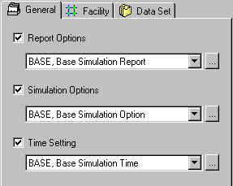
>
> **Figure I-14--Typical Outlet Control Flow Conditions**

8

3.  **Headwater**. Energy is required to force flow through a culvert. This energy takes the form of an increased water surface elevation on the upstream side of the culvert. The depth of the upstream water surface measured from the invert at the culvert entrance is generally referred to as headwater depth (Figures I-13 and I-14).

A considerable volume of water may be ponded upstream of a culvert installation under high fills or in areas with flat ground slopes. The pond which is created may attenuate flood peaks under such conditions. This peak discharge attenuation may justify a reduction in the required culvert size.

4.  **Tailwater**. Tailwater is defined as the depth of water downstream of the culvert measured from the outlet invert. Figure I-14 It is an important factor in determining culvert capacity under outlet control conditions. Tailwater may be caused by an obstruction in the downstream channel or by the hydraulic resistance of the channel. In either case, backwater calculations from the downstream control point are required to precisely define tailwater. When appropriate, normal depth approximations may be used instead of backwater calculations.

5.  **Outlet Velocity**. Since a culvert usually constricts the available channel area, flow velocities in the culvert are likely to be higher than in the channel. These increased velocities can cause streambed scour and bank erosion in the vicinity of the culvert outlet. Minor problems can occasionally be avoided by increasing the barrel roughness. Energy dissipaters and outlet protection devices are sometimes required to avoid excessive scour at the culvert outlet. When a culvert is operating under inlet control and the culvert barrel is not operating at capacity, it is often beneficial to flatten the barrel slope or add a roughened section to reduce outlet velocities.

6.  **Performance Curves**. A performance curve is a plot of headwater depth or elevation versus flow rate. The resulting graphical depiction of culvert operation is useful in evaluating the hydraulic capacity of a culvert for various headwaters. Among its uses, the performance curve displays the consequences of higher flow rates at the site and the benefits of inlet improvements.

In developing a culvert performance curve, both inlet and outlet control curves must be plotted. This is necessary because the dominant control at a given headwater is hard to predict. Also, control may shift from the inlet to the outlet, or vice-versa over a range of flow rates. Figure I-15 illustrates a typical culvert performance curve. At the design headwater, the culvert operates under inlet control. With inlet improvement the culvert performance can be increased to take better advantage of the culvert barrel capacity**.**

9

**D. <u>Economics</u>**

The hydraulic design of a culvert installation always includes an economic evaluation. A wide spectrum of flood flows with associated probabilities will occur at the culvert site during its service life. The benefits of constructing a large capacity culvert to accommodate all of these events with no detrimental flooding effects are normally outweighed by the initial construction costs. Thus, an economic analysis of the tradeoffs is performed with varying degrees of effort and thoroughness.

**1. Benefits and Costs**. The purpose of a highway culvert is to convey water through a roadway embankment. The major benefits of the culvert are decreased traffic interruption time due to roadway flooding and increased driving safety. The major costs are associated with the construction of the roadway embankment and the culvert itself. Maintenance of the facility and flood damage potential must also be factored into the cost analysis.

**2. Analysis**. Traditional economic evaluations for minor stream crossings have been somewhat simplistic. Culvert design flows are based on the importance of the roadway being served with little attention given to other economic and site factors. A more rigorous investigation, termed a risk analysis, is sometimes performed for large culvert installations. The objective of the risk analysis is to find the optimum culvert capacity based on a comparison of benefits and costs (Figure I-16). The designer should be aware of the risk analysis process and consider using it to analyze alternatives where flood damage is large or culvert cost is significant.

10

**II. DESIGN CONSIDERATIONS**

**A. <u>Hydrology</u>**

1.  **General.** Hydrologic analysis involves the estimation of a design flow rate based on climatological and watershed characteristics. This analysis is one of the most important aspects of culvert design. Since statistical uncertainties are inherent in hydrologic analysis, the results of the analysis are not as accurate as the results of the hydraulic analysis of a culvert. Nonetheless, both of these analyses are required, and the hydrologic study must be performed first. FHWA Hydraulic Design Series (HDS) Number 2: Highway Hydrology is an excellent reference for gaining information and insight into most of the hydrologic methods mentioned in this publication (77).

A statistical concept often associated with hydrologic analysis is the return period. The term return period is used when referring to the frequency of occurrence of rare events such as floods. Mathematically, the return period is the reciprocal of frequency. For example, the flood which has a 5 percent chance of occurring (frequency) in any given year also has a return period of 20 years; i.e., 1/0.05 = 20 years. In other words, this flood event will be exceeded on the average of once every 20 years over a long period of time. Hence, the 20- year flood event is likely to be exceeded five times during a 100-year period. These events will be randomly spaced over the 100 years.

Large and expensive culvert installations may warrant extensive hydrologic analysis. This increased level of effort may be necessary in order to perform risk analysis and/or storage routing calculations. Risk analysis requires the computation of flows for several different return periods. Storage routing calculations require the definition of the entire flood event or hydrograph.

Considerable study of the use of risk analysis in culvert design has occurred over the past 10 to 20 years. Risk analysis balances the culvert cost with the damages associated with inadequate culvert performance. These studies have been fruitful in relating culvert design to economic theory and in defining the monetary consequences of both over-design and under-design. The limitations of culvert design based solely on arbitrary return periods have been duly exposed in the process.

Storage routing is the attenuation of the flood flow due to the storage volume upstream of the culvert. Risk analysis studies often include storage routing as an integral part of the culvert sizing process. Consideration of storage routing in these studies often reduces the design culvert size. Hence, storage routing has been included as an optional part of the design procedure presented in this manual.

2.  **Peak Design Flow**. As a flood wave passes a point along a stream, the flow increases to a maximum and then recedes. The maximum flow rate is called the peak flow. The peak flow has been, and continues to be, a major factor in the culvert design process.

In traditional culvert design, a structure is sized to pass a peak flow from one side of the roadway embankment to the other with an acceptable headwater elevation. The magnitude of the peak flow is dependent upon the selection of a return period. The assignment of a return period is generally based on the importance of the roadway and flood damage potential.

11

For gaged sites, statistical analyses can be performed on the recorded stream flow to provide an estimated peak design flow for a given return period. The accuracy of the estimate improves as the length of the record increases. For culvert sites significantly removed from the gage, the peak design flow may have to be adjusted.

> 
>
> 

A typical statistical analysis for data from a gaged site proceeds as follows. First, the annual peak flows for the site are arranged in descending order. Then, the plotting position is calculated by one of several available formulas (11). The peak floods are then plotted on a probability paper to define the frequency relationship for the gage site. If Gumbel paper (Type I external distribution) is used to plot the data, the mean of the data (mean annual flood) will plot at a frequency of 0.429. This equates to a return period of 2.33 years. Other return periods can be read from the frequency plot, because the return period is the inverse of the frequency.

Ungaged sites present more of a design problem. Stream gage data for particular regions have been utilized to develop statistical regression equations for most areas of the country. These equations generally require basic watershed parameters such as drainage area and average stream slope. Using the required data, peak design flows can be determined for ungaged sites within that region. Deterministic methods are also available which attempt to model the rainfall-runoff process. The key input parameter in these methods is rainfall which must be related to a return period. The amount of watershed data required is dependent upon the sophistication of the model. Table 2 lists some of the commonly employed methods of peak flow generation for gaged and ungaged sites.

12

**Table 2--Peak Determination Methods.**

<table>
<colgroup>
<col style="width: 51%" />
<col style="width: 48%" />
</colgroup>
<tbody>
<tr class="odd">
<td>Gaged Sites</td>
<td>Ungaged Sites</td>
</tr>
<tr class="even">
<td><ol type="1">
<li><blockquote>

Normal Distribution

</blockquote></li>
<li><blockquote>

Log-Normal Distribution

</blockquote></li>
<li><blockquote>

Gumbel Extreme Value Distribution

</blockquote></li>
<li><blockquote>

Log-Pearson Type III Distribution

</blockquote></li>
</ol></td>
<td><ol type="1">
<li><blockquote>

USGS Regression Equations

</blockquote></li>
<li><blockquote>

FHWA Regression Equations

</blockquote></li>
<li><blockquote>

Regional Peak Flow Methods

</blockquote></li>
<li><blockquote>

SCS Peak Discharge Method

</blockquote></li>
<li><blockquote>

Rational Method

</blockquote></li>
</ol></td>
</tr>
</tbody>
</table>

3.  **Check Flows**. Culvert operation should be evaluated for flows other than the peak design flow because: (1) It is good design practice to check culvert performance through a range of discharges to determine acceptable operating conditions, (2) flood plain regulations may require the delineation of the 100-year flood plain, (3) in performing flood risk analyses, estimates of the damages caused by headwater levels due to floods of various frequencies are required.

Check flows are determined in the same manner as the peak design flow. The hydrologic procedures used should be consistent unless unusual circumstances dictate otherwise. For example, a stream gage record may be long enough to estimate a 10-year peak design flow but too short to accurately generate a 100-year check flow. Under these circumstances the check flow should be evaluated by another method.

4.  **Hydrographs**. The entire flood hydrograph at the culvert site must be defined if upstream storage is to be considered in culvert design. Passing the peak design flow through a culvert neglects the attenuating effects of upstream storage. If this storage is taken into account, the required culvert size may be substantially reduced. Since volume considerations are now involved, the flood hydrograph becomes an integral part of the design process.

A flood hydrograph is a plot of discharge versus time. Figure II-1 depicts a typical flood hydrograph showing the rise and fall of stream flow over time as the flood passes. Actual flood hydrographs can be obtained using stream gage records. These measured storm events can then be used to develop design flood hydrographs. In the absence of stream gage data, empirical or mathematical methods, such as the Snyder and SCS synthetic hydrograph methods, are used to generate a design flood hydrograph.

The unit hydrograph technique is a popular procedure for determining the response of a watershed to a specified design rainfall. A unit hydrograph represents the runoff response of a watershed to a uniform 1-inch rainfall of a given duration. A unit hydrograph may be generated from data for a gaged watershed or synthesized from rainfall and watershed parameters for an ungaged watershed. Both methods are briefly described below.

a\. <u>Unit Hydrograph Formulation - Gaged Watershed</u>. To develop a unit hydrograph for a gaged watershed, the designer should have streamflow and rainfall records for a number of storm events. The rainfall data must be representative of the rainfall over the watershed during each storm event. In addition, the rainfall events should have relatively constant intensities over the duration of the storm.

Unit hydrograph generation involves four steps which are illustrated in Figure II-2. (1) The groundwater or low flow contribution of the gaged flood hydrograph is estimated and removed from volume consideration. This groundwater or low flow contribution is generally regarded as constant and estimated to be the amount of stream flow prior to the storm event. (2) The volume of the remaining runoff hydrograph is calculated. This is termed the <u>direct runoff volume</u>.

13

\(3\) The direct runoff volume is then distributed over the entire watershed (divided by the watershed area) to determine the equivalent runoff depth. (4) The ordinates of the runoff hydrograph are divided by this runoff depth to produce the unit hydrograph for the storm duration.

> 

The unit hydrograph can be used with the concepts of linearity and superposition to predict the watershed response to a design rainfall with a specified return period. Linearity implies that if the unit hydrograph represents a basin's response to 1-mm (1-inch) of runoff for a given storm duration, 2-mm (2-inches) of runoff over the same duration doubles the discharge at each point in time. Superposition allows for the accumulation of individual runoff responses. For example, if a storm event which generates 1-mm (1-inch) of runoff over a given duration is followed immediately by another 1-mm (1-inch) runoff storm event of the same duration, the basin response will be the accumulation of the individual effects over time (Figure II-3).

A unit hydrograph is derived for a specified storm duration. Since storm durations vary, many different unit hydrographs exist for any particular watershed. Techniques exist to vary the duration of a unit hydrograph such as the "S" Curve (Summation Curve) approach (11). These methods are useful in matching the design unit hydrograph to the duration increment of a design rainfall. Methods are also available to formulate design rainfalls using U.S. Weather Service data. (12,13)

b\. <u>Synthetic Unit Hydrograph</u>. A synthetic unit hydrograph may be developed in the absence of stream gage data. The methods used to develop synthetic unit hydrographs are generally empirical and depend upon various watershed parameters, such as watershed size, slope, land use, and soil type. Two synthetic procedures which have been widely used are the Snyder Method and the Soil Conservation Service (SCS) Method. The Snyder Method uses empirically defined terms and physiographic characteristics of the drainage basin as input for empirical equations which characterize the timing and shape of the unit hydrograph. The SCS method utilizes dimensionless hydrograph parameters based on the analysis of a large number of watersheds to develop a unit hydrograph. The only parameters required by the method are the peak discharge and the time to peak. A variation of the SCS synthetic unit hydrograph is the SCS synthetic triangular hydrograph.

14

> 
>
> **Figure II-3--Linearity and Superposition Concepts**

c\. <u>Computer Models</u>. Hydrologic computer models are becoming popular for generating flood hydrographs. Some computer models merely solve empirical hand methods more quickly. Other models are theoretical and solve the runoff cycle in its entirety using continuous simulation over short time increments. Results are obtained using mathematical equations to represent each phase of the runoff cycle such as interception, surface retention, infiltration, and overland flow.

In most simulation models, the drainage area is divided into subareas with similar hydrologic characteristics. A design rainfall is synthesized for each subarea, and abstractions, such as interception and infiltration, are removed. An overland flow routine simulates the movement of the remaining surface water. Adjacent channels receive this overland flow from the subareas. The channels of the watershed are linked together and the channel flow is routed through them to complete the basin's response to the design rainfall.

Computer models are available which simulate a single storm event or continuous runoff over a long period of time. The Stanford Watershed model was one of the earliest simulation models. It is a continuous simulation model using hourly rainfall and potential evapotranspiration as input data. The output is in the form of mean daily flows, hourly ordinates of the hydrograph, and monthly totals of the water balance. The EPA Sponsored Storm Water Management Model (SWMM) permits the Simulation of a single storm event. An assumption inherent in these models is that the return period of the computed flood is the same as that of the input rainfall. All simulation models require calibration of modeling parameters using measured historical events to increase their validity. Most simulation models require a significant amount of input data and user experience to assure reliable results.

**5. Basics of Storage Routing**. Measurement of a flood hydrograph at a stream location is analogous to recording the passage of a high amplitude, low frequency wave. As this wave moves downstream, its shape broadens and flattens provided there is no additional inflow along the reach of the stream. This change in shape is due to the channel storage between the upstream and downstream locations. If the wave encounters a significant amount of storage at a given location in the stream, such as a reservoir, the attenuation of the flood wave is increased. Figure II-4 depicts the effects graphically.

15

> 
>
> 

Storage routing is the numerical translocation of a flood wave (hydrograph). This process is applicable to reservoirs, channels, and watersheds. The effects of the routing are threefold: volume conservation, peak reduction, and time lag. Reservoir routing is dependent only upon storage in modifying a flood wave. Channel routing is dependent upon inflow and outflow as well as storage in a stream reach. Watershed routing incorporates the runoff attenuating effects of the watershed and is of importance in some hydrograph generation methods. Reservoir routing is of special interest in culvert design, and it will be discussed further in Chapter 5.

**B. <u>Site Data</u>**

1.  **General**. The hydraulic design of a culvert installation requires the evaluation of a large amount of data including culvert location, waterway data, roadway data, and the design headwater. Each of these items and its importance is discussed in the following paragraphs.

2.  **Culvert Location**. A culvert should ideally be located in the existing channel bed to minimize costs associated with structural excavation and channel work. However, this is not always possible. Some streambeds are sinuous and cannot accommodate a straight culvert. In other situations, a stream channel may have to be relocated to avoid the installation of an inordinately long culvert. When relocating a stream channel, it is best to avoid abrupt stream transitions at either end of the culvert. Figure II-5 displays two examples of culvert location procedures (14). In one case, the culvert follows the natural channel alignment. In the second case, the channel has been relocated to reduce the culvert length. Brice concluded that minor channel relocations for culvert alignments have been successful unless the natural channel was already unstable (15).

16

> 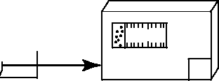
>
> 

**3. Waterway Data**. The installation of a culvert to convey surface water through a

highway embankment significantly constricts the flood plain. To predict the consequences of this alteration, accurate preconstruction waterway data must be collected. These data include cross-sectional information, stream slope, the hydraulic resistance of the stream channel and floodplain, any condition affecting the downstream water surface elevation, and the storage capacity upstream of the culvert. Photographs of site conditions are often beneficial.

a\. <u>Cross Sections</u>. Stream cross sectional data acquired from a field survey at the site are highly desirable. At least three cross sections should be taken to establish the stream slope, the culvert inlet, the culvert outlet, and the configuration of the natural channel (Figure II-6). Sections should be taken: (1) about 30 m (100 ft) upstream from the crossing, (2) at the centerline of the roadway, and (3) about 30 m (100 ft) downstream from the crossing. The natural streambed width and side slopes, and the floodplain width may be obtained from these cross sections. The cross-sectional data will also help to verify the accuracy of existing topographic maps. If significant ponding is likely, additional sections may be necessary to determine the storage capacity upstream of the culvert. Likewise, additional downstream sections may be necessary to establish downstream water level (tailwater) conditions.

If only one cross section of the natural channel is available, it will be used as the typical cross section. This assumption should be checked using topographic maps and aerial photos. Additional information on stream slope and upstream storage volume should also be obtained from the topographic maps.

17

> 
>
> 

2.  <u>Stream Slope</u>. The longitudinal slope of the existing channel in the vicinity of the proposed culvert should be defined in order to properly position the culvert in vertical profile and to define flow characteristics in the natural stream. Often, the proposed culvert is positioned at the same longitudinal slope as the streambed. Cross sections will provide streambed elevations at the deepest point of the stream. From these elevations and the distances between the cross sections the stream slope may be calculated.

3.  <u>Resistance</u>. The hydraulic resistance coefficient of the natural channel must be evaluated in order to calculate preproject flow conditions. This resistance coefficient is usually taken to be the Manning’s n value. Various methods are available to evaluate resistance coefficients for natural streams, including comparisons with photographs of streams with known resistance values or tabular methods based on stream characteristics (16, 17, and 18). Table 11 and Appendix D, provides Manning’s n values for selected natural channels.

4.  <u>Tailwater</u>. Culvert performance is likely to be affected by the downstream water surface elevation or tailwater. Therefore, conditions which might promote high tailwater elevations during flood events should be investigated. Downstream impoundments, obstructions, channel constrictions, tidal effects, and junctions with other watercourses should be investigated, based on field observations and maps, in order to evaluate their impact on the resultant tailwater elevation. Lacking these conditions, tailwater elevations should be based on water surface elevations in the natural channel. These elevations can be accurately determined from water

18

surface elevation calculations or estimated using simplified approximations of water depth. For most culvert installations, an approximation is sufficient.

e\. <u>Upstream Storage</u>. The storage capacity available upstream from a culvert may have an impact upon its design. Upstream storage capacity can be obtained from large scale contour maps of the upstream area, but a 0.5 m (2-foot) contour interval map is desirable. If such maps are not available, a number of cross sections should be obtained upstream of the proposed culvert. These sections must be referenced horizontally as well as vertically. The length of upstream channel to be cross-sectioned will depend on the headwater expected and the stream slope. The cross sections can be used to develop contour maps or the cross sectional areas can be used to compute storage. The topographic information should extend from the channel bed upward to an elevation equal to at least the design headwater elevation in the area upstream of the culvert.

**4. Roadway Data**. The proposed or existing roadway affects the culvert cost, hydraulic capacity, and alignment. Roadway profile and the roadway cross section information can be obtained from preliminary roadway drawings or from standard details on roadway sections. When the culvert must be sized prior to the development of preliminary plans, a best estimate of the roadway section can be used, but the culvert design must be checked after the roadway plans are completed.

1.  <u>Cross Section</u>. The roadway cross section normal to the centerline is typically available from highway plans. However, the cross section needed by the culvert designer is the section at the stream crossing. This section may be skewed with reference to the roadway centerline. For a proposed culvert, the roadway plan, profile, and cross-sectional data should be combined as necessary to obtain this desired section. A schematic roadway plan and section with important elevations is shown in Figure II-7.

> 

**Figure II-7 Roadway cross section and culvert length**

2.  <u>Culvert Length</u>. Important dimensions and features of the culvert will become evident when the desired roadway cross section is measured or established. The dimensions are obtained by superimposing the estimated culvert barrel on the roadway cross section and the streambed

19

profile (Figure II-7). This superposition establishes the inlet and outlet invert elevations. These elevations and the resulting culvert length are approximate since the final culvert barrel size must still be determined.

c\. L<u>ongitudinal Roadway Profile</u>. The roadway profile represents the obstruction encountered by the flowing stream. The embankment containing the culvert acts much like a dam. The culvert is similar to the normal release structure, and the roadway crest acts as an emergency spillway in the event that the upstream pool (headwater) attains a sufficient elevation. The location of initial overtopping is dependent upon the roadway geometry (Figure II-8).

> 

The profile contained in highway plans generally represents the roadway centerline profile. These elevations may not represent the high point in the highway cross section. The culvert designer should extract the profile which establishes roadway flooding and roadway overflow elevations from the highway plans available. The low point of the profile is of critical importance, since this is the point at which roadway overtopping will first occur.

**5. Design Headwater**. The most economical culvert is one which would use all of the available headwater to pass the design discharge. Since the discharge capacity increases with increasing head, the available headwater elevation must be determined. This design headwater elevation generally hinges on one of three factors; economic considerations, regulatory constraints, or arbitrary constraints.

An increase in available headwater can be obtained at some sites by depressing (burying) the culvert inlet. This procedure is advantageous for steep culverts which operate under inlet control. Additional information on this procedure is contained in Chapter 3.

a\. <u>Economic Considerations</u>. As ponding elevations increase upstream from a culvert, detrimental economic consequences can occur. Although for major structures it may be advantageous to perform a flood risk analysis (Chapter 6), site-specific constraints are sometimes adopted in lieu of a full risk analysis. Such constraints are based on some designated elevation that is not to be exceeded within a specified return period. This elevation may correspond to some critical point on the roadway such as the roadway shoulder or the roadway overtopping elevation. Another criteria might be the flood damage elevation of an upstream building. Possible loss of life and the importance of the highway are likewise

20

considered. While all of these factors pertain to risk analysis, a detailed risk analysis is generally not performed.

2.  <u>Regulatory Constraints</u>. The requirements of the National Flood Insurance Program are a major consideration in culvert design. Most communities are now participating in this program. The limitation on flood plain construction as it affects the base (100-year) flood elevation is of primary importance. Depending upon the culvert location, existing floodway encroachments, and whether there is a specified floodway, the allowable water surface elevation increase varies from 0 to 0.3 m (1 foot). Regardless of the return period utilized in the culvert design for the particular roadway, the 100-year return period flood must be checked to ascertain the effects of the culvert on the base flood elevation (19).

3.  <u>Arbitrary Constraints</u>. Some state or local agencies place arbitrary constraints on the headwater produced by a culvert. For example, the headwater depth may not be allowed to exceed the barrel height or some multiple of the barrel height. Although these constraints will severely limit the flexibility inherent in culvert design, they must be followed unless the controlling agency can be convinced to relax the restrictions or grant an exemption.

**C. Summary of Data Needs**. Table 3 summarizes the various data needed for culvert design.

21

> **III. CULVERT DESIGN**

**A. <u>Culvert Flow</u>**

1.  **General.** An exact theoretical analysis of culvert flow is extremely complex because the flow is usually nonuniform with regions of both gradually varying and rapidly varying flow. An exact analysis involves backwater and drawdown calculations, energy and momentum balance, and application of the results of hydraulic model studies. For example, the U.S. Geological Survey has defined 18 different culvert flow types based on inlet and outlet submergence, the flow regime in the barrel, and the downstream brink depth. (20) Often, hydraulic jumps form inside or downstream of the culvert barrel. In addition, the flow types change in a given culvert as the flow rate and tailwater elevations change.

In order to systematically analyze culvert flow, the procedures of this publication have been developed, wherein the various types of flow are classified and analyzed on the basis of control section. A control section is a location where there is a unique relationship between the flow rate and the upstream water surface elevation. Many different flow conditions exist over time, but at a given time the flow is either governed by the inlet geometry (inlet control); or by a combination of the culvert inlet configuration, the characteristics of the barrel, and the tailwater (outlet control). Control may oscillate from inlet to outlet; however, in this publication, the concept of "minimum performance" applies. That is, while the culvert may operate more efficiently at times (more flow for a given headwater level), it will never operate at a lower level of performance than calculated.

The culvert design method presented in this publication is based on the use of design charts and nomographs. These charts and nomographs are, in turn, based on data from numerous hydraulic tests and on theoretical calculations. At each step of the process, some error is introduced. For example, there is scatter in the test data and the selection of a best fit design equation involves some error. Also, the correlation between the design equations and the design nomographs is not exact. Reproduction of the design charts introduces additional error. Therefore, it should be assumed that the results of the procedure are accurate to within plus or minus ten percent, in terms of head. Additional information on the precision of the design charts is provided in Appendix A.

Table 1 in Chapter 1 shows the factors which must be considered in culvert design for inlet and outlet control. In inlet control, only the inlet area, the edge configuration, and the shape influence the culvert performance for a given headwater elevation. The headwater elevation is calculated with respect to the inlet invert, and the tailwater elevation has no influence on performance. In outlet control, all of the factors listed in Table 1 affect culvert performance. Headwater elevation is calculated with respect to the outlet invert, and the difference between headwater and tailwater elevation represents the energy which conveys the flow through the culvert.

2.  **Types of Control**. A general description of the characteristics of inlet and outlet control flow is given below. A culvert flowing in inlet control has shallow, high velocity flow categorized as "supercritical." For supercritical flow, the control section is at the upstream end of the barrel (the inlet). Conversely, a culvert flowing in outlet control will have relatively deep, lower velocity flow termed "subcritical" flow. For subcritical flow the control is at the downstream end of the culvert (the outlet). The tailwater depth is either critical depth at the

23

culvert outlet or the downstream channel depth, whichever is higher. In a given culvert, the type of flow is dependent on all of the factors listed in Table 1.

a\. <u>Inlet Control</u>

1)  Examples of Inlet Control. Figure III-1 depicts several different examples of inlet control flow. The type of flow depends on the submergence of the inlet and outlet ends of the culvert. In all of these examples, the control section is at the inlet end of the culvert. Depending on the tailwater, a hydraulic jump may occur downstream of the inlet.

Figure III-1-A depicts a condition where neither the inlet nor the outlet end of the culvert are submerged. The flow passes through critical depth just downstream of the culvert entrance and the flow in the barrel is supercritical. The barrel flows partly full over its length, and the flow approaches normal depth at the outlet end.

Figure III-1-B shows that submergence of the outlet end of the culvert does not assure outlet control. In this case, the flow just downstream of the inlet is supercritical and a hydraulic jump forms in the culvert barrel.

Figure III-1-C is a more typical design situation. The inlet end is submerged and the outlet end flows freely. Again, the flow is supercritical and the barrel flows partly full over its length. Critical depth is located just downstream of the culvert entrance, and the flow is approaching normal depth at the downstream end of the culvert.

Figure III-1-D is an unusual condition illustrating the fact that even submergence of both the inlet and the outlet ends of the culvert does not assure full flow. In this case, a hydraulic jump will form in the barrel. The median inlet provides ventilation of the culvert barrel. If the barrel were not ventilated, sub-atmospheric pressures could develop which might create an unstable condition during which the barrel would alternate between full flow and partly full flow.

2)  Factors Influencing Inlet Control. Since the control is at the upstream end in inlet control, only the headwater and the inlet configuration affect the culvert performance (Table 1). The <u>headwater</u> depth is measured from the invert of the inlet control section to the surface of the upstream pool. The <u>inlet area</u> is the cross-sectional area of the face of the culvert. Generally, the inlet face area is the same as the barrel area, but for tapered inlets the face area is enlarged, and the control section is at the throat. The <u>inlet edge configuration</u> describes the entrance type. Some typical inlet edge configurations are thin edge projecting, mitered, square edges in a headwall, and beveled edge. The <u>inlet shape</u> is usually the same as the shape of the culvert barrel; however, it may be enlarged as in the case of a tapered inlet. Typical shapes are rectangular, circular, and elliptical. Whenever the inlet face is a different size or shape than the culvert barrel, the possibility of an additional control section within the barrel exists.

An additional factor which influences inlet control performance is the barrel slope. The effect is small, however, and it can be ignored or a small slope correction factor can be inserted in the inlet control equations (Appendix A).

25

> 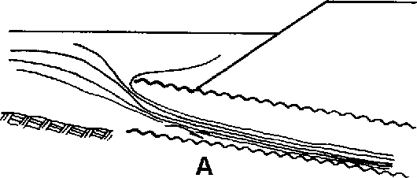
>
> 
>
> 

The inlet edge configuration is a major factor in inlet control performance, and it can be modified to improve performance. Various inlet edges are shown in Figure III-2. Figure III-2-A is a thin edge projecting inlet typical of metal pipe, Figure III-2-B is a projecting thick-walled inlet (about the same performance as a square edge in a headwall) which is typical of concrete pipe without a groove end, and Figure III-2-C is a groove end or socket inlet which is typical of a concrete pipe joint. Note that as the inlet edge condition improves (from Figure III-2-A to Figure III-2-C), the flow contraction at the inlet decreases. This reduced flow contraction indicates increased inlet performance and more flow through the barrel for the same headwater.

26

A method of increasing inlet performance is the use of beveled edges at the entrance of the culvert. Beveled edges reduce the contraction of the flow by effectively enlarging the face of the culvert. Although any beveling will help the hydraulics, design charts are available for two bevel angles, 45 degrees and 33.7 degrees, as shown in Figure III-3.

The larger, 33.7-degree bevels require some structural modification, but they provide slightly better inlet performance than the 45-degree bevels. The smaller, 45-degree bevels require very minor structural modification of the culvert headwall and increase both inlet and outlet control performances. Therefore, the use of 45 degree bevels is recommended on all culverts, whether in inlet or outlet control, unless the culvert has a groove end. (The groove end provides about the same performance as a beveled edge.)

\(3\) Hydraulics of Inlet Control. Inlet control performance is defined by the three regions of flow shown in Figure III-4: unsubmerged, transition and submerged. For low headwater conditions, as shown in Figure III-1-A and Figure III-1-B, the entrance of the culvert operates as a weir. A weir is an unsubmerged flow control section where the upstream water surface elevation can be predicted for a given flow rate. The relationship between flow and water surface elevation must be determined by model tests of the weir geometry or by measuring prototype discharges. These tests or measurements are then used to develop equations for unsubmerged inlet control flow. Appendix A contains the equations which were developed from the NBS model test data.

For headwaters submerging the culvert entrance, as are shown in Figure III-1-C and Figure III-1-D, the entrance of the culvert operates as an orifice. An orifice is an opening, submerged on the upstream side and flowing freely on the downstream side, which functions as a control section. The relationship between flow and headwater can be defined based on results from

27

model tests. Appendix A contains the submerged flow equations which were developed from the NBS test data.

The flow transition zone between the low headwater (weir control) and the high headwater flow conditions (orifice control) is poorly defined. This zone is approximated by plotting the unsubmerged and submerged flow equations and connecting them with a line tangent to both curves, as shown in Figure III-4.

> 
>
> 

**Figure III-4--Inlet Control Curves**

The inlet control flow versus headwater curves which are established using the above procedure are the basis for constructing the inlet control design nomographs. Note that approach velocity head can be included as a part of the available headwater in the inlet relationships.

\(4\) Inlet Depressions. The inlet control equations or nomographs provide the depth of headwater above the inlet invert required to convey a given discharge through the inlet. This relationship remains constant regardless of the elevation of the inlet invert. If the entrance end of the culvert is depressed below the stream bed, more head can be exerted on the inlet for the same headwater elevation.

Two methods of depressing the entrance ends of culverts are shown in Figure III-5 and Figure III-6. Figure III-5 depicts the use of a depressed approach apron with the fill retained by wingwalls. Paving the apron is desirable. Figure III-6 shows a sump constructed upstream of the culvert face. Usually the sump is paved, but for small depressions, an unpaved excavation may be adequate.

28

**Figure III-5--Culvert with Depressed Apron and Wingwalls**

**29**

> 
>
> 

**Figure III-6--Culvert with Inlet Sump**

When a culvert is depressed below the stream bed at the inlet, the depression is called the FALL. For culverts without tapered inlets, the FALL is defined as the depth from the natural stream bed at the face to the inlet invert. For culverts with tapered inlets, the FALL is defined as the depth from the natural stream bed at the face to the throat invert. Tapered inlets will be discussed further in Chapter 4.

b\. <u>Outlet Control</u>

\(1\) Examples of Outlet Control. Figure III-7 illustrates various outlet control flow conditions. In all cases, the control section is at the outlet end of the culvert or further downstream.

For the partly full flow situations, the flow in the barrel is subcritical.

30

<u>Condition III-7-A</u> represents the classic full flow condition, with both inlet and outlet submerged. The barrel is in pressure flow throughout its length. This condition is often assumed in calculations, but seldom actually exists.

<u>Condition III-7-B</u> depicts the outlet submerged with the inlet unsubmerged. For this case, the headwater is shallow so that the inlet crown is exposed as the flow contracts into the culvert.

<u>Condition III-7-C</u> shows the entrance submerged to such a degree that the culvert flows full throughout its entire length while the exit is unsubmerged. This is a rare condition. It requires an extremely high headwater to maintain full barrel flow with no tailwater. The outlet velocities are usually high under this condition.

<u>Condition III-7-D</u> is more typical. The culvert entrance is submerged by the headwater and the outlet end flows freely with a low tailwater. For this condition, the barrel flows partly full over at least part of its length (subcritical flow) and the flow passes through critical depth just upstream of the outlet.

<u>Condition III-7-E</u> is also typical, with neither the inlet nor the outlet end of the culvert submerged. The barrel flows partly full over its entire length, and the flow profile is subcritical.

2)  Factors Influencing Outlet Control. All of the factors influencing the performance of a culvert in inlet control also influence culverts in outlet control. In addition, the barrel characteristics (roughness, area, shape, length, and slope) and the tailwater elevation affect culvert performance in outlet control (Table 1).

The <u>barrel roughness</u> is a function of the material used to fabricate the barrel. Typical materials include concrete and corrugated metal. The roughness is represented by a hydraulic resistance coefficient such as the Manning’s n value. Typical Manning’s n values for culverts are presented in Table 4. Additional discussion on the sources and derivations of the Manning’s n values are contained in Appendix B.

The <u>barrel area</u> and <u>barrel shape</u> are self-explanatory.

The <u>barrel length</u> is the total culvert length from the entrance to the exit of the culvert. Because the design height of the barrel and the slope influence the actual length, an approximation of barrel length is usually necessary to begin the design process.

The <u>barrel slope</u> is the actual slope of the culvert barrel. The barrel slope is often the same as the natural stream slope. However, when the culvert inlet is raised or lowered, the barrel slope is different from the stream slope.

The <u>tailwater elevation</u> is based on the downstream water surface elevation. Backwater calculations from a downstream control, a normal depth approximation, or field observations are used to define the tailwater elevation.

3)  Hydraulics of Outlet Control. Full flow in the culvert barrel, as depicted in Figure III-7-A, is the best type of flow for describing outlet control hydraulics.

Outlet control flow conditions can be calculated based on energy balance. The total energy (HL) required to pass the flow through the culvert barrel is made up of the entrance

32

**Table 4 Manning’s n Values for Culverts\***

<table>
<colgroup>
<col style="width: 32%" />
<col style="width: 22%" />
<col style="width: 22%" />
<col style="width: 22%" />
</colgroup>
<tbody>
<tr class="odd">
<td>Type of Culvert</td>
<td>Roughness or 
Corrugation</td>
<td>Manning's n</td>
<td>Reference</td>
</tr>
<tr class="even">
<td><blockquote>

Concrete Pipe

</blockquote></td>
<td><blockquote>

Smooth

</blockquote></td>
<td>0.010-0.011</td>
<td>(64, 66, 67, 70)</td>
</tr>
<tr class="odd">
<td><blockquote>

Concrete Boxes

</blockquote></td>
<td><blockquote>

Smooth

</blockquote></td>
<td>0.012-0.015</td>
<td>(23)</td>
</tr>
<tr class="even">
<td><blockquote>

Spiral Rib Metal Pipe

</blockquote></td>
<td><blockquote>

Smooth

</blockquote></td>
<td>0.012-0.013</td>
<td>(65, 69)</td>
</tr>
<tr class="odd">
<td><blockquote>

Corrugated Metal Pipe,

</blockquote></td>
<td><blockquote>

68 by 13 mm

</blockquote></td>
<td>0.022-0.027</td>
<td>(25)</td>
</tr>
<tr class="even">
<td><blockquote>

Pipe-Arch and Box

</blockquote></td>
<td><blockquote>

2-2/3 by 1/2 in

</blockquote></td>
<td></td>
<td></td>
</tr>
<tr class="odd">
<td>
(Annular and Helical

corrugations -- see Figure B-3,
</td>
<td><blockquote>

Annular

</blockquote></td>
<td></td>
<td></td>
</tr>
<tr class="even">
<td>Manning's n varies with barrel size)</td>
<td><blockquote>

68 by 13 mm

</blockquote></td>
<td></td>
<td></td>
</tr>
<tr class="odd">
<td></td>
<td><blockquote>

2-2/3 by 1/2 in

</blockquote></td>
<td>0.011-0.023</td>
<td>(25, 68)</td>
</tr>
<tr class="even">
<td></td>
<td><blockquote>

Helical

</blockquote></td>
<td></td>
<td></td>
</tr>
<tr class="odd">
<td></td>
<td><blockquote>

150 by 25 mm

</blockquote></td>
<td></td>
<td></td>
</tr>
<tr class="even">
<td></td>
<td><blockquote>

6 by 1 in

</blockquote></td>
<td>0.022-0.025</td>
<td>(25)</td>
</tr>
<tr class="odd">
<td></td>
<td><blockquote>

Helical

</blockquote></td>
<td></td>
<td></td>
</tr>
<tr class="even">
<td></td>
<td><blockquote>

125 by 25 mm

</blockquote></td>
<td></td>
<td></td>
</tr>
<tr class="odd">
<td></td>
<td><blockquote>

5 by 1 in

</blockquote></td>
<td>0.025-0.026</td>
<td>(25)</td>
</tr>
<tr class="even">
<td></td>
<td><blockquote>

75 by 25 mm

</blockquote></td>
<td></td>
<td></td>
</tr>
<tr class="odd">
<td></td>
<td><blockquote>

3 by 1 in

</blockquote></td>
<td>0.027-0.028</td>
<td>(25)</td>
</tr>
<tr class="even">
<td></td>
<td><blockquote>

150 by 50 mm

</blockquote></td>
<td></td>
<td></td>
</tr>
<tr class="odd">
<td></td>
<td><blockquote>

6 by 2 in

</blockquote></td>
<td>0.033-0.035</td>
<td>(25)</td>
</tr>
<tr class="even">
<td></td>
<td><blockquote>

Structural Plate

</blockquote></td>
<td></td>
<td></td>
</tr>
<tr class="odd">
<td></td>
<td><blockquote>

230 by 64 mm

</blockquote></td>
<td></td>
<td></td>
</tr>
<tr class="even">
<td></td>
<td><blockquote>

9 by 2-1/2 in

</blockquote></td>
<td>0.033-0.037</td>
<td>(25)</td>
</tr>
<tr class="odd">
<td></td>
<td><blockquote>

Structural Plate

</blockquote></td>
<td></td>
<td></td>
</tr>
<tr class="even">
<td><blockquote>

Corrugated Polyethylene

</blockquote></td>
<td><blockquote>

Smooth

</blockquote></td>
<td>0.009-0.015</td>
<td>(71, 72)</td>
</tr>
<tr class="odd">
<td><blockquote>

Corrugated Polyethylene

</blockquote></td>
<td><blockquote>

Corrugated

</blockquote></td>
<td>0.018-0.025</td>
<td>(73, 74)</td>
</tr>
<tr class="even">
<td><blockquote>

Polyvinyl chloride (PVC)

</blockquote></td>
<td><blockquote>

Smooth

</blockquote></td>
<td>0.009-0.011</td>
<td>(75, 76)</td>
</tr>
<tr class="odd">
<td colspan="4"><blockquote>

*NOTE: The Manning's n values indicated in this table were obtained in the laboratory and

</blockquote></td>
</tr>
<tr class="even">
<td colspan="4"><blockquote>

are supported by the provided reference. Actual field values for culverts may vary depending

</blockquote></td>
</tr>
<tr class="odd">
<td colspan="4"><blockquote>

on the effect of abrasion, corrosion, deflection, and joint conditions.

</blockquote></td>
</tr>
</tbody>
</table>

33

> V 2 V 2 ⎤

H 1.0

> = ⎡ − 2 g d
>
> ⎢ ⎥ (4c)

- ⎣ 2 g ⎦

Vd is the channel velocity downstream of the culvert, m/s (ft/s)

Equation (4c) may overestimate exit losses, and a multiplier of less than 1.0 can be used. (40) The downstream velocity is usually neglected, in which case the exit loss is equal to the full flow velocity head in the barrel, as shown in Equation (4d).

Bend losses, junction losses, grate losses and other losses are discussed in Chapter VI. These other losses are added to the total losses using Equation (1).

Inserting the above relationships for entrance loss, friction loss, and exit loss (Equation 4d) into Equation (1), the following equation for loss is obtained:

<table>
<colgroup>
<col style="width: 6%" />
<col style="width: 7%" />
<col style="width: 13%" />
<col style="width: 72%" />
</colgroup>
<tbody>
<tr class="odd">
<td>⎡</td>
<td></td>
<td>
<strong>2</strong> ⎤ V <strong>2</strong>

K nL
</td>
<td></td>
</tr>
<tr class="even">
<td rowspan="2">
H = ⎢ <strong>1</strong>

⎢ ⎣
</td>
<td rowspan="2">
++

k e
</td>
<td><blockquote>

U

</blockquote>

⎥
</td>
<td rowspan="2">(5)</td>
</tr>
<tr class="odd">
<td><blockquote>

R <strong>1 .33</strong>

</blockquote>

⎥ ⎦ <strong>2</strong> g
</td>
</tr>
</tbody>
</table>

**Figure III-8--Full Flow Energy and Hydraulic Grade Lines**

Figure III-8 depicts the energy grade line and the hydraulic grade line for full flow in a culvert barrel. The energy grade line represents the total energy at any point along the culvert barrel. HW is the depth from the inlet invert to the energy grade line. The hydraulic grade line is the depth to which water would rise in vertical tubes connected to the sides of the culvert barrel. In full flow, the energy grade line and the hydraulic grade line are parallel straight lines separated by the velocity head lines except in the vicinity of the inlet where the flow passes through a contraction.

The headwater and tailwater conditions as well as the entrance, friction, and exit losses are also shown in Figure III-8. Equating the total energy at sections 1 and 2, upstream and downstream of the culvert barrel in Figure III-8, the following relationship results:

35

V 2 V 2  
HW + =

> u TW + +
>
> <u>d</u> H (6)
>
> o L
>
> 2 g 2 g
>
> HWo is the headwater depth above the outlet invert, m (ft)
>
> Vu is the approach velocity, m/s (ft/s)
>
> TW is the tailwater depth above the outlet invert, m (ft)
>
> Vd is the downstream velocity, m/s (ft/s)
>
> HL is the sum of all losses including entrance (He), friction (Hf), exit (Ho) and other losses, (Hb), (Hj), etc., m (ft)

Note: the total available upstream energy (HW) includes the depth of the upstream water surface above the outlet invert and the approach velocity head. In most instances, the approach velocity is low, and the approach velocity head is neglected. However, it can be considered to be a part of the available headwater and used to convey the flow through the culvert.

Likewise, the velocity downstream of the culvert (Vd) is usually neglected. When both approach and downstream velocities are neglected, Equation 6 becomes:

HW o = TW + H L (7)

In this case, HL is the difference in elevation between the water surface elevation at the outlet (tailwater elevation) and the water surface elevation at the inlet (headwater elevation). If it is desired to include the approach and/or downstream velocities, use Equation (4c) for exit losses and Equation (6) instead of Equation (7) to calculate the headwater.

Equations (1) through (7) were developed for full barrel flow, shown in Figure III-7-A. The equations also apply to the flow situations shown in Figures III-7-B and C, which are effectively full flow conditions. Backwater calculations may be required for the partly full flow conditions shown in Figures III-7-D and E. These calculations begin at the water surface at the downstream end of the culvert and proceed upstream to the entrance of the culvert. The downstream water surface is based on critical depth at the culvert outlet or on the tailwater depth, whichever is higher. If the calculated backwater profile intersects the top of the barrel, as in Figure III-7-D, a straight, full flow hydraulic grade line extends from that point upstream to the culvert entrance. From Equation (4b), the full flow friction slope is:

H <u>K n</u> S = =

> f <u>U</u>
>
> n
>
> L R **1 .33 2**

In order to avoid tedious backwater calculations, approximate methods have been developed to analyze partly full flow conditions. Based on numerous backwater calculations performed by the FHWA staff, it was found that a downstream extension of the full flow hydraulic grade line for the flow condition shown in Figure III-9-B pierces the plane of the culvert outlet at a point one-half way between critical depth and the top of the barrel. Therefore, it is possible to begin the hydraulic grade line at a depth of (dc-'-D)/2 above the outlet invert and extend the straight, full flow hydraulic grade line upstream to the inlet of the culvert at a slope of Sn.(Figure III-9-D) If the tailwater exceeds (dc-'-D)/2, the tailwater is used to set the downstream end of the extended full flow hydraulic grade line. The inlet losses and the velocity head are added to the elevation of the hydraulic grade line at the inlet to obtain the headwater elevation.

36

**Figure III-9--Outlet Control Energy and Hydraulic Grade Lines**

**37**

This approximate method works best when the barrel flows full over at least part of its length (Figure III-9-B). When the barrel is partly full over its entire length (Figure III-9-C), the method becomes increasingly inaccurate as the headwater falls further below the top of the barrel at the inlet. Adequate results are obtained down to a headwater of 0.75D. For lower headwaters, backwater calculations are required to obtain accurate headwater elevations.

The outlet control nomographs in Appendix D provide solutions for Equation (5) for entrance, friction, and exit losses in full barrel flow. Using the approximate backwater method, the losses (H) obtained from the nomographs can be applied for the partly full flow conditions shown in Figures III-7 and III-9. The losses are added to the elevation of the extended full flow hydraulic grade line at the barrel outlet in order to obtain the headwater elevation. The extended hydraulic grade line is set at the higher of (dc+ D)/2 or the tailwater elevation at the culvert outlet. Again, the approximation works best when the barrel flows full over at least part of its length.

**Figure III-10--Roadway Overtopping**

**3. Roadway Overtopping**. Overtopping will begin when the headwater rises to the elevation of the roadway (Figure III-10). The overtopping will usually occur at the low point of a sag vertical curve on the roadway. The flow will be similar to flow over a broad crested weir. Flow coefficients for flow overtopping roadway embankments are found in HDS No. 1, Hydraulics of Bridge Waterways (21), as well as in the documentation of HY-7, the Bridge Waterways Analysis Model (22). Curves from reference (22) are shown in Figure III-11. Figure III-11-A is for deep overtopping, Figure III-11-B is for shallow overtopping, and Figure III-11-C is a correction factor for downstream submergence. Equation (8) defines the flow across the roadway.

Qo= CdL HWr1.5 (8)

> Qo is the overtopping flow rate in m3/s (ft3/s)
>
> \*Cd is the overtopping discharge coefficient (\*for use in SI units, see note)
>
> L is the length of the roadway crest, m (ft)

HWr is the upstream depth, measured from the roadway crest to the water surface

> upstream of the weir drawdown, m (ft)

\*Note: Cd determined from Figure III-11 and other English unit research must be corrected by a

factor of 0.552 \[Cd (SI) = 0.552 (Cd English)\]

38

> 

**Figure III-11--English Discharge Coefficients for Roadway Overtopping**

The length and elevation of the roadway crest are difficult to determine when the crest is defined by a roadway sag vertical curve. The sag vertical curve can be broken into a series of horizontal segments as shown in Figure III-12-A. Using Equation (8), the flow over each segment is calculated for a given headwater. Then, the incremental flows for each segment are added together, resulting in the total flow across the roadway.

Representing the sag vertical curve by a single horizontal line (one segment) is often adequate for culvert design (Figure III-12-B). The length of the weir can be taken as the horizontal length of this segment or it can be based on the roadway profile and an acceptable variation above and below the horizontal line. In effect, this method utilizes an average depth of the upstream pool above the roadway crest for the flow calculation.

39

> 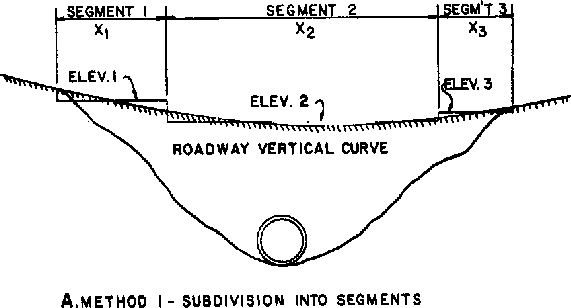
>
> 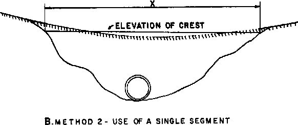

**Figure III-12--Weir Crest Length Determinations for Roadway Overtopping** .

It is a simple matter to calculate the flow across the roadway for a given upstream water surface elevation using Equation (8). The problem is that the roadway overflow plus the culvert flow must equal the total design flow. A trial and error process is necessary to determine the amount of the total flow passing through the culvert and the amount flowing across the roadway. Performance curves may also be superimposed for the culvert flow and the road overflow to yield an overall solution as is discussed later in this chapter.

**4. Outlet Velocity**. Culvert outlet velocities should be calculated to determine the need for erosion protection at the culvert exit. Culverts usually result in outlet velocities which are higher than the natural stream velocities. These outlet velocities may require flow readjustment or energy dissipation to prevent downstream erosion.

In inlet control, backwater (also called drawdown) calculations may be necessary to determine the outlet velocity. These calculations begin at the culvert entrance and proceed downstream to the exit. The flow velocity is obtained from the flow and the cross-sectional area at the exit (Equation (2)).

An approximation may be used to avoid backwater calculations in determining the outlet velocity for culverts operating in inlet control. The water surface profile converges toward normal depth as calculations proceed down the culvert barrel. Therefore, if the culvert is of adequate length, normal depth will exist at the culvert outlet. Even in short culverts, normal depth can be assumed and used to define the area of flow at the outlet and obtain the outlet velocity (Figure

40

III-13). The velocity calculated in this manner may be slightly higher than the actual velocity at the outlet. Normal depth in common culvert shapes may be calculated using a trial and error solution of the Manning equation. The known inputs are flow rate, barrel resistance, slope and geometry. Normal depths may also be obtained from design aids in publications such as HDS NO. 3. (23).

> 

**Figure III-13--Outlet Velocity - Inlet Control**

> 

**Figure III-14--Outlet Velocity - Outlet Control**

41

In outlet control, the cross sectional area of the flow is defined by the geometry of the outlet and either critical depth, tailwater depth, or the height of the conduit (Figure III-14).

Critical depth is used when the tailwater is less than critical depth and the tailwater depth is used when tailwater is greater than critical depth but below the top of the barrel. The total barrel area is used when the tailwater exceeds the top of the barrel.

**B. <u>Performance Curves</u>**

Performance curves are representations of flow rate versus headwater depth or elevation for a given flow control device, such as a weir, an orifice, or a culvert. A weir constricts open channel flow so that the flow passes through critical depth just upstream of the weir. An orifice is a flow control device, fully submerged on the upstream side, through which the flow passes. Performance curves and equations for these two basic types of flow control devices are shown in Figure III-15.

**Figure III-15--Performance Curves and Equations for Weirs and Orifices**

When a tailwater exists, the control device may be submerged so that more than one flow-versus-elevation relationship exists. Then, the performance curve is dependent on the variation

42

of both tailwater and headwater. In the case of a weir or orifice, the device is called a submerged weir or a submerged orifice, respectively. For some cases, submergence effects have been analyzed and correction factors have been developed. (21,22,24)

Culvert performance curves are similar to weir and/or orifice performance curves. In fact, culverts often behave as weirs or orifices. However, due to the fact that a culvert has several possible control sections (inlet, outlet, throat), a given installation will have a performance curve for each control section and one for roadway overtopping. The overall culvert performance curve is made up of the controlling portions of the individual performance curves for each control section.

1.  **Inlet Control**. The inlet control performance curves are developed using either the inlet control equations of Appendix A or the inlet control nomographs of Appendix D. If the equations of Appendix A are used, both unsubmerged (weir) and submerged (orifice) flow headwaters must be calculated for a series of flow rates bracketing the design flow. The resultant curves are then connected with a line tangent to both curves (the transition zone). If the inlet control nomographs are used, the headwaters corresponding to the series of flow rates are determined and then plotted. The transition zone is inherent in the nomographs.

2.  **Outlet Control**. The outlet control performance curves are developed using Equations (1) through (7) of this chapter, the outlet control nomographs of Appendix D, or backwater calculations. Flows bracketing the design flow are selected. For these flows, the total losses through the barrel are calculated or read from the outlet control nomographs. The losses are added to the elevation of the hydraulic grade line at the culvert outlet to obtain the headwater.

If backwater calculations are performed beginning at the downstream end of the culvert, friction losses are accounted for in the calculations. Adding the inlet loss to the energy grade line in the barrel at the inlet results in the headwater elevation for each flow rate.

3.  **Roadway Overtopping**. A performance curve showing the culvert flow as well as the flow across the roadway is a useful analysis tool. Rather than using a trial and error procedure to determine the flow division between the overtopping flow and the culvert flow, an overall performance curve can be developed. The performance curve depicts the sum of the flow through the culvert and the flow across the roadway.

The overall performance curve can be determined by performing the following steps.

1.  Select a range of flow rates and determine the corresponding headwater elevations for the culvert flow alone. These flow rates should fall above and below the design discharge and cover the entire flow range of interest. Both inlet and outlet control headwaters should be calculated.

2.  Combine the inlet and outlet control performance curves to define a single performance curve for the culvert.

3.  When the culvert headwater elevations exceed the roadway crest elevation, overtopping will begin. Calculate the equivalent upstream water surface depth above the roadway (crest of weir) for each selected flow rate. Use these water surface depths and Equation (8) to calculate flow rates across the roadway.

4.  Add the culvert flow and the roadway overtopping flow at the corresponding headwater elevations to obtain the overall culvert performance curve.

43

Using the combined culvert performance curve, it is an easy matter to determine the headwater elevation for any flow rate, or to visualize the performance of the culvert installation over a range of flow rates. When roadway overtopping begins, the rate of headwater increase will flatten severely. The headwater will rise very slowly from that point on. Figure III-16 depicts an overall culvert performance curve with roadway overtopping. Example problem III-4 illustrates the development of an overall culvert performance curve.

**Figure III-16--Culvert Performance Curve with Roadway Overtopping C. <u>Culvert Design Method</u>**

The culvert design method provides a convenient and organized procedure for designing culverts, considering inlet and outlet control. While it is possible to follow the design method without an understanding of culvert hydraulics, this is not recommended. The result could be an inadequate and possibly unsafe structure.

**1. Culvert Design Form**. The Culvert Design Form, shown in Figure III-17, has been formulated to guide the user through the design process. Summary blocks are provided at the top of the form for the project description, and the designer's identification. Summaries of hydrologic data of the form are also included. At the top right is a small sketch of the culvert with blanks for inserting important dimensions and elevations.

44

The central portion of the design form contains lines for inserting the trial culvert description and calculating the inlet control and outlet control headwater elevations. Space is provided at the lower center for comments and at the lower right for a description of the culvert barrel selected.

The first step in the design process is to summarize all known data for the culvert at the top of the Culvert Design Form. This information will have been collected or calculated prior to performing the actual culvert design. The next step is to select a preliminary culvert material, shape, size, and entrance type. The user then enters the design flow rate and proceeds with the inlet control calculations.

> 

**Figure III-17--Culvert Design Form**

**2. Inlet Control**. The inlet control calculations determine the headwater elevation required to pass the design flow through the selected culvert configuration in inlet control. The approach velocity head may be included as part of the headwater, if desired. The inlet control nomographs of Appendix D are used in the design process. For the following discussion, refer to the schematic inlet control nomograph shown in Figure III-18.

1.  Locate the selected culvert size (point 1) and flow rate (point 2) on the appropriate scales of the inlet control nomograph. (Note that for box culverts, the flow rate per foot of barrel width is used.)

2.  Using a straightedge, carefully extend a straight line from the culvert size (point 1) through the flow rate (point 2) and mark a point on the first headwater/culvert height (HW/D) scale (point 3). The first HW/D scale is also a turning line.

45

NOTE: If the nomographs are put into a notebook, a clean plastic sheet with a matte finish can be used to mark on so that the nomographs can be preserved.

c\. If another HW/D scale is required, extend a horizontal line from the first HW/D scale (the turning line) to the desired scale and read the result.

d\. Multiply HW/D by the culvert height, D, to obtain the required headwater (HW) from the invert of the control section to the energy grade line. If the approach velocity is neglected, HW equals the required headwater depth (HWi). If the approach velocity is included in the calculations, deduct the approach velocity head from HW to determine HWi.

e\. Calculate the required depression (FALL) of the inlet control section below the stream bed as follows:

HWd =ELhd −EL sf  
FALL =HW i −HWd

> HWd is the design headwater depth, m (ft)
>
> ELhd is the design headwater elevation, m (ft)
>
> ELsf is the elevation of the streambed at the face, m (ft)
>
> HWi is the required headwater depth, m (ft)

Possible results and consequences of this calculation are:

1)  If the FALL is negative or zero, set FALL equal to zero and proceed to step f.

2)  If the FALL is positive, the inlet control section invert must be depressed below the streambed at the face by that amount. If the FALL is acceptable, proceed to step f.

3)  If the FALL is positive and greater than is judged to be acceptable, select another culvert configuration and begin again at step a.

f\. Calculate the inlet control section invert elevation as follows: ELi = ELsf − FALL

where ELi is the invert elevation at the face of a culvert (ELf) or at the throat of a culvert with a tapered inlet (ELt).

**3. Outlet Control**. The outlet control calculations result in the headwater elevation required to convey the design discharge through the selected culvert in outlet control. The approach and downstream velocities may be included in the design process, if desired. The critical depth charts and outlet control nomographs of Appendix D are used in the design process. For illustration, refer to the schematic critical depth chart and outlet control nomograph shown in Figures III-19 and III-20, respectively.

a\. Determine the tailwater depth above the outlet invert (TW) at the design flow rate. This is obtained from backwater or normal depth calculations, or from field observations.

46

**Figure III-19--Critical Depth Chart (schematic)**

2.  Enter the appropriate critical depth chart (Figure III-19) with the flow rate and read the critical depth (dc). dc cannot exceed D!

Note: The dc curves are truncated for convenience when they converge. If an accurate dc is required for dc \> .9D consult the Handbook of Hydraulics or other hydraulic references.

3.  Calculate (dc + D)/2

4.  Determine the depth from the culvert outlet invert to the hydraulic grade line (ho). ho = TW or (dc + D)/2 whichever is larger

5.  From Table 12, Appendix D, obtain the appropriate entrance loss coefficient, ke, for the culvert inlet configuration.

6.  Determine the losses through the culvert barrel, H, using the outlet control nomograph (Figure III-20) or Equations (5) or (6) if outside the range of the nomograph.

48

\(1\) If the Manning’s n value given in the outlet control nomograph is different than the Manning’s n for the culvert, adjust the culvert length using the formula:

⎛ n ⎞

L = L ⎜ 1 ⎟

> 1 ⎝ n ⎠
>
> L1 is the adjusted culvert length, m (ft)
>
> L is the actual culvert length, m (ft)
>
> n1 is the desired Manning’s n value
>
> n is the Manning’s n value from the outlet control chart

Then, use L1 rather than the actual culvert length when using the outlet control nomograph.

2)  Using a straightedge, connect the culvert size (point 1) with the culvert length on the appropriate ke scale (point 2). This defines a point on the turning line (point 3).

3)  Again using the straightedge, extend a line from the discharge (point 4) through the point on the turning line (point 3) to the Head Loss (H) scale. Read H. H is the energy loss through the culvert, including entrance, friction, and outlet losses.

Note: Careful alignment of the straightedge in necessary to obtain good results from the outlet control nomograph.

7.  Calculate the required outlet control headwater elevation.

ELho =ELo +H+ho (10)

where ELo is the invert elevation at the outlet. (If it is desired to include the approach and downstream velocities in the calculations, add the downstream velocity head and subtract the approach velocity head from the right side of Equation (10). Also, use Equation (4c) instead of Equation (4d) to calculate the exit losses and Equation (1) to calculate total losses.)

8.  If the outlet control headwater elevation exceeds the design headwater elevation, a new culvert configuration must be selected and the process repeated. Generally, an enlarged barrel will be necessary since inlet improvements are of limited benefit in outlet control.

**4. Evaluation of Results**. Compare the headwater elevations calculated for inlet and outlet control. The higher of the two is designated the controlling headwater elevation. The culvert can be expected to operate with that higher headwater for at least part of the time.

The outlet velocity is calculated as follows:

1.  If the controlling headwater is based on inlet control, determine the normal depth and velocity in the culvert barrel. The velocity at normal depth is assumed to be the outlet velocity.

2.  If the controlling headwater is in outlet control, determine the area of flow at the outlet based on the barrel geometry and the following:

<!-- -->

1)  Critical depth if the tailwater is below critical depth.

2)  Tailwater depth if the tailwater is between critical depth and the top of the barrel.

3)  Height of the barrel if the tailwater is above the top of the barrel.

50

Repeat the design process until an acceptable culvert configuration is determined. Once the barrel is selected it must be fitted into the roadway cross section. The culvert barrel must have adequate cover, the length should be close to the approximate length, and the headwalls and wingwalls must be dimensioned.

If outlet control governs and the headwater depth (referenced to the inlet invert) is less than 1.2D, it is possible that the barrel flows partly full though its entire length. In this case, caution should be used in applying the approximate method of setting the downstream elevation based on the greater of tailwater or (dc + D)/2. If an accurate headwater is necessary, backwater calculations should be used to check the result from the approximate method. If the headwater depth falls below 0.75D, the approximate method should not be used.

If the selected culvert will not fit the site, return to the culvert design process and select another culvert. If neither tapered inlets nor flow routing are to be applied, document the design. An acceptable design should always be accompanied by a performance curve which displays culvert behavior over a range of discharges. If tapered inlets are to be investigated, proceed to Chapter VI.

If storage routing will be utilized, proceed to Chapter V.

Special culvert installations, such as culverts with safety grates, junctions, or bends are discussed in Chapter VI. Unusual culvert configurations such as "broken-back" culverts, siphons, and low head installations are also discussed.

**5. Example Problems**. The following example problems illustrate the use of the design methods and charts for selected culvert configurations and hydraulic conditions. The problems cover the following situations.

Problem No. 1: Circular pipe culvert, standard 68 by 13 cm (2-2/3 by 1/2) in CMP with beveled edge and reinforced concrete pipe with groove end. No FALL.

Problem No. 2: Reinforced cast-in-place concrete box culvert with square edges and with bevels. No FALL.

Problem No. 3: Elliptical pipe culvert with groove end and a FALL.

Problem No. 4: Analysis of an existing reinforced concrete box culvert with square edges.

51

<u>Example Problem \#1 (SI Units)</u>

A culvert at a new roadway crossing must be designed to pass the 25-year flood. Hydrologic analysis indicates a peak flow rate of 5.663 m3/s. Use the following site information:

Elevation at Culvert Face: 30.480 m

Natural Stream Bed Slope: 1 percent = 0.01 m/m

Tailwater for 25-Year Flood: 1.067 m

Approximate Culvert Length: 60.960 m

Shoulder Elevation: 33.528m

Design a circular pipe culvert for this site. Consider the use of a corrugated metal pipe with standard 68 x 13 mm in corrugations and beveled edges and concrete pipe with a groove end. Base the design headwater on the shoulder elevation with a 0.61 m freeboard (elevation 32.918 m). Set the inlet invert at the natural streambed elevation (no FALL).

Note: Design charts used in this example are reproduced on the following pages.

> 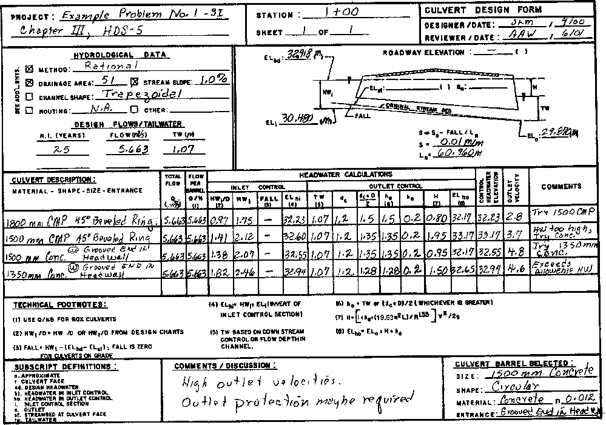

52

> **CHART 6A**

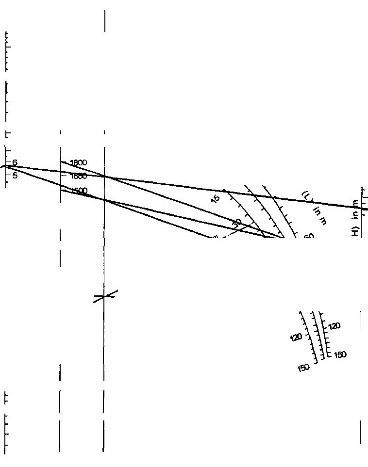

<table>
<colgroup>
<col style="width: 11%" />
<col style="width: 40%" />
<col style="width: 47%" />
</colgroup>
<tbody>
<tr class="odd">
<td><strong>- 0.05</strong></td>
<td><blockquote>

<strong>Adapted from</strong>

<strong>Bureau of Public Roads Jan. 1983</strong>

</blockquote></td>
<td><blockquote>

<strong>HEAD FOR 
STANDARD 
C.M. PIPE CULVERTS 
FLOWING FULL 
n=0.024</strong>

</blockquote></td>
</tr>
</tbody>
</table>

**55**

<u>Example Problem \#1 (English Units)</u>

A culvert at a new roadway crossing must be designed to pass the 25-year flood. Hydrologic analysis indicates a peak flow rate of 200 ft3/s. Use the following site information:

Elevation at Culvert Face: 100 ft

Natural Stream Bed Slope: 1 percent = 0.01 ft/ft

Tailwater for 25-Year Flood: 3.5 ft

Approximate Culvert Length: 200 ft

Shoulder Elevation: 110 ft

Design a circular pipe culvert for this site. Consider the use of a corrugated metal pipe with standard 2-2/3 by 1/2 in corrugations and beveled edges and concrete pipe with a groove end. Base the design headwater on the shoulder elevation with a two ft freeboard (elevation 108.0 ft). Set the inlet invert at the natural streambed elevation (no FALL).

Note: Design charts used in this example are reproduced on the following pages.

56

> **CHART 4B CHART 5B**

**3**

> **2000**
>
> \- .

**CHART 6B**

<table>
<colgroup>
<col style="width: 47%" />
<col style="width: 52%" />
</colgroup>
<tbody>
<tr class="odd">
<td><strong>IMAM OF PIJOLit RODS yR 01113</strong></td>
<td><blockquote>

<strong>HEAD FOR 
STANDARD 
C. M. PIPE CULVERTS 
FLOWING FULL 
n.0.024</strong>

</blockquote></td>
</tr>
</tbody>
</table>

**59**

> <u>Example Problem \#2 (SI Units)</u>

A new culvert at a roadway crossing is required to pass a 50-year flow rate of 8.5 m3/s. Use the following site conditions:

ELhd: 33.528 m based on adjacent structures

Shoulder Elev: 34.595 m

Elevation of Stream Bed at Culvert Face: 30.48 m

Natural Stream Slope: 2 percent

Tailwater Depth: 1.219 m

Approximate Culvert Length: 76.200 m

Design a reinforced concrete box culvert for this installation. Try both square edges and 45-degree beveled edges in a headwall. Do not depress the inlet (no FALL).

Note: Hardcopy Design Chart 8A, 10A, 14A, and 15A are used in this solution.

> 

60

<u>Example Problem \#2 (English Units)</u>

A new culvert at a roadway crossing is required to pass a 50-year flow rate of 300 ft3/s. Use the following site conditions:

ELhd: 110 ft based on adjacent structures

Shoulder Elev: 113.5 ft

Elevation of Stream Bed at Culvert Face: 100.0 ft.

Natural Stream Slope: 2 percent

Tailwater Depth: 4.0 ft

Approximate Culvert Length: 250 ft

Design a reinforced concrete box culvert for this installation. Try both square edges and 45-degree beveled edges in a headwall. Do not depress the inlet (no FALL).

Note: Hardcopy Design Chart 8B, 10B, 14B, and 15B are used in this solution.

61

<u>Example Problem \#3 (SI Units)</u>

Design a culvert to pass a 25-year flow of 6.229 m3/s. Minimum depth of cover for this culvert is 0.6 m.

ELhd: 32.004 m based on adjacent structures

Shoulder Elev.: 32.156 m

Elevation of Stream Bed at Culvert

Face (ELsf): 30.48 m

Original Stream Slope: 5 percent

Tailwater Depth: 1.22 m

Approximate Culvert Length: 45.720 m

Due to the low available cover over the conduit, use an elliptical concrete pipe. Use of a small depression (FALL) of about 0.3 m at the inlet is acceptable.

NOTE: Hardcopy Design Chart 29A, 31A, and 33A are used in this solution.

62

<u>Example Problem \#3 (English Units)</u>

Design a culvert to pass a 25-year flow of 220 ft3/s. Minimum depth of cover for this culvert is 2 ft.

ELhd: 105 ft based on adjacent structures

Shoulder Elev.: 105.5 ft

Elevation of Stream Bed at Culvert

Face (ELsf): 100 ft

Original Stream Slope: 5 percent

Tailwater Depth: 4 ft

Approximate Culvert Length: 150 ft

Due to the low available cover over the conduit, use an elliptical concrete pipe. Use of a small depression (FALL) of about 1 ft at the inlet is acceptable.

NOTE: Hardcopy Design Chart 29B, 31B, and 33B are used in this solution.

63

<u>Example Problem \#4 (SI Units)</u>

An existing 2134 mm by 2134 mm concrete box culvert was designed for a 50-year flood of 16.990 m3/s and a design headwater elevation of 34.747 m. Upstream development has increased the 50-year runoff to 28.317 m3/s. The roadway is gravel with a width of 12.19 m. The roadway profile may be approximated as a broad crested weir 60.96 m long. Use Figure III-11 to calculate overtopping flows, and the following site data:

Inlet Invert Elevation: 30.480 m Entrance Condition: Square Edges

Slope: 5 percent Roadway Centerline Elevation: 35.357 m Culvert Length: 60.96 m

Tailwater Information:

|                       |       |
|-----------------------|-------|
| Flow, m3/s | TW, m |
| 11.327                | 0.793 |
| 16.990                | 0.945 |
| 22.654                | 1.158 |
| 28.317                | 1.250 |

Prepare a performance curve for this installation, including any roadway overtopping, up to a flow rate of 28.317 m3/s.

NOTE: Design Chart 8A, 14A, 15A, and Figure III-11 are used in this solution.

> 

64

**Example Problem (SI) No. 4, Chapter III HDS-5**

|               |        |        |         |            |
|---------------|--------|--------|---------|------------|
| **satulvert** | **EL** | **Ho** | **Qot** | **Qtotal** |
| 11.327        | 32.96  |        |         | 11.327     |
| 16.990        | 33.93  |        |         | 16.990     |
| 19.822        | 34.71  |        |         | 19.822     |
| 22.654        | 35.52  | 0.16   | 5.8     | 28.454     |
| 24.069        | 35.81  | 0.45   | 29.7    | 53.769     |

> From Figure III-11-B, Cd = 2.70 @ HWr = .5
>
> Cd = 2.92 @ I—IWr = 1.5 Kt =1
>
> For SI Calculations, correct Cd by 0.552

<table style="width:100%;">
<colgroup>
<col style="width: 14%" />
<col style="width: 15%" />
<col style="width: 13%" />
<col style="width: 13%" />
<col style="width: 13%" />
<col style="width: 14%" />
<col style="width: 13%" />
</colgroup>
<tbody>
<tr class="odd">
<td></td>
<td></td>
<td></td>
<td>
<strong>in</strong>v<strong>ert</strong>

<strong>&amp;</strong>
</td>
<td><blockquote>

<strong>0'</strong>

<strong>Overtopag</strong>

</blockquote></td>
<td rowspan="2"><strong><em>i</em> I -</strong></td>
<td rowspan="2"><strong>-.</strong></td>
</tr>
<tr class="even">
<td></td>
<td></td>
<td></td>
<td></td>
<td></td>
</tr>
<tr class="odd">
<td>
<em>R</em>

<blockquote>

<strong>e 
ta.</strong>

</blockquote></td>
<td></td>
<td></td>
<td></td>
<td></td>
<td></td>
<td></td>
</tr>
<tr class="even">
<td><em>a</em></td>
<td></td>
<td></td>
<td>Over.11</td>
<td></td>
<td>Performance</td>
<td>Curve</td>
</tr>
<tr class="odd">
<td></td>
<td></td>
<td></td>
<td></td>
<td></td>
<td></td>
<td></td>
</tr>
</tbody>
</table>

10 20 30 40 50 60 70 80 Flow in m3/s

65

> <u>Example Problem \#4 (English Units</u>)
>
> An existing 7 ft by 7 ft concrete box culvert was designed for a 50-year flood of 600 ft3/s and a design headwater elevation of 114 ft. Upstream development has increased the 50-year runoff to 1,000 ft3/s. The roadway is gravel with a width of 40 ft. The roadway profile may be approximated as a broad crested weir 200 ft long. Use Figure III-11 to calculate overtopping flows, and the following site data:
>
> Inlet Invert Elevation: 100 ft Entrance Condition: Square Edges
>
> Slope: 5 percent Roadway Centerline Elevation: 116 ft
>
> Culvert Length: 200 ft
>
> Tailwater Information:
>
> 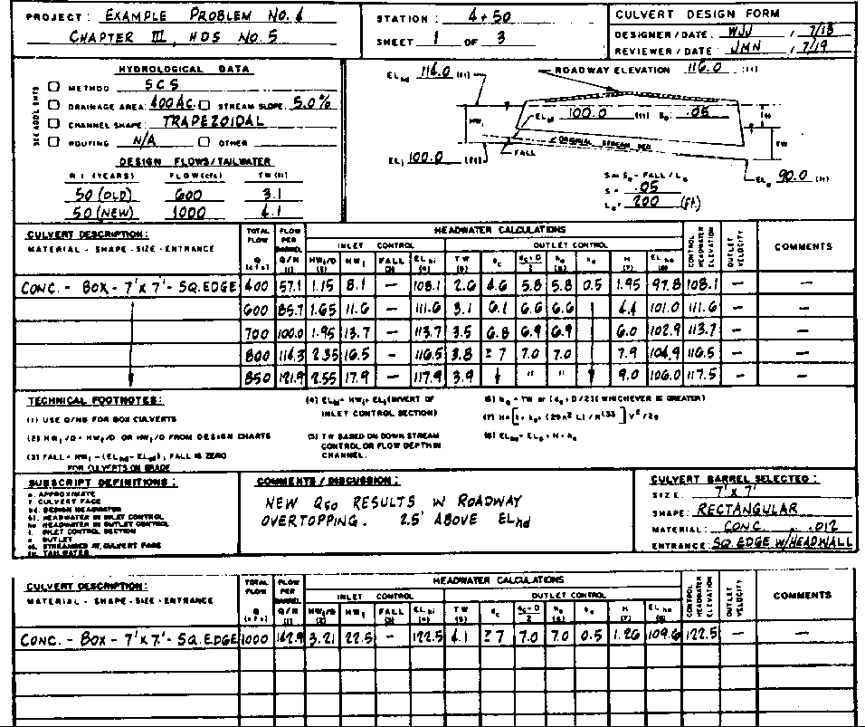

66

> **<u>EXAMPLE *PRobLim 1.1o. I* I *CHAPTER 1III 1105 ISO, B* I *SHEET* 9 of 9</u>**
>
> 

<table>
<colgroup>
<col style="width: 27%" />
<col style="width: 18%" />
<col style="width: 7%" />
<col style="width: 29%" />
<col style="width: 17%" />
</colgroup>
<tbody>
<tr class="odd">
<td>
<em><strong>Qe.</strong></em>

<strong>CULVERT FLOW</strong>
</td>
<td>EL h</td>
<td>Flo</td>
<td>
<em><strong>a.</strong></em>

<em><strong>OVERTOPPINCI FLOW</strong></em>
</td>
<td><strong>TOTAL. <em>PLOW</em></strong></td>
</tr>
<tr class="even">
<td><em><strong>400</strong></em></td>
<td><em><strong>Lob I</strong></em></td>
<td></td>
<td>••••</td>
<td><em><strong>400</strong></em></td>
</tr>
<tr class="odd">
<td><em><strong>Cleo</strong></em></td>
<td><em><strong>'MG</strong></em></td>
<td><em><strong>MN</strong></em></td>
<td>AV</td>
<td><em><strong>(,00</strong></em></td>
</tr>
<tr class="even">
<td><em><strong>loo</strong></em></td>
<td><em><strong>113.7</strong></em></td>
<td></td>
<td></td>
<td><strong>700</strong></td>
</tr>
<tr class="odd">
<td><em><strong>too</strong></em></td>
<td><em><strong>116.5</strong></em></td>
<td></td>
<td>19I</td>
<td><strong>qql</strong></td>
</tr>
<tr class="even">
<td><em><strong>850</strong></em></td>
<td><strong>117.5</strong></td>
<td><strong>1.5</strong></td>
<td>1013</td>
<td><strong>1923</strong></td>
</tr>
<tr class="odd">
<td><em><strong>l000</strong></em></td>
<td><strong>124.5</strong></td>
<td><strong>4.0</strong></td>
<td></td>
<td></td>
</tr>
</tbody>
</table>

<table>
<colgroup>
<col style="width: 62%" />
<col style="width: 37%" />
</colgroup>
<tbody>
<tr class="odd">
<td>
<strong><em>FROM FiGuRE CJ</em> a 2,70 s NWT • .5 Z</strong>

<strong>Q z Cd LFIFYri.° <em>;I</em> 2..VI FlWr a 1.5</strong>
</td>
<td><em><strong>Kt= I</strong></em></td>
</tr>
</tbody>
</table>

<table style="width:100%;">
<colgroup>
<col style="width: 3%" />
<col style="width: 6%" />
<col style="width: 6%" />
<col style="width: 6%" />
<col style="width: 6%" />
<col style="width: 6%" />
<col style="width: 6%" />
<col style="width: 6%" />
<col style="width: 6%" />
<col style="width: 6%" />
<col style="width: 6%" />
<col style="width: 6%" />
<col style="width: 6%" />
<col style="width: 6%" />
<col style="width: 11%" />
</colgroup>
<tbody>
<tr class="odd">
<td rowspan="3">
<strong>T</strong>

<em><strong>_-</strong></em>
</td>
<td rowspan="3"><em><strong>—</strong></em></td>
<td rowspan="3">
<strong>—se</strong>

<strong>li</strong>

<ul>
<li>
<strong>1'</strong>
</li>
</ul></td>
<td rowspan="3"></td>
<td rowspan="3"></td>
<td rowspan="2"></td>
<td rowspan="3">
<em><strong>_ppirroPP)FA5</strong></em>

<em><strong>WEIR</strong></em>
</td>
<td rowspan="3"></td>
<td rowspan="2"></td>
<td rowspan="3">
<strong>pERF1AMANCI</strong>

<em><strong>____</strong></em>
</td>
<td rowspan="3"></td>
<td rowspan="3"></td>
<td rowspan="3"><em><strong>•</strong></em></td>
<td></td>
<td><strong>I<em>1</em></strong></td>
</tr>
<tr class="even">
<td rowspan="2"><strong>/</strong></td>
<td rowspan="2"></td>
</tr>
<tr class="odd">
<td></td>
<td></td>
</tr>
<tr class="even">
<td></td>
<td></td>
<td>
<strong>tk</strong>

<strong>0</strong>
</td>
<td></td>
<td></td>
<td></td>
<td><em><strong>ELhd</strong></em></td>
<td><strong>$</strong></td>
<td><strong>14.0</strong></td>
<td><strong>ff.</strong></td>
<td></td>
<td></td>
<td rowspan="2"><em><strong>PERFORMAkcE</strong></em></td>
<td rowspan="2"><em><strong>C</strong></em></td>
<td rowspan="2"><em><strong>RVE</strong></em></td>
</tr>
<tr class="odd">
<td></td>
<td><blockquote>

<strong>k te</strong>

</blockquote>

<strong>4.</strong>

<em><strong>(4</strong></em>
</td>
<td></td>
<td>
<strong>I</strong>

<strong>0</strong>

<strong>...2</strong>

<strong>k.</strong>

<blockquote>

<em><strong>4 sr</strong></em>

</blockquote></td>
<td></td>
<td></td>
<td></td>
<td></td>
<td></td>
<td><em><strong>OVERALL</strong></em></td>
<td></td>
<td></td>
</tr>
<tr class="even">
<td>
<em><strong>-</strong></em>

<em><strong>.</strong></em>

<em><strong>.</strong></em>
</td>
<td><blockquote>

<strong>1 O</strong>

</blockquote>

<em><strong>th...'</strong></em>

<blockquote>

<strong><em>...1 G</em> w</strong>

</blockquote>

<strong>0</strong>
</td>
<td><em><strong>u-2</strong></em></td>
<td>
<strong>i-</strong>

<blockquote>

<strong>1 <em>et ti</em></strong>

</blockquote></td>
<td></td>
<td></td>
<td><strong>FLOW,</strong></td>
<td></td>
<td><strong>Ch.</strong></td>
<td></td>
<td></td>
<td></td>
<td></td>
<td></td>
<td></td>
</tr>
<tr class="odd">
<td colspan="15"><strong>Apo <em>&amp;co</em> 100 <em>1000 12130 lied itt.en</em> lam <em>4einn 0Onn .21.... fillAA ad.... awAn</em></strong></td>
</tr>
</tbody>
</table>

**67**

> **CHART 51A**
>
> 

**Figure III-21--Inlet Control Curves - Circular or Elliptical Structural Plate Corrugated Metal Conduits (SI Units)**

**D. <u>Design Methods for Culverts without Standard Design Charts</u>**

Some culvert sizes, shapes, and materials do not have design nomographs and critical depth charts. For example, long span, structural plate, corrugated metal conduits do not have standard design charts. Developing design charts for all possible conduit shapes and sizes is not practical because they are so numerous and new shapes are constantly being produced. Also, the large size conduits tend to fall outside the nomograph scales. With some modification, usual culvert hydraulic techniques can be used to analyze these culverts.

For outlet control, the analysis includes pressure flow and backwater calculations to determine the headwater. Since the inlet has not been modeled, the inlet control equations are necessarily based on hydraulic test results from similar tested conduit shapes. Appendix A contains approximate inlet control equations for nonrectangular conduits with a variety of edge conditions.

**1. Inlet Control**. In order to facilitate the design process, the appropriate inlet control equations of Appendix A have been used to develop dimensionless inlet control design curves for selected conduit shapes and edge configurations. The curves of Figures III-21 and III-22 are for nonrectangular, structural plate corrugated metal conduits of two basic shapes and four inlet edge conditions. Figure III-21 is for circular or elliptical conduits with the long horizontal axis at the mid-point of the barrel. Figure III-22 is used for high and low profile structural plate arches. Note that these figures are copies of Charts 51b and 52b and are for English Units. For SI Units, see Chart 51a and 51b, respectively in Appendix D.

68

> **CHART 52 A**
>
> 

**Figure III-22--Inlet Control Curves - High and Low Profile  
Structural Plate Arches (SI Units)**

The curves in these figures are for four different inlet edge conditions: thin edge projecting, mitered, square-edge, and 45-degree bevels. The horizontal axis of the chart is flow rate divided by the area times the square root of barrel height (Q/AD°.5) and the vertical axis is headwater depth divided by barrel height (HW/D). Figure III-21 will provide adequate results for any conduit with curved surfaces, including pipe-arches and underpasses. Figure III-22 is used for conduits similar to arches with flat bottoms.

To use the figures, perform the following steps:

1.  From manufacturers' information, select a barrel size, shape and inlet edge configuration. Obtain the area, A, and the interior height, D, for the selected barrel.

2.  Calculate AD°.5.

3.  Divide the design flow rate, Q, by AD°.5.

4.  Enter the appropriate design chart with Q/AD°.5, and for the selected edge condition, read HW/D.

5.  Multiply HW/D by D to obtain the face control headwater, HW.

6.  If it is desired to take credit for the approach velocity (Vu) in the calculations, deduct the approach velocity head (Vu2/2g) from HW to obtain the face control headwater, HWf. If Vu is neglected, set HWf equal to HW.

7.  If the inlet control headwater is higher than the design headwater, or if the conduit is oversized, select another conduit size and/or inlet edge condition and return to step a.

69

**2. Outlet Control**.

1.  <u>Partly Full Flow</u>. Large conduits, such as long span culverts, usually flow partly full throughout their lengths. In addition, the invert of the culvert is often unlined. In these situations it is advisable to perform backwater calculations to determine the headwater elevation.

The backwater calculations begin at the tailwater level or at critical depth at the culvert exit, whichever is higher. Hydraulic resistance values for the backwater calculations are contained in Hydraulic Flow Resistance Factors for Corrugated Metal Conduit. (25) Data from that reference are included in Appendix B. Selected resistance values for natural channels are found in Table 11 of Appendix D. Note that when the perimeter of the conduit is constructed of two or more materials, a composite resistance value should be used. Methods of calculating composite resistance values are discussed in Appendix B.

2.  <u>Full Flow</u>. If the conduit flows full or nearly full throughout its length, Equation (7) may be used to calculate the outlet control headwater depth.

HWo =TW+HL (7)

HL is the total loss through the culvert barrel which is calculated using Equation (1) or Equation (5). TW is either the tailwater depth or (dc + D)/2, whichever is larger. Values of critical depth for most conduits are provided in the manufacturers' information. In Equation (5), the hydraulic radius and velocity are full flow values. The Manning’s n value is a composite value when more than one material is used in the perimeter of the conduit.

**3. Discussion of Results**

The inlet control headwater obtained from Figures III-21 or III-22 includes the approach velocity head. Therefore, credit may be taken for the approach velocity head in determining the required headwater pool depth.

In outlet control, the same limitations on use of the approximate backwater method apply as for culverts with design charts. That is, if the headwater (referenced to the inlet invert) falls between 1.2D and 0.75D, use the results with caution. For large, expensive installations, check the results using backwater calculations. If the headwater falls below 0.75D do not use the approximate method. Perform backwater calculations as illustrated in the following example problem.

**4. Example Problem**

Problem No. 5: Design of a long span structural plate corrugated metal elliptical culvert.

Use a long span culvert to pass the 25-year flood of 155.744 m3/s (5,500 ft3/s) under a high roadway fill. The design flow should be below the crown of the conduit at the inlet, but the check flow (100-year flow) of 212.378 m3/s (7,500 ft3/s) may exceed the crown by not more than 1.524 m (5 feet). Use the following site conditions:

ELhd: 73.152 m (240 ft)

Elevation of Stream Bed at Culvert Face (ELsf): 67.056 m (220 ft)

70

Shoulder Elevation: 79.248 m (260 ft)

Stream Slope (So): 1.0 percent

Approximate Culvert Length: 60.960 m (200 ft)

Tailwater Depth: 4.877 m for Q = 155.744 m3/s (16 ft for Q = 5500 ft3/s) 5.791 m for Q = 212.378 m3/s (19 ft for Q = 7500 ft3/s)

Design an elliptical structural plate corrugated metal conduit for this site. Use a headwall to provide a square edge condition. Corrugations are 150 mm x 50 mm (6-in by 2-in).

Solution to Example Problem No. 5

Try a 9144 mm (30 foot) (span) by a 6096 mm (20 foot) (rise) elliptical structural plate conduit for this site. From manufacturer's information, A = 45.289 m2 (487.5 ft2) and D = 6.096 m (20 ft). Neglect the approach velocity.

<u>SI Units</u>

<u>INLET CONTROL</u>:

AD (45.298)(6.096)111.841

> 0 .50.5
>
> = =

Q/AD 0.5 = <u>155 .744</u> = 1.39

> 111.841

Based on Chart 51A, HW/D = 0.90, therefore:

HW = HWf = (0.90)(6.096) = 5.486m  
ELhi = 67.056+5.486= 72.542m

For the check flow:

<table>
<colgroup>
<col style="width: 26%" />
<col style="width: 73%" />
</colgroup>
<tbody>
<tr class="odd">
<td>
<em>Q</em> / <em>AD</em>0 .5= <u>212 .378</u>

111.819
</td>
<td>1.90</td>
</tr>
</tbody>
</table>

Based on Chart 51A, HW/D = 1.13, therefore:

HW = HWf = (1.13)(6.096) = 6.888m  
ELhi =67.056+6.888=73.944m

<u>OUTLET CONTROL</u>:

Backwater calculations will be necessary to check Outlet Control.

71

<u>Backwater Calculations</u>

From hydraulic tables for elliptical conduits (60):

for Q = 155.744 m3/s, dc = 3.780 m  
for Q = 212.378 m3/s, dc = 4.450 m

Since 1W \> dc, start backwater calculations at 1W depth.

Determine normal depths (dn) using hydraulic tables.

> for Q = 155.744 m3/s, n = 0.034;
>
> dn = 3.993 m
>
> for Q = 212.378 m3/s, n = 0.034;  
> dn = 5.090 m
>
> since dn \> dc, flow is subcritical
>
> since 1W \> dn, water surface has an M-1 profile
>
> Plot Area and Hydraulic Radius vs. depth from data obtained from tables.

|      |       |        |        |        |       |
|------|-------|--------|--------|--------|-------|
| d/D  | d     | A/BD   | A      | R/D    | R     |
| 0.65 | 3.962 | 0.5537 | 30.864 | 0.3642 | 2.220 |
| 0.70 | 4.267 | 0.6013 | 33.518 | 0.3781 | 2.305 |
| 0.75 | 4.572 | 0.6472 | 36.076 | 0.3886 | 2.369 |
| 0.80 | 4.877 | 0.6908 | 38.506 | 0.3950 | 2.408 |
| 0.85 | 5.182 | 0.7313 | 40.764 | 0.3959 | 2.413 |
| 0.90 | 5.486 | 0.7671 | 42.760 | 0.3870 | 2.359 |
| 0.95 | 5.791 | 0.7953 | 44.331 | 0.3649 | 2.224 |
| 1.00 | 6.096 | 0.8108 | 45.195 | 0.3060 | 1.865 |

Complete Water Surface Computations (see attached calculation sheet).

HW = specific head (H) + ke (V2/2g)

Neglecting approach velocity head:

for Q = 155,744 m3/s:

> HW = 5.481 + 0.5 (.970) = 5.966 m
>
> ELho = 67.056 + 5.966b = 73.022 m

for Q = 212.378 m3/s:

> HWf = 6.90 + (0.5) (1.19) = 7.495 m  
> ELho = 67.056 + 7.495 = 74.551 m

72

<u>SUMMARY**: **</u>

DESIGN Q: CHECK Q:

> <u>EL</u>hd <u>EL</u>hi <u>EL</u>ho <u>EL</u>hd <u>EL</u>hi <u>EL</u>ho

73.152 m 72.942 m <u>73.022 m</u> 74.676 m 73.944 m <u>74.551 m</u>

<u>This culvert design meets the requirements stated in the problem.</u>

73

<u>English Units</u>

<u>INLET CONTROL</u>:

AD0.5 = (487.5)(20) 0.5 = 2,180

<table>
<colgroup>
<col style="width: 13%" />
<col style="width: 8%" />
<col style="width: 77%" />
</colgroup>
<tbody>
<tr class="odd">
<td>Q/AD 0.5 =</td>
<td>
5 ,500

2 ,180
</td>
<td>2.52</td>
</tr>
</tbody>
</table>

Based on Chart 51b, HW/D = 0.90, therefore:  
HW = HWf = (0.90)(20) = 18ft

ELhi =220+18=238.0ft

For the check flow:

Q/AD0.5 = 3.44

Based on Chart 51b, HW/D = 1.13, therefore:

HW =HWf =(1.13)(20)=22.6ft

ELhi = 220 + 22.6 = 242.6 ft

<u>OUTLET CONTROL</u>:

Backwater calculations will be necessary to check Outlet Control.

<u>Backwater Calculations</u>

From hydraulic tables for elliptical conduits (60):

for Q = 5,500 ft3/s, dc = 12.4 ft  
for Q = 7,500 ft3/s, dc = 14.6 ft

Since TW \> dc, start backwater calculations at TW depth.

Determine normal depths (dn) using hydraulic tables.

> for Q = 5,500 ft3/s, n = 0.034 ;
>
> dn = 13.1 ft
>
> for Q = 7,500 ft3/s, n = 0.034 ;  
> dn = 16.7 ft
>
> since dn \> dc, flow is subcritical
>
> since TW \> dn, water surface has an M-1 profile
>
> Plot Area and Hydraulic Radius vs. depth from data obtained from tables.

75

|      |      |        |       |        |      |
|------|------|--------|-------|--------|------|
| d/D  | d    | A/BD   | A     | R/D    | R    |
| 0.65 | 13.0 | 0.5537 | 332.2 | 0.3642 | 7.28 |
| 0.70 | 14.0 | 0.6013 | 360.8 | 0.3781 | 7.56 |
| 0.75 | 15.0 | 0.6472 | 388.3 | 0.3886 | 7.77 |
| 0.80 | 16.0 | 0.6908 | 414.5 | 0.3950 | 7.90 |
| 0.85 | 17.0 | 0.7313 | 438.8 | 0.3959 | 7.92 |
| 0.90 | 18.0 | 0.7671 | 460.3 | 0.3870 | 7.74 |
| 0.95 | 19.0 | 0.7953 | 477.2 | 0.3649 | 7.30 |
| 1.00 | 20.0 | 0.8108 | 486.5 | 0.3060 | 6.12 |

> Complete Water Surface Computations (see attached calculation sheet).
>
> HW = specific head (H) + ke (V2/2g)
>
> Neglecting approach velocity head :
>
> for Q = 5,500 ft3/s:
>
> HW = 18.004 + (0.5)(3.208) = 19.6 ft  
> ELho = 220 + 19.6 = 239.6 ft
>
> for Q = 7,500 ft3/s:
>
> HWf = 22.627 + (0.5)(3.89) = 24.6 ft
>
> ELho = 220 + 24.6 = 244.6 ft
>
> <u>SUMMARY**: **</u>**  
> **DESIGN Q:
>
> <u>EL</u>hd <u>EL</u>hi <u>EL</u>ho
>
> 240.0 238.0 <u>239.6</u>
>
> CHECK Q
>
> <u>EL</u>ha <u>EL</u>hi <u>EL</u>ho
>
> 245.0 242.6 <u>244.6</u>
>
> <u>This culvert design meets the requirements stated in the problem.</u>

76

> **R (HYDRAULIC RADIUS)**

|                    |     |     |
|--------------------|-----|-----|
| **206** | 7   | 8   |

> **300 400 500**

**AREA (ft=)**

77

> **WATER SURFACE PROFILE COMPUTATIONS  
> (ENGLISH UNITS)**

|                     |     |                    |                                  |
|---------------------|-----|--------------------|----------------------------------|
| **Identification:** |     | **By- <u>JMN</u>** | **Date- <u>31/4</u>** |
|                     |     |                    |                                  |

> **Channel Shape: *E Lc, PricAL C.M.P. )* 8= 3o st** = ***Dr* Rort d,, /3.1 Tw = *re.* ;,e - 0-01**
>
> **M, *Pao* FoLE , D*AnnEL LENGTH =* ZO 5 TART A r iw = /4. •Ct.**
>
> **Manning n= a. 034**

=

<table>
<colgroup>
<col style="width: 5%" />
<col style="width: 7%" />
<col style="width: 5%" />
<col style="width: 7%" />
<col style="width: 7%" />
<col style="width: 7%" />
<col style="width: 7%" />
<col style="width: 5%" />
<col style="width: 7%" />
<col style="width: 8%" />
<col style="width: 8%" />
<col style="width: 8%" />
<col style="width: 5%" />
<col style="width: 8%" />
</colgroup>
<tbody>
<tr class="odd">
<td rowspan="2"><strong>d</strong></td>
<td rowspan="2"><strong>A</strong></td>
<td rowspan="2"><strong>R</strong></td>
<td rowspan="2"><strong>11/A</strong></td>
<td rowspan="2"><strong>__2 
2 g</strong></td>
<td rowspan="2"><blockquote>

<strong>V}/2g</strong>

</blockquote></td>
<td rowspan="2"><strong>A H</strong></td>
<td rowspan="2"><strong>R2,3</strong></td>
<td rowspan="2"><strong>AR</strong> 2/3</td>
<td rowspan="2">(Ka/AR")<strong>j..</strong></td>
<td rowspan="2">(Sii '<strong>,</strong>S,2) Il</td>
<td rowspan="2">SI' --g.I</td>
<td><strong>All</strong></td>
<td rowspan="2"><blockquote>

T• <strong>Al.</strong>

</blockquote></td>
</tr>
<tr class="even">
<td>S — It</td>
</tr>
<tr class="odd">
<td rowspan="2"><strong>HD</strong></td>
<td rowspan="2"><em><strong>4/4.5</strong></em></td>
<td rowspan="2"><strong>790</strong></td>
<td rowspan="2">13.21</td>
<td rowspan="2"><blockquote>

2./3

</blockquote></td>
<td rowspan="4"><blockquote>

/8.151

<strong>/R.412.</strong>

</blockquote></td>
<td>
<strong>x/ .</strong>

<strong>,7</strong>
</td>
<td rowspan="2">3.14ctir+s</td>
<td rowspan="2">3</td>
<td rowspan="2"><strong>0.00s132</strong></td>
<td></td>
<td></td>
<td><strong>.//'</strong></td>
<td rowspan="2"><blockquote>

n.c.)

</blockquote></td>
</tr>
<tr class="even">
<td rowspan="2"><em>o</em> 3.A.R</td>
<td rowspan="2"><em>'o.not.O1</em></td>
<td rowspan="2"><em><strong>0.0°399</strong></em></td>
<td rowspan="2">.f:).-1</td>
</tr>
<tr class="odd">
<td rowspan="2">/.5...5"</td>
<td rowspan="2">40,./,,,</td>
<td rowspan="2">7.PS</td>
<td rowspan="2">13.1 6</td>
<td rowspan="2"><blockquote>

d.cll

</blockquote></td>
<td rowspan="2"></td>
<td rowspan="2"><strong>3.9531587.3b</strong></td>
<td rowspan="2"><strong>. oot.ao</strong></td>
<td rowspan="2"><strong>50.1</strong></td>
</tr>
<tr class="even">
<td rowspan="2"><em><strong>Zli</strong></em></td>
<td rowspan="2"><strong><em>. 00</em> C.18</strong></td>
<td rowspan="4"><blockquote>

<strong>. 6035.Z _ bOaEg.</strong>

</blockquote></td>
<td rowspan="4"><blockquote>

<strong>534.4 3A.R.</strong>

</blockquote></td>
</tr>
<tr class="odd">
<td rowspan="2"><strong>/5.o</strong></td>
<td rowspan="2"><strong>388.3</strong></td>
<td rowspan="2"><strong>-1.11</strong></td>
<td rowspan="2"><strong>14_16</strong></td>
<td rowspan="2"><blockquote>

<strong>3.115</strong>

</blockquote></td>
<td rowspan="2"><blockquote>

<strong>18.116"</strong>

</blockquote></td>
<td rowspan="2"></td>
<td rowspan="2">3.qA4isai.33</td>
<td rowspan="2">_c&gt;oLTh</td>
<td rowspan="2"><blockquote>

<strong>i C. <em>S.</em> i</strong>

</blockquote></td>
</tr>
<tr class="even">
<td rowspan="2"><strong>0.. Hi</strong></td>
<td rowspan="2"><strong>. o.97 1 4-</strong></td>
</tr>
<tr class="odd">
<td rowspan="2"><strong>/4.8</strong></td>
<td rowspan="2"><strong>382.9</strong></td>
<td rowspan="2"><strong>1.34</strong></td>
<td rowspan="2">l4.36</td>
<td rowspan="2"><blockquote>

<strong>3.2.08</strong>

</blockquote></td>
<td rowspan="2"><blockquote>

<strong>1R . oo4</strong>

</blockquote></td>
<td rowspan="2"><strong>3.119</strong></td>
<td rowspan="2"><strong>/447.1X</strong></td>
<td rowspan="2"><em><strong>.n(17 SI,</strong></em></td>
<td rowspan="2"><blockquote>

xO3.9

</blockquote></td>
</tr>
<tr class="even">
<td rowspan="2"></td>
<td rowspan="2"></td>
<td rowspan="2"></td>
<td rowspan="2"></td>
</tr>
<tr class="odd">
<td rowspan="2"></td>
<td rowspan="2"></td>
<td rowspan="2"></td>
<td rowspan="2"></td>
<td rowspan="2"></td>
<td rowspan="2"></td>
<td rowspan="2"></td>
<td rowspan="2"></td>
<td rowspan="2"></td>
<td rowspan="2"><blockquote>

caE_

</blockquote></td>
</tr>
<tr class="even">
<td rowspan="2"></td>
<td rowspan="2"></td>
<td rowspan="2"></td>
<td rowspan="2"></td>
</tr>
<tr class="odd">
<td rowspan="2"></td>
<td rowspan="2"></td>
<td rowspan="2"></td>
<td rowspan="2"></td>
<td rowspan="2"></td>
<td rowspan="2"></td>
<td rowspan="2"></td>
<td rowspan="2"></td>
<td rowspan="2"></td>
<td rowspan="2"></td>
</tr>
<tr class="even">
<td></td>
<td></td>
<td></td>
<td></td>
</tr>
</tbody>
</table>

<table>
<colgroup>
<col style="width: 49%" />
<col style="width: 50%" />
</colgroup>
<tbody>
<tr class="odd">
<td><blockquote>

<strong>(I) SUBTRACT SECOND H FROM FIRST H VALUE (2) Kn=igh.0 <u>ss0,6)(.04)</u></strong> T <strong>125.50</strong>

<em><strong>1.19</strong></em>

</blockquote></td>
<td><blockquote>

<strong>(3) IF AL IS +, PROFILE IS PROGRESSING UPSTREAM. -AL DENOTES DOWNSTREAM PROGRESSION.</strong>

</blockquote></td>
</tr>
</tbody>
</table>

**87 WATER SURFACE PROFILE COMPUTATIONS**

**(ENGLISH UNITS)**

> **Identification: <u>ExAmtPi..." *PROBLEM . S HDSNo.S*</u> By: <u>-)3</u> Date- <u>3)/4-</u>**

<table>
<colgroup>
<col style="width: 5%" />
<col style="width: 7%" />
<col style="width: 5%" />
<col style="width: 7%" />
<col style="width: 7%" />
<col style="width: 7%" />
<col style="width: 7%" />
<col style="width: 5%" />
<col style="width: 7%" />
<col style="width: 8%" />
<col style="width: 8%" />
<col style="width: 8%" />
<col style="width: 5%" />
<col style="width: 8%" />
</colgroup>
<tbody>
<tr class="odd">
<td rowspan="2"><strong>d</strong></td>
<td rowspan="2"><strong>A</strong></td>
<td rowspan="2"><strong>R</strong></td>
<td rowspan="2">
<strong>V=</strong>

<strong>Q/A</strong>
</td>
<td rowspan="2">
<strong>"2</strong>

<strong>28</strong>
</td>
<td rowspan="2"><blockquote>

<strong>R=d+ V2/2g</strong>

</blockquote></td>
<td rowspan="2"><strong>A H</strong></td>
<td rowspan="2"><strong>H2'3</strong></td>
<td rowspan="2"><blockquote>

<strong>AR</strong> 2/3

</blockquote></td>
<td rowspan="2">
<strong>S=</strong>

(KiAR2/3)
</td>
<td rowspan="2"><blockquote>

<strong>f, =</strong> (s„ •s")%

</blockquote></td>
<td rowspan="2">Sia —/I</td>
<td>
<strong>AV--</strong>

<strong>AK</strong>
</td>
<td rowspan="2"><strong>1. = 
</strong>z <strong>AL</strong></td>
</tr>
<tr class="even">
<td>S — r</td>
</tr>
<tr class="odd">
<td rowspan="2"></td>
<td rowspan="2"><strong>19.t&gt;1.77..ZC)</strong></td>
<td rowspan="2"><strong>7.30</strong></td>
<td rowspan="2">15-72)</td>
<td rowspan="2"><blockquote>

3.F53‘

</blockquote></td>
<td rowspan="2">aa. <strong>836"</strong></td>
<td><strong>,'•-</strong></td>
<td rowspan="2"><strong>745</strong></td>
<td rowspan="2">
<strong>3 ....C.</strong>

<blockquote>

<strong>/19(</strong>

</blockquote></td>
<td rowspan="4"><blockquote>

<strong>ancnol .00ctoi</strong>

</blockquote></td>
<td></td>
<td></td>
<td></td>
<td rowspan="2">0.0</td>
</tr>
<tr class="even">
<td rowspan="2"><em>n..151</em></td>
<td rowspan="2">c•.00,104</td>
<td rowspan="2"><em>p <strong>onnq C.</strong></em></td>
<td rowspan="2"><em><strong>1ST C,</strong></em></td>
</tr>
<tr class="odd">
<td rowspan="2">!RS-3</td>
<td rowspan="2"><strong>174.. d4</strong></td>
<td rowspan="2"><strong>?.1c</strong></td>
<td rowspan="2"><strong><em>/S.</em> RL</strong></td>
<td rowspan="2"><blockquote>

<strong>3.R33</strong>

</blockquote></td>
<td rowspan="2"><strong>AA.C.R4</strong></td>
<td rowspan="2"><strong>3.8o3</strong></td>
<td rowspan="2"><blockquote>

<strong>12,03 4</strong>

</blockquote></td>
<td rowspan="2"><blockquote>

<strong>;51.4.</strong>

</blockquote></td>
</tr>
<tr class="even">
<td rowspan="2"><strong>tn4</strong></td>
<td rowspan="2"><strong>. 00100</strong></td>
<td rowspan="2"><strong>. oo a oo</strong></td>
<td rowspan="2"><strong>-II-. I</strong></td>
</tr>
<tr class="odd">
<td rowspan="2"><strong>lg./</strong></td>
<td rowspan="2"><em><strong>17 xj.g</strong></em></td>
<td rowspan="2"><em><strong>7.137</strong></em></td>
<td rowspan="2"><em><strong>1 6 fi S</strong></em></td>
<td rowspan="4"><blockquote>

<em><strong>3 .90913,Alq.</strong></em> 3.ss9il

</blockquote></td>
<td rowspan="4">
<em><strong>CA 0</strong></em>

A.A..‘al
</td>
<td rowspan="2"><strong>3.13AD</strong></td>
<td rowspan="4"><blockquote>

<em><strong>19,05 3</strong></em>

19,Oc..9

</blockquote></td>
<td rowspan="4">
<strong>.(r)P,L)9/.</strong>

<strong>,r14:›891</strong>
</td>
<td rowspan="2"><blockquote>

<strong>....m -c31.-1</strong>

</blockquote></td>
</tr>
<tr class="even">
<td rowspan="2"><strong><em>,</em> 0, - -,</strong></td>
<td rowspan="2">00P99</td>
<td rowspan="2"><strong>. el 0 i b i</strong></td>
<td rowspan="2"><strong>51..14</strong></td>
</tr>
<tr class="odd">
<td rowspan="2"></td>
<td rowspan="2"><strong>ig.-1.5473.fir)</strong></td>
<td rowspan="2"><strong>7.140</strong></td>
<td rowspan="2">IS. <strong>83</strong></td>
<td rowspan="2">3.6I+</td>
<td rowspan="2"><blockquote>

<strong><em>A.</em> 14_ I</strong>

</blockquote></td>
</tr>
<tr class="even">
<td rowspan="2">'-' 1</td>
<td rowspan="2"></td>
<td rowspan="2"></td>
<td rowspan="2"></td>
</tr>
<tr class="odd">
<td rowspan="2"></td>
<td rowspan="2"></td>
<td rowspan="2"></td>
<td rowspan="2"></td>
<td rowspan="2"></td>
<td rowspan="2"></td>
<td rowspan="2"></td>
<td rowspan="2"></td>
<td rowspan="2"></td>
<td rowspan="2"><strong>Dic</strong></td>
</tr>
<tr class="even">
<td rowspan="2"></td>
<td rowspan="2"></td>
<td rowspan="2"></td>
<td rowspan="2"></td>
</tr>
<tr class="odd">
<td rowspan="2"></td>
<td rowspan="2"></td>
<td rowspan="2"></td>
<td rowspan="2"></td>
<td rowspan="2"></td>
<td rowspan="2"></td>
<td rowspan="2"></td>
<td rowspan="2"></td>
<td rowspan="2"></td>
<td rowspan="2"></td>
</tr>
<tr class="even">
<td></td>
<td></td>
<td></td>
<td></td>
</tr>
</tbody>
</table>

<table>
<colgroup>
<col style="width: 41%" />
<col style="width: 58%" />
</colgroup>
<tbody>
<tr class="odd">
<td><blockquote>

<strong>(I) SUBTRACT SECOND H FROM FIRST H VALUE</strong>

<strong>(2) Kn1.49</strong> <u>(7s-00)( 0-c&gt;-6*)</u> _ <strong>111.14</strong>

</blockquote>

<strong>I . 49</strong>
</td>
<td><blockquote>

<strong>(3) IF AL IS +, PROFILE IS PROGRESSING UPSTREAM. 
-AL DENOTES DOWNSTREAM PROGRESSION.</strong>

</blockquote></td>
</tr>
</tbody>
</table>

**IV. TAPERED INLETS**

**A. Introduction**

A tapered inlet is a flared culvert inlet with an enlarged face section and a hydraulically efficient throat section. A tapered inlet may have a depression, or FALL, incorporated into the inlet structure or located upstream of the inlet. The depression is used to exert more head on the throat section for a given headwater elevation. Therefore, tapered inlets improve culvert performance by providing a more efficient control section (the throat). Tapered inlets with FALLs also improve performance by increasing the head on the throat.

Inlet edge configuration is one of the prime factors influencing the performance of a culvert operating in inlet control. Inlet edges can cause a severe contraction of the flow, as in the case of a thin edge projecting inlet. In a flow contraction, the effective cross-sectional area of the barrel may be reduced to about one half of the actual available barrel area. As the inlet edge configuration is improved, the flow contraction is reduced, thus improving the performance of the culvert. As an example, inlet edge improvement can be achieved by the installation of a concrete headwall with a square edged entrance on a thin edge projecting inlet. Additional performance increases are possible by the installation of beveled edges or by retaining the groove end on a concrete pipe culvert.

In outlet control, the inlet edge configuration is just one of many factors affecting culvert performance. Improved edge conditions reduce the inlet loss coefficient, ke, which is multiplied by the velocity head to determine the energy losses at the culvert inlet as shown in Equation (4a).

Values of ke vary from 0.9 for thin edge projecting entrances to 0.2 for beveled edges or groove ends. Still lower ke values can be obtained by using specially designed inlets with rounded edges. Unfortunately, the construction difficulties for these inlets often outweigh the hydraulic benefits.

The entrance of any culvert operating in inlet control can be depressed to obtain better performance, regardless of the inlet configuration. However, edge conditions are normally improved first and then an inlet depression is applied. The purpose is to provide more head on the inlet control section for a given headwater elevation. This design technique utilizes part of the available elevation head to force the flow into the culvert entrance. Otherwise, the head is expended in accelerating the flow down the steep culvert barrel, possibly causing erosion at the downstream end of the culvert.

Tapered inlets improve culvert performance primarily by reducing the contraction at the inlet control section which is located at the throat. Secondarily, some tapered inlet configurations also depress the inlet control section below the stream bed. The hydraulic performance of tapered inlets is better than the performance of beveled edges for culverts operating in inlet control. In outlet control the performance of tapered inlets is effectively the same as for inlets with beveled edges. An entrance loss coefficient (ke) of 0.2 is used for both tapered inlets and beveled edges. Tapered inlets are not recommended for use on culverts flowing in outlet control because the simple beveled edge is of equal benefit.

Design criteria and methods have been developed for two basic tapered inlet designs: the side-tapered inlet and the slope-tapered inlet. Tapered inlet design charts are available for

79

rectangular box culverts and circular pipe culverts. The same principles apply to other culvert barrel shapes, but no design charts are presently available for other shapes. The side-tapered inlet can be installed with or without a depression upstream of the face. There are two configurations of the slope-tapered inlet, one with a vertical face and one with its face mitered to the fill slope.

The inlet configurations presented in this manual are based on research conducted at the National Bureau of Standards (NBS) under the sponsorship of the Bureau of Public Roads. (7, 9, 10) Many improved inlet configurations were tested; however, only those determined to best satisfy the criteria of hydraulic efficiency, economy of materials, simplicity of construction, and minimization of maintenance problems were selected. For example, while the use of curved surfaces rather than plane surfaces might result in slightly improved hydraulic efficiency at times, the advantages are outweighed by the construction difficulties. Therefore, only plane surfaces are utilized in the recommended designs.

**Figure IV-1--Side-Tapered Inlet  
B. <u>Descriptions of Tapered Inlets</u>**

**1. Side-Tapered**. The side-tapered inlet has an enlarged face section with the transition to the culvert barrel accomplished by tapering the side walls (Figure IV-1). The face section is about the same height as the barrel height and the inlet floor is an extension of the barrel floor. The inlet roof may slope upward slightly, provided that the face height does not exceed the barrel

80

height by more than 10 percent (1.1D). The intersection of the tapered sidewalls and the barrel is defined as the throat section.

There are two possible control sections, the face and the throat. HWf, shown in Figure IV-1, is the headwater depth measured from the face section invert and HWt is the headwater depth measured from the throat section invert.

The throat of a side-tapered inlet is a very efficient control section. The flow contraction is nearly eliminated at the throat. In addition, the throat is always slightly lower than the face so that more head is exerted on the throat for a given headwater elevation.

**Figure IV-2--Side-Tapered Inlet with Upstream Depression Contained Between Wingwalls**

The beneficial effect of depressing the throat section below the stream bed can be increased by installing a depression upstream of the side-tapered inlet. Figure IV-2 and Figure IV-3 show two methods of constructing the depression. Figure IV-2 depicts a side-tapered inlet with the

81

depression contained between wingwalls. For this type of depression, the floor of the barrel should extend upstream from the face a minimum distance of D/2 before sloping upward more steeply. Figure IV-3 shows a side-tapered inlet with a sump upstream of the face. Dimensional limitations for the designs are shown. In both cases, the length of the resultant upstream crest where the slope of the depression meets the stream bed should be checked to assure that the crest will not control the flow at the design flow and headwater. If the crest length is too short, the crest may act as a weir control section. For depressed side-tapered inlets, both the face section and the throat section have more head exerted on them for a given headwater elevation. The increased head results in a smaller required throat section. Likewise, the required size of the face is reduced by the increased head. Beveled edges or other favorable edge conditions also reduce the <u>required size of the face.</u>

> 
>
> **Figure IV-3--Side-Tapered Inlet with Upstream Sump**

**2. Slope-Tapered**. The slope-tapered inlet, like the side-tapered inlet, has an enlarged face section with tapered sidewalls meeting the culvert barrel walls at the throat section (Figure IV-4). In addition, a vertical FALL is incorporated into the inlet between the face and throat sections. This FALL concentrates more head on the throat section. At the location where the steeper slope of the inlet intersects the flatter slope of the barrel, a third section, designated the bend section, is formed.

82

A slope-tapered inlet has three possible control sections, the face, the bend, and the throat. Of these, only the dimensions of the face and the throat section are determined by the design procedures of this manual. The size of the bend section is established by locating it a minimum distance upstream from the throat.

> 
>
> **Figure IV-4--Slope-Tapered Inlet with Vertical Face**

83

The slope-tapered inlet combines an efficient throat section with additional head on the throat. The face section does not benefit from the FALL between the face and throat; therefore, the face sections of these inlets are larger than the face sections of equivalent depressed side-tapered inlets. The required face size can be reduced by the use of bevels or other favorable edge configurations. The vertical face slope-tapered inlet design is shown in Figure IV-4 and the mitered face design is shown in Figure IV-5.

> 

**Figure IV-5--Slope-Tapered Inlet with Mitered Face**

84

The mitered face slope-tapered inlet design is more complicated than the vertical face design. A hypothetical face section is located downstream of the weir crest formed where the extension of the fill slope meets the stream bed. The face section is defined by a perpendicular line extending to the FALL slope from the top edge of the inlet, neglecting bevels.

The slope-tapered inlet is the most complex inlet improvement recommended in this manual. Construction difficulties are inherent, but the benefits in increased performance can be great. With proper design, a slope-tapered inlet passes more flow at a given headwater elevation than any other configuration.

Slope-tapered inlets can be applied to both box culverts and circular pipe culverts. For the latter application, a square to round transition is normally used to connect the rectangular slope-tapered inlet to the circular pipe.

**C. <u>Hydraulics</u>**

**1. Inlet Control**. Tapered inlets have several possible control sections including the face, the bend (for slope-tapered inlets), and the throat. In addition, a depressed side-tapered inlet has a possible control section at the crest upstream of the depression. Each of these inlet control sections has an individual performance curve. The headwater depth for each control section is referenced to the invert of the section. One method of determining the overall inlet control performance curve is to calculate performance curves for each potential control section, and then select the segment of each curve which defines the minimum overall culvert performance (Figure IV-6).

If the dimensional criteria of this publication are followed, the crest and the bend sections will not function as control sections over the normal range of headwaters and discharges. The crest of the depression may function as a control section for very low flows and headwaters but this is generally not of importance in design. Figure IV-6 depicts performance curves for each of the potential inlet control sections and the overall inlet control performance curves.

The design procedures for tapered inlets include checks on crest lengths for both depressed side-tapered inlets and slope-tapered inlets with mitered faces. As long as**)** the actual crest length exceeds a certain minimum value, there is no need to construct a crest performance curve. Also, if the bend section is located a minimum distance of D/2 upstream of the throat section, the bend will not control and the bend section performance curve does not need to be calculated.

> The inlet control equations for tapered inlets are given in Appendix A. The coefficients and exponents for each control section were developed based on the NBS hydraulic tests. All of the previously described control sections function in a manner similar to weirs for unsubmerged flow conditions, and in a manner similar to orifices for submerged flow conditions. For each section, there is a transition zone defined by an empirical curve connecting the unsubmerged and submerged curves.

1.  <u>Side-tapered Inlet</u>. The side-tapered inlet throat should be designed to be the primary control section for the design range of flows and headwaters. Since the throat is only slightly lower than the face, it is likely that the face section will function as a weir or an orifice with downstream submergence within the design range. At lower flow rates and headwaters, the face will usually control the flow.

2.  <u>Slope-tapered Inlet</u>. The slope-tapered inlet throat can be the primary control section with the face section submerged or unsubmerged. If the face is submerged, the face acts as an orifice with downstream submergence. If the face is unsubmerged, the face acts as a weir, with the flow plunging into the pool formed between the face and the throat. As previously noted, the bend section will not act as the control section if the dimensional criteria of this publication are followed. However, the bend will contribute to the inlet losses which are included in the inlet loss coefficient, ke.

<!-- -->

2.  **Outlet Control**. When a culvert with a tapered inlet performs in outlet control, the hydraulics are the same as described in Chapter III for all culverts. The factors influencing flow in outlet control are shown in Table 1 (Chapter 1). The inlet area is the area of the face section, the inlet edge configuration describes the type of tapered inlet as well as the face edge conditions, and the shape is either circular or rectangular. The barrel characteristics refer to the barrel portion of the culvert, downstream of the throat section, except that the barrel length includes the length of the tapered inlet, and the barrel slope may be flatter than the natural stream bed slope.

> Equation (5) in Chapter III describes the losses in outlet control. The tapered inlet entrance loss coefficient (ke) is 0.2 for both side-tapered and slope-tapered inlets. This loss coefficient includes contraction and expansion losses at the face, increased friction losses between the face and the throat, and the minor expansion and contraction losses at the throat.
>
> The headwater depth in outlet control is measured from the invert of the culvert exit. Equation (5) or the outlet control nomograph for the appropriate barrel size is used to determine the total losses through the culvert. Equation (7) is then used to calculate the headwater depth, where the tailwater (TW) is taken to be either (dc + D)/2 or the downstream channel depth, whichever is larger.

3.  **Outlet Velocity**. Outlet velocities for culverts with tapered inlets are determined in the same manner as described in Chapter III. Note that when a FALL is used at the inlet, the barrel slope is flatter than the stream slope and is calculated as follows.

> <u>EL−EL</u>
>
> S =  <u>t o</u> (11)
>
> L − L
>
> a 1
>
> S is the approximate barrel slope, m/m (ft/ft)
>
> ELt is the invert elevation at the throat, m (ft)
>
> ELo is the invert elevation at the outlet, m (ft)

86

> La is the approximate length of the culvert, m (ft)
>
> L1 is the overall length of the tapered-inlet, m (ft)

**D. <u>Performance Curves </u>**

Performance curves are of utmost importance in understanding the operation of a culvert with a tapered inlet. Each potential control section (face, throat, and outlet) has a performance curve, based on the assumption that that particular section controls the flow. Calculating and plotting the various performance curves results in a graph similar to Figure IV-7, containing the face control, throat control and outlet control curves. The overall culvert performance curve is represented by the hatched line. In the range of lower discharges face control governs; in the intermediate range, throat control governs; and in the higher discharge range, outlet control governs. The crest and bend performance curves are not calculated since they do not govern in the design range.

> 

**Figure IV-7--Culvert Performance Curve (schematic)**

Constructing performance curves for culverts with tapered inlets helps to assure that the designer is aware of how the culvert will perform over a range of discharges. For high discharges, the outlet control curve may have a very steep slope which means that the headwater will increase rapidly with increasing discharge. Since there is a probability that the design discharge will be exceeded over the life of the culvert, the consequences of that event should be considered. This will help to evaluate the potential for damage to the roadway and to adjacent properties.

87

> 

**Figure IV-8--Performance Curves for 6 ft by 6 ft Box Culvert  
with 90-degree Wingwall**

Performance curves provide a basis for the selection of the most appropriate culvert design. For example, culvert designs with and without tapered inlets can be compared and evaluated using performance curves (Figure IV-8).

Performance curves are useful in optimizing the performance of a culvert. By manipulating the depressions of the face and throat sections, it is often possible to achieve a higher flow rate for a given headwater elevation, or to pass the same flow at a lower headwater. A more detailed description of the use of performance curves in improved inlet design is presented in Appendix C.

88

> 

**Figure IV-9--Tapered Inlet Design Form**

**E. <u>Design Methods</u>**

Tapered inlet design begins with the selection of the culvert barrel size, shape, and material. These calculations are performed using the Culvert Design Form shown in Figure III-17. The tapered-inlet design calculation forms and the design nomographs contained in Appendix D are used to design the tapered inlet. The result will be one or more culvert designs, with and without tapered inlets, all of which meet the site design criteria. The designer must select the best design for the site under consideration.

In the design of tapered inlets, the goal is to maintain control at the efficient throat section in the design range of headwater and discharge. This is because the throat section has the same geometry as the barrel, and the barrel is the most costly part of the culvert. The inlet face is then sized large enough to pass the design flow without acting as a control section in the design discharge range. Some slight oversizing of the face is beneficial because the cost of constructing the tapered inlet is usually minor compared with the cost of the barrel.

The required size of the face can be reduced by use of favorable edge configurations, such as beveled edges, on the face section. Design nomographs are provided for favorable and less favorable edge conditions.

89

> The following steps outline the design process for culverts with tapered inlets. Steps 1 and 2 are the same for all culverts, with and without tapered inlets.

1.  **Preliminary Culvert Sizing**. Estimate the culvert barrel size to begin calculations.

2.  **Culvert Barrel Design**. Complete the Culvert Design Form (Figure III-17). These calculations yield the required FALL at the culvert entrance. For the inlet control calculations, the appropriate inlet control nomograph is used for the tapered inlet throat. The required FALL is upstream of the inlet face section for side-tapered inlets and is between the face section and throat section for slope tapered inlets. The Culvert Design Form should be completed for all barrels of interest. Plot outlet control performance curves for the barrels of interest and inlet control performance curves for the faces of culverts with nonenlarged inlets and for the throats of tapered inlets.

3.  **Tapered Inlet Design**. Use the Tapered Inlet Design Form (Figure IV-9) for selecting the type of tapered inlet to be used and determining its dimensions. If a slope-tapered inlet with mitered face is selected, use the special design form shown in Figure IV-10. A separate form is provided for the mitered inlet because of its dimensional complexity.

> To use the Tapered Inlet Design Form (Figure IV-9) or the design form for a slope-tapered inlet with mitered face (Figure IV-10), perform the following steps:
>
> 
>
> **Figure IV-10--Design Form-Slope-Tapered Inlet with Mitered Face**

90

> a\. <u>Complete Design Data</u>. Fill in the required design data on the top of the form.

1)  Flow, Q, is the selected design flow rate, from the Culvert Design Form, Figure III-17.

2)  ELhi is the inlet control headwater elevation.

3)  The elevation of the throat invert (ELt) is the inlet invert elevation (ELi) from Figure II-17.

4)  The elevation of the stream bed at the face (ELsf), the stream slope (So), and the slope of the barrel (S) are from Figure III-17. (For the slope-tapered inlet with mitered face, estimate the elevation of the stream bed at the crest. This point is located upstream of the face section).

5)  The FALL is the difference between the stream bed elevation at the face and the throat invert elevation.

6)  Select a side taper (TAPER) between 4:1 and 6:1 and a fall slope (Sf) between IV:2H and IV:3H. The TAPER may be modified during the calculations.

7)  Enter the barrel shape and material, the size, and the inlet edge configuration from Figure III-17. Note that for tapered inlets, the inlet edge configuration is designated the "tapered inlet throat."

> b\. <u>Calculate the Face Width.</u>

1)  Enter the flow rate, the inlet control headwater elevation (ELhi), and the throat invert elevation on the design forms. (For the slope-tapered inlet with mitered face, the face section is downstream of the crest. Calculate the vertical difference between the stream bed at the crest and the face invert (y). y includes part of the total inlet FALL.)

2)  Perform the calculations resulting in the face width (Bf). Face control design nomographs are contained in Appendix D.

> c\. <u>Calculate Tapered-Inlet Dimensions</u>. If the FALL is less than D/4 (D/2 for a slope-tapered inlet with a mitered face), a side-tapered inlet must be used. Otherwise, either a side-tapered inlet with a depression upstream of the face or a slope-tapered inlet may be used.

1)  For a slope-tapered inlet with a vertical face, calculate L2, L3, and the TAPER. (For the slope-tapered inlet with a mitered face, calculate the horizontal distance between the crest and the face section invert L4. These dimensions are shown on the small sketches in the top center of the forms).

2)  Calculate the overall tapered inlet length, L1.

3)  For a side-tapered inlet, check to assure that the FALL between the face section and the throat section is one foot or less. If not, return to step b. with a revised face invert elevation.

> d\. <u>Calculate the Minimum Crest Width</u>. For a side-tapered inlet with FALL upstream of the face or for a slope-tapered inlet with a mitered face, calculate the minimum crest width and check it against the proposed crest width. In order to obtain the necessary crest length for a depressed

91

> side-tapered inlet, it may be necessary to increase the flare angle of the wingwalls for the type of depression shown in Figure IV-2, or to increase the length of crest on the sump for the design shown in Figure IV-3. For a slope-tapered inlet with a mitered face, reduce the TAPER to increase crest width. Note that the TAPER must be greater than 4:1.

5.  <u>Fit the Design into the Embankment Section</u>. Using a sketch based on the derived dimensions, and a sketch of the roadway section to the same scale, assure that the culvert design fits the site. Adjust inlet dimensions as necessary but <u>do not</u> reduce dimensions below the minimum dimensions on the design form.

<!-- -->

0.  <u>Prepare Performance Curves</u>. Using additional flow rate values and the appropriate nomographs, calculate a performance curve for the selected face section. <u>Do not</u> adjust inlet dimensions at this step in the design process. Plot the face control performance curve on the same sheet as the throat control and the outlet control performance curves.

<!-- -->

3.  <u>Enter Design Dimensions</u>. If the design is satisfactory, enter the dimensions at the lower right of the Design Form. Otherwise, calculate another alternative design by returning to step 3a.

> **4. Dimensional Limitations.** The following dimensional limitations must be observed when designing tapered inlets using the design charts of this publication. Tapered inlets can only be used where the culvert width is less than three times its height, (B \< 3 D).
>
> a\. Side-Tapered Inlets.

1)  4:1 \< TAPER \< 6:1

> Tapers less divergent than 6:1 may be used but performance will be underestimated. (9, 10)

2)  Wingwall flare angle range from 15-degrees to 26-degrees with top edge beveled or from 26-degrees to 90-degrees with or without bevels (Figure IV-11).

3)  If a FALL is used upstream of the face, extend the barrel invert slope upstream from the face a distance of D/2 before sloping upward more steeply. The maximum vertical slope of the apron is: 1V:2H.

4)  D \< E \< 1.1D

> b\. <u>Slope-tapered Inlets</u>.
>
> 4:1 \< TAPER \< 6:1
>
> (Tapers \> 6:1 may be used, but performance will be underestimated.)

2)  IV:3H \> Sf \> IV:2H

> If Sf \> IV:3H, use side-tapered design.

3)  Minimum L3 = 0.5B

4)  D/4 \< FALL \< 1.5D

92

1.  For FALL \< D/4, use side-tapered design

2.  For FALL \< D/2, do not use the slope-tapered inlet with mitered face

<!-- -->

0.  For FALL \> 1.5D, estimate friction losses between the face and the throat by using Equation (12) and add the additional losses to HWt.

<table>
<colgroup>
<col style="width: 59%" />
<col style="width: 40%" />
</colgroup>
<tbody>
<tr class="odd">
<td><blockquote>

⎡K nL

</blockquote>

<strong>2</strong> ⎤  Q<strong>2</strong>

H <strong>1</strong> = <u>i</u>

<blockquote>

⎢  <u>U</u> ⎥

</blockquote>

<strong>1 .33 2</strong>

<blockquote>

⎢ ⎣ R <strong>2</strong>gA

</blockquote>

⎥ ⎦
</td>
<td>(12)</td>
</tr>
</tbody>
</table>

where:

> KU is 19.63 (29 in English Units)
>
> H1 is the friction head loss in the tapered inlet, m (ft)
>
> n is the Manning’s n for the tapered inlet material
>
> L1 is the length of the tapered inlet, m (ft)

R is the average hydraulic radius of the tapered inlet = (Af + At)/(Pf + Pt), m (ft)

> Q is the flow rate, m3/s (ft3/s)
>
> g is the gravitational acceleration, m/s/s (ft/s/s)

A is the average cross sectional area of the tapered inlet = (Af + At)/2, m2 (ft2).

5\) Wingwall flare angles range from 15-degrees to 26-degrees with top edge beveled or from 26-degrees to 90-degrees with or without bevels (Figure IV-11).

**F. <u>Rectangular (Box) Culverts</u>**

**1. Design Procedures**. This section supplements the general design procedures described previously with information specifically related to rectangular box culverts. The design charts for throat and face control for tapered inlets are contained in Appendix D. There is a single throat control nomograph for side-or slope-tapered rectangular inlets.

For determining the required face width, there are two nomographs in Appendix D, one for side-tapered inlets and one for slope-tapered inlets. Each nomograph has two scales, and each scale refers to a specific inlet edge condition. The edge conditions are depicted in Figure IV-11. Both the inlet edge condition and the wingwall flare angle affect the performance of the face section for box culverts.

Scale 1 on the design nomographs refers to the less favorable edge conditions, defined as follows:

1.  wingwall flares of 15-degrees to 26-degrees and a 1:1 top edge bevel, or

2.  wingwall flares of 26-degrees to 90-degrees and square edges (no bevels). A 90-degree wingwall flare is a straight headwall.

Scale 2 applies to the more favorable edge conditions, defined as follows:

1.  wingwall flares of 26-degrees to 45-degrees with 1:1 top edge bevel, or

2.  wingwall flares of 45-degrees to 90-degrees with a 1:1 bevel on the side and top edges.

93

**Figure IV-11--Inlet Edge Conditions, Face Section, Rectangular Tapered Inlets**

Note undesirable design features, such as wingwall flare angles less than 15-degrees, or 26-degrees without a top bevel, are not covered by the charts. Although the large 33.7 degree bevels can be used, the smaller 45 degree bevels are preferred due to structural considerations.

**2. Multiple Barrel Designs**. When designing side-or slope-tapered inlets for box culverts with double barrels, the required face width derived from the design procedures is the total clear width of the face. The thickness of the center wall must be added to this clear width to obtain the total face width. No design procedures are available for tapered inlets on box culverts with more than two barrels.

94

**3. Example Problems**

a\. <u>Example Problem \#1 **(**SI Units)</u>**.** The 50-year flood at the design site has a peak flow of 11.327 m3/s. The ELhd of 59.436 m is selected so that overtopping of the road-way will not occur for the design discharge.

**Given:**

> Elevation of Outlet Invert: 52.578 m  
> Elevation of Shoulder: 59.741 m
>
> Stream Bed Slope: 5 percent
>
> Approximate Culvert Length: 91.440 m

The Tailwater Variation is as Follows:

|                        |          |
|------------------------|----------|
| Flow (m3/s) | T.W. (m) |
| 8.495                  | 1.341    |
| 11.327                 | 1.494    |
| 14.159                 | 1.615    |

<u>Requirements</u>: Design the smallest possible barrel to pass the peak flow rate without exceeding the ELhd. The culvert will be located in a rural area with a low risk of damage. Underground utilities limit the available FALL to 0.762 m below the standard stream bed elevation at the inlet. Use a reinforced concrete box culvert with n = 0.012.

Note: Charts 10A, 14A, 15A, 57A, 58A, and 59A are used in this solution.

> 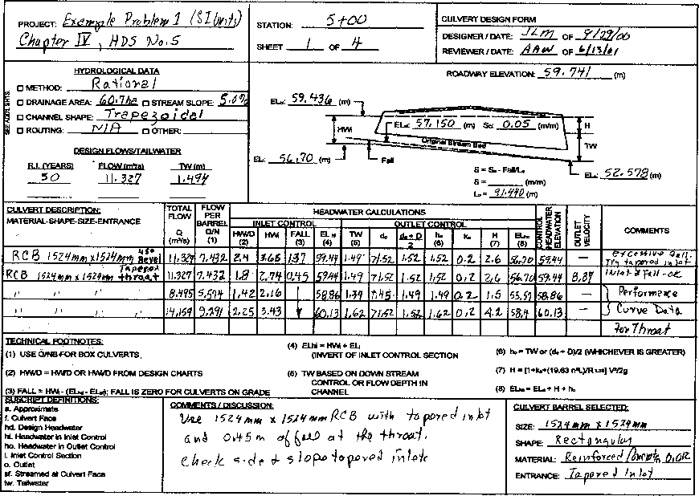

95

<table>
<colgroup>
<col style="width: 5%" />
<col style="width: 5%" />
<col style="width: 5%" />
<col style="width: 5%" />
<col style="width: 5%" />
<col style="width: 5%" />
<col style="width: 5%" />
<col style="width: 4%" />
<col style="width: 1%" />
<col style="width: 3%" />
<col style="width: 1%" />
<col style="width: 0%" />
<col style="width: 1%" />
<col style="width: 4%" />
<col style="width: 5%" />
<col style="width: 2%" />
<col style="width: 2%" />
<col style="width: 2%" />
<col style="width: 1%" />
<col style="width: 0%" />
<col style="width: 0%" />
<col style="width: 1%" />
<col style="width: 3%" />
<col style="width: 0%" />
<col style="width: 0%" />
<col style="width: 4%" />
<col style="width: 1%" />
<col style="width: 1%" />
<col style="width: 2%" />
<col style="width: 5%" />
<col style="width: 6%" />
</colgroup>
<tbody>
<tr class="odd">
<td colspan="8" rowspan="2"><blockquote>

PROJECT <em>£Y reply Proh,(00.04%i</em> (51 <em>0/15)</em>

</blockquote></td>
<td colspan="11">STATION: 51'OO</td>
<td colspan="12" rowspan="3"><blockquote>

TAPERED INLET DESIGN FORM

</blockquote></td>
</tr>
<tr class="even">
<td colspan="11" rowspan="4">SHEET <em>V_</em> OF /f</td>
</tr>
<tr class="odd">
<td colspan="8" rowspan="3"><em>Chapter Iva 1-05-N0,5</em></td>
</tr>
<tr class="even">
<td colspan="12"><blockquote>

DESIGNER/DATE: ./L.&amp;-&gt; / <em>9./W7)</em>

</blockquote></td>
</tr>
<tr class="odd">
<td colspan="12" rowspan="2"><blockquote>

REVIEWER/DATE: <em><u>AA a</u> / ii,V.,/</em>

</blockquote></td>
</tr>
<tr class="even">
<td colspan="8"></td>
<td colspan="11"></td>
</tr>
<tr class="odd">
<td colspan="9" rowspan="2"><blockquote>

DESIGN DATA:

Q f() = <em>IIN7</em> (<em>es);</em> EL, <em>O. 4 / '56v (m)</em>

</blockquote></td>
<td colspan="7"></td>
<td colspan="4" rowspan="6"><strong>EL I</strong></td>
<td colspan="3" rowspan="6"><strong>.0 ,</strong></td>
<td colspan="4" rowspan="6">
<strong>nn"</strong>

<strong>'" N</strong>

<strong>ECCIO</strong>

<strong>1 3</strong>

<strong>NEC</strong>
</td>
<td colspan="4" rowspan="20">
COMMENTS

<blockquote>

<em>U.4.2 °</em>

<em>26 1411ntuells turn,</em> " <em>, ia,„,), cm</em> ).1

<em>a $ I</em> de - -fa <em>pPred</em> 1)1 le <em>f,</em>

</blockquote></td>
</tr>
<tr class="even">
<td rowspan="3"></td>
<td colspan="3" rowspan="3"></td>
<td colspan="3" rowspan="3"><blockquote>

<em>L</em> <strong>lOPTIZIMAL)101</strong>

wt.

7 . <strong>31.</strong>

</blockquote></td>
</tr>
<tr class="odd">
<td colspan="9"><blockquote>

El_ THROAT INVERT <em>54,</em>70) (m)

</blockquote></td>
</tr>
<tr class="even">
<td colspan="9" rowspan="2"><blockquote>

EL. STREAM BED AT FACE 5%, / 50 <strong>BT1)</strong>

</blockquote></td>
</tr>
<tr class="odd">
<td colspan="4" rowspan="3"></td>
<td colspan="3" rowspan="3"></td>
</tr>
<tr class="even">
<td colspan="9" rowspan="3"><blockquote>

FALL <em>0, 515</em> (m) TAPER <em>At :</em>11 (4H-.1V TO 6H:1V)pax

</blockquote></td>
</tr>
<tr class="odd">
<td colspan="4" rowspan="3"><blockquote>

/

5

</blockquote></td>
<td colspan="3" rowspan="3"></td>
<td colspan="4" rowspan="3">L,</td>
</tr>
<tr class="even">
<td colspan="2" rowspan="7"><blockquote>

S Ri

</blockquote></td>
<td colspan="5" rowspan="7"></td>
</tr>
<tr class="odd">
<td colspan="9" rowspan="2"><blockquote>

STREAM SLOPE, Se. <em>6,0.5</em> (m/m)

</blockquote></td>
</tr>
<tr class="even">
<td colspan="6" rowspan="2"><blockquote>

<em>,,</em>

</blockquote></td>
<td colspan="3" rowspan="2"></td>
<td colspan="2" rowspan="2"></td>
</tr>
<tr class="odd">
<td colspan="9" rowspan="2"><blockquote>

SLOPE OF BARREL, S = <em>0,04 C &amp; (mem)</em>

</blockquote></td>
</tr>
<tr class="even">
<td colspan="2" rowspan="4"><blockquote>

<em>a n</em> 1

</blockquote></td>
<td colspan="4" rowspan="4"></td>
<td colspan="3" rowspan="4"></td>
<td colspan="2" rowspan="4">e</td>
</tr>
<tr class="odd">
<td colspan="9"><blockquote>

Se — :1 (2H:1V TO 3H:1V)

</blockquote></td>
</tr>
<tr class="even">
<td colspan="9" rowspan="3"><blockquote>

BARREL SHAPE AND MATERIAL : RCS

</blockquote></td>
</tr>
<tr class="odd">
<td colspan="2" rowspan="4">I</td>
<td colspan="5" rowspan="4"></td>
</tr>
<tr class="even">
<td colspan="2" rowspan="5"></td>
<td colspan="4" rowspan="5">SLOPE</td>
<td colspan="5" rowspan="5">
-TAPERED

==..I-^

r.,
</td>
</tr>
<tr class="odd">
<td colspan="9"><blockquote>

N= 9. ,B= I 5 <em>Z</em> / <em>isiC/n</em> 0= <em>I</em> 5.2 <em>9 444</em>

</blockquote></td>
</tr>
<tr class="even">
<td colspan="9" rowspan="2"><blockquote>

INLET EDGE DESCRIPTION T, Aged / A.. I. <em>et 71/ rod t</em>

</blockquote></td>
</tr>
<tr class="odd">
<td colspan="7" rowspan="2"><u>CgIDE-TAPERS)</u></td>
</tr>
<tr class="even">
<td colspan="9"></td>
</tr>
<tr class="odd">
<td rowspan="2"><blockquote>

0 (nws)

</blockquote></td>
<td rowspan="2"></td>
<td rowspan="2">
ELNINVERT

EL THROAT
</td>
<td rowspan="2">
EL 
FACE 
INVERT

(1)
</td>
<td rowspan="2">
HIM

(2)
</td>
<td rowspan="2"><blockquote>

HA( E

</blockquote>

(3)
</td>
<td rowspan="2"><blockquote>

g Br

</blockquote>

(4)
</td>
<td colspan="2" rowspan="2"><blockquote>

MIN. Br

</blockquote>

(5)
</td>
<td colspan="3" rowspan="2">
SELECTED

Br
</td>
<td colspan="12">SLOPE-TAPERED ONLY</td>
<td colspan="2" rowspan="2">
LI

(11)
</td>
<td colspan="5">SIDE TAPERED WI FALL</td>
</tr>
<tr class="even">
<td colspan="2">
MIN.

(8)
</td>
<td>
L2

(7)
</td>
<td colspan="2"><blockquote>

CHECK L2

</blockquote>

(8)
</td>
<td colspan="4">ADJ. 
U</td>
<td colspan="3">
J.

TAPER

(10)
</td>
<td colspan="3"><blockquote>

EL. CREST

</blockquote>

INV.
</td>
<td>
NW.

(12)
</td>
<td>
MIN. 
W

(13)
</td>
</tr>
<tr class="odd">
<td><blockquote>

<em>11,327</em>

</blockquote></td>
<td>57.iii</td>
<td><em>5470</em></td>
<td>57.0O</td>
<td>z.;lif</td>
<td><em>1.60</em></td>
<td><em>1{....0</em></td>
<td colspan="2"><em>Z.93</em></td>
<td colspan="3"><em>3.O5</em></td>
<td colspan="2"></td>
<td></td>
<td colspan="2"></td>
<td colspan="4"></td>
<td colspan="3"></td>
<td colspan="2">z.95</td>
<td colspan="3">57.'M</td>
<td><em>2.2Z</em></td>
<td>2./7</td>
</tr>
<tr class="even">
<td><blockquote>

11.371

</blockquote></td>
<td>59,ge</td>
<td></td>
<td>
44

<em>56.01</em>
</td>
<td><em>?,Z7</em></td>
<td>1,85'</td>
<td>5.7/</td>
<td colspan="2"></td>
<td colspan="3">O“;</td>
<td colspan="2"></td>
<td></td>
<td colspan="2"></td>
<td colspan="4"></td>
<td colspan="3"></td>
<td colspan="2"></td>
<td colspan="3"></td>
<td></td>
<td></td>
</tr>
<tr class="odd">
<td><blockquote>

<em>Sm5</em>

</blockquote></td>
<td><em>5640</em></td>
<td></td>
<td></td>
<td>1,75</td>
<td><em>1,17</em></td>
<td><em>Z178</em></td>
<td colspan="2"></td>
<td colspan="3">
<em>Oll)to</em>

q
</td>
<td colspan="2">
V.A..

%

<em>V</em>
</td>
<td></td>
<td colspan="2"></td>
<td colspan="4"></td>
<td colspan="3"></td>
<td colspan="2"></td>
<td colspan="3"></td>
<td></td>
<td></td>
</tr>
<tr class="even">
<td><blockquote>

<em>114459</em>

</blockquote></td>
<td>574r</td>
<td></td>
<td><em>,</em></td>
<td><em>2.77</em></td>
<td><em>bet</em></td>
<td><em>t,P1</em></td>
<td colspan="2"></td>
<td colspan="3"></td>
<td colspan="2"></td>
<td></td>
<td colspan="2"></td>
<td colspan="4"></td>
<td colspan="3"></td>
<td colspan="2"></td>
<td colspan="3"></td>
<td></td>
<td></td>
</tr>
<tr class="odd">
<td></td>
<td></td>
<td></td>
<td></td>
<td></td>
<td></td>
<td></td>
<td colspan="2"></td>
<td colspan="3"><em>cA,</em></td>
<td colspan="2"></td>
<td></td>
<td colspan="2"></td>
<td colspan="4"></td>
<td colspan="3"></td>
<td colspan="2"></td>
<td colspan="3"></td>
<td></td>
<td></td>
</tr>
<tr class="even">
<td colspan="28" rowspan="7"><ol type="1">
<li><blockquote>

SIDE-TAPERED : EL. FACE INVERT -= EL. THROAT INVERT • 0.3 m (APPROX.) (9) IF (8) &gt; (7), ADJ. U = ((Br - NB)/2) • TAPER - L2

</blockquote></li>
</ol>

SLOPE-TAPERED: EL FACE INVERT = EL. STREAM BED AT FACE (10) IF <em>(T),,</em> (8), ADJ. TAPER = (U • I-3)/ ((Be- NB)/2)

<ol start="2" type="1">
<li><blockquote>

HWe = an, - EL FACE INVERT (11) SIDE-TAPERED : L = ((Be- NB)/2) * TAPER

</blockquote></li>
<li><blockquote>

1.1D&gt;E&gt;D SLOPE-TAPERED: LI = <strong>L2+ I-3</strong>

</blockquote></li>
<li><blockquote>

FROM DESIGN CHARTS (12) HW.= EL.- EL. CREST INVERT

</blockquote></li>
<li><blockquote>

MIN. <strong>Br= Q/(Q/B1)</strong> (13) MIN. W= 0.634 0/HW. "

</blockquote></li>
<li><blockquote>

MIN. <strong>1.3 =</strong> 0.5 NB

</blockquote></li>
<li><blockquote>

L2= (EL. FACE INVERT - EL. THROAT INVERT) Sr

</blockquote></li>
<li><blockquote>

CHECK <strong>1.2.</strong> ((Bt. NB)/2) • TAPER - La

</blockquote></li>
</ol>
<blockquote>

-r <em>OCita</em> I gl. <em>59ce inuovt = f1.44,,-1-1,5,--- 5G, C11 f 3,O5 (0,604): 56.glY</em>

</blockquote></td>
<td colspan="3"><blockquote>

SELECTED DESIGN BC

</blockquote></td>
</tr>
<tr class="odd">
<td colspan="3"><blockquote>

L i

</blockquote></td>
</tr>
<tr class="even">
<td colspan="3"><blockquote>

L2 ----

</blockquote></td>
</tr>
<tr class="odd">
<td colspan="3">
<strong>....-</strong>

<blockquote>

L3

</blockquote></td>
</tr>
<tr class="even">
<td colspan="3"><blockquote>

BEVELS ANGLE - • b= — mm, d = -mm

</blockquote>

TAPER 4 • 1V
</td>
</tr>
<tr class="odd">
<td colspan="3">Sr = -- • 1V</td>
</tr>
<tr class="even">
<td colspan="3"></td>
</tr>
</tbody>
</table>

<table>
<colgroup>
<col style="width: 5%" />
<col style="width: 5%" />
<col style="width: 5%" />
<col style="width: 5%" />
<col style="width: 5%" />
<col style="width: 5%" />
<col style="width: 5%" />
<col style="width: 4%" />
<col style="width: 1%" />
<col style="width: 3%" />
<col style="width: 1%" />
<col style="width: 0%" />
<col style="width: 1%" />
<col style="width: 4%" />
<col style="width: 6%" />
<col style="width: 2%" />
<col style="width: 3%" />
<col style="width: 2%" />
<col style="width: 1%" />
<col style="width: 0%" />
<col style="width: 0%" />
<col style="width: 1%" />
<col style="width: 3%" />
<col style="width: 0%" />
<col style="width: 4%" />
<col style="width: 1%" />
<col style="width: 1%" />
<col style="width: 2%" />
<col style="width: 5%" />
<col style="width: 6%" />
</colgroup>
<tbody>
<tr class="odd">
<td colspan="8" rowspan="2"><blockquote>

PROJECT: F1 emp <em>le Problem No, I (SI uni{s)</em>

</blockquote></td>
<td colspan="11"><blockquote>

STATION: <em>5/-OD</em>

</blockquote></td>
<td colspan="11" rowspan="3"><blockquote>

TAPERED INLET DESIGN FORM

</blockquote></td>
</tr>
<tr class="even">
<td colspan="11" rowspan="4"><blockquote>

SHEET 3 OF <em>Y,</em>

</blockquote></td>
</tr>
<tr class="odd">
<td colspan="8" rowspan="4"><blockquote>

<em>(?)iopier 5" H</em> D5. A.16 5

</blockquote>

1
</td>
</tr>
<tr class="even">
<td colspan="11"><blockquote>

DESIGNER/DATE: <em>J tft.,7 , 7/ZVOI)</em>

</blockquote></td>
</tr>
<tr class="odd">
<td colspan="11" rowspan="3"><blockquote>

REVIEWER/DATE: <u>, ici A f4/</u> f <u>,e,fit/.1 </u>

</blockquote></td>
</tr>
<tr class="even">
<td colspan="11" rowspan="2"></td>
</tr>
<tr class="odd">
<td colspan="8"></td>
</tr>
<tr class="even">
<td colspan="9" rowspan="2"><blockquote>

DESIGN DATA:

Q <em>50 = 10)7</em> (reS); ELN <em>57: .51,94 (m)</em>

</blockquote></td>
<td colspan="7"></td>
<td colspan="6" rowspan="6">
<strong>BEVEL(0100WL,</strong>

<blockquote>

g<em>'•I</em>

</blockquote></td>
<td colspan="2" rowspan="6"></td>
<td colspan="2" rowspan="6">
'„:ra..,

<strong>TH10.</strong>

<strong>SECTILN</strong>
</td>
<td colspan="4" rowspan="18">
COMMENTS

<em>(,( se 6° id.90°</em> \A.)i)” WO <em>//s</em> 0,J )711 e-fto <em>Oevels</em> 0 ),1 O 5Acopp-Yoew0

roi )-et
</td>
</tr>
<tr class="odd">
<td rowspan="3"></td>
<td colspan="3" rowspan="3"></td>
<td colspan="3" rowspan="3">
nvr<strong>0</strong>

VELloyno

<strong>310.0</strong>
</td>
</tr>
<tr class="even">
<td colspan="9"><blockquote>

EL. THROAT INVERT 56. <em>70</em> (m)

</blockquote></td>
</tr>
<tr class="odd">
<td colspan="9" rowspan="2"><blockquote>

EL. STREAM BED AT FACE 5 '7. <em>15 (m)</em>

</blockquote></td>
</tr>
<tr class="even">
<td colspan="4" rowspan="3">tLis</td>
<td colspan="3" rowspan="3"></td>
</tr>
<tr class="odd">
<td colspan="9" rowspan="3"><blockquote>

FALL <em>Of s1.5</em> (m) TAPER <em>4L :</em> 1 (4H:1V TO 6H:1V)

</blockquote></td>
</tr>
<tr class="even">
<td colspan="6" rowspan="3"><blockquote>

i

-

</blockquote></td>
<td colspan="2" rowspan="3">
L

,
</td>
<td colspan="2" rowspan="3">L</td>
</tr>
<tr class="odd">
<td colspan="2" rowspan="6">
_

,

E.6
</td>
<td colspan="5" rowspan="6">
a

<u>L</u>
</td>
</tr>
<tr class="even">
<td colspan="9" rowspan="2"><blockquote>

STREAM SLOPE, So= Or O5 (mim)

</blockquote></td>
</tr>
<tr class="odd">
<td colspan="2" rowspan="6"><blockquote>

gt%

Pk ig

</blockquote></td>
<td colspan="2" rowspan="6"></td>
<td colspan="4" rowspan="6">
Bi

<strong>m10.</strong>
</td>
<td colspan="2" rowspan="6">s</td>
</tr>
<tr class="even">
<td colspan="9"><blockquote>

SLOPE OF BARREL S . <em>(7). O4(6</em> 6 (mini)

</blockquote></td>
</tr>
<tr class="odd">
<td colspan="9"><blockquote>

Sr <em>z</em> : 1 (2H:1V TO 3H:1V)

</blockquote></td>
</tr>
<tr class="even">
<td colspan="9" rowspan="2"><blockquote>

BARREL SHAPE AND MATERIAL: <em>A C</em> (3

</blockquote></td>
</tr>
<tr class="odd">
<td colspan="2" rowspan="5">e</td>
<td colspan="5" rowspan="5">
<strong>-wen</strong>

SIDE-TAPERS
</td>
</tr>
<tr class="even">
<td colspan="9" rowspan="2"><blockquote>

N= a- B. )5zy/y/fro D. <strong>152q4E.9</strong>

</blockquote></td>
</tr>
<tr class="odd">
<td colspan="10" rowspan="3"><blockquote>

<u>OPE-TAPERED)</u>

</blockquote></td>
</tr>
<tr class="even">
<td colspan="9"><blockquote>

INLET EDGE DESCRIPTION <em>TA-per."</em> /1,/ 4, <em>i-</em> - <em>5/, e'cll,"</em>

</blockquote></td>
</tr>
<tr class="odd">
<td colspan="9"></td>
</tr>
<tr class="even">
<td rowspan="3"><blockquote>

0 (nls)

</blockquote></td>
<td rowspan="3"></td>
<td rowspan="3">
ELNINVERT

EL THROAT
</td>
<td rowspan="3">
EL 
FACE 
INVERT

(1)
</td>
<td rowspan="3">
I-IWI

(2)
</td>
<td rowspan="3"><blockquote>

HA E

</blockquote>

(3)
</td>
<td rowspan="3"><blockquote>

Q Br

</blockquote>

(4)
</td>
<td colspan="2" rowspan="3"><blockquote>

MIN. Br

</blockquote>

(5)
</td>
<td colspan="3" rowspan="3">
SELECTED

Br
</td>
<td colspan="11" rowspan="2">SLOPE-TAPERED ONLY</td>
<td colspan="2" rowspan="3">
Li

(11)
</td>
<td colspan="5">SIDE TAPERED W/ FALL</td>
</tr>
<tr class="odd">
<td colspan="3" rowspan="2">
EL-

C ST

I
</td>
<td rowspan="2">
NW.

(12)
</td>
<td rowspan="2">MIN. 
W</td>
</tr>
<tr class="even">
<td colspan="2"><blockquote>

MIN. u

</blockquote>

(6)
</td>
<td>
L2

(7)
</td>
<td colspan="2">
CHECK

<strong>1.2</strong>

(8)
</td>
<td colspan="4">
ADJ. 
<strong>L3</strong>

(9)
</td>
<td colspan="2"><blockquote>

ADJ. TAPER

</blockquote>

(10)
</td>
</tr>
<tr class="odd">
<td><blockquote>

<em>11,V7</em>

</blockquote></td>
<td><em>51.144/</em></td>
<td><em>5640</em></td>
<td><em>5%15</em></td>
<td><em>2,29</em></td>
<td><em>LSO</em></td>
<td><em>q,ry</em></td>
<td colspan="2"><em>2./il</em></td>
<td colspan="3"><em>2,Apy</em></td>
<td colspan="2"><em>o,76</em></td>
<td><em>0,90</em></td>
<td colspan="2"><em>1.07</em></td>
<td colspan="4"><em>D...3</em></td>
<td colspan="2"><em>-</em></td>
<td colspan="2"><em>1,83</em></td>
<td colspan="3"></td>
<td></td>
<td></td>
</tr>
<tr class="even">
<td><blockquote>

<em>?,"15</em>

</blockquote></td>
<td><em>58.83</em></td>
<td></td>
<td></td>
<td><em>148</em></td>
<td>1,10</td>
<td>5118</td>
<td colspan="2"><em>fete-.g</em></td>
<td colspan="3"><em>COs</em></td>
<td colspan="2"><em>ttf r"3.4</em></td>
<td><em>4-0k</em></td>
<td colspan="2"><em>Lic-P</em></td>
<td colspan="4"><em>tA-kco;-</em></td>
<td colspan="2"></td>
<td colspan="2"></td>
<td colspan="3"></td>
<td></td>
<td></td>
</tr>
<tr class="odd">
<td><blockquote>

,1,32f

</blockquote></td>
<td>59.Ni</td>
<td></td>
<td></td>
<td><em>z1</em>27</td>
<td>1,49</td>
<td><em>4,6N</em></td>
<td colspan="2"></td>
<td colspan="3"></td>
<td colspan="2"></td>
<td></td>
<td colspan="2"></td>
<td colspan="4"></td>
<td colspan="2"></td>
<td colspan="2"></td>
<td colspan="3"></td>
<td></td>
<td></td>
</tr>
<tr class="even">
<td><blockquote>

'1/.69

</blockquote></td>
<td><em>40,20</em></td>
<td></td>
<td></td>
<td>3.05</td>
<td><em>2,0</em></td>
<td><em>5,,k0</em></td>
<td colspan="2"></td>
<td colspan="3"></td>
<td colspan="2"></td>
<td></td>
<td colspan="2"></td>
<td colspan="4"></td>
<td colspan="2"></td>
<td colspan="2"></td>
<td colspan="3"></td>
<td></td>
<td></td>
</tr>
<tr class="odd">
<td></td>
<td></td>
<td></td>
<td></td>
<td></td>
<td></td>
<td></td>
<td colspan="2"></td>
<td colspan="3"></td>
<td colspan="2"></td>
<td></td>
<td colspan="2"></td>
<td colspan="4"></td>
<td colspan="2"></td>
<td colspan="2"></td>
<td colspan="3"></td>
<td></td>
<td></td>
</tr>
<tr class="even">
<td colspan="27" rowspan="6"><blockquote>

(1) SIDE-TAPERED : EL. FACE INVERT= EL THROAT INVERT+ 0.3 m (APPROX.) (9) IF (8) &gt; (7), ADJ. U= OBI - NB)/2) ' TAPER - I-2

SLOPE-TAPERED : EL. FACE INVERT = EL. STREAM BED AT FACE (10) IF (7) . (8), ADJ. TAPER = (U+ L3)/ ((Be- NB)/2)

(2) KM = ELN - EL. FACE INVERT (11) SIDE-TAPERED : L= ((Br- NB)/2)" TAPER

(3)1.1D&gt;E&gt;D SLOPE-TAPERED : Li = U + <strong>Ll</strong>

(4) FROM DESIGN CHARTS (12) H1A4= ELN - EL CREST INVERT

(5) MIN. <strong>Br=</strong> Q/(Q/Bd (13) MIN. W = 0.634 0/FIW. "

(6) MIN. <strong>L3=</strong> 0.5 NB

(7) L2= (EL. FACE INVERT- EL. THROAT INVERT) <strong>SI</strong>

(8) CHECK L2 = ((Br - NB)/2)* TAPER - U

</blockquote></td>
<td colspan="3"><blockquote>

SELECTED DESIGN

Bf <em>2-</em> ' 94 <em>44</em>

</blockquote></td>
</tr>
<tr class="odd">
<td colspan="3"><blockquote>

Li I. <em>83 41</em>

</blockquote></td>
</tr>
<tr class="even">
<td colspan="3"><blockquote>

L2 0, % <em>Ill</em>

</blockquote></td>
</tr>
<tr class="odd">
<td colspan="3"><blockquote>

<strong>L3</strong> <em>c.931)9</em>

</blockquote></td>
</tr>
<tr class="even">
<td colspan="3">
BEVELS ANGLE --- • b= — mm, <em>d=</em> —mm

TAPER <em>4,</em> a: 1v
</td>
</tr>
<tr class="odd">
<td colspan="3">Sr = __t(2_. : 1V</td>
</tr>
</tbody>
</table>

**96**

**<u>Conclusions</u>:**

Use a slope-tapered inlet with a vertical face since it is the smallest inlet in this case. Note that since the Fall is less than D/2, a slope-tapered inlet with a mitered face cannot be used at this site.

**<u>Dimensions:</u>**

> B = 1.524 m D = 1.524 m
>
> Bf = 2.44 m
>
> TAPER = 4.32:1
>
> Sf = IV:2H
>
> L1 = 1.98 m
>
> L2 = 1.22 m
>
> L3 = 0.76 m

Entrance: 26-degree to 90-degree wingwalls with no bevels.

100

b\. <u>Example Problem \#1 (English Units**)**</u>. The 50-year flood at the design site has a peak flow of

400 ft3/s. The ELhd of 195 ft is selected so that overtopping of the road-way will not occur for the

design discharge.

**Given:**

> Elevation of Outlet Invert: 172.5 ft
>
> Elevation of Shoulder: 196 ft
>
> Stream Bed Slope: 5 percent
>
> Approximate Culvert Length: 300 ft
>
> The Tailwater Variation is as Follows:

|                         |           |
|-------------------------|-----------|
| Flow (ft3/s) | T.W. (ft) |
| 300                     | 4.4       |
| 400                     | 4.9       |
| 500                     | 5.3       |

<u>Requirements</u>: Design the smallest possible barrel to pass the peak flow rate without exceeding the ELhd. The culvert will be located in a rural area with a low risk of damage. Underground utilities limit the available FALL to 2.5 ft. below the standard streambed elevation at the inlet. Use a reinforced concrete box culvert with n=0.012.

Note: Charts 14B, 15B, 57B, 58B, and 59B are used in this solution.

101

<table style="width:100%;">
<colgroup>
<col style="width: 27%" />
<col style="width: 0%" />
<col style="width: 4%" />
<col style="width: 3%" />
<col style="width: 4%" />
<col style="width: 0%" />
<col style="width: 2%" />
<col style="width: 1%" />
<col style="width: 4%" />
<col style="width: 4%" />
<col style="width: 2%" />
<col style="width: 1%" />
<col style="width: 4%" />
<col style="width: 3%" />
<col style="width: 3%" />
<col style="width: 3%" />
<col style="width: 0%" />
<col style="width: 2%" />
<col style="width: 1%" />
<col style="width: 4%" />
<col style="width: 4%" />
<col style="width: 4%" />
<col style="width: 1%" />
<col style="width: 10%" />
</colgroup>
<tbody>
<tr class="odd">
<td colspan="7"><strong>PROJECT : <em>EXAMPLE PROBLEM )Jo. I-</em> ENGL"Vi</strong></td>
<td colspan="9" rowspan="2"><blockquote>

<strong>STATION : 5<em>'1.00</em></strong>

</blockquote></td>
<td colspan="8" rowspan="2"><blockquote>

<strong>CULVERT DESIGN FORM</strong>

</blockquote></td>
</tr>
<tr class="even">
<td colspan="7" rowspan="3"><blockquote>

<strong>CRAPTER Dr, 1405 <em>/4o.</em> S</strong>

</blockquote></td>
</tr>
<tr class="odd">
<td colspan="9"><blockquote>

<strong>:MEET _l_._ OF _4_</strong>

</blockquote></td>
<td colspan="8"><blockquote>

<strong>DESIGNER /DATE' <em>Mid , 7/</em></strong>

</blockquote></td>
</tr>
<tr class="even">
<td colspan="9" rowspan="2"></td>
<td colspan="8" rowspan="2"><blockquote>

<strong>REVIEWER / OATE</strong> JINN <strong>/</strong> <em>7<strong>/17</strong></em>

</blockquote></td>
</tr>
<tr class="odd">
<td colspan="7"></td>
</tr>
<tr class="even">
<td colspan="6"><blockquote>

<strong>NTONOLOSICAL DATA</strong>

</blockquote></td>
<td colspan="18" rowspan="2"><blockquote>

<strong>EL. ALP_ N 0 ROAD WAY TIGER 1411.0-- I.))</strong>

</blockquote></td>
</tr>
<tr class="odd">
<td colspan="6" rowspan="2"><blockquote>

<strong>/,.• 0 METNOO <em>QATIONAL</em></strong>

</blockquote></td>
</tr>
<tr class="even">
<td colspan="18" rowspan="2">
<strong>7</strong>

<em><strong>1</strong></em>
</td>
</tr>
<tr class="odd">
<td colspan="6" rowspan="2"><strong>0 H....6%SE ARE/ AC, CI STREAM MOPE <em>54%</em></strong></td>
</tr>
<tr class="even">
<td colspan="5" rowspan="2"></td>
<td colspan="13" rowspan="2"><strong>r . . <em>1675.-</em> in, ....-41L..._ 1;</strong></td>
</tr>
<tr class="odd">
<td colspan="6" rowspan="2">
<strong>'</strong>

<blockquote>

<strong>3 0 c0000•L SHAPc• <em>TOAPELOIBAL</em></strong>

</blockquote></td>
</tr>
<tr class="even">
<td colspan="5" rowspan="2"></td>
<td colspan="13" rowspan="2"><strong>w.,</strong></td>
</tr>
<tr class="odd">
<td colspan="6" rowspan="2"><blockquote>

<strong>i 0 ROUTING 01./4/1 0 OTHER -"</strong>

</blockquote></td>
</tr>
<tr class="even">
<td colspan="5" rowspan="4"><blockquote>

<strong>ELI AL S</strong>

</blockquote></td>
<td colspan="12" rowspan="4">
<strong>— exsom..trzter •As-----</strong>

<strong>FALL</strong>

<strong>(III</strong>

<strong>Sr 1...Z7. ::".':.,..</strong>
</td>
<td rowspan="4">
<strong>TR,</strong>

<strong>1111,0,</strong>
</td>
</tr>
<tr class="odd">
<td colspan="6"><blockquote>

<strong>DESIGN FLOWS/TOLWATER</strong>

</blockquote></td>
</tr>
<tr class="even">
<td colspan="6"><blockquote>

<strong>A I t TEARS) FLORIO.) T II 111)</strong>

</blockquote></td>
</tr>
<tr class="odd">
<td colspan="6" rowspan="2"><blockquote>

<em><strong>_511 400 _LI..1.__</strong></em>

</blockquote></td>
</tr>
<tr class="even">
<td colspan="18" rowspan="2"><strong><em>,..Yiogr</em> fi<em>t'</em></strong></td>
</tr>
<tr class="odd">
<td colspan="6" rowspan="2"></td>
</tr>
<tr class="even">
<td colspan="18"></td>
</tr>
<tr class="odd">
<td colspan="2"><blockquote>

<strong>CULVERT CEICRIPBON:</strong>

</blockquote></td>
<td rowspan="4"><blockquote>

<strong>TOM MIS</strong>

</blockquote>

<strong>1. ?•1</strong>
</td>
<td rowspan="3"><strong>ELM, 
FEE 
MINI</strong></td>
<td colspan="16" rowspan="2"><blockquote>

<strong>MEAD/HARM CALCULATIONS</strong>

</blockquote></td>
<td rowspan="4">
<strong><em>;</em> 3</strong>

<strong>. i 11</strong>

<strong>. i :1</strong>
</td>
<td rowspan="4">
<strong>,_ t.</strong>

<strong>1</strong>

<strong>4</strong>
</td>
<td colspan="2" rowspan="4"><strong>COMMENTS</strong></td>
</tr>
<tr class="even">
<td colspan="2" rowspan="3"><blockquote>

<strong>MATERIAL - 111411-SIZE - ENTRANCE</strong>

</blockquote></td>
</tr>
<tr class="odd">
<td colspan="6"><strong>INLET CONTROL</strong></td>
<td colspan="4"></td>
<td><strong>OUTLET</strong></td>
<td colspan="5"><strong>CONTROL</strong></td>
</tr>
<tr class="even">
<td><ul>
<li>
<strong>U'IN</strong>
</li>
</ul></td>
<td><strong>"Ur</strong></td>
<td colspan="3"><strong>"I</strong></td>
<td><strong>/ELL</strong></td>
<td><strong>EILS:i</strong></td>
<td colspan="2"><strong>VIZ</strong></td>
<td><strong>m'</strong></td>
<td><strong>V</strong></td>
<td><strong>IIIL</strong></td>
<td colspan="2"><strong>L.</strong></td>
<td colspan="2"><strong>gl</strong></td>
<td><strong>EL</strong></td>
</tr>
<tr class="odd">
<td colspan="2"><em><strong>CONC. - Box- 510". 45'81vc.</strong></em></td>
<td><em><strong>400</strong></em></td>
<td><em><strong>Bo</strong></em></td>
<td><strong>f.4</strong></td>
<td colspan="3"><em><strong>to</strong></em></td>
<td><strong>4.5</strong></td>
<td><em><strong>/95.o</strong></em></td>
<td colspan="2"><strong>4.9</strong></td>
<td><strong>≥ 5</strong></td>
<td><strong>5.0</strong></td>
<td><em><strong>5.o</strong></em></td>
<td colspan="2"><strong>0.2</strong></td>
<td colspan="2"><strong>8,4</strong></td>
<td><em><strong>,aG.4</strong></em></td>
<td><em><strong>i954</strong></em></td>
<td><em><strong>—</strong></em></td>
<td colspan="2" rowspan="2"><blockquote>

<em><strong>Fiff710. OA O.</strong></em>

</blockquote></td>
</tr>
<tr class="even">
<td colspan="2"><blockquote>

<strong><em>" - " -</em> 5X <em>5'-/N4CS/Voxr</em></strong>

</blockquote></td>
<td><em><strong>leo</strong></em></td>
<td><em><strong>00</strong></em></td>
<td><em><strong>1.4</strong></em></td>
<td colspan="3"><strong>4.5</strong></td>
<td><strong>2.<em>o</em></strong></td>
<td><em><strong>r4Eo</strong></em></td>
<td colspan="2"></td>
<td><em><strong>a</strong></em></td>
<td><em><strong>.</strong></em></td>
<td><em><strong>5.</strong>a</em></td>
<td colspan="2"></td>
<td colspan="2"><em><strong>I'</strong></em></td>
<td><em><strong>"</strong></em></td>
<td><em><strong>145.0</strong></em></td>
<td><em><strong>29.,</strong></em></td>
</tr>
<tr class="odd">
<td colspan="2"><ul>
<li><blockquote>

<em><strong>- 4 _ or ... Or</strong></em>

</blockquote></li>
</ul></td>
<td><em><strong>3oo</strong></em></td>
<td><em><strong>Go</strong></em></td>
<td><em><strong>a.413</strong></em></td>
<td colspan="3"><strong>7.41</strong></td>
<td><strong>I</strong></td>
<td><em><strong>mt..?</strong></em></td>
<td colspan="2"><em><strong>4.4</strong></em></td>
<td><em><strong>4.5</strong></em></td>
<td><em><strong>4.9</strong></em></td>
<td><em><strong>49</strong></em></td>
<td colspan="2"></td>
<td colspan="2"><em><strong>5.o</strong></em></td>
<td><em><strong>1524</strong></em></td>
<td><em><strong>i4t.9</strong></em></td>
<td><em><strong>—</strong></em></td>
<td colspan="2"><blockquote>

<em><strong>1 PERFogm</strong></em>

</blockquote></td>
</tr>
<tr class="even">
<td colspan="2"><blockquote>

<em><strong>Y</strong> - <strong>N</strong> - <strong>ii</strong> - <strong>I, </strong></em>

</blockquote></td>
<td><em><strong>500</strong></em></td>
<td><em><strong>100</strong></em></td>
<td><strong>2.4</strong></td>
<td colspan="3"><em><strong>Ito</strong></em></td>
<td><em><strong>+</strong></em></td>
<td><em>147.5</em></td>
<td colspan="2"><strong>5,3</strong></td>
<td><strong>!, 5</strong></td>
<td><strong>5.4</strong></td>
<td>5.0</td>
<td colspan="2"></td>
<td colspan="2"><em><strong>/4.1</strong></em></td>
<td><em><strong>'914</strong></em></td>
<td><em><strong>197.5</strong></em></td>
<td><em><strong>-</strong></em></td>
<td colspan="2" rowspan="2"><blockquote>

<em><strong>) 1O)4</strong></em>

</blockquote></td>
</tr>
<tr class="odd">
<td colspan="2"></td>
<td></td>
<td></td>
<td></td>
<td colspan="3"></td>
<td></td>
<td></td>
<td colspan="2"></td>
<td></td>
<td></td>
<td></td>
<td colspan="2"></td>
<td colspan="2"></td>
<td></td>
<td></td>
<td></td>
</tr>
<tr class="even">
<td colspan="24"><blockquote>

<strong>TIOCNERCAL FOOTNOTES: IA1 EL,. NA,. 4151.507 OF Al H. • TV or I4I.•10,211RNICREVER II WIWI</strong>

</blockquote></td>
</tr>
<tr class="odd">
<td colspan="24">
<strong>III USE UPNS FOR ION CULVERTS INLET CONTROL SEETKIN)</strong> Al ..E• <strong>So IPSO LI /RG2 ])/R/51</strong>

<blockquote>

<strong>ID/ Nwi /D. Nwes am 1S./0 PROM DER/RN CHARTS CM TV1 EASED ON DOOM STREAM RR GA.- EL.• I1• A.</strong>

</blockquote>

<strong>CONTROL OR FLOW DEPTHS</strong>

<blockquote>

<strong>IS) FALL- NW/ -114,- EL,/ , FALL <em>IR WINO</em> CHANNEL. 
MR ELLYERTSGE Rum_</strong>

</blockquote></td>
</tr>
<tr class="even">
<td><blockquote>

<strong>SUBSCRIPT OSINIITIONS :</strong>

</blockquote></td>
<td colspan="17" rowspan="5">
<strong><u>COUNEITI1 /01SCUSIIICIS :</u></strong>

<blockquote>

USE 5'x <strong>SI CoxicRxrx <em>Box</em> Waw</strong>

<strong><em>TAPoRED</em> INLE</strong>T<strong>. T. CMICK <em>SiDE</em> -</strong> <em>4- <strong>SLOPE-</strong></em>

<strong><em>TAPERED ENTRANCES</em>.</strong>

</blockquote></td>
<td colspan="6" rowspan="2"><blockquote>

<strong><u>CULVERT SARR1L Say+ Tenn :</u></strong>

EPEE' <strong>5'x 5'</strong>

</blockquote></td>
</tr>
<tr class="odd">
<td rowspan="4"><ul>
<li><blockquote>

<strong>. <em>4/4440sNmn•</em></strong>

</blockquote></li>
</ul>
<blockquote>

<strong>l MURAT FAGS</strong>

<strong>......... IINAMNIIMIR</strong>

<strong>U. MAMMY IR IIILEFTWIE</strong>

<strong><em>?. L.A..</em> UMW/RwmL</strong>

<strong><em>it Sas II,</em> MERENT FACE</strong>

</blockquote></td>
</tr>
<tr class="even">
<td colspan="6"><blockquote>

<strong>......</strong> RECTANGULAR

</blockquote></td>
</tr>
<tr class="odd">
<td colspan="6"><blockquote>

<strong>RIATERI•S • C°A.IC .. .012</strong>

</blockquote></td>
</tr>
<tr class="even">
<td colspan="6"><blockquote>

<strong>TAPERED ix/LET</strong>

</blockquote></td>
</tr>
</tbody>
</table>

<table>
<colgroup>
<col style="width: 5%" />
<col style="width: 5%" />
<col style="width: 5%" />
<col style="width: 5%" />
<col style="width: 5%" />
<col style="width: 5%" />
<col style="width: 5%" />
<col style="width: 3%" />
<col style="width: 1%" />
<col style="width: 3%" />
<col style="width: 1%" />
<col style="width: 0%" />
<col style="width: 5%" />
<col style="width: 5%" />
<col style="width: 2%" />
<col style="width: 3%" />
<col style="width: 2%" />
<col style="width: 1%" />
<col style="width: 0%" />
<col style="width: 0%" />
<col style="width: 1%" />
<col style="width: 0%" />
<col style="width: 3%" />
<col style="width: 0%" />
<col style="width: 4%" />
<col style="width: 1%" />
<col style="width: 1%" />
<col style="width: 2%" />
<col style="width: 5%" />
<col style="width: 6%" />
</colgroup>
<tbody>
<tr class="odd">
<td colspan="8" rowspan="2"><blockquote>

<strong>PROJECT: EXAMPLE PROBLEM <em>No.</em> I <em>ENG1.4)1</em></strong>

</blockquote></td>
<td colspan="10"><blockquote>

<strong>STATION • <em>5#00</em></strong>

</blockquote></td>
<td colspan="12" rowspan="3"><blockquote>

<strong>TAPERED INLET DESIGN FORM</strong>

</blockquote></td>
</tr>
<tr class="even">
<td colspan="10" rowspan="4"><blockquote>

<strong>SHEET I OF I</strong>

</blockquote></td>
</tr>
<tr class="odd">
<td colspan="8" rowspan="4"><em><strong>CIIAPTE9</strong> a-. Nps <strong>Air. </strong></em><strong>5</strong></td>
</tr>
<tr class="even">
<td colspan="12"><blockquote>

<strong>DESIGNER/DATE' IFIJIJ / <em>Wer</em></strong>

</blockquote></td>
</tr>
<tr class="odd">
<td colspan="12" rowspan="3"><blockquote>

<strong>REVIEWER / DATE: <u>LfMNI</u> / <em><u>7/17</u> </em></strong>

</blockquote></td>
</tr>
<tr class="even">
<td colspan="10" rowspan="2"></td>
</tr>
<tr class="odd">
<td colspan="8"></td>
</tr>
<tr class="even">
<td colspan="9" rowspan="2"><blockquote>

<strong>DESIGN IIIIIA :</strong>

</blockquote>

<strong>4</strong>

<blockquote>

<strong>a 50 . xgo els I EL.' "•° ..</strong>

</blockquote></td>
<td colspan="6"></td>
<td colspan="7" rowspan="3">
<strong>inVgl. lomi.A.,</strong>

<blockquote>

<strong>Mal</strong>

</blockquote></td>
<td colspan="4" rowspan="3"><strong>ilk t MM.</strong></td>
<td colspan="4" rowspan="14"><blockquote>

<strong>COMMENTS</strong>

<strong><em>WM)</em> 6WALL5 W/TH</strong>

<em><strong>NO BEVELS ON</strong></em>

<em><strong>A SIDE TAPERED INLET.</strong></em>

</blockquote></td>
</tr>
<tr class="odd">
<td rowspan="3"></td>
<td colspan="5" rowspan="3">
<strong>v5E 2G° <em>70 </em></strong><em>90'</em><strong>EL.</strong>

<strong>.. Sive• "WNW.</strong>

<strong>nal•Al Well.</strong>
</td>
</tr>
<tr class="even">
<td colspan="9" rowspan="3"><blockquote>

<strong>EL.TNIROAT I _Igt*t_</strong>

<strong>STREAM •ED AT FACE <em>i •</em> 11</strong>

<strong>FA LL It - I 14 I TO 4:1I</strong>

</blockquote></td>
</tr>
<tr class="odd">
<td colspan="7" rowspan="3"><strong>I</strong></td>
<td colspan="2" rowspan="3"></td>
<td colspan="2" rowspan="3"><strong>•</strong></td>
</tr>
<tr class="even">
<td colspan="2" rowspan="4"><strong>I</strong></td>
<td colspan="4" rowspan="4"><strong>4 ..</strong></td>
</tr>
<tr class="odd">
<td colspan="9" rowspan="2"><blockquote>

<strong>STREAM SLOPE . Il• • f_...:5_ is/I.</strong>

<strong>SLOPE OF G I I,ft</strong>

</blockquote></td>
</tr>
<tr class="even">
<td colspan="2" rowspan="2">
<strong>.</strong>

<ul>
<li>
<strong>:</strong>
</li>
</ul></td>
<td colspan="2" rowspan="2"></td>
<td colspan="5" rowspan="2"></td>
<td colspan="2" rowspan="2"><strong>•</strong></td>
</tr>
<tr class="odd">
<td colspan="9" rowspan="2"><blockquote>

<strong><em>s. —__z_.• i</em> t 1:1 To ri)</strong>

</blockquote>
<ul>
<li><blockquote>

<strong>SNAPS AND MATERIAL' <em>Sox - Come.</em></strong>

</blockquote></li>
</ul></td>
</tr>
<tr class="even">
<td colspan="2" rowspan="4"></td>
<td colspan="4" rowspan="4"><strong>WO</strong></td>
<td colspan="2" rowspan="2"></td>
<td colspan="4" rowspan="2"></td>
<td colspan="5" rowspan="2"></td>
</tr>
<tr class="odd">
<td colspan="9" rowspan="2"><blockquote>

<strong><em>..j ..r.,,,</em> 5 FT.</strong>

</blockquote></td>
</tr>
<tr class="even">
<td colspan="11" rowspan="4"><blockquote>

<strong>SLOPE TAPERED</strong>

</blockquote></td>
</tr>
<tr class="odd">
<td colspan="9" rowspan="2"><blockquote>

<strong>INLET EDIT DESCRIPTION TAPERED INLET nitort-</strong>

</blockquote></td>
</tr>
<tr class="even">
<td colspan="6" rowspan="2"><strong>4fixt -TAPERED</strong></td>
</tr>
<tr class="odd">
<td colspan="9"></td>
</tr>
<tr class="even">
<td rowspan="3">
<strong>.1</strong>

<blockquote>

<strong>lei</strong> .1

</blockquote></td>
<td rowspan="3"><strong>EL„</strong></td>
<td rowspan="3"><strong>SE. 
THROAT 
INVERT</strong></td>
<td rowspan="3"><blockquote>

<strong>EL. /ACE INTUIT Al</strong>

</blockquote></td>
<td rowspan="3"><blockquote>

<strong>N WI Ill</strong>

</blockquote></td>
<td rowspan="3">
<strong>NW'</strong>

<strong>(5)</strong>
</td>
<td rowspan="3">
<strong>IS 
a,</strong>

<strong>141</strong>
</td>
<td colspan="2" rowspan="3"><strong>MIN. 
a , 
IR</strong></td>
<td colspan="3" rowspan="3"><blockquote>

<strong>seLscrao ev</strong>

</blockquote></td>
<td colspan="2" rowspan="2">L <strong>-TAPERED</strong></td>
<td colspan="9" rowspan="2"><strong>ONLY</strong></td>
<td colspan="2" rowspan="3"><strong>L, 
Si</strong></td>
<td colspan="5"><blockquote>

<strong>SIDIVTAPIERED II/ PALL</strong>

</blockquote></td>
</tr>
<tr class="odd">
<td colspan="3" rowspan="2"><blockquote>

<strong>EL. CREST</strong>

</blockquote>

<strong>INV.</strong>
</td>
<td rowspan="2">
<strong>Mw.</strong>

<strong>•</strong>

W<strong>ILO</strong>
</td>
<td rowspan="2">
<strong>MIN.</strong>

<strong>•</strong>
</td>
</tr>
<tr class="even">
<td>MIN.<strong>.. 
I. 
MI</strong></td>
<td><strong>L. 
MI</strong></td>
<td colspan="2"><blockquote>

<strong>MEER L.</strong>

</blockquote>

<strong>ID)</strong>
</td>
<td colspan="4">
<strong>ADJ. 
L.</strong>

<strong>POI A</strong>
</td>
<td colspan="3">
<strong>ADJ. TAPER</strong>

<strong>SO</strong>

<strong>_,.</strong>
</td>
</tr>
<tr class="odd">
<td><blockquote>

<em><strong>400</strong></em>

</blockquote></td>
<td><strong>lq5. <em>0</em></strong></td>
<td><em><strong>166.5</strong></em></td>
<td><strong>100.5</strong></td>
<td><em><strong>8.6</strong></em></td>
<td><strong>1.7</strong></td>
<td><strong>47</strong></td>
<td colspan="2">8.51</td>
<td colspan="3"><em><strong>9.0</strong></em></td>
<td><em><strong>,...---</strong></em></td>
<td><em><strong>„... - - -</strong></em></td>
<td colspan="2"><em><strong>-----</strong></em></td>
<td colspan="4"><em><strong>,.----</strong></em></td>
<td colspan="3"><em><strong>,...---</strong></em></td>
<td colspan="2"><em><strong>5.0</strong></em></td>
<td colspan="3"><em><strong>leas</strong></em></td>
<td><em><strong>as</strong></em></td>
<td><em><strong>as</strong></em></td>
</tr>
<tr class="even">
<td><blockquote>

<em><strong>Poo</strong></em>

</blockquote></td>
<td><em><strong>05.5</strong></em></td>
<td><em><strong>I</strong></em></td>
<td><em><strong>16165.8</strong></em></td>
<td><em><strong>7.45</strong></em></td>
<td><em><strong>1.59</strong></em></td>
<td><em><strong>44</strong></em></td>
<td colspan="2"><em><strong>—</strong></em></td>
<td colspan="3"><em><strong>9.0</strong></em></td>
<td><em><strong>1</strong></em></td>
<td></td>
<td colspan="2"></td>
<td colspan="4"></td>
<td colspan="3"></td>
<td colspan="2"></td>
<td colspan="3"></td>
<td></td>
<td></td>
</tr>
<tr class="odd">
<td><blockquote>

<em><strong>Soo</strong></em>

</blockquote></td>
<td><em><strong>141.1</strong></em></td>
<td><em><strong>I</strong></em></td>
<td></td>
<td><em><strong>0,45</strong></em></td>
<td>1.25</td>
<td><em><strong>35</strong></em></td>
<td colspan="2"><em>--<strong>q.o</strong></em></td>
<td colspan="3"></td>
<td><em><strong>I.-FACE</strong></em></td>
<td><strong><em>CoN</em> TUE.</strong></td>
<td colspan="2"><em><strong>PER</strong></em></td>
<td colspan="4"><em><strong>FoRmAAJCE</strong></em></td>
<td colspan="3"></td>
<td colspan="2"><strong>Ai"</strong></td>
<td colspan="3"></td>
<td></td>
<td></td>
</tr>
<tr class="even">
<td><blockquote>

<em>500</em>

</blockquote></td>
<td><em><strong>Mao</strong></em></td>
<td><strong>4</strong></td>
<td><em><strong>i</strong></em></td>
<td><em><strong>10.2</strong></em></td>
<td><strong>2.04</strong></td>
<td><strong>50</strong></td>
<td colspan="2"><strong>••••-</strong></td>
<td colspan="3"><em><strong>9.0</strong></em></td>
<td><em><strong>,,...</strong></em></td>
<td></td>
<td colspan="2"></td>
<td colspan="4"></td>
<td colspan="3"></td>
<td colspan="2"></td>
<td colspan="3"></td>
<td></td>
<td></td>
</tr>
<tr class="odd">
<td></td>
<td></td>
<td></td>
<td></td>
<td></td>
<td></td>
<td></td>
<td colspan="2"></td>
<td colspan="3"></td>
<td></td>
<td></td>
<td colspan="2"></td>
<td colspan="4"></td>
<td colspan="3"></td>
<td colspan="2"></td>
<td colspan="3"></td>
<td></td>
<td></td>
</tr>
<tr class="even">
<td colspan="27"><blockquote>

<strong>I)) SIDE: EL. FACE INVERT - EL. TNROAT INVERT .. I I. (APP/ACS If) I F WPM. ADJ. L.. [TI -.N• ] • TAPER - L.</strong>

<strong>-TAPERED</strong>

</blockquote></td>
<td colspan="3" rowspan="2"><blockquote>

<strong>G SELECTED DEMON</strong>

<strong>s <em>5.5</em></strong>

</blockquote></td>
</tr>
<tr class="odd">
<td colspan="27" rowspan="2"><blockquote>

<strong>SLOPE- : ILL. FACE INVERT • EL. STREAM RED AT FACE</strong>

<strong>,I - FARE ICI IFONI•1„ ADJ. TAPER • 11..1 LO/V ,1—-'6]</strong>

</blockquote></td>
</tr>
<tr class="even">
<td colspan="3" rowspan="2"><blockquote>

<strong>I. , <em>6.0</em></strong>

</blockquote></td>
</tr>
<tr class="odd">
<td colspan="27" rowspan="3"><blockquote>

<strong>I21 IIIPi - EL EL. I</strong>

<strong>IS) LI</strong>

<strong>ISI</strong> FROM <strong>DESIGN III) SIDE-TAPERED: I. • [.. - R N ] • TAPER</strong>

</blockquote></td>
</tr>
<tr class="even">
<td colspan="3"><blockquote>

<strong>L.</strong>

</blockquote></td>
</tr>
<tr class="odd">
<td colspan="3" rowspan="2"><blockquote>

<strong>L.</strong>

</blockquote></td>
</tr>
<tr class="even">
<td colspan="27" rowspan="2"><blockquote>

<strong>IS) SUM.</strong> EI. O/10/R1/ <strong>2</strong>

<strong>IN) WIN. L. • %ORD ILDPIE.TAPEIKO: L, • L.* L.</strong>

<strong>(7) L.• 1EL. PACE INVERT - ELT/MOAT INVERT/ N5 URI N W. • EL AI- EL. CREST INVERT</strong>

<strong><em>MI</em> ...ix. Le[5.-.•_•.]• ...,</strong>

<strong><em>(III</em> MIN. W• 0.1110,1411."</strong>

</blockquote></td>
</tr>
<tr class="odd">
<td colspan="3" rowspan="2"><blockquote>

<strong>REVELS <em>HOSES _42</em> 1.•_0_NyIiLla</strong>

<strong>TAPER .._....t_l• . I</strong>

</blockquote></td>
</tr>
<tr class="even">
<td colspan="27" rowspan="2"><strong><em>*ACTUAL</em> EL.. FACE lwvaiLT z. EL; + L, 5 = <em>'85.5</em> P <em>(8.0)(04-3).</em> 1004 A.</strong></td>
</tr>
<tr class="odd">
<td colspan="3"></td>
</tr>
</tbody>
</table>

102

<table style="width:100%;">
<colgroup>
<col style="width: 5%" />
<col style="width: 5%" />
<col style="width: 5%" />
<col style="width: 5%" />
<col style="width: 5%" />
<col style="width: 5%" />
<col style="width: 5%" />
<col style="width: 4%" />
<col style="width: 1%" />
<col style="width: 3%" />
<col style="width: 0%" />
<col style="width: 1%" />
<col style="width: 0%" />
<col style="width: 1%" />
<col style="width: 0%" />
<col style="width: 4%" />
<col style="width: 5%" />
<col style="width: 2%" />
<col style="width: 3%" />
<col style="width: 2%" />
<col style="width: 1%" />
<col style="width: 0%" />
<col style="width: 0%" />
<col style="width: 1%" />
<col style="width: 3%" />
<col style="width: 0%" />
<col style="width: 4%" />
<col style="width: 1%" />
<col style="width: 1%" />
<col style="width: 2%" />
<col style="width: 5%" />
<col style="width: 6%" />
</colgroup>
<tbody>
<tr class="odd">
<td colspan="8">
Da' -<strong>-</strong>'M

<blockquote>

<strong>PROJECT '</strong> <em>EXAMPLE <strong>PROBLEM</strong> nlo. I -</em> <strong>1.</strong>

</blockquote></td>
<td colspan="13"><blockquote>

<strong>STATION ' <em>5+00</em></strong>

</blockquote></td>
<td colspan="11" rowspan="2"><blockquote>

<strong>TAPERED INLET DESIGN FORM</strong>

</blockquote></td>
</tr>
<tr class="even">
<td colspan="8" rowspan="3">
<em>CWAFTER N 40.</em> <strong>5</strong>

<em>.405</em>
</td>
<td colspan="13" rowspan="4"><blockquote>

<strong>SHEET —1— OF —4—</strong>

</blockquote></td>
</tr>
<tr class="odd">
<td colspan="11"><blockquote>

<strong>DESIGNER /DATE' WIN / 4</strong>

</blockquote></td>
</tr>
<tr class="even">
<td colspan="11" rowspan="2"><blockquote>

<strong>REVIEWER / DATE' <em><u>INAI</u> / </em></strong> <em><u>717</u></em>

</blockquote></td>
</tr>
<tr class="odd">
<td colspan="8"></td>
</tr>
<tr class="even">
<td colspan="9" rowspan="2"><blockquote>

<strong>OEILON CIATA :.</strong>

<strong>0 <em>2V__</em> • SW/ fa ; EL., <em>'45.0 ti</em></strong>

</blockquote></td>
<td colspan="9"></td>
<td colspan="6" rowspan="5"><ul>
<li><blockquote>

<strong>...et lOPTOP. 
Agy.</strong>

</blockquote></li>
</ul></td>
<td colspan="2" rowspan="5"><strong>N.</strong></td>
<td colspan="2" rowspan="5">
<strong>NOM</strong>

. a
</td>
<td colspan="4" rowspan="19"><blockquote>

<strong>COMMENTS</strong>

USE <em>2&amp;°</em> TO 40° wi)J6WALL5 FLARES <em>WITH NO</em> 8EvELS <strong><em>Ohl</em> A</strong> SLOPE-TAPERED INLET.

</blockquote></td>
</tr>
<tr class="odd">
<td colspan="2" rowspan="9"></td>
<td colspan="4" rowspan="9"></td>
<td colspan="3" rowspan="9">
<strong>‘IS</strong>

<blockquote>

<strong>WIC. I frftillfil.1 TIMM, lif.00</strong>

</blockquote>

<strong>..</strong>
</td>
</tr>
<tr class="even">
<td colspan="9"><blockquote>

<strong>IL I II</strong>

</blockquote></td>
</tr>
<tr class="odd">
<td colspan="9"><blockquote>

<strong>IL. STRAAM RED AT PACE It</strong>

</blockquote></td>
</tr>
<tr class="even">
<td colspan="9" rowspan="2"><blockquote>

<strong>FALL 1.0 II TAPER I (CI TO E:I)</strong>

</blockquote></td>
</tr>
<tr class="odd">
<td colspan="6" rowspan="2"><blockquote>

<strong>I.</strong>

</blockquote></td>
<td colspan="2" rowspan="2"></td>
<td colspan="2" rowspan="2"></td>
</tr>
<tr class="even">
<td colspan="9" rowspan="2"><blockquote>

<em>8</em> <strong>I.</strong>

</blockquote></td>
</tr>
<tr class="odd">
<td colspan="2" rowspan="5"><blockquote>

<strong>Iii il:</strong>

</blockquote></td>
<td colspan="2" rowspan="5"></td>
<td colspan="4" rowspan="5"></td>
<td colspan="2" rowspan="5"><strong>•</strong></td>
</tr>
<tr class="even">
<td colspan="9"><blockquote>

<strong>li</strong>

<em>. :: .o.g</em>

<strong>SLOPE Of / I,:</strong>

</blockquote></td>
</tr>
<tr class="odd">
<td colspan="9" rowspan="5"><blockquote>

<strong>SI ...1..... • 6 6 E:1 TO 3:11</strong>

<strong>!MU AND IAL : <em>BOX</em> • <em>CONC.</em></strong>

</blockquote></td>
</tr>
<tr class="even">
<td colspan="3"></td>
<td colspan="2"></td>
<td colspan="4"><strong>•</strong></td>
</tr>
<tr class="odd">
<td colspan="3" rowspan="2"></td>
<td colspan="2" rowspan="2"></td>
<td colspan="4" rowspan="2"></td>
</tr>
<tr class="even">
<td colspan="2" rowspan="3"></td>
<td colspan="2" rowspan="3"></td>
<td colspan="6" rowspan="3"></td>
</tr>
<tr class="odd">
<td rowspan="6"></td>
<td colspan="4" rowspan="6"><strong>SI</strong></td>
<td colspan="4" rowspan="6">
<strong>M.</strong>

<strong>NLovc -TAPERED</strong>
</td>
</tr>
<tr class="even">
<td colspan="9" rowspan="2"><blockquote>

<strong>ii R• SFr D.</strong> 5 FT.

</blockquote></td>
</tr>
<tr class="odd">
<td colspan="10" rowspan="2"></td>
</tr>
<tr class="even">
<td colspan="9" rowspan="2"><blockquote>

<strong>INLET COSI DESCRIPTION</strong> TXPERio war THROAT

</blockquote></td>
</tr>
<tr class="odd">
<td colspan="10" rowspan="2">
<strong>wenn')</strong>

<strong>4i</strong>
</td>
</tr>
<tr class="even">
<td colspan="9"></td>
</tr>
<tr class="odd">
<td rowspan="3">
<strong>a</strong>

<strong>(61.1</strong>
</td>
<td rowspan="3"><strong>ELM</strong></td>
<td rowspan="3"><strong>EL. 
THROAT 
INVERT</strong></td>
<td rowspan="3"><blockquote>

<strong>EL. FACE INVERT DI</strong>

</blockquote></td>
<td rowspan="3">
<strong>N WI</strong>

<strong>10</strong>
</td>
<td rowspan="3">
<em><strong>NW,</strong></em>

<strong>• 
(I)</strong>
</td>
<td rowspan="3">
<strong>I 
</strong>RI

<strong>I.1</strong>
</td>
<td colspan="2" rowspan="3">
<strong>YIN.</strong>

<ul>
<li><blockquote>

<strong>f 
MI</strong>

</blockquote></li>
</ul></td>
<td colspan="4" rowspan="3">
<strong>mum°</strong>

<strong>SI</strong>
</td>
<td colspan="12" rowspan="2"><blockquote>

<strong>SLOPE-TAPERED ONLY</strong>

</blockquote></td>
<td colspan="2" rowspan="3">I<strong>. 
WI</strong></td>
<td colspan="5"><strong>SIDE TAPERED W/ FALL</strong></td>
</tr>
<tr class="even">
<td colspan="3" rowspan="2"><blockquote>

CL. <strong>CREST</strong>

</blockquote>

<strong>INV.</strong>
</td>
<td rowspan="2"><blockquote>

<strong>NW. DM</strong>

</blockquote></td>
<td rowspan="2">
<strong>MIN. 
w</strong>

<strong>1M1</strong>
</td>
</tr>
<tr class="odd">
<td colspan="3"><blockquote>

<strong>YIN. L.</strong>

</blockquote>

<strong>MI</strong>
</td>
<td><strong>L. 
ITT</strong></td>
<td colspan="2"><blockquote>

<strong>CM C K I.</strong>

</blockquote>

<strong>I I</strong>
</td>
<td colspan="4"><ul>
<li><blockquote>

<strong>01. 
L.</strong>

</blockquote></li>
</ul>

<strong>WI</strong>
</td>
<td colspan="2"><ul>
<li><blockquote>

<strong>01. IN</strong>

</blockquote></li>
</ul></td>
</tr>
<tr class="even">
<td><em>400</em></td>
<td>145.0</td>
<td>165.5</td>
<td>167.5</td>
<td>7.5</td>
<td>1.5</td>
<td><em>5o</em></td>
<td colspan="2"><em>6.0</em></td>
<td colspan="4"><em>8.0</em></td>
<td colspan="3">21</td>
<td><em>4,0</em></td>
<td colspan="2">3.5</td>
<td colspan="4">—</td>
<td colspan="2">4.33</td>
<td colspan="2">0.6</td>
<td colspan="3">/</td>
<td>/</td>
<td></td>
</tr>
<tr class="odd">
<td><em>300</em></td>
<td><em>143.2</em></td>
<td><em>I</em></td>
<td>I</td>
<td>5.7</td>
<td>I.<em>14</em></td>
<td>37.5</td>
<td colspan="2">-.--</td>
<td colspan="4"><em>8.0</em></td>
<td colspan="3"><em><strong>1</strong></em> FACE <strong>'T</strong><em>_</em></td>
<td>Cow7k9L</td>
<td colspan="2"></td>
<td colspan="4">PEA.FoRMA</td>
<td colspan="2"><em>NCE</em></td>
<td colspan="2"><strong>PAM</strong></td>
<td colspan="3"></td>
<td></td>
<td></td>
</tr>
<tr class="even">
<td><em>500</em></td>
<td>147.5</td>
<td>t</td>
<td>i</td>
<td><em>10.0</em></td>
<td><em>2.0</em></td>
<td>02.6</td>
<td colspan="2">—</td>
<td colspan="4">13.0</td>
<td colspan="3">,</td>
<td></td>
<td colspan="2"></td>
<td colspan="4"></td>
<td colspan="2"></td>
<td colspan="2"></td>
<td colspan="3"></td>
<td></td>
<td></td>
</tr>
<tr class="odd">
<td>-</td>
<td></td>
<td></td>
<td></td>
<td></td>
<td>...._</td>
<td></td>
<td colspan="2"></td>
<td colspan="4"></td>
<td colspan="3"></td>
<td></td>
<td colspan="2"></td>
<td colspan="4"></td>
<td colspan="2"></td>
<td colspan="2"></td>
<td colspan="3"></td>
<td></td>
<td></td>
</tr>
<tr class="even">
<td>—</td>
<td></td>
<td></td>
<td></td>
<td></td>
<td></td>
<td></td>
<td colspan="2"></td>
<td colspan="4"></td>
<td colspan="3"></td>
<td></td>
<td colspan="2"></td>
<td colspan="4"></td>
<td colspan="2"></td>
<td colspan="2"></td>
<td colspan="3"></td>
<td></td>
<td></td>
</tr>
<tr class="odd">
<td colspan="29"><blockquote>

<strong>III SIDE-TAPERED : EL. FACE INVERT • EL. THROA INVERT • III (APPM.) 111 I F MINT. ADJ. • p.2-.:1-1 • - L.</strong>

<strong>.</strong>

</blockquote></td>
<td colspan="3" rowspan="2">
<strong>SELECTED DEVON</strong>

<blockquote>

<strong>Ili</strong> <em>8 .0</em>

</blockquote></td>
</tr>
<tr class="even">
<td colspan="29" rowspan="2"><blockquote>

<strong>SLOPE- : EL. FACE INVERT • EL. STREAM $10 AT FACE I</strong>

<strong>(2) MW, • EL ., - CL. FACE INVERT Ns]</strong>

<strong>(01 If MAIN, ADJ. TAPER • (L.• L OR' ;</strong>

</blockquote></td>
</tr>
<tr class="odd">
<td colspan="3" rowspan="2"><blockquote>

<strong>L I 61.6</strong>

</blockquote></td>
</tr>
<tr class="even">
<td colspan="29" rowspan="3"><blockquote>

<strong>10 LI telt C 2D</strong>

<strong>(41 MN DEVON CHARTS us] • TAPER</strong>

<strong>(III SIDE - TAPERED: I. • re</strong>

</blockquote></td>
</tr>
<tr class="odd">
<td colspan="3"><blockquote>

<strong>L.</strong> <em>4.o</em>

</blockquote></td>
</tr>
<tr class="even">
<td colspan="3" rowspan="2"><blockquote>

<strong>L</strong> 2.5

</blockquote></td>
</tr>
<tr class="odd">
<td colspan="29" rowspan="4"><blockquote>

<strong>(II MIN. If • Oil 0/11,1 ;</strong>

<strong>MI MIN. L. • 0 3 NS SLOPE-TAPERED: L, • Le L.</strong>

<strong>IT/ L. • (EL. FACE INVERT- EL. THROAT INvERT1 S i Oa) N W. • EL 21- EL. CREST INVERT</strong>

<strong>0) CHECK IN - ND 1 •</strong>

<strong>-- - L3</strong>

<strong>(I3) MIN. W • 0.350 /11W."</strong>

</blockquote></td>
</tr>
<tr class="even">
<td colspan="3"><blockquote>

<strong>REVELS ANGLE <em>0</em> ' b • —0— , d•-0-10</strong>

<strong>TAPER I</strong>

</blockquote></td>
</tr>
<tr class="odd">
<td colspan="3">
<strong>.</strong>

<blockquote>

<strong>Si •</strong>

</blockquote></td>
</tr>
<tr class="even">
<td colspan="3"></td>
</tr>
</tbody>
</table>

**103**

**<u>Conclusions</u>:**

Use a slope-tapered inlet with a vertical face since it is the smallest inlet in this case. Note that since the Fall is less than D/2, a slope-tapered inlet with a mitered face cannot be used at this site.

**<u>Dimensions:</u>**

> B = 5 ft D = 5 ft
>
> Bf = 8 ft
>
> TAPER = 4.33:1
>
> Sf = IV:2H
>
> L1 = 6.5 ft
>
> L2 = 4.0 ft
>
> L3 = 2.5 ft

Entrance: 26-degree to 90-degree wingwalls with no bevels.

106

c\. <u>Example Problem \#2 (SI Units)</u>. From example problem no. 4, Chapter III, an existing 2134 mm by 2134 mm concrete box culvert was originally designed for a 50-year flood of 16.990 m3/s and an ELhd of 34.747 m. Upstream development has increased the 50-year runoff to 28.317 m3/s.

**Given:**

> Inlet Invert Elevation: 30.480 m
>
> Existing Entrance Condition: Square edge
>
> Barrel Slope (S): 5 percent
>
> Roadway Centerline Elevation: 35.204 m
>
> Culvert Length: 60.960 m
>
> Flow, m3/sec T.W. (m)

|        |      |
|--------|------|
| 22.654 | 1.16 |
| 28.317 | 1.25 |
| 33.980 | 1.37 |

**<u>Requirements</u>:** In order to save the existing culvert barrel, design a new side-tapered inlet that will pass the new 50-year runoff of 28.317 m3/s at the original ELhd of 34.747 m. The side-tapered inlet will be constructed upstream of the existing barrel. Prepare outlet control, throat control, and face control performance for the new inlet.

Note: Charts 14A, 15A, 57A, and 58A, are used in this solution.

> 

107

<table>
<colgroup>
<col style="width: 5%" />
<col style="width: 5%" />
<col style="width: 2%" />
<col style="width: 3%" />
<col style="width: 5%" />
<col style="width: 5%" />
<col style="width: 5%" />
<col style="width: 5%" />
<col style="width: 3%" />
<col style="width: 1%" />
<col style="width: 3%" />
<col style="width: 0%" />
<col style="width: 1%" />
<col style="width: 0%" />
<col style="width: 1%" />
<col style="width: 0%" />
<col style="width: 4%" />
<col style="width: 5%" />
<col style="width: 2%" />
<col style="width: 3%" />
<col style="width: 2%" />
<col style="width: 1%" />
<col style="width: 0%" />
<col style="width: 0%" />
<col style="width: 0%" />
<col style="width: 1%" />
<col style="width: 3%" />
<col style="width: 0%" />
<col style="width: 4%" />
<col style="width: 1%" />
<col style="width: 1%" />
<col style="width: 2%" />
<col style="width: 5%" />
<col style="width: 7%" />
</colgroup>
<tbody>
<tr class="odd">
<td colspan="9" rowspan="2"><blockquote>

PROJECT: <em>kxemple Ru410, Ak,</em> Z <em>(sz an s)</em>

</blockquote></td>
<td colspan="13"><blockquote>

STATION: H <em>+50</em>

</blockquote></td>
<td colspan="12" rowspan="3"><blockquote>

TAPERED INLET DESIGN FORM

</blockquote></td>
</tr>
<tr class="even">
<td colspan="13" rowspan="4"><blockquote>

SHEET a OF <em>3</em>

</blockquote></td>
</tr>
<tr class="odd">
<td colspan="9" rowspan="4">e <em>het</em> pfoy —7. <em>14D5 /VD, 5</em></td>
</tr>
<tr class="even">
<td colspan="12"><blockquote>

DESIGNER/DATE: <em>J 4 gi /</em> PAZ69

</blockquote></td>
</tr>
<tr class="odd">
<td colspan="12" rowspan="3"><blockquote>

REVIEWER/DATE: <u>,4 N.../</u> / <u><em>Ajit</em> /o <em>r </em></u>

</blockquote></td>
</tr>
<tr class="even">
<td colspan="13" rowspan="2"></td>
</tr>
<tr class="odd">
<td colspan="9"></td>
</tr>
<tr class="even">
<td colspan="10" rowspan="2"><blockquote>

DESIGN DATA:

CSD_ ,_ = <em>la 317</em> (nWs); ELN / 7r 7Y 7 (m)

</blockquote></td>
<td colspan="9"><strong>BEVEL I...)</strong></td>
<td colspan="4" rowspan="6"><blockquote>

<strong>BEVEL ITOMO</strong>

</blockquote></td>
<td colspan="3" rowspan="6"></td>
<td colspan="2" rowspan="6"><strong>1</strong></td>
<td colspan="2" rowspan="6">
<strong>"WV</strong>

O

<blockquote>

<strong>T "x11O1</strong>

</blockquote></td>
<td colspan="4" rowspan="21"><blockquote>

COMMENTS

<em>Fne e</em> /8 <em>sqeci</em>

-PO7 <em>90 ° LUIltue)4</em> <strong>t0,114 51, <em>ed1P5</em></strong>

</blockquote></td>
</tr>
<tr class="odd">
<td colspan="2" rowspan="3"></td>
<td colspan="4" rowspan="3"></td>
<td colspan="3" rowspan="3"><strong>TH901.1' MA MOM</strong></td>
</tr>
<tr class="even">
<td colspan="10"><blockquote>

EL. THROAT INVERT <em>30.</em> fee) <em>(m)</em>

</blockquote></td>
</tr>
<tr class="odd">
<td colspan="10" rowspan="2"><blockquote>

EL. STREAM BED AT FACE 3 <em>Q /hi fa</em> <strong>(M)</strong>

</blockquote></td>
</tr>
<tr class="even">
<td colspan="6" rowspan="3">d</td>
<td colspan="3" rowspan="3"></td>
</tr>
<tr class="odd">
<td colspan="10" rowspan="3"><blockquote>

FALL - (m) TAPER <strong>,17' : 1</strong> (4H:1V TO 6H:1V)

</blockquote></td>
</tr>
<tr class="even">
<td colspan="4" rowspan="3"></td>
<td colspan="5" rowspan="3"></td>
<td colspan="2" rowspan="3"><strong>.—L3</strong></td>
</tr>
<tr class="odd">
<td colspan="3" rowspan="9">
i,

<em><strong>45,</strong></em>

;r

g
</td>
<td colspan="2" rowspan="9"><strong>145</strong></td>
<td colspan="4" rowspan="9">
<strong>P1,ESECTION</strong>

LIN .
</td>
</tr>
<tr class="even">
<td colspan="10" rowspan="2"><blockquote>

STREAM SLOPE, So= <em>0</em>. <em>O6 (mim)</em>

</blockquote></td>
</tr>
<tr class="odd">
<td colspan="9" rowspan="2"><blockquote>

<strong>SI:.</strong>

<em><strong>_.</strong></em>

</blockquote></td>
<td colspan="2" rowspan="2"></td>
</tr>
<tr class="even">
<td colspan="10" rowspan="2"><blockquote>

SLOPE OF BARREL S = <em>0, O</em> 5 (Wm)

</blockquote></td>
</tr>
<tr class="odd">
<td colspan="2" rowspan="3"><blockquote>

542

rl,,,, IS

</blockquote></td>
<td colspan="3" rowspan="3"></td>
<td colspan="4" rowspan="3"></td>
<td colspan="2" rowspan="3">a</td>
</tr>
<tr class="even">
<td colspan="10"><blockquote>

Sr <strong>-</strong> :1 (2H:1V TO 3H:1V1

</blockquote></td>
</tr>
<tr class="odd">
<td colspan="10" rowspan="2"><blockquote>

BARREL SHAPE AND MATERIAL : /1 e a

</blockquote></td>
</tr>
<tr class="even">
<td colspan="2" rowspan="3"></td>
<td colspan="3" rowspan="3"></td>
<td colspan="6" rowspan="3">
<strong>.</strong>

<strong>I.</strong>
</td>
</tr>
<tr class="odd">
<td colspan="10" rowspan="3"><blockquote>

N= / B= <em>Z/34/694,</em> ,D= <em>Z/314#0</em>

</blockquote></td>
</tr>
<tr class="even">
<td rowspan="3"></td>
<td colspan="8" rowspan="3"><strong>TM.</strong></td>
</tr>
<tr class="odd">
<td colspan="11" rowspan="4">
<strong>LI</strong>

<blockquote>

SLOPE-TAPERED

</blockquote></td>
</tr>
<tr class="even">
<td colspan="10" rowspan="2"><blockquote>

INLET EDGE DESCRIPTION 5<em>b E V&amp; e -</em>

</blockquote></td>
</tr>
<tr class="odd">
<td colspan="9" rowspan="2"><u>DE-TAPERED)</u></td>
</tr>
<tr class="even">
<td colspan="10"></td>
</tr>
<tr class="odd">
<td rowspan="3"><blockquote>

O (mVs)

</blockquote></td>
<td rowspan="3">ELN</td>
<td colspan="2" rowspan="3">EL. 
THROAT 
INVERT</td>
<td rowspan="3">
EL 
FACE 
INVERT

(1)
</td>
<td rowspan="3">
HWr

(2)
</td>
<td rowspan="3">
I:086 
E

(3)
</td>
<td rowspan="3">
Q 
<strong>BI</strong>

<em><strong>(4)</strong></em>
</td>
<td colspan="2" rowspan="3"><blockquote>

MIN. <strong>Br</strong>

</blockquote>

(5)
</td>
<td colspan="4" rowspan="3">
SELECTED

Sr
</td>
<td colspan="13">SLOPE-TAPERED ONLY</td>
<td colspan="2" rowspan="3">
LI

(11)
</td>
<td colspan="5" rowspan="2">SIDE-TAPERED W/ FALL</td>
</tr>
<tr class="even">
<td colspan="3" rowspan="2">
MIN.

(5)
</td>
<td rowspan="2">
L2

(7)
</td>
<td colspan="2" rowspan="2"><blockquote>

CHECK L2

</blockquote>

(8)
</td>
<td colspan="5" rowspan="2">
ADJ. 
L3

(8)
</td>
<td colspan="2" rowspan="2">
AD

ER

(10)
</td>
</tr>
<tr class="odd">
<td colspan="3">
EL.

ST

I
</td>
<td>
HV‘r.

(12)
</td>
<td>
MIN. 
W

)
</td>
</tr>
<tr class="even">
<td><blockquote>

<em>18317</em>

</blockquote></td>
<td><em>31/.717</em></td>
<td colspan="2"><em>30.480</em></td>
<td><em>36715</em></td>
<td><em>3,96</em></td>
<td><em>1,86</em></td>
<td><em>7,8</em></td>
<td colspan="2"><em>3.</em>63</td>
<td colspan="4">3.<em>66</em></td>
<td colspan="3"></td>
<td></td>
<td colspan="2"></td>
<td colspan="5"></td>
<td colspan="2"></td>
<td colspan="2"><em>3,05</em></td>
<td colspan="3"></td>
<td></td>
<td></td>
</tr>
<tr class="odd">
<td><blockquote>

<em>;6.3/7</em>

</blockquote></td>
<td><em>31.54</em></td>
<td></td>
<td></td>
<td><em>4:30.6-</em></td>
<td>3<em>.93</em></td>
<td><em>f•</em> 8y-</td>
<td>7,7f</td>
<td colspan="2"></td>
<td colspan="4"><em>Face</em></td>
<td colspan="3"><em>Pprrc#</em></td>
<td><em>2,4".i.c.8-</em></td>
<td colspan="2"></td>
<td colspan="5"></td>
<td colspan="2"></td>
<td colspan="2"></td>
<td colspan="3"></td>
<td></td>
<td></td>
</tr>
<tr class="even">
<td><blockquote>

<em>2,451</em>

</blockquote></td>
<td>33'75</td>
<td></td>
<td></td>
<td></td>
<td>?,It</td>
<td>),N.4</td>
<td><em>4.ty</em></td>
<td colspan="2"></td>
<td colspan="4"><em>Itt-lt,</em></td>
<td colspan="3"></td>
<td></td>
<td colspan="2"></td>
<td colspan="5"></td>
<td colspan="2"></td>
<td colspan="2"></td>
<td colspan="3"></td>
<td></td>
<td></td>
</tr>
<tr class="odd">
<td><blockquote>

<em>33980</em>

</blockquote></td>
<td><em>35 24-</em></td>
<td></td>
<td><em>ff</em></td>
<td></td>
<td><em>q,5,</em></td>
<td>0.,15</td>
<td>9.zg</td>
<td colspan="2"></td>
<td colspan="4"></td>
<td colspan="3"></td>
<td></td>
<td colspan="2"></td>
<td colspan="5"></td>
<td colspan="2"></td>
<td colspan="2"></td>
<td colspan="3"></td>
<td></td>
<td></td>
</tr>
<tr class="even">
<td></td>
<td></td>
<td colspan="2"></td>
<td></td>
<td></td>
<td></td>
<td></td>
<td colspan="2"></td>
<td colspan="4"></td>
<td colspan="3"></td>
<td></td>
<td colspan="2"></td>
<td colspan="5"></td>
<td colspan="2">"*".....N.</td>
<td colspan="2"></td>
<td colspan="3"></td>
<td></td>
<td></td>
</tr>
<tr class="odd">
<td colspan="31" rowspan="7"><blockquote>

(1) SIDE-TAPERED : EL. FACE INVERT = EL. THROAT INVERT + 0,3 m (APPROX.) (9) IF (8) &gt; (7), ADJ. <strong>La = ((Si- NB)/2) .</strong> TAPER - I.2

</blockquote>

SLOPE-TAPERED : EL. FACE INVERT = EL. STREAM BED AT FACE (10) IF (7) &gt; (8), ADJ. TAPER = (L2+ L3)/ ((Si- NB)/2)

<blockquote>

(2) HVYr= ELN - EL. FACE INVERT (11) SIDE-TAPERED : L = ((Br- NB)/2) "TAPER

(3)1.1 D&gt;E&gt;D SLOPE-TAPERED : LI = L2+ <strong>L3</strong>

</blockquote>
<ol start="4" type="1">
<li><blockquote>

FROM DESIGN CHARTS (12) HWc = ELN - EL. CREST INVERT

</blockquote></li>
<li><blockquote>

MIN. Br= 0/(0/60 (13) MIN. W = 0.634 arm. '

</blockquote></li>
</ol>
<ol start="0" type="1">
<li><blockquote>

MIN. <strong>L3=</strong> 0.5 NB

</blockquote></li>
<li><blockquote>

L2 = (EL FACE INVERT - EL. THROAT INVERT) Sr

</blockquote></li>
<li><blockquote>

CHECK L2= ((Br- NB)/2) • TAPER - L3

</blockquote></li>
</ol>
<blockquote>

'''' A ci,„/ 76,, <em>/ov:.-.</em> TA rozzi <em>e Ivy t 4, .? .... 3o,Y 8 4 (345X.0-0136,63</em>

</blockquote></td>
<td colspan="3">
SELECTED DESIGN

<blockquote>

Bf <em>3.66 /0</em>

</blockquote></td>
</tr>
<tr class="even">
<td colspan="3"><blockquote>

L 1 0501

</blockquote></td>
</tr>
<tr class="odd">
<td colspan="3"><blockquote>

L2 _

</blockquote></td>
</tr>
<tr class="even">
<td colspan="3"><blockquote>

<strong>L3 <em>----</em></strong>

</blockquote></td>
</tr>
<tr class="odd">
<td colspan="3">
•

BEVELS ANGLE =• <em>b. —</em> rnm, <em>d = — mm</em>

TAPER 14 - 1V
</td>
</tr>
<tr class="even">
<td colspan="3">St = --" '1V</td>
</tr>
<tr class="odd">
<td colspan="3"></td>
</tr>
</tbody>
</table>

108

> 
>
> 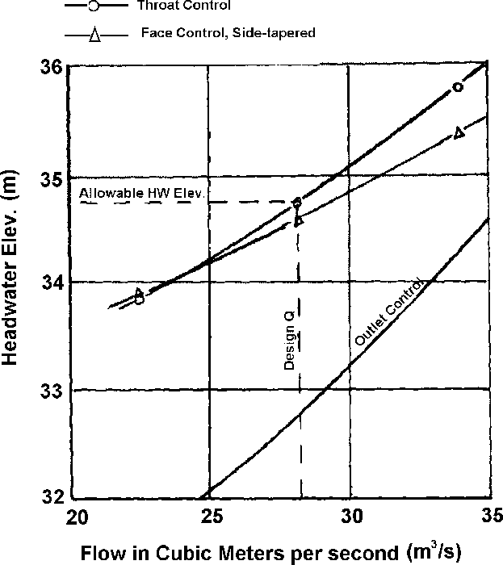
>
> <u>Conclusions:</u>
>
> A side-tapered inlet added to the existing barrel will pass the increased 50-year runoff at the ELhd of 34.75 m.
>
> <u>Dimensions</u>
>
> B = 2134 mm D = 2134 mm
>
> Bf =3.66 m TAPER = 4:1  
> L1 = 3.06 m
>
> Face section has 90-degree wingwalls and square edges.

109

d\. <u>Example Problem \#2 (English Units)</u>. From example problem no. 4, Chapter III, an existing 7 ft by 7 ft concrete box culvert was originally designed for a 50-year flood of 600 ft3/s and an ELhd of 114 ft. Upstream development has increased the 50-year runoff to 1,000 ft3/s.

**Given:**

> Inlet Invert Elevation: 100 ft
>
> Existing Entrance Condition: Square edge
>
> Barrel Slope (S): 5 percent
>
> Roadway Centerline Elevation: 115.5 ft
>
> Culvert Length: 200 ft
>
> Flow, ft3/s T.W. (ft)

|       |     |
|-------|-----|
| 800   | 3.8 |
| 1,000 | 4.1 |
| 1,200 | 4.5 |

**<u>Requirements</u>:** In order to save the existing culvert barrel, design a new side-tapered inlet that will pass the new 50-year runoff of 1,000 ft3/S at the original ELhd of 114.0 ft. The side-tapered inlet will be constructed upstream of the existing barrel. Prepare outlet control, throat control, and face control performance for the new inlet.

Note: Charts 14B, 15B, 57B, and 58B, are used in this solution.

> 

110

<table style="width:100%;">
<colgroup>
<col style="width: 5%" />
<col style="width: 5%" />
<col style="width: 5%" />
<col style="width: 5%" />
<col style="width: 5%" />
<col style="width: 5%" />
<col style="width: 5%" />
<col style="width: 4%" />
<col style="width: 1%" />
<col style="width: 2%" />
<col style="width: 0%" />
<col style="width: 0%" />
<col style="width: 2%" />
<col style="width: 1%" />
<col style="width: 4%" />
<col style="width: 6%" />
<col style="width: 2%" />
<col style="width: 3%" />
<col style="width: 2%" />
<col style="width: 1%" />
<col style="width: 0%" />
<col style="width: 0%" />
<col style="width: 0%" />
<col style="width: 0%" />
<col style="width: 3%" />
<col style="width: 0%" />
<col style="width: 0%" />
<col style="width: 4%" />
<col style="width: 1%" />
<col style="width: 1%" />
<col style="width: 2%" />
<col style="width: 5%" />
<col style="width: 6%" />
</colgroup>
<tbody>
<tr class="odd">
<td colspan="8"><blockquote>

<strong>PROJECT . EXAMPLE PROBLEM <em>1.10, 2 English</em></strong>

</blockquote></td>
<td colspan="12"><blockquote>

<strong>STATION ' <em>4+</em> 50</strong>

</blockquote></td>
<td colspan="13" rowspan="2"><blockquote>

<strong>TAPERED INLET DESIGN FORM</strong>

</blockquote></td>
</tr>
<tr class="even">
<td colspan="8" rowspan="3"><em><strong>CHAPTER ri ' ilE)5 Ala. 5</strong></em></td>
<td colspan="12" rowspan="4"><blockquote>

<strong>SHEET —1--- OF --.3—</strong>

</blockquote></td>
</tr>
<tr class="odd">
<td colspan="13"><blockquote>

<strong>DESIGNER / DATE' WJLI , <em>Will</em></strong>

</blockquote></td>
</tr>
<tr class="even">
<td colspan="13" rowspan="2"><blockquote>

<strong>REVIEWER / DATE' <u>Lit44</u> ,</strong> <em><u>vil</u></em>

</blockquote></td>
</tr>
<tr class="odd">
<td colspan="8"></td>
</tr>
<tr class="even">
<td colspan="9" rowspan="2"><blockquote>

<strong>DEIIAGN RATA :</strong>

<strong>0 • 1 al• ; IL, <em>114.0</em> II 
.2.Y_</strong>

</blockquote></td>
<td colspan="8"></td>
<td colspan="6" rowspan="5"><strong>ID.C. NMI..</strong></td>
<td colspan="4" rowspan="5"><strong>0411</strong></td>
<td colspan="2" rowspan="5"><blockquote>

<strong>NMI, IN</strong>

</blockquote></td>
<td colspan="4" rowspan="18">
<strong>COY '</strong>

<strong>FACE IS SIZED</strong>

<strong>FOR <em>90° WiA I &amp;-</em></strong>

<blockquote>

<strong>WALL 6 <em>A : tri4</em> SQUARE EDGES</strong>

</blockquote></td>
</tr>
<tr class="odd">
<td colspan="3" rowspan="5"></td>
<td colspan="2" rowspan="5"><strong>...</strong></td>
<td colspan="3" rowspan="5">
<strong>Of•ell1P,...1.1</strong>

<strong>11 .80 a</strong>
</td>
</tr>
<tr class="even">
<td colspan="9"><blockquote>

<strong>EL. I <em>:00.0</em> /1</strong>

</blockquote></td>
</tr>
<tr class="odd">
<td colspan="9"></td>
</tr>
<tr class="even">
<td colspan="9" rowspan="3"><blockquote>

<strong>CL. STRUM DED AT FACE <em>POi•O</em> Pi</strong>

<strong>FALL -- II ' I 1. 10 6:I/</strong>

<strong>.1</strong>

</blockquote></td>
</tr>
<tr class="odd">
<td colspan="7" rowspan="3"><strong>I!</strong></td>
<td colspan="3" rowspan="3"></td>
<td colspan="2" rowspan="3"><strong>,</strong></td>
</tr>
<tr class="even">
<td colspan="2" rowspan="3">
<strong>.</strong>

<strong>.</strong>
</td>
<td colspan="6" rowspan="3"><strong>4. . am</strong></td>
</tr>
<tr class="odd">
<td colspan="9" rowspan="6"><blockquote>

<strong><em>STREAM</em> SLOPE . Il• • .95 11</strong>

<strong>SLOPE OF II • .05— 11 'tt</strong>

<em><strong>in</strong></em>

<strong>s,_:_-_.I Is:1</strong> TO <strong>ci 1</strong>

<strong>im.- <em>BON- COMC.</em></strong>

</blockquote></td>
</tr>
<tr class="even">
<td colspan="2" rowspan="3"><blockquote>

<strong>lit tle</strong>

</blockquote>

<strong>12;</strong>
</td>
<td colspan="2" rowspan="3"></td>
<td colspan="6" rowspan="3"></td>
<td colspan="2" rowspan="3"></td>
</tr>
<tr class="odd">
<td colspan="2"></td>
<td colspan="6"><strong>•</strong></td>
</tr>
<tr class="even">
<td colspan="2" rowspan="2"></td>
<td colspan="6" rowspan="2"></td>
</tr>
<tr class="odd">
<td colspan="2" rowspan="3"></td>
<td colspan="2" rowspan="3"></td>
<td colspan="8" rowspan="3"></td>
</tr>
<tr class="even">
<td colspan="2" rowspan="4"></td>
<td colspan="6" rowspan="4"><strong>ilnt•</strong></td>
</tr>
<tr class="odd">
<td colspan="9" rowspan="2"><ul>
<li><blockquote>

<strong>• 0 ._711• D. 7 FT.</strong>

</blockquote></li>
</ul></td>
</tr>
<tr class="even">
<td colspan="12" rowspan="4"><strong>SLOPE TAPERED</strong></td>
</tr>
<tr class="odd">
<td colspan="9" rowspan="2"><blockquote>

<strong>INLET 1081 DESCRIPTION TAPERED INLET THROAT</strong>

</blockquote></td>
</tr>
<tr class="even">
<td colspan="8" rowspan="2"><strong>SIDE- TAPERED</strong></td>
</tr>
<tr class="odd">
<td colspan="9"></td>
</tr>
<tr class="even">
<td rowspan="3"><blockquote>

<strong>'a lel./</strong>

</blockquote></td>
<td rowspan="3">
<strong>EL.,</strong>

<strong>-</strong>
</td>
<td rowspan="3"><strong>EL. 
TIIIIOAT 
INVERT</strong></td>
<td rowspan="3">
<strong>EL.</strong>

FACE

<strong>Amon NI</strong>
</td>
<td rowspan="3"><blockquote>

<strong>N WI IS</strong>

</blockquote></td>
<td rowspan="3"><blockquote>

<strong>WI, E</strong>

</blockquote>

<strong>011</strong>
</td>
<td rowspan="3">
<strong>0</strong>

<strong>61</strong>

<strong>NI</strong>
</td>
<td colspan="2" rowspan="3">
YIN.

<strong>9,</strong>

<strong>NI</strong>
</td>
<td colspan="4" rowspan="3">
<strong>SELECTED</strong>

<strong>9,</strong>
</td>
<td colspan="13" rowspan="2"><strong>-TAPERED ONLY</strong></td>
<td colspan="2" rowspan="3">
<strong>L</strong>

<strong>'</strong>

<strong>IN</strong>
</td>
<td colspan="5"><strong>SIDE-TAPERED W/ FALL,</strong></td>
</tr>
<tr class="odd">
<td colspan="3" rowspan="2"><blockquote>

<strong>EL. CREST</strong>

</blockquote>

<strong>1I V.</strong>
</td>
<td rowspan="2">
<strong>NW.</strong>

<strong>112.1</strong>
</td>
<td rowspan="2">
<strong>MIN.</strong>

<strong>•</strong>

<strong>IS/</strong>
</td>
</tr>
<tr class="even">
<td colspan="2">
VIM.

<strong>L. 
NI</strong>
</td>
<td>
<strong>L.</strong>

<strong>(11</strong>
</td>
<td colspan="2"><blockquote>

<strong>CHECK L.</strong>

</blockquote>

<strong>Is)</strong>
</td>
<td colspan="4">
ADJ.

<strong>L. 
IN</strong>
</td>
<td colspan="4">
<strong>ADJ.</strong>

<strong>TAPER</strong>

<strong>IIIR</strong>
</td>
</tr>
<tr class="odd">
<td><blockquote>

<em><strong>COO</strong></em>

</blockquote></td>
<td><em><strong>114.0</strong></em></td>
<td><em><strong>100.0</strong></em></td>
<td><em><strong>101.0</strong></em></td>
<td><em><strong>13.0</strong></em></td>
<td><em><strong>1.86</strong></em></td>
<td><em><strong>ea</strong></em></td>
<td colspan="2"><em><strong>114</strong></em></td>
<td colspan="4"><em><strong>II</strong></em></td>
<td colspan="2"><em><strong>..---'</strong></em></td>
<td><em><strong>/</strong></em></td>
<td colspan="2"><em><strong>------</strong></em></td>
<td colspan="4"><em><strong>..----</strong></em></td>
<td colspan="4"><em><strong>/-</strong></em></td>
<td colspan="2"><em><strong>10.0</strong></em></td>
<td colspan="3"><em><strong>„...7</strong></em></td>
<td><em><strong>.......----</strong></em></td>
<td><em><strong>....----</strong></em></td>
</tr>
<tr class="even">
<td><blockquote>

<em><strong>1000</strong></em>

</blockquote></td>
<td><em><strong>113.0</strong></em></td>
<td></td>
<td><em><strong>*100.5</strong></em></td>
<td><em><strong>12.5</strong></em></td>
<td><em><strong>III</strong></em></td>
<td><em><strong>83</strong></em></td>
<td colspan="2"><em><strong>-4--</strong></em></td>
<td></td>
<td colspan="3"><strong>1</strong></td>
<td colspan="2"><strong>..</strong></td>
<td><em><strong>FACE</strong></em></td>
<td colspan="2"></td>
<td colspan="4"><strong>--4</strong></td>
<td colspan="4"></td>
<td colspan="2"></td>
<td colspan="3"></td>
<td></td>
<td></td>
</tr>
<tr class="odd">
<td><blockquote>

<em><strong>Soc.</strong></em>

</blockquote></td>
<td><em><strong>110.1</strong></em></td>
<td></td>
<td></td>
<td><em><strong>;al</strong></em></td>
<td><em><strong>b45</strong></em></td>
<td><em><strong>47</strong></em></td>
<td colspan="2"><em><strong>--</strong></em></td>
<td colspan="4"></td>
<td colspan="2"><strong>.</strong></td>
<td><strong>PERFORMANCE</strong></td>
<td colspan="2"></td>
<td colspan="4"></td>
<td colspan="4"></td>
<td colspan="2"></td>
<td colspan="3"></td>
<td></td>
<td></td>
</tr>
<tr class="even">
<td><blockquote>

<strong>1100</strong>

</blockquote></td>
<td><em>115.5</em></td>
<td></td>
<td></td>
<td><em><strong>4.0</strong></em></td>
<td><em>2.14</em></td>
<td><em><strong>/00</strong></em></td>
<td colspan="2"><strong>-.--</strong></td>
<td colspan="4"><strong>i'</strong></td>
<td colspan="2"></td>
<td><strong>DATA</strong></td>
<td colspan="2"></td>
<td colspan="4"></td>
<td colspan="4"></td>
<td colspan="2"></td>
<td colspan="3"></td>
<td></td>
<td></td>
</tr>
<tr class="odd">
<td></td>
<td></td>
<td></td>
<td></td>
<td></td>
<td></td>
<td></td>
<td colspan="2"></td>
<td colspan="4"></td>
<td colspan="2"></td>
<td></td>
<td colspan="2"></td>
<td colspan="4"></td>
<td colspan="4"></td>
<td colspan="2"></td>
<td colspan="3"></td>
<td></td>
<td></td>
</tr>
<tr class="even">
<td colspan="30"><blockquote>

<strong>DI SIDE - TA ttttt : EL FACE INVERT • EL. TORO* INVERT • 111 IAPPROK.) III I I 161•411. ADJ. L. • [.. "INi I • APER -</strong>

<strong>.</strong>

</blockquote></td>
<td colspan="3" rowspan="2"><blockquote>

<strong>CTE0</strong>

<strong>SSELE. it°DEEM</strong>

</blockquote></td>
</tr>
<tr class="odd">
<td colspan="25" rowspan="6"><blockquote>

<strong>SLOPE- : EL FACE INVERT • EL. STREAM DEO AT FACE</strong>

<strong>Hal • IL .i -EL. FACE INVERT ON I F1711.00, ADJ. TAPER • (Le L.1/[11il</strong>

<em><strong>0:11.1r2AA•</strong></em>

<strong>MO FROM DESIIIII</strong>

<strong><em>on</em> SIDE - TAPERED: I. • ['l 8 • TAPER</strong>

<strong>(S) MIN. 14 • 0/(0/6. 1 I</strong>

<strong>MU MIN. L. • 0.1 NS SLOPE -TAPERED: L. • I... L.</strong>

<strong>IT/ L. • (EL. FACE INVERT- EL THROAT REVERT/ SI Ill)</strong> N <strong>Wc • E I. hi - IL. CREST INVERT 
</strong>,.1.1

<strong><em>N)</em> CHECK</strong> Li.r, ...]•

<strong>DM WIN. II • 0. SS 0 /MSc"</strong>

<strong>ACTUAL EL. <em>FACE</em> WYE CT . <em>ELt</em> 4. L 1 5 <em>:100+(p.0)(.05): )00.5</em></strong>

</blockquote></td>
<td colspan="5" rowspan="6"><em><strong>ft.</strong></em></td>
</tr>
<tr class="even">
<td colspan="3"><blockquote>

<strong>Li <em>10.0</em></strong>

</blockquote></td>
</tr>
<tr class="odd">
<td colspan="3"><blockquote>

<strong>I. --</strong>

</blockquote></td>
</tr>
<tr class="even">
<td colspan="3"><blockquote>

<strong>L. —</strong>

</blockquote></td>
</tr>
<tr class="odd">
<td colspan="3"><blockquote>

<strong>SCALE Amu <em>_Q.2</em> b • --(2.lasy•ILI.</strong>

<strong>TAPER. *</strong> •1

</blockquote></td>
</tr>
<tr class="even">
<td colspan="3"><blockquote>

<strong>si • —._•I</strong>

</blockquote></td>
</tr>
</tbody>
</table>

**111**

**<u>Conclusions</u>:**

A side-tapered inlet added to the existing barrel will pass the increased 50-year runoff at the ELhd of 114 ft.

**<u>Dimensions</u>:**

> B = 7 ft D = 7ft
>
> Bf = 12 ft  
> TAPER = 4:1
>
> L1 = 10 ft

Face section has 90-degree wingwalls and square edges.

112

**G. <u>Circular Pipe Culverts</u>**

**1. Design Procedures**. Design procedures and criteria are available for side-and slope-tapered inlets for circular pipe culverts. The inlet designs are shown in Figure IV-12. For the side-tapered inlet, either prefabricated inlets with nonrectangular cross sections or cast-in-place rectangular inlets are used. The rectangular inlets are joined to the circular pipe using a square to circular throat transition section.

**Figure IV-12--Tapered Inlets for Pipe Culverts**

For slope-tapered inlets, the rectangular designs (vertical or mitered face) are the only option for which design charts are available. The square to circular transition section is used to join the slope-tapered inlet to the circular pipe.

a\. <u>Side-Tapered Inlets</u>. The throat and face control design nomographs for side-tapered inlets on circular pipe culverts are in Appendix D. For throat control, there are two scales on the nomograph: one for smooth inlets and one for rough inlets. The difference in headwater requirement is due to the hydraulic resistance between the face and the throat of the inlet.

The design nomograph for sizing the face of a side-tapered inlet with a nonrectangular face includes three scales. Each scale is for a different edge condition, including thin-edge projecting, square edge, and bevel edged. The face area is larger than the barrel area and may be any nonrectangular shape, including an oval, a circle, a circular segment, or a pipe-arch. To

113

design a rectangular side-tapered inlet for a circular pipe culvert, use the design nomographs in Appendix D for rectangular side-tapered inlets. Additional head can be provided on the throat control section of a side-tapered inlet by constructing a depression upstream of the face section. The depression designs are the same as for box culverts.

b\. <u>Slope-Tapered Inlets</u>. Rectangular inlets are adapted to pipe culverts as shown in Figure IV-13. The slope-tapered inlet is connected to the pipe culvert by use of a square to circular transition. The design of the slope-tapered inlet is the same as for box culverts. There are two throat sections, one square and one circular, but the circular throat section will control the flow because the area is much smaller than the square throat section.

> 

**Figure IV-13--Slope-Tapered Inlet, Circular Pipe Culvert**

**2. Multiple Barrel Designs**. Each barrel of the culvert must have an individual side-tapered inlet with a non-rectangular face design. For rectangular side-tapered inlets with a square to round transition, double barrel designs are the same as for box culverts. However, the center wall at the transition must be flared to provide adequate space between the pipes for proper backfill and compaction. The amount of flare required will depend on the size of the pipes and the construction techniques used. No more than two circular barrels may be feed from the throat section of a rectangular side-tapered inlet.

114

Double barrel slope-tapered inlets may be designed in the same manner as for rectangular side-tapered designs. Again, no more than two barrels may be feed from a single inlet structure.

**3. Dimensional Limitations**. In addition to the dimensional limitations given previously for all tapered inlets, the following criteria apply to the application of a rectangular side- and slope-tapered inlets to circular pipe culverts.

1.  The transition from the square throat section to the circular throat section must be \> D/2. If excessive lengths are used, the frictional loss within the transition section of the culvert must be considered in the design using Equation (12).

2.  The square throat dimension must equal the diameter of the circular pipe culvert.

**4. Example Problem**

> a\. <u>Example Problem \#3 (SI Units)</u>

**Given:**

Q50 = 4.248 m3/s

ELhd = 29.261 m

Outlet Invert Elevation = 22.860 m

Approximate Culvert Length = 106.680 m

So = 0.05 m/m

Shoulder Elevation = 31.090 m

The downstream channel approximates a 1.524 m bottom width trapezoid with IV:2H side slopes. The Manning’s n = 0.03

<u>Requirements</u>**:**

Design a culvert for the above conditions. Use corrugated metal pipe with standard (68 mm x 13 mm) corrugations. Investigate both a corrugated side-tapered inlet and a concrete slope-tapered inlet. Use normal depth in the natural channel as the tailwater depth.

NOTE: Charts 4A, 6A, 55A, 56A, and 59A are used in this solution.

115

<table>
<colgroup>
<col style="width: 23%" />
<col style="width: 0%" />
<col style="width: 4%" />
<col style="width: 5%" />
<col style="width: 2%" />
<col style="width: 1%" />
<col style="width: 4%" />
<col style="width: 2%" />
<col style="width: 2%" />
<col style="width: 2%" />
<col style="width: 1%" />
<col style="width: 4%" />
<col style="width: 4%" />
<col style="width: 4%" />
<col style="width: 1%" />
<col style="width: 2%" />
<col style="width: 4%" />
<col style="width: 3%" />
<col style="width: 4%" />
<col style="width: 4%" />
<col style="width: 1%" />
<col style="width: 3%" />
<col style="width: 14%" />
</colgroup>
<tbody>
<tr class="odd">
<td colspan="5" rowspan="3"><blockquote>

<strong>PROJECT</strong> <em>42xeloff4 P-4,19,1,* 43{51)</em>

</blockquote></td>
<td colspan="10" rowspan="2"><blockquote>

<strong>STATION'</strong> 6 <strong>T''</strong> <em>QV)</em>

</blockquote></td>
<td colspan="8"><blockquote>

<strong>CULVERT DESIGN FORM</strong>

</blockquote></td>
</tr>
<tr class="even">
<td colspan="8" rowspan="3"><blockquote>

<strong>DESIGNER / DATE: <em>*ILO?</em> OF</strong> /4/„,40

</blockquote></td>
</tr>
<tr class="odd">
<td colspan="10" rowspan="5"><blockquote>

<strong>SHEET OF --Y---</strong>

</blockquote></td>
</tr>
<tr class="even">
<td colspan="5" rowspan="2">ektop, IE , <em>HAS- Nos</em></td>
</tr>
<tr class="odd">
<td colspan="8" rowspan="2"><blockquote>

<strong>REVIEWER/DATE: <em>AAA./</em> OF 44/4101</strong>

</blockquote></td>
</tr>
<tr class="even">
<td colspan="5" rowspan="2"></td>
</tr>
<tr class="odd">
<td colspan="8"></td>
</tr>
<tr class="even">
<td colspan="5"><strong>HYDROLOGICAL DATA</strong></td>
<td colspan="18"><strong>ROADWAY ELEVATION:</strong> 3 /. <em>C</em> 9 (.)</td>
</tr>
<tr class="odd">
<td colspan="5">
S

<blockquote>

<strong>CI METHOD</strong> . <em>C. S.</em>

</blockquote></td>
<td colspan="18" rowspan="2"><blockquote>

<strong>EL,</strong> <em>2 9.76 / oro</em>

</blockquote></td>
</tr>
<tr class="even">
<td colspan="5" rowspan="2"><blockquote>

<strong>O DRAINAGE AREA: <em>l/0,</em> 9/4d (3 STREAM SLOPE: 51,0%</strong>

</blockquote></td>
</tr>
<tr class="odd">
<td colspan="18" rowspan="2"><em>—</em></td>
</tr>
<tr class="even">
<td colspan="5" rowspan="2"><blockquote>

<strong>O CHANNEL SHAPE:</strong> <em>Tr? pe3olcial</em>

</blockquote></td>
</tr>
<tr class="odd">
<td colspan="5" rowspan="2"></td>
<td colspan="11" rowspan="2"><blockquote>

<strong>EL,</strong> <em>26/99</em> (m) <strong>SP: <em>O,O5</em> (mm)H</strong>

</blockquote></td>
<td colspan="2" rowspan="2"></td>
</tr>
<tr class="even">
<td colspan="5" rowspan="2"><blockquote>

<strong>O ROUTING:</strong> A-) A- o <strong>OTHER:</strong>

</blockquote></td>
</tr>
<tr class="odd">
<td colspan="5" rowspan="2"></td>
<td colspan="11" rowspan="2">
FR

<strong>--,.</strong>

<blockquote>

<strong>--</strong>

</blockquote></td>
<td colspan="2" rowspan="2"><strong>TW</strong></td>
</tr>
<tr class="even">
<td colspan="5" rowspan="2"><strong>DESIGN FLOWS/TAILWATER</strong></td>
</tr>
<tr class="odd">
<td colspan="16" rowspan="2">
<strong>1.43</strong>

<blockquote>

<strong>EL: Z</strong> 7, <em>521-</em> -6„) <strong>Fall</strong>

</blockquote></td>
<td colspan="2" rowspan="2"><blockquote>

<strong>,</strong>

</blockquote></td>
</tr>
<tr class="even">
<td colspan="5" rowspan="2"><em>IlL0TAIREI fl oW</em> <strong>tree 7W (m)</strong></td>
</tr>
<tr class="odd">
<td colspan="18" rowspan="2"><blockquote>

<strong>S = S.- Falai,</strong>

2.9,37y <em>5wooli EL, 2Z.gid on)</em>

</blockquote></td>
</tr>
<tr class="even">
<td colspan="5" rowspan="2">50 <em>4,1,5 0,</em> 49</td>
</tr>
<tr class="odd">
<td colspan="18" rowspan="2"><blockquote>

<em><strong>S=..)(kit_Zim,/m)</strong></em>

<strong>L.= <em>LIEL.</em> 0(m</strong>

</blockquote></td>
</tr>
<tr class="even">
<td colspan="5"></td>
</tr>
<tr class="odd">
<td><blockquote>

<strong>CULVERT DESCRIPTION:</strong>

</blockquote></td>
<td colspan="2" rowspan="4">
<strong>TOTAL Flow</strong>

<strong>O</strong>

<em>(rtls)</em>
</td>
<td rowspan="3"><strong>FLOW 
PER 
BARREL</strong></td>
<td colspan="15" rowspan="2"><strong>HEADWATER CALCULATIONS</strong></td>
<td rowspan="3">
<strong>0 z</strong>

<strong>Cis</strong>
</td>
<td colspan="2" rowspan="4">
L

g.

<strong>OW</strong>
</td>
<td rowspan="4"><strong>COMMENTS</strong></td>
</tr>
<tr class="even">
<td rowspan="3"><blockquote>

<strong>MATERIAL-SHAPE-SIZE-ENTRANCE</strong>

</blockquote></td>
</tr>
<tr class="odd">
<td colspan="7"><strong>INLET CONTROL</strong></td>
<td colspan="8"><blockquote>

<strong>OUTLET CONTROL</strong>

</blockquote></td>
</tr>
<tr class="even">
<td>
<strong>O/N</strong>

<strong>(1)</strong>
</td>
<td colspan="2">
<strong>HVWD</strong>

(2)
</td>
<td><strong>NW(</strong></td>
<td colspan="2">
FALL

(3)
</td>
<td colspan="2">
EL,

(4)
</td>
<td>
1W

(5)
</td>
<td>S.</td>
<td>
<u>H.= ID</u>

2
</td>
<td colspan="2">
he

(6)
</td>
<td>k.</td>
<td>
H

(7)
</td>
<td>
ELI.

<strong>(8)</strong>
</td>
<td><strong>BA</strong></td>
</tr>
<tr class="odd">
<td><blockquote>

<strong>DIP- <em>C I</em> fid - MO</strong> <em>Mil 'FIA°17t4Thr.</em>

</blockquote></td>
<td colspan="2"><em>0,75</em></td>
<td><em>y,25</em></td>
<td colspan="2"><em>1,„6,I</em></td>
<td>1,93</td>
<td colspan="2"><em>oe7</em></td>
<td colspan="2"><em>21,24,</em></td>
<td><em>only</em></td>
<td>I, I</td>
<td>1,15</td>
<td colspan="2">145</td>
<td>0•z</td>
<td><em>4.8</em></td>
<td><em>MI</em></td>
<td>2404</td>
<td colspan="2"><em>6,0it</em></td>
<td></td>
</tr>
<tr class="even">
<td></td>
<td colspan="2"><em>2.'83</em></td>
<td><em>2,83</em></td>
<td colspan="2"><em>1,14-</em></td>
<td colspan="2"><em>Wk.</em></td>
<td colspan="3"><em>28,'76,1f3</em></td>
<td></td>
<td><em>ho</em></td>
<td><em>1,10</em></td>
<td colspan="2"><em>1,10</em></td>
<td></td>
<td><em>2,1</em></td>
<td><em>16,06</em></td>
<td><em>za'ig</em></td>
<td colspan="2"></td>
<td><blockquote>

Per <em>ot ninree</em>

</blockquote>

<em>c</em>
</td>
</tr>
<tr class="odd">
<td></td>
<td colspan="2"><em>5,66</em></td>
<td><em>5,46</em></td>
<td colspan="2"><em>949,</em></td>
<td colspan="2">244</td>
<td colspan="3">7 2%73</td>
<td>5,56'</td>
<td>71,2,</td>
<td>1,2-</td>
<td colspan="2"><em>i,</em> i</td>
<td></td>
<td><em>7%</em></td>
<td>31,‘C</td>
<td>3),64</td>
<td colspan="2"></td>
<td><blockquote>

<em>(lovve""Da."6</em>

</blockquote></td>
</tr>
<tr class="even">
<td><blockquote>

<em>(</em> Ag- Caie.- <em>1100*B, :Ar,,01</em>

</blockquote></td>
<td colspan="2"><em>4,I6</em></td>
<td>4,9.5</td>
<td colspan="2"><em>JAI</em></td>
<td><em>IM</em></td>
<td colspan="2"><em>o.82.29,26</em></td>
<td colspan="2"></td>
<td><em>04?</em></td>
<td><em>Id</em></td>
<td><em>1,16</em></td>
<td colspan="2"><em>116</em></td>
<td><em>r</em></td>
<td><em>1i,9</em></td>
<td>g,g)</td>
<td>z9,74</td>
<td colspan="2"></td>
<td><blockquote>

OK.

</blockquote></td>
</tr>
<tr class="odd">
<td></td>
<td colspan="2"></td>
<td></td>
<td colspan="2"></td>
<td></td>
<td colspan="2"></td>
<td colspan="2"></td>
<td></td>
<td></td>
<td></td>
<td colspan="2"></td>
<td></td>
<td></td>
<td></td>
<td></td>
<td colspan="2"></td>
<td></td>
</tr>
<tr class="even">
<td colspan="23">
<strong>TECHNICAL FOOTNOTF„,a. HA = HIM • EL,</strong>

<strong>(4)</strong>
</td>
</tr>
<tr class="odd">
<td colspan="23">
<strong>(1) USE OMB FOR BOX CULVERTS (INVERT OF INLET CONTROL SECTION (8) h.= TWor (ck. D)/2 (WHICHEVER IS GREATER)</strong>

<strong>(2) MVO = HAM OR HAND FROM DESIGN CHARTS (5) 1W BASED ON DOWN STREAM (7) H = (141‘.*(19.63 'PQM, al v./29</strong>

<strong>CONTROL OR FLOW DEPTH IN</strong>

<strong>-LELa. EL.); FALL IS ZERO FOR CULVERTS ON GRADE CHANNEL</strong>SUSCRIFT <strong>(8) EL.,. EL.o. H. h.</strong>

<strong>(3) FALL = ISW</strong>

<strong>H no</strong>
</td>
</tr>
<tr class="even">
<td colspan="2"></td>
<td colspan="16" rowspan="2"></td>
<td colspan="5" rowspan="3">
<strong>CULABI:LEWBBELSELECTE2</strong>

<blockquote>

<strong>SIZE I</strong> Z.00 <em>row</em>

</blockquote></td>
</tr>
<tr class="odd">
<td colspan="2" rowspan="6">
<strong>a. Approximate</strong>

<strong>11 Culvert Face</strong>

<strong>hd. Design Headwater</strong>

<strong>N. Headwater in Inlet Control</strong>

<strong>ho. Hee:Mater in Outlet Control</strong>

i <strong>Inlet Control Section</strong>

<strong>Se.</strong>

<strong>at. Streamed at Culvert Face</strong>

<strong><em>he</em> Taawater</strong>
</td>
</tr>
<tr class="even">
<td colspan="16" rowspan="5">
<strong>COMMENTS/ DISCUSSION, .</strong>

<strong>7 —4O P.1 1)1' WY</strong>

Destr <em>$1de ';' 5' diDe</em> ff,

<strong>Po, I</strong> ZOO <em>n^</em> y» <em>C</em> v.21 P
</td>
</tr>
<tr class="odd">
<td colspan="5"><blockquote>

SHAPE <strong>CI</strong> (6 C IA- (1) R

</blockquote></td>
</tr>
<tr class="even">
<td colspan="5"><blockquote>

<strong>MATERIAL € IV) P <em>nP4lY</em></strong>

</blockquote></td>
</tr>
<tr class="odd">
<td colspan="5"><blockquote>

<strong>ENTRANCE:</strong> 7-4 Pere <em>d IA )e t</em>

</blockquote></td>
</tr>
<tr class="even">
<td colspan="5"></td>
</tr>
</tbody>
</table>

<table>
<colgroup>
<col style="width: 5%" />
<col style="width: 5%" />
<col style="width: 5%" />
<col style="width: 5%" />
<col style="width: 5%" />
<col style="width: 5%" />
<col style="width: 5%" />
<col style="width: 4%" />
<col style="width: 1%" />
<col style="width: 3%" />
<col style="width: 1%" />
<col style="width: 0%" />
<col style="width: 5%" />
<col style="width: 5%" />
<col style="width: 2%" />
<col style="width: 3%" />
<col style="width: 2%" />
<col style="width: 1%" />
<col style="width: 1%" />
<col style="width: 0%" />
<col style="width: 1%" />
<col style="width: 3%" />
<col style="width: 0%" />
<col style="width: 4%" />
<col style="width: 1%" />
<col style="width: 1%" />
<col style="width: 2%" />
<col style="width: 5%" />
<col style="width: 6%" />
</colgroup>
<tbody>
<tr class="odd">
<td colspan="8"><blockquote>

PROJECT: <em>,E)Ce *pie</em> go <em>biem</em> itt. 3 (3 <em>1 thi,4,)</em>

</blockquote></td>
<td colspan="10" rowspan="2">STATION: <em>1'0</em> 4)</td>
<td colspan="11" rowspan="3"><blockquote>

TAPERED INLET DESIGN FORM

</blockquote></td>
</tr>
<tr class="even">
<td colspan="8" rowspan="4"><em>ebeffr)-</em> .7137 , #3,5— Pc, <em>5</em></td>
</tr>
<tr class="odd">
<td colspan="10" rowspan="4">SHEET 9._ OF /6</td>
</tr>
<tr class="even">
<td colspan="11"><blockquote>

<strong>DESIGNER/DATE:</strong> <em>3 Liv /</em> /0/0344

</blockquote></td>
</tr>
<tr class="odd">
<td colspan="11" rowspan="3"><blockquote>

REVIEWER/DATE: <em>AA ,.../ / 41ish I</em>

</blockquote></td>
</tr>
<tr class="even">
<td colspan="8" rowspan="2"></td>
</tr>
<tr class="odd">
<td colspan="10"></td>
</tr>
<tr class="even">
<td colspan="9"><blockquote>

<strong>DESIGN DATA:</strong>

<strong>Q</strong> <em>50 .</em> <strong>4, Z-5 (nf/S); ELN 2 9., 7,6 (m)</strong>

</blockquote></td>
<td rowspan="3"></td>
<td colspan="5" rowspan="3"><blockquote>

<strong>3EVEL WTI..</strong> 'mea l' =mom

</blockquote></td>
<td colspan="6" rowspan="5"><blockquote>

<strong>a VEL I....</strong>

</blockquote></td>
<td colspan="2" rowspan="5"><strong>,</strong></td>
<td colspan="2" rowspan="5">
",a.

<strong>TMO•T</strong>

<strong>'at</strong>...
</td>
<td colspan="4" rowspan="18"><blockquote>

COMMENTS

<em>(.1, 4 e bovdcti</em>

<em>e,J, e</em> p 17 <em>irgoce</em>

<em>i</em>

65--fr, <em>-Pi</em> 6-P 04'

<strong>fatspy.,r/ /I;(</strong> <em>ki</em>

</blockquote></td>
</tr>
<tr class="odd">
<td colspan="9"><blockquote>

<strong>EL. THROAT INVERT</strong> <em>7'7..11'0 (m)</em>

</blockquote></td>
</tr>
<tr class="even">
<td colspan="9" rowspan="2"><blockquote>

<strong>EL. STREAM BED AT FACE <em>Z8. </em></strong><em>19Y (m)</em>

</blockquote></td>
</tr>
<tr class="odd">
<td colspan="2" rowspan="9">
<strong>_</strong>

<strong>i' a</strong>

<strong>2</strong> err
</td>
<td colspan="4" rowspan="9">
<u><strong>Li</strong>►</u>-0„

<strong>L a</strong>
</td>
</tr>
<tr class="even">
<td colspan="9" rowspan="2"><blockquote>

<strong>FALL</strong> 5,8'7 <strong>(m) TAPER // : I (414:1V TO 6H:1 V)</strong>

</blockquote></td>
</tr>
<tr class="odd">
<td colspan="6" rowspan="2"><blockquote>

ig

<strong>a</strong>

</blockquote></td>
<td colspan="2" rowspan="2">,</td>
<td colspan="2" rowspan="2">,.,</td>
</tr>
<tr class="even">
<td colspan="9" rowspan="2"><blockquote>

<strong>STREAM SLOPE,</strong> S.= <em>0,05</em> (<em>ntrn)</em>

</blockquote></td>
</tr>
<tr class="odd">
<td colspan="6" rowspan="2"><blockquote>

eLl

'0.r,

</blockquote></td>
<td colspan="2" rowspan="2"></td>
<td colspan="2" rowspan="2"></td>
</tr>
<tr class="even">
<td colspan="9" rowspan="2"><blockquote>

<strong>SLOPE OF BARRELS=</strong> <em>O , 0 HZ (Mm)</em>

</blockquote></td>
</tr>
<tr class="odd">
<td colspan="2" rowspan="4"><blockquote>

543 la

</blockquote></td>
<td colspan="2" rowspan="4"></td>
<td colspan="4" rowspan="4">1</td>
<td colspan="2" rowspan="4"><strong>a</strong></td>
</tr>
<tr class="even">
<td colspan="9"><blockquote>

&amp; - : <strong>1 (2H:1V TO 3H:1V)</strong>

</blockquote></td>
</tr>
<tr class="odd">
<td colspan="9" rowspan="3"><blockquote>

<strong>BARREL SHAPE AND MATERIAL : C I</strong> Re, C <em>r'n</em> P

</blockquote></td>
</tr>
<tr class="even">
<td colspan="2" rowspan="4">le</td>
<td colspan="4" rowspan="4"><blockquote>

<em>e.</em> <strong>VA.</strong>

</blockquote></td>
</tr>
<tr class="odd">
<td colspan="2" rowspan="5"></td>
<td colspan="8" rowspan="5">
SLOPE

-TAPERED
</td>
</tr>
<tr class="even">
<td colspan="9"><blockquote>

<strong>N= I B= — , D =</strong> <em>',Roo mvs</em>

</blockquote></td>
</tr>
<tr class="odd">
<td colspan="9" rowspan="2"><blockquote>

<strong>INLET EDGE DESCRIPTION Roof ki</strong> <em>-fo pew ,i (.., , I h 12P0 P15</em>

</blockquote></td>
</tr>
<tr class="even">
<td colspan="6" rowspan="2"><u>(SIDE-TAPERE)</u></td>
</tr>
<tr class="odd">
<td colspan="9"></td>
</tr>
<tr class="even">
<td rowspan="3"><blockquote>

<strong>CI</strong>

ELL(Win)

</blockquote></td>
<td rowspan="3"></td>
<td rowspan="3"><blockquote>

<strong>EL. THROAT</strong>

</blockquote>

INVERT
</td>
<td rowspan="3">
<strong>EL FACE</strong>

INVERT

<strong>(1)</strong>
</td>
<td rowspan="3">
<strong>HAll</strong>

(2)
</td>
<td rowspan="3"><blockquote>

<strong>1±66 E</strong>

</blockquote>

<strong>(3)</strong>
</td>
<td rowspan="3">
<strong>2</strong>

<strong>Br</strong>

<strong>(4)</strong>
</td>
<td colspan="2" rowspan="3">
MIN.

<strong>Br</strong>

<strong>(5)</strong>
</td>
<td colspan="3" rowspan="2"></td>
<td colspan="10"><strong>SLOPE- APERED ONLY</strong></td>
<td colspan="2" rowspan="3">
<strong>Li</strong>

<strong>(11)</strong>
</td>
<td colspan="5" rowspan="2"><strong>SIDE TAPERED W/ FALL</strong></td>
</tr>
<tr class="odd">
<td rowspan="2">
<strong>MIN.</strong>

<strong>(6)</strong>
</td>
<td rowspan="2">
<strong>14</strong>

<em>(7)</em>
</td>
<td colspan="2" rowspan="2">
<strong>CHECK</strong>

<strong>L.:</strong>

<strong>(8)</strong>
</td>
<td colspan="4" rowspan="2">
<strong>ADJ.</strong>

Ls

<strong>(9)</strong>
</td>
<td colspan="2" rowspan="2">
<strong>ADJ.</strong>

<strong>T R</strong>

<strong>(10)</strong>
</td>
</tr>
<tr class="even">
<td colspan="3">
SELECTED

<strong>SI</strong>
</td>
<td colspan="3"><blockquote>

<strong>EL CREST</strong>

</blockquote>

<strong>INV.</strong>
</td>
<td>
<strong>KN.</strong>

<strong>(12)</strong>
</td>
<td>
<strong>MIN. 
W</strong>

<strong>(13)</strong>
</td>
</tr>
<tr class="odd">
<td><blockquote>

4;25

</blockquote></td>
<td><em>g9,Ab</em></td>
<td>27,32</td>
<td>w7.41.</td>
<td>!,43</td>
<td>1,36</td>
<td>R.31</td>
<td colspan="2">1.83</td>
<td colspan="3"><em>1133</em></td>
<td></td>
<td></td>
<td colspan="2"></td>
<td colspan="4"></td>
<td colspan="2"></td>
<td colspan="2">/.2k,</td>
<td colspan="3">28.35</td>
<td><em>0,9'1</em></td>
<td><em>3,10</em></td>
</tr>
<tr class="even">
<td><blockquote>

2,83

</blockquote></td>
<td>93,6 It</td>
<td></td>
<td>
<em>*</em>

z I.3y
</td>
<td>1.95</td>
<td>t <em>44f</em></td>
<td>1.65</td>
<td colspan="2"><em>r</em>,,</td>
<td colspan="3">-.,,a</td>
<td></td>
<td></td>
<td colspan="2"></td>
<td colspan="4"></td>
<td colspan="2"></td>
<td colspan="2"></td>
<td colspan="3"></td>
<td></td>
<td></td>
</tr>
<tr class="odd">
<td><blockquote>

5,60

</blockquote></td>
<td>29,56</td>
<td></td>
<td></td>
<td>z.)7</td>
<td><em>1.91</em></td>
<td><em>3,0</em></td>
<td colspan="2">F4</td>
<td colspan="3"><blockquote>

r -fc.r 09,,, <em>Dal</em>

</blockquote></td>
<td>or.......</td>
<td></td>
<td colspan="2"></td>
<td colspan="4"></td>
<td colspan="2"></td>
<td colspan="2"></td>
<td colspan="3"></td>
<td></td>
<td></td>
</tr>
<tr class="even">
<td><blockquote>

..1-, 5

</blockquote></td>
<td>2.9,02.</td>
<td></td>
<td></td>
<td><em>1,63</em></td>
<td>1.34</td>
<td><em>2.32 ,</em></td>
<td colspan="2"></td>
<td colspan="3"></td>
<td></td>
<td></td>
<td colspan="2"></td>
<td colspan="4"></td>
<td colspan="2"></td>
<td colspan="2"></td>
<td colspan="3"></td>
<td></td>
<td></td>
</tr>
<tr class="odd">
<td></td>
<td></td>
<td></td>
<td></td>
<td></td>
<td></td>
<td></td>
<td colspan="2"></td>
<td colspan="3"></td>
<td></td>
<td></td>
<td colspan="2"></td>
<td colspan="4"></td>
<td colspan="2"></td>
<td colspan="2"></td>
<td colspan="3"></td>
<td></td>
<td></td>
</tr>
<tr class="even">
<td colspan="26" rowspan="7"><blockquote>

<strong>(1) SIDE-TAPERED : EL. FACE INVERT= EL. THROAT INVERT* 0.3 m (APPROX.) (9) IF (8) &gt;</strong> (7), <strong>ADJ.</strong> Ls= <strong>((B,- NB)/2) • TAPER -</strong> L7

</blockquote>

<strong>SLOPE-TAPERED : EL. FACE INVERT = EL. STREAM BED AT FACE (10) IF (7) &gt; (8), ADJ. TAPER = (L, * LW ((Br- NS)2)</strong>

<blockquote>

<strong>(2) HWr = EL, - EL. FACE INVERT (11) SIDE-TAPERED : L = ((Br- NB)/2) • TAPER</strong>

<strong>(3) 1.1D&gt;E≥D SLOPE-TAPERED : Li = L2 ... I-1 (4) FROM DESIGN CHARTS (12) HW.= ELI, - EL. CREST INVERT</strong>

<strong>(5) MIN. Br= Q/(0./B6 (13) MIN. W = 0.634 Cl/I1W. .11</strong>

<strong>(6) MIN. L3 = 0.5 NB</strong>

(7) <strong>Lt = (EL FACE INVERT - EL. THROAT INVERT) St</strong>

<strong>(8) CHECK Ls = (03r- N8)O) • TAPER - Ls</strong>

</blockquote>

<em>Y. Iti-ua</em> I Fo Ge Ina/4 <em>61po ---; Ftt i- 4,</em> 3 = 1. <em>'7.39. I-0.56)(0,04Z). 211,36</em>
</td>
<td colspan="3"><blockquote>

<strong>SELECTED DESIGN</strong>

<strong>Br /</strong><em>'83 m</em>

</blockquote></td>
</tr>
<tr class="odd">
<td colspan="3"><blockquote>

L1 .24 of

</blockquote></td>
</tr>
<tr class="even">
<td colspan="3"><blockquote>

<strong>L2 --</strong>

</blockquote></td>
</tr>
<tr class="odd">
<td colspan="3"><blockquote>

<strong>L3</strong>

</blockquote></td>
</tr>
<tr class="even">
<td colspan="3">
<strong>BEVELS ANGLE //5. • Is = — nun, d =</strong> a rim

<strong>TAPER # 'IV</strong>
</td>
</tr>
<tr class="odd">
<td colspan="3"><strong>Sr = — : 1V</strong></td>
</tr>
<tr class="even">
<td colspan="3"></td>
</tr>
</tbody>
</table>

> v7.39

**116**

<table>
<colgroup>
<col style="width: 5%" />
<col style="width: 5%" />
<col style="width: 2%" />
<col style="width: 2%" />
<col style="width: 2%" />
<col style="width: 3%" />
<col style="width: 5%" />
<col style="width: 5%" />
<col style="width: 5%" />
<col style="width: 4%" />
<col style="width: 1%" />
<col style="width: 3%" />
<col style="width: 0%" />
<col style="width: 1%" />
<col style="width: 0%" />
<col style="width: 1%" />
<col style="width: 4%" />
<col style="width: 5%" />
<col style="width: 2%" />
<col style="width: 3%" />
<col style="width: 2%" />
<col style="width: 1%" />
<col style="width: 0%" />
<col style="width: 0%" />
<col style="width: 5%" />
<col style="width: 0%" />
<col style="width: 4%" />
<col style="width: 1%" />
<col style="width: 1%" />
<col style="width: 2%" />
<col style="width: 5%" />
<col style="width: 6%" />
</colgroup>
<tbody>
<tr class="odd">
<td colspan="10" rowspan="2">
....

<blockquote>

PROJECT: <em>1:-xemple Problem</em> /Vo, 3 C.51-6A)

</blockquote></td>
<td colspan="12">STATION: („ <em>-t-CO</em></td>
<td colspan="10" rowspan="3"><blockquote>

TAPERED INLET DESIGN FORM

</blockquote></td>
</tr>
<tr class="even">
<td colspan="12" rowspan="4">SHEET 3 OF A/</td>
</tr>
<tr class="odd">
<td colspan="10" rowspan="4"><em>ehip/er w-</em> H p 5 <em>-No.</em> 6</td>
</tr>
<tr class="even">
<td colspan="10"><blockquote>

DESIGNER/DATE: J L <em>1,),</em> , <em>/0/09,A,</em>

</blockquote></td>
</tr>
<tr class="odd">
<td colspan="10" rowspan="3"><blockquote>

REVIEWER/DATE: <em><strong><u>/ 4, 40</u> / <u>1./Idol</u></strong></em>

</blockquote></td>
</tr>
<tr class="even">
<td colspan="12" rowspan="2"></td>
</tr>
<tr class="odd">
<td colspan="10"></td>
</tr>
<tr class="even">
<td colspan="11" rowspan="2"><blockquote>

DESIGN DATA:

0 <em>so</em> ,= 4,5 (nets); ELM 29,Z6/ m

</blockquote></td>
<td colspan="8"></td>
<td colspan="7" rowspan="6"><blockquote>

<strong>',EVE L (WV )</strong>

<strong>...4</strong>

</blockquote>

<strong>FELL</strong>
</td>
<td colspan="2" rowspan="6">
<strong>IM EECT Ito M</strong>

<strong>ION</strong>
</td>
<td colspan="4" rowspan="20">
COMMENTS

'

<strong>„</strong>

<strong><em>/</em> 14</strong>

<strong>VV, R6a10 /<em>5</em> Wi</strong>

<blockquote>

<strong>32(g/</strong> <em>A 6)4 ?Lop amtl 5,r de 5</em> -

</blockquote></td>
</tr>
<tr class="odd">
<td colspan="2" rowspan="3"></td>
<td colspan="6" rowspan="3">B<strong>ErE TI OEM</strong></td>
</tr>
<tr class="even">
<td colspan="11"><blockquote>

EL. THROAT INVERT 2, 9, <em>124e</em> (m)

</blockquote></td>
</tr>
<tr class="odd">
<td colspan="11" rowspan="2"><blockquote>

EL. STREAM BED AT FACE Z <em>a,</em> /91' (m)

</blockquote></td>
</tr>
<tr class="even">
<td colspan="8" rowspan="3"><strong>.71</strong></td>
</tr>
<tr class="odd">
<td colspan="11" rowspan="3"><blockquote>

FALL <em>0,89</em> (m) TAPER 1' : 1 (4H:1V TO 6H:W)

</blockquote></td>
</tr>
<tr class="even">
<td colspan="7" rowspan="3"><strong>L</strong></td>
<td colspan="2" rowspan="3"><strong>La</strong></td>
</tr>
<tr class="odd">
<td colspan="3" rowspan="6">
<strong>5</strong>

4:

it

<strong>E'</strong>
</td>
<td colspan="2" rowspan="6"><strong>6</strong></td>
<td colspan="3" rowspan="6">
<strong>.</strong>

<strong>L II</strong>
</td>
</tr>
<tr class="even">
<td colspan="11" rowspan="2"><blockquote>

STREAM SLOPE, S.= <em>0, <strong>0 </strong></em>5 <strong>(M/M)</strong>

</blockquote></td>
</tr>
<tr class="odd">
<td colspan="2" rowspan="7">
s

0:8

<em>€S</em>
</td>
<td colspan="2" rowspan="7"></td>
<td colspan="3" rowspan="7"></td>
<td colspan="2" rowspan="7"><em>e</em></td>
</tr>
<tr class="even">
<td colspan="11"><blockquote>

SLOPE OF BARREL, S = 0 / <em>0</em> #2. (rvai)

</blockquote></td>
</tr>
<tr class="odd">
<td colspan="11"><blockquote>

Si z :1 (2H:1V TO 3H:1V)

</blockquote></td>
</tr>
<tr class="even">
<td colspan="11" rowspan="2"><blockquote>

BARREL SHAPE AND MATERIAL : <em>e1 Q,</em> e <em>YNP</em>

</blockquote></td>
</tr>
<tr class="odd">
<td colspan="3" rowspan="2"></td>
<td colspan="2" rowspan="2"><strong>gl</strong></td>
<td colspan="3" rowspan="2"></td>
</tr>
<tr class="even">
<td colspan="11" rowspan="3"><blockquote>

N= <em><strong>I</strong></em> 8= 12<em>00 mm</em> ,o= <em>/ZOO <strong>MO</strong></em>

</blockquote></td>
</tr>
<tr class="odd">
<td rowspan="5"></td>
<td colspan="7" rowspan="5"><blockquote>

<em><strong>"</strong></em>

</blockquote>

SIDE-TAPER a
</td>
</tr>
<tr class="even">
<td colspan="9" rowspan="2"></td>
</tr>
<tr class="odd">
<td colspan="11" rowspan="2"><blockquote>

INLET EDGE DESCRIPTION <em>fr2tcr//ii 'apP•ted Th</em> 'Oa L../ <em>4/</em> Bevels

</blockquote></td>
</tr>
<tr class="even">
<td colspan="9" rowspan="2"><u>LOPE-TAPERE1?)</u></td>
</tr>
<tr class="odd">
<td colspan="11"></td>
</tr>
<tr class="even">
<td rowspan="3"><blockquote>

a (m'/s)

</blockquote></td>
<td rowspan="3">ELM</td>
<td colspan="2" rowspan="3">EL. 
THROAT 
INVERT</td>
<td colspan="2" rowspan="3">
EL. 
FACE 
INVERT

(1)
</td>
<td rowspan="3">
HWI

(2)
</td>
<td rowspan="3">
1:584 
E

(3)
</td>
<td rowspan="3">
2

Br

<em><strong>(4)</strong></em>
</td>
<td colspan="2" rowspan="3">
MIN. 
<strong>Bf</strong>

(5)
</td>
<td colspan="4" rowspan="2"></td>
<td colspan="10">SLOPE-TAPERED ONLY</td>
<td colspan="2" rowspan="3">
LI

(11)
</td>
<td colspan="5">SIDE TAPERED VII FALL</td>
</tr>
<tr class="odd">
<td colspan="2" rowspan="2"><blockquote>

FAN. La

</blockquote>

(6)
</td>
<td rowspan="2">
L2

(7)
</td>
<td colspan="2" rowspan="2"><blockquote>

CHECK L2

</blockquote>

(8)
</td>
<td colspan="4" rowspan="2">
ADJ. 
U

(9)
</td>
<td rowspan="2"><blockquote>

ADJ. TAPER

</blockquote>

(10)
</td>
<td colspan="3" rowspan="2">
L.

CR

INV.
</td>
<td rowspan="2">
HW.

(12)
</td>
<td rowspan="2">
MIN. 
W

)
</td>
</tr>
<tr class="even">
<td colspan="4">
SELECTED

ei
</td>
</tr>
<tr class="odd">
<td><blockquote>

it,7,5

</blockquote></td>
<td>-z,,Z4</td>
<td colspan="2">'2 '2,3;-</td>
<td colspan="2">7$ /9</td>
<td>1,67</td>
<td>0,99</td>
<td><em>1,75</em></td>
<td colspan="2">2.1?t-3</td>
<td colspan="4"><em>'Mil</em></td>
<td colspan="2"><em>04</em></td>
<td><em>WM</em></td>
<td colspan="2"><em>I,Erd</em></td>
<td colspan="4"><em>0,9k</em></td>
<td><em>-</em></td>
<td colspan="2"><em>2,'t8</em></td>
<td colspan="3"></td>
<td></td>
<td></td>
</tr>
<tr class="even">
<td><blockquote>

<em>4,25</em>

</blockquote></td>
<td><em>794.5</em></td>
<td></td>
<td></td>
<td colspan="2"><em>)</em></td>
<td><em>1.6</em></td>
<td>NM</td>
<td><em>/Ott</em></td>
<td colspan="2"></td>
<td colspan="4"></td>
<td colspan="2"></td>
<td></td>
<td colspan="2"></td>
<td colspan="4"></td>
<td></td>
<td colspan="2"></td>
<td colspan="3"></td>
<td></td>
<td></td>
</tr>
<tr class="odd">
<td>33</td>
<td>Z9,01</td>
<td></td>
<td></td>
<td></td>
<td></td>
<td><em>082</em></td>
<td>d 4,5</td>
<td>104</td>
<td colspan="2">rdc</td>
<td colspan="4">e yi,c_i,</td>
<td colspan="2"><em>)0,</em></td>
<td></td>
<td colspan="2"></td>
<td colspan="4"></td>
<td></td>
<td colspan="2"></td>
<td colspan="3"></td>
<td></td>
<td></td>
</tr>
<tr class="even">
<td><blockquote>

<em>5,64</em>

</blockquote></td>
<td><em>29,52</em></td>
<td></td>
<td>`f</td>
<td></td>
<td>v</td>
<td>1.3/</td>
<td><em>1,07</em></td>
<td>2,31-</td>
<td colspan="2">PR</td>
<td colspan="4">'</td>
<td colspan="2"></td>
<td></td>
<td colspan="2"></td>
<td colspan="4"></td>
<td></td>
<td colspan="5"></td>
<td></td>
<td></td>
</tr>
<tr class="odd">
<td></td>
<td></td>
<td colspan="2"></td>
<td colspan="2"></td>
<td></td>
<td></td>
<td></td>
<td colspan="2"></td>
<td colspan="4"></td>
<td colspan="2"></td>
<td></td>
<td colspan="2"></td>
<td colspan="4"></td>
<td></td>
<td colspan="5"><em>/</em></td>
<td></td>
<td></td>
</tr>
<tr class="even">
<td colspan="29" rowspan="6"><blockquote>

(1) SIDE-TAPERED: EL FACE INVERT = EL. THROAT INVERT. 0.3 m (APPROX.) (9) IF (8) &gt; (7), ADJ. L3 = ((Bi- NB)/2) • TAPER - L2

</blockquote>

SLOPE-TAPERED : EL. FACE INVERT = EL STREAM BED AT FACE (10) IF (7) &gt; (8), ADJ. TAPER = (L2+ uy ((Bt- NB)/2)

<blockquote>

(2) FIWt= ELM - EL. FACE INVERT (11) SIDE-TAPERED : L = ((Si- NB)/2) * TAPER

(3)1.1D&gt;E≥D SLOPE-TAPERED: Li = <strong>L2 +</strong> Ls

(4) FROM DESIGN CHARTS (12) HW.= ELM- EL CREST INVERT

(5) MIN. <strong>Br=</strong> Ct/(Q/B8 (13) MIN. W = 0.834 O/HVV. ' (8) MIN. <strong>L3 =</strong> 0.5 NB

(7) <strong>L2=</strong> (EL FACE INVERT- EL. THROAT INVERT) <strong>SI</strong>

(8) CHECK <strong>L2= (031-</strong> NB)/2)* TAPER - L3

</blockquote></td>
<td colspan="3"><blockquote>

SELECTED DESIGN

g 2, 9 / 4/

</blockquote></td>
</tr>
<tr class="odd">
<td colspan="3">
I

<blockquote>

Ll Z' <em>4</em> 8

</blockquote></td>
</tr>
<tr class="even">
<td colspan="3"><blockquote>

L2 1 ' 7

</blockquote></td>
</tr>
<tr class="odd">
<td colspan="3"><blockquote>

<strong>L3</strong> <em>O ,'7 it</em>

</blockquote></td>
</tr>
<tr class="even">
<td colspan="3"><blockquote>

BEVELS ANGLE ItS • b <em>=Or-</em> mm, (I = 5O mm

</blockquote>

TAPER it - 1V
</td>
</tr>
<tr class="odd">
<td colspan="3">S, = _1 ,.___ : 1V</td>
</tr>
</tbody>
</table>

**117**

> <u>Conclusions</u>: the selection of a side-tapered or a slope-tapered inlet would be based on economics since either design will pass the required Q at the ELhd of 29.261 m.
>
> <u>Dimensions:</u>
>
> Corrugated metal side-tapered inlet: Smooth Slope-tapered inlet, vertical face
>
> D = 1200 mm Bf = 1830 mm D = 1200 mm Bf = 2440 mm
>
> Taper = 4:1 L1 = 1.26 m Taper = 4:1 Sf = 1V:2H
>
> Face Edge Configuration: Beveled Edges L1 = 2.48 m L2 = 1.74 m L3 = 0.74 m
>
> Min W = 3.10 m Face Edge
>
> Configuration: 45 to 90 degree wingwalls with bevels on top and sides.

118

b\. <u>Example Problem \#3 (English Units)</u>

**Given:**

Q50 = 150 ft3/s

ELhd = 96 ft

Outlet Invert Elevation = 75 ft

Approximate Culvert Length = 350 ft

So = 0.05 ft/ft

Shoulder Elevation = 102 ft

The downstream channel approximates a 5-ft bottom width trapezoid with 2H:1V side slopes. The Manning’s n = 0.03

<u>Requirements</u>**:**

Design a culvert for the above conditions. Use corrugated metal pipe with standard (2-2/3 by 1/2 in) corrugations. Investigate both a corrugated side-tapered inlet and a concrete slope-tapered inlet. Use normal depth in the natural channel as the tailwater depth.

NOTE: Charts 4B, 6B, 55B, 56B, and 59B are used in this solution.

119

<table>
<colgroup>
<col style="width: 26%" />
<col style="width: 0%" />
<col style="width: 4%" />
<col style="width: 3%" />
<col style="width: 4%" />
<col style="width: 0%" />
<col style="width: 2%" />
<col style="width: 1%" />
<col style="width: 4%" />
<col style="width: 4%" />
<col style="width: 2%" />
<col style="width: 1%" />
<col style="width: 3%" />
<col style="width: 3%" />
<col style="width: 3%" />
<col style="width: 1%" />
<col style="width: 1%" />
<col style="width: 0%" />
<col style="width: 2%" />
<col style="width: 1%" />
<col style="width: 4%" />
<col style="width: 4%" />
<col style="width: 4%" />
<col style="width: 1%" />
<col style="width: 10%" />
</colgroup>
<tbody>
<tr class="odd">
<td colspan="7"><blockquote>

<strong>PROJECT: <em>EXAMPLE PROBLEM AO.</em> 9</strong>

</blockquote></td>
<td colspan="10" rowspan="5"><blockquote>

<strong>STATION _ .</strong> .0.1. <em><strong>OP. .</strong></em>

<strong>SHEET L.__Of 4</strong>

</blockquote></td>
<td colspan="8" rowspan="2"><blockquote>

<strong>CULVERT DESIGN FORM</strong>

</blockquote></td>
</tr>
<tr class="even">
<td colspan="7" rowspan="3">CHAPTER <em>Tir , <strong>i 4.0.5. 40.5 (English)</strong></em></td>
</tr>
<tr class="odd">
<td colspan="8"><blockquote>

<strong>DESIGNER /DATE <em>Mild--</em> / -1.41/</strong>

</blockquote></td>
</tr>
<tr class="even">
<td colspan="8" rowspan="3"><blockquote>

<strong>REVIEWER / COATE ' <u>dMal</u> <em>1 -0.—</em></strong>

</blockquote></td>
</tr>
<tr class="odd">
<td colspan="7" rowspan="2"></td>
</tr>
<tr class="even">
<td colspan="10"></td>
</tr>
<tr class="odd">
<td colspan="6"><blockquote>

<strong>HYDROLOGICAL DATA</strong>

</blockquote></td>
<td colspan="19" rowspan="3">
<strong><em>46.0</em> ROADWAY</strong> ELEVATION <em><strong>.112tZ...... :III</strong></em>

ELM <strong>III)</strong> -7

<blockquote>

<em><strong>-................,„.,...</strong></em>

</blockquote></td>
</tr>
<tr class="even">
<td colspan="6"><blockquote>

<strong>s• O RE THOD <em>B. C•S •</em></strong>

</blockquote></td>
</tr>
<tr class="odd">
<td colspan="6" rowspan="2"><blockquote>

,.., L., <strong>DRAINAGE AREA: 2<em>2_A.</em> O STREAM KISS <em>5.0 %</em></strong>

</blockquote></td>
</tr>
<tr class="even">
<td colspan="5" rowspan="2"></td>
<td colspan="14" rowspan="2">
<em><strong>- -- -78.</strong></em> --F.

<em><strong>-Al</strong></em>

<em><strong>„., .5- ;7 I:OIL</strong></em>
</td>
</tr>
<tr class="odd">
<td colspan="6" rowspan="2"><blockquote>

i <strong>0 CHANNEL SHAPE: TRAPEZOIDAL</strong>

</blockquote></td>
</tr>
<tr class="even">
<td colspan="5"></td>
<td colspan="14"><strong>....</strong></td>
</tr>
<tr class="odd">
<td colspan="6"><blockquote>

i O <strong>ROUTING 'Ii.A O OTHER -</strong>

</blockquote></td>
<td colspan="5" rowspan="2"><blockquote>

<strong><em>cmp</em> _</strong>

</blockquote>

<strong>EL, <em>135.•5</em></strong>
</td>
<td colspan="13" rowspan="2">
1

<strong>__-.1-2..:<em>au'</em> __-=.,--</strong> ..rlip..,t...,,L.w. ige — --

<em><strong>iffi3 , —</strong></em>
</td>
<td rowspan="2">n'</td>
</tr>
<tr class="even">
<td colspan="6" rowspan="2"><blockquote>

<strong>DESIGN FLOVIS/TAILVMTER</strong>

</blockquote></td>
</tr>
<tr class="odd">
<td colspan="19" rowspan="3"><blockquote>

<strong><em>CONC. s.</em> S.- FALL / L. .,g <em>A</em></strong>

</blockquote>

i—iL. a.dat-ini

<blockquote>

<em><strong>54.7 s . . ode</strong></em>

</blockquote></td>
</tr>
<tr class="even">
<td colspan="6"><strong>N.' (TEARS) FLORIO.) TWIN)</strong></td>
</tr>
<tr class="odd">
<td colspan="6" rowspan="2"><em><strong>50 150 1.0</strong></em></td>
</tr>
<tr class="even">
<td colspan="19" rowspan="2"><blockquote>

<strong>L.• 350 (a)</strong>

</blockquote></td>
</tr>
<tr class="odd">
<td colspan="6" rowspan="2"></td>
</tr>
<tr class="even">
<td colspan="19"></td>
</tr>
<tr class="odd">
<td colspan="2" rowspan="2"><blockquote>

<strong>CULVERT COcutsmool:</strong>

</blockquote></td>
<td rowspan="4"><blockquote>

<strong>TOInt. ROI,</strong>

<strong>a IT",</strong>

</blockquote></td>
<td><strong>FLOG,</strong></td>
<td colspan="17"><strong>HEADWATER CALWATIONS</strong></td>
<td rowspan="4">
<strong>; <em>f</em></strong>

<strong>15;</strong>

<strong>5 :..</strong>

<strong>.</strong>
</td>
<td rowspan="4">
<em><strong>..</strong></em>

11:7:

<strong>i i..</strong>
</td>
<td colspan="2" rowspan="4"><blockquote>

<strong>COMMENTS</strong>

</blockquote></td>
</tr>
<tr class="even">
<td rowspan="3">
<strong>Inn</strong>

<strong>......</strong>

<strong>0/0 lil</strong>
</td>
<td colspan="6" rowspan="2"><strong>INLET CONTR.).</strong></td>
<td colspan="11" rowspan="2"><strong>OUTLET CONTROL</strong></td>
</tr>
<tr class="odd">
<td colspan="2" rowspan="2"><blockquote>

<strong>MATERIAL - Sln•PE -SIZE • f NNNNN CC</strong>

</blockquote></td>
</tr>
<tr class="even">
<td><blockquote>

<strong>H•VE TM</strong>

</blockquote></td>
<td colspan="3">
<strong>II•,</strong>

<strong>'</strong>
</td>
<td><blockquote>

<strong>FALL</strong> a

</blockquote></td>
<td><blockquote>

<strong>ELI, ....</strong>

</blockquote></td>
<td colspan="2">
<strong>T •</strong>

<strong>01</strong>
</td>
<td><strong>pc</strong></td>
<td>
<strong>SI!</strong>

<strong>I</strong>
</td>
<td>
<strong>G.</strong>

<strong>01</strong>
</td>
<td colspan="3"><strong>L.</strong></td>
<td colspan="2"><blockquote>

<strong>H VI</strong>

</blockquote></td>
<td>
<strong>L L ..</strong>

a
</td>
</tr>
<tr class="odd">
<td colspan="2"><blockquote>

<strong>C.M.P. <em>CIRCA</em>- 48"-i LET</strong>

</blockquote></td>
<td><strong>150</strong></td>
<td><em><strong>-</strong></em></td>
<td><em><strong>1.62</strong></em></td>
<td colspan="3"><strong>6.5</strong></td>
<td><em><strong>3.0</strong></em></td>
<td><em><strong>q6.0</strong></em></td>
<td colspan="2"><em><strong>14</strong></em></td>
<td><strong>36</strong></td>
<td><strong>3.8</strong></td>
<td><strong>3.8</strong></td>
<td colspan="3"><strong>0.25</strong></td>
<td colspan="2"><em><strong>16.0</strong></em></td>
<td><em><strong>94.8</strong></em></td>
<td><em><strong>90.o</strong></em></td>
<td><em><strong>29.o</strong></em></td>
<td colspan="2"><blockquote>

<em><strong>O.K.</strong></em>

</blockquote></td>
</tr>
<tr class="even">
<td colspan="2"></td>
<td><em><strong>g00</strong></em></td>
<td><em><strong>—</strong></em></td>
<td><em><strong>1.22</strong></em></td>
<td colspan="3"><em><strong>4.9</strong></em></td>
<td><em><strong>3.0</strong></em></td>
<td><em><strong>94.4</strong></em></td>
<td colspan="2"><em><strong>1.4</strong></em></td>
<td><em><strong>5.1</strong></em></td>
<td><strong>3.5</strong></td>
<td colspan="2"><strong>3.5</strong></td>
<td colspan="4"><em><strong>VI</strong></em></td>
<td><em><strong>85.4</strong></em></td>
<td><em><strong>94.4</strong></em></td>
<td><em><strong>—</strong></em></td>
<td colspan="2"><blockquote>

<strong>pmFog.gAgeE</strong>

</blockquote></td>
</tr>
<tr class="odd">
<td colspan="2"><em><strong>4</strong></em></td>
<td><em>200</em></td>
<td><em>—</em></td>
<td><strong>1.22</strong></td>
<td colspan="3"><em><strong>Big</strong></em></td>
<td><em>3.o</em></td>
<td><em>45.4</em></td>
<td colspan="2"><em>1.4</em></td>
<td><em>! 4</em></td>
<td><em>l.o</em></td>
<td colspan="2"><em>4o</em></td>
<td colspan="4"><em><strong>f5.0</strong></em></td>
<td><em><strong>104.0</strong></em></td>
<td><em><strong>104.0</strong></em></td>
<td><em><strong>—</strong></em></td>
<td colspan="2"><blockquote>

<em><strong>DATA</strong></em>

</blockquote></td>
</tr>
<tr class="even">
<td colspan="2"><blockquote>

<em>CJA.P- CIRC.-</em> 48"-INIPETTaiitoAr

</blockquote></td>
<td><em><strong>iso</strong></em></td>
<td><em><strong>—</strong></em></td>
<td><strong>1.57</strong></td>
<td colspan="3"><strong>6.3</strong></td>
<td><strong>2.8</strong></td>
<td><em><strong>46.0</strong></em></td>
<td colspan="2"><em><strong>1.6,</strong></em></td>
<td><em><strong>3.6</strong></em></td>
<td><strong>3.8</strong></td>
<td><strong>3.8</strong></td>
<td colspan="3"><strong>I</strong></td>
<td colspan="2"><em><strong>10.0</strong></em></td>
<td><em><strong>444</strong></em></td>
<td><em><strong>qa,o</strong></em></td>
<td><em><strong>—</strong></em></td>
<td colspan="2"><blockquote>

<em><strong>O.K.</strong></em>

</blockquote></td>
</tr>
<tr class="odd">
<td colspan="2"></td>
<td></td>
<td></td>
<td></td>
<td colspan="3"></td>
<td></td>
<td></td>
<td colspan="2"></td>
<td></td>
<td></td>
<td></td>
<td colspan="3"></td>
<td colspan="2"></td>
<td></td>
<td></td>
<td></td>
<td colspan="2"></td>
</tr>
<tr class="even">
<td colspan="25"><blockquote>

<strong><em>TEctiemcAL</em> FOOTNOTES: 4) ELM R.,. EL.,(INART OF RI P. TW m Id,•0/21( WHICHEVER IS MOW</strong>

</blockquote></td>
</tr>
<tr class="odd">
<td colspan="25"><blockquote>

<strong>III LIRE Cl/MS FOR SOK MU[RTE KILEY CONTROL SECTION)</strong>

</blockquote>

<strong>IT) IT.</strong> E• <strong>be IMO LI /KM ] V. no</strong>

<blockquote>

<strong>MINT, /O. Ms, /0 On MR, /0 NM 015145 MARTS (5) TN RASED ON DOWN STREAM WI Et.,..• EL,. •I • A.</strong>

</blockquote>

<strong>CONTROL OR FLOW DEPTH PI</strong>

<blockquote>

<strong>(SI FALL • NW, -Illy- (.1.O , FALL I <em>11.140</em> CHANNEL. 
/ON (WERTZ OR NUDE</strong>

</blockquote></td>
</tr>
<tr class="even">
<td rowspan="2"><blockquote>

<strong>SUISCRIPT DEFINITION! ;</strong>

</blockquote></td>
<td colspan="18"><strong>COMMENTS / DISCUSSION :</strong></td>
<td colspan="6" rowspan="3"><blockquote>

<strong><u>CULVERT eaftngt. SELECTED :</u></strong>

siz, <strong>4b 04.</strong>

</blockquote></td>
</tr>
<tr class="odd">
<td colspan="18" rowspan="6"><blockquote>

<strong>DES'304</strong> SIDE- <em>4</em> 5,..0,5- TAPERED INLETS

FOR <strong>481 STD. <em>Chit/ PIPE</em></strong>

</blockquote></td>
</tr>
<tr class="even">
<td rowspan="5"><blockquote>

<strong>a. APPROSIGNITE</strong>

<strong>t CuLvEnT Fut</strong>

....... <strong>NUMMIls</strong>

<strong>N. HLIMATIR IN Nun SWIM</strong>

<strong>k• onoOmATWII • OWLET MHTEIL</strong>

<strong>I. NUT GCNTINL. MOTOR</strong>

<strong>A. OUTLET</strong>

<strong>N.. PRIMMER • Santa? Fatal</strong>

</blockquote>

<strong>TAunaIll —</strong>
</td>
</tr>
<tr class="odd">
<td colspan="6"><blockquote>

<strong>•</strong> CIRCULAR

</blockquote></td>
</tr>
<tr class="even">
<td colspan="6"><blockquote>

<strong>MATERIAL' <em>CMP </em></strong>. <em><strong>.024</strong></em>

</blockquote></td>
</tr>
<tr class="odd">
<td colspan="6"><blockquote>

<strong>C E• <em>TAPERED INLET</em></strong>

</blockquote></td>
</tr>
<tr class="even">
<td colspan="6"></td>
</tr>
</tbody>
</table>

<table>
<colgroup>
<col style="width: 5%" />
<col style="width: 5%" />
<col style="width: 4%" />
<col style="width: 0%" />
<col style="width: 2%" />
<col style="width: 2%" />
<col style="width: 5%" />
<col style="width: 5%" />
<col style="width: 5%" />
<col style="width: 3%" />
<col style="width: 1%" />
<col style="width: 3%" />
<col style="width: 1%" />
<col style="width: 0%" />
<col style="width: 1%" />
<col style="width: 0%" />
<col style="width: 4%" />
<col style="width: 5%" />
<col style="width: 2%" />
<col style="width: 3%" />
<col style="width: 2%" />
<col style="width: 1%" />
<col style="width: 0%" />
<col style="width: 0%" />
<col style="width: 1%" />
<col style="width: 3%" />
<col style="width: 0%" />
<col style="width: 4%" />
<col style="width: 1%" />
<col style="width: 1%" />
<col style="width: 2%" />
<col style="width: 5%" />
<col style="width: 6%" />
</colgroup>
<tbody>
<tr class="odd">
<td colspan="10" rowspan="3"><blockquote>

<strong>PROJECT'</strong> EXAMPLE <em><strong>PROBLEM</strong> No. 3</em>

</blockquote></td>
<td colspan="12"><strong>STATION ' <em>G+00</em></strong></td>
<td colspan="11" rowspan="2"><blockquote>

<strong>TAPERED INLET DESIGN FORM</strong>

</blockquote></td>
</tr>
<tr class="even">
<td colspan="12" rowspan="4"><strong>SHEET 1 OF</strong> <em>4</em></td>
</tr>
<tr class="odd">
<td colspan="11" rowspan="2"><blockquote>

<strong>DESIGNER /DATE' MAI /</strong> 71/E

</blockquote></td>
</tr>
<tr class="even">
<td colspan="10" rowspan="3">CHAPTER 5r, Ap. <em>S. nlo.</em> <strong>5 <em>(English)</em></strong></td>
</tr>
<tr class="odd">
<td colspan="11" rowspan="3"><blockquote>

<strong>REVIEWER / DATE' <em><u>JMA1</u> /</em> <u>1/14 </u></strong>

</blockquote></td>
</tr>
<tr class="even">
<td colspan="12" rowspan="2"></td>
</tr>
<tr class="odd">
<td colspan="10"></td>
</tr>
<tr class="even">
<td colspan="11" rowspan="2"><blockquote>

<strong>DESIGN DATA :</strong>

<strong>0 12_ • AIL_ .t. ; EL, 2112-- II</strong>

<strong>IL. THROAT I II</strong>

</blockquote></td>
<td colspan="8"></td>
<td colspan="6" rowspan="4">
<strong>elVEL WirlIONAL</strong>

<blockquote>

<strong>i NU</strong>

</blockquote></td>
<td colspan="2" rowspan="4"><strong>Nu</strong></td>
<td colspan="2" rowspan="4">
<strong>.1ii</strong>

fat
</td>
<td colspan="4" rowspan="16">
<strong>COMMENTS</strong>

<blockquote>

<em><strong>USE BEVELED</strong></em> EDGE <strong>ENTRANCE 01.1 FACE <em>OF</em> TAPERED</strong> INLET

</blockquote></td>
</tr>
<tr class="odd">
<td rowspan="2"></td>
<td colspan="4" rowspan="2"><strong>••</strong></td>
<td colspan="3" rowspan="2">
<strong>arm 11.10.10.1</strong>

<strong>IIPIONT O.</strong>
</td>
</tr>
<tr class="even">
<td colspan="11"><blockquote>

<strong>EL. STREAM SEE AT FACE II</strong>

</blockquote></td>
</tr>
<tr class="odd">
<td colspan="11" rowspan="3"><blockquote>

<strong>FALL AP II ' I (t:1 TO II:I1</strong>

</blockquote></td>
<td colspan="5" rowspan="2"></td>
<td colspan="3" rowspan="2"></td>
</tr>
<tr class="even">
<td colspan="6" rowspan="3"><blockquote>

<strong>I!</strong>

</blockquote></td>
<td colspan="2" rowspan="3"></td>
<td colspan="2" rowspan="3"><strong>.</strong></td>
</tr>
<tr class="odd">
<td colspan="2" rowspan="4"><strong>.</strong></td>
<td colspan="6" rowspan="4">
<strong>V. ML[ Km</strong>

<strong>•</strong>
</td>
</tr>
<tr class="even">
<td colspan="11" rowspan="2"><blockquote>

<strong>AAAAAA SLOPE . I; • • —S41— <em>"i„</em></strong>

<strong>SLOPE OF 1 • • II,</strong>

</blockquote></td>
</tr>
<tr class="odd">
<td colspan="2" rowspan="2"><blockquote>

lit

<strong>E •</strong>

<strong>11:</strong>

</blockquote></td>
<td colspan="2" rowspan="2"></td>
<td colspan="4" rowspan="2"></td>
<td colspan="2" rowspan="2"><strong>'</strong></td>
</tr>
<tr class="even">
<td colspan="11" rowspan="3">
<strong>'It</strong>

<blockquote>

<strong>S, -.' I ICI TO s:1 i</strong>

<strong>GRAPE AND MATERIAL</strong>' <strong>C I itC• • 51.'Cl. <em>C'hIP </em></strong>

</blockquote></td>
</tr>
<tr class="odd">
<td colspan="2"></td>
<td colspan="6"></td>
<td colspan="2" rowspan="3"></td>
<td colspan="2" rowspan="3"></td>
<td colspan="6" rowspan="3"></td>
</tr>
<tr class="even">
<td rowspan="4"></td>
<td colspan="3" rowspan="4"></td>
<td colspan="4" rowspan="4">T.R.</td>
</tr>
<tr class="odd">
<td colspan="11" rowspan="2"><blockquote>

<strong>R •</strong> 1 _0. <em><strong>4</strong></em><em><strong>,A,.</strong></em>

</blockquote></td>
</tr>
<tr class="even">
<td colspan="10" rowspan="4"><strong>SLOPE TAPERED</strong></td>
</tr>
<tr class="odd">
<td colspan="11" rowspan="2"><blockquote>

<strong>INLET ME T EsbcRipl'ITT—VIIOU 4 TAP</strong> rac707LET

</blockquote></td>
</tr>
<tr class="even">
<td colspan="8" rowspan="2"><strong>SICIELT___41DAP.)</strong></td>
</tr>
<tr class="odd">
<td colspan="11"></td>
</tr>
<tr class="even">
<td rowspan="3"><blockquote>

<strong>a Ws)</strong>

</blockquote></td>
<td rowspan="3"><strong>EL.,</strong></td>
<td colspan="2" rowspan="3"><strong>EL. 
THROAT 
INVERT</strong></td>
<td colspan="2" rowspan="3"><blockquote>

<strong>EL. FACE</strong> INVERT<strong>"'if III</strong>

</blockquote></td>
<td rowspan="3"><strong>OE</strong></td>
<td rowspan="3">
<strong>11•,</strong>

<strong>-7—</strong>

<strong>0)</strong>
</td>
<td rowspan="3">
<strong>0</strong>

<strong>IT</strong>

<strong>IM</strong>
</td>
<td colspan="2" rowspan="3">MIN<strong>. 
Of 
IN</strong></td>
<td colspan="3" rowspan="3"><blockquote>

<strong>SELECTED Of</strong>

</blockquote></td>
<td colspan="12" rowspan="2"><strong>LOPE-TAPERED ONLY</strong></td>
<td colspan="2" rowspan="3">
<strong>L.</strong>

<strong>0</strong>
</td>
<td colspan="5"><blockquote>

<strong>SIDE TAPERED IV/ FALL</strong>

</blockquote></td>
</tr>
<tr class="odd">
<td colspan="3" rowspan="2"><blockquote>

<strong>IL CREST</strong>

</blockquote>

<strong>INV.</strong>
</td>
<td rowspan="2"><blockquote>

<strong>/I •. Ell</strong>

</blockquote></td>
<td rowspan="2">
MIN.

<strong>• 
ISM</strong>
</td>
</tr>
<tr class="even">
<td colspan="3"><strong>,,,,,. 
L. 
MI</strong></td>
<td>
<strong>L.</strong>

<strong>01</strong>
</td>
<td colspan="2"><blockquote>

<strong>CHECK L.</strong>

</blockquote>

<strong>(01</strong>
</td>
<td colspan="4"><blockquote>

<strong>ADJ. L.</strong>

</blockquote>

<strong>III</strong>
</td>
<td colspan="2"><ul>
<li><blockquote>

<strong>1/41. TAPER</strong>

</blockquote></li>
</ul>

<strong>MN</strong>
</td>
</tr>
<tr class="odd">
<td><blockquote>

<em><strong>:50</strong></em>

</blockquote></td>
<td><em><strong>q0.0</strong></em></td>
<td colspan="2"><em><strong>94.5</strong></em></td>
<td colspan="2"><em><strong>40.5</strong></em></td>
<td><strong>5.5</strong></td>
<td><strong>1.38</strong></td>
<td><strong>25</strong></td>
<td colspan="2"><em><strong>a.o</strong></em></td>
<td colspan="3"><em><strong>a.o</strong></em></td>
<td colspan="3"></td>
<td><em><strong>/</strong></em></td>
<td colspan="2"><em><strong>/</strong></em></td>
<td colspan="4"><em><strong>/</strong></em></td>
<td colspan="2"><em><strong>/</strong></em></td>
<td colspan="2"><em>4.0</em></td>
<td colspan="3"><em>43.0</em></td>
<td><em>3.o '</em></td>
<td><em>lo.,</em></td>
</tr>
<tr class="even">
<td><blockquote>

<em><strong>100</strong></em>

</blockquote></td>
<td><em><strong>94.1</strong></em></td>
<td colspan="2"></td>
<td colspan="2"><em>484.7</em></td>
<td><em><strong>4.2</strong></em></td>
<td><em><strong>1.04</strong></em></td>
<td><em><strong>17</strong></em></td>
<td colspan="2"><em><strong>—</strong></em></td>
<td colspan="3"></td>
<td colspan="3">FACE</td>
<td></td>
<td colspan="2"></td>
<td colspan="4"></td>
<td colspan="2"></td>
<td colspan="2"></td>
<td colspan="3"></td>
<td></td>
<td></td>
</tr>
<tr class="odd">
<td><blockquote>

<em><strong>200</strong></em>

</blockquote></td>
<td><em><strong>IG.q</strong></em></td>
<td colspan="2"></td>
<td></td>
<td></td>
<td><strong>72</strong></td>
<td><strong>1.81</strong></td>
<td><strong>3s</strong></td>
<td colspan="2"><strong>-.-</strong></td>
<td colspan="3">PER</td>
<td colspan="3"><em>gozmAducE</em></td>
<td></td>
<td colspan="2"></td>
<td colspan="4"></td>
<td colspan="2"></td>
<td colspan="2"></td>
<td colspan="3"></td>
<td></td>
<td></td>
</tr>
<tr class="even">
<td><blockquote>

<em><strong>ISO</strong></em>

</blockquote></td>
<td><em><strong>95.2</strong></em></td>
<td colspan="2"></td>
<td></td>
<td><strong>1</strong></td>
<td><em><strong>5.5'</strong></em></td>
<td><strong>1.38</strong></td>
<td><strong>25</strong></td>
<td colspan="2"><strong>-..-</strong></td>
<td colspan="3"></td>
<td colspan="3"><em><strong>DATA</strong></em></td>
<td></td>
<td colspan="2"></td>
<td colspan="4"></td>
<td colspan="2"></td>
<td colspan="2"></td>
<td colspan="3"></td>
<td></td>
<td></td>
</tr>
<tr class="odd">
<td></td>
<td></td>
<td colspan="2"></td>
<td colspan="2"></td>
<td></td>
<td></td>
<td></td>
<td colspan="2"></td>
<td colspan="3"></td>
<td colspan="3"></td>
<td></td>
<td colspan="2"></td>
<td colspan="4"></td>
<td colspan="2"></td>
<td colspan="2"></td>
<td colspan="3"></td>
<td></td>
<td></td>
</tr>
<tr class="even">
<td colspan="30"><blockquote>

<strong>III SIDE - : EL. FACE INVERT • EL. THROAT 1 • I ft (AMMER.) II/1 If 01.01. ADJ. L, • [•( - •• I • TAPIR • L.</strong>

</blockquote></td>
<td colspan="3" rowspan="2">
<strong>SELECTED DUNN</strong>

<blockquote>

<strong>if 0.0</strong>

</blockquote></td>
</tr>
<tr class="odd">
<td colspan="30" rowspan="2"><blockquote>

<strong>IN</strong>

<strong>SLOPE- : EL. FACE VERT • EL. STREAM SEE AT FACE •</strong>

<strong>atm., • EL -01..FACE INVERT 2]</strong>

<strong>,,</strong>

<strong>(DI If (71MIL AEL TARR • (Le L,1/[2</strong>1 ;

</blockquote></td>
</tr>
<tr class="even">
<td colspan="3" rowspan="2"></td>
</tr>
<tr class="odd">
<td colspan="3" rowspan="4"><blockquote>

<strong>LI r: E 20</strong>

<strong>01 FROM DESISII 
IS) VIII. 5, • VIE/ 1, / 01 MIN. L. • O. S NE IT) L. • (EL. FACE INVERT</strong>

<strong>NI CHECK</strong> yr.,. <strong>001.</strong>

</blockquote></td>
<td colspan="27" rowspan="4">
<strong>L, 4.0IS)</strong>

<blockquote>

<strong>III) SIDE - TAPERED: L • IH";.1 • TAPER</strong>

</blockquote>

<strong>SLOPE-TAPERED: L, • Le L,</strong>

<strong>- EL THROAT INVERT ) II,SEVELS</strong>

<strong>(IC) N W, • EL ,. - EL. CREST INVERT</strong>

<strong>- L,</strong>

<blockquote>

<strong>MI MIN. • • 0.SSE/14W.L.</strong>

</blockquote></td>
</tr>
<tr class="even">
<td colspan="3"><blockquote>

<strong>L/</strong>

</blockquote></td>
</tr>
<tr class="odd">
<td colspan="3"><blockquote>

<strong>L. ...--•</strong>

</blockquote></td>
</tr>
<tr class="even">
<td colspan="3" rowspan="2">
<strong><em>mut</em> Li.</strong>

<blockquote>

<strong>b • -r-10, II•LCIK TAPER JJ-- ' I</strong>

<strong>S, • ..... : I</strong>

</blockquote></td>
</tr>
<tr class="odd">
<td colspan="3" rowspan="2"><strong>M</strong></td>
<td colspan="27" rowspan="2"><ul>
<li>
<em><strong>8q.7it.</strong></em>
</li>
</ul>

*. AcruAL EL. <em><strong>FACE</strong></em> INvERr a <strong>Elt4.1.,5: <em>89.5+(4)6042).</em></strong>
</td>
</tr>
<tr class="even">
<td colspan="3"></td>
</tr>
</tbody>
</table>

**120**

<table style="width:100%;">
<colgroup>
<col style="width: 5%" />
<col style="width: 5%" />
<col style="width: 5%" />
<col style="width: 5%" />
<col style="width: 5%" />
<col style="width: 5%" />
<col style="width: 5%" />
<col style="width: 3%" />
<col style="width: 1%" />
<col style="width: 3%" />
<col style="width: 1%" />
<col style="width: 0%" />
<col style="width: 1%" />
<col style="width: 0%" />
<col style="width: 4%" />
<col style="width: 5%" />
<col style="width: 2%" />
<col style="width: 3%" />
<col style="width: 2%" />
<col style="width: 1%" />
<col style="width: 0%" />
<col style="width: 0%" />
<col style="width: 0%" />
<col style="width: 0%" />
<col style="width: 3%" />
<col style="width: 0%" />
<col style="width: 4%" />
<col style="width: 1%" />
<col style="width: 1%" />
<col style="width: 2%" />
<col style="width: 5%" />
<col style="width: 6%" />
</colgroup>
<tbody>
<tr class="odd">
<td colspan="8" rowspan="2"><blockquote>

<strong>PROJECT'</strong> EKAMOLE PROBLEM <em>No.</em> 3

</blockquote></td>
<td colspan="12"><strong>STATION ' <em>0+00</em></strong></td>
<td colspan="12" rowspan="2"><blockquote>

<strong>TAPERED INLET DESIGN FORM</strong>

</blockquote></td>
</tr>
<tr class="even">
<td colspan="12" rowspan="3"><strong>SHEET</strong> 3 <strong>OF</strong> il•</td>
</tr>
<tr class="odd">
<td colspan="8" rowspan="3"><em>CHAPTER</em> <strong>8,</strong> <em>N.0.5. t10.</em>5 <em>(English)</em></td>
<td colspan="12"><blockquote>

<strong>DESIGNER /DATE' WA/ <em>/iii_</em></strong>

</blockquote></td>
</tr>
<tr class="even">
<td colspan="12" rowspan="3"><blockquote>

<strong>REVIEWER /DATE' <u>IJMN</u> /</strong> <u>7/14</u>

</blockquote></td>
</tr>
<tr class="odd">
<td colspan="12" rowspan="2"></td>
</tr>
<tr class="even">
<td colspan="8"></td>
</tr>
<tr class="odd">
<td colspan="9" rowspan="2"><blockquote>

<strong>DEIIGN DigA :</strong>

<strong>0 <em>7V </em></strong>. I70 <strong><em>els</em> ; E</strong> <em>9G. 0 „</em>

</blockquote></td>
<td colspan="8"></td>
<td colspan="6" rowspan="5"><blockquote>

<strong>OCKLIWINWOLL</strong>

<strong>J</strong>

I

</blockquote></td>
<td colspan="3" rowspan="5"><strong>P.X.</strong></td>
<td colspan="2" rowspan="5">
<strong>IMMO</strong>

<strong>rogirr</strong>

<strong>'6'eN</strong>
</td>
<td colspan="4" rowspan="17">
<strong>COMMENTS</strong>

USE 45'. TO <em>q0'</em> MUG WALL 5 WIT4 SEVEL 5 <em>ON TOP</em>

<strong>AND SIDES.</strong>
</td>
</tr>
<tr class="even">
<td rowspan="9"><blockquote>

P. <strong>P.'</strong>

</blockquote></td>
<td colspan="4" rowspan="9"><strong>(..,</strong></td>
<td colspan="3" rowspan="9">
<strong>4</strong>

<em>i ,...."</em>

<strong>TOM SiIGI.04</strong>

<strong>ow</strong>

<em>•</em>
</td>
</tr>
<tr class="odd">
<td colspan="9"><blockquote>

<strong>EL. THROAT INVERT</strong>

</blockquote></td>
</tr>
<tr class="even">
<td colspan="9"></td>
</tr>
<tr class="odd">
<td colspan="9" rowspan="2"><blockquote>

<strong>EL. !TVA)? EEO AT FACE</strong>

<strong>FALL P.• 0 II TAPER ' I 1 • I 10 6 I 1</strong>

</blockquote></td>
</tr>
<tr class="even">
<td colspan="7" rowspan="2"></td>
<td colspan="2" rowspan="2"></td>
<td colspan="2" rowspan="2"><strong>L.</strong></td>
</tr>
<tr class="odd">
<td colspan="9" rowspan="2"><blockquote>

<strong>STREAM 1101E 8 • • • I fit</strong>

</blockquote>

<strong>,</strong>
</td>
</tr>
<tr class="even">
<td colspan="2" rowspan="3"><blockquote>

<strong>I r.ss</strong>

<em>(IN,</em>

</blockquote></td>
<td colspan="2" rowspan="3"></td>
<td colspan="5" rowspan="3"></td>
<td colspan="2" rowspan="3"><strong>•</strong></td>
</tr>
<tr class="odd">
<td colspan="9"><blockquote>

<strong>SLOPE,</strong> <em>s. .04 , "</em>

</blockquote></td>
</tr>
<tr class="even">
<td colspan="9" rowspan="3"><blockquote>

<strong>ft,</strong>

<strong>S _IL__ 'I IE:l TO El 1</strong>

<strong>,</strong>

<strong>IIIII•PE AND</strong> MATERIAL' <strong>CI <em>gC•</em> I- 571'' C.14•1?</strong>

</blockquote></td>
</tr>
<tr class="odd">
<td colspan="2"></td>
<td colspan="2"></td>
<td colspan="4"></td>
<td colspan="2" rowspan="3"></td>
<td colspan="2" rowspan="3"></td>
<td colspan="7" rowspan="3"><strong>ww•</strong></td>
</tr>
<tr class="even">
<td rowspan="6"></td>
<td colspan="3" rowspan="6"><strong>SIDE</strong></td>
<td colspan="4" rowspan="6"><blockquote>

<strong>T.</strong>

<strong>-TAPERED</strong>

</blockquote></td>
</tr>
<tr class="odd">
<td colspan="9" rowspan="2"><blockquote>

<strong>N • B. ..D.</strong> <em>49"</em>

</blockquote></td>
</tr>
<tr class="even">
<td colspan="11" rowspan="2"></td>
</tr>
<tr class="odd">
<td colspan="9" rowspan="2"><blockquote>

<strong>INLET EDGE DESCRIP ION 5IWOOTPI TAPER</strong>ED INLET

</blockquote></td>
</tr>
<tr class="even">
<td colspan="11" rowspan="2"><blockquote>

<strong>(SLOPE-TAPER!)</strong>

</blockquote></td>
</tr>
<tr class="odd">
<td colspan="9"><blockquote>

<strong>T 0 T</strong>

</blockquote></td>
</tr>
<tr class="even">
<td rowspan="3">
<strong>CI</strong>

<blockquote>

<strong>let el</strong>

</blockquote></td>
<td rowspan="3"><strong>EL.,</strong></td>
<td rowspan="3">
<strong>EL.</strong>

<strong>THROAT</strong>

<strong>INVERT</strong>
</td>
<td rowspan="3">
<strong>EL. 
PACE 
INVERT</strong>

<strong>VI</strong>
</td>
<td rowspan="3"><blockquote>

<strong>NW1 <em>W2</em></strong>

</blockquote></td>
<td rowspan="3"><blockquote>

<strong>NW, E</strong>

</blockquote>

<strong>IS)</strong>
</td>
<td rowspan="3">
<strong>0 
N1</strong>

<strong>46)</strong>
</td>
<td colspan="2" rowspan="3">
<strong>YIN.</strong>

<strong>ef</strong>

<strong>IN</strong>
</td>
<td colspan="3" rowspan="3">
<strong>SELECTED</strong>

<strong>Si</strong>
</td>
<td colspan="13" rowspan="2"><blockquote>

<strong>SLOPE-TAPERED ONLY</strong>

</blockquote></td>
<td colspan="2" rowspan="3"><strong>L I 
WI</strong></td>
<td colspan="5"><strong>SIDE TAPERED w/ FALL</strong></td>
</tr>
<tr class="odd">
<td colspan="3" rowspan="2">
<strong>EL.</strong>

<strong>CREST</strong>

<strong>INV.</strong>
</td>
<td rowspan="2">
<strong>H W</strong>

<strong>.</strong>

<strong>Du</strong>
</td>
<td rowspan="2"><strong>YIN. 
W 
ow</strong></td>
</tr>
<tr class="even">
<td colspan="3">
<strong>NUN.</strong>

<strong>L.</strong>

<strong>111</strong>
</td>
<td><strong>L. 
Ill</strong></td>
<td colspan="2"><blockquote>

<strong>CHECK L.</strong>

</blockquote>

<strong>(G)</strong>
</td>
<td colspan="4"><ul>
<li><blockquote>

<strong>01. 
L.</strong>

</blockquote></li>
</ul>

<strong>PO)</strong>
</td>
<td colspan="3"><blockquote>

<strong>ADJ. TAPER</strong>

</blockquote>

<strong>601</strong>
</td>
</tr>
<tr class="odd">
<td><blockquote>

<em>150</em>

</blockquote></td>
<td><em>96.0</em></td>
<td><em>89.7</em></td>
<td><em>42.5</em></td>
<td>3.5</td>
<td><em>0.138</em></td>
<td><em>III</em></td>
<td colspan="2"><em>7.9</em></td>
<td colspan="3"><em>8.0</em></td>
<td colspan="3">2.0</td>
<td>5.a</td>
<td colspan="2"><em>&amp;.o</em></td>
<td colspan="4">2.4</td>
<td colspan="3">—</td>
<td colspan="2"><em>8.0</em></td>
<td colspan="3">--'"</td>
<td>z-</td>
<td>../.</td>
</tr>
<tr class="even">
<td><blockquote>

<em>150</em>

</blockquote></td>
<td><em>96.0</em></td>
<td></td>
<td></td>
<td><em>5.5</em></td>
<td><em>0.98</em></td>
<td><em>14</em></td>
<td colspan="2"><em>---</em></td>
<td colspan="3"><em>9.0</em></td>
<td colspan="3"></td>
<td>FACE</td>
<td colspan="2"></td>
<td colspan="4"></td>
<td colspan="3"></td>
<td colspan="2"></td>
<td colspan="3"></td>
<td></td>
<td></td>
</tr>
<tr class="odd">
<td><blockquote>

<em>100</em>

</blockquote></td>
<td><em>95.3</em></td>
<td><em>I</em></td>
<td></td>
<td>2.0</td>
<td><em>0.69</em></td>
<td>IS</td>
<td colspan="2">-•-•</td>
<td colspan="3"></td>
<td colspan="3"><em>}.</em></td>
<td><em>PERFORMANCE</em></td>
<td colspan="2"></td>
<td colspan="4"></td>
<td colspan="3"></td>
<td colspan="2"></td>
<td colspan="3"></td>
<td></td>
<td></td>
</tr>
<tr class="even">
<td><blockquote>

<em>200</em>

</blockquote></td>
<td><em>90.8</em></td>
<td></td>
<td></td>
<td><em>4.3</em></td>
<td><em>1.01</em></td>
<td>25</td>
<td colspan="2"><em>..-</em></td>
<td colspan="3">1</td>
<td colspan="3"></td>
<td>DATA</td>
<td colspan="2"></td>
<td colspan="4"></td>
<td colspan="3"></td>
<td colspan="2"></td>
<td colspan="3"></td>
<td></td>
<td></td>
</tr>
<tr class="odd">
<td></td>
<td></td>
<td></td>
<td></td>
<td></td>
<td></td>
<td></td>
<td colspan="2"></td>
<td colspan="3"></td>
<td colspan="3"></td>
<td></td>
<td colspan="2"></td>
<td colspan="4"></td>
<td colspan="3"></td>
<td colspan="2"></td>
<td colspan="3"></td>
<td></td>
<td></td>
</tr>
<tr class="even">
<td colspan="29"><blockquote>

<strong>0) SIO : EL FACE INVERT • IL. T111O4) INVERT • III (APPROX.) III I F(R).(T), •01. • 6-1---16 1 • TAPER - L.</strong>

<strong>- .</strong>

</blockquote></td>
<td colspan="3" rowspan="2">
<strong>SELECTED DESIGN</strong>

<blockquote>

<strong>It</strong> <em>8.0</em>

</blockquote></td>
</tr>
<tr class="odd">
<td colspan="29" rowspan="2"><blockquote>

<strong>SLOPE- AAAAA CO : EL PACE INVERT. EL. STREAM RED AT FACE It</strong>

</blockquote>

<strong>- 11</strong>

<em>(2) NW1</em> <strong>• E L EL. FACE INVERT</strong>

<strong>hi - (0) IFIT)&gt;ISI, AN. <em>APER</em> • (Li. L.1/[L,1/[RIf</strong>
</td>
</tr>
<tr class="even">
<td colspan="3" rowspan="2"><blockquote>

<strong>L i 8.0</strong>

</blockquote></td>
</tr>
<tr class="odd">
<td colspan="29" rowspan="2"><blockquote>

<strong>Ill I.I Ceti 2 D</strong>

<strong>IA) FROM DESIGNCHARTS (II)</strong> SIDE <strong>- TAPERED L • .1 - NN• TAPER</strong>

</blockquote></td>
</tr>
<tr class="even">
<td colspan="3" rowspan="2">
•

<blockquote>

<strong>La</strong>

<strong>L. ---274——</strong>

</blockquote></td>
</tr>
<tr class="odd">
<td colspan="29" rowspan="4"><blockquote>

(<strong>S) MIN. 1,• one's, i t</strong>

<strong>(GI MIN. L. • 0.5 NE SLOPE - TAPERED: L, • I.2. L.</strong>

IT) <strong>1..,•</strong> ILL. <strong>PACE INVERT - EL. THROAT INVERT 1St</strong> oz) <strong>Hvic•Eliii- EL. CREST INVERT</strong>

<strong>11) CHECK</strong> LI.,.. ..i• <strong>TAPER - L.</strong>

<strong>1--'</strong> (IS) <strong>MIN. vo• 0.250/WiVcil</strong>

</blockquote></td>
</tr>
<tr class="even">
<td colspan="3"><blockquote>

<strong>BEVEL)? NIIILE</strong> S.L.,. <strong>b • ..—blyl•—le</strong>

<strong>TAPER 4* • I</strong>

</blockquote></td>
</tr>
<tr class="odd">
<td colspan="3"><blockquote>

<strong>SI • I .1</strong>

</blockquote></td>
</tr>
<tr class="even">
<td colspan="3"></td>
</tr>
</tbody>
</table>

121

<u>Conclusions</u>: The selection of a side-tapered or a slope-tapered inlet would be based on economics since either design will pass the required Q at the ELhd of 96 ft.

<u>Dimensions</u>:

Corrugated metal side-tapered inlet: Smooth slope-tapered inlet, vertical face:

D = 48 in D = 48 in

Bf = 6 f t Bf = 6 ft

TAPER = 4:1 Sf = IV:2H

L1 = 4 ft L1 = 8 ft L2 = 5.6 ft L3 = 2.4 ft

Face Edge Configuration: Beveled edges Face Edge Configuration: 45-degree

Min W = 10 ft 90-degree wingwalls with bevels on the

> top and sides

122

**B. Methodolo**

The mathematical solution of the preceding situation is referred to as a storage routing problem. Conservation of mass, as defined in the Continuity Equation, is essential in formulating the solution. Simply stated, the rate of change in storage is equal to the inflow minus the outflow. In differential form, the equation may be expressed as follows:

ds / dt = I − O (13)

> ds/dt is the rate of change of storage
>
> I is the rate of inflow
>
> O is the rate of outflow

An acceptable solution may be formulated using discrete time steps (∆t). Equation (13) may be restated in this manner:

( *∆*s / *∆*t) i j = I - O (14)

I and O equal the average rates of inflow and outflow for the time step ∆t from time i to time j.

By assuming linearity of flow across a small time increment, the change of storage is expressed as:

represent the time at the beginning and end of the time increment ∆t.

Figure V-3 depicts an increment of storage across a typical time increment. Note: the smaller the time increment, the better the assumption of linearity of flows across the time increment.

There are two unknowns represented in Equation (15); therefore, the equation cannot be solved directly. The two unknowns are the increment of storage, ∆s, and the outflow at the end of the time increment, Oj. Given a design inflow hydrograph, the known values include each inflow value, the time step which is selected, and the outflow at the beginning of the time step solved for during the previous time step. Equation (15) can be rewritten as:

I I(2s/tO)(2s/tO)

i j i j

> \+ + ∆−= ∆+ (16)

where the two unknowns are grouped together on the right side of the equality. Because an equation cannot be solved with two unknowns, it is desirable to devise another equation with the same two unknowns. In this case, a relationship between storage and outflow is required. Since both storage and outflow can be related to water surface elevation, they can be related to one another. This second relationship provides a means for solving the routing equation. The method of solution is referred to as the storage indication working curve method. An example problem utilizing the method is presented later in this chapter.

124

> 

**Figure V-3--Graphical Representation of a Routing Step**

**C. <u>Application to Culvert Design</u>**

A significant storage capacity behind a highway embankment attenuates a flood hydrograph. Because of the reduction of the peak discharge associated with this attenuation, the required capacity of the culvert, and its size, may be reduced considerably. The reduced size may well justify some increase in the hydrologic design effort.

**1. Data Requirements**. All reservoir routing procedures require three basic data inputs: an inflow hydrograph, an elevation versus storage relationship, and an elevation versus discharge relationship. A complete inflow hydrograph, not just the peak discharge, must be generated. Elevation, often denoted as stage, is the parameter which relates storage to discharge providing the key to the storage routing solution.

Elevation versus storage data can be obtained from a topographic map of the culvert site. The area enveloped by each contour line is planimetered and recorded. The average area between each set of contour lines is obtained and multiplied by the contour interval to find the incremental volume. These incremental volumes are added together to find the accumulated volume at each elevation. These data can then be plotted, as shown in Figure V-4.

125

> 

The selection of a tentative culvert size requires an estimate of peak flow reduction based on upstream storage capacity. A triangular inflow hydrograph may be formulated based on studies of runoff hydrographs by the SCS. (12) The formulation of the inflow hydrograph requires an estimate of peak inflow rate (Qp) and the time-to-peak parameter (tp). These data items are established using appropriate hydrologic techniques. Next, the available storage below the established design headwater elevation must be estimated based on relief upstream of the culvert location. From the routing concept, a relationship exists between peak inflow, storage (S), and peak outflow (Qr) or the

reduced peak. Figure V-6 graphically  
displays this relationship, assuming a triangular outflow hydrograph.

> Elevation versus discharge data can be computed from culvert data and the roadway geometry. Discharge values for the selected culvert and overtopping flows are tabulated with reference to elevation. The combined discharge is utilized in the formulation of a performance curve as depicted in Figure V-5.
>
> **2. Initial Culvert Sizing**. Despite the
>
> consideration of storage routing, the selection of an appropriate culvert size for a given set of hydrologic and site conditions is the design objective. However, in order to perform the storage routing calculations, a culvert must first be selected. Storage routing calculations will then be required to verify the selected size. It is desirable to make a good first estimate of culvert size to minimize the number of routing calculations performed.

The storage volume is represented by the area between the inflow and outflow hydrographs in Figure V-6. This area is determined by taking the difference in areas between two triangles with a common base (28). The resulting expression can be written:

s = 1/2(2.67tQ)1p p− /2(2.67tQ) pr (17)

126

**Figure V-6--Peak Flow Reduction Based on Available Storage**

Rearranging and simplifying the equation provides a quick, direct solution for the reduced outflow based on the storage available.

> <u>s</u>

Q =Q − (18)  
r p 1.33t

By expressing the volumes in cubic meters (cubic feet), the time-to-peak in minutes and the inflow peak in cubic meters per second (cubic feet per second); the reduced outflow in cubic meters per second (cubic feet per second) can be expressed as:

> <u>s</u>

Q =Q − (19)  
r p 80t

A culvert, or culverts, may now be selected based on passing this reduced discharge at the design headwater elevation. At least two alternative culvert selections should be chosen, one larger and one smaller than the required capacity. A full routing calculation is necessary to verify the performance of the selected culvert.

**D. <u>Storage Indication Method</u>**

The storage indication routing method is outlined in the following steps. The Storage Routing Form shown in Figure V-7 is designed to facilitate the routing process. Space is provided to calculate the appropriate peak flow reduction due to routing and to document the method used to generate the inflow hydrograph. Tables are provided for the elevation-discharge relationship, the elevation-storage relationship, the storage-outflow relationship, and the storage-indication routing calculations. A reproducible copy of the Storage Routing Form is provided in Appendix D**.**

127

> 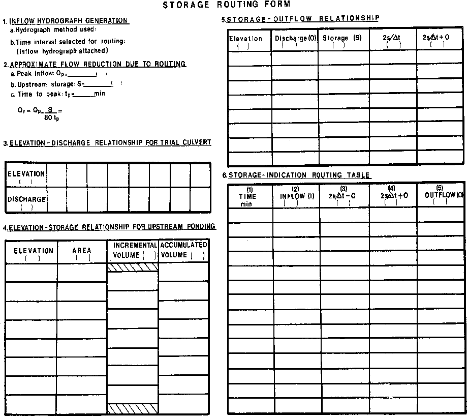
>
> **Figure V-7--Storage Routing Form**

1.  Generate an inflow hydrograph by an appropriate hydrologic procedure. See Chapter II, Section A, and HEC No. 19 (11) or Chapter 6 of HDS No. 2 (77).

2.  Select a time interval for routing (∆t). Remember that linearity over the time interval is assumed. Generally, a routing interval of one-tenth the time-to-peak is adequate.

3.  Determine the elevation-discharge and elevation-storage relationships for the site and outlet device(s) selected.

4.  For convenience in solving the routing equation, tabulate the storage-outflow relationship.

5.  Plot the (2s/∆t + O) versus (O) relationship from step 4.

6.  Using Equation (16):

128

I + I + (∆2s/tO−= )(∆2s/tO+ ) (16)

i jij

perform the routing. A tabular format may prove convenient in performing the storage routing calculations. Such a format is provided on the Storage Routing Form.

The storage-indication routing table is completed in the following manner:

a\. Tabulate the incremental time (col. 1) and inflow (col. 2) values from the inflow hydrograph utilizing the time step (∆t).

b\. Establish the initial row of values in the routing table.

1.  Assume an initial value for outflow (Oi) (col. 5) equal to the inflow (col. 2) to initiate the routing procedure.

2.  From the curve of (2s/∆t + O) plotted against outflow (O), determine the value of (2s/∆t - O)i and place it in col. 4.

3\. Calculate (2s/∆t - O)i as follows:

> ( 2s/tO)(2s/tO)2(O)

∆ −i =∆+i−i (20) Place the result in col. 3. The initial row of values is now complete. c. From Equation (16), determine the value of (2s/∆t - O)j

> ( 2s/tO)j I iI j(2s/tO)i
>
> ∆ +=++∆−

d\. From the curve of (2s/∆t + O) plotted against outflow (O), determine the value of Oj using the value of (2s/∆t - O)j just calculated. Place the result in col. 5.

e\. Calculate the next value of (2s/∆t - O) from Equation (20) and continue the procedure. It may only be necessary to continue routing until the peak outflow and its associated headwater have been obtained.

The following problem contains numeric examples of the operations outlined above. **E. <u>Example Problem</u>**

A primary road is being built which will cross a stream with an upstream drainage area of 101.175 ha (250 acres). Design a culvert which will pass the 25-year flood event without overtopping the road. The low point of the roadway is at 270.358 m (887 ft). The desirable freeboard is 0.3 m (1 ft). The streambed at the inlet is at elevation 267.614 m (878 ft). Maintain at least 1.219 m (4 ft) of cover over the culvert barrel. The natural channel is steep (5 percent slope) and may be approximated as a trapezoidal channel with 1 vertical to 2 horizontal side slopes. The Manning’s n value is estimated to be 0.03. Upstream storage at the design headwater elevation of 269.748 m (885 ft) is 7,400 m3 (6 acre-feet or 261,360 ft3). Use no FALL at the culvert inlet.

129

<u>SI Units Calculations</u>

By calculation, the design headwater depth, HWd, equals 269.748 - 267.614 = 2.134. The outlet invert elevation is:

ELo = ELi - LSo

> = 267.614 - (60.960) (0.05) = 264.566 m
>
> 

**Figure V-8--Inflow Hydrograph, Example Problem**

1.  **Perform Hydrologic Calculations.**

The SCS Tabular Method was used to generate the inflow hydrograph depicted in Figure V-8. The results are shown in tabular form in Table 5. The unrouted peak flow (Qp) is 6.230 m3/s. The time to peak is 75 minutes.

For the routing interval, use tp/10.  
∆t = tp/10 = 75/10 = 7.5 minutes.

2.  **Check Approximate Routing effects.**

The storage behind the highway embankment will reduce the flood peak. Calculate the routed peak flow using the approximate method. (See item 2 on the example Flood Routing Form, Figure V-9). The peak flow of 6.230 is reduced to 4.24 m3/s.

130

**Table 5--Inflow Hydrograph, Example Problem (from SCS Tabular Method) (SI Units)**

<table style="width:100%;">
<colgroup>
<col style="width: 14%" />
<col style="width: 18%" />
<col style="width: 14%" />
<col style="width: 18%" />
<col style="width: 14%" />
<col style="width: 17%" />
</colgroup>
<tbody>
<tr class="odd">
<td colspan="6">Time (minutes) 
Flow (m3/s)</td>
</tr>
<tr class="even">
<td>0</td>
<td>7.5</td>
<td>15</td>
<td>22.5</td>
<td>30</td>
<td>37.5</td>
</tr>
<tr class="odd">
<td>0.255</td>
<td>0.283</td>
<td>0.311</td>
<td>0.368</td>
<td>0.481</td>
<td>0.793</td>
</tr>
<tr class="even">
<td>45</td>
<td>52.5</td>
<td>60</td>
<td>67.5</td>
<td>75</td>
<td>82.5</td>
</tr>
<tr class="odd">
<td>1.133</td>
<td>2.265</td>
<td>3.851</td>
<td>5.380</td>
<td>6.230</td>
<td>6.230</td>
</tr>
<tr class="even">
<td>90</td>
<td>97.5</td>
<td>105</td>
<td>112.5</td>
<td>120</td>
<td>127.5</td>
</tr>
<tr class="odd">
<td>5.692</td>
<td>4.814</td>
<td>3.964</td>
<td>3.398</td>
<td>2.775</td>
<td>2.322</td>
</tr>
<tr class="even">
<td>135</td>
<td>142.5</td>
<td>150</td>
<td>157.5</td>
<td>165</td>
<td>172.5</td>
</tr>
<tr class="odd">
<td>1.982</td>
<td>1.699</td>
<td>1.501</td>
<td>1.331</td>
<td>1.161</td>
<td>1.048</td>
</tr>
</tbody>
</table>

3.  **Select Trial Culvert Size.**

Enter the known information on the Culvert Design Form. For tailwater, use normal depth in the downstream channel, from HDS No. 3. (Refer to Figure V-10, Culvert Design Form for example problem.)

Three 900 mm CMP's are required to convey 6.230 m3/s. Two 1050 mm CMP's will convey the routed peak flow. Two 900 mm CMP's might also work. Try two 900 mm CMP's and increase to the larger barrel size if the routing calculations dictate.

Develop a performance curve for the two 900 mm CMP's (Figure V-11 and Figure V-12) and enter the data on the Flood Routing Form, item 3 (Figure V-9).

4.  **Develop Elevation-Storage Relationship for Upstream Ponding.**

The relief upstream of the culvert location is depicted in Figure V-13. Planimetric determinations taken from the map are used to determine the elevation-storage relationship. Enter the results in item 4 of Figure V-9.

5.  **Calculate the Storage-Outflow Relationship.**

Using the elevation-discharge and elevation-storage relationships developed previously, use Table 5 on Figure V-9 to calculate the storage-outflow relationship. The resultant curve is shown in Figure V-14.

6.  **Perform the Storage Routing Procedure.**

Perform the Figure V-9, perform the storage indication routing as shown. Directional arrows are added in the example to indicate the calculation procedure.

131

<table>
<colgroup>
<col style="width: 23%" />
<col style="width: 4%" />
<col style="width: 4%" />
<col style="width: 2%" />
<col style="width: 1%" />
<col style="width: 4%" />
<col style="width: 4%" />
<col style="width: 2%" />
<col style="width: 1%" />
<col style="width: 4%" />
<col style="width: 4%" />
<col style="width: 3%" />
<col style="width: 1%" />
<col style="width: 2%" />
<col style="width: 4%" />
<col style="width: 3%" />
<col style="width: 0%" />
<col style="width: 4%" />
<col style="width: 4%" />
<col style="width: 1%" />
<col style="width: 3%" />
<col style="width: 14%" />
</colgroup>
<tbody>
<tr class="odd">
<td colspan="4" rowspan="2"><blockquote>

PROJECT- Xeller7/.0, <em>Pwb ler), (51</em> VP i 4 5.)

</blockquote></td>
<td colspan="9" rowspan="2"><blockquote>

STATION. <em>gold</em> /".1 q - Pr,l, <em>/pm/</em>

</blockquote></td>
<td colspan="9"><blockquote>

CULVERT DESIGN FORM

</blockquote></td>
</tr>
<tr class="even">
<td colspan="9" rowspan="2"><blockquote>

DESIGNER/DATE --kin OF "7/.55412

</blockquote></td>
</tr>
<tr class="odd">
<td colspan="4" rowspan="2"><blockquote>

<em>Eh</em> c, vie r- s , )41)5-5-

</blockquote></td>
<td colspan="9" rowspan="2"><blockquote>

SHEET __/____ OF 7.---

</blockquote></td>
</tr>
<tr class="even">
<td colspan="9" rowspan="2"><blockquote>

REVIEWER/DATE Apr 4-' OF <em>‘//4-10#</em>

</blockquote></td>
</tr>
<tr class="odd">
<td colspan="4" rowspan="2"></td>
<td colspan="9" rowspan="2"></td>
</tr>
<tr class="even">
<td colspan="9"></td>
</tr>
<tr class="odd">
<td colspan="4"><blockquote>

<em>HYDROLOGICAL</em> DATA

</blockquote></td>
<td colspan="18" rowspan="2">ROADWAY ELEVATION: ; ...)(1,/ <em>558</em> OM</td>
</tr>
<tr class="even">
<td colspan="4" rowspan="2"><blockquote>

.p1 METHOD. C s <em>Ta by levl</em>

</blockquote></td>
</tr>
<tr class="odd">
<td colspan="18" rowspan="2">EL.: 26,- /5 (ff)</td>
</tr>
<tr class="even">
<td colspan="4" rowspan="3">
,.,

<em>:T;</em> CI DRAINAGE AREA: 11...- 74-.) 0 <em>STREAM</em> SLOPE: <u>5.0 ti</u>

.0 o CHANNEL SHAPE. Are <em>pe3ra Anti</em> PZ <em>1/,12.5</em>
</td>
</tr>
<tr class="odd">
<td colspan="18"></td>
</tr>
<tr class="even">
<td colspan="4" rowspan="2"></td>
<td colspan="12" rowspan="2">EL,/ 26 04/ On) Su <em>Of</em> OS On/m)</td>
<td colspan="2" rowspan="2"></td>
</tr>
<tr class="odd">
<td colspan="4" rowspan="2"><blockquote>

<em>V„, ye</em> 5 0 OTHER. <em>-kr .ta 03</em>

</blockquote></td>
</tr>
<tr class="even">
<td colspan="4" rowspan="2"><blockquote>

EL/: 7694/ OM

</blockquote></td>
<td colspan="12" rowspan="2">
<em>NW</em>

<em>:-. ---- __</em>

<ul>
<li>
1W
</li>
</ul>

J Fall
</td>
<td colspan="2" rowspan="2"></td>
</tr>
<tr class="odd">
<td colspan="4" rowspan="2"><blockquote>

rOUTING:

DESIGNFLOWS?AILWATER

RI DEARS) FLOW (m'/N6 1W Ont

</blockquote></td>
</tr>
<tr class="even">
<td colspan="18" rowspan="2"><blockquote>

S . S.- Fall/L.

</blockquote>

EL, 2,44. 57 (m)
</td>
</tr>
<tr class="odd">
<td colspan="4" rowspan="2"><blockquote>

<em>inwookt-1 IS 5,130 0.,16</em>

</blockquote></td>
</tr>
<tr class="even">
<td colspan="18" rowspan="2"><blockquote>

s= <em><u>Od&gt;5</u></em> (ntim)

L., <u>60,9f</u> (m)

</blockquote></td>
</tr>
<tr class="odd">
<td colspan="4"><blockquote>

<u>Rooted <em>t$</em> 4-, <em>981/ O,</em> Y3</u>

</blockquote></td>
</tr>
<tr class="even">
<td><blockquote>

m a VFRT OFSCRIPTION

</blockquote></td>
<td rowspan="4"><blockquote>

TOTAL FLOW

0 (n'/s)

</blockquote></td>
<td rowspan="4"><blockquote>

FLOW PER BARREL 0/N

</blockquote>

(1)
</td>
<td colspan="15" rowspan="2">HEADWATER CALCULATIONS</td>
<td rowspan="4">
jg

3 e,
</td>
<td colspan="2" rowspan="4">
Fa

YY

8 ? 3
</td>
<td rowspan="4"><blockquote>

COMMENTS

</blockquote></td>
</tr>
<tr class="odd">
<td rowspan="3"><blockquote>

MATERIAL-SHAPE-SIZE-ENTRANCE

</blockquote></td>
</tr>
<tr class="even">
<td colspan="6">INLET CONTROL</td>
<td colspan="9">OUTLET CONTROL</td>
</tr>
<tr class="odd">
<td colspan="2">
I-IVWD

(2)
</td>
<td>Kw</td>
<td>
FALL

(3)
</td>
<td colspan="2">
EL,

(4)
</td>
<td>
1W

(5)
</td>
<td>d.</td>
<td>
-,fria.

2
</td>
<td colspan="2">
h.

(6)
</td>
<td>i..</td>
<td colspan="2">
H

(7)
</td>
<td>
EL.

(8)
</td>
</tr>
<tr class="even">
<td><blockquote>

r„.ry, <em>P _env, - se goor,,,,,551,,,.</em>

</blockquote></td>
<td><blockquote>

<em>6,,.23</em>

</blockquote></td>
<td><em>z,oil</em></td>
<td colspan="2">za</td>
<td><em>1,8,7</em></td>
<td><em>—</em></td>
<td colspan="2">259<em>4</em></td>
<td><em>0.45</em></td>
<td><em>0,F</em></td>
<td><em>0.05</em></td>
<td colspan="2"><em>0,05</em></td>
<td><em>0.5</em></td>
<td colspan="2">3,6</td>
<td></td>
<td><em>Egiozufso</em></td>
<td colspan="2"><em>Li,3</em></td>
<td>Q:,- 6.'30 /1•X</td>
</tr>
<tr class="odd">
<td>, a@ lo5oit, -</td>
<td><blockquote>

14.9:

</blockquote></td>
<td>7,'99</td>
<td colspan="2">/41</td>
<td>1.59</td>
<td>-</td>
<td colspan="2">2643</td>
<td>6,43</td>
<td>5,86</td>
<td>0<em>R9</em></td>
<td colspan="2"><em>0A7</em></td>
<td>0.5</td>
<td colspan="2">a,1</td>
<td><em>26,74470,.</em></td>
<td>3</td>
<td colspan="2">3,9</td>
<td>6) : <em>-9, fF</em> MY,</td>
</tr>
<tr class="even">
<td><blockquote>

/ 0 <em>?0OrIe I'</em>

</blockquote></td>
<td><blockquote>

<em>'08</em>

</blockquote></td>
<td><em>9..49</em></td>
<td colspan="2"><em>2.8</em></td>
<td><em>2.52</em></td>
<td><em>—</em></td>
<td colspan="2"><em>276,13W-13</em></td>
<td></td>
<td><em>0467</em></td>
<td><em>o,83</em></td>
<td colspan="2">o,23</td>
<td>0,5</td>
<td colspan="2">4,0</td>
<td></td>
<td><em>?z,45-490,z6</em></td>
<td colspan="2">3,9</td>
<td>Q --,- .4, 9J9,4/5</td>
</tr>
<tr class="odd">
<td></td>
<td></td>
<td></td>
<td colspan="2"></td>
<td></td>
<td></td>
<td colspan="2"></td>
<td></td>
<td></td>
<td></td>
<td colspan="2"></td>
<td></td>
<td colspan="2"></td>
<td></td>
<td></td>
<td colspan="2"></td>
<td></td>
</tr>
<tr class="even">
<td></td>
<td></td>
<td></td>
<td colspan="2"></td>
<td></td>
<td></td>
<td colspan="2"></td>
<td></td>
<td></td>
<td></td>
<td colspan="2"></td>
<td></td>
<td colspan="2"></td>
<td></td>
<td></td>
<td colspan="2"></td>
<td></td>
</tr>
<tr class="odd">
<td colspan="22">TECHNICAL FOOTNOTES.</td>
</tr>
<tr class="even">
<td colspan="22">
(4) ELM 4 HBA* EL

(1) USE 0/NB FOR BOX CULVERTS INVERT OF INLET CONTROL SECTION (6) S. 11N or (d. 4 <em>0)12</em> (VVHICHEVER IS GREATER)

(2) HVWD = FIWID OR WHO FROM DESIGN CHARTS (5) TW BASED ON DOWN STREAM (7) H = [1+):.+(19.63 n.t..yR , a] V•/2g

CONTROL OR FLOW DEPTH IN

(ZFALLzN ); FALL IS ZERO FOR CULVERTS ON GRADE CHANNEL (8) El.e.= EL.+ H + h. 
<u>"-7L'Il0-14E6L.'</u>
</td>
</tr>
<tr class="odd">
<td rowspan="6">
<u>SSA ale' ,-HIM 
</u>B. Apprcedmate

I. Coined Face

Ed. Design Headwater

hi. Headwater in Inlet Control

ha Headwater in <em>Outlet</em> Control

C Inlet Control section

o. Outlet

W. streamed at culvert <em>Face</em>

tw. Taewater
</td>
<td colspan="15" rowspan="6">
<u>COMMENTS / ram ISSHIN.</u>

1 e <em>9-001'k1 ..</em> YyL 61 LX)6.4 <em>t,</em> Tr/ \‘'..-fs-1,
</td>
<td colspan="6"><blockquote>

CI<em>S</em> XFRT BARRELSELECJED.

</blockquote></td>
</tr>
<tr class="even">
<td colspan="6"><blockquote>

SIZE 2 <em>(</em> goow,i-

</blockquote></td>
</tr>
<tr class="odd">
<td colspan="6"><blockquote>

SHAPE-<em>e,</em> /70,

</blockquote></td>
</tr>
<tr class="even">
<td colspan="6"><blockquote>

MATERIAL. <em>C M P „ o,oze</em>

</blockquote></td>
</tr>
<tr class="odd">
<td colspan="6"><blockquote>

ENTRANCE 5 a '',15,,*

</blockquote></td>
</tr>
<tr class="even">
<td colspan="6"></td>
</tr>
</tbody>
</table>

**Figure V-10—Culvert Design Form for Example Problem**

<table>
<colgroup>
<col style="width: 23%" />
<col style="width: 0%" />
<col style="width: 4%" />
<col style="width: 5%" />
<col style="width: 2%" />
<col style="width: 1%" />
<col style="width: 4%" />
<col style="width: 4%" />
<col style="width: 2%" />
<col style="width: 1%" />
<col style="width: 4%" />
<col style="width: 4%" />
<col style="width: 3%" />
<col style="width: 1%" />
<col style="width: 2%" />
<col style="width: 1%" />
<col style="width: 2%" />
<col style="width: 3%" />
<col style="width: 0%" />
<col style="width: 4%" />
<col style="width: 4%" />
<col style="width: 1%" />
<col style="width: 3%" />
<col style="width: 13%" />
</colgroup>
<tbody>
<tr class="odd">
<td colspan="5" rowspan="2"><blockquote>

PROJECT. Ale‘ X. '414' 7r-' hi°14' 1 Srl <em>OM</em>

</blockquote></td>
<td colspan="9" rowspan="3"><blockquote>

Dihot 'OP ../e-lP - D'/"4 "V

STATION- R4 la f <em>l'O'N</em> c <em>h.y.)</em> •

</blockquote></td>
<td colspan="10"><blockquote>

CULVERT DESIGN FORM

</blockquote></td>
</tr>
<tr class="even">
<td colspan="10" rowspan="3"><blockquote>

DESIGNER/ DATE J Z Pi OF <em>/,106/60</em>

</blockquote></td>
</tr>
<tr class="odd">
<td colspan="5" rowspan="3"><em>e</em> kV ‘if,i .2: , 14-7)5--/V0/ <em>5</em></td>
</tr>
<tr class="even">
<td colspan="9" rowspan="3"><blockquote>

SHEET .7".. OF 2"

</blockquote></td>
</tr>
<tr class="odd">
<td colspan="10" rowspan="3"><blockquote>

REVIEWER / DATE .&amp;i.:!..-‘i OF AV_ <em>4'./</em>

</blockquote></td>
</tr>
<tr class="even">
<td colspan="5" rowspan="2"></td>
</tr>
<tr class="odd">
<td colspan="9"></td>
</tr>
<tr class="even">
<td colspan="5"><blockquote>

HYDRO) MCA. DATA

</blockquote></td>
<td colspan="19" rowspan="2"><blockquote>

ROADWAY ELEVATION: <em>9</em> 90,56F (m)

</blockquote></td>
</tr>
<tr class="odd">
<td colspan="5" rowspan="2"><blockquote>

0 METHOD. 9<em>'0•'' ref</em> ',JO, th'i AO r Ppll

</blockquote></td>
</tr>
<tr class="even">
<td colspan="19" rowspan="2"><blockquote>

Euc <em>a'69.'95 (n)</em>

</blockquote></td>
</tr>
<tr class="odd">
<td colspan="5" rowspan="2"><blockquote>

<em>g</em> 0 DRAINAGE AREA 1 O I <em>rt</em> ha CI STREAM SLOPE- <em>6,0%</em>

</blockquote></td>
</tr>
<tr class="even">
<td colspan="19" rowspan="2"></td>
</tr>
<tr class="odd">
<td colspan="5" rowspan="2"><blockquote>

°CHANNEL SHAPE TI" <em>E</em> pG C:) i a a. I ) , 2 SIOI'''`,

</blockquote></td>
</tr>
<tr class="even">
<td colspan="4" rowspan="2"></td>
<td colspan="13" rowspan="2">EL/ <em>Z6'7,6,I</em> (n) So: 0 <em>05</em> (Mm)</td>
<td colspan="2" rowspan="2">H</td>
</tr>
<tr class="odd">
<td colspan="5" rowspan="2"><blockquote>

V, 0 ROUTING: 0 OTHER:

</blockquote></td>
</tr>
<tr class="even">
<td colspan="4" rowspan="2"></td>
<td colspan="13" rowspan="2">HVA</td>
<td colspan="2" rowspan="2">1W</td>
</tr>
<tr class="odd">
<td colspan="5" rowspan="2"><blockquote>

DESIGN FLOWS/TAILWATER

</blockquote></td>
</tr>
<tr class="even">
<td colspan="17" rowspan="2"><blockquote>

—

EL: <em>06'7,4,1"</em> (rn Fall

</blockquote></td>
<td colspan="2" rowspan="2"></td>
</tr>
<tr class="odd">
<td colspan="5" rowspan="2">NJ (YEARS) FLOW 1,11./9) TW (ml</td>
</tr>
<tr class="even">
<td colspan="19" rowspan="2"><blockquote>

S 5 S.- FallIL. EL 2 <em>C.,:f :57 0.0</em>

</blockquote></td>
</tr>
<tr class="odd">
<td colspan="5" rowspan="2"><blockquote>

<em>Un</em> roui4 <em>Z5 /7,530e),</em>

</blockquote></td>
</tr>
<tr class="even">
<td colspan="19" rowspan="2"><blockquote>

S. <em>0,05</em> (rnim)

</blockquote></td>
</tr>
<tr class="odd">
<td colspan="5" rowspan="3"><blockquote>

<u>'--ZNAL.d <em>4.2'10 o 4') </em></u>

</blockquote></td>
</tr>
<tr class="even">
<td colspan="19"><blockquote>

L.= <em>6-0,.5,</em> (nt)

</blockquote></td>
</tr>
<tr class="odd">
<td colspan="19"></td>
</tr>
<tr class="even">
<td colspan="2"><blockquote>

rill VERT DESCRIPTION:

</blockquote></td>
<td rowspan="4">
TOTAL FLOW

Q

(Ws)
</td>
<td rowspan="3"><blockquote>

FLOW BARREL

</blockquote></td>
<td colspan="16" rowspan="2">PER6 HEADWATER CALCULATIONS</td>
<td rowspan="4">
T5

r3..z _9

51 tu
</td>
<td colspan="2" rowspan="4">
8

5
</td>
<td rowspan="4">COMMENTS</td>
</tr>
<tr class="odd">
<td colspan="2" rowspan="3"><blockquote>

MATERIAL-SHAPE-SIZE-ENTRANCE

</blockquote></td>
</tr>
<tr class="even">
<td colspan="6">INLET CONTROL</td>
<td colspan="10">OUTLET CONTROL</td>
</tr>
<tr class="odd">
<td>
CVN

(1)
</td>
<td colspan="2">
LAM/D

(2)
</td>
<td><em>HmA</em></td>
<td>
FALL

(3)
</td>
<td colspan="2">
EL o

(4)
</td>
<td>
1W

<ol start="5" type="1">
<li></li>
</ol></td>
<td>d,</td>
<td>
sktg

2
</td>
<td colspan="2"><blockquote>

ho OS

</blockquote></td>
<td colspan="2">W</td>
<td colspan="2">
H

(7)
</td>
<td>
El-...

(B)
</td>
</tr>
<tr class="even">
<td colspan="2"><blockquote>

1.102e, LLud ...ie eAxti /c. cp. itt e.2

</blockquote></td>
<td>S a5</td>
<td>-r-/,)v</td>
<td colspan="2">CW7</td>
<td>V.A.t</td>
<td></td>
<td colspan="2"></td>
<td></td>
<td></td>
<td></td>
<td colspan="2"></td>
<td colspan="2"></td>
<td colspan="2"></td>
<td></td>
<td></td>
<td colspan="2"></td>
<td></td>
</tr>
<tr class="odd">
<td colspan="2"><blockquote>

<em>C</em> ,n4i R. <em>-ciAe-2@qoa.4,</em> 4

</blockquote></td>
<td><em>1.08</em></td>
<td><em>0.54</em></td>
<td colspan="2"><em>0•69</em></td>
<td><em>0,60</em></td>
<td><em>-</em></td>
<td colspan="2"><em>25E,21</em></td>
<td><em>0,15</em></td>
<td><em>0/43</em></td>
<td><em>0,62</em></td>
<td colspan="2"><em>0,67</em></td>
<td colspan="2"><em>5,4"</em></td>
<td colspan="2"><em>0,za</em></td>
<td><em>24,544</em></td>
<td><em>248,9)</em></td>
<td colspan="2"><em>2,9</em></td>
<td></td>
</tr>
<tr class="even">
<td colspan="2"></td>
<td>3,99</td>
<td>1,45</td>
<td colspan="2">133</td>
<td>120</td>
<td>-</td>
<td colspan="2"><em>u8,8O29</em></td>
<td></td>
<td><em>0,70</em></td>
<td><em>036</em></td>
<td colspan="2"><em>0,30</em></td>
<td colspan="2"></td>
<td colspan="2"><em>1,65</em></td>
<td><em>zooz</em></td>
<td><em>7,(,,e,ei</em></td>
<td colspan="2">3,7</td>
<td></td>
</tr>
<tr class="odd">
<td colspan="2"></td>
<td><em>4.68</em></td>
<td>2414</td>
<td colspan="2">5,0</td>
<td><em>t,go</em></td>
<td>-</td>
<td colspan="2">zom</td>
<td>0,17</td>
<td>OM.</td>
<td>OA</td>
<td colspan="3"><em>o36</em></td>
<td colspan="3"><em>3,,L</em></td>
<td colspan="2"><em>z6.94326qk</em></td>
<td colspan="2"><em>4,)</em></td>
<td></td>
</tr>
<tr class="even">
<td colspan="2"></td>
<td>4.93</td>
<td colspan="3">2475,77</td>
<td>5,49</td>
<td colspan="4">- „170.10/43</td>
<td><em>)70/,</em></td>
<td><em>0,,</em></td>
<td colspan="3">0.9</td>
<td colspan="3"><em>4,57</em></td>
<td colspan="2">no/A.290,i</td>
<td colspan="2">4,3</td>
<td></td>
</tr>
<tr class="odd">
<td colspan="24">TECHNICAL FOOTNOTFR = HIM 4 EL</td>
</tr>
<tr class="even">
<td colspan="24"><ol start="4" type="1">
<li>
ELN
</li>
</ol>
<ol type="1">
<li>
USE OMR FOR BOX CULVERTS (INVERT OF INLET CONTROL SECTION (6) B.4 TW or (d. 4 Dy2 (WHICHEVER IS GREATER)
</li>
</ol>
<ol start="0" type="1">
<li><blockquote>

HIAVD = FWD OR HVWD FROM DESIGN CHARTS (5) TW BASED ON DOWN STREAM (7) H = [106.0(19.53 rtrl)/Rrtt] 5525 
CONTROL OR FLOW DEPTH IN

</blockquote></li>
</ol>
<ol start="2" type="1">
<li>
FALL = HIM- (ELa - EU): FALL IS ZERO FOR CULVERTS ON GRADE CHANNEL (8) EL.= ELF H. h.
</li>
</ol></td>
</tr>
<tr class="odd">
<td rowspan="7">
<u>SLISCRIFT DFFINI HON%</u>

B. Approximate

I. Culvert Face

hd. Design Ho6dWeter

ht. Headwater in Inlet Control

ho. Floodwater in Outlet Control

i. Inlet Control Section

o Outlet

N. streamed at culvert Fa.

N/. Tail filar
</td>
<td colspan="17"><em>vaunt:its/ cnscussiont;</em></td>
<td colspan="6" rowspan="2"><blockquote>

<em>rill</em> VERY BARRE) SELECTED

</blockquote></td>
</tr>
<tr class="even">
<td colspan="17" rowspan="6">
6 ti / /... / (i.10 <em>0 141 / 4 A I45. ji</em> 4,,,, zi

<em>/ ro 5 Irv) -F)(04-0c1/77•14</em> 'ST ., Li 19,2 r. U/10-4 .

o6, YfGe'LL'
</td>
</tr>
<tr class="odd">
<td colspan="6"><blockquote>

SIZE @ 90° MA'''.

</blockquote></td>
</tr>
<tr class="even">
<td colspan="6"><blockquote>

SHAPE- <em>,</em> r e v ta--"

</blockquote></td>
</tr>
<tr class="odd">
<td colspan="6"><blockquote>

MATERIAL: C YrI P n <em>0424</em>

</blockquote></td>
</tr>
<tr class="even">
<td colspan="6"><blockquote>

ENTRANCE ` <em>i</em> , <em>t cly</em>

</blockquote></td>
</tr>
<tr class="odd">
<td colspan="6"></td>
</tr>
</tbody>
</table>

**Figure V-11--Performance Curve Calculations, 2-900 mm CMP Barrels**

133

> 

**Figure V-12--Performance Curves, Example Problem, 2-36 in CMP Barrels**

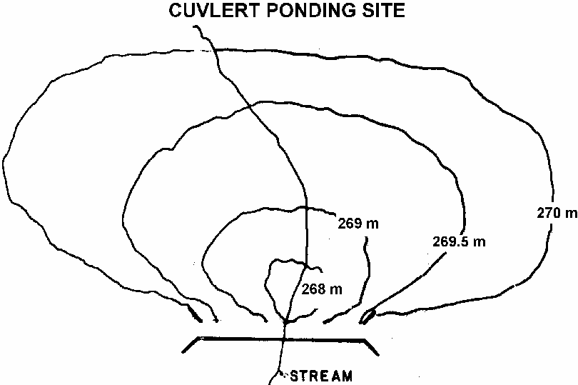

**Figure V-13 - - Topographic map of site.**

134

> 

**Figure V-14--Storage vs. Outflow Relationship**

**7. Conclusions**. Two 900 mm corrugated metal pipes with square edges in a headwall are adequate to satisfy the design conditions. One 900 mm CMP was eliminated due to the routing procedure. The maximum outflow during the design flood is 4.24 m3/s. This creates a headwater elevation of 269.52 m according to the stage versus discharge data. Figure V-15 is a line drawing of the final culvert design.

**Figure V-15--Selected Culvert Design**

135

<u>English Units Calculations</u>

By calculation, the design headwater depth, HWd, equals 885 - 878 = 7 ft. The outlet invert elevation is:

ELo = ELi - LSo

> = 878 - (200)(.05) = 868 ft
>
> 

**Figure V-16--Inflow Hydrograph, Example Problem (English)**

1.  **Perform Hydrologic Calculations.**

The SCS Tabular Method was used to generate the inflow hydrograph depicted in Figure V-16. The results are shown in tabular form in Table 5 (English). The unrouted peak flow (Qp) is 220 ft3/s. The time to peak is 75 minutes.

For the routing interval, use tp/10.  
∆t = tp/10 = 75/10 = 7.5 minutes.

2.  **Check Approximate Routing effects.**

The storage behind the highway embankment will reduce the flood peak. Calculate the routed peak flow using the approximate method. (See item 2 on the example Flood Routing Form, Figure V-17). The peak flow of 220 ft3/s is reduced to 176 ft3/s.

136

**Table 5 --Inflow Hydrograph, Example Problem (from SCS Tabular Method) (English)**

<table>
<colgroup>
<col style="width: 14%" />
<col style="width: 18%" />
<col style="width: 14%" />
<col style="width: 18%" />
<col style="width: 14%" />
<col style="width: 17%" />
</colgroup>
<tbody>
<tr class="odd">
<td colspan="6">Time (hours) 
Flow (ft3/s)</td>
</tr>
<tr class="even">
<td>0</td>
<td>0.125</td>
<td>0.25</td>
<td>0.375</td>
<td>0.5</td>
<td>0.625</td>
</tr>
<tr class="odd">
<td>9</td>
<td>10</td>
<td>11</td>
<td>13</td>
<td>17</td>
<td>28</td>
</tr>
<tr class="even">
<td>0.75</td>
<td>0.875</td>
<td>1.0</td>
<td>1.125</td>
<td>1.25</td>
<td>1.375</td>
</tr>
<tr class="odd">
<td>40</td>
<td>80</td>
<td>136</td>
<td>190</td>
<td>220</td>
<td>220</td>
</tr>
<tr class="even">
<td>1.5</td>
<td>1.625</td>
<td>1.75</td>
<td>1.875</td>
<td>2.0</td>
<td>2.125</td>
</tr>
<tr class="odd">
<td>201</td>
<td>170</td>
<td>140</td>
<td>120</td>
<td>98</td>
<td>82</td>
</tr>
<tr class="even">
<td>2.25</td>
<td>2.375</td>
<td>2.5</td>
<td>2.625</td>
<td>2.75</td>
<td>2.875</td>
</tr>
<tr class="odd">
<td>70</td>
<td>60</td>
<td>53</td>
<td>47</td>
<td>41</td>
<td>37</td>
</tr>
</tbody>
</table>

3.  **Select Trial Culvert Size.**

Enter the known information on the Culvert Design Form. For tailwater, use normal depth in the downstream channel, from HDS No. 3. (Refer to Figure V-18, Culvert Design Form for example problem.)

Three 36-inch CMP's are required to convey 220 ft3/s. Two 42-inch CMP's will convey the routed peak flow. Two 36-inch CMP's might also work. Try two 36-inch CMP's and increase to the larger barrel size if the routing calculations dictate.

Develop a performance curve for the two 36-inch CMP's (Figure V-19 and Figure V-20) and enter the data on the Flood Routing Form, item 3 (Figure V-17).

4.  **Develop Elevation-Storage Relationship for Upstream Ponding.**

The relief upstream of the culvert location is depicted in Figure V-21. Planimetric determinations taken from the map are used to determine the elevation-storage relationship. Enter the results in item 4 of Figure V-17.

5.  **Calculate the Storage-Outflow Relationship.**

Using the elevation-discharge and elevation-storage relationships developed previously, use Table 5 on Figure V-17 to calculate the storage-outflow relationship. The resultant curve is shown in Figure V-22.

6.  **Perform the Storage Routing Procedure.**

Perform the Figure V-17, perform the storage indication routing as shown. Directional arrows are added in the example to indicate the calculation procedure.

137

<table>
<colgroup>
<col style="width: 26%" />
<col style="width: 0%" />
<col style="width: 4%" />
<col style="width: 3%" />
<col style="width: 4%" />
<col style="width: 0%" />
<col style="width: 2%" />
<col style="width: 1%" />
<col style="width: 4%" />
<col style="width: 4%" />
<col style="width: 2%" />
<col style="width: 1%" />
<col style="width: 3%" />
<col style="width: 3%" />
<col style="width: 3%" />
<col style="width: 3%" />
<col style="width: 0%" />
<col style="width: 2%" />
<col style="width: 1%" />
<col style="width: 4%" />
<col style="width: 4%" />
<col style="width: 4%" />
<col style="width: 1%" />
<col style="width: 10%" />
</colgroup>
<tbody>
<tr class="odd">
<td colspan="7"><blockquote>

<strong>PROLE el*: EXAMPLE PROBLEM</strong>

</blockquote></td>
<td colspan="9" rowspan="2"><blockquote>

<strong>STATION :</strong>

</blockquote></td>
<td colspan="8" rowspan="3"><blockquote>

<strong>CULVERT DESIGN FORM</strong>

</blockquote></td>
</tr>
<tr class="even">
<td colspan="7" rowspan="4">
<strong>CHAPTER X <em>4.o.S. is lo. 5</em></strong>

<strong>,</strong>
</td>
</tr>
<tr class="odd">
<td colspan="9" rowspan="4"><blockquote>

<strong>SHEET OF</strong>

</blockquote></td>
</tr>
<tr class="even">
<td colspan="8"></td>
</tr>
<tr class="odd">
<td colspan="8" rowspan="3"><blockquote>

<strong>DESIGNER /DATE WL/LI / TP,</strong>

<strong>REVIEWER / °AYE ' <em>Lima <u>1 1</u> , <u>9</u> </em></strong>

</blockquote></td>
</tr>
<tr class="even">
<td colspan="7" rowspan="2"></td>
</tr>
<tr class="odd">
<td colspan="9"></td>
</tr>
<tr class="even">
<td colspan="6"><strong>HYDROLOGICAL DATA</strong></td>
<td colspan="18" rowspan="2"><strong>- <em>865.04M</em> ROAD WAY ELEVATION 687.0 „„</strong></td>
</tr>
<tr class="odd">
<td colspan="6" rowspan="2"><blockquote>

<em>e fa METHOD' <strong>SCS </strong></em><strong>TASULAIZ</strong>

</blockquote></td>
</tr>
<tr class="even">
<td colspan="18" rowspan="2"><blockquote>

<strong>Et,</strong>

</blockquote></td>
</tr>
<tr class="odd">
<td colspan="6" rowspan="2"><blockquote>

<strong>- 0 DRAINAGE •REA:licAso STREAM SLOPE</strong> 70_

</blockquote>

<em><strong>.5.o</strong></em>
</td>
</tr>
<tr class="even">
<td colspan="5" rowspan="2"></td>
<td colspan="13" rowspan="2"><blockquote>

—

<em><strong>„..—Wilra ,„, 40 os .</strong></em>

</blockquote></td>
</tr>
<tr class="odd">
<td colspan="6" rowspan="2"><blockquote>

F. <strong>0 CHANNEL IMAM: rtAPEZOIVILL, 2=1 <em>6L0PES</em></strong>

</blockquote></td>
</tr>
<tr class="even">
<td colspan="5" rowspan="2"></td>
<td colspan="13" rowspan="2"><blockquote>

<em><strong>..,</strong></em>

</blockquote></td>
</tr>
<tr class="odd">
<td colspan="6" rowspan="2"><blockquote>

<strong>ii <em>I:§</em> WWI IN 0, • trg5a4F0A1 0 OTHER <em>YI g 0.</em>01</strong>

</blockquote></td>
</tr>
<tr class="even">
<td colspan="5" rowspan="2">
<strong>—</strong>

<blockquote>

<strong>EL, 379.0</strong>

</blockquote></td>
<td colspan="12" rowspan="2">
<strong>_ -- ---ceell"--_—__Nv_82......___"</strong>

<strong>f-,3 TALL</strong>
</td>
<td rowspan="2"><strong>TV</strong></td>
</tr>
<tr class="odd">
<td colspan="6" rowspan="2"><strong>DESIGN FLOWS/TAILS/ATER</strong></td>
</tr>
<tr class="even">
<td colspan="18" rowspan="3">
<strong>.--'"n.</strong>

<blockquote>

<strong><em>DOWNSTREAM CHANNEL</em> S•• S.- FALL / I. ,.</strong> <em>Eds.</em>

</blockquote></td>
</tr>
<tr class="odd">
<td colspan="6"><strong>R.I. t I FLORIAN) TN NI)</strong></td>
</tr>
<tr class="even">
<td colspan="6" rowspan="2"><blockquote>

<em>wiRourit,</em> 25 220 1.f

</blockquote></td>
</tr>
<tr class="odd">
<td colspan="18" rowspan="2">
n,0.03 H. <em>--g</em><em>tag—Vt)</em> •

<blockquote>

it,,,, 10, <strong>L..</strong>

</blockquote></td>
</tr>
<tr class="even">
<td colspan="6" rowspan="2"><blockquote>

<u><em><strong>Rovreo</strong></em> 24 <em>liG</em> <strong>1.4 </strong></u>

</blockquote></td>
</tr>
<tr class="odd">
<td colspan="18"></td>
</tr>
<tr class="even">
<td colspan="2"><blockquote>

<strong>CULVERT NERCRIPTION:</strong>

</blockquote></td>
<td rowspan="4"><blockquote>

<strong><em>Me.</em> PLOW</strong>

</blockquote>

<strong>.11.,</strong>
</td>
<td rowspan="3"><strong>FLOW 
PER 
WARR</strong></td>
<td colspan="16" rowspan="2"><strong>HEADWATER CALCULATIONS</strong></td>
<td rowspan="4">
<strong>;</strong>

<strong>§;11</strong>
</td>
<td rowspan="4">
<em><strong>.::,,,</strong></em>

<strong>Iii</strong>
</td>
<td colspan="2" rowspan="4"><strong>COMMENTS</strong></td>
</tr>
<tr class="odd">
<td colspan="2" rowspan="3"><blockquote>

I<strong>AL- 'KWIC - SIZE - E mmmmm cc</strong>

</blockquote></td>
</tr>
<tr class="even">
<td colspan="6"><strong>INLET CONTROL</strong></td>
<td colspan="10"><strong>WIT L ET CONTROL</strong></td>
</tr>
<tr class="odd">
<td><strong>Oiln.</strong></td>
<td><strong>Orr</strong></td>
<td colspan="3"><strong>Nwi</strong></td>
<td><strong>PALL</strong></td>
<td><strong>EiL.:,I</strong></td>
<td colspan="2"><strong>L.;</strong></td>
<td><strong>.,</strong></td>
<td><strong>lii!</strong></td>
<td><strong>:11.,</strong></td>
<td colspan="2"><strong>4.</strong></td>
<td colspan="2"><strong>:.,.,,</strong></td>
<td><strong>EL.:.</strong></td>
</tr>
<tr class="even">
<td colspan="2"><blockquote>

<em><strong>C.M.P. - CiRC.-</strong></em> 3.367"- ALE

</blockquote></td>
<td><em><strong>22o</strong></em></td>
<td><strong>73</strong></td>
<td>2.2</td>
<td colspan="3"><em><strong>6.6</strong></em></td>
<td><em><strong>—</strong></em></td>
<td><em><strong>664.6</strong></em></td>
<td colspan="2"><strong>1.5</strong></td>
<td><strong>21</strong></td>
<td><em><strong>2.65</strong></em></td>
<td><em><strong>2.55</strong></em></td>
<td colspan="2"><em><strong>0.5</strong></em></td>
<td colspan="2"><em><strong>11.7</strong></em></td>
<td></td>
<td><em><strong>662.08844</strong></em></td>
<td><em><strong>14</strong></em></td>
<td colspan="2"><em><strong>Op xIto ff.%</strong></em></td>
</tr>
<tr class="odd">
<td colspan="2"><em><strong>i, - il -</strong></em> 2-4267- u</td>
<td>ric.</td>
<td>88</td>
<td><em><strong>14</strong></em></td>
<td colspan="3"><em><strong>5.G</strong></em></td>
<td><strong>-</strong></td>
<td><em><strong>6634\</strong></em></td>
<td colspan="2"><em><strong>1.3</strong></em></td>
<td><em><strong>2.4</strong></em></td>
<td><em><strong>2,45</strong></em></td>
<td><em><strong>2.45</strong></em></td>
<td colspan="2"></td>
<td colspan="2"><em><strong>1'7</strong></em></td>
<td><em><strong>1678.7883.E</strong></em></td>
<td></td>
<td><strong>12</strong></td>
<td colspan="2"><em><strong>Qr,17C•Ft.Vi</strong></em></td>
</tr>
<tr class="even">
<td colspan="2"><blockquote>

<strong>13 - ' -</strong> 2- 3ad - "

</blockquote></td>
<td><em>17G</em></td>
<td><em><strong>SO</strong></em></td>
<td><em><strong>'LS</strong></em></td>
<td colspan="3"><em><strong>8.4</strong></em></td>
<td><em><strong>-</strong></em></td>
<td>850.4</td>
<td colspan="2">1.3</td>
<td>2.4</td>
<td>245</td>
<td>2,45,</td>
<td colspan="2">;</td>
<td colspan="2">15.0</td>
<td></td>
<td>604.0086,4</td>
<td><em><strong>lit</strong></em></td>
<td colspan="2"><em><strong>argiuct.94</strong></em></td>
</tr>
<tr class="odd">
<td colspan="2"></td>
<td></td>
<td></td>
<td></td>
<td colspan="3"></td>
<td></td>
<td></td>
<td colspan="2"></td>
<td></td>
<td></td>
<td></td>
<td colspan="2"></td>
<td colspan="2"></td>
<td></td>
<td></td>
<td></td>
<td colspan="2"></td>
</tr>
<tr class="even">
<td colspan="2"></td>
<td></td>
<td></td>
<td></td>
<td colspan="3"></td>
<td></td>
<td></td>
<td colspan="2"></td>
<td></td>
<td></td>
<td></td>
<td colspan="2"></td>
<td colspan="2"></td>
<td></td>
<td></td>
<td></td>
<td colspan="2"></td>
</tr>
<tr class="odd">
<td colspan="24"><blockquote>

<strong>TECHNICAL FOOTNOTES: ,./ EL.; N.J. (WINTERY OF NI A4 TIN <em>4.</em> Id, •EI/EN WINCHEVER IS WATER)</strong>

</blockquote></td>
</tr>
<tr class="even">
<td colspan="24"><blockquote>

<strong>Ill USE GINO FOE EON CULVERTS INLET CONTROL SECTOWIN W E• lie I nHE Li <em>I Ras]</em> W./t.</strong>

</blockquote>
<ol start="2" type="1">
<li><blockquote>

<strong>NW, /0* NWRI OR NI ,/S POOH RESINS CHARTS IS) TV/ WNW ON DOWN STREAM IS) IL,. EL.. H • 1,4 
CONTROL OR FLOW DEPTH IN</strong>

</blockquote></li>
<li><blockquote>

<strong>FALL • NW -..t EL.,- 440 , FALL II ZENO . 
HIZESIANEWOLEKERIDE</strong>

</blockquote></li>
</ol></td>
</tr>
<tr class="odd">
<td rowspan="2"><blockquote>

<strong>SUBSCRIPT DEFINITIONS :</strong>

</blockquote></td>
<td colspan="17"><blockquote>

<strong>CONNENTS / DISCUSSION :</strong>

</blockquote></td>
<td colspan="6" rowspan="3"><blockquote>

<strong><u>CULVERT IIARREI. 'ELECTED :</u></strong>

<strong>st21- 2- ,cdr <em>IN.</em></strong>

</blockquote></td>
</tr>
<tr class="even">
<td colspan="17" rowspan="5"><blockquote>

<em><strong>OBTAIN 7W</strong> FROM <strong>N.D.5. 4 6 3</strong></em>

<strong>2 - 3Gg MAY</strong> <em>WORK <strong>win' Qr TRY FIRST</strong></em>

</blockquote>

<em><strong>,</strong></em>
</td>
</tr>
<tr class="odd">
<td rowspan="4"><blockquote>

<strong>..A/PROWNHIC</strong>

S <strong>RAGE</strong>

<strong>..... 14•0WHIM•AltillwIAyweiwi IN <em>11/0.0</em> COMM. 
NEANNIWA N WHAT INLET CCWWL. OSCARCOIRRIOL</strong>

<strong>N. SWIWNIIIN ,f OWE*? PHOE 
<em>n_LILARAITZ1</em></strong>

</blockquote></td>
</tr>
<tr class="even">
<td colspan="6"><blockquote>

<strong>SHAPE. C/RC.</strong>

</blockquote></td>
</tr>
<tr class="odd">
<td colspan="6"><blockquote>

<strong>MATERIAL' <em>C,M, P —.0.24</em></strong>

</blockquote></td>
</tr>
<tr class="even">
<td colspan="6"><blockquote>

<strong><em>E ..... C E. </em> <u>50, <em>Et:26E </em></u></strong>

</blockquote></td>
</tr>
</tbody>
</table>

**<u>Figure V-18--Culvert Design Form for Example Problem (English)</u>**

<table>
<colgroup>
<col style="width: 27%" />
<col style="width: 4%" />
<col style="width: 3%" />
<col style="width: 4%" />
<col style="width: 0%" />
<col style="width: 2%" />
<col style="width: 1%" />
<col style="width: 4%" />
<col style="width: 4%" />
<col style="width: 2%" />
<col style="width: 1%" />
<col style="width: 3%" />
<col style="width: 3%" />
<col style="width: 3%" />
<col style="width: 3%" />
<col style="width: 0%" />
<col style="width: 2%" />
<col style="width: 1%" />
<col style="width: 4%" />
<col style="width: 4%" />
<col style="width: 4%" />
<col style="width: 1%" />
<col style="width: 10%" />
</colgroup>
<tbody>
<tr class="odd">
<td colspan="6"><blockquote>

<strong>CY. <em>EXAMPLE PROBLEM</em></strong>

</blockquote></td>
<td colspan="9" rowspan="2"><strong>STATION :</strong></td>
<td colspan="8" rowspan="3"><blockquote>

<strong>CULVERT DESIGN FORM</strong>

</blockquote></td>
</tr>
<tr class="even">
<td colspan="6" rowspan="5">Ci/APTiR Iri N.O.S. /4.5</td>
</tr>
<tr class="odd">
<td colspan="9" rowspan="3"><strong>OF</strong></td>
</tr>
<tr class="even">
<td colspan="8"></td>
</tr>
<tr class="odd">
<td colspan="8" rowspan="3"><blockquote>

<strong>DESIGNER/DATE WIJI) / lit</strong>

<strong>REVIEwER / °ATE <u>LiMAI</u> / <em><u>7 fr", </u></em></strong>

</blockquote></td>
</tr>
<tr class="even">
<td colspan="9" rowspan="2"><em><strong>_</strong></em></td>
</tr>
<tr class="odd">
<td colspan="6"></td>
</tr>
<tr class="even">
<td colspan="5" rowspan="2"><blockquote>

<strong>HYDROLOGICAL DATA</strong>

</blockquote></td>
<td colspan="18"><blockquote>

<strong>ROAD WAY ION <em>887.0</em> ilol</strong>

<strong>Nig.</strong>

</blockquote></td>
</tr>
<tr class="odd">
<td colspan="18" rowspan="3"><blockquote>

<strong>Et, - NO</strong>-7

</blockquote></td>
</tr>
<tr class="even">
<td colspan="5"><blockquote>

<strong>m IN NIETNCID' <em>S.C•5</em> •</strong>

</blockquote></td>
</tr>
<tr class="odd">
<td colspan="5" rowspan="3"><blockquote>

<strong>,...,</strong>

<strong>7, L-1 DRAINAGE AREA: 250 Ac.0 . MAW</strong> <em>5.0%</em>

</blockquote></td>
</tr>
<tr class="even">
<td colspan="18"></td>
</tr>
<tr class="odd">
<td colspan="5" rowspan="2"></td>
<td colspan="13" rowspan="2"><strong>T .... <em>879.0</em> ma 4. <em>0.06—</em></strong> T.</td>
</tr>
<tr class="even">
<td colspan="5" rowspan="2"><blockquote>

<em>; 0 ......,,,,,.."- <strong>17ZA PEZ O IVAL</strong></em>

</blockquote></td>
</tr>
<tr class="odd">
<td colspan="5" rowspan="3"><blockquote>

<strong>EL, <em>878.0</em></strong>

</blockquote></td>
<td colspan="12" rowspan="3">
<strong>lloti</strong>

I '

<strong>— ---412Sn-- --N-$1.</strong>

<em><strong>nil "" — --------p I</strong></em>
</td>
<td rowspan="3">i<em><strong>"</strong></em></td>
</tr>
<tr class="even">
<td colspan="5"><blockquote>

a <strong>Oa ROUTING- 0</strong> OTHER.

</blockquote></td>
</tr>
<tr class="odd">
<td colspan="5" rowspan="2"><blockquote>

<strong>DESIGN FLOWS/TAILWATER</strong>

</blockquote></td>
</tr>
<tr class="even">
<td colspan="18" rowspan="2"><blockquote>

<strong>SAS.- TALL <em>I</em> L L.r.L <em>ig_L__QI.i.i</em></strong>

</blockquote></td>
</tr>
<tr class="odd">
<td colspan="5"><blockquote>

(ri. i <strong>I ..... I HLOWlef•I Tw MI</strong>

</blockquote></td>
</tr>
<tr class="even">
<td colspan="5"></td>
<td colspan="18" rowspan="2">
<strong><em>tf</em> .<em>:'</em></strong>

<blockquote>

<strong>L.. <em>200 </em></strong><em>qt.)</em>

</blockquote></td>
</tr>
<tr class="odd">
<td colspan="5" rowspan="2"><blockquote>

<strong><em>ROUTED</em> 150 IA</strong>

</blockquote></td>
</tr>
<tr class="even">
<td colspan="18"></td>
</tr>
<tr class="odd">
<td rowspan="2"><blockquote>

CULVERT <strong>oescummaii:</strong>

</blockquote></td>
<td rowspan="4"><blockquote>

<strong>TOTAL n.A.</strong>

</blockquote>

<strong>c. ?. 1</strong>
</td>
<td rowspan="3"><strong><em>RCM 
</em>PER 
woe</strong></td>
<td colspan="16"><strong>HEADWATER <em>CALCULATIONS</em></strong></td>
<td rowspan="4">
<strong>;A</strong>

AIL

<strong>§ ; e.</strong>
</td>
<td rowspan="4">
<strong>...—r...</strong>

<blockquote>

<strong>3: It i',</strong>

</blockquote></td>
<td colspan="2" rowspan="4"><strong>COMMENTS</strong></td>
</tr>
<tr class="even">
<td rowspan="2"></td>
<td colspan="5" rowspan="2"><strong>MIT CONTROL</strong></td>
<td colspan="10" rowspan="2"><strong>OUTLET CONIREL</strong></td>
</tr>
<tr class="odd">
<td rowspan="2"><blockquote>

MATERIAL- <strong>.</strong>SIZE -ENTRANCE

</blockquote></td>
</tr>
<tr class="even">
<td><strong>Cr</strong></td>
<td><strong>IIIIIA/0</strong></td>
<td colspan="3"><strong>NW ,</strong></td>
<td><strong>FALL</strong></td>
<td><strong>Et1-4, i</strong></td>
<td colspan="2"><strong>VII.</strong></td>
<td><strong>4.</strong></td>
<td><strong>L</strong></td>
<td><strong>1.:,,</strong></td>
<td colspan="2"><strong>b.</strong></td>
<td colspan="2"><strong>H.</strong></td>
<td><strong>ELM".,</strong></td>
</tr>
<tr class="odd">
<td><blockquote>

<strong><em>C.M,P. - CIRC.-</em> 2- 36"- 54. <em>EDGE</em></strong>

</blockquote></td>
<td>30</td>
<td><em><strong>19</strong></em></td>
<td><em><strong>047</strong></em></td>
<td colspan="3"><em><strong>2.0</strong></em></td>
<td><em><strong>-</strong></em></td>
<td><em><strong>880.0</strong></em></td>
<td colspan="2"><em><strong>05"</strong></em></td>
<td><em><strong>1.6</strong></em></td>
<td><strong>2.2</strong></td>
<td><strong>2.2</strong></td>
<td colspan="2"><em><strong>0.5</strong></em></td>
<td colspan="2"><em><strong>0.0a</strong></em></td>
<td><em><strong>6109</strong></em></td>
<td><em><strong>880.0</strong></em></td>
<td><em><strong>9.5</strong></em></td>
<td colspan="2"></td>
</tr>
<tr class="even">
<td><blockquote>

<em><strong>II - II - II .. II</strong></em>

</blockquote></td>
<td>102</td>
<td><em><strong>51</strong></em></td>
<td><em><strong>1.33</strong></em></td>
<td colspan="3"><em><strong>4.0</strong></em></td>
<td colspan="2"><em><strong>—</strong> 802.0</em></td>
<td colspan="2"><em>0.95</em></td>
<td><strong>2.3</strong></td>
<td><strong>2.7</strong></td>
<td><strong>2.7</strong></td>
<td colspan="2"></td>
<td colspan="2"><em><strong>5.4</strong></em></td>
<td><em><strong>870.1</strong></em></td>
<td><em><strong>8.52.0</strong></em></td>
<td><em><strong>II.0</strong></em></td>
<td colspan="2"></td>
</tr>
<tr class="odd">
<td><blockquote>

<em><strong>I - II .. II .. II</strong></em>

</blockquote></td>
<td><em><strong>:44</strong></em></td>
<td><strong>72</strong></td>
<td><em><strong>2.0</strong></em></td>
<td colspan="3"><em><strong>ao</strong></em></td>
<td colspan="2"><em><strong>—</strong></em> 884.o</td>
<td colspan="2">1.2</td>
<td>2.7</td>
<td>2.4</td>
<td>2.4</td>
<td colspan="2"></td>
<td colspan="2"><em>lo.5</em></td>
<td>35(.4-</td>
<td>584.0</td>
<td><em>13.0</em></td>
<td colspan="2"></td>
</tr>
<tr class="even">
<td><blockquote>

<em><strong>n _ II ._ /I _ ti</strong></em>

</blockquote></td>
<td><em><strong>174</strong></em></td>
<td><em><strong>87</strong></em></td>
<td><strong>2.77</strong></td>
<td colspan="3"><strong>5.3</strong></td>
<td colspan="2"><strong>—</strong> <em>peal</em></td>
<td colspan="2"><em>).4</em></td>
<td><em><strong>3.o</strong></em></td>
<td><em><strong>3.0</strong></em></td>
<td><strong>3.0</strong></td>
<td colspan="2"></td>
<td colspan="2"><em><strong>)5.0</strong></em></td>
<td><em><strong>886.0</strong></em></td>
<td><em><strong>Mal</strong></em></td>
<td><em>4.0</em></td>
<td colspan="2"></td>
</tr>
<tr class="odd">
<td></td>
<td></td>
<td></td>
<td></td>
<td colspan="3"></td>
<td colspan="2"></td>
<td colspan="2"></td>
<td></td>
<td></td>
<td></td>
<td colspan="2"></td>
<td colspan="2"></td>
<td></td>
<td></td>
<td></td>
<td colspan="2"></td>
</tr>
<tr class="even">
<td colspan="23"><blockquote>

<strong>TECHNICAL FOOTNOTES: (4) ELM Awe IELilINvERT OF WI It. To st I•••D/ill WHENEVER Mt IMAM)</strong>

</blockquote></td>
</tr>
<tr class="odd">
<td colspan="23">
<strong>INLET CWITIKIL SECTION)</strong>

<blockquote>

(I) <strong>UNE 0/00 FOR SON CULVERTS ITT N.C. ... 1205E LI /033] tr./t,</strong>

<strong>Is) NW. /0. NW1.G OR IRE,/O PROM DESIGN CHARTS IS) TW GASES ON DOWN STREAM NI Ely EL• • N ....</strong>

</blockquote>

<strong>CONTROLS. ILO. DEPTH„</strong>

<blockquote>

<strong>ISO <em>FALL. WO, - 4</em> [L.- EL01, PALL IS ZERO CHANNEL. 
FOR ELMAIEWILINL EWEN</strong>

</blockquote></td>
</tr>
<tr class="even">
<td><blockquote>

<strong>IIIIINSCRIFT DEFINITIONS :</strong>

</blockquote></td>
<td colspan="16" rowspan="6">
<strong><u>COMMENTS I DISCUSSION :</u></strong>

<em>OurtEr <strong>VELOCITY /5 iliag.</strong></em>

<em>ERosIoni <strong>PRoTEcriow BE REQuiRED</strong></em>

<strong><em>SEE liE C No.</em> hi</strong>

<ul>
<li>
<em><strong>M4V</strong></em>
</li>
</ul></td>
<td colspan="6" rowspan="2"><blockquote>

<strong><u>CULVERT jianiegt. SELECTED :</u></strong>

<strong>st</strong>212E <strong>'4 - '4' IN•</strong>

</blockquote></td>
</tr>
<tr class="odd">
<td rowspan="5"><blockquote>

<strong>....qessuram</strong>

<strong>a ...vain <em>Pats</em></strong>

<strong>bd. DOM WASENINW</strong>

<strong>AI. INADIRATW SA OLIN OWTRIN.</strong>

<strong><em>- ..,---.</em> NI &amp;MST cleffalL</strong>

<strong>L GNAT cannia NCIIOl.</strong>

<strong>A ONTUrT</strong>

<strong>41. ENNIAMINW <em>NI </em></strong>SWEET <strong>MOE</strong>

<strong>N._ TAN <em>*AIL.</em></strong>

</blockquote></td>
</tr>
<tr class="even">
<td colspan="6"><blockquote>

<strong>SH•PH CleC•</strong>

</blockquote></td>
</tr>
<tr class="odd">
<td colspan="6"><blockquote>

MATERIAL' alvtP <em><strong>Oa</strong></em>

</blockquote></td>
</tr>
<tr class="even">
<td colspan="6"><blockquote>

<strong>CC' 50.Ep6E</strong>

</blockquote></td>
</tr>
<tr class="odd">
<td colspan="6"></td>
</tr>
</tbody>
</table>

**Figure V-19--Performance Curve Calculations, 2-36 in CMP Barrels (English)**

**139**

> 
>
> 

**Figure V-20--Performance Curves, Example Problem, 2-36 in CMP Barrels**

> 

**Figure V-21--Topographic Map of Site (English)**

**140**

**Figure V-22--Storage vs. Outflow Relationship (English)**

**7. Conclusions**. Two 36-inch corrugated metal pipes with square edges in a headwall are adequate to satisfy the design conditions. One 36-inch CMP was eliminated due to the routing procedure. The maximum outflow during the design flood is 150 ft3/s. This creates a headwater elevation of 884.8 ft according to the stage versus discharge data. Figure V-23 is a line drawing of the final culvert design.

> 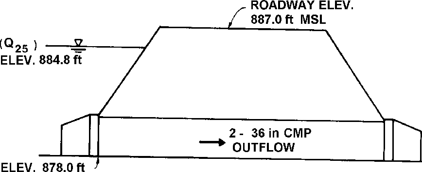

**Figure V-23--Selected Culvert Design (English)**

141

**This page is intentionally left blank.**

**142**

**VI. SPECIAL CONSIDERATIONS**

1.  **<u>Introduction</u>**

Culvert design may at times encompass almost every consideration and situation related to hydrologic analysis and hydraulic engineering. While these special conditions may only occur in a small percentage of culvert designs, or may be specifically related to culvert design in a particular geographic region, they are important and can have a major bearing on the design process. Special situations include the use of culverts for special applications such as flow measurement and control, erosion and debris control, site related modifications, and culvert durability in erosive or corrosive environments. In addition, the hydraulic designer will often need to consider economic, safety, and structural aspects of the culvert during the design process. The designer should also be aware of the existence of various calculator and computer programs which can serve as valuable design tools.

The above special considerations and others are discussed in this final chapter. Due to the extensive range of topics covered, numerous references are cited to which the culvert designer may refer for further information. This chapter furnishes design guidelines and recommendations in an abbreviated fashion. It is the designer's responsibility to decide when further study of the specific design situation is necessary.

2.  **<u>Special Applications</u>**

Culverts are occasionally designed to fulfill special functions in addition to their primary function as drainage structures. For example, culverts are used as flow control and measurement devices, and can be as effective as weirs and flumes. Culverts can be designed to operate under low heads and minimize energy losses as in roadway crossings for irrigation canals. Often, culverts must be modified in order to fulfill a secondary function. Such is the case with culverts containing bends in plan or profile, culverts containing junctions within their barrels, certain culverts operating as siphons, and culverts designed to facilitate fish passage. These special applications are briefly discussed and design guidelines are presented in the following sections.

> 

**Figure VI-1--Stormwater Management Pond with Culvert  
as Outflow Control Device**

143

1.  **Flow Control and Measurement**. Flow control structures are used to measure and control the rate of discharge in open channels. Culverts are often used as flow control structures due to the in-depth understanding of culvert hydraulics, reliable and accessible design techniques, and the availability of economical construction materials and methods. Discharge measurement and control are required in irrigation canals, stormwater management ponds, and cooling water channels for power plants, among others (Figure VI-1). In all three applications, a culvert could be used to control water flow rates or flow distribution. The flow rates through the culvert are easily calculated based on the geometry of the structure and coordinated records of headwater and tailwater elevations. The routing procedures of Chapter V must be applied to determine the corresponding inflow into the storage pond upstream of the culvert.

Culverts located on small watersheds can be utilized as flow measurement structures to provide streamflow records. Shortly after a flood event, high water marks upstream and downstream of a culvert installation can be measured and documented. Temporary staff gages placed at the site would simplify these efforts. The peak discharge at the culvert site can then be determined. These data help to improve runoff calculation methods and aid in verifying computer models. If discharges for the entire flood event are required, a recording stage gage is required. Harris details techniques and procedures for obtaining peak runoffs using culverts as flow measurement structures (29).

2.  **Low Head Installations**. Low head installations are culverts which convey water under a roadway with a minimum headwater buildup and energy loss. These installations are typically found in irrigation systems where the discharge is usually steady, and the available channel freeboard and slope are small. Often the installations flow partly full over the length of the culvert. Energy losses must be minimized to transport the water efficiently. The hydraulic solution imposing the least energy loss would be to bridge the conveyance channel. However, economic considerations may require the use of a low head culvert installation.

Reduction of energy loss and headwater at a culvert installation requires an understanding of the background and theory utilized in the culvert design procedures discussed in Chapter III. The minimal headwater rise, small barrel slope, and high tailwaters associated with these installations usually result in outlet control. Therefore, minimizing entrance, exit, and friction losses will reduce the required headwater (Equation (7)). Alignment of the culvert barrel with the upstream channel helps to minimize entrance loss and takes advantage of the approach velocity head. Inlet improvements, such as beveled edges, will further reduce entrance loss. However, the hydraulic effects of further entrance improvements, such as side- and slope-tapered inlets are small in outlet control. Thus, the use of these inlets is usually not justified in low head installations. The exit loss can be reduced by smoothly transitioning the flow back into the downstream channel to take advantage of the exit velocity. Friction loss is reduced by the utilization of a smooth culvert barrel.

In analyzing low head installations flowing partly full in outlet control, backwater calculations may be necessary. Beginning at the downstream water surface (tailwater), the hydraulic and energy grade lines are defined. Outlet losses are calculated using Equation (4c), considering the downstream velocity. Thus, the calculations proceed upstream through the barrel, until the upstream end of the culvert is reached. At that point, inlet losses are calculated using Equation (4a) with the appropriate inlet loss coefficient, ke. The inlet loss is added to the calculated energy grade line at the inlet to define the upstream energy grade line. Deducting the approach velocity head from the upstream energy grade line results in the upstream water surface elevation (hydraulic grade line).

144

With minor modifications, the culvert design procedures of this publication are adequate for the design of low head installations. In the usual case of outlet control, the entrance, friction, and exit losses can be obtained from the outlet control nomographs in Appendix D. If the downstream velocity is significant compared with the barrel velocity, the losses should be calculated using Equations (4a), (4b), and (4c) instead of the outlet control nomograph. Use of Equation (4c) will reduce the exit losses.

> 

**Figure VI-2--Sag Culvert**

> 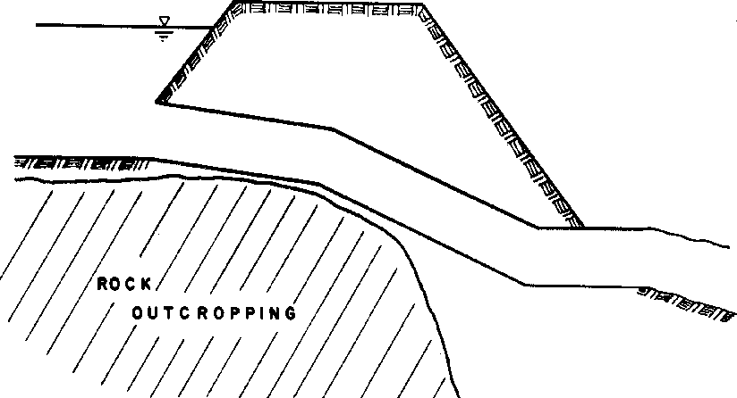

**Figure VI-3--"Broken-Back" Culvert**

145

It is also advantageous to consider approach and downstream velocities in the design of low head installations. Equation (6) should be used instead of Equation (7) to calculate headwater depth (HWo) in outlet control. In inlet control, the approach velocity head should be considered to be a part of the available headwater when using the inlet control nomographs.

Sag culverts, called "inverted siphons," are often used to convey irrigation waters under roadways (Figure VI-2). This type of culvert offers the advantage of providing adequate vertical clearance for the pipe under the roadway pavement and subgrade. A possible disadvantage of a sag culvert is clogging due to sediment. The design is not recommended for use on streams with high sediment loads. Sag culverts require the use of bends and inclusion of their related energy losses. Losses due to bends are covered in the next section.

**3. Bends**. A straight culvert alignment is desirable to avoid clogging, increased construction costs, and reduced hydraulic efficiency. However, site conditions may dictate a change of alignment, either in plan or in profile. A change of alignment in profile to avoid costly excavation is generally referred to as a "broken back" culvert. (Figure VI-3). Horizontal bends may also be used to avoid obstacles or realign the flow (Figure VI-4). When considering a nonlinear culvert alignment, particular attention should be given to erosion, sedimentation, and debris control.

In designing a nonlinear culvert, the energy losses due to the bends must be considered. If the culvert operates in inlet control, no increase in headwater occurs. If the culvert operates in outlet control, a slight increase in energy losses and headwater will result due to the bend losses. To minimize these losses, the culvert should be curved or have bends not exceeding 15-degrees at intervals of not less than 50 feet (15m) (30). Under these conditions, bend losses can normally be ignored.

> 

**Figure VI-4--Culvert with a Horizontal Bend (Contech)**

146

If headwater and flow considerations are critical, accurate hydraulic analysis of bend losses may be required. Bend losses are a function of the velocity head in the culvert barrel. To calculate bend losses, use the following equation.

> ⎛V 2 ⎞

H = K **⎜ ⎟** (21)

> b b ⎝2g ⎠

Hb is added to the other outlet losses in Equation (1). Bend loss coefficients (Kb) are found in various references (24, 31, 32). Reference (32) suggests the coefficients in Table 6 for bend losses in conduits flowing full.

The broken back culvert shown in Figure VI-3 has four possible control sections: the inlet, the outlet, and the two bends.

The upstream bend may act as a control section, with the flow passing through critical depth just upstream of the bend. In this case, the upstream section of the culvert operates in outlet control and the downstream section operates in inlet control. Outlet control calculation procedures can be applied to the upstream barrel, assuming critical depth at the bend, to obtain a headwater elevation. This elevation is then compared with the inlet and outlet control headwater elevations for the overall culvert. These headwaters are determined using the design procedures of Chapter III. The controlling flow condition produces the highest headwater elevation. Control at the lower bend is very unlikely and that possible control section can be ignored except for the bend losses in outlet control. Broken-back culverts can also be analyzed in detail using standard backwater and draw down calculation methods (31).

**4. Junctions**. Flow from two or more separate culverts or storm sewers may be combined at a junction into a single culvert barrel. For example, a tributary and a main stream intersecting at a roadway crossing can be accommodated by a culvert junction (Figure VI-5). A drainage pipe collecting runoff from the overlying roadway surface and discharging into a culvert barrel is an example of a storm sewer/culvert junction. Loss of head may be important in the hydraulic design of a culvert containing a junction. Attention should be given to streamlining the junction to minimize turbulence and head loss. Also, timing of peak flows from the two branches should be considered in analyzing flow conditions and control. Loss of head due to a junction is not of concern if the culvert operates in inlet control.

**Table 6--Loss Coefficients for Bends.**

<table>
<colgroup>
<col style="width: 39%" />
<col style="width: 21%" />
<col style="width: 19%" />
<col style="width: 19%" />
</colgroup>
<tbody>
<tr class="odd">
<td>
⎛ Radius of Bend ⎞

<strong>⎜ ⎟</strong>
</td>
<td colspan="3" rowspan="2">Angle of Bend Degrees</td>
</tr>
<tr class="even">
<td>⎝Equivalent Diameter⎠</td>
</tr>
<tr class="odd">
<td></td>
<td>90o</td>
<td>45o</td>
<td><blockquote>

22.5o

</blockquote></td>
</tr>
<tr class="even">
<td>1</td>
<td>.50</td>
<td>.37</td>
<td><blockquote>

.25

</blockquote></td>
</tr>
<tr class="odd">
<td>2</td>
<td>.30</td>
<td>.22</td>
<td><blockquote>

.15

</blockquote></td>
</tr>
<tr class="even">
<td>4</td>
<td>.25</td>
<td>.19</td>
<td><blockquote>

.12

</blockquote></td>
</tr>
<tr class="odd">
<td>6</td>
<td>.15</td>
<td>.11</td>
<td><blockquote>

.08

</blockquote></td>
</tr>
<tr class="even">
<td>8</td>
<td>.15</td>
<td>.11</td>
<td><blockquote>

.08

</blockquote></td>
</tr>
</tbody>
</table>

147

**Figure VI-5--Culvert Junction**

For a culvert barrel operating in outlet control and flowing full, the junction loss is calculated using Equations (22) and (23) given below. Reference (33) provides the derivations of these equations. The loss is then added to the other outlet control losses in Equation (1).

Hj =y′ +Hv2 −Hv1 (22)

> Hj is the head loss through the junction in the main conduit, m (ft) y' is the change in hydraulic grade line through the junction, m (ft) Hv2 is the velocity head in the upstream conduit, m (ft)
>
> Hv1 is the velocity head in the downstream conduit, m (ft)

The formula for y' is based on momentum considerations and is as follows:

> 2 2 11 33 j

y′ =  (23)

> 0 .5(AA+ )g
>
> 1 2

subscripts 1, 2, and 3 refer to the outlet pipe, the upstream pipe, and the lateral pipe respectively

> Q is the flow rate, m3/s (ft3/s)
>
> V is the velocity, m/s (ft/s)
>
> A is the area of the barrel, m2 (ft2)
>
> Θj is the angle of the lateral with respect to the outlet conduit.

148

Jens also provides additional equations for losses in the lateral conduit under full flow conditions (33). Laboratory modeling may be necessary for particularly sensitive installations. Partly full flow is analyzed by using backwater calculations. If supercritical flow is possible, the flow at the junction is very complex, and an appropriate reference on the subject should be consulted (31, 34). However, in this case the culvert will operate in inlet control, and the losses are not needed to calculate the headwater.

Erosion may be a problem at the junctions of culverts with natural bottoms. In this case, protection of culvert foundations and anchorage is very important. This can be accomplished by proper alignment, selective invert paving, and strategically placed energy dissipaters within the culvert.

**5. Siphons**. A siphon is a water conveyance conduit which operates at subatmospheric pressure over part of its length. Some culverts act as true siphons under certain headwater and tailwater conditions, but culverts are rarely designed with that intention. Figure VI-6 shows two culverts acting as true siphons.

149

Contrary to general belief, a culvert of constant section on a uniform grade may act as a true siphon under certain conditions (Figure VI-6A). This was demonstrated by tests at the University of Iowa and later in the NBS research (5, 35). However, the additional capacity generated by the siphoning action was sporadic and could be interrupted by any number of changing flow conditions. Such conditions which would permit the admission of air include rapidly declining headwater or tailwater levels, vortices, and entrapment of debris. Since the added capacity was not dependable, the minimum performance criteria would not allow its inclusion in design. Therefore, added capacity due to siphoning may increase culvert performance above design estimates in some situations.

Culverts with vortex suppressors may act as siphons under conditions of high headwater. The dependability of such devices under most culvert flow conditions is open to question, and vortex suppressors may be a safety hazard. Therefore, the use of vortex suppression in culvert design applications is not recommended.

Broken-back culverts may act as true siphons within some range of submerged headwater and tailwater (Figure VI-6B). However, the hydraulic characteristics of the culvert will not markedly differ from a uniform barrel between end points. When primed, the culvert will perform as efficiently as the uniform grade alternative. When not primed, the culvert may not perform as well as a culvert on a uniform grade (35). Broken-back culverts are constructed to produce a savings in excavation and not for hydraulic reasons.

Flared-siphon culverts may also act as true siphons. A flared-siphon culvert has an outlet which diverges, much like a side-tapered inlet. The Venturi (expanding tube) principle is used to salvage a large part of the kinetic energy and thereby increase the culvert capacity. The State of California was experimenting with these designs in the early 1950s (35). Obviously, submergence of the outlet is necessary to achieve the siphoning action. Presumably, the added capacity was not dependable, and their design is rare. However, Cottman and Apelt have combined this concept with the slope-tapered inlet concept to produce hydraulically efficient minimum energy culverts and bridges (36, 37).

Sag culverts are often referred to as "inverted siphons" even though the hydraulic grade line does not intersect the crown of the conduit at any point when the conduit is flowing full. Hence, no portion of the barrel is operating below atmospheric pressure and the name is a misnomer. Sag culverts are covered under an earlier section entitled, "Low Head Installations." Figure VI-2 depicts a sag culvert.

**6. Fish Passage**. At some culvert locations, the ability of the structure to accommodate migrating fish is an important design consideration. For such sites, state fish and wildlife agencies should be included early in the roadway planning process. In particularly sensitive streams, relocation of the highway may be necessary and economical. Other situations may require the construction of a bridge spanning the natural stream. However, culvert modifications can often be constructed to meet the design criteria established by the fish and wildlife agencies (Figure VI-7).

150

> 

**Figure VI-7--Fish Baffles in Culvert**

Early in the planning process, fish migration data should be collected including pertinent field data. If the stream crossing is located on a known, suspected, or potential fish migration route, the following data are desirable: (38)

- Species of migrating fish.

- Size and swimming speed of fish.

- Locations of spawning beds, rearing habitat, and food-producing areas upstream and downstream of the site.

- Description of fish habitat at the proposed crossing.

- Dates of start, peak, and end of migration.

- Average flow depths during periods of migration.

An understanding of some design inadequacies which will inhibit natural migration patterns is desirable. Excessive velocities and shallow depths in the culvert or on paved aprons for the migration design discharge should be avoided. High outlet elevations, often resulting from the formation of a scour hole, may prevent fish from entering the culvert. High outlet velocities also dislodge sediment which fills in small pools further downstream, smothering eggs and food-producing areas in the process. High upstream invert elevations produce a large unnatural pool above the culvert which will trap sediment. Depressing the upstream invert elevation is also harmful.

Simulating the natural stream bottom conditions in a culvert is the most desirable design option to accommodate fish passage. Open bottom culverts, such as arches, have obvious advantages if adequate foundation support exists for the culvert. Oversized depressed culverts have the advantage of a natural bottom while overcoming the problem of poor foundation material (Figure VI-8). However, on steep slopes, provisions may be necessary to hold bottom material in place. Another option is to construct baffles in the bottom of culverts to help simulate natural conditions. Figure VI-9 depicts a baffle arrangement used by several States in the Pacific Northwest (30).

When the simulation of natural stream bottom conditions is unrealistic or unnecessary, criteria for maintaining minimum depths and maximum velocities is most important. The high roughness coefficient of corrugated metal may be all that is required at some locations to maintain desirable depths and velocities. When maintaining a minimum depth in a culvert is a problem, downstream weirs can be constructed. However, provisions must be made for fish to bypass the weirs.

151

A popular method of providing for fish passage is to provide dual culverts, one culvert designed for hydraulic capacity and one culvert designed for fish passage. The latter culvert would have a flatter slope, higher roughness, and could contain fish baffles. In this case, the hydraulically efficient barrel would convey most of the flow. To design parallel, dissimilar culverts, it is necessary to construct separate performance curves (elevation versus discharge) for each culvert. The two performance curves are added together at equal elevations to obtain the combined performance curve. A similar technique is described later in this chapter for multiple barrel culverts with unequal invert elevations.

The hydraulic design of culverts with fish baffles is accomplished by modifying the friction resistance of the barrel in outlet control to account for the high resistance imposed by the baffles. Reference (39) provides design curves and procedures for estimating the hydraulic loss due to fish baffles using a modified version of Equation (4b). The remainder of the outlet control calculations are the same as outlined in Chapter III. For inlet control, only the reduced area of the entrance due to the baffles and any edge modifications need to be considered in the procedure.

**C. <u>Erosion, Sedimentation, and Debris Control</u>**

Natural streams and manmade channels are subject to the forces of moving water. Pressure, velocity, and centrifugal forces can be significant depending on the depth of flow, and the slope and sinuosity of the water course. An evolutionary process is the result with the continuous occurrence and dynamic interplay of erosion, sedimentation, and debris movement. This process, referred to as fluvial geomorphology, is accelerated during storm events when stream depths and velocities are high. Inserting a culvert into this dynamic environment requires special attention to the effects of these natural phenomena on the culvert and the effects of the culvert on the stream channel. Past experience has shown significant problems, including erosion at the inlet and outlet, sediment buildup in the barrel, and clogging of the barrel with debris.

**1. Scour at Inlets**. A culvert barrel normally constricts the natural channel, thereby forcing the flow through a reduced opening. As the flow contracts, vortices and areas of high velocity flow impinge against the upstream slopes of the fill and may tend to scour away the embankment adjacent to the culvert. In many cases, a scour hole also forms upstream of the culvert floor as a result of the acceleration of the flow as it leaves the natural channel and enters the culvert.

Upstream slope paving, channel paving, headwalls, wingwalls, and cutoff walls help to protect the slopes and channel bed at the upstream end of the culvert. Figure VI-10 depicts a culvert with a headwall and wingwall protecting the inlet against scour.

153

> 

**Figure VI-10--Culvert with Metal Headwall and Wingwalls (Contech)**

**2. Scour at Outlets**. Scour at culvert outlets is a common occurrence (Figure VI-11). The natural channel flow is usually confined to a lesser width and greater depth as it passes through a culvert barrel. An increased velocity results with potentially erosive capabilities as it exits the barrel. Turbulence and erosive eddies form as the flow expands to conform to the natural channel. However, the velocity and depth of flow at the culvert outlet and the velocity distribution upon reentering the natural channel are not the only factors which need consideration. The characteristics of the channel bed and bank material, velocity and depth of flow in the channel at the culvert outlet, and the amount of sediment and other debris in the flow are all contributing factors to scour potential. Due to the variation in expected flows and the difficulty in evaluating some of these factors, scour prediction is subjective.

> 

**Figure VI-11--Scour at Culvert Outlet**

Scour in the vicinity of a culvert outlet can be classified into two separate types (38). The first type is called local scour and is typified by a scour hole produced at the culvert outlet (Figure VI-12). This is the result of high exit velocities, and the effects extend only a limited distance downstream. Coarse material scoured from the circular or elongated hole is deposited immediately downstream, often forming a low bar. Finer material is transported further downstream. The dimensions of the scour hole change due to sedimentation during low flows and the varying erosive effects of storm events. The scour hole is generally deepest during

154

passage of the peak flow. Methods for predicting scour hole dimensions are found in Chapter 5 of HEC No. 14, "Hydraulic Design of Energy Dissipaters for Culverts and Channels" (40). The second type of scour is classified as general stream degradation. This phenomenon is independent of culvert performance. Natural causes produce a lowering of the stream bed over time (Figure VI-13). The identification of a degrading stream is an essential part of the original site investigation. Both types of scour can occur simultaneously at a culvert outlet.

> 

**Figure VI-12--Scour Hole at Culvert Outlet**

Since prediction of scour at culvert outlets is difficult, and protection is expensive, a prudent approach involves providing a minimum amount of protection followed by periodic site inspection. As part of the field investigation, scour and outlet protection at similar culverts in the vicinity will provide guidance. The initial level of protection should be sufficient to withstand extensive damage from one storm event. Once the initial minimum outlet protection is constructed, an assessment of its performance after a number of storm events should be evaluated and reviewed. If the outlet protection is insufficient, additional protection should be provided. If the outlet protection is sufficient, inspection is required only after larger storm events.

Protection against scour at culvert outlets varies from limited riprap placement to complex and expensive energy dissipation devices (Figure VI-14). At some locations, use of a rougher culvert material or a flatter slope alleviates the need for a special outlet protection device. Preformed scour holes, approximating the configuration of naturally formed holes, dissipate energy while providing a protective lining to the stream bed. Riprapped channel expansions and concrete aprons protect the channel and redistribute or spread the flow. Barrel outlet

155

expansions operate in a similar manner. Headwalls and cutoff walls protect the integrity of the fill. When outlet velocities are high enough to create excessive downstream problems, consideration should be given to more complex energy dissipation devices. These include hydraulic jump basins, impact basins, drop structures, and stilling wells. Design information for the general types of energy dissipaters is provided in HEC No. 14 (40). Other references may also prove useful (41,42,43).

> **Figure VI-13--Stream Degradation  
> at Culvert Outlet**

**3. Sedimentation**. The companion problem to erosion is sedimentation. Most streams carry a sediment load and tend to deposit this load when their velocities decrease. Therefore, barrel slope and roughness are key indicators of potential problems at culvert sites. Other important factors in sedimentation processes are the magnitude of the discharge and the characteristics of the channel material.

Culverts which are located on and aligned with the natural channel generally do not have a sedimentation problem. A stable channel is expected to balance erosion and sedimentation over time; a culvert resting on such a channel bed behaves in a similar manner. In a degrading channel, erosion, not sedimentation, is a potential problem. However, a culvert located in an agrading channel may encounter some sediment accumulation (Figure VI-15). Stream channel aggradation and degradation, and characteristics of each type of stream are discussed in reference (44). Fortunately, storm events tend to cleanse culverts of sediment when increased velocities are experienced. Helical corrugations tend to promote this cleansing effect if the culvert is flowing full.

156

> 

**Figure VI-15--Sediment Deposition in Culvert**

Certain culvert installations may encounter sedimentation problems. The most common of these are multibarrel installations and culverts built with depressions at the entrance. Culverts with more than one barrel may be necessary for wide shallow streams and for low fills. It is well documented that one or more of the barrels will accumulate sediment, particularly the inner barrel in a curved stream alignment. It is desirable for these installations to be straight and aligned with the upstream channel. Culverts built with an upstream depression possess a barrel slope which is less than that of the natural channel. Sedimentation is the likely result, especially during times of low flow. However, self-cleansing usually occurs during periods of high discharge. Both design situations should be approached cautiously with an increased effort in the field investigation stage to obtain a thorough knowledge of stream characteristics and bed-bank materials.

**4. Debris Control**. Debris is defined as any material moved by a flowing stream. This normally includes some combination of floating material, suspended sediment, and bed load. A stream's propensity for carrying debris is based upon watershed land uses and certain stream and floodplain characteristics. A field investigation of the following conditions is warranted.

- Stream velocity, slope, and alignment.

- Presence of shrubs and trees on eroding banks.

- Watershed land uses, particularly logging, cultivation, and construction.

- Stream susceptibility to flash flooding.

- Storage of debris and materials within the flood plain (logs, lumber, solid waste, etc.).

Debris can accumulate at a culvert inlet or become lodged in the inlet or barrel. When this happens, the culvert will fail to perform as designed. Flooding may occur, causing damage to upstream property. Roadway overtopping will create a hazard and an inconvenience to traffic

157

and may lead to roadway and culvert washouts. Maintenance costs will accrue as a result of these circumstances.

Routine design and maintenance precautions may be taken if the debris accumulation potential is minimal. Provision for a smooth, well-designed inlet and avoidance of multiple barrels and skewed inlets will help to align and pass most floating debris. Periodic maintenance at culvert entrances will reduce the chances of severe problems and identify culverts which may require structural solutions.

Three debris control methods are available for culvert sites with more serious risks: interception at or above the culvert inlet protecting culvert performance; deflection of debris away from the entrance to a holding area for eventual removal; and passage of the debris through the culvert. The latter may be accomplished by oversizing the culvert or utilizing a bridge as a replacement structure. The costs of this solution should be closely compared with other solution methods. Regardless of the solution method employed, it may be desirable to provide a relief opening either in the form of a vertical riser or a relief culvert placed higher in the embankment.

Debris control structures often provide a cost effective solution. Debris interceptors functioning upstream of the culvert entrance include debris racks, floating drift booms, and debris basins. Debris interceptors functioning at the culvert inlet include debris risers and debris cribs. Debris deflectors vary from a simple inclined steel bar or rail placed in front of the inlet to more complex V-shaped debris deflectors (Figure VI-16). Debris fins are built to help align floating debris with the axis of the culvert to assist in passage of the debris. Design information for commonly employed debris control structures can be found in HEC No. 9, "Debris Control Structures" (45).

> 

**Figure VI-16--Debris Deflector**

**D. <u>Site Related Modifications</u>**

A good culvert design is one that limits the hydraulic and environmental stress placed on the existing natural water course. This stress can be minimized by utilizing a culvert which closely conforms to the natural stream in alignment, grade, and width. Often the culvert barrel must be skewed with respect to the roadway centerline to accomplish these goals. Alterations to the normal inlet alignment are also quite common. Multiple barrels are used in wide, shallow streams to accommodate the natural width of the stream.

158

1.  **Skewed Barrels**. The alignment of a culvert barrel with respect to the roadway centerline is referred to as the barrel skew angle. A culvert aligned normal to the roadway centerline has a zero barrel skew angle. For any other alignment, the barrel skew angle is the angle from a line normal to the highway to the culvert centerline. Directions (right or left) must accompany the barrel skew angle (Figure VI-17).

.

It is common design practice to place the culvert barrel on an alignment and grade that conforms to the existing stream channel. The barrel skew is established from the stream location and the proposed or existing roadway plan. The advantages of this design practice include a reduction of entrance loss, equal depths of scour at the footings, less sedimentation in multibarrel culverts, and less excavation. A disadvantage of this design procedure is that the inlet may be skewed with respect to the culvert barrel and the culvert will be longer

It is not always prudent to allow the existing stream bed alignment to dictate the barrel skew angle. Modifications to reduce the barrel skew angle and shorten the culvert barrel may produce a more economical solution in some situations. Chapter II contains a discussion of alternative culvert location procedures as related to culvert length.

2.  **Skewed Inlets**. The angle from the culvert face to a line normal to the culvert barrel is referred to as the inlet skew angle (Figure VI-18). The inlet skew angle varies from 0-degrees to a practical maximum of about 45-degrees. The upper limit is dictated by the difficulty in transitioning the flow from the stream into the culvert.

159

> 

**Figure VI-18--Inlet Skew Angle**

**Culverts which have a barrel skew angle often have an inlet skew angle as well. This is because headwalls are generally constructed parallel to a roadway centerline to avoid warping of the embankment fill (Figure VI-19).**

> 

**Figure VI-19--Barrel and Inlet Skew**

**160**

Skewed inlets slightly reduce the hydraulic performance of the culvert under inlet control conditions. The differences are minor and are incorporated into the inlet control nomographs for box culverts (Charts 11 and 12). As an illustration of the minor effects of inlet skew, comparisons of flow capacity were made on a single barrel 1829 mm by 1829 mm (6 ft by 6 ft) box culvert with various inlet skew angles operating in inlet control (Table 7).

**Table 7 a--Effect of Inlet Skew Angle on Flow Capacity of**

**1829 mm x 1829 mm Box Culvert1**

**(Flow in m3/s (ft3/s))**

<table>
<colgroup>
<col style="width: 18%" />
<col style="width: 18%" />
<col style="width: 20%" />
<col style="width: 22%" />
<col style="width: 21%" />
</colgroup>
<tbody>
<tr class="odd">
<td></td>
<td colspan="4">SKEW ANGLE, DEGREES</td>
</tr>
<tr class="even">
<td>HEADWATER</td>
<td>0o</td>
<td>15o</td>
<td>30o</td>
<td>45o</td>
</tr>
<tr class="odd">
<td>0.91 m 
1.83 m 
2.74 m</td>
<td>2.40 m3/s 
6.796 m3/s 
11.214 m3/s</td>
<td>2.407 m3/s 
6.626 m3/ s 
8.382 m3/s</td>
<td>2.322 m3/s 
6.456 m3/s 
11.044 m3/s</td>
<td>2.265 m3/s 
6.286 m3/s 
10.874 m3/s</td>
</tr>
<tr class="even">
<td colspan="5">1Values from Chart 11A, Appendix D</td>
</tr>
</tbody>
</table>

**Table 7 b--Effect of Inlet Skew Angle on Flow Capacity of**

**(6 ft by 6 ft) Box Culvert1**

**(Flow in ft3/s)**

<table>
<colgroup>
<col style="width: 19%" />
<col style="width: 16%" />
<col style="width: 20%" />
<col style="width: 22%" />
<col style="width: 21%" />
</colgroup>
<tbody>
<tr class="odd">
<td></td>
<td colspan="4">SKEW ANGLE, DEGREES</td>
</tr>
<tr class="even">
<td>HEADWATER</td>
<td>0o</td>
<td>15o</td>
<td>30o</td>
<td>45o</td>
</tr>
<tr class="odd">
<td>
3 ft 
6 ft

9 ft
</td>
<td>85 ft3/s 
240 ft3/s 
396 ft3/s</td>
<td>85 ft3/s 
234 ft3/s 
296 ft3/s</td>
<td>82 ft3/s 
228 ft3/s 
390 ft3/s</td>
<td>80 ft3/s 
222 ft3/s 
384 ft3/s</td>
</tr>
<tr class="even">
<td colspan="5">1Values from Chart 11B, Appendix D</td>
</tr>
</tbody>
</table>

Inlet skew should be avoided for culverts with tapered inlets and for multiple barrel culverts. Structural design complications result when a tapered inlet is skewed (26). Both tapered inlets and multiple barrel culverts perform better with the inlet face oriented normal to the barrel. The interior walls of multiple barrel culverts may promote sedimentation and unequal flow in some barrels when the inlet is skewed. The embankment fill should be warped to fit the culvert when avoiding inlet skew (Figure VI-20).

**3. Multiple Barrels**. Multiple barrel culverts may be necessary due to certain site conditions, stream characteristics, or economic considerations (Figure VI-21). Roadway profiles with low fills often dictate the use of a series of small culverts. Multiple barrel culverts are also used in wide, shallow channels to limit the flow constriction. To accommodate overbank flood flows, relief culverts with inverts at the flood plain elevation are occasionally used. Multiple barrel box culverts are more economical than a single wide span because the structural requirements for the roof of the long span are costly.

161

There are problems associated with the use of multiple barrel culverts. The most significant problems involve sedimentation and debris. In alluvial channels, normal flows will tend to pass through one of the barrels, while sediment and debris collect in the others. To reduce this problem, it is good practice to install one barrel at the flow line of the stream and the others at higher elevations (Figure VI-22). This will encourage the flow to follow the lower barrel. Sediment and debris accumulation in the other barrels will be reduced since the barrels will only be used to convey higher than normal flows.

The nomographs of this publication can be used to determine the capacity of multiple barrel culverts with only minor alterations. The nomographs provide the culvert discharge rate per

162

barrel for pipes or the flow per meter (foot) of span width for box culverts. For multiple barrels with identical hydraulic characteristics, the total discharge is assumed to be divided equally among the barrels. An iterative procedure or development of a combined performance curve is required for culverts with dissimilar barrels or invert elevations. The discharge of the component barrels must add up to the total peak design flow at a common headwater elevation. For multiple barrel installations with bevel-edged inlets, the bevels are sized on the basis of the total clear width of the barrels. No more than two barrels may be used with tapered inlets using the design procedures of this manual.

**E. <u>Economics</u>**

The ideal culvert selection process minimizes the total annual cost of the installation over the life of the roadway. The annual cost includes capital expenditures, maintenance costs, and risks associated with flooding. An initial analysis of the choice between a culvert and a bridge is necessary. If a culvert is selected, a comparison of the available shapes and materials would follow. Durability, maintenance, and replacement costs are factored into the selection process along with the initial in-place construction cost. The results are then utilized to evaluate the design flood based on total annual cost. This procedure is referred to as a risk analysis. Unfortunately, many of the factors required in such an analysis are not well defined, making it difficult to justify and perform except for expensive installations.

**Figure VI-22--Multiple Barrel Culverts with One Low Flow Barrel**

**1. Service Life**. The desired service life of the culvert should be considered in the selection process. If the culvert is in a location where replacement or relining would be impractical, the service life of the culvert should equal the service life of the highway. If rehabilitation is feasible, or if it is determined that the highway will be rebuilt in a relatively short time, a culvert with a shorter service life should be selected. The service life of the culvert should match the installation. There is no need to pay for an "eternal" culvert where a short lived one would suffice, and vice-versa.

163

**2. Comparisons Between Culverts and Bridges**. Economic considerations are of primary importance in deciding between the use of a bridge or a culvert at stream crossings where either will satisfy hydraulic and structural requirements. The initial cost for a culvert is usually much less than for a bridge. The use of increased headwater at a culvert installation normally permits the use of a smaller opening (Figure VI-23). This advantage must be balanced with the possible flood damages associated with an increased headwater, especially at higher discharges. Maintenance costs for culverts may result from erosion at the inlet and outlet, sedimentation and debris buildup, and embankment repair in case of overtopping. Bridge maintenance is more costly, however, including such aspects as maintenance of the bridge deck and superstructure, erosion around piers and abutments, and possible sediment and debris accumulation.

Safety, aesthetics, and environmental

considerations are also involved in the choice of a bridge or culvert. Safety considerations for culverts include the use of guardrails or safety grates. Bridge decks often constrict shoulder and median widths and are subject to icing which can present traffic safety problems. A bridge may be considered more aesthetically pleasing in traversing a scenic valley or canyon. Environmental considerations such as fish and wildlife passage may also favor a bridge over a culvert.

Hydraulic Design Series Number 1, "Hydraulics of Bridge Waterways," (21) may be used in the hydraulic analysis of highway bridges to approximate backwater on floodplains with sparse vegetation. For bridges on wide heavily vegetated floodplains, other techniques developed by the United States Geological Survey and the United States Corps of Engineers should be used.

**3. Comparisons Between Materials and Shapes**. Cost comparisons between various materials and shapes vary with region and with time. It is recommended that costs for culverts of equal hydraulic capacity be compared periodically to help guide material selection. Requesting alternative bids for several acceptable materials is economically beneficial on most projects.

Detailed economic analysis of culvert material selection requires site-specific considerations. Structural strength is a concern under high fills. Steep channel slopes produce high exit velocities which are further accelerated by using smooth pipes. Acidic drainage will promote corrosion of some materials. Certain materials can not withstand the attack of abrasive bed loads. Water tightness at joints may be an important consideration. All of these factors have an impact on the annual cost of the culvert based upon the selected material.

Culvert shapes are as important in cost evaluations as culvert materials (Figure I-4). Many shapes can be produced from a variety of materials; other shapes require certain materials. Circular culverts are the most common shape. They are generally reasonably priced, can

164

support high structural loads, and are hydraulically efficient. However, limited fill height may necessitate the use of a pipe-arch, ellipse, or an arch. Pipe-arches and ellipses are more expensive than circular pipes, especially if the fill height is substantial. Arches require special attention to their foundations, and failure due to scour is a concern. However, arches do provide a natural stream bed which is an advantage for fish passage. Structural plate conduits can be constructed in a variety of shapes, quickly, with low transport and handling costs (Figure

24. Box culverts also possess flexibility in rise to span ratios by using multiple cells (Figure

25. Precast box sections overcome the disadvantage of longer construction times which are associated with cast-in-place installations; however handling costs are increased.

Inlet improvements on culverts provide an opportunity for additional cost savings. When a culvert is operating in inlet control, the barrel does not flow full. By improving the inlet configuration, a decrease in barrel size and overall culvert cost is possible. The savings on the reduced barrel size usually outweighs the construction costs of the improved inlet. However, the cost of excavation through rock or difficult material for enlarged slope-tapered inlets or depressed side-tapered inlets should be considered.

> 

**Figure VI-24--Corrugated Metal Box Culvert (Contech)**

165

> 

**Figure VI-25--Precast Double Barrel Box Culvert**

**4. Risk Analysis**. Risk analysis is a means of assessing the economic behavior of different design alternatives. The construction of a culvert represents a flood plain encroachment with the associated flood risks and initial construction costs. Each design strategy can be evaluated for an annual capital cost and an annual economic risk (cost), the sum of which is called the total expected cost (TEC). Optimization of the economic and engineering analyses will produce the least total expected cost (LTEC) design alternative (46).

The influence of risk (cost) in the decision-making process represents the major distinction between traditional and LTEC design. In traditional design, the level of risk is an integral part of the establishment of design standards such as a specified design frequency flood or limitations on backwater. The influence of risk in the design of a specific culvert based on these design standards will vary with site conditions. In LTEC design, there is no arbitrary design frequency. The design process determines the response of each alternate design to discrete points on the entire flood frequency curve. The flood frequency at which road overtopping occurs is more meaningful than design flood frequency.

A necessary part of the risk analysis process is the establishment of acceptable design alternatives. Engineering, legislative, and policy constraints may limit the range of alternatives. Examples of such constraints include:

- Prescribed minimum design flood criteria as in the case of interstate highways.

- Limitations imposed by roadway geometrics such as maximum or minimum grade lines, site distance, and vertical curvature.

166

- Flood plain ordinances or other legislative mandates limiting backwater or encroachment on the flood plain.

- Channel stability considerations which would limit culvert velocity or the amount of constriction.

Data collection and analysis to perform a LTEC design requires more effort than traditional culvert design. Data collection efforts include land use information, flood plain geometry, hydrologic and hydraulic data, geologic and soils investigation, construction cost, traffic data, and cost of embankment and pavement repair. Hydrologic and hydraulic analyses comprise flood frequency determination, water surface profile generation, stage-discharge relationship, preparation, overtopping analysis, and hydrograph generation.

Based on the hydrologic and hydraulic analyses, a full accounting of economic losses is required. These costs include but are not limited to:

- Embankment damage

- Traffic restoration time

- Increased running cost (detour)

- Time losses

- Accident costs

- Backwater damage losses

- Damage to culvert

- Erosion and sedimentation damage

The final step of the LTEC analysis requires the computation of TEC's over the range of flood frequencies and design alternatives. An optimum design referred to as the LTEC is the end result. A sensitivity analysis may be performed on the LTEC and the overtopping frequency can be determined. Figure VI-26 depicts the design process. Figure VI-27 represents a typical solution surface with the optimum culvert size and embankment height highlighted.

**F. <u>Safety</u>**

The primary safety considerations in the design and construction of a culvert are its structural and hydraulic adequacy. Assuming that these major considerations are appropriately addressed, attention should be directed toward supplementary safety considerations. These considerations include traffic safety and child safety. The safety of errant vehicles should be provided for by the appropriate location and design of culvert inlets and outlets. Safety barriers and grates may substitute or add to this protection. Safety grates also provide a degree of protection against inquisitive youngsters by inhibiting access to a culvert.

**1. Inlet and Outlet Location and Design**. The exposed end of a culvert or culvert headwall represents an unyielding barrier to vehicles leaving the roadway. Safety provisions must be made to protect occupants of such vehicles against injury or death. One technique employed is to locate the culvert ends outside of the safe recovery area. Traffic safety standards provide distance from pavement limitations based on speed limits. Culverts should also extend through medians unless safe distances can be maintained.

167

> 
>
> 

**Figure VI-26--LTEC Design Process**

> 

**Figure VI-27--LTEC Solution Surface**

When culvert ends are not outside the safe recovery area, appropriate inlet and outlet design may reduce the danger they represent. Inlets and outlets can be mitered to conform to the fill slope reducing the obstruction to a vehicle. For culvert ends with headwalls, fill should be warped behind them to limit their exposure. (Markers should be placed on concealed culvert ends to protect roadside maintenance personnel.)

**2. Safety Barriers and Grates**. Additional traffic safety can be achieved by the installation of safety barriers and grates. Safety barriers should be considered in the form of guardrails along the roadside near a culvert when adequate recovery distance cannot be achieved, or for abnormally steep fill slopes (Figure VI-28). Traversable grates placed over culvert openings will reduce vehicle impact forces and the likelihood of overturning (Figure VI-29).

168

**Figure VI-28--Guardrail Adjacent to Culvert Headwall  
(American Concrete Pipe Association)**

> 

**Figure VI-29--Endwall for Safety Grate**

**169**

> 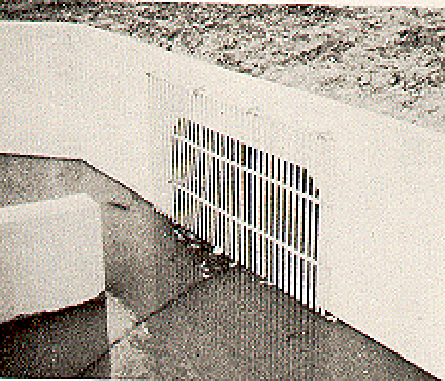

**Figure VI-30--Safety Grate Flush with Culvert Entrance**

Safety grates promote debris buildup and the subsequent reduction of hydraulic performance. Thorough analysis of this potential should be undertaken prior to the selection of this safety alternative. Good design practice provides an open area between bars of 1.5 to 3.0 times the area of the culvert entrance depending on the anticipated volume and size of debris. Bar grates placed against the entrance of the culvert are unacceptable (Figure VI-30). Reference (47) indicates that the head loss due to a bar grate can be estimated as follows.

<table>
<colgroup>
<col style="width: 9%" />
<col style="width: 48%" />
<col style="width: 42%" />
</colgroup>
<tbody>
<tr class="odd">
<td>H 1.5g =</td>
<td>
⎛V − V

2 2 ⎞

⎜⎜  <u>g u</u> ⎟⎟

⎝ 2 g ⎠
</td>
<td>(24)</td>
</tr>
</tbody>
</table>

> Hg is the head loss due to the bar grate, m (ft)
>
> Vg is the velocity between the bars, m/s (ft/s)
>
> Vu is the approach velocity, m/s (ft/s)
>
> g is acceleration of gravity 9.81 m/s2 (32.2 ft/s2)

Another formula for the head loss in bar racks with vertical bars is found in reference (48) (49).

> W ⎛V2
>
> ⎛ ⎞ ⎞

H =K ⎟ u sin

> g g **⎜**
>
> ⎜ **⎟** θ g (25)
>
> ⎝ X ⎠ ⎝ 2 g ⎠
>
> Kg is a dimensionless bar shape factor, equal to:
>
> 2.42 - sharp-edged rectangular bars
>
> 1.83 - rectangular bars with semi-circular upstream face
>
> 1.79 - circular bars
>
> 1.67 - rectangular bars with semi-circular upstream and downstream faces
>
> w is the maximum cross-sectional width of the bars facing the flow, m (ft)
>
> x is the minimum clear spacing between bars, m (ft)
>
> θg is the angle of the grate with respect to the horizontal, degrees

170

Both of the above equations are empirical and should be used with caution. Research on loss coefficients in safety grates is documented in reference (47). In all cases, the head losses are for clean grates and they must be increased to account for debris buildup.

Culverts have always attracted the attention and curiosity of children. In high population areas where hazards could exist, access to culverts should be prevented. Safety grates can serve this function. If clogging by debris is a problem, fencing around the culvert ends is an acceptable alternative to grates.

**G. <u>Structural Considerations</u>**

Proper structural design is critical to the performance and service life of a culvert. The structural design of a highway culvert begins with the analysis of moments, thrusts, and shears caused by embankment and traffic loads, and by hydrostatic and hydrodynamic forces. The culvert barrel, acting in harmony with the bedding and fill, must be able to resist these sizeable forces. Anchorage devices, endwalls, and wingwalls are often required to maintain the structural integrity of a culvert barrel by resisting flotation and inlet or outlet movement and distortion.

**1. General Structural Analysis**. Loads affecting culvert barrel design include the culvert weight, fluid loads, earth and pavement loads, and the weight and impact of surface vehicles. Culvert weights per unit length are available from culvert manufacturers. The weight of fluid per unit length can be obtained from the culvert barrel geometry and the unit weight of water.

<table>
<colgroup>
<col style="width: 47%" />
<col style="width: 52%" />
</colgroup>
<tbody>
<tr class="odd">
<td></td>
<td rowspan="2"><blockquote>

The magnitude of the earth and pavement load (dead load) is dependent upon the weight of the prism above the barrel and the soil-structure interaction factor. The soil-structure interaction factor is the ratio of the earth prism load on the culvert to the earth prism weight. Conditions which affect this factor include soil type, backfill compaction, culvert m aterial (rigid or flexible), and the type of culvert installation.

Two common types of culvert installations are depicted in Figure VI-31. In the positive projecting embankment installation, the culvert barrel is supported on the original streambed or compacted fill and covered by the embankment material. A negative projecting embankment is similar except that additional load support is gained from the existing banks of a deep stream bed. Each of these installations requires the establishment of an appropriate soil structure interaction factor or the determination of the load by appropriate tests, finite element analysis, or previous experience.

</blockquote></td>
</tr>
<tr class="even">
<td>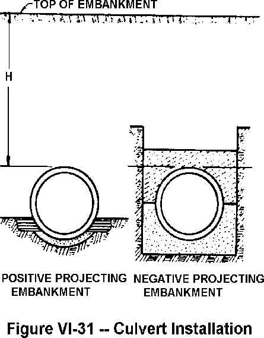</td>
</tr>
<tr class="odd">
<td></td>
<td></td>
</tr>
</tbody>
</table>

171

The weight and impact of surface vehicles is sometimes referred to as the live load. This load is greatest when the depth of fill (cover) over the top of the culvert barrel is small. As the cover increases, the live load decreases and eventually becomes negligible. Pavement designed for heavy duty traffic can significantly reduce the live load imposed on the culvert.

The distribution of dead and live load pressures on culvert barrels is dependent upon the shape and culvert material. The pressure distribution on three rigid culvert shapes is depicted in Figure VI-32. In contrast, circular culvert barrels made of flexible material receive the vertical load which pushes the barrel sides against the compacted fill material and mobilizes the passive earth pressure. The result is approximately uniform radial pressure distribution on the barrel. Pipe arches made of flexible material act similarly, but produce increased pressures at the corners (haunches) of the pipe-arch. Special attention to the bearing capacity of the soil at these locations is critical and may dictate embankment heights.

Moments, thrusts, and shears at critical locations in the culvert barrel can be determined by elastic structural analysis once the loads and pressure distributions are defined. Reinforced concrete box sections are often analyzed as rigid frames utilizing moment distribution. Rigid circular and elliptical pipe sections require load coefficients based on bedding conditions to properly analyze moments, thrusts, and shears. Flexible culverts are generally designed by semiempirical methods which implicitly include structural analysis aspects within the design method.

> 

**Figure VI-32--Pressure Distribution-Rigid Culverts**

Structural design of the culvert barrel must provide adequate strength to resist the moments, thrusts, and shears determined in the structural analysis. For reinforced concrete barrels, a trial wall thickness is selected, and reinforcing is sized to meet the design requirements. Corrugated metal structures are required to resist ring compression and seam strength. An additional requirement is sufficient stiffness to resist installation loads. A standard wall thickness and corrugation shape are selected to meet these design requirements.

Tables, charts, and formulas are available from manufacturers to streamline the process of structural design. The "Structural Design Manual for Improved Inlets and Culverts," published by

172

FHWA, is an excellent reference (26). Methods for hand calculation and computer solution are presented for reinforced concrete box culverts, and for circular and elliptical pipe culverts. The structural design of improved inlets is included, along with standard plans for headwalls, wingwalls, side-tapered and slope-tapered culverts.

**2. Floatation and Anchorage**. Flotation is the term used to describe the failure of a culvert due to the tremendous uplift forces caused by buoyancy. The buoyant force is produced when the pressure outside the culvert is greater than the pressure in the barrel. This occurs in a culvert in inlet control with a submerged upstream end. The phenomenon can also be caused by debris blocking the culvert end or by damage to the inlet. The resulting uplift may cause the outlet or inlet ends of the barrel to rise and bend. Occasionally, the uplift force is great enough to dislodge the embankment. Generally, only flexible barrel materials are vulnerable to failure of this type because of their light weight and lack of resistance to longitudinal bending (38). Large, projecting or mitered corrugated metal culverts are the most susceptible (Figure VI-33). In some instances, high entrance velocities will pull the unanchored inlet edges into the culvert barrel, causing blockage and additional damage. Events have been recorded in which the culvert barrel has been turned inside out by the forces of the flow.

> 

**Figure VI-33--Unanchored Mitered End**

A number of precautions can be taken by the designer to guard against flotation and damages due to high inlet velocities. Steep fill slopes which are protected against erosion by slope paving help inlet and outlet stability (Figure VI-34). Large skews under shallow fills should be avoided. Rigid pipe susceptible to separation at the joints can be protected with commercially available tie bars.

173

When these precautions are not practical or sufficient, anchorage at the culvert ends may be the only recourse. Anchorage is a means of increasing the dead load at the end of a culvert to protect against floatation. Concrete and sheet pile cutoff walls and headwalls are common forms of anchorage. The culvert barrel end must be securely attached to the anchorage device to be effective. Protection against inlet bending, inlet warping, and erosion to fill slopes represent additional benefits of some anchorage techniques.

174

**3. Endwalls and Wingwalls**. Culvert barrels are commonly constructed with endwalls and wingwalls. These appurtenances are often made of cast-in-place concrete but can also be constructed of precast concrete, corrugated metal, timber, steel sheet piling, gabions, or bagged concrete. Endwalls are used to shorten the culvert length, maintain the fill material, and reduce erosion of the embankment slope. Endwalls also provide structural protection to inlets and outlets and act as a counterweight to offset buoyant forces. Endwalls tend to inhibit flow of water along the outside surface of the conduit (piping).

Wingwalls can be used to hydraulic advantage for box culverts by maintaining the approach velocity and alignment, and improving the inlet edge configuration. However, their major advantage is structural in eliminating erosion around a headwall. Additional protection against flotation is provided by the weight of the wingwalls.

**H. <u>Long Span Culverts</u>**

Long span culverts are better defined on the basis of structural design aspects than on the basis of hydraulic considerations. According to the AASHTO Specifications for Highway Bridges, long span structural plate structures:

1)  exceed certain defined maximum sizes for pipes, pipe-arches, and arches, or

2)  may be special shapes of any size that involve a long radius of curvature in the crown or side plates (50).

Special shapes include vertical and horizontal ellipses, underpasses, low and high profile arches, and inverted pear shapes. Generally, the spans of long span culverts range from 7m to 14m (20 ft to 40 ft). Some long span installations are shown in Figures VI-35 and VI-36, and typical long span culvert shapes are shown in Figure VI-37.

> 

175

**Figure VI-36--Long Span Culvert (Contech)**

**Figure VI-37--Typical Long Span Culvert Shapes**

**1. Structural Aspects**. Long span culverts depend on interaction with the earth embankment for structural stability. Therefore, proper bedding and selection and compaction of backfill are of utmost importance. For multiple barrel structures, care must be taken to avoid unbalanced loads during backfilling. Some manufacturers of long span culverts will not sell their products to a client unless the design and installation is supervised by their engineers. If this is not required, the project should be coordinated with the manufacturer's engineering staff.

Various manufacturers utilize different techniques to achieve the desired long span configuration. In some instances, reinforcing ribs are used to strengthen the structure. In other cases, specially designed longitudinal structural stiffeners are installed on the top arch. Ribs and stiffeners which project into the barrel may increase the hydraulic resistance, particularly if the elements are perpendicular to the flow.

176

Anchorage of the ends of long span culverts is required to prevent flotation or damage due to high velocities at the inlet. This is especially true for mitered inlets. Severe miters and skews are not recommended.

**2. Hydraulic Considerations**. Long span culverts generally are hydraulically short (low length to equivalent diameter ratio) and flow partly full at the design discharge. The same hydraulic principles apply to the design of long span culverts as to other culverts. However, due to their large size and variety of shapes, it is very possible that design nomographs are not available for the barrel shape of interest. For these cases, dimensionless inlet control design curves have been prepared (Chapter III). For outlet control, backwater calculations are usually appropriate, since design headwaters exceeding the crowns of these conduits are rare. The bridge design techniques of HDS No. 1 are appropriate for the hydraulic design of most long span culverts, but the long span shapes are not included in that publication (21).

**I. <u>Culvert Durability</u>**

Culvert material longevity is as important a consideration to a culvert installation as proper hydraulic and structural design. At most locations, the commonly used culvert materials are very durable. However, there are hostile environmental conditions which will deteriorate all culvert materials. The two problems affecting the longevity of culverts due to adverse environmental conditions are abrasion and corrosion (Figure VI-38). Proper attention must be given to these problems in the design phase. Field inspection of existing culverts on the same or similar streams will prove invaluable in assessing potential problems.

The annual cost of a culvert installation is very dependent on its service life. All other conditions being equal, the most durable culvert material should be selected to minimize annual costs. Measures are available to increase the service life of a culvert, such as lining the barrel with a more durable material. When considered, these measures should be included in an economic analysis comparing other culvert materials or other alternatives, including periodic replacement. Periodic replacement of culverts under low fills on secondary roads with light traffic may prove cost effective.

**1. Abrasion**. Abrasion is defined as the erosion of culvert material due primarily to the natural movement of bedload in the stream. The characteristics of the bedload material and the frequency, velocity, and quantities which can be expected are factors to be considered in the design phase. The resistance of various culvert materials to the expected abrasion is then analyzed. Most materials are subject to abrasion when exposed to high velocity, rock laden flows over a period of time. Performance data on other installations in the vicinity may prove to be the most reliable indicator of abrasion potential and culvert material durability.

When abrasion problems are expected, several options are available to the designer. Debris control structures can often be used to advantage, although they require periodic maintenance. A liner or bottom reinforcement utilizing excess structural material is another option. Concrete or bituminous lining of the invert of corrugated metal pipe is a commonly employed method to minimize abrasion. Concrete culverts may require additional cover over reinforcing bars or high strength concrete mixes. The use of metal or wooden planks attached to the culvert bottom normal to the flow will trap and hold bedload materials, thereby providing invert protection. Oversized culvert barrels which are partially buried accomplish the same purpose.

177

> 

**Figure VI-38--Abrasion and Corrosion in Culverts**

**2. Corrosion**. No culvert material exists which is not subject to deterioration when placed in certain corrosive environments. Galvanized steel culverts are generally subject to deterioration when placed in soils or water where the pH falls outside the range of 6 to 10; aluminum deteriorates outside the range of 4 to 9. (51) Clay and organic mucks with low electrical resistivities have also proven corrosive to metal culverts. Concrete is adversely affected by alternate wetting and drying with seawater and when exposed to sulfates and certain magnesium salts, and acidic flow with a pH less than 5. Steel deteriorates in saltwater environments. In general, metal culverts are adversely affected by acidic and alkaline conditions in the soil and water, and by high electrical conductivity of the soil. Concrete culverts are sensitive to saltwater environments and to soils containing sulfates and carbonates.

A variety of measures can be taken to prevent the reduction of culvert service life in these hostile environments. These measures are generally categorized as appropriate material selection for the environment or the application of protective coatings. For example, aluminum appears to be resistant to corrosion in salt water installations. Experience has been favorable for fiber-bonded galvanized steel culverts in brackish environments. (52) Culverts and linings made of vitrified clay, stainless steel, and bituminized fiber perform well in highly acidic

178

conditions. Variations in the concrete mix, such as higher cement content, help to reduce the deterioration of concrete culverts subject to alkaline soils and water. Concrete tends to perform better than metal in clay or organic muck. In areas of severe acidity, such as acid mine drainage, concrete box culverts have been protected by fiberglass linings.

Bituminous or fiber-bonded coatings on metal culverts may require special consideration. The designer should ascertain that the this coating will in fact increase the service life. Delamination is the primary mode of failure and can occur due to sunlight exposure and abrasion. Damage to the coatings during handling and placing is another consideration. Polymer coatings appear to overcome some of these deficiencies. They have excellent corrosion resistance properties and are generally more abrasion-resistant, less subject to damage in handling and placement, and have fewer manufacturing flaws.

**J. <u>Culvert Hydraulic Programs</u>**

Numerous calculator and computer programs now exist to aid in the design and analysis of

highway culverts. These programs possess distinct advantages over traditional hand  
calculation methods. The increased accuracy of programmed solutions represents a major benefit over the inaccuracies inherent in the construction and use of charts and nomographs. In addition, programmed solutions are less time consuming. This feature allows the designer to compare alternative sizes and inlet configurations very rapidly so that the final culvert selection can be based on economics. Interactive capabilities in some programs can be used to change certain input parameters or constraints and analyze their effects on the final design. Familiarity with culvert hydraulics and the traditional methods of solution provides a solid basis for designers to take advantage of the speed, accuracy, and increased capabilities available in culvert hydraulics programs.

The logic, capability, and output of programmed solutions vary depending mainly upon computer storage capacity and design function. Most programs analyze the performance of a given culvert, although some are capable of design. Generally, the desired result of either type of program is to obtain a culvert which satisfies hydrologic data and site conditions by considering both inlet and outlet control. Results usually include the barrel size, inlet dimensions, performance data, and outlet velocity. Some programs are capable of analyzing side-tapered and slope-tapered inlets. Often the analysis or design of the barrel size is for one barrel only; multiple barrels are designed by apportioning the design discharge between barrels. The larger computer programs may contain such desirable features as backwater calculations, performance curves, hydrologic routines, and capabilities for routing based on upstream storage considerations.

The various culvert design hydraulic programs now available will not be covered in this manual. It would be impossible to cover all of the available culvert hydraulics programs because they are numerous and many are proprietary. However, **users should be cautioned to review all programs and design procedures for conformance with the culvert design processes outlined in this manual and particularly in Appendix A.**

See the FHWA website, [<u>http://www.fhwa.dot.gov/bridge/hydsoft.htm,</u>](http://www.fhwa.dot.gov/bridge/hydsoft.htm,) for calculator and culvert design computer programs available to the public.

179

**(This page is intentionally left blank.)**

**180**

**REFERENCES**

([<u>www.fhwa.dot.gov/bridge/hydpub.htm)</u>](http://www.fhwa.dot.gov/bridge/hydpub.htm))

1.  "Hydraulic Charts for the Selection of Highway Culverts," L.A. Herr and H.G. Bossy, <u>HEC No. 5</u>, Hydraulics Branch, Bridge Division, Office of Engineering, FHWA, Washington, D.C. 20590, 1965.

2.  "Capacity Charts for the Hydraulic Design of Highway Culverts," Lester A. Herr and Herbert G. Bossy, <u>Hydraulic Engineering Circular (HEC) No. 10</u>, Hydraulics Branch, Bridge Division, Office of Engineering, FHWA, Washington, D.C. 20590, November 1972.

3.  "Hydraulic Design of Improved Inlets for Culverts," L.J. Harrison, J.L. Morris, J.M. Normann and F.L. Johnson, <u>HEC No. 13</u>, Hydraulics Branch, Bridge Division, Office of Engineering, FHWA, Washington, D.C. 20590, August 1972.

4.  "Hydraulics of Short Pipes, Hydraulic Characteristics of Commonly Used Pipe Entrances, First Progress Report," John L. French, <u>NBS Report No. 4444</u>, National Bureau of Standards, Washington D.C., December 1955.

5.  "Hydraulics of Culverts, Second Progress Report, Pressure and Resistance Characteristics of a Model Pipe Culvert," John L. French, <u>NBS Report No. 4911</u>, National Bureau of Standards, Washington, D.C., October 1956.

6.  "Hydraulics of Culverts, Third Progress Report, Effects of Approach Channel Characteristics on Model Pipe Culvert Operation," John L. French, <u>NBS Report 5306</u>, National Bureau of Standards, Washington, D.C., June 1957.

7.  "Hydraulics of Improved Inlet Structures for Pipe Culverts, Fourth Progress Report," John L. French, <u>NBS Report 7178</u>, National Bureau of Standards, Washington, D.C., August 1961.

8.  "Hydraulics of Culverts, Fifth Progress Report, Non-enlarged Box Culvert Inlets," John L. French, <u>NBS Report 9327</u>, National Bureau of Standards, Washington, D.C., June 1966.

9.  "Hydraulics of Culverts, Sixth Progress Report, Tapered Box Culvert Inlets," John L. French, <u>NBS Report 9355</u>, National Bureau of Standards, Washington, D.C., June 1966.

10. "Hydraulics of Culverts, Seventh Progress Report, Tapered Box Inlets with Fall Concentration in the Inlet Structure," John L. French and Herbert G. Bossy, <u>NBS Report No. 9528</u>, National Bureau of Standards, Washington, D.C., July 1967.

11. "Hydrology," Frank D. Masch, <u>HEC No. 19, FHWA-IP-84-15</u>, Hydraulics Branch, Bridge Division, Office of Engineering, FHWA, Washington, D.C. 20590

12. "Hydrology," Victor Mockus, <u>National Engineering Handbook - Section 4</u>, Soil Conservation Service, U.S. Department of Agriculture, Washington, D.C., 1964.

13. "Local Design Storm," Ben Chie Yen and Ven Te Chow, <u>Report No. FHWA/RD-82/063</u>, Office of Research, FHWA, Washington, D.C., May 1983.

181

> 14\. "Flood Routing - Culvert Design," B.P. Durow, The South African Institution of Engineers, March 1982.
>
> 15\. "Stability of Relocated Stream Channels," J. C. Brice, <u>Report No. FHWA/RD-80/158</u>,
>
> U. S. Geological Survey, March 1981. Available from the National Technical Information Service, Springfield, Virginia 22161.
>
> 16\. "Roughness Characteristics of Natural Channels," Harry H. Barnes, Jr., <u>Water Supply Paper 1849,</u> U.S. Geological Survey, Reston, Virginia, 1967.
>
> 17\. "Estimating Hydraulic Roughness Coefficients," Woody L. Cowan, <u>Agricultura</u>l <u>Engineering, Vol. 37, No. 7,</u> pp. 473-475, July 1956.
>
> 18\. "Guide for Selecting Manning's Roughness Coefficients for Natural Channels and Flood Plains," G.J. Arcement, Jr. and V.R. Schneider, U. S. Geological Survey, Baton Rouge Louisiana, 70896, Available from the National Technical Information Service, Springfield, Virginia 22161., April 1984.
>
> 19\. "Assessment of the Impacts of the National Flood Insurance Program on Highways," George Davis, <u>Report No. FHWA/RD-80/015</u>, Hydraulics Branch, Bridge Division, Office of Engineering, FHWA, Washington, D.C. 20590, April 1980.
>
> 20\. "Culvert Design System," <u>FHWA-TS-80-245</u>, Hydraulics Section, Wyoming Highway Department, Cheyenne, Wyoming 82001, December 1980.
>
> 21\. "Hydraulics of Bridge Waterways," J. N. Bradley, <u>HDS No. 1, Second Edition,</u> Hydraulics Branch, Bridge Division, Office of Engineering, FHWA, Washington, D.C. 20590, September 1973.
>
> 22\. "Bridge Waterways Analysis Model: Research Report," J. O. Shearman, W. H. Kirby,
>
> V. R. Schneider, and H. N. Flippo, <u>FHWA-RD-86-108</u>, Washington, D. C. 20590.
>
> 23\. "Design Charts For Open Channel Flow,” <u>HDS No. 3</u>, Hydraulics Branch, Bridge Division, Office of Engineering, FHWA, Washington, D.C. 20590, 1973.
>
> 24\. "Handbook of Hydraulics," Horace Williams King and Ernest F. Brater, Sixth Edition, McGraw-Hill Book Co., 1976.
>
> 25\. "Hydraulic Flow Resistance Factors for Corrugated Metal Conduits," J.M. Normann, <u>FHWA-TS-80-216</u>, Hydraulics Branch, Bridge Division, Office of Engineering, FHWA, Washington, D.C. 20590, January 1980. Available from the National Technical Information Service, Springfield, Virginia 22161.
>
> 26\. "Structural Design Manual for Improved Inlets and Culverts," Timothy J. McGrath and Frank J. Heger, <u>FHWA-IP-83-6</u>, Bridge Division, Office of Engineering, FHWA, Washington, D.C., 20590, June 1983.
>
> 27\. "Basic Stormwater Management in Virginia - Course C Training Notebook,” Jerome M. Normann and Robert J. Houghtalen, Virginia Soil and Water Conservation Commission, Richmond, Virginia, January 1985.

182

28. "Design Approaches for Stormwater Management in Urban Areas," H. R. Malcom, Jr., North Carolina State University, Raleigh, N.C., 1975.

29. "Peak Runoffs From Small Basins Using Culvert Flood Measurements,” J. D. Harris, Ontario MTC Drainage and Hydrology Section, Downsville, Ontario, 1975.

30. "Guidelines for the Hydraulic Design of Culverts," Task Force on Hydrology and Hydraulics AASHTO Highway Subcommittee on Design, American Association of State Highway and Transportation Officials, 341 National Press Bldg., Washington, D.C. 20045, 1975.

31. "Open Channel Hydraulics," V.T. Chow, McGraw-Hill-Civil Engineering Series, New York, 1959.

32. "Water Resources Engineering," Ray F. Linsley and Joseph B. Franzini, McGraw-Hill Book Company, 1972.

33. "Design of Urban Highway Drainage - The State of the Art,” Stifel W. Jens, <u>FHWA-TS-79-225,</u> Hydraulics Branch, Bridge Division, Office of Engineering, FHWA, Washington, D.C. 20590, August 1979.

34. "The Design of Supercritical Flow Channel Junctions," C. E. Behike and H. D. Pritchett, Research Record Number 123, Highway Research Board, Washington, D.C., 1966.

35. "California Culvert Practice," <u>2nd Edition</u>, California Department of Public Works, Division of Highways, Sacramento, Calif., 1956.

36. "Experiences in the Use of Minimum and Constant Energy Bridges and Culverts," N.H. Cottman, Institution of Engineers, Australia, 11 National Circuit Barton A.C.T. 26000 Australia 0 85825 157 4, October 1981.

37. "Hydraulics of Minimum Energy Culverts and Bridge Waterways,” C.J. Apelt, Institute of Engineers, Australia, 11 National Circuit, Barton A.C.T. 2600 Australia 0 85825 157 4, October 1981.

38. "Hydraulic Design of Culverts - Ontario Ministry of Transportation and Communication Drainage Manual, Chapter D," J.D. Harris, Ontario Ministry of Transportation and Communications, Dawnsview, Ontario, August 1982.

39. "Design Considerations and Calculations for Fishways Through Box Culverts,” Fred F.M. Chang and J. M. Normann, <u>Unpublished Text</u>, Hydraulics Branch, Bridge Division, FHWA, Office of Engineering, Washington, D.C. 20590, September 1976.

40. "Hydraulic Design of Energy Dissipators for Culverts and Channels,” M. L. Corry, P.L. Thompson, F.J. Watts, J.S. Jones and D.L. Richards, <u>HEC No. 14</u>, Hydraulics Branch, Bridge Division, Office of Engineering, FHWA, Washington, D.C. 20590, September 1983

41. "Evaluating Scour at Culvert Outlets,” J.F. Ruff and S.R. Abt, <u>Transportation Research Board Record N785</u>, Transportation Research Board, Publications Office, 2101 Constitution Avenue, NW Washington, D.C. 20418, 1980.

183

42. "Field and Laboratory Evaluation of Energy Dissipators for Culverts and Storm Drain Outlets. Volume I - Modular Energy Dissipators, Internal Energy Dissipators and Rock Channel Protection,” S. Sarikelle and A.L. Simon, <u>FHWA-OH-79-03</u>, Akron University Department of Civil Engineering, Akron, Ohio 44325, December 1980. Available from the National Technical Information Service, Springfield, Virginia 22161.

43. "Field and Laboratory Evaluation of Energy Dissipators for Culvert and Storm Outlets. Volume II--Field Performance of Corrugated Metal Culverts,” S. Sarikelle and A.L. Simon, <u>FHWA-OH-79-04</u>, Akron University, 302 East Buchtel Avenue, Akron, Ohio 44325, December 1980. Available from the National Technical Information Service, Springfield, Virginia 22161.

44. "Highways in the River Environment - Hydraulic and Environmental Design Considerations,” Civil Engineering Department, Colorado State University, Fort Collins, Colorado, May 1975.

45. "Debris Control Structures," G. Reihsen and L. J. Harrison, <u>HEC No. 9</u>, Hydraulics Branch, Bridge Division, Office of Engineering, FHWA, Washington, D.C. 20590, 1971.

46. "The Design of Encroachments on Flood Plains Using Risk Analysis,” M.L. Corry, J.S. Jones and P.L. Thompson, <u>HEC No. 17</u>, Hydraulics Branch, Bridge Division, Office of Engineering, FHWA, Washington, D.C. 20590, October 1980.

47. "Handbook of Applied Hydraulics," Calvin V. Davis, McGraw-Hill Book Co., Inc., New York, N.Y., 1952.

48. "Wastewater Engineering," Metcalf & Eddy, Inc., McGraw-Hill Book Co., New York, N.Y., 1972

49. "Hydraulic Performance of Culverts with Safety Grates," L.W. Mays, M.E. Walker, M.S. Bennet, and R.P. Arbuckle, <u>FHWA/TX-82/55T301-1F; PB83-219626</u>, Texas University, Austin Center for Transportation Research, Austin, Texas 78712, March 1983. Available from the National Technical Information Service, Springfield, Virginia 22161.

50. "Standard Specifications for Highway Bridges," <u>13th Edition,</u> American Association of State Highway and Transportation Officials, 1983.

51. "Corrosion Performance of Aluminum Culvert," T.A. Lowe and A.H. Koepf, <u>Highway Research Record No. 56,</u> Highway Research Board, National Research Council, Washington, D.C., 1964, pp. 98-115.

52. "Evaluation of the Durability of Metal Drainage Pipe,” R.W. Kinchen, <u>Transportation Research Record N762, pp. 25-32</u>, Transportation Research Board Publications Office, 2101 Constitution Avenue, NW Washington, D.C. 20418, 1980.

53. "Hydraulic Design of Improved Inlets for Culverts Using Programmable Calculations," P.D. Wlaschin, M.M. Chatfield, A.H. Lowe, R.G. Magalong, <u>Calculator Design Series 1, 2, &</u> 3 for the Compucorp-325 Scientist, the HP-65, and the TI-59 programmable calculators, Hydraulics Branch, Bridge Division, Office of Engineering, FHWA, Washington, D.C. 20590, October 1980.

184

54. "Hydraulic Analysis of Pipe-Arch and Elliptical Shape Culverts Using Programmable-Calculators," <u>Calculator Design Series 4</u>, Hydraulics Branch, Bridge Division, Office of Engineering, FHWA, Washington, D.C. 20590, March 1982.

55. "Electronic Computer Program for Hydraulic Analysis of Pipe - Arch Culverts,” HY<u>-2</u>, Hydraulics Branch, Bridge Division, Office of Engineering, FHWA, Washington, D.C. 20590, May 1969.

56. "Hydraulic Design of Highway Culverts," Herbert G. Bossy, <u>Draft HDS</u>, Unpublished notes furnished by Hydraulics Branch, Bridge Division, Office of Engineering, FHWA, Washington, D.C. 20590, April 1963.

57. "Hydraulic Design of Large Structural Plate Corrugated Metal Culverts,” Jerome M. Normann, Hydraulics Branch, Bridge Division, Office of Engineering, FHWA, Washington, D.C. 20590, January 1974.

58. "Hydraulic Design Detail," <u>DP-131, Edition 1</u>, Kaiser Aluminum and Chemical Corporation, Oakland, California, 1984.

59. "Electronic Computer Program for Hydraulic Analysis of Culverts," Mario Marques, <u>HY-6</u>, Hydraulics Branch, Bridge Division, Office of Engineering, FHWA, Washington, D.C. 20590, 1979.

60. "Computation of Uniform and Nonuniform Flow in Prismatic Channels," Paul N. Zelensky, Office of Research, FHWA, Washington, D.C. 20590, November 1972.

61. "Handbook of Steel Drainage and Highway Construction Products," American Iron and Steel Institute, 1000 - 16th, N.W., Washington, D.C. 20036, 1983.

62. "Applied Hydraulics in Engineering," Henry M. Morris and James M. Wiggert, John Wiley & Sons, 1972.

63. "Concrete Pipe Handbook," American Concrete Pipe Association (ACPA), 8320 Old Courthouse Road, Vienna, Virginia 22180, June 1980.

64. "Resistance to Flow in Two Types of Concrete Pipe,"<u>Technical Paper No. 22, Series B</u>, Lorenz G. Straub, Charles E. Bowers, and Meir Pilch, University of Minnesota, St. Anthony Falls Hydraulic Laboratory, Minneapolis, Minnesota, December 1960.

65. "Friction Factor Tests on Spiral Rib Pipes," <u>Hydraulic Program Report No. 83</u>, J. Paul Tullis, Utah Water Research Laboratory, Utah State University, Logan, Utah, April 1983.

66. "A Study of Manning's Roughness Coefficient for Commercial Concrete and Plastic Pipes," D. K. May, A. W. Peterson and N. Rajaratnam, T. Blench Hydraulics Laboratory, University of Alberta, Edmonton, Alberta, January 26, 1986.

67. "Friction Factor Tests on Concrete Pipe," <u>Hydraulics Report No. 157</u> J. Paul Tullis, Utah Water Research Laboratory, Utah State University, Logan, Utah, October 1986.

185

3.  "Friction Factor Test on 24-Inch Helical Corrugated Pipe," <u>Hydraulics Report No. 279</u>, J. Paul Tullis, Utah Water Research Laboratory, Utah State University, Logan, Utah, April 1991.

4.  "Friction Factor Test on 24 and 48-Inch Spiral Rib Pipe," <u>Hydraulics Report No. 280</u>, J. Paul Tullis, Utah Water Research Laboratory, Utah State University, Logan, Utah, April 1991.

5.  "Friction Factor Test of 36-Inch Concrete Pipe," <u>Hydraulics Report No 281</u>, J. Paul Tullis, Utah Water Research Laboratory, Utah State University, Logan Utah, April 1991.

6.  “Friction Factor Test on High Density Polyethylene Pipe", <u>Hydraulics Report No. 208</u>, Steven Barfuss and J. Paul Tullis, Utah Water Research Laboratory, Utah State University, Logan, Utah, 1988.

7.  "Innovative New Drainage Pipe," J. Paul Tullis, R. K. Watkins, S. L. Barfuss, ASCE Proceedings of the International Conference Pipeline Design and Installation, March 25-27, 1990.

8.  "Manning Friction Coefficient Testing of 4-, 10-, 12-, and 15-inch Corrugated Plastic Pipe," <u>Hydraulics Report No. 36</u>, C. G. Clyde, Utah Water Research Laboratory, Utah State University, Logan, Utah, 1980.

9.  "Test for Friction Factors in 18- and 24-Diameter Corrugated Tubing," U.S. Bureau of Reclamation, Engineering and Research Center letter and test results, October 25, 1985.

10. "Flow Characteristics of PVC Sewer Pipe," Neale, L. C. and R. E. Price, ASCE Journal of the Sanitary Engineering Division, Div. Proc 90SA3, p 109-129, 1964.

11. "Hydraulic Characteristics of PVC Sewer Pipe in Sanitary Sewers," R. R. Bishop, R. W. Jeppson, Utah State University, Logan, Utah, September 1975.

12. “Highway Hydrology,” R. H. McCuen, P. A. Johnson, and R. M. Ragan, <u>Hydraulic Design Series No. 2</u>, <u>FHWA-SA-96-067</u>, Office of Engineering and Office of Technology Applications, FHWA, Washington, D.C. 20590, September 1996.

186

ADDITIONAL REFERENCES  
(In Alphabetic Order)

"A Commentary and Bibliography on The Hydraulics of Culvert Design, Chapter Chapter 4," N. H. Cottman, Australian Road Research Board, 500 Burwood Hwy, Vermont South, Victoria, May 1980.

"A Study of Detention in Urban Stormwater Management," H. R. Malcom, <u>PB80-220577; UNC-WRRI-80-156; OWRT-B-093-NC(2)</u>, North Carolina Water Resources Research Institute, 124 Riddick Bldg., N.C. State University, Raleigh, North Carolina 27650, July 1980. Available from the National Technical Information Service, Springfield, Virginia 22161.

"Approximate Method for Computing Backwater Profiles in Corrugated Metal Pipes," P. N. Zelensky, <u>FHWA-RD-76-42</u>, Office of Research, FHWA, Washington, D.C. 20590, April 1976.

"Comparative Study of Coatings on Corrugated Metal Culvert Pipe,” David K. Curtice and John E. Funnell, <u>Southwest Research Institute Project No. 07-2733</u>, Southwest Research Institute, P.O. Drawer 28510, 8500 Culebra Road, San Antonio Texas 78228, March 15, 1971.

"Concrete Pipe Design Manual," American Concrete Pipe Association (ACPA), 8320 Old Courthouse Road, Vienna, VA 22180, February, 1985.

"Concrete Pipe Handbook," American Concrete Pipe Association (ACPA), 8320 Old Courthouse Road, Vienna, VA 22180, April 1981.

"Culvert Design Aids: An Application of US - BPR Culvert Capacity Charts," Portland Cement Association, Chicago, Illinois, 1962.

"Culvert Design and Analysis Using a Micro-Computer," A. C. Miller, Hydraulics Branch, Bridge Division, Office of Engineering, FHWA, Washington, D.C. 20590, 1985.

"Culverts - Hydrology and Hydraulics," Gerard P. Lennon, Jerome M. Normann, and Richard N. Weisman, Lehigh University, Bethlehem, Pennsylvania, June 1982.

"Culvert Outlet Protection Design: Computer Program Documentation," M. G. Schilling, <u>FHWA-RD-74-501</u>, Wyoming State Highway Department, P.O. Box 1708, Cheyenne, Wyoming 82001. Available from the National Technical Information Service, Springfield, Virginia 22161.

"Determining Design Flows for Culverts and Bridges on Ungauged Streams," John F. Orsborn, <u>TRB/TRR-685; PB-298102/5ST</u>, Transportation Research Board, Washington, D.C., 1978, p. 32.

"Drainage Structures for Low-Cost Roads in Desert Areas," T.D. Raikes, <u>Vol. P-208,</u> Planning and Transport Research and Computation (PTRC) Education and Research Services Limited, 110 Strand, London WC2 England, 0143-4446 08650-090-X, July 1981.

187

"Effective Minor Drainage Design Overseas," R. J. Freer-Hewish, <u>P-208</u>, Planning and Transport Research and Computation (PTRC) Education Research Services Limited, 110 Strand London WC2 England, 0143-4446 086050-090-X, July 1981.

"Evaluation of the Flood Risk Factor in the Design of Box Culverts," <u>FHWA-RD75-54</u>, G.K. Young; R.S. Taylor, and L.S. Costello, Hydraulics Branch, Bridge Division, Office of Engineering, FHWA, Washington, D.C. 20590, September 1970.

"Fish Passage Through Highway Culverts," T.J. McClellan, <u>PB 204 983</u>, Federal Highway Administration, Region 8, Portland, Oregon, October 1971 (Reprinted July 1980). Available from the National Technical Information Service, Springfield, Virginia 22161.

"Hydraulic Aspects of Fish-Ladder Baffles in Box Culverts," Jerome M. Normann, Hydraulics Branch, Bridge Division, Office of Engineering, FHWA, Washington, D.C. 20590, Draft Report, January 1974.

"The Hydraulics of Culverts," F. T. Mavis, <u>Bulletin No. 56</u>, The Pennsylvania State College Bulletin, State College, Pennsylvania, February 1943.

"Hydraulics of Box Culverts with Fish Ladders," R.H. Shoemaker, <u>Proceedings of the 35th Annual Meeting, Highway Research Board</u>, National Academy of Sciences, Highway Research Board, Washington, D.C., January 1956.

"Hydraulic Tests on Pipe Culverts," C.R. Neill, <u>Report 62-1</u>, Alberta Cooperative Highway Research Program, Research Council of Alberta, 87th Street Edmonton, Alberta, Canada, 1962.

"The Impact of Stream Relocation on Fish Populations and Bottom Fauna with Emphasis on Movement of Fishes Through Long Culverts," E.L. Cooper, FHWA<u>/PA 81-019; PB82-202524</u>, Pennsylvania State University, University Park Institute for Research on Land and Water, University Park, PA 16802, May 1981.

"Improved Inlets for Concrete Pipe Culverts,” Hydraulic Research Group - Office of Research and Development - Bureau of Public Roads (now the FHWA), Washington, D.C., unpublished paper, November 1964

"Improved Inlets for Highway Culverts," Jerome M. Normann, <u>Civil Engineering, Vol 45, Number</u> 3, American Society of Civil Engineers, New York, New York, March 1975.

"Optimal Design of Culverts Under Uncertainties," Larry W. Mays, <u>Journal of the Hydraulics Division, Vol. 105</u>, American Society of Civil Engineers, 345 East 47th Street, New York, NY 10017, May 1979.

"Optimal Design for Highway Drainage Culverts," G. Young, M. Childrey; R. Trent, <u>Journal of the Hydraulics Division, Vol. 100 No. HY-7 (Proc Paper 10676)</u>, American Society of Civil Engineers, 345 East 47th Street, New York, NY 10017, 1974.

"Optimal Risk-Based Design of Water Resource Engineering Projects,” Y.K. Tung, L.W. Mays, <u>CRWR-171 (420 pages)</u>, University of Texas, Center for Research in Water Resource, Austin, Texas 87812, August 1980.

188

"Risk Analysis For Hydraulic Design,” Y. K. Tung and L.W. Mays, <u>Hydraulics Division Journal, Vol. 106,</u> American Society of Civil Engineers, 345 East 47th Street, New York, NY 10017, May 1980, pp. 893-913.

"Some Sample Calculations For Oversize Culverts," G. Fiala, Portland Regional Office, FHWA, Portland, Oregon, Unpublished paper, April 1976.

"Theory, Development and Application of a Perfect Curvilinear Flow Net for Transitioning Open Channels," N.H. Cottman and D.J. Treloar, Institution of Engineers, Australia, 11 National Circuit Barton A.C.T. 2600 Australia 0 85825 157 4, 1980.

"Translation of Japanese Highway Design Manual: Part 3, Drainage," O.G. Ingles, <u>ARR No. 55</u>, Australian Road Research Board, 506 Burwood Road, Vermont South Victoria 3133 Australia 0313-3842, May 1979.

"Usefulness of the Storage Parameter," Alfred R. Pagan, <u>Civil Engineering</u>, American Society of Civil Engineers, 345 East 47th Street, New York, NY 10017, October 1975.

189

**(This page is intentionally left blank.)**

**190**

**APPENDIX A**

**DESIGN METHODS AND EQUATIONS**

1.  **<u>Introduction</u>**

This appendix contains explanations of the equations and methods used to develop the design charts of this publication, where those equations and methods are not fully described in the main text. The following topics are discussed: the design equations for the unsubmerged and submerged inlet control nomographs, the dimensionless design curves for culvert shapes and sizes without nomographs, and the dimensionless critical depth charts for long span culverts and corrugated metal box culverts.

2.  **<u>Inlet Control Nomograph Equations</u>**

The design equations used to develop the inlet control nomographs are based on the research conducted by the National Bureau of Standards (NBS) under the sponsorship of the Bureau of Public Roads (now the Federal Highway Administration). Seven progress reports were produced as a result of this research. Of these, the first and fourth through seventh reports dealt with the hydraulics of pipe and box culvert entrances, with and without tapered inlets (4, 7, to 10). These reports were one source of the equation coefficients and exponents, along with other references and unpublished FHWA notes on the development of the nomographs (56 and 57).

The two basic conditions of inlet control depend upon whether the inlet end of the culvert is or is not submerged by the upstream headwater. If the inlet is not submerged, the inlet performs as a weir. If the inlet is submerged, the inlet performs as an orifice. Equations are available for each of the above conditions.

Between the unsubmerged and the submerged conditions, there is a transition zone for which the NBS research provided only limited information. The transition zone is defined empirically by drawing a curve between and tangent to the curves defined by the unsubmerged and submerged equations. In most cases, the transition zone is short and the curve is easily constructed.

Table 8 contains the unsubmerged and submerged inlet control design equations. Note that there are two forms of the unsubmerged equation. Form (1) is based on the specific head at critical depth, adjusted with two correction factors. Form (2) is an exponential equation similar to a weir equation. Form (1) is preferable from a theoretical standpoint, but Form (2) is easier to apply and is the only documented form of equation for some of the inlet control nomographs.

The constants and the corresponding equation form are given in Table 9. Table 9 is arranged in the same order as the design nomographs in Appendix D, and provides the unsubmerged and submerged equation coefficients for each shape, material, and edge configuration. For the unsubmerged equations, the form of the equation is also noted.

191

**Table 9 Constants for Inlet Control Design Equations.**

<table>
<colgroup>
<col style="width: 5%" />
<col style="width: 12%" />
<col style="width: 8%" />
<col style="width: 24%" />
<col style="width: 9%" />
<col style="width: 9%" />
<col style="width: 6%" />
<col style="width: 6%" />
<col style="width: 6%" />
<col style="width: 9%" />
</colgroup>
<tbody>
<tr class="odd">
<td rowspan="2">Chart 
No.</td>
<td rowspan="2">
Shape

and Material
</td>
<td rowspan="2"><blockquote>

Nomograph Scale

</blockquote></td>
<td rowspan="2">Inlet Edge 
Description</td>
<td rowspan="2">Equation 
Form</td>
<td colspan="2">Unsubmerged</td>
<td colspan="2">Submerged</td>
<td rowspan="2">References</td>
</tr>
<tr class="even">
<td>K</td>
<td>M</td>
<td>c</td>
<td>Y</td>
</tr>
<tr class="odd">
<td>1</td>
<td><blockquote>

Circular Concrete

</blockquote></td>
<td>1</td>
<td><blockquote>

Square edge w/headwall

</blockquote></td>
<td>1</td>
<td>.0098</td>
<td>2.0</td>
<td>.0398</td>
<td>.67</td>
<td>56/57</td>
</tr>
<tr class="even">
<td></td>
<td></td>
<td>2</td>
<td><blockquote>

Groove end w/headwall

</blockquote></td>
<td></td>
<td>.0018</td>
<td>2.0</td>
<td>.0292</td>
<td>.74</td>
<td></td>
</tr>
<tr class="odd">
<td></td>
<td></td>
<td>3</td>
<td><blockquote>

Groove end projecting

</blockquote></td>
<td></td>
<td>.0045</td>
<td>2.0</td>
<td>.0317</td>
<td>.69</td>
<td></td>
</tr>
<tr class="even">
<td>2</td>
<td><blockquote>

Circular CMP

</blockquote></td>
<td>1</td>
<td><blockquote>

Headwall

</blockquote></td>
<td>1</td>
<td>.0078</td>
<td>2.0</td>
<td>.0379</td>
<td>.69</td>
<td>56/57)</td>
</tr>
<tr class="odd">
<td></td>
<td></td>
<td>2</td>
<td><blockquote>

Mitered to slope

</blockquote></td>
<td></td>
<td>.0210</td>
<td>1.33</td>
<td>.0463</td>
<td>.75</td>
<td></td>
</tr>
<tr class="even">
<td></td>
<td></td>
<td>3</td>
<td><blockquote>

Projecting

</blockquote></td>
<td></td>
<td>.0340</td>
<td>1.50</td>
<td>.0553</td>
<td>.54</td>
<td></td>
</tr>
<tr class="odd">
<td>3</td>
<td><blockquote>

Circular

</blockquote></td>
<td>A</td>
<td><blockquote>

Beveled ring, 45° bevels

</blockquote></td>
<td>1</td>
<td>.0018</td>
<td>2.50</td>
<td>.0300</td>
<td>.74</td>
<td>57</td>
</tr>
<tr class="even">
<td></td>
<td></td>
<td>B</td>
<td><blockquote>

Beveled ring, 33.7° bevels*

</blockquote></td>
<td></td>
<td>.0018</td>
<td>2.50</td>
<td>.0243</td>
<td>.83</td>
<td></td>
</tr>
<tr class="odd">
<td>8</td>
<td><blockquote>

Rectangular Box

</blockquote></td>
<td>1</td>
<td><blockquote>

30° to 75° wingwall flares

</blockquote></td>
<td>1</td>
<td>.026</td>
<td>1.0</td>
<td>.0347</td>
<td>.81</td>
<td>56</td>
</tr>
<tr class="even">
<td></td>
<td></td>
<td>2</td>
<td><blockquote>

90° and 15° wingwall flares

</blockquote></td>
<td></td>
<td>.061</td>
<td>.75</td>
<td>.0400</td>
<td>.80</td>
<td>56</td>
</tr>
<tr class="odd">
<td></td>
<td></td>
<td>3</td>
<td><blockquote>

0° wingwall flares

</blockquote></td>
<td></td>
<td>.061</td>
<td>.75</td>
<td>.0423</td>
<td>.82</td>
<td>8</td>
</tr>
<tr class="even">
<td>9</td>
<td><blockquote>

Rectangular Box

</blockquote></td>
<td>1</td>
<td><blockquote>

45° wingwall flare d = .043D

</blockquote></td>
<td>2</td>
<td>.510</td>
<td>.667</td>
<td>.0309</td>
<td>.80</td>
<td>8</td>
</tr>
<tr class="odd">
<td></td>
<td></td>
<td>2</td>
<td><blockquote>

18° to 33.7° wingwall flare d = .083D

</blockquote></td>
<td></td>
<td>.486</td>
<td>.667</td>
<td>.0249</td>
<td>.83</td>
<td></td>
</tr>
<tr class="even">
<td>10</td>
<td><blockquote>

Rectangular Box

</blockquote></td>
<td>1</td>
<td><blockquote>

90° headwall w/3/4" chamfers

</blockquote></td>
<td>2</td>
<td>.515</td>
<td>.667</td>
<td>.0375</td>
<td>.79</td>
<td>8</td>
</tr>
<tr class="odd">
<td></td>
<td></td>
<td>2</td>
<td><blockquote>

90° headwall w/45° bevels

</blockquote></td>
<td></td>
<td>.495</td>
<td>.667</td>
<td>.0314</td>
<td>.82</td>
<td></td>
</tr>
<tr class="even">
<td></td>
<td></td>
<td>3</td>
<td><blockquote>

90° headwall w/33.7° bevels

</blockquote></td>
<td></td>
<td>.486</td>
<td>.667</td>
<td>.0252</td>
<td>.865</td>
<td></td>
</tr>
<tr class="odd">
<td>11</td>
<td><blockquote>

Rectangular Box

</blockquote></td>
<td>1</td>
<td><blockquote>

3/4" chamfers; 45° skewed headwall

</blockquote></td>
<td>2</td>
<td>.545</td>
<td>.667</td>
<td>.04505</td>
<td>.73</td>
<td>8</td>
</tr>
<tr class="even">
<td></td>
<td></td>
<td>2</td>
<td><blockquote>

3/4" chamfers; 30° skewed headwall

</blockquote></td>
<td></td>
<td>.533</td>
<td>.667</td>
<td>.0425</td>
<td>.705</td>
<td></td>
</tr>
<tr class="odd">
<td></td>
<td></td>
<td>3</td>
<td><blockquote>

3/4" chamfers; 15° skewed headwall

</blockquote></td>
<td></td>
<td>.522</td>
<td>.667</td>
<td>.0402</td>
<td>.68</td>
<td></td>
</tr>
<tr class="even">
<td></td>
<td></td>
<td>4</td>
<td><blockquote>

45° bevels; 10°-45° skewed headwall

</blockquote></td>
<td></td>
<td>.498</td>
<td>.667</td>
<td>.0327</td>
<td>.75</td>
<td></td>
</tr>
<tr class="odd">
<td>12</td>
<td><blockquote>

Rectangular Box

</blockquote></td>
<td>1</td>
<td><blockquote>

45° non-offset wingwall flares

</blockquote></td>
<td>2</td>
<td>.497</td>
<td>.667</td>
<td>.0339</td>
<td>.803</td>
<td>8</td>
</tr>
<tr class="even">
<td></td>
<td><blockquote>

3/4" chamfers

</blockquote></td>
<td>2</td>
<td><blockquote>

18.4° non-offset wingwall flares

</blockquote></td>
<td></td>
<td>.493</td>
<td>.667</td>
<td>.0361</td>
<td>.806</td>
<td></td>
</tr>
<tr class="odd">
<td></td>
<td></td>
<td>3</td>
<td><blockquote>

18.4° non-offset wingwall flares

</blockquote></td>
<td></td>
<td>.495</td>
<td>.667</td>
<td>.0386</td>
<td>.71</td>
<td></td>
</tr>
<tr class="even">
<td></td>
<td></td>
<td></td>
<td>30° skewed barrel</td>
<td></td>
<td></td>
<td></td>
<td></td>
<td></td>
<td></td>
</tr>
<tr class="odd">
<td>13</td>
<td><blockquote>

Rectangular Box

</blockquote></td>
<td>1</td>
<td><blockquote>

45° wingwall flares - offset

</blockquote></td>
<td>2</td>
<td>.497</td>
<td>.667</td>
<td>.0302</td>
<td>.835</td>
<td>8</td>
</tr>
<tr class="even">
<td></td>
<td><blockquote>

Top Bevels

</blockquote></td>
<td>2</td>
<td><blockquote>

33.7° wingwall flares - offset

</blockquote></td>
<td></td>
<td>.495</td>
<td>.667</td>
<td>.0252</td>
<td>.881</td>
<td></td>
</tr>
<tr class="odd">
<td></td>
<td></td>
<td>3</td>
<td><blockquote>

18.4° wingwall flares - offset

</blockquote></td>
<td></td>
<td>.493</td>
<td>.667</td>
<td>.0227</td>
<td>.887</td>
<td></td>
</tr>
<tr class="even">
<td>16-19</td>
<td><blockquote>

C M Boxes

</blockquote></td>
<td>2</td>
<td><blockquote>

90° headwall

</blockquote></td>
<td>1</td>
<td>.0083</td>
<td>2.0</td>
<td>.0379</td>
<td>.69</td>
<td>57</td>
</tr>
<tr class="odd">
<td></td>
<td></td>
<td>3</td>
<td><blockquote>

Thick wall projecting

</blockquote></td>
<td></td>
<td>.0145</td>
<td>1.75</td>
<td>.0419</td>
<td>.64</td>
<td></td>
</tr>
<tr class="even">
<td></td>
<td></td>
<td>5</td>
<td><blockquote>

Thin wall projecting

</blockquote></td>
<td></td>
<td>.0340</td>
<td>1.5</td>
<td>.0496</td>
<td>.57</td>
<td></td>
</tr>
</tbody>
</table>

193

**Table 9 (continued) Constants for Inlet Control Design Equations**

<table style="width:100%;">
<colgroup>
<col style="width: 5%" />
<col style="width: 12%" />
<col style="width: 8%" />
<col style="width: 24%" />
<col style="width: 9%" />
<col style="width: 8%" />
<col style="width: 7%" />
<col style="width: 6%" />
<col style="width: 6%" />
<col style="width: 9%" />
</colgroup>
<tbody>
<tr class="odd">
<td rowspan="2">Chart 
No.</td>
<td rowspan="2">
Shape

and Material
</td>
<td rowspan="2"><blockquote>

Nomograph Scale

</blockquote></td>
<td rowspan="2">Inlet Edge 
Description</td>
<td rowspan="2">Equation 
Form</td>
<td colspan="2">Unsubmerged</td>
<td colspan="2">Submerged</td>
<td rowspan="2">References</td>
</tr>
<tr class="even">
<td>K</td>
<td>M</td>
<td>c</td>
<td>Y</td>
</tr>
<tr class="odd">
<td>29</td>
<td><blockquote>

Horizontal

</blockquote></td>
<td>1</td>
<td><blockquote>

Square edge w/headwall

</blockquote></td>
<td>1</td>
<td>.0100</td>
<td>2.0</td>
<td>.0398</td>
<td>.67</td>
<td>57</td>
</tr>
<tr class="even">
<td></td>
<td><blockquote>

Ellipse

</blockquote></td>
<td>2</td>
<td><blockquote>

Groove end w/headwall

</blockquote></td>
<td></td>
<td>.0018</td>
<td>2.5</td>
<td>.0292</td>
<td>.74</td>
<td></td>
</tr>
<tr class="odd">
<td></td>
<td><blockquote>

Concrete

</blockquote></td>
<td>3</td>
<td><blockquote>

Groove end projecting

</blockquote></td>
<td></td>
<td>.0045</td>
<td>2.0</td>
<td>.0317</td>
<td>.69</td>
<td></td>
</tr>
<tr class="even">
<td>30</td>
<td><blockquote>

Vertical

</blockquote></td>
<td>1</td>
<td><blockquote>

Square edge w/headwall

</blockquote></td>
<td>1</td>
<td>.0100</td>
<td>2.0</td>
<td>.0398</td>
<td>.67</td>
<td>57</td>
</tr>
<tr class="odd">
<td></td>
<td><blockquote>

Ellipse

</blockquote></td>
<td>2</td>
<td><blockquote>

Groove end w/headwall

</blockquote></td>
<td></td>
<td>.0018</td>
<td>2.5</td>
<td>.0292</td>
<td>.74</td>
<td></td>
</tr>
<tr class="even">
<td></td>
<td><blockquote>

Concrete

</blockquote></td>
<td>3</td>
<td><blockquote>

Groove end projecting

</blockquote></td>
<td></td>
<td>.0095</td>
<td>2.0</td>
<td>.0317</td>
<td>.69</td>
<td></td>
</tr>
<tr class="odd">
<td>34</td>
<td><blockquote>

Pipe Arch

</blockquote></td>
<td>1</td>
<td><blockquote>

90° headwall

</blockquote></td>
<td>1</td>
<td>.0083</td>
<td>2.0</td>
<td>.0379</td>
<td>.69</td>
<td>57</td>
</tr>
<tr class="even">
<td></td>
<td><blockquote>

18" Corner

</blockquote></td>
<td>2</td>
<td><blockquote>

Mitered to slope

</blockquote></td>
<td></td>
<td>.0300</td>
<td>1.0</td>
<td>.0463</td>
<td>.75</td>
<td></td>
</tr>
<tr class="odd">
<td></td>
<td><blockquote>

Radius CM

</blockquote></td>
<td>3</td>
<td><blockquote>

Projecting

</blockquote></td>
<td></td>
<td>.0340</td>
<td>1.5</td>
<td>.0496</td>
<td>.57</td>
<td></td>
</tr>
<tr class="even">
<td>35</td>
<td><blockquote>

Pipe Arch

</blockquote></td>
<td>1</td>
<td><blockquote>

Projecting

</blockquote></td>
<td>1</td>
<td>.0300</td>
<td>1.5</td>
<td>.0496</td>
<td>.57</td>
<td>56</td>
</tr>
<tr class="odd">
<td></td>
<td><blockquote>

18" Corner

</blockquote></td>
<td>2</td>
<td><blockquote>

No Bevels

</blockquote></td>
<td></td>
<td>.0088</td>
<td>2.0</td>
<td>.0368</td>
<td>.68</td>
<td></td>
</tr>
<tr class="even">
<td></td>
<td><blockquote>

Radius CM

</blockquote></td>
<td>3</td>
<td><blockquote>

33.7° Bevels

</blockquote></td>
<td></td>
<td>.0030</td>
<td>2.0</td>
<td>.0269</td>
<td>.77</td>
<td></td>
</tr>
<tr class="odd">
<td>36</td>
<td><blockquote>

Pipe Arch

</blockquote></td>
<td>1</td>
<td><blockquote>

Projecting

</blockquote></td>
<td>1</td>
<td>.0300</td>
<td>1.5</td>
<td>.0496</td>
<td>.57</td>
<td>56</td>
</tr>
<tr class="even">
<td></td>
<td><blockquote>

31" Corner

</blockquote></td>
<td></td>
<td><blockquote>

No Bevels

</blockquote></td>
<td></td>
<td>.0088</td>
<td>2.0</td>
<td>.0368</td>
<td>.68</td>
<td></td>
</tr>
<tr class="odd">
<td></td>
<td><blockquote>

Radius CM

</blockquote></td>
<td></td>
<td><blockquote>

33.7° Bevels

</blockquote></td>
<td></td>
<td>.0030</td>
<td>2.0</td>
<td>.0269</td>
<td>.77</td>
<td></td>
</tr>
<tr class="even">
<td>41-43</td>
<td><blockquote>

Arch CM

</blockquote></td>
<td>1</td>
<td><blockquote>

90° headwall

</blockquote></td>
<td>1</td>
<td>.0083</td>
<td>2.0</td>
<td>.0379</td>
<td>.69</td>
<td>57</td>
</tr>
<tr class="odd">
<td></td>
<td></td>
<td>2</td>
<td><blockquote>

Mitered to slope

</blockquote></td>
<td></td>
<td>.0300</td>
<td>1.0</td>
<td>.0463</td>
<td>.75</td>
<td></td>
</tr>
<tr class="even">
<td></td>
<td></td>
<td>3</td>
<td><blockquote>

Thin wall projecting

</blockquote></td>
<td></td>
<td>.0340</td>
<td>1.5</td>
<td>.0496</td>
<td>.57</td>
<td></td>
</tr>
<tr class="odd">
<td>55</td>
<td><blockquote>

Circular

</blockquote></td>
<td>1</td>
<td><blockquote>

Smooth tapered inlet throat

</blockquote></td>
<td>2</td>
<td>.534</td>
<td>.555</td>
<td>.0196</td>
<td>.90</td>
<td>3</td>
</tr>
<tr class="even">
<td></td>
<td></td>
<td>2</td>
<td><blockquote>

Rough tapered inlet throat

</blockquote></td>
<td></td>
<td>.519</td>
<td>.64</td>
<td>.0210</td>
<td>.90</td>
<td></td>
</tr>
<tr class="odd">
<td>56</td>
<td><blockquote>

Elliptical

</blockquote></td>
<td>1</td>
<td><blockquote>

Tapered inlet-beveled edges

</blockquote></td>
<td>2</td>
<td>.536</td>
<td>.622</td>
<td>.0368</td>
<td>.83</td>
<td>3</td>
</tr>
<tr class="even">
<td></td>
<td><blockquote>

Inlet Face

</blockquote></td>
<td>2</td>
<td><blockquote>

Tapered inlet-square edges

</blockquote></td>
<td></td>
<td>.5035</td>
<td>.719</td>
<td>.0478</td>
<td>.80</td>
<td></td>
</tr>
<tr class="odd">
<td></td>
<td></td>
<td>3</td>
<td><blockquote>

Tapered inlet-thin edge projecting

</blockquote></td>
<td></td>
<td>.547</td>
<td>.80</td>
<td>.0598</td>
<td>.75</td>
<td></td>
</tr>
<tr class="even">
<td>57</td>
<td><blockquote>

Rectangular

</blockquote></td>
<td>1</td>
<td><blockquote>

Tapered inlet throat

</blockquote></td>
<td>2</td>
<td>.475</td>
<td>.667</td>
<td>.0179</td>
<td>.97</td>
<td>3</td>
</tr>
<tr class="odd">
<td>58</td>
<td><blockquote>

Rectangular

</blockquote></td>
<td>1</td>
<td><blockquote>

Side tapered-less favorable edges

</blockquote></td>
<td>2</td>
<td>.56</td>
<td>.667</td>
<td>.0446</td>
<td>.85</td>
<td>3</td>
</tr>
<tr class="even">
<td></td>
<td><blockquote>

Concrete

</blockquote></td>
<td>2</td>
<td><blockquote>

Side tapered-more favorable edges

</blockquote></td>
<td></td>
<td>.56</td>
<td>.667</td>
<td>.0378</td>
<td>.87</td>
<td></td>
</tr>
<tr class="odd">
<td>59</td>
<td><blockquote>

Rectangular

</blockquote></td>
<td>1</td>
<td><blockquote>

Slope tapered-less favorable edges

</blockquote></td>
<td>2</td>
<td>.50</td>
<td>.667</td>
<td>.0446</td>
<td>.65</td>
<td>3</td>
</tr>
<tr class="even">
<td></td>
<td><blockquote>

Concrete

</blockquote></td>
<td></td>
<td><blockquote>

Slope tapered-more favorable edges

</blockquote></td>
<td></td>
<td>.50</td>
<td>.667</td>
<td>.0378</td>
<td>.71</td>
<td></td>
</tr>
</tbody>
</table>

194

> Q A (gy ) 0 . 5,or
>
> c = p
>
> h

<table>
<colgroup>
<col style="width: 67%" />
<col style="width: 32%" />
</colgroup>
<tbody>
<tr class="odd">
<td>
0 .5

Q = ⎛ •

A p y

<u>c</u> ⎜ g h ⎞⎟

AD0.5 A ⎝ D ⎠
</td>
<td>(30)</td>
</tr>
</tbody>
</table>

From geometric data supplied by the manufacturer for a horizontal ellipse (58), the necessary geometry is obtained to calculate Hc/D and Qc/AD5.0 .

<table style="width:100%;">
<colgroup>
<col style="width: 7%" />
<col style="width: 8%" />
<col style="width: 25%" />
<col style="width: 10%" />
<col style="width: 46%" />
</colgroup>
<tbody>
<tr class="odd">
<td>dc/D</td>
<td>yh/D</td>
<td>(From Equation 29) 
Hc/D</td>
<td>Ap/A</td>
<td><blockquote>

(From Equation 30) 
Qc/AD0.5

</blockquote></td>
</tr>
<tr class="even">
<td>0.1</td>
<td>0.04</td>
<td>0.12</td>
<td>0.04</td>
<td>0.05</td>
</tr>
<tr class="odd">
<td>0.2</td>
<td>0.14</td>
<td>0.27</td>
<td>0.14</td>
<td>0.30</td>
</tr>
<tr class="even">
<td>0.4</td>
<td>0.30</td>
<td>0.55</td>
<td>0.38</td>
<td>1.18</td>
</tr>
<tr class="odd">
<td>0.6</td>
<td>0.49</td>
<td>0.84</td>
<td>0.64</td>
<td>2.54</td>
</tr>
<tr class="even">
<td>0.8</td>
<td>0.85</td>
<td>1.22</td>
<td>0.88</td>
<td>4.60</td>
</tr>
<tr class="odd">
<td>0.9</td>
<td>1.27</td>
<td>1.53</td>
<td>0.97</td>
<td>6.20</td>
</tr>
<tr class="even">
<td>1.0</td>
<td>--</td>
<td>--</td>
<td>1.00</td>
<td>--</td>
</tr>
</tbody>
</table>

From unsubmerged Equation (26) with the appropriate constants for unsubmerged flow:

<table>
<colgroup>
<col style="width: 21%" />
<col style="width: 25%" />
<col style="width: 15%" />
<col style="width: 14%" />
<col style="width: 23%" />
</colgroup>
<tbody>
<tr class="odd">
<td>Qc/AD0.5</td>
<td>
.0340 x

(Qc/AD0.5)1.5
</td>
<td>+Hc/D</td>
<td>-0.5S=</td>
<td>HWi /D</td>
</tr>
<tr class="even">
<td>0.05</td>
<td>0.0004</td>
<td>0.12</td>
<td>0.01</td>
<td>0.11</td>
</tr>
<tr class="odd">
<td>0.30</td>
<td>0.0054</td>
<td>0.27</td>
<td>0.01</td>
<td>0.27</td>
</tr>
<tr class="even">
<td>1.18</td>
<td>0.044</td>
<td>0.55</td>
<td>0.01</td>
<td>0.58</td>
</tr>
<tr class="odd">
<td>2.54</td>
<td>0.138</td>
<td>0.84</td>
<td>0.01</td>
<td>0.55</td>
</tr>
<tr class="even">
<td>4.60</td>
<td>0.336</td>
<td>1.22</td>
<td>0.01</td>
<td>1.54</td>
</tr>
<tr class="odd">
<td>6.20</td>
<td>0.525</td>
<td>1.53</td>
<td>0.01</td>
<td>2.05</td>
</tr>
</tbody>
</table>

> -­ --

For the submerged equation, any value of Q/AD0.5 may be selected, since critical depth is not involved. From Equation (28), with the appropriate constants:

<table>
<colgroup>
<col style="width: 14%" />
<col style="width: 17%" />
<col style="width: 9%" />
<col style="width: 17%" />
<col style="width: 40%" />
</colgroup>
<tbody>
<tr class="odd">
<td>Qc/AD0.5</td>
<td>.0496 x 
(Qc/AD0.5)2</td>
<td>+Y</td>
<td>-0.5S=</td>
<td>HWi /D</td>
</tr>
<tr class="even">
<td>1.0</td>
<td>0.05</td>
<td>0.53</td>
<td>0.01</td>
<td>*0.57</td>
</tr>
<tr class="odd">
<td>2.0</td>
<td>0.20</td>
<td>0.53</td>
<td>0.01</td>
<td>*0.72</td>
</tr>
<tr class="even">
<td>4.0</td>
<td>0.79</td>
<td>0.53</td>
<td>0.01</td>
<td>1.31</td>
</tr>
<tr class="odd">
<td>6.0</td>
<td>1.79</td>
<td>0.53</td>
<td>0.01</td>
<td>2.31</td>
</tr>
<tr class="even">
<td>8.0</td>
<td>3.17</td>
<td>0.53</td>
<td>0.01</td>
<td>3.69</td>
</tr>
</tbody>
</table>

> \*Obviously Unsubmerged

Note that overlapping values of HWi/D were calculated in order to define the transition zone between the unsubmerged and the submerged states of flow.

196

**C. <u>Development of Dimensionless Inlet Control Design Charts</u>.**

The dimensionless inlet control design charts provided for long span arches, circular and elliptical pipes were derived using the equations presented in Table 8, selected constants from Table 9, conduit geometry obtained from various tables, and manufacturer's information (58, 60, 61). There are several inlet edge configurations for which no hydraulic tests have been performed. In lieu of such tests, the selected edge conditions should approximate the untested configurations and lead to a good estimate of culvert performance. In some cases, it will be necessary to evaluate the inlet edge configuration at a specific flow depth. For example, some inlets may behave as mitered inlets at low headwaters and as thin wall projecting inlets at high headwaters. The designer must apply engineering judgment in selection of the proper relationships for these major structures.

1.  **Unsubmerged Conditions**. Equation (26) was used to calculate HWi/D for selected inlet edge configurations. The following constants were taken from Table 9, Chart 34 for pipe-arches, except for the 45 degree beveled edge inlet. These constants were taken from Chart 3, Scale A, for circular pipe. No constants were available from tests on pipe-arch models with beveled edges.

<table>
<colgroup>
<col style="width: 44%" />
<col style="width: 18%" />
<col style="width: 11%" />
<col style="width: 24%" />
</colgroup>
<tbody>
<tr class="odd">
<td>Inlet Edge</td>
<td>K</td>
<td>M</td>
<td>Slope Correction</td>
</tr>
<tr class="even">
<td><blockquote>

Thin Wall Projecting

</blockquote></td>
<td>0.0340</td>
<td>1.5</td>
<td>-0.01</td>
</tr>
<tr class="odd">
<td><blockquote>

Mitered to Embankment

</blockquote></td>
<td>.0300</td>
<td>1.0</td>
<td>+0.01</td>
</tr>
<tr class="even">
<td><blockquote>

Square Edge in Headwall

</blockquote></td>
<td>.0083</td>
<td>2.0</td>
<td>-0.01</td>
</tr>
<tr class="odd">
<td><blockquote>

Beveled Edge (45o Bevels)

</blockquote></td>
<td>.0018</td>
<td>2.5</td>
<td>-0.01</td>
</tr>
</tbody>
</table>

Geometric relationships for the circular and elliptical (long axis horizontal) conduits were obtained from reference (60), Tables 4 and 7, respectively. Geometric relationships for the high and low profile long span arches were obtained from reference (58) and the results were checked against tables in reference (61).

2.  **Submerged Conditions**. Equation (28) was used to calculate HWi/D for the same inlet configurations using the following constants:

<table>
<colgroup>
<col style="width: 41%" />
<col style="width: 17%" />
<col style="width: 17%" />
<col style="width: 23%" />
</colgroup>
<tbody>
<tr class="odd">
<td>Inlet Edge</td>
<td>c</td>
<td>Y</td>
<td>Slope Correction</td>
</tr>
<tr class="even">
<td><blockquote>

Thin Wall Projecting

</blockquote></td>
<td>0.0496</td>
<td>0.53</td>
<td>-0.01</td>
</tr>
<tr class="odd">
<td><blockquote>

Mitered to Embankment

</blockquote></td>
<td>.0463</td>
<td>.75</td>
<td>+ .01</td>
</tr>
<tr class="even">
<td><blockquote>

Square Edge in Headwall

</blockquote></td>
<td>.0496</td>
<td>.57</td>
<td>- .01</td>
</tr>
<tr class="odd">
<td><blockquote>

Beveled Edge (45o Bevels)

</blockquote></td>
<td>.0300</td>
<td>.74</td>
<td>- .01</td>
</tr>
</tbody>
</table>

In terms of Q/AD0.5 , all non-rectangular shapes have practically the same dimensionless curves for submerged, inlet control flow.

This is not true if Q/BD1.5 is used as the dimensionless flow parameter.

To convert Q/BD1.5 to Q/AD0.5, divide by A/BD for the particular shape of interest as shown in Equation (31). This assumes that the shape is geometrically similar, so that A/BD is nearly constant for a range of sizes.

<u>Q</u>/BD 1.5 ⎛ Q ⎞ ⎛ BD ⎞  <u>Q</u>

> = ⎜   ⎟ ⎜ ⎟ =

( A/BD) 1 .50.5 BD ) A ) AD

3\. **Dimensionless Curves**. By plotting the results of the unsubmerged and submerged calculations and connecting the resultant curves with transition lines, the dimensionless design curves shown in Charts 51 and 52 were developed. All high and low profile arches can be represented by a single curve for each inlet edge configuration. A similar set of curves was developed for circular and elliptical shapes. It is recommended that the high and low profile arch curves in Chart 52 be used for all true arch shapes (those with a flat bottom) and that the curves in Chart 51 be used for curved shapes including circles, ellipses, pipe-arches, and pear shapes.

**D. Dimensionless Critical Depth Charts**

Some of the long span culverts and special culvert shapes had no critical depth charts. These special shapes are available in numerous sizes, making it impractical to produce individual critical depth curves for each culvert size and shape. Therefore, dimensionless critical depth curves were developed for the shapes which have adequate geometric relationships in the manufacturer's literature. (58) It should be noted that these special shapes are not truly geometrically similar, and any generalized set of geometric relationships will involve some degree of error. The amount of error is unknown since the geometric relationships were developed by the manufacturers.

The manufacturers' literature contains geometric relationships which include the hydraulic depth divided by the rise (inside height) of the conduit (yh/D) and area of the flow prism divided by the barrel area (Ap/A) for various partial depth ratios, y/D. From Equation (30):

Setting y/D equal to dc/D, it is possible to determine Ap/A and yh/D at a given relative depth and then to calculate Qc/AD0.5.

Dimensionless plots of dc/D versus Qc/AD0.5 have been developed for the following culvert materials and shapes:

1\. Structural plate corrugated metal box culverts with the following span to rise (B/D) ratios:

> B/D \< 0.3
>
> 0.3 \< B/D \< 0.4  
> 0.4 \< B/D \< 0.5
>
> B/D \> 0.5

199

2.  Structural plate corrugated metal arches with the following B/D ratios:

> 0.3 \< B/D \< 0.4
>
> 0.4 \< B/D \< 0.5
>
> B/D \> 0.5

3.  Structural plate corrugated metal ellipses, long axis horizontal.

4.  Low profile, long span, structural plate corrugated metal arches.

5.  High profile, long span, structural plate corrugated metal arches with the following B/D ratios:

> B/D \< 0.56
>
> B/D \> 0.56

**E. <u>Precision of Nomographs </u>**

In formulating inlet and outlet control design nomographs, a certain degree of error is introduced into the design process. This error is due to the fact that the nomograph construction involves graphical fitting techniques resulting in scales which do not exactly match the equations. Checks by the authors and others indicate that all of the nomographs from HEC No. 5 have precisions of + 10 percent of the equation values in terms of headwater (inlet control) or head loss (outlet control).

Extensive checking of the corrugated aluminum structural plate conduit nomographs provided by Kaiser aluminum indicates that most are within + 5 percent, except for the outlet control nomograph for structural plate corrugated metal box culverts. This nomograph is within the + 10 percent range of precision.

The new nomographs constructed for tapered inlets have errors of less than 5%, again in terms of headwater or head loss.

200

**APPENDIX B**

**HYDRAULIC RESISTANCE OF CULVERT BARRELS**

**NOTE: Since Appendix B is presented as a summary of a research report, it is only presented in English Units.**

**A. General**

In outlet control, the hydraulic resistance of the culvert barrel must be calculated using a friction loss equation. Numerous equations, both theoretical and empirical, are available, including the Darcy equation and the Manning equation. The Darcy equation, shown in Equation (33), is theoretically correct, and is described in most hydraulic texts.

<table style="width:100%;">
<colgroup>
<col style="width: 3%" />
<col style="width: 52%" />
<col style="width: 43%" />
</colgroup>
<tbody>
<tr class="odd">
<td>h f</td>
<td>
⎛  <u>L</u>  ⎞ ⎛ V 2 ⎞

f ⎜   ⎟ <strong>⎜ ⎟</strong>

⎝D⎠⎝2g ⎠
</td>
<td>(33)</td>
</tr>
</tbody>
</table>

hf is the friction head loss, ft

f is the Darcy resistance factor

L is the conduit length, ft

D is the conduit diameter, ft

V is the mean velocity, ft/s

g is the acceleration due to gravity, 32.2 ft/s/s

The Darcy friction factor, f, is selected from a chart commonly referred to as the Moody diagram, which relates f to Reynolds number (flow velocity, conduit size, and fluid viscosity) and relative roughness (ratio of roughness element size to conduit size). To develop resistance coefficients for new and untested wall roughness configurations, the Darcy f value can be derived theoretically and then converted to a Manning’s n value through use of the relationship shown in Equation (34).

|              |     |     |     |        |
|--------------|-----|-----|-----|--------|
| n = 0.0926 R | 1/6 | f   | 1/2 | \(34\) |

R is the hydraulic radius, ft

A comprehensive discussion of the Darcy f, its derivation, and its relationship to other resistance coefficients is given in reference (62).

The Manning equation, an empirical relationship, is commonly used to calculate the barrel friction losses in culvert design. The usual form of the Manning equation is as follows:

> <u>1 .486</u>

V = R

> n
>
> V is the mean velocity of flow, ft/s
>
> R is the hydraulic radius, ft
>
> S is the slope of the conduit, ft/ft, equal to the slope of the water surface in uniform flow

201

Substituting Hf/L for S and rearranging Equation (35) results in Equation (4b).

The Manning’s n value in Equation (35) is based on either hydraulic test results or resistance values calculated using a theoretical equation such as the Darcy equation and then converting to the Manning’s n. As is seen from Equation (34), the Manning’s n varies with the conduit size (hydraulic radius) to the 1/6 power and has dimensions of ft1/6. Therefore, for very large or very small conduits, the Manning’s n should be adjusted for conduit size. Most hydraulic tests for Manning’s n values have been conducted on moderate size conduits, with pipes in the range of 2 to 5 ft in diameter or on open channels with hydraulic radii in the range of 1 to 4 ft. For large natural channels, backwater calculations are used to match observed water surface profiles by varying the Manning’s n. The resultant Manning’s n accounts for channel size and roughness.

Using a constant value of Manning’s n regardless of conduit size or flow rate assumes that the Manning’s n is a function of only the absolute size of the wall roughness elements and is independent of conduit size and Reynolds number. This assumption is best for rough conduits where Reynolds number has little influence and the inherent variation with conduit size to the 1/6 power holds true. Thus, the Manning equation has found wide acceptance for use in natural channels and conduits with rough surfaces. For smooth pipes, other empirical resistance equations, such as the Hazen-Williams equation, are more often used.

Extensive tables of Manning’s n values are provided in references (23) and (31). For natural channels, the designer is referred to Table 11 in Appendix D as well as to references 16, 17, and 18. Manning’s n values for commonly used culvert materials are discussed in the following sections.

2.  **<u>Concrete Pipe Culverts</u>**

Concrete pipes are manufactured (pre-cast) using various methods, including centrifugally spun, dry cast, packerhead, tamp, and wet cast (63). The interior finish (wall roughness) varies with the method of manufacture. For instance, the tamped process generally results in a rougher interior finish than the wet cast process. The quality of the joints and aging (abrasion and corrosion) also affect the hydraulic resistance of concrete pipe. Laboratory tests on tamped pipe (24 to 36 in., average to good joints) resulted in Manning’s n values of about 0.009 (64). These values are increased to 0.011 to 0.013 based on field installation and aging. Suggested values of Manning’s n for concrete pipes are shown in Table 10.

3.  **<u>Concrete Box Culvert</u>**

The hydraulic resistance of concrete box culverts is based on the method of manufacture, installation practices, and aging. Concrete box culverts are either pre-cast or cast-in-place. For pre-cast boxes, the smoothness of the walls, the quality of the joints, and aging affect the Manning’s n values. For cast-in-place boxes, the quality of the formwork, construction practices, and aging are factors. Suggested Manning’s n values range from 0.012 to 0.018 for concrete box culverts (23).

202

**D. <u>Corrugated Metal Culverts</u>**

The hydraulic resistance coefficients for corrugated metal conduits are based on the size and shape of the corrugations, spacing of the corrugations, type of joints, bolt or rivet roughness, method of manufacture, size of conduit, flow velocity, and aging. A complete description of the hydraulic resistance of corrugated metal conduits is presented in the publication, "Hydraulic Flow Resistance Factors for Corrugated Metal Conduits" (25). Information from that report has been condensed and included herein. The resistance values provided in this Appendix are based on specific criteria, including the use of a typical culvert flow rate (Q/D2.5 = 4.0). Bolt and joint effects, where appropriate, are included.

> 

**Figure B-1--Shapes of Annular Corrugations**

203

**1. Annular Corrugations**. In reference (25), resistance factors are developed for the annular corrugation shapes shown in Figure B-1. Methods are also presented for estimating the hydraulic resistance of new or untested corrugation types. Those methods have been used to estimate the resistance of 5- by 1-inch corrugations, shown in Figure B-2, for which no test results are yet available (61).

**Figure B-2--Shape of 5- by 1-inch Corrugation**

A series of charts were developed in reference (25) depicting the Manning’s n resistance value for various corrugation shapes over a range of conduit sizes. The charts show the variation of Manning's n value with diameter, flow rate, and depth. The curves for structural plate conduits have discontinuities due to changes in the number of plates used to fabricate the conduits. Curves are presented for two flow rates, Q/D2.5 = 2.0 and Q/D2.5 = 4.0. Under design conditions, culvert flow rates approximate the Q/D2.5 = 4.0 curves.

2.  **Helical Corrugations**. In pipes less than about 6 feet in diameter, helical corrugations may provide lower resistance values. This is due to the spiral flow which develops when such conduits flow full. As the pipe size increases, the helix angle approaches 90 degrees, and the Manning's n value is the same as for pipes with annular corrugations.

For partial flow in circular metal pipes with 68 mm by 13 mm (2-2/3 by 1/2 inch) in helical corrugations, Manning's n should be 11% higher than that for the full flow. In the case of full flow in corrugated metal pipe-arches with 68 mm by 13 mm (2-2/3 by 1/2 inch), Manning's n is the same as an equivalent diameter pipe.

3.  **Design Relationships**. Based on the charts of reference (25) for annular and helical corrugations, Figure B-3 has been developed to assist the designer in the selection of a Manning’s n value for corrugated metal conduits. The figure is based on certain assumptions which reduce the complexity of the relationships.

<!-- -->

1.  The curves are based on Q/D2.5 = 4.0, which is typical of culvert design flow rates.

2.  The discontinuities inherent in the structural plate curves have been ignored in favor of a smooth curve.

3.  The only helically corrugated metal conduit curve shown is for 2-2/3 by 1/2 inch corrugations, with a 24 inch plate width.

204

Curves are shown for 2-2/3 by 1/2 inch, 3 by 1 inch, 6 by 1 inch, 6 by 2 inch, and 9 by 2-1/2 inch corrugations. A curve has also been developed for annular 5 by 1 inch corrugated metal conduits.

To use Figure B-3, enter the horizontal scale with the circular conduit diameter and read the <u>Manning's n from the curve for the appropriate corrugation.</u>

> 

**Figure B-3--Manning’s n versus Diameter for Corrugated Metal Conduits E. Composite Roughness**

Corrugated metal culverts are often fabricated using different materials for portions of the perimeter. Examples are corrugated metal arches with unlined bottoms and corrugated metal box culverts with concrete bottoms. In order to derive a composite Manning’s n value for the above situations, a common practice is to derive a weighted n value based on the estimated

205

Manning’s n value for each material and the perimeter of the pipe composed of each material. The method assumes a constant Manning’s n value for each material (no variation with size or flow velocity). In addition, the perimeters should be adjusted for partly full flow. The method ignores the dynamic interaction between the flow prisms affected by each roughness.

A better method is based on the assumption that the conveyance section can be broken into G parts with associated wetted perimeters (p) and Manning’s n values.

Each part of the conveyance section is then assumed to have a mean velocity equal to the mean velocity of the entire flow section. These assumptions lead to Equation (36).

<table>
<colgroup>
<col style="width: 4%" />
<col style="width: 2%" />
<col style="width: 7%" />
<col style="width: 2%" />
<col style="width: 82%" />
</colgroup>
<tbody>
<tr class="odd">
<td rowspan="2">
⎡

⎢

n = ⎢
</td>
<td>
G

∑

i=1
</td>
<td>
1 .5

( pn)

i i
</td>
<td><blockquote>

⎤ ⎥

</blockquote></td>
<td rowspan="2">
0.67

(36)
</td>
</tr>
<tr class="even">
<td></td>
<td></td>
<td>⎥</td>
</tr>
<tr class="odd">
<td>⎢</td>
<td></td>
<td>p</td>
<td>⎥</td>
<td></td>
</tr>
<tr class="even">
<td>⎣</td>
<td></td>
<td></td>
<td>⎦</td>
<td></td>
</tr>
</tbody>
</table>

> n is the weighted Manning’s n value
>
> G is the number of different roughness' in the perimeter
>
> p1 is the wetted perimeter in ft. influenced by the material 1
>
> p2 is the perimeter influenced by material 2, etc.
>
> n1 is the Manning’s n value for material 1, n2 is for material 2, etc.
>
> p is the total wetted perimeter, ft

Example: Compute the Manning’s n value for a 6 ft. diameter corrugated metal pipe with 5 by 1 in annular corrugations, and a smooth lining over 40 percent of the perimeter.

1\. Determine the Manning’s n for the 6 ft corrugated metal pipe with 5 by 1 in corrugations. n = 0.026 (Figure B-3)

2\. Determine the Manning’s n for smooth lining. n = 0.013 (assume concrete lining)

3\. Determine the relative perimeters composed of each material.  
p = D = (3.14)(6) = 18.84 ft (total wetted perimeter)

> p1 (corrugated) = (0.60)(18.84) = 11.30 ft
>
> p2 (smooth) = (0.40)(18.84) = 7.54 ft

4\. Use Equation (36) to calculate the Manning’s n value

<table>
<colgroup>
<col style="width: 43%" />
<col style="width: 56%" />
</colgroup>
<tbody>
<tr class="odd">
<td>
⎡  <u>( 11.30)(0.026)(7.54)(0.013</u>)

1 .51.5

+ ⎤

n = ⎢⎣ 18.84 ⎥⎦
</td>
<td>0.67</td>
</tr>
</tbody>
</table>

> = 0.021

206

6.  **<u>Spiral Rib Pipe</u>**

Spiral rib pipe is smooth walled metal pipe fabricated using helical seams. Roughness elements include the joints and a helical, recessed rib running spirally around the pipe. Based on tests of 2 and 3 feet diameter spiral rib pipe (65), the pipe has essentially the same hydraulic resistance as smooth steel pipe, plus joint and aging effects. The laboratory test results indicate Manning’s n values of from 0.010 to 0.011. Allowing for aging and higher joint resistance, Manning’s n values in the range of 0.012 to 0.013 are recommended for design use. In using these low resistance values, the designer should ascertain that no large roughness elements such as projecting interior ribs or poor joints are present.

7.  **<u>Summary</u>**

Table 10 summarizes the Manning's n values for materials commonly used in culvert construction. For the corrugated metal conduits, the specified range of n values is related to the size of the conduit. For other conduits, the range shown relates to the quality of the conduit construction. In all cases, judgment is necessary in selecting the proper Manning’s n value, and the designer is directed to other references for additional guidance in special situations.

207

**Table 10 Manning’s n Values for Culverts\***

<table>
<colgroup>
<col style="width: 32%" />
<col style="width: 22%" />
<col style="width: 22%" />
<col style="width: 22%" />
</colgroup>
<tbody>
<tr class="odd">
<td>Type of Culvert</td>
<td>Roughness or 
Corrugation</td>
<td>Manning's n</td>
<td>Reference</td>
</tr>
<tr class="even">
<td><blockquote>

Concrete Pipe

</blockquote></td>
<td><blockquote>

Smooth

</blockquote></td>
<td>0.010-0.011</td>
<td>(64, 66, 67, 70)</td>
</tr>
<tr class="odd">
<td><blockquote>

Concrete Boxes

</blockquote></td>
<td><blockquote>

Smooth

</blockquote></td>
<td>0.012-0.015</td>
<td>(23)</td>
</tr>
<tr class="even">
<td><blockquote>

Spiral Rib Metal Pipe

</blockquote></td>
<td><blockquote>

Smooth

</blockquote></td>
<td>0.012-0.013</td>
<td>(65, 69)</td>
</tr>
<tr class="odd">
<td></td>
<td><blockquote>

68 by 13 mm

</blockquote></td>
<td>0.022-0.027</td>
<td>(25)</td>
</tr>
<tr class="even">
<td>Corrugated Metal Pipe, Pipe-Arch and Box (Annular and Helical corrugations -- see Figure B-3,</td>
<td>2-2/3 by 1/2 in Annular</td>
<td></td>
<td></td>
</tr>
<tr class="odd">
<td>Manning's n varies with barrel size)</td>
<td><blockquote>

68 by 13 mm

</blockquote></td>
<td>0.011-0.023</td>
<td>(25, 68)</td>
</tr>
<tr class="even">
<td></td>
<td><blockquote>

2-2/3 by 1/2 in

</blockquote></td>
<td></td>
<td></td>
</tr>
<tr class="odd">
<td></td>
<td><blockquote>

Helical

</blockquote></td>
<td></td>
<td></td>
</tr>
<tr class="even">
<td></td>
<td><blockquote>

150 by 25 mm

</blockquote></td>
<td>0.022-0.025</td>
<td>(25)</td>
</tr>
<tr class="odd">
<td></td>
<td><blockquote>

6 by 1 in

</blockquote></td>
<td></td>
<td></td>
</tr>
<tr class="even">
<td></td>
<td><blockquote>

Helical

</blockquote></td>
<td></td>
<td></td>
</tr>
<tr class="odd">
<td></td>
<td><blockquote>

125 by 25 mm

</blockquote></td>
<td>0.025-0.026</td>
<td>(25)</td>
</tr>
<tr class="even">
<td></td>
<td><blockquote>

5 by 1 in

</blockquote></td>
<td></td>
<td></td>
</tr>
<tr class="odd">
<td></td>
<td><blockquote>

75 by 25 mm

</blockquote></td>
<td>0.027-0.028</td>
<td>(25)</td>
</tr>
<tr class="even">
<td></td>
<td><blockquote>

3 by 1 in

</blockquote></td>
<td></td>
<td></td>
</tr>
<tr class="odd">
<td></td>
<td><blockquote>

150 by 50 mm

</blockquote></td>
<td>0.033-0.035</td>
<td>(25)</td>
</tr>
<tr class="even">
<td></td>
<td><blockquote>

6 by 2 in

</blockquote></td>
<td></td>
<td></td>
</tr>
<tr class="odd">
<td></td>
<td><blockquote>

Structural Plate

</blockquote></td>
<td></td>
<td></td>
</tr>
<tr class="even">
<td></td>
<td><blockquote>

230 by 64 mm

</blockquote></td>
<td>0.033-0.037</td>
<td>(25)</td>
</tr>
<tr class="odd">
<td></td>
<td><blockquote>

9 by 2-1/2 in

</blockquote></td>
<td></td>
<td></td>
</tr>
<tr class="even">
<td></td>
<td><blockquote>

Structural Plate

</blockquote></td>
<td></td>
<td></td>
</tr>
<tr class="odd">
<td><blockquote>

Corrugated Polyethylene

</blockquote></td>
<td><blockquote>

Smooth

</blockquote></td>
<td>0.009-0.015</td>
<td>(71, 72)</td>
</tr>
<tr class="even">
<td><blockquote>

Corrugated Polyethylene

</blockquote></td>
<td><blockquote>

Corrugated

</blockquote></td>
<td>0.018-0.025</td>
<td>(73, 74)</td>
</tr>
<tr class="odd">
<td><blockquote>

Polyvinyl chloride (PVC)

</blockquote></td>
<td><blockquote>

Smooth

</blockquote></td>
<td>0.009-0.011</td>
<td>(75, 76)</td>
</tr>
<tr class="even">
<td colspan="4">*NOTE: The Manning's n values indicated in this table were obtained in the laboratory and are</td>
</tr>
<tr class="odd">
<td colspan="4">supported by the provided reference. Actual field values for culverts may vary depending on the</td>
</tr>
<tr class="even">
<td colspan="4">effect of abrasion, corrosion, deflection, and joint conditions.</td>
</tr>
</tbody>
</table>

208

**APPENDIX C**

**CULVERT DESIGN OPTIMIZATION USING PERFOREMANCE CURVES**

**NOTE: Figures in this Appendix are only provided in English Units since they are only illustrating a concept and are not example problems.**

1.  **<u>Introduction</u>**

Performance curves are an integral part of the culvert design process and can be used to optimize the selected culvert design, particularly when using tapered inlets and/or upstream depressions. This optimization may involve further reduction in the barrel size required to pass the design flow at the design headwater, provision of a factor of safety against damages, or a more balanced design. The visualization of culvert performance provided by performance curves may lead to a further reduction in the size of the culvert barrel. At many culvert sites, designers provide a safety factor in the design. The safety factor may compensate for: (1) uncertainty in the design discharge estimate, (2) potentially disastrous results in property damage or damage to the highway from headwater elevations which exceed the design headwater, (3) the potential for development upstream or downstream of the culvert, or (4) the chance that the design frequency flood will be exceeded during the life of the installation. The procedures described here enable the designer to maximize the performance of the selected culvert or to optimize the design in accordance with his evaluation of site constraints, design parameters, and costs for construction and maintenance.

2.  **<u>Outlet Control Performance Curves</u>**

The outlet control performance curves for various barrel sizes and inlet configurations are used first to evaluate the operation of the selected barrel. The full flow outlet control performance curve for a given culvert (size, inlet edge configuration, barrel shape, material) defines its maximum performance. Inlet improvements beyond the beveled edge or changes in inlet invert elevations will not reduce the required outlet control headwater elevation. Therefore, the outlet control performance curve is an ideal minimum limit for culvert design.

When the barrel size is increased, the outlet control curve is shifted to the right, indicating a higher capacity for a given head. Also, it is generally true that increasing the barrel size will flatten the slope of the outlet control curve (Figure C-1).

The outlet control curve passing closest to and below the design point (design Q and design headwater elevation) on the performance curve graph defines the smallest possible barrel which meets the hydraulic design criteria. The curve for the smallest possible barrel may be very steep (rapidly increasing headwater requirements for discharges higher than the design discharge) and use of such a small barrel may not be practical due to high outlet velocities or flooding from flows exceeding the design flow.

To define the outlet control performance curves, perform the following steps:

1\. Calculate the headwater elevations at the design discharge for a selected series of culvert sizes, inlet configurations, shapes, and materials.

209

> 

**Figure C-1--Outlet Control Performance Curves**

2.  Calculate the required headwater elevations at discharges above and below the design discharge, to obtain at least three points on each performance curve.

3.  Plot the outlet control performance curves.

4.  Select a culvert barrel size, shape and material based on the series of performance curves. This selection is based on the design headwater and flow rate (the design point), the slope of the performance curve and the site considerations discussed previously.

A typical series of outlet control performance curves is shown in Figure C-2.

210

**C. <u>Inlet Control Performance Curves</u>**

Next, inlet control performance curves should be drawn for the inlet edge configurations selected. These edges may include square edges, beveled edges, or the throat section of a tapered inlet. A depression may also be incorporated upstream of the inlet control section to lower the inlet control headwater elevation. To construct the inlet control performance curves, perform the following steps:

> 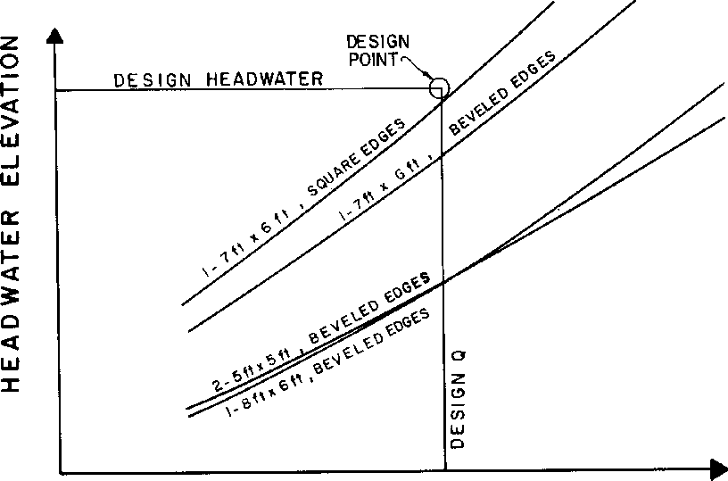
>
> 

**Figure C-2--Box Culvert Outlet Control Performance Curves**

1.  Calculate the inlet control headwater for the culvert barrel selected based on outlet control.

2.  Determine the required face invert elevation to pass the design discharge by subtracting the headwater depth from the design headwater elevation.

<!-- -->

1.  If the inlet invert elevation is above the stream bed elevation at the control section, the invert should be lowered to the stream bed. The culvert will then have a capacity exceeding the design flow with the headwater at the design headwater elevation.

2.  If the required invert elevation is below the stream bed elevation at the face, the invert must be depressed using a FALL.

3.  If, in the designer's judgment, the required FALL is excessive, the inlet geometry must be improved or a larger barrel must be used.

211

**Figure C-3--Inlet Control Performance Curves Various Inlet Configurations**

d\. If the FALL is acceptable, plot the inlet control performance curve. Again, at least three points are necessary; one at the design flow rate and one on either side of the design flow rate.

Figure C-3 depicts a series of inlet edge configurations, along with the outlet control performance curve for the selected barrel. Note that an inlet with square edges and no FALL will not meet the design conditions. Either square edges with a FALL or beveled edges with no FALL satisfy the design criteria.

**D. <u>Analyze the Effects of Additional Fall </u>**

From Figure C-3, one can see that additional FALL or inlet improvements such as a tapered-inlet would increase the culvert capacity in inlet control. The inlet control performance curve would be closer to the outlet control curve for the selected culvert barrel, which passes below the design point. Of course, all such considerations are limited by the designer's appraisal of the acceptable FALL.

212

**Figure C-4--Optimization of Performance in Inlet Control**

Some possibilities are illustrated in Figure C-4. The minimum inlet control performance which will meet the design point is illustrated by curve A. In this design, the cost for inlet improvements and/or FALL is at a minimum and the inlet will pass a flood exceeding the design flow before performance is governed by outlet control. This performance is adequate in many locations, including those where headwaters in excess of the allowable would be tolerable.

Curve B illustrates the performance of a design which takes full advantage of the potential capacity of the selected culvert and the site to pass the maximum possible flow at the design headwater elevation. A safety factor in capacity is thereby incorporated by geometric improvements at the inlet, by a FALL, or by a combination of the two. Additional inlet improvements and/or FALL will not increase the capacity at or above the design headwater elevation.

Curve C illustrates the performance of a design which passes the design flow at the lowest possible headwater. Additional inlet improvements and/or FALL will not reduce the required headwater elevation at the design flow rate.

The water surface elevation in the natural stream may be a limiting factor in design. The reduction in headwater elevation illustrated by curve C is limited by the natural water surface elevation in the stream The reduction is also limited by the outlet control performance curve. If the water surface elevations in the natural stream had fallen below curve D, curve D gives the maximum reduction in headwater elevation at the design flow. Flow depths calculated by

213

assuming normal depth in the stream channel may be used to estimate natural water surface elevations in the stream at the culvert inlet.

Curve A has been previously established for the inlet control section. To define any other inlet control performance curve such as curve B, C, or D for the inlet control section:

1.  Select the point of interest on the outlet control performance curve.

2.  Measure the vertical distance from that point to curve A. This is the difference in FALL between curve A and the curve to be established. For example, the FALL on the control section for curve A plus the distance between curves A and B is the FALL on the control section for curve B.

> 

**Figure C-5--Possible Face Design Selections Tapered Inlet**

214

**E. <u>Tapered Inlet Face Control Performance Curves</u>**

Either a side-tapered inlet with an upstream sump or slope-tapered inlet design may be used if a FALL is required at the throat control section of a tapered inlet. The minimum face design for the tapered inlet is one with a performance curve which does not exceed the design point. However, a "balanced" design requires that full advantage be taken of the increased capacity and/or lower headwater gained through use of various FALLs. This suggests a face performance curve which intersects the throat control curve either: (1) at the design headwater elevation, (2) at the design flow rate, (3) at its intersection with the outlet control curve, or (4) at other points selected by the designer. These options are illustrated in Figure C-5 by points a through e representing various points on the throat control performance curves. The options are:

1.  Intersection of face and throat control performance curves at the design headwater elevation (points a or b).

<!-- -->

3.  Intersection of face and throat control performance curves at the design flow rate (points a, c or d). This option makes full use of the FALL to increase capacity and reduce headwater requirements at flows equal to or greater than the design flow rate.

4.  Intersection of the face control performance curve with throat control performance curve at its intersection with the outlet control performance curve (points b or e). This option results in the minimum face size which can be used to make full use of the increased capacity available from the FALL at the throat.

5.  Variations in the above options are available to the designer. For example, the culvert face can be designed so that culvert performance will change from face control to throat control at any discharge at which inlet control governs. Options 1 through 3, however, appear to fulfill most design objectives. Generally, the design objective will be to design either the minimum face size to achieve the maximum increase in capacity possible for a given FALL, or the maximum possible decrease in the required headwater for a given depression for any discharge equal to or greater than the design discharge.

Figure C-6 illustrates some of the possible tapered inlet designs for a specific design situation. The dimensions of the side-tapered inlet are the same for all options. This is because performance of the side-tapered inlet face nearly parallels the performance of the throat and an increase in headwater on the throat by virtue of an increased FALL results in an almost equal increase in headwater on the face. Depressing the throat of a culvert with a side-tapered inlet requires additional barrel length.

Face dimensions and inlet length increase for the slope-tapered inlet as the capacity of the culvert is increased by additional FALL on the throat. No additional headwater depth is created at the face by placing additional depression on the throat. However, use of a greater depression at the throat of a culvert with a slope-tapered inlet does not increase the barrel length.

215

**APPENDIX D**

**DESIGN CHARTS, TABLES, AND FORMS**

> <u>Table Reference Tables</u>
>
> 11 Manning’s n For Small Natural Stream Channels
>
> 12 Entrance Loss Coefficients

Note: **Design Charts are given in SI and English Units. For example, Chart 1A is in SI Units and Chart 1B is in English Units.** English design charts have a small symbol in the upper outside corner representing the shape involved. SI charts have the chart number in a box.

> <u>Chart Circular Culverts</u>
>
> 1A, 1B Headwater Depth for Concrete Pipe Culverts With Inlet Control
>
> 2A, 2B Headwater Depth for C.M. Pipe With Inlet Control
>
> 3A, 3B Headwater Depth for Circular Pipe Culverts with Beveled Ring Control
>
> 4A, 4B Critical Depth - Circular Pipe
>
> 5A, 5B Head for Concrete Pipe Culverts Flowing Full, n = 0.012
>
> 6A, 6B Head for Standard C.M. Pipe Culverts Flowing Full, n = 0.024
>
> 7A, 7B Head for Structural Plate Corrugated Metal Pipe Culverts Flowing Full, n = 0.0328 to 0.0302
>
> <u>Concrete Box Culverts</u>
>
> 8A, 8B Headwater Depth for Box Culverts with Inlet Control
>
> 9A, 9B Headwater Depth for Inlet Control Rectangular Box Culverts, Flared Wingwalls 18° to 33.7° and 45

217

> <u>Chart Concrete Box Culverts (Continued)</u>
>
> 11A, 11B Headwater Depth for Inlet Control, Single Barrel Box Culverts, Skewed Headwalls, Chamfered or Beveled Inlet Edges
>
> 12A, 11B Headwater Depth for Inlet Control, Rectangular Box Culverts, Flared Wingwalls, Normal and Skewed Inlets 19 mm (12A - 3/4-inch) (12B - 3/4-inch) Chamfer at Top of Opening
>
> 13A, 13B Headwater Depth for Inlet Control, Rectangular Box Culverts, Offset Flared Wingwalls and Beveled Edge at Top of Inlet
>
> 14A, 14B Critical Depth, Rectangular Section
>
> 15A, 15B Head for Concrete Box Culverts Flowing Full, n = 0.012
>
> <u>Corrugated Metal Box Culverts</u>
>
> 16A, 16B Inlet Control, Corrugated Metal Box Culverts, Rise/Span \< 0.3
>
> 17A, 17B Inlet Control, Corrugated Metal Box Culverts, 0.3 ≤ Rise/Span \< 0.4
>
> 18A, 18B Inlet Control, Corrugated Metal Box Culverts, 0.4 ≤ Rise/Span \< 0.5
>
> 19A, 19B Inlet Control, Corrugated Metal Box Culverts, Rise/Span ≥ 0.5
>
> 20A, 20B Dimensionless Critical Depth Chart, Corrugated Metal Boxes
>
> 21A, 21B Head for Corrugated Metal Box Culverts Flowing Full with Concrete Bottom, Rise/Span \< 0.3
>
> 22A, 22B Head for Corrugated Metal Box Culverts Flowing Full with Concrete Bottom, 0.3 ≤ Rise/Span \< 0.4
>
> 23A, 23B Head for Corrugated Metal Box Culverts Flowing Full with Concrete Bottom, 0.4 ≤ Rise/Span \< 0.5
>
> 24A, 24B Head for Corrugated Metal Box Culverts Flowing Full with Concrete Bottom, Rise/Span ≥ 0.5
>
> 25A, 25B Head for Corrugated Metal Box Culverts Flowing Full with Corrugated Metal Bottom, Rise/Span \< 0.3
>
> 26A, 26B Head for Corrugated Metal Box Culverts Flowing Full with Corrugated Bottom, 0.3 ≤ Rise/Span \< 0.4
>
> 27A, 27B Head for Corrugated Metal Box Culverts Flowing Full with Corrugated Bottom, 0.4 ≤ Rise/Span \< 0.5

218

> <u>Chart Corrugated Metal Box Culverts (Continued)</u>
>
> 28A, 28B Head for Corrugated Metal Box Culverts Flowing Full with Corrugated Bottom,
>
> Rise/Span ≥ 0.5
>
> <u>Elliptical Culverts</u>
>
> 29A, 29B Headwater for Oval Concrete Pipe Culverts Long Axis Horizontal with Inlet
>
> Control
>
> 30A, 30B For Oval Concrete Pipe Culverts Long Axis Vertical with Inlet Control
>
> 31A, 31B Critical Depth - Oval Concrete Pipe Long Axis Horizontal
>
> 32A, 32B Critical Depth - Oval Concrete Pipe Long Axis Vertical
>
> 33A, 33B Head for Oval Concrete Pipe Culverts Long Axis Horizontal or Vertical
>
> Flowing Full, n = 0.012
>
> <u>Pipe/Arch Culverts</u>
>
> 34A, 34B Headwater Depth for C.M. Pipe-Arch Culverts with Inlet Control
>
> 35A, 35B Headwater Depth for Inlet Control Structural Plate Pipe-Arch Culverts,
>
> 35A - 457 mm (18-inch - 35B) Radius Corner Plate, Projecting or Headwall Inlet, Headwall with or without Edge Bevel
>
> 36A, 36B Headwater Depth for Inlet Control Structural Plate Pipe-Arch Culverts,
>
> 787 mm (Chart 36A (31-inch - Chart 36B) Radius Corner Plate, Projecting or
>
> Headwall Inlet, Headwall with or without Edge Bevel
>
> 37A, 37B Critical Depth - Standard Corrugated Metal Pipe-Arch
>
> 38A, 38B Critical Depth - Structural Plate Corrugated Metal Pipe-Arch
>
> 39A, 39B Head for Standard C.M. Pipe-Arch Culverts Flowing Full, n = 0.024
>
> 40A, 40B Head for Structural Plate Corrugated Metal Pipe-Arch Culverts, 457 mm - 40A
>
> (18-inch - 40B) Corner Radius Flowing Full, n = 0.0327 - 0.0306

219

> <u>Chart Arch Culverts</u>
>
> 41A, 41B Headwater Depth for Corrugated Metal Arch Culverts with Inlet Control
>
> 0.3 ≤ Rise/Span \< 0.4
>
> 42A, 42B Headwater Depth for Corrugated Metal Arch Culverts with Inlet Control  
> 0.4 ≤ Rise/Span \< 0.5
>
> 43A, 43B Headwater Depth for Corrugated Metal Arch Culverts with Inlet Control  
> Rise/Span ≥ 0.5
>
> 44A, 44B Dimensionless Critical Depth Chart, Corrugated Metal Arches
>
> 45A, 45B Head for Corrugated Metal Arch Culverts, Flowing Full with Concrete Bottom,
>
> 0.3 ≤ Rise/Span \< 0.4
>
> 46A, 46B Head for Corrugated Metal Arch Culverts, Flowing Full with Concrete Bottom,  
> 0.4 ≤ Rise/Span \< 0.5
>
> 47A, 47B Head for Corrugated Metal Arch Culverts, Flowing Full with Concrete Bottom,  
> Rise/Span ≥ 0.5
>
> 48A, 48B Head for Corrugated Metal Arch Culverts, Flowing Full with Earth Bottom,  
> 0.3 ≤ Rise/Span \< 0.4
>
> 49A, 49B Head for Corrugated Metal Arch Culverts, Flowing Full with Earth Bottom,  
> 0.4 ≤ Rise/Span \< 0.5
>
> 50A, 50B Head for Corrugated Metal Arch Culverts, Flowing Full with Earth Bottom,  
> Rise/Span ≥ 0.5
>
> <u>Long Span Culverts</u>
>
> 51A, 51B Circular or Elliptical Structural Plate CMP with Inlet Control
>
> 52A, 52B High and Low Profile Structural Plate Arches with Inlet Control
>
> 53A, 53B Dimensionless Critical Depth Chart, Structural Plate Ellipse Long Axis
>
> Horizontal
>
> 54A, 54B Dimensionless Critical Depth Chart, Structural Plate Low and High Profile  
> Arches

220

<u>Chart Circular Tapered Inlets</u>

> 55A, 55B Throat Control for Side-Tapered Inlets to Pipe Culvert (Circular Section Only)
>
> 56A, 56B Face Control for Side-Tapered Inlets to Pipe Culverts (Non-Rectangular
>
> Section Only)
>
> <u>Rectangular Tapered Inlets</u>
>
> 57A, 57B Throat Control for Box Culverts with Tapered Inlets
>
> 58A, 58B Face Control for Box Culverts with Side-Tapered Inlets
>
> 59A, 59B Face Control for Box Culverts with Slope-Tapered Inlets
>
> <u>Design Forms</u>
>
> Culvert Design Form
>
> Tapered Inlet Design Form
>
> Slope-Tapered Inlet With Mitered Face - Design Form
>
> Storage Routing Calculation Form
>
> Water Surface Profile Computation Form

221

> Table 11--Manning’s n for Small Natural Stream Channels.  
> Surface width at flood stage less than 30 m (100 ft)

1\. Fairly regular section:

1.  Some grass and weeds, little or no brush 0.030--0.035

2.  Dense growth of weeds, depth of flow materially greater

> than weed height 0.035-0.05

3.  Some weeds, light brush on banks 0.035--0.05

4.  Some weeds, heavy brush on banks 0.05--0.07

5.  Some weeds, dense willows on banks 0.06--0.08

6.  For trees within channel, with branches submerged at high stage,

> increase all above values by 0.01--0.02

2\. Irregular sections, with pools, slight channel meander; increase values

> given above about 0.01--0.02

3\. Mountain streams, no vegetation in channel, banks usually steep, trees and brush along banks submerged at high stage:

1.  Bottom of gravel, cobbles, and few boulders 0.04--0.05

2.  Bottom of cobbles, with large bounders 0.05--0.07

222

> **10 20 30 40 50 60 TO 80 90 100**

**DISCHARGE-Q-CFS**

**231**

> **CHART 6A**

<table>
<colgroup>
<col style="width: 11%" />
<col style="width: 40%" />
<col style="width: 47%" />
</colgroup>
<tbody>
<tr class="odd">
<td><ul>
<li>
0.05
</li>
</ul></td>
<td><blockquote>

<strong>Adapted from</strong>

<strong>Bureau of Public Roads Jan. 1963</strong>

</blockquote></td>
<td><blockquote>

<strong>HEAD FOR 
STANDARD 
C.M. PIPE CULVERTS 
FLOWING FULL 
n=0.024</strong>

</blockquote></td>
</tr>
</tbody>
</table>

**234**

7 **2000**

**- 1000  
eso**

> **:600**

- **500**

- **400**

- **300**

> **- 200**

LL-

z: '00 IN

**s SO 0  
**WEp**- 60**

**4-50  
X**

a**-40 ig**

**SS, 141**

- **30**

a

> 7 **20**

**-10**

- **e**

- **6**

- **5  
  > -4**

> **-3**

<table>
<colgroup>
<col style="width: 47%" />
<col style="width: 52%" />
</colgroup>
<tbody>
<tr class="odd">
<td><ul>
<li>
<strong>2</strong>
</li>
</ul>

<strong>SUREAU OF PUOLIC ROADS AN. 1963</strong>
</td>
<td><blockquote>

<strong>HEAD FOR 
STANDARD 
C. M. PIPE CULVERTS 
FLOWING FULL 
</strong>n <strong>0.024</strong>

</blockquote></td>
</tr>
</tbody>
</table>

235

**CHART 8B**

<table>
<colgroup>
<col style="width: 6%" />
<col style="width: 15%" />
<col style="width: 10%" />
<col style="width: 5%" />
<col style="width: 26%" />
<col style="width: 12%" />
<col style="width: 8%" />
<col style="width: 8%" />
<col style="width: 6%" />
</colgroup>
<tbody>
<tr class="odd">
<td>
<strong>-12</strong>

-1
</td>
<td></td>
<td></td>
<td></td>
<td colspan="3">
7 <strong>600</strong>

<strong>(I)</strong> (2)

<blockquote>

<strong>500</strong>

</blockquote></td>
<td colspan="2">
(3)

<strong>9</strong> I's
</td>
</tr>
<tr class="even">
<td rowspan="2">- 10</td>
<td rowspan="2"></td>
<td rowspan="2"></td>
<td rowspan="2"></td>
<td rowspan="2"><strong>7 400 5'. 2' Box 0:</strong></td>
<td>
<strong>EXAMPLE</strong> B

<strong>75 of.</strong>
</td>
<td></td>
<td></td>
<td></td>
</tr>
<tr class="odd">
<td rowspan="2"></td>
<td rowspan="2"></td>
<td rowspan="2"><strong>-7</strong></td>
<td rowspan="2"></td>
</tr>
<tr class="even">
<td></td>
<td></td>
<td></td>
<td></td>
<td><strong>0/B a 15cf•nt</strong></td>
</tr>
<tr class="odd">
<td></td>
<td></td>
<td></td>
<td></td>
<td colspan="2"></td>
<td><strong>6</strong></td>
<td></td>
<td></td>
</tr>
<tr class="even">
<td><strong>-9</strong></td>
<td></td>
<td></td>
<td></td>
<td colspan="2">
<strong>11W NW</strong>

<blockquote>

aoo <strong>Wit</strong>

</blockquote>

<strong>o foot</strong>
</td>
<td><strong>5</strong></td>
<td>-<strong>6</strong></td>
<td><strong>7</strong></td>
</tr>
<tr class="odd">
<td>—</td>
<td></td>
<td></td>
<td></td>
<td colspan="2"><strong>(I) 1.75 3.5</strong></td>
<td></td>
<td><strong>-5</strong></td>
<td>6</td>
</tr>
<tr class="even">
<td></td>
<td></td>
<td></td>
<td></td>
<td colspan="2"><blockquote>

<strong>200 (2) 1.90 3.8</strong>

</blockquote></td>
<td><strong>4</strong></td>
<td></td>
<td></td>
</tr>
<tr class="odd">
<td></td>
<td></td>
<td></td>
<td></td>
<td><strong>(3) 2.05</strong></td>
<td><strong>4.I</strong></td>
<td></td>
<td><strong>—4</strong></td>
<td></td>
</tr>
<tr class="even">
<td></td>
<td></td>
<td></td>
<td></td>
<td></td>
<td></td>
<td></td>
<td></td>
<td><strong>4</strong></td>
</tr>
<tr class="odd">
<td><strong>- 7</strong></td>
<td></td>
<td></td>
<td></td>
<td colspan="2"></td>
<td><strong>3</strong></td>
<td></td>
<td></td>
</tr>
<tr class="even">
<td></td>
<td></td>
<td></td>
<td></td>
<td colspan="2"></td>
<td></td>
<td></td>
<td><strong>3</strong></td>
</tr>
<tr class="odd">
<td><strong>-6</strong></td>
<td></td>
<td></td>
<td></td>
<td colspan="2">- 100</td>
<td></td>
<td></td>
<td></td>
</tr>
<tr class="even">
<td></td>
<td></td>
<td></td>
<td>0 
w</td>
<td colspan="2">
-

— <strong>BO</strong>
</td>
<td>-2</td>
<td></td>
<td></td>
</tr>
<tr class="odd">
<td></td>
<td></td>
<td></td>
<td>w</td>
<td colspan="2">-</td>
<td></td>
<td rowspan="2"><strong>-2</strong></td>
<td></td>
</tr>
<tr class="even">
<td rowspan="2"></td>
<td rowspan="2"></td>
<td rowspan="2"></td>
<td rowspan="2">a</td>
<td colspan="2" rowspan="2">- <strong>60</strong></td>
<td rowspan="2"></td>
<td rowspan="2"><strong>2</strong></td>
</tr>
<tr class="odd">
<td></td>
</tr>
<tr class="even">
<td><strong>- 5</strong></td>
<td></td>
<td></td>
<td>
<strong>0</strong>

cLLi
</td>
<td colspan="2">
<strong>— 50 V I-</strong>

<strong>X</strong>

<strong>0</strong>
</td>
<td><strong>- 1.5</strong></td>
<td></td>
<td></td>
</tr>
<tr class="odd">
<td></td>
<td></td>
<td></td>
<td><strong>Z</strong></td>
<td colspan="2"><ul>
<li>
<strong>- 40</strong>
</li>
</ul></td>
<td></td>
<td><strong>-1.5</strong></td>
<td></td>
</tr>
<tr class="even">
<td></td>
<td></td>
<td></td>
<td></td>
<td></td>
<td></td>
<td></td>
<td></td>
<td><strong>1.5</strong></td>
</tr>
<tr class="odd">
<td><strong>4</strong></td>
<td></td>
<td></td>
<td><strong>x</strong></td>
<td>
<strong>0</strong>%

<em>-</em> <strong>30 iez`.</strong>
</td>
<td>
<em>Ls.</em>

<strong>0</strong>
</td>
<td></td>
<td></td>
<td></td>
</tr>
<tr class="even">
<td></td>
<td></td>
<td></td>
<td>0</td>
<td colspan="2"><blockquote>

<strong>20X CC</strong>

</blockquote></td>
<td></td>
<td></td>
<td></td>
</tr>
<tr class="odd">
<td rowspan="2"></td>
<td rowspan="2"></td>
<td rowspan="2"></td>
<td rowspan="2"><strong>0.-</strong></td>
<td rowspan="2"><strong>:7</strong></td>
<td>z</td>
<td>- <strong>1.0</strong></td>
<td></td>
<td></td>
</tr>
<tr class="even">
<td></td>
<td></td>
<td>- <strong>1.0</strong></td>
<td><strong>1.0</strong></td>
</tr>
<tr class="odd">
<td><strong>- 3</strong></td>
<td></td>
<td></td>
<td><strong>w</strong></td>
<td colspan="2"><strong>- Anglo of</strong></td>
<td></td>
<td></td>
<td></td>
</tr>
<tr class="even">
<td rowspan="2"></td>
<td rowspan="2"></td>
<td rowspan="2"><strong>V</strong></td>
<td rowspan="2"><strong>a</strong></td>
<td rowspan="2">(0 <strong>Flora 
— 8</strong></td>
<td>
0.

O
</td>
<td rowspan="2">- .5</td>
<td rowspan="2"></td>
<td rowspan="2">.9</td>
</tr>
<tr class="odd">
<td>cc</td>
</tr>
<tr class="even">
<td></td>
<td></td>
<td></td>
<td><strong>0</strong></td>
<td colspan="2"></td>
<td></td>
<td></td>
<td></td>
</tr>
<tr class="odd">
<td></td>
<td>V</td>
<td></td>
<td></td>
<td colspan="2"><blockquote>

<strong>6</strong>

</blockquote></td>
<td></td>
<td></td>
<td></td>
</tr>
<tr class="even">
<td rowspan="2">—2</td>
<td rowspan="2">V</td>
<td rowspan="2"></td>
<td rowspan="2">
<strong>0</strong>

<strong>0</strong>
</td>
<td>
<strong>- 5</strong>

<strong>WING</strong>

<blockquote>

<strong>SCALE</strong>

<strong>—</strong>

</blockquote></td>
<td rowspan="2">
0

<strong>WALL</strong>

x
</td>
<td rowspan="2"></td>
<td rowspan="2">-<strong>.7</strong></td>
<td rowspan="2"><strong>.7</strong></td>
</tr>
<tr class="odd">
<td>
<strong>- 4 FLARE</strong>

<strong>-</strong>
</td>
</tr>
<tr class="even">
<td></td>
<td></td>
<td></td>
<td></td>
<td colspan="2"><blockquote>

<strong>(I) 30* to 75.</strong>

</blockquote></td>
<td></td>
<td></td>
<td></td>
</tr>
<tr class="odd">
<td rowspan="2"></td>
<td rowspan="2"></td>
<td rowspan="2"></td>
<td rowspan="2"></td>
<td rowspan="2">
<strong>- 3</strong>

<strong>121 90*and</strong>
</td>
<td></td>
<td></td>
<td></td>
<td></td>
</tr>
<tr class="even">
<td></td>
<td></td>
<td></td>
<td>.6</td>
</tr>
<tr class="odd">
<td></td>
<td></td>
<td></td>
<td></td>
<td colspan="2"><blockquote>

<strong>(3) (wtonsions</strong>

</blockquote>

<strong>of Sidos)</strong>
</td>
<td></td>
<td></td>
<td></td>
</tr>
<tr class="even">
<td></td>
<td></td>
<td></td>
<td></td>
<td colspan="2"><strong>- 2</strong></td>
<td></td>
<td></td>
<td></td>
</tr>
<tr class="odd">
<td></td>
<td></td>
<td></td>
<td></td>
<td colspan="2"></td>
<td></td>
<td></td>
<td>.5</td>
</tr>
<tr class="even">
<td rowspan="2"></td>
<td rowspan="2"></td>
<td rowspan="2"></td>
<td rowspan="2"></td>
<td rowspan="2"><blockquote>

<strong>To woo Wale (2) or (3) prOloot horizontally to nolo (I).</strong>

</blockquote>

<strong>usa oiroloht inclined line</strong>
</td>
<td></td>
<td></td>
<td></td>
<td></td>
</tr>
<tr class="odd">
<td><blockquote>

<strong>thizn 
through</strong>

</blockquote></td>
<td></td>
<td></td>
<td></td>
</tr>
<tr class="even">
<td></td>
<td></td>
<td></td>
<td></td>
<td colspan="2">— <strong>0 and 0 looks, or rover., az</strong></td>
<td></td>
<td></td>
<td></td>
</tr>
<tr class="odd">
<td></td>
<td></td>
<td></td>
<td></td>
<td colspan="2"><blockquote>

<strong>Mut trots&amp;</strong>

</blockquote></td>
<td></td>
<td></td>
<td></td>
</tr>
<tr class="even">
<td></td>
<td></td>
<td></td>
<td></td>
<td>— .8</td>
<td></td>
<td></td>
<td></td>
<td><strong>.4</strong></td>
</tr>
<tr class="odd">
<td>- I</td>
<td></td>
<td></td>
<td></td>
<td>-.5</td>
<td></td>
<td><strong>.30</strong></td>
<td><strong>.35</strong></td>
<td><strong>.35</strong></td>
</tr>
</tbody>
</table>

> **HEADWATER DEPTH FOR BOX CULVERTS WITH INLET CONTROL**

**BUREAU OF PUBLIC ROADS JAN. 1963**

> **CHART 14 A**

<table>
<colgroup>
<col style="width: 16%" />
<col style="width: 16%" />
<col style="width: 16%" />
<col style="width: 16%" />
<col style="width: 16%" />
<col style="width: 16%" />
</colgroup>
<tbody>
<tr class="odd">
<td></td>
<td></td>
<td></td>
<td></td>
<td rowspan="2"></td>
<td rowspan="2">V</td>
</tr>
<tr class="even">
<td></td>
<td></td>
<td></td>
<td></td>
</tr>
<tr class="odd">
<td></td>
<td></td>
<td></td>
<td>B - base</td>
<td rowspan="3">
of section

(m'/s) in

dc = 0.467((Q/B)2)
</td>
<td rowspan="3">
(m) —

_
</td>
</tr>
<tr class="even">
<td></td>
<td></td>
<td></td>
<td>Q = flow</td>
</tr>
<tr class="odd">
<td></td>
<td></td>
<td></td>
<td></td>
</tr>
<tr class="even">
<td></td>
<td></td>
<td></td>
<td></td>
<td></td>
<td></td>
</tr>
<tr class="odd">
<td></td>
<td></td>
<td>dc CANNOT</td>
<td>EXCEED</td>
<td>TOP OF</td>
<td>PIPE</td>
</tr>
<tr class="even">
<td></td>
<td></td>
<td></td>
<td></td>
<td></td>
<td></td>
</tr>
<tr class="odd">
<td></td>
<td colspan="2">15</td>
<td colspan="2">25</td>
<td>1</td>
</tr>
</tbody>
</table>

> 10 20 30
>
> Q/B

Adapted from Bureau of Public Roads

**Critical Depth-Rectangular Section**

<table style="width:100%;">
<colgroup>
<col style="width: 20%" />
<col style="width: 6%" />
<col style="width: 3%" />
<col style="width: 28%" />
<col style="width: 19%" />
<col style="width: 5%" />
<col style="width: 6%" />
<col style="width: 6%" />
<col style="width: 3%" />
</colgroup>
<tbody>
<tr class="odd">
<td></td>
<td></td>
<td></td>
<td colspan="3">
<strong>CHART 19B</strong>

(2)

<strong>Entrance Conditions</strong>
</td>
<td>
—5.0

(3)
</td>
<td>
-5.0

(5)
</td>
<td><strong>-6.0</strong></td>
</tr>
<tr class="even">
<td></td>
<td></td>
<td></td>
<td colspan="2"><ol start="2" type="1">
<li>
<strong>90' headwall.</strong>
</li>
</ol></td>
<td></td>
<td><strong>—4,0</strong></td>
<td></td>
<td><strong>-5.0</strong></td>
</tr>
<tr class="odd">
<td></td>
<td></td>
<td></td>
<td><strong>5000</strong></td>
<td></td>
<td></td>
<td></td>
<td>-4.0</td>
<td></td>
</tr>
<tr class="even">
<td></td>
<td></td>
<td></td>
<td></td>
<td><ol start="0" type="1">
<li>
<strong>Thick wall</strong>
</li>
</ol></td>
<td></td>
<td></td>
<td></td>
<td><strong>-4.0</strong></td>
</tr>
<tr class="odd">
<td></td>
<td></td>
<td></td>
<td><strong>4000</strong></td>
<td><strong>projecting.</strong></td>
<td></td>
<td>-3.0</td>
<td></td>
<td></td>
</tr>
<tr class="even">
<td></td>
<td></td>
<td></td>
<td></td>
<td></td>
<td></td>
<td></td>
<td>-3.0</td>
<td></td>
</tr>
<tr class="odd">
<td></td>
<td></td>
<td></td>
<td></td>
<td><strong>(5)Thin wall</strong></td>
<td></td>
<td></td>
<td></td>
<td><strong>-3.</strong>0</td>
</tr>
<tr class="even">
<td></td>
<td></td>
<td></td>
<td><strong>3000</strong></td>
<td><strong>projecting.</strong></td>
<td></td>
<td></td>
<td></td>
<td></td>
</tr>
<tr class="odd">
<td></td>
<td></td>
<td></td>
<td><strong>—400</strong></td>
<td></td>
<td></td>
<td>-2.0</td>
<td>-2.0</td>
<td></td>
</tr>
<tr class="even">
<td></td>
<td></td>
<td></td>
<td><strong>2000</strong></td>
<td></td>
<td></td>
<td>-1.8</td>
<td>—1.8</td>
<td><strong>-2.0</strong></td>
</tr>
<tr class="odd">
<td></td>
<td></td>
<td></td>
<td></td>
<td></td>
<td></td>
<td><strong>-1.6</strong></td>
<td>
—1

6
</td>
<td></td>
</tr>
<tr class="even">
<td></td>
<td></td>
<td></td>
<td><strong>1500</strong></td>
<td></td>
<td></td>
<td></td>
<td></td>
<td></td>
</tr>
<tr class="odd">
<td></td>
<td></td>
<td></td>
<td>-300</td>
<td></td>
<td>O</td>
<td><strong>—1.4</strong></td>
<td>—1.4</td>
<td></td>
</tr>
<tr class="even">
<td></td>
<td></td>
<td>a*.</td>
<td></td>
<td></td>
<td><strong>se.</strong></td>
<td></td>
<td></td>
<td></td>
</tr>
<tr class="odd">
<td></td>
<td></td>
<td></td>
<td>1000</td>
<td></td>
<td></td>
<td>—1.2</td>
<td>—1.2</td>
<td></td>
</tr>
<tr class="even">
<td></td>
<td></td>
<td>I</td>
<td>
<strong>900</strong>

<strong>—250</strong>

<strong>800</strong>
</td>
<td></td>
<td></td>
<td>—</td>
<td></td>
<td><strong>1.2</strong></td>
</tr>
<tr class="odd">
<td></td>
<td></td>
<td></td>
<td><strong>700</strong></td>
<td></td>
<td></td>
<td>—1.0</td>
<td></td>
<td></td>
</tr>
<tr class="even">
<td></td>
<td></td>
<td></td>
<td></td>
<td></td>
<td></td>
<td></td>
<td>-1.0</td>
<td></td>
</tr>
<tr class="odd">
<td></td>
<td></td>
<td></td>
<td><strong>600</strong></td>
<td></td>
<td></td>
<td></td>
<td></td>
<td></td>
</tr>
<tr class="even">
<td></td>
<td><strong>o</strong></td>
<td></td>
<td>
<strong>—200</strong>

<strong>le: 500</strong>
</td>
<td></td>
<td>
<strong>CC -</strong>

2 -
</td>
<td>
.9

-
</td>
<td></td>
<td>-1.0</td>
</tr>
<tr class="odd">
<td></td>
<td>2 
<strong>C.7</strong></td>
<td></td>
<td><strong>400</strong></td>
<td></td>
<td></td>
<td><strong>8</strong></td>
<td></td>
<td></td>
</tr>
<tr class="even">
<td></td>
<td></td>
<td></td>
<td></td>
<td></td>
<td><strong>a</strong></td>
<td></td>
<td></td>
<td></td>
</tr>
<tr class="odd">
<td></td>
<td></td>
<td></td>
<td><strong>O</strong></td>
<td></td>
<td><ul>
<li>
<strong>-</strong>
</li>
</ul></td>
<td></td>
<td></td>
<td></td>
</tr>
<tr class="even">
<td></td>
<td>o</td>
<td></td>
<td></td>
<td></td>
<td><strong>O</strong></td>
<td></td>
<td></td>
<td></td>
</tr>
<tr class="odd">
<td></td>
<td><strong>0</strong></td>
<td></td>
<td><ul>
<li>
<strong>300</strong>
</li>
</ul></td>
<td></td>
<td></td>
<td><strong>-</strong> .7</td>
<td></td>
<td></td>
</tr>
<tr class="even">
<td></td>
<td></td>
<td></td>
<td><strong>—ISO</strong></td>
<td></td>
<td>•</td>
<td></td>
<td></td>
<td></td>
</tr>
<tr class="odd">
<td></td>
<td>O</td>
<td></td>
<td><strong>—140 •</strong></td>
<td></td>
<td><strong>3</strong></td>
<td></td>
<td></td>
<td></td>
</tr>
<tr class="even">
<td></td>
<td>
O

0
</td>
<td></td>
<td></td>
<td></td>
<td></td>
<td></td>
<td></td>
<td></td>
</tr>
<tr class="odd">
<td></td>
<td>O</td>
<td></td>
<td><strong>—130</strong> • <strong>200</strong></td>
<td></td>
<td>15</td>
<td></td>
<td></td>
<td></td>
</tr>
<tr class="even">
<td></td>
<td></td>
<td></td>
<td>0</td>
<td></td>
<td></td>
<td></td>
<td></td>
<td></td>
</tr>
<tr class="odd">
<td></td>
<td></td>
<td></td>
<td><strong>—120</strong></td>
<td></td>
<td><strong>S.</strong></td>
<td></td>
<td></td>
<td></td>
</tr>
<tr class="even">
<td></td>
<td></td>
<td></td>
<td><strong>ISO</strong></td>
<td></td>
<td></td>
<td></td>
<td></td>
<td></td>
</tr>
<tr class="odd">
<td></td>
<td></td>
<td></td>
<td></td>
<td></td>
<td><strong>O</strong></td>
<td></td>
<td></td>
<td>1".</td>
</tr>
<tr class="even">
<td><blockquote>

<strong>Example: D=8.0 ft</strong>

</blockquote></td>
<td></td>
<td></td>
<td>
<strong>100</strong>

<strong>100</strong>
</td>
<td></td>
<td><strong>CC</strong></td>
<td>-.5 -.5</td>
<td></td>
<td>- 5</td>
</tr>
<tr class="odd">
<td><strong>0=1004 cfs</strong></td>
<td></td>
<td></td>
<td><strong>—90 90</strong></td>
<td></td>
<td></td>
<td></td>
<td></td>
<td></td>
</tr>
<tr class="even">
<td></td>
<td></td>
<td></td>
<td><strong>80</strong></td>
<td></td>
<td></td>
<td></td>
<td></td>
<td></td>
</tr>
<tr class="odd">
<td><strong>Entrance NW</strong></td>
<td><strong>NW</strong></td>
<td></td>
<td></td>
<td></td>
<td></td>
<td></td>
<td></td>
<td></td>
</tr>
<tr class="even">
<td><strong>Type D</strong></td>
<td><strong>ft</strong></td>
<td></td>
<td>- 6<strong>0 70</strong></td>
<td></td>
<td></td>
<td></td>
<td></td>
<td></td>
</tr>
<tr class="odd">
<td><ol start="2" type="1">
<li>
<strong>1.04</strong>
</li>
</ol></td>
<td><strong>8.32</strong></td>
<td></td>
<td><strong>60</strong></td>
<td></td>
<td></td>
<td></td>
<td></td>
<td></td>
</tr>
<tr class="even">
<td><ol start="3" type="1">
<li>
<strong>1.07</strong>
</li>
</ol></td>
<td><strong>8.56</strong></td>
<td></td>
<td><strong>—70 50</strong></td>
<td></td>
<td></td>
<td></td>
<td></td>
<td></td>
</tr>
<tr class="odd">
<td><strong>(5) 1.15</strong></td>
<td><strong>9.20</strong></td>
<td></td>
<td></td>
<td></td>
<td></td>
<td></td>
<td>MM.</td>
<td></td>
</tr>
<tr class="even">
<td></td>
<td></td>
<td></td>
<td></td>
<td><blockquote>

<strong>40</strong>

</blockquote></td>
<td></td>
<td></td>
<td></td>
<td></td>
</tr>
<tr class="odd">
<td></td>
<td></td>
<td></td>
<td><strong>—60</strong></td>
<td></td>
<td></td>
<td></td>
<td></td>
<td></td>
</tr>
<tr class="even">
<td rowspan="2"></td>
<td rowspan="2"></td>
<td rowspan="2"></td>
<td>=-1</td>
<td rowspan="2"><blockquote>

<strong>30</strong>

</blockquote></td>
<td rowspan="2"></td>
<td rowspan="2"></td>
<td rowspan="2"></td>
<td rowspan="2">-.3</td>
</tr>
<tr class="odd">
<td></td>
</tr>
<tr class="even">
<td></td>
<td></td>
<td></td>
<td>S PAN</td>
<td></td>
<td></td>
<td></td>
<td></td>
<td></td>
</tr>
<tr class="odd">
<td></td>
<td></td>
<td></td>
<td></td>
<td><blockquote>

<strong>20</strong>

</blockquote></td>
<td></td>
<td></td>
<td></td>
<td></td>
</tr>
</tbody>
</table>

<table>
<colgroup>
<col style="width: 55%" />
<col style="width: 27%" />
<col style="width: 16%" />
</colgroup>
<tbody>
<tr class="odd">
<td>Nomographs adapted from material furnished by 
Kaiser Aluminum and Chemical Corporation</td>
<td><blockquote>

<strong>HEADWATER FOR C.M. BOX 0.5 <em>S</em> RISE / WITH INLET</strong>

</blockquote></td>
<td><blockquote>

<strong>DEPTH CULVERTS SPAN</strong>

</blockquote>

<strong>CONTROL</strong>
</td>
</tr>
</tbody>
</table>

261

> **CHART 22A**

266

> **CHART 37A**

<table style="width:100%;">
<colgroup>
<col style="width: 6%" />
<col style="width: 5%" />
<col style="width: 5%" />
<col style="width: 5%" />
<col style="width: 5%" />
<col style="width: 5%" />
<col style="width: 5%" />
<col style="width: 5%" />
<col style="width: 5%" />
<col style="width: 5%" />
<col style="width: 5%" />
<col style="width: 5%" />
<col style="width: 5%" />
<col style="width: 5%" />
<col style="width: 5%" />
<col style="width: 5%" />
<col style="width: 6%" />
</colgroup>
<tbody>
<tr class="odd">
<td></td>
<td></td>
<td></td>
<td></td>
<td></td>
<td></td>
<td></td>
<td></td>
<td></td>
<td></td>
<td></td>
<td></td>
<td></td>
<td></td>
<td></td>
<td></td>
<td></td>
</tr>
<tr class="even">
<td></td>
<td></td>
<td></td>
<td></td>
<td></td>
<td></td>
<td></td>
<td></td>
<td></td>
<td></td>
<td></td>
<td></td>
<td></td>
<td></td>
<td></td>
<td></td>
<td></td>
</tr>
<tr class="odd">
<td></td>
<td></td>
<td></td>
<td></td>
<td></td>
<td></td>
<td></td>
<td></td>
<td></td>
<td></td>
<td></td>
<td></td>
<td></td>
<td></td>
<td></td>
<td></td>
<td></td>
</tr>
<tr class="even">
<td></td>
<td></td>
<td></td>
<td></td>
<td></td>
<td></td>
<td></td>
<td></td>
<td></td>
<td></td>
<td></td>
<td></td>
<td></td>
<td></td>
<td></td>
<td></td>
<td></td>
</tr>
<tr class="odd">
<td></td>
<td></td>
<td>/</td>
<td></td>
<td rowspan="2">
1060 x 610

mm

x510
</td>
<td rowspan="2">
mm

<blockquote>

mm Mtn

</blockquote></td>
<td rowspan="2">
x740

dc

I
</td>
<td>mm</td>
<td></td>
<td></td>
<td></td>
<td></td>
<td></td>
<td></td>
<td></td>
<td></td>
<td></td>
</tr>
<tr class="even">
<td></td>
<td>
/

610
</td>
<td>
710

<blockquote>

885 mm

</blockquote></td>
<td>
mm

mm

x 460
</td>
<td></td>
<td>CANNOT I</td>
<td>I</td>
<td></td>
<td>
EXCEED

I
</td>
<td>I</td>
<td>
TOP

I
</td>
<td>OF</td>
<td>PIPE</td>
<td></td>
</tr>
<tr class="odd">
<td>)</td>
<td colspan="4">0.2 I 0.4</td>
<td colspan="10">06 0.8 1 1.2 1.4</td>
<td colspan="2">1.6</td>
</tr>
</tbody>
</table>

> 0 1 0.3 0.5 0.7 0.9 1 1 13 15 1.7
>
> Discharge-Q (m'/s)

<table style="width:100%;">
<colgroup>
<col style="width: 4%" />
<col style="width: 10%" />
<col style="width: 14%" />
<col style="width: 14%" />
<col style="width: 14%" />
<col style="width: 14%" />
<col style="width: 14%" />
<col style="width: 14%" />
</colgroup>
<tbody>
<tr class="odd">
<td></td>
<td></td>
<td></td>
<td></td>
<td></td>
<td></td>
<td></td>
<td></td>
</tr>
<tr class="even">
<td></td>
<td></td>
<td></td>
<td></td>
<td></td>
<td></td>
<td></td>
<td></td>
</tr>
<tr class="odd">
<td></td>
<td></td>
<td></td>
<td></td>
<td></td>
<td></td>
<td></td>
<td></td>
</tr>
<tr class="even">
<td></td>
<td></td>
<td></td>
<td></td>
<td></td>
<td></td>
<td></td>
<td></td>
</tr>
<tr class="odd">
<td></td>
<td></td>
<td></td>
<td></td>
<td></td>
<td></td>
<td></td>
<td></td>
</tr>
<tr class="even">
<td></td>
<td></td>
<td></td>
<td></td>
<td></td>
<td></td>
<td></td>
<td></td>
</tr>
<tr class="odd">
<td></td>
<td></td>
<td>/</td>
<td></td>
<td></td>
<td></td>
<td></td>
<td></td>
</tr>
<tr class="even">
<td></td>
<td></td>
<td></td>
<td></td>
<td></td>
<td></td>
<td></td>
<td></td>
</tr>
<tr class="odd">
<td></td>
<td></td>
<td>1800 mm</td>
<td rowspan="2"><blockquote>

x 1200 mm 1100 mm mm

</blockquote></td>
<td></td>
<td></td>
<td></td>
<td></td>
</tr>
<tr class="even">
<td></td>
<td></td>
<td rowspan="2">
1440

1620 mm x mm x970 mm x 840 mm x 740 min
</td>
<td></td>
<td></td>
<td></td>
<td></td>
</tr>
<tr class="odd">
<td></td>
<td>
1240

1060
</td>
<td>mm</td>
<td rowspan="2">CANNOT</td>
<td rowspan="2">EXCEED I</td>
<td rowspan="2">TOP OF</td>
<td rowspan="2">PIPE</td>
</tr>
<tr class="even">
<td></td>
<td></td>
<td></td>
<td>dc</td>
</tr>
<tr class="odd">
<td>)</td>
<td></td>
<td colspan="4">
2 1 4

-
</td>
<td colspan="2">
6

_ —
</td>
</tr>
</tbody>
</table>

> Discharge-Q (m3/s)

Adapted from Bureau of Public Roads **Critical Depth-Standard C.M. Pipe**

> **Arch**

296

> Slope 3„y
>
> **SUBMERGED OUTLET CULVERT FLOWING FULL**

<table>
<colgroup>
<col style="width: 48%" />
<col style="width: 51%" />
</colgroup>
<tbody>
<tr class="odd">
<td>
<strong>Adapted from material furnished by</strong>

<strong>Kaiser Aluminum and Chemical Corporation</strong>
</td>
<td><blockquote>

<strong>HEAD FOR 
C.M. ARCH CULVERTS 
FLOWING FULL 
CONCRETE BOTTOM 
0.3 &lt; RISE/SPAN &lt; 0.4</strong>

</blockquote></td>
</tr>
</tbody>
</table>

**312**

> **CHART 52A**

<table>
<colgroup>
<col style="width: 100%" />
</colgroup>
<tbody>
<tr class="odd">
<td><blockquote>

trhin Edge Projecting

quare Edge

</blockquote>

Mitered

<blockquote>

Beveled Edge

</blockquote></td>
</tr>
</tbody>
</table>

0 1 2 3 4

Q/AD° 5

> **Inlet Control-Headwater Depth for High and Low Profile Structural Plate Corrugated Metal Arch**

**(SI Units)**

326

> **CHART 53A**

**Dimensionless Critical Depth Chart for Structural Plate Ellipse Long Axis Horizontal**

328

**CHART 53B** 0 CD

> 

**CHART 54B**

> 1.0 20 30 40 5.0 6.0 7.0

0/

**'A D"'"**

**331**

**THROAT CONTROL**

**FOR SIDE-TAPERED INLETS TO PIPE CULVERT**

**(CIRCULAR SECTION ONLY)**

332

**CHART 55B**

> **THROAT CONTROL**
>
> **FOR SIDE - TAPERED INLETS TO PIPE CULVERT**
>
> **(CIRCULAR SECTION ONLY)**

333

**CHART 60B**

> 

<table>
<colgroup>
<col style="width: 14%" />
<col style="width: 2%" />
<col style="width: 3%" />
<col style="width: 4%" />
<col style="width: 3%" />
<col style="width: 1%" />
<col style="width: 2%" />
<col style="width: 3%" />
<col style="width: 2%" />
<col style="width: 1%" />
<col style="width: 3%" />
<col style="width: 3%" />
<col style="width: 20%" />
<col style="width: 8%" />
<col style="width: 8%" />
<col style="width: 8%" />
<col style="width: 6%" />
</colgroup>
<tbody>
<tr class="odd">
<td rowspan="3"><blockquote>

<strong>3.I0</strong>

<strong>3.00</strong>

</blockquote></td>
<td colspan="12"></td>
<td colspan="4" rowspan="3">Cd L <em>I-1</em></td>
</tr>
<tr class="even">
<td></td>
<td></td>
<td colspan="2">PAYED</td>
<td colspan="2"></td>
<td></td>
<td colspan="2"></td>
<td></td>
<td></td>
<td><strong>Cd= ktCr</strong></td>
</tr>
<tr class="odd">
<td></td>
<td></td>
<td></td>
<td></td>
<td colspan="2"></td>
<td></td>
<td colspan="2"></td>
<td></td>
<td></td>
<td><strong>Qr =</strong></td>
</tr>
<tr class="even">
<td rowspan="2"><blockquote>

<strong>Cr</strong>

<strong>2.90</strong>

</blockquote></td>
<td></td>
<td></td>
<td></td>
<td></td>
<td colspan="2"></td>
<td></td>
<td colspan="2"></td>
<td></td>
<td></td>
<td colspan="5"><strong>1.O0</strong></td>
</tr>
<tr class="odd">
<td colspan="12"></td>
<td></td>
<td></td>
<td></td>
<td></td>
</tr>
<tr class="even">
<td colspan="13"><strong>0.16 0.20 0 24 0 28 0.32</strong></td>
<td></td>
<td></td>
<td></td>
<td></td>
</tr>
<tr class="odd">
<td colspan="13"></td>
<td></td>
<td></td>
<td></td>
<td><strong>AVER</strong></td>
</tr>
<tr class="even">
<td colspan="13" rowspan="2"><strong>A) DISCHARGE COEFFICIENT FOR 0.90</strong></td>
<td></td>
<td></td>
<td></td>
<td></td>
</tr>
<tr class="odd">
<td rowspan="2"></td>
<td rowspan="2"></td>
<td rowspan="2"></td>
<td rowspan="2"></td>
</tr>
<tr class="even">
<td colspan="13"><strong>HWr 0.15</strong></td>
</tr>
<tr class="odd">
<td rowspan="2"><blockquote>

<strong>3.10</strong>

</blockquote></td>
<td colspan="11"></td>
<td rowspan="2"></td>
<td rowspan="2"></td>
<td rowspan="2"></td>
<td rowspan="2"><strong>GRAVEL</strong></td>
<td rowspan="2"></td>
</tr>
<tr class="even">
<td rowspan="2"></td>
<td rowspan="2"></td>
<td colspan="3" rowspan="2"><strong>PAVED</strong></td>
<td colspan="3" rowspan="2"></td>
<td colspan="3" rowspan="2"></td>
</tr>
<tr class="odd">
<td></td>
<td><strong>0.80</strong></td>
<td></td>
<td></td>
<td></td>
<td></td>
</tr>
<tr class="even">
<td rowspan="2"><blockquote>

<strong>3.00</strong>

</blockquote></td>
<td></td>
<td></td>
<td colspan="3"></td>
<td colspan="3"></td>
<td colspan="3"></td>
<td rowspan="2"></td>
<td rowspan="2"></td>
<td rowspan="2"></td>
<td rowspan="2"></td>
<td rowspan="2"></td>
</tr>
<tr class="odd">
<td colspan="2"></td>
<td colspan="3"></td>
<td colspan="3"></td>
<td colspan="3"></td>
</tr>
<tr class="even">
<td></td>
<td colspan="2"></td>
<td colspan="3">GAP</td>
<td colspan="3"></td>
<td colspan="3"></td>
<td></td>
<td></td>
<td></td>
<td></td>
<td></td>
</tr>
<tr class="odd">
<td rowspan="2"><blockquote>

<strong>2.90</strong>

</blockquote></td>
<td colspan="2"></td>
<td colspan="3"></td>
<td colspan="3"></td>
<td colspan="3"></td>
<td rowspan="2"></td>
<td rowspan="2"></td>
<td rowspan="2"></td>
<td rowspan="2"></td>
<td rowspan="2"></td>
</tr>
<tr class="even">
<td colspan="2" rowspan="2"></td>
<td colspan="3" rowspan="2"></td>
<td colspan="3" rowspan="2"></td>
<td colspan="3" rowspan="2"></td>
</tr>
<tr class="odd">
<td></td>
<td><strong>0.70</strong></td>
<td></td>
<td></td>
<td></td>
<td></td>
</tr>
<tr class="even">
<td rowspan="2"><blockquote>

<strong>Cr 2.80</strong>

</blockquote></td>
<td colspan="2"></td>
<td colspan="3"></td>
<td colspan="3"></td>
<td colspan="3"></td>
<td rowspan="2"></td>
<td rowspan="2"></td>
<td rowspan="2"></td>
<td rowspan="2"></td>
<td rowspan="2"></td>
</tr>
<tr class="odd">
<td colspan="2"></td>
<td colspan="3"></td>
<td colspan="3"></td>
<td colspan="3"></td>
</tr>
<tr class="even">
<td><blockquote>

<strong>2.70</strong>

</blockquote></td>
<td colspan="2"></td>
<td colspan="3"></td>
<td colspan="3"></td>
<td colspan="3"></td>
<td></td>
<td></td>
<td></td>
<td></td>
<td></td>
</tr>
<tr class="odd">
<td rowspan="2"></td>
<td colspan="2" rowspan="2"></td>
<td colspan="3" rowspan="2"></td>
<td colspan="3" rowspan="2"></td>
<td colspan="3" rowspan="2"></td>
<td rowspan="2"><strong>0.60</strong></td>
<td></td>
<td></td>
<td></td>
<td></td>
</tr>
<tr class="even">
<td rowspan="3"></td>
<td rowspan="3"></td>
<td rowspan="3"></td>
<td rowspan="3"></td>
</tr>
<tr class="odd">
<td><blockquote>

<strong>2.60</strong>

</blockquote></td>
<td colspan="2"></td>
<td colspan="3"></td>
<td colspan="3"></td>
<td colspan="3"></td>
<td rowspan="2"></td>
</tr>
<tr class="even">
<td></td>
<td colspan="2"></td>
<td colspan="3"></td>
<td colspan="3"></td>
<td colspan="3"></td>
</tr>
<tr class="odd">
<td><blockquote>

<strong>2.50</strong>

</blockquote></td>
<td colspan="2"></td>
<td colspan="3"></td>
<td colspan="3"></td>
<td colspan="3"></td>
<td rowspan="2"></td>
<td rowspan="2"></td>
<td rowspan="2"></td>
<td rowspan="2"></td>
<td rowspan="2"></td>
</tr>
<tr class="even">
<td colspan="12" rowspan="3"><strong>0 1.O 2O 3O 4.0</strong></td>
</tr>
<tr class="odd">
<td rowspan="2"><strong>0.50</strong></td>
<td></td>
<td></td>
<td></td>
<td></td>
</tr>
<tr class="even">
<td colspan="4"></td>
</tr>
</tbody>
</table>

**0.7 0.8 0.9**

> **H Wr** ft. **h t/HWr**
>
> **B) DISCHARGE COEFFICIENT FOR C) SUBMERGENCE FACTOR HWr /Lr Z0.15**
>
> **English Discharge Coefficients for Roadway Overtopping**

**343**

<table>
<colgroup>
<col style="width: 26%" />
<col style="width: 0%" />
<col style="width: 4%" />
<col style="width: 3%" />
<col style="width: 4%" />
<col style="width: 0%" />
<col style="width: 2%" />
<col style="width: 1%" />
<col style="width: 4%" />
<col style="width: 4%" />
<col style="width: 2%" />
<col style="width: 1%" />
<col style="width: 4%" />
<col style="width: 3%" />
<col style="width: 3%" />
<col style="width: 3%" />
<col style="width: 0%" />
<col style="width: 2%" />
<col style="width: 1%" />
<col style="width: 4%" />
<col style="width: 4%" />
<col style="width: 4%" />
<col style="width: 0%" />
<col style="width: 1%" />
<col style="width: 10%" />
</colgroup>
<tbody>
<tr class="odd">
<td colspan="7" rowspan="3"><blockquote>

<strong>PROJECT :</strong>

</blockquote></td>
<td colspan="9"><blockquote>

<strong>STATION :</strong>

</blockquote></td>
<td colspan="9" rowspan="2"><blockquote>

<strong>CULVERT DESIGN FORM</strong>

</blockquote></td>
</tr>
<tr class="even">
<td colspan="9" rowspan="4"><blockquote>

<strong>SHEET OF</strong>

</blockquote></td>
</tr>
<tr class="odd">
<td colspan="9" rowspan="2"><blockquote>

<strong>DESIGNER /DATE' /</strong>

</blockquote></td>
</tr>
<tr class="even">
<td colspan="7" rowspan="3"></td>
</tr>
<tr class="odd">
<td colspan="9" rowspan="3"><blockquote>

<strong>REVIEWER / DATE • /</strong>

</blockquote></td>
</tr>
<tr class="even">
<td colspan="9" rowspan="3"></td>
</tr>
<tr class="odd">
<td colspan="7" rowspan="2"></td>
</tr>
<tr class="even">
<td colspan="9"></td>
</tr>
<tr class="odd">
<td colspan="6" rowspan="2"><blockquote>

<strong>HYDROLOGICAL DATA</strong>

</blockquote></td>
<td colspan="19"><strong>ROADWAY ELEVATION : ( I</strong></td>
</tr>
<tr class="even">
<td colspan="19" rowspan="2"><ul>
<li></li>
</ul>

<strong>EL I )</strong>
</td>
</tr>
<tr class="odd">
<td colspan="6" rowspan="2"><blockquote>

<strong>ui • METHOD'</strong>

</blockquote></td>
</tr>
<tr class="even">
<td colspan="19" rowspan="2">
<strong>•</strong>

<strong>hd</strong>
</td>
</tr>
<tr class="odd">
<td colspan="6" rowspan="2"><blockquote>

<strong>I-</strong>

<strong>r</strong>

<strong>61 • DRAINAGE AREA: • STREAM SLOPE.</strong>

</blockquote></td>
</tr>
<tr class="even">
<td colspan="5" rowspan="2"></td>
<td colspan="12" rowspan="2">
<strong>i</strong>

<strong>EELM'I ) So'</strong>
</td>
<td colspan="2" rowspan="2"><strong>H</strong></td>
</tr>
<tr class="odd">
<td colspan="6" rowspan="3"><blockquote>

<strong>_i 
o}</strong>

<strong>° Ill CHANNEL SHAPE'</strong>

</blockquote></td>
</tr>
<tr class="even">
<td colspan="5"></td>
<td colspan="12"><strong>HW w</strong></td>
<td colspan="2"></td>
</tr>
<tr class="odd">
<td colspan="5" rowspan="2"></td>
<td colspan="13" rowspan="2"><strong>- -- <em>-C</em> MAW STREAM</strong></td>
<td rowspan="2"></td>
</tr>
<tr class="even">
<td colspan="6" rowspan="2"><blockquote>

<strong>taj • ROUTING: IN OTHER :</strong>

</blockquote></td>
</tr>
<tr class="odd">
<td colspan="18" rowspan="2">
<strong>BED</strong>

<strong>FALL</strong>

<strong>I</strong>
</td>
<td rowspan="2"><strong>hO</strong></td>
</tr>
<tr class="even">
<td colspan="6" rowspan="2"><blockquote>

<strong>DESIGN FLOWS/TAILWATER</strong>

</blockquote></td>
</tr>
<tr class="odd">
<td colspan="19" rowspan="3">
<strong>EL1</strong>

<strong>S= So- FALL/La</strong>

<strong>ELo•( )</strong>

<strong>S .</strong>
</td>
</tr>
<tr class="even">
<td colspan="6"><blockquote>

<strong>R.I. (YEARS) FLOW) ) TW l 1</strong>

</blockquote></td>
</tr>
<tr class="odd">
<td colspan="6" rowspan="2"></td>
</tr>
<tr class="even">
<td colspan="19" rowspan="2"><strong>Le</strong></td>
</tr>
<tr class="odd">
<td colspan="6" rowspan="2"></td>
</tr>
<tr class="even">
<td colspan="19"></td>
</tr>
<tr class="odd">
<td colspan="2" rowspan="2"><blockquote>

<strong>CULVERT DESCRIPTION:</strong>

</blockquote></td>
<td rowspan="5"><blockquote>

<strong>TOTAL FLOW</strong>

</blockquote>

<strong>0</strong>

<strong>( )</strong>
</td>
<td rowspan="5">
<strong>FLOW 
PER 
BARREL 
0/N</strong>

<strong>III</strong>
</td>
<td colspan="16"><strong>HEADWATER CALCULATIONS</strong></td>
<td rowspan="5"><blockquote>

CTROL

HEADWATER ELEVATION

</blockquote></td>
<td rowspan="5"><blockquote>

OUTLET

VELOCITY

</blockquote></td>
<td colspan="3" rowspan="5"><strong>COMMENTS</strong></td>
</tr>
<tr class="even">
<td colspan="6" rowspan="2"><strong>INLET CONTROL</strong></td>
<td colspan="10" rowspan="2"><strong>OUTLET CONTROL</strong></td>
</tr>
<tr class="odd">
<td colspan="2" rowspan="3"><blockquote>

<strong>MATERIAL - SHAPE-SIZE-ENTRANCE</strong>

</blockquote></td>
</tr>
<tr class="even">
<td><strong>HVII/D</strong></td>
<td colspan="3"><strong>NW'</strong></td>
<td><strong>FALL</strong></td>
<td><strong>EL o;</strong></td>
<td colspan="2"><strong>TW</strong></td>
<td><strong>dc</strong></td>
<td><strong>dc+ 0</strong></td>
<td><strong>hp</strong></td>
<td colspan="2"><strong>ke</strong></td>
<td colspan="2"><strong>H</strong></td>
<td><strong>EL he</strong></td>
</tr>
<tr class="odd">
<td><strong>(2)</strong></td>
<td colspan="3"></td>
<td><strong>(3)</strong></td>
<td><strong>(4) ,.</strong></td>
<td colspan="2"><strong>(3)</strong></td>
<td></td>
<td><strong>2</strong></td>
<td><strong>(6)</strong></td>
<td colspan="2"><strong>,</strong></td>
<td colspan="2"><em><strong>ITI</strong></em></td>
<td><strong>, (6)</strong></td>
</tr>
<tr class="even">
<td colspan="2"></td>
<td></td>
<td></td>
<td></td>
<td colspan="3"></td>
<td></td>
<td></td>
<td colspan="2"></td>
<td></td>
<td></td>
<td></td>
<td colspan="2"></td>
<td colspan="2"></td>
<td></td>
<td></td>
<td></td>
<td colspan="3"></td>
</tr>
<tr class="odd">
<td colspan="2"></td>
<td></td>
<td></td>
<td></td>
<td colspan="3"></td>
<td></td>
<td></td>
<td colspan="2"></td>
<td></td>
<td></td>
<td></td>
<td colspan="2"></td>
<td colspan="2"></td>
<td></td>
<td></td>
<td></td>
<td colspan="3"></td>
</tr>
<tr class="even">
<td colspan="2"></td>
<td></td>
<td></td>
<td></td>
<td colspan="3"></td>
<td></td>
<td></td>
<td colspan="2"></td>
<td></td>
<td></td>
<td></td>
<td colspan="2"></td>
<td colspan="2"></td>
<td></td>
<td></td>
<td></td>
<td colspan="3"></td>
</tr>
<tr class="odd">
<td colspan="2"></td>
<td></td>
<td></td>
<td></td>
<td colspan="3"></td>
<td></td>
<td></td>
<td colspan="2"></td>
<td></td>
<td></td>
<td></td>
<td colspan="2"></td>
<td colspan="2"></td>
<td></td>
<td></td>
<td></td>
<td colspan="3"></td>
</tr>
<tr class="even">
<td colspan="2"></td>
<td></td>
<td></td>
<td></td>
<td colspan="3"></td>
<td></td>
<td></td>
<td colspan="2"></td>
<td></td>
<td></td>
<td></td>
<td colspan="2"></td>
<td colspan="2"></td>
<td></td>
<td></td>
<td></td>
<td colspan="3"></td>
</tr>
<tr class="odd">
<td colspan="25"><blockquote>

<strong>TECHNICAL FOOTNOTES: (4) ELta• HWi+ ELOINVERT OF (6) ha TW or tdc+DV2 I WHICHEVER IS GREATER)</strong>

</blockquote></td>
</tr>
<tr class="even">
<td colspan="25"><blockquote>

<strong>(I) USE 0/NB FOR BOX CULVERTS INLET CONTROL SECTION) (71 H•</strong> D. <strong>ke + (Ku n2 L)/ R1.33] v2 /2g WHERE Ku = 19.63 (29 IN ENGLISH UNITS)</strong>

<strong>(2) HWI /0 • HW /D OR HWt/D FROM DESIGN CHARTS (5) TW BASED ON DOWN STREAM ON ELoo. EL, t H H. ha</strong>

</blockquote>

<strong>CONTROL OR FLOW DEPTH IN</strong>

<blockquote>

<strong>(31 FALL. HW I - (ELhd- EL,') ; FALL IS ZERO CHANNEL.</strong>

<strong>FOR CULVERTS ON GRADE</strong>

</blockquote></td>
</tr>
<tr class="odd">
<td rowspan="3"><blockquote>

<strong>SUBSCRIPT DEFINITIONS :</strong>

</blockquote></td>
<td colspan="17" rowspan="2"><strong>COMMENTS / DISCUSSION :</strong></td>
<td colspan="7"><blockquote>

<strong>CULVERT BARREL SELECTED :</strong>

</blockquote></td>
</tr>
<tr class="even">
<td colspan="7" rowspan="3"><blockquote>

<strong>SIZE •</strong>

</blockquote></td>
</tr>
<tr class="odd">
<td colspan="17" rowspan="6"></td>
</tr>
<tr class="even">
<td rowspan="5"><blockquote>

<strong>a. APPROXIMATE</strong>

<strong>f. CULVERT FACE</strong>

<strong>hd. DESIGN HEADWATER</strong>

<strong>hi. HEADWATER IN INLET CONTROL</strong>

<strong>ho. HEADWATER IN OUTLET CONTROL</strong>

<strong>i. INLET CONTROL SECTION</strong>

<strong>0. OUTLET</strong>

<strong>sf. STREAMBED AT CULVERT FACE</strong>

<strong>tw. TAILWATER</strong>

</blockquote></td>
</tr>
<tr class="odd">
<td colspan="7"><blockquote>

<strong>SHAPE'</strong>

</blockquote></td>
</tr>
<tr class="even">
<td colspan="7"><blockquote>

<strong>MATERIAL: n</strong>

</blockquote></td>
</tr>
<tr class="odd">
<td colspan="7"><blockquote>

<strong>ENTRANCE'</strong>

</blockquote>

<strong>.</strong>
</td>
</tr>
<tr class="even">
<td colspan="7"></td>
</tr>
</tbody>
</table>

<table style="width:100%;">
<colgroup>
<col style="width: 5%" />
<col style="width: 5%" />
<col style="width: 5%" />
<col style="width: 5%" />
<col style="width: 5%" />
<col style="width: 5%" />
<col style="width: 5%" />
<col style="width: 4%" />
<col style="width: 1%" />
<col style="width: 3%" />
<col style="width: 0%" />
<col style="width: 1%" />
<col style="width: 0%" />
<col style="width: 1%" />
<col style="width: 0%" />
<col style="width: 4%" />
<col style="width: 1%" />
<col style="width: 4%" />
<col style="width: 2%" />
<col style="width: 0%" />
<col style="width: 2%" />
<col style="width: 1%" />
<col style="width: 0%" />
<col style="width: 0%" />
<col style="width: 1%" />
<col style="width: 0%" />
<col style="width: 0%" />
<col style="width: 0%" />
<col style="width: 1%" />
<col style="width: 0%" />
<col style="width: 2%" />
<col style="width: 1%" />
<col style="width: 0%" />
<col style="width: 4%" />
<col style="width: 1%" />
<col style="width: 1%" />
<col style="width: 2%" />
<col style="width: 5%" />
<col style="width: 6%" />
</colgroup>
<tbody>
<tr class="odd">
<td colspan="8"><blockquote>

<strong>PROJECT '</strong>

</blockquote></td>
<td colspan="17"><blockquote>

<strong>STATION '</strong>

</blockquote></td>
<td colspan="14" rowspan="2"><blockquote>

<strong>TAPERED INLET DESIGN FORM</strong>

</blockquote></td>
</tr>
<tr class="even">
<td colspan="8" rowspan="4"></td>
<td colspan="17" rowspan="3"><blockquote>

<strong>SHEET OF</strong>

</blockquote></td>
</tr>
<tr class="odd">
<td colspan="14"><blockquote>

<strong>DESIGNER / DATE' /</strong>

</blockquote></td>
</tr>
<tr class="even">
<td colspan="14" rowspan="3"><blockquote>

<strong>REVIEWER / DATE' /</strong>

</blockquote></td>
</tr>
<tr class="odd">
<td colspan="17" rowspan="2"></td>
</tr>
<tr class="even">
<td colspan="8"></td>
</tr>
<tr class="odd">
<td colspan="9" rowspan="2"><blockquote>

<strong>DESIGN DATA:</strong>

<strong>Q • ( ); ELhi ( ) 
-</strong>

</blockquote></td>
<td colspan="10"></td>
<td colspan="16" rowspan="3"><blockquote>

<strong>BEVEL (OPTIONAL)</strong>

</blockquote></td>
<td colspan="4" rowspan="22"><strong>COMMENTS</strong></td>
</tr>
<tr class="even">
<td colspan="2" rowspan="5"><strong>'</strong></td>
<td colspan="4" rowspan="5">
<strong>1.4</strong>

<strong>HIV,</strong>
</td>
<td colspan="4" rowspan="5"><blockquote>

<strong>BEVEL ( OPTIONAL) THROAT SECTION</strong>

</blockquote>

<strong>►</strong>
</td>
</tr>
<tr class="odd">
<td colspan="9" rowspan="2"><blockquote>

<strong>EL. THROAT INVERT ( )</strong>

</blockquote></td>
</tr>
<tr class="even">
<td colspan="3" rowspan="4">
<strong>w*It</strong>

<blockquote>

<strong>J</strong>

</blockquote></td>
<td colspan="4" rowspan="4">
<strong>."4‘f</strong>

<strong>+</strong>
</td>
<td colspan="4" rowspan="4"></td>
<td colspan="3" rowspan="4"><strong>FACE</strong></td>
<td colspan="2" rowspan="4">
<strong>BEND</strong>

<blockquote>

<strong>SECTION SECTION THROAT SECTION</strong>

</blockquote></td>
</tr>
<tr class="odd">
<td colspan="9"><blockquote>

<strong>EL. STREAM BED AT FACE ( )</strong>

</blockquote></td>
</tr>
<tr class="even">
<td colspan="9" rowspan="4"><blockquote>

<strong>FALL TAPER ' I (4 :I TO 6:1)</strong>

</blockquote></td>
</tr>
<tr class="odd">
<td colspan="6" rowspan="2"></td>
<td colspan="4" rowspan="2"></td>
</tr>
<tr class="even">
<td colspan="7" rowspan="3">
<strong>9 
</strong>A<strong>.</strong>

<blockquote>

<strong>. ,•</strong>

</blockquote></td>
<td colspan="4" rowspan="3"></td>
<td colspan="3" rowspan="3"><strong>L</strong></td>
<td colspan="2" rowspan="3"><strong>Ls</strong></td>
</tr>
<tr class="odd">
<td rowspan="6">
<strong>Og 
VE 
e:'</strong>

<strong>..,</strong>

<blockquote>

<strong>₹R CO</strong>

</blockquote></td>
<td colspan="2" rowspan="6"><strong>11</strong></td>
<td colspan="2" rowspan="6"></td>
<td colspan="3" rowspan="6"><blockquote>

<strong>F CE SECTION</strong>

</blockquote></td>
<td colspan="2" rowspan="6">B•</td>
</tr>
<tr class="even">
<td colspan="9" rowspan="2"><blockquote>

<strong>STREAM SLOPE So • ( )</strong>

</blockquote></td>
</tr>
<tr class="odd">
<td colspan="4" rowspan="5"><blockquote>

<strong>git Ea. ,</strong>

<strong>1: V2'</strong>

</blockquote></td>
<td colspan="4" rowspan="5"></td>
<td colspan="3" rowspan="5"><strong>at</strong></td>
<td rowspan="5"></td>
<td colspan="4" rowspan="5"><strong>s</strong></td>
</tr>
<tr class="even">
<td colspan="9">
<strong>, /( )</strong>

<blockquote>

<strong>,</strong>

</blockquote></td>
</tr>
<tr class="odd">
<td colspan="9"><blockquote>

<strong>SLOPE OF BARREL S • )(</strong>

</blockquote>

<strong>)</strong>

<blockquote>

<strong>Si 1 (2 :1 TO 3:1)</strong>

</blockquote></td>
</tr>
<tr class="even">
<td colspan="9" rowspan="4"><blockquote>

<strong>BARREL SHAPE AND MATERIAL •</strong>

</blockquote></td>
</tr>
<tr class="odd">
<td rowspan="2"><strong>!1,</strong></td>
<td colspan="2" rowspan="2"></td>
<td colspan="2" rowspan="2"></td>
<td colspan="3" rowspan="2"></td>
<td colspan="2" rowspan="2"></td>
</tr>
<tr class="even">
<td colspan="4" rowspan="3"></td>
<td colspan="4" rowspan="3"></td>
<td colspan="2" rowspan="3"></td>
<td colspan="4" rowspan="3"></td>
<td colspan="2" rowspan="3"></td>
</tr>
<tr class="odd">
<td rowspan="6"></td>
<td colspan="2" rowspan="6"></td>
<td colspan="2" rowspan="6">
<strong>-</strong>

<strong>SIDE</strong>
</td>
<td colspan="5" rowspan="6"><blockquote>

<strong>TAP.</strong>

<strong>-TAPERED</strong>

</blockquote></td>
</tr>
<tr class="even">
<td colspan="9" rowspan="3"><blockquote>

<strong>N • e • 1:)•</strong>

<strong>, ,</strong>

</blockquote></td>
</tr>
<tr class="odd">
<td colspan="14"><strong>TAPER</strong></td>
<td colspan="2"></td>
</tr>
<tr class="even">
<td colspan="16" rowspan="3"><strong>SLOPE-TAPERED</strong></td>
</tr>
<tr class="odd">
<td colspan="9"><blockquote>

<strong>INLET EDGE DESCRIPTION</strong>

</blockquote></td>
</tr>
<tr class="even">
<td colspan="9"></td>
</tr>
<tr class="odd">
<td rowspan="4"><blockquote>

<strong>Q</strong>

<strong>( )</strong>

</blockquote></td>
<td rowspan="4">
<strong>EL,</strong>

<strong>( )</strong>
</td>
<td rowspan="4"><strong>EL. 
THROAT 
INVERT</strong></td>
<td rowspan="4">
<strong>EL. 
FACE 
INVERT</strong>

<strong>(1)</strong>
</td>
<td rowspan="4">
<strong>H W f</strong>

<strong>(2)</strong>
</td>
<td rowspan="3"><strong>HW,</strong></td>
<td rowspan="4">
<strong>Q 
Bf</strong>

<strong>(4)</strong>
</td>
<td colspan="2" rowspan="4">
MIN<strong>.</strong>

<strong>B1</strong>

<strong>(5)</strong>
</td>
<td colspan="4" rowspan="4">
<strong>SELECTED</strong>

<strong>Elf</strong>
</td>
<td colspan="19"><strong>SLOPE-TAPERED ONLY</strong></td>
<td colspan="2" rowspan="4"><strong>L , 
(II)</strong></td>
<td colspan="5" rowspan="2"><strong>SIDE-TAPERED W/ FALL</strong></td>
</tr>
<tr class="even">
<td colspan="3" rowspan="3">
<strong>MIN.</strong>

<strong>L3</strong>

<strong>(6)</strong>
</td>
<td colspan="2" rowspan="3">
<strong>L2</strong>

<em><strong>(7)</strong></em>
</td>
<td colspan="3" rowspan="3"><blockquote>

<strong>CHECK L2</strong>

</blockquote>

<strong>(8)</strong>
</td>
<td colspan="7" rowspan="3">
<strong>ADJ. 
L3</strong>

<ol start="9" type="1">
<li></li>
</ol></td>
<td colspan="4" rowspan="3"><blockquote>

<strong>ADJ. TAPER</strong>

</blockquote>
<ol start="10" type="1">
<li></li>
</ol></td>
</tr>
<tr class="odd">
<td colspan="3" rowspan="2"><blockquote>

<strong>EL. CREST</strong>

</blockquote>

<strong>INV.</strong>
</td>
<td rowspan="2">
<strong>H Wc</strong>

<strong>(12)</strong>
</td>
<td rowspan="2">
<strong>MIN. 
W</strong>

<strong>(13)</strong>
</td>
</tr>
<tr class="even">
<td>
<strong>E</strong>

<strong>(3)</strong>
</td>
</tr>
<tr class="odd">
<td></td>
<td></td>
<td></td>
<td></td>
<td></td>
<td></td>
<td></td>
<td colspan="2"></td>
<td colspan="4"></td>
<td colspan="3"></td>
<td colspan="2"></td>
<td colspan="3"></td>
<td colspan="7"></td>
<td colspan="4"></td>
<td colspan="2"></td>
<td colspan="3"></td>
<td></td>
<td></td>
</tr>
<tr class="even">
<td></td>
<td></td>
<td></td>
<td></td>
<td></td>
<td></td>
<td></td>
<td colspan="2"></td>
<td colspan="4"></td>
<td colspan="3"></td>
<td colspan="2"></td>
<td colspan="3"></td>
<td colspan="7"></td>
<td colspan="4"></td>
<td colspan="2"></td>
<td colspan="3"></td>
<td></td>
<td></td>
</tr>
<tr class="odd">
<td></td>
<td></td>
<td></td>
<td></td>
<td></td>
<td></td>
<td></td>
<td colspan="2"></td>
<td colspan="4"></td>
<td colspan="3"></td>
<td colspan="2"></td>
<td colspan="3"></td>
<td colspan="7"></td>
<td colspan="4"></td>
<td colspan="2"></td>
<td colspan="3"></td>
<td></td>
<td></td>
</tr>
<tr class="even">
<td></td>
<td></td>
<td></td>
<td></td>
<td></td>
<td></td>
<td></td>
<td colspan="2"></td>
<td colspan="4"></td>
<td colspan="3"></td>
<td colspan="2"></td>
<td colspan="3"></td>
<td colspan="7"></td>
<td colspan="4"></td>
<td colspan="2"></td>
<td colspan="3"></td>
<td></td>
<td></td>
</tr>
<tr class="odd">
<td></td>
<td></td>
<td></td>
<td></td>
<td></td>
<td></td>
<td></td>
<td colspan="2"></td>
<td colspan="4"></td>
<td colspan="3"></td>
<td colspan="2"></td>
<td colspan="3"></td>
<td colspan="7"></td>
<td colspan="4"></td>
<td colspan="2"></td>
<td colspan="3"></td>
<td></td>
<td></td>
</tr>
<tr class="even">
<td colspan="20"><blockquote>

<strong>(I) SIDE - TAPERED : EL. FACE INVERT • EL. THROAT INVERT +0.3 m (I ft APPROX.) (9) I F(8)*(7), ADJ. L3 •</strong>

</blockquote></td>
<td colspan="4"><strong>I Bt- NB</strong></td>
<td colspan="12"><ul>
<li>
<strong>TAPER - L</strong>
</li>
</ul></td>
<td colspan="3" rowspan="2"><blockquote>

<strong>SELECTED DESIGN Bf</strong>

</blockquote></td>
</tr>
<tr class="odd">
<td colspan="20" rowspan="2"><blockquote>

<strong>SLOPE-TAPERED : EL. FACE INVERT • EL. STREAM BED AT FACE</strong>

<strong>(2) HWf • EL hi - EL. FACE INVERT</strong>

<strong>(0) I F(7)&gt;(8), ADJ. TAPER • (L2+ L 3 )/[a 2</strong>

</blockquote></td>
<td colspan="16" rowspan="2">
<strong>2 z</strong>

<strong>t -</strong> N9]
</td>
</tr>
<tr class="even">
<td colspan="3" rowspan="2"><blockquote>

<strong>L i</strong>

</blockquote></td>
</tr>
<tr class="odd">
<td colspan="36" rowspan="3"><blockquote>

<strong>(3) 1.1 DZEZD</strong>

<strong>(4) FROM DESIGN CHARTS</strong>

<strong>(II) SIDE - TAPERED: L= [B' - N 9 ] • TAPER</strong>

</blockquote></td>
</tr>
<tr class="even">
<td colspan="3"><blockquote>

<strong>L 2</strong>

</blockquote></td>
</tr>
<tr class="odd">
<td colspan="3" rowspan="2"><blockquote>

<strong>L 3</strong>

</blockquote></td>
</tr>
<tr class="even">
<td colspan="36" rowspan="2"><ol start="5" type="1">
<li><blockquote>

<strong>MIN. Elf. Q/( 0 /8 f ) 2</strong>

</blockquote></li>
<li><blockquote>

<strong>MIN. L3. 0.5 NB SLOPE-TAPERED: L, • L2+ L3</strong>

</blockquote></li>
<li><blockquote>

<strong>L2 = ( EL. FACE INVERT - EL. THROAT INVERT ) S 1 (12) 11 WC • E L hi - EL. CREST INVERT</strong>

</blockquote></li>
<li><blockquote>

<strong>CHECK L II.T - NBI TAPER - L3 1 . 
2</strong>

</blockquote></li>
</ol>

<strong>2 Where Ku = 0.64 for SI, (0.35 for US)5</strong>
</td>
</tr>
<tr class="odd">
<td colspan="3" rowspan="2">
<strong>•</strong>

<blockquote>

<strong>BEVELS ANGLE _</strong>

</blockquote>

<strong>=</strong>

<blockquote>

<strong>b</strong> ____1 h <strong>a • ____1 )</strong>

<strong>TAPER • i</strong>

</blockquote></td>
</tr>
<tr class="even">
<td colspan="36" rowspan="3"><blockquote>

<strong>(13) MIN. W = Ku Q/ HINc</strong>

</blockquote>

<strong>IL</strong>
</td>
</tr>
<tr class="odd">
<td colspan="3"><blockquote>

<strong>s • ' i</strong>

</blockquote>

<strong>f</strong>
</td>
</tr>
<tr class="even">
<td colspan="3"></td>
</tr>
</tbody>
</table>

<table>
<colgroup>
<col style="width: 4%" />
<col style="width: 4%" />
<col style="width: 4%" />
<col style="width: 4%" />
<col style="width: 4%" />
<col style="width: 4%" />
<col style="width: 4%" />
<col style="width: 4%" />
<col style="width: 3%" />
<col style="width: 1%" />
<col style="width: 4%" />
<col style="width: 0%" />
<col style="width: 4%" />
<col style="width: 0%" />
<col style="width: 1%" />
<col style="width: 2%" />
<col style="width: 3%" />
<col style="width: 1%" />
<col style="width: 0%" />
<col style="width: 2%" />
<col style="width: 1%" />
<col style="width: 0%" />
<col style="width: 2%" />
<col style="width: 1%" />
<col style="width: 0%" />
<col style="width: 0%" />
<col style="width: 1%" />
<col style="width: 1%" />
<col style="width: 1%" />
<col style="width: 4%" />
<col style="width: 2%" />
<col style="width: 1%" />
<col style="width: 4%" />
<col style="width: 4%" />
<col style="width: 5%" />
</colgroup>
<tbody>
<tr class="odd">
<td colspan="9" rowspan="2"><strong>PROJECT •</strong></td>
<td colspan="15" rowspan="3"><blockquote>

<strong>STATION •</strong>

</blockquote></td>
<td colspan="11"><blockquote>

<strong>MITERED INLET DESIGN FORM</strong>

</blockquote></td>
</tr>
<tr class="even">
<td colspan="11" rowspan="3"><blockquote>

<strong>DESIGNER /DATE • /</strong>

</blockquote></td>
</tr>
<tr class="odd">
<td colspan="9" rowspan="3"></td>
</tr>
<tr class="even">
<td colspan="15" rowspan="3"><blockquote>

<strong>SHEET OF</strong>

</blockquote></td>
</tr>
<tr class="odd">
<td colspan="11" rowspan="3"><blockquote>

<strong>REVIEWER/ DATE' /</strong>

</blockquote></td>
</tr>
<tr class="even">
<td colspan="9" rowspan="2"></td>
</tr>
<tr class="odd">
<td colspan="15"></td>
</tr>
<tr class="even">
<td colspan="19"><blockquote>

<strong>DESIGN DATA : N • B ; D</strong>

</blockquote></td>
<td colspan="12" rowspan="2"><blockquote>

<strong>i a</strong>

</blockquote>

<strong>SEVEL lOPTKINAL)</strong>
</td>
<td colspan="4" rowspan="13"><strong>COMMENTS</strong></td>
</tr>
<tr class="odd">
<td colspan="19" rowspan="2"><blockquote>

<strong>0 . ( ) ; E Lhi ( )</strong>

</blockquote></td>
</tr>
<tr class="even">
<td rowspan="3"></td>
<td colspan="5" rowspan="3">
<strong>NW,</strong>

<strong>3 <em>g</em></strong>

<strong>SALL,</strong>
</td>
<td colspan="6" rowspan="3">
<strong>FACE SECTION 
Tee otnurnoill</strong>

<strong>SE SECTION</strong>

<strong>0 INTNO DEFINITION'</strong>

<strong>'I</strong>
</td>
</tr>
<tr class="odd">
<td colspan="19"><blockquote>

<strong>EL. THROAT INVERT ( ) EL. STREAM BED AT CREST ( )</strong>

</blockquote></td>
</tr>
<tr class="even">
<td colspan="19" rowspan="2"><blockquote>

<strong>FALL ( ); TAPER 'I (4:1 TO 6: I )</strong>

</blockquote></td>
</tr>
<tr class="odd">
<td colspan="6" rowspan="2"><strong>L4</strong></td>
<td colspan="6" rowspan="2">
I <strong>11INDAT SECTION</strong>

<strong>L., L</strong>
</td>
</tr>
<tr class="even">
<td colspan="19" rowspan="2"><blockquote>

<strong>STREAM SLOPE, So (</strong> )/( k <strong>BARREL SLOPE, S = /9(</strong>

</blockquote></td>
</tr>
<tr class="odd">
<td colspan="4" rowspan="3">
<strong>vs</strong>

<strong>m</strong>
</td>
<td colspan="4" rowspan="3">
<strong>a</strong>

<strong>I</strong>
</td>
<td rowspan="3"></td>
<td colspan="3" rowspan="3"><strong>•</strong></td>
</tr>
<tr class="even">
<td colspan="19">
<strong>)</strong>

<blockquote>

<strong>SLOPE OF THE EMBANKMENT Se .. • I ; Sf</strong> 2:1

</blockquote></td>
</tr>
<tr class="odd">
<td colspan="19" rowspan="2"><blockquote>

<strong>BARREL SHAPE AND MATERIAL"</strong>

</blockquote></td>
</tr>
<tr class="even">
<td colspan="4" rowspan="3">
<strong>CNIZeT</strong>

<strong>SLOPfc TAPERED</strong>
</td>
<td colspan="4" rowspan="3"><strong>i..--L.,--1</strong></td>
<td rowspan="3"><strong>TAPER</strong></td>
<td colspan="3" rowspan="3">
<strong>INLET/MITERED</strong>

<strong>4 I TO CI</strong>

<strong>FACE</strong>
</td>
</tr>
<tr class="odd">
<td colspan="19"><blockquote>

<strong>INLET EDGE DESCRIPTION '</strong>

</blockquote></td>
</tr>
<tr class="even">
<td colspan="19"></td>
</tr>
<tr class="odd">
<td rowspan="2">
<strong>a</strong>

<blockquote>

<strong>( 1</strong>

</blockquote></td>
<td rowspan="2"><strong>EL"</strong></td>
<td rowspan="2"><strong>EL. 
THROAT 
INVERT</strong></td>
<td rowspan="2"><strong>V 
</strong>(I)</td>
<td rowspan="2">
<strong>EL. 
FACE 
INVERT</strong>

(2)
</td>
<td rowspan="2">
<strong>HWI</strong>

(3)
</td>
<td><strong>HVily</strong></td>
<td rowspan="2">
<strong>(3 
E7</strong>

(5)
</td>
<td colspan="2" rowspan="2">
<strong>MIN. 
ef</strong>

(6)
</td>
<td colspan="2" rowspan="2"><blockquote>

<strong>SELECTED 8f</strong>

</blockquote></td>
<td rowspan="2">
<strong>MIN. 
L3</strong>

(7)
</td>
<td colspan="3" rowspan="2">
<strong>L4</strong>

(8)
</td>
<td colspan="2" rowspan="2">
<strong>L2</strong>

<strong>(91</strong>
</td>
<td colspan="3" rowspan="2">
<strong>CHECK</strong>

<strong>L2</strong>

<strong>(10)</strong>
</td>
<td colspan="5" rowspan="2">
<strong>ADJ. 
L3</strong>

(II)
</td>
<td colspan="3" rowspan="2"><blockquote>

<strong>ADJ. TAPER</strong>

</blockquote>

112)
</td>
<td rowspan="2">
<strong>LI</strong>

(13)
</td>
<td colspan="2" rowspan="2">
<strong>EL 
CREST 
INV.</strong>

<strong>H Vic</strong>
</td>
<td rowspan="2"><blockquote>

<strong>O41</strong>

</blockquote></td>
<td rowspan="2">
<strong>MIN. 
W</strong>

<strong>(15)</strong>
</td>
<td rowspan="2"><strong>W 
(IG)</strong></td>
</tr>
<tr class="even">
<td>
<strong>E</strong>

(4)
</td>
</tr>
<tr class="odd">
<td></td>
<td></td>
<td></td>
<td></td>
<td></td>
<td></td>
<td></td>
<td></td>
<td colspan="2"></td>
<td colspan="2"></td>
<td></td>
<td colspan="3"></td>
<td colspan="2"></td>
<td colspan="3"></td>
<td colspan="5"></td>
<td colspan="3"></td>
<td></td>
<td colspan="2"></td>
<td></td>
<td></td>
<td></td>
</tr>
<tr class="even">
<td></td>
<td></td>
<td></td>
<td></td>
<td></td>
<td></td>
<td></td>
<td></td>
<td colspan="2"></td>
<td colspan="2"></td>
<td></td>
<td colspan="3"></td>
<td colspan="2"></td>
<td colspan="3"></td>
<td colspan="5"></td>
<td colspan="3"></td>
<td></td>
<td colspan="2"></td>
<td></td>
<td></td>
<td></td>
</tr>
<tr class="odd">
<td></td>
<td></td>
<td></td>
<td></td>
<td></td>
<td></td>
<td></td>
<td></td>
<td colspan="2"></td>
<td colspan="2"></td>
<td></td>
<td colspan="3"></td>
<td colspan="2"></td>
<td colspan="3"></td>
<td colspan="5"></td>
<td colspan="3"></td>
<td></td>
<td colspan="2"></td>
<td></td>
<td></td>
<td></td>
</tr>
<tr class="even">
<td></td>
<td></td>
<td></td>
<td></td>
<td></td>
<td></td>
<td></td>
<td></td>
<td colspan="2"></td>
<td colspan="2"></td>
<td></td>
<td colspan="3"></td>
<td colspan="2"></td>
<td colspan="3"></td>
<td colspan="5"></td>
<td colspan="3"></td>
<td></td>
<td colspan="2"></td>
<td></td>
<td></td>
<td></td>
</tr>
<tr class="odd">
<td></td>
<td></td>
<td></td>
<td></td>
<td></td>
<td></td>
<td></td>
<td></td>
<td colspan="2"></td>
<td colspan="2"></td>
<td></td>
<td colspan="3"></td>
<td colspan="2"></td>
<td colspan="3"></td>
<td colspan="5"></td>
<td colspan="3"></td>
<td></td>
<td colspan="2"></td>
<td></td>
<td></td>
<td></td>
</tr>
<tr class="even">
<td colspan="11"><strong>re • S 1- I</strong></td>
<td colspan="4"><strong>B. - N B</strong> 1</td>
<td colspan="17"></td>
<td colspan="3" rowspan="2"><blockquote>

<strong>SELECTED DESIGN at</strong>

</blockquote></td>
</tr>
<tr class="odd">
<td colspan="11" rowspan="2"><blockquote>

<strong>(I) y • (10) CHECK Le</strong>

</blockquote>

<strong>(Se+ St )(Se+ 1)0-d</strong> 0

<blockquote>

<strong>(2) EL FACE INVERT • EL. STREAM BED (II) IF (1O).(9).ADJ.</strong>

</blockquote></td>
<td colspan="4" rowspan="2">
<strong>•</strong>

<strong>2</strong>

<strong>L • 1a f -</strong>
</td>
<td colspan="17" rowspan="2"><blockquote>

<strong>TAPER - L3</strong>

<strong>8 8 ] TAPER - L2</strong>

</blockquote></td>
</tr>
<tr class="even">
<td colspan="3" rowspan="2"><blockquote>

<strong>Li</strong>

</blockquote></td>
</tr>
<tr class="odd">
<td colspan="17" rowspan="2"><blockquote>

<strong>AT CREST - y 3 2</strong>

<strong>(3) HW f • Elm -EL. FACE INVERT</strong>

</blockquote>

<strong>02) IF (9).463I.ADJ. TAPER • ( L2+ L3) /</strong>
</td>
<td colspan="5" rowspan="2"><strong>al - N 8</strong></td>
<td colspan="10" rowspan="2"></td>
</tr>
<tr class="even">
<td colspan="3" rowspan="2"><blockquote>

<strong>L 2</strong>

</blockquote></td>
</tr>
<tr class="odd">
<td colspan="17" rowspan="5"><blockquote>

<strong>(411.ID 2 ELD</strong>

<strong>(5) FROM DESIGN CHARTS (13) Li • L2 a L5 • L4</strong>

<strong>(61 MIN.Bf •0/(13/B0</strong>

</blockquote>

<strong>(IS) H Vic.. ELI,/ - EL. CREST INVERT</strong>

<blockquote>

<strong>(71 MIN. L3 • 0.5 NB</strong>

</blockquote>

<strong>1.5</strong>

<blockquote>

(<strong>a) L4 • Sty + O /St</strong> (IS) <strong>MIN. W = Ku</strong> Q <strong>/</strong> HWC <strong>Where Ku = 0.64</strong>

<strong>(9) L2 • (EL. CREST INVERT - EL. THROAT INVERT) S}- L4 (16) W• NB + 2 { L 1 I</strong>

</blockquote></td>
<td colspan="5" rowspan="5">
<strong>2</strong>

<strong>for SI, (0.35</strong>
</td>
<td colspan="10" rowspan="5">
<strong>for US)</strong>

<strong>L 3</strong>
</td>
</tr>
<tr class="even">
<td colspan="3"></td>
</tr>
<tr class="odd">
<td colspan="3"><blockquote>

<strong>14</strong>

</blockquote></td>
</tr>
<tr class="even">
<td colspan="3"><blockquote>

<strong>BEVELS ANGLE •</strong>

</blockquote></td>
</tr>
<tr class="odd">
<td colspan="3" rowspan="2"><blockquote>

<strong>b • d•</strong>

</blockquote>

<strong>- ;</strong>

<blockquote>

<strong>TAPER •1</strong>

</blockquote></td>
</tr>
<tr class="even">
<td colspan="14" rowspan="3"><blockquote>

<strong>'Hee IF L215 NEGATIVE DO NOT USE THIS INLET TAPER</strong>

</blockquote>

<strong>IF W&lt;MIN. W, ADJUST</strong>
</td>
<td colspan="18" rowspan="3"><strong>TAPER</strong></td>
</tr>
<tr class="odd">
<td colspan="3"><blockquote>

<strong>Sf ' 1</strong>

</blockquote></td>
</tr>
<tr class="even">
<td colspan="3"></td>
</tr>
</tbody>
</table>
